# ALGOEVO: SELF-EVOLVING AGENTIC SEARCH FORAUTOMATED ALGORITHM DISCOVERY

Junhao Qiu<sup>1</sup>, Qinglong Hu<sup>1</sup>, Xialiang Tong<sup>2</sup>, Mingxuan Yuan<sup>2</sup>, Liyong Lin<sup>3</sup>, Qingfu Zhang<sup>1</sup>

<sup>1</sup>Department of Computer Science, City University of Hong Kong

<sup>2</sup>Huawei Noah’s Ark Lab

<sup>3</sup>Institute of Advanced Intelligence and Computing, A\*STAR

junhaoqiu2-c@cityu.edu.hk, qingfu.zhang@cityu.edu.hk

## ABSTRACT

Large language models have advanced automated algorithm discovery by synthesizing executable code, but existing frameworks trap them in rigid search pipelines with pre-defined control flows. This limitation restricts adaptive reasoning, blocks cross-paradigm transfer, and discards valuable execution feedback. We propose AlgoEvo, a unified agentic framework that transforms automated algorithm discovery into an interactive, knowledge-accumulating process. An autonomous agent dynamically inspects, diagnoses, and edits code based on runtime feedback. A design skill hub decouples paradigm-specific knowledge from the core discovery engine, allowing a single workflow to seamlessly handle single-objective, multi-objective, and multi-component design. Meanwhile, a hierarchical experience mechanism organizes search trajectories into a task-level tree to guide exploration and consolidates cross-task patterns into reusable skills. Across six representative benchmark tasks, AlgoEvo matches or surpasses specialized methods with substantially fewer evaluations and reduced token consumption, demonstrating strong intra-task accumulation, cross-task transfer, and the ability to reproduce or exceed existing state-of-the-art performance through flexible skill activation.

## 1 INTRODUCTION

Automated Algorithm Discovery (AAD) focuses on generating optimization heuristics without manual algorithm engineerings (Burke et al., 2013; Stutzle & L¨ opez-Ib´ a´nez, 2019). Integrating Large˜ Language Models into Automated Heuristic Design (LLM-AHD) has enabled direct code synthesis for complex heuristics (Liu et al., 2026b; Wu et al., 2024). From the perspective of search mechanisms, existing methods have explored various mature evolutionary paradigms (Liu et al., 2024a; Ye et al., 2024; van Stein & Back, 2025). These include population-based global search, as in EoH (Liu¨ et al., 2024a), island models that maintain high-quality diversity, as in FunSearch (Romera-Paredes et al., 2024), Monte Carlo tree search (MCTS) Zheng et al. (2025), and iterative search over localized code edits (Zhang et al., 2024). As target problems shift from simple scoring functions to complex multi-stage algorithmic topologies, these mechanisms have been naturally extended to meet diverse design requirements. This progression spans from single-objective optimization to Pareto trade-offs in multi-objective settings, as in MEoH (Yao et al., 2025), and to multi-component operator systems, as in E2OC (Qiu et al., 2026a) and MOTIF (Kiet et al., 2025), achieving strong empirical performance across a variety of optimization and scheduling tasks.

Despite these growing capabilities, current frameworks encounter limitations rooted in their control flow, modularity, and memory management, as illustrated in Figure 1a. First, they typically embed large language models within rigid, expert-predefined evolutionary pipelines rather than empowering them as active search orchestrators. In this setup, the model often functions as a passive code sampler driven by static prompt templates, which restricts interactive debugging, diagnostic analysis, and deep structural refactoring (Wang et al., 2024b). Second, paradigm-specific coupling causes severe framework fragmentation, frequently requiring practitioners to maintain entirely separate codebases for distinct design tasks. Third, because these pipelines commonly evaluate candidates using scalar performance feedback (Ye et al., 2024; Qiu et al., 2026b), amnesic trial-anderror search often discards the broader structured execution details required to understand why a specific heuristic succeeded or failed. Consequently, many discovery workflows risk reducing each problem to an isolated trial-and-error procedure that struggles to accumulate or transfer reusable algorithmic experience.

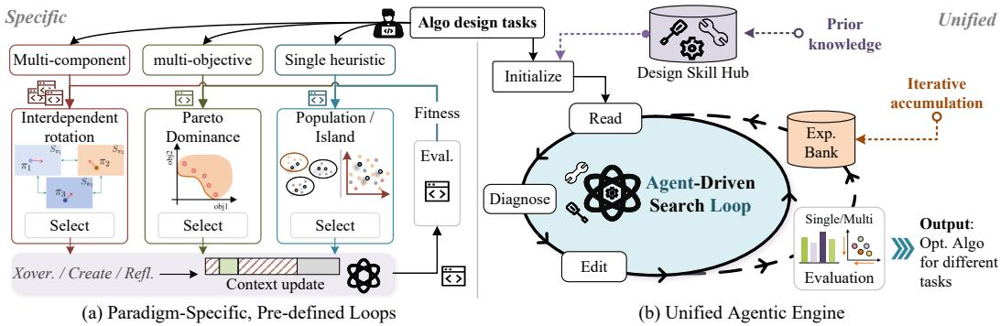  
Figure 1: Comparison of search paradigms in LLM-driven AAD. (a) Conventional methods rely on rigid, task-specific pipelines with pre-defined loops and passive LLM sampling, leading to framework fragmentation. (b) AlgoEvo decouples the search loop via a design skill hub and experience bank, enabling an autonomous agent to handle diverse optimization paradigms through interactive tool use and iterative knowledge accumulation.

To address these architectural and memory constraints, we present AlgoEvo, an agentic framework that replaces predefined prompt completion with an interactive, self-evolving discovery loop. Rather than following a rigid schedule, AlgoEvo empowers an autonomous agent to direct the discovery process, dynamically determining when to inspect code, run diagnostic analyses, edit components, or evaluate candidates. Operating at the core of this flexible loop, the design skill hub expands the boundaries of automated design by decoupling paradigm-specific knowledge from the search mechanism, allowing a unified agentic process to seamlessly span single-objective, multi-objective, and multi-component tasks without structural modification. Concurrently, the hierarchical experience mechanism deepens optimization within individual tasks and across generations by transforming historical search trajectories into structured experience cards, organizing them into a task-level tree, and retrieving context-relevant insights to guide subsequent iterations. Through this synergy, the framework elevates automated algorithm discovery from isolated trial-and-error routines into a cu mulative, self-improving scientific process (Figure 1b).

Our main contributions can be summarized as follows:

• We propose AlgoEvo, an end-to-end framework for automated algorithm discovery that integrates an agentic search loop with the design skill hub. Instead of embedding a large language model within a predefined evolutionary pipeline, AlgoEvo delegates the discovery process to an autonomous agent that dynamically reads, edits, diagnoses, and evaluates algorithmic code across single-objective, multi-objective, and multi-component settings.

• We develop a hierarchical experience mechanism that transforms historical search trajectories into structured experience cards and organizes them through a task-level tree for context-aware retrieval. It accumulates and reuses algorithmic experience, ensuring that prior knowledge continually contributes to the evolution and transfer of solutions across discovery processes.

• We conduct extensive experiments across diverse algorithm-design tasks spanning singleobjective, multi-objective, and multi-component settings. AlgoEvo matches or surpasses strong specialized baselines, including FunSearch, EoH, MEoH, E2OC, and MOTIF, while substantially reducing environment evaluations and verifying robust capabilities for continual improvement and knowledge transfer.

## 2 AUTOMATED ALGORITHM DISCOVERY

Automated algorithm discovery seeks to synthesize executable code or heuristic programs for target optimization problems (Liu et al., 2026b; Hu & Zhang, 2026). Depending on the domain, this ranges from single optimization heuristics to multi-objective strategies and interacting operators for complex systems. Across these settings, the discovery process navigates a candidate program space guided by task-specific evaluations. We formalize this problem setting, denoted as a discovery task T, as follows.

Definition 2.1 (Domain and Instance). An optimization domain D is characterized by an instance space $\lambda _ { d } ,$ a solution space $\mathcal { V } _ { d } .$ , and a task objective $f _ { d } : \mathcal { X } _ { d } \times \mathcal { Y } _ { d }  \mathbb { R }$ . For an instance $\mathbf { x } \in \mathcal { X } _ { d }$ with feasible set $\mathcal { V } _ { d } ( \mathbf { x } ) \subseteq \bar { \mathcal { V } } _ { d } .$ , the underlying optimization problem is

$$
\mathbf { y } ^ { * } = \arg \operatorname* { m i n } _ { \mathbf { y } \in \mathcal { Y } _ { d } ( \mathbf { x } ) } f _ { d } ( \mathbf { x } , \mathbf { y } ) .\tag{1}
$$

Definition 2.2 (Solver and Algorithm). A solver s generates a solution using a collection of designable strategies $\mathbf { I I } = \left( \pi _ { 1 } , \ldots , \pi _ { K } \right)$ with $\pi _ { k } \in { S } _ { k }$ , where $S _ { k }$ is the search space of the k-th strategy. Each strategy may represent a scoring rule, construction policy, neighborhood operator, penalty update mechanism, or another component. The induced algorithm space is $\begin{array} { r } { S = S _ { 1 } \times \cdots \times } \end{array}$ $\boldsymbol { \mathcal { S } } _ { K }$ , where $K = 1$ corresponds to single-heuristic design and $K > 1 ~ \mathrm { t o }$ multi-component design with strategies optimized jointly. The solver’s output on instance x is $s ( \mathbf { x } \mid \pi )$

Definition 2.3 (Algorithm Optimization). The performance of an algorithm Π on instance x is measured by

$$
F _ { d } ( \mathbf { x } \mid \boldsymbol { \Pi } ) = \phi _ { d } \left( f _ { d } \left( \mathbf { x } , s ( \mathbf { x } \mid \boldsymbol { \Pi } ) \right) \right) ,\tag{2}
$$

where $\phi _ { d }$ maps the task-specific evaluation to a scalar measure, i.e., the objective value for singleobjective tasks or a scalar indicator such as hypervolume for multi-objective tasks. We normalize the direction so that smaller $F _ { d }$ is better, and define the discovery objective as

$$
\Pi ^ { * } = \arg \operatorname* { m i n } _ { \Pi \in { \cal S } } \mathbb { E } _ { \mathbf { x } \sim \mathcal { X } _ { d } } \left[ F _ { d } ( \mathbf { x } \mid \Pi ) \right] ,\tag{3}
$$

subject to a computational budget B bounding evaluation and discovery resources.

## 3 ALGOEVO: SELF-EVOLVING AGENTIC ALGORITHM DISCOVERY

AlgoEvo formulates automated algorithm design as an agentic discovery process over the algorithm space S. Unlike conventional pipelines with fixed generation-and-evaluation cycles, an autonomous agent dynamically inspects, modifies, evaluates, and diagnoses algorithms based on runtime feedback (Figure 2). This process is supported by two complementary components: the design skill hub, which provides paradigm-specific execution contracts to let a single loop span single-objective, multi-objective, and multi-component tasks; and the hierarchical experience bank, which stores distilled trajectories and retrieves context-relevant insights to guide exploration. Through this synergy, flexible agentic actions and experience-driven selection drive both intra-task optimization and continual cross-task self-evolution.

## 3.1 AGENTIC SEARCH LOOP

AlgoEvo explores the algorithm space through an agent-driven loop. Unlike rigid pipelines with predefined generation-evaluation cycles, the agent dynamically decides its execution trajectory: at each iteration, it observes the discovery state, selects and executes an operation, and processes the feedback until the budget is exhausted or it terminates.

At step t, the discovery state is $s _ { t } = ( \Pi _ { t } , \mathcal { C } _ { t } , \mathcal { E } _ { t } , F _ { d } ( \textbf x | \textbf { \Pi } \Pi _ { t } ) )$ , comprising the current algorithm $\Pi _ { t } .$ , working context $\mathcal { C } _ { t } ,$ , experience bank $\mathcal { E } _ { t } ^ { { \mathrm { ~ ~ } } } { } ^ { \xi }$ , and performance feedback $F _ { d } ( \bar { \cdot } )$ . The working context maintains code, recent modifications, diagnostic observations, and intermediate reasoning.

Given $s _ { t - 1 }$ , the agent selects an action $a _ { t }$ to inspect code, modify a strategy, run a diagnosis, or evaluate a candidate, thus determining both the operation and its timing. Executing $a _ { t }$ yields a transition $\tau _ { t } = ( s _ { t - 1 } , a _ { t } , r _ { t } , s _ { t } )$ . When $a _ { t }$ updates the algorithm from $\Pi _ { t - 1 }$ to $\Pi _ { t } ,$ the immediate reward is the performance improvement

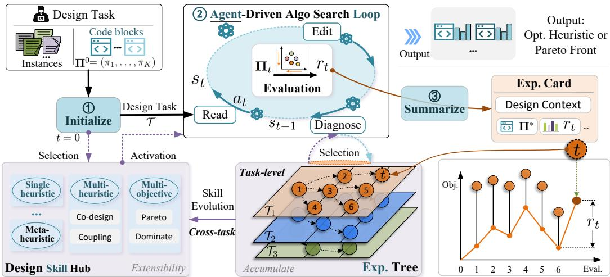  
Figure 2: Overview of AlgoEvo. Given a target design task, (1) the Design Skill Hub activates the appropriate algorithm design paradigm; (2) an autonomous agent drives the discovery process through an interactive search loop of code inspection, diagnosis, editing, and evaluation; and (3) performance feedback generates structured experience cards. These cards populate a task-level experience tree that guides ongoing exploration, while successful patterns accumulate across tasks to continually evolve the skill hub.

$$
r _ { t } = F _ { d } ( \mathbf { x } \mid \Pi _ { t - 1 } ) - F _ { d } ( \mathbf { x } \mid \Pi _ { t } ) ,\tag{4}
$$

where $r _ { t } > 0$ denotes improvement.

Maximizing the cumulative improvement $\textstyle \sum _ { t = 1 } ^ { T } r _ { t }$ telescopes to minimizing the final performance $F _ { d } ( \mathbf { x } \mid \mathbf { I } _ { T } )$ , thereby recovering the global objective in Eq. 3. Rather than following a fixed cycle, the agent interleaves diagnosis, modification, and evaluation, invoking targeted analysis when bottlenecks arise and structural edits when supported by evidence.

## 3.2 DESIGN SKILL HUB

The algorithm space S specifies what can be designed, but its structure is paradigm-dependent. A single-objective constructive heuristic, a multi-objective evolutionary operator, and a coupled destroy-repair system differ in the roles their strategies play, the interfaces they expose, and the principles that make them effective. Encoding these differences into the search procedure would yield a separate pipeline for each paradigm, reproducing the fragmentation we seek to avoid. Algo-Evo therefore externalizes them as pluggable design skills in a shared design skill hub $S _ { \mathrm { h u b } }$ , so that a new paradigm is supported by supplying an additional skill rather than by modifying the engine.

A design skill declares (i) the roles of the designable strategies in $\mathbf { I I } = \left( \pi _ { 1 } , \ldots , \pi _ { K } \right)$ , (ii) their code interfaces, (iii) the principles that guide valid modifications, and (iv) the task-specific evaluation conventions. Together, these fix the constraints and inductive bias of the search over $s ,$ while the search mechanism remains unchanged. Each skill follows a life cycle: it is selected and activated when a task begins, and refined once the task completes.

Selection and activation (t = 0). At task initialization, the hub matches the task to the skill whose declared conditions it satisfies and activates it in the agent’s context. The agent then uses the skill to interpret the design roles, reason about valid modifications, and construct algorithms within the corresponding strategy spaces $\boldsymbol { \mathcal { S } } _ { 1 } , \ldots , \boldsymbol { \mathcal { S } } _ { K }$ . Because the paradigm is carried by the skill rather than the loop, the same engine supports all three design settings by changing the skill alone.

Evolution $\left( t \right. = \left. T \right)$ . At task completion, the evidence accumulated during discovery is consolidated into the experience bank; the skill is not updated within a single task, so evolution is triggered only across tasks. Each skill defines the paradigm under which experiences are accumulated, so that retrieved experiences are interpreted within the corresponding design context. When experiences from at least two distinct tasks consistently support an effective design pattern, the pattern is abstracted back into the skill. The hub therefore evolves with the tasks it supports, so that later tasks start from a stronger prior. A skill may also encode methodological knowledge from existing algorithm-design approaches, inheriting their inductive bias while retaining the autonomous execution process.

## 3.3 HIERARCHICAL EXPERIENCE BANK

The design experiences produced by the agentic loop are organized in a hierarchical experience bank E with three levels: experience cards, a task-level experience tree, and cross-task consolidation.

Level 1: Experience cards. The agent’s actions differ in whether they yield a performance signal. Evaluation produces the reward $r _ { t }$ of Eq. 4, while actions that read, modify, diagnose, reason, or reflect change the algorithm or context without producing one. The bank is therefore updated at evaluation events, each distilled into an experience card recording the design context, the modification, the reward, and the rationale. Cards are the basic units of the bank and persist across evaluations and tasks.

Level 2: Experience tree. Cards from the same task form an experience tree, where nodes are cards and edges represent derived-from relationships. The tree is traversed using the four operations of MCTS (Swiechowski et al., 2023).<sup>´</sup>

Selection. A card is selected to guide the next design decision. Each node v maintains a visit count $n ( v , q )$ and a mean reward ${ \bar { r } } ( v \mid q )$ under the current situation $q ,$ and selection maximizes the upper confidence bound

$$
\mathrm { U C B } ( v \mid q ) = \bar { r } ( v \mid q ) + c \sqrt { \frac { 2 \ln N } { n ( v , q ) } } ,\tag{5}
$$

where $N$ is the tree-level visit statistic and c controls the exploration-exploitation trade-off (Chu et al., 2011). The situation $q$ is a set of conditions summarizing the current search state, detected from the discovery state $s _ { t }$ and recent feedback. It may contain any subset of stagnation, bottleneck, coupling, and sparse front; several conditions can hold at once, so that the agent retrieves experience relevant to any of them. When $n ( v , q ) = 0$ , the global mean of v serves as a prior with an exploration incentive.

Expansion. When a design decision yields a verified candidate, its card is attached as a child of the card it evolved from.

Evaluation. The candidate is evaluated, producing the reward $r _ { t }$ of Eq. 4.

Backpropagation. The reward is propagated to the ancestors of the new node $v _ { t } ,$ , so that a design decision is credited for the outcomes of the candidates it produced. Each ancestor v maintains the number of evaluations in its subtree $m ( v )$ and the accumulated reward $S ( v )$ , updated as $m ( v ) $ $m ( v ) + 1$ and $S ( v ) \gets S ( v ) + r _ { t }$ . The subtree value $\bar { R } ( v ) = S ( v ) / m ( \dot { v } )$ estimates the average reward of the design direction initiated at $v \colon$ a high value indicates a direction that has consistently produced strong descendants, biasing selection toward promising regions of the tree.

Level 3: Cross-task consolidation. The experience tree captures knowledge within a single task; across tasks, the bank accumulates broader evidence. When a design pattern is supported by effective decisions in at least two tasks, it is abstracted into the corresponding design skill, transferring concrete experience into paradigm-level knowledge.

## 3.4 EXPERIENCE ACCUMULATION AND SELF-EVOLUTION

The self-evolution of AlgoEvo links local intra-task search with global cross-task generalization through a feedback loop between the experience bank and the design skill hub, as summarized in Algorithm 1. Guided by the skill hub, the agent matches task conditions, loads relevant historical cards, and assesses the current search situation $q$ derived from state feedback. It then employs situational UCB to balance exploration and exploitation across the experience tree, executing actions that refine candidate algorithms. Every evaluation outcome is distilled into a structured experience card recording the design modifications and performance reward, which expands the tree and propagates feedback to ancestral nodes to reinforce successful local paths.

Algorithm 1 Agentic Algorithm Discovery   
Require: Design task T, design skill hub $S _ { \mathrm { h u b } }$ , experience bank E, evaluation bud  
get $B$   
Ensure: Optimized algorithm $\mathbf { H } ^ { * }$   
1: σ ← match $( \mathcal { T } , S _ { \mathrm { h u b } } )$ ; initialize experience tree; load relevant cards from $\mathcal { E }$   
2: repeat   
3: Detect current search situation $q$ from state $s _ { t }$ and feedback   
4: Select experience node v ← arg max<sub>v</sub>′ $\operatorname { U C B } ( v ^ { \prime } \mid q )$ ▷ Selection   
5: Execute agent action a ← agent(v) guided by retrieved experience   
6: if a evaluates a candidate algorithm then   
7: Distill evaluation outcome into a new experience card c ← card(a)   
8: Add card to bank: ${ \mathcal { E } } \gets { \mathcal { E } } \cup \{ c \}$   
9: Attach child node: child(v) ← c ▷ Expansion   
10: Compute performance reward r ← reward(c) ▷ Evaluation   
11: Backpropagate reward to ancestors: anc(c) += r ▷ Backpropagation   
12: end if   
13: until budget $B$ is exhausted or agent terminates   
14: Select optimal algorithm Π<sup>∗</sup> ← arg min<sub>Π</sub> perf(Π)   
15: Consolidate effective cross-task patterns into $S _ { \mathrm { h u b } }$   
16: return Π<sup>∗</sup>

Beyond single-task adaptation, the framework achieves cumulative evolution via cross-task knowledge consolidation. Validated heuristic patterns that consistently prove effective across multiple distinct problems are abstracted and integrated directly into the centralized skill hub. This hierarchical propagation allows the overarching discovery engine to continuously enhance its foundational capabilities and transfer expertise to new domains without requiring manual redesign or structural modifications.

## 4 EXPERIMENTS

## 4.1 EXPERIMENTAL SETUP

Benchmark. The benchmark comprises six problems across three paradigms, with objectives, instance sets, and code contracts detailed in Appendix C: constructive heuristic design for TSP and CVRP, multi-objective design for Bi-TSP and Bi-FJSP, and multi-component co-design for CVRP-DR and FJSP 4-Ops (Liu et al., 2026a; Chen et al., 2023; Kiet et al., 2025; Brandimarte, 1993). Each task features disjoint training and held-out test sets, with all instances, random seeds, and evaluation scripts publicly released.

Baselines and protocol. We compare against state-of-the-art methods across paradigms: nearestneighbor heuristics alongside LLM-AHD methods including EoH (Liu et al., 2024a), ReEvo (Ye et al., 2024), MCTS-AHD (Zheng et al., 2025), and FunSearch (Romera-Paredes et al., 2024) for TSP and CVRP; MEoH (Yao et al., 2025), NSGA-II (Deb et al., 2002), and MOEA/D (Zhang & Li, 2007) for multi-objective tasks; and co-design frameworks MOTIF (Kiet et al., 2025) and E2OC (Qiu et al., 2026a), alongside EoH variants Synergy and Rotating-EoH, for multi-component tasks. All methods run under a unified protocol on the LLM4AD platform (Liu et al., 2024b), employing identical instance splits and evaluation entry points, a budget of 500 evaluations per seed, and three random seeds. We use gpt-4o-mini for TSP and CVRP and DeepSeek-V4-Flash for the remaining tasks. Appendix C details individual configurations.

Metrics. For multi-objective results, a shared global normalization basis ensures comparability of HV and IGD within each problem. Appendix C formalizes these metrics and notes that multiobjective rows report training-instance quality since the final algorithm is fixed post-run. In Table 1, the evaluation column reports average call counts per design task, and cumulative token usage (in millions) is measured, with superscript e denoting values inferred from baseline runs retaining usage records. All reported dispersions denote sample standard deviations over random seeds.

## 4.2 MAIN RESULTS

To test whether a single agentic engine can match or surpass paradigm-specialized baselines, we evaluate AlgoEvo on all six tasks, changing only the activated design skill.

Single-heuristic design. On TSP and CVRP AlgoEvo attains the best training and test quality, ahead of the strongest LLM-AHD baseline by 4 to 7% and of the nearest-neighbour heuristic by 12.3% on TSP. The margins are not bought with budget: the baselines consume the full 500- evaluation allowance and remain behind, while AlgoEvo commits its design after about 35 eval uations, a thirteenth of the allowance.

Table 1: Performance on all six tasks. On the quality metrics the best result is bold and the runner-up underlined; on the Evaluations and Tokens columns, where smaller is better, the best result is bold. Hypervolume is the only metric for which larger is better. The columns are defined in Section 4.1.
<table><tr><td>Single heuristic</td><td>Method</td><td>Train</td><td>Test</td><td>Evals</td><td>Tokens (M)</td></tr><tr><td rowspan="6">TSP</td><td>NN</td><td>6.824</td><td>7.990</td><td></td><td></td></tr><tr><td>EoH</td><td>6.309 ± 0.043</td><td>7.392 ± 0.058</td><td>500</td><td>4.1</td></tr><tr><td>ReEvo</td><td>6.453 ± 0.097</td><td>7.699 ± 0.220</td><td>500</td><td>4.3</td></tr><tr><td>MCTS-AHD</td><td>6.331 ± 0.040</td><td>7.337 ± 0.028</td><td>500</td><td>3.8</td></tr><tr><td>FunSearch</td><td>6.465 ± 0.023</td><td>7.484 ± 0.051</td><td>500</td><td>3.2</td></tr><tr><td>AlgoEvo</td><td>5.986 ± 0.11</td><td>7.007±0.04</td><td>39</td><td>2.9</td></tr><tr><td rowspan="6">CVRP</td><td>NN</td><td>13.611</td><td>26.283</td><td></td><td></td></tr><tr><td>EoH</td><td>13.537 ± 0.028</td><td>26.148 ± 0.169</td><td>500</td><td>4.1</td></tr><tr><td>ReEvo</td><td>13.403 ± 0.129</td><td>25.950 ± 0.517</td><td>500</td><td>4.3</td></tr><tr><td>MCTS-AHD</td><td>13.236 ± 0.302</td><td>25.967 ± 0.447</td><td>500</td><td>4.1</td></tr><tr><td>FunSearch</td><td>13.584 ± 0.030</td><td>26.270 ± 0.013</td><td>500</td><td>3.9</td></tr><tr><td>AlgoEvo</td><td>12.698±0.39</td><td>24.150 ± 0.40</td><td>35</td><td>1.9</td></tr><tr><td>Multi-objective</td><td>Method</td><td>HV↑</td><td>IGD↓</td><td>Evals</td><td>Tokens (M)</td></tr><tr><td rowspan="4">Bi-TSP</td><td>MEoH</td><td>0.760 ± 0.020</td><td>0.077 ± 0.018</td><td>500</td><td>4.2</td></tr><tr><td>NSGA-II</td><td>0.614 ± 0.067</td><td>0.215 ± 0.067</td><td>500</td><td>3.6</td></tr><tr><td>MOEA/D</td><td>0.314 ± 0.180</td><td>0.601 ± 0.172</td><td>500</td><td>3.5</td></tr><tr><td>AlgoEvo</td><td>0.827± 0.012</td><td>0.036 ± 0.003</td><td>36</td><td>2.6</td></tr><tr><td rowspan="4">Bi-FJSP</td><td>MEoH</td><td>0.903 ± 0.051</td><td>0.143 ± 0.077</td><td>500</td><td>6.3</td></tr><tr><td>NSGA-II</td><td>0.899 ± 0.048</td><td>0.149 ± 0.067</td><td>500</td><td>5.7</td></tr><tr><td>MOEA/D</td><td>0.792 ± 0.002</td><td>0.286 ± 0.000</td><td>500</td><td>5.2</td></tr><tr><td>AlgoEvo</td><td>0.911 ±0.083</td><td>0.162 ± 0.125</td><td>33</td><td>2.4</td></tr><tr><td>Multi-component</td><td>Method</td><td>Train</td><td>Test</td><td>Evals</td><td>Tokens (M)</td></tr><tr><td rowspan="6">CVRP-DR</td><td>Standard</td><td>10.791</td><td>10.558</td><td></td><td></td></tr><tr><td>MOTIF</td><td>9.156 ± 0.164</td><td>9.204 ± 0.114</td><td>500</td><td>317.1</td></tr><tr><td>E2OC</td><td>9.920 ± 0.078</td><td>9.837 ± 0.098</td><td>500</td><td>470.0</td></tr><tr><td>Synergy</td><td>8.928 ± 0.075</td><td>9.112 ± 0.043</td><td>500</td><td>289.6</td></tr><tr><td>Rotating-EoH</td><td>8.998 ± 0.067</td><td>9.178 ± 0.166</td><td>500</td><td>337.9</td></tr><tr><td>AlgoEvo</td><td>8.860±0.037</td><td>8.999±0.036</td><td>271</td><td>139.2</td></tr><tr><td rowspan="6"></td><td>Expert</td><td>712.5 ± 5.0</td><td>2137.9 ± 12.0</td><td></td><td></td></tr><tr><td>MÓTIF</td><td>648.07 ± 3.43</td><td>1952.00 ± 23.41</td><td>500</td><td>584.7</td></tr><tr><td>E2OC</td><td>663.47 ± 7.62</td><td>2019.20 ± 44.53</td><td>500</td><td>699.3</td></tr><tr><td>Synergy</td><td>646.10 ± 2.95</td><td>1965.20 ± 14.81</td><td>500</td><td>460.7</td></tr><tr><td>Rotating-EoH</td><td>645.10 ± 3.37</td><td>1954.87 ± 26.14</td><td>505.4</td><td>518.5</td></tr><tr><td>AlgoEvo</td><td>646.4± 3.3</td><td>1927.5±38.5</td><td>275</td><td>118.1</td></tr></table>

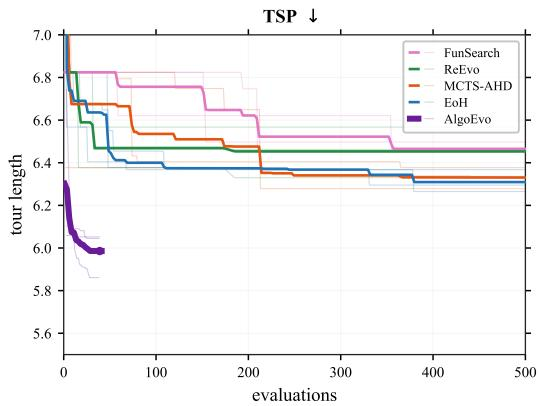  
(a) TSP constructive heuristic design.

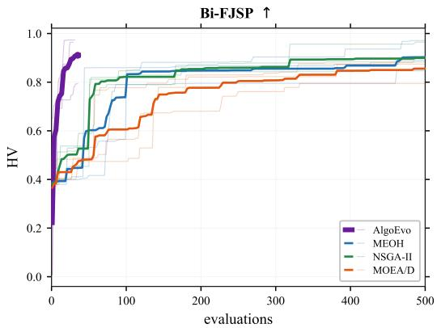  
(b) Bi-FJSP multi-objective heuristic design.  
Figure 3: Best-so-far quality as a function of the evaluation budget on TSP and Bi-FJSP. Thin lines are individual seeds; bold lines are means. AlgoEvo reaches its final quality within the first tens of evaluations and then stays flat, whereas the baselines consume their full budget.

Multi-objective design. Evaluation focuses on training instances since the designed unit is fixed post-run. AlgoEvo attains the best hypervolume on both tasks and the best inverted generational distance on Bi-TSP, while trailing MEoH on front proximity for Bi-FJSP. The archives reveal why: our front reaches low-objective corners missed by full-budget baselines, whereas the MOEA/D front nearly collapses to a point (Figure 6).

Multi-component design. Here the components are coupled and no single unit suffices. AlgoEvo obtains the best result of any method on both splits of CVRP-DR and the best held-out result on FJSP four-operator co-design, where it also improves on the expert operators. Unlike the four tasks above, it draws on most of the allowance rather than stopping early, so the margins come at or below the budget the baselines spend, and they are widest on the held-out sets, which is where a design has to transfer rather than to fit.

## 4.3 ANALYSIS AND DISCUSSION

Sample efficiency. AlgoEvo reaches final quality within tens of evaluations without further improvement, whereas baselines keep progressing toward full budget without catching up (Figure 3). That curvature is not an artefact of early stopping: the agent continues proposing changes until the harness limit is reached, and only a minority of proposals improve on the incumbent, so the flat tail records the absence of further improvement rather than a deliberate end to search.

Experience verification. Within a task, the experience bank grows as the agent evaluates candidates: it reuses earlier design decisions rather than exploring from scratch, and cost decreases as cards accumulate. The agent reaches its final quality well before the budget is exhausted. Experience also carries over between successive runs of the same task: Table 2 compares a cold start (from the default heuristic) with a warm start (initialized from the best algorithm of a previous run) on TSP. The warmstarted agent consistently improves over the cold start while reducing the variance, showing

Table 2: Effect of accumulated experience on TSP. cold starts from the default heuristic; warm from the best algorithm of a previous run.
<table><tr><td rowspan="2">Seed</td><td colspan="2">Cold (no exp.)</td><td colspan="2">Warm (with exp.)</td></tr><tr><td>Tour</td><td>Evals</td><td>Tour</td><td>Evals</td></tr><tr><td>2025</td><td>5.006</td><td>45</td><td>4.819</td><td>52</td></tr><tr><td>2026</td><td>4.879</td><td>48</td><td>4.810</td><td>28</td></tr><tr><td>2027</td><td>4.997</td><td>51</td><td>4.794</td><td>41</td></tr><tr><td>Mean</td><td>4.961</td><td>48</td><td>4.808</td><td>40</td></tr></table>

that transferring executable code is more effective than injecting abstract strategy descriptions.

Multi-round progressive accumulation Table 3 isolates the contribution of the experience bank across successive optimization rounds with identical budgets. Round 0 initializes from a default heuristic with an empty bank, and each subsequent round resumes from the preceding best code, with $\pmb { \Delta }$ measured against Round 0. Both problems exhibit steady, monotonic improvement, advancing from 4.8928 to 4.7995 in tour length and 0.1549 to 0.1862 in HV. Because the evaluation budget remains fixed, this progressive enhancement confirms

Table 3: Performance across successive optimization rounds on TSP and Bi-objective FJSP.
<table><tr><td colspan="3">TSP constructive</td><td colspan="2">Bi-objective FJSP</td></tr><tr><td>Round</td><td>Tour ↓</td><td>Δ</td><td>HV↑</td><td>Δ</td></tr><tr><td>0</td><td>4.8928</td><td></td><td>0.1549</td><td></td></tr><tr><td>1</td><td>4.8011</td><td>-1.88%</td><td>0.1688</td><td> $+ 8 . 9 7 \%$ </td></tr><tr><td>2</td><td>4.8011</td><td>-1.88%</td><td>0.1832</td><td> $+ 1 8 . 2 7 \%$ </td></tr><tr><td>3</td><td>4.8003</td><td>-1.89%</td><td>0.1840</td><td> $+ 1 8 . 7 9 \%$ </td></tr><tr><td>4</td><td>4.7995</td><td>-1.91%</td><td>0.1862</td><td> $+ 2 0 . 2 1 \%$ </td></tr></table>

that accumulated experience actively guides search toward superior regions. Furthermore, promoting validated patterns into the design skill hub reinforces search stability, as detailed in Appendix E.3.

Cross-task transfer. The experience bank facilitates knowledge transfer across problem settings. As shown in Table 4, transferring distilled patterns from single-objective CVRP to multi-component CVRP-DR allows AlgoEvo to reuse edge-scoring rules within the constructor. This cross-task transfer enhances solution quality and lowers the mean cost from 10.314 to 9.816 (surpassing the coldstart baseline of 10.791), demonstrating that the hierarchical experience mechanism enables rapid adaptation and superior performance on complex downstream tasks.

Table 4: Cross-problem experience transfer. A bank of validated design experience from the source task is made available to the target task, against a cold start that differs only in the absence of that experience; the better arm is bold.
<table><tr><td>Source → target</td><td></td><td>Metric Baseline</td><td>Cold start</td><td>With experience Change</td><td></td></tr><tr><td> $\mathrm { C V R P } \to \mathrm { C V R P \mathrm { - D R } }$ </td><td>cost↓</td><td>10.791</td><td> $1 0 . 3 1 4 \pm 0 . 3 4 5$ </td><td> $\mathbf { 9 . 8 1 6 \pm 0 . 6 4 2 }$ </td><td> $- 4 . 8 \%$ </td></tr><tr><td> $\mathrm { T S P }  \mathrm { B i \mathrm { - } T S P }$ </td><td>HV↑</td><td>152.2</td><td> $3 3 6 . 5 \pm 1 3 0 . 6$ </td><td> $\mathbf { 3 5 2 . 2 \pm 1 4 1 . 6 }$ </td><td> $+ 4 . 7 \%$ </td></tr></table>

Action behavior. We instrument the framework to log every tool invocation and analyze the resulting trajectories on CVRP-DR across three seeds. Each call is classified as read, edit, diagnose, or evaluation, and Figure 4 summarizes their evolution over time. The three seeds exhibit different search styles: one is edit-driven, another is diagnosis-driven, and the third mixes both. The diagnosis-driven seed reaches the best cost, consistent with the diagnosis-guided design principle, in which investing in structural attribution before editing avoids wasted modifications.

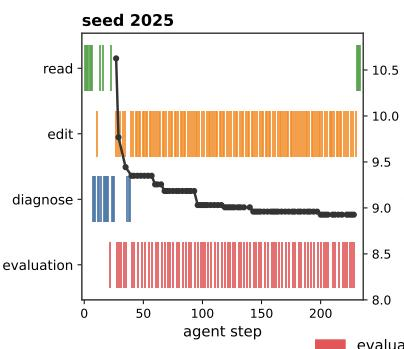

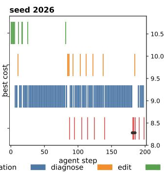

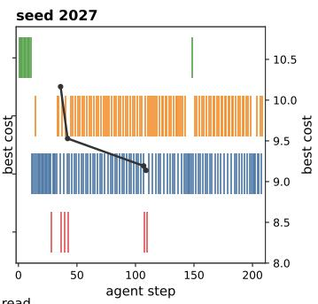  
Figure 4: Agent behavior trajectories on CVRP-DR across three seeds. Each row is an action type (evaluation, diagnose, edit, read); the black curve shows the best cost achieved so far.

## 5 CONCLUSION

AlgoEvo unifies automated algorithm design through an interactive, agent-driven loop integrating a pluggable design skill hub and a hierarchical experience bank, enabling a single engine to address single-objective, multi-objective, and multi-component tasks. Across six benchmark problems, empirical results show that multi-round intra-task accumulation provides steady performance improvements, and cross-task knowledge transfer facilitates effective heuristic adaptation across distinct settings. In addition, the framework attains competitive solution quality within a restricted evaluation budget compared to existing baselines. Limitations include increased token overhead in complex multi-component settings and reduced transfer efficacy outside aligned problem families, pointing toward directions for future research in scalable automated algorithm discovery.

## REFERENCES

Paolo Brandimarte. Routing and scheduling in a flexible job shop by tabu search. Annals of Operations Research, 41(3):157–183, 1993.

Edmund K. Burke, Michel Gendreau, Matthew Hyde, Graham Kendall, Gabriela Ochoa, Ender Ozcan, and Rong Qu. Hyper-heuristics: A survey of the state of the art. <sup>¨</sup> Journal of the Operational Research Society, 64(12):1695–1724, 2013.

Zouying Cao, Jiaji Deng, Li Yu, Weikang Zhou, Zhaoyang Liu, Bolin Ding, and Hai Zhao. Remember me, refine me: A dynamic procedural memory framework for experience-driven agent evolution. In Findings ofthe Associationfor Computational Linguistics (ACL), pp. 16803–16822, 2026.

Jinbiao Chen, Zizhen Zhang, Zhiguang Cao, Yaoxin Wu, Yining Ma, Te Ye, and Jiahai Wang. Neural multi-objective combinatorial optimization with diversity enhancement. In Advances in Neural Information Processing Systems (NeurIPS), volume 36, pp. 39176–39188, 2023.

Nuo Chen, Yicheng Tong, Yuzhe Yang, Yufei He, Xueyi Zhang, Zou Qingyun, Qian Wang, and Bingsheng He. Diversity collapse in multi-agent LLM systems: Structural coupling and collective failure in open-ended idea generation. In Findings of the Association for Computational Linguistics (ACL), pp. 251–306, 2026.

Wei Chu, Lihong Li, Lev Reyzin, and Robert Schapire. Contextual bandits with linear payoff functions. In Proceedings ofthe 14th International Conference on Artificial Intelligence and Statistics (AISTATS), pp. 208–214, 2011.

Carlos A. Coello Coello and Nareli Cruz Cortes. Solving multiobjective optimization problems´ using an artificial immune system. Genetic Programming and Evolvable Machines, 6(2):163– 190, 2005.

Pham Vu Tuan Dat, Long Doan, and Huynh Thi Thanh Binh. HSEvo: Elevating automatic heuristic design with diversity-driven harmony search and genetic algorithm using LLMs. In Proceedings ofthe AAAI Conference on Artificial Intelligence (AAAI), volume 39, pp. 26931–26938, 2025.

Kalyanmoy Deb, Amrit Pratap, Sameer Agarwal, and T. Meyarivan. A fast and elitist multiobjective genetic algorithm: NSGA-II. IEEE Transactions on Evolutionary Computation, 6(2):182–197, 2002.

Jingzhi Gong, Ruizhen Gu, Zhiwei Fei, Yazhuo Cao, Lukas Twist, Alina Geiger, Shuo Han, Dominik Sobania, Federica Sarro, and Jie M Zhang. SkillMOO: Multi-objective optimization of agent skills for software engineering. arXiv preprint arXiv:2604.09297, 2026.

Qingyan Guo, Rui Wang, Junliang Guo, Bei Li, Kaitao Song, Xu Tan, Guoqing Liu, Jiang Bian, and Yujiu Yang. Connecting large language models with evolutionary algorithms yields powerful prompt optimizers. In Proceedings of the 12th International Conference on Learning Representations (ICLR), 2024.

Sirui Hong, Mingchen Zhuge, Jonathan Chen, Xiawu Zheng, Yuheng Cheng, Jinlin Wang, Ceyao Zhang, Steven Yau, Zijuan Lin, Liyang Zhou, et al. MetaGPT: Meta programming for a multiagent collaborative framework. In Proceedings of the 12th International Conference on Learning Representations (ICLR), 2024.

Qinglong Hu and Qingfu Zhang. Partition to evolve: Niching-enhanced evolution with LLMs for automated algorithm discovery. In Advances in Neural Information Processing Systems (NeurIPS), volume 38, 2026.

Nguyen Viet Tuan Kiet, Dao Van Tung, Tran Cong Dao, and Huynh Thi Thanh Binh. MOTIF: Multistrategy optimization via turn-based interactive framework. In arXiv preprint arXiv:2508.03929, 2025.

Yubo Li. Dynamic agent skills: A lifecycle survey and taxonomy of evolving skill libraries. arXiv preprint arXiv:2607.10113, 2026.

Fei Liu, Xialiang Tong, Mingxuan Yuan, Xi Lin, Fu Luo, Zhenkun Wang, Zhichao Lu, and Qingfu Zhang. Evolution of heuristics: Towards efficient automatic algorithm design using large language model. In Proceedings of the 41st International Conference on Machine Learning (ICML), pp. 32201–32223, 2024a.

Fei Liu, Rui Zhang, Zhuoliang Xie, Rui Sun, Kai Li, Xi Lin, Zhenkun Wang, Zhichao Lu, and Qingfu Zhang. LLM4AD: A platform for algorithm design with large language model. In arXiv preprint arXiv:2412.17287, 2024b.

Fei Liu, Yilu Liu, Qingfu Zhang, Xialiang Tong, and Mingxuan Yuan. EoH-S: Evolution of heuristic set using LLMs for automated heuristic design. In Proceedings of the AAAI Conference on Artificial Intelligence (AAAI), volume 40, pp. 37090–37098, 2026a.

Fei Liu, Yiming Yao, Ping Guo, Zhiyuan Yang, Xi Lin, Zhe Zhao, Xialiang Tong, Kun Mao, Zhichao Lu, Zhenkun Wang, et al. A systematic survey on large language models for algorithm design. ACM Computing Surveys, 58(8):1–32, 2026b.

Yuanzhe Liu, Ryan Deng, Tim Kaler, Xuhao Chen, Charles Leiserson, Yao Ma, and Jie Chen. Lessons learned: A multi-agent framework for code LLMs to learn and improve. In Advances in Neural Information Processing Systems (NeurIPS), volume 38, pp. 109172–109228, 2026c.

Zexi Liu, Jingyi Chai, Xinyu Zhu, Shuo Tang, Rui Ye, Bo Zhang, Lei Bai, and Siheng Chen. ML-Agent: Reinforcing LLM agents for autonomous machine learning engineering. arXiv preprint arXiv:2505.23723, 2025.

Manuel Lopez-Ib´ a´nez, J˜ er´ emie Dubois-Lacoste, Leslie P´ erez C´ aceres, Mauro Birattari, and Thomas´ Stutzle. The irace package: Iterated racing for automatic algorithm configuration.¨ Operations Research Perspectives, 3:43–58, 2016.

Jinghao Luo, Yuchen Tian, Chuxue Cao, Ziyang Luo, Hongzhan Lin, Kaixin Li, Chuyi Kong, Ruichao Yang, and Jing Ma. From storage to experience: A survey on the evolution of LLM agent memory mechanisms. In Findings ofthe Associationfor Computational Linguistics (ACL), pp. 41622–41652, 2026.

Jingwei Ni, Yihao Liu, Xinpeng Liu, Yutao Sun, Mengyu Zhou, Pengyu Cheng, Dexin Wang, Erchao Zhao, Xiaoxi Jiang, and Guanjun Jiang. Trace2Skill: Distill trajectory-local lessons into transferable agent skills. arXiv preprint arXiv:2603.25158, 2026.

Alexander Novikov, Ngan Vˆ u, Marvin Eisenberger, Emilien Dupont, Po-Sen Huang, Adam Zsolt˜ Wagner, Sergey Shirobokov, Borislav Kozlovskii, Francisco J. R. Ruiz, Abbas Mehrabian, et al. AlphaEvolve: A coding agent for scientific and algorithmic discovery. arXiv preprint arXiv:2506.13131, 2025.

Junhao Qiu, Xin Chen, Liang Ge, Liyong Lin, Zhichao Lu, and Qingfu Zhang. Evolving interdependent operators with large language models for multi-objective combinatorial optimization. In Proceedings of the 43rd International Conference on Machine Learning (ICML), 2026a.

Junhao Qiu, Haoyang Zhuang, Fei Liu, Jianjun Liu, and Qingfu Zhang. EvoDR: Evolving dispatching rules via large language model for dynamic flexible assembly flow shop scheduling. arXiv preprint arXiv:2601.15738, 2026b.

Bernardino Romera-Paredes, Mohammadamin Barekatain, Alexander Novikov, Matej Balog, M. Pawan Kumar, Emilien Dupont, Francisco J. R. Ruiz, Jordan S. Ellenberg, Pengming Wang, Omar Fawzi, Pushmeet Kohli, and Alhussein Fawzi. Mathematical discoveries from program search with large language models. Nature, 625(7995):468–475, 2024.

Gabriel Sarch, Lawrence Jang, Michael J Tarr, William W Cohen, Kenneth Marino, and Katerina Fragkiadaki. Vlm agents generate their own memories: Distilling experience into embodied programs of thought. In Advances in Neural Information Processing Systems (NeurIPS), volume 37, pp. 75942–75985, 2024.

Shuzheng Si, Haozhe Zhao, Yu Lei, Qingyi Wang, Dingwei Chen, Zhitong Wang, Zhenhailong Wang, Kangyang Luo, Zheng Wang, Gang Chen, et al. From context to skills: Can language models learn from context skillfully? arXiv preprint arXiv:2604.27660, 2026.

Hongwen Song and Song Wei. More skills, worse agents? skill shadowing degrades performance when expanding skill libraries. arXiv preprint arXiv:2605.24050, 2026.

Thomas Stutzle and Manuel L ¨ opez-Ib ´ a´nez. Automated design of metaheuristic algorithms. In˜ Handbook ofMetaheuristics, pp. 541–579. Springer, 2019.

Maciej Swiechowski, Konrad Godlewski, Bartosz Sawicki, and Jacek Ma<sup>´</sup> ndziuk. Monte carlo tree´ search: A review of recent modifications and applications. Artificial Intelligence Review, 56(3): 2497–2562, 2023.

Darshan Tank and Baran Nama. The regression tax: Decomposing why skills help and hurt LLM agents. arXiv preprint arXiv:2607.22520, 2026.

Niki van Stein and Thomas Back. LLaMEA: A large language model evolutionary algorithm for¨ automatically generating metaheuristics. IEEE Transactions on Evolutionary Computation, 29 (2):331–345, 2025.

Lei Wang, Chen Ma, Xueyang Feng, Zeyu Zhang, Hao Yang, Jingsen Zhang, Zhiyuan Chen, Jiakai Tang, Xu Chen, Yankai Lin, et al. A survey on large language model based autonomous agents. Frontiers of Computer Science, 18(6):186345, 2024a.

Xinyuan Wang, Chenxi Li, Zhen Wang, Fan Bai, Haotian Luo, Jiayou Zhang, Nebojsa Jojic, Eric Xing, and Zhiting Hu. Promptagent: Strategic planning with language models enables expertlevel prompt optimization. In Proceedings of the 12th International Conference on Learning Representations (ICLR), 2024b.

Zora Zhiruo Wang, Jiayuan Mao, Daniel Fried, and Graham Neubig. Agent workflow memory. arXiv preprint arXiv:2409.07429, 2024c.

Xingyu Wu, Sheng-hao Wu, Jibin Wu, Liang Feng, and Kay Chen Tan. Evolutionary computation in the era of large language model: Survey and roadmap. IEEE Transactions on Evolutionary Computation, 29(2):534–554, 2024.

Zidi Xiong, Yuping Lin, Wenya Xie, Pengfei He, Zirui Liu, Jiliang Tang, Himabindu Lakkaraju, and Zhen Xiang. How memory management impacts LLM agents: An empirical study of experiencefollowing behavior. In Proceedings ofthe 64th Annual Meeting ofthe Associationfor Computational Linguistics (ACL), pp. 623–645, 2026.

Wujiang Xu, Zujie Liang, Kai Mei, Hang Gao, Juntao Tan, and Yongfeng Zhang. A-Mem: Agentic memory for LLM agents. In Advances in Neural Information Processing Systems (NeurIPS), volume 38, pp. 17577–17604, 2026.

John Yang, Carlos Jimenez, Alexander Wettig, Kilian Lieret, Shunyu Yao, Karthik Narasimhan, and Ofir Press. SWE-agent: Agent-computer interfaces enable automated software engineering. In Advances in Neural Information Processing Systems (NeurIPS), volume 37, pp. 50528–50652, 2024.

Shunyu Yao, Fei Liu, Xi Lin, Zhichao Lu, Zhenkun Wang, and Qingfu Zhang. Multi-objective evolution of heuristic using large language model. In Proceedings of the AAAI Conference on Artificial Intelligence (AAAI), volume 39, pp. 27144–27152, 2025.

Haoran Ye, Jiarui Wang, Zhiguang Cao, Federico Berto, Chuanbo Hua, Haeyeon Kim, Jinkyoo Park, and Guojie Song. ReEvo: Large language models as hyper-heuristics with reflective evolution. In Advances in Neural Information Processing Systems (NeurIPS), volume 37, pp. 43571–43608, 2024.

Xunjian Yin, Xinyi Wang, Liangming Pan, Li Lin, Xiaojun Wan, and William Yang Wang. Godel¨ Agent: A self-referential agent framework for recursively self-improvement. In Proceedings of the 63rd Annual Meeting of the Association for Computational Linguistics (ACL), pp. 27890– 27913, 2025.

Chi Zhang, Yimin Liu, Xinze Chen, and Ping Ji. What keeps agent skills from being reusable? evidence from 138k SKILL.md files. In First Workshop on Agent Skills, 2026a.

Qingfu Zhang and Hui Li. MOEA/D: A multiobjective evolutionary algorithm based on decomposition. IEEE Transactions on Evolutionary Computation, 11(6):712–731, 2007.

Rui Zhang, Fei Liu, Xi Lin, Zhenkun Wang, Zhichao Lu, and Qingfu Zhang. Understanding the importance of evolutionary search in automated heuristic design with large language models. In Proceedings of the 17th International Conference on Parallel Problem Solving from Nature (PPSN XVII), pp. 185–202, 2024.

Zhiyao Zhang, Shenghao Wu, Xingyu Wu, and Kay Chen Tan. Semantics-aware bilevel co-evolution: Towards automated multicomponent algorithm design. arXiv preprint arXiv:2606.29953, 2026b.

Zhi Zheng, Zhuoliang Xie, Zhenkun Wang, and Bryan Hooi. Monte carlo tree search for comprehensive exploration in LLM-based automatic heuristic design. In Proceedings of the 42nd International Conference on Machine Learning (ICML), volume 267 of Proceedings ofMachine Learning Research, pp. 78338–78373, 2025.

Eckart Zitzler and Lothar Thiele. Multiobjective optimization using evolutionary algorithms—a comparative case study. In Proceedings of the 5th International Conference on Parallel Problem Solvingfrom Nature (PPSN V), pp. 292–301, 1998.

## AlgoEvo: Self-Evolving Agentic Search for Automated Algorithm Discovery

## APPENDIX CONTENTS

A Related Work 15   
B Method Details 16   
B.1 Agentic Design Process 17   
B.2 Discovery State and Actions 17   
B.3 Diagnosis as Search Direction Identification . 17   
B.4 Design Skill Hub 19   
B.5 Hierarchical Experience Bank 19   
B.6 From Experience to Reusable Design Knowledge 19   
C Benchmark and Evaluation Details 19   
D Design Space and Task Instantiation 21   
E Additional Experimental Results 23   
E.1 Convergence Under the Evaluation Budget . 23   
E.2 Pareto Archives on Multi-Objective Tasks 23   
E.3 Ablation of Knowledge Mechanisms 23   
F Further Analysis 24   
F.1 Method Skills and Methodological Transfer 24   
F.2 Representative Diagnosis-Guided Design Trajectory . 25   
F.3 Variation in Search Behavior 26   
F.4 Cross-Task Experience Transfer 27   
G Limitations and Future Work 27   
H Reproducibility Notes 28

## A RELATED WORK

AlgoEvo lies at the intersection of automated algorithm design, agentic software engineering, and knowledge-guided search. We therefore review related work from both the algorithm-design and general agent perspectives. The fundamental distinction is not merely whether an approach utilizes language models, tools, memory, or skills, but what is being searched, how the search state is defined, and how empirical feedback governs subsequent actions.

LLM-based Automated Algorithm and Heuristic Design. LLMs have recently enabled a powerful paradigm for automated algorithm and heuristic design (Liu et al., 2026b). FunSearch combines LLM-based program generation with evolutionary search, demonstrating the capacity of language models to discover programs with improved performance (Romera-Paredes et al., 2024). EoH formulates heuristic design as an iterative process of generating heuristic ideas and implementations and progressively improving them through evaluation (Liu et al., 2024a). ReEvo further introduces evolutionary refinement of LLM-generated heuristics, enabling iterative improvement of previously discovered designs (Ye et al., 2024). MCTS-AHD employs Monte Carlo tree search to structure the exploration of algorithm-design candidates (Zheng et al., 2025). In multi-objective settings, MEoH extends LLM-based heuristic design to multi-objective evolutionary search (Yao et al., 2025). Additional recent approaches include EvoPrompt, which connects LLMs with evolutionary algorithms for prompt optimization (Guo et al., 2024), LLaMEA, which uses LLMs to automatically generate metaheuristics (van Stein & Back, 2025), and HSEvo, which combines harmony search with ge-¨ netic algorithms via LLMs (Dat et al., 2025). EoH-S further extends EoH to heuristic set design (Liu et al., 2026a). These studies establish that LLMs can serve as effective generators and refiners of algorithmic ideas and executable implementations. However, their underlying search procedures and multi-component coordination policies remain bound to fixed, predefined protocols. Traditional automated configuration (e.g., irace (Lopez-Ib´ a´nez et al., 2016)) and recent multi-component frame-˜ works like MOTIF (Kiet et al., 2025) and E2OC (Qiu et al., 2026a) demonstrate that search strategies and cross-component interactions are critical, yet they typically instantiate coordination via static, algorithm-specific rules rather than adaptive control.

AlgoEvo builds upon these advances by treating both search control and component interaction as dynamic features of an adaptive design state. Rather than assuming a fixed design procedure, the agent determines dynamically whether to explore a new design, diagnose performance bottlenecks, perform targeted modifications, or jointly redesign coupled components. Thus, AlgoEvo comple ments candidate-level algorithm search with adaptive search over the design process itself.

Agentic Coding and Program Synthesis. Recent advances in LLM-based coding agents (e.g., SWE-agent (Yang et al., 2024), MetaGPT (Hong et al., 2024), and general software synthesis platforms (Novikov et al., 2025; Wang et al., 2024a)) demonstrate autonomous code generation, repository exploration, and iterative debugging. However, directly applying general-purpose coding agents to algorithm design encounters a fundamental mismatch: software agents optimize for functional correctness, syntactic validity, and test compliance based on static specifications. In algorithm discovery, by contrast, a syntactically flawless program frequently exhibits severe optimization bot tlenecks, poor search trajectories, or weak generalization across instances. Bridging across complex algorithmic paradigms requires navigating intricate search semantics and multi-component interactions that cannot be solved simply by employing a strong general-purpose coding agent. AlgoEvo overcomes this limitation by treating code merely as the implementation medium, whereas empirical optimization feedback across diverse problem instances acts as the primary state signal guiding structural redesign. The agentic interface is thus elevated into an optimization-driven design search, rather than functioning as a standard coding assistant.

Agentic Coding and Program Synthesis. Recent advances in LLM-based coding agents, such as SWE-agent (Yang et al., 2024), MetaGPT (Hong et al., 2024), and general software platforms (Novikov et al., 2025; Wang et al., 2024a), demonstrate autonomous code generation, repository exploration, and iterative debugging. However, directly applying general-purpose coding agents to algorithm design encounters a fundamental paradigm mismatch. Software engineering agents optimize for functional correctness, syntactic validity, and test suite compliance based on static speci fications. In algorithm discovery, by contrast, a syntactically flawless program frequently exhibits severe search stagnation, poor component contributions, or weak generalization across problem in stances. Navigating the intricate search semantics and structural interactions of complex optimiza tion paradigms cannot be resolved simply by employing a general-purpose coding agent. AlgoEvo overcomes this limitation by treating code merely as the implementation medium, whereas empirical optimization performance across diverse instances acts as the primary state signal guiding structural redesign. The agentic interface is thus elevated into an optimization-driven design search, rather than functioning as a standard coding assistant.

Skill-based and Experience-driven Agents. A growing body of research equips LLM agents with reusable skills, external memory, and behavioral evolution mechanisms (Li, 2026), ranging from single-agent workflow memory systems such as AWM (Wang et al., 2024c), Godel Agent¨ (Yin et al., 2025), and Trace2Skill (Ni et al., 2026), to multi-objective skill bundle optimization frameworks such as SkillMOO (Gong et al., 2026). VLM agents have also demonstrated the ability to generate their own memories by distilling experience into embodied programs of thought (Sarch et al., 2024), while procedural memory frameworks enable experience-driven agent evolution through dynamic refinement (Cao et al., 2026). Memory evolution surveys further demonstrate the progression from static storage to experience-driven agent improvement (Luo et al., 2026). For skill creation and transfer, Trace2Skill distills trajectory-local lessons into transferable agent skills (Ni et al., 2026), while Ctx2Skill explores how language models learn context-specific skills through self-play (Si et al., 2026). However, recent empirical studies reveal critical limitations of generic skill representations: skill libraries can degrade agent performance by up to 21% as they expand due to skill shadowing effects (Song & Wei, 2026), over 89% of real-world skills exhibit reusability defects (Zhang et al., 2026a), and skills can cause regressions through description osmosis, grounding displacement, and verification displacement (Tank & Nama, 2026). Moreover, indiscriminate memory addition can propagate errors and contaminate agent learning (Xiong et al., 2026), while agentic memory systems that enable dynamic organization show superior performance over static approaches (Xu et al., 2026). These findings confirm that such generic structures fail to capture the specialized semantics required for algorithm optimization. Algorithm discovery is uniquely challenging because design choices exhibit deep structural coupling (Chen et al., 2026), and historical performance trends are non-linear. AlgoEvo addresses this by transforming these mechanisms into rigorous, domain-specific algorithm-design knowledge. A Design Skill encodes execution mechanisms, applicable conditions, design principles, and characteristic failure or convergence patterns. Similarly, the Experience Bank records validated design decisions alongside their empirical optimization effects, establishing a continuous knowledge cycle connecting experience acquisition, knowledge abstraction, and state-aware design search. This specialized structure ensures that knowledge governs not only text retrieval, but also the dynamic selection and coordination of subsequent algorithmic components.

Positioning of AlgoEvo. Synthesizing these foundations, AlgoEvo departs fundamentally from existing methods, which are inherently unsuited for complex algorithm discovery due to their reliance on rigid protocols, static syntax-driven software feedback, or generic task-execution paradigms. Recent multi-agent frameworks demonstrate that teams of smaller LLMs can learn from each other’s successes and failures to outperform much larger models (Liu et al., 2026c), while RLbased agents show promise for autonomous machine learning engineering (Liu et al., 2025). However, these approaches remain focused on general-purpose task execution rather than the specialized requirements of algorithm design. Instead, AlgoEvo elevates the algorithm-design process itself into an optimization-driven, state-aware search problem. This positioning provides three critical advantages: (1) it replaces static candidate generation with adaptive search over the design workflow; (2) it transforms memory and skills into rigorous, domain-specific algorithm-design knowledge rather than generic text transcripts; and (3) it establishes the necessary mechanism to seamlessly handle the complex inter-component dynamics of advanced optimization landscapes (Zhang et al., 2026b).

## B METHOD DETAILS

This section provides a comprehensive structural overview of the algorithm discovery process introduced in Section 3. Rather than executing a predefined script of optimization steps, AlgoEvo treats algorithm design as an interactive agentic search process. The framework coordinates agent reasoning, diagnostic feedback, methodological guidance, and hierarchical experience accumulation to explore complex algorithmic spaces under a strict evaluation budget.

## B.1 AGENTIC DESIGN PROCESS

Traditional LLM-based algorithm design methods typically enforce a rigid, predetermined pipeline consisting of candidate generation, evaluation, and selection at fixed intervals. In contrast, AlgoEvo operates as an autonomous agent that determines its next course of action dynamically based on the current algorithm state, historical observations, and available design knowledge. The sole external constraint is the total evaluation budget; the intermediate trajectory of inspection, diagnosis, modification, and evaluation is unprescribed.

At the onset of a task, the framework retrieves relevant design skills and historical experiences to prime the agent. The agent then inspects the active discovery state and selects actions suited to the current situation. Once a modified candidate algorithm is evaluated, its empirical performance is logged as a foundational experience that feeds back into future decision-making. This cycle persists until the evaluation budget is exhausted or the agent determines that further exploration yields diminishing returns.

Rather than executing low-level software commands, the agent operates directly on algorithmic design abstractions. It can read implementation details, reason about structural bottlenecks, diagnose underlying failure modes, modify one or multiple design units jointly, and evaluate resulting candidates. These operations can be combined flexibly. For instance, the agent may perform several diagnostic iterations before modifying code, evaluate an early candidate to test a specific hypothesis, or revisit a previously abandoned design direction when later evidence suggests renewed promise.

This flexibility is essential for multi-component co-design. When multiple algorithmic units dictate system behavior, tuning them in isolation often fails due to strong inter-component dependencies. The agent can investigate one unit, detect coupling effects with another, and coordinate their modifications simultaneously. Consequently, the search trajectory adapts organically to accumulated evidence rather than following a static procedural schedule.

## B.2 DISCOVERY STATE AND ACTIONS

At each step of the discovery trajectory, the agent maintains access to a comprehensive state space comprising the current algorithm implementation, working context, historical decisions, diagnostic feedback, and performance metrics. The working context logs all operations executed within the current trajectory, including inspected code segments, attempted modifications, evaluation outcomes, and analytical conclusions. This distinction prevents the agent from conflating a fresh optimization problem with the continuation of an unsuccessful branch.

Discovery actions are formulated at the level of high-level design decisions. Table 5 itemizes the available actions, their effects on the discovery state, and their consumption of evaluation or submission resources. A critical architectural distinction separates evaluation from analytical actions: only execution yields a candidate algorithm and incurs evaluation charges, whereas diagnostic and relational analyses extract structural evidence without producing candidates. Because diagnosis and evaluation draw from the same shared budget, the agent must balance empirical testing against analytical reasoning.

The resulting trajectory forms a heterogeneous sequence of analytical, exploratory, and evaluative steps. In multi-component tasks, this enables the agent to isolate interacting units, measure their coupling, and perform coordinated edits.

## B.3 DIAGNOSIS AS SEARCH DIRECTION IDENTIFICATION

Relying solely on scalar performance scores provides insufficient guidance for complex search spaces. While a low evaluation score indicates that an algorithm is suboptimal, it fails to specify which component caused the failure or whether multiple units interact adversely. To overcome this, AlgoEvo incorporates diagnostic reasoning to characterize search situations before generating modifications.

The diagnostic engine evaluates runtime behavior and component-level contributions. For multicomponent algorithms, it quantifies operational coupling between units. These analyses categorize the current search state into four distinct situations: stagnation, when recent modifications fail to improve the incumbent; sparse front, when multi-objective archives lack adequate coverage in specific objective regions; bottleneck, when a single component dominates performance degradation; and coupling, when component interactions restrict independent optimization. Multiple situation can manifest simultaneously.

Table 5: Discovery actions available to the agent, their state impacts, and resource consumption.
<table><tr><td>Action</td><td>Effect on the discovery state</td><td>Candidate</td><td>Charge</td></tr><tr><td>Inspect</td><td>Reads source files or task execution artifacts</td><td>No</td><td></td></tr><tr><td>Retrieve</td><td>Queries the experience bank and reasoning chains</td><td>No</td><td></td></tr><tr><td>Diagnose</td><td>Attributes performance to units and identifies failure modes</td><td>No</td><td>Eval.</td></tr><tr><td>Analyse interaction 1</td><td>Measures coupling strength between two units</td><td>No</td><td>Eval.</td></tr><tr><td>Edit</td><td>Modifies the source code of a target design unit</td><td>No</td><td></td></tr><tr><td>Evaluate</td><td>Executes and scores the current on-disk algorithm</td><td>Yes</td><td>Sample, eval.</td></tr><tr><td>Commit</td><td>Persists validated high-performing versions</td><td>Yes</td><td>Eval.</td></tr><tr><td>Terminate</td><td>Concludes the active task trajectory</td><td>No</td><td></td></tr></table>

These situations are identified directly from telemetry generated during the search, avoiding extraneous overhead. Algorithm 2 formalizes the detection rules, while Table 6 outlines activation criteria and retrieval weights. Detected situations bias the retrieval of historical experiences: experiences validated under matching situations receive higher priority, aligning historical knowledge with current search objectives.

Algorithm 2 Detection of discovery situations   
Require: Experience bank E, discovery state $s _ { t } ,$ thresholds $\tau _ { s } , \tau _ { c } , \tau _ { b }$   
Ensure: Set of active situations $Q$   
1: $Q  \emptyset$   
2: $\dot { S }  \mathrm { L }$ ast $\tau _ { s }$ submissions recorded in $\mathcal { E }$   
3: $\mathbf { i f } \left| S \right| = \tau _ { s }$ and no submission in $S$ improved the incumbent then   
4: $\dot { Q }  Q \cup$ {stagnation}   
5: end if   
6: if Current multi-objective archive exhibits wide gaps between neighbouring points then   
7: $Q  Q \cup$ {sparse front}   
8: end if   
9: if |last interaction measurement| $> \tau _ { c }$ then   
10: $Q  Q \cup$ {coupling}   
11: end if   
12: $A $ Per-unit attribution magnitudes from the latest diagnosis   
13: if max $_ { u } A _ { u } / \sum _ { u } A _ { u } > \tau _ { b }$ then   
14: $Q  Q \dot { \cup }$ {bottleneck}   
15: end if   
16: return $Q$

Table 6: Discovery situations, activation conditions, and experience retrieval weights.
<table><tr><td>Situation</td><td>Activated when</td><td>Weight</td></tr><tr><td>Stagnation</td><td>The last  $\tau _ { s } = 4$  submissions yield no improvement</td><td>0.30</td></tr><tr><td>Sparse front</td><td>The archive exhibits wide coverage gaps</td><td>0.25</td></tr><tr><td>Bottleneck</td><td>A single unit accounts for  $> \tau _ { b } = 0 . 5$  of attribution mass</td><td>0.20</td></tr><tr><td>Coupling</td><td>Measured interaction exceeds threshold  $\tau _ { c } = 0 . 0 5$ </td><td>0.20</td></tr></table>

This diagnostic mechanism decouples behavioral understanding from raw objective scoring, ensuring that modifications target verified structural weaknesses.

## B.4 DESIGN SKILL HUB

Different algorithmic paradigms impose unique structural constraints and interface requirements. A constructive heuristic, a multi-objective operator set, and a coupled destroy-and-repair pipeline require distinct design strategies. The design skill hub provides paradigm-specific methodological knowledge without altering the core agentic search loop.

Each design skill defines the active design units, their functional roles, expected interfaces, modification principles, and evaluation conventions. At task initialization, the hub activates the skill matching the target domain, supplying the agent with domain-specific reasoning principles. Extending the framework to new optimization paradigms requires defining corresponding design skills rather than restructuring the agent architecture.

Furthermore, the hub incorporates distilled methodological insights from established optimization literature. This equips the agent with established design patterns and known failure modes, bridging autonomous discovery with domain expertise.

## B.5 HIERARCHICAL EXPERIENCE BANK

While working contexts manage single-trajectory reasoning, the hierarchical experience bank preserves empirical knowledge across tasks. Evaluated candidates are distilled into structured experience cards recording the design context, applied modifications, empirical performance, and underlying rationale.

Experiences generated within a task are organized into a task-level experience tree, optimized via four Monte Carlo Tree Search stages:

1. Selection: Balances exploitation of high-performing design branches with exploration of unvisited directions.

2. Expansion: Appends newly evaluated design decisions to the tree structure.

3. Evaluation: Grounds experience nodes in empirical performance rather than language model heuristics.

4. Backpropagation: Propagates performance outcomes up ancestral nodes, crediting foundational design choices that enabled downstream improvements.

Querying the experience tree using active discovery situations ensures that retrieved historical insights match the current operational context.

## B.6 FROM EXPERIENCE TO REUSABLE DESIGN KNOWLEDGE

To enable cumulative learning, the framework implements a promotion pipeline converting taskspecific experiences into reusable methodological knowledge. The process proceeds through four stages: (1) Design trajectory recording captures raw operational sequences; (2) Validated experience filtering retains informative decisions and their success contexts; (3) Cross-task pattern extraction identifies recurring design motifs across distinct tasks within the same paradigm; and (4) Skill abstraction formalizes validated patterns into general methodological principles housed within the skill hub.

A pattern qualifies for promotion only when its efficacy is verified across at least two independent tasks. This closes the self-evolving loop, allowing AlgoEvo to accumulate transferable algorithmic intelligence over successive problem instances.

## C BENCHMARK AND EVALUATION DETAILS

Benchmark Tasks and Instance Sets. To comprehensively evaluate AlgoEvo across distinct algorithmic complexities, we utilize six benchmark tasks spanning single-heuristic construction, multiobjective optimization, and multi-component co-design. Each task incorporates a training set utilized during the discovery process and a disjoint test set to evaluate generalization. All comparative methods operate under identical instance splits. Table 7 summarizes the instance distributions and objectives.

Table 7: Summary of benchmark tasks, objectives, and instance distributions.
<table><tr><td>Task</td><td>Objective</td><td>Training set</td><td>Test set</td></tr><tr><td>TSP</td><td>tour length ↓</td><td>16 instances (50 cities, uniform)</td><td>24 instances (sizes 50/100/200, uniform/clustered), plus 6 TSPLib</td></tr><tr><td>CVRP</td><td>route cost ↓</td><td>16 instances (50 customers, cap 40, demands U[1, 10])</td><td>48 instances (16 each of sizes 50, 100, and 200)</td></tr><tr><td>Bi-TSP</td><td>two tour lengths ↓</td><td>1 instance (50 cities, two coordinate matrices)</td><td>2 instances (sizes 20 and 100) 5 Brandimarte instances</td></tr><tr><td>Bi-FJSP</td><td>makespan ↓, utilization ↑</td><td>10 Brandimarte instances (mk01-mk10)</td><td>(mk11-mk15)</td></tr><tr><td>CVRP-DR route cost ↓</td><td></td><td>10 instances (50 customers, cap 50, demands [0, 9])</td><td>64 instances (size 50), plus 5 reserve sets up to size 500</td></tr><tr><td>FJSP 4-Ops makespan ↓</td><td></td><td>10 Brandimarte instances (mk01-mk10)</td><td>5 Brandimarte instances (mk11-mk15)</td></tr></table>

Metrics. For single-objective tasks, the performance of an algorithm design Π is quantified by the mean normalized objective value across training instances $\mathcal { D } _ { \mathrm { t r a i n } }$

$$
\bar { F } _ { d } ( \mathbf { I I } ) = \frac { 1 } { | \mathcal { D } _ { \mathrm { t r a i n } } | } \sum _ { \mathbf { x } \in \mathcal { D } _ { \mathrm { t r a i n } } } F _ { d } ( \mathbf { x } \mid \mathbf { I I } ) ,\tag{6}
$$

where lower values indicate superior performance. Final candidate algorithms are subsequently evaluated on held-out test sets without further structural adaptation.

For multi-objective tasks, each design yields an objective vector, and non-dominated vectors form the resulting archive. To eliminate scale discrepancies, objectives are normalized independently for each problem using the union of all evaluated solutions across competing methods and random seeds. Given component-wise minimums $z _ { i } ^ { \mathrm { m i n } }$ and maximums $z _ { i } ^ { \mathrm { m a x } }$ , each objective is scaled as:

$$
\tilde { z } _ { i } = \frac { z _ { i } - z _ { i } ^ { \operatorname* { m i n } } } { z _ { i } ^ { \operatorname* { m a x } } - z _ { i } ^ { \operatorname* { m i n } } } , \qquad i = 1 , \dots , M .\tag{7}
$$

We report Hypervolume (HV) (Zitzler & Thiele, 1998) and Inverted Generational Distance (IGD) (Coello & Cortes, 2005). Following established protocols, the reference point is set to´ r = $( 1 . 1 , \ldots , 1 . 1 )$ , and HV is defined via the Lebesgue measure Λ:

$$
\mathrm { H V } ( \mathcal { P } ) = \frac { 1 } { \prod _ { i = 1 } ^ { M } r _ { i } } \Lambda \left( \bigcup _ { \mathbf { z } \in \mathcal { P } } \left[ \mathbf { z } , \mathbf { r } \right] \right) ,\tag{8}
$$

where higher HV denotes better performance. Let $\mathcal { F }$ represent the reference non-dominated front of the aggregated solutions; IGD is then calculated as:

$$
\mathrm { I G D } ( \mathcal { P } ) = \frac { 1 } { | \mathcal { F } | } \sum _ { \mathbf { u } \in \mathcal { F } } \operatorname* { m i n } _ { \mathbf { z } \in \mathcal { P } } \| \mathbf { u } - \mathbf { z } \| _ { 2 } ,\tag{9}
$$

with lower IGD indicating better convergence and diversity. Because normalization bases are constructed independently per problem, these metrics are applied exclusively for within-problem comparison.

Configurations. All methods are evaluated under identical instance pools and a shared maximum allowance of 500 evaluations per seed. Baseline implementations are categorized by paradigm:

• Single-heuristic construction: We compare against EoH (Liu et al., 2024a), FunSearch (Romera-Paredes et al., 2024), ReEvo (Ye et al., 2024), and MCTS-AHD (Zheng et al., 2025) on TSP and CVRP, utilizing standard nearest-neighbor heuristics as the baseline reference.

• Multi-objective design: We evaluate MEoH (Yao et al., 2025), NSGA-II (Deb et al., 2002), and MOEA/D (Zhang & Li, 2007) on Bi-TSP and Bi-FJSP, processing their resulting archives through the shared normalization and metric harness.

• Multi-component co-design: We benchmark against MOTIF (Kiet et al., 2025), E2OC (Qiu et al., 2026a), Synergy, and Rotating-EoH on CVRP-DR and FJSP 4-Ops. Synergy and Rotating-EoH represent component-selection variants implemented within the shared framework to isolate the benefits of AlgoEvo’s experience accumulation and skill hub coordination.

## D DESIGN SPACE AND TASK INSTANTIATION

To isolate the contribution of agentic algorithm discovery, AlgoEvo keeps the surrounding solver, instance handling, feasibility checks, and objective evaluation fixed, restricting optimization exclusively to pre-defined evolvable algorithmic units. Table 8 summarizes the design space configuration across the six benchmark tasks.

Table 8: Evolvable algorithmic units across the six benchmark tasks.
<table><tr><td>Task</td><td>Number of units</td><td>Designed components</td></tr><tr><td>TSP</td><td>1</td><td>Next-city selection rule</td></tr><tr><td>CVRP</td><td>1</td><td>Capacity-aware next-customer rule</td></tr><tr><td>Bi-TSP</td><td>1</td><td>Bi-objective next-city selection rule</td></tr><tr><td>Bi-FJSP</td><td>1</td><td>Dispatching rule</td></tr><tr><td>CVRP-DR</td><td>3</td><td>Construction, destruction, and repair rules</td></tr><tr><td>FJSP 4-Ops</td><td>4</td><td>Two crossover and two mutation operators</td></tr></table>

Single-Unit Design Tasks. For TSP, the designed component is a scoring rule that selects the next unvisited city. The surrounding constructive execution and termination logic remain fixed.

Evolvable Unit: Next-Node Scoring Function   
def select\_next\_node(current\_node, destination\_node,   
unvisited\_nodes, distance\_matrix) -> int

For CVRP, the designed component governs capacity-aware customer selection and depot-return timing. The fixed evaluator tracks remaining vehicle load constraints and filters out infeasible choices.

Evolvable Unit: Capacity-Aware Next-Node Selection   
def select\_next\_node(current\_node, depot, unvisited\_nodes,   
rest\_capacity, demands, distance\_matrix) -> int

For Bi-TSP, the same constructive rule is evaluated across two distinct distance objectives simultaneously, enabling the generation of Pareto archives through multi-objective feedback.

Evolvable Unit: Bi-Objective Next-City Selection

```erlang
def select_next_city(current_node, unvisited_nodes,
dist_1, dist_2) -> int
```

For Bi-FJSP, the designed component acts as a priority dispatching rule determining task execution order at each scheduling step. The fixed evaluator enforces precedence constraints and machine eligibility.

Evolvable Unit: Operation Dispatching Rule   
def select\_operation(job\_status, machine\_status, feasible\_ops) -> tuple

CVRP-DR: Sequential Component Coupling. CVRP-DR instantiates a multi-component design space comprising three sequential stages: construction, destruction, and repair. Algorithm 3 outlines the evaluation procedure.

Evolvable Units: Destroy-and-Repair Components (F1/F2/F3)   
def edge\_score(i, j, distances, demands, capacity) -> float   
def customer\_badness(customer\_idx, permutation, distances,   
demands, capacity) -> float   
def insert\_position(customer, permutation, distances,   
demands, capacity) -> int

Algorithm 3 CVRP-DR evaluation procedure   
Require: Instance, construction rule $\Pi _ { c } ,$ destruction rule Π , repair rule Π , removal fraction $\rho$   
1: Construct an initial solution using $\Pi _ { c }$   
2: Evaluate customer badness using $\Pi _ { d }$   
3: Remove the $\lceil \rho n \rceil$ customers with the highest badness scores   
4: for each removed customer c do   
5: Select an insertion position using $\Pi _ { r }$   
6: Insert c into the selected position   
7: end for   
8: Apply the fixed local-improvement procedure   
9: return Solution cost

These three components exhibit sequential coupling: the output of construction bounds the scope of destruction, and the partial state left by destruction directly dictates the restoration target for repair. Consequently, optimizing these strategies requires coordinated reasoning rather than isolated component tuning.

FJSP 4-Ops: Representation-Based Coupling. FJSP 4-Ops implements a multi-component genetic programming structure that jointly optimizes four distinct operators: priority-segment crossover, priority-segment mutation, machine-assignment crossover, and machine-assignment mutation. Chromosomes are structured as concatenated segments:

$$
\mathbf { c } = [ \mathbf { c } ^ { \mathrm { p r i o r i t y } } \mid \mathbf { c } ^ { \mathrm { m a c h i n e } } ] .\tag{10}
$$

The priority segment determines operation sequences within jobs, while the machine segment dictates resource assignments. Algorithm 4 details the simplified evaluation loop.

```erlang
Evolvable Units: Genetic Operators (op/ma × crossover/mutation)
def op_crossover(parent1, parent2, n_vars) -> (child1, child2)
def op_mutation(solution, n_vars) -> solution
def ma_crossover(parent1, parent2, n_vars) -> (child1, child2)
def ma_mutation(solution, n_vars) -> solution
```

Unlike the pipeline coupling in CVRP-DR, FJSP 4-Ops couples components through a shared chromosomal representation and a joint decoding mechanism. Together, these multi-component tasks rigorously evaluate the framework’s ability to coordinate interdependent strategies across diverse structural paradigms.

Algorithm 4 FJSP four-operator genetic algorithm evaluation   
Require: Population and four evolvable operators   
1: Initialize chromosomes   
2: for each generation do   
3: Evaluate population fitness and retain elite solutions   
<sup>4:</sup> <sub>5:</sub> while population is not refilled do   
Select parent chromosomes   
6: Apply priority crossover with probability 0.5   
7: Apply priority mutation with probability 0.3   
8: Apply machine crossover with probability 0.5   
9: Apply machine mutation with probability 0.2   
10: Legalize and evaluate offspring   
11: end while   
12: end for   
13: return Best makespan

## E ADDITIONAL EXPERIMENTAL RESULTS

## E.1 CONVERGENCE UNDER THE EVALUATION BUDGET

Figure 5 illustrates the best-so-far performance as a function of the evaluation budget across all six tasks, complementing the final results in the main text by showing how design quality evolves during the search process.

In single-heuristic and multi-objective tasks, AlgoEvo consistently identifies competitive designs within a small fraction of the available budget. Conversely, multi-component tasks demand longer search trajectories, reflecting larger solution spaces and complex interactions among multiple evolvable components. These trajectories demonstrate the framework’s capacity for adaptive resource allocation without prioritizing raw evaluation counts.

## E.2 PARETO ARCHIVES ON MULTI-OBJECTIVE TASKS

Figure 6 presents the Pareto archives corresponding to the multi-objective experiments. To display the broader distribution of search outcomes alongside final non-dominated sets, evaluated candidates across all three random seeds are included.

The visualized archives align with the aggregate HV and IGD outcomes in the main text. AlgoEvo explores a wider region of the objective space and yields non-dominated solutions closer to optimal trade-off frontiers, supporting multi-objective algorithm design where discovering complementary design sets is paramount.

## E.3 ABLATION OF KNOWLEDGE MECHANISMS

To assess the contributions of core architectural components, we conduct an ablation study on CVRP-DR under standard evaluation protocols. Because this experiment runs as an independent batch, absolute values may vary slightly from the primary benchmark table.

Table 9: Ablation results on CVRP-DR over three random seeds.
<table><tr><td>Variant</td><td>Cost↓</td><td>Deviation</td></tr><tr><td>AlgoEvo (complete framework)</td><td> $\mathbf { 9 . 0 4 0 \pm 0 . 0 3 1 }$ </td><td></td></tr><tr><td>without the experience bank</td><td> $9 . 1 0 0 \pm 0 . 1 3 2$ </td><td>+0.66%</td></tr><tr><td>without the design skill hub</td><td> $9 . 0 9 2 \pm 0 . 1 5 3$ </td><td>+0.58%</td></tr><tr><td>without situation-triggered injection</td><td> $9 . 0 5 9 \pm 0 . 0 0 8$ </td><td>+0.21%</td></tr></table>

Removing either the experience bank or the design skill hub incurs a larger performance drop than omitting situation-triggered injection. This confirms that persistent memory and reusable design

  
(a) TSP.

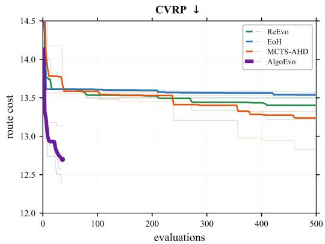  
(b) CVRP.

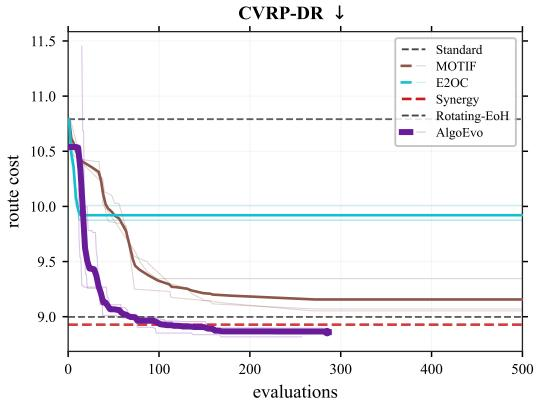  
(c) CVRP-DR.

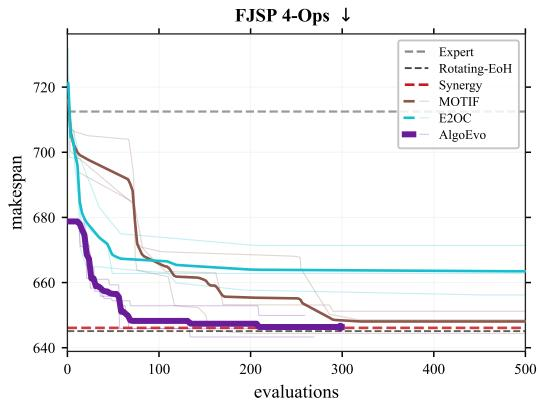  
(d) FJSP 4-Ops.

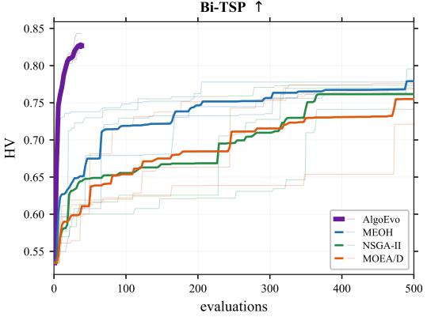  
(e) Bi-TSP.

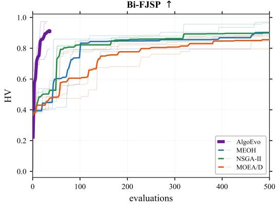  
(f) Bi-FJSP.  
Figure 5: Best-so-far performance against the evaluation budget across the six design tasks.

abstractions serve as the primary drivers of discovery performance, whereas situation-triggered injection primarily refines knowledge selection efficiency.

## F FURTHER ANALYSIS

## F.1 METHOD SKILLS AND METHODOLOGICAL TRANSFER

The design skill hub encodes not only paradigm-level design knowledge but also methodological insights distilled from existing algorithms. To examine whether such knowledge remains effective when decoupled from its original search framework, we construct six method skills from established methods and supply them to AlgoEvo without importing their native search procedures.

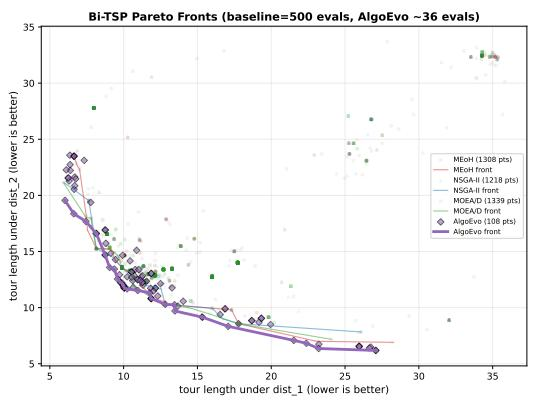  
(a) Bi-TSP.

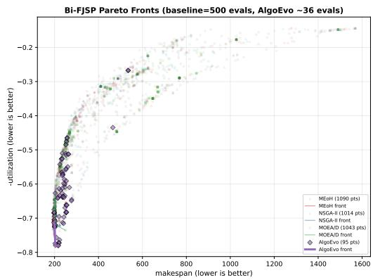  
(b) Bi-FJSP.  
Figure 6: Pareto archives on multi-objective tasks, displaying all evaluated candidates across three random seeds.

We evaluate EoH (Liu et al., 2024a), ReEvo (Ye et al., 2024), and FunSearch (Romera-Paredes et al., 2024) for single-objective design, and MEoH (Yao et al., 2025), NSGA-II (Deb et al., 2002), and MOEA/D (Zhang & Li, 2007) for multi-objective design, ensuring native and skill-based variants share identical seeds and instance sets.

Table 10: Comparison between native methods and AlgoEvo equipped with corresponding method skills.
<table><tr><td></td><td colspan="2">Quality</td><td colspan="2">Evaluations</td></tr><tr><td>Method skill</td><td>Native</td><td>With skill</td><td></td><td>Native AlgoEvo</td></tr><tr><td>TSP: tour length ↓</td><td></td><td></td><td></td><td></td></tr><tr><td>EoH</td><td> $7 . 1 5 2 9 \pm 0 . 0 2 6 3$ </td><td> $\mathbf { 7 . 0 4 1 4 \pm 0 . 0 9 2 3 }$ </td><td>500</td><td>22</td></tr><tr><td>ReEvo</td><td> $7 . 3 4 7 8 \pm 0 . 3 1 1 2$ </td><td> $\mathbf { 7 . 1 8 8 9 \pm 0 . 3 6 7 8 }$ </td><td>500</td><td>19</td></tr><tr><td>FunSearch</td><td> $7 . 6 1 1 1 \pm 0 . 1 3 7 7$ </td><td> $\mathbf { 7 . 1 8 1 5 \pm 0 . 1 0 5 7 }$ </td><td>500</td><td>21</td></tr><tr><td colspan="5">Bi-TSP: hypervolume ↑</td></tr><tr><td>MEoH</td><td> $0 . 7 6 0 \pm 0 . 0 2 5$ </td><td> $\mathbf { 0 . 8 2 9 \pm 0 . 0 0 4 }$ </td><td>500</td><td>316</td></tr><tr><td>NSGA-II</td><td> $0 . 6 1 4 \pm 0 . 0 8 2$ </td><td> $\mathbf { 0 . 8 2 8 \pm 0 . 0 0 6 }$ </td><td>500</td><td>391</td></tr><tr><td>MOEA/D</td><td> $0 . 3 1 4 \pm 0 . 2 2 1$ </td><td> $\mathbf { 0 . 8 2 9 \pm 0 . 0 0 6 }$ </td><td>500</td><td>284</td></tr></table>

The skill-based versions achieve solution quality comparable to or exceeding their native counterparts. On TSP, transferred methodologies reach superior average performance with substantially fewer evaluations. On Bi-TSP, the primary benefit is enhanced archive quality and stability, while evaluation reductions are less pronounced. These findings indicate that methodological knowledge can be effectively represented and utilized independently of its original search framework.

Note that the two experimental blocks use different problem scales (100-city instances for TSP versus 50-city instances for Bi-TSP), and absolute values should not be compared across tasks.

For Bi-TSP, the corresponding Pareto fronts in Figure 8 show that skill-based runs cover a broader favorable region of the objective space, consistent with their higher HV values.

## F.2 REPRESENTATIVE DIAGNOSIS-GUIDED DESIGN TRAJECTORY

To illustrate how diagnostic feedback adjusts the granularity of multi-component search, Table 11 details a representative CVRP-DR trajectory.

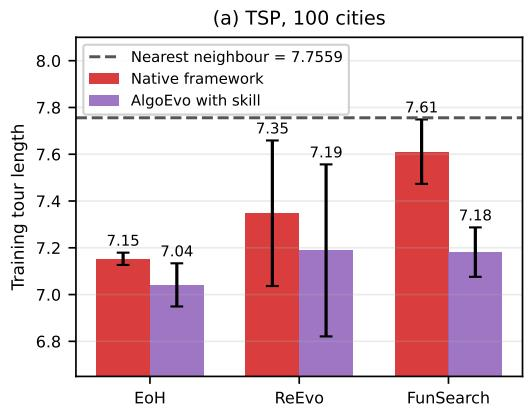

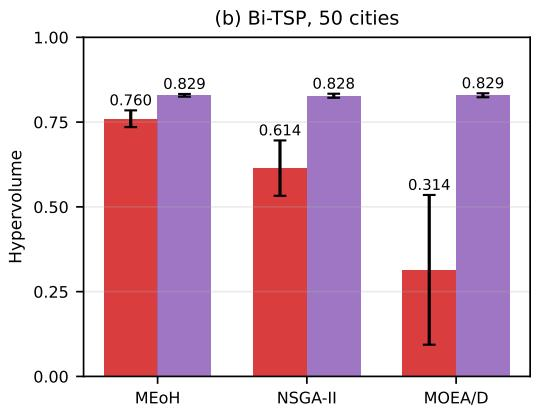  
Figure 7: Per-seed quality comparison between native methods and AlgoEvo with corresponding method skills.

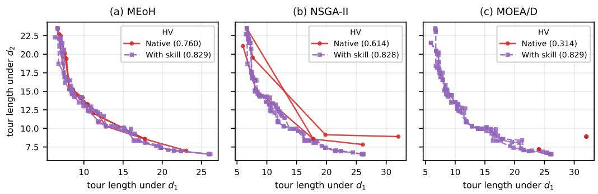  
Figure 8: Bi-TSP Pareto fronts for native methods and AlgoEvo equipped with corresponding method skills.

Table 11: Representative diagnosis-guided design trajectory on CVRP-DR.
<table><tr><td>Step</td><td>Operation</td><td>Observation</td><td>Cost</td></tr><tr><td>1</td><td>Diagnose</td><td>The destroyer exhibits the largest marginal effect</td><td></td></tr><tr><td>2</td><td>Diagnose</td><td>Destroyer and repairer display strong interaction</td><td></td></tr><tr><td>3</td><td>Edit destroyer</td><td>Replace distance-based criterion with absorption cost</td><td>9.310</td></tr><tr><td>4</td><td>Diagnose</td><td>Long edges remain insufficiently destroyed</td><td></td></tr><tr><td>5</td><td>Joint edit</td><td>Jointly modify destroyer and repairer</td><td>9.088</td></tr></table>

This trajectory highlights two key behaviors enabled by the diagnostic mechanism: first, component attribution identifies the destroyer as the current bottleneck, prompting targeted modification; second, interaction analysis reveals coupling between operators, causing the search to transition from isolated component editing to joint design. This qualitative progression supports the system-level co-design results in the main text.

## F.3 VARIATION IN SEARCH BEHAVIOR

Different random seeds can discover competitive designs through distinct search trajectories. Table 12 summarizes operational breakdowns across three CVRP-DR runs.

While the runs allocate effort differently—skewing toward code modification in one, diagnostic analysis in another, and a balanced mix in the third—the diagnosis-intensive run yields the best final result in this sample. Although consistent with the diagnosis-guided search principle, a larger

Table 12: Search operation counts and outcomes on CVRP-DR across different random seeds.
<table><tr><td>Seed</td><td>Read</td><td>Edit</td><td>Diagnose</td><td>Evaluate</td><td>Best cost</td></tr><tr><td>2025</td><td>14</td><td>122</td><td>17</td><td>81</td><td>8.927</td></tr><tr><td>2026</td><td>11</td><td>10</td><td>163</td><td>12</td><td>8.281</td></tr><tr><td>2027</td><td>12</td><td>89</td><td>102</td><td>6</td><td>9.138</td></tr></table>

sample size would be required to establish a definitive correlation between operation distributions and final performance.

## F.4 CROSS-TASK EXPERIENCE TRANSFER

Figure 9 presents a per-seed evaluation of the warm-start experiment. Initialized with a transferred design yielding a tour length of 5.017, every warm-started seed outperforms its cold-started counterpart. Mean performance improves from 4.961 to 4.808, accompanied by reduced cross-seed variance.

This demonstrates that previously discovered algorithms serve as effective starting points for subsequent search rather than being discarded upon task completion, complementing the main findings on hierarchical experience accumulation.

Note that this warm-start analysis uses the plain TSP constructive task (shipped nearest-neighbor baseline of 5.017) rather than the standard TSP protocol used in the main evaluation (baseline of 6.112); consequently, absolute values between these configurations should not be directly compared.

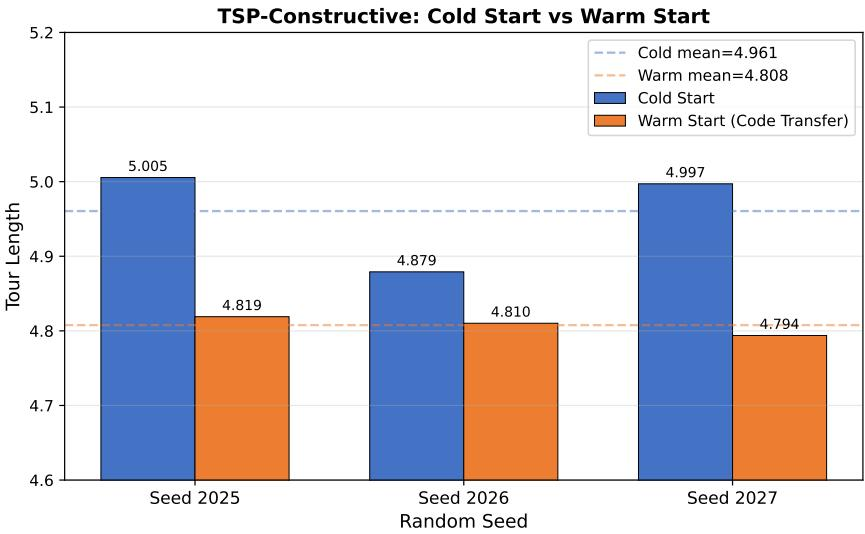  
Figure 9: Cold-start and warm-start performance on the plain TSP constructive task. Each group corresponds to one seed; dashed lines indicate group means.

## G LIMITATIONS AND FUTURE WORK

Despite the effectiveness of AlgoEvo across diverse algorithm design tasks, several limitations remain that outline directions for future research.

Token overhead in complex settings. Complex multi-component settings entail higher token overhead due to expanding context lengths as experience accumulates within the hierarchical bank. Developing more efficient memory compression and context management strategies will be essential for scaling to larger optimization horizons.

Scope of cross-task transfer. While the design skill hub facilitates effective heuristic reuse, crosstask transfer remains most effective within aligned problem families. Establishing more systematic criteria to evaluate knowledge applicability and mitigate negative transfer across structurally divergent domains remains an open challenge.

Long-horizon search reliability. Agentic design relies on sequential, interdependent decisions. Although situational UCB and experience-guided feedback stabilize exploration, ensuring consistent reliability and reducing trajectory variance over extended search horizons requires further investigation.

Scope of algorithmic design. The current evaluation isolates task-specific algorithmic components while keeping the surrounding solver and evaluation interface fixed. Future work will explore extending AlgoEvo to broader structural co-design settings and integrated pipeline optimization.

## H REPRODUCIBILITY NOTES

The problem formulation, framework design, and algorithmic components are detailed in Section 2, Section 3, and Section 3.4, respectively. To ensure full reproducibility, all essential experimental components are documented in the supplementary material. This includes benchmark definitions and evolvable units (Appendix D), solver procedures and evaluation metrics (Appendix C), and baseline configurations (Appendix C). In addition, complete source code is provided to enable direct replication of all reported experiments.