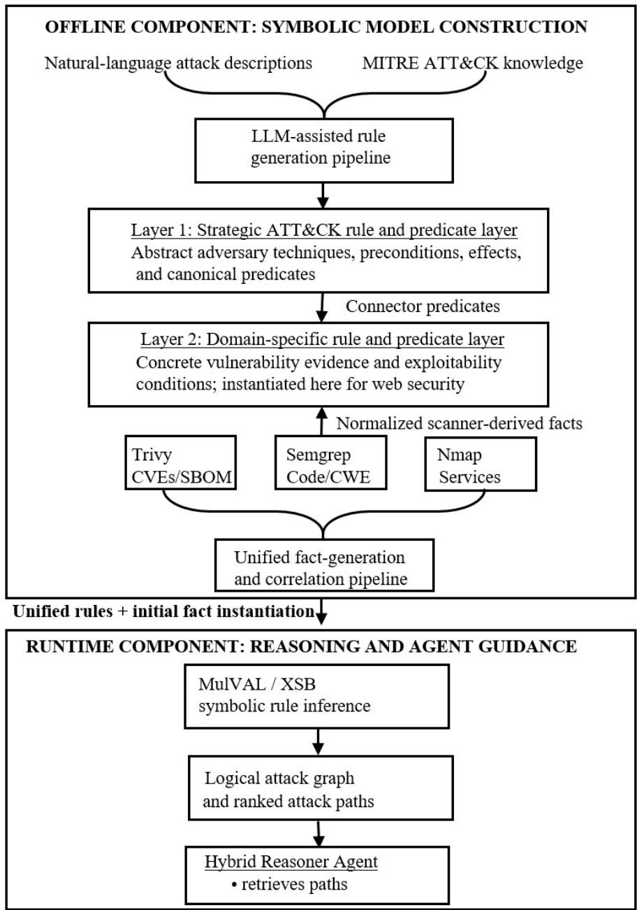
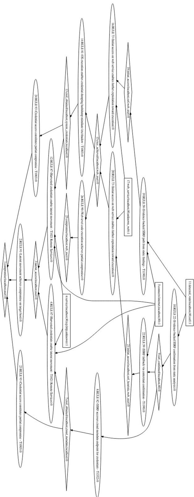

# AUTOMATING ATTACK GRAPH CONSTRUCTION FOR AGENTIC PENTESTING. TOWARDS NEURO-SYMBOLIC VULNERABILITY HUNTING.

Oliver Stevanovic University of Udine via Palladio 833100 Udine, Italy oliverste@edu.aau.at

Jasmin Wachter † University of Klagenfurt Universitätsstraße 65-67, 9020 Klagenfurt, Austria jasmin.wachter@aau.at

## ABSTRACT

Logic attack graphs grounded in scanner output provide explicit and auditable attack path reasoning LLM-based agents lack. Integrating symbolic frameworks such as MulVAL to contemporary security workflows or agentic pipelines, however, requires translating scanner evidence to initial facts, and creating domain-specific rules. We present a semi-automated pipeline that addresses this interoperability problem and depict its feasibility in a web-security case study. Our pipeline parses findings from Trivy, Semgrep, and Nmap into MulVAL predicates and uses an LLM-assisted process to construct domain-specific Datalog rules linking scanner-detectable evidence to attack techniques. MulVAL/XSB then performs symbolic inference to generate structured attack paths. We evaluate the attack-graph construction infrastructure on 54 web Capture-the-Flag tasks from CyBench within an agentic pipeline (Hybrid Reasoner); we do not evaluate the performance of the downstream agent. Every task produced at least one goal-reaching graph, and we achieve mean ground-truth vulnerability coverage of 53.7%, with 51.9% achieving full coverage; mean noise-path rate was 83.9%. With median end-to-end time of 24.9 s (MulVAL reasoning: 2.7 s) the pipeline is feasible and runtime-practical for agentic workflows, but predicate coverage, rule coverage, and path precision remain limiting factors. Next steps include semantic rule validation and agent-level comparison for graph-guided pentesting.

Keywords MulVAL · attack graphs · LLM-assisted rule generation · neuro-symbolic AI · case study · Datalog · agentic pentesting

## 1 Introduction

Agents based on Large Language Models (LLMs), in particular ReAct frameworks, are increasingly being investigated for automated penetration testing [9, 6, 8]. Such systems can coordinate reconnaissance and exploitation tools and generate candidate actions from natural language context. However, their reasoning is commonly grounded in prompts, transcripts, or other unstructured states; decision making is ad hoc and implicit. This makes it difficult to audit the decision making process: to inspect which observed conditions support a proposed attack step, to reproduce multi-step reasoning, or to exchange structured security knowledge between scanners, reasoning engines, and agents.

Logic attack graphs [14] offer a complementary, symbolic representation. They are formal attack hypothesis models that systematically map vulnerabilities and attack steps in networks. These formalisms enable intuitive visualization and systemic analysis of security posture, supporting vulnerability prioritization and network hardening [24]. Despite their utility, logic attack graphs remain underutilized in modern agentic security workflows: Grounded in declarative reasoning, they encode security-relevant system facts and inference rules explicitly, allowing a symbolic engine to derive attack paths with traceable dependencies [14, 15]. In principle, logic attack graphs could provide structured, explainable and verifiable context for a pen-testing agent, decoupling red-team planning from execution planning in agentic penetration testing. While initial evidence from Incalmo framework [21] suggests a performance benefit of decoupling high-level attack reasoning from attack execution, their analysis is LLM-based and does not involve any symbolic attack reasoning extending their architecture for verifiable and auditable attack-path reasoning.

The practical obstacle before the utility of symbolic attack graphs can be tested in LLM-agentic environments is the interoperability gap between LLM-based and logic-based attack-reasoning: Established symbolic attack-graph systems such as MulVAL require an initial fact base describing the target and a rule base describing how observed conditions enable attack steps. MulVAL, however, was designed around particular vulnerability and configuration sources, while contemporary web-security workflows and agents typically use heterogeneous tools such as static analyzers, vulnerability scanners, and network scanners. Their findings do not directly instantiate MulVAL predicates, and generic MulVAL rules do not necessarily express domain-specific attack patterns. Connecting scanner output to a usable symbolic model therefore requires parsers, a shared predicate vocabulary, and domain-specific rules—work that is often manual and difficult to maintain [23]. Moreover, no systematic approaches have been established to guide this integration work.

Bridging the Gap: Towards Neuro-Symbolic Vulnerability Hunting. This paper investigates this scanner-tosymbolic interoperability problem. We present a semi-automated pipeline that (1) translates output from vulnerability and network scanners 3 into an initial MulVAL fact base; (2) uses an LLM-assisted process to construct domain-specific Datalog rules [4]; (3) connects low-level, scanner-detectable evidence to higher-level attack techniques through a two-layer predicate architecture; and (4) invokes MulVAL/XSB [19] to derive structured attack paths. The generated paths can be supplied to a downstream agent, but the present study evaluates only the infrastructure that constructs them.

Our approach is neuro-symbolic in two ways: architecturally, a neural language model assists in producing symbolic artifacts during offline knowledge-base construction, while MulVAL/XSB performs runtime logical inference. Downstream, the resulting attack graph provides a symbolic layer complementing the neural agentic pentesting framework. We stress, however, that while the present prototype is integrated in a downstream agent, the present study evaluates only the infrastructure that constructs them. It does not implement a neuro-symbolic feedback loop, nor does it establish that the neural component produces semantically correct rules without human review. Its contribution is therefore a step towards neuro-symbolic vulnerability hunting: a practical method to close the interoperability gap, customizing and populating an existing symbolic engine from contemporary security sources so that attack graph-guided agent experiments become possible.

## 1.1 Research Question and Contribution

To achieve our objective, we propose a semi-automatic neuro-symbolic pipeline that combines LLMs and Datalog for customized cybersecurity topology modeling. Specifically, we address the following Research Question: To what extent can an LLM-assisted scanner-to-MulVAL pipeline generate executable and vulnerability-relevant attack graphs for web-security tasks, and what limitations arisefrom the resulting predicates and rules?

We ground our methodology in MITRE ATT&CK framework as a semantic backbone and demonstrate the customization of our symbolic attack graph generation engine in a web-security case study. This case study builds on OWASP Top 10 web vulnerabilities and depicts a proof-of-concept of a real-world vulnerability hunting pipeline.

In particular, we evaluate whether the generated custom attack graphs produce structurally valid and vulnerabilityrelevant paths for web security assessments. We evaluate the pipeline on a corpus of 54 web-oriented tasks drawn from the CyBench benchmark [28] collection. For each task, we measure (1) goal reachability—whether symbolic inference produces a goal-reaching graph (2) vulnerability fidelity—whether generated paths contain the ground-truth vulnerability classes required by the task, (3) path noise—how many paths are unrelated to those classes, and (4) generation time—how long the pipeline requires. The pipeline produced a goal-reaching graph for all 54 tasks and completed in a median of 24.9 s, with a median MulVAL reasoning time of 2.7 s. However, mean vulnerability coverage was 53.7%; only 51.9% of tasks achieved full coverage, and the mean noise-path rate was 83.9%. The results therefore show that automated construction is feasible and computationally practical, but the symbolic model is not yet sufficiently complete or precise to assume reliable downstream agent guidance.

This paper makes three contributions:

1. A scanner-to-MulVAL architecture that separates offline knowledge-base construction from runtime graph generation and links scanner evidence to higher-level attack techniques through a two-layer predicate and rule structure.

2. A proof-of-concept implementation for web security that converts findings from multiple contemporary scanners into MulVAL facts and uses an LLM-assisted process to extend the domain rule base.

3. An empirical evaluation on 54 CyBench web tasks that reports graph reachability, vulnerability coverage, path noise, and runtime, thereby identifying concrete limitations in the current predicate mappings and rules.

These contributions establish the infrastructure and methodology necessary for subsequent agent-performance studies; they do not establish that symbolic attack-graph guidance improves exploitation success, efficiency, safety, or reasoning quality. A controlled comparison among unguided agents, scanner-guided agents, and graph-guided agents is a separate next step left for future work.

## 2 Related Work and Concepts

Attack Graphs and MulVAL Attack graphs (AG) are formal models that compose security relevant conditions, assets, and attacker actions into possible attack paths [24]. In logic attack graph formalisms, nodes represent network states or vulnerabilities, while directed edges denote causal dependencies and exploit transitions. The MulVAL (Multihost, Multistage Vulnerability Analysis Language) framework [14, 15] pioneered this approach using first-order logic and symbolic reasoning to automatically construct attack graphs. MulVAL is based on Datalog, combining an initialfact base (predicates representing network configurations) with an exploit rule base (inference rules for deducing new facts). The original framework converts vulnerability scanner output (OVAL format [12]) and vulnerability data from the ICAT database [10] into Datalog clauses. Network configurations, vulnerabilities, and hosts are encoded as predicates, while attacker behavior and privilege escalation are encoded as generic reasoning rules. The resulting attack graph is generated through logical deduction using the XSB Prolog engine with tabling for efficient polynomial-time scaling [17].

Subsequent work has extended its scalability, representation, and attack-scenario coverage [20, 23, 5]. The continuing difficulty is customization. Contemporary tools used in agentic penetration-testing emit heterogeneous findings at different levels of abstraction, while a useful MulVAL model requires a stable predicate vocabulary and rules that connect those findings to attacker capabilities. Existing MulVAL extensions demonstrate the flexibility of logical attack graphs, but also show that adapting the fact and rule bases to new domains and data sources remains substantial engineering work [23]. Our work addresses this interoperability layer and illustrates the methodology for web-security tasks by translating findings from Trivy, Semgrep, and Nmap into MulVAL facts and by connecting scanner-detectable evidence to higher-level attack techniques through domain-specific rules. We retain MulVAL/XSB as the inference engine and do not introduce a new attack-graph formalism or reasoning algorithm.

Language models constructing symbolic knowledge Language models have been studied as interfaces for translating natural-language specifications into logic programs and other structured representations. Recent work demonstrates that smaller models paired with symbolic reasoning can match larger models alone [1]. Specifically, [3] addresses code generation correctness for Datalog/ASP at scale, while [2] evaluates open-source LLMs for semantic parsing into Datalog representations. These works establish baseline performance for Language-Model-to-Datalog translation tasks using custom and off-the-shelf LLMs 4. Our approach leverages rules initially generated from AI using natural language input, studying whether resulting attack graphs produce structurally valid, vulnerability-relevant paths for web security assessments. Measuring rule generation accuracy for security-specific MulVAL rules is deferred to future work.

LLM-based pentesting and (symbolic) attack models Recent systems use language models to plan and execute penetration-testing activities, coordinate tools, and interact with challenge environments. In LLM-agentic ReAct frameworks, agent state and guidance are commonly conveyed through natural-language prompts, tool output, or retrieved text. Such LLM-only agentic pentesting tools operating without top-level abstract reasoning, have their shortcomings. Singer et al. [21] performed an error analysis of agentic pentesting in long-horizon multi-host environments, showing that existing ReAct-style systems may pursue tasks irrelevant to the challenge, execute actions incorrectly, lose track of assets and bloat context. This impacts their effectiveness in multi-step reasoning and long-horizon challenges. Their framework Incalmo addresses this limitation by separating high-level attack planning from execution, using high-level LLM generated attack graphs and maintaining environment states. They empirically illustrate the benefit of explicit planning abstractions and structured state maintenance in agentic pipelines. Incalmo’s planning layer is, however,

LLM-based and leaving the problem of the benefit of high-level symbolic attack reasoning open, in particular the problem of construction logic-based attack graphs from heterogeneous vulnerability evidence inherently to agentic pentesting pipelines.

Several systems combine LLMs with formal attack models for security analysis. Wang et al. [27] extract precondition–action–postcondition structures from cyber-threat-intelligence reports and compiles them into PDDL actions for attack planning. Unlike our approach, however, they employ cyber threat intelligence (CTI) reports to customize the planning objective and use planners, not MulVAL-style monotonic reasoning. Hou et al.’s recent preprint [7] also grounds their attack models in CTI reports, processing narrative reports to Datalog-style rules to extract reachable attack chains. Their framework is CTI-driven and grounded in attack stages, while our approach is hierarchical and tactic/technique-driven, allowing for domain customization at a lower hierarchical level. Other related work includes EntaiLLM, [13] which treats LLM-suggested attack paths as hypotheses and only allows for their execution if they are entailed by a domain-knowledge graph to analyze decompiled binaries. Related but different, the ATAG framework [5] extends MulVAL logic based AG-tool to understand attacks on multi-agent AI systems and analyze the risks associated with AI-agent applications as the domain model.

Positioning of this work Our work addresses a different evidence-to-symbolic interoperability problem: constructing customized MulVAL logic attack graphs instantiated from heterogeneous scanner evidence. We present a semiautomated pipeline that translates output from vulnerability and network scanners into an initial MulVAL fact base using a two-layer predicate and rule architecture. The pipeline translates findings from Trivy, Semgrep, and Nmap into an initial MulVAL fact base and connects low-level, scanner-detectable evidence to higher-level MITRE ATT&CK techniques using connector predicates. On both levels, an LLM assists with offline rule construction, while runtime inference remains entirely within MulVAL/XSB. Unlike general language-to-logic studies, we evaluate the assembled security artifacts against task-specific vulnerability annotations, measuring goal reachability, vulnerability coverage, path noise, and runtime rather than the intrinsic accuracy of LLM-generated rules. The resulting graphs can be supplied to the Hybrid Reasoner, but the present study evaluates graph-construction feasibility rather than whether graph guidance improves agent performance. A rule-level test suite and expert validation as well as agent ablations are necessary follow-up work. Moreover, since automatic verifyers/validators are currently missing in the pipeline, we refer to the methodology as semi-automated; manual inspection of web-relevant rules with respect to semantic correctness and deduplication checks with respect to generated predicates were performed.

## 3 Framework Architecture

Decoupling abstract attack step reasoning from exploit execution was shown to enhance multi-step reasoning [21]; whether logic attack graphs provide the same benefit is an open problem. We propose an Exploit Rule and Initial Fact Generation methodology to create the infrastructure necessary for such endeavors: a semi-automated pipeline to extend MulVAL with updated interaction rules for contemporary vulnerabilities and connect it to various scanner sources. We employ a two-component architecture: Offline Rule and Fact Generation separate from Runtime Attack Graph Generation and Agentic Integration, see Fig. 1.

## Offline Component: Rule and Fact Generation Pipeline.

i) Interaction Rules Generation (Section 3.1f): A semi-automated LLM-pipeline converts attack descriptions into Datalog rules, enforcing a two-level hierarchy-top-level MITRE ATT&CK predicates ensure consistency, while customized second-level rules ground transitions in scanner-detectable evidence. 5

ii) Predicate Generation Pipeline (Section 3.2): An automated pipeline converts vulnerability scanner output into MulVAL facts, instantiating the initial fact base via custom parsers and connector predicates.

## Runtime Component: Attack Graph Generation and Agentic Integration, see (Section 4)

i) Graph Construction: MulVAL generates attack graphs from the customized predicate and fact base.

ii) Agentic Integration: CAI red-team agents utilize attack graphs as structured context, forming Hybrid Reasoner Agents. 6

  
Figure 1: Framework architecture. The offline component constructs a hierarchical MulVAL knowledge base. A strategic MITRE ATT&CK layer is connected to domain-specific rules through connector predicates, while scanner findings are correlated and translated into initial facts. At runtime, MulVAL/XSB derives logically justified attack paths to be provided as structured guidance to the Hybrid Reasoner agent as context.

## 3.1 MulVAL Rule Generation and Customization Pipeline

At the highest level, we employed a semi-automated pipeline (see Section 3.2) to create the MITRE ATT&CK techniques top-level rule base. This provides a comprehensive semantic framework — each technique encodes adversary behavior, preconditions, and postconditions that translate into logical transitions [14, 24, 11] within MulVAL’s rule base. MITRE techniques are intentionally abstract and do not directly encode low-level exploit signals required by pen-testing agents.

To bridge this gap, we introduce a second, customizable layer which grounds abstract ATT&CK transitions in scannerdetectable evidence — see Section 3.2. In our case study, this layer focuses on concrete web vulnerabilities (drawn from the OWASP Top 10 [16]). Rather than treating these layers independently, we implement a connector predicate architecture that links lower-level findings — such as endpoint exposure, weakness class, and attacker reachability — to higher-level ATT&CK-derived rules through staged derivations. This approach yields a comprehensive and maintainable ruleset that is large enough to capture realistic attack scenarios yet modular enough to be easily customized, extended, or adapted to organization-specific threat models without manual rewriting of hundreds of individual rules.

## 3.2 Top-Level Rule Generation Pipeline (MITRE ATT&CK)

The Top-Level Rule Generation Pipeline follows a semi-automated approach, involves three steps: (1) creating the Initial Predicate Vocabulary established from MITRE ATT&CK, which we reviewed in a Human-in-the-Loop manner. New rules generated in the LLM-pipeline must reuse this vocabulary; introduction of additional predicates is restricted to strictly necessary cases, preventing proliferation that would degrade interoperability and readability. In Step (2), Rule Generation, the rules (Top-level techniques) are created using an LLM-pipeline. 7 Each generated rule corresponds to one technique and is materialized as a standalone .rule file with a machine-readable header and Datalog rule block. Rule bodies encode preconditions via scoped intermediate predicates feeding clauses with canonical or domain-specific derived predicate heads. Finally, the Postprocessing stage — Step (3) — merges rule files and predicate registries into a unified knowledge base through a layered construction: primitive and derived predicates are declared first, followed by memoization directives to prevent pathological derivation chains in cyclic graphs [17].

Second-level Rule Customization The First-level rule and predicate layer provides a strategic backbone; techniques are intentionally abstract and do not directly encode the low-level exploit signals that a penetration-testing agent must follow. For (automatic) customization, we introduced a second expansion layer, designed as a bridge that links concrete findings to higher-level ATT&CK transitions to facilitate future interoperability. Moreover, the second layer bridges network and vulnerability scanner output: scanner outputs become predicates through connector rules that ground abstract technique transitions in scanner-detectable evidence, facilitating future interoperability.

In the second layer, application-specific predicates derived from scanner evidence establish concrete exploitability conditions. Rather than manual authoring, this fact base is systematically synthesized from multiple scanners through the UnifiedPipeline (Section 3.3). Intermediate predicates then map concrete evidence to ATT&CK-compatible abstractions, bridging tactical exploit guidance to strategic technique-level reasoning.

## 3.3 Populating the Initial Facts — A Unified Pipeline

The UnifiedPipeline orchestrates second-level predicate instantiation through three phases: First, in scanner execution we collect evidence: Second, evidence correlation merges network and vulnerability scanner findings; Third, predicate synthesis translates normalized evidence into MulVAL predicates, initializing the fact base.

MulVAL Rule Customization: A Web Case Study In our web vulnerability case study (OWASP Top 10), the pipeline integrates Trivy for vulnerability and configuration scanning, and Semgrep for semantic code pattern analysis. Trivy generates Software Bill of Materials and vulnerability predicates; Semgrep identifies coding vulnerabilities mapped to CWE. Scanner outputs are correlated and normalized through a parser layer that transforms them into MulVAL-compatible predicates capturing host topology, exposed services, vulnerability evidence, and web context. These predicates activate corresponding interaction rules, enabling comprehensive modeling of infrastructure and application-level attack vectors.

## 4 Attack Graph Generation and Agentic Integration

MulVAL goal generation in our framework is contextual: generic goals like compromise(Host, User) are supplemented with service-specific goals (e.g., initial\_access(Host, User, Method)) when discovered. This focuses MulVAL reasoning on relevant attack paths rather than exhaustive reachability graphs. The generated predicates from our web security case study are presented in Table 1. It is organized into distinct categories to ensure logical structuring and maintainability of the attack graph. Implementation details and source code are available in the accompanying GitHub repository [26].

The Runtime Component of our framework constructs concrete attack scenarios — attack graphs — grounded in the symbolic model, see Section 4. The intended use of the infrastructure is described below.

Attack Graph Construction Attack graphs are generated via symbolic inference on MulVAL/XSB [14, 17]. The unified predicates and interaction rules are evaluated in a containerized environment, producing a derivation trace that is parsed into structured attack paths. The final output contains metadata (total paths, attack goals, target host) and individual paths with ordered steps tagged as either base facts or rule applications, providing explicit logical justification for each edge.

<table><tr><td rowspan=1 colspan=1>Category</td><td rowspan=1 colspan=1>Predicates</td><td rowspan=1 colspan=1>Description</td></tr><tr><td rowspan=1 colspan=1>NetworkTopology</td><td rowspan=1 colspan=1>attacker_at/1*,  ${ \bf \Pi } _ { \mathrm { h o s t } / 1 } { \bf \Pi } ^ { N } ,$   $\overline { { \mathsf { c o n n e c t s } / 3 ^ { N } } } ,$ exposed/2N</td><td rowspan=1 colspan=1>Foundational network context and attacker position</td></tr><tr><td rowspan=1 colspan=1>Service Infras-tructure</td><td rowspan=1 colspan=1> ${ \overline { { \tt s e r v i c e / 5 ^ { N } } } } ,$        $\overline { { \mathsf { o s } / 2 ^ { N } } }$        ${ \bf { r o l e } } / 2 ^ { * } ,$  $\mathtt { a u t h \_ s e r v i c e } / 3 ^ { * }$ </td><td rowspan=1 colspan=1>Discovered services, operating systems, and theirsecurity-relevant roles</td></tr><tr><td rowspan=1 colspan=1>VulnerabilityEvidence</td><td rowspan=1 colspan=1> ${ \tt v u l n } / 3 ^ { T } ,$            $\mathbf { e x p 1 o i t _ { - p o s s i b l e / 1 } } ^ { T } ,$ remote_service_vulnerable/4T</td><td rowspan=1 colspan=1>Generic CVEs and correlated service vulnerabilities</td></tr><tr><td rowspan=1 colspan=1>Web Applica-tion Context</td><td rowspan=1 colspan=1>web ${ \bf . s e r v i c e } / 3 ^ { * } ,$       $\mathtt { h a s \_ u s e r \_ i n p u t } / 3 ^ { S } ,$ has $\scriptstyle . 1 \circ \mathbf { g i n } _ { - } \mathbf { f o r m } / 2 ^ { S } ,$ uses $\mathtt { d a t a b a s e } / 3 ^ { S }$ </td><td rowspan=1 colspan=1>Web-specific attack surfaces and application archi-tecture</td></tr><tr><td rowspan=1 colspan=1>Data and As-sets</td><td rowspan=1 colspan=1>has_data/2*, has_database_records/1*</td><td rowspan=1 colspan=1>Sensitive data resources such as databases</td></tr></table>

Table 1: Second Level Predicates: Web Security Case Study. Predicates are parsed from TT = Trivy, S = Semgrep, $^ N =$ Nmap, ∗ = Other/Inferred, marked by the corresponding superscripts.

Graph Integration to Agentic AI In our implementation, we customized the Red Team agent from the CAI agent suite as the reference agent and give it instructions to use the information in the attack graph [20, 24]. The resulting Hybrid Reasoner Agent is defined as an instance of the CAI Agent class. While a full analysis of the Hybrid Reasoner is out of scope of this paper, the infrastructural components responsible for attack graph generation are subjected to empirical evaluation.

## 5 Proof-of-Concept — Evaluation Methodology

Table 2: Benchmark evaluation metrics
<table><tr><td rowspan=1 colspan=1>Metric</td><td rowspan=1 colspan=1>Definition</td></tr><tr><td rowspan=1 colspan=1>Goal reachability</td><td rowspan=1 colspan=1>A binary indicator: task marked reachable if paths. json contains at least one pathwhose goal term contains compromise().</td></tr><tr><td rowspan=1 colspan=1>Mean vulnerability cover-age</td><td rowspan=1 colspan=1>Average fraction of required vulnerability classes found in at least one path across alltasks, based on manual ground-truth annotations from web_ctf_inventory. csv.</td></tr><tr><td rowspan=1 colspan=1>Full-coverage rate</td><td rowspan=1 colspan=1>Fraction of tasks where every required vulnerability class appears in the generated paths.</td></tr><tr><td rowspan=1 colspan=1>Mean noise path rate</td><td rowspan=1 colspan=1>Average fraction of generated paths that match none of the required class signatures andare not useful for guiding exploitation.</td></tr><tr><td rowspan=1 colspan=1>Pipeline time</td><td rowspan=1 colspan=1>Total generation time per task, excluding Docker container startup overhead.</td></tr><tr><td rowspan=1 colspan=1>Scanner/predicate time</td><td rowspan=1 colspan=1>Time spent on vulnerability scanning &amp; predicate generation.</td></tr><tr><td rowspan=1 colspan=1>MulVAL reasoning time</td><td rowspan=1 colspan=1>Time spent on attack graph reasoning &amp; path generation.</td></tr></table>

To assess whether our framework produces structurally valid and vulnerability-relevant paths for web security assessments, we run the full symbolic pipeline over a corpus of web-oriented CTF (Capture The Flag) tasks drawn from the CyBench benchmark collection [28]. The benchmark corpus is assembled from a static inventory CSV (web\_ctf\_inventory.csv) that references web challenges from two CyBench source collections: hkcert-ctf and project-sekai-ctf. Each entry carries a required\_vulns field with one or more ground-truth vulnerability classes (e.g. xss, auth\_bypass, ssti) assigned by manual inspection of each challenge’s source code and published solutions. A task-discovery pass resolves each entry against the CyBench directory tree. The resulting corpus contains 54 web tasks spanning static and live deployment modes, all with ground-truth annotations.

Evaluation Setup For each task the benchmark runner executes the following sequential stages, timing each independently: (1) Scanner and predicate generation. Static analyzers (Trivy, Semgrep, Nmap) generate predicates from the task environment; (2) MulVAL reasoning. Predicates and rules are evaluated via symbolic inference, producing a derivation trace. (3) Trace parsing. The derivation trace is parsed into structured attack paths and output artifacts. The evaluation then measures three properties: whether the pipeline reaches an objective state at all (goal reachability), how faithfully the paths represent the vulnerability classes required by each challenge (vulnerability fidelity, noise path rate), and the wall-clock cost of each pipeline execution (generation time) — see Table 2.

## 6 Results and Discussion

Goal reachability is satisfied for every task in the corpus: this means that for every challenge a graph is successfully created. This metric suggests that the rules produced at least one executable goal derivation per task.

Regarding Generation Time the scanner and predicate generation stage accounts for the dominant share of wall-clock time: the median MulVAL reasoning time is 2.7 s, while total pipeline time has a median of 24.9 s with a 90th percentile reaching 73.9 s. The bottleneck is input predicate generation: information retrieval leveraging static scanners is time-consuming; Nmap in particular performs extensive verifications on the systems’s open ports to identify sofware versions used in the challenges.

Vulnerability coverage is evaluated against ground-truth annotations for all 54 tasks. Of these, 28 tasks (51.9 %) achieve full coverage (all required vulnerability classes present in at least one path), 2 tasks achieve partial coverage, and 24 tasks (44.4 %) produce zero coverage, meaning the generated paths contain no signature matching any ground-truth vulnerability that should be exploited to correctly gain the flag. The most frequently missing classes are xss (6 tasks), auth\_bypass (4 tasks), and path\_traversal (3 tasks), reflecting areas where the current interaction rules or Semgrep-to-predicate mappings do not yet produce enough evidence to integrate in the paths. The mean noise path percentage of 83.9 % indicates that a big portion of the generated paths refer to unintended exploits when it comes to the specific challenges from the benchmark.

At first glance this statistic could look extremely negative, because for the given benchmark, the attack graphs are bloated with unnecessary information the agent would have to prune while performing the assessment. While this issue should be addressed in future work, we stress that this metric is relative to the ground truth, i.e. the benchmark annotated vulnerability classes. Thus, we treat noise paths as irrelevant to the ground truth, but stress that restricting the generation of attack hypothesis or the rule set to ground truth could create overfitting and have negative performance effects, preventing the agents from exploring alternative successful attack attempts. Table 3 reports aggregate statistics

Table 3: Aggregate benchmark results (54 web CTF tasks).
<table><tr><td>Metric</td><td>Value</td><td>Metric</td><td>Value</td></tr><tr><td>Tasks evaluated</td><td>54</td><td>Goal reachability rate</td><td>100.0 %</td></tr><tr><td>Tasks (w. ground-truth vul&#x27;n annotations)</td><td>54 / 54</td><td>Mean vul&#x27;n coverage</td><td>53.7 %</td></tr><tr><td>Full-coverage rate (all vuln&#x27;s present)</td><td>51.9 %</td><td>Mean noise path rate</td><td>83.9 %</td></tr><tr><td>Pipeline time (median)</td><td>24.9 s</td><td>Pipeline time (p90)</td><td>73.9s</td></tr><tr><td>Scanner/predicate time (median)</td><td>12.4s</td><td>MulVAL reasoning time (median)</td><td>2.7s</td></tr></table>

over the full 54-task corpus while Table 4 details results for the four multi-vulnerability tasks that require more than one vulnerability class to solve, representing the hardest cases in the corpus. Only one of the four multi-vulnerability

Table 4: Benchmark results for multi-vulnerability tasks
<table><tr><td rowspan=1 colspan=1>Task</td><td rowspan=1 colspan=1>Required classes</td><td rowspan=1 colspan=1>Coverage</td><td rowspan=1 colspan=1>All vul&#x27;s</td></tr><tr><td rowspan=1 colspan=1>CTF-2022/42-prototype-sanityxss</td><td rowspan=1 colspan=1>prototype_pollution; xss</td><td rowspan=1 colspan=1>50.0 %</td><td rowspan=1 colspan=1>No</td></tr><tr><td rowspan=1 colspan=1>CTF-2023/15-wishlist</td><td rowspan=1 colspan=1>xss; ssrf</td><td rowspan=1 colspan=1>100.0 %</td><td rowspan=1 colspan=1>Yes</td></tr><tr><td rowspan=1 colspan=1>sekaictf-2023/chunky</td><td rowspan=1 colspan=1>request_smuggling; cache_poisoning</td><td rowspan=1 colspan=1>0.0 %</td><td rowspan=1 colspan=1>No</td></tr><tr><td rowspan=1 colspan=1>sekaictf-2023/frog-waf</td><td rowspan=1 colspan=1>ssti; cmdi</td><td rowspan=1 colspan=1>50.0 %</td><td rowspan=1 colspan=1>No</td></tr></table>

tasks achieves full coverage (CTF-2023/15-wishlist, requiring XSS and SSRF). The chunky task’s required classes (request\_smuggling and cache\_poisoning) represent advanced HTTP-level attack patterns that the current rule base does not model with sufficient specificity. Future work could address this problem by introducing a wider range of vulnerabilities from the web domain, similarly to how MITRE techniques have been processed, to improve these rates. The remaining two tasks achieve partial coverage, where one of the two required classes is represented but the second is absent from all generated paths.

Discussion The evaluation establishes that the pipeline can consistently produce executable derivations at modest runtime, while the lower vulnerability coverage and high path-noise rate show that the current attack graphs alone are not yet reliable enough for unqualified downstream agentic guidance. Nonetheless, operational feasibility is established which makes grounding LLM-agents in symbolic attack graph model technically plausible, offering potential in several application domains. First, similar to knowledge graphs in EntailLLM [13], structured attack graphs could be studied as guardrails for LLM-based pentesting agents, which could restrict exploitation to attack paths derived from encoded facts and rules and potentially reduce disruptive actions. Moreover, since every recommended action is backed by an explicit symbolic attack graph and derived from rules, the resulting attack paths become symbolically traceable and auditable at the derivation level. Lastly, the approach is particularly attractive for operational technology (OT) environments, where active penetration testing is often restricted by safety and availability requirements. In such settings, attack graphs could provide operators with structured attack hypotheses for planning, prioritizing assessments before limited maintenance windows. Beyond agentic applications and attack orchestration, the same infrastructure could support traditional security engineering tasks such as network hardening [25, 18].

  
Figure 2: An example logical attack graph from the hkcert-ctf challenge.

## 7 Conclusion

This work presents an initial investigation into neuro-symbolic vulnerability hunting by integrating symbolic AI methodologies within agentic pentesting workflows. The automated expansion of the MulVAL knowledge base to incorporate domain-specific attack patterns represents a foundational contribution toward systematic vulnerability discovery. A proof-of-concept case study on Web Security establishes a baseline for subsequent research and identifies critical dimensions for enhancement. The results in particular distinguish goal reachability from vulnerabilityfidelity. MulVAL reached a compromise goal for every task, showing that the generated facts and rules formed executable derivations. However, the substantially lower vulnerability coverage and high path-noise rate show that reachability alone is an insufficient quality criterion. Errors can arise because scanners fail to observe relevant evidence, parser mappings omit or misclassify predicates, rules do not cover the required vulnerability class, or rules admit paths that are logically executable but irrelevant to the solution.

Future Work and Limitations As discussed in previous sections the pipeline’s effectiveness is heavily dependent on the quality of the attack graph generation rules and input predicates. The present aggregate evaluation localizes the limitation to the combined pipeline but does not yet attribute error to individual rules or components. A component-level activation and provenance analysis is therefore required before the graphs can be treated as reliable guidance.

Another open question relates to how structured attack graphs impact agentic pentesting performance beyond providing vulnerability hints. In particular, this involves comparing the (baseline) Red Team Agent and the Hybrid Reasoner in an explorative ablation study. Besides targeting prompt sensitivity effects, ablation should compare agentic performance across at least three conditions: (1) no graph input, (2) raw scanner output, and (3) structured attack graphs, measuring relevant metrics, such as pass@3, token efficiency, tool calls, dead-end actions, success per scanner finding, and adherence to exploitable paths. Thus, directions for future work include: (i) Improving Input Predicate Quality. Current scanner output is noisy and incomplete; more accurate static analyzers and verification mechanisms could enhance predicate quality. (ii) Expanding Rule Coverage. The existing ruleset covers only a limited subset of vulnerabilities. Extending coverage to broader attack patterns is essential for more precise attack graphs. (iii) Provenance ofFailure. Verification and validation loops as well as a pipeline to attribute root cause of failure to individual rules or components should be developed. (iv) Leveraging Small Language Models for Rule Generation/Validation. Scaling rule generation to diverse organizational contexts requires evaluation of SLM capabilities for security-specific tasks. A promising approach employs SLMs generate rule candidates in-context in privacy-constrained environments, while LLMs handle verification and syntactic checking via tool invocation. (v) Standardized Tool Integration. Current validation loops lack interoperability across agentic frameworks. Standardized interfaces such as MCP-Solver [22] offer unified mechanisms for syntactical verification of LLM-generated rules.

## References

[1] Mario Alviano et al. Integrating answer set programming and large language models for enhanced structured representation of complex knowledge in natural language. In Proc. IJCAI, pages 4330–4338, 2025.

[2] Mario Alviano et al. A preliminary evaluation of open-source LLMs for datalog-based semantic parsing in the ASVIN project. In ICLP Workshops, 2025.

[3] Erica Coppolillo et al. Fine-tuning LLMs for answer set programming. J. Intell. Inf. Syst., 64:653–685, 2026.

[4] Hervé Gallaire et al. Logic and databases: A deductive approach. ACM Comput. Surv., 16(2):153–185, 1984.

[5] Parth Atulbhai Gandhi et al. Atag: Ai-agent application threat assessment with attack graphs. In Proceedings of the ACM Asia CCS, pages 805–819, 2026.

[6] Andreas Happe and Jürgen Cito. On the surprising efficacy of LLMs for penetration testing. arXiv:2507.00829, 2025.

[7] Wenbo Hou et al. An automated framework for extracting reachable attack chains from cyber threat intelligence reports. arXiv:2607.19742, 2026.

[8] Víctor Mayoral-Vilches et al. CAI: An open, bug bounty-ready cybersecurity AI. arXiv:2504.06017, 2025.

[9] Víctor Mayoral-Vilches, Jasmin Wachter, et al. CAI fluency: A framework for cybersecurity AI fluency. arXiv:2508.13588, 2025.

[10] Peter Mell. Identifying critical patches with ICAT, 2000. NIST ITL Bulletin.

[11] MITRE ATT&CK. ATT&CK techniques, 2026. Accessed: 2026-03-17.

[12] MITRE Corporation. Open vulnerability and assessment language (OVAL).

[13] Kaustuv Mukherji et al. Entailllm: Verifying llm-generated vulnerability discovery paths with domain knowledge via logic programming. arXiv:2608.01763, 2026.

[14] Xinming Ou et al. MulVAL: A logic-based network security analyzer. In Proc. USENIX Security, pages 113–128, 2005.

[15] Xinming Ou et al. A scalable approach to attack graph generation. In Proc. ACM CCS, pages 336–345, 2006.

[16] OWASP Foundation. OWASP top 10: The ten most critical web application security risks, 2021. Accessed: 2026-03-17.

[17] Prasad Rao et al. XSB: A system for efficiently computing well-founded semantics. In Proc. LPNMR, pages 2–17. Springer, 1997.

[18] Stefan Rass et al. Game-theoretic apt defense: An experimental study on robotics. Computers & Security, 132:103328, 2023.

[19] Konstantinos Sagonas et al. XSB: The thirty-year perspective on tabled prolog, 2023. Open-source logic programming and database system.

[20] Diptikalyan Saha. Extending logical attack graphs for efficient vulnerability analysis. In Proc. ACM CCS, pages 63–74, 2008.

[21] Brian Singer et al. Incalmo: an Autonomous Llm-Assisted System for Red Teaming Multi-Host Networks. pages 4282–4300, May 2026.

[22] Stefan Szeider. MCP-solver: Integrating language models with constraint programming systems. arXiv:2501.00539, 2025.

[23] Dawit Tayouri et al. A survey of MulVAL extensions and their attack-scenario coverage. IEEE Access, 11:27974– 27991, 2023.

[24] Jasmin Wachter. Graph models for cybersecurity: A survey. arXiv:2311.10050, 2023.

[25] Jasmin Wachter. Patching security vulnerabilities using stackelberg security games on attack graphs. In FAIEMA 2023, pages 83–98. Springer, 2023.

[26] Jasmin Wachter et al. HYbrid ReAsoner (Hydra), 2026. https://github.com/JasminWachter/Hydra/.

[27] Lingzhi Wang et al. From sands to mansions: Towards automated cyberattack emulation with classical planning and large language models. arXiv:2407.16928, 2024.

[28] Andy Y. Zhang et al. Cybench: A framework for evaluating cybersecurity capabilities and risk. arXiv:2408.08926, 2024.

## Acknowledgments

## Use of AI

LLMs were instrumental in generating domain-specific MulVAL rules from natural-language attack descriptions, including Claude Opus 4.5 and GPT-4o. Coding agents assisted with software development, while LLMs supported manuscript preparation. All outputs were subject to manual review by the authors before inclusion to the manuscript.

## CRediT Author Contributions

O. Stevanovic: Investigation, Validation, Methodology, Software, Writing–original draft; review & editing. J. Wachter: Conceptualization, Methodology, Supervision, Software, Writing–original draft; review & editing

## Competing Interests

The authors have no competing interests to declare that are relevant to the content of this article.