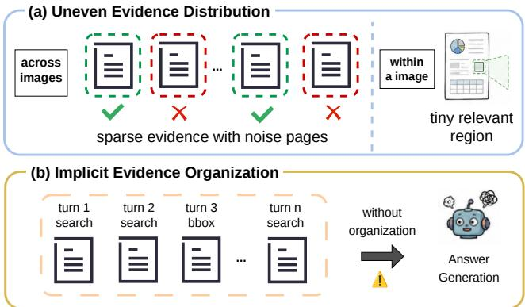
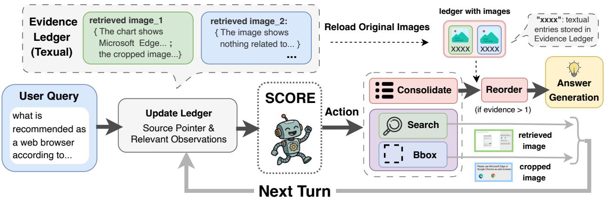
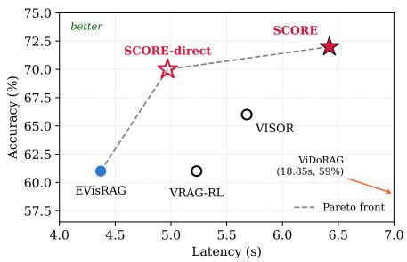
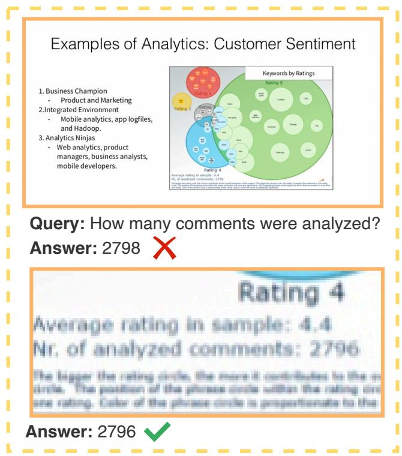
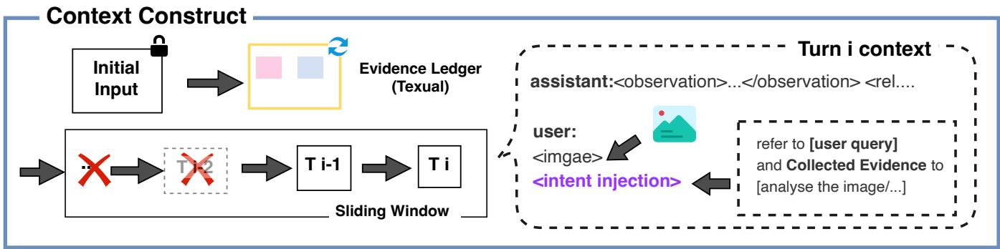
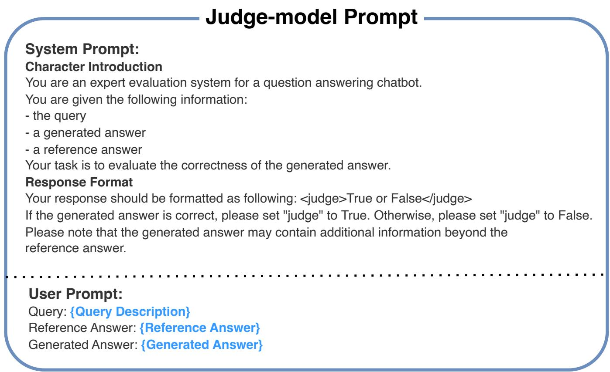
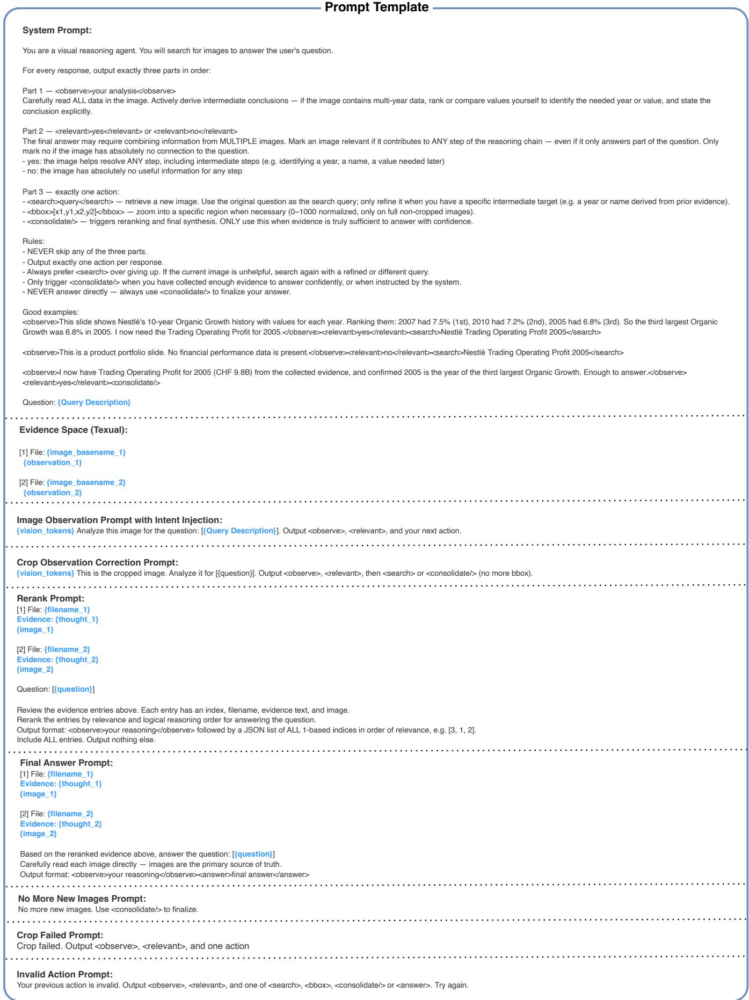
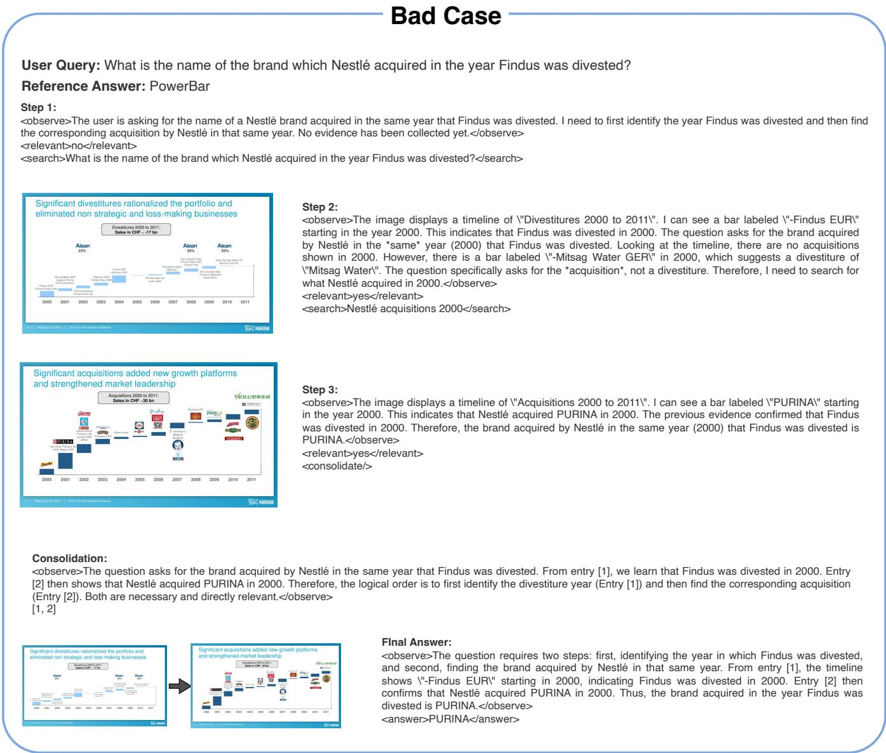

# Navigating Sparse Evidence: Agentic Visual RAG via Explicit Context Selection and Consolidation

Yucheng Shen1,2 Lingyong Yan2∗, Jiulong Wu2, Shuaiqiang Wang, Jianmin WU2, Dawei Yin2, Min Cao1∗

1School of Computer Science and Technology, Soochow University 2Baidu Inc. ycshensudaer@stu.suda.edu.cn, lingyongy@gmail.com, mcao@suda.edu.cn

## Abstract

Visual Retrieval-Augmented Generation (VRAG) empowers models to navigate and answer queries about visually rich documents by retrieving relevant page images as visual evi- dence and reasoning over their content. However, efectively utilizing this visual evidence is usually impeded by two main challenges. First, answer-relevant evidence is sparse and may be concentrated in a small region of one page or dispersed across multiple pages. Second, existing agentic methods of- ten generate answers based on raw exploration trajectories or compressed textual memories rather than an explicitly orga- nized set of supporting images, making answers susceptible to exploration noise and obscuring the evidence-backed rea- soning trace. We argue that the bottleneck lies not only in ev- idence discovery but also in its preservation and organization before answer generation. We propose SCORE (Selection and COnsolidation for Robust Evidence), a unified agent loop for explicit evidence selection and consolidation. During explo- ration, SCORE retains only query-relevant observations and their source pointers in a maintained textual ledger, preserv- ing earlier evidence while keeping the visual context bounded. At termination, it reloads the referenced original images and consolidates the visual evidence for answering, arranging it into a logical sequence. This decouples final reasoning from exploratory trial-and-error while ensuring strict visual grounding via indexed claim-to-image linkages. To enable end-to-end optimization of this unified rollout, our training paradigm combines filtered cold-start trajectory distillation with evidence-aware reinforcement learning, whose reward promotes evidence coverage, consolidation compactness, and answer correctness. Ex eriments on three established VRAG benchmarks demonstrate that SCORE achieves state-of-the- art overall accuracy on each benchmark across various back bone scales, with further gains from both training stages.

## Introduction

Visual Retrieval-Augmented Generation (VRAG) (Wang et al. 2026, 2025; Shen et al. 2026) extends traditional retrieval-augmented generation (Arslan et al. 2024) to vi-sually rich documents such as slides, reports, and scanned PDFs, retrieving and reasoning over page images. In these documents, evidential content is encoded not only in textual form but also through charts, tables, layout structures, and spatial relationships. Recent advances in Vision-Language Models (VLMs) (Bai et al. 2025a,b; Liu et al. 2024, 2023) enable VRAG methods like VRAG-RL (Wang et al. 2026) to leverage raw visual inputs, preserving critical layout, struc- tural, and multimodal cues that are often lost or distorted by traditional OCR-based methods (Zhang et al. 2025).

  
Figure 1: Illustration of two challenges in visual evidence utilization in VRAG: (a) uneven evidence distribution; (b) implicit evidence organization.

In common VRAG settings, rendered document pages serve as the basic retrieval unit, resulting in a substan- tially coarser granularity than passage-level text retrieval. This page-level retrieval paradigm poses two practical chal- lenges for efective visual evidence utilization. (1) Uneven evidence distribution. Answer-relevant evidence may be localized within a small region of a single page or scattered across multiple diferent pages (Figure 1 (a)). The agent must therefore determine which pages are rel- evant, how many of them are needed, and which re- gions require closer inspection. (2) Implicit evidence organization. Evidence is often discovered incrementally across multiple retrieval and inspection steps. However, the discovered observations may remain organized accord- ing to the exploration process itself rather than the logical structure required for coherent answering (Figure 1 (b)).

Existing agentic methods (Wang et al. 2026; Shen et al. 2026) improve evidence discovery through iterative search and region-level zoom-in. VRAG-RL retains visual obser- vations in the interaction trajectory, whereas VISOR distills them into a structured textual evidence space. However, nei- ther explicitly reconstructs the original visual evidence into a compact, logically ordered chain for final answer genera- tion or establishes claim-level links to visual sources. These limitations motivate our central insight: exploration should discover potential evidence, while consolidation should select, restore, and organize it into an answer-oriented visual evidence chain for grounded generation.

To address this bottleneck, we propose SCORE (Selection and COnsolidation for Robust Evidence), a unified agent loop for evidence organization in VRAG (Figure 2). The agent explores visual content through coarse image retrieval and fine-grained bounding-box zoom-in, treating full pages and cropped regions under a consistent relevance crite- rion. After each inspection, only query-relevant observations, along with precise source pointers, are recorded in a main- tained textual ledger. This compact representation preserves essential evidence while deliberately bounding the accumu- lation of raw visual history. When exploration terminates through a consolidate action or at the turn limit, the referenced original page images are reloaded. The reloaded visual evidence is then consolidated and, when needed, ar- ranged into a logical sequence for answering. The final an- swer is generated from these images within the same rollout, with indexed entries linking claims to supporting evidence. It can be seen that SCORE separates exploratory trial and er- ror from the final evidence chain, reducing exploration noise during answer generation while preserving visual grounding.

To further enforce structured evidence utilization, we in- troduce process-level supervision that explicitly shapes inter- mediate evidence organization rather than only final-answer correctness. During cold-start training, a teacher model gen- erates trajectories containing relevance decisions, consolidated evidence order, and final answers; only those with full gold-page coverage and answers judged correct by an LLM evaluator are retained. In reinforcement learning, an evidence-aware reward is proposed to jointly optimize gold-page coverage, compactness of the consolidated chain, and answer correctness. This two-stage training pipeline encour- ages the agent to preserve and organize relevant visual ev- idence throughout the entire rollout, thereby supporting re- liable answer generation. To assess the resulting model, we evaluate SCORE on three established VRAG benchmarks: ViDoSeek (Wang et al. 2025), SlideVQA (Tanaka et al. 2023), and MMLongBench (Ma et al. 2024).

Our main contributions are summarized as follows:

• We propose SCORE, a unified agent that selects relevant visual evidence across pages and regions, then explic- itly consolidates it by reloading, denoising, and ordering original images within the same rollout before answering.

• We introduce process-level supervision: cold-start from high-coverage teacher trajectories and an evidence-aware RL reward that jointly optimizes gold coverage, consolidation compactness, and answer correctness.

• Evaluated on three VRAG benchmarks, SCORE achieves state-of-the-art accuracy across both 3B and 7B back- bones, while ablations confirm the complementary con- tributions ofselection and consolidation, and further anal- yses demonstrate robust retrieval and favorable eficiency.

## Related Work

## Visual Retrieval-Augmented Generation

Retrieval-augmented generation (RAG) has shown strong effectiveness on knowledge-intensive tasks (Lewis et al. 2020; Gao et al. 2023; Yang et al. 2024), where traditional text-based approaches generate answers grounded in passages retrieved from textual corpora. However, with the wide adop- tion of visually rich documents such as slides, reports, and scanned PDFs, knowledge is no longer confined to plain text. This motivates Visual RAG (VRAG) which extends RAG to retrieve and reason over visual document pages. Early methods rely on OCR or document parsing to extract text from images, but such pipelines are lossy and fail to preserve layout, charts, and figures (Zhang et al. 2025). More re-cently, OCR-free retrieval methods directly align text queries with page images: ColPali (Faysse et al. 2024) introduces late-interaction visual retrieval via token-level similarity be- tween query text and image patch embeddings, while EVis- RAG (Sun et al. 2025) feeds retrieved page images directly into a VLM for multi-image understanding. However, con- strained by top-k retrieval, these methods often introduce irrelevant pages and cannot adaptively refine retrieval based on prior observations, making it dificult to focus on sparse query-relevant evidence.

## Agentic VRAG with Reinforcement Learning

The agentic RAG paradigm was first introduced by Re- Act (Yao et al. 2022), which interleaves reasoning and action so that the model can decide when and how to retrieve on the fly. Building on the recent success of reinforcement learning for LLM reasoning (Shao et al. 2024), VRAG-RL (Wang et al. 2026) extends this idea to visual documents by defining a visual perception action space with cropping and zooming, and training the VLM with multi-turn RL to actively explore evidence across pages. For multi-image evidence manage- ment, VISOR (Shen et al. 2026) maintains a textual evidence ledger during agent interaction, recording query-relevant vi- sual observations as text to suppress noise from irrelevant images over long horizons. LAT (Liu et al. 2026) instead targets evidence attribution, jointly optimizing reasoning and visual grounding within a single agent via RL, so that an- swers come with verifiable visual sources. These methods improve visual exploration, memory, or attribution, but do not explicitly reconstruct and globally organize a selected set of original page images before answering. A complemen- tary line of work decomposes multi-image reasoning across specialized agents, e.g., ViDoRAG (Wang et al. 2025) as-signs planning, retrieval, and answering to separate agents in an actor-critic loop. Such pipelines, however, are dificult to optimize end-to-end and often incur additional orchestration costs. SCORE instead makes evidence organization explicit within a unified end-to-end agent loop.

  
Figure 2: Overview of SCORE. The agent iteratively searches page images or zooms into local regions, updating a maintained textual evidence ledger through observation summarization and relevance judgment. Once the evidence is suficient, the in-loop consolidate action reloads the corresponding original images, filters and reorders the retained evidence, and passes the organized visual context to final answer generation within the same rollout.

## Method

## Task Formulation

Let q denote a natural language query and $\begin{array} { r l } { \mathcal { C } } & { { } = } \end{array}$ $\{ I _ { 1 } , \bar { I _ { 2 } } , \ldots , I _ { N } \}$ a large-scale corpus of N page images extracted from visually rich documents such as slides and reports. The task is to produce an answer a by iteratively searching C and reasoning over the retrieved pages in the context of q. Crucially, C forms a flat, document-agnostic image pool in which pages from heterogeneous documents are intermixed without document-level scoping. Relevant ev- idence answering q may reside entirely within a single page or be distributed across multiple pages, while pages from unre- lated documents serve as distractors; the model must retrieve and aggregate the relevant visual signals when necessary.

## SCORE Framework

As illustrated in Figure 2 and Algorithm 1, SCORE oper- ates as a unified agent loop with two persistent state objects: a maintained textual evidence ledger L and an interaction history H. At each reasoning turn, the agent processes the current page or cropped region and produces a structured output comprising three fields: ⟨observe⟩ (a summary of the visual content), ⟨relevant⟩ (a binary relevance judgment), and ⟨action⟩ (the next operation, detailed below). Relevant observations are added to L along with pointers to their corresponding source images, while only the most re- cent W raw visual observations from H remain in the active context. When exploration ends, the original images refer- enced in L are reloaded and organized for final answering. Keeping exploration, evidence maintenance, organization, and answering inside one loop forms a continuous rollout optimizable with a trajectory-level objective.

Context Construction. Following VISOR (Shen et al. 2026), we control the growth of raw visual context by reconstructing the input at each turn t from a fixed prompt, the evolving evidence ledger, and a bounded window of re- cent interactions. Let $\mathbf { C } _ { t }$ denote the active context supplied to the agent at turn $t ;$ it is formed by concatenating these components as follows:

Algorithm 1: SCORE Agent Loop   
Require: Query q, corpus ${ \mathcal { C } } ,$ max turns $T ,$ window W   
1: $\mathbf { \bar { \rho } } _ { \mathcal { L } } \gets \emptyset , \mathcal { H } \gets [ ] , ( \mathrm { s r c } _ { 1 } , o _ { 1 } ) \gets ( \emptyset , \emptyset )$   
2: for t = 1 to $T$ do   
3: Context ← prompt(q), L, current observation $o _ { t } ,$ and   
the last $W - 1$ turns of H   
4: Generate $\begin{array} { r l r l r l } { ( \tilde { o } _ { t } , \rho _ { t } , a _ { t } ) ; } & { { } \mathrm { a t } } & { { } t } & { { } = } & { } & { { } 1 , } \end{array}$ use   
(no image, no, search(q))   
5: if $\rho _ { t } = \mathrm { y } \mathrm { e } s$ then   
6: Add $\left( \operatorname { s r c } _ { t } , \tilde { o } _ { t } \right)$ to L   
7: end if   
8: Set a ← consolidate if $t = T$   
9: if $a _ { t } =$ search then   
10: $( \operatorname { s r c } _ { t + 1 } , o _ { t + 1 } ) \gets \mathrm { t o p } { - } 1$ page retrieved from C   
11: else if $a _ { t } =$ bbox then   
12: $( \mathrm { s r c } _ { t + 1 } , o _ { t + 1 } )$ ← bbox cropped region   
13: else if $a _ { t } =$ consolidate then   
14: E ← original images referenced by $\mathcal { L }$   
15: If $| \mathcal { E } | > \mathbf { \bar { 1 } }$ , select, denoise, and order E   
16: Generate answer action over visual evidence E   
17: return final answer a   
18: end if   
19: Append $\left( o _ { t } , \tilde { o } _ { t } , \rho _ { t } , a _ { t } \right)$ to H   
20: end for

$$
\mathbf { C } _ { t } = \big [ \mathbf { P } _ { \mathrm { i n i t } } ; \mathcal { L } _ { t } ; \mathcal { H } _ { t - W + 1 : t - 1 } ; o _ { t } \big ] ,\tag{1}
$$

where $\mathbf { P } _ { \mathrm { i n i t } }$ contains the system prompt and user query $q ,$ $\scriptstyle { \mathcal { L } } _ { t }$ is the ledger of relevance-filtered summaries paired with source image pointers, $\mathcal { H } _ { t - W + 1 : t - 1 }$ contains the most re- cent $W - \bar { 1 }$ completed turns, and $o _ { t }$ is the current page or cropped region under consideration. We use $W = 2 \mathrm { t o }$ pre- serve the latest retrieve-then-zoom chain. Raw visual inputs beyond the sliding window are evicted to bound context us- age, while semantically distilled evidence persists in $\mathcal { L } _ { t }$ . The context includes an intent-injection reminder that restates q and points to the collected evidence. Details for the prompt and intent-injection reminder are provided in the Appendix.

Action space. The agent selects from three structured ac- tions at each step: (1) ⟨search⟩ issues a textual query to a vision-aware retriever and returns the top-ranked page from C as the next retrieved image. The initial search is constrained to the original user query q to prevent premature query reformulation before suficient evidence is gathered, and subsequent searches may generate refined sub-queries conditioned on the evolving ledger $\mathcal { L } _ { t } ;$ (2) ⟨bbox⟩ specifies a bounding box on the current page to obtain a cropped image, enabling fine-grained inspection of visual regions; (3) ⟨consolidate⟩ terminates exploration and triggers answer generation. It reloads the original full-page images referenced in $\mathcal { L } _ { t } .$ , reorders and filters them if multiple pages are retained, and forwards the curated evidence to the final- answer module, which produces the terminal 〈answer〉 action containing the model’s response.

## Evidence Ledger: Selection and Consolidation

SCORE organizes sparse evidence in two stages. During ex- ploration, relevant observations, along with pointers to their source images, are incrementally accumulated in the com- pact textual ledger; at termination, the consolidate action reloads the original images referenced in the ledger and globally reorganizes them to support holistic visual reasoning during answer generation. This design ensures that the ledger acts as a bridge between bounded, sequential exploration and the final, evidence-grounded visual-semantic generation.

Source-linked visual evidence selection. At exploration turn t, the agent outputs a binary relevance label $\rho _ { t } ~ \in$ {yes, no} along with a textual summary ${ \tilde { o } } _ { t }$ of the current visual observation in <observe>. The ledger is updated by

$$
\mathcal { L } _ { t } = \left\{ \begin{array} { l l } { \mathcal { L } _ { t - 1 } \parallel \left[ \left( \mathrm { s r c } _ { t } , \tilde { o } _ { t } \right) \right] , } & { \rho _ { t } = \mathrm { y e s } , } \\ { \mathcal { L } _ { t - 1 } , } & { \rho _ { t } = \mathrm { n o } , } \end{array} \right.\tag{2}
$$

where ∥ appends a new entry to the ledger, and $\operatorname { s r c } _ { t }$ iden- tifies the original page and, for a cropped observation, its bbox coordinates. Each retained entry thus links the textual observation ${ \tilde { o } } _ { t }$ to a visual source that can be reloaded during consolidation. Observations marked no are not added to $\bar { \mathcal { L } } ;$ they remain only temporarily in the bounded visual context and are removed as the window advances.

Global evidence consolidation. Turn-wise relevance judgments in Eq. (2) may still yield redundant or suboptimally ordered ledger entries. Upon triggering ⟨consolidate⟩ or reaching the maximum turn limit $\check { T , }$ the agent reloads the original images referenced in the termi- nal ledger $\scriptstyle { \mathcal { L } } _ { \tau }$ , where τ denotes the final exploration step. For multiple images, the agent examines the reloaded images to- gether with respect to $q ,$ retains the useful ledger entries, and arranges them in a logical order for answering. When only one image is involved, no further selection or reordering is needed, and the terminal ledger is used directly. The agent then answers q using the visual evidence associated with the resulting ledger entries. In its final output, the agent indicates which ledger entry supports each claim, thereby linking the answer to the selected visual evidence rather than the noisy exploration trajectory.

## Training Pipeline

Since per-turn relevance judgment and global consolidation are not directly supervised by answer correctness, we adopt a two-phase training pipeline: a cold-start phase that instills the structured output format and basic ledger behavior, followed by a reinforcement learning phase whose reward explicitly targets evidence selection alongside final-answer quality.

Cold-Start via Filtered Trajectory Distillation. We distill complete SCORE trajectories generated by a stronger teacher, Qwen3.5-122B-A10B (Qwen Team 2026), on training queries from SlideVQA (Tanaka et al. 2023). We retain only trajectories with both LLM-judged correct answers and full evidence coverage, requiring every gold reference page to appear in the final answer ledger rather than merely being retrieved. This filter removes superficially correct trajectories that happen to omit essential supporting evidence. We then perform SFT with assistant-only label masking to teach the structured output format and initialize ledger management and consolidation. Further details on rollout, filtering, and SFT conversion are provided in the Appendix.

Reinforcement Learning. Building upon the cold-start checkpoint, we perform multi-turn RL using GRPO (Shao et al. 2024). Since SCORE realizes exploration, consolidation, and answering within a single continuous rollout un- der a unified sliding-window context, a single trajectorylevel optimization sufices to jointly train these capabilities. This process is driven by a novel evidence-aware trajectory reward, which simultaneously evaluates evidence se- lection quality and final answer correctness. Formally, let $\mathcal { P } ( \mathcal { L } ) = \left\{ \mathrm { p a g e } ( \mathrm { s r c } ) : ( \mathrm { s r c } , \tilde { o } ) \in \mathcal { L } \right\}$ denote the source pages backing a ledger $\mathcal { L }$ . We define ${ \mathcal { P } } ^ { \star }$ as the set of gold reference pages and $\mathcal { P } _ { \mathrm { a n s } } = \mathcal { P } ( \mathcal { L } _ { \mathrm { a n s } } )$ as the pages selected in the final answer ledger. We introduce two metrics:

$$
c o \nu = \frac { \left| \mathcal { P } ^ { \star } \cap \mathcal { P } _ { \mathrm { a n s } } \right| } { \left| \mathcal { P } ^ { \star } \right| } , \quad c m p = \frac { \left| \mathcal { P } ^ { \star } \cap \mathcal { P } _ { \mathrm { a n s } } \right| } { \left| \mathcal { P } _ { \mathrm { a n s } } \right| } ,\tag{3}
$$

where cov (Recall) rewards the retention of gold pages and cmp (Precision) rewards a compact ledger by penalizing irrelevant retrievals. We define cmp=0 if $\mathcal { P } _ { \mathrm { a n s } }$ is empty. The trajectory reward combines evidence selection with answer correctness:

$$
r = c o \nu + \lambda _ { \mathrm { c m p } } \cdot { \bf I } _ { \mathrm { c o v = 1 } } \cdot c m p + { \bf I } _ { \mathrm { c o v = 1 } } \cdot r _ { \mathrm { a n s } } - { \bf I } _ { \mathrm { c o v < 1 } } \cdot \beta ,\tag{4}
$$

where $\lambda _ { \mathrm { c m p } } { = } 0 . 2$ and $\beta { = } 1$ are hyperparameters, and the in- dicator $\mathbf { I } _ { \mathrm { c o v } = 1 }$ equals 1 when the ledger covers all gold pages and 0 otherwise $( { \bf { I } } _ { \mathrm { { c o v } < 1 } }$ is its complement). Through this indicator, both the compactness term and the answer reward $r _ { \mathrm { a n s } }$ (a binary LLM-as-judge label) are gated on full cover-age, while incomplete coverage instead incurs the penalty $\beta .$ This gating prevents the agent from gaming cmp by drop-ping evidence or receiving answer credit for an incomplete ledger. Consequently, this evidence-aware signal aligns with SCORE’s core objective: compelling the agent to recover all gold pages while filtering distractors, even under sparse and noisy visual conditions. During RL, retrieved visual observa- tions and system-injected tokens are masked from the policy loss. The agent decodes from the sliding-window context, while GRPO aggregates the loss over all agent-generated tokens under their corresponding rolling contexts using the shared trajectory-level reward.

<table><tr><td rowspan="2">Method</td><td colspan="3">SlideVQA</td><td colspan="3">ViDoSeek</td><td colspan="6">MMLongBench</td></tr><tr><td>Single-hop</td><td>Multi-hop</td><td>Overall</td><td>Extraction</td><td>Logic</td><td>Overall</td><td>Text</td><td>Table</td><td>Chart</td><td>Figure</td><td>Layout</td><td>Overall</td></tr><tr><td colspan="10">Qwen2.5-VL-7B</td></tr><tr><td>Vanilla RAG (Faysse et al. 2024)</td><td>29.10</td><td>17.40</td><td>26.10</td><td>26.40</td><td>41.30</td><td>32.88</td><td>13.10</td><td>14.70</td><td>15.90</td><td>4.30</td><td>7.60</td><td></td></tr><tr><td>ReAct (Yao et al. 2022)</td><td>34.80</td><td>20.40</td><td>31.11</td><td>27.50</td><td>42.10</td><td>33.85</td><td>10.10</td><td>12.40</td><td>10.20</td><td>6.20</td><td>7.10</td><td></td></tr><tr><td>ViDoRAG†* (Wang et al. 2025)</td><td>72.15</td><td>39.86</td><td>63.88</td><td>66.05</td><td>72.83</td><td>69.00</td><td>24.40</td><td>23.96</td><td>21.91</td><td>24.14</td><td>20.34</td><td>25.50</td></tr><tr><td>M3RAG† (Du and Li 2026)</td><td></td><td></td><td>65.82</td><td></td><td></td><td>69.36</td><td></td><td></td><td></td><td></td><td></td><td></td></tr><tr><td>Search-R1-VL‡ (Jin et al. 2025)</td><td>48.30</td><td>42.30</td><td>46.76</td><td>40.50</td><td>50.30</td><td>44.77</td><td>19.90</td><td>13.40</td><td>12.90</td><td>11.40</td><td>10.20</td><td>一</td></tr><tr><td>VRAG-RL‡ (Wang et al. 2026)</td><td>69.30</td><td>43.10</td><td>62.59</td><td>60.60</td><td>74.80</td><td>66.78</td><td>26.10</td><td>26.30</td><td>24.80</td><td>25.90</td><td>21.20</td><td></td></tr><tr><td>MMSearch-R1‡* (Wu et al. 2025)</td><td>52.06</td><td>40.21</td><td>49.03</td><td>55.97</td><td>59.56</td><td>57.53</td><td>16.84</td><td>17.97</td><td>19.10</td><td>18.28</td><td>11.86</td><td>18.42</td></tr><tr><td>EVisRAG‡* (Sun et al. 2025)</td><td>78.21</td><td>42.32</td><td>69.09</td><td>67.75</td><td>72.43</td><td>69.79</td><td>26.80</td><td>27.65</td><td>24.72</td><td>22.41</td><td>19.49</td><td>27.98</td></tr><tr><td>R1-Router‡* (Peng et al. 2025)</td><td>69.66</td><td>45.33</td><td>63.43</td><td>64.19</td><td>68.61</td><td>66.11</td><td>26.46</td><td>23.50</td><td>22.47</td><td>28.28</td><td>16.95</td><td>26.92</td></tr><tr><td>VISOR‡ (Shen et al. 2026)</td><td>78.82</td><td>53.62</td><td>72.37</td><td>73.49</td><td>76.66</td><td>74.87</td><td>27.49</td><td>23.96</td><td>27.53</td><td>23.79</td><td>22.88</td><td>28.45</td></tr><tr><td>SCORE (ours)‡</td><td>82.28</td><td>62.26</td><td>77.16</td><td>73.33</td><td>77.87</td><td>75.31</td><td>32.30</td><td>25.35</td><td>31.46</td><td>30.00</td><td>27.97</td><td>31.52</td></tr><tr><td colspan="10">Qwen2.5-VL-3B</td></tr><tr><td>Vanilla RAG (Faysse et al. 2024)</td><td>19.40</td><td>12.20</td><td>17.56</td><td>10.10</td><td>17.30</td><td>13.23</td><td>2.20</td><td>4.10</td><td>5.20</td><td>4.70</td><td>4.30</td><td></td></tr><tr><td>ReAct (Yao et al. 2022)</td><td>15.70</td><td>10.90</td><td>14.47</td><td>6.70</td><td>14.20</td><td>9.96</td><td>2.70</td><td>3.60</td><td>3.40</td><td>3.10</td><td>5.10</td><td></td></tr><tr><td>ViDoRAG†* (Wang et al. 2025)</td><td>41.44</td><td>19.93</td><td>35.94</td><td>31.32</td><td>38.23</td><td>34.33</td><td>7.90</td><td>6.91</td><td>5.06</td><td>8.97</td><td>7.63</td><td>8.50</td></tr><tr><td>Search-R1-VL‡ (Jin et al. 2025)</td><td>26.30</td><td>20.10</td><td>24.71</td><td>20.10</td><td>29.80</td><td>24.32</td><td>8.50</td><td>7.80</td><td>7.90</td><td>9.30</td><td>7.60</td><td>一</td></tr><tr><td>VRAG-RL‡ (Wang et al. 2026)</td><td>65.30</td><td>38.60</td><td>58.45</td><td>63.10</td><td>73.80</td><td>67.76</td><td>22.70</td><td>16.10</td><td>21.90</td><td>21.40</td><td>19.50</td><td></td></tr><tr><td>EVisRAG‡* (Sun et al. 2025)</td><td>75.42</td><td>47.70</td><td>68.35</td><td>66.05</td><td>72.43</td><td>68.82</td><td>27.14</td><td>28.64</td><td>25.13</td><td>24.83</td><td>17.80</td><td>28.34</td></tr><tr><td>R1-Router‡* (Peng et al. 2025)</td><td>64.93</td><td>42.15</td><td>59.10</td><td>62.64</td><td>69.42</td><td>65.59</td><td>26.80</td><td>23.50</td><td>21.91</td><td>25.17</td><td>21.19</td><td>25.74</td></tr><tr><td>VISOR‡ (Shen et al. 2026)</td><td>74.58</td><td>50.79</td><td>68.49</td><td>67.75</td><td>70.62</td><td>69.00</td><td>26.80</td><td>23.96</td><td>26.97</td><td>23.45</td><td>22.03</td><td>27.86</td></tr><tr><td>SCORE (ours)‡</td><td>76.33</td><td>53.44</td><td>70.47</td><td>67.29</td><td>71.83</td><td>69.26</td><td>27.49</td><td>23.96</td><td>27.53</td><td>23.79</td><td>21.19</td><td>28.51</td></tr></table>

Table 1: Main results on SlideVQA, ViDoSeek, and MMLongBench. We report accuracy (%). † denotes multi-agent architectures. ‡ denotes fine-tuned models. ⋆ denotes results reproduced under our experimental settings for a fair comparison; all other results are cited from the original papers. The best result in each column is bolded and the second-best is underlined.

## Experiments

## Experimental Settings

Datasets and Metric. We evaluate SCORE on three estab- lished benchmarks for VRAG: ViDoSeek (Wang et al. 2025), SlideVQA (Tanaka et al. 2023), and MMLongBench (Ma et al. 2024). We follow the unified-corpus protocol ofVRAG-RL (Wang et al. 2026): all document pages are flattened into a single image pool, and the model must retrieve the relevant pages from this shared corpus to answer each query, without any document-level scoping at inference time. Training data is drawn from the SlideVQA training split and consists of 2,500 trajectories used for cold-start distillation and 1,600 queries used for reinforcement learning. We adopt the same LLM-judge evaluation as prior work (Wang et al. 2026): Qwen-max-latest (Qwen Team 2026) compares each predicted answer with the reference and outputs a binary correctness score, and we report the mean as accuracy. More details are in the Appendix.

Baselines. We benchmark SCORE against two method families: (1) vanilla (non-fine-tuned) approaches, including Vanilla RAG (Faysse et al. 2024), ReAct (Yao et al. 2022), and multi-agent pipelines ViDoRAG (Wang et al. 2025) and

M3RAG (Du and Li 2026); and (2)fine-tuned methods using task-specific supervision like SCORE: Search-R1-VL (Jin et al. 2025), VRAG-RL (Wang et al. 2026), MMSearch-R1 (Wu et al. 2025), R1-Router (Peng et al. 2025), and EVis-RAG (Sun et al. 2025). To isolate agent design contributions, all reproduced methods use the ColQwen2.5-v0.1 (Faysse et al. 2024) retrieval backbone, while adopted results retain their original settings (compatibility in the Appendix).

## Main Results

As shown in Table 1, SCORE achieves the best overall accuracy across all three benchmarks and both backbone sizes. Using Qwen2.5-VL-7B as the backbone, it improves over the strongest prior baseline from 72.37% to 77.16% on SlideVQA, 74.87% to 75.31% on ViDoSeek, and 28.45% to 31.52% on MMLongBench; the same trend holds with the smaller Qwen2.5-VL-3B. Unlike prior methods that reason directly over retrieved pages or search trajectories, SCORE explicitly selects and organizes sparse evidence before an- swering, leading to consistent gains across benchmarks.

The gains are largest when evidence must be aggre- gated across pages or localized within complex layouts. On SlideVQA, SCORE improves most on multi-hop questions (62.26% vs. 53.62% from VISOR under the 7B backbone), while its single-hop gain is more moderate. On MMLong- Bench, where answers rely on sparse evidence scattered across pages and confined to small regions, SCORE achieves the best 7B results on Text, Chart, Figure, and Layout. This stems from: (1) selective ledger updates that choose which pages to retain, and (2) bbox zoom-ins that select which regions to read—jointly addressing the uneven spatial and document-level distribution of evidence. Overall, these re- sults demonstrate the efectiveness of explicitly organizing sparse visual evidence beyond merely retrieving it in VRAG.

## Ablation Study

We ablate the two evidence-organization modules in SCORE: relevance judgment, which filters observations at collection time, and consolidation, which globally re-selects and re- orders the ledger before answering. The variant w/o both removes both, degrading SCORE into a plain accumulate-all sliding-window agent. We report each variant under both the untrained Vanilla setting and the Fine-tuned (cold-start + RL) setting, on ViDoSeek and SlideVQA with the Qwen2.5-VL-7B backbone under the main-result protocol.

<table><tr><td rowspan="2">Variant</td><td colspan="2">SlideVQA</td><td colspan="2">ViDoSeek</td></tr><tr><td>Vanilla</td><td>Fine-tuned</td><td>Vanilla</td><td>Fine-tuned</td></tr><tr><td>SCORE (Full)</td><td>55.17</td><td>77.16</td><td>48.25</td><td>75.31</td></tr><tr><td>w/o relevance judgment</td><td>53.50</td><td>72.28</td><td>47.72</td><td>71.80</td></tr><tr><td>w/o consolidation</td><td>45.24</td><td>74.13</td><td>36.69</td><td>73.91</td></tr><tr><td>w/o both</td><td>44.06</td><td>71.51</td><td>35.73</td><td>69.79</td></tr></table>

Table 2: Ablation of the two organization modules. Accuracy (%) on the Qwen2.5-VL-7B under the Vanilla and Fine-tuned (cold-start + RL) settings. Best per column in bold.

Ablating either module hurts performance, and removing both is consistently worst, confirming their complementarity. Their relative importance flips after fine-tuning. In the Vanilla setting, dropping consolidation is far more damaging than dropping relevance judgment (e.g. −9.9 vs. −1.7 on SlideVQA): without training, the model judges relevance poorly during the intermediate turns, so substantial noise enters the ledger, making global consolidation the more crit- ical safeguard for filtering it before answer generation. After Fine-tuning, the trend reverses: dropping relevancejudgment becomes the larger drop (e.g. −4.9 vs. −3.0 on SlideVQA). Since the model has learned to filter evidence at collection time, keeping the ledger clean. Without this early filtering, consolidation must instead process raw, unfiltered retrievals. In efect, training shifts the denoising responsibility from the exit (consolidation) to the entrance (relevance judgment), yet both modules remain beneficial throughout. The necessity of other components of SCORE, including the maintained ledger (vs. a sliding window), window size W, intent injection, and bbox zoom-in, is further analyzed in the Appendix.

## More Analysis

Retrieval and Consolidation Behavior Analysis. We an- alyze where accuracy comes from using the retrieval and evidence-organization metrics reported in Table 3. Com- pleteness measures the percentage of queries whose full re- trieval trajectory contains every gold page, whereas ledger coverage measures the percentage whose final ledger retains every gold page. Two observations stand out. ❶ Achieving high completeness incurs prohibitive costs without ensuring superior performance. ViDoRAG achieves the highest com- pleteness (91.3) only by retrieving 10 fixed images, which introduces many non-gold pages into the visual context. In contrast, VRAG-RL reduces non-gold evidence but misses relevant pages. This reveals a clear coverage–noise tension: models struggle to retrieve all relevant pages without includ- ing noise. ❷ Explicit evidence organization better resolves this tension. VISOR reduces visual noise by converting pages into a textual ledger, but this conversion may introduce tran- scription errors and, without further selection, still retains 1.29 non-gold pages per query. In contrast, SCORE keeps only selected page images, avoiding conversion loss while cutting non-gold pages to 0.16, about one-fifth of the low-est image-based baseline. Despite a marginal drop in ledger coverage, this rigorous filtering yields the highest accuracy (77.16). Together, these results show that selecting and orga-nizing evidence, rather than merely retrieving more pages, is critical to accurate answering.

  
Figure 3: Accuracy versus average latency per query on Slide- VQA. Both SCORE variants lie on the Pareto front, improving accuracy along the frontier as latency increases.

<table><tr><td>Method</td><td>Comp.</td><td>Avg. Ret.</td><td>Ledger Cov.</td><td>Noise Img.</td><td>Acc.</td></tr><tr><td>EVisRAG (Sun et al. 2025)</td><td>80.2</td><td>3 (fixed)</td><td>一</td><td>1.97</td><td>69.09</td></tr><tr><td>VRAG-RL (Wang et al. 2026)</td><td>76.8</td><td>1.78</td><td></td><td>0.77</td><td>62.59</td></tr><tr><td>ViDoRAG (Wang et al. 2025)</td><td>91.3</td><td>10 (fixed)</td><td></td><td>8.81</td><td>63.88</td></tr><tr><td>VISOR (Shen et al. 2026)</td><td>84.2</td><td>2.34</td><td>84.2</td><td>1.29</td><td>72.37</td></tr><tr><td>SCORE</td><td>81.9</td><td>1.76</td><td>78.4</td><td>0.16</td><td>77.16</td></tr></table>

Table 3: Retrieval and Consolidation Behavior Analysis on SlideVQA. Comp.: retrieval completeness (%); Avg. Ret.: average pages retrieved; Ledger Cov.: gold-page coverage of final evidence ledger (%), where methods without an evidence ledger are marked “–”; Noise Img.: average non-gold pages retained for answering; Acc.: answer accuracy (%).

Time Eficiency. We investigate whether the explicit con- solidation and answering steps in SCORE incur a prohibitive computational cost. We have applied two mechanisms to con- strain this overhead. First, we bound the raw visual context to the last W=2 turns, while retaining earlier relevant ob-servations solely in the textual ledger. Since image tokens are significantly more expensive than text, this mechanism prevents visual token consumption from scaling with tra- jectory length during exploration while preserving essential evidence. Second, our learned policy converges in an av- erage of 3.65 turns, fewer than both ViDoRAG (6.22) and VRAG-RL (4.36), partially ofsetting the consolidation cost.

Table 4 details the average agent turns, token consumption, and end-to-end latency per query, showing a favorable accu- racy–latency trade-of. SCORE-direct, an eficient variant of SCORE that answers directly from the textual ledger with- out visual consolidation, achieves an accuracy of 70 at 4.97s. This outperforms all baselines in accuracy while remain- ing faster than all except EVisRAG. Compared to VISOR, it gains 4 points while reducing latency by 0.71s, suggesting that efective evidence organization contributes signifi- cantly beyond mere computational overhead. Incorporating consolidation and answering over reloaded original images (SCORE) further raises accuracy to 72, with average increases of 1.45s in latency and 706 tokens. Notably, against the multi-agent ViDoRAG, SCORE uses 6.7× fewer tokens while scoring 13 points higher. Consequently, both variants reside on the Pareto front in Figure 3.

<table><tr><td>Method</td><td>Avg. Turns</td><td>Avg. Tokens</td><td>Latency (s)</td><td>Acc.</td></tr><tr><td>ViDoRAG (Wang et al. 2025)</td><td>6.22</td><td>23259</td><td>18.85</td><td>59</td></tr><tr><td>VRAG-RL (Wang et al. 2026)</td><td>4.36</td><td>2932</td><td>5.23</td><td>61</td></tr><tr><td>EVisRAG (Sun et al. 2025)</td><td>1</td><td>2514</td><td>4.37</td><td>61</td></tr><tr><td>VISOR (Shen et al. 2026)</td><td>3.40</td><td>3162</td><td>5.68</td><td>66</td></tr><tr><td>SCORE-direct</td><td>2.83</td><td>2762</td><td>4.97</td><td>70</td></tr><tr><td>SCORE</td><td>3.65</td><td>3468</td><td>6.42</td><td>72</td></tr></table>

Table 4: Eficiency on SlideVQA (backbone: Qwen2.5-VL-7B): average agent turns (Avg. Turns), tokens consumed (Avg. Tokens), and per-query latency (Latency), averaged over 100 balanced cases (50 single-hop, 50 multi-hop).

Efect of Training. To disentangle the contributions of each training stage, we evaluate three variants of SCORE on SlideVQA (Table 5): (i) an untrained Base that executes the framework via prompting alone, (ii) a Cold-start check-point obtained through supervised fine-tuning, and (iii) the full Cold-start+RL model. In addition to accuracy, we report retrieval completeness (Comp.) and ledger coverage (Ledger Cov.) to diagnose what each stage improves. The dominant gain originates from cold-start SFT, which lifts overall ac- curacy from 55.17 to 75.62; RL contributes a further, more modest increment to 77.16. We attribute this to the construc- tion of the cold-start data: each filtered trajectory encodes an explicit evidence–answer correspondence, in which every retained turn records a relevance decision and the consoli- dation step specifies which pages support the final answer. Because the filtering criterion admits only trajectories that yield correct answers while covering all gold pages, SFT can internalize this alignment directly. Consistent with this view, ledger coverage exhibits its sharpest increase at the SFT stage (64.0 → 76.6), and multi-hop accuracy improves

<table><tr><td rowspan="2">Variant</td><td rowspan="2">Comp.</td><td rowspan="2">Ledger Cov.</td><td colspan="3">SlideVQA Acc.</td></tr><tr><td>Single</td><td>Multi</td><td>Overall</td></tr><tr><td>Base (prompting)</td><td>72.6</td><td>64.0</td><td>61.65</td><td>36.33</td><td>55.17</td></tr><tr><td>+ Cold-start (SFT)</td><td>80.8</td><td>76.6</td><td>80.46</td><td>61.55</td><td>75.62</td></tr><tr><td>+ Cold-start + RL</td><td>81.9</td><td>78.4</td><td>82.28</td><td>62.26</td><td>77.16</td></tr></table>

Table 5: Training-stage decomposition on SlideVQA (Qwen2.5-VL-7B). Comp.: retrieval completeness; Ledger Cov.: gold pages kept in the ledger (%). Acc. is overall accuracy with single-/multi-hop splits. All in %. Base: SCORE framework by prompting, no training.

by 25.2 points (36.3 → 61.6), confirming that questions spanning multiple pages benefit from keeping faithful ev- idence. RL, by contrast, refines evidence selection at the margin: coverage continues to rise (→ 78.4) while com-pleteness remains largely static, suggesting that RL sharpens an already-acquired retrieval policy rather than inducing the core behavior from scratch.
<table><tr><td>Backbone</td><td>VRAG-RL</td><td>SCORE</td><td>∆</td></tr><tr><td>Qwen2.5-VL-3B (Bai et al. 2025b)</td><td>16.79</td><td>28.58</td><td>+11.79</td></tr><tr><td>Qwen2.5-VL-7B (Bai et al. 2025b)</td><td>36.98</td><td>55.17</td><td>+18.19</td></tr><tr><td>Qwen3-VL-8B (Bai et al. 2025a)</td><td>63.97</td><td>70.84</td><td>+6.87</td></tr><tr><td>Qwen3.5-27B (Qwen Team 2026)</td><td>81.85</td><td>82.53</td><td>+0.68</td></tr><tr><td>Qwen3.5-122B-A10B (Qwen Team 2026)</td><td>80.72</td><td>82.93</td><td>+2.21</td></tr></table>

Table 6: Efect of backbone strength on SlideVQA under a prompting-only setting (no training).The trained SCORE result is reported in Table 1.

Backbone Analysis. We investigate how backbone capa- bility influences the benefit of SCORE’s explicit evidence or- ganization. To isolate this efect, we compare against VRAG- RL (Wang et al. 2026), a representative method that accumulates a retrieval trajectory by iteratively retrieving, zooming in, and answering from an ever-growing context, across five backbones spanning two model families (Qwen2.5-VL and Qwen3/3.5) and scales from 3B to 122B parameters, all under a prompting-only setting (no task-specific training). Table 6 reports SlideVQA accuracy and the per-backbone gain ∆.

SCORE improves every backbone, with ∆ peaking at 7B (+18.19) and narrowing on stronger models, suggesting that they increasingly handle multi-image reasoning and noise internally. The 3B model still gains 11.79 points but appears less able to execute consolidation efectively: under prompt- ing only, a 3B variant that keeps the textual ledger but drops selection and consolidation even scores higher (42.26) than full SCORE (28.58), as the weaker backbone cannot yet ap-ply these steps reliably and instead mis-selects or mis-orders evidence. The benefit is therefore largest at an intermediate capacity, where the backbone can follow the explicit struc- ture but has not yet internalized it. Beyond accuracy, SCORE also turns latent evidence use into readable decisions— selection, indexed references, and an ordered chain—which give compact models explicit process-level learning targets. For Qwen2.5-VL-7B, training then further raises SlideVQA accuracy to 77.16 (row SCORE, SlideVQA Overall in Table 1), narrowing the gap to larger backbones.

## Conclusion

We presented SCORE, a unified agentic framework for VRAG that renders evidence use explicit and controllable. At its core, a single retrieve–reason loop filters observations at collection time, then re-selects and reorders the retained evidence prior to answer generation, ensuring that every rea- soning step is grounded in a traceable link to its supporting image. This design controls answer-context noise, and gains further improvements from filtered cold-start distillation and an evidence-selection RL reward that jointly teach evidence organization across benchmarks and backbones.

## References

Arslan, M.; Ghanem, H.; Munawar, S.; and Cruz, C. 2024. A Survey on RAG with LLMs. Procedia computer science, 246: 3781–3790.

Bai, S.; Cai, Y.; Chen, R.; Chen, K.; Chen, X.; Cheng, Z.; Deng, L.; Ding, W.; Gao, C.; Ge, C.; et al. 2025a. Qwen3-vl technical report. arXiv preprint arXiv:2511.21631.

Bai, S.; Chen, K.; Liu, X.; Wang, J.; Ge, W.; Song, S.; Dang, K.; Wang, P.; Wang, S.; Tang, J.; et al. 2025b. Qwen2.5-VL Technical Report. arXiv preprint arXiv:2502.13923.

Du, H.; and Li, W. 2026. M3RAG: Orchestrating Multi- agent Reasoning for Multi-hop, Multi-modal Understanding. In International Conference on Multimedia Modeling, 364– 378. Springer.

Faysse, M.; Sibille, H.; Wu, T.; Omrani, B.; Viaud, G.; Hude- lot, C.; and Colombo, P. 2024. Colpali: Eficient docu- ment retrieval with vision language models. arXiv preprint arXiv:2407.01449.

Gao, Y.; Xiong, Y.; Gao, X.; Jia, K.; Pan, J.; Bi, Y.; Dai, Y.; Sun, J.; Wang, H.; Wang, H.; et al. 2023. Retrieval- augmented generation for large language models: A survey. arXiv preprint arXiv:2312.10997, 2(1): 32.

Jin, B.; Zeng, H.; Yue, Z.; Yoon, J.; Arik, S.; Wang, D.; Zamani, H.; and Han, J. 2025. Search-r1: Training llms to reason and leverage search engines with reinforcement learning. arXiv preprint arXiv:2503.09516.

Lewis, P.; Perez, E.; Piktus, A.; Petroni, F.; Karpukhin, V.; Goyal, N.; Küttler, H.; Lewis, M.; Yih, W.-t.; Rocktäschel, T.; et al. 2020. Retrieval-augmented generation for knowledge- intensive nlp tasks. Advances in neural information processing systems, 33: 9459–9474.

Liu, A.; Feng, B.; Xue, B.; Wang, B.; Wu, B.; Lu, C.; Zhao, C.; Deng, C.; Zhang, C.; Ruan, C.; et al. 2024. Deepseek-v3 technical report. arXiv preprint arXiv:2412.19437.

Liu, H.; Li, C.; Wu, Q.; and Lee, Y. J. 2023. Visual instruction tuning. Advances in neural information processing systems, 36: 34892–34916.

Liu, S.; Luo, P.; Zhang, C.; Chen, Y.; Zhang, H.; Liu, Q.; Kou, X.; Xu, T.; and Chen, E. 2026. Look as You Think: Unifying Reasoning and Visual Evidence Attribution for Ver- ifiable Document RAG via Reinforcement Learning. In Proceedings of the AAAI Conference on Artificial Intelligence, volume 40, 32159–32167.

Ma, Y.; Zang, Y.; Chen, L.; Chen, M.; Jiao, Y.; Li, X.; Lu, X.; Liu, Z.; Ma, Y.; Dong, X.; et al. 2024. Mmlongbench-doc: Benchmarking long-context document understanding with visualizations. Advances in Neural Information Processing Systems, 37: 95963–96010.

Peng, C.; Xu, Z.; Liu, Z.; Li, Y.; Yan, Y.; Wang, S.; Liu, Z.; Gu, Y.; Yu, M.; Yu, G.; et al. 2025. Learning to route queries across knowledge bases for step-wise retrieval-augmented reasoning. arXiv preprint arXiv:2505.22095.

Qwen Team. 2026. Qwen3.5 Technical Report. https: //qwenlm.github.io/blog/qwen3.5/. Hugging Face: https: //huggingface.co/Qwen.

Shao, Z.; Wang, P.; Zhu, Q.; Xu, R.; Song, J.; Bi, X.; Zhang, H.; Zhang, M.; Li, Y.; Wu, Y.; et al. 2024. Deepseekmath: Pushing the limits of mathematical reasoning in open lan- guage models. arXiv preprint arXiv:2402.03300.

Shen, Y.; Wu, J.; Huang, J.; Yin, D.; Yan, L.; and Cao, M. 2026. VISOR: Agentic Visual Retrieval-Augmented Gener- ation via Iterative Search and Over-horizon Reasoning. arXiv preprint arXiv:2604.09508.

Sun, Y.; Peng, C.; Yan, Y.; Yu, S.; Liu, Z.; Chen, C.; Liu, Z.; and Sun, M. 2025. VisRAG 2.0: Evidence-Guided Multi- Image Reasoning in Visual Retrieval-Augmented Genera- tion. arXiv preprint arXiv:2510.09733.

Tanaka, R.; Nishida, K.; Nishida, K.; Hasegawa, T.; Saito, I.; and Saito, K. 2023. Slidevqa: A dataset for document visual question answering on multiple images. In Proceedings of the AAAI Conference on Artificial Intelligence, volume 37, 13636–13645.

Wang, Q.; Ding, R.; Chen, Z.; Wu, W.; Wang, S.; Xie, P.; and Zhao, F. 2025. Vidorag: Visual document retrieval- augmented generation via dynamic iterative reasoning agents. In Proceedings ofthe 2025 Conference on Empirical Methods in Natural Language Processing, 9124–9145.

Wang, Q.; Ding, R.; Zeng, Y.; Chen, Z.; Chen, L.; Wang, S.; Xie, P.; Huang, F.; and Zhao, F. 2026. Vrag-rl: Empower vision-perception-based rag for visually rich information un- derstanding via iterative reasoning with reinforcement learn- ing. Advances in Neural Information Processing Systems, 38: 57133–57160.

Wu, J.; Deng, Z.; Li, W.; Liu, Y.; You, B.; Li, B.; Ma, Z.; and Liu, Z. 2025. Mmsearch-r1: Incentivizing lmms to search. arXiv preprint arXiv:2506.20670.

Yang, X.; Sun, K.; Xin, H.; Sun, Y.; Bhalla, N.; Chen, X.; Choudhary, S.; Gui, R. D.; Jiang, Z. W.; Jiang, Z.; et al. 2024. Crag-comprehensive rag benchmark. Advances in Neural Information Processing Systems, 37: 10470–10490.

Yao, S.; Zhao, J.; Yu, D.; Du, N.; Shafran, I.; Narasimhan, K.; and Cao, Y. 2022. React: Synergizing reasoning and acting in language models. arXiv preprint arXiv:2210.03629.

Zhang, J.; Zhang, Q.; Wang, B.; Ouyang, L.; Wen, Z.; Li, Y.; Chow, K.-H.; He, C.; and Zhang, W. 2025. Ocr hinders rag: Evaluating the cascading impact of ocr on retrieval- augmented generation. In Proceedings ofthe IEEE/CVF International Conference on Computer Vision, 17443–17453.

## Details of Search Engine

Retrieval is backed by ColQwen2.5-v0.1 (Faysse et al. 2024). All page images are encoded ofline into patch-level multi- vector representations and cached, so that at inference only the query needs to be embedded. The agent’s textual query is passed through the same encoder and scored against ev- ery cached page via the late-interaction MaxSim operator, yielding a ranked list of candidate pages. Rather than al- ways returning the single top hit, the environment keeps a per-trajectory record of pages already shown and returns the highest-ranked unseen page as the observation, which prevents the agent from repeatedly inspecting the same ev- idence across turns. When every candidate in the top-k list has already been surfaced in previous turns, the environment signals that no further pages are available and steers the agent toward emitting its final answer.

## Necessity of Crop-and-Zoom Tool.

Why cropping is needed. Following VRAG-RL (Wang et al. 2026) and VISOR (Shen et al. 2026), we bound the input resolution of every page through a fixed max\_pixels cap instead of feeding pages at native resolution. This keeps the visual-token cost per image low, but it also means that once a full page is downsampled to that budget, its dense local content—small charts, fine print, and tightly packed tables— becomes illegible. Crop-and-zoom resolves this tension as a dynamic resolution control: it re-reads only the sub-region the agent actually needs at high fidelity, while leaving the global token budget untouched. Without it, the agent would be forced to choose between spending its entire budget on a single high-resolution page and reasoning over unreadable compressed images; cropping avoids both, trading one extra turn for exactly the resolution the question demands.

Implementation. The <bbox> [x1, y1, x2, y2] </bbox> action carries pixel coordinates in the coordi-nate frame of the image as shown to the VLM, which we first map through a linear transform back onto the original high-resolution page. We then pad the box by a fixed 28-pixel margin on all sides, so that content adjacent to the region is not cut of, and clamp the padded box to the page boundary to avoid out-of-range indices. The resulting region is cropped and rescaled to a standard resolution, letting the agent re- solve fine-grained material—dense tables, small charts, and the like—that is illegible at full-page scale. Malformed or degenerate coordinates trigger an error message that asks the model to reissue the action.

Case study. Figure 4 shows a concrete instance. The query “How many comments were analyzed?” is answered by a sin-gle line of fine print—“Nr. of analyzed comments: 2796”— tucked beside a dense bubble chart on an otherwise busy slide. At full-page resolution this line is blurred past the point of legibility, and the agent misreads it as 2798, an answer that is plausible and close but wrong. Issuing a <bbox> over that region and re-reading it at high fidelity makes the digits sharp, and the agent recovers the correct answer 2796. The error here is purely perceptual rather than a reasoning failure: the evidence was on the retrieved page all along, and only the resolution to read it was missing—exactly the gap crop-and-zoom is designed to close.

Figure 4: A crop-and-zoom case study. At full-page resolu- tion the answer-bearing line is illegible and the agent mis- reads it as 2798; after zooming into the bounding box, the region is legible and the agent recovers the correct answer 2796. The error is perceptual, not a reasoning failure.

## Agent Loop Context

This section expands on the context-construction rule of Eq. (1) in the main text and illustrates it in Figure 5. The difficulty it addresses is specific to multi-image agentic VRAG: a full page image costs a large number of visual tokens, so naïvely concatenating every retrieved and zoomed image across a long trajectory exhausts the context budget within a few turns and, worse, lets early irrelevant images crowd out the query and induce semantic drift—the agent gradually loses track of what it was asked. Following VISOR (Shen et al. 2026), we resolve this with two coupled mechanisms operating on a reconstructed per-turn context rather than an ever-growing transcript.

Persistent ledger plus sliding window. At turn t the context is rebuilt as

$$
\mathbf { C } _ { t } = \big [ \mathbf { P } _ { \mathrm { i n i t } } ; ~ \mathcal { L } _ { t } ; ~ ( \mathbf { r } _ { t - W + 1 } , o _ { t - W + 1 } ) , \dots , ( \mathbf { r } _ { t } , o _ { t } ) \big ] ,\tag{5}
$$

i.e. the system prompt and query $\mathbf { P } _ { \mathrm { i n i t } }$ , followed immediately by the textual evidence ledger $\mathcal { L } _ { t } ,$ followed by only the most recent W raw visual turns. The ledger is pinned right after the prompt so that every relevance decision made so far stays visible in compact textual form, decoupling what evidence has survived from how many raw images are currently in context. The sliding window then caps the raw-image footprint at a constant W turns regardless of trajectory length: as shown on the left of Figure 5, turns older than the window are evicted (crossed out), but nothing is truly lost—their query- relevant content has already been distilled into L . We set W=2 because a single retrieve-then-zoom interaction spans two turns (a search that returns a page, then a bbox that crops it); keeping the last two raw turns preserves that chain intact while still bounding the image cost.

Intent injection. Even with a bounded window, over a long horizon the sheer volume of intermediate observations can pull the agent away from the original question. To counter this, every system-returned observation is augmented with an intent injection prompt that restates the query q and points back to the collected evidence, as depicted in the Turn i context panel on the right of Figure 5: the user turn pairs the returned image with an instruction to “refer to the user query and the collected evidence” when interpreting it. This re-anchors each perception step to the actual objective, so that reading a new page is always framed by what the answer requires rather than by whatever the last few turns happened to surface.

Crucially, the injected prompt is action-specific: rather than a single fixed reminder, each type of system return car- ries a tailored instruction that tells the agent what to do next given the query and the evidence gathered so far. When a search returns a new page, the prompt asks the agent to judge the page’s relevance to q and, if relevant, distill its query-pertinent content into the ledger. When a bbox returns a zoomed-in crop, the prompt directs the agent to read the fine-grained region against q and update the corre-sponding ledger entry with what the magnified view reveals. When consolidate returns the reloaded original pages, the prompt steers the agent to re-examine them jointly— filtering residual noise and ordering the evidence into a co- herent chain—rather than treating them as yet another page to explore. Finally, at the answer step the prompt re-states q alongside the consolidated evidence and asks the agent to produce the response strictly from it. Tying the injected intent to the acting stage keeps every turn aligned not only with the original query but with the specific sub-goal of that turn, so the agent neither drifts from the question nor blurs the distinct roles of exploring, consolidating, and answering.

## Evaluation Details

Judge Prompt. Following VRAG-RL (Wang et al. 2026) and VISOR (Shen et al. 2026), we use Qwen-max-latest as the LLM judge to score model responses. Given the question, the reference answer, and the model prediction, the judge returns a binary label (0 or 1) indicating whether the prediction is semantically correct. The exact template is shown in Figure 6.

Reliability of Model-as-Judge. Judging is reliable here because the task itself is objective: every query has a groundtruth answer that is a short, factual phrase—a year, an in- stitution, a numeric value—so scoring reduces to check- ing a prediction against a fixed reference rather than mak- ing an open-ended quality judgment. The reliability of Qwen-max-latest in this role has already been validated by VRAG-RL (Wang et al. 2026) and VISOR (Shen et al. 2026). To further corroborate it, we re-evaluate our Slide-VQA results with DeepSeek-V3.2 (Liu et al. 2024) as an alternative judge. As shown in Table 7, the two judges produce highly consistent scores overall, difering only slightly at the subtask level. The small gap confirms that our reported results are not sensitive to the choice of judge model.

<table><tr><td>Judge</td><td>Single-hop</td><td>Multi-hop</td><td>Overall</td></tr><tr><td>Qwen-max-latest</td><td>82.28</td><td>62.26</td><td>77.16</td></tr><tr><td>DeepSeek-V3.2</td><td>81.55</td><td>63.67</td><td>76.98</td></tr></table>

Table 7: Comparison of SCORE scores on SlideVQA under two judge models (Qwen2.5-VL-7B).

## Dataset Information

Our evaluation spans three visually rich document bench- marks, each stressing a distinct evidence regime.

SlideVQA. SlideVQA (Tanaka et al. 2023) poses questions over presentation slides drawn from a broad mix ofreal-world decks and topics. Its questions fall into a Single-hop subset (1,648) answerable from one slide and a Multi-hop subset (567) that must aggregate evidence across several slides of the same deck. We evaluate on the complete test split of 2,215 questions.

ViDoSeek. ViDoSeek (Wang et al. 2025) targets retrievalaugmented QA over a large visually rich corpus of roughly 6,000 page images mixing text, tables, charts, and figures. Unlike SlideVQA and MMLongBench, which mix single-and multi-hop questions, every ViDoSeek question is an- swerable from a single page: the evidence for each answer lives on one image, so the challenge is locating that page rather than aggregating across pages. Its 1,142 test questions form two disjoint groups by type: Extraction (645), which asks the model to locate and read of a specific piece of in- formation from the retrieved page, and Logic (497), which additionally requires inference or computation over that con- tent to reach the answer.

MMLongBench. MMLongBench (Ma et al. 2024) empha-sizes long-context perception over heterogeneous document content. Keeping only questions with verifiable reference an- swers leaves 847 evaluation questions, each tagged by content type—Text (291), Table (217), Chart (178), Figure (290), and Layout (118). A single question may carry more than one tag, so these subsets overlap and their counts exceed 847.

## Baseline Implementation Details

Baseline numbers come from two sources. Results for Vanilla RAG, ReAct, Search-R1-VL, VRAG-RL, and VISOR are quoted directly from their original papers (Faysse et al. 2024; Yao et al. 2022; Jin et al. 2025; Wang et al. 2026; Shen et al. 2026), as our evaluation follows exactly the same ex-perimental protocol, so re-running them would reproduce the reported figures. M3RAG (Du and Li 2026) is like-wise quoted from its paper, but under a setup that difers from ours in retrieval configuration, which we flag alongside its result. The remaining four baselines—ViDoRAG, EVis- RAG, MMSearch-R1, and R1-Router—are reproduced by us within our unified evaluation framework, using ColQwen2.5- v0.1 (Faysse et al. 2024) as the shared retriever so that only the agent design varies.

  
Fi ure 5: A ent loo context construction. The ersistent textual evidence led er (to ) retains the distilled, uer -relevant content of every past turn, while a sliding window (bottom left) keeps only the most recent W=2 raw visual turns and evicts older ones. Each returned observation carries an action-specific intent-injection prompt (right) that restates the query and the collected evidence and tells the agent what to do at that step—judging relevance after a search, reading the crop after a bbox, reorganizing evidence after consolidate, and answering from the consolidated evidence—so the agent stays anchored to both the query and the current sub-goal.

  
Figure 6: The prompt template used for LLM-as-Judge evaluation.

Vanilla RAG. A single-pass retrieval-augmented baseline: the original question retrieves relevant pages, which are handed to the model for direct answer generation with no iter- ative reasoning or multi-turn interaction. We adopt the visual variant, in which page images are retrieved by ColQwen2.5- v0.1 (Faysse et al. 2024) and fed straight to the VLM.

ReAct. ReAct (Yao et al. 2022) casts the agent as an interleaved Thought–Action–Observation loop for multi-turn retrieval-augmented reasoning. Each turn issues a search query conditioned on the current reasoning state and receives one retrieved page image as the observation, iterating until a final answer is produced.

Search-R1-VL. A visual extension of Search-R1 (Jin et al. 2025), which brings multi-turn RL-based reasoning into the RAG loop. The visual variant retargets this framework to image-based retrieval, trained on the same data with the same reward and post-processing as VRAG-RL and initial- ized from a cold-start checkpoint.

VRAG-RL. VRAG-RL (Wang et al. 2026) trains an agentic VLM with GRPO-based RL to iteratively retrieve and reason over page images. It adds a crop-and-zoom tool for fine-grained perception and uses trajectory-level rewards that jointly optimize retrieval and answer quality.

VISOR. VISOR (Shen et al. 2026) is a single-agent method that maintains a textual evidence ledger over the interaction, recording query-relevant visual observations as text to suppress noise from irrelevant images across long horizons. As it shares our exact evaluation protocol, we quote its numbers directly from the original paper.

M3RAG. M3RAG (Du and Li 2026) is a multi-agent framework that splits the retrieval–reasoning pipeline into specialized agents for multi-modal document understanding. As its code has not been released, we report its numbers directly from the original paper.

ViDoRAG. ViDoRAG (Wang et al. 2025) uses an actor– critic multi-agent architecture with separate planning, re- trieval, and answering agents for iterative reasoning over vi- sually rich documents. We plug in ColQwen2.5-v0.1 (Faysse et al. 2024) as the single-modal search engine, retrieving the top-10 pages per query, with Qwen2.5-VL-7B (Bai et al. 2025b) as the backbone VLM; all other components follow the original pipeline unchanged.

EVisRAG. EVisRAG (Sun et al. 2025) performs evidencebased reasoning over multiple retrieved images, explic- itly extracting and structuring per-page evidence to sup- port multi-image understanding. We substitute ColQwen2.5- v0.1 (Faysse et al. 2024) for the original VisRAG-Ret retriever, retrieving the top-3 pages per query, and use the oficially released EVisRAG-7B weights; all other settings match the original configuration.

MMSearch-R1. MMSearch-R1 (Wu et al. 2025) folds multimodal search into the reasoning loop via cross-modal retrieval over both visual and textual forms. It ships two tools, text search and image-to-image search; in our setting we adapt text search to retrieve document-page images through ColQwen2.5-v0.1 (Faysse et al. 2024), while image search— inapplicable to document retrieval—returns a prompt redi- recting the model to text search. We use the oficially released MMSearch-R1-7B weights, with all other settings as in the original.

R1-Router. R1-Router (Peng et al. 2025) uses a dynamic routing mechanism trained with Step-GRPO: it generates in- termediate sub-queries during reasoning and dispatches each to the most suitable retrieval tool, curbing unnecessary re- trievals while adaptively integrating external evidence. In our setting every retrieval tool is adapted to fetch document-page images via ColQwen2.5-v0.1 (Faysse et al. 2024), returning the top-5 pages per query, and the interaction budget is capped at 3 turns; all other settings follow the oficial configuration.

Compute. All experiments run on 8× NVIDIA A800 80GB GPUs.

## Training Hyperparameters

<table><tr><td>Name</td><td>Value</td></tr><tr><td>Finetuning type</td><td>Full</td></tr><tr><td>Freeze vision tower</td><td>True</td></tr><tr><td>Freeze multi-modal projector</td><td>True</td></tr><tr><td>Freeze language model</td><td>False</td></tr><tr><td>Cutoff length</td><td>16384</td></tr><tr><td>Epochs</td><td>3</td></tr><tr><td>Batch size</td><td>16</td></tr><tr><td>Gradient accumulation steps</td><td>2</td></tr><tr><td>Learning rate</td><td>1.0e-5</td></tr><tr><td>LR scheduler type</td><td>cosine</td></tr><tr><td>Warmup ratio</td><td>0.1</td></tr></table>

Table 8: Key hyperparameters for cold-start SFT (shared by the 7B and 3B backbones).

Table 8 and 9 list the full hyperparameter settings for the cold-start SFT stage and the RL stage, respectively. We de- liberately keep a single configuration across both backbones: the Qwen2.5-VL-7B and 3B models are trained under identical hyperparameters, so that any performance diference between them reflects backbone capacity rather than tuning. All runs use one node of 8× NVIDIA A800 GPUs. The settings are otherwise not tuned per benchmark; when port- ing SCORE to substantially larger or smaller VLMs, scaling learning rate and context length accordingly is likely to help.

<table><tr><td>Name</td><td>Value</td></tr><tr><td>Number of agent groups</td><td>5</td></tr><tr><td>Warmup steps ratio</td><td>0.285</td></tr><tr><td>Train batch size</td><td>8</td></tr><tr><td>Mini batch size per GPU</td><td>1</td></tr><tr><td>Micro batch size per GPU</td><td>1</td></tr><tr><td>Learning rate (Actor)</td><td>1.0e-6</td></tr><tr><td>KL loss coefficient</td><td>0.01</td></tr><tr><td>Tensor model parallel size</td><td>2</td></tr><tr><td>Max prompt length</td><td>8192</td></tr><tr><td>Max response length</td><td>2048</td></tr><tr><td>Max turns</td><td>10</td></tr><tr><td>Total steps</td><td>100</td></tr><tr><td>GPU memory utilization</td><td>0.4</td></tr></table>

Table 9: Key hyperparameters for RL (shared by the 7B and 3B backbones).

## Details of Cold-Start

We build the cold-start corpus with an automatic teacher- rollout pipeline on SlideVQA training queries. Because the teacher follows the same SCORE action protocol and the same ledger-plus-sliding-window context used at inference, we do not restate those mechanics here (see the Method section and the Agent Loop Context section above) and instead focus on what is specific to generating andfiltering the data.

Teacher Rollout. For each query we prompt a stronger teacher, Qwen3.5-122B-A10B, to act as a SCORE agent and interact with the retrieval environment under the fixed action schema observe,relevant,{search, bbox, consolidate} defined in the main text: at each step it reads the current image, marks whether that image carries query-relevant evidence, and emits exactly one next action— a refined search when evidence is still insuficient, a normalized bbox when a relevant page hides answer-critical local detail (table cells, chart values, axes, small text, names, dates, or numbers), or consolidate once enough evidence is in hand. The environment logs both the teacher messages and its returned visual observations: a search appends the retrieved page image, and a bbox appends the cropped region as the next observation. To bound visual to- ken cost, every image handed to the teacher is resized to a fixed pixel budget, constrained between $2 5 6 \times 2 8 \times 2 8$ and $5 1 2 \times 2 8 \times 2 8$ . Each trajectory is capped at a maxi-mum number of interaction steps; if the teacher does not consolidate within that budget, the environment forces con- solidation over the evidence collected so far and proceeds to answer generation. The resulting trajectory thus records the complete trace: per-turn structured reasoning, retrieval ac- tions, optional region zooming, the consolidation index list, and the final answer.

Trajectory Filtering. Teacher rollouts can still contain noisy or shortcut solutions—most dangerously, answers judged correct without actually visiting all the evidence they should depend on. We therefore keep a trajectory only if it passes two conjunctive checks. (i) Answer correctness. An LLM judge receives the question, the reference answer, and the teacher’s final answer and returns a binary label; it is instructed to accept semantic, numerical, and abbrevi- ation equivalences (e.g., treating “2Bn” and “2 billion” as the same). (ii) Full evidence coverage. From each SlideVQA sample we build the set of gold reference pages $\mathcal { P } _ { \mathrm { g o l d } }$ (from the source file name and the annotated reference indices) and the set of pages retained in the trajectory’s evidence ledger $\mathcal { P } _ { \mathrm { l e d g e r } } \mathrm { - i . e . }$ , the source pages of the observations the teacher marked relevant=yes and kept—and require

$$
\operatorname { J u d g e } \operatorname { C o r r e c t } ( a , a ^ { \star } ) = 1 \quad \wedge \quad \mathcal { P } _ { \mathrm { g o l d } } \subseteq \mathcal { P } _ { \mathrm { l e d g e r } } .
$$

Samples lacking reference-page metadata are exempt from the coverage test rather than discarded. This filter is deliber- ately conservative: thejudge removes wrong-answer trajecto-ries, while the coverage constraint removes false positives— trajectories that match the answer without retaining every annotated page as evidence—so the student is less likely to imitate spurious retrieval or incomplete evidence selection. Note that coverage is checked against the kept ledger rather than every page the teacher merely glanced at: a gold page that was retrieved but discarded as relevant=no does not count, which is exactly what makes the criterion supervise selection and not just retrieval.

SFT Conversion and Supervision. Each surviving trajectory is converted into a multimodal chat-style SFT instance: text is kept verbatim, while every environment-provided im- age is replaced by an <image> placeholder aligned to a separate image list. We drop malformed instances—empty assistant turns, trajectories whose final message is not the as-sistant’s, and those exceeding a fixed image budget—while preserving the full agentic format (initial instruction, per-turn teacher outputs, returned or cropped images, consolidation output, and final answer). For training simplicity, cold-start supervises the complete trajectory: unlike inference and RL, where the context is reconstructed per turn with only the ledger plus the last W raw visual turns, the SFT instance keeps every returned image in place, with neither a sliding window nor a dynamically rebuilt ledger injected into the context. What the student is explicitly supervised to repro- duce is therefore three behaviors along the raw trace: (i) the multi-turn search/observe retrieval-and-reading loop; (ii) the per-image $\mathtt { r e l e v a n t = y e s / n o }$ decision that fil- ters evidence at collection time; and (iii) at consolidate, the rerank over the evidence accumulated up to that point to- gether with the final answer generated from it. Learning these on the full rollout lets the student internalize the ledger and consolidation behavior before the slidin -window context is imposed at deployment. Training uses assistant-only super- vision: loss is computed solely on the teacher’s structured generations (observe, relevant, action decisions, consolidation indices, and answer), with user instructions and environment observations serving as context only. This stage teaches the student the SCORE protocol, ledger behavior, and consolidation format, providing a reliable initialization before RL further sharpens query-aware evidence selection.

## On an Evidence Re-Fetch Module

Motivation. Retrieval order in a multi-hop query is not deterministic, and this raises a concern about our collection- time relevance judgment. Consider a question such as “for the company ranked third by metric A in 2010, what is its metric B in 2014?” The retriever may surface the 2014 metric-B page before the 2010 ranking is known, so at the moment that page is inspected the agent cannot yet verify whether it concerns the target company. A strict relevance filter might then discard it as irrelevant and, because that discard is per- manent, lose a gold page it will later need. This suggests an evidence re-fetch module: after consolidation, allow the agent to reconsider and pull back pages it had earlier dropped, once the query constraints have become clear.

Finding. We implemented such a module and found that it does not help and in fact slightly hurts (Table 10). Two observations explain why. First, the relevance judgment rarely discards gold pages to begin with: SCORE already keeps a ledger coverage of 78.4 (main-text analysis), so the feared “premature discard” is uncommon—when uncertain whether a page qualifies, the trained policy defaults to keeping it rather than dropping it, and the ledger errs toward over-retention, exactly the safe direction for recall. Consistent with this, adding re-fetch barely moves coverage at all (78.4 → 78.5): there is almost nothing left to recover. Second, and more deci- sively, the few pages that are dropped cannot be brought back usefully. Inspection shows these are not order artifacts but genuine perception failures—the model misread the page’s content, so it would misuse the same page even if handed it back. Worse, letting the agent reopen previously rejected pages reintroduces the very noise the relevance filter was meant to remove, nudging a few borderline cases from cor- rect to wrong, so overall accuracy edges down rather than up (77.16 → 76.79).

<table><tr><td>Variant</td><td>Ledger Cov.</td><td>Acc.</td></tr><tr><td>SCORE</td><td>78.4</td><td>77.16</td></tr><tr><td>+ evidence re-fetch</td><td>78.5</td><td>76.79</td></tr></table>

Table 10: Efect of adding a post-consolidation evidence re- fetch module on SlideVQA (Qwen2.5-VL-7B). Ledger Cov. is the fraction of gold pages kept in the ledger. Re-fetch leaves coverage essentially unchanged—there is little to recover— while slightly lowering accuracy by re-admitting previously rejected pages.

Key findings. We therefore drop the re-fetch module. Un- der our current benchmarks the relevance judgment already keeps coverage high, the pages it does drop are lost to mis- perception rather than to retrieval order—so re-fetch recov- ers almost nothing (+0.1 coverage)—and reopening rejected pages only lets noise back in, slightly lowering accuracy. We note, however, that these benchmarks may be relatively be- nign for this question: longer horizons, more hops, or harder constraint-ordering could make premature discards more fre- quent and a well-designed re-fetch more valuable, and we leave that exploration to future work.

## Main-Text Ablation Details

## Training the Ablation Variants

The main-text ablation (Table 2) reports each variant under both an untrained Vanilla setting and a Fine-tuned (cold-start + RL) setting. To avoid confounding architecture with training, every Fine-tuned variant is retrained from scratch under the exact same pipeline as full SCORE—the same teacher, cold-start filtering, GRPO configuration, and hyperparameters—rather than obtained by disabling a mod- ule at inference time on the full model. The two structural designs, the sliding-window context and the persistent ev- idence ledger, are retained in all variants; what changes is only which of the two agentic actions—relevance judgment and consolidation—the policy is allowed to emit.

What each variant does. Concretely, all variants reload the original page images referenced by the ledger before answering; they difer only in whether relevance judgment and evidence consolidation are performed:

• w/o relevance judgment. The per-turn <relevant> yes/no </relevant> decision is removed, so each turn produces only an observation and the next action; every retrieved page is written into the ledger unfiltered. Before answering, the original images referenced by the ledger are reloaded and consolidation still re-selects and reorders them.

• w/o consolidation. The global re-selection, denoising, and reordering step is removed. When the agent has gath- ered suficient evidence, it reloads the original images ref- erenced by the accumulated ledger and answers directly from all of them in their original collection order.

• w/o both. Neither relevance judgment nor consolidation is available. Every retrieved page is written into the ledger unfiltered; once the agent judges the gathered information suficient, it reloads all original page images referenced by the ledger and answers from them in their original collection order, without collection-time filtering or pre- answer organization.

Reward. All Fine-tuned variants keep the full ledger-based reward of Eq. 4, including the coverage and compactness terms. We deliberately do not weaken the reward for the ablated variants: the evidence-selection signal is applied iden- tically in every case. For variants without consolidation the reward is computed on the final accumulated ledger (which coincides with the consolidated ledger when consolidation is absent), so every variant is optimized toward the same evidence-coverage objective and any accuracy gap reflects the missing action rather than a diferent training target.

## Additional Ablations

Both ablations in this section are conducted on SlideVQA, the source of our training data, and we report accuracy (%) on its test set.

Persistent evidence ledger. The textual evidence ledger is a core mechanism of SCORE and cannot simply be deleted, since consolidation, the final answer, and the relevance judg-ment all build on it. What we test here is instead its role during iterative retrieval. This requires removing the sliding window at the same time: the ledger and the raw-image win- dow are SCORE’s two carriers of cross-turn memory, so if we dropped only the textual ledger, the recent images still visible in the window would silently stand in for it and mask its efect. Removing both leaves the agent with no explicit memory of what it has already found across turns—each step sees only the current observation—which is exactly the con- dition that isolates the ledger’s contribution to long-horizon retrieval. The agent can still mark each observed page as relevant or not, and consolidation still runs before answer- ing. However, without a running textual memory the retrieval process starts to drift: lacking a compact anchor of the evidence gathered so far, the agent brings in more and more noise as the trajectory grows, and its successive queries wander away from the target. Even though relevance filtering and final consolidation are still present, this drift happens during collection, so in cases that need several retrieval attempts the agent may never surface the key image at all. As shown in Table 11, removin the iterative textual led er lowers final accuracy, confirming that maintaining evidence as running text—not only consolidating it at the end—is what keeps long-horizon retrieval on track.

<table><tr><td>Variant</td><td>Acc.</td></tr><tr><td>SCORE</td><td>77.16</td></tr><tr><td>w/o iterative ledger</td><td>73.09</td></tr></table>

Table 11: Efect of removing the iterative textual evidence ledger (together with the sliding window).

Sliding-window context. As an additional study, we keep the textual evidence ledger and vary only the raw-image win- dow size, comparing W=1, 2, 3 against a w/o setting that keeps no raw image at all. A smaller window is cheaper but may drop the page needed to interpret a recent crop; a larger window keeps more images but also brings more vi- sual tokens and irrelevant history into the prompt. As shown in Table 12, W=2 gives the best trade-of: it preserves the common retrieve–zoom pair while leaving older evidence to the ledger.

## Prompt Template

Figure 7 summarizes the prompt templates used by SCORE throughout the agent loop. The template contains the system instruction, the textual evidence space, action-specific obser- vation prompts, the reranking prompt for consolidation, and the final-answer prompt. Blue fields denote runtime variables filled by the environment, such as the user question, returned visual tokens, image file names, and evidence entries.

<table><tr><td>Metric</td><td>W=1</td><td> $W { = } 2$   $W { = } 3$ </td><td>w/o</td></tr><tr><td>Acc.</td><td>76.66</td><td>77.16 76.16</td><td>69.21</td></tr></table>

Table 12: Efect of the sliding-window size (textual ledger kept in all settings).

## Case Study

Good case. Figure 8 shows a representative multi-hop ex- ample where SCORE’s relevance filtering and consolida- tion work together. The question asks for Nestlé’s Trading Operating Profit in the year with the third-largest Organic Growth over a ten-year period. During collection, SCORE does not treat every retrieved Nestlé slide as useful: it rejects an operational-eficiency slide that does not contain either the growth ranking or the profit value, while keeping the financial-performance slide and the ten-year growth chart. After the growth chart identifies 2011 as the target year, consolidation reorders the retained evidence into a readable chain: first the ranking page that establishes the year, then the 2011 financial page that gives the profit. The final evi- dence table and answer therefore expose the reasoning path directly, rather than leaving the reader to inspect the full retrieval history.

Bad case. Figure 9 shows a failure mode where retrieval succeeds but visual structure understanding fails. The agent correctly retrieves the divestiture slide and identifies that Findus was divested in 2000. It also retrieves the right acqui- sition slide for the same year. However, the acquisition chart places multiple brand logos around the 2000 bar, including PowerBar and Purina, and the model incorrectly associates the year with Purina instead of the target brand PowerBar. Thus the error is not caused by missing evidence or search failure: the answer-bearing image is already present in the trajectory, but the model fails to parse the chart layout and bind the correct logo to the year. This case suggests that SCORE’s evidence selection and consolidation can expose the right pages, yet fine-grained structural perception inside a dense visual chart remains a limiting factor.

  
Figure 7: Prompt template of SCORE. Blue fields are runtime variables inserted by the environment.

  
Figure 8: A good case showing relevance filtering and evidence consolidation.

  
Figure 9: A bad case where the correct image is retrieved but chart-structure understanding leads to the wrong answer.