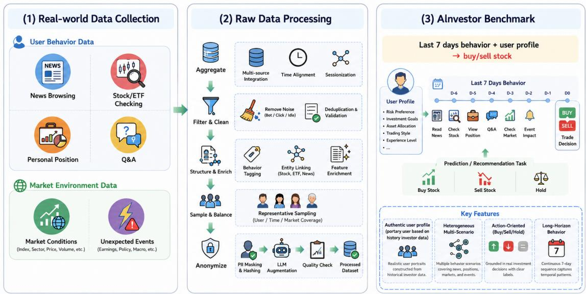
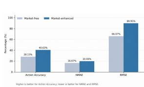
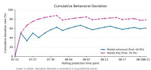
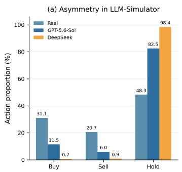
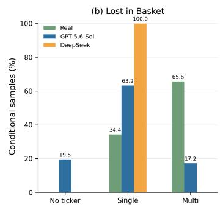
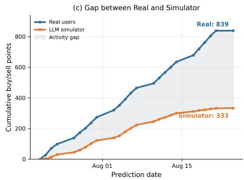
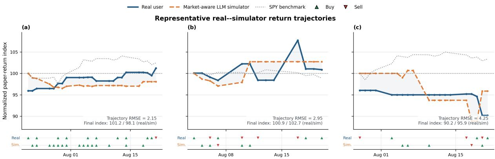

# Are LLMs Good Financial User Simulators? A Preliminary Study

Jiajie He1 Yuanhong Jiang1 Dongling Ni1 Wenjin Liu2 Xintong Chen3

1Hithink Research 2Nanyang Technological University 3McMaster University

jiajiehe@myhexin.com, yuanhongjiang@myhexin.com, donglingni@myhexin.com wenjinliu23@outlook.com, chen54xt@mcmaster.ca

## Abstract

Large language models (LLMs) are increasingly used as user simulators, but their ability to reproduce evolving individual financial decisions remains unclear. We present a preliminary study in a controlled paper-trading environment with 120 volunteers. Participants used non-redeemable virtual funds under realtime market conditions; no real brokerage accounts, real-money positions, or real transaction records were accessed. Given only information available before a prediction cutoff, a simulator predicts the participant’s nexttrading-day action, traded security, and transaction quantity. We evaluate temporally aligned rolling predictions and compare settings with and without point-in-time market information. Market context improves action and ticker prediction in the controlled ablation, while transaction sizing remains difficult. We also observe systematic behavioral compression: models overproduce hold actions, underpredict sell decisions, and simplify multi-security transactions. These results provide an initial empirical characterization and motivate larger-scale evaluation of individual, temporal, and portfoliolevel behavioral fidelity.

## 1 Introduction

Human behavior unfolds as a sequence of interdependent decisions rather than a collection of isolated actions (Kuhn, 1951). Modeling this process is central to cognitive science (Naveed Uddin, 2019; McClelland, 2009), behavioral economics (Mitroff, 1969), recommendation systems (Chen et al., 2026; Chan et al., 2023; Zhang et al., 2024b), and interactive artificial intelligence (Lavery, 1986). Recent large language models (LLMs) (OpenAI, 2026a; DeepSeek-AI et al., 2026; Anthropic, 2025; Yang et al., 2025) offer a flexible foundation for user simulation: they can integrate heterogeneous evidence, maintain a naturallanguage representation of a user, and generate context-sensitive actions. Yet plausible local responses are not sufficient. A useful simulator must preserve individual preferences, reproduce longitudinal behavioral patterns, and adapt to the external conditions under which decisions are made (Gong et al., 2026; Chen et al., 2026; Wang et al., 2026; McClelland, 2009; Chan et al., 2023).

Finance provides a particularly demanding setting for this problem. LLM-based advisory systems are increasingly being studied for investment information, portfolio analysis, and personalized recommendations (Wang et al., 2026; Gong et al., 2026; Bridgewater Associates). Before such systems are deployed, developers and financial professionals need controlled ways to examine how different users might respond to a recommendation, market shock, rebalancing proposal, or risk warning. A behaviorally faithful simulator could support this evaluation without exposing clients to untested strategies. It is not a substitute for realuser studies, but it can reveal failure modes earlier and at lower risk.

Evaluating a financial user simulator is distinct from evaluating a trading or advisory agent. A profitable agent can still be a poor simulator if it does not reproduce when a particular user trades, whether the user buys or sells, which securities the user selects, or how the user allocates a transaction across a portfolio. Conversely, an advisor may appear effective when paired with a simulator that is unrealistically passive, active, or compliant. Treating the simulator as a fixed and unexamined component can therefore confound downstream conclusions. Existing financial-agent studies have primarily emphasized market analysis, recommendation quality, portfolio returns, or aggregate market dynamics, while financial user-simulation studies often represent heterogeneous investors with a small set of generic profiles and do not independently measure fidelity to an individual’s evolving trajectory (Gong et al., 2026; Wang et al., 2026).

The difficulty is structural. Financial actions reflect both relatively stable characteristics—such as risk tolerance, investment horizon, and asset preference—and rapidly changing states, including attention, cash, holdings, unrealized gains and losses, and market conditions. The same interaction can therefore have different meanings: repeated quote views may indicate persistent interest, monitoring of an existing position, or preparation to exit. Decisions are also path-dependent. A user may read news, compare securities, place an order, react to a drawdown, and revise a strategy over several days; each action changes the portfolio state on which the next decision depends. A credible simulator must consequently satisfy three requirements: behavioral fidelity, temporal and causal plausibility, and financial consistency. In particular, it must use only information available at the prediction cutoff and produce actions that are coherent with the user’s current virtual portfolio.

To study these requirements, we introduce AInvestor, a pilot benchmark built from 120 volunteers operating on a controlled paper-trading platform. Participants interacted with real-time market information but traded exclusively with non-redeemable virtual funds; the study did not access their real brokerage accounts, real-money holdings, or real transaction records. AInvestor aligns de-identified platform interactions, simulated orders, virtual portfolio states, and point-in-time market observations under a rolling prediction protocol. Given only information available before a cutoff, a simulator predicts the participant’s next-trading-day action (buy, sell, or hold), the traded securities, and transaction quantities.

We ask two questions: (i) how accurately can current LLMs reproduce an individual participant’s next-day paper-trading decision and associated transaction details; and (ii) how much does pointin-time market context improve simulation relative to a market-free setting? Across the pilot evaluation, market context improves action and ticker prediction in the controlled ablation, but transaction sizing remains difficult. More fundamentally, all evaluated models exhibit behavioral compression: they overproduce hold, rarely recover sell decisions, flatten multi-security trading days into single-ticker outputs, and respond only weakly to daily market variation. These findings suggest that providing relevant context is not enough; models must learn when and how an individual uses that context.

Contributions. Our main contributions are as follows:

• We introduce AInvestor, a pilot benchmark that aligns de-identified participant representations, cross-scenario interactions, virtual portfolio and simulated transaction states, and time-aligned market observations.

• We define a preliminary evaluation protocol that goes beyond next-action accuracy to examine security selection, transaction quantity, temporal consistency, and trajectory-level fidelity.

• We systematically evaluate state-of-the-art proprietary and open-weight LLMs under the same rolling prediction protocol, providing a controlled assessment of their ability to simulate heterogeneous paper-trading participants in a dynamic market environment.

## 2 Related Work

## 2.1 LLM as Human Simulator

Advances in large language models (LLMs) have enabled increasingly realistic simulation of human cognition and interaction across diverse domains, including dialogue (Chan et al., 2023), recommendation (Chen et al., 2026; Wang et al., 2025; Zhang et al., 2024b), and autonomous driving (Jin et al., 2024). Seminal works such as Generative Agents (Park et al., 2023) and BASES (Ren et al., 2024) further extend this paradigm to long-horizon social behavior and web search. However, most existing user simulators are evaluated in controlled environments, synthetic sandboxes, or relatively stable interaction settings, leaving their effectiveness in financial decision making largely unexplored. In particular, prior work does not examine whether LLM-based simulators can infer an investor’s latent decision process and subsequent trading action from heterogeneous behavioral signals under dynamically evolving market conditions. This gap motivates benchmarks grounded in longitudinal platform behavior and point-in-time market information. To this end, we introduce a pilot financial benchmark that jointly captures long-horizon papertrading behavior and market dynamics, enabling an initial evaluation of LLM-based simulators in modeling investor decision processes and predicting next-step investment actions.

## 2.2 Financial Agent Application

Financial user simulation has evolved from rulebased dialogue models to LLM-based investor agents. Early work introduced user simulators for personalized dialogue management in financial product recommendation (den Hengst et al., 2019). More recent studies, such as StockAgent (Zhang et al., 2024a) and TwinMarket (YANG et al., 2025), employ LLM-based agents to simulate investor trading behavior under dynamic market conditions, with TwinMarket further examining how individual trading decisions give rise to collective market dynamics. Conv-FinRe (Wang et al., 2026) constructs longitudinal financial recommendation scenarios from real market data and human decision trajectories, highlighting the potential discrepancy between observed investor behavior and underlying utility. More recently, ShiJianBench (Gong et al., 2026) introduces investor simulators with evolving internal states to study how financial recommendations influence users’ subsequent investment decisions over long horizons. However, existing studies have not systematically investigated whether user simulators reproduce individual, heterogeneous behavior across scenarios and over extended time horizons.

## 3 Problem Definition

## 3.1 Next-Day Investor Simulation

We simulate an investor’s next-trading-day decision using only information available before a prediction cutoff. For investor i on trading day t, the observable input is

$$
\mathcal { T } _ { i , t } = \left( \mathbf { u } _ { i } , \mathbf { h } _ { i , t } , \mathbf { b } _ { i , < t - 6 } , \mathbf { r } _ { i , t - 6 : t } , \mathbf { m } _ { t } \right) ,\tag{1}
$$

where $\mathbf { u } _ { i }$ is the historical investor profile, $\mathbf { h } _ { i , t }$ is the current portfolio state, $\mathbf { b } _ { i , < t - 6 }$ is the long-term trading history before the recent window, $\mathbf { r } _ { i , t } .$ −6:t is the recent seven-day cross-scenario behavior, and $\mathbf { m } _ { t }$ is the contemporaneous market context. All components are point-in-time and precede the cutoff, preventing temporal leakage.

The simulator predicts the next-day trading action

$$
\mathbf { a } _ { i , t + 1 } = ( d _ { i , t + 1 } , S _ { i , t + 1 } , \mathbf { s } _ { i , t + 1 } , \mathbf { q } _ { i , t + 1 } ) ,\tag{2}
$$

where $d _ { i , t + 1 } \in \{ 0 , 1 \}$ indicates whether a trade occurs, $\boldsymbol { S } _ { i , t + 1 }$ is the set of traded assets, $s _ { i , t + 1 , j } \in$

{buy, sell} specifies the transaction direction, and $q _ { i , t + 1 , j }$ is the corresponding transaction quantity.

We factorize this next-day simulation as a hierarchical decision process:

$$
\begin{array} { r l r } {  { p _ { \theta } ( \mathbf { a } _ { i , t + 1 } \mid \mathcal { T } _ { i , t } ) = p _ { \theta } ( d _ { i , t + 1 } \mid \mathcal { T } _ { i , t } ) } } \\ & { } & { \times p _ { \theta } ( S _ { i , t + 1 } \mid d _ { i , t + 1 } , \mathcal { T } _ { i , t } ) } \\ & { } & { \times p _ { \theta } ( \mathbf { s } _ { i , t + 1 } , \mathbf { q } _ { i , t + 1 } \mid S _ { i , t + 1 } , \mathcal { T } _ { i , t } ) . } \end{array}
$$

This formulation tests whether a simulator can jointly capture whether to trade, what to trade, in which direction, and at what scale, while remaining consistent with the investor’s historical behavior, portfolio state, and market environment. Figure 1 summarizes the overall setting.

## 4 Experiments

We treat the current study as a pilot evaluation. The goal is to characterize the feasibility and failure modes of LLM-based financial user simulation, rather than to establish a definitive ranking of models.

## 4.1 Evaluation Metrics

We evaluate the simulator on three hierarchically structured tasks. For action prediction (buy, sell, or hold) (Gong et al., 2026), we report Action Accuracy, Macro-Recall(Sokolova and Lapalme, 2009), and Macro-F1(Takahashi et al., 2022). To expose class-specific performance under the imbalanced action distribution, we additionally report Buy Recall, Sell Recall, and Hold Recall. Macro-Recall is computed as the unweighted mean of the recalls for the three action classes, while Macro-F1 is the unweighted mean of their class-wise F1 scores.

For stock prediction, we report Ticker Exact Match (Ticker EM), where a prediction is counted as correct only when the predicted ticker exactly matches the ground-truth ticker. Because a transaction may contain multiple securities, we also report Ticker Overlap, which measures whether the predicted ticker set intersects with the ground-truth ticker set.

For transaction-size prediction (buy/sell volume), we report the Mean Absolute Error (MAE), normalized MAE (NMAE), relative quantity error, and Root Mean Squared Error (RMSE). Lower values indicate better performance for all quantitybased metrics.

Ticker and transaction-size metrics are evaluated conditionally on directional predictions for which the simulator predicts a transaction (buy or sell). We report the number of valid conditional cases to make the coverage of these metrics explicit.

  
Figure 1: Overview of AInvestor. A structured simulator constructs persistent and rolling user representations, which are evaluated on next-day action, security selection, and transaction-size prediction under a temporally aligned protocol.

## 4.2 Baselines

We evaluate a diverse set of representative LLMs, including both proprietary and open-weight models. The proprietary models the GPT series (GPT-5.6 Sol(OpenAI, 2026a), GPT-5.6 luna (OpenAI, 2026a) and GPT-5.5(OpenAI, 2026b)). The openweight models include DeepSeek-V4 (DeepSeek-AI et al., 2026) and GLM5.2 (GLM-5-Team et al., 2026).

## 4.3 Experimental Setting

We provide the detailed information about data preprocessing in the AppendixA

## 4.4 Experimental Results

## 4.4.1 What the Market Context Explains

Table 1 evaluates six LLMs on the marketenhanced rolling prediction task. Action accuracy spans only 4.93 points and lies entirely below the always-hold baseline (48.27%), so we characterise the behavioural structure the task exposes rather than rank models. For the two models with released predictions we additionally relate outputs to the supplied market context.

Users trade more when the market has recently fallen, but the opposite after a month. Whether a user trades on a given day correlates with the return of a broad market index, and the sign of that relation depends on horizon: it is negative over one day (−0.063) and one week (−0.112), and positive over one month (+0.023). Users thus respond against recent moves and with sustained ones. The weekly effect is the clearest, with the trading rate falling steadily from 58.3% in the worst-performing fifth of days to 43.9% in the best. It also survives a within-user comparison that removes differences in how often users trade at all (t=4.60 over 82 users), which argues against the pattern being an artefact of a few unusually active accounts.

## Declines prompt activity; rises prompt silence.

Breaking those fifths down by action shows the mechanism is broader than buying after a fall. Weak markets raise the share of days on which a user acts at all, and both directions contribute: buying is most frequent in the weakest markets, while selling is roughly twice as common there as after a strong rally. Strong markets are dominated instead by inaction. Market state therefore bears more reliably on whether a user trades than on which way.

The models capture almost none of this. The same correlations computed on model outputs are negligible, and the models reproduce only about a tenth of the observed swing in trading rate across market fifths. The contrast is sharpest on the days following the steepest declines, when nearly half of all users trade: the models propose a trade on only a handful of those days and mention the falling market in a small fraction of their explanations. Market data is supplied to the models but barely influences what they predict.

The models rely on a fixed impression of each user. Each user appears on many dates, so a model attending to daily conditions should vary its predictions within a user. It does not. For roughly two thirds of users every date receives the same prediction, and a single label per user accounts for almost all of that model’s output, making accuracy a property of which user is being predicted rather than of which day. Measured against the best fixed guess available for a user, the models lose more often than they win, and among the users whose true behaviour genuinely varies they fall well short of that constant. Representing a stable habit is reasonable, but here it has displaced the day-specific response that the data contains.

A day’s activity is many small trades, not one order. Recorded days rarely resemble a single decision: most active days comprise several trades, one spanning more than a hundred, and many trade the same symbol more than once. Nor are these whole-share round orders. Requesting one symbol and one quantity cannot express such a day, which accounts for the systematic under-prediction of trade size in Table 1. Consistently, the models do not infer symbols from the market; they retrieve them from the input, and the model drawing more heavily on the abstracted profile than on the raw activity history is the more accurate on symbol identity.

Available versus extracted signal. The two models agree on the great majority of user-days, yet the days on which they propose a trade barely overlap, and no disagreement concerns the direction of the trade. Their rare non-hold predictions are thus largely unrelated to one another. The experiment separates a real market response, consistent within users and worth roughly fourteen points of trading rate, from an extracted response of about one point. The bottleneck lies not in supplying market context, which is already provided, but in whether the agent conditions on it rather than on a fixed impression of the user.

  
(a) Prediction performance under market-free and marketenhanced settings.

  
(b) Cumulative behavioral deviation over time for a representative investor. Lower values indicate closer agreement with the observed trajectory.  
Figure 2: Effect of market context on investor simulation. (a) Incorporating market information improves next-day action prediction and traded-ticker identification, while transaction-quantity estimation remains challenging. (b) Market-enhanced simulation yields lower cumulative behavioral deviation and stays closer to the observed investor trajectory over time.

## 4.4.2 Effect of Market Context

We compare a Market-free setting (investor profile, recent behavior, portfolio state, historical trades) against a Market-enhanced setting that additionally provides point-in-time market context, holding all other factors fixed.

Figure 2(a) reveals an asymmetry specific to financial decisions: market context improves action accuracy (28.13%→40.63%) and ticker exact match (16.67%→20.00%), but degrades quantity estimation (MAPE 66.07%→89.95%). This indicates that market signals inform whether and what to trade, whereas trade size is governed by userinternal constraints—available cash, existing positions, and portfolio-level risk budget—that external context cannot substitute. Figure 2(b) shows that market-enhanced simulation reduces the final cumulative deviation rate (78.26%→60.87%), yet substantial residual deviation persists, underscoring that faithful investor simulation requires modeling private portfolio states alongside public market conditions.

## 4.4.3 Structural Biases in Financial User Simulation

Aggregate metrics mask how LLM simulators systematically distort financial behavior. We examine the simulation gap at three levels: action composition, portfolio-level transaction representation, and temporal accumulation of active decisions. Two financial-specific biases emerge: an overproduction of hold and a compression of multi-security transactions into single-ticker outputs.

Inaction bias. Real users trade actively: buys, sells, and holds appear in roughly balanced proportions. In contrast, the evaluated simulators predict hold for the vast majority of instances, suppressing buy and sell decisions to marginal rates. Table 1 confirms this pattern across six models: hold recall dominates, while sell recall remains negligible and buy recall stays low. Action accuracy falls below the always-hold baseline, indicating that models default to the majority class rather than learning conditional trading behavior. This is not risk aversion but behavioral inertia: under uncertainty, the simulator preserves the status quo, erasing the active trading that constitutes market participation.

Table 1: Comparison of different LLMs on the market-enhanced rolling financial behavior prediction task.
<table><tr><td>Model</td><td>Action Acc.</td><td>Macro-Recall</td><td>Buy Recall</td><td>Sell Recall</td><td>Hold Recall</td><td>Macro-F1</td><td>Ticker EM</td><td>Ticker Overlap</td><td>Quantity MAE</td><td>Quantity Rel. Err.</td></tr><tr><td colspan="9">Proprietary Models</td></tr><tr><td>GPT-5.6-Sol</td><td>44.39%</td><td>33.24%</td><td>14.09%</td><td>4.78%</td><td>80.84%</td><td>29.22%</td><td>14.94%</td><td>43.68%</td><td>423.41</td><td>130.84%</td></tr><tr><td>GPT-5.6-Luna</td><td>42.60%</td><td>32.41%</td><td>14.68%</td><td>6.57%</td><td>75.99%</td><td>29.26%</td><td>17.71%</td><td>51.04%</td><td>108.29</td><td>1536.08%</td></tr><tr><td>GPT-5.5</td><td>46.92%</td><td>33.67%</td><td>7.34%</td><td>2.09%</td><td>91.57%</td><td>26.53%</td><td>11.36%</td><td>38.64%</td><td>801.91</td><td>177.90%</td></tr><tr><td>Gemini-3-Flash</td><td>47.29%</td><td>33.28%</td><td>3.37%</td><td>1.19%</td><td>95.27%</td><td>24.09%</td><td>19.05%</td><td>47.62%</td><td>225.91</td><td>190.64%</td></tr><tr><td colspan="9">Open-weight Models</td></tr><tr><td>DeepSeek-V4</td><td>47.53%</td><td>32.97%</td><td>0.79%</td><td>0.30%</td><td>97.83%</td><td>22.17%</td><td>40.00%</td><td>40.00%</td><td>1.50</td><td>155.27%</td></tr><tr><td>GLM-5.2</td><td>47.41%</td><td>33.35%</td><td>5.16%</td><td>0.00%</td><td>94.89%</td><td>24.34%</td><td>3.85%</td><td>26.92%</td><td>388.29</td><td>133.26%</td></tr></table>

Basket compression. Real trading is inherently portfolio-level. Most observed conditional outcomes involve multiple transactions, yet the simulators predominantly emit a single ticker or fail to produce a valid one. Ticker exact-match consequently remains low, and quantity prediction is severely under-sized. This portfolio-compression bias reduces set-valued allocation decisions to a single representative asset, obscuring diversification and execution nuances critical to financial simulation.

Temporal accumulation. The action-level bias compounds over the rolling horizon. The cumulative number of active trading points generated by real users far exceeds that of the simulator, and the gap widens over time. The simulator therefore does not merely misclassify isolated days; it systematically under-generates active decisions, constructing users with artificially low turnover and high inertia. Over time, this drift distorts any downstream evaluation of advisory strategies or risk exposure that relies on simulated behavior.

Trajectory similarity is not behavioral fidelity. Even for the users with the lowest trajectory RMSE, the simulator fails to reproduce transaction timing or direction. It can appear safer or more profitable simply by omitting the user’s losing trades, so return-level agreement cannot validate a user simulator and may reward inaction while masking decision-level divergence.

Together, these biases form a hierarchy: active decisions are suppressed at the action level, surviving portfolio actions are flattened into single-ticker outputs, and the resulting trajectory drifts toward apparent profitability through omission rather than fidelity. For financial applications, this implies that LLM simulators may understate liquidity provision, overstate stability, and miss the path-dependent nature of real trading. Faithful financial user simulation therefore requires explicit modeling of transaction occurrence, directional intent, and set-valued portfolio execution, rather than single-label classification.

## 5 Conclusion

We introduced AInvestor, a pilot benchmark for evaluating whether LLMs can reproduce individual decisions in a controlled paper-trading environment. Although point-in-time market context improves action and ticker prediction, current models remain below the always-hold baseline in the main comparison. They systematically overpredict inaction, underpredict sell decisions, simplify multisecurity transactions, and struggle with transaction sizing, resulting in substantial trajectory-level deviation.

These findings show that plausible portfolio returns alone do not establish behavioral fidelity. Financial user simulators should be evaluated jointly at the action, security, quantity, and trajectory levels. Future work should extend the participant population and observation horizon, explicitly model evolving portfolio constraints, and support multiorder prediction across different market regimes. AInvestor contains only de-identified behavior generated with non-redeemable virtual funds and includes no real brokerage accounts or real transaction records.

Figure 3: Structural biases in financial user simulation. (a) Real and simulated next-day action compositions. Both GPT-5.6-Sol and DeepSeek substantially overproduce hold actions and suppress active buy and sell decisions. (b) Transaction structure conditional on a correct directional prediction and available detail output. Real outcomes are frequently multi-transaction baskets, whereas the simulators predominantly emit a single ticker. (c) Cumulative active trading activity for real users and the representative LLM simulator. The widening gap illustrates the temporal accumulation of financial inaction bias.  
  
Prediction date (markers in the lower strip indicate buy/sell; no marker indicates hold  
Figure 4: Representative real–simulator trading trajectories. We select the three closest non-degenerate users from the 120-user evaluation set according to trajectory RMSE between aligned normalized paper-return indices. Blue solid lines denote realized user behavior, orange dashed lines denote the market-aware LLM simulator, and grey dotted lines denote SPY. The lower strips mark buy and sell actions; unmarked dates correspond to hold.

## References

Anthropic. 2025. Introducing claude opus 4.5.

Bridgewater Associates. Aia labs: The future of investment intelligence. https://www.bridgewater.co m/aia-labs. Accessed: 2026-03-18.

Chi-Min Chan, Weize Chen, Yusheng Su, Jianxuan Yu, Wei Xue, Shanghang Zhang, Jie Fu, and Zhiyuan Liu. 2023. Chateval: Towards better llm-based evaluators through multi-agent debate. Preprint, arXiv:2308.07201.

Jiawei Chen, Ruoxi Xu, Boxi Cao, Ruotong Pan, Yunfei Zhang, Yifei Hu, Yong Du, Tingting Gao, Yaojie Lu, Yingfei Sun, Xianpei Han, Le Sun, Xiangyu Wu, and Hongyu Lin. 2026. Towards real-world human behavior simulation: Benchmarking large language models on long-horizon, cross-scenario, heterogeneous behavior traces. Preprint, arXiv:2604.08362.

DeepSeek-AI, Anyi Xu, Bangcai Lin, Bing Xue, Bingxuan Wang, Bingzheng Xu, Bochao Wu, Bowei Zhang,

Chaofan Lin, Chen Dong, Chenchen Ling, Chengda Lu, Chenggang Zhao, Chengqi Deng, Chengyu Hou, Chenhao Xu, Chenze Shao, Chong Ruan, Conner Sun, and 300 others. 2026. Deepseek-v4: Towards highly efficient million-token context intelligence. Preprint, arXiv:2606.19348.

Floris den Hengst, Mark Hoogendoorn, Frank van Harmelen, and Joost Bosman. 2019. Reinforcement learning for personalized dialogue management. In IEEE/WIC/ACM International Conference on Web Intelligence, WI ’19, page 59–67, New York, NY, USA. Association for Computing Machinery.

GLM-5-Team, :, Aohan Zeng, Xin Lv, Zhenyu Hou, Zhengxiao Du, Qinkai Zheng, Bin Chen, Da Yin, Chendi Ge, Chenghua Huang, Chengxing Xie, Chenzheng Zhu, Congfeng Yin, Cunxiang Wang, Gengzheng Pan, Hao Zeng, Haoke Zhang, Haoran Wang, and 168 others. 2026. Glm-5: from vibe coding to agentic engineering. Preprint, arXiv:2602.15763.

Jie Gong, Maowei Jiang, Zhiwei Liu, Yang Qiao, Wenxi Wu, Mengxi Xiao, Enze Zhang, Ziyan Kuang, Yankai Chen, Caishuang Huang, Meng Zhou, Xiku Du, Xue Liu, Guojun Xiong, Min Peng, Qianqian Xie, and Sophia Ananiadou. 2026. Shijianbench: From dialogue to decision for long-horizon evaluation of investment advisors. Preprint, arXiv:2608.01204.

Ye Jin, Ruoxuan Yang, Zhijie Yi, Xiaoxi Shen, Huiling Peng, Xiaoan Liu, Jingli Qin, Jiayang Li, Jintao Xie, Peizhong Gao, Guyue Zhou, and Jiangtao Gong. 2024. Surrealdriver: Designing llm-powered generative driver agent framework based on human drivers driving-thinking data. Preprint, arXiv:2309.13193.

Manford H. Kuhn. 1951. Lewin, kurt. field theory of social science: Selected theoretical papers. (edited by dorwin cartwright.) pp. xx, 346. new york: Harper & brothers, 1951. \$5.00. The ANNALS ofthe American Academy ofPolitical and Social Science, 276(1):146– 147.

R. Greer Lavery. 1986. Artificial intelligence and simulation: an introduction. In Proceedings ofthe 18th Conference on Winter Simulation, WSC ’86, page 448–452, New York, NY, USA. Association for Computing Machinery.

James L. McClelland. 2009. The place of modeling in cognitive science. Topics in Cognitive Science, 1(1):11–38.

Ian I. Mitroff. 1969. Fundamental issues in the simulation of human behavior: A case in the strategy of behavioral science. Management Science, 15(12):B635– B649.

Mohd Naveed Uddin. 2019. Cognitive science and artificial intelligence: simulating the human mind and its complexity. Cognitive Computation and Systems, 1(4):113–116.

OpenAI. 2026a. Gpt-5.6: Frontier intelligence that scales with your ambition.

OpenAI. 2026b. Introducing gpt-5.5.

Joon Sung Park, Joseph O’Brien, Carrie Jun Cai, Meredith Ringel Morris, Percy Liang, and Michael S. Bernstein. 2023. Generative agents: Interactive simulacra of human behavior. In Proceedings ofthe 36th Annual ACM Symposium on User Interface Software and Technology, UIST ’23, New York, NY, USA. Association for Computing Machinery.

Ruiyang Ren, Peng Qiu, Yingqi Qu, Jing Liu, Wayne Xin Zhao, Hua Wu, Ji-Rong Wen, and Haifeng Wang. 2024. BASES: Large-scale web search user simulation with large language model based agents. In Findings ofthe Associationfor Computational Linguistics: EMNLP 2024, pages 902– 917, Miami, Florida, USA. Association for Computational Linguistics.

Marina Sokolova and Guy Lapalme. 2009. A systematic analysis of performance measures for classification tasks. Information Processing & Management, 45(4):427–437.

Kanae Takahashi, Kouji Yamamoto, Aya Kuchiba, and Tatsuki Koyama. 2022. Confidence interval for micro-averaged F1 and macro-averaged F1 scores. Applied Intelligence, 52(5):4961–4972.

Lei Wang, Jingsen Zhang, Hao Yang, Zhi-Yuan Chen, Jiakai Tang, Zeyu Zhang, Xu Chen, Yankai Lin, Hao Sun, Ruihua Song, Xin Zhao, Jun Xu, Zhicheng Dou, Jun Wang, and Ji-Rong Wen. 2025. User behavior simulation with large language model-based agents. ACM Trans. Inf. Syst., 43(2).

Yan Wang, Yi Han, Lingfei Qian, Yueru He, Xueqing Peng, Dongji Feng, Zhuohan Xie, Vincent Jim Zhang, Yuqing Guo, Fengran Mo, Jimin Huang, Yankai Chen, and Jian-Yun Nie. 2026. Conv-finre: A conversational and longitudinal benchmark for utilitygrounded financial recommendation. In Proceedings of the 49th International ACM SIGIR Conference on Research and Development in Information Retrieval, SIGIR ’26, page 3448–3455, New York, NY, USA. Association for Computing Machinery.

An Yang, Anfeng Li, Baosong Yang, Beichen Zhang, Binyuan Hui, Bo Zheng, Bowen Yu, Chang Gao, Chengen Huang, Chenxu Lv, Chujie Zheng, Dayiheng Liu, Fan Zhou, Fei Huang, Feng Hu, Hao Ge, Haoran Wei, Huan Lin, Jialong Tang, and 41 others. 2025. Qwen3 technical report. Preprint, arXiv:2505.09388.

Yuzhe YANG, Yifei Zhang, Minghao Wu, Kaidi Zhang, Yunmiao Zhang, Honghai Yu, Yan Hu, and Benyou Wang. 2025. Twinmarket: A scalable behavioral and social simulation for financial markets. In Advances in Neural Information Processing Systems, volume 38, Main Conference, pages 63469–63519. Curran Associates, Inc.

Chong Zhang, Xinyi Liu, Zhongmou Zhang, Mingyu Jin, Lingyao Li, Zhenting Wang, Wenyue Hua, Dong Shu, Suiyuan Zhu, Xiaobo Jin, Sujian Li, Mengnan Du, and Yongfeng Zhang. 2024a. When ai meets finance (stockagent): Large language model-based stock trading in simulated real-world environments. Papers 2407.18957, arXiv.org.

Junjie Zhang, Yupeng Hou, Ruobing Xie, Wenqi Sun, Julian McAuley, Wayne Xin Zhao, Leyu Lin, and Ji-Rong Wen. 2024b. Agentcf: Collaborative learning with autonomous language agents for recommender systems. In Proceedings of the ACM Web Conference 2024, WWW ’24, page 3679–3689, New York, NY, USA. Association for Computing Machinery.

## A Dataset

## A.1 Data Source

Using real brokerage records for research can raise substantial privacy, regulatory, and datagovernance concerns. We therefore constructed a controlled paper-trading environment and did not access participants’ real brokerage accounts, realmoney holdings, credentials, or real transaction records.

We recruited 120 volunteer participants. Participants could buy, sell, rebalance, or remain inactive at their discretion under real-time market conditions. Orders were simulated exclusively with non-redeemable virtual funds and had no effect on participants’ real assets, brokerage accounts, or financial positions. We recorded the resulting papertrading trajectories over a four-month observation period.

Privacy Protection. Although the platform did not collect real brokerage data, the resulting interaction logs constitute participant-generated behavioral data. We therefore de-identify all data used for analysis and release. A locally deployed DeepSeek-V4-Flash model (DeepSeek-AI et al., 2026) assists in detecting personally identifiable information in any free-text or account-associated fields. Detected identifiers are replaced with standardized placeholders (e.g., [NAME] and [AGE]). We then conduct manual quality assurance before releasing the processed dataset. No raw identifiers, real account credentials, real-money positions, or real brokerage transactions are included in the released data.

## A.2 Construction Pipeline

We collected data from 120 volunteers using the Paper Trading platform, comprising 230K+ interactions. The data span multiple financial scenarios, including market-information and news browsing, stock/ETF viewing, simulated trading activity, virtual portfolio states, and interactions with the platform chatbot.

Data Processing. We clean duplicated, incomplete, and noisy records and organize all interactions into unified chronological behavior sequences. For each user, earlier historical behaviors are further used to construct a financial profile capturing relatively stable characteristics such as investment preferences, trading patterns, and portfolio characteristics. For viewed financial news, we clean the original text and use DeepSeek-V4(DeepSeek-AI et al., 2026) to generate concise summaries, which are inserted into the corresponding positions of the behavior sequence.

User Diversity. To preserve behavioral heterogeneity, our dataset includes both active and inactive participants with diverse paper-trading styles, including high-risk trading and long-term investing. Participants also vary in financial experience, ranging from experienced market participants to non-professional retail investors.