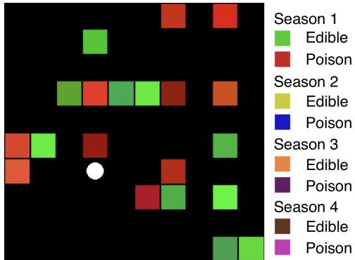
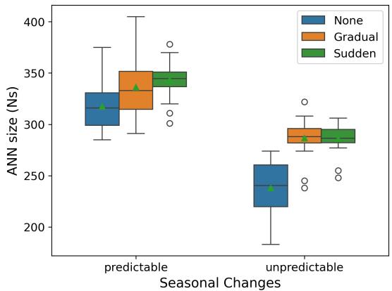
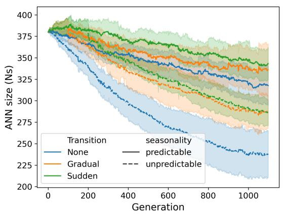
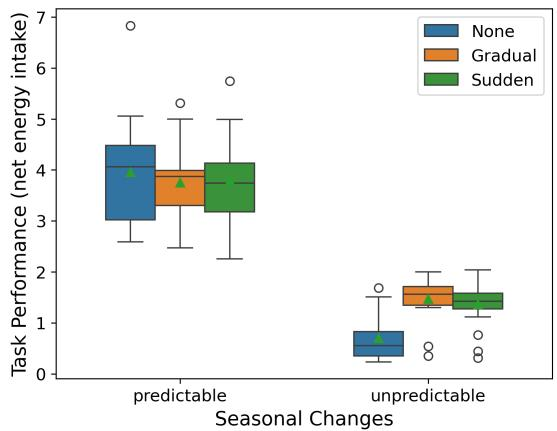
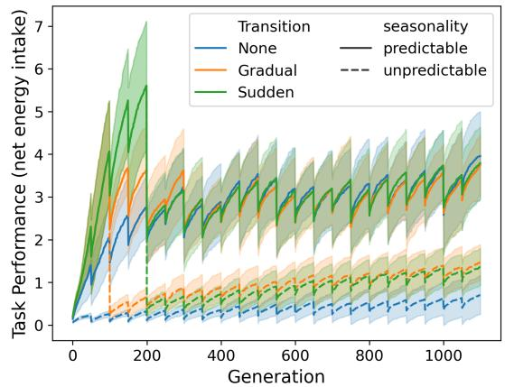

# Big Brains and Changing Environments: Cause or Consequence?

Sian Heesom-Green, Jonathan Shock, Geof Nitschke

HSMSIA001@myuct.ac.za,jonathan.shock@uct.ac.za,gnitschke@cs.uct.za

Department of Computer Science, University of Cape Town

Cape Town, South Africa

## Abstract

Large brains are metabolically costly, and associations with chang ing environments do not imply they evolved there, as the Cognitive Bufer Hypothesis (CBH) would suggest. They may instead evolve in stable conditions and later facilitate colonization of changing environments. Using neuro-evolution in an artificial seasonal foraging task, we compared agents evolving exclusively in changing environments to agents first evolved in static environments before transitioning. Results show that larger neural networks in dynamic environments arise mainly from prior static evolution, achieving superior performance under unpredictable changes. Our results challenge strict CBH predictions, provide agent-based (computational) support for a colonization-based account and highlight the role of evolutionary history in brain size evolution.

## ACM Reference Format:

Sian Heesom-Green, Jonathan Shock, Geof Nitschke. 2026. Big Brains and Changing Environments: Cause or Consequence?. In Genetic and Evolutionary Computation Conference (GECCO Companion ’26), July 13–17, 2026, San Jose, Costa Rica. ACM, New York, NY, USA, 4 pages. https://doi.org/10.1145/ 3795101.3805275

## 1 Introduction

Associations between large brains and changing environments have been identified in birds [23, 24, 33], but do these associations imply causality, as suggested by the Cognitive Bufer Hypothesis (CBH)? CBH posits that larger brains evolved in response to changing envi ronments by enabling enhanced behavioral flexibility and learning, helping bufer the efects of seasonality [1, 19, 25].

However, large brains are metabolically costly, and energy constraints may strongly shape their evolution. The Expensive Brain Hypothesis (EBH) frames this cost as a fundamental bottleneck: increases in brain size are only sustainable when energy budgets allow, either through greater energy acquisition or the reallocation of energy from other vital organs [14]. In conditions where energy intake is more dificult, such as in changing or unpredictable environments, these constraints may limit rather than promote larger brains. Consistent with this, both biological and artificial systems show that smaller, more energy-eficient brains can be favored under variable conditions [10, 11, 16, 31, 32, 36].

If environmental variability does not consistently favor larger brains, what explains their observed association in birds today? One alternative to CBH is that large brains facilitate the colonization of variable environments rather than evolving within them [7, 23, 30].

  
Figure 1: 10×10 grid-world with cell colors denoting food type. The agent is represented by a white circle. The legend provides an example of seasonal changes in food color.

Fristoe et al. [7] showed that birds with larger relative brain sizes were more resilient to environmental variation, yet increases in brain size typically preceded, rather than followed, expansion into more variable habitats. This suggests that large brains may evolve under stable, energy-permissive conditions and, as a consequence, facilitate expansion into more dynamic environments.

Neuro-evolution, the artificial evolution of Artificial Neural Networks (ANNs), provides a controlled framework for simulating evolutionary dynamics across diverse environmental and ecological scenarios and trajectories [20]. In this study, we employ neuroevolution in an artificial foraging task with both predictable and unpredictable seasonal variation, incorporating explicit energy costs on ANN size. We compare agents that evolve initially in static environments before transitioning to changing environments with those evolving solely in changing environments, asking whether prior evolution in static environments facilitates the emergence of larger ANNs and improved performance under environmental variability. By incorporating evolutionary trajectory, this framework enables a more causally grounded interpretation of the relationship between brain size and environmental variability.

## 2 Methods and Experiments

This section describes the task environment (section 2.1), neuroevolution process (section 2.2), agent lifetime learning (section 2.3), and experiments (section 2.4).

## 2.1 Task Environment

Agents forage for edible foods while avoiding poisonous items in a 10×10 grid-world, with cell color indicating food type (Figure 1) [11]. They can move up, down, left, right, or eat, and observe a 7×7 window of nearby RGB cell colors (147 values), their current location (1 value), and previous reward (1 value). Each 100-step episode begins with 10 edible and 10 poisonous items randomly placed in the grid; consumed items are immediately replaced. Base RGB colors for each food type are randomly initialized, with individual items varying slightly (±0.2 per channel).

Dynamic Environments. In dynamic environments, the color assigned to each food type changes across seasons (example shown in Figure 1 legend). Seasons follow a fixed sequence with equal duration. In predictable environments, food color mappings are fixed within each season, whereas in unpredictable environments, they are regenerated at every seasonal change.

Rewards / energy dynamics. Agents expend energy (Equation 1) per time-step, gain energy (+1) from edible foods, and lose energy (-1) from poisonous foods. Energy expenditure scales with ANN size to reflect the metabolic cost of larger brains:

$$
E = 0 . 0 1 \times \frac { N _ { S } ^ { \mathrm { c u r r e n t } } } { N _ { S } ^ { \mathrm { g e n } _ { 0 } } }\tag{1}
$$

Where, $N _ { S } ^ { \mathrm { c u r r e n t } }$ is the current ANN size and $N _ { S } ^ { \mathrm { g e n } _ { 0 } }$ is the initial size (generation 0)1. ANN size $( N _ { S }$ , Equation 2) is defined as the total number of free parameters [4, 11, 21]:

$$
N _ { S } = ( \mathrm { n o n { - i n p u t } ~ n o d e s } ) + ( \mathrm { c o n n e c t i o n s } )\tag{2}
$$

## 2.2 Agent Neuro-evolution

Agent ANNs evolve using the standard NEAT procedure [29]. We evolve a population of 150 genomes (ANNs) over 1100 generations, each initialized with a partially connected ANN (input-output connections occur with 50% probability), with no hidden nodes and randomly initialized weights, biases, and per-connection learning parameters2.

Evolution follows standard NEAT mechanisms, including speciation, selection, reproduction, and replacement. Within each nonstagnant species (no improvement over 15 generations), fittest individuals are selected via rank-based selection to generate ofspring through crossover and mutation. The next generation is formed from these ofspring, with elitism applied by retaining the fittest genome in species containing more than five individuals.

Fitness is evaluated over 10 independent trials with diferent seeds and food color configurations. Each trial consists of 100 episodes in which agents update their ANN weights online3 via Hebbian learning (see section 2.3). Episodes 1-50 are used for exploration and 51-100 for computing trial fitness as the mean accumulated reward. Final fitness is averaged across trials. Multiple short trials reduce overfitting to specific episode sequences or colors, with seeds re-sampled every 50 generations during evolution.

## 2.3 Lifetime Learning via Hebbian Learning

Within each generation, agents adapt online via reward-modulated Hebbian learning [8, 22]. Weight updates follow Hebbian rules

Table 1: Environment transitions over evolutionary time
<table><tr><td>Transition Type</td><td>Gen 0-99</td><td>Gen 100-199</td><td>Gen 200-299</td><td>Gen 300+</td></tr><tr><td>None</td><td>4 seasons</td><td></td><td></td><td></td></tr><tr><td>Sudden</td><td>1 season</td><td></td><td>4 seasons</td><td></td></tr><tr><td>Gradual</td><td>1 season</td><td>2 seasons</td><td>3 seasons</td><td>4 seasons</td></tr></table>

Table 2: Experimental conditions and evaluation
<table><tr><td rowspan=1 colspan=1>SeasonalChanges</td><td rowspan=1 colspan=1>EnvironmentTransition Type</td><td rowspan=1 colspan=1>EvaluationMetrics</td></tr><tr><td rowspan=3 colspan=1>Predictable</td><td rowspan=1 colspan=1>None</td><td rowspan=3 colspan=1>ANN size (Ns),Task Performance</td></tr><tr><td rowspan=1 colspan=1>Sudden</td></tr><tr><td rowspan=1 colspan=1>Gradual</td></tr><tr><td rowspan=3 colspan=1>Unpredictable</td><td rowspan=1 colspan=1>None</td><td rowspan=3 colspan=1>ANN size (Ns),Task Performance</td></tr><tr><td rowspan=1 colspan=1>Sudden</td></tr><tr><td rowspan=1 colspan=1>Gradual</td></tr></table>

(Equations 3-5):

$$
H ( n _ { i } , n _ { j } ) = n _ { i } \cdot n _ { j }\tag{3}
$$

where $n _ { i }$ and $n _ { j }$ are presynaptic and postsynaptic activations. Temporal credit assignment is implemented via eligibility traces:

$$
e _ { i j } \gets \tau _ { i j } e _ { i j } + H ( n _ { i } , n _ { j } )\tag{4}
$$

with decay $\tau _ { i j } .$ . Reward modulation adjusts weights according to:

$$
w _ { i j } \gets w _ { i j } + R , \eta _ { i j } , e _ { i j }\tag{5}
$$

where � is the instantaneous reward minus its running average, and $\eta _ { i j }$ is the connection-specific learning rate [8].

## 2.4 Experiments

Experiments4 investigate whether large ANNs emerge primarily under static, energy-permissive conditions and subsequently facilitate adaptation to changing environments, or whether they evolve directly in response to environmental variability. To test this, we compare agents evolved exclusively in changing environments with agents that first undergo evolution in static environments before being transitioned to changing environments, either abruptly or gradually (Table 1). Each experimental condition (Table 2) is evaluated over 20 independent evolutionary runs. Across all runs, we record ANN size (��, Equation 2) and task performance, defined as net energy intake (edible minus poisonous food consumption). This metric difers from the fitness function in that it excludes energy expenditure, enabling fair comparisons across agents with varying ANN sizes [11].

## 3 Results & Discussion

Figure 2 presents ANN size and task performance of the fittest genomes across evolutionary transition scenarios under both predictable and unpredictable seasonal conditions. Table 3 reports pairwise comparisons of ANN size and task performance across transition scenarios using Dunn’s post hoc tests (with Bonferroni correction) following Kruskal-Wallis (KW) tests [6, 15].

  
Figure 2: ANN size $( N _ { S }$ , left panels) and task performance (right panels) for the fittest genome (averaged over 20 runs), across seasonal change regimes (predictable and unpredictable) and evolutionary transition scenarios (described in Table 1). Box plots (top) show final evolved $N _ { S }$ and task performance at the end of evolution per scenario. Line plots (bottom) show evolutionary trajectories of $N _ { S }$ (left) and task performance (right) of the current fittest genome across generations for each scenario.

Table 3: Dunn’s post hoc tests (Bonferroni-corrected) for pairwise comparisons of ANN size and task performance across transition scenarios. Significant results $( p < 0 . 0 5 )$ are in bold.
<table><tr><td rowspan=1 colspan=1>SeasonalChanges</td><td rowspan=1 colspan=1>ANN size</td><td rowspan=1 colspan=1>Task Performance</td></tr><tr><td rowspan=3 colspan=1>Predictable</td><td rowspan=1 colspan=1>Sudden &gt; None</td><td rowspan=1 colspan=1>Sudden == None</td></tr><tr><td rowspan=1 colspan=1>Gradual == None</td><td rowspan=1 colspan=1>Gradual == None</td></tr><tr><td rowspan=1 colspan=1>Sudden == Gradual</td><td rowspan=1 colspan=1>Sudden == Gradual</td></tr><tr><td rowspan=3 colspan=1>Unpredictable</td><td rowspan=1 colspan=1>Sudden &gt; None</td><td rowspan=1 colspan=1>Sudden &gt; None</td></tr><tr><td rowspan=1 colspan=1>Gradual &gt; None</td><td rowspan=1 colspan=1>Gradual &gt; None</td></tr><tr><td rowspan=1 colspan=1>Sudden == Gradual</td><td rowspan=1 colspan=1>Sudden == Gradual</td></tr></table>

Early evolutionary conditions strongly influenced ANN size $( N _ { S } )$ Selection favored larger ANNs in static environments, where energy acquisition is easier, than in predictable and unpredictable changing environments (Spearman rank correlation for �� over generations before transitions: Static: $\rho = 0 . 0 3 7$ , changing environments: $\rho < 0 ,$ all $p \ < \ 0 . 0 5 )$ , consistent with the Expensive Brain Hypothesis (EBH) [14]. Although ANN sizes declined following transition to changing environments, agents with prior static evolution retained significantly larger networks at the end of the evolutionary run (KW test, $\begin{array} { r } { p < 0 . 0 5 ; } \end{array}$ Table 3), indicating a lasting influence of early evolutionary history.

Under predictable changes, no significant diferences in task performance were observed between transition scenarios (KW test, $p \geq 0 . 0 5 )$ . Similarly, field observations report comparable foraging eficiency between larger-brained primates and smaller-brained procyonids, and empirical studies have reported both specialists and generalists under predictable seasonal variation, despite diferences in brain size [3, 13, 18].

Under unpredictable changes, agents with prior static evolution performed significantly better than those evolving exclusively within changing environments (KW test, $\begin{array} { r } { p < 0 . 0 5 ; } \end{array}$ Table 3), consistent with evidence that larger brains enhance survival and colonization in harsh or unpredictable conditions [2, 26–28, 33, 34].

Associations between large ANNs and changing environments in our simulations therefore primarily reflect prior evolution under static conditions, which later confers advantages in variable environments, particularly when changes are unpredictable. These results align more closely with a colonization-based account than with the CBH, in which large brains precede and facilitate the col onization of variable habitats rather than evolving in response to them [7]. This underscores the importance of investigating evolutionary trajectories, highlighting that associations do not necessarily imply causality [5, 7, 9, 12].

## 4 Conclusions

This study examined whether associations between large brains and changing environments reflect selection within such environments, or instead arise from prior evolution under more stable conditions, subsequently facilitating colonization of variable en vironments. Using artificial neuro-evolution with explicit energy constraints, we show that changing environments do not reliably select for larger neural architectures. Instead, larger ANNs primarily arise from prior evolution in static environments, where energy acquisition is easier, with these agents achieving comparable performance under predictable changes and superior performance under unpredictable changes relative to those evolving exclusively in changing environments. More broadly, this work shows that correlations between brain size and changing environments do not necessarily imply causality, underscoring the need to account for evolutionary history when interpreting such associations within evolutionary theory. While artificial agents allow precise control over environmental dynamics and evolutionary history, the simplified setup limits generalization to biological systems. Ongoing work is exploring richer environmental variability, energy costs (for example, corresponding to variable agent morphologies [17, 35]), and alternative initialization and encoding schemes.

## 5 Acknowledgments

Compute was performed using the University of Cape Town’s ICTS High Performance Computing cluster: hpc.uct.ac.za

## References

[1] John Allman, Todd McLaughlin, and Atiya Hakeem. 1993. Brain weight and life-span in primate species. Proceedings ofthe National Academy ofSciences 90, 1 (1993), 118–122.

[2] Joshua J Amiel, Reid Tingley, and Richard Shine. 2011. Smart moves: efects of relative brain size on establishment success of invasive amphibians and reptiles. PLoS One 6, 4 (2011), e18277.

[3] Lucie Büchi and Séverine Vuilleumier. 2014. Coexistence of specialist and gen eralist species is shaped by dispersal and environmental factors. The American Naturalist 183, 5 (2014), 612–624.

[4] Nagar Danielle, Furman Alexander, and Geof. Nitschke. 2019. The Cost of Big Brains in Groups. In Proceedings ofthe 2019 Conference on Artificial Life. MIT Press, Newcastle, United Kingdom, 404–411.

[5] Robin IM Dunbar and Susanne Shultz. 2017. Why are there so many explanations for primate brain evolution? Philosophical Transactions ofthe Royal Society B: Biological Sciences 372, 1727 (2017), 20160244.

[6] Olive Jean Dunn. 1964. Multiple comparisons using rank sums. Technometrics 6, 3 (1964), 241–252.

[7] Trevor S Fristoe, Andrew N Iwaniuk, and Carlos A Botero. 2017. Big brains stabilize populations and facilitate colonization of variable habitats in birds. Nature ecology & evolution 1, 11 (2017), 1706–1715.

[8] Wulfram Gerstner, Werner M Kistler, Richard Naud, and Liam Paninski. 2014. Neuronal dynamics: From single neurons to networks and models of cognition. Cambridge University Press.

[9] Stephen Jay Gould and Elisabeth S Vrba. 1982. Exaptation—a missing term in the science of form. Paleobiology 8, 1 (1982), 4–15.

[10] Maria Sereina Graber. 2017. Social and ecological aspects of brain size evolution: a comparative approach. Ph. D. Dissertation. University of Zurich.

[11] Sian Heesom-Green, Jonathan Shock, and Geof Nitschke. 2025. Energy Costs and Neural Complexity Evolution in Changing Environments. In Artificial Life Conference Proceedings 37, Vol. 2025. MIT Press One Rogers Street, Cambridge, MA 02142-1209, USA journals-info . . . , 60.

[12] Sandra A Heldstab, Karin Isler, Sereina M Graber, Caroline Schuppli, and Carel P van Schaik. 2022. The economics of brain size evolution in vertebrates. Current Biology 32, 12 (2022), R697–R708

[13] Ben T Hirsch, Roland Kays, Shauhin Alavi, Damien Caillaud, Rasmus Havmoller, Rafael Mares, and Margaret Crofoot. 2024. Smarter foragers do not forage smarter: a test of the diet hypothesis for brain expansion. Proceedings of the Royal Society B 291, 2023 (2024), 20240138.

[14] Karin Isler and Carel P van Schaik. 2009. The expensive brain: a framework for explaining evolutionary changes in brain size. Journal of human evolution 57, 4 (2009), 392–400.

[15] William H Kruskal and W Allen Wallis. 1952. Use of ranks in one-criterion variance analysis. Journal ofthe American statistical Association 47, 260 (1952), 583–621.

[16] Yi Luo, Mao Jun Zhong, Yan Huang, Feng Li, Wen Bo Liao, and Alexander Kotrschal. 2017. Seasonality and brain size are negatively associated in frogs: evidence for the expensive brain framework. Scientific reports 7, 1 (2017), 16629.

[17] Chris Mailer, Geof Nitschke, and Leanne Raw. 2021. Evolving gaits for damage control in a hexapod robot. In Proceedings of the Genetic and Evolutionary Computation Conference. 146–153.

[18] Claudia Mettke-Hofmann. 2014. Cognitive ecology: ecological factors, life-styles, and cognition. Wiley Interdisciplinary Reviews: Cognitive Science 5, 3 (2014), 345–360.

[19] Margot Michaud, SLD Toussaint, and Emmanuel Gilissen. 2022. The impact of environmental factors on the evolution of brain size in carnivorans. Communications Biology 5, 1 (2022), 998.

[20] Risto Miikkulainen. 2025. Neuroevolution insights into biological neural computation. Science 387, 6735 (2025), eadp7478.

[21] Danielle Nagar, Alexander Furman, and Geof Nitschke. 2019. The cost of complexity in robot bodies. In 2019 IEEE Congress on Evolutionary Computation (CEC). IEEE, 2713–2720.

[22] Michael Pfeifer, Bernhard Nessler, Rodney J Douglas, and Wolfgang Maass. 2010. Reward-modulated Hebbian learning of decision making. Neural computation 22, 6 (2010), 1399–1444.

[23] Ferran Sayol, Joan Maspons, Oriol Lapiedra, Andrew N Iwaniuk, Tamás Székely, and Daniel Sol. 2016. Environmental variation and the evolution of large brains in birds. Nature communications 7, 1 (2016), 13971.

[24] Cynthia Schuck-Paim, Wladimir J Alonso, and Eduardo B Ottoni. 2008. Cognition in an ever-changing world: climatic variability is associated with brain size in neotropical parrots. Brain, Behavior and Evolution 71, 3 (2008), 200–215.

[25] Daniel Sol. 2009. Revisiting the cognitive bufer hypothesis for the evolution of large brains. Biology letters 5, 1 (2009), 130–133.

[26] Daniel Sol, Sven Bacher, Simon M Reader, and Louis Lefebvre. 2008. Brain size predicts the success of mammal species introduced into novel environments. the american naturalist 172, S1 (2008), S63–S71.

[27] Daniel Sol, Richard P Duncan, Tim M Blackburn, Phillip Cassey, and Louis Lefebvre. 2005. Big brains, enhanced cognition, and response of birds to novel environments. Proceedings of the National Academy of Sciences 102, 15 (2005), 5460–5465.

[28] Daniel Sol and Louis Lefebvre. 2000. Behavioural flexibility predicts invasion success in birds introduced to New Zealand. Oikos 90, 3 (2000), 599–605.

[29] Kenneth Stanley and Risto Miikkulainen. 2002. Evolving neural networks through augmenting topologies. Evolutionary computation 10, 2 (2002), 99–127.

[30] Janneke T van Woerden. 2011. The influence ofseasonality on brain size evolution in primates. Ph. D. Dissertation. University of Zurich.

[31] Janneke T Van Woerden, Carel P Van Schaik, and Karin Isler. 2010. Efects of seasonality on brain size evolution: evidence from strepsirrhine primates. The American Naturalist 176, 6 (2010), 758–767.

[32] Janneke T Van Woerden, Erik P Willems, Carel P van Schaik, and Karin Isler. 2012. Large brains bufer energetic efects of seasonal habitats in catarrhine primates. Evolution 66, 1 (2012), 191–199.

[33] Orsolya Vincze. 2016. Light enough to travel or wise enough to stay? Brain size evolution and migratory behavior in birds. Evolution 70, 9 (2016), 2123–2133.

[34] Gigi S Wagnon and Charles R Brown. 2020. Smaller brained clif swallows are more likely to die during harsh weather. Biology Letters 16, 7 (2020), 20200264.

[35] James Watson and Geof Nitschke. 2015. Evolving Robust Robot Team Morphologies for Collective Construction. In Proceedings ofthe IEEE Symposium Series on Computational Intelligence. IEEE Press, Cape Town, South Africa, 1039–1046.

[36] Vera Weisbecker, Simon Blomberg, Anne W Goldizen, Meredeth Brown, and Diana Fisher. 2015. The evolution of relative brain size in marsupials is energetically constrained but not driven by behavioral complexity. Brain, behavior and evolution 85, 2 (2015), 125–135.