# CIDERS: Cloud-Edge LLM Collaborative Learning via Accelerating Personalized Bilevel Optimization

Victor H. Chen<sup>˚</sup>, Hairui Yu, Stella K. Chung and Hong Yan, Life Fellow, IEEE

Abstract—Amid the rapid advancement of physical-world intelligence, cloud-edge collaborative large language models (LLMs) have emerged as a promising roadmap for practical LLM deployment. However, existing cloud-edge paradigms struggle to balance global consensus with local personalization, which fails to satisfy the need for a unified knowledge foundation on the cloud and domain-specific adaptation at the edge. To address this, we introduce, for the first time, a personalized bilevel optimization framework that formalizes cloud-edge LLM collaboration as a dual structure: the upper level optimizes edgeside personalization, while the lower level governs cloud-side knowledge transfer, reaching cloud-edge evolving in coordination. We then propose CIDERS, an efficient solver that decomposes the model into a learnable backbone and a messenger. While the cloud performs knowledge transfer to the learnable backbone, the key lies in embedding global trajectories into each local personalization step via consensus-variate correction to reconcile personalization with consensus. We provide a comprehensive theoretical analysis, including a geometric characterization of the local trajectory and a full convergence guarantee, revealing an explicit trade-off structure between personalization and global convergence. Extensive experiments demonstrate that CIDERS consistently outperforms competitive baselines on the compressed edge path, with 3.1× and 1.7× gains on mathematical reasoning and code generation, respectively, and a 10% relative gain on instruction metrics. Mechanism experiments attribute these gains to early consensus-corrected coordination and task-aware distillation. Overall, CIDERS offers a viable path toward consensusguided continuous personalization in cloud-edge LLM systems.

Index Terms—cloud-edge LLM collaborative learning, personalized biLevel optimization, consensus-guided personalization, convergence, geometric trajectory.

## I. INTRODUCTION

L <sup>ARGE</sup> <sup>language</sup> <sup>models</sup> <sup>(LLMs)</sup> <sup>have</sup> <sup>evolved</sup> <sup>into</sup> general-purpose productivity tools owing to their powerful cognitive and reasoning capabilities [1], [2]. They have profoundly reshaped the knowledge-intensive work paradigms, which span industrial production, scientific innovation, public services, and business operations etc. [3]. Driven by advances in research and industry, LLMs are expanding beyond pure information processing tasks toward cyber-physical systems (CPS) that interact with the real-world physical environment [4]. Such scenarios demand that the model’s perception, planning, and control capabilities directly serve the operational closed-loop of physical entities and tightly align with their real-time runtime processes, imposing new constraints on the overall deployment and execution architecture [5], [6].

Despite the broadening scope of application scenarios, mainstream industrial LLM tech-stacks are inherently cloud-centric: foundation models are pre-trained on supercomputing clusters to deliver inference services, with vertical domain adaptation realized via centrally collected domain corpora in the cloud. Edge devices mostly function only as sensing and interaction terminals, uploading prompts and data while receiving inference outputs, without participating in the core model training and updates. This architectural choice arises from intrinsic technical motivations: pre-training, high-throughput decoding, and high-quality domain adaptation all heavily rely on centralized computing resources, high-speed homogeneous interconnection, and unified data governance. Consequently, nearly all production-grade LLM systems follow a three-stage pipeline: pre-training, inference serving, and vertical-domain adaptation. The core of large-scale training lies in multi-granular system-level model partitioning: inter-layer partitioning enables pipeline parallelism, intra-layer matrix partitioning enables tensor parallelism, and these are combined with data parallelism to form three-dimensional collaborative training. This enables trainability and convergence of hundred-billion-parameter models across multi-machine clusters. Subsequent instruction alignment transforms vanilla continuation-oriented models into general-purpose service models capable of following human instructions. Online inference organizes the step-wise autoregressive generation process into a concurrent serving system: cached historical key-value (KV) states eliminate redundant computation, and dynamic batching accommodates irregularly arriving requests, rendering time-to-first-token, per-token generation latency, and per-unit cost measurable and optimizable. Task adaptation absorbs domain discrepancies via lightweight parameter fine-tuning [7], [8], [9]. It incorporates private or time-sensitive information through external knowledge bases and retrieval-augmented generation, and compresses LLMs into deployable compact forms via knowledge distillation.

While the cloud-centric paradigm delivers remarkable computing and iteration efficiency, it suffers from structural mismatches for scenarios with strict latency requirements, data-privacy demands, and physical-interaction constraints [5], [6]. Round-trip network latency becomes a critical bottleneck that fails to support hard real-time applications requiring instantaneous response, including autonomous driving decision-making, industrial robotic closed-loop control, and field edge deployments with limited network backhaul. Sensing logs and business documents generated at the edge are often prohibited from offloading by compliance and commercial restrictions, rendering cloud LLM APIs unsuitable for local model fine-tuning. Bandwidth and compute overhead scale with token volume and KV-cache traffic rather than the intrinsic intellectual complexity of tasks. A more salient mismatch lies in personalization: user trajectories, industrial logs, and sensor-text samples for model customization originate on the edge, whereas all modifiable model parameters reside in the cloud. In short, cloud-centric architectures realize centralized hosting of model capabilities, yet data, timing constraints, and physical processes are inherently distributed. Rather than the merely performance optimization, this fundamental misalignment renders cloud-edge collaboration an architectural necessity, and here we summarize the inference and learning paradigms as follows:

Cloud-edge collaborative inference: To overcome the resource limitations of individual edge devices, the system treats the cloud and the heterogeneous edge nodes as a programmable resource pool [10], [11], [12]. The workflow starts with offline characterization and planning: it measures the computing, memory and the inter-device bandwidth, then performs the global placement decisions via heuristic or optimization-based approaches [13], [11], [12] for the model partitioning and deployment [14], [15], [16]. Subsequently the system starts inference via pipeline parallelism, where each device computes only its local shard and forwards intermediate activations to downstream components, which overlaps computation with communication [13], [11]. Nevertheless, pipeline stalls may occur at shard boundaries, due to heterogeneous straggler nodes, or induced by wide-area round-trip delays [17]. Under such circumstances, a complete lightweight model can be deployed in parallel at the edge to proactively generate subsequent candidate tokens conditioned on available context during waiting intervals [18], [19], and the cloud performs one-shot validation over the complete candidate window or candidate tree: upon acceptance, the corresponding prefix is advanced while upon rejection, key-value states are rolled back and generation restarts from the point of divergence [20].

Cloud-edge collaborative learning: To address the dual challenges of the growing scarcity of high-quality private data and the need for privacy preservation, this paradigm integrates federated learning (FL) with parameter-efficient fine-tuning (PEFT). It enables multiple clients to collaboratively perform domain adaptation for large language models (LLMs) without exposing their raw local data. Specifically, each client introduces lightweight low-rank adaptation modules for the frozen LLM, and selects the rank of the adapters and performs local learning based on its local resources and data [21], [22], [23]. Followed by the cloud aggregation, clients upload only a small set of incremental parameters to the cloud, which employs mechanisms such as stacking-based aggregation or selective sharing to eliminate aggregation noise. The global adapter can both absorb common knowledge from across clients and preserve the personalized characteristics inherent in local data [21], [24], [25]. To alleviate the computational burden on edge nodes, a split FL architecture is further introduced: the model is logically partitioned into client-side and server-side sub-models, where clients only need to perform lightweight forward propagation and upload activations to the cloud, while offloading the majority of gradient computation and parameter updates to high-performance cloud servers [26], [27]. Complemented by a temporal redundancy-aware activation reuse mechanism, the system can skip the transmission of activations that exhibit only minor changes between adjacent training epochs, substantially reducing uplink communication overhead [27], [28].

However, we observe one paradox. Existing cloud-edge collaborations for LLMs are fundamentally designed on model consensus, where all edge nodes share the common model parameters. This inherently overlooks one fact: data, user behaviors, and physical environments are naturally personalized in edge scenarios, while the capability to adjust model parameters is dispersed across the cloud and the edge [29], [30]. Therefore it is necessary to form a systematic architecture with edge personalization: each edge node, while sharing a common global knowledge base, can evolve its model based on its own local data and feedback, achieving fast general capabilities while personalized fine-tuning adapts to specific scenarios. To this end, we design CIDERS, which is precisely architected to address this gap: it first decomposes each edge model into a globally shared learnable backbone that captures general linguistic and reasoning capabilities via cloud-based task-aware distillation, and a locally adaptive messenger that captures domain-specific personalization via edge-local updates [31], [32]. The two components are orchestrated through our proposed personalized bi-level optimization framework, where the upper level optimizes the messenger for rapid client-specific adaptation, while the lower level ensures the backbone remains aligned with both the frozen teacher and the downstream task manifold. To further anchor local trajectories to global consensus during edge updates, CIDERS introduces a consensus-corrected geometric update that con tinuously interpolates between pure local specialization and global consensus through a tunable scalar [3]. Crucially, the algorithm transmits only compressed consensus increments to the cloud, enabling low-bandwidth communication while preserving exact reconstruction of local displacements. This design skillfully decouples the learning procedures to achieve what prior cloud-edge paradigms cannot: a systematic continuum from a shared common knowledge base to individually evolved edge models. In summary, our contributions lies:

Personalized bilevel optimization formulation: Based on the aforementioned decomposition of the LLM into the messenger and the backbones, we formulate for the first time the personalized bilevel optimization. Specifically, the upper-level problem optimizes the messenger that enables fast clientspecific personalization, thereby learning for adaptability to heterogeneous local distributions. This is fundamentally different from conventional FL objectives, which optimize for global model accuracy without regard for how quickly or how well that model can be adapted to individual clients. The lower-level problem learns the student backbone via taskaware knowledge distillation from the frozen full backbone. This ensures that the compressed backbone faithfully emulates the teacher’s foundational capabilities while remaining aligned with the downstream task manifold. This formulation is the first to capture the distinct roles of personalization and globalization in a principled bilevel optimization.

The novel algorithm CIDERS: We propose CIDERS that solves the personalized bilevel optimization. Specifically, the edge performs consensus-variate-corrected local update on two distinct scales: the global trajectory is incorporated into the local counterpart. This steers each client’s trajectory toward a tunable balance between the local specialization (slower trajectory) and global consensus (fast trjectory). Then, CIDERS transmits only consensus-variate increments, enabling exact reconstruction of local displacements on the cloud while reducing the communication overhead. Finally, with aggregated messenger fixed, it performs task-aware knowledge distillation on the learnable backbone. This fixed messenger conditioning ensures that the backbone learns representations that are not only faithful to the teacher but also coherent with the current personalization context, which prevents misalignment if the messenger and backbone evolved independently.

Comprehensive theoretical analysis: We establish the first complete theoretical foundation for personalized bilevel optimization in cloud-edge LLM systems. We first comprehensively demonstrate that CIDERS attains a sublinear convergence to a stationary point. Then with convergence guarantee, our geometric analysis provides an interpretable characterization of the local update trajectory. We show that the effective direction of the messenger lies on the line segment connecting the local personalized gradient and the global consensus direction, a result that reveals how the consensus scalar sets the personalization–globalization balance, the consensusvariate learning rate governs the transition speed. Based on this insight, we propose two diagnostic metrics for a direct quantitative readout of where any given trajectory sits on the personalization–consensus spectrum.

Comprehensive experimental analysis: We conduct comprehensive experiments on Qwen2.5-3B/1.5B that probe the underlying mechanisms rather than merely benchmarking performance. These experiments first establish CIDERS’s empirical superiority, while also revealing several key mechanistic insights that the bilevel coordination yields an average relative improvement of approximately 12% across six downstream metrics, with the largest single gain reaching 11.15% on GSM8K, and the consensus diagnostics validate the geometric predictions that directional personalization is preserved, whereas output-level specialization remains marginal and can be decoupled from the directional component. Collectively, these findings establish that consensus-guided continuous personalization substantially improves both system performance and robustness in cloud-edge LLM deployment.

## II. RELATED WORKS

## A. Federated Learning and Personalization

Federated learning (FL) enables distributed clients to collaboratively train a global model without centralizing private data [29]. FedAvg serves as the standard baseline, where clients perform local gradient steps and the server aggregates updates via weighted averaging [34]. However, under hterogeneity, client drift and objective inconsistency arise. FedProx adds a proximal term to constrain local-global model deviation [35] and FedDyn introduces dynamic regularization for the enhancement [36]. FedNova normalizes local updates to correct biases from heterogeneous local steps [37]. MOON enhances local-global representation consistency through contrastive learning [38]. SCAFFOLD maintains control variates on both server and clients, using their difference to correct local update directions, this can be viewed as a variance reduction mechanism for heterogeneous FL [3]. In personalized FL, FedPer and FedRep decompose models into shared bottom layers and client-specific top layers or heads [39], [40]. pFedMe formulates personalization through a Moreauenvelope objective [41]. Ditto jointly learns global and personalized models with regularization to balance their deviation [42]. Meta-learning-based Per-FedAvg brings MAML to FL [43], optimizing a global initialization that enables rapid client adaptation after one or a few gradient steps [44], [30]. In general, existing FL and personalization methods provide a theoretical foundation for distributed LLM learning. However, they are designed for conventional models and full-parameter spaces. When applied to cloud-edge LLM scenarios, they face challenges: excessive parameter scale, infeasible controlstate maintenance, and coupling between local updates and cloud-side distillation. These issues call for redesigns in both personalization architecture and optimization mechanisms.

## B. Cloud-Edge LLM Collaborative Learning via FL

Full-parameter fine-tuning of LLMs is expensive in resource costs. Parameter-efficient fine-tuning (PEFT) thus becomes a foundation for federated LLM adaptation [45]. Adapter inserts trainable modules into frozen models [7]. Specifically, prefix-tuning optimizes continuous prefix vectors [8], while LoRA freezes pretrained weights and learns low-rank increments [9]. These methods significantly reduce trainable parameters and thus federated LLM fine-tuning further explores how to adapt LLMs on distributed private instruction data [46], [47]. FederatedScope-LLM provides a system framework and benchmark support, while it establishes the universally acknowledged challenges in communication, computation and heterogeneity [48]. FLoRA finds naive averaging in the direclty combined LoRA and FL is mathematically inexact, which can be simply mitigated by stack based aggregation [21]. FedSA-LoRA analyzes the asymmetric roles of LoRA matrices and shares only the component carrying more general knowledge [49]. FedALT mitigates cross-client interference by combining individual LoRAs with shared background LoRA [50]. To obtain smaller models for edge deployment, knowledge distillation transfers output distributions, hidden representations, or attention relations from teacher to student [51]. DistilBERT, TinyBERT, and MiniLM distill compact students from larger LLMs [52], [53], [54]. Model decomposition further decouples the full LLM into modules and learns them separately. Specifically, offsite-tuning sends a compressed learnable backbone and lightweight adapter to the data owner, who adapts without accessing the full model [31]. FedBiOT extends this to federated LLM fine-tuning: the server builds a compressed model and aligns it with the full model via distillation, while clients fine-tune lightweight adapters on the fixed compressed model [32].

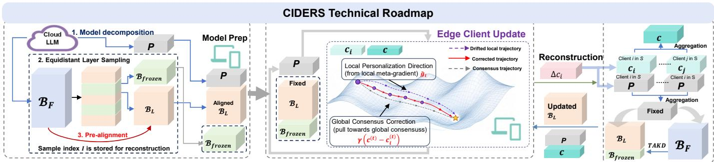  
Figure 1: CIDERS Workflow. (I) The framework decomposes the LLM into a cloud server-side full backbone ${ \cal B } _ { F } ,$ edge client-side messengers $P _ { M }$ and learnable backbone $\boldsymbol { B } _ { L }$ . (II) Each round the server broadcasts $\{ w _ { P _ { M } } , w _ { B _ { L } } , c \}$ ; clients run a $K \cdot$ -step consensus-corrected geometric update on private data and upload $\Delta { { c } _ { i } }$ only. (III) The server reconstructs $\Delta _ { i } ,$ , aggregates the messenger and consensus, then performs knowledge transfer from $\boldsymbol { B } _ { F }$ to $\boldsymbol { B } _ { L }$ with $\mathcal { P } _ { M }$ held fixed before the next broadcast.

## C. Discussion

FL, as a distributed learning framework, has been widely applied across deep learning. Cloud-edge LLM collaborative learning is inherently distributed, so FL provides a natural fit. Both PEFT and its combination with model decomposition explores heterogeneous adapter configurations, yet they lack systematic handling of drift-aware updates and are insufficient for edge personalization to meet complex applications, since they meet the paradox that personalization and consensus are difficult to coexist in the local adapter update path. To address this, CIDERS integrates both into a unified bilevel optimization framework that injects global trajectory into each local personalization step for coupling local personalization and global consensus within the same optimization process. We target LLMs continuously evolving at the edge while staying coordinated with global consensus in cloud-edge collaboration.

## III. PROBLEM FORMULATION

We consider a cloud-edge distributive system comprising a cloud server with a public dataset $\mathcal { D } _ { \mathrm { { p u b l i c } } }$ and N client edges, each possessing a private heterogeneous dataset $\mathcal { D } _ { i }$ . Let $\mathcal { M } _ { i }$ denote the full composite model on client i, and $\mathcal { M } _ { * }$ denote its server-side counterpart. To balance global coordination and local adaptation, we partition these models into distinct yet structurally interdependent components: ${ \mathcal M } _ { i } ~ = ~ { \mathcal P } _ { M , i } \circ { \mathcal B } _ { L }$ on the client side, and $\mathcal { M } _ { \ast } = \mathcal { P } _ { M } \circ B _ { F }$ on the server side. Specifically, we define:

‚ A full backbone $B _ { F } .$ , parameterized by $w _ { B _ { F } }$ , which serves as a static, frozen teacher preserving foundational linguistic capabilities and world knowledge.

‚ A learnable backbone $\boldsymbol { B } _ { L }$ , parameterized by $w _ { B _ { L } }$ , which acts as the global representation student distilled from $\boldsymbol { B } _ { F }$ using public data.

‚ The messengers $\mathcal { P } _ { M , i }$ , parameterized by $w _ { \mathcal { P } _ { M , } }$ for $i \ =$ $1 , \cdots , N$ . These capture domain-specific knowledge from private datasets, while $\mathcal { P } _ { M }$ (parameterized by $w _ { \mathcal { P } _ { M } } )$ denotes their globally aggregated meta-initialization counterpart on the server.

Upper-Level: Personalized Meta-Objective. We formulate the upper-level problem by adopting the personalization objective

as follows

$$
\mathcal { L } ^ { \mathrm { p e r s } } ( w _ { \mathcal { P } _ { M } } , w _ { \mathcal { B } _ { L } } ) = \frac { 1 } { N } \sum _ { i = 1 } ^ { N } \mathcal { L } _ { i } \big ( \widetilde { w } _ { \mathcal { P } _ { M , i } } , w _ { \mathcal { B } _ { L } } \big ) ,\tag{1}
$$

where $\tilde { w } _ { \mathcal { P } _ { M , i } } : = w _ { \mathcal { P } _ { M } } - \eta _ { i n } \nabla _ { w _ { \mathcal { P } _ { M } } } \mathcal { L } _ { i } \big ( w _ { \mathcal { P } _ { M } } , w _ { \mathcal { B } _ { L } } \big )$ denotes the one-step personalized messenger for client i, and $\eta _ { i n } ~ > ~ 0$ is the inner learning rate. Note (1) optimizes the global messenger $w p _ { M }$ as a meta-model that facilitates rapid clientspecific adaptation.

Lower-Level: Task-Aware Knowledge Distillation. The lowerlevel objective aims to transfer server-side knowledge to the learnable backbone. While general KD anchors the student to the teacher’s latent space via intermediate representation matching and output logit alignment, it treats the frozen teacher as an infallible oracle. This risks propagating pretraining flaws or calibration biases without optimizing for downstream utility. To mitigate this, we propose the Task-Aware Knowledge Distillation (TAKD), which is denoted as L<sub>KD</sub> on $\mathcal { D } _ { \mathrm { { p u b l i c } } }$ with the fixed global messenger $w _ { \mathcal { P } _ { M } }$

$$
\begin{array} { r l } & { \mathcal { L } _ { \mathrm { K D } } ( w _ { \mathcal { B } _ { L } } ; w _ { \mathcal { P } _ { M } } ) = \mathbb { E } \bigg [ \| \mathcal { B } _ { L } ( x ; w _ { \mathcal { B } _ { L } } ) - \mathcal { B } _ { F } ( x ; w _ { \mathcal { B } _ { F } } ) \| _ { 2 } ^ { 2 } } \\ & { + \lambda D _ { \mathrm { K L } } ( \mathcal { M } _ { * } ( x ; \{ w _ { \mathcal { P } _ { M } } , w _ { \mathcal { B } _ { F } } \} ) \| \mathcal { M } ( x ; \{ w _ { \mathcal { P } _ { M } } , w _ { \mathcal { B } _ { L } } \} ) ) } \\ & { \qquad + \lambda _ { \mathrm { t a s k } } \cdot \ell _ { \mathrm { t a s k } } ( \mathcal { M } ( x ; \{ w _ { \mathcal { P } _ { M } } , w _ { \mathcal { B } _ { L } } \} ) , y ) \bigg ] , } \end{array}\tag{2}
$$

where $\lambda , \lambda _ { \mathrm { t a s k } } > 0$ . It aims to explicitly injects task-aware supervision grounded in true labels y. This ensures $\boldsymbol { B } _ { L }$ fully emulates $\boldsymbol { B } _ { F }$ and aligns with the target task manifold, providing a high-quality foundation for the upper-level metaadaptation.

The Personalized Bi-Level Optimization (PBO) Alternating the optimization of $w _ { \mathcal { P } _ { M } }$ and $w _ { B _ { L } }$ via the upper and lower objectives respectively, we formulate the personalized bilevel optimization (PBO) for the cloud-edge LLM collaborative learning:

$$
\begin{array} { r l } { \displaystyle \operatorname* { m i n } _ { w _ { \mathcal { P } _ { M } } } } & { \displaystyle \mathcal { L } ^ { \mathrm { p e r s } } ( w _ { \mathcal { P } _ { M } } , w _ { { \mathcal { B } } _ { L } } ) + \frac { \epsilon } { 2 } \| w _ { \mathcal { P } _ { M } } - w _ { \mathcal { P } _ { M } } ^ { - } \| _ { 2 } ^ { 2 } } \\ { \mathrm { s . t . } } & { w _ { { \mathcal { B } } _ { L } } = \arg \displaystyle \operatorname* { m i n } _ { w _ { { \mathcal { B } } _ { L } } } \mathcal { L } _ { \mathrm { K D } } ( w _ { { \mathcal { B } } _ { L } } ; w _ { \mathcal { P } _ { M } } ) . } \end{array}\tag{3}
$$

In this architecture, we regularize (1) by a proximal term to constrain drift from the previous state $w _ { \mathcal { P } _ { M } } ^ { - }$ , then the upper-level optimization learns the global messenger $w _ { \mathcal { P } _ { M } }$ to strike a balance between globalization and personalization. Alternately, the lower-level optimization trains $w _ { B _ { L } }$ via TAKD $w _ { B _ { F } }$ . This hierarchy explicitly decouples global knowledge alignment from client-specific personalization.

Optimization Challenges. While (3) forms the first personalized bilevel optimization, we pose several key insights in challenges: first is obvious, the computation resource is limited at edges, which requires fast global training. Second, since the cloud and the edges are mutually dependent, if the cloud fails the distillation or the edges result in heterogeneity issues, they will alternate their updates to a continuous deterioration of mutual learning. Third, edges generally demand personalization, which exacerbates the heterogeneity issue and leads to a decrease in the overall training efficiency.

## IV. METHODOLOGY

To enable thorough learning under computational efficiency, CIDERS coordinates two distinct roles, i.e., client-specific messenger adaptation and global teacher-guided backbone alignment. It considers only messenger updates at edges. Then it meticulously navigates the personalization with the global trajectory for fast adapting meta-knowledge encoded within the messenger. On the cloud, the client messengers are aggregated and fixed, then $\boldsymbol { B } _ { L }$ learns foundational linguistic representations encoded within the full backbone. This architectural decomposition and orchestration provide a complete coordination pathway for heterogeneous edge LLMs reaching personalization with the fast global convergence. We summarize the cloud-edge LLM collaborative learning procedure in Algorithm 2.

## A. Compressed Model Preparation

For the pre-trained LLM $\mathcal { M } _ { * }$ with n transformer layers, we decompose $\mathcal { M } _ { * }$ into distinct functional modules $( { \cal { B } } _ { F }$ $B _ { L } , \mathcal { P } _ { M } )$ . This structural decomposition is grounded in the hierarchical representation learning of LLMs: lower layers encode shared domain-agnostic linguistic priors, while upper layers capture heterogeneous higher-order semantic abstractions. Consequently, the topmost layers are chosen as the messenger $\mathcal { P } _ { M }$ for rapid local adaptation, while the frozen full backbone $\boldsymbol { B } _ { F }$ preserves foundational capabilities. The learnable backbone $\boldsymbol { B } _ { L }$ is a uniform strided subsample of $\boldsymbol { B } _ { F }$ , yielding a compact global surrogate. Since directly launching cloudedge collaborative learning on these disjoint modules may flaw due to the heterogeneity of $\mathcal { P } _ { M } { ' } \mathbf { s }$ massive representation mismatches, pre-alignment via TAKD in (2) for initializing $\boldsymbol { B } _ { L }$ should be implemented before client updates so that the local updates start from a teacher-informed compressed path.

‚ Step $\boldsymbol { l } \colon \mathcal { P } _ { M }$ Identification. The messenger $\mathcal { P } _ { M }$ , parameterized by $w _ { \mathcal { P } _ { M } }$ , comprises the topmost a layers of $\mathcal { M } _ { * }$ . It acts as the client-side adapter to capture domain-specific knowledge. The remaining model constitutes the frozen full backbone $B _ { F } ~ ( w _ { B _ { F } } )$ .

‚ Step 2: Learnable Backbone Construction. To preserve the teacher’s depth-wise coverage on clients, we compress $\boldsymbol { B } _ { F }$ by uniformly extracting its $n _ { E } = \left\lfloor \beta \cdot ( n - a ) \right\rfloor$ to construct $B _ { L } \ ( w _ { B _ { L } } )$ , where $\beta \in ( 0 , 1 ]$ is the compression rate.

```latex
Algorithm 1 Module Preparation
1: function MODELPREP( $\mathcal { M } _ { * } , a , \beta , \mathcal { D } _ { \mathrm { p u b } } )$
2: Obtain the LLM layer number $n \gets | \mathcal { M } _ { * } | ,$
3: Compute $B _ { L } \ ' _ { \mathbf { S } }$ layers $n ^ { \prime }  \lfloor \beta \cdot ( n - a ) \rfloor .$
4: $\mathcal { B } _ { F }  \{ \mathcal { M } _ { * , i } \} _ { i = 0 } ^ { n - a - 1 } , \quad \mathcal { P } _ { M }  \{ \mathcal { M } _ { * , i } \} _ { i = n - a } ^ { n - 1 } ;$
5: Get Indices $ \{ \lfloor j \cdot { \frac { n - a - 1 } { n ^ { \prime } - 1 } } \rfloor \thinspace | \thinspace j = 0 , \dots , n ^ { \prime } - 1 \}$
6: Sample to form $B _ { L } \gets \{ ( B _ { F } ) _ { k } \ | \ k \in I n d i c e s \} ,$
7: Initialize $w _ { \mathcal { P } _ { M } } , w _ { B _ { F } }$ and $w _ { B _ { L } }$
8: Train $w _ { B _ { L } } $ argmin ${ } _ { w B _ { L } } \mathcal { L } _ { \mathrm { K D } } ( w B _ { L } ; w \mathcal { p } _ { M } , \mathcal { D } _ { \mathrm { p u b } } )$
9: return $\mathcal { P } _ { M } , B _ { F } , B _ { L } ;$
10: end function
```

‚ Step 3: Pre-alignment via TAKD. Prior to collaborative learning, $\boldsymbol { B } _ { L }$ undergoes TAKD on $\mathcal { D } _ { \mathrm { { p u b l i c } } }$ for learning $B _ { F } \mathrm { ' s }$ linguistic priors.

In summary, we detail the whole preparation in Algorithm 1.

## B. Client Update Procedure

The client update is meticulously designed to solve the upper-level personalized meta-objective in (1) under the complex environment of the real-world. Our strategy targets incorporating the global learning tragectory into the meta-gradient for personalization adaptation under data heterogeneity.

Consensus-corrected geometric update. At round t, each participated client $\textit { i } \in \textit { S } _ { t }$ receives the global state triplet $\{ w _ { \mathcal { P } _ { M } } ^ { ( t ) } , w _ { B _ { L } } ^ { ( t ) } , c ^ { ( t ) } \}$ , then it initializes its local messenger at the current global messenger, i.e., $w _ { \mathcal { P } _ { M , i , 0 } } ^ { ( t ) } \  \ w _ { \mathcal { P } _ { M } } ^ { ( t ) }$ , and retrieves its historical consensus variate $c _ { i } ^ { ( t ) }$ . To prevent overfitting to local noise while navigating the heterogeneous landscape, the messenger is updated via a consensus-variate-corrected geometric interpolation over K steps:

$$
\begin{array} { r l } & { w _ { \mathcal { P } _ { M , i , k + 1 } } ^ { ( t ) } = w _ { \mathcal { P } _ { M , i , k } } ^ { ( t ) } - \eta g _ { t r a j } ^ { ( t ) } , \mathrm { ~ w h e r e ~ } } \\ & { g _ { t r a j } ^ { ( t ) } = \widetilde { g } _ { i , k } + \gamma \big ( c ^ { ( t ) } - c _ { i } ^ { ( t ) } \big ) + \epsilon \big ( w _ { \mathcal { P } _ { M , i , k } } ^ { ( t ) } - w _ { \mathcal { P } _ { M } } ^ { ( t ) } \big ) , } \end{array}\tag{4}
$$

$\widetilde { g } _ { i , k }$ is the personalized meta-gradient computed based on a mini-batch $\xi _ { i , k } \sim \mathcal { D } _ { i }$ such that

$$
\begin{array} { r } { \widetilde { g } _ { i , k } = \nabla _ { w _ { \mathcal { P } _ { M } } } { \mathcal { L } } _ { i } \left( \widetilde { w } _ { \mathcal { P } _ { M , i , k } } ^ { ( t ) } , w _ { \mathcal { B } _ { L } } ^ { ( t ) } ; \xi _ { i , k } \right) , } \end{array}\tag{5}
$$

with $\widetilde { w } _ { \mathcal { P } _ { M , i , k } } ^ { ( t ) }$ being the one-step look-ahead as follows:

$$
\begin{array} { r } { \widetilde { w } _ { \mathcal { P } _ { M , i , k } } ^ { ( t ) } = w _ { \mathcal { P } _ { M , i , k } } ^ { ( t ) } - \eta _ { \mathrm { i n n e r } } \nabla _ { w _ { \mathcal { P } _ { M } } } \mathcal { L } _ { i } \left( w _ { \mathcal { P } _ { M , i , k } } ^ { ( t ) } , w _ { \mathcal { B } _ { L } } ^ { ( t ) } ; \xi _ { i , k } \right) . } \end{array}\tag{6}
$$

In practical inplementations, (4) in fact uses SGD in the optimizer tool, i.e., $\boldsymbol { w } _ { \mathcal { P } _ { M , i , k + 1 } } ^ { ( t ) }  \mathrm { O P T I M } \big ( \mathrm { S G D } , \boldsymbol { w } _ { \mathcal { P } _ { M , i , k } } ^ { ( t ) } , \boldsymbol { g } _ { t r a j } ^ { ( t ) } , \boldsymbol { \eta } \big )$ and other optimizer such as AdamW works also well. To circumvent the heavy computation of $\widetilde { g } _ { i , k }$ , CIDERS employs two Hessian-Free (HF) meta-optimization strategies. The first is FO strategy, which intentionally drops the second-order derivative, assuming the Hessian impact is locally negligible: $\begin{array} { r } { v _ { i } \ : = \ \widetilde { g } _ { i , k } ^ { \mathrm { F O } } \ = \ \nabla _ { w _ { \mathcal { P } _ { M } } } \mathcal { L } _ { i } ( w _ { \mathcal { P } _ { M } } - \eta _ { \mathrm { i n n e r } } \nabla _ { w _ { \mathcal { P } _ { M } } } \mathcal { L } _ { i } ) } \end{array}$ . This requires only standard forward-backward passes, serving as the lightweight default. The second is FD, which adopts centraldifference Hessian–vector estimate

$$
\widehat { H _ { i } v _ { i } } = \frac { \nabla \mathcal { L } _ { i } ( w + \varepsilon _ { \mathrm { F D } } v _ { i } ) - \nabla \mathcal { L } _ { i } ( w - \varepsilon _ { \mathrm { F D } } v _ { i } ) } { 2 \varepsilon _ { \mathrm { F D } } } ,\tag{7}
$$

and the curvature-aware surrogate can be obtained $g _ { i } ^ { \mathrm { F D } } \ =$ $\begin{array} { r } { v _ { i } - \lambda _ { \mathrm { H V P } } \widehat { H _ { i } v _ { i } } } \end{array}$ , and here $\lambda _ { \mathrm { H V P } } ~ = ~ \eta _ { \mathrm { i n } }$ . We further provide an insightful analysis of the consensus-corrected geometric update in (4) via the following three aspects. First, the term $\bar { \gamma ( c ^ { ( t ) } - c _ { i } ^ { ( t ) } ) }$ estimates of how far is the local meta-gradients to the global gradient direction and reaches the consensusinformed global–personal coordination. Second, the geometric scaler $\gamma \in [ 0 , 1 ]$ explicitly parameterizes a continuous zerosum game between global consensus and local specialization: when $\gamma = 1$ , the correction fully aligns the client toward the global meta-initialization, when $\gamma  0$ , the update reduces to pure local meta-gradient descent. Third, the proximal term $- \mathrm { { \epsilon } } \dot { \eta } ( w _ { \mathcal { P } _ { M , i , k } } ^ { ( t ) } - w _ { \mathcal { P } _ { M } } ^ { ( t ) } )$ bounds divergence from the current global state, improving stability in heterogeneous regimes. After completing K local steps, we record each client’s average update trajectory as:

$$
\Delta _ { i , t } : = \frac { 1 } { K \eta } \Big ( w _ { \mathcal { P } _ { M } } ^ { ( t ) } - w _ { \mathcal { P } _ { M , i , K } } ^ { ( t ) } \Big ) ,\tag{8}
$$

which serves as the estimator of the local tragectory. It can be seen $\Delta _ { i }$ can be used to update both the global messenger and the global consensus variate on the cloud in (12). The local consensus variate is designed to estimate the local metagradient with the K averaging of $\widetilde { g } _ { i , k }$ and is subsequently refreshed using an exponential moving average (EMA) as follows:

$$
c _ { i } ^ { ( t + 1 ) } = \big [ 1 + \alpha ( \gamma - 1 ) \big ] c _ { i } ^ { ( t ) } + \alpha \Delta _ { i , t } - \alpha \gamma c ^ { ( t ) } .\tag{9}
$$

Then client i transmits the incremental consensus difference

$$
\Delta c _ { i } = c _ { i } ^ { ( t + 1 ) } - c _ { i } ^ { ( t ) }\tag{10}
$$

to the cloud. It can be seen that with $\Delta c _ { i } ,$ the cloud can recover $\Delta _ { i , t }$ by storing $c _ { i }$ for updating the global messenger. Consequently, the upstream communication payload is reduced to a single low-dimensional consensus increment.

## C. Server Update Procedure

As the centralized orchestrator, the server advances the global meta-initialization via consensus-informed aggregation and refining the global representation backbone via task-aware distillation. With our skillful design, CIDERS can update the client messengers and the consensus variate via recovering $\Delta _ { i }$ from $\Delta { c } _ { i }$

Key information reconstruction. For each participated client $i \in S _ { t } .$ , it receives the consensus variate increment $\Delta c _ { i } \ =$ $c _ { i } ^ { ( t + 1 ) } - c _ { i } ^ { ( t ) }$ . Then the server exactly recovers the averaged local messenger update trajectory $\Delta _ { i , t }$ using its synchronized historical state $c _ { i } ^ { ( t ) }$ :

$$
\Delta _ { i , t } = \frac { 1 } { \alpha } \Delta c _ { i } - ( \gamma - 1 ) c _ { i } ^ { ( t ) } + \gamma c ^ { ( t ) } .\tag{11}
$$

The cloud-stored local consensus variate copies are subsequently updated via $c _ { i } ^ { ( t + 1 ) } \ \gets \ c _ { i } ^ { ( t ) } + \Delta c _ { i }$ . This strategic recovery avoids the upstream transmission of raw messenger weights, thereby reducing the bandwidth costs and shielding the local optimization trajectories from direct privacy exposure.

Algorithm 2 Algorithmic Framwork of CIDERS   
Input: Original LLM $\mathcal { M } _ { * } .$ , length of messenger $^ { a , }$ com  
pression rate $\beta ,$ consensus $c ^ { ( 0 ) } , c _ { i } ^ { ( 0 ) }$ and the parameters   
$( \alpha , \gamma , \tau , \eta , K , T )$   
1: $\{ \mathcal { P } _ { M } , \mathcal { B } _ { F } , \mathcal { B } _ { L } \} \gets \mathtt { M O D E L P R E P } ( \mathcal { M } _ { * } , a , \beta , \mathcal { D } _ { \mathrm { p u b } } ) ;$   
2: for $t = 0 , 1 , \dots , T - 1$ do   
3: Server performs the lower-level training   
4: Recovers exact updates $\{ \Delta _ { i , t } \} _ { i \in { \cal S } _ { t } }$ from $\{ \Delta c _ { i } \} _ { i \in { \cal S } _ { t } }$   
5: Performs the consensus and model aggregation via   
6: $\begin{array} { r } { c ^ { ( t + 1 ) } \gets ( 1 - \alpha ) c ^ { ( t ) } + \alpha \sum _ { i \in S _ { t } } p _ { i } \Delta _ { i , t } } \end{array}$ and   
7: $\begin{array} { r } { w _ { \mathcal { P } _ { M } } ^ { ( t + 1 ) } \gets w _ { \mathcal { P } _ { M } } ^ { ( t ) } - \tau \sum _ { i \in S _ { t } } p _ { i } \Delta _ { i , t } . } \end{array}$   
8: Performs TAKD for the coordination of $\boldsymbol { B } _ { L }$ and $\mathcal { P } _ { M }$   
$w _ { \mathcal { B } _ { L } } ^ { ( t + 1 ) }  \mathrm { a r g } \operatorname* { m i n } _ { w _ { \mathcal { B } _ { L } } } \mathcal { L } _ { \mathrm { K D } }$ on $\mathcal { D } _ { \mathrm { p u b } }$   
9: Transmits $\{ w _ { \mathcal { P } _ { M } } ^ { ( t + 1 ) } , w _ { \mathcal { B } _ { L } } ^ { ( t + 1 ) } , c ^ { ( t + 1 ) } \}$ to $\boldsymbol { S } _ { t + 1 } ;$   
10: Client performs upper-level training   
11: for each client $i \in S _ { t }$ in parallel do   
12: Obtains the local messenger $w _ { \mathcal { P } _ { M , i , K } } ^ { ( t ) }$ via (4)   
13: Calculates $\Delta _ { i , t } \gets 1 / { K \eta \big ( { w _ { \mathcal { P } _ { M } } ^ { ( t ) } - w _ { \mathcal { P } _ { M , i , K } } ^ { ( t ) } } \big ) }$   
14: Updates $c _ { i } ^ { ( t + 1 ) } \gets [ 1 + \alpha ( \gamma - 1 ) ] c _ { i } ^ { ( t ) } { + } \alpha \Delta _ { i , t } { - } \alpha \gamma c ^ { ( t ) }$   
15: end for   
16: Transmits $\Delta c _ { i } \gets c _ { i } ^ { ( t + 1 ) } - c _ { i } ^ { ( t ) }$ to the cloud.   
17: end for   
18: Edge inferences via: $\mathcal { M } _ { i } \gets \mathrm { C o m p o s e } ( w _ { \mathcal { P } _ { M , i } } ^ { ( T ) } , w _ { \mathcal { B } _ { L } } ^ { ( T ) } ) ;$

Global aggregation. Given the reconstructed $\{ \Delta _ { i , t } \} _ { i \in { \cal S } _ { t } }$ , the server simultaneously advances the aggregation of the global messenger and the global consensus variate as follows:

$$
\begin{array} { r l } & { w _ { \mathcal { P } _ { M } } ^ { ( t + 1 ) } = w _ { \mathcal { P } _ { M } } ^ { ( t ) } - \tau K \eta \sum _ { i \in S _ { t } } p _ { i } \Delta _ { i , t } , } \\ & { c ^ { ( t + 1 ) } = ( 1 - \alpha ) c ^ { ( t ) } + \alpha \sum _ { i \in S _ { t } } p _ { i } \Delta _ { i , t } , } \end{array}\tag{12}
$$

where $p _ { i } = | { \mathcal { D } } _ { i } | / { \sum _ { j \in S _ { t } } | \mathcal { D } _ { j } | }$ (here $p _ { i } = 1 / N$ for simplicity), and $\tau > 0$ . Geometrically, the global messenger update acts as a convex combination of the current meta-initialization and the local adaptations, with the learning rate τ dampening aggregation noise inherent to partial client participation. Concurrently, $c ^ { ( t + 1 ) }$ functions as a population-level consensus anchor. It tracks the moving average of the personalized gradients to smooth out round-to-round variance and provide an unbiased reference direction for subsequent client adaptations.

Learning $\boldsymbol { B } _ { L }$ via TAKD. Finally, the lower-level objective in (3) learns $\boldsymbol { B } _ { L }$ from $\boldsymbol { B } _ { F }$ . By fixing $\mathcal { P } _ { M }$ , this procedure also plays the role in coordination and adaptation, ensuring the alignment with the current meta-adaptation context. Specifically, we have:

$$
w _ { \mathcal { B } _ { L } } ^ { ( t + 1 ) } \gets \arg \operatorname* { m i n } _ { w _ { \mathcal { B } _ { L } } } \mathcal { L } _ { \mathrm { K D } } \Big ( w _ { \mathcal { B } _ { L } } ; w _ { \mathcal { P } _ { M } } ^ { ( t + 1 ) } \Big ) .\tag{13}
$$

While this guarantees that $\boldsymbol { B } _ { L }$ absorbs foundational linguistic features, it establishes a robust, task-aligned representation foundation for the next round of client update.

## V. THEORETICAL ANALYSIS

We have proposed CIDERS, and the key mechanisms are twofold: we first divide the LLM into functional modules and adopts different optimization strategies for each of them, then we incoporates the global tracjectory in the personalized bilevel optimization framework (3). This will bring complex principles. Luckily, our proposed framework is theoretically robust.

## A. Convergence Analysis

In this section, we analyze the proposed personalized bilevel structure solved by CIDERS, which we show achieves a sublinear convergence rate to a neighborhood of the stationary point. For simplicity, we denote the PBO as:

$$
\operatorname* { m i n } _ { v } \Phi ( v ) + \frac { \varepsilon } { 2 } \left\| v - v ^ { - } \right\| ^ { 2 } , \mathrm { ~ s . t . ~ } w _ { S } = \arg \operatorname* { m i n } _ { w _ { S } } \mathcal { L } _ { \mathrm { K D } } \left( w _ { S } ; v \right) ,\tag{14}
$$

where v denotes the global messenger, w<sub>S</sub> the learnable student backbone, $\begin{array} { r } { \Phi ( v ) = \frac { 1 } { N } \sum _ { i } \mathcal { L } _ { i } \left( \widetilde { v } _ { i } , w _ { S } ^ { * } ( v ) \right) } \end{array}$ is the upperlevel meta-objective with $\widetilde { v } _ { i } = v - \eta _ { \mathrm { i n n e r } } \nabla _ { v } \mathcal { L } _ { i } \left( v , w _ { S } ^ { * } ( v ) \right)$ q, and $w _ { S } ^ { * } ( v )$ is the exact minimizer of the lower-level task-aware knowledge distillation loss $\mathcal { L } _ { \mathrm { K D } } ( \cdot ; v )$ on the public dataset. Since CIDERS maintains an inexact backbone $w _ { S } ^ { ( t ) }$ together with consensus-corrected local messenger steps, the quantity of interest is the joint gap

$$
J _ { t } : = \mathbb { E } \big [ \Phi ( v ^ { ( t ) } ) - \Phi ^ { * } \big ] + \mathbb { E } \big \| w _ { S } ^ { ( t ) } - w _ { S } ^ { * } ( v ^ { ( t ) } ) \big \| ^ { 2 } .\tag{15}
$$

Moreover, to track the coupled evolution of all error sources, we construct a Lyapunov function to couple all error sources, i.e., the virtual messenger error, client drift $E _ { t }$ , consensus lags $C _ { t } , \tilde { C } _ { t }$ , and the joint gap $J _ { t } \colon$

$$
\begin{array} { r l } & { \boldsymbol { V } ^ { ( t ) } = \left( 1 - 4 a ^ { 2 } \right) \mathbb { E } \left. \boldsymbol { z } ^ { ( t ) } - \boldsymbol { v } ^ { * } \right. ^ { 2 } + \omega _ { 1 } \boldsymbol { E } _ { t } } \\ & { \qquad + Q _ { w 2 } \eta C _ { t } + Q _ { w 3 } \eta \tilde { C } _ { t } + Q _ { w 4 } \eta \boldsymbol { J } _ { t } , } \end{array}\tag{16}
$$

where we have defined $z ^ { ( t ) } = v ^ { ( t ) } + ( 1 - \tau ) / \tau \cdot ( v ^ { ( t ) } - v ^ { ( t - 1 ) } )$ ) and $a , \omega _ { 1 } , Q _ { w 2 } , Q _ { w 3 } , Q _ { w 4 }$ are positive. Then, the convergence of CIDERS solving PBO (3) is:

Theorem 1 (Ergodic convergence of CIDERS). Under regular assumptions and moderate conditions, let the step size satisfies $\eta ~ = ~ { \stackrel { \bullet } { O } } ( T ^ { - 1 / 2 } )$ , then the ergodic joint gap satisfies where $V _ { 0 } ^ { ( 0 ) } = ( 1 - 4 a ^ { 2 } ) \mathbb { E } \| z ^ { ( 0 ) } - v ^ { * } \| ^ { 2 } + \omega _ { 1 } E _ { 0 }$ and $C _ { \eta ^ { 2 } } > 0$ is a constant from the expansion of $\ddot { D } _ { t o t } ^ { \prime }$ . Then the ergodic average of the joint gap satisfies

$$
\frac { 1 } { T } \sum _ { t = 0 } ^ { T - 1 } J _ { t } \leqslant \frac { C _ { \eta } } { \delta _ { \Phi } } + \frac { 2 } { \delta _ { \Phi } } \sqrt { \frac { V _ { 0 } ^ { ( 0 ) } C _ { \eta ^ { 2 } } } { T } + \frac { V _ { 1 } ^ { ( 0 ) } } { \delta _ { \Phi } T } + \frac { C _ { \eta ^ { 3 } } V _ { 0 } ^ { ( 0 ) } } { \delta _ { \Phi } C _ { \eta ^ { 2 } } T } + \mathcal { O } \left( T ^ { - 3 / 2 } \right) } ,\tag{17}
$$

where $C _ { \eta } , C _ { \eta ^ { 2 } } , C _ { \eta ^ { 3 } }$ are positive constants, $V _ { 0 } ^ { ( 0 ) } ~ = ~ ( \dot { 1 } ~ -$ $4 a ^ { 2 } ) \mathbb { E } \| z ^ { ( 0 ) ^ { \cdot } } - \mathbf { \dot { \sigma } } { } ^ { * } \| ^ { 2 } + \omega _ { 1 } E _ { 0 }$ collects the intial client drift, and $V _ { 1 } ^ { ( 0 ) } \ = \ Q _ { w 2 } C _ { 0 } + Q _ { w 3 } \widetilde { C } _ { 0 } + \ Q _ { w 4 } J _ { 0 }$ collects the initial consensus lags and the joint gap.

The detailed proof and discussions on the convergence result is moved to Appendix.

## B. Geometry of the Trajectory

Consider a fixed communication round t, the client i obtains the global messenger $\bar { v } : = w _ { \mathcal { P } _ { M } } ^ { ( t ) }$ from the server and performs multiple local updates, where the trajectory is simultaneously determined by three forces: the local meta-gradient provides a personalized direction, the consensus correction pulls the local messenger $x _ { k } : = w _ { \mathcal { P } _ { M , i , k } } ^ { ( t ) }$ towards the global consensus, and the proximal constraint resists the messenger’s deviation from the starting point, which constitutes a tightly coupled nonlinear dynamical process, making it extremely difficult for an analysis. Here, we develop an approximate geometric characterization that isolates the core factors. Specifically, let us define $\rho : = 1 - \eta \varepsilon$ and $\begin{array} { r } { S _ { K } : = \sum _ { j = 0 } ^ { K - 1 } \rho ^ { K - 1 - j } } \end{array}$ , we can unroll (4)

$$
{ \bar { v } } - x _ { K } = \eta \sum _ { j = 0 } ^ { K - 1 } \rho ^ { K - 1 - j } g _ { i , j } + \eta S _ { K } \cdot \gamma \left( c ^ { ( t ) } - c _ { i } ^ { ( t ) } \right)\tag{18}
$$

Then, we define the along-path average meta-gradient $\bar { g } _ { i } ^ { ( t ) } : =$ $\begin{array} { r } { 1 / { S _ { K } } \sum _ { j = 0 } ^ { K - 1 } { \rho ^ { K - 1 - j } g _ { i , j } } } \end{array}$ . Then (18) can be rewritten as

$$
{ \Delta } _ { i , t } = \sigma _ { K } \left( \bar { g } _ { i } ^ { ( t ) } + \gamma \left( c ^ { ( t ) } - c _ { i } ^ { ( t ) } \right) \right) ,\tag{19}
$$

where $\sigma _ { K } : = S _ { K } / K \in ( 0 , 1 ]$ . It can be seen the correction shapes the direction and the proximity modulates the magnitude.

1) Convex Combination: Let $\tilde { g } _ { i } ^ { ( t ) } : = \nabla \mathcal { L } _ { i } ( \bar { v } )$ denote the local meta-gradient at the broadcast point and $\begin{array} { r } { \dot { \widetilde G } ^ { ( t ) } : = \sum _ { j } p _ { j } \widetilde g _ { j } ^ { ( t ) } } \end{array}$ the global average gradient. Define the heterogeneity gap $\begin{array} { r } { \delta _ { i } ^ { ( t ) } \mathbf { \Sigma } : = \mathbf { \Sigma } \widetilde { g } _ { i } ^ { ( t ) } - \mathbf { \Sigma } \widetilde { G } ^ { ( t ) } } \end{array}$ . To render the directional dynamics analytically tractable and obtain a closed-form characterization of the personalization and globalization trade-off, we introduce the idealizing approximations:

A1. Short local step: The total local displacement is sufficiently small, i.e., $K \eta ~ \ll ~ 1 / L$ , where L is the Lipschitz constant of the meta-gradient, so that $\overline { { g } } _ { i } ^ { ( t ) }$ « $\tilde { g } _ { i } ^ { ( t ) }$ . The path error $\phi _ { i } ^ { ( t ) } : = \overline { { { g } } } _ { i } ^ { ( t ) } - \tilde { g } _ { i } ^ { ( t ) }$ is bounded by $O \left( L C _ { K } \eta G _ { \mathrm { b d } } \right)$

A2. Fixed heterogeneity: The heterogeneity gap is constant across rounds, i.e., $\delta _ { i } ^ { ( t + 1 ) } ~ = ~ { \bar { \delta } } _ { i } ^ { ( t ) } ~ = ~ { \bar { \delta } } _ { i }$ . This holds exactly for quadratic meta-losses and serves as a firstorder approximation when the messenger moves slowly.

A3. No proximal damping: We set $\varepsilon = 0 .$ , hence $\sigma _ { K } = 1$ . The case $\sigma _ { K } \neq 1$ is treated separately and shown to preserve span invariance while renormalizing the scalar recurrence.

A4. Cold start: Initializes $c ^ { ( 0 ) } = c _ { i } ^ { ( 0 ) } \stackrel { \textstyle = } { = } 0$ , thus $r _ { i } ^ { ( 0 ) } = \delta _ { i }$

A5. Full participation: All clients participate in every round. Under $( \mathsf { A } 1 \ – \mathsf { A } 5 )$ , the displacement is simplified to $\Delta _ { i , t } \approx$ $\tilde { g } _ { i } ^ { ( t ) } + \gamma ( c ^ { ( t ) } - c _ { i } ^ { ( t ) } )$ , We now define the reference field, which is he effective total direction as follows

$$
u _ { i } ^ { ( t ) } : = \widetilde { g } _ { i } ^ { ( t ) } + \gamma ( c ^ { ( t ) } - c _ { i } ^ { ( t ) } ) .\tag{20}
$$

To track how this reference field relates to the global consensus direction $\widetilde G ^ { ( t ) }$ , we introduce the residual

$$
r _ { i } ^ { ( t ) } : = u _ { i } ^ { ( t ) } - \widetilde { G } ^ { ( t ) } = \delta _ { i } ^ { ( t ) } + \gamma ( c ^ { ( t ) } - c _ { i } ^ { ( t ) } ) .\tag{21}
$$

Under the idealizing assumptions, the consensus-gap recursion yields a closed-form recurrence for $r _ { i } ^ { ( t ) }$ :

$$
r _ { i } ^ { ( t + 1 ) } = ( 1 - \alpha ) r _ { i } ^ { ( t ) } + \alpha ( 1 - \gamma ) \delta _ { i } \mathrm { ~ w h e r e ~ } r _ { i } ^ { ( 0 ) } = \delta _ { i } .\tag{22}
$$

In fact, the residual remains strictly proportional to $\delta _ { i } \colon$

$$
r _ { i } ^ { ( t ) } = \psi _ { t } \delta _ { i } \mathrm { w h e r e } \psi _ { t } : = ( 1 - \gamma ) + \gamma ( 1 - \alpha ) ^ { t } .\tag{23}
$$

Substituting (23) back into the definition of $u _ { i } ^ { ( t ) }$ yields:

Proposition 2 (Convex combination of local and global directions). Under approximations $( A I ) – ( A S )$ , the reference direction $\dot { u } _ { i } ^ { ( t ) }$ at client i in round t lies exactly on the line segment joining the local starting gradient $\widetilde { g } _ { i }$ and the global average gradient $\widetilde { G }$ :

$$
u _ { i } ^ { ( t ) } = \psi _ { t } \widetilde { g } _ { i } + \left( 1 - \psi _ { t } \right) \widetilde { G } , \quad \psi _ { t } = \left( 1 - \gamma \right) + \gamma ( 1 - \alpha ) ^ { t } .\tag{24}
$$

Moreover, the displacement satisfies $\Delta _ { i , t } \approx u _ { i } ^ { ( t ) }$

Proposition 2 provides a geometric characterization of the local messenger trajectory. The global consensus weight $\left( 1 - \psi _ { t } \right) = \gamma \left( 1 - ( 1 - \alpha ) ^ { t } \right)$ increases monotonically from 0 at $t = 0 \mathrm { \ t o \ } \gamma \mathrm { \ a s \ } t \to \infty .$ , with a half-life of approximately $\Theta ( \log 2 / | \log ( 1 - \alpha ) | )$ rounds. The scalar $\psi _ { t }$ thus interpolates between two regimes: at cold start $( \psi _ { 0 } = 1 )$ , the direction is purely local; at lock-in $\psi _ { \infty } = 1 - \gamma$ , the direction stabilizes at the convex combination specified by $\gamma .$ . The parameter α controls the speed of transition, while the pair $( c , c _ { i } )$ implements this transition through an exponential moving average that smoothly drives the translation from $0 ~ \mathrm { t o } \ - \gamma \delta _ { i }$

2) Quantifying Deviations.: We quantify the direction deviations from the idea segment under the idealizing assumptions. Our first key insight is relaxing the short-inner-loop assumption $( \mathbf { A } 1 )$ introduces a path-averaging error. Note the alongpath error $\phi _ { i } ^ { ( t ) } : = \bar { g } _ { i } ^ { ( t ) } - \tilde { g } _ { i } ^ { ( t ) }$ is bounded by $\lVert \phi _ { i } ^ { ( t ) } \rVert \leqslant L C _ { K } \eta G _ { \mathrm { b d } } .$ Applying a variation of constants argument to the residual recurrence gives the uniform bound

$$
\| u _ { i } ^ { ( t ) } - u _ { i } ^ { ( t ) } | _ { ( \mathrm { E } 0 ) } \| \leqslant 2 \gamma R \left( 1 - ( 1 - \alpha ) ^ { t } \right) \leqslant 2 \gamma R ,\tag{25}
$$

where $R ~ : = ~ L C _ { K } \eta G _ { \mathrm { b d } }$ and $u _ { i } ^ { ( t ) } | _ { ( \mathrm { E 0 } ) }$ denotes the ideal direction from Proposition 2. Thus, the true direction lies within an $O \left( \gamma L K \eta G _ { \mathrm { b d } } \right)$ neighborhood of the ideal segment. This deviation vanishes as $K \eta \to 0$ and scales linearly with $\gamma ,$ reflecting the fact that stronger consensus alignment amplifies the sensitivity of the consensus variates to gradient estimation error. Second, even when the consensus are ideally locked, $\mathrm { i . e . , } \ c \approx { \widetilde G }$ and $c _ { i } \approx \widetilde g _ { i }$ , the executed field at an arbitrary point x along the inner path contains a Hessian remainder. Specifically, the Taylor expansion around v¯ gives

$$
\begin{array} { r l } & { \nabla \mathcal { L } _ { i } ( x ) + \gamma \left( c - c _ { i } \right) \approx ( 1 - \gamma ) \nabla \mathcal { L } _ { i } ( x ) } \\ & { \qquad + \gamma \nabla \overline { { \mathcal { L } } } ( x ) + \gamma \left( H _ { i } - \bar { H } \right) ( x - \bar { v } ) , } \end{array}\tag{26}
$$

where $H _ { i } : = \nabla ^ { 2 } \mathcal { L } _ { i } ( \bar { v } )$ and $\begin{array} { r } { \bar { H } : = \sum _ { j } p _ { j } H _ { j } } \end{array}$ . The remainder is bounded by $\gamma \chi \lVert \boldsymbol { x } - \bar { \boldsymbol { v } } \rVert$ , with $\chi : = \operatorname* { m a x } _ { i } \| H _ { i } - \bar { H }$ quantifying the heterogeneity of meta-Hessians across clients. This implies that when $\gamma$ is large to extent, long local step may accumulate Hessian mismatch rather than improve consensus.

3) The Case $\sigma _ { K } \neq 1 .$ : When $\varepsilon \ > \ 0 ,$ it satisfies $\sigma _ { K } =$ $S _ { K } / K ~ < ~ 1$ . Under (A1), (A2), and (A4), the recurrence generalizes to

$$
r _ { i } ^ { ( t + 1 ) } = \left[ 1 - \alpha + \alpha \gamma \left( 1 - \sigma _ { K } \right) \right] r _ { i } ^ { ( t ) } + \alpha ( 1 - \gamma ) \delta _ { i } .\tag{27}
$$

It can be seen the span-invariance property $r _ { i } ^ { ( t ) }$ P span tδ u is preserved, i.e., $r _ { i } ^ { ( t ) } = \psi _ { t } \delta _ { i }$ , but $\psi _ { t }$ is modified as,

$$
\psi _ { t + 1 } = \left[ 1 - \alpha + \alpha \gamma \left( 1 - \sigma _ { K } \right) \right] \psi _ { t } + \alpha ( 1 - \gamma ) , \psi _ { 0 } = 1 ,\tag{28}
$$

whose steady-state solution can be derived as follows

$$
\psi _ { \infty } = \frac { 1 - \gamma } { 1 - \gamma \left( 1 - \sigma _ { K } \right) } .\tag{29}
$$

Note $\sigma _ { K } < 1$ , then $\psi _ { \infty } > 1 - \gamma$ . Since $u _ { i } ^ { ( \infty ) } = \widetilde { G } + \psi _ { \infty } \delta _ { i } =$ $\psi _ { \infty } \widetilde { g } _ { i } + ( 1 - \psi _ { \infty } ) \widetilde { G } ,$ a larger $\psi _ { \infty }$ means the reference field is closer to $\widetilde { g } _ { i }$ than the undamped counterpart $1 - \gamma$ in (24). The mechanism can be therefore concluded that the compression of the displacement $\sigma _ { K } < 1$ attenuates $\Delta _ { i , t } ,$ so the consensus underestimate the gap $\delta _ { i }$ and $\gamma ( c - c _ { i } )$ is weaker than in the undamped case, resulting in the proximal damping driving the EMA to a more personalized field.

4) Quantitive Metric Design.: According to above, we define two complementary metrics that measure where a given trajectory lies on the segment between. Let $\begin{array} { r l } { \widetilde { g } _ { i , \perp } } & { { } = } \end{array}$ $\widetilde { g } _ { i } - \mathrm { P r o j } _ { \widetilde { G } } ( \widetilde { g } _ { i } )$ be the component of $\widetilde { g } _ { i } ^ { ( t ) }$ orthogonal to the global consensus direction. This axis captures updates that have zero directional derivative on the global average objective while contributing to client $\textit { i } \ ' _ { \mathrm { s } }$ personalization. We define the drift reduction (DR) as $\mathrm { D R } _ { i } ^ { ( t ) } : = 1 - \| r _ { i } ^ { ( t ) } \| / \| \delta _ { i } ^ { ( t ) } \|$ , which measures the fraction of the initial heterogeneity gap $\delta _ { i } ^ { ( t ) }$ that has been cancelled toward the consensus direction. When $r _ { i } ~ = ~ 0 .$ , we have $\mathrm { D R } = 1$ , indicating full drift elimination; when $r _ { i } = \delta _ { i }$ , we have $\mathrm { D R } = 0$ , indicating no drift reduction. Similarly, we define the personalization preservation (PPR) as $\mathrm { P P R } _ { i } ^ { ( t ) } \stackrel { \cdot } { : } = \langle \boldsymbol { u } _ { i } ^ { ( t ) } , \tilde { \boldsymbol { g } } _ { i , \perp } ^ { ( t ) } \rangle \big / \| \tilde { \boldsymbol { g } } _ { i , \perp } ^ { ( t ) } \| ^ { 2 }$ , which measures the projection of the reference field onto the purely local axis. When $u _ { i }$ is fully aligned with $\tilde { g } _ { i }$ , we have $\mathrm { { P P R } } = 1 ;$ when $u _ { i }$ is fully aligned with ${ \cal \tilde { G } } ,$ we have $\mathrm { { P P R } = 0 }$ . Substituting $r _ { i } ^ { ( t ) } ~ = ~ \dot { \psi } _ { t } \delta _ { i }$ and $\boldsymbol { u } _ { i } ^ { ( t ) } = \psi _ { t } \widetilde { \boldsymbol { g } } _ { i } + ( 1 - \psi _ { t } ) \widetilde { \boldsymbol { G } }$ into the definitions of DR and PPR yields $\mathrm { D R } _ { i } ^ { ( t ) } = 1 - \psi _ { t }$ and $\mathrm { P P R } _ { i } ^ { ( t ) } = \psi _ { t }$

## VI. EXPERIMENTS

## A. Experimental Setup and Protocols

We evaluate CIDERS through three protocols. Protocol A measures downstream performance and output alignment. Protocol B examines matched-domain performance of personalized messengers, and Protocol C tracks PBO consensus-state dynamics under non-IID data. Table I summarizes the datasets, client-training-example totals, partitions, and evaluation units. We also run a separate compression sweep over messenger depths and learnable backbone drop ratios to quantify the quality and storage trade-off. Unless otherwise specified, CIDERS denotes CIDERS-FO, the first-order implementation; CIDERS-FD denotes the finite-difference variant.

Model composition. The main configurations in Protocols A and B use a six-layer messenger. For Qwen2.5-3B, the teacher-side segment uses 30 of the 36 backbone layers, while the student learnable backbone uses 24. For Qwen2-1.5B, the corresponding counts are 22 teacher-side layers and 18 learnable backbone layers. Clients train only the messenger LoRA parameters, with rank $^ { 4 , }$ LoRA scaling $\alpha _ { \mathrm { L o R A } } = 1 6 ,$ and dropout 0.05. Protocol C additionally evaluates two- and four-layer messengers. A six-layer messenger uses 84 trainable LoRA tensors across attention and MLP projections. Serverside TAKD updates the learnable backbone LoRA separately, and AdapEmu combines the personalized messenger with the compressed learnable backbone at deployment. Each consensus state has the same dimensionality as the corresponding messenger LoRA state. Table II lists the reference layer counts and parameter sizes.

<table><tr><td>Protocol</td><td>Dataset</td><td>Samples</td><td>Clients</td><td>Partition</td><td>Evaluation basis</td><td>Measurements</td></tr><tr><td>A</td><td>GSM8K Dolly-15K Rosetta</td><td>7,458 14,980 7,953</td><td>5</td><td>Identical independence</td><td>GSM8K: 1,319 questions PPL: 6,698 target tokens HumanEval-X: 164/language</td><td>Exact-match accuracy PPL and ROUGE-L pass@1</td></tr><tr><td>B</td><td>Five-domain</td><td>5,000</td><td>5</td><td>One domain/client</td><td>1,500 test examples; 300/domain</td><td>Response-NLL matrix</td></tr><tr><td>C</td><td>MetaMath</td><td>45,000</td><td>8</td><td>MetaMath LDA</td><td>16,912 client-round observations</td><td>Loss; consensus statistics</td></tr></table>

Table I: Datasets and evaluation scope for Protocols A–C. Training samples are totals across all clients and include only samples assigned to client training; public-distillation and held-out samples are excluded. Evaluation units are reported in their native form: benchmark question for GSM8K, target tokens for Dolly PPL, examples for Protocol B, and client-round observations for Protocol C.

<table><tr><td>Backbone</td><td>Qwen2.5-3B</td><td>Qwen2-1.5B</td></tr><tr><td>Full/Emu./Msg. layers</td><td>36/24/6</td><td>28/18/6</td></tr><tr><td>messenger LoRA params</td><td>1.247M</td><td>0.989M</td></tr><tr><td>Student LoRA params</td><td>4.989M</td><td>2.968M</td></tr><tr><td>Consensus state (MiB)</td><td>4.76</td><td>3.77</td></tr></table>

Table II: Model composition and FP32 LoRA states for the sixlayer messenger configurations. Clients train messenger LoRA, and server-side TAKD trains learnable backbone LoRA.

Data and evaluation. Protocol A uses five IID clients for GSM8K, Dolly, and Rosetta. The loader uses train/validation/test proportions r0.998, 0.001, 0.001s, respectively. The effective training counts in Table I exclude the loader’s heldout portions. Task evaluation instead uses GSM8K benchmark questions, a Dolly prompt–response corpus for corpus-level PPL and ROUGE-L, and HumanEval-X Python, Java, and Go problems. Rosetta supplies code-training data, whereas HumanEval-X supplies the code-evaluation benchmark. For Dolly, 6,698 is the target-token denominator for PPL. Protocol B assigns medical, finance, customer support, code, and general-domain data to five separate clients. Each domain contains 1,000 private training examples, 200 public examples used for distillation, and 300 evaluation examples. The five-domain evaluation uses Qwen2-1.5B with an 18- layer learnable backbone, the drop ratio 0.2, and a six-layer messenger. CIDERS-FO, CIDERS-FD, FedOT, and FedBiOT use the same client and evaluation split. Each source-domain messenger is evaluated on the same 300 examples in every target domain, yielding a $5 \times 5$ response-NLL matrix over 1,500 test examples rather than 7,500 distinct examples.Response negative log-likelihood (NLL) is used to evaluate the quality of each source-domain messenger on a target domain. Lower values indicate better response modeling. The client and evaluation splits are shared across methods, whereas the server-side distillation sources differ. FedBiOT logs use a separate 4,500-record alignment artifact with a 3,600/450/450 training/validation/test split, while the corresponding FedOT alignment source was not consistently recorded. This mismatch limits direct component-level attribution. Protocol C uses a 50,000-example MetaMath source with logged split proportions r0.9, 0.05, 0.05s: 45,000 training examples and 2,500 examples in each held-out split. Training data are partitioned across eight clients by the MetaMath LDA splitter at Dirichlet parameters $\alpha = 0 . 1$ and $\alpha = 0 . 4 .$ . In the plots, these settings are labeled h “ 1 and h “ 4, respectively. Protocol C is a mechanism study; its reported outcomes are training loss and consensus-state statistics. The temporal and PCA analyses use 14 complete FO/FD training trajectories covering two messenger depths and two learnable backbone drop ratios. Across eight clients and rounds 0–150, these trajectories provide 16,912 client-round observations. The coefficient-response analysis adds one further configuration, giving 15 configurations in total.

Training. Protocol A compares CIDERS with FedBiOT [32], FedOT [31], and LocalOT. Federated methods run for 150 rounds, with K “ 10 local optimizer updates per participating client in each round. LocalOT runs for 150 outer iterations without cross-client communication or aggregation. Protocol B uses 150 rounds with K “ 20 local updates per round and batch size 2. CIDERS client updates use AdamW with base learning rate $1 0 ^ { - 4 }$ , weight decay 0.01, global-norm clipping at 1.0, and a warmup-cosine schedule. The lookahead step size $\eta _ { \mathrm { i n } }$ follows the same learning-rate schedule. Gradient accumulation specifies how many microbatches contribute to one optimizer update. The server aggregation step is $\tau = 0 . 0 2$ the client-consensus update coefficient is $\alpha _ { c } ~ = ~ 0 . 0 0 2 .$ , and the local anchoring weight is $\epsilon _ { \mathrm { p r o x } } = 0 . 0 1$ . The coefficient $\alpha _ { c }$ is distinct from the Dirichlet parameter α used in Protocol C. In Protocols A and B, the consensus-correction coefficient is fixed at $\gamma _ { t } ~ = ~ 0 . 0 1$ for Qwen2.5-3B and 0.05 for Qwen2-1.5B; Protocol C uses the schedule described in Section VI-D. Server-side TAKD begins with task-supervised bootstrap alignment. In subsequent rounds, it performs $T _ { L } = 5$ warm-started representation and output-alignment steps, with $\lambda _ { \mathrm { o u t } } = 0 . 5$ in Eq. (2).

## B. Task Performance and Output Alignment

Protocol A evaluates the complete AdapEmu deployment path. Table III compares CIDERS with FedBiOT, FedOT, and

<table><tr><td></td><td>GSM8K</td><td colspan="2">Dolly</td><td colspan="3">HumanEval-X pass@1</td></tr><tr><td>Method</td><td>Acc. ↑</td><td>PPL ↓</td><td>R-L ↑</td><td>Py ↑</td><td>Java↑</td><td>Go ↑</td></tr><tr><td colspan="7">Qwen2-1.5B / AdapEmu 18-layer learnable backbone + messenger</td></tr><tr><td>CIDERS</td><td>7.88%</td><td>9.53</td><td>0.2176</td><td>7.9%</td><td>3.0%</td><td>4.9%</td></tr><tr><td>FedBiOT</td><td>2.58%</td><td>10.52</td><td>0.1812</td><td>3.0%</td><td>3.7%</td><td>1.8%</td></tr><tr><td>FedOT</td><td>2.05%</td><td>11.52</td><td>0.1639</td><td>1.2%</td><td>1.8%</td><td>1.2%</td></tr><tr><td>LocalOT</td><td>2.20%</td><td>11.52</td><td>0.1612</td><td>1.2%</td><td>2.4%</td><td>1.2%</td></tr><tr><td colspan="7">Qwen2.5-3B / AdapEmu 24-layer learnable backbone + messenger</td></tr><tr><td>CIDERS</td><td>16.38%</td><td>8.60</td><td>0.2384</td><td>9.1%</td><td>11.0%</td><td>6.7%</td></tr><tr><td>FedBiOT</td><td>5.23%</td><td>9.42</td><td>0.2307</td><td>6.7%</td><td>6.7%</td><td>3.0%</td></tr><tr><td>FedOT</td><td>4.70%</td><td>10.50</td><td>0.2234</td><td>6.7%</td><td>4.3%</td><td>1.2%</td></tr><tr><td>LocalOT</td><td>4.40%</td><td>10.50</td><td>0.2151</td><td>6.7%</td><td>3.0%</td><td>1.2%</td></tr></table>

Table III: Protocol A downstream performance of compressed AdapEmu. Code models are trained on Rosetta and evaluated using HumanEval-X pass@1. Bars are normalized within each backbone and metric, with PPL reversed. Numbers give the reported scores. Bold and underlined values mark the best and second-best scores at the displayed precision, including ties.

LocalOT on Qwen2-1.5B and Qwen2.5-3B. These are systemlevel comparisons under the recorded configurations.

CIDERS ranks first on five of six Qwen2-1.5B metrics and all six Qwen2.5-3B metrics. Its GSM8K margins over FedBiOT are 5.30 and 11.15 percentage points, respectively. On Qwen2.5-3B, Dolly PPL decreases from 9.42 to 8.60, an approximately 8.7% reduction, and Python, Java, and Go pass@1 improve by 2.4–4.3 percentage points. On Qwen2- 1.5B, Python and Go improve, whereas Java is 0.7 percentage points lower. The largest percentage-point gains are on GSM8K, whereas code-generation gains vary by language. CIDERS therefore shows its clearest advantage on numerical reasoning; the code results are language-dependent. The paired Protocol A results also evaluate AdapFu, the full-backbone deployment setting. For CIDERS-FO, reconnecting the full backbone raises GSM8K accuracy from 16.38% to 47.46% on Qwen2.5-3B and from 7.88% to 29.80% on Qwen2-1.5B. HumanEval-X macro pass@1, averaged across Python, Java, and Go, increases from 8.94% to 39.02% and from 5.28% to 33.54%, respectively. These results show a substantial remaining capability gap between compressed and full-backbone deployment, even when CIDERS improves on the compressed baselines. AdapEmu remains the primary setting for method comparison. The recurring Output-KL term encourages the Student Emulator to match the frozen teacher’s predictive distribution during server-side TAKD. Figure 2 compares CIDERS-FO configurations with and without this term; Table IV gives the CIDERS-FD comparison. The baseline markers show the corresponding Protocol A results for context.

Fig. 2 and Table IV show the FO comparison, the configuration with Output-KL has higher GSM8K accuracy by 4.40 percentage points, Java and Go pass@1 by 3.05 and 1.83 percentage points, and ROUGE-L by 0.0076. Dolly PPL changes by only 0.016, while Python pass@1 decreases by 1.22 percentage points. FD shows the same task-selective directions: GSM8K, Java, Go, and ROUGE-L improve, Python declines, and PPL changes little. Thus, adding Output-KL has task-selective effects rather than a uniform capability gain. The opposite changes across code languages make per-language reporting more informative than a single code average. A cautious interpretation is that Output-KL may favor some tasks over others rather than improve all tasks uniformly. This pattern is consistent with Output-KL acting selectively across tasks, but the present results do not identify the mechanism behind the language-specific changes.

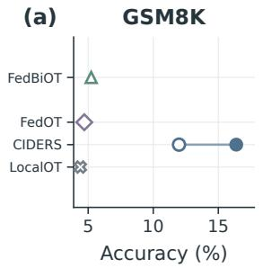

(b) Dolly ROUGE-L  
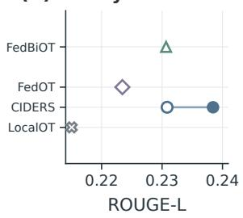

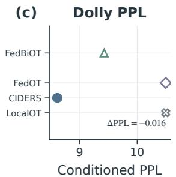  
(d) HumanEval-X  
w/o Output-KL FedBiOT reference LocalOT reference  
with Output-KL FedOT reference

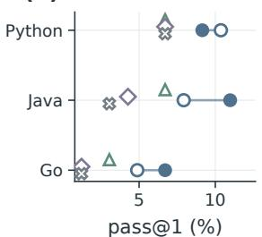  
Figure 2: Output-KL comparison for CIDERS-FO on Qwen2.5- 3B. Segments connect configurations without and with recurring Output-KL. Additional method markers show Protocol A baseline performance.

## C. Finite Difference Diagnostics

CIDERS-FD adds a curvature correction estimated by a finite-difference Hessian–vector product (HVP). The correction scale η is set by fd\_eta and need not equal the lookahead step size $\eta _ { \mathrm { i n } } .$ Protocol A uses a finite-difference perturbation $\varepsilon _ { \mathrm { F D } } = 1 0 ^ { - 4 }$ and $\eta _ { \mathrm { H V P } } = 0 . 0 0 1$ ; the five-domain

<table><tr><td>Metric</td><td>Without KL</td><td>With KL</td><td>Change</td></tr><tr><td>GSM8K accuracy</td><td>11.98</td><td>16.38</td><td>+4.40</td></tr><tr><td>Dolly PPL</td><td>8.616</td><td>8.602</td><td>-0.014</td></tr><tr><td>Dolly ROUGE-L</td><td>0.2271</td><td>0.2339</td><td>+0.0068</td></tr><tr><td>Python pass@1</td><td>10.37</td><td>9.15</td><td>-1.22</td></tr><tr><td>Java pass@1</td><td>7.93</td><td>11.59</td><td>+3.66</td></tr><tr><td>Go pass@1</td><td>4.27</td><td>6.71</td><td>+2.44</td></tr></table>

Table IV: Output-KL comparison for CIDERS-FD on Qwen2.5- 3B. Accuracy and pass@1 are percentages, with changes reported in percentage points. PPL and ROUGE-L changes use their original scales. All changes are computed from the displayed values.

Protocol B FD evaluation uses η<sub>HVP</sub> “ 0.0005. We measure the relative correction magnitude as

$$
r _ { \mathrm { F D } } = \frac { \| \eta _ { \mathrm { H V P } } \widehat { H } v \| _ { 2 } } { \| v \| _ { 2 } + 1 0 ^ { - 1 2 } } ,
$$

where v is the first-order direction used in the optimizer step and $\hat { H _ { v } }$ is its finite-difference HVP estimate. Both are restricted to trainable LoRA parameters. An optimizer-step observation is classified as small for $r _ { \mathrm { F D } } ~ \leqslant ~ 0 . 1$ , moderate for $0 . 1 ~ < ~ r _ { \mathrm { F D } } ~ \leqslant ~ 0 . 2 .$ , and large for $r _ { \mathrm { F D } } ~ > ~ 0 . 2 .$ . These thresholds describe relative correction magnitude, not numerical instability. Fig. 3 compares $\eta _ { \mathrm { H V P } } = 0 . 0 0 5$ and 0.0005 in a separate 50-round diagnostic. Each setting contains 4,996 recorded optimizer-step observations out of 5,000 nominal observations. The available records do not identify why four nominal observations are missing. At $\eta _ { \mathrm { H V P } } ~ = ~ 0 . 0 0 5 .$ , large and moderate corrections account for 68.9% (3,441/4,996) and 28.0% (1,401/4,996) of observations. At 0.0005, these proportions fall to 0.26% (13/4,996) and 1.06% (53/4,996). Moderate or large events occur in 50/50 rounds at the larger scale and 26/50 rounds at the smaller scale. The smaller scale therefore makes such events rare at the observation level, although they still occur in roughly half the rounds. Because η<sub>HVP</sub> appears directly in $r _ { \mathrm { F D } }$ , this comparison reflects both the chosen correction scale and the recorded training trajectories; it should not be read as a standalone curvature estimate.

Separately, the final Protocol A comparison finds identical reported FO and FD values in 9 of 12 AdapEmu cells at the displayed precision. Among the accuracy and pass@1 metrics, the largest difference is 0.6 percentage points on Qwen2.5- 3B HumanEval-X Java. The Dolly ROUGE-L difference is 0.0045 on its original scale. Neither solver is uniformly better. We therefore use FO as the default because it avoids finite-difference HVP evaluations while showing no consistent disadvantage in the reported final metrics. Event frequency changes sharply across the two diagnostic scales, whereas the final task metrics show no consistent FO–FD advantage. Within the evaluated settings, event frequency is therefore not predictive of final quality. This supports a simpler solver choice, but it does not establish an end-to-end speedup or explain the 150-round task outcomes from the separate 50- round diagnostic.

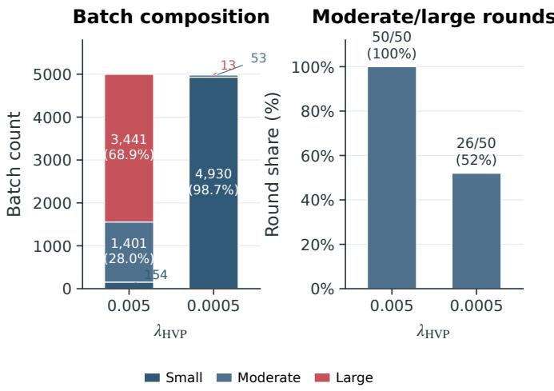  
small: r<sub>FD</sub> ≤ 0.1; moderate: 0.1 < r<sub>FD</sub> ≤ 0.2; large: r<sub>FD</sub> > 0.2

Figure 3: Finite-difference correction profiles under two η<sub>HVP</sub> settings. Each setting contains 4,996 recorded optimizer-step observations across 50 rounds. The left panel shows the observation composition by correction magnitude; the right panel shows the fraction of rounds containing at least one moderate or large correction event.

## D. PBO Dynamics under Data Heterogeneity

Protocol C tracks training loss and consensus statistics over time, across scheduled coefficients, and in a shared PCA projection. For client i at round t, let $\boldsymbol { \mathcal { S } } _ { i , t }$ contain the indices of its recorded local steps. At step $s = ( i , t , k )$ , let $g _ { s }$ be the uncorrected local gradient and let $c _ { \mathrm { g l o b a l } , s }$ and $c _ { \mathrm { l o c a l } , s }$ be the consensus vectors used in that step. They correspond to the global consensus $c ^ { t }$ and client consensus $c _ { i } ^ { t }$ in the update rule. The corrected gradient is

$$
g _ { \mathrm { e f f } , s } = g _ { s } + \gamma _ { t ( s ) } \bigl ( c _ { \mathrm { g l o b a l } , s } - c _ { \mathrm { l o c a l } , s } \bigr ) .
$$

All steps in a round use the coefficient broadcast at its start. The normalized squared-residual statistic is

$$
\mathrm { E - R A E } _ { i , t } = \frac { \sum _ { k \in { \cal S } _ { i , t } } \| g _ { \mathrm { e f f } , s } - c _ { \mathrm { g l o b a l } , s } \| _ { 2 } ^ { 2 } } { \sum _ { k \in { \cal S } _ { i , t } } \big ( \| g _ { s } \| _ { 2 } ^ { 2 } + \| c _ { \mathrm { g l o b a l } , s } \| _ { 2 } ^ { 2 } + \epsilon \big ) } ,
$$

with $\epsilon = 1 0 ^ { - 1 2 }$ . Each client-round value is a ratio of sums. Zero indicates an exact match to the global consensus at every recorded step. Because this is a normalized ratio, a value near one should not be interpreted as a vanishing residual. We also track S-DR and S-PPR, the distance-reduction and perpendicular-preservation diagnostics. Positive S-DR denotes reduced distance to the global reference, whereas higher S-PPR denotes greater preservation of the local orthogonal component.

Fig. 4 summarizes loss and E-RAE over rounds 0–150. Client-round values are first aggregated within each configuration at each round; curves and bands then show the crossconfiguration mean and standard deviation. Most of the loss reduction occurs early: by round 15, the curves have achieved 74.0–76.0% of their total round-0-to-150 decrease; by round 30, this fraction reaches 86.8–88.5%. E-RAE approaches its late-stage range of 0.995–0.996 while loss continues to decrease. Thus, consensus alignment can stabilize while task loss continues to improve. E-RAE summarizes normalized alignment between update and consensus vectors, whereas training loss tracks progress on the task objective; the two statistics provide complementary views of adaptation. At round 150, loss at $\alpha = 0 . 4$ is 19.3% higher than at $\alpha = 0 . 1$ for CIDERS-FO and 26.9% higher for CIDERS-FD. The loss separation between the recorded LDA settings is larger than the FO–FD separation, despite similar late-stage E-RAE. This difference reflects the two realized data partitions, so it should not be interpreted as a monotonic effect of the Dirichlet parameter on training difficulty.

(a)  
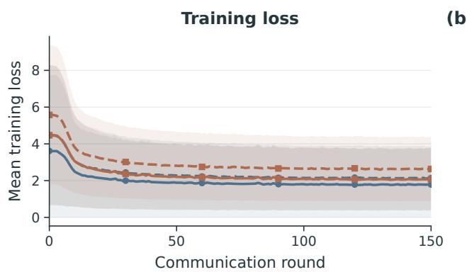  
(b)

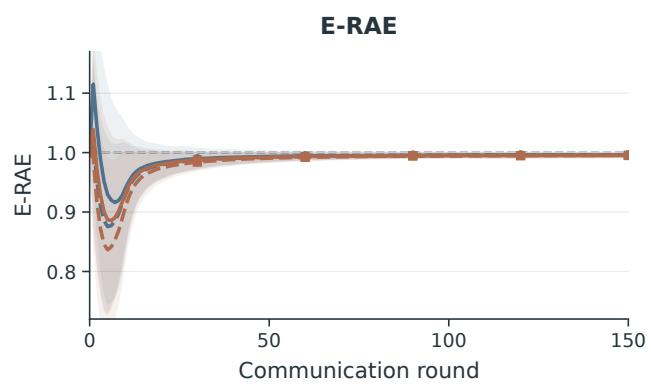  
Figure 4: Temporal PBO dynamics under two non-IID settings (Protocol C). Training loss and E-RAE, the normalized squared-residual statistic, are shown over rounds 0–150 for CIDERS-FO and CIDERS-FD at $h = 1 ~ ( \alpha = 0 . 1 )$ and $h = 4 ~ ( \alpha = 0 . 4 )$ . Bands denote ˘1 configuration standard deviation. The horizontal line marks E-RAE “ 1 as a diagnostic reference.

In Fig. 5, the coefficient sequence reconstructed from the recorded telemetry is $\gamma _ { 0 } = \gamma _ { 1 } = 0 . 9$ and $\gamma _ { t } = \operatorname* { m a x } ( 0 . 0 1 , 0 . 9$ $0 . 8 6 ^ { t - 1 } )$ for $2 ~ \leqslant ~ t ~ \leqslant ~ 1 5 0$ . It reaches the floor at round 31, giving 31 distinct values. This describes the recorded trajectory; it is not an independent check of the coefficient schedule used in training. Fig. 5 groups consensus statistics by the scheduled coefficient within each configuration before summarizing the distribution across configurations. Because $\gamma _ { t }$ decreases with round and its floor is shared by multiple late rounds, these curves describe the training trajectory rather than an independent coefficient sweep. At small $\gamma _ { t } , \ S \ – \ D \mathbf { R }$ is close to zero; it becomes more negative at middle and high coefficient values and partially rebounds at the largest recorded coefficient. Negative S-DR means that the corrected direction is farther from the global reference than the uncorrected local direction under this proxy. S-PPR remains high with a shallow U-shaped profile rather than following the $1 - \gamma _ { t }$ reference. Thus, preserving the local orthogonal component can coincide with increased distance to the global reference. E-RAE also has a U-shaped profile, with smaller normalized residuals in the middle coefficient range. These patterns do not identify an optimal correction coefficient. Panel (c) traces the configuration-mean S-DR/S-PPR path, with endpoints aggregated from the actual round-0 and round-150 observations. FO and FD follow nearby but non-identical trajectories. The scheduled coefficient scales the consensus correction; it should not be interpreted as a measured mixture of global and personalized updates.

(a) S-DR response  
(b) S-PPR response  
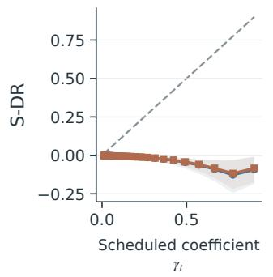

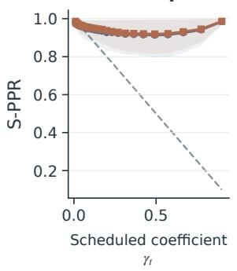

(d) E-RAE response  
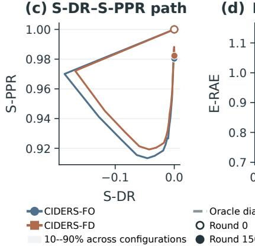

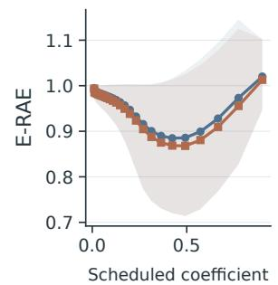  
Figure 5: Empirical consensus response to the scheduled coefficient (Protocol C). S-DR, S-PPR, and E-RAE are aggregated within each configuration and then across configurations. Shaded regions show the 10th–90th percentile across 15 configurations. Dashed curves are idealized diagnostic references, not fitted trends.

Fig. 6 projects five scalar statistics, i.e., local-consensus norm, consensus-increment norm, E-RAE, S-DR, and S-PPR, into a shared PCA basis. We fit the projection after globally standardizing these statistics with z-scores across the 16,912 client-round observations. Each point is one observation; paths join each client’s early-, middle-, and late-stage centroids. Late-stage centroids generally cluster more tightly in this projection, while Client 7 remains relatively displaced. This indicates a client-specific difference in the recorded scalar statistics, but the projection does not identify its cause or establish separation of the underlying consensus vectors. The PCA view therefore complements the time-series summaries rather than directly measuring personalization in the task output. Thus, consensus-state geometry and task loss should be read together: distinct client states can coexist with continued task improvement.

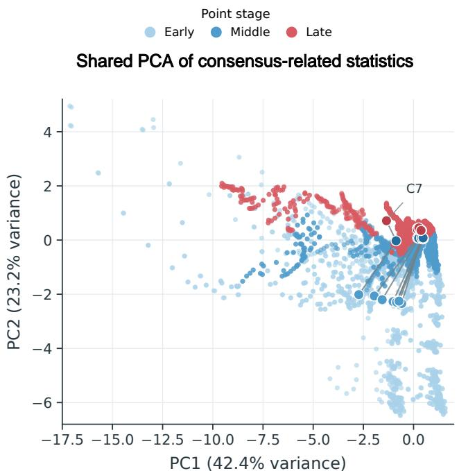  
Figure 6: Shared PCA of consensus-related statistics (Protocol C). Five scalar statistics are globally standardized before a shared PCA fit over 16,912 client-round observations from 14 configurations, eight clients, and rounds 0–150. Point shading denotes training stage, paths connect client-stage centroids, and Client 7’s late-stage centroid is annotated.

## E. Personalized Messenger Evaluation

Protocol B asks whether each messenger has lower response NLL on its matched target domain than messengers trained for other source domains. Fig. 7 shows the five-domain matrices, computed from 300 shared examples per target domain. Let $L _ { i j }$ be the NLL of source-domain messenger i on target domain j. The average matched-domain advantage is

$$
\Delta _ { \mathrm { c r o s s } } = \frac { 1 } { 2 0 } \sum _ { i \leqslant i , j \leqslant 5 } L _ { i j } - \frac { 1 } { 5 } \sum _ { i = 1 } ^ { 5 } L _ { i i } .
$$

Equivalently, each target domain contributes the difference between its four unmatched messengers’ mean NLL and its matched messenger’s NLL, with equal weight across domains. A positive gap favors the matched messenger.

For CIDERS-FO, $\Delta _ { \mathrm { c r o s s } } ~ = ~ 3 . 0 8 ~ \times ~ 1 0 ^ { - 4 }$ , or 0.0176% of mean self NLL. The range of target-column means is

2.1001 NLL, whereas the range of source-row means is only $1 . 8 8 \times 1 0 ^ { - 4 }$ . Target-domain differences are therefore much larger than source-messenger differences in these summaries. The small positive gap indicates a limited average matcheddomain benefit, not strong output-level specialization.

The CIDERS-FD matrix in the five-domain Protocol B evaluation shows a similar pattern. Mean self NLL is 1.7755 and $\Delta _ { \mathrm { c r o s s } } ~ = ~ 4 . 6 6 ~ \times ~ 1 0 ^ { - 4 }$ (0.0263% of self NLL); the target-column and source-row ranges are 2.0945 NLL and $3 . 5 6 \times 1 0 ^ { - 4 }$ , respectively. The reported evaluation-sample intervals are $[ 2 . 5 0 , 3 . 6 6 ] \times 1 0 ^ { - 4 }$ for FO and $[ 2 . 5 6 , 6 . 7 6 ] \times 1 0 ^ { - 4 }$ for FD. Because the resampling procedure is unavailable, we report these intervals descriptively rather than as formal confidence intervals or measures of run-to-run variability.

FedOT has mean diagonal and off-diagonal NLLs of 1.8745 and 1.8875, with a reported gap of 0.01298. FedBiOT has corresponding values of 1.8247, 1.8349, and 0.01020. Both baselines have larger matched- domain gaps than CIDERS-FO. A larger gap does not imply lower absolute NLL: response loss and the benefit of source–target matching are different criteria. Here, CIDERS combines a smaller matched-domain effect with lower absolute response NLL, so the two quantities should be reported separately. The shared evaluation makes this relative comparison possible, while the alignment-data mismatch limits component-level attribution.

## F. Compression and Deployment Tradeoffs

Table V reports Qwen2-1.5B response NLL and stored FP32 LoRA payload for messenger depths of two, four, and six and learnable backbone drop ratios of 0.2 and 0.5. This is a separate compression sweep, not the Protocol B source– target matrix experiment. Its NLL values should therefore be interpreted separately from the Protocol B matrix.

With six messenger layers, increasing the learnable backbone drop ratio from 0.2 to 0.5 reduces the CIDERS LoRA payload by approximately 29.2%, but raises its NLL from 1.754 to 4.115. FedBiOT NLL rises from 1.945 to 5.290 over the same drop-ratio comparison. The more aggressive compression therefore trades lower storage for higher response loss. Increasing messenger depth from two to six reduces CIDERS NLL by 15.1% at drop ratio 0.2 and 36.9% at drop ratio 0.5, with payload increases of approximately 4.3% and 13.3%, respectively. The gain is not uniform across depth increments or methods. At drop ratio 0.2, CIDERS changes only from 2.0657 to 2.0600 between two and four layers, whereas FedBiOT NLL increases from 2.3576 to 2.4090. The larger CIDERS gain in this setting occurs from four to six layers. Within the tested CIDERS grid, the six-layer messenger gives the best NLL, but this does not imply that every method improves monotonically with depth. CIDERS has the lowest NLL in all six matched grid configurations, with NLL 9.9– 22.2% below FedBiOT. Its minimum, 1.754, occurs at six messenger layers and drop ratio 0.2. This is the best evaluated CIDERS configuration by NLL, not an optimum over untested depths, drop ratios, or deployment budgets. Payload measures stored LoRA state only; it does not measure total model storage or runtime memory.

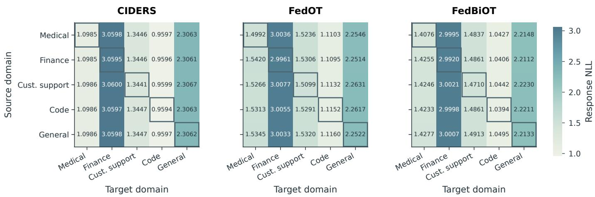

Figure 7: Cross-domain evaluation of personalized messengers (Protocol B). CIDERS-FO, FedOT, and FedBiOT are evaluated on th same five-domain Qwen2-1.5B set, with 300 target-domain examples per cell. Rows identify source messengers, columns identify target domains, and outlines mark matched cells. The shared color scale denotes response NLL; cell labels show four decimal places.
<table><tr><td rowspan="2">Drop ratio β</td><td rowspan="2">Depth d</td><td colspan="2">CIDERS-FO</td><td colspan="2">FedBiOT</td><td colspan="2">FedOT</td></tr><tr><td>NLL ↓</td><td>MiB</td><td>NLL ↓</td><td>MiB</td><td>NLL ↓</td><td>MiB</td></tr><tr><td rowspan="3">0.2</td><td>2</td><td>2.0657</td><td>14.570</td><td>2.3576</td><td>14.568</td><td>2.2375</td><td>14.568</td></tr><tr><td>4</td><td>2.0600</td><td>14.570</td><td>2.4090</td><td>14.568</td><td>2.2671</td><td>14.568</td></tr><tr><td>6</td><td>1.7537</td><td>15.203</td><td>1.9454</td><td>15.201</td><td>1.8845</td><td>15.201</td></tr><tr><td rowspan="3">0.5</td><td>2</td><td>6.5222</td><td>9.502</td><td>7.4351</td><td>9.501</td><td>7.0028</td><td>9.501</td></tr><tr><td>4</td><td>5.1666</td><td>10.136</td><td>6.2889</td><td>10.134</td><td>6.3932</td><td>10.134</td></tr><tr><td>6</td><td>4.1151</td><td>10.769</td><td>5.2901</td><td>10.768</td><td>5.6596</td><td>10.768</td></tr></table>

Table V: AdapEmu quality and storage trade-off on Qwen2-1.5B (separate compression sweep). β denotes learnable backbone drop ratio and d denotes messenger depth. NLL is the five-domain response NLL; MiB denotes stored FP32 LoRA deployment payload, not total model storage or runtime memory. Boldface marks the lowest NLL within each row.

Table VI reports a separate quantity: recurrent FP32 messenger/consensus-state communication. Each CIDERS downlink contains a Meta-messenger and a same-sized global consensus; each uplink contains a Personalized messenger and a same-sized consensus increment. Learnable backbone downlink and protocol overhead are excluded. For per-direction payload p in MiB, the totals are $1 5 0 \times 5 \times 2 \times p / 1 0 2 4$ GiB, assuming participation by all five clients in every round.

<table><tr><td>Backbone</td><td>Method</td><td>Per direction (MiB)|</td><td>|Total (GiB)</td></tr><tr><td>Qwen2.5-3B</td><td>CIDERS</td><td>9.516</td><td>13.94</td></tr><tr><td>Qwen2.5-3B</td><td>FedBiOT/FedOT</td><td>4.758</td><td>6.97</td></tr><tr><td>Qwen2-1.5B</td><td>CIDERS</td><td>7.547</td><td>11.06</td></tr><tr><td>Qwen2-1.5B</td><td>FedBiOT/FedOT</td><td>3.773</td><td>5.53</td></tr><tr><td>Both</td><td>LocalOT</td><td>n/a</td><td>n/a</td></tr></table>

Table VI: FP32 messenger/consensus-state communication. Perdirection values are per client per round. Totals assume all five clients participate in all 150 rounds and include both directions. Learnable backbone downlink and protocol overhead are excluded.

CIDERS therefore communicates approximately twice the counted messenger/consensus tensor volume of the onemessenger baselines. This ratio concerns the stated components, not total network traffic. Taken together, the results define a tunable trade-off among quality, storage, and communication: using a lower drop ratio and a deeper messenger improves response NLL, whereas the consensus state doubles the counted recurrent payload. This is a trade-off, not an unconditional efficiency advantage.

## G. Integrated Discussion and Limitations

Protocol A evaluates the complete compressed CIDERS deployment path under the recorded configurations. CIDERS leads on most reported metrics, but the gains vary by task and backbone. Output-KL comparisons remain task-selective, and FD has no consistent final-metric advantage over FO. These results characterize the tested systems; they do not isolate the contribution of any single component. The large differences between AdapEmu and AdapFu further show that better compressed performance does not remove the capability cost of the smaller learnable backbone. Protocols B and C measure different aspects of personalization. Protocol B measures matched-domain response quality, whereas Protocol C measures consensus-vector geometry. These signals are complementary, but they are not interchangeable. Because the protocols use different datasets and clients, they cannot establish a direct link between directional preservation and response quality. The separate compression sweep likewise characterizes only the tested quality and storage trade-offs. Accordingly, the Output-KL, FO–FD, and cross-domain analyses are descriptive rather than causal. The resampling procedure for the reported cross-domain intervals is unavailable, so these intervals are not interpreted as formal confidence intervals. In Protocol $\mathrm { C } ,$ the bands show variation across configurations, not across independent training runs. The client partitions can be reconstructed from the available source code, logs, seed, and splitter, but no per-client manifests were saved with the checkpoints; the conclusions therefore remain limited to the two recorded LDA partitions. Runtime, peak memory, full network traffic, and provisioning costs were not measured on common hardware, so these component totals do not establish end-to-end system efficiency.

## VII. CONCLUSION

This paper addresses the fundamental tension between global consensus and client personalization in cloud-edge LLM systems. We formalize the problem as a personalized bilevel optimization framework for cloud-edge LLM collaboration. Then, we further propose CIDERS, an efficient solver that decouples the model into a cloud-learnable backbone and a client-adaptable messenger. By embedding global trajectories into each local step via consensus-variate correction, CIDERS reconciles personalization with globalization. Theoretical analysis provides a geometric characterization of the local trajectory and a full convergence guarantee. Extensive experiments on Qwen2.5-3B/1.5B across the three complementary protocols validate our approach: i) the local trajectories follows theories, ii) bilevel coordination preserves reasoning capability in compressed deployment, iii) backbone capacity matters more than messenger depth for response quality. These results establish CIDERS as a practically viable path toward the applicatoins of complex real-world intelligence. Future work will extend CIDERS to world models for embodied intelligence and physical-world simulation.

## REFERENCES

[1] S. Yao, J. Zhao, D. Yu, N. Du, I. Shafran, K. Narasimhan, and Y. Cao, “ReAct: Synergizing reasoning and acting in language models,” in International Conference on Learning Representations, 2023.

[2] T. Schick, J. Dwivedi-Yu, R. Dess‘i, R. Raileanu, M. Lomeli, L. Zettlemoyer, N. Cancedda, and T. Scialom, “Toolformer: Language models can teach themselves to use tools,” in Advances in Neural Information Processing Systems, 2023.

[3] A. Brohan, N. Brown, J. Carbajal, Y. Chebotar, X. Chen, K. Choromanski, T. Ding, D. Driess, A. Dubey, C. Finn, P. Florence, C. Fu, M. G. Arenas, K. Gopalakrishnan, K. Han, K. Hausman, A. Herzog, J. Hsu, B. Ichter, A. Irpan, N. Joshi, R. Julian, D. Kalashnikov, Y. Kuang, I. Leal, L. Lee, T.-W. E. Lee, S. Levine, Y. Lu, H. Michalewski, I. Mordatch, K. Pertsch, K. Rao, K. Reymann, M. Ryoo, G. Salazar, P. Sanketi, P. Sermanet, J. Singh, A. Singh, R. Soricut, H. Tran, V. Vanhoucke, Q. Vuong, A. Wahid, S. Welker, P. Wohlhart, J. Wu, F. Xia, T. Xiao, P. Xu, S. Xu, T. Yu, and B. Zitkovich, “RT-2: Vision-language-action models transfer web knowledge to robotic control,” arXiv preprint arXiv:2307.15818, 2023.

[4] D. Ha and J. Schmidhuber, “Recurrent world models facilitate policy evolution,” in Advances in Neural Information Processing Systems, vol. 31, 2018.

[5] X. Wang, Y. Han, V. C. M. Leung, D. Niyato, X. Yan, and X. Chen, “Convergence of edge computing and deep learning: A comprehensive survey,” IEEE Communications Surveys & Tutorials, vol. 22, no. 2, pp. 869–904, 2020.

[6] H. Chen, W. Deng, S. Yang, J. Xu, Z. Jiang, E. C. H. Ngai, J. Liu, and X. Liu, “Towards edge general intelligence via large language models: Opportunities and challenges,” arXiv preprint arXiv:2410.18125, 2024.

[7] N. Houlsby, A. Giurgiu, S. Jastrzebski, B. Morrone, Q. de Laroussilhe, A. Gesmundo, M. Attariyan, and S. Gelly, “Parameter-efficient transfer learning for NLP,” in Proceedings of the 36th International Conference on Machine Learning, 2019, pp. 2790–2799.

[8] X. L. Li and P. Liang, “Prefix-tuning: Optimizing continuous prompts for generation,” in Proceedings of the 59th Annual Meeting of the Association for Computational Linguistics and the 11th International Joint Conference on Natural Language Processing, 2021, pp. 4582– 4597.

[9] E. J. Hu, Y. Shen, P. Wallis, Z. Allen-Zhu, Y. Li, S. Wang, L. Wang, and W. Chen, “LoRA: Low-rank adaptation of large language models,” in International Conference on Learning Representations, 2022.

[10] S. Ye, B. Ouyang, L. Zeng, T. Qian, X. Chu, J. Tang, and X. Chen, “Jupiter: Fast and resource-efficient collaborative inference of generative LLMs on edge devices,” in IEEE INFOCOM 2025 - IEEE Conference on Computer Communications. IEEE, 2025, pp. 1–10.

[11] Y. Hu, C. Imes, X. Zhao, S. Kundu, P. A. Beerel, S. P. Crago, and J. P. Walters, “PipeEdge: Pipeline parallelism for large-scale model inference on heterogeneous edge devices,” in 2022 25th Euromicro Conference on Digital System Design (DSD). IEEE, 2022, pp. 298–307.

[12] M. Zhang, X. Shen, J. Cao, Z. Cui, and S. Jiang, “EdgeShard: Efficient LLM inference via collaborative edge computing,” IEEE Internet of Things Journal, vol. 12, no. 10, pp. 13 119–13 131, 2025.

[13] S. Ye, J. Du, L. Zeng, W. Ou, X. Chu, Y. Lu, and X. Chen, “Galaxy: A resource-efficient collaborative edge AI system for in-situ transformer inference,” in IEEE INFOCOM 2024 - IEEE Conference on Computer Communications. IEEE, 2024, pp. 1001–1010.

[14] A. Borzunov, D. Baranchuk, T. Dettmers, M. Riabinin, Y. Belkada, A. Chumachenko, P. Samygin, and C. Raffel, “Petals: Collaborative inference and fine-tuning of large models,” in Proceedings of the 61st Annual Meeting of the Association for Computational Linguistics (Volume 3: System Demonstrations), 2023, pp. 558–568.

[15] A. Mudvari, Y. Jiang, and L. Tassiulas, “SplitLLM: Collaborative inference of LLMs for model placement and throughput optimization,” arXiv preprint arXiv:2410.10759, 2024.

[16] T. Berenbaum and M. Venkatachalam, “Pre-compiled pipeline shards for distributed LLM inference on intel AI PC fleets,” arXiv preprint arXiv:2608.19147, 2026.

[17] D. Macario, H. Seferoglu, and E. Koyuncu, “Model-distributed inference for large language models at the edge,” arXiv preprint arXiv:2505.18164, 2025.

[18] J. Park, S. Cho, and D. Han, “SpecEdge: Scalable edge-assisted serving framework for interactive LLMs,” in Advances in Neural Information Processing Systems, 2025.

[19] Y. Han, Y. Gao, B. Hu, M. B. Mashhadi, Y. Duan, P. Xiao, and Y. Zhang, “PipeSD: An efficient cloud-edge collaborative pipeline inference framework with speculative decoding,” in Proceedings of the 43rd International Conference on Machine Learning, 2026.

[20] Y. Zhang, Z. Gao, S. Yue, J. Li, and R. Wang, “PicoSpec: A pipelined collaborative speculative decoding framework for efficient edge-cloud LLM inference,” arXiv preprint arXiv:2603.19133, 2026.

[21] Z. Wang, Z. Shen, Y. He, G. Sun, H. Wang, L. Lyu, and A. Li, “FLoRA: Federated fine-tuning large language models with heterogeneous lowrank adaptations,” in Advances in Neural Information Processing Systems, 2024.

[22] J. Zhang, S. Vahidian, M. Kuo, C. Li, R. Zhang, T. Yu, G. Wang, and Y. Chen, “Towards building the federated GPT: Federated instruction tuning,” in ICASSP 2024 - IEEE International Conference on Acoustics, Speech and Signal Processing. IEEE, 2024.

[23] Y. J. Cho, L. Liu, Z. Xu, A. Fahrezi, and G. Joshi, “Heterogeneous LoRA for federated fine-tuning of on-device foundation models,” in Proceedings of the 2024 Conference on Empirical Methods in Natural Language Processing, 2024, pp. 12 903–12 913.

[24] P. Guo, S. Zeng, Y. Wang, H. Fan, F. Wang, and L. Qu, “Selective aggregation for low-rank adaptation in federated learning,” in International Conference on Learning Representations, 2025.

[25] Y. Sun, Z. Li, Y. Li, and B. Ding, “Improving LoRA in privacypreserving federated learning,” in International Conference on Learning Representations, 2024.

[26] Z. Lin, X. Hu, Y. Zhang, Z. Chen, Z. Fang, X. Chen, A. Li, P. Vepakomma, and Y. Gao, “SplitLoRA: A split parameter-efficient fine-tuning framework for large language models,” arXiv preprint arXiv:2407.00952, 2024.

[27] T. Li, Y. Tang, Y. Song, C. Wu, X. Liu, P. Li, and X. Chen, “Split-Com: Communication-efficient split federated fine-tuning of LLMs via temporal compression,” arXiv preprint arXiv:2602.10564, 2026.

[28] C. Gao and S. Q. Zhang, “DLoRA: Distributed parameter-efficient finetuning solution for large language model,” in Findings of the Association for Computational Linguistics: EMNLP 2024, 2024, pp. 13 703–13 714.

[29] P. Kairouz, H. B. McMahan, B. Avent, A. Bellet, M. Bennis, A. N. Bhagoji, K. Bonawitz, Z. Charles, G. Cormode, R. Cummings et al., “Advances and open problems in federated learning,” Foundations and Trends in Machine Learning, vol. 14, no. 1–2, pp. 1–210, 2021.

[30] A. Z. Tan, H. Yu, L. Cui, and Q. Yang, “Towards personalized federated learning,” IEEE Transactions on Neural Networks and Learning Systems, vol. 34, no. 12, pp. 9587–9603, 2023.

[31] G. Xiao, J. Lin, and S. Han, “Offsite-tuning: Transfer learning without full model,” in Proceedings of the 40th International Conference on Machine Learning, 2023.

[32] F. Wu, Z. Li, Y. Li, B. Ding, and J. Gao, “FedBiOT: LLM local finetuning in federated learning without full model,” in Proceedings of the 30th ACM SIGKDD Conference on Knowledge Discovery and Data Mining, 2024.

[33] S. P. Karimireddy, S. Kale, M. Mohri, S. J. Reddi, S. U. Stich, and A. T. Suresh, “SCAFFOLD: Stochastic controlled averaging for federated learning,” in Proceedings of the 37th International Conference on Machine Learning, 2020, pp. 5132–5143.

[34] H. B. McMahan, E. Moore, D. Ramage, S. Hampson, and B. Aguera y¨ Arcas, “Communication-efficient learning of deep networks from decentralized data,” in Proceedings of the 20th International Conference on Artificial Intelligence and Statistics, 2017, pp. 1273–1282.

[35] T. Li, A. K. Sahu, A. Talwalkar, and V. Smith, “Federated optimization in heterogeneous networks,” in Proceedings of Machine Learning and Systems, vol. 2, 2020, pp. 429–450.

[36] D. A. E. Acar, Y. Zhao, R. M. Navarro, M. Mattina, P. N. Whatmough, and V. Saligrama, “Federated learning based on dynamic regularization,” in International Conference on Learning Representations, 2021.

[37] J. Wang, Q. Liu, H. Liang, G. Joshi, and H. V. Poor, “Tackling the objective inconsistency problem in heterogeneous federated optimization,” in Advances in Neural Information Processing Systems, vol. 33, 2020, pp. 7611–7623.

[38] Q. Li, B. He, and D. Song, “Model-contrastive federated learning,” in Proceedings of the IEEE/CVF Conference on Computer Vision and Pattern Recognition, 2021, pp. 10 713–10 722.

[39] M. G. Arivazhagan, V. Aggarwal, A. K. Singh, and S. Choudhary, “Federated learning with personalization layers,” arXiv preprint arXiv:1912.00818, 2019.

[40] L. Collins, H. Hassani, A. Mokhtari, and S. Shakkottai, “Exploiting shared representations for personalized federated learning,” in Proceedings of the 38th International Conference on Machine Learning, 2021, pp. 2089–2099.

[41] C. T. Dinh, N. H. Tran, and T. D. Nguyen, “Personalized federated learning with moreau envelopes,” in Advances in Neural Information Processing Systems, vol. 33, 2020, pp. 21 394–21 405.

[42] T. Li, S. Hu, A. Beirami, and V. Smith, “Ditto: Fair and robust federated learning through personalization,” in Proceedings of the 38th International Conference on Machine Learning, 2021, pp. 6357–6368.

[43] C. Finn, P. Abbeel, and S. Levine, “Model-agnostic meta-learning for fast adaptation of deep networks,” in Proceedings of the 34th International Conference on Machine Learning, 2017, pp. 1126–1135.

[44] A. Fallah, A. Mokhtari, and A. Ozdaglar, “Personalized federated learning with theoretical guarantees: A model-agnostic meta-learning approach,” in Advances in Neural Information Processing Systems, vol. 33, 2020, pp. 3557–3568.

[45] Y. Wu, C. Tian, J. Li, H. Sun, K. Tam, L. Li, and C. Xu, “A survey on federated fine-tuning of large language models,” arXiv preprint arXiv:2503.12016, 2025.

[46] J. Zhang, S. Vahidian, M. Kuo, C. Li, R. Zhang, T. Yu, Y. Zhou, G. Wang, and Y. Chen, “Towards building the federated GPT: Federated instruction tuning,” arXiv preprint arXiv:2305.05644, 2023.

[47] J. Bian, Y. Peng, L. Wang, Y. Huang, and J. Xu, “A survey on parameterefficient fine-tuning for foundation models in federated learning,” arXiv preprint arXiv:2504.21099, 2025.

[48] W. Kuang, B. Qian, Z. Li, D. Chen, D. Gao, X. Pan, Y. Xie, Y. Li, B. Ding, and J. Zhou, “FederatedScope-LLM: A comprehensive package for fine-tuning large language models in federated learning,” arXiv preprint arXiv:2309.00363, 2023.

[49] P. Guo, S. Zeng, Y. Wang, H. Fan, F. Wang, and L. Qu, “Selective aggregation for low-rank adaptation in federated learning,” arXiv preprint arXiv:2410.01463, 2024.

[50] J. Bian, L. Wang, L. Zhang, and J. Xu, “FedALT: Federated fine-tuning through adaptive local training with rest-of-the-world LoRA,” arXiv preprint arXiv:2503.11880, 2025.

[51] G. Hinton, O. Vinyals, and J. Dean, “Distilling the knowledge in a neural network,” arXiv preprint arXiv:1503.02531, 2015.

[52] V. Sanh, L. Debut, J. Chaumond, and T. Wolf, “DistilBERT, a distilled version of BERT: Smaller, faster, cheaper and lighter,” in NeurIPS Workshop on Energy Efficient Machine Learning and Cognitive Computing, 2019.

[53] X. Jiao, Y. Yin, L. Shang, X. Jiang, X. Chen, L. Li, F. Wang, and Q. Liu, “TinyBERT: Distilling BERT for natural language understanding,” in Findings of the Association for Computational Linguistics: EMNLP, 2020, pp. 4163–4174.

[54] W. Wang, F. Wei, L. Dong, H. Bao, N. Yang, and M. Zhou, “MiniLM: Deep self-attention distillation for task-agnostic compression of pretrained transformers,” in Advances in Neural Information Processing Systems, vol. 33, 2020, pp. 5776–5788.

## APPENDIX DETAILED DERIVATIONS OF THEORETICAL ANALYSIS

We provide the complete algebraic derivations for the geometric characterization of the local messenger trajectory presented in Section V-B.

## A. Derivation of Approximation A1

Recall (A1) the total inner-loop displacement is sufficiently small, i.e., $K \eta \ll 1 / L$ , so that $\bar { g } _ { i } ^ { ( t ) } \approx \tilde { g } _ { i } ^ { ( t ) }$ . The path error $\phi _ { i } ^ { ( t ) } : = \bar { g } _ { i } ^ { ( t ) } - \tilde { g } _ { i } ^ { ( t ) }$ is bounded by $O \left( L K \eta G _ { \mathrm { b d } } \right)$ . We now derive this bound. Let the meta-gradient map $\boldsymbol { g } ( \boldsymbol { x } ) : = \nabla { \mathcal { L } } _ { i } ( \boldsymbol { x } )$ be L-Lipschitz continuous $\| g ( x ) - g ( y ) \| \leqslant L \| x - y \| , \quad \forall x , y .$ . This is a standard smoothness assumption on the local meta-loss. Let $G _ { \mathrm { b d } } : = \operatorname* { s u p } _ { x } \| g ( x ) |$ be a uniform bound on the gradient norm. From the inner update (1) in the main text, we have:

$$
x _ { k + 1 } - \bar { v } = \rho \left( x _ { k } - \bar { v } \right) - \eta g _ { i , k } \left( x _ { k } \right) - \eta \gamma \left( c - c _ { i } \right) , \quad \rho : = 1 - \eta \varepsilon .\tag{30}
$$

For $\varepsilon \geqslant 0$ , we have $\rho \in ( 0 , 1 ]$ . Taking norms and applying the triangle inequality:

$$
\begin{array} { r l } & { \| x _ { k + 1 } - \bar { v } \| \leqslant \rho \| x _ { k } - \bar { v } \| + \eta \left\| g _ { i , k } \left( x _ { k } \right) \right\| + \eta \gamma \left\| c - c _ { i } \right\| } \\ & { \qquad \leqslant \rho \left\| x _ { k } - \bar { v } \right\| + \eta G _ { \mathrm { b d } } + \eta \gamma C _ { c } = \rho \left\| x _ { k } - \bar { v } \right\| + \eta G _ { \mathrm { b d } } ^ { \prime } . } \end{array}\tag{31}
$$

where $C _ { c } : = \operatorname* { s u p } _ { t } \| c ^ { ( t ) } - c _ { i } ^ { ( t ) } \|$ is finite under the bounded gradient assumption, we further unrolling to derive:

$$
\begin{array} { r } { \| \boldsymbol { x } _ { K } - \bar { \boldsymbol { v } } \| \leqslant \eta G _ { \mathrm { b d } } ^ { \prime } \sum _ { j = 0 } ^ { K - 1 } \rho ^ { K - 1 - j } = \eta G _ { \mathrm { b d } } ^ { \prime } S _ { K } \leqslant K \eta G _ { \mathrm { b d } } ^ { \prime } . } \end{array}\tag{32}
$$

Now we bound the path error $\phi _ { i } ^ { ( t ) } : = \bar { g } _ { i } ^ { ( t ) } - \tilde { g } _ { i } ^ { ( t ) }$ . Recall:

$$
\bar { g } _ { i } ^ { ( t ) } = \frac { 1 } { S _ { K } } \sum _ { j = 0 } ^ { K - 1 } \rho ^ { K - 1 - j } g _ { i , j } \left( x _ { j } \right) , \quad \tilde { g } _ { i } ^ { ( t ) } = g _ { i , 0 } ( \bar { v } ) ,\tag{33}
$$

and we can derive the path error $\phi _ { i } ^ { ( t ) }$ as follows

$$
\lVert \bar { g } _ { i } ^ { ( t ) } - \tilde { g } _ { i } ^ { ( t ) } \rVert = \lVert \frac { 1 } { S _ { K } } \sum _ { j = 0 } ^ { K - 1 } \rho ^ { K - 1 - j } ( g _ { i , j } ( x _ { j } ) - g _ { i , 0 } ( \bar { v } ) ) \rVert \leqslant \frac { 1 } { S _ { K } } \sum _ { j = 0 } ^ { K - 1 } \rho ^ { K - 1 - j } \lVert g _ { i , j } ( x _ { j } ) - g _ { i , 0 } ( \bar { v } ) \rVert .\tag{34}
$$

Using the Lipschitz property, it results in $\| g _ { i , j } ( x _ { j } ) - g _ { i , 0 } ( \bar { v } ) \| \leqslant L \| x _ { j } - \bar { v } \| \leqslant K \eta G _ { \mathrm { b d } } ^ { \prime }$ , which we substitute into (34) and it leads to $\lVert \phi _ { i } ^ { ( t ) } \rVert \leqslant L C _ { K } \eta G _ { \mathrm { b d } }$

## B. Derivation of Approximation A2

A2 posits that the heterogeneity gap remains constant approximately across rounds, i.e., $\delta _ { i } ^ { ( t + 1 ) } \approx \delta _ { i } ^ { ( t ) } \approx \delta _ { i }$ While this holds exactly for quadratic meta-losses, for general nonconvex losses it requires justification. Here, we demonstrate this locally valid via a second-order Taylor expansion of the loss function around the current broadcast point, and show that the approximation error decays naturally as the global model converges.

Assume that each local loss function $\mathcal { L } _ { i }$ has an M-Lipschitz continuous Hessian, i.e.,

$$
\left\| \nabla ^ { 2 } \mathcal { L } _ { i } \left( w _ { 1 } \right) - \nabla ^ { 2 } \mathcal { L } _ { i } \left( w _ { 2 } \right) \right\| \leqslant M \left\| w _ { 1 } - w _ { 2 } \right\| , \quad \forall w _ { 1 } , w _ { 2 } .\tag{35}
$$

Expanding the gradient $\nabla { \mathcal { L } } _ { i }$ around the broadcast point $\bar { v } ^ { ( t ) }$ and evaluating at an arbitrary nearby point w, we obtain:

$$
\nabla \mathcal { L } _ { i } ( w ) = \nabla \mathcal { L } _ { i } ( \bar { v } ^ { ( t ) } ) + H _ { i } ^ { ( t ) } ( w - \bar { v } ^ { ( t ) } ) + \mathcal { R } _ { i } ^ { ( t ) } ( w ) ,\tag{36}
$$

where ${ H _ { i } ^ { ( t ) } : = \nabla ^ { 2 } \mathcal { L } _ { i } ( \bar { v } ^ { ( t ) } ) }$ is the local Hessian at the broadcast point, and the remainder term satisfies

$$
\| \mathcal { R } _ { i } ^ { ( t ) } ( w ) \| \leqslant \frac { M } { 2 } \| w - \bar { v } ^ { ( t ) } \| ^ { 2 } .\tag{37}
$$

Similarly, for the global average gradient $\begin{array} { r } { \nabla \overline { { \mathcal { L } } } : = \sum _ { j } p _ { j } \nabla { \mathcal { L } } _ { j } } \end{array}$ , we have:

$$
\nabla \overline { { \mathcal { L } } } ( w ) = \nabla \overline { { \mathcal { L } } } ( \bar { v } ^ { ( t ) } ) + \bar { H } ^ { ( t ) } ( w - \bar { v } ^ { ( t ) } ) + \overline { { \mathcal { R } } } ^ { ( t ) } ( w ) ,\tag{38}
$$

where $\begin{array} { r } { \bar { H } ^ { ( t ) } : = \sum _ { j } p _ { j } H _ { j } ^ { ( t ) } } \end{array}$ is the average Hessian, and the global remainder $\overline { { \mathcal { R } } } ^ { ( t ) } ( w )$ satisfies

$$
\| \overline { { \mathcal { R } } } ^ { ( t ) } ( w ) \| \leqslant \frac { M } { 2 } \| w - \bar { v } ^ { ( t ) } \| ^ { 2 } .\tag{39}
$$

Our objective is to characterize the change in $\delta _ { i }$ between rounds t and t \` 1. Let $\bar { v } ^ { ( t + 1 ) } = \bar { v } ^ { ( t ) } + \Delta \bar { v } ^ { ( t ) }$ , where $\Delta \bar { v } ^ { ( t ) }$ denotes the global messenger update from round t to $t + 1$ . Applying the expansions (36) and (38) at $w = \overline { { v } } ^ { ( t + 1 ) }$ , we obtain:

$$
\begin{array} { r l } { \delta _ { i } ^ { ( t + 1 ) } = \nabla \mathcal { L } _ { i } \big ( \bar { v } ^ { ( t + 1 ) } \big ) - \nabla \overline { { \mathcal { L } } } \big ( \bar { v } ^ { ( t + 1 ) } \big ) } & { } \\ { = [ \nabla \mathcal { L } _ { i } ( \bar { v } ^ { ( t ) } ) + H _ { i } ^ { ( t ) } \Delta \bar { v } ^ { ( t ) } + \mathcal { R } _ { i } ^ { ( t ) } ( \bar { v } ^ { ( t + 1 ) } ) ] } & { } \\ { - \left[ \nabla \overline { { \mathcal { L } } } ( \bar { v } ^ { ( t ) } ) + \bar { H } ^ { ( t ) } \Delta \bar { v } ^ { ( t ) } + \overline { { \mathcal { R } } } ^ { ( t ) } ( \bar { v } ^ { ( t + 1 ) } ) \right] } & { } \\ { = \delta _ { i } ^ { ( t ) } + \big ( H _ { i } ^ { ( t ) } - \bar { H } ^ { ( t ) } \big ) \Delta \bar { v } ^ { ( t ) } + ( \mathcal { R } _ { i } ^ { ( t ) } ( \bar { v } ^ { ( t + 1 ) } ) - \overline { { \mathcal { R } } } ^ { ( t ) } ( \bar { v } ^ { ( t + 1 ) } ) \big ) . } & { } \end{array}\tag{40}
$$

Therefore, the cross-round variation of the heterogeneity gap is:

$$
\delta _ { i } ^ { ( t + 1 ) } - \delta _ { i } ^ { ( t ) } = ( H _ { i } ^ { ( t ) } - \bar { H } ^ { ( t ) } ) \Delta \bar { v } ^ { ( t ) } + \mathcal { O } ( \| \Delta \bar { v } ^ { ( t ) } \| ^ { 2 } ) .\tag{41}
$$

To justify treating $\delta _ { i }$ as constant across rounds, we must show that the right-hand side of (B.18) is negligible at the scale of our analysis. First-order term (Hessian mismatch contribution): Define the worst-case Hessian heterogeneity as

$$
\chi ^ { ( t ) } : = \operatorname* { m a x } _ { i } \| H _ { i } ^ { ( t ) } - \bar { H } ^ { ( t ) } \| .\tag{42}
$$

Then the first-order term is bounded by:

$$
\lVert ( H _ { i } ^ { ( t ) } - \bar { H } ^ { ( t ) } ) \Delta \bar { v } ^ { ( t ) } \rVert \leqslant \chi ^ { ( t ) } \cdot \lVert \Delta \bar { v } ^ { ( t ) } \rVert .\tag{43}
$$

Second-order remainder can be simply bounded by ${ \mathcal O } ( \| \Delta \bar { v } ^ { ( t ) } \| ^ { 2 } )$ . Therefore, we have $\| \delta _ { i } ^ { ( t + 1 ) } - \delta _ { i } ^ { ( t ) } \| \ \leqslant$ $\mathcal { O } ( \| \Delta \bar { v } ^ { ( t ) } \| ^ { 2 } ) \to 0 { \mathrm { ~ a s ~ } } t \to \infty$

## C. Residual Recurrence

We first derive the consensus-gap recursion, recall the consensus updates are:

$$
c ^ { ( t + 1 ) } = ( 1 - \alpha ) c ^ { ( t ) } + \alpha \sum _ { i \in S _ { t } } p _ { j } \Delta _ { j , t } , \mathrm { ~ a n d ~ } c _ { i } ^ { ( t + 1 ) } = [ 1 + \alpha ( \gamma - 1 ) ] c _ { i } ^ { ( t ) } + \alpha \Delta _ { i , t } - \alpha \gamma c ^ { ( t ) } .\tag{44}
$$

Under (A5) that $S _ { t } = [ N ]$ , we can derive according to (44)

$$
\begin{array} { r l } & { c ^ { ( t + 1 ) } - c _ { i } ^ { ( t + 1 ) } = ( 1 - \alpha ) c ^ { ( t ) } + \alpha \Delta _ { \mathrm { a v g } } ^ { ( t ) } - [ 1 + \alpha ( \gamma - 1 ) ] c _ { i } ^ { ( t ) } - \alpha \Delta _ { i , t } + \alpha \gamma c ^ { ( t ) } } \\ & { ~ = ( 1 - \alpha + \alpha \gamma ) c ^ { ( t ) } - ( 1 - \alpha + \alpha \gamma ) c _ { i } ^ { ( t ) } + \alpha ( \Delta _ { \mathrm { a v g } } ^ { ( t ) } - \Delta _ { i , t } ) } \\ & { ~ = [ 1 - \alpha ( 1 - \gamma ) ] ( c ^ { ( t ) } - c _ { i } ^ { ( t ) } ) + \alpha ( \Delta _ { \mathrm { a v g } } ^ { ( t ) } - \Delta _ { i , t } ) , } \end{array}\tag{45}
$$

where $\begin{array} { r } { \Delta _ { \mathrm { a v g } } ^ { ( t ) } : = \sum _ { j } p _ { j } \Delta _ { j , t } } \end{array}$ . Thus, the consensus-gap recursion can be derived

$$
c ^ { ( t + 1 ) } - c _ { i } ^ { ( t + 1 ) } = [ 1 - \alpha ( 1 - \gamma ) ] ( c ^ { ( t ) } - c _ { i } ^ { ( t ) } ) + \alpha ( \Delta _ { \mathrm { a v g } } ^ { ( t ) } - \Delta _ { i , t } ) .\tag{46}
$$

Next, we take average over $c _ { i }$ in (44) and recall the definition $\begin{array} { r } { \overline { { c } } ^ { ( t ) } : = \sum _ { j } p _ { j } c _ { j } ^ { ( t ) } } \end{array}$ , we have

$$
\bar { c } ^ { ( t + 1 ) } = [ 1 - \alpha ( 1 - \gamma ) ] \bar { c } ^ { ( t ) } + \alpha \Delta _ { \mathrm { a v g } } ^ { ( t ) } - \alpha \gamma c ^ { ( t ) } = ( 1 - \alpha ) c ^ { ( t ) } + \alpha \Delta _ { \mathrm { a v g } } ^ { ( t ) } .\tag{47}
$$

Subsequently, comparing to c update in (44), we have $\overline { { c } } ^ { ( t ) } = c ^ { ( t ) }$ if it initializes $\overline { { c } } ^ { ( 0 ) } = c ^ { ( 0 ) }$ . Next, we consider $\Delta _ { \mathrm { a v g } } ^ { ( t ) }$ . From $\Delta _ { i , t } = \tilde { g } _ { i } ^ { ( t ) } + \gamma ( c ^ { ( t ) } - c _ { i } ^ { ( t ) } )$ , the average displacement is

$$
\Delta _ { \mathrm { a v g } } ^ { ( t ) } = \sum _ { j } p _ { j } \big ( \tilde { g } _ { j } ^ { ( t ) } + \gamma ( c ^ { ( t ) } - c _ { j } ^ { ( t ) } ) \big ) = \widetilde G ^ { ( t ) } .\tag{48}
$$

Therefore, we obtain the following

$$
\Delta _ { \mathrm { a v g } } ^ { ( t ) } - \Delta _ { i , t } = \widetilde { G } ^ { ( t ) } - ( \widetilde { g } _ { i } ^ { ( t ) } + \gamma ( c ^ { ( t ) } - c _ { i } ^ { ( t ) } ) ) = - \delta _ { i } ^ { ( t ) } - \gamma ( c ^ { ( t ) } - c _ { i } ^ { ( t ) } ) .\tag{49}
$$

Recall the reference field $u _ { i } ^ { ( t ) } : = \tilde { g } _ { i } ^ { ( t ) } + \gamma ( c ^ { ( t ) } - c _ { i } ^ { ( t ) } )$ and the residual relative to the global consensus direction satisfies $r _ { i } ^ { ( t ) } : = u _ { i } ^ { ( t ) } - \widetilde { G } ^ { ( t ) } = \delta _ { i } ^ { ( t ) } + \gamma ( c ^ { ( t ) } - c _ { i } ^ { ( t ) } )$ , which also lead to $\gamma ( c ^ { ( t ) } - c _ { i } ^ { ( t ) } ) = r _ { i } ^ { ( t ) } - \delta _ { i } ^ { ( t ) }$ . Under (A2) that $\delta _ { i } ^ { ( t ) } = \delta _ { i }$ , we Substituting (A.16) into (A.14):

$$
\begin{array} { r l } & { c ^ { ( t + 1 ) } - c _ { i } ^ { ( t + 1 ) } = \left[ 1 - \alpha ( 1 - \gamma ) \right] \left( c ^ { ( t ) } - c _ { i } ^ { ( t ) } \right) - \alpha \delta _ { i } - \alpha \gamma \left( c ^ { ( t ) } - c _ { i } ^ { ( t ) } \right) } \\ & { \qquad = \left[ 1 - \alpha ( 1 - \gamma ) - \alpha \gamma \right] \left( c ^ { ( t ) } - c _ { i } ^ { ( t ) } \right) - \alpha \delta _ { i } = \left( 1 - \alpha \right) \left( c ^ { ( t ) } - c _ { i } ^ { ( t ) } \right) - \alpha \delta _ { i } . } \end{array}\tag{50}
$$

Now compute $r _ { i } ^ { ( t + 1 ) }$ with the result that $\gamma ( c ^ { ( t ) } - c _ { i } ^ { ( t ) } ) = r _ { i } ^ { ( t ) } - \delta _ { i } ^ { ( t ) }$

$$
\begin{array} { r l } & { r _ { i } ^ { ( t + 1 ) } = \delta _ { i } + \gamma \left( c ^ { ( t + 1 ) } - c _ { i } ^ { ( t + 1 ) } \right) } \\ & { \quad \quad = \delta _ { i } + \gamma \left[ ( 1 - \alpha ) \left( c ^ { ( t ) } - c _ { i } ^ { ( t ) } \right) - \alpha \delta _ { i } \right] } \\ & { \quad \quad = \gamma ( 1 - \alpha ) \left( c ^ { ( t ) } - c _ { i } ^ { ( t ) } \right) + ( 1 - \alpha \gamma ) \delta _ { i } } \\ & { \quad \quad = ( 1 - \alpha ) \left( r _ { i } ^ { ( t ) } - \delta _ { i } \right) + ( 1 - \alpha \gamma ) \delta _ { i } } \\ & { \quad \quad = ( 1 - \alpha ) r _ { i } ^ { ( t ) } + \alpha ( 1 - \gamma ) \delta _ { i } . } \end{array}\tag{51}
$$

Since the initial condition follows from (A4) that $c ^ { ( 0 ) } = c _ { i } ^ { ( 0 ) } = 0 , r _ { i } ^ { ( 0 ) } = \delta _ { i } ^ { ( 0 ) } + \gamma ( 0 - 0 ) = \delta _ { i } ^ { ( 0 ) } = \delta _ { i }$ holds. Thus $r _ { i } ^ { ( t + 1 ) } = ( 1 - \alpha ) r _ { i } ^ { ( t ) } + \alpha ( 1 - \gamma ) \delta _ { i } , \quad r _ { i } ^ { ( 0 ) } = \delta _ { i }$

## D. Derivation of Proposition 2

We first solve the recurrence for $\psi _ { t }$ . Since the recurrence (51) expresses $r _ { i } ^ { ( t + 1 ) }$ as an R-linear combination of $r _ { i } ^ { ( t ) }$ and $\delta _ { i } .$ , and $r _ { i } ^ { ( 0 ) } = \delta _ { i }$ , it follows by induction that

$$
r _ { i } ^ { ( t ) } \in \mathrm { s p a n } \left\{ \delta _ { i } \right\} \quad \forall t \geqslant 0 .\tag{52}
$$

Thus we can write $r _ { i } ^ { ( t ) } = \psi _ { t } \delta _ { i }$ with a scalar $\psi _ { t }$ . Substituting into (51) leads to

$$
\psi _ { t + 1 } \delta _ { i } = ( 1 - \alpha ) \psi _ { t } \delta _ { i } + \alpha ( 1 - \gamma ) \delta _ { i } .\tag{53}
$$

Since $\delta _ { i } \neq 0$ , we can cancel it which results in

$$
\psi _ { t + 1 } = ( 1 - \alpha ) \psi _ { t } + \alpha ( 1 - \gamma ) , \quad \psi _ { 0 } = 1 .\tag{54}
$$

We solve this nonhomogeneous first-order linear recurrence and the constant steady state $\psi ^ { * }$

$$
\psi _ { t } = ( 1 - \gamma ) + \gamma ( 1 - \alpha ) ^ { t } \sinh \psi ^ { * } = 1 - \gamma .\tag{55}
$$

Substituting (55) into the definition of the reference field we have

$$
\boldsymbol { u } _ { i } ^ { ( t ) } = \widetilde { \boldsymbol { G } } ^ { ( t ) } + \boldsymbol { r } _ { i } ^ { ( t ) } = \psi _ { t } \widetilde { g } _ { i } + \left( 1 - \psi _ { t } \right) \widetilde { \boldsymbol { G } } .\tag{56}
$$

This completes the derivation of the proposition 2.

## E. Path-Averaging Error and Its Effect on the Residual

We now analyze the impact of relaxing the short-inner-loop assumption (A1). In the implemented local update, the along-path average $\bar { g } _ { i } ^ { ( t ) }$ may differ from the starting oracle $\tilde { g } _ { i } ^ { ( t ) }$ , thus we introduce the path error $\bar { \phi _ { i } ^ { ( t ) } } : = \bar { g } _ { i } ^ { ( t ) } - \tilde { g } _ { i } ^ { ( t ) }$ . As established in Appendix B.1, this error is uniformly bounded, i.e., $\lVert \phi _ { i } ^ { ( t ) } \rVert \leqslant L C _ { K } \eta G _ { \mathrm { b d } }$ We quantify how this path error propagates into the residual dynamics and the reference direction. We retain (A2)–(A5) and thus $\sigma _ { K } = 1 , \varepsilon = 0$ and $\phi _ { i } ^ { ( t ) } \neq 0$ , then

$$
\Delta _ { i , t } = \bar { g } _ { i } ^ { ( t ) } + \gamma \big ( c ^ { ( t ) } - c _ { i } ^ { ( t ) } \big ) = \widetilde { g } _ { i } ^ { ( t ) } + \phi _ { i } ^ { ( t ) } + \gamma \big ( c ^ { ( t ) } - c _ { i } ^ { ( t ) } \big ) ,\tag{57}
$$

and we average over clients, it yields $\Delta _ { \mathrm { a v g } } ^ { ( t ) } = \widetilde G ^ { ( t ) } + \bar { \phi } ^ { ( t ) }$ , where $\begin{array} { r } { \bar { \phi } ^ { ( t ) } : = \sum _ { j } p _ { j } \phi _ { j } ^ { ( t ) } } \end{array}$ . Subsequently, we evaluate the displacement gap as follows

$$
\begin{array} { r l } & { \Delta _ { \mathrm { a v g } } ^ { ( t ) } - \Delta _ { i , t } = \big ( \widetilde { G } ^ { ( t ) } + \bar { \phi } ^ { ( t ) } \big ) - \big ( \widetilde { g } _ { i } ^ { ( t ) } + \phi _ { i } ^ { ( t ) } \big ) + \gamma \big ( c ^ { ( t ) } - \bar { c } ^ { ( t ) } \big ) - \gamma \big ( c ^ { ( t ) } - c _ { i } ^ { ( t ) } \big ) } \\ & { \qquad = - \delta _ { i } ^ { ( t ) } + \bar { \phi } ^ { ( t ) } - \phi _ { i } ^ { ( t ) } - \gamma \big ( c ^ { ( t ) } - c _ { i } ^ { ( t ) } \big ) } \end{array}\tag{58}
$$

where $\widetilde { G } ^ { ( t ) } - \widetilde { g } _ { i } ^ { ( t ) } = - \delta _ { i } ^ { ( t ) }$ and $\bar { c } ^ { ( t ) } = c ^ { ( t ) }$ . Substituting into the consensus-gap recursion in (46) gives

$$
\begin{array} { r l } & { c ^ { ( t + 1 ) } - c _ { i } ^ { ( t + 1 ) } = \big [ 1 - \alpha ( 1 - \gamma ) \big ] \big ( c ^ { ( t ) } - c _ { i } ^ { ( t ) } \big ) + \alpha \big [ - \delta _ { i } ^ { ( t ) } + \bar { \phi } ^ { ( t ) } - \phi _ { i } ^ { ( t ) } - \gamma \big ( c ^ { ( t ) } - c _ { i } ^ { ( t ) } \big ) \big ] } \\ & { \qquad = \big [ 1 - \alpha ( 1 - \gamma ) - \alpha \gamma \big ] \big ( c ^ { ( t ) } - c _ { i } ^ { ( t ) } \big ) + \alpha \big ( - \delta _ { i } ^ { ( t ) } + \bar { \phi } ^ { ( t ) } - \phi _ { i } ^ { ( t ) } \big ) } \\ & { \qquad = ( 1 - \alpha ) \big ( c ^ { ( t ) } - c _ { i } ^ { ( t ) } \big ) + \alpha \big ( - \delta _ { i } ^ { ( t ) } + \bar { \phi } ^ { ( t ) } - \phi _ { i } ^ { ( t ) } \big ) . } \end{array}\tag{59}
$$

Now let consider the residual, which satisfies $r _ { i } ^ { ( t + 1 ) } = \delta _ { i } ^ { ( t + 1 ) } + \gamma \big ( c ^ { ( t + 1 ) } - c _ { i } ^ { ( t + 1 ) } \big )$ . Under (A2), we have the approximation $\delta _ { i } ^ { ( t + 1 ) } = \delta _ { i } ^ { ( t ) } = \delta _ { i }$ , and therefore it yields

$$
\begin{array} { r l } & { r _ { i } ^ { ( t + 1 ) } = \delta _ { i } + \gamma \Big [ ( 1 - \alpha ) \big ( c ^ { ( t ) } - c _ { i } ^ { ( t ) } \big ) + \alpha \big ( - \delta _ { i } + \bar { \phi } ^ { ( t ) } - \phi _ { i } ^ { ( t ) } \big ) \Big ] } \\ & { \quad \quad = \gamma \big ( 1 - \alpha \big ) \big ( c ^ { ( t ) } - c _ { i } ^ { ( t ) } \big ) + ( 1 - \alpha \gamma ) \delta _ { i } + \alpha \gamma \big ( \bar { \phi } ^ { ( t ) } - \phi _ { i } ^ { ( t ) } \big ) } \\ & { \quad \quad = ( 1 - \alpha ) r _ { i } ^ { ( t ) } + \alpha \big ( 1 - \gamma \big ) \delta _ { i } + \alpha \gamma \big ( \bar { \phi } ^ { ( t ) } - \phi _ { i } ^ { ( t ) } \big ) , } \end{array}\tag{60}
$$

where we have used the identity $\gamma \big ( c ^ { ( t ) } - c _ { i } ^ { ( t ) } \big ) = r _ { i } ^ { ( t ) } - \delta _ { i }$ . Now, let us turn to the ideal recurrence when $\phi _ { i } ^ { ( t ) } = \bar { \phi } ^ { ( t ) } = 0$

$$
r _ { i } ^ { ( t + 1 ) } \big | _ { ( \mathrm { E 0 } ) } = ( 1 - \alpha ) r _ { i } ^ { ( t ) } \big | _ { ( \mathrm { E 0 } ) } + \alpha ( 1 - \gamma ) \delta _ { i } , \qquad r _ { i } ^ { ( 0 ) } \big | _ { ( \mathrm { E 0 } ) } = \delta _ { i } .\tag{61}
$$

Subsequently, we define the path-induced deviation $\tilde { r } _ { i } ^ { ( t ) } : = r _ { i } ^ { ( t ) } - r _ { i } ^ { ( t ) } | _ { ( \mathrm { E } 0 ) }$ , which can directly produce the following linear system

$$
\tilde { r } _ { i } ^ { ( t + 1 ) } = ( 1 - \alpha ) \tilde { r } _ { i } ^ { ( t ) } + \alpha \gamma \big ( \bar { \phi } ^ { ( t ) } - \phi _ { i } ^ { ( t ) } \big ) , ~ \mathrm { w i t h } ~ \tilde { r } _ { i } ^ { ( 0 ) } = 0 .\tag{62}
$$

Unrolling (62) from s “ 0 to t ´ 1, we can obtain the following

$$
\begin{array} { r } { \tilde { r } _ { i } ^ { ( t ) } = \alpha \gamma \sum _ { s = 0 } ^ { t - 1 } ( 1 - \alpha ) ^ { t - 1 - s } \big ( \bar { \phi } ^ { ( s ) } - \phi _ { i } ^ { ( s ) } \big ) . } \end{array}\tag{63}
$$

Taking norms and applying the triangle inequality,

$$
\| \tilde { r } _ { i } ^ { ( t ) } \| \leqslant 2 \alpha \gamma R \sum _ { s = 0 } ^ { t - 1 } ( 1 - \alpha ) ^ { t - 1 - s } = 2 \alpha \gamma R \cdot \frac { 1 - ( 1 - \alpha ) ^ { t } } { \alpha } = 2 \gamma R \big ( 1 - ( 1 - \alpha ) ^ { t } \big ) ,\tag{64}
$$

where we have used $\| \phi _ { j } ^ { ( s ) } \| \leqslant R$ for every client and $\bar { \phi } ^ { ( s ) }$ is a convex combination of $\phi _ { j }$ , this leads to $\| \bar { \phi } ^ { ( s ) } - \phi _ { i } ^ { ( s ) } \| \leqslant 2 R$ . Therefore

$$
\| \tilde { r } _ { i } ^ { ( t ) } \| \leqslant 2 \alpha \gamma R \sum _ { s = 0 } ^ { t - 1 } ( 1 - \alpha ) ^ { t - 1 - s } = 2 \alpha \gamma R \cdot \frac { 1 - ( 1 - \alpha ) ^ { t } } { \alpha } = 2 \gamma R \big ( 1 - ( 1 - \alpha ) ^ { t } \big ) .\tag{65}
$$

Finally, $r _ { i } ^ { ( t ) } = u _ { i } ^ { ( t ) } - \widetilde { G }$ and $r _ { i } ^ { ( t ) } \big | _ { ( \mathrm { E 0 } ) } = u _ { i } ^ { ( t ) } \big | _ { ( \mathrm { E 0 } ) } - \widetilde { G } .$ , so the same bound holds for the reference direction:

$$
\big \| \boldsymbol { u } _ { i } ^ { ( t ) } - \boldsymbol { u } _ { i } ^ { ( t ) } \big | _ { ( \mathrm { E } 0 ) } \big \| \leqslant 2 \gamma R \big ( 1 - ( 1 - \alpha ) ^ { t } \big ) \leqslant 2 \gamma R .\tag{66}
$$

This proves the uniform bound and the deviation vanishes as $K \eta \to 0$ , which shows that a small local update step makes the convex-combination characterization hold with high accuracy.

## F. Hessian remainder along the local path.

We now consider the effect of evaluating the meta-gradient at an intermediate point x along the local trajectory, rather than at the broadcast messenger v¯. Even when the consensus variates are locked, $c = \widetilde G$ and $c _ { i } = \widetilde { g } _ { i }$ , the executed field at x is

$$
\nabla \mathcal { L } _ { i } ( x ) + \gamma ( c - c _ { i } ) = \nabla \mathcal { L } _ { i } ( x ) + \gamma \bigl ( \widetilde G - \widetilde g _ { i } \bigr ) .\tag{67}
$$

We compare this with the designed convex combination $( 1 - \gamma ) \nabla { \mathcal { L } } _ { i } ( x ) + \gamma \nabla { \bar { \mathcal { L } } } ( x )$ . Subtracting yields

$$
\begin{array} { r l } & { \nabla \mathcal { L } _ { i } ( x ) + \gamma \big ( \widetilde { G } - \widetilde { g } _ { i } \big ) - \big [ ( 1 - \gamma ) \nabla \mathcal { L } _ { i } ( x ) + \gamma \nabla \bar { \mathcal { L } } ( x ) \big ] = \gamma \nabla \mathcal { L } _ { i } ( x ) + \gamma \big ( \widetilde { G } - \widetilde { g } _ { i } \big ) - \gamma \nabla \bar { \mathcal { L } } ( x ) } \\ & { \qquad = \gamma \big [ \nabla \mathcal { L } _ { i } ( x ) - \nabla \bar { \mathcal { L } } ( x ) - ( \widetilde { g } _ { i } - \widetilde { G } ) \big ] = \gamma \big [ \big ( \nabla \mathcal { L } _ { i } ( x ) - \widetilde { g } _ { i } \big ) - \big ( \nabla \bar { \mathcal { L } } ( x ) - \widetilde { G } \big ) \big ] . } \end{array}\tag{68}
$$

Now we compute the Taylor expansion of $\nabla { \mathcal { L } } _ { i } ( x )$ and $\nabla \hat { \mathcal { L } } ( \boldsymbol { x } )$ respectively at v¯

$$
\begin{array} { r } { \nabla \mathcal { L } _ { i } ( x ) = \widetilde { g } _ { i } + H _ { i } ( x - \bar { v } ) + O \big ( \| x - \bar { v } \| ^ { 2 } \big ) , \mathrm { ~ a n d ~ } \nabla \bar { \mathcal { L } } ( x ) = \widetilde { G } + \bar { H } ( x - \bar { v } ) + O \big ( \| x - \bar { v } \| ^ { 2 } \big ) , } \end{array}\tag{69}
$$

where $H _ { i } : = \nabla ^ { 2 } \mathcal { L } _ { i } ( \bar { v } )$ and $\begin{array} { r } { \bar { H } : = \sum _ { j } p _ { j } H _ { j } } \end{array}$ . Substituting these expansions produces

$$
\begin{array} { r l } & { \nabla { \mathcal { L } } _ { i } ( x ) + \gamma \big ( \tilde { G } - \tilde { g } _ { i } \big ) = ( 1 - \gamma ) \nabla { \mathcal { L } } _ { i } ( x ) + \gamma \nabla \bar { { \mathcal { L } } } ( x ) } \\ & { \qquad + \gamma \big [ ( H _ { i } - \bar { H } ) ( x - \bar { v } ) + O \big ( \| x - \bar { v } \| ^ { 2 } \big ) \big ] . } \end{array}\tag{70}
$$

Thus the first-order remainder is exactly $\gamma ( H _ { i } - { \bar { H } } ) ( x - { \bar { v } } )$ . Recall $\chi : = \operatorname* { m a x } _ { i } \| H _ { i } - \bar { H } \|$ and the remainder is bounded by $\gamma \chi \| x - \bar { v } \| + O ( \gamma \| x - \bar { v } \| ^ { 2 } )$ . Therefore, the curvature mismatch introduces an error that scales with $\gamma$ and with the local displacement $\lVert x - \bar { v } \rVert$

## G. The case $\sigma _ { K } \neq 1 .$ : detailed derivation of the renormalized recurrence

We now relax assumption (A3) and allow a proximal coefficient $\varepsilon > 0$ , which implies $\rho = 1 - \eta \varepsilon < 1$ , and consequently

$$
S _ { K } = \sum _ { j = 0 } ^ { K - 1 } \rho ^ { K - 1 - j } = \frac { 1 - \rho ^ { K } } { 1 - \rho } < K ,\tag{71}
$$

so that $\sigma _ { K } : = { S _ { K } } / { K } \in ( 0 , 1 )$ . The displacement now carries the compression factor $\sigma _ { K }$

$$
\Delta _ { i , t } = \sigma _ { K } \Big ( \bar { g } _ { i } ^ { ( t ) } + \gamma \big ( c ^ { ( t ) } - c _ { i } ^ { ( t ) } \big ) \Big ) = \sigma _ { K } \Big ( \tilde { g } _ { i } + \gamma \big ( c ^ { ( t ) } - c _ { i } ^ { ( t ) } \big ) \Big ) ,\tag{72}
$$

where under the small local update approximation (A1) and fixed heterogeneity (A2), we have used $\bar { g } _ { i } ^ { ( t ) } =$ $\tilde { g } _ { i } ^ { ( t ) } = \tilde { g } _ { i }$ . The average displacement can be simply derived $\Delta _ { \mathrm { a v g } } ^ { ( t ) } = \sigma _ { K } \widetilde { G }$ , this leads to

$$
\Delta _ { \mathrm { a v g } } ^ { ( t ) } - \Delta _ { i , t } = \sigma _ { K } \Big ( \widetilde { G } - \widetilde { g } _ { i } - \gamma \big ( c ^ { ( t ) } - c _ { i } ^ { ( t ) } \big ) \Big ) = \sigma _ { K } \Big ( - \delta _ { i } - \gamma \big ( c ^ { ( t ) } - c _ { i } ^ { ( t ) } \big ) \Big ) ,\tag{73}
$$

where we substitute into the consensus gap recursion in (46) as follows

$$
\begin{array} { c } { { c ^ { ( t + 1 ) } - c _ { i } ^ { ( t + 1 ) } = \left[ 1 - \alpha { ( 1 - \gamma ) } \right] \left( c ^ { ( t ) } - c _ { i } ^ { ( t ) } \right) + \alpha \sigma _ { K } \left( - \delta _ { i } - \gamma { \left( c ^ { ( t ) } - c _ { i } ^ { ( t ) } \right) } \right) } } \\ { { { } } } \\ { { = \left[ 1 - \alpha { ( 1 - \gamma ) } - \alpha \gamma \sigma _ { K } \right] \left( c ^ { ( t ) } - c _ { i } ^ { ( t ) } \right) - \alpha \sigma _ { K } \delta _ { i } . } } \end{array}\tag{74}
$$

Now we substitute (74) into $r _ { i } ^ { ( t + 1 ) } = \delta _ { i } + \gamma \big ( c ^ { ( t + 1 ) } - c _ { i } ^ { ( t + 1 ) } \big )$ and subsequently we have

$$
\begin{array} { r l } & { r _ { i } ^ { ( t + 1 ) } = \delta _ { i } + \gamma \Big [ \big ( 1 - \alpha ( 1 - \gamma ) - \alpha \gamma \sigma _ { K } \big ) \big ( c ^ { ( t ) } - c _ { i } ^ { ( t ) } \big ) - \alpha \sigma _ { K } \delta _ { i } \Big ] } \\ & { \quad \quad \quad = \gamma \big ( 1 - \alpha ( 1 - \gamma ) - \alpha \gamma \sigma _ { K } \big ) \big ( c ^ { ( t ) } - c _ { i } ^ { ( t ) } \big ) + ( 1 - \alpha \gamma \sigma _ { K } ) \delta _ { i } } \\ & { \quad \quad = \big ( 1 - \alpha ( 1 - \gamma ) - \alpha \gamma \sigma _ { K } \big ) r _ { i } ^ { ( t ) } + \Big [ - \big ( 1 - \alpha ( 1 - \gamma ) - \alpha \gamma \sigma _ { K } \big ) + 1 - \alpha \gamma \sigma _ { K } \Big ] \delta _ { i } } \\ & { \quad \quad = \big [ 1 - \alpha + \alpha \gamma ( 1 - \sigma _ { K } ) \big ] r _ { i } ^ { ( t ) } + \alpha ( 1 - \gamma ) \delta _ { i } , \qquad r _ { i } ^ { ( 0 ) } = \delta _ { i } . } \end{array}\tag{75}
$$

where we have also used $\gamma \big ( c ^ { ( t ) } - c _ { i } ^ { ( t ) } \big ) \ : = \ : r _ { i } ^ { ( t ) } - \delta _ { i }$ in (75), and we have complete the derivation of (27) in subsection V-B3. When $\sigma _ { K } = 1$ , (75) reduces to the undamped recurrence in proposition 2, i.e., (51). Here, span invariance is also preserved with $r _ { i } ^ { ( 0 ) } = \delta _ { i } \in \mathrm { s p a n } \{ \delta _ { i } \}$ , since (75) expresses $r _ { i } ^ { ( t + 1 ) }$ as an R-linear combination of $r _ { i } ^ { ( t ) }$ and $\delta _ { i }$ , so

$$
r _ { i } ^ { ( t ) } \in \mathrm { s p a n } \{ \delta _ { i } \} \quad \mathrm { f o r ~ a l l } ~ t \geqslant 0 .\tag{76}
$$

Writing $r _ { i } ^ { ( t ) } = \psi _ { t } \delta _ { i }$ and substituting into (75) yields

$$
\psi _ { t + 1 } = \big [ 1 - \alpha + \alpha \gamma ( 1 - \sigma _ { K } ) \big ] \psi _ { t } + \alpha ( 1 - \gamma ) , \qquad \psi _ { 0 } = 1 .\tag{77}
$$

From (77), we can derive $\psi _ { t }$ with $\psi _ { 0 } = 1$ as follows

$$
\psi _ { t } = \frac { 1 - \gamma } { 1 - \gamma ( 1 - \sigma _ { K } ) } + \left( 1 - \frac { 1 - \gamma } { 1 - \gamma ( 1 - \sigma _ { K } ) } \right) \cdot \big [ 1 - \alpha + \alpha \gamma ( 1 - \sigma _ { K } ) \big ] ^ { t } ,\tag{78}
$$

with the steady state of $\psi$ when $t \to \infty$ for $\alpha > 0$

$$
\psi _ { \infty } = \frac { 1 - \gamma } { 1 - \gamma ( 1 - \sigma _ { K } ) } .\tag{79}
$$

So the approach to (79) is exponential of rate $\zeta .$ From (79) we can see $\psi _ { \infty } > 1 - \gamma$ , thus the residual retains a larger fraction of $\delta _ { i }$ than the undamped lock-in $1 - \gamma$ in (55). Then we further derive the steady-state reference field as

$$
\boldsymbol { u } _ { i } ^ { ( \infty ) } = \boldsymbol { \widetilde { G } } + \psi _ { \infty } \delta _ { i } = \psi _ { \infty } \boldsymbol { \widetilde { g } } _ { i } + ( 1 - \psi _ { \infty } ) \boldsymbol { \widetilde { G } } ,\tag{80}
$$

which lies closer to $\widetilde { g } _ { i }$ than the undamped counterpart $1 - \gamma$ in (56).

We present a complete convergence analysis of the CIDERS algorithm under the personalized bilevel optimization. The analysis establishes a joint convergence rate on the upper-level meta-objective gap and the lower-level approximation error.

## H. Problem Statement

The bilevel optimization problem in CIDERS is simplified for our careful proof. Specifically, we denote the frozen full teacher backbone as $w _ { T }$ , learnable student backbone as $w _ { S } ,$ global personalization messenger as v and the client $i \ ' s$ personalization messenger as $v _ { i }$ . Each client i holds a private dataset $\mathcal { D } _ { i }$ and the server has access to a public dataset $\mathcal { D } _ { \mathrm { p u b } }$ . Based on the global messenger v with a good meta-initialization for rapid client-specific adaptation, the upper-level objective is the meta-learning formulation

$$
\Phi ( v ) = 1 / N \sum _ { i = 1 } ^ { N } \mathcal { L } _ { i } \big ( \widetilde { v } , w _ { S } ^ { * } ( v ) \big ) ,\tag{81}
$$

where $\widetilde { v } = v - \eta \nabla _ { v } \mathcal { L } _ { i } ( v , w _ { S } ^ { * } ( v ) )$ is the one-step global personalized messenger, and the local client loss $\mathcal { L } _ { i }$ is evaluated on its private data $\mathcal { D } _ { i }$ . On the other hand, the server solves the lower-level problem to obtain a high-quality student backbone $w _ { S }$ that is aligned with both the frozen teacher and the downstream task, conditioned on the current global messenger v:

$$
\begin{array} { r } { w _ { S } ^ { \ast } ( v ) = \arg \operatorname* { m i n } _ { w _ { S } } \mathcal { L } _ { \mathrm { K D } } ( w _ { S } ; v ) , } \end{array}\tag{82}
$$

where the TAKD loss is evaluated on the public data $\mathcal { D } _ { \mathrm { p u b } }$ . The overall problem is the following personalized bi-level optimization:

$$
\begin{array} { r } { \operatorname* { m i n } _ { v } \ \Phi ( v ) + \epsilon / 2 \left. v - v ^ { - } \right. ^ { 2 } , \ \mathrm { s . t . } \ w _ { S } = \arg \operatorname* { m i n } _ { w _ { S } } \mathcal { L } _ { \mathrm { K D } } ( w _ { S } ; v ) . } \end{array}\tag{83}
$$

## I. Algorithm Abstraction

We simply illustrate the algorithm for further convergence analysis. At the t-th round, the server maintains the global messenger $v ^ { ( t ) }$ , the teacher backbone $w _ { T } ^ { ( t ) }$ , the student backbone $w _ { S } ^ { ( t ) }$ , and the global consensus variate $c ^ { ( t ) }$ . A subset $S _ { t }$ of clients performs local updates in parallel. Each client $i \in S _ { t }$ initializes its local messenger as $v _ { i , 0 } ^ { ( t ) } = v ^ { ( t ) }$ and retrieves its local consensus variate $c _ { i } ^ { ( t ) }$ . Over K local steps, client i computes the personalized meta-gradient with one-step look-ahead:

$$
\begin{array} { r } { \widehat { g } _ { i , k } = \nabla _ { v } \mathcal { L } _ { i } \big ( \widetilde { v } _ { i , k } ^ { ( t ) } , w _ { S } ^ { ( t ) } ; \xi _ { i , k } \big ) , } \end{array}\tag{84}
$$

where $\widetilde { v } _ { i , k } ^ { ( t ) } = v _ { i , k } ^ { ( t ) } - \eta _ { \mathrm { i n n e r } } \nabla _ { v } \mathcal { L } _ { i } \big ( v _ { i , k } ^ { ( t ) } , w _ { S } ^ { ( t ) } ; \xi _ { i , k } \big )$ . The local messenger is then updated via the consensus-corrected rule:

$$
\begin{array} { r } { v _ { i , k + 1 } ^ { ( t ) }  v _ { i , k } ^ { ( t ) } - \eta \Big [ \widehat { g } _ { i , k } + \gamma \big ( c ^ { ( t ) } - c _ { i } ^ { ( t ) } \big ) \Big ] - \varepsilon \eta \big ( v _ { i , k } ^ { ( t ) } - v ^ { ( t ) } \big ) . } \end{array}\tag{85}
$$

After K local steps, client i computes the averaged displacement $\Delta _ { i , t } : = 1 / K \eta \big ( \boldsymbol { v } ^ { ( t ) } - \boldsymbol { v } _ { i , K } ^ { ( t ) } \big )$ and refreshes its local consensus variate by the exponential moving average:

$$
c _ { i } ^ { ( t + 1 ) } = \big [ 1 + \alpha ( \gamma - 1 ) \big ] c _ { i } ^ { ( t ) } + \alpha \Delta _ { i , t } - \alpha \gamma c ^ { ( t ) } .\tag{86}
$$

Only the compact increment $\Delta c _ { i } = c _ { i } ^ { ( t + 1 ) } - c _ { i } ^ { ( t ) }$ is transmitted to the server. Upon receiving $\{ \Delta c _ { i } \} _ { i \in { \cal S } _ { t } }$ , the server exactly reconstructs the displacements $\{ \Delta _ { i , t } \}$ by inverting the EMA update. It then performs global aggregation and solves the lower-level KD problem:

$$
( c ^ { ( t + 1 ) } , v ^ { ( t + 1 ) } , w _ { S } ^ { ( t + 1 ) } ) \gets \left\{ { \boldsymbol v } ^ { ( t - \alpha ) c ^ { ( t ) } + \alpha \sum _ { i \in S _ { t } } p _ { i } \Delta _ { i , t } , } \right.\tag{87}
$$

After $T$ communication rounds, the algorithm outputs the final global messenger $v ^ { ( t ) }$ and the student backbone $w _ { S } ^ { ( T ) }$ . The framework coordinates bi-level optimization through consensus-variate correction, enabling lowcommunication personalized adaptation while mitigating client drift under heterogeneous data distributions.

## J. Definitions

We define the following auxiliary quantities used throughout the analysis:

‚ Client drift $E _ { t }$ at round t: client drift quantifies the average squared deviation of each client’s local messenger trajectory from the global messenger during the K local steps. It is defined as

$$
\mathit { E } _ { t } : = \frac { 1 } { K N } \sum _ { k = 0 } ^ { K - 1 } \sum _ { i = 1 } ^ { N } \mathbb { E } \| v _ { i , k } ^ { ( t ) } - v ^ { ( t ) } \| ^ { 2 } ,\tag{88}
$$

where $v ^ { ( t ) }$ is the global messenger and $v _ { i , k } ^ { ( t ) }$ denotes the local messenger trajectory of client i after k local steps in round t.

‚ Local consensus lag $C _ { t }$ at round t: local consensus lag measures the average squared difference between the local consensus variates and the true personalized meta-gradients evaluated at the global messenger. It is defined as

$$
C _ { t } : = \frac { 1 } { N } \sum _ { i = 1 } ^ { N } \mathbb { E } \big \| c _ { i } ^ { ( t ) } - \nabla \Phi \big ( \boldsymbol { v } ^ { ( t ) } , \boldsymbol { w } _ { S } ( \boldsymbol { v } ^ { ( t ) } ) \big ) \big \| ^ { 2 } .\tag{89}
$$

‚ Glocal consensus lag ${ \widetilde { C } } _ { t }$ at round t: global consensus lag measures the deviation of the global consensus variate $c ^ { ( t ) }$ from the meta-gradient of the upper-level objective evaluated at the current global messenger and the current student backbone. It is defined as

$$
\widetilde { C } _ { t } : = \frac { 1 } { N } \sum _ { i = 1 } ^ { N } \mathbb { E } \big \| c ^ { ( t ) } - \nabla \Phi \big ( \boldsymbol { v } ^ { ( t ) } , \boldsymbol { w } _ { S } ( \boldsymbol { v } ^ { ( t ) } ) \big ) \big \| ^ { 2 } .\tag{90}
$$

‚ Joint quantity of interest: this quantity that jointly tracks upper-level meta-suboptimality and lower-level distillation error:

$$
\Phi ( v ) - \Phi ^ { * } + \| w _ { S } - w _ { S } ^ { * } ( v ) \| ^ { 2 } ,\tag{91}
$$

where $w _ { S } ^ { * } ( v )$ denotes the exact minimizer of the lower-level task-aware knowledge distillation loss $\mathcal { L } _ { \mathrm { K D } } ( w _ { S } ; v )$ for a fixed messenger v.

‚ Full practical meta-gradient: in CIDERS, the full practical meta-gadient at the local messenger $v _ { i , k }$ with the current student backbone $w _ { S }$ on the client i and the kth local iteration can be computed via

$$
\begin{array} { r } { \widetilde { g } _ { i , k } \big ( \boldsymbol { v } _ { i , k } , \boldsymbol { w } _ { S } \big ) : = \nabla _ { \boldsymbol { v } } \mathcal { L } _ { i } \Big ( \boldsymbol { v } _ { i , k } - \eta _ { \mathrm { i n n e r } } \nabla _ { \boldsymbol { v } } \mathcal { L } _ { i } \big ( \boldsymbol { v } _ { i , k } , \boldsymbol { w } _ { S } \big ) , \boldsymbol { w } _ { S } \Big ) , } \end{array}\tag{92}
$$

where $w _ { S }$ is the approximate student backbone currently maintained by the server.

‚ Stochastic practical meta-gradient estimator: CIDERS actually compute the meta-gradient at the local messenger $v _ { i , k }$ with the current student backbone $w _ { S }$ on the client i and the kth local iteration via

$$
\begin{array} { r } { \widehat { g } _ { i , k } ( v _ { i , k } , w _ { S } ) = \nabla _ { v } \mathcal { L } _ { i } ( \widetilde { v } _ { i , k } , w _ { S } ; \xi _ { i , k } ) , } \end{array}\tag{93}
$$

where the one-step look-ahead point is $\begin{array} { r c l } { \widetilde { v } _ { i , k } } & { = } & { v _ { i , k } \ - \ \eta _ { \mathrm { i n n e r } } \nabla _ { v } \mathcal { L } _ { i } \Big ( v _ { i , k } , w _ { S } ; \xi _ { i , k } \Big ) } \end{array}$ , and it satisfies $\mathbb { E } \big [ \widehat { g } _ { i , k } ( v _ { i , k } , w _ { S } ) \big ] = \widetilde { g } _ { i , k } ( v _ { i , k } , w _ { S } )$

‚ Ideal meta-gradient: this is the meta-gradient that would be obtained if the lower-level problem are solved exactly with respect to the current global messenger v:

$$
\begin{array} { r l } & { g _ { i , k } ^ { \mathrm { i d e a l } } \big ( \boldsymbol { v } _ { i , k } , \boldsymbol { w } _ { S } ^ { * } ( \boldsymbol { v } ) \big ) : = \nabla _ { \boldsymbol { v } } \mathcal { L } _ { i } \Big ( \boldsymbol { v } _ { i , k } - \eta _ { \mathrm { i n n e r } } \nabla _ { \boldsymbol { v } } \mathcal { L } _ { i } \big ( \boldsymbol { v } _ { i , k } , \boldsymbol { w } _ { S } ^ { * } ( \boldsymbol { v } ) \big ) , \boldsymbol { w } _ { S } ^ { * } ( \boldsymbol { v } ) \Big ) , } \end{array}\tag{94}
$$

where $w _ { S } ^ { * } ( v )$ denotes the exact minimizer of the lower-level task-aware knowledge distillation objective:

$$
w _ { S } ^ { \ast } ( v ) : = \arg \operatorname* { m i n } _ { w _ { S } } \mathcal { L } _ { \mathrm { K D } } ( w _ { S } ; v ) .
$$

## K. Assumptions

We state the complete set of assumptions for the convergence analysis.

Assumption 1 (Joint Smoothness). For each client $i = 1 , \ldots , N$ , the loss function $\mathcal { L } _ { i } ( v , w _ { S } )$ is jointly $L _ { - }$ smooth with respect to the pair of variables $( v , w _ { S } )$ . That is, for any $( v , w _ { S } )$ and $( v ^ { \prime } , w _ { S } ^ { \prime } )$

$$
\begin{array} { r } { \| \nabla { \mathcal L } _ { i } ( v , w _ { S } ) - \nabla { \mathcal L } _ { i } ( v ^ { \prime } , w _ { S } ^ { \prime } ) \| \leqslant L \big ( \| v - v ^ { \prime } \| + \| w _ { S } - w _ { S } ^ { \prime } \| \big ) . } \end{array}\tag{95}
$$

Consequently, the upper-level meta-objective $\Phi ( v )$ is β-smooth, where the effective smoothness constant $\beta$ is given by

$$
\beta = L ( 1 + \eta _ { \mathrm { i n n e r } } L ) ^ { 2 } + \eta _ { \mathrm { i n n e r } } \rho ,\tag{96}
$$

and $\rho$ denotes the Lipschitz constant of the Hessian of $\mathcal { L } _ { i }$ with respect to the messenger v. In addition, we assume the lower-level TAKD objective $\mathcal { L } _ { \mathrm { K D } } ( w _ { S } ; v )$ is $L _ { y }$ -smooth with respect to $w _ { S }$

Assumption 2 (Polyak-Łojasiewicz Inequality). The upper-level objective satisfies $\Vert \nabla \Phi ( v ) \Vert ^ { 2 } \geqslant 2 \mu \big ( \Phi ( v ) -$ $\Phi ^ { * } )$ for some $\mu > 0$

Assumption 3 (Meta-Gradient Dissimilarity). There exist constants G, $B \geqslant 0$ such that,for any local mesenger $v _ { i , k }$ on the client i kth local iteration, global messenger v and current student backbone $w _ { S }$

$$
\begin{array} { r } { \mathbb { E } \big \lVert \widetilde { g } _ { i , k } ( v _ { i , k } , w _ { S } ) - \nabla \Phi ( v ) \big \rVert ^ { 2 } \leqslant G ^ { 2 } + B ^ { 2 } \lVert \nabla \Phi ( v ) \rVert ^ { 2 } . } \end{array}\tag{97}
$$

Assumption 4 (Gradient Heterogeneity). There exists $\zeta \geqslant 0$ such that $1 / N \textstyle \sum _ { i = 1 } ^ { N } \left\| \nabla _ { v } \mathcal { L } _ { i } ( v , w _ { S } ) - \nabla \Phi ( v ) \right\| ^ { 2 } \leqslant \zeta ^ { 2 }$

Assumption 5 (Gradient Variance). The stochastic meta-gradients used in the upper-level client updates have bounded variance for a constant $\zeta ^ { 2 } \geqslant 0$ such that:

$$
\mathbb { E } _ { \xi _ { i , k } } \big \| \widetilde { g } _ { i , k } \big ( v _ { i , k } ^ { ( t ) } , w _ { S } ^ { ( t ) } ; \xi _ { i , k } \big ) - \nabla _ { v } \mathcal { L } _ { i } \big ( v _ { i , k } ^ { ( t ) } , w _ { S } ^ { ( t ) } \big ) \big \| ^ { 2 } \leqslant \zeta ^ { 2 } ,\tag{98}
$$

Also for the lower-level TAKD objective, there exists a constant $\sigma _ { \mathrm { K D } } ^ { 2 } \geqslant 0$ such that

$$
\begin{array} { r } { \mathbb { E } _ { \xi } \big \| \nabla _ { w _ { S } } \mathcal { L } _ { \mathrm { K D } } ( w _ { S } ; v ; \xi ) - \nabla _ { w _ { S } } \mathcal { L } _ { \mathrm { K D } } ( w _ { S } ; v ) \big \| ^ { 2 } \leqslant \sigma _ { \mathrm { K D } } ^ { 2 } . } \end{array}\tag{99}
$$

Assumption 6 (Bounded gradients and Hessian). There exist nonnegative constants $G , B$ such that the following bounds hold uniformly for all clients and for all messenger and backbone parameters $v , w _ { S } , i . e .$ Gradient bound $\| \nabla _ { v } \mathcal { L } _ { i } ( v , w _ { S } ) \| \leqslant G ,$ , and Hessian norm bound $\| \nabla _ { v } ^ { 2 } \mathcal { L } _ { i } ( v , w _ { S } ) \| \leqslant B$

Assumption 7 (Hessian Lipschitz Continuity). There exists a nonnegative constant H such that, for each client i and for any two pairs of parameters $( v , w _ { S } )$ and $( v ^ { \prime } , w _ { S } ^ { \prime } )$ , i.e., $\| \nabla _ { v } ^ { 2 } \mathcal { L } _ { i } ( v , w _ { S } ) - \nabla _ { v } ^ { 2 } \mathcal { L } _ { i } ( v ^ { \prime } , w _ { S } ^ { \prime } ) \|$ ď $H ( \| v - v ^ { \prime } \| + \| w _ { S } - w _ { S } ^ { \prime } \| )$

## L. Basic Lemmas

Lemma 3 (Personalized Meta-Gradient Dissimilarity). Under Assps. A1 and A5, for any client i, messenger $v ,$ and student backbone w<sub>S</sub>, let $g _ { i } ( v ) = \nabla _ { v } \mathcal { L } _ { i } ( v , w _ { S } )$ denote the primal gradient. Then,

$$
\lVert \widetilde { g } _ { i } ( v ) - g _ { i } ( v ) \rVert ^ { 2 } \leqslant L ^ { 2 } \eta _ { i n n e r } ^ { 2 } \ \lVert g _ { i } ( v ) \rVert ^ { 2 } ,\tag{100}
$$

where $\beta$ is the effective smoothness constant of the upper-level meta-objective defined in Assps. A1.

Proof. By Assumption A1 the client loss $L _ { i }$ is jointly L-smooth in the pair $( v , w _ { S } )$ . Fixing w<sub>S</sub>, it follows that ${ \cal L } _ { i } \left( \cdot , w _ { S } \right)$ is L-smooth in v, i.e., $v \mapsto \nabla _ { v } L _ { i } \left( v , w _ { S } \right)$ is L-Lipschitz continuous. Hence, we have

$$
\begin{array} { r } { \| \nabla _ { v } L _ { i } \left( v - \eta _ { \mathrm { i n n e r } } g _ { i } ( v ) , w _ { S } \right) - \nabla _ { v } L _ { i } \left( v , w _ { S } \right) \| \leqslant L \left\| \left( v - \eta _ { \mathrm { i n n e r } } g _ { i } ( v ) \right) - v \right\| \leqslant L \eta _ { \mathrm { i n n e r } } \left\| g _ { i } ( v ) \right\| . } \end{array}\tag{101}
$$

This completes the proof.

Lemma 4 (Upper-level Gap Inequality). Under A2 and A3, for any messenger parameter v and any admissible student backbone parameter $w _ { S }$

$$
\frac { 1 } { N } \sum _ { i = 1 } ^ { N } \mathbb { E } \| \widetilde { g } _ { i } \left( \boldsymbol { v } , \boldsymbol { w } _ { S } \right) \| ^ { 2 } \leqslant ( 8 L ^ { 2 } \eta _ { i n n e r } ^ { 2 } + 4 ) \zeta ^ { 2 } + \big ( 1 6 L ^ { 2 } \eta _ { i n n e r } ^ { 2 } \beta + 4 \beta \big ) \left( \Phi ( \boldsymbol { v } ) - \Phi ^ { * } \right) ,\tag{102}
$$

where $\Phi ^ { * } = \mathrm { m i n } _ { v } \Phi ( v )$

Proof. Fix an arbitrary messenger parameter (v) and an admissible student backbone parameter $w _ { S }$ . For notational convenience denote $\widetilde { g } _ { i } : = \widetilde { g } _ { i } \left( v , w _ { S } \right)$ and $g _ { i } : = \nabla _ { v } L _ { i } \left( v , w _ { S } \right)$ . All expectations are taken with

respect to any stochasticity appearing in the gradient estimators. We first perform the decomposition via the triangle inequality:

$$
\begin{array} { r l } & { \displaystyle \frac { 1 } { N } \sum _ { i = 1 } ^ { N } \mathbb { E } \| \tilde { g } _ { i } \| ^ { 2 } \leqslant 2 \cdot \frac { 1 } { N } \sum _ { i = 1 } ^ { N } \mathbb { E } \| \tilde { g } _ { i } - \nabla \Phi ( v ) \| ^ { 2 } + 2 \| \nabla \Phi ( v ) \| ^ { 2 } } \\ & { \qquad \leqslant \frac { 4 } { N } \sum _ { i = 1 } ^ { N } \mathbb { E } \| \tilde { g } _ { i } - g _ { i } \| ^ { 2 } + \frac { 4 } { N } \sum _ { i = 1 } ^ { N } \mathbb { E } \| g _ { i } - \nabla \Phi ( v ) \| ^ { 2 } + 2 \| \nabla \Phi ( v ) \| ^ { 2 } } \\ & { \qquad \leqslant L ^ { 2 } \eta _ { \operatorname* { m a r } } ^ { 2 } \cdot \frac { 4 } { N } \sum _ { i = 1 } ^ { N } E \| g _ { i } \| ^ { 2 } + 4 \zeta ^ { 2 } + 2 \| \nabla \Phi ( v ) \| ^ { 2 } } \\ & { \qquad \leqslant L ^ { 2 } \eta _ { \operatorname* { m a r } } ^ { 2 } \cdot \frac { 8 } { N } \sum _ { i = 1 } ^ { N } \| g _ { i } - \nabla \Phi ( v ) \| ^ { 2 } + 8 L ^ { 2 } \eta _ { \operatorname* { m a r } } ^ { 2 } \| \nabla \Phi ( v ) \| ^ { 2 } + 4 \zeta ^ { 2 } + 2 \| \nabla \Phi ( v ) \| ^ { 2 } } \\ & { \qquad \leqslant ( 8 L ^ { 2 } \eta _ { \operatorname* { m a r } } ^ { 2 } + 4 ) \zeta ^ { 2 } + ( 8 L ^ { 2 } \eta _ { \operatorname* { m a r } } ^ { 2 } + 2 ) \| \nabla \Phi ( v ) \| ^ { 2 } } \\ & { \qquad \leqslant ( 8 L ^ { 2 } \eta _ { \operatorname* { m a r } } ^ { 2 } + 4 ) \zeta ^ { 2 } + ( 1 6 L ^ { 2 } \eta _ { \operatorname* { m a r } } ^ { 2 } \beta + 4 \beta ) \left( \Phi ( v ) - \Phi ^ { * } \right) } \end{array}\tag{103}
$$

where we have performed the decomposition of the dissimilarity term in the second inequality, i.e., $\begin{array} { r } { \| \widetilde { g } _ { i } - \nabla \Phi ( v ) \| ^ { 2 } \leqslant 2 \| \widetilde { g } _ { i } - g _ { i } \| ^ { 2 } + 2 \| g _ { i } - \nabla \Phi ( v ) \| ^ { 2 } } \end{array}$ , decomposed via $\| g _ { i } \| ^ { 2 } \leqslant 2 \| g _ { i } - \nabla \Phi ( v ) \| ^ { 2 } + 2 \| \nabla \Phi ( v ) \| ^ { 2 }$ in the fourth inequality, and we have used $\lVert \nabla \Phi ( v ) \rVert ^ { 2 } \leqslant 2 \beta ( \Phi ( v ) - \Phi ^ { * } )$ in the last inequality.

Lemma 5 (Lower-level Approximation Dynamics). Suppose it satisfies Assp. A1, after performing E steps of gradient descent on the lower-level task-aware knowledge distillation objective with fixed messenger parameter $v ^ { ( t ) }$ , the expected squared distance to the exact minimizer satisfies

$$
\begin{array} { r } { E \| w _ { S } ^ { ( t ) } - w _ { S } ^ { * } ( v ^ { ( t ) } ) \| ^ { 2 } \leqslant 2 ( 1 - \mu \eta _ { \mathrm { K D } } ) ^ { E } E \| w _ { S } ^ { ( t - 1 ) } - w _ { S } ^ { * } ( v ^ { ( t - 1 ) } ) \| ^ { 2 } + \frac { \eta _ { \mathrm { K D } } \sigma _ { \mathrm { K D } } ^ { 2 } } { \mu } + 8 R _ { w } ^ { 2 } ( 1 - \mu \eta _ { \mathrm { K D } } ) ^ { E } . } \end{array}\tag{104}
$$

Proof. We now explain the proof by starting from the deterministic contraction, which can be the foundational inequality. Specifically, because $L _ { \mathrm { K D } } \left( \cdot ; v ^ { ( t ) } \right)$ is $L _ { y }$ -smooth and µ-strongly convex, any deterministic gradient step with step size $\eta _ { \mathrm { K D } } \leqslant 1 / L _ { y }$ satisfies the contraction

$$
\| w _ { S } - \eta _ { \mathrm { K D } } \nabla _ { w _ { S } } L _ { \mathrm { K D } } ( w _ { S } ; v ^ { ( t ) } ) - w _ { S } ^ { * } ( v ^ { ( t ) } ) \| ^ { 2 } \leqslant ( 1 - \mu \eta _ { \mathrm { K D } } ) \| w _ { S } - w _ { S } ^ { * } ( v ^ { ( t ) } ) \| ^ { 2 } .\tag{105}
$$

Next, we consider the one-step recursion with the SGD for the KD objective. Consider the SGD step by adding and subtracting the true gradient:

$$
\begin{array} { r } { w _ { S } ^ { k + 1 } - w _ { S } ^ { * } ( v ^ { ( t ) } ) = ( w _ { S } ^ { k } - \eta _ { \mathrm { K D } } \nabla _ { w _ { S } } L _ { \mathrm { K D } } ( w _ { S } ^ { k } ; v ^ { ( t ) } ) - w _ { S } ^ { * } ( v ^ { ( t ) } ) ) - \eta _ { \mathrm { K D } } ( g ( w _ { S } ^ { k } ; \xi _ { k } ) - \nabla _ { w _ { S } } L _ { \mathrm { K D } } ( w _ { S } ^ { k } ; v ^ { ( t ) } ) ) . } \end{array}\tag{106}
$$

We take the $L _ { \mathrm { { 2 } } } \mathrm { { - n o r m } }$ and the conditional expectation with respect to the current mini-batch $\xi _ { k }$ conditioned on all previous randomness, with the notice that the cross term vanishes by unbiasedness of the stochastic gradient. This immediately yields

$$
\begin{array} { r } { \mathbb { E } \| w _ { S } ^ { k + 1 } - w _ { S } ^ { * } ( v ^ { ( t ) } ) \| ^ { 2 } | \quad \mathrm { h i s t o r y ~ u p ~ t o ~ } k \leqslant \| w _ { S } ^ { k } - \eta _ { \mathrm { K D } } \nabla _ { w _ { S } } L _ { \mathrm { K D } } ( w _ { S } ^ { k } ; v ^ { ( t ) } ) - w _ { S } ^ { * } ( v ^ { ( t ) } ) \| ^ { 2 } + \eta _ { \mathrm { K D } } ^ { 2 } \sigma _ { \mathrm { K D } } ^ { 2 } . } \end{array}\tag{107}
$$

Subsequently, by inserting the deterministic contraction from (105) into (107) produces the fundamental onestep inequality

$$
\mathbb { E } \| w _ { S } ^ { k + 1 } - w _ { S } ^ { * } ( v ^ { ( t ) } ) \| ^ { 2 } \mid \mathrm { ~ h i s t o r y ~ u p ~ t o ~ } k \leqslant ( 1 - \mu \eta _ { \mathrm { K D } } ) \| w _ { S } ^ { k } - w _ { S } ^ { * } ( v ^ { ( t ) } ) \| ^ { 2 } + \eta _ { \mathrm { K D } } ^ { 2 } \sigma _ { \mathrm { K D } } ^ { 2 } .\tag{108}
$$

Unrolling the recurrence (108) over E steps by taking the unconditional expectation yields the linear recurrence

$$
\begin{array} { r } { \mathbb { E } \| w _ { S } ^ { E } - w _ { S } ^ { * } ( v ^ { ( t ) } ) \| ^ { 2 } \leqslant ( 1 - \mu \eta _ { \mathrm { K D } } ) ^ { E } \mathbb { E } \| w _ { S } ^ { 0 } - w _ { S } ^ { * } ( v ^ { ( t ) } ) \| ^ { 2 } + \eta _ { \mathrm { K D } } ^ { 2 } \sigma _ { \mathrm { K D } } ^ { 2 } \sum _ { j = 0 } ^ { E - 1 } ( 1 - \mu \eta _ { \mathrm { K D } } ) ^ { j } . } \end{array}\tag{109}
$$

Under the assumption that $0 ~ < ~ \mu \eta _ { \mathrm { K D } } ~ < ~ 1$ , the geometric sum is bounded by $\begin{array} { r l } { \sum _ { j = 0 } ^ { E - 1 } ( 1 - \mu \eta _ { \mathrm { K D } } ) ^ { j } } & { { } = } \end{array}$ $( 1 - ( 1 - \mu \eta _ { \mathrm { K D } } ) ^ { E } ) / \mu \eta _ { \mathrm { K D } } \leqslant 1 / \mu \eta _ { \mathrm { K D } }$ . Therefore, we have

$$
E \Vert w _ { S } ^ { ( t ) } - w _ { S } ^ { * } ( v ^ { ( t ) } ) \Vert ^ { 2 } \leqslant ( 1 - \mu \eta _ { \mathrm { K D } } ) ^ { E } E \Vert w _ { S } ^ { ( t - 1 ) } - w _ { S } ^ { * } ( v ^ { ( t ) } ) \Vert ^ { 2 } + \frac { \eta _ { \mathrm { K D } } \sigma _ { \mathrm { K D } } ^ { 2 } } { \mu } .\tag{110}
$$

At this point we have a bound expressed in terms of the distance to the current minimizer $w _ { S } ^ { * } \left( v ^ { ( t ) } \right)$ , but the warm-start $w _ { S } ^ { ( t - 1 ) }$ was produced with respect to the previous minimizer. By performing the decomposition, we can simply handle the change of target minimizer with the bi-level coupling

$$
\begin{array} { r l } & { \| w _ { S } ^ { ( t - 1 ) } - w _ { S } ^ { * } ( v ^ { ( t ) } ) \| ^ { 2 } \leqslant 2 \| w _ { S } ^ { ( t - 1 ) } - w _ { S } ^ { * } ( v ^ { ( t - 1 ) } ) \| ^ { 2 } + 2 \| w _ { S } ^ { * } ( v ^ { ( t - 1 ) } ) - w _ { S } ^ { * } ( v ^ { ( t ) } ) \| ^ { 2 } } \\ & { \qquad \leqslant 2 E \left\| w _ { S } ^ { ( t - 1 ) } - w _ { S } ^ { * } \left( v ^ { ( t - 1 ) } \right) \right\| ^ { 2 } + 8 R _ { w } ^ { 2 } } \end{array}\tag{111}
$$

where for brevity, we assume the uniform boundedness $\| w _ { S } ^ { * } ( v ) \| \leqslant R _ { w }$ that is valid for every messenger, and it converts the movement of the target into an additive term that still contracts geometrically. Finally, we substitute the inequality (111) into (110):

$$
\begin{array} { r } { E \| w _ { S } ^ { ( t ) } - w _ { S } ^ { * } ( v ^ { ( t ) } ) \| ^ { 2 } \leqslant 2 ( 1 - \mu \eta \kappa \mathrm { n } ) ^ { E } E \| w _ { S } ^ { ( t - 1 ) } - w _ { S } ^ { * } ( v ^ { ( t - 1 ) } ) \| ^ { 2 } + \frac { \eta \kappa \mathrm { D } \sigma _ { \mathrm { K D } } ^ { 2 } } { \mu } + 8 R _ { w } ^ { 2 } ( 1 - \mu \eta \kappa \mathrm { n } ) ^ { E } , } \end{array}\tag{112}
$$

which completes the proof.

## M. Key Lemmas

With client drift and consensus lag defined, we now present four lemmas that analyze the behavior of the PERCE algorithm. These lemmas address the variance of the server update, the evolution of consensus lag, the bounding of client drift, and the progress made per round.

Lemma 6 (Local Consensus Deviation). For all $t \geqslant 0$ and all clients i, there exist positive values $( \tilde { G } ^ { 2 } , \tilde { B } ^ { 2 } )$ such that

$$
\mathbb { E } \| c _ { i } ^ { ( t ) } - \nabla \Phi ( v ^ { ( t ) } ) \| ^ { 2 } \leqslant \widetilde { G } ^ { 2 } + \widetilde { B } ^ { 2 } \left\| \nabla \Phi \left( v ^ { ( t ) } \right) \right\| ^ { 2 }\tag{113}
$$

Proof. Let us recall the local update. At round t, client i initializes $v _ { i , 0 } ^ { ( t ) } = v ^ { ( t ) }$ , i.e., the global messenger received at the beginning of the round and performs K local steps according to

$$
\begin{array} { r } { \boldsymbol { v } _ { i , k + 1 } ^ { ( t ) } = \boldsymbol { v } _ { i , k } ^ { ( t ) } - \eta \Big [ \widetilde { g } _ { i , k } + \gamma \big ( \boldsymbol { c } ^ { ( t ) } - \boldsymbol { c } _ { i } ^ { ( t ) } \big ) \Big ] - \varepsilon \eta \big ( \boldsymbol { v } _ { i , k } ^ { ( t ) } - \boldsymbol { v } ^ { ( t ) } \big ) , } \end{array}\tag{114}
$$

for $k = 0 , \ldots , K - 1$ , where $\widetilde { g } _ { i , k }$ is the practical meta-gradient evaluated at the current local point and the current fixed backbone $w _ { B _ { L } } ^ { ( t ) }$ . Then, we sum both sides from $k = 0$ to $k = K - 1$

$$
\begin{array} { r } { \boldsymbol { v } ^ { ( t ) } - \boldsymbol { v } _ { i , K } ^ { ( t ) } = \eta \sum _ { k = 0 } ^ { K - 1 } \tilde { g } _ { i , k } + \eta K \cdot \gamma \left( c ^ { ( t ) } - c _ { i } ^ { ( t ) } \right) + \eta \varepsilon \sum _ { k = 0 } ^ { K - 1 } \left( v _ { i , k } ^ { ( t ) } - v ^ { ( t ) } \right) . } \end{array}\tag{115}
$$

Define the averaged practical meta-gradient $\begin{array} { r } { \overline { { \widetilde { g } } } _ { i } ^ { ( t ) } \ : = \ 1 / K \sum _ { k = 0 } ^ { K - 1 } \widetilde { g } _ { i , k } } \end{array}$ , and the averaged proximal residual $\begin{array} { r } { r _ { \mathrm { p r o x , i } } ^ { ( t ) } : = \varepsilon / \ l _ { K } \sum _ { k = 0 } ^ { K - 1 } ( \upsilon _ { i , k } ^ { \overline { { ( t ) } } } - \upsilon ^ { ( t ) } ) } \end{array}$ , then according to $\Delta _ { i , t } : = 1 / K \eta ( v ^ { ( t ) } - v _ { i , K } ^ { ( t ) } )$ , we have

$$
\begin{array} { r } { \Delta _ { i , t } = \overline { { \tilde { g } } } _ { i } ^ { ( t ) } + \gamma \left( c ^ { ( t ) } - c _ { i } ^ { ( t ) } \right) + r _ { \mathrm { p r o x , i } } ^ { ( t ) } , \mathrm { ~ a n d ~ } c _ { i } ^ { ( t + 1 ) } = ( 1 - \alpha ) c _ { i } ^ { ( t ) } + \alpha ( \overline { { \tilde { g } } } _ { i } ^ { ( t ) } + r _ { \mathrm { p r o x , i } } ^ { ( t ) } ) . } \end{array}\tag{116}
$$

We further define the error vector $e _ { i } ^ { ( t ) } : = c _ { i } ^ { ( t ) } - \nabla \Phi ( \boldsymbol { v } ^ { ( t ) } )$ , the driving noise $\delta _ { i } ^ { ( t ) } : = \overline { { \widetilde { g } } } _ { i } ^ { ( t ) } - \nabla \Phi ( v ^ { ( t ) } ) + r _ { \mathrm { p r o x , i } } ^ { ( t ) } ,$ and $\Delta \Phi ^ { ( t ) } : = \nabla \Phi ( v ^ { ( t ) } ) - \nabla \Phi ( v ^ { ( t + 1 ) } )$ for brevity. Subsequently, we can expand

$$
\begin{array} { r l } & { \mathbb { E } \| e _ { i } ^ { ( t + 1 ) } \| ^ { 2 } = \mathbb { E } \| ( 1 - \alpha ) e _ { i } ^ { ( t ) } + \alpha \delta _ { i } ^ { ( t ) } + \Delta \Phi ^ { ( t ) } \| ^ { 2 } } \\ & { \qquad = ( 1 - \alpha ) ^ { 2 } \mathbb { E } \| e _ { i } ^ { ( t ) } \| ^ { 2 } + 2 \alpha ( 1 - \alpha ) \mathbb { E } \langle e _ { i } ^ { ( t ) } , \delta _ { i } ^ { ( t ) } \rangle + \alpha ^ { 2 } \mathbb { E } \| \delta _ { i } ^ { ( t ) } \| ^ { 2 } } \\ & { \qquad + 2 ( 1 - \alpha ) \mathbb { E } \langle e _ { i } ^ { ( t ) } , \Delta \Phi ^ { ( t ) } \rangle + 2 \alpha \mathbb { E } \langle \delta _ { i } ^ { ( t ) } , \Delta \Phi ^ { ( t ) } \rangle + \mathbb { E } \| \Delta \Phi ^ { ( t ) } \| ^ { 2 } . } \end{array}\tag{117}
$$

For the driving noise term $\mathbb { E } \Vert \delta _ { i } ^ { ( t ) } \Vert ^ { 2 }$ , through triangle inequality we have

$$
\begin{array} { r l r } {  { \mathbb { E } \| \delta _ { i } ^ { ( t ) } \| ^ { 2 } \leqslant 2 \mathbb { E } \| \overline { { \tilde { g } } } _ { i } ^ { ( t ) } - \nabla \Phi ( v ^ { ( t ) } ) \| ^ { 2 } + 2 \mathbb { E } \| r _ { \mathrm { p r o x , i } } ^ { ( t ) } \| ^ { 2 } } } \\ & { } & { \leqslant 2 G ^ { 2 } + 2 B ^ { 2 } \| \nabla \Phi ( v ^ { ( t ) } ) \| ^ { 2 } + \frac { 2 \sigma ^ { 2 } } { K } + 2 C _ { r } \varepsilon ^ { 2 } , } \end{array}\tag{118}
$$

where we have used the meta-gradient dissimilarity assumption, variance of the average over the local K steps, and the proximal term satisfies $\mathbb { E } \| r _ { \mathrm { p r o x , i } } ^ { ( t ) } \| ^ { 2 } \leqslant C _ { r } \varepsilon ^ { 2 }$ . Next, we bound the three cross terms in (117) using Young’s inequality with parameter $\varepsilon _ { 1 } > 0$ as follows:

‚ For the term $2 \alpha ( 1 - \alpha ) \mathbb { E } \langle e _ { i } ^ { ( t ) } , \delta _ { i } ^ { ( t ) } \rangle$

$$
2 \alpha ( 1 - \alpha ) \mathbb { E } \langle e _ { i } ^ { ( t ) } , \delta _ { i } ^ { ( t ) } \rangle \leqslant \alpha ( 1 - \alpha ) \varepsilon _ { 1 } \mathbb { E } \| e _ { i } ^ { ( t ) } \| ^ { 2 } + \frac { \alpha ( 1 - \alpha ) } { \varepsilon _ { 1 } } \mathbb { E } \| \delta _ { i } ^ { ( t ) } \| ^ { 2 } ,\tag{119}
$$

‚ For the term $2 ( 1 - \alpha ) \mathbb { E } \langle e _ { i } ^ { ( t ) } , \Delta \Phi ^ { ( t ) } \rangle$ :

$$
2 ( 1 - \alpha ) \mathbb { E } \langle e _ { i } ^ { ( t ) } , \Delta \Phi ^ { ( t ) } \rangle \leqslant ( 1 - \alpha ) \varepsilon _ { 1 } \mathbb { E } \| e _ { i } ^ { ( t ) } \| ^ { 2 } + \frac { 1 - \alpha } { \varepsilon _ { 1 } } \mathbb { E } \| \Delta \Phi ^ { ( t ) } \| ^ { 2 } .\tag{120}
$$

‚ For the term $2 \alpha \mathbb { E } \langle \delta _ { i } ^ { ( t ) } , \Delta \Phi ^ { ( t ) } \rangle$

$$
2 \alpha \mathbb { E } \langle \delta _ { i } ^ { ( t ) } , \Delta \Phi ^ { ( t ) } \rangle \leqslant \alpha \varepsilon _ { 1 } \mathbb { E } \| \delta _ { i } ^ { ( t ) } \| ^ { 2 } + \frac { \alpha } { \varepsilon _ { 1 } } \mathbb { E } \| \Delta \Phi ^ { ( t ) } \| ^ { 2 } .\tag{121}
$$

Note by $\beta \mathrm { . }$ -smoothness of $\Phi ,$ we have $\mathbb { E } \| \Delta \Phi ^ { ( t ) } \| ^ { 2 } \leqslant \beta ^ { 2 } \mathbb { E } \| v ^ { ( t + 1 ) } - v ^ { ( t ) } \| ^ { 2 }$ , it subsequently leads to

$$
\mathbb { E } \| \Delta \Phi ^ { ( t ) } \| ^ { 2 } \leqslant \beta ^ { 2 } \mathbb { E } \left\| v ^ { ( t + 1 ) } - v ^ { ( t ) } \right\| ^ { 2 } = \beta ^ { 2 } \tau ^ { 2 } K ^ { 2 } \eta ^ { 2 } \mathbb { E } \left\| \sum _ { i \in S _ { t } } p _ { i } \Delta _ { i , t } \right\| ^ { 2 } \leqslant \beta ^ { 2 } \tau ^ { 2 } K ^ { 2 } \eta ^ { 2 } \tilde { \Delta } ^ { 2 } ,\tag{122}
$$

where we have defined $\begin{array} { r } { \widetilde { \Delta ^ { 2 } } : = \operatorname* { s u p } _ { t } \mathbb { E } \left. \sum _ { i \in { \mathcal { S } _ { t } } } p _ { i } \Delta _ { i , t } \right. ^ { 2 } } \end{array}$ for simplicity, since $\Delta _ { i , t } = 1 / { \cal K } \eta \big ( \boldsymbol { v } ^ { ( t ) } - \boldsymbol { v } _ { i , K } ^ { ( t ) } \big )$ . Hence, we substitute (118)-(122) into (117) and it leads to

$$
\begin{array} { r l } & { \mathbb { E } \| e _ { i } ^ { ( t + 1 ) } \| ^ { 2 } \leqslant \left[ ( 1 - \alpha ) ^ { 2 } + \alpha ( 1 - \alpha ) \varepsilon _ { 1 } + ( 1 - \alpha ) \varepsilon _ { 1 } \right] \mathbb { E } \| e _ { i } ^ { ( t ) } \| ^ { 2 } } \\ & { \qquad + \left[ \alpha ^ { 2 } + \frac { \alpha \left( 1 - \alpha \right) } { \varepsilon _ { 1 } } + \alpha \varepsilon _ { 1 } \right] \left( 2 G ^ { 2 } + 2 B ^ { 2 } \left\| \nabla \Phi \left( v ^ { ( t ) } \right) \right\| ^ { 2 } + \frac { 2 \sigma ^ { 2 } } { K } + 2 C _ { r } \varepsilon ^ { 2 } \right) } \\ & { \qquad + \left[ \frac { 1 - \alpha } { \varepsilon _ { 1 } } + \frac { \alpha } { \varepsilon _ { 1 } } + 1 \right] \beta ^ { 2 } \tau ^ { 2 } K ^ { 2 } \eta ^ { 2 } \widetilde { \Delta } ^ { 2 } . } \end{array}\tag{123}
$$

Note (123) has the form $V _ { t + 1 } \leqslant \rho _ { 1 } V _ { t } + \rho _ { 2 }$ for the sequence $V _ { t } ,$ thus we can obtain the rsult as follows:

$$
\begin{array} { r l } & { \mathbb { E } \| c _ { i } ^ { ( t ) } - \nabla \Phi ( v ^ { ( t ) } ) \| ^ { 2 } \leqslant \mathbb { E } \| c _ { i } ^ { ( 0 ) } - \nabla \Phi ( v ^ { ( 0 ) } ) \| ^ { 2 } + \frac { 2 \left[ \alpha ^ { 2 } + \frac { \alpha ( 1 - \alpha ) } { \varepsilon _ { 1 } } + \alpha \varepsilon _ { 1 } \right] B ^ { 2 } \left\| \nabla \Phi \left( v ^ { ( t ) } \right) \right\| ^ { 2 } } { 1 - \left[ ( 1 - \alpha ) ^ { 2 } + \alpha ( 1 - \alpha ) \varepsilon _ { 1 } + ( 1 - \alpha ) \varepsilon _ { 1 } \right] } } \\ & { \qquad + \frac { \left[ \alpha ^ { 2 } + \frac { \alpha ( 1 - \alpha ) } { \varepsilon _ { 1 } } + \alpha \varepsilon _ { 1 } \right] \left( 2 G ^ { 2 } + \frac { 2 \sigma ^ { 2 } } { K } + 2 C _ { r } \varepsilon ^ { 2 } \right) + \left( \frac { 1 } { \varepsilon _ { 1 } } + 1 \right) \beta ^ { 2 } \tau ^ { 2 } K ^ { 2 } \eta ^ { 2 } \tilde { \Delta } ^ { 2 } } { 1 - \left[ ( 1 - \alpha ) ^ { 2 } + \alpha ( 1 - \alpha ) \varepsilon _ { 1 } + ( 1 - \alpha ) \varepsilon _ { 1 } \right] } , } \end{array}\tag{124}
$$

where it can be seen that ${ \widetilde { B } } ^ { 2 }$ and $\widetilde { G } ^ { 2 }$ satisfies the following

$$
\begin{array} { r l } & { \qquad \widetilde { B } ^ { 2 } = \frac { 2 \left[ \alpha ^ { 2 } + \frac { \alpha ( 1 - \alpha ) } { \varepsilon _ { 1 } } + \alpha \varepsilon _ { 1 } \right] B ^ { 2 } } { 1 - \left[ ( 1 - \alpha ) ^ { 2 } + \alpha ( 1 - \alpha ) \varepsilon _ { 1 } + ( 1 - \alpha ) \varepsilon _ { 1 } \right] } , } \\ & { \qquad \widetilde { G } ^ { 2 } = \mathbb { E } \| c _ { i } ^ { ( 0 ) } - \nabla \Phi ( v ^ { ( 0 ) } ) \| ^ { 2 } + \frac { \left[ \alpha ^ { 2 } + \frac { \alpha ( 1 - \alpha ) } { \varepsilon _ { 1 } } + \alpha \varepsilon _ { 1 } \right] \left( 2 G ^ { 2 } + \frac { 2 \sigma ^ { 2 } } { K } + 2 C _ { r } \varepsilon ^ { 2 } \right) + \left( \frac { 1 } { \varepsilon _ { 1 } } + 1 \right) \beta ^ { 2 } \tau ^ { 2 } K ^ { 2 } \eta ^ { 2 } \widetilde { \Delta } ^ { 2 } } { 1 - \left[ ( 1 - \alpha ) ^ { 2 } + \alpha ( 1 - \alpha ) \varepsilon _ { 1 } + ( 1 - \alpha ) \varepsilon _ { 1 } \right] } . } \end{array}\tag{125}
$$

Lemma 7 (Variance of Reconstructed Updates). Under Assumptions A3, A4 and A7, we have

$$
\begin{array} { r l } & { \mathbb { E } \left\| \displaystyle \frac { 1 } { S } \sum _ { i \in \mathcal { S } _ { t } } \Delta _ { i , t } - \nabla \Phi \left( v ^ { ( t ) } \right) \right\| ^ { 2 } \leqslant \displaystyle \frac { 1 } { p } \left( \displaystyle \frac { 6 \sigma ^ { 2 } } { K } + 1 2 \left( G ^ { 2 } + B ^ { 2 } \| \nabla \Phi \| ^ { 2 } \right) \right. } \\ & { \qquad \left. + 1 2 \gamma ^ { 2 } ( C _ { t } + \widetilde { C } _ { t } ) + 6 L _ { y } ^ { 2 } \mathbb { E } \left\| w _ { S } ^ { ( t ) } - w _ { S } ^ { * } ( v ^ { ( t ) } ) \right\| ^ { 2 } + 2 \varepsilon _ { 2 } ^ { 2 } \right) } \end{array}\tag{126}
$$

Proof. We prove the stated bound under Assumptions A3, A4 and A7. We work at a fixed communication round t, with the global messenger fixed at $\textit { v } = \textit { v } ^ { ( t ) }$ and the current backbone fixed at $w = w _ { S } ^ { ( t ) }$ . Let $\nabla \Phi = \nabla \Phi \left( \boldsymbol { v } ^ { ( t ) } \right)$ for brevity. By Lemma 1 the reconstruction of each $\Delta _ { i , t }$ is exact up to the additive residual $r _ { \mathrm { r e c o n } } ^ { ( t ) }$ whose second moment is bounded by the finite constant $\varepsilon _ { 3 } ^ { 2 }$ (Assumption A5). The proximal residual $r _ { \mathrm { p r o x , i } } ^ { ( t ) }$ is likewise bounded in second moment by the finite constant $\varepsilon _ { 2 } ^ { 2 }$ (Assumption A5). Both residuals contribute additive terms that are absorbed into the explicit constants of the overall convergence rate (as visible in Lemma 4); they do not appear in the leading expression of the present lemma. We first telescoping identity for the client displacement. Specifically, the client executes the consensus-corrected local update

$$
\begin{array} { r } { { v } _ { i , k + 1 } ^ { ( t ) } = { v } _ { i , k } ^ { ( t ) } - \eta [ \widetilde { g } _ { i , k } + \gamma ( \boldsymbol { c } ^ { ( t ) } - \boldsymbol { c } _ { i } ^ { ( t ) } ) ] - \varepsilon \eta ( \boldsymbol { v } _ { i , k } ^ { ( t ) } - \boldsymbol { v } ^ { ( t ) } ) , } \end{array}\tag{127}
$$

for $k = 0 , \ldots , K - 1$ , starting from $v _ { i , 0 } ^ { ( t ) } = v ^ { ( t ) }$ . Telescoping the recurrence yields the exact identity

$$
v ^ { ( t ) } - v _ { i , K } ^ { ( t ) } = \eta \sum _ { k = 0 } ^ { K - 1 } u _ { i , k } ,\tag{128}
$$

where we define the instantaneous effective direction as

$$
u _ { i , k } = \widetilde { g } _ { i , k } + \gamma ( c ^ { ( t ) } - c _ { i } ^ { ( t ) } ) + \varepsilon ( v _ { i , k } ^ { ( t ) } - v ^ { ( t ) } ) .\tag{129}
$$

Dividing by $K \eta$ and invoking the definition of the averaged displacement therefore gives

$$
\Delta _ { i , t } = \frac { 1 } { K } \sum _ { k = 0 } ^ { K - 1 } u _ { i , k } .\tag{130}
$$

We consider the separation of the proximal contribution for simplicity, let $\Delta _ { i , t } = \Delta _ { i , t } ^ { \prime } + r _ { \mathrm { p r o x , , i } } ^ { ( t ) }$ , where we define $\Delta _ { i , t } ^ { \prime }$ as

$$
\Delta _ { i , t } ^ { \prime } : = \frac { 1 } { K } \sum _ { k = 0 } ^ { K - 1 } ( \widetilde { g } _ { i , k } + \gamma ( c ^ { ( t ) } - c _ { i } ^ { ( t ) } ) ) ,\tag{131}
$$

and $r _ { \mathrm { p r o x , i } } ^ { ( t ) }$ denotes the averaged proximal contribution. Therefore, we can evaluate $V _ { i } : = \mathbb { E } \left\| \Delta _ { i , t } - \nabla \Phi \right\| ^ { 2 }$ via the triangle inequality $\| a + b \| ^ { 2 } \leqslant 2 \| a \| ^ { 2 } + 2 \| b \| ^ { 2 }$ as follows:

$$
V _ { i } \leqslant 2 \mathbb { E } \left\| \Delta _ { i , t } ^ { \prime } - \nabla \Phi \right\| ^ { 2 } + 2 \varepsilon _ { 2 } ^ { 2 } ,\tag{132}
$$

with the Assumption A5 that $\mathbb { E } \| r _ { \mathrm { p r o x } , 1 } ^ { ( t ) } \| ^ { 2 } \leqslant \varepsilon _ { 2 } ^ { 2 }$ . It therefore suffices to bound the deviation of $\Delta _ { i , t } ^ { \prime }$ . Next, we define the averaged stochastic meta-gradient

$$
\overline { { \widetilde { g } } } _ { i } : = \frac { 1 } { K } \sum _ { k = 0 } ^ { K - 1 } \widetilde { g } _ { i , k } .\tag{133}
$$

Then it can be obtained $\Delta _ { i , t } ^ { \prime } = \overline { { \widetilde { g } } } _ { i } + \gamma ( c ^ { ( t ) } - c _ { i } ^ { ( t ) } )$ , and we can decompose the following

$$
\Delta _ { i , t } ^ { \prime } - \nabla \Phi = S _ { i } + D _ { i } ^ { ( t ) } + \mathrm { \ b i a s \ } _ { L , i } ,\tag{134}
$$

where have defined $S _ { i } = \overline { { \tilde { \mathbf { g } } } } _ { i } - g _ { i }$ to capture client-specific stochastic, $D _ { i } ^ { ( t ) } = g _ { i } - \nabla \Phi + \gamma ( c ^ { ( t ) } - c _ { i } ^ { ( t ) } )$ to measure the consensus variation, and bias $_ { L , i }$ tracks the lower-level bias and is defined exactly by

$$
\begin{array} { r } { \mathrm { b i a s } _ { L , i } : = \nabla _ { v } \mathcal { L } _ { i } \left( v - \eta _ { \mathrm { h u n e r } } \nabla _ { v } \mathcal { L } _ { i } \left( v , w _ { S } ^ { ( t ) } \right) , w _ { S } ^ { ( t ) } \right) - \nabla _ { v } \mathcal { L } _ { i } \left( v d - \eta _ { \mathrm { i m e r } } \nabla _ { v } \mathcal { L } _ { i } ( v , w _ { S } ^ { * } ( w ) ) , w _ { S } ^ { * } ( v ) \right) . } \end{array}\tag{135}
$$

Here $w _ { S } ^ { * } ( v )$ is the unique minimizer of the lower-level TAKD loss $\mathcal { L } _ { \mathrm { K D } } ( \cdot ; w )$ . The term bias $_ { L , i }$ therefore measures the exact difference between the meta-gradient evaluated at the algorithm’s current approximate backbone $w _ { S } ^ { ( t ) }$ and the meta-gradient that would be obtained if the lower level were solved exactly to optimality for the current messenger w. By Assumption A4, each stochastic meta-gradient $\widetilde { g } _ { i , k }$ is an unbiased estimator of the true client meta-gradient $g _ { i } ( v , w _ { S } ) : = \nabla _ { v } \mathcal { L } _ { i } ( v - \eta _ { \mathrm { i n n e r } } \nabla _ { v } \mathcal { L } _ { i } ( v , w _ { S } ) , w _ { S } )$ and satisfies the exact variance bound $\mathbb { E } \| \widetilde { g } _ { i , k } - g _ { i } \| ^ { 2 } \leqslant \sigma ^ { 2 }$ . The first term in (134) can be evaluated by averaging the K terms

$$
\mathbb { E } \| \overline { { \widetilde { g } } } _ { i } - g _ { i } \| ^ { 2 } \leqslant \sigma ^ { 2 } / K .\tag{136}
$$

Next, we consider Lipschitz bound on the lower-level bias. By Assumption A2, the lower-level loss $\mathcal { L } _ { \mathrm { K D } } ( \cdot ; w )$ is $L _ { y } .$ -smooth for any fixed w. Combined with the chain-rule dependence of the upper-level loss $\mathcal { L } _ { i }$ on the backbone parameters through the composition $\mathcal { P } _ { M , i } \circ B _ { L }$ , the map

$$
w _ { S } \mapsto \nabla _ { v } \mathcal { L } _ { i } \left( w - \eta _ { \mathrm { i n n e r } } \nabla _ { v } \mathcal { L } _ { i } \left( v , w _ { S } \right) , w _ { S } \right)\tag{137}
$$

is Lipschitz continuous with constant at most $L _ { y }$ . Consequently we have

$$
\begin{array} { r } { \left\| \mathrm { b i a s } _ { L , i } \right\| ^ { 2 } \leqslant L _ { y } ^ { 2 } \mathbb { E } \left\| w _ { S } ^ { ( t ) } - w _ { S } ^ { * } ( v ) \right\| ^ { 2 } . } \end{array}\tag{138}
$$

Hence, it remains to bound the contribution $D _ { i } ^ { ( t ) } = g _ { i } - \nabla \Phi + \gamma ( c ^ { ( t ) } - c _ { i } ^ { ( t ) } )$ , by using the triangle inequality, we can obtain

$$
{ \mathbb E } \left\| { D } _ { i } ^ { ( t ) } \right\| ^ { 2 } \leqslant 2 { \mathbb E } _ { i } \left\| { g } _ { i } - \nabla \Phi \right\| ^ { 2 } + 2 \gamma ^ { 2 } { \mathbb E } \left\| { c } ^ { ( t ) } - { c } _ { i } ^ { ( t ) } \right\| ^ { 2 } .\tag{139}
$$

The first term on the right hand side of (139) can be bounded by Assumption A3 that $\mathbb { E } \| g _ { i } - \nabla \Phi \| ^ { 2 } \ \leqslant$ $G ^ { 2 } + B ^ { 2 } \| \nabla \Phi \| ^ { 2 }$ . We continue to analyze $E \| c ^ { ( t ) } - c _ { i } ^ { ( t ) } \| ^ { 2 }$ . Specifically, while we recall $C _ { t } ~ = ~ E \| c _ { i } ^ { ( t ) }$ $\nabla \Phi \big ( \boldsymbol { v } ^ { ( t ) } , \boldsymbol { w } _ { S } ( \boldsymbol { v } ^ { ( t ) } ) \big ) \| ^ { 2 }$ , and with the decomposition $( \boldsymbol { c } ^ { ( t ) } - \nabla \Phi \big ( \boldsymbol { v } ^ { ( t ) } , \boldsymbol { w } _ { S } ( \boldsymbol { v } ^ { ( t ) } ) \big ) ) - \{ \boldsymbol { c } _ { i } ^ { ( t ) } - \nabla \Phi \big ( \boldsymbol { v } ^ { ( t ) } , \boldsymbol { w } _ { S } ( \boldsymbol { v } ^ { ( t ) } ) \big ) \}$ and summing it leads to

$$
\begin{array} { r l } & { \mathbb { E } \left\| c ^ { ( t ) } - c _ { i } ^ { ( t ) } \right\| ^ { 2 } \leqslant 2 \mathbb { E } \left\| c _ { i } ^ { ( t ) } - \nabla \Phi \left( v ^ { ( t ) } , w _ { S } ( v ^ { ( t ) } ) \right) \right\| ^ { 2 } } \\ & { \qquad + \ 2 \mathbb { E } \left\| c ^ { ( t ) } - \nabla \Phi \left( v ^ { ( t ) } , w _ { S } ( v ^ { ( t ) } ) \right) \right\| ^ { 2 } = 2 C _ { t } + 2 \tilde { C } _ { t } , } \end{array}\tag{140}
$$

which we substitute into (139) and it yields

$$
\begin{array} { r } { \mathbb { E } _ { i } \left\| D _ { i } ^ { ( t ) } \right\| ^ { 2 } \leqslant 2 \left( G ^ { 2 } + B ^ { 2 } \| \nabla \Phi \| ^ { 2 } \right) + 2 \gamma ^ { 2 } ( C _ { t } + \widetilde { C } _ { t } ) . } \end{array}\tag{141}
$$

Combining these inequalities (136)(141)(134), we have

$$
\mathbb { E } _ { \xi } \left\| \Delta _ { i , t } ^ { \prime } - \nabla \Phi \right\| ^ { 2 } \leqslant 3 \left( \frac { \sigma ^ { 2 } } { K } + 2 \left( G ^ { 2 } + B ^ { 2 } \| \nabla \Phi \| ^ { 2 } \right) + 2 \gamma ^ { 2 } ( C _ { t } + \widetilde { C } _ { t } ) + L _ { y } ^ { 2 } \mathbb { E } \left\| w _ { S } ^ { ( t ) } - w _ { S } ^ { * } ( v ) \right\| ^ { 2 } \right) .\tag{142}
$$

Substituting $\mathbb { E } _ { \xi } \left\| \Delta ^ { \prime } { } _ { i , t } - \nabla \Phi \right\| ^ { 2 }$ into $V _ { i } \leqslant 2 \mathbb { E } \left\| \Delta _ { i , t } ^ { \prime } - \nabla \Phi \right\| ^ { 2 } + 2 \varepsilon _ { 2 } ^ { 2 } .$ , we have

$$
V _ { i } \leqslant \frac { 6 \sigma ^ { 2 } } { K } + 1 2 \left( G ^ { 2 } + B ^ { 2 } \| \nabla \Phi \| ^ { 2 } \right) + 1 2 \gamma ^ { 2 } ( C _ { t } + \widetilde { C } _ { t } ) + 6 L _ { y } ^ { 2 } \mathbb { E } \left\| w _ { S } ^ { ( t ) } - w _ { S } ^ { * } ( w ) \right\| ^ { 2 } + 2 \varepsilon _ { 2 } ^ { 2 } ,\tag{143}
$$

thus we can obtain the result in (126), this completes the proof.

Lemma 8 (Server Messenger Update). Under Assumptions A1–A8, there exist positive values $( \Lambda , \Omega , \Upsilon , \Psi , \Gamma )$ that the expected squared displacement of the global personalization messenger between consecutive communication rounds is bounded as:

$$
\begin{array} { r } { E \left\| v ^ { ( t + 1 ) } - v ^ { ( t ) } \right\| ^ { 2 } \leqslant \Lambda ( C _ { t } + \widetilde { C } _ { t } ) + \Upsilon E \left\| w _ { S } ^ { ( t ) } - w _ { S } ^ { * } ( v ^ { ( t ) } ) \right\| ^ { 2 } + \Omega E _ { t } + \Psi \left( \Phi ( v ^ { ( t ) } ) - \Phi ^ { * } \right) + \Gamma . } \end{array}\tag{144}
$$

Proof. Fix an arbitrary communication round $t \geqslant 1$ . For brevity we write $v = v ^ { ( t ) } , \Phi = \Phi ( v ^ { ( t ) } )$ $\nabla \Phi =$ $\nabla \Phi ( v ^ { ( t ) } )$ , and $w _ { S } = w _ { S } ^ { ( t ) }$ . All expectations are taken jointly over the random subset of participating clients $S _ { t }$ and the stochastic gradients realized inside those clients.

According to the server aggregation rule, the global messenger is updated by

$$
v ^ { ( t + 1 ) } = v ^ { ( t ) } - \tau K \eta \cdot \frac { 1 } { S } \sum _ { i \in S _ { t } } \Delta _ { i , t } ,\tag{145}
$$

here we decompose $\begin{array} { r } { { 1 } / { S } \sum _ { i \in S _ { t } } \Delta _ { i , t } = { 1 } / { S } \sum _ { i \in S _ { t } } \Delta _ { i , t } - \nabla \Phi + \nabla \Phi } \end{array}$ , which leads to

$$
\begin{array} { r l } & { \mathbb { E } \big \| v ^ { ( t + 1 ) } - v ^ { ( t ) } \big \| ^ { 2 } = \tau ^ { 2 } K ^ { 2 } \eta ^ { 2 } \cdot \mathbb { E } \Big \| \displaystyle \frac { 1 } { S } \sum _ { i \in \mathcal { S } _ { t } } \Delta _ { i , t } \Big \| ^ { 2 } } \\ & { \quad \leqslant 2 \tau ^ { 2 } K ^ { 2 } \eta ^ { 2 } \cdot \mathbb { E } \Big \| \displaystyle \frac { 1 } { S } \sum _ { i \in \mathcal { S } _ { t } } \Delta _ { i , t } - \nabla \Phi \Big \| ^ { 2 } + 2 \tau ^ { 2 } K ^ { 2 } \eta ^ { 2 } \mathbb { E } \| \nabla \Phi \| ^ { 2 } } \\ & { \quad \leqslant \displaystyle \frac { 1 2 N \tau ^ { 2 } K ^ { 2 } \eta ^ { 2 } } { S } \bigg ( \displaystyle \frac { 6 \sigma ^ { 2 } } { K } + 1 2 G ^ { 2 } + 1 2 \gamma ^ { 2 } ( C _ { t } + \tilde { C } _ { t } ) + 6 L _ { y } ^ { 2 } \mathbb { E } \| w _ { S } - w _ { S } ^ { * } ( v ) \| ^ { 2 } + 2 \varepsilon _ { 2 } ^ { 2 } \bigg ) } \\ & { \qquad + \left( \displaystyle \frac { 1 2 N \tau ^ { 2 } K ^ { 2 } \eta ^ { 2 } B ^ { 2 } } { S } + 2 \tau ^ { 2 } K ^ { 2 } \eta ^ { 2 } \right) \| \nabla \Phi \| ^ { 2 } . } \end{array}\tag{146}
$$

where we have substituted the result in Lemma 7 into the first inequality of (146). Next, we continue to analyze the term $\mathbb { E } \Vert \nabla \Phi \Vert ^ { 2 }$ , and decompose it as $\begin{array} { r } { \nabla \Phi \leqslant \nabla \Phi - 1 / N \sum _ { i = 1 } ^ { N } \tilde { g } _ { i } ( v ) + 1 / N \sum _ { i = 1 } ^ { N } \tilde { g } _ { i } ( v ) } \end{array}$ , which result in

$$
\begin{array} { r l } & { \mathbb { E } \| \nabla \Phi \| ^ { 2 } \leqslant 2 \mathbb { E } \left\| \nabla \Phi - \cfrac { 1 } { N } \sum _ { i = 1 } ^ { N } \widetilde { g } _ { i } ( v ) \right\| ^ { 2 } + \frac { 2 } { N } \sum _ { i = 1 } ^ { N } \mathbb { E } \| \widetilde { g } _ { i } ( v ) \| ^ { 2 } } \\ & { \leqslant 2 \mathbb { E } \left\| \nabla \Phi - \cfrac { 1 } { N } \sum _ { i = 1 } ^ { N } \widetilde { g } _ { i } ( v ) \right\| ^ { 2 } + \big ( 1 6 L ^ { 2 } \eta _ { \mathrm { h m e r ~ } } ^ { 2 } + 8 \big ) \zeta ^ { 2 } + \big ( 3 2 L ^ { 2 } \eta _ { \mathrm { h m e r ~ } } ^ { 2 } \beta + 8 \beta \big ) \big ( \Phi ( v ) - \Phi ^ { * } \big ) } \\ & { \leqslant \cfrac { 2 } { N } \sum _ { i = 1 } ^ { N } \mathbb { E } \| \nabla \Phi - \widetilde { g } _ { i } ( v ) \| ^ { 2 } + \big ( 1 6 L ^ { 2 } \eta _ { \mathrm { h m e r ~ } } ^ { 2 } + 8 \big ) \zeta ^ { 2 } + \big ( 3 2 L ^ { 2 } \eta _ { \mathrm { h m e r ~ } } ^ { 2 } \beta + 8 \beta \big ) \big ( \Phi ( v ) - \Phi ^ { * } \big ) , } \end{array}\tag{147}
$$

where the second inequality in (147) is evaluated via Lemma 4, and it remains to evaluate the first term. Define the averaged local practical meta-gradient for client i by $\textstyle \overline { { \tilde { g } } } _ { i } : = 1 / { \cal K } \sum _ { k = 0 } ^ { K - 1 } \tilde { g } _ { i , k }$ , where each $\tilde { g } _ { i , k }$ is evaluated at the local point $v _ { i , k }$ . Subsequently $\mathbb { E } \| \nabla \Phi - \tilde { g } _ { i } ( v ) \| ^ { 2 }$ can be decomposed as:

$$
\begin{array} { r l } & { \mathbb { E } \| \nabla \Phi - \tilde { g } _ { i } ( v ) \| ^ { 2 } \leqslant 2 \mathbb { R } \| \bar { g } _ { i } ( v ) - \overline { { \tilde { g } } } _ { i } \| ^ { 2 } + \frac { 4 } { K } \displaystyle \sum _ { k = 0 } ^ { K - 1 } \mathbb { E } \| \bar { g } _ { i , k } - g _ { i } ^ { \mathrm { i d e a l } } ( v _ { i , k } ) \| ^ { 2 } + \mathbb { R } \left\| \frac { 4 } { K } \displaystyle \sum _ { k = 0 } ^ { K - 1 } \big ( g _ { i } ^ { \mathrm { i d e a l } } ( v _ { i , k } ) - \nabla \Phi \big ) \right\| ^ { 2 } } \\ & { \qquad \leqslant 2 \beta ^ { 2 } E _ { t } + 4 L _ { y } ^ { 2 } \mathbb { E } \| w _ { S } - w _ { S } ^ { * } ( v ) \| ^ { 2 } + \frac { 4 } { K } \displaystyle \sum _ { k = 0 } ^ { K - 1 } \mathbb { E } \left\| \big ( g _ { i } ^ { \mathrm { i d e a l } } ( v _ { i , k } ) - \nabla \Phi \big ) \right\| ^ { 2 } } \end{array}\tag{148}
$$

Here, the first term has been simply obtained by the β-smoothness of each client loss (Assumption A1) and the triangle inequality,i.e., $\mathbb { E } \| \tilde { g } _ { i } ( v ) - \overline { { \tilde { g } } } _ { i } \| ^ { 2 } \leqslant \beta ^ { 2 } E _ { t }$ . Similarly, with the meta-gradient map w.r.t. the backbone is $L _ { y } { \mathrm { - L i p s c h i t z } } ,$ the second term can be obtained via $\| \widetilde { g } _ { i , k } - g _ { i } ^ { \mathrm { i d e a l } } ( v _ { i , k } ) \| \leqslant L _ { y } \| w _ { S } - w _ { S } ^ { * } ( v ) \| .$

We now consider the last term, specifically $\mathbb { E } \| g _ { i } ^ { \mathrm { i d e a l } } ( v _ { i , k } ) - \nabla \Phi \| ^ { 2 }$ . Apply the triangle inequality, it can be decomposed

$$
\begin{array} { r l } & { \| g _ { i } ^ { \mathrm { i d e a l } } ( v _ { i , k } ) - \nabla \Phi \| ^ { 2 } \leqslant 2 \| g _ { i } ^ { \mathrm { i d e a l } } ( v _ { i , k } ) - g _ { i } ^ { \mathrm { i d e a l } } ( v ) \| ^ { 2 } + 2 \| g _ { i } ^ { \mathrm { i d e a l } } ( v ) - \nabla \Phi \| ^ { 2 } } \\ & { \qquad \leqslant 2 \beta ^ { 2 } \| v _ { i , k } - v \| ^ { 2 } + 4 \| g _ { i } ^ { \mathrm { i d e a l } } ( v ) - h _ { i } ( v ) \| ^ { 2 } + 4 \| h _ { i } ( v ) - \nabla \Phi \| ^ { 2 } , } \end{array}\tag{149}
$$

where for the first term in the first inequality, we apply β-smoothness of each client loss $\mathcal { L } _ { i }$ (Assumption A1), while for the second term, we define $h _ { i } ( v ) = \nabla _ { v } \mathcal { L } _ { i } \left( v , w _ { S } ^ { * } ( v ) \right)$ , and further employ the decomposition $\| g _ { i } ^ { \mathrm { i d e a l } } ( v ) - \nabla \Phi \| ^ { 2 } \leqslant 2 \| g _ { i } ^ { \mathrm { i d e a l } } ( v ) - h _ { i } ( v ) \| ^ { 2 } + 2 \| h _ { i } ( v ) - \nabla \Phi \| ^ { 2 }$ . Specifically for $\lVert g _ { i } ^ { \mathrm { i d e a l } } ( v ) - h _ { i } ( v ) \rVert$ , we have

$$
\begin{array} { r l r } {  { \| g _ { i } ^ { \mathrm { i d e a l } } ( \boldsymbol { v } ) - h _ { i } ( \boldsymbol { v } ) \| \leqslant \int _ { 0 } ^ { 1 } \| \nabla _ { \boldsymbol { v } } ^ { 2 } \mathcal { L } _ { i } \big ( \boldsymbol { v } + t ( - \eta _ { \mathrm { i n n e r } } \nabla _ { \boldsymbol { v } } \mathcal { L } _ { i } ( \boldsymbol { v } , \boldsymbol { w } _ { S } ^ { * } ( \boldsymbol { v } ) ) ) , \boldsymbol { w } _ { S } ^ { * } ( \boldsymbol { v } ) \big ) \| } } \\ & { } & { \cdot \| - \eta _ { \mathrm { i n n e r } } \nabla _ { \boldsymbol { v } } \mathcal { L } _ { i } ( \boldsymbol { v } , \boldsymbol { w } _ { S } ^ { * } ( \boldsymbol { v } ) ) \| d t = \eta _ { \mathrm { i n n e r } } B G , } \end{array}\tag{150}
$$

and for $\lVert h _ { i } ( v ) - \nabla \Phi \rVert ^ { 2 }$ , we can use Assumption A3 to directly bound it

$$
\frac { 1 } { N } \sum _ { i = 1 } ^ { N } \mathbb { E } \left\| h _ { i } ( v ) - \nabla \Phi ( v ) \right\| ^ { 2 } \leqslant \zeta ^ { 2 } .\tag{151}
$$

Hence, by combining (149)(150)(151), it leads to

$$
\frac { 1 } { K N } \sum _ { k = 0 } ^ { K - 1 } \sum _ { i = 1 } ^ { N } \mathbb { E } \left\| g _ { i } ^ { \mathrm { i d e a l } } \left( v _ { i , k } \right) - \nabla \Phi \right\| ^ { 2 } \leqslant 2 \beta ^ { 2 } E _ { t } + 4 \eta _ { \mathrm { i n n e r } } ^ { 2 } B ^ { 2 } G ^ { 2 } + 4 \zeta ^ { 2 } .\tag{152}
$$

With (147)(148)(152), we can obtain the evaluation of $\mathbb { E } \Vert \nabla \Phi \Vert ^ { 2 }$ as follows:

$$
\begin{array} { r l } & { \mathbb { E } \| \nabla \Phi ( v ) \| ^ { 2 } \leqslant \displaystyle \frac { 2 } { N } \displaystyle \sum _ { i } \mathbb { E } \big \| \nabla \Phi ( v ) - \widetilde { g } _ { i } ( v ) \big \| ^ { 2 } + \big ( 1 6 L ^ { 2 } \eta _ { \mathrm { i n n e r } } ^ { 2 } + 8 \big ) \zeta ^ { 2 } + \big ( 3 2 L ^ { 2 } \eta _ { \mathrm { i n n e r } } ^ { 2 } \beta + 8 \beta \big ) \big ( \Phi ( v ) - \Phi ^ { * } \big ) } \\ & { \qquad \leqslant 2 0 \beta ^ { 2 } E _ { t } + 8 L _ { y } ^ { 2 } \mathbb { E } \big \| w _ { S } - w _ { S } ^ { * } ( v ) \big \| ^ { 2 } + 3 2 \eta _ { \mathrm { i n n e r } } ^ { 2 } B ^ { 2 } G ^ { 2 } + \big ( 4 0 + 1 6 L ^ { 2 } \eta _ { \mathrm { i n n e r } } ^ { 2 } \big ) \zeta ^ { 2 } } \\ & { \qquad + \big ( 3 2 L ^ { 2 } \eta _ { \mathrm { i n n e r } } ^ { 2 } \beta + 8 \beta \big ) \big ( \Phi ( v ) - \Phi ^ { * } \big ) . } \end{array}\tag{153}
$$

By subtituting (153) into (146), we can obtain the final result of (144) in Lemma 8 as follows:

$$
\begin{array} { l } { \displaystyle E \left\| v ^ { ( t + 1 ) } - v ^ { ( t ) } \right\| ^ { 2 } \leqslant \frac { 1 4 4 N \tau ^ { 2 } K ^ { 2 } \eta ^ { 2 } \gamma ^ { 2 } } { S } ( C _ { t } + \widetilde { C } _ { t } ) + 2 0 \beta ^ { 2 } \left( \frac { 1 2 N \tau ^ { 2 } K ^ { 2 } \eta ^ { 2 } B ^ { 2 } } { S } + 2 \tau ^ { 2 } K ^ { 2 } \eta ^ { 2 } \right) E _ { t } } \\ { \displaystyle + \left[ \frac { 7 2 N \tau ^ { 2 } K ^ { 2 } \eta ^ { 2 } L _ { y } ^ { 2 } } { S } + 8 L _ { y } ^ { 2 } \left( \frac { 1 2 N \tau ^ { 2 } K ^ { 2 } \eta ^ { 2 } B ^ { 2 } } { S } + 2 \tau ^ { 2 } K ^ { 2 } \eta ^ { 2 } \right) \right] E \| w _ { S } - w _ { S } ^ { \ast } ( v ) \| ^ { 2 } } \\ { \displaystyle + \left( 3 2 L ^ { 2 } \eta _ { \operatorname* { m e r } } ^ { 2 } \beta + 8 \beta \right) \left( \frac { 1 2 N \tau ^ { 2 } K ^ { 2 } \eta ^ { 2 } B ^ { 2 } } { S } + 2 \tau ^ { 2 } K ^ { 2 } \eta ^ { 2 } \right) \left( \Phi ( v ) - \Phi ^ { \ast } \right) + \frac { 1 2 N \tau ^ { 2 } K ^ { 2 } \eta ^ { 2 } } { S } \left( \frac { 6 \sigma ^ { 2 } } { K } + 1 2 G ^ { 2 } + 2 \varepsilon _ { 2 } ^ { 2 } \right) } \\ { \displaystyle + \left( \frac { 1 2 N \tau ^ { 2 } K ^ { 2 } \eta ^ { 2 } B ^ { 2 } } { S } + 2 \tau ^ { 2 } K ^ { 2 } \eta ^ { 2 } \right) \left( 3 2 \eta _ { \operatorname* { m e r } } ^ { 2 } B ^ { 2 } G ^ { 2 } + \left( 4 0 + 1 6 L ^ { 2 } \eta _ { \operatorname* { m e r } } ^ { 2 } \right) \zeta ^ { 2 } \right) , } \end{array}\tag{154}
$$

subsequently, we obtain pΛ, Ω, Υ, Ψ, Γq as follows

$$
\begin{array} { r l r } & { \Lambda = \frac { 1 4 4 N \tau ^ { 2 } K ^ { 2 } \eta ^ { 2 } \gamma ^ { 2 } } { S } , \quad \Omega = 2 0 \beta ^ { 2 } \left( \frac { 1 2 N \tau ^ { 2 } K ^ { 2 } \eta ^ { 2 } B ^ { 2 } } { S } + 2 \tau ^ { 2 } K ^ { 2 } \eta ^ { 2 } \right) } & \\ & { \Upsilon = \frac { 7 2 N \tau ^ { 2 } K ^ { 2 } \eta ^ { 2 } L _ { y } ^ { 2 } } { S } + 8 L _ { y } ^ { 2 } \left( \frac { 1 2 N \tau ^ { 2 } K ^ { 2 } \eta ^ { 2 } B ^ { 2 } } { S } + 2 \tau ^ { 2 } K ^ { 2 } \eta ^ { 2 } \right) } & \\ & { \Psi = \left( 3 2 L ^ { 2 } \eta _ { \mathrm { m o r } } ^ { 2 } \beta + 8 \beta \right) \left( \frac { 1 2 N \tau ^ { 2 } K ^ { 2 } \eta ^ { 2 } B ^ { 2 } } { S } + 2 \tau ^ { 2 } K ^ { 2 } \eta ^ { 2 } \right) } & \\ & { \Gamma = \frac { 1 2 N \tau ^ { 2 } K ^ { 2 } \eta ^ { 2 } } { S } \left( \frac { 6 \sigma ^ { 2 } } { K } + 1 2 G ^ { 2 } + 2 \varepsilon _ { 2 } ^ { 2 } \right) + \left( \frac { 1 2 N \tau ^ { 2 } K ^ { 2 } \eta ^ { 2 } B ^ { 2 } } { S } + 2 \tau ^ { 2 } K ^ { 2 } \eta ^ { 2 } \right) . } & \\ & { \qquad } & { \left( 3 2 \eta _ { \mathrm { m o r } } ^ { 2 } B ^ { 2 } G ^ { 2 } + \left( 4 0 + 1 6 L ^ { 2 } \eta _ { \mathrm { m o r } } ^ { 2 } \right) \zeta ^ { 2 } \right) } \end{array}\tag{155}
$$

Lemma 9 (Evolution of Global Consensus Lag). Under Assumptions A1–A8 the global, there exists positive values $( \widetilde { \rho _ { g } } , \rho _ { g } , \kappa _ { 2 } ^ { g } , \widetilde { \kappa _ { 3 } ^ { g } } , \widetilde { \kappa _ { g } ^ { 4 } } )$ such that the global consensus lag evolution satisfies the following

$$
\widetilde { C } _ { t + 1 } \leqslant \widetilde { \rho _ { g } } \widetilde { C } _ { t } + \rho _ { g } C _ { t } + \kappa _ { 2 } ^ { g } \Upsilon E \| w _ { S } ^ { ( t ) } - w _ { S } ^ { * } ( v ^ { ( t ) } ) \| ^ { 2 } + \kappa _ { 2 } ^ { g } \Omega E _ { t } + \widetilde { \kappa _ { 3 } ^ { g } } ( \Phi ( v ^ { ( t ) } ) - \Phi ^ { * } ) + \widetilde { \kappa _ { g } ^ { 4 } } .\tag{156}
$$

Proof. We derive the bound directly from the per-client Consensus Deviation result and the algorithm rules. Let us define the global error vector as $e ^ { ( t ) } : = c ^ { ( t ) } - \nabla \Phi ( v ^ { ( t ) } )$ , recall the server-side update rule for the global consensus variate $\begin{array} { r } { c ^ { ( t + 1 ) } = ( 1 - \alpha ) c ^ { ( t ) } + \alpha \sum _ { i \in S _ { t } } p _ { i } \Delta _ { i , t } . } \end{array}$ , subtracting $\nabla \Phi \left( \boldsymbol { v } ^ { ( t + 1 ) } \right)$ ˘ from both sides yields

$$
e ^ { ( t + 1 ) } = ( 1 - \alpha ) e ^ { ( t ) } + \alpha \left( \sum _ { i \in S _ { t } } p _ { i } \Delta _ { i , t } - \nabla \Phi \left( v ^ { ( t ) } \right) \right) + \Delta \Phi ^ { ( t ) } ,\tag{157}
$$

where $\Delta \Phi ^ { ( t ) } = \nabla \Phi \left( \boldsymbol { v } ^ { ( t ) } \right) - \nabla \Phi \left( \boldsymbol { v } ^ { ( t + 1 ) } \right)$ . Taking the squared norm and expectation, we expand

$$
\begin{array} { r l } & { E \| e ^ { ( t + 1 ) } \| ^ { 2 } = ( 1 - \alpha ) ^ { 2 } E \| e ^ { ( t ) } \| ^ { 2 } + \alpha ^ { 2 } E \| \displaystyle \sum _ { i \in S _ { t } } p _ { i } \Delta _ { i , t } - \nabla \Phi ( v ^ { ( t ) } ) \| ^ { 2 } + E \| \Delta \Phi ^ { ( t ) } \| ^ { 2 } } \\ & { \qquad +  2 \alpha ( 1 - \alpha ) E  e ^ { ( t ) } , \displaystyle \sum _ { i \in S _ { t } } p _ { i } \Delta _ { i , t } - \nabla \Phi ( v ^ { ( t ) } )  + 2 \alpha E  \displaystyle \sum _ { i \in S _ { t } } p _ { i } \Delta _ { i , t } - \nabla \Phi ( v ^ { ( t ) } ) , \Delta \Phi ^ { ( t ) }  . } \end{array}\tag{158}
$$

For brevity, we define $\begin{array} { r } { \delta _ { g } ^ { ( t - 1 ) } : = \sum _ { i \in S _ { t - 1 } } p _ { i } \Delta _ { i , t - 1 } - \nabla \Phi ( v ^ { ( t - 1 ) } ) } \end{array}$ . Then, we can bound the three cross terms in (158) by Young’s inequality with a positive parameter $\varepsilon _ { 1 } > 0$

$$
2 \alpha ( 1 - \alpha ) E \left. e _ { g } ^ { ( t - 1 ) } , \delta _ { g } ^ { ( t - 1 ) } \right. \leqslant \alpha ( 1 - \alpha ) \varepsilon _ { 1 } E \left. e _ { g } ^ { ( t - 1 ) } \right. ^ { 2 } + \frac { \alpha ( 1 - \alpha ) } { \varepsilon _ { 1 } } E \left. \delta _ { g } ^ { ( t - 1 ) } \right. ^ { 2 } ,
$$

$$
2 ( 1 - \alpha ) E \left. e _ { g } ^ { ( t - 1 ) } , \Delta \Phi ^ { ( t - 1 ) } \right. \leqslant ( 1 - \alpha ) \varepsilon _ { 1 } E \left\| e _ { g } ^ { ( t - 1 ) } \right\| ^ { 2 } + \frac { 1 - \alpha } { \varepsilon _ { 1 } } E \left\| \Delta \Phi ^ { ( t - 1 ) } \right\| ^ { 2 } ,\tag{159}
$$

$$
\begin{array} { r l } { 2 \alpha E \left. \delta _ { g } ^ { ( t - 1 ) } , \Delta \Phi ^ { ( t - 1 ) } \right. } & { { } \leqslant \alpha \varepsilon _ { 1 } E \left\| \delta _ { g } ^ { ( t - 1 ) } \right\| ^ { 2 } + \frac { \alpha } { \varepsilon _ { 1 } } E \left\| \Delta \Phi ^ { ( t - 1 ) } \right\| ^ { 2 } , } \end{array}
$$

which we substitute it into (158) and the inequality becomes

$$
\begin{array} { l } { \displaystyle E \left\| e ^ { ( t ) } \right\| ^ { 2 } \leqslant \left[ ( 1 - \alpha ) ^ { 2 } + \alpha ( 1 - \alpha ) \varepsilon _ { 1 } + ( 1 - \alpha ) \varepsilon _ { 1 } \right] E \left\| e ^ { ( t - 1 ) } \right\| ^ { 2 } } \\ { \displaystyle \qquad + \left[ \alpha ^ { 2 } + \frac { \alpha ( 1 - \alpha ) } { \varepsilon _ { 1 } } + \alpha \varepsilon _ { 1 } \right] E \left\| \delta _ { g } ^ { ( t - 1 ) } \right\| ^ { 2 } + \left[ \frac { 1 - \alpha } { \varepsilon _ { 1 } } + \frac { \alpha } { \varepsilon _ { 1 } } + 1 \right] E \left\| \Delta \Phi ^ { ( t - 1 ) } \right\| ^ { 2 } . } \end{array}\tag{160}
$$

Next, we evaluate $\delta _ { g }$ . Notice from the exact summation of the local update over K steps we have the identity $\Delta _ { i , t - 1 } = \overline { { \tilde { g } } } _ { i } ^ { ( t - 1 ) } + \tilde { \gamma ( } c ^ { ( t - 1 ) } - c _ { i } ^ { ( t - 1 ) } ) + r _ { \mathrm { p r o x , i } } ^ { ( t - 1 ) }$ , where $\overline { { \widetilde { g } } } _ { i } ^ { ( t - 1 ) }$ is the averaged practical meta-gradient on client i and $r _ { \mathrm { p r o x , i } } ^ { ( t - 1 ) }$ is the averaged proximal residual. Substituting this identity yields the decomposition

$$
\mathbb { E } \Vert \delta _ { g } ^ { ( t - 1 ) } \Vert ^ { 2 } = 3 \underbrace { \mathbb { E } \Vert \sum _ { i \in S _ { t - 1 } } p _ { i } \left( \overline { { \tilde { g } } } _ { i } ^ { ( t - 1 ) } - \nabla \Phi \left( v ^ { ( t - 1 ) } \right) \right) } _ { : = T _ { a } } \Vert ^ { 2 } + 3 \gamma \underbrace { \mathbb { E } \Vert \sum _ { i \in S _ { t - 1 } } p _ { i } \left( c ^ { ( t - 1 ) } - c _ { i } ^ { ( t - 1 ) } \right) \Vert ^ { 2 } } _ { : = T _ { b } }\tag{161}
$$

For bounding Term $\mathcal { T } _ { a }$ , we can first use Jensen’s inequality and then the meta-gradient dissimilarity assumption together with the bounded variance of the stochastic meta-gradients over the K local steps, thus it leads to

$$
\begin{array} { r } { \mathcal { T } _ { a } \leqslant \sum _ { i \in S _ { t - 1 } } p _ { i } \left\| \overline { { \tilde { g } } } _ { i } ^ { ( t - 1 ) } - \nabla \Phi \left( v ^ { ( t - 1 ) } \right) \right\| ^ { 2 } \leqslant G ^ { 2 } + B ^ { 2 } \left\| \nabla \Phi \left( v ^ { ( t - 1 ) } \right) \right\| ^ { 2 } + \frac { \sigma ^ { 2 } } { K } . } \end{array}\tag{162}
$$

For bounding Term ${ \mathcal { T } } _ { b } .$ , Using the decomposition $c ^ { ( t - 1 ) } - c _ { i } ^ { ( t - 1 ) } = ( c ^ { ( t - 1 ) } - \nabla \Phi ( v ^ { ( t - 1 ) } ) ) - ( c _ { i } ^ { ( t - 1 ) } - \nabla \Phi ( v ^ { ( t - 1 ) } ) )$ together with Jensen’s inequality and the Local Consensus Deviation Lemma, we obtain

$$
\begin{array} { r } { \mathcal { T } _ { b } \leqslant 2 \left\| c ^ { ( t - 1 ) } - \nabla \Phi \left( v ^ { ( t - 1 ) } \right) \right\| ^ { 2 } + 2 \left( \widetilde { G } ^ { 2 } + \widetilde { B } ^ { 2 } \left\| \nabla \Phi \left( v ^ { ( t - 1 ) } \right) \right\| ^ { 2 } \right) . } \end{array}\tag{163}
$$

By the standing second-moment assumption on the proximal residual, the third term can be bounded as $\mathcal T _ { c } \leqslant C _ { r } \varepsilon ^ { 2 }$ . Substitute these three estimates into the inequality for $\mathbb { E } \| \delta _ { g } ^ { ( t - 1 ) } \| ^ { 2 }$

$$
\begin{array} { r l r } & { } & { E \left\| \delta _ { g } ^ { ( t - 1 ) } \right\| ^ { 2 } \leqslant 6 \gamma ^ { 2 } \left\| e ^ { ( t - 1 ) } \right\| ^ { 2 } + \left( 3 B ^ { 2 } + 6 \gamma ^ { 2 } \widetilde { B } ^ { 2 } \right) \left\| \nabla \Phi \left( v ^ { ( t - 1 ) } \right) \right\| ^ { 2 } } \\ & { } & { + \left( 3 G ^ { 2 } + 3 \frac { \sigma ^ { 2 } } { K } + 6 \gamma ^ { 2 } \widetilde { G } ^ { 2 } + 3 C _ { r } \varepsilon ^ { 2 } \right) . } \end{array}\tag{164}
$$

We substitute (164) into (160) and it leads to

$$
\begin{array} { r l } & { \tilde { C } _ { t } \leqslant \left\{ ( 1 - \alpha ) ^ { 2 } + \alpha ( 1 - \alpha ) \varepsilon _ { 1 } + ( 1 - \alpha ) \varepsilon _ { 1 } + 6 \gamma ^ { 2 } \left[ \alpha ^ { 2 } + \frac { \alpha ( 1 - \alpha ) } { \varepsilon _ { 1 } } + \alpha \varepsilon _ { 1 } \right] \right\} \tilde { C } _ { t - 1 } } \\ & { \qquad + \left[ \alpha ^ { 2 } + \frac { \alpha ( 1 - \alpha ) } { \varepsilon _ { 1 } } + \alpha \varepsilon _ { 1 } \right] \left( 3 B ^ { 2 } + 6 \gamma ^ { 2 } \tilde { B } ^ { 2 } \right) \left\| \nabla \Phi \left( v ^ { ( t - 1 ) } \right) \right\| ^ { 2 } } \\ & { \qquad + \left[ \alpha ^ { 2 } + \frac { \alpha ( 1 - \alpha ) } { \varepsilon _ { 1 } } + \alpha \varepsilon _ { 1 } \right] \left( 3 G ^ { 2 } + 3 \frac { \sigma ^ { 2 } } { K } + 6 \gamma ^ { 2 } \tilde { G } ^ { 2 } + 3 C _ { r } \varepsilon ^ { 2 } \right) } \\ & { \qquad + \left[ \frac { 1 - \alpha } { \varepsilon _ { 1 } } + \frac { \alpha } { \varepsilon _ { 1 } } + 1 \right] \beta ^ { 2 } E \left\| v ^ { ( t ) } - v ^ { ( t - 1 ) } \right\| ^ { 2 } , } \end{array}\tag{165}
$$

which is exactly (156) in the lemma, moreover we define the following positive values as

$$
\rho _ { g } = \left\{ ( 1 - \alpha ) ^ { 2 } + \alpha ( 1 - \alpha ) \varepsilon _ { 1 } + ( 1 - \alpha ) \varepsilon _ { 1 } + 6 \gamma ^ { 2 } \left[ \alpha ^ { 2 } + \frac { \alpha ( 1 - \alpha ) } { \varepsilon _ { 1 } } + \alpha \varepsilon _ { 1 } \right] \right\} ,
$$

$$
\kappa _ { 1 } ^ { g } = \left[ \alpha ^ { 2 } + \frac { \alpha ( 1 - \alpha ) } { \varepsilon _ { 1 } } + \alpha \varepsilon _ { 1 } \right] \left( 3 B ^ { 2 } + 6 \gamma ^ { 2 } \widetilde { B } ^ { 2 } \right) , \quad \kappa _ { 2 } ^ { g } = \left[ \frac { 1 - \alpha } { \varepsilon _ { 1 } } + \frac { \alpha } { \varepsilon _ { 1 } } + 1 \right] \beta ^ { 2 }\tag{166}
$$

$$
\kappa _ { 3 } ^ { g } = \left[ \alpha ^ { 2 } + \frac { \alpha ( 1 - \alpha ) } { \varepsilon _ { 1 } } + \alpha \varepsilon _ { 1 } \right] \left( 3 G ^ { 2 } + 3 \frac { \sigma ^ { 2 } } { K } + 6 \gamma ^ { 2 } \widetilde { G } ^ { 2 } + 3 C _ { r } \varepsilon ^ { 2 } \right) ,
$$

and recall $\lVert \nabla \Phi ( v ) \rVert ^ { 2 } \leqslant 2 \beta \left( \Phi ( v ) - \Phi ^ { * } \right)$ , which can be substituted into and it leads to

$$
\tilde { C } _ { t + 1 } \leqslant \widetilde { \rho _ { g } } \tilde { C } _ { t } + \rho _ { g } C _ { t } + \kappa _ { 2 } ^ { g } \Upsilon E \| w _ { S } ^ { ( t ) } - w _ { S } ^ { * } ( v ^ { ( t ) } ) \| ^ { 2 } + \kappa _ { 2 } ^ { g } \Omega E _ { t } + \widetilde { \kappa _ { 3 } ^ { g } } ( \Phi ( v ^ { ( t ) } ) - \Phi ^ { * } ) + \widetilde { \kappa _ { g } ^ { 4 } } ,\tag{167}
$$

where ρr<sub>g</sub> “ ρ<sub>g</sub> \` κ<sup>g</sup><sub>2</sub>Λ, ρ<sub>g</sub> “ κ<sup>g</sup><sub>2</sub>Λ, κ<sup>Ăg</sup><sub>3</sub> “ κ<sup>g</sup><sub>2</sub>Ψ \` 2βκ<sup>g</sup><sub>1</sub>, and κ<sup>Ă4</sup><sub>g</sub> “ κ<sup>g</sup><sub>2</sub>Γ \` κ<sup>g</sup><sub>3</sub>.

Lemma 10 (Evolution of Local Consensus Lag). Under Assumptions A1–A8, there exsits positive values $\left( \rho _ { C } , \kappa _ { \tilde { C } } , \kappa _ { E } , \kappa _ { w } , \kappa _ { 0 } \right)$ such that the local consensus lag satisfies the following

$$
C _ { t + 1 } \leqslant \rho _ { C } C _ { t } + \kappa _ { \widetilde { C } } \widetilde { C } _ { t } + \kappa _ { E } E _ { t } + \kappa _ { w } E \| w _ { S } ^ { ( t ) } - w _ { S } ^ { * } ( v ^ { ( t ) } ) \| ^ { 2 } + \kappa _ { \Phi } \big ( \Phi ( v ^ { ( t ) } ) - \Phi ^ { * } \big ) + \kappa _ { 0 }\tag{168}
$$

Proof. Let $I _ { i } ^ { ( t ) }$ be the indicator that client (i) is selected in round (t), so that $E [ I _ { i } ^ { ( t ) } ] = p .$ Non-selected clients keep their consensus variates unchanged. Define the local error and the target change

$$
\begin{array} { r } { e _ { i } ^ { ( t ) } : = c _ { i } ^ { ( t ) } - \nabla \Phi ( v ^ { ( t ) } , w _ { S } ( v ^ { ( t ) } ) ) , \quad d _ { i } ^ { ( t ) } : = \nabla \Phi ( v ^ { ( t ) } , w _ { S } ( v ^ { ( t ) } ) ) - \nabla \Phi ( v ^ { ( t + 1 ) } , w _ { S } ( v ^ { ( t + 1 ) } ) ) . } \end{array}\tag{169}
$$

On a selected client the EMA update together with the exact reconstruction of the displacement $\Delta _ { i , t }$ produces the linear error recursion

$$
\begin{array} { r } { e _ { i } ^ { ( t + 1 ) } = ( 1 - I _ { i } ^ { ( t ) } \alpha ) ( c _ { i } ^ { ( t ) } - \nabla \Phi ( v ^ { ( t + 1 ) } , w _ { S } ( v ^ { ( t + 1 ) } ) ) ) + I _ { i } ^ { ( t ) } \alpha ( \overline { { g } } _ { i } ^ { ( t ) } - \nabla \Phi ( v ^ { ( t + 1 ) } , w _ { S } ( v ^ { ( t + 1 ) } ) ) ) . } \end{array}\tag{170}
$$

Subsequently, the unconditional second moment satisfies

$$
\begin{array} { r l } & { E \| e _ { i } ^ { ( t + 1 ) } \| ^ { 2 } \leqslant ( 1 - p \alpha ) E \| c _ { i } ^ { ( t ) } - \nabla \Phi ( v ^ { ( t + 1 ) } , w _ { S } ( v ^ { ( t + 1 ) } ) ) \| ^ { 2 } } \\ & { \qquad + p \alpha E \| \bar { g } _ { i } ^ { ( t ) } - \nabla \Phi ( v ^ { ( t + 1 ) } , w _ { S } ( v ^ { ( t + 1 ) } ) ) \| ^ { 2 } . } \end{array}\tag{171}
$$

We further decompose the first term on the right-hand side by incorporating $\nabla \Phi ( v ^ { ( t ) } , w _ { S } ( v ^ { ( t ) } ) )$ ,

$$
E \| c _ { i } ^ { ( t ) } - \nabla \Phi ( v ^ { ( t + 1 ) } , w _ { S } ( v ^ { ( t + 1 ) } ) ) \| ^ { 2 } \leqslant ( 1 + \varepsilon ) E \| e _ { i } ^ { ( t ) } \| ^ { 2 } + ( 1 + \frac { 1 } { \varepsilon } ) E \| d _ { i } ^ { ( t ) } \| ^ { 2 } ,\tag{172}
$$

which we substitute into (171) to produce

$$
C _ { t + 1 } \leqslant ( 1 - p \alpha ) ( 1 + \varepsilon ) C _ { t } + ( 1 - p \alpha ) ( 1 + \frac { 1 } { \varepsilon } ) E \| d _ { i } ^ { ( t ) } \| ^ { 2 } + p \alpha E \| \bar { g } _ { i } ^ { ( t ) } - \nabla \Phi ( v ^ { ( t + 1 ) } , w _ { S } ( v ^ { ( t + 1 ) } ) ) \| ^ { 2 } .\tag{173}
$$

For evaluating $E \| d _ { i } ^ { ( t ) } \| ^ { 2 }$ , we start from the joint Lipschitz estimate

$$
\begin{array} { r l } & { E \| d _ { i } ^ { ( t ) } \| ^ { 2 } \leqslant \beta ^ { 2 } E \| v ^ { ( t + 1 ) } - v ^ { ( t ) } \| ^ { 2 } + \beta ^ { 2 } E \| w _ { S } ( v ^ { ( t ) } ) - w _ { S } ( v ^ { ( t + 1 ) } ) \| ^ { 2 } } \\ & { \quad \leqslant \beta ^ { 2 } E \| v ^ { ( t + 1 ) } - v ^ { ( t ) } \| ^ { 2 } + 2 \beta ^ { 2 } \| w _ { S } ^ { ( t ) } - w _ { S } ^ { \ast } ( v ^ { ( t ) } ) \| ^ { 2 } + 2 \beta ^ { 2 } \| w _ { S } ^ { \ast } ( v ^ { ( t ) } ) - w _ { S } ^ { ( t + 1 ) } \| ^ { 2 } } \\ & { \quad \leqslant \beta ^ { 2 } E \| v ^ { ( t + 1 ) } - v ^ { ( t ) } \| ^ { 2 } + 2 \beta ^ { 2 } \| w _ { S } ^ { ( t ) } - w _ { S } ^ { \ast } ( v ^ { ( t ) } ) \| ^ { 2 } + 2 \beta ^ { 2 } ( 2 E \| w _ { S } ^ { ( t ) } - w _ { S } ^ { \ast } ( v ^ { ( t ) } ) \| ^ { 2 } + 8 R _ { w } ^ { 2 } ) } \\ & { \quad = \beta ^ { 2 } E \| v ^ { ( t + 1 ) } - v ^ { ( t ) } \| ^ { 2 } + 6 \beta ^ { 2 } E \| w _ { S } ^ { ( t ) } - w _ { S } ^ { \ast } ( v ^ { ( t ) } ) \| ^ { 2 } + 1 6 \beta ^ { 2 } R _ { w } ^ { 2 } } \\ & { \quad \leqslant \beta ^ { 2 } \Lambda ( C _ { t } + \tilde { C _ { t } } ) + \beta ^ { 2 } \Omega E _ { t } + \beta ^ { 2 } \Psi ( \Phi ( v ^ { ( t ) } ) - \Phi ^ { \ast } ) } \\ &  \quad \quad \quad \quad \quad + ( \beta ^ { 2 } \Upsilon + 6 \beta ^ { 2 } ) E \| w _ { S } ^ { ( t ) } - w _ { S } ^ { \ast } ( v ^ { ( t ) } ) \| ^ { 2 } + ( \beta ^  \end{array}\tag{174}
$$

where we have applies the already-established lower-level approximation bound in the third inequality that

$$
\| w _ { S } ^ { ( t + 1 ) } - w _ { S } ^ { * } ( v ^ { ( t ) } ) \| ^ { 2 } \leqslant 2 E \| w _ { S } ^ { ( t ) } - w _ { S } ^ { * } ( v ^ { ( t ) } ) \| ^ { 2 } + 8 R _ { w ^ { * } } ^ { 2 } ,\tag{175}
$$

and the Lemma 8 for the final substitution of $E \| v ^ { ( t + 1 ) } - v ^ { ( t ) } \| ^ { 2 }$ . Next, we consider the last term $E \| \bar { g } _ { i } ^ { ( t ) } -$ $\nabla \Phi ( v ^ { ( t + 1 ) } , w _ { S } ( v ^ { ( t + 1 ) } ) ) \| ^ { 2 }$ in (173). Specifically,

$$
\begin{array} { l } { \displaystyle E | \overline { { g } } _ { i } ^ { ( t ) } - \nabla \Phi ( v ^ { ( t + 1 ) } , w _ { S } ( v ^ { ( t + 1 ) } ) ) | ^ { 2 } } \\ { \leqslant 2 E \big | \overline { { g } } _ { i } ^ { ( t ) } - \nabla \Phi ( v ^ { ( t ) } , w _ { S } ( v ^ { ( t ) } ) ) \big | ^ { 2 } + 2 E \big \| \nabla \Phi ( v ^ { ( t ) } , w _ { S } ( v ^ { ( t ) } ) ) - \nabla \Phi ( v ^ { ( t + 1 ) } , w _ { S } ( v ^ { ( t + 1 ) } ) ) \big | ^ { 2 } } \\ { \leqslant \frac { 2 \sigma ^ { 2 } } { K } + \displaystyle \frac { 2 } { K } \sum _ { k = 0 } ^ { K - 1 } \Big \| \nabla \Phi ( v _ { i , k } ^ { ( t ) } , w _ { S } ( v ^ { ( t ) } ) ) - \nabla \Phi ( v ^ { ( t ) } , w _ { S } ( v ^ { ( t ) } ) ) \Big \| ^ { 2 } } \\ { \qquad + 2 \beta ^ { 2 } E \big \| v ^ { ( t + 1 ) } - v ^ { ( t ) } \| ^ { 2 } + 1 2 \beta ^ { 2 } E \big \| w _ { S } ^ { ( t ) } - w _ { S } ^ { * } ( v ^ { ( t ) } ) \big \| ^ { 2 } + 3 2 \beta ^ { 2 } R _ { w } ^ { 2 } } \\ { \leqslant \frac { 2 \sigma ^ { 2 } } { K } + 2 \beta ^ { 2 } E _ { i } + 2 \beta ^ { 2 } E \big \| v ^ { ( t + 1 ) } - v ^ { ( t ) } \| ^ { 2 } + 1 2 \beta ^ { 2 } E \big \| w _ { S } ^ { ( t ) } - w _ { S } ^ { * } ( v ^ { ( t ) } ) \big \| ^ { 2 } + 3 2 \beta ^ { 2 } R _ { w } ^ { 2 } } \\  \leqslant 2 \beta ^ { 2 } \Lambda C _ { t } + 2 \beta ^ { 2 } \Lambda \widetilde C _ { t } + ( 2 \beta ^ { 2 } + 2 \beta ^ { 2 } \Omega ) E _ { t } + ( 1 2 \beta ^ { 2 } + 2 \beta ^ { 2 } \gamma ) E \big \end{array}\tag{176}
$$

Hence, by substituting $E \| d _ { i } ^ { ( t ) } \| ^ { 2 }$ in (174) and $E \| \overline { { \widetilde { g } } } _ { i } ^ { ( t ) } - \nabla \Phi ( v ^ { ( t + 1 ) } , w _ { S } ( v ^ { ( t + 1 ) } ) ) \| ^ { 2 }$ in (176), we can obtain the result in the Lemma

$$
\begin{array} { l } { { C _ { t + 1 } ^ { \prime } \leqslant [ ( 1 - p \alpha ) ( 1 + \varepsilon ) + ( 1 - p \alpha ) ( 1 + \frac { 1 } { \varepsilon } ) \beta ^ { 2 } \Lambda + 2 p \alpha \beta ^ { 2 } \Lambda ] C _ { t } } } \\ { { \ } } \\ { { \ } } \\ { { + [ ( 1 - p \alpha ) ( 1 + \frac { 1 } { \varepsilon } ) \beta ^ { 2 } \Lambda + 2 p \alpha \beta ^ { 2 } \Lambda ] \widetilde { C } _ { t } + \Bigg [ ( 1 - p \alpha ) ( 1 + \frac { 1 } { \varepsilon } ) \beta ^ { 2 } \Omega + p \alpha ( 2 \beta ^ { 2 } + 2 \beta ^ { 2 } \Omega ) \Bigg ] E _ { t } } } \\ { { \ } } \\ { { + \Bigg [ ( 1 - p \alpha ) ( 1 + \frac { 1 } { \varepsilon } ) \beta ^ { 2 } \Psi + 2 p \alpha \beta ^ { 2 } \Psi \Bigg ] ( \Phi ( v ^ { ( \varepsilon ) } ) - \Phi ^ { * } ) } } \\ { { \ } } \\ { { + \Bigg [ ( 1 - p \alpha ) ( 1 + \frac { 1 } { \varepsilon } ) ( \beta ^ { 2 } \Upsilon + 6 \beta ^ { 2 } ) + p \alpha ( 1 2 \beta ^ { 2 } + 2 \beta ^ { 2 } \Upsilon ) \Bigg ] \mathbb { E } | w _ { \varepsilon } ^ { ( \varepsilon ) } - w _ { \varepsilon } ^ { * } ( v ^ { ( \varepsilon ) } ) | ^ { 2 } } } \\ { { \ } } \\ { { + ( 1 - p \alpha ) \Big ( 1 + \frac { 1 } { \varepsilon } ) ( \beta ^ { 2 } \Gamma + 1 6 \beta ^ { 2 } R _ { \sigma } ^ { 2 } ) + p \alpha ( \frac { 2 \sigma ^ { 2 } } { K } + 3 2 \beta ^ { 2 } R _ { \sigma } ^ { 2 } + 2 \beta ^ { 2 } \Gamma ) , } } \end{array}\tag{177}
$$

with the positive values defined as follows

$$
\begin{array} { r l } & { \rho _ { C } = \left( 1 - p \alpha \right) \left( 1 + \varepsilon \right) + \left( 1 - p \alpha \right) \left( 1 + \frac { 1 } { \varepsilon } \right) \beta ^ { 2 } \Lambda + 2 p \alpha \beta ^ { 2 } \Lambda , } \\ & { \kappa _ { \widetilde { C } } = \left( 1 - p \alpha \right) \left( 1 + \frac { 1 } { \varepsilon } \right) \beta ^ { 2 } \Lambda + 2 p \alpha \beta ^ { 2 } \Lambda , } \\ & { \kappa _ { E } = \left( 1 - p \alpha \right) \left( 1 + \frac { 1 } { \varepsilon } \right) \beta ^ { 2 } \Omega + p \alpha \left( 2 \beta ^ { 2 } + 2 \beta ^ { 2 } \Omega \right) , } \\ & { \kappa _ { \mathrm { w } } = \left( 1 - p \alpha \right) \left( 1 + \frac { 1 } { \varepsilon } \right) \left( \beta ^ { 2 } \Upsilon + 6 \beta ^ { 2 } \right) + p \alpha \left( 1 2 \beta ^ { 2 } + 2 \beta ^ { 2 } \Upsilon \right) , } \\ & { \kappa _ { \Phi } = \left( 1 - p \alpha \right) \left( 1 + \frac { 1 } { \varepsilon } \right) \beta ^ { 2 } \Psi + 2 p \alpha \beta ^ { 2 } \Psi , } \\ & { \kappa _ { 0 } = \left( 1 - p \alpha \right) \left( 1 + \frac { 1 } { \varepsilon } \right) \left( \beta ^ { 2 } \Gamma + 1 6 \beta ^ { 2 } R _ { \mathrm { w } } ^ { 2 } \right) + p \alpha \left( \frac { 2 \sigma ^ { 2 } } { K } + 3 2 \beta ^ { 2 } R _ { \mathrm { w } } ^ { 2 } + 2 \beta ^ { 2 } \Gamma \right) . } \end{array}\tag{178}
$$

Lemma 11. Lemma (Client Drift Bound for CIDERS). Under Assumptions A1–A8, there exists positive values $\mathcal { A } , \mathcal { B } , \widetilde { \mathcal { D } }$ and E that the client-drift satisfies the fully explicit bound

$$
E _ { t } \leqslant \frac { ( K - 1 ) / 2 \{ D ^ { \prime } A \left( \Phi \left( v ^ { ( t ) } \right) - \Phi ^ { * } \right) + 2 \mathcal { E } ( C _ { t } + \widetilde { C } _ { t } ) + \widetilde { D } \} } { 1 - K L ^ { 2 } D ^ { \prime } } .\tag{179}
$$

Proof. For brevity, at an arbitrary communication round $t \geqslant 0 ,$ , we write $\boldsymbol { v } = \boldsymbol { v } ^ { ( t ) } , \boldsymbol { w } _ { S } = \boldsymbol { w } _ { S } ^ { ( t ) } , \nabla \Phi = \nabla \Phi ( \boldsymbol { v } ^ { ( t ) } )$ $c = c ^ { ( t ) }$ and $c _ { i } = c _ { i } ^ { ( t ) }$ . Define the local displacement of client i at local step k by $d _ { i , k } : = v _ { i , k } - v$ . The initialization $v _ { i , 0 } = v$ immediately yields $d _ { i , 0 } = 0$ . The local update of CIDERS is therefore equivalent to the linear recurrence

$$
d _ { i , k + 1 } = d _ { i , k } - \eta \Big [ \widetilde { g } _ { i , k } + \gamma \big ( c - c _ { i } \big ) + \varepsilon d _ { i , k } \Big ]\tag{180}
$$

Taking $L _ { \mathrm { { 2 } } } \mathrm { { - n o r m } }$ and the conditional expectation with respect to the stochasticity of the practical meta-gradient $\widetilde { g } _ { i , k }$ given the current local messenger $v _ { i , k }$ produces

$$
\begin{array} { r l } & { \mathbb { E } \big [ \| d _ { i , k + 1 } \| ^ { 2 } \bigm | v _ { i , k } \big ] = \| d _ { i , k } \| ^ { 2 } - 2 \eta \big \langle d _ { i , k } , \mathbb { E } \big [ \widetilde { g } _ { i , k } \bigm | v _ { i , k } \bigm ] + \gamma ( c - c _ { i } ) + \varepsilon d _ { i , k } \bigm \rangle } \\ & { \qquad + \eta ^ { 2 } \mathbb { E } \big [ \| \widetilde { g } _ { i , k } + \gamma ( c - c _ { i } ) + \varepsilon d _ { i , k } \| ^ { 2 } \bigm | v _ { i , k } \big ] , } \end{array}\tag{181}
$$

where the practical meta-gradient is written as $\widetilde { g } _ { i , k } = g _ { i } ( v _ { i , k } ; w _ { S } ) + \xi _ { i , k }$ , and $g _ { i } ( v _ { i , k } ; w _ { S } )$ denotes the deterministic one-step meta-gradient of client i. The noise $\xi _ { i , k }$ satisfies $\mathbb { E } [ \xi _ { i , k } \ | \ v _ { i , k } ] = 0$ and $\mathbb { E } [ \| \xi _ { i , k } \| ^ { 2 } \mid v _ { i , k } ] \leqslant \sigma ^ { 2 }$ by Assumption A4. Define the auxiliary vector $u _ { i , k } : = g _ { i } ( v _ { i , k } ; w _ { S } ) + \gamma ( c - c _ { i } ) + \varepsilon d _ { i , k }$ . Then the third term in (181) can be simply evaluated via

$$
\mathbb { E } \big [ \| \widetilde { g } _ { i , k } + \gamma ( c - c _ { i } ) + \varepsilon d _ { i , k } \| ^ { 2 } \bigm | v _ { i , k } \bigm ] = \| u _ { i , k } \| ^ { 2 } + \mathbb { E } [ \| \xi _ { i , k } \| ^ { 2 } \mid v _ { i , k } ] \leqslant \| u _ { i , k } \| ^ { 2 } + \sigma ^ { 2 } .\tag{182}
$$

We substitute (182) into (181) and it yields

$$
\begin{array} { r l } & { \mathbb { E } \big [ \| d _ { i , k + 1 } \| ^ { 2 } \bigm | v _ { i , k } \big ] \leqslant \| d _ { i , k } \| ^ { 2 } - 2 \eta \big \langle d _ { i , k } , g _ { i } ( v _ { i , k } ; w _ { S } ) + \gamma ( c - c _ { i } ) + \varepsilon d _ { i , k } \bigm \rangle } \\ & { \qquad + \eta ^ { 2 } \| g _ { i } ( v _ { i , k } ; w _ { S } ) + \gamma ( c - c _ { i } ) + \varepsilon d _ { i , k } \| ^ { 2 } + \eta ^ { 2 } \sigma ^ { 2 } . } \end{array}\tag{183}
$$

The quadratic term on the right-hand side of (183) is expanded by:

$$
\eta ^ { 2 } \| g _ { i } + \gamma ( c - c _ { i } ) + \varepsilon d _ { i , k } \| ^ { 2 } \leqslant 3 \eta ^ { 2 } \| g _ { i } \| ^ { 2 } + 3 \eta ^ { 2 } \gamma ^ { 2 } \| c - c _ { i } \| ^ { 2 } + 3 \eta ^ { 2 } \varepsilon ^ { 2 } \| d _ { i , k } \| ^ { 2 } .\tag{184}
$$

The inner-product term is split into three contributions:

$$
- 2 \eta \big \langle d _ { i , k } , g _ { i } + \gamma ( c - c _ { i } ) + \varepsilon d _ { i , k } \big \rangle = - 2 \eta \big \langle d _ { i , k } , g _ { i } \big \rangle - 2 \eta \gamma \big \langle d _ { i , k } , c - c _ { i } \big \rangle - 2 \eta \varepsilon \| d _ { i , k } \| ^ { 2 } .\tag{185}
$$

Next, we proof the following: by the definition of the one-step meta-gradient and the $\beta .$ -smoothness of each client meta-loss (Assumption A1) there exists a remainder vector $e _ { i , k }$ satisfying $\| e _ { i , k } \| \leqslant Q \eta \| g _ { i } ( v _ { i , k } ; w _ { S } ) |$ such that

$$
g _ { i } ( v _ { i , k } ; w _ { S } ) = ( I - \nabla _ { v } ^ { 2 } \mathcal { L } _ { i } ( v _ { i , k } ; w _ { S } ) ) \big ( \nabla _ { v } \mathcal { L } _ { i } ( v _ { i , k } ; w _ { S } ) + e _ { i , k } \big ) .\tag{186}
$$

Recall the practical one-step meta-gradient of client $\textit { i } g _ { i } ( v _ { i , k } ; w _ { S } )$ is defined as

$$
g _ { i } \big ( \boldsymbol { v } _ { i , k } ; \boldsymbol { w } _ { S } \big ) : = \nabla _ { \boldsymbol { v } } \mathcal { L } _ { i } \Big ( \boldsymbol { v } _ { i , k } - \eta _ { \mathrm { i n n e r } } \nabla _ { \boldsymbol { v } } \mathcal { L } _ { i } \big ( \boldsymbol { v } _ { i , k } ; \boldsymbol { w } _ { S } \big ) , ~ \boldsymbol { w } _ { S } \Big ) .\tag{187}
$$

Then, we introduce the corresponding look-ahead point $z _ { i , k } : = \ v _ { i , k } - \eta _ { \mathrm { i n n e r } } \nabla _ { v } \mathcal { L } _ { i } \big ( v _ { i , k } ; w _ { S } \big )$ . Assumption A1 guarantees that $\mathcal { L } _ { i } ( \cdot ; w _ { S } )$ is twice continuously differentiable with respect to the messenger variable. Consequently the gradient map $v \ \mapsto \ \nabla _ { v } \mathcal { L } _ { i } ( v ; w _ { S } )$ is continuously differentiable. The fundamental theorem of calculus applied along the line segment joining $v _ { i , k }$ and $z _ { i , k }$ yields the exact identity

$$
\begin{array} { r l r } & { } & { \nabla _ { v } \mathcal { L } _ { i } \big ( z _ { i , k } ; w _ { S } \big ) = \nabla _ { v } \mathcal { L } _ { i } \big ( v _ { i , k } ; w _ { S } \big ) + \displaystyle \int _ { 0 } ^ { 1 } \nabla _ { v } ^ { 2 } \mathcal { L } _ { i } \Big ( v _ { i , k } + t \big ( z _ { i , k } - v _ { i , k } \big ) ; w _ { S } \Big ) \big ( z _ { i , k } - v _ { i , k } \big ) d t } \\ & { } & { = \nabla _ { v } \mathcal { L } _ { i } \big ( v _ { i , k } ; w _ { S } \big ) - \eta _ { \mathrm { i n n e r } } \left( \displaystyle \int _ { 0 } ^ { 1 } \nabla _ { v } ^ { 2 } \mathcal { L } _ { i } \Big ( v _ { i , k } + t \big ( z _ { i , k } - v _ { i , k } \big ) ; w _ { S } \Big ) d t \right) \nabla _ { v } \mathcal { L } _ { i } \big ( v _ { i , k } ; w _ { S } \big ) . } \end{array}\tag{188}
$$

Define the averaged Hessian along the segment by $H _ { \mathrm { a v g , i , k } } : = \int _ { 0 } ^ { 1 } \nabla _ { v } ^ { 2 } \mathcal { L } _ { i } \Big ( \boldsymbol { v } _ { i , k } + t \big ( \boldsymbol { z } _ { i , k } - \boldsymbol { v } _ { i , k } \big ) ; \boldsymbol { w } _ { S } \Big )$ dt and the difference between this averaged Hessian and the Hessian evaluated at the original local messenger $R _ { i , k } : =$ $H _ { \mathrm { a v g , i , k } } - \nabla _ { v } ^ { 2 } \mathcal { L } _ { i } \big ( v _ { i , k } ; w _ { S } \big )$ . Equation (188) then becomes

$$
\begin{array} { r l } & { g _ { i } \big ( { v } _ { i , k } ; { w } _ { S } \big ) = \nabla _ { v } \mathcal { L } _ { i } \big ( { v } _ { i , k } ; { w } _ { S } \big ) - \eta _ { \mathrm { i n n e r } } \big ( \nabla _ { v } ^ { 2 } \mathcal { L } _ { i } \big ( { v } _ { i , k } ; { w } _ { S } \big ) + R _ { i , k } \big ) \nabla _ { v } \mathcal { L } _ { i } \big ( { v } _ { i , k } ; { w } _ { S } \big ) } \\ & { \qquad = \big ( I - \nabla _ { v } ^ { 2 } \mathcal { L } _ { i } \big ( { v } _ { i , k } ; { w } _ { S } \big ) \big ) \nabla _ { v } \mathcal { L } _ { i } \big ( { v } _ { i , k } ; { w } _ { S } \big ) - \eta _ { \mathrm { i n n e r } } R _ { i , k } \nabla _ { v } \mathcal { L } _ { i } \big ( { v } _ { i , k } ; { w } _ { S } \big ) . } \end{array}\tag{189}
$$

Subsequently, the remainder $e _ { i , k }$ can be uniquely determined via a direct comparison of (189) and (186) as $e _ { i , k } = - ( I - \nabla _ { v } ^ { 2 } { \mathcal { L } } _ { i } ( v _ { i , k } ; w _ { S } ) ) ^ { - 1 } ( \eta _ { \mathrm { i n n e r } } R _ { i , k } \nabla _ { v } { \mathcal { L } } _ { i } ( v _ { i , k } ; w _ { S } ) )$ , whenever the indicated inverse exists. When the inverse does not exist, the same identity continues to hold after a standard δ-regularization $( I - \nabla _ { v } ^ { 2 } \mathcal { L } _ { i } + \delta I )$ followed by the limit $\delta  0 ^ { + }$ ; the resulting $e _ { i , k }$ remains well-defined and bounded.

From the Hessian-Lipschitz continuity of $\mathcal { L } _ { i }$ in Assumption A6 together with $\begin{array} { r l } { \| z _ { i , k } \ - \ v _ { i , k } \| } & { { } = } \end{array}$ η<sub>inner</sub>} $\lVert \nabla _ { v } \mathcal { L } _ { i } ( v _ { i , k } ; w _ { S } ) \rVert$ , it leads to

$$
\begin{array} { l } { \displaystyle \| R _ { i , k } \| = \left\| \int _ { 0 } ^ { 1 } \bigg ( \nabla _ { v } ^ { 2 } \mathcal { L } _ { i } \Big ( v _ { i , k } + t \big ( z _ { i , k } - v _ { i , k } \big ) ; w _ { S } \Big ) - \nabla _ { v } ^ { 2 } \mathcal { L } _ { i } \big ( v _ { i , k } ; w _ { S } \big ) \bigg ) d t \right| } \\ { \displaystyle \leqslant \int _ { 0 } ^ { 1 } \big \| \nabla _ { v } ^ { 2 } \mathcal { L } _ { i } \Big ( v _ { i , k } + t \big ( z _ { i , k } - v _ { i , k } \big ) ; w _ { S } \Big ) - \nabla _ { v } ^ { 2 } \mathcal { L } _ { i } \big ( v _ { i , k } ; w _ { S } \big ) \big \| d t } \\ { \displaystyle \leqslant \int _ { 0 } ^ { 1 } H t \| z _ { i , k } - v _ { i , k } \| d t = H \eta _ { \mathrm { i n n e r } } / 2 \big \| \nabla _ { v } \mathcal { L } _ { i } \big ( v _ { i , k } ; w _ { S } \big ) \big \| , } \end{array}
$$

where H is the Hessian-Lipschitz constant of $\mathcal { L } _ { i }$ . Consequently, we can bound $\| e _ { i , k } \|$ via

$$
\| e _ { i , k } \| \leqslant Q \eta _ { \mathrm { i n n e r } } \| \nabla _ { v } \mathcal { L } _ { i } ( v _ { i , k } ; w _ { S } ) \| , \ \mathrm { w h e r e } \ Q = \frac { H \eta _ { \mathrm { i n n e r } } ^ { 2 } G } { 2 | ( 1 - B ) | } .\tag{190}
$$

Let’s denote $H _ { i , k } = \nabla _ { v } ^ { 2 } \mathcal { L } _ { i } ( v _ { i , k } ; w _ { S } )$ , then from (185), we have

$$
\begin{array} { r } { g _ { i } ( v _ { i , k } ; w _ { S } ) = ( I - H _ { i , k } ) \nabla _ { v } \mathcal { L } _ { i } ( v _ { i , k } ; w _ { S } ) + ( I - H _ { i , k } ) e _ { i , k } . } \end{array}\tag{191}
$$

Consequently the inner-product term that appears in the drift recursion becomes

$$
\begin{array} { r } { \big \langle d _ { i , k } , g _ { i } ( v _ { i , k } ; w _ { S } ) \big \rangle = \big \langle d _ { i , k } , ( I - H _ { i , k } ) \nabla _ { v } \mathcal { L } _ { i } ( v _ { i , k } ; w _ { S } ) \big \rangle + \big \langle d _ { i , k } , ( I - H _ { i , k } ) e _ { i , k } \big \rangle , } \end{array}\tag{192}
$$

Use Young’s inequality on the error term $\begin{array} { r } { ( \ 2 a b \ll \frac { a ^ { 2 } } { \epsilon } + \epsilon b ^ { 2 } \ ) } \end{array}$

$$
\begin{array} { r l } & { 2 \left| \left. d _ { i , k } ^ { ( t ) } , \left( I - H _ { i , k } \right) e _ { i , k } \right. \right| \leqslant \frac { \left\| d _ { i , k } ^ { ( t ) } \right\| ^ { 2 } } { \epsilon _ { 1 } ^ { \prime } } + \epsilon _ { 1 } ^ { \prime } \left\| I - H _ { i , k } \right\| ^ { 2 } Q ^ { 2 } \eta ^ { 2 } \left\| \nabla _ { v } \mathcal { L } _ { i } ( v _ { i , k } ; w _ { S } ) \right\| ^ { 2 } } \\ & { \leqslant \frac { \left\| d _ { i , k } ^ { ( t ) } \right\| ^ { 2 } } { \epsilon _ { 1 } ^ { \prime } } + \epsilon _ { 1 } ^ { \prime } ( 1 - M ) ^ { 2 } Q ^ { 2 } \eta ^ { 2 } \left\| \nabla _ { v } \mathcal { L } _ { i } ( v _ { i , k } ; w _ { S } ) \right\| ^ { 2 } \leqslant \frac { \left\| d _ { i , k } ^ { ( t ) } \right\| ^ { 2 } } { \epsilon _ { 1 } } + \epsilon _ { 1 } Q ^ { 2 } \eta ^ { 2 } \left\| \nabla _ { v } \mathcal { L } _ { i } ( v _ { i , k } ; w _ { S } ) \right\| ^ { 2 } , } \end{array}\tag{193}
$$

where we have used the assumption that the Hessian is bounded, i.e., $\| H _ { i , k } \| \leqslant M$ . Similarly, applying Cauchy-Schwarz and Young‘s inequalities leads to:

$$
\begin{array} { r l } & { - 2 \left. d _ { i , k ^ { \prime } } ^ { ( t ) } \left( I - H _ { i , k } \right) \nabla _ { v } \mathcal { L } _ { i } ( v _ { i , k } ; w _ { S } ) \right. \leqslant \frac { \left\| d _ { i , k } ^ { ( t ) } \right\| ^ { 2 } } { \epsilon _ { 2 } ^ { \prime } } + \epsilon _ { 2 } ^ { \prime } \left\| I - H _ { i , k } \right\| ^ { 2 } Q ^ { 2 } \eta ^ { 2 } \left\| \nabla _ { v } \mathcal { L } _ { i } ( v _ { i , k } ; w _ { S } ) \right\| ^ { 2 } } \\ & { \leqslant \frac { \left\| d _ { i , k } ^ { ( t ) } \right\| ^ { 2 } } { \epsilon _ { 2 } ^ { \prime } } + \epsilon _ { 2 } ^ { \prime } ( 1 - M ) ^ { 2 } Q ^ { 2 } \eta ^ { 2 } \left\| \nabla _ { v } \mathcal { L } _ { i } ( v _ { i , k } ; w _ { S } ) \right\| ^ { 2 } \leqslant \frac { \left\| d _ { i , k } ^ { ( t ) } \right\| ^ { 2 } } { \epsilon _ { 2 } } + \epsilon _ { 2 } \left\| \nabla _ { v } \mathcal { L } _ { i } ( v _ { i , k } ; w _ { S } ) \right\| ^ { 2 } . } \end{array}\tag{194}
$$

Combining the two inner-product bounds (193)(194) and substituting them into (192) leads to:

$$
\begin{array} { r l } & { \qquad - 2 \eta \left. d _ { i , k } ^ { \left( t \right) } , g _ { i } ( v _ { i , k } ; w _ { S } ) \right. \leqslant \eta \left( \displaystyle \frac { \left\| d _ { i , k } ^ { \left( t \right) } \right\| ^ { 2 } } { \epsilon _ { 2 } } + \epsilon _ { 2 } \left\| \nabla _ { v } \mathcal { L } _ { i } ( v _ { i , k } ; w _ { S } ) \right\| ^ { 2 } \right) + \eta \displaystyle \frac { \left\| d _ { i , k } ^ { \left( t \right) } \right\| ^ { 2 } } { \epsilon _ { 1 } } } \\ & { \qquad + \eta \epsilon _ { 1 } Q ^ { 2 } \eta ^ { 2 } \left\| \nabla _ { v } \mathcal { L } _ { i } ( v _ { i , k } ; w _ { S } ) \right\| ^ { 2 } = \eta \left( \displaystyle \frac { 1 } { \epsilon _ { 2 } } + \displaystyle \frac { 1 } { \epsilon _ { 1 } } \right) \left\| d _ { i , k } ^ { \left( t \right) } \right\| ^ { 2 } + \eta \left( \epsilon _ { 2 } + \epsilon _ { 1 } Q ^ { 2 } \eta ^ { 2 } \right) \left\| \nabla _ { v } \mathcal { L } _ { i } ( v _ { i , k } ; w _ { S } ) \right\| ^ { 2 } . } \end{array}\tag{195}
$$

Also for the consensus variate term via Young’s inequality:

$$
- 2 \eta \gamma \Big \langle d _ { i , k } ^ { ( t ) } , c ^ { ( t ) } - c _ { i } ^ { ( t - 1 ) } \Big \rangle \leqslant 2 \eta \gamma \left\| d _ { i , k } ^ { ( t ) } \right\| \left\| c ^ { ( t ) } - c _ { i } ^ { ( t - 1 ) } \right\| \leqslant \eta \gamma \left( \frac { \left\| d _ { i , k } ^ { ( t ) } \right\| ^ { 2 } } { \epsilon _ { 3 } } + \epsilon _ { 3 } \left\| c ^ { ( t ) } - c _ { i } ^ { ( t ) } \right\| ^ { 2 } \right)\tag{196}
$$

Substituting (195)(196) into (185), we have

$$
\begin{array} { r l r } & { } & { \displaystyle - 2 \eta \Big \langle d _ { i , k } , g _ { i } ( v _ { i , k } ; w _ { S } ) + \gamma ( c - c _ { i } ) + \varepsilon d _ { i , k } \Big \rangle \leqslant \eta \Big ( \displaystyle \frac { 1 } { \epsilon _ { 1 } } + \displaystyle \frac { 1 } { \epsilon _ { 2 } } + \displaystyle \frac { \gamma } { \epsilon _ { 3 } } - 2 \varepsilon \Big ) \| d _ { i , k } \| ^ { 2 } } \\ & { } & { \displaystyle + \eta \big ( \epsilon _ { 2 } + \epsilon _ { 1 } Q ^ { 2 } \eta ^ { 2 } \big ) \big \| \nabla _ { v } \mathcal { L } _ { i } ( v _ { i , k } ; w _ { S } ) \big \| ^ { 2 } + \eta \gamma \epsilon _ { 3 } \big \| c - c _ { i } \big \| ^ { 2 } . } \end{array}\tag{197}
$$

We continue to combine (197)(184) into (183), and it results in

$$
\begin{array} { c } { { \displaystyle \mathbb { E } \big [ \| d _ { i , k + 1 } \| ^ { 2 } \mid v _ { i , k } \big ] \leqslant \Big ( 1 + \eta \Big ( \displaystyle \frac { 1 } { \epsilon _ { 1 } } + \frac { 1 } { \epsilon _ { 2 } } + \frac { \gamma } { \epsilon _ { 3 } } - 2 \varepsilon \Big ) + 3 \eta ^ { 2 } \varepsilon ^ { 2 } \Big ) \| d _ { i , k } \| ^ { 2 } } } \\ { { + \eta \big ( \epsilon _ { 2 } + \epsilon _ { 1 } Q ^ { 2 } \eta ^ { 2 } \big ) \| \nabla _ { v } \mathcal { L } _ { i } ( v _ { i , k } ; w _ { S } ) \| ^ { 2 } + \big ( \eta \gamma \varepsilon _ { 3 } + 3 \eta ^ { 2 } \gamma ^ { 2 } \big ) \| c - c _ { i } \| ^ { 2 } + 3 \eta ^ { 2 } \| g _ { i } ( v _ { i , k } ; w _ { S } ) \| ^ { 2 } + \eta ^ { 2 } \sigma ^ { 2 } . } } \end{array}\tag{198}
$$

Recall the client drift definition $\begin{array} { r } { E _ { t } = 1 / { K N \sum _ { i = 1 } ^ { N } \sum _ { k = 0 } ^ { K - 1 } \mathbb { E } \| d _ { i , k } ^ { ( t ) } \| ^ { 2 } } } \end{array}$ , we take the relavant summation with $d _ { i , k } ^ { ( 0 ) } = 0$ and unroll the bound to yield

$$
\begin{array} { r l } & { E _ { i } \leqslant \cfrac { 1 } { K N } \displaystyle \sum _ { i = 1 } ^ { N } \displaystyle \sum _ { k = 1 } ^ { N } \sum _ { 0 = 0 } ^ { 1 } [ \eta ( e _ { 2 } + e _ { 1 } Q ^ { 2 } \eta ^ { 2 } ) \mathbb { E } \| \nabla _ { v } \mathcal { L } _ { \varepsilon } ( v _ { 1 } , m ; w _ { 0 } ) \| ^ { 2 } + ( \eta \gamma e _ { 3 } + 3 \eta ^ { 2 } \gamma ^ { 2 } ) \mathbb { E } | c - c _ { i } | ^ { 2 }  } \\ & { \qquad + 3 \eta ^ { 2 } \mathbb { E } \| \phi _ { \varepsilon } ( v _ { 1 } , m ; w _ { 0 } ) \| ^ { 2 } + \eta ^ { 2 } \sigma ^ { 2 } ] [ 1 + \eta ( \cfrac { 1 } { c _ { 1 } } + \frac { 1 } { c _ { 2 } } + \frac { \gamma } { c _ { 3 } } - 2 \varepsilon ) + 3 \eta ^ { 2 } \varepsilon ^ { 2 } ] ^ { k - 1 - m } } \\ & { \leqslant \cfrac { 1 } { K N } \displaystyle \sum _ { i = 1 } ^ { N } \sum _ { m = 0 } ^ { K - 2 } ( \displaystyle \sum _ { k = m + 1 } ^ { K - 1 } [ 1 + \eta ( \frac { 1 } { c _ { 1 } } + \frac { 1 } { \varepsilon _ { 2 } } + \frac { \gamma } { \varepsilon _ { 3 } } - 2 \varepsilon ) + 3 \eta ^ { 2 } \varepsilon ^ { 2 } ] ^ { k - 1 - m } ) \cdot | \eta ( e _ { 2 } + \varepsilon _ { 1 } Q ^ { 2 } \eta ^ { 2 } )  } \\ &  \qquad \cdot \mathbb { E } \| \nabla _ { v } \mathcal { L } _ { \varepsilon } ( v _ { 1 , m ; w _ { 0 } ; w _ { 0 } } ) \| ^ { 2 } + ( \eta \gamma e _ { 3 } + 3 \eta ^ { 2 } \gamma ^ { 2 } ) \mathbb { E } | c - c _ { i } | ^ { 2 } + 3 \eta ^ { 2 } \mathbb  \end{array}\tag{199}
$$

where we have defined $\rho = 1 + \eta \left( 1 / \epsilon _ { 1 } + 1 / \epsilon _ { 2 } + \gamma / \epsilon _ { 3 } - 2 \varepsilon \right) + 3 \eta ^ { 2 } \varepsilon ^ { 2 }$ . For small $\eta ,$ , it simply holds

$$
\frac { \rho ^ { K - m - 1 } - 1 } { \rho - 1 } \approx K - m - 1 ,\tag{200}
$$

and combined with the result $E \| c ^ { ( t ) } - c _ { i } ^ { ( t ) } \| ^ { 2 } \leqslant 2 C _ { t } + 2 \widetilde { C } _ { t }$ in (??) leads (199) to

$$
\begin{array} { r } { E _ { t } \leqslant \displaystyle \frac { 1 } { K N } \displaystyle \sum _ { i = 1 } ^ { N } \displaystyle \sum _ { m = 0 } ^ { K - 2 } ( K - m - 1 ) \Bigg [ \eta \big ( \epsilon _ { 2 } + \epsilon _ { 1 } Q ^ { 2 } \eta ^ { 2 } \big ) \mathbb { E } \big \| \nabla _ { v } \mathcal { L } _ { i } ( v _ { i , m } ; w _ { S } ) \big \| ^ { 2 } } \\ { +  ( \eta \gamma \epsilon _ { 3 } + 3 \eta ^ { 2 } \gamma ^ { 2 } ) ( 2 C _ { t } + 2 \tilde { C } _ { t } ) + 3 \eta ^ { 2 } \mathbb { E } \| g _ { i } ( v _ { i , m } ; w _ { S } ) \| ^ { 2 } + \eta ^ { 2 } \sigma ^ { 2 } \Bigg ] . } \end{array}\tag{201}
$$

Moreover, since $K - m - 1 \leqslant K$ , and there are $K - 1$ terms, it leads to $\begin{array} { r } { \sum _ { m = 0 } ^ { K - 2 } ( K - m - 1 ) = \sum _ { j = 1 } ^ { K - 1 } j = } \end{array}$ $( K - 1 ) K / 2 \leqslant K ^ { 2 } / 2$ . Then, for $\| g _ { i } ( v _ { i , m } ; w _ { S } ) \| ^ { 2 }$ , it can be related to $\lVert \nabla _ { v } \mathcal { L } _ { i } ( v _ { i , m } ; w _ { S } ) \rVert ^ { 2 } \colon$

$$
\begin{array} { r l } & { \| g _ { i } ( v _ { i , m } ; w _ { S } ) \| ^ { 2 } \leqslant 2 \| \nabla _ { v } \mathcal { L } _ { i } ( v _ { i , m } ; w _ { S } ) \| ^ { 2 } + 2 \eta _ { \mathrm { i n n e r } } ^ { 2 } L ^ { 2 } \| \nabla _ { v } \mathcal { L } _ { i } ( v _ { i , m } ; w _ { S } ) \| ^ { 2 } } \\ & { \qquad = 2 \big ( 1 + \eta _ { \mathrm { i n n e r } } ^ { 2 } L ^ { 2 } \big ) \| \nabla _ { v } \mathcal { L } _ { i } ( v _ { i , m } ; w _ { S } ) \| ^ { 2 } , } \end{array}\tag{202}
$$

where we have decomposed $g _ { i } ( v _ { i , m } ; w _ { S } )$ with the triangle inequality, and used the bound

$$
\begin{array} { r } { \| g _ { i } ( v _ { i , m } ; w _ { S } ) - \nabla _ { v } \mathcal { L } _ { i } ( v _ { i , m } ; w _ { S } ) \| ^ { 2 } \leqslant \eta _ { \mathrm { i n n e r } } ^ { 2 } L ^ { 2 } \| \nabla _ { v } \mathcal { L } _ { i } ( v _ { i , m } ; w _ { S } ) \| ^ { 2 } . } \end{array}\tag{203}
$$

From (201)(202), we now turn to the evaluation of $\lVert \nabla _ { v } \mathcal { L } _ { i } ( v _ { i , m } ; w _ { S } ) \rVert ^ { 2 }$ , which we aim to relate to the global meta-objective value via the algorithm’s progress. Specifically, we have the following by the standard descent inequality for a L-smooth function:

$$
\mathbb { E } \left\| \nabla _ { v } \mathcal { L } _ { i } \left( v _ { i , m } ; w _ { S } \right) \right\| ^ { 2 } \leqslant 2 L \mathbb { E } \left[ \mathcal { L } _ { i } \left( v _ { i , m } ; w _ { S } \right) - \mathcal { L } _ { i } ^ { * } \right]\tag{204}
$$

We can bound $\mathbb { E } \| \nabla _ { v } \mathcal { L } _ { i } ( v _ { i , m } ; w _ { S } ) \| ^ { 2 }$ by starting via the L-smoothness of $\mathcal { L } _ { i } ( \cdot ; w _ { S } )$ about the global messenger at the beginning of the round:

$$
\mathbb { E } \big [ \mathcal { L } _ { i } ( v _ { i , m } ; w _ { S } ) \big ] \leqslant \mathcal { L } _ { i } ( v ^ { ( t ) } ; w _ { S } ) + \big \langle \nabla _ { v } \mathcal { L } _ { i } ( v ^ { ( t ) } ; w _ { S } ) , \mathbb { E } [ v _ { i , m } - v ^ { ( t ) } ] \big \rangle + \frac { \beta } { 2 } \mathbb { E } \| v _ { i , m } - v ^ { ( t ) } \| ^ { 2 } .\tag{205}
$$

Then the inner-product term can be bounded simply by Cauchy–Schwarz and Young’s inequalities subsequently:

$$
\begin{array} { l } { \displaystyle \left. \nabla _ { v } \mathcal { L } _ { i } ( v ^ { ( t ) } ; w _ { S } ) , \mathbb { E } [ v _ { i , m } - v ^ { ( t ) } ] \right. \leqslant \left\| \nabla _ { v } \mathcal { L } _ { i } ( v ^ { ( t ) } ; w _ { S } ) \right\| \left\| \mathbb { E } [ v _ { i , m } - v ^ { ( t ) } ] \right\| } \\ { \leqslant \displaystyle \frac { 1 } { 2 L } \big \| \nabla _ { v } \mathcal { L } _ { i } ( v ^ { ( t ) } ; w _ { S } ) \big \| ^ { 2 } + \displaystyle \frac { L } { 2 } \| \mathbb { E } [ v _ { i , m } - v ^ { ( t ) } ] \| ^ { 2 } \leqslant \displaystyle \frac { 1 } { 2 L } \big \| \nabla _ { v } \mathcal { L } _ { i } ( v ^ { ( t ) } ; w _ { S } ) \big \| ^ { 2 } + \frac { L } { 2 } \mathbb { E } \| v _ { i , m } - v ^ { ( t ) } \| ^ { 2 } , } \end{array}\tag{206}
$$

where the last step uses Jensen’s inequality. Substituting (206) into (205) and subtracting the minimum value $\mathcal { L } _ { i } ^ { * }$ yields

$$
\mathbb { E } \big [ \mathcal { L } _ { i } ( v _ { i , m } ; w _ { S } ) - \mathcal { L } _ { i } ^ { * } \big ] \leqslant \mathcal { L } _ { i } ( v ^ { ( t ) } ; w _ { S } ) - \mathcal { L } _ { i } ^ { * } + \frac { 1 } { 2 L } \big \| \nabla _ { v } \mathcal { L } _ { i } ( v ^ { ( t ) } ; w _ { S } ) \big \| ^ { 2 } + L \mathbb { E } \| v _ { i , m } - v ^ { ( t ) } \| ^ { 2 } .\tag{207}
$$

Next we bound the gradient term at the global messenger by client heterogeneity. By Assumption $\mathbf { A } 3 ,$ , we have

$$
\begin{array} { r } { \mathbb { E } \| g _ { i } ( v _ { i , m } ; w _ { S } ) - \nabla \Phi ( v ) \| ^ { 2 } \leqslant G ^ { 2 } + B ^ { 2 } \| \nabla \Phi ( v ) \| ^ { 2 } , } \end{array}\tag{208}
$$

Decomposing the squared norm therefore gives

$$
\begin{array} { r l } & { \mathbb { E } \big \| \nabla _ { v } \mathcal { L } _ { i } ( v ^ { ( t ) } ; w _ { S } ) \big \| ^ { 2 } = \mathbb { E } \big \| \nabla _ { v } \mathcal { L } _ { i } ( v ^ { ( t ) } ; w _ { S } ) - g _ { i } ( v _ { i , m } ; w _ { S } ) + g _ { i } ( v _ { i , m } ; w _ { S } ) - \nabla \Phi ( v ^ { ( t ) } ) + \nabla \Phi ( v ^ { ( t ) } ) \big \| ^ { 2 } } \\ & { \leqslant 3 \mathbb { E } \big \| \nabla _ { v } \mathcal { L } _ { i } ( v ^ { ( t ) } ; w _ { S } ) - g _ { i } ( v _ { i , m } ; w _ { S } ) \big \| ^ { 2 } + 3 \mathbb { E } \big \| g _ { i } ( v _ { i , m } ; w _ { S } ) - \nabla \Phi ( v ^ { ( t ) } ) \big \| + 3 \mathbb { E } \big \| \nabla \Phi ( v ^ { ( t ) } ) \big \| ^ { 2 } } \\ & { \leqslant 3 L ^ { 2 } \eta _ { \operatorname* { i n e r } } ^ { 2 } \mathbb { E } \big \| \nabla _ { v } \mathcal { L } _ { i } ( v ^ { ( t ) } ; w _ { S } ) \big \| ^ { 2 } + 3 G ^ { 2 } + ( 3 + 3 B ^ { 2 } ) \mathbb { E } \big \| \nabla \Phi ( v ^ { ( t ) } ) \big \| ^ { 2 } . } \end{array}\tag{209}
$$

By letting $\widetilde { \mathcal { C } } = 3 ( 1 + B ^ { 2 } ) \big / ( 1 { - } 3 L ^ { 2 } \eta _ { \mathrm { i n n e r } } ^ { 2 } )$ and $\widetilde { \mathcal { L } } _ { y } = 3 G ^ { 2 } / ( 1 { - } 3 L ^ { 2 } \eta _ { \mathrm { i n n e r } } ^ { 2 } )$ , this will result in

$$
\begin{array} { r } { \mathbb { E } \| \nabla _ { v } L _ { i } ( v ^ { ( t ) } ; w _ { S } ) \| ^ { 2 } \leqslant \widetilde { \mathcal { C } } \mathbb { E } \| \nabla \Phi ( v ^ { ( t ) } ) \| ^ { 2 } + \widetilde { \mathcal { L } } _ { y } . } \end{array}\tag{210}
$$

We now bound the client gap $\mathcal { L } _ { i } ( v ^ { ( t ) } ; w _ { S } ) - \mathcal { L } _ { i } ^ { * }$ that appears in (??). Define the one-step point from the global messenger by $z _ { i } ^ { ( t ) } = v ^ { ( t ) } - \eta \nabla _ { v } \mathcal { L } _ { i } ( v ^ { ( t ) } ; w _ { S } )$ . By L-smoothness we have

$$
\begin{array} { r l } & { \mathcal { L } _ { i } ( v ^ { ( t ) } ; w _ { S } ) \leqslant \mathcal { L } _ { i } ( z _ { i } ^ { ( t ) } ; w _ { S } ) + \left. \nabla _ { v } \mathcal { L } _ { i } ( z _ { i } ^ { ( t ) } ; w _ { S } ) , v ^ { ( t ) } - z _ { i } ^ { ( t ) } \right. + \displaystyle \frac { L } { 2 } \| v ^ { ( t ) } - z _ { i } ^ { ( t ) } \| ^ { 2 } } \\ & { \quad \leqslant \mathcal { L } _ { i } ( z _ { i } ^ { ( t ) } ; w _ { S } ) + \eta \Big \langle \nabla _ { v } \mathcal { L } _ { i } ( z _ { i } ^ { ( t ) } ; w _ { S } ) , \nabla _ { v } \mathcal { L } _ { i } ( v ^ { ( t ) } ; w _ { S } ) \Big \rangle + \displaystyle \frac { L \eta ^ { 2 } } { 2 } \Big \| \nabla _ { v } \mathcal { L } _ { i } ( v ^ { ( t ) } ; w _ { S } ) \Big \| ^ { 2 } } \\ & { \quad \leqslant \mathcal { L } _ { i } ( z _ { i } ^ { ( t ) } ; w _ { S } ) + \eta \| \nabla _ { v } \mathcal { L } _ { i } ( z _ { i } ^ { ( t ) } ; w _ { S } ) \| \| \nabla _ { v } \mathcal { L } _ { i } ( v ^ { ( t ) } ; w _ { S } ) \| + \displaystyle \frac { L \eta ^ { 2 } } { 2 } \| \nabla _ { v } \mathcal { L } _ { i } ( v ^ { ( t ) } ; w _ { S } ) \| ^ { 2 } } \\ & { \quad \leqslant \mathcal { L } _ { i } ( z _ { i } ^ { ( t ) } ; w _ { S } ) + \eta \Big ( 1 + \displaystyle \frac { 3 L \eta } { 2 } \Big ) \| \nabla _ { v } \mathcal { L } _ { i } ( v ^ { ( t ) } ; w _ { S } ) \| ^ { 2 } } \\ &  \quad \leqslant \mathcal { L } _ { i } ( z _ { i } ^ { ( t ) } ; w _ { S } ) + \eta \Big ( 1 + \displaystyle \frac { 3 L \eta } { 2 } \Big ) \tilde { \mathcal { L } } \mathbb { E } \| \ \end{array}\tag{211}
$$

Because $\begin{array} { r } { \Phi ( v ^ { * } ) = 1 / N \sum _ { j = 1 } ^ { N } \mathcal { L } _ { j } ( z _ { j } ( v ^ { * } ) ; w _ { S } ) \geqslant 1 / N \sum _ { j = 1 } ^ { N } \mathcal { L } _ { j } ^ { * } } \end{array}$ , we write the client gap at the one-step point $z _ { i } ^ { ( t ) }$ as

$$
\begin{array} { l } { \displaystyle \mathcal { L } _ { i } \big ( z _ { i } ^ { ( t ) } ; w _ { S } \big ) - \mathcal { L } _ { i } ^ { * } = N \Phi ( v ^ { ( t ) } ) - \displaystyle \sum _ { j \neq i } \mathcal { L } _ { j } \big ( z _ { j } ^ { ( t ) } ; w _ { S } \big ) - \mathcal { L } _ { i } ^ { * } - \big ( N \Phi ( v ^ { ( t ) } ) - \mathcal { L } _ { i } \big ( z _ { i } ^ { ( t ) } ; w _ { S } \big ) \big ) } \\ { \displaystyle \leqslant N \Phi ( v ^ { ( t ) } ) - \displaystyle \sum _ { j \neq i } \mathcal { L } _ { j } \big ( z _ { j } ^ { ( t ) } ; w _ { S } \big ) - \mathcal { L } _ { i } ^ { * } } \end{array}\tag{212}
$$

Note that each remaining client loss is bounded from below by its own minimum $\mathcal { L } _ { j } \left( z _ { j } ^ { \left( t \right) } ; w _ { S } \right) \geqslant \mathcal { L } _ { j } ^ { * } \left( j \neq i \right)$ Therefore $\begin{array} { r } { - \sum _ { j \neq i } \mathcal { L } _ { j } \left( z _ { j } ^ { ( t ) } ; w _ { S } \right) \leqslant - \sum _ { j \neq i } \mathcal { L } _ { j } ^ { * } } \end{array}$ , and we obtain

$$
\begin{array} { r } { \mathcal { L } _ { i } \big ( z _ { i } ^ { ( t ) } ; w _ { S } \big ) - \mathcal { L } _ { i } ^ { * } \leqslant N \Phi ( v ^ { ( t ) } ) - \sum _ { j = 1 } ^ { N } \mathcal { L } _ { j } ^ { * } \leqslant N \big ( \Phi ( v ^ { ( t ) } ) - \Phi ^ { * } \big ) , } \end{array}\tag{213}
$$

where we have adopted the comparison $\begin{array} { r } { \sum _ { j } \mathcal { L } _ { j } ^ { * } \leqslant N \Phi ( v ^ { * } ) } \end{array}$ . As for $\left\| \nabla _ { v } \mathcal { L } _ { i } \left( v ^ { ( t ) } ; w _ { S } \right) \right\| ^ { 2 }$ , we can evaluate it through

$$
\begin{array} { r l } & { \| \nabla _ { v } \mathcal { L } _ { i } ( v ^ { ( t ) } ; w _ { S } ) \| ^ { 2 } = \| \nabla _ { v } \mathcal { L } _ { i } ( v ^ { ( t ) } ; w _ { S } ) - \nabla \Phi ( v ^ { ( t ) } ) + \nabla \Phi ( v ^ { ( t ) } ) \| ^ { 2 } } \\ & { \qquad \leqslant 2 \| \nabla _ { v } \mathcal { L } _ { i } ( v ^ { ( t ) } ; w _ { S } ) - \nabla \Phi ( v ^ { ( t ) } ) \| ^ { 2 } + 2 \| \nabla \Phi ( v ^ { ( t ) } ) \| ^ { 2 } } \\ & { \qquad \leqslant 2 N \zeta ^ { 2 } + 4 \beta ( \Phi ( v ^ { ( t ) } ) - \Phi ^ { * } ) . } \end{array}\tag{214}
$$

By subsituting (211)(213)(214) into (204), we can obtain

$$
\begin{array} { l } { E _ { t } \leqslant \displaystyle \frac { 1 } { K N } \displaystyle \sum _ { i = 1 } ^ { N } \sum _ { m = 0 } ^ { K - 2 } ( K - m - 1 ) \Bigg [ D ^ { \prime } \Big ( \big ( 2 L N + 4 \beta \big ) \big ( \Phi ( v ^ { ( t ) } ) - \Phi ^ { * } \big ) + 2 L \eta \Big ( 1 + \frac { 3 L \eta } { 2 } \Big ) \widetilde { C } \mathbb { E } \big \| \nabla \Phi ( v ^ { ( t ) } ) \big \| ^ { 2 } } \\ { \displaystyle \quad + 2 L \eta \Big ( 1 + \frac { 3 L \eta } { 2 } \Big ) \widetilde { C } _ { y } + 2 N \zeta ^ { 2 } + 2 L ^ { 2 } \mathbb { E } \| v _ { i , m } - v ^ { ( t ) } \| ^ { 2 } \Big ) + \big ( \eta \gamma \epsilon _ { 3 } + 3 \eta ^ { 2 } \gamma ^ { 2 } \big ) ( 2 C _ { t } + 2 \widetilde { C } _ { t } ) + \eta ^ { 2 } \sigma ^ { 2 } \Bigg ] } \\ { \leqslant \displaystyle \frac { K - 1 } { 2 } \Bigg [ D ^ { \prime } \Big ( \big ( 2 L N + 4 \beta \big ) \big ( \Phi ( v ^ { ( t ) } ) - \Phi ^ { * } \big ) + 2 L \eta \Big ( 1 + \frac { 3 L \eta } { 2 } \Big ) \widetilde { C } \mathbb { E } \big \| \nabla \Phi ( v ^ { ( t ) } ) \big \| ^ { 2 } } \\ { \quad \quad + \ : 2 L \eta \Big ( 1 + \frac { 3 L \eta } { 2 } \Big ) \widetilde { C } _ { y } + 2 N \zeta ^ { 2 } \Big ) + 2 L ^ { 2 } D ^ { \prime } E _ { t } + \big ( \eta \gamma \epsilon _ { 3 } + 3 \eta ^ { 2 } \gamma ^ { 2 } \big ) ( 2 C _ { t } + 2 \widetilde { C } _ { t } ) + \eta ^ { 2 } \sigma ^ { 2 } \Bigg ] . } \end{array}\tag{215}
$$

where recall we have defined the positive prefactor

$$
D ^ { \prime } = \eta \bigl ( \epsilon _ { 2 } + \epsilon _ { 1 } Q ^ { 2 } \eta ^ { 2 } \bigr ) + 6 \eta ^ { 2 } \bigl ( 1 + \eta _ { \mathrm { i n n e r } } ^ { 2 } L ^ { 2 } \bigr ) ,\tag{216}
$$

then move $E _ { t }$ to the left hand side we can obtain

$$
\begin{array} { r l } & { E _ { t } \left( 1 - ( K - 1 ) L ^ { 2 } D ^ { \prime } \right) \leqslant \displaystyle \frac { K - 1 } { 2 } D ^ { \prime } \left( 2 L N + 4 \beta + 4 \beta L \eta \left( 1 + \frac { 3 L \eta } { 2 } \right) \tilde { \mathcal { C } } \right) \left( \Phi \left( v ^ { ( t ) } \right) - \Phi ^ { * } \right) } \\ & { \qquad + \displaystyle \frac { K - 1 } { 2 } \cdot 2 L \eta \left( 1 + \frac { 3 L \eta } { 2 } \right) \tilde { \mathcal { L } } _ { y } D ^ { \prime } + ( K - 1 ) \left( \eta \gamma \epsilon _ { 3 } + 3 \eta ^ { 2 } \gamma ^ { 2 } \right) ( C _ { t } + \tilde { C } _ { t } ) } \\ & { \qquad + \displaystyle \frac { K - 1 } { 2 } ( 2 N \zeta ^ { 2 } D ^ { \prime } + \eta ^ { 2 } \sigma ^ { 2 } ) , } \end{array}\tag{217}
$$

where the positive variables $\mathcal { A } , \mathcal { B } , \widetilde { \mathcal { D } }$ and $\mathcal { E }$ can be obtained

$$
\begin{array} { r l } & { \mathcal { A } = 2 L N + 4 \beta + 4 \beta L \eta \left( 1 + \frac { 3 L \eta } { 2 } \right) \tilde { \mathcal { C } } , \quad \mathcal { E } = \eta \gamma \epsilon _ { 3 } + 3 \eta ^ { 2 } \gamma ^ { 2 } } \\ & { \tilde { \mathcal { D } } = 2 N \zeta ^ { 2 } D ^ { \prime } + \eta ^ { 2 } \sigma ^ { 2 } + 2 L \eta \left( 1 + \frac { 3 L \eta } { 2 } \right) \tilde { \mathcal { L } } _ { y } D ^ { \prime } . } \end{array}\tag{218}
$$

Lemma 12. Under Assumptions A1-A8 and the step-size restriction τKη $\leqslant$ min $\big \{ \frac 1 { 8 \beta } , \frac { \mu } { 4 ( \gamma ^ { 2 } \beta + \varepsilon ^ { 2 } \beta + \Psi / ( 2 \tau \eta K ) ) } \big \}$ the expected one-round progress of the meta-objective satisfies

$$
\begin{array} { r l } & { E [ \Phi ( v ^ { ( t + 1 ) } ) - \Phi ( v ^ { ( t ) } ) ] \leqslant - ( \tau \eta K \mu - \frac { \beta \Psi } { 2 } - \tau ^ { 2 } \eta ^ { 2 } K \beta ( \gamma ^ { 2 } + \varepsilon ^ { 2 } ) ) ( \Phi \left( v ^ { ( t ) } \right) - \Phi ^ { * } ) } \\ & { \quad + ( \frac { \tau \eta K \beta ^ { 2 } } { 2 } + \frac { \tau \eta \varepsilon } { 2 } + \frac { \beta \Omega } { 2 } ) E _ { t } + ( \tau \eta \gamma + \frac { \beta \Lambda } { 2 } ) ( C _ { t } + \widetilde { C } _ { t } ) + \frac { \beta \Upsilon } { 2 } E \Vert w _ { S } ^ { ( t ) } - w _ { S } ^ { * } ( v ^ { ( t ) } ) \Vert ^ { 2 } + \frac { \beta \Gamma } { 2 } . } \end{array}\tag{219}
$$

For simplicity but without loss of generality, the higher-order terms can be omitted when η is sufficiently small,

$$
\begin{array} { r l } & { E [ \Phi ( v ^ { ( t + 1 ) } ) - \Phi ( v ^ { ( t ) } ) ] \leqslant - \displaystyle \frac { \tau \eta K \mu } { 2 } ( \Phi ( v ^ { ( t ) } ) - \Phi ^ { \star } ) + ( \frac { \tau \eta K \beta ^ { 2 } } { 2 } + \frac { \tau \eta \varepsilon } { 2 } + \frac { \beta \Omega } { 2 } ) E _ { t } } \\ & { \qquad + ( \tau \eta \gamma + \frac { \beta \Lambda } { 2 } ) ( C _ { t } + \widetilde { C } _ { t } ) + \frac { \beta \Upsilon } { 2 } E \Vert w _ { S } ^ { ( t ) } - w _ { S } ^ { \ast } ( v ^ { ( t ) } ) \Vert ^ { 2 } + \frac { \beta \Gamma } { 2 } . } \end{array}\tag{220}
$$

Proof. By taking the Talor expansion on $E [ \Phi ( v ^ { ( t + 1 ) } ) ]$ at $v ^ { ( t ) }$ , we combine the $\beta \cdot$ ´smoothness of $\Phi _ { i }$ , it leads to

$$
E [ \Phi ( v ^ { ( t + 1 ) } ) ] \leqslant \Phi ( v ^ { ( t ) } ) + E \langle \nabla \Phi ( v ^ { ( t ) } ) , v ^ { ( t + 1 ) } - v ^ { ( t ) } \rangle + \frac { \beta } { 2 } E \| v ^ { ( t + 1 ) } - v ^ { ( t ) } \| ^ { 2 } .\tag{221}
$$

Note exact reconstruction of the client displacements the server update takes the form

$$
v ^ { ( t + 1 ) } = v ^ { ( t ) } - \tau \eta \cdot \frac { 1 } { \vert S _ { t } \vert } \sum _ { i \in S _ { t } } \sum _ { k = 0 } ^ { K - 1 } \left[ \widehat { g } _ { i , k } \left( v _ { i , k } ^ { ( t ) } , w _ { S } ^ { ( t ) } \right) + \gamma \left( c ^ { ( t ) } - c _ { i } ^ { ( t ) } \right) + \varepsilon \left( v _ { i , k } ^ { ( t ) } - v ^ { ( t ) } \right) \right] ,\tag{222}
$$

which we substitute into the cross term in (221) and it results in

$$
\begin{array} { r l } & { E \langle \nabla \Phi ( v ^ { ( t ) } ) , v ^ { ( t + 1 ) } - v ^ { ( t ) } \rangle = \underbrace { - \tau \eta \cdot \frac { 1 } { N } \sum _ { i = 1 } ^ { N } \displaystyle \sum _ { k = 0 } ^ { K - 1 } E \left. \nabla \Phi \left( v ^ { ( t ) } \right) , \hat { g } _ { i , k } \left( v _ { i , k } ^ { ( t ) } , w _ { S } ^ { ( t ) } \right) \right. } _ { : = T _ { 1 } } } \\ & { + \underbrace { - \tau \eta \gamma \cdot \frac { 1 } { N } \displaystyle \sum _ { i = 1 } ^ { N } \sum _ { k = 0 } ^ { K - 1 } E \left. \nabla \Phi \left( v ^ { ( t ) } \right) , c ^ { ( t ) } - c _ { i } ^ { ( t ) } \right. } _ { : = T _ { 2 } } + \underbrace { - \tau \eta \varepsilon \cdot \frac { 1 } { N } \displaystyle \sum _ { i = 1 } ^ { N } \sum _ { k = 0 } ^ { K - 1 } E \left. \nabla \Phi \left( v ^ { ( t ) } \right) , v _ { i , k } ^ { ( t ) } - v ^ { ( t ) } \right. } _ { : = T _ { 3 } } } \end{array}\tag{223}
$$

For $\mathcal { T } _ { 1 }$ , we decompose each practical meta-gradient

$$
\mathcal { T } _ { 1 } = - \tau \eta \frac { 1 } { N } \sum _ { i , k } E [ \langle \nabla \Phi ( \boldsymbol { v } ^ { ( t ) } ) , g _ { i , k } ( \boldsymbol { v } ^ { ( t ) } , \boldsymbol { w } _ { S } ^ { ( t ) } ) \rangle + \langle \nabla \Phi ( \boldsymbol { v } ^ { ( t ) } ) , g _ { i , k } ( \boldsymbol { v } _ { i , k } ^ { ( t ) } , \boldsymbol { w } _ { S } ^ { ( t ) } ) - g _ { i , k } ( \boldsymbol { v } ^ { ( t ) } , \boldsymbol { w } _ { S } ^ { ( t ) } ) \rangle ] .\tag{224}
$$

The first average exactly equals $\| \nabla \Phi ( v ^ { ( t ) } ) \| ^ { 2 }$ , and the second average can be evaluated via the joint $\beta -$ smoothness, namely $\| g _ { i , k } ( v _ { i , k } ^ { ( t ) } , w _ { S } ^ { ( t ) } ) - g _ { i , k } ( v ^ { ( t ) } , w _ { S } ^ { ( t ) } ) \| \leqslant \beta \| v _ { i , k } ^ { ( t ) } - v ^ { ( t ) } \|$ , hence we have

$$
\begin{array} { l } { \displaystyle \mathcal { T } _ { 1 } \leqslant - \tau \eta K \left\| \nabla \Phi \left( \boldsymbol { v } ^ { ( t ) } \right) \right\| ^ { 2 } + \tau \eta \cdot \displaystyle \frac { 1 } { N } \sum _ { i , k } \left\| \nabla \Phi \left( \boldsymbol { v } ^ { ( t ) } \right) \right\| \cdot \boldsymbol { \beta } \left\| v _ { i , k } ^ { ( t ) } - \boldsymbol { v } ^ { ( t ) } \right\| } \\ { \displaystyle \leqslant - \tau \eta K \left\| \nabla \Phi \left( \boldsymbol { v } ^ { ( t ) } \right) \right\| ^ { 2 } + \frac { \tau \eta K } { 2 } \left\| \nabla \Phi \left( \boldsymbol { v } ^ { ( t ) } \right) \right\| ^ { 2 } + \frac { \tau \eta \beta ^ { 2 } } { 2 } \cdot \displaystyle \frac { 1 } { N } \sum _ { i , k } E \left\| v _ { i , k } ^ { ( t ) } - \boldsymbol { v } ^ { ( t ) } \right\| ^ { 2 } } \\ { \displaystyle = - \frac { \tau \eta K } { 2 } \left\| \nabla \Phi \left( \boldsymbol { v } ^ { ( t ) } \right) \right\| ^ { 2 } + \frac { \tau \eta K \beta ^ { 2 } } { 2 } E _ { t } \leqslant - \tau \eta K \mu \left( \Phi \left( \boldsymbol { v } ^ { ( t ) } \right) - \Phi ^ { * } \right) + \frac { \tau \eta K \beta ^ { 2 } } { 2 } E _ { t } , } \end{array}\tag{225}
$$

where we have used the Polyak-Łojasiewicz inequality $\| \nabla \Phi ( v ^ { ( t ) } ) \| ^ { 2 } \geqslant 2 \mu ( \Phi ( v ^ { ( t ) } ) - \Phi ^ { * } )$ . For $\mathcal { T } _ { 2 }$ , we first apply Young’s inequality

$$
\left| E \left. - \tau \eta \gamma \cdot \nabla \Phi \left( v ^ { ( t ) } \right) , c ^ { ( t ) } - c _ { i } ^ { ( t ) } \right. \right| \leqslant \frac { ( \tau \eta \gamma ) ^ { 2 } } { 2 } \left\| \nabla \Phi \left( v ^ { ( t ) } \right) \right\| ^ { 2 } + \frac { 1 } { 2 } E \left\| c ^ { ( t ) } - c _ { i } ^ { ( t ) } \right\| ^ { 2 } ,\tag{226}
$$

and we take the averaging over the N clients and the K local steps and use the bound $E \| c ^ { ( t ) } - c _ { i } ^ { ( t ) } \| ^ { 2 }$ ď $2 ( C _ { t } + \tilde { C } _ { t } )$ leads to

$$
\mathcal { T } _ { 2 } \leqslant \frac { ( \tau \eta \gamma ) ^ { 2 } K } { 2 } \left\| \nabla \Phi \left( v ^ { ( t ) } \right) \right\| ^ { 2 } + \tau \eta \gamma \left( C _ { t } + \widetilde { C } _ { t } \right) \leqslant \tau ^ { 2 } \eta ^ { 2 } \gamma ^ { 2 } K \beta \left( \Phi \left( v ^ { ( t ) } \right) - \Phi ^ { * } \right) + \tau \eta \gamma \left( C _ { t } + \widetilde { C } _ { t } \right) ,\tag{227}
$$

where we have used the smoothness result $\| \nabla \Phi ( v ^ { ( t ) } ) \| ^ { 2 } \leqslant 2 \beta ( \Phi ( v ^ { ( t ) } ) - \Phi ^ { * } )$ . For $\mathcal { T } _ { 3 }$ we apply the identical rewriting and Young’s inequality:

$$
\left. E \left. - \tau \eta \boldsymbol { \varepsilon } \cdot \nabla \Phi \left( \boldsymbol { v } ^ { ( t ) } \right) , \boldsymbol { v } _ { i , k } ^ { ( t ) } - \boldsymbol { v } ^ { ( t ) } \right. \right. \leqslant \frac { ( \tau \eta \boldsymbol { \varepsilon } ) ^ { 2 } } { 2 } \left. \nabla \Phi \left( \boldsymbol { v } ^ { ( t ) } \right) \right. ^ { 2 } + \frac { 1 } { 2 } E \left. \boldsymbol { v } _ { i , k } ^ { ( t ) } - \boldsymbol { v } ^ { ( t ) } \right. ^ { 2 } .\tag{228}
$$

Subsequently, we take the averaging over the N clients and the K local steps, then using the smoothness result, it leads to

$$
\mathcal { T } _ { 3 } \leqslant \frac { ( \tau \eta \varepsilon ) ^ { 2 } K } { 2 } \left\| \nabla \Phi \left( v ^ { ( t ) } \right) \right\| ^ { 2 } + \frac { \tau \eta \varepsilon } { 2 } E _ { t } \leqslant \tau ^ { 2 } \eta ^ { 2 } \varepsilon ^ { 2 } K \beta \left( \Phi \left( v ^ { ( t ) } \right) - \Phi ^ { * } \right) + \frac { \tau \eta \varepsilon } { 2 } E _ { t } .\tag{229}
$$

Therefore, by substituting the Lemma 8, $\mathcal { T } _ { 1 }$ in (225), $\mathcal { T } _ { 2 }$ in (227) and $\tau _ { 3 }$ in (229) into (221), we can obtain the Lemma result (219). □

Lemma 13 (Lyapunov Evolution). Consider the bi-level CIDERS algorithm under Assumptions A1–A8. We design the Lyapunov function as follows:

$$
V ^ { ( t ) } = \left( 1 - 4 a ^ { 2 } \right) \mathbb { E } \Vert z ^ { ( t ) } - v ^ { * } \Vert ^ { 2 } + \omega _ { 1 } E _ { t } + Q _ { w 2 } \eta C _ { t } + Q _ { w 3 } \eta \tilde { C } _ { t } + Q _ { w 4 } \eta J _ { t } ,\tag{230}
$$

where $J _ { t } = \mathbb { E } \big [ \Phi ( v ^ { ( t ) } ) - \Phi ^ { * } \big ] + \mathbb { E } \| w _ { S } ^ { ( t ) } - w _ { S } ^ { * } ( v ^ { ( t ) } ) \| ^ { 2 }$ is the convergence quantity of interest, $z ^ { ( t ) }$ is the virtual messenger sequence defined by

$$
z ^ { ( t ) } = v ^ { ( t ) } + \frac { 1 - \tau } { \tau } \big ( v ^ { ( t ) } - v ^ { ( t - 1 ) } \big ) ,\tag{231}
$$

and $Q _ { w 1 } , Q _ { w 2 } , Q _ { w 3 } , Q _ { w 4 }$ are the positive weights that satisfies the following conditions

$$
Q _ { w 3 } < \frac { ( 1 - 2 a ) K } { \beta \kappa _ { 1 } ^ { g } } , \quad Q _ { w 4 } \left( 1 - \rho _ { R } \right) > 6 \beta ^ { 2 } Q _ { w 2 } \left[ \left( 1 - p \alpha \right) \left( 1 + \frac { 1 } { \varepsilon } \right) + 2 p \alpha \right] .\tag{232}
$$

Then the one-round progress of the Lyapunov function satisfies

$$
V ^ { ( t + 1 ) } \leqslant V ^ { ( t ) } - \delta \Phi \eta \cdot J _ { t } + D _ { \mathrm { t o t } } ^ { \prime } ,\tag{233}
$$

where $D _ { \mathrm { t o t } } ^ { \prime }$ is a postive value and $\delta _ { \Phi }$ satisfies the following

$$
\delta _ { \Phi } = \operatorname* { m i n } \left\{ 2 ( 1 - 2 a ) K - 2 Q _ { w 3 } \beta \kappa _ { 1 } ^ { g } , Q _ { w 4 } \left( 1 - \rho _ { R } \right) - 6 \beta ^ { 2 } Q _ { w 2 } \left[ \left( 1 - p \alpha \right) \left( 1 + \frac { 1 } { \varepsilon } \right) + 2 p \alpha \right] \right\} .\tag{234}
$$

Proof. Our main target is to evaluate each term’s evolution. We first expand the Lyapunov difference as

$$
\begin{array} { r l } & { V ^ { ( t + 1 ) } - V ^ { ( t ) } = \underbrace { \left( 1 - 4 a ^ { 2 } \right) \left( \mathbb { E } \| z ^ { ( t + 1 ) } - v ^ { * } \| ^ { 2 } - \mathbb { E } \| z ^ { ( t ) } - v ^ { * } \| ^ { 2 } \right) } _ { \mathcal { V } _ { 1 } } + \underbrace { \omega _ { 1 } \left( E _ { t + 1 } - E _ { t } \right) } _ { \mathcal { V } _ { 2 } } } \\ & { \qquad + \underbrace { \omega _ { 2 } \left( C _ { t + 1 } - C _ { t } \right) } _ { \mathcal { V } _ { 3 } } + \underbrace { \omega _ { 3 } \left( \tilde { C } _ { t + 1 } - \tilde { C } _ { t } \right) } _ { \mathcal { V } _ { 4 } } + \underbrace { \omega _ { 4 } \left( J _ { t + 1 } - J _ { t } \right) } _ { \mathcal { V } _ { 5 } } . } \end{array}\tag{235}
$$

It can be seen the evaluation of the Lyapunnov function V evolution depends on each term’s evolution, hence we derive them term by term. Notice we have derived the corresponding evolution $E _ { t } , C _ { t } , \tilde { C } _ { t }$ and Φ, hence we first foucs on $\nu _ { 1 }$ . Specifically, the server update $v ^ { ( t + 1 ) } = v ^ { ( t ) } - \tau K \eta \bar { \Delta } ^ { ( t ) }$ implies $z ^ { ( t + 1 ) } - z ^ { ( t ) } = - K \eta \bar { \Delta } ^ { ( t ) }$ where we define $\bar { \Delta } ^ { ( t ) }$ and recall $\Delta _ { i , t }$

$$
\bar { \Delta } ^ { ( t ) } = \frac { 1 } { \left| S _ { t } \right| } \sum _ { i \in S _ { t } } \Delta _ { i , t } , \quad \Delta _ { i , t } = \frac { 1 } { K } \sum _ { k = 0 } ^ { K - 1 } \widehat { g } _ { i , k } \left( v _ { i , k } ^ { ( t ) } , w _ { S } ^ { ( t ) } \right) + \gamma \left( c ^ { ( t ) } - c _ { i } ^ { ( t ) } \right) + r _ { \mathrm { p r o x , i n } } ^ { ( t ) }\tag{236}
$$

which we have used for the expansion of $\mathbb { E } \left\| z ^ { ( t + 1 ) } - v ^ { * } \right\| ^ { 2 }$ and it leads to

$$
\begin{array} { r l } & { \mathbb { E } \| z ^ { ( t + 1 ) } - v ^ { * } \| ^ { 2 } = \mathbb { E } \| z ^ { ( t ) } - v ^ { * } - K \eta \bar { \Delta } ^ { ( t ) } \| ^ { 2 } } \\ & { \qquad = \mathbb { E } \| z ^ { ( t ) } - v ^ { * } \| ^ { 2 } - 2 K \eta \mathbb { E } \langle z ^ { ( t ) } - v ^ { * } , \bar { \Delta } ^ { ( t ) } \rangle + K ^ { 2 } \eta ^ { 2 } \mathbb { E } \| \bar { \Delta } ^ { ( t ) } \| ^ { 2 } . } \end{array}\tag{237}
$$

For the inner product term $\mathbb { E } \langle z ^ { ( t ) } - v ^ { \ast } , \bar { \Delta } ^ { ( t ) } \rangle$ , we decompose it as follows

$$
\begin{array} { r l } & { \mathbb { E } \langle z ^ { ( t ) } - v ^ { * } , \bar { \Delta } ^ { ( t ) } \rangle = \mathbb { E } \langle v ^ { ( t ) } - v ^ { * } , \bar { \Delta } ^ { ( t ) } \rangle + \displaystyle \frac { 1 - \tau } { \tau } \mathbb { E } \langle v ^ { ( t ) } - v ^ { ( t - 1 ) } , \bar { \Delta } ^ { ( t ) } \rangle } \\ & { \ = \mathbb { E } \left. v ^ { ( t ) } - v ^ { * } , \nabla \Phi \left( v ^ { ( t ) } \right) \right. + \displaystyle \frac { 1 } { \eta K } \mathbb { E } \left. v ^ { ( t ) } - v ^ { * } , b ^ { ( t ) } \right. + \displaystyle \frac { 1 - \tau } { \tau } \mathbb { E } \langle v ^ { ( t ) } - v ^ { ( t - 1 ) } , \bar { \Delta } ^ { ( t ) } \rangle , } \end{array}\tag{238}
$$

where we have rewritten the following for the decomposition in the first equality

$$
z ^ { ( t ) } - v ^ { * } = \left( v ^ { ( t ) } - v ^ { * } \right) + { \frac { 1 - \tau } { \tau } } \left( v ^ { ( t ) } - v ^ { ( t - 1 ) } \right)\tag{239}
$$

and for the second equality we have used

$$
\mathbb { E } \left[ \bar { \Delta } ^ { ( t ) } \mid v ^ { ( t ) } \right] = \nabla \Phi \left( v ^ { ( t ) } \right) + \frac { 1 } { \eta K } b ^ { ( t ) } ,\tag{240}
$$

moreover, we have incorporated the bias that measures the averaged local direction deviation with the true meta-gradient

$$
b ^ { ( t ) } : = \eta K \mathbb { E } \big [ \bar { \Delta } ^ { ( t ) } \big | \ v ^ { ( t ) } \big ] - \eta K \nabla \Phi ( v ^ { ( t ) } ) ,\tag{241}
$$

and it can be expanded via

$$
\begin{array} { r l } { \displaystyle b ^ { ( t ) } = \underbrace { \frac { \eta } { N } \sum _ { i = 1 } ^ { N } \sum _ { k = 0 } ^ { K - 1 } \mathbb { E } \big [ \widehat { g } _ { i , k } ( v _ { i , k } ^ { ( t ) } , w _ { S } ^ { ( t ) } ) - \widetilde { g } _ { i , k } ^ { \mathrm { i d e a l } } ( v ^ { ( t ) } , w _ { S } ^ { * } ( v ^ { ( t ) } ) ) \bigm \lvert ~ v ^ { ( t ) } \bigm \rvert } _ { T : \mathrm { ~ l o c a l - t o p a b a l ~ m e t a - g r a d i e n t ~ d e v i a t i o n ~ } } } & { } \\ { \displaystyle + \underbrace { \eta K \gamma \big ( c ^ { ( t ) } - \overline { { c } } ^ { ( t ) } \bigm ) } _ { T _ { I ^ { \prime } } \mathrm { ~ c o n s e n s u s - v a r i a t e ~ d e v i a t i o n ~ } } + \underbrace { \eta K \cdot \frac { 1 } { N } \sum _ { i = 1 } ^ { N } \mathbb { E } \big [ r _ { \mathrm { p r o x , i } } ^ { ( t ) } \bigm | ~ v ^ { ( t ) } \bigm ] } _ { T _ { I I : \mathrm { ~ p r o x i m a l ~ r e s i d u a l ~ } } } , } \end{array}\tag{242}
$$

where $\begin{array} { r } { \bar { c } ^ { ( t ) } = 1 / N \sum _ { i = 1 } ^ { N } c _ { i } ^ { ( t ) } } \end{array}$ . Recall the joint smoothness of each client loss (Assumption A1) the map $( v , w _ { S } ) \mapsto$ $\nabla _ { v } \mathcal { L } _ { i } \big ( v - \eta _ { \mathrm { i n n e r } } \nabla _ { v } \mathcal { L } _ { i } ( v , w _ { S } ) , w _ { S } \big )$ . Consequently

$$
\begin{array} { r l } & { \mathbb { E } \big \| \widehat { g } _ { i , k } ( v _ { i , k } ^ { ( t ) } , w _ { S } ^ { ( t ) } ) - \widetilde { g } _ { i , k } ^ { \mathrm { i d e a l } } ( v ^ { ( t ) } , w _ { S } ^ { * } ( v ^ { ( t ) } ) ) \big \| ^ { 2 } } \\ & { \qquad \leqslant 2 \beta ^ { 2 } \mathbb { E } \| v _ { i , k } ^ { ( t ) } - v ^ { ( t ) } \| ^ { 2 } + 2 \beta ^ { 2 } \mathbb { E } \| w _ { S } ^ { ( t ) } - w _ { S } ^ { * } ( v ^ { ( t ) } ) \| ^ { 2 } . } \end{array}\tag{243}
$$

Averaging over the K local steps and the N clients, and using the definition of client drift $E _ { t } ,$ , it produces

$$
\begin{array} { r l r } {  { \mathbb { E } \| \mathcal { T } _ { I } \| ^ { 2 } = \eta ^ { 2 } \mathbb { E } \bigg \| \frac { 1 } { N } \sum _ { i = 1 } ^ { N } \frac { 1 } { K } \sum _ { k = 0 } ^ { K - 1 } \big ( \widehat { g } _ { i , k } ( v _ { i , k } ^ { ( t ) } , w _ { S } ^ { ( t ) } ) - \tilde { g } _ { i , k } ^ { \mathrm { i d e a l } } ( v ^ { ( t ) } , w _ { S } ^ { * } ( v ^ { ( t ) } ) ) \big ) \bigg \| ^ { 2 } } } \\ & { } & { \leqslant 2 \eta ^ { 2 } \beta ^ { 2 } E _ { t } + 2 \eta ^ { 2 } \beta ^ { 2 } \mathbb { E } \| w _ { S } ^ { ( t ) } - w _ { S } ^ { * } ( v ^ { ( t ) } ) \| , } \end{array}\tag{244}
$$

For the averaged consensus-variate deviation term $\mathcal { T } _ { I I }$ , it can be simply derived $\mathbb { E } \| c ^ { ( t ) } - \bar { c } ^ { ( t ) } \| ^ { 2 } \leqslant 2 ( C _ { t } + \widetilde { C } _ { t } )$ which subsequently leads to

$$
\begin{array} { r } { \mathbb { E } \| \mathcal { T } _ { \mathrm { I I } } \| ^ { 2 } = \eta ^ { 2 } K ^ { 2 } \gamma ^ { 2 } \mathbb { E } \left\| c ^ { ( t ) } - \bar { c } ^ { ( t ) } \right\| ^ { 2 } \leqslant 2 \eta ^ { 2 } K ^ { 2 } \gamma ^ { 2 } \left( C _ { t } + \widetilde { C } _ { t } \right) . } \end{array}\tag{245}
$$

For the proximal residual $\mathcal { T } _ { I I I }$ , we can apply the assumption $\mathbb { E } \| r _ { \mathrm { p r o x , i } } ^ { ( t ) } \| ^ { 2 } \leqslant \varepsilon _ { 2 } ^ { 2 }$ , which leads to

$$
\begin{array} { r } { \mathbb { E } \| \mathcal { T } _ { I I I } \| ^ { 2 } \leqslant \eta ^ { 2 } K ^ { 2 } \varepsilon _ { 2 } ^ { 2 } . } \end{array}\tag{246}
$$

Combining the inequalities (244)–(246) gives the full bound

$$
\begin{array} { r l } & { \mathbb { E } \| b ^ { ( t ) } \| ^ { 2 } \leqslant 3 \big ( 2 \eta ^ { 2 } \beta ^ { 2 } E _ { t } + 2 \eta ^ { 2 } \beta ^ { 2 } \mathbb { E } \| w _ { S } ^ { ( t ) } - w _ { S } ^ { \ast } ( v ^ { ( t ) } ) \| ^ { 2 } \big ) + 3 \big ( 2 \eta ^ { 2 } K ^ { 2 } \gamma ^ { 2 } ( C _ { t } + \widetilde { C } _ { t } ) \big ) + 3 \eta ^ { 2 } K ^ { 2 } \varepsilon _ { 2 } ^ { 2 } } \\ & { \qquad = 6 \eta ^ { 2 } \beta ^ { 2 } E _ { t } + 6 \eta ^ { 2 } K ^ { 2 } \gamma ^ { 2 } ( C _ { t } + \widetilde { C } _ { t } ) + 6 \eta ^ { 2 } \beta ^ { 2 } \mathbb { E } \| w _ { S } ^ { ( t ) } - w _ { S } ^ { \ast } ( v ^ { ( t ) } ) \| ^ { 2 } + 3 \eta ^ { 2 } K ^ { 2 } \varepsilon _ { 2 } ^ { 2 } . } \end{array}\tag{247}
$$

Hence, the third term in (238) can be evaluated via

$$
\begin{array} { r l } & { \mathbb { E } \left. v ^ { ( t ) } - v ^ { * } , b ^ { ( t ) } \right. \leqslant \displaystyle \frac { a } { 2 } \mathbb { E } \left\| v ^ { ( t ) } - v ^ { * } \right\| ^ { 2 } + \frac { 1 } { 2 a } \mathbb { E } \left\| b ^ { ( t ) } \right\| ^ { 2 } \leqslant \frac { a } { 2 } \mathbb { E } \left\| v ^ { ( t ) } - v ^ { * } \right\| ^ { 2 } + 6 \eta ^ { 2 } \beta ^ { 2 } E _ { t } } \\ & { \qquad + \frac { 3 \eta ^ { 2 } \beta ^ { 2 } } { a } E _ { t } + \frac { 3 \eta ^ { 2 } K ^ { 2 } \gamma ^ { 2 } } { a } \left( C _ { t } + \tilde { C } _ { t } \right) + \frac { 3 \eta ^ { 2 } \beta ^ { 2 } } { a } \mathbb { E } \left\| w _ { S } ^ { ( t ) } - w _ { S } ^ { * } \left( v ^ { ( t ) } \right) \right\| ^ { 2 } + \frac { 3 \eta ^ { 2 } K ^ { 2 } \varepsilon _ { 2 } ^ { 2 } } { 2 a } . } \end{array}\tag{248}
$$

For the term $\mathbb { E } \langle v ^ { ( t ) } - v ^ { ( t - 1 ) } , \bar { \Delta } ^ { ( t ) } \rangle$ in (238), assumption A6 together with the definition of the consensus variates and the proximal residual gives the uniform bound

$$
\| \widehat { g } _ { i , k } \| \leqslant G , \quad \| c ^ { ( t - 1 ) } - c _ { i } ^ { ( t - 1 ) } \| \leqslant 2 G , \quad \| r _ { \mathrm { p r o x , i } } ^ { ( t - 1 ) } \| \leqslant \varepsilon _ { 2 } \leqslant G ,\tag{249}
$$

where without loss of generality the residual bound can be absorbed into the same constant G). Consequently, according to the definitions of $\Delta _ { i , t }$ in (236), we simply obtain

$$
\begin{array} { r } { \| \Delta _ { i , t - 1 } \| \leqslant G + \gamma \cdot 2 G + G = G ( 1 + 2 \gamma ) , \quad \mathbb { E } \| \bar { \Delta } ^ { ( t - 1 ) } \| ^ { 2 } \leqslant G ^ { 2 } ( 1 + 2 \gamma ) ^ { 2 } . } \end{array}\tag{250}
$$

This leads to third second term in (238) to become

$$
\left| \frac { 1 - \tau } { \tau } \mathbb { E } \Big \langle v ^ { ( t ) } - v ^ { ( t - 1 ) } , \bar { \Delta } ^ { ( t ) } \Big \rangle \right| \leqslant ( 1 - \tau ) K \eta G ^ { 2 } ( 1 + 2 \gamma ) ^ { 2 } .\tag{251}
$$

Substituting (248)(251) and the convexity of Φ that $\mathbb { E } \langle v ^ { ( t ) } - v ^ { * } , \nabla \Phi ( v ^ { ( t ) } ) \rangle \geqslant \mathbb { E } \big [ \Phi ( v ^ { ( t ) } ) - \Phi ^ { * } \big ]$ into (238), we can obtain

$$
\begin{array} { r l r } & { } & { - 2 K \eta \mathbb { E } \langle z ^ { ( t ) } - v ^ { * } , \bar { \Delta } ^ { ( t ) } \rangle \leqslant - 2 K \eta \mathbb { E } \big [ \Phi ( v ^ { ( t ) } ) - \Phi ^ { * } \big ] + a \mathbb { E } \| v ^ { ( t ) } - v ^ { * } \| ^ { 2 } + \frac { 6 \eta ^ { 2 } \beta ^ { 2 } } { a } E _ { t } + \frac { 6 \eta ^ { 2 } K ^ { 2 } \gamma ^ { 2 } } { a } \big ( C _ { t } + \widetilde { C } _ { t } \big ) } \\ & { } & { + \frac { 6 \eta ^ { 2 } \beta ^ { 2 } } { a } \mathbb { E } \| w _ { S } ^ { ( t ) } - w _ { S } ^ { * } ( v ^ { ( t ) } ) \| ^ { 2 } + \frac { 3 \eta ^ { 2 } K ^ { 2 } \varepsilon _ { 2 } ^ { 2 } } { a } + 2 ( 1 - \tau ) K ^ { 2 } \eta ^ { 2 } G ^ { 2 } ( 1 + 2 \gamma ) ^ { 2 } . \quad } \end{array}\tag{252}
$$

Notice the term $\mathbb { E } \lVert \boldsymbol { v } ^ { ( t ) } - \boldsymbol { v } ^ { * } \rVert ^ { 2 }$ satisifies the elementary expansion that relates the true messenger distance to the virtual-messenger distance:

$$
\begin{array} { r l } & { \mathbb { E } \left\| v ^ { ( t ) } - v ^ { * } \right\| ^ { 2 } \leqslant 2 \mathbb { E } \left\| z ^ { ( t ) } - v ^ { * } \right\| ^ { 2 } + 2 \left( \frac { 1 - \tau } { \tau } \right) ^ { 2 } \mathbb { E } \left\| v ^ { ( t ) } - v ^ { ( t - 1 ) } \right\| ^ { 2 } } \\ & { \leqslant 2 \mathbb { E } \left\| z ^ { ( t ) } - v ^ { * } \right\| ^ { 2 } + 2 ( 1 - \tau ^ { 2 } ) K ^ { 2 } \eta ^ { 2 } \mathbb { E } \left\| \bar { \Delta } ^ { ( t - 1 ) } \right\| ^ { 2 } = 2 \mathbb { E } \left\| z ^ { ( t ) } - v ^ { * } \right\| ^ { 2 } + 2 ( 1 - \tau ) ^ { 2 } K ^ { 2 } \eta ^ { 2 } G ^ { 2 } ( 1 + 2 \gamma ) ^ { 2 } } \end{array}\tag{253}
$$

For the last term in (237), the Server Messenger Update lemma together with the identity $K ^ { 2 } \eta ^ { 2 } \mathbb { E } \| \bar { \Delta } ^ { ( t ) } \| ^ { 2 } =$ $\begin{array} { r l } { \frac { 1 } { \tau ^ { 2 } } \mathbb { E } \| v ^ { ( t + 1 ) } - v ^ { ( t ) } \| ^ { 2 } } \end{array}$ yields

$$
K ^ { 2 } \eta ^ { 2 } \mathbb { E } \| \bar { \Delta } ^ { ( t ) } \| ^ { 2 } \leqslant \frac { \Lambda } { \tau ^ { 2 } } ( C _ { t } + \tilde { C } _ { t } ) + \Upsilon / \tau ^ { 2 } \mathbb { E } \| w _ { S } ^ { ( t ) } - w _ { S } ^ { * } ( v ^ { ( t ) } ) \| ^ { 2 } + \frac { \Omega } { \tau ^ { 2 } } E _ { t } + \frac { \Psi } { \tau ^ { 2 } } \mathbb { E } \big [ \Phi ( v ^ { ( t ) } ) - \Phi ^ { * } \big ] + \frac { \Gamma } { \tau ^ { 2 } } ,\tag{254}
$$

and multiplying by $( 1 - 4 a ^ { 2 } )$ yields $\mathcal { V } _ { 1 }$

$$
\mathcal { V } _ { 1 } = ( 1 - 4 a ^ { 2 } ) \Big ( { - 2 K \eta \mathbb { E } \zeta z ^ { ( t ) } - v ^ { * } , \bar { \Delta } ^ { ( t ) } } \rangle + K ^ { 2 } \eta ^ { 2 } \mathbb { E } \| \bar { \Delta } ^ { ( t ) } \| ^ { 2 } \Big ) .\tag{255}
$$

By substituting (252)(253)(254) into (237) we have

$$
\begin{array} { r l } & { \mathbb { E } \| z ^ { ( t + 1 ) } - v ^ { * } \| ^ { 2 } - ( 1 + 2 a ) \mathbb { E } \| z ^ { ( t ) } - v ^ { * } \| ^ { 2 } \leqslant \left( - 2 K \eta + \frac { \Psi } { \tau ^ { 2 } } \right) \mathbb { E } \big [ \Phi ( v ^ { ( t ) } ) - \Phi ^ { * } \big ] } \\ & { \quad + \left( \frac { 6 \eta ^ { 2 } \beta ^ { 2 } } { a } + \frac { \Omega } { \tau ^ { 2 } } \right) E _ { t } + \left( \frac { 6 \eta ^ { 2 } K ^ { 2 } \gamma ^ { 2 } } { a } + \frac { \Lambda } { \tau ^ { 2 } } \right) ( C _ { t } + \widetilde { C } _ { t } ) + \left( \frac { 6 \eta ^ { 2 } \beta ^ { 2 } } { a } + \frac { \Upsilon } { \tau ^ { 2 } } \right) \mathbb { E } \| w _ { S } ^ { ( t ) } - w _ { S } ^ { * } ( v ^ { ( t ) } ) \| ^ { 2 } } \\ & { \quad + \frac { 3 \eta ^ { 2 } K ^ { 2 } \varepsilon _ { 2 } ^ { 2 } } { a } + 2 ( 1 - \tau ) K ^ { 2 } \eta ^ { 2 } G ^ { 2 } ( 1 + 2 \gamma ) ^ { 2 } + 2 a ( 1 - \tau ) ^ { 2 } K ^ { 2 } \eta ^ { 2 } G ^ { 2 } ( 1 + 2 \gamma ) ^ { 2 } + \frac { \Gamma } { \tau ^ { 2 } } . } \end{array}\tag{256}
$$

Since $a < 1 / 2$ , we simply have $1 - 2 a > 1 - 4 a ^ { 2 }$ , this leads to

$$
\begin{array} { r l } & { \mathcal { V } _ { 1 } \leqslant ( 1 - 2 a ) \left( - 2 K \eta + \frac { \Psi } { \tau ^ { 2 } } \right) \mathbb { E } \big [ \Phi ( v ^ { ( t ) } ) - \Phi ^ { * } \big ] + ( 1 - 2 a ) \left( \frac { 6 \eta ^ { 2 } \beta ^ { 2 } } { a } + \frac { \Omega } { \tau ^ { 2 } } \right) E _ { t } } \\ & { \quad + \left( 1 - 2 a \right) \left( \frac { 6 \eta ^ { 2 } K ^ { 2 } \gamma ^ { 2 } } { a } + \frac { \Lambda } { \tau ^ { 2 } } \right) \left( C _ { t } + \widetilde { C } _ { t } \right) + \left( 1 - 2 a \right) \left( \frac { 6 \eta ^ { 2 } \beta ^ { 2 } } { a } + \frac { \Upsilon } { \tau ^ { 2 } } \right) \mathbb { E } \| w _ { S } ^ { ( t ) } - w _ { S } ^ { * } ( v ^ { ( t ) } ) \| ^ { 2 } } \\ & { \quad + \left( 1 - 2 a \right) \left( \frac { 3 \eta ^ { 2 } K ^ { 2 } \varepsilon _ { 2 } ^ { 2 } } { a } + 2 ( 1 - \tau ) K ^ { 2 } \eta ^ { 2 } G ^ { 2 } ( 1 + 2 \gamma ) ^ { 2 } + 2 a ( 1 - \tau ) ^ { 2 } K ^ { 2 } \eta ^ { 2 } G ^ { 2 } ( 1 + 2 \gamma ) ^ { 2 } + \frac { \Gamma } { \tau ^ { 2 } } \right) , } \end{array}\tag{257}
$$

which is further simplified to

$$
\begin{array} { r } { \mathcal { V } _ { 1 } \leqslant - A _ { z } \mathbb { E } \big [ \Phi ( v ^ { ( t ) } ) - \Phi ^ { * } \big ] + B _ { z } E _ { t } + C _ { z } ( C _ { t } + \widetilde { C } _ { t } ) + D _ { z } \mathbb { E } \| w _ { S } ^ { ( t ) } - w _ { S } ^ { * } ( v ^ { ( t ) } ) \| ^ { 2 } + D _ { z } ^ { \prime } , } \end{array}\tag{258}
$$

and we have defined

$$
\begin{array} { r l } & { A _ { z } = ( 1 - 2 a ) \left( 2 K \eta - \frac { \Psi } { \tau ^ { 2 } } \right) , \quad B _ { z } = ( 1 - 2 a ) \left( \frac { 6 \eta ^ { 2 } \beta ^ { 2 } } { a } + \frac { \Omega } { \tau ^ { 2 } } \right) , } \\ & { C _ { z } = ( 1 - 2 a ) \left( \frac { 6 \eta ^ { 2 } K ^ { 2 } \gamma ^ { 2 } } { a } + \frac { \Lambda } { \tau ^ { 2 } } \right) , \quad D _ { z } = ( 1 - 2 a ) \left( \frac { 6 \eta ^ { 2 } \beta ^ { 2 } } { a } + \frac { \Upsilon } { \tau ^ { 2 } } \right) } \\ & { D _ { z } ^ { \prime } = ( 1 - 2 a ) \left( \frac { 3 \eta ^ { 2 } K ^ { 2 } \varepsilon _ { 2 } ^ { 2 } } { a } + 2 ( 1 - \tau ) K ^ { 2 } \eta ^ { 2 } G ^ { 2 } ( 1 + 2 \gamma ) ^ { 2 } + 2 a ( 1 - \tau ) ^ { 2 } K ^ { 2 } \eta ^ { 2 } G ^ { 2 } ( 1 + 2 \gamma ) ^ { 2 } + \frac { \Gamma } { \tau ^ { 2 } } \right) . } \end{array}\tag{259}
$$

For $\nu _ { 2 } .$ we can use the client drift Lemma 11 for $E _ { t + 1 } - E _ { t }$

$$
\begin{array} { l } { { E _ { t + 1 } - E _ { t } \leqslant \displaystyle \frac { ( K - 1 ) / 2 } { 1 - K L ^ { 2 } D ^ { \prime } } \left\{ D ^ { \prime } A \mathbb { E } \left[ \Phi \left( v ^ { ( t + 1 ) } \right) - \Phi ^ { \ast } \right] + 2 \mathcal { E } \left( C _ { t + 1 } + \widetilde { C } _ { t + 1 } \right) + \widetilde { D } \right\} - E _ { t } } } \\ { { \leqslant \displaystyle \frac { ( K - 1 ) / 2 } { 1 - K L ^ { 2 } D ^ { \prime } } D ^ { \prime } A \big \{ ( 1 - \frac { \tau \eta K \mu } { 2 } ) \mathbb { E } \big [ \Phi ( v ^ { ( t ) } ) - \Phi ^ { \ast } \big ] + ( \frac { \tau \eta K \beta ^ { 2 } } { 2 } + \frac { \tau \eta \varepsilon } { 2 } + \frac { \beta \Omega } { 2 } ) E _ { t } } } \\ { { \qquad + ( \tau \eta \gamma + \displaystyle \frac { \beta \Lambda } { 2 } ) ( C _ { t } + \widetilde { C } _ { t } ) + \frac { \beta \Upsilon } { 2 } R _ { t } + \frac { \beta \Gamma } { 2 } \big \} } } \\ { { + \frac { ( K - 1 ) / 2 } { 1 - K L ^ { 2 } D ^ { \prime } } D ^ { \prime } A \cdot 2 \mathcal { E } \big \{ ( \rho _ { C } + \rho _ { g } ) C _ { t } + \left( \kappa _ { \widetilde { C } } + \tilde { \rho } _ { g } \right) \widetilde { C } _ { t } + ( \kappa _ { E } + \kappa _ { 2 } ^ { g } \Omega ) E _ { t } } }  \\   + \left( \kappa _ { w } + \kappa _ { 2 } ^ { g } \mathsf { T } \right) R _ { t } + \left( \kappa _ { \Phi } + \widetilde { \kappa } _ { 3 } ^ { g } \right) \mathbb { E } \left[ \Phi \left( v ^ { ( t ) } \right) - \Phi ^ { \ast } \right] + \left( \kappa _ { 0 } + \widetilde { \kappa } _ { g } ^ { 4 } \right) \big \} + \frac { ( K - 1 ) / 2 } { 1 - K L ^ { 2 } D ^ { \prime } } \cdot \widetilde { D } - E  \end{array}\tag{260}
$$

where we have used the Lemma 218 for evaluating the term $( \Phi ( v ^ { ( t + 1 ) } ) - \Phi ^ { * } )$ and the Lemmas 10 and 9 for evaluating the term $\left( C _ { t + 1 } { + } \widetilde { C } _ { t + 1 } \right)$ . Moreover, we have defined $R _ { t } = \mathbb { E } \| w _ { S } ^ { ( t ) } - w _ { S } ^ { * } ( v ^ { ( t ) } ) \| ^ { 2 }$ and used the Lemma 5

for its evolution $\rho _ { R } R _ { t } + D _ { R }$ , with the definitions of $\rho _ { R } = 2 ( 1 - \mu \eta _ { \mathrm { K D } } ) ^ { E }$ and $D _ { R } = \eta _ { \mathrm { K D } } \sigma _ { \mathrm { K D } } ^ { 2 } / \mu + 8 R _ { w } ^ { 2 } ( 1 - \mu \eta _ { \mathrm { K D } } ) ^ { E }$ For brevity, we let $\kappa _ { k l } = ( K - 1 ) / 2 \big / ( 1 { - } K L ^ { 2 } D ^ { \prime } )$ , then it leads to

$$
E _ { t + 1 } - E _ { t } \leqslant A _ { E } \mathbb { E } \left[ \Phi \left( v ^ { ( t ) } \right) - \Phi ^ { * } \right] + \left( \rho _ { E } - 1 \right) E _ { t } + C _ { E } ^ { C } C _ { t } + C _ { E } ^ { \tilde { C } } \tilde { C } _ { t } + D _ { E } R _ { t } + D _ { E } ^ { \prime } ,\tag{261}
$$

where the coefficients for $\mathbb { E } [ \Phi ( v ^ { ( t ) } ) - \Phi ^ { * } ] , R _ { t } , C _ { t } , \tilde { C } _ { t }$ and $E _ { t }$ are provided

$$
A _ { E } = \kappa _ { k l } D ^ { \prime } A \left[ \left( 1 - \frac { \tau \eta K \mu } { 2 } \right) + 2 \mathcal { E } \left( \kappa _ { \Phi } + \widetilde { \kappa } _ { 3 } ^ { g } \right) \right] , \rho _ { E } = \kappa _ { k l } D ^ { \prime } A \left( \frac { \tau \eta K \beta ^ { 2 } } { 2 } + \frac { \tau \eta \varepsilon } { 2 } + \frac { \beta \Omega } { 2 } + 2 \mathcal { E } \left( \kappa _ { E } + \kappa _ { 2 } ^ { g } \Omega \right) \right)
$$

$$
D _ { E } = \kappa _ { k l } \left[ D ^ { \prime } A \left( \frac { \beta \Upsilon } { 2 } + 2 \mathcal { E } \left( \kappa _ { w } + \kappa _ { 2 } ^ { g } \Upsilon \right) \right) \right] , C _ { E } ^ { C } = \kappa _ { k l } D ^ { \prime } A \left( \tau \eta \gamma + \frac { \beta \Lambda } { 2 } + 2 \mathcal { E } \left( \rho _ { C } + \rho _ { g } \right) \right) ,
$$

$$
C _ { E } ^ { \tilde { C } } = \kappa _ { k l } D ^ { \prime } A \left( \tau \eta \gamma + \frac { \beta \Lambda } { 2 } + 2 \mathcal { E } \left( \kappa _ { \tilde { C } } + \tilde { \rho } _ { g } \right) \right) , D _ { E } ^ { \prime } = \kappa _ { k l } \left[ D ^ { \prime } A \left( \frac { \beta \Gamma } { 2 } + 2 \mathcal { E } \left( \kappa _ { 0 } + \tilde { \kappa } _ { g } ^ { 4 } \right) \right) + \tilde { D } \right] .\tag{262}
$$

Next, we continue to derive $\nu _ { 3 }$ , which can be directly obtained from Lemma 10 that

$$
\begin{array} { r } { \mathcal { V } _ { 3 } \leqslant \omega _ { 2 } ( \rho _ { C } - 1 ) C _ { t } + \omega _ { 2 } \kappa _ { \tilde { C } } \widetilde { C } _ { t } + \omega _ { 2 } \kappa _ { E } E _ { t } + \omega _ { 2 } \kappa _ { w } R _ { t } + \omega _ { 2 } \kappa _ { \Phi } \mathbb { E } \big [ \Phi ( v ^ { ( t ) } ) - \Phi ^ { * } \big ] + \omega _ { 2 } \kappa _ { 0 } . } \end{array}\tag{263}
$$

Similarly, $\nu _ { 4 }$ can be directly derived via Lemma 9 that

$$
\begin{array} { r } { \mathcal { V } _ { 4 } \leqslant \omega _ { 3 } \bigl ( \widetilde { \rho } _ { g } - 1 \bigr ) \widetilde { C } _ { t } + \omega _ { 3 } \rho _ { g } C _ { t } + \omega _ { 3 } \kappa _ { 2 } ^ { g } \Omega F _ { t } + \omega _ { 3 } \kappa _ { 2 } ^ { g } \Omega E _ { t } + \omega _ { 3 } \widetilde { \kappa } _ { 3 } ^ { g } \mathbb { E } \bigl [ \Phi ( v ^ { ( t ) } ) - \Phi ^ { * } \bigr ] + \omega _ { 3 } \widetilde { \kappa } _ { g } ^ { 4 } . } \end{array}\tag{264}
$$

For $\nu _ { 5 }$ , Lemmas 218 and 5 can be adopted and it directly leads to

$$
\begin{array} { r l } & { \mathcal { V } _ { 5 } = \omega _ { 4 } \left( J _ { t + 1 } - J _ { t } \right) \leqslant \omega _ { 4 } \left( - \frac { \tau \eta K \mu } { 2 } \right) \mathbb { E } \left[ \Phi \left( v ^ { ( t ) } \right) - \Phi ^ { * } \right] + \omega _ { 4 } \left( \frac { \tau \eta K \beta ^ { 2 } } { 2 } + \frac { \tau \eta \varepsilon } { 2 } + \frac { \beta \Omega } { 2 } \right) E _ { t } } \\ & { \qquad + \omega _ { 4 } \left( \tau \eta \gamma + \frac { \beta \Lambda } { 2 } \right) \left( C _ { t } + \widetilde { C } _ { t } \right) + \omega _ { 4 } \left( \frac { \beta \Upsilon } { 2 } + \rho _ { R } - 1 \right) R _ { t } + \omega _ { 4 } \left( \frac { \beta \Gamma } { 2 } + D _ { R } \right) . } \end{array}\tag{265}
$$

Combine $( \mathcal { V } _ { 1 } , \mathcal { V } _ { 2 } , \mathcal { V } _ { 3 } , \mathcal { V } _ { 4 } , \mathcal { V } _ { 5 } )$ , we can have the Lyapunov evolution

$$
V ^ { ( t + 1 ) } - V ^ { ( t ) } \leqslant - A _ { \mathrm { t o t } } \mathbb { E } \left[ \Phi \left( v ^ { ( t ) } \right) - \Phi ^ { * } \right] - B _ { \mathrm { t o t } } E _ { t } - C _ { \mathrm { t o t } } ^ { C } C _ { t } - C _ { \mathrm { t o t } } ^ { \tilde { C } } \tilde { C } _ { t } - D _ { \mathrm { t o t } } R _ { t } + D _ { \mathrm { t o t } } ^ { \prime } ,\tag{266}
$$

where we have defined $A _ { \mathrm { t o t } } , B _ { \mathrm { t o t } } , C _ { \mathrm { t o t } } ^ { C } , C _ { \mathrm { t o t } } ^ { \tilde { C } } , D _ { \mathrm { t o t } } , D _ { \mathrm { t o t } } ^ { \prime }$

$$
{ \cal A } _ { \mathrm { t o t } } = { \cal A } _ { z } - \omega _ { 1 } { \cal A } _ { E } - \omega _ { 2 } \kappa _ { \Phi } - \omega _ { 3 } \widetilde { \kappa } _ { 3 } ^ { g } + \omega _ { 4 } \cdot \frac { \tau \eta K \mu } { 2 } \approx \left[ 2 ( 1 - 2 a ) K - 2 Q _ { w 3 } \beta \kappa _ { 1 } ^ { g } \right] \eta
$$

$$
B _ { \mathrm { t o t } } = \omega _ { 1 } - B _ { z } - \omega _ { 1 } \rho _ { E } - \omega _ { 2 } \kappa _ { E } - \omega _ { 3 } \kappa _ { 2 } ^ { g } \Omega - \omega _ { 4 } \left( \frac { \tau \eta K \beta ^ { 2 } } { 2 } + \frac { \tau \eta \varepsilon } { 2 } + \frac { \beta \Omega } { 2 } \right)
$$

$$
\approx \omega _ { 1 } - 2 p \alpha \beta ^ { 2 } Q _ { w 2 } \eta - { Q _ { w 4 } } \cdot \frac { \tau } { 2 } \left( K \beta ^ { 2 } + \varepsilon \right) \eta ^ { 2 }
$$

$$
C _ { \mathrm { t o t } } ^ { C } = \omega _ { 2 } - C _ { z } - \omega _ { 1 } C _ { E } ^ { C } - \omega _ { 2 } \rho _ { C } - \omega _ { 3 } \rho _ { g } - \omega _ { 4 } \left( \tau \eta \gamma + \frac { \beta \Lambda } { 2 } \right)
$$

$$
\approx \eta Q _ { w 2 } ( 1 - ( 1 - p \alpha ) ( 1 + \varepsilon ) ) - Q _ { w 4 } \tau \gamma \eta ^ { 2 } ,\tag{267}
$$

$$
C _ { \mathrm { t o t } } ^ { \tilde { C } } = \omega _ { 3 } - C _ { z } - \omega _ { 1 } C _ { E } ^ { \tilde { C } } - \omega _ { 2 } \kappa _ { \tilde { C } } - \omega _ { 3 } \tilde { \rho } _ { g } - \omega _ { 4 } \left( \tau \eta \gamma + \frac { \beta \Lambda } { 2 } \right) \approx \omega _ { 3 } - Q _ { w 4 } \tau \gamma \eta ^ { 2 } ,
$$

$$
D _ { \mathrm { t o t } } = \omega _ { 4 } - D _ { z } - \omega _ { 1 } D _ { E } - \omega _ { 2 } \kappa _ { w } - \omega _ { 3 } \kappa _ { 2 } ^ { g } \Upsilon - \omega _ { 4 } \left( \frac { \beta \Upsilon } { 2 } + \rho _ { R } \right)
$$

$$
\approx \left\{ Q _ { w 4 } \left( 1 - \rho _ { R } \right) - 6 \beta ^ { 2 } Q _ { w 2 } \left[ \left( 1 - p \alpha \right) \left( 1 + \frac { 1 } { \varepsilon } \right) + 2 p \alpha \right] \right\} \eta
$$

$$
D _ { \mathrm { t o t } } ^ { \prime } = D _ { z } ^ { \prime } + \omega _ { 1 } D _ { E } ^ { \prime } + \omega _ { 2 } \kappa _ { 0 } + \omega _ { 3 } \widetilde { \kappa } _ { g } ^ { 4 } + \omega _ { 4 } \left( \frac { \beta \Gamma } { 2 } + D _ { R } \right) \approx C _ { \eta } \eta + C _ { \eta ^ { 2 } } \eta ^ { 2 } + C _ { \eta ^ { 3 } } \eta ^ { 3 }
$$

where especially for $D _ { \mathrm { t o t } } ^ { \prime }$ , we have defined $C _ { \eta } , C _ { \eta ^ { 2 } } , C _ { \eta ^ { 3 } }$ as follows:

$$
\begin{array} { r l } & { C _ { \eta } = \{ \omega _ { 1 } ( K - 1 ) ( 2 N \zeta ^ { 2 } \epsilon _ { 2 } ) + ( Q _ { w 2 } \kappa _ { 0 } ^ { ( 0 ) } + Q _ { w 3 } \kappa _ { 3 } ^ { g } + Q _ { w 4 } D _ { R } ) \} } \\ & { C _ { \eta ^ { 2 } } = \omega _ { 1 } ( K - 1 ) [ 2 \epsilon _ { 2 } \mathcal { A } _ { 0 } \gamma \epsilon _ { 3 } ( \kappa _ { 0 } ^ { ( 0 ) } + \kappa _ { 3 } ^ { g } ) + 1 2 N \zeta ^ { 2 } ( 1 + \eta _ { \mathrm { i n e r } } ^ { 2 } L ^ { 2 } ) + \sigma ^ { 2 } + 2 L \tilde { \mathcal { L } } _ { y } \epsilon _ { 2 } ] } \\ & { \qquad + ( 1 - 2 a ) ( \frac { 3 K ^ { 2 } \varepsilon _ { 2 } ^ { 2 } } { a } + 2 ( 1 - \tau ) K ^ { 2 } G ^ { 2 } ( 1 + 2 \gamma ) ^ { 2 } + 2 a ( 1 - \tau ) ^ { 2 } K ^ { 2 } G ^ { 2 } ( 1 + 2 \gamma ) ^ { 2 } + \frac { \Gamma _ { 2 } } { \tau ^ { 2 } } ) } \\ & { C _ { \eta ^ { 3 } } = \omega _ { 1 } ( K - 1 ) [ \epsilon _ { 2 } \mathcal { A } _ { 0 } \cdot \mathcal { P } _ { 2 } + ( \epsilon _ { 2 } \mathcal { A } _ { 1 } + 6 ( 1 + \eta _ { \mathrm { i n e r } } ^ { 2 } L ^ { 2 } ) \mathcal { A } _ { 0 } ) \cdot 2 \gamma \epsilon _ { 3 } ( \kappa _ { 0 } ^ { ( 0 ) } + \kappa _ { 3 } ^ { g } )  } \\ &  \qquad + 2 N \zeta ^ { 2 } \epsilon _ { 1 } Q ^ { 2 } + 1 2 L \tilde { \mathcal { L } } _ { y } ( 1 + \eta _ { \mathrm { i n e r } } ^ { 2 } L ^ { 2 } ) + 3 L ^ { 2 } \tilde { \mathcal { L } } _ { y } \epsilon _ { 2 } ] + ( Q _ { w 2 } \kappa \end{array}\tag{268}
$$

and we have set the following definitions for brevity:

$$
\begin{array} { r l } & { D ^ { \prime } = \eta \epsilon _ { 2 } + \eta ^ { 2 } D _ { 2 } ^ { \prime } , D _ { 2 } ^ { \prime } = \epsilon _ { 1 } Q ^ { 2 } + 6 ( 1 + \eta _ { \mathrm { h m e r } } ^ { 2 } L ^ { 2 } ) , \mathcal { P } _ { 2 } = 6 \gamma ^ { 2 } ( \kappa _ { 0 } ^ { ( 0 ) } + \kappa _ { 3 } ^ { g } ) + \frac { \bar { \beta } } { 2 } \Gamma _ { 2 } + 2 \gamma \epsilon _ { 3 } ( \kappa _ { 0 } ^ { ( 2 ) } + \kappa _ { 2 } ^ { g } ) \Gamma _ { 2 } , } \\ & { A = A _ { 0 } + \eta A _ { 1 } + \eta ^ { 2 } A _ { 2 } , \quad A _ { 0 } = 2 L N + 4 \beta L - A _ { 1 } = 4 \beta L \bar { G } , \quad \Gamma = \eta ^ { 2 } \Gamma _ { 2 } \quad \mathrm { w i t h } } \\ & { \Gamma _ { 2 } = \frac { 1 2 N \tau ^ { 2 } K ^ { 2 } } { S } ( \frac { 6 \sigma ^ { 2 } } { K } + 1 2 G ^ { 2 } + 2 \varepsilon _ { 2 } ^ { 2 } ) + ( \frac { 1 2 N \tau ^ { 2 } K ^ { 2 } B ^ { 2 } } { S } + 2 \tau ^ { 2 } K ^ { 2 } ) ( 3 2 \eta _ { \mathrm { h m e r } } ^ { 2 } B ^ { 2 } G ^ { 2 } + ( 4 0 + 1 6 L ^ { 2 } \eta _ { \mathrm { h m e r } } ^ { 2 } ) \zeta ^ { 2 } ) } \\ & { \kappa _ { 0 } = \kappa _ { 0 } ^ { ( 0 ) } + \eta ^ { 2 } \kappa _ { 0 } ^ { ( 1 ) } \Gamma _ { 2 } \quad \mathrm { w i t h } \kappa _ { 0 } ^ { ( 1 ) } = ( 1 - p \alpha ) ( 1 + \frac { 1 } { \varepsilon } ) \beta ^ { 2 } + 2 p \alpha \beta ^ { 2 } \quad \mathrm { a n d } } \\ &  \kappa _ { 0 } ^ { ( 0 ) } = ( 1 - p \alpha ) ( 1 + \frac { 1 } { \varepsilon } \end{array}\tag{269}
$$

It can be verified simply from (267) that when η is sufficiently small, all $( B _ { \mathrm { t o t } } , C _ { \mathrm { t o t } } ^ { C } , C _ { \mathrm { t o t } } ^ { \tilde { C } } ) > 0$ . Moreover, (234) holds. Therefore, (266) can be simplified to $V ^ { ( t + 1 ) } \leqslant V ^ { ( t ) } - \delta _ { \Phi } \eta \cdot J _ { t } + D _ { \mathrm { t o t } } ^ { \prime }$ , which is exactly (233) in the lemma. □

Theorem 14 (Ergodic Convergence). Under Assumptions A1–A8, let the weights of the Lyapunov function $V ^ { ( t ) } = \big ( 1 - 4 a ^ { 2 } \big ) \mathbb { E } \| z ^ { ( t ) } - v ^ { * } \| ^ { 2 } + \omega _ { 1 } E _ { t } + Q _ { w 2 } \eta C _ { t } + Q _ { w 3 } \eta \widetilde C _ { t } + Q _ { w 4 } \eta J _ { t }$ to be positive $( \omega _ { 1 } , Q _ { w 2 } , Q _ { w 3 } , Q _ { w 4 } ) > 0 ,$ with $Q _ { w 2 } , Q _ { w 3 } , Q _ { w 4 }$ obeying $Q _ { w 3 } < ( 1 - 2 a ) K / \beta \kappa _ { 1 3 } ^ { g }$ , and $Q _ { w 4 } ( 1 - \rho _ { R } ) > 6 \beta ^ { 2 } Q _ { w 2 } [ ( 1 - p \alpha ) ( 1 + 1 / \varepsilon ) + 2 p \alpha ]$ Moreover, the upper-level step-size be chosen as

$$
\eta = \sqrt { \frac { V _ { 0 } ^ { ( 0 ) } } { C _ { \eta ^ { 2 } } T } } , w h e r e \ V _ { 0 } ^ { ( 0 ) } = \left( 1 - 4 a ^ { 2 } \right) \mathbb { E } \left\| z ^ { ( 0 ) } - v ^ { * } \right\| ^ { 2 } + \omega _ { 1 } E _ { 0 } ,\tag{270}
$$

Then the ergodic average of the joint gap $J _ { t } = \mathbb { E } [ \Phi ( v ^ { ( t ) } ) - \Phi ^ { * } ] + \mathbb { E } \| w _ { S } ^ { ( t ) } - w _ { S } ^ { * } ( v ^ { ( t ) } ) \| ^ { 2 }$ satisfies

$$
\frac { 1 } { T } \sum _ { t = 0 } ^ { T - 1 } J _ { t } \leqslant \frac { C _ { \eta } } { \delta _ { \Phi } } + \frac { 2 } { \delta _ { \Phi } } \sqrt { \frac { V _ { 0 } ^ { ( 0 ) } C _ { \eta ^ { 2 } } } { T } + \frac { V _ { 1 } ^ { ( 0 ) } } { \delta _ { \Phi } T } + \frac { C _ { \eta ^ { 3 } } V _ { 0 } ^ { ( 0 ) } } { \delta _ { \Phi } C _ { \eta ^ { 2 } } T } + O \left( T ^ { - 3 / 2 } \right) }\tag{271}
$$

Proof. Summing the inequality (233) from $t = 0$ to $T - 1$ yields

$$
\frac { 1 } { T } \sum _ { t = 0 } ^ { T - 1 } J _ { t } \leqslant \frac { V ^ { ( 0 ) } } { \delta _ { \Phi } \eta T } + \frac { D _ { \mathrm { t o t } } ^ { \prime } } { \delta _ { \Phi } \eta } = \frac { V _ { 0 } ^ { ( 0 ) } } { \delta _ { \Phi } \eta T } + \frac { V _ { 1 } ^ { ( 0 ) } } { \delta _ { \Phi } T } + \frac { C _ { \eta } } { \delta _ { \Phi } } + \frac { C _ { \eta ^ { 2 } } } { \delta _ { \Phi } } \eta + \frac { C _ { \eta ^ { 3 } } } { \delta _ { \Phi } } \eta ^ { 2 } + O \left( \eta ^ { 3 } \right) ,\tag{272}
$$

where we have defined

$$
V _ { 0 } ^ { ( 0 ) } = \left( 1 - 4 a ^ { 2 } \right) \mathbb { E } \left\| z ^ { ( 0 ) } - v ^ { * } \right\| ^ { 2 } + \omega _ { 1 } E _ { 0 } , \quad V _ { 1 } ^ { ( 0 ) } = Q _ { w 2 } C _ { 0 } + Q _ { w 3 } \widetilde { C } _ { 0 } + Q _ { w 4 } J _ { 0 } .\tag{273}
$$

We consider the function ${ \mathcal H } ( \eta ) = { V _ { 0 } ^ { ( 0 ) } } / ( \delta _ { \Phi } \eta T ) + C _ { \eta ^ { 2 } } \big / \delta _ { \Phi }$ , by minimizing it we can obtain the step size $\eta ^ { * } =$ $\sqrt { V _ { 0 } ^ { ( 0 ) } { \big / } C _ { \eta ^ { 2 } } T }$ exactly as (270) and substituting it into (272) we can obtain the convergence result in (271).

## N. Discussion of the Convergence Result

The convergence result in (271) provides several important insights into the behavior of CIDERS.

a) Convergence rate.: The leading term in (271) is $\mathcal { O } ( T ^ { - 1 / 2 } )$ , which matches the standard sublinear rate for stochastic nonconvex optimization under heterogeneous settings [1]. The first term $C _ { \eta } / \delta _ { \Phi }$ represents the asymptotic neighborhood of convergence, which is assembled from the local gradient heterogeneity, lowerlevel gap, and the proximal second-moment. It also confirms that larger client participation improves the convergence rate by reducing the variance of the aggregated update. The step-size choice $\eta = \mathcal { O } ( 1 / \sqrt { T } )$ is standard for stochastic gradient methods and balances the initial transient and the asymptotic variance [2]. In Lemma 12, the global learning rate τ satisfies

$$
\tau K \eta \leqslant \operatorname* { m i n } \left\{ \frac { 1 } { 8 \beta } , \frac { \mu } { 4 ( \gamma ^ { 2 } \beta + \varepsilon ^ { 2 } \beta + \Psi / ( 2 \tau \eta K ) ) } \right\} ,\tag{274}
$$

which is the stability condition for smooth optimization with momentum-like updates.

b) Effect of local step K.: While the local step K can reduce communication, it may inflate client drift. In Lemma 11, the prefactor $( 1 - K L ^ { 2 } D ^ { \prime } ) ^ { - 1 }$ remains positive for $K < 1 / ( L ^ { 2 } D ^ { \prime } )$ , with $D ^ { \prime } = \mathcal { O } ( \eta )$ . Beyond this threshold, the Lyapunov descent inequality fails, which justifies the practical guideline that $K \eta$ must be sufficiently small to prevent divergence. This aligns with the client-drift phenomenon identified in prior federated learning analyses [3], [4].

c) Effect of lower-level distillation.: The lower-level approximation error $R _ { t } : = \mathbb { E } \| w _ { S } ^ { ( t ) } - w _ { S } ^ { * } ( v ^ { ( t ) } ) \| ^ { 2 }$ contracts at rate $\rho _ { R } = 2 ( 1 - \mu \eta _ { \mathrm { K D } } ) ^ { E }$ from Lemma 5. To ensure that this error does not dominate the upper-level progress, the number of KD steps E should satisfy

$$
E \gtrsim ( \mu \eta _ { \mathrm { K D } } ) ^ { - 1 } \log { ( \eta ) ^ { - 1 } } ,\tag{275}
$$

This condition formalizes the requirement that the student backbone is sufficiently well aligned with the current messenger before the next round of client updates begins.

d) Comparison with baselinefederated learning.: The convergence rate $\mathcal { O } ( 1 { + } 1 / \sqrt { T } )$ matches the best-known rates for federated learning with client heterogeneity [3], [6], [7]. Compared to standard FL, which suffers from biased convergence due to client drift [4], CIDERS retains a comparable asymptotic neighborhood arising from the bilevel structure, i.e., the lower-level approximation error $R _ { t }$ is the additional sources of bias, thus the lower-level updates should be carefully controlled. Importantly, the consensus-variate correction effectively mitigates the heterogeneity from the asymptotic bias. This aligns with the qualitative finding in Section V-B that the consensus variates reduce the heterogeneity gap when $c \approx \widetilde G$ and $c _ { i } \approx \widetilde { g } _ { i }$

## REFERENCES

[1] L. Bottou, F. E. Curtis, and J. Nocedal, “Optimization methods for large-scale machine learning,” SIAM Review, vol. 60, no. 2, pp. 223–311, 2018.

[2] A. Khaled, K. Mishchenko, and P. Richtarik, “Tighter theory for local SGD on identical and heterogeneous data,” in ´ Proc. Int. Conf. Artif. Intell. Stat. (AISTATS), 2020.

[3] S. P. Karimireddy, S. Kale, M. Mohri, S. Reddi, S. U. Stich, and A. T. Suresh, “SCAFFOLD: Stochastic controlled averaging for federated learning,” in Proc. Int. Conf. Mach. Learn. (ICML), 2020.

[4] X. Li, K. Huang, W. Yang, S. Wang, and Z. Zhang, “On the convergence of FedAvg on non-IID data,” in Proc. Int. Conf. Learn. Represent. (ICLR), 2020.

[5] N. Parikh and S. Boyd, “Proximal algorithms,” Found. Trends Optim., vol. 1, no. 3, pp. 127–239, 2014.

[6] D. A. E. Acar, Y. Zhao, R. Matas, M. Mattina, P. Whatmough, and V. Saligrama, “Federated learning based on dynamic regularization,” in Proc. Int. Conf. Learn. Represent. (ICLR), 2021.

[7] S. Reddi, Z. Charles, M. Zaheer, Z. Garrett, K. Rush, J. Konecnˇ y, S. Kumar, and H. B. McMahan, “Adaptive federated optimization,” in´ Proc. Int. Conf. Learn. Represent. (ICLR), 2021.

[8] S. Ghadimi and M. Wang, “Approximation methods for bilevel programming,” arXiv preprint arXiv:1802.02246, 2018.

[9] T. Chen, Y. Sun, and W. Yin, “Closing the gap: Tighter analysis of alternating stochastic gradient methods for bilevel problems,” in Proc. Adv. Neural Inf. Process. Syst. (NeurIPS), 2021.