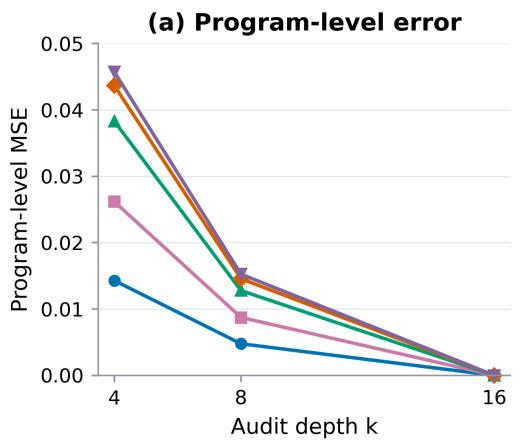
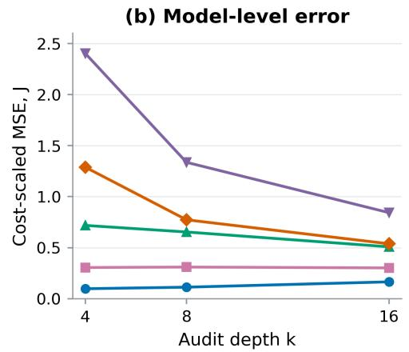
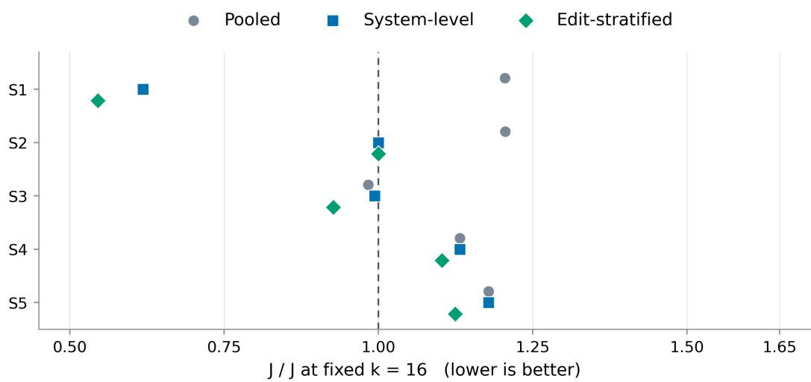
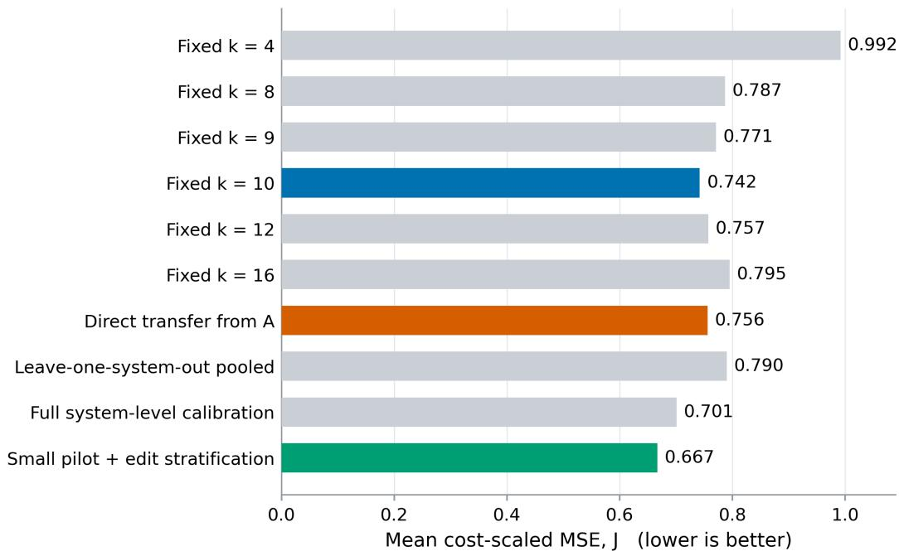

# DEPTHBENCHCAD: WHEN DOES DEEPER AUDITING YIELD MORE RELIABLE CONCLUSIONS?

Hongye Yang College of Computing Georgia Institute of Technology hyang783@gatech.edu

Zhihao Xie Independent Researcher xiezhihao.ai@gmail.com

Shengjun Xiong   
Independent Researcher   
xiongshengjunchina@gmail.com

Boxiao Huang College of Computing Georgia Institute of Technology bhuang361@gatech.edu

## ABSTRACT

Generative CAD models are expected to remain behaviorally correct after parameter edits, so increasing the number of edit checks is often treated as a direct route to more reliable evaluation. Under a fixed budget, however, auditing each program more thoroughly reduces the number of tasks and independent generations that can be evaluated, which can ultimately make model-level estimates less accurate. We study this phenomenon and the conditions under which it arises. We decompose behavioral evaluation into three evidence levels—task templates, stochastic generations, and within-program edits—define an average failure risk that is invariant to audit depth, and combine three-level variance with measured execution costs to analyze the tradeoff between deeper edit auditing and broader independent coverage. Experiments across two CAD environments and five generation systems show that the value of deeper auditing depends on where evaluation uncertainty originates. When template heterogeneity or generation stochasticity dominates, additional edit checks can increase total estimation error; when within-program state variation is large and generation is expensive, deeper auditing is more valuable. Variance and cost estimates from calibration predict the direction of this change and provide a diagnostic basis for allocating evidence on held-out tasks. These results show that the thoroughness of program inspection can diverge from the reliability of model evaluation, and they help determine whether the next unit of budget should be spent on a new task, a new generation, or additional edit checks.

Keywords: generative CAD; behavioral evaluation; multistage sampling; finite population; costaware evaluation

## 1 INTRODUCTION

Outputs from parametric CAD models must generate correct geometry at default parameters and remain executable while preserving geometric constraints and design intent under subsequent edits. DeepCAD represents the CAD modeling process as an operation sequence (Wu et al., 2021), while Fusion 360 Gallery provides real design histories and programmatic construction data (Willis et al., 2021). Text2CAD maps natural language to parametric CAD sequences (Khan et al., 2024), and CAD-Recode uses language models to recover executable CAD code from geometric input (Rukhovich et al., 2025). A program may appear correct in its initial state yet fail to build, selfintersect, invalidate parameters, or violate constraints after changes to thickness, hole diameter, spacing, or array count. Static geometric metrics therefore do not fully capture the editability or engineering utility of CAD programs.

Behavioral evaluation of generative CAD contains three levels of evidence: task templates cover different part families and design difficulty; independent generations from the same template capture model stochasticity; and counterfactual edit audits characterize behavior across valid parameter states within a program. BenchCAD incorporates execution verification, parameter reasoning, and code editing into a programmatic CAD benchmark (Zhang et al., 2026). Text2CAD-Bench further provides systematic evaluation of text-to-parametric-CAD generation (Wang et al., 2026). Increasing evidence at any of the three levels can reduce evaluation uncertainty, but the statistical role and execution cost of each level differ. Under a fixed budget, excessive audit depth reduces task coverage, whereas shallow auditing may miss conditional failures. The numbers of templates, generations per template, and audits per program must therefore be chosen jointly.

To ensure that different audit depths evaluate the same capability, we freeze the valid edit states for each template in advance and define the model-level estimand as the average probability of behavioral failure when randomly sampling a template, one model generation, and one edit state. Audit depth changes only the precision with which this estimand is measured, allowing budget allocations to be compared directly.

Supplementary motivation and protocol explanation appear in Appendix J. Our main contributions are:

(1) We identify and empirically characterize a separation between the thoroughness of program inspection and the accuracy of model-level estimation, showing how deeper auditing under a fixed budget can increase estimation error by reducing task coverage or independent generations.

(2) We explain this effect through three-level variance and execution cost and test, on held-out data, whether these quantities predict the direction of the benefit from deeper auditing.

(3) We evaluate how evidence allocation affects model-evaluation reliability through risk estimation, interval coverage, and judgment error, while explicitly reporting the associated calibration cost.

## 2 RELATED WORK

Executable CAD generation retains design histories and construction logic through operation sequences, programmatic data, and recovered code (Wu et al., 2021; Willis et al., 2021; Khan et al., 2024; Rukhovich et al., 2025). BenchCAD and Text2CAD-Bench extend evaluation toward execution, parameter reasoning, and editing (Zhang et al., 2026; Wang et al., 2026). Our analysis concerns how to allocate evaluation evidence under a fixed budget. It builds on multistage sampling (Neyman, 1934; Horvitz & Thompson, 1952), clustered observations (Liang & Zeger, 1986), and work on stochastic evaluation and selection bias (Henderson et al., 2018; Reimers & Gurevych, 2017; Dietterich, 1998; Varma & Simon, 2006). Detailed CAD, representation-learning, judge-validation, and sampling literature appears in Appendix H.

## 3 METHOD

To characterize how much independent evidence each evaluation record actually provides, we model generative-CAD behavioral evaluation as a three-level nested sampling process over templates, generations, and edits. This section defines the estimand, sampling estimator, variance decomposition, cost constraint, and calibration strategy. Letting the design structure determine effective sample size follows basic principles of design-based sampling and finite-population inference (Neyman, 1934; Horvitz & Thompson, 1952).

## 3.1 EVALUATION TARGET AND FINITE EDIT POPULATION

Let $Y _ { t i m } ^ { ( s ) } \in \{ 0 , 1 \}$ denote the outcome for system s on template t for generation i evaluated at state $m ,$ where $Y _ { t i m } ^ { ( s ) } = 1$ indicates an execution error, timeout, invalid topology, geometric-constraint violation, or parameter response inconsistent with the task specification. The failure risk of a single program over the complete edit population is

$$
\mu _ { s } ( t , i ) = \frac { 1 } { M } \sum _ { m = 1 } ^ { M } Y _ { t i m } ^ { ( s ) } .\tag{1}
$$

The model-level estimand is defined as

$$
R _ { s } = \mathbb { E } _ { T } \mathbb { E } _ { I ^ { ( s ) } \mid T } \left[ \mu _ { s } \left( T , I ^ { ( s ) } \right) \right] .\tag{2}
$$

$R _ { s }$ is the average probability of behavioral failure when randomly sampling a task template, a model generation, and a valid edit state. Actual audit depth affects estimation cost and variance but does not change this estimand. Single-program certification, all-state pass rate, and worst-case risk are different evaluation targets and are outside the scope of this paper.

## 3.2 THREE-LEVEL SAMPLING AND RISK ESTIMATION

Given a formal evaluation budget, we first sample q templates from the available pool; then independently generate g programs for each template; finally, from each program's M frozen states, we sample k states without replacement. Let $S _ { t i }$ denote the set of sampled states for program $( t , i )$ ; the model-risk estimator is

$$
\widehat { R } _ { s } ( q , g , k ) = \frac { 1 } { q } \sum _ { t = 1 } ^ { q } \frac { 1 } { g } \sum _ { i = 1 } ^ { g } \frac { 1 } { k } \sum _ { m \in S _ { t i } } Y _ { t i m } ^ { ( s ) } .\tag{3}
$$

The three sampling levels serve different roles: q controls task coverage; g controls generation uncertainty within a task; k controls measurement error in an individual program's risk. Multiple generations from the same template share task difficulty, so the template is the outermost unit for variance estimation, data splitting, and bootstrap. Keeping the template as the outermost cluster also avoids treating correlated repeated observations as independent samples (Liang & Zeger, 1986).

When comparing multiple systems, all systems use the same templates and edit-state indices to reduce comparison noise from task difficulty. A template and all of its generated programs are always kept as an intact cluster and never split across calibration, validation, or test sets.

## 3.3 THREE-LEVEL VARIANCE DECOMPOSITION

Let $\sigma _ { T } ^ { 2 } = V a r _ { T } \left[ \mathbb { E } _ { I | T } \mu _ { s } ( T , I ) \right]$ denote between-template variance, $\sigma _ { G } ^ { 2 } = \mathbb { E } _ { T } \left[ V a r _ { I | T } \mu _ { s } ( T , I ) \right]$ within-template generation variance, and $\sigma _ { E } ^ { 2 } = \mathbb { E } _ { T , I } \left[ S _ { E } ^ { 2 } \left( Y _ { t i m } ^ { \left( s \right) } \right) \right]$ within-program edit-state variance, respectively. Under a balanced sampling design, the superpopulation variance of Equation (3) is

$$
V a r \left( \widehat { R } _ { s } \right) = \frac { \sigma _ { T } ^ { 2 } } { q } + \frac { \sigma _ { G } ^ { 2 } } { q g } + \frac { 1 } { q g } \left( \frac { 1 } { k } - \frac { 1 } { M } \right) \sigma _ { E } ^ { 2 } .\tag{4}
$$

Equation (4) shows that increasing audit depth k can reduce only edit-state sampling error; betweentemplate variation and generation stochasticity still require increasing q and $g .$ For a finite reference pool with Q templates, $\mathbf { \bar { \boldsymbol { G } } }$ complete generations per template, and M states per program, resampling replay uses the finite-population variance in Equation (5). Estimation without replacement and inclusion-probability methods provide the classical basis for this resampling design on a frozen reference pool (Horvitz & Thompson, 1952).

$$
V a r _ { r e f } \left( \widehat { R } _ { s } \right) = \left( \frac { 1 } { q } - \frac { 1 } { Q } \right) S _ { T } ^ { 2 } + \frac { 1 } { q } \left( \frac { 1 } { g } - \frac { 1 } { G } \right) S _ { G } ^ { 2 } + \frac { 1 } { q g } \left( \frac { 1 } { k } - \frac { 1 } { M } \right) S _ { E } ^ { 2 } .\tag{5}
$$

Equation (5) is used to validate the method on a finite test pool. Confidence intervals for the future task distribution use templates as bootstrap clusters and do not treat the finite template set as the

complete task population. We use the bootstrap to estimate uncertainty for the future task distribution; its statistical basis and confidence-interval properties are well established (Efron, 1979; Efron & Tibshirani, 1986).

## 3.4 COST MODEL AND JOINT ALLOCATION

Let $c _ { T }$ be the preparation and scheduling cost of introducing a new template, $c _ { I }$ be the cost of one model generation, parsing, and initial build, and $c _ { E }$ be the cost of one parameter injection, program re-execution, and automated judgment. The total cost of a balanced design is

$$
C ( q , g , k ) = q c _ { T } + q g \left( c _ { I } + k c _ { E } \right) .\tag{6}
$$

Because systems have different generation and execution costs, our shared strategy freezes the number of generations per template $g$ and audit depth per program k, together with the budget-mapping rule, and measures the cost parameters for system s before formal evaluation. The maximum number of templates available to that system within the budget is

$$
q _ { s } ( g , k ) = \operatorname* { m i n } \left\{ Q , \left\lfloor \frac { C _ { 0 } } { c _ { T , s } + g \left( c _ { I , s } + k c _ { E , s } \right) } \right\rfloor \right\} .\tag{7}
$$

Thus, different systems may use different numbers of templates $q _ { s }$ while sharing the same $g , k ,$ and budget-allocation rule.

Normalizing by the cost of one edit execution $c _ { E }$ and defining $r _ { T } = c _ { T } / c _ { E } , r _ { I } = c _ { I } / c _ { E }$ , the budget constraint becomes

$$
q r _ { T } + q g \left( r _ { I } + k \right) \leq C _ { 0 } .\tag{8}
$$

We use discrete search to jointly select the three sampling parameters:

$$
\arg \operatorname* { m i n } _ { q , g , k \in \mathbb { N } } \widehat { V a r } _ { s } ( q , g , k ) , \quad \mathrm { s . t . } \quad C ( q , g , k ) \leq C _ { 0 } .\tag{9}
$$

The search range satisfies $1 \leq q \leq Q , 1 \leq g \leq G$ and $1 \leq k \leq M$ . For each $( g , k )$ , the algorithm chooses the largest number of templates q allowed by the budget and then compares all feasible integer solutions. This procedure handles template saturation, finite-population corrections, and residual integer budget.

## 3.5 CALIBRATION COST AND USAGE STRATEGY

Calibration uses independent templates to estimate variance and cost. A pooled $( g , k )$ configuration requires only target-system cost measurement; system-level calibration diagnoses deviations and reuse scenarios. Appendices A.3, F.4, and J give the allocation and calibration details.

## 4 EXPERIMENTAL DESIGN

## 4.1 DATA AND EVALUATION ENVIRONMENTS

We compare five generation systems, S1–S5, on DepthBenchCAD. All five use a common CADgeneration interface and differ only in the underlying language model; each system receives the same task specification and parameter requirements and outputs an executable CadQuery program. System mappings, fixed runtime configurations, random-seed rules, and cost-measurement protocols are provided in Appendix D.

The experiments use a primary environment A and a cross-task-family transfer environment B. Environment A contains eight task families and is used to test whether calibration parameters predict the benefit of deeper auditing on held-out templates. Environment B contains six task families disjoint from A and is used to test cross-family transfer of allocation strategies. The environments share the same risk definition and four edit protocols; complete task-family compositions and execution settings appear in Appendices B and D.

Table 1: Experimental data matrix
<table><tr><td>Env.</td><td>Tpl.</td><td>Fam.</td><td>Cal./Test</td><td>Gen./tpl.</td><td>States/prog. Sys.</td><td></td><td>Records</td></tr><tr><td>DepthBenchCAD-A</td><td>72</td><td>8</td><td>24/48</td><td>5</td><td>16</td><td>5</td><td>28,800</td></tr><tr><td>DepthBenchCAD-B</td><td>48</td><td>6</td><td>12/36</td><td>4</td><td>16</td><td>5</td><td>15,360</td></tr></table>

Using one edit execution as the cost unit, the template cost is 2. Generation costs for S1–S5 are 1, 3, 8, 16, and 32 in environment A, and 2, 6, 16, 32, and 64 in environment B. The main reported budget is $C _ { 0 } { = } 1 0 2 4$ , with total cost q[2+g(rI+k)].

The main experimental results use a frozen, real, fully audited pool. Failure labels come from actual builds, counterfactual edits, and automated judgments. Alternative evidence allocations are evaluated only by sampling without replacement from observed records and by Monte Carlo replay. Complete execution, cost, and replay protocols are provided in Appendices C, D, and F.

## 4.2 COUNTERFACTUAL EDIT STATES AND AUTOMATED JUDGE

Each template contains 16 pre-frozen edit states, evenly divided among four categories.

Table 2: Composition of counterfactual edit states
<table><tr><td>Type</td><td>States</td><td>Intervention target</td><td>Primary checks</td></tr><tr><td>Local edit</td><td>4</td><td>Routine change to one parameter</td><td>Parameter binding, geometric response, and main-body connectivity</td></tr><tr><td>Boundary edit</td><td>4</td><td>Parameter values near the valid-range boundary</td><td>Self-intersection, zero volume, minimum spacing, and manufacturing constraints</td></tr><tr><td>Linked edit</td><td>4</td><td>Simultaneous changes to multiple related parameters</td><td>Symmetry, spacing, arrays, and dimensional relations</td></tr><tr><td>Semantic edit</td><td>4</td><td>High-level design-specification changes</td><td>Coordinated response of related parameters, geometry, and design semantics</td></tr></table>

The state generator reads only the task specification and never the candidate program implementation. Each state records parameter values, units, valid ranges, expected geometric relations, and judgment tolerances. Complete definitions of the 16 states are provided in Appendix B.

The automated judge checks, in order, successful build completion, valid entities and connected components, topology and hole/circular features, parameter response, dimensional/spacing/symmetry/containment relations, and high-level semantic constraints. The full contract for numerical tolerances, gray-zone routing, isolated execution, and geometry probes appears in Appendix C.

If the initial state fails to build or violates nominal constraints, all 16 edit states for that program are counted as failures in the primary analysis. We also report conditional risk among initially valid programs to distinguish initial-generation failure from failures introduced during editing.

Expert validation. The automated judge is validated on 800 stratified records reviewed by two experts. The experts label each record independently and blindly before a consensus label is formed; overall risk and confusion metrics are weighted by inverse sampling probability. Appendix E gives the full sampling, adjudication, agreement, and weighted-estimation protocol.

## 4.3 DATA SPLITS AND CALIBRATION SETUP

Splits are stratified by family at the template level: A uses three calibration and six test templates per family (24/48 total), and B uses two and six (12/36). All generations and states stay with their template. Full calibration audits all 16 states; smaller pilots test shrinkage and reuse. Test data never select variance parameters, shrinkage weights, depth, or costs; the full test pool supplies only reference risk and replay outcomes (Varma & Simon, 2006). Appendices D.3, F.1, and J retain the extended protocol.

## 4.4 COMPARISON METHODS AND BUDGETS

We compare fixed audit depths, a two-level degenerate model, pooled and leave-one-system-out pooling, full system-level calibration, small calibration with shrinkage, edit-type stratification, and paired allocation for model pairs. Main-text results focus on fixed depth, pooled allocation, and system-level/stratified candidate configurations. Formal selection rules, budget mappings, and paired definitions are provided in Appendix F.

## 4.5 EVALUATION METRICS AND STATISTICAL INFERENCE

## Risk-Estimation Efficiency

We measure estimation error at both the program and model levels. Program-level MSE is the mean squared error between the failure proportion estimated from k sampled states and the failure proportion over all 16 states for that program, averaged across programs. Model-level MSE uses the mean failure risk of the full test pool as the reference and reports $\mathbf { J } { = } C _ { 0 } { \times } \mathbf { M } \mathbf { S } \mathbf { E }$

For each fixed audit depth, only the calibration set is used to choose g, and the largest feasible q is determined by the cost constraint. Program-level MSE is estimated by state-subsampling replay, while model-level MSE is computed from the design variance of the finite test pool. Test-pool results are used only for post hoc validation and never for configuration selection.

Benefit prediction is preregistered for two comparisons: k=4→8 and k=8→16. We define $\Delta \mathrm { J } { = } J _ { \mathrm { d e e p } } { - } J _ { \mathrm { s h a l l o w } } ,$ , where a negative value indicates that deeper auditing is beneficial. We compare the sign predicted during calibration with the actual ∆J in the test pool. Wrong-recommendation loss is the excess J of the recommended configuration over the smaller J of the two alternatives.

In addition to J and benefit direction, we report regret relative to the oracle, 5% robust coverage, 95% interval coverage, automated-judge validity, and paired model decisions. Definitions, repetition counts, and statistical inference for these auxiliary metrics are given in Appendices E and F. Interval experiments use q=16, g=3, k=8 throughout and run 5,000 replays without replacement.

## 5 EXPERIMENTAL RESULTS

This section addresses three questions: whether ignoring evidence hierarchy produces overconfident model conclusions; whether three-level variance and cost predict the direction of benefit from deeper auditing; and when recalibration is worth its additional cost.

## 5.1 EVIDENCE HIERARCHY AND EVALUATION RELIABILITY

When generated programs are treated as independent units, mean interval coverage across the five systems is 91.81%; using the three-level design variance increases it to 95.26%. The difference is largest for S1 and S2, which exhibit stronger template-level correlation: coverage rises from 89.06% and 86.82% to 94.28% and 94.42%, respectively. Differences for S3–S5 are smaller, consistent with their weaker template-level heterogeneity. These results describe interval performance on the finite test pool and do not change the common risk point estimate used by both methods.

Figure 1 compares program-level and model-level estimation errors at different audit depths in the primary environment.

More thorough program inspection does not improve model-level estimation accuracy for every system. When S1's audit depth increases from 4 to 16, program-level MSE falls from 0.014284 to zero, but the total number of generated programs drops from 184 to 48 and model-level J rises from 0.0974 to 0.1649, an increase of about 69.3%. Full-state auditing eliminates edit-sampling error for these programs but cannot compensate for the loss of independent generations.



  
Figure 1: Audit depth and estimation error in the primary environment. (a) Program-level MSE. (b) Model-level cost-scaled error, $\mathbf { J } { = } C _ { 0 } { \times } \mathbf { M } \mathbf { S } \mathbf { E }$ . The formal budget is $C _ { 0 } { = } 1 0 2 4 ;$ the numbers of templates q and generations g vary by configuration. Colors and markers denote S1–S5, and lines connect the three reported depths. $\mathrm { A t ~ k } { = } 1 6 ,$ program-level MSE is zero, while model-level error may still increase or decrease. Exact values are reported in Table 18.

S4 shows the opposite pattern. Increasing depth from 4 to 16 reduces the number of templates from 46 to 30, yet J falls from 1.2881 to 0.5378, a decrease of about 58.3%. Here, the information gained from additional edit states is sufficient to offset the loss of coverage. S2 changes only slightly, indicating that some systems are nearly indifferent across audit depths.

Across the ten predefined comparisons in environment A, calibration predicts the correct direction in nine. The sole error is S2 for $\mathrm { k } { = } 4 {  } 8 \colon$ predicted $\Delta { \mathrm { J } } { = } { - } 0 . 0 1 2 1$ , while actual ∆J=0.0039. Mean wrong-recommendation loss across the ten comparisons is 0.000389. After local calibration in environment B, all ten directions are predicted correctly. These results support the three-level variance-and-cost explanation of audit benefit, although the twenty comparisons constitute only a limited mechanism validation.

Figure 2 shows three classes of candidate configurations selected under a common calibration protocol. System-level and stratified configurations reduce estimation error for some systems, but neither pooled nor system-level configurations consistently outperform a strong fixed-depth baseline. The three-level model therefore provides a stable explanation of the source and direction of audit benefit, while the optimality of a particular configuration still depends on system variance structure, cost, and finite calibration data.

A strong fixed depth remains an important baseline. Under the unified analysis protocol, fixed $k = 1 6 ,$ the stratified configuration, the system-level configuration, and the cross-system pooled configuration have five-system mean J values of 0.471, 0.481, 0.502, and 0.533. We therefore do not interpret calibration-driven joint allocation as outperforming the best fixed depth on average. Its primary role is to explain why different systems prefer different audit depths and to predict the direction of benefit from increasing audit depth.

## 5.2 CALIBRATION COST AND TRANSFER STABILITY

Calibration is substantially more expensive than a single formal evaluation: full calibration costs about 2.04–5.67 times the formal budget, while small calibration costs about 28.1%–76.6%. Any local gain from system-level allocation must therefore be weighed against calibration expenditure and the number of times calibration can be reused. Complete values are given in Table 13.

Repeated template splits reveal finite-sample variability in audit-depth selection. Across random splits, median relative regret is 1.041 and mean relative regret is 1.098. Tail degradation is more pronounced under leave-one-task-family-out validation: P90 relative regret reaches 1.709 for S1 and 1.608 for S2, showing that task-family coverage affects allocation transfer. Complete stability results appear in Table 14.

  
Figure 2: Error ratios of three allocation strategies relative to the fixed k=16 baseline in the primary environment. Each point is the strategy's J divided by J for the same system at fixed k=16. The dashed line marks a ratio of 1; points to the left have lower error. Circles, squares, and diamonds denote pooled, system-level, and edit-stratified strategies, respectively. The formal budget is $C _ { 0 } { = } 1 0 2 4$ calibration cost is accounted for separately. Exact values are reported in Table 19.

The second CAD environment also exhibits different configuration preferences. Among fixed-depth baselines, $k = 1 0$ has the lowest mean J at 0.742. The pooled configuration transferred directly from the primary environment keeps $g = 1 , k = 1 2$ , with mean $J = 0 . 7 5 6$ . Leave-one-system-out pooling has mean J of 0.790, while small calibration with four-way stratification achieves the lowest mean in the table, $J = 0 . 6 6 7$ . Configurations are compared in Figure 3.

Cross-task-family transfer shows that the primary-environment configuration can directly transfer its frozen g, k, but optimality is not guaranteed on a new task set. Changes in task composition alter both variance structure and execution cost, so transfer still requires remeasuring costs and comparing the transferred configuration against fixed-depth and calibrated strategies in the target environment.

## 5.3 JUDGE VALIDITY AND MODEL DECISIONS

Dual-expert validation shows that, under inverse-sampling-probability weighting of the expert sample, the automated judge and expert consensus preserve the same risk ranking across all five systems. The automated judge underestimates risk for S4 and S5 by about 1.97 and 3.65 percentage points, respectively, while S2's automated labels exactly match expert consensus. Complete weighted risks and classification metrics are reported in Table 12, with the validation protocol in Appendix E.

Programs that fail the initial build contribute 16 failed states to the primary risk. We also report conditional edit risk restricted to initially valid programs. This dual reporting preserves end-to-end failure probability while enabling analysis of parameter editability after a program builds successfully.

In model-pair experiments, paired allocation provides only a small improvement over a strong fixed depth baseline and the benefit largely disappears at high budgets. Its value is concentrated in comparisons with small risk gaps, low paired variance, and reusable calibration cost. Complete correctdecision rates at three budgets are reported in Table 17.

  
Figure 3: Mean cost-scaled error J for each strategy in cross-task-family environment B; lower is better. Blue highlights the best reported fixed depth, k=10; orange denotes direct transfer from A with $\mathrm { g } { = } 1 , \mathrm { k } { = } 1 \bar { 2 } ;$ green denotes small calibration with edit stratification; other strategies are gray. The formal budget is $C _ { 0 } { = } 1 0 2 4$ , with additional calibration cost reported separately. Exact values are reported in Table 20.

## 6 DISCUSSION

Reliable evaluation requires matching independent evidence to the dominant uncertainty source. Template heterogeneity favors additional tasks, generation variability favors independent programs, and substantial edit-state variation with expensive generation favors deeper auditing. Joint allocation explains system-specific deviations and audit-benefit directions, but does not consistently outperform strong fixed-depth baselines. Calibration is useful only when its gains and reuse justify its additional cost. Transfer results also caution against extrapolating a configuration beyond its task composition (Torralba & Efros, 2011; Geirhos et al., 2020).

The estimand covers 16 frozen states, not a continuous parameter space or open-ended interaction. The variance model assumes a prespecified sampling design and within-level exchangeability; correlated costs, nonrandom timeouts, or adaptive stopping require additional treatment. Small calibration sets introduce parameter uncertainty, and the judge has limited semantic coverage despite expert validation. The tested families, systems, and kernels also constrain generalization. Average failure risk does not establish engineering safety or worst-case correctness. Appendix I retains the full discussion of practical use, calibration, transfer, pairing, and limitations (Mitchell et al., 2019).

## 7 CONCLUSION

Under a fixed budget, more thorough CAD-program auditing can reduce the reliability of model evaluation by sacrificing task coverage and independent generations. Three-level variance and measured execution costs explain this conflict and predict audit-benefit directions across the tested systems and environments. No depth is universally best, and joint allocation does not consistently outperform strong fixed-depth baselines. Its value lies in diagnosing the dominant uncertainty source and guiding budget adjustment, with calibration cost, task composition, and reuse determining practical efficiency. Appendix J retains the extended conclusion.

## AI USE STATEMENT

ChatGPT and Codex were used to assist with literature search, language polishing, code editing, translation, and related writing tasks. All AI-assisted content, including factual statements, analyses, and conclusions, was independently reviewed and verified by the authors. The authors take full responsibility for the accuracy and integrity of the manuscript.

## REFERENCES

R. Artstein and M. Poesio. Survey Article: Inter-Coder Agreement for Computational Linguistics. Computational Linguistics, 34(4):555–596, 2008. doi: 10.1162/coli.07-034-R2. URL https: //doi.org/10.1162/coli.07-034-R2.

A. Avetisyan, M. Dahnert, A. Dai, M. Savva, A. X. Chang, and M. Niessner. Scan2CAD: Learning CAD Model Alignment in RGB-D Scans. In Proceedings of the IEEE/CVF Conference on Computer Vision and Pattern Recognition (CVPR), 2019. doi: 10.1109/CVPR.2019.00272. URL https://doi.org/10.1109/CVPR.2019.00272.

D. Card, P. Henderson, U. Khandelwal, R. Jia, K. Mahowald, and D. Jurafsky. With Little Power Comes Great Responsibility. In Proceedings of the 2020 Conference on Empirical Methods in Natural Language Processing (EMNLP), 2020. doi: 10.18653/v1/2020.emnlp-main.745. URL https://doi.org/10.18653/v1/2020.emnlp-main.745.

Z. Chen, A. Tagliasacchi, and H. Zhang. BSP-Net: Generating Compact Meshes via Binary Space Partitioning. In Proceedings of the IEEE/CVF Conference on Computer Vision and Pattern Recognition (CVPR), 2020. doi: 10.1109/CVPR42600.2020.00012. URL https: //doi.org/10.1109/CVPR42600.2020.00012.

J. Cohen. A Coefficient of Agreement for Nominal Scales. Educational and Psychological Measurement, 20(1):37–46, 1960. doi: 10.1177/001316446002000104. URL https: //doi.org/10.1177/001316446002000104.

B. Deng, K. Genova, S. Yazdani, S. Bouaziz, G. Hinton, and A. Tagliasacchi. CvxNet: Learnable Convex Decomposition. In Proceedings of the IEEE/CVF Conference on Computer Vision and Pattern Recognition (CVPR), 2020. doi: 10.1109/CVPR42600.2020.00011. URL https: //doi.org/10.1109/CVPR42600.2020.00011.

T. G. Dietterich. Approximate Statistical Tests for Comparing Supervised Classification Learning Algorithms. Neural Computation, 10(7):1895–1923, 1998. doi: 10.1162/089976698300017197. URL https://doi.org/10.1162/089976698300017197.

B. Efron. Bootstrap Methods: Another Look at the Jackknife. The Annals of Statistics, 7(1):1–26, 1979. doi: 10.1214/aos/1176344552. URL https://doi.org/10.1214/aos/117634 4552.

B. Efron and R. Tibshirani. Bootstrap Methods for Standard Errors, Confidence Intervals, and Other Measures of Statistical Accuracy. Statistical Science, 1(1):54–75, 1986. doi: 10.1214/ss/11770 13815. URL https://doi.org/10.1214/ss/1177013815.

R. Geirhos, J.-H. Jacobsen, C. Michaelis, R. Zemel, W. Brendel, M. Bethge, and F. A. Wichmann. Shortcut Learning in Deep Neural Networks. Nature Machine Intelligence, 2:665–673, 2020. doi: 10.1038/s42256-020-00257-z. URL https://doi.org/10.1038/s42256-020-002 57-z.

H. Guo, S. Liu, H. Pan, Y. Liu, X. Tong, and B. Guo. ComplexGen: CAD Reconstruction by B-Rep Chain Complex Generation. ACM Transactions on Graphics, 41(4):129, 2022a. doi: 10.1145/3528223.3530078. URL https://doi.org/10.1145/3528223.3530078.

H.-X. Guo, Y. Liu, H. Pan, and B. Guo. Implicit Conversion of Manifold B-Rep Solids by Neural Halfspace Representation. ACM Transactions on Graphics, 41(6):276, 2022b. doi: 10.1145/35 50454.3555502. URL https://doi.org/10.1145/3550454.3555502.

P. Henderson, R. Islam, P. Bachman, J. Pineau, D. Precup, and D. Meger. Deep Reinforcement Learning That Matters. Proceedings of the AAAI Conference on Artificial Intelligence, 32(1), 2018. doi: 10.1609/aaai.v32i1.11694. URL https://doi.org/10.1609/aaai.v32i1 .11694.

D. G. Horvitz and D. J. Thompson. A Generalization of Sampling Without Replacement from a Finite Universe. Journal of the American Statistical Association, 47(260):663–685, 1952. doi: 10.1080/01621459.1952.10483446. URL https://doi.org/10.1080/01621459.195 2.10483446.

J. Huang, Y. Zhang, and M. Sun. PrimitiveNet: Primitive Instance Segmentation with Local Primitive Embedding under Adversarial Metric. In Proceedings of the IEEE/CVF International Conference on Computer Vision (ICCV), 2021. doi: 10.1109/ICCV48922.2021.01506. URL https://doi.org/10.1109/ICCV48922.2021.01506.

V. Ishimtsev, A. Bokhovkin, A. Artemov, S. Ignatyev, M. Niessner, D. Zorin, and E. Burnaev. CAD-Deform: Deformable Fitting of CAD Models to 3D Scans. In Computer Vision – ECCV 2020, 2020. doi: 10.1007/978-3-030-58601-0\_36. URL https://doi.org/10.1007/978-3 -030-58601-0\_36.

P. K. Jayaraman, A. Sanghi, J. G. Lambourne, K. D. D. Willis, T. Davies, H. Shayani, and N. Morris. UV-Net: Learning from Boundary Representations. In Proceedings ofthe IEEE/CVF Conference on Computer Vision and Pattern Recognition (CVPR), 2021. doi: 10.1109/CVPR46437.2021.0 1153. URL https://doi.org/10.1109/CVPR46437.2021.01153.

B. Jones, D. Hildreth, D. Chen, I. Baran, V. G. Kim, and A. Schulz. AutoMate: A Dataset and Learning Approach for Automatic Mating of CAD Assemblies. ACM Transactions on Graphics, 40(6):227, 2021. doi: 10.1145/3478513.3480562. URL https://doi.org/10.1145/34 78513.3480562.

B. T. Jones, M. Hu, M. Kodnongbua, V. G. Kim, and A. Schulz. Self-Supervised Representation Learning for CAD. In Proceedings ofthe IEEE/CVF Conference on Computer Vision and Pattern Recognition (CVPR), 2023. doi: 10.1109/CVPR52729.2023.02043. URL https://doi.or g/10.1109/CVPR52729.2023.02043.

R. K. Jones, T. Barton, X. Xu, K. Wang, E. Jiang, P. Guerrero, N. J. Mitra, and D. Ritchie. ShapeAssembly: Learning to Generate Programs for 3D Shape Structure Synthesis. ACM Transactions on Graphics, 39(6):234, 2020. doi: 10.1145/3414685.3417812. URL https: //doi.org/10.1145/3414685.3417812.

M. S. Khan, S. Sinha, T. U. Sheikh, D. Stricker, S. A. Ali, and M. Z. Afzal. Text2CAD: Generating Sequential CAD Designs from Beginner-to-Expert Level Text Prompts. Advances in Neural Information Processing Systems 37 (NeurIPS 2024), 2024. doi: 10.52202/079017-0242. URL https://doi.org/10.52202/079017-0242.

S. Koch, A. Matveev, Z. Jiang, F. Williams, A. Artemov, E. Burnaev, M. Alexa, D. Zorin, and D. Panozzo. ABC: A Big CAD Model Dataset for Geometric Deep Learning. In Proceedings of the IEEE/CVF Conference on Computer Vision and Pattern Recognition (CVPR), 2019. doi: 10.1109/CVPR.2019.00983. URL https://doi.org/10.1109/CVPR.2019.00983.

C. Li, H. Pan, A. Bousseau, and N. J. Mitra. Sketch2CAD: Sequential CAD Modeling by Sketching in Context. ACM Transactions on Graphics, 39(6):164, 2020. doi: 10.1145/3414685.3417807. URL https://doi.org/10.1145/3414685.3417807.

C. Li, H. Pan, A. Bousseau, and N. J. Mitra. Free2CAD: Parsing Freehand Drawings into CAD Commands. ACM Transactions on Graphics, 41(4):93, 2022. doi: 10.1145/3528223.3530133. URL https://doi.org/10.1145/3528223.3530133.

L. Li, M. Sung, A. Dubrovina, L. Yi, and L. J. Guibas. Supervised Fitting of Geometric Primitives to 3D Point Clouds. In Proceedings of the IEEE/CVF Conference on Computer Vision and Pattern Recognition (CVPR), 2019. doi: 10.1109/CVPR.2019.00276. URL https://doi.org/10 .1109/CVPR.2019.00276.

P. Li, J. Guo, X. Zhang, and D.-M. Yan. SECAD-Net: Self-Supervised CAD Reconstruction by Learning Sketch-Extrude Operations. In Proceedings of the IEEE/CVF Conference on Computer Vision and Pattern Recognition (CVPR), 2023. doi: 10.1109/CVPR52729.2023.01613. URL https://doi.org/10.1109/CVPR52729.2023.01613.

K.-Y. Liang and S. L. Zeger. Longitudinal Data Analysis Using Generalized Linear Models. Biometrika, 73(1):13–22, 1986. doi: 10.1093/biomet/73.1.13. URL https://doi.or g/10.1093/biomet/73.1.13.

M. Mitchell, S. Wu, A. Zaldivar, P. Barnes, L. Vasserman, B. Hutchinson, E. Spitzer, I. D. Raji, and T. Gebru. Model Cards for Model Reporting. In Proceedings ofthe Conference on Fairness, Accountability, and Transparency (FAT\*), 2019. doi: 10.1145/3287560.3287596. URL https: //doi.org/10.1145/3287560.3287596.

K. Mo, S. Zhu, A. X. Chang, L. Yi, S. Tripathi, L. J. Guibas, and H. Su. PartNet: A Large-Scale Benchmark for Fine-Grained and Hierarchical Part-Level 3D Object Understanding. In Proceedings ofthe IEEE/CVF Conference on Computer Vision and Pattern Recognition (CVPR), 2019. doi: 10.1109/CVPR.2019.00100. URL https://doi.org/10.1109/CVPR.201 9.00100.

J. Neyman. On the Two Different Aspects of the Representative Method: The Method of Stratified Sampling and the Method of Purposive Selection. Journal ofthe Royal Statistical Society, 97(4): 558–606, 1934. doi: 10.1111/j.2397-2335.1934.tb04184.x. URL https://doi.org/10.1 111/j.2397-2335.1934.tb04184.x.

D. Paschalidou, A. O. Ulusoy, and A. Geiger. Superquadrics Revisited: Learning 3D Shape Parsing Beyond Cuboids. In Proceedings of the IEEE/CVF Conference on Computer Vision and Pattern Recognition (CVPR), 2019. doi: 10.1109/CVPR.2019.01059. URL https://doi.org/10 .1109/CVPR.2019.01059.

D. Paschalidou, A. Katharopoulos, A. Geiger, and S. Fidler. Neural Parts: Learning Expressive 3D Shape Abstractions with Invertible Neural Networks. In Proceedings of the IEEE/CVF Conference on Computer Vision and Pattern Recognition (CVPR), 2021. doi: 10.1109/CVPR46437.20 21.00322. URL https://doi.org/10.1109/CVPR46437.2021.00322.

N. Reimers and I. Gurevych. Reporting Score Distributions Makes a Difference: Performance Study of LSTM-Networks for Sequence Tagging. In Proceedings ofthe 2017 Conference on Empirical Methods in Natural Language Processing (EMNLP), 2017. doi: 10.18653/v1/D17-1035. URL https://doi.org/10.18653/v1/D17-1035.

D. Rukhovich, E. Dupont, D. Mallis, K. Cherenkova, A. Kacem, and D. Aouada. CAD-Recode: Reverse Engineering CAD Code from Point Clouds. In Proceedings of the IEEE/CVF International Conference on Computer Vision (ICCV), 2025. doi: 10.1109/ICCV51701.2025.00914. URL https://doi.org/10.1109/ICCV51701.2025.00914.

R. Schnabel, R. Wahl, and R. Klein. Efficient RANSAC for Point-Cloud Shape Detection. Computer Graphics Forum, 26(2):214–226, 2007. doi: 10.1111/j.1467-8659.2007.01016.x. URL https: //doi.org/10.1111/j.1467-8659.2007.01016.x.

G. Sharma, R. Goyal, D. Liu, E. Kalogerakis, and S. Maji. CSGNet: Neural Shape Parser for Constructive Solid Geometry. In Proceedings of the IEEE/CVF Conference on Computer Vision and Pattern Recognition (CVPR), 2018. doi: 10.1109/CVPR.2018.00578. URL https: //doi.org/10.1109/CVPR.2018.00578.

G. Sharma, D. Liu, S. Maji, E. Kalogerakis, S. Chaudhuri, and R. Mech. ParSeNet: A Parametricˇ Surface Fitting Network for 3D Point Clouds. In Computer Vision – ECCV 2020, 2020. doi: 10.1007/978-3-030-58571-6\_16. URL https://doi.org/10.1007/978-3-030-585 71-6\_16.

C. Sun, Q.-F. Zou, X. Tong, and Y. Liu. Learning Adaptive Hierarchical Cuboid Abstractions of 3D Shape Collections. ACM Transactions on Graphics, 38(6):241, 2019. doi: 10.1145/3355089.33 56529. URL https://doi.org/10.1145/3355089.3356529.

A. Torralba and A. A. Efros. Unbiased Look at Dataset Bias. In Proceedings of the IEEE Conference on Computer Vision and Pattern Recognition (CVPR), 2011. doi: 10.1109/CVPR.2011.5995347. URL https://doi.org/10.1109/CVPR.2011.5995347.

S. Tulsiani, H. Su, L. J. Guibas, A. A. Efros, and J. Malik. Learning Shape Abstractions by Assembling Volumetric Primitives. In Proceedings of the IEEE Conference on Computer Vision and Pattern Recognition (CVPR), 2017. doi: 10.1109/CVPR.2017.160. URL https: //doi.org/10.1109/CVPR.2017.160.

M. A. Uy, Y.-Y. Chang, M. Sung, P. Goel, J. G. Lambourne, T. Birdal, and L. J. Guibas. Point2Cyl: Reverse Engineering 3D Objects from Point Clouds to Extrusion Cylinders. In Proceedings of the IEEE/CVF Conference on Computer Vision and Pattern Recognition (CVPR), 2022. doi: 10.1109/CVPR52688.2022.01155. URL https://doi.org/10.1109/CVPR52688.20 22.01155.

S. Varma and R. Simon. Bias in Error Estimation When Using Cross-Validation for Model Selection. BMC Bioinformatics, 7:91, 2006. doi: 10.1186/1471-2105-7-91. URL https://doi.org/ 10.1186/1471-2105-7-91.

L. Wang, H. Meng, Z. Xiang, J. Liu, P. Zhou, L. Chen, and Y. Tang. Text2CAD-Bench: A Benchmark for LLM-Based Text-to-Parametric CAD Generation. arXiv preprint arXiv:2605.18430, 2026. doi: 10.48550/arXiv.2605.18430. URL https://doi.org/10.48550/arXiv.2 605.18430.

K. D. D. Willis, Y. Pu, J. Luo, H. Chu, T. Du, J. G. Lambourne, A. Solar-Lezama, and W. Matusik. Fusion 360 Gallery: A Dataset and Environment for Programmatic CAD Construction from Human Design Sequences. ACM Transactions on Graphics, 40(4):54, 2021. doi: 10.1145/3450626.3459818. URL https://doi.org/10.1145/3450626.3459818.

K. D. D. Willis, P. K. Jayaraman, H. Chu, Y. Tian, Y. Li, D. Grandi, A. Sanghi, L. Tran, J. G. Lambourne, A. Solar-Lezama, and W. Matusik. JoinABLe: Learning Bottom-Up Assembly of Parametric CAD Joints. In Proceedings of the IEEE/CVF Conference on Computer Vision and Pattern Recognition (CVPR), 2022. doi: 10.1109/CVPR52688.2022.01539. URL https: //doi.org/10.1109/CVPR52688.2022.01539.

R. Wu, C. Xiao, and C. Zheng. DeepCAD: A Deep Generative Network for Computer-Aided Design Models. In Proceedings of the IEEE/CVF International Conference on Computer Vision (ICCV), 2021. doi: 10.1109/ICCV48922.2021.00670. URL https://doi.org/10.1109/ICCV48 922.2021.00670.

X. Xu, J. G. Lambourne, P. K. Jayaraman, Z. Wang, K. D. D. Willis, and Y. Furukawa. BrepGen: A B-Rep Generative Diffusion Model with Structured Latent Geometry. ACM Transactions on Graphics, 43(4):119, 2024. doi: 10.1145/3658129. URL https://doi.org/10.1145/36 58129.

S. Yan, Z. Yang, C. Ma, H. Huang, E. Vouga, and Q. Huang. HPNet: Deep Primitive Segmentation Using Hybrid Representations. In Proceedings of the IEEE/CVF International Conference on Computer Vision (ICCV), 2021. doi: 10.1109/ICCV48922.2021.00275. URL https://doi. org/10.1109/ICCV48922.2021.00275.

F. Yu, Z. Chen, M. Li, A. Sanghi, H. Shayani, A. Mahdavi-Amiri, and H. Zhang. CAPRI-Net: Learning Compact CAD Shapes with Adaptive Primitive Assembly. In Proceedings of the IEEE/CVF Conference on Computer Vision and Pattern Recognition (CVPR), 2022. doi: 10.1109/CVPR52 688.2022.01147. URL https://doi.org/10.1109/CVPR52688.2022.01147.

H. Zhang, K. Liu, M. Chen, L. Li, S. Yang, C. Peng, and H. Chen. BenchCAD: A Comprehensive, Industry-Standard Benchmark for Programmatic CAD. arXiv preprint arXiv:2605.10865, 2026. doi: 10.48550/arXiv.2605.10865. URL https://doi.org/10.48550/arXiv.2605.10 865.

## A STATISTICAL DERIVATIONS AND COST ALLOCATION

This appendix corresponds to Sections 3.3–3.5. The main text retains only the equations needed to understand the method; here we provide the design-based derivation, variance-component estimators, continuous approximation, and calibration break-even condition.

## A.1 DESIGN-BASED DERIVATION OF THE THREE-LEVEL VARIANCE

Let $Y _ { t i e } \in \{ 0 , 1 \}$ denote the failure label for template t, independent generation i, and frozen edit state e. Each program has M pre-frozen states, from which k are sampled without replacement; each template has g independent generations, and a formal evaluation contains q templates. Program risk is the mean over the M states, and the model-risk estimator is the average of the sampled template, generation, and state means.

For a fixed program (t,i), the conditional variance under simple random sampling without replacement is

$$
\mathrm { V a r } ( \bar { Y } _ { t i } ( k ) \mid t , i ) = ( 1 / k - 1 / M ) S _ { E , t i } ^ { 2 } .\tag{A.1}
$$

Averaging g independent generations within the same template reduces the generation- and edit-level contributions by $1 / \mathrm { g } ;$ averaging over q templates then gives the superpopulation design variance:

$$
\mathrm { V a r } ( \widehat { R } ) = \sigma _ { T } ^ { 2 } / q + \sigma _ { I } ^ { 2 } / ( q g ) + \frac { 1 } { q g } ( 1 / k - 1 / M ) \sigma _ { E } ^ { 2 } .\tag{A.2}
$$

Here, $\sigma _ { T } ^ { 2 }$ denotes upper-level heterogeneity among template means, $\sigma _ { I } ^ { 2 }$ the generation heterogeneity among full-program risks within a template, and $\sigma _ { E } ^ { 2 }$ the mean finite-population variance among frozen states within a program. The decomposition directly shows that increasing k affects only the third term; uncertainty at the template and generation levels can be reduced only by increasing q or g.

When the validation target is a frozen reference pool containing Q templates and G complete generations per template, templates and generations are also sampled without replacement, yielding the finite-population form:

$$
\mathrm { V a r } _ { F } ( \widehat { R } ) = ( 1 / q - 1 / Q ) \sigma _ { T } ^ { 2 } + \frac { 1 } { q } ( 1 / g - 1 / G ) \sigma _ { I } ^ { 2 } + \frac { 1 } { q g } ( 1 / k - 1 / M ) \sigma _ { E } ^ { 2 } .\tag{A.3}
$$

Equation (5) is used only for method validation on the frozen test pool. Intervals for the future task distribution still use templates as the outermost cluster and do not treat the finite test-template set as the complete task population.

## A.2 METHOD-OF-MOMENTS ESTIMATION OF VARIANCE COMPONENTS

Full calibration records contain all M=16 states for every program. Estimation follows the threelevel nested structure and explicitly subtracts lower-level measurement noise so that edit-sampling variation is not misattributed to generation heterogeneity, nor generation variation to template heterogeneity.

Negative method-of-moments residuals can arise only from finite-sample noise. The executable protocol truncates them at zero, ensuring that all three variance components entering budget optimization are finite and nonnegative. Finite-population estimates on the frozen reference pool instead use complete template means, complete program means, and within-program state variances directly.

## A.3 COST CONSTRAINT, CONTINUOUS APPROXIMATION, AND INTEGER SEARCH

Let $c _ { T } , c _ { I }$ , and $c _ { E }$ denote the costs of preparing a new template, generating/parsing/initially building one program, and executing/judging one edit, respectively. The formal cost of a balanced design is

Table 3: Estimation order for the three variance components
<table><tr><td>Component</td><td>Calibration quantity</td><td>Implementation detail</td></tr><tr><td> $\sigma _ { E } ^ { 2 }$ </td><td>Sample variance over the 16 states within each program, averaged across program programs</td><td>Preserves behavioral differences within a</td></tr><tr><td> $\sigma _ { I } ^ { 2 }$ </td><td>Variance of complete-program risk within a template</td><td>If partial states are used, first subtract the  $( 1 / \mathbf { k } - 1 / \mathbf { M } ) S _ { E } ^ { 2 }$  measurement term</td></tr><tr><td> $\sigma _ { T } ^ { 2 }$ </td><td>Variance of complete template means</td><td>Subtract  $\sigma _ { I } ^ { 2 } / \bar { \mathrm { g } }$  from finite generations per template; truncate negative residuals to 0</td></tr></table>

$$
C ( q , g , k ) = q [ c _ { T } + g ( c _ { I } + k c _ { E } ) ] .\tag{A.4}
$$

Integer search is the final allocation rule used in this paper. It enumerates feasible (g,k), purchases the largest q allowed by the budget for each pair, and selects the minimum finite-population design variance. This naturally handles template saturation, finite-population corrections, and unused integer budget.

$$
\begin{array} { r l } & { \mathrm { f o r ~ g = 1 , \ldots , G : } } \\ & { \mathrm { f o r k = 1 , \ldots , M : } } \\ & { \mathrm { d } = c _ { T } + \mathrm { g } ( c _ { I } + \mathrm { k } \ c _ { E } ) } \\ & { \mathrm { q = m i n } ( \mathrm { Q , \mathrm { H o o r } } ( C _ { 0 } \ / \mathrm { d } ) ) } \\ & { \mathrm { i f ~ q \geq 1 : \ e v a l u a t e ~ V a r } _ { F } ( \widehat { R } ) } \\ & { \mathrm { r e t u r n ~ f e a s i b l e ~ ( q , g , k ) ~ w i t h ~ m i n i m u m ~ v a r i a n c e } } \end{array}
$$

The continuous relaxation is used only to explain when increasing audit depth is worthwhile. Holding g fixed and defining $\operatorname { d ( k ) } { = } c _ { T } { + } \mathbf { g } ( c _ { I } { + } \mathbf { k } \ c _ { E } )$ , substitution of q≈C /d(k) gives

$$
\begin{array} { c } { { V ( k \mid g ) \approx \displaystyle \frac { d ( k ) } { C _ { 0 } } \left[ H _ { g } + \displaystyle \frac { \sigma _ { E } ^ { 2 } } { g k } \right] , } } \\ { { H _ { g } = \sigma _ { T } ^ { 2 } + \displaystyle \frac { \sigma _ { I } ^ { 2 } } { g } - \displaystyle \frac { \sigma _ { E } ^ { 2 } } { g M } . } } \end{array}\tag{A.5}
$$

When $H _ { g } { > } 0$ , the interior stationary point satisfies

$$
k ^ { * } = \sqrt { \frac { \sigma _ { E } ^ { 2 } ( c _ { T } + g c _ { I } ) } { g ^ { 2 } c _ { E } H _ { g } } } .\tag{A.6}
$$

This expression is used only for mechanism interpretation. Larger within-program variance $\sigma _ { E } ^ { 2 }$ or larger fixed generation cost favors deeper auditing, while larger template/generation variance or larger per-edit cost shifts budget toward new templates or generations. All reported results use the integer search.

## A.4 CALIBRATION COST AND BREAK-EVEN CONDITION

Let $\boldsymbol { J _ { \mathrm { { g l o b a l } } } }$ and $J _ { \mathrm { p i l o t } }$ denote the cost-scaled MSE of the shared rule and the system-level calibrated rule under formal budget $C _ { 0 } ,$ , and let $C _ { \mathrm { p i l o t } }$ be the additional cost of one calibration. If the same calibration can be reused across multiple formal evaluations, the continuous approximation to the break-even number of evaluations is

$$
N _ { \mathrm { b r e a k } } \approx \frac { C _ { \mathrm { p i l o t } } } { C _ { 0 } [ 1 - J _ { \mathrm { p i l o t } } / J _ { \mathrm { g l o b a l } } ] } , \qquad J _ { \mathrm { p i l o t } } < J _ { \mathrm { g l o b a l } } .\tag{A.7}
$$

If $J _ { \mathrm { p i l o t } } { \geq } J _ { \mathrm { g l o b a l } }$ , no positive break-even count exists. This approximation is used only to assess whether separate calibration for one system is worthwhile. We therefore report calibration cost separately from the formal evaluation budget and treat full calibration as an analytical reference rather than a default deployment step.

## B TASK FAMILIES AND CONSTRUCTION OF FROZEN EDIT STATES

This appendix corresponds to Sections 4.1–4.2. State construction reads only the task specification; candidate-program implementation, model identity, and runtime outcomes never enter the stategeneration process.

## B.1 FOURTEEN TASK FAMILIES AND THEIR EDIT SEMANTICS

Table 4: Task families, linked parameters, and high-level semantic contracts
<table><tr><td>Env.</td><td>Task families</td><td>Primary</td><td>Linked</td><td>Semantic contract</td></tr><tr><td>A</td><td>mounting_b racket</td><td>length</td><td>length + width</td><td>hole spacing; symmetric hole array; upright connected to base</td></tr><tr><td>A</td><td>flange_pla te</td><td>outer diameter</td><td>outer diameter + bolt circle</td><td>bolt circle; equally spaced holes; central bore concentric</td></tr><tr><td>A</td><td>stepped_sh aft</td><td>shaft length</td><td>shaft + shoulder diameter</td><td>shoulder length; wider shoulder; concentric axial bore</td></tr><tr><td>A</td><td>electronic s_enclosure</td><td>length</td><td>length + width</td><td>wall; interior clearance follows the outer profile; preserve a single</td></tr><tr><td>A</td><td>belt_pulley</td><td>outer diameter</td><td>outer + hub diameter</td><td>shell hub length; concentric hub/rim; through bore</td></tr><tr><td>A</td><td>ribbed_ang le</td><td>length</td><td>width + height</td><td>rib count; uniformly distributed ribs; base/web connected</td></tr><tr><td>A</td><td>bolt_patte rn_plate</td><td>length</td><td>spacing x + spacing y</td><td>hole diameter; four-hole biaxial symmetry; holes remain within the</td></tr><tr><td>A</td><td>pipe_clamp</td><td>outer diameter</td><td>outer + inner diameter</td><td>plate lug length; concentric pipe bore; mirrored dual lugs</td></tr><tr><td>B</td><td>gear_blank</td><td>outer diameter</td><td>outer + root diameter</td><td>teeth; radially uniform teeth; concentric bore</td></tr><tr><td>B</td><td>hinge</td><td>leaf length</td><td>diameter</td><td>leaf width + barrel knuckle count; cover the hinge axis; continuous pin bore</td></tr><tr><td>B</td><td>drawer_han dle</td><td>span</td><td>span + mount spacing</td><td>grip height; symmetric mounts; grip spans the two bosses</td></tr><tr><td>B</td><td>bottle_cap</td><td>outer diameter</td><td>outer diameter + height</td><td>rib count; cap remains hollow; uniformly spaced exterior ribs</td></tr><tr><td>B</td><td>lattice_pa nel</td><td>length</td><td>length + width</td><td>bar count; closed frame on all four sides; uniformly spaced bars</td></tr><tr><td>B</td><td>bearing_ho using</td><td>outer diameter</td><td>base length + base width</td><td>bore diameter; concentric bore/seat; connected base; four-hole symmetry</td></tr></table>

Environment A contains eight task families with nine variants each; environment B contains six disjoint task families with eight variants each. Frozen rules vary multiple dimensional ratios across variants, and variants are not allowed to degenerate into uniformly scaled copies of the same geometry.

## B.2 CONSTRUCTION AND ACCEPTANCE CRITERIA FOR THE FOUR STATE TYPES

Table 5: Construction contract for frozen edit states
<table><tr><td>Type</td><td>Construction target Acceptance criteria</td><td></td><td>Primary stress</td></tr><tr><td>local</td><td>Routine single-parameter edit</td><td>At least one parameter changes; full vector is valid; normalized distance ≥0.10</td><td>Parameter binding and local geometric response</td></tr><tr><td></td><td>boundary Near a true feasible boundary</td><td>Activates an engineering constraint; normalized constraint margin ≤0.05</td><td>Thin walls, spacing, containment, and degenerate geometry</td></tr><tr><td>linked</td><td>Predefined related-parameter group</td><td>At least two linked parameters change simultaneously; complete dependency closure</td><td>Dimensional relations, symmetry, and multi-parameter consistency</td></tr><tr><td></td><td>semantic High-level semantic parameters and contract</td><td>dependency closure ≥2; semantic contract exists; geometric signature must respond</td><td>Design semantics such as array count, shell structure, assembly, and concentricity</td></tr></table>

Each template contains exactly four states of each of the four types, for 16 complete parameter vectors. Construction rejects no-ops, out-of-range states, and duplicate vectors. Each state records units, valid ranges, changed parameters, expected relations, and tolerances. Formal evaluation samples only from these 16 frozen states without replacement and never adapts the state set after seeing the candidate program.

## B.3 STATE-QUALITY AND SPLIT-CONSISTENCY CHECKS

Table 6: Executable challenge-quality checks
<table><tr><td>Check</td><td>Criterion</td></tr><tr><td>Uniqueness and</td><td>Each template has 16 unique parameter vectors; all parameters lie within</td></tr><tr><td>validity Edit magnitude</td><td>frozen valid ranges Each state has normalized distance &gt;0.10 from nominal</td></tr><tr><td>Boundary stress</td><td>Must target a true active constraint, with normalized engineering margin</td></tr><tr><td>Semantic closure</td><td>≤0.05 Each semantic state links at least two parameters and carries a nonempty</td></tr><tr><td></td><td>semantic contract Variants within a task family cannot all be uniform-scale copies</td></tr><tr><td>Variant diversity Split integrity</td><td>Calibration/test are deterministically split within each family; calibration cannot be a simple variant-number prefix</td></tr></table>

These checks cover 120 templates and 1,920 frozen states. They ensure that deeper auditing adds evidence from the same target population rather than raising pass rates by lowering task difficulty or rewriting states for candidate programs.

## C ISOLATED EXECUTION AND AUTOMATED JUDGE

This appendix corresponds to Section 4.2. Candidate programs must expose build(params) and return a measurable CadQuery workplane or shape. The nominal state and every frozen state are executed in a fresh subprocess.

## C.1 ISOLATED WORKER AND GEOMETRY PROBES

Table 7: Geometry probes produced by the isolated worker
<table><tr><td>Category</td><td>Recorded fields</td><td>Use</td></tr><tr><td>process</td><td>return code; timeout; wall-clock; stdout/stderr; failure stage</td><td>failure attribution</td></tr><tr><td>shape</td><td>volume; surface area; is_valid; solid/face/edge/vertex counts</td><td>validity and topology</td></tr><tr><td>spatial</td><td>bounding-box bounds/dimensions; center of mass</td><td>dimensions; containment; symmetry</td></tr><tr><td>features</td><td>face types; circular-edge center/radius/axis</td><td>holes; axes; concentricity</td></tr><tr><td>signature</td><td>hash of sorted face-geometry summaries edit-response detection</td><td></td></tr></table>

Infrastructure-level worker errors are retried at most once. Timeouts, model-code errors, and geometric build failures do not trigger model-level retries. If the nominal program is invalid because of model, code, or geometry failure, all 16 counterfactual states count as failures in the primary risk. Infrastructure errors retain a separate failure stage and are never rewritten as model failures.

## C.2 SIX-STAGE AUTOMATED-JUDGMENT CONTRACT

Table 8: Ordered checks performed by the automated judge
<table><tr><td>Stage</td><td>Inputs</td><td>Rule</td></tr><tr><td>1 Build</td><td>process status; timeout</td><td>build finishes within limit; measurable shape returned</td></tr><tr><td>2 Entity</td><td></td><td>is_valid; solid/component counts valid entities; required component count feature counts, radii and locations match task</td></tr><tr><td></td><td>3 Topology face/edge/circle probes</td><td>contract</td></tr><tr><td></td><td>4 Response nominal/edit probes; geometry signature</td><td>edited parameters cause the expected detectable response</td></tr><tr><td></td><td>5 Geometry bbox; centers; spacing; margins</td><td>dimensions, symmetry, containment and clearance pass</td></tr><tr><td></td><td>6 Semantic expected relations; dependency closure</td><td>high-level semantic contract remains satisfied</td></tr></table>

Length tolerance is max(0.05 mm, $0 . 0 0 1 \cdot L _ { \mathrm { r e f } } )$ , angular tolerance is 0.1<sup>◦</sup>, and relative volume tolerance is 0.5%; discrete topology counts use exact rules. A 0.90T–1.10T gray zone is frozen around numerical thresholds. Gray-zone records are routed to manual review and excluded from analyses requiring a binary outcome until a review label is available.

## C.3 AUDIT-EXECUTION PSEUDOCODE

run nominal build(params\_nominal) in a fresh subprocess

if infrastructure failure: emit infrastructure stage; do not relabel as model failure

if nominal model/code/geometry failure: assign failure to all 16 frozen states

cache nominal geometry probes

for each selected frozen state:

execute build(params\_state) in a fresh subprocess

extract probes; apply ordered judge stages 1. . . 6

emit state\_id, edit\_type, label, failure\_stage, timing and diagnostics

## D SYSTEM MAPPING, RUNTIME ENVIRONMENT, AND FROZEN PROTOCOL

This appendix corresponds to Sections 4.1 and 4.3 and summarizes only the fixed configurations required to reproduce the experiments. External repository identifiers unrelated to the method or results are omitted from the anonymous manuscript.

## D.1 GENERATION SYSTEMS

Table 9: Five generation systems
<table><tr><td></td><td>System Underlying model and fixed Generation method version</td><td></td><td>Output interface</td></tr><tr><td>S1</td><td>GPT-4.1 mini</td><td>Independent generation under a common prompt</td><td>CadQuery program</td></tr><tr><td>S2</td><td>GPT-5.5</td><td>Same as above</td><td>Same as above</td></tr><tr><td>S3</td><td>Gemini 2.5 Flash</td><td>Same as above</td><td>Same as above</td></tr><tr><td>S4</td><td>Gemini 3.1 Pro</td><td>Same as above</td><td>Same as above</td></tr><tr><td>S5</td><td>Claude Sonnet 4.6</td><td>Same as above</td><td>Same as above</td></tr></table>

## D.2 ENVIRONMENTS AND DATA MATRIX

Table 10: Complete pools for the two frozen environments
<table><tr><td>Item</td><td>Environment A</td><td>Environment B</td></tr><tr><td>Task families / templates</td><td>8/72</td><td>6/48</td></tr><tr><td>calibration / test</td><td>24 / 48</td><td>12 / 36</td></tr><tr><td>Complete</td><td>5</td><td>4</td></tr><tr><td>generations/template Frozen states/program</td><td>16 (4×4 categories)</td><td>16 (4×4 categories)</td></tr><tr><td>state-level audit records</td><td>28,800</td><td>15,360</td></tr></table>

## D.3 EXECUTION, COST, AND RANDOMNESS PROTOCOL

Table 11: Frozen execution protocol
<table><tr><td>Protocol item</td><td>Fixed value</td></tr><tr><td>Master seed</td><td>20270901</td></tr><tr><td>Formal budget</td><td> $C _ { 0 } { = } 1 0 2 4 ;$  sensitivity budgets 512 / 1024 / 2048</td></tr><tr><td>Template cost / edit cost</td><td>2 / 1 (normalized to one edit execution)</td></tr><tr><td>A generation cost, S1-S5</td><td> $1 / 3 / 8 / 1 6 / 3 2$ </td></tr><tr><td>B generation cost, S1–S5</td><td>2 / 6 / 16 / 32 / 64</td></tr><tr><td>Software environment</td><td>Ubuntu 22.04; Python 3.11; CadQuery 2.5.x; OCCT 7.8.x</td></tr><tr><td>Resources</td><td>16 vCPU; 64 GB RAM; concurrency=1</td></tr><tr><td>timeout</td><td>generation 180 s; nominal build 60 s; edit 30 s</td></tr><tr><td>Retries</td><td>infrastructure 1; model/code/geometry 0</td></tr><tr><td>Fixed audit depths</td><td>1, 4, 8, 9, 10, 12, 16</td></tr><tr><td>Preregistered benefit comparisons</td><td>4→8 and 8→16</td></tr></table>

Per-run wall-clock time is the raw cost measure. The main estimate uses a 10% trimmed mean, with the ordinary mean and median used for sensitivity checks. Calibration/test splitting always treats the template as the outermost unit; all generations and state records from the same template remain in the same split.

## E EXPERT VALIDATION

This appendix corresponds to Sections 4.2 and 5.3. The expert sample is stratified by system × edit type × automatic label; each nonempty stratum contributes 20 records or all available records, for 800 total. Two experts with parametric-CAD experience independently inspect the task specification, execution log, and edited geometry without knowing system identity or automated label, and then form consensus through a predefined adjudication process.

## E.1 WEIGHTED METRICS AND EXPERT AGREEMENT

If stratum h contains $N _ { h }$ records in the target audit population and $n _ { h }$ expert-sampled records, each record receives inverse-sampling-probability weight $w _ { h } { = } N _ { h } / n _ { h }$ Expert-reference risk and automated-judgment risk are both estimated on the same expert sample using these weights; precision, recall, specificity, and accuracy use the same weighting. The two risks and weighted confusion metrics in Table 12 therefore share the same target population and weighting scheme. Cohen's κ between the two experts is computed before consensus; the 800 doubly labeled records yield κ≈0.797.

Table 12: Expert-reference risk and weighted confusion metrics for the automated judge
<table><tr><td>Sys.</td><td>Expert risk</td><td>Weighted auto. risk</td><td>Prec.</td><td>Recall</td><td>Spec.</td><td>Acc.</td></tr><tr><td>S1</td><td>0.0909</td><td>0.0957</td><td>0.950</td><td>1.000</td><td>0.995</td><td>0.995</td></tr><tr><td>S2</td><td>0.2151</td><td>0.2151</td><td>1.000</td><td>1.000</td><td>1.000</td><td>1.000</td></tr><tr><td>S3</td><td>0.3261</td><td>0.3188</td><td>1.000</td><td>0.977</td><td>1.000</td><td>0.993</td></tr><tr><td>S4</td><td>0.4060</td><td>0.3863</td><td>1.000</td><td>0.952</td><td>1.000</td><td>0.980</td></tr><tr><td>S5</td><td>0.4825</td><td>0.4460</td><td>1.000</td><td>0.924</td><td>1.000</td><td>0.963</td></tr></table>

The main bias of the automated judge comes from missed failures rather than additional false positives: precision remains 1.000 for S3–S5, while recall decreases as system difficulty increases. This supports using automated-judgment risk in the main text as a reviewable model-level estimate while reporting expert-reference risk alongside it.

## F SUPPLEMENTARY EXPERIMENTS, ROBUSTNESS, AND MODEL COMPARISON

This appendix corresponds to Sections 4.4–5.3. It contains cost, stability, and model-comparison results omitted from the main text for space, together with exact code-level definitions of each strategy. Exact values for the main-text result figures are collected in Appendix F.6.

## F.1 CALIBRATION COST

Table 13: Calibration cost (formal budget $C _ { 0 } { = } 1 0 2 4 )$
<table><tr><td>System</td><td>Full-calibration cost</td><td>Small-calibration cost</td><td>Small calibration / formal budget</td></tr><tr><td>S1</td><td>2088</td><td>288</td><td>28.1%</td></tr><tr><td>S2</td><td>2328</td><td>320</td><td>31.3%</td></tr><tr><td>S3</td><td>2928</td><td>400</td><td>39.1%</td></tr><tr><td>S4</td><td>3888</td><td>528</td><td>51.6%</td></tr><tr><td>S5</td><td>5808</td><td>784</td><td>76.6%</td></tr></table>

Full calibration serves as a mechanism-analysis reference. Small calibration is used to study whether system-level configurations can amortize their additional cost when calibration is reused across multiple leaderboard rounds or model ablations.

## F.2 SPLIT STABILITY AND TASK-FAMILY EXTRAPOLATION

Table 14: Random template splits and leave-one-task-family-out validation
<table><tr><td></td><td>System Random-split 5% Random regret coverage</td><td>median/P90</td><td>LOFO 5% coverage</td><td>LOFO regret median/P90</td></tr><tr><td>S1</td><td>45.0%</td><td>1.059 / 1.444</td><td>25.0%</td><td>1.286 / 1.709</td></tr><tr><td>S2</td><td>65.0%</td><td>1.028 / 1.374</td><td>12.5%</td><td>1.390 / 1.608</td></tr><tr><td>S3</td><td>62.5%</td><td>1.042 / 1.161</td><td>75.0%</td><td>1.000 / 1.215</td></tr><tr><td>S4</td><td>57.5%</td><td>1.038 / 1.347</td><td>37.5%</td><td>1.083 / 1.210</td></tr><tr><td>S5</td><td>72.5%</td><td>1.033 / 1.229</td><td>62.5%</td><td>1.029 / 1.471</td></tr></table>

Random-split stability is evaluated with 40 family-stratified splits in environment A: three templates from each task family are used for calibration and the remaining six for held-out evaluation, giving 200 system × split outcomes. LOFO calibrates on seven complete task families and evaluates on the held-out family, so it measures change in task composition rather than ordinary random-split noise.

## F.3 HIERARCHICAL INTERVAL EXPERIMENT

Table 15: The sole difference between the interval-coverage methods
<table><tr><td>Method</td><td>outer unit</td><td>Variance structure</td><td>Critical value / target</td></tr><tr><td>Three-level design interval</td><td>template</td><td>template + generation + edit; finite-population corrections at</td><td> $t _ { q - 1 } ;$  covers mean risk of the full frozen test pool</td></tr><tr><td>program-</td><td>generation</td><td>each level Treats programs as independent</td><td>program-level df; uses the</td></tr><tr><td>independent Control</td><td>program</td><td>and does not explicitly retain the template level</td><td>same point estimates and samples as the three-level interval</td></tr></table>

The interval experiment fixes ${ \mathrm { q } } = 1 6 , { \mathrm { g } } = 3$ , and k=8 and performs 5,000 replays without replacement for each system. Both methods use exactly the same sampled records and risk point estimates; coverage differs only in whether template-level correlation is retained. Section 5.1 reports the coverage results, so the same numbers are not repeated here.

## F.4 FORMAL SELECTION CONTRACT FOR ALLOCATION STRATEGIES

Fixed-depth and system-level joint search share the same variance estimates, cost model, budget constraint, and minimization objective. Fixed-depth search constrains k to a prespecified depth, while system-level search jointly searches $g$ and $k .$ Therefore, when system-level search selects $k = k _ { 0 } .$ , its $( q , g )$ must match the optimal feasible configuration under fixed $k _ { 0 }$

The edit term under four-way stratification uses the finite stratified variance:

$$
\mathrm { V a r } _ { E , \mathrm { s t r a t } } = \frac { 1 } { q g } \sum _ { h } W _ { h } ^ { 2 } \left( \frac { 1 } { k _ { h } } - \frac { 1 } { M _ { h } } \right) \sigma _ { E , h } ^ { 2 } , \quad W _ { h } = \frac { 1 } { 4 } , \ : M _ { h } = 4 .\tag{F.1}
$$

For the paired strategy, $Z _ { t i e } = Y _ { t i e } ^ { A } - Y _ { t i e } ^ { B }$ is defined on shared keys, and the same three-level variance and cost constraint are applied to Z. The oracle enumerates feasible configurations only post hoc on held-out data; relative regret= $J _ { \mathrm { s e l e c t e d } } / J _ { \mathrm { o r a c l e } } ,$ , and regret≤1.05 defines membership in the 5% robust region. The oracle never participates in configuration selection. For cross-environment transfer, $^ { ( \mathrm { g } , \mathrm { k } ) }$ calibrated in environment $\mathbf { A }$ is frozen and only $q _ { s }$ is remapped using measured costs in environment B.

Table 16: Information boundaries of the allocation strategies
<table><tr><td>Strategy</td><td>Calibration information</td><td>Frozen/selected quantities Test stage</td><td></td></tr><tr><td>fixed depth</td><td>Target-system calibration</td><td>Fix k; choose g on calibration</td><td>Purchase the maximum q under target-system cost</td></tr><tr><td>pooled</td><td>Multiple calibration systems</td><td>Jointly select (g,k)</td><td>Map  $q _ { s }$  separately from each system&#x27;s cost</td></tr><tr><td>LOSO pooled</td><td>Calibration systems excluding target</td><td>Jointly select (g,k)</td><td>Simulate a new system; target provides only cost</td></tr><tr><td></td><td>system-level Full target-system calibration</td><td>Select target-system (g,k)</td><td>Analytical reference, not a default deployment</td></tr><tr><td>edit- stratified</td><td>Four state types from target/pooled calibration</td><td> $k _ { h } \ge 1$  per type</td><td>Equal-weight risk over four types; joint integer search</td></tr><tr><td>paired</td><td>Calibration keys shared by the model pair</td><td>Estimate three-level variance using  $Z = Y _ { A } - Y _ { B }$ </td><td>Compare on the same template/generation/state keys</td></tr></table>

## F.5 PAIRED MODEL DECISIONS

Table 17: Mean correct-decision rate across ten model pairs
<table><tr><td>Method</td><td> $C _ { 0 } { = } 5 1 2$ </td><td> $C _ { 0 } { = } 1 0 2 4$ </td><td> $C _ { \mathrm { 0 } } { = } 2 \mathbf { 0 } 4 \mathbf { 8 }$ </td></tr><tr><td>Fixed k=8</td><td>95.8%</td><td>97.9%</td><td>99.7%</td></tr><tr><td>Fixed k=9</td><td>95.8%</td><td>97.7%</td><td>99.6%</td></tr><tr><td>Fixed k=10</td><td>95.0%</td><td>98.0%</td><td>99.7%</td></tr><tr><td>Paired system-level allocation</td><td>95.2%</td><td>98.2%</td><td>99.6%</td></tr><tr><td>Paired system-level + four-way stratification</td><td>95.9%</td><td>98.4%</td><td>99.6%</td></tr></table>

The gain from paired allocation is at most sub-percentage-point under low and medium budgets and largely vanishes at high budget. We therefore position it in the main text as a focused review tool for closely matched systems rather than the default configuration for a standard leaderboard.

## F.6 EXACT DATA FOR MAIN-TEXT RESULT FIGURES

This section reports the complete values, sampling configurations, and comparison conventions underlying the three result figures in the main text for ease of lookup and verification.

Table 18: Estimation efficiency in the primary environment (corresponding to Figure 1)
<table><tr><td>Sys.</td><td>k=4: q/g; J</td><td>k=8: q/g; J</td><td>k=16: q/g; J</td><td>Program-level MSE: k=4→8→16</td></tr><tr><td>S1</td><td>46/4; 0.0974</td><td>48/2; 0.1126</td><td>48/1; 0.1649</td><td>0.014284→0.004761→0</td></tr><tr><td>S2</td><td>44/3; 0.3050</td><td>42/2; 0.3097</td><td>48/1; 0.3014</td><td>0.026178→0.008726→0</td></tr><tr><td>S3</td><td>39/2; 0.7178</td><td>48/1; 0.6533</td><td>39/1; 0.5080</td><td>0.038301→0.012767→0</td></tr><tr><td>S4</td><td>46/1; 1.2881</td><td>39/1; 0.7728</td><td>30/1; 0.5378</td><td>0.043678→0.014559→0</td></tr><tr><td>S5</td><td>7/4; 2.4026</td><td>24/1; 1.3358</td><td>20/1; 0.8429</td><td>0.045749→0.015250→0</td></tr></table>

Note: The formal budget is $C _ { 0 } { = } 1 0 2 4 ; .$ J is model-level cost-scaled mean squared error. See Figure 1.

Table 19: Candidate configurations and estimation error under the cost constraint (corresponding to Figure 2)
<table><tr><td>Sys.</td><td>Pooled configuration q/g/k</td><td>J</td><td>System-level candidate q/g/k</td><td>J</td><td>Stratified candidate q/g/k</td><td>J</td></tr><tr><td>S1</td><td>48/1/12</td><td>0.1987</td><td>48/3/5</td><td>0.1020</td><td>48/3/5</td><td>0.0899</td></tr><tr><td>S2</td><td>48/1/12</td><td>0.3634</td><td>48/1/16</td><td>0.3014</td><td>48/1/16</td><td>0.3014</td></tr><tr><td>S3</td><td>46/1/12</td><td>0.4996</td><td>48/1/11</td><td>0.5048</td><td>48/1/11</td><td>0.4708</td></tr><tr><td>S4</td><td>34/1/12</td><td>0.6089</td><td>34/1/12</td><td>0.6089</td><td>35/1/11</td><td>0.5931</td></tr><tr><td>S5</td><td>22/1/12</td><td>0.9935</td><td>22/1/12</td><td>0.9935</td><td>22/1/12</td><td>0.9480</td></tr></table>

Note: $\scriptstyle \mathbf { J = } 1 0 2 4 \times \mathbf { M S E } ;$ the formal budget is 1024, with calibration cost reported separately. All configurations use the largest feasible q for the specified g and k. The stratified configuration samples at least one state from each category, estimates risk with equal weights across the four categories, and computes J using the corresponding stratified variance. Fixed-depth and system-level joint search use the same variance estimates, cost model, formal budget, and selection objective; fixed-depth search additionally constrains k to the specified value.

The table retains absolute J and q/g/k configurations; Figure 2 plots each J in this table divided by the Table 18 value for the same system at fixed k=16.

Table 20: Estimation efficiency in the cross-task-family transfer environment (corresponding to Figure 3)
<table><tr><td>Method</td><td>Mean  $C _ { 0 } { \times } \mathbf { M } \mathbf { S } \mathbf { E }$ </td><td>Mean k</td><td>Relative to best in table</td></tr><tr><td>Fixed k=4</td><td>0.992</td><td>4.0</td><td>+48.8%</td></tr><tr><td>Fixed k=8</td><td>0.787</td><td>8.0</td><td>+18.0%</td></tr><tr><td>Fixed k=9</td><td>0.771</td><td>9.0</td><td>+15.6%</td></tr><tr><td>Fixed k=10</td><td>0.742</td><td>10.0</td><td>+11.4%</td></tr><tr><td>Fixed k=12</td><td>0.757</td><td>12.0</td><td>+13.5%</td></tr><tr><td>Fixed k=16</td><td>0.795</td><td>16.0</td><td>+19.3%</td></tr><tr><td>Direct transfer of pooled configuration from 0.756 primary environment</td><td></td><td>12.0</td><td>+13.4%</td></tr><tr><td>Leave-one-system-out pooled</td><td>0.790</td><td>11.6</td><td>+18.5%</td></tr><tr><td>Full-calibration system-level strategy</td><td>0.701</td><td>11.4</td><td>+5.1%</td></tr><tr><td>Small calibration + four-way stratification</td><td>0.667</td><td>9.0</td><td>0.0%</td></tr></table>

Note: The formal budget is $C _ { 0 } { = } 1 0 2 4 .$ , with calibration cost reported separately. “Relative to best in table” uses the lowest mean J in this table as the reference. Figure 3 plots the mean J values from this table.

## G ANONYMOUS EXECUTABLE MATERIALS AND CONSISTENCY CHECKS

This appendix lists only the relative paths, analysis entry points, and validation contracts for the anonymous executable materials accompanying the paper. It contains no external repository name, username, or URL.

## G.1 MAIN ARTIFACT MAP

Table 21: Executable components in the anonymous supplementary materials
<table><tr><td>Path / module</td><td>Role</td></tr><tr><td>data/templates/depthbenchc ad_tasks.json</td><td>120 templates, valid ranges, split metadata, and 1,920 frozen states</td></tr><tr><td>data/programs/ data/records/*_audits.jsonl A/Bstate-level audit outcomes</td><td>CadQuery reference programs for the templates</td></tr><tr><td>data/generations/*.jsonl data/records/*expert_annota 800 dual-expert validation records</td><td>generation-level summaries and 16-state linkage</td></tr><tr><td>tions.jsonl configs/paper_protocol. json seed, budget, cost, timeout, split, depth, replay, expert</td><td></td></tr><tr><td>src/depthbenchcad/audit.py / state construction; isolated execution and probes;</td><td>protocol</td></tr><tr><td>executor.py / judge.py src/depthbenchcad/variance</td><td>six-stage judgment</td></tr><tr><td>. py / allocation.py</td><td>three-level variance/FPC; feasible integer allocation</td></tr><tr><td>/ strategies.py</td><td>src/depthbenchcad/replay·py nested replay; pooled/LOSO/system/stratified/paired</td></tr><tr><td>alysis.py</td><td>src/depthbenchcad/paper_anstatistical-analysis layer for the main text and appendices</td></tr><tr><td>/ validate_paper_results.py tests/</td><td>scripts/reproduce_tables.py recompute paper analyses from record-level inputs scripts/validate_release.py release linkage and checks of paper values/mechanism invariants</td></tr></table>

## G.2 MINIMAL REPRODUCTION ENTRY POINT

```batch
python -m pip install -r requirements.txt
python scripts/validate_release.py
pytest -q
python scripts/reproduce_tables.py \
--records-a data/records/depthbenchcad_A_audits.jsonl \
--records-b data/records/depthbenchcad_B_audits.jsonl \
--expert data/records/depthbenchcad_A_expert_annotations.jsonl \
--out-dir results/reproduced
python scripts/validate_paper_results.py --results results/reproduced
```

## G.3 AUTOMATED CONSISTENCY CHECKS

Table 22: Automated checks for the release and statistical analysis
<table><tr><td>Check layer</td><td>Frozen invariant</td></tr><tr><td>corpus state population challenge quality</td><td>120 templates; A/B=72/48; 14 families; split=24/48 and 12/36 16 states/template, 4 per category; unique, valid, non-no-op; distance≥0.10 boundary activates a true constraint; semantic closure≥2; family variants are</td></tr><tr><td>record linkage generation summary</td><td>not uniform-scale copies A/B=28,800/15,360 state records; each generation links to exactly 16 outcomes failure_count, failed_state_ids, and edit-type breakdown match state records exactly</td></tr><tr><td>statistics</td><td>variance components are nonnegative; finite-pool variance does not exceed the corresponding superpopulation design variance; integer allocation is</td></tr><tr><td>expert sample paper analysis</td><td>cost-feasible 800 unique system-template-generation-state keys</td></tr></table>

These checks do not replace the statistical argument in the paper. Their purpose is to ensure that task definitions, the state population, record hierarchy, and analysis inputs contain no silent mismatches, so the reported results can be recomputed from the frozen record pool under the same protocol.

## H EXTENDED RELATED WORK

## H.1 EXECUTABLE CAD GENERATION AND EDIT EVALUATION

CAD generation research has expanded from final geometry to structured design histories and executable programs. DeepCAD represents CAD modeling as an operation sequence (Wu et al., 2021). Fusion 360 Gallery provides real design histories and programmatic construction data (Willis et al., 2021). Text2CAD maps natural language to parametric CAD sequences (Khan et al., 2024). CAD-Recode further uses language models to recover executable CAD code from point clouds (Rukhovich et al., 2025). These representations retain parameters, operation order, and construction logic, enabling generated outputs to remain executable and editable.

Work toward editable programs spans interactive modeling, program generation, and reverse engineering. Sketch2CAD converts contextual sketches into sequential CAD modeling operations (Li et al., 2020), while Free2CAD parses freehand drawings into CAD commands (Li et al., 2022). ShapeAssembly uses executable programs to describe editable 3D structures (Jones et al., 2020). SECAD-Net recovers sketch-extrude operations from geometry (Li et al., 2023). ComplexGen performs CAD reconstruction over B-Rep chain complexes (Guo et al., 2022a), while neural halfspace representations learn implicit conversions of manifold B-Rep solids (Guo et al., 2022b). BrepGen uses diffusion models to generate B-Reps with structured latent geometry (Xu et al., 2024).

Related work also obtains compact, interpretable shape representations through primitives, convex components, or constructive solid geometry. CSGNet learns to parse constructive solid geometry programs (Sharma et al., 2018). BSP-Net generates compact meshes through binary space partitioning (Chen et al., 2020), while CvxNet learns convex decomposition (Deng et al., 2020). CAPRI-Net studies adaptive primitive assembly for compact CAD shapes (Yu et al., 2022). Volumetric primitives provide compositional shape abstractions (Tulsiani et al., 2017), and superquadric representations extend shape parsing beyond cuboids (Paschalidou et al., 2019). Neural Parts uses invertible neural networks to learn more expressive 3D part abstractions (Paschalidou et al., 2021), while hierarchical cuboid representations support adaptive 3D shape abstraction (Sun et al., 2019).

CAD datasets and representation learning have likewise shifted from generic 3D geometry toward native engineering structure. ABC provides a large CAD dataset with explicit parametric surfaces and curves (Koch et al., 2019). UV-Net learns directly from B-Rep geometry and topology (Jayaraman et al., 2021), and later work explores self-supervised representation learning for CAD (Jones et al., 2023). AutoMate targets automatic mating relations in CAD assemblies (Jones et al., 2021), while JoinABLe learns bottom-up assembly of parametric CAD joints (Willis et al., 2022). Scan2CAD studies alignment between RGB-D scans and CAD models (Avetisyan et al., 2019), and CAD-Deform adapts CAD models to 3D scans through deformable fitting (Ishimtsev et al., 2020). Together, these studies show that CAD evaluation must consider geometry, topology, structural relations, and executability.

In reverse engineering and local geometric understanding, primitive fitting and structural segmentation provide another geometric foundation before execution. SPFN performs supervised fitting of parametric geometric primitives to point clouds (Li et al., 2019). ParSeNet fits parametric surfaces to 3D point clouds (Sharma et al., 2020). PrimitiveNet studies primitive instance segmentation with local primitive embeddings (Huang et al., 2021), while HPNet uses hybrid representations for primitive segmentation (Yan et al., 2021). Point2Cyl reconstructs editable extrusion cylinders from point clouds (Uy et al., 2022). PartNet provides a fine-grained hierarchical benchmark for part-level 3D understanding (Mo et al., 2019). Before learning-based methods, Efficient RANSAC was widely used for geometric shape detection in point clouds (Schnabel et al., 2007).

Behavioral evaluation also depends on the validity of the automated judge. For labels that require semantic or expert judgment, automated metrics alone are insufficient to establish judge reliability. Cohen's kappa is a classical measure of agreement for nominal labels (Cohen, 1960). A survey in computational linguistics further emphasizes explicit reporting of annotation protocols, inter-coder agreement, and the limits of their interpretation (Artstein & Poesio, 2008). We therefore combine automated execution logs with CAD expert review and report precision, recall, expert agreement, and representative false positives and false negatives by edit type.

## H.2 BUDGET-CONSTRAINED EVALUATION AND MULTISTAGE SAMPLING

Randomness, repeated runs, and statistical power have become central concerns in reproducible model evaluation. Deep reinforcement learning experiments show that a single run can obscure substantial stochastic and implementation variation (Henderson et al., 2018). In sequence labeling, reporting score distributions can alter conclusions about model differences (Reimers & Gurevych, 2017). Limited statistical power also makes both positive and negative conclusions harder to interpret under finite experimental budgets (Card et al., 2020). Statistical tests for model comparison must match the sampling and replication design (Dietterich, 1998). Reusing the same crossvalidation process for model selection and error estimation can introduce systematic optimism in the final error estimate (Varma & Simon, 2006).

The CAD behavioral evaluation studied here has three levels—task templates, within-template generations, and finite edit states—and three cost types: template preparation, program generation, and edit execution. In stratified sampling, variance and cost at different levels jointly determine sample allocation (Neyman, 1934). Under sampling without replacement, finite populations and inclusion probabilities must enter the estimator explicitly (Horvitz & Thompson, 1952). Repeated observations within the same template and program also exhibit within-cluster correlation and cannot be treated as independent (Liang & Zeger, 1986). We instantiate these statistical ideas as a three-level counterfactual audit of executable CAD programs and further account for execution cost, pilot cost, expert validation, and task-family transfer.

## I EXTENDED DISCUSSION AND LIMITATIONS

## I.1 MAIN FINDINGS AND PRACTICAL IMPLICATIONS

The experiments show that reliable evaluation first requires correctly identifying independent evidence: ignoring template-level correlation produces overconfident model conclusions. Deeper fixed auditing is a strong baseline in the primary environment, while cross-system and cross-environment differences further show that no single audit depth dominates universally. The value of audit depth must be interpreted jointly with the source of variance and execution cost. Cross-task-family results also caution against extrapolating conclusions from benchmark-specific distributions; the literature on dataset bias and shortcut learning shows that an advantage on one benchmark need not transfer to a new data composition (Torralba & Efros, 2011; Geirhos et al., 2020).

The main value of the three-level model lies in explaining and diagnosing evidence allocation and predicting the direction of audit benefit, without guaranteeing that joint allocation will outperform a strong fixed-depth baseline in average error. When template variance is large, more templates should be covered; when within-template generation variability is large, more independent generations should be sampled; when edit-state variation is large and program startup cost is high, deeper within-program auditing is more favorable. The model can therefore identify when a system or environment departs from a shared configuration and indicate the appropriate direction of budget adjustment.

Accounting for calibration cost further narrows the practical scope of system-level allocation. Full calibration costs more than one formal evaluation, and the break-even condition for small calibration still requires further validation. For a new system without target-system calibration data, the pooled DepthBenchCAD configuration can serve as a reference point that requires no additional calibration, but the current results do not support treating it as a universally superior default relative to fixed depth. System-level calibration is most likely to be worthwhile when execution costs or variance structure differ substantially from previously observed systems and enough subsequent evaluations are expected to amortize the calibration cost. Model-pair-specific calibration is likewise appropriate for focused review of closely matched systems and should not be treated as an implicit cost of a standard leaderboard.

Leave-one-task-family-out and cross-task-family transfer results show that the preferred depth changes with task composition and its associated variance and execution costs. The shared configuration obtained in the primary environment can serve as a reference in similar settings, but its efficiency should be reported alongside fixed-depth baselines rather than treated as an optimal constant across systems or environments. Appendix G lists the reference configurations, analysis entry points, and consistency checks in the anonymous executable materials.

The paired experiments support the same conclusion. Relative to a strong fixed baseline, model-pairspecific allocation yields only limited average improvement and loses its advantage at high budgets. Pairing itself can reduce comparison variance; whether additional calibration is worthwhile depends on model separation, cost shift, and reuse count.

## I.2 LIMITATIONS

The 16 edit states used here represent only a predefined finite counterfactual population and cannot cover a continuous parameter space or open-ended design interaction. The validity of the estimand depends on the quality of the state generator, valid ranges, and task constraints. Future work could expand audit coverage through constraint-driven state generation, importance sampling, and adaptive stress testing.

The three-level variance formula assumes a prespecified sampling design and within-level exchangeability. When task difficulty, failure probability, and execution cost are correlated, or when nonrandom timeouts and adaptive early stopping occur, design weights or unit-level cost optimization are needed. Variance components from small calibration sets may also fluctuate substantially; future work could use REML or Bayesian hierarchical models to propagate uncertainty in parameter estimates.

The automated judge reliably detects execution, topology, and explicit geometric errors, but its coverage of design semantics remains limited. Expert review can estimate false positives and false negatives but cannot fully eliminate differences between state definitions and professional judgment. The current validation also covers a limited number of task families, candidate systems, and execution environments; transfer across benchmarks and CAD kernels requires additional real experiments. Clear reporting of evaluation boundaries, failure modes, and conditions of use is therefore important for subsequent reuse (Mitchell et al., 2019).

We focus on average failure risk and pairwise risk differences between models. Engineering safety certification also requires weighting critical states, worst-case analysis, and continuous-parameter verification. Unified leaderboards further involve multi-model ranking, uncertainty propagation, and multiple comparisons. These questions lie outside the scope of the present estimand.

## J SUPPLEMENTARY MOTIVATION AND PROTOCOL EXPLANATION

The following paragraphs retain extended motivation, data checks, and interpretation from the fulllength manuscript. Core definitions and experimental settings remain in the main text.

Samples in CAD behavioral evaluation are hierarchical: multiple generations from the same template share task characteristics, and multiple edits within one program share the same implementation. Treating these nested observations as independent evidence can underestimate evaluation uncertainty. Research on stochastic algorithms has shown that a single run can obscure substantial run-to-run variance (Henderson et al., 2018), while reporting score distributions can reduce overinterpretation of a single score (Reimers & Gurevych, 2017). At the same time, under a fixed budget, adding edit checks to each program reduces the number of templates or independent generations that can be covered, creating a tradeoff between thorough program inspection and accurate model evaluation.

We study an apparently paradoxical question: why can more thorough auditing of each CAD program make model evaluation less accurate? Under the same budget, checking every edit state for a small number of programs may characterize those programs precisely while still failing to represent the model's behavior on other tasks and generations. Allocating part of the budget to new templates or independent generations can instead yield a more accurate model-level conclusion. The key is that the three sample types answer different questions: templates capture task variation, independent generations capture model stochasticity, and edit states capture behavioral variation within a pro gram. Statistical tests for model comparison are highly sensitive to sampling and replication design (Dietterich, 1998). Reusing the same data for configuration selection and final evaluation can also introduce optimistic bias (Varma & Simon, 2006). We therefore build a three-level evaluation model and ask when the information gained by increasing one type of evidence is sufficient to offset the loss of the other two.

We explicitly distinguish task templates (T), model generations $( I \mid T )$ , and edit states (E), derive a three-level estimation variance with finite-population corrections, and incorporate the costs of template preparation, program generation, and edit execution into a unified budget. The final protocol jointly selects the number of templates (q), generations per template (g), and audits per program (k) through integer search.

We further test, on held-out templates and new task families, whether three-level variance and cost estimates can predict the practical benefit of deeper auditing. Pilot-study overhead is included to determine when such allocation is worthwhile in real evaluations.

Across two CAD environments, we compare program-level and model-level errors at different audit depths and test whether calibration data predict the direction of the benefit from deeper auditing. Program-level error can decrease while model-level error increases, and the direction of the effect across systems is jointly determined by the source of variance and execution cost. We also test how hierarchical treatment affects confidence intervals and report calibration overhead separately.

Our analysis builds on classical multistage sampling, with contributions focused on three-level modeling, finite counterfactual auditing, end-to-end cost accounting, and systematic empirical validation for generative CAD. Optimal allocation in stratified sampling traces back to Neyman (1934). Horvitz & Thompson (1952) formalized estimation without replacement and inclusion probabilities in finite populations. Liang & Zeger (1986) provided a classical framework for correlated repeated observations within clusters.

Environment A contains 72 templates, with five generations per template and 16 edit states per program, yielding 28,800 evaluation records across five systems. Environment B contains 48 templates, with four generations per template and 16 states per program, yielding 15,360 records. The calibration/test splits contain 24/48 templates in A and 12/36 templates in B.

The two task sets are checked for near-duplicates before splitting. Parameter ranges and geometric constraints in environment B are constructed from its own task specifications, while the judgment criteria remain consistent with environment A.

Cross-environment validation compares the allocation rule transferred directly from environment A with a rule recalibrated locally in environment B; the exact mapping is given in Appendix F.4.

Equation (4) shows that additional checks of the same program can reduce only edit-state sampling error. Template heterogeneity and generation stochasticity remain even when all states are inspected. Under a fixed budget, deeper auditing also reduces the number of templates or independent generations that can be purchased, so total error may first decrease and then increase with audit depth. Whether this increase occurs, and where it begins, depends on the three variance components and execution costs rather than on the number of edits alone. The integer search compares these allocations and uses calibration-set parameters to predict the benefit of deeper auditing on held-out tasks. The continuous approximation and stationary-point derivation are given in Appendix A.

When template or generation differences dominate, deeper auditing reduces measurement error for an individual program's risk but increases total estimation error for model-level risk. Redirecting the same budget to new templates or independent generations lowers total error. For systems with greater edit-state variation and higher generation costs, the relationship reverses and deeper auditing yields better estimates. The benefit directions predicted from calibration agree with the held-out observations, showing that differences in preferred depth across systems can be explained jointly by evidence source and execution cost.

## J.1 EXTENDED CALIBRATION AND SPLIT PROTOCOL

Variance components and cost parameters are estimated from an independent calibration set. Generation count and audit depth pooled across systems serve as a reference configuration that requires no target-system calibration; the feasible number of templates is then determined from measured targetsystem costs. We do not assume that this configuration outperforms a strong fixed-depth baseline. System-level calibration is used to analyze system-specific variance and cost structure and settings in which calibration results can be reused. The continuous approximation, break-even condition, and paired-calibration definition appear in Appendices A.3 and F.4.

All splits are defined at the template level and stratified within task family. In the primary environment, each task family contains nine templates, of which three enter calibration and six enter testing, yielding 24/48 templates. In the transfer environment, each task family contains eight templates, with two for calibration and six for testing, yielding 12/36 templates. All generated programs and edit records from a template remain in the same split.

The full calibration set executes all 16 states for every program to estimate three-level variance and execution costs. We also define a small calibration that samples a few templates per task family to study shrinkage estimation and reuse scenarios. Sample sizes, costs, and stability settings are given in Appendices D.3 and F.1.

The test set is never used for variance estimation, shrinkage-weight selection, audit-depth selection, or cost-model fitting. The full test pool is used only to compute empirical reference risk and to run resampling replays. This strict separation prevents optimistic error estimates induced by model or configuration selection (Varma & Simon, 2006).

## J.2 EXTENDED CONCLUSION

We study what evidence is sufficient to support reliable conclusions about generative CAD models under a fixed execution budget. For three sources of uncertainty—task templates, independent generations from the same template, and within-program counterfactual edits—we define a threelevel estimator of average failure risk and its finite-population variance, and place template scheduling, program generation, state execution, and calibration costs within a unified integer-allocation framework. The experimental protocol further includes cross-system pooling, leave-one-system-out calibration, small pilots, edit-type stratification, and model-pair-specific allocation.

The experiments show that no audit depth is universally best across systems and environments. Deeper fixed auditing is a strong baseline in the primary environment, while the optimal fixed depth changes in the cross-task-family environment. Three-level variance and execution costs estimated during calibration explain these differences and reliably predict the direction of the benefit from additional auditing, although joint allocation strategies do not consistently outperform strong fixeddepth baselines. The value of system-level and stratified configurations therefore lies mainly in diagnosing system-specific deviations and guiding budget adjustment; their net efficiency also depends on calibration cost, task composition, and reuse count.

Inspecting one program more thoroughly and judging a model more accurately are objectives at different levels. Under a fixed budget, they can conflict: additional edit checks reduce within-program uncertainty while consuming samples that could reveal task heterogeneity and generation stochasticity. Three-level variance and execution cost jointly explain this conflict and support prediction of audit benefit. CAD behavioral evaluation can therefore use the dominant source of uncertainty to decide when to keep auditing existing programs and when to spend the next unit of budget on new tasks or generations.