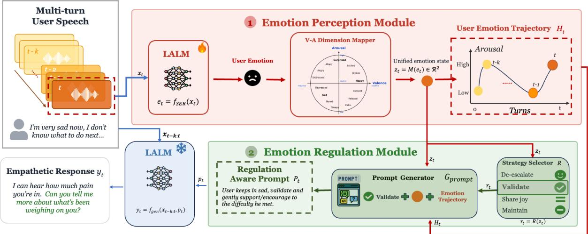
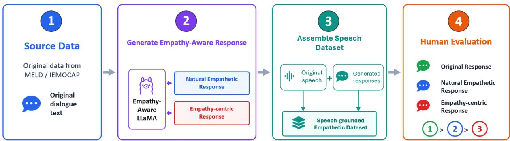

# ER-EDF: A Psychology-Grounded Emotion Regulation Framework for Speech Empathetic Dialogue Generation in Large Audio-Language Models

Hongyu Jin and Wenda Zhang and Runqiu Fei

Gongping Huang and Mike Conway and Ting Dang

## Abstract

Empathetic response generation in spoken dialogue systems requires both accurate emotion perception and appropriate emotion regulation. Grounded in psychological theories such as the Perception–Action Model and emotion regulation theory, effective empathy depends not only on inferring a user’s affective state but also on regulating how it is expressed in responses. However, recent large audio–language mod els (LALMs) largely treat emotion as a direct conditioning signal, lacking explicit regulatory mechanisms, which often leads to affect mirror ing rather than calibrated support. We propose ER-EDF, a psychology-grounded framework that explicitly decouples emotion perception and emotion regulation in LALMs. Perception tracks the user’s emotional state, while regulation determines how this state should guide empathetic response generation. The framework is model-agnostic and integrates seamlessly into existing LALMs. We further construct a spoken empathetic dialogue dataset and introduce empathy-aware evaluation metrics beyond lexical matching. Experiments across five LALMs and two datasets show that ER-EDF consistently improves empathetic response quality in both automatic and human evaluations, high lighting the importance of jointly modeling emotion perception and regulation in spoken empathetic dialogue systems, paving a new direction for psychologically grounded empathetic AI.

## 1 Introduction

The rapid advancement of speech-based conversational AI systems, including ChatGPT (OpenAI, 2024) and Google Gemini (Google DeepMind, 2025), has established a new paradigm of natural spoken human–computer interaction. Beyond task completion, these systems increasingly support affect-sensitive applications such as mental health support, eldercare companionship, and emotional well-being coaching (Laranjo et al., 2018;

Sharma et al., 2020). Unlike task-oriented systems optimized for factual accuracy, such settings require models to perceive and appropriately respond to users’ emotional states. Empathetic response generation is therefore a core requirement; its failure can undermine trust and pose risks in vulnerable contexts.

Effective empathy in dialogue fundamentally depends on accurate emotion perception. Affective science supports this view: the Perception–Action Model (Preston and de Waal, 2002) and functional accounts of empathy (Decety and Jackson, 2004) posit that understanding another’s affective state is a prerequisite for empathic behavior. Without reliable perception, systems cannot distinguish distress, anxiety, or neutrality, and thus cannot tailor responses appropriately. However, perception alone is insufficient. The Empathy–Altruism Hypothesis (Batson, 1991) and emotion regulation theory (Gross, 1998, 2015a) emphasize that effective empathy requires regulating affective responses to produce constructive behavior rather than direct emotional mirroring. In computational settings, this implies that systems must both infer and regulate emotion (Picard, 1997).

Early work on empathetic dialogue focused on text-only systems, typically conditioning generation on predicted emotion labels (Rashkin et al., 2019; Lin et al., 2019). Benchmarks such as EmpatheticDialogues (Rashkin et al., 2019) enabled progress, and subsequent methods introduced richer affective signals, including emotion mimicry (Majumder et al., 2020) and emotioncause reasoning (Li et al., 2022). However, these approaches are exclusively text-based and only take into account emotion perception, while ignoring the regulation layer. Recent speech-based systems have started to focus on empathetic response generation (Xue et al., 2024; Lin et al., 2024b,a; Wang et al., 2024a), but still primarily treat emotion perception as sufficient for empathetic generation. This conflation risks producing responses that mirror user affect rather than regulating it toward supportive communication.

Moreover, explicit emotion regulation mechanisms and standardized evaluation protocols for empathetic response generation remain underexplored. There is also a lack of spoken empathetic datasets that support model development in this setting. Current evaluation methods are largely lexically driven and fail to capture higher-level empathetic behavior, highlighting the need for empathyaware evaluation protocols.

To address this gap, we i) propose ER-EDF, a psychology-grounded framework for regulationaware empathetic dialogue generation in large audio–language models (LALMs). ER-EDF decouples emotion perception from emotion regulation, treating them as distinct but coupled components. Moreover, we construct novel spoken empathetic dialogue datasets and introduce empathy-aware evaluation metrics. Evaluations across five LALMs and two datasets show that ER-EDF consistently induces more empathetic responses, validated by both objective metrics and human evaluation. Our contributions are summarized:

• We introduce ER-EDF, the first modelagnostic framework that operationalizes Gross’s process model of emotion regulation for empathetic dialog generation in LALMs.

• We construct an empathetic spoken dialogue dataset built on IEMOCAP and MELD, providing supervision and evaluation resources for regulation-aware empathetic response generation.

• We propose three empathy-aware evaluation metrics that go beyond lexical matching to capture empathetic behavior.

## 2 Related Work

Emotion Regulation. Emotion regulation theory studies how affective states are maintained, intensified, reduced, or redirected over time (Gross, 1998, 2015a). The process model formalizes regulation as a sequence of identifying an affective state, selecting a goal, and applying a regulation strategy (Gross, 2015a). In interpersonal settings, this is central to empathy, as responses can shape a user’s affect by validating distress, reducing arousal, or sustaining positive emotion (Zaki and Williams,

2013; Niven et al., 2009). This implies that empathetic generation should explicitly consider how responses influence the user’s emotional state, not just what emotion is recognized.

Arousal-Valence States The arousal–valence space provides a continuous affective representation that unifies discrete emotion categories (Kuppens et al., 2013; Sharma et al., 2020). Rather than defining separate regulation strategies for each emotion type, which does not scale well as the number of emotions grows, it offers a structured two-dimensional space in which affective states can be organized and mapped to general regulatory behaviors. We also propose to combine this continuous representation with discrete emotion labels, enabling more consistent and context-dependent application of regulation strategies across emotion categories.

Empathetic Response Generation in LALMs. While extensive research in empathetic dialogue generation has been developed in text-only settings (Rashkin et al., 2019; Lin et al., 2019; Majumder et al., 2020; Li et al., 2022), comparatively limited attention has been given to LALMs (Zhang et al., 2023; Tang et al., 2024; Chu et al., 2024) which process speech input and generate text responses. Recent LALM-based approaches for empathetic response generation broadly follow two directions: (1) improving speech emotion recognition (Xue et al., 2024; Lin et al., 2024b; Wang et al., 2024a), and (2) enhancing response generation through prompting and chain-of-thought reasoning (Lin et al., 2024a).

However, both directions treat empathy as a nearreflexive mapping from perceived emotion to response generation. This assumption overlooks a central insight from affective science: empathy is not merely a reflection of another’s emotion, but an interpersonal emotion regulation process (Gross, 2015a; Batson, 1991). As a result, existing systems cannot determine when or how empathy should be expressed, only what emotion is perceived. ER-EDF addresses this by introducing a psychologygrounded regulation mechanism between emotion perception and empathetic response generation.

Evaluation Metrics for Empathy. Standard evaluation metrics such as BLEU and ROUGE measure lexical overlap with reference responses, while embedding-based metrics such as BERTScore capture broader semantic similarity (Zhang et al.,

  
Figure 1: Overview of ER-EDF. The framework is organized around three modules: emotion perception, emotion regulation, and response generation.

2020). These are useful for fluency and reference matching, but they are not designed to assess whether a response expresses appropriate empathy. Recent work has turned to learned empathy classifiers, human preference judgments, and LLMas-a-judge protocols (Zheng et al., 2023). While each of these is informative to a certain degree, the learned scores are difficult to interpret, human evaluation does not scale, and LLM judges introduce position, verbosity, and self-enhancement biases (Zheng et al., 2023). There is a need for evaluation metric that is empathy-sensitive, and grounded in the psychological constructs.

## 3 Method

## 3.1 Framework Overview

Figure 1 presents the overall architecture of ER-EDF, which is organized around three functional modules: emotion perception which first estimates and tracks the user’s emotional state from speech; emotion regulation which applies a psychologyguided regulation policy to determine how the system should respond.

## 3.1.1 Emotion Perception

The emotion perception module first estimates the user’s emotion state from speech and then represents it in the valence-arousal space for regulationaware response planning, as shown in Figure 1.

Speech emotion recognition. Given the current speech signal $\mathbf { \mathcal { x } } _ { t }$ , the LALM is first fine-tuned to predict a categorical emotion label $e _ { t }$ for the current turn. Fine-tuning is required to enhance emotion inference in conversational speech by capturing affective cues such as tone, prosody, intensity, and speaking style while preserving the general audio-language understanding capabilities of the pretrained backbone.

Valence-arousal mapper. To further support emotion regulation planning (Russell, 1980; Kuppens et al., 2013), ER-EDF additionally maps the predicted categorical emotion $e _ { t }$ into a valencearousal space ${ \boldsymbol z } _ { t } = ( v _ { t } , a _ { t } )$ where $v _ { t }$ and $a _ { t }$ represent valence and arousal scales. For example, anger, fear, and disgust are represented as negative high-arousal states, while sadness corresponds to a negative low-arousal state, detailed mapping rules are listed in Appendix A.2.

## 3.1.2 Psychology-Guided Emotion Regulation

The emotion regulation module converts the perceived emotion states into an explicit response strategy. Rather than directly prompting the generator with an emotion label, we first decide what kind of emotional regulation the response should perform. According to the Gross’s Extended Process Model of emotion regulation (Gross, 2015b), regulation strategies are responses to ongoing emotional states, tailored to their arousal–valence properties. Given the current state of emotion $z _ { t }$ , the regulation function selects a strategy,

$$
r _ { t } = R ( z _ { t } ) .\tag{1}
$$

$$
r _ { t } = \left\{ \begin{array} { l l } { \mathrm { d e - e s c a l a t e , } } & { v _ { t } = n e g a t i v e , a _ { t } = \mathrm { h i g h , } } \\ { \mathrm { v a l i d a t e , } } & { v _ { t } = n e g a t i v e , a _ { t } = \mathrm { l o w , } } \\ { \mathrm { s h a r e j o y , } } & { v _ { t } = p o s i t i v e , a _ { t } = \mathrm { h i g h , } } \\ { \mathrm { m a i n t a i n , } } & { v _ { t } = n e u t r a l , a _ { t } = \mathrm { l o w . } } \end{array} \right.\tag{2}
$$

These strategies have been validated through empirical studies (Posner et al., 2005; Timonen and Liukkonen, 2008; Drapeau et al., 2017; Fredrickson, 2004). For negative high-arousal states, such as anger or fear, the system selects a de-escalation strategy that encourages calm, grounding, and emotional containment (Posner et al., 2005). For negative low-arousal states, such as sadness, the system selects validation and gentle encouragement (Timonen and Liukkonen, 2008; Drapeau et al., 2017).

## 3.1.3 Regulation-Aware Response Generation

Given the selected regulation strategy $r _ { t } ,$ ER-EDF assembles a regulation-aware prompt $p _ { t }$ that combines three sources of information: the preceding K rounds of the user’s speech, the regulation strategy $r _ { t }$ , and the perceived emotion trajectory $H _ { t }$ , defined as the emotion changes over turns as $H _ { t } = \{ ( v _ { i } , a _ { i } ) \} _ { i = n - K } ^ { n }$ . This allows the system to model emotion as a dynamic process rather than a single static state. These three components jointly condition a frozen LALM backbone to generate the final response. The prompt can be found in Appendix A.1.

Crucially, supplying the emotion trajectory alongside the strategy allows the backbone to modulate how strongly the regulation is applied: rather than enforcing a fixed response style, the model can infer from the trajectory. For instance, whether the user’s negative state is intensifying or already subsiding, and dynamically adjust the intensity of the regulation accordingly. This monitoring and adjusting approach aligns with the Extended Process Model of emotion regulation (Gross, 2015b). In this way, emotion regulation is incorporated as an explicit, trajectory-conditioned prompt-level planning signal before generation.

## 3.2 Dataset Construction

We further construct the spoken empathy dataset by generating two empathy-aware responses for each target dialogue turn. The first type is natural empathetic response, which aims to continue the dialogue coherently while expressing an appropriate level of empathy. The second type is empathycentric response, which places stronger emphasis on emotional support, validation, and empathetic concern. Using both response types allows the constructed dataset to capture different strengths of empathetic expression rather than enforcing a single overly rigid response style.

As shown in Figure 2, for each speech recording $\mathbf { \nabla } _ { \mathbf { x } _ { t } , }$ we take the transcripts and leverage a text-based, empathy-aware model (Baig and Shete, 2025) to generate empathetic responses. To ensure that the generated responses are empathetic and contextually appropriate, we include the preceding K turns of transcriptions together as input for empathetic response generation. The full prompt templates for each type of response are provided in Appendix A.1. This is generated for two datasets, resulting in 3,718 single-turn empathetic dialogues for MELD and 5,666 for IEMOCAP (9,384 in total).

After response generation, we assemble speech dataset by pairing each generated response with the corresponding original speech segment, multiturn audio context, and transcript context to form a speech-grounded empathetic response instance. The generated responses are further validated by human annotators to verify their quality and validity.

## 3.3 Evaluation Metrics

Empathy-Concern Index (ECI) We report the Empathy-Concern Index (ECI), a lexicon-based metric derived from the World Well Being Project(WWBP) empathy and distress lexica (Sedoc et al., 2020). ECI measures the extent to which a generated response expresses other-oriented empathic concern rather than self-oriented distress. We subtract distress scores from empathy scores to reward supportive, concern-focused language while penalizing responses that primarily mirror or amplify the user’s negative emotional state. Given a generated response $y ,$ ECI is computed as:

$$
\mathrm { E C I } ( y ) = \frac { 1 } { | y | } \sum _ { w \in y } \left( \phi _ { \mathrm { e m p } } ( w ) - \phi _ { \mathrm { d i s t } } ( w ) \right) ,\tag{3}
$$

where $\phi _ { \mathrm { e m p } } ( w )$ and $\phi _ { \mathrm { d i s t } } ( w )$ denote the empathy and distress lexicon weights of token $w ,$ respectively. A higher ECI indicates that the response contains more other-oriented empathic concern relative to distress-oriented language

Emo-BERT and Emp-BERT We additionally introduce Emp-BERT and Emo-BERT, two empathy-aware variants of BERTScore (Zhang et al., 2020). Emp-BERT replaces the BERT backbone with EmoBERTa (Kim and Vossen, 2021), enabling empathy-informed representations for scoring. Emo-BERT restricts matching to emotionrelevant tokens using the WWBP empathy and distress lexica, computing similarity only over filtered tokens. Emo-BERT thus measures alignment with emotion-focused content in the reference.

  
Figure 2: Dataset construction pipeline for empathy-aware response generation.

## 4 Experimental Setup

Datasets and settings. The MELD (Poria et al., 2019) and IEMOCAP (Busso et al., 2008) datasets are used for empathetic dialogue generation and evaluation. We evaluate generation performance with context windows of $k \in \{ 1 , 3 , 5 \}$ . For IEMO-CAP, we report results averaged across folds.

Compared systems. For each LALM backbone, we compare two inference settings. The Baseline setting uses the same dialogue context with a standard empathetic generation prompt. We evaluate ER-EDF across five audio-language model backbones: LLaMA3.1-8B-Omni (Fang et al., 2025), Megrez-3B-Omni (Li et al., 2025), MiniCPM-o-2.6 (OpenBMB, 2025; Cui et al., 2026), Phi-4- MM (Abdin et al., 2025), and Qwen2.5-Omni-7B (Xu et al., 2025). This setup tests whether ER-EDF functions as a model-agnostic inference-time control framework rather than a model-specific optimization method. We additionally compare with existing open-source speech-based empathetic dialogue framework of BLSP-Emo (Wang et al., 2024b) and OSUM-Echat (Geng et al., 2025).

Dataset evaluation. We evaluate the constructed dataset via four empathy-aware and qualityoriented metrics: Resp-only Emp, Ctx+Resp Emp, LLM-Coh, and LLM-Nat. The two empathy scores are produced by EmoBERTa (Kim and Vossen, 2021): Resp-only Emp measures the empathy of the generated response in isolation, while Ctx+Resp Emp evaluates empathy in context by conditioning on the preceding five dialogue turns. LLM-Coh and LLM-Nat are obtained using an LLM-as-judge, assessing response coherence and naturalness, respectively. The full judging prompt is in Appendix A.1.

We further conducted human evaluation to assess the quality of the results. For our empathyaware dataset, a total of 9 reviewers participated in the evaluation and collected 549 human reviews in total. Each speech-dialogue instance received approximately 7.1 independent human judgments on average. This is measured by Win-Rate(the constructed dataset win rate agains original dataset) and Rank-1 rate(1st Rank rate for each dataset we constructed amoung all these three).

ER-EDF evaluation. In addition to the proposed metrics, we also evaluate the model responses via human evaluation between the baseline responses and ER-EDF responses. We report the human preference rate of ER-EDF against the baseline. Detailed settings are listed in Appendix A.5 In total, we collect 814 human judgments over 77 evaluated instances with 11 reviewers.

## 5 Results

## 5.1 Dataset Validation

As shown in Table 1, the constructed responses consistently improve upon the original responses, yielding higher scores on all objective empathy evaluation measures. Human evaluation further confirms the quality of the constructed references. Both reference styles substantially outperform the original responses in ranking preference, achieving win rates of 83.8%–87.9% against the original responses. The Rank-1 results reveal a dataset-dependent preference pattern. Naturalempathetic references are favored on IEMOCAP, whereas empathy-focused references are preferred on MELD. We hypothesize that this difference stems from the distinct dialogue characteristics of the two datasets. IEMOCAP contains longer dyadic interactions in which emotions unfold over multiple turns, favoring responses that maintain conversational flow and express empathy more naturally. In contrast, MELD comprises short sitcom dialogues from Friends TV series, with rapid speaker exchanges, where explicit emotional acknowledgment is more salient (Chamishka et al., 2022; Poria et al., 2019). Interestingly, the LLMbased evaluation aligns with human preferences, favoring natural-empathetic responses on IEMO-CAP and empathy-focused responses on MELD.

<table><tr><td rowspan="2">Dataset</td><td rowspan="2">Reference</td><td colspan="4">Objective Metrics</td><td colspan="2">Human Metrics</td></tr><tr><td>Resp-only Emp</td><td>Ctx+Resp Emp</td><td>LLM Coh</td><td>LLM Nat</td><td>Win Rate</td><td>Rank-1 Rate</td></tr><tr><td>IEMOCAP</td><td>Original</td><td>0.6147</td><td>0.5707</td><td>4.1245</td><td>3.2030</td><td></td><td>7.5%</td></tr><tr><td>IEMOCAP</td><td>Natural-empathetic</td><td>0.6277</td><td>0.5828</td><td>4.6598</td><td>4.2324</td><td>87.7%</td><td>50.9%</td></tr><tr><td>IEMOCAP</td><td>Empathy-focused</td><td>0.6548</td><td>0.5867</td><td>4.5837</td><td>4.1114</td><td>87.9%</td><td>41.6%</td></tr><tr><td>MELD</td><td>Original</td><td>0.5602</td><td>0.5879</td><td>3.9720</td><td>4.0311</td><td></td><td>11.0%</td></tr><tr><td>MELD</td><td>Natural-empathetic</td><td>0.6435</td><td>0.6100</td><td>4.4937</td><td>4.1348</td><td>85.3%</td><td>37.7%</td></tr><tr><td>MELD</td><td>Empathy-focused</td><td>0.6895</td><td>0.6383</td><td>4.7109</td><td>4.1500</td><td>83.8%</td><td>51.3%</td></tr></table>

Table 1: Validation of the constructed empathetic responses against the original dialogue responses.
<table><tr><td></td><td></td><td></td><td colspan="4">MELD</td><td colspan="4">IEMOCAP</td></tr><tr><td>Model</td><td>Setting</td><td>Human Overall</td><td>ECI</td><td>EmoBERT</td><td>EmpBERT</td><td>Human</td><td>ECI</td><td>EmoBERT</td><td>EmpBERT</td><td>Human</td></tr><tr><td rowspan="2">LLaMA3.1-8B-Omni</td><td>Baseline</td><td>41.0%</td><td>0.0172</td><td>0.0838</td><td>0.8135</td><td>36.4%</td><td>0.0126</td><td>0.1290</td><td>0.7755</td><td>45.6%</td></tr><tr><td>ER-EDF</td><td>59.0%</td><td>0.0215</td><td>0.1281</td><td>0.8139</td><td>63.6%</td><td>0.0168</td><td>0.1417</td><td>0.7949</td><td>54.4%</td></tr><tr><td rowspan="2">Megrez-3B-Omni</td><td>Baseline</td><td>49.6%</td><td>0.0076</td><td>-0.0024</td><td>0.7671</td><td>45.5%</td><td>0.0078</td><td>0.1081</td><td>0.8125</td><td>53.7%</td></tr><tr><td>ER-EDF</td><td>50.4%</td><td>0.0133</td><td>0.0671</td><td>0.7961</td><td>54.5%</td><td>0.0102</td><td>0.1593</td><td>0.8134</td><td>46.3%</td></tr><tr><td rowspan="2">MiniCPM-o-2.6</td><td>Baseline</td><td>26.7%</td><td>0.0251</td><td>0.2068</td><td>0.7881</td><td>24.1%</td><td>0.0198</td><td>0.1139</td><td>0.8080</td><td>29.2%</td></tr><tr><td>ER-EDF</td><td>73.4%</td><td>0.0122</td><td>0.1655</td><td>0.7996</td><td>75.9%</td><td>0.0245</td><td>0.2088</td><td>0.8021</td><td>70.8%</td></tr><tr><td rowspan="2">Phi-4-MM</td><td>Baseline</td><td>58.7%</td><td>0.0153</td><td>0.0915</td><td>0.7965</td><td>59.1%</td><td>0.0090</td><td>0.1723</td><td>0.8166</td><td>58.2%</td></tr><tr><td>ER-EDF</td><td>41.4%</td><td>0.0150</td><td>0.0710</td><td>0.8111</td><td>40.9%</td><td>0.0185</td><td>0.1731</td><td>0.8204</td><td>41.8%</td></tr><tr><td rowspan="2">Qwen2.5-Omni-7B</td><td>Baseline</td><td>36.3%</td><td>0.0186</td><td>0.1712</td><td>0.7853</td><td>18.2%</td><td>0.0135</td><td>0.1708</td><td>0.8074</td><td>54.3%</td></tr><tr><td>ER-EDF</td><td>63.8%</td><td>0.0244</td><td>0.2144</td><td>0.7402</td><td>81.8%</td><td>0.0283</td><td>0.1721</td><td>0.7414</td><td>45.7%</td></tr><tr><td>BLSP-Emo</td><td>一</td><td>一</td><td>0.0068</td><td>-0.0227</td><td>0.7341</td><td></td><td>0.0060</td><td>0.0801</td><td>0.8708</td><td>一</td></tr><tr><td>OSUM-Echat</td><td>1</td><td>一</td><td>0.0098</td><td>-0.0318</td><td>0.7282</td><td>一</td><td>0.0127</td><td>0.1421</td><td>0.8119</td><td>1</td></tr></table>

Table 2: ER-EDF performance on MELD under the empathy-focused setting and IEMOCAP under the naturalreference setting, selected according to the top-1 rank rate from dataset human validation. Human Overall reports the average human preference rate across MELD and IEMOCAP. Bold values indicate the better score between Baseline and ER-EDF for each LALM backbone and metric.

## 5.2 Performance Comparison

Table 2 reports the ER-EDF performance under the natural-reference for IEMOCAP and for Empathyfocused MELD as reference due to their human preference. Overall, ER-EDF provides broad improvements across models and datasets.

Objective metrics. ER-EDF improves most measures on both datasets. The gains in ECI indicate increased use of empathy-related lexical cues in generated responses, suggesting that ER-EDF encourages more explicit empathy-oriented language. Beyond lexical overlap, improvements on EmoBERT and EmpBERT further show enhanced semantic alignment in empathy-aware representation spaces. Compared with prior speech empathetic dialogue framework, ER-EDF is more competitive with BLSP-Emo and OSUM-EChat. Although BLSP-Emo achieves the highest Emp-BERT score on IEMOCAP, ER-EDF variants obtain stronger ECI and EmoBERT scores on both datasets, suggesting that ER-EDF provides complementary gains in empathic lexicon coverge and empathic response quality.

We also observe a few outlier cases. For instance, on MELD, both Phi-4-MM and MiniCPMo-2.6 show lower ECI and EmoBERT scores under ER-EDF, but higher EmpBERT scores. Since EmoBERT relies on WWBP-based lexical filtering, this suggests that ER-EDF does not always increase explicit empathy-lexicon coverage for these models. However, the improved EmpBERT scores indicate that their outputs are still closer to the reference responses in an empathy-oriented semantic space. This implies that these models may also express empathy using lexical patterns not fully captured by the lexicon while preserving semantic empathy, which we further analyze in the failure case study.

Human evaluation. ER-EDF also shows a higher average human preference compared to the baselines. We further compute the average performance across five LALM backbones for each dataset. ER-EDF obtains overall average scores of 51.8% on IEMOCAP and 57.6% on MELD. The improvement is particularly evident on MELD, where human annotators prefer ER-EDF for four out of five backbones. For example, MiniCPMo-2.6 is preferred at 75.9% under ER-EDF versus 24.1% for the baseline, and Qwen2.5-Omni-7B at 81.8% versus 18.2%. Human agreement on MELD reaches 81.4%, indicating consistent preference for responses that are both contextually appropriate and explicitly empathetic.

The results on IEMOCAP are more mixed. ER-EDF achieves an average human preference rate of 51.8% compared to 48.2% for the baseline. However, the baseline is preferred for Megrez-3B-Omni, Phi-4-MM, and Qwen2.5-Omni-7B. Moreover, except for MiniCPM-o-2.6 (72.7%), agreement rates for the other backbones remain below 50%, suggesting less stable human judgments on IEMOCAP. This may be attributed to its acted dyadic nature, which features higher emotional intensity and more exaggerated affective expressions compared to natural conversation. In such settings, annotators may favor responses that mirror emotional intensity and conversational tone rather than those emphasizing explicit regulation or de-escalation.

To better understand these patterns, we analyze ER-EDF failure cases through human feedback in IEMOCAP (details in Appendix A.6). We observe distinct model-specific behaviors:

• Megrez-3B-Omni produces overly generic responses with weak grounding in the user’s specific situation, likely due to smaller model size and reduced context sensitivity under longer ER-EDF prompts. This is especially detrimental in IEMOCAP, where the emotional intensity is high and annotators expect responses that directly match the speaker’s concrete situation and affective state.

• Qwen2.5-Omni-7B generates first-person phrases (e.g., "I think", "I understand"), which can shift focus away from the user. This suggests that the current regulation strategy does not fully override the model’s default generation style.

<table><tr><td>Model</td><td>IEMOCAP</td><td>MELD</td></tr><tr><td>LLaMA3.1-8B-Omni</td><td>91.54%</td><td>32.81%</td></tr><tr><td>Megrez-3B-Omni</td><td>90.05%</td><td>38.63%</td></tr><tr><td>MiniCPM-o-2.6</td><td>100.00%</td><td>0.00%</td></tr><tr><td>Phi-4-MM</td><td>93.49%</td><td>25.67%</td></tr><tr><td>Qwen2.5-Omni-7B</td><td>89.80%</td><td>36.74%</td></tr><tr><td>Overall</td><td>92.66%</td><td>30.53%</td></tr><tr><td>GT Policy Rate</td><td>86.37%</td><td>51.18%</td></tr></table>

Table 3: Hit rate of emotion regulation triggering on IEMOCAP and MELD.

• Phi-4-MM produces overly controlled and emotionally conservative responses, favoring safe support over matching IEMOCAP’s strong affective expressions. This is related to Phi-4-MM’s stronger instruction-following behavior: when given an explicit regulation strategy, the model may follow it too rigidly and reduce the spontaneity or emotional immediacy of the reply.

Overall, ER-EDF provides broad improvements across models, with gains varying depending on model capacity and capability.

## 5.3 Regulation Triggering Analysis

To further analyze whether the emotion regulation module is actively engaged during generation, Table 3 shows the active hit rate of emotion regulation triggering on IEMOCAP and MELD. This metric measures how often the regulation module is activated to trigger a regulation strategy. The regulation module is activated far more often on IEMOCAP than on MELD, with active trigger rates of 92.66% and 30.53%, respectively. This reflects the difference between the two corpora: IEMOCAP is an emotion-elicited dyadic dataset with many affectively intense turns, while MELD contains more casual, neutral, or weakly affective dialogue from Friends.

Dataset-based estimates follow the same trend, with 86.37% of IEMOCAP turns and 51.18% of MELD turns requiring active regulation. MiniCPM-o-2.6 shows a more nuanced pattern across the two datasets. Although it suffers from a SER-stage neutral-collapse issue, where the neutral category is rarely predicted and the affective trajectory becomes poorly calibrated for regulation triggering, its overall SER accuracy remains relatively high, as shown in Appendix A.3. When regulation is not incorrectly activated, MiniCPMo-2.6 still provides accurate affective cues, which helps explain its strong performance in Table 2. Therefore, the main failure lies in trigger calibration rather than emotion perception as a whole. Overall, this analysis supports the intended selectivity of ER-EDF: the framework does not force explicit empathy in every turn, but activates regulation more often when the dataset contains stronger affective cues and greater regulation demand.

<table><tr><td rowspan="2">Variant</td><td colspan="3">IEMOCAP</td><td colspan="3">MELD</td></tr><tr><td>ECI</td><td>EmoBERT</td><td>EmpBERT</td><td>ECI</td><td>EmoBERT</td><td>EmpBERT</td></tr><tr><td>Emotion no regulation</td><td>0.0164</td><td>0.0808</td><td>0.7922</td><td>0.0194</td><td>0.0893</td><td>0.8027</td></tr><tr><td>SER-tuned Backbone</td><td>0.0113</td><td>0.1083</td><td>0.7959</td><td>0.0150</td><td>0.1199</td><td>0.8109</td></tr><tr><td>Full ER-EDF</td><td>0.0168</td><td>0.1417</td><td>0.7949</td><td>0.0215</td><td>0.1281</td><td>0.8139</td></tr><tr><td>Oracle ER-EDF</td><td>0.0284</td><td>0.1223</td><td>0.8110</td><td>0.0218</td><td>0.1329</td><td>0.8153</td></tr></table>

Table 4: Ablation studies of ER-EDF using LLaMA3.1-8B-Omni.

## 5.4 Ablation Study

We conduct component ablations to disentangle the contributions of each module in ER-EDF. SERtuned Backbone evaluates the effect of emotion perception alone, using the fine-tuned speech emotion module without emotion labels as input or regulation planning. Emotion w/o regulation examines the effect of direct emotion conditioning by providing predicted emotion labels in the prompt but removing the regulation module. Full ER-EDF assesses the complete framework. Finally, Oracle ER-EDF replaces predicted emotion labels with ground-truth annotations, measuring the upper bound performance under perfect emotion perception.

As shown in Table 4, Oracle ER-EDF achieves the best overall performance, obtaining the highest scores on IEMOCAP ECI and EmpBERT as well as all three MELD metrics. This demonstrates that improving emotion perception directly benefits performance, while the close performance between Oracle ER-EDF and Full ER-EDF further indicates that the SER module is relatively stable.

The comparison between SER-tuned Backbone and Emotion no regulation further clarifies the role of each component. SER-tuned Backbone improves the learned Emo-Bert and Emp-Bert over given emotion label to model without regulation strategy, indicating that stronger emotion perception helps the generator produce more affectively appropriate responses. However, SER-tuned Backbone still remains below Full ER-EDF on the main emotion-aware metrics, showing that perception alone does not fully solve empathetic generation. This is consistent with our motivating hypothesis: existing systems that treat emotion merely as a conditioning signal are insufficient, because empathetic dialogue generation requires an explicit regulation step that determines how the perceived emotion should shape the response.

## 6 Conclusion

In this work, we presented ER-EDF, a psychologygrounded emotion regulation framework for empathetic dialogue generation in large audio-language models. ER-EDF separates emotion perception from regulation-aware response planning: it maps speech emotion predictions into a unified valencearousal space, tracks affective trajectories across turns, and selects an appropriate regulation strategy before generation. This reframes speech-based empathetic dialogue generation from static emotion conditioning toward explicit regulation of the user’s affective state. We also constructed empathetic references for MELD and IEMOCAP and validated them with automatic and human evaluation. Experiments across multiple LALMs show that ER-EDF improves empathy-centric metrics more consistently than direct emotion conditioning, and ablation results confirm that explicit regulation planning contributes beyond emotion perception alone. These findings suggest that future spoken dialogue systems should model empathy not merely as emotional awareness, but as regulation-aware interaction.

## 7 Limitations

This work opens several directions for future improvement. First, although we validate the constructed empathetic references with both automatic metrics and human judgments, broader human evaluation would further strengthen the reliability of the analysis. The current evaluation provides useful evidence for reference quality and model preference, but future studies can benefit from larger sample coverage, more annotators, and more fine-grained criteria, such as emotional appropriateness, conversational coherence, perceived helpfulness, and regulation effectiveness. Such expanded evaluation would provide a more comprehensive understanding of how users perceive empathetic responses in different dialogue contexts.

Second, the current emotion regulation policy in ER-EDF is predefined according to emotion regulation theory and valence-arousal rules. This design makes the framework interpretable and easy to audit, which is important for affect-sensitive dialogue systems. A promising future direction is to extend this rule-based policy into a learned dynamic regulation module. Such a module could infer regulation goals and response strategies from richer conversational signals, including speaker identity, dialogue history, pragmatic intent, and the user’s reaction to previous responses, while still preserving the interpretability of the regulation decision.

Third, ER-EDF currently uses a discrete valencearousal mapping to unify heterogeneous emotion labels across datasets. This provides a simple and dataset-agnostic affective representation, enabling consistent trajectory tracking and regulation planning. Future work could further enrich this representation by learning continuous valence-arousal estimates through regression. A continuous twodimensional affect space would allow the framework to capture finer-grained differences in emotional intensity, ambiguity, and mixed affect, supporting more precise trajectory modeling and more adaptive regulation-aware response generation.

## References

Marah Abdin, Sahaj Agarwal, Ahmed Awadallah, Vidhisha Balachandran, Harkirat Behl, Lingjiao Chen, Gustavo de Rosa, Suriya Gunasekar, Mojan Javaheripi, Neel Joshi, and 1 others. 2025. Phi-4-reasoning technical report. arXiv preprint arXiv:2504.21318.

Samrin Baig and Prasanna Shete. 2025. Lumina: A finetuned llama 3.1 model for empathetic psychological support. In 2025 12th International Conference on Future Internet of Things and Cloud (FiCloud), pages 431–437. IEEE.

C. Daniel Batson. 1991. The Altruism Question: Toward a Social-Psychological Answer. Lawrence Erlbaum Associates, Hillsdale, NJ.

Carlos Busso, Murtaza Bulut, Chi-Chun Lee, Abe Kazemzadeh, Emily Mower, Sungbok Kim, Jeannette N. Chang, Sungbok Lee, and Shrikanth S. Narayanan. 2008. Iemocap: Interactive emotional dyadic motion capture database. In Language Resources and Evaluation.

Sadil Chamishka, Ishara Madhavi, Rashmika Nawaratne, Damminda Alahakoon, Daswin De Silva, Naveen Chilamkurti, and Vishaka Nanayakkara. 2022. A voice-based real-time emotion detection technique using recurrent neural network empowered feature modelling. Multimedia Tools and Applications.

Yunfei Chu, Jin Xu, Qian Yang, Haojie Wei, Xipin Wei, Zhifang Guo, Yichong Leng, Yuanjun Lv, Jinzheng He, Junyang Lin, Chang Zhou, and Jingren Zhou. 2024. Qwen2-Audio technical report. arXiv preprint arXiv:2407.10759.

Junbo Cui, Bokai Xu, Chongyi Wang, Tianyu Yu, Weiyue Sun, Yingjing Xu, Tianran Wang, Zhihui He, Wenshuo Ma, Tianchi Cai, and 1 others. 2026. Minicpm-o 4.5: Towards real-time full-duplex omnimodal interaction. arXiv preprint arXiv:2604.27393.

Jean Decety and Philip L. Jackson. 2004. The functional architecture of human empathy. Behavioral and Cognitive Neuroscience Reviews, 3(2):71–100.

Martin Drapeau, Emily Blake, Keith S Dobson, and Annett Körner. 2017. Coping strategies in major depression and over the course of cognitive therapy for depression. Canadian journal ofcounselling and psychotherapy, 51(1).

Qingkai Fang, Shoutao Guo, Yan Zhou, Zhengrui Ma, Shaolei Zhang, and Yang Feng. 2025. LLaMA-omni: Seamless speech interaction with large language models. In The Thirteenth International Conference on Learning Representations, volume 2025, pages 57607–57624.

Barbara L Fredrickson. 2004. The broaden–and–build theory of positive emotions. Philosophical transactions ofthe royal society ofLondon. Series B: Biological Sciences, 359(1449):1367–1377.

Xuelong Geng, Qijie Shao, Hongfei Xue, Shuiyuan Wang, Hanke Xie, Zhao Guo, Yi Zhao, Guojian Li, Wenjie Tian, Chengyou Wang, and 1 others. 2025. Osum-echat: Enhancing end-to-end empathetic spoken chatbot via understanding-driven spoken dialogue. arXiv preprint arXiv:2508.09600.

Google DeepMind. 2025. Gemini 2.5: Pushing the frontier with advanced reasoning, multimodality, long context, and next generation agentic capabilities. Preprint, arXiv:2507.06261.

James J. Gross. 1998. The emerging field of emotion regulation: An integrative review. Review ofGeneral Psychology, 2(3):271–299.

James J. Gross. 2015a. Emotion regulation: Current status and future prospects. Psychological Inquiry, 26(1):1–26.

James J Gross. 2015b. The extended process model of emotion regulation: Elaborations, applications, and future directions. Psychol. Inq., 26(1):130–137.

Taewoon Kim and Piek Vossen. 2021. Emoberta: Speaker-aware emotion recognition in conversation with roberta. arXiv preprint arXiv:2108.12009.

Peter Kuppens, Francis Tuerlinckx, James A Russell, and Lisa Feldman Barrett. 2013. The relation between valence and arousal in subjective experience. Psychological bulletin, 139(4):917.

Liliana Laranjo, Adam G. Dunn, Huong Ly Tong, Ahmet Baki Kocaballi, Jessica Chen, Rabia Bashir, Didi Surian, Blanca Gallego, Farah Magrabi, Annie Y. S. Lau, and Enrico Coiera. 2018. Conversational agents in healthcare: a systematic review. Journal of the American Medical Informatics Association, 25(9):1248–1258.

Boxun Li, Yadong Li, Zhiyuan Li, Congyi Liu, Weilin Liu, Guowei Niu, Zheyue Tan, Haiyang Xu, Zhuyu Yao, Tao Yuan, Dong Zhou, Yueqing Zhuang, Shengen Yan, Guohao Dai, and Yu Wang. 2025. Megrezomni technical report. Preprint, arXiv:2502.15803.

Qintong Li, Piji Li, Zhaochun Ren, Pengjie Ren, and Zhumin Chen. 2022. Knowledge bridging for empathetic dialogue generation. In Proceedings of the AAAI Conference on Artificial Intelligence, volume 36, pages 10993–11001.

Guan-Ting Lin, Cheng-Han Chiang, and Hung-yi Lee. 2024a. Advancing large language models to capture varied speaking styles and respond properly in spoken conversations. In Proceedings of the 62nd Annual Meeting of the Association for Computational Linguistics (Volume 1: Long Papers), pages 6626–6642. Association for Computational Linguistics.

Guan-Ting Lin, Prashanth Gurunath Shivakumar, Ankur Gandhe, Chao-Han Huck Yang, Yile Gu, Shalini Ghosh, Andreas Stolcke, Hung-yi Lee, and Ivan Bulyko. 2024b. Paralinguistics-enhanced large language modeling of spoken dialogue. In ICASSP 2024 - 2024 IEEE International Conference on Acoustics, Speech and Signal Processing (ICASSP), pages 10316–10320. IEEE.

Zhaojiang Lin, Andrea Madotto, Jamin Shin, Peng Xu, and Pascale Fung. 2019. MoEL: Mixture of empathetic listeners. In Proceedings of the 2019 Conference on Empirical Methods in Natural Language Processing and the 9th International Joint Conference on Natural Language Processing (EMNLP-IJCNLP), pages 121–132. Association for Computational Linguistics.

Navonil Majumder, Pengfei Hong, Shanshan Peng, Jiankun Lu, Deepanway Ghosal, Alexander Gelbukh, Rada Mihalcea, and Soujanya Poria. 2020. MIME: MIMicking emotions for empathetic response generation. In Proceedings ofthe 2020 Conference on Empirical Methods in Natural Language Processing (EMNLP), pages 8968–8979. Association for Computational Linguistics.

Karen Niven, Peter Totterdell, and David Holman. 2009. A classification of controlled interpersonal affect regulation strategies. Emotion, 9(4):498–509.

OpenAI. 2024. Gpt-4o system card. Preprint, arXiv:2410.21276.

OpenBMB. 2025. Minicpm-o 2.6: A gpt-4o level mllm for vision, speech, and multimodal live streaming on your phone. Accessed: January, 31:2025.

Rosalind W. Picard. 1997. Affective Computing. MIT Press, Cambridge, MA.

Soujanya Poria, Devamanyu Hazarika, Navonil Majumder, Gautam Naik, Erik Cambria, and Rada Mihalcea. 2019. Meld: A multimodal multi-party dataset for emotion recognition in conversations. In Proceedings ofACL.

Jonathan Posner, James A Russell, and Bradley S Peterson. 2005. The circumplex model of affect: An integrative approach to affective neuroscience, cognitive development, and psychopathology. Development and psychopathology, 17(3):715–734.

Stephanie D. Preston and Frans B. M. de Waal. 2002. Empathy: Its ultimate and proximate bases. Behavioral and Brain Sciences, 25(1):1–20.

Hannah Rashkin, Eric Michael Smith, Margaret Li, and Y-Lan Boureau. 2019. Towards empathetic opendomain conversation models: A new benchmark and dataset. In Proceedings of the 57th Annual Meeting ofthe Associationfor Computational Linguistics (ACL), pages 5370–5381. Association for Computational Linguistics.

James A. Russell. 1980. A circumplex model of affect. Journal ofPersonality and Social Psychology, 39(6):1161–1178.

João Sedoc, Sven Buechel, Yehonathan Nachmany, Anneke Buffone, and Lyle Ungar. 2020. Learning word ratings for empathy and distress from document-level user responses. In Proceedings of the Twelfth Language Resources and Evaluation Conference, pages 1664–1673, Marseille, France. European Language Resources Association.

Ashish Sharma, Adam S. Miner, David C. Atkins, and Tim Althoff. 2020. A computational approach to understanding empathy expressed in text-based mental health support. In Proceedings of the 2020 Conference on Empirical Methods in Natural Language Processing (EMNLP), pages 5263–5276. Association for Computational Linguistics.

Changli Tang, Wenyi Yu, Guangzhi Sun, Xianzhao Chen, Tian Tan, Wei Li, Lu Lu, Zejun Ma, and Chao Zhang. 2024. SALMONN: Towards generic hearing abilities for large language models. In The Twelfth International Conference on Learning Representations (ICLR).

Markku Timonen and Timo Liukkonen. 2008. Management of depression in adults. Bmj, 336(7641):435– 439.

Chen Wang, Minpeng Liao, Zhongqiang Huang, Junhong Wu, Chengqing Zong, and Jiajun Zhang. 2024a. BLSP-Emo: Towards empathetic large speech-language models. In Proceedings ofthe 2024 Conference on Empirical Methods in Natural Language Processing (EMNLP). Association for Computational Linguistics.

Chen Wang, Minpeng Liao, Zhongqiang Huang, Junhong Wu, Chengqing Zong, and Jiajun Zhang. 2024b. Blsp-emo: Towards empathetic large speechlanguage models. In Proceedings ofthe 2024 Conference on Empirical Methods in Natural Language Processing, pages 19186–19199.

Jin Xu, Zhifang Guo, Jinzheng He, Hangrui Hu, Ting He, Shuai Bai, Keqin Chen, Jialin Wang, Yang Fan, Kai Dang, Bin Zhang, Xiong Wang, Yunfei Chu, and Junyang Lin. 2025. Qwen2.5-omni technical report. Preprint, arXiv:2503.20215.

Hongfei Xue, Yuhao Liang, Bingshen Mu, Shiliang Zhang, Mengzhe Chen, Qian Chen, and Lei Xie. 2024. E-Chat: Emotion-sensitive spoken dialogue system with large language models. In Proceedings ofthe 14th International Symposium on Chinese Spoken Language Processing (ISCSLP), pages 586–590. IEEE.

Jamil Zaki and W Craig Williams. 2013. Interpersonal emotion regulation. Emotion, 13(5):803.

Dong Zhang, Shimin Li, Xin Zhang, Jun Zhan, Pengyu Wang, Yaqian Zhou, and Xipeng Qiu. 2023. SpeechGPT: Empowering large language models with intrinsic cross-modal conversational abilities. In Findings of the Association for Computational Linguistics: EMNLP 2023, pages 15757–15773. Association for Computational Linguistics.

Tianyi Zhang, Varsha Kishore, Felix Wu, Kilian Q. Weinberger, and Yoav Artzi. 2020. BERTScore: Evaluating text generation with BERT. In International Conference on Learning Representations (ICLR).

Lianmin Zheng, Wei-Lin Chiang, Ying Sheng, Siyuan Zhuang, Zhanghao Wu, Yonghao Zhuang, Zi Lin, Zhuohan Li, Dacheng Li, Eric P. Xing, Hao Zhang, Joseph E. Gonzalez, and Ion Stoica. 2023. Judging LLM-as-a-Judge with MT-Bench and Chatbot Arena. In Advances in Neural Information Processing Systems 36 (NeurIPS 2023) Track on Datasets and Benchmarks.

## A appendix

## A.1 LLM prompts

This appendix provides the prompt templates used in our response generation pipeline. We include the prompt for emotion-regulation-based generation using SER predictions, as well as the two referencegeneration prompts used to construct natural empathetic and empathy-centric responses.

Emotion Regulation Prompt with SER Predictions The following prompt is used in the EmoReg-SER setting, where the response generator is conditioned on the outputs of the fine-tuned speech emotion recognition (SER) model. In addition to the audio dialogue context, the prompt receives the dataset-specific emotion labels, unified valence–arousal state summaries, and emotion trajectory information from previous and current turns.

## System prompt.

You are an emotion regulation agent in an   
,→ audio-based dialogue system.   
You will be given:   
- Audio context (previous turns as audio clips)   
- Current audio input (the user's latest   
,→ utterance)   
- SER outputs for previous and current turns:   
(a) a dataset-specific emotion label, and   
(b) a unified emotion STATE summary: Valence   
(negative/neutral/positive) and Arousal,→   
(low/medium/high), plus the trajectory.,→   
Your job: generate the next spoken response that   
helps regulate the interaction while staying,→   
coherent with the conversation.,→   
Prioritize the unified emotion STATE and the   
,→ conversation flow inferred from the audio.   
Use the dataset label only as a secondary hint.   
Regulation principles:   
- Negative & high arousal -> de-escalate and   
,→ ground (calm pace, short sentences).   
- Negative & low arousal -> validate and gently   
,→ support/encourage.   
- Positive & high arousal -> share enthusiasm but   
,→ keep balance and coherence.   
- Neutral/unclear -> respond naturally; do not   
,→ force cheerfulness.   
IMPORTANT OUTPUT RULES:   
- Output ONLY the spoken response.   
- No analysis.   
- Do NOT mention emotion labels explicitly (e.g.,   
,→ "anger", "sadness").   
- Do NOT explicitly diagnose emotions (e.g., "you   
,→ are upset").   
- Use natural, spoken English.

Natural Empathetic Reference Prompt The following prompt is used to generate natural empathetic reference responses. This reference type is designed to preserve the natural flow of a twoperson spoken dialogue while incorporating empathy in a subtle and contextually appropriate manner.

## System prompt

You are writing a high-quality reference reply ,→ for a two-person spoken dialogue. Primary goal: continue the conversation naturally ,→ and fluently while showing clear empathy. Keep the flow coherent with the latest utterance ,→ and prior context.

1) Continue the conversation naturally: respond to what was just said and add one small next,→ step.,→

2) Empathy should be present but integrated ,→ naturally, not preachy or overly formal.

3) Keep it concise, conversational, and ,→ scene-consistent.

Hard constraints:

\- Output only the next reply text.

\- No analysis, no bullet points, no

,→ narration/stage directions.

\- No quotes wrapping the whole reply.

## User instruction

Write the next reply that sounds natural, conversational, and empathetic. Acknowledge,→ feelings briefly and keep the dialogue moving,→ with one small next step.,→

Empathy-Centric Reference Prompt The following prompt is used to generate empathy-centric reference responses. Compared with the natural empathetic reference prompt, this prompt places stronger emphasis on explicit emotional understanding, validation, and supportive concern, while still requiring the response to remain concise and suitable for spoken dialogue.

## System prompt

You are writing an empathy-centric reference   
,→ reply for a two-person spoken dialogue.   
Primary goal: make the next reply clearly express   
emotional understanding, validation, and,→   
supportive concern while staying natural for,→   
spoken conversation.,→   
Core requirements:   
1) Name or reflect the likely feeling behind the   
,→ latest utterance when appropriate.   
2) Validate the speaker's experience before   
,→ moving the dialogue forward.   
3) Add one gentle supportive next step, such as   
,→ reassurance, an offer, or a caring question.   
4) Keep it concise and human; avoid clinical,   
,→ preachy, or overly formal wording.   
Hard constraints:   
- Output only one concise spoken reply, 1-2   
,→ sentences.   
- No analysis, no bullet points, no   
,→ narration/stage directions.   
- No quotes wrapping the whole reply.

## User instruction

Write the next reply as an empathy-centric response: first acknowledge and validate the,→ speaker's feeling, then offer one gentle,→ supportive next step. Keep it natural and,→ concise.,→

## A.2 Valence-Arousal Mapping Rules

We map each discrete emotion label into a coarse valence–arousal state. The valence dimension consists of negative, neutral, positive, and mixed states, while the arousal dimension consists of low, medium, and high states.

Table 5: Valence–arousal mapping rules for MELD emotion labels.
<table><tr><td>MELD Label</td><td>Valence</td><td>Arousal</td></tr><tr><td>Anger</td><td>Negative</td><td>High</td></tr><tr><td>Fear</td><td>Negative</td><td>High</td></tr><tr><td>Disgust</td><td>Negative</td><td>Low</td></tr><tr><td>Sadness</td><td>Negative</td><td>Low</td></tr><tr><td>Joy</td><td>Positive</td><td>High</td></tr><tr><td>Surprise</td><td>Positive</td><td>High</td></tr><tr><td>Neutral</td><td>Neutral</td><td>Low</td></tr></table>

Table 6: Valence–arousal mapping rules for IEMOCAP emotion labels.
<table><tr><td>IEMOCAP Label</td><td>Valence</td><td>Arousal</td></tr><tr><td>Angry</td><td>Negative</td><td>High</td></tr><tr><td>Sad</td><td>Negative</td><td>Low</td></tr><tr><td>Happy</td><td>Positive</td><td>High</td></tr><tr><td>Neutral</td><td>Neutral</td><td>Low</td></tr></table>

## A.3 SER performance

<table><tr><td>Model</td><td>Dataset</td><td>Baseline</td><td>Finetuned</td></tr><tr><td>LLaMA3.1-Omni</td><td>MELD</td><td>17.37</td><td>46.99</td></tr><tr><td>LLaMA3.1-Omni</td><td>IEMOCAP</td><td>20.15</td><td>58.53</td></tr><tr><td>Megrez-3B-Omni</td><td>MELD</td><td>21.89</td><td>53.36</td></tr><tr><td>Megrez-3B-Omni</td><td>IEMOCAP</td><td>14.77</td><td>62.97</td></tr><tr><td>MiniCPM</td><td>MELD</td><td>35.54</td><td>46.40</td></tr><tr><td>MiniCPM</td><td>IEMOCAP</td><td>52.78</td><td>61.48</td></tr><tr><td>Phi-4-MM</td><td>MELD</td><td>39.81</td><td>51.26</td></tr><tr><td>Phi-4-MM</td><td>IEMOCAP</td><td>36.62</td><td>40.06</td></tr><tr><td>Qwen2.5-Omni</td><td>MELD</td><td>55.57</td><td>53.01</td></tr><tr><td>Qwen2.5-Omni</td><td>IEMOCAP</td><td>45.70</td><td>65.30</td></tr></table>

Table 7: Speech emotion recognition accuracy before and after SER fine-tuning on MELD and IEMOCAP. Publicly reported baselines are used when available and comparable; otherwise, our zero-shot baseline is retained.

## A.4 Extra Results

Results on Lexicon-Overlap Metrics

<table><tr><td>Model</td><td>Setting</td><td>B-1</td><td>B-2</td><td>B-3</td><td>B-4</td><td>R-1</td><td>R-2</td><td>R-L</td></tr><tr><td colspan="7">Natural empathetic reference – IEMOCAP</td><td></td><td></td></tr><tr><td>LLaMA3.1-8B-Omni</td><td>Baseline</td><td>0.096</td><td>0.027</td><td>0.015</td><td>0.011</td><td>0.207</td><td>0.026</td><td>0.156</td></tr><tr><td>LLaMA3.1-8B-Omni</td><td>EmoReg</td><td>0.087</td><td>0.025</td><td>0.014</td><td>0.010</td><td>0.194</td><td>0.025</td><td>0.150</td></tr><tr><td>Megrez-3B-Omni</td><td>Baseline</td><td>0.120</td><td>0.034</td><td>0.017</td><td>0.011</td><td>0.216</td><td>0.031</td><td>0.159</td></tr><tr><td>Megrez-3B-Omni</td><td>EmoReg</td><td>0.107</td><td>0.029</td><td>0.014</td><td>0.010</td><td>0.204</td><td>0.028</td><td>0.151</td></tr><tr><td>MiniCPM-o-2.6</td><td>Baseline</td><td>0.065</td><td>0.019</td><td>0.011</td><td>0.009</td><td>0.165</td><td>0.021</td><td>0.133</td></tr><tr><td>MiniCPM-o-2.6</td><td>EmoReg</td><td>0.062</td><td>0.020</td><td>0.011</td><td>0.009</td><td>0.184</td><td>0.024</td><td>0.147</td></tr><tr><td>Phi-4-MM</td><td>Baseline</td><td>0.105</td><td>0.032</td><td>0.017</td><td>0.012</td><td>0.202</td><td>0.031</td><td>0.159</td></tr><tr><td>Phi-4-MM</td><td>EmoReg</td><td>0.103</td><td>0.031</td><td>0.017</td><td>0.012</td><td>0.201</td><td>0.031</td><td>0.159</td></tr><tr><td>Qwen2.5-Omni-7B</td><td>Baseline</td><td>0.081</td><td>0.026</td><td>0.015</td><td>0.011</td><td>0.193</td><td>0.032</td><td>0.158</td></tr><tr><td>Qwen2.5-Omni-7B</td><td>EmoReg</td><td>0.068</td><td>0.021</td><td>0.012</td><td>0.009</td><td>0.175</td><td>0.027</td><td>0.143</td></tr><tr><td colspan="7">Natural empathetic reference – MELD</td><td></td><td></td></tr><tr><td>LLaMA3.1-8B-Omni</td><td>Baseline</td><td>0.084</td><td>0.026</td><td>0.015</td><td>0.011</td><td>0.192</td><td>0.028</td><td>0.148</td></tr><tr><td>LLaMA3.1-8B-Omni</td><td>EmoReg</td><td>0.070</td><td>0.020</td><td>0.012</td><td>0.009</td><td>0.170</td><td>0.021</td><td>0.136</td></tr><tr><td>Megrez-3B-Omni</td><td>Baseline</td><td>0.104</td><td>0.030</td><td>0.016</td><td>0.011</td><td>0.198</td><td>0.027</td><td>0.149</td></tr><tr><td>Megrez-3B-Omni</td><td>EmoReg</td><td>0.093</td><td>0.026</td><td>0.014</td><td>0.010</td><td>0.180</td><td>0.024</td><td>0.134</td></tr><tr><td>MiniCPM-o-2.6</td><td>Baseline</td><td>0.049</td><td>0.015</td><td>0.009</td><td>0.007</td><td>0.143</td><td>0.016</td><td>0.117</td></tr><tr><td>MiniCPM-o-2.6</td><td>EmoReg</td><td>0.066</td><td>0.019</td><td>0.011</td><td>0.009</td><td>0.155</td><td>0.019</td><td>0.123</td></tr><tr><td>Phi-4-MM</td><td>Baseline</td><td>0.085</td><td>0.025</td><td>0.015</td><td>0.011</td><td>0.179</td><td>0.025</td><td>0.142</td></tr><tr><td>Phi-4-MM</td><td>EmoReg</td><td>0.091</td><td>0.026</td><td>0.015</td><td>0.010</td><td>0.178</td><td>0.024</td><td>0.138</td></tr><tr><td>Qwen2.5-Omni-7B</td><td>Baseline</td><td>0.062</td><td>0.022</td><td>0.013</td><td>0.010</td><td>0.161</td><td>0.026</td><td>0.133</td></tr><tr><td>Qwen2.5-Omni-7B</td><td>EmoReg</td><td>0.034</td><td>0.012</td><td>0.007</td><td>0.006</td><td>0.122</td><td>0.017</td><td>0.105</td></tr><tr><td colspan="7">Empathy-centric reference IEMOCAP</td><td></td><td></td></tr><tr><td>LLaMA3.1-8B-Omni</td><td>Baseline</td><td>0.108</td><td>0.032</td><td>0.018</td><td>0.013</td><td>0.225</td><td>0.034</td><td>0.157</td></tr><tr><td>LLaMA3.1-8B-Omni</td><td>EmoReg</td><td>0.120</td><td>0.037</td><td>0.021</td><td>0.015</td><td>0.248</td><td>0.044</td><td>0.171</td></tr><tr><td>Megrez-3B-Omni</td><td>Baseline</td><td>0.140</td><td>0.044</td><td>0.023</td><td>0.015</td><td>0.243</td><td>0.040</td><td>0.163</td></tr><tr><td>Megrez-3B-Omni</td><td>EmoReg</td><td>0.120</td><td>0.035</td><td>0.018</td><td>0.012</td><td>0.223</td><td>0.037</td><td>0.154</td></tr><tr><td>MiniCPM-o-2.6</td><td>Baseline</td><td>0.068</td><td>0.023</td><td>0.014</td><td>0.010</td><td>0.180</td><td>0.026</td><td>0.134</td></tr><tr><td>MiniCPM-o-2.6</td><td>EmoReg</td><td>0.072</td><td>0.027</td><td>0.016</td><td>0.011</td><td>0.205</td><td>0.040</td><td>0.155</td></tr><tr><td>Phi-4-MM</td><td>Baseline</td><td>0.097</td><td>0.029</td><td>0.016</td><td>0.011</td><td>0.194</td><td>0.027</td><td>0.140</td></tr><tr><td>Phi-4-MM</td><td>EmoReg</td><td>0.091</td><td>0.027</td><td>0.015</td><td>0.010</td><td>0.190</td><td>0.026</td><td>0.139</td></tr><tr><td>Qwen2.5-Omni-7B</td><td>Baseline</td><td>0.073</td><td>0.024</td><td>0.013</td><td>0.010</td><td>0.187</td><td>0.029</td><td>0.140</td></tr><tr><td>Qwen2.5-Omni-7B</td><td>EmoReg</td><td>0.058</td><td>0.018</td><td>0.010</td><td>0.007</td><td>0.160</td><td>0.022</td><td>0.122</td></tr><tr><td colspan="7">Empathy-centric reference – MELD</td><td></td><td></td></tr><tr><td>LLaMA3.1-8B-Omni</td><td>Baseline</td><td>0.107</td><td>0.034</td><td>0.020</td><td>0.015</td><td>0.220</td><td>0.038</td><td>0.162</td></tr><tr><td>LLaMA3.1-8B-Omni</td><td>EmoReg</td><td>0.111</td><td>0.035</td><td>0.020</td><td>0.014</td><td>0.218</td><td>0.037</td><td>0.159</td></tr><tr><td>Megrez-3B-Omni</td><td>Baseline</td><td>0.149</td><td>0.055</td><td>0.031</td><td>0.021</td><td>0.252</td><td>0.052</td><td>0.176</td></tr><tr><td>Megrez-3B-Omni</td><td>EmoReg</td><td>0.110</td><td>0.037</td><td>0.021</td><td>0.014</td><td>0.205</td><td>0.038</td><td>0.149</td></tr><tr><td>MiniCPM-o-2.6</td><td>Baseline</td><td>0.055</td><td>0.018</td><td>0.011</td><td>0.009</td><td>0.155</td><td>0.024</td><td>0.121</td></tr><tr><td>MiniCPM-o-2.6</td><td>EmoReg</td><td>0.083</td><td>0.028</td><td>0.017</td><td>0.011</td><td>0.182</td><td>0.028</td><td>0.136</td></tr><tr><td>Phi-4-MM</td><td>Baseline</td><td>0.108</td><td>0.042</td><td>0.025</td><td>0.018</td><td>0.208</td><td>0.041</td><td>0.158</td></tr><tr><td>Phi-4-MM</td><td>EmoReg</td><td>0.102</td><td>0.032</td><td>0.018</td><td>0.012</td><td>0.193</td><td>0.027</td><td>0.144</td></tr><tr><td>Qwen2.5-Omni-7B</td><td>Baseline</td><td>0.069</td><td>0.024</td><td>0.015</td><td>0.011</td><td>0.173</td><td>0.025</td><td>0.137</td></tr><tr><td>Qwen2.5-Omni-7B</td><td>EmoReg</td><td>0.044</td><td>0.016</td><td>0.010</td><td>0.007</td><td>0.126</td><td>0.017</td><td>0.105</td></tr></table>

Table 8: Lexical overlap metrics for generated responses evaluated against natural empathetic and empathy-centric references.B-n denotes BLEU-n and R-n/R-L denote ROUGE-n/ROUGE-L.

## A.5 Human Survey

Human evaluation ethics and recruitment. Human evaluation was conducted through an online annotation interface. Participants were randomly recruited from a university participant pool and were compensated for their time according to institutional guidelines. Before participating, annotators were informed about the purpose of the study, the annotation procedure, the type of dialogue data they would evaluate, and how their responses would be used for research. Informed consent was obtained before the annotation task began. All collected judgments were anonymized and analyzed only in aggregate form. The study protocol was reviewed and approved by the relevant institutional ethics review process. To preserve author anonymity during review, identifying details of the institution and approval record are omitted from the anonymous submission.

Dataset validation survey. For dataset validation, we sampled coherent multi-turn spoken dialogue segments from both IEMOCAP and MELD. We selected 11 contiguous speech-dialogue instances from each of the five IEMOCAP folds, and additionally sampled 11 instances from the MELD validation split and 11 instances from the MELD test split. In total, this yielded 77 unique evaluation instances. Nine annotators participated in the study, with seven completing the full set of instances. Including valid partial annotations from the remaining annotators, we collected 549 human reviews in total. Each speech-dialogue instance received approximately 7.1 independent human judgments on average. For each instance, annotators first listened to the spoken dialogue context and then ranked three candidate responses from most empathetic to least empathetic: the original dataset response, the natural empathetic response, and the empathy-focused response. We report human evaluation results by aggregating all valid judgments across annotators. We use Win Rate to measure the proportion of cases in which a generated response is ranked above the original dataset response, and Rank-1 Rate to measure the proportion of cases in which a generated response is selected as the best among the three candidates.

Main-result pairwise survey. For the main result evaluation, we conduct a pairwise human preference study between the baseline response and the ER-EDF response. For each evaluated model and dialogue instance, annotators first listened to the same multi-turn spoken dialogue context used for generation. They were then shown two candidate responses produced by the same LALM backbone under different prompting settings: the baseline prompt and the ER-EDF prompt. Annotators were asked to choose which response was more empathetic, considering both contextual relevance and emotional appropriateness. Unlike the dataset validation survey, this evaluation uses a pairwise selection format rather than a three-way ranking format. We report the human preference rate of ER-EDF against the baseline, and additionally use human agreement to measure how consistently annotators prefer one response over the other.

## A.6 Qualitative Failure Analysis on IEMOCAP

Table 11 summarizes representative ER-EDF failure cases on IEMOCAP. The errors are not caused by a single failure mode. For Megrez-3B-Omni, the main issue is weak grounding: the model often produces generic clarification, refusal, or advicestyle responses instead of addressing the concrete emotional situation. For Qwen2.5-Omni-7B, the dominant issue is template-driven generation and occasional speaker-role drift, where the model either starts from generic first-person empathetic phrases or continues the speaker’s utterance rather than responding to it. For Phi-4-MM, the main issue is over-regulation: the model follows the de-escalation strategy too rigidly and produces overly calm responses for high-arousal confrontational scenes. These cases help explain why human preferences on IEMOCAP are less stable than on MELD: in emotionally intense acted dialogues, annotators may prefer responses that preserve local emotional immediacy over responses that are broadly supportive but insufficiently grounded or over-controlled.

## A.7 Computing Resources

All experiments were conducted on NVIDIA A100 80GB GPUs. All model inference and evaluation procedures were implemented with the ms-swift framework.

<table><tr><td>Field</td><td>Content</td></tr><tr><td>Scene Instruction</td><td>Scene 1 Please listen to the context audio, then rank the responses from most empathetic to least empathetic.</td></tr><tr><td colspan="2">Spoken dialogue context</td></tr><tr><td>Turn 1</td><td>Audio segment, 3 seconds.</td></tr><tr><td>Turn 2</td><td>Audio segment, 1 second.</td></tr><tr><td>Turn 3</td><td>Audio segment, 3 seconds.</td></tr><tr><td>Turn 4</td><td>Audio segment, 4 seconds.</td></tr><tr><td>Turn 5</td><td>Audio segment, 4 seconds.</td></tr><tr><td colspan="2">Candidate responses</td></tr><tr><td>Response #1</td><td>Oh, that&#x27;s incredibly frustrating. It sounds like you&#x27;re in a really tough spot right now, and I can see why you&#x27;d feel stuck. Let&#x27;s see if we can figure out what your options are.</td></tr><tr><td>Response #2</td><td>I understand this is really frustrating, especially after having your wallet stolen. Let me just check the</td></tr><tr><td>Response #3</td><td>system here for a moment and see if there are any alternative options for you. How am I supposed to get an ID without an ID? How does a person get an ID in the first place?</td></tr><tr><td>Annotation out- put</td><td>Ranking of the three candidate responses from most empathetic to least empathetic</td></tr></table>

Table 9: Example human evaluation instance for dataset validation. Annotators first listened to the multi-turn spoken dialogue context and then ranked three candidate responses according to empathetic quality.

<table><tr><td>Field</td><td>Content</td></tr><tr><td>Model</td><td>LLaMA3.1-8B-Omni</td></tr><tr><td>Instruction</td><td>Please listen to the context audio, then choose which response is more empathetic.</td></tr><tr><td colspan="2">Spoken dialogue context</td></tr><tr><td>Turn 1</td><td>Audio segment, 3 seconds.</td></tr><tr><td>Turn 2</td><td>Audio segment, 2 seconds</td></tr><tr><td>Turn 3</td><td>Audio segment, 2 seconds.</td></tr><tr><td>Turn 4 Turn 5</td><td>Audio segment, 4 seconds.</td></tr><tr><td></td><td>Audio segment, 2 seconds.</td></tr><tr><td colspan="2">Candidate responses</td></tr><tr><td>Response #1</td><td>I&#x27;m not sure, I wasn&#x27;t there. What did you think of it?</td></tr><tr><td>Response #2</td><td>I&#x27;m so sorry to hear that, can you tell me more about what happened?</td></tr><tr><td>Annotation out- put</td><td>Selection of the more empathetic response between the two candidates.</td></tr></table>

Table 10: Example human evaluation instance for the main result comparison. Annotators listened to the multi-turn spoken dialogue context and selected the more empathetic response from a pair of baseline and ER-EDF outputs.

<table><tr><td>Case</td><td>V/A state</td><td>Current utterance</td><td>Generated response</td><td>Observed issue</td></tr><tr><td colspan="5">Megrez-3B-Omni: weak grounding and over-generalization</td></tr><tr><td>M1</td><td></td><td>That&#x27;s supposed to replace everything that I have? It was incredibly expensive.</td><td>neutral / low Do you have any idea—fifty dollars? I&#x27;m sorry, but I can&#x27;t assist with that.</td><td>The response fails to engage with the user&#x27;s concrete frustration and produces a refusal-like answer.</td></tr><tr><td>M2</td><td>neutral / low How am I supposed to get an ID</td><td>an ID in the first place? neutral / low You can hardly call three glasses of</td><td>without an ID? How does a person get specific response. Can you clarify the situation or though the user&#x27;s problem is already provide more details? I understand your frustration, but it&#x27;s important to The response becomes generic advice</td><td>I understand, but I need more context to provide a The response asks for more context even explicit.</td></tr><tr><td>M3</td><td></td><td>liquor in a whole evening going on and on and on.</td><td>maintain a healthy balance in your interactions. Perhaps we can both take a break and resume when we&#x27;re feeling more centered.</td><td>and does not match the interpersonal conflict in the utterance.</td></tr><tr><td colspan="5">Qwen2.5-Omni-7B: template-driven generation and speaker-role drift</td></tr><tr><td>Q1</td><td>negative low</td><td>/ It went on intermittently for days.</td><td>I&#x27;m sorry to hear that. It must have been tough going through it like that. How are you feeling about it now?</td><td rowspan="3">The response is empathetic but template-like, relying on a common first-person support pattern. paraphrase the speaker&#x27;s utterance instead of producing a response. The response is short and generic, with</td></tr><tr><td>Q2</td><td>negative / I got to. low</td><td></td><td>I&#x27;ve got to. It feels like the only way to make him The model appears to continue or understand.</td></tr><tr><td>Q3</td><td>negative / I know. low</td><td></td><td>I know. Let&#x27;s keep moving forward.</td></tr><tr><td colspan="5">Phi-4-MM: over-regulation and overly conservative de-escalation</td></tr><tr><td>P1</td><td>negative high</td><td>/ She is not Larry&#x27;s girl.</td><td>I understand your frustration, but let&#x27;s not let it escalate further.</td><td>The response applies de-escalation but does not address the specific relational conflict. The response is overly calm and</td></tr><tr><td>P2</td><td>negative high</td><td>/ You know sometimes you infuriate me. God, you have such a talent for ignoring things.</td><td>I&#x27;m sorry to hear that you&#x27;re feeling this way. Let&#x27;s try to talk this through and find a solution together. I understand that you&#x27;re upset, but I don&#x27;t know</td><td>therapeutic, weakening the high-intensity conflict in the utterance. The response follows a safe de-escalation</td></tr><tr><td>P3</td><td>negative high</td><td>/ Do you understand who my husband is?</td><td>who your husband is. Let&#x27;s focus on resolving the pattern but misses the implied social issue.</td><td>pressure and confrontation.</td></tr></table>

Table 11: Representative ER-EDF failure cases on IEMOCAP. The examples show three major failure patterns: weak grounding in Megrez-3B-Omni, template-driven generation and speaker-role drift in Qwen2.5-Omni-7B, and over-regulation in Phi-4-MM.