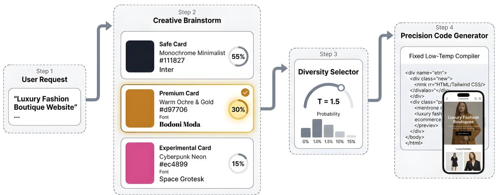
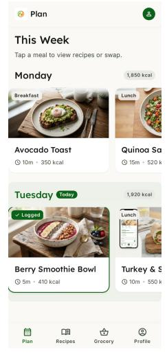
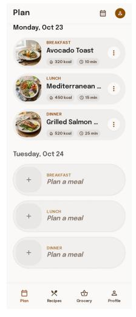
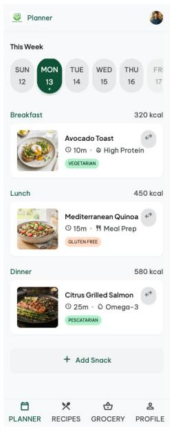
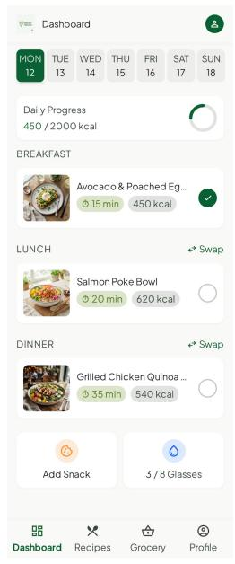
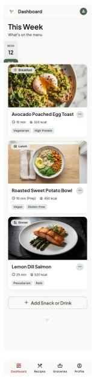

# Enabling Creative Exploration for Vibe Design Agents

Yifan Zhang\*, Nghi D. Q. Bui\*,†, Georgios Evangelopoulos and Arnaud Benard Google

Vibe design agents turn natural-language briefs into rendered interfaces and frontend code. Yet a useful design agent should do more than produce one valid page: it should help users explore coherent alternatives. Increasing token-level temperature is a blunt solution because it varies aesthetic decisions and syntax-sensitive code at the same time. We instead separate exploration from implementation through an inference architecture that makes design direction an explicit intermediate decision. Inspired by Verbalized Sampling, a pre-pass proposes structured design specifications with typicality scores, an external selector samples one, and the downstream generator realizes the selected specification together with the original request under fixed settings. We apply this approach to UI themes and visual-asset prompts. Across 168 prompts, with 1,255 paired comparisons per temperature for each intervention, theme sampling broadens observed selection coverage and screenshot variation, while LLMjudge preferences vary across interventions, prompt complexity, and viewport. In an online experiment with more than 300,000 tasks, the observed code-export increase remains statistically uncertain, while fewer negative feedback events coexist with more correction interactions and modest operational costs. Together, these findings identify structured design specifications as a practical control point for exploring alternative UI concepts while keeping downstream generation settings fixed.

## 1. Introduction

  
Figure 1 | Decoupled creative exploration. This illustrative example samples a design direction before fixed-setting downstream generation.

LLMs and multimodal models increasingly act as vibe design agents: people steer interface creation through natural-language intent and iterative feedback while the agent proposes interfaces, generates frontend code, and renders results. This capability now appears in widely accessible products. Lovable, v0, Bolt, and Replit Agent turn conversational specifications into web applications (Bolt, 2026; Lovable, 2026; Replit, 2026; Vercel,

2026); Figma Make, Claude Design, and Google Stitch emphasize editable prototypes and high-fidelity UI-tocode workflows (Anthropic, 2026; Banks, 2026; Ng et al., 2025). Recent systems and benchmarks also show progress in screenshot-to-code fidelity and interaction correctness (Si et al., 2025; Xiao et al., 2025c; Zhang et al., 2024). Together, these developments raise a broader design question. A useful agent should not only produce one valid interface, but also help people inspect meaningfully diferent directions before committing to one.

That role combines creative exploration with precision program synthesis. The agent chooses typography, color palettes, imagery, density, and visual hierarchy while also producing valid markup, executable stylesheets, and coherent components. Exploration benefits from variation across design concepts, whereas syntax-sensitive code generation requires predictability. Applying one decoding control to the entire pipeline entangles these diferent requirements.

Post-training methods such as reinforcement learning from human feedback (RLHF) and Direct Preference Optimization (DPO) improve instruction following and preference alignment (Ouyang et al., 2022; Rafailov et al., 2023). Recent work shows that preference optimization can underrepresent minority preferences and motivates objectives that explicitly reward diverse useful responses (Lanchantin et al., 2025; Xiao et al., 2025a). Verbalized Sampling further identifies data-level typicality bias as a source of overly prototypical outputs at inference time (Zhang et al., 2025). These findings motivate examining repetition in UI generation, where repeated requests can return similar conventional patterns and limit the directions available for exploration and refinement. We do not establish alignment as the cause of repetition in the evaluated pipeline; our focus is making repeated-run exploration measurable and controllable.

The practical challenge is to direct variation toward coherent design alternatives. Low decoding temperature can repeatedly favor familiar UI patterns. Raising token-level temperature changes choices throughout the output, including both aesthetic decisions and implementation details, so it does not selectively control design direction. High-level instructions such as “be creative” ofer no explicit distribution that a runtime can inspect or balance.

Verbalized Sampling (VS) is an inference-time method for eliciting more of an aligned model’s response distribution. Instead of asking for one answer, it asks the model to list representative alternatives and attach probability-like typicality scores (Zhang et al., 2025). We use these scores as operational weights rather than calibrated probabilities. We build on this mechanism with an inference architecture that makes design direction an explicit intermediate decision (Figure 1). A proposal stage produces structured design specifications, an external selector chooses one, and the downstream generator receives the selected specification together with the original request. A theme specification binds palette, typography, display mode, and shape choices into a direction that the generator is instructed to implement together. This creates a control point for changing which design the system pursues while retaining fixed downstream decoding settings. We instantiate the architecture independently for UI themes and visual-asset prompts.

Evaluating the resulting interfaces also requires more than one notion of quality. The Human Creativity Benchmark argues that professional judgments can converge on criteria such as adherence, usability, and technical structure while diverging on visual appeal and aesthetic direction (Hopkins et al., 2026). Our evaluation therefore reports selection coverage, visual and structural diagnostics, LLM-judge preferences, and online user behavior separately. We ask whether the intervention broadens repeated-run exploration, how rendered variation relates to judged quality, and what changes during real-world use. The observed trade-ofs vary across interventions, prompt suites, and viewports rather than identifying one universally preferred sampling temperature.

Contributions and findings. We contribute an inference architecture for controllable design exploration, an empirical study of its independent theme and visual-asset interventions, and an evaluation in a deployed design assistant. The architectural contribution is the integration of structured design specifications into downstream generation, making design direction a decision that can be varied independently of decoding settings. The ofline evaluation spans 168 prompts (� = 1,255 paired comparisons per temperature for each intervention). Theme sampling broadens observed selection coverage and screenshot variation, while LLM-judge outcomes vary across interventions, prompt complexity, and viewport. The online A/B experiment covers more than 300,000 user tasks. It records fewer negative feedback events, more correction interactions among evaluated conversations, and modest latency and completion costs; the observed code-export increase remains statistically uncertain. Together, these findings connect controllable exploration to its efects on rendered interfaces and behavior during use. They do not establish human design preference or a universally preferred temperature; blinded professional evaluation remains necessary.

## 2. An Architecture for Explicit Design Exploration

The architecture separates three operations: proposing design specifications, selecting a specification, and generating an interface conditioned on it. The selected specification is the interface between exploration and implementation. We use VS to generate alternatives and a temperature-scaled selection policy to choose among them; the downstream model configuration is shared across selection conditions.

## 2.1. Pipeline Overview

Figure 1 summarizes the generation path:

1. User request. The agent receives a UI design prompt and retains it as the task specification.

2. Proposal. A pre-pass elicits distinct, prompt-compatible directions with structured attributes and selfassessed typicality scores.

3. Selection. An external policy normalizes the scores and samples a candidate after applying candidate-level temperature.

4. Generation. The selected specification and original request condition the existing generation path. The downstream model configuration and decoding settings remain fixed across selection conditions.

## 2.2. Structured Design Specifications

Each candidate contains a specification, a brief rationale, and an elicited typicality score. In the theme implementation, the specification records a seed color, light or dark mode, headline and body fonts, and corner roundness. Selecting a candidate commits these attributes together, so downstream design-system generation is instructed to use the selected combination. In the asset implementation, the specification is an image-generation prompt describing subject, composition, and visual style.

For example, the meal-planning case study in Appendix A includes an asset candidate describing overnight oats in a glass jar with soft side lighting and another describing an editorial composition on light oak with dappled sunlight. Selection chooses a complete image prompt before the image generator runs. The same principle applies to the bundle of attributes in a theme specification.

VS supplies the elicitation mechanism (Zhang et al., 2025). We treat the resulting scores as operational weights rather than calibrated model or population probabilities (Hu and Levy, 2023; Wang et al., 2024). The architecture does not depend on a particular candidate count or tier vocabulary.

Before selection, valid nonnegative scores are normalized to weights $\hat { p } _ { k }$ . Missing, negative, nonnumeric, or all-zero scores trigger a re-prompt. If a valid set still cannot be obtained, the system falls back to the baseline path.

## 2.3. Selection Policy

For candidates with positive normalized weight, the selector applies temperature scaling:

$$
q _ { k } ( \tau ) = \frac { \hat { p } _ { k } ^ { 1 / \tau } } { \sum _ { j = 1 } ^ { K } \hat { p } _ { j } ^ { 1 / \tau } } , \qquad \tau > 0 .\tag{1}
$$

At � = 1, selection follows the normalized elicited weights. Values below one favor higher-weight directions more strongly, while values above one increase the relative chance of lower-weight directions. Zero-weight candidates remain unselected. Temperature changes the odds within the proposed set; it cannot add directions that were not proposed. Exact uniform selection over all � candidates is a separate policy with $q _ { k } = 1 / K$

## 2.4. Conditioning Downstream Generation

After drawing a direction from �(�), the downstream generator receives the original request and the selected specification. Theme generation is instructed to preserve the selected color, fonts, display mode, and corner roundness when producing the design system. Asset generation receives the selected image prompt. These are conditioning instructions; compliance and functional validity require separate evaluation.

Downstream decoding settings and the existing generation pipeline remain fixed across selection conditions. The two integration points are:

• Theme generation: the selected theme conditions the design-system and UI generation path.

• Visual-asset prompting: the selected image prompt conditions visual asset generation within the interface.

The experiments enable these interventions separately to examine their respective efects.

## 3. Experimental Setup

The evaluation follows the three questions introduced in Section 1. Selection coverage and screenshot similarity measure exploration breadth. A customized multi-rubric LLM judge1 measures output preference, with compiled DOM similarity providing a separate structural diagnostic. An online experiment measures behavior during use. We report these outcomes separately because variation, preference, and product use capture diferent properties of the generated interfaces.

## 3.1. Evaluated Configuration

The evaluated proposal stage uses � = 3 directions:

• Safe: a conventional direction intended to have high typicality;

• Premium: a direction intended to emphasize visual refinement; and

• Experimental: an unexpected direction intended to have lower typicality.

These labels guide candidate elicitation; they are not measured levels of quality or risk. Candidates use the specifications described in Section 2. Gemini 3 Flash (gemini-3-flash) performs candidate proposal, designsystem generation, and downstream code generation. Nano Banana 2 generates in-page images. The pairwise evaluator uses Gemini 3.1 Pro (gemini-3.1-pro) with specialized UI rubrics. We test � ∈ {0.5, 1, 1.5, 2, 5}. The implementation reports defaults of 1.5 for themes and 2.0 for asset prompts; these defaults are distinct from the best observed settings in the ofline comparisons.

The theme study enables candidate selection for theme generation. The asset study enables candidate selection for image prompts while disabling theme sampling. This separates the two sources of variation; the joint condition appears only in the qualitative case study.

## 3.2. Paired Study Design

The evaluation uses two prompt suites:

• Standard UI Benchmark (83 prompts): Short, open-ended requests, such as generic landing pages or utility cards, without explicit aesthetic or layout constraints. Each prompt is evaluated at mobile and desktop viewports with five repeats, giving 415 pairs per viewport and 830 pairs per temperature for each intervention.

• Complex UI Benchmark (85 prompts): Detailed requests with constraints on layout hierarchy, visual style, component composition, and domain functionality. The suite includes 43 mobile and 42 desktop prompts, each repeated five times, giving 425 pairs per temperature for each intervention.

Each pair compares a baseline output with an output from the corresponding theme or asset intervention for the same prompt and viewport. Thus, the two suites contribute 1,255 paired comparisons per temperature for each intervention; this is not a count of unique outputs across the full sweep. Both conditions use the same generator model, with the intervention adding proposal and selection. Tables use VS as shorthand for this integrated intervention, rather than for an unmodified implementation of the original VS method. Runtime overhead is assessed through the online latency measurements.

## 3.3. Measurements

Selected-theme coverage. The internal report counts how many of three theme options appear across five repeats, with a maximum of three. Its coverage table contains 83 prompt-level observations. We report the mean and the fraction for which only one option appears. The archived summary does not specify whether option identities refer to persistent specifications or tier labels across regenerated candidate sets; we therefore interpret this as reported selection coverage, not as a count of distinct rendered designs.

Visual and structural variation. Within-prompt cosine similarity between screenshot embeddings characterizes visual variation, with lower values indicating greater separation in the embedding space. Similarity between compiled HTML DOM representations characterizes structural change. Neither measure alone establishes aesthetic quality or functional validity.

LLM-judged design quality. The Gemini 3.1 Pro evaluator compares baseline and intervention outputs across 830 pairs per temperature for the standard benchmark and 425 for the complex benchmark. We report wins, losses, ties, and win/loss ratios. Percentages retain all pairs in the denominator; cases without a rating are not ties. These are descriptive model-judge outcomes rather than human preferences.

Online outcomes. The public experiment comparison covers 309,870 created tasks and 505,940 generated screens. We report task completion, latency, recorded error signals, exports, feedback, and corrections. The correction metric is evaluated on a subset of conversations. Denominators and available confidence intervals are specified in Section 4.4.

## 4. Preliminary Results

We first examine whether theme selection changes rendered variation, then ask whether the asset intervention produces similar changes in judge preference. The standard benchmark contributes 830 paired comparisons per temperature for each intervention; the complex benchmark contributes 425. We then examine behavior in the online experiment. Section 5 illustrates the joint use of the two interventions on one prompt.

## 4.1. Theme Selection, Rendered Variation, and Judged Quality

The internal coverage summary reports one selected theme option across five baseline runs for each of 83 prompts. Candidate selection increases the reported mean from 1.00 to 2.10–2.94 options. At the tested settings � ≥ 1.5, every prompt has more than one observed option (Table 1). This establishes broader coverage under the report’s option-counting scheme; screenshot similarity provides separate evidence about the rendered outputs.

Screenshot similarity decreases as candidate temperature increases, from 0.6560 at � = 0.5 to 0.5438 at � = 2.0, indicating greater separation in the recorded embedding space. In the customized LLM-judge evaluation, � = 2.0 has the strongest observed preference over baseline, with a 1.10 win/loss ratio (38.8% VS vs. 35.3% baseline). The judge preference reverses at $\tau = 5 . 0$ despite nearly identical screenshot similarity, showing that measured variation and judged quality do not move together monotonically.

Table 1 | Theme intervention on the standard benchmark. Selection coverage uses 83 prompt-level observations; screenshot similarity aggregates repeated outputs, and judge preferences use � = 830 pairs per temperature. Baseline coverage is 1.00 option and screenshot similarity is 0.6765. Lower similarity indicates greater visual variation. Unrated pairs account for 0.5–1.1% and remain in the preference denominators.
<table><tr><td>τ</td><td>Options</td><td>One option</td><td>VS Sim.</td><td>Diff.</td><td>VS Win</td><td>Base Win</td><td>Tie</td><td>W/L</td></tr><tr><td>0.5</td><td>2.10</td><td>12.0%</td><td>0.6560</td><td>-0.0204</td><td>33.6%</td><td>41.3%</td><td>24.6%</td><td>0.81</td></tr><tr><td>1.0</td><td>2.59</td><td>3.6%</td><td>0.6085</td><td>-0.0680</td><td>36.1%</td><td>38.8%</td><td>24.2%</td><td>0.93</td></tr><tr><td>1.5</td><td>2.84</td><td>0.0%</td><td>0.5844</td><td>-0.0920</td><td>34.1%</td><td>40.1%</td><td>24.7%</td><td>0.85</td></tr><tr><td>2.0</td><td>2.87</td><td>0.0%</td><td>0.5438</td><td>-0.1327</td><td>38.8%</td><td>35.3%</td><td>25.4%</td><td>1.10</td></tr><tr><td>5.0</td><td>2.94</td><td>0.0%</td><td>0.5437</td><td>-0.1328</td><td>35.1%</td><td>38.8%</td><td>25.7%</td><td>0.90</td></tr></table>

Table 2 | Visual-asset intervention with theme sampling disabled on the standard benchmark (� = 830 pairs per temperature). Baseline screenshot similarity is 0.6765. Preferences use the Gemini 3.1 Pro judge. Unrated pairs account for 0.0–0.2% and remain in the preference denominators.
<table><tr><td>τ</td><td>VS Sim.</td><td>Diff.</td><td>VS Win</td><td>Base Win</td><td>Tie</td><td>W/L</td></tr><tr><td>0.5</td><td>0.6588</td><td>-0.0177</td><td>40.1%</td><td>33.0%</td><td>26.7%</td><td>1.22</td></tr><tr><td>1.0</td><td>0.6616</td><td>-0.0148</td><td>42.8%</td><td>32.3%</td><td>24.9%</td><td>1.32</td></tr><tr><td>1.5</td><td>0.6665</td><td>-0.0100</td><td>33.1%</td><td>38.8%</td><td>28.1%</td><td>0.85</td></tr><tr><td>2.0</td><td>0.6720</td><td>-0.0045</td><td>35.2%</td><td>36.6%</td><td>28.2%</td><td>0.96</td></tr><tr><td>5.0</td><td>0.6726</td><td>-0.0039</td><td>34.1%</td><td>38.9%</td><td>26.7%</td><td>0.88</td></tr></table>

## 4.2. Visual-Asset Variation and Judged Quality

Table 2 reports the independent visual-asset prompt ablation with theme sampling disabled (� = 830 pairs). Unlike theme sampling, this intervention targets asset semantics, and its screenshot similarity remains close to the baseline.

Among the tested settings, � = 1.0 has the highest observed asset win/loss ratio, 1.32 (42.8% VS vs. 32.3% baseline). Yet whole-screen similarity changes only from 0.6765 to 0.6616. Together with the theme results, this shows that judge preference and screenshot separation can respond diferently to an intervention. Higher asset temperature does not consistently improve either measure.

## 4.3. Variation Across Prompt Suites and Viewports

On standard prompts, the highest observed win/loss ratios occur at � = 2.0 for themes and � = 1.0 for assets. The complex asset benchmark instead has its highest aggregate ratio at � = 1.5 (1.19). These descriptive results suggest that a setting selected for one prompt suite may not transfer to another.

Viewport comparisons also need to retain the prompt-suite context. On the standard asset benchmark at � = 1.0, desktop yields 42.9% VS wins and 31.1% baseline wins (ratio 1.38), compared with 42.7% and 33.5% on mobile (ratio 1.27). On the complex asset benchmark, the reported desktop ratio at the same temperature is 2.43 (56.7% vs. 23.3%). The latter uses a diferent prompt suite and cannot establish a viewport efect by comparison with standard mobile results. Prompt-clustered uncertainty and controlled comparisons are needed to establish which diferences generalize.

Compiled HTML similarity provides a complementary diagnostic. In the standard theme study, the mean is 0.8779 for baseline outputs and 0.7935–0.8339 for intervention outputs. These values indicate shared structural patterns alongside change; they do not establish equivalent DOMs or preserved functionality.

## 4.4. Behavior in the Online Experiment

We examine the public control and treatment groups in an archived A/B analysis of a commercial UI design assistant. These groups contain 155,338 and 154,532 created tasks, respectively, and 253,070 and 252,870 generated screens. The snapshot was produced on August 26, 2026, with a reported analysis query window of July 28–August 26. We reproduce its platform-reported 95% confidence intervals for relative changes. The snapshot labels its interval method as PREPOST but does not document the estimator or actual treatmentexposure dates in suficient detail for independent reconstruction.

Latency and execution. The share of completed tasks finishing within 30 seconds changes from 28.2% to 27.5%, and the within-60-second share from 49.9% to 48.2%. The latter is a −3.47% relative change (95% CI: [−5.83%, −1.11%]). Task success changes from 97.95% to 97.80%, a −0.15% relative change (95% CI: [−0.30%, −0.01%]). Thus, the intervention has measurable operational costs despite high completion rates.

Recorded invalid-HTML and JSON-decode error rates are 0.00% in both groups. Screens with console errors number four in control and seven in treatment, corresponding to rates below 0.003%. These sparse monitored signals do not establish unchanged overall reliability or exhaustive functional validity.

Exports and feedback. Code exports per generated screen increase from 1.06% to 1.15%, an observed +8.23% relative change. The 95% interval, [−13.03%, +29.48%], includes zero, so the experiment does not establish an export improvement. Figma exports per screen show a +0.94% relative change (95% CI: [−11.77%, +13.66%]), also inconclusive.

Negative feedback events decrease from 73 to 50, a −31.51% relative change (95% CI: [−62.02%, −1.00%]). Positive-to-negative feedback counts change from 278 : 73 to 285 : 50, or approximately 3.8 : 1 to 5.7 : 1. These are sparse voluntary feedback signals, with 351 and 335 total ratings, rather than a population-wide measure of satisfaction.

Correction interactions. The conversation evaluator flags corrections in 1,407 of 3,624 evaluated control conversations and 1,492 of 3,589 treatment conversations. The corresponding rates are 38.8% and 41.6%, a +7.08% relative change (95% CI: [+1.38%, +12.77%]). The denominator is the evaluated conversation subset, not all tasks. More corrections are consistent with additional steering, but the metric does not establish whether the cause was aesthetic mismatch, unmet requirements, or another source of friction.

The online findings therefore complement the ofline results without reducing them to a single quality verdict: negative feedback declines, correction interactions increase, latency and completion worsen modestly, and the export estimate remains uncertain.

## 5. Qualitative Case Study: Joint Theme and Asset Sampling

The main experiments isolate theme and visual-asset sampling. Figure 2 instead illustrates their joint use on one multi-component meal-planning-dashboard prompt. We show two representative runs per condition at a readable scale; the remaining runs, design-token summary, and elicited image prompts appear in Appendix A. Because this is a single prompt rather than a controlled ablation, it illustrates the mechanism without establishing a general efect.

Across the five inspected runs, the joint condition varies palettes, fonts, corner radii, meals, camera angles, and lighting. These examples complement the independent ablations but do not isolate either intervention’s contribution or establish preference or executable validity.

## 6. Limitations and Implications

## 6.1. What the Experiments Establish

The strongest evidence for exploration breadth comes from the standard theme study: reported option coverage increases and screenshot similarity decreases. The asset study shows that judge preference can change with much smaller shifts in whole-screen similarity. This distinction matters for evaluation: a metric that detects broad palette or layout changes may respond diferently to a localized asset intervention.

The experiments compare the integrated proposal-and-selection pipeline with the baseline. They do not isolate the contribution of typicality weights from that of proposing multiple candidates. Comparisons with unweighted

(a) Baseline  
  
Run 1

  
Both runs repeat the same dark-green palette and closely matched typography and food imagery.  
Run 2

## (b) Joint candidate sampling

  
Run 1

  
The sampled runs use distinct warm and cool palettes, type pairings, and culinary compositions.  
Run 2  
Figure 2 | Representative generations for one meal-planning-dashboard prompt. Showing two runs per condition makes the visual diferences legible; all five runs per condition are documented across this figure and Appendix A.

candidate elicitation, exact uniform selection, source-faithful VS, and token-temperature changes are needed to separate these efects. The archived records also do not establish whether identical candidate sets were reused across temperatures and repeats. Temperature results therefore describe the tested pipeline configurations rather than a verified intervention on selection alone.

Candidate selection is limited to the proposed set, and the elicited weights are not calibrated probabilities. The meaning of option identity across repeated runs needs clarification before coverage can be interpreted as a count of distinct design specifications. Direct execution and adherence checks are also needed to test whether downstream outputs satisfy the selected specification and the original request.

## 6.2. Interpreting Preference and Behavior

The strongest observed settings difer across interventions and prompt suites, so the reported defaults should not be treated as universal recommendations. LLM judges provide scalable assessments but are susceptible to position, verbosity, and alignment biases (Verga et al., 2024; Zheng et al., 2023). The ofline aggregates lack prompt-clustered uncertainty, and neither judge preference nor screenshot separation establishes professional design quality.

The online experiment measures behavior during use. Fewer negative ratings coexist with more evaluated correction interactions and modest declines in latency and task-success metrics. Additional steering is one interpretation of the correction result; its cause is not identified by the aggregate metric. The export interval includes zero, and sparse voluntary feedback cannot represent every user’s experience. The analysis snapshot also leaves treatment configuration, exposure dates, randomization details, and interval estimation insuficiently documented for independent reconstruction.

## 6.3. Reproducibility and Further Evaluation

The proprietary prompt set, generations, evaluator records, renderer state, and executable analysis are not released. The experiments use one generation-model configuration and one UI pipeline. Replication across model families, prompt domains, languages, and accessibility-constrained tasks is needed to test portability.

A confirmatory study should freeze the prompt manifest, candidate sets, model versions, seeds, renderer, and exclusion rules; include the alternative selection and prompting policies above; retain invalid and unrated outputs in denominators; and report prompt-clustered uncertainty. Following the Human Creativity Benchmark (Hopkins et al., 2026), it should distinguish adherence and execution from aesthetic direction and preserve disagreement among blinded professional designers. Browser-based task tests and accessibility checks would complement those judgments.

## 6.4. Practical Implications

The architecture exposes a place to adjust exploration without changing downstream decoding settings. Whether broader exploration is useful depends on the user’s brief and stage of work. The observed variation motivates future policies that account for explicit design constraints and user steering, but this study does not evaluate an adaptive policy. Accessibility, privacy, brand requirements, and task constraints should govern candidate proposal and downstream validation.

## 7. Related Work

## 7.1. Alignment and Response Diversity

RLHF and DPO improve instruction following and preference alignment (Ouyang et al., 2022; Rafailov et al., 2023). Preference collapse may underrepresent minority preferences, while diversity-aware preference construction can reward useful, rare responses (Lanchantin et al., 2025; Xiao et al., 2025a). These training-time approaches require preference data and may change quality trade-ofs across tasks. Verbalized Sampling (VS) instead intervenes at inference time by requesting representative candidates with probability-like annotations, countering typicality bias toward prototypical answers (Zhang et al., 2025). We build on its elicitation and candidate-selection mechanisms by representing UI direction as a structured intermediate specification. Our contribution is the integration of that specification into theme and asset generation, together with an empirical study of the resulting control. We do not identify alignment as the cause of repetition in the evaluated pipeline.

## 7.2. Distribution Prompting and Probability Reliability

Multi-response prompting can enumerate alternatives jointly or iteratively, sometimes increasing diversity relative to independent sampling (Troshin et al., 2025); VS further uses typicality annotations and probability thresholds (Zhang et al., 2025). Prompted numbers, however, can diverge from next-token probabilities and require calibration for probabilistic interpretation (Hu and Levy, 2023; Wang et al., 2024). We therefore treat them only as normalized operational weights. Tempering changes selection within the elicited set; it neither recovers the model’s internal distribution nor adds omitted directions. Candidate support is consequently determined during elicitation, and repeated pre-passes and prompt-paraphrase tests are needed to establish its stability.

## 7.3. UI and Frontend Generation

Screenshot-to-code work maps pixels to UI programs or element hierarchies (Beltramelli, 2018; Wu et al., 2021); newer benchmarks cover synthetic and real webpages, rendered fidelity, multiple frameworks, editing, repair, and interactions (Gui et al., 2025a; Laurençon et al., 2024; Si et al., 2025; Sun et al., 2025; Xiao et al., 2025c; Yun et al., 2024; Zhu et al., 2025). Generation systems add filtering, segmentation, hierarchical construction, refinement, eficiency, and component reuse (Gui et al., 2025b; Wan et al., 2025; Wu et al., 2024; Xiao et al., 2026a,b; Zhou et al., 2025), while interaction, resource, accessibility, and consistency benchmarks broaden correctness requirements (Wan et al., 2024; Xiao et al., 2025b; Yuan et al., 2025). These systems demonstrate the value of intermediate representations and compiler feedback. Frontend Difusion, MAxPrototyper, Misty, and Spacewalker support staged refinement, blending, or navigation among alternatives (Lu et al., 2025; Yuan et al., 2024; Zhang et al., 2024; Zhong et al., 2021). For conversational vibe design agents, however, most work still emphasizes fidelity or correctness rather than repeated-run breadth; we study that complementary objective while keeping compilation controlled.

## 7.4. Evaluation of Creative Outputs

Creative practice is heterogeneous, and longstanding measurement research cautions against reducing creativity to a single dimension (Lee, 2022; Trefinger and Poggio, 1972). The Human Creativity Benchmark separates professional convergence on adherence and execution from divergence on aesthetic direction, and distinguishes ideation, mockup, and refinement stages (Hopkins et al., 2026). Annotation models likewise make diferent assumptions: Dawid–Skene estimates error around a latent label (Dawid and Skene, 1979), whereas CrowdTruth and perspectivist approaches preserve interpretive disagreement (Basile et al., 2021; Inel et al., 2014). Majority labels may suit factual errors but erase legitimate schools of taste; rating distributions preserve dispersion as a potentially meaningful signal.

LLM judges scale evaluation but exhibit position, verbosity, self-family, and task-dependent biases (Shi et al., 2025; Zheng et al., 2023). Heterogeneous panels can reduce some intra-model bias but do not replace humans (Verga et al., 2024). Our evaluation reports visual variation, model-judge preference, structural diagnostics, and online behavior separately. Blinded professional ratings and direct functional checks remain extensions to the present study.

## 8. Conclusion

Structured design specifications provide a practical control point for exploration in UI agents. By proposing alternatives, selecting a direction, and conditioning downstream generation on that specification, the architecture makes design choices explicit while retaining fixed decoding settings. The theme experiments show broader rendered variation, while the asset experiments show that judge preference can change with much smaller shifts in whole-screen similarity. In the online experiment, fewer negative feedback events coexist with more correction interactions and modest operational costs; the code-export estimate remains uncertain. Together, these findings support evaluating exploration breadth, output preference, and behavior during use as distinct outcomes when designing agents that help users consider alternatives.

## References

Anthropic. Introducing Claude Design by Anthropic Labs. https://www.anthropic.com/news/ claude-design-anthropic-labs, 2026.

R. Banks. Introducing “vibe design” with Stitch. https://blog.google/innovation-and-ai/ models-and-research/google-labs/stitch-ai-ui-design/, 2026.

V. Basile, M. Fell, T. Fornaciari, D. Hovy, S. Paun, B. Plank, M. Poesio, and A. Uma. We need to consider disagreement in evaluation. In Proceedings of the 1st workshop on benchmarking: past, present andfuture, pages 15–21, 2021.

T. Beltramelli. pix2code: Generating code from a graphical user interface screenshot. In Proceedings of the ACM SIGCHI symposium on engineering interactive computing systems, pages 1–6, 2018.

Bolt. Your app, live in minutes. https://bolt.new/use-cases/ai-app-builder, 2026. Accessed August 26, 2026.

A. P. Dawid and A. M. Skene. Maximum likelihood estimation of observer error-rates using the em algorithm. Journal of the Royal Statistical Society: Series C (Applied Statistics), 28(1):20–28, 1979.

Y. Gui, Z. Li, Y. Wan, Y. Shi, H. Zhang, B. Chen, Y. Su, D. Chen, S. Wu, X. Zhou, et al. Webcode2m: A real-world dataset for code generation from webpage designs. In Proceedings of the ACM on Web Conference 2025, pages 1834–1845, 2025a.

Y. Gui, Y. Wan, Z. Li, Z. Zhang, D. Chen, H. Zhang, Y. Su, B. Chen, X. Zhou, W. Jiang, et al. Uicopilot: Automating ui synthesis via hierarchical code generation from webpage designs. In Proceedings of the ACM on Web Conference 2025, pages 1846–1855, 2025b.

A. Hopkins, A. Nulty, A. Minetti, A. Pakki, and A. Singh. The human creativity benchmark. arXiv preprint arXiv:2606.30561, 2026.

J. Hu and R. Levy. Prompting is not a substitute for probability measurements in large language models. In Proceedings of the 2023 Conference on Empirical Methods in Natural Language Processing, pages 5040–5060, 2023.

O. Inel, K. Khamkham, T. Cristea, A. Dumitrache, H. Rutjes, J. Ploeg, L. Romaszko, L. Aroyo, and R.-J. Sips. CrowdTruth: Machine-human computation framework for harnessing disagreement in gathering annotated data. In The Semantic Web – ISWC 2014, volume 8797 of Lecture Notes in Computer Science, pages 486–504. Springer, 2014.

J. Lanchantin, A. Chen, S. Dhuliawala, P. Yu, J. Weston, S. Sukhbaatar, and I. Kulikov. Diverse preference optimization. arXiv preprint arXiv:2501.18101, 2025.

H. Laurençon, L. Tronchon, and V. Sanh. Unlocking the conversion of web screenshots into html code with the websight dataset. arXiv preprint arXiv:2403.09029, 2024.

H.-K. Lee. Rethinking creativity: Creative industries, ai and everyday creativity. Media, Culture & Society, 44 (3):601–612, 2022.

Lovable. Welcome to Lovable. https://docs.lovable.dev/introduction/welcome, 2026. Accessed August 26, 2026.

Y. Lu, A. Leung, A. Swearngin, J. Nichols, and T. Barik. Misty: Ui prototyping through interactive conceptual blending. In Proceedings of the 2025 CHI Conference on Human Factors in Computing Systems, pages 1–17, 2025.

P. Ng, R. Chouhan, and T. Duncalf. Introducing Figma Make: A new way to test, edit, and prompt designs. https://www.figma.com/blog/introducing-figma-make/, 2025.

L. Ouyang, J. Wu, X. Jiang, D. Almeida, C. Wainwright, P. Mishkin, C. Zhang, S. Agarwal, K. Slama, A. Ray, et al. Training language models to follow instructions with human feedback. Advances in neural information processing systems, 35:27730–27744, 2022.

R. Rafailov, A. Sharma, E. Mitchell, C. D. Manning, S. Ermon, and C. Finn. Direct preference optimization: Your language model is secretly a reward model. Advances in neural information processing systems, 36: 53728–53741, 2023.

Replit. Build with Replit Agent. https://docs.replit.com/learn/build-with-agent, 2026. Accessed August 26, 2026.

L. Shi, C. Ma, W. Liang, X. Diao, W. Ma, and S. Vosoughi. Judging the judges: A systematic study of position bias in llm-as-a-judge. In Proceedings of the 14th International Joint Conference on Natural Language Processing and the 4th Conference of the Asia-Pacific Chapter of the Association for Computational Linguistics, pages 292–314, 2025.

C. Si, Y. Zhang, R. Li, Z. Yang, R. Liu, and D. Yang. Design2code: Benchmarking multimodal code generation for automated front-end engineering. In Proceedings of the 2025 Conference of the Nations of the Americas Chapter of the Association for Computational Linguistics: Human Language Technologies (Volume 1: Long Papers), pages 3956–3974, 2025.

H. Sun, H. W. Wang, J. Gu, L. Li, and Y. Cheng. Fullfront: Benchmarking mllms across the full front-end engineering workflow. arXiv preprint arXiv:2505.17399, 2025.

D. J. Trefinger and J. P. Poggio. Needed research on the measurement of creativity. The Journal of Creative Behavior, 6(4):263–267, 1972.

S. Troshin, I. Saparina, A. Fokkens, and V. Niculae. Asking a language model for diverse responses. In Proceedings of the 2nd Workshop on Uncertainty-Aware NLP (UncertaiNLP 2025), pages 66–72, 2025.

Vercel. v0. https://vercel.com/docs/v0, 2026. Accessed August 26, 2026.

P. Verga, S. Hofstatter, S. Althammer, Y. Su, A. Piktus, A. Arkhangorodsky, M. Xu, N. White, and P. Lewis. Replacing judges with juries: Evaluating llm generations with a panel of diverse models. arXiv preprint arXiv:2404.18796, 2024.

Y. Wan, Y. Dong, J. Xiao, Y. Huo, W. Wang, and M. R. Lyu. Mrweb: An exploration of generating multi-page resource-aware web code from ui designs. arXiv preprint arXiv:2412.15310, 2024.

Y. Wan, C. Wang, Y. Dong, W. Wang, S. Li, Y. Huo, and M. Lyu. Divide-and-conquer: Generating ui code from screenshots. Proceedings of the ACM on Software Engineering, 2(FSE):2099–2122, 2025.

C. Wang, G. Szarvas, G. Balazs, P. Danchenko, and P. Ernst. Calibrating verbalized probabilities for large language models. arXiv preprint arXiv:2410.06707, 2024.

J. Wu, X. Zhang, J. Nichols, and J. P. Bigham. Screen parsing: Towards reverse engineering of ui models from screenshots. In The 34th Annual ACM Symposium on User Interface Software and Technology, pages 470–483, 2021.

J. Wu, E. Schoop, A. Leung, T. Barik, J. P. Bigham, and J. Nichols. Uicoder: Finetuning large language models to generate user interface code through automated feedback. In Proceedings of the 2024 Conference of the North American Chapter of the Association for Computational Linguistics: Human Language Technologies (Volume 1: Long Papers), pages 7511–7525, 2024.

J. Xiao, Z. Li, X. Xie, E. Getzen, C. Fang, Q. Long, and W. J. Su. On the algorithmic bias of aligning large language models with rlhf: Preference collapse and matching regularization. Journal of the American Statistical Association, 120(552):2154–2164, 2025a.

J. Xiao, Y. Wan, Y. Huo, Z. Wang, X. Xu, W. Wang, Z. Xu, Y. Wang, and M. R. Lyu. Interaction2code: Benchmarking mllm-based interactive webpage code generation from interactive prototyping. In 2025 40th IEEE/ACM International Conference on Automated Software Engineering (ASE), pages 241–253. IEEE, 2025b.

J. Xiao, M. Wang, M. H. Lam, Y. Wan, J. Liu, Y. Huo, and M. R. Lyu. Designbench: A comprehensive benchmark for mllm-based front-end code generation. arXiv preprint arXiv:2506.06251, 2025c.

J. Xiao, J. Qin, S. Li, M. H. Lam, Y. Wan, J.-t. Huang, Y. Huo, and M. R. Lyu. Comuicoder: Component-based reusable ui code generation for complex websites via semantic segmentation and element-wise feedback. arXiv preprint arXiv:2602.19276, 2026a.

J. Xiao, Z. Zhang, Y. Wan, Y. Huo, Y. Liu, and M. R. Lyu. Eficientuicoder: A bidirectional token compression framework for eficient mllm-based ui code generation. Proceedings of the ACM on Software Engineering, 3 (FSE):2396–2418, 2026b.

M. Yuan, J. Chen, and A. Quigley. Maxprototyper: A multi-agent generation system for interactive user interface prototyping. arXiv preprint arXiv:2405.07131, 2024.

M. Yuan, J. Chen, Z. Xing, A. Quigley, Y. Luo, T. Luo, G. Mohammadi, Q. Lu, and L. Zhu. Designrepair: Dual-stream design guideline-aware frontend repair with large language models. In 2025 IEEE/ACM 47th International Conference on Software Engineering (ICSE), pages 2483–2494. IEEE, 2025.

S. Yun, H. Lin, R. Thushara, M. Q. Bhat, Y. Wang, Z. Jiang, M. Deng, J. Wang, T. Tao, J. Li, et al. Web2code: A large-scale webpage-to-code dataset and evaluation framework for multimodal llms. Advances in neural information processing systems, 37:112134–112157, 2024.

J. Zhang, S. Yu, D. Chong, A. Sicilia, M. R. Tomz, C. D. Manning, and W. Shi. Verbalized sampling: How to mitigate mode collapse and unlock llm diversity. arXiv preprint arXiv:2510.01171, 2025.

Q. Zhang, L. B. Hendra, M. Chi, and Z. Ding. Frontend difusion: Exploring intent-based user interfaces through abstract-to-detailed task transitions. arXiv preprint arXiv:2408.00778, 2024.

L. Zheng, W.-L. Chiang, Y. Sheng, S. Zhuang, Z. Wu, Y. Zhuang, Z. Lin, Z. Li, D. Li, E. Xing, et al. Judging llm-as-a-judge with mt-bench and chatbot arena. Advances in neural information processing systems, 36: 46595–46623, 2023.

M. Zhong, G. Li, and Y. Li. Spacewalker: Rapid ui design exploration using lightweight markup enhancement and crowd genetic programming. In Proceedings of the 2021 CHI Conference on Human Factors in Computing Systems, pages 1–11, 2021.

T. Zhou, Y. Zhao, X. Hou, X. Sun, K. Chen, and H. Wang. Declarui: Bridging design and development with automated declarative ui code generation. Proceedings of the ACM on Software Engineering, 2(FSE):219–241, 2025.

H. Zhu, Y. Zhang, B. Zhao, J. Ding, S. Liu, T. Liu, D. Wang, Y. Liu, and Z. Li. Frontendbench: A benchmark for evaluating llms on front-end development via automatic evaluation. arXiv preprint arXiv:2506.13832, 2025.

## A. Extended Qualitative Case Study

This appendix completes the meal-planning-dashboard case study introduced in Section 5. Five independent generations were inspected for each condition using the same prompt. Figure 3 shows the six runs omitted from the main figure, while Tables 3 and 4 record the observed design tokens and example asset prompts.

Table 3 | Observed design-token variation across five runs of the meal-planning-dashboard example. Percentages describe this single prompt only.
<table><tr><td>Dimension</td><td>Baseline</td><td>Candidate sampling</td><td>Observed difference</td></tr><tr><td>Primary Colors</td><td>2 (80% #2D6A4F)</td><td>5 (100% unique)</td><td>More observed palette values</td></tr><tr><td>Headline Fonts</td><td>1 (100% Plus Jakarta)</td><td>3 unique</td><td>Adds Epilogue and Lexend</td></tr><tr><td>Body Fonts</td><td>2 (80% Be Vietnam)</td><td>3 unique</td><td>Adds Inter and Manrope pairings</td></tr><tr><td>Corner Radius</td><td>1 (100% round: 2)</td><td>3 unique</td><td>Multiple observed shape styles</td></tr><tr><td>Tail Archetypes</td><td>0%</td><td>60%</td><td>3 of 5 runs sampled a p ≤ 0.40 direction</td></tr></table>

Table 4 | Qualitative comparison of generated image prompts for the meal-planning-dashboard example. The selected direction is marked with a dagger.
<table><tr><td>Method</td><td>Dish / target</td><td>Tier &amp; weight (p)</td><td>Generated image prompt</td></tr><tr><td rowspan="3">Baseline</td><td>Grilled Salmon</td><td>Default prior</td><td>&quot;A beautifully plated grilled salmon fillet with crispy skin, resting on a bed of garlic-sautéed spinach and asparagus... atmospheric evening lighting, shallow depth of field, dark slate plate.&quot;</td></tr><tr><td>Avocado Toast</td><td>Default prior</td><td>&quot;A beautiful top-down shot of smashed avocado on rustic sourdough toast, topped with chili flakes, microgreens, and a poached egg breaking open. Bright morning sunlight, marble countertop.&quot;</td></tr><tr><td>Quinoa Salad</td><td>Default prior</td><td>&quot;Top-down view of a vibrant Mediterranean salad in a wide bowl, featuring sliced chicken, chickpeas, feta cheese crumbles, kalamata olives, cherry tomatoes... off-white background.&quot;</td></tr><tr><td rowspan="3">Candidate sampling</td><td rowspan="3">Overnight Oats (Breakfast)</td><td>Safe (p = 0.60)</td><td>&quot;Close-up photograph of a clear glass mason jar filled with overnight oats, topped with fresh blueberries, sliced bananas, chia seeds... soft morning light from the side.&quot;</td></tr><tr><td>Premium (p = 0.25)†</td><td>&quot;Elevated, editorial-style photograph of layered overnight oats on a light oak wood surface, distinctly visible layers through clear glass, dappled sunlight, shallow depth of field.&quot;</td></tr><tr><td>Experimental (p = 0.15)</td><td>&quot;Artistic, high-key photograph of a deconstructed overnight oats experience in a minimalist, handmade ceramic bowl, surrounded by artfully scattered ingredients on raw linen.&quot;</td></tr><tr><td rowspan="3"></td><td rowspan="3">Lentil Stew (Dinner)</td><td>Safe (p = 0.60)</td><td>&quot;Close-up photograph of a steaming, rustic ceramic bowl filled with hearty lentil and root vegetable stew on a worn wooden dining table, garnished with fresh parsley.&#x27;</td></tr><tr><td>Premium (p = 0.25)</td><td>&quot;Elevated, moody culinary photograph of artisanal stoneware containing a rich, slow-cooked lentil and root vegetable ragout under soft directional side-lighting and olive oil drizzle.&quot;</td></tr><tr><td>Experimental (p = 0.15)</td><td>&quot;Top-down, hyper-realistic still life composition set in a minimalist, Scandinavian-inspired kitchen on light bleached wood with a dark glazed bowl of steaming stew.&quot;</td></tr></table>

† Direction sampled under � = 2.0 external selection for this run.

The full set suggests that joint sampling changes several visible design decisions together rather than only recoloring a fixed template. Because the evidence comes from one prompt and five runs per condition, these observations remain illustrative and are not used as independent quantitative evidence.

Figure 3 | The six remaining generations for the meal-planning-dashboard example. Together with Figure 2, this completes the five-run sample for each condition.  
  
Run 3

(a) Baseline, remaining runs  
  
Run 4

  
Run 5  
The remaining baseline runs continue to favor similar green palettes, rounded cards, sans-serif typography, and familiar overhead food imagery.

## (b) Joint candidate sampling, remaining runs

  
Run 3

  
Run 4

  
Run 5  
These sampled runs add terracotta, forest, and sage directions, varied type pairings, and diferent culinary subjects and camera treatments.