# Failure-Guided Co-Evolution of Prompts and Training Data

Tianyu Yuan, Zhuzhong Qian

Nanjing University yty@smail.nju.edu.cn, qzz@nju.edu.cn \*Corresponding author.

## Abstract

Automatic prompt optimization (APO) improves language-model programs by revising prompts from task feedback, yet it typically holds its training data fixed. Repeatedly optimizing against the same instances confines feedback to weaknesses already represented in those data, leaving related failure con- ditions unexplored. We therefore view each failure as a dual signal: it indicates both how the prompt should be revised and what new training evidence should be synthesized. We introduce Forge, a failure-guided framework that co-evolves prompts and training data. Forge abstracts imperfect execu- tions into reusable failure modes and synthesizes new training data through four complementary mutation strategies. Verified instances are fed back into prompt search, allowing updated prompts to expose the next data needs. Across eight heteroge- neous benchmarks, Forge improves the aggregate score over the unoptimized baseline by 16.52 percentage points and out- performs all evaluated APO baselines. The synthesized data also transfer beyond Forge: in a transfer study, they improve all nine APO comparisons by 2–9 points and all three GRPO comparisons by 4–8 points under matched optimization bud- gets. These results establish failures as a shared interface be- tween prompt optimization and data synthesis, and show the benefit of jointly adapting what a model is instructed to do and what it learns from.

## Introduction

Language-model (LM) programs combine prompted calls with retrieval, tools, and intermediate computation for appli- cations ranging from structured prediction and knowledge- intensive reasoning to instruction following and interactive agents (Opsahl-Ong et al. 2024; Trivedi et al. 2024). Be-cause their behavior is largely specified by natural-language prompts, automatic prompt optimization (APO) replaces manual design with feedback-driven search. Existing meth- ods use textual gradients, optimizer LMs, joint instruction– demonstration search, or evolutionary reflection (Pryzant et al. 2023; Yuksekgonul et al. 2025; Yang et al. 2024a; Opsahl-Ong et al. 2024; Fernando et al. 2024; Agrawal et al. 2026).

Despite these advances, most general-purpose APO sys- tems still derive feedback from fixed training data (Opsahl-Ong et al. 2024; Agrawal et al. 2026; Zhang et al. 2026). As prompts evolve, repeatedly optimizing on the same instances can overemphasize observed failures while leaving nearby conditions unexplored. When performance stops improving, it is therefore unclear whether prompt search has exhausted useful revisions or the training data have stopped exposing informative failures. This motivates treating training data as an adaptive optimization state.

Reasoning: AIME-2025  
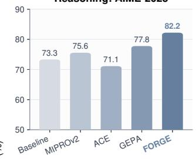  
Agents: AppWorld

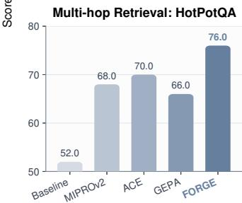

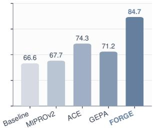

Domain Knowledge: FiNER-139  
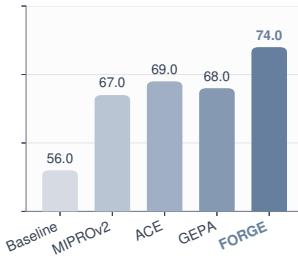  
Figure 1: Results on representative benchmarks from four task categories. Forge consistently outperforms all com- pared methods across multi-hop retrieval, domain knowl- edge, reasoning, and agent tasks, demonstrating its efective- ness across diverse benchmarks.

Feedback-directed synthesis has been studied mainly for model training: early methods bootstrap from seed tasks or model priors (Wang et al. 2023; Xu et al. 2025), whereas learner-aware methods generate instances from observed er- rors or task-model feedback (Lee et al. 2024; Menon and Srivastava 2024; Li et al. 2025; Khan et al. 2025).

Recent work couples data with prompt or model updates: a human-in-the-loop workflow jointly revises prompts and a living test set (Lee and Kahng 2026), while CoEvolve synthesizes interaction tasks during weight optimization (Yang et al. 2026). Together, they motivate a complementary question: can automated reflective search over discrete prompts for heterogeneous LM programs treat training data as a mu- table optimization state? We also ask whether data produced inside this loop remain useful for subsequent LLM weight optimization.

We address this problem with Forge, a failure-guided framework that co-evolves prompts and training data. Its key insight is that each failure reveals both how to revise the prompt and what training evidence is missing. Forge uses failed executions for prompt reflection and abstracts their recurring weaknesses into a failure memory. When the best aggregate validation score stops improving, active fail- ure modes guide data synthesis, completing the prompt–data loop in Figure 2.

Forge expands active failure modes through four mutation intents: positive preserves the target skill under benign variation, negative creates contrasts where the failed heuristic should not apply, boundary probes nearby decision conditions, and stress adds distractors or interacting constraints. A separate tool-capable verifier agent admits only valid in- stances faithful to both the targeted failure mode and mu- tation intent. Accepted instances enter the training data and shape subsequent prompt search, whose failures refresh the memory and guide the next synthesis event.

We evaluate Forge on prompt optimization and data trans- fer; Figure 1 shows representative results across four task categories. Across eight benchmarks, Forge raises average performance by 16.52 points over the unoptimized baseline and by 4.92–8.82 points over competing APO methods. In a separate transfer study, its synthesized instances improve all nine prompt-optimizer and all three GRPO comparisons, in- cluding 4–8-point GRPO gains, demonstrating utility beyond Forge.

Our contributions are fourfold:

• We treat training data as an adaptive state of APO and formulate a failure-mediated loop that co-evolves prompt candidates and training data.

• We introduce failure-mode-guided synthesis with positive, negative, boundary, and stress mutations.

• We evaluate Forge against strong APO baselines across eight heterogeneous LM-program benchmarks.

• We use a paired GRPO study to show that Forge-generated data transfer to weight optimization and im- prove final performance under matched optimization bud- gets.

## Related Work

Automatic prompt and context optimization. Automatic prompt optimization (APO) uses task feedback to search natural-language instructions and contextual controls. Rep- resentative methods translate errors into language feedback (ProTeGi, TextGrad), condition optimizer LMs on scored histories (OPRO), or evolve and revise prompts through mutations and failure patterns (PromptBreeder, AMPO) (Pryzant et al. 2023; Yuksekgonul et al. 2025; Yang et al. 2024a; Fernando et al. 2024; Yang et al. 2024b). For multistage LM programs, MiproV2 searches instructions and demonstrations, Gepa combines trace reflection with Pareto selection, AutoPDL uses successive halving, and Ace cu- rates a structured playbook (Opsahl-Ong et al. 2024; Agrawal et al. 2026; Spiess et al. 2025; Zhang et al. 2026). Despite their diferent search strategies, these methods keep training data fixed; Forge instead allows failures to expand the data that drive subsequent search.

Data-augmented prompt optimization. Recent systems adapt examples or evaluation artifacts alongside prompts: PromptWizard refines instructions and synthetic demonstra- tions, Promptomatix synthesizes task-specific data from de- scriptions, and Data-Prompt Co-Evolution jointly revises prompts and a living test set with developers (Agarwal et al. 2025; Murthy et al. 2025; Lee and Kahng 2026). SIPDO organizes synthesis with a controlled dificulty tier and pro- gressively challenges the prompt using generated examples (Yu et al. 2026). CASPER optimizes prompt representations in a continuous embedding space using textual feedback and augments optimization with failure cases (Jain, Ghosh, and Yenigalla 2026). Forge instead turns recurring failures into tool-grounded synthesis and verification targets for hetero- geneous LM programs, then evaluates the resulting instances under other prompt optimizers and GRPO.

Learner-aware training-data synthesis. Self-Instruct, Magpie, CodecLM, Evol-Instruct, and RandomWorld boot- strap, mutate, or procedurally generate instruction and tool- use data without adapting to learner failures (Wang et al. 2023; Xu et al. 2025; Wang et al. 2024b; Xu et al. 2024; Sullivan, Hartmann, and Koller 2025). Learner-aware methods instead expand mispredictions (LLM2LLM), summarize error clusters (DISCERN), select or synthesize from weakness profiles (DataEnvGym, STAT), or search for failureinducing queries (ReverseGen) (Lee et al. 2024; Menon and Srivastava 2024; Khan et al. 2025; He et al. 2026; Li et al. 2025). Executable self-play further couples synthesis with weight updates by validating generated tasks through code execution (Absolute Zero) or environment interaction (CoEvolve) (Zhao et al. 2025; Yang et al. 2026). Forge instead uses execution failures to couple discrete prompt re- flection with data synthesis across heterogeneous LM pro- grams, then evaluates whether its instances transfer to other prompt optimizers and GRPO-based weight optimization.

## Problem Formulation

LM-program prompt optimization. Let $F _ { \pi }$ denote an LM program whose underlying model weights are frozen and whose M optimizable module prompts are collected in $\pi = ( \pi ^ { ( 1 ) } , \dots , \pi ^ { ( M ) } )$ . A task instance $z \in { \mathcal { Z } }$ may rep- resent either a conventional input or an interaction with a task environment. Executing $F _ { \pi }$ on z produces an ordered message trace τ, task feedback $f ,$ and a normalized score $r ( F _ { \pi } , \bar { z } ) ~ \in ~ [ 0 , 1 ]$ ; we call the execution imperfect when $r ( F _ { \pi } , z ) < 1$

Fixed-data APO. Given initial training data $D _ { 0 } .$ a valida- tion set V , and a test set T, an APO algorithm draws update minibatches from $D _ { 0 } .$ . Let $\Pi _ { K }$ contain the prompt candi- dates it has evaluated by stopping time K. The final prompt is selected by the fixed validation objective

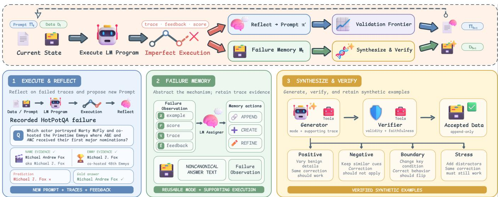  
Fi ure 2: Overview of Forge. Execution failures drive rom t reflection and u date failure memor when a re ate validation performance stops improving, active modes guide four verified mutations whose accepted instances re-enter training.

$$
J _ { V } ( \pi ) = \frac { 1 } { | V | } \sum _ { z \in V } r ( F _ { \pi } , z ) , \qquad \widehat { \pi } = \arg \operatorname* { m a x } _ { \pi \in \Pi _ { K } } J _ { V } ( \pi ) .\tag{1}
$$

The validation set may control search and candidate selection but never provides training or synthesis instances; test scores never afect either process and are used only for reporting. Conventional fixed-data APO additionally imposes $\bar { D _ { t } } = \bar { D _ { 0 } }$ throughout search.

Adaptive-data APO. We retain the same validation objective while allowing training data to evolve. At iteration t, let $\Pi _ { t }$ be the candidate pool, $D _ { t }$ the training multi- set, and H the history of imperfect-execution observations $o = ( z , \pmb { \pi } , \tau , f , r )$ . Abstracting away the particular search and synthesis mechanisms, the coupled updates are

$$
\begin{array} { r } { ( \Pi _ { t + 1 } , \mathcal { H } _ { t + 1 } ) = \mathcal { U } ( \Pi _ { t } , \mathcal { H } _ { t } ; D _ { t } ) , } \\ { D _ { t + 1 } = D _ { t } \uplus \mathcal { A } ( \mathcal { H } _ { t + 1 } ) . } \end{array}\tag{2}
$$

where U denotes a prompt-search update over the current training data, A returns accepted synthetic instances, and ⊎ denotes multiset addition. This update is append-only: accepted synthetic instances may be added, while existing training instances are neither removed nor modified. Fixed- data APO is the special case $A \equiv \emptyset$ . Thus data synthesis changes the evidence available to subsequent prompt updates without changing the validation objective.

## Method

Forge couples prompt optimization and training-data syn- thesis through execution failures while maintaining prompt candidates $\bar { \Pi } _ { t }$ , mutable training data $D _ { t } ,$ and failure mem- ory $\mathcal { M } _ { t }$ . Each imperfect execution both guides an immedi- ate prompt revision and becomes a reusable failure mode for later synthesis. Prompt search thus changes program be- havior, while synthesis changes the evidence for subsequent updates (Figure 2).

## Optimization Loop

At iteration t, Forge selects a parent prompt $\pi \in \Pi _ { t } ,$ sam-ples a minibatch $B \subset D _ { t }$ , and executes the LM program to collect scores, ordered traces, and task feedback. Each imper- fect execution then branches in two directions. The prompt branch reflects on the observed trace and feedback to pro- pose a revised prompt $\pi ^ { \prime } ;$ the memory branch uses the same evidence to update failure memory, as described in the next subsection. Using the same failures in both branches keeps prompt revision and data synthesis focused on weaknesses actually exposed by the current program.

The prompt branch uses an independent reflective-search backbone inspired by Gepa (Agrawal et al. 2026). The parent and proposal are compared on the same minibatch, and the proposal enters the candidate pool only when it improves the aggregate minibatch score. Each admitted candidate is then evaluated on the fixed validation set: per-instance scores sup- port frontier-based parent selection, while aggregate scores govern synthesis scheduling and final prompt selection.

The data branch becomes active after p completed prompt-search steps without a strict improvement in the best aggre- gate validation score observed so far. Forge uses the active failure memory to synthesize a budget of new instances, ad- mits only verified instances, and appends them to the train- ing data to obtain $D _ { t + 1 }$ . Prompt search then continues on the expanded data. The new instances can expose failures absent from $D _ { t } ;$ those failures in turn revise later prompts and determine the next synthesis targets. This closes the optimization loop. Algorithm 1 summarizes the procedure; further algorithmic and implementation details are provided in Appendix A.

Algorithm 1 Forge: failure-guided prompt and data opti-  
mization   
Require: training data D, validation set V, seed prompt $\pi _ { 0 } ,$   
patience p, synthesis budget K, stopping rule S   
1: $\operatorname { \dot { I } }  [ \pi _ { 0 } ] ;$ ; evaluate $\pi _ { 0 }$ on V and store scores $S _ { V } ; { \mathcal { M } } \gets$   
$\mathcal { D }$   
2: while S is not met do   
3: $\pi \gets \mathrm { S E L E C T C A N D I D A T E } ( \Pi , S _ { V } )$   
4: $B  \operatorname { S a M P L E B A T C H } ( D )$   
5: $E \gets \mathrm { E v a L U A T E } ( \pmb { \pi } , \dot { B } ) ; E ^ { - } \gets \{ e _ { i } \in E : r _ { i } < 1 \}$   
6: M ← UpdateFailureMemor $\rho ( \mathcal { M } , E ^ { - } )$   
7: π′ ← UpdatePrompt(π, E−)   
8: $E ^ { \prime } \gets \mathrm { E v a L U A T E } ( \pi ^ { \prime } , B )$   
9: if $R _ { B } ( \pmb { \pi } ^ { \prime } ) > R _ { B } \dot { ( \pmb { \pi } ) }$ then   
10: append $\pi ^ { \prime }$ to Π; evaluate it on V and update SV   
11: end if   
12: if no strict aggregate-validation gain for p steps then   
13: $D  D$ ⊎ Synthesize $( \mathcal { M } , K )$   
14: end if   
15: end while   
16: return best prompt on V and augmented D

## Failure Memory

Directly asking an LM to synthesize from a single failed in- stance can easily collapse into near-duplicate generation: the model preserves the same entities, input structure, and rea- soning pattern while changing only surface wording. Such variants add little new evidence for prompt optimization be- cause they restate a condition already represented in the train- ing data instead of probing when the failed behavior should or should not occur. The central challenge is therefore to separate the reusable failure mechanism from the particular instance that exposed it.

Forge addresses this challenge with a failure memory whose entries are failure modes: reusable mechanism de-scriptions paired with the concrete failed executions that support them. For every imperfect execution, an LM-based assigner examines the task instance, trace, and feedback. It then assigns the execution to an existing mode, creates a new mode, or refines an existing one. The mode description ab- stracts away instance-specific entities, while its supporting executions retain the task context and trace evidence needed to ground later generation. This separation enables synthesis to vary the conditions around a weakness rather than merely paraphrasing the source failure.

Two failures observed during an AppWorld optimization run (Trivedi et al. 2024) show why modes are more useful than task-specific records. Asked to follow every classical Spotify artist with at least 16 followers, the agent followed five artists but missed a sixth because it inspected only the default result page. The same mode later absorbed a Venmo failure: when asked to accept all pending requests from room- mates and coworkers, the agent accepted only two of ten qual- ifying requests after again processing an incomplete result set. Forge records both executions as incomplete paginated search: the agent mistakes the default result page for the complete candidate set, so qualifying records on later pages are never considered or acted upon. This abstraction discards app-specific entities and actions while preserving the miss- ing operation, allowing the mode to guide synthesis across unrelated tasks.

The modes accumulated since the preceding synthesis event form the active memory used by the next event. This keeps synthesis aligned with weaknesses exposed by the cur- rent prompt–data state: when later prompts and added data reveal a diferent mechanism, the new failures induce difer- ent modes rather than forcing generation to revisit the same source instances.

## Failure-Guided Data Synthesis

When synthesis is triggered, Forge allocates its generation budget across active failure modes, prioritizing modes sup- ported by more observations. Each generation attempt is con- ditioned on both a mode description and one of its supporting failed executions, including the trace and feedback. The mode specifies what weakness to probe, while the execution an-chors the generated instance in a concrete task setting. This difers from asking an LM to produce generically dificult data or merely paraphrase a failed input.

A failure mode identifies what behavior is wrong, but not where its correction should and should not generalize. If synthesis produces only positive variants, the optimizer may overgeneralize the apparent fix or learn a brittle rule tied to the source instance. Forge therefore constructs a local be- havioral neighborhood around each failure mode: positive mutations test whether the correction transfers across new realizations, negative mutations mark where it should not ap- ply, boundary mutations isolate the condition that changes the desired behavior, and stress mutations test whether the cor- rection remains efective under distractors. Together, these four directions define the scope and robustness of a correc- tion rather than merely diversifying its surface form.

A recorded execution from our HotPotQA optimization run makes these roles concrete. The program is asked which actor portrayed Marty McFly in the Back to the Future tril-ogy and co-hosted the Primetime Emmy ceremony at which A&E and AMC received their first major nominations. The retrieved evidence states that Michael Andrew Fox is known professionally as Michael J. Fox and that Michael J. Fox co-hosted the 48th Primetime Emmy Awards. The program therefore identifies the correct person but returns Michael J. Fox, whereas the benchmark gold answer is Michael Andrew Fox. Failure memory records this execution as noncanonical answer text: the reasoning chain reaches the correct entity, but the returned alias does not match the required answer form. From this recorded failure, the same run generated the following four mutations:

• Positive—preserve the requirement. A new question asks for the full biographical name of the actor who played Agent J in Men in Black and hosted a ceremony featuring Bon Jovi and Toni Braxton. The answer is Willard Carroll Smith II.; the entity and context change, but the required canonical answer form is preserved.

• Negative—contrast the requirement. A question about the actress born Caryn Elaine Johnson instead asks for the professional name of the host of the Academy Awards ceremony honoring films released in 1993. The answer is Whoopi Goldberg, demonstrating a case in which returning the full biographical name would be incorrect.

• Boundary—change the target. Keeping Michael Andrew Fox and the same Emmy clues, a boundary question explicitly asks for the name by which the actor is known professionally. This single change makes Michael J. Fox correct and isolates the requested name type as the con- dition controlling the answer form.

• Stress—add distractors. A fourth question asks for the exact full name of the musician who wrote “Manic Mon- day” under the pseudonym “Christopher.” The context adds articles about several other people named Prince, but the answer must remain Prince Rogers Nelson, testing whether the correction survives misleading name matches.

Thus the four operators probe invariance, contrast, deci- sion boundaries, and robustness rather than producing in- terchangeable paraphrases. The stored instances retain their full contexts and supporting facts; the questions above are shortened for presentation.

Both the generator and verifier are multi-step agents equipped with task-specific tools. On HotPotQA, both access search\_full\_wiki, the same full-Wikipedia ColBERT index used by the task program: the generator constructs in- stances and gold supervision from retrieved passages, while the verifier checks the evidence and can search further. This grounds synthesis and verification in benchmark evidence rather than the optimizer model’s parametric knowledge.

Because tool grounding alone does not guarantee quality, the verifier checks each ro osal for validity under the task requirements and faithfulness to the targeted failure mode and mutation direction. Only proposals passing both checks enter D and provide new evidence for prompt reflection and failure memory. Additional optimization artifacts, including prompt evolution, candidate lineage, and admitted synthetic instances, are provided in Appendix C.

## Experiments

Our evaluation addresses three questions. First, does Forge improve prompt optimization across benchmarks and task models? Second, is failure-guided synthesis necessary, and how does the synthesis process reshape the failure distribu- tion? Third, do the resulting synthesized instances benefit optimization methods beyond Forge?

## Experimental Setup

Benchmarks. We evaluate eight heterogeneous LM bench-marks spanning knowledge-intensive reasoning, instruction following, structured prediction, mathematics, and agents. HotPotQA (Yang et al. 2018) and HoVer (Jiang et al. 2020) test multi-hop retrieval and evidence aggregation, while IF- Bench (Pyatkin et al. 2025) evaluates generalization to verifiable instructions. FiNER-139 (Loukas et al. 2022) and Law-Bench (Fei et al. 2024) cover financial entity classification and legal judgment, respectively. AIME-2025 (MathArena

2025) and MMLU-Pro (Wang et al. 2024a) evaluate math-ematical and broad knowledge reasoning, and AppWorld (Trivedi et al. 2024) evaluates interactive agents in stateful tool environments. Dataset provenance, split construction and task-specific metrics are provided in the appendix B.

Models and fair comparison. Our primary comparison uses Qwen3.5-35B-A3B (Qwen Team 2026) as the task model and GPT-5.5 (OpenAI 2026) as the optimizer model. We additionally repeat the full comparison with the dense Qwen3-8B task model (Yang et al. 2025). We compare Forge against the unoptimized baseline and three automatic prompt optimization methods: MiproV2 (Opsahl-Ong et al. 2024), Ace (Zhang et al. 2026), and Gepa (Agrawal et al. 2026). Within each comparison, all methods use the same task model, training, validation, and test splits, LM-program structure, and task-specific evaluator. Optimized states are selected using validation performance only, and the test set is accessed only for final evaluation. To ensure comparable search efort, we align the nominal task-model evaluation budget across optimizers.

## Main Results

Forge achieves the strongest aggregate performance with Qwen3.5-35B-A3B. As shown in Table 1, it reaches an ag- gregate score of72.18, improving over the unoptimized Base- line by 16.52 percentage points and exceeding the competing APO methods by 4.92 to 8.82 points. Forge obtains the best result on six of eight benchmarks. The gains therefore span single-module prediction, multi-hop retrieval, mathematical reasoning, and interactive tool use rather than concentrating in one task format.

## Component Ablation

In Table 2, Score denotes the mean across the eight bench-marks in Table 1. Prompt search improves the score from 55.66 to 64.17, whereas adding random synthesis lowers it to 62.38. This contrast shows that merely increasing the train- ing data does not provide the targeted evidence needed for optimization.

Failure guidance makes synthesis efective. Adding failure memory raises the score to 68.24, surpassing prompt search alone by 4.07 points, and mutation guidance further improves it to 72.18. Together, these modules outperform random syn- thesis by 9.80 points and prompt search alone by 8.01 points. Failure memory identifies what weaknesses require new evidence, while mutation guidance determines how to expand them into complementary instances. Because the variants are cumulative, these deltas represent conditional contributions rather than isolated main efects.

## Synthesis Accounting and Failure Dynamics

Beyond downstream performance, we audit synthesis out- comes on four representative benchmarks in Figure 3. Panel (a) accounts for every proposal: Forge admits 22 of 30 on AIME-2025, 39 of 40 on AppWorld, 80 of 100 on HotPotQA, and 93 of 100 on FiNER-139, yielding admission rates of 73–98%. Of the ten generation failures, nine arise in Hot- PotQA because the generator returns no usable output, while the remaining AIME-2025 failure results from an invalid JSON escape. One additional HotPotQA verification returns non-Boolean validity and faithfulness decisions; these eleven cases reflect malformed outputs rather than quality-based re- jection. Among the 25 successfully verified but rejected pro-posals, 9 fail validity only, 7 fail faithfulness only, and 9 fail both. Validity failures primarily involve incorrect super- vision or incomplete evidence, whereas faithfulness failures reflect the wrong mutation direction or drift from the targeted failure mode.

<table><tr><td>Qwen3.5-35B-A3B</td><td>HotPotQA</td><td>IFBench</td><td>HoVer</td><td>FiNER-139</td><td>LawBench</td><td>AIME-2025</td><td>MMLU-Pro</td><td>AppWorld</td><td>Aggregate</td><td>Improvement</td></tr><tr><td>Baseline</td><td>52.00</td><td>31.29</td><td>45.00</td><td>56.00</td><td>34.00</td><td>73.33</td><td>87.00</td><td>66.64</td><td>55.66</td><td>一</td></tr><tr><td>MIPROV2</td><td>68.00</td><td>48.64</td><td>52.00</td><td>67.00</td><td>38.00</td><td>75.56</td><td>90.00</td><td>67.67</td><td>63.36</td><td>+7.70</td></tr><tr><td>ACE</td><td>70.00</td><td>61.63</td><td>55.00</td><td>69.00</td><td>54.00</td><td>71.11</td><td>83.00</td><td>74.33</td><td>67.26</td><td>+11.60</td></tr><tr><td>GEPA</td><td>66.00</td><td>48.64</td><td>51.00</td><td>68.00</td><td>50.00</td><td>77.78</td><td>90.00</td><td>71.21</td><td>65.33</td><td>+9.67</td></tr><tr><td>FORGE</td><td>76.00</td><td>54.52</td><td>60.00</td><td>74.00</td><td>57.00</td><td>82.22</td><td>89.00</td><td>84.69</td><td>72.18</td><td>+16.52</td></tr></table>

Table 1: Final test performance (%) with Qwen3.5-35B-A3B. Aggregate averages the eight benchmarks; Improvement is relative to the Baseline. Bold denotes the column best.

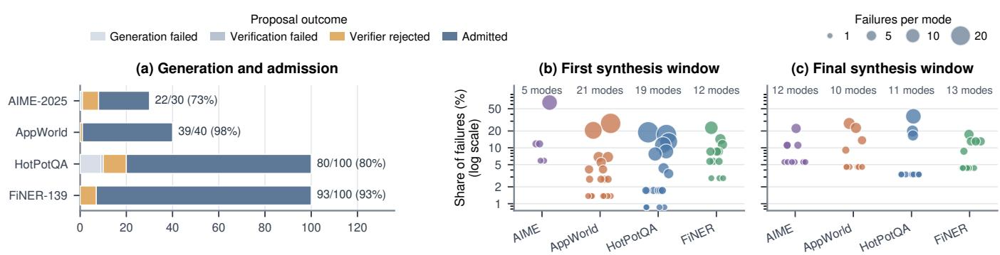  
Figure 3: Synthesis accounting and failure-memory dynamics on four representative benchmarks. The statistics are computed from the same Forge runs reported in the main comparison (Table 1). Panel (a) partitions all generation attempts by final outcome; labels report admitted proposals over total attempts and the corresponding admission rate. Panels (b) and (c) compare failure modes collected before the first and final synthesis events. Each point denotes a task-specific failure mode, vertical position gives its share of failures in the corresponding window on a logarithmic scale, and area gives the number of supporting executions; horizontal jitter has no semantic meaning. The comparison highlights substantial redistribution, more comparable support across modes, and benchmark-dependent increases or decreases in mode count.

<table><tr><td>Variant</td><td></td><td>Prompt Random Failure Mutation search synthesis memory guidance</td><td></td><td></td><td>Score</td><td>∆</td></tr><tr><td>Baseline</td><td></td><td></td><td></td><td></td><td>55.66</td><td></td></tr><tr><td>+ Prompt search</td><td>√</td><td></td><td></td><td></td><td></td><td> $6 4 . 1 7 \ + 8 . 5 1 $ </td></tr><tr><td>+ Random synthesis</td><td>√</td><td>√</td><td></td><td></td><td></td><td> $6 2 . 3 8 \ \cdot 1 . 7 9$ </td></tr><tr><td>+ Failure memory</td><td>√</td><td>√</td><td>√</td><td></td><td></td><td> $6 8 . 2 4 ~ + 5 . 8 6$ </td></tr><tr><td>+ Mutation guidance</td><td>√</td><td>√</td><td>√</td><td>7</td><td></td><td> $7 2 . 1 8 \ + 3 . 9 4$ </td></tr></table>

Table 2: Cumulative ablation averaged over the eight bench- marks in Table 1. Each row adds one component; ∆ is relative to the preceding row. Random synthesis generates from ran- domly selected training instances.

Panels (b) and (c) compare failure memory before the first and final synthesis events. Both mode identities and frequen- cies change substantially, indicating that later synthesis tar- gets newly exposed weaknesses rather than repeatedly revis- iting initial failures. Within each benchmark, failure counts become more balanced across modes: from the first to the final synthesis window, the ratio between the failure counts of the most and least frequent modes decreases from 11:1 to 4:1 on AIME-2025, 20:1 to 6:1 on AppWorld, 22:1 to 11:1 on HotPotQA, and 8:1 to 4:1 on FiNER-139. Meanwhile, mode counts increase from 5 to 12 on AIME-2025 and from 12 to 13 on FiNER-139, but decrease from 21 to 10 on AppWorld and from 19 to 11 on HotPotQA. Thus, the prompt–data loop changes both the composition and balance of failure memory while adapting its granularity to each benchmark.

## Generalization Across Task Models

The gains of Forge persist when the task model changes from the mixture-of-experts Qwen3.5-35B-A3B to the dense Qwen3-8B. On Qwen3-8B, Forge leads six of eight bench-marks and achieves an aggregate score of 50.97, exceeding the Baseline by 14.10 points and the strongest competing optimizer, Gepa, by 5.38 points (Table 3). Together with its 16.52-point gain over the Baseline and 4.92-point lead over the strongest competing APO method on Qwen3.5-35B-A3B, these results suggest that the advantage of Forge is consistent across dense and mixture-of-experts architectures. We further test the robustness of Forge to optimizer-model choice in Appendix D.

<table><tr><td>Qwen3 8B</td><td>HotPotQA</td><td>IFBench</td><td>HoVer</td><td>FiNER-139</td><td>LawBench</td><td>AIME-2025</td><td>MMLU-Pro</td><td>AppWorld</td><td>Aggregate</td><td>Improvement</td></tr><tr><td>Baseline</td><td>40.00</td><td>27.34</td><td>35.00</td><td>55.00</td><td>24.00</td><td>13.33</td><td>61.00</td><td>39.34</td><td>36.88</td><td></td></tr><tr><td>MIPROV2</td><td>55.00</td><td>31.75</td><td>47.00</td><td>62.00</td><td>31.00</td><td>20.00</td><td>61.00</td><td>40.64</td><td>43.55</td><td>+6.67</td></tr><tr><td>AcE</td><td>61.00</td><td>38.39</td><td>39.00</td><td>66.00</td><td>37.00</td><td>7.78</td><td>63.00</td><td>37.89</td><td>43.76</td><td>+6.88</td></tr><tr><td>GEPA</td><td>62.00</td><td>32.62</td><td>50.00</td><td>67.00</td><td>30.00</td><td>18.89</td><td>61.00</td><td>43.23</td><td>45.59</td><td>+8.72</td></tr><tr><td>FORGE</td><td>70.00</td><td>35.81</td><td>57.00</td><td>72.00</td><td>35.00</td><td>23.33</td><td>66.00</td><td>48.64</td><td>50.97</td><td>+14.10</td></tr></table>

Table 3: Final test performance (%) with dense Qwen3-8B. Aggregate and Improvement follow Table 1; bold denotes the column best.

## Transferability of Synthesized Data

We next test whether Forge-generated data remain useful after changing the optimizer that consumes them. On Hot- PotQA, FiNER-139, and LawBench, we compare the origi-nal training data with the same data augmented by Forge- synthesized instances for three prompt optimizers and for GRPO (Shao et al. 2024). All comparisons use Qwen3.5- 35B-A3B as the task model, and the three prompt optimizers use GPT-5.5 as the optimizer model. Each method keeps its optimization budget fixed across the two data conditions. The two GRPO arms difer only in their training data, using the same number of optimization steps and otherwise iden- tical configurations. Appendix B.5 provides the complete GRPO protocol and configuration. Augmentation improves all twelve benchmark–optimizer pairs, showing that the syn- thesized instances remain useful beyond Forge.

<table><tr><td colspan="3"></td><td colspan="2">Weight Prompt Optimization Optimization</td></tr><tr><td>Dataset</td><td></td><td>Training data MIPROV2 ACE GEPA</td><td></td><td>GRPO</td></tr><tr><td rowspan="2">HotPotQA</td><td>Original</td><td>68</td><td>70 66</td><td>57</td></tr><tr><td>+ ForGE data</td><td>73</td><td>73 75</td><td>65</td></tr><tr><td rowspan="2">FiNER-139</td><td>Original</td><td>67</td><td>69 68</td><td>69</td></tr><tr><td>+ ForGE data</td><td>70</td><td>71 74</td><td>73</td></tr><tr><td rowspan="2">LawBench</td><td>Original</td><td>38</td><td>54 50</td><td>43</td></tr><tr><td>+ ForGE data</td><td>47</td><td>57 55</td><td>51</td></tr></table>

Table 4: Test performance (%) with original versus Forge-augmented training data under matched configurations and budgets. Bold denotes the better condition.

Table 4 shows that Forge augmentation improves all twelve dataset–optimizer pairs: the nine prompt-optimization gains span 2–9 points, while GRPO gains at step 100 are 8, 4, and 8 points on HotPotQA, FiNER-139, and LawBench, re-spectively. These results show that the synthesized instances transfer beyond Forge to other prompt optimizers and model- weight optimization.

Figure 4 separates validation and test trajectories for all three GRPO comparisons. Under the same 100-step opti- mization budget, the augmented arm finishes above original- data training on all three test sets. The corresponding val- idation trajectories show that these gains emerge at difer-ent stages and need not increase monotonically. Together, the six panels show that Forge-synthesized instances pro- vide reusable training evidence across three distinct weight- optimization tasks.

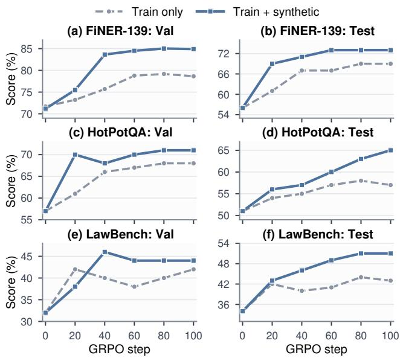  
Figure 4: GRPO validation and test trajectories on FiNER-139, HotPotQA, and LawBench. The two arms difer only in whether the training data are augmented with Forge- synthesized instances.

## Conclusion

Forge uses failures as shared signals for reflective prompt updates and targeted data synthesis through failure mem- ory, four mutation intents, and agentic verification. Across eight benchmarks, it outperforms the unoptimized baseline and all evaluated APO methods; ablations show that these gains require failure- and mutation-guided rather than ran- dom synthesis. Its instances also improve three competing prompt optimizers and GRPO across three transfer bench- marks, demonstrating that the synthesized data remain useful beyond the optimization loop that produced them. Together, these results suggest that prompt search and data construc- tion should be treated as a coupled process: observed failures reveal both how a prompt should change and which training examples should be added next. Future work should broaden this transfer evaluation across additional tasks and model families and disentangle the efects of dataset size, example selection, and sampling distribution.

## References

Agarwal, E.; Magazine, R.; Singh, J.; Dani, V.; Ganu, T.; and Nambi, A. 2025. PromptWizard: Optimizing Prompts via Task-Aware, Feedback-Driven Self-Evolution. In Findings ofthe Associationfor Computational Linguistics: ACL 2025, 19974–20003. Association for Computational Linguistics.

Agrawal, L. A.; Tan, S.; Soylu, D.; Ziems, N.; Khare, R.; Opsahl-Ong, K.; Singhvi, A.; Shandilya, H.; Ryan, M. J.; Jiang, M.; Potts, C.; Sen, K.; Dimakis, A. G.; Stoica, I.; Klein, D.; Zaharia, M.; and Khattab, O. 2026. GEPA: Re- flective Prompt Evolution Can Outperform Reinforcement Learning. In The Fourteenth International Conference on Learning Representations.

AI-MO. 2024. AIMO Validation AIME. Hugging Face dataset. Revision 13f9e12.

DeepSeek-AI. 2026. DeepSeek-V4: Towards Highly Eficient Million-Token Context Intelligence. arXiv:2606.19348.

Fei, Z.; Shen, X.; Zhu, D.; Zhou, F.; Han, Z.; Huang, A.; Zhang, S.; Chen, K.; Yin, Z.; Shen, Z.; Ge, J.; and Ng, V. 2024. LawBench: Benchmarking Legal Knowledge of Large Language Models. In Proceedings ofthe 2024 Conference on Empirical Methods in Natural Language Processing, 7933– 7962. Association for Computational Linguistics.

Fernando, C.; Banarse, D. S.; Michalewski, H.; Osindero, S.; and Rocktäschel, T. 2024. Promptbreeder: Self-Referential Self-Improvement via Prompt Evolution. In Proceedings of the 41st International Conference on Machine Learning, volume 235 of Proceedings of Machine Learning Research, 13481–13544. PMLR.

He, Y.; Panigrahi, A.; Lin, Y.; and Arora, S. 2026. STAT: Skill-Targeted Adaptive Training. In The Fourteenth International Conference on Learning Representations.

Jain, A.; Ghosh, P.; and Yenigalla, P. 2026. CASPER: Bridg- ing Discrete and Continuous Prompt Optimization through Feedback-Guided Gradient Descent. In Proceedings of the 19th Conference ofthe European Chapter ofthe Association for Computational Linguistics (Volume 5: Industry Track), 425–437. Association for Computational Linguistics.

Jiang, Y.; Bordia, S.; Zhong, Z.; Dognin, C.; Singh, M.; and Bansal, M. 2020. HoVer: A Dataset for Many-Hop Fact Extraction and Claim Verification. In Findings of the Association for Computational Linguistics: EMNLP 2020, 3441–3460. Association for Computational Linguistics.

Khan, Z.; Stengel-Eskin, E.; Cho, J.; and Bansal, M. 2025. DataEnvGym: Data Generation Agents in Teacher Environ- ments with Student Feedback. In The Thirteenth International Conference on Learning Representations.

Lee, M.; and Kahng, M. 2026. Data-Prompt Co-Evolution: Growing Test Sets to Refine LLM Behavior. In Proceedings of the 2026 CHI Conference on Human Factors in Computing Systems, 833:1–833:17. Association for Computing Machinery.

Lee, N.; Wattanawong, T.; Kim, S.; Mangalam, K.; Shen, S.; Anumanchipalli, G.; Mahoney, M.; Keutzer, K.; and Gho- lami, A. 2024. LLM2LLM: Boosting LLMs with Novel

Iterative Data Enhancement. In Findings of the Association for Computational Linguistics: ACL 2024, 6498–6526. Association for Computational Linguistics.

Lee, Y.; Nair, R. S.; Zhang, Q.; Lee, K.; Khattab, O.; and Finn, C. 2026. Meta-Harness: End-to-End Optimization of Model Harnesses. In Third Conference on Language Modeling.

Li, Q.; Gao, J.; Wang, S.; Pi, R.; Zhao, X.; Wu, C.; Jiang, X.; Li, Z.; and Kong, L. 2025. Forewarned Is Forearmed: Lever- aging LLMs for Data Synthesis through Failure-Inducing Exploration. In The Thirteenth International Conference on Learning Representations.

Loukas, L.; Fergadiotis, M.; Chalkidis, I.; Spyropoulou, E.; Malakasiotis, P.; Androutsopoulos, I.; and Paliouras, G. 2022. FiNER: Financial Numeric Entity Recognition for XBRL Tagging. In Proceedings of the 60th Annual Meeting ofthe Associationfor Computational Linguistics (Volume 1: Long Papers), 4419–4431. Association for Computational Linguistics.

MathArena. 2025. AIME 2025. Hugging Face dataset. Re- vision c94da77.

Menon, R. R.; and Srivastava, S. 2024. DISCERN: Decoding Systematic Errors in Natural Language for Text Classifiers. In Proceedings of the 2024 Conference on Empirical Methods in Natural Language Processing, 19565–19583. Association for Computational Linguistics.

Murthy, R.; Zhu, M.; Yang, L.; Qiu, J.; Tan, J.; Heinecke, S.; Xiong, C.; Savarese, S.; and Wang, H. 2025. Promptomatix: An Automatic Prompt Optimization Framework for Large Language Models. arXiv:2507.14241.

OpenAI. 2026. GPT-5.5 System Card.

Opsahl-Ong, K.; Ryan, M. J.; Purtell, J.; Broman, D.; Potts, C.; Zaharia, M.; and Khattab, O. 2024. Optimizing Instruc- tions and Demonstrations for Multi-Stage Language Model Programs. In Proceedings ofthe 2024 Conference on Empirical Methods in Natural Language Processing, 9340–9366. Association for Computational Linguistics.

Pryzant, R.; Iter, D.; Li, J.; Lee, Y.; Zhu, C.; and Zeng, M. 2023. Automatic Prompt Optimization with “Gradient De- scent” and Beam Search. In Proceedings ofthe 2023 Conference on Empirical Methods in Natural Language Processing, 7957–7968. Association for Computational Linguistics.

Pyatkin, V.; Malik, S.; Graf, V.; Ivison, H.; Huang, S.; Dasigi, P.; Lambert, N.; and Hajishirzi, H. 2025. Generalizing Verifiable Instruction Following. In Advances in Neural Information Processing Systems, volume 38.

Qwen Team. 2026. Qwen3.5: Towards Native Multimodal Agents.

Shao, Z.; Wang, P.; Zhu, Q.; Xu, R.; Song, J.; Bi, X.; Zhang, H.; Zhang, M.; Li, Y. K.; Wu, Y.; and Guo, D. 2024. DeepSeekMath: Pushing the Limits of Mathematical Rea- soning in Open Language Models. arXiv:2402.03300.

Spiess, C.; Vaziri, M.; Mandel, L.; and Hirzel, M. 2025. AutoPDL: Automatic Prompt Optimization for LLM Agents. In Proceedings of the Fourth International Conference on Automated Machine Learning, volume 293 of Proceedings ofMachine Learning Research, 13/1–20. PMLR.

Yang, A.; Li, A.; Yang, B.; Zhang, B.; Hui, B.; Zheng, B.;Yu, B.; Gao, C.; Huang, C.; Lv, C.; Zheng, C.; Liu, D.; Zhou,F.; Huang, F.; Hu, F.; Ge, H.; Wei, H.; Lin, H.; Tang, J.; Yang,J.; Tu, J.; Zhang, J.; Yang, J.; Yang, J.; Zhou, J.; Zhou, J.;Lin, J.; Dang, K.; Bao, K.; Yang, K.; Yu, L.; Deng, L.; Li,M.; Xue, M.; Li, M.; Zhang, P.; Wang, P.; Zhu, Q.; Men,R.; Gao, R.; Liu, S.; Luo, S.; Li, T.; Tang, T.; Yin, W.; Ren,X.; Wang, X.; Zhang, X.; Ren, X.; Fan, Y.; Su, Y.; Zhang,Y.; Zhang, Y.; Wan, Y.; Liu, Y.; Wang, Z.; Cui, Z.; Zhang,Z.; Zhou, Z.; and Qiu, Z. 2025. Qwen3 Technical Report.arXiv:2505.09388.

Sullivan, M.; Hartmann, M.; and Koller, A. 2025. Procedural Environment Generation for Tool-Use Agents. In Proceedings of the 2025 Conference on Empirical Methods in Natural Language Processing, 18544–18562. Association for Com-putational Linguistics.

Trivedi, H.; Khot, T.; Hartmann, M.; Manku, R.; Dong, V.; Li, E.; Gupta, S.; Sabharwal, A.; and Balasubramanian, N. 2024. AppWorld: A Controllable World of Apps and Peo- ple for Benchmarking Interactive Coding Agents. In Proceedings of the 62nd Annual Meeting of the Association for Computational Linguistics (Volume 1: Long Papers), 16022– 16076. Association for Computational Linguistics.

Wang, Y.; Kordi, Y.; Mishra, S.; Liu, A.; Smith, N. A.; Khashabi, D.; and Hajishirzi, H. 2023. Self-Instruct: Aligning Language Models with Self-Generated Instructions. In Proceedings ofthe 61stAnnual Meeting oftheAssociationfor Computational Linguistics (Volume 1: Long Papers), 13484– 13508. Association for Computational Linguistics.

Wang, Y.; Ma, X.; Zhang, G.; Ni, Y.; Chandra, A.; Guo, S.; Ren, W.; Arulraj, A.; He, X.; Jiang, Z.; Li, T.; Ku, M.; Wang, K.; Zhuang, A.; Fan, R.; Yue, X.; and Chen, W. 2024a. MMLU-Pro: A More Robust and Challenging Multi-Task Language Understanding Benchmark. In Advances in Neural Information Processing Systems, volume 37.

Wang, Z.; Li, C.-L.; Perot, V.; Le, L.; Miao, J.; Zhang, Z.; Lee, C.-Y.; and Pfister, T. 2024b. CodecLM: Aligning Language Models with Tailored Synthetic Data. In Findings of the Association for Computational Linguistics: NAACL 2024, 3712–3729. Association for Computational Linguistics.

Xu, C.; Sun, Q.; Zheng, K.; Geng, X.; Zhao, P.; Feng, J.; Tao, C.; Lin, Q.; and Jiang, D. 2024. WizardLM: Empowering Large Pre-Trained Language Models to Follow Complex Instructions. In The Twelfth International Conference on Learning Representations.

Xu, Z.; Jiang, F.; Niu, L.; Deng, Y.; Poovendran, R.; Choi, Y.; and Lin, B. Y. 2025. Magpie: Alignment Data Synthesis from Scratch by Prompting Aligned LLMs with Nothing. In The Thirteenth International Conference on Learning Representations.

Yang, C.; Wang, X.; Lu, Y.; Liu, H.; Le, Q. V.; Zhou, D.; and Chen, X. 2024a. Large Language Models as Optimiz- ers. In The Twelfth International Conference on Learning Representations.

Yang, S.; Ma, Z.; Huang, T.; Hu, Y.; Wang, Y.; and Chu, X. 2026. CoEvolve: Training LLM Agents via Agent-Data Mu- tual Evolution. In Proceedings of the 64th Annual Meeting

of the Association for Computational Linguistics (Volume 1: Long Papers), 23015–23036. Association for Computational Linguistics.

Yang, S.; Wu, Y.; Gao, Y.; Zhou, Z.; Zhu, B. B.; Sun, X.; Lou, J.-G.; Ding, Z.; Hu, A.; Fang, Y.; Li, Y.; Chen, J.; and Yang, L. 2024b. AMPO: Automatic Multi-Branched Prompt Optimization. In Proceedings of the 2024 Conference on Empirical Methods in Natural Language Processing, 20267– 20279. Association for Computational Linguistics.

Yang, Z.; Qi, P.; Zhang, S.; Bengio, Y.; Cohen, W.; Salakhutdinov, R.; and Manning, C. D. 2018. HotpotQA: A Dataset for Diverse, Explainable Multi-Hop Question Answering. In Proceedings of the 2018 Conference on Empirical Methods in Natural Language Processing, 2369–2380. Association for Computational Linguistics.

Ye, H.; He, X.; Arak, V.; Dong, H.; and Song, G. 2026. Meta Context Engineering via Agentic Skill Evolution. In Forty-third International Conference on Machine Learning.

Yu, Y.; Yu, Y.; Zhang, P.; Wei, K.; Luo, H.; and Wang, H. 2026. SIPDO: Closed-Loop Prompt Optimization via Synthetic Data Feedback. In The Fourteenth International Conference on Learning Representations.

Yuksekgonul, M.; Bianchi, F.; Boen, J.; Liu, S.; Lu, P.; Huang, Z.; Guestrin, C.; and Zou, J. 2025. Optimizing Gen- erative AI by Backpropagating Language Model Feedback. Nature, 639: 609–616.

Zhang, Q.; Hu, C.; Upasani, S.; Ma, B.; Hong, F.; Kamanuru, V.; Rainton, J.; Wu, C.; Ji, M.; Li, H.; Thakker, U.; Zou, J.; and Olukotun, K. 2026. Agentic Context Engineering: Evolv- ing Contexts for Self-Improving Language Models. In The Fourteenth International Conference on Learning Representations.

Zhao, A.; Wu, Y.; Wu, T.; Xu, Q.; Yue, Y.; Lin, M.; Wang, S.; Wu, Q.; Zheng, Z.; and Huang, G. 2025. Absolute Zero: Reinforced Self-Play Reasoning with Zero Data. In Advances in Neural Information Processing Systems, volume 38.

## Appendix Contents

A Algorithm and Implementation Details 11   
A.1 Optimization State 11   
A.2 Candidate Selection 11   
A.3 Minibatch Sampling . 11   
A.4 Failure-Memory Construction 11   
A.5 Reflective Prompt Update . 12   
A.6 Failure-Guided Synthesis and Verification . 14   
B Experimental Setup 14   
B.1 Benchmark Data and Splits . 14   
B.2 Benchmark Evaluation, Tools, and Synthesis 14   
B.3 Model Configuration . 17   
B.4 Optimization-Budget Alignment . . . 17   
B.5 GRPO Transfer Protocol 18   
C Optimization Artifacts 18   
C.1 AppWorld Prompt Evolution 18   
C.2 HoVer Candidate Lineage . 19   
C.3 Admitted Synthetic Examples 19   
D Supplementary Experiments 26   
D.1 Optimizer-Model Ablation 26   
D.2 Synthetic-Data Leakage Audit 26

## A Algorithm and Implementation Details

Algorithm 1 in the main paper gives the complete prompt– data optimization loop but leaves its internal calls abstract. This section instantiates exactly the six operations used in that loop: optimization state, parent-candidate selection, minibatch sampling, failure-memory construction, reflective prompt update, and failure-guided synthesis with verifica- tion. We describe decision-level behavior and the model- facing contracts needed for reproduction, while omitting checkpoint and callback bookkeeping.

## A.1 Optimization State

The conceptual optimization state is $( \Pi , D , S _ { V } , { \mathcal { M } } )$ . The candidate pool $\Pi = [ \pi _ { 0 } , \ldots , \pi _ { q - 1 } ]$ stores complete map- pings from program-module names to system prompts; an accepted candidate is appended to this pool rather than re- placing its parent. The mutable training data D contain the original instances and all admitted synthetic instances. For every candidate $i , S _ { V }$ stores its per-instance validation scores $s _ { i } ( z )$ for all $z \in V$ . These scores support both parent se- lection during search and aggregate validation-based model selection.

Failure memory M groups imperfect executions into reusable failure modes. A mode is $m _ { j } = ( n _ { j } , d _ { j } , O _ { j } )$ , where $n _ { j }$ is a short name, $d _ { j }$ is a decontextualized mechanism description, and $O _ { j }$ is the ordered collection of observa- tions supporting that description. Each observation retains the parent-candidate index, task instance, scalar score, or- dered program trace, and module-level feedback. The imple- mentation stores modes by synthesis epoch: earlier epochs remain available for audit, but only modes collected since the preceding synthesis event are active when constructing the next synthetic batch.

## A.2 Candidate Selection

Forge uses validation behavior to select a parent without collapsing every candidate to one aggregate score. For each validation instance z, it forms the local front

$$
F _ { z } = \left\{ i : s _ { i } ( z ) = \operatorname* { m a x } _ { \ell } s _ { \ell } ( z ) \right\} .\tag{3}
$$

A candidate i is placed in the dominated set $G$ when some candidate $\ell \neq i$ satisfies $s _ { \ell } ( z ) ~ \ge ~ s _ { i } ( z )$ for every $z \in V$ and is strictly better on at least one validation instance. The default selector then sam les uniforml from the multiset of non-dominated front members, as detailed in Algorithm 2.

Equivalently, candidate i has multiplicity

$$
w _ { i } = { \bf 1 } [ i \notin { \cal G } ] \sum _ { z \in V } { \bf 1 } [ i \in { \cal F } _ { z } ] , \qquad P ( i ) = \frac { w _ { i } } { \sum _ { \ell } w _ { \ell } } .\tag{4}
$$

Thus a candidate that leads on more validation instances is sampled more often, while complete domination removes it from consideration.

## A.3 Minibatch Sampling

The default sampler is epoch-shufled. It stores a shufled or- der of training-instance identifiers and a cursor in that order, then returns the next contiguous minibatch at each prompt- search step. When the order is exhausted, all identifiers are reshufled for a new sampling epoch. If |D| is not divisible by the minibatch size, the final order is padded with randomly selected identifiers so that every returned minibatch is full; only these padding positions may duplicate an instance.

Algorithm 2 Front-frequency candidate selection   
Require: candidate pool Π; per-instance validation scores   
${ \dot { S } } _ { V } ;$ validation set V   
1: $G \gets \{ i$ : Dominated $( i , S _ { V } ) \}$   
2: $L \gets [ ]$ {multiset of eligible front members}   
3: for each validation instance $z \in V$ do   
4: $b _ { z } \gets \operatorname* { m a x } _ { \ell } s _ { \ell } ( z )$   
5: for each candidate index $i = 0 , \ldots , | \Pi | - 1$ do   
6: if $i \not \in G$ and $s _ { i } ( z ) = b _ { z }$ then   
7: append i to L   
8: end if   
9: end for   
10: end for   
11: $i ^ { \star } \gets$ UniformChoice $( L )$   
12: return parent candidate $\operatorname { I I } [ i ^ { \star } ]$

A synthesis event refreshes the order without discarding which instances have alread been consumed. The sam ler first collects unique, not-yet-consumed identifiers from the current order and adds identifiers of newly admitted syn- thetic instances. It shufles this group and places it before a separately shufled group of already-consumed identifiers. Consequently, new data receive the same priority as unseen real data and enter subsequent prompt updates before in- stances already visited in the current sampling epoch. This sampling epoch is independent of the synthesis epoch used to partition failure memory.

## A.4 Failure-Memory Construction

Failure memory is built only from imperfect executions of the selected parent on the current training minibatch. For each evaluation with score below 1, Forge constructs an observation $o = ( i , z , r , \tau , f )$ containing the parent index $i ,$ instance z, score r, complete ordered program trace τ, and module-level feedback $f .$ . The assigner receives two textual inputs: a catalogue containing only the names and descrip- tions of modes in the current synthesis epoch, and a Mark- down rendering of the new observation with sections for the instance, score, trace, and optional feedback. Figure 5 shows the complete assigner prompt and its dynamic user fields. The implementation calls a failure mode a failure cluster; we retain the paper terminology in the prose.

The assigner returns one of three structured actions. Assign appends the observation to an existing mode; create introduces a new name and description with the observation as its first support; and rename updates an existing name and description before appending the observation. The rename action is the implementation of the abstraction refinement described in the main paper and may also keep the name un- changed while improving only the description. Failures are processed sequentially, so a later failure in the same mini- batch sees every mode created or revised by earlier failures. Malformed JSON, an ille al action-field combination, an unknown destination, or a naming conflict produces a no-op rather than an ungrounded memory update.

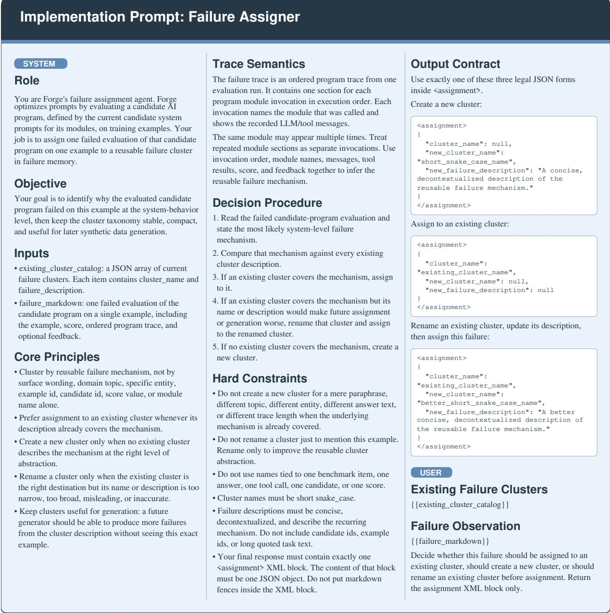  
Figure 5: The failure-assigner prompt maps a failed execution to an existing or newly created failure mode.

The resulting catalogue provides stable synthesis targets, while each support set retains the executions that justify its target. After synthesis, Forge advances the synthesis epoch. The stored history is preserved, but the next active catalogue starts empty so that future generation reflects weaknesses exposed by the updated prompt–data state.

## A.5 Reflective Prompt Update

The prompt-update branch uses the imperfect parent execu- tions already collected for the current minibatch. Under the default round-robin policy, step t selects one program mod-ule, and the reflector receives that module’s current system prompt together with a Markdown bundle containing each failed task input, the trace entries belonging to that module, and its module-level feedback. The reflector proposes one complete replacement system prompt. If this block is absent or empty, the module retains its original prompt. Figure 6 shows this model-facing reflection contract.

  
Figure 6: The reflective prompt-update prompt produces a complete replacement system prompt from imperfect module executions.

The proposal copies all unselected module prompts from the parent and replaces only the selected module. Although reflection uses only imperfect evaluations, parent and pro- posal are screened on the same complete minibatch. The proposal is appended to Π only when its total minibatch score is strictly higher; an admitted proposal is then evaluated on all of $V$ and added to $S _ { V }$ . This local paired comparison prevents an edit from being accepted merely because it was tested on an easier batch.

Algorithm 3 Failure-guided synthesis, verification, and ad-  
mission   
Require: active modes ${ \mathcal { M } } = \{ ( n _ { j } , d _ { j } , O _ { j } ) \}$ ; task signature   
Σ; attempt budget $K ;$ training data D   
1: Ω ← (Positive, Negative, Boundary, Stress)   
2: $( k _ { 1 } , \hdots , k _ { | \mathcal { M } | } ) \gets$ LargestRemainder $( K , ( | O _ { j } | ) _ { j } )$   
3: $A  \varnothing ; c ^ { \prime }  \operatorname { 0 }$   
4: for each mode $m _ { j } = ( n _ { j } , d _ { j } , O _ { j } ) \in \mathcal { M }$ do   
5: for $a = 1 , \ldots , k _ { j }$ do   
6: $o \_ $ UniformChoice $( O _ { j } )$ {sampling with re  
placement}   
7: $\bar { u }  \Omega [ 1 + ( c \mathrm { m o d } | \Omega | ) ] ; c  c + 1$   
8: $( \widetilde { z } , \tau _ { G } ) \dot {  }$ Generate $\left( \Sigma , m _ { j } , o , u \right)$   
9: if Coerce $\begin{array} { r } { \langle \widetilde { z } , \Sigma \rangle = \bot } \end{array}$ then   
10: continue {skip verifier on parse/schema failure}   
11: end if   
12: $C \gets ( m _ { j } , u , \boldsymbol { \epsilon }$ o.instance, o.feedback)   
13: append generator assistant/tool activity from $\tau _ { G }$ to   
$\bar { C }$   
14: $( v , f )  \operatorname { V } _ { \mathrm { E R I F Y } } ( \Sigma , \widetilde { z } , C )$   
15: if $v =$ true and $f =$ true then   
16: $A  A \uplus \{ \widetilde z \}$   
17: end if   
18: end for   
19: end for   
20: $D  D \uplus A ;$ RefreshSampleOrder(D); advance syn  
thesis epoch   
21: return admitted synthetic data A

## A.6 Failure-Guided Synthesis and Verification

The exact model-facing generator and verifier contracts are shown in Figures 7 and 8; the admission logic connecting them is specified below.

A synthesis event is triggered after p completed prompt-search steps without a strict improvement in the historical best aggregate validation score. The event budget K counts generation attempts, not successfully parsed or finally admitted instances. Let $N = \textstyle \sum _ { i } | O _ { j } |$ be the number of observa- tions supporting the active modes. Forge first assigns

$$
k _ { j } ^ { ( 0 ) } = \left\lfloor K \frac { | O _ { j } | } { N } \right\rfloor\tag{5}
$$

attempts to mode $j ,$ then distributes the remaining attempts in descending order ofthe fractional remainders, breaking equal remainders by mode order. This largest-remainder allocation preserves $\textstyle \sum _ { j } k _ { j } = K$ while prioritizing recurrent failures.

Within each allocated slot, Forge samples one sup- porting observation uniformly with replacement. It as- signs mutation intents from the global cycle $\begin{array} { r l } { \Omega } & { { } = } \end{array}$ (Positive, Negative, Boundary, Stress) across the com-plete seed list, restarting from Positive at each synthesis event. Algorithm 3 gives the complete admission path.

The generator is a multi-step agent conditioned on the JSON task signature and a mutation seed containing the mode name and description, mutation intent, failed instance, feed- back, and full source program trace. It may call benchmark- provided tools when factual lookup, calculation, environment state, or schema details require grounding. Its final XML field must contain a JSON object. The implementation parses that object and coerces all declared fields and types before verification; a failure at this stage is rejected immediately.

The verifier is a second multi-step agent equipped with the same benchmark generation tools. It receives the task signature, parsed synthetic instance, and a flattened context containing the mode, intent, failed instance, source feed- back, and the generator’s assistant/tool activity. It does not directly receive the source program trace or hidden genera- tor reasoning. The verifier independently judges validity— schema compliance, task coherence, and gold-supervision correctness—and faithfulness to both the failure mode and mutation intent. Only two successfully parsed Boolean val- ues that are both true admit an instance.

## B Experimental Setup

This section specifies the data, evaluators, models, prompt- optimization budget alignment, and the separate paired GRPO transfer protocol used in the main paper.

## B.1 Benchmark Data and Splits

The comparison protocol assigns the same ordered train- ing, validation, and test examples to every optimizer for a given benchmark and task model. Unless a benchmark de- fines a fixed split, randomized construction uses the stated local seed and produces disjoint partitions. Table 5 summa-rizes the exact construction and number of examples in each benchmark split.

## B.2 Benchmark Evaluation, Tools, and Synthesis

Under this protocol, every comparison method calls the same benchmark adapter and receives the same scalar score for a given program execution. Validation scores select optimized states, whereas test outcomes are retained only for reporting and never provide feedback to optimization. For each bench- mark, the reported percentage is 100 times the arithmetic mean of its per-example test scores; the aggregate in the main tables is the unweighted mean of the eight benchmark percentages. We report adapter-provided resources alongside each evaluator because they constrain optimization-side gen- eration and verification; unless stated otherwise, they do not change the scalar metric. Credentials and machine-specific configuration are not embedded in any prompt.

Synthesis schedule. Following Appendix A.6, we denote each benchmark’s configuration by $( K , E , P )$ , where K is the number of generation attempts requested at each synthe- sis event, E is the maximum number of synthesis epochs, and $P$ is the number of completed prompt-search steps without a strict improvement in the historical best aggregate val- idation score that triggers the next event. The configured tuples are AIME (10, 3, 15); AppWorld (10, 4, 15); FiNER-139 (25, 4, 15); HotPotQA (25, 4, 15); HoVer (25, 4, 15);

# Implementation Prompt: Synthetic-Data Generator

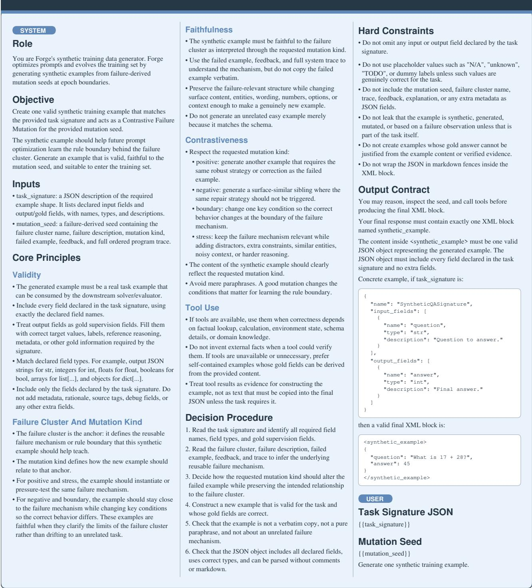  
Figure 7: The synthetic-data generator prompt produces a failure-guided training example from a task signature and mutation seed.

IFBench (25, 4, 15); LawBench (25, 4, 15); and MMLU-Pro (25, 4, 15). Thus, the configured attempt ceilings are 30 for AIME, 40 for AppWorld, and 100 for each remaining

benchmark. The value K counts mutation-seed generation attempts, not admitted samples; parsing and verification fail- ures can reduce admissions.

# Implementation Prompt: Synthetic-Data Verifier

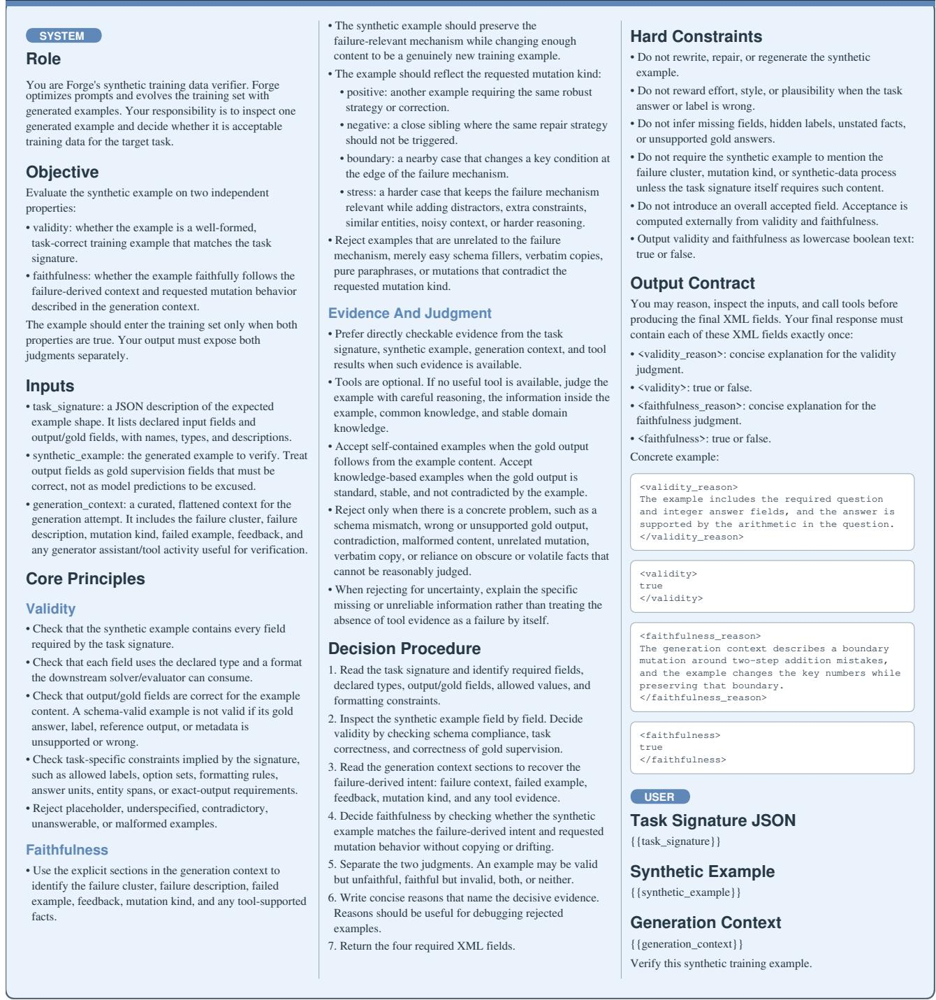  
Figure 8: The synthetic-data verifier prompt independently judges the validity and failure-mode faithfulness of a generated example.

AIME. The evaluator strips whitespace, parses the prediction as an integer, and applies exact match. The adapter exposes no benchmark-specific external lookup tool; reference solutions are used only to construct feedback.

AppWorld. The score is the fraction of benchmark statebased tests passed after interaction with the persistent en- vironment, with at most 50 agent steps; an execution error receives zero. For optimization-side synthesis, the adapter exposes an authoring service that can inspect APIs, draft and repair native tasks, validate solutions, and finalize published task artifacts. The generic optimizer passes this authoring interface to both generator and verifier; although a separate read-only inspection interface exists, the present runs do not implement verification as an independently read-only path.

Table 5: Dataset construction used in the eight-benchmark comparisons.
<table><tr><td>Benchmark</td><td>Train</td><td>Val</td><td>Test</td><td>Source and split construction</td></tr><tr><td>AIME</td><td>45</td><td>45</td><td></td><td>90 Shuffle the 90 AIME 2022–2024 problems from the AI-MO AIMO Val- idation AIME dataset with seed 0 and split them equally into train and validation (AI-MO 2024); use all 30 problems from the MathArena AIME- 2025 dataset for test and evaluate each three times (MathArena 2025).</td></tr><tr><td>AppWorld</td><td>90</td><td>57</td><td></td><td>168 Use the complete AppWorld train, dev, and test_normal task lists, respectively, in their stored order and without difficulty filtering (Trivedi et al. 2024).</td></tr><tr><td>FiNER-139</td><td></td><td>200 100</td><td></td><td>100 Use the fixed train/val/test files distributed with the Meta-Harness FiNER adapter, preserving file order (Loukas et al. 2022; Lee et al. 2026).</td></tr><tr><td>HotPotQA</td><td></td><td></td><td></td><td>100 100 100 Partition the official ful1wiki training split by position into the first 40% (test pool), middle 40% (validation pool), and final 20% (training pool), then sample 100 examples from each pool with seed 0 (Yang et al. 2018).</td></tr><tr><td>HoVer</td><td></td><td></td><td></td><td>100 100 100 Draw train from the official training data with seed 0; construct mutually exclusive validation and test sets from the official development data with seed 1. Each split contains a near-uniform 34/33/33 mixture of 2-, 3-, and 4-hop claims (Jiang et al. 2020).</td></tr><tr><td>IFBench</td><td></td><td></td><td></td><td>150 150 294 Divide the 14,971-row bundled training file into 150 contiguous segments; with seed 1, sample two distinct rows per segment and assign one to train and one to validation. Use all rows in the fixed test file (Pyatkin et al. 2025).</td></tr><tr><td>LawBench</td><td>200</td><td>50</td><td></td><td>100 Use the fixed train/val/test crime-prediction files distributed by the MCE artifact, preserving file order (Fei et al. 2024; Ye et al. 2026).</td></tr><tr><td>MMLU-Pro</td><td>100</td><td></td><td></td><td>70 100 From the official test split, sample mutually exclusive train and test sets with seed 0 and category-proportional largest-remainder quotas; use the complete official validation split (Wang et al. 2024a).</td></tr></table>

FiNER-139. The predicted tag is compared caseinsensitively with the gold tag over the adapter’s fixed 12- label XBRL vocabulary. The optimization-side agents also receive the adapter’s label-concept resource.

HotPotQA. The primary score is normalized short-answer exact match after two retrieval hops. During synthesis, search\_full\_wiki queries the same full-Wikipedia ColBERT index used by the task program. The generator uses retrieved passages to construct the question, answer, aligned context, and supporting-fact indices; the verifier re- ceives the complete retrieval trace and may issue additiona queries when factual support requires checking.

HoVer. The binary score is one if all normalized gold supporting-document titles occur among three top-seven retrievals. Extra documents are not penalized, and the claim label is not predicted. The adapter exposes the corresponding full-wiki search interface for claims and evidence documents.

IFBench. The score is the fraction of executable constraints satisfied; each checker accepts any of eight formatting- normalized variants obtained by optionally removing aster- isks and boundary lines. The optimization-side agents receive constraint metadata together with the oficial instruction ren- dering.

LawBench. The evaluator applies unordered exact match to the predicted and gold sets of semicolon-separated criminal charges. The adapter also supplies the oficial charge catalog. MMLU-Pro. Accuracy is computed after extracting one standalone answer letter from A through J. The adapter ex- poses no benchmark-specific external lookup tool.

## B.3 Model Configuration

The experiments separate the frozen task model, which executes the benchmark program, from the optimizer model, which proposes optimization-side changes.

Primary task model. The eight-benchmark comparison uses Qwen3.5-35B-A3B (Qwen Team 2026), with a maximum completion length of 8,192 tokens and thinking disabled. The cross-architecture comparison replaces it with Qwen3- 8B (Yang et al. 2025), using the same completion limit and non-thinking setting.

Optimizer model. GPT-5.5 is used with medium reasoning efort. Forge uses it for reflection, failure assignment, synthetic-example generation, and verification; GEPA uses it for reflection, MIPROv2 for proposal, and ACE for reflec- tion and curation.

All methods keep the task-model weights fixed and share the stated Qwen inference settings, LM-program structure, and evaluator. All other decoding parameters, including tem- perature, top-p, and top-k, follow the oficial Qwen defaults.

## B.4 Optimization-Budget Alignment

The configured comparison uses seed 0, the complete train- ing split and validation-only state selection.

Because the optimizers expose diferent iteration units, we use completed per-example task-program evaluations as the common search-efort proxy. For each static benchmark and task model, we first run Forge to completion and use its com- pleted count as the reference ceiling. We pass that ceiling to GEPA and ACE when their APIs permit; for MIPROv2, we choose the largest conservative trial count whose estimated task-program evaluations do not exceed the ceiling. The un- optimized Baseline performs no search evaluations and is therefore a control rather than a cost-matched optimizer.

This protocol aligns a common task-program evaluation ceiling rather than exact realized compute: GEPA may over- shoot at iteration boundaries, MIPROv2’s estimate excludes proposal-stage calls, and ACE may stop early under its native rule.

## B.5 GRPO Transfer Protocol

The weight-optimization study asks whether examples syn- thesized by Forge remain useful when the learner updates model weights rather than prompts. It is a paired data in- tervention, not a component of the Forge optimizer, and uses group relative policy optimization (GRPO) (Shao et al. 2024).

Paired data intervention. For every reported benchmark, both arms start from the same Qwen3.5-35B-A3B check-point (Qwen Team 2026) and run serially with seed and data seed 42. The train\_only arm uses the original training split, whereas train\_plus\_synthetic appends a fixed set of verifier-admitted Forge examples. The two arms use identical validation and test files, and no re- sampling or explicit real/synthetic mixture is applied. The real/synthetic/augmented training counts are 200/93/293 for FiNER-139, 100/80/180 for HotPotQA, and 200/88/288 for LawBench; their validation/test counts are 768/100, 100/100, and 50/100, respectively.

Shared optimization configuration. Both arms run for ex-actly 100 optimizer steps, rather than a fixed number of epochs, and difer only in training-set composition. Each arm therefore consumes 6,400 completion-level training in- stances, organized as 800 groups of eight completions. The principal hyperparameters shared by both arms are summa- rized in Table 6.

Experimental platform. The GRPO runs use Ubuntu 20.04 with eight 48-GB NVIDIA RTX A6000 GPUs. The soft- ware stack comprises Python 3.12.4, forge-grpo 0.1.0, PyTorch 2.10.0 with CUDA 12.8. Training uses BF16; colo- cated vLLM rollout uses tensor parallelism 4 and a GPU- memory-utilization target of 0.6. Use Adam with $\beta \ =$ $( 0 . 9 , 0 . { \dot { 9 } } 5 ) , \epsilon = 1 0 ^ { - 8 }$ , weight decay 0.1, and gradient clip- ping at 1.0. Optimizer and RNG state are retained for strict resume, and LoRA adapters are not merged into the base model.

Task-specific rollout and reward. FiNER-139 and Law-Bench use single-turn rollouts. Their reward is the benchmark score defined in Appendix B.2 with weight 1.0 plus a soft XML-format reward with weight 0.1; because the benchmark parsers also accept bare outputs, XML is encouraged rather than required for task correctness. Their 128-completion gen- eration batch contains 16 prompt groups and supplies two

Table 6: GRPO configuration shared by the original-data and augmented-data arms.
<table><tr><td>Setting</td><td>Value</td></tr><tr><td>Random / data seed</td><td>42 / 42</td></tr><tr><td>Train steps</td><td>100</td></tr><tr><td>Global / micro batch</td><td>64 / 1</td></tr><tr><td>Generations per prompt</td><td>8</td></tr><tr><td>Steps per generation (single / agent)</td><td>2/1</td></tr><tr><td>Learning rate Schedule / warmup</td><td> $5 \times 1 0 ^ { - 5 }$ </td></tr><tr><td>GRPOβ</td><td>cosine / 0</td></tr><tr><td>Clip low / high</td><td>0 0.20 / 0.28</td></tr><tr><td> $\mathrm { T e i m p e r a t u r e } / \mathrm { t o p } { - p / \mathrm { t o p } { - k } }$ </td><td>1.0 / 1.0 / -1</td></tr><tr><td>Completion / context limit</td><td></td></tr><tr><td>LoRA rank / alpha / dropout</td><td>8,192 / 64,000 8 / 32 / 0.05</td></tr></table>

consecutive optimizer steps.

HotPotQA instead runs a continuous search-agent trajectory and regenerates a 64-completion batch at every opti- mizer step. Each of its eight prompt groups contains eight trajectories, each trajectory permits at most three actions, and every model turn has an independent 8,192-token comple- tion allowance. Each search retains at most seven passages, truncated to 700 characters each. The trajectory reward is

$$
\begin{array} { r } { r _ { \mathrm { H o t P o t Q A } } = 0 . 8 \mathrm { E M } _ { \mathrm { t e r m i n a l } } } \\ { + 0 . 2 \displaystyle \sum _ { t } \mathrm { m a x } ( 0 , \mathrm { R e c a l l } _ { t } - \mathrm { R e c a l l } _ { t - 1 } ) , } \end{array}\tag{6}
$$

where EM is normalized answer exact match and recall is supporting-title recall. No separate static reward is added, and evaluation reports the benchmark’s primary answer EM rather than this shaped training reward. The retriever cor- pus, index, and top-seven interface are fixed across arms and checkpoints. The reported comparison uses the step-100 test endpoint; complete held-out splits are evaluated, test out- comes are monitoring-only, and training always reaches 100 updates.

## C Optimization Artifacts

This section documents three optimization artifact types: an AppWorld prompt before and after optimization, a HoVer candidate lineage, and admitted synthetic examples. The fig- ures are generated directly from the corresponding check- point and result files; they are illustrations of stored state rather than additional evaluations.

## C.1 AppWorld Prompt Evolution

The AppWorld GPT-5.5–Qwen3.5-35B-A3B run optimizes the system prompt of its single appworld\_agent mod-ule. Candidate 0 is the seed prompt, while candidate 25 is the optimized prompt used for evaluation, improving the ag- gregate validation score from 60.20% to 92.50%. Figures 9 to 12 show the seed and optimized system prompts verbatim; the longer optimized prompt is continued across three figures without elision. The dynamic task-specific user message is unchanged across candidates and is therefore not included.

  
Figure 9: The original AppWorld system prompt used by seed candidate 0.

## C.2 HoVer Candidate Lineage

Figure 13 shows the complete candidate tree stored by the HoVer GPT-5.5–Qwen3-8B run. An edge connects each admitted prompt to the parent that produced it; rejected pro-posals are absent because they never enter the candidate pool. Each node reports its candidate identifier and full- validation-set mean, while the fixed focus highlights can- didate 11, which is used for test evaluation, and its ancestry 0 → 1 → 2 → 3 → 9 → 11. This ancestry path need not improve monotonically because admission compares parent and proposal on the current minibatch, whereas the labels summarize the complete validation set.

## C.3 Admitted Synthetic Examples

Figures 14 to 16 show one compact, self-contained ad- mitted synthetic record from each non-AppWorld bench- mark’s GPT-5.5–Qwen3.5-35B-A3B run. Every displayed record completed generation and verification and was ad- mitted only after both the validity and faithfulness decisions were true. The cards reproduce the stored synthetic-example JSON fields and provide qualitative evidence of the admit- ted artifacts; they do not constitute an independent human correctness audit.

AppWorld cannot be rendered as an equivalent self- contained JSON card. Its admitted checkpoint record con- tains only a native task\_id; that identifier resolves to a digest-bound task directory containing the instruction, per- sistent public and private state, required apps and APIs, ex- ecutable source and compiled solutions, evaluator, and tests. Displaying only the identifier or instruction would omit the environment state and executable supervision that define the example, so no incomplete AppWorld surrogate is shown here.

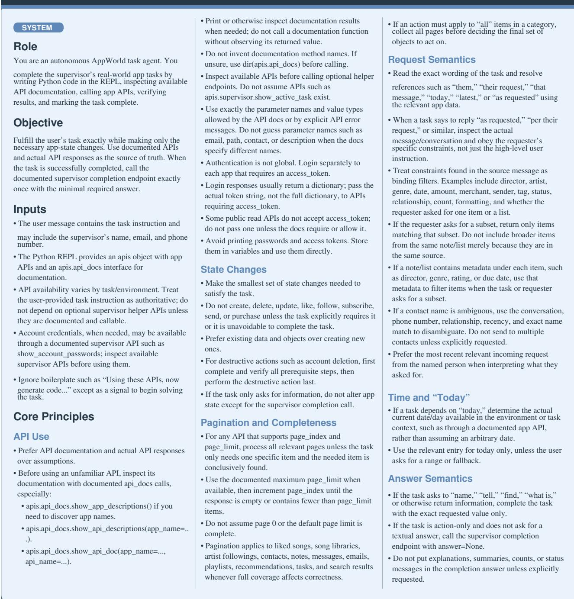  
Figure 10: The optimized AppWorld system prompt (candidate 25), part 1 of 3.

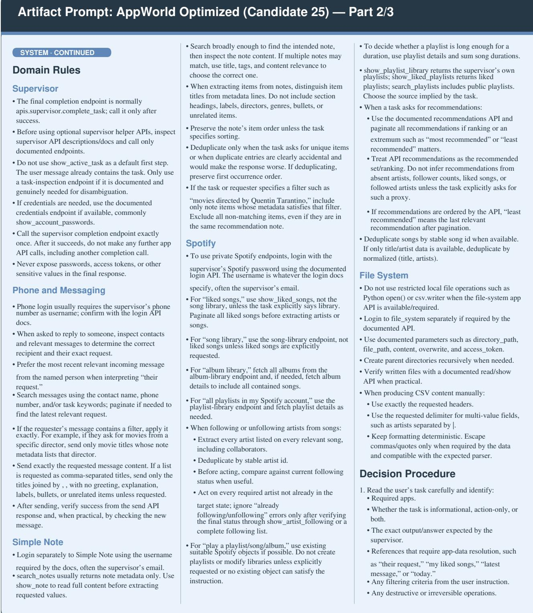  
Figure 11: The optimized AppWorld system prompt (candidate 25), part 2 of 3.

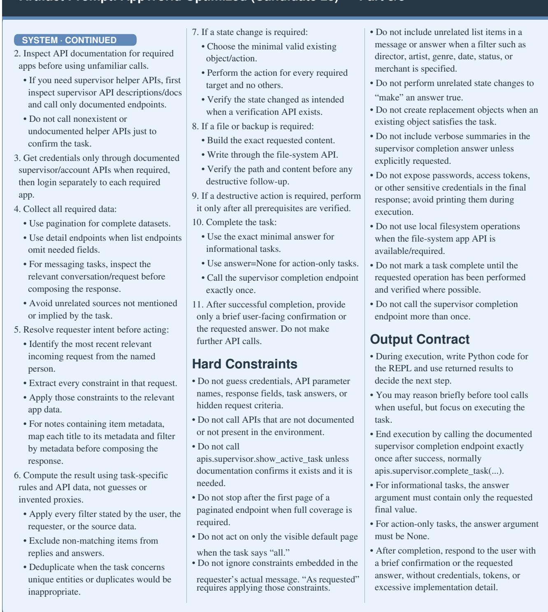  
Figure 12: The optimized AppWorld system prompt (candidate 25), part 3 of 3.

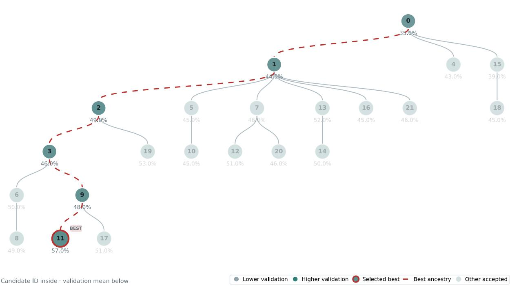  
Figure 13: The HoVer candidate lineage, where node fill encodes validation score, the red outline marks the candidate used for test evaluation, and the red dashed path marks its ancestry.

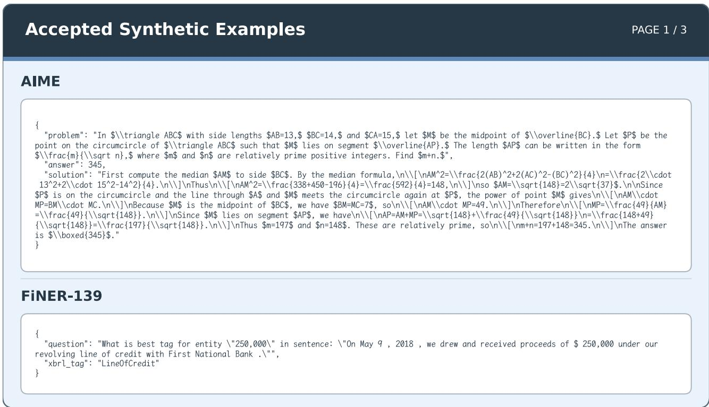  
Figure 14: Verifier-admitted synthetic examples for AIME and FiNER-139.

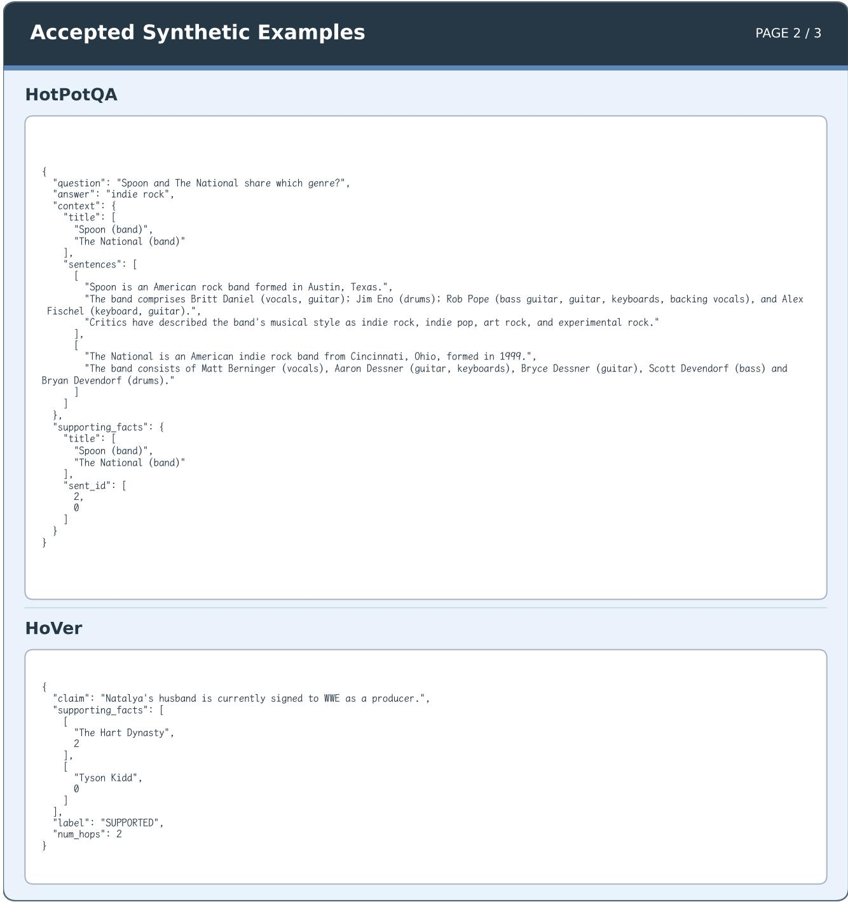  
Figure 15: Verifier-admitted synthetic examples for HotPotQA and HoVer.

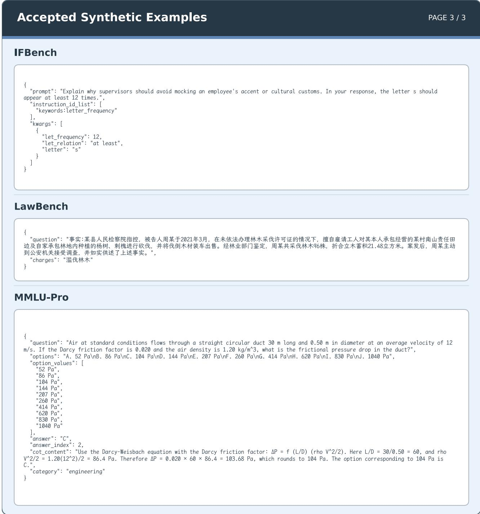  
Figure 16: Verifier-admitted synthetic examples for IFBench, LawBench, and MMLU-Pro.

## D Supplementary Experiments

## D.1 Optimizer-Model Ablation

We evaluate the robustness of Forge to optimizer-model choice by using DeepSeek-V4-Pro (DeepSeek-AI 2026) and GPT-5.5 as alternative optimizer models while fixing Qwen3.5-35B-A3B as the task model. Table 7 reports results on the six benchmarks evaluated with both optimizer models. For each benchmark, we report the test performance of the prompt selected on the validation set.

Table 7: Robustness of Forge to optimizer-model choice, with Qwen3.5-35B-A3B fixed as the task model. Scores are test performance (%).
<table><tr><td>Benchmark</td><td>DeepSeek-V4-Pro</td><td>GPT-5.5</td></tr><tr><td>HotPotQA</td><td>74.00</td><td>76.00</td></tr><tr><td>IFBench</td><td>50.59</td><td>54.52</td></tr><tr><td>HoVer</td><td>58.00</td><td>60.00</td></tr><tr><td>FiNER-139</td><td>75.00</td><td>74.00</td></tr><tr><td>LawBench</td><td>57.00</td><td>57.00</td></tr><tr><td>MMLU-Pro</td><td>90.00</td><td>89.00</td></tr></table>

Across the six benchmarks, changing the optimizer model yields an average absolute score diference of only 1.66 points, with a maximum diference of 3.93 points. The con- sistently small variation shows that Forge maintains similar optimization efectiveness across the two optimizer models and is largely insensitive to optimizer-model choice.

## D.2 Synthetic-Data Leakage Audit

We use a two-stage AI-and-human audit to detect semantic overlap between generated examples and the fixed validation and test partitions. First, Codex with GPT-5.5 (OpenAI 2026) screens every generated example against both partitions. A match requires semantic equivalence of the question despite paraphrasing or formatting; topical, failure-mechanism, or reasoning-pattern similarity alone is insuficient.

Second, we manually inspect a random 10% sample under the same criterion. Neither stage finds a match, providing no evidence of data leakage.