# From Ideas to Actions: A Public-Data Decision-Support Toolchain Across the Venture Lifecycle

LEI QU, Shanghai Xing Yun Zhi Li AI Institute, China

Founders face two linked decisions across the venture lifecycle: before founding, whether an idea warrants pursuit; after founding, which operating actions and capital partners fit the company’s intended trajectory. The necessary evidence is fragmented and often confined to subscription-only venture databases. We present a twopart decision-assistance toolchain built from freely available public information. Part One combines structured proposal profiling, time-bounded market and moat checks, and deterministic aggregation. Part Two reconstructs auditable investor–company event chains to analyze operating-action patterns and post-investment behavior. We evaluate the proposal pipeline against historical outcomes and apply the toolchain in AI-inference and chip-company studies, yielding findings for both decision stages.

Pre-founding. (a) After threshold selection on a 198-company development draw, the frozen system yields $F _ { 0 . 5 } = 0 . 5 3 5 7$ [0.412, 0.655] on an independently drawn, row-disjoint 198-company validation sample; the combined 396-row benchmark estimate is 0.6301. A paired Raw LLM baseline scores 0.2734 on those 396 rows. In a separately drawn scale cohort, post-stratifying all 1,027 completed cases to the fixed execution-split composition yields 0.6506 [0.598, 0.707], with a 377-row composition-matched check yielding 0.6573. Together, these checks strengthen the evidence that performance is not confined to the original benchmark, although the incomplete scale run precludes a deployment-grade generalization claim. (b) The AI-inference market study identifies two distinct paths: distribution-layer businesses ofer the most replicable route to independent profitability but face a limited revenue ceiling, whereas frontier-model ownership ofers greater capital-market upside at exceptional capital cost. Post-founding. (a) Public filings, portfolio pages, company disclosures, and news can support reproducible analysis without subscription-only venture data. (b) In the chip-company implementation, sustained product, customer, and supply-chain progress is associated with better observed outcomes; financing participation alone does not establish continuing operating progress. (c) Continued financing accounts for 79% of confirmed publicly visible post-investment actions. The evidence tentatively favors considering strategic corporate investors with relevant acquisition histories for acquisition-oriented founders, and financing-led institutional VCs with fewer observable control events for independence-oriented founders.

These results ofer development-stage and observational guidance, not causal guarantees or evidence of large-scale deployment performance; they neither rank investors nor constitute investment advice. Beyond the empirical findings, we release an end-to-end reproducibility stack—shared ontology, provenance-bearing EventChain data, schemas, benchmarks, and executable skills—so the complete workflow can be audited, reused, and extended.

Additional Key Words and Phrases: startup viability; business-model prediction; venture capital; investor behavior; knowledge-graph event chains; public data

## 1 Introduction

Founders make consequential decisions under unusually weak information. Before formation, they must decide whether a proposed business model warrants years of efort. After funding, they must choose external operating actions toward the next financing milestone and decide which capital partners to approach based on their objectives and those investors’ observed behavior. Commercial data products partly address these questions, but their cost, access restrictions, and redistribution terms limit independent scrutiny. This paper asks how much useful decision support can be assembled from public evidence while preserving an auditable trail.

Author’s Contact Information: Lei Qu, Shanghai Xing Yun Zhi Li AI Institute, Shanghai, China, mr.leiqu@gmail.com.

We make three contributions. First, we describe an idea-stage evaluation pipeline that converts a proposal into a structured candidate card, retrieves time-bounded market and defensibility evidence, and produces a deterministic three-level verdict. Its retrospective benchmark includes a row-disjoint independent validation sample and out-of-sample aggregation experiments, while documenting limits to deployment validity. Second, a 29-vendor study of the AI-inference market supplies the five-dimensional representation used by the pipeline and exposes the disclosure uncertainty behind each market claim. Third, we construct versioned investor–company event records and temporally ordered chains and use them for two exploratory analyses: a registry of label-blind event-chain patterns and a description of dated, announcement-visible post-investment activity.

The contribution is methodological and infrastructural rather than causal. The work shows how public records, explicit schemas, leakage checks, and reproducible rules can be combined. Part Two identifies retrospective associations between recorded actions and company outcomes, not causal efects of those actions.

Part One (Sections 4–6) presents the pre-founding framework, development benchmark, and market case study. Part Two (Sections 7–10) presents event collection and chain construction, the exploratory pattern registry, and investor-behavior analysis. Sections 11–12 synthesize the shared conclusions, limitations, and release information.

## 2 Background and Motivation

## 2.1 Two Information Gaps in the Startup Lifecycle

At founding, a team has a product, customer, and monetization hypothesis but no execution history. After funding, it must choose external operating actions toward the next financing milestone and capital partners whose behavior fits its objectives, often without transparent histories to inform either decision. Investors face the mirror problems of screening proposals and distinguishing capital continuity from operational engagement. Although relevant signals are concentrated in costly venture databases and private experience, some can be reconstructed from free public evidence under explicit provenance and time bounds. Coverage, selection, and retrospective labels still limit the result.

## 2.2 A Methodological Choice: Free Public Data Only

The released analytical tables do not redistribute rows from paid databases. Freely available public sources provide the reconstruction inputs at every layer—SEC EDGAR Form D and 13D/13G filings [28], Wikidata [31], the MIT-licensed OpenSporks Crunchbase free database snapshot downloaded from Hugging Face [23], corporate portfolio pages, S-1 prospectuses, analyst 13F holdings, national-fund disclosures, and a public search API for news retrieval [27]. This is a reproducibility and distribution decision. Without equivalent access, a third party cannot independently audit, reproduce, or legally redistribute a result built on a \$30K–\$50K-per-year database subscription. Preserved public-source inputs make independent scrutiny and procedural reproduction more feasible, subject to source-specific reuse terms. The release documents source relationships, collection decisions, intended uses, and limitations in the spirit of established dataset-documentation practice [10, 26]; its row-level source links operationalize the provenance relation emphasized by W3C PROV [21].

The choice imposes measurable coverage costs. In Part Two, reliance on announcement-level records means interface events between investors and companies are only ∼70% covered by free sources, per-investor amounts are populated for only ∼16% of rows, and sovereign-wealth coverage is ∼50% (Section 11.1). Although the OpenSporks snapshot is distributed under MIT, its records originate from Crunchbase; we therefore do not redistribute the Part One row-level mirror data and publish only aggregate benchmark statistics and methodology (Section 12). These observation limits bound the inferences the reconstruction can support.

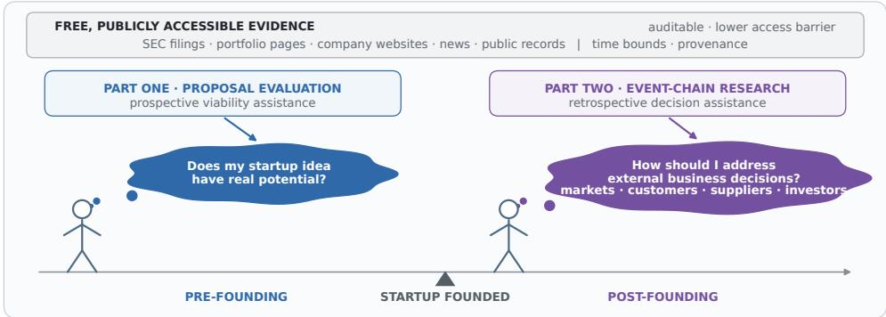  
Fig. 1. One founder-decision-assistance envelope across the startup lifecycle. Part One addresses the pre-founding proposal decision; Part Two supplies retrospective evidence for post-founding external business decisions involving markets, customers, suppliers, and investors. Both use freely available public sources rather than requiring subscription-only venture data.

## 2.3 Why the Two Parts Form One Toolchain

Two stages of founder decision assistance. Part One asks whether a proposed business model warrants pursuit before founding. Part Two examines which operating-action patterns and capitalpartner behaviors are observed along diferent post-founding company trajectories. It provides retrospective evidence for those decisions, not a forecast of a particular investor’s conduct. The workflows serve the same founder at diferent stages; a Part One verdict does not feed Part Two.

Shared evidence discipline. Both parts use time bounds, provenance, and task-specific leakage controls. Part One restricts public-market evidence to the three years preceding the founding year through the founding year (Section 4.4) and removes outcome leakage from inputs before evaluation (Section 5.2). For confirmed post-investment statistics, Part Two requires interface events to occur strictly after investment (Section 10.1), while its pattern grammar generates hypotheses without outcome labels (Section 9.1). Part Two analyzes completed chains and explicitly permits terminalnode attributes where a registered pattern calls for them; it should not be read as a point-in-time forecasting design.

Shared infrastructure. Both parts turn heterogeneous public records into versioned, auditable artifacts. The shared outcome ontology supplies benchmark truth in Part One and company labels for retrospective association in Part Two; it does not label operating actions or investors. The skill repository packages both workflows, while the released EventChain dataset supports the Part Two analysis.

Figure 1 locates the two decision stages around company formation.

## 2.4 Who This Work Is For

Founding teams receive pre-pitch viability evidence and retrospective evidence for external operating actions and capital-partner selection. Investors and analysts receive a precision-weighted screening benchmark and auditable event-chain hypotheses. Data engineers receive versioned skills

and EventChain data demonstrating provenance-bearing entity resolution, cross-source fusion, and label-blind analysis.

## 2.5 Related Work and Positioning

Startup business-model prediction. Prior data-driven systems predict startup outcomes from structured venture-platform records [6], while a recent language-model system combines Crunchbase fundamentals with textual self-descriptions [20]. Longitudinal evidence also shows that firms’ business lines are more stable from early plans to public-company status than their management teams, clarifying what an idea-stage representation can and cannot preserve [16]. VCBench is a conceptually related and active community for predicting startup outcomes from founder profiles. At the time of access, GPT-4o has the highest $F _ { 0 . 5 }$ among the general-purpose model baselines (0.257), while Verifiable-RL, which learns a task-specific policy, leads the overall leaderboard at 0.366 [29, 30]. VCBench difers from our study in data type, population scope, and prediction target. These results are therefore not directly comparable with ours, and our higher $F _ { 0 . 5 }$ should not be interpreted as evidence that this pipeline outperforms systems on the VCBench leaderboard. We cite VCBench because the two prediction problems are conceptually related and VCBench is one of the most active communities studying this broader class of problems (Section 5.4). PHBench finds that launch-day signals carry statistically significant predictive information for Series A within 18 months [14], supporting our product-launch → outcome patterns (Section 9.3). Meta-analytic evidence ranks traction and firm characteristics as the strongest predictor families across thirteen studies [15]. There is also a substantial method-adjacent literature on event-structured prediction— neural point processes over fundraising events [19] and graph-augmented time-series prediction—as well as large industrial knowledge graphs of companies and investors [5]. Part One difers in three respects. First, it restricts input to the idea-stage proposal and time-bounded public-market context, matching the pre-pitch decision. Second, it applies a leakage-control layer and audits its precision and under-detection (Section 5.2). Third, it distinguishes the 198-row threshold-tuning development sample from the independently drawn, row-disjoint 198-row validation sample within the combined 396-row benchmark, and separately draws a 4,000-row scale-validation cohort. Among the completed cases, a 377-row five-sublabel composition-matched subset yields $F _ { 0 . 5 } = 0 . 6 5 7 3$ [0.556, 0.746], while the 1,199-row reserved split remains untouched (Section 11.1).

Investor behavior. A broad equity-financing literature distinguishes screening, contracting, monitoring, value-add, and exit across investor types [7]. Survey evidence likewise shows that VC decisions span both investment selection and post-investment activity [11]. This literature provides interpretive anchors for Part Two rather than its method. Evidence that closer VC monitoring changes portfolio-company outcomes underscores why dated post-investment activity matters [3]. The finding that founder-CEO replacement has a negative naive correlation with performance but a positive instrumental-variable estimate [9] motivates a context-dependent interpretation of our ownership-change result: major-holder changes are negatively associated with outcomes only in the observed low-follow-through contexts, rather than being uniformly adverse (Section 9.3). The finding that corporate venture capital creates firm value only under strategic, not purely financial, motives [8] aligns with our observation that CVCs depart from a financing-only profile through exits, strategic investments, and board changes (Section 10.3). The syndication literature, which documents an inverted-U relationship between single-round syndicate size and performance [17], provides the relevant comparison for our P2 result, which counts investors at the terminal chainboundary event when no intermediate action is recorded (Section 9.3). Where practitioner surveys emphasize how much hands-on value VC firms claim to add, our evidence reads the observable, dated record, and we flag the resulting absence-of-evidence asymmetry as a limitation rather than a finding.

Public-data investor graphs. Reconstructing investor→company graphs from public filings has established precedents, including EDGAR-derived ownership graphs, open startup graphs combining SEC data with other free sources, and the peer-reviewed industrial CompanyKG [5]. Part Two difers in granularity and purpose. It fuses funding events (Form D, SPV timing, news, S-1, 13D/13G) with portfolio pages into a single dated event graph with provenance (Section 8.3), then subjects the graph to label-blind pattern enumeration to produce a catalog of retrospective complete-chain associations (23,308 patterns, with an interpretable shortlist reported in Section 9.3), plus an investor-side behavior comparison using confirmed post-investment rows and supportgated investor histories. Temporal-graph benchmarks likewise emphasize dated nodes or edges and explicit evaluation protocols [13]; EventChain contributes a provenance-bearing descriptive event record and pattern workflow rather than a temporal-graph prediction leaderboard.

Scope of the contribution. We do not claim to be the first to predict startup outcomes, to describe investor behavior, or to build a public-data investor graph; each has an established literature. The contributions described in Section 1 combine a validated proposal-evaluation pipeline, an industry study of its representation and use, and an auditable event-and-chain workflow for retrospective analysis, all built from freely available public evidence. Sections 5.6 and 10.5 define the corresponding limits.

## 3 Shared Outcome Ontology and Label Semantics

Both parts use the same deterministic company-outcome ontology. It is computed from structured company records independently of the Part One evaluation framework and the Part Two pattern engine. The fine-grained field outcome\_label\_v4 maps to the three-level company field label\_v4 as follows.

Table 1 gives the complete mapping.

Table 1. Shared company-outcome ontology used in Parts One and Two.

<table><tr><td>Fine-grained outcome</td><td>Company label</td><td>Operational criterion</td></tr><tr><td>POSITIVE_IPO</td><td>SUCCESS</td><td>Public listing</td></tr><tr><td>POSITIVE_LATE_STAGE_FUNDED</td><td>SUCCESS</td><td>Active and reached Series B or later, private equity, or post-IPO equity</td></tr><tr><td>POSITIVE_ACQUIRED</td><td>SUCCESS</td><td>Acquisition identified in the structured-record description</td></tr><tr><td>EQUIVOCAL_DELISTED</td><td>SUCCESS</td><td>Delisted; grouped with VC-style exits by default and retained separately for</td></tr><tr><td>NEGATIVE_CLOSED</td><td>FAILURE</td><td>sensitivity analysis Explicitly closed</td></tr><tr><td>NEGATIVE_NO_TRACTION</td><td>FAILURE</td><td>Active but without Series-A-level funding at least five years after</td></tr><tr><td>INDETERMINATE</td><td>AMBIGUOUS</td><td>founding and last funding Active but no committed positive or</td></tr><tr><td>UNKNOWN</td><td>AMBIGUOUS</td><td>negative milestone Required operating and IPO status fields unavailable</td></tr></table>

SUCCESS and FAILURE are financing/exit milestone proxies, not measurements of profitability, product quality, social value, or long-run survival. AMBIGUOUS companies are retained for coverage reporting but excluded whenever a binary SUCCESS–FAILURE comparison is made.

Three label namespaces must remain distinct. label\_v4 classifies a company outcome. Part One’s PASS/WARN/FAIL labels are framework verdicts that are evaluated against that outcome proxy. Part Two’s RECOMMEND/AVOID/INDIFFERENT/INCONCLUSIVE labels classify an observed operating action or event-chain pattern by the direction and threshold status of its retrospective association with company outcomes. They never classify a company. In particular, RECOMMEND and AVOID are preserved registry terms, not causal treatment recommendations, prospective forecasts, or investment advice.

## Part One: Pre-Founding Decision Assistance

Before founding, an aspiring entrepreneur faces a central decision: Does this business idea warrant pursuit? Part One evaluates proposals through public-evidence market and moat checks, followed by deterministic aggregation (Figure 2).

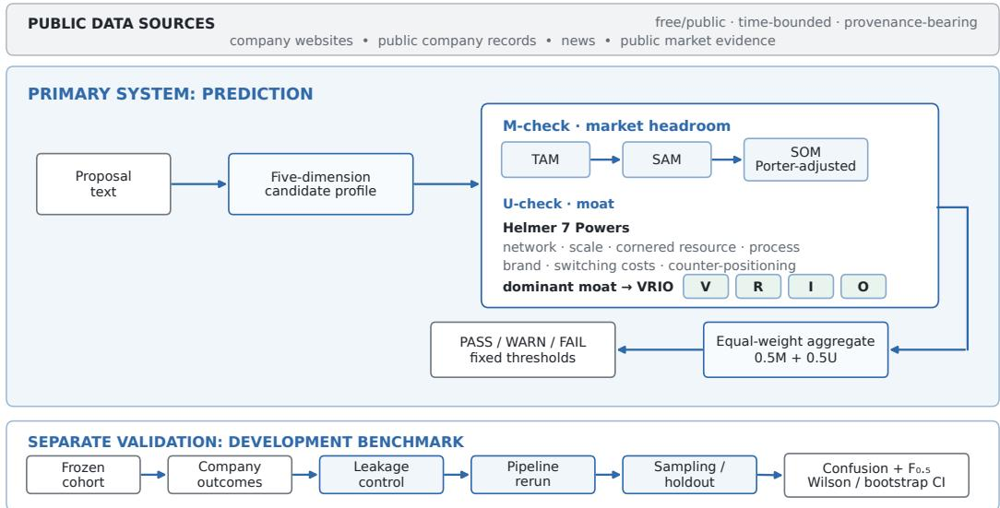  
Fig. 2. Part One architecture: prediction pipeline and benchmark validation.

Section 4 presents the prediction pipeline, Section 5 evaluates it against historical company outcomes, and Section 6 examines the AI-inference vendor market as an industry case study.

## 4 Method: Proposal Evaluation Pipeline

The pipeline treats a proposal’s claims as hypotheses to be checked, not as predetermined conclusions. Market and moat checks assess these claims against public evidence under explicit evaluation criteria. A deterministic aggregation rule combines the check outputs into a PASS, WARN, or FAIL verdict.

## 4.1 Task and Input Signal

We study the problem of business-model prediction at the idea stage: given the free-text description of a proposed startup (its product category, target customers, and monetization hypothesis), predict whether the venture will reach a positive outcome. The intended prediction is made as ifatfounding. In the retrospective benchmark, however, candidate cards can include present-day category tags, taglines, and website text. Leakage controls remove explicit outcome cues, but cannot prove that these inputs reproduce the information distribution of a genuine founding-time proposal. The benchmark therefore tests a development proxy for the intended pre-pitch use, not that deployment setting.

The benchmark target is the shared operational funding/exit proxy defined in Section 3. Part One predicts that company-level proxy; its PASS/WARN/FAIL verdicts are framework outputs rather than outcome labels. AMBIGUOUS outcomes are excluded from binary scoring.

## 4.2 Candidate-Card Representation

Raw proposals are heterogeneous. We therefore normalize each proposal into a structured candidate card—a five-section distillation produced by the candidate-profiler component:

• Revenue model — primary and secondary revenue streams, pricing structure, and a plausibility assessment;

• Customer segmentation — identifiable segments, estimated mix, and disclosed logos (if any);

• Cost structure — a best-efort estimate ofthe business’s main production or service-delivery costs, R&D, sales and marketing, and gross margin;

• Diferentiation and moat — claimed advantages assessed using Helmer’s Seven Powers taxonomy [12];

• Strategic vulnerabilities — the principal risks to the model.

Appendix A illustrates the five dimensions with a fictional proposal, distinguishing stated assumptions from missing information.

The card is assembled from the proposal text, the company’s category tags, a tagline, and (where available) website body text. Crucially, the card is written in idea-stage narrative: it summarizes the business model as proposed, not the company’s realized trajectory. A separate leakage-scan step (Section 5.2) removes residual outcome hints (retrospective language, ticker symbols, named anchor-customer logos, dated claims), reducing the risk that the framework can read the answer directly from the input.

## 4.3 The evaluate-proposal Framework

The evaluation is an orchestrated multi-step pipeline, implemented as a reusable agent skill (evaluate-proposal) that drives three sibling components in a fixed order. It is methodologically adjacent to retrieval-augmented generation [18] and interleaved reasoning-and-action agents [32], but replaces an open-ended agent trajectory with typed artifacts and deterministic aggregation:

(1) Candidate profiling — the candidate profiler (Section 4.2) converts the proposal into a structured five-dimensional card. It does not assign an archetype; the seven-category vendor taxonomy in Section 6.2 is retained only as descriptive case-study context.

(2) M-check (market headroom) — estimates total addressable market (TAM), serviceable addressable market (SAM), and serviceable obtainable market (SOM) headroom via timebounded public retrieval, then applies a Porter five-forces discount (rivalry, substitutes, entry, buyer and supplier power) and an incumbent-lock factor to arrive at a headroom band. The check outputs a verdict and a structured evidence record (m\_check.json).

(3) U-check (moat) — evaluates the candidate’s claimed moats with a VRIO analysis (Value, Rarity, Inimitability, Organization), again grounded in time-bounded competitive-landscape retrieval, and outputs a verdict and structured record (u\_check.json).

(4) Aggregation — a deterministic rule maps the two check verdicts to a final verdict. Each verdict maps to a score $( \mathrm { P A S S } = 1 . 0 , \mathrm { W A R N } = 0 . 5 , \mathrm { F A I L } = 0 . 0 )$ and score = 0.5 � + 0.5�; the thresholds are $\geq 0 . 5 \implies \mathrm { P A S S } , \geq 0 . 2 5 \implies \mathrm { W A R N } ,$ and otherwise FAIL. The rule is deliberately simple — it is a fixed, versioned composition whose sole free parameter is the PASS threshold.

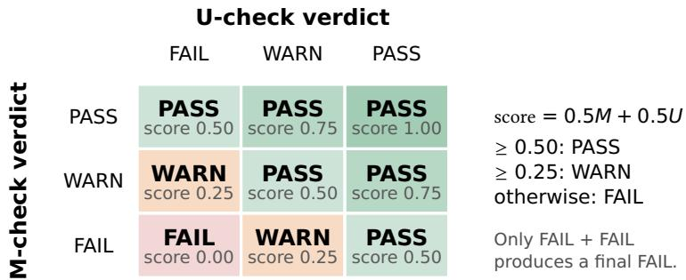  
Fig. 3. Complete decision surface of the released equal-weight aggregator. Rows are M-check verdicts and columns are U-check verdicts. The cell reports the aggregate score and resulting framework verdict; this is a fixed rule, not a learned probability surface.

(5) Reasoning composition — a narrative layer synthesizes the two evidence records and the aggregate verdict into a human-readable recommendation with a dominant-driver attribution.

Defense against input manipulation. The pipeline is designed to evaluate the proposal against the market and moat rules, not to adopt its self-reported assessments. M-check requires external triangulation of market size; U-check tests claimed moats against VRIO criteria and competitive evidence. The prompts are designed to maintain this distinction and reduce the risk that an input can manipulate the pipeline by embedding purported check results or desired verdicts. Such statements are claims to examine, not completed checks.

The reported Part One evaluation configuration is dated June 2026. It uses a leading generalpurpose LLM with extended thinking/reasoning disabled. The released workflow fixes the prompts, schemas, retrieval constraints, component order, and deterministic aggregation rule; the modelindependent artifact contracts, rather than a provider-specific interface, define the pipeline.

The three verdict levels carry distinct meanings. PASS means “recommend” (the framework expects success), WARN indicates abstention, and FAIL means “do not recommend.” Binary evaluation treats only PASS as positive; WARN and FAIL are rejections.

Figure 3 exposes the complete deterministic decision surface rather than leaving the thresholds as prose. The current rule is permissive once either check passes: only two FAIL checks produce a final FAIL, while a PASS paired with a FAIL still reaches the 0.50 PASS threshold. This behavior is subsequently tested, rather than assumed efective, in Section 5.4.

## 4.4 Time-Bounded Retrieval and Leakage Control

Both checks ground their evidence in public-market retrieval using a web search API, restricted to a window of three years before founding through founding year. The queries are constructed for market context — category size, competitor landscape, technology trajectory — not for the company’s own post-founding outcome. This time-bounding improves reproducibility and blocks a direct class of post-founding evidence. It does not by itself establish that retrospective cards match genuine proposal inputs, so benchmark performance should not be assumed to transfer unchanged to deployment. Leakage control operates at three layers: the idea-stage distillation of the card, the regex and structural leakage sweep, and the retrieval time-lock.

The retrieval lock constrains query terms and accepted evidence dates, but it is not a historicalweb archive. A page retrieved today can describe an earlier market period using information published later. Without archived page snapshots and publication-date verification for every item, residual point-in-time leakage cannot be excluded.

## 4.5 Released Operating Modes

The released skill repository separates orchestration, profiling, and benchmark validation:

• evaluate-proposal — the full single-candidate pipeline (card → M-check → U-check → aggregate → reasoning);

• candidate-profiler — card construction and validation when only the proposal representation is required;

• benchmark-validation and leakage-scan — cohort, holdout, metric, and temporalintegrity tools for retrospective testing.

The benchmark utilities evaluate the same proposal-level verdict contract, but they are separate from the runtime predictor and do not add a company or archetype classification stage.

## 5 Engineering Validation: Pipeline Benchmark

We evaluate the framework’s association with outcomes using development, row-disjoint validation, and independently drawn scale-cohort evidence built from freely accessible data. This section reports the benchmark construction, the observed iteration plateau, LLM and conventional baselines, system-level ablation, and the limitations of the current evidence.

## 5.1 Cohort and Metric

Cohort. We use the MIT-licensed OpenSporks Crunchbase free database snapshot downloaded from Hugging Face [23] (2.87M raw company records) and filter to an AI-adjacent cohort: companies whose structured category tags match AI, ML, robotics, analytics, computer vision, natural language processing, big data, or generative AI, founded 2010–2024. The resulting cohort has 37,569 rows. This is an AI-adjacent technology-startup population, not a general-startup population; 87.8% of rows explicitly carry an “Artificial Intelligence (AI)” tag.

Applying the shared outcome ontology of Section 3, SUCCESS is 4.09%, FAILURE 42.92%, and AMBIGUOUS 53.00%. We additionally study a chip-only subset (233 rows, category-tagged semiconductor) and a hardware subset (5,298 rows); chip startups show a materially higher SUCCESS rate (17.17%), consistent with the capital intensity and long development cycles of the category.

The reported 396-row benchmark is not a prevalence-matched draw from this cohort. It combines a 198-row development sample (seed 43) and a separately drawn, row-disjoint 198-row validation sample (seed 44), both outcome-stratified. Each contains 48 SUCCESS cases (42 late-stage funded, three IPO, and three acquired) and 150 FAILURE cases (129 no-traction and 21 closed), for 96 SUCCESS and 300 FAILURE cases overall. Sampling required an already frozen candidate card and excluded AMBIGUOUS outcomes. The resulting 24.2% SUCCESS share was chosen to provide enough positive cases for development comparison; because precision and $F _ { 0 . 5 }$ depend on class prevalence, the reported scores describe this stratified pool and are not deployment-prevalence estimates for the 4.09% SUCCESS cohort.

Outcome composition changes across nested technology cohorts  
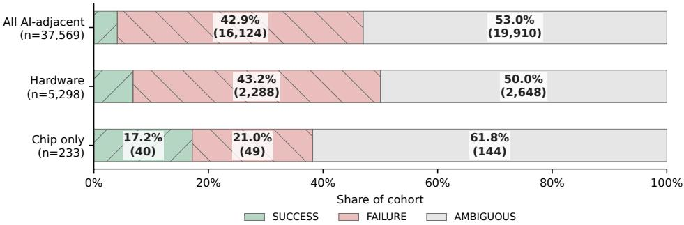  
Fig. 4. Outcome composition in the three nested benchmark cohorts. Counts are shown inside segments where space permits. The chip-only subset has a higher SUCCESS share and a larger AMBIGUOUS share than the full AI-adjacent cohort; these composition diferences motivate reporting the population explicitly.

Figure 4 shows that the chip subset is not merely smaller: its observed outcome mix difers sharply from the broader cohort, while AMBIGUOUS remains the largest class.

Metric. We score the framework with the $F _ { 0 . 5 }$ measure,

$$
F _ { \beta } = \frac { \left( 1 + \beta ^ { 2 } \right) P R } { \beta ^ { 2 } P + R } ,
$$

with $\beta = 0 . 5 ,$ weighting precision more heavily than recall. This encodes a deliberately conservative screening policy: acting on a false positive can commit capital and founder time, while a false negative is also consequential but is treated by this operating mode as a request for further evidence rather than an automatic abandonment decision. The weighting is a product-policy choice, not a universal founder utility function. Evaluations are binary: only PASS is a positive prediction; WARN and FAIL count as rejections (Section 4.3). AMBIGUOUS-truth rows are filtered before scoring.

## 5.2 Data Quality and Leakage Control

All 37,569 cohort rows were preprocessed into candidate cards (Section 4.2), frozen as a permanent data asset. A data-quality phase then scanned every card for outcome-label leakage: content that reveals the company’s realized fate (retrospective language, ticker symbols, named anchor-customer logos, dated claims). Leakage was detected and removed while keeping the row; afected embeddings were regenerated. The scan found high-severity leakage in 4.3% of the benchmark sample; the SUCCESS-group rate was 1.8× the FAILURE-group rate, confirming that leakage removal was necessary to obtain less contaminated performance estimates. A companion audit estimated overdetection at 0.36% and under-detection at 5.7%.

## 5.3 Iteration History and the Observed $F _ { 0 . 5 }$ Plateau

The framework was developed through a recorded iteration series, each iteration pairing a framework version with a fixed sample and reporting $F _ { 0 . 5 }$ with its recorded uncertainty range. Earlier iterations use approximate ranges propagated from Wilson bounds on precision and recall; the clean iter-13/14 and pooled headlines use bootstrap intervals. Once recorded, a point estimate is never amended, so the series reads as a calibration narrative. The main points:

• The initial baseline is zero. The first threshold configuration $( \mathsf { P A S S } \ge 0 . 7 5 )$ never fires on samples drawn from the full cohort: the observed aggregate M/U scores take values in {0, 0.25, 0.5}, so a threshold of 0.75 produces no PASS verdicts at all $\left( F _ { 0 . 5 } = 0 \right)$ . Lowering the PASS threshold to 0.50 (version v1.5a) was a functional correction, not a bias adjustment.

• The repaired framework validates on a row-disjoint sample and then plateaus. With the threshold fixed, the 198-row development and independently drawn 198-row validation samples yielded $F _ { 0 . 5 } = 0 . 7 0 8$ and 0.616 on the original cards; after leakage removal, they yield 0.729 and 0.536, respectively, with a pooled score of 0.6301 [bootstrap CI 0.537, 0.710]. Leakage removal itself changes the headline little (pooled leaky 0.661 vs. clean 0.630, with overlapping intervals); the time-bounded retrieval that drives the checks never consumed the leaked content.

• Aggregation variants do not surpass the observed plateau. Discrete aggregation and ofline continuous rescoring yield $F _ { 0 . 5 } \approx 0 . 6 3 – 0 . 6 6$ on this pool. Lossless learned-encoding variants, including a 30-parameter search, overfit the 198-row training pools: in-sample scores reach 0.75–0.77, but 4-fold out-of-sample scores are 0.53–0.58, below the discrete and continuous-rescoring results. We therefore require out-of-sample validation before reporting $F _ { 0 . 5 }$ for any variant with more than one hyperparameter.

Validation views are summarized in Table 2. The row-disjoint validation estimate is the clean confirmatory result for the frozen threshold; the pooled estimate is retained as a higher-precision combined benchmark description rather than presented as an untouched test result.

Table 2. Validation views for the Part One pipeline.
<table><tr><td>Validation view</td><td>Rows</td><td> $F _ { 0 . 5 }$ </td><td>Interpretation</td></tr><tr><td>Clean development draw (iter 13)</td><td>198</td><td>0.7292</td><td>threshold-tuning sample</td></tr><tr><td>Row-disjoint validation draw (iter 14)</td><td>198</td><td>0.5357</td><td>row-disjoint validation</td></tr><tr><td>Pooled clean benchmark</td><td>396</td><td>0.6301 [0.537, 0.710]</td><td>combined benchmark estimate</td></tr><tr><td>Completed scale cases, post-stratified</td><td>1,027</td><td>0.6506 [0.598, 0.707]</td><td>stratum-weighted sensitivity estimate</td></tr><tr><td>Independent scale-cohort subset</td><td>377</td><td>0.6573 [0.556, 0.746]</td><td>composition-matched holdout check</td></tr><tr><td>Learned encodings, 4-fold out-of-sample</td><td>396</td><td>0.53-0.58</td><td>overfit diagnostic</td></tr></table>

Table 2 separates the row-disjoint development-loop validation from the pooled headline, the independently drawn scale-cohort check, and the four-fold out-of-sample model-selection diagnostic. Post-stratification uses all 1,027 completed scale-cohort cases and weights each of the five outcome strata to its fixed count in the 2,801-row execution split. It yields precision 0.654, recall 0.638, and $F _ { 0 . 5 } = 0 . 6 5 0 6$ [stratified-bootstrap 0.598, 0.707]. This estimate assumes that completion is exchangeable within each outcome stratum. The deterministic 377-row composition-matched subset avoids unequal weights and provides a conservative sensitivity check; its point estimate difers from the pooled benchmark by only +0.0272, and the intervals overlap.

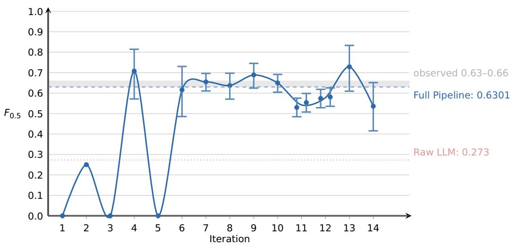  
Fig. 5. Iteration history: $F _ { 0 . 5 }$ per iteration with recorded uncertainty ranges (approximate precision/recall-propagated ranges for earlier iterations and bootstrap intervals for clean iter 13/14). Each iteration uses its recorded sample; iterations 13 and 14 use separate 198- row development and validation samples. The full-pipeline reference of 0.6301 combines those two samples (396 rows). The figure also shows the zero baselines at iterations 1, 3, and 5, the observed development-pool band 0.63–0.66, and the internal Raw LLM baseline. Iteration 11/12 variants (a/b) are plotted at their recorded micro-positions.

On this reused development pool, the result is consistent with an evidence-content plateau: no tested composition rule recovers more signal from the current M-check + U-check vocabulary. The trajectory in Figure 5 does not establish a performance ceiling beyond this pool.

## 5.4 Baselines and System-Level Ablation

Conventional same-task baselines. As a post hoc baseline check, we fit two fixed linear classifiers using only fields available to the Raw LLM baseline: category tags, short description, and founding year. A category-only logistic model uses binary category indicators; a second logistic model uses word-unigram/bigram TF–IDF over description, categories, and year. Both are trained on the 198-row development draw. Their decision thresholds are selected by five-fold stratified out-of fold prediction on that draw, before one evaluation on the row-disjoint 198-row validation draw. Implementations use scikit-learn [24]. Table 3 reports the result.

Table 3. Conventional baselines on the row-disjoint validation draw.
<table><tr><td>System</td><td>Precision</td><td>Recall</td><td> $F _ { 0 . 5 }$  [bootstrap 95% CI]</td></tr><tr><td>Category-only logistic</td><td>0.284</td><td>0.396</td><td>0.3006 [0.191, 0.408]</td></tr><tr><td>Description + category TF-IDF logistic</td><td>0.333</td><td>0.292</td><td>0.3241 [0.191, 0.453]</td></tr><tr><td>Full Pipeline</td><td>0.529</td><td>0.563</td><td>0.5357 [0.412, 0.655]</td></tr></table>

Against the category-only and TF–IDF baselines, the pipeline’s paired $F _ { 0 . 5 }$ diferences are +0.235 [bootstrap 0.092, 0.377] and +0.212 [0.047, 0.378], respectively. These comparisons share the validation rows, truth labels, and metric. They show that the pipeline exceeds two conventional same-task classifiers on this draw; they do not establish deployment validity or identify which pipeline component supplies the diference.

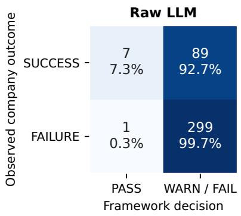

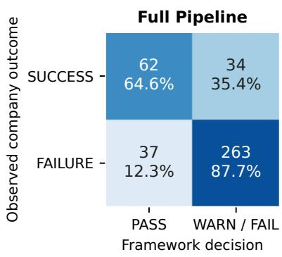  
Fig. 6. Decision errors on the combined 396-row benchmark. Raw LLM identifies 7 of 96 SUCCESS cases and produces one false positive; the full pipeline identifies 62 SUCCESS cases while producing 37 false positives. Percentages are normalized within the observed outcome rows.

Raw LLM baseline (A9). A9 is the experiment identifier for the Raw LLM baseline. To separate framework value from direct LLM inference, we run a leading general-purpose LLM, with extended thinking disabled, on the same 396 rows. Inputs are anonymized and restricted to Crunchbase metadata (company name, founding date, categories, and one-line tagline). The prompt requires the model to use only the description, exclude post-founding information, and ignore name recognition. This raw baseline scores $F _ { 0 . 5 } = 0 . 2 7 3 4$ (precision 0.875, recall 0.073): the LLM is extremely conservative on idea-stage input—it recommends only 8 of 396 candidates, 7 correctly.

On VCBench’s founder-profile task, GPT-4o leads the general-purpose model baselines at $F _ { 0 . 5 } =$ 0.257, while the task-trained Verifiable-RL system leads the overall leaderboard at 0.366 at the time of access [29, 30]. VCBench difers from our study in data type, population scope, and prediction target. These results are therefore not directly comparable with ours. In particular, our numerically higher $F _ { 0 . 5 }$ does not imply that this pipeline outperforms systems on the VCBench leaderboard. We cite VCBench because the two prediction problems are conceptually related and VCBench is one of the most active communities studying this broader class of problems.

The apples-to-apples comparison in this study is instead between A9 and the full pipeline: both use the same 396 clean rows, outcome labels, verdict schema, and scoring rule under a shared leakage-controlled regime. The pipeline additionally uses structured profiling, time-bounded retrieval, and multi-step reasoning. The observed +0.357 diference therefore measures system-level framework lift over the Raw LLM baseline, but cannot be assigned to any individual component. A row-aligned, outcome-stratified paired bootstrap estimates this $F _ { 0 . 5 }$ diference as +0.3566 (95% CI 0.1984–0.5312); a paired prediction-swap randomization test gives $p < 0 . 0 0 0 0 2$ (50,000 resamples). These tests quantify the end-to-end contrast on the pooled benchmark; they complement the row-disjoint validation and out-of-sample experiments reported above, but do not complete the larger external scale validation or isolate any component’s contribution.

The error breakdown in Figure 6 shows that Raw LLM preserves very high specificity by nearly always rejecting, whereas the full pipeline recovers substantially more SUCCESS cases at the cost of additional false positives.

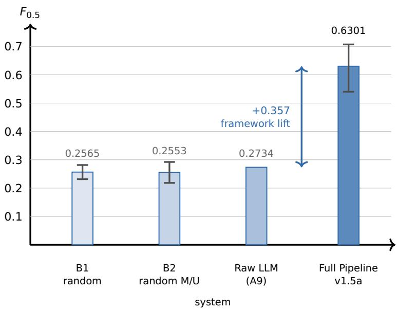  
Fig. 7. Four-anchor ablation ladder on the same 396-row pool: uniform-random verdicts (B1) and random M/U with a correct aggregate rule (B2) floor at ∼0.256; Raw LLM (A9) on anonymized metadata adds negligible lift (0.2734); Full Pipeline v1.5a reaches 0.6301 [bootstrap 0.537–0.710]. The observed system-level diference from A9 is +0.357 [paired bootstrap 0.198–0.531; randomization $\displaystyle p < 0 . 0 0 0 0 2 ]$ , but the changed inputs and reasoning setup prevent component attribution.

Four-anchor ablation ladder. We compare four system configurations along an information ladder. Table 4 reports the mean and standard deviation across 10 seeds for the two randomization ablations; the other configurations report single-run estimates.

Table 4. Four-anchor ablation ladder on the combined 396-row benchmark.
<table><tr><td>System</td><td> $F _ { 0 . 5 }$  estimate</td><td>Role</td></tr><tr><td>B1: uniform-random verdicts</td><td> $0 . 2 5 6 5 \pm 0 . 0 2 8$ </td><td>zero-information floor</td></tr><tr><td>B2: random M/U + aggregate rule</td><td> $0 . 2 5 5 3 \pm 0 . 0 4 0$ </td><td>aggregate on noise</td></tr><tr><td>Raw LLM (A9): metadata only</td><td>0.2734</td><td>LLM-native signal</td></tr><tr><td>Full Pipeline v1.5a</td><td>0.6301</td><td>evidence + aggregate</td></tr></table>

Figure 7 visualizes the same four-anchor comparison. Three descriptive comparisons follow. (i) Raw LLM exceeds its random $F _ { 0 . 5 }$ floor by only 0.017; its rare high-precision predictions do not move the metric materially because the metric penalizes its extreme conservatism. (ii) The full pipeline exceeds the random M/U reference by 0.375. Because card richness, retrieval, reasoning mode, and orchestration change together, this system-level diference cannot be assigned to the M/U evidence layer alone. (iii) With realistically distributed noise as input, the aggregate rule scores essentially the same as pure randomness $( \Delta = - 0 . 0 0 1 )$ ): deterministic composition does not create signal from noise.

Candidate extensions do not separate from the baseline interva  
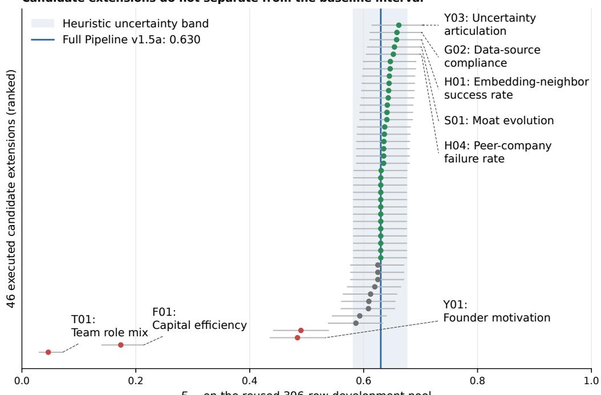  
$F _ { 0 . 5 }$ on the reused 396-row development pool

Fig. 8. Candidate-optimization landscape on the reused development pool. Points are ranked $F _ { 0 . 5 }$ estimates and horizontal lines are their recorded heuristic uncertainty bands. The blue line and band mark Full Pipeline v1.5a. None of the 46 executed extensions separates from the baseline interval; the long negative tail shows that plausible additions can materially degrade the decision rule.

## 5.5 Candidate Optimization Proof-of-Concept

We ran a systematic proof-of-concept sweep: 54 candidate optimization ideas (new checks, prompt/dimension extensions, retrieval strategies, and reasoning modes) were screened, of which 46 underwent full proof-of-concept evaluation on the clean 396-row pool. Each was scored by combining a candidate signal with the baseline M/U verdicts and re-optimizing the threshold. No candidate produced a clearly separated improvement on this reused development pool. The best candidate reached $F _ { 0 . 5 } = 0 . 6 6 1 8$ [0.6138, 0.7066], overlapping the baseline 0.6301 [0.5815, 0.6762] interval. Five of six retrieval-backed candidates collapsed to exactly the baseline because the added signal had no useful efect at any tested threshold. This negative result supports a development-pool plateau interpretation, but cannot identify what would limit performance on an untouched cohort. The displayed candidate ranges are historical heuristic uncertainty bands from the development audit, not formal confidence intervals for $F _ { 0 . 5 }$ or paired tests of improvement. Figure 8 summarizes the 46 executed extensions.

## 5.6 Limitations

The benchmark has four local boundaries. Validation scope. The independently drawn scale cohort remains partially executed. Its post-stratified and composition-matched estimates align with the combined benchmark, but the non-random completion process and untouched reserved split limit the strength of the generalization claim. Completion was deferred for cost reasons: the first 1,024 completed reasoning runs cost about \$2,560. Input and outcome constructs. Present-day website text and category metadata need not reproduce a genuine founding-time proposal; yearconstrained retrieval cannot guarantee point-in-time web availability; and SUCCESS/FAILURE measure funding or exit milestones rather than profitability, product value, or long-run survival. Imbalance and uncertainty. SUCCESS represents 4% of the cohort. Historical per-iteration ranges are approximate, whereas the combined headline uses a bootstrap interval. System-level attribution. A9 and the full pipeline are apples-to-apples at the evaluation level, but the treatment jointly changes card processing, retrieval, reasoning mode, and orchestration. The comparison therefore estimates system-level lift, not the isolated contribution or run-to-run variance of any component. Sections 11.1 and 12 consolidate the scale-validation and redistribution constraints.

## 6 Industry Case Study: The AI-Inference Vendor Market

This section reports a systematic, bottom-up study of inference operators: a 29-vendor analytical snapshot collected in June 2026<sup>1</sup> comprising a seven-archetype taxonomy, a profitability crosstab, and a six-cluster strategic map. The released evaluate-proposal workflow does not classify candidates into these archetypes. The study follows the benchmark’s evidence discipline (Section 5.2): every number is linked to a dated public source and an evidence-quality rating; undisclosed values remain missing.

The strategic takeaway is conditional on the founder’s objective: consider Distribution-layer for independent profitability, with a limited revenue ceiling; consider Frontier-model-owner for capital-market upside, only with access to exceptional capital; and avoid OSS-on-rented-GPU as the default independent-entry model, given its weak observed economics. Figure 10 relates these conclusions to the strategic map.

## 6.1 Scope, Card Protocol, and Source Discipline

Scope. The purposive 29-vendor sample is not a market census. It begins with 21 API service providers from a prior workload-specification taxonomy, adds Hugging Face and seven omissions identified by a same-model price audit, and excludes a later CoreWeave reference card from the frozen crosstab. Cards were assembled in June 2026 from the MIT-licensed OpenSporks Crunchbase free database snapshot downloaded from Hugging Face, supplemented with public information available at the time.

Card protocol. Each vendor is documented in a bounded-length vendor card following a fivedimensional schema—revenue model, customer segmentation, cost structure, diferentiation and moat, and strategic vulnerabilities. The prediction pipeline reuses these five dimensions in its forward-looking candidate card (Section 4.2): proposal claims replace observed facts, and perdimension confidence becomes a plausibility flag.

Source discipline. Staged public-web search, full-page extraction, and refresh rounds covered filings, company disclosures, product and pricing pages, and other public evidence. Collection targeted at least three independent sources per card and retained URLs or screenshots. Claim-level ratings distinguish audited disclosure, reported figures, estimates, and undisclosed fields. Across all 30 cards, including the CoreWeave reference, 22 carry explicit data-thin flags totaling more than 100 points of missing disclosure.

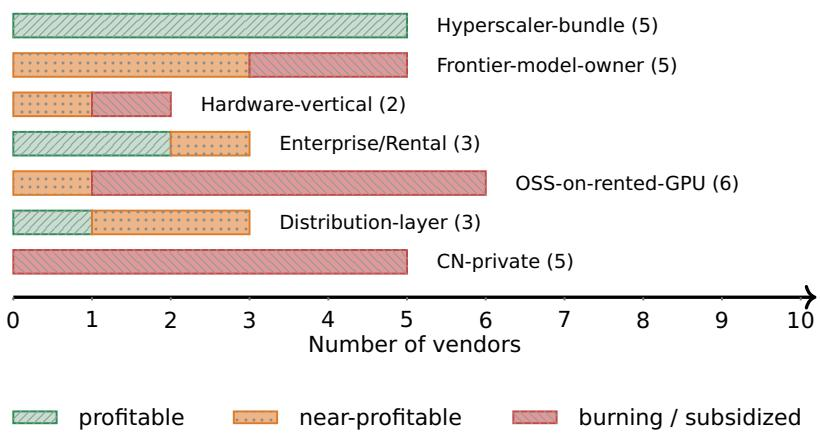  
Fig. 9. Archetype × profitability composition across the 29-vendor scope. Bars show the number of vendors per profitability signal (green = profitable; orange = near-profitable; red = burning / subsidized). Profitability is concentrated in hyperscaler parents, enterprise/rental operators, and the distribution layer; the “lose money but raise capital” profile concentrates in frontier model owners and OSS-on-rented-GPU operators.

## 6.2 Seven Archetypes and the Profit Crosstab

The cards were first grouped bottom-up into business-model archetypes by common revenue and cost structure, not by market share or brand. The resulting seven-archetype taxonomy is a descriptive coding scheme for this market study, not an input to the released proposal evaluator. Figure 9 shows the comparison that motivates the category-by-category definitions below; Table 5 subsequently retains the exact counts.

• Hyperscaler-bundle — inference sold as one line on a hyperscale cloud bill (Bedrock, Azure OpenAI/Foundry, Vertex, Bailian, Qianfan);

• Frontier-model-owner — operators who train and own their frontier or domain models as core IP (Anthropic, OpenAI, xAI; capital-light variants Mistral, Cohere; plus CN frontier labs);

• Hardware-vertical — chip-and-system manufacturers who run an inference cloud as a secondary product line (Cerebras, Groq);

• Enterprise/Rental — committed-capacity GPU lessors and data-AI platforms (Lambda, OVHcloud, later CoreWeave; Databricks as the data-platform anomaly);

• OSS-on-rented-GPU — rented-GPU hosts of open-weight models priced per-token or per-second (Together, Fireworks, Modal, Baseten, RunPod, DeepInfra);

• Distribution-layer — aggregators and model hubs living primarily on routing, credit fees, and network efects (OpenRouter, Hugging Face, and Replicate);

• CN-private — a geographic and regulatory bucket, rather than a pure business model, for China-market operators shaped by regulation and data residency (Volcengine Ark, Zhipu, Moonshot, DeepSeek, SiliconFlow).

Here, OSS denotes open-source software. The first six labels describe operating economics, whereas CN-private describes market jurisdiction and can overlap them conceptually. For the crosstab, each vendor is assigned once by the study’s frozen precedence rule; the taxonomy should therefore be read as a practical coding scheme, not mutually exclusive latent classes.

Table 5. Archetype × profitability crosstab across the 29-vendor scope (June 2026 snapshot). “Near” = path to profitability disclosed or capital-eficient with likely positive unit economics; “subsidy” = losses carried by a parent or state anchor.
<table><tr><td>Archetype</td><td>n</td><td>Profitable</td><td>Near</td><td>Burning / subsidy</td></tr><tr><td>Hyperscaler-bundle</td><td>5</td><td>5</td><td>0</td><td>0</td></tr><tr><td>Frontier-model-owner</td><td>5</td><td>0</td><td>3</td><td>2</td></tr><tr><td>Hardware-vertical</td><td>2</td><td>0</td><td>1</td><td>1</td></tr><tr><td>Enterprise/Rental</td><td>3</td><td>2</td><td>1</td><td>0</td></tr><tr><td>OSS-on-rented-GPU</td><td>6</td><td>0</td><td>1</td><td>5</td></tr><tr><td>Distribution-layer</td><td>3</td><td>1</td><td>2</td><td>0</td></tr><tr><td>CN-private</td><td>5</td><td>0</td><td>0</td><td>3 + 2</td></tr><tr><td>Total</td><td>29</td><td>8 (28%)</td><td>8 (28%)</td><td>11 + 2</td></tr></table>

The profit crosstab (Table 5) reports the study’s coded profitability signal for every in-scope vendor. Profitability is coded independently of capital-market success: an operator that burns cash but commands a high valuation is counted as burning, not as profitable; the two dimensions are documented separately throughout the study.

All percentages and counts below describe this purposive sample. For bundled products, the profitability code can reflect parent or cloud-segment economics rather than standalone inference profitability; estimated values are not audited accounting measures.

Three conclusions drive the framework design. (i) Profitability is concentrated where the operator does not bear independent compute economics. The eight profitable operators comprise hyperscaler parents (whose inference revenue is one line in an already-profitable cloud segment), a data-AI platform, an EU sovereign cloud, or a post-acquisition distribution operator — none is an independent, inference-core company. (ii) The “lose money but raise capital” profile is concentrated in two archetypes: frontier model owners (capital markets value scarce model IP despite projected 2026–2029 burn) and OSS-on-rented-GPU operators (5/6 burning, no pending IPOs, and intense price competition in inference-stack kernels). (iii) A corollary for interpretation: the OSS-on-rented pattern warns analysts to scrutinize unit economics, while distribution-layer cases motivate separate attention to market ceiling. These are case-study observations rather than archetype priors or inputs to the released M/U checks.

## 6.3 Six-Cluster Strategic Map

A second, top-down analyst grouping assigns the same vendors to potentially overlapping strategic clusters based on capital structure, customer base, and replicability. Its six clusters are the study’s answer to “which kind of business is worth doing” (Table 6):

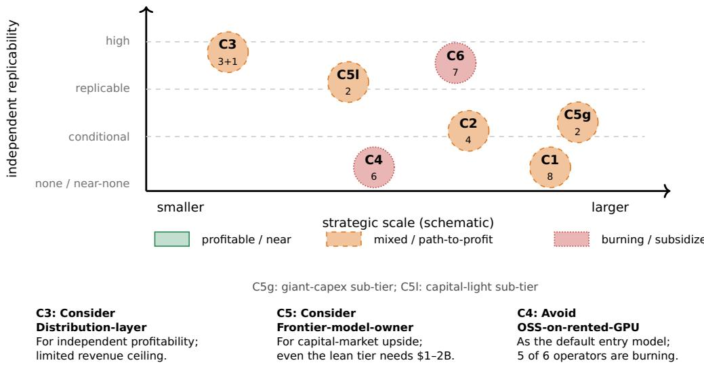  
Fig. 10. Six-cluster strategic map of the inference market. Numbers inside markers report company counts; marker size has no quantitative meaning. Color summarizes the profitability signal. Horizontal placement is schematic, drawing on diferent measures— ARR, valuation, and financing scale—rather than a common financial metric. The three annotations state conditional entry guidance, not profitability forecasts. C3 includes three profitable or near-profitable core vendors and one loss-making extension (SiliconFlow). C5 splits into giant-capex and capital-light sub-tiers of two companies each.

Table 6. Strategic cross-tags in the 29-vendor AI-inference case study.
<table><tr><td>Cluster (n)</td><td>Operator examples</td><td>Profit state</td><td>Independent-company replicability</td></tr><tr><td>C1 Hyperscaler-cluster (8)</td><td>Bedrock, Foundry, Vertex, Databricks</td><td>5 profitable; 3 parent- subsidized</td><td>none (needs pre-existing cloud)</td></tr><tr><td>C2 Sovereign-AI/hardware (4) Cerebras, Groq,</td><td>Lambda, OVHcloud</td><td>mixed</td><td>only with sovereign anchor</td></tr><tr><td>C3 Long-tail distribution (3+1) OpenRouter, Hugging</td><td>Face, Replicate; SiliconFlow (extension)</td><td>1 burning</td><td>3 profitable/near; high for core three; their combined estimated ARR &lt; $300M</td></tr><tr><td>C4 OSS-on-rented (6)</td><td>Together, Fireworks, Modal, RunPod</td><td>5 burning; 1 near-profitable</td><td>trap; exit is acquisition</td></tr><tr><td>C5 Frontier capital tier (4)</td><td>Anthropic, OpenAI, Mistral, Cohere</td><td>path-to-profit 2026-2028</td><td>giant sub-tier not; lean $1-2B</td></tr><tr><td>C6 CN-based (7)</td><td>Volcengine, Zhipu, DeepSeek, Moonshot</td><td>mostly subsidized</td><td>CN companies only</td></tr></table>

Because these clusters are strategic cross-tags rather than a partition, their counts do not sum to 29. Figure 10 schematically maps the six cross-tags by strategic scale and independent-company replicability.

The map is an analyst-coded visualization of the selected cards, not an estimated population model. Its annual recurring revenue (ARR), valuation-multiple, and starting-capital ranges combine reported figures with card-level estimates and should be read as hypotheses.

Three observations support the entry guidance stated at the start of this section. Distributionlayer (C3): independent profitability. All three vendors coded as Distribution-layer are profitable or near-profitable, with network efects and distribution economics supporting this path. However, their combined estimated ARR is below \$300M, and hyperscaler zero-fee routing threatens the revenue ceiling. Frontier-model-owner (C5): capital-market upside. The cards report 30– 65× revenue multiples despite continuing losses or uncertain paths to profitability. Even the capital-light sub-tier (Mistral and Cohere) requires an estimated \$1–2B in starting capital: this is a capital-intensive opportunity, not an alternative low-cost route to profitability. OSS-on-rented-GPU (C4): avoid as the default entry model. Five of six operators are coded as burning and one as near-profitable; none has a pending IPO or a sovereign customer base. RunPod’s near-profitable position is attributed to community go-to-market execution rather than an inference-stack-IP narrative, underscoring the need for an advantage beyond serving open-weight models.

## 6.4 Cross-Cluster Patterns and Trajectories

Six cross-cluster patterns and five 12–24-month trajectories complete the picture. Four patterns are structurally important. First, sovereignty-driven restructuring moves roughly one-third of market volume through state capital, sovereign anchor customers, or public R&D funding; these vendors require strategic- rather than unit-economics-based evaluation. Second, capital bifurcation divides each archetype into giant-capex and capital-light paths with a roughly 50× diference in burn rate. Third, a race-to-the-bottom trap arises because inference kernels difuse quickly, new chips reset the field, and aggregators arbitrage prices. Fourth, the long-tail profitability paradox makes easy profitability and scalability dificult to achieve together.

Scenario trajectories through 2027–2028 place the hardware-vertical segment at an inflection, frontier owners in a possible dual-tier maturity phase, distribution under pressure from hyperscaler routing, and OSS-on-rented under consolidation pressure. These are analyst scenarios derived from the June-2026 snapshot, not verified future events or probability-calibrated forecasts.

## 6.5 Limitations

This case study has five local boundaries. Cross-sectional, not predictive. The crosstab is frozen at June 2026. Vendors labeled “burning,” including Anthropic and Cerebras, have disclosed paths to profitability or an IPO; these are trajectory descriptions, not forecasts. Disclosure asymmetry. Profitability assignments inherit each card’s data-quality rating, and undisclosed figures remain unestimated; Section 6.1 quantifies the data-thin cases. Conditional decision guidance. The entry guidance depends on founder objectives, capital access, and the observed snapshot; it is not an automated recommendation or a guarantee of business success. The archetypes are not runtime fields or predictor inputs. Taxonomy boundary. The CN-private code mixes jurisdiction with business model, some vendors span multiple archetypes, and single-label counts depend on the frozen assignment rule. Sampling boundary. The purposive sample omits unknown and less-visible operators, so its percentages are neither market shares nor population frequencies. Broader time-sensitivity and release constraints are consolidated in Sections 11.1 and 12.

## Part Two: Post-Founding Decision Assistance

After securing funding, startup founders face two linked decisions: (1) Which external operating actions should they pursue to advance toward the next financing milestone? (2) Which investors or investment institutions should they proactively approach, given their company’s objectives and those investors’ observed behavior? Part Two develops a public-evidence event-chain framework to inform these decisions (Figure 11).

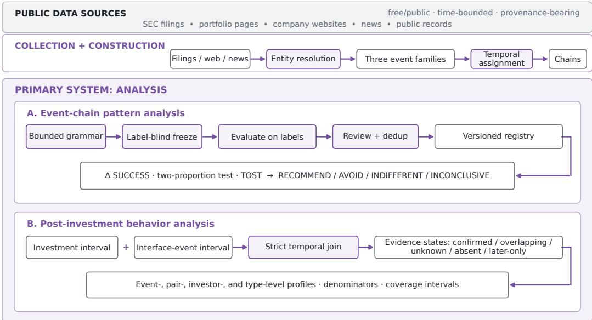  
Fig. 11. Part Two architecture: event collection, chain construction, and descriptive analysis.

Sections 7–8 describe the framework’s data design and construction; Sections 9–10 analyze operating-action patterns and investor behavior, respectively.

## 7 Data Structure and Domain Scoping

Answering the two founder questions requires linking what a company does, which investors participate, and which financing or exit milestones follow. Part Two represents this evidence as an investor–company event graph, from which company event chains and investor histories can be reconstructed. Stable identifiers, explicit date intervals, and source-level provenance make the structure auditable and reusable beyond the chip-company application.

## 7.1 Two Research Entry Points

The structure supports two domain-scoping strategies. A company-first study defines the industry and target company subset before targeted collection of the relevant investors and events. The chip-company application uses this route, drawing its scope from the broader entity and portfolio infrastructure described in Section 8. An investor-first study instead begins with selected investors’ complete profiles and portfolios, then filters or compares companies by industry. In either route, the target domain must be fixed before downstream event-pattern evaluation; changing it later changes both coverage and the analytical population.

## 7.2 Graph and Event Semantics

Investor and company nodes are connected by portfolio and investment relations. The core analytical object is the event chain: one chain per boundary outcome, spanning from founding (or the previous boundary) to that outcome, with dated intermediate events. Three event families distinguish the milestone from the operating developments and investor actions around it:

• Chain-boundary events (funding\_events): funding rounds, failed or withdrawn financings, IPOs, acquisitions, and closures;

• Exposure events (exposure\_events): product launches, supply-chain moves, customer changes, regulatory and export-control actions, executive changes, litigation;

• Interface events (interface\_events): funding participation, board changes, major-holder changes, secondary transactions, strategic investments, and activist actions.

The graph separates row grain from analytical grain. Source rows retain the investor, company, event, date interval, URL, and provenance needed for audit. Entity resolution maps those rows to stable investor and company identities. Funding, exposure, and interface records remain separate typed event families, and chain materialization groups participant-grain funding rows into one logical chain-boundary node. This prevents co-investor rows from becoming duplicate timeline events or duplicated capital totals.

## 8 Data Collection and Event-Chain Construction

We instantiate this structure from freely available public sources. The production pipeline retrieves, caches, resolves, reviews, and versions each layer before chain construction. The broad investor and company infrastructure supports domain selection; targeted event collection then reconstructs the chip-company histories analyzed here. The broad-universe counts below are therefore not the chip analysis sample sizes. Paid-database rows are not included in the released tables.

## 8.1 Scope and Sources

The shared infrastructure was developed through a US institutional-VC pilot and a global scale-up covering nine investor types. Sources include SEC EDGAR Form D and 13D/13G filings [28], a public findfunding.vc API, Wikidata SPARQL [31] (CC0), corporate portfolio pages (scraped with per-page CSS selector configurations), public news via a search API [27], S-1 prospectuses, analyst 13F holdings, and national-fund disclosures (GPIF Excel, NBIM/CPP Investments PDFs, CalSTRS HTML, pension disclosures). Retrieval scripts are versioned and idempotent, and cache raw responses by date.

## 8.2 Investor Entity Reconstruction

Pilot US-VC layer. Four sources are merged with union–find deduplication and canonical-value selection by confidence: findfunding.vc (1,369 firms), Wikidata (110), a manually curated seed list (91), and a retrospective URL verification pass (64 corrections). The result is 1,446 canonical US institutional investors with 11,891 long-format provenance rows recording each field’s source and assigned confidence. Every canonical investor carries a stable ID.

Scale-up global layer. The universe expands to a nine-type taxonomy based on industry convention rather than mutually exclusive academic categories: hedge fund, private equity, sovereign wealth, pension fund, asset manager, investment bank, VC, corporate VC (CVC), and angel. Tier assignment within each type is determined for the first five categories by cumulative assets under management (AUM), using tiers at the top 70% and 90% of each type’s global total; for VC, CVC, and angel investors by rank cutofs; and for investment banks by fee-revenue league-table position. The initial entity table lists 1,076 institutions; canonicalization yields 989 core entities, 201 with an SEC Central Index Key (CIK). Each record includes tier, investor type, and an AUM estimate when publicly available. A later identity-resolution pass recovered 926 additional interface-derived entities, bringing the prepared table to 1,915 investors.

## 8.3 Portfolio and Transaction Data

Portfolio edges. For the pilot’s 20 top US VCs and the scale-up stage’s broader T1+T2 VC and CVC universe, portfolio pages are scraped using per-firm CSS selector configurations authored by an LLM-assisted generator, with a Playwright fallback for JavaScript-rendered sites. The pilot extraction produces 2,281 unique (VC, company) edges across 17 firms; the scale-up stage produces 329,749 edges across nine investor types, with per-type coverage of 80–100% except sovereign wealth (50%, a confirmed disclosure ceiling).

Funding-event union. Four independent pipelines fill complementary coverage gaps. First, 592,032 SEC Form D filings over 47 quarters (2015Q1–2026Q3) provide the private-placement skeleton. Special-purpose vehicle (SPV) date clustering addresses the Rule 4(a)(2) blind spot for exempt mega-rounds—including those of Anthropic and OpenAI, which filed no Form D—and infers 160 round-close windows for 69 companies. Second, news extraction (Tavily + LLM) recovers 131 high-profile rounds, including Anthropic’s Series C–H history. Third, S-1 prospectus extraction recovers 89 pre-IPO rounds for 17 of 20 portfolio companies that completed IPOs. A fourth pipeline extracts 492 post-IPO ownership rows from 13D/13G filings. The union is deduplicated at the (�������, �����, ����) key and exploded to participant rows with grain (matched investor, company, round, date). Of the participant rows, 49.9% fuzzy-match to a canonical investor; the remainder refer to hedge funds, sovereigns, and unnamed participants outside the entity-table scope.

## 8.4 Company Canonicalization and Industry Labels

Portfolio and 13F records describe the same company under many spellings (AMAZON COM INC, Amazon.com Inc). Deduplication is driven by an explicit, audited rule file (262 aliases) rather than fuzzy normalization; the three retained slug collisions represent distinct securities. The result is 43,474 canonical companies<sup>2</sup> with globally unique IDs and edge-conservation checks (no transaction dropped or double-counted). Industry labels come from a Yahoo Finance resolver (50.6%) and category matching against that OpenSporks snapshot (26.6%), merged so that 61.9% of companies carry at least one label. The resolver validates identity using name tokens, ranks candidates deterministically, batches lookups of CUSIP security identifiers under rate limits, and versions cache entries for repairability and audit.

## 8.5 Event-Chain Construction

Construction normalizes the three event families defined in Section 7.2, resolves entity identi ties, and groups participant-grain funding rows into logical outcome nodes. Timeline resolution treats each boundary event as a left-closed/right-open segment boundary, assigning every dated intermediate event to exactly one chain. Raw collection, semantic review, identity patching, and chain materialization remain separately versioned so an application can report both row-grain provenance and graph-grain structure.

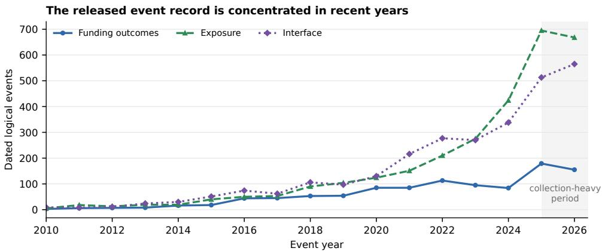  
Fig. 12. Temporal coverage of the released chip-company event record. Funding participant rows are collapsed to logical company–date–type–round boundary nodes; exposure and interface events are deduplicated by event ID. The plot describes evidence availability rather than underlying real-world event incidence, and the shaded 2025–2026 interval is the collection-heavy period.

## 8.6 Chip-Company Implementation

The application in this paper begins with a 2,547-company chip population. Restricting it to SUCCESS and FAILURE under the shared ontology in Section 3 yields a 1,332-company construction scope. Collection produces 3,897 chain-boundary participant rows, 3,311 exposure events, and 2,951 interface events. A later identity-resolution view contains 3,224 interface rows; the investorbehavior analysis uses that view rather than the 2,951-row chain-construction baseline.

The annual distribution in Figure 12 reveals when the public record is informative. The strong recent skew, especially in the 2025–2026 collection period, means older company histories should not be read as equally observed timelines.

A 418-case human review reconciles raw event semantics before construction of the cleaned baseline: 1,342 chains (1,071 dated) across 663 companies, with event-type patches versioned separately. The Lightmatter Series A chain illustrates the row-grain distinction: 38 participant rows (one lead and 37 co-investors) become one logical round node rather than 38 timeline nodes. The Cerebras history similarly resolves all eleven chains from founding through its 2026 IPO, with events assigned to exactly one segment.

These outputs support the two decision questions at diferent analytical levels: Section 9 compares company-level outcomes across event-chain patterns, while Section 10 examines the participating investors’ histories using the underlying investment and interface evidence.

## 9 Event-Chain Pattern Analysis

This section addresses the first founder question: which external operating actions should be prioritized when working toward the next financing milestone? It examines associations between completed event-chain patterns and the shared company-level outcome labels, rather than predicting the next round itself. The chip-company findings distinguish sustained operating progress from financing without progress, and interpret investor participation and governance changes in context.

## 9.1 Method Design

A pattern is a reproducible classification rule over the temporally ordered events constructed in Section 8.5, including a terminal outcome node only where the definition explicitly calls for it. The method estimates each pattern’s association with the company-level outcome label; it is retrospective pattern discovery, not a simulation of information available at an earlier decision time. Classical sequential-pattern mining discovers frequent ordered subsequences from sequence databases [25]; our bounded grammar instead freezes business-interpretable event predicates before outcome-label evaluation.

Definitions live in an external, schema-validated rule configuration rather than in Python. The engine rejects unknown fields, operators, and pattern references, and each run records the resolved configuration’s SHA-256, schema version, and pattern-set ID. Candidate patterns are generated from a frozen observed-domain grammar without seeing outcome labels. Support pruning and duplicate-company-mask deduplication reduce redundant candidates before statistical evaluation, and accepted definitions are consolidated into a canonical registry.

Within the evaluable company cohort, $P = 1$ if at least one dated, evaluable chain matches pattern $P ,$ and $P = 0$ otherwise. Each company is counted once per pattern, regardless of how many chains match.

For each operating-action or event-chain pattern $P ,$ the method reports the unadjusted diference in observed SUCCESS shares, $\Delta _ { P } = \hat { p } ( Y = 1 \mid P = 1 ) - \hat { p } ( Y = 1 \mid P = 0 )$ , with a pooled twoproportion z-test for $H _ { 0 } : \Delta _ { P } = 0$ and the two one-sided tests (TOST) procedure with a ±5 percentage-point equivalence margin. If the two-sided test yields $ { p } < 0 . 0 5$ , a positive diference receives RECOMMEND and a negative diference AVOID. Otherwise, TOST equivalence at the 0.05 level yields INDIFFERENT; if neither test passes, the label is INCONCLUSIVE. These labels apply to an observed action or pattern, never to a company, and denote exploratory associations rather than causal treatment recommendations, forecasts, or investment advice. The pooled score test remains the frozen registry rule. For the interpretable first-batch patterns, we additionally report Newcombe 95% confidence intervals for the absolute risk diference and two-sided �-values from Fisher’s exact test as a small-cell sensitivity analysis [22]; these diagnostics do not relabel the registry.

## 9.2 Chip-Company Evaluation Scope

Evaluation population. The analysis covers the 501 chip-universe companies with at least one dated, evaluable chain: 269 SUCCESS and 232 FAILURE. This is a diferentially observable subset: 269 of 390 SUCCESS companies (69%) but only 232 of 942 FAILURE companies (25%) in the underlying labeled scope are evaluable.

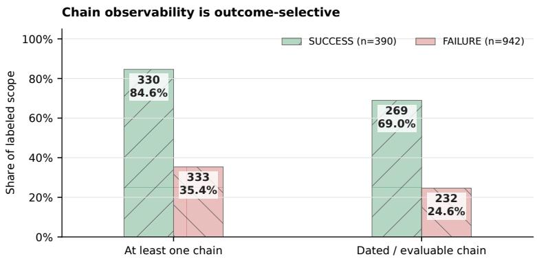  
Fig. 13. Diferential public-source chain observability by company outcome. Of 390 SUC-CESS companies, 330 have at least one chain and 269 have a dated and evaluable chain; the corresponding counts among 942 FAILURE companies are 333 and 232. Consequently, downstream pattern estimates describe a selected subset rather than the full labeled scope.

Figure 13 quantifies this coverage diference. Successful companies generally leave more financing announcements, product and customer milestones, regulatory filings, and media coverage, whereas failed companies may cease operating without a comparably visible public trail. The gap is therefore a limitation of reconstruction from public sources: it does not indicate outcome-based sampling by the researchers, but it limits how far the observable subset can represent the entire labeled scope.

## 9.3 Operating Progress, Financing, and Investor Involvement

The findings below combine the eight initial hypotheses (P1–P8) with the label-blind enumeration results. All reported diferences are unadjusted percentage-point diferences in observed SUCCESS shares. The initial hypotheses provide interpretable reference contrasts (Table 7); the enumerated patterns test more specific combinations.

Operating progress and sustained milestones. Product, customer, or supply-chain action (P3) is associated with a higher SUCCESS share (+15.6 pp). The retained enumeration results also favor a product launch (+19.9 pp), at least two intermediate events (+17.4 pp), and at least two exposure events (+16.6 pp). These patterns carry RECOMMEND labels. Together, they support attention to operating progress and milestone follow-through, rather than treating one announcement as a complete strategy.

Financing across long event spans and gaps. A span of at least three years from the first to the last intermediate event, combined with funding participation, carries an AVOID label (−20.1 pp). A distinct pattern combines a longest gap ofat least three years with at most one general-funding event (−21.5 pp), also labeled AVOID. The first measures the span of the recorded history, not inactivity throughout that period; the second measures an interval without recorded events. Financing participation alone does not establish continuing operating progress.

Investor involvement in context. Strategic investment (+22.9 pp) and the presence of an interface event (+12.9 pp) are the other two retained RECOMMEND patterns. Broad terminal-round participation also co-occurs with success even without recorded intermediate actions: P2 measures at least five investors at the terminal boundary and yields +32.8 pp. Thus, visible actions alone do not exhaust the information in investor participation. Conversely, a major-holder change with sparse activity carries an AVOID label (−29.4 pp). P8 likewise combines holder change or litigation with missing operating follow-through (−37.9 pp); its exact exclusions appear below the table. The warning concerns the surrounding event sequence, not ownership or governance change in isolation. P1, P4, P5, and P7 remain inconclusive; P6 is not evaluable in the current vocabulary.

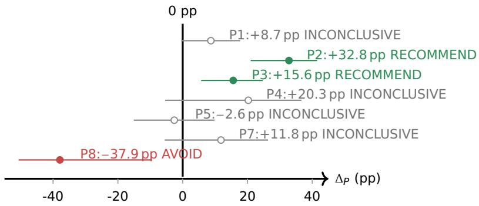  
Fig. 14. First-batch pattern estimate plot: unadjusted diference in observed SUCCESS shares, $\Delta _ { P } = \hat { p } _ { 1 } - \hat { p } _ { 0 }$ , in percentage points. Filled green points carry the RECOMMEND registry label under the unadjusted threshold, filled red the AVOID label, and grey hollow points carry INCONCLUSIVE. Horizontal lines are Newcombe 95% confidence intervals. P2 (+32.8 pp), P3 (+15.6 pp) and P8 (−37.9 pp) receive directional registry labels; P1, P4, P5, and P7 carry INCONCLUSIVE; P6 is not evaluable in the current vocabulary.

Section 9.4 distinguishes these frozen registry results from their multiplicity and coverage/time sensitivity checks.

Table 7. First-batch event-chain patterns and registry labels.
<table><tr><td></td><td>SUCCESS/total</td><td>∆P [95% CI]</td><td></td><td></td><td></td></tr><tr><td>Pattern</td><td>(present; absent)</td><td>(percentage points)</td><td>Score p</td><td>Fisher p</td><td>Registry label</td></tr><tr><td>P1: no recorded action</td><td>186/328; 83/173</td><td>+8.73 [−0.44, 17.74]</td><td>0.0624</td><td>0.0733</td><td>INCONCLUSIVE</td></tr><tr><td>P2: ≥5 terminal-round investors, no action</td><td>55/67; 214/434</td><td>+32.78 [20.97, 41.50]</td><td>5.49 × 10−7</td><td>3.08 × 10−7</td><td>RECOMMEND</td></tr><tr><td>P3: product, customer, or supply action</td><td>86/132; 183/369</td><td>+15.56 [5.70, 24.69]</td><td>0.00209</td><td>0.00227</td><td>RECOMMEND</td></tr><tr><td>P4: regulatory or export action</td><td>11/15; 258/486</td><td>+20.25 [-5.42, 36.63]</td><td>0.1214</td><td>0.187</td><td>INCONCLUSIVE</td></tr><tr><td>P5: distress or restructuring</td><td>35/68; 234/433</td><td>-2.57 [-15.10, 9.84]</td><td>0.6926</td><td>0.697</td><td>INCONCLUSIVE</td></tr><tr><td>P6: acquisition or debt refinancing</td><td></td><td>not evaluable in current vocabulary</td><td></td><td></td><td>NOT_EVALUABLE</td></tr><tr><td>P7: board change without P3-P5</td><td>22/34; 247/467</td><td>+11.82 [-5.57,26.35]</td><td>0.1822</td><td>0.214</td><td>INCONCLUSIVE</td></tr><tr><td>P8: holder change or litigation, with exclusions</td><td>2/12; 267/489</td><td>-37.93 [-50.67, -9.45]</td><td>0.00922</td><td>0.0154</td><td>AVOID</td></tr></table>

P8 requires a major-holder change or litigation, with no product-launch, customer-change, supply-chain, or interface-exit event in the same chain.  
Figure 14 visualizes the seven evaluable first-batch estimates.

## 9.4 Registry Scope and Robustness

Registry scope. The three batches yield 23,308 patterns: 9,460 RECOMMEND, 75 AVOID, and 13,773 INCONCLUSIVE; one unobservable definition is excluded from that total. Selection for the interpretable shortlist requires coherent business meaning, not significance alone. The five retained batch-2 findings all have � < 0.005. Registry labels use unadjusted tests: label-blind generation does not eliminate multiplicity, and overlapping patterns must not be read as independent findings.

Multiplicity sensitivity. Post hoc Benjamini–Hochberg (BH) correction [2] at � < 0.05 retains P2, P3, P8, and all five batch-2 highlights; P2 also survives Bonferroni correction. P1, P4, P5, and P7 remain non-significant. Figure 15 reports the registry-wide survival counts. These checks provide robustness evidence without changing the frozen registry labels.

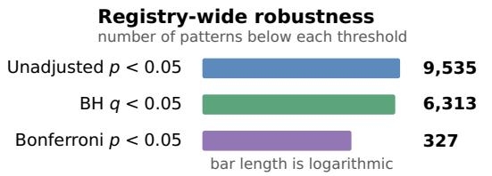

<table><tr><td colspan="4">Highlighted findings</td></tr><tr><td>filled = survives threshold</td><td>Unadj.</td><td>BH</td><td>Bonf.</td></tr><tr><td>P2: investor breadth</td><td></td><td></td><td></td></tr><tr><td>P3: operating momentum</td><td></td><td></td><td>O</td></tr><tr><td>P8: sparse dísruption</td><td></td><td></td><td>O</td></tr><tr><td>2+ middle evęnts</td><td></td><td></td><td>O</td></tr><tr><td>product launch</td><td></td><td></td><td>○○</td></tr><tr><td>2+ exposure events</td><td></td><td></td><td></td></tr><tr><td>interfáce event</td><td></td><td></td><td></td></tr><tr><td>strategic investment</td><td></td><td></td><td></td></tr></table>

green = RECOMMEND direction; red = AVOID direction

Fig. 15. Multiplicity robustness of the frozen pattern registry. Of 9,535 nominally significant patterns, 6,313 remain under Benjamini–Hochberg control and 327 under Bonferroni correction. P2 survives both; P3, P8, and all five retained batch-2 findings survive Benjamini–Hochberg. Directional colors retain the registry’s action interpretation and are separate from correction survival.

Coverage/time sensitivity. On the released identity-patched snapshot,<sup>3</sup> the eight highlights are stratified by dated-chain count (1, 2, or 3+) and first dated outcome year (≤ 2015, 2016–2020, or ≥ 2021). Cochran–Mantel–Haenszel common odds ratios retain all eight directions, but only P2 (OR $2 . 1 9 , p = 0 . 0 2 4 8 )$ and P8 (OR 0.16, � = 0.00338) remain nominally significant. After BH correction across these eight checks, only P8 remains significant $( q = 0 . 0 2 7 ; \mathrm { P } 2 ; q = 0 . 0 9 9 )$ . P3 and the five batch 2 highlights lose significance under the coverage/time adjustment. P8 is therefore the most robust highlight in this check; positive operating-momentum findings remain hypothesis-generating. This is not causal adjustment: founding year and unobserved private activity are unavailable.

## 9.5 Decision-Action Interpretation

For a founder planning the next financing milestone, the chip-company evidence favors building and documenting sustained operating progress: product delivery, customer development, and supply chain milestones deserve attention alongside fundraising. Continued financing is not a substitute for that progress, and ownership or governance events should be investigated in the context of the surrounding operating record. Investor participation should likewise be assessed for its substantive role rather than by visible interaction count alone. The RECOMMEND/AVOID action-pattern labels help prioritize evidence gathering and operating review, not automate decisions. Section 10 addresses the complementary question: whom to approach for capital and strategic support.

## 10 Investor Post-Investment Behavior Analysis

This section addresses the second founder question: which investors or investment institutions should be approached for the company’s intended trajectory? It examines investor histories within the same event-chain evidence framework, focusing on continued financing, strategic participation, acquisition, and governance. The analysis moves from confirmed post-investment actions to investor-type profiles and then individual histories, so founders can distinguish capital continuity from strategic or ownership involvement.

## 10.1 Method Design

Investment evidence is joined to interface events on (investor, company), retaining an event-level temporal audit trail. This computation uses the underlying records, not the materialized chain table or the pattern labels from Section 9. Dates are represented as intervals so partially specified dates can be handled conservatively. An action is confirmed post-investment only when the upper bound of the investment interval is strictly earlier than the lower bound of the interface-event interval. Other records are classified as same or overlapping date, timing unknown, no investment evidence, or investment evidence later than the interface event.

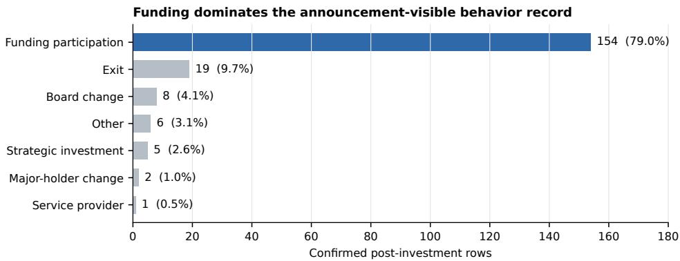  
Fig. 16. Composition of the 195 confirmed post-investment rows. Funding participation accounts for 79.0%; the non-funding tail is led by 19 exit rows and is otherwise sparse. The figure reports announcement-visible evidence, not the true incidence of private investor actions.

Date-keyed actions are deduplicated into episodes and aggregated independently at event, investor–company pair, investor, and investor-type levels. Composition among confirmed actions is reported separately from profile-level observation coverage.

## 10.2 Chip-Company Results: Confirmed Actions

Of3,224 interface rows, 1,543 have a resolved investor. Applying the strict interval rule, the temporal join admits 195 confirmed rows — 194 date-keyed episodes, 134 investor–company pairs, and 119 investors.<sup>4</sup>

Within the announcement-visible confirmed subset, the dominant pattern is capital continuity, not operational control: funding participation accounts for 154/195 confirmed rows (79.0%), and at the pair level 101/134 pairs (75.4%) show funding participation and nothing else. Only eight pairs combine follow-on funding with an exit. Figure 16 shows the composition of these confirmed rows.

The remaining 41 rows span six behavior types; exit is the only non-funding category with more than ten confirmed observations.

## 10.3 Investor-Type Profiles

For descriptive comparison, we display investor types with at least five confirmed non-funding rows. This is a support rule, not a significance test or a claim of representative coverage. Three types meet it:

• Institutional VC — financing-led capital continuity. Of 552 profiles, 64 (11.6%) have confirmed behavior; 110 confirmed rows are 85.5% funding events. 52/64 confirmed institutional VCs are observed through funding only.

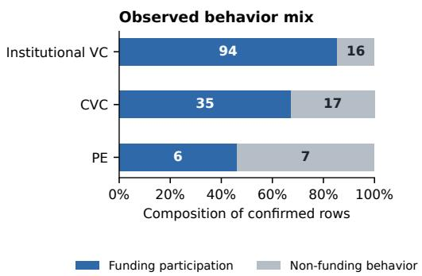

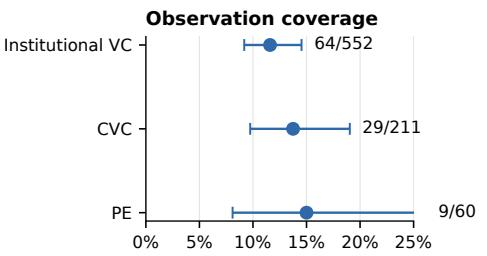  
Fig. 17. Observed behavior mix and observation coverage for the three investor types with enough confirmed non-funding evidence to compare. Counts inside the stacked bars are confirmed rows. The right panel reports the share of profiles with any confirmed behavior and Wilson 95% intervals, emphasizing the limited support behind the type-level composition.

• CVC — capital support with strategic and exit options. Of 211 profiles, 29 (13.7%) have confirmed behavior. Funding is still the largest component (67.3%), but 11/29 confirmed CVCs show at least one non-funding behavior — exits, strategic investments, board changes — a broader observed channel than institutional VC.

• PE — realization and governance. Of 60 profiles, 9 (15.0%) have confirmed behavior; nonfunding behavior is the majority (53.8%: five exits, two board changes). Only 3/9 confirmed PE investors are funding-only; the nine-investor sample makes the conclusion provisional.

Other types have insuficient confirmed non-funding evidence for stable comparisons; hedge funds, pensions, and accelerators have no confirmed post-investment actions in the observation window.

Figure 17 separates behavior composition among confirmed rows from profile-level observation coverage, with Wilson intervals showing the uncertainty around coverage.

## 10.4 Individual Histories: Seven Support-Gated Investors

Individual histories distinguish strategies that a type label alone can obscure. This comparison uses the full interface histories of all 1,025 resolved investors, not only the 119 with confirmed post-investment actions; its episodes need not satisfy the strict temporal rule and are not part of the 195-row composition. A uniform support gate requires at least three deduplicated core episodes and at least three interface companies, without a name filter or significance test. Core episodes comprise exits, strategic investments, board changes, major-holder changes, secondary transactions, and activist actions, deduplicated by investor, company, event type, and date. Seven investors covering 37 chip companies qualify, with 28 core episodes: 14 exits (50%), 6 strategic investments (21.4%), and 8 governance or ownership episodes (28.6%).

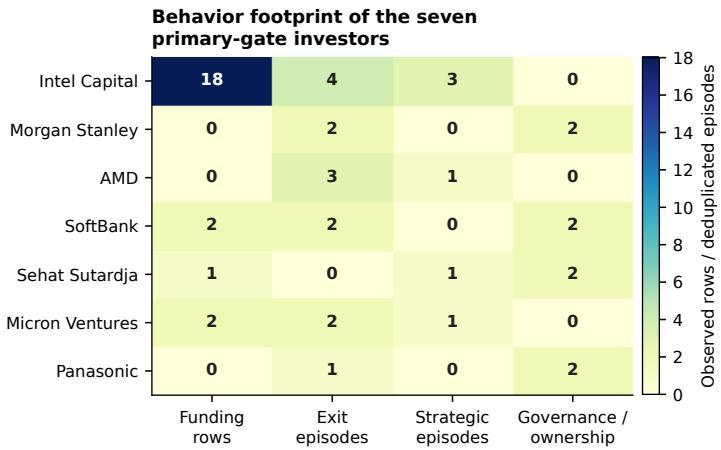  
Fig. 18. Behavior footprint of the seven primary-gate investors. Funding is reported as source rows; the other columns are deduplicated core episodes. The heat map exposes the heterogeneous scale and composition that underlie the three qualitative behavior groupings.

Figure 18 reveals Intel Capital’s much larger funding footprint and the sparse support for several other profiles before the investors are grouped into narrative patterns.

Their full event sets form three descriptive patterns:

• Technology investment and capability acquisition — Intel Capital, AMD, Micron Ventures, and Sehat Sutardja. The three corporates combine strategic investment with acquisition of chip or compute companies (Intel invests broadly then acquires selectively; AMD favors direct team or company acquisition; Micron pairs a strategic investment in Mythic with an acquisition); Sutardja is the non-acquisition subtype (strategic investment plus founder or board links).

• Financial ownership management and realization — Morgan Stanley and Panasonic. Morgan Stanley’s trajectory is position management $( \mathrm { I P O } ,$ stake increase, H-share purchase); Panasonic’s is restructuring and exit (spin-out, IPO, sale of a 49% stake). Both act through ownership and capital-market events rather than technology acquisition.

• Acquisition followed by control and integration — SoftBank. Its four core episodes all concern one company (Graphcore): acquisition, then a post-acquisition capital injection and a management or founder change — a concentrated acquisition-to-integration sequence rather than a portfolio-wide pattern.

## 10.5 Decision Implications and Limitations

For founders seeking acquisition, the evidence tentatively favors approaching strategic corporate investors with relevant acquisition histories; the Intel, AMD, and Micron cases illustrate the technology-acquisition channel to examine. For founders prioritizing independent operation, financing-led institutional VCs with fewer observable control events are a more relevant starting point for outreach. The SoftBank case illustrates why acquisition followed by integration difers from continued financial support. These are conditional starting points, not investor rankings: individual histories and their fit with the founder’s objective matter more than institutional labels.

The evidence is descriptive, not causal or predictive, and public records favor announced financing over less-visible governance activity. Missing control events do not establish a hands-ofrelationship;

behavior composition and type-level diferences may change as coverage improves. Section 11.1 consolidates the quantitative coverage, missingness, and collection-history constraints.

## 11 General Discussion

Taken together, Part One shows that a frozen, evidence-backed proposal pipeline can be evaluated against historical outcomes, while Part Two shows that public records can be transformed into auditable event chains for retrospective analysis. Their common contribution is not a single model of venture success, but a reusable evidence discipline that makes sources, time bounds, provenance, and uncertainty explicit at two founder decision stages.

Professional databases and the public-data alternative. Subscription venture databases remain valuable professional infrastructure: their curated coverage, standardized records, and research interfaces can be appropriate for institutions able to purchase them. Their price and access conditions, however, may make them a poor default for individual founders and resourceconstrained researchers. The public-source toolchain is therefore a complementary access path, not a claim that free retrieval dominates professional databases. It has two purposes: to test whether comparable decision-support research is feasible from public evidence while exposing the resulting coverage limits, and to release the construction and analysis methods for methodological scrutiny, reuse, and scholarly discussion.

Data availability before model choice. The choice of an LLM pipeline over a newly trained predictive model reflects the bottleneck addressed here, not a claim that pipelines dominate learned models. The immediate question is whether fragmented public sources can be converted into structured, time-bounded, provenance-bearing inputs at all. For this feasibility question, the pipeline was a resource-eficient design: it could retrieve, normalize, interpret, and trace heterogeneous evidence before a large task-specific training corpus existed. Nothing prevents the resulting public data from being used to train a model. Indeed, Part One’s individually proposed feature candidates and Part Two’s overlapping enumerated pattern candidates reveal the limits of manual and grammarbased search. Once suficiently large, well-covered data exist, learned models become an eficient design choice for discovering representations, higher-order interactions, and candidate rankings. The present contribution is upstream and complementary to that next step.

One lifecycle, two analytical tasks. The shared outcome ontology and evidence-governance rules connect the two parts, but their inferential roles difer. Part One asks a pre-founding predictive question using information bounded to the decision time. Part Two reconstructs post-founding histories for retrospective association and behavior analysis; it is not another prediction task. Combining them demonstrates how the same public-evidence discipline can support diferent founder decisions without treating their estimands as interchangeable.

Decision assistance, not automated prescription. The outputs are structured prompts for judgment. Part One’s PASS/WARN/FAIL verdicts evaluate proposals under an explicit evidence rule; Part Two’s RECOMMEND/AVOID labels classify observed operating-action patterns, not companies or investors. This presentation follows the broader human–AI interaction principle that assistance should expose system capability and support user control rather than silently replace judgment [1]. Neither vocabulary overrides a founder’s objectives, private information, risk tolerance, or responsibility for a decision.

## 11.1 Limitations and Future Work

These results establish feasibility and produce reusable artifacts, but not causal efects. Part One also lacks deployment-grade predictive validity, while Part Two is retrospective rather than predictive. The main constraints are consolidated in Table 8.

Table 8. Principal limitations of the two-part toolchain.
<table><tr><td>Component</td><td>Principal limitation</td></tr><tr><td>Idea-stage benchmark</td><td>Row-disjoint 198-row validation and later 4-fold out-of-sample tests were completed. From a separately drawn 4,000-row scale-validation cohort, post-stratifying all 1,027 completed cases to the fixed execution-split strata produces  $F _ { 0 . 5 } = 0 . 6 5 0 6 \left[ 0 . 5 9 8 , 0 . 7 0 7 \right]$  , while a 377-row composition-matched subset produces 0.6573 [0.556, 0.746]. Both overlap the combined benchmark estimate. Post-stratification assumes within-stratum completion exchangeability; the non-random completion process still limits this independent holdout evidence; the 1,199-row reserved split remains untouched. No tested extension</td></tr><tr><td>Vendor case study</td><td>funding/exit milestones rather than intrinsic venture quality, and year-constrained retrieval does not guarantee point-in-time web availability. Vendor cards combine the June 2026 MIT-licensed OpenSporks Crunchbase free database snapshot downloaded from Hugging Face with then-public sources; prices and product claims are time-sensitive, disclosure depth differs by vendor, estimates are not vendor-confirmed, and the underlying web screenshots are not</td></tr><tr><td>Investor graph</td><td>distributed. Free-source coverage is uneven: sovereign-wealth coverage is about 50%; free-source retrieval captures about 70% of the interface evidence visible in the paid-source reference; and per-investor amounts are populated for about 16% of rows in the separate full-universe funding_events_v0.2 table; that field is unpopulated in the released chip-subset funding table. An earlier cache accident destroyed 1,341 intermediate rows; the full scope was subsequently recollected,</td></tr><tr><td>Event-party attribution</td><td>and the current tables supersede that baseline. A post-release review of stored titles and summaries identified self-links in fewer than 1% of all released event records: the company and investor endpoints resolve to the same named entity, although the descriptions do not substantiate that self-relationship. These include investments in other companies and fund-level activities; a company legitimately acting as an investor is not itself an error. This review establishes an internal attribution limitation, not independent verification of the underlying sources. The released tables and reported estimates remain unchanged pending source-level adjudication and reassessment of the</td></tr><tr><td>Pattern analysis</td><td>derived statistics. The registry assigns labels from unadjusted absolute risk differences on a 501-company evaluable chip-startup subset. Outcome-dependent date coverage, residual confounding, and enumeration over 23,308 patterns preclude causal or broad population claims. A post hoc sensitivity check retains 6,313 tests under Benjamini-Hochberg and 327 under Bonferroni. These findings characterize the observed chip-company scope. Cross-industry portability is not empirically tested in this paper; only the frozen interpretable shortlist is substantive.</td></tr></table>

The immediate empirical priority is to complete the separately drawn scale run for the idea-stage pipeline and then evaluate the frozen pipeline once on the untouched validation split, without using that split for further tuning. This should be followed by sensitivity analysis across sectors and founding cohorts. For the investor graph, the priority is to expand dated failure coverage and improve observable coverage of governance and operating-support events without conflating non-observation with inactivity. Future work should also establish a stratified gold-standard audit of EventChain quality and coverage. This audit should measure event-type, date, source, and entityresolution accuracy, explicitly checking transaction-party roles and company-scope eligibility; inter-reviewer agreement; and coverage by event class, source type, company outcome, and calendar period. Comparison with independently curated or higher-coverage reference records would help distinguish extraction error from events absent from the observable public record. A separate extension is to apply the same event-chain method to additional industry cohorts and compare which associations are domain-specific and which appear transferable, with multiplicity controlled within each application. This cross-domain evaluation is future work, not an empirical claim of the present study. Better coverage would also permit stratified estimates by investor type and stage rather than relying on small confirmed-action samples.

## 11.2 Conclusion

This paper joins two decisions that are usually studied separately: whether an idea-stage business model merits pursuit, and which operating actions and capital partners fit after founding. At the idea stage, Full Pipeline v1.5a yields $F _ { 0 . 5 } = 0 . 5 3 5 7 \ : [ 0 . 4 1 2 , 0 . 6 5 5 ]$ on an independently drawn, row-disjoint 198-row validation sample; the combined 396-row development-plus-validation estimate is 0.6301, compared with 0.2734 for an apples-to-apples Raw LLM baseline. In the separately drawn scale cohort, the post-stratified estimate from all 1,027 completed cases is 0.6506 [0.598, 0.707], and the 377-row composition-matched sensitivity estimate is 0.6573. These are end-to-end system results rather than component-level attribution. The accompanying AI-inference case study identifies distribution-layer businesses as the most replicable path to independent profitability, albeit with a limited revenue ceiling, while frontier-model ownership ofers greater capital-market upside at exceptional capital cost.

After founding, the provenance-preserving event graph supports both investor profiles and a label-blind catalog of event-chain associations within completed chains. In the chip-company implementation, sustained product, customer, and supply-chain progress is associated with better observed outcomes; financing participation alone does not establish continuing operating progress. Two results also qualify intuitive readings: broad investor participation at a chain’s terminal event co-occurs with success even without recorded intermediate actions, and major-holder changes are negatively associated with outcomes only in the observed low-follow-through contexts rather than being uniformly adverse. Funding participation constitutes 79% of confirmed publicly visible post-investment actions. The observed evidence tentatively favors considering strategic corporate investors with relevant acquisition histories for acquisition-oriented founders, and financing-led institutional VCs with fewer observable control events for founders prioritizing independent operation. These findings describe the observed public record; they neither establish causal efects nor rank companies or investors.

The common contribution is an auditable workflow for turning freely available public evidence into structured, reusable decision support. The released ontology, provenance-bearing EventChain data, schemas, benchmarks, and executable skills form a coherent open toolchain rather than a universal startup-outcome model. Founders and analysts can inspect the evidence path, reproduce the data transformations, and treat each verdict or pattern as a decision aid whose uncertainty and observation boundary remain visible. The toolchain complements professional venture databases and supports judgment; it does not replace either professional data infrastructure or the founder’s responsibility for a decision.

## 12 Data Availability and License

The Part Two tables are released as EventChain on Hugging Face (quge007/eventchain, CC-BY-4.0). The dataset’s reproduce\_core\_results.py script reconstructs the 501-company evaluable cohort and primary P2/P3/P8 counts from the identity-patched release. The exhaustive 23,308-pattern registry is not included in the dataset release. Executable workflows for both parts are released as reusable skills in quge009/startup-decision-skills under the MIT license.

These materials support procedural reproduction of the published workflows and analyses. Deterministic transformations are exactly reproducible on the same frozen inputs; fresh retrieval and LLM runs need not yield identical artifacts or results [4]. New collection should retain its own retrieval date and provenance.

The Part One cohort and Part Two category matching use the MIT-licensed OpenSporks Crunchbase free snapshot downloaded from Hugging Face [23]. A conservative redistribution boundary excludes raw mirror records: Part One releases aggregate results and methodology; Part Two retains matched category tags with source labels. Other public-source data [28, 31] are released as derived analytical fields rather than raw third-party rows or paid-database exports. Vendor cards and their internal method, evidence, and link-audit records remain working research materials, not separate public deliverables.

## Declarations

Funding. This research received no external funding.

Competing interests. The author declares no competing interests.

Author contributions. Lei Qu designed the study, developed the methods and software, curated and analyzed the data, and wrote and revised the manuscript.

Ethics and responsible use. The study analyzes public institutional and company records and involved no intervention with human participants or use of private personal data. Its outputs are observational decision aids, not investment advice; users should verify source records and account for entity-resolution and coverage error.

## Acknowledgements

This manuscript was drafted with AI-assisted writing tools. The author assumes responsibility for the analysis, interpretation, source verification, and final text.

## References

[1] Saleema Amershi, Dan Weld, Mihaela Vorvoreanu, Adam Fourney, Besmira Nushi, Penny Collisson, Jina Suh, Shamsi Iqbal, Paul N. Bennett, Kori Inkpen, Jaime Teevan, Ruth Kikin-Gil, and Eric Horvitz. 2019. Guidelines for Human– AI Interaction. In Proceedings ofthe 2019 CHI Conference on Human Factors in Computing Systems. Association for Computing Machinery, New York, NY, USA, 1–13. https://doi.org/10.1145/3290605.3300233

[2] Yoav Benjamini and Yosef Hochberg. 1995. Controlling the False Discovery Rate: A Practical and Powerful Approach to Multiple Testing. Journal of the Royal Statistical Society: Series B (Methodological) 57, 1 (1995), 289–300. https: //doi.org/10.1111/j.2517-6161.1995.tb02031.x

[3] Shai Bernstein, Xavier Giroud, and Richard R. Townsend. 2016. The Impact of Venture Capital Monitoring. The Journal ofFinance 71, 4 (2016), 1591–1622. https://doi.org/10.1111/jofi.12370

[4] Robert E. Blackwell, Jon Barry, and Anthony G. Cohn. 2024. Towards Reproducible LLM Evaluation: Quantifying Uncertainty in LLM Benchmark Scores. arXiv preprint arXiv:2410.03492. https://doi.org/10.48550/arXiv.2410.03492

[5] Lele Cao, Vilhelm von Ehrenheim, Mark Granroth-Wilding, Richard Anselmo Stahl, Andrew McCornack, Armin Catovic, and Dhiana Deva Cavalcanti Rocha. 2024. CompanyKG: A Large-Scale Heterogeneous Graph of Companies. Proceedings of the 30th ACM SIGKDD Conference on Knowledge Discovery and Data Mining. https://doi.org/10. 1145/3637528.3671515

[6] Francesco Corea, Giorgio Bertinetti, and Enrico Maria Cervellati. 2021. Hacking the Venture Industry: An Early-Stage Startups Investment Framework for Data-Driven Investors. Machine Learning with Applications 5 (2021), 100062. https://doi.org/10.1016/j.mlwa.2021.100062

[7] Will Drover, Lowell Busenitz, Sharon Matusik, David Townsend, Aaron Anglin, and Gary Dushnitsky. 2017. A Review and Road Map of Entrepreneurial Equity Financing Research: Venture Capital, Corporate Venture Capital, Angel

Investment, Crowdfunding, and Accelerators. Journal of Management 43, 6 (2017), 1820–1853. https://doi.org/10.1177 0149206317690584

[8] Gary Dushnitsky and Michael J. Lenox. 2006. When Does Corporate Venture Capital Investment Create Firm Value? Journal of Business Venturing 21, 6 (2006), 753–772. https://doi.org/10.1016/j.jbusvent.2005.04.012

[9] Michael Ewens and Matt Marx. 2018. Founder Replacement and Startup Performance. The Review ofFinancial Studies 31, 4 (2018), 1532–1565. https://doi.org/10.1093/rfs/hhx130

[10] Timnit Gebru, Jamie Morgenstern, Briana Vecchione, Jennifer Wortman Vaughan, Hanna Wallach, Hal Daumé III, and Kate Crawford. 2021. Datasheets for Datasets. Commun. ACM 64, 12 (2021), 86–92. https://doi.org/10.1145/3458723

[11] Paul A. Gompers, Will Gornall, Steven N. Kaplan, and Ilya A. Strebulaev. 2020. How Do Venture Capitalists Make Decisions? Journal ofFinancial Economics 135, 1 (2020), 169–190. https://doi.org/10.1016/j.jfineco.2019.06.011

[12] Hamilton Helmer. 2016. 7 Powers: The Foundations of Business Strategy. Deeper Competence LLC, Menlo Park, CA.

[13] Shenyang Huang, Farimah Poursafaei, Jacob Danovitch, Matthias Fey, Weihua Hu, Emanuele Rossi, Jure Leskovec, Michael Bronstein, Guillaume Rabusseau, and Reihaneh Rabbany. 2023. Temporal Graph Benchmark for Machine Learning on Temporal Graphs. Advances in Neural Information Processing Systems 36, Datasets and Benchmarks Track. https://doi.org/10.48550/arXiv.2307.01026

[14] Yagiz Ihlamur, Ben Grifin, and Rick Chen. 2026. PHBench: Predicting Series A from Product Hunt Launch Signals. arXiv:2605.02974. https://doi.org/10.48550/arXiv.2605.02974

[15] Seyed Mohammad Ali Jafari, Ali Mobini Dehkordi, Ehsan Chitsaz, and Yadollah Yaghoobzadeh. 2025. What Matters Most? A Quantitative Meta-Analysis of AI-Based Predictors for Startup Success. arXiv preprint arXiv:2507.09675. https://doi.org/10.48550/arXiv.2507.09675

[16] Steven N. Kaplan, Berk A. Sensoy, and Per Stromberg. 2009. Should Investors Bet on the Jockey or the Horse? Evidence from the Evolution of Firms from Early Business Plans to Public Companies. The Journal of Finance 64, 1 (2009), 75–115. https://doi.org/10.1111/j.1540-6261.2008.01429.x

[17] Ji Youn Kim and Haemin Dennis Park. 2021. The Influence of Venture Capital Syndicate Size on Venture Performance. Venture Capital 23, 2 (2021), 179–203. https://doi.org/10.1080/13691066.2021.1893933

[18] Patrick Lewis, Ethan Perez, Aleksandra Piktus, Fabio Petroni, Vladimir Karpukhin, Naman Goyal, Heinrich Kuttler, Mike Lewis, Wen-tau Yih, Tim Rocktäschel, Sebastian Riedel, and Douwe Kiela. 2020. Retrieval-Augmented Generation for Knowledge-Intensive NLP Tasks. In Advances in Neural Information Processing Systems, Vol. 33. Curran Associates, Inc., Red Hook, NY, USA, 9459–9474. https://arxiv.org/abs/2005.11401

[19] Mucan Liu, Manting Hu, and Junming Liu. 2025. Event Shocks in Investment Networks: A Contextual-Temporal Aware Neural Point Process Framework. Proceedings of the International Conference on Information Systems (ICIS), 2025. https://aisel.aisnet.org/icis2025/da\_bus/da\_bus/11/

[20] Abdurahman Maarouf, Stefan Feuerriegel, and Nicolas Pröllochs. 2025. A Fused Large Language Model for Predicting Startup Success. European Journal of Operational Research 322, 1 (2025), 198–214. https://doi.org/10.1016/j.ejor.2024. 09.011

[21] Luc Moreau and Paolo Missier. 2013. PROV-DM: The PROV Data Model. W3C Recommendation. https://www.w3. org/TR/prov-dm

[22] Robert G. Newcombe. 1998. Interval Estimation for the Diference Between Independent Proportions: Comparison of Eleven Methods. Statistics in Medicine 17, 8 (1998), 873–890. https://doi.org/10.1002/(SICI)1097-0258(19980430)17: 8<873::AID-SIM779>3.0.CO;2-I

[23] OpenSporks. 2026. Crunchbase (OpenSporks Mirror). Hugging Face dataset, MIT license. https://huggingface.co datasets/opensporks/crunchbase

[24] Fabian Pedregosa, Gaël Varoquaux, Alexandre Gramfort, Vincent Michel, Bertrand Thirion, Olivier Grisel, Mathieu Blondel, Peter Prettenhofer, Ron Weiss, Vincent Dubourg, Jake Vanderplas, Alexandre Passos, David Cournapeau, Matthieu Brucher, Matthieu Perrot, and Édouard Duchesnay. 2011. Scikit-learn: Machine Learning in Python. Journal ofMachine Learning Research 12 (2011), 2825–2830. https://jmlr.org/papers/v12/pedregosa11a.html

[25] Jian Pei, Jiawei Han, Behzad Mortazavi-Asl, Helen Pinto, Qiming Chen, Umeshwar Dayal, and Mei-Chun Hsu. 2001. PrefixSpan: Mining Sequential Patterns Eficiently by Prefix-Projected Pattern Growth. In Proceedings ofthe 17th International Conference on Data Engineering. IEEE Computer Society, Los Alamitos, CA, 215–224. https: //doi.org/10.1109/ICDE.2001.914830

[26] Mahima Pushkarna, Andrew Zaldivar, and Oddur Kjartansson. 2022. Data Cards: Purposeful and Transparent Dataset Documentation for Responsible AI. In Proceedings ofthe 2022 ACM Conference on Fairness, Accountability, and Transparency. Association for Computing Machinery, New York, NY, USA, 1776–1826. https://doi.org/10.1145 3531146.3533231

[27] Tavily. 2026. Tavily Search API. https://tavily.com

[28] U.S. Securities and Exchange Commission. 2026. SEC EDGAR — Form D and 13D/13G filings. https://www.sec.gov/ edgar Public domain; accessed via data.sec.gov API.

[29] VCBench. 2026. VCBench: Predicting Startup Success from Founder Profiles. https://vcbench.com

[30] Vela Research. 2026. Think Reason Learn. https://github.com/Vela-Research/think-reason-learn Accessed September 11, 2026.

[31] Wikimedia Foundation. 2026. Wikidata. https://www.wikidata.org

[32] Shunyu Yao, Jefrey Zhao, Dian Yu, Nan Du, Izhak Shafran, Karthik Narasimhan, and Yuan Cao. 2023. ReAct: Synergizing Reasoning and Acting in Language Models. International Conference on Learning Representations. https://arxiv.org/abs/2210.03629

## A Illustrative Candidate Card

This fictional candidate card follows the released candidate-profiler Markdown format (Section 4.2).   
It illustrates the pipeline input, not an evaluated company or a prediction result.

```markdown
# Candidate card — Workshop Scheduler
**Slug**: workshop-scheduler-example
**Public/private**: private (proposal stage)
**Founding year**: 2025
**Card last updated**: 2026-09-11
**Card author**: hand-authored fictional example
**Original proposal description**: Scheduling software for independent
bicycle-repair shops. Charge $49 per shop monthly, plus onboarding. Sell directly
to owners; use cloud hosting. Service histories should encourage retention. No
customers yet.
**Closest existing vendor analogues**: not assessed; fictional example.
## 1. Revenue model
**Primary revenue stream**: subscription.
**Secondary revenue streams**: onboarding fee.
**Pricing structure**:
- Subscription: $49/shop/month (proposed).
- Onboarding: price not disclosed.
**Proposal claim**: "Charge $49 per shop monthly, plus onboarding."
**Plausibility flag**: medium — clear billing unit; demand untested.
**Notes**: Pricing is hypothetical. Contract duration, discounts, conversion, and
retention are unknown; no revenue is observed.
## 2. Customer segmentation
**Identifiable segments**: independent repair shops (SMBs).
**Estimated mix**:
- Owner-operated shops: share unknown; confidence low.
**Notable disclosed customer logos**: none.
**Proposal claim**: "Sell directly to owners."
**Notes**: Owners are buyers; staff are users. Geography, concentration, and demand
from chains remain unspecified. Targeting a segment does not establish adoption.
## 3. Cost structure (best-effort estimate)
**GPU spend as % of revenue**: not applicable.
**R&D split**:
- Model training / pre-training: not applicable.
- Inference optimization: not applicable.
- Platform / infra engineering: share unknown.
```

```markdown
**S&M as % of revenue**: not disclosed.
**Estimated gross margin**: not disclosed.
**Source of estimate**: proposal-based qualitative inference.
**Notes**: Development, hosting, support, and sales are likely costs. No measured
expenses or cost shares are available.
## 4. Differentiation / moat
**Differentiation claims**:
- Retention through stored service histories.
**Assessment**:
- Switching costs — mixed: plausible but unverified.
**Notes**: Migration effort, data portability, and competing products need
checking. Convenience alone is not a durable moat. No network effect or proprietary
technology is established; this hypothesis is input to U-check, not its verdict.
## 5. Strategic vulnerabilities
**Identified risks**:
- Competition: alternatives could limit pricing; likelihood unknown, high
potential impact.
- Sales costs: acquisition could exceed subscription contribution; likelihood
unknown, high potential impact.
**Common categories to consider**:
- Competition; unit-economics; retention.
**Notes**: Easy data export could also weaken retention. These are prospective
risks, not observed failures; their relative likelihood is unknown.
```