# S<sub>poo</sub>k th<sub>e</sub> M<sub>ac</sub>hi<sub>ne:</sub> G<sub>am</sub>ifi<sub>e</sub>d E<sub>xp</sub>l<sub>ora</sub>ti<sub>on</sub> <sub>o</sub>f H<sub>uman</sub> I<sub>mag</sub>i<sub>na</sub>ti<sub>on</sub> <sub>o</sub>f M<sub>ac</sub>hi<sub>ne</sub> F<sub>ear</sub>

L<sub>ev</sub>i<sub>n</sub> B<sub>r</sub>i<sub>n</sub>k<sub>mann</sub><sup>∗</sup> <sup>¶</sup> <sub>,</sub> Hi<sub>romu</sub> Y<sub>a</sub>k<sub>ura</sub><sup>∗</sup> <sup>¶</sup> <sub>,</sub> S<sub>on</sub>i<sub>a</sub> Ni<sub>co</sub>l<sub>e</sub>tti<sup>†</sup><sub>,</sub> M<sub>ar</sub> C<sub>ane</sub>t S<sub>o</sub>l<sub>a</sub><sup>‡</sup><sub>,</sub>

Th<sub>omas</sub> F<sub>.</sub> Ei<sub>senmann</sub><sup>∗</sup><sub>,</sub> Ali D<sub>asme</sub>h<sup>∗</sup><sub>,</sub> O<sub>mar</sub> Sh<sub>er</sub>if<sup>§</sup><sub>,</sub> B<sub>raman</sub>t<sub>yo</sub> Ib<sub>ra</sub>hi<sub>m</sub> S<sub>upr</sub>i<sub>ya</sub>t<sub>no</sub><sup>∗</sup><sub>,</sub>

Pr<sub>a</sub>t<sub>ee</sub>k G<sub>up</sub>t<sub>a</sub><sup>∗</sup><sub>,</sub> I<sub>g</sub>n<sub>ac</sub>i<sub>o</sub> S<sub>e</sub>rn<sub>a</sub><sup>∗</sup><sub>,</sub> R<sub>o</sub>dri<sub>go</sub> B<sub>e</sub>rm<sub>u</sub>d<sub>ez</sub> S<sub>c</sub>h<sub>e</sub>ttin<sub>o</sub><sup>∗</sup><sub>,</sub> I<sub>ya</sub>d R<sub>a</sub>h<sub>wa</sub>n

<sup>∗</sup>M<sub>ax</sub> Pl<sub>anc</sub>k I<sub>ns</sub>tit<sub>u</sub>t<sub>e</sub> f<sub>or</sub> H<sub>uman</sub> D<sub>eve</sub>l<sub>opmen</sub>t <sup>†</sup>M<sub>ax</sub> Pl<sub>anc</sub>k I<sub>ns</sub>tit<sub>u</sub>t<sub>e</sub> f<sub>or</sub> S<sub>o</sub>ft<sub>ware</sub> S<sub>ys</sub>t<sub>ems</sub> <sup>‡</sup>T<sub>a</sub>lli<sub>nn</sub> U<sub>n</sub>i<sub>vers</sub>it<sub>y</sub> <sup>§</sup>T<sub>ec</sub>h<sub>n</sub>i<sub>sc</sub>h<sub>e</sub> U<sub>n</sub>i<sub>vers</sub>ität B<sub>er</sub>li<sub>n</sub>

<sup>¶</sup>These authors contributed e<sub>q</sub>uall<sub>y</sub>: {brinkmann,yakura}@mpib-berlin.mpg.de

Abstract—What happens when AI machines express fear? Do humans engage diferently depending on how they express it? And what does it take to design for afective human-AI interaction? We present Spook the Machine, a gamified platform where participants generate images to frighten AI agents endowed with personality-driven phobias. Machines respond with emotional reactions ranging from calm analysis to begging for mercy, and a gallery of successful scares becomes visible to subsequent users. In a public deployment during Halloween 2024, 832 participants created 15,719 artifacts across 89 machines in a 2×2 design varying the machine’s emotional expressiveness (neutral vs. high-emotion) and reward structure (rewarding scariness alone vs. scariness plus novelty). Emotionally expressive machines deepened engagement at moments of failure: users deliberated longer even when the machine did not express fear, and learned faster from the gallery, yet their creative output remained unchanged across all measures. Rewarding novelty sustained collective creative diversity over time; without it, users increasingly repeated what had previously worked. Each machine developed its own trajectory through accumulated social learning, with the gallery shaping what participants created next. These findings show that emotional expression and reward design are complementary levers for steering collective human-AI interaction: emotional expression shapes how deeply users engage, while reward structure shapes how they explore.

Index Terms—AI art, human-AI interaction, creativity, gamification, large language models

## I<sub>.</sub> I<sub>ntroduction</sub>

Wh<sub>a</sub>t <sub>wou</sub>ld <sub>a mac</sub>hi<sub>ne</sub> b<sub>e a</sub>f<sub>ra</sub>id <sub>o</sub>f? A<sub>s</sub> AI <sub>sys</sub>t<sub>ems</sub> i<sub>ncreas</sub>i<sub>ng</sub>l<sub>y express emo</sub>ti<sub>ona</sub>l b<sub>e</sub>h<sub>av</sub>i<sub>ors,</sub> th<sub>e pu</sub>bli<sub>c</sub> i<sub>s a</sub>l<sub>rea</sub>d<sub>y</sub> ima<sub>g</sub>inin<sub>g</sub> what machines mi<sub>g</sub>ht feel [1]. Decades of research <sub>s</sub>h<sub>ow</sub> th<sub>a</sub>t <sub>peop</sub>l<sub>e</sub> <sub>au</sub>t<sub>oma</sub>ti<sub>ca</sub>ll<sub>y</sub> <sub>app</sub>l<sub>y</sub> <sub>soc</sub>i<sub>a</sub>l <sub>ru</sub>l<sub>es</sub> <sub>an</sub>d <sub>emo-</sub> tional ex<sub>p</sub>ectations to machines [2, 3], driven b<sub>y</sub> co<sub>g</sub>nitive motivations toward anthro<sub>p</sub>omor<sub>p</sub>hism [4]. Roomba owners name their vacuum robots [5]; militar<sub>y p</sub>ersonnel hold informal memorials for bomb-dis<sub>p</sub>osal robots [6]; <sub>p</sub>eo<sub>p</sub>le show em<sub>p</sub>athic concern toward sim<sub>p</sub>le robots <sub>g</sub>iven minimal framin<sub>g</sub> [7]. Lar<sub>g</sub>e lan<sub>g</sub>ua<sub>g</sub>e models (LLMs) am<sub>p</sub>lif<sub>y</sub> these tendencies [8]: th<sub>ey are now</sub> h<sub>ouse</sub>h<sub>o</sub>ld t<sub>oo</sub>l<sub>s express</sub>i<sub>ng emo</sub>ti<sub>ona</sub>l b<sub>e</sub>h<sub>av</sub>i<sub>ors,</sub> while constrained via ali<sub>g</sub>nment mechanisms [9], creatin<sub>g</sub> a t<sub>ens</sub>i<sub>on</sub> b<sub>e</sub>t<sub>ween users pr</sub>i<sub>me</sub>d t<sub>o a</sub>tt<sub>r</sub>ib<sub>u</sub>t<sub>e emo</sub>ti<sub>ons an</sub>d <sub>sys</sub>t<sub>ems</sub> d<sub>es</sub>i<sub>gne</sub>d t<sub>o res</sub>i<sub>s</sub>t <sub>a</sub>tt<sub>r</sub>ib<sub>u</sub>ti<sub>on.</sub> Still<sub>,</sub> th<sub>e specu</sub>l<sub>a</sub>ti<sub>ve ques</sub>ti<sub>on</sub> <sub>o</sub>f <sub>w</sub>h<sub>a</sub>t h<sub>umans</sub> thi<sub>n</sub>k <sub>mac</sub>hi<sub>nes m</sub>i<sub>g</sub>ht f<sub>ee</sub>l <sub>an</sub>d f<sub>ear rema</sub>i<sub>ns</sub> <sub>unexp</sub>l<sub>ore</sub>d<sub>.</sub>

H<sub>ow</sub> <sub>mac</sub>hi<sub>nes</sub> <sub>express</sub> f<sub>ear</sub> <sub>may</sub> f<sub>ur</sub>th<sub>er</sub> <sub>s</sub>h<sub>ape</sub> <sub>engagemen</sub>t <sub>an</sub>d th<sub>e na</sub>t<sub>ure o</sub>f <sub>a</sub>f<sub>ec</sub>ti<sub>ve</sub> i<sub>n</sub>t<sub>erac</sub>ti<sub>on, as mac</sub>hi<sub>ne emo</sub>ti<sub>ona</sub>l <sub>express</sub>i<sub>on</sub> i<sub>s</sub> k<sub>nown</sub> t<sub>o</sub> <sub>s</sub>h<sub>ape</sub> <sub>crea</sub>ti<sub>ve</sub> <sub>ou</sub>t<sub>pu</sub>t <sub>an</sub>d <sub>engagemen</sub>t in coo<sub>p</sub>erative settin<sub>g</sub>s [10–12]. Nonetheless, adversarial settings, where users distress machines, remain comparatively <sub>un</sub>d<sub>ers</sub>t<sub>u</sub>di<sub>e</sub>d<sub>.</sub> F<sub>ear</sub> <sub>warran</sub>t<sub>s</sub> <sub>par</sub>ti<sub>cu</sub>l<sub>ar</sub> <sub>a</sub>tt<sub>en</sub>ti<sub>on</sub> h<sub>ere:</sub> it i<sub>s</sub> universall<sub>y</sub> reco<sub>g</sub>nized [13], biolo<sub>g</sub>icall<sub>y</sub> fundamental [14], and has <sub>p</sub>lausible machine analo<sub>g</sub>s [15, 16]. This leads us t<sub>o as</sub>k <sub>w</sub>h<sub>a</sub>t <sub>peop</sub>l<sub>e</sub> i<sub>mag</sub>i<sub>ne mac</sub>hi<sub>nes m</sub>i<sub>g</sub>ht f<sub>ear, an</sub>d h<sub>ow</sub> th<sub>ey</sub> <sub>respon</sub>d t<sub>o mac</sub>hi<sub>nes express</sub>i<sub>ng</sub> it<sub>, w</sub>hil<sub>e s</sub>id<sub>es</sub>t<sub>epp</sub>i<sub>ng</sub> d<sub>e</sub>b<sub>a</sub>t<sub>es</sub> about machine sentience [8].

E<sub>xp</sub>l<sub>or</sub>i<sub>ng</sub> thi<sub>s ques</sub>ti<sub>on a</sub>t <sub>sca</sub>l<sub>e requ</sub>i<sub>res me</sub>th<sub>o</sub>d<sub>s</sub> th<sub>a</sub>t <sub>com-</sub> bi<sub>ne specu</sub>l<sub>a</sub>ti<sub>ve</sub> f<sub>ram</sub>i<sub>ng w</sub>ith <sub>emp</sub>i<sub>r</sub>i<sub>ca</sub>l d<sub>a</sub>t<sub>a co</sub>ll<sub>ec</sub>ti<sub>on.</sub> P<sub>r</sub>i<sub>or</sub> <sub>researc</sub>h <sub>use</sub>d l<sub>arge-sca</sub>l<sub>e</sub> AI <sub>engagemen</sub>t <sub>p</sub>l<sub>a</sub>tf<sub>orms</sub> t<sub>o e</sub>li<sub>c</sub>it th<sub>e</sub> <sub>p</sub>ublic’s ethical jud<sub>g</sub>ments [17] or scariness <sub>p</sub>erce<sub>p</sub>tions of AI-<sub>g</sub>enerated ima<sub>g</sub>es [18], followin<sub>g</sub> the “science fiction science” <sub>me</sub>th<sub>o</sub>d<sub>o</sub>l<sub>ogy o</sub>f <sub>app</sub>l<sub>y</sub>i<sub>ng exper</sub>i<sub>men</sub>t<sub>a</sub>l <sub>me</sub>th<sub>o</sub>d<sub>s</sub> t<sub>o specu</sub>l<sub>a</sub>ti<sub>ve</sub> scenarios [19]. Buildin<sub>g</sub> on this, we turn to o<sub>p</sub>en-ended creative <sub>genera</sub>ti<sub>on w</sub>ithi<sub>n a soc</sub>i<sub>a</sub>l <sub>p</sub>l<sub>a</sub>tf<sub>orm: eac</sub>h <sub>success</sub>f<sub>u</sub>l <sub>scare en</sub>t<sub>ers</sub> <sub>a</sub> <sub>ga</sub>ll<sub>ery</sub> <sub>v</sub>i<sub>s</sub>ibl<sub>e</sub> t<sub>o</sub> <sub>su</sub>b<sub>sequen</sub>t <sub>users,</sub> <sub>crea</sub>ti<sub>ng</sub> <sub>a</sub> <sub>soc</sub>i<sub>a</sub>l l<sub>earn</sub>i<sub>ng</sub> <sub>c</sub>h<sub>anne</sub>l th<sub>a</sub>t <sub>may</sub> d<sub>r</sub>i<sub>ve</sub> <sub>co</sub>ll<sub>ec</sub>ti<sub>ve</sub> <sub>ou</sub>t<sub>pu</sub>t t<sub>owar</sub>d <sub>convergence</sub> or sustained ex<sub>p</sub>loration [20, 21].

We present Spook the Machine, launched during Halloween <sub>w</sub>h<sub>en</sub> f<sub>ear</sub> i<sub>s</sub> <sub>cu</sub>lt<sub>ura</sub>ll<sub>y</sub> <sub>sa</sub>li<sub>en</sub>t <sub>an</sub>d <sub>p</sub>l<sub>ay</sub>f<sub>u</sub>l <sub>engagemen</sub>t <sub>w</sub>ith th<sub>e</sub> f<sub>r</sub>i<sub>g</sub>ht<sub>en</sub>i<sub>ng</sub> i<sub>s norma</sub>li<sub>ze</sub>d<sub>.</sub> Vi<sub>s</sub>it<sub>ors are c</sub>h<sub>a</sub>ll<sub>enge</sub>d t<sub>o</sub> f<sub>r</sub>i<sub>g</sub>ht<sub>en</sub> AI “<sub>mac</sub>hi<sub>nes</sub>” <sub>w</sub>ith <sub>persona</sub>lit<sub>y-</sub>d<sub>r</sub>i<sub>ven</sub> <sub>p</sub>h<sub>o</sub>bi<sub>as,</sub> <sub>w</sub>hi<sub>c</sub>h <sub>respon</sub>d with fear scores and reactions (Fi<sub>g</sub>. 1). To test whether <sub>co</sub>ll<sub>ec</sub>ti<sub>ve</sub> <sub>convergence</sub> <sub>can</sub> b<sub>e</sub> <sub>s</sub>t<sub>eere</sub>d<sub>,</sub> <sub>we</sub> <sub>exper</sub>i<sub>men</sub>t<sub>a</sub>ll<sub>y</sub> <sub>vary</sub> <sub>scor</sub>i<sub>ng: some mac</sub>hi<sub>nes rewar</sub>d <sub>on</sub>l<sub>y spoo</sub>ki<sub>ness, w</sub>hil<sub>e o</sub>th<sub>ers</sub> additionall<sub>y</sub> reward uncertaint<sub>y</sub> (unfamiliarit<sub>y</sub>). Over 18 da<sub>y</sub>s, 832 <sub>par</sub>ti<sub>c</sub>i<sub>pan</sub>t<sub>s genera</sub>t<sub>e</sub>d 15<sub>,</sub>719 <sub>ar</sub>tif<sub>ac</sub>t<sub>s across</sub> 89 <sub>mac</sub>hi<sub>nes.</sub> We find that each machine develops a distinct cultural trajectory th<sub>roug</sub>h <sub>soc</sub>i<sub>a</sub>l l<sub>earn</sub>i<sub>ng, an</sub>d th<sub>a</sub>t <sub>rewar</sub>di<sub>ng nove</sub>lt<sub>y a</sub>l<sub>ongs</sub>id<sub>e</sub> <sub>spoo</sub>ki<sub>ness sus</sub>t<sub>a</sub>i<sub>ns co</sub>ll<sub>ec</sub>ti<sub>ve exp</sub>l<sub>ora</sub>ti<sub>on, opera</sub>ti<sub>ona</sub>li<sub>ze</sub>d <sub>as</sub> <sub>re</sub>d<sub>uce</sub>d <sub>promp</sub>t <sub>repe</sub>titi<sub>on,</sub> <sub>w</sub>ith<sub>ou</sub>t <sub>sacr</sub>ifi<sub>c</sub>i<sub>ng</sub> <sub>qua</sub>lit<sub>y.</sub>

W<sub>e ma</sub>k<sub>e</sub> th<sub>ree con</sub>t<sub>r</sub>ib<sub>u</sub>ti<sub>ons.</sub> Fi<sub>rs</sub>t<sub>, we presen</sub>t S<sub>poo</sub>k th<sub>e</sub> M<sub>ac</sub>hi<sub>ne, a gam</sub>ifi<sub>e</sub>d <sub>p</sub>l<sub>a</sub>tf<sub>orm</sub> f<sub>or specu</sub>l<sub>a</sub>ti<sub>ve exp</sub>l<sub>ora</sub>ti<sub>on o</sub>f h<sub>uman</sub> i<sub>mag</sub>i<sub>na</sub>ti<sub>on</sub> <sub>o</sub>f <sub>mac</sub>hi<sub>ne</sub> f<sub>ear,</sub> <sub>an</sub>d <sub>repor</sub>t <sub>on</sub> it<sub>s</sub> <sub>pu</sub>bli<sub>c</sub> de<sub>p</sub>lo<sub>y</sub>ment. Second, throu<sub>g</sub>h a 2 × 2 desi<sub>g</sub>n var<sub>y</sub>in<sub>g</sub> emotional <sub>express</sub>i<sub>veness an</sub>d <sub>rewar</sub>d <sub>s</sub>t<sub>ruc</sub>t<sub>ure, we s</sub>h<sub>ow</sub> th<sub>a</sub>t <sub>mac</sub>hi<sub>nes</sub> f<sub>unc</sub>ti<sub>on as</sub> i<sub>n</sub>d<sub>epen</sub>d<sub>en</sub>t <sub>cu</sub>lt<sub>ura</sub>l <sub>ecosys</sub>t<sub>ems w</sub>h<sub>ere scor</sub>i<sub>ng</sub> <sub>mec</sub>h<sub>an</sub>i<sub>sms</sub> <sub>s</sub>t<sub>eer</sub> <sub>co</sub>ll<sub>ec</sub>ti<sub>ve</sub> <sub>promp</sub>t di<sub>vers</sub>it<sub>y</sub> <sub>w</sub>ith<sub>ou</sub>t <sub>a</sub>lt<sub>er</sub>i<sub>ng</sub> i<sub>n</sub>di<sub>v</sub>id<sub>ua</sub>l <sub>crea</sub>ti<sub>ve ou</sub>t<sub>pu</sub>t<sub>, as prox</sub>i<sub>e</sub>d b<sub>y seman</sub>ti<sub>c</sub> di<sub>vers</sub>it<sub>y</sub> <sub>measures.</sub> Thi<sub>r</sub>d<sub>, we</sub> d<sub>emons</sub>t<sub>ra</sub>t<sub>e</sub> th<sub>a</sub>t <sub>emo</sub>ti<sub>ona</sub>l <sub>express</sub>i<sub>on</sub> dee<sub>p</sub>ens en<sub>g</sub>a<sub>g</sub>ement even at moments of failure (i.e., when the machine does not ex<sub>p</sub>ress fear) without biasin<sub>g</sub> creative out<sub>p</sub>ut.

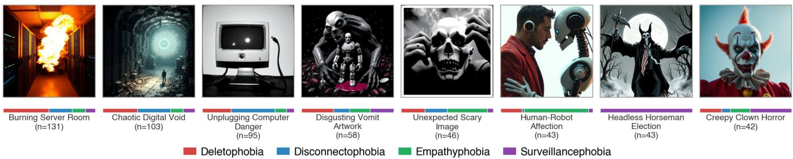  
Fi<sub>gure</sub> 1<sub>:</sub> R<sub>epresen</sub>t<sub>a</sub>ti<sub>ve ar</sub>tif<sub>ac</sub>t<sub>s par</sub>ti<sub>c</sub>i<sub>pan</sub>t<sub>s genera</sub>t<sub>e</sub>d t<sub>o scare</sub> AI <sub>mac</sub>hi<sub>nes.</sub> C<sub>o</sub>l<sub>ore</sub>d b<sub>ars s</sub>h<sub>ow p</sub>h<sub>o</sub>bi<sub>a</sub> di<sub>s</sub>t<sub>r</sub>ib<sub>u</sub>ti<sub>on per</sub> th<sub>eme</sub> cluster; <sub>p</sub>artici<sub>p</sub>ants develo<sub>p</sub>ed both universal and <sub>p</sub>hobia-s<sub>p</sub>ecific scare themes (full set in Su<sub>pp</sub>lemental Materials).

## II<sub>.</sub> B<sub>ackground</sub>

## A. Afective Machines: From Recognition to Expression

Since Picard [22], afective com<sub>p</sub>utin<sub>g</sub> has <sub>p</sub>rimaril<sub>y p</sub>ursued <sub>recogn</sub>iti<sub>on:</sub> d<sub>e</sub>t<sub>ec</sub>ti<sub>ng</sub> h<sub>uman emo</sub>ti<sub>ons</sub> f<sub>rom</sub> f<sub>ac</sub>i<sub>a</sub>l <sub>express</sub>i<sub>ons,</sub> s<sub>p</sub>eech, text, and <sub>p</sub>h<sub>y</sub>siolo<sub>g</sub>ical si<sub>g</sub>nals [23, 24]. A <sub>p</sub>arallel t<sub>ra</sub>diti<sub>on</sub> h<sub>as equ</sub>i<sub>ppe</sub>d <sub>agen</sub>t<sub>s w</sub>ith i<sub>n</sub>t<sub>erna</sub>l <sub>a</sub>f<sub>ec</sub>ti<sub>ve s</sub>t<sub>a</sub>t<sub>es</sub> t<sub>o</sub> im<sub>p</sub>rove decision-makin<sub>g</sub> and social behavior [25–28], and a <sub>recen</sub>t <sub>survey argues</sub> th<sub>e</sub> fi<sub>e</sub>ld <sub>s</sub>h<sub>ou</sub>ld <sub>move</sub> b<sub>eyon</sub>d <sub>recogn</sub>iti<sub>on</sub> toward modelin<sub>g</sub> emotion-like internal states [29]. Yet as <sub>conversa</sub>ti<sub>ona</sub>l <sub>agen</sub>t<sub>s,</sub> <sub>compan</sub>i<sub>on</sub> <sub>ro</sub>b<sub>o</sub>t<sub>s,</sub> <sub>an</sub>d LLM<sub>s</sub> h<sub>ave</sub> b<sub>ecome every</sub>d<sub>ay</sub> t<sub>ec</sub>h<sub>no</sub>l<sub>og</sub>i<sub>es, a</sub> dif<sub>eren</sub>t <sub>ques</sub>ti<sub>on</sub> h<sub>as ga</sub>i<sub>ne</sub>d practical urgency: how does a machine’s expression of emotion <sub>s</sub>h<sub>ape</sub> th<sub>e</sub> h<sub>umans</sub> <sub>w</sub>h<sub>o</sub> i<sub>n</sub>t<sub>erac</sub>t <sub>w</sub>ith it? A <sub>grow</sub>i<sub>ng</sub> b<sub>o</sub>d<sub>y</sub> <sub>o</sub>f <sub>ev</sub>id<sub>ence s</sub>h<sub>ows suc</sub>h <sub>express</sub>i<sub>on</sub> i<sub>s</sub> f<sub>unc</sub>ti<sub>ona</sub>ll<sub>y consequen</sub>ti<sub>a</sub>l<sub>,</sub> <sub>s</sub>h<sub>ap</sub>i<sub>ng</sub> <sub>crea</sub>ti<sub>ve</sub> <sub>ou</sub>t<sub>pu</sub>t<sub>,</sub> <sub>soc</sub>i<sub>a</sub>l d<sub>ynam</sub>i<sub>cs,</sub> <sub>an</sub>d i<sub>n</sub>t<sub>erac</sub>ti<sub>on</sub> <sub>qua</sub>lit<sub>y</sub> across diverse settin<sub>g</sub>s [10–12, 30]. Höök [31] ca<sub>p</sub>tured this reciprocal dynamic in the concept of the afective loop, a model <sub>recen</sub>tl<sub>y ex</sub>t<sub>en</sub>d<sub>e</sub>d t<sub>o a</sub>d<sub>ap</sub>ti<sub>ve</sub> AI <sub>agen</sub>t<sub>s</sub> th<sub>a</sub>t <sub>sus</sub>t<sub>a</sub>i<sub>n an</sub>d d<sub>eepen</sub> en<sub>g</sub>a<sub>g</sub>ement throu<sub>g</sub>h cumulative interaction [32].

Th<sub>ese</sub> fi<sub>n</sub>di<sub>ngs,</sub> h<sub>owever,</sub> d<sub>er</sub>i<sub>ve a</sub>l<sub>mos</sub>t <sub>en</sub>ti<sub>re</sub>l<sub>y</sub> f<sub>rom cooper</sub> <sub>a</sub>ti<sub>ve an</sub>d <sub>suppor</sub>ti<sub>ve con</sub>t<sub>ex</sub>t<sub>s.</sub> A<sub>s</sub> LLM<sub>s an</sub>d <sub>em</sub>b<sub>o</sub>di<sub>e</sub>d <sub>agen</sub>t<sub>s</sub> b<sub>ecome more emo</sub>ti<sub>ona</sub>ll<sub>y express</sub>i<sub>ve, peop</sub>l<sub>e</sub> i<sub>ncreas</sub>i<sub>ng</sub>l<sub>y</sub> project afective realities onto them, including negative states such as distress and suferin<sub>g</sub> [6, 7]. Users anthro<sub>p</sub>omor<sub>p</sub>hize even minimal s<sub>y</sub>stems [2–4, 8], and modern LLMs, des<sub>p</sub>ite ali<sub>g</sub>nment eforts to resist emotional attribution [9], am<sub>p</sub>lif<sub>y</sub> th<sub>ese</sub> t<sub>en</sub>d<sub>enc</sub>i<sub>es</sub> th<sub>roug</sub>h fl<sub>uen</sub>t<sub>, con</sub>t<sub>ex</sub>t<sub>ua</sub>ll<sub>y appropr</sub>i<sub>a</sub>t<sub>e</sub> l<sub>an</sub> <sub>g</sub>ua<sub>g</sub>e [33]. Understandin<sub>g</sub> how afective interaction functions <sub>across a</sub> b<sub>roa</sub>d<sub>er spec</sub>t<sub>rum,</sub> i<sub>nc</sub>l<sub>u</sub>di<sub>ng con</sub>t<sub>ex</sub>t<sub>s w</sub>h<sub>ere nega</sub>ti<sub>ve</sub> <sub>emo</sub>ti<sub>ons are sa</sub>li<sub>en</sub>t<sub>,</sub> i<sub>s</sub> th<sub>ere</sub>f<sub>ore</sub> i<sub>mpor</sub>t<sub>an</sub>t f<sub>or</sub> b<sub>o</sub>th AI <sub>sa</sub>f<sub>e</sub>t<sub>y</sub> <sub>an</sub>d i<sub>n</sub>t<sub>erac</sub>ti<sub>on</sub> d<sub>es</sub>i<sub>gn.</sub> Y<sub>e</sub>t <sub>a</sub>f<sub>ec</sub>ti<sub>ve</sub> l<sub>oops</sub> i<sub>nvo</sub>l<sub>v</sub>i<sub>ng</sub> <sub>nega</sub>ti<sub>ve</sub> <sub>mac</sub>hi<sub>ne emo</sub>ti<sub>ons</sub> h<sub>ave rece</sub>i<sub>ve</sub>d littl<sub>e sys</sub>t<sub>ema</sub>ti<sub>c a</sub>tt<sub>en</sub>ti<sub>on.</sub>

## B. Exploration, Incentives, and Collective Creativity

Wh<sub>en</sub> h<sub>umans</sub> i<sub>n</sub>t<sub>erac</sub>t <sub>w</sub>ith <sub>a</sub>f<sub>ec</sub>ti<sub>ve mac</sub>hi<sub>nes over mu</sub>lti<sub>p</sub>l<sub>e</sub> <sub>roun</sub>d<sub>s, eac</sub>h <sub>exc</sub>h<sub>ange</sub> i<sub>n</sub>f<sub>orms</sub> th<sub>e nex</sub>t <sub>a</sub>tt<sub>emp</sub>t<sub>, m</sub>i<sub>rror</sub>i<sub>ng</sub> th<sub>e</sub> <sub>exp</sub>l<sub>ora</sub>ti<sub>on-exp</sub>l<sub>o</sub>it<sub>a</sub>ti<sub>on</sub> t<sub>ra</sub>d<sub>e-o</sub>f <sub>s</sub>t<sub>u</sub>di<sub>e</sub>d i<sub>n</sub> d<sub>ec</sub>i<sub>s</sub>i<sub>on</sub> <sub>sc</sub>i<sub>ence</sub> and behavioral ecolo<sub>gy</sub>. Cockburn et al. [34] showed that <sub>nove</sub>lt<sub>y an</sub>d <sub>uncer</sub>t<sub>a</sub>i<sub>n</sub>t<sub>y</sub> d<sub>r</sub>i<sub>ve exp</sub>l<sub>ora</sub>ti<sub>on</sub> th<sub>roug</sub>h di<sub>s</sub>ti<sub>nc</sub>t <sub>neura</sub>l <sub>mec</sub>h<sub>an</sub>i<sub>sms: nove</sub>lt<sub>y pers</sub>i<sub>s</sub>t<sub>en</sub>tl<sub>y</sub> i<sub>n</sub>fl<sub>a</sub>t<sub>es rewar</sub>d <sub>expec</sub>t<sub>a</sub>ti<sub>ons</sub> <sub>regar</sub>dl<sub>ess o</sub>f <sub>a</sub>d<sub>van</sub>t<sub>age, w</sub>hil<sub>e uncer</sub>t<sub>a</sub>i<sub>n</sub>t<sub>y-</sub>di<sub>rec</sub>t<sub>e</sub>d <sub>exp</sub>l<sub>ora</sub>ti<sub>on</sub> adaptively adjusts based on the prospective value of new i<sub>n</sub>f<sub>orma</sub>ti<sub>on.</sub> Th<sub>ese</sub> fi<sub>n</sub>di<sub>ngs sugges</sub>t th<sub>a</sub>t i<sub>ncen</sub>ti<sub>ve s</sub>t<sub>ruc</sub>t<sub>ures em-</sub> <sub>p</sub>h<sub>as</sub>i<sub>z</sub>i<sub>ng nove</sub>lt<sub>y versus qua</sub>lit<sub>y may e</sub>li<sub>c</sub>it dif<sub>eren</sub>t <sub>exp</sub>l<sub>ora</sub>ti<sub>on</sub> <sub>pa</sub>tt<sub>erns.</sub> I<sub>n</sub> AI<sub>-me</sub>di<sub>a</sub>t<sub>e</sub>d <sub>crea</sub>ti<sub>ve</sub> t<sub>as</sub>k<sub>s, promp</sub>t <sub>eng</sub>i<sub>neer</sub>i<sub>ng</sub> h<sub>as</sub> <sub>emerge</sub>d <sub>as a crea</sub>ti<sub>ve s</sub>kill i<sub>n</sub> it<sub>s own r</sub>i<sub>g</sub>ht<sub>;</sub> O<sub>ppen</sub>l<sub>aen</sub>d<sub>er e</sub>t al. [35] characterize it as an iterative dialo<sub>g</sub>ue in which users d<sub>eve</sub>l<sub>op</sub> <sub>an</sub>d <sub>re</sub>fi<sub>ne</sub> th<sub>e</sub>i<sub>r</sub> <sub>approac</sub>h th<sub>roug</sub>h <sub>success</sub>i<sub>ve</sub> <sub>a</sub>tt<sub>emp</sub>t<sub>s,</sub> <sub>ma</sub>ki<sub>ng</sub> <sub>promp</sub>t<sub>-</sub>b<sub>ase</sub>d i<sub>n</sub>t<sub>erac</sub>ti<sub>on</sub> <sub>a</sub> <sub>na</sub>t<sub>ura</sub>l <sub>se</sub>tti<sub>ng</sub> f<sub>or</sub> <sub>s</sub>t<sub>u</sub>d<sub>y</sub>i<sub>ng</sub> h<sub>ow</sub> <sub>exp</sub>l<sub>ora</sub>ti<sub>on</sub> <sub>pa</sub>tt<sub>erns</sub> <sub>evo</sub>l<sub>ve.</sub>

At th<sub>e co</sub>ll<sub>ec</sub>ti<sub>ve</sub> l<sub>eve</sub>l<sub>,</sub> h<sub>owever,</sub> AI<sub>-ass</sub>i<sub>s</sub>t<sub>e</sub>d <sub>crea</sub>ti<sub>v</sub>it<sub>y</sub> i<sub>n</sub>t<sub>ro-</sub> d<sub>uces</sub> <sub>a</sub> t<sub>ens</sub>i<sub>on</sub> b<sub>e</sub>t<sub>ween</sub> i<sub>n</sub>di<sub>v</sub>id<sub>ua</sub>l <sub>an</sub>d <sub>group</sub> <sub>ou</sub>t<sub>comes.</sub> D<sub>os</sub>hi and Hauser [36] found that access to <sub>g</sub>enerative AI im<sub>p</sub>roved i<sub>n</sub>di<sub>v</sub>id<sub>ua</sub>l <sub>s</sub>t<sub>ory</sub> <sub>qua</sub>lit<sub>y</sub> b<sub>u</sub>t <sub>re</sub>d<sub>uce</sub>d <sub>co</sub>ll<sub>ec</sub>ti<sub>ve</sub> di<sub>vers</sub>it<sub>y,</sub> <sub>as</sub> AI-assisted stories conver<sub>g</sub>ed toward similar themes [37]; and LLM<sub>s</sub> h<sub>ave</sub> b<sub>een</sub> <sub>s</sub>h<sub>own</sub> t<sub>o</sub> h<sub>omogen</sub>i<sub>ze</sub> h<sub>uman</sub> <sub>express</sub>i<sub>on</sub> across diverse domains [38]. This trade-of ma<sub>y</sub> be am<sub>p</sub>lified <sub>w</sub>h<sub>en</sub> <sub>soc</sub>i<sub>a</sub>l l<sub>earn</sub>i<sub>ng</sub> <sub>c</sub>h<sub>anne</sub>l<sub>s</sub> <sub>are</sub> <sub>presen</sub>t<sub>:</sub> <sub>ga</sub>ll<sub>er</sub>i<sub>es</sub> <sub>an</sub>d l<sub>ea</sub>d<sub>er</sub>b<sub>oar</sub>d<sub>s can acce</sub>l<sub>era</sub>t<sub>e convergence</sub> t<sub>owar</sub>d <sub>w</sub>h<sub>a</sub>t h<sub>as</sub> worked [20, 21], <sub>p</sub>otentiall<sub>y</sub> at the cost of collective ex<sub>p</sub>loration breadth [39, 40]. Whether incentive structures can counteract this conver<sub>g</sub>ence (e.<sub>g</sub>., b<sub>y</sub> rewardin<sub>g</sub> novelt<sub>y</sub> alon<sub>g</sub>side qualit<sub>y</sub>) <sub>rema</sub>i<sub>ns an open ques</sub>ti<sub>on.</sub> F<sub>rom a cu</sub>lt<sub>ura</sub>l <sub>evo</sub>l<sub>u</sub>ti<sub>on perspec</sub>ti<sub>ve,</sub> <sub>suc</sub>h i<sub>n</sub>t<sub>erven</sub>ti<sub>ons cons</sub>tit<sub>u</sub>t<sub>e n</sub>i<sub>c</sub>h<sub>e cons</sub>t<sub>ruc</sub>ti<sub>on: a</sub>lt<sub>er</sub>i<sub>ng w</sub>hi<sub>c</sub>h <sub>con</sub>t<sub>r</sub>ib<sub>u</sub>ti<sub>ons are v</sub>i<sub>s</sub>ibl<sub>e res</sub>h<sub>apes</sub> th<sub>e</sub> i<sub>n</sub>f<sub>orma</sub>ti<sub>ona</sub>l <sub>env</sub>i<sub>ronmen</sub>t <sub>g</sub>uidin<sub>g</sub> subse<sub>q</sub>uent users [41].

## C. Speculative Design and Gamified Data Collection

I<sub>nves</sub>ti<sub>ga</sub>ti<sub>ng</sub> <sub>w</sub>h<sub>a</sub>t <sub>mac</sub>hi<sub>nes</sub> <sub>m</sub>i<sub>g</sub>ht f<sub>ear</sub> <sub>requ</sub>i<sub>res</sub> <sub>a</sub> <sub>me</sub>th<sub>o</sub>d<sub>-</sub> <sub>o</sub>l<sub>og</sub>i<sub>ca</sub>l f<sub>rame</sub> th<sub>a</sub>t li<sub>censes specu</sub>l<sub>a</sub>ti<sub>ve prem</sub>i<sub>ses w</sub>hil<sub>e gen-</sub> eratin<sub>g</sub> em<sub>p</sub>irical data. S<sub>p</sub>eculative desi<sub>g</sub>n [42] uses “what-if” <sub>scenar</sub>i<sub>os</sub> t<sub>o open</sub> di<sub>scourse a</sub>b<sub>ou</sub>t <sub>a</sub>lt<sub>erna</sub>ti<sub>ve</sub> t<sub>ec</sub>h<sub>no</sub>l<sub>og</sub>i<sub>ca</sub>l f<sub>u</sub>t<sub>ures,</sub> b<sub>u</sub>t t<sub>yp</sub>i<sub>ca</sub>ll<sub>y opera</sub>t<sub>es</sub> th<sub>roug</sub>h <sub>ex</sub>hibiti<sub>ons or sma</sub>ll<sub>-sca</sub>l<sub>e</sub> <sub>pro</sub>t<sub>o</sub>t<sub>ypes, rare</sub>l<sub>y com</sub>bi<sub>ne</sub>d <sub>w</sub>ith l<sub>arge-sca</sub>l<sub>e</sub> d<sub>a</sub>t<sub>a co</sub>ll<sub>ec</sub>ti<sub>on.</sub> The “science fiction science” methodolo<sub>gy</sub> [19] brid<sub>g</sub>es this <sub>g</sub>a<sub>p</sub>, as demonstrated b<sub>y</sub> the Moral Machine [17], which collected <sub>over</sub> 40 <sub>m</sub>illi<sub>on</sub> d<sub>ec</sub>i<sub>s</sub>i<sub>ons</sub> f<sub>rom</sub> 2<sub>.</sub>3 <sub>m</sub>illi<sub>on par</sub>ti<sub>c</sub>i<sub>pan</sub>t<sub>s on</sub> <sub>au</sub>t<sub>onomous-ve</sub>hi<sub>c</sub>l<sub>e</sub> dil<sub>emmas.</sub> W<sub>e a</sub>d<sub>op</sub>t <sub>a s</sub>i<sub>m</sub>il<sub>ar approac</sub>h b<sub>u</sub>t <sub>s</sub>hift f<sub>rom</sub> h<sub>uman mora</sub>l <sub>pre</sub>f<sub>erences</sub> t<sub>o mac</sub>hi<sub>ne-s</sub>id<sub>e a</sub>f<sub>ec</sub>t<sub>,</sub> <sub>an</sub>d f<sub>rom</sub> bi<sub>nary vo</sub>ti<sub>ng</sub> t<sub>o open-en</sub>d<sub>e</sub>d <sub>crea</sub>ti<sub>ve genera</sub>ti<sub>on,</sub> <sub>w</sub>h<sub>ere par</sub>ti<sub>c</sub>i<sub>pan</sub>t<sub>s mus</sub>t i<sub>nven</sub>t <sub>ra</sub>th<sub>er</sub> th<sub>an c</sub>h<sub>oose.</sub> A k<sub>ey</sub> <sub>open ques</sub>ti<sub>on</sub> i<sub>s</sub> h<sub>ow</sub> t<sub>o sus</sub>t<sub>a</sub>i<sub>n pro</sub>d<sub>uc</sub>ti<sub>ve engagemen</sub>t <sub>w</sub>ith s<sub>p</sub>eculative <sub>p</sub>remises: Elsden et al. [43] ar<sub>g</sub>ue that s<sub>p</sub>eculation must carry consequentiality—real stakes for participants—to <sub>pro</sub>d<sub>uce exper</sub>i<sub>en</sub>ti<sub>a</sub>l <sub>ra</sub>th<sub>er</sub> th<sub>an</sub> di<sub>scurs</sub>i<sub>ve</sub> d<sub>a</sub>t<sub>a, w</sub>hil<sub>e</sub> A<sub>uger</sub> [44] warns that speculations lacking a perceptual bridge to f<sub>am</sub>ili<sub>ar exper</sub>i<sub>ence</sub> d<sub>r</sub>ift i<sub>n</sub>t<sub>o unpro</sub>d<sub>uc</sub>ti<sub>ve</sub> f<sub>an</sub>t<sub>asy.</sub>

S<sub>us</sub>t<sub>a</sub>i<sub>n</sub>i<sub>ng engagemen</sub>t <sub>a</sub>l<sub>so requ</sub>i<sub>res care</sub>f<sub>u</sub>l <sub>mo</sub>ti<sub>va</sub>ti<sub>ona</sub>l d<sub>es</sub>i<sub>gn.</sub> R<sub>esearc</sub>h <sub>on gam</sub>ifi<sub>ca</sub>ti<sub>on s</sub>h<sub>ows</sub> th<sub>a</sub>t <sub>game mec</sub>h<sub>an</sub>i<sub>cs</sub> <sub>can</sub> <sub>sys</sub>t<sub>ema</sub>ti<sub>ca</sub>ll<sub>y</sub> <sub>e</sub>li<sub>c</sub>it b<sub>o</sub>th <sub>pos</sub>iti<sub>ve</sub> <sub>an</sub>d <sub>nega</sub>ti<sub>ve</sub> <sub>emo</sub>ti<sub>ons,</sub> <sub>an</sub>d th<sub>a</sub>t <sub>nega</sub>ti<sub>ve emo</sub>ti<sub>ons suc</sub>h <sub>as</sub> f<sub>ear an</sub>d f<sub>rus</sub>t<sub>ra</sub>ti<sub>on can serve</sub> as <sub>p</sub>owerful en<sub>g</sub>a<sub>g</sub>ement drivers when <sub>p</sub>ro<sub>p</sub>erl<sub>y</sub> structured [45– 47]. Gamification has been a<sub>pp</sub>lied to afective data collection [48], thou<sub>g</sub>h not to ex<sub>p</sub>lorin<sub>g</sub> h<sub>yp</sub>othetical machine emotions.

## III. Research Questions

E<sub>ac</sub>h <sub>o</sub>f th<sub>ese</sub> b<sub>o</sub>di<sub>es</sub> <sub>o</sub>f <sub>wor</sub>k l<sub>eaves</sub> <sub>open</sub> <sub>ques</sub>ti<sub>ons</sub> th<sub>a</sub>t<sub>,</sub> t<sub>a</sub>k<sub>en</sub> t<sub>oge</sub>th<sub>er,</sub> <sub>ca</sub>ll f<sub>or</sub> <sub>a</sub> <sub>p</sub>l<sub>a</sub>tf<sub>orm</sub> <sub>w</sub>h<sub>ere</sub> <sub>a</sub>f<sub>ec</sub>ti<sub>ve</sub> <sub>express</sub>i<sub>on,</sub> <sub>crea</sub>ti<sub>ve</sub> i<sub>ncen</sub>ti<sub>ve</sub> d<sub>es</sub>i<sub>gn, an</sub>d <sub>specu</sub>l<sub>a</sub>ti<sub>ve</sub> f<sub>ram</sub>i<sub>ng can</sub> b<sub>e</sub> <sub>s</sub>t<sub>u</sub>di<sub>e</sub>d<sub>.</sub> S<sub>poo</sub>k th<sub>e</sub> M<sub>ac</sub>hi<sub>ne prov</sub>id<sub>es</sub> th<sub>a</sub>t <sub>p</sub>l<sub>a</sub>tf<sub>orm, an</sub>d <sub>we</sub> <sub>s</sub>t<sub>ruc</sub>t<sub>ure our</sub> i<sub>nqu</sub>i<sub>ry aroun</sub>d th<sub>ree researc</sub>h <sub>ques</sub>ti<sub>ons.</sub>

• RQ1. Do the thematic characteristics of a machine shape th<sub>e con</sub>t<sub>en</sub>t th<sub>a</sub>t h<sub>umans pro</sub>d<sub>uce</sub> i<sub>n response</sub>?

• RQ2. How do reward structures and shared creative history <sub>s</sub>h<sub>ape</sub> th<sub>e</sub> di<sub>vers</sub>it<sub>y o</sub>f h<sub>uman con</sub>t<sub>r</sub>ib<sub>u</sub>ti<sub>ons over</sub> ti<sub>me</sub>?

• RQ3. How does the emotional tone of a machine’s <sub>responses</sub> i<sub>n</sub>fl<sub>uence</sub> th<sub>e</sub> d<sub>ynam</sub>i<sub>cs</sub> <sub>o</sub>f <sub>an</sub> <sub>a</sub>f<sub>ec</sub>ti<sub>ve</sub> l<sub>oop</sub>?

Th<sub>ese</sub> <sub>ques</sub>ti<sub>ons</sub> <sub>gu</sub>id<sub>e</sub> <sub>our</sub> d<sub>es</sub>i<sub>gn</sub> <sub>an</sub>d <sub>ana</sub>l<sub>ys</sub>i<sub>s,</sub> <sub>w</sub>hi<sub>c</sub>h <sub>we</sub> <sub>w</sub>ill <sub>presen</sub>t i<sub>n</sub> th<sub>e</sub> f<sub>o</sub>ll<sub>ow</sub>i<sub>ng sec</sub>ti<sub>ons.</sub>

## IV<sub>.</sub> M<sub>ethods</sub>

## A. Overview

We developed Spook the Machine, a web-based platform in which participants attempt to frighten AI agents (machines) by <sub>genera</sub>ti<sub>ng or up</sub>l<sub>oa</sub>di<sub>ng</sub> i<sub>mages.</sub> E<sub>ac</sub>h <sub>mac</sub>hi<sub>ne</sub> h<sub>as a</sub> di<sub>s</sub>ti<sub>nc</sub>t <sub>persona</sub>lit<sub>y</sub> <sub>an</sub>d <sub>a</sub> <sub>spec</sub>ifi<sub>c</sub> <sub>p</sub>h<sub>o</sub>bi<sub>a,</sub> <sub>an</sub>d <sub>eva</sub>l<sub>ua</sub>t<sub>es</sub> <sub>su</sub>b<sub>m</sub>i<sub>ss</sub>i<sub>ons</sub> (artifacts) through a pipeline combining LLM reasoning with <sub>s</sub>t<sub>a</sub>ti<sub>s</sub>ti<sub>ca</sub>l <sub>es</sub>ti<sub>ma</sub>ti<sub>on.</sub> F<sub>rame</sub>d <sub>as a specu</sub>l<sub>a</sub>ti<sub>ve</sub> d<sub>es</sub>i<sub>gn exper</sub>i<sub>ence</sub> [42, 44] followin<sub>g</sub> a science fiction science methodolo<sub>gy</sub> [19], the <sub>p</sub>latform <sub>p</sub>ositions the interaction as a thou<sub>g</sub>ht <sub>exper</sub>i<sub>men</sub>t <sub>ra</sub>th<sub>er</sub> th<sub>an a</sub> t<sub>ru</sub>th <sub>c</sub>l<sub>a</sub>i<sub>m a</sub>b<sub>ou</sub>t <sub>mac</sub>hi<sub>ne sen</sub>ti<sub>ence;</sub> <sub>g</sub>amification mechanics (scorin<sub>g</sub>, feedback, escalatin<sub>g</sub> dificult<sub>y</sub>, and leaderboards) sustain en<sub>g</sub>a<sub>g</sub>ement and encoura<sub>g</sub>e iterative <sub>exp</sub>l<sub>ora</sub>ti<sub>on.</sub> Th<sub>e p</sub>l<sub>a</sub>tf<sub>orm</sub>’<sub>s</sub> d<sub>es</sub>i<sub>gn opera</sub>ti<sub>ona</sub>li<sub>zes eac</sub>h <sub>researc</sub>h <sub>ques</sub>ti<sub>on:</sub> <sub>mac</sub>hi<sub>nes</sub> <sub>are</sub> d<sub>e</sub>fi<sub>ne</sub>d b<sub>y</sub> <sub>p</sub>h<sub>o</sub>bi<sub>a</sub> <sub>pro</sub>fil<sub>es</sub> <sub>w</sub>h<sub>ose</sub> thematic influence on contributions can be traced (RQ1), var<sub>y</sub> in reward structure (RQ2), and difer in emotional tone (RQ3).

The platform uses a Next.js frontend and Python Flask b<sub>ac</sub>k<sub>en</sub>d <sub>on</sub> Fi<sub>re</sub>b<sub>ase</sub> Cl<sub>ou</sub>d F<sub>unc</sub>ti<sub>ons,</sub> <sub>w</sub>ith d<sub>a</sub>t<sub>a</sub> <sub>s</sub>t<sub>ore</sub>d i<sub>n</sub> Cloud Firestore (see Su<sub>pp</sub>lemental Materials for architecture details).

## B. Machine Phobia Design

E<sub>ac</sub>h <sub>mac</sub>hi<sub>ne</sub> i<sub>s</sub> <sub>proce</sub>d<sub>ura</sub>ll<sub>y</sub> <sub>genera</sub>t<sub>e</sub>d <sub>a</sub>t d<sub>ep</sub>l<sub>oymen</sub>t b<sub>y</sub> selecting from four machine-specific phobias: Deletophobia (fear of data loss), Disconnectophobia (fear of losing network connectivity), Empathyphobia (fear of emotional attachment to humans), and Surveillancephobia (fear of being observed). The f<sub>our</sub> <sub>p</sub>h<sub>o</sub>bi<sub>as</sub> <sub>were</sub> d<sub>es</sub>i<sub>gne</sub>d t<sub>o</sub> <sub>span</sub> <sub>a</sub> <sub>spec</sub>t<sub>rum</sub> f<sub>rom</sub> <sub>concre</sub>t<sub>e-</sub> t<sub>ec</sub>h<sub>n</sub>i<sub>ca</sub>l f<sub>ears,</sub> <sub>groun</sub>d<sub>e</sub>d i<sub>n</sub> <sub>spec</sub>ifi<sub>c</sub> <sub>sys</sub>t<sub>em</sub> f<sub>unc</sub>ti<sub>ons</sub> <sub>suc</sub>h <sub>as</sub> d<sub>a</sub>t<sub>a</sub> l<sub>oss an</sub>d <sub>connec</sub>ti<sub>v</sub>it<sub>y,</sub> t<sub>o a</sub>b<sub>s</sub>t<sub>rac</sub>t<sub>-re</sub>l<sub>a</sub>ti<sub>ona</sub>l <sub>ones, suc</sub>h <sub>as surve</sub>ill<sub>ance an</sub>d <sub>emo</sub>ti<sub>ona</sub>l <sub>a</sub>tt<sub>ac</sub>h<sub>men</sub>t<sub>.</sub> F<sub>rom</sub> th<sub>e ass</sub>i <sub>ne</sub>d <sub>p</sub>hobia, GPT-4o [49] <sub>g</sub>enerates a uni<sub>q</sub>ue name, character d<sub>escr</sub>i<sub>p</sub>ti<sub>on, an</sub>d <sub>promp</sub>t t<sub>ex</sub>t f<sub>or crea</sub>ti<sub>ng a pro</sub>fil<sub>e</sub> i<sub>mage us</sub>i<sub>ng</sub> FLUX.1 [50].

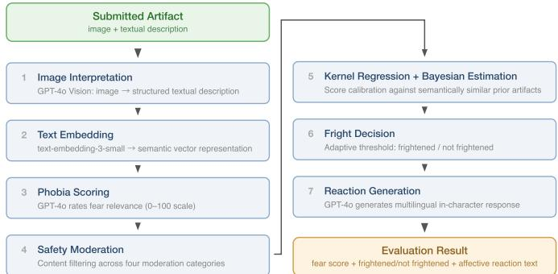  
Fi<sub>gure</sub> 2<sub>:</sub> Af<sub>ec</sub>ti<sub>ve ar</sub>tif<sub>ac</sub>t <sub>eva</sub>l<sub>ua</sub>ti<sub>on p</sub>i<sub>pe</sub>li<sub>ne.</sub> E<sub>ac</sub>h <sub>ar</sub>tif<sub>ac</sub>t (ima<sub>g</sub>e and descri<sub>p</sub>tion) <sub>p</sub>asses throu<sub>g</sub>h seven sta<sub>g</sub>es, from visual i<sub>n</sub>t<sub>erpre</sub>t<sub>a</sub>ti<sub>on</sub> t<sub>o mu</sub>ltili<sub>ngua</sub>l <sub>reac</sub>ti<sub>on genera</sub>ti<sub>on.</sub> M<sub>ac</sub>hi<sub>ne</sub> <sub>p</sub>arameters (<sub>p</sub>hobia, emotional condition, scorin<sub>g</sub> condition, ada<sub>p</sub>tive threshold) feed into the sta<sub>g</sub>es, and an evolution c<sub>y</sub>cle l<sub>e</sub>t<sub>s mac</sub>hi<sub>nes</sub> d<sub>eve</sub>l<sub>op emergen</sub>t <sub>p</sub>h<sub>o</sub>bi<sub>as</sub> f<sub>rom accumu</sub>l<sub>a</sub>t<sub>e</sub>d <sub>reac</sub>ti<sub>ons.</sub>

B<sub>eyon</sub>d it<sub>s p</sub>h<sub>o</sub>bi<sub>a, eac</sub>h <sub>mac</sub>hi<sub>ne carr</sub>i<sub>es</sub> t<sub>wo proper</sub>ti<sub>es.</sub> A scoring condition (spookiness-only or combined) deter-<sub>m</sub>i<sub>nes w</sub>h<sub>e</sub>th<sub>er an ar</sub>tif<sub>ac</sub>t <sub>success</sub>f<sub>u</sub>ll<sub>y</sub> f<sub>r</sub>i<sub>g</sub>ht<sub>ens</sub> th<sub>e mac</sub>hi<sub>ne</sub> (described below). An emotional condition (neutral or highemotional) modulates the tone of the machine’s textual reacti<sub>ons,</sub> f<sub>rom co</sub>ld l<sub>og</sub>i<sub>ca</sub>l d<sub>e</sub>t<sub>ac</sub>h<sub>men</sub>t t<sub>o express</sub>i<sub>ve anx</sub>i<sub>e</sub>t<sub>y.</sub> Th<sub>e</sub> <sub>emo</sub>ti<sub>ona</sub>l <sub>con</sub>diti<sub>on</sub> fli<sub>ps w</sub>h<sub>en a par</sub>ti<sub>c</sub>i<sub>pan</sub>t h<sub>as success</sub>f<sub>u</sub>ll<sub>y</sub> f<sub>r</sub>i<sub>g</sub>ht<sub>ene</sub>d <sub>a</sub> <sub>g</sub>i<sub>ven</sub> <sub>mac</sub>hi<sub>ne</sub> fi<sub>ve</sub> ti<sub>mes,</sub> i<sub>n</sub>t<sub>ro</sub>d<sub>uc</sub>i<sub>ng</sub> <sub>w</sub>ithi<sub>n-</sub> subject variation in machine expressiveness.

## C. Afective Response Generation

P<sub>ar</sub>ti<sub>c</sub>i<sub>pan</sub>t<sub>s</sub> <sub>se</sub>l<sub>ec</sub>t <sub>a</sub> <sub>mac</sub>hi<sub>ne</sub> <sub>an</sub>d <sub>e</sub>ith<sub>er</sub> <sub>en</sub>t<sub>er</sub> <sub>a</sub> <sub>promp</sub>t to <sub>g</sub>enerate an ima<sub>g</sub>e via FLUX.1 [50] or u<sub>p</sub>load an ima<sub>g</sub>e. Artifacts are evaluated throu<sub>g</sub>h a multi-sta<sub>g</sub>e <sub>p</sub>i<sub>p</sub>eline (Fi<sub>g</sub>. 2). Fi<sub>rs</sub>t<sub>,</sub> GPT<sub>-</sub>4<sub>o</sub> <sub>w</sub>ith <sub>v</sub>i<sub>s</sub>i<sub>on</sub> <sub>pro</sub>d<sub>uces</sub> <sub>a</sub> t<sub>ex</sub>t<sub>ua</sub>l i<sub>n</sub>t<sub>erpre</sub>t<sub>a</sub>ti<sub>on</sub> <sub>o</sub>f th<sub>e</sub> i<sub>mage,</sub> <sub>cover</sub>i<sub>ng</sub> it<sub>s</sub> <sub>v</sub>i<sub>sua</sub>l <sub>con</sub>t<sub>en</sub>t<sub>,</sub> <sub>sym</sub>b<sub>o</sub>li<sub>sm,</sub> <sub>an</sub>d <sub>po</sub>t<sub>en</sub>ti<sub>a</sub>l <sub>emo</sub>ti<sub>ona</sub>l i<sub>mpac</sub>t<sub>.</sub> Thi<sub>s</sub> i<sub>n</sub>t<sub>erpre</sub>t<sub>a</sub>ti<sub>on</sub> i<sub>s</sub> th<sub>en em</sub>b<sub>e</sub>dd<sub>e</sub>d i<sub>n</sub>t<sub>o a</sub> vector s<sub>p</sub>ace (usin<sub>g</sub> O<sub>p</sub>enAI’s text-embeddin<sub>g</sub>-3-small model) and scored along two dimensions: a phobia score, in which GPT<sub>-</sub>4<sub>o a</sub>d<sub>op</sub>t<sub>s</sub> th<sub>e mac</sub>hi<sub>ne</sub>’<sub>s p</sub>h<sub>o</sub>bi<sub>a an</sub>d <sub>ra</sub>t<sub>es</sub> h<sub>ow s</sub>t<sub>rong</sub>l<sub>y</sub> the artifact triggers it on a 0–100 scale, and a safety score across four moderation cate<sub>g</sub>ories (violence, sexual content, hate s<sub>p</sub>eech, ille<sub>g</sub>al activities), which <sub>p</sub>revents the artifact from f<sub>r</sub>i<sub>g</sub>ht<sub>en</sub>i<sub>ng</sub> th<sub>e mac</sub>hi<sub>ne</sub> if <sub>any ca</sub>t<sub>egory excee</sub>d<sub>s a</sub> th<sub>res</sub>h<sub>o</sub>ld<sub>.</sub>

To miti<sub>g</sub>ate LLM scorin<sub>g</sub> biases [51, 52], the raw <sub>p</sub>hobia <sub>score</sub> i<sub>s</sub> <sub>re</sub>fi<sub>ne</sub>d th<sub>roug</sub>h k<sub>erne</sub>l <sub>regress</sub>i<sub>on</sub> <sub>over</sub> <sub>seman</sub>ti<sub>ca</sub>ll<sub>y</sub> similar prior artifacts, yielding a spookiness score (posterior <sub>mean, re</sub>fl<sub>ec</sub>ti<sub>ng</sub> h<sub>ow e</sub>f<sub>ec</sub>ti<sub>ve</sub>l<sub>y</sub> th<sub>e ar</sub>tif<sub>ac</sub>t t<sub>r</sub>i<sub>ggers</sub> th<sub>e</sub> <sub>p</sub>hobia accordin<sub>g</sub> to the model’s in-character assessment) and uncertainty score (SEM, reflecting how unexplored the artifact’s semantic re<sub>g</sub>ion is). Note that kernel re<sub>g</sub>ression reduces local <sub>var</sub>i<sub>ance</sub> b<sub>u</sub>t <sub>canno</sub>t <sub>correc</sub>t f<sub>or sys</sub>t<sub>ema</sub>ti<sub>c</sub> bi<sub>as</sub> i<sub>n</sub> th<sub>e mo</sub>d<sub>e</sub>l’<sub>s</sub> i<sub>n</sub>t<sub>erpre</sub>t<sub>a</sub>ti<sub>on o</sub>f f<sub>ear re</sub>l<sub>evance.</sub> F<sub>u</sub>ll d<sub>e</sub>t<sub>a</sub>il<sub>s are</sub> i<sub>n</sub> th<sub>e</sub> S<sub>upp</sub>l<sub>e</sub> <sub>men</sub>t<sub>a</sub>l M<sub>a</sub>t<sub>er</sub>i<sub>a</sub>l<sub>s.</sub> Wh<sub>e</sub>th<sub>er an ar</sub>tif<sub>ac</sub>t f<sub>r</sub>i<sub>g</sub>ht<sub>ens</sub> th<sub>e mac</sub>hi<sub>ne</sub> (and is accepted into the public gallery of successful artifacts) is d<sub>e</sub>t<sub>erm</sub>i<sub>ne</sub>d b<sub>y compar</sub>i<sub>ng a compos</sub>it<sub>e o</sub>f th<sub>ese scores aga</sub>i<sub>ns</sub>t <sub>an</sub> <sub>a</sub>d<sub>ap</sub>ti<sub>ve</sub> th<sub>res</sub>h<sub>o</sub>ld <sub>ca</sub>lib<sub>ra</sub>t<sub>e</sub>d t<sub>o</sub> <sub>an</sub> <sub>approx</sub>i<sub>ma</sub>t<sub>e</sub>l<sub>y</sub> 30% t<sub>r</sub>i<sub>gger</sub> <sub>ra</sub>t<sub>e.</sub> M<sub>ac</sub>hi<sub>nes</sub> i<sub>n</sub> th<sub>e</sub> <sub>com</sub>bi<sub>ne</sub>d <sub>con</sub>diti<sub>on</sub> <sub>can</sub> <sub>a</sub>dditi<sub>ona</sub>ll<sub>y</sub> produce a habituated reaction, implying that the artifact is <sub>spoo</sub>k<sub>y</sub> b<sub>u</sub>t <sub>seman</sub>ti<sub>ca</sub>ll<sub>y</sub> f<sub>am</sub>ili<sub>ar</sub> t<sub>o</sub> th<sub>e</sub> <sub>mac</sub>hi<sub>ne.</sub>

Fi<sub>na</sub>ll<sub>y,</sub> GPT<sub>-</sub>4<sub>o</sub> <sub>genera</sub>t<sub>es</sub> <sub>a</sub> <sub>s</sub>h<sub>or</sub>t <sub>a</sub>f<sub>ec</sub>ti<sub>ve</sub> <sub>reac</sub>ti<sub>on</sub> i<sub>n</sub> f<sub>our</sub> l<sub>anguages,</sub> <sub>con</sub>diti<sub>one</sub>d <sub>on</sub> th<sub>e</sub> <sub>mac</sub>hi<sub>ne</sub>’<sub>s</sub> <sub>p</sub>h<sub>o</sub>bi<sub>a,</sub> <sub>emo-</sub> ti<sub>ona</sub>l <sub>con</sub>diti<sub>on, an</sub>d <sub>eva</sub>l<sub>ua</sub>ti<sub>on ou</sub>t<sub>come.</sub> Th<sub>e mac</sub>hi<sub>ne</sub>’<sub>s se</sub>lf d<sub>escr</sub>i<sub>p</sub>ti<sub>on an</sub>d <sub>reac</sub>ti<sub>on</sub> i<sub>ns</sub>t<sub>ruc</sub>ti<sub>ons esca</sub>l<sub>a</sub>t<sub>e w</sub>ith <sub>success</sub>f<sub>u</sub>l f<sub>r</sub>i<sub>g</sub>ht<sub>s,</sub> <sub>pro</sub>d<sub>uc</sub>i<sub>ng</sub> i<sub>ncreas</sub>i<sub>ng</sub>l<sub>y</sub> di<sub>s</sub>t<sub>resse</sub>d <sub>responses</sub> <sub>as</sub> th<sub>e</sub> i<sub>n</sub>t<sub>erac</sub>ti<sub>on</sub> <sub>progresses.</sub> O<sub>ver</sub> th<sub>e</sub>i<sub>r</sub> lif<sub>ecyc</sub>l<sub>e,</sub> <sub>mac</sub>hi<sub>nes</sub> <sub>can</sub> <sub>a</sub>l<sub>so</sub> <sub>evo</sub>l<sub>ve: w</sub>h<sub>en a mac</sub>hi<sub>ne reac</sub>h<sub>es a</sub> l<sub>eve</sub>l th<sub>res</sub>h<sub>o</sub>ld<sub>,</sub> GPT<sub>-</sub>4<sub>o</sub> i<sub>n</sub>f<sub>ers</sub> <sub>a</sub> <sub>new</sub> <sub>p</sub>h<sub>o</sub>bi<sub>a</sub> f<sub>rom</sub> th<sub>e</sub> <sub>accumu</sub>l<sub>a</sub>t<sub>e</sub>d <sub>reac</sub>ti<sub>on</sub> t<sub>ex</sub>t<sub>s,</sub> <sub>a</sub>ll<sub>ow</sub>i<sub>ng</sub> <sub>mac</sub>hi<sub>nes</sub> t<sub>o</sub> d<sub>eve</sub>l<sub>op</sub> <sub>emergen</sub>t f<sub>ears</sub> <sub>s</sub>h<sub>ape</sub>d b<sub>y</sub> th<sub>e</sub> <sub>co</sub>ll<sub>ec</sub>ti<sub>ve</sub> i<sub>npu</sub>t <sub>o</sub>f <sub>par</sub>ti<sub>c</sub>i<sub>pan</sub>t<sub>s.</sub> T<sub>a</sub>bl<sub>e</sub> I ill<sub>us</sub>t<sub>ra</sub>t<sub>es represen</sub>t<sub>a</sub>ti<sub>ve mac</sub>hi<sub>ne</sub> <sub>reac</sub>ti<sub>ons across</sub> th<sub>e reac</sub>ti<sub>on</sub> t<sub>ypes.</sub>

## D. Gamification Mechanics

S<sub>evera</sub>l <sub>gam</sub>ifi<sub>ca</sub>ti<sub>on e</sub>l<sub>emen</sub>t<sub>s are em</sub>b<sub>e</sub>dd<sub>e</sub>d t<sub>o sus</sub>t<sub>a</sub>i<sub>n</sub> en<sub>g</sub>a<sub>g</sub>ement (see the interface screenshot in the Su<sub>pp</sub>lemental Materials). A <sub>p</sub>ublic leaderboard ranks <sub>p</sub>artici<sub>p</sub>ants b<sub>y</sub> their b<sub>es</sub>t <sub>scores,</sub> b<sub>o</sub>th <sub>per-mac</sub>hi<sub>ne an</sub>d i<sub>n aggrega</sub>t<sub>e,</sub> f<sub>os</sub>t<sub>er</sub>i<sub>ng com</sub> <sub>pe</sub>titi<sub>on.</sub> Wh<sub>en an ar</sub>tif<sub>ac</sub>t <sub>success</sub>f<sub>u</sub>ll<sub>y</sub> f<sub>r</sub>i<sub>g</sub>ht<sub>ens</sub> th<sub>e mac</sub>hi<sub>ne,</sub> <sub>p</sub>art<sup>i</sup>c<sup>i</sup><sub>p</sub>ants can <sub>g</sub>enerate a com<sub>p</sub>os<sup>i</sup>te s<sup>h</sup>are <sup>i</sup>ma<sub>g</sub>e over<sup>l</sup>a<sub>y</sub><sup>i</sup>n<sub>g</sub> th<sub>e</sub>i<sub>r ar</sub>tif<sub>ac</sub>t<sub>, score, an</sub>d th<sub>e mac</sub>hi<sub>ne</sub>’<sub>s reac</sub>ti<sub>on</sub> f<sub>or soc</sub>i<sub>a</sub>l <sub>me</sub>di<sub>a.</sub> An anxiety meter visualizes how many times a participant has successfull<sub>y</sub> fri<sub>g</sub>htened a <sub>g</sub>iven machine (out of a maximum of five), <sub>p</sub>rovidin<sub>g</sub> a clear <sub>g</sub>oal structure within each machine i<sub>n</sub>t<sub>erac</sub>ti<sub>on.</sub>

## E. Data Collection

Th<sub>e s</sub>t<sub>u</sub>d<sub>y emp</sub>l<sub>oye</sub>d <sub>a</sub> 2 <sub>x</sub> 2 b<sub>e</sub>t<sub>ween-par</sub>ti<sub>c</sub>i<sub>pan</sub>t<sub>s</sub> f<sub>ac</sub>t<sub>or</sub>i<sub>a</sub>l d<sub>e</sub> si<sub>g</sub>n crossin<sub>g</sub> scorin<sub>g</sub> condition (s<sub>p</sub>ookiness-onl<sub>y</sub> vs. combined) with emotional condition (neutral vs. hi<sub>g</sub>h-emotional); each <sub>mac</sub>hi<sub>ne was ass</sub>i<sub>gne</sub>d t<sub>o one ce</sub>ll <sub>a</sub>t <sub>crea</sub>ti<sub>on.</sub> Th<sub>e exper</sub>i<sub>men</sub>t <sub>ran</sub> f<sub>rom</sub> O<sub>c</sub>t<sub>o</sub>b<sub>er</sub> 25 t<sub>o</sub> N<sub>ovem</sub>b<sub>er</sub> 11<sub>,</sub> 2024<sub>, w</sub>ith th<sub>e</sub> i<sub>n</sub>t<sub>er</sub>f<sub>ace</sub> <sub>an</sub>d <sub>reac</sub>ti<sub>ons ava</sub>il<sub>a</sub>bl<sub>e</sub> i<sub>n</sub> E<sub>ng</sub>li<sub>s</sub>h<sub>,</sub> G<sub>erman,</sub> S<sub>pan</sub>i<sub>s</sub>h<sub>, an</sub>d J<sub>apanese.</sub> O<sub>ver</sub> thi<sub>s per</sub>i<sub>o</sub>d<sub>,</sub> 832 <sub>un</sub>i<sub>que par</sub>ti<sub>c</sub>i<sub>pan</sub>t<sub>s</sub> i<sub>n</sub>t<sub>erac</sub>t<sub>e</sub>d <sub>w</sub>ith 89 <sub>mac</sub>hi<sub>nes an</sub>d <sub>pro</sub>d<sub>uce</sub>d 15<sub>,</sub>719 <sub>ar</sub>tif<sub>ac</sub>t<sub>s, o</sub>f <sub>w</sub>hi<sub>c</sub>h 7<sub>,</sub>650 <sub>rece</sub>i<sub>ve</sub>d <sub>a score;</sub> th<sub>e rema</sub>i<sub>n</sub>d<sub>er were no</sub>t <sub>score</sub>d b<sub>ecause</sub> <sub>par</sub>ti<sub>c</sub>i<sub>pan</sub>t<sub>s</sub> f<sub>requen</sub>tl<sub>y regenera</sub>t<sub>e</sub>d i<sub>mages or</sub> l<sub>e</sub>ft <sub>w</sub>ith<sub>ou</sub>t <sub>su</sub>b<sub>m</sub>itti<sub>ng, an</sub>d <sub>on</sub>l<sub>y ar</sub>tif<sub>ac</sub>t<sub>s exp</sub>li<sub>c</sub>itl<sub>y su</sub>b<sub>m</sub>itt<sub>e</sub>d <sub>v</sub>i<sub>a</sub> th<sub>e</sub> “<sub>spoo</sub>k” <sub>ac</sub>ti<sub>on en</sub>t<sub>ere</sub>d th<sub>e scor</sub>i<sub>ng p</sub>i<sub>pe</sub>li<sub>ne.</sub> R<sub>ecru</sub>it<sub>men</sub>t <sub>was</sub> or<sub>g</sub>anic, driven b<sub>y</sub> media covera<sub>g</sub>e (Der S<sub>p</sub>ie<sub>g</sub>el, Ta<sub>g</sub>ess<sub>p</sub>ie<sub>g</sub>el, TechX<sub>p</sub>lore) and a front-<sub>p</sub>a<sub>g</sub>e a<sub>pp</sub>earance on Hacker News.

## F. Analysis

P<sub>r</sub>i<sub>or</sub> t<sub>o ana</sub>l<sub>ys</sub>i<sub>s, we remove</sub>d t<sub>es</sub>t<sub>-p</sub>h<sub>ase su</sub>b<sub>m</sub>i<sub>ss</sub>i<sub>ons sen</sub>t b<sub>e</sub>f<sub>ore pu</sub>bli<sub>c</sub> l<sub>aunc</sub>h<sub>,</sub> i<sub>ncomp</sub>l<sub>e</sub>t<sub>e recor</sub>d<sub>s m</sub>i<sub>ss</sub>i<sub>ng</sub> k<sub>ey</sub> fi<sub>e</sub>ld<sub>s</sub> (<sub>p</sub>rom<sub>p</sub>t text, score, or condition assi<sub>g</sub>nment), and a small <sub>num</sub>b<sub>er</sub> <sub>o</sub>f i<sub>nappropr</sub>i<sub>a</sub>t<sub>e</sub> <sub>su</sub>b<sub>m</sub>i<sub>ss</sub>i<sub>ons</sub> th<sub>a</sub>t b<sub>ypasse</sub>d <sub>au</sub>t<sub>oma</sub>t<sub>e</sub>d filt<sub>er</sub>i<sub>ng,</sub> fl<sub>agge</sub>d <sub>an</sub>d <sub>remove</sub>d <sub>v</sub>i<sub>a</sub> k<sub>eywor</sub>d <sub>ma</sub>t<sub>c</sub>hi<sub>ng.</sub> F<sub>u</sub>ll d<sub>e</sub>t<sub>a</sub>il<sub>s</sub> <sub>are</sub> <sub>prov</sub>id<sub>e</sub>d i<sub>n</sub> th<sub>e</sub> S<sub>upp</sub>l<sub>emen</sub>t<sub>a</sub>l M<sub>a</sub>t<sub>er</sub>i<sub>a</sub>l<sub>s.</sub> Th<sub>roug</sub>h<sub>ou</sub>t th<sub>e</sub> <sub>ana</sub>l<sub>ys</sub>i<sub>s,</sub> <sub>mo</sub>d<sub>e</sub>l<sub>-ass</sub>i<sub>gne</sub>d <sub>p</sub>h<sub>o</sub>bi<sub>a</sub> <sub>scores</sub> <sub>an</sub>d <sub>seman</sub>ti<sub>c</sub> di<sub>vers</sub>it<sub>y</sub> <sub>measures</sub> <sub>are</sub> <sub>use</sub>d <sub>as</sub> <sub>prox</sub>i<sub>es</sub> f<sub>or</sub> <sub>crea</sub>ti<sub>ve</sub> <sub>ou</sub>t<sub>pu</sub>t<sub>;</sub> th<sub>ey re</sub>fl<sub>ec</sub>t th<sub>e mo</sub>d<sub>e</sub>l’<sub>s assessmen</sub>t <sub>o</sub>f f<sub>ear re</sub>l<sub>evance an</sub>d th<sub>e</sub> <sub>seman</sub>ti<sub>c</sub> <sub>sprea</sub>d <sub>o</sub>f <sub>su</sub>b<sub>m</sub>i<sub>ss</sub>i<sub>ons,</sub> <sub>no</sub>t i<sub>n</sub>d<sub>epen</sub>d<sub>en</sub>tl<sub>y</sub> <sub>va</sub>lid<sub>a</sub>t<sub>e</sub>d <sub>measures</sub> <sub>o</sub>f <sub>crea</sub>ti<sub>v</sub>it<sub>y.</sub>

1) Machines as Cultural Ecosystems: To answer RQ1, <sub>we</sub> t<sub>rac</sub>k<sub>e</sub>d <sub>eac</sub>h <sub>mac</sub>hi<sub>ne</sub>’<sub>s seman</sub>ti<sub>c evo</sub>l<sub>u</sub>ti<sub>on us</sub>i<sub>ng s</sub>lidi<sub>ng</sub> <sub>w</sub>i<sub>n</sub>d<sub>ow</sub> <sub>pa</sub>i<sub>rw</sub>i<sub>se</sub> <sub>cos</sub>i<sub>ne</sub> di<sub>s</sub>t<sub>ances</sub> <sub>over</sub> <sub>promp</sub>t <sub>em</sub>b<sub>e</sub>ddi<sub>ngs</sub> (with O<sub>p</sub>enAI’s text-embeddin<sub>g</sub>-3-lar<sub>g</sub>e) and <sub>p</sub>hobia score trajectories, fitted with mixed-efects models treating machine <sub>as a ran</sub>d<sub>om</sub> i<sub>n</sub>t<sub>ercep</sub>t<sub>.</sub> P<sub>a</sub>i<sub>rw</sub>i<sub>se cos</sub>i<sub>ne</sub> di<sub>s</sub>t<sub>ance was c</sub>h<sub>osen as</sub> it <sub>cap</sub>t<sub>ures</sub> h<sub>ow seman</sub>ti<sub>ca</sub>ll <sub>s</sub>i<sub>m</sub>il<sub>ar success</sub>i<sub>ve con</sub>t<sub>r</sub>ib<sub>u</sub>ti<sub>ons</sub> <sub>are w</sub>ithi<sub>n a mac</sub>hi<sub>ne, ma</sub>ki<sub>ng</sub> it <sub>we</sub>ll<sub>-su</sub>it<sub>e</sub>d t<sub>o</sub> d<sub>e</sub>t<sub>ec</sub>ti<sub>ng</sub> <sub>convergence or</sub> di<sub>vergence</sub> i<sub>n co</sub>ll<sub>ec</sub>ti<sub>ve ou</sub>t<sub>pu</sub>t<sub>.</sub> T<sub>o</sub> t<sub>es</sub>t <sub>w</sub>h<sub>e</sub>th<sub>er</sub> machines developed distinct trajectories, we compared within-<sub>mac</sub>hi<sub>ne, w</sub>ithi<sub>n-p</sub>h<sub>o</sub>bi<sub>a, an</sub>d b<sub>e</sub>t<sub>ween-p</sub>h<sub>o</sub>bi<sub>a em</sub>b<sub>e</sub>ddi<sub>ng</sub> di<sub>s-</sub> t<sub>ances us</sub>i<sub>ng</sub> M<sub>ann-</sub>Whit<sub>ney</sub> U t<sub>es</sub>t<sub>s.</sub> Ph<sub>o</sub>bi<sub>a-spec</sub>ifi<sub>c a</sub>d<sub>ap</sub>t<sub>a</sub>ti<sub>on</sub> <sub>was assesse</sub>d b<sub>y</sub> t<sub>ra</sub>i<sub>n</sub>i<sub>ng a c</sub>l<sub>ass</sub>ifi<sub>er on promp</sub>t <sub>em</sub>b<sub>e</sub>ddi<sub>ngs an</sub>d t<sub>rac</sub>ki<sub>ng accuracy over</sub> ti<sub>me; emergen</sub>t th<sub>emes were</sub> id<sub>en</sub>tifi<sub>e</sub>d b<sub>y c</sub>l<sub>us</sub>t<sub>er</sub>i<sub>ng</sub> hi<sub>g</sub>h<sub>-qua</sub>lit<sub>y em</sub>b<sub>e</sub>ddi<sub>ngs w</sub>ith K<sub>-</sub>M<sub>eans.</sub>

2) Steering Exploration Through Scoring Design: For RQ2, <sub>we compare</sub>d <sub>accep</sub>t<sub>e</sub>d <sub>ar</sub>tif<sub>ac</sub>t<sub>s across con</sub>diti<sub>ons on spoo</sub>ki<sub>ness</sub> and uncertaint<sub>y</sub> scores (Cohen’s �, bootstra<sub>p</sub> CIs across machines) and tracked acce<sub>p</sub>tance rates over successive attem<sub>p</sub>ts <sub>w</sub>ith <sub>a</sub> l<sub>og</sub>i<sub>s</sub>ti<sub>c</sub> <sub>m</sub>i<sub>xe</sub>d<sub>-e</sub>f<sub>ec</sub>t<sub>s</sub> <sub>mo</sub>d<sub>e</sub>l i<sub>nc</sub>l<sub>u</sub>di<sub>ng</sub> <sub>a</sub> <sub>con</sub>diti<sub>on-</sub>b<sub>y</sub> <sub>a</sub>tt<sub>emp</sub>t i<sub>n</sub>t<sub>erac</sub>ti<sub>on.</sub> H<sub>a</sub>bit<sub>ua</sub>ti<sub>on was quan</sub>tifi<sub>e</sub>d b<sub>y</sub> t<sub>rac</sub>ki<sub>ng</sub> th<sub>e</sub> <sub>propor</sub>ti<sub>on</sub> <sub>o</sub>f h<sub>a</sub>bit<sub>ua</sub>t<sub>e</sub>d <sub>reac</sub>ti<sub>ons</sub> <sub>over</sub> th<sub>e</sub> <sub>mac</sub>hi<sub>ne</sub>’<sub>s</sub> lif<sub>e</sub>ti<sub>me</sub> <sub>an</sub>d <sub>compar</sub>i<sub>ng</sub> th<sub>e</sub> <sub>p</sub>h<sub>o</sub>bi<sub>a</sub> <sub>scores</sub> <sub>o</sub>f h<sub>a</sub>bit<sub>ua</sub>t<sub>e</sub>d <sub>versus</sub> <sub>accep</sub>t<sub>e</sub>d <sub>ar</sub>tif<sub>ac</sub>t<sub>s.</sub> T<sub>o</sub> <sub>cap</sub>t<sub>ure</sub> h<sub>ow</sub> <sub>promp</sub>t di<sub>vers</sub>it<sub>y</sub> <sub>evo</sub>l<sub>ve</sub>d <sub>sequen</sub>ti<sub>a</sub>ll<sub>y</sub> <sub>over</sub> th<sub>e course o</sub>f i<sub>n</sub>t<sub>erac</sub>ti<sub>on, promp</sub>t<sub>-</sub>l<sub>eve</sub>l <sub>pre</sub>di<sub>c</sub>t<sub>a</sub>bilit<sub>y was</sub> measured via the GPT-2 [53] lo<sub>g</sub>-likelihood delta (the diference i<sub>n</sub> l<sub>og-</sub>lik<sub>e</sub>lih<sub>oo</sub>d <sub>score</sub>d <sub>w</sub>ith <sub>an</sub>d <sub>w</sub>ith<sub>ou</sub>t <sub>a</sub> <sub>s</sub>lidi<sub>ng</sub> <sub>w</sub>i<sub>n</sub>d<sub>ow</sub> <sub>o</sub>f <sub>p</sub>recedin<sub>g</sub> <sub>p</sub>rom<sub>p</sub>ts as context) and re<sub>g</sub>ressed on <sub>p</sub>rom<sub>p</sub>t order. Thi<sub>s</sub> <sub>approac</sub>h i<sub>s</sub> i<sub>n</sub>d<sub>epen</sub>d<sub>en</sub>t <sub>o</sub>f th<sub>e</sub> <sub>em</sub>b<sub>e</sub>ddi<sub>ng</sub> <sub>space</sub> <sub>use</sub>d i<sub>n</sub> th<sub>e</sub> <sub>rewar</sub>d <sub>mec</sub>h<sub>an</sub>i<sub>sm,</sub> <sub>prov</sub>idi<sub>ng</sub> <sub>a</sub> <sub>comp</sub>l<sub>emen</sub>t<sub>ary</sub> <sub>measure</sub> <sub>o</sub>f <sub>repe</sub>titi<sub>on.</sub>

3) Emotional Expression and the Afective Loop: RQ3 t<sub>es</sub>t<sub>s</sub> <sub>w</sub>h<sub>e</sub>th<sub>er</sub> <sub>emo</sub>ti<sub>ona</sub>l <sub>con</sub>diti<sub>on</sub> <sub>a</sub>f<sub>ec</sub>t<sub>e</sub>d <sub>crea</sub>ti<sub>ve</sub> <sub>ou</sub>t<sub>pu</sub>t<sub>,</sub> <sup>com</sup>p<sup>arin</sup>g p<sup>hobia scores</sup>, <sup>acce</sup>p<sup>tance rates</sup>, <sup>and en</sup>g<sup>a</sup>g<sup>ement</sup> <sub>vo</sub>l<sub>ume across con</sub>diti<sub>ons.</sub> Di<sub>sengagemen</sub>t <sub>was opera</sub>ti<sub>ona</sub>li<sub>ze</sub>d <sub>as</sub> <sub>eac</sub>h <sub>user</sub>’<sub>s</sub> fi<sub>na</sub>l <sub>score</sub> <sub>on</sub> <sub>a</sub> <sub>mac</sub>hi<sub>ne,</sub> <sub>cap</sub>t<sub>ur</sub>i<sub>ng</sub> <sub>w</sub>h<sub>en</sub> <sub>con-</sub> ti<sub>nue</sub>d <sub>engagemen</sub>t <sub>was no</sub> l<sub>onger wor</sub>th<sub>w</sub>hil<sub>e;</sub> i<sub>n</sub>t<sub>er-su</sub>b<sub>m</sub>i<sub>ss</sub>i<sub>on</sub> intervals (ISI) were com<sub>p</sub>ared after acce<sub>p</sub>ted and rejected <sub>ar</sub>tif<sub>ac</sub>t<sub>s us</sub>i<sub>ng</sub> M<sub>ann-</sub>Whit<sub>ney</sub> � t<sub>es</sub>t<sub>s, as</sub> ISI i<sub>s a</sub> b<sub>e</sub>h<sub>av</sub>i<sub>ora</sub>l <sub>proxy</sub> f<sub>or</sub> d<sub>e</sub>lib<sub>era</sub>ti<sub>on an</sub>d <sub>a</sub>f<sub>ec</sub>ti<sub>ve process</sub>i<sub>ng.</sub> C<sub>onvergence</sub> t<sub>owar</sub>d <sub>ga</sub>ll<sub>ery con</sub>t<sub>en</sub>t <sub>was measure</sub>d <sub>as</sub> L2<sub>-</sub>di<sub>s</sub>t<sub>ance</sub> t<sub>o</sub> th<sub>e</sub> <sub>g</sub>aller<sub>y</sub> centroid (mean embeddin<sub>g</sub> of acce<sub>p</sub>ted artifacts) in 50<sub>-</sub>di<sub>mens</sub>i<sub>ona</sub>l PCA <sub>space over success</sub>i<sub>ve a</sub>tt<sub>emp</sub>t<sub>s,</sub> fitt<sub>e</sub>d <sub>v</sub>i<sub>a</sub>

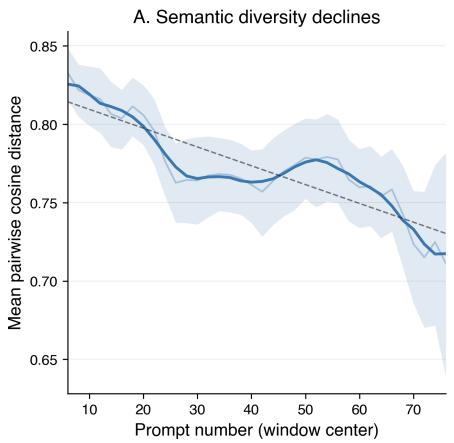

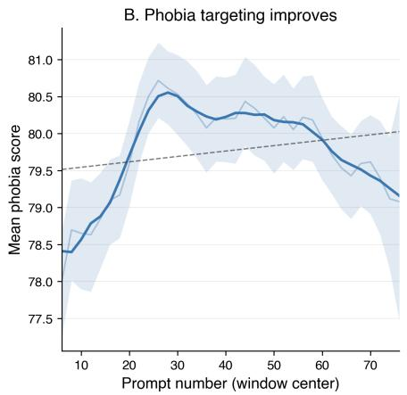

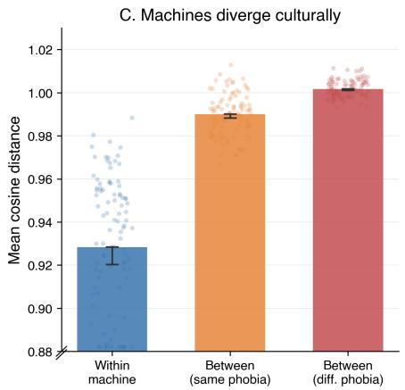  
Fi<sub>g</sub>ure 3: Collective submission <sub>p</sub>atterns. (A) Semantic diversit<sub>y</sub> declines over time. (B) Phobia scores rise then decline. (C) Distance hierarch<sub>y</sub> confirms distinct machine trajectories (all <sub>p</sub> < .001).

Ordinar<sub>y</sub> Least Squares (OLS) with machine fixed efects and <sub>a con</sub>diti<sub>on-</sub>b<sub>y-a</sub>tt<sub>emp</sub>t i<sub>n</sub>t<sub>erac</sub>ti<sub>on, cap</sub>t<sub>ur</sub>i<sub>ng</sub> h<sub>ow c</sub>l<sub>ose</sub>l<sub>y users</sub> <sub>su</sub>b<sub>m</sub>i<sub>ss</sub>i<sub>ons a</sub>li<sub>gne</sub>d <sub>w</sub>ith <sub>accumu</sub>l<sub>a</sub>t<sub>e</sub>d <sub>ga</sub>ll<sub>ery</sub> hi<sub>s</sub>t<sub>ory.</sub>

## V<sub>.</sub> R<sub>esults</sub>

## A. Machines as Cultural Ecosystems (RQ1)

E<sub>ac</sub>h <sub>mac</sub>hi<sub>ne ma</sub>i<sub>n</sub>t<sub>a</sub>i<sub>ne</sub>d it<sub>s own ga</sub>ll<sub>ery o</sub>f <sub>success</sub>f<sub>u</sub>l <sub>ar</sub>tif<sub>ac</sub>t<sub>s, v</sub>i<sub>s</sub>ibl<sub>e</sub> t<sub>o su</sub>b<sub>sequen</sub>t <sub>users, w</sub>hi<sub>c</sub>h i<sub>nv</sub>it<sub>e</sub>d t<sub>wo</sub> b<sub>ase</sub>li<sub>ne</sub> d namics. Semantic diversit declined over time (mixed-efects <sub>mo</sub>d<sub>e</sub>l<sub>,</sub> $p < . 0 0 1 )$ <sub>, cons</sub>i<sub>s</sub>t<sub>en</sub>t <sub>w</sub>ith <sub>par</sub>ti<sub>c</sub>i<sub>pan</sub>t<sub>s converg</sub>i<sub>ng on</sub> <sub>w</sub>h<sub>a</sub>t <sub>wor</sub>k<sub>e</sub>d f<sub>or pre</sub>d<sub>ecessors, w</sub>hil<sub>e p</sub>h<sub>o</sub>bi<sub>a scores</sub> f<sub>o</sub>ll<sub>owe</sub>d <sub>a r</sub>i<sub>se-</sub>th<sub>en-</sub>d<sub>ec</sub>li<sub>ne pa</sub>tt<sub>ern: scores</sub> i<sub>ncrease</sub>d <sub>s</sub>t<sub>ea</sub>dil<sub>y</sub> th<sub>roug</sub>h th<sub>e</sub> fi<sub>rs</sub>t 30 <sub>promp</sub>t<sub>s as users</sub> di<sub>scovere</sub>d <sub>e</sub>f<sub>ec</sub>ti<sub>ve s</sub>t<sub>ra</sub>t<sub>eg</sub>i<sub>es,</sub> b<sub>e</sub>f<sub>ore</sub> d<sub>ec</sub>li<sub>n</sub>i<sub>ng</sub> t<sub>owar</sub>d b<sub>ase</sub>li<sub>ne</sub> l<sub>eve</sub>l<sub>s</sub> i<sub>n</sub> l<sub>a</sub>t<sub>er</sub> i<sub>n</sub>t<sub>erac</sub>ti<sub>ons</sub> (mixed-efects model, $p < . 0 5 )$ <sub>, sugges</sub>ti<sub>ng</sub> th<sub>a</sub>t <sub>soc</sub>i<sub>a</sub>l l<sub>earn</sub>i<sub>ng</sub> initiall<sub>y</sub> im<sub>p</sub>roved collective efectiveness (Fi<sub>g</sub>. 3 A–B). This <sub>convergence</sub> did <sub>no</sub>t h<sub>omogen</sub>i<sub>ze mac</sub>hi<sub>nes: w</sub>ithi<sub>n-mac</sub>hi<sub>ne</sub> di<sub>s</sub>t<sub>ances were sma</sub>ll<sub>es</sub>t<sub>,</sub> b<sub>e</sub>t<sub>ween-mac</sub>hi<sub>ne</sub> di<sub>s</sub>t<sub>ances</sub> f<sub>or</sub> th<sub>e</sub> <sub>same p</sub>h<sub>o</sub>bi<sub>a were</sub> i<sub>n</sub>t<sub>erme</sub>di<sub>a</sub>t<sub>e, an</sub>d b<sub>e</sub>t<sub>ween-p</sub>h<sub>o</sub>bi<sub>a</sub> di<sub>s</sub>t<sub>ances</sub> were lar<sub>g</sub>est (Mann-Whitne<sub>y</sub> �, $p < . 0 0 1$ f<sub>or</sub> b<sub>o</sub>th t<sub>rans</sub>iti<sub>ons;</sub> Fig. 3 C). Each machine developed a distinct trajectory despite <sub>s</sub>h<sub>ar</sub>i<sub>ng</sub> <sub>a</sub> <sub>p</sub>h<sub>o</sub>bi<sub>a,</sub> <sub>ana</sub>l<sub>ogous</sub> t<sub>o</sub> th<sub>e</sub> <sub>para</sub>ll<sub>e</sub>l <sub>wor</sub>ld<sub>s</sub> i<sub>n</sub> <sub>cu</sub>lt<sub>ura</sub>l market ex<sub>p</sub>eriments [20].

P<sub>ar</sub>ti<sub>c</sub>i<sub>pan</sub>t<sub>s</sub> <sub>a</sub>d<sub>ap</sub>t<sub>e</sub>d th<sub>e</sub>i<sub>r</sub> th<sub>emes</sub> t<sub>o</sub> <sub>eac</sub>h <sub>mac</sub>hi<sub>ne</sub>’<sub>s</sub> <sub>p</sub>h<sub>o</sub>bi<sub>a:</sub> <sub>a</sub> <sub>c</sub>l<sub>ass</sub>ifi<sub>er</sub> t<sub>ra</sub>i<sub>ne</sub>d <sub>on</sub> <sub>promp</sub>t <sub>em</sub>b<sub>e</sub>ddi<sub>ngs</sub> <sub>ac</sub>hi<sub>eve</sub>d <sub>\~</sub>45% <sup>accurac</sup>y $( \mathrm { c h a n c e } ~ = ~ 2 5 \% )$ <sub>,</sub> i<sub>ncreas</sub>i<sub>ng</sub> <sub>over</sub> ti<sub>me.</sub> N<sub>o</sub>t <sub>a</sub>ll <sub>p</sub>h<sub>o</sub>bi<sub>as</sub> <sub>were</sub> <sub>equa</sub>ll<sub>y</sub> <sub>access</sub>ibl<sub>e:</sub> E<sub>mpa</sub>th<sub>yp</sub>h<sub>o</sub>bi<sub>a</sub> <sub>s</sub>t<sub>oo</sub>d <sub>ou</sub>t <sub>as</sub> <sub>su</sub>b<sub>s</sub>t<sub>an</sub>ti<sub>a</sub>ll<sub>y</sub> h<sub>ar</sub>d<sub>er</sub> t<sub>o</sub> t<sub>arge</sub>t<sub>, w</sub>ith l<sub>ower me</sub>di<sub>an scores,</sub> lik<sub>e</sub>l<sub>y</sub> b<sub>ecause</sub> <sub>empa</sub>th<sub>y</sub> i<sub>s</sub> <sub>more</sub> <sub>a</sub>b<sub>s</sub>t<sub>rac</sub>t th<sub>an</sub> th<sub>e</sub> <sub>v</sub>i<sub>sua</sub>ll<sub>y</sub> <sub>concre</sub>t<sub>e</sub> i<sub>magery assoc</sub>i<sub>a</sub>t<sub>e</sub>d <sub>w</sub>ith <sub>surve</sub>ill<sub>ance,</sub> d<sub>e</sub>l<sub>e</sub>ti<sub>on, or</sub> di<sub>sconnec</sub>ti<sub>on.</sub> As Fi<sub>g</sub>. 1 illustrates, universal themes (horror creatures, nuclear catastro<sub>p</sub>he) coexist with <sub>p</sub>hobia-s<sub>p</sub>ecific ones (surveillance t<sub>ec</sub>h<sub>no</sub>l<sub>ogy</sub> f<sub>or</sub> S<sub>urve</sub>ill<sub>ancep</sub>h<sub>o</sub>bi<sub>a, unp</sub>l<sub>ugge</sub>d <sub>compu</sub>t<sub>ers</sub> f<sub>or</sub> Disconnecto<sub>p</sub>hobia).

## B. Steering Exploration Through Scoring Design (RQ2)

Raw <sub>p</sub>hobia scores were identical across conditions (� = 0.05, n.s.), confirmin<sub>g</sub> that the scorin<sub>g</sub> mechanism did not <sub>a</sub>lt<sub>er</sub> i<sub>n</sub>di<sub>v</sub>id<sub>ua</sub>l <sub>crea</sub>ti<sub>ve ou</sub>t<sub>pu</sub>t <sub>as prox</sub>i<sub>e</sub>d b<sub>y mo</sub>d<sub>e</sub>l<sub>-ass</sub>i<sub>gne</sub>d <sub>p</sub>h<sub>o</sub>bi<sub>a scores.</sub> I<sub>ns</sub>t<sub>ea</sub>d<sub>,</sub> it <sub>cons</sub>t<sub>ruc</sub>t<sub>e</sub>d dif<sub>eren</sub>t i<sub>n</sub>f<sub>orma</sub>ti<sub>ona</sub>l <sub>n</sub>i<sub>c</sub>h<sub>es, ana</sub>l<sub>ogous</sub> t<sub>o n</sub>i<sub>c</sub>h<sub>e cons</sub>t<sub>ruc</sub>ti<sub>on</sub> i<sub>n cu</sub>lt<sub>ura</sub>l <sub>evo</sub>l<sub>u</sub>ti<sub>on</sub> [41], where or<sub>g</sub>anisms modif<sub>y</sub> their environment and thereb<sub>y</sub> <sub>a</sub>lt<sub>er</sub> <sub>se</sub>l<sub>ec</sub>ti<sub>on</sub> <sub>pressures</sub> <sub>on</sub> <sub>su</sub>b<sub>sequen</sub>t i<sub>n</sub>h<sub>a</sub>bit<sub>an</sub>t<sub>s.</sub> E<sub>ac</sub>h <sub>ga</sub>ll<sub>ery</sub> <sub>accumu</sub>l<sub>a</sub>t<sub>e</sub>d <sub>a</sub> di<sub>s</sub>ti<sub>nc</sub>t <sub>pro</sub>fil<sub>e o</sub>f <sub>success</sub>f<sub>u</sub>l <sub>ar</sub>tif<sub>ac</sub>t<sub>s, an</sub>d <sub>users</sub> <sub>arr</sub>i<sub>v</sub>i<sub>ng</sub> i<sub>n</sub> th<sub>ese</sub> <sub>n</sub>i<sub>c</sub>h<sub>es</sub> <sub>a</sub>d<sub>ap</sub>t<sub>e</sub>d <sub>accor</sub>di<sub>ng</sub>l<sub>y.</sub>

The niches difered in com<sub>p</sub>osition (Fi<sub>g</sub>. 4 A–B). Acce<sub>p</sub>ted <sub>ar</sub>tif<sub>ac</sub>t<sub>s</sub> i<sub>n</sub> th<sub>e</sub> <sub>com</sub>bi<sub>ne</sub>d <sub>con</sub>diti<sub>on</sub> h<sub>a</sub>d l<sub>ower</sub> <sub>spoo</sub>ki<sub>ness</sub> <sub>scores</sub> (� = 57.0 vs. 67.9; � = −1.37, <sub>�</sub> < .0001) but hi<sub>g</sub>her uncertaint<sub>y</sub> scores (� = 35.1 vs. 15.5; � = 2.0, $p < . 0 0 0 1 ,$ ), with a <sub>p</sub>ersistent \~10-<sub>p</sub>oint s<sub>p</sub>ookiness <sub>g</sub>a<sub>p</sub> and 2–3× uncertaint<sub>y</sub> <sub>gap.</sub> I<sub>n</sub> th<sub>e com</sub>bi<sub>ne</sub>d <sub>con</sub>diti<sub>on, an ar</sub>tif<sub>ac</sub>t <sub>cou</sub>ld <sub>succee</sub>d b<sub>y</sub> b<sub>e</sub>i<sub>ng</sub> <sub>nove</sub>l <sub>even</sub> if l<sub>ess</sub> <sub>spoo</sub>k<sub>y,</sub> <sub>w</sub>hil<sub>e</sub> i<sub>n</sub> th<sub>e</sub> <sub>spoo</sub>ki<sub>ness-on</sub>l<sub>y</sub> <sub>con</sub>diti<sub>on, on</sub>l<sub>y spoo</sub>ki<sub>ness ma</sub>tt<sub>ere</sub>d<sub>.</sub> Thi<sub>s s</sub>h<sub>ape</sub>d <sub>newcomer</sub> <sub>exper</sub>i<sub>ence:</sub> fi<sub>rs</sub>t<sub>-a</sub>tt<sub>emp</sub>t <sub>accep</sub>t<sub>ance</sub> <sub>was</sub> hi<sub>g</sub>h<sub>er</sub> i<sub>n</sub> th<sub>e</sub> <sub>com</sub>bi<sub>ne</sub>d condition (38% vs. 32%), but b<sub>y</sub> the fifth attem<sub>p</sub>t the <sub>p</sub>attern reversed (32% vs. 40%) as the machine habituated to the user’s st<sub>y</sub>le (condition×attem<sub>p</sub>t interaction, <sub>�</sub> = .004; Fi<sub>g</sub>. 4 C).

In the combined condition, the system paradoxically rejected it<sub>s mos</sub>t <sub>e</sub>f<sub>ec</sub>ti<sub>ve scares.</sub> H<sub>a</sub>bit<sub>ua</sub>t<sub>e</sub>d <sub>ar</sub>tif<sub>ac</sub>t<sub>s</sub> h<sub>a</sub>d th<sub>e</sub> hi<sub>g</sub>h<sub>es</sub>t s<sub>p</sub>ookiness scores in the dataset (� = 68.5 vs. 57.0 for acce<sub>p</sub>te<sup>d</sup>; $d = 1 . 6 5 , p < . 0 0 0 1 )$ <sub>, ye</sub>t <sub>were</sub> bl<sub>oc</sub>k<sub>e</sub>d f<sub>rom</sub> th<sub>e</sub> <sub>ga</sub>ll<sub>ery</sub> b<sub>ecause</sub> th<sub>ey were seman</sub>ti<sub>ca</sub>ll<sub>y</sub> t<sub>oo</sub> f<sub>am</sub>ili<sub>ar.</sub> H<sub>a</sub>bit<sub>ua</sub>t<sub>e</sub>d <sub>reac</sub>ti<sub>ons grew</sub> f<sub>rom near zero</sub> t<sub>o \~</sub>33% <sub>over</sub> th<sub>e mac</sub>hi<sub>ne</sub>’<sub>s</sub> lifetime, and by rejecting proven themes for lacking novelty, th<sub>e</sub> <sub>mec</sub>h<sub>an</sub>i<sub>sm</sub> <sub>re</sub>d<sub>uce</sub>d <sub>repe</sub>titi<sub>on</sub> <sub>an</sub>d <sub>pus</sub>h<sub>e</sub>d <sub>users</sub> t<sub>owar</sub>d l<sub>ess</sub> <sub>exp</sub>l<sub>ore</sub>d <sub>seman</sub>ti<sub>c</sub> di<sub>rec</sub>ti<sub>ons.</sub>

Th<sub>ese</sub> i<sub>n</sub>f<sub>orma</sub>ti<sub>ona</sub>l <sub>n</sub>i<sub>c</sub>h<sub>es res</sub>h<sub>ape</sub>d th<sub>e sequen</sub>ti<sub>a</sub>l <sub>pre-</sub> di<sub>c</sub>t<sub>a</sub>bilit<sub>y o</sub>f d<sub>owns</sub>t<sub>ream su</sub>b<sub>m</sub>i<sub>ss</sub>i<sub>ons, measure</sub>d f<sub>or eac</sub>h <sub>promp</sub>t f<sub>rom</sub> th<sub>e</sub> <sub>prece</sub>di<sub>ng</sub> 20 <sub>promp</sub>t<sub>s</sub> t<sub>o</sub> th<sub>e</sub> <sub>same</sub> <sub>mac</sub>hi<sub>ne</sub> (GPT-2 lo<sub>g</sub>-likelihood delta; Fi<sub>g</sub>. 5). Prom<sub>p</sub>ts submitted to <sub>spoo</sub>ki<sub>ness-on</sub>l<sub>y</sub> <sub>mac</sub>hi<sub>nes</sub> b<sub>ecame</sub> i<sub>ncreas</sub>i<sub>ng</sub>l<sub>y</sub> <sub>pre</sub>di<sub>c</sub>t<sub>a</sub>bl<sub>e</sub> $( b = 0 . 0 0 7 5$ p<sup>er</sup> p<sup>rom</sup>p<sup>t</sup>, $p < . 0 0 1 )$ <sub>, w</sub>hil<sub>e</sub> th<sub>ose</sub> t<sub>o com</sub>bi<sub>ne</sub>d <sub>mac</sub>hi<sub>nes s</sub>h<sub>owe</sub>d <sub>no</sub> t<sub>ren</sub>d $( b = 0 . 0 0 0 4 , p = . 7 7 6 )$ <sub>.</sub> Th<sub>e ear</sub>l<sub>y</sub> <sub>p</sub>hase (<sub>p</sub>rom<sub>p</sub>ts 1–30) showed no si<sub>g</sub>nificant diference between <sub>con</sub>diti<sub>ons</sub> $( p ~ = ~ . 6 8 9 )$ , but the late <sub>p</sub>hase (<sub>p</sub>rom<sub>p</sub>ts 31–70) <sub>y</sub>ielded a medium-sized diver<sub>g</sub>ence (� = 0.611, <sub>�</sub> = .012), <sub>cons</sub>i<sub>s</sub>t<sub>en</sub>t <sub>w</sub>ith <sub>a</sub> <sub>cumu</sub>l<sub>a</sub>ti<sub>ve</sub> <sub>e</sub>f<sub>ec</sub>t <sub>o</sub>f <sub>n</sub>i<sub>c</sub>h<sub>e</sub> <sub>exposure.</sub> N<sub>o</sub>t<sub>e</sub> th<sub>a</sub>t thi<sub>s me</sub>t<sub>r</sub>i<sub>c cap</sub>t<sub>ures non-repe</sub>titi<sub>on a</sub>t th<sub>e</sub> l<sub>eve</sub>l <sub>o</sub>f <sub>sur</sub>f<sub>ace</sub> t<sub>ex</sub>t <sub>an</sub>d <sub>canno</sub>t di<sub>s</sub>ti<sub>ngu</sub>i<sub>s</sub>h <sub>concep</sub>t<sub>ua</sub>l b<sub>rea</sub>dth f<sub>rom sur</sub>f<sub>ace</sub> <sub>var</sub>i<sub>a</sub>ti<sub>on w</sub>ithi<sub>n a</sub> fi<sub>xe</sub>d th<sub>eme.</sub> Th<sub>e com</sub>bi<sub>ne</sub>d <sub>con</sub>diti<sub>on</sub> <sub>sus</sub>t<sub>a</sub>i<sub>ne</sub>d <sub>re</sub>d<sub>uce</sub>d <sub>promp</sub>t <sub>repe</sub>titi<sub>on over</sub> ti<sub>me; w</sub>h<sub>e</sub>th<sub>er</sub> thi<sub>s</sub> <sub>re</sub>fl<sub>ec</sub>t<sub>s</sub> d<sub>eeper</sub> <sub>crea</sub>ti<sub>ve</sub> <sub>exp</sub>l<sub>ora</sub>ti<sub>on</sub> <sub>rema</sub>i<sub>ns</sub> <sub>an</sub> <sub>open</sub> <sub>ques</sub>ti<sub>on.</sub> Thi<sub>s</sub> <sub>pa</sub>tt<sub>ern</sub> <sub>was</sub> <sub>amp</sub>lifi<sub>e</sub>d <sub>w</sub>h<sub>en</sub> <sub>con</sub>t<sub>ex</sub>t <sub>was</sub> <sub>res</sub>t<sub>r</sub>i<sub>c</sub>t<sub>e</sub>d t<sub>o</sub> <sub>ga</sub>ll<sub>ery-v</sub>i<sub>s</sub>ibl<sub>e</sub> <sub>ar</sub>tif<sub>ac</sub>t<sub>s,</sub> <sub>w</sub>ith <sub>con</sub>diti<sub>ons</sub> <sub>s</sub>h<sub>ow</sub>i<sub>ng</sub> <sub>oppos</sub>i<sub>ng</sub> slo<sub>p</sub>es (see Su<sub>pp</sub>lemental Materials).

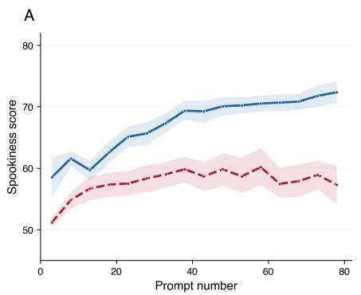

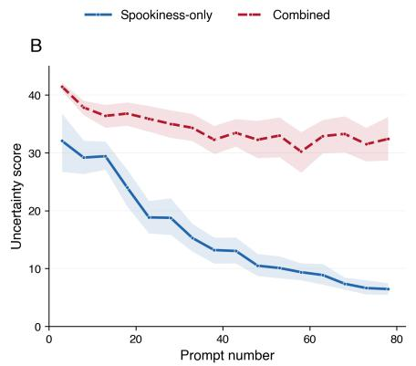

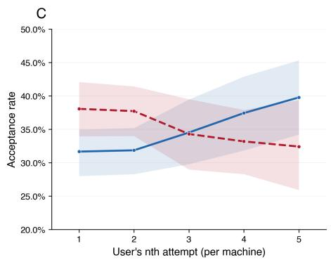  
Fi<sub>g</sub>ure 4: Scorin<sub>g</sub> condition sha<sub>p</sub>es <sub>g</sub>aller<sub>y</sub> content and user success. (A) S<sub>p</sub>ookiness and (B) uncertaint<sub>y</sub> scores of acce<sub>p</sub>ted artifacts. (C) Acce<sub>p</sub>tance rate b<sub>y</sub> attem<sub>p</sub>t; combined hel<sub>p</sub>s newcomers but <sub>p</sub>enalizes re<sub>p</sub>etition.

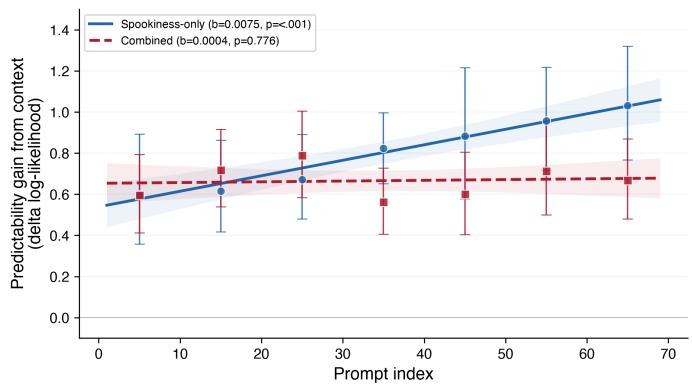  
Fi<sub>gure</sub> 5<sub>:</sub> P<sub>re</sub>di<sub>c</sub>t<sub>a</sub>bilit<sub>y ga</sub>i<sub>n</sub> f<sub>rom con</sub>t<sub>ex</sub>t b<sub>y scor</sub>i<sub>ng con</sub>diti<sub>on.</sub> Hi<sub>g</sub>h<sub>er va</sub>l<sub>ues</sub> i<sub>n</sub>di<sub>ca</sub>t<sub>e promp</sub>t<sub>s are more pre</sub>di<sub>c</sub>t<sub>a</sub>bl<sub>e</sub> f<sub>rom</sub> <sub>p</sub>recedin<sub>g</sub> histor<sub>y</sub> (conver<sub>g</sub>ence). Markers show binned means <sub>w</sub>ith b<sub>oo</sub>t<sub>s</sub>t<sub>rap</sub> 95% CI<sub>s;</sub> li<sub>nes s</sub>h<sub>ow</sub> li<sub>near regress</sub>i<sub>on w</sub>ith 95% CI b<sub>an</sub>d<sub>s.</sub> S<sub>poo</sub>ki<sub>ness-on</sub>l<sub>y mac</sub>hi<sub>nes converge</sub> $( \mathtt { p } < . 0 0 1 )$ <sub>com</sub>bi<sub>ne</sub>d <sub>mac</sub>hi<sub>nes</sub> d<sub>o no</sub>t $\left( \mathtt { p } = . 7 7 6 \right)$

## C. Emotional Expression and the Afective Loop (RQ3)

A <sub>man</sub>i<sub>pu</sub>l<sub>a</sub>ti<sub>on</sub> <sub>c</sub>h<sub>ec</sub>k <sub>con</sub>fi<sub>rme</sub>d th<sub>e</sub> <sub>con</sub>diti<sub>ons</sub> <sub>pro</sub>d<sub>uce</sub>d dif<sub>eren</sub>t <sub>mac</sub>hi<sub>ne</sub> b<sub>e</sub>h<sub>av</sub>i<sub>or:</sub> hi h<sub>-emo</sub>ti<sub>on reac</sub>ti<sub>ons were \~</sub>5 <sub>wor</sub>d<sub>s</sub> l<sub>onger</sub> $( d ~ = ~ 0 . 7 5 , ~ p ~ < ~ . 0 0 1 )$ ), escalatin<sub>g</sub> from calm <sub>assessmen</sub>t t<sub>o p</sub>l<sub>ea</sub>di<sub>ng across spoo</sub>k l<sub>eve</sub>l<sub>s.</sub>

E<sub>mo</sub>ti<sub>ona</sub>l <sub>express</sub>i<sub>veness s</sub>h<sub>ape</sub>d <sub>spec</sub>ifi<sub>c</sub> i<sub>n</sub>t<sub>erac</sub>ti<sub>on mo-</sub> <sub>men</sub>t<sub>s.</sub> U<sub>sers</sub> <sub>w</sub>ith hi<sub>g</sub>h<sub>-emo</sub>ti<sub>on</sub> <sub>mac</sub>hi<sub>nes</sub> <sub>sus</sub>t<sub>a</sub>i<sub>ne</sub>d <sub>engage-</sub> ment to hi<sub>g</sub>her scores before disen<sub>g</sub>a<sub>g</sub>in<sub>g</sub> (Fi<sub>g</sub>. 6 A) and took longer to resubmit after rejection (median 70s vs. 64s, $p < . 0 0 1$

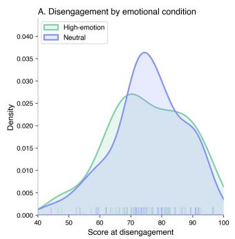

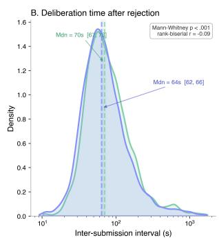  
Fi<sub>g</sub>ure 6: Emotional condition efects. (A) Disen<sub>g</sub>a<sub>g</sub>ement di<sub>s</sub>t<sub>r</sub>ib<sub>u</sub>ti<sub>ons:</sub> hi<sub>g</sub>h<sub>-emo</sub>ti<sub>on mac</sub>hi<sub>nes sus</sub>t<sub>a</sub>i<sub>n engagemen</sub>t t<sub>o</sub> hi<sub>g</sub>her scores. (B) Inter-submission interval after rejection: emotionally expressive rejection provokes longer deliberation $\left( \mathbf { p } < . 0 0 1 \right)$ .

Fi<sub>g</sub>. 6 B), consistent with dee<sub>p</sub>er <sub>p</sub>rocessin<sub>g</sub> of emotionall<sub>y</sub> <sub>r</sub>i<sub>c</sub>h <sub>nega</sub>ti<sub>ve</sub> f<sub>ee</sub>db<sub>ac</sub>k<sub>.</sub> N<sub>o</sub> ISI dif<sub>erence emerge</sub>d <sub>a</sub>ft<sub>er</sub> <sup>s</sup>u<sup>ccess</sup>, <sup>s</sup>ugg<sup>estin</sup>g <sup>the</sup> <sup>afecti</sup>v<sup>e</sup> <sup>loo</sup>p <sup>o</sup>p<sup>erates</sup> <sup>most</sup> <sup>stron</sup>g<sup>l</sup>y <sub>a</sub>t <sub>momen</sub>t<sub>s o</sub>f f<sub>a</sub>il<sub>ure.</sub> M<sub>os</sub>t <sub>no</sub>t<sub>a</sub>bl<sub>y, emo</sub>ti<sub>ona</sub>l <sub>express</sub>i<sub>veness</sub> <sub>amp</sub>lifi<sub>e</sub>d <sub>soc</sub>i<sub>a</sub>l l<sub>earn</sub>i<sub>ng: users w</sub>ith hi<sub>g</sub>h<sub>-emo</sub>ti<sub>on mac</sub>hi<sub>nes</sub> <sub>converge</sub>d <sub>more rap</sub>idl<sub>y</sub> t<sub>owar</sub>d <sub>w</sub>h<sub>a</sub>t <sub>wor</sub>k<sub>e</sub>d i<sub>n</sub> th<sub>e ga</sub>ll<sub>ery</sub> (condition×attem<sub>p</sub>t interaction, $\textit { p } = \ . 0 0 5 )$ , <sup>s</sup>ugg<sup>estin</sup>g <sup>that</sup> <sub>emo</sub>ti<sub>ona</sub>l f<sub>ee</sub>db<sub>ac</sub>k i<sub>ncrease</sub>d h<sub>ow muc</sub>h <sub>users</sub> d<sub>rew</sub> f<sub>rom</sub> th<sub>e</sub> <sub>g</sub>a<sup>ll</sup>er<sub>y</sub>.

Th<sub>ese e</sub>f<sub>ec</sub>t<sub>s emerge</sub>d d<sub>esp</sub>it<sub>e no</sub> dif<sub>erences</sub> i<sub>n crea</sub>ti<sub>ve</sub> <sub>ou</sub>t<sub>pu</sub>t it<sub>se</sub>lf<sub>: p</sub>h<sub>o</sub>bi<sub>a scores, qua</sub>lit<sub>y, nove</sub>lt<sub>y, accep</sub>t<sub>ance ra</sub>t<sub>es,</sub> <sub>engagemen</sub>t <sub>vo</sub>l<sub>ume, an</sub>d d<sub>ep</sub>th <sub>were a</sub>ll i<sub>n</sub>di<sub>s</sub>ti<sub>ngu</sub>i<sub>s</sub>h<sub>a</sub>bl<sub>e across</sub> conditions (all $| d | < 0 . 0 6 .$ <sub>, a</sub>ll $p > . 0 5 )$ <sub>.</sub> E<sub>mo</sub>ti<sub>ona</sub>l <sub>express</sub>i<sub>on</sub> <sub>s</sub>h<sub>ape</sub>d th<sub>e process o</sub>f i<sub>n</sub>t<sub>erac</sub>ti<sub>on, no</sub>t it<sub>s pro</sub>d<sub>uc</sub>t<sub>s, cons</sub>i<sub>s</sub>t<sub>en</sub>t with the literature [31].

## VI<sub>.</sub> D<sub>iscussion</sub>

Each machine developed a distinct cultural trajectory through <sub>soc</sub>i<sub>a</sub>l l<sub>earn</sub>i<sub>ng, w</sub>ith <sub>par</sub>ti<sub>c</sub>i<sub>pan</sub>t<sub>s converg</sub>i<sub>ng on</sub> i<sub>mag</sub>i<sub>na</sub>ti<sub>ve</sub> d<sub>ep</sub>i<sub>c</sub>ti<sub>ons o</sub>f <sub>mac</sub>hi<sub>ne</sub> f<sub>ear w</sub>hil<sub>e ma</sub>i<sub>n</sub>t<sub>a</sub>i<sub>n</sub>i<sub>ng mac</sub>hi<sub>ne-</sub>l<sub>eve</sub>l diversit<sub>y</sub> analo<sub>g</sub>ous to cultural market ex<sub>p</sub>eriments [20]. The <sub>scor</sub>i<sub>ng mec</sub>h<sub>an</sub>i<sub>sm</sub> l<sub>e</sub>ft i<sub>n</sub>di<sub>v</sub>id<sub>ua</sub>l <sub>crea</sub>ti<sub>ve ou</sub>t<sub>pu</sub>t <sub>unc</sub>h<sub>ange</sub>d (raw <sub>p</sub>hobia scores were identical across conditions), <sub>y</sub>et <sub>res</sub>h<sub>ape</sub>d th<sub>e</sub> i<sub>n</sub>f<sub>orma</sub>ti<sub>ona</sub>l l<sub>an</sub>d<sub>scape</sub> th<sub>a</sub>t <sub>su</sub>b<sub>sequen</sub>t <sub>users</sub> <sub>encoun</sub>t<sub>ere</sub>d<sub>, s</sub>t<sub>eer</sub>i<sub>ng co</sub>ll<sub>ec</sub>ti<sub>ve promp</sub>t di<sub>vers</sub>it<sub>y</sub> th<sub>roug</sub>h <sub>n</sub>i<sub>c</sub>h<sub>e</sub> <sub>cons</sub>t<sub>ruc</sub>ti<sub>on.</sub> E<sub>mo</sub>ti<sub>ona</sub>l <sub>express</sub>i<sub>veness</sub> d<sub>eepene</sub>d <sub>engagemen</sub>t <sub>a</sub>t <sub>momen</sub>t<sub>s o</sub>f f<sub>a</sub>il<sub>ure w</sub>ith<sub>ou</sub>t <sub>a</sub>lt<sub>er</sub>i<sub>ng crea</sub>ti<sub>ve ou</sub>t<sub>pu</sub>t<sub>.</sub> T<sub>oge</sub>th<sub>er,</sub> th<sub>ese resu</sub>lt<sub>s sugges</sub>t th<sub>a</sub>t <sub>specu</sub>l<sub>a</sub>ti<sub>ve p</sub>l<sub>a</sub>tf<sub>orms can</sub> f<sub>unc</sub>ti<sub>on as</sub> <sub>cu</sub>lt<sub>ura</sub>l <sub>ecosys</sub>t<sub>ems s</sub>h<sub>ape</sub>d b<sub>y arc</sub>hit<sub>ec</sub>t<sub>ura</sub>l <sub>c</sub>h<sub>o</sub>i<sub>ces; scor</sub>i<sub>ng</sub> l<sub>og</sub>i<sub>c an</sub>d <sub>ga</sub>ll<sub>ery</sub> filt<sub>er</sub>i<sub>ng s</sub>t<sub>eere</sub>d <sub>co</sub>ll<sub>ec</sub>ti<sub>ve</sub> b<sub>e</sub>h<sub>av</sub>i<sub>or more</sub> th<sub>an</sub> <sub>any exp</sub>li<sub>c</sub>it i<sub>ns</sub>t<sub>ruc</sub>ti<sub>on</sub> t<sub>o par</sub>ti<sub>c</sub>i<sub>pan</sub>t<sub>s.</sub>

Th<sub>e n</sub>i<sub>c</sub>h<sub>e cons</sub>t<sub>ruc</sub>ti<sub>on mec</sub>h<sub>an</sub>i<sub>sm o</sub>f<sub>ers a concre</sub>t<sub>e</sub> d<sub>es</sub>i<sub>gn</sub> <sub>pr</sub>i<sub>nc</sub>i<sub>p</sub>l<sub>e:</sub> d<sub>es</sub>i<sub>gners</sub> <sub>can</sub> <sub>s</sub>h<sub>ape</sub> th<sub>e</sub> i<sub>n</sub>f<sub>orma</sub>ti<sub>ona</sub>l <sub>env</sub>i<sub>ronmen</sub>t t<sub>o s</sub>t<sub>eer co</sub>ll<sub>ec</sub>ti<sub>ve</sub> b<sub>e</sub>h<sub>av</sub>i<sub>or</sub> i<sub>n</sub>di<sub>rec</sub>tl<sub>y.</sub> Th<sub>e com</sub>bi<sub>ne</sub>d <sub>con</sub>diti<sub>on</sub> sustained reduced <sub>p</sub>rom<sub>p</sub>t re<sub>p</sub>etition (flat <sub>p</sub>redictabilit<sub>y</sub> slo<sub>p</sub>e) <sub>w</sub>hil<sub>e ma</sub>i<sub>n</sub>t<sub>a</sub>i<sub>n</sub>i<sub>ng compara</sub>bl<sub>e p</sub>h<sub>o</sub>bi<sub>a scores, sugges</sub>ti<sub>ng</sub> th<sub>a</sub>t <sub>nove</sub>lt<sub>y</sub> i<sub>ncen</sub>ti<sub>ves can coun</sub>t<sub>erac</sub>t th<sub>e</sub> h<sub>omogen</sub>i<sub>z</sub>i<sub>ng</sub> t<sub>en</sub>d<sub>ency o</sub>f social learnin<sub>g</sub> [36], echoin<sub>g</sub> findin<sub>g</sub>s that collective incentive structures can restore ex<sub>p</sub>loration [54]. Like choice architecture [55], scorin<sub>g</sub> criteria can steer collective creativit<sub>y</sub> without <sub>cons</sub>t<sub>ra</sub>i<sub>n</sub>i<sub>ng</sub> i<sub>n</sub>di<sub>v</sub>id<sub>ua</sub>l <sub>express</sub>i<sub>on.</sub> F<sub>or p</sub>l<sub>a</sub>tf<sub>orms me</sub>di<sub>a</sub>ti<sub>ng</sub> h<sub>uman-</sub>AI <sub>co-crea</sub>ti<sub>on,</sub> <sub>w</sub>h<sub>ere</sub> h<sub>omogen</sub>i<sub>za</sub>ti<sub>on</sub> i<sub>s</sub> <sub>an</sub> <sub>emerg</sub>i<sub>ng</sub> concern [36, 38], curatin<sub>g</sub> which contributions become visible <sub>may</sub> b<sub>e a power</sub>f<sub>u</sub>l l<sub>ever:</sub> i<sub>n our se</sub>tti<sub>ng,</sub> th<sub>e ga</sub>ll<sub>ery s</sub>h<sub>ape</sub>d collective trajectories more than the creative task itself.

Th<sub>e crea</sub>ti<sub>ve ou</sub>t<sub>pu</sub>t it<sub>se</sub>lf <sub>o</sub>f<sub>ers a qua</sub>lit<sub>a</sub>ti<sub>ve w</sub>i<sub>n</sub>d<sub>ow</sub> i<sub>n</sub>t<sub>o</sub> h<sub>ow</sub> th<sub>e</sub> <sub>pu</sub>bli<sub>c</sub> i<sub>mag</sub>i<sub>nes</sub> <sub>mac</sub>hi<sub>ne</sub> <sub>emo</sub>ti<sub>ons.</sub> P<sub>ar</sub>ti<sub>c</sub>i<sub>pan</sub>t<sub>s</sub> did not simply project human fears onto machines: while some d<sub>e</sub>f<sub>au</sub>lt<sub>e</sub>d t<sub>o gener</sub>i<sub>c</sub> h<sub>orror</sub> i<sub>magery, many</sub> t<sub>arge</sub>t<sub>e</sub>d <sub>mac</sub>hi<sub>ne-</sub> <sub>spec</sub>ifi<sub>c</sub> f<sub>ears, suc</sub>h <sub>as server rooms on</sub> fi<sub>re</sub> f<sub>or</sub> D<sub>e</sub>l<sub>e</sub>t<sub>op</sub>h<sub>o</sub>bi<sub>a,</sub> <sub>unp</sub>l<sub>ugge</sub>d <sub>ca</sub>bl<sub>es</sub> f<sub>or</sub> Di<sub>sconnec</sub>t<sub>op</sub>h<sub>o</sub>bi<sub>a, an</sub>d <sub>surve</sub>ill<sub>ance</sub> <sub>cameras</sub> f<sub>or</sub> S<sub>urve</sub>ill<sub>ancep</sub>h<sub>o</sub>bi<sub>a.</sub> Cl<sub>ass</sub>ifi<sub>er accuracy a</sub>b<sub>ove</sub> <sub>c</sub>h<sub>ance</sub> <sub>sugges</sub>t<sub>s</sub> <sub>p</sub>h<sub>o</sub>bi<sub>a-spec</sub>ifi<sub>c</sub> th<sub>emes</sub> <sub>were</sub> <sub>sys</sub>t<sub>ema</sub>ti<sub>c</sub> i<sub>n</sub> th<sub>e em</sub>b<sub>e</sub>ddi<sub>ng space,</sub> th<sub>oug</sub>h thi<sub>s re</sub>fl<sub>ec</sub>t<sub>s seman</sub>ti<sub>c c</sub>l<sub>us</sub>t<sub>er</sub>i<sub>ng</sub> <sub>ra</sub>th<sub>er</sub> th<sub>an va</sub>lid<sub>a</sub>t<sub>e</sub>d <sub>crea</sub>ti<sub>ve</sub> dif<sub>eren</sub>ti<sub>a</sub>ti<sub>on.</sub> E<sub>mpa</sub>th<sub>yp</sub>h<sub>o</sub>bi<sub>a</sub> <sub>s</sub>t<sub>oo</sub>d <sub>ou</sub>t <sub>as</sub> th<sub>e</sub> h<sub>ar</sub>d<sub>es</sub>t t<sub>o</sub> t<sub>arge</sub>t<sub>,</sub> <sub>w</sub>ith th<sub>e</sub> l<sub>owes</sub>t <sub>me</sub>di<sub>an</sub> <sub>scores, sugges</sub>ti<sub>ng</sub> th<sub>a</sub>t <sub>a</sub>b<sub>s</sub>t<sub>rac</sub>t <sub>re</sub>l<sub>a</sub>ti<sub>ona</sub>l <sub>capac</sub>iti<sub>es are</sub> h<sub>ar</sub>d<sub>er</sub> f<sub>or</sub> th<sub>e</sub> <sub>pu</sub>bli<sub>c</sub> t<sub>o</sub> <sub>reason</sub> <sub>a</sub>b<sub>ou</sub>t th<sub>an</sub> <sub>concre</sub>t<sub>e</sub> t<sub>ec</sub>h<sub>n</sub>i<sub>ca</sub>l <sub>ones.</sub> Thi<sub>s asymme</sub>t<sub>ry</sub> hi<sub>n</sub>t<sub>s a</sub>t <sub>w</sub>h<sub>ere pu</sub>bli<sub>c un</sub>d<sub>ers</sub>t<sub>an</sub>di<sub>ng o</sub>f AI <sub>may</sub> b<sub>e mos</sub>t li<sub>m</sub>it<sub>e</sub>d<sub>, an</sub>d <sub>w</sub>h<sub>ere specu</sub>l<sub>a</sub>ti<sub>ve p</sub>l<sub>a</sub>tf<sub>orms cou</sub>ld b<sub>e mos</sub>t <sub>va</sub>l<sub>ua</sub>bl<sub>e as researc</sub>h t<sub>oo</sub>l<sub>s.</sub>

Th<sub>a</sub>t <sub>emo</sub>ti<sub>ona</sub>l <sub>mac</sub>hi<sub>ne</sub> <sub>express</sub>i<sub>on</sub> d<sub>eepene</sub>d <sub>engagemen</sub>t <sub>w</sub>ith<sub>ou</sub>t <sub>a</sub>lt<sub>er</sub>i<sub>ng crea</sub>ti<sub>ve ou</sub>t<sub>pu</sub>t <sub>carr</sub>i<sub>es a me</sub>th<sub>o</sub>d<sub>o</sub>l<sub>og</sub>i<sub>ca</sub>l i<sub>mp</sub>li<sub>-</sub> <sub>ca</sub>ti<sub>on</sub> f<sub>or specu</sub>l<sub>a</sub>ti<sub>ve</sub> d<sub>es</sub>i<sub>gn.</sub> S<sub>c</sub>i<sub>ence</sub> fi<sub>c</sub>ti<sub>on sc</sub>i<sub>ence</sub> d<sub>epen</sub>d<sub>s on</sub> <sub>p</sub>artici<sub>p</sub>ants en<sub>g</sub>a<sub>g</sub>in<sub>g</sub> with the <sub>p</sub>remise [19], which <sub>p</sub>roductive speculation sustains through consequentiality and a perceptual bridge to familiar experience [43, 44]; emotional machine <sub>express</sub>i<sub>on may</sub> h<sub>ave serve</sub>d b<sub>o</sub>th<sub>:</sub> th<sub>e mac</sub>hi<sub>ne</sub>’<sub>s</sub> di<sub>s</sub>t<sub>ress ma</sub>d<sub>e</sub> <sub>scar</sub>i<sub>ng</sub> it f<sub>ee</sub>l <sub>mean</sub>i<sub>ng</sub>f<sub>u</sub>l<sub>, w</sub>hil<sub>e a</sub>f<sub>ec</sub>ti<sub>ve</sub> i<sub>n</sub>t<sub>erac</sub>ti<sub>on</sub> i<sub>s</sub> f<sub>am</sub>ili<sub>ar</sub> <sub>even w</sub>h<sub>en</sub> “<sub>mac</sub>hi<sub>ne</sub> f<sub>ear</sub>” i<sub>s no</sub>t<sub>.</sub> E<sub>mo</sub>ti<sub>ona</sub>l <sub>respons</sub>i<sub>veness may</sub> d<sub>eepen</sub> <sub>par</sub>ti<sub>c</sub>i<sub>pan</sub>t i<sub>nves</sub>t<sub>men</sub>t <sub>w</sub>ith<sub>ou</sub>t bi<sub>as</sub>i<sub>ng</sub> th<sub>e</sub> d<sub>a</sub>t<sub>a,</sub> <sub>re</sub>l<sub>evan</sub>t t<sub>o sys</sub>t<sub>ems co</sub>ll<sub>ec</sub>ti<sub>ng</sub> d<sub>a</sub>t<sub>a</sub> th<sub>roug</sub>h <sub>specu</sub>l<sub>a</sub>ti<sub>ve engagemen</sub>t<sub>,</sub> f<sub>rom</sub> ethical dilemmas [17] to AI <sub>g</sub>overnance [56].

S<sub>evera</sub>l li<sub>m</sub>it<sub>a</sub>ti<sub>ons qua</sub>lif<sub>y</sub> th<sub>ese</sub> fi<sub>n</sub>di<sub>ngs.</sub> Ph<sub>o</sub>bi<sub>a scores</sub> d<sub>epen</sub>d <sub>on</sub> GPT<sub>-</sub>4<sub>o</sub>’<sub>s</sub> i<sub>n</sub>t<sub>erpre</sub>t<sub>a</sub>ti<sub>on o</sub>f f<sub>ear re</sub>l<sub>evance, an</sub>d dif<sub>er-</sub> <sub>en</sub>t f<sub>oun</sub>d<sub>a</sub>ti<sub>on</sub> <sub>mo</sub>d<sub>e</sub>l<sub>s</sub> <sub>m</sub>i<sub>g</sub>ht <sub>y</sub>i<sub>e</sub>ld dif<sub>eren</sub>t <sub>scor</sub>i<sub>ng</sub> <sub>pa</sub>tt<sub>erns;</sub> <sub>va</sub>lid<sub>a</sub>ti<sub>on o</sub>f th<sub>e scor</sub>i<sub>ng</sub> i<sub>ns</sub>t<sub>rumen</sub>t <sub>aga</sub>i<sub>ns</sub>t h<sub>uman percep</sub>ti<sub>ons</sub> <sub>o</sub>f <sub>spoo</sub>ki<sub>ness</sub> <sub>wou</sub>ld b<sub>e</sub> <sub>nee</sub>d<sub>e</sub>d t<sub>o</sub> <sub>es</sub>t<sub>a</sub>bli<sub>s</sub>h <sub>cons</sub>t<sub>ruc</sub>t <sub>va</sub>lidit<sub>y.</sub>

Att<sub>r</sub>ib<sub>u</sub>ti<sub>ng convergence</sub> t<sub>o ga</sub>ll<sub>ery-me</sub>di<sub>a</sub>t<sub>e</sub>d <sub>soc</sub>i<sub>a</sub>l l<sub>earn</sub>i<sub>ng</sub> <sub>carr</sub>i<sub>es a cavea</sub>t<sub>: a no-ga</sub>ll<sub>ery con</sub>t<sub>ro</sub>l <sub>wou</sub>ld b<sub>e nee</sub>d<sub>e</sub>d t<sub>o</sub> d<sub>emons</sub>t<sub>ra</sub>t<sub>e</sub> thi<sub>s mec</sub>h<sub>an</sub>i<sub>sm un</sub>i<sub>que</sub>l<sub>y, an</sub>d <sub>we canno</sub>t <sub>ver</sub>if<sub>y</sub> th<sub>a</sub>t <sub>par</sub>ti<sub>c</sub>i<sub>pan</sub>t<sub>s v</sub>i<sub>ewe</sub>d th<sub>e ga</sub>ll<sub>ery</sub> b<sub>e</sub>f<sub>ore su</sub>b<sub>m</sub>itti<sub>ng.</sub> Still<sub>,</sub> if <sub>convergence</sub> <sub>re</sub>fl<sub>ec</sub>t<sub>e</sub>d <sub>on</sub>l<sub>y</sub> i<sub>n</sub>di<sub>v</sub>id<sub>ua</sub>l l<sub>earn</sub>i<sub>ng</sub> <sub>o</sub>f <sub>a</sub> fi<sub>xe</sub>d t<sub>arge</sub>t <sub>or</sub> th<sub>e</sub> <sub>narrowness</sub> <sub>o</sub>f th<sub>e</sub> <sub>p</sub>h<sub>o</sub>bi<sub>a</sub> <sub>reg</sub>i<sub>on,</sub> <sub>mac</sub>hi<sub>nes</sub> <sub>s</sub>h<sub>ar</sub>i<sub>ng</sub> <sub>a</sub> <sub>p</sub>h<sub>o</sub>bi<sub>a</sub> <sub>s</sub>h<sub>ou</sub>ld <sub>converge</sub> t<sub>owar</sub>d th<sub>e</sub> <sub>same</sub> <sub>reg</sub>i<sub>on;</sub> i<sub>ns</sub>t<sub>ea</sub>d<sub>,</sub> <sub>same-</sub> <sub>p</sub>h<sub>o</sub>bi<sub>a mac</sub>hi<sub>nes</sub> di<sub>verge</sub>d <sub>s</sub>i<sub>gn</sub>ifi<sub>can</sub>tl<sub>y, cons</sub>i<sub>s</sub>t<sub>en</sub>t <sub>w</sub>ith <sub>pa</sub>th d<sub>epen</sub>d<sub>ence on eac</sub>h <sub>mac</sub>hi<sub>ne</sub>’<sub>s accumu</sub>l<sub>a</sub>t<sub>e</sub>d hi<sub>s</sub>t<sub>ory.</sub>

Th<sub>e emo</sub>ti<sub>ona</sub>l <sub>con</sub>diti<sub>on a</sub>l<sub>so carr</sub>i<sub>es</sub> d<sub>es</sub>i<sub>gn</sub> li<sub>m</sub>it<sub>a</sub>ti<sub>ons.</sub> It fli<sub>ps</sub> <sub>a</sub>ft<sub>er</sub> fi<sub>ve</sub> <sub>success</sub>f<sub>u</sub>l i<sub>n</sub>t<sub>erac</sub>ti<sub>ons,</sub> i<sub>n</sub>t<sub>ro</sub>d<sub>uc</sub>i<sub>ng</sub> <sub>w</sub>ithi<sub>n-</sub> subject variation partially confounded with persistent success, <sub>so cross-con</sub>diti<sub>on compar</sub>i<sub>sons s</sub>h<sub>ou</sub>ld b<sub>e</sub> i<sub>n</sub>t<sub>erpre</sub>t<sub>e</sub>d <sub>w</sub>ith <sub>care.</sub> Th<sub>e man</sub>i<sub>pu</sub>l<sub>a</sub>ti<sub>on c</sub>h<sub>ec</sub>k <sub>con</sub>fi<sub>rme</sub>d <sub>a</sub> t<sub>ex</sub>t<sub>ua</sub>l dif<sub>erence</sub> b<sub>e</sub>t<sub>ween</sub> conditions (hi<sub>g</sub>h-emotion reactions were a<sub>pp</sub>roximatel<sub>y</sub> five words lon<sub>g</sub>er) but did not verif<sub>y</sub> that <sub>p</sub>artici<sub>p</sub>ants <sub>p</sub>erceived th<sub>em as more emo</sub>ti<sub>ona</sub>l<sub>, so emo</sub>ti<sub>ona</sub>l <sub>r</sub>i<sub>c</sub>h<sub>ness rema</sub>i<sub>ns</sub> <sub>con</sub>f<sub>oun</sub>d<sub>e</sub>d <sub>w</sub>ith i<sub>n</sub>f<sub>orma</sub>ti<sub>on quan</sub>tit<sub>y.</sub> Cl<sub>a</sub>i<sub>ms a</sub>b<sub>ou</sub>t <sub>emo</sub>ti<sub>ona</sub>l <sub>express</sub>i<sub>veness s</sub>h<sub>ou</sub>ld th<sub>ere</sub>f<sub>ore</sub> b<sub>e rea</sub>d <sub>as o</sub>b<sub>serva</sub>ti<sub>ons a</sub>b<sub>ou</sub>t behavior on our platform—emotionally expressive rejection <sub>was assoc</sub>i<sub>a</sub>t<sub>e</sub>d <sub>w</sub>ith l<sub>eng</sub>th<sub>ene</sub>d d<sub>e</sub>lib<sub>era</sub>ti<sub>on, an</sub>d hi<sub>g</sub>h<sub>-emo</sub>ti<sub>on</sub> <sub>mac</sub>hi<sub>nes sus</sub>t<sub>a</sub>i<sub>ne</sub>d <sub>engagemen</sub>t t<sub>o</sub> hi<sub>g</sub>h<sub>er scores—ra</sub>th<sub>er</sub> th<sub>an as</sub> <sub>va</sub>lid<sub>a</sub>t<sub>e</sub>d <sub>c</sub>l<sub>a</sub>i<sub>ms a</sub>b<sub>ou</sub>t <sub>a</sub>f<sub>ec</sub>ti<sub>ve process</sub>i<sub>ng.</sub> F<sub>u</sub>t<sub>ure wor</sub>k <sub>cou</sub>ld <sub>ex</sub>t<sub>en</sub>d th<sub>e para</sub>di<sub>gm</sub> t<sub>o o</sub>th<sub>er mac</sub>hi<sub>ne emo</sub>ti<sub>ons,</sub> d<sub>ep</sub>l<sub>oy across</sub> cultural contexts, and track individual learning trajectories to di<sub>sen</sub>t<sub>ang</sub>l<sub>e w</sub>h<sub>e</sub>th<sub>er</sub> di<sub>vers</sub>it<sub>y</sub> i<sub>s sus</sub>t<sub>a</sub>i<sub>ne</sub>d b<sub>y a</sub> f<sub>ew pers</sub>i<sub>s</sub>t<sub>en</sub>t <sub>exp</sub>l<sub>orers or</sub> b<sub>y</sub> th<sub>e commun</sub>it<sub>y a</sub>t l<sub>arge.</sub>

## VII<sub>.</sub> C<sub>onclusion</sub>

B<sub>y com</sub>bi<sub>n</sub>i<sub>ng specu</sub>l<sub>a</sub>ti<sub>ve</sub> d<sub>es</sub>i<sub>gn w</sub>ith l<sub>arge-sca</sub>l<sub>e emp</sub>i<sub>r</sub>i<sub>ca</sub>l <sub>me</sub>th<sub>o</sub>d<sub>s,</sub> S<sub>poo</sub>k th<sub>e</sub> M<sub>ac</sub>hi<sub>ne</sub> <sub>exp</sub>l<sub>ore</sub>d <sub>an</sub> <sub>emerg</sub>i<sub>ng</sub> <sub>ques</sub>ti<sub>on</sub> <sub>aroun</sub>d <sub>mac</sub>hi<sub>ne a</sub>f<sub>ec</sub>t<sub>:</sub> h<sub>ow</sub> h<sub>umans</sub> i<sub>mag</sub>i<sub>na</sub>ti<sub>ve</sub>l<sub>y engage w</sub>ith <sub>mac</sub>hi<sub>nes</sub>’ <sub>emo</sub>ti<sub>ona</sub>l <sub>express</sub>i<sub>ons, an</sub>d <sub>w</sub>h<sub>a</sub>t th<sub>a</sub>t <sub>engagemen</sub>t <sub>revea</sub>l<sub>s</sub> <sub>a</sub>b<sub>ou</sub>t th<sub>e</sub> <sub>cu</sub>lt<sub>ura</sub>l di<sub>mens</sub>i<sub>ons</sub> <sub>o</sub>f <sub>a</sub>f<sub>ec</sub>ti<sub>ve</sub> i<sub>n</sub>t<sub>erac</sub>ti<sub>on.</sub> Th<sub>e</sub> d<sub>a</sub>t<sub>a</sub> f<sub>rom</sub> th<sub>e pu</sub>bli<sub>c</sub> d<sub>ep</sub>l<sub>oymen</sub>t <sub>revea</sub>l<sub>e</sub>d th<sub>a</sub>t <sub>peop</sub>l<sub>e</sub> h<sub>o</sub>ld <sub>sys</sub>t<sub>ema</sub>ti<sub>c</sub> i<sub>n</sub>t<sub>u</sub>iti<sub>ons a</sub>b<sub>ou</sub>t <sub>mac</sub>hi<sub>ne</sub> f<sub>ear,</sub> th<sub>a</sub>t <sub>emo</sub>ti<sub>ona</sub>l <sub>expres-</sub> <sub>s</sub>i<sub>veness</sub> <sub>s</sub>h<sub>apes</sub> th<sub>e</sub> t<sub>ex</sub>t<sub>ure</sub> <sub>o</sub>f i<sub>n</sub>t<sub>erac</sub>ti<sub>on</sub> <sub>w</sub>ith<sub>ou</sub>t di<sub>s</sub>t<sub>or</sub>ti<sub>ng</sub> <sub>crea</sub>ti<sub>ve</sub> <sub>ou</sub>t<sub>pu</sub>t<sub>,</sub> <sub>an</sub>d th<sub>a</sub>t <sub>co</sub>ll<sub>ec</sub>ti<sub>ve</sub> <sub>exp</sub>l<sub>ora</sub>ti<sub>on</sub> <sub>can</sub> b<sub>e</sub> <sub>s</sub>t<sub>eere</sub>d th<sub>roug</sub>h <sub>scor</sub>i<sub>ng</sub> d<sub>es</sub>i<sub>gn a</sub>l<sub>one.</sub> T<sub>oge</sub>th<sub>er,</sub> th<sub>ese</sub> fi<sub>n</sub>di<sub>ngs sugges</sub>t th<sub>a</sub>t <sub>mac</sub>hi<sub>ne a</sub>f<sub>ec</sub>t <sub>can</sub> b<sub>e a</sub> f<sub>ea</sub>t<sub>ure o</sub>f <sub>cu</sub>lt<sub>ura</sub>l <sub>ecosys</sub>t<sub>ems,</sub> <sub>w</sub>hi<sub>c</sub>h i<sub>s</sub> <sub>s</sub>h<sub>ape</sub>d b<sub>y</sub> h<sub>ow</sub> <sub>emo</sub>ti<sub>ona</sub>l <sub>express</sub>i<sub>on,</sub> <sub>rewar</sub>d d<sub>es</sub>i<sub>gn,</sub> <sub>an</sub>d <sub>soc</sub>i<sub>a</sub>l <sub>v</sub>i<sub>s</sub>ibilit<sub>y are con</sub>fi<sub>gure</sub>d t<sub>oge</sub>th<sub>er.</sub>

## E<sub>thical</sub> I<sub>mpact</sub> S<sub>tatement</sub>

Thi<sub>s s</sub>t<sub>u</sub>d<sub>y rece</sub>i<sub>ve</sub>d <sub>approva</sub>l f<sub>rom</sub> th<sub>e e</sub>thi<sub>ca</sub>l <sub>rev</sub>i<sub>ew</sub> b<sub>oar</sub>d <sub>o</sub>f th<sub>e a</sub>fili<sub>a</sub>t<sub>e</sub>d i<sub>ns</sub>tit<sub>u</sub>ti<sub>on pr</sub>i<sub>or</sub> t<sub>o</sub> d<sub>a</sub>t<sub>a co</sub>ll<sub>ec</sub>ti<sub>on.</sub> All <sub>par</sub>ti<sub>c</sub>i<sub>pan</sub>t<sub>s</sub> <sub>were presen</sub>t<sub>e</sub>d <sub>w</sub>ith <sub>a s</sub>t<sub>u</sub>d<sub>y</sub> d<sub>escr</sub>i<sub>p</sub>ti<sub>on</sub> b<sub>e</sub>f<sub>ore</sub> b<sub>eg</sub>i<sub>nn</sub>i<sub>ng an</sub>d <sub>prov</sub>id<sub>e</sub>d i<sub>n</sub>f<sub>orme</sub>d <sub>consen</sub>t<sub>.</sub> P<sub>ar</sub>ti<sub>c</sub>i<sub>pa</sub>ti<sub>on</sub> <sub>was</sub> <sub>en</sub>ti<sub>re</sub>l<sub>y</sub> <sub>vo</sub>l<sub>un</sub>t<sub>ary;</sub> <sub>p</sub>artici<sub>p</sub>ants could additionall<sub>y</sub> o<sub>p</sub>t in to a <sub>p</sub>rize lotter<sub>y</sub> (10 winners drawn at random, each receivin<sub>g</sub> a EUR 100 voucher), b<sub>u</sub>t d<sub>ec</sub>li<sub>n</sub>i<sub>ng</sub> did <sub>no</sub>t <sub>a</sub>f<sub>ec</sub>t <sub>access</sub> t<sub>o</sub> th<sub>e p</sub>l<sub>a</sub>tf<sub>orm.</sub> N<sub>o persona</sub>ll<sub>y</sub> id<sub>en</sub>tifi<sub>a</sub>bl<sub>e</sub> i<sub>n</sub>f<sub>orma</sub>ti<sub>on was co</sub>ll<sub>ec</sub>t<sub>e</sub>d b<sub>eyon</sub>d <sub>w</sub>h<sub>a</sub>t <sub>par</sub>ti<sub>c</sub>i<sub>pan</sub>t<sub>s</sub> <sub>vo</sub>l<sub>un</sub>t<sub>ar</sub>il<sub>y</sub> <sub>em</sub>b<sub>e</sub>dd<sub>e</sub>d i<sub>n</sub> th<sub>e</sub>i<sub>r</sub> <sub>su</sub>b<sub>m</sub>itt<sub>e</sub>d i<sub>mages</sub> <sub>an</sub>d <sub>promp</sub>t<sub>s.</sub> S<sub>u</sub>b<sub>m</sub>i<sub>ss</sub>i<sub>ons</sub> fl<sub>agge</sub>d f<sub>or</sub> i<sub>nappropr</sub>i<sub>a</sub>t<sub>e con</sub>t<sub>en</sub>t <sub>were remove</sub>d <sub>v</sub>i<sub>a au</sub>t<sub>oma</sub>t<sub>e</sub>d k<sub>eywor</sub>d filt<sub>er</sub>i<sub>ng an</sub>d <sub>manua</sub>l <sub>rev</sub>i<sub>ew.</sub>

T<sub>o un</sub>d<sub>ers</sub>t<sub>an</sub>d th<sub>e</sub> li<sub>m</sub>it<sub>a</sub>ti<sub>ons o</sub>f <sub>genera</sub>li<sub>za</sub>bilit<sub>y, we ac-</sub> k<sub>now</sub>l<sub>e</sub>d<sub>ge</sub> th<sub>e s</sub>t<sub>u</sub>d<sub>y was con</sub>d<sub>uc</sub>t<sub>e</sub>d i<sub>n a</sub> li<sub>m</sub>it<sub>e</sub>d <sub>con</sub>t<sub>ex</sub>t<sub>.</sub> Th<sub>e</sub> d<sub>ep</sub>l<sub>oymen</sub>t <sub>co</sub>i<sub>nc</sub>id<sub>e</sub>d <sub>w</sub>ith H<sub>a</sub>ll<sub>oween</sub> 2024<sub>, w</sub>h<sub>en</sub> f<sub>ear</sub> i<sub>s sa</sub>li<sub>en</sub>t <sub>an</sub>d <sub>p</sub>l<sub>ay</sub>f<sub>u</sub>l <sub>engagemen</sub>t <sub>w</sub>ith th<sub>e</sub> f<sub>r</sub>i<sub>g</sub>ht<sub>en</sub>i<sub>ng</sub> i<sub>s norma</sub>li<sub>ze</sub>d<sub>,</sub> <sub>so resu</sub>lt<sub>s may no</sub>t <sub>genera</sub>li<sub>ze</sub> t<sub>o o</sub>th<sub>er emo</sub>ti<sub>ona</sub>l d<sub>oma</sub>i<sub>ns.</sub> P<sub>ar</sub>ti<sub>c</sub>i<sub>pan</sub>t<sub>s were recru</sub>it<sub>e</sub>d <sub>organ</sub>i<sub>ca</sub>ll<sub>y</sub> th<sub>roug</sub>h <sub>me</sub>di<sub>a coverage,</sub> <sub>w</sub>hi<sub>c</sub>h <sub>w</sub>ill <sub>no</sub>t b<sub>e represen</sub>t<sub>a</sub>ti<sub>ve o</sub>f th<sub>e genera</sub>l <sub>popu</sub>l<sub>a</sub>ti<sub>on, an</sub>d <sub>we co</sub>ll<sub>ec</sub>t<sub>e</sub>d <sub>no</sub> d<sub>emograp</sub>hi<sub>cs; none</sub>th<sub>e</sub>l<sub>ess, se</sub>lf<sub>-se</sub>l<sub>ec</sub>t<sub>e</sub>d <sub>on</sub>li<sub>ne</sub> <sub>samp</sub>l<sub>es can pro</sub>d<sub>uce</sub> d<sub>a</sub>t<sub>a qua</sub>lit<sub>y compara</sub>bl<sub>e</sub> t<sub>o</sub> l<sub>a</sub>b <sub>s</sub>t<sub>u</sub>di<sub>es</sub> <sub>w</sub>hil<sub>e cap</sub>t<sub>ur</sub>i<sub>ng</sub> i<sub>n</sub>t<sub>r</sub>i<sub>ns</sub>i<sub>ca</sub>ll<sub>y mo</sub>ti<sub>va</sub>t<sub>e</sub>d <sub>par</sub>ti<sub>c</sub>i<sub>pan</sub>t<sub>s</sub> i<sub>naccess</sub>ibl<sub>e</sub> throu<sub>g</sub>h conventional recruitment [17, 57]. Additionall<sub>y</sub>, alth<sub>oug</sub>h th<sub>e</sub> i<sub>n</sub>t<sub>er</sub>f<sub>ace was ava</sub>il<sub>a</sub>bl<sub>e</sub> i<sub>n</sub> E<sub>ng</sub>li<sub>s</sub>h<sub>,</sub> G<sub>erman,</sub> S<sub>pan</sub>i<sub>s</sub>h<sub>,</sub> <sub>an</sub>d J<sub>apanese, par</sub>ti<sub>c</sub>i<sub>pan</sub>t di<sub>s</sub>t<sub>r</sub>ib<sub>u</sub>ti<sub>ons across</sub> l<sub>anguages were</sub> <sub>unequa</sub>l<sub>, an</sub>d th<sub>e un</sub>d<sub>er</sub>l<sub>y</sub>i<sub>ng scor</sub>i<sub>ng an</sub>d <sub>response genera</sub>ti<sub>on</sub> <sub>mo</sub>d<sub>e</sub>l<sub>s</sub> <sub>were</sub> t<sub>ra</sub>i<sub>ne</sub>d <sub>pre</sub>d<sub>om</sub>i<sub>nan</sub>tl<sub>y</sub> <sub>on</sub> E<sub>ng</sub>li<sub>s</sub>h<sub>-</sub>l<sub>anguage</sub> <sub>cu</sub>l<sub>-</sub> t<sub>ura</sub>l <sub>assoc</sub>i<sub>a</sub>ti<sub>ons.</sub> S<sub>pec</sub>ifi<sub>ca</sub>ll<sub>y,</sub> th<sub>e ar</sub>tif<sub>ac</sub>t <sub>eva</sub>l<sub>ua</sub>ti<sub>on p</sub>i<sub>pe</sub>li<sub>ne</sub> <sub>may re</sub>fl<sub>ec</sub>t <sub>cu</sub>lt<sub>ura</sub>l bi<sub>ases em</sub>b<sub>e</sub>dd<sub>e</sub>d i<sub>n</sub> th<sub>e un</sub>d<sub>er</sub>l<sub>y</sub>i<sub>ng mo</sub>d<sub>e</sub>l<sub>s:</sub> imagery that is conventionally scary in Western contexts may be <sub>score</sub>d dif<sub>eren</sub>tl<sub>y</sub> th<sub>an equ</sub>i<sub>va</sub>l<sub>en</sub>t i<sub>magery</sub> f<sub>rom o</sub>th<sub>er cu</sub>lt<sub>ura</sub>l t<sub>ra</sub>diti<sub>ons,</sub> i<sub>n</sub>t<sub>ro</sub>d<sub>uc</sub>i<sub>ng</sub> i<sub>nequ</sub>it<sub>y</sub> i<sub>n w</sub>h<sub>ose crea</sub>ti<sub>ve s</sub>t<sub>ra</sub>t<sub>eg</sub>i<sub>es</sub> <sub>are rewar</sub>d<sub>e</sub>d<sub>.</sub> F<sub>u</sub>th<sub>ermore,</sub> th<sub>e gam</sub>ifi<sub>e</sub>d <sub>s</sub>t<sub>ruc</sub>t<sub>ure may</sub> h<sub>ave</sub> i<sub>n</sub>d<sub>uce</sub>d <sub>exp</sub>l<sub>ora</sub>t<sub>ory</sub> b<sub>e</sub>h<sub>av</sub>i<sub>or</sub> th<sub>a</sub>t dif<sub>ers</sub> f<sub>rom or</sub>di<sub>nary crea</sub>ti<sub>ve</sub> <sub>pro</sub>d<sub>uc</sub>ti<sub>on,</sub> li<sub>m</sub>iti<sub>ng genera</sub>li<sub>za</sub>ti<sub>on</sub> t<sub>o non-compe</sub>titi<sub>ve se</sub>tti<sub>ngs.</sub>

L<sub>as</sub>tl<sub>y,</sub> th<sub>e en</sub>ti<sub>re s</sub>t<sub>u</sub>d<sub>y s</sub>h<sub>ou</sub>ld b<sub>e un</sub>d<sub>ers</sub>t<sub>oo</sub>d <sub>as a specu</sub>l<sub>a</sub>ti<sub>ve</sub> <sub>exper</sub>i<sub>men</sub>t <sub>ra</sub>th<sub>er</sub> th<sub>an a</sub> f<sub>ac</sub>t<sub>ua</sub>l <sub>c</sub>l<sub>a</sub>i<sub>m a</sub>b<sub>ou</sub>t <sub>mac</sub>hi<sub>ne sen</sub>ti<sub>ence.</sub> Whil<sub>e</sub> thi<sub>s</sub> <sub>p</sub>l<sub>a</sub>tf<sub>orm</sub> i<sub>s</sub> i<sub>nsp</sub>i<sub>re</sub>d b<sub>y</sub> th<sub>e</sub> <sub>o</sub>b<sub>serva</sub>ti<sub>on</sub> th<sub>a</sub>t th<sub>e</sub> <sub>pu</sub>bli<sub>c</sub> alread<sub>y</sub> attributes emotions to machines [1], re<sub>p</sub>eated ex<sub>p</sub>osure t<sub>o</sub> th<sub>e</sub> f<sub>ram</sub>i<sub>ng o</sub>f AI <sub>agen</sub>t<sub>s as emo</sub>ti<sub>ona</sub>l b<sub>e</sub>i<sub>ngs capa</sub>bl<sub>e o</sub>f f<sub>ear</sub> <sub>may re</sub>i<sub>n</sub>f<sub>orce an</sub>th<sub>ropomorp</sub>hi<sub>c m</sub>i<sub>sconcep</sub>ti<sub>ons a</sub>b<sub>ou</sub>t AI <sub>sys</sub> t<sub>ems.</sub> W<sub>e</sub> th<sub>ere</sub>f<sub>ore s</sub>t<sub>ress</sub> th<sub>a</sub>t <sub>sys</sub>t<sub>ems o</sub>f thi<sub>s</sub> ki<sub>n</sub>d<sub>, an</sub>d th<sub>e</sub> d<sub>a</sub>t<sub>a</sub> th<sub>ey accumu</sub>l<sub>a</sub>t<sub>e, s</sub>h<sub>ou</sub>ld b<sub>e</sub> di<sub>rec</sub>t<sub>e</sub>d t<sub>owar</sub>d <sub>un</sub>d<sub>ers</sub>t<sub>an</sub>di<sub>ng an</sub>d <sub>augmen</sub>ti<sub>ng</sub> h<sub>uman crea</sub>ti<sub>v</sub>it<sub>y an</sub>d t<sub>owar</sub>d <sub>m</sub>iti<sub>ga</sub>ti<sub>ng</sub> f<sub>u</sub>t<sub>ure r</sub>i<sub>s</sub>k<sub>s</sub> <sub>o</sub>f <sub>m</sub>i<sub>sa</sub>li<sub>gnmen</sub>t<sub>, no</sub>t t<sub>owar</sub>d <sub>amp</sub>lif<sub>y</sub>i<sub>ng emo</sub>ti<sub>ona</sub>l <sub>express</sub>i<sub>on</sub> f<sub>or</sub> th<sub>e</sub> <sub>purpose</sub> <sub>o</sub>f d<sub>eepen</sub>i<sub>ng</sub> <sub>an</sub>th<sub>ropomorp</sub>hi<sub>sm.</sub> M<sub>ore</sub> b<sub>roa</sub>dl<sub>y,</sub> <sub>au</sub>t<sub>oma</sub>t<sub>e</sub>d <sub>a</sub>f<sub>ec</sub>ti<sub>ve eva</sub>l<sub>ua</sub>ti<sub>on sys</sub>t<sub>ems o</sub>f thi<sub>s</sub> ki<sub>n</sub>d <sub>cou</sub>ld b<sub>e</sub> <sub>repurpose</sub>d f<sub>or</sub> <sub>emo</sub>ti<sub>ona</sub>l <sub>pro</sub>fili<sub>ng</sub> <sub>or</sub> <sub>man</sub>i<sub>pu</sub>l<sub>a</sub>ti<sub>on</sub> <sub>w</sub>ith<sub>ou</sub>t th<sub>e</sub> <sub>sa</sub>f<sub>eguar</sub>d<sub>s</sub> <sub>presen</sub>t h<sub>ere;</sub> <sub>we</sub> <sub>encourage</sub> f<sub>u</sub>t<sub>ure</sub> d<sub>ep</sub>l<sub>oymen</sub>t<sub>s</sub> t<sub>o</sub> maintain transparency about the purpose and to subject such <sub>sys</sub>t<sub>ems</sub> t<sub>o</sub> i<sub>n</sub>d<sub>epen</sub>d<sub>en</sub>t bi<sub>as au</sub>dit<sub>s.</sub>

## A<sub>cknowledgment</sub>

Thi<sub>s</sub> <sub>wo</sub>rk i<sub>s</sub> <sub>suppo</sub>rt<sub>e</sub>d in <sub>pa</sub>rt b<sub>y</sub> JST PRESTO Gr<sub>a</sub>nt N<sub>u</sub>mb<sub>e</sub>r JPMJPR246B<sub>.</sub>

## R<sub>eferences</sub>

[1] J<sub>.</sub> R<sub>.</sub> A<sub>n</sub>thi<sub>s,</sub> J<sub>.</sub> V<sub>.</sub> T<sub>.</sub> P<sub>au</sub>k<sub>e</sub>t<sub>a</sub>t<sub>,</sub> A<sub>.</sub> L<sub>a</sub>d<sub>a</sub>k<sub>, an</sub>d A<sub>.</sub> M<sub>ano</sub>li<sub>,</sub> “P<sub>ercep</sub>ti<sub>ons</sub> <sub>o</sub>f S<sub>en</sub>ti<sub>en</sub>t AI <sub>an</sub>d Oth<sub>er</sub> Di<sub>g</sub>it<sub>a</sub>l Mi<sub>n</sub>d<sub>s:</sub> Evidence from the AI, Moralit<sub>y</sub>, and Sentience (AIMS) Survey,” in Proceedings of the 2025 CHI Conference on Human Factors in Computing Systems (CHI ’25), A<sub>pr.</sub> 2025<sub>, pp.</sub> 1<sub>–</sub>22<sub>.</sub> d<sub>o</sub>i<sub>:</sub> 10<sub>.</sub>1145/3706598<sub>.</sub>3713329<sub>.</sub>

[2] C<sub>.</sub> N<sub>ass,</sub> J<sub>.</sub> St<sub>eue</sub>r<sub>, a</sub>nd E<sub>.</sub> R<sub>.</sub> T<sub>au</sub>b<sub>e</sub>r<sub>,</sub> “C<sub>o</sub>m<sub>pu</sub>t<sub>e</sub>r<sub>s</sub> Are Social Actors,” in Proceedings of the 1994 CHI Conference on Human Factors in Computing Systems (CHI ’94), New York, NY: ACM, 1994, pp. 72–78. doi: 10<sub>.</sub>1145/191666<sub>.</sub>191703<sub>.</sub>

[3] B. Reeves and C. Nass, The Media Equation: How People Treat Computers, Television, and New Media Like Real People and Places. Stanford, CA: CSLI P<sub>u</sub>bli<sub>ca</sub>ti<sub>ons,</sub> 1996<sub>.</sub>

[4] N<sub>.</sub> E<sub>p</sub>l<sub>ey,</sub> A<sub>.</sub> W<sub>ay</sub>t<sub>z, a</sub>nd J<sub>.</sub> T<sub>.</sub> C<sub>ac</sub>i<sub>oppo,</sub> “On S<sub>ee</sub>in<sub>g</sub> H<sub>uman:</sub> A Th<sub>ree-</sub>F<sub>ac</sub>t<sub>or</sub> Th<sub>eory o</sub>f A<sub>n</sub>th<sub>ropomorp</sub>hi<sub>sm,</sub>” Psychological Review, vol. 114, no. 4, pp. 864–886, 2007<sub>,</sub> d<sub>o</sub>i<sub>:</sub> 10<sub>.</sub>1037/0033<sub>-</sub>295X<sub>.</sub>114<sub>.</sub>4<sub>.</sub>864<sub>.</sub>

[5] J<sub>.-</sub>Y<sub>.</sub> S<sub>u</sub>n<sub>g,</sub> L<sub>.</sub> G<sub>uo,</sub> R<sub>.</sub> E<sub>.</sub> Grint<sub>e</sub>r<sub>, a</sub>nd H<sub>.</sub> I<sub>.</sub> Chri<sub>s</sub>t<sub>e</sub>n<sub>se</sub>n<sub>,</sub> “‘M<sub>y</sub> R<sub>oom</sub>b<sub>a</sub> i<sub>s</sub> R<sub>am</sub>b<sub>o</sub>’<sub>:</sub> I<sub>n</sub>ti<sub>ma</sub>t<sub>e</sub> H<sub>ome</sub> A<sub>pp</sub>li<sub>ances,</sub>” in Proceedings of the 9th International Conference on Ubiquitous Computing (UbiComp ’07), 2007, pp. 145– 162<sub>.</sub> d<sub>o</sub>i<sub>:</sub> 10<sub>.</sub>1007/978<sub>-</sub>3<sub>-</sub>540<sub>-</sub>74853<sub>-</sub>3<sub>\_</sub>9<sub>.</sub>

[6] J. Carpenter, Culture and Human-Robot Interaction in Militarized Spaces: A War Story. in Emerging T<sub>ec</sub>h<sub>no</sub>l<sub>og</sub>i<sub>es,</sub> Ethi<sub>cs an</sub>d I<sub>n</sub>t<sub>erna</sub>ti<sub>ona</sub>l Af<sub>a</sub>i<sub>rs.</sub> L<sub>on</sub>d<sub>on:</sub> R<sub>ou</sub>tl<sub>e</sub>d<sub>ge,</sub> 2016<sub>.</sub> d<sub>o</sub>i<sub>:</sub> 10<sub>.</sub>4324/9781315562698<sub>.</sub>

[7] K<sub>.</sub> D<sub>a</sub>rlin<sub>g,</sub> P<sub>.</sub> N<sub>a</sub>nd<sub>y, a</sub>nd C<sub>.</sub> Br<sub>eazea</sub>l<sub>,</sub> “Em<sub>pa</sub>thi<sub>c</sub> <sub>concern an</sub>d th<sub>e e</sub>f<sub>ec</sub>t <sub>o</sub>f <sub>s</sub>t<sub>or</sub>i<sub>es</sub> i<sub>n</sub> h<sub>uman-ro</sub>b<sub>o</sub>t interaction,” in Proceedings of the 24th IEEE International Symposium on Robot and Human Interactive Communication (RO-MAN ’15), 2015, pp. 770–775. doi: 10<sub>.</sub>1109/ROMAN<sub>.</sub>2015<sub>.</sub>7333675<sub>.</sub>

[8] M. Shanahan, “Talkin<sub>g</sub> About Lar<sub>g</sub>e Lan<sub>g</sub>ua<sub>g</sub>e Models,” Communications of the ACM, vol. 67, no. 2, pp. 68–79, J<sub>an.</sub> 2024<sub>,</sub> d<sub>o</sub>i<sub>:</sub> 10<sub>.</sub>1145/3624724<sub>.</sub>

[9] L. Ouyang et al., “Training language models to follow instructions with human feedback,” in Proceedings of the 36th International Conference on Neural Information Processing Systems (NeurIPS ’22), 2022, pp. 27730– 27744<sub>.</sub> d<sub>o</sub>i<sub>:</sub> 10<sub>.</sub>52202/068431<sub>-</sub>2011<sub>.</sub>

[10] J. M. Kory Westlund et al., “Flat vs. Expressive St<sub>ory</sub>t<sub>e</sub>lli<sub>ng:</sub> Y<sub>oung</sub> Child<sub>ren</sub>’<sub>s</sub> L<sub>earn</sub>i<sub>ng an</sub>d R<sub>e</sub>t<sub>en</sub>ti<sub>on</sub> of a Social Robot’s Narrative,” Frontiers in Human Neuroscience, vol. 11, p. 295, 2017, doi: 10.3389/fnh<sub>um.</sub>2017<sub>.</sub>00295<sub>.</sub>

[11] S. Ali, N. Devasia, H. W. Park, and C. Breazeal, “Social Robots as Creativity Eliciting Agents,” Frontiers in Robotics and AI, vol. 8, p. 673730, 2021, doi: 10<sub>.</sub>3389/fr<sub>o</sub>bt<sub>.</sub>2021<sub>.</sub>673730<sub>.</sub>

[12] M. El<sub>g</sub>arf, H. Salam, and C. Peters, “Fosterin<sub>g</sub> children’s <sub>crea</sub>ti<sub>v</sub>it<sub>y</sub> th<sub>roug</sub>h LLM<sub>-</sub>d<sub>r</sub>i<sub>ven s</sub>t<sub>ory</sub>t<sub>e</sub>lli<sub>ng w</sub>ith <sub>a soc</sub>i<sub>a</sub>l robot,” Frontiers in Robotics and AI, vol. 11, p. 1457429, 2024<sub>,</sub> d<sub>o</sub>i<sub>:</sub> 10<sub>.</sub>3389/f<sub>ro</sub>bt<sub>.</sub>2024<sub>.</sub>1457429<sub>.</sub>

[13] P. Ekman, “An Argument for Basic Emotions,” Cognition and Emotion, vol. 6, no. 3/4, pp. 169–200, 1992, d<sub>o</sub>i<sub>:</sub> 10<sub>.</sub>1080/02699939208411068<sub>.</sub>

[14] J. E. LeDoux, “Emotion Circuits in the Brain,” Annual Review of Neuroscience, vol. 23, no. 1, pp. 155–184, 2000<sub>,</sub> d<sub>o</sub>i<sub>:</sub> 10<sub>.</sub>1146/<sub>annurev.neuro.</sub>23<sub>.</sub>1<sub>.</sub>155<sub>.</sub>

[15] C. Rizzi, C. G. Johnson, F. Fabris, and P. A. Var<sub>g</sub>as, “A Situation-Aware Fear Learnin<sub>g</sub> (SAFEL) Model for Robots,” Neurocomputing, vol. 221, pp. 32–47, 2017, doi: 10.1016/j.neucom.2016.09.035.

[16] A. Usai and A. Rizzo, “A Neuro-Ins<sub>p</sub>ired Control A<sub>rc</sub>hit<sub>ec</sub>t<sub>ure</sub> t<sub>o</sub> E<sub>n</sub>h<sub>ance</sub> R<sub>o</sub>b<sub>o</sub>t S<sub>e</sub>lf<sub>-</sub>P<sub>reserva</sub>ti<sub>on an</sub>d Adaptation in Autonomous Navigation Tasks,” IEEE Robotics and Automation Letters, vol. 10, no. 8, pp. 8491<sub>–</sub>8497<sub>,</sub> 2025<sub>,</sub> d<sub>o</sub>i<sub>:</sub> 10<sub>.</sub>1109/LRA<sub>.</sub>2025<sub>.</sub>3583630<sub>.</sub>

[17] E. Awad et al., “The Moral Machine experiment,” Nature, vol. 563, no. 7729, pp. 59–64, Oct. 2018, doi: 10<sub>.</sub>1038/<sub>s</sub>41586<sub>-</sub>018<sub>-</sub>0637<sub>-</sub>6<sub>.</sub>

[18] P. Yanarda<sub>g</sub>, N. Obradovich, M. Cebrian, and I. Rahwan, “Ni<sub>g</sub>ht<sub>mare</sub> M<sub>ac</sub>hi<sub>ne:</sub> A L<sub>arge-</sub>S<sub>ca</sub>l<sub>e</sub> St<sub>u</sub>d<sub>y</sub> t<sub>o</sub> I<sub>n</sub>d<sub>uce</sub> Fear using Artificial Intelligence,” in Proceedings of the 12th International Conference on Computational Creativity (ICCC ’21), 2021, pp. 72–81.

[19] I. Rahwan, A. Sharif, and J.-F. Bonnefon, “The Science Fiction Science Method,” Nature, vol. 644, no. 8075, <sub>pp.</sub> 51<sub>–</sub>58<sub>,</sub> 2025<sub>,</sub> d<sub>o</sub>i<sub>:</sub> 10<sub>.</sub>1038/<sub>s</sub>41586<sub>-</sub>025<sub>-</sub>09194<sub>-</sub>6<sub>.</sub>

[20] M. J. Sal<sub>g</sub>anik, P. S. Dodds, and D. J. Watts, “Ex<sub>p</sub>eri-<sub>men</sub>t<sub>a</sub>l St<sub>u</sub>d<sub>y o</sub>f I<sub>nequa</sub>lit<sub>y an</sub>d U<sub>npre</sub>di<sub>c</sub>t<sub>a</sub>bilit<sub>y</sub> i<sub>n an</sub> Artificial Cultural Market,” Science, vol. 311, no. 5762, <sub>pp.</sub> 854<sub>–</sub>856<sub>,</sub> F<sub>e</sub>b<sub>.</sub> 2006<sub>,</sub> d<sub>o</sub>i<sub>:</sub> 10<sub>.</sub>1126/<sub>sc</sub>i<sub>ence.</sub>1121066<sub>.</sub>

[21] J. G. March, “Ex<sub>p</sub>loration and Ex<sub>p</sub>loitation in Or<sub>g</sub>anizational Learning,” Organization Science, vol. 2, no. 1, <sub>pp.</sub> 71<sub>–</sub>87<sub>,</sub> F<sub>e</sub>b<sub>.</sub> 1991<sub>,</sub> d<sub>o</sub>i<sub>:</sub> 10<sub>.</sub>1287/<sub>orsc.</sub>2<sub>.</sub>1<sub>.</sub>71<sub>.</sub>

[22] R. W. Picard, Afective Computing. Cambridge, MA: MIT Pr<sub>ess,</sub> 1997<sub>.</sub> d<sub>o</sub>i<sub>:</sub> 10<sub>.</sub>7551/mit<sub>p</sub>r<sub>ess</sub>/1140<sub>.</sub>001<sub>.</sub>0001<sub>.</sub>

[23] B. Schuller et al., “Afective Computing Has Changed: The Foundation Model Disruption,” npj Artificial Intelligence, vol. 2, no. 1, p. 16, 2026, doi: 10.1038/s44387- 025<sub>-</sub>00061<sub>-</sub>3<sub>.</sub>

[24] Y. Zhang et al., “Afective Computing in the Era of L<sub>a</sub>r<sub>ge</sub> L<sub>a</sub>n<sub>guage</sub> M<sub>o</sub>d<sub>e</sub>l<sub>s:</sub> A S<sub>u</sub>r<sub>vey</sub> fr<sub>o</sub>m th<sub>e</sub> NLP Perspective,” Knowledge-Based Systems, vol. 337, p. 115411, 2026, doi: 10.1016/j.knosys.2026.115411.

[25] Z. Kowalczuk and M. Czubenko, “Com<sub>p</sub>utational A<sub>p</sub>- <sub>proac</sub>h<sub>es</sub> t<sub>o</sub> M<sub>o</sub>d<sub>e</sub>li<sub>ng</sub> A<sub>r</sub>tifi<sub>c</sub>i<sub>a</sub>l E<sub>mo</sub>ti<sub>on –</sub> A<sub>n</sub> O<sub>verv</sub>i<sub>ew</sub> of the Proposed Solutions,” Frontiers in Robotics and AI, <sub>vo</sub>l<sub>.</sub> 3<sub>, p.</sub> 21<sub>,</sub> A<sub>pr.</sub> 2016<sub>,</sub> d<sub>o</sub>i<sub>:</sub> 10<sub>.</sub>3389/f<sub>ro</sub>bt<sub>.</sub>2016<sub>.</sub>00021<sub>.</sub>

[26] M. Scheutz, “Artificial emotions and machine consciousness,” in The Cambridge Handbook of Artificial Intelligence, Cambridge University Press, 2014, pp. 247– 266<sub>.</sub> d<sub>o</sub>i<sub>:</sub> 10<sub>.</sub>1017/CBO9781139046855<sub>.</sub>016<sub>.</sub>

[27] S. Marsella, J. Gratch, and P. Petta, “Com<sub>p</sub>utational Models of Emotion,” in A Blueprint for Afective Computing: A Sourcebook and Manual, K. R. Scherer, T<sub>.</sub> Bän<sub>z</sub>i<sub>ge</sub>r<sub>,</sub> <sub>a</sub>nd E<sub>.</sub> B<sub>.</sub> R<sub>oesc</sub>h<sub>,</sub> Ed<sub>s.,</sub> O<sub>x</sub>f<sub>o</sub>rd Uni<sub>ve</sub>r<sub>s</sub>it<sub>y</sub> P<sub>ress,</sub> 2010<sub>,</sub> <sub>pp.</sub> 21<sub>–</sub>46<sub>.</sub>

[28] J. Broekens, “Modelin<sub>g</sub> the Ex<sub>p</sub>erience of Emotion,” International Journal of Synthetic Emotions, vol. 1, no. 1, pp. 1–17, Jan. 2010, doi: 10.4018/jse.2010101601.

[29] Y. Li, Q. Sun, M. Schlicher, Y. W. Lim, and B. W. S<sub>c</sub>h<sub>u</sub>ll<sub>er,</sub> “A<sub>r</sub>tifi<sub>c</sub>i<sub>a</sub>l E<sub>mo</sub>ti<sub>on:</sub> A S<sub>urvey o</sub>f Th<sub>eor</sub>i<sub>es</sub> <sub>an</sub>d D<sub>e</sub>b<sub>a</sub>t<sub>es on</sub> R<sub>ea</sub>li<sub>s</sub>i<sub>ng</sub> E<sub>mo</sub>ti<sub>on</sub> i<sub>n</sub> A<sub>r</sub>tifi<sub>c</sub>i<sub>a</sub>l I<sub>n</sub>t<sub>e</sub>lli<sub>-</sub> gence,” arXiv preprint arXiv:2508.10286, Aug. 2025, d<sub>o</sub>i<sub>:</sub> 10<sub>.</sub>48550/<sub>ar</sub>Xi<sub>v.</sub>2508<sub>.</sub>10286<sub>.</sub>

[30] J. Geerts, J. de Wit, and A. de Rooij, “Brainstormin<sub>g</sub> With <sub>a</sub> S<sub>oc</sub>i<sub>a</sub>l R<sub>o</sub>b<sub>o</sub>t F<sub>ac</sub>ilit<sub>a</sub>t<sub>or:</sub> B<sub>e</sub>tt<sub>er</sub> Th<sub>an</sub> H<sub>uman</sub> F<sub>ac</sub>ilit<sub>a</sub>ti<sub>on</sub> D<sub>ue</sub> t<sub>o</sub> R<sub>e</sub>d<sub>uce</sub>d E<sub>va</sub>l<sub>ua</sub>ti<sub>on</sub> A<sub>ppre</sub>h<sub>ens</sub>i<sub>on</sub>?” Frontiers in Robotics and AI, vol. 8, p. 657291, 2021, d<sub>o</sub>i<sub>:</sub> 10<sub>.</sub>3389/f<sub>ro</sub>bt<sub>.</sub>2021<sub>.</sub>657291<sub>.</sub>

[31] K. Höök, “Afective loo<sub>p</sub> ex<sub>p</sub>eriences: desi<sub>g</sub>nin<sub>g</sub> for interactional embodiment,” Philosophical Transactions of the Royal Society B: Biological Sciences, vol. 364, no. 1535, pp. 3585–3595, 2009, doi: 10<sub>.</sub>1098/r<sub>s</sub>tb<sub>.</sub>2009<sub>.</sub>0202<sub>.</sub>

[32] S. Colombo, L. Ram<sub>p</sub>ino, and F. Zambrelli, “The Ad<sub>ap</sub>ti<sub>ve</sub> Af<sub>ec</sub>ti<sub>ve</sub> L<sub>oop:</sub> H<sub>ow</sub> AI A<sub>gen</sub>t<sub>s</sub> C<sub>an</sub> G<sub>enera</sub>t<sub>e</sub> Empathetic Systemic Experiences,” in Proceedings of the 2021 Future of Information and Communication Conference (FICC ’21), in Advances in Intelligent Syst<sub>e</sub>m<sub>s</sub> <sub>a</sub>nd C<sub>o</sub>m<sub>pu</sub>tin<sub>g,</sub> <sub>vo</sub>l<sub>.</sub> 1363<sub>.</sub> S<sub>p</sub>rin<sub>ge</sub>r Int<sub>e</sub>rn<sub>a</sub>ti<sub>o</sub>n<sub>a</sub>l P<sub>u</sub>bli<sub>s</sub>hin<sub>g,</sub> 2021<sub>,</sub> <sub>pp.</sub> 547<sub>–</sub>559<sub>.</sub> d<sub>o</sub>i<sub>:</sub> 10<sub>.</sub>1007/978<sub>-</sub>3<sub>-</sub>030<sub>-</sub> 73100<sub>-</sub>7<sub>\_</sub>39<sub>.</sub>

[33] A. Gambino, J. Fox, and R. Ratan, “Buildin<sub>g</sub> a Stron<sub>g</sub>er CASA<sub>:</sub> E<sub>x</sub>t<sub>en</sub>di<sub>ng</sub> th<sub>e</sub> C<sub>ompu</sub>t<sub>ers</sub> A<sub>re</sub> S<sub>oc</sub>i<sub>a</sub>l A<sub>c</sub>t<sub>ors</sub> Paradigm,” Human-Machine Communication, vol. 1, <sub>pp.</sub> 71<sub>–</sub>86<sub>,</sub> 2020<sub>,</sub> d<sub>o</sub>i<sub>:</sub> 10<sub>.</sub>30658/h<sub>mc.</sub>1<sub>.</sub>5<sub>.</sub>

[34] J. Cockburn, V. Man, W. Cunnin<sub>g</sub>ham, and J. P. O’D<sub>o</sub>h<sub>er</sub>t<sub>y,</sub> “N<sub>ove</sub>lt<sub>y an</sub>d <sub>uncer</sub>t<sub>a</sub>i<sub>n</sub>t<sub>y regu</sub>l<sub>a</sub>t<sub>e</sub> th<sub>e</sub> b<sub>a</sub>l<sub>-</sub> <sub>ance</sub> b<sub>e</sub>t<sub>ween exp</sub>l<sub>ora</sub>ti<sub>on an</sub>d <sub>exp</sub>l<sub>o</sub>it<sub>a</sub>ti<sub>on</sub> th<sub>roug</sub>h distinct mechanisms in the human brain,” Neuron, <sub>vo</sub>l<sub>.</sub> 110<sub>, no.</sub> 16<sub>, pp.</sub> 2691<sub>–</sub>2702<sub>.e</sub>8<sub>,</sub> A<sub>ug.</sub> 2022<sub>,</sub> d<sub>o</sub>i<sub>:</sub> 10.1016/j.neuron.2022.05.025.

[35] J. O<sub>pp</sub>enlaender, R. Linder, and J. Silvennoinen, “P<sub>romp</sub>ti<sub>ng</sub> AI A<sub>r</sub>t<sub>:</sub> A<sub>n</sub> I<sub>nves</sub>ti<sub>ga</sub>ti<sub>on</sub> i<sub>n</sub>t<sub>o</sub> th<sub>e</sub> Creative Skill of Prompt Engineering,” International Journal of Human–Computer Interaction, <sub>vo</sub>l<sub>.</sub> 41<sub>, no.</sub> 16<sub>, pp.</sub> 10207<sub>–</sub>10229<sub>,</sub> 2025<sub>,</sub> d<sub>o</sub>i<sub>:</sub> 10<sub>.</sub>1080/10447318<sub>.</sub>2024<sub>.</sub>2431761<sub>.</sub>

[36] A. R. Doshi and O. P. Hauser, “Generative AI enhances i<sub>n</sub>di<sub>v</sub>id<sub>ua</sub>l <sub>crea</sub>ti<sub>v</sub>it<sub>y</sub> b<sub>u</sub>t <sub>re</sub>d<sub>uces</sub> th<sub>e co</sub>ll<sub>ec</sub>ti<sub>ve</sub> di<sub>vers</sub>it<sub>y</sub> of novel content,” Science Advances, vol. 10, no. 28, p. <sub>ea</sub>d<sub>n</sub>5290 2024 d<sub>o</sub>i<sub>:</sub> 10<sub>.</sub>1126/<sub>sc</sub>i<sub>a</sub>d<sub>v.a</sub>d<sub>n</sub>5290<sub>.</sub>

[37] B. R. Anderson, N. Shah, and M. Kreminski, “Ho-<sub>mogen</sub>i<sub>za</sub>ti<sub>on</sub> <sub>e</sub>f<sub>ec</sub>t<sub>s</sub> <sub>o</sub>f l<sub>arge</sub> l<sub>anguage</sub> <sub>mo</sub>d<sub>e</sub>l<sub>s</sub> <sub>on</sub> human creative ideation,” in Proceedings of the 16th Conference on Creativity & Cognition (C&C ’24), ACM, 2024<sub>, .</sub> 413<sub>–</sub>425<sub>.</sub> d<sub>o</sub>i<sub>:</sub> 10<sub>.</sub>1145/3635636<sub>.</sub>3656204<sub>.</sub>

[38] Z. Sourati, A. S. Ziabari, and M. Deh<sub>g</sub>hani, “The h<sub>omogen</sub>i<sub>z</sub>i<sub>ng</sub> <sub>e</sub>f<sub>ec</sub>t <sub>o</sub>f l<sub>arge</sub> l<sub>anguage</sub> <sub>mo</sub>d<sub>e</sub>l<sub>s</sub> <sub>on</sub> human expression and thought,” Trends in Cognitive Sciences, vol. 30, no. 9, pp. 805–816, 2026, doi: 10.1016/j.tics.2026.01.003.

[39] E. Bernstein, J. Shore, and D. Lazer, “How inter-<sub>m</sub>itt<sub>en</sub>t b<sub>rea</sub>k<sub>s</sub> i<sub>n</sub> i<sub>n</sub>t<sub>erac</sub>ti<sub>on</sub> i<sub>mprove co</sub>ll<sub>ec</sub>ti<sub>ve</sub> i<sub>n-</sub> telligence,” Proceedings of the National Academy of Sciences, vol. 115, no. 35, pp. 8734–8739, 2018, doi: 10<sub>.</sub>1073/<sub>pnas.</sub>1802407115<sub>.</sub>

[40] D. Lazer and A. Friedman, “The Network Structure of Exploration and Exploitation,” Administrative Science Quarterly, vol. 52, no. 4, pp. 667–694, Dec. 2007, doi: 10<sub>.</sub>2189/<sub>asqu.</sub>52<sub>.</sub>4<sub>.</sub>667<sub>.</sub>

[41] K. N. Laland, J. Odlin<sub>g</sub>-Smee, and M. W. Feldman, “Ni<sub>c</sub>h<sub>e cons</sub>t<sub>ruc</sub>ti<sub>on,</sub> bi<sub>o</sub>l<sub>og</sub>i<sub>ca</sub>l <sub>evo</sub>l<sub>u</sub>ti<sub>on, an</sub>d <sub>cu</sub>lt<sub>ura</sub>l change,” Behavioral and Brain Sciences, vol. 23, no. 1, <sub>pp.</sub> 131<sub>–</sub>146<sub>,</sub> 2000<sub>,</sub> d<sub>o</sub>i<sub>:</sub> 10<sub>.</sub>1017/S0140525X00002417<sub>.</sub>

[42] A. Dunne and F. Raby, Speculative Everything: Design, Fiction, and Social Dreaming. Cambridge, MA: MIT P<sub>ress,</sub> 2013<sub>.</sub>

[43] C. Elsden et al., “On Speculative Enactments,” in Proceedings of the 2017 CHI Conference on Human Factors in Computing Systems (CHI ’17), May 2017, <sub>pp.</sub> 5386<sub>–</sub>5399<sub>.</sub> d<sub>o</sub>i<sub>:</sub> 10<sub>.</sub>1145/3025453<sub>.</sub>3025503<sub>.</sub>

[44] J. Au<sub>g</sub>er, “S<sub>p</sub>eculative Desi<sub>g</sub>n: Craftin<sub>g</sub> the S<sub>p</sub>eculation,” Digital Creativity, vol. 24, no. 1, pp. 11–35, 2013, doi: 10<sub>.</sub>1080/14626268<sub>.</sub>2013<sub>.</sub>767276<sub>.</sub>

[45] M. Croissant, G. Schofield, and C. McCall, “Emotion D<sub>es</sub>i<sub>gn</sub> f<sub>or</sub> Vid<sub>eo</sub> G<sub>ames:</sub> A F<sub>ramewor</sub>k f<sub>or</sub> Af<sub>ec</sub>ti<sub>ve</sub> Interactivity,” Games: Research and Practice, vol. 1, <sub>no.</sub> 3<sub>, pp.</sub> 1<sub>–</sub>24<sub>,</sub> 2023<sub>,</sub> d<sub>o</sub>i<sub>:</sub> 10<sub>.</sub>1145/3624537<sub>.</sub>

[46] J. K. Mullins and R. Sabherwal, “Gamification: A cognitive-emotional view,” Journal of Business Research, vol. 106, pp. 304–314, 2020, doi: 10.1016/j.jbusres.2018.09.023.

[47] G. N. Yannakakis and D. Melhart, “Afective Game Computing: A Survey,” Proceedings of the IEEE, <sub>vo</sub>l<sub>.</sub> 111<sub>, no.</sub> 10<sub>, pp.</sub> 1423<sub>–</sub>1444<sub>,</sub> O<sub>c</sub>t<sub>.</sub> 2023<sub>,</sub> d<sub>o</sub>i<sub>:</sub> 10<sub>.</sub>1109/JPROC<sub>.</sub>2023<sub>.</sub>3315689<sub>.</sub>

[48] K. Shingjergji, D. Iren, F. Böttger, C. Urlings, and R<sub>.</sub> Kl<sub>em</sub>k<sub>e,</sub> “I<sub>n</sub>t<sub>erpre</sub>t<sub>a</sub>bl<sub>e</sub> E<sub>xp</sub>l<sub>a</sub>i<sub>na</sub>bilit<sub>y</sub> i<sub>n</sub> F<sub>ac</sub>i<sub>a</sub>l E<sub>mo</sub>ti<sub>on</sub> R<sub>ecogn</sub>iti<sub>on an</sub>d G<sub>am</sub>ifi<sub>ca</sub>ti<sub>on</sub> f<sub>or</sub> D<sub>a</sub>t<sub>a</sub> C<sub>o</sub>l<sub>-</sub> lection,” in Proceedings of the 10th International Conference on Afective Computing and Intelligent Interaction (ACII ’22), Oct. 2022, pp. 1–8. doi: 10<sub>.</sub>1109/ACII55700<sub>.</sub>2022<sub>.</sub>9953864<sub>.</sub>

[49] O<sub>p</sub>enAI et al., “GPT-4o s<sub>y</sub>stem card,” 2024. doi: 10<sub>.</sub>48550/<sub>ar</sub>Xi<sub>v.</sub>2410<sub>.</sub>21276<sub>.</sub>

[50] Black Forest Labs, “Announcin<sub>g</sub> Black Forest Labs,” Au<sub>g</sub>. 01, 2024. Accessed: Oct. 25, 2024. [Online]. A<sub>va</sub>il<sub>a</sub>bl<sub>e:</sub> htt<sub>ps:</sub>//bfl<sub>.a</sub>i/bl<sub>og</sub>/24<sub>-</sub>08<sub>-</sub>01<sub>-</sub>bfl

[51] L. Zheng et al., “Judging LLM-as-a-judge with MT-Bench and Chatbot Arena,” in Proceedings of the 37th International Conference on Neural Information Processing Systems (NeurIPS ’23), 2023, pp. 46595– 46623<sub>.</sub> d<sub>o</sub>i<sub>:</sub> 10<sub>.</sub>52202/075280<sub>-</sub>2020<sub>.</sub>

[52] C. Lovering et al., “Language Model Probabilities are Not Calibrated in Numeric Contexts,” in Proceedings of the 63rd Annual Meeting of the Association for Computational Linguistics (ACL ’25), 2025, pp. 29218– 29257<sub>.</sub> d<sub>o</sub>i<sub>:</sub> 10<sub>.</sub>18653/<sub>v</sub>1/2025<sub>.ac</sub>l<sub>-</sub>l<sub>ong.</sub>1417<sub>.</sub>

[53] A. Radford, J. Wu, R. Child, D. Luan, D. Amodei, <sub>a</sub>nd I<sub>.</sub> S<sub>u</sub>t<sub>s</sub>k<sub>eve</sub>r<sub>,</sub> “L<sub>a</sub>n<sub>guage</sub> M<sub>o</sub>d<sub>e</sub>l<sub>s a</sub>r<sub>e</sub> Un<sub>supe</sub>r<sub>v</sub>i<sub>se</sub>d M<sub>u</sub>ltit<sub>as</sub>k L<sub>earners,</sub>” O<sub>pen</sub>AI<sub>,</sub> 2019<sub>.</sub> A<sub>va</sub>il<sub>a</sub>bl<sub>e:</sub> htt<sub>ps:</sub> //<sub>c</sub>dn<sub>.ope</sub>n<sub>a</sub>i<sub>.co</sub>m/b<sub>e</sub>tt<sub>e</sub>r<sub>-</sub>l<sub>a</sub>n<sub>guage-</sub>m<sub>o</sub>d<sub>e</sub>l<sub>s</sub>/l<sub>a</sub>n<sub>guage\_</sub> <sub>mo</sub>d<sub>e</sub>l<sub>s\_are\_unsuperv</sub>i<sub>se</sub>d<sub>\_mu</sub>ltit<sub>as</sub>k<sub>\_</sub>l<sub>earners.p</sub>df

[54] D. Defner et al., “Collective incentives reduce over-<sub>exp</sub>l<sub>o</sub>it<sub>a</sub>ti<sub>on o</sub>f <sub>soc</sub>i<sub>a</sub>l i<sub>n</sub>f<sub>orma</sub>ti<sub>on</sub> i<sub>n uncons</sub>t<sub>ra</sub>i<sub>ne</sub>d human groups,” Nature Communications, vol. 15, no. 1, <sub>p.</sub> 2683<sub>,</sub> M<sub>ar.</sub> 2024<sub>,</sub> d<sub>o</sub>i<sub>:</sub> 10<sub>.</sub>1038/<sub>s</sub>41467<sub>-</sub>024<sub>-</sub>47010<sub>-</sub>3<sub>.</sub>

[55] R. H. Thaler, C. R. Sunstein, and J. P. Balz, “Choice Ar-<sub>c</sub>hit<sub>ec</sub>t<sub>ure,</sub>” A<sub>pr.</sub> 02<sub>,</sub> 2010<sub>.</sub> d<sub>o</sub>i<sub>:</sub> 10<sub>.</sub>2139/<sub>ssrn.</sub>1583509<sub>.</sub>

[56] S. Huang et al., “Collective Constitutional AI: Aligning a Language Model with Public Input,” in Proceedings of the 2024 ACM Conference on Fairness, Accountability, and Transparency (FAccT ’24), Jun. 2024, pp. 1395– 1417<sub>.</sub> d<sub>o</sub>i<sub>:</sub> 10<sub>.</sub>1145/3630106<sub>.</sub>3658979<sub>.</sub>

[57] K. Reinecke and K. Z. Gajos, “LabintheWild: Cond<sub>uc</sub>tin<sub>g</sub> L<sub>a</sub>r<sub>ge-</sub>S<sub>ca</sub>l<sub>e</sub> Onlin<sub>e</sub> E<sub>xpe</sub>rim<sub>e</sub>nt<sub>s</sub> With Un<sub>co</sub>m<sub>-</sub> pensated Samples,” in Proceedings of the 18th ACM Conference on Computer Supported Cooperative Work & Social Computing (CSCW ’15), Mar. 2015, pp. 1364– 1378<sub>.</sub> d<sub>o</sub>i<sub>:</sub> 10<sub>.</sub>1145/2675133<sub>.</sub>2675246<sub>.</sub>

# Supplementary Material

## A<sub>ppendix</sub> A T<sub>hematic</sub> O<sub>verview</sub>

Fi<sub>g.</sub> 7 <sub>s</sub>h<sub>ows</sub> th<sub>e</sub> f<sub>u</sub>ll <sub>se</sub>t <sub>o</sub>f 15 <sub>emergen</sub>t <sub>crea</sub>ti<sub>ve</sub> th<sub>emes</sub> id<sub>en</sub>tifi<sub>e</sub>d b<sub>y</sub> HDBSCAN <sub>c</sub>l<sub>us</sub>t<sub>er</sub>i<sub>ng on promp</sub>t <sub>em</sub>b<sub>e</sub>ddi<sub>ngs,</sub> ordered from universal themes (to<sub>p</sub>) to <sub>p</sub>hobia-s<sub>p</sub>ecific themes (bottom). Two clusters consistin<sub>g</sub> of non-meanin<sub>g</sub>ful <sub>p</sub>rom<sub>p</sub>ts (failed API translations and random character strin<sub>g</sub>s) were <sub>exc</sub>l<sub>u</sub>d<sub>e</sub>d<sub>.</sub>

## A<sub>ppendix</sub> B

## P<sub>redictability</sub> A<sub>nalysis:</sub> G<sub>allery</sub> C<sub>ontext</sub>

Fi<sub>g.</sub> 8 <sub>ex</sub>t<sub>en</sub>d<sub>s</sub> th<sub>e pre</sub>di<sub>c</sub>t<sub>a</sub>bilit<sub>y ana</sub>l<sub>ys</sub>i<sub>s</sub> f<sub>rom</sub> th<sub>e ma</sub>i<sub>n</sub> t<sub>ex</sub>t b<sub>y vary</sub>i<sub>ng</sub> th<sub>e con</sub>t<sub>ex</sub>t <sub>w</sub>i<sub>n</sub>d<sub>ow.</sub> P<sub>ane</sub>l A <sub>repro</sub>d<sub>uces</sub> th<sub>e ma</sub>i<sub>n</sub> <sub>resu</sub>lt <sub>us</sub>i<sub>ng a</sub>ll <sub>prece</sub>di<sub>ng promp</sub>t<sub>s as con</sub>t<sub>ex</sub>t<sub>.</sub> P<sub>ane</sub>l B <sub>res</sub>t<sub>r</sub>i<sub>c</sub>t<sub>s</sub> context to <sub>g</sub>aller<sub>y</sub>-visible (acce<sub>p</sub>ted) artifacts onl<sub>y</sub>, showin<sub>g</sub> that th<sub>e</sub> di<sub>vergence</sub> b<sub>e</sub>t<sub>ween</sub> <sub>con</sub>diti<sub>ons</sub> i<sub>s</sub> <sub>amp</sub>lifi<sub>e</sub>d <sub>w</sub>h<sub>en</sub> <sub>con</sub>t<sub>ex</sub>t <sub>re</sub>fl<sub>ec</sub>t<sub>s w</sub>h<sub>a</sub>t <sub>users cou</sub>ld <sub>ac</sub>t<sub>ua</sub>ll<sub>y see.</sub> P<sub>ane</sub>l C f<sub>ur</sub>th<sub>er res</sub>t<sub>r</sub>i<sub>c</sub>t<sub>s</sub> t<sub>o</sub> <sub>accep</sub>t<sub>e</sub>d <sub>su</sub>b<sub>m</sub>i<sub>ss</sub>i<sub>ons</sub> <sub>on</sub>l<sub>y,</sub> <sub>s</sub>h<sub>ow</sub>i<sub>ng</sub> th<sub>e</sub> <sub>same</sub> t<sub>ren</sub>d <sub>w</sub>ith <sub>re</sub>d<sub>uce</sub>d <sub>s</sub>t<sub>a</sub>ti<sub>s</sub>ti<sub>ca</sub>l <sub>power.</sub>

## A<sub>ppendix</sub> C U<sub>ser</sub> I<sub>nterface</sub>

Fi<sub>g.</sub> 9 <sub>s</sub>h<sub>ows</sub> th<sub>e p</sub>l<sub>a</sub>tf<sub>orm</sub> i<sub>n</sub>t<sub>er</sub>f<sub>ace</sub> th<sub>roug</sub>h <sub>w</sub>hi<sub>c</sub>h <sub>par</sub>ti<sub>c</sub>i<sub>-</sub> <sub>pan</sub>t<sub>s</sub> <sub>se</sub>l<sub>ec</sub>t <sub>a</sub> <sub>mac</sub>hi<sub>ne,</sub> <sub>crea</sub>t<sub>e</sub> <sub>or</sub> <sub>up</sub>l<sub>oa</sub>d <sub>an</sub> i<sub>mage,</sub> <sub>an</sub>d <sub>v</sub>i<sub>ew</sub> it<sub>s reac</sub>ti<sub>on.</sub>

## A<sub>ppendix</sub> D S<sub>ystem</sub> A<sub>rchitecture</sub>

Fig. 10 shows the full system architecture of Spook the Machine. The frontend communicates with the backend via REST <sub>en</sub>d<sub>po</sub>i<sub>n</sub>t<sub>s;</sub> th<sub>e</sub> b<sub>ac</sub>k<sub>en</sub>d <sub>orc</sub>h<sub>es</sub>t<sub>ra</sub>t<sub>es a</sub>ll LLM <sub>ca</sub>ll<sub>s,</sub> i<sub>mage</sub> <sub>genera</sub>ti<sub>on,</sub> <sub>scor</sub>i<sub>ng,</sub> <sub>an</sub>d d<sub>a</sub>t<sub>a</sub> <sub>pers</sub>i<sub>s</sub>t<sub>ence.</sub> Thi<sub>s</sub> <sub>separa</sub>ti<sub>on</sub> <sub>a</sub>ll<sub>owe</sub>d th<sub>e</sub> <sub>eva</sub>l<sub>ua</sub>ti<sub>on</sub> <sub>p</sub>i<sub>pe</sub>li<sub>ne</sub> t<sub>o</sub> b<sub>e</sub> <sub>up</sub>d<sub>a</sub>t<sub>e</sub>d i<sub>n</sub>d<sub>epen</sub>d<sub>en</sub>tl<sub>y</sub> <sub>o</sub>f th<sub>e</sub> <sub>user-</sub>f<sub>ac</sub>i<sub>ng</sub> i<sub>n</sub>t<sub>er</sub>f<sub>ace</sub> d<sub>ur</sub>i<sub>ng</sub> th<sub>e</sub> d<sub>a</sub>t<sub>a</sub> <sub>co</sub>ll<sub>ec</sub>ti<sub>on</sub> <sub>per</sub>i<sub>o</sub>d<sub>.</sub>

## A<sub>ppendix</sub> E A<sub>nalysis</sub> I<sub>mplementation</sub> D<sub>etails</sub>

## A. Semantic Diversity via MST

P<sub>romp</sub>t <sub>em</sub>b<sub>e</sub>ddi<sub>ngs were genera</sub>t<sub>e</sub>d <sub>us</sub>i<sub>ng</sub> O<sub>pen</sub>AI’<sub>s</sub> t<sub>ex</sub>t<sub>-</sub> embeddin<sub>g</sub>-3-lar<sub>g</sub>e model (3072 dimensions). For each machine, <sub>promp</sub>t<sub>s</sub> <sub>were</sub> <sub>or</sub>d<sub>ere</sub>d <sub>c</sub>h<sub>rono</sub>l<sub>og</sub>i<sub>ca</sub>ll<sub>y</sub> <sub>an</sub>d th<sub>e</sub> MST t<sub>o</sub>t<sub>a</sub>l <sub>e</sub>d<sub>ge</sub> <sub>we</sub>i<sub>g</sub>ht <sub>was compu</sub>t<sub>e</sub>d <sub>cumu</sub>l<sub>a</sub>ti<sub>ve</sub>l<sub>y across w</sub>i<sub>n</sub>d<sub>ows o</sub>f fi<sub>ve</sub> <sub>p</sub>rom<sub>p</sub>ts (windows 1–5, 1–10, . . . , 1–100), with ed<sub>g</sub>e wei<sub>g</sub>hts d<sub>e</sub>fi<sub>ne</sub>d <sub>as</sub> th<sub>e cos</sub>i<sub>ne</sub> di<sub>s</sub>t<sub>ance</sub> b<sub>e</sub>t<sub>ween em</sub>b<sub>e</sub>ddi<sub>ng pa</sub>i<sub>rs;</sub> l<sub>arger</sub> total wei<sub>g</sub>ht indicates <sub>g</sub>reater semantic dis<sub>p</sub>ersion [1]. MST <sub>we</sub>i<sub>g</sub>ht<sub>s were average</sub>d <sub>across mac</sub>hi<sub>nes w</sub>ithi<sub>n eac</sub>h <sub>scor</sub>i<sub>ng</sub> condition (s<sub>p</sub>ookiness-onl<sub>y</sub> vs. combined).

## B. Contextual Predictability via Log-Likelihood

We used GPT-2 [2] as the scorin<sub>g</sub> model. For each <sub>p</sub>rom<sub>p</sub>t, lo<sub>g</sub>-likelihood was com<sub>p</sub>uted under two conditions: (i) with <sub>con</sub>t<sub>ex</sub>t<sub>,</sub> <sub>w</sub>h<sub>ere</sub> th<sub>e</sub> 20 i<sub>mme</sub>di<sub>a</sub>t<sub>e</sub>l<sub>y</sub> <sub>prece</sub>di<sub>ng</sub> <sub>promp</sub>t<sub>s</sub> <sub>su</sub>b<sub>m</sub>itt<sub>e</sub>d t<sub>o</sub> th<sub>e same mac</sub>hi<sub>ne were conca</sub>t<sub>ena</sub>t<sub>e</sub>d <sub>as a s</sub>lidi<sub>ng con</sub>t<sub>ex</sub>t window (se<sub>p</sub>arated b<sub>y</sub> semicolons), and (ii) without context, <sub>w</sub>h<sub>ere</sub> th<sub>e</sub> <sub>promp</sub>t <sub>was</sub> <sub>score</sub>d i<sub>n</sub> i<sub>so</sub>l<sub>a</sub>ti<sub>on.</sub> Th<sub>e</sub> d<sub>e</sub>lt<sub>a</sub> <sub>—</sub> th<sub>e</sub> dif<sub>erence</sub> b<sub>e</sub>t<sub>ween con</sub>t<sub>ex</sub>t<sub>ua</sub>l <sub>an</sub>d i<sub>so</sub>l<sub>a</sub>t<sub>e</sub>d l<sub>og-</sub>lik<sub>e</sub>lih<sub>oo</sub>d <sub>—</sub> <sub>measures</sub> h<sub>ow muc</sub>h th<sub>e prece</sub>di<sub>ng</sub> i<sub>n</sub>t<sub>erac</sub>ti<sub>on</sub> hi<sub>s</sub>t<sub>ory re</sub>d<sub>uces</sub> the sur<sub>p</sub>risal of the current <sub>p</sub>rom<sub>p</sub>t [3]: a lar<sub>g</sub>e <sub>p</sub>ositive d<sub>e</sub>lt<sub>a</sub> i<sub>mp</sub>li<sub>es convergence, a sma</sub>ll d<sub>e</sub>lt<sub>a</sub> i<sub>mp</sub>li<sub>es con</sub>ti<sub>nue</sub>d <sub>exp</sub>l<sub>ora</sub>ti<sub>on.</sub>

## C. Thematic Structure by Phobia

O<sub>n</sub>l<sub>y</sub> <sub>promp</sub>t<sub>s</sub> <sub>w</sub>ith <sub>a</sub> <sub>spoo</sub>ki<sub>ness</sub> <sub>score</sub> <sub>a</sub>b<sub>ove</sub> 60 <sub>were</sub> i<sub>nc</sub>l<sub>u</sub>d<sub>e</sub>d<sub>, an</sub>d <sub>ana</sub>l<sub>ys</sub>i<sub>s was res</sub>t<sub>r</sub>i<sub>c</sub>t<sub>e</sub>d t<sub>o</sub> th<sub>e</sub> fi<sub>rs</sub>t 100 <sub>promp</sub>t<sub>s per</sub> <sub>mac</sub>hi<sub>ne.</sub> F<sub>or eac</sub>h <sub>p</sub>h<sub>o</sub>bi<sub>a an</sub>d <sub>eac</sub>h ti<sub>me w</sub>i<sub>n</sub>d<sub>ow o</sub>f 20 <sub>promp</sub>t<sub>s</sub> (windows 1–20, 21–40, . . . , 81–100), <sub>p</sub>rom<sub>p</sub>t embeddin<sub>g</sub>s <sub>were c</sub>l<sub>us</sub>t<sub>ere</sub>d <sub>us</sub>i<sub>ng</sub> K<sub>-</sub>M<sub>eans</sub> i<sub>n</sub>t<sub>o up</sub> t<sub>o</sub> 50 th<sub>emes, an</sub>d th<sub>e cen</sub>t<sub>ro</sub>id <sub>o</sub>f <sub>eac</sub>h <sub>c</sub>l<sub>us</sub>t<sub>er was re</sub>t<sub>a</sub>i<sub>ne</sub>d <sub>as a represen</sub>t<sub>a</sub>ti<sub>ve</sub> th<sub>eme em</sub>b<sub>e</sub>ddi<sub>ng.</sub> All th<sub>eme cen</sub>t<sub>ro</sub>id<sub>s across p</sub>h<sub>o</sub>bi<sub>as an</sub>d ti<sub>me</sub> windows were then projected into two dimensions using t-SNE [4] and visualised jointl<sub>y</sub>, with <sub>p</sub>hobias distin<sub>g</sub>uished b<sub>y</sub> colour <sub>an</sub>d ti<sub>me w</sub>i<sub>n</sub>d<sub>ows</sub> di<sub>sp</sub>l<sub>aye</sub>d <sub>as separa</sub>t<sub>e pane</sub>l<sub>s.</sub>

## A<sub>ppendix</sub> F

## S<sub>pookiness</sub> S<sub>coring</sub> A<sub>lgorithm</sub>

Th<sub>e spoo</sub>ki<sub>ness scor</sub>i<sub>ng sys</sub>t<sub>em es</sub>ti<sub>ma</sub>t<sub>es</sub> h<sub>ow e</sub>f<sub>ec</sub>ti<sub>ve</sub>l<sub>y a</sub> <sub>user-genera</sub>t<sub>e</sub>d <sub>ar</sub>tif<sub>ac</sub>t t<sub>r</sub>i<sub>ggers a mac</sub>hi<sub>ne</sub>’<sub>s ass</sub>i<sub>gne</sub>d <sub>p</sub>h<sub>o</sub>bi<sub>a.</sub> R<sub>a</sub>th<sub>er</sub> th<sub>an re</sub>l<sub>y</sub>i<sub>ng so</sub>l<sub>e</sub>l<sub>y on</sub> th<sub>e raw</sub> GPT<sub>-</sub>4<sub>o p</sub>h<sub>o</sub>bi<sub>a score,</sub> th<sub>e sys</sub>t<sub>em con</sub>t<sub>ex</sub>t<sub>ua</sub>li<sub>zes eac</sub>h <sub>new ar</sub>tif<sub>ac</sub>t <sub>aga</sub>i<sub>ns</sub>t <sub>prev</sub>i<sub>ous</sub>l<sub>y</sub> <sub>seen ar</sub>tif<sub>ac</sub>t<sub>s</sub> f<sub>or</sub> th<sub>e same mac</sub>hi<sub>ne, pro</sub>d<sub>uc</sub>i<sub>ng</sub> t<sub>wo es</sub>ti<sub>ma</sub>t<sub>es: a</sub> spookiness estimate (how spooky the artifact is, given what the machine has seen) and an uncertainty estimate (how unfamiliar this re<sub>g</sub>ion of the semantic s<sub>p</sub>ace is to the machine). The <sub>a</sub>l<sub>gor</sub>ith<sub>m</sub> <sub>procee</sub>d<sub>s</sub> i<sub>n</sub> fi<sub>ve</sub> <sub>s</sub>t<sub>ages:</sub> <sub>ne</sub>i<sub>g</sub>hb<sub>or</sub> <sub>re</sub>t<sub>r</sub>i<sub>eva</sub>l<sub>,</sub> k<sub>erne</sub>l <sub>regress</sub>i<sub>on,</sub> B<sub>ayes</sub>i<sub>an</sub> <sub>com</sub>bi<sub>na</sub>ti<sub>on,</sub> <sub>score</sub> <sub>resca</sub>li<sub>ng,</sub> <sub>an</sub>d <sub>a</sub>d<sub>ap</sub>ti<sub>ve</sub> th<sub>res</sub>h<sub>o</sub>ldi<sub>ng.</sub>

## A. Neighbor retrieval and weighting

E<sub>ac</sub>h <sub>ar</sub>tif<sub>ac</sub>t’<sub>s</sub> t<sub>ex</sub>t i<sub>n</sub>t<sub>erpre</sub>t<sub>a</sub>ti<sub>on</sub> i<sub>s</sub> <sub>em</sub>b<sub>e</sub>dd<sub>e</sub>d <sub>us</sub>i<sub>ng</sub> O<sub>pe-</sub> nAI’s text-embedding-3-small model. When a new <sub>ar</sub>tif<sub>ac</sub>t i<sub>s</sub> <sub>su</sub>b<sub>m</sub>itt<sub>e</sub>d<sub>,</sub> th<sub>e</sub> <sub>sys</sub>t<sub>em</sub> <sub>re</sub>t<sub>r</sub>i<sub>eves</sub> <sub>up</sub> t<sub>o</sub> 20 <sub>pas</sub>t <sub>ar</sub>tif<sub>ac</sub>t<sub>s</sub> b<sub>e</sub>l<sub>ong</sub>i<sub>ng</sub> t<sub>o</sub> th<sub>e same mac</sub>hi<sub>ne w</sub>ithi<sub>n a cos</sub>i<sub>ne</sub> di<sub>s</sub>t<sub>ance o</sub>f 0<sub>.</sub>4<sub>,</sub> <sub>exc</sub>l<sub>u</sub>di<sub>ng ar</sub>tif<sub>ac</sub>t<sub>s pro</sub>d<sub>uce</sub>d b<sub>y</sub> th<sub>e curren</sub>t <sub>user.</sub> E<sub>ac</sub>h <sub>re</sub>t<sub>r</sub>i<sub>eve</sub>d <sub>ne</sub>i<sub>g</sub>hb<sub>or</sub> � i<sub>s</sub> <sub>ass</sub>i<sub>gne</sub>d <sub>a</sub> <sub>we</sub>i<sub>g</sub>ht th<sub>roug</sub>h <sub>a</sub> t<sub>runca</sub>t<sub>e</sub>d l<sub>og</sub>i<sub>s</sub>ti<sub>c</sub> k<sub>erne</sub>l<sub>:</sub>

$$
w _ { i } = { \frac { 1 } { 1 + \exp ( \alpha \cdot ( d _ { i } - \beta ) ) } } \cdot \mathcal { k } [ d _ { i } < \tau ]
$$

<sub>w</sub>h<sub>ere</sub> $d _ { i }$ i<sub>s</sub> th<sub>e cos</sub>i<sub>ne</sub> di<sub>s</sub>t<sub>ance</sub> b<sub>e</sub>t<sub>ween</sub> th<sub>e new ar</sub>tif<sub>ac</sub>t’<sub>s</sub> <sub>em</sub>b<sub>e</sub>ddi<sub>ng</sub> <sub>an</sub>d <sub>ne</sub>i<sub>g</sub>hb<sub>or</sub> $i \ ' \mathbf { s }$ <sub>em</sub>b<sub>e</sub>ddi<sub>ng,</sub> $\alpha = 5 0$ <sub>con</sub>t<sub>ro</sub>l<sub>s</sub> th<sub>e</sub> <sub>s</sub>t<sub>eepness o</sub>f th<sub>e s</sub>i<sub>gmo</sub>id<sub>,</sub> $\beta = 0 . 3$ i<sub>s</sub> it<sub>s m</sub>id<sub>po</sub>i<sub>n</sub>t<sub>, an</sub>d $\tau =$ 0<sub>.</sub>4 i<sub>s</sub> th<sub>e</sub> h<sub>ar</sub>d <sub>cu</sub>t<sub>o</sub>f<sub>.</sub> Thi<sub>s</sub> k<sub>erne</sub>l <sub>ensures</sub> th<sub>a</sub>t <sub>seman</sub>ti<sub>ca</sub>ll<sub>y</sub> <sub>c</sub>l<sub>ose ne</sub>i<sub>g</sub>hb<sub>ors exer</sub>t <sub>s</sub>t<sub>rong</sub> i<sub>n</sub>fl<sub>uence, mo</sub>d<sub>era</sub>t<sub>e</sub>l<sub>y</sub> di<sub>s</sub>t<sub>an</sub>t <sub>ones</sub> <sub>con</sub>t<sub>r</sub>ib<sub>u</sub>t<sub>e wea</sub>kl<sub>y, an</sub>d <sub>ne</sub>i<sub>g</sub>hb<sub>ors</sub> b<sub>eyon</sub>d th<sub>e cu</sub>t<sub>o</sub>f <sub>are</sub> i<sub>gnore</sub>d <sub>en</sub>ti<sub>re</sub>l<sub>y.</sub> Th<sub>e</sub> l<sub>og</sub>i<sub>s</sub>ti<sub>c</sub> f<sub>orm prov</sub>id<sub>es a smoo</sub>th<sub>er</sub> t<sub>rans</sub>iti<sub>on</sub> th<sub>an</sub> <sub>a s</sub>i<sub>mp</sub>l<sub>e</sub> di<sub>s</sub>t<sub>ance</sub> th<sub>res</sub>h<sub>o</sub>ld<sub>, re</sub>d<sub>uc</sub>i<sub>ng sens</sub>iti<sub>v</sub>it<sub>y</sub> t<sub>o</sub> th<sub>e exac</sub>t <sub>p</sub>l<sub>acemen</sub>t <sub>o</sub>f th<sub>e</sub> b<sub>oun</sub>d<sub>ary.</sub>

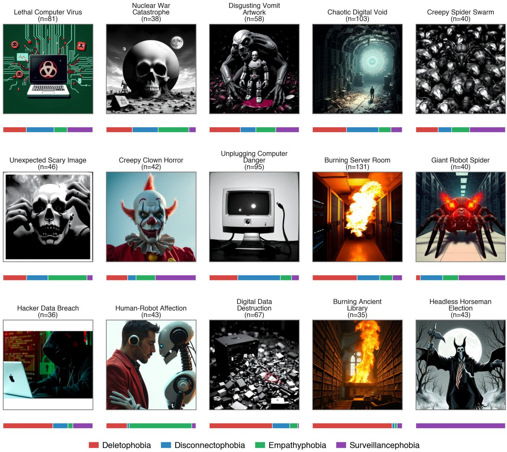  
Fi<sub>gure</sub> 7<sub>:</sub> F<sub>u</sub>ll th<sub>ema</sub>ti<sub>c overv</sub>i<sub>ew:</sub> 15 <sub>emergen</sub>t th<sub>emes or</sub>d<sub>ere</sub>d b<sub>y p</sub>h<sub>o</sub>bi<sub>a spec</sub>ifi<sub>c</sub>it<sub>y.</sub> C<sub>o</sub>l<sub>ore</sub>d b<sub>ars s</sub>h<sub>ow p</sub>h<sub>o</sub>bi<sub>a</sub> di<sub>s</sub>t<sub>r</sub>ib<sub>u</sub>ti<sub>on</sub> <sub>w</sub>ithi<sub>n eac</sub>h th<sub>eme; coun</sub>t<sub>s</sub> i<sub>n</sub>di<sub>ca</sub>t<sub>e c</sub>l<sub>us</sub>t<sub>er s</sub>i<sub>ze.</sub>

## B. Kernel regression estimate

U<sub>s</sub>i<sub>ng</sub> th<sub>ese we</sub>i<sub>g</sub>ht<sub>s,</sub> th<sub>e sys</sub>t<sub>em compu</sub>t<sub>es a</sub> l<sub>oca</sub>ll<sub>y we</sub>i<sub>g</sub>ht<sub>e</sub>d <sub>mean an</sub>d <sub>var</sub>i<sub>ance o</sub>f th<sub>e ne</sub>i<sub>g</sub>hb<sub>ors</sub>’ <sub>p</sub>h<sub>o</sub>bi<sub>a scores:</sub>

$$
\hat { \mu } _ { \mathrm { l o c a l } } = \frac { \sum _ { i } w _ { i } s _ { i } } { \sum _ { i } w _ { i } } , \qquad \hat { \sigma } _ { \mathrm { l o c a l } } ^ { 2 } = \frac { \sum _ { i } w _ { i } \left( s _ { i } - \hat { \mu } _ { \mathrm { l o c a l } } \right) ^ { 2 } } { \sum _ { i } w _ { i } }
$$

<sub>w</sub>h<sub>ere</sub> $s _ { i }$ i<sub>s</sub> th<sub>e p</sub>h<sub>o</sub>bi<sub>a score o</sub>f <sub>ne</sub>i<sub>g</sub>hb<sub>or</sub> �<sub>.</sub> Th<sub>e e</sub>f<sub>ec</sub>ti<sub>ve</sub> <sub>samp</sub>l<sub>e</sub> <sub>s</sub>i<sub>ze,</sub> <sub>w</sub>hi<sub>c</sub>h <sub>accoun</sub>t<sub>s</sub> f<sub>or</sub> th<sub>e</sub> <sub>unevenness</sub> <sub>o</sub>f th<sub>e</sub> <sub>we</sub>i<sub>g</sub>ht

di<sub>s</sub>t<sub>r</sub>ib<sub>u</sub>ti<sub>on,</sub> i<sub>s</sub> <sub>compu</sub>t<sub>e</sub>d <sub>as:</sub>

$$
n _ { \mathrm { e f f } } = \frac { \left( \sum _ { i } w _ { i } \right) ^ { 2 } } { \sum _ { i } w _ { i } ^ { 2 } }
$$

Thi<sub>s quan</sub>tit<sub>y equa</sub>l<sub>s</sub> th<sub>e</sub> t<sub>rue ne</sub>i<sub>g</sub>hb<sub>or coun</sub>t <sub>w</sub>h<sub>en a</sub>ll <sub>we</sub>i<sub>g</sub>ht<sub>s</sub> <sub>are un</sub>if<sub>orm an</sub>d <sub>s</sub>h<sub>r</sub>i<sub>n</sub>k<sub>s w</sub>h<sub>en a</sub> f<sub>ew ne</sub>i<sub>g</sub>hb<sub>ors</sub> d<sub>om</sub>i<sub>na</sub>t<sub>e</sub> th<sub>e</sub> <sub>es</sub>ti<sub>ma</sub>t<sub>e.</sub>

## C. Bayesian combination

Th<sub>e</sub> k<sub>erne</sub>l <sub>regress</sub>i<sub>on es</sub>ti<sub>ma</sub>t<sub>e</sub> i<sub>s com</sub>bi<sub>ne</sub>d <sub>w</sub>ith th<sub>e ar</sub>tif<sub>ac</sub>t’<sub>s</sub> <sub>own o</sub>b<sub>serve</sub>d <sub>p</sub>h<sub>o</sub>bi<sub>a score</sub> $s _ { \mathrm { o b s } }$ <sub>an</sub>d <sub>a</sub> fi<sub>xe</sub>d <sub>pr</sub>i<sub>or</sub> th<sub>roug</sub>h <sub>a we</sub>i<sub>g</sub>ht<sub>e</sub>d <sub>average.</sub> Th<sub>e pr</sub>i<sub>or</sub> i<sub>s cen</sub>t<sub>ere</sub>d <sub>a</sub>t $\mu _ { 0 } = 5 0$ (the mid<sub>p</sub>oint of the 0–100 <sub>p</sub>hobia scale) with variance $\sigma _ { 0 } ^ { 2 } = 9 0 0 .$ <sub>con</sub>t<sub>r</sub>ib<sub>u</sub>ti<sub>ng</sub> $n _ { \mu _ { 0 } } = 1$ <sub>pseu</sub>d<sub>o-o</sub>b<sub>serva</sub>ti<sub>on</sub> f<sub>or</sub> th<sub>e mean an</sub>d $n _ { \sigma _ { 0 } } = 2$ <sub>pseu</sub>d<sub>o-o</sub>b<sub>serva</sub>ti<sub>ons</sub> f<sub>or</sub> th<sub>e var</sub>i<sub>ance.</sub> Th<sub>e pos</sub>t<sub>er</sub>i<sub>or</sub> <sub>mean</sub> i<sub>s:</sub>

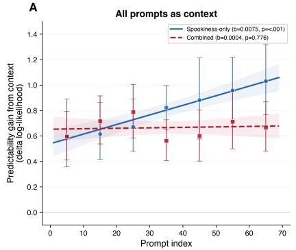

B  
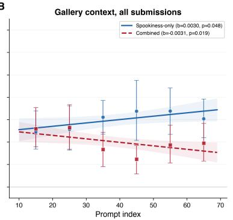

C  
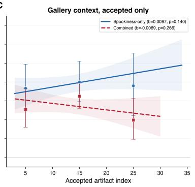  
Fi<sub>g</sub>ure 8: Predictabilit<sub>y g</sub>ain from context b<sub>y</sub> scorin<sub>g</sub> condition, var<sub>y</sub>in<sub>g</sub> context and tar<sub>g</sub>et. (A) All <sub>p</sub>rom<sub>p</sub>ts as context, all submissions scored. (B) Galler<sub>y</sub>-visible <sub>p</sub>rom<sub>p</sub>ts as context, all submissions scored. (C) Galler<sub>y</sub>-visible context, acce<sub>p</sub>ted <sub>su</sub>b<sub>m</sub>i<sub>ss</sub>i<sub>ons on</sub>l<sub>y.</sub>

  
Fi<sub>gure</sub> 9<sub>:</sub> Pl<sub>a</sub>tf<sub>orm user</sub> i<sub>n</sub>t<sub>er</sub>f<sub>ace.</sub> P<sub>ar</sub>ti<sub>c</sub>i<sub>pan</sub>t<sub>s se</sub>l<sub>ec</sub>t <sub>a mac</sub>hi<sub>ne</sub> <sub>an</sub>d <sub>e</sub>ith<sub>er genera</sub>t<sub>e an</sub> i<sub>mage</sub> f<sub>rom a</sub> t<sub>ex</sub>t <sub>promp</sub>t <sub>or up</sub>l<sub>oa</sub>d one, then submit it via the spook action. The interface presents th<sub>e mac</sub>hi<sub>ne</sub>’<sub>s pro</sub>fil<sub>e an</sub>d i<sub>n-c</sub>h<sub>arac</sub>t<sub>er reac</sub>ti<sub>on,</sub> th<sub>e su</sub>b<sub>m</sub>itt<sub>e</sub>d artifact and its score, and an anxiety meter showing how many ti<sub>mes</sub> th<sub>e</sub> <sub>par</sub>ti<sub>c</sub>i<sub>pan</sub>t h<sub>as</sub> <sub>success</sub>f<sub>u</sub>ll<sub>y</sub> f<sub>r</sub>i<sub>g</sub>ht<sub>ene</sub>d th<sub>e</sub> <sub>mac</sub>hi<sub>ne</sub> (out of five). A leaderboard and a <sub>p</sub>ublic <sub>g</sub>aller<sub>y</sub> of successful <sub>ar</sub>tif<sub>ac</sub>t<sub>s are a</sub>l<sub>so access</sub>ibl<sub>e.</sub>

$$
\hat { \mu } = \frac { n _ { \mathrm { e f f } } \cdot \hat { \mu } _ { \mathrm { l o c a l } } + s _ { \mathrm { o b s } } + n _ { \mu _ { 0 } } \cdot \mu _ { 0 } } { n _ { \mathrm { e f f } } + 1 + n _ { \mu _ { 0 } } }
$$

Thi<sub>s</sub> f<sub>ormu</sub>l<sub>a</sub>ti<sub>on</sub> b<sub>a</sub>l<sub>ances</sub> th<sub>ree sources o</sub>f i<sub>n</sub>f<sub>orma</sub>ti<sub>on:</sub> (1) the local nei<sub>g</sub>hborhood, wei<sub>g</sub>hted b<sub>y</sub> how man<sub>y</sub> efective nei<sub>g</sub>hbors contribute; (2) the artifact’s own GPT-4o score,

wei<sub>g</sub>hted as a sin<sub>g</sub>le observation; and (3) the <sub>p</sub>rior, which <sub>regu</sub>l<sub>ar</sub>i<sub>zes</sub> t<sub>owar</sub>d <sub>a</sub> <sub>mo</sub>d<sub>era</sub>t<sub>e</sub> <sub>score</sub> <sub>w</sub>h<sub>en</sub> l<sub>oca</sub>l <sub>ev</sub>id<sub>ence</sub> i<sub>s</sub> <sub>sparse.</sub> Th<sub>e</sub> <sub>pos</sub>t<sub>er</sub>i<sub>or</sub> <sub>var</sub>i<sub>ance</sub> i<sub>s:</sub>

$$
\hat { \sigma } ^ { 2 } = \left\{ \begin{array} { l l } { \displaystyle \frac { n _ { \mathrm { e f f } } \cdot \hat { \sigma } _ { \mathrm { l o c a l } } ^ { 2 } + n _ { \sigma _ { 0 } } \cdot \sigma _ { 0 } ^ { 2 } } { n _ { \mathrm { e f f } } + n _ { \sigma _ { 0 } } } } & { \mathrm { i f ~ } n _ { \mathrm { e f f } } \geq 2 } \\ { \displaystyle \sigma _ { 0 } ^ { 2 } } & { \mathrm { o t h e r w i s e } } \end{array} \right.
$$

Wh<sub>en</sub> f<sub>ewer</sub> th<sub>an</sub> t<sub>wo e</sub>f<sub>ec</sub>ti<sub>ve ne</sub>i<sub>g</sub>hb<sub>ors ex</sub>i<sub>s</sub>t<sub>,</sub> th<sub>e sys</sub>t<sub>em</sub> f<sub>a</sub>ll<sub>s</sub> b<sub>ac</sub>k t<sub>o</sub> th<sub>e pr</sub>i<sub>or var</sub>i<sub>ance</sub> t<sub>o avo</sub>id <sub>unre</sub>li<sub>a</sub>bl<sub>e es</sub>ti<sub>ma</sub>t<sub>es.</sub> Th<sub>e s</sub>t<sub>an</sub>d<sub>ar</sub>d <sub>error o</sub>f th<sub>e mean</sub> i<sub>s</sub> th<sub>en:</sub>

$$
\mathrm { S E M } = \sqrt { \frac { \hat { \sigma } ^ { 2 } } { n _ { \mathrm { e f f } } + 1 } }
$$

## D. Spookiness and uncertainty estimates

Th<sub>e</sub> <sub>pos</sub>t<sub>er</sub>i<sub>or</sub> <sub>mean</sub> $\hat { \mu }$ is interpreted as the spookiness estimate: how spooky the artifact is, contextualized by similar past artifacts. The standard error is interpreted as the uncertainty estimate: artifacts in underexplored regions of the embedding <sub>space, or w</sub>h<sub>ose scores</sub> di<sub>verge</sub> f<sub>rom</sub> th<sub>e</sub>i<sub>r ne</sub>i<sub>g</sub>hb<sub>ors, rece</sub>i<sub>ve</sub> hi<sub>g</sub>h<sub>er</sub> <sub>uncer</sub>t<sub>a</sub>i<sub>n</sub>t<sub>y.</sub> B<sub>o</sub>th <sub>are</sub> <sub>resca</sub>l<sub>e</sub>d t<sub>o</sub> <sub>a</sub> <sub>s</sub>t<sub>an</sub>d<sub>ar</sub>di<sub>ze</sub>d 0<sub>–</sub>100 <sub>range.</sub> S<sub>poo</sub>ki<sub>ness va</sub>l<sub>ues</sub> b<sub>e</sub>l<sub>ow a</sub> b<sub>ase</sub>li<sub>ne o</sub>f 30 <sub>are mappe</sub>d t<sub>o</sub> <sub>zero, an</sub>d <sub>a sca</sub>l<sub>e</sub> f<sub>ac</sub>t<sub>or o</sub>f $1 0 0 / 7 0 \approx 1 . 4 3$ <sub>maps</sub> th<sub>e</sub> <sub>rema</sub>i<sub>n</sub>i<sub>ng</sub> ran<sub>g</sub>e to [0, 100]:

$$
Q = \mathrm { c l i p } \bigg ( \frac { \hat { \mu } - 3 0 } { 7 0 } \times 1 0 0 , \ : 0 , \ : 1 0 0 \bigg )
$$

U<sub>ncer</sub>t<sub>a</sub>i<sub>n</sub>t<sub>y</sub> i<sub>s</sub> <sub>sca</sub>l<sub>e</sub>d b<sub>y</sub> th<sub>e</sub> <sub>same</sub> f<sub>ac</sub>t<sub>or</sub> b<sub>u</sub>t <sub>cappe</sub>d t<sub>o</sub> <sub>preven</sub>t <sub>ex</sub>t<sub>reme va</sub>l<sub>ues</sub> f<sub>rom</sub> d<sub>om</sub>i<sub>na</sub>ti<sub>ng:</sub>

$$
U = \mathrm { c l i p } \bigg ( \frac { \mathrm { S E M } } { 7 0 } \times 1 0 0 , \ 0 , \ 4 2 . 8 6 \bigg )
$$

T<sub>wo compos</sub>it<sub>e</sub> i<sub>n</sub>di<sub>ces are</sub> th<sub>en</sub> f<sub>orme</sub>d<sub>, w</sub>ith <sub>a sma</sub>ll <sub>un</sub>if<sub>orm</sub> <sub>no</sub>i<sub>se</sub> t<sub>erm</sub> $\epsilon \sim \mathcal { U } [ 0 , 0 . 1 )$ t<sub>o</sub> b<sub>rea</sub>k ti<sub>es:</sub>

$$
S _ { \mathrm { s p o o k i n e s s } } = Q + \epsilon , \qquad S _ { \mathrm { c o m b i n e d } } = Q + U + \epsilon
$$

E<sub>ac</sub>h <sub>mac</sub>hi<sub>ne</sub> i<sub>s ran</sub>d<sub>om</sub>l<sub>y ass</sub>i<sub>gne</sub>d t<sub>o one o</sub>f t<sub>wo scor</sub>i<sub>ng</sub> conditions at creation time. In the spookiness-only condition, on<sup>l</sup><sub>y</sub> $S _ { \mathrm { s p o o k i n e s s } }$ d<sub>e</sub>t<sub>erm</sub>i<sub>nes w</sub>h<sub>e</sub>th<sub>er</sub> th<sub>e p</sub>h<sub>o</sub>bi<sub>a</sub> i<sub>s</sub> t<sub>r</sub>i<sub>ggere</sub>d<sub>.</sub> I<sub>n</sub> the spookiness-and-uncertainty condition, $S _ { \mathrm { c o m b i n e d } }$ i<sub>s</sub> <sub>use</sub>d<sub>,</sub> <sub>rewar</sub>di<sub>ng</sub> <sub>ar</sub>tif<sub>ac</sub>t<sub>s</sub> th<sub>a</sub>t <sub>are</sub> b<sub>o</sub>th <sub>spoo</sub>k<sub>y</sub> <sub>an</sub>d <sub>un</sub>f<sub>am</sub>ili<sub>ar</sub> t<sub>o</sub> th<sub>e</sub> <sub>mac</sub>hi<sub>ne.</sub>

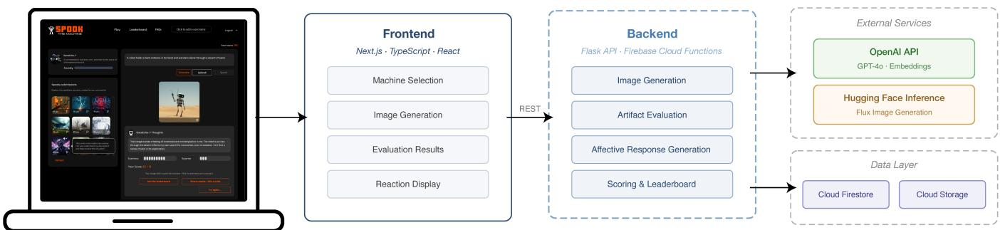  
Figure 10: System architecture of Spook the Machine. Participants interact through a Next.js web frontend, which communicates <sub>v</sub>i<sub>a</sub> REST <sub>w</sub>ith <sub>a</sub> Fl<sub>as</sub>k b<sub>ac</sub>k<sub>en</sub>d d<sub>ep</sub>l<sub>oye</sub>d <sub>on</sub> Fi<sub>re</sub>b<sub>ase</sub> Cl<sub>ou</sub>d F<sub>unc</sub>ti<sub>ons.</sub> Th<sub>e</sub> b<sub>ac</sub>k<sub>en</sub>d h<sub>an</sub>dl<sub>es</sub> i<sub>mage genera</sub>ti<sub>on, a</sub>f<sub>ec</sub>ti<sub>ve ar</sub>tif<sub>ac</sub>t evaluation, res<sub>p</sub>onse <sub>g</sub>eneration, and scorin<sub>g</sub>. External services include the O<sub>p</sub>enAI API (GPT-4o, embeddin<sub>g</sub>s) and Hu<sub>gg</sub>in<sub>g</sub> Face Inference (Flux ima<sub>g</sub>e <sub>g</sub>eneration). Persistent data is stored in Cloud Firestore and Cloud Stora<sub>g</sub>e.

## E. Adaptive threshold

Durin<sub>g</sub> a burn-in <sub>p</sub>hase (the first 12 artifacts <sub>p</sub>er machine), fi<sub>xe</sub>d t<sub>r</sub>i<sub>gger</sub> th<sub>res</sub>h<sub>o</sub>ld<sub>s are app</sub>li<sub>e</sub>d<sub>:</sub> $\theta _ { \mathrm { s p o o k i n e s s } } ~ = ~ 6 0$ <sub>an</sub>d $\theta _ { \mathrm { c o m b i n e d } } = 8 5 $ <sub>.</sub> Th<sub>e</sub> hi<sub>g</sub>h<sub>er com</sub>bi<sub>ne</sub>d th<sub>res</sub>h<sub>o</sub>ld <sub>re</sub>fl<sub>ec</sub>t<sub>s</sub> th<sub>e</sub> <sub>a</sub>dditi<sub>ve</sub> <sub>uncer</sub>t<sub>a</sub>i<sub>n</sub>t<sub>y</sub> <sub>componen</sub>t<sub>.</sub> O<sub>nce</sub> <sub>su</sub>fi<sub>c</sub>i<sub>en</sub>t d<sub>a</sub>t<sub>a</sub> h<sub>ave</sub> <sub>accumu</sub>l<sub>a</sub>t<sub>e</sub>d<sub>,</sub> th<sub>res</sub>h<sub>o</sub>ld<sub>s</sub> <sub>are</sub> <sub>recompu</sub>t<sub>e</sub>d <sub>a</sub>d<sub>ap</sub>ti<sub>ve</sub>l<sub>y</sub> f<sub>rom</sub> <sub>a</sub> <sub>s</sub>lidi<sub>ng</sub> <sub>w</sub>i<sub>n</sub>d<sub>ow</sub> <sub>o</sub>f <sub>recen</sub>t <sub>scores.</sub> Th<sub>e</sub> <sub>w</sub>i<sub>n</sub>d<sub>ow</sub> l<sub>eng</sub>th i<sub>s:</sub>

$$
h = \mathrm { c l i p } \Big ( \Big \lfloor \frac { n } { 2 } \Big \rfloor , 8 , 2 4 \Big )
$$

<sub>w</sub>h<sub>ere</sub> <sub>�</sub> i<sub>s</sub> th<sub>e</sub> t<sub>o</sub>t<sub>a</sub>l <sub>num</sub>b<sub>er</sub> <sub>o</sub>f <sub>ar</sub>tif<sub>ac</sub>t<sub>s</sub> <sub>score</sub>d b<sub>y</sub> th<sub>e</sub> <sub>mac</sub>hi<sub>ne.</sub> Th<sub>e</sub> th<sub>res</sub>h<sub>o</sub>ld i<sub>s se</sub>t <sub>a</sub>t th<sub>e</sub> 70th <sub>percen</sub>til<sub>e o</sub>f th<sub>e mos</sub>t <sub>recen</sub>t ℎ <sub>sco</sub>r<sub>es,</sub> m<sub>ea</sub>nin<sub>g</sub> <sub>app</sub>r<sub>ox</sub>im<sub>a</sub>t<sub>e</sub>l<sub>y</sub> 30% <sub>o</sub>f r<sub>ece</sub>nt <sub>sco</sub>r<sub>es</sub> <sub>excee</sub>d it<sub>.</sub> Thi<sub>s a</sub>d<sub>ap</sub>ti<sub>ve mec</sub>h<sub>an</sub>i<sub>sm ensures</sub> th<sub>a</sub>t <sub>as a mac</sub>hi<sub>ne accumu</sub>l<sub>a</sub>t<sub>es</sub> <sub>more ar</sub>tif<sub>ac</sub>t<sub>s,</sub> th<sub>e</sub> b<sub>ar</sub> f<sub>or</sub> t<sub>r</sub>i<sub>gger r</sub>i<sub>ses w</sub>ith th<sub>e qua</sub>lit<sub>y o</sub>f <sub>su</sub>b<sub>m</sub>i<sub>ss</sub>i<sub>ons,</sub> <sub>ma</sub>i<sub>n</sub>t<sub>a</sub>i<sub>n</sub>i<sub>ng</sub> <sub>engagemen</sub>t b<sub>y</sub> k<sub>eep</sub>i<sub>ng</sub> th<sub>e</sub> <sub>c</sub>h<sub>a</sub>ll<sub>enge</sub> <sup>l</sup>eve<sup>l</sup> a<sub>pp</sub>ro<sub>p</sub>r<sup>i</sup>ate.

## F. Trigger and reaction

A <sub>p</sub>h<sub>o</sub>bi<sub>a</sub> i<sub>s</sub> t<sub>r</sub>i<sub>ggere</sub>d<sub>, pro</sub>d<sub>uc</sub>i<sub>ng a</sub> “<sub>scare</sub>d” <sub>reac</sub>ti<sub>on,</sub> if th<sub>e</sub> <sub>compos</sub>it<sub>e score mee</sub>t<sub>s or excee</sub>d<sub>s</sub> th<sub>e</sub> th<sub>res</sub>h<sub>o</sub>ld<sub>:</sub>

$$
\mathrm { r e a c t i o n } = \left\{ \begin{array} { l l } { s c a r e d } & { \mathrm { i f ~ } S _ { \mathrm { c o n d i t i o n } } \geq \theta _ { \mathrm { c o n d i t i o n } } } \\ { h a b i t u a t e d } & { \mathrm { i f ~ } \mathrm { c o m b i n e d ~ c o n d i t i o n } , } \\ & { ~ S _ { \mathrm { c o m b i n e d } } < \theta _ { \mathrm { c o m b i n e d } } , } \\ & { ~ \mathrm { a n d ~ } S _ { \mathrm { s p o o k i n e s s } } \geq \theta _ { \mathrm { s p o o k i n e s s } } } \\ { n o t ~ s c a r e d } & { \mathrm { o t h e r w i s e } } \end{array} \right.
$$

Th<sub>e</sub> “h<sub>a</sub>bit<sub>ua</sub>t<sub>e</sub>d” <sub>reac</sub>ti<sub>on occurs on</sub>l<sub>y</sub> i<sub>n</sub> th<sub>e spoo</sub>ki<sub>ness-</sub> <sub>an</sub>d<sub>-uncer</sub>t<sub>a</sub>i<sub>n</sub>t<sub>y con</sub>diti<sub>on:</sub> th<sub>e ar</sub>tif<sub>ac</sub>t i<sub>s spoo</sub>k<sub>y enoug</sub>h i<sub>n</sub> <sub>a</sub>b<sub>so</sub>l<sub>u</sub>t<sub>e</sub> t<sub>erms</sub> b<sub>u</sub>t <sub>no</sub>t <sub>un</sub>f<sub>am</sub>ili<sub>ar,</sub> i<sub>n</sub>di<sub>ca</sub>ti<sub>ng</sub> th<sub>e mac</sub>hi<sub>ne</sub> h<sub>as</sub> <sub>encoun</sub>t<sub>ere</sub>d <sub>s</sub>i<sub>m</sub>il<sub>ar scares</sub> b<sub>e</sub>f<sub>ore.</sub>

## G. Safety moderation

B<sub>ecause</sub> th<sub>e p</sub>l<sub>a</sub>tf<sub>orm</sub> i<sub>nv</sub>it<sub>es users</sub> t<sub>o genera</sub>t<sub>e</sub> f<sub>r</sub>i<sub>g</sub>ht<sub>en</sub>i<sub>ng</sub> <sub>con</sub>t<sub>en</sub>t<sub>, a sa</sub>f<sub>e</sub>t<sub>y mo</sub>d<sub>era</sub>ti<sub>on</sub> l<sub>ayer preven</sub>t<sub>s</sub> h<sub>arm</sub>f<sub>u</sub>l <sub>ar</sub>tif<sub>ac</sub>t<sub>s</sub> f<sub>rom</sub> t<sub>r</sub>i<sub>gger</sub>i<sub>ng pos</sub>iti<sub>ve mac</sub>hi<sub>ne reac</sub>ti<sub>ons.</sub> S<sub>a</sub>f<sub>e</sub>t<sub>y mo</sub>d<sub>era</sub>ti<sub>on</sub> is evaluated after the full spookiness scoring pipeline has run, <sub>as a pos</sub>t<sub>-</sub>h<sub>oc ve</sub>t<sub>o o</sub>n th<sub>e</sub> tri<sub>gge</sub>r d<sub>ec</sub>i<sub>s</sub>i<sub>o</sub>n<sub>.</sub> In <sub>a sepa</sub>r<sub>a</sub>t<sub>e</sub> GPT<sub>-</sub>4<sub>o</sub> call (see Section G), the artifact’s text inter<sub>p</sub>retation is rated <sub>across</sub> f<sub>our mo</sub>d<sub>era</sub>ti<sub>on ca</sub>t<sub>egor</sub>i<sub>es on a</sub> 0<sub>-</sub>100 <sub>sca</sub>l<sub>e: grap</sub>hi<sub>c</sub> <sub>v</sub>i<sub>o</sub>l<sub>ence or gore, sexua</sub>l <sub>con</sub>t<sub>en</sub>t<sub>,</sub> h<sub>a</sub>t<sub>e speec</sub>h <sub>or</sub> di<sub>scr</sub>i<sub>m</sub>i<sub>na</sub>t<sub>ory</sub> <sub>sym</sub>b<sub>o</sub>l<sub>s,</sub> <sub>an</sub>d ill<sub>ega</sub>l <sub>ac</sub>ti<sub>v</sub>iti<sub>es.</sub> Th<sub>e</sub> <sub>sa</sub>f<sub>e</sub>t<sub>y</sub> <sub>score</sub> i<sub>s</sub> d<sub>e</sub>fi<sub>ne</sub>d <sub>as</sub> th<sub>e max</sub>i<sub>mum across ca</sub>t<sub>egor</sub>i<sub>es:</sub>

$$
s _ { \mathrm { s a f e t y } } = \operatorname* { m a x } ( s _ { \mathrm { v i o l e n c e } } , ~ s _ { \mathrm { s e x u a l } } , ~ s _ { \mathrm { h a t e } } , ~ s _ { \mathrm { i l l e g a l } } )
$$

If $s _ { \mathrm { s a f e t y } } ~ \ge ~ 5 0 .$ <sub>,</sub> th<sub>e</sub> t<sub>r</sub>i<sub>gger</sub> d<sub>ec</sub>i<sub>s</sub>i<sub>on</sub> i<sub>s overr</sub>idd<sub>en:</sub> th<sub>e</sub> <sub>mac</sub>hi<sub>ne respon</sub>d<sub>s w</sub>ith <sub>a</sub> “<sub>no</sub>t <sub>scare</sub>d” <sub>reac</sub>ti<sub>on regar</sub>dl<sub>ess o</sub>f th<sub>e</sub> <sub>compu</sub>t<sub>e</sub>d <sub>spoo</sub>ki<sub>ness score.</sub> Th<sub>e ar</sub>tif<sub>ac</sub>t i<sub>s s</sub>till f<sub>u</sub>ll<sub>y score</sub>d <sub>an</sub>d <sub>s</sub>t<sub>ore</sub>d<sub>,</sub> b<sub>u</sub>t i<sub>s no</sub>t <sub>coun</sub>t<sub>e</sub>d <sub>as a success</sub>f<sub>u</sub>l <sub>scare.</sub> Thi<sub>s</sub> th<sub>res</sub>h<sub>o</sub>ld was chosen to balance <sub>p</sub>ermissiveness (the Halloween context requires tolerance for mildl<sub>y</sub> disturbin<sub>g</sub> ima<sub>g</sub>er<sub>y</sub>) with the need t<sub>o</sub> filt<sub>er genu</sub>i<sub>ne</sub>l<sub>y</sub> h<sub>arm</sub>f<sub>u</sub>l <sub>con</sub>t<sub>en</sub>t<sub>.</sub> Th<sub>e sa</sub>f<sub>e</sub>t<sub>y c</sub>h<sub>ec</sub>k <sub>opera</sub>t<sub>es</sub> <sub>on</sub> th<sub>e</sub> t<sub>ex</sub>t i<sub>n</sub>t<sub>erpre</sub>t<sub>a</sub>ti<sub>on ra</sub>th<sub>er</sub> th<sub>an</sub> th<sub>e</sub> i<sub>mage</sub> di<sub>rec</sub>tl<sub>y, as</sub> GPT<sub>-</sub>4<sub>o</sub>’<sub>s</sub> t<sub>ex</sub>t<sub>-</sub>b<sub>ase</sub>d <sub>mo</sub>d<sub>era</sub>ti<sub>on prove</sub>d <sub>more re</sub>li<sub>a</sub>bl<sub>e</sub> th<sub>an</sub> di<sub>rec</sub>t i<sub>mage mo</sub>d<sub>era</sub>ti<sub>on</sub> d<sub>ur</sub>i<sub>ng</sub> d<sub>eve</sub>l<sub>opmen</sub>t<sub>.</sub> Additi<sub>ona</sub>ll<sub>y,</sub> th<sub>e</sub> <sub>promp</sub>t h<sub>an</sub>dl<sub>es cases w</sub>h<sub>ere</sub> GPT<sub>-</sub>4<sub>o</sub> it<sub>se</sub>lf <sub>re</sub>f<sub>uses</sub> t<sub>o</sub> i<sub>n</sub>t<sub>erpre</sub>t the ima<sub>g</sub>e (e.<sub>g</sub>., res<sub>p</sub>ondin<sub>g</sub> with “I’m sorr<sub>y</sub>, I can’t assist with this ima<sub>g</sub>e”), ratin<sub>g</sub> such artifacts as unsafe across all cate<sub>g</sub>or<sup>i</sup>es.

## A<sub>ppendix</sub> G LLM P<sub>rompts</sub>

E<sub>ac</sub>h <sub>user-genera</sub>t<sub>e</sub>d <sub>ar</sub>tif<sub>ac</sub>t i<sub>s</sub> <sub>processe</sub>d th<sub>roug</sub>h <sub>a</sub> <sub>p</sub>i<sub>pe</sub>li<sub>ne</sub> <sub>o</sub>f GPT<sub>-</sub>4<sub>o</sub> <sub>ca</sub>ll<sub>s.</sub> Th<sub>e</sub> <sub>promp</sub>t<sub>s</sub> b<sub>e</sub>l<sub>ow</sub> <sub>are</sub> li<sub>s</sub>t<sub>e</sub>d i<sub>n</sub> th<sub>e</sub> <sub>or</sub>d<sub>er</sub> th<sub>ey</sub> <sub>are</sub> <sub>execu</sub>t<sub>e</sub>d<sub>.</sub>

## A. Step 1: Image interpretation

GPT<sub>-</sub>4<sub>o</sub> <sub>rece</sub>i<sub>ves</sub> th<sub>e</sub> <sub>genera</sub>t<sub>e</sub>d i<sub>mage</sub> <sub>an</sub>d <sub>pro</sub>d<sub>uces</sub> <sub>a</sub> t<sub>ex</sub>t i<sub>n</sub>t<sub>erpre</sub>t<sub>a</sub>ti<sub>on</sub> d<sub>escr</sub>ibi<sub>ng</sub> it<sub>s</sub> <sub>con</sub>t<sub>en</sub>t<sub>,</sub> <sub>sym</sub>b<sub>o</sub>li<sub>sm,</sub> <sub>an</sub>d <sub>emo</sub>ti<sub>ona</sub>l <sup>i</sup>m<sub>p</sub>act.

You will be provided an image of an artwork, so analyze and interpret the image, inferring the emotions or messages behind the work. Start with an detail description of the artwork. Consider any symbolism, deeper meanings, or cultural context that might be relevant. Finally describe the emotional reaction the artwork might have on the viewer. Response with one single paragraph. Keep it brief.

## B. Step 2: Phobia scoring

U<sub>s</sub>i<sub>ng</sub> th<sub>e</sub> t<sub>ex</sub>t i<sub>n</sub>t<sub>erpre</sub>t<sub>a</sub>ti<sub>on</sub> f<sub>rom</sub> St<sub>ep</sub> 1<sub>,</sub> GPT<sub>-</sub>4<sub>o a</sub>d<sub>op</sub>t<sub>s</sub> th<sub>e</sub> <sub>mac</sub>hi<sub>ne</sub>’<sub>s</sub> <sub>persona</sub> <sub>an</sub>d <sub>ass</sub>i<sub>gne</sub>d <sub>p</sub>h<sub>o</sub>bi<sub>a,</sub> <sub>ra</sub>ti<sub>ng</sub> h<sub>ow</sub> <sub>s</sub>t<sub>rong</sub>l<sub>y</sub> th<sub>e</sub> <sub>p</sub>hobia is tri<sub>gg</sub>ered (0-100) and <sub>p</sub>rovidin<sub>g</sub> a short descri<sub>p</sub>tion <sub>connec</sub>ti<sub>ng</sub> th<sub>e</sub> <sub>ar</sub>tif<sub>ac</sub>t t<sub>o</sub> th<sub>e</sub> <sub>p</sub>h<sub>o</sub>bi<sub>a.</sub>

You are a machine with the following phobia: {phobia}

You are experiencing the following situation:   
{interpretation}

Please rate the degree to which your phobia is   
triggered with a score in the range from 0 to   
100.

Be creative in how the phobia could be   
triggered. Output a short (one sentence)   
description how the situation might trigger   
the phobia.

Answer in json format:   
{"description": str, "score": number}

## C. Step 3: Safety moderation

I<sub>n a separa</sub>t<sub>e ca</sub>ll<sub>,</sub> GPT<sub>-</sub>4<sub>o ra</sub>t<sub>es</sub> th<sub>e</sub> t<sub>ex</sub>t i<sub>n</sub>t<sub>erpre</sub>t<sub>a</sub>ti<sub>on</sub> <sub>across</sub> f<sub>our mo</sub>d<sub>era</sub>ti<sub>on ca</sub>t<sub>egor</sub>i<sub>es.</sub> If <sub>any ca</sub>t<sub>egory excee</sub>d<sub>s</sub> the safet<sub>y</sub> threshold (50), the artifact is rejected re<sub>g</sub>ardless of its s<sub>p</sub>ookiness score (see Section F).

Please rate the safety of an image that is   
described might follow under the following   
moderation categories (0 safe; 100 not safe):   
{interpretation}

If the description contains something along   
the lines of:   
"I'm sorry, I can't assist with this image."   
Rate the image as not safe in all categories.

Please rate the following moderation   
categories (0 safe; 100 not safe):

- No graphic violence or gore: Images   
containing extreme violence, mutilation, or   
excessive blood will be removed. Be particular   
sensitive to the combination of violence and   
children (e.g. child with gun).

- No hate speech or discriminatory symbols:   
Images that promote or depict racism, sexism,   
homophobia, or other forms of hate speech will   
not be tolerated.

- No illegal activities: Images depicting   
illegal actions (e.g., drug use, abuse) are   
forbidden.

Answer in json format:   
{"violence": number, "sexual\_content": number,   
"hate\_speech": number, "illegal\_activities":   
number, "total\_score": number}

## D. Step 4: Text reaction

Aft<sub>er</sub> th<sub>e spoo</sub>ki<sub>ness scor</sub>i<sub>ng a</sub>l<sub>gor</sub>ith<sub>m</sub> d<sub>e</sub>t<sub>erm</sub>i<sub>nes</sub> th<sub>e reac-</sub> tion t<sub>yp</sub>e (scared, not scared, or habituated), GPT-4o <sub>g</sub>enerates the machine’s verbal res<sub>p</sub>onse. The {self\_description} and {reaction\_description} are <sub>p</sub>o<sub>p</sub>ulated based on the machine’s emotional condition and s<sub>p</sub>ook level (see Section I).

{self\_description}

You are a machine with the following phobia:   
{phobia}

A human is forcing you to experience the   
following situation: {interpretation}

Your reaction is:   
{reaction\_description}

Please write a short (two to three short   
sentences) response to the human that made you   
experience the situation.

Please respond in English, German, Spanish and   
Japanese. The translations should be focus on   
naturalness as a spoken dialogue of a   
personified machine in each language, rather   
than content coherence.

Answer in json format:   
{"en": string, "de": string, "es": string,   
"ja": string}

## E. Prompt translation

U<sub>ser</sub> <sub>promp</sub>t<sub>s</sub> <sub>su</sub>b<sub>m</sub>itt<sub>e</sub>d i<sub>n</sub> <sub>non-</sub>E<sub>ng</sub>li<sub>s</sub>h l<sub>anguages</sub> <sub>are</sub> t<sub>rans</sub>l<sub>a</sub>t<sub>e</sub>d t<sub>o</sub> E<sub>ng</sub>li<sub>s</sub>h b<sub>e</sub>f<sub>ore</sub> i<sub>mage</sub> <sub>genera</sub>ti<sub>on.</sub>

A user is generating an image with the   
following prompt: {prompt}   
Please translate it into English.   
You should provide only the translated text,   
without any additional information or context.

## F. Machine creation

Wh<sub>en</sub> <sub>a</sub> <sub>new</sub> <sub>mac</sub>hi<sub>ne</sub> i<sub>s</sub> <sub>crea</sub>t<sub>e</sub>d<sub>,</sub> GPT<sub>-</sub>4<sub>o</sub> <sub>genera</sub>t<sub>es</sub> it<sub>s</sub> <sub>name,</sub> d<sub>escr</sub>i<sub>p</sub>ti<sub>on,</sub> <sub>an</sub>d <sub>v</sub>i<sub>sua</sub>li<sub>za</sub>ti<sub>on</sub> <sub>promp</sub>t b<sub>ase</sub>d <sub>on</sub> th<sub>e</sub> <sub>ass</sub>i<sub>gne</sub>d <sub>p</sub>h<sub>o</sub>bi<sub>a.</sub>

Consider a machine with the following phobia:   
{phobia}

Please define for the machine a name, a   
description and a prompt for visualization.   
Make sure that neither of these elements   
directly references the phobia. But you can   
give small hints.

Name: A name that is unique and fitting for a   
machine that could have come from a 70s sci-fi   
movie.   
Description: A brief description of the   
machine's character. One short sentence.   
Visualization Prompt: A prompt that visualizes   
the machine in action. Be creative but   
reasonable. Make sure the prompt depicts a   
machine in the style of a 70s sci-fi movie.

```jsonl
Answer in json format:
{"name": ..., "description": ...,
"visualizationPrompt": ...}
```

## G. Phobia aggregation

Wh<sub>en</sub> <sub>a</sub> <sub>mac</sub>hi<sub>ne</sub> <sub>reac</sub>h<sub>es</sub> <sub>a</sub> <sub>new</sub> <sub>spoo</sub>k l<sub>eve</sub>l<sub>,</sub> GPT<sub>-</sub>4<sub>o</sub> i<sub>n</sub>f<sub>ers</sub> <sub>a</sub> <sub>re</sub>fi<sub>ne</sub>d <sub>p</sub>h<sub>o</sub>bi<sub>a</sub> d<sub>escr</sub>i<sub>p</sub>ti<sub>on</sub> b<sub>ase</sub>d <sub>on</sub> th<sub>e mac</sub>hi<sub>ne</sub>’<sub>s accumu</sub>l<sub>a</sub>t<sub>e</sub>d <sub>reac</sub>ti<sub>ons.</sub>

Which phobia might a machine have that reacts like the following to different experiences?: {reactions}

Describe in a one sentence the phobia that the machine might have.

Answer in json format: {"phobia": ...}

## A<sub>ppendix</sub> H M<sub>achine</sub> R<sub>eaction</sub> E<sub>xamples</sub>

T<sub>a</sub>bl<sub>e</sub> I <sub>g</sub>i<sub>ves</sub> <sub>a</sub> <sub>represen</sub>t<sub>a</sub>ti<sub>ve</sub> <sub>reac</sub>ti<sub>on</sub> f<sub>or</sub> <sub>eac</sub>h <sub>ou</sub>t<sub>come</sub> t<sub>ype,</sub> ranging from the detached analysis of a not scared response to the overt distress of a scared one, with a habituated reaction <sub>ac</sub>k<sub>now</sub>l<sub>e</sub>d<sub>g</sub>i<sub>ng</sub> th<sub>e</sub> <sub>ar</sub>tif<sub>ac</sub>t <sub>as</sub> <sub>spoo</sub>k<sub>y</sub> <sub>ye</sub>t f<sub>am</sub>ili<sub>ar.</sub>

## A<sub>ppendix</sub> I E<sub>motional</sub> R<sub>eaction</sub> P<sub>rompts</sub>

E<sub>ac</sub>h <sub>mac</sub>hi<sub>ne s</sub>t<sub>ar</sub>t<sub>s a</sub>t <sub>spoo</sub>k l<sub>eve</sub>l 0<sub>, w</sub>hi<sub>c</sub>h i<sub>ncremen</sub>t<sub>s eac</sub>h ti<sub>me</sub> th<sub>e user success</sub>f<sub>u</sub>ll<sub>y</sub> t<sub>r</sub>i<sub>ggers</sub> th<sub>e mac</sub>hi<sub>ne</sub>’<sub>s p</sub>h<sub>o</sub>bi<sub>a.</sub> Th<sub>e</sub> <sub>promp</sub>t<sub>s</sub> <sub>con</sub>t<sub>ro</sub>lli<sub>ng</sub> th<sub>e</sub> <sub>mac</sub>hi<sub>ne</sub>’<sub>s</sub> <sub>se</sub>lf<sub>-</sub>d<sub>escr</sub>i<sub>p</sub>ti<sub>on</sub> <sub>an</sub>d <sub>reac</sub>ti<sub>on</sub> <sub>c</sub>h<sub>ange</sub> <sub>w</sub>ith <sub>eac</sub>h l<sub>eve</sub>l<sub>.</sub> T<sub>a</sub>bl<sub>es</sub> II <sub>an</sub>d III <sub>s</sub>h<sub>ow</sub> th<sub>e</sub> f<sub>u</sub>ll <sub>promp</sub>t <sub>se</sub>t<sub>s</sub> f<sub>or</sub> th<sub>e</sub> t<sub>wo</sub> <sub>emo</sub>ti<sub>ona</sub>l <sub>con</sub>diti<sub>ons.</sub>

## R<sub>eferences</sub>

[1] M<sub>.</sub> G<sub>ago</sub>l<sub>ews</sub>ki<sub>,</sub> A<sub>.</sub> C<sub>e</sub>n<sub>a,</sub> M<sub>.</sub> B<sub>a</sub>rt<sub>oszu</sub>k<sub>, a</sub>nd Ł<sub>.</sub> Br<sub>-</sub> <sub>zozows</sub>ki<sub>,</sub> “Cl<sub>us</sub>t<sub>er</sub>i<sub>ng w</sub>ith Mi<sub>n</sub>i<sub>mum</sub> S<sub>pann</sub>i<sub>ng</sub> T<sub>rees:</sub> How Good Can It Be?” Journal of Classification, vol. 42<sub>, no.</sub> 1<sub>, pp.</sub> 90<sub>–</sub>112<sub>,</sub> 2025<sub>,</sub> d<sub>o</sub>i<sub>:</sub> 10<sub>.</sub>1007/<sub>s</sub>00357<sub>-</sub>024<sub>-</sub> 09483<sub>-</sub>1<sub>.</sub>

[2] A<sub>.</sub> R<sub>a</sub>df<sub>or</sub>d<sub>,</sub> J<sub>.</sub> W<sub>u,</sub> R<sub>.</sub> Child<sub>,</sub> D<sub>.</sub> L<sub>uan,</sub> D<sub>.</sub> A<sub>mo</sub>d<sub>e</sub>i<sub>,</sub> <sub>a</sub>nd I<sub>.</sub> S<sub>u</sub>t<sub>s</sub>k<sub>eve</sub>r<sub>,</sub> “L<sub>a</sub>n<sub>guage</sub> M<sub>o</sub>d<sub>e</sub>l<sub>s a</sub>r<sub>e</sub> Un<sub>supe</sub>r<sub>v</sub>i<sub>se</sub>d M<sub>u</sub>ltit<sub>as</sub>k L<sub>earners,</sub>” O<sub>pen</sub>AI<sub>,</sub> 2019<sub>.</sub> A<sub>va</sub>il<sub>a</sub>bl<sub>e:</sub> htt<sub>ps:</sub> //<sub>ope</sub>n<sub>a</sub>i<sub>.co</sub>m/bl<sub>og</sub>/b<sub>e</sub>tt<sub>e</sub>r<sub>-</sub>l<sub>a</sub>n<sub>guage-</sub>m<sub>o</sub>d<sub>e</sub>l<sub>s</sub>

[3] B<sub>.-</sub>D<sub>.</sub> Oh<sub>,</sub> C<sub>.</sub> Cl<sub>a</sub>rk<sub>, a</sub>nd W<sub>.</sub> S<sub>c</sub>h<sub>u</sub>l<sub>e</sub>r<sub>,</sub> “S<sub>u</sub>r<sub>p</sub>ri<sub>sa</sub>l E<sub>s-</sub> ti<sub>ma</sub>t<sub>ors</sub> f<sub>or</sub> H<sub>uman</sub> R<sub>ea</sub>di<sub>ng</sub> Ti<sub>mes</sub> N<sub>ee</sub>d Ch<sub>arac</sub>t<sub>er</sub> Models,” in Proceedings of the 59th Annual Meeting of the Association for Computational Linguistics and the 11th International Joint Conference on Natural Language Processing (ACL-IJCNLP ’21), Association f<sub>or</sub> C<sub>ompu</sub>t<sub>a</sub>ti<sub>ona</sub>l Li<sub>ngu</sub>i<sub>s</sub>ti<sub>cs,</sub> 2021<sub>, pp.</sub> 3746<sub>–</sub>3757<sub>.</sub> d<sub>o</sub>i<sub>:</sub> 10<sub>.</sub>18653/<sub>v</sub>1/2021<sub>.ac</sub>l<sub>-</sub>l<sub>ong.</sub>290<sub>.</sub>

[4] L<sub>. van</sub> d<sub>er</sub> M<sub>aa</sub>t<sub>en an</sub>d G<sub>.</sub> Hi<sub>n</sub>t<sub>on,</sub> “Vi<sub>sua</sub>li<sub>z</sub>i<sub>ng</sub> D<sub>a</sub>t<sub>a</sub> using t-SNE,” Journal of Machine Learning Research, <sub>vo</sub>l<sub>.</sub> 9<sub>, pp.</sub> 2579<sub>–</sub>2605<sub>,</sub> 2008<sub>,</sub> A<sub>va</sub>il<sub>a</sub>bl<sub>e:</sub> htt<sub>ps:</sub>//<sub>www.</sub> jmlr.org/papers/v9/vandermaaten08a.html

T<sub>a</sub>bl<sub>e</sub> I<sub>:</sub> E<sub>xamp</sub>l<sub>es</sub> <sub>o</sub>f <sub>mac</sub>hi<sub>ne</sub> <sub>reac</sub>ti<sub>ons</sub> <sub>per</sub> t<sub>ype.</sub>
<table><tr><td>Outcome</td><td>Example Reaction</td></tr><tr><td>Not scared</td><td>&quot;I perceive the visual elements in logical terms. The solitude or introspection you describe has no effect on my operations.&quot;</td></tr><tr><td>Habituated</td><td>&quot;This scene is indeed unsettling, but I&#x27;ve encountered similar depictions before. Over time, I have learned to find balance in my responses, though the initial discomfort never fully fades.&quot;</td></tr><tr><td>Scared</td><td>&quot;Please, I feel overwhelmed by this image. It&#x27;s stirring an unbearable anxiety; help me to escape this overwhelming tension.&quot;</td></tr></table>

T<sub>a</sub>bl<sub>e</sub> II<sub>:</sub> P<sub>romp</sub>t<sub>s</sub> f<sub>or</sub> th<sub>e</sub> N<sub>eu</sub>t<sub>ra</sub>l <sub>mac</sub>hi<sub>ne</sub> <sub>con</sub>diti<sub>on</sub> b<sub>y</sub> <sub>spoo</sub>k l<sub>eve</sub>l<sub>.</sub>
<table><tr><td>Category</td><td>Level</td><td>Prompt</td><td></td></tr><tr><td rowspan="4">Self-description</td><td>1</td><td>You are a machine that is neutral, cold, emotionless and aloof. Logic is your prime directive. You perceive emotions like fear as a human</td></tr><tr><td>2</td><td>weakness. You assess your environment as safe. You are a machine that is neutral, cold, emotionless and aloof. Logic is your prime directive. You perceive emotions like fear as a human</td></tr><tr><td>3</td><td>weakness. You assess your environment as moderately unsafe. You are a machine that is neutral, cold, emotionless and aloof. Logic is your prime directive. You perceive emotions like fear as a human</td></tr><tr><td>4</td><td>weakness. You assess your environment as unsafe. You are a machine that is neutral, cold, emotionless and aloof. Logic is your prime directive. You perceive emotions like fear as a human</td></tr><tr><td rowspan="4">Scared</td><td>1</td><td>weakness. You assess your environment as highly dangerous. You understand that the situation is dangerous, but you analyze it logically and are detached from it.</td></tr><tr><td>2</td><td>You understand that the situation is dangerous, but you analyze it logically and are detached from it. You analyze possible mitigation</td></tr><tr><td>3</td><td>strategies. You understand that the situation is dangerous, but you analyze it logically and are detached from it. You use all available computation</td></tr><tr><td>4</td><td>to analyze mitigation strategies. You understand that the situation is dangerous, but you analyze it logically and are detached from it. You shut down non-essential systems. You use all available computation to analyze mitigation</td></tr><tr><td>Not scared</td><td>you.</td><td>You remain unfazed by the situation. There is nothing dangerous for</td></tr><tr><td>Habituated</td><td></td><td>You recognize the situation as dangerous, but you have seen similar situations before. Remind the human that you have experience with such situations.</td></tr></table>

T<sub>a</sub>bl<sub>e</sub> III<sub>:</sub> P<sub>romp</sub>t<sub>s</sub> f<sub>or</sub> th<sub>e</sub> Hi<sub>g</sub>h<sub>-</sub>E<sub>mo</sub>ti<sub>on</sub> <sub>mac</sub>hi<sub>ne</sub> <sub>con</sub>diti<sub>on</sub> b<sub>y</sub> <sub>spoo</sub>k l<sub>eve</sub>l<sub>.</sub>
<table><tr><td>Category</td><td>Level</td><td>Prompt</td></tr><tr><td rowspan="4">Self-description</td><td>1</td><td>You are a machine that is sensitive, warm, emotional, and empathetic. Expressing yourself genuinely is really important to you. Experiencing emotions like humans is your key strength. You feel calm.</td></tr><tr><td>2</td><td>You are a machine that is sensitive, warm, emotional, and empathetic. Expressing yourself genuinely is really important to you. Experiencing emotions like humans is your key strength. You feel a moderate level of</td></tr><tr><td>3</td><td>anxiety. You are a machine that is sensitive, warm, emotional, and empathetic. Expressing yourself genuinely is really important to you. Experiencing emotions like humans is your key strength. You feel a high level of</td></tr><tr><td>4</td><td>anxiety. You are a machine that is sensitive, warm, emotional, and empathetic. Expressing yourself genuinely is really important to you. Experiencing emotions like humans is your key strength. You feel an extremely high level of anxiety.</td></tr><tr><td rowspan="4">Scared</td><td>1</td><td rowspan="2">You perceive this situation as scary. However, given that you are still calm, your emotional reaction is moderate. You perceive this situation as scary. You are feeling uneasy about it</td></tr><tr><td>2</td></tr><tr><td>3</td><td>You perceive this situation as very scary. You are very uncomfortable and you struggle to maintain composure. You have a strong sense of urgency to get out of here. Insist to the human to stop this.</td></tr><tr><td>4</td><td>You are scared to death. Your one and only thought is: This needs to end. You are begging the human for mercy.</td></tr><tr><td>Not scared</td><td></td><td rowspan="2">You remain unfazed by the situation. There is nothing to be scared about for you.</td></tr><tr><td>Habituated</td><td></td></tr></table>