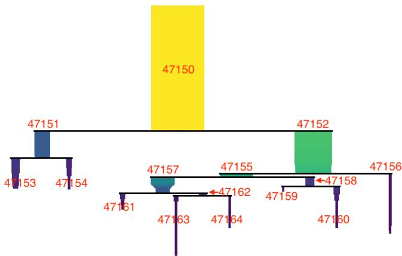

# INTERPRETING HIERARCHICAL ORGANISATION OF SPEAKER EMBEDDINGS

Yanze Xu1, Wenwu Wang1, Mark D. Plumbley2

1Centre for Vision, Speech and Signal Processing, University of Surrey, Guildford, UK 2Department of Informatics, King’s College London, London, UK

## ABSTRACT

Speaker recognition neural networks learn latent representations (i.e. speaker embeddings) from input utterances to recognise speaker identities. However, the internal mechanisms of these networks remain largely opaque, motivating research in explainable artificial intelligence (XAI) to understand them. Nevertheless, existing studies have analysed how speaker embeddings are organised, but rarely frame these analyses within XAI. Hence, this work proposes to explain and interpret the organisation of speaker embeddings from an XAI perspective.

To this end, we apply a hierarchical clustering algorithm, Single-Linkage Clustering (SLINK), to analyse whether some speaker embeddings naturally form clusters with hierarchical relationships. The resulting hierarchical organisation (i.e. hierarchical clusters) is evaluated using the Cluster– Class Matching (CCM) method. Moreover, we propose a new method, termed Hierarchical Cluster–Class Matching (HCCM), to identify which hierarchical clusters best match individual semantic classes (e.g. male) and conjunctive semantic classes (e.g. UK & male), thereby interpreting the clusters using their matched classes. The matching degree is quantified using a new metric called the L-score, which makes imperfect matches diagnosable. HCCM’s results show that hierarchical clusters analysed by SLINK are interpreted using different classes related to speaker identity, gender, and nationality, providing insight into semantics within the hierarchical organisation of our examined speaker embeddings.

Index Terms— Explainable AI, Speaker Recognition, Representation Learning, Hierarchical Clustering, Cluster– Class Matching

## 1. INTRODUCTION

Explainable artificial intelligence (XAI) aims to make the decision-making processes of trained models, particularly neural networks, more understandable to humans [1, 2]. In modern speaker recognition [3, 4], a trained network maps an utterance input to a speaker embedding, i.e., a latent representation for distinguishing speaker identities.

Examining how a recognition network organises its representations can provide insight into its internal mechanisms.

However, existing XAI techniques commonly explain what a recognition network attends to, considers important, or is sensitive to when mapping an input to an output [2, 5]. Meanwhile, some studies have explored representation organisation, but such studies have rarely been framed within XAI [6, 7]. In this work, we propose to explain and interpret the organisation of speaker embeddings from an XAI perspective, specifically focusing on their hierarchical organisation.

Previous studies typically explore the organisation of speaker embeddings using dimensionality reduction [8] or flat clustering methods [9]. Dimensionality reduction methods project speaker embeddings into low-dimensional spaces, where visually separable groups may emerge [6]. Moreover, flat clustering methods [9] analyse whether network representations are naturally organised into flat, independent clusters (i.e. flat representation clusters) [10, 11]. However, these studies leave a research problem: how the resulting flat representation clusters are related to one another, such as whether they exhibit hierarchical relationships.

In the present paper, we extract a set of speaker embeddings by feeding utterance inputs into a trained speaker recognition network. We use a hierarchical clustering method [12], Single-Linkage Clustering (SLINK) [13, 14], to analyse whether these speaker embeddings naturally form clusters with hierarchical relationships (i.e. hierarchical representation clusters). The resulting hierarchical clusters constitute a hierarchical tree-like representation organisation. The resulting clusters are evaluated using the Cluster–Class Matching (CCM) method [15], which measures the overall matching degree between them and predefined semantic classes (i.e. classes pre-labelled for the utterance inputs and inherited by their corresponding representations).

Additionally, we propose a new method called Hierarchical Cluster–Class Matching (HCCM) to find one-to-one matches between the hierarchical representation clusters analysed by SLINK and predefined semantic classes, thereby interpreting each cluster using its matched class. In HCCM, predefined semantic classes describing individual attributes of utterances and their corresponding representations (e.g. male) are referred to as individual semantic classes and can be combined using conjunction logic to form conjunctive semantic classes (e.g. UK & male). Constructing additional conjunctive classes provides opportunities to interpret more hierarchical representation clusters. Moreover, HCCM also introduces a new metric called the L-score (Liebig’s score) to quantify the matching degree of each matched pair comprising a cluster and a semantic class (i.e. a cluster–class pair). The L-score determines the matching degree by the weaker of precision and recall, making it convenient to diagnose whether an imperfect match is primarily limited by precision or recall.

Finally, CCM results show that the hierarchical representation organisation analysed by SLINK achieves a good evaluation score. After visualising this representation organisation as a tree-like dendrogram for intuitive illustration, our HCCM results next show that hierarchical representation clusters at different positions in the dendrogram are well interpreted using predefined semantic classes related to speaker identity, gender, and nationality.

## 2. RELATED WORK

The interpretability of network representations has been well studied in networks trained for generation tasks [16], where changes in latent representations can be interpreted through observable semantic changes in generated outputs. However, this interpretation route is difficult to apply to recognition networks because their representations are used to distinguish speaker identities rather than to generate outputs whose semantic changes can be directly observed. Instead, we adopt an approach that first analyses the organisation of speaker embeddings in terms of clusters and then interprets the representations at the cluster level.

Hierarchical clustering algorithms are commonly applied to speaker embeddings in speaker diarisation, which addresses the ‘who spoke when’ problem [17, 18]. However, the hierarchical representation organisations produced in these speaker diarisation works serve only as intermediate results, from which a subset of clusters without hierarchical relationships is selected for the final diarisation output. Consequently, their complete hierarchical representation organisations are often not visualised, let alone semantically interpreted, both of which are addressed in this XAI work.

Both CCM [15] and the proposed HCCM method match hierarchical clusters with predefined semantic classes but differ in two main aspects. Firstly, CCM calculates a single overall matching score to evaluate the hierarchical clusters [19], while HCCM finds one-to-one cluster–class pairs to interpret each cluster using its matched semantic class. Secondly, CCM does not explicitly distinguish between different types of predefined semantic classes, as in the work of Zhao et al. [19], where CCM is performed using semantic classes that we define as individual semantic classes. In contrast, HCCM explicitly defines individual and conjunctive semantic classes, with the latter constructed using conjunction logic to interpret more hierarchical representation clusters.

## 3. METHODOLOGY

## 3.1. Analysing and Evaluating Hierarchical Representation Organisation

Let $f ( \cdot )$ denote a trained speaker recognition network, which maps an utterance $x _ { i }$ to the corresponding representation (i.e. speaker embedding) $a _ { i } .$ , where $a _ { i } = f ( x _ { i } )$ . Given a set of utterances $X = \{ x _ { i } \}$ , their corresponding representations are denoted by $A = \left\{ a _ { i } \right\}$

We apply one of the most popular hierarchical clustering algorithms, Single-Linkage Clustering (SLINK) [13, 14], to analyse whether the representations in A exhibit a hierarchical representation organisation, in which they naturally form clusters with hierarchical relationships. The resulting clusters are collectively denoted by $\mathcal { H } = \{ h _ { i } \}$ , where each $h _ { i }$ denotes the i-th hierarchical representation cluster and contains the indices of all representations belonging to this cluster. SLINK is characterised by defining the distance between two representation clusters $h _ { p }$ and $h _ { q }$ as that between the closest pair of representations from the two clusters, as follows:

$$
\mathrm { d i s t } ( h _ { p } , h _ { q } ) = \operatorname* { m i n } _ { i \in h _ { p } \atop j \in h _ { q } } d ( a _ { i } , a _ { j } ) ,
$$

where dist $( \cdot , \cdot )$ denotes the distance between two representations; we use Euclidean distance in this work. To evaluate the hierarchical representation organisation H, we apply the Cluster–Class Matching (CCM) method [15] to measure its overall matching performance against a set of predefined semantic classes $C \ = \ \{ c _ { i } \}$ . Each $c _ { i }$ denotes the i-th predefined semantic class and contains the indices of all representations in A whose corresponding utterances are pre-labelled with this class. For a predefined semantic class $c \in C$ and a hierarchical representation cluster $h \in \mathcal H$ , the precision and recall of this cluster-class pair are defined as follows:

$$
P ( c , h ) = \frac { | c \cap h | } { | h | } , \qquad R ( c , h ) = \frac { | c \cap h | } { | c | } ,
$$

and their F-score matching degree is quantified as follows:

$$
F ( c , h ) = \frac { 2 P ( c , h ) R ( c , h ) } { P ( c , h ) + R ( c , h ) } = \frac { 2 | c \cap h | } { | c | + | h | } .
$$

On this basis, the best-matched hierarchical representation cluster of an predefined semantic class is the one achieving the highest F-score among all clusters in H. CCM lastly aggregates the F-scores of all best-matched cluster–class pairs to measure the overall matching performance between C and ${ \mathcal { H } } ,$ defined as follows:

$$
\operatorname { C C M } ( C , { \mathcal { H } } ) = \sum _ { c \in C } { \frac { | c | } { | A | } } \operatorname* { m a x } _ { h \in { \mathcal { H } } } F ( c , h ) .\tag{1}
$$

It is assumed that a higher CCM overall matching degree corresponds to a better hierarchical representation organisation ${ \mathcal { H } } ,$ as its representation clusters align better with the predefined class groupings of the representations.

## 3.2. Semantically Interpreting Hierarchical Representation Organisation

Rather than evaluating hierarchical representation clusters using a final overall matching degree as in CCM, the proposed HCCM method provides semantic interpretations for the clusters in H by finding one-to-one matches between them and predefined semantic classes.

HCCM first defines individual semantic classes (i.e. individual classes) as pre-labelled semantic classes describing a single attribute of model inputs or their representations. For example, male is an individual class related to gender (i.e. a gender-related individual class), while UK is an individual class related to nationality (i.e. a nationality-related individual class). We denote by $C _ { \mathrm { i n d } } = c _ { i }$ the set of all individual classes pre-labelled for the representations A, where each $c _ { i }$ denotes the i-th individual class and contains the indices of all representations in A whose corresponding model inputs belong to this class.

HCCM next defines a conjunctive semantic class (i.e. conjunctive class) as a semantic class formed by combining individual classes using conjunction logic. A representation belongs to a conjunctive class only if it belongs to all of its constituent individual classes. Accordingly, the index set of a conjunctive class is obtained by intersecting the index sets of its constituent individual classes. For example, the conjunctive class UK & male is formed as cUK&male = cUK ∩ cmale.

We combine the individual and conjunctive classes into $C ^ { ( 0 ) } = C _ { \mathrm { i n d } } \cup C _ { \mathrm { c o n j } }$ , where $C _ { \mathrm { c o n j } }$ denotes the set of conjunctive classes constructed by HCCM. Constructing additional conjunctive classes provides opportunities to interpret more clusters in H. Using $C ^ { ( 0 ) }$ and H, HCCM then iteratively finds cluster–class pairs as follows:

$$
\begin{array} { r l } & { ( c _ { l } ^ { * } , h _ { l } ^ { * } ) = \arg \underset { c \in C ^ { ( l - 1 ) } } { \operatorname* { m a x } } L ( c , h ) , } \\ & { \quad \quad \quad \quad \quad \quad \quad \quad \quad \quad \quad \quad \quad \quad \quad \quad } \\ & { \quad \quad \quad \quad \quad \quad C ^ { ( l ) } = C ^ { ( l - 1 ) } \setminus \{ c _ { l } ^ { * } \} , \quad \quad l = 1 , \ldots , | C ^ { ( 0 ) } | . } \end{array}\tag{2}
$$

At the l-th iteration, HCCM selects the globally best-matched cluster–class pair $( c _ { l } ^ { * } , h _ { l } ^ { * } )$ among all possible pairs formed by the remaining semantic classes in $C ^ { ( \bar { l } - 1 ) }$ and the full set of hierarchical representation clusters in H. The matched semantic class $c _ { l } ^ { * }$ is then removed from $C ^ { ( l - 1 ) }$ before the next iteration. After $| C ^ { ( 0 ) } |$ iterations, HCCM produces $| C ^ { ( 0 ) } |$ cluster– class pairs, which semantically interpret up to $| C ^ { ( 0 ) } |$ distinct clusters. The L-score $L ( c , h )$ in Eq. 2 is defined as follows:

$$
L ( c , h ) = \operatorname* { m i n } \bigl ( P ( c , h ) , R ( c , h ) \bigr ) = \frac { | c \cap h | } { \operatorname* { m a x } ( | c | , | h | ) } .\tag{3}
$$

The design of the L-score is inspired by Liebig’s law of the minimum [20], which suggests that system performance is constrained by its most limiting component. Accordingly, the L-score assumes that the matching performance of a cluster– class pair is limited by the weaker of precision and recall, making imperfect matches easier to diagnose. As an example, if $P ( c , h ) = 0 . 9$ and $R ( c , h ) = 0 . 6 $ , the L-score is 0.6 and is therefore determined by recall. This 0.60 indicates that 40% of the representations belonging to semantic class c are not retrieved by the matched cluster h. In contrast, the F-score is 0.72, which can only be interpreted as the harmonic mean of precision and recall, while what 0.72 itself represents remains difficult to interpret, as also noted by Christen et al. [21].

Table 1. CCM evaluation of the SLINK-analysed hierarchical organisation of the examined speaker embeddings.
<table><tr><td>Semantic classes</td><td># Classes</td><td>CCM F-score</td></tr><tr><td>Speaker identity</td><td>40</td><td>0.9754</td></tr><tr><td>Gender</td><td>2</td><td>0.9997</td></tr><tr><td>Nationality</td><td>9</td><td>0.7710</td></tr><tr><td>Nationality&amp;gender conjunction</td><td>13</td><td>0.8316</td></tr><tr><td>Average</td><td>1</td><td>0.8944</td></tr></table>

## 4. EXPERIMENTS

## 4.1. Experimental Setup

The speaker recognition network used in our experiments is the ResNetSE34L model implemented by Chung et al. [22], trained using the angular prototypical loss [22] on spectrograms calculated from utterances in the VoxCeleb2 development set [4]. We input 4-second utterances from the Vox-Celeb1 test set [3], corresponding to $4 0 0 \times 1 0$ ms spectrogram frames, into the trained network and use the outputs of its penultimate layer as speaker embeddings. SLINK is then applied to these speaker embeddings to analyse their hierarchical representation organisation. Such organisation is evaluated by CCM and interpreted by HCCM. The VoxCeleb1 test set contains utterances pre-labelled with 40 speaker identities, 2 gender classes, and 9 nationality classes, yielding 51 predefined individual semantic classes. 13 conjunctive classes are constructed from the non-empty pairwise intersections of the gender-related and nationality-related individual classes (i.e. 5 of the $2 \times 9$ conjunctive classes are empty). Hence, 64 predefined semantic classes are available for CCM and HCCM.

## 4.2. Evaluation Results of Hierarchical Representation Organisation

The CCM method based on F-score metric (i.e. discussed in Section 3.1) evaluates the hierarchical representation organisation analysed by SLINK. For computational efficiency, only hierarchical representation clusters containing more than 2000 representations are involved in the evaluation. The evaluation results are reported in Table 1. Separate CCM scores are reported, each calculated exclusively using identity-, gender-, or nationality-related individual classes, or HCCMconstructed nationality&gender conjunctive classes.

  
Fig. 1. An icicle dendrogram visualising the SLINK-analysed hierarchical organisation of examined speaker embeddings. Hierarchical clusters are labelled by their cluster IDs.

As shown in Table 1, the hierarchical representation organisation analysed by SLINK achieves an average CCM score of 0.8944 across the four types of predefined semantic classes. In particular, identity-related individual classes achieve a high CCM score of 0.9754. The strong alignment of predefined identity-related individual classes (i.e. predefined groupings of representations into identity-related individual classes) with the resulting representation organisation is expected, since the speaker embeddings are learned to distinguish speaker identities. Moreover, gender- and nationalityrelated individual classes separately achieve high CCM scores of 0.9997 and 0.7710, indicating that the representation organisation also aligns closely with these classes, even though the examined speaker recognition network is not trained for either gender or nationality recognition. Lastly, nationality&gender conjunctive classes achieve a higher CCM score of 0.8316 than the 0.7710 achieved by nationality-related individual classes, suggesting that nationality&gender conjunctive classes are more suitable for evaluating the representation organisation, as they align better with this organisation.

## 4.3. Interpretation Results of Hierarchical Representation Organisation

Fig. 1 visualises the hierarchical representation organisation analysed by SLINK as an icicle dendrogram [23], showing hierarchical representation clusters containing more than 2,000 representations. Each displayed cluster is annotated with its cluster ID. The HCCM interpretations of these clusters are reported in Table 2. For a cluster matched with multiple classes, only the matched class with the highest L-score is reported.

As shown in Fig. 1 and Table 2, there are several cluster– class pairs achieve high L-scores. Specifically, clusters 47151 and 47152 are matched with the individual classesfemale and male, achieving near-perfect L-scores of 0.9993 and 0.9994, respectively. Clusters 47156 and 47164 are matched with the conjunctive class India & male and the speaker identity Eddie Izzard, achieving high L-scores of 0.9962 and 0.9704, respectively. Moreover, none of the representation clusters is interpreted using a nationality-related individual class when only the matched class with the highest L-score is reported, whereas six clusters are interpreted using nationality&gender conjunctive classes. Lastly, cluster–class pairs with low Lscores can be diagnosed. For instance, cluster 47154, interpreted as Norway & female, has an L-score of 0.3779. Further inspection shows that 0.3779 is limited by precision, as 61.21% representations in this cluster do not belong to Norway & female but instead belong to other semantic classes, especially UK &female.

Table 2. HCCM interpretations of the hierarchical representation clusters visualised in Fig. 1.
<table><tr><td>Cluster</td><td>Top1 Class</td><td>L-score</td><td>Cluster</td><td>Top1 Class</td><td>L-score</td></tr><tr><td>47150</td><td></td><td></td><td>47158</td><td></td><td></td></tr><tr><td>47151</td><td>Female</td><td>0.9993</td><td>47159</td><td>Erik Estrada</td><td>0.6029</td></tr><tr><td>47152</td><td>Male</td><td>0.9994</td><td>47160</td><td>Ernest Borgnine</td><td>0.4462</td></tr><tr><td>47153</td><td>USA &amp; Female</td><td>0.8708</td><td>47161</td><td>Esai Morales</td><td>0.3002</td></tr><tr><td>47154</td><td>Norway &amp; Female</td><td>0.3779</td><td>47162</td><td>UK &amp; Male</td><td>0.5900</td></tr><tr><td>47155</td><td>USA &amp; Male</td><td>0.6640</td><td>47163</td><td>Eli Roth</td><td>0.5648</td></tr><tr><td>47156</td><td>India &amp; Male</td><td>0.9962</td><td>47164</td><td>Eddie Izzard</td><td>0.9704</td></tr><tr><td>47157</td><td>Ireland &amp; Male</td><td>0.0916</td><td></td><td></td><td></td></tr></table>

## 5. CONCLUSION

This XAI work proposes to reveal the hierarchical organisation of representations learned by a speaker recognition network. SLINK is used to analyse this organisation, yielding hierarchical representation clusters; CCM is used to evaluate the resulting clusters; and HCCM is used to interpret these clusters by finding their one-to-one matches with individual and conjunctive classes. The L-score quantifies the matching degree of cluster–class pairs in a way that makes mismatches diagnosable.

Our evaluation results show that the representation organisation analysed by SLINK aligns strongly with individual classes related to speaker identity, gender, and nationality, even though the examined network is trained to recognise speaker identities rather than gender or nationality. Moreover, nationality&gender conjunctive classes constructed in HCCM are more suitable for evaluating this representation organisation than nationality-related individual classes.

Beyond that, HCCM interpretation results reveal that gender-related individual classes interpret clusters at higherlevel positions in the representation organisation, whereas nationality&gender conjunctive classes and identity-related individual classes interpret clusters at lower-level positions. Such interpretations provide insight into utterance semantics through the hierarchical representation organisation learned by the speaker recognition network and revealed by SLINK.

## 6. REFERENCES

[1] Yanze Xu, Wenwu Wang, and Mark D. Plumbley, “Explainable AI in Speaker Recognition–Making Latent Representations Understandable,” arXiv preprint arXiv:2604.23354, 2026.

[2] Yanze Xu, Mark D. Plumbley, and Wenwu Wang, “Explainable AI in Speaker Recognition–Attention Map Visualisation and Evaluation,” arXiv preprint arXiv:2606.22901, 2026.

[3] Arsha Nagrani, Joon Son Chung, and Andrew Zisserman, “VoxCeleb: A Large-Scale Speaker Identification Dataset,” in Interspeech, 2017, pp. 2616–2620.

[4] Joon Son Chung, Arsha Nagrani, and Andrew Zisserman, “VoxCeleb2: Deep Speaker Recognition,” in Interspeech, 2018, pp. 1086–1090.

[5] Ramprasaath R Selvaraju, Abhishek Das, Ramakrishna Vedantam, Michael Cogswell, Devi Parikh, and Dhruv Batra, “Grad-CAM: Why did you say that?,” arXiv preprint arXiv:1611.07450, 2016.

[6] Yishuang Li, Wenhao Guan, Hukai Huang, Shiyu Miao, Qi Su, Lin Li, and Qingyang Hong, “Efficient integrated features based on pre-trained models for speaker verification,” in Interspeech, 2024, pp. 2140–2144.

[7] Paulo E Rauber, Samuel G Fadel, Alexandre X Falcao, and Alexandru C Telea, “Visualizing the hidden activity of artificial neural networks,” IEEE Transactions on Visualization and Computer Graphics, vol. 23, no. 1, pp. 101–110, 2016.

[8] Leland McInnes, John Healy, and James Melville, “UMAP: Uniform manifold approximation and projection for dimension reduction,” arXiv preprint arXiv:1802.03426, 2018.

[9] Christopher D. Manning, Prabhakar Raghavan, and Hinrich Schutze, “Flat clustering,” in ¨ Introduction to Information Retrieval, pp. 321–345. Cambridge University Press, 2008.

[10] Simon Carbonnelle and Christophe De Vleeschouwer, “Intraclass clustering: An implicit learning ability that regularizes DNNs,” in International Conference on Learning Representations, 2020.

[11] G. Peiffer, “Investigating deep neural network internal clustering and generalization properties,” Master’s thesis, Universite catholique de Louvain, Louvain, Bel-´ gium, 2021.

[12] Daniel Mullner, “Modern hierarchical, agglomerative¨ clustering algorithms,” arXiv preprint arXiv:1109.2378, 2011.

[13] John C Gower and Gavin JS Ross, “Minimum spanning trees and single linkage cluster analysis,” Journal ofthe Royal Statistical Society: Series C (Applied Statistics), vol. 18, no. 1, pp. 54–64, 1969.

[14] Robin Sibson, “SLINK: An optimally efficient algorithm for the single-link cluster method,” The Computer Journal, vol. 16, no. 1, pp. 30–34, 1973.

[15] Andrew Rosenberg and Julia Hirschberg, “V-measure: A conditional entropy-based external cluster evaluation measure,” in Joint Conference on Empirical Methods in Natural Language Processing and Computational Natural Language Learning (EMNLP-CoNLL), 2007, pp. 410–420.

[16] Yujun Shen and Bolei Zhou, “Closed-form factorization of latent semantics in GANs,” in Proceedings of the IEEE/CVF Conference on Computer Vision and Pattern Recognition, 2021, pp. 1532–1540.

[17] Daniel Garcia-Romero, David Snyder, Gregory Sell, Daniel Povey, and Alan McCree, “Speaker diarization using deep neural network embeddings,” in IEEE International Conference on Acoustics, Speech and Signal Processing (ICASSP). IEEE, 2017, pp. 4930–4934.

[18] Prachi Singh, Amrit Kaul, and Sriram Ganapathy, “Supervised hierarchical clustering using graph neural networks for speaker diarization,” in IEEE International Conference on Acoustics, Speech and Signal Processing (ICASSP). IEEE, 2023, pp. 1–5.

[19] Ying Zhao, George Karypis, and Usama Fayyad, “Hierarchical clustering algorithms for document datasets,” Data Mining and Knowledge Discovery, vol. 10, pp. 141–168, 2005.

[20] HJW De Baar, “Von Liebig’s law of the minimum and plankton ecology (1899–1991),” Progress in Oceanography, vol. 33, no. 4, pp. 347–386, 1994.

[21] Peter Christen, David J Hand, and Nishadi Kirielle, “A review of the F-measure: Its history, properties, criticism, and alternatives,” ACM Computing Surveys, vol. 56, no. 3, pp. 1–24, 2023.

[22] Joon Son Chung, Jaesung Huh, Seongkyu Mun, Minjae Lee, Hee-Soo Heo, Soyeon Choe, Chiheon Ham, Sunghwan Jung, Bong-Jin Lee, and Icksang Han, “In Defence of Metric Learning for Speaker Recognition,” in Interspeech, 2020, pp. 2977–2981.

[23] Leland McInnes, John Healy, and Steve Astels, “HDB-SCAN: Hierarchical density based clustering,” The Journal of Open Source Software, vol. 2, no. 11, pp. 205, 2017.