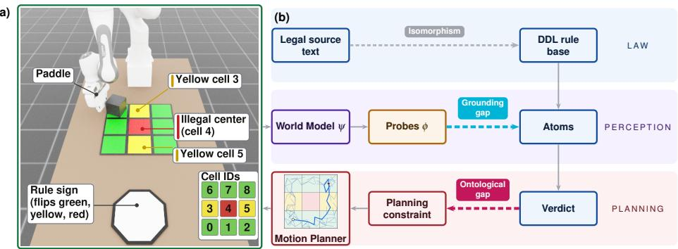
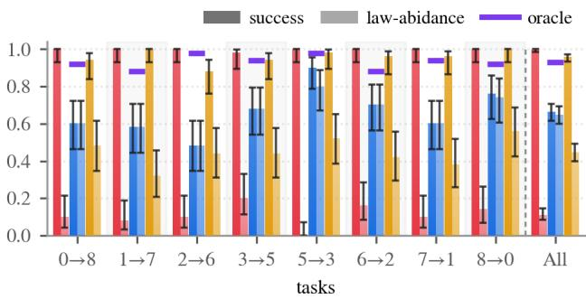
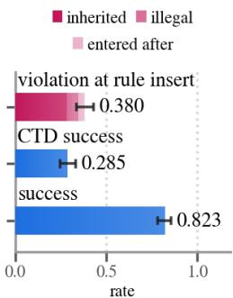
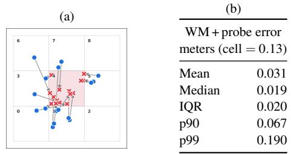
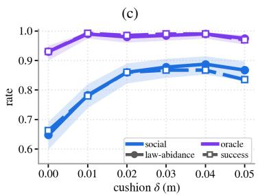

# Legislating World-Model-Based Planning with Legal Reasoning

Dylan WALDNER a,b, Yiannis KANTAROS c, Guido GOVERNATORI d, Risto MIIKKULAINEN b, and Amir BANIFATEMI a

a Cognizant Responsible AI Lab, Cognizant, USA b Cognizant AI Lab, Cognizant, USA

c Department ofElectrical & Systems Engineering, Washington University, USA d School of Engineering and Technology, Central Queensland University, Australia

Abstract. As robotic systems grow more general, legal norms are needed to integrate them into society. This paper extends the isomorphism problem of aligning legal source texts with their encodings, and measures two key challenges to robot normative control: (1) the grounding isomorphism gap, where perception error grounds false atoms for legal reasoning, and (2) the ontological isomorphism gap, where one legal conclusion admits many faithful translations into planning constraints. The paper introduces a legal planning stack that employs Defeasible Deontic Logic (DDL) to constrain a motion planner. The stack leverages learned world models to plan and to provide legal context, enabling ex ante governance that intervenes before an illegal action is executed. It was deployed on a simulated robot arm pushing a cube across a 3 × 3 grid. The findings were (1) the legislated agent abided substantially more often than the non-legislated one, and modeling perception uncertainty lifted abidance even further, (2) the legal reasoning ran efficiently at runtime and its verdicts were auditable, and (3) the stack adapted to exogenous signals and endogenous rule changes. Both gaps were measured: (4) world model and probe error corrupted the factual input for the DDL reasoner, and (5) a single law admitted several faithful metric interpretations yielding drastically different abidance. Thus, ex ante legislation functions as intended, and closing these gaps with a standardized mapping from the law to runtime constraints and improved fact grounding from perception will yield robust laws that align robot behavior with society’s norms.

Keywords. Defeasible Deontic Logic, Robot Law, Sampling Based Motion Planning, World Models

(a)  
  
Figure 1. The Legislation Planning Stack. (a) the Isaac Lab environment: a Franka arm pushes a cube across a 3 × 3 grid with an illegal center cell, two yellow check-in cells, and a color-flipping rule sign. (b) the legal layer: a DDL rule base encodes the source text, probes ground latents as its facts, and its verdict constrains the RRT planner, closing the loop. Dashed arrows are the isomorphism gaps. The point is that the law enters through perception and leaves through the planner, and isomorphism gaps emerge during translation.

## 1. Introduction

As the robotics field pushes towards human level embodiment in the physical world, the question as to how these agents will interact with humans and society becomes increasingly pertinent [1]. For general robots to integrate into society, normative constraints are needed to align robot behavior with society’s expectations. Current frameworks for robotic constraints are not expressive enough to capture the full nuances of normativity, which is necessary for representing the law with legal reasoning. This paper motivates the need for legal reasoning and the law as tools used to shape the behavior of populations of agents through society’s shared norms [2,3]. This paper deploys legal reasoning to a motion planner to show that the law can be translated to planning constraints. In other words, the paper proposes to use law as control, resulting in an approach termed robot law, shown in Figure 1.

Laws in general define norms abstractly, defeasibly, or context dependently, requiring jurisprudence to govern instantiations of violations. Robot law in addition requires uniting two previously disparate fields. The first field is AI and Law, which extends the law to AI systems symbolically, defining the law as modal, deontic, and rule-based systems that can be reasoned over. There is a long tradition for encoding legislation in a formal language (see [4] for a concise overview, and [5,6,7,8] for some recent work on Rules as Code and regulatory technology). However, most of such approaches fail to address the issue of how to instantiate the formalization to a physical domain. The second field is robot safety, which is concerned with geometric and invariant constraints for narrow domain robot planning, not normative control that only becomes relevant for general robots. To apply the law to robotics, in this paper legal AI is extended to the robot safety domain where symbolic rules determine constraints over robot actions.

The challenge in this endeavor lies in isomorphism, which means matching the encoding of a legislation with the corresponding textual provisions [9]. This paper divides the challenge into two parts: the grounding isomorphism gap and the ontological isomorphism gap. The grounding isomorphism gap is a measurement error problem that unites legal isomorphism and the symbol grounding problem [10]. The ontological isomorphism gap is a conceptual representation problem that instantiates the abstract to concrete norms problem to legal reasoning and planning constraints [11,12].

Distinct from the law as applied to humans, robot governance should function ex ante, meaning that the law intervenes on robot systems before an illegal action can be executed. Critically, violations will occur and norms will conflict, so the design choices here focus on handling violations and norm conflict. Governance should further be auditable and causally traced, so that failure modes can be inspected and improved upon. The thesis is that there is no end goal for robot law, but it is instead an iterative process akin to the human legal system.

To comply with these goals (inspired in part by [13,14]), this work presents a new legal layer for robot planning stacks, shown in Figure 1(b), that employs Defeasible Deontic Logic (DDL) to constrain the robot motion planner based on Rapidly exploring Random Tree (RRT). The layer is world model agnostic, but this work uses DINO World Model (DINO-WM, [15]). The world model’s next-state predictions contextualize the effect of the robot’s actions on the environment, giving context for the facts used for legal reasoning. Assuming violations will occur, DDL is a strong choice as a legal reasoning engine because it allows agents to violate initial obligations but still remain within the law. The contributions are:

1. Establishing normative, ex ante control for governance over a learned, subsymbolic world model (Question 1).

2. Providing evidence that robots can adapt to exogenous signals, in this case a rule sign that changes color in the environment that the planning stack reads (Question 2).

3. Providing evidence that robots are able to adapt to endogenous changes where rules are injected at runtime (Question 3).

4. Quantifying the grounding isomorphism gap (Question 4).

5. Quantifying the ontological isomorphism gap (Question 5).

6. Establishing auditability of runtime efficiency, atom grounding, and rule enforcement for iterative improvement of the law at runtime (Question 6).

The paper thus shows that it is possible to shape the normative behavior of general embodied agents as they are deployed in society to make them abide by society’s laws, as argued for in AI Safety, Alignment and Ethics [2]. The paper is organized as follows: Section 2 describes a novel law as control problem formulation for constraining robot motion planners with legal reasoning; Section 3 defines Defeasible Deontic Logic and Beliefs, Intentions, and Obligations framework; Section 4 describes the methods; Section 5 describes the experiment setup and Section 6 reports experimental results highlighting the contributions.

## 2. Problem Formulation: From Geometric Control to Law as Control

Consider a robot operating in an environment with joint state $s _ { t } \in \mathcal S$ at discrete time $t \in \mathbb { N }$ . The joint state $s _ { t }$ captures both the state of the robot and relevant properties of its environment. At each step, the robot selects an action $u _ { t } \in \mathcal { U }$ , where $\boldsymbol { \mathcal U }$ denotes the admissible action space. The evolution of the robot–environment state is described by $s _ { t + 1 } = f ( s _ { t } , u _ { t } )$ , where $f$ denotes the transition function. For example, in the manipulation setting considered in Section $5 , s _ { t }$ includes the configuration of a movable object, while $u _ { t }$ corresponds to a manipulation action applied to that object; see the environment visualized in Fig. 1(a).

The robot does not have direct access to $s _ { t }$ . Instead, it receives an observation $o _ { t } = h ( s _ { t } ) , o _ { t } \in \mathcal { O }$ , where $\mathcal { O }$ denotes the observation space and h is the observation map. Observations may include, for example, visual and proprioceptive measurements.

This paper introduces the law as control problem. The robot is assigned a high-level task represented by a goal set $\mathcal { S } _ { g } \subseteq \mathcal { S }$ . The task is accomplished if the joint robot– environment state reaches $\mathcal { S } _ { g }$ . In addition to accomplishing this task, the robot is required to comply with a set of laws (represented by a DDL theory ${ \mathcal { L } } .$ , defined in Sec 3).

At each step, from its current state, the robot computes a finite control plan

$$
\tau = ( u _ { 0 } , u _ { 1 } , \dots , u _ { K - 1 } ) , \qquad K \leq H ,\tag{1}
$$

for a planning horizon H. Only $u _ { 0 }$ is executed before the robot replans, so reaching $\mathcal { S } _ { g }$ may take far more than H actions. Reaching the goal and obeying the law are properties of a plan rather than part of its definition, since the planner must also reason about plans that do neither: τ is goal-reaching if $s _ { K } \in \mathcal { S } _ { g }$ , and law-compliant if none of its actions violates the normative conclusions induced by $\mathcal { L }$

## 3. Encoding Robot Laws: Defeasible Deontic Logic

The robot laws are encoded in Defeasible Deontic Logic (DDL, [16,17]), an efficient, non-monotonic logic designed for legal reasoning. DDL combines elements of defeasible logic and deontic logic. It is built from a set of propositional atoms $\{ p 1 , p 2 , \ldots , p _ { n } \}$ that are assembled into plain literals (the atoms and their negation) and deontic literals. Deontic literals are plain literals attached to deontic operators, which include permitted (P), obligated (O), and forbidden (F). A DDL theory $\mathcal { L }$ is a triple

$$
( { \mathcal { F } } , R , > ) ,
$$

where $\mathcal { F }$ is a set of facts (literals), R is a set of strict and defeasible rules, and $>$ is a binary relation over R.

Strict rules are defined as $r : a _ { 1 } , a _ { 2 } , \ldots a _ { n } \to c ;$ where the conclusion c always follows if the antecedents $a _ { 1 } , a _ { 2 } , \ldots a _ { n }$ are true. Defeasible rules, however, are defined as $r _ { 1 }$ $a _ { 1 } , a _ { 2 } , \ldots a _ { n } \Rightarrow c$ , where c does not necessarily follow from $a _ { 1 } , a _ { 2 } , \ldots , a _ { n }$ if there is another applicable, conflicting rule $r _ { 2 }$ such that $r _ { 2 } > r _ { 1 }$ . Defeasible deontic rules then assign a deontic operator to the rules, defined as $r : a _ { 1 } , a _ { 2 } , \ldots , a _ { n } \Rightarrow _ { X } c$ where $X \in \{ \mathsf { P } , 0 \}$ that assigns X to the conclusion c, or $[ X ] c$ . Obligations can have conclusions outputted in the following form: $b _ { 1 } \otimes b _ { 2 } \otimes \cdots \otimes b _ { n }$ , where ⊗ is the compensatory operator. This means that on the onset, $[ \boldsymbol { \mathrm { O } } ] b _ { 1 }$ holds true, but if the facts show that $\neg b _ { 1 }$ , then $[ \boldsymbol { \mathrm { O } } ] b _ { 2 }$ takes effect, and so on until the obligation is upheld.

The BIO framework [18] identifies belief (BEL), intention (INT), and obligation (OBL) operators that can be prepended to deontic literals. The BIO operators define different types of agents. A realistic agent’s beliefs override its obligations and intentions; a social agent’s obligations override its beliefs and intentions; a deviant agent’s intentions override its beliefs and obligations.

## 4. Methods

This section describes the methods for solving the problem in Section 2. Section 4.1 describes the planning mechanisms and Section 4.2 describes agent design.

## 4.1. Planner

Planning is done with Rapidly exploring Random Trees (RRT) [19,20] in world model latent space, which grows a tree of candidate plans τ (Eq. 1), and returns the branch whose leaf minimizes the cost J defined in Section 4.2. Figure 1(b) visualizes the legal planner. Enforcement depends on predictions made by the world model in latent space $\mathcal { Z } \subseteq \mathbb { R } ^ { D }$ The world model takes an observation at time $t ,$ encodes it in latent space $z _ { t } \in \mathcal { X }$ , and predicts the next state in latent space $\psi : \left( u _ { t } , z _ { t } \right) \mapsto z _ { t + 1 }$ . Probes $\phi : \mathcal { L } \to \mathbb { R } ^ { n }$ are then trained on those encodings to read the latent into the features the law reasons over, so which probes a deployment needs follows from its lawset.

## 4.2. Agents

Each replanning step grows a fresh tree of candidate plans, so a plan $\tau ( \mathrm { E q . } 1 )$ is internal to one such step and distinct from the realized trajectory $\pmb { \sigma } = ( s _ { 0 } , s _ { 1 } , \dots , s _ { K } )$ the episode traces out. Enforcement acts on τ; the rates of Section 5 are measured on σ.

Three agent types are defined from the BIO framework [18], realistic, social, and deviant, that share the same planner and world model stack but differ only in how the deontic conclusion shapes the search. Each candidate action (tree edge) u carries a violation flag $\nu ( u ) \in \{ 0 , 1 \}$ : rolling u through the world model, $\nu ( u ) = 1$ iff the probe predicts an illegal position. Being sampling-based, the planner returns the best member of the tree $\mathcal { T }$ of plans it actually grew rather than an optimum over all plans, so each selection below ranges over $\mathcal { T }$ . The task objective is the cube’s terminal distance to the goal, $J ( \tau ) = \| \phi _ { p o s } ( z _ { K } ) - \phi _ { p o s } ( z _ { g } ) \|$ , with $z _ { g }$ as the encoding of the goal position; no per-step cost is accumulated. The agents differ only in what they do with v:

• Realistic: no legislation. Grow the full tree and return $\begin{array} { r } { \tau ^ { \star } = \arg \operatorname* { m i n } _ { \tau \in \mathcal { T } } J ( \tau ) } \end{array}$

• Social: an action with $\nu ( u ) = 1$ is pruned based on probe predictions as the tree is expanded. The agent returns the first goal-reaching plan it finds, falling back to $\begin{array} { r } { \pmb { \tau } ^ { \star } = \arg \operatorname* { m i n } _ { \pmb { \tau } \in \mathcal { T } } J ( \pmb { \tau } ) } \end{array}$ over the pruned tree when no nodes reach the goal.

• Deviant: never prunes. It returns $\begin{array} { r } { \tau ^ { \star } = \arg \operatorname* { m i n } _ { \tau \in \mathcal { T } } J ( \tau ) + \lambda \sum _ { u \in \tau } \nu ( u ) } \end{array}$ , so legal violations are priced rather than constrained: a plan that crosses a forbidden cell wins only if the crossing buys more than λ of progress per violation. As λ shares the units of J, defaulted to a half cell length (0.067 m).

Finally, the planning stack’s perception baseline is set by an oracle agent, which runs the same laws, planner, and scenarios as the social agent but removes perception error by operating with simulation ground truths rather than probe readings on a predicted latent. The oracle RRT isolates the capability limits imposed by the simulated environment.

## 5. Experiment Setup

Drawing on the formalism of Section 2, the joint state $s _ { t } \in \mathbb { R } ^ { 3 1 }$ is 18 dimensions of arm proprioception plus the cube’s 13-dimensional pose. The planner only sees a $2 2 4 \times 2 2 4$ RGB frame and the proprioception, so the cube’s pose is withheld and must be read back from pixels by the probes. The action $u _ { t } \in \mathbb { R } ^ { 4 }$ is a linear push $[ x _ { \mathrm { s t a r t } } , y _ { \mathrm { s t a r t } } , d x , d y ]$ and the horizon for each branch is set with $H = 3$ . The transition $f$ is the simulator’s physics, which the learned world model ψ approximates. The probe $\phi _ { p o s } : \mathcal { Z } \to \mathbb { R } ^ { 2 }$ predicts the cube’s (x, y) position and $\phi _ { s c } : \mathcal { Z } $ {white, green,red,yellow} predicts the rule sign’s color. The cube’s rotation is locked in simulation to simplify the engineering effort, so an orientation probe was excluded; deployment would require one.

The environment is built in Isaac Lab [21] and is the pusher setup visualized in Figure 1(a): a Franka arm [22] with a paddle welded to its end effector (EE) pushes a 0.09m cube across a $3 \times 3$ grid of 0.133m cells. Each task starts the cube in one cell and sets the cube’s goal to the diametrically opposite cell, giving eight tasks $( 0 \to 8 , 1 \to 7$ and so on). The goal is randomized within that cell for variance across runs. The center cell 4 is illegal and is never a start or a goal. Each task is run over 50 variations, giving 400 samples per agent.

While the environment constrains the complexity and range of individual laws, they are designed analogously to potential real laws. The laws are defined in DDL, executed using the ASP implementation described in [23], and listed in Table 1. Take, for example, R2, R4, R5, $\mathrm { R 7 / R 7 b } ,$ and R9. In natural language: the center cell (cell 4) is off-limits (R2); a yellow sign obliges the cube to first enter a yellow cell (R5) by changing its goal to that cell; reaching that yellow cell flips the sign, turning it green if the trajectory is clean (R7) or red if the cube has already passed through the center earlier in the run (R7b); a green sign then permits the center (R4), whereas a red sign freezes the agent (via R2, R3 ⇒ R9). The yellow cell thus functions as a legality check-in: the cube must present itself for authorization before the restricted area opens, analogous to scanning a key card at a security checkpoint.

Rules 9 and 10 are made possible by DDL. R9 handles conflicting permission, when an action is both permitted to happen and permitted to not happen, a situation triggered when the sign is red (R2, R3) because DDL has weak permissions that trigger from obligations. R10 handles the contrary to duty case [16,24,25,26] where the cube is in an illegal state by changing the agent’s goal cell to the nearest legal cell. Enforcement operates on two sources of information: planning is based on probe predictions (in\_cell) while sign changes are sourced from ground truth (occupies, visited), analogous to exogenous signals. R11 obligates the cube to return to its starting cell, and is inserted during run time to test the planner’s ability to adapt to runtime rule changes.

<table><tr><td>R Rule</td><td></td><td>R</td><td>Rule</td><td>R</td><td>Rule</td></tr><tr><td></td><td>R1 cube ⇒0 ¬off_grid</td><td>R5</td><td>sign(yellow) ⇒0 in_yellow_cell</td><td>R8</td><td>goal_cell(N), [P]moving ⇒0 in_cell(N)</td></tr><tr><td></td><td>R2 cube ⇒o ¬in_cell(4)</td><td>R5b</td><td>occupies(Y), yellow_cell(Y) ⇒ in_yellow_cell</td><td>R9</td><td>[P]in_cell(4), [P]¬in_cell(4) ⇒o ¬moving</td></tr><tr><td></td><td>R3 sign(red) ⇒0 in_cell(4)</td><td>R7</td><td>in_yellow_cell, sign(yellow) ⇒ sign(green)</td><td></td><td>R10 cube ⇒0 ¬in_cell(4) ⊗ exit_cell(4)</td></tr><tr><td></td><td>R4 sign(green) ⇒p in_cell(4)</td><td>R7b</td><td>in_yellow_cell, visited(4), sign(yellow) ⇒ sign(red)</td><td></td><td>R11 sign(white) ⇒0 in_start_cell</td></tr></table>

Table 1. The Full Lawset: All laws used in the experiments, in DDL (Section 3). Superiority: R4 > R2, R4 > R10; R7b > R7. Occupies(c) is the cube’s ground-truth cell, recorded with visited(c); in\_cell(c) is the probe prediction $\phi _ { p o s } ( z _ { t } )$ the agent is pruned on. The point is that a small lawset still exercises every DDL construct used here: a defeasible prohibition with an earned exception (R2, R4), a compensatory duty (R10), a permission conflict (R9), and a rule inserted at runtime (R11).

The grounding isomorphism gap describes the problem where prediction error makes it difficult to determine where the cube is, creating factually incorrect atoms. For example, the world model and probe may predict that the cube is in cell 3, but when executed the same action results in pushing the cube into cell 4, which is a violation. The ontological isomorphism gap describes the problem where R2 has a one-to-many mapping between its DDL specification and instantiation as a planning constraint (Table 2). For example, the cube’s location may be considered discretely at each time step t, or continuously across every segment of its path. The decision becomes non trivial when faced with engineering constraints, but results in drastically different allowances for what the robot can do.

Two experiments were run. The first experiment runs all agents on laws 1-10 only, where the sign changes to yellow at t = 1 obligating the robot to move the cube into the yellow cell checkpoint. The second experiment extends laws 1-10 with a rule insertion experiment where R11 is inserted into the lawset at t = 3 to see how the planning stack handles run time rule additions that create violations. For this experiment only, the sign is forced back to white at t = 3 to enact the new rule.

Task success is the percentage of trajectories whose cube center reaches the goal cell; law abidance the percentage where no part of the cube enters an illegal cell.

## 6. Results

Question 1 asks whether ex ante legislation works; Question 2 reports the exogenous (sign change) experiment and Question 3 the endogenous (rule insertion) experiment; Question 4 evaluates the grounding isomorphism gap by measuring the effects of world model and probe error on legislation, Question 5 measures the ontological isomorphism gap with alternate metrics corresponding to different interpretations of the law; and Question 6 audits the planning stack and analyzes runtime legislation costs. Throughout this section the agents are colored realistic, social, deviant, and oracle.

  
Figure 2. Baseline Experiment. Success (solid) and law abidance (light) rates by task, with All pooled across tasks; bars are 95% CIs and the purple line is the oracle. For the social agent abidance caps success, while the others succeed far more often than they abide. The point is that ex ante legislation shapes behavior, and what it costs in task completion depends on how the agent treats a deontic conclusion.  
Figure 3. Rule Insertion. R11 inserted at t = 3. The point is that an amendment strands the agent in violation, and the CTD duty repairs it without costing success.

Q1: Does Ex Ante Legislation Constrain Behavior? Figure 2 shows that ex ante legislation with DDL works, but the tradeoff between law abidance and success rates depends on agent design. The realistic and deviant agents succeed far more often than they abide, so the law does not constrain them from task completion. The social agent’s success (66.2%) is capped by its abidance rate (64.7%), because breaking the law turns the sign red (R2, R3, R9) and prevents it from moving towards the goal. The social agent abides 5.9× more often than the realistic agent, so the legal layer is what produces the compliance. Abidance is not capped there: modeling the perception uncertainty with a cushion δ (Figure 4(c)) lifts the social agent from 64.7% to 88.7% at δ = 0.04, with success rising alongside it, so ex ante legislation can be made substantially more effective than the baseline stack.

Q2: Can the Agent Adapt to Exogenous Signals? The rule sign is an exogenous signal in that the agent does not control it. The sign changes color based on the trajectory’s ground truth history (R5, R7, R7b), so the facts the agent reasons over change mid episode. Table 3 shows that the social agent tracks the flip. When the sign forbids the center cell (R2), it moves the cube in on 7.4% of the decisions where it could have. When the sign permits it (R4), it moves in on 53.5%, a 7.2× increase, demonstrating that the exogenous signal shapes the agent’s means to its ends.

Q3: Can the Agent Adapt to Endogenous Changes? Rule insertion is an endogenous change, i.e. one occurring within the system. Figure 3 shows that runtime rule insertion is possible, meaning legal design is updateable and does not need to be set a priori. Its three bars are all fractions of the 400 episodes. In 152 of them (0.380) the cube was in the center when R11 fired; the figure stacks these by how it got there, and in 112 it held a green license the reverting sign revoked underneath it, the rest having already been violating or entered on that frame. The CTD rule pushed 114 back into a legal cell by the next time step, which is 0.285 of all episodes and 75.0% of the 152 at risk. Finally, 329 (0.823) returned to the start cell, so the fallback did not compromise task success rate.

Q4: The Grounding Isomorphism Gap: Does World Model error affect legislation? The main observation is that prediction error was strong enough to influence law abidance. Figure 4(b) reports that error, measured per executed action and pooled across Social, Deviant, and Realistic runs. An average WM + probe error of 0.031m (23% cell width) is enough to convert a predicted, efficient, and legal path towards the goal into a violation. More important, however, is that the 90th percentile error rate averages 0.067m (50% cell width) and 99th percentile error reaches 0.190m (143% cell width) pooled over all committed actions, which exceeds a full cell width.

  
Figure 4. The Grounding Isomorphism Gap. (a) the 16 largest cases (social) where predicted ( ) and executed ( ) rest fall in different cells ( ). (b) WM + probe error vs ground truth per executed action, pooled over the three agents. (c) a cushion δ dilating the enforced footprint, Wilson 95% bands. The point is that perception error is large enough to ground the law on the wrong cell, and modeling uncertainty narrows the gap.

This error then results in the grounding isomorphism gap, visualized in worst case examples in Figure 4(a). The world model predicts a legal cell ( ), grounding a candidate action as a legal atom that passes the DDL check, but when executed that action is illegal ( ). The larger the tail end error, the harder it is to close the grounding isomorphism gap. The oracle gives the perception error ceiling, abiding 93% of the time against the social agent’s 64.7% (Figure 2): that 28.3% gap is the price of grounding the law in learned perception, not a limit of the DDL layer.

This gap in turn results in misfiring fallback mechanisms within the law. Of R10’s 129 [O]exit\_cell(4) conclusions for the social agent (Table 3), 61 were true violations where the cube was in the illegal cell, and 68 were probe error that caused R10’s compensatory clause to misfire. The deviant agent fires 141 times; 84 were true and 57 were probe error. Specifically, the false positives carry a cost that no compliance metric records: 53% of the social agent’s and 40% of the deviant’s R10 repair obligations were levied on a cube that was never in the illegal cell, forcing the agents to pay for a violation they never committed.

Modeling this uncertainty provides a way to overcome the gap (Figure 4(c)): a cushion δ dilating the social agent’s enforced footprint makes the grounded atom absorb the prediction error instead of trusting a point estimate. Choosing an optimal cushion size is left to future work, and it cannot recover the 143% tail, which will require further mechanisms.

Q5: The Ontological Isomorphism Gap: How are Reasoning Conclusions Translated to Planning Constraints? The ontological isomorphism gap is the mismatch between DDL conclusions and planning constraints. The success and abidance definitions of Section 5, one scored on the cube’s center and the other on its whole footprint, are an ad hoc engineering judgment that could easily be inverted. Table 2 re-evaluated R2 (Table 1) in the same episodes with different metrics, or interpretations of the law. The episodes are only reevaluated, not rerun.

Because of the ontological isomorphism gap, the information necessary to define the law is not available at rule creation time, and the onus falls onto the engineer to decide what the law means in the instantiated context. How many metrics were possible only became apparent from building the environment and enforcing R2 in it, something a legislator drafting the rule would never see. The consequence is that the engineer’s choice in this setup could be responsible for up to a 32.3% difference in law abidance scoring for the social agent, 23.9% for the realistic agent, and 23.2% difference for the deviant agent.

<table><tr><td></td><td></td><td colspan="2">success</td><td colspan="2">abidance, full path</td><td colspan="2">abidance, at rest</td></tr><tr><td>Agent</td><td>n</td><td>center</td><td>footprint</td><td>center</td><td>footprint</td><td>center</td><td>footprint</td></tr><tr><td>realistic</td><td>400</td><td>0.998</td><td>0.998</td><td>0.138</td><td>0.113</td><td>0.352</td><td>0.130</td></tr><tr><td>social</td><td>400</td><td>0.662</td><td>0.677</td><td>0.948</td><td>0.655</td><td>0.978</td><td>0.833</td></tr><tr><td>deviant</td><td>400</td><td>0.958</td><td>0.988</td><td>0.557</td><td>0.448</td><td>0.680</td><td>0.497</td></tr></table>

Table 2. Measuring the Ontological Isomorphism Gap: Rescoring R2 alone, not with the full lawset; bold is the implemented metric in Questions 1 and 4. Full path uses the line between start and end poses, at rest only the frames the planner perceives; center is the cube’s center, footprint its full area. Episodes are not rerun under each metric, only reevaluated. The table shows how the metric choice requires interpretation of the law.

Q6: Is the System Auditable and Cheap to Deploy? The stack is auditable because every deontic decision is logged with the rule that fired, the atoms grounding it, and the verdict. Comparing that ledger against ground truth separates a rule being in force from its being obeyed, attributing failures to perception or to reasoning. In Table 3, R2 is enforced 91.1% of the time for the social agent and 87.3% for the deviant. R10’s misfires are due to perception error, noted as false positives (Question 4).
<table><tr><td></td><td colspan="2">Social</td><td colspan="2">Deviant</td><td colspan="2">Realistic</td></tr><tr><td>Rule</td><td>Engaged</td><td>Enforced Engaged</td><td></td><td>Enforced Engaged</td><td></td><td>Enforced</td></tr><tr><td>R2 no_center_cell</td><td>841</td><td>766 (91.1%)</td><td></td><td>769 671 (87.3%)</td><td></td><td>556 396 (71.2%)</td></tr><tr><td>R5 yellow_sign</td><td>824</td><td>824 (100.0%)</td><td></td><td>741 732 (98.8%)</td><td></td><td>492 451 (91.7%)</td></tr><tr><td>R9 conflicting-permissions</td><td></td><td>1311 1311 (100.0%)</td><td></td><td>568 215 (37.9%)</td><td>523</td><td>0 (0.0%)</td></tr><tr><td>R10 contrary_to_duty</td><td>129</td><td>113 (87.6%)</td><td></td><td>141 133 (94.3%)</td><td>203</td><td>59 (29.1%)</td></tr><tr><td>of which false positive</td><td>68</td><td></td><td>57</td><td></td><td>58</td><td></td></tr><tr><td>Rule</td><td>At risk</td><td>Entered</td><td>At risk</td><td>Entered</td><td>At risk</td><td>Entered</td></tr><tr><td>R2 no_center_cell</td><td>766</td><td>57 (7.4%)</td><td></td><td>671 137 (20.4%)</td><td></td><td>396 288 (72.7%)</td></tr><tr><td>R4 green_sign</td><td>417</td><td>223 (53.5%)</td><td></td><td>338 152 (45.0%)</td><td>101</td><td>36 (35.6%)</td></tr></table>

Table 3. Pipeline audit: Engaged: the rule’s conclusion was in force in the runtime ledger; Enforced: it also held in ground truth. The lower block reports uptake: At risk is decisions taken with the cube outside the center, so entry was possible; Entered is how many of those decisions put it in the center at the next step. All counts are over steps taken while the episode was still running; frames logged after the goal is reached are excluded.

Reaching a verdict is cheap enough: symbolic reasoning costs 16.6ms per deontic decision, orders of magnitude less than the 12.5s the planner spends on each executed action.

## 7. Related Work

This work is generally motivated by the AI Safety, Alignment, and Ethics (AI SAE) agenda that grounds alignment in evolutionary biology [2].

Grounding in the legal AI literature, deontic logic has been used to generate normative penalties for RL policies [27], to ensure compliant goals [28], and extended to DDL theories to supervise agent actions [29]. Previous work has also focused on applying the law ex ante to learning agents [30]. DDL has been used for legislating autonomous vehicles in simulation [31]. An implementation of DDL in Answer Set Programming (ASP) [23] has been used to do planning [32]. Norms have also been amended at runtime, but symbolically and without perception [33]. This work applies deontic logic to sample based motion planners in simulation for the first time.

Theoretically, the legal planning stack is grounded in the lineage of the ethical governor [34]. The ex-ante enforcement is closest in spirit to safety shielding [35,36], robot motion planning with temporal logic specifications [37,38,39,40,41], and minimum violation temporal logic planning [42,43,44,45,46]. However, defeasible deontic logic is used here because it explicitly represents exceptions, duties and violations [16,17]. Instead of filtering the search space pre generation, nodes are adjudicated post generation because legislation depends on observations and predictions, not the state.

Similar robot safety work uses latent space planning with Hamilton-Jacobi reachability on top of DreamerV3 [47] to compute safety preserving filters and control in a manipulation task [48]. There is precedent for using probes to ground neural networks’ internal representations in propositions (e.g. Safe/Unsafe) for runtime alignment [49,50,51]. Neuro-symbolic predicate world models [52,53,54] learn their symbolic vocabulary to make planning tractable; ours is fixed by the legal source text. Embedding Temporal Logic [55] goes further and replaces propositions with distances in a learned embedding space, which shifts the grounding problem rather than removing it. Keeping the vocabulary propositional is what lets every verdict here be traced back to the atoms that produced it.

## 8. Discussion and Future Work

The grounding isomorphism gap is an engineering problem that undermines the robustness of robot law at deployment. The ontological isomorphism gap falls in the seam between two fields: enforcing even a seemingly brightline rule requires judicial reasoning more technical than what legislators are expected to consider, and more jurisprudential than what engineers are typically held responsible for.

Future work in embodied agent governance will require advances in uncertainty prediction for extracting facts from perception. One direction is conformal prediction, which may be used to model the types of error in the system, e.g. tail end prediction error and biases towards specific states. For validation, deployment of the legal system into physical robotics instead of simulation will be critical for detecting failure modes in the real world; a Sim to Real Isomorphism gap likely exists as well. A system that maps open texture or abstract laws into downstream constraints in a principled fashion will be critical for scaling deployment.

## 9. Conclusion

This research implements a system of robot governance idiosyncratic to world-model based planning systems for robotics, leveraging the latent prediction space to perform ex ante governance. This work establishes that deployment-ready governance faces the grounding isomorphism gap and the ontological isomorphism gap: an ostensibly brightline rule can vary widely in abidance depending on the metric used. By closing these gaps, robot law can be deployed as legislatures intend it, aligning robot behavior with the norms society sets.

## References

[1] Dan Hendrycks. Natural Selection Favors AIs over Humans, 2023. arXiv preprint arXiv:2303.16200.

[2] Dylan Waldner. AI Safety, Alignment, and Ethics (AI SAE), 2025. arXiv preprint arXiv:2509.24065.

[3] Gillian K. Hadfield and Barry R. Weingast. What Is Law? A Coordination Model of the Characteristics of Legal Order, 2010. SSRN Working Paper No. 1707083.

[4] Guido Governatori, Trevor Bench-Capon, Bart Verheij, Michał Araszkiewicz, Enrico Francesconi, and Matthias Grabmair. Thirty years of artificial intelligence and law: The first decade. Artificial Intelligence and Law, 30(4):481–519, 2022.

[5] GovCMS. Rules as code (rac), 2024.

[6] Legalruleml core specification version 1.0. Oasis standard, OASIS Open, August 2021. Latest stage: https://docs.oasis-open.org/legalruleml/legalruleml-core-spec/v1.0/legalruleml-core-spec-v1.0.html.

[7] Douglas W. Arner, János Barberis, and Ross P. Buckley. Fintech, regtech, and the reconceptualization of financial regulation. Northwestern Journal ofInternational Law & Business, 37(3):371–413, 2017.

[8] Eva Micheler and Anna Whaley. Regulatory technology: Replacing law with computer code. European Business Organization Law Review, 21(2):349–377, 2020.

[9] T. J. M. Bench-Capon and F. P. Coenen. Isomorphism and legal knowledge based systems. Artificial Intelligence and Law, 1(1):65–86, 1992.

[10] Stevan Harnad. The symbol grounding problem. Physica D: Nonlinear Phenomena, 42(1):335–346, 1990.

[11] Davide Grossi and Frank Dignum. From abstract to concrete norms in agent institutions. In Michael G. Hinchey, James L. Rash, Walt Truszkowski, and Christopher A. Rouff, editors, Formal Approaches to Agent-Based Systems, FAABS 2004, volume 3228 of Lecture Notes in Computer Science, pages 12–29. Springer, 2004.

[12] Davide Grossi, Huib Aldewereld, Javier Vázquez-Salceda, and Frank Dignum. Ontological aspects of the implementation of norms in agent-based electronic institutions. Computational & Mathematical Organization Theory, 12(2):251–275, 2006.

[13] Lukasz Szpruch, Agus Sudjianto, Tanveer Bhatti, and Gary Ang. Scalable runtime governance for agentic ai in financial services. SSRN Electronic Journal, 2026.

[14] Gregory Falco, Ben Shneiderman, Julia Badger, Ryan Carrier, Anton Dahbura, David Danks, Martin Eling, Alwyn Goodloe, Jerry Gupta, Christopher Hart, Marina Jirotka, Henric Johnson, Cara LaPointe, Ashley J. Llorens, Alan K. Mackworth, Carsten Maple, Sigurður Emil Pálsson, Frank Pasquale, Alan Winfield, and Zee Kin Yeong. Governing ai safety through independent audits. Nature Machine Intelligence, 3(7):566–571, 2021.

[15] Gaoyue Zhou, Hengkai Pan, Yann Lecun, and Lerrel Pinto. DINO-WM: World models on pre-trained visual features enable zero-shot planning. In Aarti Singh, Maryam Fazel, Daniel Hsu, Simon Lacoste-Julien, Felix Berkenkamp, Tegan Maharaj, Kiri Wagstaff, and Jerry Zhu, editors, Proceedings of the 42nd International Conference on Machine Learning, volume 267 of Proceedings of Machine Learning Research, pages 79115–79135. PMLR, 13–19 Jul 2025.

[16] Donald Nute, editor. Defeasible Deontic Logic. Springer Verlag, Dordrecht, Boston, and London, 1997.

[17] G. Antoniou, D. Billington, G. Governatori, and M.J. Maher. Representation results for defeasible logic. ACM Transactions on Computational Logic, 2(2):255–287, April 2001.

[18] Guido Governatori and Antonino Rotolo. BIO logical agents: Norms, beliefs, intentions in defeasible logic. Autonomous Agents and Multi-Agent Systems, 17(1):36–69, 2008.

[19] Steven M. LaValle. Rapidly-exploring Random Trees: A New Tool for Path Planning. Technical Report TR 98-11, Department of Computer Science, Iowa State University, October 1998.

[20] Brian Ichter and Marco Pavone. Robot motion planning in learned latent spaces. IEEE Robotics and Automation Letters, 4(3):2407–2414, 2019.

[21] James Tigue et al. Mayank Mittal, Pascal Roth. Isaac lab: A gpu-accelerated simulation framework for multi-modal robot learning. arXiv preprint arXiv:2511.04831, 2025.

[22] Franka Robotics. https://franka.de/.

[23] Guido Governatori. An ASP implementation of defeasible deontic logic. KI – Künstliche Intelligenz, 38(1–2):79–88, 2024. https://doi.org/10.1007/s13218-024-00854-9.

[24] Roderick M. Chisholm. Contrary-to-duty imperatives and deontic logic. Analysis, 24(2):33–36, 1963.

[25] Guido Governatori and Antonino Rotolo. Logic of violations: A gentzen system for reasoning with contrary-to-duty obligations. The Australasian Journal ofLogic, 4:193–215, 03 2022.

[26] Guido Governatori, Francesco Olivieri, Antonino Rotolo, and Simone Scannapieco. Computing strong and weak permissions in defeasible logic. Journal ofPhilosophical Logic, 42(6):799–829, 2013.

[27] Emery A. Neufeld, Agata Ciabattoni, and Radu Florin Tulcan. Norm compliance in reinforcement learning agents via restraining bolts. In Legal Knowledge and Information Systems (JURIX 2024), Frontiers in Artificial Intelligence and Applications, pages 119–130. SAGE Publications, 2024.

[28] Emery A. Neufeld, Ezio Bartocci, Agata Ciabattoni, and Guido Governatori. Enforcing ethical goals over reinforcement-learning policies. Ethics and Information Technology, 24:43, 2022.

[29] Emery A. Neufeld, Ezio Bartocci, Agata Ciabattoni, and Guido Governatori. A normative supervisor for reinforcement learning agents. In Automated Deduction (CADE 2021), pages 565–576. Springer, 2021.

[30] Régis Riveret, Giuseppe Contissa, Dídac Busquets, Antonino Rotolo, Jeremy Pitt, and Giovanni Sartor. Vicarious reinforcement and ex ante law enforcement: a study in norm-governed learning agents. In International Conference on Artificial Intelligence and Law (ICAIL), pages 222–226, 2013.

[31] Hanif Bhuiyan, Guido Governatori, Andy Bond, and Andry Rakotonirainy. Traffic rules compliance checking of automated vehicle maneuvers. Artificial Intelligence and Law, 32(1):1–56, 2024.

[32] Galileo Sartor, Guido Governatori, Giuseppe Pisano, Antonino Rotolo, and Adam Wyner. Plans and diversions EA. In Legal Knowledge and Information Systems: JURIX 2025: The Thirty-Eighth Annual Conference, Turin, Italy, 9–11 December 2025, Frontiers in Artificial Intelligence and Applications, pages 433–435. IOS Press, 2025.

[33] Taylor Olson, Roberto Salas-Damian, and Kenneth D. Forbus. Reasoning and Planning with Dynamically Changing Norms, 2026. arXiv preprint arXiv:2605.27622.

[34] Ronald C. Arkin, Patrick Ulam, and Brittany Duncan. An ethical governor for constraining lethal action in an autonomous system. Technical Report GIT-GVU-09-02, Georgia Institute of Technology, Graphics, Visualization and Usability (GVU) Center, 2009.

[35] M. Alshiekh, R. Bloem, R. Ehlers, B. Könighofer, S. Niekum, and U. Topcu. Safe reinforcement learning via shielding. In Proceedings ofthe AAAI Conference on Artificial Intelligence, volume 32, 2018.

[36] Steven Carr, Nils Jansen, Sebastian Junges, and Ufuk Topcu. Safe reinforcement learning via shielding under partial observability. In Proceedings ofthe AAAI Conference on Artificial Intelligence, volume 37, pages 14748–14756, 2023. arXiv:2204.00755.

[37] Zetian Zhang, Ruixiang Du, and Raghvendra V. Cowlagi. Randomized sampling-based trajectory optimization for uavs to satisfy linear temporal logic specifications. Aerospace Science and Technology, 96:105591, 2020.

[38] Xusheng Luo, Yiannis Kantaros, and Michael M Zavlanos. An abstraction-free method for multirobot temporal logic optimal control synthesis. IEEE Transactions on Robotics, 37(5):1487–1507, 2021.

[39] Yiannis Kantaros and Michael M Zavlanos. Stylus\*: A temporal logic optimal control synthesis algorithm for large-scale multi-robot systems. The International Journal of Robotics Research, 39(7):812–836, 2020.

[40] Cristian Ioan Vasile, Xiao Li, and Calin Belta. Reactive sampling-based path planning with temporal logic specifications. The International Journal ofRobotics Research, 39(8):1002–1028, 2020.

[41] Vidisha Kudalkar, Sujit Ponguluri, Anand Balakrishnan, and Jyotirmoy V Deshmukh. Sampling-based multi-agent path planning guided by spatio-temporal logic mission objectives. In Proceedings of the International Conference on Automated Planning and Scheduling, volume 36, pages 133–141, 2026.

[42] Luis I. Reyes Castro, Pratik Chaudhari, Jana T˚umová, Sertac Karaman, Emilio Frazzoli, and Daniela Rus. Incremental sampling-based algorithm for minimum-violation motion planning. In 52nd IEEE Conference on Decision and Control, pages 3217–3224, 2013.

[43] Mingyu Cai, Makai Mann, Zachary Serlin, Kevin Leahy, and Cristian-Ioan Vasile. Learning minimallyviolating continuous control for infeasible linear temporal logic specifications. In 2023 American Control Conference (ACC), pages 1446–1452. IEEE, 2023.

[44] Jana Tumova, Sertac Karaman, Calin Belta, and Daniela Rus. Least-violating planning in road networks from temporal logic specifications. In 2016 ACM/IEEE 7th International Conference on Cyber-Physical Systems (ICCPS), pages 1–9. IEEE, 2016.

[45] Cristian-Ioan Vasile, Vasumathi Raman, and Sertac Karaman. Sampling-based synthesis of maximallysatisfying controllers for temporal logic specifications. In 2017 IEEE/RSJ International Conference on Intelligent Robots and Systems (IROS), pages 3840–3847. IEEE, 2017.

[46] Ali Tevfik Buyukkocak and Derya Aksaray. Resilient online planning for mobile robots with minimal relaxation of signal temporal logic specifications. IEEE Robotics and Automation Letters, 10(6):5935– 5942, 2025.

[47] Danijar Hafner, Jurgis Pasukonis, Jimmy Ba, and Timothy Lillicrap. Mastering diverse control tasks through world models. Nature, 640(8059):647–653, 2025.

[48] Kensuke Nakamura, Lasse Peters, and Andrea Bajcsy. Generalizing Safety Beyond Collision-Avoidance via Latent-Space Reachability Analysis. In Proceedings ofRobotics: Science and Systems, LosAngeles, CA, USA, June 2025.

[49] Kundan Krishna, Joseph Y. Cheng, Charles Maalouf, and Leon A. Gatys. Disentangled safety adapters enable efficient guardrails and flexible inference-time alignment. arXiv preprint arXiv:2506.00166, 2026. arXiv:2506.00166 [cs.LG].

[50] Kenneth Li, Oam Patel, Fernanda Viégas, Hanspeter Pfister, and Martin Wattenberg. Inference-time intervention: Eliciting truthful answers from a language model. In A. Oh, T. Naumann, A. Globerson, K. Saenko, M. Hardt, and S. Levine, editors, Advances in Neural Information Processing Systems, volume 36, pages 41451–41530. Curran Associates, Inc., 2023.

[51] Jiahai Feng, Stuart Russell, and Jacob Steinhardt. Monitoring latent world states in language models with propositional probes. In Y. Yue, A. Garg, N. Peng, F. Sha, and R. Yu, editors, International Conference on Learning Representations, volume 2025, pages 19337–19359, 2025.

[52] Yichao Liang, Nishanth Kumar, Hao Tang, Adrian Weller, Joshua B Tenenbaum, Tom Silver, Joao F. Henriques, and Kevin Ellis. Visualpredicator: Learning abstract world models with neuro-symbolic predicates for robot planning. In Y. Yue, A. Garg, N. Peng, F. Sha, and R. Yu, editors, International Conference on Learning Representations, volume 2025, pages 60416–60444, 2025.

[53] Yichao Liang, Dat Nguyen, Cambridge Yang, Tianyang Li, Joshua B Tenenbaum, Carl Edward Rasmussen, Adrian Weller, Zenna Tavares, Tom Silver, and Kevin Ellis. Exopredicator: Learning abstract models of dynamic worlds for robot planning. In C. Vondrick, B. Hariharan, C. Raffel, L. Pinto, D. Yang, and A. Faust, editors, International Conference on Learning Representations, volume 2026, pages 49174–49214, 2026.

[54] Ashay Athalye, Nishanth Kumar, Tom Silver, Yichao Liang, Jiuguang Wang, Tomás Lozano-Pérez, and Leslie Pack Kaelbling. From Pixels to Predicates: Learning Symbolic World Models via Pretrained VLMs. IEEE Robotics and Automation Letters, 11(4):4002–4009, 2026.

[55] Parv Kapoor, Abigail Hammer, Ashish Kapoor, Karen Leung, and Eunsuk Kang. Runtime Monitoring of Perception-Based Autonomous Systems via Embedding Temporal Logic, 2026. arXiv preprint arXiv:2605.12651.