# NEURAL-NETWORK SOLUTIONS TO REAL-SPACE CHARGE DENSITY AND GENERALIZATION

Yuxuan Zeng 1, Taoyuze Lv 1,2∗, Zhicheng Zhong 1,2†

flotsg@mail.ustc.edu.cn, taoyuze.lv, zczhong @ustc.edu.cn

1School of Artificial Intelligence & Data Science, University of Science and Technology of China

2Suzhou Institute for Advanced Research, University of Science and Technology of China

## ABSTRACT

The Hohenberg-Kohn theorem establishes that, in principle, the ground state (GS) charge density contains all GS information of a many-electron system, such that all GS observables can be expressed as functionals of the GS charge density. Conventional Kohn-Sham density functional theory requires iterative solution of the self-consistent-field equations at substantial computational cost, motivating the development of deep learning surrogates for electronic structure calculations and, in turn, accelerating computer-aided materials design. Here, we propose AIDEN, an Atomic-Interaction Density Equivariant Network for solving real-space charge density. AIDEN separates the element-dependent one-center density from environment-induced density redistribution and represents the latter through complementary atom- and edge-centered tensor correlations. A continuous low-rank Gaussian decoder then reconstructs the density at arbitrary spatial coordinates while reusing atomic encodings independently of the evaluation grid. AIDEN achieves state-of-the-art accuracy on periodic crystal benchmarks while remaining competitive for molecular systems, and further demonstrates zero-shot transferability across several structurally distinct out-of-distribution case studies. Furthermore, AIDEN provides substantially faster inference than both baseline models and full SCF calculations, enabling efficient charge density reconstruction for large-scale electronic structure calculations.

## 1 INTRODUCTION

The exploration of the vast materials space is rapidly shifting from conventional trial-and-error experiments and direct first-principles calculations toward data-driven discovery, with deep learning playing an increasingly important role. The data underlying this paradigm are often generated from high-fidelity Kohn-Sham density functional theory (KS-DFT) calculations (Jones, 2015) or molecular dynamics (MD) simulations (van Gunsteren & Mark, 1998), which can be performed systematically at scale and generally provide greater internal consistency than experimental measurements. Deep-learning approaches to DFT calculations commonly target the charge density (Qin et al., 2026), Hamiltonian (Tang et al., 2024), and density matrix (Dong et al., 2025), which are connected through the self-consistent field (SCF) cycle (Slater, 1969):

$$
\rho ( \mathbf { r } )  H _ { \mathrm { K S } } [ \rho ]  \{ \phi _ { n \mathbf { k } } , \epsilon _ { n \mathbf { k } } \}  \mathbf { D }  \rho ( \mathbf { r } ) .\tag{1}
$$

Here, ρ(r) denotes the real-space charge density, $H _ { \mathrm { K S } } [ \rho ]$ the KS Hamiltonian constructed from the density-dependent effective potential, and D the one-particle density matrix constructed from the KS orbitals and their occupations. Compared with learning the Hamiltonian or density matrix, charge density prediction offers several advantages:

1) Weaker dependence on atomic-orbital basis representations. Changing the atomicorbital basis alters the matrix representations of both the Hamiltonian and density matrix (Yuan et al., 2026), whereas $\rho ( \mathbf { r } )$ is intrinsically a real-space scalar field independent of orbital indexing, facilitating a more unified representation across different basis sets.

2) Direct physical interpretability. The real-space charge density provides direct access to electronic-structure characteristics such as charge transfer (Poli et al., 2020) and chemical bonding (Chopra, 2012), offering a microscopic basis for interpreting material properties.

3) Convenient three-dimensional (3D) representation. When discretized on a real-space grid, $\rho ( \mathbf { r } )$ forms a regular 3D tensor and can serve as a complementary electronic-structure descriptor for downstream representation learning (Shuang et al., 2026).

To this end, we propose an Atomic-Interaction Density Equivariant Network (AIDEN) to efficiently predict real-space GS charge densities directly from atomic configurations. Inspired by the superposition of atomic densities (SAD) (Van Lenthe et al., 2006), AIDEN decomposes the total charge density into an atom-centered term $\rho _ { \mathrm { i n i t } } ( \mathbf { r } )$ and an environment-dependent term $\rho _ { \mathrm { e n v } } ( \mathbf { r } )$ . The former serves as a learnable element-dependent one-center baseline for the dominant local density distribution, whereas the latter captures environment-induced density variations through higher-order many body features. In the encoder, AIDEN first employs Cartesian atomic cluster expansion (ACE) (Xu et al., 2026a) to encode higher-order geometric and angular information of local atomic environments, followed by tensor edge cluster expansion (TECE) (Xu et al., 2026b) to equivariantly model and adaptively aggregate direction-dependent neighbor interactions, providing expressive representations of complex local electronic environments. The decoder then expands the atomic features using Gaussian-type orbitals (GTOs) (Huzinaga, 1965) and reconstructs a continuous real-space charge-density field. In addition, the computationally expensive equivariant atomic encoding in AIDEN is performed only once and reused across all spatial query points, yielding faster inference than conventional probe-based methods. Together, these designs provide AIDEN with strong learning capacity and substantially improved efficiency, while enabling its extension to larger-scale out-of-distribution (OOD) systems.

## 2 RELATED WORKS

Equivariant GNNs. Conventional atomistic GNNs mainly learn rotation- and translation-invariant scalar representations (Xie & Grossman, 2018), whereas equivariant GNNs enforce $f ( D _ { \mathcal { X } } ( g ) x ) =$ $D y ( g ) f ( x )$ to preserve geometric transformation laws. Tensor Field Networks (Zaccone, 2026) and e3nn (Geiger & Smidt, 2022) established E(3)-equivariant representations based on SO(3) irreducible representations and spherical harmonics. NequIP (Batzner et al., 2022) demonstrated their effectiveness for atomistic modeling, while MACE (Batatia et al., 2022) incorporated atomic cluster expansion to capture higher-order many-body interactions. More recent methods improve efficiency through edge-aligned SO(2) operations, including eSCN (Passaro & Zitnick, 2023) and TECE (Xu et al., 2026b), the latter further introducing edge cluster expansion and radial rotary attention.

Charge density learning. Recent methods predict real-space charge densities using spatial queries, regular grids, or atom-centered representations. DeepDFT (Jørgensen & Bhowmik, 2022) predicts densities at arbitrary probe points from local atomic environments, while Deep Charge (Lv et al., 2023) learns symmetry-preserving local representations with strong data efficiency. ChargE3Net (Koker et al., 2024) extends probe-based prediction with higher-order E(3)- equivariant features and scales to more than $1 0 ^ { 5 }$ crystals. Li et al. (2025) instead reconstructs molecular densities on regular 3D grids, whereas EAC-Net (Qin et al., 2026) represents the density as a sum of symmetry-consistent atomic contributions. NeuralSCF (Song & Feng, 2026) further learns the Kohn-Sham density map through neural self-consistent iterations.

## 3 PROBLEM STATEMENT

Consider a unit cell $\Omega = \{ \mathbf { u A } \mid \mathbf { u } \in [ 0 , 1 ) ^ { 3 } \}$ with lattice vectors arranged by rows in $\mathbf { A } \in \mathbb { R } ^ { 3 \times 3 }$ A periodic structure is written as $\mathcal { X } = ( \mathbf { A } , \{ Z _ { i } , \mathbf { s } _ { i } \} _ { i = 1 } ^ { N _ { \mathrm { a } } } )$ , where $Z _ { i }$ and $\mathbf { s } _ { i } \in [ 0 , 1 ) ^ { 3 }$ are the atomic number and fractional coordinate of atom $i ,$ respectively, and $\mathbf { R } _ { i } = \mathbf { s } _ { i } \mathbf { A }$ is its Cartesian position. Its periodic images lie at ${ \mathbf { R } } _ { i } + { \mathbf { n } } { \mathbf { A } }$ for $\mathbf { n } \in \mathbb { Z } ^ { 3 }$ . For a cell containing $N _ { \mathrm { e } }$ electrons, the physical GS

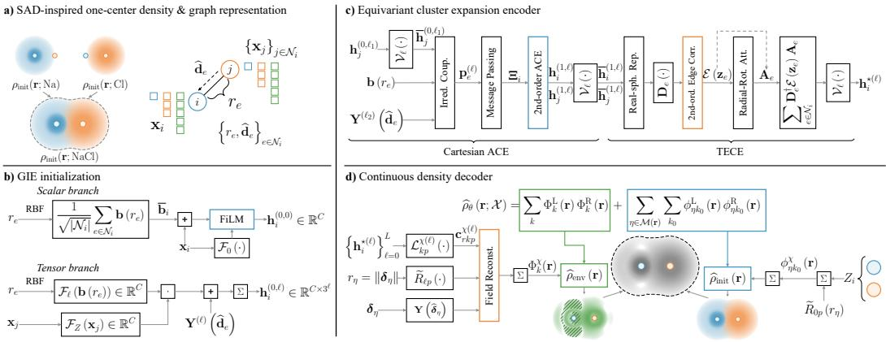  
Figure 1: Overview of AIDEN. (a) Using a simple $\mathrm { N a } { - } \mathrm { C l }$ atom pair as an example, the initial local charge density $\rho _ { \mathrm { i n i t } } ( { \bf r } ; \mathrm { N a C l } )$ can be decomposed into separate contributions from the two atomic species, while the atomic system is represented as a periodic graph containing elemental embeddings, interatomic distances, and edge-direction information. (b) The geometry-informed embedding (GIE) module initializes scalar and higher-order equivariant atomic features through coordinated scalar and tensor branches. (c) In the encoder, Cartesian ACE constructs many-body correlations after neighborhood aggregation, whereas TECE builds higher-order source-target correlations in edge-aligned local coordinate frames and further modulates the correlated information through radial rotary attention (RRA). (d) In the decoder, the charge density is composed of a local term $\rho _ { \mathrm { i n i t } } ( \mathbf { r } )$ and an environment term $\rho _ { \mathrm { e n v } } ( { \bf r } ) ;$ ; the equivariant atomic representations are mapped to local GTO coefficients and can be efficiently evaluated at arbitrary spatial coordinates.

density belongs to

$$
\mathcal { D } _ { N _ { \mathrm { e } } } = \{ \rho : \Omega  \mathbb { R } _ { + } \ \bigg | \int _ { \Omega } \rho ( \mathbf { r } ) \mathrm { d } ^ { 3 } \mathbf { r } = N _ { \mathrm { e } } \} , \quad \rho _ { \mathcal { X } } ( \mathbf { r } ) = N _ { \mathrm { e } } \int \prod _ { a = 2 } ^ { N _ { \mathrm { e } } } d ^ { 3 } \mathbf { r } _ { a } | \Psi ( \mathbf { r } , \mathbf { r } _ { 2 } , \dots , \mathbf { r } _ { N _ { \mathrm { e } } } ) | ^ { 2 } ,\tag{2}
$$

and KS-DFT obtains $\begin{array} { r } { \rho _ { \mathcal { X } } ^ { \star } = \arg \operatorname* { m i n } _ { \rho \in { \mathcal { D } _ { N _ { \mathrm { e } } } } } E _ { \mathcal { X } } [ \rho ] } \end{array}$ . Plane-wave calculations (Dunnington & Schmidt, 2012) represent the real-space density numerically on a regular fast Fourier transform (FFT) grid (Ten Eyck, 1973), $\mathcal { R } _ { \mathcal { X } } = \left\{ \mathbf { r } _ { g } \right\} _ { q = 1 } ^ { N _ { \mathrm { g } } }$ . Below, $\rho$ denotes the smooth PAW grid density used as the learning target, rather than the formal all-electron density in Eq. $2 ; N _ { \mathrm { e } }$ denotes the corresponding valence-electron count, with $N _ { \mathrm { e } } \simeq | \Omega | N _ { \mathrm { g } } ^ { - 1 } \sum _ { q } \rho _ { \mathcal { X } } ( \mathbf { r } _ { g } )$ . The separately supplied PAW one-center data and the scope of fixed-density evaluation are detailed in Appx. A.2. AIDEN learns a continuous scalar field $\hat { \rho } _ { \pmb { \theta } } ( \mathbf { r } ; \chi )$ . For a Euclidean transformation $g = ( \mathbf { Q } , \mathbf { t } )$ with $\mathbf { Q } \in \mathrm { O } ( 3 )$ and $g \mathbf { r } = \mathbf { r } \mathbf { Q } ^ { \top } + \mathbf { t }$ bthe target covariance and lattice periodicity are $\widehat { \rho } _ { \pmb { \theta } } ( g \mathbf { r } ; g \mathcal { X } ) = \widehat { \rho } _ { \pmb { \theta } } ( \mathbf { r } ; \mathcal { X } )$ and $\hat { \rho } _ { \pmb { \theta } } ( \mathbf { r } + \mathbf { n } \mathbf { A } ; \pmb { \chi } ) =$ $\widehat { \rho } _ { \pmb { \theta } } ( \mathbf { r } ; \mathcal { X } )$ . Given training samples $\{ \mathcal { X } _ { n } \} _ { n = \mathrm { : } } ^ { N _ { \mathrm { d } } } .$ b bwith full FFT grids $\mathcal { R } _ { \mathcal { X } _ { n } } ~ = ~ \{ \mathbf { r } _ { n g } \} _ { q = 1 } ^ { N _ { \mathrm { g } } ^ { ( n ) } }$ , the model minimizes the grid-averaged absolute deviation to determine the optimal model parameters $\theta ^ { \star }$

$$
\pmb { \theta } ^ { \star } = \arg \operatorname* { m i n } _ { \pmb { \theta } } \frac { 1 } { N _ { \mathrm { d } } } \sum _ { n = 1 } ^ { N _ { \mathrm { d } } } \frac { 1 } { N _ { \mathrm { g } } ^ { ( n ) } } \sum _ { g = 1 } ^ { N _ { \mathrm { g } } ^ { ( n ) } } \left| \widehat { \rho } _ { \pmb { \theta } } ( \mathbf { r } _ { n g } ; \mathcal { X } _ { n } ) - \rho _ { \mathcal { X } _ { n } } ( \mathbf { r } _ { n g } ) \right| .\tag{3}
$$

## 4 MODEL ARCHITECTURE

## 4.1 PERIODIC GEOMETRY AND EQUIVARIANT INITIALIZATION

For every target atom i, the periodic atomic graph contains directed edges $e = \left( j , \mathbf { n } \div i \right)$ satisfying

$$
\mathbf { d } _ { e } = \mathbf { R } _ { i } - ( \mathbf { R } _ { j } + \mathbf { n } \mathbf { A } ) , \quad r _ { e } = \| \mathbf { d } _ { e } \| _ { 2 } , \quad \widehat { \mathbf { d } } _ { e } = \mathbf { d } _ { e } / r _ { e } , \quad 0 < r _ { e } < r _ { \mathrm { a t } } .\tag{4}
$$

If more than $N _ { \mathrm { n b r } }$ images enter the cutoff sphere, only the nearest $N _ { \mathrm { n b r } }$ are retained for that target. We write ${ \mathcal { N } } _ { i }$ for the resulting incoming edges. Each edge carries a radial vector $\mathbf { b } ( r _ { e } ) \in \mathbb { R } ^ { N _ { \mathrm { B } } }$ and an irreducible rank-ℓ Cartesian harmonic $\mathbf { Y } ^ { ( \ell ) } ( \widehat { \mathbf { d } } _ { e } )$ . Their exact construction is given in Appx. B.1. The element input is $\mathbf { x } _ { i } = \mathrm { N o r m } [ \mathbf { o } ( Z _ { i } ) \oplus \mathbf { q } ( Z _ { i } ) ] \in [ 0 , 1 ] ^ { 1 3 3 }$ , where $\mathbf { o } ( Z _ { i } ) \in \{ 0 , 1 \} ^ { 1 1 8 }$ is a onehot element vector, $\mathbf { q } ( Z _ { i } ) \in \mathbb { R } ^ { 1 5 }$ contains the elemental descriptors, denotes concatenation, and Norm is feature-wise min-max normalization over the 118 elements. GIE initializes the scalar and higher-order tensor fields directly from the one-hop atomic environment. We first summarize the radial environment of atom i by

$$
\overline { { \mathbf { b } } } _ { i } = \frac { 1 } { \sqrt { \left| \mathcal { N } _ { i } \right| } } \sum _ { e \in \mathcal { N } _ { i } } \mathbf { b } \left( r _ { e } \right) , \quad \mathbf { h } _ { i } ^ { ( 0 , 0 ) } = \mathcal { F } _ { \mathrm { s } } \left[ \mathcal { F } _ { 0 } \left( \mathbf { x } _ { i } \right) , \mathbf { x } _ { i } \oplus \overline { { \mathbf { b } } } _ { i } \right] ,\tag{5}
$$

$$
\mathbf { h } _ { i } ^ { ( 0 , \ell ) } = \frac { 1 } { \sqrt { \left| \mathcal { N } _ { i } \right| } } \mathcal { P } _ { \ell } ^ { \mathrm { i r r } } \left\{ \left[ \sum _ { e \in \mathcal { N } _ { i } } \mathcal { F } _ { \ell } \left[ \mathbf { b } \left( r _ { e } \right) \right] \odot \mathcal { F } _ { \mathbf { Z } } \left( \mathbf { x } _ { j } \right) \right] \otimes \mathbf { Y } ^ { ( \ell ) } \left( \widehat { \mathbf { d } } _ { e } \right) \right\} , \quad 1 \leq \ell \leq L .\tag{6}
$$

For the scalar field, $\mathcal { F } _ { 0 } \left( \mathbf { x } _ { i } \right)$ provides the elemental seed of the central atom, while $\mathcal { F } _ { \mathrm { s } } \left( \cdot \right)$ applies a FiLM-style environment-conditioned (Perez et al., 2018) scale and shift determined from $\mathbf { x } _ { i } \oplus \mathbf { \overline { { b } } } _ { i }$ For $\ell \geq 1 , \mathcal { F } _ { \ell } [ \mathbf { b } \left( r _ { e } \right) ] \in \mathbb { R } ^ { C }$ assigns order-specific radial amplitudes, controlling how strongly a neighbor at distance $r _ { e }$ contributes to each channel, whereas $\bar { \mathcal { F } } _ { \mathrm { Z } } \left( \mathbf { x } _ { j } \right) \in \mathbb { R } ^ { C }$ supplies elemental amplitudes that modulate these contributions according to the chemical identity of the source atom. Their channel-wise product therefore determines the magnitude of each edge contribution, while the analytic harmonic $\mathbf { Y } ^ { ( \ell ) } \left( \widehat { \mathbf { d } } _ { e } \right)$ fixes its angular dependence and transformation law. Here $\odot$ acts over the $C$ bscalar channels, and broadcasts each channel weight over the Cartesian components of the rank-ℓ harmonic. The projection $\mathcal { P } _ { \ell } ^ { \mathrm { i r r } }$ keeps the accumulated tensor in the symmetric traceless rankℓ subspace. Consequently, $\mathbf { h } _ { i } ^ { ( 0 , \ell ) } \in \mathbb { R } ^ { C \times 3 ^ { \ell } }$ forms an equivariant Cartesian field in which the learned maps determine the channel-wise strength of neighboring contributions without independently parameterizing individual Cartesian components, thereby preserving rotational equivariance.

## 4.2 EQUIVARIANT CLUSTER EXPANSION ENCODER

Before each interaction, every angular order is normalized as $\overline { { \mathbf { h } } } _ { i } ^ { ( t , \ell ) } = \mathcal { V } _ { \ell } [ \mathbf { h } _ { i } ^ { ( t , \ell ) } ] \ ( \mathrm { A p p x . \ B . 2 } )$ . In our case, one Cartesian ACE interaction forms higher-order correlations after neighborhood aggregation, describing collective atom-centered coordination. One subsequent TECE interaction forms source-target correlations within each edge-aligned frame before aggregation, retaining directional information along individual interatomic axes. These are complementary geometric inductive biases for density redistribution.

## 4.2.1 CARTESIAN ATOMIC CLUSTER EXPANSION

The Cartesian ACE follows the irreducible tensor construction of TACE (Xu et al., 2026a). Let $\mathcal { T } _ { L }$ be the admissible angular paths defined in Eq. 51, and let $\mathcal { C } _ { \ell _ { 1 } , \ell _ { 2 } } ^ { \ell }$ be the irreducible Cartesian coupling defined in Eq. 50. The edge-resolved one-particle tensor is

$$
\mathbf { p } _ { e } ^ { ( \ell ) } = \sum _ { ( \ell _ { 1 } , \ell _ { 2 } , \ell ) \in \mathcal { T } _ { L } } \mathcal { L } _ { \ell _ { 1 } , \ell _ { 2 } } ^ { \ell } \left( \mathbf { w } _ { e , \ell _ { 1 } \ell _ { 2 } \ell } \odot \mathcal { L } _ { \mathrm { s } } ^ { ( \ell _ { 1 } ) } \overline { { \mathbf { h } } } _ { j } ^ { ( 0 , \ell _ { 1 } ) } , \mathbf { Y } ^ { ( \ell _ { 2 } ) } ( \widehat { \mathbf { d } } _ { e } ) \right) , \quad \mathbf { w } _ { e , \ell _ { 1 } \ell _ { 2 } \ell } = \mathcal { F } _ { \mathrm { A C E } } ^ { \ell _ { 1 } \ell _ { 2 } \ell } \left[ \mathbf { b } ( r _ { e } ) \right] ,\tag{7}
$$

where $\mathcal { L } _ { \mathrm { s } } ^ { ( \ell ) }$ mixes channels at fixed ℓ and $\mathcal { F } _ { \mathrm { A C E } } ^ { \ell _ { 1 } \ell _ { 2 } \ell }$ produces a $C \mathrm { \mathrm { - } }$ -component radial weight. The invariant neighbor coefficient $a _ { e }$ and the explicit construction of the order-ν Cartesian correlation polynomial $B _ { \nu } ^ { ( \ell ) }$ are detailed in Appx. B.2. Define the aggregated atomic field $\Xi _ { i }$ as

$$
\begin{array} { r l } & { \Xi _ { i } = \mathcal { L } _ { \mathrm { s e l f } } \overline { { \mathbf { h } } } _ { i } ^ { ( 0 ) } + \mathcal { L } _ { \mathrm { m s g } } \displaystyle \sum _ { e \in \mathcal { N } _ { i } } a _ { e } \mathbf { p } _ { e } , } \\ & { \mathbf { h } _ { i } ^ { ( 1 , \ell ) } = \overline { { \mathbf { h } } } _ { i } ^ { ( 0 , \ell ) } + \mathcal { L } _ { \mathrm { o u t } } ^ { ( \ell ) } \mathcal { B } _ { \nu } ^ { ( \ell ) } \left\{ \left[ \mathbf { 1 } _ { C } + \sigma _ { 0 } \mathcal { F } _ { \mathrm { g } } \left( \Xi _ { i } ^ { ( 0 ) } \right) \right] \odot \Xi _ { i } \right\} , } \end{array}\tag{8}
$$

where $\sigma _ { 0 } ( x ) = ( 1 + \mathrm { e } ^ { - x } ) ^ { - 1 }$ is the sigmoid function, and ${ \mathcal { F } } _ { \mathrm { g } }$ maps the invariant sector $\Xi _ { i } ^ { ( 0 ) }$ to channel-wise gating coefficients. The symbol $\mathbf { 1 } _ { C }$ is the all-ones channel vector and is broadcast over every angular component. Bold symbols without an angular superscript denote the direct sum over $\ell = \mathrm { \bar { 0 } } , \ldots , L$ , and every acts only on channels of equal angular order.

## 4.2.2 TENSOR EDGE CLUSTER EXPANSION AND RADIAL ROTARY ATTENTION

We first transform the irreducible Cartesian features into a real-spherical representation and then rotate them into an edge-aligned local frame. Let  be the fixed orthogonal map from irreducible Cartesian tensors to real-spherical components, and let $\mathbf { D } _ { e }$ align the local y axis with $\widehat { \mathbf { d } } _ { e }$ . With M denoting the maximum retained magnetic order, restricting to $| m | \leq M$ gives $D _ { M } = \left( L + 1 \right) +$ $\textstyle 2 \sum _ { m = 1 } ^ { M } ( L + 1 - m )$ real components. The radial operator $\Omega _ { e } [ { \bf b } ( r _ { e } ) ]$ and the second-order local edge correlator  are detailed in Appx. B.3. The complete TECE update is the single composition

$$
{ \bf h } _ { i } ^ { ( 2 ) } = \frac { 1 } { \sqrt { 2 } } \left\{ \overline { { \bf h } } _ { i } ^ { ( 1 ) } + \mathcal { U } ^ { \dagger } \sum _ { e \in \mathcal { N } _ { i } } { \bf D } _ { e } ^ { \dagger } \mathcal { E } \left[ \Omega _ { e } [ { \bf b } ( r _ { e } ) ] \odot \left( { \bf D } _ { e } \mathcal { U } \overline { { \bf h } } _ { j } ^ { ( 1 ) } \oplus { \bf D } _ { e } \mathcal { U } \overline { { \bf h } } _ { i } ^ { ( 1 ) } \right) \right] { \bf A } _ { e } \right\} ,\tag{9}
$$

$$
\mathbf { h } _ { i } ^ { \star ( \ell ) } = \mathcal { V } _ { \ell } [ \mathbf { h } _ { i } ^ { ( 2 , \ell ) } ] .\tag{10}
$$

Here the inverse transforms $\mathbf { D } _ { e } ^ { \dagger }$ and $\mathcal { U } ^ { \dagger }$ return the correlated edge features to the global Cartesian representation. The product in Eq. 9 acts elementwise over the compact components and channels. The H attention heads, each containing $C _ { h } = C _ { \mathrm { e } } / H$ edge channels, act through $\mathbf { A } _ { e } = \operatorname { d i a g } ( a _ { e 1 } \mathbf { I } _ { C _ { h } } , \dots , a _ { e H } \mathbf { I } _ { C _ { h } } )$ . The query $\mathbf { q } _ { e , \ell m h } \in \mathbb { C } ^ { C _ { h } }$ and key $\mathbf { k } _ { e , \ell m h } \in \mathbb { C } ^ { C _ { h } }$ are channel projections of the unmodulated local target and source tensors, respectively; their $m = 0$ components are real. For $\mathbf { u } , \mathbf { v } \in \mathbb { C } ^ { C _ { h } }$ , the head-wise Hermitian contraction is $\begin{array} { r } { \langle \mathbf { u } , \mathbf { v } \rangle _ { \mathrm { c h } } = \sum _ { c = 1 } ^ { C _ { h } } u _ { c } ^ { * } v _ { c } . } \end{array}$ Radial rotary attention assigns

$$
\xi _ { e h } = \frac { \tau _ { h } } { \sqrt { D _ { M } C _ { h } } } \left( \sum _ { \ell = 0 } ^ { L } \left. \mathbf { q } _ { e , \ell 0 h } , \mathbf { k } _ { e , \ell 0 h } \right. _ { \mathrm { c h } } + \sum _ { m = 1 } ^ { M } \sum _ { \ell = m } ^ { L } \mathrm { R e } \left. \mathbf { q } _ { e , \ell m h } , \mathrm { e } ^ { \mathrm { i } m \varphi _ { e h } } \mathbf { k } _ { e , \ell m h } \right. _ { \mathrm { c h } } \right) + \beta _ { e h } ,\tag{11}
$$

where $\beta _ { e h } \in \mathbb { R }$ and $\varphi _ { e h } \in ( - \pi , \pi )$ are radial bias and phase, while $\tau _ { h } > 0$ is a learned inverse temperature controlling the sharpness of the attention distribution for head h. The normalized coefficient $a _ { e h }$ is a cutoff-weighted softmax over incoming edges, as detailed in Appx. B.3. The score consists only of invariant inner products of equal local frequencies; the radial phase adjusts their relative alignment without changing the SO(2) transformation law.

## 4.3 CONTINUOUS DENSITY DECODER

The decoder maps $\mathbf { h } _ { i } ^ { \star ( \ell ) }$ to rank-ℓ coefficient tensors $\begin{array} { r } { \mathbf { c } _ { i k p } ^ { \chi ( \ell ) } = \mathcal { L } _ { k p } ^ { \chi ( \ell ) } \mathbf { h } _ { i } ^ { \star ( \ell ) } + \delta _ { \ell 0 } \mu _ { k p } ^ { \chi } , } \end{array}$ where $\chi \in$ $\{ \mathrm { L } , \mathrm { R } \} , k = 1 , \dots , K$ , and $p = 1 , \ldots , N _ { \mathrm { G } }$ . Here, $\mathcal { L } _ { k p } ^ { \chi ( \ell ) }$ is an equivariant channel map, $\delta _ { \ell 0 }$ is the Kronecker delta, and $\mu _ { k p } ^ { \chi }$ is a scalar bias restricted to $\ell = 0$ . The quantities K and $N _ { \mathrm { G } }$ denote the environmental rank and the number of Gaussian radial functions, respectively. This Cartesian formulation is equivalent to expressing both the coefficients and harmonics in the same orthogonal real-spherical basis. For a query position r, we define the supported periodic atom images as

$$
\begin{array} { r } { \mathcal { M } ( { \bf r } ) = \{ \eta = ( i , { \bf n } ) \ | \ \delta _ { \eta } = { \bf r } - ( { \bf R } _ { i } + { \bf n } { \bf A } ) , \ r _ { \eta } = \| \delta _ { \eta } \| _ { 2 } < r _ { \mathrm { o r b } } \} , \quad \widehat { \delta } _ { \eta } = \left\{ \begin{array} { l l } { \delta _ { \eta } / r _ { \eta } , } & { r _ { \eta } > 0 , } \\ { 0 , } & { r _ { \eta } = 0 . } \end{array} \right. } \end{array}\tag{12}
$$

At an atomic center, we adopt the continuous convention $\mathbf { Y } ^ { ( 0 ) } ( \mathbf { 0 } ) = 1$ and $\mathbf { Y } ^ { ( \ell ) } ( \mathbf { 0 } ) = \mathbf { 0 }$ for $\ell > 0$ The radial functions $\boldsymbol { \widetilde { R } } _ { \ell p } ( \boldsymbol { r } )$ follow a corrected even-tempered Gaussian construction, while $\upsilon _ { Z _ { i } k _ { 0 } p } ^ { \chi }$ edenotes an element-indexed learnable coefficient for one-center rank $k _ { 0 } = 1 , \ldots , K _ { 0 }$ . Their definitions and the detailed Gaussian basis construction are given in Appx. B.4. Let $\langle \cdot , \cdot \rangle _ { \mathrm { F } }$ denote contraction over all Cartesian tensor indices. The element-only contribution associated with image η and the environment-dependent field at a query position are then

$$
\phi _ { \eta k _ { 0 } } ^ { \chi } ( \mathbf { r } ) = \sum _ { p } v _ { Z _ { i } k _ { 0 } p } ^ { \chi } \widetilde { R } _ { 0 p } ( r _ { \eta } ) , \quad \Phi _ { k } ^ { \chi } ( \mathbf { r } ) = \sum _ { \eta \in \mathcal { M } ( \mathbf { r } ) } \sum _ { \ell , p } \frac { \widetilde { R } _ { \ell p } ( r _ { \eta } ) } { 3 ^ { \ell / 2 } } \left. \mathbf { c } _ { i k p } ^ { \chi ( \ell ) } , \mathbf { Y } ^ { ( \ell ) } \left( \widehat { \pmb { \delta } } _ { \eta } \right) \right. _ { \mathrm { F } } .\tag{13}
$$

The continuous density is reconstructed as

$$
\widehat { \rho } _ { \theta } \left( \mathbf { r } ; \mathcal { X } \right) = \underbrace { \sum _ { \eta \in \mathcal { M } \left( \mathbf { r } \right) } \sum _ { k _ { 0 } } \phi _ { \eta k _ { 0 } } ^ { \mathrm { L } } \left( \mathbf { r } \right) \phi _ { \eta k _ { 0 } } ^ { \mathrm { R } } \left( \mathbf { r } \right) } _ { \rho _ { \mathrm { i n i t } } \left( \mathbf { r } \right) } + \underbrace { \sum _ { k } \Phi _ { k } ^ { \mathrm { L } } \left( \mathbf { r } \right) \Phi _ { k } ^ { \mathrm { R } } \left( \mathbf { r } \right) } _ { \rho _ { \mathrm { e n v } } \left( \mathbf { r } \right) } .\tag{14}
$$

Here $\rho _ { \mathrm { i n i t } }$ is an element-dependent one-center density independent of the encoded environment, whereas $\rho _ { \mathrm { e n v } }$ depends on $\mathbf { h } _ { i } ^ { \star ( \ell ) }$ . In $\rho _ { \mathrm { e n v } }$ , the left and right fields are accumulated over $\mathcal { M } ( \mathbf { r } )$ before multiplication, naturally introducing cross terms between distinct atom images without explicit pair enumeration. Both terms are expanded in atom-centered GTOs. In our case, we first perform a short pretraining stage dedicated to initializing the representation network for $\rho _ { \mathrm { i n i t } }$ . During subsequent full training, $\rho _ { \mathrm { i n i t } }$ and $\rho _ { \mathrm { e n v } }$ are jointly optimized. The complete forward process is provided in Appx. B.5.

## 5 EXPERIMENTS

## 5.1 DATASET SETTINGS

Although AIDEN is primarily designed for periodic crystals, we further evaluate its applicability to both crystalline and molecular systems. For crystals, we use the ECD dataset (Chen et al., 2025), which contains 140,646 inorganic structures spanning 94 elements. The reference charge densities are mainly computed with VASP (Wang et al., 2021) using PAW-PBE (Perdew et al., 1996), with PBE+U (Li et al., 2020) for selected strongly correlated systems and a plane-wave cutoff of 520 eV; an additional 7,147 samples are recalculated with HSE06. We train AIDEN from scratch on the PBE subset and fine-tune it on the smaller HSE subset. For molecular systems, we use the QM9 charge density dataset (Jørgensen & Bhowmik, 2022), containing 133,885 molecules composed of H, C, N, O, and $\mathrm { F , }$ with densities computed using VASP and PAW-PBE at a 400 eV cutoff and Γ-point sampling. These datasets provide complementary periodic and molecular regimes for evaluating generalization across chemical spaces, structural scales, and boundary conditions. For OOD evaluation, we additionally consider liquid water, disordered AlMg, amorphous silicon (a-Si), and twisted bilayer graphene (TBG). The first three systems contain 192, 108, and 64 atoms, respectively, while the largest of three TBG structures contains N = 148 atoms.

## 5.2 EVALUATION ON BENCHMARK DATASETS

Real-space charge density is inherently a continuous physical quantity. For computational convenience, a common coarse-graining strategy is to sample it on a 3D grid, which typically contains millions to tens of millions of grid points. In practice, however, only a tiny fraction of the available density grid can be sufficient for accurate model fitting, particularly when non-uniform or targeted sampling strategies are employed (Jørgensen & Bhowmik, 2022; Focassio et al., 2023). In our case, we uniformly sample 5,000 grid points from each structure for training and quantify the error using the normalized mean absolute error (NMAE),

$$
\varepsilon _ { \rho } : = \frac { 1 } { N } \sum _ { n = 1 } ^ { N } \frac { 1 } { N _ { \mathrm { e } } ( \mathcal { X } _ { n } ) } \int _ { \Omega _ { n } } \mathrm { d } ^ { 3 } \mathbf { r } \left| \hat { \rho } ( \mathbf { r } ; \mathcal { X } _ { n } ) - \rho ( \mathbf { r } ; \mathcal { X } _ { n } ) \right| .\tag{15}
$$

As shown in Tab. 1, AIDEN achieves SOTA performance under both exchange-correlation functionals on the general periodic-crystal benchmark, outperforming existing methods. On the QM9 molecular dataset, AIDEN ranks second, surpassed only by BOA, which is specifically designed for molecular systems. The lower accuracy on HSE than on PBE is expected. First, the HSE training set is substantially smaller, and the ECD benchmark likewise shows that charge-density prediction error decreases as the proportion of HSE data increases (Chen et al., 2025). Second, PBE is a semilocal GGA functional whose exchange-correlation energy mainly depends on the local charge density and its gradient (Perdew et al., 1996), whereas HSE additionally incorporates screened Hartree-Fock exact exchange (Heyd et al., 2003; Krukau et al., 2006). This makes the density more sensitive to orbital localization and complex electronic environments, increasing the difficulty of learning the structure-to-HSE-density mapping.

Fig. 2(a) shows that, at the same $L ,$ AIDEN provides substantially faster inference than ChargE3Net and BOA. This advantage further increases with system size as $\dot { N } _ { \mathrm { a } }$ grows (see Fig. 10(d)). Fig. 2(b) compares the dependence of parameter count on L. ChargE3Net actively reduces the number of channels assigned to each irreducible representation as L increases (Koker et al., 2024), causing its total parameter count to decrease; however, whether this allocation is optimal for higher-order representation capacity remains unclear. In contrast, BOA maintains an almost constant parameter count by using a fixed feature-channel dimension while encoding angular dependence in non-parametric GTOs (Klockow et al., 2026). As shown in Fig. 2(c), PBE pretraining yields a modest improvement, suggesting that the two functionals share the dominant density structure, while the remaining discrepancy is more closely related to HSE-specific exchange-correlation corrections. The lower performance of AIDEN than BOA on QM9 may partly result from the stronger task-specific priors used by BOA for molecular systems. BOA employs an element-specific de $\mathsf { E 2 - Q Z V P P D }$ basis (Hellweg & Rappoport, 2015) optimized for H/C/N/O/F, together with element-specific radial corrections, and performs message passing directly in the density basis through basis overlaps.

Table 1. Benchmarking charge density learning across different atomic systems and functionals. All reported metrics are quantified by NMAE $\varepsilon _ { \rho }$ (%) (Eq. 15), with lower values indicating better model performance. The SOTA result is highlighted in bold, while the second-best result is underlined. The reference baselines include eqDeepDFT (Jørgensen & Bhowmik, 2022), ChargE3Net (Koker et al., 2024), NeuralSCF (Song & Feng, 2026), SCDP (Fu et al., 2024), ELEC-TRA (Elsborg et al., 2025), and BOA (Klockow et al., 2026). For the PBE task, two $\varepsilon _ { \rho }$ values are reported for both ChargE3Net and AIDEN, with the left and right entries corresponding to maximum angular order $L = 3$ and $L = 4 ,$ . For the HSE task, the two AIDEN results are obtained using the training-from-scratch andfine-tuning strategies.
<table><tr><td>Dataset</td><td>eqDeepDFT</td><td>ChargE3Net</td><td>NeuralSCF</td><td>SCDP</td><td>ELECTRA</td><td>BOA</td><td>AIDEN</td></tr><tr><td>PBE</td><td>0.799</td><td>0.685 / 0.523</td><td>-</td><td>-</td><td>-</td><td>-</td><td>0.621 / 0.4542</td></tr><tr><td>HSE</td><td></td><td>1.534</td><td></td><td></td><td></td><td></td><td>1.4307 / 1.3012</td></tr><tr><td>QM9</td><td>0.284</td><td>0.196</td><td>0.197</td><td>0.178</td><td>0.177</td><td>0.1339</td><td>0.1628</td></tr></table>

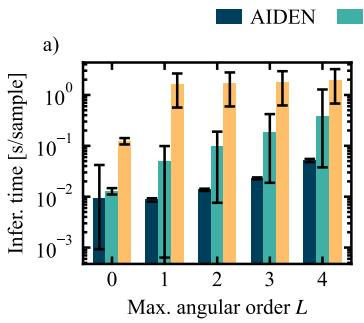

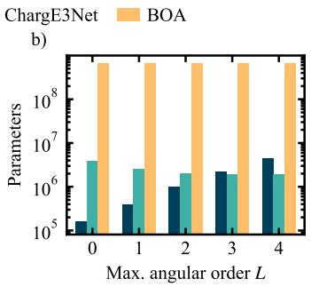

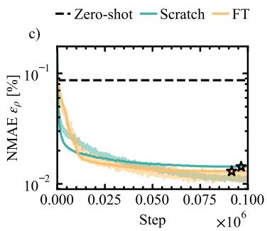  
Figure 2: Model efficiency, parameter count, and HSE transfer learning. (a) Per-sample inference time of AIDEN, ChargE3Net, and BOA at different maximum angular orders L. Bar heights indicate the mean values, and the error bars denote one standard deviation. (b) Comparison of model parameter counts. (c) Comparison of the zero-shot inference error of AIDEN and the loss curves under two transfer learning strategies. Opaque curves correspond to validation losses, while semitransparent curves show training losses.

## 5.3 GENERALIZATION TO OOD SYSTEMS

We evaluate zero-shot cross-system transfer of the PBE-pretrained model on these OOD systems, following the system choices of Ref. (Qin et al., 2026), without any system-specific fine-tuning. We compare charge densities and fixed-density energies and forces, and further evaluate non-selfconsistent field (NSCF) (Lim & Whitehead, 1967) bands for TBG. For fixed-density property calculations, the predicted grid densities are combined with matched PAW one-center data from the SCF reference, as detailed in Appx. A.2.

Water, AlMg and a-Si. We evaluate one configuration of each system: a water cell containing 64 molecules, an $\mathrm { A l _ { 5 4 } M g _ { 5 4 } }$ alloy, and a 64-atom a-Si structure. Reference densities and properties are recomputed using PBE-SCF with a 520 eV cutoff; candidate densities are evaluated on the complete grids and held fixed for property calculations (Appx. C.4.2). As shown in Fig. 3 and Tab. 2, AIDEN gives the lowest full-grid $\varepsilon _ { \rho }$ on AlMg and a-Si, while ChargE3Net performs slightly better on water. Both models substantially improve upon SAD on water and a-Si. AIDEN evaluates the full grids in 4.34-23.70 s, a measured 54-76 speedup over the ChargE3Net implementation used here. Its energy errors on water and a-Si are 3.444 and 3.213 meV/atom, compared with 6.443 and 4.774 meV/atom for ChargE3Net; force errors are smaller on water and nearly tied on a-Si.

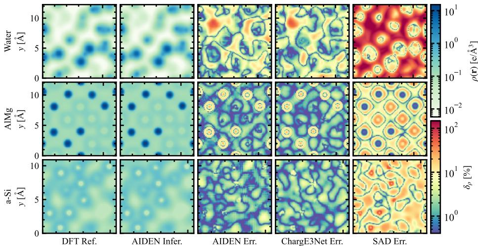  
Figure 3: Visualization of atom-rich charge density cross sections. Rows correspond to Water, AlMg, and a-Si. The first two columns show the DFT reference and AIDEN-inferred $\rho ( \mathbf { r } )$ ; the remaining columns show the normalized pointwise deviation $\delta _ { \rho } ( \mathbf { r } _ { g } ) : = | \hat { \rho } ( \mathbf { r } _ { g } ) - \rho ( \mathbf { r } _ { g } ) | / \rho ( \mathbf { r } _ { g } )$ of AIDEN, ChargE3Net, and SAD at grid point g. The density and deviation values are indicated by the upper and lower color bars, respectively. All atom-rich cross sections are perpendicular to the x axis. Atoms within 1.5 grid spacings of each plane are counted, yielding $\mathrm { H } _ { 7 } \mathrm { O } _ { 2 } , \mathrm { A l } _ { 6 } \mathrm { M g } _ { 7 }$ , and $\mathrm { S i } _ { 5 }$ for Water, AlMg, and a-Si, respectively. Detailed settings are provided in Appx. C.4.3.

Table 2. OOD benchmark. Errors are relative to the matched PBE-SCF reference. The best and second-best errors are bold and underlined. Timing ranks compare the two models; SAD times ( ) include the complete fixed-density VASP calculation. Here, we define the per-atom energy error as $| \Delta E | : = | \hat { E } - E | / N _ { \mathrm { a } }$ , the mean absolute force component as $\langle | F _ { i \alpha } | \rangle : = $ $\begin{array} { r } { \frac { 1 } { 3 N _ { \mathrm { a } } } \sum _ { i = 1 } ^ { N _ { \mathrm { a } } } \sum _ { \alpha = \{ x , y , z \} } | F _ { i \alpha } | } \end{array}$ , and the corresponding mean error as $\langle | \Delta F _ { i \alpha } | \rangle : = \langle | \hat { F } _ { i \alpha } - F _ { i \alpha } | \rangle _ { i , \alpha } .$
<table><tr><td>System</td><td>Method</td><td> $\varepsilon _ { \rho } \left[ \% \right] \downarrow$ </td><td>Time [s] ↓</td><td>|∆E| [meV/atom] ↓</td><td> $\left. \left| \Delta F _ { i \alpha } \right| \right. \left[ \mathrm { e V / \AA } \right] \downarrow$ </td></tr><tr><td rowspan="3">Water</td><td>AIDEN</td><td>1.8764</td><td>23.70</td><td>3.444</td><td>0.11467</td></tr><tr><td>ChargE3Net</td><td>1.7880</td><td>1286.43</td><td>6.443</td><td>0.12538</td></tr><tr><td>SAD</td><td>12.3527</td><td>1433†</td><td>485.445</td><td>1.11744</td></tr><tr><td rowspan="3">AlMg</td><td>AIDEN</td><td>4.3004</td><td>13.40</td><td>262.809</td><td>0.10398</td></tr><tr><td>ChargE3Net</td><td>4.3274</td><td>936.43</td><td>276.070</td><td>0.03580</td></tr><tr><td>SAD</td><td>4.8057</td><td>1344†</td><td>49.643</td><td>0.15775</td></tr><tr><td rowspan="3">a-Si</td><td>AIDEN</td><td>1.3215</td><td>4.34</td><td>3.213</td><td>0.04087</td></tr><tr><td>ChargE3Net</td><td>1.6391</td><td>328.87</td><td>4.774</td><td>0.04090</td></tr><tr><td>SAD</td><td>9.9995</td><td>307†</td><td>82.107</td><td>0.12778</td></tr></table>

By contrast, AlMg exhibits a different trend. Although both models slightly improve the density NMAE over SAD, their energy errors are substantially larger, while ChargE3Net yields a smaller force error than AIDEN, 0.03580 versus 0.10398 $\mathrm { e V } \mathring { / } \mathring { \mathrm { A } }$ , despite nearly identical density NMAEs. Both models overestimate the Mg-centered density peaks by approximately 20%, with the dominant errors localized in the near-core region containing the $2 p$ semicore contribution. Interestingly, similar behavior has been reported for learned densities in Al and ${ \mathrm { S i } } ,$ where small global density errors can produce much larger electrostatic-energy errors because near-nuclear inaccuracies strongly affect the electron-nuclear interaction energy (Lewis et al., 2021). This near-core sensitivity provides a natural explanation for the mismatch between global NMAE and energetic accuracy in AlMg; detailed analyses are provided in Appx. C.4.5. The result therefore highlights the need to evaluate learned densities jointly through density errors and downstream observables.

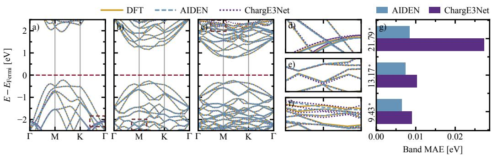  
Figure 4: NSCF band structures of TBG. (a) $2 1 . 7 9 ^ { \circ }$ $N _ { \mathrm { a } } = 2 8 ;$ (b) $1 3 . 1 7 ^ { \circ }$ $N _ { \mathrm { a } } = 7 6 ;$ and (c) $9 . { \bar { 4 } } 3 ^ { \circ } , N _ { \mathrm { a } } = 1 4 8$ . Yellow solid, blue dashed, and purple dashed curves denote DFT, AIDEN, and ChargE3Net. (d), (e), and (f) show the regions with pronounced errors produced by ChargE3Net in the three TBG band structures, corresponding to the dashed boxes in (a)-(c). (g) Error comparison of TBG band structures computed from the charge densities predicted by AIDEN and ChargE3Net against the DFT reference.

NSCF band structure calculation of TBG. We further evaluate TBG at 21.79◦, 13.17◦, and 9.43◦. Fixed-density PAW-PBE calculations use ICHARG=11, a 520 eV cutoff, and the Γ–M–K–Γ path. Fig. 4 shows bands with the DFT $E _ { \mathrm { F e r m i } }$ set to zero and one least-squares rigid shift applied per model and cell. Within $E _ { \mathrm { F e r m i } } \pm 5$ eV, the aligned band MAEs are 8.42, 7.41, and 11.47 meV for AIDEN, versus 27.35, 10.30, and 12.93 meV for ChargE3Net. These aligned MAEs quantify residual band-shape and dispersion errors after removal of a global reference-energy offset. Fullgrid inference takes 13.27-41.43 s, a measured 9.7-15.3 speedup over the evaluated ChargE3Net implementation. Appx. C.3 reports the shifts, raw and tail-error statistics, sampling differences, and timing protocol.

## 6 DISCUSSION

In this work, we introduced AIDEN for accurate and scalable real-space charge density learning. At its core, AIDEN adopts a physically inspired, learnable decomposition that separates an element-dependent one-center baseline from environment-induced charge redistribution. The former captures the dominant local density structure shared across different environments, while the latter describes bonding- and coordination-dependent corrections, providing a natural inductive bias across diverse chemical and structural spaces. This decomposition is integrated with an equivariant encoder and a continuous decoder to preserve the required geometric symmetries while enabling efficient field evaluation. Experiments demonstrate high accuracy on periodic-crystal and molecular benchmarks, effective PBE-to-HSE fine-tuning, and zero-shot transfer to structurally distinc OOD systems. Fixed-density calculations further assess the predicted densities through energies and forces, as well as band structures in TBG. Full-grid inference shows favorable scalability to millions of grid points. Notably, TBG electron counts deviate by only 0.0068-0.0095% without explicit normalization (Appx. C.3), while the AlMg results highlight the complementarity between density NMAE and downstream energy/force errors.

Future perspective. AIDEN currently focuses on GS scalar charge densities. Future work may extend it to spin-resolved densities and broader electronic-structure settings, including unified models across exchange-correlation functionals, pseudopotentials, and chemical spaces. Joint learning of charge densities with energies, forces, and other DFT observables may further improve electronic structure fidelity and generalization.

## 7 CODE AVAILABILITY

The code supporting this work is available in the AIDEN repository. The PBE and HSE datasets used for model training are provided by ECDBench, the QM9 dataset is available from the QM9 charge density dataset.

## 8 ACKNOWLEDGEMENTS

We would like to acknowledge the National Key R&D Program of China (No. 2021YFA0718900), the National Natural Science Foundation of China (Nos. 12374096 and 92477114), and the Jiangsu Funding Program for Excellent Postdoctoral Talent for financial support. Z. Zhong thanks the Suzhou Innovation and Entrepreneurship Leading Talent Program and the Gusu Leadership Program for their support.

## REFERENCES

Ilyes Batatia, David P Kovacs, Gregor Simm, Christoph Ortner, and Gabor Csanyi. MACE: Higher order equivariant message passing neural networks for fast and accurate force fields. In S. Koyejo, S. Mohamed, A. Agarwal, D. Belgrave, K. Cho, and A. Oh (eds.), Adv. Neural Inf. Process. Syst., volume 35, pp. 11423–11436, LA, USA, 2022. Curran Associates, Inc. doi: 10.52202/ 068431-0830.

Simon Batzner, Albert Musaelian, Lixin Sun, Mario Geiger, Jonathan P Mailoa, Mordechai Kornbluth, Nicola Molinari, Tess E Smidt, and Boris Kozinsky. E (3)-equivariant graph neural networks for data-efficient and accurate interatomic potentials. Nat. Commun., 13(1):2453, 2022. doi: 10.1038/s41467-022-29939-5.

Pin Chen, Zexin Xu, Qing Mo, Hongjin Zhong, Fengyang Xu, and Yutong Lu. ECD: A machine learning benchmark for predicting enhanced-precision electronic charge density in crystalline inorganic materials. In Int. Conf. Learn. Represent., Singapore, 2025. URL https: //openreview.net/forum?id=SBCMNc3Mq3.

Deepak Chopra. Advances in understandingof chemical bonding: Inputs from experimental and theoretical charge density analysis. J. Phys. Chem. A, 116(40):9791–9801, 08 2012. ISSN 1089- 5639. doi: 10.1021/jp306169f.

Luqi Dong, Shuxiang Yang, Su-Huai Wei, and Yunhao Lu. Variational machine learning model for electronic structure optimization via the density matrix. Phys. Rev. Lett., 135:256403, Dec 2025. doi: 10.1103/wl9w-8g8r.

Benjamin D. Dunnington and J. R. Schmidt. Generalization of natural bond orbital analysis to periodic systems: Applications to solids and surfaces via plane-wave density functional theory. J. Chem. Theory Comput., 8(6):1902–1911, 05 2012. ISSN 1549-9618. doi: 10.1021/ct300002t.

Jonas Elsborg, Luca Thiede, Alan Aspuru-Guzik, Tejs Vegge, and Arghya Bhowmik. ELECTRA:´ A cartesian network for 3d charge density prediction with floating orbitals. In Adv. Neural Inf. Process. Syst., volume 38, pp. 31897–31926, San Diego, CA, USA and Mexico City, Mexico, 2025. doi: 10.52202/085713-0947.

Bruno Focassio, Michelangelo Domina, Urvesh Patil, Adalberto Fazzio, and Stefano Sanvito. Linear jacobi–legendre expansion of the charge density for machine learning-accelerated electronic structure calculations. npj Comput. Mater., 9(1):87, 2023. doi: 10.1038/s41524-023-01053-0.

Xiang Fu, Andrew Scott Rosen, Kyle Bystrom, Rui Wang, Albert Musaelian, Boris Kozinsky, Tess Smidt, and Tommi Jaakkola. A recipe for charge density prediction. In Adv. Neural Inf. Process. Syst., volume 37, pp. 9727–9752, Vancouver, Canada, 2024. doi: 10.52202/079017-0310.

Johannes Gasteiger, Janek Groß, and Stephan Gunnemann. Directional message passing for molec-¨ ular graphs. In Int. Conf. Learn. Represent., Addis Ababa, Ethiopia, 2020. URL https: //openreview.net/forum?id=B1eWbxStPH.

Mario Geiger and Tess Smidt. e3nn: Euclidean Neural Networks, 2022. URL https://arxiv. org/abs/2207.09453.

Arnim Hellweg and Dmitrij Rappoport. Development of new auxiliary basis functions of the Karlsruhe segmented contracted basis sets including diffuse basis functions (def2-SVPD, def2- TZVPPD, and def2-QVPPD) for RI-MP2 and RI-CC calculations. Phys. Chem. Chem. Phys., 17 (2):1010–1017, 01 2015. ISSN 1463-9076. doi: 10.1039/c4cp04286g.

Jochen Heyd, Gustavo E. Scuseria, and Matthias Ernzerhof. Hybrid functionals based on a screened coulomb potential. J. Chem. Phys., 118(18):8207–8215, 2003. doi: 10.1063/1.1564060.

Sigeru Huzinaga. Gaussian-type functions for polyatomic systems. I. J. Chem. Phys., 42(4):1293– 1302, 02 1965. ISSN 0021-9606. doi: 10.1063/1.1696113.

R. O. Jones. Density functional theory: Its origins, rise to prominence, and future. Rev. Mod. Phys., 87:897–923, Aug 2015. doi: 10.1103/RevModPhys.87.897.

Peter Bjørn Jørgensen and Arghya Bhowmik. Equivariant graph neural networks for fast electron density estimation of molecules, liquids, and solids. npj Comput. Mater., 8(1):183, 2022. doi: 10.1038/s41524-022-00863-y.

Manuel V. Klockow, Marc K. Ickler, Peter Lippmann, and Fred A. Hamprecht. A function-centric graph neural network approach for predicting electron densities. In Int. Conf. Learn. Represent., Lisbon, Portugal, 2026. URL https://openreview.net/forum?id=HDdkFjFEZd.

Teddy Koker, Keegan Quigley, Eric Taw, Kevin Tibbetts, and Lin Li. Higher-order equivariant neural networks for charge density prediction in materials. npj Comput. Mater., 10(1):161, 2024. doi: 10.1038/s41524-024-01343-1.

Aliaksandr V. Krukau, Oleg A. Vydrov, Artur F. Izmaylov, and Gustavo E. Scuseria. Influence of the exchange screening parameter on the performance of screened hybrid functionals. J. Chem. Phys., 125(22):224106, 2006. doi: 10.1063/1.2404663.

Susi Lehtola, Lucas Visscher, and Eberhard Engel. Efficient implementation of the superposition of atomic potentials initial guess for electronic structure calculations in gaussian basis sets. J. Chem Phys., 152(14):144105, 04 2020. ISSN 0021-9606. doi: 10.1063/5.0004046.

Alan M. Lewis, Andrea Grisafi, Michele Ceriotti, and Mariana Rossi. Learning electron densities in the condensed phase. J. Chem. Theory. Comput., 17(11):7203–7214, 10 2021. ISSN 1549-9618. doi: 10.1021/acs.jctc.1c00576.

Chenghan Li, Or Sharir, Shunyue Yuan, and Garnet Kin-Lic Chan. Image super-resolution inspired electron density prediction. Nat. Commun., 16(1):4811, 2025. doi: 10.1038/ s41467-025-60095-8.

Shikun Li, Yong Li, Marcus Baumer, and Lyudmila V. Moskaleva. Assessment of PBE+U and¨ HSE06 methods and determination of optimal parameter U for the structural and energetic properties of rare earth oxides. J. Chem. Phys., 153(16):164710, 10 2020. ISSN 0021-9606. doi: 10.1063/5.0024499.

TK Lim and MA Whitehead. Non self-consistent field theory—a new approach in quantum mechanical calculations. Theor. Chim. Acta, 7(1):48–63, 1967. doi: 10.1007/BF00537368.

Taoyuze Lv, Zhicheng Zhong, Yuhang Liang, Feng Li, Jun Huang, and Rongkun Zheng. Deep Charge: Deep learning model of electron density from a one-shot density functional theory calculation. Phys. Rev. B, 108:235159, Dec 2023. doi: 10.1103/PhysRevB.108.235159.

Saro Passaro and C. Lawrence Zitnick. Reducing SO(3) convolutions to SO(2) for efficient equivariant GNNs. In Proc. Int. Conf. Mach. Learn., volume 202 of Proceedings ofMachine Learning Research, pp. 27420–27438, HI, USA, 23–29 Jul 2023. PMLR. URL https://proceedings. mlr.press/v202/passaro23a.html.

John P. Perdew, Kieron Burke, and Matthias Ernzerhof. Generalized gradient approximation made simple. Phys. Rev. Lett., 77:3865–3868, Oct 1996. doi: 10.1103/PhysRevLett.77.3865.

Ethan Perez, Florian Strub, Harm De Vries, Vincent Dumoulin, and Aaron Courville. Film: Visual reasoning with a general conditioning layer. In Proc. AAAI Conf. Artif. Intell., volume 32, LA, US, 2018. doi: 10.1609/aaai.v32i1.11671.

Emiliano Poli, Kwang H Jong, and Ali Hassanali. Charge transfer as a ubiquitous mechanism in determining the negative charge at hydrophobic interfaces. Nat. Commun., 11(1):901, 2020. doi: 10.1038/s41467-020-14659-5.

Xuejian Qin, Taoyuze Lv, and Zhicheng Zhong. EAC-Net: Predicting real-space charge density via equivariant atomic contributions. J. Chem. Theory Comput., 22(9):4813–4821, 2026. doi: 10.1021/acs.jctc.6c00283.

Liang Shuang, Haocheng Wang, Jiayi Song, Shuquan Ye, and Ben Fei. Ed-dit: Physics-guided diffusion pretraining for transferable molecular representations from electron density, 2026. URL https://arxiv.org/abs/2608.03260.

J. C. Slater. The self-consistent field for crystals. Int. J. Quantum Chem., 4(S3B):727–746, 1969. doi: https://doi.org/10.1002/qua.560040737.

Feitong Song and Ji Feng. Neural network self-consistent fields for density functional theory. npj Comput. Mater., 12(1):289, 2026. doi: 10.1038/s41524-026-02110-0.

Zechen Tang, He Li, Peize Lin, Xiaoxun Gong, Gan Jin, Lixin He, Hong Jiang, Xinguo Ren, Wenhui Duan, and Yong Xu. A deep equivariant neural network approach for efficient hybrid density functional calculations. Nat. Commun., 15(1):8815, 2024. doi: 10.1038/s41467-024-53028-4.

L. F. Ten Eyck. Crystallographic fast Fourier transforms. Acta Crystallogr. Sect. A, 29(2):183–191, Mar 1973. doi: 10.1107/S0567739473000458.

Wilfred F. van Gunsteren and Alan E. Mark. Validation of molecular dynamics simulation. J. Chem. Phys., 108(15):6109–6116, 04 1998. ISSN 0021-9606. doi: 10.1063/1.476021.

J. H. Van Lenthe, R. Zwaans, H. J. J. Van Dam, and M. F. Guest. Starting SCF calculations by superposition of atomic densities. J. Comput. Chem., 27(8):926–932, 2006. doi: https://doi.org/ 10.1002/jcc.20393.

VASP Software GmbH. CHGCAR, 2026a. URL https://vasp.at/wiki/index.php/ CHGCAR. VASP Wiki, accessed September 9, 2026.

VASP Software GmbH. ICHARG, 2026b. URL https://vasp.at/wiki/index.php/ ICHARG. VASP Wiki, accessed September 9, 2026.

Vei Wang, Nan Xu, Jin-Cheng Liu, Gang Tang, and Wen-Tong Geng. VASPKIT: A user-friendly interface facilitating high-throughput computing and analysis using vasp code. Comput. Phys. Commun., 267:108033, 2021. doi: https://doi.org/10.1016/j.cpc.2021.108033.

Tian Xie and Jeffrey C. Grossman. Crystal graph convolutional neural networks for an accurate and interpretable prediction of material properties. Phys. Rev. Lett., 120:145301, Apr 2018. doi: 10.1103/PhysRevLett.120.145301.

Zemin Xu, Wenbo Xie, and P. Hu. Spectral/Spatial Tensor Atomic Cluster Expansion with Universal Embeddings in Cartesian Space, 2026a. URL https://arxiv.org/abs/2509.14961.

Zemin Xu, Wenbo Xie, and P. Hu. Edge cluster expansion with radial rotary attention for interatomic potentials, 2026b. URL https://arxiv.org/abs/2607.10664.

Zilong Yuan, Zechen Tang, Honggeng Tao, Xiaoxun Gong, Zezhou Chen, Yuxiang Wang, He Li, Yang Li, Zhiming Xu, Minghui Sun, Boheng Zhao, Chen Si, Chong Wang, Wenhui Duan, and Yong Xu. Deep-learning density functional theory hamiltonian in real space. Phys. Rev. Lett., 137:046401, Jul 2026. doi: 10.1103/mbhs-vlby.

Alessio Zaccone. Tensor Product Representation, pp. 177–188. Springer Nature Switzerland, Cham, 2026. ISBN 978-3-032-27518-9. doi: 10.1007/978-3-032-27518-9 13.

## Appendix

## A SUPPLEMENTARY THEORY

## A.1 KOHN-SHAM DENSITY FUNCTIONAL THEORY AND CHARGE DENSITY SELF-CONSISTENCY

We briefly summarize the KS-DFT and SCF procedure underlying the reference charge densities used throughout this work (Jones, 2015; Slater, 1969). As introduced in Sec. 3, the GS density $\rho _ { \mathcal { X } } ^ { \star }$ minimizes the total electronic energy over $\mathcal { D } _ { N _ { \mathrm { e } } }$ . Within KS-DFT, the interacting many-electron problem is mapped onto an auxiliary system of non-interacting electrons that reproduces the same GS density. Up to the ion-ion contribution, which is independent of $\rho ,$ the corresponding energy functional is written as

$$
\begin{array} { r } { E _ { \mathcal { X } } [ \rho ] = T _ { \mathrm { s } } [ \rho ] + E _ { \mathrm { e x t } } ^ { \mathcal { X } } [ \rho ] + E _ { \mathrm { H } } [ \rho ] + E _ { \mathrm { x c } } [ \rho ] , } \end{array}\tag{16}
$$

where $T _ { \mathrm { s } }$ is the kinetic energy of the non-interacting KS system, $E _ { \mathrm { e x t } } ^ { \mathcal { X } }$ is the interaction with the external potential generated by the atomic structure, $E _ { \mathrm { H } }$ is the classical electrostatic electron-electron interaction, and $E _ { \mathrm { x c } }$ collects the remaining exchange and correlation effects.

Taking the functional derivative with respect to the density gives the density-dependent KS Hamiltonian

$$
H _ { \mathrm { K S } } [ \rho ] = - \frac { 1 } { 2 } \nabla ^ { 2 } + v _ { \mathrm { e x t } } ^ { \mathcal { X } } ( \mathbf { r } ) + v _ { \mathrm { H } } [ \rho ] ( \mathbf { r } ) + v _ { \mathrm { x c } } [ \rho ] ( \mathbf { r } ) , \quad v _ { \mathrm { H } } [ \rho ] = \frac { \delta E _ { \mathrm { H } } } { \delta \rho } , \quad v _ { \mathrm { x c } } [ \rho ] = \frac { \delta E _ { \mathrm { x c } } } { \delta \rho } .\tag{17}
$$

Here and below we use atomic units. Importantly, both $v _ { \mathrm { H } }$ and $v _ { \mathrm { x c } }$ depend on the density itself. The KS problem is therefore nonlinear even though the Hamiltonian is linear once a particular input density is fixed. For a periodic system, solving the KS equations at each sampled k point gives

$$
H _ { \mathrm { K S } } [ \rho ] \phi _ { n \mathbf { k } } ( \mathbf { r } ) = \epsilon _ { n \mathbf { k } } \phi _ { n \mathbf { k } } ( \mathbf { r } ) , \quad \rho ( \mathbf { r } ) = \sum _ { \mathbf { k } } \sum _ { n } w _ { \mathbf { k } } f _ { n \mathbf { k } } \left| \phi _ { n \mathbf { k } } ( \mathbf { r } ) \right| ^ { 2 } ,\tag{18}
$$

where $w _ { \mathbf { k } }$ and $f _ { n \mathbf { k } }$ are the Brillouin-zone weights and orbital occupations, respectively. The occupations satisfy

$$
\int _ { \Omega } d ^ { 3 } \mathbf { r } \rho ( \mathbf { r } ) = \sum _ { \mathbf { k } } \sum _ { n } w _ { \mathbf { k } } f _ { n \mathbf { k } } = N _ { \mathrm { e } } ,\tag{19}
$$

consistent with the density space $\mathcal { D } _ { N _ { \epsilon } }$ introduced in Eq. 2. The same construction can be expressed through the one-particle density matrix appearing in the SCF cycle of Sec. 1. For orbitals expanded in an arbitrary finite basis $\chi _ { \mathbf { k } } ( \mathbf { r } )$ with coefficient matrix C(k), we have

$$
{ \bf D } ( { \bf k } ) = { \bf C } ( { \bf k } ) { \bf f } ( { \bf k } ) { \bf C } ^ { \dagger } ( { \bf k } ) , \quad \rho ( { \bf r } ) = \sum _ { \bf k } w _ { \bf k } \chi _ { \bf k } ^ { \dagger } ( { \bf r } ) { \bf D } ( { \bf k } ) \chi _ { \bf k } ( { \bf r } ) .\tag{20}
$$

It should be noted that the numerical representation of D changes with the orbital basis, whereas the reconstructed real-space scalar field $\rho ( \mathbf { r } )$ does not. This distinction is also one of the motivations for directly learning the charge density in AIDEN. Although $\rho _ { \mathcal { X } } ^ { \star }$ is defined variationally, practical KS calculations usually obtain it through a fixed-point SCF iteration rather than by directly optimizing every real-space grid value. Starting from an input density $\rho _ { \mathcal { X } } ^ { ( t ) }$ , we construct $H _ { \mathrm { K S } } [ \rho _ { \mathcal { X } } ^ { ( t ) } ]$ ], solve Eq. 18, and use the occupied orbitals to obtain a new output density $\widetilde { \rho } _ { \mathcal { X } } ^ { ( t + 1 ) }$ . A simple density-mixing step can be written as

$$
\begin{array} { r } { \tilde { \rho } _ { \chi } ^ { ( t + 1 ) } = \mathcal { K } _ { \mathcal { X } } \left[ \rho _ { \mathcal { X } } ^ { ( t ) } \right] , \quad \rho _ { \mathcal { X } } ^ { ( t + 1 ) } = ( 1 - \alpha ) \rho _ { \mathcal { X } } ^ { ( t ) } + \alpha \tilde { \rho } _ { \mathcal { X } } ^ { ( t + 1 ) } , } \end{array}\tag{21}
$$

where $\kappa _ { \mathcal { X } }$ denotes one KS density update and α is the mixing coefficient. More elaborate Pulayor quasi-Newton-type mixing schemes replace the second operation in practical electronic-structure codes, but the underlying fixed-point problem remains unchanged:

$$
\rho _ { \mathcal X } ^ { \star } = \mathcal { K } _ { \mathcal X } \left[ \rho _ { \mathcal X } ^ { \star } \right] .\tag{22}
$$

The cycle is repeated until the input and output densities, total energies, or their corresponding residuals satisfy the prescribed convergence threshold. Interestingly, the charge density therefore plays two roles simultaneously: it determines the effective KS Hamiltonian and is reconstructed from the eigenstates of that same Hamiltonian. This mutual dependence is precisely the origin of self-consistency. Following the notation of $\operatorname { E q . }$ 1, the complete iteration can be summarized as

$$
\rho _ { \chi } ^ { ( t ) } ( \mathbf { r } ) \to H _ { \mathrm { K S } } \left[ \rho _ { \chi } ^ { ( t ) } \right] \to \left\{ \phi _ { n \mathbf { k } } ^ { ( t + 1 ) } , \epsilon _ { n \mathbf { k } } ^ { ( t + 1 ) } \right\} \to \mathbf { D } ^ { ( t + 1 ) } \to \tilde { \rho } _ { \chi } ^ { ( t + 1 ) } ( \mathbf { r } ) \to \rho _ { \chi } ^ { ( t + 1 ) } ( \mathbf { r } ) .\tag{23}
$$

## A.2 PAW DENSITY TARGET AND FIXED-DENSITY EVALUATION

The formal density in Eq. 2 motivates learning a real-space field. Numerically, AIDEN predicts the smooth FFT-grid density block of the VASP/PAW representation. This target depends on the chosen PAW datasets and valence partition, including semicore electrons where present. Its integral gives the valence-electron count, and it should not be identified with the complete all-electron density. The CHGCAR file additionally stores PAW one-center occupancies, which carry information needed for fixed-density restarts (VASP Software GmbH, 2026a). AIDEN does not predict these occupancies. Its learnable one-center branch $\rho _ { \mathrm { i n i t } }$ is an element-dependent contribution to the grid field, distinct from the PAW one-center data.

For the model-based OOD property calculations, the predicted grid density is used without charge renormalization and combined with one-center data from the matched PBE-SCF reference. The two models therefore share the same reference conditioning within each structure. SAD instead retains its own atomic one-center data. With ICHARG=11, VASP holds the supplied density fixed during electronic minimization (VASP Software GmbH, 2026b). The reported energies, forces, and spectra therefore correspond to fixed-density VASP calculations conditioned on the matched PAW one-center data. In particular, the forces are the fixed-density VASP estimates, not derivatives through AIDEN with respect to atomic positions. Comparisons with SAD also include its different one-center data, as discussed for AlMg in Appendix C.4.

## A.3 THEORY OF SUPERPOSITION OF ATOMIC DENSITIES

We briefly introduce the physical motivation of the SAD, which is closely related to the density decomposition adopted in AIDEN. The central approximation of SAD is to regard a many-atom system, at zeroth order, as a collection of isolated atoms and construct its initial electron density by adding the densities of the constituent atoms (Van Lenthe et al., 2006). For an isolated atom of species Z, let $\rho _ { Z } ^ { \mathrm { a t o m } } ( { \bf r } ) = \rho _ { Z } ^ { \mathrm { a t o m } } ( | { \bf r } | )$ denote its spherically averaged atomic density. For the periodic structure $\mathcal { X } = ( \mathbf { A } , \{ Z _ { i } , \mathbf { s } _ { i } \} _ { i = 1 } ^ { N _ { \mathrm { a } } } )$ , the corresponding SAD density can be written as

$$
\rho _ { \mathrm { S A D } } ( { \bf r } ; \mathcal { X } ) = \sum _ { i = 1 } ^ { N _ { \mathrm { a } } } \sum _ { { \bf n } \in \mathbb { Z } ^ { 3 } } \rho _ { Z _ { i } } ^ { \mathrm { a t o m } } \left[ { \bf r } - ( { \bf R } _ { i } + { \bf n } { \bf A } ) \right] .\tag{24}
$$

Each contribution depends only on the atomic species and the displacement from its center, so ρSAD contains no explicit information about the surrounding chemical environment.

The physical basis of this approximation is that a substantial fraction of the real-space density is already determined by the element-dependent atomic electronic structure. In particular, the strong density variation around each nucleus is largely inherited from the corresponding atomic shells. SAD therefore provides a physically meaningful one-center baseline before bonding and other interatomic effects are taken into account. This idea has long been used to initialize SCF calculations, where atomic densities are first generated separately and then combined to construct the molecular density matrix (Van Lenthe et al., 2006). A closely related independent-atom approximation can also be made at the potential level: in the superposition of atomic potentials (SAP), the effective oneparticle potential of the full system is approximated by a sum of atomic effective potentials (Lehtola et al., 2020). SAD and SAP operate on different physical quantities, but both rely on the same zerothorder picture that the dominant local electronic structure can be inherited from isolated atoms.

The SAD density is not, however, the self-consistent GS density of the interacting system. Once the atoms are brought together, the KS potential depends on the complete environment and the density is redistributed through chemical bonding, hybridization, polarization, screening, and charge transfer.

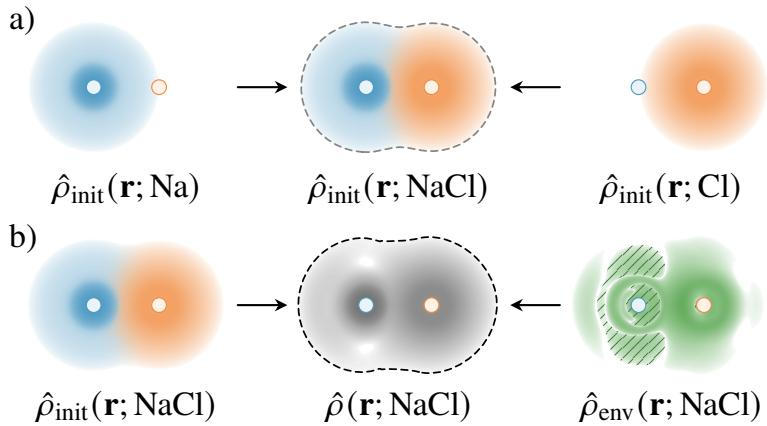  
Figure 5: Illustration of the components of the AIDEN-predicted charge density ρˆ(r). (a) The $\hat { \rho } _ { \mathrm { i n i t } } ( \mathbf { r } ; Z )$ branch, whose shape depends only on the elemental species $Z ,$ is first initialized through pretraining and subsequently optimized jointly with $\hat { \rho } _ { \mathrm { e n v } } ( \mathbf { r } )$ . (b) The $\hat { \rho } _ { \mathrm { e n v } } ( \mathbf { r } )$ branch, which is responsible for expressing complex spatial charge-density patterns and can also be interpreted as a refinement of $\hat { \rho } _ { \mathrm { i n i t } } ( \mathbf { r } ; Z ) ;$ ; accordingly, $\hat { \rho } _ { \mathrm { e n v } } ( \mathbf { r } )$ may take signed values and is shown here with dashed lines. We use a fictitious NaCl diatomic unit cell for illustration. Blue, orange, and green denote Na, Cl, and the charge density contributed by the local-environment branch, respectively. The displayed values are actual inferences from a pretrained AIDEN model with $L = 4$ , and the final total charge density satisfies $\hat { \rho } ( \mathbf { r } ; \mathrm { N a C l } ) > 0$

We can therefore write

$$
\begin{array} { r } { \rho _ { \mathcal { X } } ^ { \star } ( \mathbf { r } ) = \rho _ { \mathrm { S A D } } ( \mathbf { r } ; \mathcal { X } ) + \Delta \rho _ { \mathcal { X } } ( \mathbf { r } ) , } \end{array}\tag{25}
$$

where $\Delta \rho _ { \mathcal { X } }$ denotes the environment-induced redistribution relative to the independent-atom reference. When the atomic reference and the self-consistent density contain the same number of electrons, this redistribution only rearranges charge in real space,

$$
\int _ { \Omega } \Delta \rho _ { \mathcal { X } } ( \mathbf { r } ) \mathrm { d } ^ { 3 } \mathbf { r } = 0 .\tag{26}
$$

Accordingly, SAD should be interpreted as an initial physical reference rather than an approximation to the fully converged density itself. In the original SAD construction, the summed atomic density matrix is generally non-idempotent and is used to construct a starting Fock or KS operator before the usual SCF iterations recover self-consistency (Van Lenthe et al., 2006). This picture directly motivates the decomposition used in AIDEN. In our case, we do not hard-code a fixed SAD density. Instead, we represent the predicted density as

$$
\widehat { \rho } _ { \boldsymbol { \theta } } ( \mathbf { r } ; \mathcal { X } ) = \rho _ { \mathrm { i n i t } } ( \mathbf { r } ) + \rho _ { \mathrm { e n v } } ( \mathbf { r } ) ,\tag{27}
$$

where $\rho _ { \mathrm { i n i t } }$ is a learnable element-dependent one-center contribution and $\rho _ { \mathrm { e n v } }$ introduces the environment-dependent correction. The former inherits the independent-atom intuition of SAD, while the latter accounts for the density redistribution that cannot be described by isolated atomic densities. Since $\rho _ { \mathrm { i n i t } }$ is learned jointly with the complete model after a short pretraining stage, it should not be identified with a fixed SAD reference. Rather, AIDEN generalizes the SAD picture into a learnable decomposition in which both the atomic baseline and the environment-induced contribution are optimized directly from self-consistent reference densities.

## A.4 SPHERICAL-HARMONIC REPRESENTATION

Spherical harmonics provide a natural angular basis for representing 3D geometric information under rotations. For angular order ℓ, the corresponding irreducible representation of SO(3) contains $2 \ell + 1$ independent components indexed by $m = - \ell , \ldots , \ell .$ In AIDEN, however, we do not explicitly store the conventional complex spherical harmonics $Y _ { \ell m }$ . Instead, we use their equivalent irreducible Cartesian representation throughout the Cartesian encoder. Given a unit direction $\widehat { \mathbf { d } } ,$ the rank-ℓ Cartesian harmonic used in our implementation is

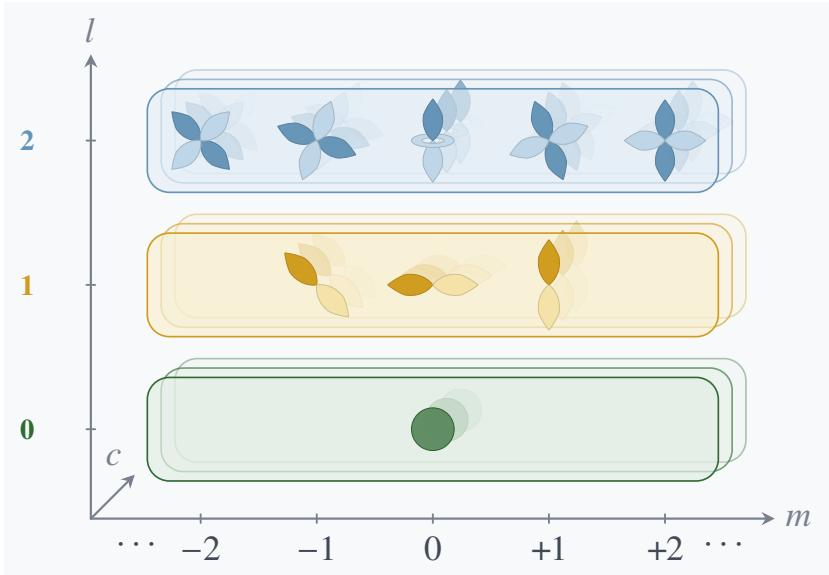  
Figure 6: Illustration of the real spherical-harmonic basis for angular orders $\ell = 0 , 1 , 2$ . Each order contains $2 \ell { + 1 }$ independent components indexed by $m = - \ell , \ldots , \ell ,$ corresponding to the irreducible ${ \mathrm { S O } } ( 3 )$ subspace represented by the symmetric-traceless Cartesian tensors in AIDEN. The two colors indicate the positive and negative signs of the angular basis functions.

$$
\mathbf { Y } ^ { ( \ell ) } ( \widehat { \mathbf { d } } ) = \frac { ( 2 \ell - 1 ) ! ! } { \ell ! } \mathcal { P } _ { \ell } ^ { \mathrm { i r r } } \left[ \widehat { \mathbf { d } } ^ { \otimes \ell } \right] , \quad \mathbf { Y } ^ { ( 0 ) } = 1 ,\tag{28}
$$

where $\mathcal { P } _ { \ell } ^ { \mathrm { i r r } }$ projects the tensor product onto the fully symmetric traceless rank-ℓ subspace. Thus, although $\mathbf { Y } ^ { ( \ell ) }$ is stored using $3 ^ { \ell }$ Cartesian entries, permutation symmetry and the traceless constraints leave exactly $2 \ell + 1$ independent degrees of freedom. Under a rotation $\mathbf { R } \in \mathrm { S O } ( 3 )$ , it transforms as $\mathbf { Y } ^ { ( \ell ) } ( \mathbf { R } \widehat { \mathbf { d } } ) = \mathbf { R } ^ { \otimes \ell } \mathbf { Y } ^ { ( \ell ) } ( \widehat { \mathbf { d } } )$ , while inversion gives $\mathbf { Y } ^ { ( \ell ) } ( - \widehat { \mathbf { d } } ) = ( - 1 ) ^ { \ell } \mathbf { Y } ^ { ( \ell ) } ( \widehat { \mathbf { d } } )$ . Thus the angub b b blar dependence and its natural parity are fixed analytically, and no individual Cartesian component needs to be learned.

The same irreducible tensor can alternatively be expressed in a compact real-spherical basis. Let $\mathcal { U } _ { \ell }$ denote the fixed orthogonal change of basis used by the model. We then have

$$
\mathbf { y } ^ { ( \ell ) } = \mathcal { U } _ { \ell } \mathrm { v e c } \left[ \mathbf { Y } ^ { ( \ell ) } \right] \in \mathbb { R } ^ { 2 \ell + 1 } , \quad \mathbf { Y } ^ { ( \ell ) } = \mathrm { v e c } ^ { - 1 } \left[ \mathcal { U } _ { \ell } ^ { \dagger } \mathbf { y } ^ { ( \ell ) } \right] , \quad \mathcal { U } = \bigoplus _ { \ell = 0 } ^ { L } \mathcal { U } _ { \ell } .\tag{29}
$$

So, the Cartesian and real-spherical forms do not represent different physical information; they are simply two bases of the same angular irreducible space. The Cartesian form is convenient for the tensor products, contractions, and symmetric-traceless projections used in GIE and Cartesian ACE, whereas the compact spherical form is convenient for the edge-aligned SO(2) operations in TECE and for density decoding. The transformation $\mathcal { U }$ is fixed by the angular algebra and contains no learnable parameters.

The resulting hierarchy is intuitive. For $\ell = 0$ , there is only one isotropic scalar component; $\ell = 1$ contains three vector-like components; and $\ell = 2$ contains five quadrupolar components, corresponding to the familiar $s \mathrm { - } , p \mathrm { - }$ , and d-like angular patterns illustrated in our schematic. More generally, each angular order ℓ contains $2 \ell + 1$ components, while the channel index $c = 1 , \ldots , C$ simply provides multiple learned copies of the same representation and does not change its rotational transformation law. The positive and negative lobes in the schematic indicate the sign of the real angular basis functions rather than different atomic densities or physical orbitals. In this way, learned channel amplitudes encode the chemical environment, while the analytic harmonic basis supplies the required angular structure, SO(3) transformation law, and natural parity $( - 1 ) ^ { \ell }$

## A.5 EQUIVARIANCE OF AIDEN

We characterize the equivariance of AIDEN under Euclidean transformations by first considering proper rotations and translations and then extending the symmetry characterization to inversion. Let $g = ( \mathbf { Q } , \mathbf { t } ) \in \mathrm { S E } ( 3 )$ with $\mathbf { Q } \in \mathrm { S O } ( 3 )$ and $g \mathbf { r } = \mathbf { r } \mathbf { Q } ^ { \top } + \mathbf { t } .$ Under the row-vector convention of Sec. 3, the transformed periodic structure $g \mathcal { X }$ has lattice $\mathbf { A } ^ { \prime } = \mathbf { A } \mathbf { Q } ^ { \top }$ and Cartesian atomic positions $\mathbf { R } _ { i } ^ { \prime } = \mathbf { R } _ { i } \mathbf { Q } ^ { \top } + \mathbf { t }$ , with the corresponding fractional coordinates understood modulo lattice translations. Accordingly, each periodic image transforms as $\mathbf { R } _ { i } + \mathbf { n A } \mapsto ( \mathbf { R } _ { i } + \mathbf { n A } ) \mathbf { Q } ^ { \top } + \mathbf { t }$ . Since AIDEN constructs geometric features exclusively from relative displacements, the global translation t cancels identically. We may therefore focus first on the rotational part of the transformation. It is useful to note that every $\mathbf { Q } \in \mathrm { O } ( 3 )$ can be written as ${ \bf Q } = { \bf P } { \bf R }$ , where $\mathbf { R } \in \mathrm { S O } ( 3 )$ and $\mathbf { P } \in \{ \mathbf { I } , - \mathbf { I } \}$ . Thus, together with translations, the $\mathrm { E ( 3 ) }$ transformation law can be characterized by proper rotations and spatial inversion.

Irreducible Cartesian representation and encoder equivariance. For a rank-ℓ Cartesian tensor $\mathbf { T } ,$ , let $\mathcal { D } _ { \ell } ( \mathbf { Q } )$ denote the natural action of Q on all Cartesian indices, i.e. $[ \mathcal { D } _ { \ell } ( \mathbf { Q } ) \mathbf { T } ] _ { a _ { 1 } . . . a _ { \ell } } =$ $\begin{array} { r } { \sum _ { b _ { 1 } , \dots , b _ { \ell } } Q _ { a _ { 1 } b _ { 1 } } \cdot \cdot \cdot Q _ { a _ { \ell } b _ { \ell } } T _ { b _ { 1 } \dots b _ { \ell } } } \end{array}$ , with $\mathcal { D } _ { 0 } ( \mathbf { Q } ) = 1$ . We further write $\mathcal { D } ( \mathbf { Q } ) = \bigoplus _ { \ell = 0 } ^ { L } \mathcal { D } _ { \ell } ( \mathbf { Q } )$ . Restricted to the symmetric traceless rank-ℓ subspace, $\mathcal { D } _ { \ell }$ realizes the $( 2 \ell + 1 )$ -dimensional irreducible representation of $\mathrm { S O ( 3 ) }$ used throughout AIDEN. Since $\mathbf { Q } ^ { \top } \mathbf { Q } = \mathbf { \dot { I } } .$ , this representation preserves both the Frobenius inner product and the corresponding tensor norm.

The irreducible projection $\mathcal { P } _ { \ell } ^ { \mathrm { i r r } }$ commutes with rotations: symmetrization is unaffected by applying the same rotation to every Cartesian index, while traces are preserved by $\begin{array} { r } { \sum _ { a } Q _ { a b } Q _ { a c } = \dot { \delta } _ { b c } } \end{array}$ . It follows that the irreducible Cartesian harmonics and the Cartesian coupling satisfy

$$
\mathbf { Y } ^ { ( \ell ) } ( \widehat { \mathbf { d } } \mathbf { Q } ^ { \top } ) = \mathcal { D } _ { \ell } ( \mathbf { Q } ) \mathbf { Y } ^ { ( \ell ) } ( \widehat { \mathbf { d } } ) , \quad \mathcal { P } _ { \ell } ^ { \mathrm { i r r } } \mathcal { D } _ { \ell } ( \mathbf { Q } ) = \mathcal { D } _ { \ell } ( \mathbf { Q } ) \mathcal { P } _ { \ell } ^ { \mathrm { i r r } } ,\tag{30}
$$

$$
\mathscr { C } _ { \ell _ { 1 } , \ell _ { 2 } } ^ { \ell } \left( \mathscr { D } _ { \ell _ { 1 } } ( \mathbf { Q } ) \mathbf { T } _ { 1 } , \mathscr { D } _ { \ell _ { 2 } } ( \mathbf { Q } ) \mathbf { T } _ { 2 } \right) = \mathscr { D } _ { \ell } ( \mathbf { Q } ) \mathscr { C } _ { \ell _ { 1 } , \ell _ { 2 } } ^ { \ell } ( \mathbf { T } _ { 1 } , \mathbf { T } _ { 2 } ) .\tag{31}
$$

The second identity follows directly from the structure of $\mathcal { C } _ { \ell _ { 1 } , \ell _ { 2 } } ^ { \ell }$ , which contains only tensor products, contractions with the Euclidean metric, and irreducible projection. Since $B _ { \nu } ^ { ( \ell ) }$ is recursively assembled from the same couplings together with fixed-ℓ channel maps, induction over the correlation order gives $B _ { \nu } ^ { ( \ell ) } [ \mathcal { D } ( \mathbf { Q } ) \mathbf { T } ] = \mathcal { D } _ { \ell } ( \mathbf { Q } ) B _ { \nu } ^ { ( \ell ) } [ \mathbf { T } ]$

For an edge $e = ( j , { \bf n }  i )$ , Eq. 4 transforms as $\mathbf { d } _ { e } ^ { \prime } = \mathbf { d } _ { e } \mathbf { Q } ^ { \top }$ , while $r _ { e } ^ { \prime } = r _ { e }$ and $\widehat { \mathbf { d } } _ { e } ^ { \prime } = \widehat { \mathbf { d } } _ { e } \mathbf { Q } ^ { \intercal }$ . Thus the radial representation $\dot { \mathbf b } ( r _ { e } )$ , the distance-defined neighborhood $\bar { \mathcal { N } } _ { i }$ b b, and the elemental features $\mathbf { x } _ { i }$ are unchanged. The scalar GIE branch is therefore invariant. For $\ell \geq 1$ , all learned factors multiplying $\mathbf { Y } ^ { ( \ell ) } ( \widehat { \mathbf { d } } _ { e } )$ in Eq. 6 are invariant channel amplitudes, so Eq. 30 immediately yields

$$
\mathbf { h } _ { i } ^ { ( 0 , \ell ) } ( g \mathcal { X } ) = \mathcal { D } _ { \ell } ( \mathbf { Q } ) \mathbf { h } _ { i } ^ { ( 0 , \ell ) } ( \mathcal { X } ) , \quad 0 \leq \ell \leq L .\tag{32}
$$

Every map $\it { \mathcal { L } ^ { ( \ell ) } }$ used by the encoder mixes channels only within a fixed angular order and hence commutes with $\mathcal { D } _ { \ell } ( \mathbf { Q } )$ ; correspondingly, biases are confined to the invariant $\ell = 0$ sector. The normalization $\nu _ { \ell }$ behaves in the same way, because its denominator is constructed from sums of squared Cartesian components and is therefore rotationally invariant, while its learnable gain acts only on channels. Hence $\mathcal { V } _ { \ell } [ \mathcal { D } _ { \ell } ( \mathbf { Q } ) \mathbf { h } ] = \mathcal { D } _ { \ell } ( \mathbf { Q } ) \mathcal { V } _ { \ell } [ \mathbf { h } ]$

We next consider Cartesian ACE. Given equivariant normalized inputs, the radial weights $\mathbf { w } _ { e , \ell _ { 1 } \ell _ { 2 } \ell }$ in Eq. 7 remain invariant, whereas the source feature and Cartesian harmonic transform according to $\mathcal { D } _ { \ell _ { 1 } }$ and $\mathcal { D } _ { \ell _ { 2 } }$ , respectively. Using Eq. 31, we obtain $\mathbf { p } _ { e } ^ { ( \ell ) } ( g \mathcal { X } ) = \mathcal { D } _ { \ell } ( \mathbf { Q } ) \mathbf { p } _ { e } ^ { ( \ell ) } ( \mathcal { X } )$ . In particular, the $\ell = 0$ component ${ \bf p } _ { e } ^ { ( 0 ) }$ is invariant, and so is the scalar neighbor coefficient $a _ { e }$ . We therefore have

$$
\Xi _ { i } ( g \mathcal { X } ) = \mathcal { D } ( \mathbf { Q } ) \Xi _ { i } ( \mathcal { X } ) .\tag{33}
$$

The gate $\sigma _ { 0 } \mathcal { F } _ { \mathrm { g } } [ \Xi _ { i } ^ { ( 0 ) } ]$ is generated entirely from the invariant sector and consequently acts as a scalar on every angular component. Together with the equivariance of $B _ { \nu } ^ { ( \ell ) }$ and the residual connection in Eq. 8, this gives

$$
\mathbf { h } _ { i } ^ { ( 1 , \ell ) } ( g \mathcal { X } ) = \mathcal { D } _ { \ell } ( \mathbf { Q } ) \mathbf { h } _ { i } ^ { ( 1 , \ell ) } ( \mathcal { X } ) .\tag{34}
$$

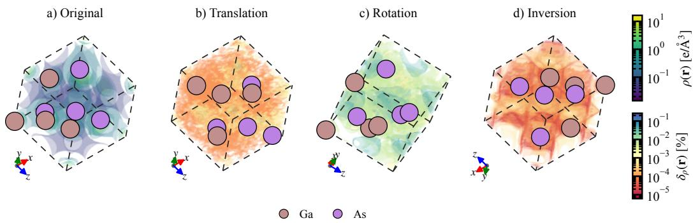  
Figure 7: E(3)-equivariance test of the model-predicted charge density for GaAs. (a) Charge density $\rho ( \mathbf { r } )$ predicted by AIDEN for zincblende GaAs $( \mathrm { m p } - 2 5 3 4 )$ ) on a $3 2 \times 3 2 \times 3 2$ grid. (b)- (d) Normalized pointwise deviation $\delta _ { \rho } ( { \bf r } ) : = | \rho _ { g } ( { \bf r } ) - \rho ( { \bf r } ) | / \rho ( { \bf r } )$ , where $\rho _ { g }$ denotes the prediction after applying the transformation $g$ and $\rho ( \mathbf { r } )$ denotes the reference charge density at $\textbf { r } \in \ \mathbb { R } ^ { 3 }$ in (a). The tested transformations are (b) translation by $\mathbf { t } = ( 3 , - 5 , 7 ) / 3 2$ , (c) proper rotation about $\textbf { n } = ~ ( - 1 , - 2 , 1 ) / \sqrt { 6 }$ with det ${ \textbf { R } } = \mathbf { \Lambda } + 1$ , and (d) inversion $\mathbf { r } \  \ - \mathbf { r }$ with det $\mathbf R \ = \ - 1$ . The transformed predictions remain numerically consistent with the reference. Notably, inversion is not a symmetry operation of non-centrosymmetric zincblende GaAs, providing a direct test beyond the crystal space-group symmetries.

SO(3) equivariance of TECE and radial rotary attention. TECE performs its nonlinear edge interaction after converting the global irreducible Cartesian representation into an edge-aligned realspherical representation. Let $\bar { \mathcal { S } } ( \mathbf { Q } )$ denote the corresponding real-spherical representation. Since $\mathcal { U }$ is a fixed orthogonal change of basis between two realizations of the same SO(3) irreducible representation, it satisfies the intertwining relation

$$
\mathcal { U } \mathcal { D } ( \mathbf { Q } ) = \mathcal { S } ( \mathbf { Q } ) \mathcal { U } .\tag{35}
$$

Equivalently, on the irreducible subspace we have $\mathcal { U } ^ { \dagger } \mathcal { S } ( \mathbf { Q } ) = \mathcal { D } ( \mathbf { Q } ) \mathcal { U } ^ { \dagger }$ . To describe the edgealigned frame, let $\mathbf { G } _ { e } \in \mathrm { S O } ( 3 )$ denote the spatial rotation represented by $\mathbf { D } _ { e } = \mathcal { S } ( \mathbf { G } _ { e } )$ , chosen such that the local $y$ axis is aligned with $\widehat { \mathbf { d } } _ { e }$ . After applying the global rotation $\mathbf { Q } ,$ , let $\mathbf { G } _ { e } ^ { \prime }$ denote the frame associated with $\widehat { \mathbf { d } } _ { e } \mathbf { Q } ^ { \top }$ b. The two frames describe the same physical edge in local coordinates band can therefore differ only by a rotation around the aligned $y$ axis. Defining $\mathbf { H } _ { e } = \mathbf { G } _ { e } ^ { \prime } \mathbf { Q } \mathbf { G } _ { e } ^ { \intercal } \in$ $\mathrm { S O } ( 2 ) _ { y }$ and $\mathbf { S } _ { e } = \mathcal { S } ( \mathbf { H } _ { e } )$ , we obtain

$$
\mathbf { D } _ { e } ^ { \prime } \mathcal { S } ( \mathbf { Q } ) = \mathbf { S } _ { e } \mathbf { D } _ { e } .\tag{36}
$$

For the local source and destination features in Eq. 9, Eqs. 34-36 therefore imply ${ \bf z } _ { e } ^ { \mathrm { s } \prime } = { \bf S } _ { e } { \bf z } _ { e } ^ { \mathrm { s } }$ and ${ \bf z } _ { e } ^ { \mathrm { t } \prime } = { \bf S } _ { e } { \bf z } _ { e } ^ { \mathrm { t } }$ . For $m > 0$ , it is convenient to identify each real-imaginary pair with the complex variable $z _ { \ell m } = z _ { \ell m } ^ { \mathrm { R e } } + \mathrm { i } z _ { \ell m } ^ { \mathrm { I m } }$ , for which the residual local rotation takes the simple form $z _ { \ell m } \mapsto$ $\mathrm { e } ^ { \mathrm { i } m \alpha _ { e } } z _ { \ell m } .$ , while the $m = 0$ sector remains unchanged. The radial operator $\Omega _ { e } [ { \bf b } ( r _ { e } ) ]$ depends only on $r _ { e }$ and applies the same radial coefficient to the real and imaginary components of a given m sector, so it commutes with the local SO(2) action. Likewise, the linear maps inside TECE are block diagonal in magnetic order and use the same channel transformation for the real and imaginary components at each m $> 0$ . The second-order correlator $\mathcal { E }$ then follows the usual SO(2) frequencyaddition rule,

$$
z _ { m _ { 1 } } z _ { m _ { 2 } } \mapsto \mathrm { e } ^ { \mathrm { i } ( m _ { 1 } + m _ { 2 } ) \alpha _ { e } } z _ { m _ { 1 } } z _ { m _ { 2 } } , \quad z _ { m _ { 1 } } \overline { { z } } _ { m _ { 2 } } \mapsto \mathrm { e } ^ { \mathrm { i } ( m _ { 1 } - m _ { 2 } ) \alpha _ { e } } z _ { m _ { 1 } } \overline { { z } } _ { m _ { 2 } } .\tag{37}
$$

Accordingly, the corresponding products contribute only to sectors with $m _ { \mathrm { o u t } } = m _ { 1 } + m _ { 2 }$ or $\begin{array} { r l } { { m _ { \mathrm { o u t } } } = } \end{array}$ $| m _ { 1 } - m _ { 2 } \rrangle$ . Their edge-dependent coefficients are generated from the invariant $m = 0$ sector and radial quantities and thus behave as SO(2) scalars. In this way, the complete local correlator satisfies $\mathcal { E } ( \mathbf { S } _ { e } \mathbf { z } ) \bar { } = \mathbf { S } _ { e } \mathcal { E } ( \mathbf { z } )$

We now turn to RRA. At fixed $( \ell , m , h )$ , the projected query and key acquire the same residual phase, $\mathbf { q } _ { e , \ell m h } ^ { \prime } = \mathrm { e } ^ { \mathrm { i } m \alpha _ { e } } \mathbf { q } _ { e , \ell m h }$ and $\mathbf { k } _ { e , \ell m h } ^ { \prime } = \mathrm { e } ^ { \mathrm { i } m \alpha _ { e } } \mathbf { k } _ { e , \ell m h }$ . Since $\varphi _ { e h }$ depends only on radial features and the channel contraction in Eq. 11 is Hermitian, the common local phase cancels:

$$
\mathrm { R e } \left. \mathrm { e } ^ { \mathrm { i } m \alpha _ { c } } \mathbf { q } _ { e , \ell m h } , \mathrm { e } ^ { \mathrm { i } m \varphi _ { e h } } \mathrm { e } ^ { \mathrm { i } m \alpha _ { e } } \mathbf { k } _ { e , \ell m h } \right. _ { \mathrm { c h } } = \mathrm { R e } \left. \mathbf { q } _ { e , \ell m h } , \mathrm { e } ^ { \mathrm { i } m \varphi _ { e h } } \mathbf { k } _ { e , \ell m h } \right. _ { \mathrm { c h } } .\tag{38}
$$

Thus both $\xi _ { e h }$ and the normalized coefficient $a _ { e h }$ are invariant. The attention operator $\mathbf { A } _ { e }$ acts only on channel indices and therefore commutes with $\mathbf { S } _ { e }$ . Let $\mathbf { v } _ { e }$ denote the resulting local edge output after radial modulation, $\mathcal { E } ,$ and $\mathbf { A } _ { e }$ . We then have ${ \bf v } _ { e } ^ { \prime } = { \bf S } _ { e } { \bf v } _ { e }$ . Using Eq. 36, $\bar { \mathbf { D } _ { e } ^ { \prime \dagger } } \mathbf { S } _ { e } = \breve { \mathcal { S } } ( \mathbf { Q } ) \bar { \mathbf { D } _ { e } ^ { \dagger } }$ and hence

$$
\mathscr { U } ^ { \dagger } \mathbf { D } _ { e } ^ { \prime \dagger } \mathbf { v } _ { e } ^ { \prime } = \mathscr { D } ( \mathbf { Q } ) \mathscr { U } ^ { \dagger } \mathbf { D } _ { e } ^ { \dagger } \mathbf { v } _ { e } .\tag{39}
$$

Neighbor summation and the residual connection in Eq. 9 preserve this transformation law. After the final equivariant normalization $\begin{array} { r } { \mathcal { V } _ { \ell } . } \end{array}$ , we obtain

$$
\mathbf { h } _ { i } ^ { \star ( \ell ) } ( g \mathcal { X } ) = \mathcal { D } _ { \ell } ( \mathbf { Q } ) \mathbf { h } _ { i } ^ { \star ( \ell ) } ( \mathcal { X } ) , \quad 0 \leq \ell \leq L .\tag{40}
$$

Therefore, we obtain an SO(3)-equivariant hierarchy of atomic representations, while global translations leave the encoded atomic features unchanged. To complete the $\mathrm { E ( 3 ) }$ characterization, we further consider spatial inversion $\mathbf { P } = - \mathbf { I }$ . The irreducible Cartesian harmonics have the natural parity

$$
\mathbf { Y } ^ { ( \ell ) } ( - \widehat { \mathbf { d } } ) = ( - 1 ) ^ { \ell } \mathbf { Y } ^ { ( \ell ) } ( \widehat { \mathbf { d } } ) .\tag{41}
$$

Accordingly, the Cartesian GIE and ACE representations inherit the parity factor $( - 1 ) ^ { \ell }$ , while all radial quantities remain unchanged. We additionally evaluate the complete transformation numerically on non-centrosymmetric zinc-blende GaAs. The normalized $L _ { 1 }$ deviations under translation, a generic proper rotation, and inversion are $7 . 7 2 \times 1 0 ^ { - 6 } , 7 . 2 7 \times 1 0 ^ { - 5 }$ , and $9 . 5 1 \times 1 0 ^ { - 7 }$ , respectively. In particular, inversion preserves the predicted density to numerical precision even though the transformed GaAs structure is not symmetry-equivalent to the original structure. Since every improper orthogonal transformation can be decomposed into inversion followed by a proper rotation, these results, together with the analytical SO(3) transformation law above, provide numerical evidence for O(3) consistency of the trained AIDEN mapping and hence its E(3) consistency after including translations.

Continuous density covariance and lattice periodicity. The decoder maps the final atomic tensors to coefficient tensors according to $\mathbf { c } _ { i k p } ^ { \chi ( \ell ) } = \mathcal { L } _ { k p } ^ { \chi ( \ell ) } \mathbf { h } _ { i } ^ { \star ( \ell ) } + \delta _ { \ell 0 } \mu _ { k p } ^ { \chi }$ . Since $\mathcal { L } _ { k p } ^ { \chi ( \ell ) }$ mixes channels only within the same angular order and the bias is restricted to $\ell = 0$ , Eq. 40 gives

$$
\mathbf { c } _ { i k p } ^ { \chi ( \ell ) } ( g \mathcal { X } ) = \mathcal { D } _ { \ell } ( \mathbf { Q } ) \mathbf { c } _ { i k p } ^ { \chi ( \ell ) } ( \mathcal { X } ) .\tag{42}
$$

For a periodic image ${ \boldsymbol \eta } = ( i , { \bf n } )$ and a simultaneously transformed query position, Eq. 12 gives $\delta _ { \eta } ^ { \prime } = \delta _ { \eta } \mathbf { Q } ^ { \intercal } , r _ { \eta } ^ { \prime } = r _ { \eta }$ , and $\widehat { \pmb { \delta } } _ { \eta } ^ { \prime } = \widehat { \pmb { \delta } } _ { \eta } \mathbf { Q } ^ { \top }$ . Thus the radial function $\widetilde { R } _ { \ell p } ( r _ { \eta } )$ remains invariant, while b bthe angular factor transforms according to Eq. 30. Because $\mathcal { D } _ { \ell } ( \mathbf { Q } )$ is orthogonal, the Cartesian contraction is invariant:

$$
\left. \mathbf { c } _ { i k p } ^ { \chi ( \ell ) } ( g \mathcal { X } ) , \mathbf { Y } ^ { ( \ell ) } ( \widehat { \pmb { \delta } } _ { \eta } ^ { \prime } ) \right. _ { \mathrm { F } } = \left. \mathbf { c } _ { i k p } ^ { \chi ( \ell ) } ( \mathcal { X } ) , \mathbf { Y } ^ { ( \ell ) } ( \widehat { \pmb { \delta } } _ { \eta } ) \right. _ { \mathrm { F } } .\tag{43}
$$

Consequently, every contribution entering $\Phi _ { k } ^ { \chi }$ is invariant under the joint transformation of structure and query, giving $\dot { \Phi } _ { k } ^ { \chi } ( g \mathbf { r } ; g \mathcal { X } ) = \Phi _ { k } ^ { \chi } ( \mathbf { r } ; \bar { \mathcal { X } } )$ . The one-center field $\phi _ { \eta k _ { 0 } } ^ { \mathbf { \bar { \chi } } }$ depends only on the species $Z _ { i }$ and the radial $\ell = 0$ functions, and therefore obeys the same transformation law. As a result,

$$
\rho _ { \mathrm { i n i t } } ( g \mathbf { r } ; g \mathcal { X } ) = \rho _ { \mathrm { i n i t } } ( \mathbf { r } ; \mathcal { X } ) , \quad \rho _ { \mathrm { e n v } } ( g \mathbf { r } ; g \mathcal { X } ) = \rho _ { \mathrm { e n v } } ( \mathbf { r } ; \mathcal { X } ) ,\tag{44}
$$

and the complete continuous density satisfies

$$
\widehat { \rho } _ { \pmb \theta } ( g \mathbf r ; g \mathcal X ) = \widehat { \rho } _ { \pmb \theta } ( \mathbf r ; \mathcal X ) , \quad \mathbf Q \in \mathrm { S O } ( 3 ) .\tag{45}
$$

b bFor inversion, Eq. 41 gives the same scalar contraction because the corresponding angular factors acquire the parity $( - 1 ) ^ { \ell }$ . Combining inversion with an arbitrary proper rotation then extends the scalar-field transformation to improper orthogonal transformations as well. It should also be noted that any pointwise scalar transformation applied after these invariant contractions preserves the same transformation law.

Finally, lattice periodicity follows naturally from the periodic-image construction. For any $\mathbf { m } \in \mathbb { Z } ^ { 3 }$ associate the image $\boldsymbol { \eta } = \left( i , \mathbf { n } \right)$ at r with $\bar { \eta ^ { \prime } } = ( i , \mathbf { n } + \mathbf { m } )$ at $\mathbf { r } + \mathbf { m } \mathbf { A }$ . Their relative displacements satisfy

$$
\delta _ { \eta ^ { \prime } } ( \mathbf { r } + \mathbf { m A } ) = \mathbf { r } + \mathbf { m A } - [ \mathbf { R } _ { i } + ( \mathbf { n } + \mathbf { m } ) \mathbf { A } ] = \delta _ { \eta } ( \mathbf { r } ) .\tag{46}
$$

Thus translating the query by a lattice vector merely relabels the periodic images contributing to $\mathcal { M } ( \mathbf { r } )$ , without changing any radial or angular quantity entering the decoder. We therefore have

$$
\begin{array} { r } { \widehat { \rho } _ { \pmb { \theta } } ( \mathbf { r } + \mathbf { m } \mathbf { A } ; \mathcal { X } ) = \widehat { \rho } _ { \pmb { \theta } } ( \mathbf { r } ; \mathcal { X } ) . } \end{array}\tag{47}
$$

b bTaken together, Eqs. 40, 41, 45, and 47 show that AIDEN carries SO(3)-equivariant atomic representations with the natural parity $( - 1 ) ^ { \ell }$ , is invariant to global translations at the representation level, and realizes an E(3)-consistent, lattice-periodic mapping from periodic atomic structures to continuous scalar density fields.

## B DETAILED IMPLEMENTATIONS OF AIDEN

This section collects the implementation details needed to reproduce the AIDEN architecture in Sec. 4. We retain only the constructions that define the periodic geometric basis, the two equivariant cluster-expansion interactions, and the continuous GTO decoder; numerical bookkeeping that does not affect the model definition is omitted.

## B.1 PERIODIC GRAPH AND GEOMETRIC BASIS

The elemental descriptor $\mathbf { q } ( Z )$ contains atomic number, period, group, total and orbital-resolved valence counts, electronegativity, atomic and covalent radii, first ionization energy, electron affinity, dipole polarizability, and GS magnetic moment. It is concatenated with the one-hot vector o(Z) and feature-wise min-max normalized over the 118 elements, yielding the 133-dimensional input $\mathbf { x } _ { i }$ used in Sec. 4.1. No structure-dependent information enters this elemental representation.

For periodic crystals, all atomic images satisfying the cutoff in Eq. 4 are enumerated before the nearest $N _ { \mathrm { n b r } }$ images are retained for each target atom. We use $N _ { \mathrm { n b r } } = 1 0 0$ and $r _ { \mathrm { a t } } = 4 \AA$ . Query-atom images are constructed independently with the orbital cutoff $r _ { \mathrm { o r b } }$ in Eq. 12 and are not neighborcapped. For VASP CHGCAR data, FFT-grid points are interpreted in fractional coordinates and mapped to Cartesian positions by $\mathbf { r } _ { g } = \mathbf { u } _ { g } \mathbf { A } ;$ ; the stored density values are divided by det $\mathbf { A } |$ to obtain the supervised density in $e / \mathrm { \AA } ^ { 3 }$

The atomic edge basis consists of a zero-order spherical-Bessel radial expansion multiplied by the standard compact polynomial envelope $f _ { \mathrm { c } }$ (Gasteiger et al., 2020), together with irreducible Cartesian harmonics,

$$
b _ { b } ( r ) = \sqrt { \frac { 2 } { r _ { \mathrm { a t } } } } \frac { \sin ( b \pi r / r _ { \mathrm { a t } } ) } { r } f _ { \mathrm { c } } ( r ) , \quad b = 1 , \ldots , N _ { \mathrm { B } } ,\tag{48}
$$

$$
{ \bf Y } ^ { ( \ell ) } ( \widehat { \bf v } ) = \frac { ( 2 \ell - 1 ) ! ! } { \ell ! } \mathcal { P } _ { \ell } ^ { \mathrm { i r r } } \left( \widehat { \bf v } ^ { \otimes \ell } \right) , \quad { \bf Y } ^ { ( 0 ) } = 1 .\tag{49}
$$

Here $\mathcal { P } _ { \ell } ^ { \mathrm { i r r } }$ denotes the symmetric-traceless projection used throughout the Cartesian encoder. We use $N _ { \mathrm { B } } = 8$ . The same radial vector ${ \bf b } ( r _ { e } )$ is shared by GIE, Cartesian ACE, and TECE.

## B.2 CARTESIAN ATOMIC CLUSTER EXPANSION

For an angular path $( \ell _ { 1 } , \ell _ { 2 } , \ell )$ , define $\kappa = ( \ell _ { 1 } + \ell _ { 2 } - \ell ) / 2$ . The Cartesian coupling contracts κ index pairs and projects the remaining tensor to rank $\ell ,$

$$
\mathcal { C } _ { \ell _ { 1 } , \ell _ { 2 } } ^ { \ell } ( \mathbf { T } _ { 1 } , \mathbf { T } _ { 2 } ) = 3 ^ { - \kappa / 2 } \mathcal { P } _ { \ell } ^ { \mathrm { i r r } } \left( \mathcal { K } _ { \kappa } ( \mathbf { T } _ { 1 } , \mathbf { T } _ { 2 } ) \right) ,\tag{50}
$$

$$
{ \mathcal { T } } _ { L } = \left\{ ( \ell _ { 1 } , \ell _ { 2 } , \ell ) \in \{ 0 , \dots , L \} ^ { 3 } \mid | \ell _ { 1 } - \ell _ { 2 } | \leq \ell \leq \operatorname* { m i n } ( L , \ell _ { 1 } + \ell _ { 2 } ) , \ \ell _ { 1 } + \ell _ { 2 } - \ell \equiv 0 { \pmod { 2 } } \right\}\tag{51}
$$

This is the coupling used in Eq. 7; for $L = 3 .$ , the path set contains 23 admissible triples.

The equivariant RMS normalization applied before the interactions and at the encoder output rescales each angular order by a rotation-invariant channel RMS,

$$
\mathcal { V } _ { \ell } [ \mathbf { h } _ { i } ^ { ( \ell ) } ] _ { c } = \frac { \gamma _ { \ell c } \mathbf { h } _ { i c } ^ { ( \ell ) } } { \sqrt { \operatorname* { m a x } \left( C ^ { - 1 } \sum _ { c ^ { \prime } = 1 } ^ { C } \Vert \mathbf { h } _ { i c ^ { \prime } } ^ { ( \ell ) } \Vert _ { \mathrm { F } } ^ { 2 } , \epsilon \right) } } .\tag{52}
$$

The learned gain $\gamma _ { \ell c }$ acts only on channels, so the Cartesian transformation law is unchanged. For the atomic aggregation in Eq. 8, the scalar sector of the edge field defines an invariant logit $s _ { e } =$ $\mathcal { F } _ { \mathrm { a } } [ \mathbf { p } _ { e } ^ { ( 0 ) } \oplus \mathbf { b } ( r _ { e } ) ]$ . The corresponding destination-wise coefficient is

$$
a _ { e } = \frac { f _ { \mathrm { c } } ( r _ { e } ) \mathrm { e } ^ { s _ { e } } } { \sum _ { e ^ { \prime } \in \mathcal { N } _ { i } } f _ { \mathrm { c } } ( r _ { e ^ { \prime } } ) \mathrm { e } ^ { s _ { e ^ { \prime } } } } .\tag{53}
$$

The same scalar $a _ { e }$ multiplies every angular order of edge e.

To make the correlation polynomial in Eq. 8 explicit, let $\boldsymbol { \Upsilon } _ { i } = \{ \mathbf { 1 } _ { C } + \sigma _ { 0 } \mathcal { F } _ { \mathrm { g } } [ \Xi _ { i } ^ { ( 0 ) } ] \} \odot \boldsymbol { \Xi } _ { i }$ . Starting from $\mathbf { B } _ { i } ^ { [ 1 ] ( \ell ) } = \mathbf { Y } _ { i } ^ { ( \ell ) }$ , higher correlation orders are generated recursively and combined as

$$
\mathbf { B } _ { i } ^ { [ q ] ( \ell ) } = \sum _ { ( \ell _ { 1 } , \ell _ { 2 } , \ell ) \in \mathcal { T } _ { L } } \mathcal { C } _ { \ell _ { 1 } , \ell _ { 2 } } ^ { \ell } \left( \mathbf { B } _ { i } ^ { [ q - 1 ] ( \ell _ { 1 } ) } , \boldsymbol { \Upsilon } _ { i } ^ { ( \ell _ { 2 } ) } \right) , \quad B _ { \nu } ^ { ( \ell ) } ( \boldsymbol { \Upsilon } _ { i } ) = \sum _ { q = 1 } ^ { \nu } \mathcal { L } _ { \mathrm { c o r r } , \mathrm { q } } ^ { ( \ell ) } \mathbf { B } _ { i } ^ { [ q ] ( \ell ) } .\tag{54}
$$

We use $\nu = 2$ . This order refers to the explicit Cartesian correlation inside the ACE block; the preceding GIE representation already contains one-hop environmental information.

## B.3 TECE AND RRA

The orthogonal map converts each irreducible Cartesian tensor into its real-spherical components, after which $\mathbf { D } _ { e }$ aligns the local y axis with $\widehat { \mathbf { d } } _ { e }$ . For $| m | \leq M$ , the compact representation contains $D _ { M } = ( L + 1 ) + 2 \textstyle \sum _ { m = 1 } ^ { M } ( L + 1 - m )$ breal components. With $L \ = \ M \ = \ 3$ , all magnetic components are retained and $D _ { M } = 1 6$ . The source and destination representations are modulated by radial weights before entering the edge correlator. Suppressing channel indices, this operation can be written consistently with $\operatorname { E q . }$ 9 as

$$
\mathbf { z } _ { e } = \Omega _ { e } [ \mathbf { b } ( r _ { e } ) ] \odot \left( \mathbf { D } _ { e } \mathcal { U } \overline { { \mathbf { h } } } _ { j } ^ { ( 1 ) } \oplus \mathbf { D } _ { e } \mathcal { U } \overline { { \mathbf { h } } } _ { i } ^ { ( 1 ) } \right) ,\tag{55}
$$

where the same radial coefficient is applied to the real-imaginary pair associated with a fixed nonzero m. This preserves the local SO(2) transformation law. The operator $\mathcal { E }$ combines a direct branch, an SO(2)-gated branch, and a second-order product branch. Absorbing the fixed-frequency channel projections into the corresponding operators, its structure is

$$
\mathcal { E } ( \mathbf { z } _ { e } ) = \mathcal { L } _ { \mathrm { o u t } } ^ { \mathrm { T E C E } } \left[ \frac { \mathbf { v } _ { e } + \mathcal { G } ( \mathbf { v } _ { e } ) + \Pi ^ { ( 2 ) } ( \mathbf { v } _ { e } , \mathbf { w } _ { e } ) } { \sqrt { 3 } } \right] , \quad \mathbf { v } _ { e } = \mathcal { L } _ { m v } \mathbf { z } _ { e } , \quad \mathbf { w } _ { e } = \mathcal { L } _ { m w } \mathbf { z } _ { e } .\tag{56}
$$

For a complex local mode $z _ { m } .$ , a residual rotation around the edge axis gives $z _ { m } \mapsto \mathrm { e } ^ { \mathrm { i } m \vartheta } z _ { m }$ . Accordingly, $\mathbf { \bar { H } } ^ { ( 2 ) }$ retains only products with output frequencies $m = m _ { 1 } + m _ { 2 }$ or $m = | m _ { 1 } - m _ { 2 } |$ Their coefficients are generated from the invariant $m = 0$ sector, so the product branch remains SO(2)-equivariant. The direct, gated, and product branches are then returned to the global Cartesian representation through $\mathbf { D } _ { e } ^ { \dagger }$ and $\bar { \boldsymbol { U } } ^ { \dagger }$ as in $\operatorname { E q . 9 }$

Radial rotary attention is evaluated from the unmodulated local target and source tensors. Splitting the $C _ { \mathrm { e } }$ channels into H heads gives $C _ { h } = C _ { \mathrm { e } } / H$ ; for $m > 0$ , each real-imaginary pair is identified with a complex vector, and the head-wise contraction is $\begin{array} { r } { \langle \mathbf { u } , \mathbf { v } \rangle _ { \mathrm { c h } } = \sum _ { c = 1 } ^ { C _ { h } } u _ { c } ^ { * } v _ { c } } \end{array}$ . The score $\xi _ { e h }$ is given in Eq. 11. Its normalized coefficient is

$$
a _ { e h } = \frac { f _ { \mathrm { c } } ( r _ { e } ) \mathrm { e } ^ { \xi _ { e h } } } { \sum _ { e ^ { \prime } \in \mathcal { N } _ { i } } f _ { \mathrm { c } } ( r _ { e ^ { \prime } } ) \mathrm { e } ^ { \xi _ { e ^ { \prime } h } } } ,\tag{57}
$$

which is invariant because it depends only on equal-frequency inner products, radial quantities, and the cutoff envelope. We use $H = 4$ and $\dot { C } _ { \mathrm { e } } = \dot { C } = 4 8$

## B.4 CONTINUOUS GTO DECODER

The decoder uses $N _ { \mathrm { G } }$ even-tempered Gaussian radial functions for every angular order. Their exponents and corrected radial factors are

$$
\alpha _ { p } = \alpha _ { \operatorname* { m i n } } \left( \frac { \alpha _ { \operatorname* { m a x } } } { \alpha _ { \operatorname* { m i n } } } \right) ^ { \frac { p - 1 } { N _ { \mathrm { G } } - 1 } } , \quad \widetilde { R } _ { \ell p } ( r ) = \mathcal { Z } _ { \ell p } r ^ { \ell } \mathrm { e } ^ { - \alpha _ { p } r ^ { 2 } } \left[ 1 + \zeta _ { \ell p } ( r ) \right] , \quad \mathcal { Z } _ { \ell p } = \sqrt { \frac { 2 ( 2 \alpha _ { p } ) ^ { \ell + 3 / 2 } } { \Gamma ( \ell + 3 / 2 ) } } .\tag{58}
$$

We use $N _ { \mathrm { G } } = 8 , \alpha _ { \mathrm { m i n } } = 0 . 1 5 \mathrm { \AA } ^ { - 2 }$ , and $\alpha _ { \mathrm { m a x } } = 2 5 6 \mathrm { \AA ^ { - 2 } }$ . The element-independent correction $\zeta _ { \ell p } ( r )$ is predicted from 50 Gaussian distance features by a small MLP whose final affine layer is initialized to zero, so the decoder starts from the analytic GTO family. The same corrected radial basis is used by the one-center and environment-dependent branches.

The coefficient tensors $\mathbf { c } _ { i k p } ^ { \chi ( \ell ) }$ and the continuous fields $\phi _ { \eta k _ { 0 } } ^ { \chi }$ and $\Phi _ { k } ^ { \chi }$ are defined directly in Sec. 4.3. Because is orthogonal on the irreducible subspace, the Frobenius contraction in Eq. 13 is equivalent to contracting the corresponding real-spherical coefficients and harmonics, without introducing an explicit magnetic index in the decoder. We use environmental rank $K = 8$ , one-center rank $K _ { 0 } = 1$ , and orbital cutoff $r _ { \mathrm { o r b } } = 3 \mathring \mathrm { A }$ . As in BOA, the implementation applies a smooth absolute value to the left factor of each low-rank product before multiplication; this scalar stabilization is omitted from $\operatorname { E q . }$ 14 because it does not alter the equivariant structure of the decoder. The localized GTO basis provides a continuous representation independent of the evaluation grid. The bilinear form in Eq. 14 generates cross-center terms when expanded; with the scalar stabilization, it still couples contributions from different centers. The learned factors are auxiliary fields, not occupied KS orbitals. Likewise, the one-center/environment split is a modeling choice: joint optimization does not impose a unique atomic partition or require the environment-dependent term to integrate to zero.

## B.5 FORWARD PROPAGATION

Given a structure , the equivariant encoder is evaluated once to obtain the atomic coefficients $\mathbf { c } _ { i k p } ^ { \chi ( \ell ) }$ after which the continuous decoder evaluates $\widehat { \rho } _ { \theta }$ at arbitrary query positions. Alg. 1 summarizes the resulting forward propagation.

Algorithm 1 Forward propagation of AIDEN   
Require: Structure  and query positions $\{ \mathbf { r } _ { g } \} _ { g = 1 } ^ { N _ { \mathrm { q } } }$   
Ensure: $\{ { \widehat { \rho } } _ { \pmb { \theta } } ( \mathbf { r } _ { g } ; \mathcal { X } ) \} _ { g = 1 } ^ { { N } _ { \mathrm { q } } }$   
b1: Construct $\{ { \bf { x } } _ { i } \} _ { i }$ and the periodic graph $\{ \mathcal { N } _ { i } \} _ { i }$ with $\{ \mathbf { b } ( r _ { e } ) , \mathbf { Y } ^ { ( \ell ) } ( \widehat { \mathbf { d } } _ { e } ) \} _ { } ,$ e from Eq. 4.   
2: $\{ \mathbf { h } _ { i } ^ { ( 0 , \ell ) } \} _ { \ell = 0 } ^ { L }  \mathrm { G I E } ( \mathcal { X } )$ using Eqs. 5–6.   
3: $\mathbf { h } _ { i } ^ { ( \mathrm { i } , \ell ) } \gets \mathrm { A C E } \Big ( \{ \mathcal { V } _ { \ell ^ { \prime } } [ \mathbf { h } _ { i } ^ { ( 0 , \ell ^ { \prime } ) } ] \} _ { \ell ^ { \prime } = 0 } ^ { L } \Big )$ using Eq. 8.   
4: $\mathbf { h } _ { i } ^ { ( 2 ) }  \mathrm { T E C E } \Big ( \{ \mathcal { V } _ { \ell } [ \mathbf { h } _ { i } ^ { ( 1 , \ell ) } ] \} _ { \ell = 0 } ^ { L } \Big )$ using Eq. 9.   
5: $\mathbf { h } _ { i } ^ { \star ( \ell ) } \gets \mathcal { V } _ { \ell } [ \mathbf { h } _ { i } ^ { ( 2 , \dot { \ell } ) } ]$ using Eq. 10.   
6: $\mathbf { c } _ { i k p } ^ { \chi ( \ell ) } \gets \mathcal { L } _ { k p } ^ { \chi ( \ell ) } \mathbf { h } _ { i } ^ { \star ( \ell ) } + \delta _ { \ell 0 } \mu _ { k p } ^ { \chi } , \chi \in \{ \mathrm { L } , \mathrm { R } \}$   
7: for $\dot { g } = 1 , \dot { \ldots } , N _ { \mathrm { q } }$ do   
8: $\mathcal { M } _ { g }  \mathcal { M } ( \mathbf { r } _ { g } )$ and $\{ \delta _ { \eta } , r _ { \eta } , \widehat { \delta } _ { \eta } \} _ { \eta \in \mathcal { M } _ { g } }$ from Eq. 12.   
9: $\phi _ { \eta k _ { 0 } } ^ { \chi } ( \mathbf { r } _ { g } ) , \Phi _ { k } ^ { \chi } ( \mathbf { r } _ { g } ) \gets \mathrm { E q . ~ } 1 3 .$   
10: $\rho _ { \mathrm { i n i t } } ( \mathbf { r } _ { g } ) \gets \sum \sum \phi _ { \eta k _ { 0 } } ^ { \mathrm { L } } ( \mathbf { r } _ { g } ) \phi _ { \eta k _ { 0 } } ^ { \mathrm { R } } ( \mathbf { r } _ { g } ) , \rho _ { \mathrm { e n v } } ( \mathbf { r } _ { g } ) \gets \sum \Phi _ { k } ^ { \mathrm { L } } ( \mathbf { r } _ { g } ) \Phi _ { k } ^ { \mathrm { R } } ( \mathbf { r } _ { g } ) .$   
$\eta \in \mathcal { M } _ { g } \quad k _ { 0 }$ k   
11: $\widehat { \rho } _ { \boldsymbol { \theta } } ( \mathbf { r } _ { g } ; \mathcal { X } ) \gets \rho _ { \mathrm { i n i t } } ( \mathbf { r } _ { g } ) + \rho _ { \mathrm { e n v } } ( \mathbf { r } _ { g } ) .$   
b12: return $\{ { \widehat { \rho } } _ { \pmb { \theta } } ( \mathbf { r } _ { g } ; \mathcal { X } ) \} _ { g = 1 } ^ { { N } _ { \mathrm { q } } }$

During training, the $\rho _ { \mathrm { i n i t } }$ branch is briefly pretrained with the remaining model parameters frozen, after which the complete model is jointly optimized using Eq. 3.

## C SUPPLEMENTARY RESULTS

## C.1 ABLATION STUDIES

We have already examined the effect of the maximum angular order L on the performance of AIDEN in Figs. 2 and 8. Here, we further evaluate the contributions of individual architectural components and the rationale behind their composition.

We first remove GIE by retaining only the element-dependent scalar initialization and setting the higher-order initial features to zero. To evaluate Radial Rotary Attention (RRA), we preserve the complete edge correlation operation in TECE but replace its learned multi-head attention weights with the parameter-free cutoff-normalized weights $a _ { e } ^ { ( 0 ) } = f _ { \mathrm { c } } ( r _ { e } ) / \sum _ { e ^ { \prime } \to i } f _ { \mathrm { c } } ( r _ { e ^ { \prime } } )$ This replacement preserves cutoff weighting and neighbor normalization while removing the learned query-key scores, radial phase, and head-dependent adaptive aggregation. We next assess the two physically motivated components of the density decoder. Specifically, we remove the one-center branch $\rho _ { \mathrm { i n i t } }$ and disable the learnable radial correction of the GTO basis by setting $\zeta _ { \ell p } ( r ) = 0$ in Eq. 58. Finally, to examine the ordering of the interaction layers while keeping their number and parameter count fixed, we compare the full ACE TECE architecture with the reversed TECE ACE arrangement.

Considering computational efficiency, we use a fixed random subset of 2,000 structures drawn from the original PBE training split. All variants are trained for 100,000 steps with $L = 4$ using the same training subset and validation set. For all variants retaining $\rho _ { \mathrm { i n i t } }$ , we load the same pretrained one-center checkpoint to ensure consistent initialization. The best validation NMAE is evaluated on a fixed subset of 256 structures from the original PBE validation split. The results are summarized in Tab. 3.

Table 3. Module ablation results. Parameter counts and best validation NMAE $\varepsilon _ { \rho }$ for models trained on the same 2,000-structure PBE subset. Relative changes are calculated with respect to the full ACE TECE model.
<table><tr><td>Ablation setting</td><td>Parameters ↓</td><td>Best val  $\varepsilon _ { \rho } \left[ \% \right] \downarrow$ </td><td>Relative to Full [%] ↓</td></tr><tr><td>Full ACE→TECE</td><td>4.459M</td><td>1.13151</td><td></td></tr><tr><td>TECE→ACE</td><td>4.459M</td><td>1.14572</td><td>+1.26</td></tr><tr><td>w/o GIE</td><td>4.393M</td><td>1.14622</td><td>+1.30</td></tr><tr><td>w/o RRA</td><td>4.205M</td><td>1.16120</td><td>+2.62</td></tr><tr><td>fixed GTO</td><td>4.454M</td><td>1.21505</td><td>+7.38</td></tr><tr><td>w/o  $\rho _ { \mathrm { i n i t } }$ </td><td>4.457M</td><td>1.53550</td><td>+35.70</td></tr></table>

Removing GIE increases the best validation NMAE by 1.30% relative to the full model, indicating that constructing higher-order equivariant initial representations from one-hop neighborhood geometry before the main interaction blocks facilitates the extraction of local directional information. Re placing RRA with fixed cutoff-normalized weights increases the NMAE by 2.62%. Compared with assigning neighbor contributions solely according to distance, RRA combines equivariant querykey matching, radial rotary phases, and multi-head aggregation to adaptively select edge messages according to the local chemical and geometric environment. The decoder ablations lead to more pronounced performance degradation. Removing $\rho _ { \mathrm { i n i t } }$ increases the NMAE by 35.70%, demonstrating the importance of the element-dependent one-center density as an atomic-density baseline, which allows the environment-dependent branch to focus on density corrections induced by bonding and coordination. Fixing the GTO basis increases the NMAE by 7.38% while reducing only 4,590 parameters, indicating that the learnable correction $\zeta _ { \ell p } ( r )$ effectively adjusts the shapes of different angular and radial channels on top of the analytical even-tempered GTO basis to accommodate diverse elemental compositions and local bonding environments. The comparison of interaction order further supports the ACE TECE design. Reversing the full model to TECE ACE while retaining the same parameter count increases the NMAE by 1.26%. This result suggests that first constructing atom-centered representations with cross-neighbor correlations through the aggregatethen-correlate operation of ACE, followed by directional refinement in edge-aligned local coordinate frames through the correlate-then-aggregate operation of TECE, provides a more effective ordering for charge-density learning.

Overall, these ablation results validate the effectiveness of GIE, RRA, one-center density initialization, and learnable GTO radial corrections, while also supporting the ordered ACE TECE interaction architecture. Among these components, $\rho _ { \mathrm { i n i t } }$ and the GTO correction provide the most substantial accuracy gains, whereas the ACE TECE ordering effectively combines cross-neighbor correlation modeling with edge-wise directional refinement.

## C.2 TRAINING DETAILS

Fig. 8(a-b) shows the loss curves of AIDEN on the PBE crystal dataset and the QM9 molecular dataset. For each dataset, we train models with maximum angular orders $L = 0 , \dots , 4$ while keeping all other training settings unchanged. The models are optimized using Adam, with learning rates of $2 \times 1 0 ^ { - 4 }$ and $\mathrm { { i } \times 1 0 ^ { - 3 } }$ for the encoder and decoder, respectively. We use a batch size of 12 and a gradient-clipping threshold of 0.5. Exponential moving average parameters with a decay rate of 0.995 are used for validation and inference. All models are trained on a single NVIDIA A100-40GB GPU.

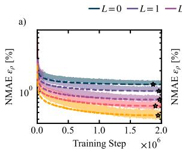

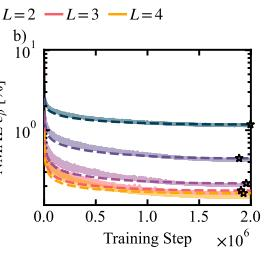

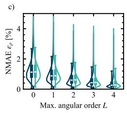

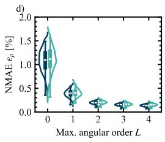  
Figure 8: AIDEN loss curves and violin plots of error distributions. (a), (b) Loss curves of AIDEN on the PBE and QM9 datasets under different L settings. Opaque dashed lines denote the validation set, and semi-transparent solid lines denote the training set. $( \mathrm { c } ) ,$ (d) Violin plots of the error distributions of AIDEN on PBE and QM9. Dark blue and cyan respectively denote the training and validation errors. In the embedded box plots, white markers indicate the mean error, the filled boxes span the 25%-75% quantile range, and the upper and lower whiskers are set to the 5% and 95% quantiles.

## C.3 TWISTED BILAYER GRAPHENE

Structures and calculation settings. We consider three unrelaxed commensurate TBG cells, summarized in Tab. 4. All structures have a 20 A out-of-plane lattice parameter. We reuse the con-˚ verged PBE-SCF densities, energies, and forces as references and evaluate the complete model density grids without charge renormalization. Each model density is supplemented with the onecenter PAW data from the matched reference. Thus, the property comparison evaluates the predicted smooth density under the same PAW conditioning. We use the carbon PAW-PBE potential (08Apr2002), a 520 eV cutoff, Gaussian smearing of 0.05 eV, and non-spin-polarized calculations with fixed atomic positions and symmetry disabled. The fixed-density energy/force and band calculations use ICHARG=11, with electronic convergence thresholds of $\mathrm { 1 0 ^ { - 7 } }$ and $1 0 ^ { - 8 } \mathrm { e V } ,$ , respectively, and PREC=Accurate, LREAL=.FALSE., LASPH=.TRUE., and ADDGRID=.TRUE.. Band calculations additionally use LMAXMIX=2. Energies are the final TOTEN values, and forces are the frozen-density approximate forces returned by VASP. The reciprocal-space path uses fractional coordinates $( 0 , \dot { 0 } , \dot { 0 } )  ( 1 / 2 , 0 , 0 )  ( 1 / 3 , 1 / \dot { 3 } , 0 )  ( 0 , 0 , 0 )$ . We use coarser line-mode sampling for the two larger cells to control memory use. The resulting comparisons contain 180, 18, and 18 k points, respectively, including repeated segment endpoints. It should be noted that the angular trend in the band errors is therefore evaluated at different sampling densities.

Table 4. TBG structures and sampling. The Γ-centered mesh is used for the reference SCF and fixed-density energy/force calculations. The last two columns give the number of points per segment along Γ-M-K-Γ and the number of returned bands. Sampling and band counts are matched across methods within each cell.
<table><tr><td>Twist angle</td><td> $N _ { \mathrm { a } }$ </td><td>FFT grid</td><td> $N _ { \mathrm { g } }$ </td><td>SCF mesh</td><td>Points/segment</td><td>Bands</td></tr><tr><td> $2 1 . 7 9 ^ { \circ }$ </td><td>28</td><td> $9 6 \times 9 6 \times 3 0 0$ </td><td>2,764,800</td><td> $9 \times 9 \times 1$ </td><td>60</td><td>80</td></tr><tr><td> $1 3 . 1 7 ^ { \circ }$ </td><td>76</td><td> $1 6 0 \times 1 6 0 \times 3 0 0$ </td><td> $7 , 6 8 0 { , } 0 0 0$ </td><td> $6 \times 6 \times 1$ </td><td>6</td><td>168</td></tr><tr><td> $9 . 4 3 ^ { \circ }$ </td><td>148</td><td> $2 2 4 \times 2 2 4 \times 3 0 0$ </td><td> $1 5 , 0 5 2 , 8 0 0$ </td><td> $4 \times 4 \times 1$ </td><td>6</td><td>312</td></tr></table>

b)  
Table 5. Density and charge conservation for TBG. Electron counts and their signed deviations are reported in units of $e ;$ relative deviations use the matched reference count.
<table><tr><td>Twist angle</td><td>Method</td><td> $\varepsilon _ { \rho } \ [ \% ]$ </td><td>Reference count</td><td>Predicted count</td><td> $\Delta N _ { \mathrm { e } }$ </td><td>Relative [%]</td></tr><tr><td rowspan="2"> $2 1 . 7 9 ^ { \circ }$ </td><td>AIDEN</td><td>0.293371</td><td>112</td><td>112.010667</td><td>+0.010667</td><td>0.009524</td></tr><tr><td>ChargE3Net</td><td>0.315961</td><td>112</td><td>112.035903</td><td>+0.035903</td><td>0.032056</td></tr><tr><td rowspan="2"> $1 3 . 1 7 ^ { \circ }$ </td><td>AIDEN</td><td>0.290678</td><td>304</td><td>304.024022</td><td>+0.024022</td><td>0.007902</td></tr><tr><td>ChargE3Net</td><td>0.314475</td><td>304</td><td>304.098970</td><td>+0.098970</td><td>0.032556</td></tr><tr><td rowspan="2"> $9 . 4 3 ^ { \circ }$ </td><td>AIDEN</td><td>0.289184</td><td>592</td><td>592.040188</td><td>+0.040188</td><td>0.006788</td></tr><tr><td>ChargE3Net</td><td>0.313427</td><td>592</td><td>592.178324</td><td>+0.178324</td><td>0.030122</td></tr></table>

Charge density and charge conservation. Tab. 5 reports $\varepsilon _ { \rho }$ using Eq. 15, together with the integrated smooth-grid electron counts. We denote the deviation of the predicted count from the reference by $\Delta N _ { \mathrm { e } } .$ AIDEN gives lower density errors at all three angles, with $\varepsilon _ { \rho } = 0 . 2 8 9 2 – 0 . 2 9 3 4 \%$ compared with 0.3134-0.3160% for ChargE3Net. Both models slightly overestimate the electron count, while AIDEN has the smaller deviation in every cell. Its relative charge error decreases from 0.00952% to 0.00679% as the cell grows, despite the increase in the absolute count deviation. Although we do not explicitly include a charge-conservation loss term in the training objective in Eq. 3 (as is also common in most related works), AIDEN naturally exhibits near-conservation of the total charge. This behavior is observed not only for the TBG cases but also across the general benchmark datasets (see Fig. 9), and can be largely attributed to the low overall error in charge density prediction.

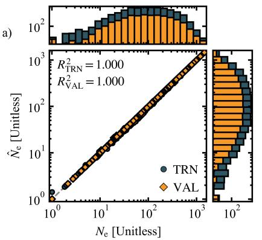

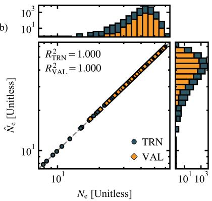  
Figure 9: Parity plots of total charge on the general benchmark datasets. Blue and yellow scatter points denote the training and validation samples in (a) PBE and (b) QM9, respectively. The horizontal axis $N _ { \mathrm { e } }$ is the total DFT reference charge of each sample evaluated on the full grid, while the vertical axis $\hat { N } _ { \mathrm { e } }$ is the total charge predicted by AIDEN, obtained by summing the charge density over all grid points. The marginal histograms along the horizontal and vertical axes show the numerical distributions of the total charge.

For fixed learned species profiles, integrating the periodic one-center sum gives an extensive contribution $\begin{array} { r } { \int _ { \Omega } \rho _ { \mathrm { i n i t } } ( \mathbf { r } ) \mathrm { d } ^ { 3 } \mathbf { r } \stackrel { } { = } \sum _ { i } q _ { Z _ { i } } } \end{array}$ , where $q _ { Z }$ is the integral of one localized species profile. This branch can therefore supply an atomic baseline for the electron count without learning a global constraint. The remaining environment-dependent contribution is not constrained to have zero integral, and the present results do not isolate the contributions of the two branches. Fig. 10(a)-(c) complements the integrated errors with a spatial comparison of the reference and predicted densities. The density panels use four logarithmically spaced isovalues within their shared positive density range. The pointwise error in panel (c) is expressed relative to the local reference density, with the denominator bounded below by $1 0 ^ { - 1 2 }$ times its maximum magnitude to stabilize the low-density region. Panel (d) then relates the integrated charge deviation to the cost of evaluating the complete density field.

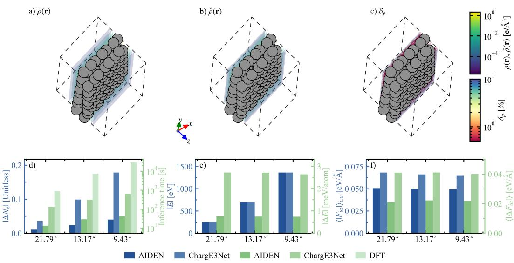

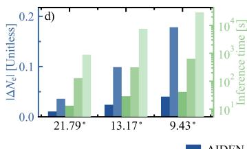

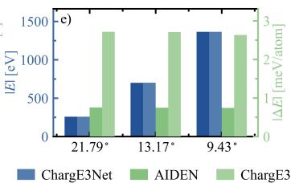

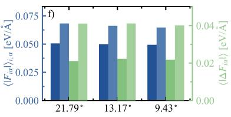  
Figure 10: Real-space density and property comparison for TBG. (a), (b) DFT and AIDEN density isosurfaces, $\rho ( \mathbf { r } )$ and $\hat { \rho } (  { \mathbf { r } } )$ , shown with a common logarithmic color scale and identical isovalues. (c) Pointwise relative density error $\delta _ { \rho } ,$ with isosurfaces at 0.5%, 5%, and 10%. (d) Absolute electron-count deviation $| \Delta N _ { \mathrm { e } } |$ (left axis) and full-grid density inference time (right axis). (e) Total-energy magnitude (left axis) and per-atom energy error $\lvert \Delta E \rvert$ (right axis). (f) Mean absolute force component $\langle | \bar { F } _ { i \alpha } | \rangle$ (left axis) and force-component MAE $\left. | \Delta \dot { F } _ { i \alpha } | \right.$ (right axis). Subplots (d)- (f) compare AIDEN and ChargE3Net across all three twist angles; blue and green shades correspond to the left and right axes, respectively.

Table 6. TBG total energies and energy errors. The DFT row gives the reused SCF reference. The signed difference $\hat { E } - E$ is in eV, while $| \Delta E |$ follows the per-atom definition in Tab. 2.
<table><tr><td>Twist angle</td><td>Method</td><td>Total energy [eV]</td><td> $\hat { E } - E \left[ \mathrm { e V } \right]$ </td><td>|∆E| [meV/atom]</td></tr><tr><td rowspan="3"> $2 1 . 7 9 ^ { \circ }$ </td><td>DFT</td><td>-258.04561259</td><td>0</td><td>0</td></tr><tr><td>AIDEN</td><td>-258.06669840</td><td>-0.02108581</td><td>0.753065</td></tr><tr><td>ChargE3Net</td><td>-258.12164598</td><td>-0.07603339</td><td>2.715478</td></tr><tr><td rowspan="3"> $1 3 . 1 7 ^ { \circ }$ </td><td>DFT</td><td>-700.39986467</td><td>0</td><td>0</td></tr><tr><td>AIDEN</td><td>-700.45662887</td><td>-0.05676420</td><td>0.746897</td></tr><tr><td>ChargE3Net</td><td>-700.60567255</td><td>-0.20580788</td><td>2.707998</td></tr><tr><td rowspan="3"> $9 . 4 3 ^ { \circ }$ </td><td>DFT</td><td>-1363.97698248</td><td>0</td><td>0</td></tr><tr><td>AIDEN</td><td>-1364.08670932</td><td>-0.10972684</td><td>0.741398</td></tr><tr><td>ChargE3Net</td><td>-1364.36657021</td><td>-0.38958773</td><td>2.632350</td></tr></table>

Energies and forces. Tabs. 6 and 7 give the numerical results corresponding to Fig. 10(e), (f). AIDEN gives $| \Delta E | = 0 . 7 5 3 , 0 . 7 4 7$ , and 0.741 meV/atom, approximately 28% of the corresponding ChargE3Net errors. The signed total-energy differences are negative for both models at every angle. The force-component MAEs remain approximately 0.021-0.022 eV/A for AIDEN and˚ 0.040-0.041 eV/A for ChargE3Net. AIDEN also reduces the component RMSE and the maximum˚ per-atom force-vector error in all three cells. These results show that its improvement in density accuracy is accompanied by consistent improvements in the fixed-density energy and force estimates.

Band structures. For the band metrics in Tab. 8, we compare equal band indices at matched k points and retain reference states within $\begin{array} { r } { E _ { \mathrm { F e r m i } } \pm 5 \mathrm { e V } . } \end{array}$ This gives 4,450, 996, and 1,663 states for the three cells. Raw errors compare the eigenvalues directly; aligned errors apply one least-squares rigid shift per model and cell before computing the residuals. For the retained state set $s ,$ , the shift added to the model eigenvalues is $s = | S | ^ { - 1 } \sum _ { ( n , \mathbf { k } ) \in S } ^ { } ( \epsilon _ { n \mathbf { k } } - \hat { \epsilon } _ { n \mathbf { k } } )$ . Aligned errors use $\hat { \epsilon } _ { n \bf { k } } + s - \epsilon _ { n { \bf { k } } }$ measuring residual band shape after removal of one global offset. Raw errors retain the offset under the calculation’s energy-reference convention; they do not establish vacuum-referenced absolute levels. The DFT band calculation supplies $E _ { \mathrm { F e r m i } }$ . Fig. 4 presents the spectra around this reference.

Table 7. TBG force magnitudes and errors. All entries are in $\mathrm { e V } / { \mathrm { \AA } } .$ . The component RMSE averages squared errors over all atoms and Cartesian components; the last column is the maximum Euclidean norm of the force error over atoms.
<table><tr><td>Twist angle</td><td>Method</td><td> $\langle | F _ { i \alpha } | \rangle$ </td><td> $\langle | \Delta F _ { i \alpha } | \rangle$ </td><td>Component RMSE</td><td>Max. vector error</td></tr><tr><td rowspan="3"> $2 1 . 7 9 ^ { \circ }$ </td><td>DFT</td><td>0.030418</td><td>0</td><td>0</td><td>0</td></tr><tr><td>AIDEN</td><td>0.050602</td><td>0.021058</td><td>0.034872</td><td>0.062180</td></tr><tr><td>ChargE3Net</td><td>0.068266</td><td>0.041057</td><td>0.062076</td><td>0.114601</td></tr><tr><td rowspan="3"> $1 3 . 1 7 ^ { \circ }$ </td><td>DFT</td><td>0.029764</td><td>0</td><td>0</td><td>0</td></tr><tr><td>AIDEN</td><td>0.049782</td><td>0.022210</td><td>0.034972</td><td>0.065953</td></tr><tr><td>ChargE3Net</td><td>0.066146</td><td>0.041128</td><td>0.061317</td><td>0.114324</td></tr><tr><td rowspan="3"> $9 . 4 3 ^ { \circ }$ </td><td>DFT</td><td>0.029303</td><td>0</td><td>0</td><td>0</td></tr><tr><td>AIDEN</td><td>0.049377</td><td>0.021770</td><td>0.034843</td><td>0.067280</td></tr><tr><td>ChargE3Net</td><td>0.064642</td><td>0.040043</td><td>0.060362</td><td>0.113618</td></tr></table>

Table 8. TBG band errors within $E _ { \mathrm { F e r m i } } \pm 5$ eV. All numerical entries are in eV. The shift is added to the model eigenvalues. MAE, RMSE, and maximum absolute error are evaluated over the same reference-state mask.
<table><tr><td colspan="4"></td><td colspan="2">Raw</td><td colspan="2">Aligned</td></tr><tr><td>Twist angle</td><td>Method</td><td>Shift</td><td>MAE</td><td>RMSE</td><td>MAE</td><td>RMSE</td><td>Max. abs.</td></tr><tr><td rowspan="2"> $2 1 . 7 9 ^ { \circ }$ </td><td>AIDEN</td><td>-0.179315</td><td>0.179315</td><td>0.179863</td><td>0.008415</td><td>0.014021</td><td>0.077684</td></tr><tr><td>ChargE3Net</td><td>-0.318982</td><td>0.319104</td><td>0.324463</td><td>0.027352</td><td>0.059382</td><td>0.327034</td></tr><tr><td rowspan="2">13.17°</td><td>AIDEN</td><td>-0.172100</td><td>0.172100</td><td>0.173577</td><td>0.007410</td><td>0.022592</td><td>0.512770</td></tr><tr><td>ChargE3Net</td><td>-0.333283</td><td>0.333283</td><td>0.334107</td><td>0.010303</td><td>0.023454</td><td>0.294968</td></tr><tr><td rowspan="2"> $9 . 4 3 ^ { \circ }$ </td><td>AIDEN</td><td>-0.168169</td><td>0.171246</td><td>0.184834</td><td>0.011468</td><td>0.076698</td><td>1.450108</td></tr><tr><td>ChargE3Net</td><td>-0.319113</td><td>0.323720</td><td>0.325494</td><td>0.012928</td><td>0.064134</td><td>1.437400</td></tr></table>

AIDEN has the lower aligned band MAE at every angle. Its raw band MAEs are 171-179 meV (Tab. 8), with the rigid shift removing the dominant reference-energy offset. Its largest reduction in band MAE occurs at 21.79◦, from 27.35 to 8.42 meV. Interestingly, the ranking of the tail errors is less uniform: ChargE3Net gives a smaller maximum aligned error at $1 3 . 1 7 ^ { \circ }$ , and a smaller aligned RMSE and maximum error at $9 . 4 3 ^ { \circ }$ . Both models reach maximum individual-state errors of approximately 1.44-1.45 eV in the largest cell.

Density inference efficiency. Tab. 9 lists the full-grid density inference times used in Fig. 10(d). Both model timings are measured on a single NVIDIA A100 GPU after warm-up, with CUDA synchronization and model loading excluded; ChargE3Net uses its official full-grid per-sample in ference pipeline. AIDEN performs the atomic encoding once per structure and reuses it across grid queries. Its inference time increases from 13.27 to 41.43 s as $N _ { \mathrm { g } }$ increases from 2.76 to 15.05 million, whereas ChargE3Net requires 128.81-634.14 s. The measured speedups are 9.71, 10.85, and 15.31 , respectively. The reported speedups refer to these full-grid implementations on the specified hardware.

## C.4 DFT CALCULATIONS FOR WATER, ALMG, AND A-SI

## C.4.1 STRUCTURES AND DFT SETTINGS

We use the water and AlMg structures and one a-Si configuration from the OOD examples of Ref. (Qin et al., 2026), with $\mathrm { \bar { \it { N } } _ { a } } = 1 9 2 , 1 0 8 .$ , and 64, respectively. The a-Si configuration is frame 11. The supplied files determine the structures and FFT grids; reference densities and properties are obtained from new PBE-SCF calculations. The density grids are $2 1 6 ^ { 3 }$ for water and $\mathbf { A l M g }$ and $1 6 8 ^ { 3 }$ for a-Si. All calculations use VASP with PAW-PBE potentials for H, O, Si, Al, and Mg, a 520 eV cutoff, a $2 \times 2 \times 2$ Monkhorst-Pack mesh, and Gaussian smearing of 0.05 eV. The Mg potential is Mg pv (13Apr2007), with eight valence electrons including $2 p ^ { 6 } 3 s ^ { \overline { { 2 } } }$ . We use non-spin-polarized calculations, disable symmetry, and hold atomic positions fixed. The electronic convergence threshold is $1 0 ^ { - 8 } \mathrm { e V } ,$ with PREC=Accurate, LREAL=.FALSE., LASPH=.TRUE., ADDGRID=.TRUE., and LMAXMIX=2. Structure, potentials, grids, and electronic settings are matched across methods for each system.

Table 9. Full-grid charge density inference times for TBG. Times refer to AIDEN’s full-grid inference and ChargE3Net’s official full-grid per-sample inference. The speedup is the ratio of ChargE3Net to AIDEN time.
<table><tr><td>Twist angle</td><td>AIDEN [s]</td><td>ChargE3Net [s]</td><td>Speedup</td></tr><tr><td> $2 1 . 7 9 ^ { \circ }$ </td><td>13.270</td><td>128.813</td><td>9.71×</td></tr><tr><td> $1 3 . 1 7 ^ { \circ }$ </td><td>28.933</td><td>314.058</td><td>10.85×</td></tr><tr><td> $9 . 4 3 ^ { \circ }$ </td><td>41.430</td><td>634.141</td><td>15.31×</td></tr></table>

## C.4.2 DENSITY AND PROPERTY EVALUATION

AIDEN uses its PBE-pretrained parameters, and ChargE3Net uses the public Materials Project pretrained checkpoint. SAD is generated with ICHARG=12. Each candidate density is subsequently evaluated with ICHARG=11, keeping the density fixed throughout electronic minimization. Model densities are used without charge renormalization and supplemented with the one-center PAW data from the matched PBE-SCF reference; SAD retains its own one-center data. Energies are the final VASP TOTEN values, and forces are the frozen-density approximate forces reported by VASP.

## C.4.3 CROSS SECTIONS

For Fig. 3, candidate x-normal planes are the FFT planes nearest to atomic centers. We select the plane with the most atoms within 1.5 grid spacings, using proximity to the centers to break ties and periodic distances throughout. The selected zero-based indices are 191, 36, and 97 for water, AlMg, and a-Si, containing 9, 13, and 5 nearby atoms, respectively. AIDEN/ChargE3Net/SAD section NMAEs are 1.887/1.641/12.103% for water, 6.673/6.683/2.459% for AlMg, and 1.302/1.618/9.772% for a-Si. The density panel and error panels use separate logarithmic color scales, with a common error scale across methods for each system. Display clipping is applied only when plotting.

## C.4.4 TIMING

Model inference is measured on a single NVIDIA A100 GPU after warm-up, with CUDA synchronization and model loading excluded. Both AIDEN and ChargE3Net use full-grid per-sample inference, with ChargE3Net evaluated through its official inference pipeline. VASP runs use 16 CPU MPI processes with one thread per process. The SAD time measures the complete ICHARG=12 calculation, including diagonalization. The model-to-model speedup ratios compare the evaluated AIDEN and ChargE3Net full-grid implementations.

## C.4.5 ALMG NEAR-CORE DISCREPANCY

The reference density reaches 15.32 $\mathrm { e } / \mathrm { \AA ^ { 3 } }$ near Mg, whereas the corresponding maxima are 18.75 and 18.40 $\mathrm { e } / \mathrm { \AA } ^ { 3 }$ for AIDEN and ChargE3Net, respectively. Their ten largest pointwise errors all lie within 0.062 A of Mg centers. Within 0.4˚ A of Mg atoms, the local NMAEs are approximately˚ 7.63/7.62/0.37% for AIDEN/ChargE3Net/SAD, compared with 2.72/2.87/46.47% around Al. The dominant discrepancy of the learned models is therefore strongly localized around Mg rather than distributed over the bonding or interstitial regions. This localization is particularly relevant because the Mg pv PAW potential treats the $2 p ^ { 6 } 3 s ^ { 2 }$ shell as valence, introducing a strongly localized $2 p$ semicore contribution to the smooth grid density. The different behavior of the density and energy errors can be understood from their spatial weighting. Let $\delta \rho ( \mathbf { r } )$ denote the density error. The global NMAE measures its integrated magnitude, whereas the electron-nuclear energy couples the

same error to the external potential,

$$
\begin{array} { c } { { \displaystyle \delta \rho ( { \bf r } ) = \hat { \rho } ( { \bf r } ) - \rho ( { \bf r } ) } , \quad \epsilon _ { \rho } = \frac { 1 } { N _ { e } } \int _ { \Omega } \mathrm { d } ^ { 3 } r | \delta \rho ( { \bf r } ) | , } \\ { { \delta E _ { \mathrm { e n } } } = \displaystyle \int _ { \Omega } \mathrm { d } ^ { 3 } r v _ { \mathrm { e x t } } ( { \bf r } ) \delta \rho ( { \bf r } ) , \quad v _ { \mathrm { e x t } } ( { \bf r } ) = - \sum _ { I } \frac { Z _ { I } } { | { \bf r } - { \bf R } _ { I } | } . } \end{array}
$$

Thus, two density errors with comparable contributions to $\epsilon _ { \rho }$ need not contribute equally to the energy. In an all-electron picture, $v _ { \mathrm { e x t } }$ varies most strongly close to the nuclei, so a spatially compact near-nuclear error can have a disproportionately large energetic effect. In the PAW calculations considered here, the learned target is the smooth grid density rather than the complete all-electron density, while the fixed-density calculation additionally uses atom-centered PAW one-center information. Nevertheless, the same principle remains relevant: the sensitivity of a derived observable to δρ(r) is highly nonuniform in real space.

This behavior closely parallels the analysis of Lewis et al. (Lewis et al., 2021). For periodic Al and Si, they found that density-representation errors below 0.1% could still produce electrostaticenergy errors much larger than suggested by the density metric alone. Their energy decomposition showed that the corresponding Hartree-energy errors were comparatively small and that the dominant contribution arose from the electron-nuclear interaction, which is especially sensitive to density inaccuracies close to the nuclei. They further observed that the sharp near-nuclear density is largely determined by atomic identity and introduced an atom-centered isotropic baseline so that the learned component could focus on chemically induced variations of the density. This is conceptually related to the decomposition used in AIDEN, where $\hat { \rho } _ { \mathrm { i n i t } }$ captures an element-dependent one-center contribution and $\hat { \rho } _ { \mathrm { e n v } }$ describes environment-induced redistribution. The AlMg results exhibit the same qualitative mechanism. AIDEN and ChargE3Net reproduce most of the full-grid density with similar NMAEs, but their largest errors occur precisely in the Mg near-core region containing the localized semicore contribution. By contrast, SAD gives a much smaller Mg-local NMAE of approximately 0.37%, although its Al-centered and environment-dependent density is substantially less accurate. Since SAD is constructed from atomic densities, it naturally preserves the strongly atom-centered part of the Mg density more faithfully while lacking an accurate description of bonding-induced redistribution. Together with the different PAW one-center data retained in the SAD calculation, this explains why SAD can yield a poorer global density NMAE but a substantially smaller fixed-density energy error.

The AlMg case therefore illustrates a general limitation of global density metrics. The NMAE measures the integrated accuracy of the scalar field but does not distinguish spatial regions according to their influence on a particular electronic observable. For AlMg, the dominant model error is concentrated in a small Mg near-core region that carries comparatively little weight in the global density integral but substantially greater energetic sensitivity. The agreement with the mechanism identified in Ref. (Lewis et al., 2021) supports evaluating learned charge densities jointly through global density errors, spatially resolved diagnostics, and downstream electronic-structure observables.

## D THE USE OF LARGE LANGUAGE MODELS

In this work, we used large language models to assist with language polishing and manuscript editing.