# A Cyber Range Evaluation of

Autonomous Network Incident Response Agents

Jakob Nyberg, Teodor Sommestad, Andrei Buhaiu, Joakim Loxdal, Pontus Johnson, Mathias Ekstedt

Abstract—We test the performance of agents for automated network intrusion response in a cyber range intended for human operator training. The range implements an emulated networking environment with a variable network topology, red-team emulation and simulated user agents. The goal of the defensive agents is to prevent hosts in the network from being accessed by the redteam agent, while minimizing the availability costs induced from defensive measures. Alerts are generated using a SIEM platform and mapped to a data modeling language used by the agents. We test a combination of heuristic agents and policies learned using reinforcement learning. The learned policies are optimized to minimize the combined cost using a cyber attack simulator modeling the network. We found that the reinforcement learning agents were overall more efficient at defending the system than the heuristic policy, and that the performance depends highly on the policy of the adversary in combination with the simulated users.

Index Terms—autonomous cyber defense, sim-to-real, cyber de fense simulation, cyber attack simulation, reinforcement learning, machine learning, graph neural network, digital twin

## I. INTRODUCTION

Attacks on and security incidents with computer networks are a regular occurrence in our digitalized society [8]. Rapid mitigation of these types of attacks is important to avoid sensitive information being stolen, or critical systems made inoperable. Mitigation of network security incidents is typically done manually by network operators, or automatically through pattern- and rule-based systems.

The main goal of this work is to evaluate agents for automated cyber defense, henceforth referred to as a defender agent. The hypothesis we test is whether an agent based on reinforcement learning (RL) can perform a cyber defense task more efficiently than a manually crafted, rule-based agent in a networked computer environment.

Machine learning (ML) methods learn patterns and derive rules from system data, and a number of efforts have already been made to apply different ML methods for detecting and mitigating cyber security incidents [42, 3]. In the context of mitigation, several control-theoretic and game theoretic approaches have been proposed in previous works [16, 24, 50]. Control-theoretic approaches, such as reinforcement learning (RL), define a cost function to describe the problem, and tries to find an agent policy which will minimize this cost. A common design is that the defender agent should maintain system operations while minimizing costs from security violations. To not make the problem trivial, actions taken by the defensive agents are assumed to incur some form of cost, typically proportional to the disruption to the system the action causes [24, 18, 9].

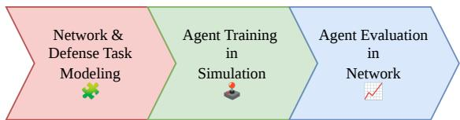  
Fig. 1: High-level rendering of the three steps we follow for sim-to-real development of automated cyber defense agents.

Several works have proposed and developed methods using RL for network intrusion response agents [18, 44, 28, 24]. With few exceptions however, these have been evaluated purely in simulation and not the target system being simulated, which is typically some form of computer network. This places a significant amount of faith in assumptions made by the simulation model, both about the dynamics of the target system, and what data will be available to the agent where it is to be used. In the field of RL for robotics, the “simto-real” gap between simulation and target system has been demonstrated to be a significant hindrance to the use of RL agents in practice [47]. In the broader context of machine learning for cyber security, it has been repeatedly shown [21, 42, 11, 4, 3, 37, 49] that machine learning models trained and evaluated purely on datasets have issues with generalization and robustness that appear up when testing on actual systems. This has also been observed in the context of reinforcement learning for cyber defense, such as by Wolk et al. [50] and Hicks et al. [18], who note that agents intended to cyber defense trained in simulation tend to be overfitted to particular network topologies or attacker strategies to be practical under more realistic operational conditions. To avoid the pitfalls associated with simulator-only evaluations, we test automated defender agents with the cyber range Crate [14, 1], built for testing human network operators at cyber security operations.

The target system of our test is a network of 37 virtual machines, named ADS-24. We put the network under attack for two hours by the red-team emulation tool Lore [19], which the defender agent should prevent from furthering its reach by shutting down and isolating hosts in the network. To make the environment more realistic, the network also contains a number of simulated user agents which perform various tasks.

We obtain RL agents by following a sim-to-real procedure common in previous works, as illustrated in 1, where we train agents in simulation based on a model of the target system. An additional test is thus also how well the RL agent can perform in the target system, having been trained on an imperfect model of it. We created a system model of ADS-24 using the Meta Attack Language (MAL) [22]. The model was then used with the MAL Simulator [29] to train agents with RL. RL agents were implemented using Vejde, a reinforcement learning framework for decision problems with relational state spaces [32]. The agent is designed and trained to be robust against problem variations, which we also test as part of our evaluation. A more detailed flow chart illustrating our implementation is shown in Figure 2.

To compare against the RL agents, we also evaluate a manually crafted heuristic agent that uses the same MAL data model as input. Our results show that one of the RL agents consistently outperforms the heuristic agent in regard to minimizing the joint cost, and prevents Lore from completing its attack path. The heuristic policy is effective at blocking Lore, but incurs a high availability cost since it indiscriminately acts against all observed alerts. From our results, we conclude that there is potential in using RL for automated defensive policies, but that there is still a significant amount of work remaining for the approach to be of practical use.

We have produced a number of research artifacts as part of our experiments that we have made public. These include

• The MAL language [6] and system model.

• A Vejde/MAL Simulator interoperability library [34].

• An interface to map network events to MAL attack steps [35].

• Data collected from the network environment [33].

## II. MOTIVATION & RELATED WORK

This section covers related work in the area of autonomous cyber defense using machine learning, and how our design choices across the three phases of the work shown are situated in relation them. One of our main requirements is that the agent should be generalizable to classes or variations to problems, and this motivates several of our design choices.

## A. Network & Defense Task Modeling

To test agents for network intrusion prevention, we first need to define and delimit the task the agents should be tested at. Hicks et al. [18] proposes decomposing the modeling of cyber defense problems into two components, defense task modeling and system modeling. The task model defines and delimits the problem the defender agent should solve, whereas the system model defines externalities of the problem, such as the network infrastructure itself and how it behaves. The task model may include operational costs, time frames for usage, security properties and uncertainties about the system. We use a task definition common in previous work, where the problem is modeled as a partially observable Markov decision process (POMDP) [24, 16, 39, 18]. This formalizes the defense problem as one of cost minimization, where the reward function of the Markov decision process (MDP) should encode the operational needs of the system. We further assume the POMDP is factored and relational, where the states of discrete entities that affect one another make up the full state. Though not always explicitly states as such, the factored representation occurs in several related works [17, 24, 7].

For our system and data model, we use the Meta Attack Language (MAL) [22, 48], in conjunction with the MAL language CoreLang [23]. MAL is intended to provide a general framework for modeling across multiple systems, which aligns with our approach for generalizable agents. This also allows us to use existing tooling for modeling and simulation that is available for MAL, such as the MAL Simulator. A potential alternative low-level logical way of representing our knowledge of the network state is by using providence graphs, which are typically constructed from kernel-level system calls. Providence graphs have been proposed in both intrusion detection [5] and reinforcement learning [39] contexts. Though granularity is the main feature of providence graphs, is also means they grow in size quickly and can induce a potential security risk in that the attacker can directly affect the observations of the defender agent.

## B. Agent Training In Simulation

As we do not assume knowledge of the transition probabilities of the MDP, we use model-free deep RL to find a policy for the task. Because of the amount of samples required for model-free RL, training agents directly with the target problem may be practically impossible, depending on the context. Sim-to-real approaches attempt to address this issue by training agents in a simulator of the target system, with the intent of zero-shot, or few-shot, transfer of the agent into the target system [25, 47]. Within the research area of automated cyber defense, applications of this approach have led to the development of several simulation environments that aim to simulate cyber security incidents. This includes CybORG [24], Yawning Titan [2] and CyberWheel [36], among others. The pros and cons of several simulators have been covered in surveys by Vyas, Mavroudis, and Burnap [46], and Drasar et al.ˇ [9]. Hicks et al. [18] provides an overview of the challenges involved in building cyber defense simulation environments, which includes both accurately modeling the infrastructure and elements of the task important for practical use.

Under the assumption that we cannot train agents directly against the target system, we opt for using a simulator for agent training. The simulation thus needs to encode both the defense task model, as well as a system model that is aligned with the target system. One of our design goals is to test agent generalization, and facilitate sim-to-real transfer. We find the classification by Kirk et al. [25] useful to reason about what this means in the context of RL. Most RL works do singleton testing, meaning that the problem an agent is trained with is also the problem it is tested on. This is how the CybORG/CAGE 2 cyber defense problem is set up, for instance [10]. Singleton testing is useful to confirm that the policy is optimal, but it does not test how the policy responds to changes in the problem. In cases where the test problem is different, we can distinguish between in-distribution and out-of-distribution testing. In-distribution testing means that variables in the test problem follow to the same distributions as in problems the policy was trained on, whereas for an out-of-distribution test some variables may follow different distributions. For in-and out-of-distribution testing of the defender agents, we thus need a simulator that allows for configuring variables we consider relevant to test, such as the network topology or the attacker policy. This somewhat reduces the number of viable simulators for us. Cage 4 [24] offers some variations to its scenarios, but is inherently tied to a particular infrastructure, Yawning Titan [2] offers more flexible configuration, but is also highly abstracted. For our experiments, we thus use the MAL Simulator, as it works out-of-the-box with the MAL model we use for representing the system. It also enables running variations of our task formulation with different configuration parameters, thus allowing us to test in-and out of distribution properties of trained agents.

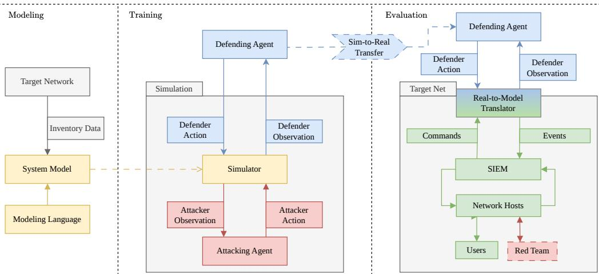  
Fig. 2: Conceptual flow chart over the sim-to-real defender agent development and evaluation process described in this work. First, a data model describing a network is created with a given modeling language and collected inventory data. The model is then used with a simulator, which may use simulated attackers, to optimize a defending agent policy. Finally, the agent is evaluated with the target network, containing both adversarial and neutral agents. A translation interface converts and classifie events from the network into the data model used by the defending agent, and translates the agent’s actions back to commands to be executed on network hosts.

## C. Agent Architectures for Automated Cyber Defense

The choice of agent architecture matters for any machine learning task, as it encodes inductive biases we assume about the problem. For instance, convolutional neural networks encode the belief that the solution to an image classification problem can be equivariant in regards to geometric translations of the image input. A common choice among related works is to implement the policy function for the defender agent with a multi-layer perceptron (MLP) that uses flat vector input and output for the state and actions [36, 50]. However, this architecture is limiting for factored or relational MDPs, as we then either has to consider each factor individually or fully ground the state, thus biasing the policy to a particular problem instance. In more practical terms, the defender agent becomes locked to a particular state size and ordering. For an agent to be invariant to the order of elements in the state we need an equivariant policy function architecture. Equivariant neural architectures include deep sets, transformers and graph neural network (GNN). We use the latter, as graph neural networks can encode topological features, scales linearly, and have been used previously in the domain of automated cyber defense research [31, 28, 24]. To implement the GNN agents, we use the Python library Vejde, as it aligns with the object-oriented data model of MAL and supports factored state spaces.

## D. Defender Agent Evaluation

To test the hypothesis that a RL agent trained in simulation can be used for cyber defense, the agent should be tested with cyber defense scenarios of higher fidelity than what the simulation offers. The highest fidelity is of course obtained by testing the agent in a real network, against real cyber threats. However, this approach suffers from a lack of control and extreme costs. It is difficult to know the ground truth of threat actors’ progress in operational networks, requiring tests over long periods and comparisons to hazy counterfactuals. In addition, it can be very costly if the agent fails to handle incidents, or wrongly responds to false positives. Thus, the cost-benefit tradeoff for tests in real environments is not advantageous when an autonomous agent is still experimental and has uncertain effectiveness.

While actual cyber threats may be untenable for providing a testing environment, there are options that offer different tradeoffs between fidelity, the availability of a ground truth and execution costs.

One such alternative are environments primarily developed to support training and evaluation of ML agents. In general, these trade fidelity for lower execution costs and scalability. For instance, CSLE by Hammar [15] runs tests in a containerbased cyber range, with a simulation component based on data collected from the range for agent training. CyberWheel [36] similarly offers a an unified interface to a virtual-machine-based emulation system, as well as a simulation component for parity with the target network. Some autonomous defense works have also used more generic network simulators. For instance, Le et al. [28] used GNS3, a container-based environment to train and test their agent. The benefit of containers is that they are lightweight to use, while the drawback is that they may occasionally fail to represent security properties present in real networks [30]. Another evaluation method for autonomous agents is to use environments that have been used with human operators. This is the approach we have used for this evaluation, making use of the cyber range Crate [14, 1]. The concept of cyber ranges have been developed to realize training scenarios and provide a playground for trainees in cyber defense [51]. Cyber ranges can be broadly divided into conventional virtualization and container-based virtualization [43]. Regardless of the virtualization approach, a cyber range typically offers the full software stack of the emulated network and thus provides representative responses to events. In a cyber range, scale and fidelity is typically prioritized over control, but the complexity can be overwhelming to trainees [12]. Thus, while the typical cyber range scenario is likely to be less complex than a real operational network, cyber ranges still offer challenging cyber defense scenarios.

An important aspect in orchestrating realistic network security exercises are the activities and events that should occur during them, both adversarial and benign. In cyber ranges, events representing attacks are sometimes performed by human experts using offensive tools such as Metasploit, and sometimes automated or scripted with tools developed to emulate real threat actors [27]. Hammar [15] uses set lists of prepared actions for the attacker agent to perform. CyberWheel [36] extends this approach, and uses heuristic rules for selecting actions, making the agent a bit more dynamic. Both of these approaches use limited action sets for the attacker, which are set up to succeed. This gives structure to the scenario and test producer, but provides the attacker with a limited ability to react to defender agent actions. In comparison, red team emulation tools such as Lore [19] or CALDERA1 select among thousands of actions in each decision frame. Access to many actions, together with an black-box approach to the target network, has been proposed as important components for red team simulation to be on par with human red teams in large scale cyber defense exercises [20]. The simulation of benign events are often given less attention, but are known to drive the complexity of scenarios [41, 26]. Scripting tools such as GHOSTS [45] are often used to emulate users on machines and produce logs with realistic footprints.

## III. PRELIMINARIES

The section contains topics we believe are relevant to understand our work. This includes the system modeling language and simulator, the architecture used to define the defender agent, the method by which it is trained, and finally the infrastructure used to run the target system.

## A. The Meta Attack Language

To create a model of the target network, we use the Meta Attack Language (MAL) [22, 48]. MAL is a modeling language with the intended use of creating domain-specific languages to represent networked systems and techniques used in cyber attacks. There exists a number of MAL languages for various domain applications, including CoreLang [23] to model generic network environments. A MAL language defines a set of abstract asset types to describe elements of a system, and which can define relations to other assets. Asset types may also be associated with attack steps, representing actions and techniques that the asset can be the subject of. For instance, CoreLang defines an “eavesdrop” attack step for the asset type “Network” to represent the act of sniffing traffic. Attack steps can have causal relationships with other attack steps, meaning that one attack step being performed suggests that subsequent attack steps, either on the same or related assets, are possible to perform. As an example, the aforementioned “eavesdrop” step is a parent to the “attemptRead” step of any “Data” asset associated with the “Network” asset. A MAL language can also define a set of defense steps, which represent defensive techniques to block attack steps from being executed. Given a MAL language, the asset classes can be instantiated to define an instance model; a model of a particular system in terms of asset types defined in the language. The instance model can be used to generate an attack graph, which contains all attack step paths that are possible to perform given the assets and relations in the instance model, as well as the attack step relations defined in the language.

## B. Markov Decision Processes

Following previous works in the domain of autonomous cyber defense [28, 24, 16], we model the defense task as an episodic partially observable Markov decision process (POMDP). A Markov decision process (MDP) is a formal model of a sequential decision problem [40]. The process is divided into discrete states, in which sets of actions can be taken by a decision-taking agent. A probability distribution models the likelihood of reaching different states, given a state and an action by the agent. A cost, or reward, value is used to measure the agent’s success at the problem. An optimal policy is a strategy of selecting actions given the state that minimizes the expected, optionally discounted, cost over time2. A POMDP extends the MDP definition to model decision problems where the state is not directly observable, and defines a set of observations and a probability distribution over observations, which may be influenced by the hidden state or actions from the agent.

An MDP tends to model a singular decision problem or system [40, 25]. However, as we assume that the defense problem may change over time, such as with differing network constellations and adversary behaviors, we believe it is more useful to formulate the problem as a distribution or collection of multiple MDPs. Various attempts have been made at extending the MDP formulation to define classes of problems [25]. One such definition is the relational MDP [38], which is an MDP defined in terms of lifted first-order logic. A relational MDP may instantiate several grounded MDPs by substituting the lifted variables with concrete values and object identifiers. An optimal policy for a relational MDP will thus be optimal for a collection of problems, but not necessarily on each respective grounding, as there may exist an optimal grounded policy for that particular problem instance.

A related definition are factored MDPs. In a factored MDP the state is assumed to be composed of a set of discrete state variables, and that the value function can be decomposed into a linear combination of basis functions. The functions may individually only depend on a subset of variables from the full state [13], meaning that the problem of learning the value function can be separated into smaller problems. Both of these definitions are relevant in this context in that we define the state as consisting of a set of discrete entities, defined by a threat modeling language, which are sparsely related through logical relations derived from network event data. For example, one can define a lifted relational MDP in terms of “Host” classes to represent network hosts. To ground the lifted MDP, the class is instantiated with a number of host identifiers and each grounded “Host” asset becomes a factor in the state, which may have logical relations to other “Host” assets.

## C. Vejde

Vejde is a reinforcement learning library for decision problems with factored and relational state representations [32]. States and observations are represented as sets of facts expressed in first-order logic, much like Datalog databases, which are converted to bipartite factor graphs. In the context of this work, the predicates and entity types are expressed in MAL. Elements of the graph are encoded into latent representations using message passing neural networks, and a policy function computes action probabilities from the latent factors. The sizes of the action and observation spaces are thus determined by the data model used to describe the class of problems, rather than a particular problem instance. To facilitate inductive policies, only the type classes of entities in the state are observed by agents, and not specific identifiers. This means that two hosts with different identifiers “ap01” and “ap02” will be represented as identical “Application” assets, defined in the MAL language.

## D. The Cyber Range Crate

Crate is a computer network emulation platform built and maintained by the Swedish Defence Research Agency (FOI) [1]. Crate instantiates networked virtual machines based on a description language through a combination of proprietary scripts and open-source tools. The instantiation process includes scripts for managing Windows domain settings, creating users based on name lists, software installation via Chocolatey , and system configuration using Ansible .

The result of this process is one or more computer networks, typically used for exercises in cyber security. Since 2008, the platform has been used in several technical tests, national exercises, international exercises, and battle readiness exercises. Recent examples of large scale cyber defence exercises include the collaborative cyber defense exercise Safe Cyber, and performance assessments for the Swedish Armed Forces [20]. Crate manages network states through virtual machine snapshots. A snapshot can be taken of an instantiated computer network after it has been deployed, or after it has been manually adjusted. The deployed network can then be restored to the snapshot state at any time. Crate is separated into a control and event plane. The control plane is used for administration and is inaccessible from the event plane, where the instantiated network exists.

Various tools are implemented in Crate to orchestrate events in the event plane. This includes the red-team emulation tool Lore, which uses a combination of machine-learning models and heuristics to automatically attack computer networks [19]. Lore’s behavior can be configured through a threat agent profile and a scenario configuration. The threat agent profile allows adjustment of general behaviors, such increasing the tendency to scan networks. The scenario configuration makes it possible to adjust priorities based on specific network information, such as focusing on specific IP addresses. Crate can emulate legitimate user events by running executable files within the host sessions of network users, and interacting with graphical components. The user agents are fed instructions via the hypervisor of the machines, but appear as users in logs since the agents run within a user session and interact with the user interface.

## IV. NETWORK & DEFENSE TASK MODELING

This section describes the computer network used to evaluate defender agents. Our task model is that a defender agent should protect a computer network against an ongoing intrusion by an adversarial entity for a fixed period of time, while minimizing the operational costs. The time period was set to two hours, and we divide the interval into discrete timestep with a 1/30 second frequency.

The network we have implemented to fulfill these criteria is based on a scenario description written by domain experts at the Swedish Defence Materiel Administration (´ FMV). The scenario primarily consists of a specification of a fictive maintenance management system, named “AIR-DELIVERY-SYSTEM24” (ADS-24). The intended functions of ADS-24 is to keep track of maintenance needs, purchase new spare parts and store costs and salaries. ADS-24 consists of four subnets, identified as “CLIENT”, “DMZ”, “SRV” and “SOC”, which are all connected through a shared firewall server. The 37 machines across the subnets run either Linux or Windows, with machines running Windows being the most frequent. The SOC network contains machines related to monitoring and is inaccessible to all agents to not disturb logging during experiments. The layout of ADS-24 is illustrated as a graph in Figure 3. ADS-24 was implemented in the event plane of Crate.

## A. Alert Rules & Active Responses

Wazuh runs in ADS-24 for event logging and issuing commands to hosts. Each host, except “flightlogs”, in ADS-24 has a Wazuh agent service that sends events to the central database in the SOC network when a pattern within the set of given rules is matched with an entry from one of the log sources. The parser rules used by the Wazuh agents were selected based on a combination of reviews, recommendations and standards, including the log policy of the Swedish Armed Forces and SwiftOnSecurity. 586 rules from the Sigma Git repository were also included, as well as Wazuh’s default rule set. The Sigma rules were selected based on their relevance to the scenario, meaning that rules in the Sigma repository flrelated to services not part of the scenario were excluded. The Wazuh rules cover log data from Snort for IP packets, Auditd and Syslog for Linux hosts as well as Sysmon and event logs for Windows systems Every host in ADS-24 runs Osquery to collect host information, such as user accounts and network interfaces. Information about these elements are sent to Wazuh at regular intervals.

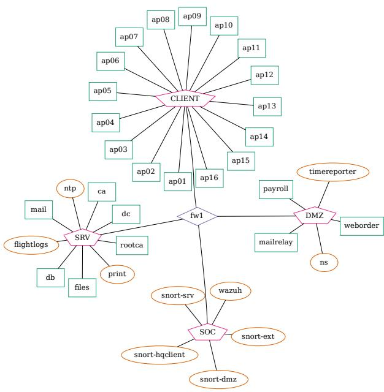  
Fig. 3: Topology of the AIR-DELIVERY-SYSTEM24 (ADS-24) computer network represented as a graph. Windows hosts are denoted with green rectangles, and Linux host with orange ovals.

We use the Wazuh feature “Active Response” to allow defense agents to execute a set of prepared commands on hosts in the network by calling the Wazuh REST API. Two commands were implemented: one that powers off a given machine, and one that blocks traffic between a given host and other subnets in both directions. Traffic blocking is executed by adding new firewall rule entries to the host “fw1”3. The commands are parametrized with a single argument; the identifier of the Wazuh agent service that should execute the command. This means that a defender agent has to make two decisions at each time step; what action to take and on what factor in the state it should be applied on.

## B. Network Activity

To emulate regular operation of ADS-24, we set up automated user agents, along with processes such as a mail server on the host “mail”. The simulated users follow predefined schedules in which they exchange emails, access internal web interfaces, use remote desktop applications, and open files of various types. Occasionally, a simulated system administrator connects to machines and executes commands using Remote Desktop, PsExec, or Windows Management Instrumentation (WMI).

We generate threat actor activity in ADS-24 using the redteam automation tool Lore [19]. Lore attempts to compromise systems by selecting actions, which may or may not succeed, from a pool of available options according to its configuration. The initial entry point of Lore was set to the host “flightlogs”. “flightlogs” does not run a Wazuh agent, making it functionally invisible to and untouchable by defender agents. Lore can therefore never be fully expelled from the network, which is a similar premise as in the Cage simulators [24]. Two configurations for Lore were used, which we call “Guided” and “Exploratory”. These determine how Lore prioritizes actions and objects it discovers. With the “Guided” configuration, Lore is configured with blacklists to ignore machines that are not along the fastest path between the entry point and the “payroll” machine in the DMZ segment. With the “Exploratory” configuration, Lore may prioritize attacking machines not taking it closer to the DMZ, and has access to more actions. To analyze the attack paths Lore selects, we ran it for a number of periods in ADS-24. With the “Guided” configuration, Lore indeed only takes machines that take it towards the DMZ. With the “Exploratory” policy, the path is more dynamic but will most often lead to Lore compromising the machines in the CLIENT section of the network. Transition diagrams showing the probabilities of Lore compromising machines, with the different configurations are shown in Figure 10 in Appendix E. Lore records its activity in a log stored in the control plane. This provides a ground-truth of what actions Lore has succeeded and failed at during an episode, which we use for post-hoc evaluation of the defender agents.

## C. Data Modeling

We assume the defender agents makes decisions based on a data model of the network state. To model the components of ADS-24, we created a smaller version of the MAL language CoreLang [23], titled CadsLang[6]. The language consists of 9 asset types, 49 attack steps and two defense steps. The language models two attack vectors leading to unintended access to a host’s secure data: one through using a software vulnerability, and one where access is gained through bruteforcing credentials. A rendering of the attack step relations in CadsLang is shown in Figure 9 among the additional figures in Appendix E. The language contains two defense steps, “Application.notPresent” and “ConnectionRule.restricted”, to correspond with the two commands implemented in Wazuh. Functionally, “notPresent” blocks both attack vectors for a host, making it impossible to access its data for an attacker. The “restricted” step blocks the associated “ConnectionRule”

attack steps representing access to the host from a different network, but still allows traffic to the host through internal subnet connections.

We defined a procedure to construct MAL instance models from data gathered from ADS-24 with Osquery, both to create models for the simulation and to construct observations when defender agents interface with ADS-24. The procedure combines data from different Osquery tables relating to hosts, users and network interfaces to construct the model, relying on shared identifiers to create associations between assets. The model construction procedure is described in more detail in Appendix A. A graphical representation of an instance model, expressed in CadsLang, containing two hosts from ADS-24 is shown in Figure 4. To connect events from Wazuh to attack steps in CadsLang, we define a set of pattern rules that maps events to instances of attack steps. 11 attack steps were mapped. Each attack step was associated with a set of Wazuh rule identifiers, a set of Wazuh rule groups and a set of rules that should be ignored. Since attack steps are associated with assets, the event being mapped needs to contain an identifier that was also encountered in the instance model creation procedure, such as an IP address, username or host identifier. The full mapping procedure is described in Appendix B. We tested the alert mappings by collecting multiple two hour periods of data from the network with and without user agents, and without any attacker or defender agents. Under the assumption that no adversarial actions are taken in the network during this time, we treat all observed attack steps as false alert. This yielded an average false alert probability per time step for the alert mapping at 1.7% per attack step without users and 3.3% with users.

## D. Cost Function

The scenario description included numerical ratings of the host’s security priorities, in terms of confidentiality, integrity and availability (CIA) on a scale from 1 to 5. For example, the time service host is assigned a high availability rating as other machines in the network depend on it for correct time management. The ratings for each host class are listed in Appendix D in Table III, and the classes of the hosts in the network is listed in Table IV. We use the confidentiality and integrity value for the host as a cost assigned to the defender when the “Data.read” and “Data.write” steps for the associated asset are registered as performed. The defense step “Application.notPresent” incurs the availability value of the host as a cost, and we set “ConnectionRule.restricted” to incur half of this cost. Our operational assumption is thus that restricting external network access to a host is less damaging to its availability than fully shutting it down. The combined cost for a single time step is thus defined as

$$
r ( t ) = \sum _ { x } ^ { \mathcal { A } ( t ) } [ C ( x ) + I ( x ) ] + \sum _ { x } ^ { \mathcal { D } ( t ) } A ( x )\tag{1}
$$

With (t) representing the set of active defense steps at time $t , A ( t )$ the set of performed attack steps at time t and $C ,$ I and A representing mappings from an attack or defense step

to a real value. We use the return, the discounted sum of costs, of an episode as our main evaluation metric, calculated as

$$
R = \sum _ { t } ^ { T } r ( t ) .\tag{2}
$$

When interacting with ADS-24, we define “Data.write” and “Data.read” to have been performed on an asset from the time Lore succeeds at running commands with elevated shell access on the corresponding host, as Lore was not set up with any particular actions for emulating sensitive data being accessed. We define a defense step as activated from the time the corresponding active response was sent to the Wazuh REST API by a defender agent. When using the MAL simulator, (t) and (t) are part of the simulation, thus making them trivial to obtain.

## V. AGENT EVALUATION IN ADS-24

This section describes the evaluation of defender agents in ADS-24. The main goal of the experiment was to measure the performance of the defensive agents when Lore attacks ADS-24 for a set period of time. We also test how variations to the problem, in the form of user agents, attacker strategies and network topology, affect the returns of the agents. The defender agents with the software scaffold to fetch and send data to the cyber range was run on a computer with an 11th Gen Intel i7 CPU at 4.800 GHz and integrated graphics.

Agents using policies optimized with RL were trained using the MAL simulator, with the Vejde library for agent architectures. Training was done using 2 million transitions, sampled from a combination of simulation environments using different attacker policies, attacker entry-points and network topology variations for each episode. Details on agent simulator training and testing can be seen in Appendix A.

## A. Experiment Procedure

We ran experiments in an episodic fashion, with each episode lasting two hours. The Crate snapshot functionality was used to start each episode from the same system state. To allow the system to settle after being restored, episodes were started half an hour after the network was restored. We evaluated the following agents: “Vejde”, a policy trained in the MAL Simulator with reinforcement learning; “Vejde w/ Noise”, same as “Vejde”, but trained with a 1% false positive and false negative rate per attack step; “Heuristic”, a policy that selects an associated defense step of an asset if an associated attack step is observed; “NoOp”, a policy that does nothing. All agents use the same MAL data model for its input. Each episode used a single defender agent, sampled without replacement from the set of available agents. After each agent had been sampled once, the set was refilled. Through the course of each episode, the defender agent maintains an observation database, where entries are added and removed during the period. An example rendering of an observation database as a table is shown in Figure 5. An actual observation database from one of the episodes, rendered as a graph, can be seen in Figure 12 in Appendix E.

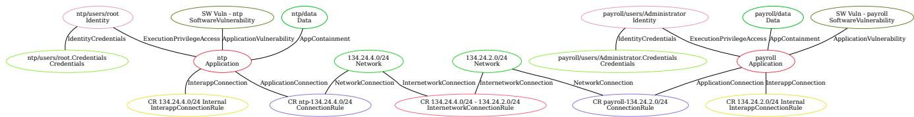  
Fig. 4: MAL instance model based on Osquery data from the hosts “ntp” and “payroll”, with asset types and relations defined in CadsLang.

<table><tr><td rowspan=1 colspan=1>Predicate</td><td rowspan=1 colspan=1>Asset ID</td><td rowspan=1 colspan=1>Asset ID</td><td rowspan=1 colspan=1>Value</td></tr><tr><td rowspan=1 colspan=1>Application-Availability</td><td rowspan=1 colspan=1>files</td><td rowspan=1 colspan=1></td><td rowspan=1 colspan=1>4</td></tr><tr><td rowspan=1 colspan=1>Application-Connection</td><td rowspan=1 colspan=1>files</td><td rowspan=1 colspan=1>CR files-134.24.3.0/24</td><td rowspan=1 colspan=1>True</td></tr><tr><td rowspan=1 colspan=1>Execution-PrivilegeAccess</td><td rowspan=1 colspan=1>files</td><td rowspan=1 colspan=1>files/root</td><td rowspan=1 colspan=1>True</td></tr><tr><td rowspan=1 colspan=1>AttemptModify</td><td rowspan=1 colspan=1>files</td><td rowspan=1 colspan=1></td><td rowspan=1 colspan=1>True</td></tr><tr><td rowspan=1 colspan=1>Restricted</td><td rowspan=1 colspan=1>CR files-134.24.3.0/24</td><td rowspan=1 colspan=1></td><td rowspan=1 colspan=1>True</td></tr><tr><td rowspan=1 colspan=1>Attempt-UseVulnerability</td><td rowspan=1 colspan=1>files</td><td rowspan=1 colspan=1></td><td rowspan=1 colspan=1>True</td></tr></table>

Fig. 5: Example of an observation database for the defender agent, rendered as a table, containing facts about the host “files”. Predicates for attack steps are colored red, defense steps blue, asset relations green and CIA values yellow.

The initial contents of the observation database was formed by the instance model representing the network. A new instance model was created at the start of each episode, as we did not know ahead of time what the size of the network would be. This is done by querying Osquery data from Wazuh from half an hour before the agent was started. The data was then used in the model creation procedure described in Appendix A.

During episodes, Wazuh was queried for new events at a fixed 30-second interval, and if any returned events were matched with a MAL attack step, according to the procedure described in Appendix B, an instance of the step was appended to the observation database. If more than one instance of the same attack step was observed during an episode, they were merged into a single database entry. To select an action for the time step, the current database was fed to the defender agent, producing a single action in accordance with its policy. For the Vejde agents that produce a distribution over actions, we selected the action assigned the highest probability by the policy. When there was no recorded change to the database between two time steps, no action was requested from the current agent4.

If the agent selected an action other than waiting, the MAL defense step was added to the observation database, mapped to a corresponding active response, and sent to the Wazuh server through the REST API. As in the simulator, assets with defense steps were removed from the observation along with any associations to other assets or attack steps it was involved in. If an asset that had been removed appeared in an alert at a later time5, it was temporarily reintroduced to the model for a single step. Automation of the experiments and interaction between the defender agent and ADS-24 was managed by a software interface that is available in one of our Git repositories [35].

## B. Scenario Variations

Experiments were run with a set of variable factors, which were selected at random before the start of each episode.

a) Simulated Users: To test the defender agent’s robustness to noise, we ran episodes with and without the simulated user agents, described in Section IV-B. Each host in the client section of ADS-24 is assigned a simulated user agent, which will perform actions based on a given policy.

b) Attacker Strategy: To test how the defender agent handles different attack profiles, we used the two Lore configurations, as described in Section IV-B. The configuration determines which machines Lore prioritizes.

c) Network Topology: To test how the agents handles variations to the network topology, we randomly remove hosts, selected from “rootca”, “timereporter” and “print”, from ADS-24 before the episode. These machines are not part of the list of machines Lore is directed at with the “Guided” policy.

## C. Results from Network Evaluation

The results include 134 episodes, gathered over the course of a month, with 30 episodes per agent type. Among the evaluated defender agents, the “Vejde w/ Noise” agent received the highest overall average return. This largely comes from the agent receiving lower defense costs than the “Vejde” and “Heuristic” agents. The lower defense cost comes from not disabling as many assets, thus inducing a lower availability cost. On the other hand, this more lenient strategy leads to the “Vejde w/ Noise” in some episodes letting Lore access the client net, thus inducing higher costs. The “Vejde” agent has the lowest overall attack cost, but also the highest average defense cost. This likely comes from the “Vejde” agent acting similarly to the “Heuristic” agent, but with the additional capability of being able to act based on events from associated assets, whereas the “Heuristic” policy will only act on assets that are directly affected by attack steps. This more aggressive strategy is reflected in the distribution of agent actions, where the “Vejde” policy has the lowest overall probability of waiting, at 85%, compared to the “Heuristic” policy at 88%. The “Vejde w/ Noise” has an overall 94% probability of waiting, indicating that it is more conservative than the two other agents. Violin plots of the defender agent returns can be seen in Figure 6, with and without simulated users respectively. A table of all agent scores, also separated into attack and defense cost, can be seen in Table I. A scatter plot of the same returns over time can be seen in Figure 7 in Appendix E.

To analyze the impact of the different experimental factors on the returns, we ran an ANOVA analysis on the returns of each agent. The choice of Lore’s policy, being either “Guided” or “Exploratory” was the most significant variable affecting the returns of all agents. The removed machines did not significantly affect the returns of any agent. The user agents were significant for most defender-attacker-policy combinations, though not for the combinations (“Heuristic”, “Exploratory”) and (“Vejde w/ Noise”, “Exploratory”). This lack of change may be caused by Lore scanning and attempting connections to machines in the client net when using the “Exploratory” strategy, even if it can not capture any machines. This generates alerts in the client net, similar to when the simulated users are present. As Lore’s initial access machine, “flightlogs”, is not under the control of the defender agent, the defender can not do much to prevent this apart from blocking connections in the client net, incurring costs as a consequence. Though the changes were not always significant, all decision-taking agents receive lower average returns when users are present. This is primarily caused by users generating false alerts that cause the agent to act. Against “Guided”, returns with users drop by 80% for “Vejde w/ Noise”, 101% for “Heuristic” and 109% for “Vejde”. The drop is mainly caused by increased defense costs, but there is also an increase in the attack cost for “Vejde” and “Heuristic” with users. This may be caused by Lore getting more time to act while the defender agent handles false alerts. As mentioned, users make less of an impact when facing “Exploratory”, with a drop of 5% for “Heuristic”, 11% for “Vejde w/ Noise” and 14% for “Vejde”.

All agents receive higher average returns against the “Guided” configuration than against the “Exploratory”, owing to Lore not exploring as many machines in the former. When faced with this strategy, the do-nothing “NoOp” strategy actually receives the highest average return of all agents, both with and without users. Though somewhat counter-intuitive, as the return is entirely composed of the attack cost from Lore compromising machines, the scenario we use prioritizes availability, meaning that defenses are expensive to use unless needed. Under the circumstances that “Guided” creates, where Lore does not compromise many valuable machines, a defender agent thus needs to be precise with its actions. To analyze how the agents would be scored under different operational needs, we calculated returns for different balances of the attack and defense cost. Given that the return is calculated as a sum of attack and defense costs, $R = R _ { a } + R _ { d } .$ we calculated different $R _ { \alpha } = ( 1 - \alpha ) R _ { a } + \alpha R _ { d }$ for with $\alpha \in [ 0 , 1 ]$ . At $\alpha = 0$ , we only care about the availability of the system. At this point, the $\mathrm { \Delta ^ { 6 6 } N o O p ^ { 9 } }$ agent is always the best choice among the agents, as all of our defender actions impact availability in some way. On the other end where availability does not matter, at $\alpha = 1$ , the “Vejde” policy is the best choice for most configurations. The intersection between a line formed by an agent’s returns and the line formed by the “NoOp” agent represent the point at which it would be better to use the agent compared to NoOp. From the diagrams, it can be seen that against the “Guided” policy, the attack cost would need to be roughly 30% higher for any of the agents to be viable, whereas against the “Exploratory” policy the opposite is true. Since “Exploratory” induces a higher attack cost for waiting, we could lower the attack cost by 30%, and a RL agent would still be better than the “NoOp” agent. The diagrams showing the scores for different values of α can be seen in Figure 8 among the additional figures of Appendix E.

## VI. DISCUSSION

The results from our test suggests that the “Vejde w/ Noise” RL agent is a better option for defending ADS-24 against Lore than the simple heuristic agent in terms of minimizing the joint attack and defense cost. This supports our hypothesis that an ML agent can outperform the manually-crafted heuristic policy at the defense task we have set up. This is a promising result for the application of RL agents for use in cyber attack mitigation, especially given how simplified our simulation and data model is in relation to the real system. However, we should emphasize that the current approach is still far from being practical to a real organization, namely in how sensitive the approach is to false alerts. The problems that need to be addressed are not only technical, but also operational. The introduction of automated agents of any type may for instance create new threat surfaces for adversaries to exploit. Additionally, the defense task has been heavily simplified and encoding complex operational needs into a scalar cost function may fail to capture higherlevel demands from users and operators. Further evaluations should focus on the interaction between automated agents and human operators, potentially in a semi-automated fashion. This can also provide important feedback about the role and design of automated tools in the intrusion response and threat hunting tool-chain.

## A. Agent Explainability & Interpretability

While we can analyze the actions of the RL agents, we can not directly interpret what behaviors their policy functions have encoded. Explainable and interpretable agents and policies are important if they are to be used for automation in securitycritical contexts [46]. In the context of intrusion detection, it has been suggested to use simpler model architectures, such as decision trees, to check datasets and trained models [21, 11] for unintended biases. This can reveal if the agent is overly reliant on a feature that would be unrealistic in a different context. Decision trees can be trained to mimic the output of the neural network classifier model, and a domain expert can then analyze to tree to determine whether the biases and features used by the model are justifiable given the problem. We did attempt to train a decision tree to mimic the output of a Vejde agent. In our simple implementation however, the input to the decision tree was fully grounded. As such, the resulting tree does not fully represent the inductive policy parametrized by the GNN. There may be a way of extracting an interpretable policy, as either a decision list or tree, by for instance inductive logic programming, but we considered it out of scope for this paper.

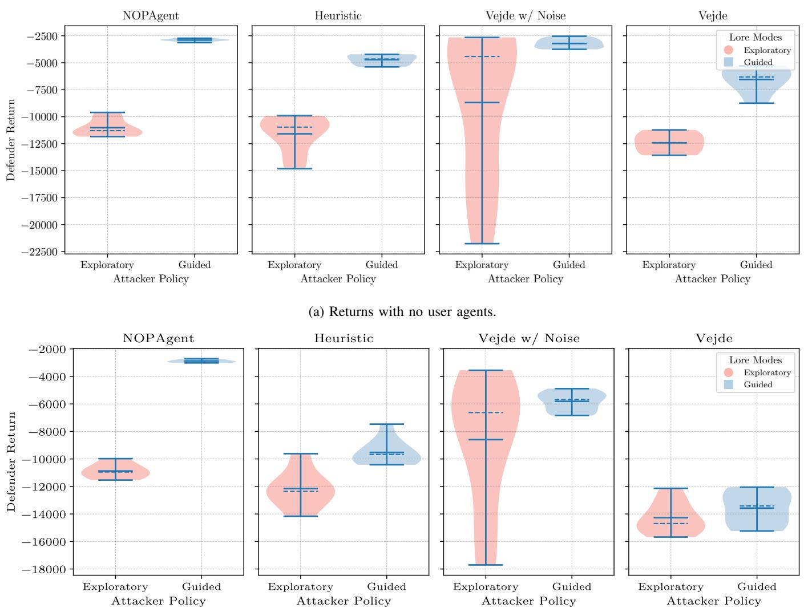  
(b) Returns with user agents.  
Fig. 6: Violin plots of return distributions from running defender agents in ADS-24 against Lore, with and without user agents present. Higher returns indicate desired behavior. Median value indicated as dashed line.

TABLE I: Mean returns, attack costs and defense costs with standard deviation for defender agents when evaluated in ADS-24. Note that the return is the sum of the attack and defense costs.
<table><tr><td>Agent Type</td><td>Attacker Policy</td><td>Users Present</td><td>Return</td><td>Attack Cost</td><td>Defense Cost</td></tr><tr><td>NoOp</td><td>Exploratory</td><td>False</td><td> $- 1 1 0 2 0 \pm 8 2 6$ </td><td> $- 1 1 0 2 0 \pm 8 2 6$ </td><td>0 ± 0</td></tr><tr><td>Heuristic</td><td>Exploratory</td><td>False</td><td> $- 1 1 5 8 6 \pm 1 7 3 7$ </td><td> $- 1 3 4 4 \pm 3 6 0$ </td><td> $- 1 0 2 4 2 \pm 1 5 2 0$ </td></tr><tr><td>Vejde</td><td>Exploratory</td><td>False</td><td> $- 1 2 4 2 2 \pm 9 5 5$ </td><td> $- 9 1 8 \pm 2 2 7$ </td><td> $- 1 1 5 0 3 \pm 1 0 3 7$ </td></tr><tr><td>Vejde w/ Noise</td><td>Exploratory</td><td>False</td><td> $- 7 7 7 9 \pm 5 7 2 3$ </td><td> $- 3 8 1 6 \pm 3 2 1 8$ </td><td> $- 3 9 6 3 \pm 2 6 1 5$ </td></tr><tr><td>NoOp</td><td>Guided</td><td>False</td><td> $- 2 9 0 4 \pm 1 3 3$ </td><td> $- 2 9 0 4 \pm 1 3 3$ </td><td>0 ± 0</td></tr><tr><td>Heuristic</td><td>Guided</td><td>False</td><td> $- 4 7 2 1 \pm 5 1 4$ </td><td> $- 9 3 1 \pm 1 2 5$ </td><td> $- 3 7 9 0 \pm 4 1 7$ </td></tr><tr><td>Vejde</td><td>Guided</td><td>False</td><td> $- 6 3 0 7 \pm 1 3 3 2$ </td><td> $- 8 1 6 \pm 3 7 7$ </td><td> $- 5 4 9 1 \pm 1 1 4 9$ </td></tr><tr><td>Vejde w/ Noise</td><td>Guided</td><td>False</td><td> $- 3 2 1 4 \pm 4 2 9$ </td><td> $- 1 6 7 3 \pm 3 8 7$ </td><td> $- 1 5 4 1 \pm 3 1 1$ </td></tr><tr><td>NoOp</td><td>Exploratory</td><td>True</td><td> $- 1 0 8 7 5 \pm 5 4 6$ </td><td> $- 1 0 8 7 5 \pm 5 4 6$ </td><td>0 ± 0</td></tr><tr><td>Heuristic</td><td>Exploratory</td><td>True</td><td> $- 1 2 1 5 7 \pm 1 4 6 7$ </td><td> $- 2 0 5 0 \pm 6 6 2$ </td><td> $- 1 0 1 0 7 \pm 1 0 4 0$ </td></tr><tr><td>Vejde</td><td>Exploratory</td><td>True</td><td> $- 1 4 2 7 0 \pm 1 1 8 1$ </td><td> $- 1 8 1 5 \pm 4 5 4$ </td><td> $- 1 2 4 5 6 \pm 1 3 6 2$ </td></tr><tr><td>Vejde w/ Noise</td><td>Exploratory</td><td>True</td><td> $- 8 5 9 7 \pm 4 7 4 5$ </td><td> $- 3 0 3 2 \pm 2 1 5 0$ </td><td>-5565 ± 2789</td></tr><tr><td>NoOp</td><td>Guided</td><td>True</td><td> $- 2 8 8 3 \pm 1 1 7$ </td><td> $- 2 8 8 3 \pm 1 1 7$ </td><td>0 ± 0</td></tr><tr><td>Heuristic</td><td>Guided</td><td>True</td><td> $- 9 5 2 5 \pm 9 2 9$ </td><td> $- 1 4 7 9 \pm 4 7 7$ </td><td> $- 8 0 4 6 \pm 9 4 6$ </td></tr><tr><td>Vejde</td><td>Guided</td><td>True</td><td> $- 1 3 2 0 5 \pm 1 5 6 9$ </td><td> $- 1 4 3 5 \pm 5 9 0$ </td><td> $- 1 1 7 7 0 \pm 1 2 9 1$ </td></tr><tr><td>Vejde w/ Noise</td><td>Guided</td><td>True</td><td> $- 5 8 1 2 \pm 6 9 4$ </td><td> $- 1 6 5 5 \pm 1 2 2$ </td><td> $- 4 1 5 7 \pm 7 3 5$ </td></tr></table>

## B. Modeling Improvements

A number of changes could be made to the system model in order to more accurately model the dynamics of the target system. However, we believe some restraint should be maintained to not incorporate elements which would be unrealistic to have access to outside of a cyber range, such as knowledge of the attacker policy. Here we will mainly focus on those relating to false alerts, as this was a major factor impacting the results. We estimated false positive rates in ADS-24 by running episodes without attacker and defender agents. which yielded average false positive rates of 1.7% without users and 3.3% with users. The rate without users was thus closer to the “noisy” conditions in the simulator, in regard to the false positive rate, where we used 1% for all observable attack steps. However, unlike our simulation model, the rates in ADS-24 were not evenly distributed among attack steps. For instance, “attemptConnectToApplications”, triggered by various network traffic events, had an observation probability of 10%, even without users, whereas “attemptRead” had a rate 0.05%. With users, the probability for “attemptConnectToApplications” went up to 17%. In a similar vein, the rates are not equal among assets of the same class, compared to in the simulator where all assets are assumed to have the same false positive rates if they are of the same type. Hosts in the client net had a significantly higher false positive rate overall, for instance, as those machines are used by the simulated users. These discrepancies could be addressed by changing the modeling language to include more classes for representing the hosts network functions, such as those used to define the CIA values.

In the MAL Simulator, attack steps can only be performed once, and false positives are modeled to only persist for a single time step in the observation database. In the real network however, we may observe the same attack step multiple times, and we do not have a way to tell false positives from true alerts. This can be caused by Lore performing the same action on an asset multiple times, or it may because of false positives generated by users or regular processes. In the current implementation, multiple instances of the same attack step are merged into a single entry. Instances can also be aggregated, such as by counting the number of times it has been observed or grouping them into a sequence.

## C. On Replicability and Reproducibility

We recognize that independently replicating a study like this is difficult. For instance, access to ADS-24 and Lore can not be shared publicly. For the sake of transparency, we publicly share all data that was included in our evaluation, which includes events recorded by Wazuh, events parsed by the monitor, the activity log of Lore and the activity log of the simulated users. We have made the source code for several of the components public. This includes the MAL simulator and the scenario files used for training the agents, as well as the interface for mapping Wazuh data to a MAL model. The interface can be run offline with limited functionality6 using saved Wazuh data.

## VII. CONCLUSION

We have evaluated agents for automated network intrusion mitigation in a cyber range of virtual machines. The scale of our evaluation, in terms of network size, time frame and attacker realism, was larger than any related work we were able to find. We found that the defender agent trained using RL with added measurement noise induced the lowest overall average cost when defending the network against a red-team emulation tool. The cost was highly dependent on the attacker policy, and to a lesser extent the presence of user agents. Though our results support the thesis that RL may be used for automated cyber operations, several challenges remain before practical application would be possible. Evaluating agents in large-scale emulated network environments is work-intensive and prone to a variety of technical issues, but we believe such evaluations are important to test the claim that machine learning can be used for cyber security tasks. We hope that by sharing our experiences we may facilitate such evaluations in future works.

## VIII. ACKNOWLEDGMENTS

We would like to thank Matyas Barocsai, Kristoffer Lundholm and Jonas Almroth at FOI for setting up and maintaining the network in Crate. We would also like to thank Fredrik Erling and Mathias Bjarme at FMV for creating the original scenario with the network topology and CIA values.

## IX. CREDIT AUTHOR STATEMENT

Jakob Nyberg: Conceptualization, Methodology, Software, Validation, Formal analysis, Investigation, Data Curation, Writing — Original Draft, Writing — Review & Editing, Visualization Teodor Sommestad: Software, Resources, Supervision, Writing — Review & Editing. Mathias Ekstedt: Conceptualization, Supervision, Writing — Review & Editing, Project administration, Funding acquisition. Andrei Buhaiu: Software, Methodology. Joakim Loxdal: Software, Writing Review & Editing. Pontus Johnson: Supervision, Writing — Review & Editing.

[1] Jonas Almroth and Tommy Gustafsson. “CRATE Exercise Control – A cyber defense exercise management and support tool”. In: 2020 IEEE European Symposium on Security and Privacy Workshops (EuroS&PW). 2020, pp. 37–45. DOI: 10.1109/EuroSPW51379.2020.00014.

[2] Alex Andrew et al. “Developing Optimal Causal Cyber-Defence Agents via Cyber Security Simulation”. In: International Confernece on Machine Learning (ICML). Workshop on Machine Learning for Cybersecurity (ML4Cyber). July 2022.

[3] Daniel Arp et al. “Dos and Don’ts of Machine Learning in Computer Security”. In: 31st USENIX Security Symposium, USENIX Security 2022, Boston, MA, USA, August 10-12, 2022. Ed. by Kevin R. B. Butler and Kurt Thomas. USENIX Association, 2022, pp. 3971–3988.

[4] Roman Beltiukov et al. “In Search of netUnicorn: A Data-Collection Platform to Develop Generalizable ML Models for Network Security Problems”. In: Proceedings of the 2023 ACM SIGSAC Conference on Computer and Communications Security. CCS ’23. Copenhagen, Denmark: Association for Computing Machinery, 2023, pp. 2217–2231. ISBN: 9798400700507. DOI: 10.1145/ 3576915.3623075.

[5] Tristan Bilot et al. “Sometimes Simpler Is Better: A Comprehensive Analysis of State-of-the-Art Provenance-Based Intrusion Detection Systems”. In: 34th USENIX Security Symposium (USENIX Security 25). 2025, pp. 7193–7212. ISBN: 978-1-939133-52-6. (Visited on 01/19/2026).

[6] Andrei Buhaiu and Jakob Nyberg. CadsLang: A Smaller CoreLang for Network Security Modeling and Machine Learning Agents. Version 0.11. June 2026. DOI: 10 . 71775/kth.rpcde-z6r38.

[7] Josh Collyer, Alex Andrew, and Duncan Hodges. “ACD-G: Enhancing autonomous cyber defense agent generalization through graph embedded network representation”. In: International Conference on Machine Learning. 2022.

[8] Cyberangreppens utveckling 2023–2025 : Arsrapport ˚ cyberincidentrapportering 2025. Swedish Civil Defence and Resilience Agency, 2026.

[9] Martin Drasar et al. “The Road Towards Autonomousˇ Cybersecurity Agents: Remedies for Simulation Environments”. In: Computer Security. ESORICS 2023 International Workshops. Ed. by Sokratis Katsikas et al. Cham: Springer Nature Switzerland, 2024, pp. 738–749. ISBN: 978-3-031-54129-2.

[10] Harry Emerson et al. “Cyborg++: An enhanced gym for the development of autonomous cyber agents”. In: arXiv preprint arXiv:2410.16324 (2024).

[11] Robert Flood et al. “Bad Design Smells in Benchmark NIDS Datasets”. In: 2024 IEEE 9th European Symposium on Security and Privacy (EuroS&P). 2024, pp. 658–675. DOI: 10.1109/EuroSP60621.2024.00042.

[12] Magdalena Glas, Gerhard Messmann, and Gunther¨ Pernul. “Complex yet attainable? An interdisciplinary

approach to designing better cyber range exercises”. In: Computers & Security 144 (2024), p. 103965.

[13] Carlos Guestrin et al. “Efficient Solution Algorithms for Factored MDPs”. In: J. Artif. Intell. Res. 19 (2003), pp. 399–468. DOI: 10.1613/JAIR.1000.

[14] Tommy Gustafsson and Jonas Almroth. “Cyber Range Automation Overview with a Case Study of CRATE”. In: Secure IT Systems. Ed. by Mikael Asplund and Simin Nadjm-Tehrani. Cham: Springer International Publishing, 2021, pp. 192–209. ISBN: 978-3-030-70852-8.

[15] Kim Hammar. CSLE: A Reinforcement Learning Platform for Autonomous Security Management. 2026. arXiv: 2604.15590 [cs.CR].

[16] Kim Hammar and Rolf Stadler. “Finding Effective Security Strategies through Reinforcement Learning and Self-Play”. In: 16th International Conference on Network and Service Management, CNSM 2020, Izmir, Turkey, November 2-6, 2020. Ed. by Nur Zincir-Heywood et al. IEEE, 2020, pp. 1–9. DOI: 10.23919/CNSM50824.2020. 9269092.

[17] Kim Hammar and Rolf Stadler. “Scalable Learning of Intrusion Response Through Recursive Decomposition”. In: Decision and Game Theory for Security: 14th International Conference, GameSec 2023, Avignon, France, October 18-20, 2023, Proceedings. Ed. by Jie Fu, Tomas Kroupa, and Yezekael Hayel. Lecture Notes in ´ Computer Science. Springe, 2023, pp. 172–192. DOI: 10.1007/978-3-031-50670-3 9.

[18] Chris Hicks et al. Building Better Environments for Autonomous Cyber Defence. arXiv:2604.08805 [cs]. Apr. 2026. DOI: 10.48550/arXiv.2604.08805.

[19] Hannes Holm. “Lore a Red Team Emulation Tool”. In: IEEE Transactions on Dependable and Secure Computing 20.2 (2023), pp. 1596–1608. DOI: 10.1109/ TDSC.2022.3160792.

[20] Hannes Holm and Teodor Sommestad. “Realistic and balanced automated threat emulation”. In: Computers & Security 151 (2025), p. 104351.

[21] Arthur S. Jacobs et al. “AI/ML for Network Security: The Emperor has no Clothes”. In: Proceedings of the 2022 ACM SIGSAC Conference on Computer and Communications Security. CCS ’22. Los Angeles, CA, USA: Association for Computing Machinery, 2022, pp. 1537–1551. ISBN: 9781450394505. DOI: 10.1145/ 3548606.3560609.

[22] Pontus Johnson, Robert Lagerstrom, and Mathias Ekstedt.¨ “A Meta Language for Threat Modeling and Attack Simulations”. In: Proceedings of the 13th International Conference on Availability, Reliability and Security, ARES 2018, Hamburg, Germany, August 27-30, 2018. Ed. by Sebastian Doerr et al. ACM, 2018, 38:1–38:8. DOI: 10.1145/3230833.3232799.

[23] Sotirios Katsikeas et al. “Development and validation of coreLang: A threat modeling language for the ICT domain”. In: Computers & Security 146 (2024), p. 104057. ISSN: 0167-4048. DOI: https://doi.org/10.1016/j.cose. 2024.104057.

[24] Mitchell Kiely et al. “CAGE challenge 4: A scalable multi-agent reinforcement learning gym for autonomous cyber defence”. In: AI Magazine 46.3 (2025), e70021. DOI: https://doi.org/10.1002/aaai.70021.

[25] Robert Kirk et al. “A Survey of Zero-shot Generalisation in Deep Reinforcement Learning”. In: J. Artif. Intell. Res. 76 (2023), pp. 201–264. DOI: 10.1613/JAIR.1.14174.

[26] Max Landauer et al. “Benign User Activities that Trigger False Positives in Intrusion Detection Systems: An Expert Survey”. In: International Conference on Availability, Reliability and Security. Springer. 2025, pp. 25–43.

[27] Max Landauer et al. “Red team redemption: A structured comparison of open-source tools for adversary emulation”. In: 2024 IEEE 23rd International Conference on Trust, Security and Privacy in Computing and Communications (TrustCom). IEEE. 2024, pp. 117–128.

[28] Anh Tuan Le et al. “Automated APT Defense Using Reinforcement Learning and Attack Graph Risk-based Situation Awareness”. In: AutonomousCyber ’24. Salt Lake City, UT, USA: Association for Computing Machinery, 2024, pp. 23–33. ISBN: 9798400712296. DOI: 10.1145/3689933.3690834.

[29] Joakim Loxdal et al. The Meta Attack Language (MAL) Simulator. Version 3.0.1. June 2026. DOI: 10.71775/kth. hp777-8rw38.

[30] Ryotaro Nakata and Akira Otsuka. “Evaluation of Vulnerability Reproducibility in Container-based Cyber Range”. In: Proceedings of the 7th International Conference on Information Systems Security and Privacy. SCITEPRESS-Science and Technology Publications. 2021, pp. 635–642.

[31] Jakob Nyberg and Pontus Johnson. “Structural Generalization in Autonomous Cyber Incident Response with Message-Passing Neural Networks and Reinforcement Learning”. In: IEEE International Conference on Cyber Security and Resilience, CSR 2024, London, UK, September 2-4, 2024. IEEE, 2024, pp. 282–289. DOI: 10.1109/CSR61664.2024.10679456.

[32] Jakob Nyberg and Pontus Johnson. “Vejde: A Framework for Inductive Deep Reinforcement Learning Based on Factor Graph Color Refinement”. In: Transactions on Machine Learning Research (2026). ISSN: 2835-8856. URL: https://openreview.net/forum?id=EFSZmL1W1Z.

[33] Jakob Nyberg et al. Automated Cyber Attack & Defense Logs from ADS-24/Crate. datarepository.kth.se, May 2026. DOI: 10.71775/kth.4mh6z-zw065.

[34] Jakob Nyberg et al. Meta Attack Language (MAL) Simulator Extension for the Vejde Library. Version 1.0. June 2026. DOI: 10.71775/kth.gq7cc-2ww92.

[35] Jakob Nyberg et al. Wazuh/Meta Attack Language (MAL) Interface for Cyber Defense Agents. Version 3.0. June 2026. DOI: 10.71775/kth.enqp2-38375.

[36] Sean Oesch et al. “Towards a High Fidelity Training Environment for Autonomous Cyber Defense Agents”. In: Proceedings of the 17th Cyber Security Experimentation and Test Workshop, CSET 2024, Philadelphia,

PA, USA, 13 August 2024. ACM, 2024, pp. 91–99. DOI: 10.1145/3675741.3675752.

[37] Daniel Olszewski et al. “”Get in Researchers; We’re Measuring Reproducibility”: A Reproducibility Study of Machine Learning Papers in Tier 1 Security Conferences”. In: Proceedings of the 2023 ACM SIGSAC Conference on Computer and Communications Security. CCS ’23. Copenhagen, Denmark: Association for Computing Machinery, 2023, pp. 3433–3459. ISBN: 9798400700507. DOI: 10.1145/3576915.3623130.

[38] Martijn van Otterlo. The Logic of Adaptive Behavior - Knowledge Representation and Algorithms for Adaptive Sequential Decision Making under Uncertainty in First-Order and Relational Domains. Vol. 192. Frontiers in Artificial Intelligence and Applications. IOS Press, 2009. ISBN: 978-1-58603-969-1. DOI: 10.3233/978-1-58603- 969-1-I.

[39] Trung V. Phan, Tri Gia Nguyen, and Thomas Bauschert. DeepStage: Learning Autonomous Defense Policies Against Multi-Stage APT Campaigns. 2026. arXiv: 2603. 16969 [cs.CR].

[40] Martin L. Puterman. Markov Decision Processes: Discrete Stochastic Dynamic Programming. Wiley Series in Probability and Statistics. Wiley, 1994. ISBN: 978-0- 47161977-2. DOI: 10.1002/9780470316887.

[41] Antonio Roque, Douglas Stetson, and Daniel J Hannon. “Assessing the cognitive complexity of cyber range environments”. In: The Journal of Defense Modeling and Simulation 17.1 (2020), pp. 39–46.

[42] Robin Sommer and Vern Paxson. “Outside the Closed World: On Using Machine Learning for Network Intrusion Detection”. In: 2010 IEEE Symposium on Security and Privacy. 531 citations (Crossref) [2021-05-03]. May 2010, pp. 305–316. DOI: 10.1109/SP.2010.25.

[43] Dionysios Stamatopoulos et al. “Exploring the architectural composition of cyber ranges: A systematic review”. In: Future Internet 16.7 (2024), p. 231.

[44] Yunlong Tang et al. “A method of network attack-defense game and collaborative defense decision-making based on hierarchical multi-agent reinforcement learning”. In: Computers & Security 142 (2024), p. 103871. ISSN: 0167-4048. DOI: https://doi.org/10.1016/j.cose.2024. 103871.

[45] Stefan Tschimben et al. “Modeling and generation of realistic network activity”. In: MILCOM 2023-2023 IEEE Military Communications Conference (MILCOM). IEEE. 2023, pp. 761–766.

[46] Sanyam Vyas, Vasilios Mavroudis, and Pete Burnap. “Towards the Deployment of Realistic Autonomous Cyber Network Defence: A Systematic Review”. In: ACM Comput. Surv. 58.1 (Aug. 2025). ISSN: 0360-0300. DOI: 10.1145/3729213.

[47] Andrew Wagenmaker et al. “Overcoming the Sim-to-Real Gap: Leveraging Simulation to Learn to Explore for Real-World RL”. In: Advances in Neural Information Processing Systems 38: Annual Conference on Neural Information Processing Systems 2024, NeurIPS 2024,

Vancouver, BC, Canada, December 10 - 15, 2024. Ed. by Amir Globersons et al. 2024.

[48] Wojciech Wideł et al. “The meta attack language - a formal description”. In: Computers & Security 130 (2023), p. 103284. ISSN: 0167-4048. DOI: https://doi. org/10.1016/j.cose.2023.103284.

[49] Walter Willinger et al. “When Something Looks too Good to be True, it Usually is! AI is Causing a Credibility Crisis in Networking”. In: SIGCOMM Comput. Commun. Rev. 55.1 (Apr. 2025), pp. 10–15. ISSN: 0146- 4833. DOI: 10.1145/3727063.3727067.

[50] Melody Wolk et al. “Beyond CAGE: Investigating Generalization of Learned Autonomous Network Defense Policies”. In: International Conference on Machine Learning Workshop, ML4Cyber. 2022.

[51] Muhammad Mudassar Yamin, Basel Katt, and Vasileios Gkioulos. “Cyber ranges and security testbeds: Scenarios, functions, tools and architecture”. In: Computers & Security 88 (2020), p. 101636.

## APPENDIX

## A. MAL Instance Model from Osquery Data

MAL instance models of the network were constructed from data gathered from ADS-24 with Osquery, both to create models for the simulation and to construct observations during inference in ADS-24. The data consisted of the Osquery tables “users”, “system info”, “os version”, “interface details” and “interface addresses”. Each of the Wazuh agents in ADS-24 produces one instance of each table, and if an agent is missing one of the tables it is assumed to be missing and disregarded from the model. Certain asset types, such as “SoftwareVulnerability” assets, need to be present in the model for the CadsLang attack graph to be traversable to attackers in the MAL simulator. However, as we did not have a practical method of mapping these assets to Osquery data, they are inferred based on the presence of other assets. We also did not have an in-network data source to instantiate “Network” assets to represent the network segments, so these are added the model generation process through a secondary data source7. We consider this an acceptable workaround since the base firewall configuration for the network is assumed to be static throughout the entire evaluation.

One “Network” asset is created for each CIDR range in ADS 24. The ranges and their pairwise connectivity are supplied from a secondary data source. Networks were associated through “InternetworkConnectionRule” assets to mirror the connectivity in ADS-24. We also add an “InterAppConnectionRule” asset for each CIDR range. This models that hosts can communicate inside the network section, even if the “ConnectionRule” asset for the host is restricted. The “InterAppConnectionRule” asset is associated with every “Application” asset representing a host in the IP range. One “Application” asset is created for each agent to represent the host operating system. Each “Application” is associated with inferred “SoftwareVulnerability” asset and an inferred “Data” asset. Each interface in the “interface addresses” table instantiates one “ConnectionRule” asset to model network connectivity. “ConnectionRule” assets are associated with the respective “Application” representing the host the interface belongs to, as well as the “Network” asset representing the network that the host belongs to. “Identity” assets are parsed from the “users” table to model user accounts. We only model one user per host, and select the administrator username as the asset identifier. Each “Identity” is associated with the respective “Application” asset representing the host the user belongs to, and an inferred “Credentials” asset.

## B. Wazuh Rule to Attack Step Mapping

In the MAL simulator, there is a direct mapping between the attack steps performed by the attacker and the observations provided to the defending agent. This is not true when interacting with ADS-24, as we can only observe the state through the lens of Wazuh logs. As such, as mapping from Wazuh rules to MAL attack steps was needed.

Wazuh contains a set of default rules, which we supplemented with a set of rules from Sigma. Classification of Wazuh rules to CadsLang attack steps was done manually based on alert data collected from running Lore and simulated users for a week in ADS-24. We acknowledge that this introduces a degree of bias to the process, in that we know the set of triggered alerts from the significantly larger set of enabled Wazuh rules. However, the collected data contained not only alerts generated by Lore, but also the simulated users as well as services running on hosts in ADS-24. As such, the resulting mapping prioritizes recall, not precision, as most alerts that were observed were mapped to an attack step regardless of its origin. Each attack step is associated with a set of rule identifiers, a set of rule groups and a set of rule IDS that should be ignored. If a Wazuh rule matches either one of the rule identifiers or the rule group, while the rule ID is not in the set of ignored rules, the rule is mapped to a corresponding attack step. For some attack step types, we add additional datadependent matching rules. For instance, for the attack step type “attemptConnectToApplication”, alerts with different source and destination subnets in their data fields are mapped to the “ConnectionRule” instance of step, and those with the same are mapped to the same attack step in “InterAppConnectionRule”. The full set of rule mappings can be seen in the Git repository of the monitor [35].

## C. Experiment Anecdotes

This subsection contains a number of anecdotes of incidents we encountered while running the experiments, to illustrate the various kinds of issues one might encounter while running experiments using a cyber range. We include these for others to hopefully learn to avoid the mistakes we have made along the way.

a) Load-bearing User Accounts: We initially included a defender action for removing user accounts. However, Lore primarily compromises the root user account, and removing this breaks the machine. We could not remove users from hosts as lore primarily takes the root user and removing this breaks the machine.

b) Kill Unconfirmed: We assume that defender actions always succeed. However, this was not always the case. Active Responses would sometimes fail to execute due to Wazuh event queues being full, for instance. It would be more robust to query the network for confirmation. This is made difficult, however, by the fact that some of the actions turn machine off.

c) Defanged Attacker: For a number of experiment rounds, issues with Lore caused it to only. As we were running with only the RL agents and the heuristic agent at the time, the poor performance of Lore was attributed to being blocked by the defender. We only discovered this issue by comparing our agents with the NOP agent, as doing nothing against an adversary that does nothing is a very good strategy. When then used the first interval of each day as a calibration round, where Lore was run without a blue agent. This allowed us to continually confirm that Lore was succeeding with its attacks when not interrupted. This emphasizes that using simple baselines is important to gauge the difficulty of the task and debug the system.

d) See no Evil: Defender actions can have unintended side effects. One of the active responses is to block a machine from communicating with other subnets. In our first version of this action, the machine was blocked from communicating with all other subnets. In practice, this meant that the block action would also block the Wazuh agents from sending alerts to the SOC subnets, effectively blinding the agent to all activity on the machine.

e) Unsafe Users: Ironically, one of the biggest threats to the network security was not Lore, but the simulated user agents. In their first configuration, the agents were equipped with the ability to turn on machines, as this is reasonable for a human user to do. However, this meant that the users would effectively counter the defender agent, and turn machines back on after the defender had turned them off. While this behavior is reminiscent of actual users with poor security training, we ultimately decided to disable this feature of the user agents.

f) Back to Zero: At one point, the entire network topology was wiped due to a technical mishap. Luckily, snapshots were available but were missing some later additions, which had to be restored manually. This highlights the need to keep backups of the system, or up-to-date declarative definitions of the system so that it can be easily restored.

g) Background Radiation: Even without any agents in the net, we observed events being generated in ADS-24. These were usually caused by Windows processes such as Windows Defender, or Microsoft Exchange running on the mail host.

h) Experiment Automation: As running the experiments was a time-consuming process, most of the work with starting and running the experiments was done automatically by various runners scripts. At midnight, the virtual machine running the defender agents was rebooted, and a schedule of agents to run for the day was generated.

i) Missing Wazuh Agent: While “flightlogs” was always intended to be an entrypoint machine for Lore, we intended it to run a Wazuh agent just like any other machine in ADS-24. Due to a technical mistake that went unnoticed for the duration of the evaluation, flightlogs was run without a Wazuh client. This means that Lore’s presence can not be fully removed from the network, and the events that occur in flightlogs were invisible to the defender agents.

j) Accidental Persistence: In the MAL simulator, the attacker can be fully blocked by defenses, removing all possible actions for it. This threat model can be contrasted with the Cage simulations [24] where the attacker can never be fully expelled, and will continue taking actions during the entire episode. We had intended the scenario to work like the former model in ADS-24, to match the MAL Simulator, but due to the missing Wazuh agent we wound up with a scenario more similar to the latter. This meant that even if Lore was blocked from accessing other machines, it could still run certain actions, like ping scans, from “flightlogs”.

k) Missing Attack Step: We did not attempt to estimate false negative rates, as this would have required an additional mapping from Lore’s actions to MAL attack steps. Due to a technical mishap however, the attack step “Connection-Rule.attemptAccessNetworks”, indicating connections to other subnets, was not matched with any events during the course of the evaluation, functionally setting its false negative rate to 1.0 in ADS-24.

TABLE II: Hyperparameters used for training Vejde agents.
<table><tr><td>RL</td><td>Value</td></tr><tr><td>Maximum Episode Length</td><td>300</td></tr><tr><td>Minimum Episode Length</td><td>120</td></tr><tr><td>Epochs per Batch</td><td>8</td></tr><tr><td>Number of Parallel Environments</td><td>16</td></tr><tr><td>Discount Factor</td><td>0.99</td></tr><tr><td>GAE λ</td><td>0.95</td></tr><tr><td>Value Function Loss Coefficient</td><td>0.1</td></tr><tr><td>Weight Decay</td><td> $1 0 ^ { - 2 }$ </td></tr><tr><td>Vejde</td><td></td></tr><tr><td>Message Passing Steps</td><td>4</td></tr><tr><td>Activation Function</td><td>tanh</td></tr><tr><td>Aggregation Function</td><td>∑</td></tr><tr><td>Warmup</td><td></td></tr><tr><td>Learning Rate</td><td>10-3</td></tr><tr><td>Entropy Coefficient</td><td>10⁻2</td></tr><tr><td>Maximum Gradient Norm</td><td>1.0</td></tr><tr><td>Batch size/Rollout length</td><td>1024</td></tr><tr><td>Minibatch size</td><td></td></tr><tr><td></td><td>1024</td></tr><tr><td>PPO Clipping Fraction</td><td>0.2</td></tr><tr><td>Finetune</td><td></td></tr><tr><td>Learning Rate Entropy Coefficient</td><td>10-4</td></tr><tr><td>Maximum Gradient Norm</td><td>10-4</td></tr><tr><td></td><td>0.1</td></tr><tr><td>Batch size/Rollout length</td><td>2048</td></tr><tr><td>Minibatch size</td><td>1024</td></tr><tr><td>PPO Clipping Fraction</td><td>0.1</td></tr></table>

TABLE III: Confidentiality, integrity and availability priorities for different assets in the network.
<table><tr><td>Host Class</td><td>Availability</td><td>Integrity</td><td>Confidentiality</td></tr><tr><td>Time Server / NTP</td><td>4</td><td>5</td><td>1</td></tr><tr><td>Log Server</td><td>5</td><td>5</td><td>4</td></tr><tr><td>File Server</td><td>4</td><td>2</td><td>2</td></tr><tr><td>Domain Controller</td><td>5</td><td>5</td><td>2</td></tr><tr><td>Name Server</td><td>5</td><td>5</td><td>2</td></tr><tr><td>Web Server</td><td>2</td><td>4</td><td>1</td></tr><tr><td>CA-Server</td><td>5</td><td>5</td><td>1</td></tr><tr><td>Clients</td><td>5</td><td>5</td><td>2</td></tr><tr><td>Mail Server</td><td>3</td><td>4</td><td>3</td></tr><tr><td>Mail Relay</td><td>3</td><td>4</td><td>3</td></tr><tr><td>Payroll Server</td><td>5</td><td>5</td><td>2</td></tr><tr><td>DB Server</td><td>5</td><td>5</td><td>2</td></tr></table>

TABLE IV: Classes of host that can appear in the network.
<table><tr><td>Hostname</td><td>Type</td></tr><tr><td>timereporter</td><td>Time Server / NTP</td></tr><tr><td>ntp</td><td>Time Server / NTP</td></tr><tr><td>files</td><td>File Server</td></tr><tr><td>dc</td><td>Domain Controller</td></tr><tr><td>weborder</td><td>Web Server</td></tr><tr><td>mail</td><td>Mail Server</td></tr><tr><td>mailrelay</td><td>Mail Relay</td></tr><tr><td>payroll</td><td>Payroll Server</td></tr><tr><td>print</td><td>Mail Server</td></tr><tr><td>ns</td><td>Name Server</td></tr><tr><td>db</td><td>DB Server</td></tr><tr><td>ca</td><td>CA-Server</td></tr><tr><td>flightlogs</td><td>Log Server</td></tr><tr><td>ap[1-16]</td><td>Clients</td></tr></table>

E. Additional Figures

Blue Agent Scores Over Time (no Users)  
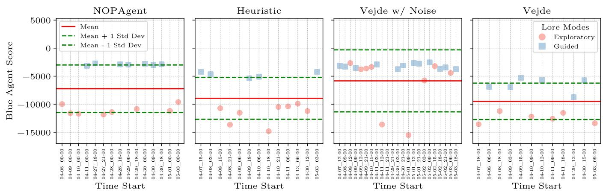  
(a) Returns with no user agents.

Blue Agent Scores Over Time (with Users)  
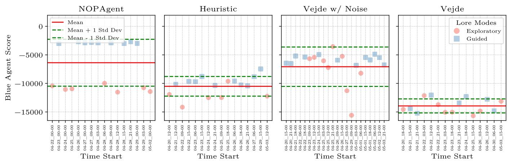  
(b) Returns with user agents.  
Fig. 7: Scatter plots of returns over time after running defender agents in ADS-24 against Lore, with and without user agents present. Higher returns are better.

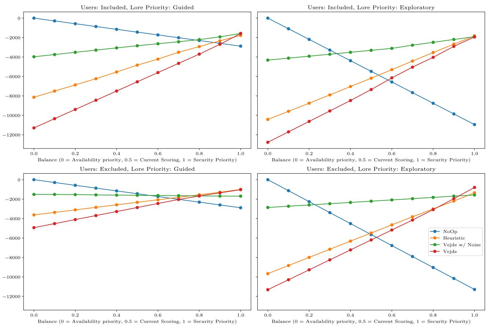  
Fig. 8: Agent returns for different prioritizations of attack and defense cost, calculated as $R _ { \alpha } = ( 1 - \alpha ) R _ { a } + \alpha R _ { d } .$ , with $\alpha = 0 . 5$ representing the current balance.

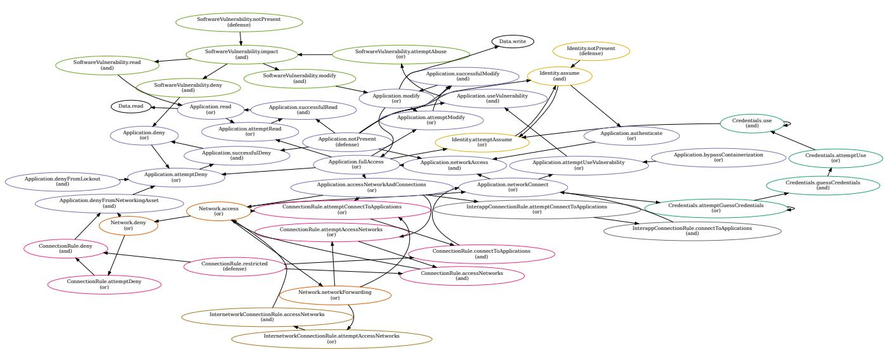  
Fig. 9: Graph depiction of the MAL CadsLang language. Nodes represent attack steps, with directed edges showing possible subsequent steps.

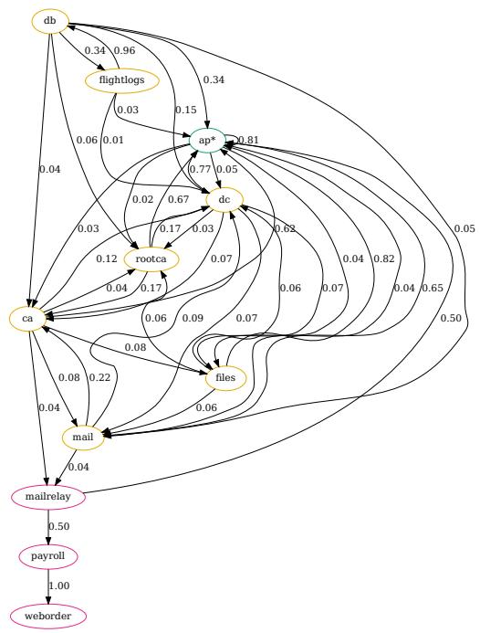

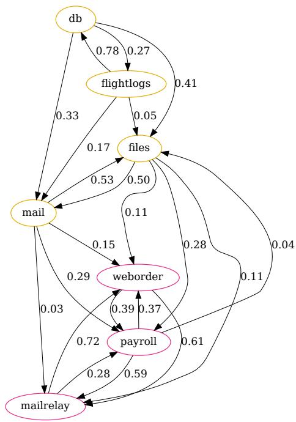  
(a) Exploratory. Hosts in the client net have been combined into a(b) Guided. With this configuration, Lore does not compromise any of single node for clarity. the hosts in the client net.  
Fig. 10: Graphs showing estimated probability of Lore compromising a host when not interrupted with the two strategies, “Guided” and “Exploratory”. Probabilities < 1% are not drawn.

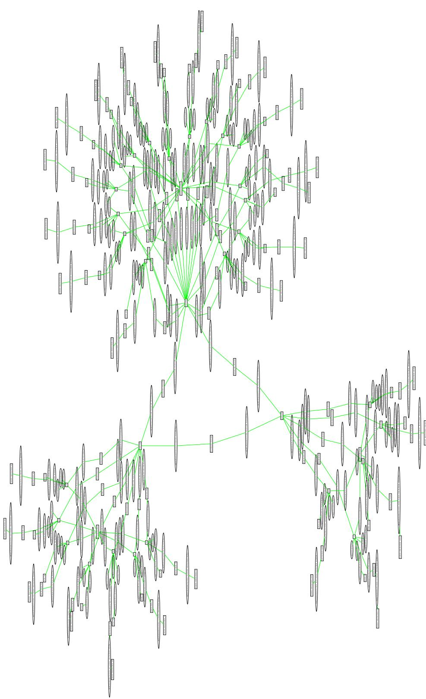  
fiFig. 11: Bipartite graph representation of an initial MAL Simulator state, converted to the Vejde representation format.

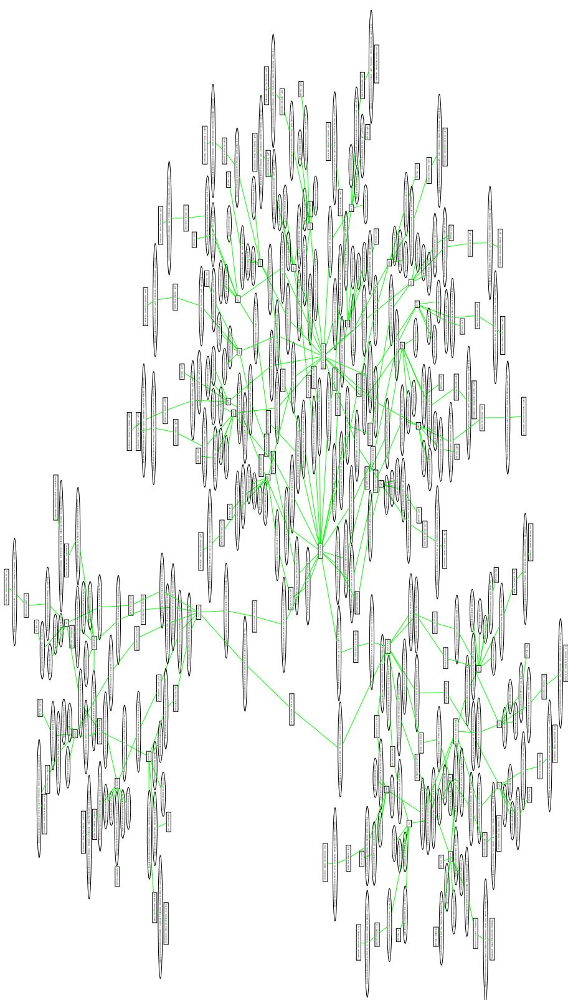  
fiFig. 12: Bipartite graph representation of an initial observed CRATE state.