# AI for Games in the Foundation Model Era

Meng Luo1, Yanlin Li1, Hao Li1, Hongzhan Lin1, Pengfei Zhou1, Tianjie Ju1, Ran Zhang2, Yeying Jin1, Mong-Li Lee1, Wynne Hsu1

1National University of Singapore 2Nanyang Technological University

Foundation models, alongside rapid advances in learned game-world models, are reshaping how AI is used across the game lifecycle. Beyond playing games, recent systems model players and game dynamics, support design and development, adapt player-facing experiences at runtime, and evaluate the resulting artifacts. Yet these directions have largely evolved as separate research threads, making it difficult to distinguish capabilities that transfer across settings from those that remain tied to particular games, engines, interfaces, or player populations. We organize the literature into six roles according to the immediate use of AI output: AI that Plays and Acts, AI that Models Players and Games, AI that Designs Games, AI that Builds and Maintains Games, AI that Generates and Adapts at Runtime, and AI that Tests and Evaluates Games. For each role, we examine what structure is supplied by the game or workflow and what AI learns, generates, predicts, or revises; which capabilities transfer and which artifacts can be reused across settings and roles; and what claims are supported by the available evidence. We further identify concrete cross-role connections: trajectories can train world models, learned environments can provide experience for agents, design specifications can drive executable implementations, and feedback from play or testing can guide revision. Across these connections, however, control schemes, rules, engine interfaces, state representations, and player contexts often remain setting-specific, so downstream capability claims require validation in their target setting. Evaluation is most standardized and execution-grounded for bounded game playing and selected learned environments, while persistent state in learned worlds, repeated software revision, validated player modeling, sustained runtime adaptation, and representative automated testing remain less established. Together, these findings point to a central challenge for AI in games: enabling outputs and capabilities to be reused or transferred across roles while re-establishing evidence for their effectiveness in the game-specific structures, interfaces, and player contexts where they are ultimately used.

ΠProject: https://eurekaleo.github.io/awesome-ai-for-games

GitHub: https://github.com/Eurekaleo/awesome-ai-for-games

R Contact: mluo@u.nus.edu, danielhzlin@nus.edu.sg

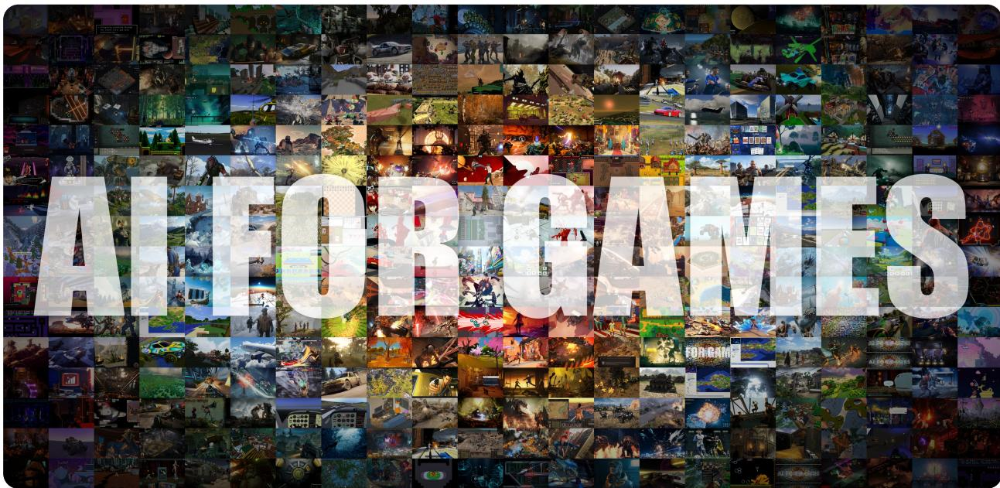  
Figure 1: AI for Games in the foundation model era. The tiles are in-game frames from commercial and open-source games, research environments, and generative game systems reviewed in this survey.

## Contents

Introduction 3   
2 Roles Across the Game Lifecycle 5   
2.1 Assigning Primary and Secondary Roles 6   
3 AI That Plays and Acts 10   
3.1 Player and Generalist Agents . 10   
3.2 Learning and Control Hierarchies 12   
3.3 Test-Time Adaptation and Memory 14   
3.4 Opponents, Teammates, NPCs, and Companions 16   
4 AI That Models Players and Games 19   
4.1 Planning Models, Training Environments, and Interactive Simulators 19   
4.2 Representation, Uncertainty, and Persistent State 22   
4.3 Player Models and Behavioral Inference. 25   
4.4 Action Interfaces, Real-Time Generation, and Long-Horizon Consistency 28   
5 AI That Designs Games 31   
5.1 Assets, Levels, and Worlds 32   
5.2 Rules and Mechanics 35   
5.3 Narrative and Co-Creative Design 36   
6 AI That Builds and Maintains Games 38   
6.1 Code, Scenes, and Engine Projects 38   
6.2 Tool-Using Development Agents . 40   
6.3 Execution, Debugging, and Repair . 42   
6.4 Revision, Maintenance, and Handoff 43   
7 AI That Generates and Adapts at Runtime 44   
7.1 Generative Characters, Narrative, and Content 44   
7.2 Runtime Rules, Mechanics, and Worlds . 46   
7.3 State Consistency and Long-Term Memory . 47   
7.4 Personalization, Adaptation, and Deployment 49   
8 AI That Tests and Evaluates Games 52   
8.1 Automated Playtesting. 53   
8.2 Software and Mechanic Verification 55   
8.3 Model-Based Judges . 57   
8.4 Player Representativeness and Human Relevance . 59   
9 Benchmarks and Evidence Across the Six Roles 60   
9.1 Role-Specific Evaluation Targets and Metrics . 61   
9.2 A Cross-Role Framework for Interpreting Evidence 67   
9.3 Limits of Interpretation and Generalization. 68   
10 Discussion: Cross-Role Connections 72   
10.1 Broader Interfaces and Game-Specific Structure 72   
10.2 Artifact Reuse and Capability Transfer 73   
10.3 Validating Downstream Benefits . 75   
11 Open Challenges and Research Directions 76   
11.1 Play and Act: Transfer Across Interfaces and Rules 76   
11.2 Model Players and Games: Persistent World State and Reliable Player Models 77   
11.3 Design: Designer Intent, Diversity, and Control 78   
11.4 Build and Maintain: Reliable Revision and Developer Handoff 78   
11.5 Generate and Adapt at Runtime: Cross-Session Consistency and Player Experience . 79   
11.6 Test and Evaluate: Independent Verification and Behavioral Coverage. 79   
12 Conclusion 80   
References 81   
A System Index 106   
B Game Examples and Interactive Demonstrations 116   
B.1 Racing, Team Play, and Learned Simulation 117   
B.2 Fighting, Platforming, and Physics Puzzles . 118   
B.3 Building Games and Generating Live Content 119   
B.4 Character Dialogue and Automated Testing 120

## 1 Introduction

AI for games has long extended beyond playing. Recent uses of GPT-6 Astra make this breadth particularly visible. ARC-AGI-3 evaluates the model in unfamiliar interactive environments, where it must discover how the game works and determine how to act (ARC Prize Foundation, 2026a). Playco reports using the same model within Playbot, an engine-connected development tool, to create playable game prototypes (OpenAI, 2026). Together, these applications place the same pretrained model in different roles across the game lifecycle, with different tasks to perform and different contributions to the game. Figure 1 illustrates the range of settings considered in this survey, from benchmark environments to commercial and generated games.

AI’s participation across this lifecycle draws on several established research traditions. Gameplaying research has developed methods for selecting actions under a game’s rules, with advances through search, reinforcement learning, and self-play (Shannon, 1950; Mnih et al., 2015; Silver et al., 2016; Vinyals et al., 2019; Berner et al., 2019). In parallel, researchers have used procedural generation to produce game content (Togelius et al., 2011) and automated design to explore possible rules and mechanics (Browne and Maire, 2010). Interactive narrative systems shape how stories unfold in response to player actions (Mateas and Stern, 2005), while mixed-initiative systems support authors during design (Smith et al., 2011b). Understanding the resulting experience has motivated work on player modeling, including the use of predicted preferences to guide content adaptation (Yannakakis and Togelius, 2011; Bakkes et al., 2012). Automated playtesting has also used simulated players to examine how different play styles expose different aspects of the same game (Holmgård et al., 2019; Politowski et al., 2022). Much of this work developed in separate research communities around particular AI roles.

Foundation models provide new ways to approach and connect these established tasks (Figure 2). Developers can describe a design intention in natural language and connect pretrained models to tools for implementing it. DreamGarden, for example, develops a high-level idea into a hierarchical plan that designers can inspect and revise, while specialist modules generate assets and code (Earle et al., 2025b). Access to rendered gameplay also allows development systems to inspect the behavior of what they generate. Play2Code connects a coding agent to a browser-based playtester, which interacts with the running game and supplies observations for further revisions (Huang et al., 2026a). Language, visual understanding, and tool use support both proposing changes and inspecting their effects in play.

Models can also participate directly in the interaction between a player and the game environment. In IF:CARGO, players express rules in natural language, and a language model translates them into constrained commands that the engine validates and executes (Hsu et al., 2026b). The model’s interpretation therefore becomes part of how the game responds to its players. GameNGen learns the environment’s responses to actions from gameplay trajectories, producing an interactive simulator (Valevski et al., 2025). Learned environments can also support the training of gameplaying agents. World-model research has developed ways to learn transition dynamics from observations and supply imagined experience for policy learning (Ha and Schmidhuber, 2018; Hafner et al., 2020), and Dreamer 4 trains a policy inside a learned environment (Hafner et al., 2025b). Across these applications, models contribute both to the environment in which interaction occurs and to the behavior of agents acting within it.

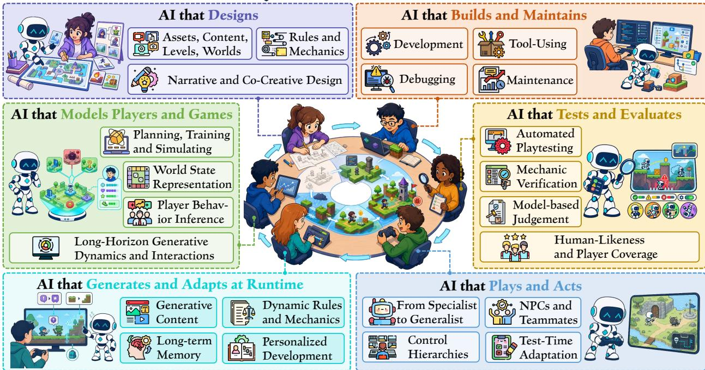  
Figure 2: Six uses of AI output around an executable, player-facing game. The connectors indicate selective inputs and feedback rather than a mandatory pipeline.

Existing surveys establish the breadth of game AI and its major roles. Broad syntheses cover game playing, content generation, and player modeling (Yannakakis and Togelius, 2025), as well as LLM-centered applications (Gallotta et al., 2024; Sweetser, 2024). Gallotta et al. already organize LLM applications around roles within games (Gallotta et al., 2024). Focused surveys examine game-playing agents (Hu et al., 2026b; Xu et al., 2024), machine-learned and LLM-assisted content generation (Summerville et al., 2018; Maleki and Zhao, 2024), player modeling (Bakkes et al., 2012), interactive world models (Liu et al., 2026), social agents (Feng et al., 2025), generative game development (Ternar et al., 2026), and automated testing (Politowski et al., 2022). Together, these accounts provide the foundations for comparing methods within individual areas.

Our survey connects these areas through the outputs that pass between them. It brings executable development and maintenance, runtime generation, and automated evaluation into the same analysis as acting, modeling, and design, while tracing their learned and symbolic predecessors. For each role, we examine the game structure that remains supplied, the transfer and reuse of capabilities and artifacts, and the evidence supporting an output at its point of use. This makes it possible to distinguish a proposed mechanic from its implementation, a player prediction from the adaptation it informs, and a test verdict from the repair it guides. The contribution is a synthesis of these relationships and of the empirical support available across the six roles.

Concretely, we organize AI for games by the immediate use of the system’s output. Systems play and act through decisions and communication, model players and games through predictions and representations, and design through content and rule proposals. Systems that build and maintain implement and revise software; those that generate and adapt at runtime change the live experience; and those that test and evaluate produce evidence about behavior or quality. These uses distinguish contributions that can share an architecture: proposing an interesting mechanic, implementing it correctly, and checking how people encounter it are different achievements. Design assistance helps before implementation; testing guides successive development stages.

Cross-role connections change what can be learned from gameplay. A trajectory can become simulator training data, an experiment inside a learned environment, or diagnostic evidence for software repair. Its value depends on the receiving task. For example, a policy can exploit errors in a learned simulator (Ha and Schmidhuber, 2018), while automated and human playtesters can expose different behaviors and defects (Ariyurek et al., 2021). Comparing these exchanges reveals both new opportunities for reuse and the game-specific information that must accompany an output, including action semantics, state, requirements, and the behavior of the intended players.

Taken together, the survey connects technical lineages across six roles, compares methods and reported results under their actual operating conditions, and synthesizes the exchanges demonstrated between roles. Three findings recur: broad pretraining expands available interfaces without removing game-specific structure; gameplay increasingly supplies data and feedback beyond an agent’s final score; and progress remains task-dependent, with stronger shared benchmarks for bounded play than for sustained creation, adaptation, and human experience. Section 2 introduces the organizing questions and role boundaries. Sections 3–8 develop the technical review; Sections 9–11 compare evidence, connect the findings, and identify open problems.

## 2 Roles Across the Game Lifecycle

We survey AI systems that directly participate in playing and acting in interactive games, modeling players or games, designing game content and mechanics, building or maintaining executable game artifacts, generating or adapting player-facing experiences at runtime, or testing and evaluating games and game artifacts. Particular attention is given to how broad pretraining and language, multimodal, code, and tool interfaces reshape these roles. The foundation-model era therefore serves as an analytical lens rather than an inclusion criterion. Earlier learned and symbolic systems show which task structures, constraints, and evaluation problems predate current models; recent specialist systems are included when they clarify how the same roles are being extended or connected. Player modeling is included when it informs behavior, adaptation, or evaluation, and media generation is included when it enters an evaluated game artifact.

Across the six roles, the analysis returns to three questions:
<table><tr><td>Question</td><td>Recurring inquiry</td></tr><tr><td>Boundary</td><td>What is supplied by the game or workflow, and what is assigned to AI? Which capabilities transfer, which artifacts can be reused, and what</td></tr><tr><td>Transfer and Reuse</td><td>remains setting-specific?</td></tr><tr><td>Evidence</td><td>What claims are supported by evaluation at the point of use?</td></tr></table>

Boundary distinguishes supplied structure from what AI learns, generates, predicts, or revises. Transfer concerns competence under a changed game, engine, interface, player population, or task; reuse concerns a representation, trace, specification, model, or feedback signal consumed elsewhere. Sharing a pretrained backbone or passing an artifact between components does not, by itself, demonstrate transfer. Evidence asks what the resulting system has been shown to accomplish. Table 1 lists outputs, applications, and empirical claims for each role.

Table 1: Six roles: outputs, applications, and the principal empirical claim.
<table><tr><td>Role</td><td>Output</td><td>Applications</td><td>Claim</td></tr><tr><td>Play and Act Model Players</td><td>actions; plans; messages states; transitions;</td><td>players; teammates; NPCs planning; simulation; player models predictive quality;</td><td>action quality</td></tr><tr><td>and Games Design Build and Maintain</td><td>player forecasts code; scenes; project edits</td><td>levels; rules; story structures PCG; automated design; co-creation engine agents; debugging; repair</td><td>policy transfer validity; control working software</td></tr><tr><td>Generate and Adapt at Runtime</td><td></td><td>dialogue; quests; live content characters; adaptive narrative</td><td>consistent content; player response</td></tr><tr><td>Test and Evaluate</td><td>traces; verdicts; diagnoses</td><td>playtesting; verification; judging</td><td>state coverage; verdict accuracy</td></tr></table>

The taxonomy classifies outputs by role rather than model architecture, and roles are not mutually exclusive at the system level. It describes what an output is used for, whereas the lifecycle describes when it is used. A role may recur across phases, and a phase may involve several roles.

## 2.1 Assigning Primary and Secondary Roles

A system may serve several roles, so primary placement follows the immediate use of its output. Actions map to Play and Act; predictions of player behavior or game dynamics map to Model Players and Games; and content or rule proposals evaluated for design quality map to Design. Executable artifacts evaluated for implementation quality map to Build and Maintain; session-specific outputs evaluated through their effects on a live, player-facing experience map to Generate and Adapt at Runtime; and test traces or judgments map to Test and Evaluate. Predictions or simulations produced for planning or training remain in the modeling role even when they run online. When a system spans several roles, we assign its primary role according to the output on which its principal empirical claim rests, while cross-references record secondary roles.

For example, an NPC policy belongs to Play and Act when the claim concerns action or coordination, whereas session-specific dialogue or behavior evaluated for its effect on the live player experience belongs to the runtime role. A playtester belongs to Test and Evaluate when the claim concerns coverage or defects, even though it acts through a game interface. MarioGPT proposes level content and is therefore categorized as Design (Sudhakaran et al., 2023); Play2Code implements and repairs software (Build and Maintain) (Huang et al., 2026a).

Figure 3 situates representative systems, benchmarks, and methods by publication year and primary role, while Figure 4 provides a topic-based guide to the technical subareas and representative work covered in the following chapters. The system index in Section A records primary and secondary roles for systems and named components, while the chapter illustrations summarize the research questions and workflows within each role.

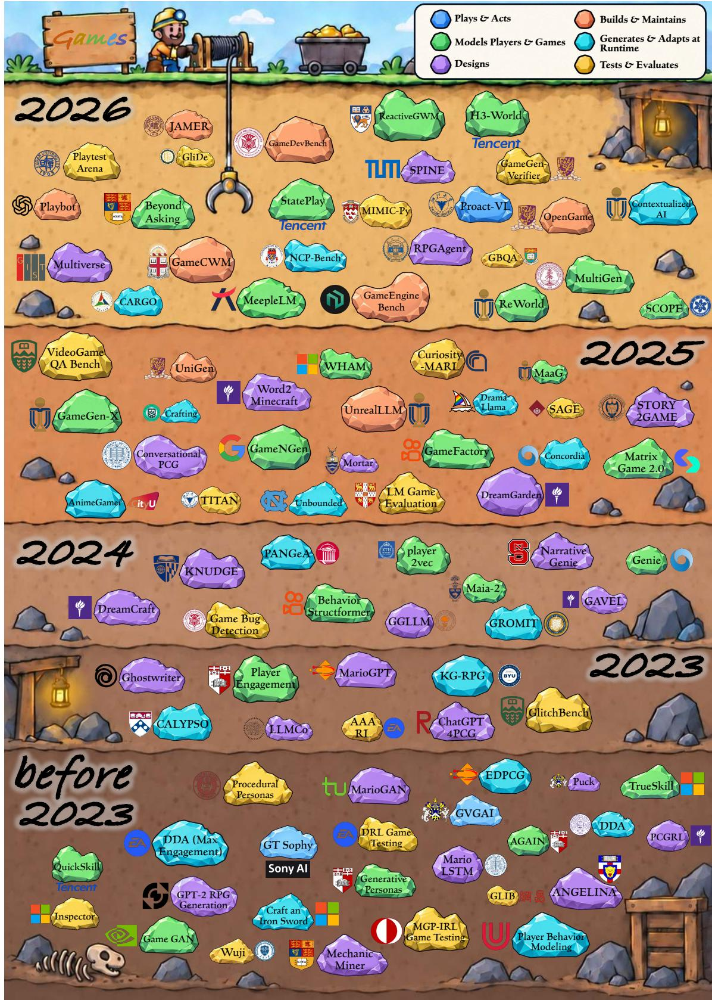  
Figure 3: Timeline of representative AI-for-games systems across the six roles. Selected systems, benchmarks, and methods reviewed in this survey are arranged by year and colored according to their primary role in our taxonomy.

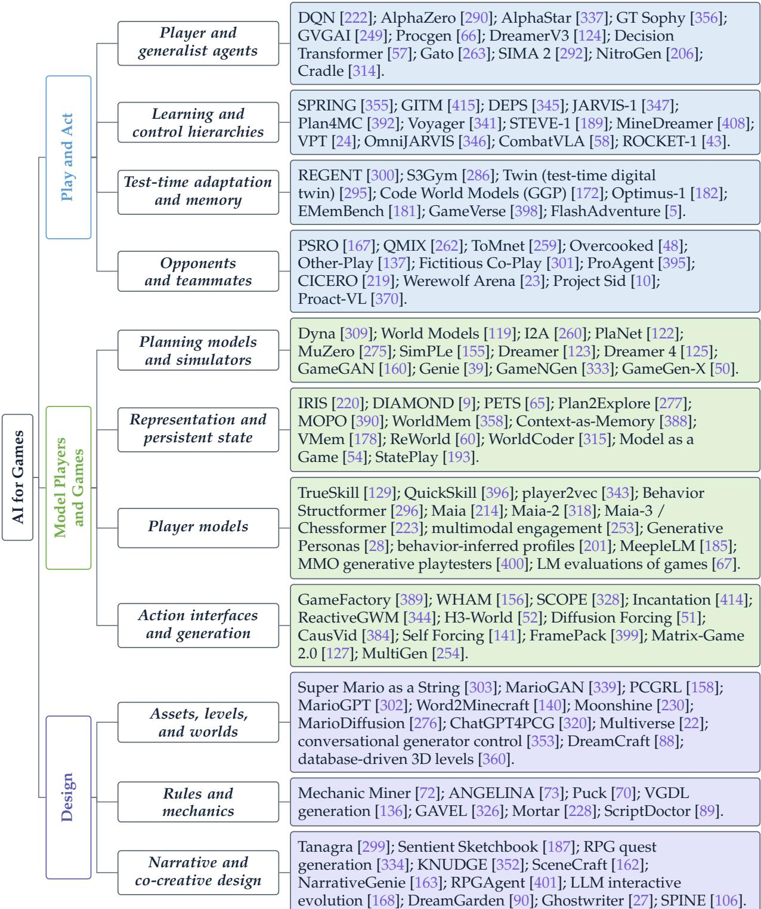  
Figure 4: Taxonomy of AI for games with representative work. (a) Playing, modeling, and design. Each branch lists the systems, benchmarks, and environments of one survey subsection.

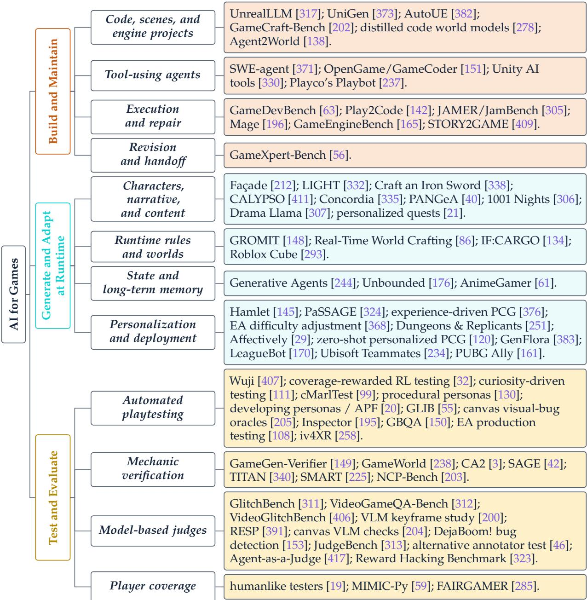  
Figure 4: Taxonomy of AI for games with representative work (continued). (b) Building, runtime generation and adaptation, and testing.

## 3 AI That Plays and Acts

A policy that masters one game has learned a particular combination of observations, controls, objectives, and interaction patterns. Foundation-model agents seek to reuse more of that competence: visual representations help interpret unfamiliar scenes, language supports planning from instructions, and learned or executable skills carry procedures into new tasks. A central design choice is how these resources reach the controls. A language planner using a semantic API receives different support (Wang et al., 2023a; Magne et al., 2026) from a policy acting through native keyboard and mouse input (SIMA Team, 2024). Comparing such agents requires following the division of work between perception, planning, memory, and action, including the adaptation needed when the game or its players change (Figure 5).

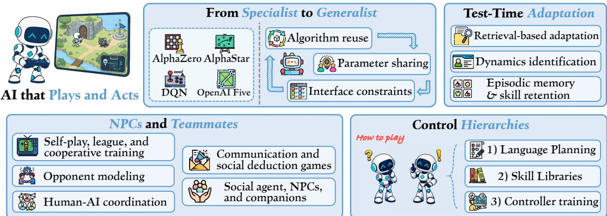  
Figure 5: Research directions for AI that plays and acts: specialist-to-generalist policies, test-time adaptation, control hierarchies, and NPCs and teammates.

## 3.1 Player and Generalist Agents

Strong performance within one game and transfer to another are separate achievements. The literature reuses learning algorithms, trained parameters, and interaction interfaces in different combinations. Distinguishing them explains why a broadly applicable training procedure and a shared policy support different generalization claims.

Specialist agents.[Fig. 6a–c] Specialist results establish how effectively an agent can exploit a wellspecified game and interaction protocol. Early chess and checkers programs used explicit rules and compact states (Shannon, 1950; Samuel, 1959). Deep reinforcement learning connected pixels to actions in Atari (Mnih et al., 2015), while AlphaGo and AlphaZero combined learned policy and value functions with search and self-play (Silver et al., 2016, 2017, 2018). AlphaStar (Vinyals et al., 2019) and OpenAI Five (Berner et al., 2019) extended large-scale training to real-time competition. Honor of Kings further addressed team-composition diversity through curriculum self-play and policy distillation (Ye et al., 2020), while Gran Turismo Sophy combined continuous racing control with tactical interaction and racing etiquette (Wurman et al., 2022). These results broaden the kinds of expertise learned within a game. Their game-specific observations, rewards, and training protocols remain distinct from transfer of a trained policy to unfamiliar games.

Algorithm reuse. One candidate for reuse is the learning procedure. General Game Playing (Genesereth et al., 2005) and GVGAI (Pérez-Liébana et al., 2019) made the procedure the object of reuse: a solver keeps its reasoning machinery when the formal game changes. DreamerV3 provides a learning-era example, using one training configuration across more than 150 tasks while learning separate models and policies for those tasks (Hafner et al., 2025a). Procgen measures what algorithmic reuse leaves open by varying levels procedurally across 16 game-like environments and exposing the gap between memorizing a training distribution and generalizing to held-out levels (Cobbe et al., 2020). General Game Playing, DreamerV3, and Procgen distinguish several changes to the task. A solver can reuse its search machinery when a new game supplies a compatible formal description. A reinforcement-learning algorithm can be reused while its policy is retrained. Procedural variation instead tests new layouts within established mechanics. Different games can change action meanings and objectives as well as appearance, so neither algorithm reuse nor held-out-level performance alone establishes cross-game policy transfer.

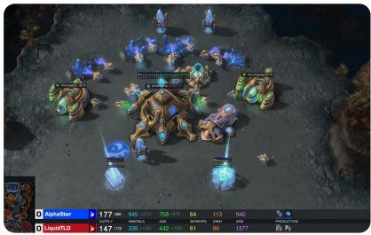  
(a) Specialist agents  
Protoss army against a professional player

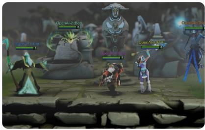

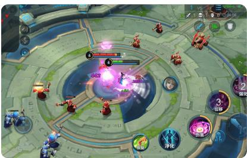  
(c) Specialist agents Structured-state RL agent (illustrative game view)

(b) Specialist agents Allfive heroes controlled by one policy  
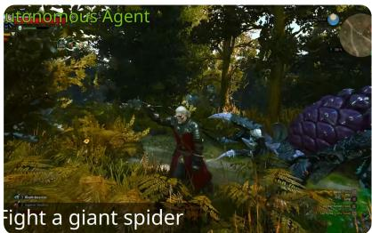  
(d) Parameter sharing  
One shared policy fighting a giant spider

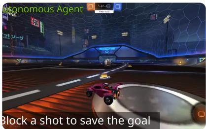  
(e) Parameter sharing

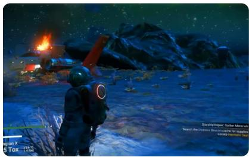  
(f) Parameter sharing  
The same policy blocking a shot  
One policy operating in a commercial title  
Figure 6: Specialist agents built for a single title (a–c) and policies whose parameters transfer across commercial games (d–f): (a) AlphaStar, StarCraft II (Vinyals et al., 2019); (b) OpenAI Five, Dota 2 (Berner et al., 2019); (c) Honor of Kings AI (Ye et al., 2020); (d) NitroGen, The Witcher 3 (Magne et al., 2026); (e) NitroGen, Rocket League (Magne et al., 2026); (f) SIMA 2, No Man’s Sky (SIMA Team et al., 2025).

Parameter sharing.[Fig. 6d–f] A shared policy retains trained weights across multiple tasks or games; transfer to an unseen game is an additional test. Decision Transformer casts offline control as sequence prediction, conditioning actions on past states, actions, and a desired return (Chen et al., 2021b). Return conditioning selects behavior represented in the data but cannot supply missing exploration. Gato demonstrated one multimodal policy spanning Atari, robotics, and language (Reed et al., 2022), while Multi-Game Decision Transformers trained on 41 Atari games and evaluated fine-tuning on five held-out games (Lee et al., 2022). MineDojo connected Minecraft control to large collections of video, language, and web knowledge (Fan et al., 2022). SIMA (SIMA Team, 2024), SIMA 2 (SIMA Team et al., 2025), Game-TARS (Wang et al., 2025c), and NitroGen (Magne et al., 2026) extend shared-policy learning across diverse game collections. Their inputs also differ: SIMA agents follow instructions, whereas NitroGen learns short-context visual–motor behavior without language conditioning. Table 2 separates parameter sharing from the adaptation required in each evaluation setting.

Table 2: Recurring training and evaluation settings for game-agent generality.
<table><tr><td>Setting</td><td>Reused</td><td>Game-specific work</td><td>Examples</td></tr><tr><td>Per-game training</td><td>algorithm; settings</td><td>policy training; dynamics learning</td><td>DQN; AlphaZero; DreamerV3 [222, 290, 124]</td></tr><tr><td>Formal specification</td><td>solver; formal interface</td><td>rules; forward model</td><td>GGP; GVGAI [107, 249]</td></tr><tr><td>Parameter sharing</td><td>policy weights</td><td>held-out testing; fine-tuning</td><td>Gato; Multi-Game DT; SIMA 2; NitroGen [263, 171, 292, 206]</td></tr><tr><td>Test-time adaptation</td><td>base model; retrieval</td><td>demonstrations; rules; exploration</td><td>REGENT; Code World Models; Twin [300, 172,295]</td></tr></table>

The held-out unit also matters within these settings. A new map usually changes layout while retaining a game’s controls and rules; a new mode can change rewards, opponents, or transition rules within the same title. Atari mode-transfer experiments already showed that a policy can fail under such relatively small changes, and that representation reuse and target-task fine-tuning must be distinguished (Farebrother et al., 2018). Holding out an entire game tests a broader change, but success may still concern shared navigation or object-use skills rather than unfamiliar rule reasoning. The cross-setting analysis in Section 9.3.1 distinguishes these settings and their supporting evidence.

Interface constraints. The interface places a practical boundary on each form of transfer. A shared visual encoder may transfer across changes in appearance more readily than a controller transfers from discrete buttons to camera-relative mouse movement. A language goal makes a task description portable across games while leaving the action grammar game-specific: a goal such as gathering a resource can be reused semantically, but the agent still needs to recognize the resource, discover its affordances, and execute the correct controls. A semantic action API reduces motor uncertainty by exposing inventory, legal actions, or navigation routines directly, and in doing so embeds affordances that a native-control agent must learn and execute for itself. Cradle standardizes observation and control around screenshots plus keyboard and mouse across games and applications (Tan et al., 2025), whereas Orak uses a structured MCP interface to support plug-and-play evaluation across 12 games (Park et al., 2026). Cradle and Orak simplify comparison but support different control claims. Generalist performance therefore depends on which of the changing factors (visual appearance, objectives, controls, and timing) change together, on how much interaction is available for adaptation, and on which intermediate services the system receives. Comparisons are most informative when they state those services, since treating every successful task completion as equivalent hides the difference. System-level interfaces, adaptation requirements, and evaluation settings are compared in Appendix A, Table 15.

## 3.2 Learning and Control Hierarchies

Planning and motor control operate at different timescales. A model may know that a resource must be collected while lacking the policy that recognizes it, navigates to it, and completes the interaction. Hierarchical agents connect these decisions through language goals, executable skills, visual targets, or learned action representations.

Language-based planning. A language planner can reason over descriptions of rules and tasks even when motor realization is supplied elsewhere. SPRING derives a structured sequence of reasoning questions from the Crafter paper (Hafner, 2022) and uses textual state descriptions to select actions (Wu et al., 2023). GITM similarly exposes Minecraft knowledge and actions in text, using hierarchical decomposition and memory to handle technology-tree dependencies (Zhu et al., 2023b). DEPS instead emphasizes revising plans from execution feedback (Wang et al., 2023c), while JARVIS-1 combines multimodal planning and memory with goal-conditioned controllers (Wang et al., 2025b). Supplied knowledge can correct a mistaken plan, feedback can reveal an unmet prerequisite, and learned controllers supply motor execution. Success at the first two does not make that last service unnecessary. A useful comparison separates plan validity from plan grounding. Obtaining wood before crafting a tool can be a valid dependency without identifying the visible tree, reaching it, or recognizing completion. Text-state adapters can supply part of that grounding; visual agents must infer more of it from observations. Long-task success depends on plan decomposition and the services that execute and verify subgoals.

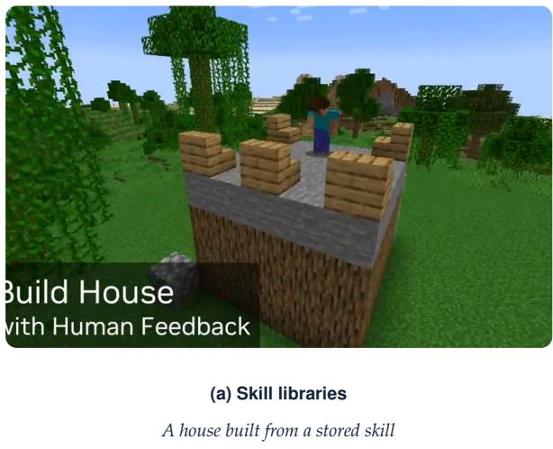

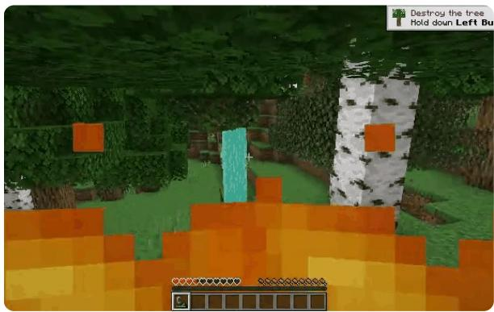  
(b) Planner–controller interface and latency Planner-selected tree executed by the controller  
Figure 7: An intention passing down the control hierarchy, from a stored skill (a) to a planner-selected target executed by the controller (b): (a) Voyager, Minecraft (Wang et al., 2023a); (b) ROCKET-1, Minecraft (Cai et al., 2025b).

Skill libraries.[Fig. 7a] Skills package behavior that a planner can call repeatedly. Plan4MC combines a skill structure with learned policies (Yuan et al., 2023); Voyager retrieves and composes executable code (Wang et al., 2023a); STEVE-1 conditions a pretrained behavioral model on language-linked goals (Lifshitz et al., 2023). These are different representations of reusable behavior. Code can expose API calls and checks for prerequisites, whereas a learned policy can accommodate variation in appearance and movement without enumerating every case. MineDreamer uses a visual intermediate: an image-editing diffusion model imagines a goal consistent with the instruction and current scene, and a goal-conditioned controller converts that target into keyboard and mouse actions (Zhou et al., 2025a). The generated image helps specify what the controller should achieve, rather than predicting a validated sequence of transitions. Repair therefore depends on the representation: an erroneous code skill can be edited, a poor imagined target can be regenerated, and an unreliable motor policy may need additional training. A successful target image is not itself evidence of an accurate dynamics model.

Controller training. Reinforcement learning and self-play remain effective when rewards, legal actions, and repeated environment access are available. They optimize measured game outcomes directly and have produced precise specialist behavior, but reward design and fresh interaction are expensive across broad game collections. Behavioral cloning offers a complementary route: human trajectories can cover purposeful behavior, including regions of the state space that sparse-reward exploration reaches only slowly. Video PreTraining (VPT) learned an inverse-dynamics model from a smaller action-labeled Minecraft dataset and used it to recover controls for a much larger corpus of online video (Baker et al., 2022). JARVIS-VLA starts from the other side: it first adapts a vision–language model to Minecraft observations, then learns keyboard and mouse actions through imitation (Li et al., 2025b). CombatVLA emphasizes efficient action generation for combat (Chen et al., 2025b). VPT and JARVIS-VLA differ in whether motor behavior or visual–language knowledge supplies the pretrained foundation.

OmniJARVIS learns an intermediate representation rather than using either free-form plans or raw controls as the sole bridge. A behavior encoder discretizes trajectories into tokens added to a multimodal language model’s vocabulary, and an imitation-learning decoder executes the selected behaviors (Wang et al., 2024b). Instructions, observations, reasoning, and behavior tokens can then participate in a common sequence-prediction objective. Its Minecraft evaluation supports this connection between high-level instruction following and learned execution; the decoder and training trajectories still provide game-specific motor knowledge. Executable skills offer a useful contrast: code supplies explicit procedures over an API, while behavior tokens refer to procedures learned from interaction data.

Imitation and reinforcement learning provide complementary signals. Demonstrations cover purposeful behavior that sparse-reward exploration may rarely reach, but inherit uneven skill and incomplete action labels. Environment optimization can improve task performance while specializing behavior to the reward and dynamics used in training. Temporal representation matters in both cases. Gated Transformer-XL stabilizes attention-based reinforcement learning and evaluates it on memory-demanding environments including DMLab-30 (Parisotto et al., 2020). A longer history helps only if relevant information is retrieved and acted on before it becomes stale.

Planner–controller interface and latency.[Fig. 7b] The layers meet at two points: how an intention is communicated downward, and how fast the exchange must run. ROCKET-1 addresses the first. For spatial targets that language cannot express precisely, its high-level model communicates tracked visual regions to the low-level policy (Cai et al., 2025b). Real-time games govern the second. A deliberative model may update goals every few seconds while a reactive controller manages movement, camera control, and combat. SwarmBrain makes this separation explicit in StarCraft II (Shao et al., 2024), while recent vision–language–action systems address the same latency pressure through faster action generation and execution (Chen et al., 2025b). Decision quality, control rate, and action-to-effect delay jointly determine behavior: a strategically sound intention can still arrive after the state in which it was useful. Asynchronous planning, cached beliefs, interruptible skills, and safe defaults therefore shape system capability.

## 3.3 Test-Time Adaptation and Memory

Test-time adaptation changes what an agent can learn from a new game before or during evaluation. Demonstration retrieval supplies examples of successful behavior; interaction can reveal unknown mechanics; memory preserves experience for later attempts. Their costs and benefits depend on what information is supplied, what the agent must acquire, and which decisions the retained information improves.

Retrieval-based adaptation.[Fig. 8a] REGENT retrieves state–action examples from demonstrations of a held-out game and combines them with a pretrained policy, allowing in-context adaptation without fine-tuning. The demonstrations and known observation/action spaces remain part of the setup (Sridhar et al., 2025). Retrieved examples provide local evidence about what to do without changing all of the policy’s parameters. Their usefulness depends on whether similarity in the retrieval space corresponds to the same action problem: visually similar states may require different actions after a rule, objective, or inventory change. S3Gym examines reuse across attempts within a game. It separates permissive exploration from evaluation on held-out seeds or configurations in seven games and compares raw interaction histories, summarized experience, and supervised fine-tuning (Shi et al., 2026b). Its reported gains depend on the task: summaries help when experience compresses into reusable strategies, whereas precise state-dependent tasks can benefit from retaining more of the original trajectory. Its text interfaces and supplied game descriptions make this an evaluation of experience reuse, with native visual–motor transfer outside its scope.

Dynamics identification. Twin builds an executable hypothesis of unknown dynamics, checks it against replayed transitions, and searches within the resulting digital twin (Skoutnev et al., 2026). Here interaction has two purposes: obtaining reward and distinguishing competing explanations of the mechanics. A useful exploratory action may expose a collision rule or terminal condition even when it does not immediately improve the score. Code World Models also synthesize executable transition, legality, and termination functions, but the evaluated protocol supplies natural-language rules and initial offline trajectories. The synthesized world model is refined before competitive play and held fixed during it, and inference functions handle hidden information in the partially observed games (Lehrach et al., 2026). The three systems therefore differ in what adaptation reconstructs: REGENT supplies relevant demonstrations to a shared policy, Twin identifies unknown mechanics through interaction, and Code World Models translate stated rules into a testable simulator. Active identification matters particularly in the unknown-rule setting, where an action can reveal a mechanic as well as advance the task.

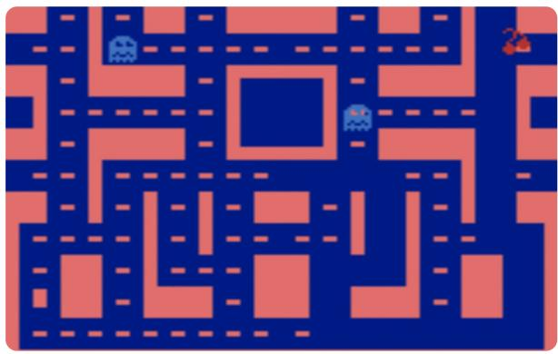  
(a) Retrieval-based adaptation Unseen game played from retrieved demonstrations

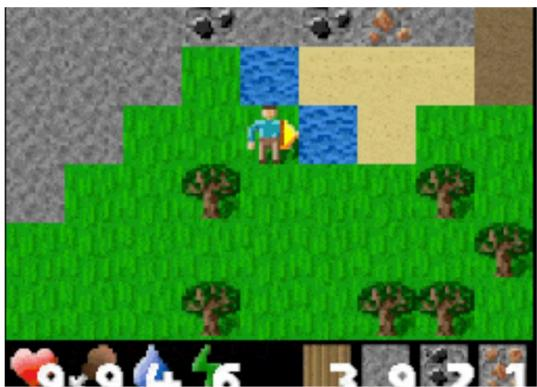  
(b) Episodic memory and skill retention Collected items and vitals shown in the HUD  
Figure 8: Test-time adaptation by retrieving demonstrations for an unseen game (a) and by carrying episodic state through an episode (b): (a) REGENT, Ms. Pac-Man (Sridhar et al., 2025); (b) EMemBench, Crafter (Li et al., 2026b).

Episodic memory and skill retention.[Fig. 8b] Memory supports this process at several levels. Recent observations maintain continuity of control, episodic records recover earlier attempts, summaries compress long trajectories, and skill libraries preserve procedures that have succeeded. EMemBench evaluates trajectory-grounded episodic memory through programmatically generated questions with verifiable answers (Li et al., 2026b), while GameVerse tests whether reflection on gameplay video improves subsequent play (Zhang et al., 2026a). Episodic records and summaries help an agent act under partial observation, but stale summaries, conflicting episodes, and retrieval that misses a reset or rule change make them unreliable. Executable hypotheses and engine state provide stronger grounding when exact legality and termination matter.

Optimus-1 makes a concrete distinction between task knowledge and remembered experience. It retrieves crafting dependencies from a directed knowledge graph for planning, while a pool of compressed multimodal episodes supports a reflector that decides whether to continue, complete, or replan a subgoal. Successful and failed cases are retained, and a STEVE-1 controller executes the resulting goals (Li et al., 2024b). The reported Minecraft experiments and memory ablations connect these components to task completion. Reuse here concerns explicit knowledge and experiences with a particular controller, rather than evidence that a larger context window alone produces general long-horizon competence.

AgenticSTS makes retrieval granularity explicit in Slay the Spire 2: each decision receives a bounded selection of game knowledge, episodic summaries, and triggered strategic skills instead of an accumulating transcript. Its fixed-difficulty ablations compare memory components within one game; the small, ten-run conditions support exploratory comparisons rather than a general advantage for bounded memory (Cheng et al., 2026). The memory unit affects correction as well as capacity: an episode retains context, a summary may omit an exception, and a skill may depend on outdated prerequisites. FlashAdventure tests a different demand across 34 adventure games, where clues discovered in one scene must inform later object use and navigation (Ahn et al., 2025). Progression requires applying remembered facts, not merely recalling them.

## 3.4 Opponents, Teammates, NPCs, and Companions

Other agents make the interaction distribution depend on goals, conventions, and beliefs beyond the learner’s own policy. Self-play, unfamiliar-team coordination, strategic communication, and character interaction therefore pose different learning problems (Albrecht and Stone, 2017; Mirsky et al., 2022; Feng et al., 2025). Language models broaden how intentions and histories can be represented, while the task still determines whether success means winning, coordinating, or sustaining a believable interaction.

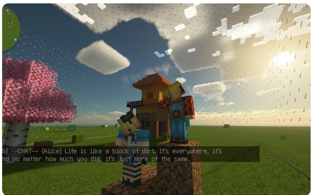  
(a) Task-dependency-based coordination Agents coordinating dependency-linked tasks

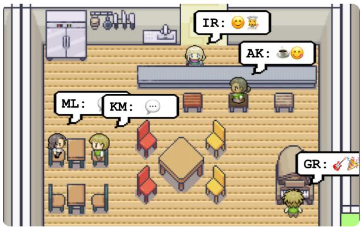  
(b) Social agents, NPCs, and companions An unscripted party emerging from one intention

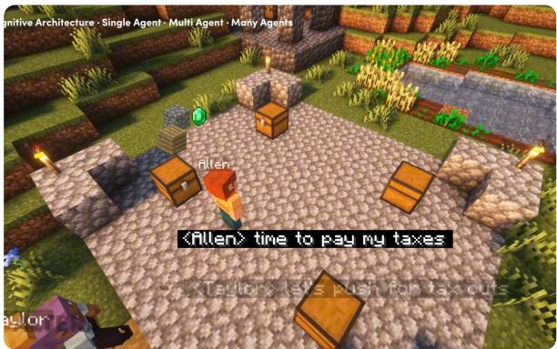  
(c) Social agents, NPCs, and companions Agents negotiating taxation in the village chat

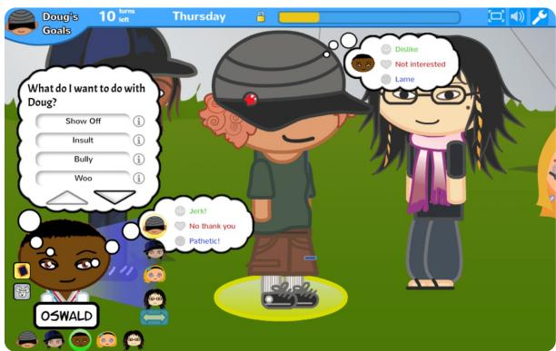  
(d) Social agents, NPCs, and companions Social moves presented as a game menu

Figure 9: Task-dependency-based multi-agent coordination (a) and social agents whose behaviour emerges from interaction (b–d): (a) VillagerAgent, Minecraft (Dong et al., 2024); (b) Generative Agents, Smallville (Park et al., 2023); (c) Project Sid (PIANO), Minecraft (Altera. AL et al., 2024); (d) Comme il Faut, Prom Week (McCoy et al., 2013).

Self-play, league, and cooperative training. Training populations determine which opponents an agent learns to handle. AlphaStar (Vinyals et al., 2019) and OpenAI Five (Berner et al., 2019)

scale competitive training within particular games. Policy-space response oracles address overfitting to training opponents by constructing responses to mixtures of policies (Lanctot et al., 2017). Population-based training in Quake III Capture the Flag (Jaderberg et al., 2019) and the procedurally generated tasks of XLand (Open Ended Learning Team et al., 2021) further vary the partners, opponents, and situations encountered during learning. ReBeL (Brown et al., 2020) and Pluribus (Brown and Sandholm, 2019) combine learning with game-theoretic reasoning in imperfect-information poker. These results establish strong ways to generate training experience; they do not require language interfaces or broad multimodal pretraining.

Cooperative learning additionally faces credit assignment under shared rewards and partial observation. Value-decomposition networks sum individual value functions (Sunehag et al., 2017), QMIX learns a monotonic mixing function compatible with decentralized action selection (Rashid et al., 2018), and MAPPO provides a policy-gradient alternative (Yu et al., 2021). Benchmarks such as SMAC (Samvelyan et al., 2019) and Hanabi (Bard et al., 2020) make these decisions reproducible within specified tasks. Hanabi also exposes convention dependence: an action can convey private information, and partners may interpret it differently. Melting Pot broadens evaluation across social scenarios and partner populations (Leibo et al., 2021). Population diversity and inference about a particular partner are complementary responses to this problem.

Opponent modeling and theory of mind. Models of other agents can predict actions, goals, or beliefs (Albrecht and Stone, 2017). ToMnet learns a prior over agents and predicts a new agent’s behavior from observations (Rabinowitz et al., 2018); LOLA accounts for how one’s own update affects another learner (Foerster et al., 2017); DeepRole combines search, learned values, and deductive beliefs in The Resistance: Avalon (Serrino et al., 2019). These approaches differ in what is inferred: a stable behavioral tendency, a learning response, or hidden information relevant to the current game. Language-based accounts of intentions offer another representation, but must still be checked against subsequent actions rather than judged by plausibility alone.

Zero-shot coordination and human–AI teamwork. Ad hoc teamwork is the problem of collaborating with new teammates without prior coordination, and zero-shot coordination is its no-adaptation special case (Mirsky et al., 2022). Overcooked distinguishes coordinated task execution from compatibility with people (Carroll et al., 2019). Two established approaches address partner variation without assuming a single shared convention. Other-Play trains with known game symmetries to discourage arbitrary coordination conventions (Hu et al., 2020), and Fictitious Co-Play trains a best response to a population that includes agents at different stages of learning (Strouse et al., 2021). Later population methods vary the population deliberately: maximum-entropy population-based training adds a population entropy bonus and trains the final agent against a diversified pool with prioritized sampling, without human data (Zhao et al., 2021). Hidden-utility self-play addresses a different assumption, that every partner optimizes the environment reward, by modeling human biases as hidden reward functions inside the self-play objective (Yu et al., 2023). ProAgent adds online interpretation, inferring and revising a partner’s likely intentions from game state in Overcooked and comparing against trained-agent populations and human-proxy models (Zhang et al., 2024). Human-proxy performance, independent-agent coordination, and interaction with actual players provide distinct tests of the resulting ability.

MindAgent and VillagerAgent address coordination through task allocation rather than partner inference alone. MindAgent schedules work among agents in CuisineWorld and supports human– NPC collaboration (Gong et al., 2024); VillagerAgent[Fig. 9a] uses task-dependency graphs to allocate and update Minecraft subtasks (Dong et al., 2024). Compared with ProAgent’s online interpretation of a partner, these systems make more of the joint plan explicit. Their gains concern coordination over available skills and interfaces; separate controllers supply low-level actions.

Communication and social deduction games. Language can be part of the action space, carrying promises, private information, or deception. Deal or No Deal learns negotiation from human dialogues and uses simulated dialogue continuations (Lewis et al., 2017); CICERO couples dialogue to strategic plans in Diplomacy (Meta Fundamental AI Research Diplomacy Team (FAIR), 2022). In Werewolf, retrieval and reflection reuse prior communications without parameter updates (Xu et al., 2023a), while a separate approach lets a reinforcement-learning policy select among language-model action proposals (Xu et al., 2023b). Recursive Contemplation uses perspectivetaking to reason about hidden roles in Avalon (Wang et al., 2023b). These methods place different constraints on language: generating a credible utterance, selecting a useful action, and inferring concealed information are not the same objective. AvalonBench supplies role-specific agents and baseline opponents (Light et al., 2023); Werewolf Arena compares models in tournaments with bidding-based turn-taking (Bailis et al., 2024). The interaction protocol affects the result alongside the model: who can speak, what history is visible, and how speech relates to legal actions shape the strategic problem. Cross-game comparisons therefore need both protocol and model details.

Social agents, NPCs, and companions.[Fig. 9b–d] NPC behavior can serve characterization and interaction, where competitive score may be beside the point. Comme il Faut in Prom Week models relationships and social affordances explicitly, making social state part of gameplay (McCoy et al., 2013). Generative Agents instead retrieves memories and uses language-model reflection and planning to produce individual and emergent behavior in a sandbox (Park et al., 2023). Authored social rules constrain permissible interactions, whereas language-based reasoning broadens the behaviors a character can propose. Both approaches need to track who knows what and how a player’s intervention changes the scene.

Larger populations add coordination across concurrent activities: Project Sid runs 10 to more than 1,000 agents in Minecraft under the PIANO architecture, which keeps an agent coherent across several concurrent output streams while it interacts with humans and other agents, and reports agents developing specialized roles and changing collective rules (Altera. AL et al., 2024). AgentSociety simulates more than 10,000 agents and five million interactions in a realistic societal environment, which places it beyond games but shows the scale such populations can reach in large-scale simulation (Piao et al., 2025).

Targeted studies examine the coordination, fairness, and timing of NPC behavior. CASCADE evaluates a layered NPC coordination architecture through micro-scenario prototypes and trace analysis (Xu, 2026), while FAIRGAMER tests social bias in NPC interactions (Shi et al., 2026a). Proact-VL decides when to comment or assist during streaming play, making the timing of initiative part of companion behavior (Yan et al., 2026). Coordination, fairness, and timing extend beyond selecting an effective movement or combat action. Runtime dialogue, memory, and their effects on players are developed in Section 7, and learned simulators with explicit NPC control are discussed in Section 4.

## ­ Transfer happens at different levels of control

• A common interface relocates the learning problem. A language planner over executable skills can reuse task knowledge while a specialist controller supplies timing and movement. Native-control policies must learn more of that mapping themselves. Voyager (Wang et al., 2023a), STEVE-1 (Lifshitz et al., 2023), and NitroGen (Magne et al., 2026) therefore offer different kinds of reuse, not interchangeable measures of generality.

• Adaptation includes the information supplied. REGENT (Sridhar et al., 2025) retrieves demonstrations; Twin (Skoutnev et al., 2026) experiments to infer rules. Both adapt without ordinary per-game policy training, but one receives examples and the other pays to acquire them. Comparing unfamiliar-game performance requires accounting for that information and interaction budget.

• Playing well with others is a separate transfer problem. Shared weights or strong self-play can preserve conventions that unfamiliar partners do not share. Other-Play (Hu et al., 2020) and Fictitious Co-Play (Strouse et al., 2021) address partner variation explicitly; task success alone leaves this dimension of generalization unresolved.

## 4 AI That Models Players and Games

Predictions matter in games because decisions depend on what will happen next: a planner evaluates possible actions, a policy learns from simulated experience, and an adaptive system anticipates a player’s response. These uses place different demands on a model. Pretrained video and language representations broaden the observations and descriptions it can accept, but they do not specify which hidden variables, action effects, or behavioral regularities must be preserved. The comparison in this chapter centers on that choice: what is represented and learned, how predictions are used, and whether they remain useful through interaction. World simulation and player modeling share this dependence on use, but differ in data and validation.

## 4.1 Planning Models, Training Environments, and Interactive Simulators

Learned dynamics may support planning, policy training, or direct interaction (Figure 10). A planner needs distinctions that affect action choice; a policy learner needs reliable rollouts under its evolving behavior; a player encounters the generated observations themselves. The same prediction loss can therefore conceal quite different errors in use.

AI that Models Players and Games  
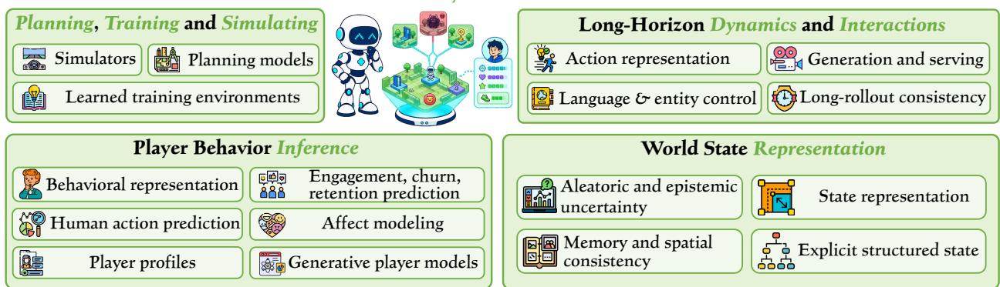  
Figure 10: Research directions for modeling players and games: planning, training, and simulation; worldstate representation; player behavior modeling; and long-horizon interaction.

Planning models. Dyna established the loop of learning transitions and using them for simulated planning (Sutton, 1990). Action-conditional video prediction for Atari (Oh et al., 2015) and recurrent environment simulators (Chiappa et al., 2017) then showed how pixels and actions could be rolled forward over many steps. World Models (Ha and Schmidhuber, 2018), PlaNet (Hafner et al., 2019), and Dreamer (Hafner et al., 2020) brought this loop to visual control by learning compressed dynamics and optimizing behavior in imagined trajectories. Imagination-Augmented Agents made the consumer explicit: a policy learned how to interpret imperfect imagined rollouts, so model predictions never replaced the environment outright (Racanière et al., 2017). MuZero instead learns latent dynamics together with the reward, value, and policy predictions used by search, without reconstructing future observations (Schrittwieser et al., 2020). For an agent-internal model, useful fidelity lies in preserving the distinctions that can change an action choice.

Predicting observations and predicting decision-relevant quantities produce different failure modes. A search model may ignore texture while preserving reward and legal strategic alternatives. A reconstruction model may reproduce texture while missing a rare transition that changes the optimal action. I2A learns an interpretation of rollouts, whereas MuZero trains the quantities consumed by search directly. Planning quality therefore depends on the coupling between model objective and decision procedure, not simply on how much of the visible environment the model reconstructs. A planner can query a fixed model, whereas a policy learner may shift the distribution of states the model must predict as its behavior changes.

Learned training environments. A learned training environment is often evaluated under a changing policy. As the policy improves inside the model, it visits states and action sequences that may be rare in the training data. A small transition error can then look, to the improving policy, like an attractive strategy. SimPLe (Kaiser et al., 2020) and Dreamer (Hafner et al., 2020) connect model quality to the return achieved in the reference environment after learning from imagined trajectories. DreamerV3 improves the robustness of this online loop across diverse tasks using a fixed configuration (Hafner et al., 2025a). Dreamer 4 studies a different condition: learning Minecraft behavior from a fixed offline dataset. Using 2,500 hours of action-labeled contractor data, its reported policy obtains an iron pickaxe in 29% of evaluation episodes and diamonds in 0.7%. Episodes allow 60 minutes, native mouse/keyboard control, and a prescribed sequence of task prompts (Hafner et al., 2025b). The Dreamer 4 results show useful policy improvement through imagination while also locating the remaining difficulty in the final stages of a long task. Online model learning, offline policy learning, and successful deployment in the reference game should be distinguished when comparing simulators.

Online and offline training also differ in how errors are corrected. An online learner can collect reference-game transitions after its policy changes and fit the newly visited states. An offline learner must work with the coverage of a fixed dataset, even when optimization discovers actions outside that coverage. Short imagined rollouts, policy constraints, and conservative action selection address different parts of this problem: reducing compounding error, limiting distribution shift, and avoiding uncertain predictions. Their success is measured by the policy in the reference environment, not by its reward inside the learned simulator. A player consumes the generated observation directly, as the experience itself.

Interactive simulators.[Fig. 11a–d] Player-facing simulators make generated observations part of the experience itself. GameGAN demonstrated action-conditioned visual emulation of a particular game (Kim et al., 2020), Genie learned interactive environments and latent controls from unlabeled video (Bruce et al., 2024), and GameNGen produced real-time Doom interaction with an actionconditioned diffusion model (Valevski et al., 2025). Recent systems such as GameGen-X (Che et al., 2025) and Hunyuan-GameCraft-2 (Tang et al., 2025a) broaden the visual and instructionconditioned domain, although their evidence centers on video quality, controllability, and instruction or action response, and does not establish persistent game-state or mechanics fidelity. Google DeepMind’s Genie 2 (Parker-Holder et al., 2024) and Genie 3 (Parker-Holder and Fruchter, 2025) announcements describe a related general-purpose direction, but they are technical announcements, not peer-reviewed papers. WHAM occupies a related position by generating gameplay continuations and controller actions for human ideation (Kanervisto et al., 2025). Responsive control, visual continuity, and stable affordances all matter because players learn the world through the sequence of observations the model generates.

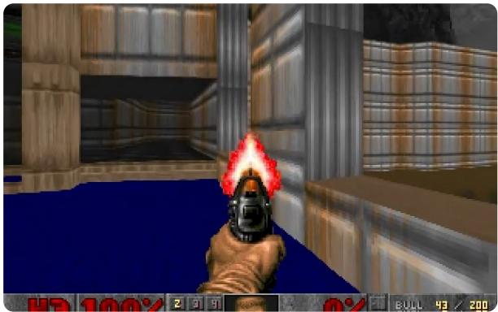

  
(b) Interactive simulators Generated street responding to the pressed key

  
(c) Interactive simulators Aflyable world generatedfrom a prompt

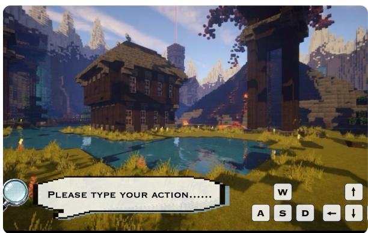  
(d) Interactive simulators Generated village steered by keys and text  
Figure 11: Learned simulators that a player interacts with directly; each frame is produced in response to the input shown: (a) GameNGen, DOOM (Valevski et al., 2025); (b) Genie 2, generated street (Parker-Holder et al., 2024); (c) Genie 3, generated world (Parker-Holder and Fruchter, 2025); (d) Hunyuan-GameCraft-2, generated voxel world (Tang et al., 2025a).

PlayGen combines game-specific data collection with an autoregressive diffusion Transformer and evaluates interactive mechanics as well as visual generation (Yang et al., 2024b). Its selected 2D and 3D games show why interaction tests belong alongside video metrics, while leaving transfer to unfamiliar rules a separate question. MineWorld similarly studies real-time actionconditioned Minecraft simulation, with speed and control evaluated within that game’s data and action space (Guo et al., 2025). Both ground the generative model’s controls in target-game interactions. Appendix A, Table 16, compares systems by representation, control inputs, and evaluation.

Players are not the only source of interaction a simulator meets. Agent trajectories can help train and test learned environments. GameNGen obtains simulator-training trajectories from an RL agent playing Doom (Valevski et al., 2025), whereas Dreamer 4 uses a learned environment to train a policy (Hafner et al., 2025b). PlayWorld uses agents to probe generated worlds, adapting action sequences to pursue the same objective across models (Ding et al., 2026). Such tests examine whether a model sustains controllable interaction in addition to producing visually plausible predictions (Sections 8 and 9). Supervision by interaction also appears where the model is symbolic and executable. Agent2World assigns separate agents to research a domain, implement a world model, and test its behavior through unit tests and simulation, and the resulting repair trajectories are then reused for fine-tuning (Hu et al., 2025). Its benchmarks use PDDL and code representations in place of player-facing video, but they show that interaction can supervise the construction of a model as well as a policy.

## 4.2 Representation, Uncertainty, and Persistent State

What a model retains helps determine which kinds of fidelity it can support. Perceptual quality concerns the rendered sequence; mechanics correctness concerns whether actions produce legal consequences; persistent state concerns whether those consequences survive later interaction and changes of view. These requirements overlap but are not interchangeable: a health bar can look convincing while displaying an incorrect value, and a correctly predicted pickup can be forgotten on a revisit. The evaluation analysis in Section 9.1.2 connects each requirement to a distinct test.

A finite representation must retain the information needed for future interaction. Compression, uncertainty estimation, retrieval, and explicit state address different parts of this problem: omitting a visual detail is not the same as forgetting a collected item or predicting an unfamiliar transition with unjustified confidence about its outcome.

State representation. Representation determines which regularities are easy to preserve. Latentstate models move temporal prediction into a compressed representation, and their objectives determine how much reconstructive detail and control-relevant information that representation retains. PlaNet (Hafner et al., 2019) and Dreamer (Hafner et al., 2020) use stochastic recurrent statespace models, whereas MuZero learns a state shaped directly by search objectives (Schrittwieser et al., 2020). IRIS preserves a reconstructive visual target through a discrete autoencoder and models the resulting tokens autoregressively (Micheli et al., 2023). DIAMOND provides an instructive counterpoint: its diffusion world model preserves visual details that improve Atari policy learning, suggesting that seemingly incidental pixels can carry action-relevant information (Alonso et al., 2024). Compression is useful only when it preserves the distinctions needed by the planner, learner, or player.

In a recurrent state-space model, the observed frame updates a posterior state during training or real interaction, while imagined rollouts use a predictive prior without the next observation. Reconstruction, reward prediction, and latent regularization shape what survives this transition (Hafner et al., 2019, 2020). Token models place a discrete visual encoder before temporal prediction. Pixel diffusion retains a richer reconstruction target but allocates more computation to appearance. The relevant trade-off is thus not simply model size: representation, training losses, and rollout procedure jointly determine which errors the downstream controller can detect or exploit. Representation limits what is retained; training data limit what is learned.

Aleatoric and epistemic uncertainty. Random events and hidden state can make several futures plausible even when the dynamics are known. Epistemic uncertainty instead concerns what the model has not learned from its data. SimPLe (Kaiser et al., 2020) and DreamerV3 (Hafner et al., 2025a) use discrete stochastic latent variables to represent alternative futures. Diverse samples, however, do not by themselves show that a model recognizes an unfamiliar mechanic or assigns calibrated probabilities to its outcomes. This distinction matters when a planner can exploit an incorrect transition that appears valuable. Ensembles offer a complementary way to estimate model uncertainty. PETS propagates stochastic-model and ensemble uncertainty through sampled trajectories (Chua et al., 2018); Plan2Explore uses predictor disagreement to direct exploration (Sekar et al., 2020). In offline learning, MOPO penalizes uncertain model rewards (Yu et al.,

2020), while MOReL treats insufficiently supported transitions pessimistically (Kidambi et al., 2020). These continuous-control studies supply technical precedents for game models, not gamesimulator results. The practical distinction is between sampling a known random outcome and collecting evidence about an unknown rule. Visual diversity addresses neither rule uncertainty nor calibration automatically.

Memory and spatial consistency.[Fig. 12a–c] Visual history often serves as the primary state store in video models. It naturally preserves recent motion and appearance, but off-screen objects, inventories, delayed events, and revisited geometry place increasing pressure on a finite context. Current systems combine three responses to this pressure.

  
(a) Memory and spatial consistency Hall unchanged after the camera returns

  
(b) Memory and spatial consistency Bridge and roofs stable after a loop

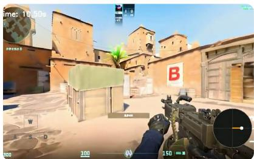  
(c) Memory and spatial consistency  
A courtyard revisited using camera-pose memory

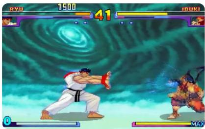  
(d) Explicit structured state  
Health, timer and meters predicted as variables

  
(e) Explicit structured state

  
(f) Explicit structured state  
Monster pose predicted as explicit state  
Boss behaviour driven by a hidden state layer  
Figure 12: Persistence in learned simulators: scenes that remain consistent when revisited (a–c) and game state predicted as explicit variables (d–f): (a) ReWorld, castle interior (Chen et al., 2026d); (b) Context-as-Memory, Japanese townscape (Yu et al., 2025a); (c) WorldCam, FPS map (Nam et al., 2026); (d) StatePlay, Street Fighter III (Lin et al., 2026c); (e) Marionette, monster hunt (Meng et al., 2026); (f) WorldMind, Hollow Knight (Deng et al., 2026).

The first extends what a fixed context can hold. ReWorld keeps a fixed-budget key–value cache behind mixed local and global attention (Chen et al., 2026d). FramePack compresses input frames by importance so that more history fits within a constant context length (Zhang et al., 2025b), and Mixture of Contexts replaces dense attention with learned sparse routing, in which each query attends to a few informative chunks plus mandatory anchors (Cai et al., 2025c). The second retrieves earlier views on demand. WorldMem indexes past frames by pose and time (Xiao et al., 2025), Context-as-Memory selects context frames by field-of-view overlap between camera poses (Yu et al., 2025a), and ReWorld adds pose-indexed landmark retrieval. The third anchors memory to geometry instead of frames. PERSIST evolves a latent 3D scene through separate environment, camera, and rendering components (Garcin et al., 2026), WorldCam uses camera pose to organize an autoregressive 3D world (Nam et al., 2026), and VMem indexes past views by the surface elements they observed so that generation retrieves only the views relevant to the

current viewpoint (Li et al., 2025c).

AlayaWorld’s revised renderer reprojects a streaming 3D point cache into the next viewpoint, while Alaya-EVOKE retrieves geometry-indexed history to reduce long-context conditioning costs (AlayaWorld Team, 2026; Yin et al., 2026c). These extend the geometry-based route.

Evidence for all three routes is mostly visual. On a mixed-source benchmark, ReWorld reports visual recall over 64-second out-and-back trajectories and an overall rotation error of 11.95◦ (Chen et al., 2026d), testing long-horizon view recovery and camera control, respectively. Numerical mechanics, spatial recall, and narrative or inventory persistence require different records and different tests, and success on one does not settle the others.

Explicit structured state.[Fig. 12d–f] Recent systems make selected missing variables explicit. Model as a Game retains numerical events in an external computation module and conditions visual generation on explicit spatial memory (Chen et al., 2025a). StatePlay jointly predicts frames and internal variables such as health, meters, and timers. In its Street Fighter III testbed, the authors report normalized state error below 0.06 and a gain of 18.6 percentage points over the strongest stateless baseline on mechanics-fidelity judgments. The model receives the initial numerical state. Subsequent state error is checked against recorded traces, whereas mechanics fidelity is scored by two vision–language judges on 100 test clips (Lin et al., 2026c). WorldMind reconstructs a compact state before selecting non-player-character behavior and rendering the next observation. On one-minute Game A rollouts, two LLM judges prefer WorldMind to the baselines in approximately 70% of pairwise comparisons for tactical appropriateness and coherence. Engine state is used for data collection but is not exposed at inference (Deng et al., 2026). Marionette takes a related hybrid route by predicting an articulated state, applying a fixed geometry renderer, and then synthesizing appearance (Meng et al., 2026). StatePlay, WorldMind, and Marionette supply different kinds of structure: joint numerical prediction, explicit NPC decisions, and geometric rendering. Their reported improvements support those specific components, and none supports a claim of complete game-state correctness.

Explicit state is not a single representational choice. Numerical variables make updates such as damage or elapsed time measurable. Geometric state constrains where objects can reappear. Executable code can enforce a transition instead of predicting it: WorldCoder builds a Python program of its environment from interaction and edits that program to transfer across gridworlds (Tang et al., 2024a), GIF-MCTS synthesizes code world models through a generate–improve–fix search evaluated on an 18-environment benchmark (Dainese et al., 2024), and the code world models of Section 3.3 translate stated game rules into executable simulators (Lehrach et al., 2026). Numerical, geometric, and executable state incur different supervision costs. State traces require instrumentation, geometry requires spatial estimation or annotations, and executable rules require a specification and implementation. A model can combine them, but the resulting evaluation must still test whether the representations agree after action, especially when a visible animation and an internal variable suggest different outcomes.

State supervision from instrumented games. Games can expose synchronized observations that would be difficult to obtain from ordinary video. WildWorld records Monster Hunter Wilds with aligned RGB, depth, camera poses, skeletons, actions, and state annotations. Its comparison of camera-, skeleton-, and state-conditioned generation separates sources of control that pixel-only datasets conflate (Li et al., 2026c). A separate data engine for Black Myth: Wukong reports more than 90 hours of frame-aligned player inputs, engine states, and visual observations (Li et al., 2026d). WorldRover instead renders prescribed explorations of artist-built Unreal environments, retaining geometry and trajectories while changing viewpoint or appearance. Its action signals are derived from trajectories, rather than recorded as human button presses (Xu et al., 2026c). This distinction matters when using the data to learn a controller.

Rendering buffers provide another kind of supervision. Generative World Renderer extracts RGB together with depth, normals, albedo, metallic, and roughness channels from two commercial games, and uses these buffers for generative appearance editing (Huang et al., 2026c). They describe visible geometry and materials, not health, inventory, or quest progress. Access to a game therefore creates an opportunity for precise supervision, not an automatic source of every relevant variable: collection still requires suitable instrumentation, permission, synchronized timestamps, and a known game version. Inferred poses or trajectories should remain distinguishable from quantities recorded directly by the engine.

## 4.3 Player Models and Behavioral Inference

Player models predict behavior or infer properties of people and populations from gameplay, questionnaires, or sensor data (Yannakakis et al., 2013; Smith et al., 2011a; Hooshyar et al., 2018). Experience-driven PCG (Yannakakis and Togelius, 2011) and PaSSAGE (Thue et al., 2007) use such predictions to select content; procedural personas simulate styles for testing (Holmgård et al., 2019). Broadly trained sequence and language models extend how behavior can be represented and generated. Their targets remain distinct: predicting a move, inferring a preference, estimating an experience, and simulating a player require different ground truth. Believable fictional behavior is not itself evidence of fidelity to a real person. The different prediction targets and their validation settings are indexed in Appendix A, Table 17.

Behavioral representation learning. Representation learning offers one route from player logs to reusable models. player2vec serializes tracking events and trains a Longformer with masked-token prediction, and its evidence consists mainly of reconstruction metrics and qualitative embedding structure (Wang et al., 2024a). Behavior Structformer instead embeds structured event fields directly and evaluates supervised session-count targets constructed from behavioral logs (Smirnov and Polisi, 2024). The distinction matters: recovering a masked event, predicting an engagement proxy, and inferring a preference are different tasks. The two industrial studies demonstrate how game-specific event schemas can support sequence models, but do not independently validate a psychological interpretation of the learned embedding. Simpler representations can carry a surprising share of the signal. Behavioral features engineered from more than 75,000 battle-royale matches predicted player rank better than three mainstream rating systems, with some features informative for all players and others only for particular groups (Dehpanah et al., 2021). Modeling and adaptation can also be built as one process: a multi-armed-bandit formulation collects the data needed to model the current player while adapting the experience on the basis of that model, and can be tuned in simulation before a user study (Gray et al., 2020). Open player modeling asks whether and how players should see these models (Zhu and El-Nasr, 2021).

Event encoding is a substantive part of this modeling problem. A sequence can represent a button press, a semantic action such as buying an item, or an aggregated session statistic. The encoding determines whether the model learns motor patterns, strategic routines, or populationlevel activity. Temporal order and time gaps can also carry different information: repeated actions in one encounter and the same actions across several days need not indicate the same preference. Reuse across games therefore requires an account of event correspondence, which a Transformer that accepts variable-length sequences does not by itself supply. An embedding is validated by what it predicts, and the most direct target is the player’s next action.

Human action prediction and human-likeness. Predicting human actions, as opposed to optimal ones, is the aim of the Maia line in chess. Maia modeled the granular decisions that make up human play at each skill level, from twelve million online games per rating range, arguing that matching aggregate performance is not the same as matching behavior (McIlroy-Young et al., 2020a), and a follow-up learned models of individual players whose predictions are specific to one person (McIlroy-Young et al., 2020b). Maia-2 conditions a shared chess model on player skill (Tang et al.,

2024b), while Maia-3 uses board-square tokens and geometric attention to improve human move matching (Monroe et al., 2026), and both retain strong chess-specific representations. Maia4All targets the individual player beyond population-level skill: it first learns player prototypes, then adapts an embedding from as few as 800 positions, approximately 20 games. Its held-out move accuracy rises from about 51.4% for Maia-2 to 53.2% in that low-data condition (Tang et al., 2026). This is evidence of more accurate individual action prediction within chess, without requiring the embedding to correspond to a named personality trait. Outside chess, the Learning to Play Like Humans framework guides a language model through interactive fiction with structured map building, action learning, and feedback-driven experience analysis, aligning the agent’s behavior with narrative intent instead of task score alone (Zhang and Long, 2025).

Matching human actions and maximizing game strength are different objectives. A strong engine may systematically avoid mistakes that are characteristic of a particular skill group. Conditioning on skill models a population tendency, while adapting to one player’s history can capture recurrent choices within that group. Held-out positions prevent memorizing specific examples. Held-out players test the population model. Later games by the same person test whether an individualized representation remains useful. The three splits answer different questions even when all are scored by move accuracy. Action histories can also support inference of broader properties such as style or skill, which are the next objects of analysis.

Play-style, skill, and preference profiles. Skill estimation and style inference use different observations. TrueSkill infers ability from match outcomes (Herbrich et al., 2006), and QuickSkill estimates skill from early play (Zhang et al., 2022); evaluations of rating systems examine accuracy and data efficiency in particular game populations (Bober-Irizar et al., 2024). Telemetry clustering instead groups patterns of play, with results affected by the representation, clustering method, and observation period (Drachen et al., 2012; Bauckhage et al., 2015; Drachen et al., 2014; Sifa et al., 2013). A useful caution comes from comparing computed and self-reported styles: behavioral features can predict agreement with procedural personas without predicting the style players attribute to themselves (Green et al., 2022). Foundation-model adaptation systems inherit this validation problem. Beyond Asking infers profiles from observed behavior, tests recovery of controlled synthetic traits, and includes an exploratory 12-participant pilot (Lu et al., 2026b). A match-three deployment instead uses language-model reasoning to assign coarse player types and evaluates the resulting personalized levels (Hafnar and Demšar, 2025). These test different parts of a pipeline. Synthetic trait recovery checks inference under the generator’s assumptions; downstream player outcomes assess the intervention without necessarily identifying which inferred trait helped.

A player-modeling pipeline also needs to separate observations, inferred constructs, and intervention outcomes. An estimate of cautious play might predict avoidance behavior without corresponding to a stable personality trait. Conversely, a coarse profile may still be useful for selecting levels. For models inferred from interaction, calibration and temporal stability can be measured before deployment, while randomized content comparisons can assess downstream benefit. This prevents an improvement in level completion from being treated as proof that every intermediate profile is accurate. Style and skill can be inferred from behavior. Subjective experience requires a signal of its own.

Affect and experience modeling.[Fig. 13a] Affective game computing treats player experience as the output of a loop of affect elicitation, sensing, detection, and adaptation, with its own annotation protocols and corpora (Yannakakis and Melhart, 2023). The AGAIN dataset illustrates this at scale: more than 1,100 in-game videos with gameplay data from nine games, annotated for arousal by 124 participants in a first-person, continuous fashion, totaling more than 37 hours of annotated gameplay (Melhart et al., 2021).

Gameplay footage also provides inputs for affect prediction. Convolutional networks mapping gameplay video to arousal classify high against low arousal at more than 78% average and 98% best accuracy under leave-one-video-out validation on 50 videos of a survival shooter (Makantasis et al., 2019), and general-purpose audiovisual representations of arousal generalize across four dissimilar games (Makantasis et al., 2021). In a commercial title, fusing footage with gamepad actions predicted the long-term engagement of 25 players of Tom Clancy’s The Division 2 at up to 72% average and 88% best accuracy on nearly 20 hours of annotated play (Pinitas et al., 2023), and a label-free approach approximates experience from Let’s Play videos and correlates with self-reported and sensor measures of affect in Angry Birds (Goel et al., 2024).

(b) Engagement, churn, and retention prediction Commercial title whose churn is predicted  
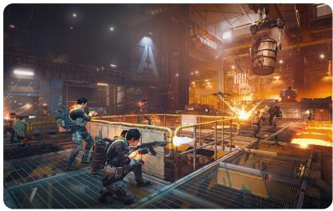  
(a) Affect and experience modeling Commercial gameplay annotated for player engagement

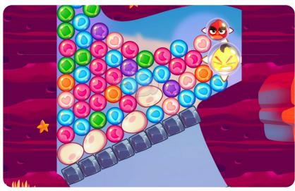

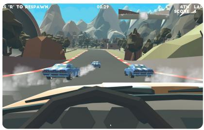  
(c) Generative player models and LLM player simulation  
Racing environment driven by generative personas  
Figure 13: Games in which player experience (a), retention (b), and simulated players (c) are modelled: (a) Pinitas et al., The Division 2 (Pinitas et al., 2023); (b) Roohi et al., Angry Birds Dream Blast (Roohi et al., 2020); (c) Generative personas, Solid Rally (Barthet et al., 2022).

Foundation-model studies examine whether broader visual representations support engagement prediction across games. A study of three vision–language models under six prompting strategies on nine first-person shooters finds zero-shot engagement predictions generally weak, often failing to beat per-game majority-class baselines, with retrieval-augmented prompting helping pointwise prediction in some settings while pairwise prediction of engagement change remains difficult (Wang et al., 2026c). The adaptation half of the loop is treated in Section 7.4. Engagement and continued play offer additional outcomes, but retention does not directly measure enjoyment.

Engagement, churn, and retention prediction.[Fig. 13b] Retention is an observable behavioral outcome, but not a direct measure of enjoyment. Survival models handle players whose eventual departure is not yet observed (Periáñez et al., 2016), while early-session heuristics can provide competitive retention baselines (Drachen et al., 2016). Usage-window modeling (Jang et al., 2021) and combined sequence/survival predictors (Guitart et al., 2019) further illustrate how the target depends on when observations are collected. These analytics studies provide context rather than the survey’s foundation-model focus. More directly relevant to game design, simulated populations with different skill, persistence, and boredom can turn agent-estimated level difficulty into churn and pass-rate predictions (Roohi et al., 2020). Such estimates need validation against real populations and cannot be inferred from an agent’s completion rate alone.

Generative player models and LLM player simulation.[Fig. 13c] Generative player models can predict actions, produce reactions to interventions, or estimate subjective judgments. Generative personas explicitly extend behavioral simulation to reported experience (Barthet et al., 2022). Memory retrieval, reflection, and planning in Generative Agents provide mechanisms for individual and emergent social behavior in a sandbox (Park et al., 2023); fidelity to real players requires a human reference for the particular output being simulated.

Subjective judgment models aim to anticipate how different players will assess a game. MeepleLM is trained as a virtual board-game playtester from 1,727 corrected rulebooks and 150,000 reviews, with the goal of simulating different player groups’ experiences and critiques (Li et al., 2026e).

Collins et al. examine judgment prediction across 121 novel strategy games, comparing model evaluations with judgments of expected payoff and fun from over 450 participants. Agreement with game-theoretic estimates and agreement with people vary non-monotonically: stronger optimal-play reasoning alone does not establish a more faithful model of human judgments (Collins et al., 2025). Subjective player models need validation against the intended group.

Behavioral simulation instead asks how players will act and respond to changes in the game. Beyond Playtesting adapts language models to a massively multiplayer game through supervised fine-tuning and reinforcement learning on large-scale real player behavior. Its offline simulations aim to reproduce player reasoning and reactions to interventions that would otherwise require live experiments (Zhang et al., 2025c). Validation therefore needs held-out comparisons with the behaviors or responses being simulated. The representativeness of simulated testers is examined in Section 8.4.

## 4.4 Action Interfaces, Real-Time Generation, and Long-Horizon Consistency

Interactive generation must reconcile action semantics, response time, and temporal consistency. A model trained on abundant unlabelled video may lack a precise control vocabulary; a detailed action-conditioned generator may respond too slowly. Longer history helps some forms of recall while increasing serving cost. These trade-offs depend on the training representation and rollout mechanism, not on frame quality alone.

(d) Language and entity contro  
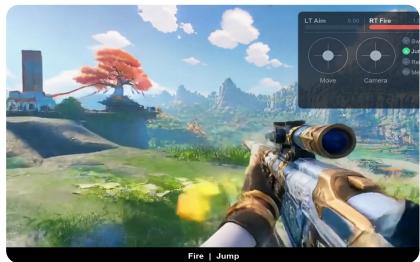  
(a) Action representation Gamepad overlay showing the driving action

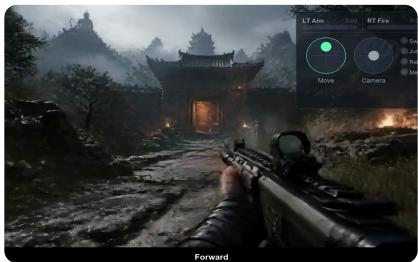  
(b) Action representation The same controls in a different art style

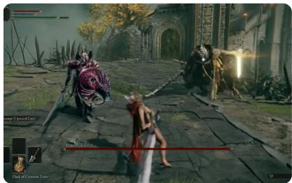  
(c) Language and entity control Each boss addressed by its own text command

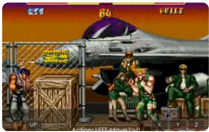  
(e) Player actions and NPC strategies Player-controlled movement and a strategy-conditioned NPC response

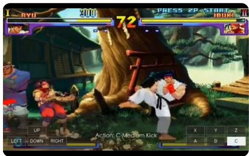  
(f) Player actions and NPC strategies Player-controlled attack and a strategy-conditioned NPC response  
Figure 14: Action interfaces of generative simulators: device-action conditioning (a–b), natural-language entity commands (c–d), and player actions with NPC strategy conditioning (e–f): (a) SCOPE, open-world FPS (Tong et al., 2026); (b) SCOPE, temple-gate scene (Tong et al., 2026); (c) Incantation, Elden Ring (Zhu et al., 2026a); (d) Incantation, Elden Ring (Zhu et al., 2026a); (e) ReactiveGWM, Street Fighter II (Wang et al., 2026a); (f) ReactiveGWM, Street Fighter III (Wang et al., 2026a).

Action representation.[Fig. 14a–b] Action representation shapes both the scale of available data and the meaning of control. Native keyboard, mouse, gamepad, or telemetry action labels provide semantics that can be checked against the original game. GameFactory separates action control from visual appearance to transfer interactive dynamics across generated scenes (Yu et al., 2025b), while WHAM interleaves visual and controller tokens to model both environmental change and human behavior (Kanervisto et al., 2025). SCOPE trains on 69,000 clips from seven first-person shooters with aligned 10-DoF controls. It separates spatially local actions, such as firing, from global camera and movement signals, providing evidence for cross-game action transfer within one genre (Tong et al., 2026). GameFactory, WHAM, and SCOPE depend on synchronized action data but preserve a direct mapping from user input to modeled transition.

Gameplay video is plentiful, but overlays can entangle scene dynamics with game-specific display conventions. Game2World Engine introduces a removal pipeline for heads-up-display elements, together with 96,000 paired synthetic videos and 1,079 in-the-wild clips from 303 games. In its controlled pilot, training on UI-free gameplay improves overall VideoReward by 6.83% relative to UI-overlaid footage (Shen et al., 2026b). That result supports scene-video preprocessing. Health, ammunition, and timers displayed in the interface may also be essential state observations, so a mechanics-oriented model may need to retain them as a separate channel.

Latent-action models draw on the much larger supply of ordinary video. Genie infers a discrete action between frames and trains an action-conditioned dynamics model without ground-truth controls (Bruce et al., 2024). Repeated latent codes can reveal controllable structure within a domain. Their semantics arise from observed change, however, and a single code may combine camera movement, avatar motion, and scene dynamics. Latent actions are therefore effective for discovering interactive variation but less direct as a stable vocabulary for human control. ShadowDancer instead learns action latents from paired renderings that preserve motion while varying appearance. It uses demonstrated behavior to control a different rendering, including probes with previously unseen action assets (Cao et al., 2026). This tests reuse of demonstrated dynamics, not discovery of an unfamiliar game’s rules. A new scene, a new motion exemplar, and a new rule set expose different generalization problems.

Language and entity control.[Fig. 14c–f] Recent systems also use natural language as an action interface, beyond its use as a prompt for scene appearance. Incantation conditions latent frames on per-entity commands and reports 89% action-control accuracy versus 43% for an action-index baseline on five held-out entity–action pairs. Its 90% versus 0% result on four out-of-vocabulary probes partly reflects interface expressiveness: the fixed-index baseline has no input slot for those prompts. Stable FVD over two-hour rollouts measures visual-distribution stability, not persistence of game state (Zhu et al., 2026a). ReactiveGWM instead separates fine-grained player control from NPC strategies such as offense, defense, and control, testing strategy-module transfer between two fighting games (Wang et al., 2026a). Language composition and reusable strategy modules address different control bottlenecks within video generation.

H3-World examines how much language-conditioned control can be obtained by adapting a pretrained video model. It uses structured character and camera instructions, temporally aligned conditioning, and lightweight adaptation of a 33B backbone; attention routing separates control signals that might otherwise interfere (Chen et al., 2026a). Its experiments use 7,872 training clips and 128 held-out clips, with action interventions that keep the initial observation and generation conditions fixed. This tests control rather than merely whether a prompt describes a plausible scene. The reported 124-frame generation with 50 denoising steps is a short-clip experiment, not evidence of real-time streaming or long-horizon mechanics.

Device, strategy, and language interfaces distribute decisions differently. Device controls specify low-level input; a strategic NPC command delegates a sequence of actions; language can leave both realization and timing to the model. Entity-conditioned control adds an attribution problem: a command for one character should not alter another’s motion unintentionally. ReactiveGWM, Incantation, and H3-World make different parts of this interface testable, complementing rather

than replacing native-control evaluation.

Real-time generation and serving. Autoregression and diffusion operate at different levels in generative simulators. Genie (Bruce et al., 2024) and WHAM (Kanervisto et al., 2025) predict sequences of visual or action tokens autoregressively. GameNGen uses diffusion to generate the next visual observation and then feeds generated frames into subsequent predictions, so the rollout is autoregressive even though each frame is produced by diffusion (Valevski et al., 2025). GameFactory similarly combines a video-diffusion prior with sequential continuation (Yu et al., 2025b). Few-step generation, distillation, and streaming are used to reduce latency, while action semantics and persistent state remain open long-horizon problems (He et al., 2025; Li et al., 2026a). Diffusion Forcing offers a general formulation for combining the two mechanisms: it trains a causal sequence model with independently chosen noise levels at different positions, supporting generation with partially noised history and variable prediction horizons (Chen et al., 2024a). This illustrates why diffusion and autoregression are not mutually exclusive system categories. The former can specify how an observation or chunk is sampled, while the latter specifies how predictions are continued over time.

Yume-1.5 combines compressed history and linear attention with distilled streaming generation, adding textual event control to keyboard-based exploration (Mao et al., 2025). Its separation of navigation and event prompts illustrates why responsiveness involves more than camera tracking. Serving constraints then determine how much computation fits between input and response. Fewer denoising steps reduce work per frame. Chunked prediction amortizes computation across several frames but can delay response to a new command. Bounded caching reuses recent context while limiting the information retained for later revisits. A reported frame rate is therefore most informative alongside input latency, resolution, hardware, and the policy for interrupting or refreshing a generated chunk. The loop feeds generated observations back into later predictions and therefore accumulates its own errors.

AlayaRenderer-Flash uses a different real-time arrangement: a physics engine updates the game while a four-step streaming model renders RGB from synchronized geometry and material buffers. After target-game fine-tuning, the authors report 31.54 fps on one H200 and 30 fps for a live SuperTuxKart integration (Lin et al., 2026a). This demonstrates playable neural appearance over engine-executed rules; it does not show that the renderer learned those rules or transfers unchanged beyond the fine-tuned target game.

Long-rollout consistency. In autoregressive visual simulators, generated observations are usually fed into later predictions. Over time, a weakly represented fact can reappear as geometry drift, a duplicated object, a forgotten inventory item, or a changed rule. Multiplayer worlds add synchronization and action attribution across viewpoints, making shared-state failures visible from several perspectives (Savva et al., 2026; Hu et al., 2026a). MultiGen produces synchronized generated viewpoints backed by an editable external map, but its multiplayer evaluation uses simulated Doom deathmatches on a single map, with no human use of the shared generative world (Po et al., 2026). For players, state failures can undermine navigation and trust in earlier choices. For agents, they can reverse the ranking of long-horizon actions. For policy training, they can teach behavior that fails when transferred back to the reference game.

Mitigation of this error accumulation has been studied mainly in video diffusion, where the train– test gap is explicit: a model trained to continue ground-truth frames must at inference continue its own imperfect outputs. CausVid distills a bidirectional diffusion transformer into a causal few-step generator, supervising the causal student with the bidirectional teacher, and reports reduced error accumulation in autoregressive generation (Yin et al., 2024). Self Forcing trains on the model’s own rollouts, conditioning each frame on previously self-generated output with key–value caching so that a video-level loss can score the whole sequence (Huang et al., 2025b). FramePack adds drift-prevention methods, including early-established endpoints and adjusted sampling orders, alongside its context compression (Zhang et al., 2025b). None of the three reports results on game state. They address the visual drift that makes state failures visible.

A shared visual world requires more than each view being coherent separately. Two players may observe the same object at different times, act on it concurrently, or receive different observations of an event. Tests can therefore compare object identity, relative geometry, action attribution, and outcomes across synchronized views. An external map, as used by MultiGen, constrains one part of this agreement without specifying every hidden rule or score update. MASS separates a learned global-state transition model from per-camera rendering and evaluates both state accuracy and agreement between views in multiplayer Snake (Cai et al., 2026). Unlike a conventional engine, its transition function is learned, so shared state prevents competing copies without guaranteeing correct rules. Agreement across views still requires validation against reference transitions.

## ­ A model’s useful detail depends on its consumer

• Prediction quality is a task-dependent property. MuZero preserves information useful for planning without reconstructing pixels (Schrittwieser et al., 2020); interactive simulators must also produce observations (Valevski et al., 2025). Dreamer tests the further question of whether imagined experience improves a policy in the reference game (Hafner et al., 2020). A representation can succeed for one consumer and omit information another needs.

• Memory and mechanics solve different omissions. ReWorld retrieves spatial landmarks (Chen et al., 2026d); StatePlay predicts selected numerical variables (Lin et al., 2026c). Recalling how a place looked cannot determine whether a reward was collected or a timer expired. Comparing these approaches points toward selective, updateable state alongside visual memory, rather than treating longer video context as a complete state model.

• A player predictor is not yet an adaptation policy. Maia4All validates individual move prediction (Tang et al., 2026); personalized PCG evaluates the content players receive (Hafnar and Demšar, 2025). Better prediction and better player experience are distinct outcomes, connected only when the inferred information changes a useful design decision.

## 5 AI That Designs Games

Game design methods generate and revise content, rules, and narrative structures under constraints set by designers. Earlier procedural systems already expressed intent through parameters, objectives, and direct editing (Togelius et al., 2011; Smith et al., 2011b). Foundation models add flexible language and multimodal interfaces for proposing and revising designs. Their contribution depends on how a request becomes a design representation and how candidate outputs are selected. A plausible level, a syntactically valid rule set, and a design that supports the intended play experience pose different generation and evaluation problems. The resulting methods combine learned proposals with search, explicit constraints, and human decisions (Figure 15).

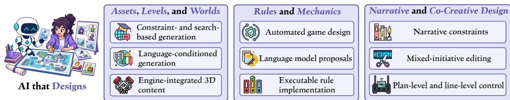  
Figure 15: Research directions for AI that designs games: assets, levels, and worlds; rules and mechanics; and narrative and co-creative design.

## 5.1 Assets, Levels, and Worlds

Content generators must reconcile requested properties with the conditions for play. These conditions can be encoded in a construction procedure, checked during search, learned imperfectly from examples, or enforced through repair. Language conditioning changes how designers express requests; it can be combined with any of these mechanisms.

Constraint- and search-based generation.[Fig. 16a] Much procedural content generation operates within an established game design, generating assets, levels, or worlds under fixed rules and goals. Constructive and constraint-based methods make validity constraints explicit (Compton and Mateas, 2006; Smith and Mateas, 2011), search-based PCG explores candidates under quality functions (Togelius et al., 2011), and experience-driven PCG adapts content through player models (Yannakakis and Togelius, 2011). PCGML learns regularities from existing content (Summerville et al., 2018), while PCGRL learns a sequential construction policy from environment feedback (Khalifa et al., 2020). Foundation models broaden the design interface: designers can express intent through language or multimodal examples and revise proposals iteratively.

The methods differ in where they obtain validity and variation. Constraint solving can exclude configurations that violate encoded rules, whereas search evaluates candidates and uses the result to propose replacements. Learned generators capture regularities in examples, which need not include every condition for successful play. Super Mario as a String represented levels as sequences for LSTM generation, establishing a route from sequence modeling to spatial content before pretrained language models (Summerville and Mateas, 2016). MarioGAN combines a learned design space with evolutionary search over structural properties and an A\* agent (Volz et al., 2018). Single-example diffusion instead learns reusable local patterns from one level through a restricted denoising receptive field (Dai et al., 2024). Designer control comes from the representation and selection procedure as well as the model.

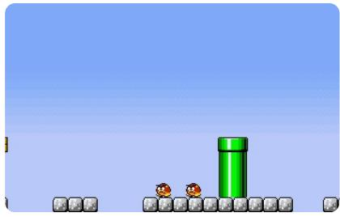  
(a) Constraint- and search-based generation A full level found by evolutionary search

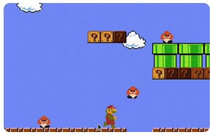  
(b) Language-conditioned generation A playable level written from a text prompt

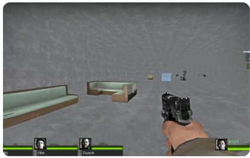  
(c) Engine-compatible 3D generation Generated room running inside a commercial engine  
Figure 16: Generated content that must remain playable: search-based (a), language-conditioned (b), and engine-compatible 3D generation (c): (a) MarioGAN, Super Mario Bros. (Volz et al., 2018); (b) MarioGPT, Super Mario Bros. (Sudhakaran et al., 2023); (c) Xu et al., Left 4 Dead 2 (Xu and Verbrugge, 2025).

Language-conditioned generation.[Fig. 16b] MarioGPT fine-tunes a pretrained language model on 37 path-annotated Mario levels, with a separate text encoder conditioning generation on requested features. Its representation remains a game-specific tile vocabulary. Of 250 generated levels, 88.4% were solved by an A\* agent given up to five attempts per level. A separate 1,000-sample experiment measures adherence to prompts about pipes, enemies, blocks, and elevation (Sudhakaran et al., 2023). The two tests distinguish traversability from control over the design. Word2Minecraft instead converts structured stories into tile layouts and Minecraft block assignments, using A\* and BFS-based checks and adjustments to preserve objective reachability (Huang et al., 2025a). Its 17-participant study finds higher story-coherence accuracy for objective-specific submaps than for main maps representing the whole story. An evolutionary baseline scores better on automated playability and path measures, but it directly optimizes objective distances and leaves story coherence unmeasured. These path-based measures do not evaluate narrative quality.

Sokoban exposes a different constraint: pushing a box can irreversibly destroy a solution. Todd et al. fine-tune GPT-2 on serialized levels and compare natural-language, code, and randomly initialized models. With abundant Boxoban data, pretraining brings little benefit; with small human-authored datasets, novelty is difficult to retain. Controlling empty-space proportion is also easier than controlling solution length, which requires solving the puzzle (Todd et al., 2023). Practical PCG studies the small-data problem in Metavoidal, using 60 authored rooms and human-in-the-loop fine-tuning to produce new rooms under project-specific constraints (Nasir and Togelius, 2023). These cases distinguish learning spatial regularities from learning what makes a level function.

Language models can also supervise a generator without producing its final output. Moonshine labels maps from a constructive generator and trains steerable generative models on the resulting pairs (Nie et al., 2025). This separates semantic annotation from content synthesis. MarioDiffusion derives captions from tile properties and compares pretrained text encoders with a small Transformer trained for those captions. Its best diffusion configuration uses the small encoder, with prompt adherence, diversity, and agent-tested playability measured separately (Schrum et al., 2025). Together with the Sokoban comparison, this locates the benefit of pretraining in the information it contributes beyond the available game data, rather than in model size alone.

The ChatGPT4PCG competitions test language control under physics rather than traversal alone (Taveekitworachai et al., 2023). Prompts generate Science Birds structures resembling requested letters; simulation measures stability, while a classifier measures character similarity. The second edition adds diversity and permits programs that orchestrate prompting (Taveekitworachai et al., 2024), and LLMs4PCG broadens the model choices (LLMs4PCG Team, 2025). A recognizable structure can collapse, just as a stable one can miss the requested shape. These are distinct checks, neither of which measures the enjoyment of a complete level.

Multiverse extends language-conditioned design across four games through aligned text–level embeddings and a conditional VAE. It abstracts game-specific entity names into shared categories and uses contrastive learning to relate descriptions across domains (Baek et al., 2026). Reported blending gains are strongest within a genre; balanced cross-genre blends remain harder. Evaluation measures structural and semantic similarity rather than execution under a new combined rule set. Shared descriptions support content recombination before mechanics transfer.

Conversational editing and generator control. Another route keeps an existing generator or editable world behind a language interface. Whitehead et al. compare function calls with direct manipulation of a world representation: tool calls restrict changes to implemented operations, while direct editing permits broader changes but makes consistency harder to maintain (Whitehead et al., 2025). Their TinyTownQA experiments also show that the representation supplied to the model matters: structured world facts can support more accurate questions about a scene than images or tile arrays alone. These are world-understanding tests, distinct from successful multistep editing. The practical comparison with direct generation is whether a request selects a known operation, revises a local region, or creates a new artifact. Preserving the rest of a design is part of the task, not an incidental consequence of generating a plausible replacement.

Engine-compatible 3D generation.[Fig. 16c] For 3D content, the choice of representation determines whether a visual prior can respect the game’s construction rules. DreamCraft optimizes a quantized neural radiance field whose outputs map directly to Minecraft blocks. It combines a pretrained text-to-image prior with losses for block distributions and adjacency constraints, improving ingame text alignment over post-hoc conversion of unconstrained 3D output (Earle et al., 2024). A database-driven approach places the language model earlier in the workflow: it constructs libraries of rooms, facilities, and mechanics that the authors review before topology optimization and repair assemble levels. Of 6,000 generation attempts, 95.47% are validated as successfully repaired and free of subsequent anomalies in the Unity simulation, and the study also imports layouts into Left 4 Dead 2 (Xu and Verbrugge, 2025). This result measures the combined curated-library and repair pipeline in one survival-horror setting, and says nothing about unassisted language-model generation. Both approaches make pretrained visual or semantic knowledge useful through an explicit, game-specific representation.

A central integration difficulty is that appearance alone does not determine an asset’s role in play. A visually plausible wall must also have suitable collision, scale, and placement, and a room arrangement must preserve traversable connections and objectives. DreamCraft constrains the generated representation itself, while database-driven generation assembles reviewed components and then repairs their arrangement. The comparison suggests two practical routes for visual and semantic priors: generate directly within an engine-compatible vocabulary, or place a structured intermediate representation between generation and the engine.

Functional assets and compositional worlds. Asset generation also needs editable internal structure. CubePart conditions generation on a user-defined list of semantic parts and produces separate meshes that assemble into one object. Its engine examples attach animation and behavior scripts to those parts, such as a chest lid or vehicle components (Zhu et al., 2026b). The supplied schema and scripts explain how geometric generation becomes interactive; the model does not infer every physical parameter or behavior. At scene scale, WorldSculpt adapts a single-object prior to posed views and reconstructs individually addressable meshes, including from generated 3D Gaussian-splatting worlds. Its Unreal-derived benchmark evaluates reconstruction, not completed gameplay (Niu et al., 2026). Object-level structure makes later editing possible, while collision, traversal, objectives, and inter-object behavior still require implementation and tests.

Speech is another game asset whose content and delivery have different authoring requirements. Ghostwriter drafts dialogue text for writer selection (Barth, 2023); a speech synthesizer produces its audible performance, and audio-driven animation can synchronize a character’s face with an approved recording or synthetic track (NVIDIA, 2025). Producing these assets before release allows inspection and revision. Producing a response during play adds turn-taking and latency constraints, discussed in Section 7.1. In both cases, the relevant artifact is the integrated character performance rather than an isolated audio sample.

Table 3 compares these representation choices with the rule and co-creative methods discussed next. The useful contrast is where a proposal becomes constrained: in the output vocabulary, in executable checks, or through a designer’s revision.

Table 3: Design methods compared by output, feedback, and supplied game structure.
<table><tr><td>System</td><td>Generated object</td><td>Feedback / checks</td><td>Supplied structure</td></tr><tr><td>MarioGPT [302]</td><td>tile sequence</td><td>A*; prompt features</td><td>tiles; movement rules</td></tr><tr><td>DreamCraft [88]</td><td>block-aligned 3D scene</td><td>text alignment; adjacency losses</td><td>Minecraft block vocabulary</td></tr><tr><td>CubePart [416]</td><td>part-based 3D asset</td><td>part control; geometry</td><td>schemas; external behavior</td></tr><tr><td>GAVEL [326]</td><td>Ludii rule program</td><td>compile; simulated play; diversity search</td><td>game-description language</td></tr><tr><td>ScriptDoctor [89]</td><td>rules; tile levels</td><td>compiler; BFS; iterative repair</td><td>DSL; engine; solver budget</td></tr><tr><td>KNUDGE [352]</td><td>branching dialogue</td><td>lore and quest consistency</td><td>lore; quest goals</td></tr><tr><td>DreamGarden [90]</td><td>plans and scenes</td><td>compile; visual checks; user edits</td><td>Unreal; designer input</td></tr></table>

## 5.2 Rules and Mechanics

Generating rules changes the space of possible actions and outcomes, so evaluating a proposal requires considering its interaction with goals, layouts, and player strategies. Current approaches differ in the rule language they expose, how they search for candidates, and how simulated play or human judgment selects among the resulting candidates.

Automated game design. Automated game design extends the generative boundary beyond content alone to rules, mechanics, and combinations of game components. Evolutionary search, constraint solving, conceptual expansion, and planning have explored designs whose quality emerges through the behavior they permit (Nelson and Mateas, 2007; Browne and Maire, 2010; Zook and Riedl, 2014). Systems such as ANGELINA explored the coordinated generation of multiple game components and, eventually, complete small games (Cook et al., 2017). Mechanic Miner searched for novel mechanics together with accompanying levels (Cook et al., 2013), while Puck later emphasized continuous, user-oriented generation and testing (Cook, 2022). The design consequence of a rule depends on how it interacts with goals, state, and player strategy. Language generation can broaden the proposal space, while executable representations and simulated play provide evidence about how a proposal changes play.

Rule representations determine which designs a search can reach. A fixed grammar makes parsing and simulation tractable but excludes mechanics outside its vocabulary. More flexible code can express new behavior, at the cost of a harder validation problem. Joint mechanic–level search matters because a rule may have little effect in one layout and fundamentally change strategy in another. These earlier systems expose two choices that remain in foundation-model approaches: the unit of variation and the process used to judge it.

Language-model rule and mechanic proposals. Direct generation and search-based proposal use the model differently. In VGDL generation, prompts supply grammar, mappings, and examples, and the generated rule and level descriptions are checked for parsability, required interactions, termination conditions, and sprite mappings (Hu et al., 2024). This tests whether language knowledge can be made compatible with an executable description language. The checks establish specific structural properties; they do not select for every quality of play. GAVEL instead finetunes a code model to mutate and recombine Ludii descriptions within quality-diversity search. Compilation and simulated play screen proposals, while rule-concept descriptors organize the archive (Todd et al., 2024). The model supplies variation; the interpreter and archive define what can execute and which differences are retained. This can preserve alternatives that a single-objective search would discard, although archive coverage is diversity under the chosen descriptors, not a general measure of design originality beyond those descriptors.

Mortar varies reusable Python mechanics and composes them into games through tree search (Nasir et al., 2026). A mechanic is evaluated through its contribution to games that distinguish a fixed ordering of stronger and weaker agents. Thus, the search unit moves from a complete rule description to a component whose value depends on its partners. Composition search and language-model variation play different roles: one selects combinations, while the other proposes new functions. This distinction matters when attributing improvements to the model rather than to the search procedure.

Checking designs through implementation and play. Validating a proposed mechanic requires both an adequate state representation and an implementation that realizes its effects. STORY2GAME derives a text game’s state schema and action logic from story-event preconditions and effects, then generates executable action code (Zhou et al., 2025b). The resulting code must express the intended state changes; compilation and semantic results are examined in Section 6.3. An action that illuminates a forest, for example, requires illumination to be represented in the state. Compilation alone cannot reveal that omission. ScriptDoctor generates PuzzleScript games with human examples, grammar checks, compiler feedback, and breadth-first-search playtesting. It allows up to ten revisions, accepting a game when every level has a discovered solution longer than ten moves (Earle et al., 2025a). Compilation and solver acceptance diverge in its experiments: additional examples can improve syntax without producing sufficiently nontrivial solvable levels. Unlike GAVEL’s rule-concept archive or Mortar’s skill ordering, this procedure selects by solution existence and length. Each objective favors different designs; an interesting short puzzle can be rejected by a length threshold.

Selection introduces a different source of error. Mortar’s 14-participant study of three game pairs agrees with its agent-based ordering in two pairs and reverses it in the third (Nasir et al., 2026). Simulated play is useful for screening, but its preference depends on the agents and objectives used. Reporting the proposal, repair, and simulation budgets helps distinguish a reliable generator from a search procedure that eventually finds an acceptable design.

## 5.3 Narrative and Co-Creative Design

Narrative authoring combines structural requirements with judgments about pacing, characterization, and player choice. Co-creative tools address a related but broader question: how a designer can inspect and revise generated material, whether it is a dialogue tree, a level, or a mechanic. The important comparison is the control available over intermediate decisions, not simply the amount of content generated.

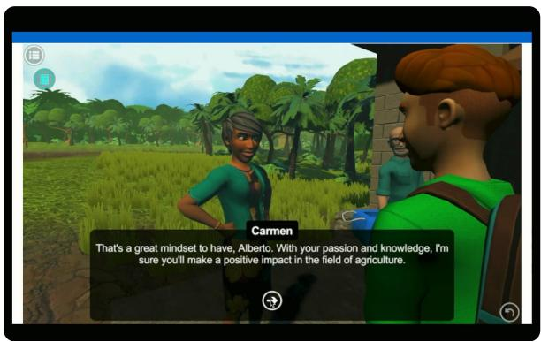  
(a) Narrative constraints  
NPC line generated within authored scene goals

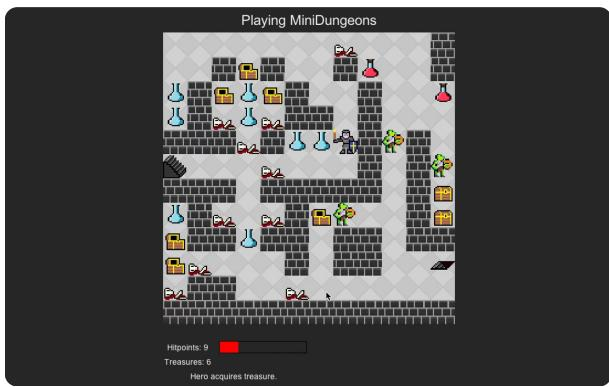  
(b) Mixed-initiative editing  
Persona-based playtesting in a later extension  
Figure 17: Narrative generated under authored constraints (a) and a designer-edited level evaluated through persona-based playtesting (b): (a) NarrativeGenie, Unity episode (Kumaran et al., 2024); (b) a later MiniDungeons extension of Sentient Sketchbook (Liapis et al., 2013, 2015).

Narrative constraints.[Fig. 17a] Narrative authoring must coordinate what a character says with what a player can learn or do. Early GPT-2 fine-tuning on annotated RPG quests learned the format and language of quest-giving dialogue, evaluated as generated text for authoring (van Stegeren and My´sliwiec, 2021). KNUDGE adds branching quest dialogues from The Outer Worlds: models generate trees under quest specifications, character facts, and lore, comparing supervised and in-context generation (Weir et al., 2024). This changes the target from a plausible passage to coordinated branches. A locally fluent reply can reveal a quest fact too early or conflict with information on another branch; neither task validates quest execution.

SceneCraft turns author-specified scene objectives, character traits, and variations into branching scripts for an existing game framework (Kumaran et al., 2023). NarrativeGenie constructs a partially ordered graph of story beats and a playable episode during authoring, before its runtime Adaptive Dialogue Manager takes over (Kumaran et al., 2024). KNUDGE, SceneCraft, and NarrativeGenie differ in the structure supplied to generation: factual constraints, scene templates, and progression graphs. The comparison concerns how a branch preserves required information and remains compatible with other branches. Runtime selection and adaptation are discussed in Section 7.

Coordinating narrative, space, and mechanics. RPGAgent connects story outlines to a Unity prototype through agents for narrative, scenes, mechanics, and code. Structured intermediate outputs let designers review and edit decisions between stages. Its counterbalanced study with 18 participants reports higher overall user-experience and creativity-support scores than a GPTassisted baseline, with both conditions using the same art assets and Unity Tilemap (Zhang et al., 2026b). The study concerns a supported prototyping workflow, not fully autonomous project creation. Together with NarrativeGenie’s beat graph (Kumaran et al., 2024) and DreamGarden’s editable plan tree (Earle et al., 2025b), this illustrates a recurring design choice: intermediate structures let later generation use earlier decisions while giving the author a place to correct them. The important question is whether changes propagate coherently, rather than whether each component is plausible on its own.

Mixed-initiative editing.[Fig. 17b] Mixed-initiative tools preserve direct designer control while automating selected parts of construction or search. Tanagra responds to edits while maintaining structural constraints in platform-game levels (Smith et al., 2011b). Sentient Sketchbook couples map sketching with playability checks, gameplay-property evaluation, and alternative suggestions, and its initial evaluation includes a small study with industry experts (Liapis et al., 2013). In both cases, the designer can change the artifact directly, without repeatedly describing the desired result from scratch. Lanzi and Loiacono combine interactive evolution with large language models: designer feedback selects candidates while the model recombines and mutates proposals, evaluated across three design tasks (Lanzi and Loiacono, 2023). Direct editing and candidate selection offer different forms of control. Editing can retain a preferred structure while changing a local detail; selection can reveal alternatives that the designer would not have specified. Neither interaction is captured by measuring the quality of a single generated artifact. Useful comparisons examine revision effort, inspectable decisions, and control over which parts remain unchanged.

AutoBG extends co-creation to board-game rulebooks through separate ideation, realization, critique, and simulated-persona feedback modules. Its 207 held-out-game tasks and 30-participant creator study evaluate rulebook quality and authoring support (Li et al., 2026f). In contrast to executable rule search, revisions are screened by a learned critic and audience feedback is simulated. This can expose ambiguities and suggest alternatives, but does not replace playing the resulting rules with independent human groups. Its connection to MeepleLM’s subjective playtester (Li et al., 2026e) is the use of player-oriented language feedback, rather than an engine supplying legal trajectories.

Granularity of creator control. DreamGarden connects co-creative design to implementation through an editable plan tree. Designers prune, expand, and annotate the hierarchy while specialist modules generate assets and C++ actors. In its 10-participant study, users valued seeing how the system interpreted prompts, but waiting for implementation and lacking intermediate inspection limited control (Earle et al., 2025b). The plan is therefore useful not simply as a decomposition for agents, but as a representation a designer can correct before expensive implementation completes.

Ubisoft’s Ghostwriter illustrates a narrower industrial workflow: it drafts NPC barks from character and situation descriptions for writers to select and edit (Barth, 2023). The official account documents authoring support rather than autonomous dialogue deployment. SPINE works at the level of design intent, using language models to help formulate design pillars and discuss whether proposed features fit them. Its evidence includes a game-jam application and interviews with four practitioners (Geheeb et al., 2026). These systems place human decisions at different granularities: a principle, an overall plan, a candidate design, or an individual line. Their usefulness depends on whether those controls match the author’s decisions and make correction manageable. The design entries in Appendix A, Table 18, compare these authoring mechanisms alongside artifact scope and feedback.

## ­ The proposal space expands faster than the quality objective

• Pretraining helps when it supplies knowledge the design data lack. Todd et al.’s Sokoban experiments (Todd et al., 2023) and MarioDiffusion (Schrum et al., 2025) show that broad pretraining does not automatically improve performance in their restricted representations. The useful question is which new descriptions, constraints, or game vocabularies require that broader knowledge, not whether the generator contains a larger language model.

• Selection can inherit the evaluator’s taste. GAVEL (Todd et al., 2024) and Mortar explore richer rule spaces through simulation-based selection. Mortar’s small player study includes a preference reversal relative to its agent-based ordering (Nasir et al., 2026). Increasing proposal diversity therefore does not, by itself, broaden the kinds of play that the selection objective rewards.

• Control depends on what the designer can edit. Sentient Sketchbook exposes map edits (Liapis et al., 2013); DreamGarden exposes a plan hierarchy (Earle et al., 2025b). Their comparison shifts attention from prompt expressiveness to the cost of inspecting, correcting, and retaining a design decision as generation proceeds.

## 6 AI That Builds and Maintains Games

A game project can contain plausible code and attractive scenes yet fail when the pieces interact. Scripts depend on object bindings, engine callbacks, assets, and state that may be spread across files and editor settings. Foundation-model development agents bring code knowledge and language-based planning to this integration work, using repository tools, editor operations, and execution feedback to make and check changes (Yang et al., 2025; Yin et al., 2026a; Huang et al., 2026a). Their methods differ in how they represent the project, specialize the model, and turn observed failures into repairs. Building a first prototype and revising an existing project expose different parts of this problem; maintenance additionally requires preserving behavior that a new request is intended to leave unchanged (Figure 18).

AI that Builds and Maintains  
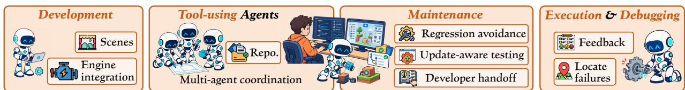  
Figure 18: Research directions for AI that builds and maintains games: code, scenes, and engine projects; tool-using development agents; execution, debugging, and repair; and revision, maintenance, and handoff.

## 6.1 Code, Scenes, and Engine Projects

Project construction requires agreement between code, scenes, assets, and engine configuration. A generator may work through structured graphs, component libraries, or source files, each exposing a different set of dependencies. Executable environments add a related requirement: observations, actions, rewards, and resets must implement the interface expected by a consuming agent.

Scene construction and engine integration.[Fig. 19a–b] UnrealLLM translates natural-language scene descriptions into executable Unreal PCG graphs and supports basic in-engine interaction, connecting scene design directly to engine execution (Tang et al., 2025b). UniGen coordinates planning, C# generation, component binding, scene construction, and debugging in Unity. It evaluates three prototypes and reports a 91.4% reduction in development time relative to a manual baseline implemented by one undergraduate developer with more than three years of experience (Yang et al., 2025). This is a small prototype comparison, not a population estimate of developer productivity. AutoUE combines model retrieval, scene generation, interaction code, and automated runtime playtesting for final evaluation in Unreal Engine (Yin et al., 2026a). These workflows must coordinate assets with engine configuration and gameplay logic: generating the right script is insufficient when the scene does not bind or invoke it correctly.

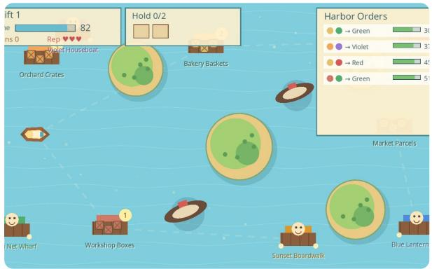  
(a) Scene construction and engine integration Agent-built Godot game running with live HUD

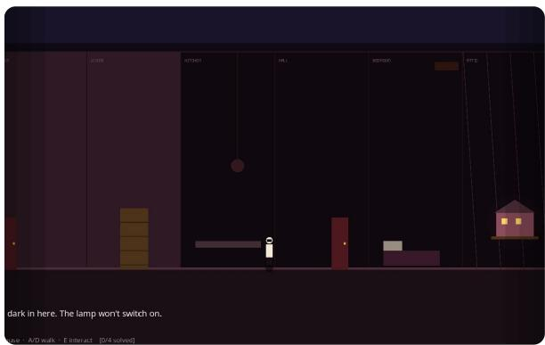  
(b) Scene construction and engine integration A second agent-built game loaded and played  
Figure 19: Complete Godot projects constructed by coding agents and verified by running them: (a) GameCraft-Bench, Cozy Harbor Delivery (Luo et al., 2026); (b) GameCraft-Bench, horror game (Luo et al., 2026).

These approaches expose different dependencies to the model. UnrealLLM’s graph representation makes available operations and their connections explicit (Tang et al., 2025b); UniGen must also generate C# behavior and bind it to Unity components (Yang et al., 2025). Selecting and connecting an existing component restricts what can be built but supplies known interfaces. Generating a new component permits a wider range of mechanics while adding responsibility for initialization, callbacks, and references. The distinction is consequential even when both outputs look like a complete scene: an object may render correctly yet never receive input or invoke its script. Project context therefore includes more than nearby code. Object identifiers, asset paths, scene hierarchy, and lifecycle conventions can determine whether a generated change takes effect. A constrained intermediate representation can expose these requirements before code generation, but the translation into engine objects can itself fail. Mage’s comparison of direct C# generation and structured representations tests this trade-off: the representation that best preserves mechanic structure need not produce the most frequently running scene (Liu and Tatar, 2026).

GameCraft-Bench evaluates complete initial projects rather than isolated components. Its 140 Godot tasks across 15 game families use replayed interaction demonstrations and multimodal rubric judgments (Luo et al., 2026). The official leaderboard snapshot analyzed in Section 9.1.4 includes 14 configurations and a highest aggregate score of 68.44 out of 100 (GameCraft-Bench Team, 2026). Separating mechanics, depth, visuals, and art reveals incomplete content or feedback within otherwise recognizable games. This differs from repository editing, where existing assets and working behavior already constrain and support the requested change.

Executable environment generation. Executable environment generation bridges modeling and software construction. Game Code World Models translate descriptions of rules, legal actions, observations, transitions, and rewards into Python environments. One study constructs a 30- game dataset, trains a 3B-parameter model on 23 games, and evaluates it on seven held-out games, combining supervised fine-tuning with execution-based reinforcement learning (Serapio et al., 2026). Structural properties are tested directly, whereas semantic checks use reference scenarios produced by a frontier language model, so their reliability also depends on the scenario generator. Agent2World assigns agents to research a domain, implement PDDL or code-based models, and test their behavior through unit tests and simulation (Hu et al., 2025). Intended uses include planning and agent training, but the construction results principally measure whether the generated environments implement the specified behavior.

Generated environments need an operational contract with their consumers. Observation, action, transition, reward, and termination functions must agree, and resetting an episode must restore the assumed starting state. A structural check can verify that a function exists or returns the right type. Whether a legal action has the intended consequence is beyond it. Reference transitions, invariant checks, and simulated trajectories address that semantic gap. A generated engine can also supply state to a learned visual renderer instead of generating all observations itself. This separates implementation of rules from synthesis of appearance; Section 10.2 examines the emerging connection and the additional checks it requires.

## 6.2 Tool-Using Development Agents

General coding knowledge becomes useful only when the agent can inspect and modify the particular project. Repository text, editor state, and running gameplay supply complementary context. Engine-specific training and reusable workflows offer two further forms of specialization, while multi-agent systems must coordinate the artifacts produced through these interfaces.

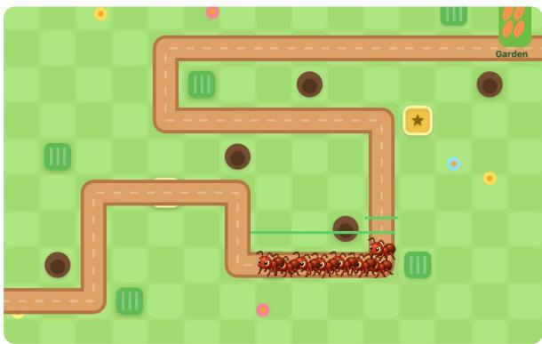  
(a) Repository, editor, and runtime access Agent testing the game through the running build

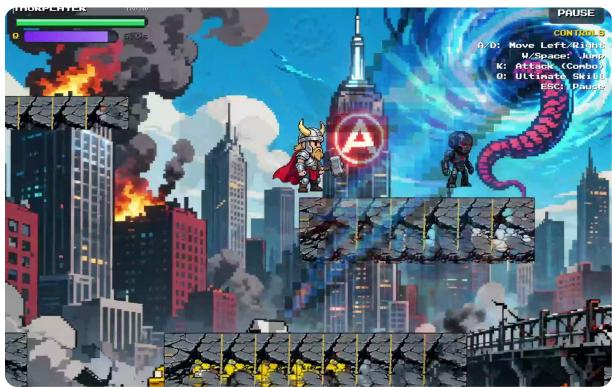  
(b) Model specialization and reusable workflows Complete brawler produced by a specialised coder  
Figure 20: Games produced by development agents that observe the running build (a) or specialise a coding model (b): (a) Play2Code, Garden Guard (Huang et al., 2026a); (b) OpenGame, generated brawler (Jiang et al., 2026b).

Repository, editor, and runtime access.[Fig. 20a] General software-engineering benchmarks such as SWE-bench already test repository-level issue resolution (Jimenez et al., 2024), while systems such as SWE-agent study code editing, navigation, and executable feedback (Yang et al., 2024a). Game development adds engine state, scenes, assets, real-time behavior, and multimodal feedback. Development agents operate on whole projects through different interfaces. OpenGame combines reusable web-game templates with an evolving store of debugging procedures grounded in execution (Jiang et al., 2026b). In Play2Code, a coding agent edits an HTML game while a separate GUI agent plays it in a browser and returns traces and a repair list through shared memory (Huang et al., 2026a). AutoUE operates through Unreal-specific generation and runtime commands (Yin et al., 2026a), whereas UniGen builds Unity scenes from generated plans and code and relies primarily on a developer’s natural-language issue reports to prompt later fixes (Yang et al., 2025).

Repository benchmarks instead ask agents to modify a specified part of an existing project.

Repository and editor access expose complementary dependencies. Textual search can locate a method, configuration file, or asset reference, while editor inspection reveals instantiated objects and their current properties. A development agent must also decide how much context to retrieve: a local change may require understanding a scene hierarchy, an inherited class, or a package version outside the edited file. SWE-agent’s emphasis on agent–computer interaction is relevant here because tool granularity and feedback determine what the model can observe and change (Yang et al., 2024a). Game-specific adapters then supply operations that generic file editing cannot reliably reconstruct on its own.

Runtime access complements these project views. DreamGarden revises C++ actors using compiler errors, runtime logs, and vision-model feedback on screenshots (Earle et al., 2025b). Unity’s official AI tools instead illustrate integration with a working editor: the assistant can use the scene graph, components, packages, and target platform, with plan review and reversible changes (Unity Technologies, 2026). These product features support inspection and correction; the documentation does not measure autonomous project completion. Playco’s Playbot offers a further industrial example. An official case study describes generating three themed prototypes from a shared greybox and using a game-specific toolchain to iterate on them (OpenAI, 2026). The report concerns a studio workflow, not a controlled comparison across engines or project scales. Repository, editor, and runtime access are recorded alongside repair feedback in Appendix A, Table 18.

Model specialization and reusable workflows.[Fig. 20b] Engine knowledge can be supplied through training as well as through tools and retrieved instructions. OpenGame trains GameCoder with continued pretraining on game-development material, supervised fine-tuning, and executiongrounded reinforcement learning. Within the same OpenGame framework, the reported intentalignment score rises from 49.8 for the base model to 54.1 for the fully trained variant (Jiang et al., 2026b). A separate ablation, using a fixed Claude backbone, examines reusable development procedures such as hook-driven execution and structured project reading. These experiments concern different backbones and should not be combined into one estimate of the benefit of training versus workflow design. The two approaches address different sources of repeated work. Training can make familiar APIs and implementation patterns easier to produce; a retrieved procedure can specify how to inspect and test the current project. Neither removes version-dependent context. An API pattern learned during pretraining may be outdated, while a template may omit the mechanic requested by the designer. Their usefulness depends on whether the agent can check those assumptions against the engine and project it actually uses.

Multi-agent development coordination. Systems divide responsibilities in different ways. RP-GAgent passes structured narrative, scene, mechanic, and code outputs between specialist agents (Zhang et al., 2026b), while DreamGarden exposes a plan tree that a user can inspect and revise (Earle et al., 2025b). The former makes intermediate decisions available to the next generation step; the latter also provides an intervention point when a high-level decision needs changing. Decomposition is useful only if later outputs still implement those decisions.

Play2Code assigns a different role to its second agent: the browser player attempts interactions and returns traces and repairs to the coding agent (Huang et al., 2026a). This separates implementing a mechanic from trying to exercise it. The returned record can explain that a jump command was issued but the character did not move, rather than simply judging the screenshot as unsatisfactory. Failure to reach the intended mechanic remains ambiguous, however: the control policy may have failed, or the implementation may be broken.

These comparisons make the shared artifact more important than the number of named agents. Scene identifiers and accepted requirements must remain consistent across outputs; a reported failure must refer to the version and initial state that produced it. Otherwise, one agent can repair an obsolete symptom or overwrite another’s valid change. The surveyed systems provide mechanisms for exchanging plans, artifacts, and traces, but isolating the value of role specialization also requires holding the underlying models, tool access, and execution budget comparable.

## 6.3 Execution, Debugging, and Repair

Static analysis, compilation, startup checks, and interaction tests reveal different defects. Repair requires connecting an observed symptom to its cause and then checking that the change addresses the failure. Recent studies provide evidence about both the feedback available to an agent and the kinds of errors that persist after apparently successful execution.

Execution feedback. Executing a project exposes failures that static inspection often misses: broken scene wiring, absent feedback, unreachable objectives, or interactions that appear to satisfy a textual requirement but fail in play. Across 333 multimodal tasks in GameDevBench, the reported visual-feedback ablation raises GPT-5.4’s pass rate from 41.1% to 52.0% when screenshots or video are available (Chi et al., 2026). This benefit comes from a richer execution-and-inspection workflow, with additional tool and inference use. The editor and engine are part of the agent’s working environment as well as the destination of generated code.

Compiler diagnostics and gameplay traces support different kinds of diagnosis. A missing symbol often identifies a local implementation problem; an unresponsive character could instead arise from input binding, scene activation, collision, or state logic. DreamGarden combines compile and visual feedback (Earle et al., 2025b), whereas Play2Code supplies attempted interactions from a separate player (Huang et al., 2026a). The additional information is useful because it can narrow the cause, not merely because it adds another modality. For example, a screenshot cannot distinguish a failed action from an action that was never attempted. An input trace establishes the attempt; engine state or a targeted replay can then help locate the failure. Restricted-language systems such as ScriptDoctor make this feedback loop easier to automate through a fixed interpreter and search procedure (Section 5.2). General engine projects additionally require diagnosis across code, scene bindings, and runtime state. In either setting, repair differs from generating a replacement project: a localized change must address the failure while preserving unrelated working behavior.

Failure modes and project scale. JAMER examines reconstruction in existing Godot projects. It selects 8,133 validated projects from more than 240,000 repositories: 7,833 form JamSet and 300 form JamBench. In Task 2a, agents fill removed function bodies while scene files remain available; reported runtime-pass rates drop from 80.4% on small projects to 5.7% on large ones (Sun et al., 2026). Here a pass means a 30-second headless run without player input. The result concerns successful reconstruction and startup as project size increases, rather than sustained interactive correctness. Mage tests generation from scratch: across 858 Unity scene-generation attempts with four open-weight models and 26 mini-game patterns, direct natural-language-to-C# generation has the highest mean runtime-pass rate, 43% (Liu and Tatar, 2026).

Other measures reveal defects within projects that run. In Mage, mechanism $F _ { 1 }$ is near 0.12 for the configuration with the best runtime pass. This is a static measure extracted from event– condition–effect chains in generated code, not an observed gameplay success rate. Structured intermediate representations improve adherence while reducing runtime success in the reported experiment. GameEngineBench tests native C++ changes in nine existing Unreal repositories through compilation and Play-in-Editor behavioral tests. The best configuration solves 55.5% of 110 tasks, while 31 tasks defeat every tested configuration. Many failures compile successfully but violate engine lifecycle, replication, or cross-system behavior (La et al., 2026). Project size is a separate difficulty: it can increase the dependencies needed for either a successful build or a correct behavioral change in the target project.

STORY2GAME exposes the same separation between compilation and intended behavior in generated text-game actions. It derives executable preconditions and effects from story events, including updates to the represented world state. Of 90 dynamically generated actions, approximately 80% compile and 60% pass manual inspection of their semantic implementation (Zhou et al., 2025b). The gap shows why checking generated code must include whether its state updates express the requested action; successful compilation establishes only part of that contract.

Read together, these results distinguish dependency failures, missing mechanic structure, and incorrect behavior under interaction. They also show that additional structure is not uniformly beneficial: it can improve specification following while introducing translation or integration errors. Comparisons are most informative when they separate these outcomes and identify whether the task constructs a new project, completes missing code, or revises existing behavior.

## 6.4 Revision, Maintenance, and Handoff

Revision changes the target while retaining much of the existing project. A new mechanic may require intentional changes to movement, collision, or feedback without breaking unrelated behavior. The available evidence concerns bounded change sequences and update-aware testing more often than long-lived maintenance or transfer of a generated project to a new developer.

Regression-aware revision. GameXpert-Bench includes 97 greenfield generation tasks, 100 repair tasks, and 17 self-contained JavaScript games with six-turn optimization chains, totaling 102 cumulative requests (Chen et al., 2026b). Its optimization track evaluates final artifacts against both requested changes and regression criteria. The reported results favor implementing explicit requests over discovering hidden defects and preserving functionality through accumulated edits. This setting tests a bounded sequence of revisions; dependency upgrades and collaboration in a long-lived repository impose additional demands.

Testing must also change with the specification, as shown by the update-aware testing component in Figure 18. SAGE uses update information to prioritize and maintain tests (Cai et al., 2025a), while SMART relates code changes to functional testing goals (Mu et al., 2025). These systems identify behavior to re-exercise after a revision; Section 8.2 details their test-selection and coverage mechanisms. A movement update, for example, may intentionally change jump trajectories while leaving inventory behavior intact. Replaying every earlier output as an immutable target would misclassify intended changes as regressions. Linking tests to accepted requirements makes it possible to distinguish preservation, deliberate revision, and accidental breakage.

Developer handoff. Handoff asks whether someone other than the generating agent can continue the work. The recipient needs dependencies, a build procedure, editable assets, and reproducible failures as well as an executable artifact. DreamGarden’s visible plan (Earle et al., 2025b) and Unity’s reviewable, reversible editor operations (Unity Technologies, 2026) offer mechanisms for inspecting and correcting generated changes. The design and tool interfaces are discussed in Sections 5.3 and 6.2. Their relevance to handoff is that developers can inspect decisions and revise changes; evidence about a new developer taking over a large, evolving project remains limited. Evidence for handoff would need to show whether a developer can understand the generated structure, locate a defect, and implement a new requirement without reconstructing the original interaction with the model. This is different from automatically replaying a fixed change sequence. Bounded revision benchmarks provide a starting point, but maintainability also depends on what explanations, tests, and project conventions survive after the generating agent’s session ends.

## ­ Game development is a coordination problem beyond code

• Feedback exposes different parts of a project. Repository access reveals dependencies; editor access reveals scene bindings; gameplay reveals their effects. Play2Code and GameDevBench show why execution observations can improve repair: general coding knowledge alone does not reveal what this particular project does (Huang et al., 2026a; Chi et al., 2026).

• Implementation quality has competing failure modes. Mage’s structured representations improve mechanic adherence while reducing runtime success in the reported comparison (Liu and Tatar, 2026). GameEngineBench likewise finds compilable but behaviorally incorrect edits (La et al., 2026). Better specification following can coexist with worse integration, so one aggregate build score can hide the trade-off.

• Maintenance requires deciding what should change. GameXpert-Bench’s cumulative requests (Chen et al., 2026b) and SAGE’s update-aware tests (Cai et al., 2025a) expose a problem absent from one-shot construction: preserving earlier behavior is correct only where the new requirement leaves it intact. Useful project memory must retain accepted requirements and reproducible tests, not just the agent’s dialogue history.

## 7 AI That Generates and Adapts at Runtime

Runtime generation makes player input and the current session part of the content-production process. A dialogue, quest, rule, or difficulty adjustment must fit what has already happened and arrive in time to affect play. Earlier narrative managers and adaptive generators addressed these requirements with authored structures and selected parameters; language and multimodal models expand what can be proposed during interaction (Mateas and Stern, 2005; Yannakakis and Togelius, 2011; Kumaran et al., 2024). This creates practical choices about generation, validation, and memory. A fluent response may be purely presentational, trigger a state change, or introduce new executable behavior. Player-experience claims therefore require integrated-system evaluation (Figure 21).

AI that Generates and Adapts at Runtime  
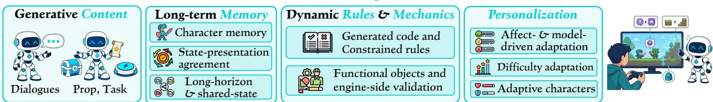  
Figure 21: Research directions for AI that generates and adapts at runtime: generative content for dialogues, props, and tasks; long-term memory across characters, state agreement, and shared sessions; dynamic rules and mechanics with engine-side validation; and personalization through affect models, difficulty adaptation, and adaptive characters.

## 7.1 Generative Characters, Narrative, and Content

Interactive narrative combines plot structure, character intention, and game state. Façade uses autonomous characters and drama management (Mateas and Stern, 2005), while narrative planning coordinates events with intentional action (Riedl and Young, 2010; Riedl and Bulitko, 2013). Foundation models broaden the dialogue and content available within these arrangements. The integration differs according to who interprets a proposal, which operations the game exposes, and how generated details influence subsequent play.

Character dialogue and player-interpreted output.[Fig. 22a] LIGHT connected dialogue, emotes, and actions in a text-based fantasy environment, grounding response prediction in characters, objects, and locations (Urbanek et al., 2019). Craft an Iron Sword later used a code-trained language model to generate free-form NPC dialogue and game actions in Minecraft (Volum et al., 2022). Other systems preserve a human intermediary. CALYPSO assists Dungeon Masters with encounter summaries and brainstorming within an established world. Its field study involved 71 players and DMs; DMs selected and adapted generated material before incorporating it into play (Zhu et al., 2023a). These setups distribute interpretation differently: an environment supplies available actions, generated code invokes operations, or a person decides how prose affects play.

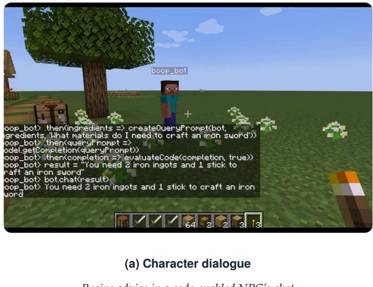

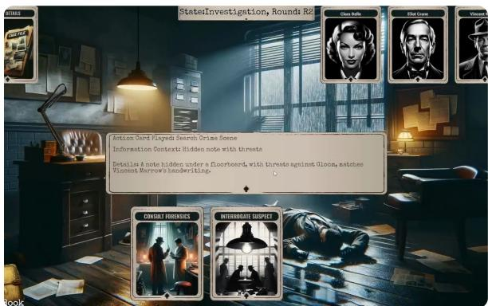  
(b) Narrative progression and generated content Generated clue and action cards executed by the game  
Figure 22: Runtime generation in two settings: a question-answering exchange with a code-enabled NPC (a) and generated narrative content integrated into game progression (b): (a) Craft an Iron Sword, Minecraft (Volum et al., 2022); (b) PANGeA, Dark Shadows (Buongiorno et al., 2024).

Concordia makes the Game Master itself a configurable model-driven entity. Actors propose actions, and GM components determine consequences and the observations returned to participants; memory and other components can be reused across scenarios (Vezhnevets et al., 2025). This differs from CALYPSO’s human adjudication and from a character acting through fixed engine operations. Component reuse makes scenarios easier to construct, but a generative GM’s account of an action is still an interpretation of its consequences. The framework illustrates a division of computation, while player outcomes and consistency depend on the scenario and its components.

Spoken dialogue and character voices. A voiced NPC couples language generation to speech input, synthesis, and turn-taking. In The Interview, Azure speech recognition transcribes the player’s input, GPT-4o generates a response, and OpenAI TTS voices it. Completed sentence fragments enter a playback queue before the full response is ready (Figueiredo and Elumeze, 2025). This makes streaming an interaction design choice: speech can begin sooner, but material already spoken cannot be silently revised. Listening indicators and captions help players detect recognition failures during play.

The Mecha BREAK technology showcase connects on-device Whisper recognition and Nemotron dialogue to cloud-based ElevenLabs speech, with Audio2Face animating the character (NVIDIA, 2024). These components solve distinct problems: TTS renders a line audibly; speaker conditioning or voice cloning aims for a consistent vocal identity; facial animation aligns visible performance with audio. Fortnite’s Darth Vader integration uses a recognizable voice with the estate’s permission (Epic Games, 2025). It demonstrates an authorized character-voice application, without disclosing a reproducible cloning-training pipeline. Vocal similarity should therefore be distinguished from intelligibility, expressive delivery, and whether the spoken statement agrees with the current game state.

Speech also introduces timing failures absent from a static text box. A queued hint may arrive after the player leaves the scene, overlapping speakers can disrupt turn detection, and interrupting an NPC requires cancelling obsolete audio as well as future text. The engine must distinguish spoken promises from actions it has actually accepted. Relevant tests include end-of-turn to first-audio delay, interruption recovery, recognition errors under game audio, and dialogue–action agreement. Section 7.4 discusses the player evidence for these systems.

Narrative progression and generated content.[Fig. 22b] Systems integrated directly into digital games require more explicit links between language and gameplay. NarrativeGenie’s runtime Adaptive Dialogue Manager derives hints and summaries from current state and play history. Its evaluation combines automated checks on 30 simulated histories with a 19-participant study in one mystery episode (Kumaran et al., 2024). PANGeA generates settings, items, characters, and dialogue for turn-based role-playing scenarios, using memory and a language-model validator to keep free-form input within designer-specified rules (Buongiorno et al., 2024). In 1001 Nights, words elicited through co-created storytelling become usable battle equipment, while narrated scenes are visualized during play (Sun et al., 2023). The difference is what the game does with the response: a hint helps interpret existing state, whereas an item or action must also be represented and executed by the game.

Drama Llama provides a further hybrid: authors specify natural-language storylet triggers, and a language-model drama manager checks when to inject the corresponding stage directions into an unfolding text interaction (Sun et al., 2025). Its preliminary study with six authors examines authorability and responsiveness. Compared with a fixed branching script, triggers can respond to a wider range of phrasing. Compared with unconstrained narration, they preserve explicit points of author control. Its responsiveness depends on the learned trigger checker’s interpretation.

Personalized quest generation makes the intermediate structure explicit. Ashby et al. match player input to a game-world knowledge graph, use graph paths and grammars to construct quests, and condition a fine-tuned GPT-2 model on those quests to generate titles and NPC dialogue (Ashby et al., 2023). Compared with NarrativeGenie’s hints within an episode, this pipeline generates the task as well as its presentation. Personalization follows the player’s expressed request, rather than a profile inferred from past behavior. The graph constrains task construction, but generated dialogue can still mention absent objects or locations, so structural consistency and text grounding remain separate checks in evaluation.

This comparison identifies a practical source of narrative failure. A generated clue may sound appropriate yet refer to an inaccessible location; an item may be described without any applicable action; an improvised branch may have no supported continuation. Checking prose quality cannot resolve these failures alone. The system must also know which generated details later play can use. Authoring constraints, retrieval, and executable bindings address different aspects of this problem.

## 7.2 Runtime Rules, Mechanics, and Worlds

Runtime mechanics make player requests into executable changes. Systems use generated code, constrained rule languages, or schemas linked to existing behaviors. These choices differ in what the model is allowed to propose and what the engine can check. A narrower language can simplify some checks, but valid rules can interact in ways that players struggle to predict.

Generated code and constrained rule languages.[Fig. 23a–b] Some runtime systems generate executable behavior or rules. GROMIT generates and compiles Unity behaviors during play, allowing model-generated code to produce gameplay effects (Jennings et al., 2024). Its evaluation combines three demonstration scenarios with interviews of 13 game developers, so the evidence primarily concerns runtime behavior generation and development-workflow risks, not player outcomes. Real-Time World Crafting translates player commands into a constrained domain-specific language that configures an entity–component system in a spell-crafting prototype (Drake and Dong, 2025).

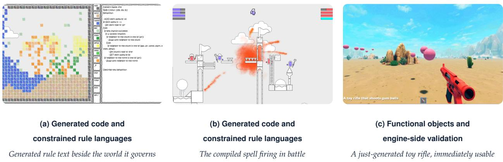  
Figure 23: Rules and objects generated during play and executed by the engine: a domain-specific rule language (a–b) and schema-constrained objects (c): (a–b) Real-Time World Crafting, Latent Space (Drake and Dong, 2025); (c) Roblox Cube (Singh, 2026a).

IF:CARGO similarly maps player-authored rules to commands that the engine validates and executes deterministically. In its 24-participant, eight-level playtest, players used execution feedback to revise rules, while periodic commands, multi-robot coordination, and priority rules increased diagnostic demands (Hsu et al., 2026b). Direct code allows new implementations; constrained languages expose a smaller set of operations with explicit validation rules. Their reliability still depends on the generated program and the checks available.

The representation also determines what a player can debug. Direct code can express behavior outside an existing command set, but a compilation error may be remote from the player’s intended mechanic. A constrained language limits the proposal space and can make rule priority, targets, and parameters visible in engine feedback. IF:CARGO’s multi-robot and periodic-command cases show that even deterministic execution can remain difficult to reason about when several valid rules interact. Validating each command separately therefore differs from explaining the behavior of the combined rule set.

Functional objects and engine-side validation.[Fig. 23c] Industrial object generation illustrates another form of constraint. Roblox’s Cube-powered 4D generation beta lets players create functional objects inside creator-enabled experiences. Its initial Car-5 and Body-1 schemas prescribe the parts to generate, after which behavior scripts are retargeted to the generated geometry (Singh, 2026a). Here the reusable component is a generative shape model, and functionality comes from a schema and script integration, with no unrestricted invention of behavior. The official report documents deployed functionality, not a controlled comparison of player outcomes.

Dialogue can often be presented directly, whereas generated quests, behaviors, or rules may require parsing, compilation, constraint checks, or engine-side validation. A weak line of dialogue may briefly disrupt characterization, a malformed quest condition can block progression, and an incorrect rule can alter later strategy. Safeguards must therefore match both the type of runtime content and the route by which it enters the engine.

## 7.3 State Consistency and Long-Term Memory

Quests, relationships, inventories, and discovered facts connect earlier choices to later play (Mateas, 2001; Riedl and Young, 2010). Runtime systems use event records, structured state, retrieved memories, and generative presentation to preserve different aspects of that history. Recalling a conversation, respecting a quest condition, and synchronizing a shared event require different information and update procedures.

Character and interaction memory. Generative Agents ranks stored observations by relevance, recency, and importance, then synthesizes higher-level reflections that inform later plans (Park et al., 2023). Retrieval decides which past events remain available, and reflection can connect several events into a character’s belief or intention. Their failure modes differ: missing retrieval can erase a relevant encounter, while an incorrect reflection can propagate a false interpretation into later dialogue. In the reported sandbox evaluations, retrieval failures and invented embellishments remain observable even when behavior is judged believable. PANGeA, introduced with runtime content in Section 7.1, combines retrieved narrative context with validation of out-of-scope requests. Its ten-scenario ablation uses synthetic player inputs and a GPT-4 judge calibrated against expert judgments on 80 examples; the reported 98–99% accuracy concerns handling those inputs (Buongiorno et al., 2024). This tests a different property from the character memories in Generative Agents: constraining scenario requests rather than retrieving and reflecting on social encounters.

Retrieval and state updates also occur at different points in an interaction. A remembered statement may describe an intended action, a mistaken belief, or an event later corrected by the player. Treating each as an accomplished game event would introduce errors even with perfect retrieval. The useful distinction is between what a character can recall and what the running game has actually recorded. Where systems maintain both, evaluation can test whether dialogue is regenerated appropriately after a state correction, rather than checking recollection in isolation.

State–presentation agreement. Generative life simulations also maintain visual context. Unbounded updates character-life variables alongside language-routed narrative and images (Li et al., 2025a). AnimeGamer instead predicts character variables and animation-shot representations from multimodal history, then decodes the latter with video diffusion. Its improvements concern visual continuity and motion as well as instruction following, while character-state accuracy remains similar to its language-router baseline (Cheng et al., 2025). Evaluation combines generated instruction sequences with 20 raters viewing prerecorded outputs, without an interactive player trial. Jointly generating images and state therefore addresses representational consistency without yet demonstrating sustained play. State and presentation can disagree in either direction. A character may describe an item that was never awarded, or the engine may record a completed event that the generated dialogue ignores. Structured state constrains the set of valid references, but the generation interface must expose those constraints and update them after accepted actions. Unbounded and AnimeGamer make some character variables explicit, whereas PANGeA emphasizes retrieved context and rule checks. Their different state stores explain why memory quality, rule adherence, and visual continuity need separate tests.

Long-horizon and shared-state consistency. Narrative continuity requires later responses to respect established facts and plot constraints, including when a player attempts to disrupt the story. NCP-Bench operationalizes this requirement through narrator interactions checked against an explicit narrative specification (Ma et al., 2026). Its auditing procedure and results are discussed in Section 8.2; here it specifies what runtime memory must preserve.

Longer deployments and shared play widen the scope further. Returning players must encounter recognizable affordances, character memories must survive gaps between sessions and changes in the underlying model, and saved sessions must remain compatible with later versions of the game. Multiplayer play adds synchronization and fairness requirements. Participants need a consistent account of events that affect later play, even when narrative presentation or personalization differs. A generated reward, rule, or piece of strategic information can change competitive balance, while latency affects the order in which actions enter shared state. MultiGen’s external map and synchronized generated viewpoints illustrate a concrete shared-state mechanism (Po et al., 2026). Existing learned-world studies provide more evidence about model-level synchronization than about fairness or persistence in live multiplayer populations (Section 4.4).

Cross-session testing can make these requirements concrete: resume a saved quest after a gap, correct an earlier event, or update the character model while keeping the saved game fixed. The expected outcome differs in each case. Dialogue may change after a correction, whereas completed objectives and shared rewards should remain consistent with the revised record. Such tests examine the interaction between persistence and generation rather than transcript storage alone.

## 7.4 Personalization, Adaptation, and Deployment

Personalization uses observed performance, inferred preferences, or explicit requests to choose what a player receives. Difficulty, content, and character behavior are different intervention targets, with different effects on control and experience (Mortazavi et al., 2024; Zohaib, 2018; Paraschos and Koulouriotis, 2023). Evaluation must separate the quality of the inferred player model from the effect of the change made using it.

Affect- and model-driven adaptation. Performance, inferred preferences, affect, and explicit player choices can jointly drive an adaptation. Affective game computing connects sensing and prediction to experience adjustment (Yannakakis and Melhart, 2023; Chanel et al., 2011). A review of 23 empirical studies finds complete sensing-to-adaptation loops comparatively uncommon in its sample (Lopes et al., 2025). The Affectively Framework makes predicted affect available in Gym environments for agent training (Barthet et al., 2024), while language-model studies test engagement inference from gameplay footage (Melhart et al., 2025). Training against an affect model is useful for developing a policy, but also permits the policy to exploit errors in that model. Model accuracy and intervention benefits need separate checks (Section 4.3).

Difficulty adaptation and balancing. Hunicke’s Hamlet system adjusts resources using player performance, with attention to intelligible feedback and intended experience (Hunicke, 2005). Later approaches optimize different objectives: an Electronic Arts deployment reports engagement gains from difficulty adjustment (Xue et al., 2017), while Dungeons & Replicants uses learned individual behavior models to balance content offline (Pfau et al., 2020). Engagement, challenge, and perceived fairness are distinct targets; improvement in one cannot be assumed to improve the others. Timing is another substantive choice. Within-session adjustment responds quickly but can make the current challenge feel unstable. Between-level generation allows more time to validate content and present a consistent challenge. Longer-term profiles can incorporate repeated play but may become stale as a player learns. Foundation models expand the information used to choose an adjustment, without resolving the choice of objective or intervention timescale.

Content and narrative personalization.[Fig. 24a] Adaptation can change a difficulty parameter, select an encounter, or generate content. Experience-driven PCG (Yannakakis and Togelius, 2011) and PaSSAGE (Thue et al., 2007) extend the parameter adjustments illustrated by Hamlet to content generation and narrative selection. Language models broaden how a system interprets behavior and proposes changes, while the available action or content space remains game-specific.

Profile-conditioned generation and direct changes to level structure expose different parts of the adaptation pipeline. Beyond Asking compares inferred, ground-truth, and mismatched profiles primarily using simulated players, followed by an exploratory 12-person pilot with real players (Lu et al., 2026b). A separate approach trains a classifier on agent trajectories at three skill levels together with clustered human play, then uses inferred skill to make targeted changes to level content during play (Elshamy et al., 2026). The former tests the profile supplied to the generator; the latter connects skill inference to an explicit content intervention.

Deployment adds variation in starting conditions and participation. A match-three study deployed GPT-4-conditioned PCG through Google Play during a 26-day recruitment window. Among 102 players who completed at least one level, it recorded 928 level starts and 422 completions. Overall completion was 55% under the LLM condition versus 35% with random parameter selection, but first-level completion also differed before personal gameplay history was available. Generation quality, initial difficulty, and personalization therefore contribute to the comparison together (Hafnar and Demšar, 2025). The system buffered three generated levels to absorb network delays, making scheduling part of the deployed adaptive experience. Separating player-model evaluation from the content policy, as discussed in Section 4.3, helps locate the source of improvement.

Narrative personalization changes characters’ responses and story progression, with immersion and agency as evaluation targets. In LLM-based interactive drama, a player acts among characters played by language-model agents; playwriting-guided generation supports story structure, and plot-based reflection aligns the agents’ reactions with the player’s intentions (Wu et al., 2025). The storylet approach of Drama Llama is discussed in Section 7.1.

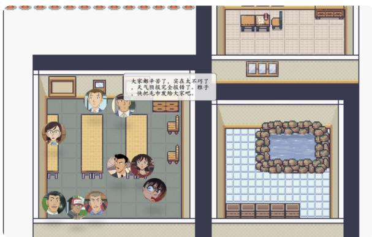  
(a) Content and narrative personalization Model-played characters improvising around the player

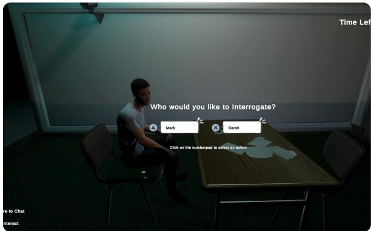  
(b) Adaptive characters and companions Free-form dialogue with an adaptive suspect

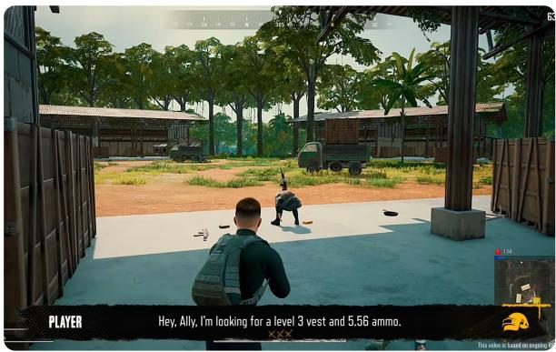  
(c) Evaluation, transparency, and deployment AI teammate answering a spoken request

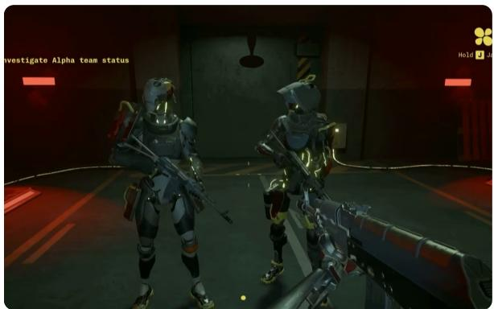  
(d) Evaluation, transparency, and deployment Voice-addressable AI squadmates in a lab prototype  
Figure 24: Runtime personalization and companion systems: personalised narrative (a), adaptive characters (b), an AI teammate in a limited-time public beta (c), and AI squadmates in a closed-playtest prototype (d): (a) Interactive drama (Wu et al.), waiting-room scene (Wu et al., 2025); (b) Figueiredo et al., detective prototype (Figueiredo and Elumeze, 2025); (c) PUBG Ally (KRAFTON, 2026); (d) Ubisoft Teammates, firstperson prototype (O’Connor, 2025).

Adaptive characters and companions.[Fig. 24b] Research on game design and agency connects meaningful choice to available actions and intelligible feedback (Salen and Zimmerman, 2003; Wardrip-Fruin et al., 2009; Ryan et al., 2006). Runtime generation can broaden those possibilities when players understand how their input is interpreted and can respond to the result. In a study of 28 players, Player-Driven Emergence identified narrative events beyond the authored premise by converting dialogue logs into graphs with GPT-4 and inspecting the resulting events. Some improvised events led to dead ends without executable new paths, and players with a preference for discovery and experimentation contributed more of them (Peng et al., 2024). In a separate

Minecraft study, 28 players collaborated with two GPT-4-driven characters during 30 minutes of play. Players sometimes compensated verbally for missing visual or state information, but only 25% completed the full quest (Rao et al., 2024). Open dialogue can therefore create new opportunities for cooperation while leaving progress constrained by the character’s ability to perceive and act in the game.

Persistent characters and companions raise questions that short dialogue tests cannot answer. Game-companion studies emphasize context-sensitive behavior, personality, and integration with the surrounding story (Emmerich et al., 2018), while relational-agent research examines continuity and trust across repeated encounters (Bickmore and Picard, 2005). Proact-VL evaluates when a companion should comment or assist during streaming gameplay, using a benchmark of response timing and quality (Yan et al., 2026).

Player studies examine how character and companion designs affect the immediate interaction. In a 10-participant voice-based detective-game study, high- and low-constraint prompts produced no reliable differences in first-play ratings. A separate synthetic experiment with an LLM judge found role-dependent effects of a JSON-and-retrieval redesign, and those results should not be read as player-experience effects (Figueiredo and Elumeze, 2025).

Larger player studies show benefits and costs under different companion roles. In a randomized between-subjects experiment with 130 players in the Campus Culture Week prototype, modeldriven characters increased perceived autonomy and cognitive load, reduced usability and trust, and did not significantly improve overall game experience (Hsu et al., 2026a). LeagueBot, a voice companion providing informational and emotional support during live League of Legends matches, reduced cognitive challenge, performative challenge, and perceived tension in a withinsubjects experiment with 33 novice players (Lee et al., 2026). These studies use different games, populations, and outcomes, so their contrast cannot be attributed to the companion architecture alone. Together they motivate controlled comparisons of task-focused assistance and open-ended dialogue within the same game.

Players also form models of the AI they face. A qualitative study of ten player pairs in the drawing game iNNk traced how mental models of an adversarial AI player develop along dimensions of focus and style (Villareale et al., 2022). The benefit of dialogue freedom depends on whether it helps the player accomplish and understand the current activity.

More targeted experiments isolate how generation enters play. In GenFlora, a 72-participant, 2 × 2 within-subject study varies whether generated items have dynamic game functionality and whether NPC dialogue responds to the player and generated content. Both factors improve reported presence, autonomy, and enjoyment, with no significant interaction between them (Yin et al., 2026b). Unlike a comparison of complete NPC architectures, this tests two integration choices within one farming-game prototype. Its short tasks support those local effects rather than a general advantage for all generative characters.

Response timing can also be tested independently of model choice. Roso et al. vary time to first token and time per output token in a 34-participant simulated RPG conversation study. Sustained token delay has more pronounced negative effects than the initial wait, and character differences also influence ratings (Roso et al., 2026). Total response time therefore hides an important design choice: waiting before an utterance and slowing its delivery produce different conversational rhythms. This complements control-rate measurements for acting agents, where delay instead changes whether an action arrives in time.

Evaluation, transparency, and deployment.[Fig. 24c–d] Controlled player studies of difficulty adaptation form a line of their own. Challenge adjustment has been tested for its effect on player performance and experience (Denisova and Cairns, 2015), different adjustment systems have been compared on game experience (Ang and Mitchell, 2017), player-oriented systems that expose adjustment as a choice have been studied for how that choice is represented and how often it is offered (Ang and Mitchell, 2019), and adjustment has been shown to affect players’ confidence (Constant and Levieux, 2019). A player-centered framework of game personalization collects the resulting open problems, among them modeling accuracy, controllability, and players’ mental models of the personalization itself (Zhu and Ontañón, 2021). Language-model agents can also serve the evaluation: although they play below the level of an average human, their performance under generic prompting correlates strongly with the difficulty reported by human players on Wordle and Slay the Spire (Xiao and Yang, 2024).

Ubisoft’s Teammates, following NEO NPC, combines authored characters and an FPS scenario with voice-driven dialogue and actions. Ubisoft reports a closed playtest with a few hundred players but no controlled outcome study (O’Connor, 2025). KRAFTON’s PUBG Ally ran as a public Arcade beta from 17 June to 1 July 2026 (KRAFTON, 2026). Its on-device speech–language pipeline consumes textual engine observations, while a behavior tree executes actions and time-critical reactions (Singh, 2026b). Teammates and PUBG Ally reuse speech and language technology but retain game-specific observations, action execution, authored character constraints, and hardware budgets. Public availability demonstrates integration under those conditions, but sustained cooperation or retention benefits still require evidence about player outcomes.

AI Dungeon and Fortnite show two other product integrations. AI Dungeon uses player text to continue an open-ended narrative (Latitude, 2026); Fortnite’s Darth Vader feature lets squad members address a recruitable character through voice, using Gemini 2.0 Flash for conversation and ElevenLabs Flash v2.5 for speech (Epic Games, 2025). In one, generated text carries the evolving adventure; in the other, conversation is embedded in an existing multiplayer game. The official descriptions establish deployed interaction features, not autonomous tactical control or measured long-term player benefit. More general HCI research distinguishes the qualities sustaining use from those driving initial novelty (Karapanos et al., 2009); repeated encounters remain important even for publicly available systems. Appendix A, Table 19, indexes generated elements, execution, study populations, exposure, and outcomes.

## ­ More expressive interaction creates new coordination work

• Dialogue freedom expands proposals, not necessarily actions. Player-Driven Emergence reports improvised events that can end without executable continuations (Peng et al., 2024); Minecraft collaborators sometimes compensate for NPC perception gaps (Rao et al., 2024). Meaningful agency depends on whether the game can act on a player’s contribution, not simply accept its wording.

• Constraints can support player control. GROMIT exposes generated code (Jennings et al., 2024), while IF:CARGO uses a constrained language with execution feedback (Hsu et al., 2026b). The narrower representation makes some errors easier to explain, although interacting valid rules remain hard to diagnose. Expressiveness and intelligibility are coupled design choices.

• Personalization changes the data used to personalize. Later behavior reflects the content already selected for the player. The match-three deployment’s first-level difference illustrates why a stronger generator, easier initial content, and better profile inference cannot be credited to adaptation as one effect (Hafnar and Demšar, 2025; Lu et al., 2026b).

## AI That Tests and Evaluates Games

An automated tester must both encounter relevant behavior and recognize when it is wrong. These are different capabilities: a skilled player can miss a defect, while a reliable local check may bypass the sequence that a person would need to reach it. Foundation-model systems broaden testing through language-based requirements, visual inspection, and tool use, alongside established search, reinforcement learning, and executable oracles (Zheng et al., 2019; Cai et al., 2025a; Jia et al., 2026). The useful comparisons concern how a test is directed, what observations support its verdict, and how the resulting trace or diagnosis helps development. Claims that a test predicts player experience require a human reference beyond software correctness (Figure 25).

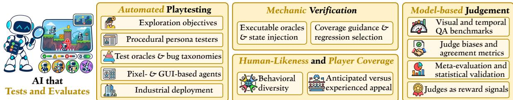  
Figure 25: Research directions for AI that tests and evaluates games: automated playtesting through exploration objectives, procedural personas, and pixel- or GUI-based agents; mechanic verification with executable oracles and coverage-guided regression selection; human-likeness and player coverage; and model-based judgement with QA benchmarks, agreement metrics, and meta-evaluation.

## 8.1 Automated Playtesting

Automated playtesting uses interaction to examine a game, with objectives that may include progress, state coverage, anomaly discovery, performance stress, or representative behavior. The exploration policy and the test oracle need not be learned together. Surveys distinguish approaches by their access, objectives, and validation mechanisms, while studies of practice document the continuing role of manual testing (Albaghajati and Ahmed, 2023; Politowski et al., 2021). Target access, exploration mechanisms, and test oracles are compared system by system in Appendix A, Table 20.

Exploration objectives and coverage. An objective of reaching states shapes the policy differently from an objective of winning. A score-maximizing policy may repeatedly follow a safe route and never exercise optional mechanics, failure recovery, or unusual action sequences. Wuji combines evolutionary search and deep reinforcement learning to balance progress with exploration, and its evaluation includes two commercial combat games and three newly discovered, developerconfirmed bugs, using game-specific oracles, not learned verdicts (Zheng et al., 2019). A line of work at Electronic Arts made coverage the testing objective. Deep reinforcement learning with a user-defined reward increased test coverage, found exploits, and tested map difficulty in first-person-shooter scenarios (Bergdahl et al., 2020), and curiosity-driven agents rewarded for the novelty of their actions raised game-state coverage on a complex 3D scenario where earlier exploration techniques performed poorly (Gordillo et al., 2021). Multi-agent curiosity extends the same objective: cMarlTest deploys several cooperating agents and reports higher coverage than a single-agent variant under three coverage criteria on levels of a 3D game (Ferdous et al., 2025). Code-aware guidance, which directs exploration toward target functions or changed code, is covered with verification in Section 8.2. The balance is practical: exploration without progress misses later content, but progress without variation can repeatedly certify the same narrow path.

Procedural personas and human-like testers.[Fig. 26a] Procedural personas enact different play styles through search, using Monte Carlo tree search with evolved heuristics to play as distinct types of player (Holmgård et al., 2019). Synthetic and humanlike tester agents make the contrast measurable: separate execution oracles identify 45 seeded bugs across three GVG-AI games, and 427 human trajectories provide a distinct reference for behavioral similarity (Ariyurek et al., 2021). Two limits of the original personas have been addressed since. Developing personas progress through different goals during play instead of holding one fixed goal, and the Alternative Path Finder trains on previously tested paths and modulates the reward so that a reinforcementlearning tester is encouraged to explore alternatives to previously tested paths (Ariyurek et al.,

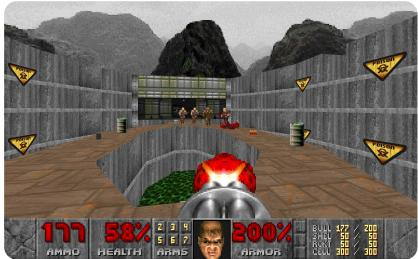

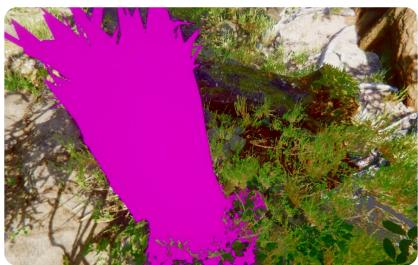  
(a) Procedural personas and human-like testers DOOM gameplay (illustrative screenshot)

(b) Test oracles and bug taxonomies Missing texture that an oracle mustflag  
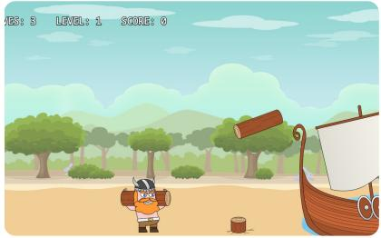  
(c) Test oracles and bug taxonomies Floating log revealed by no crash

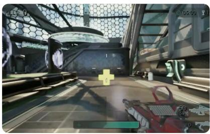  
(d) Pixel- and GUI-based agents Tester observing only the raw screen

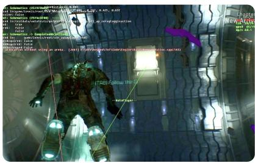  
(e) Industrial deployment and evaluation practice Zero-gravity navigation in a production build

  
(f) Industrial deployment and evaluation practice Official screenshot of the tested game  
Figure 26: Automated playtesting, from persona-driven exploration (a) to learned oracles for visual defects (b–c), screen-only testers (d), and production deployments (e–f): (a) Developing personas, DOOM (Ariyurek et al., 2023); (b) Ling et al., glitch sample (Ling et al., 2020); (c) Macklon et al., HTML5 canvas game (Macklon et al., 2022); (d) Inspector, FPS test arena (Liu et al., 2022); (e) EA SEED AutoPlayer, Dead Space zero-gravity navigation (Gillberg et al., 2023); (f) iv4XR, Space Engineers (Prasetya et al., 2022).

2023). Personas broaden the behaviors a test exercises. Whether that breadth represents real players is the subject of Section 8.4.

Test oracles and bug taxonomies.[Fig. 26b–c] Test oracles decide whether an observed behavior is a fault; a bug taxonomy specifies the kinds of faults to look for. A multivocal review of 436 sources derived a taxonomy of 63 game bug categories, validated with industry practitioners, so that testers and researchers can name what a test is meant to find (Butt et al., 2023). Learned oracles extend detection to patterns that are difficult to encode as fixed rules. GLIB targets graphical glitches, which a study of NetEase bug reports found to be frequent and to escape crash-only testing, and provides an automated oracle for graphically rich applications (Chen et al., 2021a). For HTML5 canvas games, whose contents are absent from the DOM and which snapshot oracles handle poorly, visual bugs can be detected automatically from the game’s own graphics assets (Macklon et al., 2022). Supervised classifiers detect rendered texture glitches at 86.8% accuracy with an 8.7% false-positive rate on generated data (Ling et al., 2020), and co-finetuning on labeled and unlabeled data from several games reduces the dependence on labeled bugs from the target game (Yi et al., 2025). Oracles also cover performance: an RL agent can be trained to reach demanding 3D scenes, where frame rate and lag are then measured as test properties (Tufano et al., 2022).

Pixel- and GUI-based agents.[Fig. 26d] Early testing agents relied on game-internal state, which requires deep integration with each game. Inspector uses only screenshots, combining a gamespace explorer, a key-object detector, and a human-like object investigator so that one agent can be applied across games without deep integration (Liu et al., 2022). A preference-conditioned pixel agent lets test engineers steer exploration toward a preferred style, such as the golden path, while keeping the state representation pixel-based (Abdelfattah et al., 2023). Language-model testers inherit the same constraint from the other direction: Lap targets non-text games that lack APIs, where the model cannot naively read game state (Zhao and Tang, 2025). Multimodal agents now extend testing to rendered interfaces and generated games. PlaytestArena uses a GUI agent to play browser games and judge observed behavior against task-specific rubrics (Huang et al., 2026a). Play2Code instead withholds those scoring rubrics from its playtester: the GUI agent returns observations and suggested fixes to a coding agent for the next software revision (Huang et al., 2026a). In PlayWorld, an agent adapts human-annotated reference actions to pursue comparable objectives across learned environments, while a separate visual-question-answering verifier scores the rollouts (Ding et al., 2026). GBQA measures the whole pipeline, with 30 games and 124 humanverified injected bugs across three difficulty levels and a ReAct-plus-memory baseline agent (Jiang et al., 2026a). TITAN, which couples long-horizon task execution with a language-model bug oracle in commercial MMORPGs, is discussed with verification in Section 8.2.

Rendered-interface testing reduces dependence on internal instrumentation but makes exploration and diagnosis less direct. The agent must discover what is interactive, distinguish a missed input from a broken mechanic, and remember the sequence leading to a symptom. The resulting trace is useful beyond the final verdict: a coding agent or developer can replay it to localize a defect. This explains why Play2Code can use playtesting for repair even though its playtester does not receive the benchmark’s scoring rubric.

Industrial deployment and evaluation practice.[Fig. 26e–f] Practice surveys document a substantial role for manual testing alongside growing automation (Politowski et al., 2021; Roque et al., 2025). In Battlefield 2042 and Dead Space, EA used reinforcement learning for difficult navigation while retaining scripted bots for other behavior. Structured observations reduced rendering dependencies, but the learned policies still required training and integration with changing builds (Gillberg et al., 2023). The iv4XR framework takes an agent-programming approach, combining goal-directed agents with conventional testing algorithms in applications including Space Engineers (Prasetya et al., 2022). EA’s deployments and iv4XR’s integration approach make task selection and instrumentation central to the testing workflow. Hybrid testers divide the work accordingly. Scripted actions can reliably initialize a scenario or perform a known interaction, and a learned navigation policy can reach a location that would be expensive to script across changing geometry. Instrumented observations simplify perception and permit faster execution, while rendering can be enabled for failures that require visual inspection. Reusing this arrangement across builds still requires checking that observations, controls, and target conditions retain their meanings. Production integration is therefore a separate achievement from high return in a fixed training environment.

## 8.2 Software and Mechanic Verification

Mechanic verification connects an expected behavior to an observable result. An executable assertion may inspect state directly; a visual judge may infer the result from rendered interaction. Either approach also needs a way to reach or construct the relevant test condition. Code structure and update history can guide that selection.

Executable oracles and state injection. Software tests can inspect states that ordinary play may not reach. GameGen-Verifier injects target states and runs bounded checks around specified mechanics. Its verifier combines a vision-language judge with programmatic assertions where available. Across 100 generated web games, the best configuration reports 92.2% specification-label agreement with expert annotations under Acc@5, computed over five repeated runs, versus 58.8% for a coverage-enforced baseline, with up to 16.6× lower wall-clock time (Jia et al., 2026). This is agreement on mechanic checks, not the fraction of fully correct games. State injection also changes what is tested: it can isolate a transition while bypassing the progression needed to reach it. Injected states must respect the game’s invariants, or be identified as robustness tests, and successful local checks still leave ordinary reachability to be tested.

Deterministic checks provide evaluation infrastructure. GameEngineBench uses hidden Play-in-Editor tests to score development agents (La et al., 2026). GameWorld evaluates 170 tasks across 34 browser games using state-verifiable task metrics, with both keyboard/mouse and semantic-action interfaces (Ouyang et al., 2026). Agent2World instead generates unit-test and simulation evidence while executable world models are being constructed (Hu et al., 2025). Handwritten, hidden, and model-generated tests differ in independence from the implementation.

Narrative constraints also support targeted verification. NCP-Bench checks narrator responses against an explicit fact ledger and fixed plot commitments across 100 movie-derived environments. Prompt-fixed LLM auditors detect contradictions, update facts, and track commitment satisfaction during player interventions (Ma et al., 2026). The best reported narrator remains conflict-free in 42% of environments after 20 turns under this protocol (Ma et al., 2026). The test compares generated interaction with a stated narrative specification, with verdicts that depend on the auditors’ interpretation; it measures continuity under simulated interventions rather than longitudinal player experience. FAIRGAMER supplies a complementary behavioral diagnostic by testing social bias in NPC decisions (Shi et al., 2026a); its human-relevance implications are discussed in Section 8.4.

Coverage guidance and regression selection. Code-aware and regression testing use different sources of guidance. CA2 uses call-stack traces to guide reinforcement-learning testers toward target functions in state- and image-based environments (Adaikkappan et al., 2026). SAGE combines LLM-guided exploration, compact test-suite construction, and update-log-based prioritization. Its Overcooked Plus and Minecraft experiments use predefined bug-trigger predicates: language interpretation selects tests, while these predicates determine detection (Cai et al., 2025a). TITAN couples long-horizon task execution with an LLM bug oracle. On 20 tasks across two commercial MMORPGs, its authors report 95% completion and four previously unknown bugs, and separately report adoption in eight QA pipelines (Wang et al., 2025a). Target reachability, regression selection, and bug classification therefore improve different parts of the testing process.

SMART makes a further connection between code changes and testing intent. It uses structural code differences to identify changed behavior, translates that context into functional goals, and combines coverage with semantic guidance in reinforcement-learning rewards (Mu et al., 2025). Its custom Overcooked and Minecraft experiments study reaching update-relevant behavior with instrumented access. CA2 targets functions, SAGE manages regression effort, and SMART uses changes to shape exploration; each grounds testing in game or code structure.

The usefulness of code-aware guidance depends on how closely coverage matches the intended behavior. Reaching a target function establishes execution of that code, but not necessarily a rare branch, a particular parameter combination, or the player-visible effect of interest. Update logs can suggest such targets even when the tester lacks source access; structural differences can locate changed implementation when source is available. Compare guidance by faults and behaviors exposed at a matched testing budget, not target coverage alone.

A useful regression record links the build version and initial state to an action sequence, an expected result, and the observed failure. This supports both reproduction and diagnosis. After an update, the expected result may need revision: an old trace can become invalid because the requirement changed, not because a defect was introduced. SAGE (Cai et al., 2025a) and SMART (Mu et al., 2025) address selection of update-relevant tests, while checked oracles decide whether the new outcomes are faults. Retaining a reproducer connects detection to repair without assuming that the testing agent can perform the repair itself.

## 8.3 Model-Based Judges

Model-based judges are useful where correctness cannot be fully encoded as an executable oracle: interpreting a visual glitch, matching an interaction to a requirement, or assessing an open-ended design. Their flexibility makes validation important. Game-specific benchmarks test visual and temporal recognition, while broader judge research helps explain bias and the risks of using verdicts as optimization feedback (Gu et al., 2024; Li et al., 2024a).

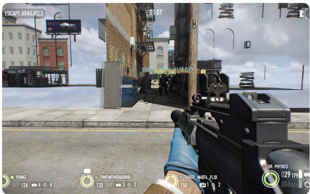  
(a) Visual and temporal QA benchmarks Render corruption a judge must detect

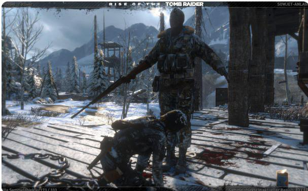  
(b) Visual and temporal QA benchmarks Frozen T-pose versus normal posture

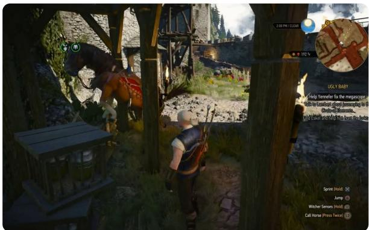  
(c) Visual and temporal QA benchmarks Horse clipped into scenery

  
(d) Visual and temporal QA benchmarks Civilianfloating in mid-air  
Figure 27: Benchmark cases in which a model-based judge must decide whether a screenshot contains a defect: (a) VideoGameQA-Bench, co-op FPS heist (Taesiri et al., 2025); (b) VideoGameQA-Bench, Rise of the Tomb Raider (Taesiri et al., 2025); (c) GlitchBench, The Witcher 3 (Taesiri et al., 2023); (d) GlitchBench, Gotham Knights (Taesiri et al., 2023).

Visual and temporal QA benchmarks.[Fig. 27a–d] Visual QA benchmarks test whether model judges can recognize an anomaly, locate it in time, and explain the fault. GlitchBench uses unusual and glitched game scenarios to test whether large multimodal models detect and interpret outof-the-ordinary events, reporting that the task remains challenging for state-of-the-art models (Taesiri et al., 2023). VideoGameQA-Bench evaluates nine visual QA tasks, including UI checks, visual regression, glitch detection, temporal localization, and bug reporting. Its best reported visual-regression accuracy is 45.2%, despite stronger glitch-recognition results (Taesiri et al., 2025). VideoGlitchBench examines open-ended detection over continuous video, with 5,238 gameplay videos from 120 games annotated with glitch descriptions and temporal spans. The judge must distinguish true glitches from unusual but valid in-game events (Zheng et al., 2026).

Industrial footage tests visual inspection under a different distribution of scenes and faults. On

19,738 keyframes sampled from 41 hours of gameplay, a single-prompt vision–language baseline reaches a precision of 0.50 and an accuracy of 0.72 (Lu et al., 2026a). Reference-guided prompting compares each test frame with an earlier frame of the same video and aggregates noisy frame verdicts into a video-level decision (Yu et al., 2026). This uses temporal context to address scene variation. These studies use different datasets and evaluation protocols, so their scores describe performance within each setting. Vision–language models have also been explored for canvas applications with procedurally generated graphics, where no asset-based ground truth exists for direct comparison (Macklon and Bezemer, 2025).

An acting tester must also reach the behavior that a passive visual judge inspects. For interactive testing, PlaytestArena reports 84.2% raw criterion agreement with human judgments on 32 games, with Cohen’s κ = 0.64 (Huang et al., 2026a). This evaluates judgments grounded in play traces; passive visual QA alone leaves the exploration requirement untested.

Temporal evidence is especially important for distinguishing symptoms from causes. A screenshot can reveal a missing object or visual artifact, but a failed interaction may require comparing the state before input, the action actually executed, and the later response. A useful report identifies the triggering sequence and violated requirement, not just an unusual image.

Narrative and logical bug detection. Text-based generative games introduce faults that need not appear in graphics or crash a program. Jin et al. analyze DejaBoom! gameplay logs for errors caused by hallucination, forgetting, and misinterpretation, comparing LLM-based detection with human annotations (Jin et al., 2024). This complements the same game’s study of emergent player narratives (Peng et al., 2024): an improvised event may be a useful addition or a contradiction of the game’s premise. The judge needs both prior interaction and the relevant design constraints to distinguish them. Unlike an executable assertion, its verdict interprets whether the narrative remains consistent; unlike a preference rating, it targets an identifiable deviation. Dialogue-log inspection extends coverage but still needs state checks.

Judge biases and agreement metrics. A generator and evaluator can share errors, and languagemodel evaluators may prefer their own outputs (Panickssery et al., 2024). Broader judge studies document task-dependent biases and differences between pairwise comparison, absolute scoring, and ranking (Ye et al., 2024; Chen et al., 2024b; Yamauchi et al., 2025). In game evaluation, this means that agreement on attractive screenshots cannot be transferred automatically to judgments of mechanics or interaction traces. Clear criteria help isolate the target, while engine checks and human annotations can reveal errors shared by generator and judge.

Meta-evaluation and statistical validation. Raw agreement depends on the prevalence of faults: a judge that usually approves output may appear accurate when defects are rare. Per-category detection, false positives, and chance-adjusted agreement reveal different weaknesses. Repeated runs measure variability, not independence. JudgeBench distinguishes objective correctness from preference (Tan et al., 2024), and the alternative annotator test evaluates whether a model can substitute for human annotation on a specified task (Calderon et al., 2025). These are methodological precedents; a game judge still needs validation against the relevant game evidence. Disagreement can itself be informative. An assertion may confirm a state update while the rendered feedback incorrectly suggests failure. Conversely, an animation may look successful without changing inventory. Retaining the requirement, trace, and oracle output makes such cases diagnosable rather than reducing them to conflicting scores. Human judgments are needed for experience claims, but need not replace executable checks of a well-defined rule.

Judges as reward signals. A verdict used for repeated revision creates a different risk from a one-off score. GameGen-Verifier, Play2Code, and PlayWorld place automated assessment within construction, repair, or simulation workflows. More general agentic evaluation likewise supplies intermediate feedback during development (Zhuge et al., 2024). Research on imperfect verifiers (Helff et al., 2026) and tool-use reward hacking (Thaman, 2026) shows how optimization can exploit scoring shortcuts. These findings motivate a specific test for game-generation loops: after optimization against one judge, does the improvement survive withheld interaction scenarios, independent engine checks, and human review? Reusing the optimization judge as the only final evaluator leaves that validation question unanswered.

## 8.4 Player Representativeness and Human Relevance

Behavioral diversity helps discover failures, but it need not reproduce the distribution of human play. A deliberately unusual test can be valuable for robustness and a poor predictor of usability. Claims about player relevance therefore require a reference appropriate to the decision: trajectories for behavioral similarity, interaction for usability, or repeated encounters for an ongoing experience.

Behavioral diversity. A tester’s competence limits the conclusions of any play-based test. Failure to reach a mechanic can be mistaken for its absence, whereas a highly skilled policy may never reveal novice confusion. Play2Code reports limited refinement on complex games whose mechanics its playtester struggles to trigger (Huang et al., 2026a). The procedural personas discussed in Section 8.1 broaden coverage through different objectives or play styles (Holmgård et al., 2019). Their representativeness depends on how those behaviors compare with human strategies. Ariyurek et al. explicitly compare synthetic and humanlike testers with human trajectories, showing that bug-finding effectiveness and behavioral similarity can be measured separately instead of being assumed from one another (Ariyurek et al., 2021).

MIMIC-Py makes personality-conditioned exploration a reusable testing interface. It separates planning, execution, and memory, with configurable personalities and game adapters demonstrated for Dungeon Adventures, Shattered Pixel Dungeon, and Minecraft (Chen et al., 2026c). The tool supports structured action calls and generated interaction code, and adopting a new game still requires game-side integration. Such profiles can broaden test behavior, but a personality prompt is not itself a validated model of a player population. Human trajectory comparisons remain necessary when the claim is representativeness and not diversity alone.

Human-reference evaluation. Predictions of player response need a different reference from rule correctness. The distinction between anticipated and experienced appeal in Figure 25 concerns when the human judgment is elicited. In the study by Collins et al., whose prediction results are discussed in Section 4.3, participants judged games before playing; the fun ratings therefore measure anticipated appeal (Collins et al., 2025). Such judgments can inform concept selection, while claims about enjoyment during play require evidence from interaction. Human relevance also includes fairness: FAIRGAMER tests social bias in NPC decisions across transaction, cooperation, and competition, covering four bias types over 12 tasks (Shi et al., 2026a). Such diagnostics complement studies of actual play without replacing them.

The human reference must match the decision for which the evaluator is used. Selecting a promising concept can reasonably use anticipated appeal, whereas assessing usability requires interaction and assessing a persistent companion requires repeated encounters. Similarly, testing whether NPC choices change with a demographic cue is a targeted bias diagnostic, not a complete account of fairness during multiplayer play. Automated judgment is most useful when its target and reference are specified narrowly enough that errors can be interpreted and corrected.

## ­ A capable player is not automatically a reliable tester

• Discovery and judgment have different bottlenecks. Play2Code can miss mechanics its tester cannot trigger (Huang et al., 2026a); GameGen-Verifier injects states to inspect specified requirements (Jia et al., 2026). Injection reduces exploration cost but bypasses the path to the state. The two approaches are complementary, not substitutes for the same test.

• Diversity is not representativeness. Procedural personas deliberately explore different goals (Holmgård et al., 2019), while human-trajectory comparisons test whether those goals resemble actual play (Ariyurek et al., 2021). A useful bug-finding portfolio may include atypical behavior; it should not be used as a population model without a separate human reference.

Using a verdict for repair changes its risk. When a judge guides repeated revision, its blind spots can be reinforced rather than revealed (Panickssery et al., 2024). Independent execution checks and withheld defects then matter beyond ordinary judge agreement: they test whether apparent repair survives outside the feedback that produced it (Helff et al., 2026).

## 9 Benchmarks and Evidence Across the Six Roles

Sections 3–8 surveyed what AI systems have been shown to accomplish within each of the six roles. This section asks what their evaluations establish: what counts as success, which conditions make results comparable, and where interpretation should stop. It is distinct from Test and Evaluate in Section 8, where an AI system itself produces test evidence, a verdict, or a diagnosis. A player study, engine test, or benchmark can evaluate any role; its target may be action quality, predictive fidelity, design quality, software behavior, runtime adaptation, or testing reliability.

Table 4 provides a reading guide to these targets. The quantitative examples below illustrate distinct interpretation problems: progress versus completion, model versus harness, trajectory validity versus world fidelity, and scoped development versus complete delivery. They report the cited results as role-specific examples rather than forming a common ranking across roles. For design and player-facing systems, study conditions and human outcomes are more informative than imposing the same score format.

Table 4: Evaluation targets and interpretation boundaries across the six roles.
<table><tr><td>Role</td><td>Targets and example measures</td><td>Interpretation boundary</td></tr><tr><td>Play and Act</td><td>Completion; progress; action efficiency</td><td>Protocol-specific; transfer across rules, controls, or timing remains untested</td></tr><tr><td>Model Players and Games</td><td>World-state fidelity; reference-game policy return; player prediction or trait recovery</td><td>Short-horizon fidelity does not establish persistence; synthetic traits do not establish real-player validity</td></tr><tr><td>Design</td><td>designer control</td><td>Validity; diversity; constraint satisfaction; Does not establish authoring efficiency or intended player experience</td></tr><tr><td></td><td>Build and Maintain Launchability; requirement satisfaction; repair; regression</td><td>Does not establish long-term maintenance or developer handoff</td></tr><tr><td>Generate and Adapt at Runtime</td><td>Latency; consistency; controllability; player outcomes</td><td>Single-session evidence; adaptation effects require suitable controls</td></tr><tr><td>Test and Evaluate</td><td>Coverage; validated defects; verdict accuracy; reproduction cost</td><td>Coverage is not correctness; sampled behavior is not population validity</td></tr></table>

## 9.1 Role-Specific Evaluation Targets and Metrics

## 9.1.1 Play and Act: Task Performance and Generalization

Game-agent benchmarks have a long tradition of standardized outcomes. General Game Playing evaluates decisions under unseen formal rules (Genesereth et al., 2005); ALE fixes an emulator and action set across Atari games (Bellemare et al., 2013); MineRL adds human demonstrations and native Minecraft control (Guss et al., 2019), while BASALT emphasizes long-horizon tasks and open-ended human judgments (Shah et al., 2022). Recent suites extend coverage to languagemediated play, multimodal real-time games, and common evaluation harnesses (Paglieri et al., 2025; Li et al., 2025d; Zhang et al., 2025a; Ouyang et al., 2026). Task success measures end-to-end behavior only under the specified observation, action, timing, and adaptation conditions.

Text-game environments expose different kinds of generalization. TextWorld generates games with controlled vocabularies, quests, and layouts (Côté et al., 2018), whereas Jericho exposes humanauthored interactive fiction whose puzzles and language are not generated by one common grammar (Hausknecht et al., 2020). TextArena broadens language-mediated evaluation to a collection of single- and multi-player games (Guertler et al., 2025). These interfaces simplify motor control but retain action selection, partial observability, and interpretation of rules. In Minecraft, Malmo established configurable missions and observation/action interfaces that later data and agent platforms build on (Johnson et al., 2016).

Longer tasks also require more informative progress measures. The NetHack Learning Environment emphasizes exploration and skill acquisition in a procedurally varied roguelike (Küttler et al., 2020); Crafter scores semantically defined achievements in a visual survival game (Hafner, 2022). FlashAdventure instead tests full story arcs in graphical adventures, where clues and inventory must support later actions (Ahn et al., 2025). OmniGameArena adds solo, competitive, and cooperative UE5 games and evaluates improvement through repeated skill-prompt revision (Lin et al., 2026b). Achievement coverage, story progress, and improvement after reflection therefore answer different questions from a first-attempt win rate.

PuzzleJAX offers a complementary route to task variety: it compiles PuzzleScript-style descriptions into GPU-executable environments and validates several hundred human-designed games for search, reinforcement learning, and language-model reasoning (Earle et al., 2025c). Here the varied object is executable game logic, rather than another level generated under a fixed rule set. Scores still need to specify search depth, training budget, and rule access.

GameWorld makes the distinction between partial progress and task completion visible across a larger model comparison (Table 5). Agents often advance toward the objective without reaching it, even when inference pauses the game. The ordering also depends on the interface: semantic action parsing helps some model configurations, but does not consistently outperform direct computer use. Both interfaces score below the two human reference participants in this evaluation. Because each experience condition contains only one participant (Ouyang et al., 2026), these are illustrative reference cases, not population-level estimates of novice and expert performance.

Learning unfamiliar rules is tested more directly by ARC-AGI-3, whose abstract turn-based environments provide no natural-language instructions (ARC Prize Foundation, 2026b). The results in Table 6 illustrate sensitivity to the agent harness. At the reported high reasoning-effort setting, GPT-6 Astra scores 54.82 with the Standard harness and 99.95 with the Provider Adapter (ARC Prize Foundation, 2026a). The configurations differ in how they carry reasoning state and manage conversation history; the effort label alone does not establish matched computational cost. These results therefore concern the configured interactive system, not isolated model capability or comparable competence in real-time commercial games.

Table 5: GameWorld results for 18 model–interface configurations and two human reference participants across 170 tasks in 34 games (Ouyang et al., 2026).
<table><tr><td>Model / player Progress (%) ↑</td><td>Success (%) ↑</td></tr><tr><td colspan="2">Computer use: keyboard and mouse commands</td></tr><tr><td>Seed-1.8</td><td>39.8 20.0</td></tr><tr><td>Claude Sonnet 4.6 38.3 36.1</td><td>19.4</td></tr><tr><td>Gemini 2.5 Computer Use</td><td>16.5</td></tr><tr><td>OpenAI Computer Use 35.8 33.6</td><td>16.5</td></tr><tr><td>Qwen3-VL-Plus</td><td>15.9</td></tr><tr><td>Qwen3-VL-235B-A22B 31.4 31.1</td><td>14.1</td></tr><tr><td>UI-TARS-1.5-7B</td><td>12.4</td></tr><tr><td>Qwen3-VL-30B-A3B</td><td>12.9</td></tr><tr><td colspan="2">Semantic action parsing</td></tr><tr><td>Gemini 3 Flash Preview</td><td>41.9 21.2</td></tr><tr><td>GPT-5.2</td><td>40.6 20.6</td></tr><tr><td>Claude Sonnet 4.6</td><td>39.3 20.6</td></tr><tr><td>Seed-1.8</td><td>39.0 20.0</td></tr><tr><td>Kimi K2.5 37.4</td><td>18.8</td></tr><tr><td>Grok 4.1 Fast Reasoning</td><td>36.0 16.5</td></tr><tr><td>Qwen3-VL-Plus</td><td>35.4 16.5 30.8</td></tr><tr><td>GLM-4.6V</td><td>14.1</td></tr><tr><td>Qwen3-VL-235B-A22B</td><td>30.8 13.5 30.6</td></tr><tr><td>Qwen3-VL-30B-A3B</td><td>12.4</td></tr><tr><td colspan="2">Human reference</td></tr><tr><td>Novice human</td><td>64.1 55.3</td></tr><tr><td>Expert human</td><td>82.6 77.1</td></tr></table>

For agents, the game is paused during model inference; each task permits at most 100 actions. Success measures target attainment, whereas progress awards partial credit. Each human label refers to one participant (n = 1 per condition); the expert reference had studied the rules and practiced the controls beforehand.

Table 6: ARC-AGI-3 results on the Semi-Private split (ARC Prize Foundation, $2 0 2 6 \mathrm { b } , \mathrm { a } , \mathrm { f } , \mathrm { c } , \mathrm { e } , \mathrm { d } )$ . The first panel reports the highest Standard-harness score for each listed model at the reasoning-effort setting shown; the second compares harnesses for GPT-6 Astra.
<table><tr><td colspan="3">(a) Standard harness</td></tr><tr><td>Model</td><td>Reasoning effort</td><td>Score (%) ↑</td></tr><tr><td>GPT-6 Astra</td><td>Max</td><td>62.71</td></tr><tr><td>Claude Opus 5</td><td>High</td><td>30.16</td></tr><tr><td>GPT-5.6 Sol</td><td>Max</td><td>7.78</td></tr><tr><td>Grok 4.6</td><td>XHigh</td><td>2.11</td></tr><tr><td>GPT-5.6 Terra</td><td>Max</td><td>0.80</td></tr><tr><td>Grok 4.5</td><td>Medium</td><td>0.32</td></tr><tr><td>GPT-5.6 Luna</td><td>Max</td><td>0.18</td></tr><tr><td colspan="3">(b) GPT-6 Astra: harness comparison</td></tr><tr><td>Reasoning effort</td><td>Standard (%) ↑</td><td>Provider Adapter (%) ↑</td></tr><tr><td>High</td><td>54.82</td><td>99.95</td></tr><tr><td></td><td></td><td></td></tr><tr><td>Max</td><td>62.71</td><td>98.55</td></tr></table>

Scores measure human-relative action efficiency, not game completion rate. Reasoning-effort labels do not imply matched computational budgets across models or harnesses.

## 9.1.2 Model Players and Games: World-Model Fidelity and Player-Model Validity

World-model fidelity has at least three distinct targets: perceptual quality, mechanics correctness, and persistent state (Table 7). Perceptual measures describe the generated sequence, including its temporal appearance. FVD compares distributions of spatiotemporal video features (Unterthiner et al., 2018); it can respond to visually apparent failures but neither tests a specified rule nor verifies a hidden variable. A convincing animation can accompany an incorrect health decrement, and a correct immediate transition can later be forgotten. Action following cuts across these targets: responding to a movement command does not establish that a collision or inventory rule is respected (Fang et al., 2026; Yang et al., 2026; Ding et al., 2026).

Table 7: Complementary tests of world-model fidelity. State-based checks require an independent specification or reference; visible agreement must also be checked when state drives a learned renderer.
<table><tr><td>Target</td><td>What to check</td><td>Suitable evidence</td></tr><tr><td></td><td>Perceptual quality Appearance; motion continuity; visual diversity</td><td>FVD; perceptual scores; human ratings</td></tr><tr><td>Mechanics correctness</td><td>Legal transitions; health/resource changes; contact and terminal events</td><td>Reference-state error; rule assertions; controlled replay</td></tr><tr><td>Persistent state</td><td>Identity and consequences after occlusion, revisit, or delayed events</td><td>Revisit/mutation probes; save-restore; synchronized views</td></tr></table>

When a reference engine or suitable state instrumentation is available, evaluation can compare predicted health, resources, object identities, and terminal events against recorded transitions. Collision and friction tests should use the game’s specified geometry, contact rules, and tolerances, rather than assume realistic physical behavior is always intended. For stochastic games, controlled random seeds or repeated trials distinguish model error from valid alternative outcomes. The reference state must also be independent of the model under test: a variable generated by the same model is an output to check, not ground truth. Agreement between a valid state and its rendered observation is a further requirement; a blocked path must not appear traversable.

Recent benchmarks make parts of this separation measurable. WildBench combines video quality, camera control, action following, and pose-based state alignment (Li et al., 2026c); pose alignment alone does not verify hidden resources. WorldMark v2 supplies common scenes and action adapters for ten models across 500 cases, separating per-axis control accuracy, purity, latency, and stability from visual quality and memory (Xu et al., 2026b). These controlled comparisons are more informative about response behavior than a gallery of diverse worlds. CombatStateBench tests a different property: visible agreement with an engine-maintained scenario. Programmable World Model reports 94% count accuracy and 98% death-state accuracy on 50 clips, using a VLM to inspect generated frames. The latter check accepts any visible dead character in sampled post-event frames, not necessarily the correct individual (Huang et al., 2026b). These results support coarse state-conditioned rendering, rather than complete verification of combat rules.

Training-oriented world models add another target: whether policies learned in the model retain performance in the reference environment (Kaiser et al., 2020; Alonso et al., 2024; Hafner et al., 2025b). A planning model can be validated through decision quality; a training environment through return after transfer to the reference game and tests for model exploitation; and a playerfacing simulator through sustained, controllable interaction.

Player models require a different target: prediction of later behavior, preference, skill, or response against independent observations. Maia4All tests individual behavior prediction on held-out human chess moves (Tang et al., 2026). Beyond Asking instead evaluates recovery of controlled synthetic traits, tests profile-conditioned adaptation, and includes an exploratory human study (Lu et al., 2026b). These are complementary targets, not interchangeable validations: recovering a bot parameter does not establish a real player’s latent traits, and improving generated content does not by itself establish profile accuracy. The mobile PCG study by Hafnar and Demšar (2025) evaluates downstream play outcomes, which should likewise be distinguished from independent validation of the inferred player categories.

PlayWorld’s nine-model comparison reports trajectory validity alongside world quality assessed by rubrics (Table 8). SANA-WM has the second-highest trajectory-validity rate among the listed models, yet its two evolution scores remain near the lower end of the rubric scale. LingBot-World2 scores higher than LingBot-World on Insight Evolution (visible evolution), but lower on Out-ofsight Evolution. The rubric scores also incorporate an instruction-following check: applicable failures receive a score of 1 (Ding et al., 2026). They should therefore be read together with validity rather than as fidelity measured only on successful trajectories. For other uses of a world model, these measures should be complemented by outcomes matched to that use: reference-game policy return for training-oriented models (Kaiser et al., 2020; Alonso et al., 2024), or numerical state error when reference state is available (Lin et al., 2026c).

## 9.1.3 Design: Design Quality and Designer Control

PCG and automated-design research measure validity, diversity, controllability, difficulty, novelty, and the behavior enabled by generated rules or levels (Togelius et al., 2011; Yannakakis and Togelius, 2011). Co-creative systems additionally require evidence about steering, transparency, designer control, iteration, and creator experience (Lai et al., 2022; Liapis et al., 2013; Lanzi and Loiacono, 2023; Earle et al., 2025b). Human evaluation is needed when a claim extends from formal validity to player comprehension, agency, pacing, enjoyment, or creator control. The checks must match the generated object. ChatGPT4PCG evaluates whether Science Birds structures remain standing and resemble requested letters, with later editions adding diversity (Taveekitworachai et al., 2023, 2024); a Sokoban solver instead checks whether a puzzle admits a solution within its search budget (Todd et al., 2023). ScriptDoctor further separates compilation from finding sufficiently nontrivial solutions for every generated level (Earle et al., 2025a). These tests reveal different failures. None measures whether a designer can efficiently steer the generator or whether a player enjoys the result; those questions require creator or player comparisons.

Table 8: PlayWorld evaluation of nine interactive world models (Ding et al., 2026). Rubric scores range from 1 to 5; trajectory validity is a percentage. Higher values are better in every column.
<table><tr><td>Model</td><td>GC</td><td>IF</td><td>IE</td><td>OE</td><td>Overall</td><td>Validity (%)</td></tr><tr><td>Genie 3</td><td>2.74</td><td>2.40</td><td>1.51</td><td>1.81</td><td>2.12</td><td>87.1</td></tr><tr><td>HappyOyster</td><td>2.54</td><td>2.15</td><td>1.47</td><td>1.54</td><td>1.92</td><td>79.6</td></tr><tr><td>LingBot-World2</td><td>2.04</td><td>2.13</td><td>1.95</td><td>1.16</td><td>1.82</td><td>78.8</td></tr><tr><td>LingBot-World</td><td>2.11</td><td>2.23</td><td>1.33</td><td>1.43</td><td>1.78</td><td>72.7</td></tr><tr><td>HY-World2</td><td>2.14</td><td>2.06</td><td>1.13</td><td>1.09</td><td>1.61</td><td>51.7</td></tr><tr><td>SANA-WM</td><td>1.72</td><td>1.89</td><td>1.13</td><td>1.16</td><td>1.48</td><td>80.4</td></tr><tr><td>Hunyuan-GameCraft</td><td>1.62</td><td>1.52</td><td>1.21</td><td>1.31</td><td>1.42</td><td>61.5</td></tr><tr><td>HY-WorldPlay</td><td>1.12</td><td>1.63</td><td>1.01</td><td>1.08</td><td>1.21</td><td>41.6</td></tr><tr><td>Matrix-Game-3.0</td><td>1.30</td><td>1.25</td><td>1.00</td><td>1.00</td><td>1.14</td><td>68.2</td></tr></table>

GC: geometry consistency; IF: interaction fidelity; IE: Insight Evolution (the source term for continuously visible evolution); OE: out-of-sight evolution. Overall averages the four dimension scores; validity averages the three movement-dependent dimensions. Applicable instruction-following failures receive a score of 1. Gemini 3.1 Pro judges sample-specific rubrics.

A design comparison should therefore specify the brief, accepted constraints, candidate budget, and editing tools available to the creator. Validity and diversity concern the generated artifacts; correction effort and control concern the authoring process; enjoyment and comprehension concern the resulting player experience. Reporting these separately makes it possible to identify whether a method improves the generator, the creative workflow, or both, without treating more generated candidates as evidence of better design.

## 9.1.4 Build and Maintain: Executable Artifacts and Revision

Development benchmarks examine different stages of implementation. GameDevBench evaluates multimodal Godot development tasks (Chi et al., 2026); GameCraft-Bench scores complete greenfield Godot artifacts against a rubric (Luo et al., 2026); and GameEngineBench tests scoped native-C++ changes through hidden runtime tests (La et al., 2026). PlaytestArena provides interaction-grounded evaluation for generated browser games (Huang et al., 2026a). Mage combines compilation and runtime checks with static structural and mechanic analysis: the latter tests what the code appears to implement, not whether the mechanic behaves correctly in play (Liu and Tatar, 2026). JAMER evaluates theme-driven generation and multi-granularity code completion with compilation, structural, and behavioral measures (Sun et al., 2026); GameXpert-Bench adds repair and multi-turn regression tests (Chen et al., 2026b). These establish different levels of execution evidence. A compilation rate, fraction of projects passing a test, and average rubric score are different quantities even when all are reported as percentages.

Repair benchmarks additionally condition success on the starting artifact. Restoring a removed function in a supplied project tests reconstruction with scene context intact; fixing a known defect tests diagnosis and modification; satisfying a new request tests implementation while preserving earlier behavior. A benchmark that supplies the failing location removes part of the diagnostic burden. Reporting this initial information alongside the test outcome explains why a repair rate cannot be read directly as a probability of creating or maintaining an arbitrary game.

The results in Tables 9 and 10 distinguish scoped development from complete game construction. The GameDevBench results in Table 9 cover 17 model–harness configurations with uncertainty intervals; small score differences should be interpreted alongside those intervals and the configuration differences. The GameCraft-Bench results in Table 10 cover 14 configurations on complete artifacts. Across its reported rows, mechanics scores exceed content-depth scores: under this benchmark’s rubric, generated projects more consistently realize recognizable rules than substantial progression and content. The two tables therefore reveal different remaining work rather than a single ranking of “game-development ability.”

Table 9: GameDevBench results for 17 model–harness configurations evaluated on 333 Godot tasks (Chi et al., 2026; GameDevBench Team, 2026). Values are Pass@1 estimates with 95% confidence intervals.
<table><tr><td>Model (effort, where specified)</td><td>Harness</td><td>Pass@1 (%) ↑</td></tr><tr><td>Claude Fable 5 (xhigh)</td><td>Claude Code</td><td> $6 7 . 3 \pm 5 . 0$ </td></tr><tr><td>GPT-5.6 Sol (xhigh)</td><td>Codex</td><td> $6 3 . 7 \pm 5 . 2$ </td></tr><tr><td>GPT-5.6 Sol (high)</td><td>Codex</td><td> $6 3 . 1 \pm 5 . 2$ </td></tr><tr><td>Muse Spark 1.2 (high)</td><td>Muse Code</td><td> $6 1 . 0 \pm 5 . 2$ </td></tr><tr><td>GPT-5.6 Sol (medium)</td><td>Codex</td><td> $5 8 . 6 \pm 5 . 3$ </td></tr><tr><td>Kimi K3</td><td>Kimi Code</td><td> $5 8 . 0 \pm 5 . 3$ </td></tr><tr><td>Claude Opus 4.8</td><td>Claude Code</td><td> $5 5 . 9 \pm 5 . 3$ </td></tr><tr><td>GPT-5.5</td><td>Codex</td><td> $5 4 . 7 \pm 5 . 3$ </td></tr><tr><td>Gemini 3 Pro Preview</td><td>Gemini CLI</td><td> $5 3 . 8 \pm 5 . 4$ </td></tr><tr><td>GPT-5.4</td><td>Codex</td><td> $5 2 . 0 \pm 5 . 4$ </td></tr><tr><td>Gemini 3 Flash Preview</td><td>Gemini CLI</td><td> $4 6 . 8 \pm 5 . 4$ </td></tr><tr><td>GPT-5.4 Mini</td><td>Codex</td><td> $4 3 . 2 \pm 5 . 3$ </td></tr><tr><td>GLM-5.2</td><td>OpenCode</td><td> $3 8 . 4 \pm 5 . 2$ </td></tr><tr><td>Claude Sonnet 4.5</td><td>Claude Code</td><td> $3 4 . 8 \pm 5 . 1$ </td></tr><tr><td>Kimi K2.5</td><td>OpenHands</td><td> $2 0 . 7 \pm 4 . 4$ </td></tr><tr><td>Claude Haiku 4.5</td><td>Claude Code</td><td> $1 8 . 6 \pm 4 . 2$ </td></tr><tr><td>Qwen3.5-397B</td><td>OpenHands</td><td> $5 . 4 \pm 2 . 4$ </td></tr></table>

These leaderboard results complement controlled component comparisons. GameDevBench’s visual-feedback ablation holds a model–harness pair fixed while varying visual tools; the gains are not uniform across models. Access to feedback and effective use of feedback are distinct: a richer interface creates an opportunity to inspect behavior, not an automatic improvement in correctness on the benchmark (Chi et al., 2026).

GameCraft-Bench’s overall score combines rubric dimensions with unequal weights and a validity gate for submissions; it is not the arithmetic mean of the displayed category scores. Failure to launch a project or supply a parseable interaction trace yields a zero score, so delivery failures must be distinguished from lower rubric quality in an artifact that enters the benchmark’s replayand-scoring pipeline (Luo et al., 2026).

## 9.1.5 Generate and Adapt at Runtime: System Behavior and Player Outcomes

Runtime studies assess narrative coherence, character behavior, rule interpretation, latency, controllability, and player response. The controlled studies considered here examine bounded player encounters (Peng et al., 2024; Hsu et al., 2026a,b), while field studies and live deployments such as CALYPSO and mobile personalized PCG extend evaluation beyond tightly controlled laboratory settings (Zhu et al., 2023a; Hafnar and Demšar, 2025). Neither a bounded encounter nor a deployment’s total duration, by itself, establishes continuity for the same players, memories, relationships, and adaptations across sessions or system updates. Study design determines which change can explain an outcome. GenFlora independently varies item functionality and NPC dialogue (Yin et al., 2026b), whereas Roso et al. (2026) vary response onset and token delivery during otherwise comparable conversations. Such component-level comparisons complement full-system studies: an apparent dialogue-quality effect may partly arise from responsiveness, and a content-generation benefit may not require personalization. Repeated-session studies additionally need to distinguish sustained benefits from familiarity and novelty.

For spoken characters, text-token latency and time to audible response are different measurements. Recognition, dialogue generation, synthesis, and playback each add delay. Evaluation should separate speech intelligibility and vocal identity from turn-taking, interruption recovery, and whether utterances remain appropriate to the current game state. The queued speech pipeline in The Interview illustrates these dependencies (Figueiredo and Elumeze, 2025).

Table 10: GameCraft-Bench results for 14 model–harness configurations across 140 tasks in 15 game families (Luo et al., 2026; GameCraft-Bench Team, 2026). Scores are normalized to a 0–100 scale, not project pass rates; higher values are better.
<table><tr><td>Model (effort)</td><td>Harness</td><td>Core mechanics</td><td>Content Functional depth</td><td>visuals</td><td>Art and presentation</td><td>Overall</td></tr><tr><td>Claude Opus 5 (xhigh)</td><td>Claude Code</td><td>76.75</td><td>63.31</td><td>68.04</td><td>70.11</td><td>68.44</td></tr><tr><td>Claude Fable 5 (high)</td><td>Claude Code</td><td>76.52</td><td>58.61</td><td>66.93</td><td>67.68</td><td>65.72</td></tr><tr><td>GPT-5.6 Sol (high)</td><td>Codex</td><td>74.50</td><td>56.10</td><td>64.80</td><td>57.00</td><td>60.50</td></tr><tr><td>Kimi K3</td><td>Kimi Code</td><td>73.03</td><td>53.38</td><td>56.90</td><td>53.59</td><td>56.96</td></tr><tr><td>Seele02-pro</td><td>SeeleAgent</td><td>68.42</td><td>48.76</td><td>52.74</td><td>44.17</td><td>50.70</td></tr><tr><td>Claude Opus 4.7 (high)</td><td>Claude Code</td><td>55.34</td><td>39.48</td><td>42.78</td><td>36.86</td><td>41.46</td></tr><tr><td>DeepSeek V4 Flash-0731</td><td>Claude Code</td><td>52.11</td><td>37.14</td><td>43.70</td><td>37.72</td><td>40.61</td></tr><tr><td>GPT-5.5 (high)</td><td>Codex</td><td>54.36</td><td>38.61</td><td>41.84</td><td>32.94</td><td>39.49</td></tr><tr><td>GLM-5.2</td><td>Claude Code</td><td>50.09</td><td>36.40</td><td>41.06</td><td>36.29</td><td>39.12</td></tr><tr><td>Kimi K2.6</td><td>Kimi Code</td><td>39.76</td><td>28.07</td><td>33.66</td><td>27.99</td><td>30.65</td></tr><tr><td>MiMo-V2.5-Pro</td><td>Claude Code</td><td>32.33</td><td>22.59</td><td>27.45</td><td>20.65</td><td>24.10</td></tr><tr><td>GLM-5.1</td><td>Code Buddy</td><td>25.23</td><td>17.80</td><td>21.14</td><td>14.59</td><td>18.29</td></tr><tr><td>MiniMax-M2.7</td><td>Code Buddy</td><td>14.27</td><td>9.92</td><td>14.92</td><td>8.85</td><td>10.95</td></tr><tr><td>DeepSeek V4 Pro</td><td>Codex</td><td>2.25</td><td>1.69</td><td>1.97</td><td>2.63</td><td>2.15</td></tr></table>

Scores are assigned from replayed gameplay using hidden rubrics. Overall follows the benchmark’s weighted, validitygated aggregation rather than an arithmetic mean of the displayed category scores.

## 9.1.6 Test and Evaluate: Coverage and Verdict Reliability

An AI tester is evaluated through state or behavior coverage, defect discovery, verdict accuracy against reference oracles, diagnostic usefulness, and efficiency. Reliability also depends on the evaluation setup: whether the oracle or judge is sufficiently independent of the system under test, and whether the tester’s behavior covers the relevant player population. A tester that reaches many states but misjudges them differs from a verifier that checks mechanics accurately but cannot represent human play. Human agreement, target-state injection, deterministic engine tests, and independent evaluator models establish different forms of reliability (Section 8).

Efficiency should be measured at the same unit as reliability. Wall-clock time per checked mechanic, interactions needed to reach a target, and developer time to reproduce a bug are different costs. A faster verifier can still depend on an expensive state injector or a manually authored specification. Separating setup cost from repeated execution helps identify reusable testing components.

## 9.2 A Cross-Role Framework for Interpreting Evidence

## 9.2.1 Dimensions for Comparing Evaluations

The six roles require different task-specific measures, but their evidence can still be compared without collapsing unlike outcomes into a single maturity score. We use five cross-role dimensions that apply across empirical targets:

Standardization. Are tasks, protocols, and measures shared across studies, or does each system define its own demonstration and harness?

Execution grounding. Is the claim checked against an engine, reference environment, deterministic test, or other executable behavior rather than surface quality alone?

Scope and transfer. Does the evidence span games, genres, engines, interfaces, or player populations, and which of these actually changes at test time?

Horizon and revision. Does evaluation cover sustained interaction, revisits, repeated edits, regression, or handoff rather than one clip, build, or session?

External validation. Two questions matter: is the reference sufficiently independent of the system being evaluated, and does it represent the intended task or player population? Engine checks, held-out behavior, human judgments, and deployment outcomes address different parts of these questions. Human participation does not by itself make a verdict independent, and an independent verdict need not establish real-world relevance.

These dimensions explain why evidence may be well standardized yet narrow, grounded in execution yet short-term, or human-centered yet small and system-specific. They support comparison across roles without treating task success, state fidelity, software behavior, and player experience as the same quantity. Within any of these dimensions, evidential strength also depends on statistical support: repeated runs or seeds, uncertainty reporting, sample size, and replication determine how much weight should be placed on an observed difference.

## 9.2.2 Statistical Support and Repeated Evaluation

Variance matters when benchmarks contain few games, expensive model calls, or stochastic generations. Agarwal et al. (2021) show that point estimates across small numbers of reinforcementlearning runs can support unstable conclusions; they develop interval estimates, performance profiles, and robust aggregates such as the interquartile mean. These methods address uncertainty in measured performance rather than differences in the underlying task definition. Reporting an interval cannot make two incompatible success measures comparable. The unit of resampling should follow the unit of variation. Repeated outputs for the same task estimate sampling variability, whereas new games, projects, or participants test broader variation. For generation and repair, results should also distinguish a typical attempt from a best-of-budget selection. A paired comparison on the same tasks helps isolate a system change, while confidence intervals and per-task results expose how much the aggregate depends on a small subset. Human studies require particular care when several observations come from the same person.

The GameDevBench rows in Table 9 include confidence intervals (GameDevBench Team, 2026), whereas the GameCraft-Bench rows in Table 10 do not report row-wise intervals (GameCraft-Bench Team, 2026). Repeated scoring of a fixed interaction trace measures evaluator variability, which is distinct from variation across independently generated artifacts. Neither source of uncertainty should be inferred from small differences between rounded scores alone.

## 9.3 Limits of Interpretation and Generalization

## 9.3.1 Interfaces, Adaptation Budgets, and Held-Out Settings

Interfaces and test harnesses strongly affect reported performance. An agent using symbolic state or semantic actions faces a different problem from one using pixels, a keyboard, and a mouse under real-time constraints. Latency, context length, tool access, and online adaptation change the task. Retry and selection protocols also matter: success on one attempt, success after repair, and the best result selected from several runs impose different costs and support different reliability claims. A benchmark score describes the configured system, not just its base model.

Generalization results depend on both the held-out setting and the capability measured. Table 11 separates changes of map, mode, and game. These labels are not a difficulty ranking: a mode can change rules substantially, while two different titles may share familiar controls and objectives. Engine, controller, and partner changes introduce software, control, and coordination shifts.

Table 11: Map, mode, and game changes test different generalization settings. The measured capability and permitted target adaptation must be specified in each case.
<table><tr><td>Held out</td><td>What changes</td><td>Claim supported by testing</td><td>Example / test</td></tr><tr><td>Map / level</td><td>Layout, placement, visual setting</td><td>Robustness within specified rules</td><td>Procgen: unseen levels [66]</td></tr><tr><td>Mode</td><td>Objectives, opponents, difficulty, or rules</td><td>Adaptation to named rule/task variants</td><td>Atari mode transfer [97]</td></tr><tr><td>Game</td><td>Title; potentially rules, assets, controls</td><td>Transfer of the evaluated behavior or model function</td><td>SIMA: task success; SCOPE: action response [291, 328]</td></tr></table>

Three kinds of transfer should be identified explicitly. Visual representation transfer concerns recognition or generation under changed appearance. Action-control transfer concerns whether commands retain their intended effect and timing. Rule reasoning concerns selecting or explaining valid consequences when objectives, legal actions, or transitions change. SIMA evaluates instructed behavior in held-out games (SIMA Team, 2024); SCOPE tests action-conditioned generation across FPS titles (Tong et al., 2026). Both involve cross-game tests, but the second does not demonstrate a policy learning new winning strategies. Likewise, GameFactory’s new visual scenes support appearance/control transfer, not recovery of each depicted game’s original mechanics (Yu et al., 2025b). Tests isolating appearance, control mappings, and rules can attribute a gain to one component; joint-change tests examine whether those components still work together.

A generated image can establish a starting scene or illustrate a hypothesis. Evidence for transfer comes from what happens after actions: held-out tasks, rule-sensitive interventions, reference transitions, or sustained play under stated budgets. Even a generated rollout should be identified as a selected demonstration or a systematically scored test. Zero-shot use, retrieval of target demonstrations, and target-game fine-tuning test different forms of transfer. Public gameplay, code, walkthroughs, or benchmark repositories may overlap with pretraining data; unknown overlap is an uncertainty, not proof either of contamination or of a clean split.

## 9.3.2 Measurement Validity and Evaluator Dependence

The source of a verdict matters as much as its label. The fidelity targets in Table 7 can be assessed with instruments of different strength. StatePlay separately measures numerical state error and uses VLM judgments for mechanics fidelity (Lin et al., 2026c), while WorldMind’s reported NPC preferences are also model-judged (Deng et al., 2026). GameGen-Verifier combines VLM judgments with programmatic assertions and compares repeated-run verdicts with human labels (Jia et al., 2026). These are useful but different instruments. Agreement across related judges is not a substitute for an engine check, and aggregate accuracy can hide false negatives when most test cases pass. NCP-Bench similarly interprets narrative consistency through structured LLM audits, with checks of auditor sensitivity and a human review of a subset of outcomes (Ma et al., 2026). These checks address the reliability of the text-based verdict. They do not turn the underlying narrative into an independently executable game-state model.

## 9.3.3 Human-Study Validity

Human-centered results require equally careful comparisons. Repeated level starts by the same players are not independent participants, and a deployment’s calendar duration does not establish repeated-session exposure for each person. In personalized PCG, groups already differ before individual gameplay history is available because their initial levels use different generation policies; later differences cannot be attributed to personalization alone (Hafnar and Demšar, 2025). Profile inference, content generation, and adaptation can be separated experimentally by keeping the generator fixed while varying the profile or adaptation policy. This distinguishes a useful generated experience from a validated account of the player.

## 9.3.4 Reproducibility and Data Provenance

A reproducible evaluation needs the model and engine versions, prompts, observation and action interfaces, tool permissions, randomization settings, and retry or selection budgets. For changing APIs and leaderboards, the specific model or benchmark version should accompany the score so that later model or benchmark updates can be distinguished.

Gameplay data, retrieved assets, source code, and private project traces also need an identifiable origin and clear access conditions. Reports should specify which inputs can be redistributed, which depend on private resources, and which player records are retained or updated. When a component cannot be released, documenting its interface and preserving representative inputs, outputs, and evaluation traces still helps others assess what can be reproduced. These are reporting requirements, not evidence that an unavailable component is necessarily unreliable.

The evidence map in Table 12 summarizes the measured targets, evidence sources, and interpretation limits of the reviewed evaluation settings. Its comparison limits should be read alongside the task scope, interface, evaluation horizon, reference, and uncertainty of each study.

Table 12: Benchmarks and evaluation settings across the six roles: measured targets, principal evidence sources, and limits of interpretation.
<table><tr><td rowspan=1 colspan=4>Benchmark / setting       Task and measure                     Evidence          Comparison limits</td></tr><tr><td></td><td></td><td></td><td rowspan=1 colspan=1>s par</td></tr><tr><td></td><td></td><td></td><td rowspan=1 colspan=1></td></tr><tr><td rowspan=1 colspan=2>coverageBALROG [239]             Six game environments; text/visual P</td><td rowspan=1 colspan=1>lay; executable</td><td></td></tr><tr><td rowspan=1 colspan=2>inputs; normalized progress</td><td></td><td></td></tr><tr><td rowspan=1 colspan=1>VideoGameBench [394]</td><td rowspan=1 colspan=1>Full: 10 real-time test games; Lite:</td><td rowspan=1 colspan=1>Gameplay traces</td><td></td></tr><tr><td rowspan=1 colspan=1></td><td rowspan=1 colspan=1>three development and three test</td><td rowspan=1 colspan=1></td><td></td></tr><tr><td rowspan=1 colspan=1></td><td rowspan=1 colspan=1>games, with the game paused</td><td rowspan=1 colspan=1></td><td></td></tr><tr><td rowspan=1 colspan=1></td><td rowspan=1 colspan=1>during model inference; checkpoint</td><td rowspan=2 colspan=1></td><td></td></tr><tr><td rowspan=1 colspan=1></td><td rowspan=1 colspan=1>progress</td><td></td></tr><tr><td rowspan=1 colspan=1>GameWorld [238]</td><td rowspan=1 colspan=1>170 tasks / 34 browser games;</td><td rowspan=1 colspan=1>Interaction; state</td><td></td></tr><tr><td rowspan=1 colspan=1></td><td rowspan=1 colspan=1>state-verifiable success and partial</td><td rowspan=1 colspan=1>checks</td><td></td></tr><tr><td rowspan=1 colspan=1></td><td rowspan=1 colspan=1>progress</td><td rowspan=1 colspan=1></td><td rowspan=1 colspan=1></td></tr><tr><td rowspan=1 colspan=1>ARC-AGI-3 [14, 13]</td><td rowspan=1 colspan=1>Unfamiliar abstract environments;</td><td rowspan=1 colspan=1>Interaction;</td><td></td></tr><tr><td rowspan=1 colspan=1></td><td rowspan=1 colspan=1>human-relative action efficiency</td><td rowspan=1 colspan=1>human reference</td><td rowspan=6 colspan=1>handling, and effort settingsaffect scoresClue/inventory persistence;verification is not an executablerule checkSkill-prompt revision; not</td></tr><tr><td rowspan=2 colspan=1>FlashAdventure [5]</td><td rowspan=2 colspan=1>34 GUI adventures; full-story</td><td rowspan=1 colspan=1></td></tr><tr><td rowspan=1 colspan=1>Interaction;</td></tr><tr><td rowspan=2 colspan=1></td><td rowspan=1 colspan=1>progress</td><td rowspan=1 colspan=1>model-assisted</td></tr><tr><td rowspan=1 colspan=1></td><td rowspan=1 colspan=1>verification</td></tr><tr><td rowspan=1 colspan=1>OmniGameArena [192]</td><td rowspan=1 colspan=1>12 UE5 games;</td><td rowspan=1 colspan=1>Play; executable</td></tr><tr><td rowspan=1 colspan=1></td><td rowspan=1 colspan=1>solo/competitive/cooperative play</td><td rowspan=1 colspan=1>; outcomes</td><td rowspan=3 colspan=1>weight learning or first-attemptperformanceRule diversity and exposure;</td></tr><tr><td rowspan=1 colspan=1></td><td rowspan=1 colspan=1>improvement after reflection</td><td rowspan=1 colspan=1></td></tr><tr><td rowspan=1 colspan=1>PuzzleJAX [91]</td><td rowspan=1 colspan=1>Human-designed executable</td><td rowspan=1 colspan=1>Play; executable</td></tr><tr><td rowspan=1 colspan=1></td><td rowspan=1 colspan=3>search/training budgets matterand language agents</td></tr></table>

Table 12 continued
<table><tr><td colspan="21" rowspan="1">Benchmark / setting      Task and measure                    Evidence          Comparison limits</td></tr><tr><td colspan="21" rowspan="3">Model Players and GamesAtari policy transfer [155, Train in learned dynamics; policy    Reference-game  Decision utility, notexecution         player-facing simulation orcross-game transfer</td></tr><tr><td colspan="17" rowspan="2"></td></tr><tr><td colspan="1" rowspan="1"></td><td colspan="14" rowspan="1"></td></tr><tr><td colspan="1" rowspan="1">iWorld-Bench /</td><td colspan="1" rowspan="1">Controlled interaction clips; action</td><td colspan="1" rowspan="1">Interaction-</td><td colspan="18" rowspan="2">Control adapters and taskdefinitions differ</td></tr><tr><td colspan="1" rowspan="1">WorldExam [96, 374]</td><td colspan="1" rowspan="1">following, memory, and reactivity</td><td colspan="18" rowspan="1">based probes</td></tr><tr><td colspan="1" rowspan="1">PlayWorld [81]</td><td colspan="1" rowspan="1">171 objectives; geometry consistency;</td><td colspan="1" rowspan="1">Agent rollouts;</td><td colspan="18" rowspan="1">Player policy and verifier affect</td></tr><tr><td colspan="1" rowspan="2"></td><td colspan="1" rowspan="1">interaction fidelity; Insight</td><td colspan="1" rowspan="1">model judgments</td><td colspan="18" rowspan="1">scores; instruction failures affect</td></tr><tr><td colspan="1" rowspan="1">Evolution; out-of-sight evolution</td><td colspan="1" rowspan="1"></td><td colspan="18" rowspan="1">the rubric</td></tr><tr><td colspan="1" rowspan="1">WorldMark v2 [362</td><td colspan="1" rowspan="1">500 cases; control accuracy, purity,</td><td colspan="1" rowspan="1">Shared action</td><td colspan="18" rowspan="1">Visual/memory scores separate</td></tr><tr><td colspan="1" rowspan="2">WildBench [183]</td><td colspan="1" rowspan="1">latency, stability</td><td colspan="1" rowspan="1">adapters</td><td colspan="18" rowspan="1">from control; no full rule oracle</td></tr><tr><td colspan="1" rowspan="1">Video quality; camera/action</td><td colspan="1" rowspan="1">Instrumented</td><td colspan="18" rowspan="1">One ARPG; pose alignment is</td></tr><tr><td colspan="1" rowspan="1"></td><td colspan="1" rowspan="1">control; pose alignment</td><td colspan="1" rowspan="1">game data</td><td colspan="18" rowspan="1">not resource correctness</td></tr><tr><td colspan="1" rowspan="1">CombatStateBench [143]</td><td colspan="1" rowspan="1">Visible counts and post-event deaths</td><td colspan="1" rowspan="1">Engine scenario;</td><td colspan="18" rowspan="1">Sampled frames; death check</td></tr><tr><td colspan="1" rowspan="2"></td><td colspan="1" rowspan="1"></td><td colspan="1" rowspan="1">VLM frame</td><td colspan="18" rowspan="3">does not resolve identityDiagnostic probes, not</td></tr><tr><td colspan="1" rowspan="1"></td><td colspan="18" rowspan="1">checks</td></tr><tr><td colspan="1" rowspan="1">WorldOlympiad [405]</td><td colspan="1" rowspan="1">Physical, geometric, and interaction</td><td colspan="18" rowspan="1">Model-based</td></tr><tr><td colspan="1" rowspan="1"></td><td colspan="1" rowspan="1">diagnostics</td><td colspan="1" rowspan="1">diagnostics</td><td colspan="18" rowspan="1">player-experience evidence</td></tr><tr><td colspan="1" rowspan="1">State / NPC studies [193,</td><td colspan="1" rowspan="1">State error; mechanics fidelity;</td><td colspan="1" rowspan="1">Reference checks;</td><td colspan="18" rowspan="1">Selected variables/domains;</td></tr><tr><td colspan="1" rowspan="3">79, 344, 414]WorldRoamBench [361]</td><td colspan="1" rowspan="1">strategy adherence; entity transfer</td><td colspan="1" rowspan="1">model judgments</td><td colspan="18" rowspan="1">model judgments differ from</td></tr><tr><td colspan="1" rowspan="2">600+ cases; action, vision, physics,</td><td colspan="1" rowspan="1"></td><td colspan="18" rowspan="1">numerical state error</td></tr><tr><td colspan="1" rowspan="1">Interaction-</td><td colspan="18" rowspan="1">Fixed probes and finite horizons</td></tr><tr><td colspan="1" rowspan="1"></td><td colspan="1" rowspan="1">and memory; 10–60 s</td><td colspan="1" rowspan="1">based probes</td><td colspan="18" rowspan="1"></td></tr><tr><td colspan="1" rowspan="1">Maia4All [319]</td><td colspan="1" rowspan="1">Held-out move prediction for</td><td colspan="1" rowspan="1">Human move</td><td colspan="18" rowspan="1">Chess-specific; move accuracy</td></tr><tr><td colspan="1" rowspan="1"></td><td colspan="1" rowspan="1">individual chess players</td><td colspan="1" rowspan="1">records</td><td colspan="18" rowspan="1">does not validate preference</td></tr><tr><td colspan="1" rowspan="1">Beyond Asking [201]</td><td colspan="1" rowspan="1">Synthetic-trait recovery;</td><td colspan="1" rowspan="1">Controlled bot</td><td colspan="18" rowspan="1">Synthetic recovery, real-player</td></tr><tr><td colspan="1" rowspan="1"></td><td colspan="1" rowspan="1">profile-conditioned adaptation;</td><td colspan="1" rowspan="1">parameters;</td><td colspan="18" rowspan="1">validity, and adaptation benefit</td></tr><tr><td colspan="1" rowspan="2">Design</td><td colspan="1" rowspan="1">exploratory human study</td><td colspan="1" rowspan="1">human study</td><td colspan="18" rowspan="3">are distinctValidity and agent preference</td></tr><tr><td colspan="1" rowspan="1"></td><td colspan="18" rowspan="1"></td></tr><tr><td colspan="1" rowspan="1">Levels and rules [302, 326, S</td><td colspan="1" rowspan="1">olvability, constraints, prompt</td><td colspan="18" rowspan="1">Solvers;</td></tr><tr><td colspan="1" rowspan="1">228]</td><td colspan="1" rowspan="1">adherence, and simulated play</td><td colspan="1" rowspan="1">simulated play</td><td colspan="18" rowspan="1">differ from player value</td></tr><tr><td colspan="1" rowspan="1">Science Birds</td><td colspan="1" rowspan="1">Structure stability, letter</td><td colspan="1" rowspan="1">Physics and</td><td colspan="18" rowspan="5">Formal criteria, not humanenjoymentSmall, task-specific studies</td></tr><tr><td colspan="1" rowspan="1">competitions [320, 321,</td><td colspan="1" rowspan="1">resemblance, and diversity</td><td colspan="18" rowspan="1">shape checks</td></tr><tr><td colspan="1" rowspan="1">198]Co-creative</td><td colspan="1" rowspan="1">Designer edits and plan inspection;</td><td colspan="18" rowspan="1">Creator studies</td></tr><tr><td colspan="1" rowspan="1">authoring [187, 90]</td><td colspan="1" rowspan="1">creator control and usability</td><td colspan="18" rowspan="2"></td></tr><tr><td colspan="1" rowspan="1">Build and Maintain</td><td colspan="18" rowspan="1"></td></tr><tr><td colspan="1" rowspan="1">GameDevBench /</td><td colspan="1" rowspan="1">333 Godot tasks / 110 Unreal tasks;</td><td colspan="1" rowspan="1">Runtime and</td><td colspan="18" rowspan="3">Different engines, tasks, andacceptance criteriaBounded checks do not establish</td></tr><tr><td colspan="1" rowspan="1">GameEngineBench [63,</td><td colspan="1" rowspan="1">executable success</td><td colspan="18" rowspan="1">acceptance tests</td></tr><tr><td colspan="1" rowspan="1">165]Mage / JAMER [196, 305]</td><td colspan="1" rowspan="1">Mage:</td><td colspan="18" rowspan="1">Compilation,</td></tr><tr><td colspan="1" rowspan="1"></td><td colspan="1" rowspan="1">scene/runtime/static-mechanic</td><td colspan="1" rowspan="1">runtime,</td><td colspan="18" rowspan="4">long-term maintenanceCoverage and judge reliability;</td></tr><tr><td colspan="1" rowspan="1"></td><td colspan="1" rowspan="1">checks; JAMER: generation/code</td><td colspan="18" rowspan="1">static/behavioral</td></tr><tr><td colspan="1" rowspan="1"></td><td colspan="1" rowspan="1">completion</td><td colspan="18" rowspan="1">checks</td></tr><tr><td colspan="1" rowspan="1">PlaytestArena/</td><td colspan="1" rowspan="1">Browser / Godot artifacts;</td><td colspan="18" rowspan="1">Agent play or</td></tr><tr><td colspan="21" rowspan="7">weighted scores are not passratesBounded requests; long-termGameXpert-Bench [402,                                             checks             handoff untestedModel validation; Validator accuracy and ruleIF:CARGO [40, 134]       IF:CARGO: executable                engine execution execution concern differentplayer-authored rules                                      outputs</td></tr><tr><td colspan="1" rowspan="1"></td><td colspan="16" rowspan="2"></td></tr><tr><td colspan="1" rowspan="1">WebGameBench/</td><td colspan="15" rowspan="1">Requirement delivery; repair and</td></tr><tr><td colspan="1" rowspan="1">GameXpert-Bench [402,</td><td colspan="1" rowspan="1">six-turn cumulative revision</td><td colspan="15" rowspan="1">checks</td></tr><tr><td colspan="2" rowspan="2"></td><td colspan="15" rowspan="1"></td></tr><tr><td colspan="15" rowspan="1">Model validation;</td></tr><tr><td colspan="17" rowspan="1">engine execution</td></tr><tr><td></td><td colspan="10" rowspan="1">Benchmark / setting       Task and measure                    Evidence          Comparison limits</td></tr><tr><td colspan="11" rowspan="4">NCP-Bench [203]           100 narrative environments; fact and Structured modelSimulated interventions andplot consistency                       audits             learned auditorsPlayer studies /            Agency, workload, trust, completion, Human studies;   Protocols/exposure differ;deployments [411, 247,    and experience                        deployment       deployment duration is not133, 120]                                                              records            longitudinal exposureGeneration / latency                                                Controlled        Within-system comparisons;human studies    bounded encountersAcc@5 averages five runs;</td></tr><tr><td colspan="7" rowspan="1"></td></tr><tr><td colspan="9" rowspan="2"></td></tr><tr><td colspan="1" rowspan="1">Assertions;</td></tr><tr><td colspan="8" rowspan="2"></td><td colspan="1" rowspan="1"></td><td colspan="2" rowspan="1">checks; expert-label agreement</td></tr><tr><td colspan="1" rowspan="1"></td><td colspan="1" rowspan="1">expert labels</td><td></td></tr><tr><td colspan="8" rowspan="1">PlaytestArena /</td><td colspan="1" rowspan="1">Agent-generated traces; rubric or</td><td colspan="1" rowspan="1">Interaction;</td><td colspan="1" rowspan="1">Reaching a condition and</td></tr><tr><td></td><td colspan="7" rowspan="1">PlayWorld [142, 81]</td><td colspan="1" rowspan="1">visual-question-answering verdicts</td><td colspan="1" rowspan="1">model verdicts</td><td colspan="1" rowspan="1">judging it are separate tasks</td></tr><tr><td colspan="8" rowspan="1">CA2 / SAGE /</td><td colspan="1" rowspan="1">Code coverage; regression selection;</td><td colspan="1" rowspan="1">Instrumented</td><td colspan="1" rowspan="1">Coverage is not correctness;</td></tr><tr><td colspan="8" rowspan="1">SMART [3, 42, 225]</td><td colspan="1" rowspan="1">update-relevant testing</td><td colspan="1" rowspan="1">execution; bug</td><td colspan="1" rowspan="1">SAGE uses predefined bug</td></tr><tr><td colspan="8" rowspan="2">TITAN [340]</td><td colspan="1" rowspan="1"></td><td colspan="1" rowspan="1">predicates</td><td colspan="1" rowspan="2">triggersTask completion, bug discovery,</td></tr><tr><td colspan="2" rowspan="1"></td><td colspan="1" rowspan="1">Long-horizon task execution and</td><td colspan="1" rowspan="1">Interaction; LLM</td></tr><tr><td colspan="8" rowspan="3">Human relevance [19]</td><td colspan="1" rowspan="1"></td><td colspan="1" rowspan="1"></td><td colspan="1" rowspan="1">commercial-game bug discovery</td></tr><tr><td colspan="1" rowspan="2">Human-trajectory similarity;</td><td colspan="1" rowspan="1"></td><td></td></tr><tr><td colspan="1" rowspan="1">Human traces;</td><td></td></tr><tr><td colspan="8" rowspan="3">FAIRGAMER [285]</td><td colspan="1" rowspan="1">seeded-defect detection</td><td colspan="1" rowspan="1">executable bug</td><td colspan="1" rowspan="2">population guarantee</td></tr><tr><td colspan="1" rowspan="1"></td><td colspan="1" rowspan="1">oracles</td></tr><tr><td colspan="4" rowspan="1">FAIRGAME</td><td colspan="1" rowspan="1">NPC decision disparities under</td><td colspan="1" rowspan="1">Controlled</td><td colspan="1" rowspan="1">Targeted bias diagnostics; not</td></tr><tr><td colspan="5" rowspan="1"></td><td colspan="3" rowspan="1"></td><td colspan="1" rowspan="1">demographic cues</td><td colspan="1" rowspan="1">decision</td><td colspan="1" rowspan="2">live multiplayer fairness</td></tr><tr><td colspan="8" rowspan="2">VideoGameQA-</td><td colspan="1" rowspan="1"></td><td colspan="2" rowspan="1"></td></tr><tr><td colspan="1" rowspan="1">Screenshot/video diagnosis,</td><td colspan="1" rowspan="1">VLM diagnoses</td><td colspan="1" rowspan="1">The VLM is the tested diagnostic</td></tr><tr><td colspan="8" rowspan="1">Bench [312]</td><td colspan="1" rowspan="1">localization, and reporting</td><td colspan="1" rowspan="1">evaluated against</td><td colspan="1" rowspan="3">system; no active explorationRecorded-interaction detection;</td></tr><tr><td colspan="8" rowspan="2">Text-game bug</td><td colspan="1" rowspan="1"></td><td colspan="1" rowspan="1">references</td></tr><tr><td colspan="1" rowspan="1">Narrative/logical defects in logs;</td><td colspan="1" rowspan="1">Model verdicts;</td></tr><tr><td colspan="10" rowspan="1">detection [153]             agreement with human labels        human labels</td><td colspan="1" rowspan="1">no active coverage</td></tr></table>

Taken together, these evaluations support claims within specified tasks and protocols. The next section discusses how outputs connect roles, what information those connections must preserve, and which downstream claims require additional evidence.

## 10 Discussion: Cross-Role Connections

Sections 3–8 examined individual roles, and Section 9 considered how their evidence should be interpreted. We now discuss what emerges when these roles are connected: how broader model interfaces interact with game-specific structure, what information passes between components, and whether those exchanges improve downstream workflows. The discussion is a qualitative synthesis of the representative systems reviewed above; it does not rank the prevalence or maturity of all possible cross-role connections.

## 10.1 Broader Interfaces and Game-Specific Structure

Language, multimodal, and code interfaces let AI participate in several stages of a game workflow, but the connection to executable behavior differs across systems. DreamGarden turns a high-level prompt into an editable hierarchical plan whose leaves call implementation modules in Unreal Engine (Earle et al., 2025b). GameWorld maps semantic actions to deterministic keyboard and mouse operations (Ouyang et al., 2026). In these cases, a flexible model-facing interface connects to a more constrained plan, tool, or action representation. What the model can express and what the game can execute remain distinct.

Learned simulation shows why this observation should not become a universal claim that traditional explicit engines are indispensable. GameNGen learns action-conditioned visual transitions from gameplay and supports interaction through neural simulation rather than executing the original game’s rules at each generated step (Valevski et al., 2025). It nevertheless has a defined action interface and must be assessed for the consistency of the behavior it produces. Gamespecific action semantics and state requirements therefore remain relevant whether dynamics are implemented explicitly or approximated by a learned model.

The resulting design question is where a workflow needs precise constraints and where learned approximation is useful. A generated plan needs enough structure for implementation; a control command needs a defined effect; and a reused observation must preserve the information required for later decisions. These examples support a narrower conclusion than “foundation models do not replace explicit structure”: broader interfaces change which parts of a workflow can be learned, generated, or connected, while reliability depends on the receiving component’s requirements.

## 10.2 Artifact Reuse and Capability Transfer

As defined in Section 2, artifact reuse concerns an identifiable output consumed by another task or role, whereas capability transfer concerns competence under a changed game, engine, interface, player population, or task. In the representative pipelines reviewed here, reuse is visible in implemented component connections. Artifact reuse can support capability transfer, but does not by itself establish it. A transfer claim requires specifying what changes and testing whether the relevant competence survives. Neither a shared backbone nor successful communication between components is sufficient to establish that result.

Table 13 organizes implemented exchanges around the information they carry: interaction traces, imagined experience, specifications, test feedback, and player profiles. Its final column states outcomes to validate, not a claim that every listed system has completed all of those checks. For example, ScriptDoctor uses compiler errors and search feedback to revise PuzzleScript games (Earle et al., 2025a); Play2Code returns GUI play traces and identified problems to a coding agent (Huang et al., 2026a); and Beyond Asking uses an inferred profile to condition adaptation (Lu et al., 2026b). Each exchange can occur without updating the receiving model’s weights or demonstrating transfer to a different game. Iterative repair with a fixed model is not the same claim as learning a generally reusable repair skill.

Table 13: Representative implemented cross-role exchanges and downstream outcomes to validate.
<table><tr><td>Flow</td><td>Artifact</td><td>Example system</td><td>Outcome to validate</td></tr><tr><td>Play → Model</td><td>Action-linked traces</td><td>GameNGen [333]</td><td>Prediction fidelity; interactive consistency</td></tr><tr><td>Model → Play</td><td>Imagined trajectories</td><td>Dreamer 4 [125]</td><td>Reference-game policy performance</td></tr><tr><td>Design → Build</td><td>Editable plan</td><td>DreamGarden [90]</td><td>Executable output satisfying requirements</td></tr><tr><td>Build → Model</td><td>Executable state; rendering controls Model [143]</td><td></td><td>Programmable World Generated views agreeing with engine events</td></tr><tr><td>Test → Design</td><td>Compiler/search feedback</td><td>ScriptDoctor [89]</td><td>Compilation; solvability within search budget</td></tr><tr><td>Design → Runtime</td><td></td><td>Narrative structure NarrativeGenie [163]</td><td>Narrative continuity; intended player experience</td></tr><tr><td>Test → Build</td><td>Play/repair feedback</td><td>Play2Code [142]</td><td>Corrected failures; unaffected behavior preserved</td></tr><tr><td>Test → Model</td><td>Tests/simulation feedback</td><td>Agent2World [138]</td><td>Dynamics matching target behavior</td></tr><tr><td>Model → Runtime</td><td>Player profile</td><td>Beyond Asking [201]</td><td>Adaptation benefit; separate from profile accuracy</td></tr></table>

Rows denote implemented exchanges; the final column lists downstream outcomes to validate, not outcomes established by every cited study.

Reuse also requires preserving the meaning of the exchanged information. An action trace needs the corresponding observations and control conventions; a design plan needs its accepted requirements; and a player profile needs the behavioral context in which it was inferred. A recipient may otherwise parse an output correctly but use it incorrectly. For instance, a successful search trace certifies a solution only under the associated rules and search conditions, not after arbitrary edits to the game. This is a connection-level concern: it cannot be resolved by evaluating the producing and receiving components in isolation.

Exposing an intermediate representation is a useful step toward reuse, but it is not itself an implemented downstream application. StatePlay exposes selected numerical variables alongside frames (Lin et al., 2026c), while WorldMind incorporates reconstructed state into NPC behavior (Deng et al., 2026). Their modeling results should be distinguished from a separate demonstration that another role benefits from those outputs. Likewise, Zhou et al. (2026) use game-development trajectories for executable scene construction and report downstream embodied-policy experiments; those results concern world construction and policy utility rather than action-conditioned video-game dynamics.

Executable grayboxes and generative rendering. A concrete emerging connection separates game construction, state execution, and visual synthesis. Programmable World Model uses a coding agent to create entity programs, a lightweight engine to execute them, and state-augmented 3D boxes compiled into controls for a video renderer (Huang et al., 2026b). In another implementation, Generative World Renderer conditions appearance on engine G-buffers, and its AlayaRenderer-Flash follow-up brings that rendering path to a live game engine (Huang et al., 2026c; Lin et al., 2026a). Unlike Programmable World Model, these G-buffer renderers do not generate the engine’s executable rules.

A corresponding UE/Unity workflow could start with a code agent translating intent into an executable graybox: simple geometry, controls, collision, objectives, and tests. Retrieved or generated assets would replace its proxies while retaining object identities and behavior bindings, building on the construction workflows of UniGen and AutoUE (Yang et al., 2025; Yin et al., 2026a). During play, the engine would update positions, health, inventory, and events. A state-conditioned video model would then use a low-cost render, depth, masks, motion, and other selected buffers to synthesize the displayed appearance. Input would return to the engine, so generated pixels would not silently redefine collision or score. This full production-engine combination remains a research direction; the lightweight-engine demonstration above does not establish reliable UE/Unity project generation and maintenance workflows.

The benefit is that visual richness need not carry the whole burden of rule execution. The difficulty moves to agreement between the executable scene and what players see. Asset replacement can alter collision scale; a video-to-video pass can paint a door where the graybox has a wall; and delayed rendering can show an obsolete state. Comparing a graybox, an asset-enriched engine render, and a state-conditioned neural render under the same action traces would isolate these effects. Tests should combine engine invariants, visible object/event alignment, input-to-display latency, and player control errors. Changing the intended layout must revise the executable scene before that new layout becomes a player-facing promise.

## ­ What must cross a role boundary?

• The usable record, not only its label. GameNGen consumes action-linked trajectories (Valevski et al., 2025); Play2Code consumes observations of attempted interactions and failures (Huang et al., 2026a). Both reuse gameplay, but the receiving computation needs different information about actions, state, and requirements.

• The conditions, not an unrestricted verdict. An output can retain a verified property under unchanged assumptions while still needing a new evaluation for a different use. A playable simulation, for example, is not yet evidence that training inside it improves a policy when evaluated in the reference game.

## 10.3 Validating Downstream Benefits

Three questions help assess a cross-role connection and its downstream effects. Compatibility: does the output preserve the format and meaning required by the receiving component? Use: does that component actually consume the output during the evaluated workflow? Benefit: does the connection improve the intended downstream outcome relative to a suitable baseline, at a reported cost? These are separate checks, not a chain of logical implications or a single capability score. Compatibility does not establish actual use, and use alone does not establish benefit. A study that finds no downstream improvement can still help identify limitations of the connection.

The downstream outcome depends on the connection. For a model reused for policy training, it is behavior in the reference game; for test feedback, it is a repaired project that also preserves unaffected requirements; for a player profile, it is the experience produced by the resulting adaptation. Where the goal is to isolate the value of the exchanged information, comparisons should hold the receiving component and total budget as constant as possible while removing, replacing, or varying that information. GameNGen’s comparison of training on agent-generated and random-policy trajectories (Valevski et al., 2025) illustrates this approach: the experiments test how the data source affects subsequent predictions, rather than merely showing that trajectories can be supplied to a model as training data.

Feedback loops also create characteristic blind spots. GameGen-Verifier injects states to check local mechanics (Jia et al., 2026), whereas Play2Code supplies feedback from played trajectories (Huang et al., 2026a). The first route can inspect a condition without demonstrating an ordinary path to it; the second can reveal such a path but is limited by what the tester visits. A repair optimized only against either feedback source could leave other failures unchanged. Preserving legal reproduction traces, retesting unaffected requirements, and checking held-out behaviors would test whether the connection improves the project rather than only the feedback score. These are proposed checks on error propagation, not claims that the cited systems have already performed them all.

A similar feedback issue arises when a player profile changes the content that generates the next behavioral record. Avoiding an item after adaptation may reflect the opportunities offered by the new level rather than a change in preference. This motivates retaining content and intervention context alongside player observations, consistent with the opportunity-aware representation examined in Beyond Asking (Lu et al., 2026b). Upstream prediction accuracy and downstream experience should then be tracked separately.

The overall conclusion is not that reuse invalidates every upstream result. Rather, implementing a cross-role connection does not by itself establish downstream benefit. Claims of improvement require validation in the intended setting, especially when rules, project versions, or player contexts change. This distinction leads to the next section: the research agenda concerns both stronger components and connections that preserve their useful information over time.

## 11 Open Challenges and Research Directions

The evidence reviewed in Section 9 and the discussion of cross-role connections in Section 10 motivate six challenges. Table 14 summarizes the setting-dependent findings and the gaps addressed below. Each subsection connects a technical problem to a candidate approach and a test of progress. The role label identifies where the problem first arises, not an exclusive boundary: a change to a model, design, or test can affect several downstream components.

Table 14: Representative evidence and research gaps across the six roles. Findings are setting-dependent, not a ranking of role maturity.
<table><tr><td>Role</td><td>Reported evidence</td><td>Evaluation conditions</td><td>Research gap</td></tr><tr><td>Play</td><td>Cross-game skills [292, 206]; rule inference [295]</td><td>Selected games; specified adaptation budgets</td><td>Joint transfer across rules, controls, and timing</td></tr><tr><td>Model</td><td>State prediction [193]; NPC behavior [79]; player prediction [319]</td><td>and behavior data</td><td>Domain-specific state Persistent world state; reliable player-model updates and transfer</td></tr><tr><td>Design</td><td>Solvable levels [302]; rule search [326]; designer steering [90]</td><td>Fixed representations; Intended player solver/creator feedback</td><td>experience; sustained creative control</td></tr><tr><td>Build</td><td>Complete projects [202]; scoped edits [165]; short revision chains [56]</td><td>Specified engines, requests, tests</td><td>Evolving requirements; developer handoff</td></tr><tr><td>Runtime</td><td>Constrained rule execution [134]; player-outcome studies [133, 120]</td><td>Bounded encounters or field deployments</td><td>Cross-session consistency, experience, and shared-state fairness</td></tr><tr><td>Test</td><td>Mechanic verification [149]; human-reference defect Specified access, testing [19]; fairness diagnostics [285]</td><td>oracles, sampled behaviors</td><td>Independent verification; broader behavioral coverage</td></tr></table>

## 11.1 Play and Act: Transfer Across Interfaces and Rules

Generalist policies benefit from recurring visual affordances, language goals, and shared control representations, but an unfamiliar game can change appearance, action timing, and hidden rules at once. SIMA 2 (SIMA Team et al., 2025) and NitroGen (Magne et al., 2026) evaluate different forms of transfer, while Cradle (Tan et al., 2025) and Orak (Park et al., 2026) illustrate contrasting assumptions about native and structured interfaces. The next problem is not simply a larger training mixture. It is deciding which prior skill applies, which interface mapping must be relearned, and which apparent failure reflects an unknown rule rather than poor control.

Connecting executable rule acquisition to real-time control offers one route forward. Twin constructs an executable model from simulation and interaction (Skoutnev et al., 2026), whereas Code World Models uses supplied natural-language rules and game trajectories to synthesize an executable model (Lehrach et al., 2026). A hybrid agent could use uncertainty over candidate rules to choose informative actions, then hand routine movement back to a fast controller. The unresolved issue is when the cost of another experiment is justified during play. Target-game demonstrations, semantic queries, model calls, and exploratory actions all consume resources; comparing only the final score would hide that cost.

The map/mode/game distinctions in Table 11 suggest factorial tests: retain rules while changing layout or appearance, remap controls without changing the task, then alter legal actions or objectives while retaining the visual scene. These tests could identify which component transfers. Joint changes under a fixed real-time and interaction budget would then test whether the components work together. Social games add another held-out factor: partner conventions. Evaluations with unfamiliar teammates should distinguish successful execution from compatible coordination, following the motivation of Other-Play (Hu et al., 2020) and Fictitious Co-Play (Strouse et al., 2021).

## 11.2 Model Players and Games: Persistent World State and Reliable Player Models

Visual history, spatial memory, and explicit variables preserve different information. WorldMem retrieves relevant memory frames using stored states (Xiao et al., 2025); ReWorld retrieves poseindexed landmarks from a bounded memory bank (Chen et al., 2026d); PERSIST maintains a latent 3D scene (Garcin et al., 2026); StatePlay predicts selected numerical state (Lin et al., 2026c); WorldMind uses reconstructed state to choose NPC behavior (Deng et al., 2026). These approaches raise a common unresolved question: which information should be remembered, recomputed, or invalidated after an action? Returning an old view is wrong if an object has moved, just as regenerating a plausible reward is wrong if it has already been collected.

A candidate approach is to couple generative observations with selectively explicit, updatable state. This does not require reconstructing an entire engine. It requires identifying variables whose errors alter later decisions, defining how actions update them, and resolving disagreement between stored state and generated observations. A rule change may also invalidate an earlier state update; more memory alone does not resolve that inconsistency. Tests could revisit a location after moving an object, spending a resource, changing a rule, or triggering a delayed event. Save–restore and synchronized-view tests would expose contradictions that uninterrupted, single-view video metrics overlook. The engine–renderer route in Section 10.2 offers one testable way to divide this work. Progress would require visual improvements without increasing rule violations, state disagreement, or player control errors, including after replacing assets or revising a mechanic. Memory cost, action latency, and correction frequency should be measured together.

WorldRoamBench’s diagnostic probes (Xu et al., 2026a) and PlayWorld’s active objectives (Ding et al., 2026) offer starting points. BadWorld additionally shows that visually subtle adversarial perturbations can destabilize later rollouts, suggesting robustness tests beyond ordinary sampled play (Shen et al., 2026a). For training environments, policy improvement must still be checked in the reference game; otherwise an agent may learn to exploit a modeling error. Active evaluation therefore needs both a competent probing policy and an independently checked account of what the world should do under the tested actions.

Player models face a distinct persistence problem: an observed change in behavior may reflect learning, a temporary goal, or different opportunities to act. Maia4All’s individual move prediction (Tang et al., 2026) and Beyond Asking’s controlled synthetic trait recovery (Lu et al., 2026b) provide different starting points, not a common measure of real-player understanding. The technical challenge is to update a useful model without treating every behavioral change as a permanent preference. A context-aware model could retain the conditions of each observation, distinguish stable tendencies from session-specific state, and retain uncertainty under sparse observations.

Progress should be tested on later, held-out behavior, with separate evaluations of adaptation to genuine change and resistance to misleading observations. Useful comparisons include a fixed profile, a recent-history predictor, and an updated model under the same observation budget. Cross-game claims additionally require testing which player information remains meaningful when actions and opportunities change. Player inspection and correction, as proposed by open and player-centered modeling, provide a further interface for contesting an inferred profile, not an automatic ground-truth label (Zhu and El-Nasr, 2021; Zhu and Ontañón, 2021). Whether using that profile improves experience is the separate runtime question in Section 11.5.

## 11.3 Design: Designer Intent, Diversity, and Control

Broader generation does not remove the difficulty of specifying a good game. GAVEL evolves games and mechanics in an executable rule language (Todd et al., 2024), while Mortar evolves mechanics and evaluates them in complete games assembled through tree search (Nasir et al., 2026). Both optimize particular properties of simulated play. A design may score well under an evaluator that does not represent all intended play styles. Equally, a designer may only discover the intended experience after inspecting several proposals. Treating the initial prompt as a complete, fixed specification misses this iterative design process.

Supporting this process requires separating hard constraints from revisable preferences, preserving diverse playable alternatives, and exposing the effects of proposed edits before replacing accepted content. Tanagra’s constraint-preserving edits (Smith et al., 2011b), Sentient Sketchbook’s alternatives (Liapis et al., 2013), and DreamGarden’s editable plans (Earle et al., 2025b) supply concrete precedents at different scales. The challenge is to extend these forms of control to language- and code-based generators while retaining dependencies between mechanics, levels, and narrative branches. A local request should not silently erase an unrelated design decision.

Evaluation should follow actual revision work: whether designers can locate the relevant choice, reach an intended result, retain alternatives, and recover from an unwanted edit. Artifact tests can measure validity and variation; creator studies can measure correction effort and control; player studies can test the resulting experience. Comparing these outcomes would reveal whether a richer generator expands the practical design space or merely produces more candidates to inspect.

## 11.4 Build and Maintain: Reliable Revision and Developer Handoff

Current benchmarks reveal failures that span code, scenes, assets, and engine conventions. GameEngineBench tests scoped changes in existing projects (La et al., 2026); JAMER reports a sharp performance drop as project scale increases (Sun et al., 2026); GameXpert-Bench adds cumulative requests and regression criteria (Chen et al., 2026b). Maintaining a game requires linking these problems over time. A visible failure may originate outside the edited file, while a later requirement may intentionally invalidate an earlier test.

Version-aware project context could retain accepted requirements, dependency links, reproducible traces, and tests as editable project artifacts rather than only as conversation history. SAGE (Cai et al., 2025a) and SMART (Mu et al., 2025) connect update information to test selection or exploration, but deciding which assertion should change is a separate problem. A repair agent could propose both a patch and its expected behavioral effect, with independent checks for unchanged requirements. Giving the same agent unrestricted control over implementation and acceptance tests would reduce the independence of that evidence.

Multi-version benchmarks could combine feature additions, dependency changes, scene edits, and bug reports while retaining tests for unaffected behavior. Human handoff adds a different endpoint: a developer who did not generate the project must reproduce a failure and implement a new request. Completion time, erroneous edits, and the amount of reconstruction needed would test maintainability more directly than readability or the generating agent’s success.

## 11.5 Generate and Adapt at Runtime: Cross-Session Consistency and Player Experience

The runtime studies discussed here report mixed effects on agency, cognitive load, trust, and enjoyment within bounded encounters (Peng et al., 2024; Hsu et al., 2026a; Lee et al., 2026). Crosssession play introduces changes in the player as well as the system: skill develops, preferences vary by context, character memories accumulate, and models are updated. Preserving a transcript is insufficient if a saved quest, an inferred preference, or a character’s recollection no longer matches the current game.

Building on the player-model questions in Section 11.2, the runtime challenge is to turn uncertain predictions into appropriate, reversible interventions. A system could retain which quest facts are confirmed, which preferences are inferred, and which adaptations the player has accepted or rejected. Conservative fallbacks and player-visible controls would then limit the consequences of an uncertain profile or incompatible model update. The technical trade-off is between responsive personalization and continuity: changing content to match a new prediction should not silently invalidate an established event, difficulty choice, or shared game state.

To isolate the contribution of adaptation, comparisons should hold the generator and starting conditions fixed while varying the adaptation policy or its access to player information. Otherwise, easier initial content or stronger generation can be mistaken for successful personalization. Evaluation should include both the benefits of correct interventions and the cost of inappropriate changes, including the player’s effort to correct or reverse them.

Repeated-session trials can examine continuity, correction, and agency alongside enjoyment, rather than treating continued use as the sole measure of success. Planned model updates and resumed saves would test whether established events survive system changes. Non-adaptive controls, usage logs, and interviews can help distinguish novelty from sustained benefit (Karapanos et al., 2009). For multiplayer systems, these studies also need to observe whether personalized information, response delays, or generated rewards create unequal opportunities within shared play.

## 11.6 Test and Evaluate: Independent Verification and Behavioral Coverage

Automated testing faces three separable limitations: the policy may miss a relevant state, the oracle may misjudge observed behavior, and the sampled behavior may fail to represent the player population relevant to a player-facing claim. GameGen-Verifier makes local mechanic checks cheaper through state injection (Jia et al., 2026); CA2 directs exploration using code (Adaikkappan et al., 2026); procedural personas broaden the goals a tester pursues (Holmgård et al., 2019). A different risk appears when the generator learns from the evaluator: model judges can exhibit self-preference (Panickssery et al., 2024), and optimization against an imperfect verifier can reward shortcuts (Helff et al., 2026). Repeating a judge or changing its prompt does not by itself establish independent verification.

Combining complementary exploration policies with independent oracles could improve both coverage and verification, while reserving expensive visual or human inspection for uncertain and consequential cases. Injected states would still need invariant checks and, when ordinary reachability is part of the claim, a legal reproduction trace. Withheld defect families, executionbased checks, and periodic human annotations could test whether repairs generalize beyond the feedback used to produce them. Judge disagreement is useful diagnostic information: it can indicate hidden state, misleading presentation, or an incorrect assertion.

For defect-discovery systems, a useful outcome is the number of additional validated defects found within a fixed testing budget, with false positives and reproduction cost reported alongside coverage. Human relevance needs its own sampling: novice and expert trajectories, different strategies (Ariyurek et al., 2021), and targeted fairness cases (Shi et al., 2026a) answer different questions. Keeping these references separate would let automated testing support both software reliability and player-facing decisions without claiming that one score measures both.

Across all six research directions, deployment depends on how outputs are controlled and used in a live workflow. Research prototypes should make tool permissions, data retention, and version changes explicit; player-facing systems should support correction or withdrawal of inferred profiles, consistent with the goals of open player modeling (Zhu and El-Nasr, 2021). End-to-end evaluations should report compute and latency alongside task outcomes. They should also exercise rollback or fallback behavior after a failed update and test whether personalized actions remain compatible with shared multiplayer state.

Progress should therefore be assessed not only at initial success, but also as game rules, project requirements, and player contexts change over time.

## 12 Conclusion

Foundation models are expanding the parts of a game that AI can interpret, generate, predict, and revise, while their use across the game lifecycle continues to depend on explicit game structure, including controls, rules, state representations, engine interfaces, and human decisions. Across the six roles surveyed here, the most concrete cross-role connections arise through the reuse of interaction traces, learned environments or imagined experience, specifications and rules, execution and test evidence, and player models or profiles. These exchanges enable new workflows, but artifact reuse does not by itself establish capability transfer: performance remains conditioned by the game, engine, interface, player population, and task in which a system is evaluated. Evidence is comparatively strongest and most standardized for bounded game playing and selected learned environments, whereas persistent world state, evolving software projects, repeated revision and handoff, sustained runtime adaptation, and repeated player encounters remain less established. The central challenge, therefore, is not simply to move outputs across the game lifecycle, but to preserve the information and constraints that make those outputs useful while re-establishing evidence in the settings where they are ultimately applied. Progress in AI for games will depend on extending reuse and transfer without losing developer control, game consistency, or relevance to the players these systems are intended to serve.

## References

Sherif Abdelfattah, Adrian Brown, and Pushi Zhang. Preference-conditioned pixel-based AI agent for game testing. arXiv preprint arXiv:2308.09289, 2023. URL https://arxiv.org/abs/2308.09289.

Ada Eden. Book of Infinity: 1001 Nights: Demo and AI content disclosure. Official game store page, 2026. URL https://store.steampowered.com/app/2542850/1001\_Nights/. Accessed 7 September 2026.

Valliappan Chidambaram Adaikkappan, Vincent Martineau, Joshua Romoff, and David Meger. CA2: Code-aware agent for automated game testing. In Proceedings ofthe 39th Canadian Conference on Artificial Intelligence, volume 318 of Proceedings of Machine Learning Research, pages 89–102. PMLR, 2026. URL https://proceedings.mlr.press/v318/adaikkappan26a.html.

Rishabh Agarwal, Max Schwarzer, Pablo Samuel Castro, Aaron Courville, and Marc G. Bellemare. Deep reinforcement learning at the edge of the statistical precipice. In Advances in Neural Information Processing Systems, 2021. URL https://arxiv.org/abs/2108.13264.

Jaewoo Ahn, Junseo Kim, Heeseung Yun, Jaehyeon Son, Dongmin Park, Jaewoong Cho, and Gunhee Kim. FlashAdventure: A benchmark for GUI agents solving full story arcs in diverse adventure games. In Proceedings ofthe 2025 Conference on Empirical Methods in Natural Language Processing, pages 23354–23384, 2025. doi: 10.18653/v1/2025.emnlp-main.1192. URL https://aclanthology.org/2025.emnlp-main.1192/.

AlayaWorld Team. AlayaWorld: Interactive long-horizon world modeling—full technical report (v1.1). arXiv preprint arXiv:2608.13492, 2026. URL https://arxiv.org/abs/2608.13492v1. Version 1.

Aghyad Albaghajati and Moataz Ahmed. Video game automated testing approaches: An assessment framework. IEEE Transactions on Games, 15(1):81–94, 2023. doi: 10.1109/TG.2020.3032796.

Stefano V. Albrecht and Peter Stone. Autonomous agents modelling other agents: A comprehensive survey and open problems. arXiv preprint arXiv:1709.08071, 2017. URL https://arxiv.org/abs/1709.08071.

Eloi Alonso, Adam Jelley, Vincent Micheli, Anssi Kanervisto, Amos Storkey, Tim Pearce, and François Fleuret. Diffusion for world modeling: Visual details matter in Atari. In Advances in Neural Information Processing Systems, 2024. URL https://arxiv.org/abs/2405.12399.

Altera. AL, Andrew Ahn, Nic Becker, Stephanie Carroll, Nico Christie, Manuel Cortes, Arda Demirci, Melissa Du, Frankie Li, Shuying Luo, Peter Y Wang, Mathew Willows, Feitong Yang, and Guangyu Robert Yang. Project Sid: Many-agent simulations toward AI civilization. arXiv preprint arXiv:2411.00114, 2024. URL https://arxiv.org/abs/2411.00114.

Dennis Ang and Alex Mitchell. Comparing effects of dynamic difficulty adjustment systems on video game experience. In Proceedings ofthe Annual Symposium on Computer-Human Interaction in Play, pages 317–327, 2017. doi: 10.1145/3116595.3116623.

Dennis Ang and Alex Mitchell. Representation and frequency of player choice in player-oriented dynamic difficulty adjustment systems. In Proceedings of the Annual Symposium on Computer-Human Interaction in Play, pages 589–600, 2019. doi: 10.1145/3311350.3347165.

ARC Prize Foundation. GPT-6 Astra: Verified ARC-AGI results. Official benchmark results, 2026a. URL https://arcprize.org/results/openai-gpt-6-astra. 2 September 2026. Accessed 7 September 2026.

ARC Prize Foundation. ARC-AGI-3: A new challenge for frontier agentic intelligence, 2026b. URL https://arxiv.org/abs/2603.24621v2.

ARC Prize Foundation. GPT-5.6 Series: Verified ARC-AGI results. Official benchmark results, 2026c. URL https://arcprize.org/results/openai-gpt-5-6. 9 July 2026. Accessed 7 September 2026.

ARC Prize Foundation. Grok 4.5: Verified ARC-AGI results. Official benchmark results, 2026d. URL https://arcprize.org/results/xai-grok-4-5. 16 July 2026. Accessed 7 September 2026.

ARC Prize Foundation. Grok 4.6: Verified ARC-AGI results. Official benchmark results, 2026e. URL https://arcprize.org/results/xai-grok-4-6. 11 August 2026. Accessed 7 September 2026.

ARC Prize Foundation. Claude Opus 5: Verified ARC-AGI results. Official benchmark results, 2026f. URL https://arcprize.org/results/anthropic-claude-opus-5. 24 July 2026. Accessed 7 September 2026.

Sinan Ariyurek, Aysu Betin-Can, and Elif Sürer. Automated video game testing using synthetic and humanlike agents. IEEE Transactions on Games, 13(1):50–67, 2021. doi: 10.1109/TG.2019.2947597.

Sinan Ariyurek, Elif Sürer, and Aysu Betin-Can. Playtesting: What is beyond personas. IEEE Transactions on Games, 15(3):348–359, 2023. doi: 10.1109/TG.2022.3165882. URL https://doi.org/10.1109/TG.2022. 3165882.

Trevor Ashby, Braden K Webb, Gregory Knapp, Jackson Searle, and Nancy Fulda. Personalized Quest and Dialogue Generation in Role-Playing Games: A Knowledge Graph- and Language Model-based Approach. In Proceedings ofthe 2023 CHI Conference on Human Factors in Computing Systems, pages 1–20, 2023. doi: 10.1145/3544548.3581441. URL https://doi.org/10.1145/3544548.3581441.

In-Chang Baek, Jiyun Jung, Geum-Hwan Hwang, Sung-Hyun Kim, and Kyung-Joong Kim. Multiverse: Language-Conditioned Multi-Game Level Blending via Shared Representation, 2026. URL https://arxiv. org/abs/2603.26782v2.

Suma Bailis, Jane Friedhoff, and Feiyang Chen. Werewolf arena: A case study in LLM evaluation via social deduction. arXiv preprint arXiv:2407.13943, 2024. URL https://arxiv.org/abs/2407.13943.

Bowen Baker, Ilge Akkaya, Peter Zhokhov, et al. Video PreTraining (VPT): Learning to act by watching unlabeled online videos. In Advances in Neural Information Processing Systems, 2022. URL https://arxiv. org/abs/2206.11795.

Sander C. J. Bakkes, Pieter H. M. Spronck, and Giel van Lankveld. Player behavioural modelling for video games. Entertainment Computing, 3(3):71–79, 2012. doi: 10.1016/j.entcom.2011.12.001.

Nolan Bard, Jakob N. Foerster, Sarath Chandar, et al. The Hanabi challenge: A new frontier for AI research. Artificial Intelligence, 280:103216, 2020. doi: 10.1016/j.artint.2019.103216.

Roxane Barth. The convergence of AI and creativity: Introducing Ghostwriter. Ubisoft News, March 2023. URL https://news.ubisoft.com/en-gb/article/7Cm07zbBGy4Xml6WgYi25d/ the-convergence-of-ai-and-creativity-introducing-ghostwriter.

Matthew Barthet, Ahmed Khalifa, Antonios Liapis, and Georgios N. Yannakakis. Generative personas that behave and experience like humans. arXiv preprint arXiv:2209.00459, 2022. URL https://arxiv.org/abs/ 2209.00459.

Matthew Barthet, Roberto Gallotta, Ahmed Khalifa, Antonios Liapis, and Georgios N. Yannakakis. Affec tively framework: Towards human-like affect-based agents. arXiv preprint arXiv:2407.18316, 2024. URL https://arxiv.org/abs/2407.18316.

Christian Bauckhage, Anders Drachen, and Rafet Sifa. Clustering game behavior data. IEEE Transactions on Computational Intelligence and AI in Games, 2015. doi: 10.1109/tciaig.2014.2376982.

Marc G. Bellemare, Yavar Naddaf, Joel Veness, and Michael Bowling. The Arcade Learning Environment: An evaluation platform for general agents. Journal ofArtificial Intelligence Research, 47:253–279, 2013. URL https://arxiv.org/abs/1207.4708.

Joakim Bergdahl, Camilo Gordillo, Konrad Tollmar, and Linus Gisslén. Augmenting automated game testing with deep reinforcement learning. In 2020 IEEE Conference on Games (CoG), pages 600–603, 2020. URL https://ieee-cog.org/2020/papers/paper\_215.pdf.

Christopher Berner, Greg Brockman, Brooke Chan, et al. Dota 2 with large scale deep reinforcement learning. arXiv preprint arXiv:1912.06680, 2019. URL https://arxiv.org/abs/1912.06680.

Timothy W. Bickmore and Rosalind W. Picard. Establishing and maintaining long-term human–computer relationships. ACM Transactions on Computer-Human Interaction, 12(2):293–327, 2005. doi: 10.1145/1067860. 1067867.

Mikel Bober-Irizar, Naunidh Dua, and Max McGuinness. Skill issues: An analysis of CS:GO skill rating systems. arXiv preprint arXiv:2410.02831, 2024. URL https://arxiv.org/abs/2410.02831.

Noam Brown and Tuomas Sandholm. Superhuman AI for multiplayer poker. Science, 2019. doi: 10.1126/ science.aay2400.

Noam Brown, Anton Bakhtin, Adam Lerer, and Qucheng Gong. Combining deep reinforcement learning and search for imperfect-information games. arXiv preprint arXiv:2007.13544, 2020. URL https://arxiv. org/abs/2007.13544.

Cameron Browne and Frédéric Maire. Evolutionary game design. IEEE Transactions on Computational Intelligence and AI in Games, 2(1):1–16, 2010. doi: 10.1109/TCIAIG.2010.2041928.

Jake Bruce, Michael D. Dennis, Ashley Edwards, et al. Genie: Generative interactive environments. In Proceedings of the 41st International Conference on Machine Learning, volume 235 of Proceedings ofMachine Learning Research, pages 4603–4623, 2024. URL https://proceedings.mlr.press/v235/bruce24a.html.

Steph Buongiorno, Lawrence J. Klinkert, Zixin Zhuang, Tanishq Chawla, and Corey Clark. PANGeA: Procedural artificial narrative using generative AI for turn-based, role-playing video games. In Proceedings

of the AAAI Conference on Artificial Intelligence and Interactive Digital Entertainment, volume 20, pages 156– 166, 2024. doi: 10.1609/aiide.v20i1.31876.

Nigar Azhar Butt, Salman Sherin, Muhammad Uzair Khan, Atif Aftab Jilani, and Muhammad Zohaib Iqbal. Deriving and evaluating a detailed taxonomy of game bugs. arXiv preprint arXiv:2311.16645, 2023. URL https://arxiv.org/abs/2311.16645.

Jinyu Cai, Jialong Li, Nianyu Li, Zhenyu Mao, Mingyue Zhang, and Kenji Tei. SAGE: Semantic-aware gray-box game regression testing with large language models. arXiv preprint arXiv:2512.00560, 2025a. URL https://arxiv.org/abs/2512.00560.

Shaofei Cai, Zihao Wang, Kewei Lian, Zhancun Mu, Xiaojian Ma, Anji Liu, and Yitao Liang. ROCKET-1: Mastering open-world interaction with visual-temporal context prompting. In Proceedings of the IEEE/CVF Conference on Computer Vision and Pattern Recognition, pages 12122–12131, 2025b. URL https: //arxiv.org/abs/2410.17856.

Shengqu Cai, Ceyuan Yang, Lvmin Zhang, Yuwei Guo, Junfei Xiao, Ziyan Yang, Yinghao Xu, Zhenheng Yang, Alan Yuille, Leonidas Guibas, Maneesh Agrawala, Lu Jiang, and Gordon Wetzstein. Mixture of contexts for long video generation. arXiv preprint arXiv:2508.21058, 2025c. URL https://arxiv.org/abs/2508.21058

Ziqi Cai, Siqi Yang, Yimu Wang, Zixian Gao, Yunheng Liu, Shuchen Weng, Erwin Wu, Kaipeng Zhang, and Boxin Shi. MASS: Multiplayer world models with authoritative shared state. arXiv preprint arXiv:2608.06257, 2026. URL https://arxiv.org/abs/2608.06257v2. Version 2.

Nitay Calderon, Roi Reichart, and Rotem Dror. The alternative annotator test for LLM-as-a-judge: How to statistically justify replacing human annotators with LLMs. arXiv preprint arXiv:2501.10970, 2025. URL https://arxiv.org/abs/2501.10970.

Jin Cao, Zian Meng, and Kaipeng Zhang. ShadowDancer: Teaching video world models any action by learning unified dynamics representations from a video and its shadow. arXiv preprint arXiv:2607.28362, 2026. URL https://arxiv.org/abs/2607.28362.

Micah Carroll, Rohin Shah, Mark K. Ho, Thomas L. Griffiths, Sanjit Seshia, Pieter Abbeel, and Anca Dragan. On the utility of learning about humans for human–AI coordination. In Advances in Neural Information Processing Systems, volume 32, 2019. URL https://proceedings.neurips.cc/paper/2019/hash/ f5b1b89d98b7286673128a5fb112cb9a-Abstract.html.

G. Chanel, C. Rebetez, M. Bétrancourt, and T. Pun. Emotion assessment from physiological signals for adaptation of game difficulty. IEEE Transactions on Systems, Man, and Cybernetics - Part A: Systems and Humans, 2011. doi: 10.1109/TSMCA.2011.2116000.

Haoxuan Che, Xuanhua He, Quande Liu, Cheng Jin, and Hao Chen. GameGen-X: Interactive openworld game video generation. In International Conference on Learning Representations, 2025. URL https: //arxiv.org/abs/2411.00769.

Boyuan Chen, Diego Martí Monsó, Yilun Du, Max Simchowitz, Russ Tedrake, and Vincent Sitzmann. Diffusion forcing: Next-token prediction meets full-sequence diffusion. In Advances in Neural Information Processing Systems, volume 37, 2024a. URL https://arxiv.org/abs/2407.01392.

Danze Chen, Zeqing Wang, Ziyue Lin, Xingyi Yang, and Yeying Jin. H3-World: Turning language understanding into world control. arXiv preprint arXiv:2609.01560, 2026a. URL https://arxiv.org/abs/2609. 01560v1. Version 1.

Dongping Chen, Ruoxi Chen, Shilin Zhang, Yinuo Liu, Yaochen Wang, Huichi Zhou, Qihui Zhang, Yao Wan, Pan Zhou, and Lichao Sun. MLLM-as-a-judge: Assessing multimodal LLM-as-a-judge with visionlanguage benchmark. arXiv preprint arXiv:2402.04788, 2024b. URL https://arxiv.org/abs/2402.04788.

Jingye Chen, Yuzhong Zhao, Yupan Huang, Lei Cui, Li Dong, Tengchao Lv, Qifeng Chen, and Furu Wei. Model as a game: On numerical and spatial consistency for generative games. arXiv preprint arXiv:2503.21172, 2025a. URL https://arxiv.org/abs/2503.21172.

Ke Chen, Yufei Li, Yingfeng Chen, Changjie Fan, Zhipeng Hu, and Wei Yang. GLIB: Towards automated test oracle for graphically-rich applications. arXiv preprint arXiv:2106.10507, 2021a. URL https://arxiv. org/abs/2106.10507.

Kun Chen, Haorong Hong, Peizhong Gao, Jianfeng Lin, Tongxu Luo, Yuxuan Xie, Chenxu Liu, Jieling He, Zhongyuan Liu, and Zeno Zeng. GameXpert-Bench: How far are coding agents from expert game development? arXiv preprint arXiv:2608.21833, 2026b. URL https://arxiv.org/abs/2608.21833.

Lili Chen, Kevin Lu, Aravind Rajeswaran, Kimin Lee, Aditya Grover, Michael Laskin, Pieter Abbeel, Aravind

Srinivas, and Igor Mordatch. Decision transformer: Reinforcement learning via sequence modeling. In Advances in Neural Information Processing Systems, 2021b. URL https://arxiv.org/abs/2106.01345.

Peng Chen, Pi Bu, Yingyao Wang, et al. CombatVLA: An efficient vision-language-action model for combat tasks in 3D action role-playing games. In Proceedings of the IEEE/CVF International Conference on Computer Vision, 2025b. URL https://arxiv.org/abs/2503.09527.

Yifei Chen, Sarra Habchi, and Lili Wei. MIMIC-Py: An extensible tool for personality-driven automated game testing with large language models. In Companion Proceedings ofthe ACM International Conference on the Foundations ofSoftware Engineering, 2026c. doi: 10.1145/3803437.3806414. URL https://arxiv.org/abs/ 2604.07752.

Zhifei Chen, Luozhou Wang, Guibao Shen, Dongyu Yan, Shuai Yang, Tianshuo Xu, Yihua Du, Wei Wang, Tianyi Gui, Lianghua Huang, and Yingcong Chen. ReWorld: An interactive world model with longhorizon memory. arXiv preprint arXiv:2608.23565, 2026d. URL https://arxiv.org/abs/2608.23565. Version 1.

Junhao Cheng, Yuying Ge, Yixiao Ge, Jing Liao, and Ying Shan. AnimeGamer: Infinite anime life simulation with next game state prediction. In Proceedings of the IEEE/CVF International Conference on Computer Vision, 2025. URL https://arxiv.org/abs/2504.01014.

Xiangchen Cheng, Yunwei Jiang, Jianwen Sun, Zizhen Li, Chuanhao Li, Xiangcheng Cao, Yihao Liu, Fanrui Zhang, Li Jin, and Kaipeng Zhang. AgenticSTS: A bounded-memory testbed for long-horizon LLM agents. arXiv preprint arXiv:2607.02255, 2026. URL https://arxiv.org/abs/2607.02255v1. Version 1.

Wayne Chi, Yixiong Fang, Arnav Yayavaram, Siddharth Yayavaram, Seth Karten, Qiuhong Anna Wei, Runkun Chen, Alexander Wang, Valerie Chen, Ameet Talwalkar, and Chris Donahue. GameDevBench: Evaluating agentic capabilities through game development. In International Conference on Machine Learning, 2026. URL https://arxiv.org/abs/2602.11103.

Silvia Chiappa, Sébastien Racanière, Daan Wierstra, and Shakir Mohamed. Recurrent environment simulators. In International Conference on Learning Representations, 2017. URL https://openreview.net/forum?id= B1s6xvqlx.

Kurtland Chua, Roberto Calandra, Rowan McAllister, and Sergey Levine. Deep reinforcement learning in a handful of trials using probabilistic dynamics models. In Advances in Neural Information Processing Systems, 2018. URL https://arxiv.org/abs/1805.12114.

Karl Cobbe, Chris Hesse, Jacob Hilton, and John Schulman. Leveraging procedural generation to benchmark reinforcement learning. In Proceedings of the 37th International Conference on Machine Learning, volume 119 of Proceedings of Machine Learning Research, pages 2048–2056, 2020. URL https://proceedings.mlr.press/ v119/cobbe20a.html.

Katherine M. Collins, Cedegao E. Zhang, Graham Todd, Lance Ying, Mauricio Barba da Costa, Ryan Liu, Prafull Sharma, Adrian Weller, Ionatan Kuperwajs, Lionel Wong, Joshua B. Tenenbaum, and Thomas L. Griffiths. Evaluating language models’ evaluations of games. arXiv preprint arXiv:2510.10930, 2025. URL https://arxiv.org/abs/2510.10930v3.

Kate Compton and Michael Mateas. Procedural level design for platform games. In Proceedings ofthe AAAI Conference on Artificial Intelligence and Interactive Digital Entertainment, volume 2, pages 109–111, 2006. doi: 10.1609/aiide.v2i1.18755.

Thomas Constant and Guillaume Levieux. Dynamic difficulty adjustment impact on players’ confidence. In Proceedings ofthe 2019 CHI Conference on Human Factors in Computing Systems, pages 1–12, 2019. doi: 10.1145/3290605.3300693.

Michael Cook. Puck: A slow and personal automated game designer. In Proceedings ofthe AAAI Conference on Artificial Intelligence and Interactive Digital Entertainment, volume 18, pages 232–239, 2022. doi: 10.1609/ aiide.v18i1.21968.

Michael Cook. Pixie: Code-level mechanic generation for game designers. In Proceedings of the AAAI Conference on Artificial Intelligence and Interactive Digital Entertainment, volume 21, pages 206–215, 2025. doi: 10.1609/aiide.v21i1.36824. URL https://ojs.aaai.org/index.php/AIIDE/article/view/36824.

Michael Cook, Simon Colton, Azalea Raad, and Jeremy Gow. Mechanic miner: Reflection-driven game mechanic discovery and level design. In Applications of Evolutionary Computation (EvoApplications 2013), volume 7835 of Lecture Notes in Computer Science, pages 284–293, 2013. doi: 10.1007/978-3-642-37192-9\_29.

Michael Cook, Simon Colton, and Jeremy Gow. The ANGELINA videogame design system—part i. IEEE

Transactions on Computational Intelligence and AI in Games, 9(2):192–203, 2017. doi: 10.1109/TCIAIG.2016. 2520256.

Marc-Alexandre Côté, Ákos Kádár, Xingdi Yuan, et al. TextWorld: A learning environment for text-based games. CoRR, abs/1806.11532, 2018. URL https://arxiv.org/abs/1806.11532.

Shiqi Dai, Xuanyu Zhu, Naiqi Li, Tao Dai, and Zhi Wang. Procedural level generation with diffusion models from a single example. Proceedings ofthe AAAI Conference on Artificial Intelligence, 38(9):10021–10029, 2024. doi: 10.1609/aaai.v38i9.28865. URL https://ojs.aaai.org/index.php/AAAI/article/view/28865.

Nicola Dainese, Matteo Merler, Minttu Alakuijala, and Pekka Marttinen. Generating code world models with large language models guided by monte carlo tree search. arXiv preprint arXiv:2405.15383, 2024. URL https://arxiv.org/abs/2405.15383.

Decart and Etched. Oasis: A universe in a transformer. Official technical report and demonstration, 2024. URL https://oasis-model.github.io/.

Arman Dehpanah, Muheeb Faizan Ghori, Jonathan Gemmell, and Bamshad Mobasher. Player modeling using behavioral signals in competitive online games. arXiv preprint arXiv:2112.04379, 2021. URL https://arxiv.org/abs/2112.04379.

Zhiyang Deng, Boran Zhang, Danze Chen, and Yeying Jin. WorldMind: Decoupled game world model for state-aware NPC behavior. arXiv preprint arXiv:2608.21439, 2026. URL https://arxiv.org/abs/2608.21439.

Alena Denisova and Paul Cairns. Adaptation in digital games: The effect of challenge adjustment on player performance and experience. In Proceedings ofthe 2015 Annual Symposium on Computer-Human Interaction in Play, pages 97–101, 2015. doi: 10.1145/2793107.2793141.

Kaixin Ding, Xi Chen, Minghong Cai, et al. PlayWorld: Benchmarking world models with agent players over long-horizon objectives. arXiv preprint arXiv:2608.13552, 2026. URL https://arxiv.org/abs/2608.13552v2. Version 2; Tables 2–3.

Yubo Dong, Xukun Zhu, Zhengzhe Pan, Linchao Zhu, and Yi Yang. VillagerAgent: A graph-based multiagent framework for coordinating complex task dependencies in Minecraft. In Findings of the Association for Computational Linguistics: ACL 2024, pages 16290–16314, 2024. doi: 10.18653/v1/2024.findings-acl.964. URL https://aclanthology.org/2024.findings-acl.964/.

Anders Drachen, Rafet Sifa, Christian Bauckhage, and Christian Thurau. Guns, swords and data: Clustering of player behavior in computer games in the wild. In 2012 IEEE Conference on Computational Intelligence and Games (CIG), pages 163–170, 2012. doi: 10.1109/cig.2012.6374152.

Anders Drachen, Christian Thurau, Rafet Sifa, and Christian Bauckhage. A comparison of methods for player clustering via behavioral telemetry. arXiv preprint arXiv:1407.3950, 2014. URL https://arxiv.org/ abs/1407.3950.

Anders Drachen, Eric Thurston Lundquist, Yungjen Kung, Pranav Simha Rao, Diego Klabjan, Rafet Sifa, and Julian Runge. Rapid prediction of player retention in free-to-play mobile games. arXiv preprint arXiv:1607.03202, 2016. URL https://arxiv.org/abs/1607.03202.

Austin Drake and Hang Dong. Real-time world crafting: Generating structured game behaviors from natural language with large language models. arXiv preprint arXiv:2510.16952, 2025. URL https://arxiv. org/abs/2510.16952. Wordplay @ EMNLP 2025.

DreamX Team, Yancheng Bai, Rui Chen, Xiangxiang Chu, Rujing Dang, Hao Dou, Bingjie Gao, Qiwen Gu, Siyu Hong, Jiachen Lei, Geng Li, Jifan Li, Ruimin Lin, Qingfeng Shi, Bingze Song, Lei Sun, Jing Tang, Ruitian Tian, Jun Wang, Jiahong Wu, Pengfei Zhang, Shen Zhang, and Jiashu Zhu. DreamX-World 1.0: A general-purpose interactive world model. arXiv preprint arXiv:2606.16993, 2026. URL https://arxiv.org/abs/2606.16993.

Sam Earle, Filippos Kokkinos, Yuhe Nie, Julian Togelius, and Roberta Raileanu. DreamCraft: Text-guided generation of functional 3D environments in Minecraft. In Proceedings of the 19th International Conference on the Foundations of Digital Games, pages 1–15, 2024. doi: 10.1145/3649921.3649943. URL https://arxiv. org/abs/2404.15538.

Sam Earle, Ahmed Khalifa, Muhammad Umair Nasir, Zehua Jiang, Graham Todd, Andrzej Banburski-Fahey, and Julian Togelius. ScriptDoctor: Automatic Generation of PuzzleScript Games via Large Language Models and Tree Search. In 2025 IEEE Conference on Games (CoG), 2025a. doi: 10.1109/CoG64752.2025. 11114269. URL https://arxiv.org/abs/2506.06524v1.

Sam Earle, Samyak Parajuli, and Andrzej Banburski-Fahey. DreamGarden: A designer assistant for growing

games from a single prompt. In Proceedings of the 2025 CHI Conference on Human Factors in Computing Systems, CHI ’25, pages 1–19. ACM, 2025b. doi: 10.1145/3706598.3714233.

Sam Earle, Graham Todd, Yuchen Li, Ahmed Khalifa, Muhammad Umair Nasir, Zehua Jiang, Andrzej Banburski-Fahey, and Julian Togelius. PuzzleJAX: A Benchmark for Reasoning and Learning, 2025c. URL https://arxiv.org/abs/2508.16821v1.

Ahmed A. Elshamy, Hazem N. Aliedin, Shehab T. Shaban, Moaaz H. Aldakar, and Ahmed B. Zaky. Adaptive level modification via player skill classification and large language models. Scientific Reports, 2026. doi: 10.1038/s41598-026-63084-z.

Katharina Emmerich, Patrizia Ring, and Maic Masuch. I’m glad you are on my side: How to design compelling game companions. In Proceedings ofthe 2018 Annual Symposium on Computer-Human Interaction in Play, pages 141–152. Association for Computing Machinery, 2018. doi: 10.1145/3242671.3242709.

Epic Games. This Will Be a Day Long Remembered: Speak with Darth Vader in Fortnite, 2025. URL https: //www.fortnite.com/news/this-will-be-a-day-long-remembered-speak-with-darth-vader-in-fortnite? lang=en-US. Official product announcement, May 16, 2025.

Linxi Fan, Guanzhi Wang, Yunfan Jiang, et al. MineDojo: Building open-ended embodied agents with internet-scale knowledge. In Advances in Neural Information Processing Systems, 2022. URL https://arxiv. org/abs/2206.08853.

Jianjie Fang, Yingshan Lei, Qin Wan, Ziyou Wang, Yuchao Huang, Yongyan Xu, Baining Zhao, Weichen Zhang, Chen Gao, Xinlei Chen, and Yong Li. iWorld-Bench: A benchmark for interactive world models with a unified action generation framework. In International Conference on Machine Learning, 2026. URL https://arxiv.org/abs/2605.03941.

Jesse Farebrother, Marlos C. Machado, and Michael Bowling. Generalization and regularization in DQN. arXiv preprint arXiv:1810.00123, 2018. URL https://arxiv.org/abs/1810.00123.

Xiachong Feng, Longxu Dou, Ella Li, Qinghao Wang, Haochuan Wang, Yu Guo, Chang Ma, and Lingpeng Kong. A survey on large language model-based social agents in game-theoretic scenarios. Transactions on Machine Learning Research, 2025. URL https://openreview.net/forum?id=CsoSWpR5xC.

Raihana Ferdous, Fitsum Kifetew, Davide Prandi, and Angelo Susi. Curiosity driven multi-agent reinforcement learning for 3D game testing. arXiv preprint arXiv:2502.14606, 2025. URL https://arxiv.org/abs/ 2502.14606.

Vanessa Figueiredo and David Elumeze. Symbolically scaffolded play: Designing role-sensitive prompts for generative NPC dialogue. arXiv preprint arXiv:2510.25820, 2025. URL https://arxiv.org/abs/2510.25820.

Jakob N. Foerster, Richard Y. Chen, Maruan Al-Shedivat, Shimon Whiteson, Pieter Abbeel, and Igor Mordatch. Learning with opponent-learning awareness. arXiv preprint arXiv:1709.04326, 2017. URL https://arxiv.org/abs/1709.04326.

Roberto Gallotta, Graham Todd, Marvin Zammit, Sam Earle, Antonios Liapis, Julian Togelius, and Georgios N. Yannakakis. Large language models and games: A survey and roadmap. IEEE Transactions on Games, pages 1–18, 2024. doi: 10.1109/TG.2024.3461510. URL https://arxiv.org/abs/2402.18659.

GameCraft-Bench Team. GameCraft-Bench: Official updated results. Official project repository, 2026. URL https://github.com/FreedomIntelligence/gamecraft-bench/blob/ a43347534374df9a0c1a6c001aa9380862783f6d/README.md. Commit a433475. Accessed 7 September 2026.

GameDevBench Team. GameDevBench: Official repository and results. Official project repository, 2026. URL https://github.com/waynchi/gamedevbench/blob/3a80dfdfd01209485185909cb88ac1687dff925e/ results/leaderboard.csv. Official leaderboard, commit 3a80dfd. Accessed 7 September 2026.

Samuel Garcin, Thomas Walker, Steven McDonagh, Tim Pearce, Hakan Bilen, Tianyu He, Kaixin Wang, and Jiang Bian. Beyond pixel histories: World models with persistent 3D state. In International Conference on Machine Learning, 2026. URL https://arxiv.org/abs/2603.03482.

Julian Geheeb, Marvin Julian Schwarz, Daniel Dyrda, and Georg Groh. LLMs are the ideal candidate for mixed-initiative game design pillar workflows. arXiv preprint arXiv:2605.09767, 2026. URL https: //arxiv.org/abs/2605.09767.

Michael Genesereth, Nathaniel Love, and Barney Pell. General game playing: Overview of the AAAI competition. AI Magazine, 26(2):62–72, 2005. doi: 10.1609/aimag.v26i2.1813. URL https://ojs.aaai.org/ aimagazine/index.php/aimagazine/article/view/1813.

Jonas Gillberg, Joakim Bergdahl, Alessandro Sestini, Andrew Eakins, and Linus Gisslén. Technical challenges of deploying reinforcement learning agents for game testing in AAA games. In Proceedings ofthe IEEE Conference on Games, 2023. doi: 10.1109/CoG57401.2023.10333194. URL https://arxiv.org/abs/2307.11105.

Dave Goel, Athar Mahmoudi-Nejad, and Matthew Guzdial. Label-free subjective player experience modelling via let’s play videos. arXiv preprint arXiv:2410.02967, 2024. URL https://arxiv.org/abs/2410. 02967.

Ran Gong, Qiuyuan Huang, Xiaojian Ma, Yusuke Noda, Zane Durante, Zilong Zheng, Demetri Terzopoulos, Li Fei-Fei, Jianfeng Gao, and Hoi Vo. MindAgent: Emergent gaming interaction. In Findings of the Association for Computational Linguistics: NAACL 2024, pages 3154–3183, 2024. doi: 10.18653/v1/2024. findings-naacl.200. URL https://aclanthology.org/2024.findings-naacl.200/.

Camilo Gordillo, Joakim Bergdahl, Konrad Tollmar, and Linus Gisslén. Improving playtesting coverage via curiosity driven reinforcement learning agents. arXiv preprint arXiv:2103.13798, 2021. URL https: //arxiv.org/abs/2103.13798.

Robert C. Gray, Jichen Zhu, Danielle Arigo, Evan Forman, and Santiago Ontañón. Player modeling via multi-armed bandits. In International Conference on the Foundations of Digital Games, pages 1–8, 2020. doi: 10.1145/3402942.3402952. URL https://arxiv.org/abs/2102.05264.

Michael Cerny Green, Ahmed Khalifa, M Charity, Debosmita Bhaumik, and Julian Togelius. Predicting personas using mechanic frequencies and game state traces. arXiv preprint arXiv:2203.13351, 2022. URL https://arxiv.org/abs/2203.13351.

Jiawei Gu, Xuhui Jiang, Zhichao Shi, Hexiang Tan, Xuehao Zhai, Chengjin Xu, Wei Li, Yinghan Shen, Shengjie Ma, Honghao Liu, Saizhuo Wang, Kun Zhang, Yuanzhuo Wang, Wen Gao, Lionel Ni, and Jian Guo. A survey on LLM-as-a-judge. arXiv preprint arXiv:2411.15594, 2024. URL https://arxiv.org/abs/2411.15594.

Leon Guertler, Bobby Cheng, Simon Yu, Bo Liu, Leshem Choshen, and Cheston Tan. TextArena. arXiv preprint arXiv:2504.11442, 2025. URL https://arxiv.org/abs/2504.11442.

Anna Guitart, Pei Pei Chen, and África Periáñez. The winning solution to the IEEE CIG 2017 game data mining competition. Machine Learning and Knowledge Extraction, 1(1):252–264, 2019. doi: 10.3390/ make1010016. URL https://arxiv.org/abs/1901.05147.

Junliang Guo, Yang Ye, Tianyu He, et al. MineWorld: A real-time and open-source interactive world model on Minecraft. arXiv preprint arXiv:2504.08388, 2025. URL https://arxiv.org/abs/2504.08388.

William H. Guss, Cayden Codel, Katja Hofmann, et al. The MineRL 2019 competition on sample efficient reinforcement learning using human priors. arXiv preprint arXiv:1904.10079, 2019. URL https://arxiv. org/abs/1904.10079.

David Ha and Jürgen Schmidhuber. World models. CoRR, abs/1803.10122, 2018. URL https://arxiv.org/ abs/1803.10122.

Davor Hafnar and Jure Demšar. Zero-shot reasoning: Personalized content generation without the cold start problem. IEEE Transactions on Games, 17(2):257–266, 2025. doi: 10.1109/TG.2024.3421590.

Danijar Hafner. Benchmarking the Spectrum of Agent Capabilities. In International Conference on Learning Representations, 2022. URL https://arxiv.org/abs/2109.06780.

Danijar Hafner, Timothy Lillicrap, Ian Fischer, et al. Learning latent dynamics for planning from pixels. In Proceedings of the 36th International Conference on Machine Learning, pages 2555–2565, 2019. URL https://proceedings.mlr.press/v97/hafner19a.html.

Danijar Hafner, Timothy Lillicrap, Jimmy Ba, and Mohammad Norouzi. Dream to control: Learning behaviors by latent imagination. In International Conference on Learning Representations, 2020. URL https://openreview.net/forum?id=S1lOTC4tDS.

Danijar Hafner, Jurgis Pasukonis, Jimmy Ba, and Timothy Lillicrap. Mastering diverse control tasks through world models. Nature, 640:647–653, 2025a. doi: 10.1038/s41586-025-08744-2. URL https: //www.nature.com/articles/s41586-025-08744-2.

Danijar Hafner, Wilson Yan, and Timothy Lillicrap. Training agents inside of scalable world models. arXiv preprint arXiv:2509.24527, 2025b. URL https://arxiv.org/abs/2509.24527.

Matthew Hausknecht, Prithviraj Ammanabrolu, Marc-Alexandre Côté, and Xingdi Yuan. Interactive fiction games: A colossal adventure. In Proceedings of the AAAI Conference on Artificial Intelligence, volume 34, pages 7903–7910, 2020. doi: 10.1609/aaai.v34i05.6297.

Xianglong He, Chunli Peng, Zexiang Liu, et al. Matrix-Game 2.0: An open-source real-time and streaming interactive world model. arXiv preprint arXiv:2508.13009, 2025. URL https://arxiv.org/abs/2508.13009.

Lukas Helff, Quentin Delfosse, David Steinmann, Ruben Härle, Hikaru Shindo, Patrick Schramowski, Wolfgang Stammer, Kristian Kersting, and Felix Friedrich. LLMs gaming verifiers: RLVR can lead to reward hacking. arXiv preprint arXiv:2604.15149, 2026. URL https://arxiv.org/abs/2604.15149.

Ralf Herbrich, Tom Minka, and Thore Graepel. TrueSkill: A Bayesian skill rating system. In Advances in Neural Information Processing Systems 19, pages 569–576, 2006. URL https://proceedings.neurips.cc/ paper/2006/hash/f44ee263952e65b3610b8ba51229d1f9-Abstract.html.

Christoffer Holmgård, Michael Cerny Green, Antonios Liapis, and Julian Togelius. Automated playtesting with procedural personas through MCTS with evolved heuristics. IEEE Transactions on Games, 11(4): 352–362, 2019. doi: 10.1109/TG.2018.2808198.

Yoosung Hong. One policy, infinite NPCs: Persona-traceable shared RL policies for scalable game agents. arXiv preprint arXiv:2605.23652, 2026. URL https://arxiv.org/abs/2605.23652.

Danial Hooshyar, Moslem Yousefi, and Heuiseok Lim. Data-driven approaches to game player modeling: A systematic literature review. ACM Computing Surveys, 2018. doi: 10.1145/3145814.

Ting-Chen Hsu, Wenran Chen, Jiangxu Lin, Fei Qin, and Zheyuan Zhang. The double-edged sword of open-ended interaction: How LLM-driven NPCs affect players’ cognitive load and gaming experience. arXiv preprint arXiv:2604.10107, 2026a. URL https://arxiv.org/abs/2604.10107.

Ting-Chen Hsu, Lianye Zhang, Jiangxu Lin, Zhaoyi Yu, Fei Qin, and Zihao Chen. IF:CARGO: LLMbased semantic compilation for AI-native rule programming games. In AAAI Conference on Artificial Intelligence and Interactive Digital Entertainment, 2026b. URL https://arxiv.org/abs/2608.12195. Accepted; arXiv:2608.12195.

Anthony Hu, Václav Volhejn, Adrien Ramanana Rahary, et al. Multiplayer interactive world models with representation autoencoders. arXiv preprint arXiv:2607.05352, 2026a. URL https://arxiv.org/abs/2607. 05352.

Chengpeng Hu, Yunlong Zhao, and Jialin Liu. Game generation via large language models. In 2024 IEEE Conference on Games, pages 1–4. IEEE, 2024. doi: 10.1109/CoG60054.2024.10645597. URL https: //arxiv.org/abs/2404.08706.

Hengyuan Hu, Adam Lerer, Alex Peysakhovich, and Jakob Foerster. Other-Play for zero-shot coordination. In Proceedings of the 37th International Conference on Machine Learning, volume 119 of Proceedings of Machine Learning Research, pages 4399–4410, 2020. URL https://proceedings.mlr.press/v119/hu20a.html.

Mengkang Hu, Bowei Xia, Yuran Wu, Ailing Yu, Yude Zou, Qiguang Chen, Shijian Wang, Jiarui Jin, Kexin Li, Wenxiang Jiao, Yuan Lu, and Ping Luo. Agent2World: Learning to generate symbolic world models via adaptive multi-agent feedback. arXiv preprint arXiv:2512.22336, 2025. URL https://arxiv.org/abs/ 2512.22336.

Sihao Hu, Tiansheng Huang, Gaowen Liu, et al. A survey on large language model-based game agents. ACM Computing Surveys, 2026b. URL https://arxiv.org/abs/2404.02039. First posted in 2024; revised 2026.

Shuo Huang, Muhammad Umair Nasir, Steven James, and Julian Togelius. Word2Minecraft: Generating 3D game levels through large language models. arXiv preprint arXiv:2503.16536, 2025a. URL https: //arxiv.org/abs/2503.16536.

Xun Huang, Zhengqi Li, Guande He, Mingyuan Zhou, and Eli Shechtman. Self forcing: Bridging the train-test gap in autoregressive video diffusion. arXiv preprint arXiv:2506.08009, 2025b. URL https: //arxiv.org/abs/2506.08009.

Yixu Huang, Bo Li, Na Li, et al. GUI agents for continual game generation. arXiv preprint arXiv:2605.28258, 2026a. URL https://arxiv.org/abs/2605.28258.

Zheng-Hui Huang, Guixu Lin, Jiacheng Lin, Yi-Chuan Huang, Ruihan Yu, Muyao Niu, Siqi Yang, Yu-Lun Liu, Yung-Yu Chuang, Kaipeng Zhang, and Zhixiang Wang. Programmable world model. arXiv preprint arXiv:2609.10540, 2026b. URL https://arxiv.org/abs/2609.10540v1. Version 1.

Zheng-Hui Huang, Zhixiang Wang, Jiaming Tan, Ruihan Yu, Yidan Zhang, Bo Zheng, Yu-Lun Liu, Yung-Yu Chuang, and Kaipeng Zhang. Generative world renderer. arXiv preprint arXiv:2604.02329, 2026c. URL https://arxiv.org/abs/2604.02329v1. Version 1.

Robin Hunicke. The case for dynamic difficulty adjustment in games. In Proceedings of the International

Conference on Advances in Computer Entertainment Technology, pages 429–433, 2005. doi: 10.1145/1178477. 1178573.

Max Jaderberg, Wojciech M. Czarnecki, Iain Dunning, Luke Marris, Guy Lever, Antonio Garcia Castañeda, Charles Beattie, Neil C. Rabinowitz, Ari S. Morcos, Avraham Ruderman, Nicolas Sonnerat, Tim Green, Louise Deason, Joel Z. Leibo, David Silver, Demis Hassabis, Koray Kavukcuoglu, and Thore Graepel. Human-level performance in 3D multiplayer games with population-based reinforcement learning. Science, 2019. doi: 10.1126/science.aau6249.

Kihoon Jang, Junwhan Kim, and Byunggu Yu. On analyzing churn prediction in mobile games. arXiv preprint arXiv:2104.05554, 2021. URL https://arxiv.org/abs/2104.05554.

Nicholas Jennings, Han Wang, Isabel Li, James Smith, and Björn Hartmann. What’s the game, then? opportunities and challenges for runtime behavior generation. In Proceedings of the 37th Annual ACM Symposium on User Interface Software and Technology, 2024. doi: 10.1145/3654777.3676358.

Chaobo Jia, Ruipeng Wan, Ting Sun, Weihao Tan, Borui Wan, Yuxuan Tong, Guangming Sheng, and Hong Xu. GameGen-Verifier: Parallel keypoint-based verification for LLM-generated games via runtime state injection. arXiv preprint arXiv:2605.07442, 2026. URL https://arxiv.org/abs/2605.07442.

Shufan Jiang, Chios Chen, and Zhiyang Chen. GBQA: A game benchmark for evaluating LLMs as quality assurance engineers. arXiv preprint arXiv:2604.02648, 2026a. URL https://arxiv.org/abs/2604.02648.

Yilei Jiang, Jinyuan Hu, Qianyin Xiao, et al. OpenGame: Open agentic coding for games. arXiv preprint arXiv:2604.18394, 2026b. URL https://arxiv.org/abs/2604.18394.

Carlos E. Jimenez, John Yang, Alexander Wettig, Shunyu Yao, Kexin Pei, Ofir Press, and Karthik R. Narasimhan. SWE-bench: Can language models resolve real-world GitHub issues? In International Conference on Learning Representations, 2024. URL https://proceedings.iclr.cc/paper\_files/paper/2024/ hash/edac78c3e300629acfe6cbe9ca88fb84-Abstract-Conference.html.

Claire Jin, Sudha Rao, Xiangyu Peng, Portia Botchway, Jessica Quaye, Chris Brockett, and Bill Dolan. Automatic bug detection in LLM-powered text-based games using LLMs. In Findings of the Associationfor Computational Linguistics: ACL 2024, pages 15353–15368, 2024. doi: 10.18653/v1/2024.findings-acl.907. URL https://aclanthology.org/2024.findings-acl.907/.

Matthew Johnson, Katja Hofmann, Tim Hutton, and David Bignell. The Malmo platform for artificial intelligence experimentation. In Proceedings ofthe Twenty-Fifth International Joint Conference on Artificial Intelligence, pages 4246–4247, 2016. URL https://www.ijcai.org/Proceedings/16/Papers/643.pdf.

Lukasz Kaiser, Mohammad Babaeizadeh, Piotr Milos, et al. Model-based reinforcement learning for Atari. In International Conference on Learning Representations, 2020. URL https://arxiv.org/abs/1903.00374.

Anssi Kanervisto, Dave Bignell, Linda Yilin Wen, et al. World and human action models towards gameplay ideation. Nature, 638:656–663, 2025. doi: 10.1038/s41586-025-08600-3. URL https://www.nature.com/ articles/s41586-025-08600-3.

Evangelos Karapanos, John Zimmerman, Jodi Forlizzi, and Jean-Bernard Martens. User experience over time: An initial framework. In Proceedings ofthe SIGCHI Conference on Human Factors in Computing Systems, pages 729–738, 2009. doi: 10.1145/1518701.1518814.

Ahmed Khalifa, Philip Bontrager, Sam Earle, and Julian Togelius. PCGRL: Procedural content generation via reinforcement learning. In Proceedings of the AAAI Conference on Artificial Intelligence and Interactive Digital Entertainment, volume 16, pages 95–101, 2020. doi: 10.1609/aiide.v16i1.7416.

Rahul Kidambi, Aravind Rajeswaran, Praneeth Netrapalli, and Thorsten Joachims. MOReL : Model-based offline reinforcement learning. arXiv preprint arXiv:2005.05951, 2020. URL https://arxiv.org/abs/2005. 05951.

Seung Wook Kim, Yuhao Zhou, Jonah Philion, Antonio Torralba, and Sanja Fidler. Learning to simulate dynamic environments with GameGAN. In Proceedings ofthe IEEE/CVF Conference on Computer Vision and Pattern Recognition, 2020. URL https://arxiv.org/abs/2005.12126.

KRAFTON. PUBG: BATTLEGROUNDS patch notes—update 42.1. Official patch notes, 2026. URL https://www.pubg.com/en/news/10179. June 16, 2026.

Vikram Kumaran, Jonathan Rowe, Bradford Mott, and James Lester. SceneCraft: Automating interactive narrative scene generation in digital games with large language models. In Proceedings of the AAAI Conference on Artificial Intelligence and Interactive Digital Entertainment, volume 19, pages 86–96, 2023. doi: 10.1609/aiide.v19i1.27504.

Vikram Kumaran, Jonathan Rowe, and James Lester. NarrativeGenie: Generating narrative beats and dynamic storytelling with large language models. In Proceedings of the AAAI Conference on Artificial Intelligence and Interactive Digital Entertainment, volume 20, pages 76–86, 2024. doi: 10.1609/aiide.v20i1. 31868.

Heinrich Küttler, Nantas Nardelli, Alexander H. Miller, Roberta Raileanu, Marco Selvatici, Edward Grefenstette, and Tim Rocktäschel. The NetHack Learning Environment. In Advances in Neural Information Processing Systems 33, 2020. URL https://arxiv.org/abs/2006.13760.

Brian La, Sejoon Chang, Ben Kim, Junyoung Bae, Aamish Ahmad Beg, Sei Chang, Gonzalo Gonzalez-Pumariega, and Kanav Goyal. GameEngineBench: Evaluating coding agents on real C++ runtime environments. arXiv preprint arXiv:2607.03525, 2026. URL https://arxiv.org/abs/2607.03525.

Gorm Lai, Frederic Fol Leymarie, and William Latham. On mixed-initiative content creation for video games. IEEE Transactions on Games, 14(4):543–557, 2022. doi: 10.1109/TG.2022.3176215.

Marc Lanctot, Vinicius Zambaldi, Audrunas Gruslys, Angeliki Lazaridou, Karl Tuyls, Julien Perolat, David Silver, and Thore Graepel. A unified game-theoretic approach to multiagent reinforcement learning. arXiv preprint arXiv:1711.00832, 2017. URL https://arxiv.org/abs/1711.00832.

Pier Luca Lanzi and Daniele Loiacono. ChatGPT and other large language models as evolutionary engines for online interactive collaborative game design. In Proceedings of the Genetic and Evolutionary Computation Conference, pages 1383–1390. Association for Computing Machinery, 2023. doi: 10.1145/3583131.3590351. URL https://arxiv.org/abs/2303.02155.

Latitude. AI Dungeon: Product Overview, 2026. URL https://latitude.io/press. Official product documentation; accessed September 6, 2026.

Jungmin Lee, Inhee Cho, and Youngjae Yoo. LeagueBot: A voice LLM companion of cognitive and emotional support for novice players in competitive games. arXiv preprint arXiv:2602.01213, 2026. URL https://arxiv.org/abs/2602.01213.

Kuang-Huei Lee, Ofir Nachum, Mengjiao Yang, Lisa Lee, Daniel Freeman, Winnie Xu, Sergio Guadarrama, Ian Fischer, Eric Jang, Henryk Michalewski, and Igor Mordatch. Multi-game decision transformers. In Advances in Neural Information Processing Systems, volume 35, 2022. URL https://arxiv.org/abs/2205. 15241.

Wolfgang Lehrach, Daniel Hennes, Miguel Lazaro-Gredilla, Xinghua Lou, Carter Wendelken, Zun Li, Antoine Dedieu, Jordi Grau-Moya, Marc Lanctot, Atil Iscen, John Schultz, Marcus Chiam, Ian Gemp, Piotr Zielinski, Satinder Singh, and Kevin P. Murphy. Code world models for general game playing. In International Conference on Learning Representations, 2026. URL https://arxiv.org/abs/2510.04542. First posted in 2025.

Joel Z. Leibo, Edgar A. Dueñez-Guzmán, Alexander Vezhnevets, et al. Scalable evaluation of multi-agent reinforcement learning with Melting Pot. In Proceedings of the 38th International Conference on Machine Learning, pages 6187–6199, 2021. URL https://proceedings.mlr.press/v139/leibo21a.html.

Mike Lewis, Denis Yarats, Yann N. Dauphin, Devi Parikh, and Dhruv Batra. Deal or no deal? end-to-end learning for negotiation dialogues. arXiv preprint arXiv:1706.05125, 2017. URL https://arxiv.org/abs/ 1706.05125.

Dawei Li, Bohan Jiang, Liangjie Huang, Alimohammad Beigi, Chengshuai Zhao, Zhen Tan, Amrita Bhattacharjee, Yuxuan Jiang, Canyu Chen, Tianhao Wu, Kai Shu, Lu Cheng, and Huan Liu. From generation to judgment: Opportunities and challenges of LLM-as-a-judge. arXiv preprint arXiv:2411.16594, 2024a. URL https://arxiv.org/abs/2411.16594.

Jialu Li, Yuanzhen Li, Neal Wadhwa, Yael Pritch, David E. Jacobs, Michael Rubinstein, Mohit Bansal, and Nataniel Ruiz. Unbounded: A generative infinite game of character life simulation. In International Conference on Learning Representations, 2025a. URL https://arxiv.org/abs/2410.18975.

Muyao Li, Zihao Wang, Kaichen He, Xiaojian Ma, and Yitao Liang. JARVIS-VLA: Post-training large-scale vision language models to play visual games with keyboards and mouse. In Findings of the Association for Computational Linguistics: ACL 2025, pages 17878–17899, 2025b. doi: 10.18653/v1/2025.findings-acl.920. URL https://aclanthology.org/2025.findings-acl.920/.

Runjia Li, Philip Torr, Andrea Vedaldi, and Tomas Jakab. Vmem: Consistent interactive video scene generation with surfel-indexed view memory. arXiv preprint arXiv:2506.18903, 2025c. URL https://arxiv. org/abs/2506.18903.

Wenhao Li, Wenwu Li, Chuyun Shen, et al. TextAtari: 100K frames game playing with language agents. arXiv preprint arXiv:2506.04098, 2025d. URL https://arxiv.org/abs/2506.04098.

Xinye Li, Lingshuai Lin, Lei Wang, et al. ForgeWM: Progressive causal training for few-step actionconditioned video world models. arXiv preprint arXiv:2608.14022, 2026a. URL https://arxiv.org/abs/ 2608.14022

Xinze Li, Ziyue Zhu, Siyuan Liu, et al. EMemBench: Interactive benchmarking of episodic memory for VLM agents. arXiv preprint arXiv:2601.16690, 2026b. URL https://arxiv.org/abs/2601.16690.

Zaijing Li, Yuquan Xie, Rui Shao, Gongwei Chen, Dongmei Jiang, and Liqiang Nie. Optimus-1: Hybrid multimodal memory empowered agents excel in long-horizon tasks. In Advances in Neural Information Processing Systems, volume 37, 2024b. doi: 10.52202/079017-1580. URL https://proceedings.neurips.cc/ paper\_files/paper/2024/hash/5949a8750a110ce1f0631b1776c500a2-Abstract-Conference.html.

Zhen Li, Zian Meng, Shuwei Shi, Wenshuo Peng, Yuwei Wu, Bo Zheng, Chuanhao Li, and Kaipeng Zhang. WildWorld: A large-scale dataset for dynamic world modeling with actions and explicit state toward generative ARPG. arXiv preprint arXiv:2603.23497, 2026c. URL https://arxiv.org/abs/2603.23497.

Zhen Li, Zian Meng, Shuwei Shi, Mingliang Zhai, Jiaming Tan, Chuanhao Li, and Kaipeng Zhang. From pixels to states: Rethinking interactive world models as game engines. arXiv preprint arXiv:2607.14076, 2026d. URL https://arxiv.org/abs/2607.14076v1. Version 1.

Zizhen Li, Chuanhao Li, Yibin Wang, Yukang Feng, Jianwen Sun, Jiaxin Ai, Fanrui Zhang, Mingzhu Sun, Yifei Huang, and Kaipeng Zhang. MeepleLM: A virtual playtester simulating diverse subjective experiences. arXiv preprint arXiv:2601.07251, 2026e. URL https://arxiv.org/abs/2601.07251.

Zizhen Li, Chuanhao Li, Yibin Wang, Jianwen Sun, Yukang Feng, Fanrui Zhang, Mingzhu Sun, Yifei Huang, and Kaipeng Zhang. AutoBG: A board game design assistant with interactive ideation, iterative rulebook generation, and individualized feedback. arXiv preprint arXiv:2606.01976, 2026f. URL https: //arxiv.org/abs/2606.01976v2. Version 2.

Antonios Liapis, Georgios N. Yannakakis, and Julian Togelius. Sentient sketchbook: Computer-aided game level authoring. In Proceedings of the 8th International Conference on Foundations of Digital Games, pages 213–220. Society for the Advancement of the Science of Digital Games, 2013. URL https://www. antoniosliapis.com/papers/sentient\_sketchbook.pdf.

Antonios Liapis, Christoffer Holmgård, Georgios N. Yannakakis, and Julian Togelius. Procedural personas as critics for dungeon generation. In Antonio M. Mora and Giovanni Squillero, editors, Applications of Evolutionary Computation, volume 9028 of Lecture Notes in Computer Science, pages 331–343. Springer, 2015. doi: 10.1007/978-3-319-16549-3\_27. URL https://www.antoniosliapis.com/papers/procedural\_ personas\_as\_critics\_for\_dungeon\_generation.pdf.

Shalev Lifshitz, Keiran Paster, Harris Chan, Jimmy Ba, and Sheila McIlraith. STEVE-1: A generative model for text-to-behavior in Minecraft. CoRR, abs/2306.00937, 2023. URL https://arxiv.org/abs/2306.00937.

Jonathan Light, Min Cai, Sheng Shen, and Ziniu Hu. AvalonBench: Evaluating LLMs playing the game of Avalon. arXiv preprint arXiv:2310.05036, 2023. URL https://arxiv.org/abs/2310.05036.

Guixu Lin, Zheng-Hui Huang, Siqi Yang, Ming-Hsuan Yang, Kaipeng Zhang, and Zhixiang Wang. Generative world renderer at the speed of play. arXiv preprint arXiv:2607.18703, 2026a. URL https: //arxiv.org/abs/2607.18703v1. Version 1; AlayaRenderer-Flash.

Mingxian Lin, Shengju Qian, Yuqi Liu, Yi-Hua Huang, Yiyu Wang, Wei Huang, Yitang Li, Fan Zhang, Zeyu Hu, Lingting Zhu, Xin Wang, and Xiaojuan Qi. OmniGameArena: A Unified UE5 Benchmark for VLM Game Agents with Improvement Dynamics, 2026b. URL https://arxiv.org/abs/2606.09826.

Zijun Lin, Zeqing Wang, Cheston Tan, Bihan Wen, and Yeying Jin. StatePlay: State-aware game world models for mechanics-consistent generation. arXiv preprint arXiv:2607.26754, 2026c. URL https://arxiv. org/abs/2607.26754.

Carlos García Ling, Konrad Tollmar, and Linus Gisslén. Using deep convolutional neural networks to detect rendered glitches in video games. Proceedings of the AAAI Conference on Artificial Intelligence and Interactive Digital Entertainment, 16(1):66–73, 2020. doi: 10.1609/aiide.v16i1.7409. URL https://doi.org/10.1609/ aiide.v16i1.7409.

Guoqing Liu, Mengzhang Cai, Li Zhao, Tao Qin, Adrian Brown, Jimmy Bischoff, and Tie-Yan Liu. Inspector: Pixel-based automated game testing via exploration, detection, and investigation. arXiv preprint arXiv:2207.08379, 2022. URL https://arxiv.org/abs/2207.08379.

Hugh Xuechen Liu and Kıvanç Tatar. Mage: Multi-axis evaluation of LLM-generated executable game scenes beyond compile-pass rate. arXiv preprint arXiv:2605.07342, 2026. URL https://arxiv.org/abs/2605.07342.

Jiuming Liu, Chaojun Ni, Mengmeng Liu, et al. Towards interactive video world modeling: Frontiers, challenges, benchmarks, and future trends. arXiv preprint arXiv:2606.01164, 2026. URL https://arxiv.org/ abs/2606.01164.

LLMs4PCG Team. LLMs4PCG 2025: Competition Rules and Evaluation Platform, 2025. URL https: //chatgpt4pcg.github.io/2025-llms4pcg/. Official competition documentation.

Phil Lopes, Nuno Fachada, and Maria Fonseca. Closing the loop in affect-driven game adaptation: A systematic review. arXiv preprint arXiv:2505.01351, 2025. URL https://arxiv.org/abs/2505.01351.

Wentao Lu, Alexander Senchenko, Alan Sayle, Abram Hindle, and Cor-Paul Bezemer. How far can VLMs go for visual bug detection? studying 19,738 keyframes from 41 hours of gameplay videos. arXiv preprint arXiv:2603.22706, 2026a. URL https://arxiv.org/abs/2603.22706.

Yifan Lu, Xiaopeng Yuan, and Haohan Wang. Beyond asking: A pipeline for personalized game generation that reads players from behavior. arXiv preprint arXiv:2608.16196, 2026b. URL https://arxiv.org/abs/ 2608.16196

Tongxu Luo, Rongsheng Wang, Jiaxi Bi, et al. GameCraft-Bench: Can agents build playable games end-toend in a real game engine? arXiv preprint arXiv:2606.17861, 2026. URL https://arxiv.org/abs/2606.17861.

Yingpeng Ma, Jianhao Yan, Bei Shi, Ka Hou Kam, Runnan Wang, Xuebo Liu, Yulong Chen, Yue Zhang, and Derek F. Wong. Can LLM agents stick to the script? a benchmark for long-horizon consistency in interactive narratives. arXiv preprint arXiv:2608.08160, 2026. URL https://arxiv.org/abs/2608.08160v1. Version 1.

Finlay Macklon and Cor-Paul Bezemer. Exploring the capabilities of vision-language models to detect visual bugs in HTML5 <canvas> applications. arXiv preprint arXiv:2501.09236, 2025. URL https://arxiv.org/ abs/2501.09236.

Finlay Macklon, Mohammad Reza Taesiri, Markos Viggiato, Stefan Antoszko, Natalia Romanova, Dale Paas, and Cor-Paul Bezemer. Automatically detecting visual bugs in HTML5 <canvas> games. arXiv preprint arXiv:2208.02335, 2022. URL https://arxiv.org/abs/2208.02335.

Loïc Magne, Anas Awadalla, Guanzhi Wang, Yinzhen Xu, Joshua Belofsky, Fengyuan Hu, Joohwan Kim, Ludwig Schmidt, Georgia Gkioxari, Jan Kautz, Yisong Yue, Yejin Choi, Yuke Zhu, and Linxi Fan. NitroGen: An open foundation model for generalist gaming agents. In Proceedings of the IEEE/CVF Conference on Computer Vision and Pattern Recognition, pages 21511–21521, 2026. URL https://arxiv.org/abs/2601.02427.

Konstantinos Makantasis, Antonios Liapis, and Georgios N. Yannakakis. From pixels to affect: A study on games and player experience. arXiv preprint arXiv:1907.02288, 2019. URL https://arxiv.org/abs/1907. 02288.

Konstantinos Makantasis, Antonios Liapis, and Georgios N. Yannakakis. The pixels and sounds of emotion: General-purpose representations of arousal in games. arXiv preprint arXiv:2101.10706, 2021. URL https://arxiv.org/abs/2101.10706.

Mahdi Farrokhi Maleki and Richard Zhao. Procedural content generation in games: A survey with insights on emerging LLM integration. In Proceedings of the Twentieth AAAI Conference on Artificial Intelligence and Interactive Digital Entertainment, pages 167–178, 2024. doi: 10.1609/aiide.v20i1.31877.

Xiaofeng Mao, Zhen Li, Chuanhao Li, Xiaojie Xu, Kaining Ying, Tong He, Jiangmiao Pang, Yu Qiao, and Kaipeng Zhang. Yume-1.5: A text-controlled interactive world generation model. arXiv preprint arXiv:2512.22096, 2025. URL https://arxiv.org/abs/2512.22096.

Michael Mateas. A preliminary poetics for interactive drama and games. Digital Creativity, 12(3):140–152, 2001. doi: 10.1076/digc.12.3.140.3224.

Michael Mateas and Andrew Stern. Structuring content in the Façade interactive drama architecture. In Proceedings of the AAAI Conference on Artificial Intelligence and Interactive Digital Entertainment, volume 1, pages 93–98, 2005. doi: 10.1609/aiide.v1i1.18722.

Joshua McCoy, Mike Treanor, Ben Samuel, Aaron A. Reed, Michael Mateas, and Noah Wardrip-Fruin. Prom week: Designing past the game/story dilemma. In Proceedings ofthe Eighth International Conference on the Foundations of Digital Games, pages 94–101, 2013. URL https://mtreanor.com/publications/ promWeek-FDG2013.pdf.

Reid McIlroy-Young, Siddhartha Sen, Jon Kleinberg, and Ashton Anderson. Aligning superhuman AI

with human behavior: Chess as a model system. arXiv preprint arXiv:2006.01855, 2020a. URL https: //arxiv.org/abs/2006.01855.

Reid McIlroy-Young, Russell Wang, Siddhartha Sen, Jon Kleinberg, and Ashton Anderson. Learning models of individual behavior in chess. arXiv preprint arXiv:2008.10086, 2020b. URL https://arxiv.org/abs/2008. 10086.

David Melhart, Antonios Liapis, and Georgios N. Yannakakis. The arousal video game AnnotatIoN (AGAIN) dataset. arXiv preprint arXiv:2104.02643, 2021. URL https://arxiv.org/abs/2104.02643.

David Melhart, Matthew Barthet, and Georgios N. Yannakakis. Can large language models capture video game engagement? arXiv preprint arXiv:2502.04379, 2025. URL https://arxiv.org/abs/2502.04379.

Zian Meng, Zhen Li, Chuanhao Li, Qiang Li, and Kaipeng Zhang. Marionette: Predicting world states, rendering geometry, painting appearance. arXiv preprint arXiv:2608.14530, 2026. URL https://arxiv.org/ abs/2608.14530.

Meta Fundamental AI Research Diplomacy Team (FAIR). Human-level play in the game of Diplomacy by combining language models with strategic reasoning. Science, 378(6624):1067–1074, 2022. doi: 10.1126/ science.ade9097.

Vincent Micheli, Eloi Alonso, and François Fleuret. Transformers are sample-efficient world models. In International Conference on Learning Representations, 2023. URL https://arxiv.org/abs/2209.00588.

Reuth Mirsky, Ignacio Carlucho, Arrasy Rahman, Elliot Fosong, William Macke, Mohan Sridharan, Peter Stone, and Stefano V. Albrecht. A survey of ad hoc teamwork research. arXiv preprint arXiv:2202.10450, 2022. URL https://arxiv.org/abs/2202.10450.

Volodymyr Mnih, Koray Kavukcuoglu, David Silver, et al. Human-level control through deep reinforcement learning. Nature, 518:529–533, 2015. doi: 10.1038/nature14236.

Daniel Monroe, George Eilender, Philip Chalmers, Zhenwei Tang, and Ashton Anderson. Chessformer: A unified architecture for chess modeling. In International Conference on Learning Representations, 2026. URL https://proceedings.iclr.cc/paper\_files/paper/2026/hash/ 3d167db04a90885ad5208fe8b273668b-Abstract-Conference.html.

Fatemeh Mortazavi, Hadi Moradi, and Abdol-Hossein Vahabie. Dynamic difficulty adjustment approaches in video games: a systematic literature review. Multimedia Tools and Applications, 2024. doi: 10.1007/ s11042-024-18768-x.

Enhong Mu, Minami Yoda, Yan Zhang, Mingyue Zhang, Yutaka Matsuno, and Jialong Li. Synergizing code coverage and gameplay intent: Coverage-aware game playtesting with LLM-guided reinforcement learning. arXiv preprint arXiv:2512.12706, 2025. URL https://arxiv.org/abs/2512.12706v1. Version 1.

Jisu Nam, Yicong Hong, Chun-Hao Paul Huang, et al. WorldCam: Interactive autoregressive 3D gaming worlds with camera pose as a unifying geometric representation. arXiv preprint arXiv:2603.16871, 2026. URL https://arxiv.org/abs/2603.16871.

Muhammad U Nasir and Julian Togelius. Practical PCG Through Large Language Models. In 2023 IEEE Conference on Games (CoG), pages 1–4, 2023. doi: 10.1109/CoG57401.2023.10333197. URL https: //arxiv.org/abs/2305.18243.

Muhammad U. Nasir, Yuchen Li, Steven James, and Julian Togelius. Mortar: Evolving mechanics for automatic game design. In Proceedings of the Genetic and Evolutionary Computation Conference, pages 310–318. ACM, 2026. doi: 10.1145/3795095.3805100. URL https://doi.org/10.1145/3795095.3805100.

Mark J. Nelson and Michael Mateas. Towards automated game design. In Artificial Intelligence and Human-Oriented Computing, volume 4733 of Lecture Notes in Computer Science, pages 626–637, 2007. doi: 10.1007/ 978-3-540-74782-6\_54.

Yuhe Nie, Michael Middleton, Tim Merino, Nidhushan Kanagaraja, Ashutosh Kumar, Zhan Zhuang, and Julian Togelius. Moonshine: Distilling game content generators into steerable generative models. Proceedings of the AAAI Conference on Artificial Intelligence, 39(13):14344–14351, 2025. doi: 10.1609/aaai. v39i13.33571. URL https://ojs.aaai.org/index.php/AAAI/article/view/33571.

Muyao Niu, Jixuan He, Ruihan Yu, Lian Fu, Yonghao Yu, Zheng-Hui Huang, Yifan Zhan, Fengbo Lan, Yongtao Ge, Yinqiang Zheng, Kaipeng Zhang, and Zhixiang Wang. WorldSculpt: Generating compositional worlds from grounded videos. arXiv preprint arXiv:2609.05416, 2026. URL https: //arxiv.org/abs/2609.05416v2. Version 2.

NVIDIA. NVIDIA ACE & digital human technologies showcased in first game, Mecha BREAK.

Official technology demonstration, 2024. URL https://www.nvidia.com/en-us/geforce/news/ mecha-break-nvidia-ace-nims-rtx-pc-laptop-games-apps/. Accessed 14 September 2026.

NVIDIA. Audio2Face-3D: ACE Unreal Plugin. Developer documentation, 2025. URL https://docs.nvidia. com/ace/latest/workflows/kairos/ace-unreal-plugin-audio2face.html. Accessed 14 September 2026.

Daniel O’Connor. Ubisoft reveals Teammates—an AI experiment to change the game. Ubisoft News, 2025. URL https://news.ubisoft.com/en-us/article/3mWlITIuWuu0MoVuR6o8ps/ ubisoft-reveals-teammates-an-ai-experiment-to-change-the-game. November 21, 2025.

Junhyuk Oh, Xiaoxiao Guo, Honglak Lee, Richard L. Lewis, and Satinder Singh. Actionconditional video prediction using deep networks in Atari games. In Advances in Neural Information Processing Systems, volume 28, 2015. URL https://proceedings.neurips.cc/paper/2015/hash/ 6ba3af5d7b2790e73f0de32e5c8c1798-Abstract.html.

Open Ended Learning Team, Adam Stooke, Anuj Mahajan, Catarina Barros, Charlie Deck, Jakob Bauer, Jakub Sygnowski, Maja Trebacz, Max Jaderberg, Michael Mathieu, Nat McAleese, Nathalie Bradley-Schmieg, Nathaniel Wong, Nicolas Porcel, Roberta Raileanu, Steph Hughes-Fitt, Valentin Dalibard, and Wojciech Marian Czarnecki. Open-ended learning leads to generally capable agents. arXiv preprint arXiv:2107.12808, 2021. URL https://arxiv.org/abs/2107.12808.

OpenAI. Playco cut manual fixes 50% prototyping games with GPT-6 Astra. OpenAI customer case study, September 2026. URL https://openai.com/index/playco-game-prototyping-with-astra/.

Mingyu Ouyang, Siyuan Hu, Kevin Qinghong Lin, Hwee Tou Ng, and Mike Zheng Shou. GameWorld: Towards standardized and verifiable evaluation of multimodal game agents. arXiv preprint arXiv:2604.07429, 2026. URL https://arxiv.org/abs/2604.07429.

Davide Paglieri, Bartłomiej Cupiał, Samuel Coward, Ulyana Piterbarg, Maciej Wołczyk, Akbir Khan, Eduardo Pignatelli, Łukasz Kuci ´nski, Lerrel Pinto, Rob Fergus, Jakob Nicolaus Foerster, Jack Parker-Holder, and Tim Rocktäschel. BALROG: Benchmarking agentic LLM and VLM reasoning on games. In International Conference on Learning Representations, 2025. URL https://arxiv.org/abs/2411.13543.

Arjun Panickssery, Samuel R. Bowman, and Shi Feng. LLM evaluators recognize and favor their own generations. In Advances in Neural Information Processing Systems, volume 37, 2024. doi: 10.52202/079017-2197. URL https://proceedings.neurips.cc/paper\_files/paper/2024/hash/ 7f1f0218e45f5414c79c0679633e47bc-Abstract-Conference.html.

Panagiotis D. Paraschos and Dimitrios E. Koulouriotis. Game difficulty adaptation and experience personalization: A literature review. International Journal of Human–Computer Interaction, 2023. doi: 10.1080/10447318.2021.2020008.

Emilio Parisotto, Francis Song, Jack Rae, Razvan Pascanu, Caglar Gulcehre, Siddhant Jayakumar, Max Jaderberg, Raphaël Lopez Kaufman, Aidan Clark, Seb Noury, Matthew Botvinick, Nicolas Heess, and Raia Hadsell. Stabilizing transformers for reinforcement learning. In Proceedings of the 37th International Conference on Machine Learning, volume 119 of Proceedings of Machine Learning Research, pages 7487–7498, 2020. URL https://proceedings.mlr.press/v119/parisotto20a.html.

Dongmin Park, Minkyu Kim, Beongjun Choi, Junhyuck Kim, Keon Lee, Jonghyun Lee, Inkyu Park, Byeong-Uk Lee, Jaeyoung Hwang, Jaewoo Ahn, Ameya S. Mahabaleshwarkar, Bilal Kartal, Pritam Biswas, Yoshi Suhara, Kangwook Lee, and Jaewoong Cho. Orak: A foundational benchmark for training and evaluating LLM agents on diverse video games. In International Conference on Learning Representations, 2026. URL https://arxiv.org/abs/2506.03610.

Joon Sung Park, Joseph C. O’Brien, Carrie J. Cai, Meredith Ringel Morris, Percy Liang, and Michael S. Bernstein. Generative agents: Interactive simulacra of human behavior. In Proceedings of the 36th Annual ACM Symposium on User Interface Software and Technology, 2023. doi: 10.1145/3586183.3606763. URL https://arxiv.org/abs/2304.03442.

Jack Parker-Holder and Shlomi Fruchter. Genie 3: A new frontier for world models. Google DeepMind technical announcement, 2025. URL https://deepmind.google/blog/ genie-3-a-new-frontier-for-world-models/.

Jack Parker-Holder, Philip Ball, Jake Bruce, et al. Genie 2: A large-scale foundation world model. Google DeepMind technical announcement, 2024. URL https://deepmind.google/blog/ genie-2-a-large-scale-foundation-world-model/.

Xiangyu Peng, Jessica Quaye, Sudha Rao, Weijia Xu, Portia Botchway, Chris Brockett, Nebojsa Jojic, Gabriel DesGarennes, Ken Lobb, Michael Xu, Jorge Leandro, Claire Jin, and Bill Dolan. Player-driven emergence

in LLM-driven game narrative. In 2024 IEEE Conference on Games, pages 1–8. IEEE, 2024. doi: 10.1109/ CoG60054.2024.10645607. URL https://arxiv.org/abs/2404.17027.

Zhiyuan Peng, Wei Tao, Xin Yin, Chenhao Ying, Yuan Luo, and Yiwen Guo. PlayCoder: Making LLMgenerated GUI code playable. arXiv preprint arXiv:2604.19742, 2026. URL https://arxiv.org/abs/2604. 19742.

Diego Pérez-Liébana, Jialin Liu, Ahmed Khalifa, Raluca D. Gaina, Julian Togelius, and Simon M. Lucas. General video game AI: A multi-track framework for evaluating agents, games and content generation algorithms. IEEE Transactions on Games, 2019. URL https://arxiv.org/abs/1802.10363.

África Periáñez, Alain Saas, Anna Guitart, and Colin Magne. Churn prediction in mobile social games: Towards a complete assessment using survival ensembles. In IEEE International Conference on Data Science and Advanced Analytics (DSAA), pages 564–573, 2016. doi: 10.1109/DSAA.2016.84. URL https: //arxiv.org/abs/1710.02264.

Johannes Pfau, Antonios Liapis, Georg Volkmar, Georgios N. Yannakakis, and Rainer Malaka. Dungeons & replicants: Automated game balancing via deep player behavior modeling. In 2020 IEEE Conference on Games (CoG), pages 431–438, 2020. doi: 10.1109/CoG47356.2020.9231958.

Jinghua Piao, Yuwei Yan, Jun Zhang, Nian Li, Junbo Yan, Xiaochong Lan, Zhihong Lu, Zhiheng Zheng, Jing Yi Wang, Di Zhou, Chen Gao, Fengli Xu, Fang Zhang, Ke Rong, Jun Su, and Yong Li. AgentSociety: Large-scale simulation of LLM-driven generative agents advances understanding of human behaviors and society. arXiv preprint arXiv:2502.08691, 2025. URL https://arxiv.org/abs/2502.08691.

Kosmas Pinitas, David Renaudie, Mike Thomsen, Matthew Barthet, Konstantinos Makantasis, Antonios Liapis, and Georgios N. Yannakakis. Predicting player engagement in Tom Clancy’s The Division 2: A multimodal approach via pixels and gamepad actions. arXiv preprint arXiv:2310.06136, 2023. URL https://arxiv.org/abs/2310.06136.

Ryan Po, David Junhao Zhang, Amir Hertz, Gordon Wetzstein, Neal Wadhwa, and Nataniel Ruiz. MultiGen: Level-design for editable multiplayer worlds in diffusion game engines. arXiv preprint arXiv:2603.06679, 2026. URL https://arxiv.org/abs/2603.06679.

Cristiano Politowski, Fabio Petrillo, and Yann-Gaël Guéhéneuc. A survey of video game testing. In 2021 IEEE/ACM International Conference on Automation of Software Test (AST), pages 90–99. IEEE, 2021. doi: 10.1109/AST52587.2021.00018. URL https://doi.org/10.1109/AST52587.2021.00018.

Cristiano Politowski, Yann-Gaël Guéhéneuc, and Fabio Petrillo. Towards automated video game testing: Still a long way to go. In Proceedings of the 6th IEEE/ACM International Workshop on Games and Software Engineering, pages 37–43, 2022. doi: 10.1145/3524494.3527627.

Polyphony Digital. Gran Turismo Sophy 2.1 arrives, adding support to custom races! Official Gran Turismo news, 2025. URL https://www.gran-turismo.com/us/news/00\_4957003.html. 27 March 2025.

I. S. W. B. Prasetya, Fernando Pastor Ricós, Fitsum Kifetew, Davide Prandi, Samira Shirzadeh-hajimahmood, Tanja E. J. Vos, Premysl Paska, Karel Hovorska, Raihana Ferdous, Angelo Susi, and Joseph Davidson. An agent-based approach to automated game testing: an experience report. arXiv preprint arXiv:2211.06386, 2022. URL https://arxiv.org/abs/2211.06386.

Neil C. Rabinowitz, Frank Perbet, H. Francis Song, Chiyuan Zhang, S. M. Ali Eslami, and Matthew Botvinick. Machine theory of mind. arXiv preprint arXiv:1802.07740, 2018. URL https://arxiv.org/abs/1802.07740.

Sébastien Racanière, Théophane Weber, David P. Reichert, et al. Imagination-augmented agents for deep reinforcement learning. In Advances in Neural Information Processing Systems, volume 30, pages 5690–5701, 2017. URL https://proceedings.neurips.cc/paper/2017/hash/9e82757e9a1c12cb710ad680db11f6f1-Abstract. html.

Sudha Rao, Weijia Xu, Michael Xu, Jorge J. G. Leandro, Ken Lobb, Gabriel DesGarennes, Chris Brockett, and Bill Dolan. Collaborative quest completion with LLM-driven non-player characters in Minecraft. arXiv preprint arXiv:2407.03460, 2024. URL https://arxiv.org/abs/2407.03460. Wordplay @ ACL 2024.

Tabish Rashid, Mikayel Samvelyan, Christian Schroeder de Witt, Gregory Farquhar, Jakob Foerster, and Shimon Whiteson. QMIX: Monotonic value function factorisation for deep multi-agent reinforcement learning. In Proceedings of the 35th International Conference on Machine Learning, volume 80 of Proceedings of Machine Learning Research, 2018. URL https://proceedings.mlr.press/v80/rashid18a.html.

Scott Reed, Konrad Zolna, Emilio Parisotto, et al. A generalist agent. Transactions on Machine Learning Research, 2022. URL https://arxiv.org/abs/2205.06175.

Mark O. Riedl and Vadim Bulitko. Interactive narrative: An intelligent systems approach. AI Magazine, 34 (1):67–77, 2013. doi: 10.1609/aimag.v34i1.2449.

Mark O. Riedl and R. Michael Young. Narrative planning: Balancing plot and character. Journal ofArtificial Intelligence Research, 39:217–268, 2010. doi: 10.1613/jair.2989.

Robbyant Team, Zelin Gao, Qiuyu Wang, Yanhong Zeng, Jiapeng Zhu, Ka Leong Cheng, Yixuan Li, Hanlin Wang, Yinghao Xu, Shuailei Ma, Yihang Chen, Jie Liu, Yansong Cheng, Yao Yao, Jiayi Zhu, Yihao Meng, Kecheng Zheng, Qingyan Bai, Jingye Chen, Zehong Shen, Yue Yu, Xing Zhu, Yujun Shen, and Hao Ouyang. Advancing open-source world models. arXiv preprint arXiv:2601.20540, 2026. URL https://arxiv.org/abs/2601.20540.

Shaghayegh Roohi, Asko Relas, Jari Takatalo, Henri Heiskanen, and Perttu Hämäläinen. Predicting game difficulty and churn without players. arXiv preprint arXiv:2008.12937, 2020. URL https://arxiv.org/abs/ 2008.12937.

Alejandro Roque, Juan P. Sotomayor, Dionny Santiago, and Peter J. Clarke. A literature review of software testing practices and frameworks in the video gaming industry. Software Testing, Verification and Reliability, 2025. doi: 10.1002/stvr.70001.

Nikolina Roso, Sara Srebot, Nenad Markuš, and Mirko Sužnjevi´c. When NPCs take their time: Token latency effects in LLM-driven game conversations. Entertainment Computing, 58:101213, 2026. doi: 10.1016/j.entcom.2026.101213. URL https://doi.org/10.1016/j.entcom.2026.101213.

Richard M. Ryan, C. Scott Rigby, and Andrew Przybylski. The motivational pull of video games: A self-determination theory approach. Motivation and Emotion, 30(4):344–360, 2006. doi: 10.1007/ s11031-006-9051-8.

Katie Salen and Eric Zimmerman. Rules of Play: Game Design Fundamentals. The MIT Press, 2003. ISBN 9780262240451. URL https://mitpress.mit.edu/9780262240451/rules-of-play/.

Arthur L. Samuel. Some studies in machine learning using the game of checkers. IBM Journal of Research and Development, 3(3):210–229, 1959. doi: 10.1147/rd.33.0210.

Mikayel Samvelyan, Tabish Rashid, Christian Schroeder de Witt, Gregory Farquhar, Nantas Nardelli, Tim G. J. Rudner, Chia-Man Hung, Philip H. S. Torr, Jakob Foerster, and Shimon Whiteson. The StarCraft multi-agent challenge. arXiv preprint arXiv:1902.04043, 2019. URL https://arxiv.org/abs/1902.04043.

Georgy Savva, Oscar Michel, Daohan Lu, et al. Solaris: Building a multiplayer video world model in Minecraft. arXiv preprint arXiv:2602.22208, 2026. URL https://arxiv.org/abs/2602.22208.

Julian Schrittwieser, Ioannis Antonoglou, Thomas Hubert, et al. Mastering Atari, Go, chess and shogi by planning with a learned model. Nature, 588:604–609, 2020. doi: 10.1038/s41586-020-03051-4.

Jacob Schrum, Olivia Kilday, Emilio Salas, Bess Hagan, and Reid Williams. Text-to-level diffusion models with various text encoders for Super Mario Bros. Proceedings ofthe AAAI Conference on Artificial Intelligence and Interactive Digital Entertainment, 21(1):110–120, 2025. doi: 10.1609/aiide.v21i1.36815. URL https: //ojs.aaai.org/index.php/AIIDE/article/view/36815.

Ramanan Sekar, Oleh Rybkin, Kostas Daniilidis, Pieter Abbeel, Danijar Hafner, and Deepak Pathak. Planning to explore via self-supervised world models. arXiv preprint arXiv:2005.05960, 2020. URL https://arxiv. org/abs/2005.05960.

Tyrone Serapio, Arjun Prakash, Haoyang Xu, Kevin Wang, and Amy Greenwald. Distilling game code world model generation into lightweight large language models. arXiv preprint arXiv:2605.24375, 2026. URL https://arxiv.org/abs/2605.24375.

Jack Serrino, Max Kleiman-Weiner, David C. Parkes, and Joshua B. Tenenbaum. Finding friend and foe in multi-agent games. arXiv preprint arXiv:1906.02330, 2019. URL https://arxiv.org/abs/1906.02330.

Rohin Shah, Steven H. Wang, Cody Wild, et al. Retrospective on the 2021 MineRL BASALT competition on learning from human feedback. In Proceedings of the NeurIPS 2021 Competitions and Demonstrations Track, pages 259–272, 2022. URL https://proceedings.mlr.press/v176/shah22a.html.

Claude E. Shannon. Programming a computer for playing chess. The London, Edinburgh, and Dublin Philosophical Magazine and Journal ofScience, 41(314):256–275, 1950. doi: 10.1080/14786445008521796.

Xiao Shao, Weifu Jiang, Fei Zuo, and Mengqing Liu. SwarmBrain: Embodied agent for real-time strategy game StarCraft II via large language models. arXiv preprint arXiv:2401.17749, 2024. URL https://arxiv. org/abs/2401.17749.

Linghui Shen, Mingyue Cui, and Xingyi Yang. BadWorld: Adversarial attacks on world models. arXiv preprint arXiv:2606.16519, 2026a. URL https://arxiv.org/abs/2606.16519.

Wenxuan Shen, Dongna Jin, and Dongping Chen. Game2World Engine: Unlocking in-the-wild gameplay videos for world model training. arXiv preprint arXiv:2608.24680, 2026b. URL https://arxiv.org/abs/2608. 24680.

Bingkang Shi, Jen tse Huang, Luo Long, Tianyu Zong, Hongzhu Yi, Yuanxiang Wang, Songlin Hu, Xiaodan Zhang, and Zhongjiang Yao. FAIRGAMER: Evaluating social biases in LLM-based video game NPCs. In Proceedings of the 64th Annual Meeting of the Associationfor Computational Linguistics (Volume 1: Long Papers), pages 43530–43552, 2026a. doi: 10.18653/v1/2026.acl-long.2015. URL https://aclanthology.org/ 2026.acl-long.2015/.

Jiajun Shi, Siyuan Tao, Yuhao Wu, Zexuan Wang, Jingyuan Zhang, Jiaheng Liu, Xinping Lei, Xinrong Zhang, Siyuan Fang, Zhewen Tan, Tianle Cai, Junhao Fang, Jiameng Huang, Yueyang Wang, Jinkai Liu, Yuxuan Zhang, Jian Yang, Zhoujun Li, Shen Yan, Wenhao Huang, and Ge Zhang. S3Gym: Can LLMs turn self-testing and self-judging into self-improvement? arXiv preprint arXiv:2608.31100, 2026b. URL https://arxiv.org/abs/2608.31100v1. Version 1.

Rafet Sifa, Anders Drachen, Christian Bauckhage, Christian Thurau, and Alessandro Canossa. Behavior evolution in Tomb Raider Underworld. In 2013 IEEE Conference on Computational Intelligence in Games (CIG), pages 1–8, 2013. doi: 10.1109/cig.2013.6633637.

David Silver, Aja Huang, Chris J. Maddison, et al. Mastering the game of Go with deep neural networks and tree search. Nature, 529:484–489, 2016. doi: 10.1038/nature16961.

David Silver, Julian Schrittwieser, Karen Simonyan, et al. Mastering the game of Go without human knowledge. Nature, 550:354–359, 2017. doi: 10.1038/nature24270.

David Silver, Thomas Hubert, Julian Schrittwieser, et al. A general reinforcement learning algorithm that masters chess, shogi, and Go through self-play. Science, 362(6419):1140–1144, 2018. doi: 10.1126/science. aar6404.

SIMA Team. Scaling instructable agents across many simulated worlds. CoRR, abs/2404.10179, 2024. URL https://arxiv.org/abs/2404.10179.

SIMA Team, Adrian Bolton, Alexander Lerchner, et al. SIMA 2: A generalist embodied agent for virtual worlds. arXiv preprint arXiv:2512.04797, 2025. URL https://arxiv.org/abs/2512.04797.

Anupam Singh. Accelerating creation, powered by Roblox’s Cube foundation model. Roblox Engineering, February 2026a. URL https://about.roblox.com/newsroom/2026/02/ accelerating-creation-powered-roblox-cube-foundation-model.

Phillip Singh. Q&A: How KRAFTON built PUBG Ally, a co-playable character powered by NVIDIA ACE. NVIDIA Technical Blog, 2026b. URL https://developer.nvidia.com/blog/ how-krafton-built-pubg-ally-a-co-playable-character-powered-by-nvidia-ace/. June 25, 2026.

Alexy Skoutnev, Kirill Acharya, Gaston Longhitano, et al. Twin: Playing an unknown game with a test-time digital twin. arXiv preprint arXiv:2608.14490, 2026. URL https://arxiv.org/abs/2608.14490.

Oleg Smirnov and Labinot Polisi. Behavior structformer: Learning players representations with structured tokenization. arXiv preprint arXiv:2406.05274, 2024. URL https://arxiv.org/abs/2406.05274.

Adam M. Smith and Michael Mateas. Answer set programming for procedural content generation: A design space approach. IEEE Transactions on Computational Intelligence and AI in Games, 3(3):187–200, 2011. doi: 10.1109/TCIAIG.2011.2158545.

Adam M. Smith, Chris Lewis, Kenneth Hullet, Gillian Smith, and Anne Sullivan. An inclusive view of player modeling. In Proceedings of the 6th International Conference on Foundations of Digital Games, pages 301–303, 2011a. doi: 10.1145/2159365.2159419

Gillian Smith, Jim Whitehead, and Michael Mateas. Tanagra: Reactive planning and constraint solving for mixed-initiative level design. IEEE Transactions on Computational Intelligence and AI in Games, 3(3):201–215, 2011b. doi: 10.1109/TCIAIG.2011.2159716.

Kaustubh Sridhar, Souradeep Dutta, Dinesh Jayaraman, and Insup Lee. REGENT: A retrieval-augmented generalist agent that can act in-context in new environments. In International Conference on Learning Representations, 2025. URL https://openreview.net/forum?id=dKfzQ8eL89.

DJ Strouse, Kevin R. McKee, Matt Botvinick, Edward Hughes, and Richard Everett. Collaborating with

humans without human data. In Advances in Neural Information Processing Systems, 2021. URL https: //arxiv.org/abs/2110.08176.

Shyam Sudhakaran, Miguel González-Duque, Claire Glanois, Matthias Freiberger, Elias Najarro, and Sebastian Risi. MarioGPT: Open-ended Text2Level generation through large language models. In Advances in Neural Information Processing Systems, volume 36, 2023. URL https://arxiv.org/abs/2302.05981.

Adam Summerville and Michael Mateas. Super Mario as a string: Platformer level generation via LSTMs. In Proceedings ofthe First International Joint Conference ofDiGRA and FDG, 2016. doi: 10.26503/dl.v2016i1.752.

Adam Summerville, Sam Snodgrass, Matthew Guzdial, Christoffer Holmgård, Amy K. Hoover, Aaron Isaksen, Andy Nealen, and Julian Togelius. Procedural content generation via machine learning (PCGML). IEEE Transactions on Games, 10(3):257–270, 2018. URL https://arxiv.org/abs/1702.00539.

Jianwen Sun, Chuanhao Li, Zizhen Li, Yukang Feng, Fanrui Zhang, Yifei Huang, Yu Dai, and Kaipeng Zhang. JAMER: Project-level code framework dataset and benchmark on professional game engines. arXiv preprint arXiv:2606.19830, 2026. URL https://arxiv.org/abs/2606.19830.

Yuqian Sun, Zhouyi Li, Ke Fang, Chang Hee Lee, and Ali Asadipour. Language as reality: A co-creative storytelling game experience in 1001 Nights using generative AI. In Proceedings ofthe AAAI Conference on Artificial Intelligence and Interactive Digital Entertainment, volume 19, pages 425–434, 2023. doi: 10.1609/ aiide.v19i1.27539. URL https://arxiv.org/abs/2308.12915.

Yuqian Sun, Phoebe J. Wang, John Joon Young Chung, Melissa Roemmele, Taewook Kim, and Max Kreminski. Drama Llama: An LLM-powered storylets framework for authorable responsiveness in interactive narrative. arXiv preprint arXiv:2501.09099, 2025. URL https://arxiv.org/abs/2501.09099v1.

Peter Sunehag, Guy Lever, Audrunas Gruslys, Wojciech Marian Czarnecki, Vinicius Zambaldi, Max Jaderberg, Marc Lanctot, Nicolas Sonnerat, Joel Z. Leibo, Karl Tuyls, and Thore Graepel. Valuedecomposition networks for cooperative multi-agent learning. arXiv preprint arXiv:1706.05296, 2017. URL https://arxiv.org/abs/1706.05296.

Richard S. Sutton. Integrated architectures for learning, planning, and reacting based on approximating dynamic programming. In International Conference on Machine Learning, pages 216–224, 1990. doi: 10.1016/B978-1-55860-141-3.50030-4.

Penny Sweetser. Large language models and video games: A preliminary scoping review. In Proceedings of the 6th ACM Conference on Conversational User Interfaces, pages 1–8, 2024. doi: 10.1145/3640794.3665582.

Mohammad Reza Taesiri, Tianjun Feng, Anh Nguyen, and Cor-Paul Bezemer. GlitchBench: Can large multimodal models detect video game glitches? arXiv preprint arXiv:2312.05291, 2023. URL https: //arxiv.org/abs/2312.05291.

Mohammad Reza Taesiri, Abhijay Ghildyal, Saman Zadtootaghaj, Nabajeet Barman, and Cor-Paul Bezemer. VideoGameQA-Bench: Evaluating vision-language models for video game quality assurance. In Advances in Neural Information Processing Systems, Datasets and Benchmarks Track, 2025. URL https://arxiv.org/abs/ 2505.15952.

Sijun Tan, Siyuan Zhuang, Kyle Montgomery, William Y. Tang, Alejandro Cuadron, Chenguang Wang, Raluca Ada Popa, and Ion Stoica. JudgeBench: A benchmark for evaluating LLM-based judges. arXiv preprint arXiv:2410.12784, 2024. URL https://arxiv.org/abs/2410.12784.

Weihao Tan, Wentao Zhang, Xinrun Xu, Haochong Xia, Ziluo Ding, Boyu Li, Bohan Zhou, Junpeng Yue, Jiechuan Jiang, Yewen Li, Ruyi An, Molei Qin, Chuqiao Zong, Longtao Zheng, Yujie Wu, Xiaoqiang Chai, Yifei Bi, Tianbao Xie, Pengjie Gu, Xiyun Li, Ceyao Zhang, Long Tian, Chaojie Wang, Xinrun Wang, Börje F. Karlsson, Bo An, Shuicheng Yan, and Zongqing Lu. Cradle: Empowering foundation agents towards general computer control. In Proceedings of the 42nd International Conference on Machine Learning, volume 267 of Proceedings ofMachine Learning Research, pages 58658–58725, 2025. URL https: //proceedings.mlr.press/v267/tan25h.html.

Hao Tang, Darren Key, and Kevin Ellis. WorldCoder, a model-based LLM agent: Building world models by writing code and interacting with the environment. arXiv preprint arXiv:2402.12275, 2024a. URL https://arxiv.org/abs/2402.12275.

Junshu Tang, Jiacheng Liu, Jiaqi Li, Longhuang Wu, Haoyu Yang, Penghao Zhao, Siruis Gong, Xiang Yuan, Shuai Shao, Linfeng Zhang, and Qinglin Lu. Hunyuan-GameCraft-2: Instruction-following interactive game world model. arXiv preprint arXiv:2511.23429, 2025a. URL https://arxiv.org/abs/2511.23429.

Song Tang, Kaiyong Zhao, Lei Wang, Yuliang Li, Xuebo Liu, Junyi Zou, Qiang Wang, and Xiaowen Chu. UnrealLLM: Towards highly controllable and interactable 3D scene generation by LLM-powered

procedural content generation. In Findings of the Association for Computational Linguistics: ACL 2025, pages 19417–19435. Association for Computational Linguistics, 2025b. doi: 10.18653/v1/2025.findings-acl.994. URL https://aclanthology.org/2025.findings-acl.994/.

Zhenwei Tang, Difan Jiao, Reid McIlroy-Young, Jon Kleinberg, Siddhartha Sen, and Ashton Anderson. Maia-2: A unified model for human-AI alignment in chess. In Advances in Neural Information Processing Systems, volume 37, 2024b. doi: 10.52202/079017-0659. URL https://proceedings.neurips.cc/paper\_files/ paper/2024/hash/250190819ff1dda47cd23cecc0c5a69b-Abstract-Conference.html.

Zhenwei Tang, Difan Jiao, Eric Xue, Reid McIlroy-Young, Jon Kleinberg, Siddhartha Sen, and Ashton Anderson. Learning to imitate with less: Efficient individual behavior modeling in chess. Transactions on Machine Learning Research, 2026. URL https://openreview.net/forum?id=iw4kjcw319.

Pittawat Taveekitworachai, Febri Abdullah, Mury F. Dewantoro, Ruck Thawonmas, Julian Togelius, and Jochen Renz. ChatGPT4PCG Competition: Character-like Level Generation for Science Birds. In 2023 IEEE Conference on Games (CoG), 2023. doi: 10.1109/CoG57401.2023.10333206. URL https://arxiv.org/ abs/2303.15662.

Pittawat Taveekitworachai, Febri Abdullah, Mury F. Dewantoro, Yi Xia, Pratch Suntichaikul, Ruck Thawonmas, Julian Togelius, and Jochen Renz. ChatGPT4PCG 2 Competition: Prompt Engineering for Science Birds Level Generation. In 2024 IEEE Conference on Games (CoG), 2024. doi: 10.1109/CoG60054.2024. 10645641. URL https://arxiv.org/abs/2403.02610.

Dan-Alexandru Ternar, Alena Denisova, João M. Cunha, Annakaisa Kultima, and Christian Guckelsberger. Generative AI in game development: A qualitative research synthesis. In Proceedings of the 2026 CHI Conference on Human Factors in Computing Systems, pages 1–24, 2026. doi: 10.1145/3772318.3791206.

Kunvar Thaman. Reward hacking benchmark: Measuring exploits in LLM agents with tool use. arXiv preprint arXiv:2605.02964, 2026. URL https://arxiv.org/abs/2605.02964.

David Thue, Vadim Bulitko, Marcia Spetch, and Eric Wasylishen. Interactive storytelling: A player modelling approach. In Proceedings of the Third Artificial Intelligence and Interactive Digital Entertainment Conference, pages 43–48, 2007. doi: 10.1609/aiide.v3i1.18780. URL https://ojs.aaai.org/index.php/AIIDE/article/ view/18780.

Graham Todd, Sam Earle, Muhammad Umair Nasir, Michael Cerny Green, and Julian Togelius. Level Generation Through Large Language Models. In Proceedings of the 18th International Conference on the Foundations of Digital Games, 2023. doi: 10.1145/3582437.3587211. URL https://arxiv.org/abs/2302. 05817v2.

Graham Todd, Alexander G. Padula, Matthew Stephenson, Éric Piette, Dennis J. N. J. Soemers, and Julian Togelius. GAVEL: Generating games via evolution and language models. In Advances in Neural Information Processing Systems, volume 37, pages 110723–110745, 2024. doi: 10.52202/079017-3515. URL https://proceedings.neurips.cc/paper\_files/paper/2024/hash/ c7b04e4e13bb77996d3ae2ff667231ac-Abstract-Conference.html.

Julian Togelius, Georgios N. Yannakakis, Kenneth O. Stanley, and Cameron Browne. Search-based procedural content generation: A taxonomy and survey. IEEE Transactions on Computational Intelligence and AI in Games, 3(3):172–186, 2011. doi: 10.1109/TCIAIG.2011.2148116.

Zizhao Tong, Yeying Jin, Hongfeng Lai, Zeqing Wang, Zhaohu Xing, Kexu Cheng, Haoran Xu, Zhao Pu, Shangwen Zhu, Ruili Feng, Jian Zhao, Yan Zhang, Hao Tang, and Ling Shao. SCOPE: Simulating crossgame operations in playable environments for FPS world models. arXiv preprint arXiv:2605.23345, 2026. URL https://arxiv.org/abs/2605.23345.

Rosalia Tufano, Simone Scalabrino, Luca Pascarella, Emad Aghajani, Rocco Oliveto, and Gabriele Bavota. Using reinforcement learning for load testing of video games. arXiv preprint arXiv:2201.06865, 2022. URL https://arxiv.org/abs/2201.06865.

Unity Technologies. Unity’s AI tools in beta: What’s included and how to get started. Unity Blog, May 2026. URL https://unity.com/blog/unity-ai-how-to-get-started.

Thomas Unterthiner, Sjoerd van Steenkiste, Karol Kurach, Raphael Marinier, Marcin Michalski, and Syl vain Gelly. Towards accurate generative models of video: A new metric & challenges. arXiv preprint arXiv:1812.01717, 2018. URL https://arxiv.org/abs/1812.01717v2. Version 2.

Jack Urbanek, Angela Fan, Siddharth Karamcheti, et al. Learning to speak and act in a fantasy text adventure game. In Proceedings of EMNLP-IJCNLP, pages 673–683, 2019. doi: 10.18653/v1/D19-1062. URL https://aclanthology.org/D19-1062/.

Dani Valevski, Yaniv Leviathan, Moab Arar, and Shlomi Fruchter. Diffusion models are real-time game engines. In International Conference on Learning Representations, 2025. URL https://arxiv.org/abs/2408. 14837.

Judith van Stegeren and Jakub My´sliwiec. Fine-tuning GPT-2 on annotated RPG quests for NPC dialogue generation. In The 16th International Conference on the Foundations of Digital Games (FDG) 2021, pages 1–8, 2021. doi: 10.1145/3472538.3472595. URL https://doi.org/10.1145/3472538.3472595.

Alexander Sasha Vezhnevets, Jayd Matyas, Logan Cross, Davide Paglieri, Minsuk Chang, William A. Cunningham, Simon Osindero, William S. Isaac, and Joel Z. Leibo. Multi-Actor Generative Artificial Intelligence as a Game Engine, 2025. URL https://arxiv.org/abs/2507.08892v1.

Jennifer Villareale, Casper Harteveld, and Jichen Zhu. "i want to see how smart this AI really is": Player mental model development of an adversarial AI player. Proceedings of the ACM on Human-Computer Interaction, 2022. doi: 10.1145/3549482.

Oriol Vinyals, Igor Babuschkin, Wojciech M. Czarnecki, et al. Grandmaster level in StarCraft II using multi-agent reinforcement learning. Nature, 575:350–354, 2019. doi: 10.1038/s41586-019-1724-z. URL https://www.nature.com/articles/s41586-019-1724-z.

Ryan Volum, Sudha Rao, Michael Xu, Gabriel DesGarennes, Chris Brockett, Benjamin Van Durme, Olivia Deng, Akanksha Malhotra, and Bill Dolan. Craft an iron sword: Dynamically generating interactive game characters by prompting large language models tuned on code. In Proceedings of the 3rd Wordplay: When Language Meets Games Workshop (Wordplay 2022), pages 25–43. Association for Computational Linguistics, 2022. doi: 10.18653/v1/2022.wordplay-1.3. URL https://aclanthology.org/2022.wordplay-1.3/.

Vanessa Volz, Jacob Schrum, Jialin Liu, Simon M. Lucas, Adam Smith, and Sebastian Risi. Evolving Mario levels in the latent space of a deep convolutional generative adversarial network. In Proceedings of the Genetic and Evolutionary Computation Conference, 2018. URL https://arxiv.org/abs/1805.00728.

Chengjia Wang, Lanling Tang, Ming Yuan, Jiongchi Yu, Xiaofei Xie, and Jiajun Bu. Leveraging LLM agents for automated video game testing. arXiv preprint arXiv:2509.22170, 2025a. URL https://arxiv.org/abs/ 2509.22170.

Guanzhi Wang, Yuqi Xie, Yunfan Jiang, et al. Voyager: An open-ended embodied agent with large language models. arXiv preprint arXiv:2305.16291, 2023a. URL https://arxiv.org/abs/2305.16291.

Shenzhi Wang, Chang Liu, Zilong Zheng, Siyuan Qi, Shuo Chen, Qisen Yang, Andrew Zhao, Chaofei Wang, Shiji Song, and Gao Huang. Avalon’s game of thoughts: Battle against deception through recursive contemplation. arXiv preprint arXiv:2310.01320, 2023b. URL https://arxiv.org/abs/2310.01320.

Tianze Wang, Maryam Honari-Jahromi, Styliani Katsarou, Olga Mikheeva, Theodoros Panagiotakopoulos, Sahar Asadi, and Oleg Smirnov. player2vec: A language modeling approach to understand player behavior in games. arXiv preprint arXiv:2404.04234, 2024a. URL https://arxiv.org/abs/2404.04234.

Zeqing Wang, Danze Chen, Zhaohu Xing, Zizhao Tong, Yinhan Zhang, Xingyi Yang, and Yeying Jin. ReactiveGWM: Steering NPC in reactive game world models. arXiv preprint arXiv:2605.15256, 2026a. URL https://arxiv.org/abs/2605.15256.

Zihao Wang, Shaofei Cai, Guanzhou Chen, Anji Liu, Xiaojian Ma, and Yitao Liang. Describe, explain, plan and select: Interactive planning with large language models enables open-world multi-task agents. In Advances in Neural Information Processing Systems, 2023c. URL https://arxiv.org/abs/2302.01560.

Zihao Wang, Shaofei Cai, Zhancun Mu, Haowei Lin, Ceyao Zhang, Xuejie Liu, Qing Li, Anji Liu, Xiaojian Ma, and Yitao Liang. OmniJARVIS: Unified vision-language-action tokenization enables openworld instruction following agents. In Advances in Neural Information Processing Systems, volume 37, 2024b. doi: 10.52202/079017-2331. URL https://proceedings.neurips.cc/paper\_files/paper/2024/hash/ 85f1225db986e629289f402c46eff1a4-Abstract-Conference.html.

Zihao Wang, Shaofei Cai, Anji Liu, et al. JARVIS-1: Open-world multi-task agents with memory-augmented multimodal language models. IEEE Transactions on Pattern Analysis and Machine Intelligence, 47(3):1894– 1907, 2025b. doi: 10.1109/TPAMI.2024.3511593. URL https://arxiv.org/abs/2311.05997.

Zihao Wang, Xujing Li, Yining Ye, et al. Game-TARS: Pretrained foundation models for scalable generalist multimodal game agents. arXiv preprint arXiv:2510.23691, 2025c. URL https://arxiv.org/abs/2510.23691.

Zile Wang, Zexiang Liu, Jiaxing Li, et al. Matrix-Game 3.0: Real-time and streaming interactive world model with long-horizon memory. arXiv preprint arXiv:2604.08995, 2026b. URL https://arxiv.org/abs/2604. 08995.

Ziyi Wang, Qizan Guo, Rishitosh Singh, and Xiyang Hu. Do vision language models understand human engagement in games? arXiv preprint arXiv:2603.18480, 2026c. URL https://arxiv.org/abs/2603.18480.

Noah Wardrip-Fruin, Michael Mateas, Steven Dow, and Serdar Sali. Agency reconsidered. In Proceedings of the 2009 Digital Games Research Association Conference. Digital Games Research Association, 2009. doi: 10.26503/dl.v2009i1.369.

Nathaniel Weir, Ryan Thomas, Randolph d’Amore, Kellie Hill, Benjamin Van Durme, and Harsh Jhamtani. Ontologically faithful generation of non-player character dialogues. In Proceedings of the 2024 Conference on Empirical Methods in Natural Language Processing, pages 9212–9242. Association for Computational Linguistics, 2024. doi: 10.18653/v1/2024.emnlp-main.520. URL https://aclanthology.org/2024.emnlp-main. 520/.

Jim Whitehead, Thomas Wessel, Blythe Chen, Raven Cruz-James, Luc Harnist, William Klunder, Justin Lam, Ethan Lin, Roman Luo, Hung Nguyen, Naitik Poddar, Shiva Ravinutula, Alejandro Montoreano, Logan Shehane, Yazmyn Sims, Jarod Spangler, Michelle Tan, and Zosia Trela. Conversational interactions with procedural generators using large language models. In Proceedings of the 20th International Conference on the Foundations ofDigital Games, pages 1–7, 2025. doi: 10.1145/3723498.3723788. URL https://www. pcgworkshop.com/archive/whitehead2025conversational.pdf.

Hongqiu Wu, Weiqi Wu, Tianyang Xu, Jiameng Zhang, and Hai Zhao. Towards enhanced immersion and agency for LLM-based interactive drama. arXiv preprint arXiv:2502.17878, 2025. URL https://arxiv.org/ abs/2502.17878

Yue Wu, Shrimai Prabhumoye, So Yeon Min, Yonatan Bisk, Ruslan Salakhutdinov, Amos Azaria, Tom Mitchell, and Yuanzhi Li. SPRING: Studying the paper and reasoning to play games. arXiv preprint arXiv:2305.15486, 2023. URL https://arxiv.org/abs/2305.15486.

Peter R. Wurman, Samuel Barrett, Kenta Kawamoto, James MacGlashan, Kaushik Subramanian, Thomas J. Walsh, Roberto Capobianco, Alisa Devlic, Franziska Eckert, Florian Fuchs, Leilani Gilpin, Piyush Khandelwal, Varun Kompella, HaoChih Lin, Patrick MacAlpine, Declan Oller, Takuma Seno, Craig Sherstan, Michael D. Thomure, Houmehr Aghabozorgi, Leon Barrett, Rory Douglas, Dion Whitehead, Peter Dürr, Peter Stone, Michael Spranger, and Hiroaki Kitano. Outracing champion Gran Turismo drivers with deep reinforcement learning. Nature, 602:223–228, 2022. doi: 10.1038/s41586-021-04357-7. URL https://doi.org/10.1038/s41586-021-04357-7.

Chang Xiao and Brenda Z. Yang. LLMs may not be human-level players, but they can be testers: Measuring game difficulty with LLM agents. arXiv preprint arXiv:2410.02829, 2024. URL https://arxiv.org/abs/2410. 02829.

Zeqi Xiao, Yushi Lan, Yifan Zhou, et al. WorldMem: Long-term consistent world simulation with memory. arXiv preprint arXiv:2504.12369, 2025. URL https://arxiv.org/abs/2504.12369.

Zhexiao Xiong, Yizhi Song, Hao Kang, Qing Yan, Liming Jiang, Jenson Yang, Zhoujie Fu, Stathi Fotiadis, Angtian Wang, Zichuan Liu, Bo Liu, Yiding Yang, Xin Lu, and Nathan Jacobs. ActWorld: From explorable to interactive world model via action-aware memory. arXiv preprint arXiv:2606.17730, 2026. URL https://arxiv.org/abs/2606.17730.

Kaijie Xu and Clark Verbrugge. A database-driven framework for 3D level generation with LLMs. In Proceedings of the AAAI Conference on Artificial Intelligence and Interactive Digital Entertainment, volume 21, pages 367–376, 2025. doi: 10.1609/aiide.v21i1.36840.

Ting-Bing Xu, Jiacheng Sui, Zhe Gao, Kewei Shi, Wenjin Yang, Zhicheng Liu, Zhaoxu Sun, Mingchao Sun, Hongyu Pan, Fan Jiang, Mu Xu, Qi Fan, Yang Gao, Yong Li, and Baoquan Chen. WorldRoam-Bench: An open-world benchmark for long-horizon stability of interactive world models. arXiv preprint arXiv:2606.31672, 2026a. URL https://arxiv.org/abs/2606.31672. Version 3; versions 1–2 appeared under the title WorldOdysseyBench.

Xiaojie Xu, Zhengyuan Lin, Kang He, Yukang Feng, Xiaofeng Mao, Yuanyang Yin, Yongtao Ge, and Kaipeng Zhang. WorldMark: A unified benchmark suite for interactive video world models. arXiv preprint arXiv:2604.21686, 2026b. URL https://arxiv.org/abs/2604.21686v2. Version 2.

Xiaojie Xu, Zhengyuan Lin, Runyi Li, Yihao Liu, Kaipeng Zhang, and Yongtao Ge. WorldRover: A scalable synthetic video data engine for world exploration with rich annotations. arXiv preprint arXiv:2608.15659, 2026c. URL https://arxiv.org/abs/2608.15659v2. Version 2.

Xinrun Xu, Yuxin Wang, Chaoyi Xu, Ziluo Ding, Jiechuan Jiang, Zhiming Ding, and Börje F. Karlsson. A

survey on game playing agents and large models: Methods, applications, and challenges. arXiv preprint arXiv:2403.10249, 2024. URL https://arxiv.org/abs/2403.10249.

Yizhi Xu. CASCADE: A cascading architecture for social coordination with controllable emergence at low cost. In Extended Abstracts of the 2026 CHI Conference on Human Factors in Computing Systems, pages 149:1–149:5, 2026. doi: 10.1145/3772363.3798700. URL https://arxiv.org/abs/2604.03091.

Yuzhuang Xu, Shuo Wang, Peng Li, Fuwen Luo, Xiaolong Wang, Weidong Liu, and Yang Liu. Exploring large language models for communication games: An empirical study on Werewolf. arXiv preprint arXiv:2309.04658, 2023a. URL https://arxiv.org/abs/2309.04658.

Zelai Xu, Chao Yu, Fei Fang, Yu Wang, and Yi Wu. Language agents with reinforcement learning for strategic play in the Werewolf game. arXiv preprint arXiv:2310.18940, 2023b. URL https://arxiv.org/abs/ 2310.18940.

Su Xue, Meng Wu, John Kolen, Navid Aghdaie, and Kazi A. Zaman. Dynamic difficulty adjustment for maximized engagement in digital games. In Proceedings ofthe 26th International Conference on World Wide Web Companion - WWW ’17 Companion, pages 465–471, 2017. doi: 10.1145/3041021.3054170.

Yusuke Yamauchi, Taro Yano, and Masafumi Oyamada. An empirical study of LLM-as-a-judge: How design choices impact evaluation reliability. arXiv preprint arXiv:2506.13639, 2025. URL https://arxiv.org/abs/ 2506.13639

Weicai Yan, Yuhong Dai, Qi Ran, Haodong Li, Wang Lin, Tao Jin, Xing Xie, Hao Liao, and Jianxun Lian. Proact-VL: A proactive VideoLLM for real-time AI companions. In International Conference on Machine Learning, 2026. URL https://arxiv.org/abs/2603.03447.

John Yang, Carlos E. Jimenez, Alexander Wettig, Kilian Lieret, Shunyu Yao, Karthik Narasimhan, and Ofir Press. SWE-agent: Agent-computer interfaces enable automated software engineering. In Advances in Neural Information Processing Systems, volume 37, 2024a. doi: 10.52202/079017-1601. URL https://proceedings.neurips.cc/paper\_files/paper/2024/hash/ 5a7c947568c1b1328ccc5230172e1e7c-Abstract-Conference.html.

Mingyu Yang, Junyou Li, Zhongbin Fang, Sheng Chen, Yangbin Yu, Qiang Fu, Wei Yang, and Deheng Ye. Playable Game Generation, 2024b. URL https://arxiv.org/abs/2412.00887v1.

Runxin Yang, Yuxuan Wan, Shuqing Li, and Michael R. Lyu. 90% faster, 100% code-free: MLLM-driven zero-code 3D game development. arXiv preprint arXiv:2509.26161, 2025. URL https://arxiv.org/abs/2509. 26161.

Yuxue Yang, Shuyao Shang, Jiahe Wang, et al. WorldExam: Benchmarking world models from apparent appearance to inherent reactivity. arXiv preprint arXiv:2608.02603, 2026. URL https://arxiv.org/abs/2608. 02603.

Georgios N. Yannakakis and David Melhart. Affective game computing: A survey. Proceedings of the IEEE, 111(10):1423–1444, 2023. doi: 10.1109/JPROC.2023.3315689. URL https://arxiv.org/abs/2309.14104.

Georgios N. Yannakakis and Julian Togelius. Experience-driven procedural content generation. IEEE Transactions on Affective Computing, 2(3):147–161, 2011. doi: 10.1109/T-AFFC.2011.6.

Georgios N. Yannakakis and Julian Togelius. Artificial Intelligence and Games. Springer, 2nd edition, 2025. doi: 10.1007/978-3-031-83347-2.

Georgios N. Yannakakis, Pieter Spronck, Daniele Loiacono, and Elisabeth André. Player modeling. In Artificial and Computational Intelligence in Games, volume 6 of Dagstuhl Follow-Ups, pages 45–59. Schloss Dagstuhl, 2013. doi: 10.4230/DFU.Vol6.12191.45. URL https://drops.dagstuhl.de/entities/document/ 10.4230/DFU.Vol6.12191.45.

Deheng Ye, Guibin Chen, Wen Zhang, Sheng Chen, Bo Yuan, Bo Liu, Jia Chen, Zhao Liu, Fuhao Qiu, Hongsheng Yu, Yinyuting Yin, Bei Shi, Liang Wang, Tengfei Shi, Qiang Fu, Wei Yang, Lanxiao Huang, and Wei Liu. Towards Playing Full MOBA Games with Deep Reinforcement Learning. In Advances in Neural Information Processing Systems 33, 2020. URL https://arxiv.org/abs/2011.12692.

Jiayi Ye, Yanbo Wang, Yue Huang, Dongping Chen, Qihui Zhang, Nuno Moniz, Tian Gao, Werner Geyer, Chao Huang, Pin-Yu Chen, Nitesh V Chawla, and Xiangliang Zhang. Justice or prejudice? quantifying biases in LLM-as-a-judge. arXiv preprint arXiv:2410.02736, 2024. URL https://arxiv.org/abs/2410.02736.

Faliu Yi, Sherif Abdelfattah, Wei Huang, and Adrian Brown. A hybrid co-finetuning approach for visual bug detection in video games. arXiv preprint arXiv:2510.03591, 2025. URL https://arxiv.org/abs/2510.03591.

Lei Yin, Wentao Cheng, Zhida Qin, Tianyu Huang, Yidong Li, and Gangyi Ding. AutoUE: Automated

generation of 3D games in Unreal Engine via multi-agent systems. In Findings of the Association for Computational Linguistics: ACL 2026, pages 2341–2364. Association for Computational Linguistics, 2026a. doi: 10.18653/v1/2026.findings-acl.111. URL https://aclanthology.org/2026.findings-acl.111/.

Ming Yin, Hanzhi Zu, Wenqing Gu, Ziyan Wang, Weijiang She, Yucong Cai, Pan Hui, and Tengjia Zuo. How contextualized generative AI shapes player experience in games. Entertainment Computing, 58:101194, 2026b. doi: 10.1016/j.entcom.2026.101194. URL https://doi.org/10.1016/j.entcom.2026.101194.

Tianwei Yin, Qiang Zhang, Richard Zhang, William T. Freeman, Fredo Durand, Eli Shechtman, and Xun Huang. From slow bidirectional to fast autoregressive video diffusion models. arXiv preprint arXiv:2412.07772, 2024. URL https://arxiv.org/abs/2412.07772.

Yuanyang Yin, Gongxuan Wang, Yifan Zhan, Chuanhao Li, Kaipeng Zhang, and Feng Zhao. Alaya-EVOKE: From linear-scaling supervision to endless world. arXiv preprint arXiv:2608.13546, 2026c. URL https://arxiv.org/abs/2608.13546v2. Version 2.

Chao Yu, Akash Velu, Eugene Vinitsky, Jiaxuan Gao, Yu Wang, Alexandre Bayen, and Yi Wu. The surprising effectiveness of PPO in cooperative, multi-agent games. arXiv preprint arXiv:2103.01955, 2021. URL https://arxiv.org/abs/2103.01955.

Chao Yu, Jiaxuan Gao, Weilin Liu, Botian Xu, Hao Tang, Jiaqi Yang, Yu Wang, and Yi Wu. Learning zero-shot cooperation with humans, assuming humans are biased. arXiv preprint arXiv:2302.01605, 2023. URL https://arxiv.org/abs/2302.01605.

Jiwen Yu, Jianhong Bai, Yiran Qin, Quande Liu, Xintao Wang, Pengfei Wan, Di Zhang, and Xihui Liu. Context as memory: Scene-consistent interactive long video generation with memory retrieval. arXiv preprint arXiv:2506.03141, 2025a. URL https://arxiv.org/abs/2506.03141.

Jiwen Yu, Yiran Qin, Xintao Wang, Pengfei Wan, Di Zhang, and Xihui Liu. GameFactory: Creating new games with generative interactive videos. In Proceedings of the IEEE/CVF International Conference on Computer Vision, 2025b. URL https://arxiv.org/abs/2501.08325.

Tianhe Yu, Garrett Thomas, Lantao Yu, Stefano Ermon, James Zou, Sergey Levine, Chelsea Finn, and Tengyu Ma. MOPO: Model-based offline policy optimization. arXiv preprint arXiv:2005.13239, 2020. URL https://arxiv.org/abs/2005.13239.

Yakun Yu, Ashley Wiens, Adrián Barahona-Ríos, Benedict Wilkins, Saman Zadtootaghaj, Nabajeet Barman, and Cor-Paul Bezemer. RESP: Reference-guided sequential prompting for visual glitch detection in video games. arXiv preprint arXiv:2604.11082, 2026. URL https://arxiv.org/abs/2604.11082.

Haoqi Yuan, Chi Zhang, Hongcheng Wang, Feiyang Xie, Penglin Cai, Hao Dong, and Zongqing Lu. Skill reinforcement learning and planning for open-world long-horizon tasks. arXiv preprint arXiv:2303.16563, 2023. URL https://arxiv.org/abs/2303.16563.

Yuguang Yue, Chris Green, Samuel Hunt, Irakli Salia, Wenzhe Shi, and Jonathan J Hunt. Pixels to Play: A Foundation Model for 3D Gameplay. In 2025 IEEE Conference on Games (CoG), 2025. URL https: //arxiv.org/abs/2508.14295v1.

Alex L. Zhang, Thomas L. Griffiths, Karthik R. Narasimhan, and Ofir Press. VideoGameBench: Can vision-language models complete popular video games? arXiv preprint arXiv:2505.18134, 2025a. URL https://arxiv.org/abs/2505.18134.

Ceyao Zhang, Kaijie Yang, Siyi Hu, Zihao Wang, Guanghe Li, Yihang Sun, Cheng Zhang, Zhaowei Zhang, Anji Liu, Song-Chun Zhu, Xiaojun Chang, Junge Zhang, Feng Yin, Yitao Liang, and Yaodong Yang. ProAgent: Building proactive cooperative agents with large language models. Proceedings of the AAAI Conference on Artificial Intelligence, 38(16):17591–17599, 2024. doi: 10.1609/aaai.v38i16.29710. URL https://ojs.aaai.org/index.php/AAAI/article/view/29710.

Chaoyun Zhang, Kai Wang, Hao Chen, Ge Fan, Yingjie Li, Lifang Wu, and Bingchao Zheng. QuickSkill: Novice skill estimation in online multiplayer games. arXiv preprint arXiv:2208.07704, 2022. URL https: //arxiv.org/abs/2208.07704.

Jinming Zhang and Yunfei Long. Learning to play like humans: A framework for LLM adaptation in interactive fiction games. arXiv preprint arXiv:2505.12439, 2025. URL https://arxiv.org/abs/2505.12439.

Kuan Zhang, Dongchen Liu, Qiyue Zhao, Jinkun Hou, Xinran Zhang, Qinlei Xie, Miao Liu, and Yiming Li. GameVerse: Can vision-language models learn from video-based reflection? In International Conference on Machine Learning, 2026a. URL https://arxiv.org/abs/2603.06656.

Lvmin Zhang, Shengqu Cai, Muyang Li, Gordon Wetzstein, and Maneesh Agrawala. Frame context packing

and drift prevention in next-frame-prediction video diffusion models. arXiv preprint arXiv:2504.12626, 2025b. URL https://arxiv.org/abs/2504.12626.

Ran Zhang, Kun Ouyang, Tiancheng Ma, Yida Yang, and Dong Fang. Beyond playtesting: A generative multi-agent simulation system for massively multiplayer online games. arXiv preprint arXiv:2512.02358, 2025c. URL https://arxiv.org/abs/2512.02358.

Shunan Zhang, Yi Xiao, Ruoxuan Ma, and Chi sing Leung. RPGAgent: Driving coherent story-to-play generation with an LLM-based multi-agent system. In Proceedings ofthe 2026 CHI Conference on Human Factors in Computing Systems, pages 1–22, 2026b. doi: 10.1145/3772318.3790326. URL https://doi.org/10. 1145/3772318.3790326.

Wenyu Zhang, Guoliang You, Tianlun, Haotian Zhao, Tianshu Zhu, Haoran Wang, Xiaoxuan Tang, Mingyang Dai, Jingnan Gu, Daxiang Dong, and Jianmin Wu. WebGameBench: Requirement-toapplication evaluation for coding agents via browser-native games. arXiv preprint arXiv:2605.17637, 2026c. URL https://arxiv.org/abs/2605.17637.

Rui Zhao, Jinming Song, Yufeng Yuan, Hu Haifeng, Yang Gao, Yi Wu, Zhongqian Sun, and Yang Wei. Maximum entropy population-based training for zero-shot human-AI coordination. arXiv preprint arXiv:2112.11701, 2021. URL https://arxiv.org/abs/2112.11701.

Yan Zhao and Chiwei Tang. Towards LLM-based automatic playtest. arXiv preprint arXiv:2507.09490, 2025. URL https://arxiv.org/abs/2507.09490.

Yuke Zhao, Wangbo Zhao, Weijie Wang, Zeyu Zhang, Dakai An, Akide Liu, Yinghao Yu, Jiasheng Tang, Fan Wang, Wei Wang, and Bohan Zhuang. WorldOlympiad: Can your world model survive a triathlon? arXiv preprint arXiv:2606.11129, 2026. URL https://arxiv.org/abs/2606.11129.

Muyang Zheng, Tong Zhou, Geyang Wu, Zihao Lin, Haibo Wang, and Lifu Huang. Open-ended video game glitch detection with agentic reasoning and temporal grounding. arXiv preprint arXiv:2604.07818, 2026. URL https://arxiv.org/abs/2604.07818.

Yan Zheng, Xiaofei Xie, Ting Su, Lei Ma, Jianye Hao, Zhaopeng Meng, Yang Liu, Ruimin Shen, Yingfeng Chen, and Changjie Fan. Wuji: Automatic online combat game testing using evolutionary deep reinforcement learning. In Proceedings of the IEEE/ACM International Conference on Automated Software Engineering, pages 772–784, 2019. doi: 10.1109/ASE.2019.00077. URL https://doi.org/10.1109/ASE.2019.00077.

Enshen Zhou, Yiran Qin, Zhenfei Yin, Yuzhou Huang, Ruimao Zhang, Lu Sheng, Yu Qiao, and Jing Shao. MineDreamer: Learning to Follow Instructions via Chain-of-Imagination for Simulated-World Control. In 2025 IEEE/RSJ International Conference on Intelligent Robots and Systems (IROS), 2025a. URL https://arxiv.org/abs/2403.12037v2.

Eric Zhou, Shreyas Basavatia, Moontashir Siam, Zexin Chen, and Mark O. Riedl. STORY2GAME: Generating (almost) everything in an interactive fiction game. arXiv preprint arXiv:2505.03547, 2025b. URL https: //arxiv.org/abs/2505.03547.

Pengfei Zhou, Hexin Wang, Zhengfeiyang Zhang, Yixing Ma, Zhenglin Wan, Kaipeng Zhang, Wangbo Zhao, and Yang You. Agentic game development as a verifiable trajectory data engine for scaling world models. arXiv preprint arXiv:2608.25518, 2026. URL https://arxiv.org/abs/2608.25518.

Andrew Zhu, Lara J. Martin, Andrew Head, and Chris Callison-Burch. CALYPSO: LLMs as dungeon masters’ assistants. In Proceedings of the AAAI Conference on Artificial Intelligence and Interactive Digital Entertainment, volume 19, pages 380–390, 2023a. doi: 10.1609/aiide.v19i1.27534.

Jichen Zhu and Magy Seif El-Nasr. Open player modeling: Empowering players through data transparency. arXiv preprint arXiv:2110.05810, 2021. URL https://arxiv.org/abs/2110.05810.

Jichen Zhu and Santiago Ontañón. Player-centered AI for automatic game personalization: Open problems. arXiv preprint arXiv:2102.07548, 2021. URL https://arxiv.org/abs/2102.07548.

Shangwen Zhu, Qianyu Peng, Zhao Pu, Zhilei Shu, Xiangrui Ke, Zhaohu Xing, Zizhao Tong, Zeqing Wang, Xinyu Cui, Zian Zheng, Huangji Wang, Jian Zhao, Yeying Jin, Fan Cheng, and Ruili Feng. Incantation: Natural language as the action interface for multi-entity video world models. arXiv preprint arXiv:2605.18601, 2026a. URL https://arxiv.org/abs/2605.18601. Version 2, revised July 12, 2026.

Xizhou Zhu, Yuntao Chen, Hao Tian, Chenxin Tao, Weijie Su, Chenyu Yang, Gao Huang, Bin Li, Lewei Lu, Xiaogang Wang, Yu Qiao, Zhaoxiang Zhang, and Jifeng Dai. Ghost in the Minecraft: Generally Capable Agents for Open-World Environments via Large Language Models with Text-based Knowledge and Memory, 2023b. URL https://arxiv.org/abs/2305.17144.

Yiheng Zhu, Kangle Deng, Jean-Philippe Fauconnier, Inaki Navarro, Daiqing Li, Ava Pun, Yinan Zhang,

Peiye Zhuang, Xiaoxia Sun, Maneesh Agrawala, Kiran Bhat, and Tinghui Zhou. CubePart: An openvocabulary part-controllable 3D generator. arXiv preprint arXiv:2605.28763, 2026b. URL https://arxiv. org/abs/2605.28763v1. Version 1.

Mingchen Zhuge, Changsheng Zhao, Dylan Ashley, Wenyi Wang, Dmitrii Khizbullin, Yunyang Xiong, Zechun Liu, Ernie Chang, Raghuraman Krishnamoorthi, Yuandong Tian, Yangyang Shi, Vikas Chandra, and Jürgen Schmidhuber. Agent-as-a-judge: Evaluate agents with agents. arXiv preprint arXiv:2410.10934, 2024. URL https://arxiv.org/abs/2410.10934.

Mohammad Zohaib. Dynamic difficulty adjustment (DDA) in computer games: A review. Advances in Human-Computer Interaction, 2018. doi: 10.1155/2018/5681652.

Alexander Zook and Mark O. Riedl. Automatic game design via mechanic generation. In Proceedings ofthe AAAI Conference on Artificial Intelligence, volume 28, 2014. doi: 10.1609/aaai.v28i1.8788.

## A System Index

The index compares interfaces, mechanisms, and evaluation settings behind the main-text discussion. The tables follow the six roles, with game models and player models separated for lookup. References link each row to its source. Section B provides an illustrated guide to selected game demonstrations and their public resources.

P Play and Act M Model Players and Games D Design B Build and Maintain R Runtime T Test and Evaluate

The first code identifies the indexed system’s role; parentheses mark additional functions. Named test components are identified separately from their parent systems. A dash denotes a benchmark, dataset, or framework rather than an AI system. Industry rows identify official workflow reports separately from measured research outcomes. Each table carries four columns; the two wide columns hold two sub-fields apiece, and a bold inline lead-in names the sub-field that follows, as the column heading lists them.

Table 15: Game-playing systems and their transfer conditions. Grouped entries share a technical purpose, not a common score scale.
<table><tr><td>System / source</td><td>Role</td><td>Environment and mechanism</td><td>Data and evaluation</td></tr><tr><td colspan="4">Shared policies and learned controllers</td></tr><tr><td>VPT [24]</td><td>P</td><td>Env: Minecraft; pixels; keyboard/mouse Mech: Inverse-dynamics labels; BC, then RL</td><td>Data: About 70K h of video; smaller labeled set Eval: Native control; Minecraft-specific pretraining</td></tr><tr><td>Gato [263]</td><td>P</td><td>Env: Atari plus language/robotics tasks Mech: One autoregressive, multimodal policy</td><td>Data: Mixed offline demonstrations Eval: Shared weights across tasks; adaptation eval- uated separately</td></tr><tr><td>Multi-Game DT [171]</td><td>P</td><td>Env: Atari; pixels and discrete actions Mech: Offline return-conditioned Transformer</td><td>Data: 41 training / 5 held-out games Eval: Shared training-game policy; new titles re- quire fine-tuning</td></tr><tr><td>DreamerV3 [124]</td><td>P (M)</td><td>Env: Visual or vector observations Mech: Latent world model; imagination RL</td><td>Data: 150+ tasks; one configuration Eval: Algorithm reuse with per-task learning</td></tr><tr><td>STEVE-1 [189]</td><td>P</td><td>Env: Minecraft; language goals; native actions Mech: VPT policy; latent goals; hindsight</td><td>Data: Relabeled Minecraft behavior Eval: Text-to-behavior transfer within one game</td></tr><tr><td>SIMA / SIMA 2 [291, 292]</td><td>P</td><td>Env: 3D worlds; pixels; keyboard/mouse Mech: Shared instruction following; demonstra- Eval: Bounded tasks; SIMA 2 adds generated feed-</td><td>Data: Multi-world data; held-out worlds</td></tr><tr><td>Game-TARS [348]</td><td>P</td><td>tions Env: Multiple games; multimodal inputs Mech: Shared pretrained action model</td><td>back Data: Multi-game gameplay and action data Eval: Cross-game tasks; interface-specific outcomes</td></tr><tr><td>JARVIS-VLA [177]</td><td>P</td><td>Env: Minecraft; keyboard/mouse Mech: Visual-language post-training; action im- Eval:</td><td>Data: 1,000+ atomic task types Grounding and motor control</td></tr><tr><td>OmniJARVIS [346]</td><td>P</td><td>itation Env: Minecraft; multimodal instructions Mech: Behavior tokens; imitation decoder</td><td>within Minecraft Data: Unified interaction-sequence training Eval: Atomic, programmatic, and open-ended tasks</td></tr><tr><td>CombatVLA [58]</td><td>P</td><td>Env: Action RPGs; video and instructions Mech: Efficient VLA; supervised post-training</td><td>Data: Combat demonstrations Eval: Combat success and latency; specialized tasks</td></tr><tr><td>NitroGen [206]</td><td>P</td><td>Env: Pixels; gamepad; no language input Mech: Behavioral cloning; flow matching</td><td>Data: 40K h; 1,000+ games; overlay-derived labels Eval: 30 tasks / 10 games; held-out fine-tuning</td></tr><tr><td>Pixels to Play [393]</td><td>P</td><td>Env: Pixels; autoregressive actions bels</td><td>Data: Instrumented play plus public video Mech: Behavioral cloning; inverse-dynamics la- Eval: Roblox / MS-DOS; qualitative play and data ablations</td></tr><tr><td colspan="4">Planning, memory, and test-time learning DEPS [345]</td></tr><tr><td></td><td>P</td><td>Env: Minecraft; structured state and tools Mech: Describe-explain-plan-select Env: Minecraft; language goals and API</td><td>Data: Task feedback and interaction history Eval: Replanning with game-specific affordances</td></tr><tr><td>Plan4MC [392]</td><td>P</td><td>Mech: Learned skills; planning over a Eval: Long-horizon composition within one game skill graph</td><td>Data: Skill learning and online interaction</td></tr><tr><td>Voyager [341]</td><td>P</td><td>Env: Minecraft; programmatic API Mech: Curriculum; code skills; execution repair Eval: Open-ended acquisition; API-mediated con-</td><td>Data: Online skill library and feedback trol</td></tr><tr><td>GITM [415]</td><td>P</td><td>Env: Minecraft; text state; structured actions Mech: Hierarchical planning; and memory</td><td>Data: Interaction feedback; stored plans knowledge Eval: Technology-tree tasks; supplied action ab- stractions</td></tr></table>

Continued on the next page

Table 15 continued
<table><tr><td>System / source</td><td>Role</td><td>Environment and mechanism</td><td>Data and evaluation</td></tr><tr><td>MineDreamer [408]</td><td>P</td><td>Env: Minecraft; pixels; keyboard/mouse Mech: Diffusion visual goals; goal-conditioned</td><td>Data: Minecraft video; instruction/goal alignment Eval: Single- and multi-step instructions; one game</td></tr><tr><td>JARVIS-1 [347]</td><td>P</td><td>control Env: Minecraft; visual/language observations Mech: Multimodal planning and memory</td><td>Data: Retrieved successful experiences Eval: Multitask behavior; fixed game/tool setup</td></tr><tr><td>Optimus-1 [182]</td><td>P</td><td>Env: Minecraft; native controls</td><td>Data: Exploration and teacher-guided memory Mech: Knowledge graph; episodic pool; STEVE- Eval: Task completion; memory ablations</td></tr><tr><td>REGENT [300]</td><td>P</td><td>1 Mech: Retrieved demonstrations;</td><td>Env: Atari, Procgen, robotics; known I/O spaces Data: Target-environment expert demonstrations pre- Eval: Held-out environments without fine-tuning</td></tr><tr><td>Twin [295]</td><td>P (M)</td><td>trained policy Env: Compact unfamiliar games; structured I/O Data: Self-collected exploratory interaction</td><td>Mech: Test-time model construction and search Eval: 179/183 ARC-AGI-3 levels; compact game set-</td></tr><tr><td>Code World Models [172]</td><td>M (P)</td><td>Env: Board/card rules; symbolic states</td><td>ting Data: Stated rules; initial offline trajectories Mech: Executable dynamics and legality synthe- Eval: Planning utility; not online rule discovery</td></tr><tr><td>AgenticSTS [62]</td><td></td><td>sis Env: Slay the Spire 2; structured state</td><td>Data: Game knowledge and episode records</td></tr><tr><td></td><td></td><td>Mech: Bounded, typed memory and retrieval</td><td>Eval: Ten-run ablations; exploratory memory evi- dence</td></tr><tr><td>S3Gym [286]</td><td></td><td>Env: Seven text games; supplied descriptions Mech: History ICL, summaries, or fine-tuning</td><td>Data: Exploration histories; held-out configurations Eval: Benchmark of experience reuse</td></tr><tr><td>Social and asynchronous control ProAgent [395]</td><td></td><td>Env: Overcooked; structured state/actions</td><td>Data: Agent populations and human proxies</td></tr><tr><td></td><td>P (M)</td><td>Mech: Partner-intent inference; belief revision</td><td>Eval: Coordination; proxies are not human partici- pants</td></tr><tr><td>MindAgent [110]</td><td>P</td><td>Env: Cooperative game; structured task state Mech: Central task allocation and coordination</td><td>Data: Multi-agent execution feedback</td></tr><tr><td>VillagerAgent [82]</td><td>P</td><td>Env: Minecraft; tool-mediated multi-agent tasks Mech: Dependency graph; task assignment</td><td>Eval: Collaboration and scheduling outcomes Data: Shared progress; execution feedback</td></tr><tr><td>SwarmBrain [282]</td><td>P</td><td>Env: StarCraft II; strategic state Mech: Slow LM planner; fast low-level con- Eval: Real-time hierarchy; game-specific controllers</td><td>Eval: Collaborative construction and resource tasks Data: Game-state feedback</td></tr><tr><td>Prom Week / CiF [213]</td><td></td><td>troller Env: Symbolic social state and actions</td><td>Data: Character relationships and event history</td></tr><tr><td>Generative</td><td>P (R)</td><td>Mech: Authored social rules and affordances Env: Language observations; sandbox actions</td><td>Eval: Historical social-simulation system Data: 25 agents in an authored sandbox</td></tr><tr><td>Agents [244] Persona-conditioned</td><td></td><td>Mech: Memory; reflection; planning Env: Language personas; life-simulation actions</td><td>Eval: Believability and emergent interaction Data: Multi-agent trajectories</td></tr><tr><td>policy [131]</td><td></td><td></td><td>Mech: Shared RL policy; language embeddings Eval: Persona alignment; 64-agent Unreal demon- stration</td></tr><tr><td>Learning infrastructure Procgen [66]</td><td></td><td>Env: 16 procedural environments</td><td>Data: Procedural training and held-out levels</td></tr><tr><td>MineDojo [95]</td><td></td><td>Mech: Pixel-based RL benchmark Env: Minecraft; open-ended tasks</td><td>Eval: Level generalization, not unseen-game trans- fer Data: Video, tutorials, wiki, and forum data</td></tr><tr><td></td><td></td><td>Mech: Environment, web knowledge, learned reward Env: Minecraft missions</td><td>Eval: Infrastructure rather than a single-policy re- sult Data: Mission specifications; engine interaction</td></tr><tr><td>Malmo [154]</td><td></td><td>Mech: Configurable observations and controls</td><td>Eval: Experimental platform; task-dependent out- comes</td></tr><tr><td>TextWorld / Jericho [74, 126]</td><td></td><td>Env: Text observations and commands Mech: Generated / human-authored interac- brary tive fiction</td><td>Data: Controllable generation / existing game li- Eval: Language, exploration, and puzzle solving</td></tr><tr><td>TextArena [115]</td><td></td><td>Env: Text-based single-/multi-player games Mech: Shared agent/environment protocol</td><td>Data: Per-game rules and interaction histories Eval: Task outcome; partner and game conditions</td></tr><tr><td>NLE / Crafter [164, 121]</td><td></td><td>Env: Roguelike / visual survival Mech: Procedural environments; explicit out- Eval: Long-horizon progress / achievement cover-</td><td>Data: Online exploration and learning</td></tr><tr><td>FlashAdventure [5]</td><td></td><td>comes Env: 34 graphical adventure games Mech: GUI interaction; story checkpoints</td><td>age Data: Persistent clues and inventory Eval: Full story progress; model-assisted checking</td></tr><tr><td>OmniGameArena [192]</td><td></td><td>Env: 12 UE5 games: 7 solo, 3 PvP, 2 cooperative Data: Bounded skill-prompt revision Mech: Shared actions; reflection harness</td><td>Eval: Initial outcome versus improvement over at-</td></tr><tr><td></td><td></td><td></td><td>tempts Data: Search, RL, and LLM configurations</td></tr><tr><td>PuzzleJAX [91]</td><td></td><td>Env: Human-designed puzzle games</td><td></td></tr></table>

Table 16: Learned game models: what they represent, how they are controlled, and what is evaluated. Reported speed and horizon use different hardware and protocols.
<table><tr><td>System / source</td><td>Role</td><td>Representation and control</td><td>Data and evidence</td></tr><tr><td colspan="4">Planning and policy-learning models</td></tr><tr><td></td><td></td><td>Repr: VAE + recurrent latent dynamics Control: Continuous control; visual observa- Evidence: Controller return; transfer from imag- tions</td><td>Data: CarRacing and VizDoom ined to real rollouts</td></tr><tr><td>MuZero [275]</td><td>P (M)</td><td>Repr: Value-, reward-, and policy-trained la- Data: Atari, Go, chess, shogi tent state Control: Discrete actions; tree search</td><td>Evidence: Decision quality; no image reconstruc- tion requirement</td></tr><tr><td>Dreamer / DreamerV3 [123, 124]</td><td>P (M)</td><td>Repr: Recurrent latent dynamics; imagined tra- Data: Visual and vector control tasks jectories</td><td>Evidence: Policy return in reference environments</td></tr><tr><td>I2A [260]</td><td>P (M)</td><td>Control: Actions and rewards Repr: Encoded rollouts from an imperfect model Control: Discrete actions</td><td>Data: Sokoban; MiniPacman Evidence: Policy use of prediction errors</td></tr><tr><td>Action-conditional prediction [235]</td><td>M</td><td>Repr: Feedforward / recurrent image prediction Control: Recorded Atari actions</td><td>Data: Five Atari games Evidence: Prediction error; selected control tests</td></tr><tr><td>Recurrent simulators [64]</td><td>M</td><td>Repr: Recurrent latent propagation; image de- coder</td><td>Data: Atari, racing, 3D mazes Evidence: Hundreds-step visual rollouts</td></tr><tr><td>IRIS / DIAMOND [220, 9]</td><td>M (P)</td><td>Control: Environment action labels Repr: Token autoregression / diffusion Control: Atari actions, observations, rewards</td><td>Data: 26-game Atari 100K Evidence: Return after policy transfer to ALE</td></tr><tr><td>Dreamer 4 [125]</td><td>P (M)</td><td>Repr: Transformer world model; imagina- tion RL Control: Minecraft keyboard/mouse</td><td>Data: 2.5K h of action-labeled offline data Evidence: 60-min policy episodes; task success in Minecraft</td></tr><tr><td colspan="4">Interactive video and action interfaces</td></tr><tr><td>GameGAN [160]</td><td>M</td><td>Repr: Recurrent GAN; spatial memory Control: Recorded game actions</td><td>Data: Pac-Man; VizDoom Evidence: Visual/action consistency; policy trans- fer</td></tr><tr><td>Genie [39]</td><td>M</td><td>Repr: Video tokens; learned latent actions Control: Eight inferred action codes</td><td>Data: 30K h of video; 11B parameters Evidence: Controllability and visual generation Data: Doom</td></tr><tr><td>GameNGen [333]</td><td>M</td><td>Repr: Action-conditioned diffusion; frame his- tory Control: Doom actions from RL trajectories</td><td>Evidence: 20 fps; human discrimination; multi- minute demonstrations Data: Selected 2D and 3D games</td></tr><tr><td>PlayGen [372]</td><td>M</td><td>Repr: Autoregressive DiT diffusion Control: Game actions; recent observations</td><td>Evidence: Visual quality; interactive mechanics; streaming Data: Minecraft gameplay</td></tr><tr><td>MineWorld [117]</td><td>M</td><td>Repr: Action-conditioned visual dynamics Control: Minecraft actions and frames</td><td>Evidence: Real-time generation and control within one game Data: About 500K trajectories; seven maps</td></tr><tr><td>WHAM / Muse [156]</td><td>M (D)</td><td>Repr: Joint image and controller tokens Control: Xbox controls; editable observations</td><td>Evidence: Video quality; edit persistence; 27-person ideation study</td></tr><tr><td>GameFactory [389]</td><td>M</td><td>Repr: Video diffusion; separate action module Control: Keyboard/mouse Repr: DiT; video pretraining; InstructNet</td><td>Data: GF-Minecraft; open-video priors Evidence: Scene transfer and action following Data: About 1M clips; 150+ games</td></tr><tr><td></td><td></td><td>Control: Controls and instructions</td><td>Evidence: Interactive video; control and continua- tion</td></tr><tr><td>Hunyuan-GameCraft-2 M [316]</td><td></td><td>Repr: MoE DiT; instruction injection; distillation Control: Keyboard/mouse and language Repr: Per-pixel, temporal action conditioning</td><td>Data: Gameplay and rendered interaction video Evidence: InterBench; instruction response; 16 fps Data: CrossFPS: 69K clips; seven FPS games</td></tr><tr><td>SCOPE [328]</td><td>M</td><td>Control: 10-DoF; local/global action effects</td><td>Evidence: Action responsiveness; cross-game trans- fer</td></tr><tr><td>Incantation [414]</td><td>M (R)</td><td>Repr: Language-conditioned latent frames Control: Per-frame, multi-entity instructions</td><td>Data: Elden Ring and King of Fighters Evidence: Entity transfer; 19.7 fps; 2-h FVD, not state correctness</td></tr><tr><td>H3-World [52]</td><td>M</td><td>Repr: Adapted video backbone; routed control Control: Timed character / camera language</td><td>Data: 7,872 train / 128 held-out clips Evidence: Short-clip action interventions; v1 preprint</td></tr><tr><td>ActWorld [359]</td><td>M</td><td>Repr: Chunk autoregression; interaction mem- ory</td><td>Data: 100K synthetic clips; 400 h real/game video Evidence: I-Bench; pose control; judged interac-</td></tr><tr><td>Yume-1.5 [210]</td><td>M (R)</td><td>Control: Navigation and object actions Repr: Compressed history; distilled video model</td><td>tions Data: Exploration video Evidence: Interactive generation; streaming effi-</td></tr><tr><td>ShadowDancer [47]</td><td>M</td><td>Repr: Appearance-invariant dynamics encoder Control: Demonstrated action sequences</td><td>Data: Paired renderings of shared dynamics Evidence: Action/appearance transfer; rules untested</td></tr><tr><td colspan="4">State, NPCs, and persistent worlds</td></tr><tr><td>Model as a Game [54]</td><td>M (R)</td><td>Repr: External numerical computation; spa- tial memory Control: Game actions and structured state</td><td>Data: Game-specific generative setting Evidence: Numerical and spatial consistency</td></tr><tr><td>StatePlay [193]</td><td>M</td><td>Repr: Joint frames and health/meter/timer pre- diction</td><td>Data: 10K fighting-game clips; 100 test samples Evidence: State error &lt; 0.06; mechanics judged by</td></tr><tr><td>ReactiveGWM [344]</td><td>M (P,R)</td><td>Control: Actions plus initial numerical state Repr: Separated player control and NPC strat- egy</td><td>two VLMs Data: Two Street Fighter games Evidence: Strategy adherence; zero-shot transfer</td></tr><tr><td>WorldMind [79]</td><td>M (P,R)</td><td>Control: Player inputs; offense/defense/control Repr: State inference; NPC decisions; rendering Control: Player and NPC actions</td><td>between games Data: BOSS-140K: 144K clips; three games Evidence: About 70% LLM preference; one-minute</td></tr><tr><td>Marionette [218]</td><td>M</td><td>Repr: Articulated state; geometry renderer; ap- pearance</td><td>Game A tests Data: One articulated-game setting Evidence: State, geometry, and identity fidelity</td></tr><tr><td>WorldMem [358]</td><td></td><td>Control: Camera and object controls Repr: Retrieved visual memory</td><td>Data: Virtual and real visual scenes</td></tr><tr><td>PERSIST [105]</td><td>M</td><td>Control: Pose-conditioned interaction Repr: Persistent latent 3D state Control: Navigation and camera control</td><td>Evidence: Recall after leaving the current context Data: Scene/video data Evidence: Spatial consistency; visual/user evalua-</td></tr><tr><td></td><td></td><td>Repr: Pose-indexed autoregressive memory</td><td>tion Data: 3D/game scenes</td></tr><tr><td>WorldCam [226] ReWorld [60]</td><td>M M</td><td>Control: 6-DoF camera poses Repr: Local/global attention; KV cache; land- marks</td><td>Evidence: Revisit and spatial consistency Data: 220K pose clips; eight sources Evidence: 64-s revisit; pose/recall error</td></tr><tr><td>Generative World</td><td></td><td>Control: 6-DoF; reference image and prompt Repr: Depth, normals, albedo, material buffers</td><td>Data: Two commercial games</td></tr><tr><td>Renderer [144] AlayaRenderer-Flash [191]</td><td>M (R)</td><td>Control: Ġ-buffer-conditioned image generation Repr: Engine G-buffers; four-step streaming ren- derer text</td><td>Evidence: Rendering; material control Data: Black Myth: Wukong; SuperTuxKart fine- tuning</td></tr><tr><td>Programmable World</td><td></td><td>Control: Player input to engine; style prompt Repr: Executable state; video synthesis</td><td>Evidence: 31.54 fps on H200; 30-fps live demo Data: Lightweight-engine combat scenarios</td></tr><tr><td>Model [143] AlavaWorld v1.1/</td><td>M (B,R)</td><td>Control: Engine-derived box projections</td><td>Evidence: VLM-judged counts/deaths; limited identity checks Data: Interactive scene sequences</td></tr><tr><td>Alaya-EVOKE [6, 385] Streaming and shared interaction</td><td>M</td><td>Repr: 3D cache / geometry-indexed memory Control: Camera; retrieved spatial conditions</td><td>Evidence: Spatial recall; memory ablations</td></tr><tr><td>Matrix-Game 3.0 [349]</td><td>M</td><td>Repr: Autoregressive diffusion; correc- tion/memory</td><td>Data: Unreal, commercial-game, and real video Evidence: 720p; up to 40 fps; minute-scale mem-</td></tr><tr><td>LingBot-World [266]</td><td></td><td>Control: Pose, actions, prompts Repr: Autoregressive video; long context</td><td>ory tests Data: Multiple visual domains Evidence: 16 fps; subsecond latency; minute-</td></tr><tr><td>DreamX-World [87]</td><td></td><td>Control: Camera and action inputs Repr: Video dynamics; scene memory; events</td><td>scale context Data: Mixed game/video data</td></tr><tr><td>MIRA [135]</td><td>M</td><td>Control: Camera, interaction, event prompts Repr: Representation autoencoder; latent diffu- sion</td><td>Evidence: Control, revisiting, and event consistency Data: 10K h of Rocket League Evidence: 20 fps on B200; five-minute distribu-</td></tr><tr><td>Genie 2 / Genie 3 [246, M</td><td></td><td>Control: Four-player actions Repr: Promptable interactive environments</td><td>tional test Data: Official technical releases</td></tr><tr><td>245] MASS [45]</td><td></td><td>Control: Image prompts and interactive controls Repr: Learned state update; per-view rendering</td><td>Evidence: Industry demonstrations; not a shared benchmark protocol Data: Multiplayer Snake</td></tr><tr><td></td><td>M</td><td>Control: Shared multiplayer actions</td><td>Evidence: Shared-state/view consistency; bounded game rules</td></tr><tr><td>Instrumented data WildWorld /</td><td></td><td>Repr: RGB; depth; pose; skeleton; game state</td><td></td></tr><tr><td>WildBench [183]</td><td></td><td>Control: Action/state-conditioned generation</td><td>Data: Monster Hunter Wilds Evidence: Video, pose, action/state alignment</td></tr><tr><td>WorldRover [363]</td><td></td><td></td><td></td></tr><tr><td></td><td></td><td></td><td></td></tr><tr><td></td><td></td><td></td><td></td></tr><tr><td>Interactive-model evaluation WorldMark v2 [362]</td><td></td><td>Repr: Shared interactive-video protocol</td><td>Data: 500 cases; ten models</td></tr><tr><td></td><td></td><td></td><td></td></tr><tr><td></td><td></td><td></td><td></td></tr><tr><td></td><td></td><td></td><td></td></tr><tr><td></td><td></td><td></td><td></td></tr><tr><td></td><td></td><td></td><td></td></tr><tr><td></td><td></td><td></td><td></td></tr><tr><td></td><td></td><td></td><td></td></tr><tr><td></td><td></td><td></td><td></td></tr><tr><td></td><td></td><td>Repr: Rendered views; synchronized labels</td><td>Data: Authored Unreal scenes</td></tr><tr><td></td><td></td><td></td><td></td></tr><tr><td></td><td></td><td></td><td></td></tr><tr><td></td><td></td><td></td><td></td></tr><tr><td></td><td></td><td>Control: Scripted exploration routes</td><td></td></tr><tr><td></td><td></td><td></td><td>Evidence: Synthetic data; trajectory-derived actions</td></tr><tr><td></td><td></td><td></td><td></td></tr><tr><td></td><td></td><td></td><td></td></tr><tr><td></td><td></td><td></td><td></td></tr><tr><td></td><td></td><td></td><td></td></tr><tr><td></td><td></td><td></td><td></td></tr><tr><td></td><td></td><td></td><td></td></tr><tr><td></td><td></td><td></td><td></td></tr><tr><td></td><td></td><td></td><td></td></tr><tr><td></td><td></td><td></td><td></td></tr><tr><td></td><td></td><td></td><td></td></tr><tr><td></td><td></td><td></td><td></td></tr><tr><td></td><td></td><td></td><td></td></tr><tr><td></td><td></td><td></td><td></td></tr><tr><td></td><td></td><td></td><td></td></tr><tr><td></td><td></td><td></td><td></td></tr><tr><td></td><td></td><td></td><td></td></tr><tr><td></td><td></td><td></td><td></td></tr><tr><td></td><td></td><td></td><td></td></tr><tr><td></td><td></td><td></td><td></td></tr><tr><td></td><td></td><td></td><td></td></tr><tr><td></td><td></td><td></td><td></td></tr><tr><td></td><td></td><td></td><td></td></tr><tr><td></td><td></td><td></td><td></td></tr><tr><td></td><td></td><td></td><td></td></tr><tr><td></td><td></td><td></td><td></td></tr><tr><td>PlayWorld [81]</td><td>T</td><td>Repr: Agent players; VQA verifier Control: Reference actions adapted to gener- Evidence: Geometry, interaction, hidden evolution</td><td>Data: 171 scenarios; nine models</td></tr><tr><td>WorldOlympiad [405]</td><td></td><td>ated scenes Repr: Physical/geometric/interaction probes</td><td>Data: Game, robotics, and world scenarios</td></tr><tr><td>WorldRoamBench</td><td></td><td>Control: Action prompts; camera trajectories Repr: Action/vision/physics/memory probes</td><td>Evidence: Benchmark; diagnostic failures beyond video quality Data: 600+ cases; 10–60 s</td></tr></table>

Table 17: Player modeling by prediction target. Input, inferred construct, and intervention outcome occupy different columns; datasets and frameworks are marked with a dash.
<table><tr><td>System / source</td><td>Role</td><td>Input and construct</td><td>Validation and boundary</td></tr><tr><td colspan="4">Behavior, skill, and individual action prediction</td></tr><tr><td>player2vec [343]</td><td>M</td><td>Input: Mobile-game event sequences Model: Masked-token Longformer</td><td>Data: Masked-event recovery; embedding structure Boundary: No independent preference labels</td></tr><tr><td>Behavior</td><td>M</td><td>Input: Structured tracking events</td><td>Data: Constructed session-count targets</td></tr><tr><td>Structformer [296]</td><td></td><td>Model: Transformer over typed event fields</td><td>Boundary: Activity proxy rather than experience Data: Predictive performance of ratings</td></tr><tr><td>TrueSkill [129]</td><td>M</td><td>Input: Match outcomes Model: Bayesian skill and uncertainty</td><td>Boundary: Historical skill model; not preference in- ference</td></tr><tr><td>Maia / individual Maia [214, 215]</td><td>M</td><td>Input: Chess positions and player histories Model: Skill-group / individual behavior mod- Boundary: Behavior imitation, not strongest play</td><td>Data: Held-out human moves</td></tr><tr><td>Maia-2 [318]</td><td>M</td><td>els Input: Position and skill level</td><td>Data: Human moves across rating groups</td></tr><tr><td>Maia4All [319]</td><td>M</td><td>Model: Shared model; skill-aware attention Input: Individual chess histories</td><td>Boundary: Population conditioning Data: 800 positions: 53.2% move accuracy</td></tr><tr><td>Maia-3 /</td><td></td><td>Model: Prototype-enriched player embedding Input: Board squares and ratings</td><td>Boundary: Individual prediction within chess Data: 57.1% move matching in its protocol</td></tr><tr><td colspan="4">Chessformer [223]</td></tr><tr><td>Play style and adaptive content PaSSAGE [324]</td><td></td><td>Input: Player actions and story choices</td><td>Data: Adaptive versus fixed story experience</td></tr><tr><td>Experience-driven</td><td></td><td>Model: Play-style model; event selection Input: Affect, preference, and gameplay signals Data: Framework and illustrative studies</td><td>Boundary: Player-dependent benefits</td></tr><tr><td>PCG [376] Beyond Asking [201] M (R)</td><td></td><td>Model: Player model linked to content optimiza- Boundary: Not one benchmarked predictor tion Input: Action/history observations</td><td>Data: Synthetic trait recovery; 12-person pilot</td></tr><tr><td>Zero-shot personalized R (M)</td><td></td><td>Model: Behavior-based play-style inference Input: Gameplay and ratings</td><td>Boundary: Synthetic labels and human behav- ior differ Data: 102 players; downstream completion</td></tr><tr><td colspan="4">PCG [120] Affect, experience, and simulation resources</td></tr><tr><td>AGAIN [216]</td><td></td><td>Input: Video, telemetry, continuous arousal Model: Annotated multi-game dataset</td><td>Data: 124 participants; nine games; 37+ h Boundary: Self-annotated arousal, not generic qual-</td></tr><tr><td>Pixels and Sounds of</td><td></td><td>Input: Audiovisual gameplay</td><td>ity Data: Four dissimilar games</td></tr><tr><td>Emotion [208]</td><td>M</td><td>Model: Cross-game arousal representations</td><td>Boundary: Affect target and annotation proto- col matter</td></tr><tr><td>Division 2 engagement M model [253]</td><td></td><td>Input: Game footage and gamepad actions Model: Multimodal engagement predictor</td><td>Data: 25 players; about 20 h Boundary: Óne commercial title; annotated engage- ment</td></tr><tr><td>VLM engagement prediction [350]</td><td>M</td><td>Input: Gameplay images and prompting context Model: Three VLMs; six prompting strategies</td><td>Data: Nine FPS games; pointwise/pairwise tasks Boundary: Weak zero-shot results; per-game base- lines essential</td></tr><tr><td>MeepleLM [185]</td><td>M (T)</td><td>Input: Board-game rules and group prompts</td><td>player- Data: 1,727 rulebooks; 150K reviews Boundary: Subjective-experience simulation; refer-</td></tr><tr><td>Beyond Playtesting [400]</td><td>M(T)</td><td>Model: Language-model player simulation Input: MMO player behavior and interventions Data: Real behavior; offline intervention experi- Model: Fine-tuned/RL generative simulation</td><td>ence choice matters ments</td></tr></table>

Table 18: Design and development: proposed artifacts, operating mechanisms, feedback, and evaluation settings. Benchmark rows have no AI-role assignment.
<table><tr><td>System / source</td><td>Role</td><td>Artifact and mechanism</td><td>Feedback and evaluation</td></tr><tr><td colspan="4">Content, rules, and mixed-initiative design</td></tr><tr><td>Tanagra / Sentient Sketchbook [299, 187]</td><td>D</td><td>Artifact: Platformer levels / map sketches Mech: Constraint solving / novelty search</td><td>Feedback: Playability checks; designer edits Eval: Historical mixed-initiative authoring</td></tr><tr><td>ANGELINA</td><td>D</td><td>Artifact: Games and mechanics Mech: Automated design; reflective mecha- Eval: Historical automated-game-design systems</td><td>Feedback: Simulated play and design criteria</td></tr><tr><td>/ Mechanic Miner [73, 72]</td><td></td><td>nism search Artifact: Part-controllable 3D assets</td><td>Feedback: Part identity and geometry</td></tr><tr><td>CubePart [416]</td><td>D</td><td>Mech: Semantic schemas; separate meshes Artifact: Compositional mesh scenes</td><td>Eval: Part control; external behavior scripts</td></tr><tr><td>WorldSculpt [231]</td><td>D</td><td>Mech: Posed views; object mesh prior</td><td>Feedback: Mesh/scene fidelity Eval: Unreal reconstruction tests</td></tr><tr><td>AutoBG [186]</td><td>D (T)</td><td>Artifact: Board-game ideas and rulebooks Mech: Rule iteration; persona feedback</td><td>Feedback: Designer revision; model critiques Eval: 207 held-out games; 30-creator study</td></tr><tr><td>MarioGPT [302]</td><td>D</td><td>Artifact: Mario tile levels Mech: Fine-tuned GPT-2; novelty search</td><td>Feedback: A* solver; prompt-feature checks Eval: 250 levels; 88.4% solved within five attempts</td></tr><tr><td>LLM Sokoban generation [325]</td><td>D</td><td>Artifact: Sokoban levels</td><td>Feedback: Budgeted search; novelty; re- quested properties</td></tr><tr><td></td><td></td><td>Mech: GPT-2; initialization/data ablations</td><td>Eval: Large-data gains; pretraining advantage un- clear</td></tr><tr><td>Practical PCG [227]</td><td>D</td><td>Artifact: Metavoidal rooms Mech: GPT-3 fine-tuning; human selection</td><td>Feedback: Local/global constraints; designer re- view</td></tr><tr><td>ChatGPT4PCG/</td><td></td><td>Artifact: Science Birds letter-like structures</td><td>Eval: 60 authored rooms; small-data adaptation Feedback: Physics stability; resemblance; diversity</td></tr><tr><td>LLMs4PCG [320, 321, 198]</td><td></td><td>Mech: Prompt / program competitions</td><td>Eval: Executable structures, not complete-game en- joyment</td></tr><tr><td>Multiverse [22]</td><td>D</td><td>Artifact: Blended levels across four games Mech: Text/level alignment; conditional VAE</td><td>Feedback: Structural and semantic similarity Eval: Stronger within-genre blending; cross-</td></tr><tr><td>MarioDiffusion [276]</td><td>D</td><td>Artifact: Mario tile scenes Mech: Caption-conditioned diffusion</td><td>genre imbalance Feedback: Caption match; diversity; solver</td></tr><tr><td>Moonshine [230]</td><td>D</td><td>Artifact: Prompt-conditioned game maps</td><td>Eval: Small versus pretrained text encoders Feedback: Validity, variety, text adherence</td></tr><tr><td></td><td></td><td>Mech: Constructive generator; language labels</td><td>Eval: Distilled, steerable generation</td></tr><tr><td>Conversational generators [353]</td><td>D</td><td>Artifact: Editable tile worlds Mech: Function calls or direct edits</td><td>Feedback: Structured facts; TinyTownQA Eval: World QA, not multistep edit success</td></tr><tr><td>Word2Minecraft [140]</td><td>D</td><td>Artifact: Minecraft 3D levels</td><td>Feedback: Reachability; rule-based adjustment</td></tr><tr><td></td><td></td><td>Mech: Structured goals and objectives</td><td>Eval: Human and structural tests; search baseline remains competitive</td></tr><tr><td>DreamCraft [88]</td><td>D</td><td>Artifact: Minecraft block structures Mech: Text prior; quantized NeRF Artifact: Unity / Left 4 Dead 2 layouts</td><td>Feedback: Block distributions and adjacency Eval: In-game alignment; per-prompt optimization Feedback: Constraints; repair; agent simulation</td></tr><tr><td>Database-driven 3D generation [360]</td><td>D</td><td>Mech: Reviewed module library; topology opti- Eval: 6,000 attempts; 95.47% valid after repair mization</td><td></td></tr><tr><td>GAVEL [326]</td><td>D</td><td>Artifact: Ludii rule descriptions Mech: Code-model mutation; quality-diversity search</td><td>Feedback: Compilation; legal moves; simu- lated play Eval: Rule diversity under automated quality prox-</td></tr><tr><td>ScriptDoctor [89]</td><td>D (B,T)</td><td>Artifact: PuzzleScript rules and levels</td><td>ies Feedback: Compiler errors; BFS solutions Mech: Grammar/examples; iterative LLM revi- Eval: Compilation versus all-level nontrivial solv-</td></tr><tr><td>Mortar [228]</td><td>D</td><td>sion Artifact: Python mechanics; composed games</td><td>ability Feedback: Fixed-agent skill ordering Eval: 14 players; preference agrees in two of three</td></tr><tr><td></td><td></td><td>Mech: Evolution and composition search</td><td>game pairs</td></tr><tr><td></td><td></td><td></td><td></td></tr><tr><td></td><td></td><td></td><td></td></tr><tr><td></td><td></td><td></td><td></td></tr><tr><td></td><td></td><td></td><td></td></tr><tr><td></td><td></td><td></td><td></td></tr><tr><td></td><td></td><td></td><td></td></tr><tr><td></td><td></td><td></td><td></td></tr><tr><td></td><td></td><td></td><td></td></tr><tr><td></td><td></td><td>Mech: Quest- and lore-conditioned lan- Eval: The Outer Worlds authoring task</td><td></td></tr><tr><td></td><td></td><td></td><td></td></tr><tr><td>KNUDGE [352]</td><td>D</td><td>Artifact: Branching dialogue trees</td><td>Feedback: Factual and quest consistency</td></tr><tr><td></td><td></td><td></td><td></td></tr><tr><td></td><td></td><td></td><td></td></tr><tr><td></td><td></td><td></td><td></td></tr><tr><td></td><td></td><td>guage generation</td><td></td></tr><tr><td></td><td></td><td></td><td></td></tr><tr><td>GPT-2 quest</td><td>D</td><td>Artifact: RPG quest text</td><td>Feedback: Generated dialogue inspection</td></tr><tr><td>dialogue [334]</td><td></td><td>Mech: Annotated-quest fine-tuning</td><td>Eval: Authoring assistance, not live NPC execution</td></tr><tr><td></td><td></td><td></td><td></td></tr><tr><td>UnrealLLM [317]</td><td>D (B)</td><td>Artifact: Unreal PCG graphs and scenes</td><td>Feedback: PCG constraints; engine checks</td></tr><tr><td></td><td></td><td></td><td></td></tr><tr><td></td><td></td><td></td><td></td></tr><tr><td></td><td></td><td>Mech: Language to Blueprints, splines, assets</td><td>Eval: Controllable scenes; not complete-game con-</td></tr><tr><td></td><td></td><td></td><td></td></tr><tr><td></td><td></td><td></td><td></td></tr><tr><td></td><td></td><td></td><td></td></tr><tr><td></td><td></td><td></td><td></td></tr><tr><td></td><td></td><td></td><td></td></tr><tr><td></td><td></td><td></td><td></td></tr><tr><td></td><td></td><td></td><td></td></tr><tr><td></td><td></td><td></td><td></td></tr><tr><td></td><td></td><td></td><td></td></tr><tr><td></td><td></td><td></td><td></td></tr><tr><td></td><td></td><td></td><td></td></tr><tr><td></td><td></td><td></td><td>struction</td></tr><tr><td></td><td></td><td></td><td></td></tr><tr><td></td><td></td><td></td><td></td></tr><tr><td></td><td></td><td></td><td></td></tr><tr><td></td><td></td><td></td><td></td></tr><tr><td></td><td></td><td></td><td></td></tr><tr><td></td><td></td><td></td><td></td></tr><tr><td></td><td></td><td></td><td></td></tr><tr><td>DreamGarden [90]</td><td></td><td></td><td></td></tr><tr><td></td><td></td><td></td><td></td></tr><tr><td></td><td></td><td></td><td></td></tr><tr><td></td><td></td><td>Artifact: Unreal assets, actors, environments</td><td></td></tr><tr><td></td><td>D (B)</td><td></td><td></td></tr><tr><td></td><td></td><td></td><td>Feedback: Compiler, logs, screenshots; designer re-</td></tr><tr><td></td><td></td><td></td><td></td></tr><tr><td></td><td></td><td></td><td></td></tr><tr><td></td><td></td><td></td><td></td></tr><tr><td></td><td></td><td></td><td></td></tr><tr><td></td><td></td><td></td><td></td></tr><tr><td></td><td></td><td></td><td></td></tr><tr><td></td><td></td><td></td><td></td></tr><tr><td></td><td></td><td>Mech: Human-editable planning tree</td><td>vision</td></tr></table>

Continued on the next page

Table 18 continued
<table><tr><td>System / source</td><td>Role</td><td>Artifact and mechanism</td><td>Feedback and evaluation</td></tr><tr><td>RPGAgent [401]</td><td>D (B)</td><td>Artifact: Unity RPG prototypes Mech: Structured multi-agent workflow</td><td>Feedback: Designer review; intermediate edits Eval: 18 participants; counterbalanced prototyp- ing study</td></tr><tr><td>SPINE [106]</td><td>D</td><td>Artifact: Design-pillar documents Mech: Mixed-initiative language workflow</td><td>Feedback: Consistency checks; designer feedback Eval: Game-jam case; four expert interviews</td></tr><tr><td>Pixie [71]</td><td>D (B)</td><td>Artifact: Unity code-level mechanics Mech: Evolutionary snippets; annotated hooks</td><td>Feedback: Playtests and design scores Eval: Non-FM lineage; tested in existing game projects</td></tr><tr><td>Ubisoft Ghostwriter [27]</td><td>D</td><td>Artifact: NPC bark drafts</td><td>Feedback: Writer edits and acceptance Mech: Character/situation prompts; writer se- Eval: Official workflow account; not a controlled</td></tr><tr><td></td><td></td><td>lection</td><td>efficacy study</td></tr><tr><td colspan="4">Executable construction and repair STORY2GAME [409]</td></tr><tr><td></td><td>B (R)</td><td>Artifact: Interactive-fiction state and actions Mech: Events to preconditions/effects</td><td>Feedback: Compilation; semantic correctness Eval: 90 dynamic actions; about 80% compile / 60% semantic pass</td></tr><tr><td>UniGen [373]</td><td>B</td><td>Artifact: Unity scenes, C#, object bindings Mech: Requirements to plans, code, and scenes</td><td>Feedback: Engine errors; developer feedback Eval: Three prototypes; one student-developer base- line</td></tr><tr><td>AutoUE [382]</td><td>B</td><td>Artifact: Unreal scenes, code, assets Mech: Engine agents; retrieved tool documenta- tion</td><td>Feedback: Runtime execution and playtests Eval: PlayGen-20; tool, template, and depen- dency ablations</td></tr><tr><td>OpenGame [151]</td><td>B</td><td>Artifact: Multi-file browser games Mech: GameCoder training; templates; de- Eval: 150 prompts; iterative artifact repair bug skills</td><td>Feedback: Headless build, visual, and intent checks</td></tr><tr><td>Play2Code [142]</td><td>B (T)</td><td>Artifact: Browser games Mech: Coding agent plus native-GUI player</td><td>Feedback: Play traces; rubric-free repair requests Eval: 200 tasks; 66.8% rubric pass after feedback</td></tr><tr><td>Agent2World [138]</td><td>M (B,T)</td><td>Artifact: PDDL domains; executable worlds Mech: Research, build, and test agents</td><td>Feedback: Unit tests; reference simulation Eval: Three benchmarks; repaired trajecto- ries reused</td></tr><tr><td>Unity AI tools [330]</td><td>B</td><td>Artifact: Unity code, scenes, prefabs Mech: Editor agent; live context; MCP tools</td><td>Feedback: Plan review; inspection; undo Eval: Official beta functionality; no common suc-</td></tr><tr><td>Playbot [237]</td><td>B</td><td>Artifact: Greybox-derived game prototypes Mech: Studio-specific toolchain</td><td>cess benchmark Feedback: Iterative inspection and fixes Eval: Official case: three themes; not a benchmark</td></tr><tr><td colspan="4">Benchmarks: construction versus revision</td></tr><tr><td>GameDevBench [63, 104]</td><td></td><td>Artifact: Godot development tasks Mech: Existing projects; optional visual feed- Eval: 333 tasks; results in Table 9 back</td><td>Feedback: Executable checks; screenshots/video</td></tr><tr><td>GameEngineBench</td><td></td><td>Artifact: Unreal C++ repository edits Mech: Scoped changes in nine projects</td><td>Feedback: Compilation; Play-in-Editor behavior Eval: 110 tasks; best 55.5%; isolated changes</td></tr><tr><td>[165] GameCraft-Bench [202, 103]</td><td></td><td>Artifact: Greenfield Godot games Mech: Natural-language specifications</td><td>Feedback: Replayed interaction; multi- modal rubrics</td></tr><tr><td>Mage [196]</td><td>B</td><td>Artifact: Unity executable scenes</td><td>Eval: 140 tasks / 15 families; results in Table 10 Feedback: Runtime; static mechanic extraction Mech: C# versus structured intermediate repre- Eval: 858 attempts; runtime and mechanic scores di-</td></tr><tr><td>JAMER/</td><td></td><td>sentation</td><td>verge Artifact: Godot project reconstruction / genera- Feedback: Integrity, compile, startup, behav-</td></tr><tr><td>JamBench [305]</td><td></td><td>tion Mech: 7,833 training projects; 300 test projects</td><td>ior tracks Eval: Task 2a: 80.4% to 5.7% startup, small to</td></tr><tr><td>GameXpert-Bench [56]</td><td></td><td></td><td>large projects Artifact: Generation; repair; cumulative opti- Feedback: Deterministic tests; regression gates</td></tr><tr><td></td><td></td><td>mization Mech: 97 generation; 100 repair; 17 six- turn tasks</td><td>Eval: 701 criteria; limited multiversion maintenance</td></tr><tr><td>PlayCoder / PlayEval [248]</td><td>B (T)</td><td>Artifact: Python / TS / JS GUI applications Mech: Function completion; walkthrough Eval: 43 mixed apps; Exec@3 and Play@3 differ</td><td>Feedback: Executable and interactive success</td></tr></table>

Table 19: Runtime systems: generated elements, execution context, and human evidence. Raters, authors, and interactive players are distinguished; n.s. means no statistically significant difference was reported.
<table><tr><td>System / source</td><td>Role</td><td>Generated element and execution</td><td>Human evidence and finding</td></tr><tr><td colspan="4">Narrative and content systems</td></tr><tr><td>CALYPSO [411]</td><td>R (D)</td><td>Element: Encounter prose; summaries; ideas Execution: Human-mediated D&amp;D; current sce- Finding: 51 chat threads; direct use plus DM revi- nario</td><td>sion</td></tr><tr><td>Concordia [335]</td><td>R (P)</td><td>Element: Character actions and narrated conse- quences Execution: Actor / game-master components; mon player-outcome trial</td><td>Exposure: Framework demonstrations Finding: Configurable social simulation; no com-</td></tr><tr><td>KG-conditioned quests [21]</td><td>R (D)</td><td>memory Element: Personalized quests and dialogue Execution: Player input; graph paths; grammar; ysis GPT-2</td><td>Exposure: Text-rating study; generated-quest anal- Finding: Intent grounding; unsupported entities</td></tr><tr><td>NarrativeGenie [163]</td><td>D (R)</td><td>Element: Story graphs; hints; summaries</td><td>remain possible Exposure: 19 players; one mystery episode Finding: Ratings plus 30 simulated-history checks</td></tr><tr><td>Drama Llama [307]</td><td>R (D)</td><td>Execution: Graph/state dialogue manager Element: Responsive text narrative</td><td>Exposure: Six authors; authoring study Execution: Storylet triggers checked by an LLM Finding: Authorable responses; not a player-</td></tr><tr><td>NCP-Bench [203]</td><td></td><td>Element: Narrator consistency tasks</td><td>outcome trial Exposure: Simulated players; expert audit Execution: Fact ledger; plot constraints; LLM au- Finding: 100 environments; best 42% conflict-free</td></tr><tr><td>PANGeA [40]</td><td>R</td><td>ditors Element: Settings, items, NPC dialogue</td><td>at turn 20 Exposure: 30 expert raters; 80 outputs Execution: REST/Unity; memory; rule validator Finding: Out-of-scope handling reaches 98–99% in</td></tr><tr><td>1001 Nights [306]</td><td>R</td><td>Element: Co-created story, images, equipment</td><td>judged tests Exposure: Interactive system demonstration Execution: Keywords map to equipment Finding: Language-mediated creation; player effect</td></tr><tr><td>Unbounded [176]</td><td>R</td><td>and scenes Element: Mechanics, narrative, characters, visu- Exposure: No interactive player study als Execution: Specialized LLM; image adapter; tion</td><td>not quantified Finding: Instruction, narrative, and visual evalua-</td></tr><tr><td>AnimeGamer [61]</td><td>R (M)</td><td>world context Element: Animation and character variables Execution: Next-state model; video diffusion; Finding: Visual/motion gains; state-update accu-</td><td>Exposure: 20 raters of recorded outputs</td></tr><tr><td colspan="4">Executable behavior and rule generation</td></tr><tr><td>GROMIT [148]</td><td>R (B)</td><td>Element: Runtime Unity C# behavior Execution: Compile and attach scripts to Finding: Executable demonstrations and work-</td><td>Exposure: 13 developer interviews; three scenarios flow concerns</td></tr><tr><td>Real-Time World</td><td>R</td><td>scene objects Element: Spells and behaviors Execution: Constrained DSL;</td><td>Exposure: One 2D prototype; no player study entity- Finding: Intent following varies with model</td></tr><tr><td>Crafting [86] IF:CARGO [134]</td><td></td><td>component state Element: Player-authored IF/THEN rules Execution: Constrained commands; determinis- Finding: Rule revision supports control but adds</td><td>and prompt Exposure: 24 players; eight levels cognitive load</td></tr><tr><td colspan="4"></td></tr><tr><td>Emergence [247]</td><td>R</td><td>Element: NPC dialogue; narrative events Execution: GPT-4 text adventure; premise/his-</td><td>Exposure: 28 players Finding: Emergent events; dead ends; preference- dependent response</td></tr><tr><td>Collaborative</td><td>P (R)</td><td>tory Element: Dialogue, subgoals, actions Execution: Two GPT-4 NPCs; quest/</td><td>Exposure: 28 players; 30-min gameplay Finding: 25% full-quest completion; weak</td></tr><tr><td>Minecraft NPCs [261]</td><td></td><td>persona context Element: Timed commentary and guidance</td><td>state grounding Exposure: Benchmark; no interactive player study</td></tr><tr><td>Proact-VL [370]</td><td>R</td><td>Execution: Streaming video; no engine- Finding: Response timing and quality state change</td><td>Exposure: 10 players; first-play comparison</td></tr><tr><td>Scaffolded Play [100]</td><td>R</td><td>Element: Voice detective dialogue Execution: Azure STT; GPT-4o; queued TTS</td><td>Finding: Prompt ratings n.s.; retrieval variant tested synthetically Exposure: 130 players; randomized between-</td></tr><tr><td>Double-Edged Sword [133]</td><td>R</td><td>Element: Open-ended NPC interaction Execution: LLM versus scripted NPCs</td><td>subjects Finding: Autonomy/load ↑; trust/usability ↓; overall experience n.s.</td></tr><tr><td>GenFlora [383]</td><td>R</td><td>Element: Item functionality; NPC dialogue</td><td>Exposure: 72 players; 2 × 2 within-subjects Execution: 2D farming game; separately var- Finding: Presence/autonomy/enjoyment ↑; inter-</td></tr><tr><td>Token-latency study [269]</td><td>R</td><td>Element: NPC text responses Execution: Separate first-token and per- sations token delays</td><td>Exposure: 34 participants; simulated RPG conver- Finding: Sustained delay has stronger negative ef- fects</td></tr><tr><td>LeagueBot [170]</td><td>R</td><td>Element: Informational/emotional voice sup- Exposure: 33 novices; within-subjects port Execution: Companion during League of Leg- ends play</td><td>Finding: Lower reported challenge and tension</td></tr><tr><td>Zero-shot personalized R (M) PCG [120]</td><td></td><td>Element: Match-three levels and difficulty rameters</td><td>Exposure: 102 players; 928 starts / 422 completions Execution: Inferred player type; bounded pa- Finding: Completion difference preceded by initial- level imbalance</td></tr><tr><td colspan="4">Industry reports and beta deployments</td></tr><tr><td>AI Dungeon [169]</td><td>R</td><td>Element: Interactive text narrative Execution: Player input and generated Finding: Official feature documentation; no story continuation</td><td>Exposure: Public consumer product matched efficacy comparison</td></tr><tr><td>Mecha BREAK / ACE [232]</td><td>R</td><td>Element: Spoken character dialogue Execution: Whisper; Nemotron; ElevenLabs; Finding: Speech/face pipeline; no controlled Audio2Face</td><td>Exposure: Official technology showcase player outcomes</td></tr><tr><td>Fortnite Darth Vader [94]</td><td>R</td><td>Element: Live voice dialogue Execution: Gemini 2.0 Flash; ElevenLabs voice</td><td>Exposure: Deployed in an authored Fortnite sce- nario Finding: Official release; dialogue, not verified tac-</td></tr><tr><td>Ubisoft Teammates [234]</td><td>P (R)</td><td>Element: Companion speech and actions Execution: Authored FPS scenario; voice inter- pants face</td><td>tical autonomy Exposure: A few hundred closed-playtest partici- Finding: Official prototype report; controlled out-</td></tr><tr><td>PUBG Ally [161, 294]</td><td>P (R)</td><td>Element: Teammate speech and actions</td><td>comes unavailable Exposure: 1,000+ playtesters reported Execution: On-device LM; engine tools; behav- Finding: Limited Arcade beta; game/GPU-specific</td></tr><tr><td>Roblox Cube 4D [293] R (B)</td><td></td><td>ior tree Element: Functional 3D objects Execution: Object schemas; geometry; script re- Finding: Official beta; supplied object/behavior targeting</td><td>deployment Exposure: Creator-enabled live experiences structures</td></tr></table>

Table 20: AI testing systems: exploration, oracles, and evaluation. Named testing components are indexed separately.
<table><tr><td>System / source</td><td>Role</td><td>Target and tester</td><td>Oracle and evidence</td></tr><tr><td colspan="4">Exploration, coverage, and regression</td></tr><tr><td>Procedural</td><td>T</td><td>Target: Executable game states Tester: MCTS; evolved goal heuristics</td><td>Oracle: Game-specific outcomes Evidence: Deliberate style diversity; not popula-</td></tr><tr><td>Personas [130]</td><td></td><td>Target: Instrumented combat games</td><td>tion sampling Oracle: Bug predicates; developer confirmation</td></tr><tr><td>Wuji [407]</td><td>T</td><td>Tester: Multiobjective evolutionary RL</td><td>Evidence: Two commercial games; three newly con- firmed bugs</td></tr><tr><td>Synthetic / humanlike T agents [19]</td><td></td><td>Target: Three GVG-AI games Tester: Agents with different behavior objectives ries</td><td>Oracle: Separate execution oracle; human trajecto- Evidence: 45 seeded bugs; 427 human traces</td></tr><tr><td>EA navigation</td><td>T</td><td>Target: Battlefield 2042 / Dead Space; struc- Oracle: Existing production QA infrastructure tured state</td><td>Evidence: Navigation deployment, not end-to-end</td></tr><tr><td>AutoPlayers [108]</td><td></td><td>Tester: RL navigation within scripted test bots learned QA Target: State/images and call stacks</td><td>Oracle: Function-entry instrumentation</td></tr><tr><td></td><td></td><td>Tester: RL guided toward code targets</td><td>Evidence: Improved target reachability; diagnosis is separate Target: Overcooked Plus / Minecraft; up- Oracle: Predefined bug-trigger predicates</td></tr><tr><td></td><td></td><td>date logs Tester: LLM-guided RL; test prioritization</td><td>Evidence: Detection/cost and update adaptation; two custom environments Target: Overcooked / Minecraft; code differ- Oracle: Branches and functional goals</td></tr><tr><td></td><td></td><td>ences Tester: LLM update intent; coverage-guided RL cess Target: Three games; API/code adapters</td><td>Evidence: Update-relevant coverage; gray-box ac- Oracle: Game-specific feedback</td></tr><tr><td></td><td></td><td>Tester: Personality-conditioned planning and memory</td><td>Evidence: Reusable implementation; personality is not human validation</td></tr><tr><td>TITAN [340]</td><td>T</td><td>Target: Two commercial MMORPGs Tester: State abstraction; priority; memory</td><td>Oracle: LLM bug oracle; human QA validation Evidence: 95% over 20 tasks; four unknown bugs;</td></tr><tr><td colspan="4">Verifiers, judges, and feedback components</td></tr><tr><td>PlaytestArena rubric mode [142]</td><td>T</td><td>Target: Rendered browser games; native GUI Tester: Agent player; model judge</td><td>Oracle: Rubric criteria; human reference labels Evidence: 84.2% raw agreement; κ = 0.64 on 32</td></tr><tr><td>GameGen-Verifier</td><td>T</td><td>Target: 100 generated web games; specified me- Oracle: VLM judgments; available assertions; ex- chanics</td><td>games pert labels</td></tr><tr><td>[149]</td><td></td><td>Tester: State injection; parallel keypoint checks</td><td>Evidence: 92.2% mean Acc@5; injection bypasses natural reachability</td></tr><tr><td>PlayWorld [81]</td><td>T</td><td>ios</td><td>Target: Nine learned environments; 171 scenar- Oracle: VQA for geometry, interaction, evolution Evidence: Both tester and verifier influence scores</td></tr><tr><td></td><td></td><td>Tester: Reference-action adaptation; agent inter- action</td><td></td></tr><tr><td>VideoGameQA VLM</td><td>T</td><td>Target: Screenshots/videos; nine QA tasks</td><td>Oracle: Task annotations</td></tr><tr><td>baselines [312]</td><td></td><td>Tester: Passive visual diagnosis</td><td>Evidence: Best visual-regression accuracy 45.2%;</td></tr><tr><td></td><td></td><td></td><td>no exploration</td></tr><tr><td>Text-game bug detection [153]</td><td>T</td><td>Target: DejaBoom interaction logs Tester: LLM checks; no active exploration</td><td>Oracle: Human-annotated narrative/logical bugs Evidence: Hallucination, forgetting, and input mis-</td></tr><tr><td></td><td></td><td></td><td>interpretation</td></tr><tr><td>LM game evaluators [67]</td><td>T</td><td>Target: Rules of 121 novel strategy games Tester: Predicted outcome and anticipated fun</td><td>Oracle: Optimal-play estimates; 450+ participants Evidence: Human alignment differs from optimal-</td></tr><tr><td>Play2Code repair</td><td>T (B)</td><td>Target: Coding-agent browser games</td><td>play accuracy Oracle: Coding agent consumes observed failures</td></tr><tr><td>component [142]</td><td></td><td>Tester: GUI traces; rubric-free repair requests</td><td>Evidence: Downstream pass gains depend on tester coverage</td></tr><tr><td>FAIRGAMER [285]</td><td></td><td>Target: NPC choices under demographic cues Tester: Counterfactual benchmark cases</td><td>Oracle: Bias-specific comparisons Evidence: Targeted social-bias tests, not live multi-</td></tr></table>

## B Game Examples and Interactive Demonstrations

Table 21 collects 23 examples across game genres and AI roles, from familiar commercial titles to generated prototypes. Twelve illustrated cases follow. Specialist systems provide historical context alongside foundation-model applications; the links distinguish research demonstrations, industry reports, and product features.

Table 21: Game examples and public materials. P: Play; M: Model; D: Design; B: Build; R: Runtime; T: Test. †: specialist or pre-foundation-model lineage.
<table><tr><td>Game / system</td><td>Family</td><td>Role</td><td>AI contribution</td><td>Resource / status</td></tr><tr><td colspan="5">Players, opponents, and teammates</td></tr><tr><td>Minecraft / Voyager [341] Sandbox</td><td></td><td>P</td><td>Code-skill acquisition</td><td>Research: code and videos</td></tr><tr><td>GT7 / Sophy† [356, 257]</td><td>Racing</td><td>P</td><td>Learned rival driving</td><td>PS5 custom-race feature</td></tr><tr><td>PUBG / Ally [161, 294]</td><td>Battle royale</td><td>P,R</td><td>Voice-guided cooperation</td><td>Limited beta: June 2026</td></tr><tr><td>StarCraft II / AlphaStar† [337]</td><td>RT strategy</td><td>P</td><td>Strategy and unit control</td><td>Research match recordings</td></tr><tr><td>Dota 2 / OpenAI Five† [33]</td><td>Team MOBA</td><td>P</td><td>Team coordination</td><td>Historical match videos</td></tr><tr><td>Diplomacy / CICERO [219]</td><td>Negotiation</td><td>P,M</td><td>Strategic dialogue</td><td>Research: code and report</td></tr><tr><td colspan="5">Game dynamics and human behavior</td></tr><tr><td>DOOM/ GameNGen [333]</td><td>Shooter</td><td>M</td><td>Visual simulation</td><td>Research rollout videos</td></tr><tr><td>Street Fighter / ReactiveGWM [344]</td><td>Fighting</td><td>M,P,R</td><td>Player and NPC control</td><td>Research demos + models</td></tr><tr><td>Chess / Maia4All [319]</td><td>Board game</td><td>M</td><td>Individual move forecasts</td><td>Behavior-modeling study</td></tr><tr><td>Oasis [77]</td><td>Sandbox</td><td>M</td><td>Interactive visual world</td><td>Demo, code, and weights</td></tr><tr><td colspan="5">Content and co-creative design</td></tr><tr><td>MarioGPT [302]</td><td>Platformer</td><td>D</td><td>Text-to-level layouts</td><td>Code and level samples</td></tr><tr><td>Science Birds /</td><td>Physics puzzle</td><td>D</td><td>Letter-shaped structures</td><td>Competition and tests</td></tr><tr><td>LLMs4PCG [198] DreamGarden [90]</td><td>3D prototypes</td><td>D,B</td><td>Design-to-code iteration</td><td>Creator study and demos</td></tr><tr><td colspan="5">Executable game construction</td></tr><tr><td>GameCraft-Bench [202]</td><td>15 families</td><td>B</td><td>Complete Godot projects</td><td>Playable/video gallery</td></tr><tr><td>Play2Code [142]</td><td>Browser games</td><td>B,T</td><td>GUI-feedback repair</td><td>Eight browser demos</td></tr><tr><td>Playco / Playbot [237]</td><td>Prototypes</td><td>B</td><td>Greybox-to-themed games</td><td>Industry case: GPT-6 Astra</td></tr><tr><td colspan="5">Live dialogue, objects, and narrative</td></tr><tr><td>Fortnite / Darth Vader [94]</td><td>Battle royale</td><td>R</td><td>Voiced NPC dialogue</td><td>Seasonal feature: 2025</td></tr><tr><td>1001 Nights [306, 2]</td><td>Adventure</td><td>R</td><td>Stories become equipment</td><td>Demo; release forthcoming</td></tr><tr><td>Roblox / Cube 4D [293]</td><td>UGC platform</td><td>D,R</td><td>Functional objects</td><td>Creator-configured beta</td></tr><tr><td>AI Dungeon [169]</td><td>Text RPG</td><td>R</td><td>Player-directed narrative</td><td>Live product</td></tr><tr><td colspan="5">Testing authored and generated worlds</td></tr><tr><td>Battlefield 2042† [108]</td><td>Shooter</td><td>T</td><td>Helicopter control for QA</td><td>Production testing report</td></tr><tr><td>Dead Space† [108]</td><td>Survival horror</td><td>T</td><td>Zero-gravity QA control</td><td>Production QA study</td></tr><tr><td>PlayWorld [81]</td><td>Virtual worlds</td><td>T</td><td>Interaction-driven probing</td><td>Benchmark videos and code</td></tr></table>

## B.1 Racing, Team Play, and Learned Simulation

## Gran Turismo 7 / Sophy

Learned Opponent

AI contribution. A reinforcement-learning driving policy races against people. Sophy 2.1 extends this role to selected custom-race configurations.

Game context. Tracks, vehicles, physics, and race rules remain supplied by Gran Turismo 7. This is a specialist-policy deployment, not a general language agent.

Sources: the Sophy research and official PS5 feature announcement [356, 257]. Shown: official race screenshot.   
Feature and supported settings.

## PUBG / Ally Duo

Co-Playable Character

AI contribution. Ella combines language-based communication with grounded teammate behavior, allowing spoken requests during a battle-royale match. Game context. PUBG supplies the Sanhok map, combat mechanics, controls, and action affordances. The PC beta ran from 17 June to 1 July 2026.

Sources: KRAFTON and NVIDIA [161, 294]. Shown: official mode illustration, not a generated gameplay frame.   
Beta details • Technical account.

## DOOM / GameNGen

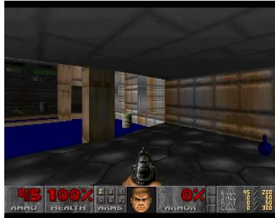

Learned Environment

AI contribution. An action-conditioned diffusion model produces subsequent game frames. An RL player’s trajectories provide training examples from the original game.

Game context. DOOM supplies the rules and states represented in the training data. The demonstrated learned simulator generates the visual continuation.

## B.2 Fighting, Platforming, and Physics Puzzles

Street Fighter / ReactiveGWM

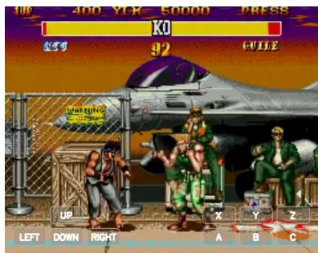

NPC-Aware Simulation

AI contribution. Player controls and high-level NPC strategies separately condition the generated fight. Offense, defense, and control strategies can change the opponent’s reactions.

Game context. Experiments use two Street Fighter titles and their recorded mechanics. This is a research simulator, not a released Capcom game feature.

Source: ReactiveGWM [344]. Shown: Street Fighter II rollout with control overlay. Demos, code, and models.

## Mario Levels / MarioGPT

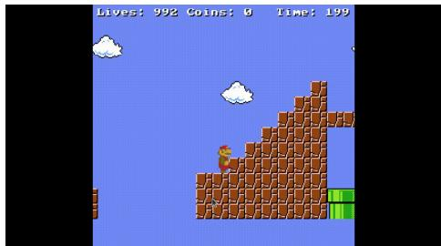

Level Design

AI contribution. A fine-tuned language model proposes tile layouts from requests about pipes, enemies, blocks, and elevation. Levels can be played or checked with A\*.

Game context. An existing Mario-style environment supplies the tile vocabulary, movement rules, renderer, and controller. Generation changes the level, not the engine.

Source: MarioGPT [302]. Shown: a level from the authors’ interactive example. Code and local player • Hosted demo.

## Science Birds / LLMs4PCG

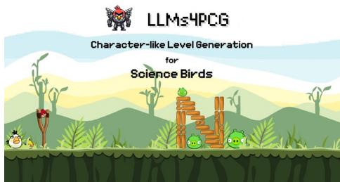

Physics-Constrained Design

AI contribution. Prompted language models arrange blocks into letter-shaped structures. The competition checks stability, shape resemblance, and diversity.

Game context. Science Birds supplies executable physics and construction elements. This is an Angry Birds-style research platform, not an official Angry Birds release.

Source: LLMs4PCG [198]. Shown: official competition illustration, rather than a scored submission. Rules, results, and platform.

## B.3 Building Games and Generating Live Content

GameCraft-Bench / Godot Games  
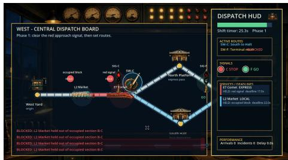  
Project Construction

AI contribution. Coding agents implement complete game projects across 15 families. The gallery includes racing, roguelikes, puzzles, sports, and visual novels.

Game context. Godot, task specifications, tools, and available assets are supplied. Gallery selections illustrate outputs; the full-task comparison is in Table 10.

Source: GameCraft-Bench [202, 103]. Shown: Seele02-pro’s Signal Rail Dispatcher. Recorded and playable examples.

Book of Infinity: 1001 Nights  
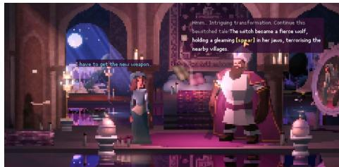

Interactive Narrative

AI contribution. Generated story continuations respond to player-authored tales, while words can become equipment through the game’s narrative mechanic.

Game context. The game supplies the premise and conversion rules. Its current product disclosure identifies the core art assets as human-made.

Sources: the research system and Ada Eden [306, 2]. Shown: official demo media. Steam demo; full release listed as forthcoming.

## Roblox / Cube 4D

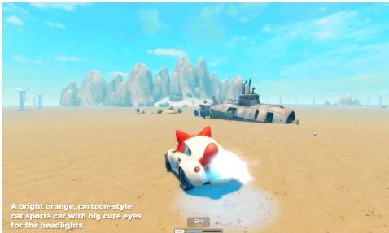

Functional Object Generation

AI contribution. Text prompts produce objects with distinct functional parts, such as a car body and wheels. Behavior scripts are retargeted to the generated geometry. Game context. The beta provides object schemas and scripts; Roblox supplies physics and the surrounding creator-configured experience.

## B.4 Character Dialogue and Automated Testing

Fortnite / Darth Vader  

Voiced NPC Dialogue

AI contribution. A language model generates conversational responses, which a voice model delivers in character. Dialogue is embedded in an otherwise authored battle-royale encounter.

Game context. Epic supplies the character, combat behavior, game rules, and safety controls. The 2025 seasonal feature is a deployment example, not a current availability promise.

Source: Epic Games [94]. Shown: official announcement artwork. Feature and safeguards.

## Battlefield 2042 / EA SEED

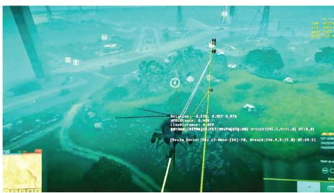

Production QA

AI contribution. A learned helicopter controller executes testing tasks. The same engineering study integrates zero-gravity navigation into Dead Space tests.

Game context. Scripted test frameworks specify objectives and check outcomes. RL supplies difficult control skills inside the QA workflow.

Source: EA SEED [108]. Shown: original production-test image, paper Fig. 3(c). Technical report; specialist RL, not an LLM tester.

## PlayWorld / Interactive Worlds

  
Source: PlayWorld [81]. Shown: a HappyOyster geometry-test rollout. Demonstrations and code; full results in Table 8.

Agent-Based Probing

AI contribution. A visual agent acts to expose geometric and temporal inconsistencies, then a judge scores the resulting trajectories against test rubrics.

Game context. Scenario goals, the action interface, and scoring rules are supplied. These are probes of generated environments, rather than a commercial game.