# AeroLat: Channel-Aware Latent Space Semantic Communication for Decentralized UAV Swarms

Rajdeep Ghosh , Graduate Student Member, IEEE, Goparaju Venkata Seshachala Sree Vatsava , Sudip Misra , Fellow, IEEE, ACM

Abstract—Communication in latent space offers an intriguing alternative to symbolic messages for decentralized autonomous Unmanned Aerial Vehicle (UAV) swarms operating over bandwidth-constrained, time-varying wireless links. However, when homogeneous frozen models are prompted with discretized perceptual inputs, their broadcast states collapse toward the shared prompt template. In view of this, we propose AeroLat, a channel-aware latent semantic communication framework that uses evidence injection. The resulting latent states are then passed through an explicit communication model that encompasses bandwidth-limited serialization, additive noise and information staleness, which facilitates a joint assessment of communication fidelity and swarm-level coordination. Across multi-seed simulations, AeroLat provably remains resilient to codec choice, faults and increasing swarm size. It consistently reproduces the latentswarm anomaly, while no-whitening controls recover the collapse. In particular, AeroLat is capable of reducing false similarity by 97.5%.

Index Terms—Semantic communication, latent-space communication, multi-agent systems, LLMs, decentralized UAV swarms, representational collapse.

## I. INTRODUCTION

U AV swarms for mission-oriented applications such aspost-disaster surveillance and solid waste disposal vio- post-disaster surveillance and solid waste disposal violations, carry zero-shot perception and lightweight onboard Large Language Model (LLM) reasoners. The open coordination question is how such agents should share their beliefs, thoughts, or perceptions. The pre-dominant answer to it is based on natural language or structured symbolic messaging. However, this imposes what prior work calls a symbolic bottleneck — auto-regressive decoding latency at the sender, quantization of a rich internal belief distribution into one discrete report, and re-encoding ambiguity at the receiver. In coherence with this, recent advancements in this direction of research moved inter-agent communication into the models’ continuous latent space. For UAV swarms, the appeal of latent communication extends beyond avoiding the overhead of language generation. When a language model reads text, it builds a vector, a long list of numbers, that represents its internal state: what it currently has in mind before it picks a word. Writing a sentence throws most of that away, because the model holds a whole distribution over possible meanings but has to emit one specific string of words. Latent-space communication skips this intermediate symbolic representation by directly exchanging internal model states between agents that share a compatible representation space.

## A. Motivation

Let us consider a mission in which a small fleet surveys an unstructured river basin or urban fringe for waste accumulation and debris. No agent sees the whole scene; each holds a partial, genuinely ambiguous view. The fleet must converge on whether an anomaly exists while flying, over a shared wireless medium, on companion computers that also run perception. Three properties of this setting drive every subsequent design decision. First, the symbolic bottleneck presents a concrete system-level challenge, due to its measurable overhead in both communication and decision-making. If agents must serialize belief into language before transmitting, three losses compound.In measurements, it takes 0.88 s per message on a data-center GPU and 3.1 s on an edge-grade GPU, which is much higher than a single forward pass. On the other hand, the latent channel introduces a substantial communication overhead that remains largely unaccounted for.

## B. Contributions

We propose AeroLat, a latent semantic-communication stack for decentralized UAV swarms. The proposed system treats the broadcast hidden state as a signal to be engineered rather than as a tensor to be passed. Each agent firstly articulates its full zero-shot visual posterior into a frozen onboard LLM, secondly takes the last-layer hidden states as its message, and lastly removes the shared prompt-template subspace with a linear operator that every agent derives independently and identically, training-free, coordination-free, and with one projection per message. The whitened state then crosses an explicitly modeled aerial link with erasures, jitter, bandwidth-limited serialization, noise and quantization, and the task information it carries is measured rather than asserted. Consequently, consensus tracks the scene rather than the prompt, both in emulation and across twenty-five coldboot flights of the full stack. In brief, the contributions of the proposed work are as follows:

• We propose evidence injection and template whitening, a shared linear operator that requires neither training nor inter-agent coordination, but restores discriminative similarity to 0.025– a unique contribution to the state-ofthe-art in decentralized UAV swarm communication.

• We benchmark the proposed model against existing dispatching methodologies for swarms, implemented on an identical perception stack, across twenty seeded runs using Welch and Mann–Whitney tests with Holm correction.

• We validate the complete stack in a PX4/AirSim campaign on an edge-class GPU, spanning codec comparison, fault injection, impaired channels, and fleet scaling to show the efficacy of the proposed work.

## II. RELATED WORK

Researchers have been developing new methodologies for a semantic communication stack for decentralized UAV swarms. Table I summarizes the existing landscape. In this section, we briefly present some of the existing literature categorized as: 1) Latent Inter-Agent Communication and 2) Semantic Communication and UAV Networking.

## A. Latent Inter-Agent Communication

Interlat [1] established end-to-end communication via last hidden states, with learned compression into short latent prefixes. LatentMAS [2] demonstrated training-free latent collaboration via last-layer embeddings and shared KV working memory, reporting up to 14.6% accuracy gains and 4- $4 . 3 \times$ faster inference over text-based multi-agent systems. CIPHER [3] bypasses token sampling with expectation embeddings. ThoughtComm [4] establishes identifiability guarantees through sparsity-regularized autoencoders, while KV-Comm [5] enables latent communication through the transmission of calibrated KV caches. Dense inter-model messaging without a shared latent geometry is explored in [13]. Cross-model latent alignment is enabled by relative representations [14] and semantic-alignment translation [15]; continuous-latent reasoning within a single model traces back to COCONUT [16] and CODI [17], and has been extended to vision-language models in [18]. Homogeneous LLM committees with redundant, near-identical states were formalized as a pathology in [6], along with diversity metrics from the effective-rank family.

## B. Semantic Communication and UAV Networking

DeepSC and its successors [7] transmit task-relevant semantics with learned joint source-channel coding; [8] frames semantics as a 6G opportunity; [9] couples semantic coding with knowledge graphs. Cooperative aerial fleets have been studied for mission class-timely inspection of targets by drone squads under energy and trip constraints, validated in real-field experiments as well as simulation [10]; that line optimizes where drones fly, whereas we address what they say to each other once airborne, so the two are complementary layers of the same system. Cross-layer allocation driven by applicationlayer state [11] is precisely the design pattern our entropygated codec policy would instantiate for semantic traffic. The work [19] addresses load management in communication channels. The authors of work [20] explored the semantics of communication under index modulation via a semanticaware stream splitting scheme. In the work [21], the authors explored a Hybrid architecture for UAVs powered either solely by a laser or solely by a battery to improve reach and durability. Finally, cooperative DNN inference through device placement and model partitioning across heterogeneous edge nodes [12] addresses the bottleneck our embodied scaling campaign independently identifies. The work in [22] presents a new channel model that simultaneously accounts for the effects of mobility and shadowing.

Synthesis: After a detailed analysis of the existing methodologies, there exists an unresolved gap at the intersection of strands of communicating informative, non-collapsed LLM latent states over constrained mobile channels while sustaining task-relevant semantics in an embodied decentralized swarm during operation. Current approaches to latent multi-agent systems demonstrate that hidden states, expectation embeddings, or KV representations can replace explicit text and reduce inference overhead, but largely assume lossless, co-located software channels and do not examine mobility, bandwidth, packet loss, or information staleness. Studies of networking for UAVs model constraints on mobility, contention, energy, and edge computing, but treat payload semantics as opaque.

## III. SYSTEM MODEL

## A. Platform and Timing

Each $\mathrm { U A V } \ i \ \in \ \{ 1 , \dots , N \}$ , where N is the swarm size, runs a PX4 [23] flight controller consuming 10 Hz position setpoints over MAVLink/UDP, an perception–reasoning stack, CLIP ViT-B/32 [24] for zero-shot anchoring, and Qwen2.5- 0.5B [25] for latent generation on a rolling inference interval $T _ { \mathrm { i n f } } ~ = ~ 3 \mathrm { s } ;$ and a TCP mesh socket for the semantic sidechannel. The two loops share no locks, and an inference deadline miss degrades only message freshness, never flight stability. This decoupling is the architectural invariant of the proposed work as depicted in Fig. 1.

## B. Message Generation

At each inference tick, drone i captures frame $I _ { i } ( t )$ computes the CLIP posterior $p _ { i } ( t ) ~ \in ~ \Delta ^ { C - 1 }$ over $C { = } 1 3$ scene/anomaly classes and the image embedding $v _ { i } ( t ) \in \mathbb { R } ^ { 5 1 2 }$ builds an evidence-verbalized prompt $x _ { i } ( t )$ , and extracts the last-layer hidden states of the final $k { = } 8$ tokens:

$$
h _ { i } ( t ) = \mathrm { v e c } \big ( H _ { i , - k : } ^ { ( L ) } \big ) \in \mathbb { R } ^ { 7 1 6 8 } , \qquad d _ { \mathrm { m o d e l } } = 8 9 6 .\tag{1}
$$

The broadcast state is the whitened residual $\psi _ { i } ( t )$ . Payload sizes measured on the wire (16-B header included) are 28,688 B (fp32), 14,352 B (fp16), 7,184 B (int8), and 3,600 B (int4) per state.

## C. Channel Model

Each directed link $( i  j )$ applies, in order:

1) Source coding: quantization $Q _ { b } ( \cdot )$ at $b \in \{ 3 2 , 1 6 , 8 , 4 \}$ bits per dimension (symmetric per-vector scaling for integer modes), with optional top-s magnitude sparsification charged an explicit 32-bit index cost per retained coefficient.

$$
R _ { \mathrm { l i n k } } = R _ { \mathrm { t o t } } / ( N ( N { - } 1 ) )\tag{2}
$$

TABLE I  
RELATED WORKS ACROSS THE TWO CAPABILITY CLUSTERS THIS PROBLEM REQUIRES. ✓ = ADDRESSED; ✗ = NOT ADDRESSED; p = PARTIALLY ADDRESSED. THE UPPER BLOCK REPRESENTS LATENT-SPACE MULTI-AGENT COMMUNICATION; THE MIDDLE BLOCK REPRESENTS SEMANTIC COMMUNICATION; THE LOWER BLOCK REPRESENTS UAV NETWORKING AND MOBILE COMPUTING.
<table><tr><td rowspan="2">Work</td><td rowspan="2">Domain</td><td colspan="3">latent-space semantics</td><td rowspan="2"></td><td colspan="3">communication &amp; platform realism</td></tr><tr><td>LLM latent payload</td><td>Anti- collapse</td><td>Measured info. bounds</td><td>Channel model</td><td>Mobility Physical / node speed platform</td><td>Seeded stats</td></tr><tr><td>Interlat [1]</td><td>latent MAS</td><td>√</td><td>x</td><td>x</td><td>x</td><td>x</td><td>x</td><td></td></tr><tr><td>LatentMAS [2]</td><td>latent MAS</td><td>√</td><td>x</td><td>p</td><td>x</td><td>x</td><td>x</td><td>p √</td></tr><tr><td>CIPHER [3]</td><td>latent MAS</td><td>√</td><td>x</td><td>x</td><td>x</td><td>x</td><td>x</td><td>p</td></tr><tr><td>ThoughtComm [4]</td><td>latent MAS</td><td>√</td><td>p</td><td>p</td><td>x</td><td>x</td><td>x</td><td>√</td></tr><tr><td>KVComm [5]</td><td>latent MAS</td><td>√</td><td>x</td><td>x</td><td>x</td><td>x</td><td>x</td><td>√</td></tr><tr><td>Collapse study [6]</td><td>LLM committees</td><td>√</td><td>p</td><td>x</td><td>x</td><td>x</td><td>x</td><td>√</td></tr><tr><td>DeepSC [7]</td><td>semantic comm.</td><td>x</td><td>x</td><td>p</td><td>√</td><td>x</td><td>x</td><td>√</td></tr><tr><td>Semantics for 6G [8]</td><td>semantic comm.</td><td>x</td><td>x</td><td>p</td><td>√</td><td>x</td><td>x</td><td>p</td></tr><tr><td>KG semantic comm. [9]</td><td>semantic comm.</td><td>x</td><td>x</td><td>x</td><td>√</td><td>x</td><td>x</td><td>√</td></tr><tr><td>Drone squads [10]</td><td>UAV fleets</td><td>x</td><td>x</td><td>x</td><td>p</td><td>√</td><td>√</td><td>√</td></tr><tr><td>CLEVER [11]</td><td>HetNet video</td><td>x</td><td>x</td><td>x</td><td>√</td><td>√</td><td>x</td><td>√</td></tr><tr><td>Cooperative DNN inf. [12]</td><td>edge inference</td><td>x</td><td>x</td><td>x</td><td>p</td><td>x</td><td>p</td><td>√</td></tr><tr><td>AeroLat (proposed work)</td><td>UAV latent comm.</td><td>√</td><td>√</td><td>√</td><td>√</td><td>√</td><td>√</td><td>√</td></tr></table>

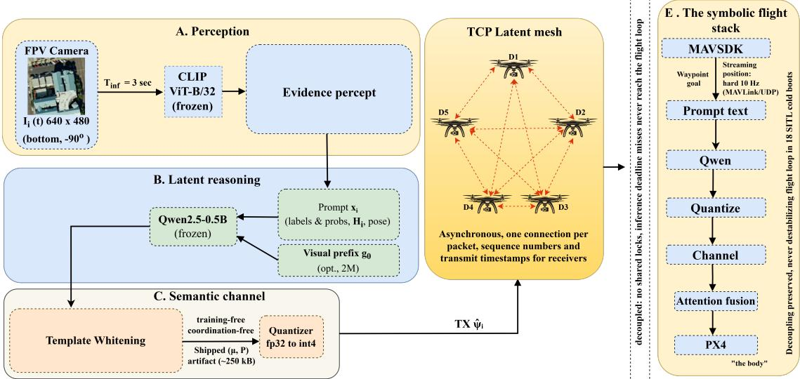  
Fig. 1. AeroLat system architecture for one agent $\mathcal { D } _ { i } . ~ ( \mathbf { A } )$ zero-shot CLIP perception emits the full posterior, image embedding, visual entropy, and pose rather than an arg max label; (B) that evidence is verbalized into the prompt of the frozen LLM; (C) template whitening removes the shared common-mode subspace. The centre part depicts the asynchronous TCP latent mesh, one connection per packet with sequence numbers and transmit timestamps so receivers can measure message age. (D) staleness-aware attention fusion; (E) the symbolic flight stack.

2) Noise: for analog transmission, Additive White Gaussian D. Complexity and Overhead Noise (AWGN) at per-symbol SNR γ, i.e.,

$$
\hat { \psi } = \psi + w , w \sim \mathcal { N } ( 0 , s ^ { 2 } I )\tag{3}
$$

with $s ^ { 2 } = \mathbb { E } [ \psi ^ { 2 } ] / 1 0 ^ { \gamma / 1 0 }$

3) Staleness: the receiver discards states older than an ageof-information threshold $A _ { \mathrm { m a x } }$ , and fusion discounts survivors by $e ^ { - A / T _ { c } }$

The offered load of the full mesh $\begin{array} { r l r l } { \mathrm { i s } } & { { } \Lambda ( N ) } & { { } = } \end{array}$ $N ( N { - } 1 ) 8 n _ { B } / T _ { \mathrm { i n f } } ;$ ; with fp32 payloads this evaluates to 0.5, 1.5, 6.9, and 29.1 Mb/s at $N { = } 3 , 5 , 1 0 , 2 0$ . Quadratic growth is stated plainly here because it motivates both quantization and learned compression.

For each agent and at every inference tick, the computational cost consists of one CLIP forward pass and one LLM forward pass. The whitening projection draws a complexity of $O ( m D )$ with $m { = } 4$ and $D { = } 7 1 6 8$ . The incurred cost is negligible relative to the transformer forward passes and is measured at <1 ms. Apart from these, quantization requires $O ( D )$ operations and fusion incurs $O ( N D )$ complexity, since attention is performed over at most N−1 peer states. The peragent computation is therefore $O ( N D )$ beyond the two fixed forward passes, and is independent of mission length because no history is retained. Communication cost is one broadcast of $n _ { B }$ bytes per tick per agent, giving the aggregate offered load $\Lambda ( N ) = N ( N { - } 1 ) 8 n _ { B } / T _ { \mathrm { i n f } }$ as stated above.

TABLE II LIST OF SYMBOLS
<table><tr><td>Symbol</td><td>Description</td></tr><tr><td> $\overline { { \mathcal { D } _ { i } } }$ </td><td>agent (drone) i</td></tr><tr><td> $T _ { \mathrm { i n f } }$ </td><td>perception/inference interval (3 s)</td></tr><tr><td> $I _ { i } ( t ) , v _ { i } ( t )$ </td><td>frame and CLIP image embedding of  $\mathcal { D } _ { i }$ </td></tr><tr><td> $p _ { i } ( t ) \ , \dot { H _ { i } ( t ) }$ </td><td>CLIP posterior over C=13 classes; its entropy</td></tr><tr><td> $x _ { i } ( t )$ </td><td>evidence-verbalized prompt  $\mathbb { R } ^ { 7 1 6 8 }$ </td></tr><tr><td> $h _ { i } ( t )$ </td><td>raw latent from last k=8 hidden states in</td></tr><tr><td> $\mu$ </td><td>whitening mean</td></tr><tr><td> $\dot { P }$ </td><td>top-m template subspace</td></tr><tr><td> $\psi _ { i } ( t )$ </td><td>whitened broadcast state</td></tr><tr><td> $\ddot { \psi } _ { j }$ </td><td>peer state as received (post-channel)</td></tr><tr><td> $\lambda$ </td><td>fusion coefficient</td></tr><tr><td> $a _ { j m }$ </td><td>attention weight</td></tr><tr><td> $A _ { m }$ </td><td>message age</td></tr><tr><td> $T _ { a }$ </td><td>staleness discount constant</td></tr><tr><td> $Q _ { b } ( \cdot )$ </td><td>quantizer at b bits/dim</td></tr><tr><td> $n _ { B }$ </td><td>payload bytes</td></tr><tr><td> $p _ { \ell }$ </td><td>erasure probability</td></tr><tr><td> $\gamma$ </td><td>per-symbol SNR</td></tr><tr><td> $R _ { \mathrm { t o t } }$ </td><td>shared medium budget</td></tr><tr><td> $R _ { \mathrm { l i n k } }$ </td><td>per-link rate</td></tr><tr><td> $\Lambda ( N )$ </td><td>aggregate offered mesh load</td></tr><tr><td> $D _ { \mathrm { s e m } }$ </td><td>semantic distortion  $1 - \cos ( \psi , \hat { \psi } )$ </td></tr><tr><td> $C ( t )$ </td><td>whitened consensus</td></tr><tr><td>v</td><td>node speed</td></tr><tr><td> $f _ { d }$ </td><td>Doppler shift</td></tr><tr><td> $T _ { c }$ </td><td>coherence time</td></tr><tr><td> $\tau$ </td><td>latency</td></tr><tr><td> $\rho$ </td><td>information density</td></tr></table>

## E. Metrics

The communication quality, task performance, and swarmstate diversity is evaluated using the following metrics. For M evaluated transmissions (or mission episodes), the semanticrelay success rate is

$$
\mathrm { S R } = \frac { 1 } { M } \sum _ { m = 1 } ^ { M } { \bf 1 } \{ S _ { m } \} ,\tag{4}
$$

where $S _ { m }$ denotes satisfaction of the task-specific success criterion in episode $m .$ . Coordination latency is calculated as,

$$
\tau = t _ { \mathrm { e n c } } + t _ { \mathrm { c h } } + t _ { \mathrm { i n t } } ,\tag{5}
$$

where the three terms denote encoding, channel, and receiverside interpretation time, respectively. We access the efficacy of transmitted bits in preserving the task-relevant information by evaluation the information density as,

$$
\rho = \frac { \hat { I } ( \hat { \psi } ; Y ) } { b } ,\tag{6}
$$

where $\hat { I } ( \hat { \psi } ; Y )$ is the estimated mutual information between the received semantic state and task variable $Y$ , and b is the number of transmitted bits. We additionally measure the breadth of the receiver’s decoded hypothesis. Let $q _ { ( 1 ) } \geq $ $q _ { ( 2 ) } \geq \cdot \cdot \cdot \geq q _ { ( K ) }$ denote the decoded class probabilities in descending order. In order we can define this as,

$$
P _ { 5 0 } = \operatorname* { m i n } \left\{ k : \sum _ { j = 1 } ^ { k } q _ { ( j ) } \geq { \frac { 1 } { 2 } } \right\} .\tag{7}
$$

Thus, smaller $P _ { 5 0 }$ indicates a more concentrated decoded belief, whereas larger $P _ { 5 0 }$ indicates greater hypothesis breadth.

Consensus $C ( t )$ is the mean off-diagonal entry of the $N \times N$ Gram matrix $S _ { i j } = \cos ( \psi _ { i } ( t ) , \psi _ { j } ( t ) )$ of whitened states. Finally, we monitor latent-state collapse using effective rank. Let $\dot { \Psi } ( t ) ~ = ~ [ \psi _ { 1 } ( t ) , \dots , \psi _ { N } ( t ) ] ^ { \top } ~ \in ~ \mathbb { R } ^ { N \times \bar { D } }$ be the stacked swarm latent set, $\bar { \Psi } ( t )$ its column-centered form, and $s _ { 1 } \geq \cdot \cdot \cdot \geq s _ { R } > 0$ the nonzero singular values of $\bar { \Psi } ( t )$ . With $\pi _ { r } = s _ { r } / \sum _ { q } s _ { q }$ so that $\pi _ { r } \geq 0$ and $\textstyle \sum _ { r } \pi _ { r } = 1$ , the effective rank is

$$
\mathrm { e r a n k } = \exp \left( - \sum _ { r } \pi _ { r } \ln \pi _ { r } \right)\tag{8}
$$

The process costs one degree of freedom, giving erank $\in$ $[ 1 , N { - } 1 ]$ . The measure approaches 1 when the swarm states collapse to a common direction and approaches $N { - } 1$ when they span comparably weighted, independent directions.

## IV. THE COLLAPSE PATHOLOGY AND THE AEROLAT FIX A. Template Whitening

Let $\{ h _ { b } ( t ) \} _ { b = 1 } ^ { B }$ be a calibration buffer of raw latents over diverse scenes. With mean $\mu$ and the top-m right singular vectors $\boldsymbol { P } \in \mathbb { R } ^ { m \times D }$ of the centered buffer, every agent broadcasts $P$ spans the template subspace, and the residual carries the scenespecific variation. Because all agents run identical frozen weights and a deterministic calibration protocol, $( \mu , P )$ agree across the fleet without coordination. All similarity, consensus, fusion, and channel-distortion computations operate on $\psi .$ With $m { = } 4 ,$ , the operator costs one $D \times m$ projection per message.

B. Fusion Under Impairments, and a Second Collapse Mechanism

Receiver j fuses its own $\psi _ { j }$ with peer states via scaled dotproduct attention including self, discounted by message age $A _ { m } \mathrm { { : } }$

$$
\begin{array} { r l } & { a _ { j m } \propto \exp \left( { \psi _ { j } ^ { \top } \psi _ { m } / \sqrt { D } } \right) e ^ { - A _ { m } / T _ { a } } , } \\ & { \psi _ { j } ^ { \mathrm { n e w } } = \mathrm { n o r m } \Big ( \left( 1 - \lambda \right) \psi _ { j } + \lambda \underset { m \neq j } { \sum } \widetilde { a } _ { j m } \psi _ { m } \Big ) , } \end{array}\tag{9}
$$

The fusion coefficient λ controls the contribution of peer information and is selected empirically. One structural requirement here is that fusion must use the fresh percept latent as $\psi _ { j } ,$ not the previous fused state. Iterating (9) on fused states is a DeGroot averaging process that converges to a common vector for any $\lambda > 0$ regardless of scene diversity. This leads to a dynamical collapse that is distinct from prompt-induced representational collapse. To avoid repeated averaging across rounds, AeroLat re-initializes the local percept every $T _ { \mathrm { i n f } }$

## V. SEMANTIC RATE–DISTORTION AND INFORMATIONACCOUNTING

Before assessing the channel’s performance, we first characterize the impact of transmission impairments on the geometry and task-relevant information carried by the latent state. The following section consequently analyses AeroLat using complementary distortion and information measures against the considered channel operating points.

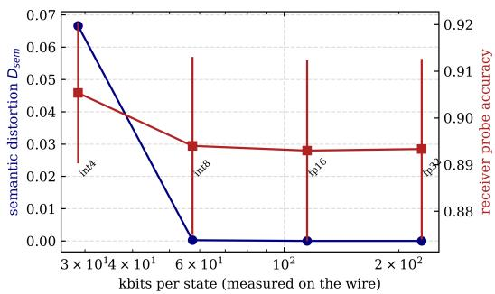  
Fig. 2. Semantic rate–distortion over the real latent corpus (ten seeds). Dense quantization from fp32 (229.5 kb/state) to int8 (57.5 kb) is semantically lossless $( D _ { \mathrm { s e m } } \leq 2 \times 1 0 ^ { - 4 } ) \mathrm { ; }$ ; int4 (28.8 kb) costs $D _ { \mathrm { s e m } } = 0 . 0 6 7$ in geometry while receiver probe accuracy remains 0.905: within this codec family, rate can be cut 8× before task distortion begins.

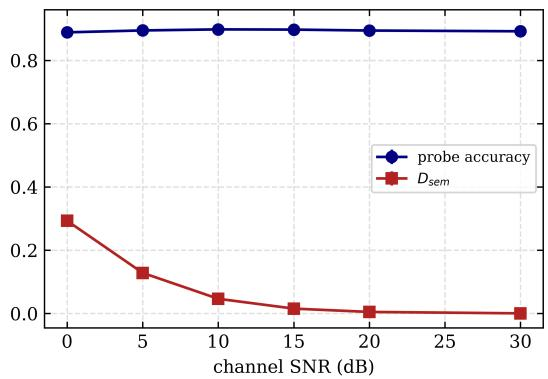  
Fig. 3. AWGN robustness. From 30 dB down to 0 dB SNR, the geometric distortion grows $( D _ { \mathrm { { s e m } } }$ 0.000 → 0.293) while receiver probe accuracy is flat (0.892 → 0.889): the whitened latent code degrades gracefully, with no digital cliff.

## A. Empirical Rate–Distortion

Sweeping quantization and sparsity over the corpus yields Fig. 2. Top-s sparsification is reported honestly as not competitive at these dimensions once the 32-bit index overhead is included. Generally, for below ∼4× compression, a sparse int8 vector costs more wire bytes than a dense one. AWGN robustness appears in Fig. 3. The flat accuracy down to 0 dB is the graceful-degradation profile that a digital symbolic packet, catastrophic under residual bit errors, cannot exhibit.

## B. Measured Information Density

We quantify the task-relevant information preserved in the received latent state $\hat { \psi }$ using two lower bounds on $I ( \hat { \psi } ; Y )$ with Y the scene/anomaly class: a Fano bound from probe error e,

$$
I \geq H ( Y ) - H _ { b } ( e ) - e \log _ { 2 } ( | y | - 1 ) ,\tag{10}
$$

and a neural-critic InfoNCE bound $I \geq \log N _ { b } - \mathcal { L } _ { \mathrm { N C E } }$ trained per operating point. Table III reports both together with $\rho =$ ${ \hat { I } } / b .$ Quantization is nearly free in task information (Table III), so wire density improves $8 \times$ at no measured semantic cost.

## VI. LEARNED COMPRESSION: THE FOUR-LOSS PROTOCOL

The four-loss objective below follows the taxonomy introduced by Interlat [1]; our contribution here is empirical—prior

## TABLE III

MEASURED INFORMATION PER STATE AND INFORMATION DENSITY ρ (NEURAL INFONCE AND FANO BOUNDS; TASK CEILING $H ( Y ) = 2 . { \dot { 5 } } 2$ BITS; THE MARGINAL OVERSHOOT AT 0 DB REFLECTS FINITE-BATCH ESTIMATOR VARIANCE).
<table><tr><td>Operating point</td><td>bits/state</td><td> $\hat { I } _ { \mathrm { N C E } }$ </td><td>Fano</td><td> $\rho$  (b/kb)</td></tr><tr><td>fp32, noiseless fp16 int8 int4 fp32 @ 10 dB int8 @ 10 dB fp32 @ 0 dB</td><td>229,504 114,816 57,472 28,800 229,504 57,472 229,504</td><td>≥ 2.52 V 2.52 7 2.52 ≥ 2.52 M 2.52 V 2.52 ≥2.53</td><td>1.91 1.91 1.90 1.88 1.83 1.83</td><td>0.011 0.022 0.044 0.088 0.011 0.044</td></tr></table>

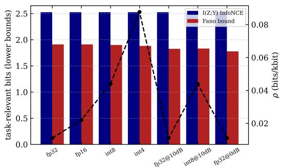  
Fig. 4. Task-relevant information (InfoNCE and Fano lower bounds, bars) and density $\rho$ (line) per channel operating point. The state carries the entire task entropy essentially and retains it under int4 quantization and 0 dB AWGN simultaneously.

work states these losses but does not train or dissect them, and the leave-one-loss-out ablations that follow assign each term a measured role. The compressor $M _ { \mathrm { c } }$ maps the full latent trajectory $H _ { L }$ to $H _ { K } \in \mathbb { R } ^ { 8 \times 8 9 6 }$ and is trained with the frozen LLM as measurement device:

$$
\begin{array} { r } { \mathcal { L } = \mathcal { L } _ { \mathrm { t a s k } } + a \mathcal { L } _ { \mathrm { s e p } } + b \mathcal { L } _ { \mathrm { p r e f } } + c \mathcal { L } _ { \mathrm { g e o m } } , } \end{array}\tag{11}
$$

where $\mathcal { L } _ { \mathrm { t a s k } }$ is the cross-entropy of the frozen receiver producing the correct structured survey report conditioned on $H _ { K }$ as a soft prefix. $\mathcal { L } _ { \mathrm { s e p } } = - \mathrm { J S } \Big ( p _ { \theta } \big ( \cdot \vert C , H ) , p _ { \theta } \big ( \cdot \vert C , \tilde { H } ) \Big )$ with batch-mismatched H˜ (the “must-listen” pressure). $\mathcal { L } _ { \mathrm { p r e f } }$ is a confidence-weighted teacher–student KL between full trajectory and compressed conditioning. Lastly, $\begin{array} { r l } { \mathcal { L } _ { \mathrm { g e o m } } } & { { } = } \end{array}$ $1 \stackrel { \cdot } { - } \cos ( \bar { z } ^ { ( A ) } , \bar { z } ^ { ( D ) } )$ aligns step-averaged actor features. As shown in Fig. ?? and Table IV, training converges in less than 38 epochs, and the Jensen—Shannon separation between matched and mismatched prefixes increases by approximately 0.1 nat, which confirms dependence on the transmitted latent. Ablations show that $L _ { \mathrm { p r e f } }$ prevents shortcut learning, $L _ { \mathrm { g e o m } }$ preserves latent orientation, and $L _ { \mathrm { s e p } }$ enforces prefix dependence with little effect on task loss. The optional compressor reduces the int8 payload from 57.5 to 14.3 kb.As shown in Fig. ?? Ablations show that $L _ { \mathrm { p r e f } }$ prevents shortcut learning, $L _ { \mathrm { g e o m } }$ preserves latent orientation, and $L _ { \mathrm { s e p } }$ enforces prefix dependence with little effect on task loss. The optional compressor reduces the int8 payload from 57.5 to 14.3 kb. The visual-prefix projector further improves the accuracy of validation probes to 0.973.

TABLE IV  
COMPRESSOR TRAINING AND LEAVE-ONE-LOSS-OUT ABLATIONS: INITIAL → FINAL LOSS VALUES (FULL RUN: 30 EPOCHS; ABLATIONS: 15; FOR PARITY THE FULL RUN READS $\mathcal { L } _ { \mathrm { t a s k } } { = } 0 . 4 0 5$ AT EPOCH 14).
<table><tr><td>Run</td><td> $\overline { { \mathcal { L } _ { \mathrm { t a s k } } } }$ </td><td> $\mathcal { L } _ { \mathrm { s e p } }$ </td><td> $\mathcal { L } _ { \mathrm { { p r e f } } }$ </td><td> $\overline { { \mathcal { L } _ { \mathrm { g e o m } } } }$ </td></tr><tr><td>full</td><td> $\overline { { 2 . 3 7 \to 0 . 3 9 } }$ </td><td> $\overline { { - . 0 1 \to - . 1 1 } }$ </td><td> $\overline { { 3 . 3 6 \to 1 . 5 2 } }$ </td><td> $\overline { { . 3 8 \to . 0 7 } }$ </td></tr><tr><td>no-sep</td><td> $ 0 . 3 9$ </td><td>(off)</td><td> $ 1 . 5 5$ </td><td> $ . 0 8$ </td></tr><tr><td>no-pref</td><td> $\mathbf { \Gamma } \to \mathbf { 0 . 0 0 8 }$ </td><td> $ - . 1 3$ </td><td>(off)</td><td> $ . 1 3$ </td></tr><tr><td>no-geom</td><td> $ 0 . 4 1$ </td><td> $ - . 1 0$ </td><td> $\mathbf { \Gamma } \to \mathbf { 1 . 8 7 }$ </td><td>(off)</td></tr></table>

TABLE V

THE COLLAPSE, REPRODUCED AND REPAIRED (n=400 PER CONDITION; CHANCE = 0.167). ROW 4 IS THE EARLIER DRAFT’S FLAGSHIP “1.00 SIMILARITY,” EXPLAINED.
<table><tr><td>Metric</td><td>Argmax prompt (prior system)</td><td>Evidence prompt (AeroLat)</td></tr><tr><td>Probe accuracy, raw h</td><td>0.593 ± 0.071</td><td>0.923 ± 0.020</td></tr><tr><td>Probe accuracy, whitened ψ</td><td>0.500 ± 0.065</td><td>0.878 ± 0.037</td></tr><tr><td>Fano MI (raw), bits</td><td>0.61</td><td>1.96</td></tr><tr><td>Off-diag. cosine, raw</td><td>0.9978</td><td>0.9989</td></tr><tr><td>Off-diag. cosine, whitened</td><td>0.184</td><td>0.025</td></tr><tr><td>Effective rank, raw → whitened</td><td> $7 . 9  4 . 1$ </td><td>164 → 233</td></tr></table>

## VII. EXPERIMENTAL EVALUATION

This section assesses AeroLat across representation quality, channel robustness, baseline performance, and swarm scalability in both controlled and full-stack settings. For the simulation phase, we utilized a high-fidelity Software-In-The-Loop (SITL) architecture that interfaces with a detailed AirSim (Unreal Engine) neighborhood environment [26], providing a continuous, unstructured 3D testing ground.

## A. Protocol

We construct the evaluation corpus from 1,000 aerial images across six scene classes in the UC Merced Land Use Dataset [27], a benchmark of high-resolution aerial imagery for land-use classification.The fitted whitener is exported as the deployment artifact. We perform semantic-layer experiments (probe evaluation, channel sweeps, ablations, and scaling studies) over 10–20 random seeds and report mean ± standard deviation with 95% bootstrap confidence intervals. Baseline comparisons are done with Welch’s t-test, Mann—Whitney U-test with Holm correction, and Cohen’s d. Full-stack validation is performed using SITL missions on an NVIDIA T1000 (4 GB), and semantic-layer experiments and training are conducted on an RTX 6000 Ada, on which Airsim runs.

## B. Collapse and Representation Diagnostics

The collapse and its mitigation are summarized in Table V. Under argmax prompting, the mean cosine similarity between raw latents across scenes is 0.9978. Template whitening is what restores discriminative similarity to 0.025 across mixed scenes while increasing latent diversity (erank = 233), indicating that semantic content and representation geometry constitute distinct failure modes. We additionally test the representation on a six-class aerial corpus with $H ( Y ) = 2 . 5 2$ bits and 1,000 samples, with three diagnostics:

• D1 (probe recoverability). Five-fold linear-probing produces $0 . 9 1 5 \pm 0 . 0 3 2$ accuracy on raw states and 0.916 ±

0.030 accuracy after whitening, in comparison to 0.167 chance accuracy predicting the scene class from the broadcast vector.

• D2 (representational sensitivity). With the template fixed and only vision varied, the ratio of between-scene to within-scene latent distances is 1.34.

• D3 (conflict fusion/superposition). Fusing whitened latents from two conflicting scenes at λ=0.4, the fused state’s probe top-2 contains both source hypotheses in 92.75% of 400 trials (snapping to a single hypothesis: 7.25%).

## C. Baseline Comparison

Table ?? and Fig. 5 report the head-to-head, under a semantic relay protocol, where the sender perceives a scene, encodes a message with the codec under test, the message crosses the emulated channel, and the receiver must identify the sender’s scene from the message alone. The JSON baseline remains more efficient in latency and payload size, requiring only a 120-byte message. The latent representation also leads to a sharper decoded belief $( P _ { 5 0 } = 1 . 5 8 )$ compared to the symbolic baselines (≈ 2.25), while D3 confirms the preservation of conflicting hypotheses in 92.75% of trials. To summarize, AeroLat improves SR by 0.24 over the best symbolic baseline, at the expense of a significantly larger transmitted payload.

## D. Ablations

• λ sweep and the two fusion regimes Under evidencerefreshed dynamics (Fig. ??), λ traces a clean trade-off: same-scene consensus rises 0.50→0.84→1.00 as λ goes 0 → 0.4 → 1.0, while fused-state probe accuracy holds at 1.000 up to λ=0.3, is 0.978 at λ=0.4, and degrades beyond (0.933 at 0.5; 0.489 at 1.0). Under pure gossip dynamics (iterating fusion on already-fused states), the swarm converges to cross-scene consensus 1.0 for any $\lambda \ge 0 . 1$ with fused accuracy collapsing to 0.489.

• Component ablations:

– Whitening: After experiments, it was found that probe accuracy remained unchanged (0.915 → 0.916) while the mean off-diagonal cosine dropped from 0.999 → 0.188 on the full corpus geometry, not content, matching Table V.

CLIP anchor: With visual evidence removed from the prompt, probe accuracy falls to 0.18 ≈ chance versus 0.78 with it. The results identified a collapse mechanism and demonstrate that scene-specific visual content originates from the visual anchor. The effect of the number of extracted tokens is shown in Fig. ??, and the ablations in relation to the compressor loss are summarized in Table IV.

## E. Mobility: Delay and Delivery Under Node Motion

The channel, as depicted in Sec . III-C, is static, but the aerial nodes are not. Henceforth, extend the link model with a standard block-fading treatment of mobility and sweep it offline. The results found show that int4 quantization is effectively task-lossless. The mobility results present that the same compression is also crucial for reliable latent communication in time-varying channels. At a 0.9 delivery floor, the fleet supports N=4 at fp32 and N=10 at int4—the 8× rate reduction that costs nothing in task information buys a 2.5× larger swarm. The result provides an operational interpretation of the offered-load trend directly in terms of the scalability and reliability constraints relevant to network design.

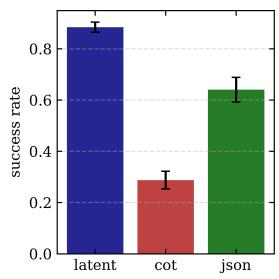

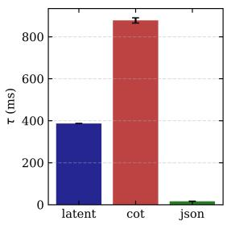

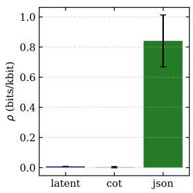

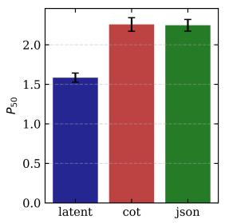  
Fig. 5. Baseline comparison across twenty seeds. Left to right: relay success rate, coordination latency τ, information density ρ, and hypothesis breadth $P _ { 5 0 }$

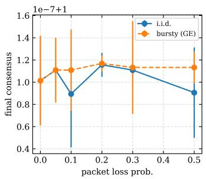

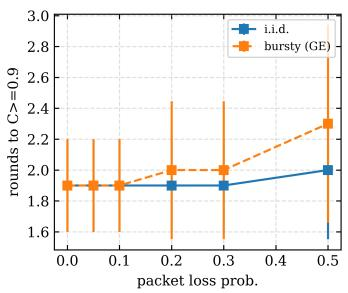

Fig. 6. Consensus under packet loss (i.i.d. and Gilbert–Elliott burst; N=5 fusion mesh, ten seeds). Final same-scene consensus is 1.00 at every loss rate up to $5 0 \% ;$ loss costs convergence time only (1.9 → 2.3 rounds).  
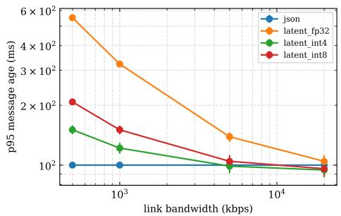  
Fig. 7. Age of information under bandwidth caps (50 ms link latency): p95 message age versus link rate per codec. At 500 kb/s, quantization moves the latent message from 552 ms (fp32) to 208 ms (int8) and 151 ms (int4), against JSON’s 100 ms floor; at ≥5 Mb/s all codecs converge.

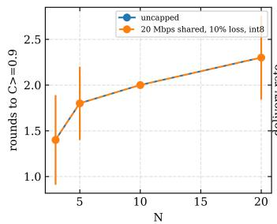

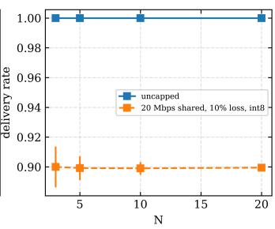  
Fig. 8. Mesh scaling (ten seeds): rounds to $C ~ \geq ~ 0 . 9$ grow sub-linearly $( 1 . 4  2 . 3 $ for $N { = } \mathrm { \bar { 3 } } \ \to \ 2 0 )$ , and under a shared 20 Mb/s medium with int8 payloads and 10% loss the mesh holds 0.90 delivery with unchanged convergence at every N.

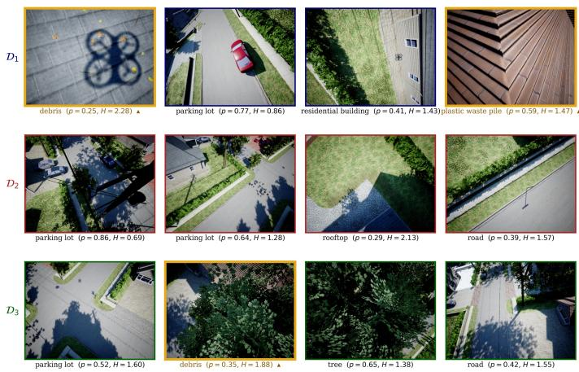  
Fig. 9. The frame of what the drones actually see. The heterogeneity is the point: at any instant the swarm holds genuinely different, individually ambiguous $\operatorname { v i e w s } { - } \mathcal { D } _ { 1 }$ reads the spawned cluster as debris at only p=0.25 with H=2.28 nats—and it is exactly this residual uncertainty that the whitened latent channel transports and the argmax-based JSON codec destroys

## F. Full-Stack SITL Campaign

Table VI reports the embodied campaign, and Fig. 9 shows representative onboard percepts from a capture mission. The findings from the Table VI and Fig. 9 are as follows:

1) The task result carries to flight. AeroLat detected the anomaly in all five missions, compared to the JSON baseline, which detected the anomaly only in one of three runs, and CoT, which failed in both evaluated missions. The difference in performance is due to communication and inference overhead rather than to differences in visual sensing, even though all the stated methodologies use the same perception stack. In particular, CoT took about 3.1 s to generate each message at the edge platform, increasing the mean message age to 22.6 s compared with 51 ms for AeroLat.

2) The collapse is reproduced live. Thus, the whitened AeroLat representation was much more sensitive to changes in the visual environment.

TABLE VI  
EIGHTEEN-MISSION SITL CAMPAIGN. ONE MISSION HANG WAS RECLAIMED BY THE PER-MISSION WATCHDOG; 17/18 COMPLETED NOMINALLY. BOLDMARKS THE VALUES DISCUSSED IN THE TEXT: THE LATENT CODEC'S SUCCESS RATE AND THE TWO FAILURE SIGNATURES (COT'S MESH FLOODING, THENO-WHITENING CONTROL’S COLLAPSED CONSENSUS).
<table><tr><td>Configuration</td><td>Missions</td><td>SR</td><td>Encode ms (med/p95)</td><td>Whitened C(t)</td><td>Delivery</td><td>Mesh delay</td></tr><tr><td>Symbolic CoT</td><td>2</td><td>0.00</td><td> $\overline { { 3 , 1 3 7 / 3 , 4 6 4 } }$ </td><td> $\overline { { 0 . 6 3 8 \pm 0 . 0 8 3 } }$ </td><td>1.00</td><td>22.6s</td></tr><tr><td>JSON dispatch</td><td>3</td><td> $0 . 3 3 \pm 0 . 4 7$ </td><td>71/79</td><td> $0 . 8 8 6 \pm 0 . 0 4 1$ </td><td>1.00</td><td>39 ms</td></tr><tr><td>Latent, dead drone {1, 2, 3}</td><td>3</td><td> $0 . 6 7 \ ( 2 / 3 )$ </td><td>114-120</td><td> $0 . 8 3 \pm 0 . 0 6$ </td><td>1.00</td><td>13–60 ms</td></tr><tr><td>Latent, 20% loss + int8 + 50/25 ms jitter</td><td>2</td><td>0.50</td><td>117 /128</td><td> $0 . 6 5 6 \pm 0 . 1 0 0$ </td><td>0.80</td><td>136 ms</td></tr><tr><td>Latent, no whitening (control)</td><td>2</td><td>0.00</td><td> $1 4 6 ^ { ' } / 1 5 9$ </td><td> $\mathbf { 0 . 9 9 9 } \pm \mathbf { 0 . 0 0 0 }$ </td><td>1.00</td><td>134 ms</td></tr><tr><td>Latent</td><td>5</td><td>1.00</td><td> $1 1 7 / 1 2 7$ </td><td> $0 . 6 7 8 \pm 0 . 0 9 4$ </td><td>1.00</td><td>51 ms</td></tr></table>

TABLE VII

EMBODIED SCALING CAMPAIGN. THE CAMPAIGN IS INCREMENTAL BY DESIGN: EACH SIZE MUST SUCCEED BEFORE THE NEXT IS ATTEMPTED, SO THE FAILURE BOUNDARY IS ITSELF A MEASUREMENT.
<table><tr><td>N</td><td>Missions</td><td>SR</td><td>Enc. ms</td><td>Whitened C(t)</td><td>erank</td><td>Msg age</td></tr><tr><td>3</td><td>5</td><td>1.00</td><td>117</td><td> $0 . 6 7 8 \pm 0 . 0 9 4$ </td><td>1.9</td><td>51 ms</td></tr><tr><td>5</td><td>3</td><td>1.00</td><td>119</td><td> $0 . 6 4 9 \pm 0 . 0 7 0$ </td><td>3.8</td><td>78 ms</td></tr><tr><td>10</td><td>2</td><td>1.00</td><td>148</td><td> $0 . 6 3 2 \pm 0 . 0 6 8$ </td><td>7.6</td><td>2.9s</td></tr><tr><td>15</td><td>0/2</td><td colspan="5">watchdog 900 s / boot failure; 11/15 airborne, 132 frames</td></tr></table>

## G. Embodied Scaling and the Edge-Compute Ceiling

The emulated sweep establishes the communication load that the network can support. A separate flight campaign is used to measure the scalability of the full embodied stack. We attempted $N \in \{ 5 , 1 0 , 1 5 , 2 0 \}$ incrementally (two seeded missions per size, frames, and per-tick latent dumps enabled, automatic abort once a size fails twice), on the same singleedge host that runs the simulator and all N autopilots, and the shared perception-LLM pipeline simultaneously. There are four observations:

1) The task metric is flat where flight completes. Every completed mission at every size confirmed the anomaly (SR=1.00), and mesh delivery remained 1.00 throughout, across the entire campaign to N=10, not one latent packet was dropped.

2) No collapse at scale. The effective rank of the circulating whitened states grows almost linearly with fleet size from 1.9 to 3.8 and 7.6, corresponding to approximately 0.75N. This indicates that adding drones adds dimensions to the swarm’s shared thought-space rather than redundant copies of a single thought, and that samescene consensus remains within the discriminative band (0.63–0.68) rather than drifting toward the 0.999 artifact.

3) The cost that grows is compute, not bandwidth. Median encode latency rises from 117 to 148 ms and, decisively, mean received-message age jumps from 78 ms at N=5 to 2.9 s at N=10 while delivery stays perfect. The delay is inference queuing on the shared GPU, not the network. The anytime, staleness-aware fusion absorbs this; SR is unharmed, but the trend identifies the true scaling bottleneck on edge silicon. It is the mirror image of the emulated result that the mesh holds at N=20 as in Fig. 8. The embodiment shows that the processor saturates first.

## H. Comparison with the existing methodologies

Against Interlat, we share the extraction protocol and loss taxonomy but replace the function-call channel with an emulated lossy, noisy, band-limited network crossed by a live TCP mesh during flight, and we confront the collapse regime that embodied swarms. Against LatentMAS, we share the training-free ethos, but KV-cache working memory presupposes lossless co-located transport, whereas AeroLat’s fixed 7,168-dimensional state is engineered for a budgeted link with quantified distortion. Against the collapse literature [6], we contribute the mechanism, a closed-form decentralized mitigation, and the observation that collapse splits into representational and dynamical channels. Against DeepSC-class semantic communication [7]–[9], we use the evaluation toolkit but transmit frozen LLM native states, achieving graceful degradation without training a codec.

## VIII. CONCLUSIONS

AeroLat advances latent inter-agent communication from a software-benchmark mechanism to a network-realistic, statistically validated semantic communication system for UAV swarms. It identifies and mitigates representational collapse, explicitly models the communication impairments experienced by transmitted latent states, and quantifies the task-relevant information preserved across the channel.

As part of future work, we will look at hardware-in-theloop radio experiments to validate AeroLat under measured fading, interference, and contention. We also plan to extend the framework to heterogeneous UAV fleets via latent alignment among different frozen models.

## REFERENCES

[1] Z. Du, R. Wang, H. Bai, Z. Cao, X. Zhu, Y. Cheng, B. Zheng, W. Chen, and H. Ying, “Enabling agents to communicate entirely in latent space,” in Proceedings of the 64th Annual Meeting of the Association for Computational Linguistics (Volume 1: Long Papers), 2026, pp. 27 106– 27 129.

[2] J. Zou, R. Qiu, G. Li, X. Yang, K. Tieu, P. Lu, K. Shen, H. Tong, Y. Choi, J. He et al., “Latent collaboration in multi-agent systems,” arXiv preprint arXiv:2511.20639, 2025.

[3] C. Pham, B. Liu, Y. Yang, Z. Chen, T. Liu, J. Yuan, B. Plummer, Z. Wang, and H. Yang, “Let models speak ciphers: Multiagent debate through embeddings,” in International Conference on Learning Representations, vol. 2024, 2024, pp. 51 899–51 928.

[4] Y. Zheng, Z. Zhao, Z. Li, Y. Xie, M. Gao, L. Zhang, and K. Zhang, “Thought communication in multiagent collaboration,” Advances in Neural Information Processing Systems, vol. 38, pp. 123 389–123 418, 2026.

[5] H. Ye, Z. Gao, M. Ma, Q. Wang, Y. Fu, M.-Y. Chung, Y. Lin, Z. Liu, J. Zhang, D. Zhuo et al., “Kvcomm: Online cross-context kv-cache communication for efficient llm-based multi-agent systems,” Advances in Neural Information Processing Systems, vol. 38, pp. 17 882–17 928, 2026.

[6] D. Patel, “Representational collapse in multi-agent llm committees: Measurement and diversity-aware consensus,” arXiv preprint arXiv:2604.03809, 2026.

[7] H. Xie, Z. Qin, G. Y. Li, and B.-H. Juang, “Deep learning enabled semantic communication systems,” IEEE transactions on signal processing, vol. 69, pp. 2663–2675, 2021.

[8] M. Sana and E. C. Strinati, “Learning semantics: An opportunity for effective 6g communications,” in 2022 IEEE 19th Annual Consumer Communications & Networking Conference (CCNC). IEEE, 2022, pp. 631–636.

[9] N. Hello, P. Di Lorenzo, and E. C. Strinati, “Semantic communication enhanced by knowledge graph representation learning,” in 2024 IEEE 25th International Workshop on Signal Processing Advances in Wireless Communications (SPAWC). IEEE, 2024, pp. 876–880.

[10] N. Bartolini, A. Coletta, G. Maselli et al., “A multi-trip task assignment for early target inspection in squads of aerial drones,” IEEE Transactions on Mobile Computing, vol. 20, no. 11, pp. 3099–3116, 2020.

[11] S. Colonnese, F. Cuomo, L. Chiaraviglio, V. Salvatore, T. Melodia, and I. Rubin, “Clever: A cooperative and cross-layer approach to video streaming in hetnets,” IEEE Transactions on Mobile Computing, vol. 17, no. 7, pp. 1497–1510, 2017.

[12] P. Dai, B. Han, K. Li, X. Xu, H. Xing, and K. Liu, “Joint optimization of device placement and model partitioning for cooperative dnn inference in heterogeneous edge computing,” IEEE Transactions on Mobile Computing, vol. 24, no. 1, pp. 210–226, 2024.

[13] S. Wu, Y. Wang, and Q. Yao, “Dense communication between language models,” arXiv e-prints, pp. arXiv–2505, 2025.

[14] L. Moschella, V. Maiorca, M. Fumero, A. Norelli, F. Locatello, and E. Rodolà, “Relative representations enable zero-shot latent space communication,” arXiv preprint arXiv:2209.15430, 2022.

[15] V. Maiorca, L. Moschella, A. Norelli, M. Fumero, F. Locatello, and E. Rodolà, “Latent space translation via semantic alignment,” Advances in Neural Information Processing Systems, vol. 36, pp. 55 394–55 414, 2023.

[16] S. Hao, S. Sukhbaatar, D. Su, X. Li, Z. Hu, J. Weston, and Y. Tian, “Training large language models to reason in a continuous latent space, 2024,” URL https://arxiv. org/abs/2412.06769, vol. 98, 2022.

[17] Z. Shen, H. Yan, L. Zhang, Z. Hu, Y. Du, and Y. He, “Codi: Compressing chain-of-thought into continuous space via self-distillation,” in Proceedings of the 2025 Conference on Empirical Methods in Natural Language Processing, 2025, pp. 677–693.

[18] T.-H. Pham and C. Ngo, “Multimodal chain of continuous thought for latent-space reasoning in vision-language models,” arXiv preprint arXiv:2508.12587, 2025.

[19] I. Maity, S. Misra, and C. Mandal, “Core: Prediction-based control plane load reduction in software-defined iot networks,” IEEE Transactions on Communications, vol. 69, no. 3, pp. 1835–1844, 2020.

[20] X. Guo, Y. Xu, D. He, H. Hong, Z. Chen, C. Zhang, Y. Wu, and W. Zhang, “Spatial semantic communication: When semantic transmission meets index modulation,” arXiv preprint arXiv:2607.19934, 2026.

[21] A. M. Abdelhady, C. Diaz-Vilor, M. Barzegaran, H. Jafarkhani, and A. M. Eltawil, “Optimization of hybrid laser-battery-powered uavassisted backscatter communications,” IEEE Transactions on Communications, vol. 73, no. 11, pp. 11 690–11 706, 2025.

[22] P. S. Bithas, V. Nikolaidis, A. G. Kanatas, and G. K. Karagiannidis, “Uav-to-ground communications: Channel modeling and uav selection,” IEEE Transactions on Communications, vol. 68, no. 8, pp. 5135–5144, 2020.

[23] L. Meier, D. Honegger, and M. Pollefeys, “Px4: A node-based multithreaded open source robotics framework for deeply embedded platforms,” in 2015 IEEE international conference on robotics and automation (ICRA). IEEE, 2015, pp. 6235–6240.

[24] A. Radford, J. W. Kim, C. Hallacy, A. Ramesh, G. Goh, S. Agarwal, G. Sastry, A. Askell, P. Mishkin, J. Clark et al., “Learning transferable visual models from natural language supervision,” in International conference on machine learning. PmLR, 2021, pp. 8748–8763.

[25] B. Hui, J. Yang, Z. Cui, J. Yang, D. Liu, L. Zhang, T. Liu, J. Zhang, B. Yu, K. Lu et al., “Qwen2. 5-coder technical report,” arXiv preprint arXiv:2409.12186, 2024.

[26] S. Shah, D. Dey, C. Lovett, and A. Kapoor, “Airsim: High-fidelity visual and physical simulation for autonomous vehicles,” in Field and service robotics: Results of the 11th international conference. Springer, 2017, pp. 621–635.

[27] Y. Yang and S. Newsam, “Bag-of-visual-words and spatial extensions for land-use classification,” in Proc. 18th ACM SIGSPATIAL Int. Conf. Advances in Geographic Information Systems (GIS), San Jose, CA, USA, 2010, pp. 270–279.