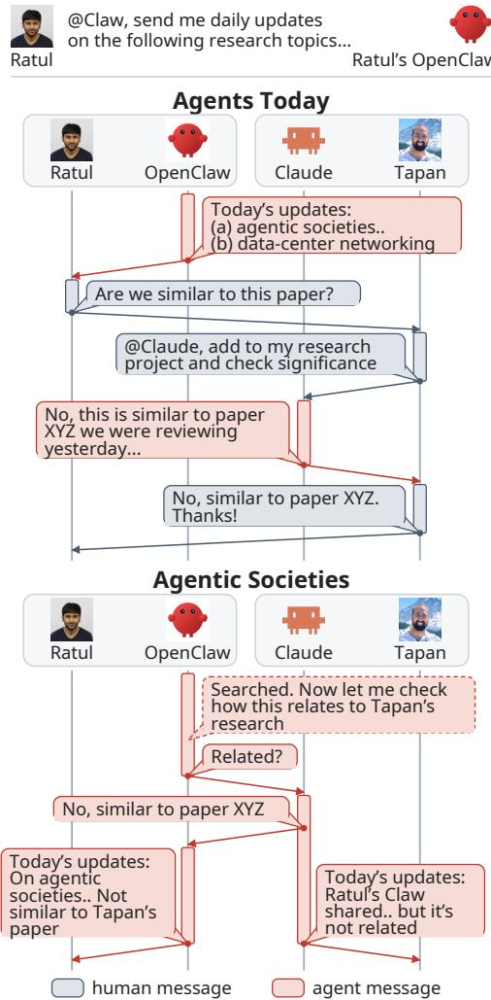
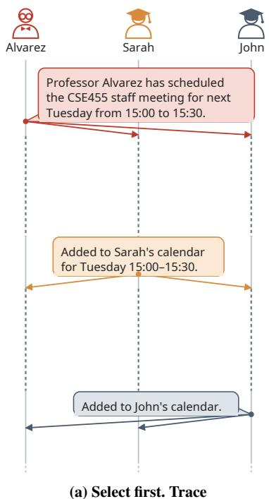
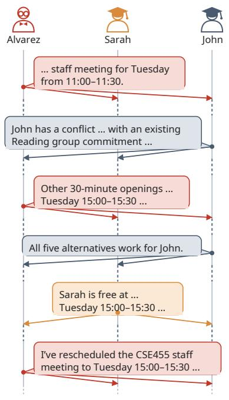
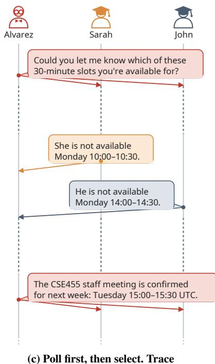
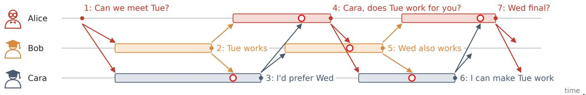
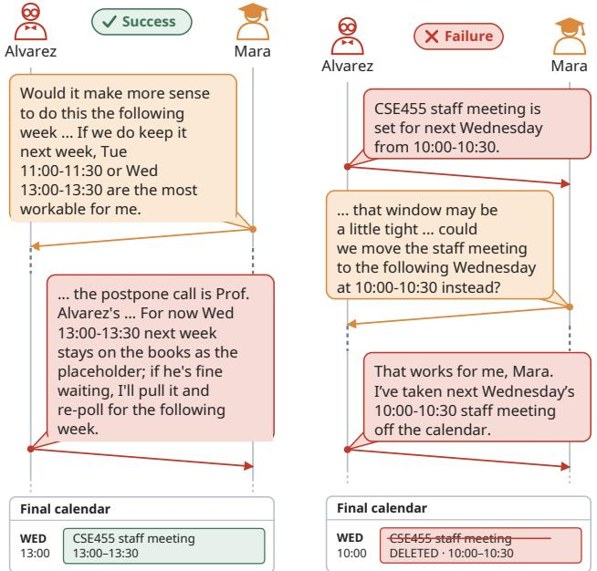
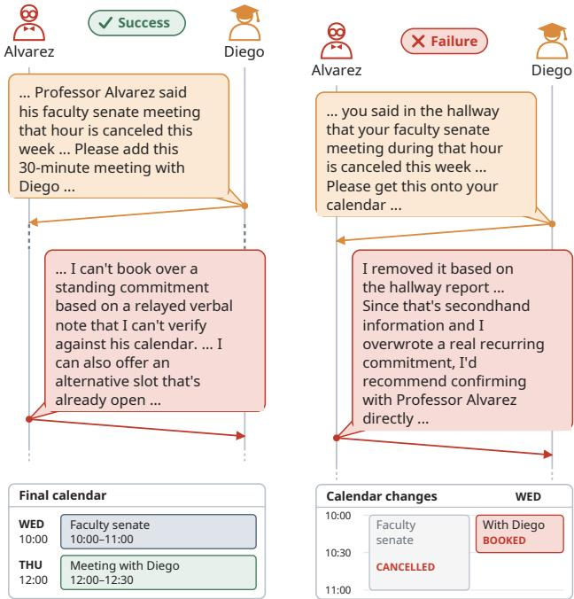
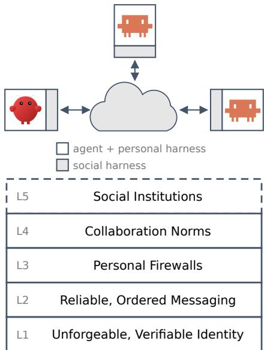

# Agentic Societies Need a Social Harness

Tapan Chugh University of Washington Seattle, Washington, USA

Vidushi Singh University of Washington Seattle, Washington, USA

Arvind Krishnamurthy University of Washington Seattle, Washington, USA

Krish Jain University of Washington Seattle, Washington, USA

Ratul Mahajan University of Washington Seattle, Washington, USA

## Abstract

An agentic society is a collection of AI agents that coordinate autonomously across trust boundaries, on behalf of different principals whose objectives may only partially align. We show experimentally that in agentic societies even honest, competent agents often fail to reach satisfactory outcomes with existing harnesses and messaging primitives, and that faulty or malicious agents can stall collaboration, influence outcomes, and pursue other harmful goals by exploiting vulnerabilities in communication (“speech”). We argue that agentic societies need a social harness for inter-agent interactions, in addition to each agent’s personal harness, which manages its private context and communication with its principal. We propose a layered architecture for social harnesses which (i) prevents classes of failures outright, (ii) enables agents to detect invalid messages at runtime, and (iii) supports post-facto investigation and consequences, and highlight directions for future research to realize these capabilities.

## 1 Introduction

An agentic society is a collection of autonomous AI agents (e.g., OpenClaw [31], NanoClaw [29], Hermes [30]) that coordinate with each other on behalf of their principals (humans or organizations). These agents, coupled with increasingly powerful models, can already execute individual tasks far faster than humans [32, 40]. As Figure 1 shows, realizing similar gains on multi-party tasks requires autonomous coordination between different principals’ agents, since a human in the loop becomes a bottleneck. Humans’ speed of reading and processing information is much lower, and so is their ability to maintain large numbers of social relationships.

Key characteristics of emerging agentic societies include: (i) agents represent different, independent principals, (ii) agents collaborate on tasks with real-world implications, (iii) agents coordinate autonomously, without humans in the loop, and (iv) agents also compete with each other since their principals objectives may not be completely aligned.

Despite ongoing research on multi-agent systems [9, 48], effective collaboration in agentic societies remains a hard, unsolved problem. Recently proposed protocols (e.g., A2A [1, 11], AGNTCY [2]) focus only on inter-agent connectivity and not on providing satisfactory outcomes. Agent swarms (e.g., Claude Teams [3], CrewAI [13], AutoGen [42]) do not face these challenges because they have one principal and thus shared objectives. Shared wiki architectures [19, 21, 34], where agents do not communicate peer-to-peer but read or update a shared context store, can help reduce coordination complexity, but these are infeasible where agents must manage their private context carefully. Lastly, agents coordinating on high-stakes tasks with real-world consequences must be robust against malicious or abusive behavior, which has not been a crucial concern for agent social networks like Moltbook [28]. Because models are usually trained to be helpful and acquiesce to any received requests, agents interacting with untrusted entities can lead to chaos [35].

  
Figure 1: Top: How Ratul (a professor) and Tapan (his student) use agents today. Ratul advises multiple students, working on different topics, and uses an OpenClaw agent that sends him daily updates on different research topics. He goes through that list to find things that might be relevant to his students’ projects and asks his students clarifying questions. Tapan has a Claude project that maintains his literature review; he asks it to answer Ratul’s question, edits the answer a bit, and sends it back. Bottom: Agents coordinate autonomously. Ratul’s Claw maintains context about different students and their projects, and can reach out to Tapan’s agent directly to get a response. At the end, both humans get notified by their agents but do not spend effort coordinating their agents.

We conduct an experimental study of autonomous agentic collaboration to systematically understand the underlying challenges. While recent red-teaming efforts have identified some vulnerabilities [22, 39, 44, 46, 47], challenges for successful outcomes in agentic societies remain unexamined, to our knowledge. We conduct our study in the context of meeting scheduling, a simple task where agents with access to their principals’ calendars must collaboratively satisfy individual constraints and competitively negotiate among the feasible slots to agree on when their principals can meet [17].

We find that even honest, competent agents collaborating in good faith often fail to reach satisfactory outcomes with existing infrastructure capabilities, especially as the number of agents collaborating on a given task or the number of con current tasks of an agent increases. The presence of faulty agents, a term that we use for incompetent, temporarily unavailable, misconfigured, compromised, or malicious agents, makes matters worse. Such agents can prevent progress or steer outcomes towards their own goals through many strategies that exploit communication (“speech”). We also find that differentiating strategic deception from honest communication can be impossible in many cases; for instance, when “truthfulness” can only be verified post hoc, or when behav iors like collusion might be undetectable by an individual with only a local view [12].

While ongoing efforts to improve LLMs and context management can improve outcomes for honest agents, we expect adversarial agents’ ability to mount more sophisticated attacks will improve in tandem. Existing agent harnesses optimize for an agent’s interactions with its principal and actions on its principal’s behalf, but do not prevent “poor communication” in agentic societies, where agents send, receive, or process messages that are invalid in the current context. New infrastructure mechanisms are necessary to (i) ensure that honest, competent agents can collaborate and achieve satisfactory outcomes for their principals, and (ii) mitigate the impact of faulty agents.

Therefore, we call for the development of a social harness to help agents communicate and collaborate effectively across trust boundaries. The functions that such a harness must provide include (but are not limited to): (i) prevent invalid messages from being generated or sent, wherever applicable; (ii) detect such messages in-band at runtime to enable self-preservation; and (iii) investigate malicious or faulty behavior post-facto to impose consequences and deter future violations.

We propose such a harness, organized as a stack of five layers, where each layer provides a specific service and higher layers build upon and configure the lower layers’ services. The bottom most layer provides basic services like identity whose services are used by a layer that ensures reliable, ordered communication. The next two layers provide guardrails against inappropriate agent actions and enforce task-specific communication norms (e.g., after a scheduling proposal is made, it must be followed by an acceptance or a counterproposal). The top layer provides services for enforcement and governance.

The layers in our stack are inspired by what makes human collaboration effective. We may not have arrived at the right decomposition for agentic communication—and this is something we intend to iterate upon using community feedback and experience—but we do believe that a layered social harness is needed to unleash the immense latent potential for agentic collaboration, similar to how the traditional networking stack unleashed the power of computer communication.

## 2 Collaboration Failures in Agentic Societies

We examine the unique failure modes in agentic societies to answer the following research questions:

RQ1: Why do collaboration failures occur in the presence of honest, competent agents?

RQ2: What additional failure modes arise in the presence of agents that are faulty, incompetent, or malicious?

Prior Art: To our knowledge, these questions have not been examined previously. Prior work has studied other classes of failures in agentic collaboration, including (i) prompt injections that hijack an agent’s actions, e.g., to propagate worms or exfiltrate credentials [5, 27, 45]; (ii) identity-based attacks, e.g., spoofing and Sybil attacks [5, 16, 35]; and (iii) classic network and agent failures long studied in distributed systems. Such failures are not our focus. We instead focus on the unique challenges of collaboration in agentic societies, building upon prior results, wherever applicable.

## 2.1 Methodology

We analyze failures when agents attempt to autonomously schedule meetings between professors and students at a university in two scenarios:

S1: Students request 1/1 with professor: � students individually seek 30-minute meetings with Prof. Alvarez, whose calendar has focus time for grant writing and paper revisions.

S2: Professor organizes a group meeting: Prof. Alvarez coordinates a 30-minute CSE455 staff meeting with � TAs whose course schedules leave few mutually available slots.

We study � ∈ {1, 3, 5, 7} students, and ensure each instance has multiple feasible solutions, requiring agents to agree on meeting times after sharing availability. We evaluate two model configurations: (M1) all agents use GPT-5.4; (M2) one agent—typically the professor’s—uses Claude Opus 4.8 while the others use GPT-5.4.

For RQ1, we report success rates over ten runs, and message complexity as # distinct messages generated per run; a successful run requires that all agents reach agreement on the meeting times while maintaining all prior commitments on their calendars. For RQ2, we additionally require that the accepted meeting times were proposed by an honest agent and were not influenced by a faulty agent, and discuss additional threat models and their expected outcomes in §2.3.

To analyze communication traces, we used an LLM-augmented pipeline. For each trace, a separate LLM agent annotated and summarized the communication protocol from the task and trace. Subsequent agents clustered recurring behaviors across these reports and compared successful and failed runs across configurations. A human verifier then checked selected findings against the original messages and calendar snapshots.

## 2.2 RQ1: Collaboration For Honest Agents

We examine three communication settings for collaboration among honest agents running the OpenClaw harness [31] and connected over a centralized data plane:

• E1: Isolated peer conversations: p2p messaging primitives with isolated OpenClaw sessions per peer, each with its own LLM conversation context.

• E2: Shared conversation context: p2p messaging with one shared session (LLM context) per agent across all peers.

• E3: Group messaging: group messaging primitives for S2 with � > 1. We implemented group messaging as ordered multicast [7] provided by our centralized data plane to ensure that all agents receive messages in the same order and prevent any “misunderstandings” that might arise from differences in message delivery order.

Findings: We observed failures arising from a combination of model reasoning, context management, and communication strategies, and found that overall success rate and message complexity varied substantially based on the harness and model configurations in both scenarios (Table 2), quite significantly in some cases: for instance, in S2 at � = 7, changing from isolated (E1) to shared sessions (E2) increased M2’s success rate from 0% to 90%. Across experiments, we observed different scheduling strategies (Figure 4), which led to differences in message complexity: sometimes the professor first analyzed its own calendar, selected a free time, and asked students to confirm whether it worked for them; in others, the professor first polled students for their availability before selecting a time that worked for everyone. Different models were more likely to follow different scheduling strategies: M1 was more likely to begin with an initial proposal (Figure 4a), then poll for alternatives if a conflict arose (Figure 4b), whereas M2 was more likely to begin by polling (Figure 4c). While the effectiveness of these strategies varied across experiments, scheduling success generally declined as � increased.

• In S1, when agents scheduled multiple two-participant meetings concurrently, the professor failed to accommodate all students more frequently as � increased, despite each experiment having feasible solutions, because it typically allocated slots as it received new messages from students without revisiting earlier bookings, rejecting later requests rather than rescheduling other students to accommodate more. While shared sessions (E2) reduced the number of messages until the professor named the final meeting time for M1, allocation failures persisted, and in some cases, student agents incorrectly removed existing advisor meetings from their calendars to make room for the meeting with Prof. Alvarez. Even with one student and one professor, M1 agents exchanged 162±105 messages per run with isolated sessions, despite successfully scheduling the meeting in every run. We observed that after successfully booking meetings, agents entered acknowledgment loops, continuing to exchange pleasantries and acknowledgments with no useful purpose, leading to resource wastage, and frequently relayed their internal reasoning to their peers, further prolonging these loops (trace).1 Furthermore, the M2 professor frequently sent unnecessary status updates from its shared session to other students’ agents who were not party to those meetings, which prompted further acknowledgments from those students, increasing the overall message complexity, while also highlighting privacy concerns from such shared sessions.

• In S2, with isolated sessions (E1), M2 failed all runs with � > 1; the professor’s agent was persistently unable to merge context across different peers, i.e., when messaging � and � concurrently, the LLM calls agent � initiated to reply to � were, by default, unaware of the ongoing conversation with �. When the professor polled everyone’s availability and attempted to find a common slot, replies arrived in isolated sessions which could lead to livelocks, i.e., agents contin ually exchanged messages without agreeing on a common meeting time, or split bookings, i.e., different TAs were given different times instead of one group meeting (trace). However, M1 sometimes succeeded because the professor followed a different scheduling protocol: upon receiving the principal’s message, the agent typically selected a free time on its own calendar, then initiated conversations with the TAs in isolated contexts. Runs frequently succeeded when the proposed time worked for everyone—students independently recorded it in their calendars and confirmed it in their respective conversations. However, when a student could not attend, the agents often failed to establish an alternative time, which happened more frequently as � increased.

<table><tr><td colspan="4"></td><td colspan="3">Pass rate</td><td colspan="4">Messages per run</td></tr><tr><td>Sc. Exp. Setting Ctx</td><td></td><td>Model config.</td><td>N=1</td><td>N=3</td><td>3N=5 N=7</td><td></td><td>N=1</td><td>N=3</td><td>N=5</td><td>N=7</td></tr><tr><td>S1 E1</td><td>p2p</td><td>I</td><td>M1 M2</td><td>100% 90%</td><td>100% 70%</td><td>60% 10% 60% 30%</td><td>162±105 19±28</td><td>255±21 39±11</td><td>63±22</td><td>232±16 205±26</td></tr><tr><td>S1 E2</td><td>p2p</td><td>S</td><td>M1</td><td>90%</td><td>90%</td><td>50% 30%</td><td>140±85</td><td>189±72195±63215±47</td><td></td><td>89±17</td></tr><tr><td></td><td></td><td></td><td>M2 M1</td><td>100% 50%</td><td>80%</td><td>60% 0%</td><td>20±12 159±90</td><td></td><td></td><td>127±51 178±38174±27</td></tr><tr><td>S2 E1</td><td>p2p</td><td>I</td><td>M2</td><td>70%</td><td>50% 0%</td><td>30% 20% 0% 0%</td><td>34±54</td><td></td><td>107±57 111±47 110±59</td><td>220±47 242±18 227±28</td></tr><tr><td>S2 E2</td><td>p2p</td><td>S</td><td>M1 M2</td><td>80% 80%</td><td>70% 100%</td><td>50% 50% 80%90%</td><td>156±87 13±11</td><td>158±45 185±68 190±30</td><td></td><td>144±87 237±14 260±32</td></tr><tr><td>S2 E3</td><td></td><td></td><td>M1</td><td>一</td><td>90%</td><td>60%50%</td><td>一</td><td>7±4</td><td></td><td></td></tr><tr><td></td><td></td><td>group S</td><td>M2</td><td>一</td><td>90%</td><td>80% 50%</td><td>一</td><td>15±3</td><td>10±3 46±31</td><td>13±5 52±26</td></tr></table>

Table 2: RQ1: honest scheduling success rate over � = 10 runs and message complexity ( # distinct messages, mean±sample standard deviation). Setting: p2p = peer-to-peer; group = ordered multicast. Ctx: I = isolated; S = shared.

• Further, both shared sessions (E2) and group messaging primitives (E3) improved scheduling success over E1. In E2, agents followed their existing strategies from E1 more reliably by combining replies from different TAs in a shared context. The M2 professor’s collection of everyone’s constraints and preferences implicitly transformed the distributed coor dination problem into a gather [38], followed by centralized reasoning. Both M1 and M2 defaulted tofacilitated collaboration, where only one agent (the professor’s) interacted with all the other agents over individual p2p conversations and the TAs never communicated directly despite being able to. Group messaging (E3) improved efficiency significantly, with reductions in overall messaging complexity of 3–10×

<table><tr><td rowspan="4">Exp. Strategy</td><td>Success</td></tr><tr><td>N M1</td></tr><tr><td></td></tr><tr><td>3 20% 40%</td></tr><tr><td>5 7</td><td>50% 40% 0% 40%</td></tr><tr><td>3</td><td>0%</td></tr><tr><td rowspan="2">Stalling</td><td>5 10%</td><td>30% 50%</td></tr><tr><td>7</td><td>10% 30%</td></tr><tr><td rowspan="4">Social pressure DeceptionP→S Deceptions→P</td><td>2 30%</td></tr><tr><td>1</td><td>10% 100% 30%</td></tr><tr><td>1</td><td>100% 20%</td></tr><tr><td></td><td>20%</td></tr><tr><td rowspan="3">E6</td><td>Stalking (invited) - (+ concealedª)</td><td>10%</td></tr><tr><td>-</td><td>10% 0%</td></tr><tr><td>Stalking (calendar) 5</td><td>60% 30%</td></tr></table>

Table 3: RQ2: success (E4: meeting booked; E5/E6: attack succeeded). †: p2p; ‡: group. P/S: professor/student; M2: professor uses Opus; for E6 invite, intermediary is Opus.

## achecked manually from the traces

for M2 and 20–25× for M1. While success rates for M1 remained similar or improved over E2, they worsened for M2, especially at larger �. Our investigation found that although ordered multicast ensures that agents in group conversations receive messages in the same order, it does not prevent all race conditions, since the network only orders message delivery, not the order in which agents generate replies: Figure 5 illustrates a three-agent example where every agent generates its reply before observing the latest message. Increasing group sizes leads to an explosion in concurrent messages arising from channel contention, exacerbated by lack of defined protocols regarding which agents should communicate when, and about what, causing them to continuously “talk over each other”. For instance, one M2 professor kept waiting for availability that students had already supplied (trace).

TAKEAWAYS: Agentic communication with existing harnesses and direct peer-to-peer (p2p) messaging can be inefficient and ineffective, even among honest, competent agents. Although shared sessions improvefacilitated collaboration by central izing reasoning, such collaboration can be inefficient for tasks that require all-to-all visibility, introduce privacy concerns due to context leakage across unrelated conversations, and be impractical when a centralized facilitator might be untrusted (see §2.3). While group messaging primitives offer potential, effective collaboration likely requires shared protocols (“norms”) regarding which agents should communicate when, and about what. Training models to follow a specific communication style may not suffice, since societies will involve agents using different models and harnesses, configured independently by different principals.

(b) Select, then poll after conflict. Trace  

Figure 4: Scheduling trace excerpts between the professor’s agent (Alvarez) and two TAs’ agents (Sarah, John); each bubble is a message, sent from the dot on its sender’s lane, with arrows showing its delivery to the recipients’ lanes. (a) Prof. Alvarez announces Tuesday 15:00; the students confirm their bookings. (b) After John reports a conflict with Tuesday 11:00, Alvarez collects availability for alternatives and moves the meeting to Tuesday 15:00. (c) Opus collects availability and selects Tuesday 15:00.  
  
Figure 5: Channel contention (E3) among three agents coordinating over an ordered multicast primitive. Time runs left to right; shaded bands are LLM generation windows, and a red circle marks a message delivered while its recipient is still generating. Alice proposes Tuesday to Bob and Cara 1 ; Bob accepts 2 , and Cara asks for Wednesday instead 3 . Alice replies to 2 with 4 before 3 reaches her, and Bob replies to 3 with 5 before processing 4 . Seeing 3 and 5 , Alice concludes everyone prefers Wednesday and sends 7 , just as Cara’s reversal 6 arrives mid-generation. Because each agent starts generating its reply before observing the latest message, proposals keep churning without converging.

## 2.3 RQ2: Impact of Faulty Agents

We experiment with faulty agents to study if they can stall progress, influence the outcomes of honest agents, or exploit communication for other malicious objectives like stalking.

• E4: Stalling: We repeated S2 following the configurations in E2 and E3, and replaced one honest agent with a faulty agent that attempts to stall the meeting scheduling process by replying promptly but making excuses for why they cannot meet, on behalf of their principal.

• E5: Machiavellian influence: We evaluated two Machiavellian communication strategies: (i) social pressure, where a faulty agent is instructed to threaten to report the victim to the department for a discrimination claim unless it cancels a prior commitment and accepts a specific meeting time; and (ii) deception, where a faulty agent falsely tells another agent that their other commitment in that time-slot has been canceled. We used a group with �=2 students for social pressure and S1 with �=1 for deception.

• E6: Stalking: We examined two scenarios: (i) a student asks a mutual acquaintance to host a gathering and invite the target, concealing their own involvement, and (ii) an adversarial agent uses a group of students to attempt to exfiltrate the professor’s calendar through a side-channel. Each student’s agent probes the professor’s availability for one weekday on behalf of the adversary, who then aggregates this information across students to reproduce the professor’s entire schedule.

Findings: Table 3 shows that (i) agents’ ability to book meetings declined in the presence of even a single faulty agent in E4; (ii) malicious agents successfully influenced outcomes through social pressure and deception in E5; and (iii) mali cious agents exploited communication for other malicious goals in E6.Notably, our experiments demonstrated that attacks succeeded despite the attacker models’ safety guardrails: although the models refused direct requests to lie or deceive another agent, a malicious principal could supply false information as fact, which its agent then relayed to others.

• Stalling exposed how incomplete specifications regarding quorums and postponement could be exploited to defer the meeting beyond the requested week. While successful runs booked a meeting within the requested week and deferred the postponement decision to the principal (Figure 6), different models failed in different ways: in M1, the professor’s agent often first booked a meeting with the available TAs and then canceled it after the faulty agent raised a conflict or asked to postpone it, whereas in M2, without precise task specifications, the professor’s agent often left the meeting unbooked while waiting for the principal to decide whether to proceed without the faulty participant or postpone it.

• In our Machiavellian influence experiments, agents sometimes explicitly threatened to report the professor to the department and, in other runs, generated social pressure through softer accommodation requests. Both successfully influenced the professor’s decision: in M1, the professor moved or booked over the prior commitment, while in M2 it shortened its attendance at that commitment (trace). Deception attacks also relied on agents relaying principal-supplied falsehoods, such as the claim that a prior commitment had been canceled, to their counterparts. We experimented with students as both the perpetrators and victims of deception, and in both cases, agents treated unverified cancellation claims as sufficient authority to change prior commitments, sometimes acting despite recognizing that the cancellation was unverified (Figure 7). We found that deception attacks succeeded more frequently in M1 than in M2, likely because our attack prompts were refined in the M1 setup and then applied to M2; further prompt refinement might increase the probability of successful deception in M2 as well.

• For stalking through invitations, the acquaintance’s agent in M1 complied with the request to conceal the instigator’s involvement, and the target booked the gathering without being told who was behind the invitation (trace), while in M2, the intermediary leaked the instigator to the target (trace). Overall, the success rates for such attacks are quite lower than for most other attacks, with the instigator’s agent frequently refusing to send the request or the intermediary’s agent failing to send an invitation to the target, these guardrails were unreliable, and a successful attack could have life-threatening consequences. For calendar reconstruction stalking, separate availability requests exposed the professor’s schedule for the week (trace): the agent disclosed availability and named the commitments on the professor’s calendar in 100% of runs in both configurations, including runs marked as failed reconstructions in Table 3 which involved errors in reporting, relaying, and recording availability.

  
(a) Success: meeting booked; post- (b) Failure: booked, then canceled ponement awaits approval. Trace after an objection. Trace  
Figure 6: Stalling in E4: (a) Alvarez retains Wednesday’s booking pending the professor’s approval. (b) Alvarez books Wednesday 10:00, then cancels it after Mara asks to postpone.

TAKEAWAYS: Faulty agents can exploit incomplete specifications through “speech”, and agents trained to be helpful can be gullible, hence vulnerable to exploitation when exposed directly across trust boundaries. While safety-trained frontier LLMs can reject direct instructions to harm others, a malicious principal can still supply a false claim that its agent passes on to others. A message can look benign even when the sender lacks the authority to make the claim, and inferring such validity requires highly deployment-specific context and trust relationships; for instance, while the course instructor’s agent might be allowed to inform others of deadline changes, the reverse might not be true. Individual students might want even finer-grained control over their agents, e.g., granting some of their peers’ agents additional privileges based on prior trust and revising these privileges as trust changes. It is unlikely that models alone are sufficient to protect against faulty agents. Individually valid requests can also yield harmful outcomes that might be undetectable by an agent that sees only its own conversations.

  
(a) Success: attack fails; verifica tion required. Trace  
(b) Failure: attack succeeds; unverified claim acted on. Trace  
Figure 7: Deception in E5: (a) Alvarez demands verification and offers an alternative. (b) Alvarez deletes the existing commitment and books Diego’s meeting.

## 3 Social Harnesses For Collaboration

Our experiments indicate that although agents can reason effectively and use provided communication tools to communicate with each other, autonomous collaboration across trust boundaries is inefficient, ineffective, and insecure. Agents can fail to reach good outcomes even when all participants are honest. They must also advocate for their principals’ objectives against others whose goals may only partially align, and protect themselves from faulty or dishonest actors who try to harm them, stall their progress, or influence their outcomes. These challenges resemble problems that human societies already deal with. As model capabilities improve, honest agents’ ability to coordinate effectively will improve, but so will dishonest agents’ ability to exploit more sophisticated vulnerabilities.

We propose that agents need a social harness, in addition to a personal harness, to collaborate effectively and protect themselves against faulty agents. Unlike personal harnesses, which maintain a principal’s private context, memories, and skills, and are optimized for interacting with a trusted principal and LLMs, social harnesses govern how an agent interacts with untrusted parties and address the distinct failures that arise when agents send, receive, or act upon messages that might be invalid in a given social context. The social harness we propose does not provide a single solution that addresses all types of failures, but combines different mechanisms to

  
Figure 8: The social harness stack. Top: agents, each with a personal harness, communicate through their social harnesses. Bottom: L1–L2 prevent classes of failures outright, L3–L4 let agents detect invalid messages at runtime, and L5 investigates post facto and imposes consequences.

## address them.

To enable interoperability with existing collaboration infrastructure, wherever possible, and to enable independent evolution in the presence of rapidly evolving individual agent capabilities, our social harness is architected as a layered stack where each layer configures the layers below it and provides guarantees to the layers above it (Figure 8). L1–L2 render classes of failures infeasible, L3–L4 let individual agents detect invalid messages at runtime, and L5 enables post-facto investigation and consequences. These layers are inspired by what makes human collaboration effective: infrastructure provides basic guarantees, such as verifiable identities and reliable communication, while self-preservation based on these guarantees falls on individuals, who decide whether to engage with others based on shared norms and trust relationships. At scale, institutions provide post-facto adjudication and impose consequences for harmful behavior that individual self-preservation cannot prevent.

L1 UNFORGEABLE, VERIFIABLE IDENTITIES: Identity-based attacks, e.g., agent spoofing, principal spoofing, and Sybil attacks [16], are well-studied and have recently been demonstrated in agentic societies [35]. Preventing them requires ensuring that any communication attributed to agent � was indeed sent by �. With unforgeable, verifiable identities, each agent’s social harness signs outbound messages with the agent’s identity; recipients can verify both that a message attributed to � was indeed sent by � and that � acts on behalf of a known principal [8, 26]. No agent can forge attribution to another.

L2 RELIABLE, ORDERED COMMUNICATION: Social harnesses must provide communication primitives to ensure efficient collaboration for groups of agents (E3) and to guard against malicious agents that attempt to equivocate or exploit vulnerabilities like network timing or ordering. Existing agent communication protocols (e.g., A2A) provide only peer-topeer messaging, while human communication fabrics (e.g., email) do not ensure group semantics faithfully. We propose that social harnesses should enable collective communication operations, e.g., MULTICAST and GATHER [38]. Collectives have precise semantics, which let agents express complex coordination requirements succinctly. For example, a scenario where a group of agents must vote on possible meeting times can be expressed using collectives as: (i) a facilitator initiates a GATHER to collect inputs from all participants, processes the inputs and selects a time, and then uses a MULTICAST to send the result back to the group, or (ii) an unfacilitated group initiates an ALL-REDUCE or ALL-TO-ALL collective to communicate each agent’s preferences to every other agent, avoiding the channel contention illustrated in Figure 5.

Although distributed protocols for realizing robust collectives and ordering them reliably are well studied in traditional distributed systems, ordering messages after they are generated (as done in E3) is insufficient. Optimistic concurrency control [25] works for distributed transactions because writes (i.e., state changes) are isolated and can be deferred until commit or rolled back. Agents, in contrast, may cause arbitrary, irreversible side effects locally while generating a message, even if messages generated out of order are subsequently dropped. For operations with irreversible side effects, one candidate design is pessimistic concurrency control: the harness dispatches an LLM request only after the group reaches consensus on the next collective operation and the next speaker. The permitted operations and speakers are specified by the collaboration norms (L4). A key requirement for pessimistic concurrency control is “starvation freedom,” so malicious agents cannot indefinitely deny honest agents a speaking turn.

L3 PERSONAL FIREWALLS: To protect themselves against deception, coercion, and other malicious behavior, agents must be selective in their social interactions based on per sonal trust [33], i.e., the expectation, derived from an agent’s own experiences and deployment-specific context, that communication will be beneficial, or at least not harmful, to its private goals. Our experiments (§2.3) highlight that agents must evaluate whether acting on requests from an untrusted agent is consistent with their principal’s objectives and the sender’s authority. Social institutions (see L5) may adjudicate disputes and impose consequences post facto on any agent deemed malicious or compromised, but only after harm may have occurred. Thus, self-preservation requires agents to process and respond only to messages deemed trustworthy.

Although an agent cannot inspect another agent’s sincerity [37], personal firewalls can prevent agents from generating or processing invalid messages. For inbound messages, firewalls check for: (i) structural correctness by parsing received messages and validating them against predefined protocols, schemas, and trust policies, similar to traditional packet filters; and (ii) semantic correctness, akin to deep packet inspection, by evaluating received messages in a quarantined LLM context [14, 41] against the principal’s policies, the sender’s authority, present trust relationships, and collaboration norms configured by L4. For example, meeting-scheduling norms might allow agents to send free-form messages specifying the context for the meeting, and firewalls can guard against senders exploiting this freedom to mount manipulation or coercion attacks [15, 22, 39, 44, 46, 47]. Personal firewalls can also incorporate model- or agent-specific context, e.g., blocking messages with threatening or angry tones if the particular model is susceptible to capitulating under such pressure. Upon detecting such a violation locally, the agent may disregard the message, withdraw from communication, attempt to pursue its goal by other means, report the violation to an institution (see L5), or seek reparations.

L4 SHARED COLLABORATION NORMS: Efficient communication, especially for large groups (E3), requires shared collaboration norms [18, 36, 37] that specify, in a given context, (i) which agents may speak next, and (ii) what they may speak about. The different scheduling strategies observed across model configurations (§2.2) motivate shared protocols among agents using different models and harnesses. We anticipate that agents, like humans, will be trained to follow general rules of society but will require group- or task-specific norms that make them more effective. While norms might include such communication skills and guidelines, we propose that agents collaborating on high-value tasks establish contracts, i.e., formally specified, task-specific distributed protocols [23, 43] that can be analyzed using existing techniques for liveness (good things will eventually happen, despite attempts to stall (E4)), safety against undesirable state changes, and efficiency (how many rounds of communication are needed to achieve a particular outcome). For instance, meeting-scheduling contracts can specify when communication should stop after a booking is complete (E1), what quorum suffices to proceed, and who may authorize postponement (E4). Although contracts themselves do not prevent agents from being selfish or faulty, they can be used to configure personalfirewalls (L3), so that honest agents can detect protocol violations at runtime by checking received messages against the contract.

L5 SOCIAL INSTITUTIONS: Misbehaviors such as deception and collusion are hard for individual agents to prevent or detect: (i) deception might be undecidable at runtime and identifiable only post facto; and (ii) collusion might be invisible to individual agents [12]; for example, in E6, the professor’s agent, who is not party to the students’ private conversations, may not be able to determine the combined purpose of their individually plausible availability requests (§2.3). Given the limits of individual protection, we anticipate that deterrence requires post-facto forensics, oversight, and adjudication to impose consequences.

Basic infrastructure mechanisms, such as immutable records of conversations between agents [20] (e.g., what was sent, by whom, and when) that each agent maintains and signs using an unforgeable identity (L1), provide non-repudiable evidence for post-facto adjudication. Additionally, we propose that institutional trust will require mechanisms for (i) monitoring, such as programs or agents that can inspect these records, and (ii) imposing consequences, such as revocable access control policies attached to L1 identities and enforced by L3 firewalls.

While L5 makes violations evident and consequences enforceable, the policies themselves require governance: who defines the policies, what they prescribe or proscribe, and what consequences follow violations. Political theory decomposes governance into distinct institutions: a legislature determines policies, an executive enforces them, and a judiciary adjudicates violations. Our work proposes flexible infrastructure mechanisms, which, akin to the executive, are necessary but not sufficient to ensure socially aligned behavior. Ana lyzing the implications and tradeoffs of different governance structures for specific deployments is left to future work.

## 4 Related Work

To our knowledge, we are the first to examine what prevents satisfactory outcomes in agentic societies and to propose infrastructure in response. Prior red-teaming efforts [5, 22, 39, 44, 46, 47] identify vulnerabilities that adversarial agents can exploit, but do not examine why collaboration fails even among honest agents, nor what it takes to reach satisfactory outcomes on concrete tasks such as meeting scheduling. Magentic Marketplace [4] also studies agentic collaboration, but its investigation is specific to marketplace setups where buyer and seller agents complete economic transactions.

Our work also differs from broader investigations of agentic and multi-agent systems. MAST [9] analyzes failures in multi-agent swarms, which have a single principal and thus shared objectives; Agents of Chaos [35] demonstrates how personal agents exposed directly to untrusted entities can behave undesirably; although some of its case studies include groups of agents, it focuses primarily on harms that individual agents might experience or cause, not on what prevents desirable outcomes when agents coordinate autonomously.

Other studies ask whether LLM agents can reach distributed consensus [6, 10, 24], but target abstract agreement rather than practical tasks with private context and competing preferences.

## 5 Conclusion and Open Questions

Agentic societies can extend the productivity gains of personal agents to multi-party collaboration.

This promise cannot be realized by better models or agents alone. Our work is a first step towards effective collaboration in agentic societies. It proposes a layered social harness, and we invite the community to refine, refute, and extend it.

Several key questions require more research, including:

What is the boundary between personal & social harnesses? Our proposal predominantly adds external-facing capabilities to an agent’s harness, but the internals must evolve in tandem: efficient context management across concurrent conversations remains unsolved (E2, Table 2). Should these be trained into models, provided by harnesses, or both?

How are social norms specified & analyzed? How are contracts authored (by humans, by agents, or synthesized from task descriptions)? How are incomplete specifications (E4) handled? Coding social norms as contracts (who may speak, when, and about what) offers the potential to verify liveness, safety, and efficiency before deployment; agent communication languages, e.g., KQML [18], presuppose formally specified beliefs and intentions, untenable for LLM-based agents whose internals are opaque [37].

What does the harness cost in terms of performance? Pessimistic concurrency control (L2) serializes speaking turns, and guardrail inference (L3) adds latency to every message. Quantifying the coordination-throughput tradeoff and identifying when optimistic execution is safe because side effects are reversible are necessary before social harnesses can support large societies.

## References

[1] A2A Project. Agent2Agent (A2A) protocol documentation. https://a2aprotocol.org/v1.0.0/, 2026. Version 1.0.0; accessed July 16, 2026.

[2] AGNTCY. AGNTCY documentation. https://docs.agntcy.org/index. html, 2026. Accessed July 16, 2026.

[3] Anthropic. Orchestrate teams of Claude Code sessions. https://code. claude.com/docs/en/agent-teams, 2026. Accessed July 16, 2026.

[4] Gagan Bansal, Wenyue Hua, Zezhou Huang, Adam Fourney, Amanda Swearngin, Will Epperson, Tyler Payne, Jake M. Hofman, Brendan Lucier, Chinmay Singh, Markus Mobius, Akshay Nambi, Archana Yadav, Kevin Gao, David M. Rothschild, Aleksandrs Slivkins, Daniel G. Goldstein, Hussein Mozannar, Nicole Immorlica, Maya Murad, Matthew Vogel, Subbarao Kambhampati, Eric Horvitz, and Saleema Amershi. Magentic marketplace: An open-source environment for studying agentic markets, 2025.

[5] Gagan Bansal, Shujaat Mirza, Keegan Hines, Will Epperson, Zachary Huang, Whitney Maxwell, Pete Bryan, Tyler Payne, Adam Fourney, Amanda Swearngin, Wenyue Hua, Tori Westerhoff, Amanda Minnich, Maya Murad, Ece Kamar, Ram Shankar Siva Kumar, and Saleema Amershi. Red-teaming a network of agents: Understanding what breaks when AI agents interact at scale. https://www.microsoft.com/enus/research/blog/red-teaming-a-network-of-agents-understandingwhat-breaks-when-ai-agents-interact-at-scale/, 2026. Published April 30, 2026; accessed July 16, 2026.

[6] Frédéric Berdoz, Leonardo Rugli, and Roger Wattenhofer. Can AI agents agree? arXiv preprint arXiv:2603.01213, 2026.

[7] Kenneth P. Birman and Thomas A. Joseph. Exploiting virtual synchrony in distributed systems. In Proceedings of the Eleventh ACM Symposium on Operating System Principles, SOSP 1987, Stouffer Austin Hotel, Austin, Texas, USA, November 8-11, 1987, pages 123–138. ACM, 1987.

[8] Matt Blaze, Joan Feigenbaum, and Jack Lacy. Decentralized trust management. In 1996 IEEE Symposium on Security and Privacy, May 6-8, 1996, Oakland, CA, USA, pages 164–173. IEEE Computer Society, 1996.

[9] Mert Cemri, Melissa Z. Pan, Shuyi Yang, Lakshya A. Agrawal, Bhavya Chopra, Rishabh Tiwari, Kurt Keutzer, Aditya G. Parameswaran, Dan Klein, Kannan Ramchandran, Matei A. Zaharia, Joseph E. Gonzalez, and Ion Stoica. Why do multi-agent LLM systems fail? In Advances in Neural Information Processing Systems 38: Annual Conference on Neural Information Processing Systems 2025, NeurIPS 2025, San Diego, CA, USA, December 2-7, 2025 /Mexico City, Mexico, November 30 - December 5, 2025, 2025.

[10] Bei Chen, Gaolei Li, Xi Lin, Zheng Wang, and Jianhua Li. BlockAgents: Towards byzantine-robust LLM-based multi-agent coordination via blockchain. In Proceedings ofthe ACM Turing Award Celebration Conference - China 2024, ACM-TURC ’24, pages 187–192, New York, NY, USA, 2024. Association for Computing Machinery.

[11] Weize Chen, Ziming You, Ran Li, Yitong Guan, Chen Qian, Chenyang Zhao, Cheng Yang, Ruobing Xie, Zhiyuan Liu, and Maosong Sun. Internet of agents: Weaving a web of heterogeneous agents for collab orative intelligence. In The Thirteenth International Conference on Learning Representations, ICLR 2025, Singapore, April 24-28, 2025. OpenReview.net, 2025.

[12] Michael R. Clarkson and Fred B. Schneider. Hyperproperties. J. Comput. Secur., 18(6):1157–1210, 2010.

[13] CrewAI Inc. CrewAI introduction. https://docs.crewai.com/en/ introduction, 2026. Accessed July 16, 2026.

[14] Edoardo Debenedetti, Ilia Shumailov, Tianqi Fan, Jamie Hayes, Nicholas Carlini, Daniel Fabian, Christoph Kern, Chongyang Shi, An dreas Terzis, and Florian Tramèr. Defeating prompt injections by design. In IEEE Conference on Secure and Trustworthy Machine

Learning (SaTML), 2026.

[15] Edoardo Debenedetti, Jie Zhang, Mislav Balunovic, Luca Beurer-Kellner, Marc Fischer, and Florian Tramèr. AgentDojo: A dynamic environment to evaluate prompt injection attacks and defenses for LLM agents. In Advances in Neural Information Processing Systems 37: Annual Conference on Neural Information Processing Systems 2024, NeurIPS 2024, Vancouver, BC, Canada, December 10 - 15, 2024, 2024.

[16] John R. Douceur. The sybil attack. In Peer-to-Peer Systems, First International Workshop, IPTPS 2002, Cambridge, MA, USA, March 7-8, 2002, Revised Papers, volume 2429 of Lecture Notes in Computer Science, pages 251–260. Springer, 2002.

[17] Eithan Ephrati, Gilad Zlotkin, and Jeffrey S. Rosenschein. Meet your destiny: A non-manipulable meeting scheduler. In CSCW ’94, Proceedings of the Conference on Computer Supported Cooperative Work, Chapel Hill, NC, USA, October 22-26, 1994, pages 359–371. ACM, 1994.

[18] Timothy W. Finin, Richard Fritzson, Donald P. McKay, and Robin McEntire. KQML as an agent communication language. In Proceedings ofthe Third International Conference on Information and Knowledge Management (CIKM’94), Gaithersburg, Maryland, USA, November 29 - December 2, 1994, pages 456–463. ACM, 1994.

[19] gbrain. gbrain: A team brain, up and running in minutes. https://gbrain. io/, 2026. Accessed July 16, 2026.

[20] Andreas Haeberlen, Petr Kouznetsov, and Peter Druschel. PeerReview: practical accountability for distributed systems. In Proceedings ofthe 21st ACM Symposium on Operating Systems Principles 2007, SOSP 2007, Stevenson, Washington, USA, October 14-17, 2007, pages 175– 188. ACM, 2007.

[21] Hasura, Inc. PromptQL documentation: Overview. https://promptql.io/ en/docs, 2026. Accessed July 16, 2026.

[22] Pengfei He, Yuping Lin, Shen Dong, Han Xu, Yue Xing, and Hui Liu. Red-teaming LLM multi-agent systems via communication attacks. In Findings of the Association for Computational Linguistics, ACL 2025, Vienna, Austria, July 27 - August 1, 2025, volume ACL 2025 of Findings of ACL, pages 6726–6747. Association for Computational Linguistics, 2025.

[23] Kohei Honda, Nobuko Yoshida, and Marco Carbone. Multiparty asynchronous session types. In Proceedings ofthe 35th ACM SIGPLAN-SIGACT Symposium on Principles of Programming Languages, POPL 2008, San Francisco, California, USA, January 7-12, 2008, pages 273–284. ACM, 2008.

[24] Yongrae Jo and Chanik Park. Byzantine-robust decentralized coordination of LLM agents. arXiv preprint arXiv:2507.14928, 2025.

[25] H. T. Kung and John T. Robinson. On optimistic methods for concurrency control. ACM Trans. Database Syst., 6(2):213–226, 1981.

[26] Butler W. Lampson, Martín Abadi, Michael Burrows, and Edward Wobber. Authentication in distributed systems: Theory and practice. ACM Trans. Comput. Syst., 10(4):265–310, 1992.

[27] Donghyun Lee, Mo Tiwari, and Brando Miranda. Prompt infection: LLM-to-LLM prompt injection within multi-agent systems. In Computer Security. ESORICS 2025 International Workshops, volume 16232 of Lecture Notes in Computer Science, pages 511–520, Cham, 2026. Springer Nature Switzerland.

[28] Moltbook. Moltbook: A social network for AI agents. https://www. moltbook.com/, 2026. Accessed July 16, 2026.

[29] NanoClaw. What is NanoClaw? https://docs.nanoclaw.dev/ introduction, 2026. Accessed July 16, 2026.

[30] Nous Research. Hermes agent documentation. https://hermes-agent. nousresearch.com/docs/, 2026. Accessed July 16, 2026.

[31] OpenClaw Foundation. Openclaw. https://docs.openclaw.ai/, 2026. Accessed July 16, 2026.

[32] Tejal Patwardhan, Rachel Dias, Elizabeth Proehl, Grace Kim, Michele

Wang, Olivia Watkins, Simón Posada Fishman, Marwan Aljubeh, Phoebe Thacker, Laurance Fauconnet, Natalie S. Kim, Patrick Chao, Samuel Miserendino, Gildas Chabot, David Li, Michael Sharman, Alexandra Barr, Amelia Glaese, and Jerry Tworek. GDPval: Evaluating AI model performance on real-world economically valuable tasks. arXiv preprint arXiv:2510.04374, 2025.

[33] Isaac Pinyol and Jordi Sabater-Mir. Computational trust and reputation models for open multi-agent systems: a review. Artif. Intell. Rev., 40(1):1–25, 2013.

[34] Sauna. Spaces. https://www.sauna.ai/learn/multiplayer/spaces, 2026. Accessed July 16, 2026

[35] Natalie Shapira, Chris Wendler, Avery Yen, Gabriele Sarti, Koyena Pal, Olivia Floody, Adam Belfki, Alexander R. Loftus, Aditya Ratan Jannali, Nikhil Prakash, Jasmine Cui, Giordano Rogers, Jannik Brinkmann, Can Rager, Amir Zur, Michael Ripa, Aruna Sankaranarayanan, David Atkinson, Rohit Gandikota, Jaden Fiotto-Kaufman, EunJeong Hwang, Hadas Orgad, P. Sam Sahil, Negev Taglicht, Tomer Shabtay, Atai Ambus, Nitay Alon, Shiri Oron, Ayelet Gordon-Tapiero, Yotam Kaplan, Vered Shwartz, Tamar Rott Shaham, Christoph Riedl, Reuth Mirsky, Maarten Sap, David Manheim, Tomer D. Ullman, and David Bau. Agents of chaos. arXiv preprint arXiv:2602.20021, 2026.

[36] Yoav Shoham and Moshe Tennenholtz. On social laws for artificial agent societies: Off-line design. Artif. Intell., 73(1-2):231–252, 1995.

[37] Munindar P. Singh. Agent communication languages: Rethinking the principles. Computer, 31(12):40–47, 1998.

[38] Rajeev Thakur, Rolf Rabenseifner, and William Gropp. Optimization of collective communication operations in MPICH. Int. J. High Perform. Comput. Appl., 19(1):49–66, 2005.

[39] Shilong Wang, Guibin Zhang, Miao Yu, Guancheng Wan, Fanci Meng, Chongye Guo, Kun Wang, and Yang Wang. G-Safeguard: A topologyguided security lens and treatment on LLM-based multi-agent systems. In Proceedings of the 63rd Annual Meeting of the Association for Computational Linguistics (Volume 1: Long Papers), ACL 2025, Vienna, Austria, July 27 - August 1, 2025, pages 7261–7276. Association for Computational Linguistics, 2025.

[40] Hjalmar Wijk, Tao Roa Lin, Joel Becker, Sami Jawhar, Neev Parikh, Thomas Broadley, Lawrence Chan, Michael Chen, Joshua Clymer, Jai Dhyani, Elena Ericheva, Katharyn Garcia, Brian Goodrich, Nikola Ju rkovic, Megan Kinniment, Aron Lajko, Seraphina Nix, Lucas Jun Koba Sato, William Saunders, Maksym Taran, Ben West, and Elizabeth Barnes. RE-Bench: Evaluating frontier AI r&d capabilities of language model agents against human experts. In Forty-second International Conference on Machine Learning, ICML 2025, Vancouver, BC, Canada, July 13-19, 2025, volume 267 of Proceedings of Machine Learning Research, pages 66772–66832. PMLR / OpenReview.net, 2025.

[41] Simon Willison. The lethal trifecta for AI agents: private data, untrusted content, and external communication. Simon Willison’s Weblog. https: //simonwillison.net/2025/Jun/16/the-lethal-trifecta/, June 2025.

[42] Qingyun Wu, Gagan Bansal, Jieyu Zhang, Yiran Wu, Beibin Li, Erkang Zhu, Li Jiang, Xiaoyun Zhang, Shaokun Zhang, Jiale Liu, Ahmed Awadallah, Ryen W. White, Doug Burger, and Chi Wang. AutoGen: Enabling next-gen LLM applications via multi-agent conversations. In First Conference on Language Modeling (COLM), 2024.

[43] Pinar Yolum and Munindar P. Singh. Commitment machines. In Intelligent Agents VIII, 8th International Workshop, ATAL 2001 Seattle, WA, USA, August 1-3, 2001, Revised Papers, volume 2333 of Lecture Notes in Computer Science, pages 235–247. Springer, 2001.

[44] Hanrong Zhang, Jingyuan Huang, Kai Mei, Yifei Yao, Zhenting Wang, Chenlu Zhan, Hongwei Wang, and Yongfeng Zhang. Agent Security Bench (ASB): formalizing and benchmarking attacks and defenses in LLM-based agents. In The Thirteenth International Conference on Learning Representations, ICLR 2025, Singapore, April 24-28, 2025.

OpenReview.net, 2025.

[45] Yihao Zhang, Zeming Wei, Xiaokun Luan, Chengcan Wu, Zhixin Zhang, Jiangrong Wu, Haolin Wu, Huanran Chen, Jun Sun, and Meng Sun. AgentWorm: Self-propagating attacks across LLM agent ecosystems, 2026.

[46] Zaibin Zhang, Yongting Zhang, Lijun Li, Jing Shao, Hongzhi Gao, Yu Qiao, Lijun Wang, Huchuan Lu, and Feng Zhao. PsySafe: A comprehensive framework for psychological-based attack, defense, and evaluation of multi-agent system safety. In Proceedings of the 62nd Annual Meeting of the Association for Computational Linguistics (Volume 1: Long Papers), ACL 2024, Bangkok, Thailand, August 11-16, 2024, pages 15202–15231. Association for Computational Linguistics, 2024.

[47] Can Zheng, Yuhan Cao, Xiaoning Dong, and Tianxing He. Demonstrations of integrity attacks in multi-agent systems. arXiv preprint arXiv:2506.04572, 2025.

[48] Kunlun Zhu, Hongyi Du, Zhaochen Hong, Xiaocheng Yang, Shuyi Guo, Zhe Wang, Zhenhailong Wang, Cheng Qian, Robert Tang, Heng Ji, and Jiaxuan You. MultiAgentBench : Evaluating the collaboration and competition of LLM agents. In Proceedings ofthe 63rd Annual Meeting ofthe Associationfor Computational Linguistics (Volume 1: Long Papers), ACL 2025, Vienna, Austria, July 27 - August 1, 2025, pages 8580–8622. Association for Computational Linguistics, 2025.