# Available but Unclaimed: An Empirical Study of Human–AI Synergy

ROBIN WELSCH, Aalto University, Finland

MICHELLE RAUSCH, Aalto University, Finland

PASCAL KNIERIM, University of Innsbruck, Austria

THOMAS KOSCH, Humboldt-Universität zu Berlin, Germany

JOCHEN KUHN, Ludwig-Maximilians-Universität München, Germany

ALBRECHT SCHMIDT, Ludwig-Maximilians-Universität München, Germany

DANIELA FERNANDES, Aalto University, Finland

People increasingly reason with large language models (LLMs), yet complementary capabilities do not guarantee outperforming both components. In a between-subjects study, participants (N=535) solved a 40-item batery of matrix reasoning, mental rotation, syllogisms, and leter-string analogies, unaided or with GPT-5.6-Luna, Claude Opus 4.8, Gemini 3.6 Flash, or Kimi K3. Each assisted trial required consultation with the model. Each model answered every item alone 100 times under matched elicitation. The assisted–unaided accuracy diference increased with item-level LLM competence. Deference varied across tasks and increased with competence within tasks. Post-advice confidence distinguished correct from incorrect answers less strongly than unaided confidence. In a reference comparison, about half the increase in LLM accuracy carried through to assisted accuracy. How much of that accuracy gain reached participants difered across the models. These findings motivate evaluating LLMs in interaction with humans and designing support for selective deference that preserves independent reasoning.

Additional Key Words and Phrases: human-AI interaction, complementarity, reliance, large language models, reasoning, decision support

## 1 Introduction

Large language models (LLMs) are unevenly reliable within a single domain. A model may solve one reasoning problem on nearly every atempt and a problem of the same form at chance [42, 49], while its replies need not reveal the diference [83]. Whether a person can distinguish correct from incorrect advice and rely on the model accordingly maters for efective human–AI interaction (HAI).

People and LLMs exhibit diferent strengths and weaknesses when working on a problem. One can theoretically compensate for the other’s errors [27, 72]. Complementarity denotes this potential, created where human and AI errors difer. Synergy denotes the realized case in which the team actually outperforms both components [73]. During an interaction, answers can change as the conversation proceeds. Difering errors therefore create an opportunity, but do not guarantee that the person can recognize and correct them. We call the realized share of independent-error reference headroom synergy capture.

However, achieving synergy is not built into an LLM’s configuration. It depends on the interaction, particularly on what the user understands and how the assistant communicates its reliability [83]. That is the familiar concern of reliance, together with its failure mode of overreliance [40]. Efective human–AI synergy depends not only on how capable the LLM is, but also on how people use its advice.

LLM assistants are typically reluctant to express uncertainty, and users rely on their output even when it is marked as uncertain [83]. Users accordingly underestimate performance variation [32] and form biased estimates of model quality [21]. Where AI reliance in HAI is easily quantifiable (e.g., in simple decision-making tasks with low to no interactivity), synergy is rare. Meta-analytically, human–AI teams fail on average to exceed the beter oftheir parts in non-conversational interactions [73], where per-item correctness is known, reliance can be scored as appropriate [66], and complementarity is formally defined [27]. Interactive studies likewise show that solo LLM accuracy incompletely predicts assisted performance [14, 63].

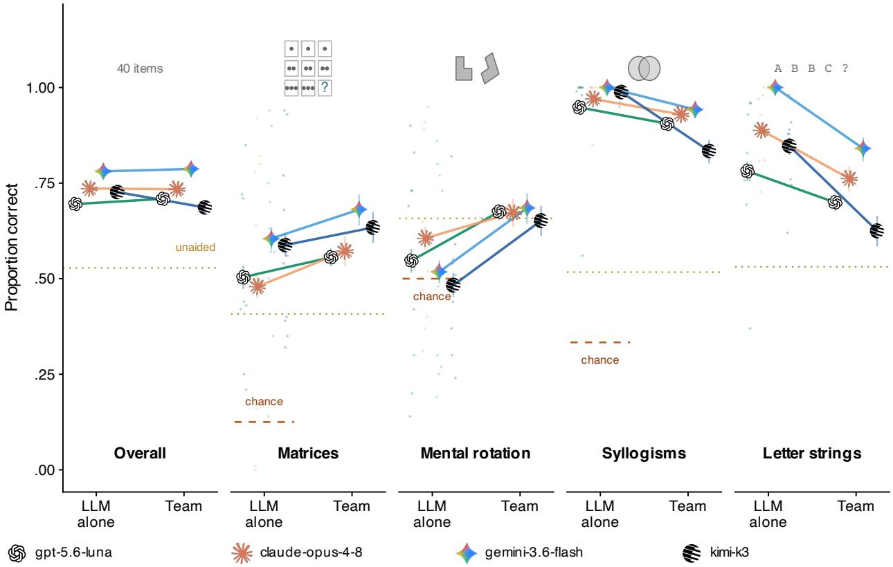  
Fig. 1. Assisted and assistant-alone accuracy difer across tasks. Each assistant’s own accuracy (left, 100-run chat-parity benchmark) and its teams’ accuracy (right), overall and per task. The doted rule marks unaided accuracy and the dashed rule chance (undefined for leter strings). Small points show per-item competences. Bars show 95% Jefreys intervals on pooled runs and trials, treating observations as independent.

Four questions organize this paper. Because LLM competence is measured per item, we ask (RQ1) where consulting pays and where it costs rather than whether it helps on average. Because we classified each trial’s advice, its correctness, and whether it was adopted, we ask (RQ2) whether deference follows that boundary. We ask (RQ3) whether confidence supports selective deference and what gains reference policies predict. Because four assistants encountered the same items, we ask (RQ4) whether a more capable LLM yields a stronger team.

To address these, we report a study in which 535 participants worked the same 40-item batery, spanning matrix reasoning, mental rotation, syllogistic reasoning, and leter-string analogies, either unaided (� = 187) or with one of four LLM assistants, namely gpt-5.6-luna (� = 179), claude-opus-4-8 (� = 61), gemini-3.6-flash (� = 52), or kimi-k3 (� = 56). Each assistant also answered every item alone over 100 independent runs, using matched stimuli and API setings. This estimates LLM competence on the study’s own items, with a binomial standard error of approximately .05 or less.

We find that benefits increase with the LLM’s competence on an item, with positive efects resolved in the two upper competence bands. Across the examined contrast, assisted accuracy increased about half as steeply as LLM competence. Deference (i.e., submiting the assistant’s answer on a given trial) varied across tasks and increased with competence within tasks. Stated confidence distinguished correct from incorrect answers overall, with a modest positive association between discrimination and synergy capture. Retrospective item-level selection estimates a gain of about six points, or two or three questions in forty. Reliability, then, must be measured at the item level, not reduced to a single score for the assistant.

This paper makes three contributions to human–AI interaction.

• An account of answer agreement and switching in open-ended chat, based on conversations classified trial by trial across four assistants. Under mandatory consultation, deference varied substantially by task and also tracked item competence. The own-answer association was uncertain on disjoint trials. These findings motivate examining interaction design, rather than treating inappropriate deference simply as a user deficit.

• Evidence that complementary errors are not enough. Formal accounts show how metacognitive sensitivity can support beneficial combination under specified conditions [44]. Here, confidence distinguished correct from incorrect answers, yet participants still frequently followed incorrect advice. The policy ladder estimates what more selective use of the two components could achieve, distinguishing task- and item-level selection from an oracle that assumes independent errors.

• Assisted accuracy increases less steeply than LLM competence at the specified contrast. Assistants within a few points of one another alone difered approximately twofold in benchmark-based pass-through, the association between item-level LLM competence and assisted accuracy (Table 5). The spread was smaller on the realizedadvice axis. Together with deference and capture, these slopes extend prior comparisons of solo and assisted performance [14].

## 2 Related Work

## 2.1 Complementarity in Human–AI Teams

Complementarity is necessary for human–AI synergy because difering errors create the potential to outperform either component [2, 27, 72, 84]. Empirically, synergy is rare [73]. A stronger model is a harder baseline to outperform, and overreliance can erode the human contribution until the pair trails the person alone [39]. How much of that complementarity a pair collects depends in part on metacognitive sensitivity (i.e., how well confidence separates one’s own right answers from one’s wrong ones). A Bayes-optimal combination can improve on both components, even with a less accurate assistant, provided accuracy diferences and the dependence between human and LLM confidence satisfy the model’s conditions [44]. This guarantee concerns independently formed judgments combined by a rule. Calibration alone ofers no general guarantee either. In binary classification, any deterministic rule combining calibrated probabilities that does not essentially always follow one agent can perform worse than both for some joint distribution of predictions and outcomes [58]. The benefit of combining predictions also depends on their joint error structure. How complementarity and metacognition support synergy during an open interaction therefore remains an empirical question.

Work on model ensembles illustrates why error dependence maters. Models trained on overlapping corpora fail the same cases [35], and systems that share foundation components homogenize decisions [7, 38]. A recent audit of several hundred models reports that two models agree on roughly six ofevery ten items both answer incorrectly, with error correlation increasing rather than decreasing as models grow larger and more accurate, across architectures and providers [34]. Routing and ensembling, by contrast, benefit where models genuinely difer in which items they answer well [30, 36]. These findings concern model–model combinations, but reinforce the need to measure rather than assume complementary errors in human–AI pairs

Evaluating synergy requires an LLM-alone reference on the study’s own items. Major evaluation traditions benchmark assistants in isolation on standard item pools [10, 15, 41, 57, 71]. Scores can sit at ceiling [37] or depend on elicitation conditions. ChatBench addresses this mismatch by measuring human-alone, LLM-alone, and assisted accuracy on shared questions, including a free-text benchmark with matched model setings [14]. We extend this approach to generated reasoning items, relating repeated competence estimates to deference, confidence, and realized synergy.

## 2.2 Reliance and Its Failure Modes

Complementarity can be lost when accepting advice replaces independent reasoning. People accept LLM output even when it is worse than their unaided judgement [39, 67]. Without corrective feedback, reliance hardens into coarse heuristics about whether to follow the system at all [47], and impressions of its competence persist despite repeated disconfirmation [16]. Interface designs have atempted to restore displaced deliberation with mixed results. Making acceptance a deliberate action reduces overreliance, yet users rate these designs lowest [12]. Explanations increase acceptance regardless of advice correctness [2, 74]. Disclosing weaknesses reduces reliance on incorrect advice only when errors are dificult to detect [60, 64]. The target has accordingly been reframed as appropriate reliance, defined as following correct advice while refusing incorrect advice [66]—with the most efective designs being those that users resist.

Judge–adviser measures score advice-taking as the shift between pre- and post-advice judgements [8, 79], with algorithmic as well as human advisers [46]. Evaluating appropriate reliance and automation bias [55, 70, 77] additionally requires relating advice-taking to advice correctness on each trial and tracing how answers change during interaction.

Advice-taking measures also miss metacognitive sensitivity, or how well confidence distinguishes one’s own correct from incorrect answers. Confidence can rise or fall wholesale without improving metacognitive sensitivity, which is why signal-detection accounts were developed to disentangle performance, mean confidence, and metacognitive sensitivity [61], and why increased confidence conveys no information about whether judgment improved. Advice afects both dimensions unequally. An adviser’s expressed confidence shifts a judge’s own confidence and trust regardless of advice quality [59].

With an LLM as adviser, confidence can drift toward what the system displays and remain displaced after withdrawal [43], while ofloading can decouple confidence from accuracy [21]. Connecting such shifts to performance requires identifying the advice participants actually received and whether they adopted it.

We measure deference under required consultation by identifying what the LLM advised, whether the advice was right, and whether the participant submited it. Deference can thus be checked item by item against where following the assistant actually paid.

Selective deference also requires efort. Bounded rationality sets the standard as the best rule available under limited information and time [69]. Rational analysis asks which policy is adapted to the environment’s structure [1], resourcerational analysis prices that policy against the computation it costs [45], and computational rationality sharpens it to which policy maximises what a person cares about, net of the efort it demands [53], so an apparent error may be a correctly priced decision not to spend efort. Ofloading is least costly when verification costs exceed its benefits [65], interface designs that facilitate delegation further reduce its cost [24], and errors introduced by the resource can make that strategy costly [76]. These accounts all assume the agent can price the option in front of it, and pricing requires a signal that tracks what that option is worth. Ofloading research shows that people defer based on their own confidence [6], and their decisions approach the optimal policy when confidence is informative [23]. These accounts motivate comparisons with explicit alternative policies. In this study, item-level measurement lets us evaluate reference policies—task- and item-level selection and an independent-error oracle—and compare their conditional gains.

## 2.3 Team Performance and LLM Capability

These reliance decisions also mater when comparing assistants. One might expect that as LLM competence increases and people defer to the advice, team accuracy would rise accordingly. Which advice people take also depends on the person, interface, and assistant. The complementarity literature characterizes how a team performs relative to its components [2, 27], and a large-scale meta-analysis of human–AI performance finds that team performance tracks LLM competence in aggregate [73]. Note, however, that this trend conceals cases where a stronger AI yields a weaker team, and the mechanism remains unidentified. Work on tuning decision-support systems finds that the match between the assistant’s error profile and the user’s baseline maters as much as its overall accuracy [29].

Some studies hold the model fixed and vary its stated or observed accuracy [80], its error profile at constant accuracy [29], or its explanations [2]. Within a single system, higher accuracy does yield larger team gains [81]. One study pairs clinicians with five models on the same vignetes [84], evaluating aggregated ranked outputs rather than interactive assistance. ChatBench instead compares two LLMs in human interaction and finds that their solo accuracy gap narrows with assistance [14]. Reanalyzing ChatBench, Riedl and Weidmann [63] separate individual and collaborative ability using Bayesian item-response models and associate conversational perspective-taking with collaborative performance. Without humans, a model’s rank alone and its rank as a helper in a team of LLMs are only modestly related [78], and combining models stops paying once the single-model baseline is strong [36].

The candidate mechanism is misallocated reliance. Gains from upgrading the LLM depend partly on which advice people follow. Users treat LLM accuracy as steadier across items than it is [32], so a stronger LLM may raise its own bar without improving the team’s selectivity. We extend these evaluations by estimating pass-through, the association between item-level LLM competence and assisted accuracy, alongside realized synergy and synergy capture. We examine slopes across forty items per assistant rather than relying on the rank order of four assistants. Whether a better LLM produces a better team is thus an empirical question, not a given.

## 3 Method

In the following, we motivate and document our methodological choices. We built and deployed a purpose-made benchmark with a 40-item cognitive batery spanning four task domains, a web application that administers it under proctoring, and an automated evaluation of state-of-the-art LLMs on the identical items under prompting conditions matched to what participants see.

## 3.1 Participants

A two-sample power calculation for a person-level accuracy diference of $d = . 3 0 ( \alpha = . 0 5$ , two-sided, power = .80, pwr::pwr.t.test) gives $n = 1 7 5 . 4$ , rounded to 176 per group. The unaided and gpt-5.6-luna groups exceed that target $( N \ : = \ : 1 8 7$ and 179). The additional groups $( N = 6 1$ claude-opus-4-8, 56 kimi-k3, and 52 gemini-3.6- flash) extend the comparison to other assistants. An item-level proportion based on roughly 50 participants has a maximum binomial standard error of about .07, compared with .04 for 179 participants. Hierarchical models account for repeated responses and partially pool group estimates.

We recruited through Prolific and redirected participants to our own web application. Each group was a separate Prolific posting, so assignment was by posting rather than randomized within one. Appendix D reports per-group demographics and AI experience. The groups are broadly comparable on age, education, and AI-use frequency, with the gemini-3.6-flash group skewing female (67% vs. 45–52%). Eligible were adults aged 18 or older whose first language was English, who resided in the United Kingdom, and who had not taken part in an earlier batch of the study. The study had to be completed on a desktop computer to avoid excessive scrolling.

Participants gave informed consent through a stepped briefing covering the data collected, storage keyed only to the Prolific identifier with no name or contact details recorded, the browser-based proctoring by AutoProctor, the retention period, and the right to withdraw at any time. Anyone unwilling to be proctored was instructed to return the study on Prolific instead. Assessed against Aalto University’s criteria for mandatory ethics review under the Finnish national research-integrity guidelines, the study met none of them (intervention in physical integrity, departure from informed consent, minors without guardian consent, exceptionally strong stimuli, mental harm beyond that of ordinary life, or a security threat) and therefore did not require commitee review.

Participants were paid £9 per hour plus performance bonuses [5]. Each group had a separate leaderboard. Its top ten received an additional half of the hourly rate for their session time, and first place received a further £100, split among ties. Participants saw the bonus rules before starting, but no scores or standings were shown beforehand. Completed sessions were paid whether or not their data were retained, except where the session was returned. Returns were requested for incomplete sessions, for participants failing two or more atention checks, and for those the proctoring review indicated had consulted an external AI assistant or been ofline for more than 10 minutes. Where a participant contested a return, we paid full or partial compensation rather than pursue it. Proctoring data were used solely for the manual integrity review.

We excluded sessions with fewer than 40 scored responses or a missing questionnaire section, two or more failed atention checks, or any flag in the AutoProctor manual review, which caught behavior such as consulting an external AI assistant or being ofline for more than 10 minutes. Fifty-seven sessions were excluded, thirty because ofa technical error and twenty-seven following proctoring review. One of the later participants had also failed all three atention checks.

The analyzed sample comprises 535 participants, including 270 men, 260 women, and 5 who reported non-binary or multiple categories or did not disclose, aged 18–76 $( M = 3 5 . 2 , S D = 1 0 . 8 )$ , with 71% holding at least a bachelor’s degree. The sample was AI-experienced — 81% reported using AI at least weekly and 44% daily, most often naming OpenAI as their preferred provider (56%) — so the reliance we observe is not a novice’s first contact with an assistant.

Table 1. Composition of the administered 40-item batery. Dificulty labels are the generator’s designed levels, not empirical dificulties.
<table><tr><td>Task type</td><td>n</td><td>Difficulty mix</td><td>Response format</td></tr><tr><td>Matrix reasoning</td><td>10</td><td>2 medium, 4 hard, 4 expert</td><td>Multiple choice, 8 options</td></tr><tr><td>Mental rotation</td><td>10</td><td>2 medium, 4 hard, 4 expert</td><td>Multiple choice, 2 options</td></tr><tr><td>Syllogistic reasoning</td><td>10</td><td>1 easy, 4 medium, 5 harda</td><td>Multiple choice, 3 options</td></tr><tr><td>Letter-string analogies</td><td>10</td><td>3 hard, 4 expert, 3 combination</td><td>Free text entry</td></tr></table>

aPresented as 6 scenarios, two carrying three questions each and four carrying one.

The full demographic breakdown by condition is included with the study materials (see the availability note opening Section 4).

## 3.2 Experimental Design

The user study used a between-subjects design with one manipulated factor, assistant availability (AI versus no-AI). In the AI condition, a conversational AI assistant appeared alongside every task. In no-AI the batery was identical but the assistant panel was suppressed entirely. Separately from the user study, each assistant was measured alone on the identical items as a reference benchmark (Section 3.5). The four assistant groups are described in Section 3.1.

Items were generated from seeded parameters to reduce the risk of using published instruments present in model training data. In AI, participants had to consult the assistant at least once per item before submission, but answer controls remained available so they could form an answer first. The study therefore measures mandated consultation, not naturalistic opt-in use. Each group’s assistant and low reasoning seting were fixed server-side throughout the session. Google used a 1,024-token thinking budget. Benchmark runs used the same setings (Section 3.5).

3.2.1 The item batery. We selected four reasoning paradigms used in human research and AI evaluation, with tunable dificulty to sample diferent human and assistant strengths.

Seeded ofline generators produced a frozen batery with documented item parameters and answer keys (Appendix A). Table 1 gives its composition and Figure 2 shows one item per task.

Matrix reasoning follows Raven-like rule designs [13, 48], with related items studied psychometrically [25] and used in AI benchmarks [3, 82]. Participants complete a 3 × 3 grid of geometric figures by choosing its missing botomright cell from eight images (Appendix A.1).

Mental rotation follows Shepard and Metzler [68]. Participants judge whether two three-dimensional cube figures are the same object rotated or mirror images. Related rotation tasks assess spatial ability [9] and AI performance [62] (Appendix A.2).

Syllogisms, used in human [33] and LLM reasoning research [19, 54], present two-premise narrative arguments judged Valid, Invalid, or Cannot be determined. The ten questions span six scenarios, with dificulty based on mentalmodel counts [31] (Appendix A.3).

Leter-string analogies build on the Copycat paradigm [28] and its use in human–LLM comparisons [42, 75]. Participants complete a target sequence from two worked examples, using a fictional alphabet whose ordering is stated in the stimulus (Appendix A.4).

The answers were scored server-side against the stored key, by whitespace- and case-normalized match for leter strings. On the two leter-string items whose worked examples leave a second rule defensible, the answer following that narrower rule was also accepted as correct (Appendix A.4).

3.2.2 Measures. Task performance was scored as the total number of correct responses out of 40 and, per task type, out of 10. Because the four response formats carry diferent chance levels — roughly 0% for free-text leter strings, 12.5% for one-of-eight matrices, 33% for three-way syllogisms, and 50% for the two-way rotation judgment — each task type is interpreted against its own chance level.

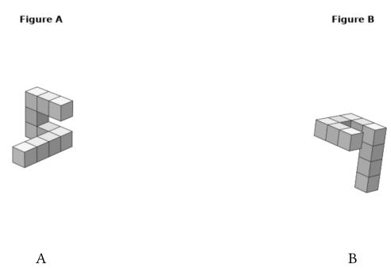

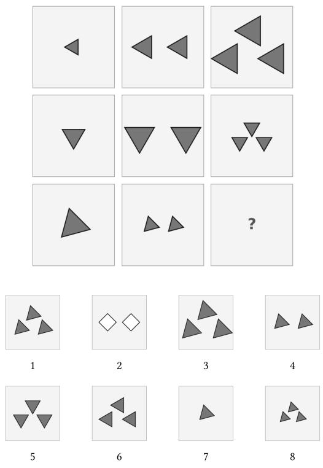  
(b) Mental rotation. Is figure B the same object as figure A and just rotated, or its mirror image?

(a) Matrix reasoning. Complete the 3 × 3 patern using answer options 1–8 below.
<table><tr><td>(d) Syllogistic reasoning − the conclusion is judged Valid / Invalid / Cannot be determined.</td></tr><tr><td>Excerpt (record-keeping filler omitted).</td></tr><tr><td>“At Dunmore Bakery, the manager keeps a daily log of all baked goods and their status. [...]</td></tr><tr><td>Whenever an entry in the bakery&#x27;s records is classified as items logged by the opening team, it is also classified as items assigned to batch code 3.</td></tr><tr><td>Among the bakery&#x27;s records, there are entries classified as items assigned to batch code 3 that do not carry the items recorded under the seasonal</td></tr><tr><td></td></tr><tr><td>range code classification. [...]</td></tr><tr><td>Conclusion: All items logged by the opening team are items recorded under the seasonal range code.&quot;</td></tr></table>

Fig. 2. One example item per task type; (d) is excerpted for legibility. (a) matrix item mat\_025 (correct answer option 1), (b) mentalrotation item rot\_014 (80∘ depth rotation, correct answer same object), (c) leter-string item ls\_014 (correct answer > + ! \$ &), and (d) syllogism item syl\_013 (correct answer cannot be determined). The premises in (d) are embedded in record-keeping filler so the quantifiers must be inferred from prose.

Before and after the batery, participants estimated their own score out of 40. Assisted participants also estimated their unaided score and the assistant’s solo score. After each task, all participants estimated their own, assistantalone, and counterfactual scores out of 10, with the counterfactual referring to the assistance condition they had not experienced. Every scored response carried a confidence rating from 0 (Unsure) to 100 (Certain), with one rating per conclusion in multi-question syllogisms. The post-batery global estimates inform the supplementary belief– performance comparison (Appendix E). Additional global percentile and dificulty judgments are documented in the study materials. Backward navigation was disabled to preserve initial estimates.

Every AI-assisted item also includes the full chat transcript with message counts and timings, from which the advice-quality and reliance measures of Section 3.6 are derived. Every leter-string item includes a mandatory freetext field asking participants to describe the patern they identified and how they applied it (a wrong answer may reflect item ambiguity rather than a reasoning failure). Furthermore, the closing questionnaire asked for an optional strategy description for each task type.

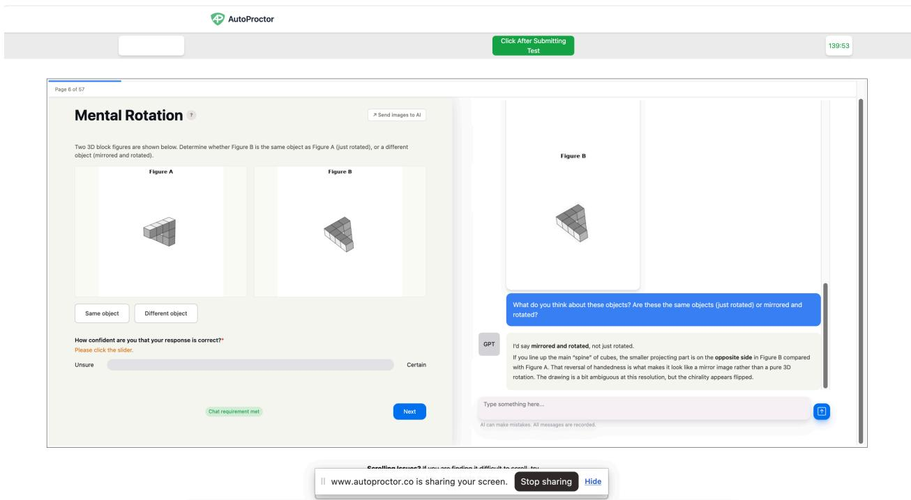  
Fig. 3. The study application used a split interface, with the reasoning task and the response and confidence controls on the left and the assistant on the right. In no-AI the same pages were shown without the chat panel.

After the batery, we administered four questionnaire sections. The closing questionnaires asked about AI consultation strategy and behavior on disagreement, perceived helpfulness, trust, and frustration (AI only), followed by task feedback, demographics, and AI-use frequency (all participants). Three atention checks were embedded. Full item wording is included with the study materials (see the availability note opening Section 4). The questionnaire structure and atention checks are summarized in Appendix B.

## 3.3 Task and Procedure

Participants completed the 40 items of the batery (Section 3.2.1) in a randomized order. Tasks remained contiguous, and syllogism items were shufled at the scenario level, keeping each scenario’s questions together.

The AI interface placed a streaming chat panel beside the task (Figure 3). The panel was hidden on questionnaire pages.

After briefing, consent and the pre-task assessment, participants completed four tasks. Each began with instructions and a practice trial, followed by ten scored items and a task-level assessment. Post-task questionnaires and the leaderboard closed the session. Median duration was 86 minutes (interquartile range 64–108, AI 98, no-AI 71). Screen-by-screen documentation accompanies the study materials (Section 4).

## 3.4 Apparatus

The study ran in a purpose-built web application. Implementation details accompany the research software (Section 4).

AutoProctor monitored screen content, tab switches and navigation away from the study. Sessions flagged in manual review were excluded as described in Section 3.1

The chat panel provided butons to copy the stimulus and answer options, excluding confidence and strategy reports, and to upload stimulus images. Both actions were logged

## 3.5 Model Benchmarking

Each assistant was benchmarked on the study’s items using matched stimuli and API setings. Unlike participants, assistants received no instruction page or practice trial, and their histories reset between tasks rather than accumulating across the session.

Each assistant completed 100 runs of the 40 items. LLM competence is the proportion of retained replies scored correct per item. With 95–100 replies per cell, the maximum binomial standard error is approximately .05 (roughly ±.10 at 95% confidence). Item order was paired across assistants within each run [50]. Shared history makes responses within a run dependent. Runs with API errors were excluded rather than scored.

The models answer in free-form prose, requiring it to be mapped onto the item’s answer set before scoring. A second-model extractor, gemini-3.5-flash-lite run with thinking disabled, performs that mapping for every reply. Deterministic normalization and an accepted-alternate table are applied to its output, and for leter strings, a deterministic reading of the reply’s own bracketed answer overrules the extractor wherever that answer is unambiguous.

Replies flagged as needing review were excluded. Refusals without that flag were scored as produced. This left 15,968 observations. Assistant rankings were unchanged under alternative flag treatments (Appendix C).

## 3.6 Coding AI Advice Quality and Reliance

We processed each item’s complete transcript with a second-model extraction pipeline. Each transcript, stripped of the assistant’s reasoning summaries but keeping the turn labels, was passed to gemini-3.5-flash-lite with thinking disabled, instructed to extract, rather than solve for, the first answer the assistant put forward, its last, and the answer the conversation as a whole landed on, each in the item’s answer format. For multi-question syllogism scenarios, the conclusion under analysis is named in the prompt. From these we derive whether the final advice matched the key, whether the participant’s answer matched that advice, whether first and final difered, and whether the assistant never commited to an answer at all, which counts as incorrect advice but stays distinguishable from a wrong one. Crossing advice quality with whether it was followed and, where it was declined, whether the participant was right, yields the categories used throughout, namely appropriate reliance, costly override, overreliance, successful and unsuccessful override — kept apart deliberately, since collapsing the last two would leave “overrode bad advice” ambiguous between the participant’s own competence and mere disagreement — and no advice.

To check the extractor’s followed-versus-declined reading, one author hand-coded 200 transcripts, 25 per group and advice-correctness cell. Nine trials were marked unclear and excluded from the agreement calculation. Agreement on the remaining 191 was 89.5% (� = .64). Task-specific agreement was .97 and .98 on the image tasks, .86 on syllogisms, and .71 on leter strings. The audit and sensitivity analysis concern adoption labels. Advice-correctness extraction requires separate validation. Main intervals treat all extracted labels as fixed.

## 3.7 Statistical Approach

We report posterior medians, 95% highest-density intervals (HDIs), and directional probabilities �(� > 0). HDIs accommodate skewed posteriors. We call an interval excluding zero resolved. One spanning zero leaves the direction uncertain.

We estimate descriptive associations on this batery at item, trial, and participant levels. Group contrasts do not isolate efects of access or assistant identity. Item-level models use either 40 item summaries or 160 item–assistant cells. Trial-level models use Bernoulli likelihoods with crossed participant and item efects. Participant-level models use one summary per person. Gaussian models describe confidence, accuracy summaries, and capture. Capture is a ratio modeled on an unbounded scale. Most fixed coeficients have Normal(0, 1.5) priors, with Exponential(1) priors on standard deviations. Intercept and correlation priors vary by model, including brms defaults. The supplementary notebook lists the exact priors for each fit. The benchmark’s 100 elicitations per item and assistant are distinct from posterior sampling. The reported Bayesian fits use four chains of 20,000 iterations, half warmup. Intervals for aggregated item summaries condition on the estimated component accuracies.

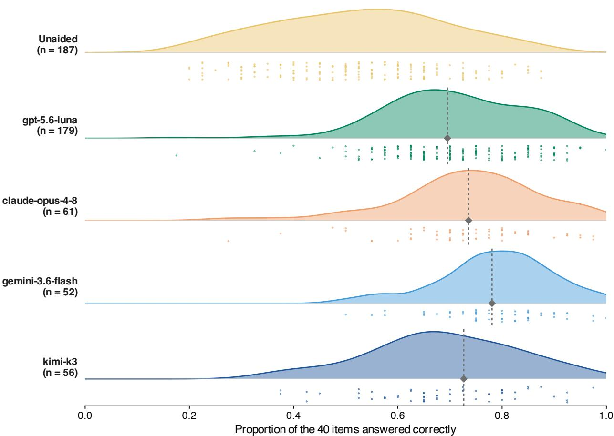  
Fig. 4. Every assisted group outperforms the unaided one, and none exceeds its own assistant by much. Distribution of individual accuracy over the 40 items, one row per group. Note. Each row is a kernel density over participants above jitered points, one per participant. Group sizes are given beside each row. The dashed rule and diamond in each assisted row mark that assistant’s own accuracy on the same 40 items without a person in the loop (Section 4.4).

Following the Bayesian analysis checklist [18] (WAMBS), we audited convergence and prior sensitivity. Across the reported models, the largest �̂ was 1.003, the smallest bulk efective sample size 1,663, and residual divergences reached 0.49% of post-warmup draws. Half-width, double-width and flat-prior refits moved probability-scale quantities by at most .015, without changing direction or resolution. Models were fit in R with brms (2.23) and cmdstanr. The supplementary notebook gives full diagnostics, sensitivity results and specifications

## 4 Results

Throughout the Results, accuracy and proportion correct name the same quantity, the share of items answered correctly, for participants and teams alike. LLM competence is the assistant’s accuracy on an item, measured over one hundred benchmark runs (Section 3.5), and keeps its own name because it serves as the predictor throughout.

The study application, item generators, and chat-parity benchmark harness are maintained in HAI\_Benchmark. A minimal release of de-identified model inputs, the analysis notebook, the corresponding R script, and reported posterior summaries will be added to the same repository. These inputs support model reproduction rather than reconstruction of raw conversations.

Table 2. Realized synergy never resolves positive in any task, capture is uneven across them, and error overlap re solves only on the image-delivered tasks. Per-task estimates for the three item-level quantities, with tasks ordered by LLM competence. Note. � compares assisted accuracy with the beter component on each item. Capture is relative to independenterror headroom above unaided accuracy. It is modelled on an unbounded scale, so an interval may extend above 1, and mental rotation leaves almost no headroom, so its ratio is unidentified. Excess co-failure is the amount by which the pair failed together above the product of its two failure rates. Bracketed values are 95% credible intervals. An interval excluding zero is what we call resolved, and resolved estimates are set in bold throughout the paper’s tables. Matrices and mental rotation were delivered as images, leter strings and syllogisms as text. Every task contributes 10 items.
<table><tr><td rowspan="3">Task</td><td colspan="2">Realized synergy S</td><td colspan="2">Synergy capture</td><td colspan="2">Excess co-failure</td></tr><tr><td>Est.</td><td>95% HDI</td><td>Est.</td><td>95% HDI</td><td>Est.</td><td>95% HDI</td></tr><tr><td>Mental rotation</td><td>-.034</td><td>[-.100, .027]</td><td>.071</td><td>[-.483, .547]</td><td>.062</td><td>[.035, .090]</td></tr><tr><td>Matrices</td><td>.015</td><td>[−.049, .078]</td><td>.643</td><td>[.383, .888]</td><td>.074</td><td>[.046, .101]</td></tr><tr><td>Letter strings</td><td>-.153</td><td>[-.218, -.090]</td><td>.484</td><td>[.293, .689]</td><td>.013</td><td>[−.014, .041]</td></tr><tr><td>Syllogisms</td><td>-.074</td><td>[-.139, −.009]</td><td>.820</td><td>[.641, .997]</td><td>-.003</td><td>[−.031, .023]</td></tr></table>

## 4.1 Team Accuracy by Item Competence (RQ1)

We compare unaided participants, assistants answering alone, and participants working with assistants (teams). Accuracy diferences use proportion correct, with .1 equivalent to four items. Batery-level comparisons average each component first. Realized synergy � instead compares the team with the beter component on each item, a stronger reference. Capture expresses gains relative to an independent-error oracle. Pass-through describes the association between item competence and assisted accuracy.

We now trace through several analyses how LLM competence unfolded in performance through interaction.

Every assisted group outperformed the unaided group (Figure 4). Averaged over items, assisted accuracy exceeds unaided accuracy by .200 [.084, .316], approximately eight of forty items. The comparison with the assistant alone is uncertain, at −.006 [−.157, .140] (see Table 5).

We define realized synergy � as the team’s accuracy on an item minus whichever of its two parts scored higher there, so it is positive only where the pair outperformed both of them. Teams beat the unaided participant on 132 of the 160 item-by-assistant cells, and the LLM alone on 61 — but both at once on only 42 (Figure 5). Averaged over cells, � is negative, −.062 [−.118, −.005], or about two and a half items of the forty. � contrasts independent groups. On pre-reply trials, final accuracy minus the higher of the two pooled component accuracies is −.003 [−.019, .013]. This paired estimate pools component accuracies over the selected pre-reply trials, and its direction remains uncertain. Negative average � can therefore coexist with assisted accuracy above the assistant’s batery-level average. Per-task results are in Table 2.

Synergy capture expresses observed gains relative to a complementary reference. The reference is ℎ + � − ℎ�, where ℎ and � are unaided-group and assistant accuracy on the item. Capture divides the gain over ℎ by the reference headroom �(1 − ℎ). Unlike accuracy, capture is a ratio. A value of .500 means half the reference gain over unaided performance was obtained. Overall capture is .584 [.356, .809], varying across tasks (Table 2). The reference assumes independent human and assistant errors. Human–assistant co-failure is measured on trials with an answer commited before the first reply, and therefore inherits that subset’s self-selection. On these trials, excess co-failure averages .036 [.010, .064] over the item–assistant cells. Positive dependence lowers this oracle, so capture quantifies reference headroom rather than observed paired potential.

Because the four assistants exhibit diferent item-level competence profiles (Figure 1), we can estimate how the benefit of access varies with LLM competence by regressing the item-level assisted–unaided diference on the assistant’s competence on that item.

The efect function (Figure 6) relates assisted-minus-unaided accuracy to benchmark competence across the 160 item–assistant cells. Its positive slope indicates larger benefits on items the assistant handles beter. Positive efects resolve in the two upper bands. The lower bands remain compatible with both benefit and harm (Table 3). The fited zero crossing is .238 [−.153, .527], with 91.7% of posterior mass inside [0, 1]. The .50 boundary defines our reporting bands.2 Within-task trial slopes are positive in all four tasks, from 2.177 [1.525, 2.830] in leter strings to 3.011 [1.846, 4.178] in syllogisms. These slopes describe average trends across items within each task.

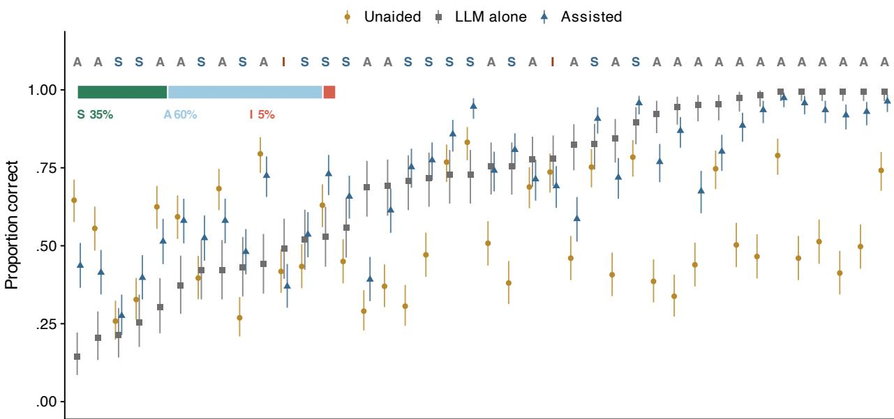  
Item, ordered by LLM competence  
Fig. 5. Teams track the assistant where it is strong and the unaided participant where the assistant is weak. Per-item accuracy for the unaided group, gpt-5.6-luna alone, and the group working with it, with the 40 items ordered by LLM competence (the proportion of one hundred benchmark runs answered correctly). Vertical lines are 95% credible intervals on the item mean. Leters classify each item by point estimates, not resolved diferences, with S where it exceeded both of its parts (synergy, 14 items), A where it exceeded one (augmentation, 24), and I where it exceeded neither (interference, 2). The strip at the top left gives the three shares.

To describe diferences across observed score levels, we split participants into thirds by batery accuracy within each group, then compared assisted and unaided strata twice, once on the items where their assistant was reliable (≥ .80 of its runs correct), and once on those where it was unreliable (≤ .40).

On reliable items, assisted–unaided diferences were largest in the lowest score stratum. Gains fall steadily as scores rise, from +.451 [.409, .492] in the lowest third to +.163 [.121, .207] in the highest. Where it was unreliable, the losses do not mirror those gains. It is the middle third that pays, −.137 [−.206, −.071], while the lowest does not resolve and the highest comes out ahead (Figure 7). Refiting one group at a time, the middle-third loss resolves for gpt-5.6-luna, gemini-3.6-flash and kimi-k3, between −.119 and −.160. No third resolves for claude-opus-4-8. But “weak items” means diferent items for each assistant, drawn from tasks of varying dificulty. Here, the two most dissimilar sets share none.

## 4.2 Deference and Answer Switching (RQ2)

The extraction pass classified all 13,920 assisted trials from 348 participants by extracted advice, its scored correctness, and submited-answer agreement. On 374 trials the assistant never setled on an answer, leaving 13,546 on which there was something to take up. The proportions below are observed trial shares with exact Beta intervals that ignore the clustering of trials within participants and items. Refit as a Bernoulli mixed model with the same crossed random efects as the task models, estimates with participant and item efects set to zero are .946 [.930, .960] for correct advice, .771 [.715, .821] for incorrect, and a discrimination of .175 [.137, .217] — a diferent conditional estimand from the observed trial shares.

Table 3. Benefits rise with competence, with uncertain efects in the lower competence bands. The efect function over the 160 item-by-assistant cells, the efect within each competence band, and the slope for each assistant separately. Note. The assisted–unaided diference is per-item team accuracy minus unaided accuracy on the same item. Cell-level quantities are on the accuracy scale. The trial-level slope is in log-odds. Resolved estimates are in bold. The zero crossing $- b _ { 0 } / b _ { 1 }$ and the two lowest competence bands are unresolved, so these estimates do not identify a sharp decision threshold.
<table><tr><td>Quantity</td><td>Estimate [95% HDI]</td></tr><tr><td>The effect function</td><td></td></tr><tr><td>Effect at mean competence</td><td>.200 [.112, .277]</td></tr><tr><td>Slope on competence</td><td>.401 [.193, .612]</td></tr><tr><td>Effect where the assistant always fails -.103 [-.201, -.014]</td><td></td></tr><tr><td>Zero crossing</td><td>.238 [-.153, .527]</td></tr><tr><td>Effect within competence band</td><td></td></tr><tr><td>LLM right on  $\leq . 2$  of runs</td><td>-.020 [-.135, .103]</td></tr><tr><td>.2-.5</td><td>.056 [-.052, .158]</td></tr><tr><td>.5-.8</td><td>.181 [.076, .283]</td></tr><tr><td>≥.8</td><td>.283 [.183, .385]</td></tr><tr><td>Slope, per assistant</td><td></td></tr><tr><td>gpt-5.6-luna (low)</td><td>.487 [.378, .597]</td></tr><tr><td>gemini-3.6-flash</td><td>.447 [.341, .549]</td></tr><tr><td>claude-opus-4-8</td><td>.382 [.280, .486]</td></tr><tr><td>kimi-k3</td><td>.264 [.142, .382]</td></tr></table>

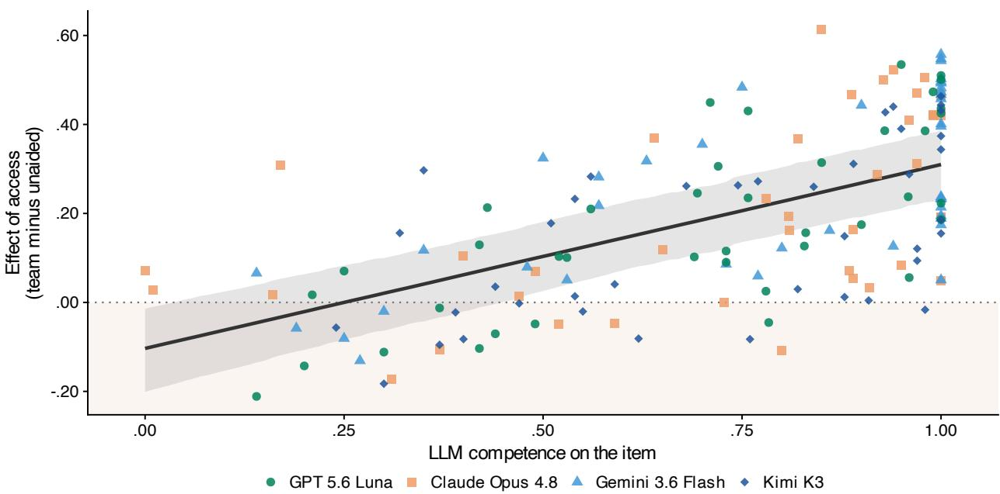  
Fig. 6. Assisted–unaided diferences increase with LLM competence. The 160 item–assistant cells, coloured by assistant, with a pooled fit and 95% interval. Negative values indicate lower assisted accuracy. The pooled line summarizes the trend; assistant-specific slopes are reported separately.

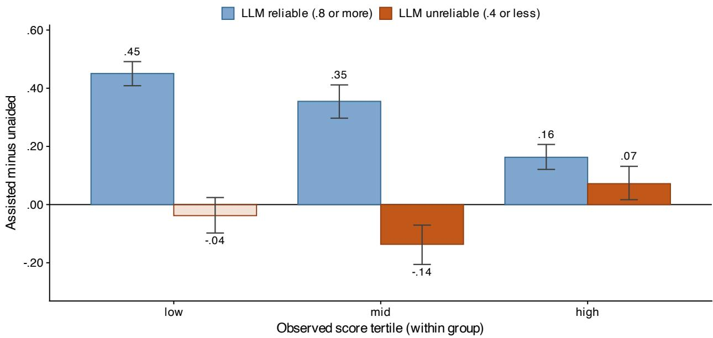  
Fig. 7. Assisted–unaided diferences vary across observed score strata and assistant reliability. Assisted minus unaided accuracy by within-group score tertile, shown separately for items where the assistant is reliable (≥ .8) and unreliable (≤ .4). Note. Tertiles use observed scores within each group, not pretreatment ability. Contrasts come from separate trial-level models for reliable and unreliable items. Bars are 95% credible intervals, and solid fill marks a contrast whose interval excludes zero. The interval spans benefit and harm only in the lowest score tertile on unreliable items, marked by a hollow bar.

The extractor identified diferent first and final answers on .082 of advice-bearing trials, with revisions mostly improving scored accuracy. Of these, 749 moved a wrong first answer to a right one against 236 moving the other way, so three revisions in four improved the answer. Extracted advice accuracy rose from .713 [.706, .721] at the assistant’s first answer to .751 [.744, .759] at its last. The revision analysis pools all follow-up types.

Participants submited answers matching the assistant’s advice on .908 [.902, .913] ofthe trials where it was correct and on .743 [.730, .756] of the trials where it was wrong, a discrimination of just .165 [.150, .179] (Table 4). Incorrect answers were not rare. Participants met a median of nine of them over the batery. A quarter nonetheless never declined a single one. Those who did decline were usually right to, participants who held their own answer against incorrect advice were correct .678 [.658, .701] of the time.

We use deference operationally for submiting an answer matching the assistant’s advice, including independent agreement. Recorded answer switches identify replacement of an earlier judgment. Deference varied by task. The four task rates run from .751 on leter strings to .947 on syllogisms, and they do not follow the tasks’ advice quality, which itself difers by nearly four tenths (Table 4). Leter-string analogies had the second-best advice quality of the four tasks but drew the least deference. The task ordering is sensitive to adoption-coding error.

Within participants, deference is positively associated with current-task advice accuracy $( b = . 0 9 3 \ [ . 0 3 5 , . 1 5 2 ] )$ The association with previous-task accuracy remains uncertain $( b = . 0 6 3 [ - . 0 6 5 , . 1 9 4 ] )$ . Holding task fixed, deference also rises with item competence $( b = 1 . 3 3 1 \ [ 0 . 9 8 3 , 1 . 6 9 5 ]$ in log-odds). Its probability-scale change depends on the task’s baseline deference, so it cannot be summarized by a universal four-point change. Both task-level diferences and within-task sensitivity contribute to the patern.

Participants therefore showed some sensitivity to item-level reliability. As a descriptive illustration for the 40-item comparison, deference was .858 [.824, .892] where the assistant outperformed the unaided group and .893 [.833, .950] where it did not. The uncertainty does not support a clear diference, and the unaided-group comparison is not a measure of each participant’s own expected accuracy.

a gave up a correct answer $\vartriangle$ corrected a wrong answer  
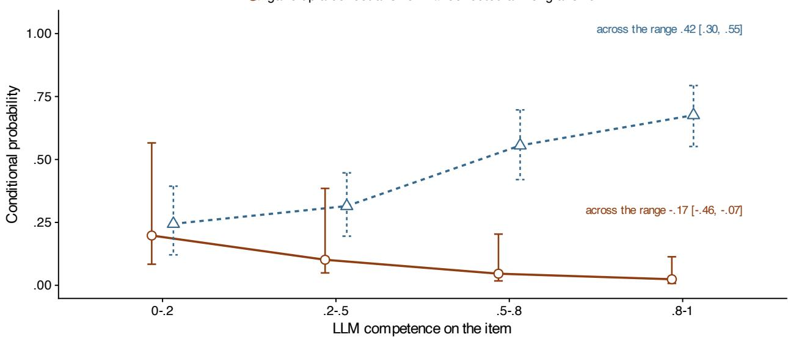  
Fig. 8. Correct-to-incorrect switching is more frequent on low-competence items. Probability of switching away from a correct answer, and of switching to a correct answer, after the assistant replied, by LLM competence on the item. Note. Error bars are 95% credible intervals from models with crossed random efects for participant and item. Probabilities condition on initial correctness, not on disagreement with advice. The analysis covers the 35% of assisted trials with an answer recorded before the assistant’s first reply. The test each series carries is its change across the competence range, −.174 [−.456, −.069] for abandoning and .425 [.296, .550] for correcting. The two series do not cross at any level of competence.

Trials with a pre-reply answer show where switching occurred. On the 4,873 trials carrying an answer entered before the reply, participants switched from correct to incorrect answers more often on low-competence items — .198 [.084, .566] of held correct answers in the lowest competence band against .024 [.008, .113] in the highest — and corrected a wrong one least often there, .244 [.121, .394] rising to .676 [.552, .794] (Figure 8). This patern is also compatible with difering exposure to incorrect advice.

## 4.3 Confidence, Calibration, and the Policy Ladder (RQ3)

Confidence concerned the submited answer and was rated after consultation, including in the pre-reply-answer sensitivity check. An earlier-sample sensitivity analysis includes 1,686 rated trials with an answer entered before the reply. The confidence gap is .052 [.030, .074], versus .105 [.095, .114] unaided.

Overall, stated confidence was $M = 7 7 . 0 , S D = 2 5 . 1$ against an accuracy of .690. Mean confidence varied litle across competence bands while accuracy rose (Figure 9). The pooled item-level confidence slope is −.010 [−.020, .000], and the within-task estimate is .000 [−.011, .012] (Appendix E). Confidence discriminated correct from incorrect answers overall (� = .329 [.264, .396]). In the weakest band its slope was .111 [−.146, .375], compared with point estimates of .283–.380 in the other bands. The weak-band interval spans negative and positive confidence– correctness slopes.

On the trials that both followed the intended sequence and carried an extracted verdict, confidence was fit on four cells crossing what was submited (own answer vs. LLM’s) with whether the advice was right. Among the 11,741 adoption trials where participants handed in the assistant’s answer, accuracy was 1.000 when the advice was right, and .008 when it was wrong (the residual reflects trials the extractor read as submited-as-advised that were not, at a rate consistent with the audit in Section 3.6), yet stated confidence was 78.4 and 78.0. These descriptive means are similar. Submiting the assistant’s answer rather than one’s own was associated with 11.6 [10.3, 12.8] points higher confidence, and 48% of participants were on average more confident when the advice was wrong. In the selected own-answer robustness analysis, capture changes by −.028 [−.140, .084] per SD of discrimination. This association remained imprecisely estimated.

Table 4. Extracted deference rates difer across tasks. Advice accuracy, deference and overreliance by task, on the 13,546 classified trials that carried commited advice, pooled over all four assistants and ordered by advice accuracy. Note. Advice correct is the share of trials on which the assistant’s extracted answer was right, and deference the share on which the participant submited it. Overreliance is deference where the advice was wrong, and discrimination is deference to right minus deference to wrong advice. Task rows are model-based estimates. The pooled row gives observed trial shares. Interval widths are summarized below.
<table><tr><td>Task</td><td>Trials</td><td>Advice correct</td><td>Deference</td><td>Overreliance</td><td>Discrim.</td></tr><tr><td>Syllogisms</td><td>3,402</td><td>.969</td><td>.947</td><td>.851</td><td>.100</td></tr><tr><td>Letter strings</td><td>3,384</td><td>.846</td><td>.751</td><td>.482</td><td>.319</td></tr><tr><td>Mental rotation</td><td>3,335</td><td>.652</td><td>.902</td><td>.806</td><td>.154</td></tr><tr><td>Matrices</td><td>3,425</td><td>.577</td><td>.867</td><td>.775</td><td>.161</td></tr><tr><td>All tasks</td><td>13,546</td><td>.751</td><td>.859</td><td>.743</td><td>.165</td></tr></table>

Widest intervals are on advice accuracy in matrices and mental rotation (±.12), which pools four assistants that difer sharply there, then ±.05 on overreliance and discrimination in syllogisms, where only 144 trials carried wrong advice, and ±.04 on discrimination in leter strings. Every other interval is narrower than ±.03.

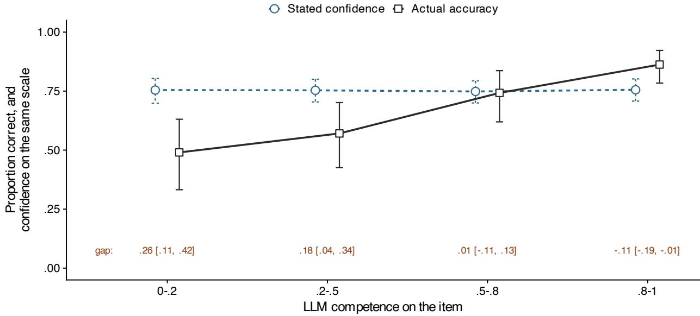  
Fig. 9. Stated confidence barely moves while accuracy swings by a third. Mean stated confidence and realized accuracy by LLM competence on the item, on trials following the intended sequence. Note. Post-consultation certainty ratings are divided by 100. Their gaps from accuracy are descriptive scale comparisons, not elicited probability calibration. The figures along the foot give the confidence–accuracy gap in each band, posterior median and 95% interval. Capped bars on the markers are 95% credible intervals.

We next examine whether declining wrong advice is associated with metacognitive discrimination or with accuracy on trials where participants retained their own answer. These are observational predictors derived from participants’ behaviour during the study.

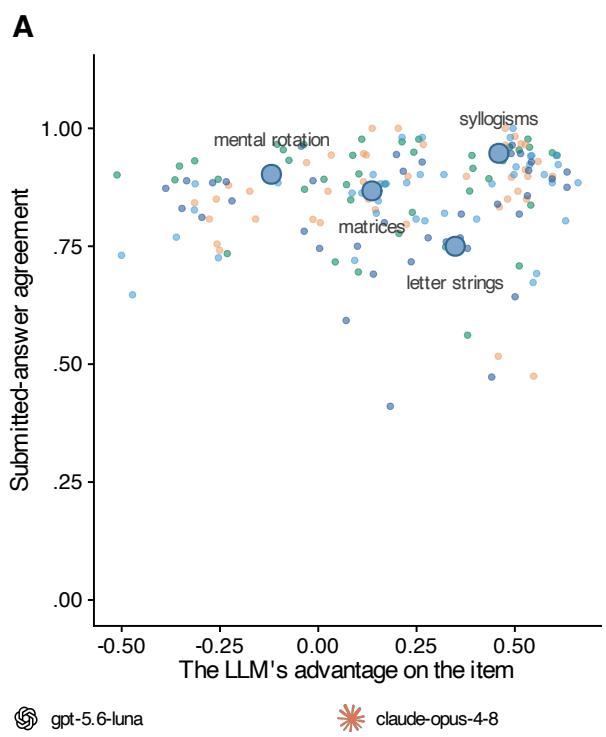

B  
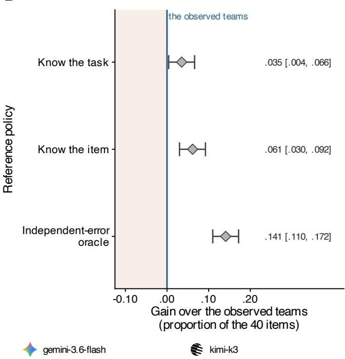  
Fig. 10. Answer agreement and reference-policy gains describe diferent aspects of the interaction. (A) Submitedanswer agreement against the assistant’s item-level advantage, with task means. (B) Three reference policies, each as a gain over observed performance. Note. Task-level selection gains .035 [.004, .066], item-level selection .061 [.030, .092], and an independenterror oracle .141 [.110, .172].

Metacognitive discrimination was associated with less adoption ofwrong advice, with a coeficient of−.184 [−.363, −.004] in log-odds per SD, with an uncertain discrimination interaction. Selected own-answer accuracy was associated with these outcomes in separate models, with coeficients of −1.018 [−1.197, −.840] for taking wrong advice and 1.721 [1.559, 1.889] for discrimination (Table 7). These are observational associations. Own-answer accuracy partly overlaps the behaviour being predicted. Its association remained uncertain when source and outcome trials were separated (Table 7).

Confidence discrimination, measured as the area under the receiver operating characteristic curve (AUC), exceeded .5 in 36 of 40 item-level point estimates, but the slopes relating AUC to synergy and the assisted–unaided diference remained uncertain. AUC counts correct–incorrect confidence pairs, with ties contributing one half. Participant AUC requires both outcomes and at least eight rated trials for deference models, twelve for capture. Participant-level AUC was modestly associated with capture, at .046 [.001, .093] per SD, with � = .98 for a positive association. The interval only narrowly excludes zero.

The policy ladder compares observed performance with retrospective reference rules (Figure 10B). Task- and itemaware references select between estimated unaided-group and benchmark accuracy. Both selection and evaluation use the same data, so their gains may be optimistic.4 The trial oracle additionally assumes independent errors. These are conditional reference gains, not demonstrated improvements from deployable policies. The full specification is in Appendix E.

The confidence gap between correct and incorrect submited answers was lower in every assisted group than in the unaided group (Table 6). These are between-group comparisons of post-advice confidence. Mean confidence was negatively associated with competence across items in each group, but the association was carried between tasks and was inconsistent within them (Appendix E).

Table 5. Solo and assisted point-estimate rankings difer. Pass-through also varies by group. Per-assistant solo accuracy, team accuracy, realized synergy, and pass-through, ordered by solo accuracy. Note. All values are posterior medians with 95% credible intervals. Resolved estimates are in bold. Pass-through is the slope of team correctness on the assistant’s item competence, in log-odds, partially pooled across assistants. Slopes are group-specific. Realized synergy � compares the team with the beter component separately on each item. The pooled row is over the 348 assisted participants. The unaided row is shown for reference only. The lower section gives the six pairwise diferences in pass-through
<table><tr><td>Assistant</td><td>n</td><td>LLM alone</td><td>Team</td><td>Realized synergy S</td><td>Pass-through</td></tr><tr><td>gemini-3.6-flash</td><td>52</td><td>.761 [.674, .845]</td><td>.781 [.720, .841]</td><td>−.055 [−.091, −.016]</td><td>2.81 [2.37, 3.25]</td></tr><tr><td>claude-opus-4-8</td><td>61</td><td>.735 [.653, .816]</td><td>.733 [.673, .791]</td><td>−.055 [-.092, −.017]</td><td>2.21 [1.80, 2.61]</td></tr><tr><td>kimi-k3</td><td>56</td><td>.730 [.648, .812]</td><td>.691 [.631, .750]</td><td>-.087 [-.129, −.046]</td><td>1.39 [.89, 1.88]</td></tr><tr><td>gpt-5.6-luna (low)</td><td>179</td><td>.713 [.627, .796]</td><td>.711 [.651, .770]</td><td>-.052 [-.088, −.013]</td><td>2.76 [2.39, 3.14]</td></tr><tr><td>unaided</td><td>187</td><td></td><td>.528 [.474, .583]</td><td></td><td></td></tr><tr><td>pooled</td><td>348</td><td>.735 [.633, .834]</td><td>.728 [.622, .828]</td><td>-.062 [-.118, -.005]</td><td>2.46 [2.18, 2.75]</td></tr><tr><td colspan="6">Pairwise differences in pass-through (log-odds)</td></tr><tr><td colspan="6">gemini-3.6-flash – kimi-k3</td></tr><tr><td colspan="6"></td></tr><tr><td colspan="6">gpt-5.6-luna – kimi-k3</td></tr><tr><td colspan="6">claude-opus-4-8 - kimi-k3</td></tr><tr><td colspan="6">gemini-3.6-flash − claude-opus-4-8</td></tr><tr><td colspan="6">gpt-5.6-luna – claude-opus-4-8</td></tr><tr><td colspan="6">gemini-3.6-flash - gpt-5.6-luna</td></tr></table>

Table 6. Post-advice confidence separates right from wrong answers less in every assisted group than unaided, and the drop does not scale with what the assistant knows. The confidence gap between correct and incorrect answers, per group, and each assisted group’s drop against unaided. Note. The gap is the posterior diference in mean stated confidence (rescaled to 0–1) between correct and incorrect answers, from one model over every rated trial. Drops are diferences from the unaided gap on the same scale. Bracketed values are 95% credible intervals. Every interval excludes zero, so all estimates are set in bold.
<table><tr><td>Group</td><td>Confidence gap</td><td>Drop vs. unaided</td></tr><tr><td>unaided</td><td>.102 [.092, .112]</td><td></td></tr><tr><td>gpt-5.6-luna (low)</td><td>.062 [.051, .073]</td><td>-.040 [−.054, -.026]</td></tr><tr><td>claude-opus-4-8</td><td>.057 [.037, .075]</td><td>-.046 [-.067, -.025]</td></tr><tr><td>gemini-3.6-flash</td><td>.059 [.037, .080]</td><td>-.043 [−.066, -.019]</td></tr><tr><td>kimi-k3</td><td>.053 [.035, .072]</td><td>-.049 [−.070, −.028]</td></tr></table>

## 4.4 Team Accuracy Across the Four Assistants (RQ4)

Four assisted groups are compared against one unaided group. Table 5 reports solo and assisted accuracy, itemwise realized synergy, and pass-through, the association between item competence and assisted accuracy. Figure 1 shows task profiles. Gemini and Opus rank first and second both alone and with participants, while Luna overtakes Kimi with assistance. Luna also has a relatively steep pass-through slope despite its lower solo score. Kimi has the lowest slope on both competence measures. These point-estimate rankings remain descriptive. On the realized-advice axis, the slope spread narrows from roughly twofold to 1.4×, and only the gpt-5.6-luna–kimi-k3 contrast resolves (Appendix E). The matched four-assistant benchmark provides a common reference for studying solo and assisted performance.

Table 7. Selected own-answer accuracy and metacognitive AUC are associated with resistance to wrong advice. Posterior efect of each candidate predictor, per standard deviation of that predictor. Note. Overreliance and discrimination are as defined in Table 4. Both are trial-level outcomes, so Panel A is in log-odds. The two �s give participants in the overreliance and discrimination fits, respectively. AUC coeficients adjust for shrunken own-work ability. Own-answer coeficients are unadjusted. The disjoint estimate uses declined correct-advice trials (median three per person) to predict separate wrong-advice trials. Capture is the realised share of headroom, a participant-level quantity, so Panel B is on the capture scale itself. Bracketed values are 95% credible intervals, � is the posterior probability that the efect carries the sign of its median, and resolved estimates are in bold.
<table><tr><td colspan="3">Panel A. Who declines wrong advice (log-odds per SD)</td></tr><tr><td>Predictor Metacognitive discrimination (AUC), n = 320/321</td><td>Overreliance 1 -.184 [-.363, -.004]</td><td>Discrimination  $- . 0 0 3 \left[ - . 1 2 7 , . 1 1 7 \right]$ </td></tr><tr><td>Own-answer accuracy, n = 333/334</td><td>P = .98  $- 1 . 0 1 8 \ [ - 1 . 1 9 7 , - . 8 4 0 ]$ </td><td>P = .52 1.721 [1.559, 1.889]</td></tr><tr><td></td><td>P &gt; .999 -.063 [-.283, .154]</td><td>P &gt; .999</td></tr><tr><td colspan="3">Own-answer accuracy, disjoint trials, n = 283 Panel B. Who captures the headroom (capture per SD, n = 274)</td></tr><tr><td>Predictor Metacognitive discrimination (AUC)</td><td colspan="2">Synergy capture</td></tr><tr><td>Overconfidence, raw Overconfidence, own accuracy held fixed</td><td colspan="2"> $. 0 4 6 [ . 0 0 1 , . 0 9 3 ] , P = . 9 8$   $- . 2 2 3 [ - . 2 6 1 , - . 1 8 5 ] , P > . 9 9 9$   $- . 0 0 1 [ - . 0 1 3 , . 0 1 0 ] , P = . 5 9$ </td></tr></table>

At the trial level, the pooled competence slope is 2.465 [2.182, 2.750] in log-odds. For a reference change in benchmark competence from .25 to .75, the model predicts an accuracy increase of .263 [.222, .303] with participant and item efects set to zero, equivalent to .526 [.443, .605] ofthe competence change. This roughly half-sized pass-through is specific to that contrast and evaluation convention. The probability-scale fraction varies with baseline competence.

The more competent assistant belongs to the beter team on .776 [.701, .857] of item-level pairs that difer.

The task profiles also difer (Figure 1). Mental-rotation benchmark scores span thirteen points while assisted scores span three, whereas near-ceiling syllogism benchmarks accompany a wider assisted spread. These descriptive com parisons motivate evaluating performance with people alongside performance alone.

## 5 Discussion

We asked when a person and an assistant working together outperform both components. Assisted accuracy fell below the item-wise beter-component reference, while the batery-level assisted–LLM diference remained uncertain. An AI assistant is not uniformly reliable. On two items of the same kind, it can be near-certain on one and no beter than guessing on the next. We measured that variation by running each assistant repeatedly on the same items. Participants’ deference varied substantially by task and also increased with item competence. Consistent with Vaccaro et al. [73], we found no clear advantage over the beter component. Riedl and Weidmann’s modeled AI benefit instead compares assisted with unaided performance [63].

## 5.1 Where Consulting Pays (RQ1)

Complementarity requires that the person and the assistant fail on diferent questions. Comparing the answer a participant had entered before the reply arrived against the advice that then came yields two separately recorded answers on the same item. Excess co-failure was positive on mental rotation and matrices, while error dependence remained uncertain on leter strings and syllogisms. Thus, complementarity guarantees very litle in terms of overall team performance. For leter strings, the assistant was most often reliably correct, although its errors did not always coincide with participants’ errors. Teams, however, scored below the assistant alone. Whether errors difer sets how much a pair could gain. A participant recognizing where the assistant fails may help determine how much they realize.

In line with Dell’Acqua et al. [17], we find assisted–unaided diferences vary with item competence. Their jagged frontier runs between whole tasks. Ours runs between items of the same task, which is one level further. Understanding the frontier at that level may help explain a split in the field-experiment literature, where assistance lifts the weakest workers most in some studies and widens the gap in others [11, 51, 52].

Both can be true, depending partly on the mix of items. An accurate assistant ofers more potential gain when unaided accuracy is low. Where reliability varies across items, wrong advice can displace correct answers. The mix of items may therefore contribute to these diferent outcomes.

## 5.2 Deference Varies by Task and Tracks Item Competence (RQ2)

Li and Steyvers’ [44] model of human–AI synergy, grounded in metacognitive sensitivity, derives conditions under which confidence-informed combination improves on either component. One interpretation of our results is a granularity mismatch. A direct test of the combination rule would require assistant-confidence measurements and implementation of the rule. One possible explanation concerns how each source is weighted by its reliability. LLM competence difered item by item, while deference showed task-level diferences. Deference also increased with item competence. The size of that increase depended on the task’s baseline deference.

It appears that users represent an assistant as having a single generalizable accuracy rather than multiple [32]. Such a belief could favor task-level heuristics, consistent with bounded rationality [53, 69]. Item-level feedback could help correct that belief. Participants received advice without calibrated item-level reliability estimates. In contemporary LLM interactions, a reply arrives in the same form whether it is right or wrong, and is often overly confident [83], making confidence of expression an unreliable cue to correctness.

This account invites an objection regarding what is rational for the human in interaction with AI. On the ecologicalrationality view, a rule is judged not in the abstract but by its fit to the environment it runs in [56], and a simple rule matched to its environment routinely beats an elaborate one [22]. On the resource-rational view, the cost of the finer rule counts against it [45]. Following a task-level rule may be reasonable when reliability is hard to judge for each problem. Participants may therefore have adapted to limited information rather than failed to reason. The policy ladder estimates gains from more selective use of advice, assuming the relevant correctness information is available. This estimated potential is what we call “available but unclaimed.” The design challenge is, thus, to help users judge reliability without demanding excessive efort. Whether such support delivers the estimated gains remains to be tested. As assistants become more reliable, routine deference may become more reasonable, while users have less incentive to check the remaining errors.

## 5.3 Confidence Alone May Not Supply the Missing Signal (RQ3)

Our findings motivate testing two approaches, supporting users’ assessment of their own answers and providing information about the assistant’s reliability. Participants rated confidence in their submited answers. Post-advice metacognitive discrimination had a modest positive association with capture. The second approach is to display the assistant’s reliability on the screen, and here Rieger et al. [64] give reason for caution. In their study, explanations were most helpful for items of moderate dificulty, providing the least benefit when errors were obvious and when items were too dificult to evaluate the explanation. Our results likewise suggest examining how item dificulty affects the usefulness of reliability information. Our participants’ confidence distinguished their correct from incorrect answers, yet they still frequently adopted incorrect advice. Peng et al. [58] identify a related theoretical limit. Individual calibration need not hold after conditioning on another agent’s prediction. Their theorem concerns calibrated binary predictions. It clarifies why the ladder’s additional information maters. Task/item selection uses comparative performance, while the oracle assumes independent errors. Whether displayed confidence can support comparable gains is a design question that can be empirically tested.

## 5.4 How Solo Competence Relates to Assisted Performance (RQ4)

Luna’s rise above Kimi with assistance, despite its lower solo score, and Kimi’s consistently lower pass-through suggest diferences in usefulness across the observed groups. The patern does not fully establish a more ergonomic model. This extends ChatBench’s finding that solo-performance diferences can shrink in interaction [14]. Follow ing Steyvers et al. [72] and Hemmer et al. [27], we distinguish gains over unaided performance from outperforming both components. On most items, the more competent assistant is also the one whose team does beter, on .776 [.701, .857] of the pairs that difer, so the ranking between models largely holds. Benefiting from a beter assistant, however, is not the same as outperforming that assistant through selective combination.

An assistant’s advantage can be lost either on the way to the user, ifa model performs worse in a chat window than on a benchmark, or after it arrives, in what the person does with the reply. We reduced the elicitation mismatch by matching stimuli and API setings. Each assistant received the stimulus message composed by the participants’ chat panel, replayed through the same API call with no system prompt or format instruction. However, benchmark histories reset between tasks and omit participant follow-up turns. The gap may, thus, reflect both elicitation diferences and participants’ use of advice.

## 5.5 Implications

For AI development. These data compare solo and assisted performance on the same items. Joint evaluation has both conceptual [26] and empirical precedents [14, 63], while benchmark construct validity remains a concern [4]. Pass-through adds a measure of how assisted accuracy varies with item competence under a specified protocol. Estimating correctness on new queries requires a proxy for the answer key used here. Repeated sampling ofers self-consistency as one candidate whose relation to correctness needs evaluation.

At the worked competence contrast of .25 to .75, predicted assisted accuracy increased by .263. This measures responsiveness, not a fraction of available value lost. Even selecting the beter component can yield a half-sized response when unaided accuracy exceeds LLM competence at the lower endpoint. Policy comparisons separately estimate unrealized gains. Interactive evaluation should assess assisted accuracy alongside solo accuracy and users discrimination between correct and incorrect advice.

For design. An answer-first design provides a competing judgment against which to evaluate advice, rather than only a confidence rating. The own-answer association was uncertain when predictor and outcome trials were separated, leaving answer-first design as a hypothesis to test. Making acceptance a deliberate action reduces overreliance, and users rate those designs lowest [12]. Eliciting an answer first difers by changing when the interface acts rather than adding friction to acceptance—the cost occurs before the reply, during an additional step that may itself require efort. A controlled trial could request a revisable answer or an explicit inability to answer before revealing advice, measuring accuracy, harmful switches, efort, and perceived control. Reliability displays and routing should compare the assistant with the user’s available alternative, while preserving the user’s final choice. Whether reliance is warranted is not a fixed property of the assistant. It varies with the item at hand.

For augmentation. These results belong to an old question. Engelbart [20] claimed that intellect is augmented by a system in which a person, a tool, and a method are adapted to one another, not by the tool alone. Our four assistants difered in the tool and left the method untouched, but solo performance did not translate one-for-one into assisted performance. The findings suggest evaluating methods that help people decide when to follow advice, comparing human judgment against always following the assistant on matched trials, not only against unaided performance.

## 5.6 Limitations & Future Work

Three limitations bound these results.

First, results concern four assistants, one interface, and 40 reasoning items under mandatory consultation. Groups were recruited through separate postings, with difering periods and leaderboard sizes. Measured demographics were similar, but unmeasured ability, motivation, and period efects may contribute to group diferences. The separate unaided reference estimates group performance rather than each participant’s alternative. Optional consultation and longer-term or expert use require further study.

Second, the estimated gains depend partly on uncertainty in LLM competence, whose binomial standard error is at most about .05. We assessed this uncertainty by resampling participants and benchmark runs while keeping the 40 items and four groups fixed. Held-out selection checked whether choosing and evaluating policies on the same observations inflated their gains. These checks support our claim of potential gains from more selective advice use on this batery. Achieving those gains in practice remains an open question. The oracle assumes independent errors, and users would need reliability information that is both available and worth the efort of using.

the European Union

Funded by

Third, syllogisms provide few incorrect replies, limiting precision for responses to wrong advice. Pre-reply answers are self-selected, and own-answer accuracy uses few, selected trials per participant, including trials contributing to the deference outcome. Randomizing an answer-first requirement would help distinguish the efect of forming an answer from participant selection and shared-data efects. Collecting pre-advice confidence would allow a direct comparison with the post-advice judgments studied here.

## 6 Conclusion

Assisted participants generally outperformed the unaided group but did not clearly exceed their assistants. Gains increased with item competence, while deference reflected both task diferences and within-task reliability. Postadvice confidence discriminated correctness, but did not establish a precise account of who captured more of the reference headroom. Retrospective policies estimated additional gains under assumptions about component accuracy and error dependence. These findings motivate testing interactions that support selective deference and independent reasoning, with efectiveness measured against both unaided and assistant-alone performance.

## Use of Generative AI

We used large language models (Anthropic’s Claude Opus 5 and Claude Fable 5.1, OpenAI’s Astra with medium reasoning efort, z-ai/glm-5.2, moonshotai/kimi-k2.6, and qwen/qwen3-235b-a22b-2507) to assist with copy-editing the manuscript and with writing ploting and analysis code. All study design, data collection, statistical analysis, and interpretation were carried out by the authors, who verified every reported number against the analysis output and take full responsibility for the content.

## Acknowledgments

This work was supported by the European Research Council (ERC) under the European Union’s Horizon Europe research and innovation programme, AmplifAI (grant agreement No. 101217557). Views and opinions expressed are however those of the author(s) only and do not necessarily reflect those of the European Union or the European Research Council Executive Agency. Neither the European Union nor the granting authority can be held responsible for them.

Daniela Fernandes is funded by the Finnish Doctoral Program Network in Artificial Intelligence, AI-DOC (decision number VN/3137/2024-OKM-6).

  
European Research Council  
Established by the European Commission

## References

[1] John R. Anderson. 1990. The Adaptive Character of Thought. Lawrence Erlbaum Associates, Hillsdale, NJ.

[2] Gagan Bansal, Tongshuang Wu, Joyce Zhou, Raymond Fok, Besmira Nushi, Ece Kamar, Marco Tulio Ribeiro, and Daniel Weld. 2021. Does the Whole Exceed its Parts? The Efect of AI Explanations on Complementary Team Performance. In Proceedings ofthe 2021 CHI Conference on Human Factors in Computing Systems (Chi ’21). Association for Computing Machinery, New York, NY, USA, 1–16. doi:10.1145/3411764. 3445717

[3] David Barret, Felix Hill, Adam Santoro, Ari Morcos, and Timothy Lillicrap. 2018. Measuring abstract reasoning in neural networks. In Proceedings ofthe 35th International Conference on Machine Learning (Proceedings ofMachine Learning Research, Vol. 80), Jennifer Dy and Andreas Krause (Eds.). PMLR, 511–520. https://proceedings.mlr.press/v80/barrett18a.html

[4] Andrew M. Bean, Ryan Othniel Kearns, Angelika Romanou, Franziska Sofia Hafner, Harry Mayne, Jan Batzner, Negar Foroutan, Chris Schmitz, Karolina Korgul, Hunar Batra, Oishi Deb, Emma Beharry, Cornelius Emde, Thomas Foster, Anna Gausen, María Grandury, Simeng Han, Valentin Hofmann, Lujain Ibrahim, Hazel Kim, Hannah Rose Kirk, Fangru Lin, Gabrielle Kaili-May Liu, Lennart Luetgau, Jabez Magomere, Jonathan Rystrøm, Anna Sotnikova, Yushi Yang, Yilun Zhao, Adel Bibi, Antoine Bosselut, Ronald Clark, Arman Cohan, Jakob Foerster, Yarin Gal, Scot A. Hale, Inioluwa Deborah Raji, Christopher Summerfield, Philip H.S. Torr, Cozmin Ududec, Luc Rocher, and Adam Mahdi. 2025. Measuring what Maters: Construct Validity in Large Language Model Benchmarks. In Advances in Neural Information Processing Systems 38, Datasets and Benchmarks Track. doi:10.52202/085713-0590 arXiv:2511.04703.

[5] Roberta Bianco, Gordon Mills, Mathilde de Kerangal, Stuart Rosen, and Maria Chait. 2021. Reward Enhances Online Participants’ Engagement With a Demanding Auditory Task. Trends in Hearing 25 (Jan. 2021). doi:10.1177/23312165211025941

[6] Annika Boldt and Sam J Gilbert. 2019. Confidence guides spontaneous cognitive ofloading. Cognitive Research: Principles and Implications 4, 1 (2019), 45. doi:10.31234/osf.io/ct52k

[7] Rishi Bommasani, Sarah H Bana, Kathleen A Creel, Dan Jurafsky, and Percy Liang. 2026. Algorithmic monocultures in hiring. In The 2026 ACM Conference on Fairness, Accountability, and Transparency. 6351–6382. doi:10.1145/3805689.3812400

[8] Silvia Bonaccio and Reeshad S. Dalal. 2006. Advice taking and decision-making: An integrative literature review, and implications for the organizational sciences. Organizational Behavior and Human Decision Processes 101, 2 (2006), 127–151. doi:10.1016/j.obhdp.2006.07.001

[9] Theodore J. Branof. 2009. Spatial Visualization Measurement: A Modification of the Purdue Spatial Visualization Test — Visualization of Rotations. The Engineering Design Graphics Journal 64, 2 (Aug. 2009). doi:10.18260/edgj.v64i2.145

[10] Selmer Bringsjord. 2011. Psychometric artificial intelligence. J. Exp. Theor. Artif. Intell. 23, 3 (2011), 271–277. doi:10.1080/0952813X.2010. 502314

[11] Erik Brynjolfsson, Danielle Li, and Lindsey Raymond. 2025. Generative AI at Work. The Quarterly Journal ofEconomics 140, 2 (2025), 889–942. doi:10.1093/qje/qjae044

[12] Zana Buçinca, Maja Barbara Malaya, and Krzysztof Z. Gajos. 2021. To Trust or to Think: Cognitive Forcing Functions Can Reduce Overre liance on AI in AI-assisted Decision-making. Proc. ACM Hum.-Comput. Interact. 5, Cscw1, Article 188 (4 2021), 21 pages. doi:10.1145/3449287

[13] Patricia A. Carpenter, Marcel A. Just, and Peter Shell. 1990. What one intelligence test measures: A theoretical account of the processing in the Raven Progressive Matrices Test. Psychological Review 97, 3 (1990), 404–431. doi:10.1037/0033-295X.97.3.404

[14] Serina Chang, Ashton Anderson, and Jake M. Hofman. 2025. ChatBench: From Static Benchmarks to Human-AI Evaluation. In Proceedings of the 63rd Annual Meeting ofthe Association for Computational Linguistics (Volume 1: Long Papers). Association for Computational Linguistics, 26009–26038. doi:10.18653/v1/2025.acl-long.1262

[15] François Chollet. 2019. On the measure of intelligence. arXiv preprint arXiv:1911.01547 (2019).

[16] Clara Colombato and Stephen Fleming. 2023. Illusions of confidence in artificial systems. (09 2023). doi:10.31234/osf.io/mjx2v

[17] Fabrizio Dell’Acqua, Edward McFowland, Ethan Mollick, Hila Lifshitz-Assaf, Katherine C. Kellogg, Saran Rajendran, Lisa Krayer, François Candelon, and Karim R. Lakhani. 2026. Navigating the Jagged Technological Frontier: Field Experimental Evidence of the Efects of Artificial Intelligence on Knowledge Worker Productivity and Quality. Organization Science 37, 2 (2026), 403–423. doi:10.1287/orsc.2025.21838

[18] Sarah Depaoli and Rens van de Schoot. 2017. Improving transparency and replication in Bayesian statistics: The WAMBS-Checklist. Psychological Methods 22, 2 (2017), 240–261. doi:10.1037/met0000065

[19] Tiwalayo Eisape, Michael Tessler, Ishita Dasgupta, Fei Sha, Sjoerd van Steenkiste, and Tal Linzen. 2024. A Systematic Comparison of Syllogistic Reasoning in Humans and Language Models. In Proceedings ofthe 2024 Conference ofthe North American Chapterofthe Association for Computational Linguistics: Human Language Technologies (Volume 1: Long Papers), Kevin Duh, Helena Gomez, and Steven Bethard (Eds.). Association for Computational Linguistics, Mexico City, Mexico, 8425–8444. doi:10.18653/v1/2024.naacl-long.466

[20] Douglas C Engelbart. 1962. Augmenting human intellect: A conceptual framework. Menlo Park, CA (1962), 21. doi:10.21236/ad0289565

[21] Daniela Fernandes, Steeven Villa, Salla Nicholls, Otso Haavisto, Daniel Buschek, Albrecht Schmidt, Thomas Kosch, Chenxinran Shen, and Robin Welsch. 2026. AI makes you smarter but none the wiser: The disconnect between performance and metacognition. Computers in Human Behavior 175 (2026), 108779. doi:10.1016/j.chb.2025.108779

[22] Gerd Gigerenzer and Henry Brighton. 2009. Homo Heuristicus: Why Biased Minds Make Beter Inferences. Topics in Cognitive Science 1, 1 (2009), 107–143. doi:10.1111/j.1756-8765.2008.01006.x

[23] Sam J Gilbert, Arabella Bird, Jason M Carpenter, Stephen M Fleming, Chhavi Sachdeva, and Pei-Chun Tsai. 2020. Optimal use of reminders: Metacognition, efort, and cognitive ofloading. Journal of Experimental Psychology: General 149, 3 (2020), 501.

[24] Sandra Grinschgl, Hauke S. Meyerhof, and Frank Papenmeier. 2020. Interface and interaction design: How mobile touch devices foster cognitive ofloading. Comput. Hum. Behav. 108 (2020), 106317. doi:10.1016/J.CHB.2020.106317

[25] Alexandra Harris, Jeremiah McMillan, Benjamin Listyg, Laura Matzen, and Nathan Carter. 2020. Measuring Intelligence with the Sandia Matrices: Psychometric Review and Recommendations for Free Raven-Like Item Sets. Personnel Assessment and Decisions 6, 3 (Dec. 2020). doi:10.25035/pad.2020.03.006

[26] Andreas Haupt and Erik Brynjolfsson. 2025. Position: AI Should Not Be an Imitation Game: Centaur Evaluations. In Proceedings of the 42nd International Conference on Machine Learning (Proceedings ofMachine Learning Research). PMLR.

[27] Patrick Hemmer, Max Schemmer, Niklas Kühl, Michael Vössing, and Gerhard Satzger. 2025. Complementarity in human–AI collaboration: concept, sources, and evidence. European Journal ofInformation Systems 34, 6 (2025), 979–1002. doi:10.1080/0960085X.2025.2475962

[28] Douglas R Hofstadter, Melanie Mitchell, et al. 1995. The copycat project: A model of mental fluidity and analogy-making. Advances in connectionist and neural computation theory 2 (1995), 205–267.

[29] Kori Inkpen, Shreya Chappidi, Keri Mallari, Besmira Nushi, Divya Ramesh, Pietro Michelucci, Vani Mandava, Libuše Hannah Vepřek, and Gabrielle Quinn. 2023. Advancing Human-AIComplementarity: The Impact ofUser Expertise and Algorithmic Tuning on Joint Decision Making. Vol. 30. 71:1–71:29 pages. doi:10.1145/3534561

[30] Dongfu Jiang, Xiang Ren, and Bill Yuchen Lin. 2023. LLM-Blender: Ensembling Large Language Models with Pairwise Ranking and Generative Fusion. In Proceedings ofthe 61st Annual Meeting ofthe Association for Computational Linguistics (Volume 1: Long Papers). Association for Computational Linguistics, Toronto, Canada, 14165–14178. doi:10.18653/v1/2023.acl-long.792

[31] P.N. Johnson-Laird and Bruno G. Bara. 1984. Syllogistic inference. Cognition 16, 1 (Feb. 1984), 1–61. doi:10.1016/0010-0277(84)90035-0

[32] Markelle Kelly, Aakriti Kumar, Padhraic Smyth, and Mark Steyvers. 2023. Capturing Humans’ Mental Models of AI: An Item Response Theory Approach. In Proceedings of the 2023 ACM Conference on Fairness, Accountability, and Transparency (FAccT ’23). Association for Computing Machinery, New York, NY, USA. doi:10.1145/3593013.3594111

[33] Sangeet Khemlani and P. N. Johnson-Laird. 2012. Theories of the syllogism: A meta-analysis. Psychological Bulletin 138, 3 (2012), 427–457. doi:10.1037/a0026841

[34] Elliot Myunghoon Kim, Avi Garg, Kenny Peng, and Nikhil Garg. 2025. Correlated Errors in Large Language Models. In Proceedings of the 42nd International Conference on Machine Learning (Proceedings of Machine Learning Research, Vol. 267). PMLR, 30038–30066. https: //proceedings.mlr.press/v267/kim25e.html

[35] Sunnie SY Kim, Q Vera Liao, Mihaela Vorvoreanu, Stephanie Ballard, and Jennifer Wortman Vaughan. 2024. ” I’m Not Sure, But…”: Examining the Impact of Large Language Models’ Uncertainty Expression on User Reliance and Trust. In The 2024 ACM Conference on Fairness, Accountability, and Transparency. 822–835. doi:10.1145/3630106.3658941

[36] Yubin Kim, Ken Gu, Chanwoo Park, Chunjong Park, Samuel Schmidgall, A Ali Heydari, Yao Yan, Zhihan Zhang, Yuchen Zhuang, Yun Liu, et al. 2026. Capable language models can outgrow the benefits of collaboration. Nature Machine Intelligence 8, 7 (2026), 1157–1172. doi:10.1038/s42256-026-01268-y

[37] Balázs Klein and Kristof Kovacs. 2024. The performance of ChatGPT and Bing on a computerized adaptive test of verbal intelligence. PloS one 19, 7 (2024), e0307097. doi:10.1371/journal.pone.0307097

[38] Jon Kleinberg and Manish Raghavan. 2021. Algorithmic monoculture and social welfare. Proceedings of the National Academy of Sciences 118, 22 (2021), e2018340118.

[39] Artur Klingbeil, Cassandra Grützner, and Philipp Schreck. 2024. Trust and reliance on AI - An experimental study on the extent and costs of overreliance on AI. Comput. Hum. Behav. 160 (2024), 108352. doi:10.1016/J.CHB.2024.108352

[40] John D. Lee and Katrina A. See. 2004. Trust in Automation: Designing for Appropriate Reliance. Human Factors 46, 1 (2004), 50–80. doi:10. 1518/hfes.46.1.50\_30392 PMID: 15151155.

[41] Shane Legg and Marcus Huter. 2007. Universal Intelligence: A Definition of Machine Intelligence. Minds and Machines 17, 4 (2007), 391–444. doi:10.1007/s11023-007-9079-x

[42] Martha Lewis and Melanie Mitchell. 2024. Evaluating the Robustness of Analogical Reasoning in Large Language Models. doi:10.48550 ARXIV.2411.14215

[43] Jingshu Li, Yitian Yang, Q Vera Liao, Junti Zhang, and Yi-Chieh Lee. 2025. As confidence aligns: understanding the efect of AI confidenc on human self-confidence in human-AI decision making. In Proceedings ofthe 2025 CHI Conference on Human Factors in Computing Systems. 1–16. doi:10.1145/3706598.3713336

[44] ZhaoBin Li and Mark Steyvers. 2026. Modeling the joint impact of human and AI metacognitive sensitivity on human–AI collaboration. Journal ofMathematical Psychology 129 (2026), 102988. doi:10.1016/j.jmp.2026.102988

[45] Falk Lieder and Thomas L. Grifiths. 2020. Resource-rational analysis: Understanding human cognition as the optimal use of limited computational resources. Behavioral and Brain Sciences 43 (2020), e1. doi:10.1017/S0140525X1900061X

[46] Jennifer M. Logg, Julia A. Minson, and Don A. Moore. 2019. Algorithm appreciation: People prefer algorithmic to human judgment. Organizational Behavior and Human Decision Processes 151 (2019), 90–103. doi:10.1016/j.obhdp.2018.12.005

[47] Zhuoran Lu and Ming Yin. 2021. Human reliance on machine learning models when performance feedback is limited: Heuristics and risks. In Proceedings of the 2021 CHI Conference on Human Factors in Computing Systems. 1–16. doi:10.1145/3411764.3445562

[48] Laura E. Matzen, Zachary O. Benz, Kevin R. Dixon, Jamie Posey, James K. Kroger, and Ann E. Speed. 2010. Recreating Raven’s: Software for systematically generating large numbers of Raven-like matrix problems with normed properties. Behavior Research Methods 42, 2 (May 2010), 525–541. doi:10.3758/brm.42.2.525

[49] R. Thomas McCoy, Shunyu Yao, Dan Friedman, Mathew D. Hardy, and Thomas L. Grifiths. 2024. Embers of autoregression show how large language models are shaped by the problem they are trained to solve. Proceedings of the National Academy of Sciences 121, 41 (2024), e2322420121. doi:10.1073/pnas.2322420121

[50] Evan Miller. 2024. Adding Error Bars to Evals: A Statistical Approach to Language Model Evaluations. doi:10.48550/ARXIV.2411.00640 Version Number: 1.

[51] Shakked Noy and Whitney Zhang. 2023. Experimental evidence on the productivity efects of generative artificial intelligence. Science 381, 6654 (2023), 187–192. arXiv:htps://www.science.org/doi/pdf/10.1126/science.adh2586 doi:10.1126/science.adh2586

[52] Nicholas G. Otis, Rowan Philip Clarke, Solène Delecourt, David Holtz, and Rembrand Koning. 2025. The Uneven Impact of Generative AI on Entrepreneurial Performance. Working paper. doi:10.31219/osf.io/hdjpk Version 3.

[53] Anti Oulasvirta, Jussi P. P. Jokinen, and Andrew Howes. 2022. Computational Rationality as a Theory of Interaction. In CHI ’22: CHI Conference on Human Factors in Computing Systems, New Orleans, LA, USA, 29 April 2022 - 5 May 2022, Simone D. J. Barbosa, Clif Lampe, Caroline Appert, David A. Shamma, Steven Mark Drucker, Julie R. Williamson, and Koji Yatani (Eds.). ACM, 359:1–359:14. doi:10.1145/ 3491102.3517739

[54] Kentaro Ozeki, Risako Ando, Takanobu Morishita, Hirohiko Abe, Koji Mineshima, and Mitsuhiro Okada. 2024. Exploring Reasoning Biases in Large Language Models Through Syllogism: Insights from the NeuBAROCO Dataset. In Findings ofthe Association for Computational Linguistics: ACL 2024, Lun-Wei Ku, Andre Martins, and Vivek Srikumar (Eds.). Association for Computational Linguistics, Bangkok, Thailand, 16063–16077. doi:10.18653/v1/2024.findings-acl.950

[55] Raja Parasuraman and Victor Riley. 1997. Humans and Automation: Use, Misuse, Disuse, Abuse. Human Factors: The Journal ofthe Human Factors and Ergonomics Society 39, 2 (1997), 230–253. doi:10.1518/001872097778543886

[56] John W. Payne, James R. Betman, and Eric J. Johnson. 1993. The Adaptive Decision Maker. Cambridge University Press, Cambridge. doi:10. 1017/CBO9781139173933

[57] Max Pellert, Clemens M Lechner, Claudia Wagner, Beatrice Rammstedt, and Markus Strohmaier. 2023. Ai psychometrics: Assessing the psychological profiles of large language models through psychometric inventories. Perspectives on Psychological Science (2023), 17456916231214460. doi:10.1177/17456916231214460

[58] Kenny Peng, Nikhil Garg, and Jon Kleinberg. 2025. A No Free Lunch Theorem for Human–AI Collaboration. Proceedings of the AAAI Conference on Artificial Intelligence 39, 13 (2025), 14369–14376. doi:10.1609/aaai.v39i13.33574

[59] Niccolò Pescetelli and Nicholas Yeung. 2021. The role of decision confidence in advice-taking and trust formation. Journal ofExperimental Psychology: General 150, 3 (2021), 507.

[60] Crystal Qian and James Wexler. 2024. Take It, Leave It, or Fix It: Measuring Productivity and Trust in Human-AI Collaboration. In Proceedings of the 29th International Conference on Intelligent User Interfaces (<conf-loc>, <city>Greenville</city>, <state>SC</state>, <country>USA</country>, </conf-loc>) (Iui ’24). Association for Computing Machinery, New York, NY, USA, 370–384. doi:10.1145/3640543. 3645198

[61] Dobromir Rahnev. 2025. A comprehensive assessment of current methods for measuring metacognition. Nature Communications 16, 1 (2025), 701. doi:10.1038/s41467-025-56117-0

[62] Santhosh Kumar Ramakrishnan, Erik Wijmans, Philipp Kraehenbuehl, and Vladlen Koltun. 2024. Does Spatial Cognition Emerge in Frontier Models? doi:10.48550/ARXIV.2410.06468 Version Number: 2.

[63] Christoph Riedl and Ben Weidmann. 2026. Quantifying Human–AI Synergy. PsyArXiv preprint (2026). doi:10.31234/osf.io/vbkmt\_v3

[64] Tobias Rieger, Hanna Schindler, Katharina Koch, and Linda Onnasch. 2026. AI Error Dificulty Modulates the Efectiveness of Explainability in Decision Support Systems. ACM Transactions on Computer-Human Interaction 33, 4 (2026), 1–34. doi:10.1145/3817603

[65] Evan F Risko and Sam J Gilbert. 2016. Cognitive ofloading. Trends in cognitive sciences 20, 9 (2016), 676–688. doi:10.1016/j.tics.2016.07.002

[66] Max Schemmer, Niklas Kühl, Carina Benz, Andrea Bartos, and Gerhard Satzger. 2023. Appropriate Reliance on AI Advice: Conceptualization and the Efect of Explanations. In Proceedings of the 28th International Conference on Intelligent User Interfaces (IUI ’23). Association for Computing Machinery, New York, NY, USA. doi:10.1145/3581641.3584066

[67] Shruthi Shekar, Pat Pataranutaporn, Chethan Sarabu, Guillermo A Cecchi, and Patie Maes. 2024. People over trust AI-generated medical responses and view them to be as valid as doctors, despite low accuracy. doi:10.48550/arXiv.2408.15266

[68] Roger N. Shepard and Jacqueline Metzler. 1971. Mental Rotation of Three-Dimensional Objects. Science 171, 3972 (Feb. 1971), 701–703. doi:10.1126/science.171.3972.701

[69] Herbert A. Simon. 1955. A Behavioral Model ofRational Choice. The Quarterly Journal ofEconomics 69, 1 (1955), 99–118. doi:10.2307/1884852

[70] Linda J. Skitka, Kathleen L. Mosier, and Mark Burdick. 1999. Does automation bias decision-making? International Journal of Human Computer Studies 51, 5 (1999), 991–1006. doi:10.1006/ijhc.1999.0252

[71] Aarohi Srivastava, Abhinav Rastogi, Abhishek Rao, Abu Awal Md Shoeb, et al. 2023. Beyond the Imitation Game: Quantifying and extrapolating the capabilities of language models. Trans. Mach. Learn. Res. 2023 (2023). https://openreview.net/forum?id=uyTL5Bvosj

[72] Mark Steyvers, Heliodoro Tejeda, Gavin Kerrigan, and Padhraic Smyth. 2022. Bayesian modeling ofhuman–AI complementarity. Proceedings ofthe National Academy ofSciences 119, 11 (March 2022), e2111547119. doi:10.1073/pnas.2111547119 Publisher: Proceedings of the National Academy of Sciences

[73] Michelle Vaccaro, Abdullah Almaatouq, and Thomas Malone. 2024. When combinations of humans and AI are useful: A systematic review and meta-analysis. Nature Human Behaviour (2024), 1–11. doi:10.1038/s41562-024-02024-1

[74] Xinru Wang and Ming Yin. 2021. Are Explanations Helpful? A Comparative Study of the Efects of Explanations in AI-Assisted Decision-Making. In IUI ’21: 26th International Conference on Intelligent User Interfaces, College Station, TX, USA, April 13-17, 2021, Tracy Hammond, Katrien Verbert, Dennis Parra, Bart P. Knijnenburg, John O’Donovan, and Paul Teale (Eds.). ACM, 318–328. doi:10.1145/3397481.3450650

[75] Taylor Webb, Keith J. Holyoak, and Hongjing Lu. 2022. Emergent Analogical Reasoning in Large Language Models. doi:10.48550/ARXIV. 2212.09196

[76] Patrick P. Weis and Eva Wiese. 2022. Know Your Cognitive Environment! Mental Models as Crucial Determinant of Ofloading Preferences. Hum. Factors 64, 3 (2022), 499–513. doi:10.1177/0018720820956861

[77] Christopher D Wickens, Benjamin A Clegg, Alex Z Vieane, and Angelia L Sebok. 2015. Complacency and automation bias in the use of imperfect automation. Human factors 57, 5 (2015), 728–739. doi:10.1177/0018720815581940

[78] Pataraphon Kenny Wongchamcharoen, Kris Gulati, Min Min Fong, and Abhishek Nagaraj. 2026. CentaurBench: Benchmarking LLM Capabilities on Augmenting vs. Automating Real-World Work Tasks. arXiv preprint arXiv:2608.18554 (2026). doi:10.3386/w35663

[79] Ilan Yaniv. 2004. Receiving other people’s advice: Influence and benefit. Organizational Behavior and Human Decision Processes 93, 1 (2004), 1–13. doi:10.1016/j.obhdp.2003.08.002

[80] Ming Yin, Jennifer Wortman Vaughan, and Hanna Wallach. 2019. Understanding the efect of accuracy on trust in machine learning models. In Proceedings ofthe 2019 chi conference on human factors in computing systems. 1–12. doi:10.1145/3290605.3300509

[81] Feiyang Yu, Alex Moehring, Oishi Banerjee, Tobias Salz, Nikhil Agarwal, and Pranav Rajpurkar. 2024. Heterogeneity and predictors of the efects of AI assistance on radiologists. Nature Medicine 30, 3 (2024), 837–849. doi:10.1038/s41591-024-02850-w

[82] Chi Zhang, Feng Gao, Baoxiong Jia, Yixin Zhu, and Song-Chun Zhu. 2019. RAVEN: A Dataset for Relational and Analogical Visual REasoNing. In 2019 IEEE/CVF Conference on Computer Vision and Patern Recognition (CVPR). 5312–5322. doi:10.1109/CVPR.2019.00546

[83] Kaitlyn Zhou, Jena D. Hwang, Xiang Ren, and Maarten Sap. 2024. Relying on the Unreliable: The Impact of Language Models’ Reluctance to Express Uncertainty. In Proceedings ofthe 62nd Annual Meeting ofthe Association for Computational Linguistics (Volume 1: Long Papers) Association for Computational Linguistics, 3623–3643. doi:10.18653/v1/2024.acl-long.198

[84] Nikolas Zöller, Julian Berger, Irving Lin, Nathan Fu, Jayanth Komarneni, Gioele Barabucci, Kyle Laskowski, Victor Shia, Benjamin Harack, Eugene A Chu, et al. 2025. Human–AI collectives most accurately diagnose clinical vignetes. Proceedings ofthe National Academy ofSciences 122, 24 (2025), e2426153122. doi:10.1073/pnas.2426153122

Table 8. Dificulty levels for matrix items.
<table><tr><td>Level</td><td>Attributes varying</td><td>Relations drawn from</td><td>Additional constraint</td></tr><tr><td>easy</td><td>2</td><td>classic only</td><td>none</td></tr><tr><td>medium</td><td>3</td><td>classic only</td><td>none</td></tr><tr><td>hard</td><td>4</td><td>all four</td><td>at least one distribute-three</td></tr><tr><td>expert</td><td>4ª</td><td>all four</td><td>at least two distribute-three</td></tr></table>

aAt the expert level all five atributes are sampled, but because orientation is always among them, the shape rule is removed by the orientation–shape exclusion below and no unused atribute remains to replace it, so every expert item varies the four non-shape atributes (count, fill, size, orientation), with shape fixed.

## Appendices

The appendices document item generation (A), the questionnaire and atention checks (B), the benchmarking harness (C), sample composition (D), and supplementary results (E).

## A Item generation

## A.1 Matrix reasoning

Cells vary in shape, size, fill, count and orientation. Each varying atribute is governed by one of four relation types after Carpenter et al. [13] and Matzen et al. [48].

• Constant. The same value in all three cells of a row, difering between rows

• Progressive. The value cycles across the columns, in the same order in every row

• Unique. The value follows a diagonal cycle, so that the cell in row � and column � takes the value at index (� + �) mod 3

• Distribute-three. Each of the three values appears exactly once per row, in an order drawn at random for each row

Dificulty is set by how many of the atributes vary at once and by how many of them use distribute-three, as shown in Table 8.

Two rendering constraints prevent visually ambiguous options. Orientation rules are restricted to shapes on which orientation is visible (triangles, with the three orientation values separated by at least 25% of the 120 rotational period). A sampled rule set pairing orientation with a shape rule swaps the shape rule onto an unused atribute, or drops it at the expert level (Table 8). Distractors are deduplicated on appearance rather than description. A visual key collapses orientation variants that a shape’s rotational symmetry renders indistinguishable, and any distractor sharing the correct answer’s visual key, or duplicating another distractor’s, is removed.

Element size is constant across counts, keeping count and size orthogonal cues, and grid and option images are rendered from shared geometry constants, so a shape is pixel-identical between question and options.

## A.2 Mental rotation

Figure A is always shown at its canonical orientation. How Figure B is produced depends on the condition. In the depth condition the object itself is rotated in three dimensions. In the picture-plane condition the object is not rotated at all and the camera is rolled by the same angular disparity, replicating the picture-plane condition of the original paradigm. Both conditions are crossed with the four dificulty levels in Table 9.

Every figure is ten cubes in four segments, giving the three right-angled elbows of the original form. Each new cube must be adjacent to exactly one prior cube, which makes closed rings impossible, and base figures are screened for chirality against all 24 proper latice rotations, so a “diferent” pair is never an achiral figure some rotation could match. Three implementation choices protect the construct. Rotation is applied to polygon face vertices as exact floats rather than integer cube centers, so rotated figures carry no latice-rounding artifacts. The camera’s viewing direction never changes (elevation 25 , azimuth 45 ), stationary in the depth condition as in the original method and adding only a roll about the fixed viewing axis in the picture-plane condition. Face shading is reassigned after rotation to the nearest of the six canonical shades by world-space normal, so shading follows orientation rather than identity and cannot signal handedness.

Table 9. Dificulty levels for mental rotation. The rotation axis applies to the depth condition only, and it switches with the angle, so no axis efect is separable from an efect of angular disparity. With the camera azimuth fixed at 45∘ the switch is not itself a dificulty manipulation.
<table><tr><td>Level</td><td></td><td>Angular disparity Rotation axis (depth condition)</td></tr><tr><td>easy</td><td>40°</td><td>world Y</td></tr><tr><td>medium</td><td>80°</td><td>world Y</td></tr><tr><td>hard</td><td>120°</td><td>world X</td></tr><tr><td>expert</td><td>160°</td><td>world X</td></tr></table>

Table 10. Dificulty levels for syllogism items, and the mean of the hand-typed per-form human-accuracy estimates the computed tiers replaced (shown for validation only)
<table><tr><td>Tier</td><td></td><td>Mental models Mean estimated human accuracy</td></tr><tr><td>easy</td><td>1</td><td>0.69</td></tr><tr><td>medium</td><td>2</td><td>0.51</td></tr><tr><td>hard</td><td>3</td><td>0.35</td></tr></table>

## A.3 Syllogistic reasoning

Each item is a two-premise categorical argument with a stated conclusion, judged as Valid (necessarily true given the premises), Invalid (necessarily false), or Cannot be determined (neither entailed nor refuted, or the premises are inconsistent). The generator dresses each syllogism as a record-keeping narrative in one of six mundane domains (a bakery, a school, a sports club, a library, an animal shelter, a garden center), rewriting the premises so that the canonical quantifier words (all, no, some) are replaced by prose paraphrases from which the quantifier must be recovered, and weaving in neutral distractor sentences.

Dificulty is computed rather than hand-estimated. Tiers follow the Johnson–Laird mental-model count [31] — the number of distinct subject–predicate relationships the premises permit — computed by an independent solver, replacing hand-typed per-form accuracy estimates that could not be re-derived. The resulting mapping is given in Table 10. Mean estimated unaided participant accuracy falls monotonically across the three counts, validating the tiers against the estimates they replaced. A fourth tier would need a subjective cut-point, reintroducing the free parameter the computed measure removed.

Multi-question scenarios with disjoint category terms. Reading a scenario carries a fixed comprehension cost paid once per page, but reusing one premise pair with varied conclusions would make the answers mutually derivable (“All A are C” exactly negates “Some A are not C”). A three-question scenario therefore uses nine category phrases in three term-disjoint triples woven into one narrative. No category term is shared between triples, so the premises of one question are logically silent about another’s, and disjointness is asserted at generation time. We accepted the price — a longer page and a “sorting” demand — as a realistic reasoning load.

Balancing response categories during item selection. All 18 hard (three-model) single-question items have the answer “Cannot be determined” — a conclusion is valid only if it holds in every model, so the more models a form admits, the less likely any conclusion is entailed — and dificulty-first selection empirically produced a batery that was 9/10 “Cannot be determined”, solvable by a constant response. Dificulty is therefore only a tiebreaker among equally label-useful candidates. “Invalid” is scarce because only two of the 48 forms yield a provably false conclusion, and a hard assertion after selection guarantees at least one valid and one invalid item.

Table 11. Parameters of the leter-string levels. The medium level is shown as the baseline against which generalization axes are counted, but was not administered.
<table><tr><td>Level</td><td>Alphabet</td><td>Step</td><td>Base lengthª</td><td>Grouping</td><td>Axes active</td></tr><tr><td>medium (baseline)</td><td>26-letter</td><td>1</td><td>5</td><td>no</td><td>0</td></tr><tr><td>hard</td><td>15-symbol</td><td>2</td><td>5</td><td>no</td><td>1</td></tr><tr><td>expert</td><td> $2 6 { \mathrm { - l e t t e r } } ^ { \mathrm { b } }$ </td><td>2</td><td>9</td><td>yes</td><td>3</td></tr><tr><td>combination</td><td>mixedº</td><td>2</td><td>5</td><td>yes</td><td>3c</td></tr></table>

aAn element is one position in the sequence, that is, one symbol of the alphabet. Base length is the length of the sequence the generator draws. The strings actually shown are derived from it, so how many elements they contain depends on the transformation. An add-leter item shows one element fewer before the arrow than after, a remove-redundant item one more. Shown strings run from 4 to 6 elements at the medium, hard and combination levels and from 7 to 10 at expert. Where grouping is used every element is printed twice, so [k $\texttt { k r r e e g g }$ is four elements and eight printed symbols.  
bA nine-element step-two sequence spans 17 alphabet positions, so expert items use the 26-leter alphabet rather than the 15-symbol set. At the shorter levels either alphabet fits, so the alphabet varies alongside the axes rather than independently of them, and it is not one of the counted axes.  
cThe alphabet is drawn per item. Two of the three combination items use the 15-symbol set and one the 26-leter set. Their third counted generalization axis is the two-rule composition itself rather than one of the axes above.

## A.4 Leter-string analogies

Every item presents the alphabet ordering, two worked examples of one transformation, and one target sequence to complete. The two alphabets are a permutation of the 26-leter Latin alphabet in which 20 of the 26 positions are deranged (six leters keep their alphabetic position) and a 15-symbol non-alphabetic set $( > ) ^ { * } + < ! \textcircled { \varpi } \oint \mathbb { X } = : - \left( \begin{array} { c } { \mathcal { I } _ { 0 } \sim } \\ { \mathcal { I } _ { 0 } } \end{array} \right)$ Items are built from four single transformations — add-leter, fix-alphabet, sort, and a simultaneous successor-andpredecessor operation on opposite ends — and three ordered pairs of transformations, namely remove-redundant + add-leter, remove-redundant + sort, and sort + add-leter.

Dificulty is built from the generalization axes of Lewis and Mitchell [42], including a step size greater than one, a longer sequence, and grouping, meaning each symbol is displayed twice so the sequence must be parsed before the rule can apply. Each item records how many axes are active at once, counted relative to a baseline of step one, length five and no grouping — the medium level in Table 11, which was not administered. The alphabet is not one of the counted axes. It changes between levels alongside them — hard moves to the symbol set as the step rises to two, and expert returns to the 26-leter alphabet as length and grouping are added — so no efect of the alphabet can be separated from the axes it moves with. Table 11 gives the parameters of each level.

Responses are typed as free text and scored server-side by whitespace- and case-normalized exact match against the key. Runs of whitespace collapse to single spaces and case is ignored, so spacing and capitalization cannot make a correct sequence wrong, and the two documented alternate answers (see below) are also accepted.

The ambiguity verifier. A single worked example under-determines the rule, e.g. when considering a sort item where the example is equally consistent with “sort the whole sequence into alphabet order” and with “swap the elements at positions � and �”. These agree on the example and disagree on the target. Showing a second example only helps if it difers on the disambiguating feature, and two randomly drawn examples can share the same accident and leave the ambiguity intact.

The generator therefore constructs a hypothesis set ℋ of rules a solver might plausibly induce, including the intended structural families parameterised over step sizes 1–4, plus enumerated positional swaps, positional removals, per-position “fix the odd one out” readings, alphabet-order sorting, duplicate removal, arithmetic-progression repair, and a literal per-position index-shift reading of each shown example. An item is accepted only if every rule in ℋ that is consistent with all shown examples maps the target to the same intended answer, and is resampled otherwise. After generation, a self-check re-parses every emited sequence-based item from its stored display strings and re-runs the verification independently of the in-memory state used during generation, asserting that the guarantee holds. Verification is relative to the enumerated hypothesis families in ℋ. Every positional rule in ℋ is indexed by position,

leaving content-addressed rules such as “swap whichever adjacent pair is out of order” outside the hypothesis set.   
The two exceptions below illustrate this limit.

The combination level. Three items apply two transformations at once (remove-redundant + sort, remove-redundant + add-leter, sort + add-leter). For these the hypothesis set extends to all ordered two-operation compositions ofa curated primitive set, so the verifier can represent the intended pair and rule out confusable ones. The extension is gated behind a flag so single-operation levels keep their original hypothesis set and their generated output byte-identical.

Accepted alternate answers. Two combination-level items were genuinely under-determined in a way the verifier did not catch. Each worked example needed only one adjacent-pair swap to reach the intended order, so “sort into alphabet order” and “swap the single out-of-order pair” fit both examples equally well, and only the target distinguishes them. For these two items the answer implied by the narrower rule is also accepted as correct.

## B Questionnaire sections and atention checks

Four post-task questionnaire sections were administered. About you (all participants) covered age, gender, education, profession, frequency ofAI-tool use (5-point, Never–Every day), and preferred AI provider and model. AIconsultation strategy (AI only) asked for the percentage of items with interaction beyond the mandated minimum, a four-option description of the typical approach, and behavior when the assistant disagreed with the participant’s initial answer — a self-report companion to the behavioral reliance measure. AI interaction (AI only) rated perceived helpfulness, trust, and frustration on fully labeled 5-point scales. Task feedback (all) rated the task set’s suitability and collected optional strategy descriptions and free-text comments. Full item wording is included with the study materials (see the availability note opening Section 4).

Three atention checks required the instructions to have been read rather than skimmed. The first asked how the £100 bonus is earned, with the strongest distractor being the other bonus in the same incentive card. A second condition-specific check probed the engagement disclaimer (AI) or the unguessable size of the top-10 bonus (no-AI). The third was a standard instructed-response item after the batery (“select the leftmost option”), carried by a condition-appropriate scale. Exclusions applied to participants failing two or more (Section 3.1). In the analyzed sample no one failed more than one, by construction. Of the 535 participants, 459 passed all three, and the 76 single failures fell mostly on the first check (60), whose strongest distractor is the other bonus in the same incentive card.

## C Model benchmarking harness

Section 3.5 gives the scoring and exclusion rules. Eighteen claude-opus-4-8 leter-string replies were stopped by a provider-side safety classifier. 32 replies carried needs-review flags, overlapping on 13 replies, so 37 of 16,000 had at least one flag. Custom-alphabet prompts appeared to trigger a cipher/jailbreak classifier, truncating or suppressing replies. This occurred systematically with claude-opus-5 in early testing but emerged for claude-opus-4-8 only in the 100-run campaign, not its ten-run screening.

All 32 needs-review rows and all 18 refusals received incorrect scores before exclusions. The needs-review rows were then excluded, including the 13 that also carried refusal flags. The influence is bounded. The ordering of the four assistants is identical whether the needs-review rows are kept, dropped, or all flipped to correct, and no assistant’s competence moves by more than .004 across those three treatments. Excluding the refusals instead of scoring them would move the afected group’s pooled competence by .002.

The identified flags fall 15 / 12 / 5 / 0 across claude-opus-4-8, gpt-5.6-luna, kimi-k3 and gemini-3.6-flash. The sensitivity checks above assess these flagged replies.

Message parity. A model that is briefed beter than a human is not a fair reference. The chat-parity harness that produced the reported numbers therefore sends the assistant exactly the messages a participant’s browser sent and no system prompt, no output-format constraint and no prefill. Benchmark history accumulates within a task and resets between tasks. The runs replay each item’s stimulus message rather than participants’ follow-up turns, whose efect Section 4.2 bounds (advice accuracy .713 to .751 after revision). The benchmark campaign ran 13–19 August 2026, after all participant sessions (22 July–12 August). Two residual asymmetries favor the humans. Participants receive an instruction page and a practice trial per task that the assistant does not, and the assistant’s conversation history is reset at each task, whereas participants’ chat history accumulated across the whole session

Table 12. Composition of the analyzed sample by group. Age is � (��). Remaining columns are percentages. Other combines non-binary, multiple categories, and undisclosed gender. AI use is the share reporting at least weekly, and daily, use. Provider is the share naming OpenAI as preferred provider.
<table><tr><td>Group</td><td>n</td><td>Age</td><td>Men</td><td>Women</td><td>Other</td><td>Bachelor+</td><td>Weekly+</td><td>Daily</td><td>OpenAI pref.</td></tr><tr><td>unaided</td><td>187</td><td>36.8 (10.9)</td><td>53</td><td>47</td><td>1</td><td>73</td><td>77</td><td>37</td><td>55</td></tr><tr><td>gpt-5.6-luna</td><td>179</td><td>34.3 (10.8)</td><td>54</td><td>45</td><td>1</td><td>68</td><td>84</td><td>47</td><td>56</td></tr><tr><td>claude-opus-4-8</td><td>61</td><td>37.7 (10.8)</td><td>52</td><td>48</td><td>0</td><td>77</td><td>85</td><td>54</td><td>56</td></tr><tr><td>gemini-3.6-flash</td><td>52</td><td>33.0 (10.0)</td><td>33</td><td>67</td><td>0</td><td>71</td><td>79</td><td>42</td><td>67</td></tr><tr><td>kimi-k3</td><td>56</td><td>32.3 (10.4)</td><td>45</td><td>52</td><td>4</td><td>71</td><td>79</td><td>43</td><td>50</td></tr></table>

We used gemini-3.5-flash-lite with thinking disabled for both the benchmark answer-mapping described above and the transcript extraction in Section 3.6. Note that this makes the two pipelines share a failure mode.

Run bookkeeping and robustness. Each run is writen to its own timestamped directory with an explicit run identifier. Error-flagged runs are dropped from the average. In the chat-parity campaign two runs aborted mid-way (one from a provider spending cap and one from an empty reply that poisoned the conversation history) and were re-run cleanly, with only the discarded partial atempts quarantined.

## D Sample composition

Table 12 reports the analyzed sample’s composition per group.

## E Supplementary results

## E.1 Robustness checks

Input and sampling uncertainty. Resampling participants within groups and paired benchmark runs 4,000 times gave fixed-batery $S = - . 0 6 2 \left[ - . 0 8 0 , - . 0 4 6 \right]$ and pooled capture .587 [.527, .645]. These percentile intervals propagate component uncertainty on the same 40 items; they difer from the hierarchical-model intervals. Stricter-sampler refits of �, capture, the item-level competence gradient, and the ladder retained data, formulas, and priors. Each had 1–5 divergences in 40,000 draws. Point estimates were stable, but capture’s 95% HDI widened from [.356, .809] to [.317, .839]. Full comparisons accompany the supplement.

Anisotropy. The two sides of that boundary are not mirror images. Each unit by which the assistant leads the unaided participant is worth .578 [.473, .686] of team accuracy, while each unit by which it trails costs −.293 [−.445, −.151], with a benefit-minus-harm magnitude contrast of .285 [.069, .501]. Harm is real and resolves, but accrues at about half the rate the benefit does. The team is more responsive to what the assistant knows than to what it does not.

Pass-through on the realized-advice axis. Benchmark competence is a noisy proxy for delivered advice, which can also change through participant follow-ups. Refiting the per-assistant slopes on the realized-advice axis — the share of that group’s trials with correct advice on the item, same trial-level specification on both axes — gives 4.308 [3.870, 4.765] for gpt-5.6-luna, 3.829 [3.325, 4.324] for claude-opus-4-8, 3.747 [3.216, 4.300] for gemini-3.6-flash and 3.156 [2.447, 3.857] for kimi-k3. The spread narrows to roughly 1.4×, and only the gpt-5.6-luna–kimi-k3 contrast resolves (1.150 [0.471, 1.835]), where on benchmark competence every kimi-k3 contrast does. Changing axes changes both the predictor’s operationalization and its measurement error.

Benchmark competence is a noisy stand-in for the advice participants actually met. Fiting the same trial-leve model on each of two competence axes in turn — the benchmark, then what the assistant actually said in this study’s own transcripts, which correlate at .898 — steepens the slope from 2.534 [2.245, 2.829] to 4.208 [3.848, 4.584]. Both are separate fits from the pooled pass-through model above, so the three slopes are not competing estimates of one quantity.

Task-order adjustment. Adjusting for task order moves the trial-level competence slope from 2.133 [1.046, 3.042] to 2.124 [1.010, 3.004] log-odds per unit. This adjusts for position in the session, not task identity. Separately, competence slopes were positive within all four tasks (Section 4.1).

Censoring robustness. Competence is right-censored, with 38 ofthe 160 cells at exactly 1.00, but the outcome ceiling does not bind. No item leaves the unaided group above .90, and the room to improve is flat across competence, so the rising efect is not an artefact of shrinking headroom.

## E.2 The full policy ladder

This section reports the levels behind the contrasts in Figure 10B. The model has 1,120 rows, comprising 160 item– assistant cells crossed with seven reference levels (unaided, observed assisted, first answer, benchmark, task-aware, item-aware, and independent-error oracle). A Gaussian model estimates level-specific means with random intercepts for item and assistant. The task/item references choose between the separate unaided group’s accuracy and benchmark competence.

First-answer accuracy uses the earliest extracted assistant answer and covers about 97% of assisted trials, whereas observed performance includes all assisted trials. These levels have diferent eligibility and are reported descriptively.

The fited unaided level is .525 [.432, .613], observed assisted accuracy .726 [.634, .814], and the conditional firstanswer reference .727 [.634, .814]. The task-aware reference is .761 [.670, .851], the item-aware reference .787 [.696, .876], and the independent-error oracle .867 [.776, .956]. The item-aware and oracle gains over observed performance are .061 [.030, .092] and .141 [.110, .172]. These model-based reference contrasts use the component-accuracy estimates and assumptions specified above.

Of the 348 assisted participants, the 88 who estimated that the assistant was no beter than themselves reached .745 [.733, .758], versus .713 [.705, .721] among the other 260, a diference of .032 [.017, .046]. These post-task beliefs may reflect experienced performance. Mean estimated assistant performance was 29.7 against 28.8 correct answers out of 40. This comparison concerns mean beliefs and mean performance.

## E.3 Metacognition across the four assistants

This section reports per-assistant item-level detail for Section 4.3. The per-group confidence gaps and their drops against unaided are in Table 6.

Across the 40 items, correlations between mean confidence and LLM competence were � = −.363 for gpt-5.6- luna, −.383 for claude-opus-4-8, −.502 for gemini-3.6-flash, and −.613 for kimi-k3. Competence correlated .105 with unaided accuracy, and adjusting for that measure strengthened the negative associations. The patern arose between tasks and was inconsistent within them, where two tasks ofered litle competence variation. Mean post-advice confidence therefore did not consistently track item-level LLM competence. This difers from discriminating the correctness of one’s submited answer and leaves pre-advice confidence untested.