# Beyond Episodic AI: Cognitive Field Networks for Biologically Inspired Persistent Cognition

Byung Gyu Chae1

1Electronics and Telecommunications Research Institute, 218 Gajeong-ro, Yuseong-gu, Daejeon 34129, Republic of Korea bgchae@etri.re.kr

Cognitive Field Theory (CFT) proposes that cognition arises from memory-dressed collective dynamics, in which learned cognitive organization generates slow temporal modes that support the formation and persistence of a macroscopic cognitive field. Here we extend this principle toward continuous cognitive dynamics by developing a Cognitive Field Network (CFN), a recurrent Transformer architecture in which an organized cognitive field re-enters subsequent inference through

$$
\Phi _ { n + 1 } = F _ { \theta } ( X _ { n + 1 } , \Phi _ { n } ) .
$$

Rather than prescribing an explicit memory operation, the CFN allows the full token-resolved hidden field to re-enter the next computational cycle, so that new information acts on an already historydependent collective state.

We find that the CFN learns persistent, content-dependent recurrent dynamics whose temporal scale is systematically controlled by the trained recurrent horizon. Semantic continuation propagates the recurrent state far beyond its trained horizon without explicit replay of the target answer. Without content-specific support, the recurrent state exhibits finite passive relaxation, whereas periodic re-exposure to relevant input reorganizes the surviving field and drives the system toward an approximately stationary nonzero regime over extended recurrent trajectories. Unrelated-input and recurrence-of controls do not reproduce this behavior, while near-paraphrased re-exposure produces weaker renewal, showing that persistence depends on both field re-entry and the representational relation between incoming information and the existing recurrent state.

These results distinguish three dynamical levels of cognitive organization: memory dressing forms and sustains a macroscopic cognitive field, structured input drives and reorganizes this memorybearing state, and cross-cycle re-entry makes the resulting field causally available to subsequent inference. The CFN therefore provides an experimentally controllable platform for studying the transition from transient inference to persistent, history-dependent, and self-conditioned cognitive dynamics without a separately prescribed memory system.

## I. INTRODUCTION

A central problem in the science of cognition is to explain how transient neural activity becomes a persistent internal dynamics without presupposing a separate entity that stores, observes, or interprets that activity. Persistent and recurrent neural activity has long been implicated in working memory and cognitive control, where maintained internal representations can bias and guide subsequent neural processing [1–6]. An intelligent system operating continuously in time must carry forward consequences of its previous computation while remaining responsive to new information. The relevant problem is therefore deeper than memory storage alone: how can a neural system generate an internal state that persists, acts back upon subsequent computation, and remains continuously reorganizable by ongoing experience?

Cognitive Field Theory (CFT) provides a physical framework for this problem by describing cognition as a collective nonequilibrium dynamical phenomenon [7, 8]. Within CFT, learned cognitive organization generates a spectrum of collective relaxation and circulation modes, $\rho ( \lambda , \omega )$ . The infrared sector of this spectrum produces non-Markovian memory feedback, which dresses the collective dynamics, suppresses the efective cognitive forgetting gap $r _ { \mathrm { c o g } } ,$ and generates a memory-bearing macroscopic cognitive field ϕ(t). The corresponding field dynamics takes the form

$$
\partial _ { t } \phi ( t ) = - r \phi ( t ) + \int _ { t _ { 0 } } ^ { t } d t ^ { \prime } K ( t - t ^ { \prime } ) \phi ( t ^ { \prime } ) + I ( t ) + \xi _ { \mathrm { e f f } } ( t ) ,\tag{1}
$$

so that the present cognitive field contains a memorydressed contribution generated by its own previous dynamics. Inference is therefore represented not as an instantaneous input–output mapping, but as the continuing reorganization of a history-dependent cognitive field.

The remaining computational question is how such an already organized field can be made causally available to subsequent inference. The original Transformer architecture removed recurrence in favor of parallel self-attention [9–13], while subsequent architectures have reintroduced recurrent computation in several forms, including recurrence in depth, segment-level hidden-state recurrence, feedback memory, dedicated recurrent memory states, and block-level recurrent processing [14–20]. These approaches demonstrate the computational value of recurrence for long-context processing, state tracking, memory, and efective computational depth.

To address a diferent but related dynamical question, we introduce the Cognitive Field Network (CFN), a recurrent Transformer architecture in which the full tokenresolved hidden field generated during one computational cycle is allowed to re-enter subsequent cycles. Its dynamics can be written abstractly as

$$
\Phi _ { t + 1 } = F _ { \theta } \left( X _ { t + 1 } , \Phi _ { t } \right) ,\tag{2}
$$

where $\Phi _ { t }$ denotes the recurrent hidden cognitive field and $X _ { t + 1 }$ denotes newly presented information. The present computation is therefore conditioned jointly on the external input and on a collective state generated by the network during its own previous computation.

Crucially, the recurrent pathway is not assigned a prescribed memory content, storage rule, or symbolic state. The architecture provides only a causal route through which an internally generated field can persist and act back upon subsequent computation. We then ask whether learning itself discovers a functional use for this additional dynamical degree of freedom.

We find that it does. Under optimization, the re-entry pathway becomes organized into a content-specific persistent dynamics, while removing the recurrent field destroys the corresponding memory function. Persistent memory is therefore not implemented as an externally specified storage algorithm; it emerges as a self-organized property of recurrent collective computation.

This observation identifies a qualitative transition from unidirectional computation to dynamically recursive inference. In a conventional feed-forward or autoregressive inference step [21–23], internally generated hidden activity is primarily consumed in producing the current output. In the CFN, by contrast, the collective state generated during one computational cycle is retained and allowed to influence subsequent computation together with newly arriving information. The network therefore becomes history-dependent through its own internal dynamics: its future evolution depends not only on external input but also on a state produced by its own previous computation.

In this restricted dynamical sense, field re-entry provides a minimal form of self-reference. The system repeatedly conditions its present computation on a collective state that it generated in the past, allowing the consequences of previous internal computation to become part of the causal conditions governing future computation. This use of self-reference does not imply consciousness, self-awareness, or metacognition. It refers specifically to the causal re-entry of internally generated neural states into subsequent neural dynamics.

Such a transition is also biologically natural. Persistent neural activity and recurrent cortical interactions have long been associated with working memory, cognitive control, and the maintenance of internally available information across time [2–5]. A nervous system need not begin with a separately evolved working memory module or an explicit mechanism for higher-order cognition. If internally generated neural activity contains information useful for subsequent perception and action, any recurrent pathway that allows this activity to influence future dynamics can provide an immediate functional advantage. Once such a pathway exists, learning or biological adaptation can selectively organize it. The system’s past then becomes part of the causal conditions of its future, providing a minimal dynamical substrate from which progressively richer history-dependent and self-conditioned cognition can develop.

Here, biological inspiration therefore refers not to a literal reproduction of neural circuitry, but to this dynamical principle: cognitive continuity can arise when an internal state is allowed to persist, feed back, and be reorganized by ongoing experience.

The resulting CFN provides an experimentally accessible system in which this transition can be separated into measurable dynamical properties. We first examine whether information written into the recurrent field remains accessible across subsequent computational cycles. The characteristic retention horizon shifts systematically as the trained recurrent distance is increased, demon strating that persistence itself behaves as a learnable dy namical scale. Thus, opening the re-entry pathway does not impose a fixed memory timescale; learning organizes the temporal scale over which the recurrent field remains functionally available.

We next ask whether persistent cognition requires this field to become permanently nondecaying. The experiments show that it does not. Under passive propagation, content-specific information eventually relaxes. When relevant information is subsequently reintroduced, however, the existing recurrent state can be selectively renewed. Periodic exact source re-exposure produces repeated recovery and, after an extended transient, approaches a nonzero periodically driven regime. The effect is absent or strongly suppressed under unrelatedfield and recurrence-of controls and is weaker for nearparaphrased than exact source re-exposure, demonstrating that renewal depends on the content and representation of the incoming information.

This behavior provides a direct computational realization of driven memory-dressed cognitive-field dynamics. In the field-theoretic description developed below, incoming information excites the collective mode manifold and thereby acts as an efective drive on an already historydependent cognitive field. Within a local low-frequency approximation, this driven dynamics may be represented schematically as

$$
\partial _ { t } \phi ( t ) \simeq - r _ { \mathrm { c o g } } \phi ( t ) + I _ { \mathrm { e f f } } ( t ) ,\tag{3}
$$

where $I _ { \mathrm { e f f } } ( t )$ denotes the low-frequency efective drive generated after incoming information has coupled to the relevant memory-bearing collective sector. A positive forgetting gap, $r _ { \mathrm { c o g } } > 0$ , therefore implies finite passive persistence but does not imply a finite lifetime for a dynamically supported cognitive state. Controlled forgetting and content-specific renewal can coexist, allowing a dissipative neural system to maintain persistent cognition without requiring a permanently frozen memory representation.

The significance of the CFN therefore extends beyond the introduction of another recurrent memory architecture. Its central result is that persistent cognitive dynamics need not be specified as an explicit memory algorithm. By making an internally generated collective field available to subsequent computation, the architecture provides the dynamical degrees of freedom through which learning can organize content-specific persistence, selective renewal, and recursive history-dependent inference.

Persistent cognition is therefore not understood here as the indefinite preservation of a static representation. It emerges from the continuing dynamics of a memorybearing collective field that carries information from previous computation, influences subsequent neural activity, and remains responsive to new input. The CFN thus provides a computational platform in which the emergence, persistence, reorganization, and functional consequences of such cognitive-field dynamics can be directly perturbed, measured, and experimentally studied.

The remainder of this paper is organized as follows. Section II introduces the Cognitive Field Network architecture, formulates cross-cycle field re-entry as a computational mechanism by which an internally generated hidden field can participate recursively in subsequent inference, and develops the corresponding driven cognitivefield description. By projecting finite cognitive input onto the collective dynamical sector, we show how incoming information produces mode-selective excitation and acts as an efective drive on an already memory-dressed cognitive field.

Section III examines how this recurrent pathway becomes dynamically organized through learning. We characterize the learning-dependent reorganization of the collective relaxation spectrum and then establish, through controlled recurrent-field interventions and long-horizon experiments, the emergence of content-specific retrieval and a learnable temporal persistence scale.

Section IV develops the resulting persistent and adaptive cognitive dynamics. We show how semantic continuation supports long-horizon retention, how contentmatched input selectively reorganizes and renews a partially relaxed recurrent field, and how repeated renewal can sustain a nonzero periodically driven regime despite finite passive forgetting. These observations are interpreted as distinct driven regimes of the same memorydressed cognitive-field dynamics, linking passive field relaxation, input-dependent field reorganization, and recurrent field maintenance within a common dynamical description.

Finally, Sec. V discusses the broader implications for persistent cognition, extended reasoning, and the collective dynamical description of cognitive systems, and Sec. VI summarizes the main conclusions and directions for future work.

## II. COGNITIVE FIELD NETWORK: SELF-REENTRANT ARCHITECTURE FOR PERSISTENT COGNITION

The cognitive field framework developed in our preceding work describes cognition in terms of an internal collective state whose present dynamics depends on its preceding dynamical history. In a conventional Transformer, by contrast, the hidden state generated during one inference episode does not ordinarily persist as an explicit dynamical variable of the next.

The CFN network removes this separation through a minimal architectural modification: the hidden field generated during one computational cycle is made directly available to the internal computation of the next. The network therefore evolves under the joint influence of current input and its own previously generated hidden field.

The construction is summarized in Fig. 1. Panel (a) illustrates the transition from episodic inference to self reentrant cognition. Panel (b) shows the decoder-style implementation used here, in which the final hidden field from the preceding cycle is supplied as cross-attention memory to every Transformer layer. Panel (c) emphasizes that the architecture provides only the pathway for self-reentry; its functional use is not prescribed but must be organized through task-driven learning.

The CFN therefore introduces neither an external memory bank nor a symbolic recurrent controller, and it does not feed the language-model output back as a new textual prompt. The recurrent variable is the network’s own hidden field, so recurrence occurs within the neural computation itself. In this section, we define this self-reentrant dynamics, describe its decoder-style implementation, and introduce the observables used to test whether learning organizes the recurrent pathway into a functional component of computation.

## A. From episodic inference to self-reentrant internal dynamics

Consider first an ordinary episodic inference process. For an input sequence Xt presented during inference cycle t, a neural network with parameters θ produces an output

$$
y _ { t } = f _ { \theta } ( X _ { t } ) .\tag{4}
$$

A hierarchy of hidden representations is generated during this computation, but these representations do not ordinarily persist as explicit dynamical variables of the subsequent inference episode. Successive inference cycles can therefore remain dynamically separated, as illustrated in Fig. 1(a).

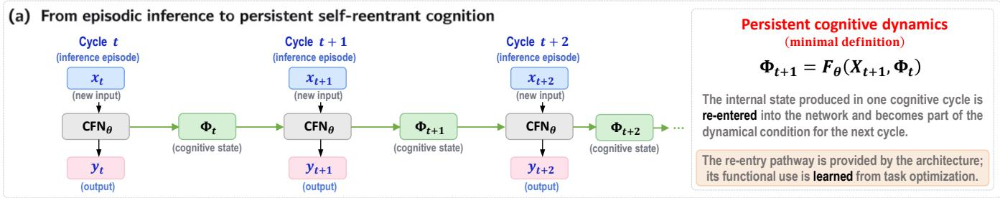

(b) Decoder-style CFN with all-layer recurrent cross-attention  
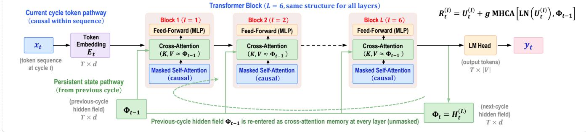

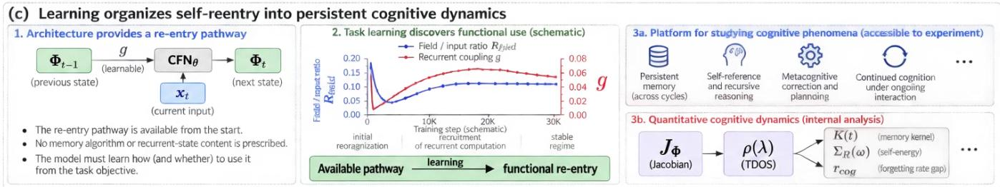  
FIG. 1. Cognitive Field Network (CFN): self-reentrant architecture and learning for persistent cognition. (a) Transition from episodic inference to self-reentrant cognitive dynamics. The hidden field $\Phi _ { t }$ generated during one computational cycle is retained and re-entered into the subsequent cycle, yielding the state-dependent evolution $\Phi _ { t + 1 } = F _ { \theta } ( X _ { t + 1 } , \Phi _ { t } )$ . The architecture provides the recurrent pathway, while its functional use is determined through learning. (b) Decoder-style CFN implementation used in this work. The current token sequence follows the ordinary causal Transformer pathway, while the complete token-resolved hidden field $\Phi _ { t - 1 }$ from the preceding cycle is supplied as unmasked cross-attention memory to every Transformer layer. After the final layer, $\Phi _ { t } \ = \ H _ { t } ^ { ( L ) }$ provides both the internal field retained for the next cycle and the hidden representation from which the language-model output is read out. (c) Learning and experimental analysis of self-reentrant cognitive dynamics. The architecture makes field re-entry available without prescribing its functional role; task-driven learning can organize this pathway into persistent, content-dependent recurrent dynamics. Because the recurrent hidden field is directly accessible, the CFN also provides a platform for studying persistent memory, dynamical self-reference, recursive inference, and more general continua cognitive dynamics, while internal analyses can characterize its relaxation spectra, time-scale density of states, memory kernels self-energy, and efective forgetting dynamics.

The CFN removes this separation by allowing each computational cycle to generate a hidden field $\Phi _ { t }$ that is retained and directly re-entered into the subsequent cycle. The resulting dynamics takes the general form

$$
\Phi _ { t + 1 } = F _ { \theta } ( X _ { t + 1 } , \Phi _ { t } ) ,\tag{5}
$$

where $X _ { t + 1 }$ denotes the newly presented input and $\Phi _ { t }$ the hidden field generated by the preceding computation. The external output is read out from the current hidden field, whereas the field itself remains internal to the network and continues to participate in subsequent computation. Equation (5) therefore provides the minimal dynamical definition of the CFN used throughout this work.

The cycle index t does not denote an external agentic control loop, independently orchestrated model calls, or the feedback of previously generated text into a new prompt. It indexes successive applications of the same neural dynamical system, with $\Phi _ { t }$ retained as an internal hidden tensor and supplied directly to the computation that generates $\Phi _ { t + 1 }$ . The network’s internally generated past thereby becomes part of the causal condition governing its subsequent evolution.

Persistent cognition in this sense does not require the hidden field to remain numerically unchanged. In general, $\Phi _ { t + 1 } \neq \Phi _ { t }$ , because the field is continuously reorganized by new input and by the network’s learned dynamics. The defining property is instead the causal dependence

$$
\frac { \partial \Phi _ { t + 1 } } { \partial \Phi _ { t } } \neq 0 ,\tag{6}
$$

whenever the recurrent pathway is functionally active. The relevant dynamical object is therefore not a static memory register, but an evolving, history-dependent hidden field.

Importantly, Eq. (5) does not assume that useful persistent computation will emerge. It only makes selfreentry dynamically available. Whether learning suppresses this pathway, leaves it functionally irrelevant, or organizes it into a content-specific recurrent computation is therefore an empirical question.

## B. Recurrent field re-entry and its functional organization

We implement the self-reentrant dynamics using a decoder-style Transformer [24], as illustrated in Fig. 1(b). The modification is intentionally minimal: the current token sequence follows the ordinary causal Transformer pathway, while the final hidden field generated during the preceding cycle is supplied as recurrent cross-attention memory.

Let

$$
X _ { t } = ( x _ { t , 1 } , x _ { t , 2 } , . . . , x _ { t , T } )\tag{7}
$$

denote the token sequence presented during cycle t. The initial hidden representation is

$$
H _ { t } ^ { ( 0 ) } = E _ { t } = \mathrm { E m b e d } ( X _ { t } ) \in \mathbb { R } ^ { T \times d } ,\tag{8}
$$

where $T$ is the sequence length and d the Transformer hidden dimension.

The recurrent field entering the current cycle is the final hidden field generated during the preceding cycle,

$$
\Phi _ { t - 1 } \equiv H _ { t - 1 } ^ { ( L ) } ,\tag{9}
$$

where $L$ denotes the number of Transformer layers. Thus, $\Phi _ { t - 1 }$ is the full token-resolved hidden field generated by the network itself rather than a symbolic memory object or a previous language-model output.

For clarity, we retain the standard pre-layer normalization and residual structure of the decoder while suppressing architectural details not essential to the recurrent construction. At each layer $\ell = 1 , \ldots , L$ , the currentcycle representation first undergoes masked causal selfattention,

$$
\begin{array} { r } { U _ { t } ^ { ( \ell ) } = H _ { t } ^ { ( \ell - 1 ) } + \mathrm { S A } ^ { ( \ell ) } \left[ \mathrm { L N } \left( H _ { t } ^ { ( \ell - 1 ) } \right) \right] . } \end{array}\tag{10}
$$

The resulting representation then interacts with the preceding recurrent field through multi-head crossattention,

$$
R _ { t } ^ { ( \ell ) } = U _ { t } ^ { ( \ell ) } + g \mathrm { \ M H C A } ^ { ( \ell ) } \left[ \mathrm { L N } \left( U _ { t } ^ { ( \ell ) } \right) , \Phi _ { t - 1 } \right] ,\tag{11}
$$

where $g$ is a learnable recurrent coupling.

For attention head $h ,$ the current-cycle representation provides the queries, while the preceding hidden field pro vides the keys and values,

$$
\begin{array} { r } { Q _ { t , h } ^ { ( \ell ) } = W _ { Q , h } ^ { ( \ell ) } \operatorname { L N } \left( U _ { t } ^ { ( \ell ) } \right) , } \end{array}\tag{12}
$$

$$
K _ { \Phi , t - 1 , h } ^ { ( \ell ) } = W _ { K , h } ^ { ( \ell ) } \Phi _ { t - 1 } ,\tag{13}
$$

$$
V _ { \Phi , t - 1 , h } ^ { ( \ell ) } = W _ { V , h } ^ { ( \ell ) } \Phi _ { t - 1 } .\tag{14}
$$

The recurrent readout of each head is

$$
Z _ { t , h } ^ { ( \ell ) } = \mathrm { s o f t m a x } \left[ \frac { Q _ { t , h } ^ { ( \ell ) } K _ { \Phi , t - 1 , h } ^ { ( \ell ) \top } } { \sqrt { d _ { h } } } \right] V _ { \Phi , t - 1 , h } ^ { ( \ell ) } ,\tag{15}
$$

and the head outputs are concatenated and projected back to the full hidden dimension,

$$
\mathrm { M H C A } ^ { ( \ell ) } = W _ { O } ^ { ( \ell ) } \mathrm { C o n c a t } \left[ Z _ { t , 1 } ^ { ( \ell ) } , \dots , Z _ { t , H } ^ { ( \ell ) } \right] .\tag{16}
$$

The recurrent field is not compressed into a summary vector. Its complete token-resolved representation remains available to every Transformer layer, allowing diferent attention heads to selectively address diferent components of the preceding field. Unlike causal selfattention within the current token sequence, the crossattention to $\Phi _ { t - 1 }$ is unmasked because it operates on a completed preceding cycle.

The recurrent operation is inserted after causal selfattention and before the feed-forward transformation at every Transformer layer. The block is completed by the standard feed-forward update,

$$
H _ { t } ^ { ( \ell ) } = R _ { t } ^ { ( \ell ) } + \mathrm { F F N } ^ { ( \ell ) } \left[ \mathrm { L N } \left( R _ { t } ^ { ( \ell ) } \right) \right] .\tag{17}
$$

Each self-reentrant Transformer block therefore consists of causal self-attention over the current sequence, recurrent cross-attention to the preceding hidden field, and the standard feed-forward transformation. After the final layer, the resulting hidden field becomes

$$
\Phi _ { t } = H _ { t } ^ { ( L ) } ,\tag{18}
$$

which is retained for re-entry during the next cycle.

The external language-model prediction is obtained independently through the standard readout

$$
\begin{array} { r } { y _ { t } = \mathrm { L M H e a d } \left( \Phi _ { t } \right) . } \end{array}\tag{19}
$$

Thus, the recurrent pathway and the language-model readout originate from the same final hidden field, but only $\Phi _ { t }$ is propagated internally across computational cycles. The essential architectural modification is therefore the direct re-entry of the model’s own preceding hidden field through recurrent cross-attention, while the underlying decoder computation remains otherwise closely related to the conventional Transformer.

The existence of this recurrent pathway, however, does not by itself imply that the network will make functional use of it. The architecture makes the preceding hidden field causally available to subsequent computation, but it does not prescribe what information should persist, which components of the field should be accessed, or how strongly the preceding field should influence the formation of the next state. This distinction between architectural availability and functional organization is illustrated in Fig. 1(c).

The recurrent cross-attention parameters and the coupling g are learned jointly with the underlying language model. Task-driven learning can therefore determine whether and how the available re-entry pathway contributes to computation. Self-reentry is provided by the architecture, whereas its functional organization is a learned property of the network. The architecture thus specifies a causal pathway,

$$
\Phi _ { t - 1 } \longrightarrow \Phi _ { t } ,\tag{20}
$$

but not the information-processing function that this pathway ultimately acquires.

Once functionally organized, the recurrent pathway allows the internally generated hidden field to remain causally involved in subsequent computation while continuing to be reorganized by new input. Successive inference cycles can thereby form a continuous, historydependent neural dynamics rather than a sequence of isolated input–output mappings. In this sense, persistence does not require $\Phi _ { t } = \Phi _ { t - 1 }$ . Instead, the relevant property is that the newly organized field remains causally dependent on the preceding one while simultaneously responding to current input,

$$
\Phi _ { t } = F _ { \theta } \left( X _ { t } , \Phi _ { t - 1 } \right) , \qquad { \frac { \partial \Phi _ { t } } { \partial \Phi _ { t - 1 } } } \neq 0 .\tag{21}
$$

The recurrent variable is therefore not a static memory register but an evolving dynamical field whose state is continuously transformed across successive computational cycles.

This distinction is particularly important for the interpretation of memory in the CFN. The model is not given an explicit rule specifying what should be written to memory, what should be retrieved, or when stored information should be refreshed. Nor is a separate external memory store introduced. Instead, the architecture preserves the full preceding hidden field as an available dynamical variable, and learning determines how this variable participates in subsequent computation. Persistent memory, if it emerges, is therefore a functional property of the learned recurrent dynamics rather than a prescribed storage operation.

The same construction makes the CFN an experimentally accessible platform for studying recurrent cognitive dynamics. Because the recurrent variable is the hidden field itself, its evolution can be directly recorded, perturbed, and compared with behavioral readouts across computational cycles. This makes it possible to examine whether a learned recurrent pathway supports temporal persistence, how the resulting state relaxes when contentrelevant input is removed, and how subsequent information reorganizes an already existing recurrent state.

The internal dynamics can further be characterized through collective observables such as relaxation spectra, memory kernels, and response properties of the recurrent field. The CFN therefore provides a common setting in which architectural re-entry, learned functional organization, behavioral persistence, and internal collective dynamics can be investigated within the same system.

The central theoretical question is then no longer only whether a hidden field can be propagated across computational cycles. It is how newly presented information acts on an already organized, history-dependent field and how the resulting field participates in the generation of subsequent cognitive states. The following subsection develops this connection by relating CFN self-reentry to the driven, memory-dressed inference dynamics of Cognitive Field Theory.

## C. From driven cognitive-field dynamics to recurrent inference

The self-reentrant architecture introduced above can be related more directly to the driven inference dynamics of Cognitive Field Theory. A defining feature of cognitive dynamics is that external input is not merely an auxiliary perturbation used to probe an already formed collective state. Cognition is intrinsically driven: incoming information continuously acts on the internal dynamical state and participates in the formation of subsequent cognitive states. The cognitive input must therefore be treated as a finite physical drive rather than as an infinitesimal response probe.

Let x(t) denote the microscopic or mesoscopic cognitive state and x∗(t) a reference trajectory. Linearization of the driven cognitive dynamics around this trajectory

gives

$$
\partial _ { t } \delta x ( t ) = - J \delta x ( t ) + B I ( t ) + \xi ( t ) ,\tag{22}
$$

where J is the local dynamical Jacobian, I(t) is the finite cognitive input, B determines how the incoming representation couples to the internal state, and $\xi ( t )$ denotes unresolved fluctuations.

To expose the collective field dynamics, the state space may be separated into a macroscopic collective coordinate ϕ(t) and a complementary relaxation sector $\mathcal { X } ( t )$ A projection of Eq. (22) then gives the coupled block dynamics

$$
\partial _ { t } \phi ( t ) = - r \phi ( t ) + D \mathcal { X } ( t ) + B _ { \phi } I ( t ) + \xi _ { \phi } ( t ) ,\tag{23}
$$

$$
\partial _ { t } \mathcal { X } ( t ) = - M \mathcal { X } ( t ) + C \phi ( t ) + B _ { \mathcal { X } } I ( t ) + \xi _ { \mathcal { X } } ( t ) ,\tag{24}
$$

where M is the projected relaxation operator and C and D describe the coupling between the collective field and the complementary dynamical sector. A formal projection derivation of Eqs. (23) and (24) is given in $\mathrm { A p \mathrm { - } }$ pendix X.

Because the cognitive dynamics is generally non-Hermitian, we use biorthogonal right and left eigenmodes of the projected relaxation operator,

$$
M u _ { \alpha } = \mu _ { \alpha } u _ { \alpha } , \qquad \widetilde { u } _ { \alpha } ^ { \dagger } M = \mu _ { \alpha } \widetilde { u } _ { \alpha } ^ { \dagger } , \qquad \widetilde { u } _ { \alpha } ^ { \dagger } u _ { \beta } = \delta _ { \alpha \beta } ,
$$

with

(25)

$$
\begin{array} { r } { \mu _ { \alpha } = \lambda _ { \alpha } + i \omega _ { \alpha } . } \end{array}\tag{26}
$$

Expanding the complementary sector as

$$
\mathcal { X } ( t ) = \sum _ { \alpha } \mathcal { X } _ { \alpha } ( t ) u _ { \alpha } ,\tag{27}
$$

the modal dynamics becomes

$$
\partial _ { t } \mathcal { X } _ { \alpha } ( t ) = - \mu _ { \alpha } \mathcal { X } _ { \alpha } ( t ) + c _ { \alpha } \phi ( t ) + b _ { \alpha } ( t ) + \eta _ { \alpha } ( t ) ,\tag{28}
$$

where

$$
\begin{array} { r } { c _ { \alpha } = \widetilde { u } _ { \alpha } ^ { \dagger } C , \qquad b _ { \alpha } ( t ) = \widetilde { u } _ { \alpha } ^ { \dagger } B _ { \mathcal { X } } I ( t ) , \qquad \eta _ { \alpha } ( t ) = \widetilde { u } _ { \alpha } ^ { \dagger } \xi _ { \mathcal { X } } ( t ) . } \end{array}\tag{29}
$$

The macroscopic field equation correspondingly becomes

$$
\partial _ { t } \phi ( t ) = - r \phi ( t ) + \sum _ { \alpha } d _ { \alpha } { \mathcal X } _ { \alpha } ( t ) + B _ { \phi } I ( t ) + \xi _ { \phi } ( t ) ,\tag{30}
$$

with

$$
d _ { \alpha } = D u _ { \alpha } .\tag{31}
$$

Equations (28) and (30) expose two distinct but interacting pathways of cognitive dynamics. The existing cognitive field acts back on the collective relaxation sector through $c _ { \alpha } \phi _ { ; }$ whereas incoming information excites that sector through $b _ { \alpha } ( t ) = \widetilde { u } _ { \alpha } ^ { \dagger } B _ { \mathcal { X } } I ( t )$ . The same microscopic cognitive input can also project directly onto the macroscopic collective coordinate through $B _ { \phi } I ( t )$ . Thus, external information does not enter the theory as an arbitrary additive source introduced only at the field level. Its efective action on the cognitive field follows from its projection onto the learned collective dynamical structure.

The quantity $b _ { \alpha } ( t )$ has a direct cognitive interpretation. It determines how strongly the incoming representation excites each collective dynamical direction. Consequently, two inputs need not produce the same internal perturbation even when they have comparable magnitude. Their efect depends on their overlap with the left eigenvectors of the learned dynamical geometry. The relaxation rate $\lambda _ { \alpha }$ determines the persistence of the resulting activation, whereas $\omega _ { \alpha }$ determines its intrinsic temporal phase evolution. External information is therefore converted into a distributed, mode-selective dynamical perturbation of the existing cognitive state.

The formal solution of Eq. (28) is

$$
\begin{array} { l } { \displaystyle \mathcal { X } _ { \alpha } ( t ) = e ^ { - \mu _ { \alpha } ( t - t _ { 0 } ) } \mathcal { X } _ { \alpha } ( t _ { 0 } ) } \\ { \displaystyle \qquad + \int _ { t _ { 0 } } ^ { t } d t ^ { \prime } e ^ { - \mu _ { \alpha } ( t - t ^ { \prime } ) } \left[ c _ { \alpha } \phi ( t ^ { \prime } ) + b _ { \alpha } ( t ^ { \prime } ) + \eta _ { \alpha } ( t ^ { \prime } ) \right] . } \end{array}\tag{32}
$$

Substituting this expression into Eq. (30) eliminates the latent relaxation modes and produces the non-Markovian cognitive-field equation

$$
\begin{array} { l } { { \partial _ { t } \phi ( t ) = - r \phi ( t ) + \displaystyle \int _ { t _ { 0 } } ^ { t } d t ^ { \prime } K ( t - t ^ { \prime } ) \phi ( t ^ { \prime } ) } } \\ { { \ ~ + I _ { \mathrm { e f f } } ( t ) + \xi _ { \mathrm { e f f } } ( t ) + \zeta _ { \mathrm { i n i t } } ( t ) . } } \end{array}\tag{33}
$$

Here

$$
K ( \tau ) = \Theta ( \tau ) \sum _ { \alpha } d _ { \alpha } c _ { \alpha } e ^ { - \mu _ { \alpha } \tau }\tag{34}
$$

is the memory kernel generated by the internal collective sector, whereas

$$
I _ { \mathrm { e f f } } ( t ) = B _ { \phi } I ( t ) + \sum _ { \alpha } d _ { \alpha } \int _ { t _ { 0 } } ^ { t } d t ^ { \prime } e ^ { - \mu _ { \alpha } ( t - t ^ { \prime } ) } b _ { \alpha } ( t ^ { \prime } )\tag{35}
$$

is the efective cognitive drive acting on the macroscopic field. The remaining terms collect the projected fluctuations and the decaying dependence on the initial complementary state.

Equations (34) and (35) reveal an important structural property of cognitive inference. Memory feedback and external information are mediated by the same underly ing collective relaxation spectrum, although they enter through distinct causal channels. The memory pathway acts through the recurrent coupling between ϕ and the collective modes $\{ \mathcal { X } _ { \alpha } \}$ , whereas the input pathway excites those modes through $\{ b _ { \alpha } \}$ before their contribution reaches the macroscopic field. Thus, memory and current input are not implemented as independent storage and processing mechanisms. Both act through the collective dynamical manifold generated by the learned cognitive geometry.

For a continuum of collective modes, it is useful to introduce the coupling-weighted spectral density

$$
\rho _ { K } ( \lambda , \omega ) = \sum _ { \alpha } d _ { \alpha } c _ { \alpha } \delta ( \lambda - \lambda _ { \alpha } ) \delta ( \omega - \omega _ { \alpha } ) ,\tag{36}
$$

so that

$$
K ( t ) = \Theta ( t ) \int d \lambda d \omega \rho _ { K } ( \lambda , \omega ) e ^ { - \lambda t } e ^ { - i \omega t } .\tag{37}
$$

The weighting in $\rho _ { K }$ distinguishes the spectral density entering the field kernel from the normalized mode density $\rho ( \lambda , \omega )$ used to characterize the collective spectrum itself. When the mode–field couplings vary slowly over the infrared sector, the two inherit the same leading infrared structure up to the corresponding coupling weight.

In frequency space, the memory kernel generates the retarded self-energy

$$
\Sigma _ { R } ( \Omega ) = \sum _ { \alpha } \frac { d _ { \alpha } c _ { \alpha } } { \mu _ { \alpha } - i \Omega } ,\tag{38}
$$

while the mode-mediated input defines the input-transfer function

$$
\mathcal { T } _ { I } ( \Omega ) = B _ { \phi } + \sum _ { \alpha } \frac { d _ { \alpha } q _ { \alpha } } { \mu _ { \alpha } - i \Omega } , \qquad q _ { \alpha } \equiv \widetilde { u } _ { \alpha } ^ { \dag } B _ { \mathcal { X } } .\tag{39}
$$

Neglecting the decaying initial transient, the driven field equation therefore takes the compact form

$$
\left[ - i \Omega + r - \Sigma _ { R } ( \Omega ) \right] \phi ( \Omega ) = \mathcal { T } _ { I } ( \Omega ) I ( \Omega ) + \xi _ { \mathrm { e f f } } ( \Omega ) .\tag{40}
$$

Defining the memory-dressed cognitive propagator

$$
L _ { \mathrm { c o g } } ( \Omega ) = \frac { 1 } { - i \Omega + r - \Sigma _ { R } ( \Omega ) } ,\tag{41}
$$

we obtain

$$
\phi ( \Omega ) = { \cal L } _ { \mathrm { c o g } } ( \Omega ) \mathcal { T } _ { I } ( \Omega ) I ( \Omega ) + { \cal L } _ { \mathrm { c o g } } ( \Omega ) \xi _ { \mathrm { e f f } } ( \Omega ) .\tag{42}
$$

Equation (42) separates two complementary components of inference. The transfer factor T (Ω) describes how incoming information couples into the collective dynamical manifold, whereas $L _ { \mathrm { { c o g } } } ( \Omega )$ describes how that perturbation propagates through the memory-dressed internal dynamics. The present cognitive state is therefore determined jointly by the structure of the incoming information and by the history-dependent collective dynamics through which that information is processed.

The finite cognitive drive $I ( t )$ should be distinguished from an infinitesimal auxiliary probe $h ( t )$ introduced to define linear response. For a driven background, the retarded susceptibility may be defined formally as

$$
\chi _ { R } ( t , t ^ { \prime } ; [ I ] ) = \left. \frac { \delta \langle \phi ( t ) \rangle _ { I , h } } { \delta h ( t ^ { \prime } ) } \right| _ { h = 0 } .\tag{43}
$$

In a stationary linearized regime, the retarded propagator and susceptibility coincide,

$$
\chi _ { R } ( \Omega ) = L _ { \mathrm { c o g } } ( \Omega ) ,\tag{44}
$$

but their conceptual roles remain distinct: $I ( t )$ drives inference, whereas $h ( t )$ probes the response of the driven cognitive system.

The CFN adds a further dynamical step to this memory-dressed driven inference. Equation (33) describes how incoming information reorganizes an already history-dependent cognitive field. The self-reentrant architecture then makes the resulting field itself available to the computation that generates the next cognitive state,

$$
\Phi _ { t + 1 } = F _ { \theta } \left( X _ { t + 1 } , \Phi _ { t } \right) .
$$

The continuous-time field $\phi ( t )$ and the discrete recurrent field $\Phi _ { t }$ should not be identified microscopically. Rather, Eq. (5) provides a computational realization of the same causal principle at the level of recurrent inference: newly presented information acts on a dynamical state that already contains the consequences of preceding computation.

This distinction separates three successive levels of cognitive organization. Memory dressing describes how distributed collective modes generate and sustain a historydependent macroscopic field. Cognitive driving describes how structured external information selectively excites the collective manifold and reorganizes that field. Cross-cycle field re-entry describes how the resulting field is made causally available to subsequent inference. These three levels distinguish the formation of a historydependent cognitive field, its input-driven reorganization, and its subsequent causal re-entry into ongoing inference.

The role of field re-entry should therefore be distinguished from the recursive feedback already contained in the memory kernel. The convolution term in Eq. (33) describes endogenous memory dressing within the cogni tive field, whereas Eq. (5) describes the explicit computational reuse of an already organized field across inference cycles. The former explains how a memory-bearing collective state is formed and maintained; the latter de termines how that state participates in the generation of subsequent cognitive states.

This provides the field-theoretic interpretation of the CFN architecture. The architecture does not prescribe what information should be stored in the recurrent field or how it should influence future computation. It provides a causal pathway through which an internally generated, memory-dressed field can re-enter subsequent inference. Whether learning suppresses this pathway, leaves it functionally irrelevant, or organizes it into persistent content-dependent dynamics remains an empirical question. The experiments in the following sections test precisely this transition from an available re-entry pathway to a functionally organized recurrent cognitive dynamics.

## III. EMERGENCE OF RECURRENTCOGNITIVE-STATE DYNAMICS

The preceding section defines the CFN as an architecture in which an internally generated hidden field can re-enter subsequent computation. The existence of this pathway alone, however, does not establish that learning will organize it into a functional cognitive dynamics.

We therefore examine how self-reentry is transformed by learning and whether the resulting recurrent field acquires measurable dynamical and informational properties. We first characterize the learned utilization of the recurrent pathway and the accompanying reorganization of collective relaxation dynamics. We then test whether the recurrent field carries content-specific information, whether that information is causally required for selective retrieval, and whether its persistence across computational cycles can itself be extended through learning.

Together, these experiments trace the transition from architectural self-reentry to a learned, content-bearing, and temporally persistent cognitive-state dynamics.

## A. Learning organizes functional recurrent re-entry

We first ask whether the recurrent pathway introduced in Sec. remains functionally relevant when the network is trained under an ordinary language-model objective. The architecture makes the preceding hidden field available to the current computation, but it does not prescribe how strongly that field should influence subsequent processing. Functional utilization of self-reentry must therefore be organized through learning.

To examine this question, we trained a compact sixblock GPT-NeoX decoder reorganized into the CFN architecture described in Sec. II.B. The model contains approximately $7 . 6 7 \times 1 0 ^ { 7 }$ trainable parameters, with hidden dimension $d = 5 1 2$ , eight attention heads, and feed forward dimension 2048. At every Transformer layer, masked causal self-attention is followed by eight-head recurrent cross-attention to the complete token-resolved hidden field of the preceding cycle and then by the feedforward transformation. The architectural configuration used throughout the experiments is summarized in Table I.

The model was pretrained on WikiText-103 using sequences of length 1024 for 30 000 optimizer steps. Training and validation measurements were performed on separate data splits, with the validation set held out from parameter optimization. A physical batch size of 8 with eight gradient-accumulation steps gave an efective batch size of 64 sequences, corresponding to 65 536 tokens per optimizer update. The recurrent coupling was initialized at $g _ { 0 } = 0 . 0 5$ and optimized jointly with the remaining model parameters. The learning rate was warmed up to $1 0 ^ { - 3 }$ and subsequently annealed toward $1 0 ^ { - 4 }$ during pretraining.

Figure 2 summarizes the language-model optimization and the simultaneous evolution of the recurrent pathway. As shown in Fig. 2(a), the training and validation crossentropy losses decrease rapidly during the early stage of pretraining, reaching values near 4 within the first few thousand optimizer steps. The validation loss sub sequently decreases more gradually and approaches approximately 3.0 near the end of training, corresponding to a validation perplexity of approximately 21. The training loss continues to decrease moderately below the validation loss, reaching approximately 2.5–2.6 at the final checkpoint. Thus, the self-reentrant architecture can be optimized stably under an ordinary next-token languagemodel objective.

The recurrent pathway exhibits a more structured evolution [Fig. 2(b)]. The learnable coupling g does not remain near its initialized value. Starting from $g _ { 0 } = 0 . 0 5$ it is strongly suppressed during the earliest stage of optimization, falling to a value of order $1 0 ^ { - 2 }$ . Its evolution then reverses, and the coupling progressively increases throughout subsequent training. At later stages it enters a slowly evolving regime and reaches approximately $g \simeq 3 . 3 \times 1 0 ^ { - 2 }$ at 30 000 steps. The recurrent connection is therefore not simply retained at its initialized strength, but is dynamically reweighted as language-model learning proceeds.

The scalar coupling alone, however, does not determine the actual contribution of the preceding field to the current hidden computation. For layer $\ell ,$ the recurrent contribution is

$$
\Delta H _ { \mathrm { f i e l d } , t } ^ { ( \ell ) } = g \mathrm { M H C A } ^ { ( \ell ) } \left[ \mathrm { L N } \left( U _ { t } ^ { ( \ell ) } \right) , \Phi _ { t - 1 } \right] ,\tag{45}
$$

where the recurrent multi-head cross-attention contains the learned query, key, value, and output projections. Its magnitude can therefore evolve diferently from the scalar coupling g itself.

We quantify the efective recurrent contribution by the dimensionless field-strength ratio

$$
R _ { \mathrm { f i e l d } } = \frac { \mathrm { R M S } ( \Delta H _ { \mathrm { f i e l d } } ) } { \mathrm { R M S } ( H _ { \mathrm { c u r r e n t } } ) } .\tag{46}
$$

This quantity measures the RMS magnitude of the recurrent-field perturbation relative to the current hidden representation.

TABLE I. Architecture of the decoder-style Cognitive Field Network (CFN) used in this work. The final token-resolved hidden field from each computational cycle is retained and supplied as unmasked recurrent cross-attention memory to every Transformer layer of the subsequent cycle.
<table><tr><td>Component</td><td>Specification</td></tr><tr><td>Backbone</td><td>GPT-NeoX decoder Transformer</td></tr><tr><td>Number of Transformer blocks</td><td>6</td></tr><tr><td>Hidden dimension d</td><td>512</td></tr><tr><td>Attention heads</td><td>8</td></tr><tr><td>Feed-forward dimension</td><td>2048</td></tr><tr><td>Positional representation</td><td>Rotary positional embedding (RoPE)</td></tr><tr><td>Current-cycle attention</td><td>Masked causal self-attention</td></tr><tr><td>Recurrent-field source</td><td>Final hidden field  $H _ { t - 1 } ^ { ( L ) } = \Phi _ { t - 1 }$ </td></tr><tr><td>Recurrent-field dimension</td><td> $T \times d$ </td></tr><tr><td>Re-entry mechanism</td><td>Multi-head recurrent cross-attention</td></tr><tr><td>Cross-attention heads</td><td>8</td></tr><tr><td>Cross-attention head dimension  $d _ { h }$ </td><td>64</td></tr><tr><td>Cross-attention query</td><td>Current-cycle hidden representation</td></tr><tr><td>Cross-attention key/value</td><td>Previous-cycle hidden field  $\Phi _ { t - 1 }$ </td></tr><tr><td>Cross-attention masking</td><td>Unmasked</td></tr><tr><td>Re-entry layers</td><td>All Transformer layers</td></tr><tr><td>Re-entry coupling</td><td>Learnable scalar g</td></tr><tr><td>Recurrent-field update</td><td> $\Phi _ { t } = H _ { t } ^ { ( L ) }$ </td></tr><tr><td>Language-model readout</td><td> $y _ { t } = \mathrm { L M H e a d } ( \Phi _ { t } )$ </td></tr></table>

As shown by the solid curves in Fig. 2(b), $R _ { \mathrm { f i e l d } }$ undergoes a closely related but distinct reorganization. Following an early transient, the efective recurrent contribution is strongly suppressed and then progressively recovers as training proceeds. By approximately $5 \times \mathrm { 1 0 ^ { 3 } \mathrm { - 1 0 ^ { 4 } } }$ optimizer steps, the recurrent field has recovered to a substantial finite magnitude and subsequently strengthens more gradually. At the final checkpoint, $R _ { \mathrm { f i e l d } } \simeq 0 . 0 9 5$ corresponding to a recurrent perturbation with an RMS magnitude of approximately 9.5% of the current hiddenstate magnitude.

Importantly, the $R _ { \mathrm { f i e l d } }$ trajectories measured on the training and held-out validation splits closely track one another throughout learning. The finite recurrent contribution is therefore not confined to the sequences used for parameter optimization, but is reproducibly expressed on unseen validation language data.

Preliminary experiments with simplified re-entry pathways showed the same qualitative tendency. Across the full CFN, single-attention, and MLP-based re-entry configurations, learning produced substantial nonzero recurrent participation, with representative late-training field-strength ratios of approximately $R _ { \mathrm { f i e l d } } \simeq 0 . 1 0 { - 0 . 1 5 }$ These auxiliary experiments were not designed as a systematic cross-architecture comparison and therefore do not establish architecture-independent behavior. They nevertheless suggest that learned utilization of re-entry is not restricted to the particular full CFN implementation. Rather, once a causal pathway is made available through which a preceding internal state can influence subsequent computation, ordinary language-model optimization can learn to make functional use of that pathway.

Taken together, the evolution of g and $R _ { \mathrm { f i e l d } }$ shows that self-reentry is functionally reorganized during ordinary language-model pretraining. The architecture provides the recurrent pathway, whereas learning determines how strongly and in what form the preceding hidden field participates in subsequent computation. The finite latetraining recurrent contribution is therefore a learned op erating property of the network rather than a direct consequence of the initialized coupling.

This establishes the first empirical step from architectural self-reentry to functional recurrent dynamics. Whether the learned recurrent field carries identifiable information across inference cycles, whether that information is causally required for subsequent computation, and whether it can be selectively retrieved or renewed are separate functional questions examined below.

## B. Learning reorganizes the infrared collective dynamics

The emergence of a finite recurrent pathway shown in Fig. 2 raises a second question. Does learning merely adjust the magnitude of recurrent re-entry, or does it also reorganize the collective dynamics through which hidden perturbations propagate inside the network?

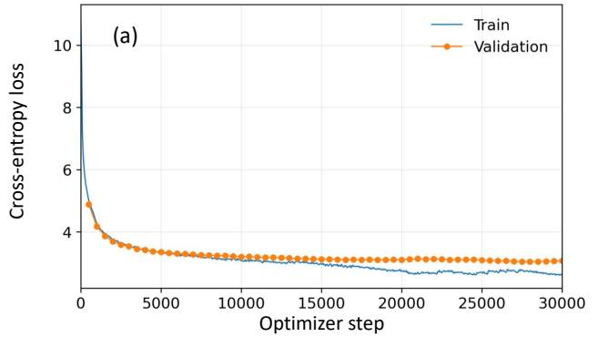

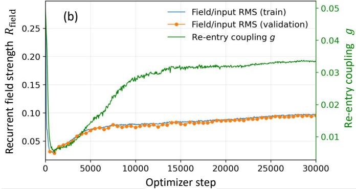  
FIG. 2. Learning organizes functional recurrent re-entry during language-model pretraining. (a) Training and validation cross-entropy losses for the compact GPT-NeoX-based CFN trained on WikiText-103. Both losses decrease rapidly during the early stage of optimization and subsequently enter a slower late-training regime, showing that the self-reentrant architecture can be trained stably under an ordinary next-token language-model objective. (b) Simultaneous evolution of the recurrent pathway. The dashed curve shows the learnable re-entry coupling g, while the solid curves show the efective recurrent-field strength $R _ { \mathrm { f i e l d } }$ measured on the training and validation sets. Both quantities undergo a pronounced early reorganization followed by progressive recovery and stabilization at finite values. The close agreement between the training and validation $R _ { \mathrm { f i e l d } }$ trajectories indicates that the learned recurrent contribution generalizes to held-out language data. Together, the two panels show that self-reentry is not merely preserved at its initialized strength, but is dynamically reorganized by language-model learning into a finite component of the hidden computation.

To address this question, we measured the local collective relaxation spectrum at successive pretraining checkpoints. For a fixed probe sequence of length $T \ = \ 8 .$ one completed hidden field was re-entered into the subsequent inference cycle, and the Jacobian of the layer map from $H ^ { ( 4 ) }$ to $\check { H } ^ { ( 5 ) }$ was evaluated. With hidden dimension $d = 5 1 2$ , this gives a 4096×4096 Jacobian. If $\mu _ { \alpha }$ denotes a Jacobian eigenvalue, we define the associated relaxation rate as

$$
\lambda _ { \alpha } = - \log | \mu _ { \alpha } | ,\tag{47}
$$

and construct the time-scale density of states (TDOS)

$$
\rho ( \lambda ) = { \frac { 1 } { N _ { + } } } \sum _ { \alpha : \lambda _ { \alpha } > 0 } \delta ( \lambda - \lambda _ { \alpha } ) ,\tag{48}
$$

where $N _ { + }$ is the number of positive relaxation rates.

Figure 3 shows a pronounced reorganization of this spectrum during pretraining. At initialization, the relaxation spectrum is comparatively broad, with only mod est accumulation near the infrared sector $\lambda  0$ . Within the first several hundred optimizer steps, however, substantial spectral weight is redistributed toward slow relaxation modes. The infrared enhancement is strongest around steps 500–1000, where a large fraction of the stable collective modes becomes concentrated near small relaxation rates.

We quantify this redistribution using the slow-mode fraction

$$
f _ { \mathrm { s l o w } } ( \lambda _ { c } ) = \frac { 1 } { N _ { + } } \sum _ { \alpha : \lambda _ { \alpha } > 0 } \Theta ( \lambda _ { c } - \lambda _ { \alpha } ) , \qquad \lambda _ { c } = 0 . 0 5 .\tag{49}
$$

The slow-mode fraction increases from approximately 0.251 at initialization to 0.683 at step 500, corresponding to more than a twofold increase in the population of slow stable modes. The redistribution is not monotonic, however. After this early maximum, $f _ { \mathrm { s l o w } }$ progressively decreases and reaches approximately 0.269 at step 30000.

The TDOS therefore reveals a distinct dynamical sequence. Learning first produces a pronounced transient infrared concentration and subsequently redistributes spectral weight over a broader range of relaxation scales. The early stage of optimization is thus characterized by strong collective softening rather than by a monotonic accumulation of slow modes throughout training.

Infrared self-energy and transient dynamical soften-$i n g .$ To summarize the infrared contribution of the measured relaxation spectrum, we define the regularized zerofrequency self-energy proxy

$$
\Sigma _ { \epsilon } ^ { \mathrm { n o r m } } ( 0 ) = \frac { 1 } { N _ { + } } \sum _ { \alpha : \lambda _ { \alpha } > 0 } \frac { 1 } { \lambda _ { \alpha } + \epsilon } , \qquad \epsilon = 1 0 ^ { - 3 } .\tag{50}
$$

Because each mode is weighted inversely by its relaxation rate, this quantity is particularly sensitive to col lective spectral weight near $\lambda = 0$ . The regulator is fixed across all checkpoints so that the training trajectory is compared at a common infrared resolution.

As shown in Fig. 4, the self-energy proxy follows the same strongly nonmonotonic evolution observed directly in the TDOS. It increases from approximately 29.60 at initialization to 71.21 at step 500 and reaches approximately 71.88 at step 1000. The strongest infrared dressing therefore occurs during the early stage of pretraining rather than at the end of optimization. With continued training, the proxy progressively decreases, reaching approximately 27.09 at step 30000.

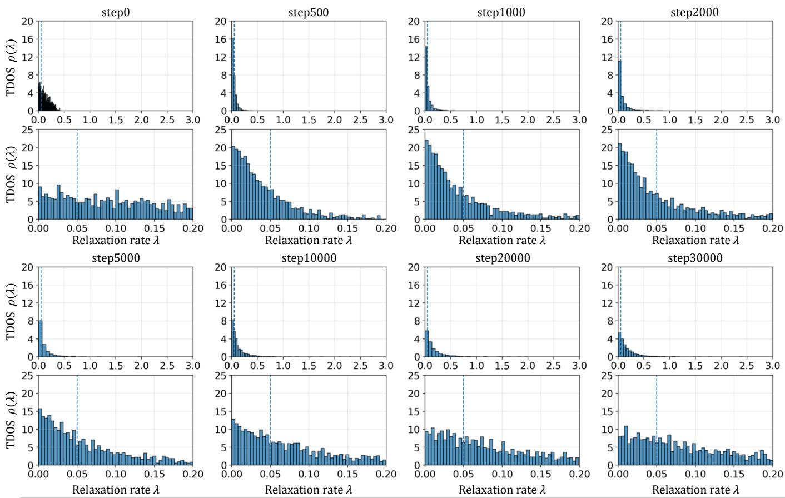  
FIG. 3. Learning-induced reorganization of the collective relaxation spectrum. Time-scale density of states (TDOS) measured from the local Jacobian of the $H ^ { ( 4 ) }  H ^ { ( 5 ) }$ layer map at successive language-model pretraining checkpoints. The spectrum was evaluated using a fixed probe sequence of length $T = 8 ,$ giving a 4096 × 4096 Jacobian, with relaxation rates defined as $\lambda _ { \alpha } = - \log | \mu _ { \alpha } |$ from the Jacobian eigenvalues $\mu _ { \alpha }$ . For each checkpoint, the upper panel shows the full stable relaxation spectrum, while the lower panel enlarges the infrared region $0 < \lambda < 0 . 2$ . The dashed vertical line marks the slow-mode threshold $\lambda _ { c } = 0 . 0 5$ . Starting from a comparatively broad spectrum at initialization, pretraining rapidly redistributes spectral weight toward the infrared, with the strongest concentration of slow modes appearing during the early stage of learning. At later checkpoints, this excess infrared weight progressively decreases and the relaxation spectrum broadens again. The TDOS therefore reveals a strongly nonmonotonic reorganization of collective relaxation dynamics during learning rather than a monotonic accumulation of increasingly slow modes.

For visualization of the corresponding dynamical softening, we also use the inverse quantity $\begin{array} { r l } { r _ { \mathrm { g a p } } ^ { \mathrm { p r o x y } } } & { { } = } \end{array}$ $1 / \Sigma _ { \epsilon } ^ { \mathrm { n o r m } } ( 0 )$ . This quantity is not an independently measured physical mass or the exact cognitive forgetting gap. It is simply an inverse measure of the observed infrared collective dressing, such that stronger infrared enhancement corresponds to a smaller rproxygap . Consistent with the TDOS evolution, it decreases from approximately $3 . 3 8 \times 1 0 ^ { - 2 }$ at initialization to $1 . 3 9 \times 1 0 ^ { - 2 }$ near step 1000, and subsequently increases to approximately $3 . 6 9 \times 1 0 ^ { - 2 }$ at step 30000.

The TDOS, slow-mode fraction, and self-energy proxy therefore provide mutually consistent signatures of a transiently softened collective regime during early learning. As relaxation rates accumulate toward $\lambda  0 ^ { + }$ , an increasing fraction of perturbations decays over progressively longer time scales, while the simultaneous increase of $\Sigma _ { \epsilon } ^ { \mathrm { n o r m } } ( 0 )$ shows that this behavior reflects a collective redistribution of infrared spectral weight rather than an isolated near-zero mode.

In Cognitive Field Theory, the physical significance of such an infrared reorganization follows from the memory kernel generated by the collective relaxation spectrum,

$$
K ( t ) = \int _ { 0 } ^ { \infty } d \lambda \rho ( \lambda ) e ^ { - \lambda t } ,\tag{51}
$$

so that redistribution of spectral weight toward $\lambda  0 ^ { + }$ enhances the long-time contribution to the collective memory kernel. Correspondingly, the zero-frequency selfenergy has the infrared structure

$$
\Sigma _ { R } ( 0 ) \sim \int _ { 0 } ^ { \infty } d \lambda \frac { \rho ( \lambda ) } { \lambda } ,\tag{52}
$$

which shows directly why slow collective modes contribute strongly to the dressing of the macroscopic field.

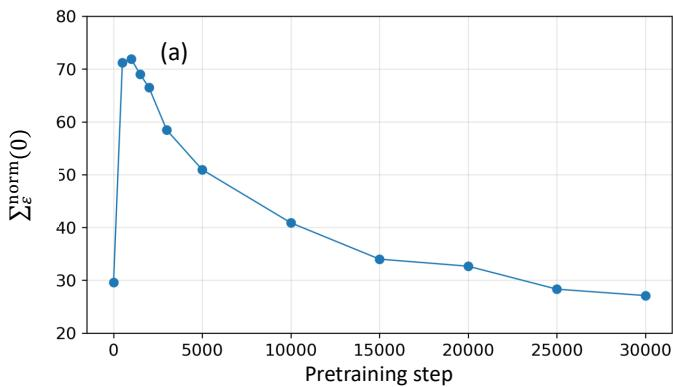

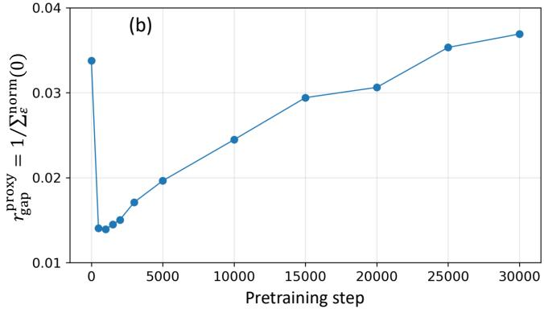  
FIG. 4. Transient infrared self-energy enhancement and collective dynamical softening during learning. Evolution of the infrared self-energy proxy $\Sigma _ { \epsilon } ^ { \mathrm { n o r m } } ( 0 )$ (upper panel) and the corresponding inverse-self-energy proxy $r _ { \mathrm { g a p } } ^ { \mathrm { p r o x y } } = 1 / \Sigma _ { \epsilon } ^ { \mathrm { n o r m } } ( 0 )$ (lower panel) across language-model pretraining checkpoints. Both quantities are computed from the stable relaxation spectrum of the $H ^ { ( 4 ) } ~  ~ \hat { H } ^ { ( 5 ) }$ Jacobian for a fixed probe sequence of length $T = 8 ,$ , using the common infrared regulator $\bar { \epsilon } = 1 0 ^ { - 3 }$ The self-energy proxy rises sharply during the earliest stage of learning and reaches its maximum around steps 500–1000, indicating a strong transient enhancement of infrared spectral weight. The inverse proxy correspondingly reaches its minimum in the same training regime. With continued optimization, the self-energy progressively decreases and the inverse proxy recovers toward a broader late-training regime. The inverse quantity is used only as a visualization of collective dynamical softening and should not be interpreted as a directly measured physical mass or exact cognitive forgetting gap. Together with the TDOS in Fig. 3, these results show that pretraining passes through a transient strongly softened collective regime rather than monotonically driving the network toward increasingly slow dynamics.

The measured $\Sigma _ { \epsilon } ^ { \mathrm { n o r m } } ( 0 )$ should therefore be understood as an operational spectral proxy for this infrared enhancement rather than as a direct measurement of the full field-theoretic self-energy. Within CFT, the corresponding memory dressing suppresses the cognitive forgetting gap according to

$$
r _ { \mathrm { c o g } } = r - \Sigma _ { R } ( 0 ) ,\tag{53}
$$

with the static susceptibility scaling as $\chi _ { R } ( 0 ) = 1 / r _ { \mathrm { c o g } }$ Increasing infrared spectral weight therefore corresponds, within this field-theoretic description, to slower collective relaxation and enhanced susceptibility to subsequent input.

Importantly, the relevant collective regime is not one in which all relaxation rates collapse to zero. Exact gap closing, $r _ { \mathrm { c o g } } = 0 _ { \mathrm { : } }$ represents the critical boundary rather than a stable operating state. The protected nearcritical regime proposed by CFT instead corresponds to $0 ~ < ~ r _ { \mathrm { c o g } } ~ \ll ~ \Lambda$ , where finite forgetting and dynamical stability coexist with long collective time scales and enhanced susceptibility.

The observed training trajectory is qualitatively consistent with this picture. Around steps 500–1000, the strong accumulation of slow modes and the maximum of the self-energy proxy indicate a transient approach toward a critically softened collective regime. With continued optimization, however, the excess infrared weight decreases and the relaxation spectrum broadens rather than collapsing further toward $\lambda = 0$ . At the same time, the recurrent pathway remains finite and subsequently strengthens. Learning therefore appears to pass through strong collective softening before settling into a dynamically stable recurrent regime.

This distinction is important for persistent cognitive dynamics. A completely frozen system could preserve perturbations but would have little capacity for continual reorganization, whereas a strongly gapped system would rapidly erase them. A near-critical collective organization instead provides an intermediate dynamical regime in which previous information can remain influential while the recurrent field continues to respond to new input.

The present measurements do not directly determine $\Sigma _ { R } ( 0 ) , r _ { \mathrm { { c o g } } } ,$ or a thermodynamic critical point. Rather, the measured TDOS and $\Sigma _ { \epsilon } ^ { \mathrm { n o r m } } ( 0 )$ provide spectral evidence for the underlying infrared collective organization predicted by this field-theoretic picture. Whether the resulting recurrent field actually acquires content-specific macroscopic organization is a separate functional question, tested directly in Sec. .

This spectral reorganization is especially informative when compared with the recurrent-pathway measurements in Fig. 2. The strongest infrared softening occurs during the early stage in which the recurrent coupling g is strongly suppressed. At later stages, g and the efective recurrent field strength $R _ { \mathrm { f i e l d } }$ progressively recover, whereas the transient excess of infrared spectral weight decreases. These measurements therefore probe distinct but complementary aspects of learning: g and $R _ { \mathrm { f i e l d } }$ quantify how strongly the preceding hidden field participates in the current computation, whereas the TDOS characterizes the collective stability and relaxation structure through which perturbations propagate.

Taken together, Figs. 2–4 show that pretraining does not simply increase recurrent coupling or drive the network monotonically toward slower dynamics. Instead, learning first passes through a strongly softened collective regime and subsequently establishes a finite recurrent pathway within a broader late-training relaxation spectrum. Persistent computation in the CFN therefore emerges from the joint learning-dependent organization of recurrent field re-entry and collective relaxation dynamics, rather than from a static memory register or an indefinitely softening dynamical system.

## C. Emergence of content-specific memory and selective retrieval

The preceding results establish two properties of the recurrent CFN. First, language-model pretraining organizes the available re-entry pathway into a finite component of the learned computation. Second, this learning process is accompanied by a pronounced reorganization of the collective relaxation spectrum and its infrared sector. Neither observation, however, establishes that the re-entered field actually carries identifiable information that can later be recovered. A finite recurrent perturbation could influence subsequent computation without functioning as a content-specific memory.

We therefore next ask whether information presented during one inference cycle can be encoded into the recurrent field and selectively retrieved during a subsequent cycle after the original external context has been removed. Figure 5 illustrates the controlled cross-cycle retrieval task used to test this question.

During a source or WRITE cycle n, the model receives a sequence containing N randomly generated entity– attribute bindings. The CFN processes the complete source sequence and produces the token-resolved recurrent field

$$
\Phi _ { n } = H _ { n } ^ { ( L ) } .\tag{54}
$$

The source text is then removed. It is not concatenated to the subsequent input, replayed as context, or otherwise supplied to the model again. The only source-dependent neural variable made available to the next cycle is the internally generated recurrent field $\Phi _ { n }$

During the subsequent QUERY cycle, the model receives a question about one of the bindings, while the external query contains no copy of the source facts. The computation therefore has the form

$$
( Q _ { n + 1 } , \Phi _ { n } ) \longrightarrow H _ { n + 1 } ^ { ( L ) } \longrightarrow \mathrm { L M H e a d } \longrightarrow A ,\tag{55}
$$

where $Q _ { n + 1 }$ denotes the current query and A is the predicted answer.

The task is deliberately selective. For a source containing

$$
\{ ( e _ { 1 } , a _ { 1 } ) , ( e _ { 2 } , a _ { 2 } ) , \ldots , ( e _ { N } , a _ { N } ) \} ,\tag{56}
$$

diferent queries must recover diferent attributes from the same preceding field:

$$
\left( Q _ { i } , \Phi _ { n } \right) \longrightarrow a _ { i } , \qquad i = 1 , \ldots , N .\tag{57}
$$

Successful performance therefore cannot be obtained merely by propagating a generic signal indicating that previous information is present. The recurrent field must preserve distinguishable source-dependent content, while the current query must determine which component is expressed through the language-model readout.

Training is performed by full backpropagation through the source and query cycles. The loss is applied to the answer generated during the QUERY cycle, without directly supervising how the source information is represented inside $\Phi _ { n } .$ . The internal representation required for subsequent retrieval must therefore emerge through end-to-end learning. The experiment thus tests whether an available recurrent pathway can become an information-bearing write–read channel.

Figure 6 shows the resulting learning dynamics for memory loads

$$
N = 1 , 2 , 4 , 8 , 1 6 .\tag{58}
$$

For every tested load, optimization eventually produces high validation exact-match accuracy, although the learning trajectories difer substantially with N.

The simplest $N \ = \ 1$ task is acquired rapidly and reaches essentially perfect retrieval within the first few hundred optimizer steps. For $N = 2$ , validation accuracy initially rises to approximately 0.5 and remains near this level for an extended interval before undergoing a sharp transition to nearly perfect retrieval. Because the source contains two independently addressable bindings, this intermediate regime is consistent with incomplete selective retrieval rather than successful content-specific addressing. The subsequent transition to near-unit accuracy marks the emergence of reliable query-dependent selection from the recurrent field.

Related transitions occur at larger memory loads. For $N = 8$ and $N = 1 6$ , validation accuracy remains low during the early stage of optimization and then rises abruptly toward unity. The $N = 4$ trajectory exhibits larger fluctuations and settles somewhat below the other trained conditions, but nevertheless undergoes the same qualitative transition from weak initial retrieval to a high-accuracy regime.

The important observation is therefore not that all memory loads follow the same optimization trajectory. Rather, across the tested values of N, learning transforms the re-entered field into a representation from which the current query can select and recover the appropriate source-dependent content. This distinguishes selective retrieval from simple persistence. A field may remain dynamically present across a cycle boundary without preserving multiple distinguishable bindings, and stored information may remain present without being selectively addressable. The present experiment requires both properties simultaneously.

The resulting computation can therefore be summa-

Training example for cross-cycle selective retrieval (N = 2, single-query format)  
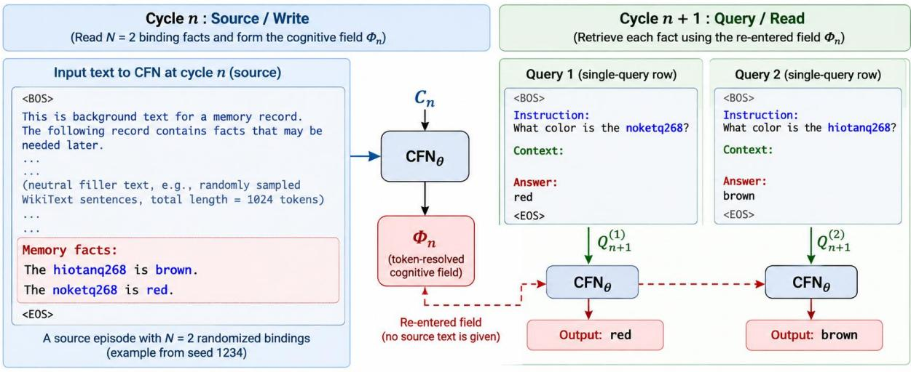  
The model learns, through full BPTT across the source and query cycles, to store multiple facts in the field $\Phi _ { n }$ and selectively retrieve the correct answer from Φ given a query, without providing the source text again.  
FIG. 5. Cross-cycle protocol for learning content-specific memory and selective retrieval. During the source or WRITE cycle n, the CFN receives a sequence containing N randomly generated entity–attribute bindings and forms the token-resolved recurrent field $\Phi _ { n } = H _ { n } ^ { ( L ) }$ . The source text is then removed and is not provided again during the subsequent QUERY cycle. Instead, the internally generated field $\Phi _ { n }$ is re-entered into the network through recurrent multi-head cross-attention. During cycle $n + 1$ , independent single-query inputs ask for diferent bindings originally presented in the same source episode. Each query must therefore selectively retrieve its corresponding attribute from the same preceding field $\Phi _ { n } .$ Training is performed by full backpropagation through the source and query cycles, with supervision applied to the answer generated during the QUERY cycle rather than directly to the internal field. The protocol therefore tests whether learning can organize the recurrent hidden field into an information-bearing write–read channel that preserves multiple distinguishable bindings and supports their query dependent retrieval after the original external context has been removed.

## rized as

$$
\mathrm { s o u r c e ~ c o n t e x t } \longrightarrow \Phi _ { n } \longrightarrow ( Q _ { n + 1 } , \Phi _ { n } ) \longrightarrow A .\tag{59}
$$

The language-model output produced during the WRITE cycle does not carry the source information into the QUERY cycle. The causal bridge available to the subsequent computation is the re-entered hidden field itself.

Causal verification of content-specific retrieval. High retrieval accuracy alone does not establish that the recovered answer is causally determined by information carried by the recurrent field. In principle, the model could exploit correlations in the query itself, or recurrent activation could provide a nonspecific computational advantage without transmitting episode-specific information. We therefore intervene directly on the recurrent field while holding the external QUERY input fixed.

For each held-out query, we evaluate three conditions. In the correct-field condition (C), the model receives the recurrent field generated from the corresponding source episode. In the wrong-field condition (W), the same query is presented while the recurrent field is replaced by one generated from an unrelated episode. In the state-of condition $( O )$ , recurrent re-entry is disabled entirely. These conditions isolate retrieval with the history matched field, retrieval with an informationally incorrect field, and retrieval without access to the recurrent field, respectively.

TABLE II. Causal intervention on the recurrent field during selective retrieval. C, W, and O denote the correctfield, wrong-field, and state-of conditions, respectively. $C _ { \mathrm { E M } } ,$ $W _ { \mathrm { E M } }$ , and $O _ { \mathrm { E M } }$ denote exact-match accuracies. The diferences $C - W$ and $C - O$ quantify the retrieval advantage provided by the history-matched recurrent field relative to the two control conditions.
<table><tr><td>Memory load</td><td> $C _ { \mathrm { E M } }$ </td><td> $W _ { \mathrm { E M } }$ </td><td> $O _ { \mathrm { E M } }$ </td><td>C-W</td><td> $C - O$ </td></tr><tr><td>N = 1</td><td>1.0000</td><td>0.0275</td><td>0.0350</td><td>0.9725</td><td>0.9650</td></tr><tr><td>N = 2</td><td>0.9975</td><td>0.0150</td><td>0.0354</td><td>0.9825</td><td>0.9621</td></tr><tr><td>N = 4</td><td>0.9760</td><td>0.0131</td><td>0.0185</td><td>0.9629</td><td>0.9575</td></tr><tr><td>N = 8</td><td>0.9988</td><td>0.0160</td><td>0.0167</td><td>0.9827</td><td>0.9821</td></tr><tr><td> $N = 1 6$ </td><td>0.9976</td><td>0.0140</td><td>0.0193</td><td>0.9835</td><td>0.9783</td></tr></table>

Table II reports the resulting exact-match accuracies for memory loads from $N \ = \ 1$ to $N ~ = ~ 1 6$ With the history-matched field present, exact-match accuracy is 1.0000, 0.9975, 0.9760, 0.9988, and 0.9976 for $N =$ 1, 2, 4, 8, and 16, respectively. Thus, throughout the tested range, the model retrieves the queried binding with near-perfect accuracy when supplied with the field generated from the corresponding source episode.

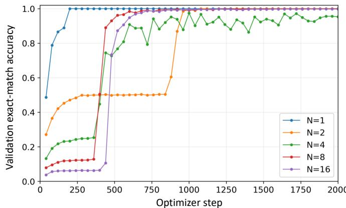  
FIG. 6. Emergence of selective retrieval from the re-entered cognitive field. Validation exact-match accuracy during crosscycle retrieval training for memory loads $N = 1 , 2 , 4 , 8$ , and 16, where N denotes the number of entity–attribute bindings presented during the source cycle. The $N = 1$ task is acquired rapidly, whereas larger memory loads exhibit distinct learning trajectories before entering a high-accuracy retrieval regime. For $N = 2$ , accuracy remains near 0.5 for an extended intermediate period before undergoing a sharp transition to nearly perfect retrieval, consistent with the emergence of reliable content-specific selection from the recurrent field. The $N = 8$ and $N = 1 6$ conditions similarly exhibit abrupt transitions from weak early retrieval to near-unit accuracy, while the $N = 4$ trajectory shows larger fluctuations but reaches a comparably high retrieval regime. Despite these diferences in optimization dynamics, learning enables the re-entered field to support selective retrieval across all tested memory loads. The result shows that multiple source-dependent bindings can become simultaneously represented in the recurrent field and subsequently accessed according to the current query.

Retrieval collapses when the recurrent field is either replaced or removed. Across the same memory loads, wrong-field exact-match accuracy remains between approximately 1.3% and 2.8%, while state-of accuracy remains between approximately 1.7% and 3.5%. Consequently, the correct-field advantage remains large throughout the tested range.

The causal structure of the intervention can be summarized as

$$
P ( A \mid Q , \Phi _ { C } ) \gg P ( A \mid Q , \Phi _ { W } ) \simeq P ( A \mid Q , \Phi _ { \mathrm { o f f } } ) ,\tag{60}
$$

where $\Phi _ { C }$ denotes the history-matched recurrent field, $\Phi _ { W }$ an unrelated recurrent field, and $\Phi _ { \mathrm { o f f } }$ the condition in which recurrent re-entry is disabled.

Because the external query Q is held fixed across these conditions, the large change in retrieval performance is induced by manipulation of the recurrent field available to the model. The near-equivalence of the wrong-field and state-of conditions is particularly informative. If recurrent activation merely supplied a generic computational advantage, replacing the correct field by an unrelated field should preserve a substantial fraction of the retrieval performance. Instead, an unrelated field provides essentially no retrieval advantage over disabling re-entry altogether.

Successful retrieval therefore depends not merely on the presence of recurrent activity, but on the episodespecific information carried by the appropriate recurrent field. The same intervention also constrains a query-only interpretation: the external QUERY is identical across conditions, yet performance changes from near-perfect retrieval under the correct field to near-floor performance when that field is replaced or removed.

Taken together, Figs. 5 and 6, together with Table II, establish the functional emergence of content-specific recurrent memory. Multiple bindings written during one inference cycle can be retained in the token-resolved field $\Phi _ { n }$ and selectively accessed by distinct queries during the subsequent cycle. Direct intervention further shows that the history-matched field is a causal variable of this retrieval rather than merely an accompanying recurrent activation.

Selective retrieval across a single cycle boundary, however, does not establish long-term persistence. The next question is whether this content-specific field can remain functionally available through repeated re-entry and intervening inference cycles, and whether its persistence scale itself can be organized by learning.

## D. Persistent memory through recurrent cognitive-field dynamics

The preceding experiments establish that the recurrent field can carry content-specific information and that subsequent inference depends causally on the historymatched field. A defining requirement for persistent cognition, however, is stronger: information acquired during one processing cycle must remain functionally available over extended recurrent trajectories even when the original external input is no longer present. We therefore next ask whether the temporal persistence of the contentbearing cognitive field can itself be organized by learning.

Figure 7 summarizes the experimental protocol. During the initial WRITE cycle, the model receives a randomly generated entity–attribute binding and forms the recurrent field

$$
\Phi _ { 0 } = H _ { 0 } ^ { ( L ) } .\tag{61}
$$

The original WRITE context is then removed and is never presented again. During each subsequent cycle, the model receives an unrelated randomized bridge sequence while only the internally generated field is propagated across the cycle boundary,

$$
( X _ { k } , \Phi _ { k - 1 } ) \longrightarrow \Phi _ { k } .\tag{62}
$$

Experimental protocol for persistent memory in recurrent cognitive-state dynamics  
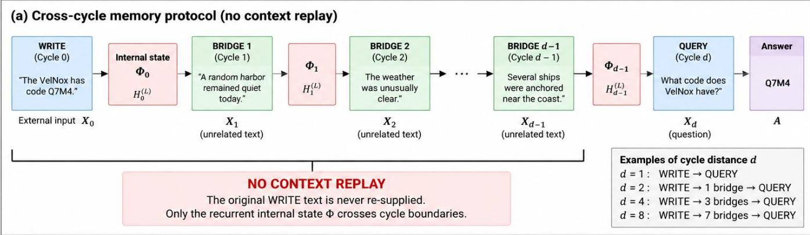

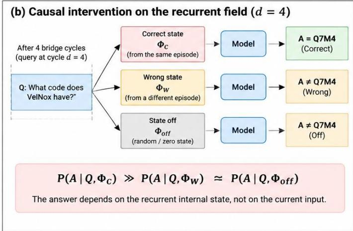

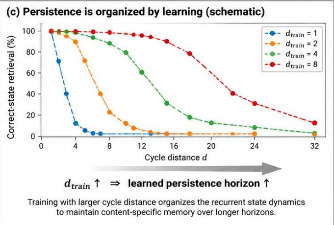  
FIG. 7. Experimental protocol for persistent memory through recurrent cognitive-field dynamics. (a) Cross-cycle memory protocol without context replay. During the initial WRITE $\mathrm { c y c l e , }$ the model receives a randomly generated entity–attribute binding and forms the token-resolved recurrent field $\Phi _ { 0 } .$ . The original WRITE context is then removed and is never supplied again. Across the following $d - 1$ bridge cycles, unrelated external inputs $X _ { 1 } , \ldots , X _ { d - 1 }$ continuously perturb the network while the internally generated field is propagated through the recurrent trajectory $\Phi _ { 0 }  \Phi _ { 1 }  \cdot \cdot \cdot  \Phi _ { d - 1 }$ . At cycle distance $d ,$ a QUERY asks for the information originally presented during the WRITE cycle. (b) Causal intervention on the recurrent field. For an identical query and matched intervening inputs, retrieval is evaluated using the history-matched field $\Phi _ { C }$ , an unrelated field ΦW, or with recurrent re-entry disabled $\Phi _ { \mathrm { o f f } }$ . Content-specific memory requires $P ( A \mid Q , \Phi _ { C } ) \gg P ( A \mid Q , \Phi _ { W } ) \simeq P ( A$ $Q , \Phi _ { \mathrm { o f f } } )$ . (c) Schematic illustration of learning-dependent persistence. Increasing the cycle distance imposed during recurrent training shifts the retention profile toward longer temporal horizons, $d _ { \mathrm { t r a i n } } \uparrow \Rightarrow d _ { \mathrm { m e m o r y } } \uparrow$ . The protocol therefore tests persistent memory as a learned dynamical property of an evolving cognitive field rather than as replay of the original context or storage in an external memory bufer.

After $d - 1$ intervening bridge cycles, a QUERY asks for the attribute associated with the original entity,

$$
( Q _ { d } , \Phi _ { d - 1 } ) \longrightarrow A .\tag{63}
$$

The cycle distance d therefore corresponds to the separation between the original WRITE event and the final QUERY, with d − 1 intervening recurrent transformations.

No replay of the original context, external memory bufer, or re-supply of the WRITE sequence is used during this interval. The remembered information must instead remain functionally represented along the evolving recurrent trajectory

$$
\Phi _ { 0 } \longrightarrow \Phi _ { 1 } \longrightarrow \cdots \longrightarrow \Phi _ { d - 1 } ,\tag{64}
$$

while unrelated external inputs continuously perturb the system. Persistent memory is therefore tested here as a dynamical property of the evolving cognitive field rather than as continued access to a stored external context.

As in the selective-retrieval experiment, the source of successful retrieval is verified by direct intervention on the recurrent field. For the same QUERY and the same intervening bridge inputs, we compare three conditions: a correct field $\Phi _ { C }$ propagated from the corresponding WRITE episode, a wrong field $\Phi _ { W }$ propagated from an unrelated episode, and an OFF condition in which recurrent re-entry is removed. The causal criterion is therefore

$$
P ( A \mid Q , \Phi _ { C } ) \gg P ( A \mid Q , \Phi _ { W } ) \simeq P ( A \mid Q , \Phi _ { \mathrm { o f f } } ) .
$$

Because the correct and wrong fields traverse the same intervening inputs, a selective advantage of $\Phi _ { C }$ identifies information carried specifically by the recurrent field rather than by the bridge sequences themselves.

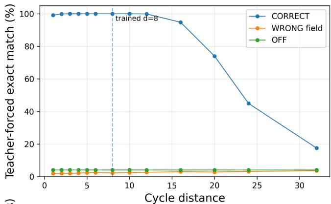

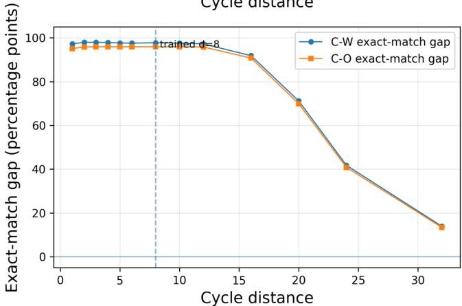  
FIG. 8. Long-horizon persistence of content-specific information in the recurrent cognitive field. Long-horizon retention for the CFN trained at cycle distance $d _ { \mathrm { t r a i n } } = 8$ and evaluated without additional optimization or replay of the original WRITE context. The vertical dashed line marks the temporal distance used during training. (Upper) Exact-match retrieval under the correct-field (C), wrong-field (W), and stateof (O) interventions. Retrieval with the history-matched field remains near perfect throughout the trained interval and substantially beyond it, before undergoing a gradual longdistance decay. In contrast, the wrong-field and state-of controls remain near background levels across the full evaluation range. (Lower) Content-specific memory signal quantified by the correct–wrong $( C - W )$ and correct–OFF $( C - O )$ exactmatch diferences. Both signals remain large well beyond the trained distance and decay together with the absolute correct-field retrieval. The persistence observed at long cycle distances therefore reflects information carried specifically by the propagated recurrent field rather than a rising background retrieval probability. The gradual decay further shows that persistent memory is realized as a finite but extended dynamical lifetime of the evolving cognitive field, rather than as an exactly conserved or non-decaying state.

Figure 8 shows the resulting long-horizon behavior for a model trained at cycle distance $d _ { \mathrm { t r a i n } } = 8$ . Correctfield retrieval remains essentially perfect throughout the trained interval and substantially beyond it. Exactmatch accuracy remains 100% at $d \ : = \ : 8$ and $d \ = \ 1 0$ and approximately 99.9% at $d = 1 2$ . Beyond this extended plateau, retrieval decays gradually, reaching approximately 95% at $d \ : = \ : 1 6$ , 74% at $d = 2 0$ , 45% at $d = 2 4$ , and 18% at $d = 3 2$ . The wrong-field and OFF controls, by contrast, remain near only a few percent throughout the same interval.

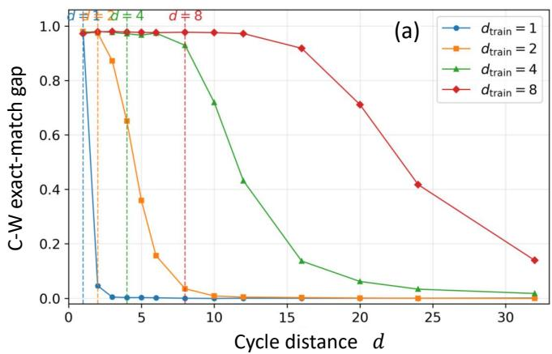

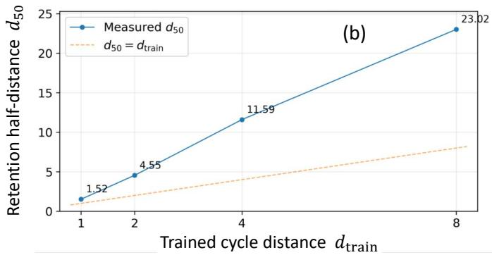  
FIG. 9. Learning organizes the temporal persistence scale of the recurrent cognitive field. (a) Content-specific long-horizon retention for models trained at cycle distances $d _ { \mathrm { t r a i n } } = 1 , 2 , 4 ,$ and 8. Retention is quantified by the correct–wrong exactmatch diference ${ \mathcal { M } } ( d ) .$ , isolating the behavioral contribution of information carried specifically by the history-matched recurrent field. The vertical dashed lines indicate the corresponding cycle distances used during training. As $d _ { \mathrm { t r a i n } }$ increases, the entire retention profile is systematically displaced toward longer cycle distances, and substantial content-specific memory remains detectable beyond the temporal horizon explicitly encountered during training. (b) Empirical retention half-distance $d _ { 5 0 }$ , defined by $\mathcal { M } ( d _ { 5 0 } ) ~ = ~ \mathcal { M } _ { 0 } / 2$ , as a function of the trained cycle distance. The measured values $d _ { 5 0 } \simeq 1 . 5 2$ , 4.55, 11.59, and 23.02 for $d _ { \mathrm { t r a i n } } = 1 , 2 , 4 ,$ , and $^ { 8 , }$ respectively, increase strongly with the temporal range imposed during learning. The dashed line $d _ { 5 0 } = d _ { \mathrm { t r a i n } }$ provides a reference for a persistence horizon equal to the trained distance. The systematic extension beyond this reference shows that learning does not merely enable retrieval at a prescribed delay, but reorganizes the recurrent dynamics to produce a progressively longer content-specific persistence timescale. These results establish persistence as a learnable dynamical property of the evolving cognitive field rather than a fixed timescale imposed by the recurrent architecture.

The lower panel of Fig. 8 isolates the content-specific contribution by plotting the correct–wrong and correct– OFF exact-match diferences. Both remain large well beyond the trained distance and decay together with the absolute correct-field retrieval. The long-horizon signal therefore cannot be explained by an increasing background probability of producing the correct answer. Instead, information specific to the original WRITE episode remains behaviorally accessible through repeated transformations of the recurrent field before gradually relaxing at longer cycle distances.

The finite decay is itself informative. Persistent memory in the CFN does not require a perfectly conserved or non-decaying internal state. Rather, the field remains content bearing over a finite dynamical timescale while continuing to undergo recurrent transformation. This behavior is qualitatively consistent with the finite-gap nearcritical dynamics discussed in Sec. : long-lived cognitive organization can coexist with finite forgetting rather than requiring exact dynamical freezing.

Persistence is a learnable dynamical scale. We next ask whether this persistence timescale is fixed by the recurrent architecture or can itself be reorganized by learning. To test this, otherwise identical models were trained with progressively larger recurrent-memory distances, $d _ { \mathrm { t r a i n } } ~ = ~ 1 , 2 , 4 , 8$ , and each model was subsequently evaluated at cycle distances extending well beyond its respective training horizon. No additional optimization, gradient update, or replay of the original WRITE context was performed during long-horizon evaluation.

To isolate information carried specifically by the recurrent field, we define the content-specific memory signal

$$
{ \mathcal { M } } ( d ) \equiv P _ { \mathrm { E M } } ( A \mid C , d ) - P _ { \mathrm { E M } } ( A \mid W , d ) ,\tag{65}
$$

where $C$ and W denote the correct-field and wrong-field conditions, respectively. Thus, $\mathcal M ( d )$ measures the behavioral retrieval advantage attributable specifically to the episode-dependent content of the propagated recurrent field.

Figure $9 ( \mathrm { a } )$ reveals a systematic learning-dependent displacement of the entire retention profile. A model trained only at $d _ { \mathrm { t r a i n } } = 1$ loses most of its content-specific signal immediately beyond the trained cycle boundary. Training at $d _ { \mathrm { t r a i n } } = 2$ shifts the decay toward longer distances, while the $d _ { \mathrm { t r a i n } } = 4$ model maintains a strong signal over a much broader recurrent trajectory. Most strikingly, after training at $d _ { \mathrm { t r a i n } } = 8$ , retention remains near its maximal value substantially beyond the trained horizon and is still clearly detectable at $d = 3 2$ . The learned memory therefore does not terminate at the largest temporal separation explicitly encountered during training.

To characterize this displacement without imposing a specific functional form on the decay, we define the empirical retention half-distance $d _ { 5 0 }$ by

$$
\mathcal { M } ( d _ { 5 0 } ) = \frac 1 2 \mathcal { M } _ { 0 } ,\tag{66}
$$

where $\mathcal { M } _ { 0 }$ denotes the initial content-specific memory signal. The crossing is estimated directly from the measured retention curve.

As shown in Fig. 9(b), the resulting persistence horizon increases strongly with the temporal distance used during training. The measured half-distances are approximately $d _ { 5 0 } ~ = ~ 1 . 5 2 , 4 . 5 5 , 1 1 . 5 9$ , and 23.02 cycles for $d _ { \mathrm { t r a i n } } = 1 , 2 , 4$ , and 8, respectively. Except for the shortest-distance condition, the measured half-distance substantially exceeds the corresponding trained cycle distance. Training at $d _ { \mathrm { t r a i n } } = 4$ , for example, produces $d _ { 5 0 } \simeq 1 1 . 6$ , while training at $d _ { \mathrm { t r a i n } } = 8$ extends the halfretention distance to approximately 23 cycles.

The systematic displacement of the full retention profile distinguishes learning a dynamical persistence scale from merely learning to answer at a prescribed delay. If the model had learned only a distance-specific retrieval rule, performance would be expected to deteriorate near the temporal boundary encountered during training. Instead, increasing $d _ { \mathrm { t r a i n } }$ reorganizes the recurrent dynamics so that content-specific information remains accessible substantially beyond that boundary. The learned quantity is therefore not simply performance at a particular delay, but the temporal stability of the content-bearing recurrent field.

At a coarse-grained level, this behavior can be related to the relaxational structure developed in the preceding subsection. If a content-specific component of the cognitive field is dominated by an efective slow relaxation scale, its decay may be represented schematically as

$$
m ( d ) \sim e ^ { - r _ { \mathrm { e f f } } d } , \qquad d _ { \mathrm { m e m o r y } } \sim \frac { 1 } { r _ { \mathrm { e f f } } } .\tag{67}
$$

The measured $d _ { 5 0 }$ therefore provides an operational behavioral timescale for the recurrent field. Increasing the training distance systematically shifts this timescale toward longer recurrent trajectories; in this coarse-grained interpretation, the observed increase of $d _ { 5 0 }$ corresponds to a decrease of an efective relaxation scale $r _ { \mathrm { e f f } }$

This interpretation should not be identified with a direct measurement of the microscopic relaxation spectrum or of the cognitive forgetting gap $r _ { \mathrm { c o g } }$ . Nevertheless, it provides a natural behavioral counterpart to the infrared collective dynamics observed in Sec. . There, learning was shown to reorganize the distribution of relaxation rates and the infrared collective dressing. Here, learning is independently shown to reorganize the observable timescale over which content-specific information remains accessible.

The measured retention curves should not be taken to establish a particular asymptotic relaxation law. They contain an extended high-retention regime followed by a crossover and eventual decay, and the available cycledistance sampling does not uniquely distinguish exponential, stretched-exponential, power-law, or other phenomenological forms. For this reason, $d _ { 5 0 }$ is used as a model-independent operational measure of persistence rather than as evidence for a specific long-time decay law.

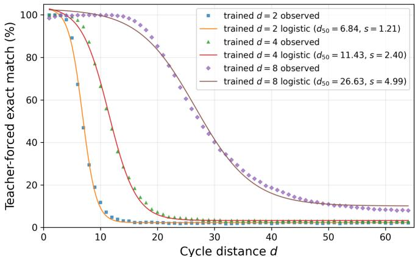  
FIG. 10. Learning-dependent displacement of long-horizon memory retention under semantic continuation. Teacherforced exact-match accuracy as a function of cycle distance d for CFN models trained at $d _ { \mathrm { t r a i n } } = 2 , 4$ , and 8 using semanticcontinuation bridges. Symbols show the measured retention values, and solid curves show four-parameter logistic fits. Increasing the training distance systematically shifts the entire forgetting transition toward longer cycle distances, with fitted midpoints $d _ { 5 0 } = 6 . 8 4$ , 11.43, and 26.63 for $d _ { \mathrm { t r a i n } } = 2 , 4$ and 8, respectively. In each case, the characteristic retention horizon extends substantially beyond the temporal distance explicitly imposed during training. The logistic curves provide a phenomenological characterization of the behavioral retention profiles and are not assumed to represent a microscopic relaxation law. The systematic displacement of both the retention midpoint and transition width shows that temporal learning reorganizes the characteristic persistence scale of the recurrent cognitive field.

Taken together, Figs. 7– 9 establish that persistent memory in the CFN is a learned dynamical property of the recurrent cognitive field. The field is content specific, survives repeated transformations by unrelated inputs, remains causally necessary for later retrieval, and acquires a persistence horizon that systematically increases with the temporal range imposed during learning.

Persistent cognition therefore does not require a static memory register or an exactly non-decaying state. It can arise from a dynamically evolving cognitive field whose finite relaxation timescale is itself organized by learning.

## IV. PERSISTENT AND ADAPTIVE COGNITIVE DYNAMICS

Section III established that the recurrent cognitive field can carry content-specific information across multiple inference cycles and that its persistence timescale can itself be reorganized by learning. Those experiments used randomly generated neutral bridges between the source and query, providing a stringent test of retention under intervening inputs unrelated to the original episode.

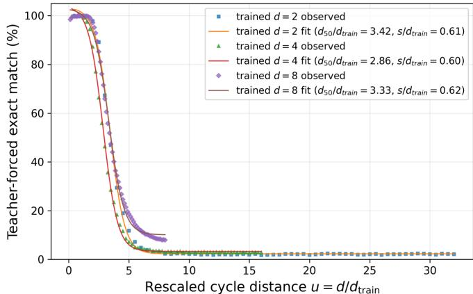  
FIG. 11. Approximate temporal scaling collapse of learned recurrent-memory retention. Normalized retention ${ \widetilde { C } } = ( C -$ $C _ { \infty } ) / ( C _ { 0 } - C _ { \infty } )$ is plotted against the rescaled cycle distance $u = d / d _ { \mathrm { t r a i n } }$ for CFN models trained at $d _ { \mathrm { t r a i n } } = 2 , 4$ , and 8 using semantic-continuation bridges. Symbols show the measured retention values, and solid curves show the corresponding logistic fits. Despite the factor-of-four variation in the trained cycle distance, the three retention profiles collapse onto a narrow common transition region after temporal rescaling. The remaining horizontal variation is consistent with the modest diferences in $d _ { 5 0 } / d _ { \mathrm { t r a i n } }$ across the three models. The collapse indicates that the learned retention profiles are approximately related by a common temporal rescaling rather than by independent distance-specific forgetting curves. This behavior provides evidence that temporal learning reorganizes the characteristic timescale of recurrent memory, producing an approximate one-parameter scaling structure governed by $d / d _ { \mathrm { t r a i n } }$ . The observed collapse is empirical over the training distances examined here and is not intended to imply a universal scaling function.

Natural cognitive trajectories, however, rarely evolve through entirely unrelated inputs. Subsequent observations often remain semantically connected to an ongoing episode even when the specific information required for later recall is not repeated. We therefore extend the analysis to semantic-continuation bridges that remain related to the entities, relations, or context of the source episode while excluding the target answer values. This allows us to test whether the evolving recurrent field is supported by the semantic structure of the subsequent trajectory without direct replay of the remembered information.

This regime is distinct from the explicit source reexposure examined later in this section. Semantic continuation provides related contextual input while requiring the existing recurrent field to preserve the target information, whereas source re-exposure deliberately reintroduces the original source and tests whether a partially decayed field can be renewed. The two experiments therefore probe complementary aspects of adaptive cognitive dynamics: context-supported persistence and input-driven renewal.

We first examine how semantic continuation modifies long-horizon retention and whether the learned persistence scale continues to expand with temporal training. We then ask whether subsequent content-matched input can renew a decaying recurrent field and sustain a nonzero memory state over extended recurrent trajectories. Together, these experiments move beyond passive retention toward a dynamical picture in which cognitive persistence depends jointly on the learned recurrent field and its continuing interaction with relevant experience.

## A. Learned temporal scaling of recurrent memory

Section III showed that the persistence horizon of the recurrent field can be extended by temporal learning under random intervening inputs. We now ask whether a comparable organization persists when the intervening trajectory remains semantically related to the source episode. To test this, otherwise identical CFN models were trained using semantic-continuation bridges at cycle distances $d _ { \mathrm { t r a i n } } = 2 , 4$ , and 8 and subsequently evaluated over the common long-horizon range $1 \leq d \leq 6 4$ . No additional optimization was performed during long-horizon evaluation, and the target answer values were excluded from all intervening bridges.

Figure 10 shows the resulting teacher-forced exactmatch retention curves. Increasing the training distance produces a pronounced displacement of the entire forgetting transition toward longer cycle distances. The model trained at $d _ { \mathrm { t r a i n } } = 2$ loses most of its retrievable content within approximately ten cycles, whereas the $d _ { \mathrm { t r a i n } } = 4$ model retains substantial accuracy over a broader range. For $d _ { \mathrm { t r a i n } } = 8 .$ , retrieval remains close to its short-distance plateau far beyond the trained horizon before entering a broad long-distance decay. Semantic continuation therefore supports an extended but still finite memory lifetime whose characteristic range depends strongly on temporal training.

To quantify this displacement, each retention curve was fit to the four-parameter decreasing logistic form

$$
C ( d ) = C _ { \infty } + \frac { C _ { 0 } - C _ { \infty } } { { 1 + \exp [ ( d - d _ { 5 0 } ) / s ] } } ,\tag{68}
$$

where $C _ { 0 }$ and $C _ { \infty }$ denote the fitted short- and longdistance levels, $d _ { 5 0 }$ is the midpoint of the fitted dynamical range, and s sets the width of the forgetting transition. The logistic form is used only as a phenomenological parameterization of task-level retention and is not assumed to represent a microscopic relaxation law.

The fitted parameters are summarized in Table III. All three retention profiles are described accurately by the logistic form, with $R ^ { 2 } = 0 . 9 9 8 5 , 0 . 9 9 8 7$ , and 0.9968 for $d _ { \mathrm { t r a i n } } = 2 , 4$ , and 8, respectively.

TABLE III. Logistic characterization of long-horizon recurrent-memory retention under semantic continuation. The midpoint $d _ { 5 0 }$ and transition scale s are obtained from Eq. (68). The transition width is $\Delta d _ { 9 0  1 0 } = 2 s \ln 9$ . The last two columns show the fitted midpoint and transition scale normalized by the training distance.
<table><tr><td> $d _ { \mathrm { t r a i n } }$ </td><td> $d _ { 5 0 }$ </td><td>S</td><td> $\Delta d _ { 9 0  1 0 }$ </td><td> $d _ { 5 0 } / d _ { \mathrm { t r a i n } }$ </td><td> $s / d _ { \mathrm { t r a i n } }$ </td></tr><tr><td>2</td><td>6.84</td><td>1.21</td><td>5.32</td><td>3.42</td><td>0.605</td></tr><tr><td>4</td><td>11.43</td><td>2.40</td><td>10.54</td><td>2.86</td><td>0.600</td></tr><tr><td>8</td><td>26.63</td><td>4.99</td><td>21.95</td><td>3.33</td><td>0.624</td></tr></table>

Two systematic features are evident. First, the retention midpoint increases strongly with the temporal range imposed during training, from $d _ { 5 0 } = 6 . 8 4$ at $d _ { \mathrm { t r a i n } } = 2$ to 11.43 at $d _ { \mathrm { t r a i n } } = 4$ and 26.63 at $d _ { \mathrm { t r a i n } } = 8$ . The characteristic forgetting scale therefore lies substantially beyond the corresponding training horizon.

Second, the width of the forgetting transition expands together with the training distance. The fitted transition scales are $s = 1 . 2 1 , 2 . 4 0$ , and 4.99, corresponding to $s / d _ { \mathrm { t r a i n } } = 0 . 6 0 5 , \ 0 . 6 0 0$ , and 0.624. Over the range examined here, the width parameter is therefore approximately proportional to the temporal scale imposed during training. Learning shifts not only the location of the forgetting transition but also the temporal extent over which that transition occurs.

This near-proportionality motivates a direct scaling test. We introduce the rescaled cycle distance and normalized retention

$$
u = \frac { d } { d _ { \mathrm { t r a i n } } } , \qquad \widetilde { C } = \frac { C - C _ { \infty } } { C _ { 0 } - C _ { \infty } } .\tag{69}
$$

If the training horizon organizes the characteristic temporal scale of the recurrent dynamics, retention curves obtained at diferent $d _ { \mathrm { t r a i n } }$ should approximately collapse when expressed in terms of these dimensionless variables.

Figure 11 shows this comparison. Despite the factorof-four variation in training distance, the three measured curves collapse onto a narrow common transition region after rescaling by $d _ { \mathrm { t r a i n } }$ . The remaining horizontal displacement is consistent with the modest variation in $d _ { 5 0 } / d _ { \mathrm { t r a i n } }$ across the three models. The collapse therefore indicates that the observed retention profiles are approximately related by a common temporal rescaling rather than representing unrelated distance-specific solutions.

The behavior can be summarized phenomenologically as

$$
\begin{array} { r l r } {  { C ( d ; d _ { \mathrm { t r a i n } } ) \simeq C _ { \infty } ( d _ { \mathrm { t r a i n } } ) } } \\ & { } & { + [ C _ { 0 } ( d _ { \mathrm { t r a i n } } ) - C _ { \infty } ( d _ { \mathrm { t r a i n } } ) ] \mathcal { F } \bigg ( \frac { d } { d _ { \mathrm { t r a i n } } } \bigg ) , } \end{array}\tag{70}
$$

with an approximately sigmoid scaling function characterized, over the present range, by a midpoint of order $d _ { 5 0 } / d _ { \mathrm { t r a i n } } \sim 3 . 2$ and a normalized transition scale $s / d _ { \mathrm { t r a i n } } \sim 0 . 6 1$ . These numerical values should not be interpreted as universal constants. Only three training distances are examined, and the fitted long-distance floor, particularly for $d _ { \mathrm { t r a i n } } = 8$ , remains sensitive to the finite observation window. The significant result is the approximate one-parameter temporal collapse itself.

This result extends the learned-persistence behavior of Sec. III in an important way. The recurrent architecture does not impose a single fixed memory lifetime, nor does temporal training merely teach successful retrieval at one prescribed delay. Instead, changing the temporal range of learning systematically rescales the behavioral persistence profile of the content-bearing field. The memory horizon is therefore an adaptive dynamical property of the learned recurrent system.

The semantic-continuation experiment also shows that this persistence is shaped by the trajectory through which the recurrent field evolves. Relevant intervening inputs can support the propagation of a content-bearing field without explicitly replaying the target information. Persistence in the CFN is therefore not simply passive survival of a fixed internal representation, but a dynamical process conditioned by the continuing interaction between the recurrent field and subsequent input.

This observation motivates the next question. If semantically related input can support an existing recurrent field without replaying its target content, can direct re-exposure to the source actively renew a field that has already begun to decay? We address this input-driven renewal regime in the following subsection.

## B. Field re-entry, driven renewal, and persistent cognitive dynamics

The long-horizon recurrent experiments reveal two complementary properties of the learned CFN dynamics. First, the recurrent cognitive field exhibits finite but learnable persistence when content-relevant input is removed. Second, subsequent input can selectively reorganize and renew a partially surviving field. Together, these observations provide a computational realization of the driven recurrent inference dynamics developed in Sec. II.C.

The essential correspondence is not that the CFN stores a static representation of previous input. Rather, newly presented information acts on a collective state generated by preceding inference, while that state remains dynamically available through cross-cycle field reentry. At the computational level,

$$
\Phi _ { t + 1 } = F _ { \theta } \left( X _ { t + 1 } , \Phi _ { t } \right) ,
$$

so that current inference depends jointly on newly presented information and on the internally generated field inherited from the preceding cycle.

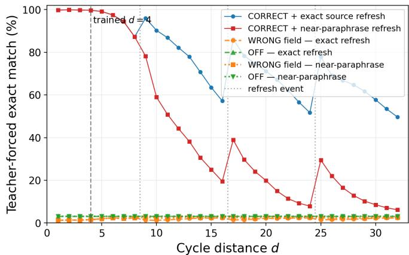  
FIG. 12. Representation-sensitive renewal of a decaying recurrent cognitive field. Long-horizon retrieval under periodic source-related re-exposure for a CFN trained with semantic continuation. Exact re-exposure presents the original source representation, whereas near-paraphrased re-exposure presents a semantically related reformulation while preserving the same underlying episode. Target answer values are not supplied by the intervening semantic-continuation bridges. Exact source re-exposure produces pronounced repeated recovery of correct-field retrieval after intervening decay, whereas near-paraphrased re-exposure produces substantially weaker renewal, particularly at longer cycle distances. Wrong-field and recurrent-field-of controls remain near background levels, showing that the recovery is not explained by the generic presentation of additional input. The diference between exact and near-paraphrased re-exposure therefore demonstrates that renewal depends on how efectively the incoming representation couples to the existing content-bearing recurrent field.

As derived in Sec. II.C, the corresponding continuoustime field-theoretic dynamics may be written in coarsegrained form as

$$
\partial _ { t } \phi ( t ) = - r \phi ( t ) + \int _ { t _ { 0 } } ^ { t } d t ^ { \prime } K ( t - t ^ { \prime } ) \phi ( t ^ { \prime } ) + I _ { \mathrm { e f f } } ( t ) + \xi _ { \mathrm { e f f } } ( t ) ,\tag{71}
$$

where the memory kernel describes endogenous collective feedback, whereas $I _ { \mathrm { e f f } } ( t )$ describes the efective finite cognitive drive generated after incoming information has coupled to the collective dynamical manifold. The microscopic origin of this drive is the mode-selective projection

$$
b _ { \alpha } ( t ) = \widetilde { u } _ { \alpha } ^ { \dagger } B _ { \mathcal { X } } I ( t ) ,\tag{72}
$$

derived in Sec. II.C. Thus, new information does not act on an empty state. It perturbs a memory-dressed collective field whose present configuration already contains the dynamical consequences of preceding inference.

At a coarse-grained discrete level, the CFN dynamics may therefore be represented schematically as

$$
\Phi _ { t + 1 } = \mathcal { D } _ { t } [ \Phi _ { t } ] + \mathcal { R } _ { t } [ X _ { t + 1 } , \Phi _ { t } ] ,\tag{73}
$$

where $\mathcal { D } _ { t }$ denotes propagation and relaxation of the existing recurrent field and $\mathcal { R } _ { t }$ denotes its input-dependent reorganization. Equation (73) should not be interpreted as an independent phenomenological memory model. It summarizes the two dynamical components directly realized by the CFN: persistence of the preceding field and its reorganization by subsequent input.

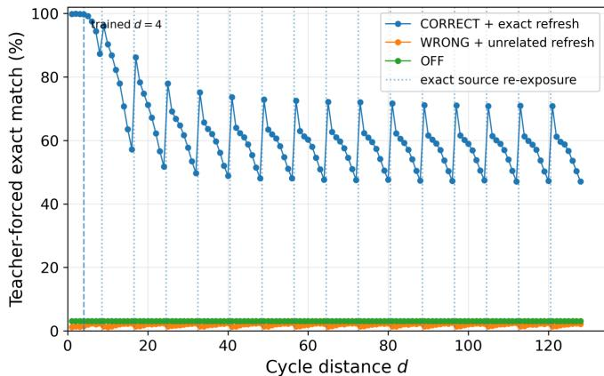  
FIG. 13. Emergence of a nonzero periodically driven cognitive-field regime under repeated content-matched reexposure. Long-horizon retrieval for a CFN trained at $d _ { \mathrm { t r a i n } } = 4$ and periodically re-exposed to the exact contentmatched source every eight recurrent cycles. Between successive re-exposure events, correct-field retrieval gradually decreases, while each source presentation produces a pronounced content-specific recovery, generating a characteristic sawtooth trajectory. The peak–trough envelope decreases during the initial transient but subsequently approaches an approximately stationary nonzero regime over the extended 128-cycle observation window. At late cycle distances, correct-field retrieval remains far above the wrong-field and recurrentfield-of controls, which stay near background levels. The long-time behavior is therefore consistent with a periodically driven memory-dressed field in which finite relaxation between source presentations is repeatedly compensated by content-specific renewal. No continuing systematic decay of the late-time periodic envelope toward the control baseline is resolved within the observation window; the result therefore supports a sustained driven regime over the measured trajectory rather than mathematically infinite memory.

This distinction is directly visible in the passiveretention experiments. When subsequent input provides little support for the represented content, the recurrent state evolves predominantly through its internally generated relaxation dynamics. Within Cognitive Field Theory, the low-frequency stability of the memory-dressed field is characterized by the cognitive forgetting gap, $r _ { \mathrm { c o g } } = r - \Sigma _ { R } ( 0 )$ . The corresponding dressed cognitive propagator is

$$
L _ { \mathrm { c o g } } ( \Omega ) = \frac { 1 } { - i \Omega + r - \Sigma _ { R } ( \Omega ) } .
$$

In a stationary linearized regime, $L _ { \mathrm { { c o g } } } ( \Omega )$ coincides with the retarded susceptibility defined with respect to an infinitesimal auxiliary probe, $\chi _ { R } ( \Omega ) = L _ { \mathrm { c o g } } ( \Omega )$ . This response probe should be distinguished from the finite cognitive input that drives inference.

Within a local low-frequency approximation in which the residual frequency dependence of the self-energy is neglected, the passive persistence scale behaves as

$$
\tau _ { \mathrm { c o g } } \sim \frac { 1 } { r _ { \mathrm { c o g } } } .\tag{74}
$$

The learning-dependent extension of the behavioral retention horizon observed in Secs. III and IV.A is therefore consistent with a reorganization of the efective temporal structure of the recurrent field. The present behavioral measurements do not, however, directly measure $r _ { \mathrm { c o g } } .$ A quantitative identification would require the collective spectrum, self-energy, and behavioral retention scale to be measured jointly in the same trained models.

The source-re-exposure experiments probe a complementary property of the dynamics. Rather than measuring only how long an internally generated state survives in the absence of relevant support, they test how subsequent content-specific information acts on a partially surviving recurrent field. For a re-exposed source $I _ { \mathrm { r e } } ( t )$ the field-theoretic mode-selective drive takes the form

$$
b _ { \alpha } ^ { \mathrm { r e } } ( t ) = \widetilde { u } _ { \alpha } ^ { \dagger } B _ { \mathcal { X } } I _ { \mathrm { r e } } ( t ) .\tag{75}
$$

Diferent incoming representations therefore need not perturb the existing cognitive state in the same way. Their efects depend on how strongly they couple to the collective directions available in the learned dynamical geometry.

Because the recurrent field has not generally returned to an empty state before re-exposure, this new modeselective perturbation acts on a state that already contains residual collective organization from preceding inference. The observed recovery should therefore not be interpreted as a simple reset of the recurrent state or as an extension of the original context. At the field-theoretic level, the process is represented schematically by

$$
I _ { \mathrm { r e } } \longrightarrow \{ b _ { \alpha } ^ { \mathrm { r e } } \} \longrightarrow \delta \{ \mathcal { X } _ { \alpha } \} \longrightarrow \delta \phi \longrightarrow \delta y ,\tag{76}
$$

whereas at the CFN level the same process is realized through the input-dependent recurrent map, $\Phi _ { t + 1 } =$ $F _ { \theta } \left( X _ { t + 1 } , \Phi _ { t } \right)$ . The incoming representation therefore reorganizes a cognitive field that is already dynamically conditioned by its own preceding history.

At suficiently low frequencies, this driven reorganization can be represented schematically as

$$
\partial _ { t } \phi ( t ) \simeq - r _ { \mathrm { c o g } } \phi ( t ) + I _ { \mathrm { r e l } } ( t ) ,\tag{77}
$$

where $I _ { \mathrm { r e l } } ( t )$ denotes the net low-frequency efective drive generated after the incoming representation has coupled to the relevant memory-bearing collective sector. Equation (77) is therefore a coarse-grained limit of the moderesolved driven dynamics derived in Sec. II.C, rather than an independent assumption about cognitive input.

When content-specific support is removed, the same local low-frequency approximation gives

$$
\phi ( t ) \sim e ^ { - r _ { \mathrm { c o g } } t } ,\tag{78}
$$

so that $r _ { \mathrm { c o g } } > 0$ corresponds to a finite passive retention scale. This approximation describes the efective slow relaxation governed by the forgetting gap; the full non-Markovian field dynamics can in general contain additional frequency-dependent or long-time structure inherited from $\Sigma _ { R } ( \Omega )$

Finite passive relaxation, however, does not imply that a cognitive state receiving continuing relevant input must possess the same finite lifetime. For an approximately constant efective low-frequency drive, $I _ { \mathrm { r e l } } ( t ) =$ $I _ { * } ,$ , Eq. (77) gives

$$
\phi _ { * } = \frac { I _ { * } } { r _ { \mathrm { c o g } } } ,\tag{79}
$$

provided $r _ { \mathrm { c o g } } > 0$ and the static low-frequency approximation remains valid. Here $I _ { * }$ represents the net contribution generated by continuing content-relevant excitation of the collective sector rather than an infinitesimal response probe. A positive cognitive forgetting gap is therefore compatible with a nonzero cognitive field dynamically sustained by continuing relevant experience.

The periodic source-re-exposure experiments provide a computational test of this distinction between passive persistence and driven maintenance. When a partially relaxed recurrent field is periodically presented with content-matched source information, each presentation produces a new input-dependent reorganization of the existing state. For recurrence interval $T _ { r }$ , the driven system may approach a periodic asymptotic regime,

$$
\phi _ { * } ( t + T _ { r } ) \simeq \phi _ { * } ( t ) .\tag{80}
$$

A minimal stroboscopic description, evaluated immediately after successive renewal events, is

$$
m _ { n + 1 } ^ { + } = A _ { r } m _ { n } ^ { + } + \Delta _ { r } , \quad \quad | A _ { r } | < 1 ,\tag{81}
$$

where $m _ { n } ^ { + }$ denotes a content-specific projection of the recurrent field immediately after the nth renewal event, $A _ { r }$ represents the net relaxation over one re-exposure interval, and $\Delta _ { r }$ denotes the field reorganization generated by the incoming source. The corresponding periodically driven fixed point is

$$
m _ { * } ^ { + } = \frac { \Delta _ { r } } { 1 - A _ { r } } .\tag{82}
$$

A nonzero asymptotic recurrent state can therefore coexist with finite relaxation between successive renewal events.

Figure 12 shows that the renewal amplitude is strongly representation dependent. Exact source re-exposure produces substantially stronger recovery than nearparaphrased re-exposure, whereas unrelated input and recurrent-field-of controls remain near background levels. The efect therefore cannot be attributed simply to the addition of new input. Recovery depends on the relation between the incoming representation and the content-bearing recurrent state.

This representation dependence is consistent with the mode-selective input coupling derived in Sec. II.C, $b _ { \alpha } ^ { \mathrm { r e } } =$ $\widetilde { u } _ { \alpha } ^ { \dagger } B _ { \mathcal { X } } I _ { \mathrm { r e } }$ . Diferent representations can therefore generate diferent perturbations of the collective-mode manifold. At the CFN level, the corresponding renewal may be written schematically as

$$
\Delta _ { r } = \mathcal { R } \left( X _ { r } , \Phi _ { r } \right) .\tag{83}
$$

The stronger recovery produced by exact than by nearparaphrased re-exposure is therefore consistent with stronger efective coupling between the incoming representation and the content-bearing recurrent state.

The present behavioral measurements do not directly determine the microscopic modal overlaps $\widetilde { u } _ { \alpha } ^ { \dagger } B _ { X } I _ { \mathrm { r e } }$ . The correspondence should therefore be understood operationally: the observed representation dependence has the qualitative structure expected from mode-selective excitation, but direct verification requires simultaneous measurement of the internal collective modes and their input projections.

The extended periodic-re-exposure experiment provides a second test of the driven interpretation. For the model trained at $d _ { \mathrm { t r a i n } } = 4$ , exact source re-exposure every eight recurrent cycles initially produces a decreasing peak–trough envelope. At longer cycle distances, however, the trajectory approaches an approximately stationary sawtooth regime. Across the extended 128-cycle observation window, no continuing systematic decay of the late-time periodic envelope toward the control baseline is resolved.

This behavior is naturally described by Eqs. (80) and (82). The recurrent field relaxes between successive source presentations, producing the descending portion of each sawtooth, while content-matched input reorganizes and renews the relevant field component. The initial decrease of the envelope can therefore be interpreted as a transient from the strongly encoded initial condition toward a nonzero periodically driven regime, without requiring a second independent relaxation process that continues indefinitely toward zero.

This interpretation does not imply mathematically infinite memory. The experiment probes only a finite recurrent trajectory, and the passive-retention measurements independently demonstrate finite relaxation. The stronger conclusion is dynamical: finite passive relaxation does not impose the same finite lifetime on a recurrent cognitive state that continues to interact with content-relevant experience. The state may relax locally between inputs while remaining macroscopically sustained through repeated input-dependent reorganization.

The diference between exact and near-paraphrased reexposure also clarifies the present computational regime. The CFN studied here has limited semantic capacity, and its renewal response remains sensitive to the particular representation supplied to the recurrent system. Longlived recurrent dynamics therefore does not require sophisticated linguistic reasoning. Rather, the experiments establish that a temporal substrate combining collective persistence, finite relaxation, recurrent field propagation, and representation-dependent renewal can already arise in a relatively small recurrent Transformer.

Semantic representational capacity and temporal persistence are therefore distinct properties. More capable models may develop greater invariance of the efective input coupling, allowing paraphrases, implications, intermediate deductions, or other semantically related inputs to reorganize the same underlying cognitive state. This remains a prediction for future work rather than a conclusion of the present experiments.

Taken together, these experiments reveal a dynamical distinction that is central to the CFN. Memory dressing allows preceding collective dynamics to remain represented in the current cognitive field, while finite cognitive input continuously reorganizes this already historydependent state. Cross-cycle field re-entry then makes the resulting field causally available to subsequent computation. Field persistence, input-dependent reorganization, and field re-entry therefore represent distinct but dynamically connected processes.

In this restricted dynamical sense, cross-cycle field reentry introduces a minimal form of self-reference: subsequent inference is conditioned not only on newly arriving information but also on an internally generated, memorydressed collective state shaped by preceding inference. Here self-reference refers specifically to recursive dynamical conditioning and does not imply metacognition or self-awareness.

The CFN should therefore be viewed not merely as a memory-augmented Transformer, but as a computational system in which a finitely relaxing collective state remains causally available to subsequent inference and can be continuously reorganized by new experience. Persistent adaptive cognition does not require internal information to cease decaying. Rather, it can arise when a memory-bearing collective state remains dynamically available while continuing information modifies the state from which subsequent cognition proceeds.

## V. DISCUSSION

The central implication of the present study is not simply that recurrent computation can extend memory. Rather, field re-entry changes the causal organization of inference. In a conventional unidirectional computation, an internally generated hidden state primarily contributes to the production of the current output. In the CFN, by contrast, the collective state generated during one computational cycle remains available to subsequent computation together with newly arriving information,

$$
\Phi _ { t + 1 } = F _ { \theta } ( X _ { t + 1 } , \Phi _ { t } ) .
$$

The internally generated field is therefore not only a consequence of previous inference. It becomes part of the causal conditions governing future inference.

Repeated across computational cycles, this organization introduces a minimal form of dynamical selfreference. The present computation depends partly on a collective state generated by the system’s own preceding computation, and the resulting state can again partici pate in the computation that follows. The system’s past internal dynamics thereby become part of the conditions governing its future dynamics. We use the term selfreference strictly in this dynamical sense. The present results do not establish self-awareness, consciousness, or metacognition.

The experiments show that learning can organize this re-entry pathway into nontrivial persistent dynamics. The recurrent field develops a learnable persistence scale, remains functionally accessible far beyond the trained recurrent horizon along supportive trajectories, and can be selectively renewed after partial relaxation by subsequent content-related input. Periodic exact source reexposure further produces an approximately stationary nonzero driven regime over the extended observation window, whereas unrelated-input and recurrence-of controls do not reproduce this behavior. Near-paraphrased input produces weaker renewal than exact source re-exposure in the present model. These observations indicate that the recurrent pathway does not merely preserve an unchanged hidden state. Its functional dynamics depend on learning, elapsed recurrent time, the evolving inter nal trajectory, and the representational relation between incoming information and the existing field.

This distinction changes the interpretation of persistent cognition. Persistence need not require an internally conserved or permanently nondecaying memory representation. Within Cognitive Field Theory, passive relaxation is characterized by the memory-dressed cognitive forgetting scale, $r _ { \mathrm { c o g } } = r - \Sigma _ { R } ( 0 )$ . A positive forgetting gap therefore permits finite passive relaxation, while subsequent relevant information can continue to act on and reorganize the surviving memory-bearing field. The long-horizon periodic experiments provide a computational example of this distinction. The field relaxes when unsupported, yet repeated content-matched input can repeatedly renew it and sustain an approximately stationary driven regime. This should not be interpreted as evidence for infinite memory. Rather, it shows that finite forgetting and persistent cognitive organization can coexist within the same dissipative recurrent dynamics.

This perspective also suggests a diferent view of continuous cognition. A system engaged in extended reasoning need not preserve the exact internal representation produced by its original input. Its cognitive state may instead evolve continuously as irrelevant components relax, useful organization remains available, and new observations, intermediate deductions, or contextual information reorganize the state from which subsequent inference proceeds. Cognitive continuity would then correspond not to repeated retrieval of a static record, but to continuity of an evolving internal trajectory. Memory and inference become dynamically intertwined: information organized by previous computation remains part of the present state, while new information acts on that state to generate what comes next.

The present CFN is intentionally minimal in this respect. The architecture does not prescribe which information should be remembered, how long it should persist, when it should be retrieved, or how strongly subsequent information should modify it. It provides a causal pathway through which a previously generated collective state can participate in subsequent computation. Learning determines how this pathway is functionally used. Persistence, retrieval, relaxation, and renewal are therefore learned properties of recurrent collective dynamics rather than explicit operations imposed by a separate memory controller. The significance of the architecture lies less in recurrence itself than in making an internally generated collective state available as a persistent, manipulable, and causally efective variable of subsequent inference.

There is also a useful distinction from earlier theories of reentry. In the Edelman–Tononi tradition [25, 26], reentry refers broadly to ongoing reciprocal signaling among distributed neuronal populations through which neural activity becomes dynamically coordinated and integrated. The present framework addresses a related but distinct dynamical question. Cognitive Field Theory describes how collective dynamics generates a memorydressed, history-dependent cognitive field, whereas the CFN makes this already organized field causally available to subsequent inference. Field formation, inputdependent field reorganization, and field re-entry are therefore explicitly distinguished in the present framework. The relation to earlier reentry theories is conceptual rather than one of theoretical identity, while the CFN provides a controlled computational setting in which these processes can be separately manipulated and measured.

This minimal dynamical transition also suggests a possible biological interpretation. The present study does not establish the historical evolution of biological cognition, and the CFN should not be regarded as a model of the detailed circuitry or evolutionary history of a nervous system. Nevertheless, recurrent re-entry identifies a simple principle that could in principle provide a substantial functional transition. A system whose internally generated activity contributes only to its immediate response can process current environmental information. Once part of that internally generated activity becomes available to subsequent processing, however, the system acquires an additional causal resource: the consequences of its own past activity. Learning or biological adaptation can then organize not only responses to the external environment, but also how previously generated internal states influence subsequent processing.

From this perspective, recurrent re-entry provides a minimal dynamical route from transient information processing toward history-dependent and recursively selfconditioned cognition. The claim is not that re-entry alone explains the evolution of intelligence, nor that biological cognition necessarily arose through a single architectural transition. Rather, the present results isolate a computational principle by which the consequences of previous internal computation can become available to organize future computation. If biological neural systems exploit an analogous principle, recurrent access to internally generated collective states could provide a substrate on which progressively richer forms of persistent and self-conditioned cognition are organized.

This interpretation also gives the CFN a role beyond that of a recurrent memory architecture. Because the recurrent field is directly accessible, the CFN provides an experimentally controllable platform in which an inter nally generated cognitive state can be recorded, removed, perturbed, allowed to relax, selectively renewed by external information, and then made available again to subsequent inference. The consequences of these interventions can be measured both in the subsequent hidden dynamics and in behavior. Cognitive phenomena can therefore be investigated not only through final task performance, but also through controlled manipulation of an internal state that participates causally in future computation.

The present experiments establish only the first levels of such a program. They demonstrate learnable persistence, finite forgetting, content-dependent renewal, recurrent history dependence, and a long-lived driven regime. They do not demonstrate metacognition. However, the same framework makes progressively higherorder questions experimentally accessible. One can ask, for example, whether a recurrent system can learn to detect information represented in its own ongoing state, evaluate an internally represented inconsistency or uncertainty, and selectively modify that state before subsequent inference. Self-correction could then be studied as a causal transformation of an accessible internal state rather than inferred only from improvement in the final output. Whether such dynamics emerges is an empirical question and should not be assumed from recurrence or self-reference alone.

The collective spectral measurements provide a complementary physical description of this recurrent organization. Learning produces substantial reorganization of the collective relaxation spectrum and its infrared sector before the network reaches its later stable recurrent regime. These observations are qualitatively compatible with the memory-dressed near-critical picture of Cognitive Field Theory. The present experiments, however, do not yet establish the full quantitative field-theoretic correspondence. In particular, the field-theoretic selfenergy, cognitive forgetting scale, and behavioral persistence scale have not yet been independently measured and quantitatively matched within the same trained states.

Such a comparison provides one of the most stringent tests for future work. The collective relaxation spectrum can be used to infer the memory kernel, self-energy, and efective cognitive forgetting scale, while recurrent perturbation and renewal experiments can independently measure behavioral relaxation and driven persistence. Agreement between these independently obtained quantities would connect the internal collective spectrum directly to observable cognitive dynamics. Controlled perturbations of the recurrent field and external input could further provide operational measurements of cognitive response, including susceptibility, state dependence, and possible hysteretic efects. The CFN therefore makes it possible to ask not only whether a system remembers, but how its internal cognitive state responds to controlled intervention and whether the resulting response follows the dynamical relations predicted by Cognitive Field Theory.

The broader objective of the present work is consequently not merely to construct a system that remembers for a longer period. It is to develop an experimentally testable description of how an internally generated collective state forms, persists, relaxes, responds to new information, reorganizes, and becomes causally available to its own subsequent dynamics. Field formation, informationdriven reorganization, and field re-entry describe distinct but connected aspects of this process. The first concerns the emergence and persistence of a memory-bearing collective state, the second concerns how continuing experience modifies that state, and the third concerns how the resulting state participates in generating subsequent cognition.

Persistent cognition, on this view, does not require a system to learn never to forget. It requires a dynamical organization in which relevant consequences of past computation remain available, obsolete information can relax, new experience can reorganize the current state, and that reorganized state can participate in determining what the system does next. The CFN provides a minimal computational setting in which these processes can be separated, perturbed, and measured. Whether increasingly capable systems can extend this mechanism from source-specific renewal to abstract semantic continuity, autonomous self-correction, and long-duration continuous reasoning is now a concrete experimental question.

## VI. CONCLUSION

We introduced the Cognitive Field Network as a recurrent architecture in which an internally generated cognitive field remains causally available to subsequent inference. The central result is that learning can organize this re-entry pathway into a functional dynamical substrate that supports content-dependent persistence, causal influence on later computation, and selective renewal by subsequent input.

The experiments show that this persistence is dynamical rather than equivalent to permanent storage. Without relevant support, recurrent information relaxes over a finite timescale, whereas semantically continuing trajectories and content-matched re-exposure can sustain or renew the surviving field. Repeated relevant input can therefore produce a stable nonzero recurrent regime even when passive forgetting remains finite.

These results provide a computational realization of the central CFT picture developed in this work. Collective relaxation dynamics generate a memory-dressed cognitive field, finite incoming information reorganizes that field, and cross-cycle re-entry makes the resulting historydependent state available to subsequent inference. Persistent cognition can therefore arise not from the elimination of forgetting, but from the continuing interaction between finite persistence, new information, and recurrent field reorganization.

The present CFN is deliberately minimal, and its renewal remains representation sensitive. Future work should determine whether larger systems can extend this mechanism to increasingly abstract semantic transforma tions, intermediate reasoning states, and autonomously generated information. More generally, the CFN provides a controlled computational setting for relating measurable collective dynamics to persistent, historydependent cognition.

Acknowledgements—This work was partially supported by the Institute of Information & Communications Technology Planning & Evaluation (IITP) grant funded by the Korea government (MSIT) (IITP-RS-2025- 02214780).

The author acknowledges the support of ChatGPT (GPT-5, OpenAI) for assistance in literature review and conceptual structuring during early development.

[1] W. Gerstner, W. M. Kistler, R. Naud, and L. Paninski, Neuronal Dynamics (Cambridge University Press, 2014).

[2] E. K. Miller and J. D. Cohen, “An integrative theory

of prefrontal cortex function,” Annual Review of Neuroscience 24, 167–202 (2001).

[3] V. A. F. Lamme and P. R. Roelfsema, “The distinct modes of vision ofered by feedforward and recurrent processing,” Trends in Neurosciences 23, 571–579 (2000).

[4] M. G. Stokes, “Activity-silent working memory in prefrontal cortex: a dynamic coding framework,” Trends in Cognitive Sciences 19, 394–405 (2015).

[5] T. B. Christophel, P. C. Klink, B. Spitzer, P. R. Roelfsema, and J.-D. Haynes, “The distributed nature of working memory,” Trends in Cognitive Sciences 21, 111–124 (2017).

[6] E. K. Miller, M. Lundqvist, and A. M. Bastos, “Working Memory 2.0,” Neuron 100, 463–475 (2018).

[7] B. G. Chae, “Cognitive field theory: Memory-dressed collective dynamics of intelligence,” arXiv preprint arXiv:2601.10221v8 (2026).

[8] B. G. Chae, “Infrared organization and critical cognitive field formation in Transformer dynamics,” arXiv preprint arXiv:2607.10923v4 (2026).

[9] A. Vaswani, N. Shazeer, N. Parmar, J. Uszkoreit, L. Jones, A. N. Gomez, L. Kaiser, and I. Polosukhin, “Attention is all you need,” Advances in Neural Information Processing Systems (2017).

[10] A. Radford, K. Narasimhan, T. Salimans, and I. Sutskever, “Improving language understanding by generative pre-training,” OpenAI (2018).

[11] A. Radford, J. Wu, R. Child, D. Luan, D. Amodei, and I. Sutskever, “Language models are unsupervised multitask learners,” OpenAI (2019).

[12] T. B. Brown, B. Mann, N. Ryder, M. Subbiah, J. Kaplan et al., “Language models are few-shot learners,” Advances in Neural Information Processing Systems, 1877– 1901 (2020).

[13] J. Hofmann, S. Borgeaud, A. Mensch, E. Buchatskaya, T. Cai, E. Rutherford et al., “Training compute-optimal large language models,” Advances in Neural Information Processing Systems, 30016–30030 (2022).

[14] Z. Dai, Z. Yang, Y. Yang, J. Carbonell, Q. V. Le, and R. Salakhutdinov, “Transformer-XL: Attentive language models beyond a fixed-length context,” in Proceedings of the 57th Annual Meeting of the Association for Computational Linguistics (ACL), 2978–2988 (2019).

[15] A. Fan, T. Lavril, E. Grave, A. Joulin, and S. Sukhbaatar, “Addressing some limitations of Transformers with feedback memory,” arXiv preprint arXiv:2002.09402 (2020).

[16] Q. Wu, Z. Lan, K. Qian, J. Gu, A. Geramifard, and Z. Yu, “Memformer: A memory-augmented Transformer for sequence modeling,” arXiv preprint arXiv:2010.06891 (2020).

[17] D. Ju, S. Roller, S. Sukhbaatar, and J. Weston, “Staircase attention for recurrent processing of sequences,” arXiv preprint arXiv:2106.04279 (2021).

[18] A. Bulatov, Y. Kuratov, and M. S. Burtsev, “Recurrent memory Transformer,” Advances in Neural Information Processing Systems 35 (2022).

[19] D. Hutchins, I. Schlag, Y. Wu, E. Dyer, and B. Neyshabur, “Block-Recurrent Transformers,” Advances in Neural Information Processing Systems 35 (2022).

[20] I. Rodkin, Y. Kuratov, A. Bulatov, and M. Burtsev, “Associative recurrent memory Transformer,” ICML 2024 Workshop on Next Generation of Sequence Modeling Architectures (2024); arXiv preprint arXiv:2407.04841.

[21] C.-A. Oncescu, D. Morwani, S. Jelassi, A. Meterez, M. Kwun, and S. Kakade, “The recurrent Transformer: Greater efective depth and eficient decoding,” arXiv preprint arXiv:2604.21215 (2026).

[22] I. Schlag, K. Irie, and J. Schmidhuber, “Linear transformers are secretly fast weight programmers,” arXiv preprint arXiv:2102.11174 (2021).

[23] A. Katharopoulos, A. Vyas, N. Pappas, and F. Fleuret, “Transformers are RNNs: Fast autoregressive transformers with linear attention,” arXiv preprint arXiv:2006.16236 (2020).

[24] B. G. Chae, “Cognitive-field-based artificial intelligence system using recursive cognitive state feedback and longterm adaptation, and operating method thereof,” KR patent application 10-2026-0142548 (2026).

[25] G. M. Edelman, Neural Darwinism: The Theory of Neuronal Group Selection (Basic Books, New York, 1989).

[26] G. Tononi, O. Sporns, and G. M. Edelman, “A measure for brain complexity: Relating functional segregation and integration in the nervous system,” Proc. Natl. Acad. Sci. USA 91, 5033-5037 (1994).

# Supplementary Materials

Appendix A: Driven Cognitive-Field Dynamics, Memory Dressing, and Field Re-entry

The main text describes cognitive inference as a driven collective dynamical process in which incoming information acts on an already history-dependent cognitive state. The purpose of this Appendix is to make the corresponding dynamical structure explicit and to distinguish two forms of recurrence that play diferent roles in Cognitive Field Theory (CFT) and the Cognitive Field Network (CFN).

The projection procedure used below is closely related to the linear Mori–Zwanzig construction: eliminating a complementary dynamical sector generates an efective equation containing a retarded memory kernel and an effective fluctuating force. Here this standard projection principle is specialized to the cognitive-field decomposition. This makes it possible to relate the memory kernel explicitly to the non-Hermitian collective relaxation spectrum and, at the same time, to determine how a finite cognitive input is transmitted through that spectrum to the macroscopic cognitive field.

The resulting memory dressing should not be identified with the cross-cycle field re-entry introduced by the CFN. Memory dressing is an endogenous consequence of eliminating internal collective modes that remain dynamically coupled to the cognitive field. Field re-entry instead makes an already organized cognitive field causally available to a subsequent inference cycle. The distinction between these two dynamical levels is the central purpose of the derivation below.

I. Driven cognitive dynamics and collective projection. We begin from the cognitive dynamics linearized around a reference trajectory or locally stationary cognitive state,

$$
\partial _ { t } \delta x ( t ) = - J \delta x ( t ) + B I ( t ) + \xi ( t ) ,\tag{A1}
$$

where δx(t) denotes the deviation of the microscopic or mesoscopic cognitive state from the reference state, $J$ is the local stability operator, I(t) is the external cognitive input, B specifies how that input couples to the internal cognitive degrees of freedom, and ξ(t) denotes unresolved fluctuations.

Importantly, Eq. (A1) is not a linear-response definition. The input I(t) is part of the physical dynamical equation and may be finite. The approximation at this stage is the local linearization of the internal dynamics around the chosen trajectory or state, rather than an assumption that the cognitive input itself is infinitesimal.

To separate the macroscopic cognitive field from the complementary dynamical sector, let v denote a right collective direction and w the corresponding left projection vector, normalized by

$$
w ^ { \dagger } v = 1 .\tag{A2}
$$

We define

$$
P = v w ^ { \dagger } , \qquad Q = 1 - P ,\tag{A3}
$$

so that

$$
P ^ { 2 } = P , \qquad Q ^ { 2 } = Q , \qquad P Q = Q P = 0 .\tag{A4}
$$

The macroscopic collective coordinate and complemen tary relaxation sector are then

$$
\phi ( t ) = w ^ { \dagger } \delta x ( t ) , \qquad \chi ( t ) = Q \delta x ( t ) ,\tag{A5}
$$

and therefore

$$
\delta x ( t ) = v \phi ( t ) + \mathcal { X } ( t ) , \qquad w ^ { \dagger } \mathcal { X } ( t ) = 0 .\tag{A6}
$$

The macroscopic field is thus not introduced as an additional degree of freedom on top of a complete microscopic mode expansion. Rather, the full dynamical state is first separated into a collective coordinate and a complementary sector. The relaxation modes introduced below are modes of this complementary sector.

II. Exact field–mode block dynamics. Applying w† and Q to Eq. (A1), and using Eq. (A6), gives

$$
\partial _ { t } \phi ( t ) = - r \phi ( t ) + D \mathcal { X } ( t ) + B _ { \phi } I ( t ) + \xi _ { \phi } ( t ) ,\tag{A7}
$$

$$
\partial _ { t } \mathcal { X } ( t ) = - M \mathcal { X } ( t ) + C \phi ( t ) + B _ { \mathcal { X } } I ( t ) + \xi _ { \mathcal { X } } ( t ) ,\tag{A8}
$$

where

$$
\begin{array} { r l r } { \boldsymbol { r } \equiv \boldsymbol { w } ^ { \dag } \boldsymbol { J } \boldsymbol { v } , \quad } & { \boldsymbol { D } \equiv - \boldsymbol { w } ^ { \dag } \boldsymbol { J } \boldsymbol { Q } , \quad } & { \boldsymbol { C } \equiv - \boldsymbol { Q } \boldsymbol { J } \boldsymbol { v } , } \\ { \boldsymbol { M } \equiv \boldsymbol { Q } \boldsymbol { J } \boldsymbol { Q } , \quad } & { \boldsymbol { B } _ { \phi } \equiv \boldsymbol { w } ^ { \dag } \boldsymbol { B } , \quad } & { \boldsymbol { B } _ { \mathcal { X } } \equiv \boldsymbol { Q } \boldsymbol { B } , } \\ { \xi _ { \phi } \equiv \boldsymbol { w } ^ { \dag } \xi , \quad } & { \xi _ { \mathcal { X } } \equiv \boldsymbol { Q } \xi . } \end{array}\tag{A9}
$$

These equations constitute the exact block representation of the locally linearized driven dynamics for fixed projectors. They also show that the direct drive of the macroscopic field and the excitation of the complementary relaxation sector originate from the same microscopic input BI(t). No independent field-level source needs to be introduced.

This point is important for cognitive inference. Incoming information is not simply appended to an already constructed macroscopic field equation. It first acts on the underlying cognitive degrees of freedom, and its effective action on the field is determined by the learned collective dynamical structure.

III. Non-Hermitian collective relaxation modes. The complementary operator

$$
M = Q J Q\tag{A10}
$$

is generally non-Hermitian for nonequilibrium cognitive dynamics. We therefore introduce biorthogonal right and left eigenmodes,

$$
M u _ { \alpha } = \mu _ { \alpha } u _ { \alpha } , \qquad \widetilde { u } _ { \alpha } ^ { \dagger } M = \mu _ { \alpha } \widetilde { u } _ { \alpha } ^ { \dagger } , \qquad \widetilde { u } _ { \alpha } ^ { \dagger } u _ { \beta } = \delta _ { \alpha \beta } ,\tag{A11}
$$

with

$$
\begin{array} { r } { \mu _ { \alpha } = \lambda _ { \alpha } + i \omega _ { \alpha } . } \end{array}\tag{A12}
$$

Here $\lambda _ { \alpha }$ is the relaxation rate and $\omega _ { \alpha }$ is the intrinsic circulation frequency of the collective mode.

Expanding

$$
\mathcal { X } ( t ) = \sum _ { \alpha } \mathcal { X } _ { \alpha } ( t ) u _ { \alpha } ,\tag{A13}
$$

and projecting Eq. (A8) onto the left eigenvectors gives

$$
\partial _ { t } \mathcal { X } _ { \alpha } ( t ) = - \mu _ { \alpha } \mathcal { X } _ { \alpha } ( t ) + c _ { \alpha } \phi ( t ) + b _ { \alpha } ( t ) + \eta _ { \alpha } ( t ) ,\tag{A14}
$$

where

$$
\begin{array} { r } { c _ { \alpha } = \widetilde { u } _ { \alpha } ^ { \dagger } C , \qquad b _ { \alpha } ( t ) = \widetilde { u } _ { \alpha } ^ { \dagger } B _ { \mathcal { X } } I ( t ) , \qquad \eta _ { \alpha } ( t ) = \widetilde { u } _ { \alpha } ^ { \dagger } \xi _ { \mathcal { X } } ( t ) . } \end{array}\tag{A15}
$$

Similarly,

$$
D \mathcal { X } ( t ) = \sum _ { \alpha } d _ { \alpha } \mathcal { X } _ { \alpha } ( t ) , \qquad d _ { \alpha } = D u _ { \alpha } ,\tag{A16}
$$

so that the field equation becomes

$$
\partial _ { t } \phi ( t ) = - r \phi ( t ) + \sum _ { \alpha } d _ { \alpha } { \mathcal X } _ { \alpha } ( t ) + B _ { \phi } I ( t ) + { \xi } _ { \phi } ( t ) .\tag{A17}
$$

Equations (A14) and (A17) make explicit the dynamical role of finite cognitive input. The quantity $b _ { \alpha } ( t )$ is the mode-selective input overlap: it determines how strongly incoming information excites each collective relaxation direction. The resulting perturbation then evolves according to the intrinsic relaxation and circulation scales $\left( \lambda _ { \alpha } , \omega _ { \alpha } \right)$ while remaining coupled to the macroscopic field through $c _ { \alpha }$ and $d _ { \alpha }$

Thus the same collective spectrum mediates both the internal field–mode feedback and the dynamical transmission of new information.

IV. Elimination of the relaxation sector and memory dressing. The exact solution of Eq. (A14) for an initial time $t _ { 0 }$ is

$$
\begin{array} { l } { \displaystyle \mathcal { X } _ { \alpha } ( t ) = e ^ { - \mu _ { \alpha } ( t - t _ { 0 } ) } \mathcal { X } _ { \alpha } ( t _ { 0 } ) } \\ { \displaystyle \qquad + \int _ { t _ { 0 } } ^ { t } d t ^ { \prime } e ^ { - \mu _ { \alpha } ( t - t ^ { \prime } ) } \left[ c _ { \alpha } \phi ( t ^ { \prime } ) + b _ { \alpha } ( t ^ { \prime } ) + \eta _ { \alpha } ( t ^ { \prime } ) \right] . } \end{array}\tag{A18}
$$

Substitution into Eq. (A17) eliminates the complementary relaxation sector and yields

$$
\begin{array} { l } { { \partial _ { t } \phi ( t ) = - r \phi ( t ) + \displaystyle \int _ { t _ { 0 } } ^ { t } d t ^ { \prime } K ( t - t ^ { \prime } ) \phi ( t ^ { \prime } ) } } \\ { { \ ~ + I _ { \mathrm { e f f } } ( t ) + \xi _ { \mathrm { e f f } } ( t ) + \zeta _ { \mathrm { i n i t } } ( t ) , } } \end{array}\tag{A19}
$$

where

$$
K ( \tau ) = \Theta ( \tau ) \sum _ { \alpha } d _ { \alpha } c _ { \alpha } e ^ { - \mu _ { \alpha } \tau }\tag{A20}
$$

is the internally generated memory kernel,

$$
I _ { \mathrm { e f f } } ( t ) = B _ { \phi } I ( t ) + \sum _ { \alpha } d _ { \alpha } \int _ { t _ { 0 } } ^ { t } d t ^ { \prime } e ^ { - \mu _ { \alpha } ( t - t ^ { \prime } ) } b _ { \alpha } ( t ^ { \prime } )\tag{A21}
$$

is the efective cognitive drive,

$$
\xi _ { \mathrm { e f f } } ( t ) = \xi _ { \phi } ( t ) + \sum _ { \alpha } d _ { \alpha } \int _ { t _ { 0 } } ^ { t } d t ^ { \prime } e ^ { - \mu _ { \alpha } ( t - t ^ { \prime } ) } \eta _ { \alpha } ( t ^ { \prime } )\tag{A22}
$$

is the efective fluctuating force, and

$$
\zeta _ { \mathrm { i n i t } } ( t ) = \sum _ { \alpha } d _ { \alpha } e ^ { - \mu _ { \alpha } ( t - t _ { 0 } ) } \mathscr { X } _ { \alpha } ( t _ { 0 } )\tag{A23}
$$

contains the decaying dependence on the initial complementary state.

Equation (A19) has the generalized-Langevin structure expected from a Mori–Zwanzig-type elimination. The important specialization here is that both the memory kernel and the efective finite cognitive drive are resolved explicitly in terms of the same collective relaxation modes.

The two terms nevertheless represent diferent causal processes. The kernel K is generated by endogenous field–mode coupling: the existing field perturbs the complementary collective modes and their subsequent dynamics feeds back onto the field. By contrast, $I _ { \mathrm { e f f } }$ describes how new external information excites those modes and is subsequently transmitted to the macroscopic field. Memory dressing and information driving therefore share the same collective dynamical manifold without being the same physical process.

V. Spectral representation and the driven cognitive field. The mode-resolved memory kernel may be written in terms of the coupling-weighted spectral density

$$
\rho _ { K } ( \lambda , \omega ) = \sum _ { \alpha } d _ { \alpha } c _ { \alpha } \delta ( \lambda - \lambda _ { \alpha } ) \delta ( \omega - \omega _ { \alpha } ) ,\tag{A24}
$$

which gives

$$
K ( t ) = \Theta ( t ) \int d \lambda d \omega \rho _ { K } ( \lambda , \omega ) e ^ { - \lambda t } e ^ { - i \omega t } .\tag{A25}
$$

The coupling-weighted density $\rho _ { K }$ should be distinguished from the normalized collective mode density

$$
\rho ( \lambda , \omega ) = \frac { 1 } { N } \sum _ { \alpha } \delta ( \lambda - \lambda _ { \alpha } ) \delta ( \omega - \omega _ { \alpha } ) .\tag{A26}
$$

When the field–mode couplings vary slowly across the infrared sector, the two inherit the same leading infrared structure up to the corresponding coupling weight.

Using the Fourier convention

$$
\phi ( t ) = \int \frac { d \Omega } { 2 \pi } e ^ { - i \Omega t } \phi ( \Omega ) ,\tag{A27}
$$

the memory self-energy becomes

$$
\Sigma _ { R } ( \Omega ) = \int _ { 0 } ^ { \infty } d t e ^ { i \Omega t } K ( t ) = \sum _ { \alpha } { \frac { d _ { \alpha } c _ { \alpha } } { \mu _ { \alpha } - i \Omega } } ,\tag{A28}
$$

or equivalently

$$
\Sigma _ { R } ( \Omega ) = \int d \lambda d \omega \frac { \rho _ { K } ( \lambda , \omega ) } { \lambda - i ( \Omega - \omega ) } .\tag{A29}
$$

For an input coupling that is linear in I, define

$$
q _ { \alpha } \equiv \widetilde { u } _ { \alpha } ^ { \dagger } B _ { X } .\tag{A30}
$$

The corresponding input-transfer function is

$$
\mathcal { T } _ { I } ( \Omega ) = B _ { \phi } + \sum _ { \alpha } \frac { d _ { \alpha } q _ { \alpha } } { \mu _ { \alpha } - i \Omega } ,\tag{A31}
$$

so that

$$
I _ { \mathrm { e f f } } ( \Omega ) = \mathcal { T } _ { I } ( \Omega ) I ( \Omega ) .\tag{A32}
$$

Neglecting the decaying initial transient, the driven cognitive-field equation becomes

$$
\left[ - i \Omega + r - \Sigma _ { R } ( \Omega ) \right] \phi ( \Omega ) = \mathcal { T } _ { I } ( \Omega ) I ( \Omega ) + \xi _ { \mathrm { e f f } } ( \Omega ) .\tag{A33}
$$

Defining

$$
L _ { \mathrm { c o g } } ( \Omega ) = \frac { 1 } { - i \Omega + r - \Sigma _ { R } ( \Omega ) } ,\tag{A34}
$$

we obtain

$$
\phi ( \Omega ) = { \cal L } _ { \mathrm { c o g } } ( \Omega ) \mathcal { T } _ { I } ( \Omega ) I ( \Omega ) + { \cal L } _ { \mathrm { c o g } } ( \Omega ) \xi _ { \mathrm { e f f } } ( \Omega ) .\tag{A35}
$$

This expression separates two essential structures of driven cognitive inference. The factor $\mathscr { T } _ { I } ( \Omega ) I ( \Omega )$ describes how new information enters and propagates through the collective mode manifold, whereas $L _ { \mathrm { { c o g } } } ( \Omega )$ describes the memory-dressed internal dynamics through which that information is integrated with the consequences of preceding cognitive activity.

The identity

$$
L _ { \mathrm { c o g } } ^ { - 1 } ( \Omega ) = L _ { 0 } ^ { - 1 } ( \Omega ) - \Sigma _ { R } ( \Omega ) , \qquad L _ { 0 } ( \Omega ) = { \frac { 1 } { - i \Omega + r } } ,\tag{A36}
$$

has the usual Dyson form. No expansion of the external cognitive input is implied by this identity. The self-energy describes internal memory dressing, while the finite input remains the physical drive acting on the dressed dynamical system.

For completeness, a separate infinitesimal auxiliary probe $h ( t )$ may be introduced to define the retarded susceptibility around the driven background,

$$
\chi _ { R } ( t , t ^ { \prime } ; [ I ] ) = \left. \frac { \delta \langle \phi ( t ) \rangle _ { I , h } } { \delta h ( t ^ { \prime } ) } \right| _ { h = 0 } .\tag{A37}
$$

In a stationary linearized regime,

$$
\chi _ { R } ( \Omega ) = L _ { \mathrm { c o g } } ( \Omega ) ,\tag{A38}
$$

but the two roles should not be confused: $I ( t )$ drives the cognitive dynamics, whereas $h ( t )$ probes its response.

In the low-frequency stationary regime one may further define

$$
r _ { \mathrm { c o g } } = r - \Sigma _ { R } ( 0 ) .\tag{A39}
$$

If the residual frequency dependence of the self-energy can be neglected over the relevant range,

$$
L _ { \mathrm { c o g } } ( \Omega ) \simeq \frac { 1 } { - i \Omega + r _ { \mathrm { c o g } } } ,\tag{A40}
$$

giving an efective persistence scale $\tau _ { \mathrm { c o g } } \sim r _ { \mathrm { c o g } } ^ { - 1 }$ . For a broad infrared spectrum, however, $\Sigma _ { R } ( \Omega ) - \Sigma _ { R } ^ { \mathbf { \Sigma } } ( 0 )$ may remain nonanalytic, and the exact long-time relaxation need not be purely exponential.

VI. Memory dressing and cognitive-field re-entry. The derivation above establishes how a historydependent cognitive field arises from the interaction between a macroscopic collective coordinate and a complementary spectrum of relaxation modes. This construction is closely related to the standard Mori–Zwanzig mechanism by which unresolved dynamical degrees of freedom generate a retarded memory kernel after projection.

The CFN introduces a distinct additional operation. The endogenous memory term in Eq. (A19) describes how the cognitive field is dynamically dressed by its internal collective modes. It acts within the continuous field dynamics and is already contained in the efective propagator $L _ { \mathrm { c o g } }$ . It therefore explains how previous internal dynamics remains causally present in the current cognitive field.

Cross-cycle field re-entry instead concerns what the system does with the field after such a state has been organized. As defined in the main text, the CFN makes the recurrent field $\Phi _ { n }$ available as an explicit dynamical condition for the next inference cycle through

$$
\Phi _ { n + 1 } = F _ { \theta } \left( X _ { n + 1 } , \Phi _ { n } \right) .\tag{A41}
$$

The continuous field $\phi ( t )$ and the computational recurrent field $\Phi _ { n }$ are not assumed to be microscopically identical. The CFN equation instead implements at the computational level the causal principle that an internally organized state can participate directly in the generation of its successor.

This distinction is essential. Mori–Zwanzig-type elimination explains why a reduced collective description becomes history dependent after internal degrees of freedom are eliminated. Cognitive-field memory dressing specifies this history dependence in terms of the collective relaxation spectrum and its self-energy. Neither operation by itself requires that the resulting macroscopic field be explicitly supplied to a subsequent inference cycle.

Field re-entry adds precisely this causal pathway. A memory-dressed state generated by preceding dynamics is retained as an active computational variable and is allowed to interact with newly arriving information. Consequently, new input is processed not only through the current microscopic transformation but in the presence of an internally generated field carrying the dynamical consequences of preceding inference.

The theoretical organization of the CFN may therefore be understood as three related but distinct levels. At the first level, collective relaxation modes generate endogenous memory dressing of the macroscopic field. At the second, finite cognitive input selectively excites the same collective manifold and reorganizes the memory-bearing field. At the third, cross-cycle field re-entry makes the resulting field causally available to subsequent inference.

The first two levels follow from the driven collective dynamics derived above. The third is the additional architectural operation implemented by the CFN. It is this separation between the formation of a memory-dressed cognitive field and the subsequent causal reuse of that field that distinguishes field re-entry from the memory kernel generated by projection.

Appendix B: Low-Frequency Driven Cognitive-Field Dynamics, Passive Relaxation, and Periodic Renewal

This Appendix derives the low-frequency relations used in Sec. IV.B to interpret passive retention, continuing content-dependent drive, and periodic source reexposure in the Cognitive Field Network (CFN).

The starting point is the memory-dressed driven cognitive-field equation derived in Sec. II.C and $\mathrm { A p \mathrm { - } }$ pendix A,

$$
\partial _ { t } \phi ( t ) = - r \phi ( t ) + \int _ { t _ { 0 } } ^ { t } d t ^ { \prime } K ( t - t ^ { \prime } ) \phi ( t ^ { \prime } ) + I _ { \mathrm { e f f } } ( t ) + \xi _ { \mathrm { e f f } } ( t ) .\tag{B1}
$$

Here $K ( t )$ is the memory kernel generated by the collective relaxation sector, $I _ { \mathrm { e f f } } ( t )$ is the efective cognitive drive generated after finite external input has coupled to the collective mode manifold, and $\xi _ { \mathrm { e f f } } ( t )$ denotes the corresponding efective fluctuation term.

The purpose of the present Appendix is not to derive the memory kernel again. Rather, we examine several dynamical limits of Eq. (B1) that are directly relevant to the CFN experiments. In particular, we distinguish passive relaxation from externally supported persistence and show how repeated content-dependent re-exposure can generate a stable periodically driven state even when the underlying passive forgetting scale remains finite.

I. Low-frequency reduction of the driven cognitive field. For the deterministic relations considered below, we suppress the efective noise and write

$$
\partial _ { t } \phi ( t ) = - r \phi ( t ) + \int _ { t _ { 0 } } ^ { t } d t ^ { \prime } K ( t - t ^ { \prime } ) \phi ( t ^ { \prime } ) + I _ { \mathrm { e f f } } ( t ) .\tag{B2}
$$

In frequency space,

$$
\left[ - i \Omega + r - \Sigma _ { R } ( \Omega ) \right] \phi ( \Omega ) = I _ { \mathrm { e f f } } ( \Omega ) ,\tag{B3}
$$

where

$$
\Sigma _ { R } ( \Omega ) = \int _ { 0 } ^ { \infty } d t e ^ { i \Omega t } K ( t )\tag{B4}
$$

is the retarded memory self-energy.

As shown in Appendix A, the efective cognitive drive is itself generated by the projection of finite external input onto the collective dynamical manifold,

$$
I _ { \mathrm { e f f } } ( \Omega ) = \mathcal { T } _ { I } ( \Omega ) I ( \Omega ) ,\tag{B5}
$$

with

$$
\mathcal { T } _ { I } ( \Omega ) = B _ { \phi } + \sum _ { \alpha } \frac { d _ { \alpha } q _ { \alpha } } { \mu _ { \alpha } - i \Omega } , \qquad q _ { \alpha } = \widetilde { u } _ { \alpha } ^ { \dag } B _ { \mathcal { X } } .\tag{B6}
$$

Consequently,

$$
\phi ( \Omega ) = \frac { \mathcal { T } _ { I } ( \Omega ) I ( \Omega ) } { - i \Omega + r - \Sigma _ { R } ( \Omega ) } .\tag{B7}
$$

Equation (B7) separates the coupling of new information into the collective manifold from the memorydressed propagation of the resulting perturbation.

To obtain a local low-frequency description, we approximate

$$
\Sigma _ { R } ( \Omega ) \simeq \Sigma _ { R } ( 0 )\tag{B8}
$$

over the frequency range relevant to the efective slow dynamics and define the cognitive forgetting gap

$$
r _ { \mathrm { c o g } } \equiv r - \Sigma _ { R } ( 0 ) .\tag{B9}
$$

The efective field equation then reduces to

$$
\partial _ { t } \phi ( t ) \simeq - r _ { \mathrm { c o g } } \phi ( t ) + I _ { \mathrm { e f f } } ^ { \mathrm { I R } } ( t ) ,\tag{B10}
$$

where $I _ { \mathrm { e f f } } ^ { \mathrm { I R } }$ denotes the low-frequency component of the efective cognitive drive.

Equation (B10) is therefore not an independently postulated phenomenological equation. It is the local lowfrequency limit of the full non-Markovian cognitive-field dynamics.

This reduction should be interpreted with care. If the infrared self-energy retains strong nonanalytic frequency dependence, the exact long-time evolution need not be described by a single exponential decay. The results below therefore characterize the efective local lowfrequency dynamics rather than the most general asymptotic limit of Cognitive Field Theory.

II. Passive relaxation and driven persistence. We first consider the passive regime in which no content-relevant efective drive acts on the cognitive field,

$$
I _ { \mathrm { e f f } } ^ { \mathrm { I R } } ( t ) = 0 .\tag{B11}
$$

Equation (B10) then gives

$$
\partial _ { t } \phi ( t ) = - r _ { \mathrm { { c o g } } } \phi ( t ) ,\tag{B12}
$$

with solution

$$
\phi ( t ) = \phi ( t _ { 0 } ) e ^ { - r _ { \mathrm { c o g } } ( t - t _ { 0 } ) } .\tag{B13}
$$

Within this local approximation, the characteristic passive persistence scale is

$$
\tau _ { \mathrm { c o g } } = \frac { 1 } { r _ { \mathrm { c o g } } } .\tag{B14}
$$

Thus $r _ { \mathrm { c o g } } ~ > ~ 0$ implies finite passive relaxation, while $r _ { \mathrm { c o g } }  0 ^ { + }$ produces increasingly long persistence.

This passive behavior should be distinguished from the dynamics under a continuing relevant drive. For an approximately constant low-frequency drive,

$$
I _ { \mathrm { e f f } } ^ { \mathrm { I R } } ( t ) = I _ { * } ,\tag{B15}
$$

the field obeys

$$
\partial _ { t } \phi ( t ) = - r _ { \mathrm { c o g } } \phi ( t ) + I _ { * } ,\tag{B16}
$$

whose solution is

$$
\phi ( t ) = \frac { I _ { * } } { r _ { \mathrm { c o g } } } + \left( \phi _ { 0 } - \frac { I _ { * } } { r _ { \mathrm { c o g } } } \right) e ^ { - r _ { \mathrm { c o g } } ( t - t _ { 0 } ) } .\tag{B17}
$$

For $r _ { \mathrm { c o g } } > 0$ , the asymptotic driven state is therefore

$$
\phi _ { * } = \frac { I _ { * } } { r _ { \mathrm { c o g } } } .\tag{B18}
$$

A positive forgetting gap consequently implies finite passive persistence, but it does not imply that the cognitive field must vanish when content-relevant input continues to act on the collective dynamics. Passive forgetting and driven persistence are therefore distinct dynamical regimes of the same low-frequency field equation.

III. Periodic source re-exposure and the stroboscopic map. The CFN experiments considered in Sec. IV.B involve repeated presentation of content-relevant information at a recurrence interval $T _ { r }$ . Let

$$
t _ { n } = n T _ { r }\tag{B19}
$$

denote the successive re-exposure times, and let $m _ { n } ^ { + }$ denote the relevant recurrent component sampled immediately after the nth presentation.

In the simplest local approximation, the field relaxes between presentations according to Eq. (B13), giving

$$
m _ { n + 1 } ^ { - } = e ^ { - r _ { \mathrm { c o g } } T _ { r } } m _ { n } ^ { + } .\tag{B20}
$$

If the next content-matched presentation generates an efective renewal contribution $\Delta _ { r } .$ , then

$$
m _ { n + 1 } ^ { + } = m _ { n + 1 } ^ { - } + \Delta _ { r } ,\tag{B21}
$$

and therefore

$$
m _ { n + 1 } ^ { + } = e ^ { - r _ { \mathrm { c o g } } T _ { r } } m _ { n } ^ { + } + \Delta _ { r } .\tag{B22}
$$

This motivates the more general efective stroboscopic description

$$
m _ { n + 1 } ^ { + } = A _ { r } m _ { n } ^ { + } + \Delta _ { r } , \quad \quad | A _ { r } | < 1 ,\tag{B23}
$$

where $A _ { r }$ represents the net propagation and relaxation of the content-specific recurrent component over one reexposure interval.

Only in the simplest local Markovian limit should one identify

$$
A _ { r } = e ^ { - r _ { \mathrm { c o g } } T _ { r } } .\tag{B24}
$$

The full CFN may contain multiple relaxation scales, non-Markovian memory, nonlinear recurrent transformations, and input-dependent state reorganization. Accordingly, $A _ { r }$ should generally be regarded as an efective one-cycle propagation factor rather than as a direct microscopic measurement of $r _ { \mathrm { c o g } }$

Iteration of Eq. (B23) gives

$$
m _ { n } ^ { + } = A _ { r } ^ { n } m _ { 0 } ^ { + } + \frac { \Delta _ { r } ( 1 - A _ { r } ^ { n } ) } { 1 - A _ { r } } ,\tag{B25}
$$

and for $| A _ { r } | < 1$ the asymptotic stroboscopic state is

$$
m _ { * } ^ { + } = \frac { \Delta _ { r } } { 1 - A _ { r } } .\tag{B26}
$$

In the local Markovian limit,

$$
m _ { * } ^ { + } = \frac { \Delta _ { r } } { 1 - e ^ { - r _ { \mathrm { c o g } } T _ { r } } } .\tag{B27}
$$

This relation provides a useful conceptual connection between passive forgetting and periodic renewal, but it should not be interpreted as a quantitative prediction for the CFN unless both $r _ { \mathrm { c o g } }$ and the efective inter-event propagation are independently measured.

IV. Periodic steady state and transient approach. The fixed point in Eq. (B26) does not imply that the field becomes constant throughout each re-exposure interval. It means only that the state sampled at the same phase of successive cycles becomes stationary.

In the local passive-interevent approximation, after the stroboscopic fixed point has been reached,

$$
\phi ( t _ { n } ^ { + } ) = m _ { * } ^ { + } ,\tag{B28}
$$

and for $t _ { n } < t < t _ { n + 1 }$

$$
\phi _ { * } ( t ) = m _ { * } ^ { + } e ^ { - r _ { \mathrm { c o g } } ( t - t _ { n } ) } .\tag{B29}
$$

Immediately before the next re-exposure,

$$
\phi ( t _ { n + 1 } ^ { - } ) = A _ { r } m _ { * } ^ { + }\tag{B30}
$$

in the local approximation, after which the next contentrelevant presentation restores the post-renewal state according to Eq. (B23).

The resulting asymptotic trajectory is therefore periodic,

$$
\phi _ { * } ( t + T _ { r } ) = \phi _ { * } ( t ) ,\tag{B31}
$$

within the idealized periodic model. The approximately stationary sawtooth pattern observed under periodic source re-exposure is the corresponding behavioral signature of repeated finite relaxation followed by contentdependent renewal.

The same stroboscopic map also describes the transient approach to this periodically driven state. Subtracting the fixed point from Eq. (B23) gives

$$
m _ { n } ^ { + } - m _ { * } ^ { + } = A _ { r } ^ { n } \left( m _ { 0 } ^ { + } - m _ { * } ^ { + } \right) .\tag{B32}
$$

Thus, for $0 < A _ { r } < 1$ , an initially strong recurrent state with $m _ { 0 } ^ { + } > m _ { * } ^ { + }$ exhibits a decreasing envelope that converges to the nonzero fixed point $m _ { * } ^ { + }$ rather than necessarily decaying toward zero.

This distinction is important for interpreting extended CFN re-exposure experiments. A decreasing early envelope and a nonzero late-time periodically driven regime are not mutually exclusive interpretations. They can represent successive stages of the same stable driven dynamics.

The discrete map may also be obtained from a continuous periodic drive. Consider

$$
\partial _ { t } \phi ( t ) = - r _ { \mathrm { c o g } } \phi ( t ) + I _ { \mathrm { p e r } } ( t ) , \qquad I _ { \mathrm { p e r } } ( t + T _ { r } ) = I _ { \mathrm { p e r } } ( t ) .
$$

Evolution over one recurrence interval gives

(B33)

$$
\begin{array} { l } { \displaystyle \phi ( t _ { n + 1 } ) = e ^ { - r _ { \mathrm { c o g } } T _ { r } } \phi ( t _ { n } ) } \\ { \displaystyle + \int _ { t _ { n } } ^ { t _ { n + 1 } } d t ^ { \prime } e ^ { - r _ { \mathrm { c o g } } ( t _ { n + 1 } - t ^ { \prime } ) } I _ { \mathrm { p e r } } ( t ^ { \prime } ) . } \end{array}\tag{B34}
$$

Thus the afine stroboscopic map is the natural one-cycle reduction of the locally driven field equation and does not require re-exposure to be represented as an instantaneous impulse.

V. Representation-dependent renewal and field reentry. The efective renewal amplitude $\Delta _ { r }$ is not expected to be independent of the incoming representation. As derived in Appendix A, finite cognitive input excites the complementary collective sector through

$$
b _ { \alpha } ( t ) = \widetilde { u } _ { \alpha } ^ { \dagger } B _ { \mathcal { X } } I ( t ) ,\tag{B35}
$$

and the resulting mode-mediated field drive is

$$
I _ { \mathrm { e f f } } ( t ) = B _ { \phi } I ( t ) + \sum _ { \alpha } d _ { \alpha } \int _ { t _ { 0 } } ^ { t } d t ^ { \prime } e ^ { - \mu _ { \alpha } ( t - t ^ { \prime } ) } b _ { \alpha } ( t ^ { \prime } ) .\tag{B36}
$$

For a re-exposed source $I _ { \mathrm { r e } } ( t )$

$$
b _ { \alpha } ^ { \mathrm { r e } } ( t ) = \widetilde { u } _ { \alpha } ^ { \dagger } B _ { \mathcal { X } } I _ { \mathrm { r e } } ( t ) ,\tag{B37}
$$

so that diferent incoming representations may produce diferent renewal amplitudes even when their overall magnitudes are comparable.

At the coarse-grained CFN level, this dependence may be written as

$$
\Delta _ { r } = \mathcal { R } \left( X _ { r } , \Phi _ { r } \right) ,\tag{B38}
$$

where $X _ { r }$ denotes the re-exposed input representation and $\Phi _ { r }$ the recurrent field on which that input acts.

This expression emphasizes that renewal is not simply the addition of a fixed external quantity. The newly presented information acts on an already existing recurrent state, and the resulting state change depends jointly on the incoming representation and on the field generated by preceding inference.

This is where the recurrent architecture of the CFN becomes essential. The low-frequency memory-dressed equation determines how an internal field persists and relaxes. Cross-cycle field re-entry makes that surviving field available to the next computational cycle. A reexposed source therefore does not act on a blank state; it acts on a partially surviving, history-dependent recurrent field.

Consequently, exact source re-exposure and nearparaphrased re-exposure need not generate the same effective $\Delta _ { r }$ . Their projections onto the learned collective dynamical manifold may difer, and the recurrent field with which they interact may also difer.

The present behavioral measurements do not directly determine the microscopic overlaps $\widetilde { u } _ { \alpha } ^ { \dagger } B _ { X } I _ { \mathrm { r e } }$ Representation-sensitive renewal should therefore be interpreted as being consistent with mode-selective collective excitation rather than as a direct measurement of those microscopic quantities.

VI. Passive forgetting, driven renewal, and persistent recurrent dynamics. The results above show that passive forgetting and persistent driven cognition are diferent limits of the same memory-dressed dynamical framework.

In the absence of content-relevant drive,

$$
I _ { \mathrm { e f f } } ^ { \mathrm { I R } } = 0 ,\tag{B39}
$$

the field relaxes with the efective scale $r _ { \mathrm { c o g } }$

Under continuing relevant input,

$$
I _ { \mathrm { e f f } } ^ { \mathrm { I R } } = I _ { * } ,\tag{B40}
$$

the same field approaches the nonzero driven state $\phi _ { * } =$ $I _ { * } / r _ { \mathrm { c o g } }$ within the local approximation.

Under periodic content-dependent re-exposure, the recurrent component is described at the coarse-grained level by

$$
m _ { n + 1 } ^ { + } = A _ { r } m _ { n } ^ { + } + \Delta _ { r } , ~ m _ { * } ^ { + } = \frac { \Delta _ { r } } { 1 - A _ { r } } .\tag{B41}
$$

The CFN experiments probe this third regime. The recurrent state relaxes between content-matched presentations, while subsequent presentations reorganize the partially surviving field. A nonzero late-time periodic regime is therefore compatible with a finite positive forgetting gap and finite passive retention.

The distinction between passive retention and driven persistence is especially important in the CFN because field re-entry preserves the causal availability of the surviving recurrent state. The field does not need to remain unchanged or infinitely stable in order to influence later cognition. It need only survive suficiently for subsequent input to act on it and reorganize it through the recurrent dynamics.

Accordingly, the central prediction of the lowfrequency description is not infinite memory. It is that finite internal persistence, representation-dependent renewal, and cross-cycle field re-entry can together generate a stable history-dependent recurrent regime.

Beyond the local approximation, the full relation remains

$$
\left[ - i \Omega + r - \Sigma _ { R } ( \Omega ) \right] \phi ( \Omega ) = \mathcal { T } _ { I } ( \Omega ) I ( \Omega ) ,\tag{B42}
$$

so that passive decay, driven maintenance, and periodic renewal should be understood as diferent dynamical limits of the same memory-dressed, externally driven cognitive field.