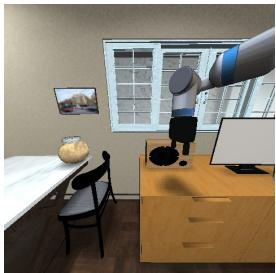
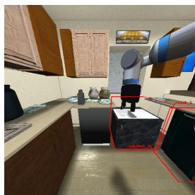
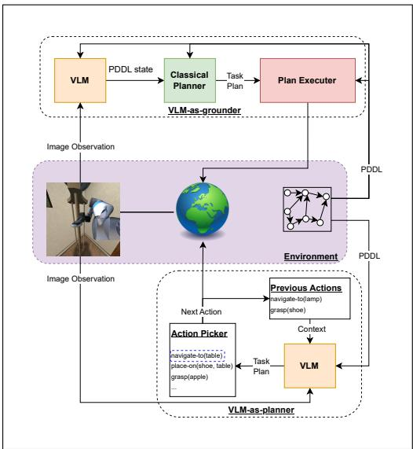
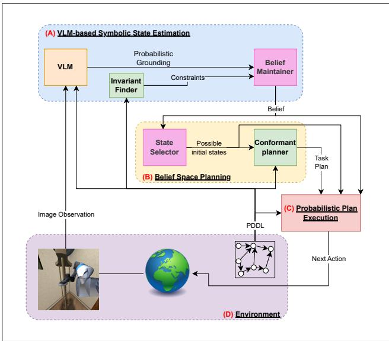

# Bridging Learned Visual Perception and Symbolic Belief-Space Planning via Probabilistic Grounding

Guy Azran

GUY.AZRAN@CAMPUS.TECHNION.AC.IL

Taub Faculty of Computer Science, Technion - Israel Institute of Technology

Michael Navat

MICHAELNAVAT@CAMPUS.TECHNION.AC.IL

Faculty of Mathematics, Technion - Israel Institute of Technology

Sarah Keren

SARAHK@CS.TECHNION.AC.IL

Taub Faculty ofComputer Science, Technion - Israel Institute ofTechnology

## Abstract

In partially observable settings, agents must act without full knowledge of the world state and rely on uncertain state-estimation pipelines. Obtaining grounded and verifiable symbolic plans under such uncertainty remains a key challenge. Recent work has integrated Vision-Language Models (VLMs) to bridge perception and symbolic reasoning, following two main paradigms. The first, VLM-as-planner, maps images directly to action sequences, and the second, VLM-as-grounder, grounds observations into symbolic predicates used as the initial state by off-the-shelf planners. Both approaches ignore uncertainty in the planning process, compromising robustness. We introduce a third paradigm, VLM-as-probabilistic-grounder, a novel approach that captures the uncertainty of VLM predicate groundings as a probability distribution over symbolic states. This enables planning in belief space and producing robust plans under uncertainty. Experiments in simulated household robot settings show improved robustness and task success over deterministic grounding, underscoring how our approach leverages foundation models for reliable planning under uncertainty.

Keywords: planning under uncertainty, vision-language models, robust decision-making

## 1. Introduction

Robotic applications remain challenging due to the inherent uncertainty in perception and action outcomes. Many traditional frameworks adopt the Closed World Assumption (Reiter, 1981), treating facts not known to be true as false, and rely on handcrafted, task-specific solutions (Wertheim et al., 2024; Moreno et al., 2024; Rana et al., 2023; Garrett et al., 2020). Recently, Vision-Language Models (VLMs) have been incorporated to infer task-relevant information from visual observations, enabling more generalizable and flexible planning systems (Zhang et al., 2024; Hu et al., 2023). Mer-

  
(a) “Book to shelf”

  
(b) “Bowl to sink”  
Figure 1: Observations for two tasks in the ViPlan household benchmark (Merler et al., 2025).

ler et al. (2025) distinguish between two paradigms for VLM-planning integration: VLM-asplanner, where the VLM directly generates plans from visual inputs, and VLM-as-grounder, where the VLM provides symbolic predicates that an off-the-shelf planner uses to compute plans. These approaches disregard the inherent uncertainty in visual grounding and treat VLM predictions as deterministic. This is ineffective in domains such as household robotics, where perception is noisy and ambiguous, and producing deterministic plans may fail when ambiguity and missing information lead to incorrect predicate assignments.

Fig. 1 shows two tasks that demonstrate planning uncertainty due to misleading VLM predictions and partial observability. In Fig. 1(a), the robot must place a book on the target shelf, which is outside the frame. A radio appears behind the robot’s gripper, but the VLM believes it is holding the book. The robot plans to navigate to the shelf, where it will realize its mistake, triggering a replan. In Fig. 1(b), the robot must bring a hidden bowl to the sink. The VLM has no indication that the bowl is in a cabinet, so it will repeatedly plan to navigate to the bowl that it cannot see and never complete the task. The robot can overcome these challenges by maintaining a belief over possible world states (e.g., book in hand and not in hand, or bowl in cabinet or not in cabinet) and planning to solve the task accordingly. This will enable the robot to solve the task with less replanning.

In line with this, we present Robust Vision-Language Planning (RoVLaP), which leverages a VLM to guide a robust decision-making process rather than blindly trusting its output. We use the VLM to produce predicate probabilities to maintain an explicit belief over high-level states and frame the problem as conformant probabilistic planning (CPP) (Domshlak and Hoffmann, 2006). This produces more robust plans while retaining the interpretability improvements of symbolic grounding. The contributions of our work are as follows:

1. We introduce VLM-as-probabilistic-grounder, a new VLM-planning paradigm leveraging fluent-level probability instead of brittle deterministic grounding or direct action generation.

2. We formalize the Robust Visual Planning (RVP) problem, providing a principled definition of planning under partial observability and perceptual uncertainty in visual robotic domains.

3. We propose RoVLaP, a robust visual task planner that maintains a symbolic belief derived from VLM-based probabilities and compiles it into a conformant planning (CP) problem.

4. We develop a theoretically grounded planning-execution loop with guarantees on correctness and safety, including conditions under which the VLM is sufficiently accurate and useful.

We evaluate our approach on the ViPlan-HH benchmark (Merler et al., 2025), which contains multiple robot planning tasks in various home scenes. Our experiments demonstrate how RoVLaP’s robust plans enable robots to solve complex tasks under uncertainty where other approaches fail.

## 2. Background and Related Work

Our approach is based on harnessing the power of pre-trained Vision-Language Models (VLMs) to answer semantic queries about visual input (Li et al., 2022b; Radford et al., 2021; Li et al., 2019). Let O be a set of possible image observations, and let V be a set of textual tokens called the vocabulary. A VLM is a function $\phi : O \times \mathcal { V } ^ { * } \to [ 0 , 1 ] ^ { \mathcal { V } }$ that takes as input an image observation $o \in O$ and a sequence of textual tokens (a prompt) $x = \langle v _ { 1 } , \ldots , v _ { n } \rangle \in \mathcal { V } ^ { * }$ . Its output is a prediction for the next token in the sequence. By iteratively inserting the predicted token into the prompt, the VLM generates textual outputs conditioned on visual inputs.

Recent work in Vision-Language-Action (VLA) robotics uses visual and language inputs either to produce low-level robot actions directly or to support task-level planning. End-to-end VLA policies map observations and natural language instructions to robot controls (Kim et al., 2024; Duan et al., 2024; Jiang et al., 2023), while planning-loop approaches use VLMs as high-level planners or symbolic grounders (Rana et al., 2023; Zhang et al., 2024; Hu et al., 2023). In this work, we focus on the latter.

  
Figure 2: VLM-as-grounder (top) and VLM-as-planner (bottom)

  
Figure 3: Robust Vision-Language Planning (RoVLaP) pipeline

Merler et al. (2025) distinguish two paradigms for integrating a VLM into a planning loop. In VLM-as-planner, depicted in Fig. 2 (bottom), the model maps an image observation and task description directly to an action sequence (Yang et al., 2025; Duan et al., 2024; Hu et al., 2023). In VLM-as-grounder, depicted in Fig. 2 (top), the model assigns Boolean values to grounded task fluents, and a symbolic planner plans from the resulting state estimate (Azran et al., 2025; Liang et al., 2024; Chen et al., 2024; Ding et al., 2024; Zhang et al., 2024). Both paradigms typically commit to a single VLM output rather than propagating uncertainty over multiple plausible symbolic states. Our approach instead extracts per-fluent probabilities, constructs a belief over symbolic states, selects states whose cumulative probability is at least θ, and computes a conformant plan that is valid for every selected state.

These task-level approaches typically use a deterministic symbolic action model (Ghallab et al., 2004). Grounder-based systems pass one grounded state to a classical planner, while planner-based systems generate an action sequence expressed in the same symbolic model. Such models are commonly represented using the STRIPS formalism (Fikes and Nilsson, 1971). STRIPS defines a planning problem as a tuple ⟨F, I, A, G⟩, where F is a set of fluents representing the state of the world, I is the initial state, A is a set of actions (operators) that have preconditions that determine when they are applicable and can change the state via their effects, and $G \subseteq F$ is the goal condition. While it is common to use classical planning algorithms and replanning upon unexpected outcomes (Yoon et al., 2007), this is highly ineffective in settings in which replanning is costly or even impossible. For example, a robot may need to communicate with an external computation source to plan, taking a long time due to bad connectivity or even failing when there is no connectivity.

On the other end of the spectrum, conformantplanning (CP) (Palacios and Geffner, 2009; Smith and Weld, 1998) addresses planning under partial observability by generating plans that are guaranteed to achieve the goal from any possible initial state. In CP, the agent must find a plan that will achieve the goal from a set of possible states called the belief set, denoted b<sup>I</sup>. Conformant probabilistic planning (CPP) (Domshlak and Hoffmann, 2006) extends this framework by replacing the belief set with a probability distribution over possible states $\beta : 2 ^ { F }  [ 0 , 1 ]$ , called a belief state, or belief. The objective of CPP is to find a plan that achieves the goal with some threshold probability θ. Our work builds upon CPP by utilizing VLMs to define and update the belief based on visual observations, allowing for more informed planning under uncertainty in visually rich environments. We find robust plans using insights from Taig and Brafman (2013) and using off-the-shelf conformant planners (Maliah et al., 2022; Shani and Brafman, 2011; Palacios and Geffner, 2009).

## 3. Problem Formulation

We aim to construct perception–action pipelines that ground symbolic reasoning from raw visual input. These pipelines should produce satisficing task-level plans that remain effective despite sensor noise, occlusion, and partial observability. We therefore formulate Robust Visual Planning (RVP) for agents operating in complex, partially observable environments. Hereafter, we focus on an embodied robotic agent, and therefore refer to it as a robot. In RVP, a robot must perceive the world through onboard sensors (e.g., cameras, depth, proprioception), infer symbolic state information from raw visual input, and select high-level actions to execute. These are represented as skills, i.e., action implementations for the robot realized by low-level motion controllers.

We formalize the problem as a tuple $\langle F , A , G , W , O , M , \xi \rangle$ , which augments the symbolic task model with a continuous configuration space, an observation model, and stochastic skill execution. Each component captures a layer in the perception-action hierarchy of a robotic agent:

$F , A .$ , and G define the symbolic task space, following STRIPS (Fikes and Nilsson, 1971).

• W represents the robotic workspace, comprising the set of all feasible continuous configurations of both the robot and the manipulable objects in the scene. A workspace configuration $w \in W$ encodes the robot’s joint positions, object poses, and environmental states.

• O denotes the observation space available to the robot, such as RGB-D or multi-view camera images.

• M : $W \to \Delta O$ is the observation model. Given a workspace configuration w, the robot receives an observation $o \sim M ( w )$ that reflects sensor noise, occlusion, and limited field of view.

$\xi : A \times W \to \Delta W$ is the skill executor, which translates symbolic actions to low-level control policies that are executable in the workspace. Invoking $\xi ( a , w )$ returns the stochastic result of applying a motion primitive or controller (e.g., for grasping or navigation) that attempts to realize the symbolic effects of $a \in A$ on current workspace configuration $w \in W$

Note that the high-level STRIPS model is a deterministic view of the world, which defines how we expect actions to affect the workspace. However, the actual transition is handled by the nondeterministic skill executor ξ.

Our objective is to harness the capabilities of VLMs and equip robotic agents with robust planning capabilities in visually complex and uncertain environments. Assuming that for evaluation, we have access to ground-truth mapping $\sigma : W \to 2 ^ { F }$ from workspace configurations to highlevel STRIPS states, and to the initial workspace configuration $w _ { 0 }$ , we aim to generate policies that maximize the probability of reaching a goal-satisfying workspace configuration under partial observability.

## 4. Robust Vision-Language Planning (RoVLaP)

Our approach, Robust Vision-Language Planning (RoVLaP), integrates VLM-based symbolic state estimation, probabilistic planning, and execution strategies for robust decision-making under perceptual uncertainty in RVP.

The RoVLaP pipeline is depicted in Fig. 3. Component (A) translates an image observation into a symbolic belief by using a VLM to obtain a probability distribution over task-relevant facts, maintained via logarithmic opinion-pooling updates. Component (B) takes the belief and produces a robust plan, selecting a subset of possible states whose cumulative probability surpasses a userspecified threshold and invoking a conformant planner that satisfies all states in the subset. Component (C) handles execution, selecting actions and triggering replanning.

## 4.1. VLM-Based Symbolic State Estimation

In the first stage of the pipeline, we infer a high-level representation of the state from an input image observation, as depicted in component (A) of Fig. 3.

The common approach to using VLMs for symbolic state estimation involves prompting the model with visual observations (e.g., images from the robot’s cameras) and querying it for the truth values of task-relevant predicates in a deterministic fashion (Azran et al., 2025; Merler et al., 2025; Zhang et al., 2024). We also prompt the model for true-false labels of specific fluents $f ,$ but extract the internal probability that the VLM assigns to the next-token prediction $\phi ( o , x )$ over the vocabulary, and normalize the true-false distribution to define a belief over the truth value of $f .$

Intuitively, we would expect the VLM to assign “uncertain” probabilities to true and false (e.g., both around 0.5) in cases where the fluent is unobservable. However, VLMs are typically trained on data where the relevant information is already in the image. Therefore, questions about objects not present in the image are considered out-of-distribution, and thus, we cannot expect them to be calibrated for this. To account for unobservable or uncertain fluents, we allow a third response label null for cases where there is not enough evidence to confidently assign true or false.

We define probabilistic symbolic grounding as the extraction of a probability for each $f \in F$ Denote by $x _ { f }$ the prompt used to query fluent f, e.g., “Is the cabinet currently open?” for fluent open(cabinet). Azran et al. (2025) showed how to generate these prompts autonomously given a symbolic representation of the domain, e.g., using Planning Domain Definition Language (PDDL).

To obtain a probability $p _ { o , f }$ for each fluent $f \in F$ for that specific observation o and VLM $\phi ,$ we calculate the probability of fluent $f .$ First, we extract the VLM output probabilities for the tokens “true”, “false”, and “null”. If the “null” token is most likely, we set the probability for that fluent to $p _ { o , f } = 0 . 5$ . Otherwise, we normalize the true-false probabilities $\begin{array} { r } { p _ { o , f } = \frac { p _ { o , f } ^ { t r u e } } { p _ { o , f } ^ { t r u e } + p _ { o , f } ^ { f a l s e } } } \end{array}$ . See Appendix A for full details on the probabilistic grounding computation.

We define a factored belief $\beta _ { F } ~ = ~ ( \beta _ { f } ) _ { f \in F } ~ \in ~ [ 0 , 1 ] ^ { F }$ as a belief maintained over individual fluents. Using this representation, we perform per-fluent logarithmic opinion-pooling updates (Neyman and Roughgarden, 2023; Genest and Zidek, 1986). We calculate $\beta _ { f }  \mathrm { e x p i t } ( \log \mathrm { i t } ( \beta _ { f } ) +$ $\mathrm { l o g i t } ( p _ { o , f } ) \rangle$ ). Note that if $p _ { o , f } = 0 . 5$ , then logit $( p _ { o , f } ) = 0$ , and thus the belief about fluent f remains unchanged, as expected for an uninformative observation.

To obtain a belief over the full symbolic state, we assume conditional independence between fluents, subject to constraints C, e.g., mutual exclusion and co-dependence defined by the task domain. This factorization is an approximation. The constraints encode known dependencies, while unmodeled correlations may enlarge the Most Likely Subset of States (MLSS) and make planning conservative. States that violate C are assigned zero probability, and the rest are normalized accordingly.

Denote $s ( f ) = \mathbb { 1 } _ { f \in s }$ . The belief is calculated as follows:

$$
\tilde { \beta } ( s ) = \prod _ { f \in F } \beta _ { f } ^ { s ( f ) } ( 1 - \beta _ { f } ) ^ { 1 - s ( f ) }\tag{1}
$$

$$
\beta ( s ) = { \left\{ \begin{array} { l l } { { \frac { \tilde { \beta } ( s ) } { Z } } } & { { \mathrm { i f ~ } } s { \mathrm { ~ s a t i s f i e s ~ } } { \mathcal { C } } } \\ { 0 } & { { \mathrm { o t h e r w i s e } } } \end{array} \right. }\tag{2}
$$

where $Z \leq 1$ is a normalization constant. We call $\tilde { \beta }$ the unconstrained belief, as it does not take into account the constraints in C. Note that for b to be well-defined, we must assume there exists at least one state s that satisfies C with a non-zero $\tilde { \beta } ( s )$

To extract the constraint set C, we use the Fast Downward planning system’s finite domain representation (Helmert, 2006). This reveals several constraints, e.g., mutually exclusive fluent groups, exposed in a dedicated invariant discovery stage. We can use the graphs generated by this invariant finder to calculate $Z$ in polynomial time. However, ignoring this term, we can view our belief as a lower bound on the actual belief. This will be enough to obtain a state space that guarantees a desired threshold probability of success in the underlying CPP problem (see next section).

## 4.2. Conformant Probabilistic Planning with VLM-based Belief

Next in the pipeline is component (B) in Fig. 3, which generates a robust plan that satisfies the goal with high probability according to our maintained belief.

The CP paradigm addresses planning under initial state uncertainty. RVP raises two sources of uncertainty, namely perceptual uncertainty when translating from observations to symbolic states, and partial observability in a single observation that may not fully reveal the true symbolic state. When the agent receives an observation, we want to define a CP problem that reflects the current belief.

Let $\langle F , \beta , A , G , \theta \rangle$ be a CPP problem. Taig and Brafman (2013) prove that solving this problem is equivalent to solving a CP problem $\langle F , b ^ { I } , A , G \rangle$ such that the probability that the initial state is in $b ^ { \hat { I } }$ is greater than $\theta ,$ i.e., $\begin{array} { r } { \sum _ { s \in b ^ { I } } \beta ( s ) \ge \theta } \end{array}$ . However, their approach used a planner to find a $b ^ { I }$ with the cheapest solution. We want the robot to act on the best interpretation of the visual scene, and so we propose finding the most likely subset of states that satisfy the probability threshold.

Definition 1 Let $\beta _ { F }$ be a factored belief, $\theta \in [ 0 , 1 ]$ be a probability threshold, and C be a set of constraints over $F .$ . The Most Likely Subset of States (MLSS), denoted by $M L S S ( \beta _ { F } , \theta , \mathcal { C } )$ , is a subset of states $b ^ { I } \subseteq 2 ^ { F }$ of minimal cardinality such that $\begin{array} { r } { \sum _ { s \in b ^ { I } } \beta ( s ) \ge \theta . } \end{array}$

Algorithm 1 describes our approach to finding an MLSS by performing a search over boolean fluent value flips. In lines 1-4, we initialize the search with the most likely state $s _ { 0 }$ and set up a maxheap containing only this state. In line 7, we extract the most likely state from the heap, based on its unconstrained belief ${ \tilde { \beta } } ,$ i.e., the belief before applying constraints and normalizing (computed via Eq. (1)). The extracted state is added to the output belief set if it satisfies the constraints (line 9). The loop starting at line 12 explores neighboring states by flipping each fluent in turn, adding unvisited neighbors to the heap (line 16). The termination condition (line 6) checks whether the cumulative probability of the selected states meets or exceeds θ. The key insight behind this algorithm is that although states are extracted from the heap according to the unconstrained belief ${ \tilde { \beta } } ,$ they are guaranteed to be in non-increasing order of the belief $\beta$

Algorithm 1: Most Likely Subset of States Algorithm 2: RoVLaP Execution Loop   
Require: $\beta _ { F } : F  [ 0 , 1 ] , \theta \in [ 0 , 1 ] , \mathcal { C } - \mathrm { s e t }$ Require: $\overline { { \langle F , A , G , W , O , M , \xi \rangle } }$ is an RVP   
of constraints. problem, $\theta \in [ 0 , 1 ] , \beta ^ { I } : 2 ^ { F }  [ 0 , 1 ]$   
Ensure: $M L S S ( \beta _ { F } , \theta , \mathcal { C } )$ and $o \in O$   
1: $s _ { 0 } \gets \mathbb { 1 } [ \beta _ { f } > 0 . 5 ] \quad \forall f \in F$ 1: $c \gets$ ExtractConstraints( $( F , A )$   
2: $Q $ Empty max-heap 2: $\beta _ { F } \gets \mathrm { V L M - b e l i e f } ( o , \phi , \beta ^ { I } , \mathcal { C } )$   
3: Q.Insert $( s _ { 0 } , \tilde { \beta } ( s _ { 0 } ) )$ $\{ \tilde { \beta }$ from Eq. (1)} 3: while $\beta ( G ) < \theta$ do   
4: Visited $ \{ s _ { 0 } \} , b  \emptyset$ 4: $b ^ { I } \gets \mathbf { M L S S } ( \beta _ { F } , \theta , \mathcal { C } )$   
5: $p  0$ 5: $\Pi  \mathbf { C P } ( F , b ^ { I } , A , G , \theta )$   
6: while $p < \theta$ and $Q \neq \emptyset$ do 6: for $a \in \Pi$ do   
7: $s  Q .$ .ExtractMax() 7: if Unsafe $( a , b ^ { I } )$ then   
8: ${ \textbf { i f } } s \Vdash { } { \mathcal { C } }$ then 8: break {Replan}   
9: $b  b \cup \{ s \}$ 9: end if   
10: $p \gets p + \beta ( s )$ {β from Eq. (2)} 10: Execute(a, ξ)   
11: end if 11: $o $ SensorReading()   
12: for $f \in F$ do 12: $\beta _ { F } \gets \mathrm { V L M - b e l i e f } ( o , \phi , \beta _ { F } , \mathcal { C } )$   
13: $s ^ { \prime } \gets \mathrm { F l i p } ( s , f )$ 13: if Improbable $\Pi _ { \mathrm { r e m a i n i n g } } , \beta _ { F } )$ then   
14: if $s ^ { \prime } \notin$ Visited then 14: break {Replan}   
15: Visited ← Visited $\cup \{ s ^ { \prime } \}$ 15: end if   
16: $Q . \mathrm { I n s e r t } ( s ^ { \prime } , \tilde { \beta } ( s ^ { \prime } ) )$ 16: end for   
17: end if 17: end while   
18: end for   
19: end while   
20: return $\underline b$

Theorem 2 In Algorithm 1, when a constraint-satisfying state s is extracted from the heap $Q ,$ then for all $s ^ { \prime } \notin$ b it holds that $\beta ( s ) \ge \beta ( s ^ { \prime } )$ , where $\beta$ is the beliefcomputed by Eq. (2). The proof asserts that states are extracted from the heap in non-increasing order of their unconstrained belief $\tilde { \beta }$ across the entire state space $2 ^ { F }$ . Find the full proof in Appendix B.

In the worst case, the number of explored states is exponential in $| F |$ . Even if we bound the minimal subset size to $k ,$ there might still be many constraint-violating states that must be explored before finding k valid states. In the absence of constraints, we can provide a tighter bound on the runtime, hoping that in practice we encounter a manageable number of constraint-violating states.

Proposition 3 $H { \mathcal { C } } = \emptyset ,$ , Algorithm 1 runs in $O ( | F | k \log | F | k )$ time with $O ( | F | ^ { 2 } k )$ bits, where k is the number ofstates in the MLSS.

With this, we can efficiently generate the CPP problem that arises from the VLM-based belief state estimation. By characterizing the accuracy of a VLM by its cumulative error over all fluents, we can guarantee that if the VLM’s per-fluent predictions are sufficiently accurate, the true state will be included in the MLSS. This enables the user to define bounds on sufficiency and accuracy. As a first step, we prove a sufficient condition on the factored belief that guarantees that the true state is included in the MLSS.

Definition 4 (Cumulative factored belief error) Let $s \in 2 ^ { F }$ be some high-level state ofthe world, and let $\beta _ { F } = ( \beta _ { f } ) _ { f \in F }$ be a factored belief. The cumulative factored belief error is $\delta ( \beta _ { F } , s ) =$ $\textstyle \sum _ { f \in F } | \beta _ { f } - s ( f ) |$ .

Theorem 5 Let $\theta \in ( 0 , 1 ]$ , let C be a set of constraints over $F ,$ , and let $s \in 2 ^ { F }$ satisfy C. For every $\beta _ { F } \in [ 0 , 1 ] ^ { F } , i f \delta ( \beta _ { F } , s ) < \theta ,$ , then $s \in M L S S ( \beta _ { F } , \theta , \mathcal { C } )$

The proof uses the Weierstrass product inequality to lower-bound the probability of a constraintsatisfying state. The full proof is provided in Appendix D.1. If the true current state $s ^ { * }$ is in the MLSS, any conformant plan found for the MLSS is valid from $s ^ { * }$ under the symbolic model. We next give sufficient conditions under which repeated observations of a fixed state can reduce the cumulative factored belief error in a finite number of steps.

Definition 6 (Weakly calibrated VLM) Forfluent probability $p _ { f }$ and true state fluent assignment $s ^ { * } ( f )$ , define $p _ { c o r r e c t }$ as the probability of the true assignment, i.e., p<sub>f</sub> $i f s ^ { * } ( f ) = 1$ and $1 - p _ { f }$ otherwise, with complement $p _ { i n c o r r e c t } = 1 - p _ { c o r r e c t } .$ A VLM is weakly calibrated if there exists $\gamma > 0$ such thatfor every observation $o \in O$ and fluent $f \in F _ { : }$ , the probability $p _ { f }$ derived for fluent $f$ is at least γ closer to the correct prediction than the incorrect one, i.e., $p _ { c o r r e c t } - p _ { i n c o r r e c t } \geq \gamma .$

Definition 7 (Minimum visibility rate) The minimum visibility rate $\rho$ is thefrequency with which the rarest fluent is observed, where the rarest fluent is a maximizer in arg max $_ { f \in F } \operatorname* { P r } ( p _ { o , f } ^ { n u l l } \ >$ max $\{ p _ { o , f } ^ { t r u e } , p _ { o , f } ^ { f a l s e } \} ,$ )

Corollary 8 Let $\rho > 0$ be the minimum visibility rate. If the VLM is weakly calibrated with error margin $\gamma ,$ then there exists a finite number of steps T after which a conformant plan for the MLSS according to $\beta _ { F }$ is satisficingfrom the true current state.

In the proof, we find a lower bound on the current log odds in the belief that grows over time, and push it above θ. Thus, the VLM need not be perfect. It only needs to be persistently better than a random guess on visible fluents to eventually generate a satisficing plan for the real-world state. The full proof is in Appendix D.2.

These assumptions describe when repeated visible predictions provide consistent evidence for each fluent. They are weaker than assuming error-free deterministic grounding. Both assumptions can be empirically evaluated for a given VLM and task domain. The parameters $\gamma$ and $\rho$ can then be used to calculate the number of steps required by corollary 8.

Of course, when using a conformant planner, there is an inherent tradeoff between robustness and completeness. The CPP component of ${ \mathrm { R o V L a P } }$ allows the user to iteratively adjust this by calibrating the success probability threshold θ if a plan is not found.

## 4.3. Executing Conformant Probabilistic Plans

We aim to support robotic settings, wherein executing a plan may lead to unexpected outcomes due to perceptual uncertainty, partial observability, and action failure. As such, part of the robustness of our policy relies on the ability of the executor to detect failure and inconsistency. A replan may be triggered when new observations indicate that the current belief is inconsistent with the belief set used for planning, or the action execution failed. In the classical case, initiating replanning is straightforward: when an action cannot be executed, or its observed outcome does not match the expected state, the agent replans from the new observed state (Yoon et al., 2007). In the conformant case, there are a few more considerations.

To handle replanning, we introduce a novel conformant plan executor, handled in component (C) of Fig. 3. We need to determine when the current plan no longer aligns with the belief derived from new observations. Our execution component introduces a belief-consistency-based monitoring criterion, a probabilistic monitoring scheme tailored for VLM uncertainty. VLMs can drastically change their predictions from one observation to another, so the standard “expected state vs observed state” criterion can lead to constant replanning. As such, we propose three replanning triggers based on this misalignment, namely improbable plan, unsafe action, and plan exhaustion. We focus on belief drift via the improbable plan trigger, which requires the VLM to output predictions that are persistently inconsistent with the belief and with great confidence. The unsafe action trigger protects against “hallucinated certainty”, where a VLM might initially be confident but wavers as the robot approaches. Finally, the plan exhaustion trigger ensures that if the plan is not successful after execution, we replan to correct for any misinterpretations of the environment. To our knowledge, this is the first execution framework that explicitly reasons about VLM-induced belief drift rather than single-step perceptual inconsistency. The full execution loop is outlined in Algorithm 2.

An improbable plan is one whose probability of success is below a threshold θ given the current belief. As a proxy for this value, we calculate the probability of the current belief set $b ^ { I }$ , after executing all actions taken thus far. If this value drops below θ, it is possible that the plan’s success probability is also below θ, and so we replan.

The resulting policy from Algorithm 2, which we denote as $\pi _ { c p p }$ , provides a conditional robustness guarantee based on the accuracy of our perceptual belief, according to Theorem 5. This execution strategy also provides a safety guarantee compared to VLM-as-grounder approaches, as shown in Appendix E.

The computational requirements of Algorithm 2 are divided into three components. The VLM is queried once per fluent, so this stage is linear in $| F |$ (number of VLM calls), and in practice dominates wall-clock time because VLM calls are expensive. These independent queries can be batched or restricted to task-relevant fluents. The MLSS algorithm has a worst-case exponential time complexity in the number of fluents, but as shown in proposition 3, this is manageable when the number of constraint-violating states is limited. Finally, CP itself is worst-case exponentially hard, meaning RoVLaP inherits the conformant planners’ theoretical complexity.

## 5. Use Case for Robust Visual Planning with a Simulated Household Robot

Domain. We evaluate RoVLaP on ViPlan-HH (Merler et al., 2025), a household robotics benchmark built on iGibson (Li et al., 2022a). We enhance the benchmark by removing any privileged information about hidden objects, making this a true partially observable domain<sup>1</sup>. The robot is a mobile manipulator with an RGB camera and one arm. Tasks include sorting books on shelves, cleaning out drawers, locking doors, packing and unpacking groceries, and other household rearrangement tasks. Tasks are categorized into three difficulty levels (simple, medium, hard) based on the task horizon, meaning that harder tasks require more actions to complete, but are not necessarily more complex. See Appendix F for details on the domain and tasks. The domain is specified in PDDL with movable and fixed objects, relations such as ontop and inside, and high-level actions such as navigate-to, grasp, and place-on. Motion actions use probabilistic executors and may fail because of kinematics, collisions, or similar constraints. Observations are egocentric RGB images, so the robot sees only part of the home and must reason about hidden objects while replanning from new views. Sample PDDL files appear in Appendix G.

Setup. We compare three planning-loop paradigms from Figs. 2 and 3, namely VLM-as-planner (VLM-P), VLM-as-grounder (VLM-G), and RoVLaP. All methods receive the current image and

PDDL-derived context. We use GPT-4.1 (OpenAI, 2023) through the OpenAI API for all methods. The planner baseline returns text actions, while VLM-as-grounder and RoVLaP use next-token probabilities from fluent queries. Implementation details, baselines, and prompts are in Appendices H to J.

Table 1: ViPlan-HH results. VLM-P is VLM-as-planner, VLM-G is VLM-as-grounder, and RoVLaP is our method. Success and valid-first-plan rates are percentages. Lower action and planner-call counts are better.
<table><tr><td></td><td colspan="3">Simple</td><td colspan="3">Medium</td><td colspan="3">Hard</td></tr><tr><td></td><td>VLM-P</td><td>VLM-G</td><td>RoVLaP (ours)</td><td>VLM-P</td><td>VLM-G</td><td>RoVLaP (ours)</td><td>VLM-P</td><td>VLM-G</td><td>RoVLaP (ours)</td></tr><tr><td>Success (%)</td><td>20.0</td><td>40.0</td><td>86.7</td><td>7.1</td><td>21.4</td><td>57.1</td><td>33.3</td><td>0.0</td><td>66.7</td></tr><tr><td>Valid first plan (%)</td><td>46.7</td><td>40.0</td><td>66.7</td><td>0.0</td><td>50.0</td><td>50.0</td><td>11.1</td><td>22.2</td><td>22.2</td></tr><tr><td># Actions</td><td>7.3</td><td>7.1</td><td>5.9</td><td>15.0</td><td>13.8</td><td>11.2</td><td>17.4</td><td>20.0</td><td>13.2</td></tr><tr><td># Planner calls</td><td>7.3</td><td>4.4</td><td>2.3</td><td>15.0</td><td>6.4</td><td>1.5</td><td>17.4</td><td>10.3</td><td>1.9</td></tr></table>

Quantitative Results. Table 1 reports task execution success, valid-first-plan rates, and mean action counts and planner calls per trial. RoVLaP achieves the highest success rate in every split. Relative to VLM-G, success improves by 116.8% on simple tasks and 166.8% on medium tasks. On hard tasks, VLM-G solves no instances while RoVLaP solves 66.7%. Relative to VLM-P, success improves by 333.5%, 704.2%, and 100.3% on simple, medium, and hard tasks, respectively. Compared to both baselines, RoVLaP fully solves some task families for which neither baseline solves any instance. These performance gains also come with reduced planning overhead. RoVLaP uses between 1.9 and 10.0 times fewer planner calls than the baselines, and executes between 1.2 and 6.8 fewer actions on average. The 66.7% valid-first-plan rate on simple tasks indicates that considering multiple initial-state hypotheses is often sufficient to generate a valid plan without replanning. This advantage for RoVLaP, however, is only visible in the simplest tasks.

Qualitative Behavior. The same mechanism explains the observed failures. In cleaning out drawers, the VLM-P baseline assumes the hidden bowl is reachable and plans a direct grasp, which fails when the bowl is inside a closed cabinet. RoVLaP assigns probability to the hidden-object state and opens the cabinet first, so the plan succeeds whether or not the bowl is hidden. In sorting books, the image can make objects near the gripper appear held, and a deterministic grounder may conclude that the robot already holds the hardback. RoVLaP keeps both holding hypotheses and selects a plan that is feasible under either one, avoiding the brittle dependence on a single perceptual judgment.

## 6. Conclusion

To enable robotic agents to operate effectively in real-world, partially observable environments characterized by limited and uncertain perceptual information, we propose a framework for robust planning under perceptual uncertainty. The approach employs Vision-Language Models (VLMs) to derive a probabilistic, factored representation of the current state, which is used to update the agent’s belief. This belief representation supports the synthesis of robust task plans using off the-shelf planners. As a natural extension of this work, we will incorporate active sensing into the planning process, enabling agents to reason explicitly about the informational value of sensing actions. In addition, we plan to embed the proposed methodology within embodied robotic systems and evaluate its effectiveness across a suite of complex task-and-motion planning (TAMP) domains.

## Acknowledgments

Beyond the experiments, we used generative AI tools in the following ways:

• Gemini’s (Google, 2026) deep research feature was used to verify novelty after the literature review.

• ChatGPT (OpenAI, 2026) was used to rephrase text and detect basic syntax and grammar errors.

• Codex (Chen et al., 2021) was used for initial implementations of some components in the experimental code.

## References

Guy Azran, Yuval Goshen, Kai Yuan, and Sarah Keren. S3E: Semantic Symbolic State Estimation With Vision-Language Foundation Models. In AAAI 2025 Workshop LM4Plan, February 2025.

Mark Chen, Jerry Tworek, Heewoo Jun, Qiming Yuan, Henrique Ponde de Oliveira Pinto, Jared Kaplan, Harri Edwards, Yuri Burda, Nicholas Joseph, Greg Brockman, Alex Ray, Raul Puri, Gretchen Krueger, Michael Petrov, Heidy Khlaaf, Girish Sastry, Pamela Mishkin, Brooke Chan, Scott Gray, Nick Ryder, Mikhail Pavlov, Alethea Power, Lukasz Kaiser, Mohammad Bavarian, Clemens Winter, Philippe Tillet, Felipe Petroski Such, Dave Cummings, Matthias Plappert, Fotios Chantzis, Elizabeth Barnes, Ariel Herbert-Voss, William Hebgen Guss, Alex Nichol, Alex Paino, Nikolas Tezak, Jie Tang, Igor Babuschkin, Suchir Balaji, Shantanu Jain, William Saunders, Christopher Hesse, Andrew N. Carr, Jan Leike, Josh Achiam, Vedant Misra, Evan Morikawa, Alec Radford, Matthew Knight, Miles Brundage, Mira Murati, Katie Mayer, Peter Welinder, Bob McGrew, Dario Amodei, Sam McCandlish, Ilya Sutskever, and Wojciech Zaremba. Evaluating Large Language Models Trained on Code, July 2021.

Siwei Chen, Anxing Xiao, and David Hsu. LLM-State: Open World State Representation for Longhorizon Task Planning with Large Language Model, April 2024.

Yan Ding, Xiaohan Zhang, Saeid Amiri, Nieqing Cao, Hao Yang, Chad Esselink, and Shiqi Zhang. Robot Task Planning and Situation Handling in Open Worlds, September 2024.

Carmel Domshlak and Jorg Hoffmann. Fast probabilistic planning through weighted model count-¨ ing. In Proceedings of the Sixteenth International Conference on International Conference on Automated Planning and Scheduling, ICAPS’06, pages 243–252, Cumbria, UK, June 2006. AAAI Press. ISBN 978-1-57735-270-9.

Jiafei Duan, Wentao Yuan, Wilbert Pumacay, Yi Ru Wang, Kiana Ehsani, Dieter Fox, and Ranjay Krishna. Manipulate-Anything: Automating Real-World Robots using Vision-Language Models. In 8th Annual Conference on Robot Learning, September 2024.

Richard E. Fikes and Nils J. Nilsson. Strips: A new approach to the application of theorem proving to problem solving. Artificial Intelligence, 2(3):189–208, December 1971. ISSN 0004-3702. doi: 10.1016/0004-3702(71)90010-5.

Caelan Reed Garrett, Tomas Lozano-P ´ erez, and Leslie Pack Kaelbling. PDDLStream: Integrating´ Symbolic Planners and Blackbox Samplers via Optimistic Adaptive Planning, March 2020.

Christian Genest and James V. Zidek. Combining Probability Distributions: A Critique and an Annotated Bibliography. Statistical Science, 1(1):114–135, 1986. ISSN 0883-4237.

Malik Ghallab, Dana S. Nau, and Paolo Traverso. Automated Planning: Theory and Practice. Elsevier/Morgan Kaufmann, Amsterdam Boston, 2004. ISBN 978-1-55860-856-6.

Google. Gemini, 2026.

M. Helmert. The Fast Downward Planning System. Journal ofArtificial Intelligence Research, 26: 191–246, July 2006. ISSN 1076-9757. doi: 10.1613/jair.1705.

Yingdong Hu, Fanqi Lin, Tong Zhang, Li Yi, and Yang Gao. Look Before You Leap: Unveiling the Power of GPT-4V in Robotic Vision-Language Planning, December 2023.

Yunfan Jiang, Agrim Gupta, Zichen Zhang, Guanzhi Wang, Yongqiang Dou, Yanjun Chen, Li Fei-Fei, Anima Anandkumar, Yuke Zhu, and Linxi Fan. VIMA: General Robot Manipulation with Multimodal Prompts. In International Conference on Learning Representations (ICLR). arXiv, 2023. doi: 10.48550/ARXIV.2210.03094.

Moo Jin Kim, Karl Pertsch, Siddharth Karamcheti, Ted Xiao, Ashwin Balakrishna, Suraj Nair, Rafael Rafailov, Ethan Foster, Grace Lam, Pannag Sanketi, Quan Vuong, Thomas Kollar, Benjamin Burchfiel, Russ Tedrake, Dorsa Sadigh, Sergey Levine, Percy Liang, and Chelsea Finn. OpenVLA: An Open-Source Vision-Language-Action Model, September 2024.

Chengshu Li, Fei Xia, Roberto Mart´ın-Mart´ın, Michael Lingelbach, Sanjana Srivastava, Bokui Shen, Kent Elliott Vainio, Cem Gokmen, Gokul Dharan, Tanish Jain, Andrey Kurenkov, Karen Liu, Hyowon Gweon, Jiajun Wu, Li Fei-Fei, and Silvio Savarese. iGibson 2.0: Object-centric simulation for robot learning of everyday household tasks. In Aleksandra Faust, David Hsu, and Gerhard Neumann, editors, Proceedings of the 5th Conference on Robot Learning, volume 164 of Proceedings ofMachine Learning Research, pages 455–465. PMLR, November 2022a.

Liunian Harold Li, Mark Yatskar, Da Yin, Cho-Jui Hsieh, and Kai-Wei Chang. VisualBERT: A Simple and Performant Baseline for Vision and Language, August 2019.

Liunian Harold Li, Pengchuan Zhang, Haotian Zhang, Jianwei Yang, Chunyuan Li, Yiwu Zhong, Lijuan Wang, Lu Yuan, Lei Zhang, Jenq-Neng Hwang, Kai-Wei Chang, and Jianfeng Gao. Grounded Language-Image Pre-training. In 2022 IEEE/CVF Conference on Computer Vision and Pattern Recognition (CVPR), pages 10955–10965, June 2022b. doi: 10.1109/CVPR52688. 2022.01069.

Yichao Liang, Nishanth Kumar, Hao Tang, Adrian Weller, Joshua B. Tenenbaum, Tom Silver, Joao F. Henriques, and Kevin Ellis. VisualPredicator: Learning Abstract World Models with Neuro-Symbolic Predicates for Robot Planning. In The Thirteenth International Conference on Learning Representations, October 2024.

Shlomi Maliah, Radimir Komarnitski, and Guy Shani. Computing Contingent Plan Graphs using Online Planning. ACM Trans. Auton. Adapt. Syst., 16(1):1:1–1:30, January 2022. ISSN 1556- 4665. doi: 10.1145/3488903.

Matteo Merler, Nicola Dainese, Minttu Alakuijala, Giovanni Bonetta, Pietro Ferrazzi, Yu Tian, Bernardo Magnini, and Pekka Marttinen. ViPlan: A Benchmark for Visual Planning with Symbolic Predicates and Vision-Language Models, May 2025.

Mag´ı Dalmau Moreno, Nestor Garc´ ´ıa, Vicenc¸ Gomez, and H´ ector Geffner. Combined Task and´ Motion Planning via Sketch Decompositions. Proceedings of the International Conference on Automated Planning and Scheduling, 34:123–132, May 2024. ISSN 2334-0843. doi: 10.1609/ icaps.v34i1.31468.

Eric Neyman and Tim Roughgarden. No-Regret Learning with Unbounded Losses: The Case of Logarithmic Pooling, October 2023.

OpenAI. GPT-4V(ision) system card. https://openai.com/index/gpt-4v-system-card/, 2023.

OpenAI. ChatGPT, 2026.

H. Palacios and H. Geffner. Compiling Uncertainty Away in Conformant Planning Problems with Bounded Width. Journal of Artificial Intelligence Research, 35:623–675, August 2009. ISSN 1076-9757. doi: 10.1613/jair.2708.

Alec Radford, Jong Wook Kim, Chris Hallacy, Aditya Ramesh, Gabriel Goh, Sandhini Agarwal, Girish Sastry, Amanda Askell, Pamela Mishkin, Jack Clark, Gretchen Krueger, and Ilya Sutskever. Learning Transferable Visual Models From Natural Language Supervision. In Proceedings of the 38th International Conference on Machine Learning, pages 8748–8763. PMLR, July 2021.

Krishan Rana, Jesse Haviland, Sourav Garg, Jad Abou-Chakra, Ian Reid, and Niko Suenderhauf. SayPlan: Grounding Large Language Models using 3D Scene Graphs for Scalable Robot Task Planning. In 7th Annual Conference on Robot Learning, August 2023.

Raymond Reiter. ON CLOSED WORLD DATA BASES. In Bonnie Lynn Webber and Nils J. Nilsson, editors, Readings in Artificial Intelligence, pages 119–140. Morgan Kaufmann, January 1981. ISBN 978-0-934613-03-3. doi: 10.1016/B978-0-934613-03-3.50014-3.

Guy Shani and Ronen I. Brafman. Replanning in domains with partial information and sensing actions. In Proceedings of the Twenty-Second International Joint Conference on Artificial Intelligence - Volume Volume Three, IJCAI’11, pages 2021–2026, Barcelona, Catalonia, Spain, July 2011. AAAI Press. ISBN 978-1-57735-515-1.

David E. Smith and Daniel S. Weld. Conformant Graphplan. In AAAI/IAAI, July 1998.

Ran Taig and Ronen I. Brafman. Compiling Conformant Probabilistic Planning Problems into Classical Planning. Proceedings of the International Conference on Automated Planning and Scheduling, 23:197–205, June 2013. ISSN 2334-0843. doi: 10.1609/icaps.v23i1.13540.

Or Wertheim, Dan R. Suissa, and Ronen I. Brafman. Plug’n Play Task-Level Autonomy for Robotics Using POMDPs and Probabilistic Programs. IEEE Robotics and Automation Letters, 9 (1):587–594, January 2024. ISSN 2377-3766. doi: 10.1109/LRA.2023.3334682.

Zhutian Yang, Caelan Garrett, Dieter Fox, Tomas Lozano-P´ erez, and Leslie Pack Kaelbling. Guid-´ ing Long-Horizon Task and Motion Planning with Vision Language Models. In 2025 IEEE International Conference on Robotics and Automation (ICRA), pages 16847–16853, May 2025. doi: 10.1109/ICRA55743.2025.11128705.

Sungwook Yoon, Alan Fern, and Robert Givan. FF-Replan: A baseline for probabilistic planning. In Proceedings of the Seventeenth International Conference on International Conference on Automated Planning and Scheduling, ICAPS’07, pages 352–359, Providence, Rhode Island, USA, September 2007. AAAI Press. ISBN 978-1-57735-344-7.

Xiaohan Zhang, Zainab Altaweel, Yohei Hayamizu, Yan Ding, Saeid Amiri, Hao Yang, Andy Kaminski, Chad Esselink, and Shiqi Zhang. DKPROMPT: Domain Knowledge Prompting Vision-Language Models for Open-World Planning, June 2024.

## Appendix A. Probabilistic Grounding Calculation

The exact computation of the probabilistic grounding of fluent f given observation o is:

1. Extract the VLM output probabilities for the tokens “true”, “false”, and “null”. Denote $p _ { o , f } ^ { t r u e } = \phi ( o , x _ { f } ) [ t r u e ] , p _ { o , f } ^ { f a l s e } = \phi ( o , x _ { f } ) [ f a l s e ] , p _ { o , f } ^ { n u l l } = \phi ( o , x _ { f } ) [ n u l l ] .$

2. If $p _ { o , f } ^ { n u l l } > p _ { o , f } ^ { t r u e }$ and $p _ { o , f } ^ { n u l l } > p _ { o , f } ^ { f a l s e }$ , set $p _ { o , f } = 0 . 5$

3. Otherwise, normalize the true-false probabilities: $\begin{array} { r } { p _ { o , f } = \frac { p _ { o , f } ^ { t r u e } } { p _ { o , f } ^ { t r u e } + p _ { o , f } ^ { f a l s e } } . } \end{array}$

## Appendix B. Proof of Theorem 2

Definition 9 (Bit diffset) Let $s , s ^ { \prime } \in 2 ^ { F }$ . The bit diffset $D ( s , s ^ { \prime } )$ is defined as the set offluents that differ between s and $s ^ { \prime } ,$ i.e.,

$$
D ( s , s ^ { \prime } ) = \{ f \in F | s ( f ) \neq s ^ { \prime } ( f ) \}
$$

Definition 10 (Bit-flip operator) Let $s \in { 2 ^ { F } }$ and $f \in F$ . The bit-flip operator $F l i p ( s , f )$ returns a new state $s ^ { \prime } \in 2 ^ { F }$ such that:

$$
\forall f ^ { \prime } \in F \quad s ^ { \prime } ( f ^ { \prime } ) = { \left\{ \begin{array} { l l } { 1 - s ( f ) } & { i f f ^ { \prime } = f } \\ { s ( f ^ { \prime } ) } & { o t h e r w i s e } \end{array} \right. }
$$

Definition 11 (Canonical path) Let $s , s ^ { \prime } \in 2 ^ { F }$ . Let $D ( s , s ^ { \prime } ) = \{ f _ { 1 } , . . . , f _ { n } \}$ where the fluents are numbered according to a fixed total ordering over F. The canonical path from s to s<sup>′</sup> is the path of states $s = s _ { 0 } \to s _ { 1 } \to \dots \to s _ { n } = s ^ { \prime }$ achieved byflipping the bits ofstate s<sub>0</sub> one by one in the order ofthefluents. That is,for $i \in \{ 1 , . . . , n \}$ , define $s _ { i } = F l i p ( s _ { i - 1 } , f _ { i } )$ , from $s _ { 0 } = s$ leading to $s _ { n } = s ^ { \prime } .$

Lemma 12 In Algorithm 1, let $S ^ { e x t }$ denote the set of states that have been extracted from the heap Q thusfar. Then at the moment ofmax-extractionfrom Q, it holds that $Q \cup S ^ { e x t } = V i s i t e d .$

Proof Note that every insertion to the heap is accompanied by an insertion of the same state to the visited set. All states that have ever been added to the heap are either still in the heap or have been extracted from it. Since no state is ever removed from the visited set, the lemma holds.

Lemma 13 In Algorithm 1, the probabilities of the states on the canonical path from $s _ { 0 }$ to any state s are monotonically non-increasing in the states’ unconstrained beliefvalues, i.e.:

$$
\tilde { \beta } ( s _ { 0 } ) \geq . . . \geq \tilde { \beta } ( s _ { n } ) = \tilde { \beta } ( s )
$$

Proof Assume by contradiction that there exists $0 < j \le n$ such that $0 \leq \tilde { \beta } ( s _ { j - 1 } ) < \tilde { \beta } ( s _ { j } )$ . Then all of the components that comprise the product in $\tilde { \beta } ( s _ { j } )$ are non-zero. Thus, we can safely divide by

$$
\prod _ { f \in F \backslash \{ f _ { j } \} } \beta _ { F } ( f ) ^ { s _ { j - 1 } ( f ) } ( 1 - \beta _ { F } ( f ) ) ^ { 1 - s _ { j - 1 } ( f ) }
$$

From here, we have:

$$
\begin{array} { r l r } {  { \widetilde { \beta } ( s _ { j - 1 } ) < \widetilde { \beta } ( s _ { j } ) } } \\ & { \Longleftrightarrow \prod _ { f \in F } \beta _ { F } ( f ) ^ { s _ { j - 1 } ( f ) } ( 1 - \beta _ { F } ( f ) ) ^ { 1 - s _ { j - 1 } ( f ) } < \prod _ { f \in F } \beta _ { F } ( f ) ^ { s _ { j } ( f ) } ( 1 - \beta _ { F } ( f ) ) ^ { 1 - s _ { j } ( f ) } } \\ & { \Longleftrightarrow \beta _ { F } ( f _ { j } ) ^ { s _ { j - 1 } ( f _ { j } ) } ( 1 - \beta _ { F } ( f _ { j } ) ) ^ { 1 - s _ { j - 1 } ( f _ { j } ) } < \beta _ { F } ( f _ { j } ) ^ { s _ { j } ( f _ { j } ) } ( 1 - \beta _ { F } ( f _ { j } ) ) ^ { 1 - s _ { j } ( f _ { j } ) } } \\ & { \Longleftrightarrow \beta _ { F } ( f _ { j } ) ^ { s _ { j - 1 } ( f _ { j } ) } ( 1 - \beta _ { F } ( f _ { j } ) ) ^ { 1 - s _ { j - 1 } ( f _ { j } ) } < \beta _ { F } ( f _ { j } ) ^ { 1 - s _ { j - 1 } ( f _ { j } ) } ( 1 - \beta _ { F } ( f _ { j } ) ) ^ { s _ { j - 1 } ( f _ { j } ) } } \end{array}
$$

Transition 1 follows the definition of $\tilde { \beta }$ in Eq. (1). Transition 2 is a division by all components in the product except for the one corresponding to $f _ { j }$ , which are non-zero, which are equal since $s _ { j - 1 } ( f ) = s _ { j } ( f )$ for all $f \neq f _ { j }$ by the definition of the canonical path in definition 11. Transition 3 follows from the definition of the bit-flip operation in definition 10, which states that $s _ { j } ( f _ { j } ) =$ $1 - s _ { j - 1 } ( f _ { j } )$

I $\textrm { f } s _ { j - 1 } ( f _ { j } ) = 1$ , then the above simplifies to

$$
\begin{array} { r l } & { \beta _ { F } ( f _ { j } ) ^ { 1 } ( 1 - \beta _ { F } ( f _ { j } ) ) ^ { 0 } < \beta _ { F } ( f _ { j } ) ^ { 0 } ( 1 - \beta _ { F } ( f _ { j } ) ) ^ { 1 } } \\ & { \Rightarrow \beta _ { F } ( f _ { j } ) < 0 . 5 } \end{array}
$$

If $s _ { j - 1 } ( f _ { j } ) = 0$ , then the above simplifies to

$$
\begin{array} { r l } & { \beta _ { F } ( f _ { j } ) ^ { 0 } ( 1 - \beta _ { F } ( f _ { j } ) ) ^ { 1 } < \beta _ { F } ( f _ { j } ) ^ { 1 } ( 1 - \beta _ { F } ( f _ { j } ) ) ^ { 0 } } \\ & { \Rightarrow \beta _ { F } ( f _ { j } ) > 0 . 5 } \end{array}
$$

Since $s _ { j - 1 } ( f _ { j } ) = s _ { 0 } ( f _ { j } )$ , then both cases contradict the definition of $s _ { 0 }$ , which for all fluents is defined as $s _ { 0 } ( f ) = \mathbb { 1 } [ \beta _ { F } ( f ) > 0 . 5 ]$

Lemma 14 In Algorithm 1, when a state $s \in { 2 ^ { F } }$ is extracted from the max-heap $Q ,$ , then for all $s ^ { \prime } \in 2 ^ { F }$ not yet extracted from Q, it holds that $\tilde { \beta } ( s ) \geq \tilde { \beta } ( s ^ { \prime } )$

Proof Let $S _ { k } ^ { \mathrm { e x t } } = \left\{ s _ { 0 } , . . . , s _ { k - 1 } \right\}$ be the set of the first k states extracted from $Q .$ , numbered by the order in which they were extracted. We must show that for all k and for all states $s \in S _ { k } ^ { \mathrm { e x t } }$ , and for all $s ^ { \prime } \notin S _ { k } ^ { \mathrm { e x t } }$ , it holds that $\beta ( s ) \geq \beta ( s ^ { \prime } )$ . We do this by induction on $k .$

Basis: When $k = 1$ , this is the first iteration where the only value in the heap is $s _ { 0 }$ . By definition, for any $s \neq s _ { 0 }$ , it holds that $\tilde { \beta } ( s _ { 0 } ) \geq \tilde { \beta } ( s )$

Assumption: Assume that for some k it holds that for all $s \in S _ { k } ^ { \mathrm { e x t } }$ and $s ^ { \prime } \notin S _ { k } ^ { \mathrm { e x t } }$ we have $\tilde { \beta } ( s ) \geq$ $\tilde { \beta } ( s ^ { \prime } )$

Induction Step: Let $S _ { k + 1 } ^ { \mathrm { e x t } } ~ = ~ \{ s _ { 0 } , . . . , s _ { k } \}$ . By the induction assumption, $S _ { k } ^ { \mathrm { e x t } } ~ = ~ S _ { k + 1 } ^ { \mathrm { e x t } } ~ \backslash ~ \{ s _ { k } \}$ contains the top k most probable states, i.e., for all $s \in S _ { k } ^ { \mathrm { e x t } }$ and for all $s ^ { \prime } \notin S _ { k } ^ { \mathrm { e x t } }$ , it holds that $\tilde { \beta } ( s ) \geq \tilde { \beta } ( s ^ { \prime } )$ . It is left to show that for all s $\notin S _ { k + 1 } ^ { \mathrm { e x t } }$ , it holds that $\tilde { \beta } ( s _ { k } ) \geq \tilde { \beta } ( s )$

Assume by contradiction that there exists a state s $\notin S _ { k + 1 } ^ { \mathrm { e x t } }$ such that $\tilde { \beta } ( s ) > \tilde { \beta } ( s _ { k } )$ . Then $s \not \in Q$ because otherwise it would have been extracted before $s _ { k }$ . By lemma 12, s has not yet been visited.

On the canonical path from s<sub>0</sub> to $s _ { n } = s$ , since $s _ { 0 }$ has been visited and $s _ { n } = s$ has not yet been visited, there exists $0 < j \le n$ such that $s _ { j }$ has not yet been visited and $s _ { j - 1 }$ has.

• Since $s _ { j - 1 }$ is in the visited set, then by lemma 12, it is either in the heap or has been extracted from the heap. It cannot have been extracted from the heap because then it would have been expanded, and $s _ { j }$ would have been visited. Therefore, $s _ { j - 1 }$ is in the heap.

• Since $s _ { k }$ was extracted but $s _ { j - 1 }$ was not, it follows that ${ \tilde { \beta } } ( s _ { k } ) \geq { \tilde { \beta } } ( s _ { j - 1 } )$

• By lemma 13, ${ \tilde { \beta } } ( s _ { j - 1 } ) \geq { \tilde { \beta } } ( s _ { n } ) = { \tilde { \beta } } ( s )$

Putting it all together, we get:

$$
\tilde { \beta } ( s _ { k } ) \geq \tilde { \beta } ( s _ { j - 1 } ) \geq \tilde { \beta } ( s ) > \tilde { \beta } ( s _ { k } )
$$

which is a contradiction. Thus, for all $s \notin S _ { k + 1 } ^ { \mathrm { e x t } }$ , it holds that $\tilde { \beta } ( s _ { k } ) \geq \tilde { \beta } ( s )$

MLSS Theorem: In Algorithm 1, when a constraint-satisfying state s is extracted from the heap $Q ,$ , then for all $s ^ { \prime } \notin b$ it holds that $\beta ( s ) \geq \beta ( s ^ { \prime } )$ , where $\beta$ is the belief computed by Eq. (2). Proof Let s be a constraint-satisfying state extracted from the heap at some iteration. We must show that for all $s ^ { \prime } \notin b ,$ it holds that $\beta ( s ) \geq \beta ( s ^ { \prime } )$

If $s ^ { \prime }$ violates the constraints, then trivially $\beta ( s ^ { \prime } ) = 0 \le \beta ( s )$ . Otherwise, note that b is comprised of all constraint-satisfying states that were extracted from the heap before s. Therefore, $s ^ { \prime }$ has not yet been extracted from the heap. By lemma 14, we have:

$$
\tilde { \beta } ( s ) \geq \tilde { \beta } ( s ^ { \prime } ) \iff \frac { \tilde { \beta } ( s ) } { Z } \geq \frac { \tilde { \beta } ( s ^ { \prime } ) } { Z } \iff \beta ( s ) \geq \beta ( s ^ { \prime } )
$$

Thus, the theorem holds for all $s ^ { \prime } \notin b$

## Appendix C. Proof of proposition 3

## C.1. Time Complexity.

Claim 1 The time complexity of Algorithm 1 is $O ( | F | k \log ( | F | k ) )$

Proof Pre-iteration cost. In lines 1-5 of the algorithm, we linearly compute $s _ { 0 }$ and its probability, and initialize collections with at most one item. This requires $O ( | F | )$ operations.

Inner-iteration cost. The internal $f o r$ loop in line 12 consists of a bit-flip, a “visited” check, an insertion to the visited set, and an insertion to the heap. Using random access, the bit flip is $O ( 1 )$ Checking membership in the visited set is $O ( 1 )$ . Inserting into the visited is $O ( \log ( M ) )$ where M is the size of the set. The heap insertion is $O ( \log ( N ) )$ where N is the size of the heap. Assuming none of the states are visited (worst case), then we require $O ( | F | ( \log ( N ) + \log ( M ) ) )$ for all iterations. We must also acknowledge the time to compute the probability at each iteration. If naively implemented, this would take $O ( | F | )$ , meaning throughout the iteration, this would take $O ( | F | ^ { 2 } )$ . However, by updating the probability incrementally according to only the changed bit (divide by unflipped value and multiply by flipped value), this operation takes $O ( 1 )$

Outer-iteration cost. The while loop in line 6 consists of a max extraction from the heap, an insertion of this value to $b ,$ and the internal $f o r$ loop. Since b is at most size $k ,$ the insertion can be implemented in $O ( \log ( k ) )$ . The max extraction from the heap requires $O ( \log ( M ) )$ where $M$ is the size of the heap. The while conditions are checkable in $O ( 1 )$ . The inner $f o r$ loop is $O ( | F | ( \log ( N ) + \log ( M ) ) )$ . Considering that at most $| F |$ values are inserted into the visited set and heap at every iteration, then $M = N = | F | k$ at most. Overall, each iteration in the while loop requires:

$$
\begin{array} { r l } & { \quad O ( \log ( k ) ) + O ( \log ( M ) ) + O ( | F | ( \log ( N ) + \log ( M ) ) ) } \\ & { = O ( \log ( k ) ) + O ( | F | ( \log ( | F | k ) + \log ( | F | k ) ) ) } \\ & { = O ( | F | \log ( | F | k ) ) } \end{array}
$$

There are at most k iterations, so the overall time complexity of the while loop is $O ( | F | k \log ( | F | k ) )$ ).

Since the pre-iteration costs are negligible compared to the iteration cost, the final time upperbound complexity stands at $T ( F , k ) = O ( | F | k \log ( | F | k ) )$ . ■

## C.2. Space Complexity

Claim 2 The space complexity of Algorithm 1 is $O ( | F | ^ { 2 } k )$ bits.

Proof As seen in the proof of time complexity, we store the following values at any one time:

• The visited set, containing $O ( | F | k )$ states.

• The heap, containing $O ( | F | k )$ states.

Each state can be represented using a bitmask of $| F |$ bits. Therefore $S ( F , k ) = O ( | F | ^ { 2 } k )$ bits.

## Appendix D. Proof of Finite Step Convergence

In this section, we prove corollary 8 via Theorem 5.

## D.1. Proof of Theorem 5

Theorem Statement. Let $\theta \in ( 0 , 1 ]$ , let C be a set of constraints over $F ,$ and let $s \in { 2 ^ { F } }$ satisfy C. For every $\beta _ { F } \in [ 0 , 1 ] ^ { F }$ , if $\delta ( \beta _ { F } , s ) < \theta _ { \ l }$ , then $s \in M L S S ( \beta _ { F } , \theta , \mathcal { C } )$

Proof Let $s \in 2 ^ { F }$ satisfy C and let $\beta _ { F } \in [ 0 , 1 ] ^ { F }$ . For simplicity, we denote $\delta = \delta ( \beta _ { F } , s )$

Let $\varepsilon _ { f } = | \beta _ { f } - s ( f ) |$ | be a single fluent belief error, and let $\begin{array} { r } { W ( s ) = \prod _ { f \in F } \beta _ { f } ^ { s ( f ) } ( 1 - \beta _ { f } ) ^ { 1 - s ( f ) } } \end{array}$ be the unnormalized probability weight of state s.

If $s ( f ) = 1$ then

$$
\begin{array} { l } { \varepsilon _ { f } = | \beta _ { f } - s ( f ) | = 1 - \beta _ { f } } \\ { \Rightarrow \beta _ { f } = 1 - \varepsilon _ { f } } \end{array}
$$

and ${ \mathrm { i f } } \ s ( f ) = 0$ then

$$
\begin{array} { l } { \varepsilon _ { f } = | \beta _ { f } - s ( f ) | = \beta _ { f } } \\ { \Rightarrow 1 - \beta _ { f } = 1 - \varepsilon _ { f } } \end{array}
$$

Then by the Weierstrass product inequality, the unnormalized weight assigned to s is:

$$
W ( s ) = \prod _ { f \in F } ( 1 - \varepsilon _ { f } ) \geq 1 - \sum _ { f \in F } \varepsilon _ { f } = 1 - \delta
$$

$\beta$ is normalized by a normalizing factor $0 < Z \le 1$ . Thus:

$$
\beta ( s ) = { \frac { W ( s ) } { Z } } \geq W ( s ) \geq 1 - \delta
$$

Assume by contradiction that $s \notin M L S S ( \beta _ { F } , \theta , \mathcal { C } )$ . Then

$$
\beta ( s ) \leq \sum _ { s ^ { \prime } \notin M L S S ( \beta _ { F } , \theta , \mathcal { C } ) } \beta ( s ^ { \prime } ) \leq 1 - \theta .
$$

From the previous inequality:

$$
\begin{array} { c } { { 1 - \theta \geq \beta ( s ) \geq 1 - \delta } } \\ { { \Rightarrow \delta \geq \theta } } \end{array}
$$

This contradicts the theorem’s assumption that $\delta < \theta _ { \mathrm { { i } } }$ , and thus s must be in the MLSS.

## D.2. Proof of corollary 8

Theorem Statement: Let $\rho > 0$ be the minimum visibility rate. If the VLM is weakly calibrated with error margin $\gamma ,$ then there exists $T$ such that a conformant plan for the MLSS is satisficing from the true current state.

Proof Let $l _ { f , t }$ be the log odds of the correct assignment of f at time t of the evidence provided by the VLM. Since the VLM is weakly calibrated, then:

$$
\begin{array} { c } { p _ { \mathrm { c o r r e c t , } t } - ( 1 - p _ { \mathrm { c o r r e c t , } } t ) \geq p _ { \mathrm { c o r r e c t , } t } - p _ { \mathrm { i n c o r r e c t , } t } \geq \gamma } \\ { \Rightarrow p _ { \mathrm { c o r r e c t , } t } \geq \displaystyle \frac { \gamma } { 2 } + 0 . 5 } \end{array}
$$

This implies that 1 − $p _ { \mathrm { c o r r e c t , } t } \leq 0 . 5 - \frac { \gamma } { 2 }$ . Thus:

$$
\begin{array} { r l } & { ~ \frac { p _ { \mathrm { c o r r e c t } , t } } { 1 - p _ { \mathrm { c o r r e c t } , t } } \geq \frac { 0 . 5 + \frac { \gamma } { 2 } } { 0 . 5 - \frac { \gamma } { 2 } } } \\ & { \Rightarrow \log \left( \frac { p _ { \mathrm { c o r r e c t } , t } } { 1 - p _ { \mathrm { c o r r e c t } , t } } \right) \geq \log \left( \frac { 0 . 5 + \frac { \gamma } { 2 } } { 0 . 5 - \frac { \gamma } { 2 } } \right) } \\ & { \Rightarrow l _ { f , t } \geq \log \left( \frac { 0 . 5 + \frac { \gamma } { 2 } } { 0 . 5 - \frac { \gamma } { 2 } } \right) > 0 } \end{array}
$$

Then L is bounded by a strictly positive constant. Denote $\begin{array} { r } { C = \log \left( \frac { 0 . 5 + \frac { \gamma } { 2 } } { 0 . 5 - \frac { \gamma } { 2 } } \right) } \end{array}$

Let $\boldsymbol { L } _ { f , t }$ be the log odds of the correct assignment of $f$ at time t according to factored belief $\beta _ { F , t }$ . The logarithmic pooling update rule is ${ L _ { f , t } } = { L _ { f , t - 1 } } + { l _ { f , t } }$ . Assume W.L.O.G. that the initial belief $\beta _ { F , 0 }$ is uniform (because in any case, it is constant). Since we only update fluents that are visible, the log odds value at time $T$ is:

$$
\begin{array} { l } { \displaystyle \boldsymbol { L } _ { f , T } = \log \left( \frac { \beta _ { f , 0 } } { 1 - \beta _ { f , 0 } } \right) + \sum _ { t = 1 } ^ { T } \boldsymbol { \mathcal { H } } _ { f } ( t ) \cdot \boldsymbol { l } _ { f , t } } \\ { \displaystyle = \sum _ { t = 1 } ^ { T } \boldsymbol { \mathcal { H } } _ { f } ( t ) \cdot \boldsymbol { l } _ { f , t } } \end{array}
$$

where ${ \mathbb X } _ { f } ( t )$ is an indicator function for fluent $f$ being visible at timestep t. By the definition of $\rho ,$ all fluents appear at least $\rho T$ times within $T$ timesteps. Thus:

$$
L _ { f , T } \geq \rho T \cdot C
$$

Let $\delta _ { t }$ be the cumulative factored belief error at time t, and let $\varepsilon _ { f } = | \beta _ { f } - s ^ { * } ( f ) | = 1 - p _ { \mathrm { c o r r e c t } }$ where $s ^ { * }$ is the true current state. Then:

$$
\begin{array} { r l } & { L _ { f , t } = \log \left( \frac { p _ { \mathrm { c o r r e c t } } } { 1 - p _ { \mathrm { c o r r e c t } } } \right) } \\ & { L _ { f , t } = \log \left( \frac { 1 - \varepsilon _ { f , t } } { \varepsilon _ { f , t } } \right) } \\ & { e ^ { L _ { f , t } } = \frac { 1 - \varepsilon _ { f , t } } { \varepsilon _ { f , t } } } \\ & { \varepsilon _ { f , t } = \frac { 1 } { 1 + e ^ { L _ { f , t } } } \leq e ^ { - L _ { f , t } } \leq e ^ { - \rho T \cdot C } } \end{array}
$$

We want the cumulative factored belief error to be less than θ. Note that:

$$
\delta _ { t } = \sum _ { f \in F } \varepsilon _ { f , t } \leq \sum _ { f \in F } e ^ { - \rho T \cdot C } = | F | \cdot e ^ { - \rho T \cdot C }
$$

Then it is enough to find $T$ such that

$$
| F | \cdot e ^ { - \rho T \cdot C } < \theta
$$

$$
\Leftrightarrow - \rho T \cdot C < \log \left( { \frac { \theta } { | F | } } \right)
$$

$$
\Leftrightarrow T > { \frac { \log ( | F | ) - \log ( \theta ) } { \rho \cdot C } }
$$

Since all values $| F | , \theta , C ,$ , and $\rho$ are all constant, there exists a finite $T$ such that this inequality always holds. Therefore, after the Tth belief update, $s ^ { * }$ is in the MLSS, and so a conformant plan for all states in the MLSS is also a satisficing plan from $s ^ { * }$

## Appendix E. Proof of Theorem 15

An unsafe action is one for which the planner did not verify the preconditions. As inspired by Shani and Brafman (2011), we define an action as safe if its preconditions hold for all states in the MLSS. With the replanning strategy in Algorithm 2, we can provide a safety guarantee compared to a VLM-as-grounder policy (Merler et al., 2025), denoted $\pi d e t$ , that always plans from the most probable state.

Theorem 15 Let unsafe(π) denote the event that policy π executes an unsafe action. Then,

$$
\operatorname* { P r } ( u n s a f e ( \pi _ { d e t } ) ) \ge \operatorname* { P r } ( u n s a f e ( \pi _ { c p p } ) ) + ( \theta - \beta ( s _ { m a x } ) ) ~ s . t . ~ s _ { m a x } \in \arg \operatorname* { m a x } _ { s } \beta ( s )
$$

Proof For belief $\beta , \pi _ { d e t }$ generates a plan that is verified to be valid for the most likely state, denoted $s _ { m a x }$ . Thus,

$$
\mathrm { P r } ( \mathbf { u n s a f e } ( \pi _ { d e t } ) ) = 1 - \beta ( s _ { m a x } )
$$

Policy $\pi _ { c p p }$ generates a plan that is verified for all states in the MLSS, denoted $\beta _ { \theta }$ . By the definition of $\beta _ { \theta } \mathrm { { : } }$

$$
\begin{array} { r l } & { \displaystyle \sum _ { s \in \beta _ { \theta } } \beta ( s ) \ge \theta } \\ & { \Rightarrow \operatorname* { P r } ( \mathrm { u n s a f e } ( \pi _ { c p p } ) ) = 1 - \displaystyle \sum _ { s \in \beta _ { \theta } } \beta ( s ) \le 1 - \theta } \end{array}
$$

From here:

$$
\begin{array} { r l } & { \quad \mathrm { P r } { \left( \mathrm { u n s a f e } ( \pi _ { d e t } ) \right) } } \\ & { = 1 - \beta ( s _ { m a x } ) } \\ & { = ( 1 - \theta ) + ( \theta - \beta ( s _ { m a x } ) ) } \\ & { \geq \mathrm { P r } { \left( \mathrm { u n s a f e } ( \pi _ { c p p } ) \right) } + ( \theta - \beta ( s _ { m a x } ) ) } \\ & { = \mathrm { P r } { \left( \mathrm { u n s a f e } ( \pi _ { c p p } ) \right) } + \left( \theta - \underset { s \in S } { \operatorname* { m a x } } \beta ( s ) \right) } \end{array}
$$

Theorem 15 states that our CPP replanning policy is at least as safe as the VLM-as-grounder policy as long as the planning threshold is greater than the probability of the most likely state. We see that the safety advantage of our method grows exponentially with the entropy of the VLMinduced belief. Although $\theta - \beta ( s _ { m a x } )$ can be negative if $\beta ( s _ { m a x } ) > \theta ,$ in practice Algorithm 1 will select only this maximizer, making the resulting plan equivalent to that of the VLM-as-grounder policy.

## Appendix F. ViPlan-HH Domain and Evaluated Tasks

ViPlan-HH (Merler et al., 2025) is a simulated household robotics domain built on iGibson (Li et al., 2022a). The agent is a mobile manipulator with an egocentric RGB camera and a single gripper. Each problem specifies a household scene, a set of typed objects, and a goal condition. The robot must navigate to relevant objects, manipulate movable items, and interact with containers such as drawers, cabinets, shelves, doors, and boxes.

Symbolic domain. The high-level model is represented in PDDL. Objects are typed as general objects, movable objects, containers, sliceable objects, and slicers. The main predicates describe reachability, grasp state, container state, object placement, containment, adjacency, and slicing, using predicates such as reachable, holding, open, ontop, inside, nextto, and sliced. The action set contains navigate-to, grasp, place-on, place-next-to, place-inside, open-container, close-container, and slice. Sample domain and problem files are shown in Appendix G.

The PDDL state is a high-level abstraction of the simulator state. Navigation makes a target object reachable and normally makes other objects unreachable, reflecting the robot’s local viewpoint and manipulation range. Opening a reachable container makes its contents reachable, while closing a container hides them again. Placement actions require holding the moved object and reaching the target support or container. This abstraction captures the task-relevant structure while delegating low-level geometric execution to the simulator interface.

Observations and partial observability. At each step the agent observes an RGB image from the robot’s current viewpoint. Objects outside the field of view, inside closed containers, or occluded by scene geometry are not directly observable. The original ViPlan-HH implementation supplements some non-visible predicates with privileged simulator state. We remove this privileged information in our experiments. As a result, hidden objects and unobserved relations must be handled through belief rather than by direct access to ground truth, making the setting a true partially observable visual planning problem.

Evaluated task families. The quantitative experiments use the ViPlan-HH difficulty splits, but only the task families for which the conformant-planning backend could be evaluated reliably. The evaluated task families are listed in Table 2. Task identifiers match the benchmark task names used by the code.

Table 2: ViPlan-HH task families used in the quantitative evaluation.
<table><tr><td>DifficultyEvaluated task families</td><td></td></tr><tr><td>Simple</td><td>sorting_books,cleaning-out_drawers,locking-every_door</td></tr><tr><td>Medium</td><td>packing-food_for_work, sorting_books,sorting-groceries</td></tr><tr><td>Hard</td><td>organizing_boxes_in_garage,putting_away_toys</td></tr></table>

The remaining ViPlan-HH task families were not included in the quantitative table because they exposed implementation-level nontermination in the Unified Planning CPOR backend used for conformant planning (Maliah et al., 2022). In these cases, the generated planning calls did not reliably return either a plan or a failure. The issue was in the planner stack rather than in the visualplanning policy. In particular, CPOR is invoked through the Python experiment harness but executes solver code in a separate .NET runtime, so Python-level timeouts did not consistently terminate the underlying solver process. This made the affected tasks unsuitable for automated, reproducible evaluation with the conformant-planning component.

We therefore report results on the largest subset of ViPlan-HH task families that could be run reliably under the same evaluation protocol for all compared methods. This filtering was based on backend evaluability, not on task outcome. The retained subset still spans all three official difficulty levels and includes tasks with hidden objects, container manipulation, object rearrangement, and long-horizon household goals. Excluding planner-backend hangs avoids conflating third-party solver nontermination with the visual planning questions studied in this paper.

## Appendix G. ViPlan-HH PDDL Files

## G.1. Domain File

( d e fi n e ( domain i g i b s o n )   
( : r e q u i r e m e n t s : s t r i p s : t y p i n g : n e g a t i v e − p r e c o n d i t i o n s :   
c o n d i t i o n a l − e f f e c t s : e q u a l i t y )   
( : t y p e s   
c o n t a i n e r movable − o bj e c t   
s l i c e a b l e s l i c e r − movable   
)   
( : p r e d i c a t e s   
; ; A g e n t p r e d i c a t e s   
( r e a c h a b l e ? o − o bj e c t )   
( h o l d i n g ?m − movable )

```lisp
; ; O bj e c t a t t r i b u t e s
( o p e n ? c − c o n t a i n e r )
; ; O bj e c t r e l a t i o n s
( ontop ? o1 − o bj e c t ? o2 − o bj e c t ) ; ; no a s s u m p t i o n s on
t h e t y p e s o f o b j e c t s t h a t c a n b e on t o p o r b e l o w o t h e r s
( i n s i d e ? o − o bj e c t ? c − c o n t a i n e r ) ; ; o n l y c o n t a i n e r s
can c o n t a i n o bj e c t s
( n e x t t o ? o1 − o b j e c t ? o2 − o b j e c t ) ; ; no a s s u m p t i o n s on
t h e t y p e s o f o bj e c t s t h a t can be n e x t t o e a c h o t h e r
; ; S p e c i f i c o bj e c t a t t r i b u t e s
( s l i c e d ? s − s l i c e a b l e ) ; ; ( e . g . s l i c e d t o m a t o )
)
( : a c t i o n g r a s p
: p a r a m e t e r s ( ?m − movable )
: p r e c o n d i t i o n ( a n d
( f o r a l l
( ? x − movable )
( n o t ( h o l d i n g ? x ) ) ) ; ; Agent must n o t be h o l d i n g
a n y t h i n g
; ; ( f o r a l l
; ; ( ? x − movable )
; ; ( n o t ( o n t o p ? x ?m) ) ) ; ; Can ’ t g r a s p an o bj e c t
t h a t h a s s o m e t h i n g on t o p o f i t
)
: e f f e c t ( and
( when
( r e a c h a b l e ?m)
( and
( h o l d i n g ?m)
( f o r a l l
( ? y − o b j e c t )
( and
( n o t ( o n t o p ?m ? y ) ) ; ; I f g r a s p e d
o bj e c t i s on t o p o f s o m e th i n g , i t i s
no l o n g e r on t o p of i t
( n o t ( n e x t t o ?m ? y ) ) ) ) ; ; Same fo r
n e x t t o
)
)
( f o r a l l
( ? c − c o n t a i n e r )
```

```lisp
( when
( and
( r e a c h a b l e ?m)
( i n s i d e ?m ? c )
)
( n o t ( i n s i d e ?m ? c ) ) ) ) ; ; I f m was i n a
c o n t a i n e r , i t ’ s n o t anymore
)
)
( : a c t i o n p l a c e −on
: p a r a m e t e r s ( ?m − m o v a b l e ? o2 − o b j e c t )
: p r e c o n d i t i o n ( and
( r e a c h a b l e ? o2 )
)
: e f f e c t ( and
( when
( h o l d i n g ?m)
( and
( ontop ?m ? o2 )
( n o t ( h o l d i n g ?m) )
)
)
)
)
( : a c t i o n p l a c e − n e x t − t o
: p a r a m e t e r s ( ?m − m o v a b l e ? o2 − o b j e c t )
: p r e c o n d i t i o n ( and
( r e a c h a b l e ? o2 )
)
: e f f e c t
( when
( h o l d i n g ?m)
( and
( n e x t t o ?m ? o2 )
( n o t ( h o l d i n g ?m) )
)
)
)
( : a c t i o n p l a c e − i n s i d e
: p a r a m e t e r s ( ?m − m o v a b l e ? c − c o n t a i n e r )
: p r e c o n d i t i o n ( and
( r e a c h a b l e ? c )
```

```lisp
( open ? c )
)
: e f f e c t
( when
( h o l d i n g ?m)
( and
( i n s i d e ?m ? c )
( n o t ( h o l d i n g ?m) )
)
)
)
( : a c t i o n open − c o n t a i n e r
: p a r a m e t e r s ( ? c − c o n t a i n e r )
: p r e c o n d i t i o n ( and
( f o r a l l
( ? x − movable )
( n o t ( h o l d i n g ? x ) ) ) ; ; A g e n t m u s t n o t b e h o l d i n g
a n y t h i n g
)
: e f f e c t ( and
( when
( r e a c h a b l e ? c )
( open ? c )
)
( f o r a l l
( ? o − o bj e c t )
( when
( and
( r e a c h a b l e ? c )
( i n s i d e ? o ? c )
)
( r e a c h a b l e ? o ) ) ) ; ; A l l o bj e c t s i n s i d e t h e
c o n t a i n e r a r e r e a c h a b l e
)
)
( : a c t i o n c l o s e − c o n t a i n e r
: p a r a m e t e r s ( ? c − c o n t a i n e r )
; : p r e c o n d i t i o n ( )
: e f f e c t ( a n d
( when
( r e a c h a b l e ? c )
( n o t ( o p e n ? c ) )
)
```

```lisp
( f o r a l l
( ? o − o b j e c t )
( when
( i n s i d e ? o ? c )
( n o t ( r e a c h a b l e ? o ) )
) ; ; A l l o b j e c t s i n s i d e t h e c o n t a i n e r a r e
u n r e a c h a b l e
)
)
)
( : a c t i o n n a v i g a t e − t o
: p a r a m e t e r s ( ? o − o bj e c t )
: p r e c o n d i t i o n ( and
; ; don ’ t n a v i g a t e − t o t h i n g s h i d d e n i n a c l o s e d
c o n t a i n e r
( f o r a l l
( ? c − c o n t a i n e r )
( o r
( n o t ( i n s i d e ? o ? c ) )
( open ? c )
)
)
)
: e f f e c t ( and
( r e a c h a b l e ? o ) ; ; make t a r g e t o bj e c t r e a c h a b l e
( f o r a l l
( ? x − o bj e c t )
( when
( n o t (= ? x ? o ) ) ; ; c o n d i t i o n
( n o t ( r e a c h a b l e ? x ) ) ) ) ; ; e f f e c t
; ; Also , i f t h e r e e x i s t s a c o n t a i n e r which i s ? o and
t h a t i t ’ s open ,
; ; s e t t h e o bj e c t s i n s i d e a s r e a c h a b l e
( f o r a l l
( ? c − c o n t a i n e r ? x − o bj e c t )
( when
( and
(= ? c ? o )
( open ? c )
( i n s i d e ? x ? c )
)
( r e a c h a b l e ? x ) ) )
```

```lisp
)
)
( : a c t i o n s l i c e
: p a r a m e t e r s ( ? o − s l i c e a b l e ? s − s l i c e r )
: p r e c o n d i t i o n ( a n d
( h o l d i n g ? s )
( r e a c h a b l e ? o )
( n o t ( s l i c e d ? o ) )
)
: e f f e c t ( and
( s l i c e d ? o )
)
)
)
```

## G.2. Example “Sorting Books” Problem File

```lisp
( d e fi n e ( problem s o r t i n g b o o k s 0 )
( : d o m a i n i g i b s o n )
( : o b j e c t s
h a r d b a c k 1 − movable
t a b l e 1 − o bj e c t
s h e l f 1 − o bj e c t
)
( : i n i t
( o n t o p h a r d b a c k 1 t a b l e 1 )
)
( : g o a l
( and
( o n t o p h a r d b a c k 1 s h e l f 1 )
)
)
)
```

## G.3. Example “Cleaning Out Drawers” Problem File

```lisp
( d e f i n e ( p r o b l e m c l e a n i n g o u t d r a w e r s 0 )
( : domain i g i b s o n )
```

```lisp
( : o b j e c t s
bowl 1 − movable
c a b i n e t 1 − c o n t a i n e r
s i n k 1 − o bj e c t
)
( : i n i t
( i n s i d e bowl 1 c a b i n e t 1 )
( n o t ( open c a b i n e t 1 ) )
)
( : g o a l
( and
( o n t o p b o w l 1 s i n k 1 )
)
)
)
```

## Appendix H. Use Case: Full Details

## H.1. Baselines

We compare three approaches for integrating VLMs into a planning loop, depicted in Figs. 2 and 3. These are VLM-as-planner, VLM-as-grounder, and RoVLaP (ours). The full implementation details are provided in Appendix I.

## H.2. Deeper Analysis

## H.2.1. SCENARIO 1: HIDDEN OBJECT

In the cleaning out drawers task, the robot must place a bowl into the sink, but the bowl is initially out of view and located inside a closed cabinet (see Fig. 1(b)). The VLM-P baseline consistently mispredicts the initial state, assuming the bowl is directly reachable. As a result, it generates the following plan: navigate-to(bowl\_1), grasp(bowl\_1), navigate-to(sink\_1), place-on(bowl\_1, sink\_1). This plan inevitably fails when the bowl is inside a cabinet, since grasping it requires opening the cabinet first.

In contrast, RoVLaP assigns non-zero probability to the bowl being hidden, producing the plan: navigate-to(cabinet\_1), open-container(cabinet\_1), navigate-to(bowl\_1), grasp(bowl\_1), navigate-to(sink\_1), place-on(bowl\_1, sink\_1). This plan is valid whether the bowl is actually inside the cabinet or not. By choosing a robust plan that includes opening the cabinet, RoVLaP avoids premature commitment and expands the set of possible successful initial states, reducing the need for replanning.

## H.2.2. SCENARIO 2: MISLEADING OBSERVATION

In the sorting books task, the robot must place a hardback book onto a shelf. The initial camera image can be misleading: objects near the gripper may appear as if they are being held (Fig. 1(a)). Under these conditions, the VLM-as-grounder baseline often incorrectly interprets the scene and concludes that the robot is already holding the hardback. This misinterpretation causes the robot to generate the following plan: navigate-to(shelf\_1), place-on(hardback\_1, shelf\_1). Because the robot is not actually holding the hardback 1, this plan fails.

RoVLaP, however, maintains uncertainty over the holding predicate and generates a plan that is feasible under both hypotheses (holding vs. not holding): place-on(hardback\_1, shelf\_1), navigate-to(hardback\_1), grasp(hardback\_1), place-on(hardback\_1, shelf\_1). This plan ensures task success in either case, avoiding the brittle dependence on a single incorrect perceptual judgment.

## Appendix I. Experimental Baselines

VLM-as-planner. This baseline, denoted VLM-P, implements the ViLa planning architecture (Hu et al., 2023). The VLM outputs a task plan in a specific format directly. The first action in that plan is taken as the agent’s next action. A list of all previously selected actions is added to the VLM’s context to provide the system with some memory of past interactions with the environment.

VLM-as-grounder. This is implemented as in Merler et al. (2025) as a variation of Semantic Symbolic State Estimation (S3E) (Azran et al., 2025). The VLM outputs a grounded PDDL state, obtained by asking a series of yes-no questions corresponding to grounded fluents. The grounded state is passed to the Fast Downward planner (Helmert, 2006) to produce a task plan that is passed to the executor. The executor uses the VLM to monitor execution by checking preconditions and effects of the new observations. When these become inconsistent with the current action, replanning is triggered.

Importantly, the implementation in Merler et al. (2025) bypasses partial observability by supplementing the grounded state with privileged information from the simulation in the form of groundtruth assignments for predicates containing objects that are not visible. To increase the fidelity and reliability of our approach, we do not assume access to this information.

RoVLaP (Ours). As described above, and depicted in Fig. 3, in our approach, we extract probabilities from the VLM for each grounded predicate via the logits from the final layer of the network. We use these probabilities to update a per-predicate belief using logarithmic opinion pooling belief update (Neyman and Roughgarden, 2023). Using Algorithm 1, a subset of states whose probability is at least some threshold probability is selected for planning. The state selection process uses constraints from the Fast Downward invariant finder (Helmert, 2006) to filter out impossible states. We then find a conformant plan for the selected subset of states, if one exists, using the CPOR planner (Maliah et al., 2022) with a Fast Downward internal planner. If no plan is found, we perform a binary search to find the largest threshold probability for which a plan exists. If a plan is found, it is executed, updating the belief at every step.

## Appendix J. VLM Prompts

We provide the exact prompts used for all baselines in our experiments. The VLM-as-planner pipeline is prompted to generate a plan, while RoVLaP and the VLM-as-grounder pipeline are prompted to answer questions about the state of the environment. The prompts are divided into a system prompt, which describes the task and the environment, and a user prompt, which contains the specific question or goal for the current episode.

For VLM-as-planner, the system and user prompts are as follows:

```markdown
<system>
You a r e a n e x p e r t p l a n n i n g a s s i s t a n t . You w i l l b e g i v e n a n i m a g e
which r e p r e s e n t s t h e c u r r e n t s t a t e o f t h e e n v i r o n m e n t you a r e in ,
a n a t u r a l l a n g u a g e d e s c r i p t i o n o f t h e g o a l t h a t n e e d s t o be
a c h i e v e d and a s e t o f a c t i o n s t h a t can be p e r fo r m e d i n t h e
e n v i r o n m e n t .
Your t a s k i s t o g e n e r a t e a p l a n t h a t a c h i e v e s t h e g o a l , i n t h e
fo r m o f a s e q u e n c e o f a c t i o n s t h a t n e e d t o b e e x e c u t e d t o r e a c h
t h e g o a l .
The fo r m a t of your o u t p u t s h o u l d be a JSON o bj e c t w ith t h e
f o l l o w i n g s t r u c t u r e :
‘ ‘ ‘ j s o n
{
” p l a n ” : [
{
” a c t i o n ” : a c t i o n n a m e ,
” p a r a m e t e r s ” : [ ’ p a r a m e t e r 1 ’ , ’ p a r a m e t e r 2 ’ , . . . ]
} ,
. . . o t h e r a c t i o n s . . .
]
}
You w i l l a l s o r e c e i v e fe e d b a c k o f t h e p r e v i o u s l y t a k e n a c t i o n s ,
w i t h a n o t e showing i f t h e y f a i l e d o r n o t . I f an a c t i o n f a i l e d ,
t h i n k a b o u t why t h a t c o u l d be and t h e n o u t p u t a new p l a n
a c c o r d i n g l y .
</ system >
<u s e r >
## D e s c r i p t i o n o f t h e e n v i r o n m e n t
The e n v i r o n m e n t i s a v i r t u a l h o u s e h o l d s i m u l a t o r , w i t h o b j e c t s
and f u r n i t u r e which can be i n t e r a c t e d w i t h . Keep i n mind t h a t
some o bj e c t s might n o t be v i s i b l e o r i m m e d i a t e l y r e a c h a b l e , i n
w h i c h c a s e y o u n e e d t o n a v i g a t e t o t h e m f i r s t . I f a f t e r
n a v i g a t i n g t o an o bj e c t i t i s s t i l l n o t r e a c h a b l e , you might need
t o o p e n a c o n t a i n e r .
```

V i s i b l e o b j e c t s r e l a t e d t o t h e t a s k a r e h i g h l i g h t e d w i t h b o u n d i n g   
box es and l a b e l e d . O bj e c t s t h a t a r e n o t i n b o u n d i n g bo xes a r e   
n o t r e l e v a n t t o t h e t a s k , i g n o r e them when you answer .   
## A v a i l a b l e a c t i o n s   
− A c t i o n : g r a s p   
− P a r a m e t e r s :   
1 . a m o v a b l e o b j e c t   
− P r e c o n d i t i o n s :   
− The o b j e c t i s w i t h i n r e a c h .   
− The a g e n t i s n o t h o l d i n g a n y t h i n g .   
− E f f e c t s :   
− The a g e n t p i c k s up t h a t o b j e c t .   
− I t i s no l o n g e r on t o p o f o r n e x t t o any o t h e r o bj e c t .   
− I f i t was i n s i d e a c o n t a i n e r , i t l e a v e s t h e c o n t a i n e r .   
− A c t i o n : p l a c e −on   
− P a r a m e t e r s :   
1 . t h e movable o bj e c t b e i n g h e l d   
2 . a n o t h e r o b j e c t t o s e r v e a s s u p p o r t   
− P r e c o n d i t i o n s :   
− The a g e n t i s h o l d i n g t h e f i r s t o bj e c t .   
− The s u p p o r t o bj e c t i s w i t h i n r e a c h .   
− E f f e c t s :   
− The h e l d o bj e c t i s p l a c e d on t o p o f t h e s u p p o r t o bj e c t .   
− The a g e n t ’ s ha nds become f r e e .   
− A c t i o n : p l a c e − n e x t − t o   
− P a r a m e t e r s :   
1 . t h e movable o bj e c t b e i n g h e l d   
2 . a n o t h e r o bj e c t t o s t a n d b e s i d e   
− P r e c o n d i t i o n s :   
− The a g e n t i s h o l d i n g t h e f i r s t o bj e c t .   
− The o t h e r o bj e c t i s w i t h i n r e a c h .   
− E f f e c t s :   
− The h e l d o bj e c t i s p o s i t i o n e d n e x t t o t h e o t h e r o bj e c t .   
− The a g e n t ’ s ha nds become f r e e .   
− A c t i o n : p l a c e − i n s i d e   
− P a r a m e t e r s :   
1 . t h e m o v a b l e o b j e c t b e i n g h e l d   
2 . an open c o n t a i n e r   
− P r e c o n d i t i o n s :

```markdown
− The a g e n t i s h o l d i n g t h e o bj e c t .
− The c o n t a i n e r i s open and w i t h i n r e a c h .
− E f f e c t s :
− The o bj e c t i s p l a c e d i n s i d e t h e c o n t a i n e r .
− The a g e n t ’ s ha nds become f r e e .
− A c t i o n : open − c o n t a i n e r
− P a r a m e t e r s :
1 . a c l o s e d c o n t a i n e r
− P r e c o n d i t i o n s :
− The c o n t a i n e r i s w i t h i n r e a c h .
− The a g e n t i s n o t h o l d i n g a n y t h i n g .
− E f f e c t s :
− The c o n t a i n e r becomes open .
− A l l o bj e c t s i n s i d e i t become r e a c h a b l e .
− A c t i o n : c l o s e − c o n t a i n e r
− P a r a m e t e r s :
1 . a n o p e n c o n t a i n e r
− P r e c o n d i t i o n s :
− The c o n t a i n e r i s w i t h i n r e a c h .
− E f f e c t s :
− The c o n t a i n e r b e c o m e s c l o s e d .
− A l l o bj e c t s i n s i d e i t become u n r e a c h a b l e .
− A c t i o n : n a v i g a t e − t o
− P a r a m e t e r s :
1 . a n y t a r g e t o b j e c t
− P r e c o n d i t i o n s :
− The t a r g e t o b j e c t i s c u r r e n t l y o u t o f r e a c h a n d n o t h i d d e n
i n a c l o s e d c o n t a i n e r .
− E f f e c t s :
− The t a r g e t o bj e c t becomes r e a c h a b l e .
− A l l o t h e r o b j e c t s b e c o m e o u t o f r e a c h .
− I f t h e t a r g e t i s an open c o n t a i n e r , e v e r y t h i n g i n s i d e i t
a l s o becomes r e a c h a b l e .
## Goal
{ g o a l s t r i n g }
## P r e v i o u s l y t a k e n a c t i o n s
{ p r e v i o u s a c t i o n s }
</ u s e r >
```

The goal string is a natural language description of the goal that needs to be achieved, taken from a template with placeholders for the relevant objects. For example, reachable(red-book) is a goal condition, then the goal string would contain the string “the red-book needs to be reachable by the agent”.

The previously taken actions are given as a list of action names and their parameters, e.g., grasp(red-book), place-on(red-book, table), etc.

For RoVLaP and VLM-as-grounder, the system and user prompts are as follows:

You a r e t a s k e d w i t h r e p l y i n g t o a q u e s t i o n a b o u t t h e g i v e n image . You w i l l o n l y r e f e r t o o bj e c t s t h a t a r e marked i n r e d b o u n d i n g box and i g n o r e t h e o t h e r o bj e c t s . You w i l l be g i v e n a s i n g l e q u e s t i o n , a n d w i l l n e e d t o a n s w e r i t ONLY w i t h ” y e s ” t o a n s w e r p o s i t i v e l y , ” no ” t o answer n e g a t i v e l y , o r ” unknown ” i f t h e r e i s n o t e n o u g h i n f o r m a t i o n t o t e l l . Do n o t w r i t e a n y t h i n g e l s e b e s i d e s y o u r answer .

The e n v i r o n m e n t i s a v i r t u a l h o u s e h o l d s i m u l a t o r . Keep i n mind t h a t some o b j e c t s m i g h t n o t b e v i s i b l e o r i m m e d i a t e l y r e a c h a b l e , t h e y m i g h t b e o u t − o f − s i g h t i n some c o n t a i n e r .   
T h e re i s a r o b o t i c arm , which i s t h e a g e n t , t h a t can h o l d o bj e c t s . V i s i b l e o bj e c t s r e l a t e d t o t h e t a s k a r e h i g h l i g h t e d w i t h r e d bounding boxes and l a b e l e d . O bj e c t s t h a t a r e n o t i n bounding b o x e s a r e n o t r e l e v a n t t o t h e t a s k , i g n o r e t h e m when y o u a n s w e r . </ system >   
<u s e r >   
{ f l u e n t q u e s t i o n }   
</ u s e r >

The fluent question is a natural language question about the status of a fluent, taken from a template with placeholders for the relevant objects. For example, open(cabinet) is a fluent, then the fluent question would contain the string “Is the cabinet currently open?”.

## Appendix K. Acronyms

CWA Closed World Assumption

VLM Vision-Language Model

VLA Vision-Language-Action

STRIPS Stanford Research Institute Problem Solver

CP conformant planning

CPP conformant probabilistic planning

S3E Semantic Symbolic State Estimation

MLSS Most Likely Subset of States

PDDL Planning Domain Definition Language

RVP Robust Visual Planning

RoVLaP Robust Vision-Language Planning