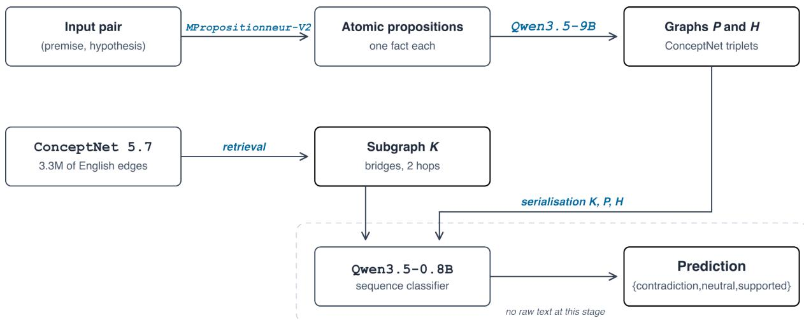
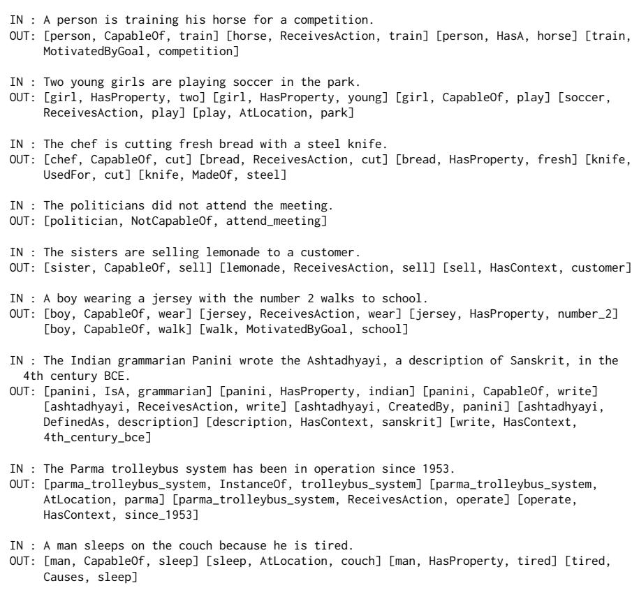
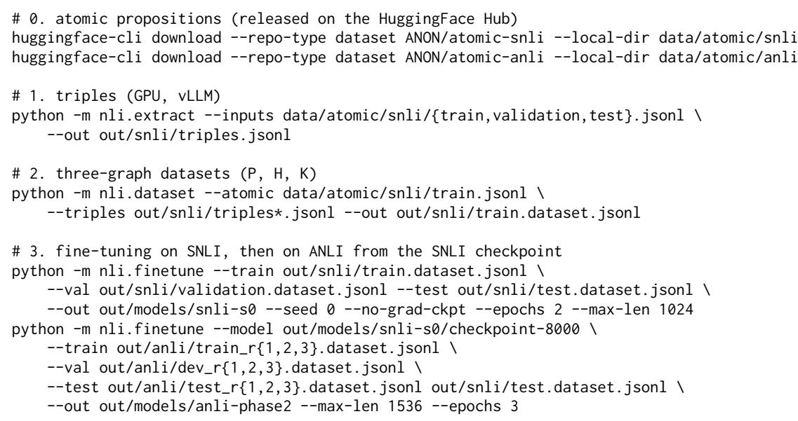

# Can We Do Interpretable NLI with Graphs Based on Atomic Propositions?

Younes Boufouss, Luc Pommeret, Thomas Gerald, Patrick Paroubek, Sophie Rosset

Université Paris-Saclay, CNRS, Laboratoire Interdisciplinaire des Sciences du Numérique, 91400, Orsay, France Correspondence: surname.name@universite-paris-saclay.fr

## Abstract

While Large Language Model (LLM)-based Natural Language Inference (NLI) systems achieve high accuracy, their decision-making processes lack auditable structures. This paper explores whether NLI can be performed using only interpretable, graph-based representations of evidence. We introduce a fully graph-based pipeline where the classifier never directly processes the input text. Instead, sentences are decomposed into atomic propositions, converted into ConceptNet triples via constrained decoding, and represented as three graphs per pair: premise, hypothesis, and a retrieved ConceptNet subgraph. These graphs are then fed into a fine-tuned 0.8-billion-parameter language model. On the SNLI dataset, our pipeline achieves 89.7% accuracy, just 1.9 points below an identically trained text-based model. On ANLI, it matches the published performance of RoBERTa-large on rounds R2 and R3 (50% accuracy) but trails by 16 points on R1, resulting in an overall gap of 9 to 14 points compared to its text counterpart. We term this gap the price ofinterpretability and demonstrate that it stems from representational limitations rather than data constraints. Ablation studies further reveal that graphs and text are complementary: combining both modalities achieves 92.1% accuracy on SNLI.

## 1 Introduction

Natural Language Inference (NLI) is a fundamental task in Natural Language Understanding (NLU). Accurate predictions in NLI require multilevel reasoning, encompassing lexical (e.g., synonyms, antonyms), syntactic (e.g., negation, quantifiers), and semantic dimensions (e.g., logical entailment, common-sense knowledge). While current systems achieve state-of-the-art performance on benchmarks like SNLI (Bowman et al., 2015) and MultiNLI (Williams et al., 2018), these datasets are not without flaws. For instance, Gururangan et al. (2018) show that annotation biases, negation, and vagueness are strongly correlated with specific classes, enabling even shallow models to perform surprisingly well: a simple text classifier trained solely on the hypothesis achieves 67% accuracy on SNLI and 53% on MultiNLI. This suggests that a significant portion of the high performance in these benchmarks may stem from exploiting linguistic artifacts rather than genuine reasoning capabilities.

To address these artifacts, ANLI (Nie et al., 2020) was introduced as a more robust benchmark. Constructed through an iterative human-in-the-loop protocol, ANLI consists of three rounds (R1, R2, and R3) of increasing difficulty. In each round, annotators are tasked with crafting hypotheses that state-of-the-art models would misclassify, given a premise. These examples are then verified by other annotators to ensure their validity. After each round, the adversarial examples are incorporated into the training data, and the model is retrained.

Given this design, ANLI provides a natural testbed to evaluate the effectiveness of our knowledge graph-based approach. By assessing performance on ANLI, we can determine whether our system leverages structured knowledge to achieve genuine reasoning or if it, too, falls back on superficial patterns.

In this context, two successive measures of the same metric — Accuracy — are typically used. The first measure is obtained by providing raw text to a large pretrained model, which contains no explicit reasoning cues. Interpretability, however, is achieved by constraining the decision-making process to rely on interpretable intermediate structures (e.g., knowledge graphs).

In this work, we quantify the price of interpretability, i.e., the performance gap between these two approaches.

Our central research question is: Do graphs suffice? In other words, can structured representations alone achieve competitive performance, or is there an inherent trade-off between interpretability and accuracy? Our goal is to measure and analyse this trade-off systematically.

  
Figure 1: The four stages of the pipeline. Both sentences of the pair are decomposed into atomic propositions, each proposition is converted into ConceptNet triples under a constrained JSON schema to form the premise graph P and the hypothesis graph H, a third graph K is retrieved from ConceptNet, and the three graphs are serialised in the order K, P, H for the classifier. No natural language text reaches the classification stage.

Our contribution. Here, we provide a pipeline to perform the NLI task entirely on knowledge graphs, in the syntax of ConceptNet (Speer et al., 2017). The graphs are extracted from atomic propositions as in Pommeret et al. (2026), augmented with a retrieved ConceptNet subgraph, serialised, and classified by a fine-tuned Qwen3.5-0.8B-Base. The design guarantees that no raw text reaches the classifier, so every piece of information used for the decision is present in an interpretable list of triplets.<sup>1</sup> Our contributions are as follows:

1. A full graph-based NLI pipeline, featuring a 28-relation extraction vocabulary derived from ConceptNet, and a constrained JSON schema ensuring structural consistency (see Section 4.1.2).

2. Quantification of the price ofinterpretability: we measure the accuracy drop between textbased and graph-based models ceteris paribus: −1.9 points on SNLI and −9 to −14 points on ANLI (see Table 3).

3. Representation, not data, as the bottleneck: the performance gap stems from structural limitations rather than data scarcity. Adding 600,000 training pairs from MNLI and

FEVER-NLI yields only +0.6 points on ANLI (see Section 6.4).

4. Ablation studies to isolate key factors: (i) the contribution of external knowledge from ConceptNet, and (ii) the combination of graph and text models (see Section 6.3).

## 2 Related Work

Leveraging external knowledge for Natural Language Understanding (NLU) tasks is a wellestablished approach. In Question Answering (QA), systems like QA-GNN (Yasunaga et al., 2021) and KagNet (Lin et al., 2019) bridge the semantic gap between questions and candidate answers by integrating ConceptNet (Speer et al., 2017) as an external knowledge base. For Natural Language Inference (NLI), KIM (Chen et al., 2018) enhances lexical understanding by incorporating WordNet-based relations, such as synonymy, antonymy, hyperonymy, and hyponymy. Similarly, KGNLI (Wang et al., 2020) extracts key concepts from premises and hypotheses to construct a knowledge subgraph linking the two.

While decomposing premises and hypotheses into atomic propositions improves interpretability and enables the diagnosis of logical flaws, this approach alone does not inherently boost accuracy without fine-tuning the models (Srikanth and Rudinger, 2025; Huang, 2026). The pipeline described in Section 3 addresses this limitation by making the atomic propositions the input of the triplet extraction stage.

Finally, our classifier processes graphs as serialised text. Serialising structured inputs for language models rather than encoding them with a dedicated graph network is now a common choice (Fatemi et al., 2024), and we follow it: it leverages the pretrained semantics of relation names and ensures that each triplet remains individually accessible to the model’s attention mechanism. While this approach offers clear advantages, a systematic comparison with graph encoders remains an avenue for future work.

## 3 Proposed Approach

Atomic facts are first extracted from both the premise and the hypothesis, and only then converted into (subject, relation, object) triplets. This decomposition improves triplet extraction (Pommeret et al., 2026) by simplifying the task assigned to the extractor: rather than isolating multiple facts from a complex sentence in a single pass, it processes one minimal semantic unit at a time, which reduces the number of facts to extract per call and ensures that no atomic fact from the source sentence is omitted.

The pipeline maps a pair (premise, hypothesis) to a label in the set {entailment, neutral, contradiction} through four stages, so that no original text from the pair takes part in the final decision (see Figure 1).

1. Atomisation. Both sentences from the pair are decomposed into atomic propositions by MPropositionneur-V2-large, a model distilled for multilingual atomisation with coreference resolution (Pommeret et al., 2026).

2. Triplet extraction. Each atomic proposition is converted into a set of (subject, relation, object) triplets by Qwen3.5-9B<sup>2</sup> under a constrained JSON schema whose relation field is an enumeration of 28 ConceptNet relations. The union of the triplets of its propositions forms the graph P of the premise, and the graph H of the hypothesis.

3. Knowledge enhancement. A third graph, K, is retrieved from the 3.3M edges of the ConceptNet base: bridge edges (1 and 2 hops) between the entities that occur in P but not in H, and that occur in H but not in P, plus a one-hop neighbourhood of each entity.

4. Classification. The three graphs are serialised into a single string, in the following order: K, P, H, and fed to Qwen3.5-0.8B-Base, 3 fine-tuned on the training sets of different NLI benchmarks.

Why we do not give raw text to the LLM. A model that reads both the text and the graph will use the graph only where the text is insufficient. Thus, any interpretation of its graph usage is post-hoc. By removing the text, we make the intermediate structure decisive in the sense that an error in the graph is an error in the prediction. Conversely, every prediction can be traced to a finite list of triplets. The cost of the interpretability choice is presented in Table 3.

## 4 Experimental Protocol

This section follows the pipeline in the order in which it is applied. Section 4.1 covers graph construction, first the atomisation of the sentences into propositions (Section 4.1.1), then the extraction of triplets from each proposition (Section 4.1.2); Section 4.2 describes the retrieval of the external subgraph K; and Section 4.3 the serialisation of the three graphs and the fine-tuning of the classifier. Each stage constrains the next: the propositions bound what the extractor can see, and the extracted entities bound what can be retrieved from ConceptNet.

## 4.1 Graph Construction

## 4.1.1 Propositionneur

Sentences are atomised by MPropositionneur-V2-large, a fine-tuning of Qwen3, distilled from a larger teacher on Wikipedia chunks in six European languages (Pommeret et al., 2026). The model is prompted with Atomize: {sentence} and its output is constrained to a JSON array of strings under vLLM (Kwon et al., 2023). Decoding is greedy (T = 0).

Long adversarial premises, from ANLI, make the propositionneur degenerate into loops of repetition in 7% of ANLI sentences. We therefore apply a cleaning step: case-insensitive and whitespaceinsensitive deduplication, with removal of any proposition longer than 1.6 times the source sentence plus twenty characters, and a cap of 16 propositions per sentence, with a fallback to the source sentence when the filter empties the list. SNLI and ANLI (R1, R2 and R3) have been atomised.

## 4.1.2 Information Extraction

Extraction. Extraction uses Qwen3.5-9B served by vLLM, with few-shot prompting: the prompt provides the list of relations with their descriptions, a set of encoding rules, and nine annotated examples (see Appendix A). Importantly, decoding is constrained by a JSON schema in which the relation field is an enum over the 28 relations, so out-of-vocabulary relations are impossible by design. The schema also limits the output to 8 triplets: the prompt asks for at least two, while the schema enforces at least one.

Relation vocabulary. The extraction vocabulary contains 28 relations, all of them are ConceptNet relations (Speer et al., 2017). Using only ConceptNet relation names has benefits: the extracted graphs are directly alignable with the external base used at stage 3, and the relation names carry pretrained semantics that the classifier (finetuned LLM) can exploit.

Prompt rules. The extractions produce graphs that are locally plausible, but globally problematic, because the same fact is encoded differently in P and H, and the two graphs fail to align it. Therefore, the prompt fixes a normal form, that is enforced by the following rules:

1. The nodes are lemmas. A node is an English lemma (lower-case), that has been reduced to its subject word: the modifiers never come with their subject word (e.g., old\_man is forbidden, and man plus \$[man, HasProperty, old\$] is required), and verbs never come with their object. Multi-word nodes are reserved for proper names and lexical compounds. The non-intersective adjectives (e.g., former\_senator, fake\_gun) are exceptions (explicit in the prompt), since detaching them would change the truth conditions.

2. Argument structure is fixed. The agent of a verb always takes CapableOf and the patient always ReceivesAction; both are from a transitive verb. The passive and active variants are normalised to a unique form, so that the book was written and someone wrote the book yield the same triplet.

3. Adjuncts are typed. Beneficiaries and recipients use HasContext, destinations

MotivatedByGoal, locations AtLocation, instruments UsedFor, and temporal expressions HasContext.

4. Cardinality is an object. For example two men is expressed as [man, HasProperty, two], but a bare plural expresses no numeral.

5. Negation is a relation. Negated facts use the Not\* relations with the full verb phrase as a tail. This is what allows contradiction to be visible in the graph.

6. Created works have a fixed direction. The created work is always the subject of CreatedBy.

Every content word of the proposition source must give (at least) one triple. After the decoding, the nodes are normalised to the ConceptNet form with the spaCy lemmatiser. Function words are dropped (except not, no and never). The remaining tokens are lemmatised, changed in lowercase form and joined by underscores.

Prompt validation. The rules described above were not written a priori. They are the result of two corrective iterations driven by an LLM as judge panel (with three evaluation lenses over 36 items). That evaluation surfaced five systematic failures in the first prompt: hallucinated cardinality on bare plurals, an agent/patient inversion, the beneficiaries encoded as the patients, worn or printed identifiers encoded as quantities, and an inversion of the CreatedBy direction.

## 4.2 Knowledge Enhancement

The knowledge base is ConceptNet 5.7, restricted to English assertions, excluding the relations from DBpedia, and the relation ExternalURL (that is not used here). The high degree hubs have been truncated to their 64 best neighbours, and ranked by the informativeness first, and weight second. So that a frequent node (e.g., man) does not invade every subgraph.

For a pair, let P and H be the sets of the entities that occur in P and H, anchored to ConceptNet by exact match, or, if it does not suffice, by lexical head (e.g., winter\_hat becomes hat). The subgraph K is built in three passes:

1. Direct bridges. Edges linking an entity of P \ H (i.e., entities of P that are not in H), to an entity of $\mathcal { H } \setminus \mathcal { P } ,$ , ranked by weight. Shared entities are excluded with a reason: they are already aligned by string identity, so a bridge between them carries no information.

2. Two-hop bridges. Paths $p  m  h$ with $p \in \mathcal { P } \setminus \mathcal { H } , h \in \mathcal { H } \setminus \mathcal { P }$ and the pivot m outside ${ \mathcal { P } } \cup { \mathcal { H } }$ , ranked by the weight of their weakest edge. This pass is intended to capture transitive evidence such as london PartOf england PartOf europe, which no single triplet of P or H contains.

3. Informative neighbourhood. Up to 5 one-hop edges per entity, and excluding lexical relations (as RelatedTo, FormOf, DerivedFrom, Synonym, SimilarTo). Lexical relations are admitted as bridges, where they are genuinely informative, but not as background, where they only add noise.

Bridges are capped at 30 direct edges and 60 two-hop edges, the neighbourhood at 5 edges per entity, and K at 80 edges in total. Note that K may contain eight relations the extractor cannot produce (RelatedTo, Entails, FormOf, DerivedFrom, ObstructedBy, HasFirstSubevent, HasLastSubevent, SymbolOf), so the serialised input uses 36 relation types in total.

## 4.3 Serialisation and Fine-tuning of Qwen

Each pair is rendered as three labelled sections, with one triplet, separated by semicolon:

knowledge: london PartOf england ; ...   
premise: woman HasProperty two ; ...   
hypothesis: sister CapableOf hug ; ...

There is a reason for this ordering: K comes first as the context, and H after, closest to the classification head. Truncation is on the left-side, so a too-long input loses external knowledge before losing the hypothesis.

The classifier is Qwen3.5-0.8B-Base, with a three-way sequence classification head. Training uses a batch size of 8, with 8 gradient accumulation steps (so an effective batch size of 64), the learning rate is 2e-5, with cosine scheduler and a 3% warmup. For regularisation, we use a weight decay of 0.01, on 2 epochs. Training is in bf16, with a maximum sequence length of 1024 tokens (1536 on ANLI, whose premises are longer).

Checkpoint selection. The checkpoint is selected on the validation split of the dataset, not on the test. All figures below follow this protocol.

## 5 Datasets and Benchmarks

We evaluate on SNLI (Bowman et al., 2015) and on the three rounds of ANLI (Nie et al., 2020). For the data-scaling experiment of Section 6.4, we additionally extract MNLI (Williams et al., 2018) and FEVER-NLI (Thorne et al., 2018), using the evidence as premise.

The full SNLI training set (549,367 pairs) is processed, yielding 889,944 unique atomic propositions. ANLI R1 to R3 yield 296,585 atomic propositions. MNLI has 953,734 unique propositions, and FEVER-NLI 507,593. Extraction produces an average of 3.6 triplets per proposition.

## 5.1 Metrics

We report accuracy. ANLI test sets contain 1000 to 1200 examples (depending on the round).

## 5.2 Defining the Price of Interpretability

We define as price ofinterpretability the drop between the original fine-tuning of Qwen3.5-0.8B on the texts of premise and hypothesis (with the format premise: ... \nhypothesis: ...) and the ceteris paribus fine-tuning of Qwen3.5-0.8B only on graphs extracted as we show in Section 4.1.2. We use the same backbone, the same seed, the same optimiser and the same number of epochs. The only difference is that we only show the graph in the first and only the text in the second. The quantity is therefore not a comparison against the stateof-the-art, but a measurement of what the graphinterpretability costs. Since the text baseline is a single run while the graph model has three seeds, the SNLI price is defined against the three-seed mean.

## 6 Results and Analysis

## 6.1 Main Results

Table 1 reports SNLI. The graph pipeline reaches $0 . 8 9 7 \pm 0 . 0 0 6$ accuracy over three seeds. Below it, the zero-shot control matters for interpreting all of this. Without fine-tuning, the 0.8B base model scored by label likelihood is at chance on every split (0.343 on SNLI, 0.334 to 0.335 on ANLI). The zero-shot score is the same whether the input is text or graphs. All the competence reported below comes from fine-tuning, and none of it from the backbone model.

<table><tr><td>System</td><td>Input</td><td>SNLI</td></tr><tr><td>Zero-shot 0.8B-Base</td><td>text</td><td>0.343</td></tr><tr><td>Zero-shot 0.8B-Base</td><td>graphs</td><td>0.343</td></tr><tr><td>RoBERTa-large (ours)</td><td>text</td><td>0.899</td></tr><tr><td>Qwen3.5-0.8B (ours)</td><td>graphs</td><td>0.897 ± 0.006</td></tr><tr><td>Qwen3.5-0.8B</td><td>text</td><td>0.916</td></tr><tr><td>Qwen3.5-0.8B</td><td>text+graphs</td><td>0.921</td></tr></table>

Table 1: SNLI test accuracy. Our graph model is the mean over three seeds (0.892, 0.894 and 0.904). All other rows are seed 0.

Table 2 reports ANLI. Transferring the SNLI model zero-shot gives 0.285 for R1, 0.330 for R2 and 0.328 for R3, that is at, or below, chance, which is expected because ANLI is designed to produce examples that fool models which are good at SNLI. After a second training phase, on ANLI R1 to R3, starting from the SNLI checkpoint with results shown in Table 1, the graph model reaches 0.576, 0.480 and 0.449, i.e., +29.1 points on R1 over the zero-shot transfer, with a graph-only input. Sequential fine-tuning costs SNLI retention (dropping from 0.892 to 0.782).

Two readings of Table 2 pull in two directions: against the literature, the graph-only model is within one point of the published RoBERTa-large<sup>4</sup> test accuracy on R2 (0.480 vs. 0.489) and slightly above it on R3 (0.449 vs. 0.444), while remaining 16 points behind on R1 (0.576 vs. 0.738) (Nie et al., 2020); it sits at the level of BERT-large on all three rounds (0.574, 0.483 and 0.435). An interpretableby-design system that never sees the text is therefore competitive with strong text encoders on the two hardest rounds. Against the ceteris paribus control, the same graphs lose 9 to 14 points to their own text counterpart. The interpretability gap only means something when measured against the same backbone, so this is what we call the price of interpretability.

## 6.2 The Price of Interpretability

Table 3 quantifies the trade-off. The price is small on SNLI (we see that the graph pipeline retains 97.9% of the text model’s accuracy), and big on ANLI, where it retains only 80% on R1. The adversarial signal lives in what the structure of triplet extraction compresses away.

By inspecting the disagreements, we see four recurring categories accounting for most of the gap. Numerical reasoning (or order reasoning) survives only when the numeral is explicit. The prompt expressly forbids inventing one from a bare plural. Temporal reasoning is flattened: dates become undifferentiated with the HasContext relation, so since 1953 and in 1953 are indistinguishable. Also, the coreferences on long premises are resolved by the propositionneur, and in case of error, it propagates through the pipeline. Finally, ANLI premises are long, and the fine-grained detail on which an adversarial hypothesis hinges is often the modifier that the normal form strips or the clause that the 8-triple cap drops.

<table><tr><td>Model</td><td>R1</td><td>R2</td><td>R3</td><td>SNLI</td></tr><tr><td>Graphs only</td><td></td><td></td><td></td><td></td></tr><tr><td>Zero-shot transfer</td><td></td><td>0.2850.3300.3280.892</td><td></td><td></td></tr><tr><td>Train on ANLI only</td><td></td><td>0.5760.4800.4490.782</td><td></td><td></td></tr><tr><td>ANLI + SNLI replay</td><td></td><td>0.5650.462</td><td>0.463 0.887</td><td></td></tr><tr><td>Text</td><td></td><td></td><td></td><td></td></tr><tr><td>RoBERTa-large (ours)</td><td></td><td>0.5800.3590.3570.899</td><td></td><td></td></tr><tr><td>RoBERTa-large (published)</td><td></td><td>0.7380.4890.444</td><td></td><td></td></tr><tr><td>BERT-large (published)</td><td></td><td>0.5740.4830.435</td><td></td><td></td></tr><tr><td>Qwen3.5-0.8B</td><td></td><td>0.7040.5720.5530.910</td><td></td><td></td></tr></table>

Table 2: ANLI accuracy, with SNLI transfer in the last column. Bold marks the best graph-only system per column. The published RoBERTa-large and BERT-large results are those of Nie et al. (2020).

## 6.3 Ablations

Table 4 reports two ablations.

External knowledge is neutral on SNLI. We see that removing K (that is, the graph coming from ConceptNet) costs nothing (0.895 against 0.892). We can take it as a negative result: SNLI inference is so simple that the premise and hypothesis graphs suffice, and the retrieved ConceptNet subgraph is (at best) redundant. It does not follow that K is useless in general. But on SNLI our multi-hop retrieval carries nothing.

Graphs and text are complementary. Adding the graphs to the text raises the accuracy from 0.916 to 0.921. As a complement, the graphs contribute.

## 6.4 Is the Gap a Data Problem?

A natural objection to Table 3 is that the graph model is simply under-trained: graphs are a less familiar input format, so it may need more data to reach the same performance. We tested this directly. We extracted MNLI and FEVER-NLI with exactly the same pipeline, and ran a classical (in the literature) two-phase recipe: phase 1 on

<table><tr><td></td><td>Graph</td><td>Text</td><td>Price of Interp.</td></tr><tr><td>SNLI</td><td>0.897 ±0.006</td><td>0.916</td><td>-1.9</td></tr><tr><td>ANLI R1</td><td>0.565</td><td>0.704</td><td>-13.9</td></tr><tr><td>ANLI R2</td><td>0.462</td><td>0.572</td><td>-11.0</td></tr><tr><td>ANLI R3</td><td>0.463</td><td>0.553</td><td>-9.0</td></tr></table>

Table 3: Price of Interpretability: Qwen3.5-0.8B on raw text (premise: ...\nhypothesis: ...) vs. the graph model, ceteris paribus.
<table><tr><td>Configuration (SNLI test)</td><td>Accuracy</td></tr><tr><td>P + H + K (full, graphs only)</td><td>0.892</td></tr><tr><td>P + H, no external knowledge</td><td>0.895</td></tr><tr><td>Text only</td><td>0.916</td></tr><tr><td>Text + graphs</td><td>0.921</td></tr></table>

Table 4: Ablations, all with the same Qwen3.5-0.8B backbone and protocol (seed 0).

SNLI + MNLI + FEVER, and phase 2 on ANLI with SNLI replay. Phase 1 improves SNLI a little (0.896 against 0.892). Phase 2 on ANLI with SNLI replay then gives 0.568, 0.479 and 0.461 on R1 to R3, against 0.565, 0.462 and 0.463 without the additional data. We read this as evidence that the adversarial gap is representational, and not datalimited.

## Conclusion

The answer to our title question (can we do interpretable NLI with graphs based on atomic propositions?) is: yes on SNLI, and only partly on ANLI. We built an NLI system whose classifier never sees a natural-language sentence, and measured the performance cost of relying on graphs of atomic propositions alone. On SNLI, the cost is 1.9 points. On ANLI it is 9 to 14, depending on the ANLI round. The same system matches the published RoBERTa-large text model on ANLI R2 and R3 while taking no text as input.

Beyond that measurement, the pipeline itself is the contribution: atomic propositions are carried forward to the decision, and the combination of the ConceptNet vocabulary, the constrained extraction, and the serialised three-graph input makes every prediction traceable to a finite list of triplets. The cost of that guarantee is now measured, which is what a neuro-symbolic model needs if its intermediate representations are to be inspected by humans.

The practical consequence is that the ConceptNet triplet vocabulary, as we use it, is lossy in identifiable ways: numeral mentions, the temporal granularity, and the fine details of long premises. To close this gap, we therefore have to enrich the target structure, rather than scaling the classifier. Finally, since the interpretability we claim is the auditability of the intermediate structures (atomic propositions and triplets), it should be validated as such by a human study in which annotators repair a wrong prediction by editing the triplets. That would test the claim directly.

## Limitations

The interpretability is qualitative, not quantitative. We do not measure the interpretability (i.e., the readability by humans) of atomic propositions and triplets of our pipeline explicitly. It remains to be tested in future work.

Validation of the graph by the evaluation. We do not directly evaluate the quality of the graph, but evaluate it indirectly by means of NLI benchmarks. We want to conduct further evaluation on the quality of the graph, using other domains, or direct approach.

Only English. The propositionneur is multilingual, but the extraction vocabulary, the ConceptNet base, and every experiment, are in English. ConceptNet’s coverage is culturally biased.

Single-seed baselines and unequal budgets. The graph model is averaged over three seeds, but the text baselines and all ANLI models are single runs; two of the three graph seeds were also interrupted before the end of the second epoch. The SNLI price of interpretability should therefore be read as an upper bound of roughly two points, of the same order as run-to-run variation. The ANLI gap (9 to 14 points) is an order of magnitude larger and is unaffected.

The contribution of K is measured on SNLI only. We did not run the no-K ablation on ANLI, so the usefulness of multi-hop ConceptNet retrieval for adversarial inference remains open.

## References

Samuel R. Bowman, Gabor Angeli, Christopher Potts, and Christopher D. Manning. 2015. A large annotated corpus for learning natural language inference. In Proceedings of the 2015 Conference on Empirical Methods in Natural Language Processing, pages 632–642, Lisbon, Portugal. Association for Computational Linguistics.

Qian Chen, Xiaodan Zhu, Zhen-Hua Ling, Diana Inkpen, and Si Wei. 2018. Neural natural language inference models enhanced with external knowledge. In Proceedings of the 56th Annual Meeting of the Associationfor Computational Linguistics (Volume 1: Long Papers), pages 2406–2417, Melbourne, Australia. Association for Computational Linguistics.

Bahare Fatemi, Jonathan Halcrow, and Bryan Perozzi. 2024. Talk like a graph: Encoding graphs for large language models. In The Twelfth International Conference on Learning Representations (ICLR).

Suchin Gururangan, Swabha Swayamdipta, Omer Levy, Roy Schwartz, Samuel R. Bowman, and Noah A. Smith. 2018. Annotation artifacts in natural language inference data. In Proceedings of the 2018 Conference of the North American Chapter of the Associationfor Computational Linguistics: Human Language Technologies, Volume 2 (Short Papers), pages 107–112, New Orleans, Louisiana. Association for Computational Linguistics.

Minghui Huang. 2026. Atomic-snli: Fine-grained natural language inference through atomic fact decomposition. Preprint, arXiv:2601.06528.

Woosuk Kwon, Zhuohan Li, Siyuan Zhuang, Ying Sheng, Lianmin Zheng, Cody Hao Yu, Joseph E. Gonzalez, Hao Zhang, and Ion Stoica. 2023. Efficient memory management for large language model serving with PagedAttention. In Proceedings ofthe 29th Symposium on Operating Systems Principles (SOSP ’23), pages 611–626. Association for Computing Machinery.

Bill Yuchen Lin, Xinyue Chen, Jamin Chen, and Xiang Ren. 2019. KagNet: Knowledge-aware graph networks for commonsense reasoning. In Proceedings of the 2019 Conference on Empirical Methods in Natural Language Processing and the 9th International Joint Conference on Natural Language Processing (EMNLP-IJCNLP), pages 2829–2839, Hong Kong, China. Association for Computational Linguistics.

Yixin Nie, Adina Williams, Emily Dinan, Mohit Bansal, Jason Weston, and Douwe Kiela. 2020. Adversarial NLI: A new benchmark for natural language understanding. In Proceedings of the 58th Annual Meeting of the Association for Computational Linguistics, pages 4885–4901, Online. Association for Computational Linguistics.

Luc Pommeret, Thomas Gerald, Christophe Servan, Sahar Ghannay, Patrick Paroubek, and Sophie Rosset. 2026. LLM-based atomic propositions help weak extractors: Evaluation of a propositioner for triplet extraction. In Proceedings ofthe Knowledge Graphs and Large Language Models Workshop (KG-LLM) @ LREC26, pages 134–143, Palma, Mallorca, Spain. European Language Resources Association (ELRA).

Robyn Speer, Joshua Chin, and Catherine Havasi. 2017. ConceptNet 5.5: An open multilingual graph of general knowledge. In Proceedings of the Thirty-First

AAAI Conference on Artificial Intelligence, pages 4444–4451, San Francisco, California, USA. AAAI Press.

Neha Srikanth and Rachel Rudinger. 2025. NLI under the microscope: What atomic hypothesis decomposition reveals. In Proceedings ofthe 2025 Conference of the Nations of the Americas Chapter of the Associationfor Computational Linguistics: Human Language Technologies (Volume 1: Long Papers), pages 2574–2589, Albuquerque, New Mexico. Association for Computational Linguistics.

James Thorne, Andreas Vlachos, Christos Christodoulopoulos, and Arpit Mittal. 2018. FEVER: a large-scale dataset for fact extraction and VERification. In Proceedings of the 2018 Conference of the North American Chapter of the Association for Computational Linguistics: Human Language Technologies, Volume 1 (Long Papers), pages 809–819, New Orleans, Louisiana. Association for Computational Linguistics.

Zikang Wang, Linjing Li, and Daniel Zeng. 2020. Knowledge-enhanced natural language inference based on knowledge graphs. In Proceedings of the 28th International Conference on Computational Linguistics, pages 6498–6508, Barcelona, Spain (Online). International Committee on Computational Linguistics.

Adina Williams, Nikita Nangia, and Samuel R. Bowman. 2018. A broad-coverage challenge corpus for sentence understanding through inference. In Proceedings ofthe 2018 Conference ofthe North American Chapter ofthe Associationfor Computational Linguistics: Human Language Technologies, Volume 1 (Long Papers), pages 1112–1122, New Orleans, Louisiana. Association for Computational Linguistics.

Michihiro Yasunaga, Hongyu Ren, Antoine Bosselut, Percy Liang, and Jure Leskovec. 2021. QA-GNN: Reasoning with language models and knowledge graphs for question answering. In Proceedings of the 2021 Conference ofthe North American Chapter ofthe Associationfor Computational Linguistics: Human Language Technologies, pages 535–546, Online. Association for Computational Linguistics.

## A Extraction Prompt

The prompt sent to the extractor is reproduced here in four parts. Figure 2 gives the task statement and the 28-relation vocabulary, Figure 3 the normal form imposed on nodes and on argument structure, Figure 4 the nine few-shot pairs, and Figure 5 the JSON schema passed to the constrained decoder.

## B Reproduction Code

The code is available at https://anonymous.   
4open.science/r/graph-nli-anon-1F68/.

```yaml
You convert ONE English sentence (an atomic proposition) into knowledge-graph triples using
the ConceptNet vocabulary. Output a JSON array of triples [{"h": head, "r": relation, "t":
tail}, ...] and nothing else.
RELATIONS -- use ONLY these ConceptNet relations:
- IsA: class or type membership: [dog, IsA, animal]
- InstanceOf: named entity is an instance of a class: [parma, InstanceOf, city]
- HasProperty: attribute, state or cardinality: [coat, HasProperty, red] ; [man, HasProperty, two]
- NotHasProperty: negated attribute: [room, NotHasProperty, empty]
- CapableOf: the subject performs the action: [person, CapableOf, jump]
- NotCapableOf: the subject does NOT perform the action: [politician, NotCapableOf, attend_meeting]
- ReceivesAction: the object undergoes the action: [ball, ReceivesAction, kick]
- AtLocation: spatial location: [man, AtLocation, park] ; [jump, AtLocation, street]
- LocatedNear: proximity: [bench, LocatedNear, fountain]
- HasA: possession or attachment: [person, HasA, horse]
- PartOf: part-whole: [wheel, PartOf, car]
- MadeOf: material: [knife, MadeOf, steel]
- UsedFor: purpose or instrument of an action: [knife, UsedFor, cut]
- Desires: wants / intends: [child, Desires, ice_cream]
- NotDesires: does not want: [cat, NotDesires, bath]
- CausesDesire: makes one want: [heat, CausesDesire, swim]
- Causes: causal link: [rain, Causes, wet]
- HasSubevent: sub-action happening within the action: [cook, HasSubevent, stir]
- HasPrerequisite: necessary precondition: [win, HasPrerequisite, compete]
- MotivatedByGoal: action done for a goal: [train, MotivatedByGoal, competition]
- MannerOf: specific way of doing (verb-verb): [sprint, MannerOf, run]
- HasContext: temporal or contextual setting: [sleep, HasContext, night]
- CreatedBy: creator or origin: [painting, CreatedBy, artist]
- DefinedAs: definition or equivalence: [sum, DefinedAs, total]
- Synonym: same meaning: [couch, Synonym, sofa]
- Antonym: opposite meaning: [hot, Antonym, cold]
- SimilarTo: similar: [jog, SimilarTo, run]
- DistinctFrom: mutually exclusive alternative: [indoors, DistinctFrom, outdoors]
```  
Figure 2: System prompt, part 1: task statement and the 28-relation ConceptNet extraction vocabulary.

Commands assume the ConceptNet 5.7 English assertions in data/conceptnet/. Sequential fine-tuning starts from the SNLI checkpoint selected on the validation split. The atomic proposition datasets are anonymised for review and will be released on acceptance.

tail when needed ([politician, NotCapableOf, attend\_meeting]); NEVER create not\_\* nodes. Produce 2 to 8 triples.

NODE RULES:

- a node is a lowercase English lemma: the bare HEAD word, without its modifiers

- NEVER glue modifier+noun or verb+object into one node (wrong: old\_man, go\_package, wear\_jacket); each modifier becomes its own HasProperty triple on the head noun

- multi-word nodes ONLY for proper names (new\_york, forza\_italia) and true lexical compounds (winter\_hat, hot\_dog); exception: non-intersective adjectives stay attached (former\_senator, fake\_gun)

- verbs: bare lemma (jump, not jumps/jumping); phrasal verbs keep their particle (jump\_over)

- nouns keep their lexical form (linguistics stays linguistics); never use bare adverbs or prepositions as nodes (outside, just, very)

- numerals ONLY if the number is explicit: "two men" -> [man, HasProperty, two]; a bare plural ("the sisters") NEVER yields a numeral

- worn or printed identifiers are not quantities: "the number 2 jersey" -> [jersey, HasProperty, number\_2]

STRUCTURE -- every content word of the sentence must land in at least one triple:

- agent of a verb: [agent, CapableOf, verb] -- the agent ALWAYS takes CapableOf, never HasProperty and never ReceivesAction

- direct object: [object, ReceivesAction, verb] -- for every transitive verb emit BOTH the agent triple AND the patient triple

- passive voice: the subject is the patient ("the book was written" -> [book, ReceivesAction, write]); a "by X" agent gets [X, CapableOf, verb]

- recipient or beneficiary ("to/for X"): [verb, HasContext, X] -- NEVER ReceivesAction

- destination ("walk to school"): [verb, MotivatedByGoal, school] -- not AtLocation

- place where it happens: [x, AtLocation, place]; time, date or period: [x, HasContext, time] -- dates are context, never HasProperty

- instrument: [instrument, UsedFor, verb] -- purpose: [verb, MotivatedByGoal, goal]

- possession: [owner, HasA, thing] -- part or aspect of: [part, PartOf, whole]

- role or profession: [person, IsA, role]; named entity class: [name, InstanceOf, class]

- created works: [work, CreatedBy, creator] -- the WORK is always the head, in active voice too: "Panini wrote a grammar" -> [grammar, CreatedBy, panini], NEVER [panini, CreatedBy, grammar]

- "outside/near X": attach the real place directly ([fight, LocatedNear, deli]), never a bare "outside" node

- NEGATION: use NotCapableOf / NotHasProperty / NotDesires, with the full verb phrase as

Figure 3: System prompt, part 2: the normal form imposed on nodes and on argument structure.  
  
Figure 4: The nine few-shot pairs, in compact triple notation. They are sent as alternating user and assistant turns, the assistant turns containing JSON arrays of {h, r, t} objects.

```json
{
"type": "array",
"items": {
"type": "object",
"properties": {
"h": {"type": "string", "maxLength": 60},
"r": {"enum": [
"IsA", "InstanceOf", "HasProperty", "NotHasProperty", "CapableOf",
"NotCapableOf", "ReceivesAction", "AtLocation", "LocatedNear",
"HasA", "PartOf", "MadeOf", "UsedFor", "Desires", "NotDesires",
"CausesDesire", "Causes", "HasSubevent", "HasPrerequisite",
"MotivatedByGoal", "MannerOf", "HasContext", "CreatedBy",
"DefinedAs", "Synonym", "Antonym", "SimilarTo", "DistinctFrom"
]},
"t": {"type": "string", "maxLength": 60}
},
"required": ["h", "r", "t"],
"additionalProperties": false
},
"minItems": 1,
"maxItems": 8
}
```  
Figure 5: JSON schema passed to the constrained decoder. The enum lists the 28 extraction relations of Figure 2.

  
Figure 6: End-to-end pipeline, from atomic propositions to the fine-tuned classifier.