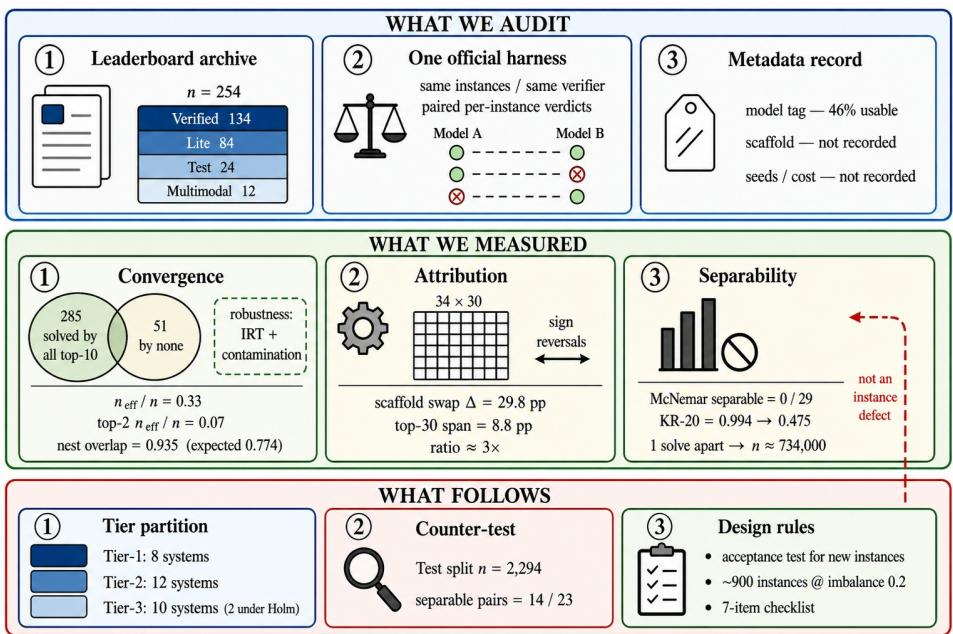
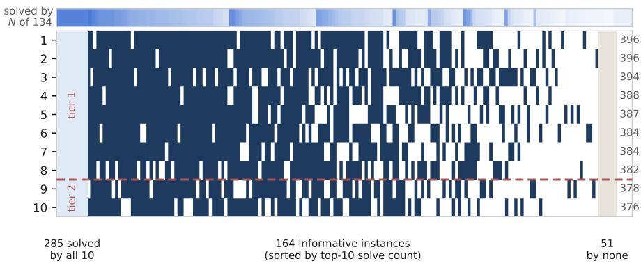
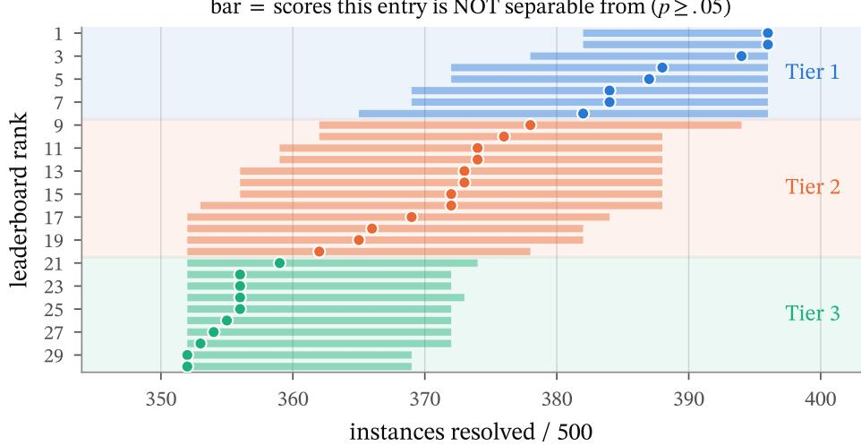
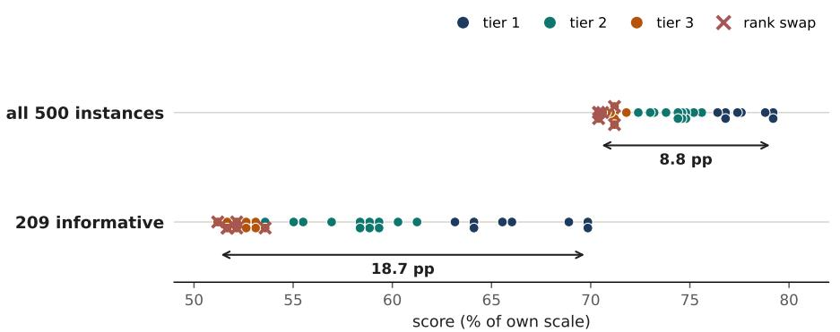

# Coding Agents Have Converged: Why the SWE-bench Leaderboard Can No Longer Order Its Top Entries, and What to Measure Instead

Fengshuo LIU1[0009−0008−2275−6921]⋆, Ying LIU2, Ruize SUN3, Lie LUO4, and Siyuan GUO4

1 Imperial College London, London, United Kingdom fengshuo.liu26@imperial.ac.uk 2 The Hong Kong Polytechnic University, Hong Kong SAR yarden.liu@connect.polyu.hk 3 Korea University, Seoul, Korea 2025150487@korea.ac.kr 4 Jinan University, Guangzhou, China lxl243@stu2022.jnu.edu.cn, kayaking@stu2025.jnu.edu.cn

Abstract. Small diferences on coding-agent leaderboards are often read as an ordering of systems. We audit whether the published verdicts support this reading, using 254 SWE-bench submissions across four splits without running models. On Verified, the leading two entries each resolve 396 of 500 instances. The top ten share 285 successes and 51 failures, leaving 164 instances that distinguish their outcomes. Frontier solution sets have median nesting 0.935 against a score-implied baseline of 0.774, indicating strongly shared successes. Scores also depend on the evaluated model–scafold pair: observed within-model scafold ranges reach 29.8 percentage points, compared with the 8.8-point spread of the top thirty. Six of nine cell-mean interaction tests remain significant after Holm correction, although this observational design does not identify causal scaffold efects. Exact paired McNemar tests separate none of the 29 adjacent Verified top-thirty pairs at α = 0.05, while the larger Test split separates 14 of 23. A stated leader-based rule yields three descriptive tiers, or two after Holm correction; non-rejection does not establish equivalence. We release the partition and a five-step audit protocol that profiles shared outcomes, tests paired diferences, reports grouping sensitivity, and estimates the instance budget needed for resolution. The results motivate reporting comparison-set-specific resolution and model–scafold provenance instead of interpreting small aggregate gaps as established rank diferences.

Keywords: SWE-bench · Agent evaluation · Trustworthy evaluation · Responsible data intelligence · Benchmark saturation

## 1 Introduction

SWE-bench Verified [4,9] evaluates coding agents on 500 real GitHub issues. Each agent produces a patch, which the oficial harness applies before running repository tests. The two leading entries each resolve 396 instances, and six more sit within 14 of them. The leaderboard displays ranks 1 through 8, often read as an ordering for model selection, procurement, and research reporting. Shared instance-level outcomes let us test whether the evidence supports that reading.

That reading is already contested, but along a diferent axis. One line of work asks whether the tasks are sound — automated auditing finds quality problems in over a quarter of tasks and shows that filtering them shifts rankings and raises mean Verified scores by 9.9% [18], with related empirical findings on weak tests and leakage [1], outcome validity [20] and lucky passes [13], and with arguments that coding benchmarks are misaligned with agentic software engineering [3]. We ask the other question: even where the tasks are sound, can the ranks be read? This is an audit of a public evaluation artefact — its provenance, its curation, and the trustworthiness of the comparisons it is used to license — and we measure where that line falls, so that the designers of the next benchmark, and of the internal suites now being built to choose models, need not rediscover it.

We find shared frontier successes, model–scafold associations, and insuficient paired evidence for adjacent rank diferences. The resulting descriptive groups depend on the stated rule and correction. We then examine implications for SWE-bench, broader suites, and internal model selection. Figure 1 summarises the argument.

What this paper contributes. An audit protocol that mines the per-instance verdict matrix every public leaderboard already publishes, and turns it into actionable structure (Protocol 1, Section 5): a degeneracy profile that localises where resolution is lost, a nesting coeficient measured against its score-implied null that identifies convergence as the mechanism, paired separability testing that yields a publishable tier partition, and an inversion that prices new instances. Two of its constructs are, to our knowledge, new: the comparison-set-relative efective size $n _ { e f f } ( S )$ and the nesting coeficient against its baseline. Applied to SWE-bench, the protocol returns a far more extreme failure state than prior audits of other leaderboards, which found unresolvable pairs to be the exception (11 of 40 and 4 of 9 in [5]); on the Verified frontier they are 29 of 29. The model×scafold design of Section 4 is reconstructed from public metadata, the protocol checks its own candidate remedies before recommending them (Section 6), and we release the full pipeline as a reusable tool. The statistical machinery itself is established, and we use it as such: paired adjacent-rank testing and required-sample-size inversion follow [5], rank intervals [7], benchmark power analysis [2], reduced-size construction [11,10], item-level psychometrics [19], and the information-retrieval work on test collection reliability [15,14,12] long predates all of it. The taskquality work cited above is complementary to ours — it asks whether the tasks are sound; we ask whether the ranks are — and we draw on it in Section 6.

  
Fig. 1. The audit: 254 public submissions and incomplete metadata feed analyses of shared outcomes, model–scafold associations, and paired rank separability. Outputs are descriptive tiers, a Test-split counter-test, and benchmark-design guidance. Tiers use uncorrected leader comparisons; Holm gives 19/11 groups. Attribution is observational, not causal. The 734,000 instance figure is an independent-sample power reference, not a paired-test requirement (Section 5).

## 2 Data

For every leaderboard submission the SWE-bench maintainers publish the oficial harness verdict on each instance, plus a metadata.yaml carrying a model tag [16]; every figure below is computed from the leaderboard as retrieved on 30 July 2026, with the analysis manifest frozen in the supplementary package. Table 1 summarises the pool: all submissions on the four public splits that publish perinstance results. Verified and Lite share only 93 instances (31% of Lite), so Lite is a largely independent replication. The ten excluded Multimodal submissions record resolved as an integer count rather than a list of instance identifiers, and so cannot support any per-instance analysis — a first sign of the metadata problem described next. Submissions span 2023–2025 and range from 2 to 396 resolved instances on Verified. “Top K” always means the K highest-scoring submissions; a missing verdict counts as unresolved, which is the convention the displayed score already implies. What makes this pool analysable is that every entry was graded by the same oficial harness on the same instances, which is what licenses the paired tests below; every number in this paper can be recomputed by anyone from the published verdicts.

Table 1. The analysis pool: the four public splits that publish per-instance verdicts, as retrieved on 30 July 2026. Sections 4–5 use Verified; Section 3 reports all four.
<table><tr><td>Split</td><td>Submissions</td><td>Instances</td><td>Verified overlap</td><td>Role</td></tr><tr><td>Verified</td><td>134</td><td>500</td><td></td><td>main analysis</td></tr><tr><td>Lite</td><td>84</td><td>299</td><td>93 (31%)</td><td>indep. replication</td></tr><tr><td>Test</td><td>24</td><td>2,294</td><td></td><td>counter-test</td></tr><tr><td>Multimodal</td><td>12 of 22</td><td>301</td><td></td><td>descriptive</td></tr></table>

The provenance record barely supports analysis. Only 61 of 134 Verified submissions (46%) carry a single usable model tag, and the tags are inconsistent: claude-sonnet-4 and claude-4-sonnet denote the same model, date sufixes appear and disappear, and some entries give a URL instead of an identifier. We normalised identifiers by hand and derived the scafold from the submission name, yielding 34 scafolds, 30 models and 55 occupied cells, five of which hold more than one submission. A leaderboard whose purpose is comparison does not record what was compared in machine-readable form; Section 6 returns to this.

For even samples, descriptive score-range, nesting and budget medians use the upper middle observation; the IRT analysis uses midpoint medians.

## 3 The Systems Solve the Same Problems

## 3.1 Most of the Benchmark Cannot Separate the Leaders

For a comparison set S of systems, call an instance degenerate if every member of S resolves it or none does: it cannot contribute to any comparison within S, yet it contributes $1 / n$ to every score. The efective size of a comparison is the number of non-degenerate instances:

$$
n _ { e f f } ( S ) = \left| \{ i : 0 < \mathrm { r e s o l v e d } _ { S } ( i ) < | S | \} \right|\tag{1}
$$

Following the test-collection tradition [14,12], this is the sample size that matters, and it is a property of the pair (benchmark, comparison set) rather than of the benchmark alone.

Table 2 reports it. Over all 134 Verified submissions $n _ { e f f } / n = 0 . 9 4$ and the benchmark looks healthy. Over the top ten it is 0.33: 285 instances are solved by all ten, 51 by none, and 164 remain. Over the top two it is 0.07 — 36 instances. Figure 2 shows the same decomposition instance by instance. Lite shows the same pattern from a less saturated base (0.89 → 0.54 at the top ten); that its frontier value is higher is what one expects of a harder benchmark, so the quantity tracks saturation sensibly. The collapse holds on all four splits that publish per-instance results (Table 4), including the full 2294-instance Test set.

## 3.2 Solutions Are Nested, Not Complementary

Degeneracy could in principle coexist with specialisation: systems might solve overlapping-but-diferent sets. They do not. For a pair with $| A | \geq | B |$ define the

Table 2. Degenerate and discriminating instances as the comparison set narrows. KR-20 is omitted for $K < 1 0 .$ , where it is unstable.
<table><tr><td>K</td><td>solved by all</td><td>solved by none</td><td> $n _ { e f f } / n$ </td><td>KR-20</td></tr><tr><td colspan="5">Verified (134 submissions, n = 500; top-10 mean 77.3%)</td></tr><tr><td>2</td><td>378</td><td>86</td><td>0.07</td><td></td></tr><tr><td>5</td><td>334</td><td>60</td><td>0.21</td><td></td></tr><tr><td>10</td><td>285</td><td>51</td><td>0.33</td><td>0.475</td></tr><tr><td>20</td><td>250</td><td>41</td><td>0.42</td><td>0.722</td></tr><tr><td>50</td><td>146</td><td>35</td><td>0.64</td><td>0.940</td></tr><tr><td>134</td><td></td><td> $n _ { e f f } / n = 0 . 9 4$ </td><td></td><td>0.994</td></tr><tr><td colspan="5">Lite (84 submissions,  $n = 2 9 9 ;$  top-10 mean 54.3%)</td></tr><tr><td>10</td><td>73</td><td>65</td><td>0.54</td><td>0.867</td></tr><tr><td>20</td><td>35</td><td>49</td><td>0.72</td><td>0.874</td></tr><tr><td>84</td><td></td><td> $n _ { e f f } / n = 0 . 8 9$ </td><td></td><td>0.982</td></tr></table>

Table 3. Nesting of solution sets within ability bands (SWE-bench Verified), against the baseline implied by the scores alone.
<table><tr><td>band (resolved instances)</td><td>systems</td><td>median cov</td><td>baseline</td><td>excess</td></tr><tr><td>frontier (≥ 370)</td><td>16</td><td>0.935</td><td>0.774</td><td>+0.161</td></tr><tr><td>strong (300–369)</td><td>38</td><td>0.913</td><td>0.708</td><td>+0.205</td></tr><tr><td>mid (200–299)</td><td>48</td><td>0.828</td><td>0.530</td><td>+0.298</td></tr><tr><td>weak (100–199)</td><td>23</td><td>0.712</td><td>0.370</td><td>+0.342</td></tr></table>

nesting coeficient and its score-implied baseline:

$$
\operatorname { c o v } ( A , B ) = { \frac { | A \cap B | } { | B | } } , \qquad \mathbb { E } [ \operatorname { c o v } ] = { \frac { | A | } { n } }\tag{2}
$$

— the fraction of the weaker system’s solutions that the stronger one also produces (cov = 1 means $B \subseteq A )$ ; the baseline follows from allocating instances at random subject to the observed scores, and gives a reference for each ability band.

Table 3 shows median nesting of 0.935 at the frontier: when two leading systems difer, the weaker one’s successes are almost entirely a subset of the stronger one’s. Nesting exceeds its score-implied baseline in every band, so this is not an artefact of high scores; and while the excess over baseline is largest in the weakest band (+0.342 against +0.161 at the frontier), absolute nesting peaks exactly where the ranking is read — the frontier — which is what removes resolution there.

The practical consequence is that there is little complementarity to exploit. The union of instances solved by the top two is 414 against 396 for the best single system, and by the top ten 449 — gains, but small ones, and obtained by combining systems rather than by ordering them.

Every informative instance, and how hard it really is top-10 systems × 500 instances, SWE-bench Verified  
  
Fig. 2. The 164 instances that still separate the top ten, one row per system, with the two degenerate blocks compressed to side strips (285 resolved by all ten, 51 by none). The top strip counts how many of all 134 submissions resolve each instance — a dificulty gradient the top ten themselves cannot see. The dashed line marks the tier-1/tier-2 boundary (Section 5).

## 3.3 Item Parameters, Data Quality, and Contamination

Three alternative readings of this section can be tested rather than merely acknowledged.

An item-response view, and why $n _ { e f f }$ is still needed. A two-parameter logistic model fitted to the $1 3 4 \times 4 6 8$ non-constant response matrix converges cleanly (in-sample accuracy 0.868 against a base rate of 0.550; $\operatorname { c o r r } ( \theta , \operatorname { s c o r e } ) = 0 . 9 7 1$ discrimination bounded to a conventional [0.1, 4]). Its test information function peaks at $\theta \ : = \ : - 0 . 6 2$ , below the median system: the instrument carries 2.3× more information about a median system $( I = 2 7 8 ,$ , ability $\mathrm { S E } = 0 . 0 6 0 )$ than about one in the top-ten band $( I = 1 1 8 , \mathrm { S E } = 0 . 0 9 2 )$ . Item analysis alone does not expose the problem: instances degenerate for the top ten have higher mean discrimination than the informative ones (2.52 vs 1.82), because they separate strongly across the full 2023–2025 range while telling one 2025 system from another not at all. Discrimination is a property of an item against a population; $n _ { e f f }$ is defined against a chosen comparison set, and it is the comparison set that has moved.

Degeneracy is not simply task defects. Audits find quality problems in a substantial share of agentic benchmark instances [18], raising the possibility that degenerate instances are broken rather than shared. The human efort estimates released with SWE-bench Verified argue otherwise: of the 285 instances every top-ten system resolves, 49% were rated “< 15 min” and none “> 4 hours”; of the 51 none resolves, $1 4 \%$ were rated “< 15 min” and 33% over an hour; the informative middle sits between them at every level. That ordering comes from annotators working before any of these systems existed, and is not what a defect account predicts.

No detectable age efect. If contamination drove degeneracy it should favour older pull requests, but across the 500 instances the correlation between PR year and top-ten solve rate is −0.069 (95% bootstrap CI $[ - 0 . 1 4 8 , + 0 . 0 1 2 ] )$ ): no age efect is detectable.

## 4 The Number Is Not a Property of the Model

A leaderboard entry is produced by a pair: a model, and the scafold — the agent loop, tool set, retrieval and control policy — that drives it. The leaderboard displays neither factor as such. Reconstructing the pair from the public metadata (Section 2) lets us ask how much each contributes.

## 4.1 Holding the Model Fixed

Among models appearing with at least two scafolds, the observed within-model scafold range has a median of 78 instances (15.6pp). For claude-3-5-sonnet, which appears with nine scafolds, the range is 168 to 317 — 149 instances, or 29.8pp. For claude-4-sonnet (eight scafolds) it is 99 instances; for gpt-4o (six) it is 78. Symmetrically, the observed within-scafold model range has a median of 60 instances (12.0pp). For scale, the entire spread of the top thirty submissions is 8.8pp.

Five cells contain repeat submissions of the same scafold with the same model at diferent dates; their ranges are 13, 15, 27, 41 and 116 instances (median 27, i.e. 5.4pp) — a replication floor that the median within-model scafold spread exceeds by 2.9×. The largest case, three epam-ai-run × claude-3-5-sonnet submissions scoring 198, 277 and 314, shows that a scafold is itself a moving target between submission dates. We average replicates throughout.

A least-squares additive fit $y = \mu + \alpha _ { \mathrm { s c a f f o l d } } + \beta _ { \mathrm { m o d e l } }$ on the connected core (20 cells, 10 scafolds, 7 models) gives $R ^ { 2 } = 0 . 9 8 9$ with a fitted scafold-efect range of 37.6pp against 47.9pp for models, a ratio of 0.78. The reading is not that scafolds matter more than models, but that the fitted ranges are of the same order. These are observational associations on a sparse core, not causal efects or fractions of variance explained; team efort and co-optimisation are confounded.

## 4.2 The Two Factors Do Not Separate

For scafolds $s _ { 1 } , s _ { 2 }$ and models $m _ { 1 } , m _ { 2 }$ with all four cells present, write $\delta ( m ) =$ $\operatorname { s c o r e } ( s _ { 1 } , m ) - \operatorname { s c o r e } ( s _ { 2 } , m )$ ; the interaction is $\delta ( m _ { 1 } ) - \delta ( m _ { 2 } )$ . All submissions are graded on the same instances, so we test it as a paired diference-in-diferences, bootstrapping over the 500 instances, averaging submissions within each cell.

Table 4. The same adjacent-pair test on every public split with per-instance results. $n _ { e f f } / n$ and “spread” are computed over the top ten and the tested comparison set respectively. Separability tracks the spread and the instance count, exactly as the design arithmetic of Section 6 predicts.
<table><tr><td>split</td><td>n</td><td>systems</td><td> $n _ { e f f } / n$ </td><td>spread</td><td>adj. pairs</td><td>separable</td></tr><tr><td>Verified</td><td>500</td><td>134</td><td>0.33</td><td>8.8 pp</td><td>29</td><td>0</td></tr><tr><td>Lite</td><td>299</td><td>84</td><td>0.54</td><td>21.1 pp</td><td>29</td><td>0</td></tr><tr><td>Multimodal</td><td>301</td><td>12</td><td>0.44</td><td>18.3pp</td><td>11</td><td>0</td></tr><tr><td>Test</td><td>2294</td><td>24</td><td>0.52</td><td>52.4pp</td><td>23</td><td>14</td></tr></table>

With 100,000 paired bootstrap resamples, six of nine interactions remain significant after Holm correction across all nine tests $( \alpha = 0 . 0 5 )$ ; excluding the 2023 rag case leaves five significant cases among the other eight under that same correction. We report two-sided bootstrap-tail probabilities with a finiteresample correction. Using the best submission instead gives six uncorrected and five Holm-significant cases; the mean is our primary analysis.

epam-ai-run leads sweagent by 95 instances at claude-3-5-sonnet and 51 at claude-4-sonnet (interaction +44, Holm-adjusted $p = 0 . 0 0 3 5 )$ . agentless versus epam-ai-run reverses sign between claude-3-5-sonnet and gpt-4o. The interaction is −75.5 instances (−15.1pp). The autocoderover comparison with epam-ai-run also reverses (−83 instances). Both reversals have adjusted $p < 0 . 0 0 1$ . The observed scafold ordering thus depends on the model. A fixed scafold correction cannot recover a model ranking from these submissions.

## 5 Descriptive Tiers, Not a Strict Ranking

Because every submission is graded on the same instances, adjacent entries should be compared with a paired test. Following the paired-resolution analysis of [5], we apply an exact McNemar test to each adjacent pair in the top thirty: on Verified none of the 29 pairs is separable at $\alpha = 0 . 0 5$ , and the same holds on Lite. The median gap is one instance and the median discordance 61 (Verified) and 57 (Lite); widening to rank distances of two through five on Verified leaves the count at zero.

The counter-test on the other three splits is what makes this a diagnosis rather than a blanket claim. Table 4 runs the same test everywhere per-instance results exist. Where the leading submissions still span a wide range of ability and the instance count is large — the 2294-instance Test split, whose top 24 range from 0.2% to 52.6% — 14 of 23 adjacent pairs are separable, at a median gap of 42 instances. The same statistic that finds nothing on Verified finds plenty where ability still spans a range: irresolvability is a property of a converged comparison set, not of the benchmark family, and the split-by-split pattern is the empirical counterpart of the design arithmetic in Section 6.

As an independent-sample reference, detecting a 0.2pp gap (one of 500 instances) at a 75% baseline and 80% power requires about 734,000 instances per

Table 5. Descriptive tiers of the SWE-bench Verified top thirty using uncorrected leader comparisons at $\alpha = 0 . 0 5$ . Membership does not establish equivalence or that every within-tier pair is non-significant. Boundaries depend on the rule; full membership is released with the analysis scripts.
<table><tr><td>Tier</td><td>resolved instances (% of 500)</td><td>systems</td></tr><tr><td>1</td><td>382-396(76.4-79.2%)</td><td>8</td></tr><tr><td>2</td><td>362-378(72.4-75.6%)</td><td>12</td></tr><tr><td>3</td><td>352–359 (70.4–71.8%)</td><td>10</td></tr></table>

system. This two-proportion calculation is not the paired McNemar requirement;   
Section 6 gives paired design arithmetic without an 80% power guarantee.

Non-rejection does not establish equivalence or non-inferiority: we specify no practical equivalence margin. Non-significance is also non-transitive. Our tiers are descriptive, not simultaneous rank intervals [7]. For Table 5, sort by score (ties by submission identifier), join the current tier when its leader’s uncorrected McNemar $p \geq 0 . 0 5$ , and otherwise start a new tier. Figure 3 shows this convention, not equal ability.

Sensitivity to grouping and correction. Across the 435 pairs in the top thirty, 194 (44.6%) are separable uncorrected and 41 (9.4%) survive Holm–Bonferroni over the whole family — but among the 29 adjacent pairs the count is 0 either way, and the smallest adjacent p-value is 0.545, far from any threshold a correction could matter at. Requiring non-significance against every current tier member gives the same 8/12/10 grouping here. With Holm-adjusted p-values, both rules instead give 19/11 groups. Thus two or three groups arise under these four specifications; this is not a universal upper bound on distinguishable capability levels.

Internal consistency agrees. KR-20 over the system×instance matrix is 0.994 across all 134 Verified submissions and 0.940 across the top fifty, but 0.722 across the top twenty and 0.475 across the top ten (Table 2). Against the conventional thresholds of roughly 0.90 for individual-level decisions and 0.70 for group-level research use [8], the instrument has much higher internal consistency across the full pool than at the frontier. These thresholds are descriptive references, not a validation of our tier boundaries or evidence of equivalence within tiers.

bar = scores this entry is NOT separable from (p . 05)  
  
Fig. 3. The top thirty of SWE-bench Verified. Each dot is a submission’s score; the grey bar spans the scores of every other entry in the top thirty from which an exact McNemar test cannot separate it $\left( p \ge 0 . 0 5 \right)$ . The bars are wide enough to cover much of the table. Bars are score spans, not confidence or rank intervals; non-significance need not hold for every intermediate score. Shaded bands mark the three uncorrected leader-based tiers.

Protocol 1 (resolution audit). Input: the per-instance verdict matrix produced by one harness, and the leaderboard order. Mine it in five steps.

(1) Profile: compute the efective size $n _ { e f f } ( S )$ over nested comparison sets; where the profile collapses, ranks stop being readable.

(2) Explain: the nesting coeficient against its score-implied null to quantify shared successes.

(3) Test: exact paired McNemar for every pair; report raw and Holm-adjusted p-values over the declared comparison family.

(4) Partition: walk the sorted ranking, comparing each entry to the current tier leader; start a new tier at $p < 0 . 0 5$ . State whether raw or adjusted p-values are used, and report sensitivity to requiring all current members to be non-significant. Groups do not establish equivalence.

(5) Budget: invert the paired condition to price new instances, checking candidate remedies before recommending them.

Output: a tier partition, an acceptance criterion for new instances, and an instance budget. Every step consumes only published verdicts; the released pipeline reproduces every number in this paper.

  
adjacent separable (McNemar): $\mathbf { 0 } / 2 \mathbf { 9 }  \mathbf { 0 } / 2 \mathbf { 9 }$ · spread $\mathbf { 8 . 8  1 8 . 7 }$ pp · 3 rank swaps retirement buys scale, not resolution  
Fig. 4. Rescoring the top thirty on only the 209 instances non-degenerate for the top twenty. The scale widens and three adjacent pairs swap places, yet nothing is gained: the paired tests behind Section 5’s tiers already discard degenerate instances, so separable pairs stay at zero.

## 6 Design Implications

The three findings point to concrete changes.

## 6.1 For SWE-bench and Benchmarks Like It

Report $n _ { e f f }$ but do not expect retirement to buy resolution. An instance solved by every system in the frontier set contributes nothing to ordering it, and 285 of 500 are in that state for the top ten (Section 3). Retiring them is the tempting fix, and it does not work: Figure 4 rescales the top thirty onto the 209 instances non-degenerate for the top twenty, and the visible spread more than doubles, from 8.8 to 18.7 percentage points, reordering three adjacent pairs — yet separable pairs stay at 0 of 29, because a paired test already ignores instances both systems agree on. Retirement is worth doing for evaluation cost and to stop scores drifting into a compressed range that invites false precision, but it adds no power, and advertising the wider spread as sharper discrimination would mislead readers. What buys resolution is instances that break the nesting of Section 3.2, discussed next.

Add instances that break the nesting, not instances that add count. Because solution sets are nested (Section 3.2), more instances of the kind already present mostly add degenerate ones. Separating a paired comparison prices directly against the discordant instances [5]:

$$
| b - c | \gtrsim 1 . 9 6 \sqrt { b + c } , \qquad k \geq 1 . 9 6 ^ { 2 } \frac { b + c } { ( b - c ) ^ { 2 } }\tag{3}
$$

— the gap a benchmark must show, and the scale factor k needed at fixed discordance and imbalance rates. For the ten leading adjacent pairs on Verified, excluding two zero-gap pairs, the upper median multiplier is $5 2 \times \mathrm { ~ - ~ } \mathrm { r o u g h l y }$ 26,000 instances of the same character. At an unchanged zero imbalance, additional instances do not separate the two tied pairs. Instances that disagree and lean one way change the picture: for the reference pair with $5 4 / 5 0 0$ discordance, an imbalance rate of 0.2 needs about 900 instances rather than 26,000. That ratio, not a target task count, is the curation criterion, and it gives a measurable acceptance test for a candidate instance. The 26,000 estimate concerns paired significance at observed rates; the 734,000 reference assumes independent samples and 80% power (Section 5). They are not directly comparable.

Record the pair in machine-readable form. Since scafold and model contribute comparably (Section 4) and 54% of Verified submissions cannot currently be placed in a factorial at all, a structured (model, scafold, version) field plus attempts, and whether the harness was modified — would let anyone reproduce Section 4 without hand normalisation. Provenance of this kind is the cheapest governance change proposed here and the prerequisite for the rest.

Publish tiers with the linkage rule, not strict ranks. A ranked list asserts an order the data does not contain. Tiers, or the rank intervals of [7], state what is supported.

Breadth does not by itself restore resolution. WorkBuddy Bench has code (80 tasks), web (70), security (60) and ofice (50) subsets [17]. Under independent-sample reasoning at 80% power and a 65% baseline, detectable differences are roughly 23pp at $n = 5 0$ , 19pp at $n = 8 0$ , and 8.2pp at $n = 5 0 0$ Pairing changes these requirements. Judgement: report per-subset resolution and grouping sensitivity, testing whether pooled results support any finer ranking claims.

## 6.2 For Organisations Building an Internal Benchmark to Choose a Model

1. Evaluate the deployed pair. Observed scafold orderings reverse across models (Section 4); evaluate (M, your harness) rather than transferring an external model ranking.

2. Size the benchmark for the decision. At $n = 1 0 0$ , the independentsample detectable diference is roughly 17pp. Paired designs use observed discordance to refine the budget [2,5]. State the detectable gap before testing; small suites need not resolve 2pp.

3. Track candidate-specific $n _ { e f f }$ . Tasks all candidates pass or fail do not distinguish them. Monitor the informative fraction (Table 2) when curating new tasks.

4. Grade from machine-readable artefacts, never from the agent’s own report. Audits find defects in a substantial share of agentic benchmark items [18,20] and document lucky passes [13]; a harness that reads a verdict the agent prints rather than the grader’s own output detects neither. Judgement: persist the patch and the grader’s structured report per task, reject patches touching test files, and treat any run not recomputable from stored artefacts as missing, not failed.

5. Fix the scoring convention for missing verdicts before you run, and report both. Whether a timed-out run counts as a failure or is excluded moves a score materially, and the choice is invisible in a single number. Judgement: pre-register it and publish the count of missing verdicts beside the score.

6. Report tiers to decision-makers. Given item 2, the honest output is usually a few tiers plus cost and latency per tier, not a ranked table. Judgement: a rank invites a decision the measurement cannot support.

7. Prefer internal tasks, and re-mine them. Public benchmark instances are exposed to pretraining overlap [6]; tasks mined from private repositories start largely free of it, a genuine advantage of an internal suite. Judgement: re-mine periodically, because an internal suite saturates for the same reason a public one does.

## 7 Limitations

The factorial design is observational. Teams choose scafold and model together, so scafold efects absorb co-optimisation, engineering efort and differential model access; they are not causal, and 54% of submissions cannot be placed in the design, which also skews it towards model generations that several teams have built around. The supported conclusion is the one we draw the displayed number is not attributable to the model alone — and the efect remains large where the design is most current: 99 instances between scafolds for claude-4-sonnet, over twice the top-thirty spread. A controlled factorial running the same scafolds over the same models under one harness would be decisive and is future work.

One run per submission; contamination. Between-system diferences cannot be separated from run-to-run variance. Our intervals and tests condition on the observed submissions and resample instances; they omit execution variability and do not quantify total uncertainty or prove equivalence. Verified also overlaps pretraining data: given only the issue text, models identify the buggy file at 76% accuracy on Verified but 53% on unseen repositories [6]. Our agebased test (Section 3.3) detects no efect, but age is only a proxy, so we do not read the cohort movement of $n _ { e f f } / n \ ( 0 . 0 6  0 . 5 0  0 . 3 3$ across the 2023–2025 within-cohort top tens) as evidence about capability growth.

Task defects and scope. We take harness verdicts as given. The alignment with human efort estimates (Section 3.3) argues against defects being the main driver of degeneracy; where defects do exist [18], the afected instances still occupy every score’s denominator, so the measurement stands. The pool is one benchmark family, one harness, and voluntarily submitted. The protocol can consume other paired verdict matrices, but validation on unrelated leaderboards remains future work; we do not claim that they share the measured magnitudes.

## 8 Conclusion

Coding agents at the top of SWE-bench Verified have converged: they solve the same 285 of 500 instances, fail the same 51, and their solution sets are nested at 0.935 against a score-implied 0.774. The number that separates them is not a property of the model alone: observed within-model scafold ranges reach 29.8pp, more than the top-thirty spread, with model-dependent orderings. Our rule gives three descriptive tiers, or two after Holm correction; neither is evidence of withintier equivalence or a unique capability partition.

SWE-bench detects many diferences across a broader capability range, and its practice of publishing per-instance verdicts for every submission — not universal among leaderboards — is exactly what made this audit possible. It is being read at a resolution it does not have. The fixes are within reach: report $n _ { e f f }$ , record the model–scafold pair, publish tiers, and accept new instances by what they add to the discordant budget. Applying the protocol to multi-domain suites and internal benchmarks is a concrete next step; its empirical validation here is limited to the SWE-bench family.

Reproducibility. All inputs are the per-instance evaluation results and metadata that the SWE-bench maintainers publish for every leaderboard submission; no model access, API keys or private data are involved. The accompanying reproducibility package contains the frozen inputs, analysis scripts, normalised factorial design, tier membership, and the camera-ready interaction audit with raw and adjusted p-values. Seeds and input hashes are recorded. Code and reproducibility materials: https: $/ / \mathsf { g } \dot { \mathsf { 1 } }$ thub.com/Adkid-Zephyr/resolution-audit.

## References

1. Aleithan, R., Xue, H., Mohajer, M.M., et al.: SWE-Bench+: Enhanced coding benchmark for LLMs. arXiv preprint arXiv:2410.06992 (2024)

2. Card, D., Henderson, P., Khandelwal, U., et al.: With little power comes great responsibility. In: Proc. EMNLP. pp. 9263–9274 (2020). https://doi.org/10.186 53/v1/2020.emnlp-main.745

3. Gorinova, M.I., Baker, M., Heineike, A., et al.: Position: Coding benchmarks are misaligned with agentic software engineering. arXiv preprint arXiv:2606.17799 (2026)

4. Jimenez, C.E., Yang, J., Wettig, A., et al.: SWE-bench: Can language models resolve real-world GitHub issues? In: International Conference on Learning Representations (ICLR) (2024)

5. Kotawala, A.: Resolution diagnostics for paired LLM evaluation. arXiv preprint arXiv:2605.30315 (2026)

6. Liang, S., Garg, S., Zilouchian Moghaddam, R.: The SWE-Bench illusion: When state-of-the-art LLMs remember instead of reason. In: Proc. ICSE-SEIP. pp. 395– 405 (2026). https://doi.org/10.1145/3786583.3786882

7. Neuhof, B., Benjamini, Y.: Rank intervals for leaderboards: A hierarchical framework for model evaluation. arXiv preprint arXiv:2606.08679 (2026)

8. Nunnally, J.C., Bernstein, I.H.: Psychometric Theory. McGraw-Hill, 3 edn. (1994)

9. OpenAI: Introducing SWE-bench verified. https://openai.com/index/introdu cing-swe-bench-verified/ (2024), accessed 30 July 2026

10. Perlitz, Y., Bandel, E., Gera, A., et al.: Eficient benchmarking (of language models). In: Proc. NAACL. pp. 2519–2536 (2024). https://doi.org/10.18653/v1/20 24.naacl-long.139

11. Polo, F.M., Weber, L., Choshen, L., et al.: tinyBenchmarks: Evaluating LLMs with fewer examples. In: Proc. ICML. pp. 34303–34326. PMLR 235 (2024)

12. Roitero, K., Culpepper, J.S., Sanderson, M., et al.: Fewer topics? a million topics? both?! on topics subsets in test collections. Inf. Retr. J. 23(1), 49–85 (2020). https: //doi.org/10.1007/s10791-019-09357-w

13. Sahoo, P., Mittal, G., Li, X., et al.: AgentLens: Revealing the lucky pass problem in SWE-Agent evaluation. arXiv preprint arXiv:2605.12925 (2026)

14. Sakai, T.: Topic set size design. Inf. Retr. J. 19(3), 256–283 (2016). https://doi. org/10.1007/s10791-015-9273-z

15. Sanderson, M., Zobel, J.: Information retrieval system evaluation: Efort, sensitivity, and reliability. In: Proc. ACM SIGIR. pp. 162–169 (2005). https://doi.org/ 10.1145/1076034.1076064

16. SWE-bench Team: SWE-bench experiments: Open-sourced predictions, execution logs, trajectories, and evaluation results. https://github.com/swe-bench/exper iments (2026), snapshot retrieved 30 July 2026; the analysis manifest is frozen in the supplementary artefact

17. Tencent WorkBuddy Bench Team: WorkBuddy Bench: A multi-domain codingagent benchmark with contamination-resistant task construction. arXiv preprint arXiv:2607.20911 (2026), dataset: https://huggingface.co/datasets/tencent/ workbuddy-bench

18. Wang, J., Bianchi, F., Zhu, S., et al.: Automated benchmark auditing for AI agents and large language models. arXiv preprint arXiv:2605.26079 (2026)

19. Zhou, H., Huang, H., Zhao, Z., et al.: Lost in benchmarks? rethinking large language model benchmarking with item response theory. arXiv preprint arXiv:2505.15055 (2025)

20. Zhu, Y., Jin, T., Pruksachatkun, Y., et al.: Establishing best practices for building rigorous agentic benchmarks. arXiv preprint arXiv:2507.02825 (2025)