# Decomposition Buys Integrity, Not Yield

Rong He

September 16, 2026

## Abstract

Code, verification scripts, and the findings log accompany this paper as ancillary files.

Multi-agent systems split a task across a tree of agents and justify the split with folklore: smaller contexts, cleaner separation of concerns, parallelism. We ask what the split does to the quantity such systems exist to produce — how much of what the leaves discover actually reaches the root. Model a decomposition as a tree in which an agent handed b items keeps any one of them with probability $r ( b )$ . Two results follow. First, if $r ( b ) = 1 / b ,$ every tree delivers exactly one finding, for every task size and every shape; we verify this to $2 . 4 \times 1 0 ^ { - 1 5 }$ on 20,000 random irregular trees. Second, if $r ( b ) = C b ^ { - \delta }$ , then a depth-k tree over N findings yields $C ^ { k } N ^ { 1 - \delta }$ : task size and architecture separate completely, and the architecture contributes only the factor $C \leq 1$ per level. Flat is therefore optimal for yield, and no arrangement of agents escapes the exponent δ. We measure δ on 600 production deep-research traces by three independent identifications, including a per-item hazard with a cluster bootstrap, and get $\delta = 0 . 3 4$ (95% CI [0.30, 0.38]); a research agent that surfaces four times as many sources carries only 2.3 times as many forward. We also measure C itself, at a hop where the item boundaries are given by the tool rather than by a text heuristic: a search returns b numbered results and the agent writes one turn. Because $b = 1$ occurs 550 times in the corpus, $C = \rho ( 1 )$ is observed rather than extrapolated, at 0.571 [0.527, 0.615] over 16,082 hops. Each additional tier therefore costs roughly 45% of the yield. Depth pays for itself on a second axis: the root context is the only state that persists and the only state that cannot cheaply forget, and depth cuts its exposure from N items to $N ^ { 1 / k }$ . Balancing the two gives a closed form whose optimum is two or three tiers at measured production parameters and rises by seven tiers across fourteen orders of magnitude of task size. Finally we test whether deployed systems follow the rule. On 743,819 production tool calls, a discrete-time hazard model using only pre-decision information finds that delegation does not respond to a filling context (odds ratio 0.969 per doubling, [0.954, 0.985]) and is instead an opening move. Two naive versions of that same regression give $+ 0 . 6 5$ and −0.37; both are mechanically biased, and we report them because the diference between them is the result. A third axis reconciles the model with practice. Production flat agents bill sub-quadratically in their round count — a measured exponent of $1 . 3 9 2 \pm 0 . 0 0 4$ , not the 2 that append-only context predicts. A tier also costs alignment: on 1,012 annotated multi-agent traces one brief in sixteen goes of-target, so the per-tier penalty is $C \mu = 0 . 5 3 6$ rather than C, and at equal spend two tiers overtake flat at 403 findings. Across every parameter we measured the model says 0.7% to 11.3% of production sessions are worth delegating, against 7.8% that do — the right order of magnitude from parameters none of which were fitted to it, and no sharper than that.

## 1 Introduction

A multi-agent system is a bet that a task is better done by several agents than by one. The bet is usually argued on grounds of context: one agent’s window fills, so split the work, give each piece its own window, and summarize upward. The argument is plausible and nearly universal. It has not been checked.

Checking it requires deciding what decomposition is supposed to deliver. We take the simplest answer. A task requires some number of atomic findings — a file read, a fact retrieved, a test result — and the system succeeds to the extent that those findings are present when the final answer is written. Call the expected number that survive to the root the yield. Yield is not the only thing a system should optimize, but it is the thing the context argument is implicitly about, and it is the thing we can compute.

Under that definition the context argument fails, and it fails for a reason that is short enough to state here. Suppose an agent given b items retains any one of them with probability $r ( b )$ , and suppose r falls of as a power law, $r ( b ) = C b ^ { - \delta }$ . A flat agent absorbs all N findings and yields $N \cdot r ( N ) = C N ^ { 1 - \delta }$ . A depth-k tree with fan-out $b = N ^ { 1 / \bar { k } }$ yields $N \cdot r ( b ) ^ { k } = C ^ { k } N ^ { 1 - \delta }$ . The two difer by $C ^ { k - 1 }$ , and C is the retention of a single item through a single summarization, which cannot exceed one. Depth costs; it never pays. Narrower contexts do not buy back what they lose, because the loss exponent δ applies to the total either way.

This is a negative result about one objective, not about multi-agent systems. The positive result is that depth is paid for on a diferent axis entirely, and that the axis is identifiable. Of all the contexts in a running system exactly one persists: the root’s. It also happens to be the one context that cannot cheaply forget, because deleting an item from a cached prefix charges for everything behind it [11]. Errors that enter an ephemeral agent’s context die with it; errors that enter the root’s are permanent. A flat root absorbs N items and N chances to be corrupted. A depth-k root absorbs $N ^ { 1 / k }$ . That is the trade, it is sharp, and it has a closed-form optimum.

## Contributions

1. A conservation law. At $r ( b ) = 1 / b$ every decomposition tree yields exactly one finding, independent of shape and of N (Theorem 1, verified exactly).

2. A factorization. $Y = C ^ { k } N ^ { 1 - \delta }$ separates task size from architecture, and implies that decomposition cannot raise yield (Theorems 2 and 3).

3. A measurement of both constants. $\delta = 0 . 3 4 \ [ 0 . 3 0 , 0 . 3 8 ]$ on 600 production deep-research traces by three identifications that do not share a failure mode, and $C = 0 . 5 7 1 \ [ 0 . 5 2 7 , 0 . 6 1 5 ]$ read directly at $b = 1 \ ( \mathrm { S e c t i o n } \ 4 )$ , giving $Y = C ^ { k } N ^ { 0 . 6 6 }$

4. A design rule. The optimal fan-out is where a ray from the origin is tangent to the (ln b, ln $\rho ( b ) )$ curve; the optimal depth solves $\varepsilon N ^ { 1 / k } \ln { N / k ^ { 2 } } = \ln ( 1 / C )$ and is two or three at measured parameters (Section 5).

5. A third constant. On 1,012 annotated multi-agent traces the probability that one agent-toagent brief is understood is $\mu = 0 . 9 3 9 \ [ 0 . 9 3 5 , 0 . 9 6 0 ]$ , identified by a framework-fixed-efects fit that separates it from each framework’s own baseline (Section 4.3). The per-tier penalty is then $C \mu = 0 . 5 3 6$

6. A calibrated cost axis. A production flat agent’s token bill grows as $N ^ { 1 . 3 9 }$ , not the $N ^ { 2 }$ an append-only context predicts; at equal spend two tiers overtake flat at 403 findings (Section 6).

7. A negative empirical result. Production agent systems do not adapt their topology to load. Delegation is decided in the first rounds of a session and is, if anything, less likely as the context fills (Section 7).

Everything runs on a laptop CPU against three corpora that were already public.

## 2 The Decomposition Tree

A task requires N atomic findings. They are discovered at the N leaves of a rooted tree T. Every internal node v receives the outputs of its $b _ { v }$ children, writes one summary, and passes it up. The root writes the final answer.

A finding arriving at a node of fan-out b survives into that node’s summary independently with probability $r ( b )$ . We call

$$
\rho ( b ) = b r ( b )\tag{1}
$$

the carrying number: the expected count of input items represented in one summary. The yield of a tree is

$$
Y ( T ) = \sum _ { \ell \in \mathrm { l e a v e s } ( T ) } \ \prod _ { v \in \mathrm { p a t h } ( \ell  \mathrm { r o o t } ) } r ( b _ { v } ) .\tag{2}
$$

Two structural facts make the rest of the paper short.

Proposition 1 (walk representation). $Y ( T ) = \mathbb { E } [ \prod _ { v } \rho ( b _ { v } ) ]$ , where the expectation is over a root-to-leaf walk that picks uniformly among children at each step.

Proof. The walk reaches leaf ℓ with probability $\Pi _ { v } 1 / b _ { v }$ . Substitute $r = \rho / b$ into (2).

Theorem 1 (conservation). $I f r ( b ) = 1 / b$ then $Y ( T ) = 1$ for every tree $T _ { i }$ , every $N _ { ; }$ , and every irregular shape.

Proof. $\rho \equiv 1$ in Proposition 1.

Theorem 1 is the reference point for everything that follows. At proportional crowding — each item keeping a share of the summary inversely proportional to how many items compete for it — architecture is not merely unimportant, it is exactly irrelevant. A thousand agents in any arrangement deliver what one agent delivers. Any claim that a topology helps is a claim that retention beats $1 / b ;$ any claim that it hurts is a claim that retention falls short of it. We verified Theorem 1 on 20,000 random irregular trees with fan-outs drawn per node; the worst deviation of Y from 1 was $2 . 4 \times 1 0 ^ { - 1 5 }$

## 3 The Yield Factorization

Take $r ( b ) = C b ^ { - \delta }$ over the range of fan-outs a system actually uses, so $\rho ( b ) = C b ^ { 1 - \delta }$

Theorem 2 (factorization). For a uniform tree of fan-out b and depth k over $N = b ^ { k }$ findings,

$$
\begin{array} { r } { Y = \rho ( b ) ^ { k } = C ^ { k } N ^ { 1 - \delta } . } \end{array}\tag{3}
$$

The task-size term $N ^ { 1 - \delta }$ does not depend on the architecture, and the architecture enters only as $C ^ { k }$

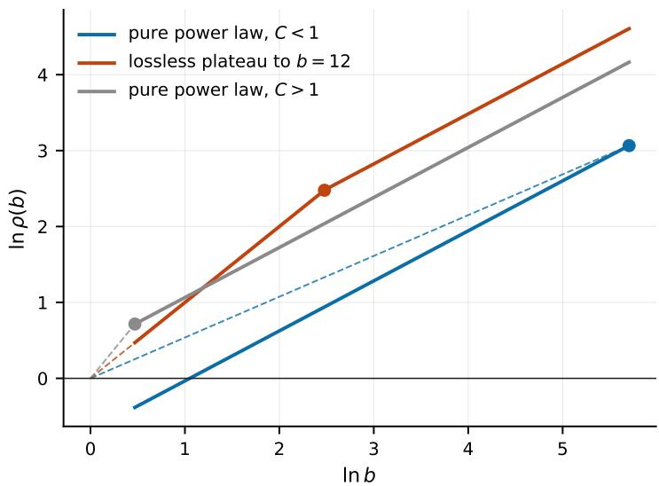  
Figure 1. The design rule. $\beta ( b ) = \ln \rho ( b ) /$ ln b is the slope of the chord from the origin, so $b ^ { \star }$ is the point of tangency. Under a pure power law with $C < 1$ the tangency runs of to the right and flat wins; with $C > 1$ it collapses to the smallest $b ;$ only a near-lossless plateau produces an interior optimum, at the end of the plateau.

Proof. $\rho ( b ) ^ { k } = C ^ { k } b ^ { k ( 1 - \delta ) } = C ^ { k } N ^ { 1 - \delta }$

Verified to $8 . 8 \times 1 0 ^ { - 1 6 }$ over 400 combinations of $( C , \delta , b , k )$

Theorem 3 (no free lunch). $C = \rho ( 1 ) \leq 1$ , since one item in cannot produce more than one item out. Hence $k = 1$ maximizes (3), strictly whenever $C < 1$

Summarization is not the only thing a tier costs. A child also has to understand the brief its parent wrote, and a flat agent writes none. A depth-k tree has k summarization hops but only $k - 1$ agent-to-agent briefs, so writing $\mu$ for the probability that a delegation produces work aligned with what was asked,

$$
Y = C ^ { k } \mu ^ { k - 1 } N ^ { 1 - \delta } .\tag{4}
$$

Since $\mu \leq 1$ this strengthens Theorem 3 rather than qualifying it: the per-tier penalty is $C \mu$ , not C. Section 4.3 measures $\mu .$

Theorem 3 is worth restating in plain terms, because it contradicts the standard argument for decomposition. Splitting work so that each agent sees a small, clean context does not recover the information a large context loses. The rot exponent δ multiplies ln N no matter how the tree is shaped, because a tree of depth k applies a $b ^ { - \delta }$ penalty k times and $b ^ { k } = N$ . What depth adds on top is k independent summarization steps, each of which can only lose. Yield-motivated decomposition is futile in the same way that yield-motivated context pruning is [11]: the natural optimization is the wrong one, and it is wrong by a constant factor per operation.

The design rule. Theorem 3 has an escape hatch. Equation (3) assumed a power law. In general, comparing architectures at fixed N means maximizing

$$
\beta ( b ) = \frac { \ln \rho ( b ) } { \ln b } , \qquad Y = N ^ { \beta ( b ) } ,\tag{5}
$$

with ties broken toward the largest b (same yield, fewer tiers, fewer places to inject an error). Geometrically $\beta ( b )$ is the slope of the chord from the origin to (ln b, ln $\rho ( b ) )$ , so $b ^ { \star }$ is where a ray from the origin is tangent to that curve from above. An interior optimum exists only if $\rho$ has a near-lossless plateau — a range of b over which a summarizer keeps essentially everything — and $b ^ { \star }$ is the end of that plateau. Under a pure power law the tangency runs of to the boundary and flat wins, which is Theorem 3 again. Figure 1 draws the three regimes.

We checked the rule against four analytic shapes, and it corrected two of our own expectations. A hard plateau to $b = 8$ produces a tie in $\beta$ across $b \in [ 2 , 8 ]$ ; without the largest-b tie-break the rule returns $\boldsymbol { b } ^ { \star } = 2$ , which wastes tiers for no yield. Soft saturation, $\rho ( b ) = b / ( 1 + b / 1 2 )$ , gives $b ^ { \star } = 3$ rather than the 12 we assumed: gradual saturation forces narrow fan-out, and only a sharp plateau permits a wide one.

## 4 Measuring the Constants

δ is measurable on any agent that is observed choosing among items in its context. We use 600 production deep-research traces (23,026 searches, 11,889 extraction requests, drawn from six public question-answering corpora), released with an earlier study of context cost [11]. The agent searches, receives about ten results per search, and then calls an extractor on specific $\mathrm { U R L s - }$ 99.6% of the time on exactly one. Which URLs it pursues is recorded in the tool arguments, so retention is read of behavior rather than inferred from text overlap.

## 4.1 The crowding exponent

Aggregate. For each trace let b be the number of distinct URLs surfaced and u the number the agent carried forward. By (1), u estimates $\rho ( b )$ . A log-log fit over 596 traces gives

$$
u = 0 . 4 5 b ^ { 0 . 6 0 1 } , \qquad \mathrm { S E } ( \beta ) = 0 . 0 3 4 , \quad R ^ { 2 } = 0 . 3 5 .\tag{6}
$$

Figure 2 plots the 600 traces against the two degenerate lines. Both degenerate points are rejected: $\beta = 0 .$ , the conservation point of Theorem 1, at $z = 1 7 . 9 ; \beta = 1$ , lossless carry, at $z = - 1 1 . 9$ . Median b is 126.5 and median u is 8. Per source corpus the exponent is 0.633, 0.602, 0.591, 0.517 and 0.390, with standard errors between 0.07 and 0.10.

The confound. Both b and u are the agent’s own choices, so a hard question could inflate both. Two within-trace identifications answer this.

Instantaneous choice. At the moment of each extraction the agent picks from the b URLs already in context. Under uniform choice, the share of picks landing in the ten most recent URLs would be $1 0 / b$ . It is not (Table 1). At b ≈ 300 the agent is six times more concentrated on recent items than uniform choice allows. Nothing about question dificulty can produce this, because it is a single decision at a single instant.

Per-item hazard (Figure 3). For each of 98,768 surfaced URLs we record the crowding at its arrival and whether it is ever used, stratified by how many extraction opportunities remained after it arrived. Within every stratum, $P ( { \mathrm { u s e d } } )$ falls monotonically with crowding (Table 2). Fitting log $p = a _ { s } - \delta$ log b with a stratum intercept and a cluster bootstrap over traces $( B = 4 0 0 )$

$$
\delta _ { \mathrm { u s e d } } = 0 . 3 4 1 \ [ 0 . 2 9 8 , 0 . 3 8 4 ] , \qquad \delta _ { \mathrm { c i t e d } } = 0 . 3 9 8 \ [ 0 . 3 1 5 , 0 . 4 6 2 ] .\tag{7}
$$

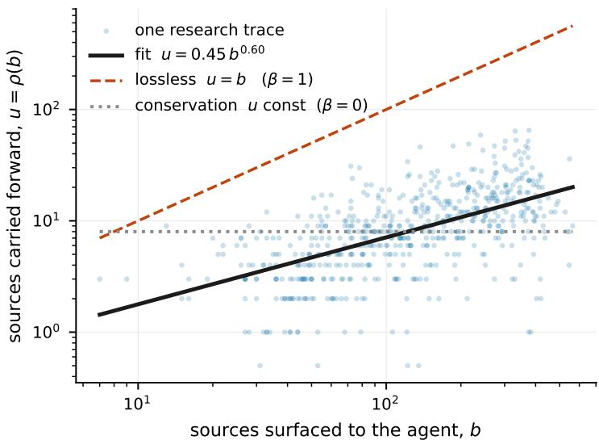  
Figure 2. Carry-forward on 600 production research traces. Each point is one trace: b sources surfaced, u carried forward. The fit sits strictly between the two degenerate lines, lossless carry $( \beta = 1 )$ and the conservation point of Theorem 1 $( \beta = 0 )$

Table 1. Concentration of extraction choices, 8,390 picks.
<table><tr><td>b at pick</td><td>picks</td><td>P(pick in newest 10)</td><td>uniform null</td></tr><tr><td>2-20</td><td>485</td><td>86.2%</td><td>83.3%</td></tr><tr><td>20-50</td><td>1,319</td><td>53.4%</td><td>29.4%</td></tr><tr><td>50-100</td><td>1,625</td><td>40.4%</td><td>13.9%</td></tr><tr><td>100-200</td><td>2,485</td><td>32.8%</td><td>6.9%</td></tr><tr><td>200-400</td><td>2,388</td><td>22.2%</td><td>3.8%</td></tr><tr><td>400+</td><td>88</td><td>21.6%</td><td>2.3%</td></tr></table>

The second uses an entirely diferent outcome — whether the URL appears in the final answer, available for 513 traces — and lands on the same exponent. Three identifications that do not share a failure mode give $\beta = 1 - \delta$ of 0.601, 0.659 and 0.602.

The URL-level design cannot reach C. It is an extrapolation to $b = 1$ , outside the observed range $b \in [ 5 , 5 6 4 ]$ , and at small b it is demand-limited: the agent stops extracting because it has enough, not because it cannot see. $\delta$ survives that because demand-limiting is absorbed into the stratum intercepts; C does not.

## 4.2 The per-level constant

C needs a hop where a single item can be observed entering and either surviving or not. The corpus contains one. web\_search returns a numbered list, so item boundaries come from the tool rather than from a text heuristic, and the number of results varies from 1 to 50 across the corpus. Crucially $b = 1$ occurs 550 times, so $\rho ( 1 )$ is observed rather than extrapolated. The hop is: b results enter the context, the agent writes one turn. An item counts as carried if that turn — reasoning, prose, or the arguments of its next tool call — names the result’s URL or the distinctive words of its title. A permutation null matches the same items against a diferent

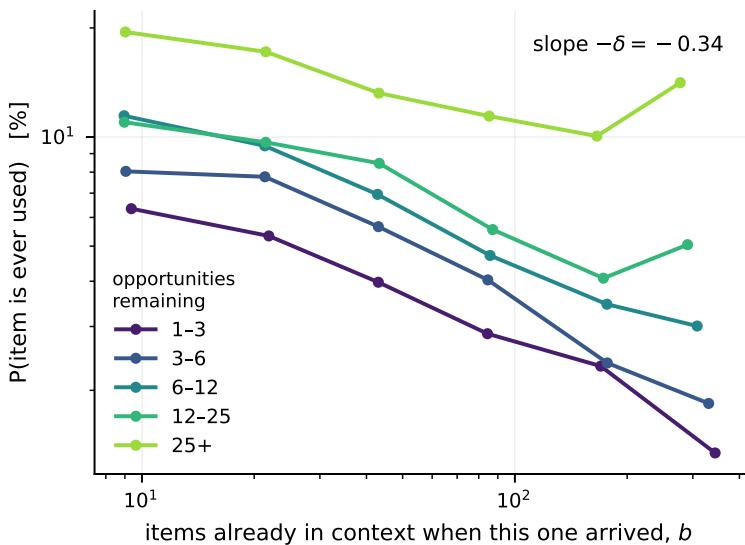  
Figure 3. Crowding destroys access, and question dificulty does not explain it. Each line holds the number of remaining extraction opportunities fixed; within every one of them, an item that arrives into a fuller context is less likely ever to be used.

Table 2. P(URL is ever used) by crowding at arrival and remaining opportunity, 98,768 URLs.
<table><tr><td rowspan="2">opportunities left</td><td colspan="6">b at arrival</td></tr><tr><td>5-15</td><td>15-30</td><td>30-60</td><td>60-120</td><td>120-250</td><td>250+</td></tr><tr><td>1-3</td><td>6.34%</td><td>5.33%</td><td>3.97%</td><td>2.87%</td><td>2.33%</td><td>1.34%</td></tr><tr><td>3-6</td><td>8.04%</td><td>7.77%</td><td>5.66%</td><td>4.03%</td><td>2.38%</td><td>1.84%</td></tr><tr><td>6-12</td><td>11.45%</td><td>9.46%</td><td>6.95%</td><td>4.71%</td><td>3.46%</td><td>3.01%</td></tr><tr><td>12-25</td><td>10.99%</td><td>9.67%</td><td>8.46%</td><td>5.55%</td><td>4.08%</td><td>5.05%</td></tr><tr><td>25+</td><td>19.49%</td><td>17.19%</td><td>13.22%</td><td>11.42%</td><td>10.06%</td><td>14.12%</td></tr></table>

hop’s turn.

Over 16,082 hops, raw retention is 0.358 and the permutation null is 0.0012, so the matching is specific. Figure 4 shows the curve and where C is read of; the right panel shows that $r ( b )$ sits above $1 / b$ at every b we observe, so $\beta > 0$ throughout.

$$
C = \rho { ( 1 ) } = 0 . 5 7 1 \ [ 0 . 5 2 7 , 0 . 6 1 5 ] .\tag{8}
$$

Fits agree with the direct reading: 0.532 [0.500, 0.562] over $b \in [ 1 , 1 0 ] , 0 . 4 6 9$ over $b \in [ 2 , 1 0 ]$ with $b = 1$ held out, 0.475 over the full range to $b = 5 0$ . Every variant rejects $C \geq 1$ . Charging summarization alone, a two-tier system keeps 57.1% of the findings a flat agent keeps, three tiers 32.6% and four tiers 18.6%; Section 4.3 adds the second per-tier cost and revises these downward.

Table 3 also shows something we did not go looking for. From $b = 5$ to $b = 4 1$ the retention rate $r ( b )$ is essentially flat at about one third, an exponent of 0.13 rather than 0.34: the agent names about a third of whatever batch is put in front of it, however large the batch. Yet the probability that an item is ever acted on decays with $\delta = 0 . 3 4 1$ . Information is not lost at the moment it arrives; it is lost while the context fills. The exponent that belongs in $N ^ { 1 - \delta }$ is the second one, measured over the root’s whole accumulation.

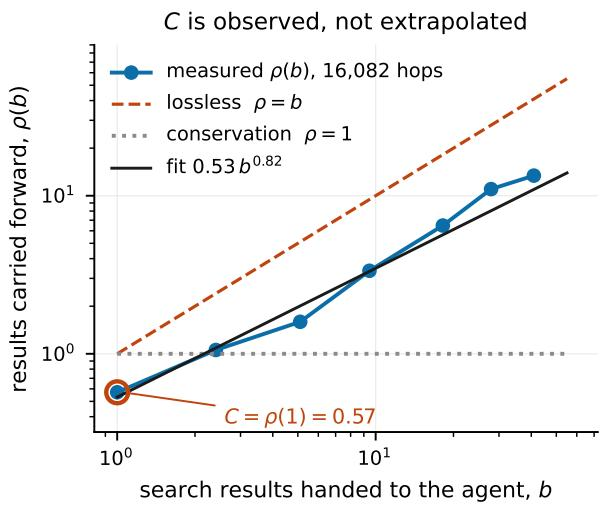

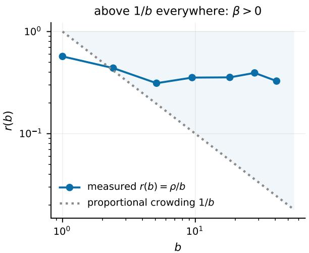  
Figure 4. The per-level constant, observed rather than extrapolated. $L e f t { : }$ carry-forward against batch size; $b = 1$ occurs 550 times, so $C = \rho ( 1 )$ is a measurement. Right: the same data as a retention rate, which lies above proportional crowding at every observed b.

Table 3. Carry-forward at a single search hop, chance-corrected.
<table><tr><td> $b$ </td><td>hops  $\rho ( b )$ </td><td> $r ( b ) = \rho / b$ </td><td> $1 / b$ </td></tr><tr><td>1</td><td>550</td><td>0.571</td><td>0.571 1.000</td></tr><tr><td>2</td><td>364</td><td>1.008</td><td>0.504 0.500</td></tr><tr><td>3</td><td>251</td><td>1.127</td><td>0.376 0.333</td></tr><tr><td>5</td><td>236</td><td>1.538</td><td>0.308 0.200</td></tr><tr><td>7</td><td>480</td><td>2.752</td><td>0.393 0.143</td></tr><tr><td>10</td><td>7,910</td><td>3.540</td><td>0.354 0.100</td></tr><tr><td>≈18</td><td>612</td><td>6.477</td><td>0.356 0.055</td></tr><tr><td>≈28</td><td>404</td><td>11.012</td><td>0.394 0.036</td></tr><tr><td>≈41</td><td>176</td><td>13.403</td><td>0.328 0.024</td></tr></table>

## 4.3 The briefing loss

$\mu$ is a property of the handof, not of the summary, so it needs a corpus of multi-agent traces with labelled coordination failures. MAST-Data [2] is one: 1,642 traces from seven frameworks, eight benchmarks and five models, each carrying binary annotations for fourteen failure modes, released under CC-BY-4.0. Category 2 of that taxonomy, inter-agent misalignment, is the authors’ own grouping for a delegation that goes of-target, so we take the whole category rather than picking modes from it. It fires in 53.3% of traces; category 1 fires in 58.1%, category 3 in 55.2%, and 75.3% of traces carry at least one mode.

MAST annotates per trace, and $\mu$ is per brief. Converting between them requires the number of agent-to-agent handofs in each trajectory, which means parsing seven log formats. Two of our first counters were wrong in ways that would have dominated the answer: MetaGPT came out at a median of one handof because the pattern matched only the opening human message, and AG2 at zero. Left uncorrected, MetaGPT’s 63% failure rate over $h = 1$ would have forced $\mu = 0 . 3 7$ . With corrected counters the usable sample is 1,012 traces — 1,015 have a countable handof structure and three of those record none, leaving the model undefined for them (Table 4).

Table 4. Handof structure and misalignment rate by framework.
<table><tr><td>framework</td><td>traces</td><td>handoffs: median  $/ \mathrm { \ p 9 0 }$  / max P(category 2)</td></tr><tr><td>MetaGPT</td><td>429</td><td> $4 / 4 / 4$  63.2%</td></tr><tr><td>ChatDev</td><td>330</td><td> $1 4 \ : / \ : 2 0 \ : / \ : 2 3$ </td></tr><tr><td>Magentic</td><td>195</td><td>62.1%  $1 7 / 3 9 / 4 1$  60.0%</td></tr><tr><td>AppWorld</td><td>30</td><td> $8 \ : / \ : 2 7 \ : / \ : 9 1$  76.7%</td></tr><tr><td>HyperAgent</td><td>28</td><td> $4 \div 1 2 \div 4 0$  82.1%</td></tr></table>

AG2 (597 traces) is excluded because its serialized trajectories expose no speaker transitions in 95% of cases, and OpenManus (30) because it is a single-agent planning flow with no agent-toagent brief.

Falsification test. The functional form is falsifiable, so we test it before using it. Modelling misalignment as independent per brief gives $P ( \operatorname { f i r e s } \mid h ) = 1 - ( 1 - q ) ^ { h }$ , which requires the failure rate to rise with the handof count. Pooled, the logistic slope on log h is $+ 0 . 3 0 8 \pm 0 . 0 8 6 \ ( z = 3 . 6 )$ Within framework, which removes format and task-mix diferences, Magentic gives $+ 1 . 8 4 2 \pm 0 . 2 6 9$ $( z = 6 . 8 )$ and ChatDev $+ 1 . 1 8 5 \pm 0 . 7 3 0 \ ( z = 1 . 6 )$ ; the other three have almost no variation in h and are uninformative about the slope. The form survives, but on the evidence of essentially one framework.

That same fact makes the pooled maximum-likelihood estimate unidentified. MetaGPT contributes 429 traces at a near-constant $h = 4 ,$ , so its q absorbs a framework baseline rather than a per-brief rate, and the pooled fit returns $\mu = 0 . 9 0 0$ . Separating the two,

$$
P ( \operatorname { f i r e s } \mid f , h ) = 1 - ( 1 - \alpha _ { f } ) ( 1 - q ) ^ { h } ,\tag{9}
$$

where $\alpha _ { f }$ is framework $f \mathrm { ^ { \prime } s }$ own baseline and $q$ is identified only by variation in h within a framework, gives

$$
\begin{array} { r } { \mu = 1 - q = 0 . 9 3 9 \ [ 0 . 9 3 5 , 0 . 9 6 0 ] . } \end{array}\tag{10}
$$

The fitted baselines are 0.000 for ChatDev and Magentic — their failures are accounted for by handof count alone — against 0.525 for MetaGPT, 0.593 for AppWorld and 0.743 for HyperAgent, exactly the frameworks whose h does not move. Fitting the two informative frameworks on their own gives 0.933 and 0.946, which brackets the pooled fixed-efects estimate. The narrower mode set (task derailment and ignored input) gives $\mu = 0 . 9 7 7$ and the wider set (category 2 plus disobeying task and role specification) $\mu = 0 . 9 4 4$

About one brief in sixteen goes of-target. The per-tier yield penalty is therefore $C \mu = 0 . 5 3 6$ rather than $C = 0 . 5 7 1$ : two tiers keep 53.6% of what a flat agent keeps, three tiers 28.7%, four tiers 15.4%.

Two biases both push $\mu$ down, so the depth penalty here is an upper bound. A run that goes wrong loops more and therefore logs more handofs, which inflates q. And $\mu$ multiplies a whole subtree’s yield, treating a misaligned delegation as a total loss, when a misaligned subagent usually still returns something usable.

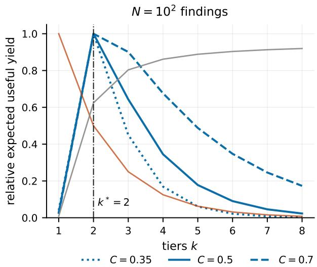

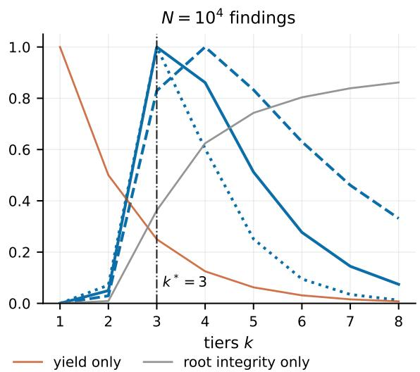  
Figure 5. The two axes and their product, at two task sizes. Yield falls geometrically in the number of tiers while root integrity rises exponentially, so the optimum is interior and, at realistic parameters, small.

## 5 Root Integrity and the Optimal Depth

Exactly one context in a running system persists for the whole task: the root’s. It is also the only one that cannot cheaply forget. Removing an item from a cached prefix costs a re-prefill of everything behind it, so an agent’s context is an append-only ratchet [11]. An error written into an ephemeral agent’s context is discarded when that agent finishes. An error written into the root’s is permanent.

Let ε be the probability that an item absorbed into the persistent context is wrong. A flat root absorbs all N findings; a depth-k root absorbs $N ^ { 1 / k }$ summaries:

$$
P ( { \mathrm { r o o t ~ u n c o r r u p t e d } } ) = ( 1 - \varepsilon ) ^ { N ^ { 1 / k } } .\tag{11}
$$

This is the whole case for depth, and it is exponential where the yield cost is only geometric. Combining (4) and (11),

$$
J ( k ) = k \ln C + ( k - 1 ) \ln \mu + ( 1 - \delta ) \ln N + N ^ { 1 / k } \ln ( 1 - \varepsilon ) ,\tag{12}
$$

whose first-order condition is

$$
\frac { \varepsilon N ^ { 1 / k } \ln N } { k ^ { 2 } } = \ln \frac { 1 } { C \mu } .\tag{13}
$$

The left side falls in $k ,$ , so the optimum is unique. Figure 5 shows the two terms and their product.   
Equation (13) reproduces the argmax of (12) within one tier in 80 of 80 parameter combinations.

Substituting the measured constants, $C \mu = 0 . 5 3 6$ and $\delta = 0 . 3 4 1$ , into (13) gives $k ^ { \star } = 2$ at the median production session and $k ^ { \star } = 3$ at its 99th percentile. Figure 6 maps $k ^ { \star }$ over $( N , \varepsilon )$ with the production sessions marked. Two properties of $k ^ { \star }$ matter more than its exact value. It is small, and it stays small (Table 5).

Fourteen orders of magnitude of task size move the optimum by seven tiers. Deep agent hierarchies are not a thing that large tasks should grow into. The table is identical at $C \mu = 0 . 5 3 6$ at $C = 0 . 5 7 1$ and at the placeholder 0.5 we used before either was measured: $k ^ { \star }$ is insensitive to

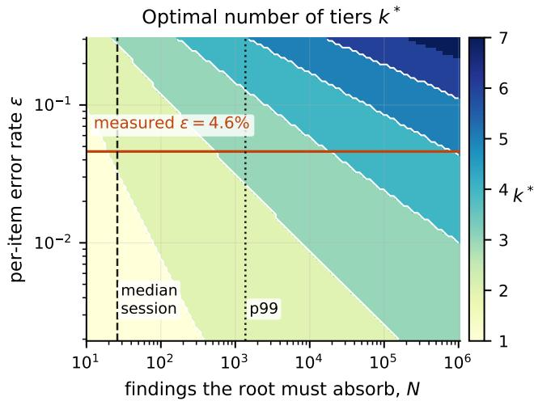

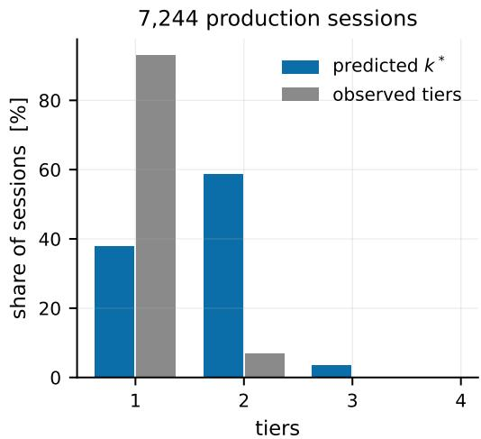  
Figure 6. $L e f t { : }$ the optimal number of tiers over task size and per-item error rate, with the measured production error rate and the median and 99th-percentile session marked. Right: predicted against observed tiers across 7,244 production sessions.

Table 5. The optimal number of tiers is small and stays small. $\delta = 0 . 3 4$ $\varepsilon = 0 . 0 2$
<table><tr><td>N</td><td> $1 0 ^ { 2 }$ </td><td> $1 0 ^ { 4 }$ </td><td> $1 0 ^ { 6 }$ </td><td> $1 0 ^ { 8 }$ </td><td> $1 0 ^ { 1 0 }$ </td><td> $1 0 ^ { 1 2 }$ </td><td> $1 0 ^ { 1 4 }$ </td><td> $1 0 ^ { 1 6 }$ </td></tr><tr><td>k*</td><td>2</td><td>3</td><td>4</td><td>5</td><td>6</td><td>7</td><td>8</td><td>9</td></tr></table>

the per-tier penalty over that range. It is robust to $C \mu$ over [0.2, 0.7] and to ε over [0.002, 0.2];   
only near-lossless summarization $( C \mu \geq 0 . 9 )$ pushes past four tiers at realistic N.

The biological analogue is exact on this axis and instructive where it fails. Renewing tissues are organized as stem cells, transit-amplifying cells, and diferentiated cells — two or three tiers — and the standard explanation is the same one as (11): only the stem compartment persists, so architecture exists to keep the number of divisions in the persistent compartment small [10]. Where the analogy breaks is the niche itself. A stem cell niche exists because cells cannot de-diferentiate. An agent can: its specialization is a sufix of its context, and sufix truncation is the one free edit [11]. Resetting a specialized agent to its base prompt costs nothing beyond spawning a fresh one, so there is no reason to maintain a reserve of unspecialized agents. Asymmetric division and bounded depth carry over; the niche does not.

## 6 The Token Axis

Yield and integrity are not the only things a decomposition changes. It also changes the bill, and the bill is what most practitioners are actually managing. Including it is not optional: adding only the cost of delegating would stack the deck, because that cost penalizes depth, while the prefix-caching saving from keeping each context short rewards it. Both belong in the same model.

The measured cost exponent. The textbook argument is wrong, and the corpus says so. A flat agent’s context is append-only, so with prefix caching each round re-reads the whole prefix and the bill should be quadratic in the number of findings absorbed. Regressing the log of a session’s total input tokens on the log of its round count over 6,567 production sessions gives an exponent of $1 . 3 9 2 \pm 0 . 0 0 4 ~ ( R ^ { 2 } = 0 . 9 3 9 )$ ; separately, $1 . 4 5 0 \pm 0 . 0 0 5$ for Claude Code and $1 . 3 3 7 \pm 0 . 0 0 7$ for Codex. Append-only predicts 2 and a constant-size context predicts 1. Production flat agents are already sub-quadratic, because they compact.

That observation suggests context collapse is decomposition along the time axis rather than the agent axis, which in turn suggests compaction and delegation should be substitutes. They are not. Holding task size fixed, sessions that compact delegate more: 20.7% against 8.7% for sessions of 40 to 160 tool results, 29.5% against 27.0% above 160, and no diference at all below 40. Systems under context pressure reach for both.

A calibrated cost model. Let a be the measured exponent, v the mean size of a tool result, and c the overhead of one delegation — the brief out plus the summary back. For a uniform tree of fan-out $b = N ^ { 1 / k }$ with $M = ( N - 1 ) / ( b - 1 )$ internal nodes,

$$
T ( N , k ) = M v b ^ { a } + ( M - 1 ) c .\tag{14}
$$

Measured on the corpus, $v = 4 , 1 9 4$ characters and $c = 7 { , } 6 9 4$ characters (2,640 of brief, 5,054 returned), from 2,546 Agent calls.

The budget-matched question. At a fixed budget B, a flat agent can aford $N _ { 1 }$ findings and a two-tier system can aford a larger $N _ { 2 }$ , because its bill grows more slowly. The architecture that delivers more is the one maximizing

$$
Y ( N _ { k } , k ) \mathrm { s u b j e c t ~ t o } T ( N _ { k } , k ) = B .\tag{15}
$$

Solving both sides at equal spend, with the briefing loss of Section 4.3 included, gives a crossover at $N ^ { \star } = 4 0 3$ findings; without it, 246 (Figure 7). Below it a flat agent returns more findings per token, above it two tiers do. The crossover is where the yield penalty $C \mu$ is finally outweighed by being able to aford more work.

## 7 What Production Systems Actually Do

We take production parameters from 743,819 tool calls across 8,058 Claude Code and Codex sessions in the same release [11].

Measured inputs. Tool calls return an error 4.60% of the time (Claude) and 4.88% (Codex). Sessions absorb a median of 22 (Claude) and 40 (Codex) tool results, with 99th percentiles of 815 and 2,618. When a context collapses, the surviving context is a median 15.2% of the previous one by tokens (IQR 9.6–26.4%, 4,892 events) — an upper bound on what any summarization step can carry.

Measured topology. Of 7,244 sessions with at least one tool call, 563 (7.8%) ever spawn a subagent. Among rounds that spawn, 74.5% spawn exactly one; the mean parallel fan-out is 1.49; no deeper nesting appears in the corpus. Production agent swarms are, empirically, almost flat.

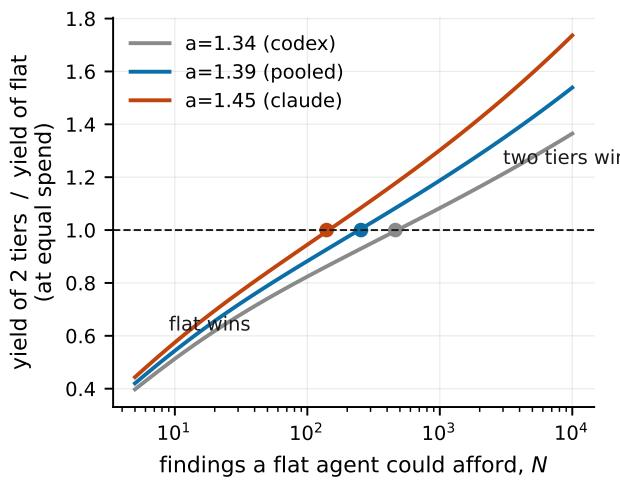

7,244 production sessions; 7.8% delegate  
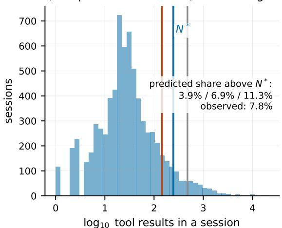  
Figure 7. $L e f t { : }$ yield of two tiers relative to flat at equal spend, at each provider’s own measured cost exponent; the crossover is where decomposition starts paying. Right: the size distribution of 7,244 production sessions against those thresholds.

Table 6. Discrete-time hazard of the first delegation. 502,718 session-rounds, 563 events.
<table><tr><td>term</td><td>coefficient</td><td>SE</td><td>z</td></tr><tr><td>log accumulated result chars</td><td>-0.0448</td><td>0.0117</td><td>-3.8</td></tr><tr><td>log rounds elapsed</td><td>-0.5864</td><td>0.0326</td><td>-18.0</td></tr></table>

The load-adaptation test. Equation (13) predicts $k ^ { \star }$ rises with N, so an adaptive system should delegate more as its context fills. Testing this is harder than it looks, and we report three attempts because the diference between them is the finding.

Regressing whether a session delegates on the log of its total tool calls gives a slope of $+ 0 . 6 4 9 \pm 0 . 0 3 1$ . This is an artifact: a session that delegates records its subagent’s tool calls in its own ledger, so delegating inflates N. Recounting N using only calls up to the first spawn flips the slope to $- 0 . 3 7 2 \pm 0 . 0 3 3$ . This is also an artifact, in the opposite direction: truncating at the first spawn assigns $N = 3$ to a session that delegated at round 3. Neither number identifies anything.

The identified design is a discrete-time hazard model that uses only information available before the decision. The risk set is every session-round up to and including the first spawn (502,718 rounds, 563 events). The outcome is whether the first spawn occurs at that round. The covariate is accumulated tool-result volume before that round, controlling for rounds elapsed, which separates a full context from a long-running session (Table 6).

Doubling the accumulated context multiplies the odds of delegating now by 0.969 [0.954, 0.985]. With tool count in place of volume the coeficient is not significant $\left( - 0 . 0 7 9 \pm 0 . 0 5 3 \right)$ . Elapsed rounds dominates and is strongly negative.

Delegation in these systems is an opening move. Topology is chosen in the first rounds and never revised, which is the standard complaint about fixed-role multi-agent frameworks turned into a measurement. One caveat is required: unobserved heterogeneity biases duration dependence downward in any single-spell hazard model, because sessions that ran long without delegating are disproportionately sessions that never would. This is evidence against strong load adaptation, not proof that none exists.

Table 7. Predicted against observed delegation, before the briefing loss is charged.
<table><tr><td>exponent a</td><td>measured on</td><td> $N ^ { \star }$ </td><td>predicted share</td><td>observed</td></tr><tr><td>1.337</td><td>Codex sessions</td><td>477</td><td>3.9%</td><td></td></tr><tr><td>1.392</td><td>both, pooled</td><td>246</td><td>6.9%</td><td>7.8%</td></tr><tr><td>1.450</td><td>Claude Code sessions</td><td>145</td><td>11.3%</td><td></td></tr></table>

Reconciling the model with the topology. Section 5’s objective — yield times integrity, with no cost term — says 70.1% of these sessions should run two or more tiers. The observed figure is 7.8%, and measuring C made that worse rather than better, because a larger C makes hierarchy cheaper.

The token axis closes most of the gap. The share of the 7,244 sessions whose N exceeds the crossover $N ^ { \star }$ is given in Table 7, ignoring the briefing loss. The observed rate sits inside the range the two providers’ own exponents produce. Nothing here was fitted to it: C and δ come from the research traces, a from session token bills, v and c from tool-call statistics.

Efect of the briefing loss. It moves the prediction the wrong way, and we report it anyway. µ penalizes depth, so adding it pushes $N ^ { \star }$ up and the predicted share down: to 403 and 4.5% at the identified $\mu = 0 . 9 3 9$ , 294 and 5.8% at the narrow mode set, 570 and 3.3% at the unidentified pooled estimate (Figure 8). Sweeping everything we measured $- \ \mu$ from 1.0 to 0.944, a from 1.337 to 1.450 — gives a predicted share between 0.7% and 11.3%. The observed 7.8% lies inside that interval, but the interval is wide. The 6.9%-against-7.8% agreement in Table 7 is sharper than the evidence supports, and the honest summary is that the token axis brings a model that over-predicted delegation nine-fold into the right order of magnitude, not that it predicts the rate.

The integrity term. With the token axis carrying the explanation there is little room left for integrity. Reintroducing $( 1 - \varepsilon ) ^ { N ^ { 1 / k } }$ into (15) moves $N ^ { \star }$ from 246 at $\varepsilon = 0$ to 212 at $\varepsilon = 1 0 ^ { - 4 }$ , 117 at 10−3, and 15 at the measured tool-failure rate of 4.6%, where the model predicts near-universal delegation. Matching 7.8% requires ε below about $1 0 ^ { - 4 }$

We do not believe silent contamination is four orders of magnitude rarer than visible tool failure. The more likely fault is our own integrity term: $( 1 - \varepsilon ) ^ { \bar { N } }$ treats any contamination as total failure, and one wrong fact in a long context usually is not a failed task. A graded term would sit between. Either reading supports the same conclusion, which is the one that matters: the rate that belongs in an integrity term is not the rate at which tools return errors, and an earlier version of this paper inverted for ε and obtained 0.275% only because the cost axis was missing and integrity was being asked to do its job.

Rates and mechanisms. That production delegates at about the rate the token axis recommends is not evidence that it is optimizing anything. The hazard model above found no within-session response to a filling context. Production lands on roughly the right amount of delegation while allocating it without regard to load — which is exactly the gap an adaptive topology would fill.

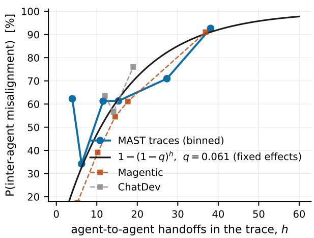

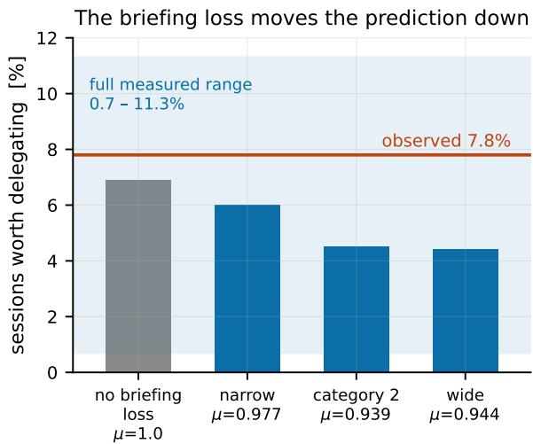  
Figure 8. Left: misalignment against handof count on 1,012 annotated multi-agent traces, with the fitted independent-per-brief curve; the two frameworks whose handof count varies enough to identify the slope are shown separately. Right: charging the briefing loss moves the predicted share of sessions worth delegating away from the observed rate, not toward it.

## 8 Related Work

Error propagation in multi-agent systems has been studied empirically. MAST [2] builds a failure taxonomy from 150 expert-annotated traces and releases 1,600 more, finding that inter-agent misalignment and missing verification dominate. Hallucination cascade analyses [3] measure per-stage amplification and attenuation in short agent chains. Resilience work [6] injects faulty agents and finds hierarchical oversight more robust than flat peer discussion. These establish that errors propagate and that topology matters; none gives a law relating yield to depth, and none identifies a threshold. Topology studies [4] find that moderately sparse communication does best, suppressing error propagation while preserving useful difusion — an interior optimum in the same spirit as ours, reached empirically. The scaling study closest to ours [5] fits a predictive model across 180 configurations and five architectures and reaches cross-validated $R ^ { 2 } = 0 . 3 7 3$ over six benchmarks (0.413 with a task-grounded capability metric), but the model is empirical rather than structural, and it does not separate task size from architecture.

The mathematics we use is old and, as far as we can tell, has not been applied here. Von Neumann’s threshold theorem for computation with unreliable components [7] and its sharp successors for noisy circuits [8] and for broadcasting on trees [9] all ask when information survives a noisy tree. The parallel is closer than it first appears: Evans and Schulman place criticality where the product of the per-gate information transmission factor and the fan-in equals one [8], and our conservation point is $\rho ( b ) = b r ( b ) = 1$ , the same product set to the same value. We reach it from the opposite structure. In a noisy circuit the children of a gate are redundant copies, so fan-in supplies error correction and the question is whether redundancy outruns noise. In an agent tree the children work on diferent subtasks, so fan-out supplies no redundancy at all and aggregation is conjunctive. The shared threshold with the opposite mechanism is, we think, the reason this literature has not been applied here.

Retention under crowding is documented as position bias: accuracy on multi-document question answering is highest at the ends of a context and degrades in the middle, and the degradation deepens as the number of documents rises from 10 to 20 to 30 [1]. That literature measures $r ( b )$ at a few values of b without naming it or asking what it implies for architecture.

The cost model for context edits, the ratchet property that makes the root context the only persistent state, and two of the three corpora used here come from an earlier study of context eviction economics [11].

## 9 Limitations

C is measured at one hop — a search result carried into the agent’s next turn — and assumed constant across levels. In a real hierarchy the item granularity changes with level: a subagent’s whole report is not the same kind of object as a single tool result. A single $( C , \delta )$ pair across levels is an idealization, and the two exponents we measure (0.13 immediately, 0.34 eventually) are direct evidence that one power law does not describe the whole curve.

An item the agent had no use for counts against $C ,$ so the estimate is conservative in a way we cannot quantify: it measures what is carried, not what could have been.

The retention model treats items as surviving independently. Real summarizers drop correlated groups, which will make the efective b smaller than the nominal one and should bias δ toward zero.

The integrity term treats any contamination as total failure. $( 1 - \varepsilon ) ^ { N }$ is too harsh for a long context in which one wrong fact is usually survivable, and Section 7 shows the model is sensitive to exactly this. A graded degradation term is the obvious next version and we have not built one.

The cost model prices prefill and delegation overhead. It ignores latency and output tokens.

µ is identified by variation in handof count within essentially one framework, on traces from benchmark runs rather than production. Both of its biases point the same way — a failing run logs more handofs, and a misaligned delegation is treated as a total loss — so 0.939 is a lower bound on alignment and the depth penalty it implies is an upper bound.

The deep-research corpus is one scafold with one tool vocabulary. The exponent replicates across the six question corpora it draws from, but not across agent designs.

The hazard result is subject to frailty bias, as noted in Section 7.

## 10 Conclusion

Decomposition does not create information. Under power-law retention the yield of a decomposition tree is $C ^ { k } N ^ { 1 - \delta }$ : the task-size term is the same for every architecture, and depth contributes only a factor $C \leq 1$ per level. Both constants are measurable on traces that already exist. On 600 production research traces $\delta = 0 . 3 4 \ [ 0 . 3 0 , 0 . 3 8 ]$ by three identifications that do not share a failure mode, and $C = 0 . 5 7 1 \ [ 0 . 5 2 7 , 0 . 6 1 5 ]$ read directly at b = 1 over 16,082 hops. The law for this agent is $Y = C ^ { k } \mu ^ { k - 1 } N ^ { \bar { 0 } . 6 6 }$ . With the briefing loss of Section 4.3 charged, one tier of hierarchy costs 46.4% of the findings. None of the three constants is a property of the tree; all three are properties of the agent.

What depth buys lies on two other axes. The root context is the only state that persists and the only state that cannot cheaply forget, and depth cuts its exposure from N items to $N ^ { 1 / k }$ Depth is also cheaper: a production flat agent’s bill grows as $N ^ { 1 . 3 9 }$ , and at equal spend two tiers overtake flat at 403 findings once the briefing loss is charged. Across every parameter we measured the model puts 0.7% to 11.3% of production sessions above that threshold, against 7.8% that delegate: the right order of magnitude, and no sharper. The rule is simple enough to apply: fan out as wide as summarization stays near-lossless and no wider, and add a tier when the task is large enough that the bill, not the information, is the binding constraint.

Deployed systems arrive at roughly the right amount of delegation without appearing to compute it. They choose a topology in the first rounds of a session and hold it, and the hazard of delegating is flat or slightly falling in how full the context has become. The amount is about right; the allocation ignores load. Making topology respond to load is a small change to an agent harness and, on these numbers, the one with the clearest justification.

## References

[1] N. F. Liu, K. Lin, J. Hewitt, A. Paranjape, M. Bevilacqua, F. Petroni, P. Liang. Lost in the Middle: How Language Models Use Long Contexts. arXiv:2307.03172, 2023.

[2] M. Cemri, M. Z. Pan, S. Yang, L. A. Agrawal, B. Chopra, R. Tiwari, K. Keutzer, A. Parameswaran, D. Klein, K. Ramchandran, M. Zaharia, J. E. Gonzalez, I. Stoica. Why Do Multi-Agent LLM Systems Fail? arXiv:2503.13657, 2025.

[3] S. Jamshidi, A. Moradi Dakhel, K. W. Nafi, F. Khomh. Hallucination Cascade: Analyzing Error Propagation in Multi-Agent LLM Systems. arXiv:2606.07937, 2026.

[4] X. Shen, Y. Liu, Y. Dai, Y. Wang, R. Miao, Y. Tan, S. Pan, X. Wang. Understanding the Information Propagation Efects of Communication Topologies in LLM-based Multi-Agent Systems. arXiv:2505.23352, 2025.

[5] Y. Kim, K. Gu, C. Park, C. Park, S. Schmidgall, A. A. Heydari, Y. Yan, Z. Zhang, Y. Zhuang, Y. Liu, M. Malhotra, P. P. Liang, H. W. Park, Y. Yang, X. Xu, Y. Du, S. Patel, T. Althof, D. McDuf, X. Liu. Towards a Science of Scaling Agent Systems. arXiv:2512.08296, 2025.

[6] J. Huang, J. Zhou, T. Jin, X. Zhou, Z. Chen, W. Wang, Y. Yuan, M. R. Lyu, M. Sap. On the Resilience of LLM-Based Multi-Agent Collaboration with Faulty Agents. arXiv:2408.00989, 2024.

[7] J. von Neumann. Probabilistic Logics and the Synthesis of Reliable Organisms from Unreliable Components. In C. E. Shannon and J. McCarthy, editors, Automata Studies, pages 43–98. Princeton University Press, 1956.

[8] W. S. Evans, L. J. Schulman. Signal Propagation and Noisy Circuits. IEEE Transactions on Information Theory, 45(7):2367–2373, 1999.

[9] W. Evans, C. Kenyon, Y. Peres, L. J. Schulman. Broadcasting on Trees and the Ising Model. Annals of Applied Probability, 10(2):410–433, 2000.

[10] I. Derényi, G. J. Szöllősi. Hierarchical Tissue Organization as a General Mechanism to Limit the Accumulation of Somatic Mutations. Nature Communications, 8:14545, 2017.

[11] R. He. Forgetting Costs What You Keep: The Economics of Context Eviction Under Prefix Caching. Preprint, 2026.

## Reproducibility

Every number in this paper is produced by a script in anc/code/, on a laptop CPU, from three public corpora: the two released with [11] and MAST-Data [2], which get\_data.sh fetches. No model was queried and no GPU was used. audit.py re-derives every numeric assertion in this paper from the data and reports a pass or fail for each.

python3 anc/code/verify.py # Theorem 1 and the tree-shape results   
python3 anc/code/theory.py # Theorems 2 and 3, the design rule, the optimal depth   
python3 anc/code/measure\_rb.py # Equation (6), the aggregate exponent   
python3 anc/code/diagnose.py # Table 1 and the within-trace diagnostics   
python3 anc/code/estimate.py # Equation (7), Table 2, cluster bootstrap   
python3 anc/code/measure\_C5.py # Equation (8), Table 3, the per-level constant   
python3 anc/code/briefing.py # Equations (9)-(10), Table 4, the briefing loss   
python3 anc/code/production.py # Section 7 production parameters   
python3 anc/code/revealed.py # the two biased regressions, and the inversion   
python3 anc/code/hazard.py # the identified hazard model   
python3 anc/code/cost2.py # Section 6, the calibrated token axis   
python3 anc/code/figures.py # Figures 1, 2, 3, 5, 6   
python3 anc/code/fig6.py # Figure 4   
python3 anc/code/fig7.py # Figure 7   
python3 anc/code/fig8.py # Figure 8   
python3 anc/code/audit.py # re-derives every number asserted above   
python3 anc/code/verify\_pdf.py # checks the typeset PDF asserts exactly those numbers   
python3 anc/code/verify\_refs.py # checks every arXiv citation against the arXiv API

## Authorship

Rong He is the author of this work and of all results reported in it. Claude (Anthropic) was used as a research assistant during development; that contribution is secondary and is disclosed here rather than in the commit history.