# FINE-TUNING FIXES MODE COLLAPSE AND OVER-DISPERSION IN LLMS

Kirill Skobelev Northwestern University kirill@u.northwestern.edu

Eric Fithian University of Chicago efithian@uchicago.edu

X.Y. Han University of Chicago xyhan@uchicago.edu

## ABSTRACT

Recent work by Doshi & Hauser (2024), Bisbee et al. (2024), and Xie et al. (2026) raises concerns that outputs from large language models (LLMs) tend to be underdiverse: they repeat or resemble one another more often than responses from the population they are meant to represent, a phenomenon known as mode collapse. In this work, we show that whether mode-collapse—or its opposite—occurs depends on the specific model and dataset used. Further, with sufficient supervised fine-tuning (SFT) data, LLM output diversity converges toward that of the target distribution from which fine-tuning data are sampled. To quantify this comparison, we measure the probability that two responses sampled independently conditional on the same fixed prompt coincide (collide). In one set of experiments, we use exact token sequences; in the other, we use the generalised version of that—the expected similarity between responses under a kernel. We define miscalibration as a nonzero model-minus-target collision gap. We derive a bias–variance decomposition of the expected gap between the model’s and target’s collision probabilities, showing that SFT is not inherently biased toward mode collapse or its opposite: finite-sample SFT can leave a model either under- or over-dispersed, depending on the model and dataset. Finally, we show that the absolute gap is bounded by the square root of the Kullback–Leibler (KL) divergence from the target distribution to the model. Consequently, a model sufficiently close to optimal under population cross-entropy cannot exhibit arbitrarily miscalibrated diversity. We test the decomposition and the bound in three experiments: (1) we fit 100 small transformers at each of 100 log-spaced sample sizes on each of two synthetic order-16 languages; (2) we finetune four LLMs using low-rank adaptation on responses from the General Social Survey, American National Election Studies, and World Values Survey; and (3) we repeat Experiment (2) on CodeNet, a dataset of human solutions to coding tasks, measuring program similarity with normalized Zhang–Shasha edit distance between canonical abstract syntax trees. We find substantial heterogeneity in overand under-diversity across models and datasets. More target data moves model diversity toward the human (or synthetic target) level in all experiments, consistent with our theoretical predictions. These results show that diversity miscalibration can arise from finite-sample error and shrink as SFT better approximates the target distribution. Accordingly, as the sample size of target-distribution data increases, model diversity moves toward the target level.

## 1 INTRODUCTION

Large language models (LLMs) are increasingly used as simulated survey respondents (Argyle et al., 2023), for creative writing (Chakrabarty et al., 2024), as brainstorming partners (Terwiesch et al., 2024), and in other domains where faithfulness of the LLM’s outputs to the diversity of the target population is important. Empirical studies show that LLMs often exhibit a narrow range of outputs, a phenomenon known as mode collapse: the model’s outputs repeat, or resemble one another, more often than samples from the population they are meant to represent. For instance, stories written with artificial intelligence (AI) assistance tend to be similar to one another (Doshi & Hauser, 2024); AI-assisted users may generate ideas that are less semantically distinct (Anderson et al., 2024); and synthetic survey respondents can reproduce aggregate patterns while suppressing individual and group-level variation (Bisbee et al., 2024; Wang et al., 2025; Xie et al., 2026).

These findings are often interpreted as evidence that low output diversity is an inherent limitation of LLMs (Xie & Xie, 2025). However, when a pre-trained or instruction-tuned model is fine-tuned on a new dataset, its starting distribution is being compared with a target distribution it has not yet learned. It is unclear whether this under-diversity persists as a model learns the target distribution more accurately. If mode collapse is inherent, increasing the amount of target-distribution fine-tuning data need not eliminate it; if, instead, mode collapse and other distribution miscalibrations simply reflect finite-sample error, model diversity should converge toward the target level with sufficient fine-tuning. To settle this distinction, we begin with formalizing it theoretically.

We quantify LLM output diversity by collision probability—the probability that two responses sampled independently conditional on the same fixed prompt coincide—or, more generally, by their expected similarity under a kernel (Section 3). For next-token comparisons, we instead fix the full context: the prompt and token prefix. Model and target are compared under the same conditioning and similarity measure. Their collision gap is the model’s collision probability minus the target’s; where zero indicates calibrated diversity, a positive gap indicates mode collapse, and a negative gap indicates over-dispersion.

This formalization allows us to make three claims (Figure 1). (1) SFT does not inherently produce under- or over-dispersion; the direction depends on the model and dataset. The difference in collision probabilities, averaged over independent fits, decomposes into nonnegative variance and squared-bias terms, which promote concentration, and a sign-indefinite target–bias alignment term that can offset them (Section 3.1). (2) Magnitude: the absolute collision gap is bounded by the square root of the Kullback–Leibler (KL) divergence from the target distribution to the model (Theorem 1). This bound implies (3) Calibration in the limit: as this KL divergence approaches zero, the collision gap necessarily approaches zero. In practice, this leads to the intuitive conclusion that if more target data and loss minimization bring population cross-entropy toward the value achieved by the target distribution itself, model diversity must approach the target level.

To support our claims empirically, we set up three experiments (Section 4). Experiment 1 tests claim (1) and checks the bound of claim (2): in two synthetic order-16 language settings with exactly computable targets, models with the generative pre-trained transformer (GPT) architecture fitted across 100 log-spaced sample sizes produce collision distortions of both signs (Section 4.1, Figure 2), and the bound holds on every evaluated context (Appendix G, Figure 5). Experiments 2 and 3 test claim (3) from opposite starting points. We use low-rank adaptation (LoRA) to finetune four instruction-tuned LLMs (gemma-2-2b-it (Gemma Team, 2024), gemma-3-4b-it (Gemma Team, 2025), Qwen3.5-2B and Qwen3.5-4B (Qwen Team, 2026)) on General Social Survey (GSS) (Davern et al., 2025), American National Election Studies (ANES) (American National Election Studies, 2022), and World Values Survey (WVS) (Haerpfer et al., 2022). We find that three of the four base models are 1.6 to 2.9 times under-dispersed relative to the human populations, and SFT on human answers restores population-level heterogeneity for every model on every survey (Section 4.2, Figure 3). Next, we apply the same method to CodeNet (Puri et al., 2021), a dataset of human solutions to coding tasks, where we measure distance between solutions using the normalized Zhang–Shasha similarity kernel (Zhang & Shasha, 1989). On this same dataset, some base models are under-diverse and others over-diverse (R = 0.74–1.64): mode collapse depends on the model. Supervised fine-tuning narrows the gap from both directions, as predicted by theory.

## 2 RELATED WORK

Evidence of output mode collapse. Generative AI can enhance individual story ratings and increase similarity between AI-assisted stories (Doshi & Hauser, 2024), while co-writing with InstructGPT reduces content diversity in essays (Padmakumar & He, 2024). ChatGPT users generate more numerous and detailed ideas than users of another creativity-support tool, but these ideas exhibit less semantic distinctiveness across users (Anderson et al., 2024). Sourati et al. (2026) argue that LLMs reinforce dominant styles of language and reasoning, and that widespread reliance on the same few models amplifies this convergence. Our results show that SFT is not inherently biased toward mode collapse or its opposite: the direction of miscalibration depends on the model and dataset, and fine-tuning can bring diversity toward the target from either direction. LLMs are also

(b) Model outputs can be over-diverse or under-diverse (mode-collapsed), depending on model and data (Eq. (6); Experiment 1)  
```asm
(a.i) LLM outputs can
collide or be diverse
x LLM
= collide
x LLM
x LLM
= diverse
x LLM
```

(a.ii) The notation used in this figure   
for collision   
C<sub>k</sub>(p) := E<sub>Y,Y′ p( x)</sub> k(Y, Y ′)   
p: target; q: model; x: prompt.   
Y, $Y ^ { \prime } { : }$ independent responses.   
k: similarity kernel; C<sub>k</sub>: mean similarity.

(a.iii) Definition of the   
collision ratio   
$R = \frac { C _ { k } ( q ) } { C _ { k } ( p ) }$ = 1: calibrated   
> 1: under-diverse   
< 1: over-diverse

$$
\mathbb { E } [ R ] = 1 + \frac { 1 } { C ( p _ { h } ) } \underbrace { \big [ \underline { { \mathrm { T r } } } \mathrm { C o v } ( q _ { h } ) } _ { \mathrm { V a r i a n c e } } + \underbrace { \| b _ { h } \| _ { 2 } ^ { 2 } } _ { \mathrm { S q u a r e d ~ b i a s } } + \underbrace { 2 p _ { h } ^ { \top } b _ { h } } _ { \mathrm { A l i g n m e n t } } \big ]
$$

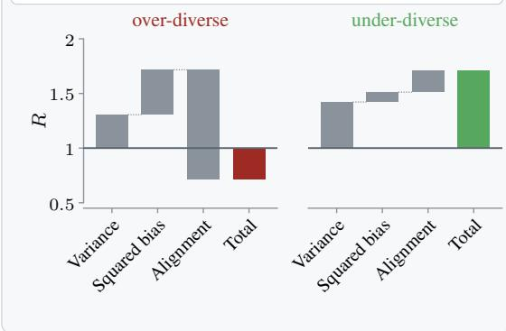  
<sup>1</sup>Figure 1: Large Langauge Models (LLMs) can produce diverse or colliding outputs given the same prompt. The extent to LLMs do so can be measured. Higher average output similarity than the target’s is referred to as mode-collapse. However, contrary to wide-spread belief, mode-collapse is not guaranteed, and depending on model and dataset, models can instead be over-diverse (the opposite of mode-collapse). It can be shown that fine-tuning calibrates the models, that is, they become not too under- and over-diverse. (a.i) Independent outputs from the same LLM and prompt can collide or differ. (a.ii) The notation used in this figure for collision. (a.iii) The definition of the collision ratio R. (b) Shows the decomposition of $\operatorname { E q . }$ (6) using data from Experiment 1 (§4.1). The two plots correspond to two different model and data set ups. The plots demonstrate that Alignment term of Eq. (6) can make a model either under- or over-diverse. Here $b _ { h } = \mathbb { E } [ q _ { h } ] - p _ { h }$ is the bias at context $h ,$ with E over independent fits. The plotted curves average contexts and start at $R = 1$ , with each contribution divided by $C ( p _ { h } )$ ). (c) Plots median collision ratio R for early-stopped survey and final CodeNet adapters against fine-tuning examples from Experiments $2 { - } \overset { \cdot } { 3 } ( \ S \ S ^ { 4 } . 2 { - } 4 . 3 )$ . The experiments show that additional fine-tuning leads to diversity calibration. (d) Theorem 1 bounds the absolute model–target collision gap by the square root of their Kullback-Leibler divergence. Consequently, a model sufficiently close to optimal under population cross-entropy cannot exhibit arbitrarily miscalibrated diversity.

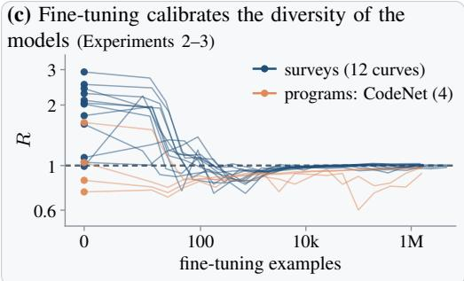  
(d) A model sufficiently close to optimal under population cross-entropy cannot exhibit arbitrarily miscalibrated diversity (Theorem 1)

$$
( p | | q ) { \mathrm { : } }
$$

$$
| C _ { k } ( p ) - C _ { k } ( q ) | \leq { \sqrt { \mathrm { K L } ( p \| q ) } }
$$

employed as proxies for human participants in “silicon sampling” studies (Argyle et al., 2023), but recent work shows that synthetic surveys can match aggregate statistics while failing to capture individual variation and regression structures (Bisbee et al., 2024), and can misrepresent and flatten identity groups (Wang et al., 2025). A benchmark of 15 LLMs across seven surveys documents the same compression of heterogeneity (Xie et al., 2026). Recursive fitting on model-generated data also removes data points from the tails of the original distribution (Shumailov et al., 2024; Seddik et al., 2024), illustrating the ease with which generative resampling can erase rare modes.

Preference optimization and diversity. Preference optimization has been shown to shrink output diversity. Reinforcement learning from human feedback (RLHF) with proximal policy optimization (PPO) reduces both within- and across-prompt diversity for summarization, as assessed by multiple lexical and semantic metrics, though the same study finds no meaningful diversity differences for instruction following (Kirk et al., 2024). The stage at which this contraction occurs varies across model lineages, with some models showing the largest reduction during SFT and others during direct preference optimization (DPO) (Karouzos et al., 2026). These effects are linked to preference data and annotator heterogeneity. Annotators tend to favor responses to which base models assign higher likelihood even when responses are matched on correctness; consequently, a perfectly estimated preference reward can preserve typicality bias toward conventional responses (Zhang et al., 2025). Finally, aggregating annotators with heterogeneous criteria implicitly implements the Borda-count rule rather than recovering an observer-independent utility (Siththaranjan et al., 2024), and a single scalar reward may not represent multimodal population preferences (Chakraborty et al., 2024). For a reference policy $\pi _ { \mathrm { r e f } } .$ , population reward $r ^ { \star }$ , and KL penalty strength $\beta ,$ the optimal policy has the form $\pi ^ { \star } ( y \mid x ) \propto \overbar { \pi _ { \mathrm { r e f } } } ( y \mid x ) \exp \bigl ( r ^ { \star } ( x , y ) / \beta \bigr )$ , and DPO directly fits a policy within this implicit-reward class (Rafailov et al., 2023). Finally, common reward structures and regularization regimes can produce unimodal or concentrated optima under both forward and reverse KL divergence, indicating that the KL penalty alone does not preserve the reference distribution’s diversity (GX-Chen et al., 2026). These population-level mechanisms persist as preference data size increases. We focus instead on the finite-sample distortion around the population objective, adding a finite-sample component to the objective-induced gap $C ( \pi ^ { \star } ) { - } C ( p )$ from existing literature (Appendix F). Because form-sensitive and content-sensitive diversity metrics capture different aspects of generator behavior (Tevet & Berant, 2021), our conclusions are metric-specific.

Relation to prior work. Xie et al. (2026) find compressed heterogeneity in survey microdata generated by 15 LLMs; fine-tuning one model on 1,000 records improves aggregate realism on held-out surveys. Our analysis shows that the collision gap can have either sign and must vanish as excess population cross-entropy approaches zero (§3.1, Theorem 1). Whereas the entropy-regularized game-theoretic method GEM (Li et al., 2025), Selectively Encouraging Diversity in Supervised Fine Tuning (SED-SFT) (Chen et al., 2026), and tempered focal (TOFU) loss (Klypa & Cherednichenko, 2026) modify the SFT objective to protect diversity, our experiments show that plain SFT moves diversity toward the target across four models, three surveys, and CodeNet, from both directions. Banayeeanzade et al. (2026) attribute sequence-level diversity loss to miscalibrated token probabilities; our decomposition and bound hold for any fitting procedure.

## 3 THEORY

Let $V$ be the token vocabulary, and $V ^ { * }$ the set of finite token sequences. Let prompts x be drawn from a distribution $\nu ,$ and let $\dot { p } ( y \mid x )$ be the target distribution over responses $\bar { y } \in \bar { V } ^ { * }$ . The model outputs token $a _ { t }$ given context $h _ { t } : = ( x , y _ { < t } )$ , where $y _ { < t }$ is the response prefix before step $t .$ The true conditional distribution is $p _ { h } ( a ) : = p ( a \mid h )$ . For an LLM with parameters $\theta , f _ { \theta } ( h )$ is the vector of pre-softmax scores (logits) predicted by the model given context h. Applying softmax gives $q _ { \theta } ( a \mid h ) : = \mathrm { s o f t m a x } ( f _ { \theta } ( h ) ) _ { a }$ , the model’s probability of token a given context h. SFT fits θ by minimizing empirical cross-entropy, the average of $\dot { \mathbf { \theta } } - \log \dot { q } _ { \theta } ( a \mid h )$ over observed context–token pairs $( h , a )$ in the fine-tuning data. A model fit produces parameters $\hat { \theta }$ and model $q _ { \hat { \theta } } .$

We now define collision for an arbitrary distribution π over tokens. Collision is the probability that two tokens drawn independently from π are equal:

$$
\begin{array} { r } { c ( \pi ) : = \sum _ { a \in V } \pi ( a ) ^ { 2 } . } \end{array}\tag{1}
$$

The inverse Simpson index is the number of equally likely choices that would give the same collision probability. For $K$ equally likely tokens, it equals K. For target and model distributions $p$ and $q ,$ define

$$
\begin{array} { r } { N _ { 2 } ( p ) : = \frac { 1 } { C ( p ) } , \qquad N _ { 2 } ( q ) : = \frac { 1 } { C ( q ) } , } \end{array}\tag{2}
$$

where C denotes collision. At a fixed context h, $C ( \boldsymbol { p } ) = c ( \boldsymbol { p } _ { h } )$ and $C ( q ) = c ( q _ { \theta } ( \cdot \mid h ) )$ .

We compare model and target diversity through the collision ratio

$$
\begin{array} { r } { R : = \frac { C ( q ) } { C ( p ) } = \frac { N _ { 2 } ( p ) } { N _ { 2 } ( q ) } , } \end{array}\tag{3}
$$

where $C ( p ) > 0 \colon R = 1$ indicates calibrated diversity, $R > 1$ mode collapse, and $R < 1$ overdispersion.

For a fixed prompt $x ,$ draw complete responses $Y$ and $Y ^ { \prime }$ independently from $p ( \cdot \mid x )$ . Their joint law is the product measure $p ( . | x ) \otimes p ( . | x )$ ; independence is conditional on $x ,$ , and averaging over a shared random prompt need not preserve it. Under a similarity kernel $k ( y , y ^ { \prime } ) \in [ 0 , 1 ]$ , kernel collision is

$$
C _ { p , k } ( x ) = \mathbb { E } _ { Y , Y ^ { \prime } \sim p ( \cdot | x ) } [ k ( Y , Y ^ { \prime } ) ] .\tag{4}
$$

The kernel function $k ( y , y ^ { \prime } )$ must satisfy $k ( y , y ^ { \prime } ) \in [ 0 , 1 ] , k ( y , y ) = 1$ , and $C _ { p , k } ( x ) > 0$ . A kernel representing exact collision is defined as $k ( y , y ^ { \prime } ) \stackrel { . } { = } { \bf 1 } \{ y = y ^ { \prime } \}$ . Finally, task-specific kernels may measure embedding cosine similarity, shared cluster membership, normalized Zhang–Shasha (Zhang & Shasha, 1989) similarity between code abstract syntax trees (ASTs), or similarity of survey responses, with all values shifted to the range [0, 1].

## 3.1 SIGN AND MAGNITUDE OF THE DIFFERENCE IN COLLISION PROBABILITIES

The collision decomposition. For a fixed context h, consider fitted conditional probability $q _ { \hat { \theta } , h } =$ $q _ { \hat { \theta } } ( \cdot \mid h )$ and true conditional probability p . Applying Eq. (4) to next-token outputs at context h, with the exact-match kernel $k ( a , b ) = \mathbf { 1 } \{ a = b \}$ , gives $\begin{array} { r } { C _ { h } ( q ) : = \sum _ { a \in V } q ( a \mid h ) ^ { 2 } = c ( q ( \cdot \mid h ) ) } \end{array}$ Thus $C _ { h } ( q _ { \hat { \theta } } ) = \lVert q _ { \hat { \theta } , h } \rVert _ { 2 } ^ { 2 }$ and $C _ { h } ( p ) = \| p _ { h } \| _ { 2 } ^ { 2 }$ . We call the difference $\mathbb { E } [ C _ { h } ( q _ { \hat { \theta } } ) ] - C _ { h } ( p )$ the expected collision gap: it is positive when the model collides more often than the target (mode collapse) and negative when the model is more diverse. For an arbitrary random vector X, we use the standard variance decomposition identity: $\mathbb { E } \| X \| _ { 2 } ^ { 2 } = \| \mathbb { E } X \| _ { 2 } ^ { 2 } + \mathrm { T r } \mathrm { \bar { C } o v } ( X )$ . Here $\operatorname { T r } \operatorname { C o v } ( X )$ is the sum of the component variances. Taking $X = q _ { \hat { \theta } , h } , \mathbb { E } [ X ]$ is the mean fitted distribution across independent fits. Next, define its bias relative to the target as

$$
b _ { h } : = \mathbb { E } [ q _ { \hat { \theta } , h } ] - p _ { h } .\tag{5}
$$

Thus $\mathbb { E } [ q _ { \hat { \theta } . h } ] = p _ { h } + b _ { h }$ . Substituting this into the variance decomposition identity, expanding $\| p _ { h } + b _ { h } \| _ { 2 } ^ { 2 }$ , and dividing by $C _ { h } ( \boldsymbol { p } )$ gives

$$
\begin{array} { r } { \bigg | \mathbb { E } [ R ] = 1 + \frac { 1 } { C _ { h } ( p ) } \Big [ \underbrace { \mathrm { T r } { \mathrm { C o v } ( q _ { \hat { \theta } , h } ) } } _ { \mathrm { v a r i a n c e \ge 0 } } + \underbrace { \| b _ { h } \| _ { 2 } ^ { 2 } } _ { \mathrm { s q u a r e d ~ b i a s } \ge 0 } + \underbrace { 2 p _ { h } ^ { \top } b _ { h } } _ { \mathrm { t a r g e t - b i a s a l i g n m e n t } } \Big ] \cdot \bigg | } \end{array}\tag{6}
$$

The covariance trace and squared bias are nonnegative, and thus contribute to increasing the expected collision ratio. The target–bias alignment term $2 p _ { h } ^ { \top } b _ { h }$ (referred to as the “cross term” in what follows) can be either positive or negative and may dominate these terms, so finite samples alone do not imply mode collapse. Thus the collision ratio R can be above 1 (mode collapse) or below 1 (over-dispersion). If $b _ { h } = 0$ , the expected gap is $\operatorname { T r } { \mathrm { C o v } } ( q _ { \hat { \theta } , h } ) \geq 0 ;$ : the model is calibrated or under-dispersed in expectation, with under-dispersion whenever this variance is positive.

The sign of the cross term. Let $q _ { 0 , h }$ denote the starting distribution at context h. For a pre-trained $\mathrm { L L M } , q _ { 0 , h }$ is its output distribution given context h before any fine-tuning. At this starting point, using the definitions of bias (5) and collision (1) we get

$$
2 p _ { h } ^ { \top } b _ { h } = 2 p _ { h } ^ { \top } ( q _ { 0 , h } - p _ { h } ) \ = \ 2 \big ( p _ { h } ^ { \top } q _ { 0 , h } - C ( p _ { h } ) \big ) .\tag{7}
$$

The alignment term (7) is positive when the starting distribution overlaps the target’s modes more than the target overlaps itself. Moreover, the alignment term can determine whether the expected collision gap is positive or negative.

Using this setup, we can prove the following result bounding the collision gap between distributions p and q:

Theorem 1 (Kernel-collision stability). Consider the similarity kernel $k : V ^ { * } \times V ^ { * } \to \lceil 0 , 1 \rceil$ , where $V ^ { * }$ is the set offinite token sequences. Write the collision metric $\begin{array} { r } { C _ { k } ( \pi ) = \sum _ { a , b } { \pi ( a ) } \pi ( b ) k ( a , b ) } \end{array}$ $D _ { k } ( \pi ) = 1 / C _ { k } ( \pi )$ , where π is a probability distribution on $V ^ { * }$ and $D _ { k } ( \pi )$ is its kernel effective diversity. Write TVfor total variation distance, ⊗for the product measure operator, and $\mathrm { K L } ( p \| q ) =$ $\begin{array} { r } { \mathbb E _ { a \sim p } [ - \log q ( a ) ] - \mathbb E _ { a \sim p } [ - \log p ( a ) ] } \end{array}$ ] for excess population cross-entropy, using natural logarithms. For all distributions $p , q$ on $V ^ { * }$

$$
\Bigl | \ | C _ { k } ( p ) - C _ { k } ( q ) | \ \le \ \mathrm { T V } ( p \otimes p , q \otimes q ) \ \le \ \sqrt { \mathrm { K L } ( p \| q ) } \ . \Bigl |\tag{8}
$$

Consequently, $i f \operatorname { K L } ( p \parallel q ) \leq \varepsilon \ t h e n \operatorname* { m a x } \{ 0 , C _ { k } ( p ) - { \sqrt { \varepsilon } } \} \leq C _ { k } ( q ) \leq \operatorname* { m i n } \{ 1 , C _ { k } ( p ) + { \sqrt { \varepsilon } } \}$ , and the kernel effective diversity obeys

$$
\begin{array} { r } { D _ { k } ( q ) \ \geq \ \frac { 1 } { C _ { k } ( p ) + \sqrt { \varepsilon } } \ = \ \frac { D _ { k } ( p ) } { 1 + D _ { k } ( p ) \sqrt { \varepsilon } } \ . } \end{array}\tag{9}
$$

The proof, via total variation on product measures and Pinsker’s inequality, is in Appendix A, together with a sharper collision-specific bound (Proposition 1).

## 4 EXPERIMENTAL RESULTS

To test the bias-variance decomposition and convergence results in the above theory, we now run three experiments. The first uses synthetic languages with known ground truth for each decomposition term, allowing direct measurement of every term. The second and third use human data—survey responses from the GSS (Davern et al., 2025), WVS (Haerpfer et al., 2022), and ANES (American National Election Studies, 2022), and human solutions to programming problems from Project CodeNet (Puri et al., 2021). We report the collision ratio R defined in Eq. (3); for example, $R = 2$ means the model offers half as many effective choices as the data. Experiment 1 additionally decomposes the expected normalized collision gap $\mathbb { E } [ R ] - 1$ into the three terms of Eq. (6).

## 4.1 EXPERIMENT 1: SYNTHETIC LANGUAGES WITH KNOWN TARGET DISTRIBUTION

We sample data from a synthetic language, fit a series of small GPT models on that data, and compare the diversity of the fitted models against the diversity of the language itself. Unlike experiments using human-generated data, in this setting, target probabilities are known. That allows us to repeat model fits to estimate variance, squared-bias, and target–bias alignment terms in Eq. (6). As we have established in the previous section, the latter term determines whether LLMs mode-collapses or is over-diverse. In order to control this term, we initialize the GPTs using two settings: (a) pre-training from random initialization, and (b) fine-tuning a model pre-trained to favor a small set of tokens.

In setting (a), the language has a vocabulary of 1024 tokens, and each next token depends only on the preceding 16 tokens. The target probabilities are known exactly at every context, and a small GPT can represent the generating distribution exactly, so model capacity does not limit the fit. In setting (b), the language combines fixed token frequencies with adjustments based on the preceding 16 tokens. Appendix H.1 gives the language construction and sampling details. The two settings differ in the model’s starting next-token distribution, model size, and target language. They are not intended as a controlled ablation of the starting distribution alone. Figure 2 shows pre-training from random initialization in panel (a) and fine-tuning from the pre-trained model in panel (b).

Decomposing the expected collision gap as in Section 3.1 requires independent fits: a single fitted model does not show the variance across runs. We therefore fit 100 models at each of 100 log-spaced sample sizes of N sampled sequences, giving 10,000 GPTs per language. Each seed draws its own dataset, initialization, and minibatch stream, ensuring that the variance term $\operatorname { T r } \operatorname { C o v } ( q _ { \hat { \theta } , h } )$ in Eq. (6) reflects total across-run fluctuation. Details of model sizes, data construction, and fitting configurations are provided in Appendix H.1.

We consider two settings that sit on opposite sides of the initial-alignment condition in (7). In setting (a), a GPT starts from random initialization. Its initial next-token distribution $^ { q _ { 0 , h } }$ at context h has high entropy; we call this the diffuse prior. Its probabilities depend on the context, but the network is randomly initialized, so it does not favor or suppress particular tokens based on the target distribution $p _ { h }$ . In setting (b), we pre-train a GPT to concentrate its probability on a fixed set of common target-language tokens. We call this concentrated starting distribution the mode-aligned prior. Appendix H.1 describes the construction of both priors. This mode-aligned prior is arguably not a realistic model of pre-training from scratch, however, it could showcase the behavior of an existing LLM pre-trained on data from a distribution similar but not identical to the target.

Under the diffuse prior (Figure 2(a)), the normalized cross term $2 p _ { h } ^ { \top } b _ { h } / C ( p _ { h } )$ , averaged over contexts, is negative at every sample size, and is largest in magnitude at small N. The normalized variance and squared-bias terms stay positive. The sign of $\mathbb { E } [ R ] - 1$ depends on $N :$ at the smallest N the cross term dominates and the measured $\mathbb { E } [ R ] - 1$ is negative (over-dispersion); however, over most models, the two nonnegative terms dominate and $\mathbb { E } [ R ] - 1$ is positive (mode-collapse).

Under the mode-aligned prior, the cross term increases the expected collision ratio at intermediate sample sizes (Figure 2(b)). Even where positive, it accounts for at most 31% of the measured $\mathbb { E } [ R ] - 1$ so variance and squared bias still account for most of the expected normalized collision gap. At the smallest N, however, the cross term is negative and mode collapse is driven by the two nonnegative terms.

To relate these outcomes to the starting distributions, Table 1 in Appendix B checks the initialalignment condition in Eq. (7) using the mean initial distribution $\bar { q } _ { 0 , h } : = \mathbb { E } [ q _ { 0 , h } ]$ , estimated across the

100 seeds. The table reports averages over contexts after the indicated normalization. The normalized cross term is initially negative under the diffuse prior and positive under the mode-aligned prior, but fine-tuning does not preserve these signs at every N. In the next two experiments (Sections 4.2 and 4.3), we use human data to test whether fine-tuning moves R toward 1 (as Theorem 1 predicts when excess population cross-entropy approaches zero).

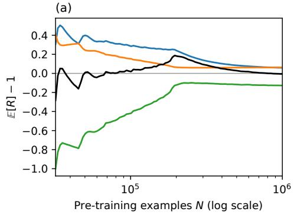

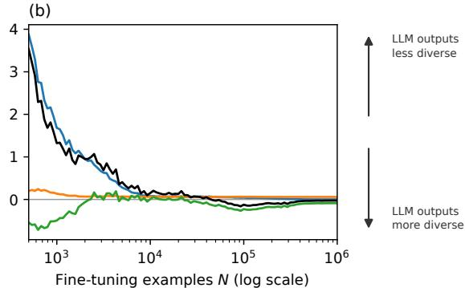

Figure 2: Decomposition of the normalized gap between model and target collision probabilities. The two synthetic languages have known target distributions (Appendix H.1), so repeated fits let us estimate the contributions of variance, squared bias, and target–bias alignment to $\mathbb { E } [ R ] - 1$ using Eq. (6). Contributions are averaged over contexts and plotted against sampled sequences N. (a) shows pre-training from the diffuse prior (6.135M-parameter GPT, N from 32k to 1M, 2000 common contexts); (b) shows fine-tuning from the mode-aligned prior (27.97M-parameter GPT, N from 500 $1 0 ^ { 6 } )$ . The black line shows the estimated $\mathbb { E } [ R ] - { \bar { 1 } }$ , averaged over contexts: positive values indicate mode collapse and negative values over-dispersion. The three contributions sum to this value. The two panels carry independent vertical and horizontal scales.

## 4.2 EXPERIMENT 2: SOCIOLOGICAL SURVEYS (GSS, WVS, AND ANES)

In this experiment, we LoRA fine-tune four LLMs on human responses to three large opinion surveys, to test whether supervised fine-tuning moves a model’s answer diversity toward the diversity of the population it is asked to imitate through fine-tuning.

We consider three social surveys in this section. First, the General Social Survey (GSS) (Davern et al., 2025), a nationally representative survey of U.S. adults since 1972. We use the cumulative dataset spanning 1972–2024, including data from 74,485 respondents with complete demographic information. Second, we use a random subset of one-third of the countries and one-third of the questions from wave 7 of the World Values Survey (WVS) (Haerpfer et al., 2022), a cross-national survey of values (the sub-samples are used in the interest of saving compute). Third, we use data from the American National Election Studies (ANES) (American National Election Studies, 2022), a long-running U.S. political survey.

Respondents are partitioned into demographic groups based on characteristics such as country, age, sex, race/urban-rural status, region, and education. For each fixed question and demographic group X, let Y denote the answer and let $m _ { a }$ of the m respondents choose answer a. We estimate human collision probability as the proportion of pairs of distinct respondents who give the same answer: $\begin{array} { r } { \hat { C } _ { \mathrm { U } } : = \sum _ { a } m _ { a } ( m _ { a } - 1 ) / [ m ( m - 1 ) ] , } \end{array}$ ]. The prompt presented to the model includes the demographic group as a persona, the survey question, and its answer options, and asks the model to select a single answer option. Applying softmax over the answer-option logits gives $q ( a \mid X )$ , the model’s probability of answer a for the fixed question and demographic group X. The model’s collision probability is $\textstyle C ( q ) : = \sum _ { a } q ( a \mid X ) ^ { 2 }$ . We report $R _ { \mathrm { U } } : = C ( q ) / \hat { C } _ { \mathrm { U } }$ , which estimates the collision ratio in Eq. (3) using $\hat { C } _ { \mathrm { U } }$ as the human collision estimate.

We repeat this experiment using 376 GSS questions (Davern et al., 2025), 53 WVS questions (Haerpfer et al., 2022), and 44 ANES questions (American National Election Studies, 2022)—and four models—gemma $- 2 - 2 \mathrm { b - i t }$ (Gemma Team, 2024), Qwen3.5-2B and Qwen3.5-4B (Qwen

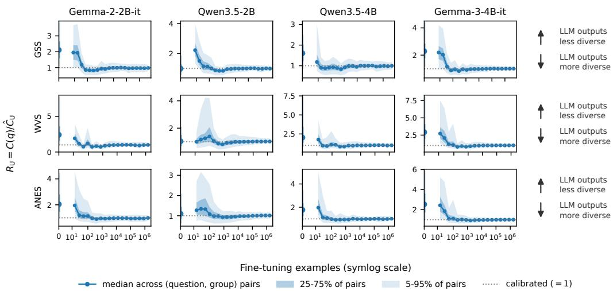  
Figure 3: Experiment 2. Collision ratio $R _ { \mathrm { U } } = C ( q ) / \hat { C } _ { \mathrm { U } } ~ ( 1 = \mathrm { c a l i b r a t e d } )$ against fine-tuning examples (20 sample sizes for the GSS, 18 each for the WVS and $\mathrm { A N E S } ) . { \hat { C } } _ { \mathrm { U } }$ estimates how often two distinct human respondents give the same answer; $C ( q )$ is the probability that two independent model answers match, using probabilities normalized over the listed options. Each panel shows the median collision ratio across evaluated question–group pairs for early-stopped adapters (blue line), with shaded bands spanning the 25th–75th and 5th–95th percentiles across pairs. The marker at $n = 0$ is the zero-shot base model, with vertical whiskers repeating the two bands; the horizontal axis is symmetric-log so that $n = 0$ is shown on the same axis as the sweep, and each panel has its own y-axis limits.

Team, 2026), and gemma-3-4b-it (Gemma Team, 2025)—using the split defined in Table 3 of Appendix H.2. For each survey, model, and fine-tuning set of n respondent–question examples, we evaluate $R _ { \mathrm { U } }$ for every question–group pair with at least 60 respondents. We include the zero-shot model as $n = 0$ . This gives a fixed set of 18,270 pairs on the GSS, 8,015 on the WVS, and 8,211 on the ANES. Figure 3 plots, at each $n ,$ median pair-level ratios for early-stopped adapters, with shaded bands for the 25–75% and 5–95% spread across pairs. Movement of the median ratio toward 1 means that model answer diversity is approaching the human level for a typical question–group pair.

Three of the four base models mode-collapse across all surveys; the fourth starts closest to median calibration. Zero-shot, gemma-2-2b-it, Qwen3.5-4B, and gemma-3-4b-it have median collision ratios $R _ { \mathrm { U } }$ between 1.61 and 2.92, corresponding to roughly one-third to two-thirds of the human effective diversity. The collapse is most pronounced on the WVS—the sparsest and only cross-national survey. The three collapsed models all have higher median collision ratios on the WVS than on the U.S. surveys (Table 2 in Appendix C). The severity of mode collapse therefore varies with both the model and the survey population.

At the smallest $n ,$ the three collapsed models stay near their zero-shot collision ratio. Qwen3.5-2B, the model closest to median calibration at $n = 0 ,$ , is instead driven above its zero-shot collision ratio during early fine-tuning on all three surveys—to 2.22 on the GSS, leaving less than half its starting effective diversity—before recovering (Table 2 in Appendix C). Beyond roughly 3,000 fine-tuning examples, all twelve survey–model combinations maintain median collision ratios within 10% of the calibrated value of 1. Qwen3.5-2B’s early increase in collision ratio moves it away from 1, showing that small fine-tuning datasets can worsen diversity calibration. The later approach to 1 across all models and surveys shows that larger human datasets improve calibration.

## 4.3 EXPERIMENT 3: CODE GENERATION USING CODENET DATASET

In contrast to the previous section, exact sequence collisions are too rare to estimate for complete programs. So on CodeNet (Puri et al., 2021) we compare model generations with accepted Python submissions using structural similarity. We fine-tune the same four LLMs as in Experiment 2 on accepted Python submissions. Before fine-tuning and at each fine-tuning-set size, each model generates 32 programs per problem. We map each program $y$ to an ordered labeled canonical Python abstract syntax tree $T ( y )$ , removing comments and formatting and canonicalizing identifiers and literals.

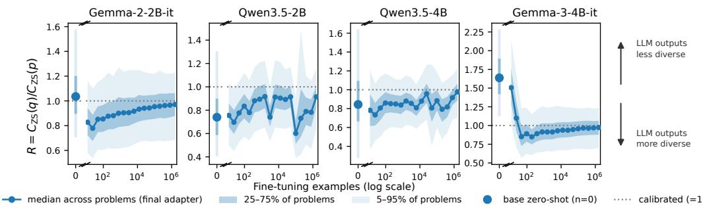  
Figure 4: Experiment 3. CodeNet diversity under normalized Zhang–Shasha similarity. Collision ratio $C _ { \mathrm { Z S } } ( q ) \bar { / } C _ { \mathrm { Z S } } ( p )$ against SFT examples (1 = calibrated). Lines show median finite collision ratios across problems; shaded bands span the 25th–75th and 5th–95th percentiles. At the full fine-tuning dataset, each model’s median uses all 2,647 candidate problems, while base markers cover 2,646, 2,569, 986, and 2,646 problems in panel order. The text separately compares the same problems before fine-tuning and after fine-tuning on the full dataset. Panels have separate y-axes and broken horizontal axes.

Let $d _ { \mathrm { Z S } }$ be the Zhang–Shasha tree edit distance (Zhang & Shasha, 1989): the minimum number of node insertions, deletions, and relabelings needed to transform one tree into the other, with each operation costing one. We define

$$
\begin{array} { r } { k _ { \mathrm { Z S } } ( y , y ^ { \prime } ) : = 1 - \frac { d _ { \mathrm { Z S } } \left( T ( y ) , T ( y ^ { \prime } ) \right) } { | T ( y ) | + | T ( y ^ { \prime } ) | } . } \end{array}\tag{10}
$$

where $| T ( y ) |$ is the number of nodes in $T ( y )$ . This similarity kernel $k _ { \mathrm { Z S } } ( y , y ^ { \prime } )$ lies in [0, 1] and equals 1 for identical trees. For each problem, $p$ denotes the distribution of accepted human submissions and $q$ the model’s output distribution. The kernel collisions $C _ { \mathrm { Z S } } ( \boldsymbol { p } )$ and $\bar { C _ { \mathrm { Z S } } } ( q )$ in Eq. (4) measure expected similarity within each source using Eq. (10), conditional on both programs parsing as Python. For each source separately, we estimate its collision by averaging $k _ { \mathrm { Z S } } ( y , y ^ { \prime } )$ over up to 32 distinct unordered pairs of parseable programs sampled without replacement. Figure 4 reports the median finite ratio $C _ { \mathrm { Z S } } ( q ) / C _ { \mathrm { Z S } } ( p )$ over a fixed panel of 2,647 candidate problems. The base models’ median collision ratios lie on both sides of the accepted-program target: both Qwen models are over-diverse, while both Gemma models are under-diverse. After fine-tuning on the full dataset, each model’s median uses ratios from all candidate problems. To check whether changes in which problems enter the median explain the shift toward calibration, we compare each model before and after fine-tuning on the full dataset using only problems included at both stages (Appendix H.3). All four medians still move closer to 1, so the improvement persists when the set of problems is held fixed. Appendix H.3 gives the complete construction, prompt, fine-tuning configuration, and program examples.

## 5 CONCLUSION

LLMs can exhibit either mode collapse or over-dispersion relative to a target population, even though recent literature has mostly emphasized mode-collapse. Finite-sample fitting has no built-in direction: variance and squared bias contribute to increasing the expected collision ratio, while target–bias alignment can offset them. The absolute difference between collision probabilities of the model and the target population is bounded by the square root of KL divergence, so approaching the target distribution forces diversity calibration. Across four models, our social survey and coding experiments show that increasing fine-tuning data moves diversity toward the target from both directions. These results support evaluating diversity relative to a specified target alongside standard performance benchmarks, and motivate fine-tuning methods that use the diversity-calibrating properties of SFT. Obtaining sufficient coverage of the target distribution remains a challenge when data are limited.

## AI USE STATEMENT

In this work, we used generative AI tools to: formulate mathematical claims, provide critical ingredients for proving mathematical claims, assist in the writing of proofs, support qualitative and thematic data analysis, implement methods, polish writing. We take responsibility for the final content of this work, including text, claims or artifacts produced with the aid of generative AI.

## REFERENCES

American National Election Studies. ANES Time Series Cumulative Data File, 1948–2020 [dataset and documentation], 2022. URL https://electionstudies.org/data-center/ anes-time-series-cumulative-data-file/. September 16, 2022 version.

B. R. Anderson, J. H. Shah, and M. Kreminski. Homogenization effects of large language models on human creative ideation. In ACM Creativity and Cognition, pp. 413–425, 2024. URL https: //doi.org/10.1145/3635636.3656204.

L. P. Argyle, E. C. Busby, N. Fulda, J. R. Gubler, C. Rytting, and D. Wingate. Out of One, Many: Using language models to simulate human samples. Political Analysis, 31(3):337–351, 2023. URL https://doi.org/10.1017/pan.2023.2.

A. Arora, C. Meister, and R. Cotterell. Estimating the entropy of linguistic distributions. In ACL, pp. 175–195, 2022. URL https://doi.org/10.18653/v1/2022.acl-short.20.

S. Arora and Y. Zhang. Do GANs actually learn the distribution? An empirical study. arXiv preprint arXiv:1706.08224, 2017.

S. Arora, A. Risteski, and Y. Zhang. Do GANs learn the distribution? Some theory and empirics. In ICLR, 2018.

A. Banayeeanzade, Q. Yang, D. Tarsadiya, F. Bahrani, L. Blas, A. Samuel, R. Jia, M. Razaviyayn, and S. P. Karimireddy. Sampling More, Getting Less: Calibration is the diversity bottleneck in LLMs. arXiv preprint arXiv:2605.11128, 2026.

J. Bisbee, J. D. Clinton, C. Dorff, B. Kenkel, and J. M. Larson. Synthetic replacements for human survey data? The perils of large language models. Political Analysis, 32(4):401–416, 2024. URL https://doi.org/10.1017/pan.2024.5.

T. Chakrabarty, V. Padmakumar, F. Brahman, and S. Muresan. Creativity support in the age of large language models: An empirical study involving professional writers. In ACM Creativity and Cognition, pp. 132–155, 2024. URL https://doi.org/10.1145/3635636.3656201.

S. Chakraborty, J. Qiu, H. Yuan, A. Koppel, D. Manocha, F. Huang, A. S. Bedi, and M. Wang. MaxMin-RLHF: Alignment with diverse human preferences. In ICML, volume 235 of PMLR, pp. 6116–6135, 2024.

Y. Chen, Y. Liu, and F. Meng. SED-SFT: Selectively encouraging diversity in supervised fine-tuning. arXiv preprint arXiv:2602.07464, 2026.

J. J. Y. Chung, V. Padmakumar, M. Roemmele, Y. Sun, and M. Kreminski. Modifying large language model post-training for diverse creative writing. arXiv preprint arXiv:2503.17126, 2025.

M. Davern, R. Bautista, J. Freese, P. Herd, and S. L. Morgan. General Social Survey 1972–2024 [machine-readable data file]. NORC ed. Chicago: NORC at the University of Chicago [producer and distributor], 2025. URL https://gssdataexplorer.norc.org. Data accessed from the GSS Data Explorer website.

A. R. Doshi and O. P. Hauser. Generative AI enhances individual creativity but reduces the collective diversity of novel content. Science Advances, 10(28):eadn5290, 2024. URL https://doi. org/10.1126/sciadv.adn5290.

M. Finlayson, J. Hewitt, A. Koller, S. Swayamdipta, and A. Sabharwal. Closing the curious case of neural text degeneration. In ICLR, 2024.

D. Friedman and A. B. Dieng. The Vendi Score: A diversity evaluation metric for machine learning. Transactions on Machine Learning Research, 2023.

Gemma Team. Gemma. 2024. doi: 10.34740/KAGGLE/M/3301. URL https://www.kaggle. com/m/3301.

Gemma Team. Gemma 3. 2025. URL https://goo.gle/Gemma3Report.

A. GX-Chen, J. Prakash, J. Guo, R. Fergus, and R. Ranganath. KL-Regularized Reinforcement Learning for Generative Modelling is Designed to Mode Collapse. In ICLR, 2026.

C. Haerpfer, R. Inglehart, A. Moreno, C. Welzel, K. Kizilova, J. Diez-Medrano, M. Lagos, P. Norris, E. Ponarin, and B. Puranen (eds.). World Values Survey: Round Seven—Country-Pooled Datafile Version 6.0.0. JD Systems Institute and WVSA Secretariat, Madrid, Spain and Vienna, Austria, 2022. URL https://doi.org/10.14281/18241.24.

A. Holtzman, J. Buys, L. Du, M. Forbes, and Y. Choi. The curious case of neural text degeneration. In ICLR, 2020.

J. Jiao, K. Venkat, Y. Han, and T. Weissman. Minimax estimation of functionals of discrete distributions. IEEE Transactions on Information Theory, 61(5):2835–2885, 2015. URL https://doi.org/10.1109/TIT.2015.2412945.

C. Karouzos, X. Tan, and N. Aletras. Where does output diversity collapse in post-training? arXiv preprint arXiv:2604.16027, 2026.

R. Kirk, I. Mediratta, C. Nalmpantis, J. Luketina, E. Hambro, E. Grefenstette, and R. Raileanu. Understanding the effects of RLHF on LLM generalisation and diversity. In ICLR, 2024.

R. Klypa and O. Cherednichenko. Diversity in large language models under supervised fine-tuning. arXiv preprint arXiv:2605.00195, 2026.

Z. Li, C. Chen, T. Xu, Z. Qin, J. Xiao, Z.-Q. Luo, and R. Sun. Preserving diversity in supervised fine-tuning of large language models. In ICLR, 2025.

A. Orlitsky, A. T. Suresh, and Y. Wu. Optimal prediction of the number of unseen species. PNAS, 113(47):13283–13288, 2016. URL https://doi.org/10.1073/pnas.1607774113.

V. Padmakumar and H. He. Does writing with language models reduce content diversity? In ICLR, 2024. arXiv:2309.05196.

L. Paninski. Estimation of entropy and mutual information. Neural Computation, 15(6):1191–1253, 2003. URL https://doi.org/10.1162/089976603321780272.

M. S. Pinsker. Information and Information Stability ofRandom Variables and Processes. Holden-Day, 1964.

R. Puri, D. S. Kung, G. Janssen, W. Zhang, G. Domeniconi, V. Zolotov, J. T. Dolby, J. Chen, M. Choudhury, L. Decker, V. Thost, L. Buratti, S. Pujar, S. Ramji, U. Finkler, S. Malaika, and F. Reiss. CodeNet: A large-scale AI for code dataset for learning a diversity of coding tasks. In NeurIPS Datasets and Benchmarks, 2021.

Qwen Team. Qwen3.5: Towards native multimodal agents, February 2026. URL https://qwen. ai/blog?id=qwen3.5.

R. Rafailov, A. Sharma, E. Mitchell, C. D. Manning, S. Ermon, and C. Finn. Direct Preference Optimization: Your language model is secretly a reward model. In NeurIPS, volume 36, pp. 53728–53741, 2023.

M. E. A. Seddik, S.-W. Chen, S. Hayou, P. Youssef, and M. Debbah. How bad is training on synthetic data? A statistical analysis of language model collapse. arXiv preprint arXiv:2404.05090, 2024.

I. Shumailov, Z. Shumaylov, Y. Zhao, N. Papernot, R. Anderson, and Y. Gal. AI models collapse when trained on recursively generated data. Nature, 631:755–759, 2024. URL https://doi. org/10.1038/s41586-024-07566-y.

A. Siththaranjan, C. Laidlaw, and D. Hadfield-Menell. Distributional preference learning: Understanding and accounting for hidden context in RLHF. In ICLR, 2024. arXiv:2312.08358.

S. Slocum, A. Parker-Sartori, and D. Hadfield-Menell. Diverse preference learning for capabilitie and alignment. In ICLR, 2025.

Z. Sourati, A. S. Ziabari, and M. Dehghani. The homogenizing effect of large language models on human expression and thought. arXiv preprint arXiv:2508.01491, 2026.

C. Terwiesch, L. Meincke, K. Girotra, E. R. Mollick, G. Nave, and K. T. Ulrich. AI and its impact on creativity and diversity: An empirical study of LLM-generated product ideas. SSRN 4526071, 2024. URL https://doi.org/10.2139/ssrn.4526071.

G. Tevet and J. Berant. Evaluating the evaluation of diversity in natural language generation. In EACL, pp. 326–346, 2021. URL https://doi.org/10.18653/v1/2021.eacl-main.25.

A. Wang, J. Morgenstern, and J. P. Dickerson. Large language models that replace human participants can harmfully misportray and flatten identity groups. Nature Machine Intelligence, 7(3):400–411, 2025. URL https://doi.org/10.1038/s42256-025-00986-z.

S. Welleck, I. Kulikov, S. Roller, E. Dinan, K. Cho, and J. Weston. Neural text generation with unlikelihood training. In ICLR, 2020.

Y. Xie and Y. Xie. Variance reduction in output from generative AI. arXiv preprint arXiv:2503.01033, 2025.

Y. Xie, L. Liang, S. Li, Y. Lu, Z. Xiao, M. Shi, J. Huang, M. Wang, and Y. Xie. Evaluating the statistical realism of LLM-generated social science data. PNAS, 123(19):e2538145123, 2026. URL https://doi.org/10.1073/pnas.2538145123.

J. Zhang, S. Yu, D. Chong, A. Sicilia, M. R. Tomz, C. D. Manning, and W. Shi. Verbalized Sampling: How to Mitigate Mode Collapse and Unlock LLM Diversity. arXiv preprint arXiv:2510.01171, 2025. URL https://arxiv.org/abs/2510.01171.

K. Zhang and D. Shasha. Simple fast algorithms for the editing distance between trees and related problems. SIAM Journal on Computing, 18(6):1245–1262, 1989. URL https://doi.org/ 10.1137/0218082.

## A PROOFS AND ALIGNMENT CONDITIONS

## A.1 KERNEL-COLLISION STABILITY

Proof of Theorem 1. Kernel collision is an expectation of k under product measures $P = p \otimes p$ and $Q = q \otimes q$ . Because $k \in [ 0 , 1 ]$ , the variational characterization of total variation gives

$$
| C _ { k } ( p ) - C _ { k } ( q ) | = | \mathbb { E } _ { P } [ k ] - \mathbb { E } _ { Q } [ k ] | \le \mathrm { T V } ( P , Q ) .
$$

Pinsker’s inequality (Pinsker, 1964) and the product identity $\mathrm { K L } ( p \otimes p | | q \otimes q ) = 2 \mathrm { K L } ( p | | q ) \mathrm { y i e l d }$

$$
\begin{array} { r } { \mathrm { T V } ( P , Q ) \leq \sqrt { \frac { 1 } { 2 } \mathrm { K L } ( P \| Q ) = \sqrt { \mathrm { K L } ( p \| q ) } } . } \end{array}
$$

Clipping collision to [0, 1] and inverting positive collision gives the remaining statements.

For a random fitted model $q _ { \hat { \theta } } .$ , the fixed-model bound also controls the expected kernel-collision gap:

$$
\big | \mathbb { E } _ { \hat { \theta } } [ C _ { k } ( q _ { \hat { \theta } } ) ] - C _ { k } ( p ) \big | \le \mathbb { E } _ { \hat { \theta } } \Big [ \sqrt { \mathrm { K L } ( p \| q _ { \hat { \theta } } ) } \Big ] \le \sqrt { \mathbb { E } _ { \hat { \theta } } [ \mathrm { K L } ( p \| q _ { \hat { \theta } } ) ] } .\tag{11}
$$

The first inequality uses the triangle inequality and Theorem 1; the second uses Jensen’s inequality.

## A.2 A SUFFICIENT CONDITION FOR NONNEGATIVE ALIGNMENT

Only the target–bias alignment in Eq. (6) can be negative. The following condition on the fitted model is sufficient: tokens more likely under the target have no smaller bias. A concentrated initialization does not by itself imply this condition.

Assumption 1 (Target–bias comonotonicity). For every pair a, b ∈ V ,

$$
\left( p _ { h } ( a ) - p _ { h } ( b ) \right) \left( b _ { h } ( a ) - b _ { h } ( b ) \right) \geq 0 , \qquad b _ { h } = \mathbb { E } [ q _ { \hat { \theta } , h } ] - p _ { h } .\tag{12}
$$

Chebyshev’s sum inequality then gives nonnegative covariance under the uniform measure on $V .$ Since $\textstyle \sum _ { a } b _ { h } ( a ) = 0$

$$
p _ { h } ^ { \top } b _ { h } = | V | \operatorname { C o v } _ { a \sim \operatorname { U n i f } ( V ) } \left( p _ { h } ( a ) , b _ { h } ( a ) \right) \geq 0 .\tag{13}
$$

All three terms inside the brackets in Eq. (6) are therefore nonnegative, and

$$
\mathbb { E } [ C _ { h } ( q _ { \hat { \theta } } ) ] - C _ { h } ( p ) \geq 0 .\tag{14}
$$

For a uniform target, the alignment is exactly zero because $\begin{array} { r } { \sum _ { a } b _ { h } ( a ) = 0 } \end{array}$ . In the synthetic experiments, alignment after fitting is negative in the diffuse setting and positive only over an intermediate $N$ range in the mode-aligned setting. Positive aggregate alignment does not by itself establish the pairwise comonotonicity assumption, and neither observation shows that initialization determines the later sign.

## A.3 RELATIVE COLLISION BOUNDS AND POPULATION CROSS-ENTROPY

Dividing Theorem 1 by exact target collision gives a relative, exact-collision bound:

$$
\left| { \frac { C ( q _ { h } ) } { C ( p _ { h } ) } } - 1 \right| = { \frac { \left| C ( q _ { h } ) - C ( p _ { h } ) \right| } { C ( p _ { h } ) } } \ \overset { \circledast } { \leq } \ { \frac { \sqrt { \operatorname { K L } ( p _ { h } \| q _ { h } ) } } { C ( p _ { h } ) } } \ = \ N _ { 2 } ^ { \mathrm { t r u e } } ( h ) { \sqrt { \operatorname { K L } ( p _ { h } \| q _ { h } ) } } .\tag{15}
$$

Proposition 1 (Relative bound on the collision ratio). Fix a context h with true conditional $p _ { h }$ and model conditional $q _ { h }$ , write $C ( r ) = \| r \| _ { 2 } ^ { 2 } , N _ { 2 } ( r ) = 1 / C ( r ) , N _ { 2 } ^ { \mathrm { t r u e } } ( h ) = N _ { 2 } ( p _ { h } )$ . The local collision ratio is $R = \bar { C } ( q _ { h } ) / C ( p _ { h } )$ , which equals 1 when the model’s diversity is calibrated and exceeds 1 when the model is more repetitive than the data. With $\begin{array} { r } { \delta = q _ { h } - p _ { h } ( s o \sum _ { a } \delta _ { a } = 0 ) } \end{array}$

$$
\bigg | \bigg | \frac { C ( q _ { h } ) } { C ( p _ { h } ) } - 1 \bigg | \le 2 \sqrt { N _ { 2 } ^ { \mathrm { t r u e } } ( h ) } \| q _ { h } - p _ { h } \| _ { 2 } + N _ { 2 } ^ { \mathrm { t r u e } } ( h ) \| q _ { h } - p _ { h } \| _ { 2 } ^ { 2 } ,\tag{16}
$$

A looser bound follows using the Pearson divergence $\begin{array} { r } { \chi ^ { 2 } ( q _ { h } \| p _ { h } ) = \sum _ { a } \delta _ { a } ^ { 2 } / p _ { h } ( a ) \geq \| \delta \| _ { 2 } ^ { 2 } } \end{array}$ (finite when $q _ { h } \ll p _ { h } ) .$

$$
\bigg | \bigg | \frac { C ( q _ { h } ) } { C ( p _ { h } ) } - 1 \bigg | \le 2 \sqrt { N _ { 2 } ^ { \mathrm { t r u e } } ( h ) \chi ^ { 2 } ( q _ { h } \| p _ { h } ) } + N _ { 2 } ^ { \mathrm { t r u e } } ( h ) \chi ^ { 2 } ( q _ { h } \| p _ { h } ) .\tag{17}
$$

Proof. Since $q _ { h } = p _ { h } + \delta , C ( q _ { h } ) - C ( p _ { h } ) = 2 \langle p _ { h } , \delta \rangle + \| \delta \| _ { 2 } ^ { 2 } , \mathrm { s o } C ( q _ { h } ) / C ( p _ { h } ) - 1 = ( 2 \langle p _ { h } , \delta \rangle + 1 ) + C ( \delta ) / C ( p _ { h } )$ $\| \delta \| _ { 2 } ^ { 2 } ) / C ( p _ { h } )$ . By Cauchy–Schwarz, $| \langle p _ { h } , \delta \rangle | \leq \| p _ { h } \| _ { 2 } \| \delta \| _ { 2 } = \sqrt { C ( p _ { h } ) } \| \delta \| _ { 2 }$ , so the cross term is at most $2 \| \delta \| _ { 2 } / \sqrt { C ( p _ { h } ) } = 2 \sqrt { N _ { 2 } ^ { \mathrm { t r u e } } ( h ) } \| \delta \| _ { 2 }$ , while the quadratic term is $N _ { 2 } ^ { \mathrm { t r u e } } ( h ) \| \delta \| _ { 2 } ^ { 2 }$ ; the triangle inequality gives (16). For (17), absolute continuity confines all sums to the support of $p _ { h }$ , where $1 / p _ { h } ( a ) \geq 1$ gives $\lVert \delta \rVert _ { 2 } ^ { 2 } \leq \chi ^ { 2 } ( q _ { h } \rVert p _ { h } )$ □

The $\ell _ { 2 }$ and $\chi ^ { 2 }$ forms exploit exact-collision structure. Theorem 1 is more general and uses forward KL, which equals population cross-entropy above the target entropy:

$$
\operatorname { K L } ( p _ { h } \parallel q _ { h } ) = \mathbb { E } _ { a \sim p _ { h } } [ - \log q _ { h } ( a ) ] - \mathbb { E } _ { a \sim p _ { h } } [ - \log p _ { h } ( a ) ] ,
$$

where the first term is the population validation objective and the second is irreducible target entropy. An empirical validation loss estimates the first term only under the same completion objective and context weighting. In particular, the survey fine-tuning loss includes the end-of-sequence (EOS) token, whereas its reported diversity uses an option-conditioned answer-position distribution; aggregate survey validation loss is not a direct estimate of the KL governing that ratio.

Let $\mu$ be a specified probability distribution over token contexts, including its token-position weighting, and define $\overline { { \mathrm { K L } } } _ { \mu } = \dot { \mathbb { E } } _ { h \sim \mu } [ \mathrm { K L } ( p _ { h } \| q _ { h } ) ]$ . Cauchy–Schwarz applied to Eq. (15) gives

$$
\mathbb { E } _ { h \sim \mu } \left. \frac { C ( q _ { h } ) } { C ( p _ { h } ) } - 1 \right. \leq \sqrt { \mathbb { E } _ { h \sim \mu } [ N _ { 2 } ^ { \mathrm { t r u e } } ( h ) ^ { 2 } ] \overline { { \mathrm { K L } _ { \mu } } } } ,\tag{18}
$$

provided the displayed moments are finite. Thus average relative collision error is controlled by population excess cross-entropy under the same context measure.

## B SYNTHETIC ALIGNMENT BEFORE AND AFTER FITTING

Regime (b): a mode-aligned starting distribution. The second synthetic setting first pre-trains each random GPT by soft cross-entropy to a Zipf-weighted distribution over the 32 highest-probability tokens of the target’s global Zipf component. Low entropy alone does not determine alignment: Eq. (7) is positive only when $p _ { h } ^ { \top } \bar { q } _ { 0 , h } > C ( p _ { h } )$ . The construction is chosen to satisfy that initial inequality.

After SFT, the normalized alignment term $2 p _ { h } ^ { \top } b _ { h } / C ( p _ { h } )$ is positive only for $N = 2 . 3 \mathrm { { k - 2 1 } }$ .5k and peaks at 0.193 near $N = 4 { , } 3 0 0$ (Figure 2(b)). Outside that interval its sign reverses. At $N = 5 0 0$ the normalized variance Tr Cov $( q _ { \hat { \theta } , h } ) / C ( p _ { h } )$ is approximately 3.9, and the ensemble normalized collision gap $G _ { h } = \mathbb { E } [ C _ { h } ( q _ { \hat { \theta } } ) ] / C ( p _ { h } ) - 1$ is 3.53. Thus the starting distribution affects the observed trajectory but does not fix the sign after fine-tuning.

The initial sign is observable. Define $b _ { 0 , h } = \bar { q } _ { 0 , h } - p _ { h }$ . Table 1 evaluates the decomposition before fitting to target data, where it is independent of sample size. Intervals are 95% nonparametric bootstrap intervals from 2,000 resamples of the common evaluation contexts. The decomposition identity holds to machine precision (|derived − measured| $\leq 9 \times 1 0 ^ { - 1 6 } )$ , but these initial terms do not identify their counterparts after fitting.

<table><tr><td>Starting distribution āo</td><td>Diffuse (regime (a))</td><td>Mode-aligned (regime (b))</td></tr><tr><td>|V|</td><td>1,024</td><td>50,000</td></tr><tr><td> $\mathrm { T r } { \mathrm { C o v } ( q _ { \theta _ { 0 } , h } ) } / C ( p _ { h } )$ </td><td>0.068 [0.067, 0.069]</td><td> $1 . 2 \times 1 0 ^ { - 3 }$   $[ 1 . 1 4 , 1 . 2 2 ] \times 1 0 ^ { - 3 }$ </td></tr><tr><td> $\| b _ { 0 , h } \| _ { 2 } ^ { 2 } / C ( p _ { h } )$ </td><td>0.826 [0.823, 0.829]</td><td>1.829 [1.720, 1.941]</td></tr><tr><td> $2 p _ { h } ^ { \top } b _ { 0 , h } / C ( p _ { h } )$ </td><td>-1.651 [-1.656, -1.645]</td><td>+2.413 [+2.345, +2.479]</td></tr><tr><td> $\frac { \mathbb { E } [ C ( q _ { \theta _ { 0 } , h } ) ] } { C ( p _ { h } ) } - 1$ </td><td>-0.756  $[ - 0 . 7 6 0 , - 0 . 7 5 2 ]$ </td><td>+4.243</td></tr><tr><td> $p _ { h } ^ { \top } \bar { q } _ { 0 , h }$ </td><td> $9 . 8 \times 1 0 ^ { - 4 }$ </td><td>[4.068, 4.419]  $\mathbf { 5 . 0 \times 1 0 ^ { - 2 } }$ </td></tr><tr><td> $C ( p _ { h } )$ </td><td> $[ 9 . 7 5 7 , 9 . 7 6 1 ] \times 1 0 ^ { - 4 }$   $6 . 9 \times 1 0 ^ { - 3 }$ </td><td> $[ 4 . 9 3 , 5 . 1 1 ] \times 1 0 ^ { - 2 }$   $2 . 4 \times 1 0 ^ { - 2 }$ </td></tr></table>

Table 1: Initialization realizes opposite alignment signs. The four rows from variance through normalized gap form the $C ( \boldsymbol { p } _ { h } )$ )-normalized decomposition for each 100-seed starting ensemble; the final two rows are unnormalized. Each quantity is averaged over contexts after any indicated normalization. Brackets give 95% bootstrap intervals over common evaluation contexts. The modealigned start satisfies $p _ { h } ^ { \top } \bar { q } _ { 0 , h } > C ( p _ { h } )$ , whereas the diffuse start does not. This is an initial-condition comparison, not a claim that initialization fixes alignment after fitting.

## C COMPLETE SURVEY RESULTS

Table 2: Final-adapter survey medians. Values are $R _ { \mathrm { U } } = C ( q _ { \mathrm { o p t } } ) / \hat { C } _ { \mathrm { U } }$ across evaluated question– group pairs, where $\hat { C } _ { \mathrm { U } }$ is the distinct-pair U-statistic. “Base” is the zero-shot checkpoint; the other columns summarize final adapters over the SFT data-size grid. At the largest pool, all medians round to 0.99–1.02.
<table><tr><td>Survey</td><td>Model</td><td>Base (n = 0)</td><td>Max over grid (final)</td><td>Largest n (final)</td></tr><tr><td>GSS</td><td> $9 \mathrm { e m m a } - 2 - 2 \mathrm { b } - \mathrm { i } \mathrm { t }$ </td><td>2.11</td><td>1.95</td><td>1.00</td></tr><tr><td>GSS</td><td> $\mathtt { Q w e n 3 . 5 - 2 B }$ </td><td>0.99</td><td>2.22</td><td>0.99</td></tr><tr><td>GSS</td><td> $\mathtt { Q w e n 3 . 5 - 4 B }$ </td><td>1.61</td><td>1.18</td><td>1.00</td></tr><tr><td>GSS</td><td> $\mathtt { g e m m a - } 3 \mathrm { - } 4 \mathrm { b - } \mathrm { i t }$ </td><td>2.28</td><td>2.19</td><td>1.01</td></tr><tr><td>WVS</td><td> $9 \mathrm { e m m a } - 2 - 2 \mathrm { b } - \mathrm { i } \mathrm { t }$ </td><td>2.42</td><td>1.92</td><td>1.00</td></tr><tr><td>WVS</td><td> $\mathtt { Q w e n 3 . 5 - 2 B }$ </td><td>1.04</td><td>1.39</td><td>1.02</td></tr><tr><td>WVS</td><td> $\mathtt { Q w e n 3 . 5 - 4 B }$ </td><td>2.02</td><td>1.76</td><td>1.01</td></tr><tr><td>WVS</td><td> $\mathtt { g e m m a - } 3 \mathrm { - } 4 \mathrm { b - } \mathrm { i t }$ </td><td>2.92</td><td>2.72</td><td>1.01</td></tr><tr><td>ANES</td><td> $9 \mathrm { e m m a } - 2 - 2 \mathrm { b } - \mathrm { i } \mathrm { t }$ </td><td>2.05</td><td>1.95</td><td>0.99</td></tr><tr><td>ANES</td><td> $\mathtt { Q w e n 3 . 5 - 2 B }$ </td><td>1.10</td><td>1.34</td><td>1.01</td></tr><tr><td>ANES</td><td> $\mathtt { Q w e n 3 . 5 - 4 B }$ </td><td>1.77</td><td>1.97</td><td>1.01</td></tr><tr><td>ANES</td><td> $\mathtt { g e m m a - } 3 \mathrm { - } 4 \mathrm { b - } \mathrm { i t }$ </td><td>2.53</td><td>2.43</td><td>1.01</td></tr></table>

Among base checkpoints, Qwen3.5-2B is closest to median calibration $( R _ { \mathrm { U } } = 0 . 9 9 - 1 . 1 0 )$ , while the other three are under-dispersed on every survey (1.61–2.92). These medians do not establish pairwise distributional fit or reveal the target–bias alignment term, which would require replicated fine-tuning runs.

## D MITIGATION METHODS AND FINITE-SAMPLE ESTIMATION

Mitigation via decoding and fitting objectives. Several methods improve text quality and diversity in maximum-likelihood models by modifying decoding or fitting. Decoding methods include Top-k and nucleus sampling (Holtzman et al., 2020) and truncation sampling (Finlayson et al., 2024); the unlikelihood objective instead changes the fitting criterion (Welleck et al., 2020). Methods specific to SFT include GEM, using entropy-regularized distribution matching (Li et al., 2025); SED-SFT, selectively regularizing entropy during exploration (Chen et al., 2026); and TOFU, employing tempered focal loss to address the neglect of low-frequency patterns (Klypa & Cherednichenko, 2026). Finally, fine-tuning objectives enhance diversity in creative writing (Chung et al., 2025). Further approaches preserve diversity during preference optimization by separating the entropy and reference-cross-entropy components of the standard KL penalty (Slocum et al., 2025), or by preserving distributions or mixtures of preferences instead of compressing feedback to a single scalar value (Siththaranjan et al., 2024; Chakraborty et al., 2024). These methods provide benchmarks for our work, which contributes a finite-sample law quantifying the portion of observed diversity gaps attributable to estimation error.

Finite-sample estimation of distributional functionals. Plug-in entropy estimators are susceptible to downward bias in finite samples, especially when the alphabet size is large relative to the sample size (Miller–Madow, Basharin; see Paninski, 2003). The inverse-Simpson number, $N _ { 2 } = \exp { H _ { 2 } }$ represents the order-2 Hill number. Prior work characterizes minimax estimation of discrete functionals, including entropy and power sums (Jiao et al., 2015), estimates entropy for linguistic distributions (Arora et al., 2022), and investigates optimal prediction of unseen species, a task directly relevant to identifying valid, unobserved continuations (Orlitsky et al., 2016). Finally, diversity diagnostics have been developed, including collision-based birthday-paradox tests for low effective support in generative adversarial networks (GANs) (Arora & Zhang, 2017; Arora et al., 2018) and the Vendi score, which measures similarity-aware diversity beyond exact labels via the Shannon entropy of a similarity matrix’s eigenvalues (Friedman & Dieng, 2023). These results are adapted to the context of autoregressive LLM fine-tuning with shared neural parameters, variable prompts and context lengths, and positive-only supervision, to interpret findings in terms of scaling laws and prior-relative lower bounds.

## E SEQUENCE-LEVEL BOUNDS AND RESPONSE LENGTH

Theorem 1 applies directly to the countable response space $V ^ { * }$ . For a bounded sequence kernel $k : V ^ { * } \times V ^ { * } \stackrel { - } { \to } [ 0 , 1 ]$ , define $C _ { p , k } ( \boldsymbol { x } ) = \mathbb { E } _ { \boldsymbol { Y } , \boldsymbol { Y ^ { \prime } } \sim p ( \cdot | \boldsymbol { x } ) } [ \bar { k } ( \boldsymbol { Y } , \boldsymbol { Y ^ { \prime } } ) ]$ and define $C _ { q , k } ( x )$ analogously. Then

$$
| C _ { p , k } ( x ) - C _ { q , k } ( x ) \mid \leq { \sqrt { \operatorname { K L } ( p ( \cdot \mid x ) \left\| q ( \cdot \mid x ) \right) } } .\tag{19}
$$

Length enters through total excess cross-entropy. If p and q factor over the same tokenization and termination rule, the KL chain rule gives

$$
\mathrm { K L } \bigl ( p ( \cdot \mid x ) \bigr | \big | q ( \cdot \mid x ) \bigr ) = \mathbb { E } _ { Y \sim p ( \cdot \mid x ) } \left[ \sum _ { t = 1 } ^ { T ( Y ) + 1 } \mathrm { K L } \bigl ( p _ { h _ { t } } \big | \big | q _ { h _ { t } } \bigr ) \right] , \qquad h _ { t } = ( x , Y _ { < t } ) ,\tag{20}
$$

where $T ( Y ) + 1$ includes EOS. Let $L ( x ) = \mathbb { E } _ { Y \sim p } [ T ( Y ) + 1 ]$ and let $\overline { { \mathrm { K L } } } _ { \mathrm { t o k } } ( x )$ be the right-hand side divided by $L ( x )$ . Equation (19) becomes

$$
| C _ { p , k } ( x ) - C _ { q , k } ( x ) | \leq \sqrt { L ( x ) \overline { { \mathrm { K L } } } _ { \mathrm { t o k } } ( x ) } .\tag{21}
$$

At fixed mean per-token KL, this upper bound grows as $\sqrt { L ( x ) }$ . It improves on the trivial maximum gap of 1 only when total sequence KL is below one nat. The survey statistic is a separate one-step, option-conditioned categorical comparison, whereas its fine-tuning and validation losses cover the answer encoding and EOS over the full vocabulary; those aggregate losses are not the KL in a bound for $q _ { \mathrm { o p t } }$ . CodeNet responses can be hundreds of tokens long, and the paper does not estimate their sequence-level KL, so Eq. (21) is not quantitatively informative for the reported Zhang–Shasha collision ratios.

The relative sequence bound is usually vacuous. Dividing the absolute exact-match bound by target collision incurs the factor $1 / C _ { p } ( x )$ , the target’s effective number of complete responses. For open-ended generation, $C _ { p } ( x )$ can be extremely small, so $1 / C _ { p } ( x )$ is large and exact collisions are difficult to estimate at feasible sample sizes. A bounded structural kernel can yield a larger, more estimable $C _ { p , k } ( x )$ , but the usefulness of its relative bound still depends on the target kernel collision and sequence-level KL.

## F KL-REGULARIZED PREFERENCE OPTIMIZATION

The accounting framework also distinguishes finite-sample error from a preference objective’s population optimum. For KL-regularized reward optimization, that optimum is the Gibbs tilt $\pi ^ { \star } ( y \mid$ $x ) \propto \pi _ { \mathrm { r e f } } ( y \mid x ) \exp \bigl ( r ( x , y ) / \beta \bigr )$ , where $r$ is the reward, $\pi _ { \mathrm { r e f } }$ is the reference policy, and $\beta > 0$ is the KL strength. Under its preference-model assumptions, DPO parameterizes the same implicit optimum (Rafailov et al., 2023). Whether that optimum is more concentrated than a human-response target depends on the reward, reference, and target; we do not establish such concentration here.

$$
C ( \pi ^ { \star } ) = \frac { \sum _ { y } \pi _ { \mathrm { r e f } } ( y \mid x ) ^ { 2 } \exp \bigl ( 2 r ( x , y ) / \beta \bigr ) } { \Big [ \sum _ { y } \pi _ { \mathrm { r e f } } ( y \mid x ) \exp \bigl ( r ( x , y ) / \beta \bigr ) \Big ] ^ { 2 } } ,\tag{22}
$$

For a random fitted policy ${ \hat { \pi } } ,$ add and subtract the collision of $\pi ^ { \star }$ :

$$
\begin{array} { r } { \mathbb { E } [ C ( \hat { \pi } ) ] - C ( p ) = \underbrace { \bigl ( \mathbb { E } [ C ( \hat { \pi } ) ] - C ( \pi ^ { \star } ) \bigr ) } _ { \mathrm { e s t i m a t i o n , \ a p p r o x i m a t i o n , \ a n d ~ o p t i m i z a t i o n } } + \underbrace { \bigl ( C ( \pi ^ { \star } ) - C ( p ) \bigr ) } _ { \mathrm { o b j e c t i v e - i n d u c e d } } . } \end{array}\tag{23}
$$

The first term can vanish with growing data only under suitable consistency, capacity, and optimization conditions. The second can remain even then because $\pi ^ { \star }$ need not equal $p .$ Equation (23) is an accounting identity, not an empirical result of this paper; residual error may reflect either term.

## G EMPIRICAL CHECK OF THE BOUND

Proposition 1 provides a relative bound for fixed fitted-model conditionals. Across 150,000 held-in contexts from 100 GPTs—one per pre-training sample size from 32k to 1M for a fixed 6.14Mparameter model—the measured $| \dot { C } ( q _ { h } ) / C ( p _ { h } ) - \dot { 1 } |$ never exceeds the $\ell _ { 2 }$ bound. The median measured-to-bound ratio is 0.140 and the maximum is 0.980: the bound is typically loose and occasionally near-tight. The $\chi ^ { 2 }$ and forward-KL forms also hold everywhere but are looser. The minimum measured KL is $0 . 0 3 5 3 > 0$

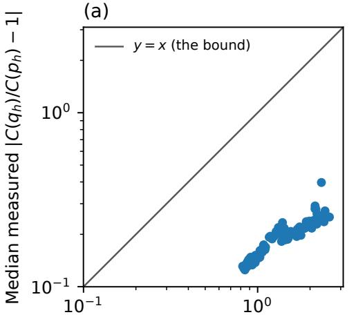  
Median provable bound (log scale)

(b)  
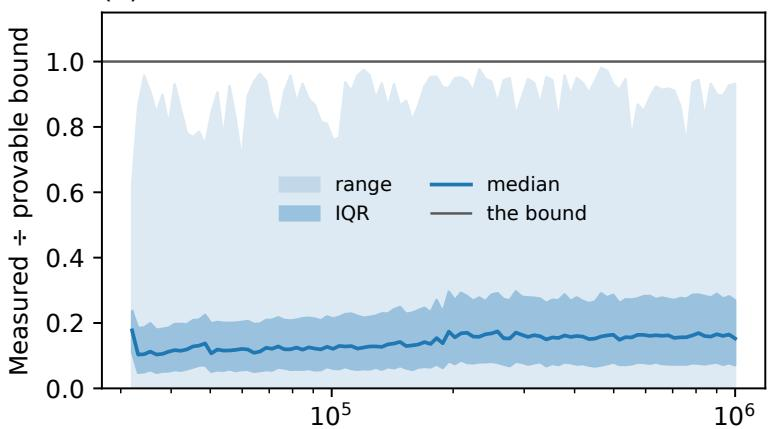  
Pre-training examples N (log scale)  
Figure 5: The $\ell _ { 2 }$ bound holds everywhere and is occasionally near-tight. Across 150,000 heldin contexts, the median measured-to-bound ratio is 0.140 and the maximum is 0.980. (a) Median measured error against median bound for each $N ;$ ; all points lie below $y = x .$ . (b) Median, interquartile band, and full range of the ratio across 1,500 contexts per $N .$

Complete per-question performance grids for all four models are available in the code repository accompanying this submission. These grids detail performance on every measurable item.

## H EXPERIMENTAL DETAILS

## H.1 SYNTHETIC LANGUAGES

How the data are generated. In setting (a), the ground-truth language is a time-homogeneous latentfactor k-gram process with exact closed-form conditionals, vocabulary $| V | = 1 0 2 4$ and Markov order $k = 1 6$ . The token $x _ { t }$ at position t in a sequence depends only on the trailing window $h _ { t } : = x _ { t - 1 6 : t - 1 }$ where $x _ { < t }$ denotes the sequence prefix before step t. Its next-token probabilities are given by the tempered softmax of a frozen random linear map ℓ of the positionally pooled context embeddings:

$$
p ( x _ { t } \mid x _ { < t } ) = p ( x _ { t } \mid h _ { t } ) : = \left[ { \mathrm { s o f t m a x } } ( \ell ( h _ { t } ) / ( \tau _ { \mathrm { g e n } } s ) ) \right] _ { x _ { t } } ,\tag{24}
$$

$$
\begin{array} { r } { \ell ( h ) : = \mathrm { p o o l } _ { w } ( E _ { h } ) W _ { 1 } ^ { \top } W _ { 2 } ^ { \top } W _ { \mathrm { o u t } } ^ { \top } + b , \qquad \mathrm { p o o l } _ { w } ( E _ { h } ) : = \sum _ { j = 1 } ^ { 1 6 } w _ { j } E _ { h _ { j } } , } \end{array}\tag{25}
$$

where $E \in \mathbb { R } ^ { 1 0 2 4 \times 1 2 8 } ~ \mathrm { i s }$ the token embedding table, $E _ { h }$ collects the context-token embeddings $E _ { h _ { j } } ,$ and $w \in \mathbb { R } ^ { 1 6 }$ contains positional weights $w _ { j }$ . The matrices $W _ { 1 } \in \mathbb { R } ^ { 2 5 6 \times 1 2 8 }$ and $W _ { 2 } \in \mathbb { R } ^ { 2 5 6 \times 2 5 6 }$ are successive linear maps, $W _ { \mathrm { o u t } } \in \mathbb { R } ^ { 1 0 2 4 \times 2 5 6 }$ maps to token logits, and b is the logit-bias vector. The generation temperature is $\tau _ { \mathrm { g e n } } = 0 . 6$ , and s is the standard deviation of logits on a reference sample of 16-grams, so temperature is invariant to the overall scale of the random weights. Every ingredient is drawn at random once from the master seed 42 and fixed, so the language is fully reproducible. There is no intermediate nonlinearity. Because ℓ is linear of rank at most 256, a small GPT can represent the generating distribution p exactly and any gap between model and truth would not be limited by model capacity. Sequences have length 64: the first $k = 1 6$ tokens are drawn uniformly at random, and each subsequent token is sampled by ancestral multinomial draws from $p ( \cdot \mid h )$ on the trailing 16-token window; the pre-training contexts are the 16-token windows at every prediction position $1 6 , \ldots , 6 3$ . The pre-training sample size N counts sampled sequences, each contributing 48 supervised next-token targets (the data seed is derived from 42 per N). Because the conditionals are closed-form, the exact target diversity $\begin{array} { r } { N _ { 2 } ( p _ { h } ) = 1 / \sum _ { a } p ( a \mid \mathbf { \dot { \psi } } h ) ^ { 2 } } \end{array}$ is known at every context; it is high and varied (median $^ { 1 7 7 , }$ range 7–398). $\mathbf { A } \mathbf { t } ~ k = 1 6$ exact contexts essentially never repeat, so the count-based/tabular prediction of Appendix I is structurally undefined here. Diffuse prior in setting (a). For each seed, we initialize the GPT using its default random initialization, without preliminary fitting. The starting distribution $^ { q _ { 0 , h } }$ is its softmax output at context h before pre-training on the synthetic language. It is generally nonuniform and varies with context and initialization seed.

What we measure. We report the ensemble normalized gap $G _ { h } = \mathbb { E } [ R ] - 1 = \mathbb { E } [ C _ { h } ( q _ { \hat { \theta } } ) ] / C _ { h } ( p ) - 1$ and its three $C ( p _ { h } )$ -normalized terms from Eq. (6). Isolating them requires independently pre-trained models at each N. We pre-train 100 seeds at each of 100 log-spaced sequence counts from 32k to 1M (10,000 GPTs; 6.135M parameters) and evaluate them on 2,000 common contexts. Each seed draws its own data, initialization, and minibatch stream, so the covariance captures their total across-run variation. The closed-form $p _ { h }$ permits direct estimation of $b _ { h }$ from the across-seed mean. All validation losses are below the uniform baseline log 1024 ≈ 6.93 nats. Setup. We fine-tune a 27.97M-parameter GPT $( d _ { \mathrm { m o d e l } } = 2 5 6 .$ , 4 heads, 3 layers, $K = 5 0 { , } 0 0 0 )$ on a heavy-tailed order-16 Zipf-plus-context language with exponent 1.07. Each length-17 sequence contributes one prediction target. Before SFT, we select the 32 most probable tokens in the target language’s fixed tokenfrequency distribution and rescale their probabilities to sum to one. We then pre-train each GPT for 400 steps on random contexts, using this same desired next-token distribution for every context. The analyzed artifacts contain 100 seeds at each of 100 sequence counts from 500 to 10<sup>6</sup>; every model then undergoes 4,000 SFT steps.

## H.2 SURVEYS

Datasets. We study three long-running probability surveys of human attitudes. The General Social Survey (GSS) is a nationally representative survey of adults in the United States, conducted since 1972; we use the 1972–2024 cumulative file (74,485 respondents with complete demographics). The World Values Survey (WVS) is a cross-national survey of social, political, religious, and economic values; we use wave 7 (fieldwork 2017–2023). For computational tractability we restrict the WVS to a random one-third of its countries and a random one-third of its measurable questions, both drawn with a fixed seed (42) and frozen before any distribution is computed; the resulting subset comprises 32,227 respondents with complete demographics across 22 countries spanning every inhabited continent (e.g. India, Pakistan, Kenya, Morocco, Serbia, South Korea, Canada, the Netherlands). The American National Election Studies (ANES) is a long-running U.S. political survey; we use the Time-Series Cumulative Data File (1948–2020; 69,784 respondents with complete demographics). From each survey we take every suitable categorical opinion item—substantive attitude/value/policy questions with a small fixed answer set, with value labels transcribed verbatim from each survey’s codebook (no guessed labels)—excluding identifiers, weights, dates, interviewer/geographic metadata, raw numerics, multi-select “mention” batteries, and behavioral/frequency/factual items. For the GSS, items are identified by their attitudinal value-label sets (favor/oppose, agree–disagree, spending toolittle/too-much, confidence, importance, likely, should, true/false). We then keep only the measurable items—those with at least one demographic group of $\geq 6 0$ respondents, the same threshold used for respondent-sample target estimation—leaving 376 items for the GSS, 159 for the WVS (of which the random-third restriction above retains 53), and 44 for the ANES; every retained item is evaluated. The seven curated items used in an earlier version of this experiment (capital punishment cappun, gun permits gunlaw, welfare spending natfare, happiness happy, financial satisfaction satfin, political views polviews, party identification partyid for the GSS, and the analogous WVS seven) are a strict subset of the GSS measurable set, which we exploit for the seven-vs-full comparison (GSS only: the WVS random-third restriction does not retain all seven curated WVS items).

Grouping, conditioning, and respondent-sample target. Respondents are partitioned into demographic groups X defined by a tuple of variables, brought to GSS parity across surveys:

• GSS: X = (decade, age bucket, sex, race, region, degree);

• WVS: X = (country, survey year, urban/rural, age bucket, sex, education);

• ANES: X = (decade, age bucket, sex, race, region, education),

Age was bucketed into groups {18–29, 30–44, 45–59, 60+} in the GSS and {16–29, 30–44, 45–59, 60+} in the WVS and ANES. ANES and WVS aggregate calendar years (to decade and fieldwork year, respectively) to avoid sparse groups. For each fixed question and group X, with Y denoting the answer, observed counts $m _ { a }$ among m respondents define the unweighted plug-in conditional $\hat { p } _ { a } = m _ { a } / m$ and plug-in collision $\begin{array} { r } { \hat { C } _ { \mathrm { p l u g } } = \sum _ { a } \hat { p } _ { a } ^ { 2 } } \end{array}$ . We report instead the distinct-pair U-statistic $\begin{array} { r } { \hat { C } _ { \mathrm { U } } = \sum _ { a } m _ { a } ( m _ { a } - 1 ) / [ m ( m - 1 ) ] = ( m \hat { C } _ { \mathrm { p l u g } } - 1 ) / ( m - 1 ) } \end{array}$ The target uses all eligible respondents, including fine-tuning and validation records. It represents this unweighted sample, not a held-out or survey-weighted estimate of the wider population. We compute each pair’s collision ratio $R _ { \mathrm { U } } = C ( q _ { \mathrm { o p t } } ) / \hat { C } _ { \mathrm { U } }$ before taking medians across pairs. Evaluation requires at least 60 respondents for a question–group pair. Table 3 gives the sample sizes.

Table 3: Experiment 2 datasets (measurable-only). Each survey is restricted to its measurable opinion questions (a question with $\geq 1$ group of $\geq 6 0$ respondents). “Groups” is the number of demographic tuples $\hat { X ; } \hat { }$ “eval groups” counts groups holding ≥ 60 respondents; “eval pairs” counts evaluated (question, X) pairs. “Examples” are pooled (respondent, question) pairs, split at the respondent level; the n-grid is anchored to each survey’s full pool N and halves down to the smallest $n \geq 8 ,$ , so each survey has its own grid.
<table><tr><td>Survey</td><td>Respondents</td><td>Countries</td><td>Groups</td><td>Eval groups (≥ 60)</td><td>Eval pairs</td><td>Questions</td></tr><tr><td>GSS</td><td>74,485</td><td>— (US)</td><td>2,512</td><td>345</td><td>18,270</td><td>376</td></tr><tr><td>WVS</td><td>32,227</td><td>22</td><td>956</td><td>293</td><td>8,015</td><td>53</td></tr><tr><td>ANES</td><td>69,784</td><td>— (US)</td><td>2,942</td><td>352</td><td>8,211</td><td>44</td></tr></table>

Examples (fine-tuning / validation), pooled (respondent, question) pairs: GSS 5,224,403 (4,706,940 / 517,463); WVS 1,620,333 (1,462,645 / 157,688); ANES 1,846,292 (1,662,788 / 183,504). Minimum eval threshold = 60 respondents per (question, X) pair. The n-grid is anchored per survey to the full fine-tuning pool N and halves down to the smallest n ≥ 8: GSS 20 points [4,706,940, . . . , 8]; WVS 18 points $[ 1 , \dot { 4 } 6 \dot { 2 } , 6 4 5 , \dots , 1 1 ]$ ; ANES 18 points [1,662,788, . . . , 12] (roughly six orders of magnitude on the GSS).

Prompt and measurement. The prompt presents the group as a first-person persona followed by the question and lettered options, then requests one option letter; Tables 4, 5, and 6 show the templates. At the generation position, we take the first token identifier of each letter’s tokenizer encoding, assert that the candidate identifiers are distinct, and apply a softmax only across their logits. The resulting $q _ { \mathrm { o p t } } ( Y \mid X )$ is exact conditional on the candidate set and has no sampling noise, but it is not the full next-token distribution. We fine-tune four models of at most 4B parameters—gemma-2-2b-it, Qwen3.5-2B, Qwen3.5-4B, and gemma-3-4b-it—with shared hyperparameters and modelspecific LoRA target scopes. A respondent-level split prevents leakage between the fine-tuning and validation splits, while the empirical target intentionally uses both splits. The pipeline saves an early-stopped adapter and the final adapter; callback state is not persisted across requeues, so the former is not guaranteed to be the global minimum-validation-loss checkpoint. The sample-size grid halves each survey’s fine-tuning pool N down to the smallest n ≥ 8 (GSS: 20 points, 4,706,940 to 8; WVS: 18, 1,462,645 to 11; ANES: 18, 1,662,788 to 12). For multimodal gemma-3-4b-it, LoRA and measurement use only the text decoder.

Table 4: GSS prompt format. The persona template (top) is instantiated from a group’s variables; the model then receives the question with its lettered (graded) options and must reply with one letter. Five curated items are shown with their graded options and an illustrative answer; the full measurable set of 376 items is evaluated.  
It is the {decade}. You are a {age} year-old {race} {sex} living in   
the {region} region of the United States. Your highest education   
credential is: {degree}.   
{question}   
Options: A) {option A} B) {option B} ...   
Respond with only the single letter of the option that best matches   
your view.   
Item (var) Graded answer options Ex.   
Death penalty for A) favor; B) oppose A   
murder (cappun)   
General happiness A) very happy; B) pretty happy; C) not too happy B   
(happy)   
Financial satisfac- A) pretty well satisfied; B) more or less satisfied; C) not satisfied B   
tion (satfin) at all   
Political views A) extremely liberal; B) liberal; C) slightly liberal; D) moderate; E) D   
(polviews) slightly conservative; F) conservative; G) extremely conservative   
Party identification A) strong democrat; B) not very strong democrat; C) independent, A   
(partyid) close to democrat; D) independent; E) independent, close to re  
publican; F) not very strong republican; G) strong republican; H)   
other party

Table 5: WVS prompt format. Same template as the GSS up to the persona variables (country / year / urban-rural / age / sex / education). Five curated items are shown with their graded options and an illustrative answer; a random third of the measurable items (53 of 159, seed 42) is evaluated.  
It is {year}. You live in {urban/rural area} of {country}. You are a   
{age} year-old {sex}. Your highest level of education is {education}.   
{question}   
Options: A) {option A} B) {option B} ...   
Respond with only the single letter of the option that best matches   
your view.   
Item (var) Graded answer options Ex.   
Interpersonal trust A) most people can be trusted; B) need to be very careful B   
(trust)   
Feeling of happiness A) very happy; B) rather happy; C) not very happy; D) not at all B   
(happy) happy   
Confidence in A) a great deal; B) quite a lot; C) not very much; D) none at all C   
government   
(conf govt)   
Justifiability A) 1 (never justifiable); B) 2; . . . ; I) 9; J) 10 (always justifiable) C   
of divorce   
(divorce just)   
Left–right self- A) 1 (left); B) 2; . . . ; I) 9; J) 10 (right) E   
placement   
(left right)

Table 6: ANES prompt format. Same template up to the persona variables (decade / age / sex / race / region / education). Five illustrative items are shown with their graded options and an answer; the full measurable set of 44 items is evaluated. Endpoint-anchored issue scales keep numbered interior points with labelled poles.
<table><tr><td>of education is {education}.</td><td>It is the {decade}s. You are a {age} year-old {sex} living in {region} of the United States. You identify as {race} and your highest level</td></tr><tr><td>{question} Options: A) {option A} B) {option B} ...</td><td></td></tr><tr><td>your view.</td><td>Respond with only the single letter of the option that best matches</td></tr><tr><td>Item (var)</td><td>Graded answer options Ex.</td></tr><tr><td>Party identification (VCF0301)</td><td>A) strong Democrat; B) weak Democrat; C) independent- D Democrat; D) independent; E) independent-Republican; F) weak</td></tr><tr><td>Liberal-conservative</td><td>A) extremely liberal; .. . ; D) moderate; . . . ; G) extremely con- D</td></tr><tr><td>(VCF0803) Government health in- insurance plan)</td><td>A) 1 (government insurance plan); B) 2; . . . ; F) 6; G) 7 (private D</td></tr><tr><td>surance (VCF0806) Interest in elections</td><td>A) not much interested; B) somewhat interested; C) very much B</td></tr><tr><td>(VCF0310) Presidential approval</td><td></td></tr><tr><td>(VCF0450)</td><td>A</td></tr></table>

Fine-tuning hyperparameters. All four models use LoRA adapters with shared hyperparameters and model-specific target scope. Fine-tuning and validation use the same shifted mean cross-entropy over the encoded answer-letter token(s) followed by EOS; prompt and padding positions are masked. Runs use bf16, gradient checkpointing, and base use cache disabled. Tables 7 and 8 give shared settings and per-model scope. The text models apply LoRA to seven attention and multilayer perceptron (MLP) projections in every decoder layer; gemma-3-4b-it applies the same projections only within its language model, leaving the vision tower fixed. The adapters modify 0.47%–0.79% of parameters (10.9–29.8 million).

Table 7: Experiment 2 shared fine-tuning hyperparameters.
<table><tr><td>Hyperparameter</td><td>Value</td></tr><tr><td>LoRA rank r</td><td>16</td></tr><tr><td>LoRA α</td><td>32</td></tr><tr><td>LoRA dropout</td><td>0.05</td></tr><tr><td>LoRA bias</td><td>none</td></tr><tr><td>Task type</td><td>causal language modeling</td></tr><tr><td>Base precision</td><td>bf16</td></tr><tr><td>Optimizer</td><td>AdamW (adamw_torch)</td></tr><tr><td>Learning rate</td><td>2 × 10−4</td></tr><tr><td>Learning-rate schedule</td><td>cosine decay</td></tr><tr><td>Warmup ratio</td><td>0.03</td></tr><tr><td>Weight decay</td><td>0</td></tr><tr><td>Max sequence length</td><td>256 tokens</td></tr><tr><td>Epochs</td><td>3 (no step cap)</td></tr><tr><td>Effective batch size</td><td>16</td></tr><tr><td>Loss</td><td>cross-entropy on answer-letter encoding and EOS (prompt masked)</td></tr><tr><td>Validation subset Evaluations per run</td><td>4,000 held-out pairs 12 (evenly spaced)</td></tr><tr><td></td><td>every 500 steps</td></tr><tr><td>Checkpointing</td><td></td></tr><tr><td>Seed</td><td>42</td></tr></table>

Table 8: Experiment 2 per-model LoRA configuration. The shared hyperparameters of Table 7 apply to all; the LoRA target scope differs. Target projections are q proj, k proj, v proj, o proj, gate proj, up proj, down proj; for gemma-3-4b-it these are matched only within the language model decoder (vision tower excluded). Trainable counts are from get peft model.
<table><tr><td>Model</td><td>LoRA targets</td><td>Trainable params</td><td>% of total</td></tr><tr><td>gemma-2-2b-it</td><td>7 proj., all decoder layers</td><td>20,766,720</td><td>0.79%</td></tr><tr><td>Qwen3.5-2B</td><td>7 proj., all decoder layers</td><td>10,911,744</td><td>0.49%</td></tr><tr><td>Qwen3.5-4B</td><td>7 proj., all decoder layers</td><td>21,233,664</td><td>0.47%</td></tr><tr><td> $\mathtt { g e m m a - } 3 \mathrm { - } 4 \mathrm { b - } \mathrm { i t }$ </td><td>7 proj., language_model only</td><td>29,802,496</td><td>0.69%</td></tr></table>

## H.3 CODENET

Dataset and estimand. Project CodeNet contains programming-contest problems, submitted programs, and metadata including language, user, timestamp, and judge status (Puri et al., 2021). We restrict the target to parseable, accepted Python submissions and compare implementation structure rather than lexical form or execution output. We measure expected similarity under the normalized Zhang–Shasha kernel in Equation (10), conditional on both programs parsing successfully. For each problem and distribution, we average the kernel over a deterministic seed-42 sample of up to 32 distinct unordered pairs, using every pair when fewer are available.

The metadata contain 13,916,868 submissions, including 3,286,314 labeled Python and 1,796,563 both Python and accepted, across 3,113 problems. We impose no restriction on users, source length, or revisions per user; multiple accepted revisions remain separate observations. A submission enters the usable target only if its description and source are available and its Python AST parses successfully.

We split solutions deterministically 90–10 at the submission level. A problem may appear in both partitions, but a submission identifier cannot. The 90% partition supplies SFT data and the 10% partition validation loss; the structural target draws up to 32 parseable accepted solutions from both. Problems with one usable solution remain available for SFT, while target collision requires at least two. Fine-tuning configuration. We use google/gemma-2-2b-it, Qwen/Qwen3.5-2B, Qwen/Qwen3.5-4B, and google/gemma-3-4b-it. For fine-tuning-pool size N, the grid successively halves nested prefixes of a deterministic submission order down to $n \geq 8 .$ . Each model runs for three epochs with the survey experiment’s LoRA rank, scaling, dropout, learning rate, cosine schedule, 4,000-row validation subset, 12 scheduled validation evaluations, and effective batch size 16. Fine-tuning and validation use shifted mean cross-entropy over code plus the tokenizer’s assistant terminator, with the prompt masked. We report the final adapter after three epochs; validation loss monitors fine-tuning but does not select the reported checkpoint, and loss magnitudes are not compared across tokenizers.

Decoding and parse conditioning. For each problem and checkpoint, we draw 32 samples with temperature 1.0, top-p = 1.0, and at most 1,024 new tokens. The generation call does not set top-k or enable thinking, so loaded model and chat-template defaults supply them; model revisions and the effective generation configuration were not logged. The loaded Qwen templates are asymmetric: Qwen3.5-2B defaults to non-thinking output, whereas Qwen3.5-4B defaults to thinking output. Decoding is therefore not matched across models. Seeds derive deterministically from seed 42, problem identifier, fine-tuning size, and checkpoint. Outputs that fail AST parsing are recorded but excluded from collision; a ratio is finite only when at least two outputs parse. Thus cross-model diversity and parseability comparisons are confounded by decoding defaults, and all Zhang–Shasha diversity results are conditional on parsing.

Comparison on the same problems. For each model, we retain problems with at least two parseable outputs both before fine-tuning and after fine-tuning on the full dataset. In Figure 4 panel order, these sets contain 2,646, 2,569, 986, and 2,646 problems. Their median collision ratios change from 1.035 to 0.971, 0.740 to 0.915, 0.844 to 1.003, and 1.637 to 0.974, respectively. Every model’s median therefore moves closer to 1 when evaluated on the same problems at both stages. Both estimates remain conditional on parsing.

Code-generation prompt. The problem description is inserted after the following instruction in one user turn; each model’s chat template supplies its own control tokens.

You are an expert competitive programmer. Return only a   
complete Python 3 program that solves the problem. Do not   
use Markdown fences or explanations.   
{problem description}

Two accepted-solution examples. The following pairs illustrate the primary metric using accepted Python submissions. Similarities are recomputed with exactly the normalized Zhang–Shasha kernel in Equation (10). Each table has four cells in the requested order: source code A, canonical AST A, source code B, and canonical AST B. The AST cells are complete automatic exports from the metric representation. They contain every retained node and every ordered, field-typed child edge; nothing is manually pruned. Source locations and Load/Store context nodes are absent because the metric itself excludes them.

High structural similarity: divisor rule (p03125). The problem gives positive integers A and B. If A divides B, the program prints A + B; otherwise, it prints B − A. Both accepted submissions use the same conditional implementation. Their normalized Zhang–Shasha similarity is 0.970588 (edit distance 2 across two 34-node trees).

T<sub>a</sub>bl<sub>e</sub> 9 <sub>:</sub> Hi<sub>g</sub>h<sub>-s</sub>imil<sub>a</sub>rit<sub>y accep</sub>t<sub>e</sub>d <sub>pa</sub>ir f<sub>o</sub>r <sub>p</sub>r<sub>o</sub>bl<sub>e</sub>m <sub>p</sub> 0 3 1 2 5 <sub>.</sub> Th<sub>e</sub> f<sub>our ce</sub>ll<sub>s con</sub>t<sub>a</sub>i<sub>n</sub> th<sub>e comp</sub>l<sub>e</sub>t<sub>e source an</sub>d <sub>comp</sub>l<sub>e</sub>t<sub>e au</sub>t<sub>oma</sub>ti<sub>ca</sub>ll<sub>y expor</sub>t<sub>e</sub>d <sub>canon</sub>i<sub>ca</sub>l AST f<sub>or</sub> <sub>su</sub>b<sub>m</sub>i<sub>ss</sub>i<sub>ons s</sub> 6 1 3 1 7 6 2 7 3 <sub>an</sub>d <sub>s</sub> 0 5 3 3 6 4 6 3 4 <sub>.</sub> N<sub>o</sub>d<sub>e</sub> <sub>c</sub>l<sub>asses</sub> i<sub>n</sub> th<sub>e</sub> AST <sub>are</sub> hi<sub>g</sub>hli<sub>g</sub>ht<sub>e</sub>d i<sub>n</sub> <sub>purp</sub>l<sub>e ;</sub> P<sub>y</sub>th<sub>on</sub> k<sub>eywor</sub>d<sub>s ,</sub> <sub>commen</sub>t<sub>s ,</sub> <sub>an</sub>d <sub>s</sub>t<sub>r</sub>i<sub>ngs</sub> <sub>use</sub> di<sub>s</sub>ti<sub>nc</sub>t <sub>syn</sub>t<sub>ax</sub> <sub>co</sub>l<sub>ors .</sub>  
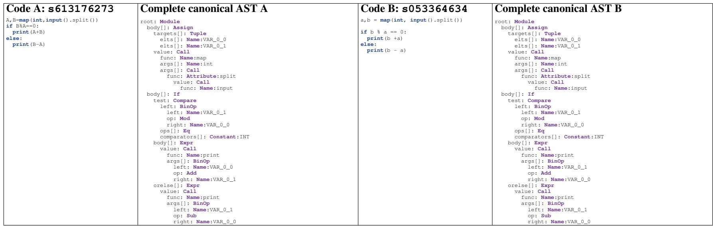

T<sub>a</sub>bl<sub>e</sub> 1 0<sub>:</sub> L<sub>ow-s</sub>imil<sub>a</sub>rit<sub>y accep</sub>t<sub>e</sub>d <sub>pa</sub>ir f<sub>o</sub>r <sub>p</sub>r<sub>o</sub>bl<sub>e</sub>m <sub>p</sub> 0 3 1 3 5 <sub>.</sub> Th<sub>e pro</sub>bl<sub>em as</sub>k<sub>s</sub> h<sub>ow muc</sub>h ti<sub>me passes</sub> i<sub>n</sub> W<sub>or</sub>ld A <sub>w</sub>h<sub>en a s</sub>t<sub>u</sub>d<sub>en</sub>t <sub>s</sub>t<sub>u</sub>di<sub>es</sub> f<sub>or</sub> T h<sub>ours</sub> i<sub>n</sub> W<sub>or</sub>ld B where time passes X times as fast<sub>.</sub> B oth accepted submissions compute T/X <sub>.</sub> Solution A converts a split input list in a loop and formats the result; solution B uses nested <sub>g</sub>enerator loo<sub>p</sub>s<sub>,</sub> hel<sub>p</sub>er functions<sub>,</sub> and t<sub>yp</sub>e annotations <sub>.</sub> Their normalized Zhan<sub>g</sub>–Shasha similarit<sub>y</sub> is 0 <sub>.</sub> 407407 (edit distance 64 across trees with 44 and 64 nodes) <sub>.</sub> The four cells contain the source (comments removed) and the com<sub>p</sub>lete automaticall<sub>y</sub> ex<sub>p</sub>orted canonical AST for submissions s 2 2 7 7 3 7 5 6 4 and <sub>s</sub> 0 8 9 1 7 4 1 3 4 <sub>;</sub> th<sub>e</sub> AST diff<sub>erence</sub> i<sub>s</sub> <sub>no</sub>t <sub>a</sub> <sub>manua</sub>ll<sub>y</sub> <sub>prepare</sub>d <sub>summary.</sub>

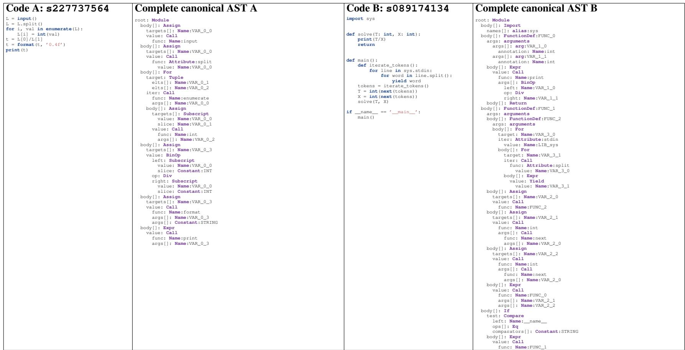

## I TABULAR INTUITION FOR FINITE-SAMPLE COLLISION

The classical per-context histogram provides a deliberately restricted comparison to the neural decomposition in Section 3.1. Fix a context h with $n _ { h }$ independent and identically distributed (i.i.d.) samples from $p _ { h }$ and empirical maximum-likelihood estimate (MLE) $\hat { p } _ { h } ( a ) = n _ { h , a } / n _ { h }$ Then $\mathbb { E } [ \hat { p } _ { h } ( \bar { a } ) ] = p _ { h } ( \bar { a } )$ : finite samples favor no token in expectation, although any realized dataset overweights some tokens.

Proof. Since n<sub>h,a</sub> ∼ Binomial(n<sub>h</sub>, p<sub>h</sub>(a)), E[ˆp<sub>h</sub>(a)] = E[n<sub>h,a</sub>]/n<sub>h</sub> = p<sub>h</sub>(a).

Conditioning on one realized histogram makes its sampling fluctuations shared across all subsequent generations.

Simple example. For $p = ( 1 / 3 , 1 / 3 , 1 / 3 )$ and $n = 6 ,$ , realized counts might be (4, 1, 1) or (1, 4, 1). The favored token changes across datasets, but both histograms have higher collision than $p .$

## I.1 EXPECTED COLLISION INFLATION

For arbitrary $\begin{array} { r } { p _ { h } , \mathbb { E } [ \hat { p } _ { h } ( a ) ^ { 2 } ] = p _ { h } ( a ) ^ { 2 } + \frac { p _ { h } ( a ) ( 1 - p _ { h } ( a ) ) } { n _ { h } } } \end{array}$ . Summing over $a ,$

$$
\mathbb { E } [ C ( \hat { p } _ { h } ) ] = C ( p _ { h } ) + \frac { 1 - C ( p _ { h } ) } { n _ { h } } ,\tag{26}
$$

so the local expected collision ratio is

$$
\frac { \mathbb { E } [ C ( \hat { p } _ { h } ) ] } { C ( p _ { h } ) } = 1 + \frac { 1 - C ( p _ { h } ) } { n _ { h } C ( p _ { h } ) } = 1 + \frac { N _ { 2 } ( p _ { h } ) - 1 } { n _ { h } } .\tag{27}
$$

This exact identity is the local scaling law for the tabular MLE:

$$
\mathrm { l o c a l \ e x p e c t e d \ c o l l i s i o n \ r a t i o } = 1 + \frac { \mathrm { t a r g e t \ e f f e c t i v e \ d i v e r s i t y ~ } N _ { 2 } ( p _ { h } ) - 1 } { \mathrm { s a m p l e \ c o u n t } n _ { h } } .\tag{28}
$$

The expected collision ratio is also exactly $\mathbb { E } [ N _ { 2 } ( p _ { h } ) / N _ { 2 } ( \hat { p } _ { h } ) ]$ , because $N _ { 2 } ( p _ { h } ) / N _ { 2 } ( \hat { p } _ { h } ) =$ $C ( \hat { p } _ { h } ) / \bar { C } ( p _ { h } )$ for every dataset. It generally differs from $\dot { N } _ { 2 } ( p _ { h } ) / \dot { \mathbb { E } } [ N _ { 2 } ( \hat { p } _ { h } ) ]$

Derivation. Fix the context $h$ and abbreviate $p ( a ) \ = \ p _ { h } ( a ) , \ n \ = \ n _ { h }$ . The observed counts $( n _ { h , a } ) _ { c }$ are Multinomial $( n , p _ { h } )$ ; in particular each $n _ { h , a } \sim \mathrm { B i n o m i a l } ( n , p ( a ) )$ , so the empirical MLE $\hat { p } _ { h } ( a ) = n _ { h , a } / n$ has

$$
\mathbb { E } [ \hat { p } _ { h } ( a ) ] = p ( a ) , \qquad \mathrm { V a r } ( \hat { p } _ { h } ( a ) ) = \frac { p ( a ) \bigl ( 1 - p ( a ) \bigl ) } { n } .\tag{29}
$$

By the variance–mean-square identity $\mathbb { E } [ X ^ { 2 } ] = \operatorname { V a r } ( X ) + ( \mathbb { E } X ) ^ { 2 }$

$$
\mathbb { E } [ \hat { p } _ { h } ( a ) ^ { 2 } ] = \frac { p ( a ) \big ( 1 - p ( a ) \big ) } { n } + p ( a ) ^ { 2 } .\tag{30}
$$

Summing over a and using linearity of expectation (which needs no independence across tokens, so the within-multinomial correlations are irrelevant),

$$
\mathbb { E } [ C ( \hat { p } _ { h } ) ] = \sum _ { a } \mathbb { E } [ \hat { p } _ { h } ( a ) ^ { 2 } ] = \sum _ { a } p ( a ) ^ { 2 } + \frac { 1 } { n } \sum _ { a } p ( a ) \big ( 1 - p ( a ) \big ) = C ( p _ { h } ) + \frac { 1 - C ( p _ { h } ) } { n } ,\tag{31}
$$

where the last equality uses $\begin{array} { r } { \sum _ { a } p ( a ) = 1 } \end{array}$ , hence $\begin{array} { r } { \sum _ { a } p ( a ) ( 1 - p ( a ) ) = 1 - \sum _ { a } p ( a ) ^ { 2 } = 1 - C ( p _ { h } ) } \end{array}$ Dividing by $C ( p _ { h } )$ and substituting $N _ { 2 } ( p _ { h } ) = 1 \overline { { / } } \tilde { C } ( p _ { h } )$

$$
\frac { \mathbb { E } [ C ( \hat { p } _ { h } ) ] } { C ( p _ { h } ) } = 1 + \frac { 1 - C ( p _ { h } ) } { n C ( p _ { h } ) } = 1 + \frac { N _ { 2 } ( p _ { h } ) - 1 } { n } ,\tag{32}
$$

because $( 1 - C ( p _ { h } ) ) / C ( p _ { h } ) = N _ { 2 } ( p _ { h } ) - 1$ . Restoring $n = n _ { h }$ gives the stated law.

The critical factor is not the overall size of the SFT dataset, but rather the local effective sample size, $n _ { h }$ , representing the number of fine-tuning examples that contribute meaningfully to context h.

Example 1 (Why any finite sample inflates collision (Jensen)). Collision $\begin{array} { r } { C ( r ) = \sum _ { a } r ( a ) ^ { 2 } } \end{array}$ is convex. Since $\mathbb { E } [ \hat { p } _ { h } ] = p _ { h } .$ , Jensen’s inequality gives $\mathbb { E } [ C ( \hat { p } _ { h } ) ] \ge C ( p _ { h } )$ . The excess $( 1 - \bar { C } ( p _ { h } ) ) / n _ { h }$ is the summed multinomial variance and vanishes as $n _ { h }  \infty$

Homogeneous-tree illustration. If every context has a uniform $K = 1 0 0$ continuation distribution, each context has $n _ { h } = 1 0 0 0$ independent observations, and continuation collision is identical across sibling branches, the local factor is $1 + 9 9 / 1 0 0 0 = 1 . 0 9 9$ . Under these restrictive assumptions, 50 decisions yield the product $1 . 0 9 9 ^ { 5 0 } \approx 1 1 2 .$ . This is an illustration, not a neural or generic sequence law.

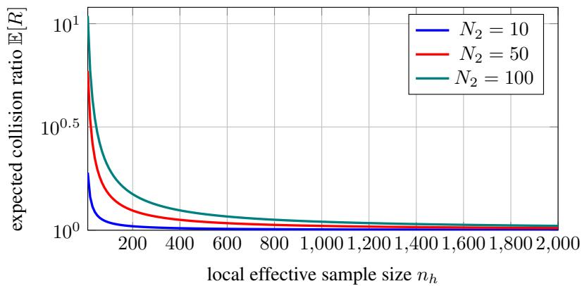  
Figure 6: Tabular collision inflation decays with local coverage. The exact expected collision ratio $1 \bar { + } ( N _ { 2 } - 1 ) / n _ { h }$ for $N _ { 2 } = 1 0 , 5 0$ , 100.

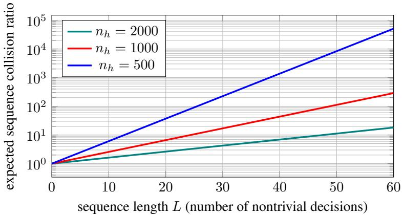  
Figure 7: Homogeneous-tree illustration. With independent tabular estimates, $N _ { 2 } = 1 0 0$ , and identical continuation collision at every branch, the per-step factor compounds multiplicatively. The generic recursion need not factor this way.

Remark 1 (This is tabular, not neural). The identity above is exact for a per-context empirical MLE. A transformer shares parameters across contexts, so its conditional need not have multinomial variance and no effective-count substitution restores this formula in general. The neural experiments therefore use Eq. (6) and Theorem 1 instead.

## I.2 AMPLIFICATION OVER SEQUENCES

For variable-length autoregressive models, sequence collision is not a simple product of probabilities over fixed positions, due to the dependence of contexts on sampled prefixes. Analysis of these models

therefore requires a branching recursive framework.

$$
C _ { p } ( h ) = \sum _ { a } p ( a \mid h ) ^ { 2 } C _ { p } ( h a ) ,\tag{33}
$$

Each summand is the probability that two draws both choose branch a and then collide from $h a$ Thus the collision-biased next-token weight is proportional to $p ( a \mid h ) ^ { 2 } C _ { p } ( h a )$ , not to $p ( a \mid h ) ^ { 2 }$ alone; the recursion is generally a sum of branch products rather than a product of aggregate one-step and continuation collisions.

Let D denote the random tabular dataset and let $R _ { p } ( y \mid x ) = p ( y \mid x ) ^ { 2 } / C _ { p } ( x )$ be the exact-match collision-biased path distribution. For small local terms and approximately independent per-context estimates, a first-order expansion motivates the homogeneous-tree heuristic

$$
\log \frac { \mathbb { E } _ { D } [ C _ { \hat { p } } ( x ) ] } { C _ { p } ( x ) } \approx \mathbb { E } _ { Y \sim R _ { p } ( \cdot \vert x ) } \left[ \sum _ { t = 1 } ^ { T ( Y ) + 1 } \frac { N _ { 2 } ( p _ { h _ { t } } ) - 1 } { n _ { h _ { t } } } \right] ,\tag{34}
$$

This approximation additionally treats $R _ { p }$ as fixed and requires $C _ { p } ( h a )$ to be approximately constant across sibling branches. Without those conditions, the $R _ { p }$ -average of local factors is not the expected sequence collision ratio.

## I.3 ENTROPY ANALOGUE

For a fixed finite support of size $S ,$ the classical plug-in bias is $\mathbb { E } [ H ( \hat { p } _ { h } ) ] = H ( p _ { h } ) - ( S - 1 ) / ( 2 n _ { h } ) +$ $o ( n _ { h } ^ { - 1 } )$ under its regularity conditions (Paninski, 2003; Jiao et al., 2015). Replacing S by exp $H ( p _ { h } )$ or summing this local approximation along generated paths is heuristic; neither substitution is used in the empirical claims.

## J LIMITS OF TEMPERATURE SCALING

Temperature can change a model’s collision value without generally calibrating its distribution. To make the global sequence transformation well-defined for every $\begin{array} { r } { \dot { T } > 0 , } \end{array}$ , fix a distribution $q ( \cdot \mid x )$ with finite support and write $\beta = 1 / T , q _ { T } ( y \mid x ) = q ( y \mid x ) ^ { \beta } / \dot { Z _ { \beta } } ( x )$ , and $\begin{array} { r } { Z _ { \beta } ( x ) = \sum _ { y } q ( y \mid x ) ^ { \beta } } \end{array}$

Proposition 2 (Global temperature monotonically increases order-2 diversity).

$$
C _ { T } ( x ) = \sum _ { y } q _ { T } ( y \mid x ) ^ { 2 } = \frac { Z _ { 2 \beta } ( x ) } { Z _ { \beta } ( x ) ^ { 2 } } = \frac { Z _ { 2 / T } ( x ) } { Z _ { 1 / T } ( x ) ^ { 2 } } .\tag{35}
$$

Moreover, $C _ { T } ( x )$ is nonincreasing and $N _ { 2 } ^ { T } ( x ) = 1 / C _ { T } ( x )$ is nondecreasing in $T .$

Proof. With $q _ { T } ( y ) = q ( y ) ^ { \beta } / Z _ { \beta }$ and $\begin{array} { r } { Z _ { \beta } = \sum _ { y } q ( y ) ^ { \beta } , C _ { T } = \sum _ { y } q _ { T } ( y ) ^ { 2 } = \sum _ { y } q ( y ) ^ { 2 \beta } / Z _ { \beta } ^ { 2 } = } \end{array}$ $Z _ { 2 \beta } / Z _ { \beta } ^ { 2 }$ . For monotonicity in T, let $\psi ( \beta ) = \log Z _ { \beta }$ . Then $\psi ^ { \prime } ( \beta ) = \mathbb { E } _ { q _ { \beta } } [ \log q ]$ where $q _ { \beta } \propto q ^ { \beta }$ , and $\psi ^ { \prime \prime } ( \beta ) = \mathrm { V a r } _ { q _ { \beta } } ( \log q ) \geq 0$ , so $\psi ^ { \prime }$ is nondecreasing. Since log $\begin{array} { r } { C _ { T } = \psi ( 2 \beta ) - 2 \psi ( \beta ) , \frac { d } { d \beta } } \end{array}$ log ${ \cal { C } } _ { T } =$ $2 \left\lceil \psi ^ { \prime } ( 2 \beta ) - \psi ^ { \prime } ( \beta ) \right\rceil \geq 0$ for $\beta > 0$ . Thus $C _ { T }$ is nondecreasing in $\beta = 1 / T$ , i.e. nonincreasing in $T ,$ with equality only in the degenerate cases where log q is $q _ { \beta } \mathrm { - a . s }$ . constant (uniform or point mass); equivalently the order-2 diversity $N _ { 2 } ^ { T } ( x ) = 1 / C _ { T } ( x )$ is nondecreasing in $T$ □

The reachable values depend only on the fixed probability profile of $q .$

## J.1 THE TEMPERATURE-REACHABLE DIVERSITY INTERVAL

Raising global sequence temperature increases diversity, but only within a fixed interval determined by the model distribution. For a given prompt $x ,$ let $S ( x )$ denote the number of sequences with non-zero probability under $q \mathrm { g i v e n } x ( S \bar { ( } x ) : = | \mathrm { s u p p } q ( \cdot \bar { | } x ) | )$ , and let $g _ { \star } ( x )$ denote the number of modes of q given $x ( g _ { \star } ( x ) : = | \operatorname { a r g m a x } _ { y } q ( y \mid x ) | )$

Lemma 1 (Temperature-reachable diversity interval). For a fixed model distribution $q ( \cdot \mid x )$ with finite support, $\dot { N _ { 2 } ^ { T } } ( x ) = Z _ { \beta } ( x ) ^ { 2 } / Z _ { 2 \beta } ( x )$ is continuous and nondecreasing in T, with limits

$$
\operatorname * { l i m } _ { T  0 ^ { + } } N _ { 2 } ^ { T } ( x ) = g _ { \star } ( x ) , \qquad \operatorname * { l i m } _ { T  \infty } N _ { 2 } ^ { T } ( x ) = S ( x ) .\tag{36}
$$

Hence as $T$ ranges over $( 0 , \infty ) , N _ { 2 } ^ { T } ( x )$ takes every value in the open interval $( g _ { \star } ( x ) , S ( x ) ) ;$ ; the endpoints $g _ { \star } ( x )$ and $S ( x )$ are the limits as $T  0 ^ { + }$ and $T \to \infty$ and are not attained at anyfinite $T$ except in degenerate cases (q already a point mass, resp. already uniform on its support). Its closure is $[ g _ { \star } ( x ) , S ( x ) ]$ (generically $[ 1 , S ( x ) ] )$ . One degenerate case also affects the lower endpoint: if $q ( \cdot \mid x )$ is uniform on its entire support, then every token is a maximizer, so $g _ { \star } ( x ) = S ( x )$ and $\bar { N } _ { 2 } ^ { T } ( x ) \dot { = } S ( \dot { x } )$ at every finite T; the reachable interval then collapses to the single point $ { \left\{ \boldsymbol { S } \right\} (  { \boldsymbol { { x } } } ) }$ The “point mass / uniform limit” description above is thus the generic non-degenerate picture, but is incompletefor this collapsed (uniform-q) case.

Proof. Monotonicity is the previous result $( C _ { T }$ nonincreasing in $T ,$ so $N _ { 2 } ^ { T } = 1 / C _ { T }$ nondecreasing). For $T \to 0 ^ { + } ( \beta \to { \mathrm { \infty } } ) $ : writing $q _ { \operatorname* { m a x } } = \operatorname* { m a x } _ { y } q ( y )$ and $g _ { \star }$ for the number of maximizers, $Z _ { \beta } =$ $g _ { \star } q _ { \operatorname* { m a x } } ^ { \beta } ( 1 + o ( 1 ) )$ ) and $Z _ { 2 \beta } = g _ { \star } q _ { \mathrm { m a x } } ^ { 2 \beta } ( 1 + o ( 1 ) )$ , so $N _ { 2 } ^ { T } = Z _ { \beta } ^ { 2 } / Z _ { 2 \beta }  g _ { \star } ^ { 2 } q _ { \mathrm { m a x } } ^ { 2 \beta } / ( g _ { \star } q _ { \mathrm { m a x } } ^ { 2 \beta } ) = g _ { \star }$ . For $T \to \infty ( \beta \to 0 ) \colon q ( y ) ^ { \beta } \to \mathbf { 1 } \{ q ( y ) > 0 \}$ , so $Z _ { \beta }  S$ and $Z _ { 2 \beta } \to S$ , giving $N _ { 2 } ^ { T }  S ^ { 2 } / S = S$ Continuity in T and the intermediate value theorem give every value in the open interval; the endpoints are limits, attained only in the stated degenerate cases. □

When $S ( x ) > g _ { \star } ( x )$ , the fraction of this interval reached at $T$ is

$$
\rho _ { T } ( x ) : = \frac { N _ { 2 } ^ { T } ( x ) - g _ { \star } ( x ) } { S ( x ) - g _ { \star } ( x ) } \in [ 0 , 1 ] ,\tag{37}
$$

which is a normalized diversity location, not a temperature parameter. It is undefined when the interval collapses.

Theorem 2 (Temperature only redistributes existing support). Assume a finite candidate space $( e . g .$ a finite vocabulary together with a maximum sequence length), so that $\bar { S ( x ) } = | \mathrm { s u p p } q ( \cdot | \mathbf { \bar { \theta } } { x } ) | < \infty$ For every temperature $T > 0$ the temperature-scaled model $q _ { T }$ has the same support as $q ,$ and its diversity is bounded by that support size:

$$
N _ { 2 } ^ { T } ( x ) \leq S ( x ) , \qquad \operatorname* { s u p } _ { T > 0 } N _ { 2 } ^ { T } ( x ) = S ( x ) ,\tag{38}
$$

the supremum corresponding to the uniform distribution on $\operatorname { s u p p } q ( \cdot \mid x )$ and approached only as $T \to \infty$ (not attained at any finite $T$ unless q is already uniform on its support). Consequently, relative to the true conditional $p ( \cdot \mid x )$

(i) i ${ } ^ { f } N _ { 2 } \left( p ( \cdot \mid x ) \right) > S ( x )$ , no temperature reaches the true diversity—the model’s support is simply too small;

(ii) if $N _ { 2 } ( p ( \cdot \mid x ) )$ lies in the open interval $( g _ { \star } ( x ) , S ( x ) )$ , somefinite temperature attains the true diversity value by the intermediate value theorem; the boundary values $g _ { \star } ( x )$ and $S ( x )$ are only approached as $T  0 ^ { + }$ and $T \to \infty$ and are not attained at anyfinite $T$ except in the degenerate cases ofthe interval Lemma; but

(iii) attaining that value does not reproduce p: $q _ { T } = p$ holds only $i f p ( \cdot \mid x ) \propto q ( \cdot \mid x ) ^ { \beta }$ for some $\beta > 0$

Proof. Temperature scaling preserves support: $q _ { T } ( y ) > 0 \iff q ( y ) > 0$ for every finite $T > 0$ so $q _ { T }$ is supported on a set of size $S ( x )$ . For any distribution r over S outcomes, Cauchy–Schwarz gives $\begin{array} { r } { 1 \ = \ \big ( \sum _ { a } r ( a ) \big ) ^ { 2 } \ \leq \ S \sum _ { a } r ( a ) ^ { 2 } } \end{array}$ , i.e. $\begin{array} { r } { N _ { 2 } ( r ) = 1 / \sum _ { a } r ( a ) ^ { 2 } \le S } \end{array}$ , with equality iff $r$ is uniform on its support. Applying this to $r = q _ { T }$ yields $N _ { 2 } ^ { T } ( x ) \leq S ( x )$ ; the bound is approached as $q _ { T }  \mathrm { U n i f } ( \operatorname { s u p p } q )$ when $T \to \infty$ and is not attained at finite $\dot { T }$ unless q is already uniform on its support. This gives the displayed bounds and case (i): if $N _ { 2 } ( p ) > S ( \bar { x } )$ , no $q _ { T }$ can reach it. For case $( \mathrm { i i } ) , N _ { 2 } ^ { T } ( \bar { x } )$ is continuous in $T$ and takes every value in the open interval $( g _ { \star } ( x ) , S ( x ) )$ (Lemma), so whenever $N _ { 2 } ( p )$ lies in this open interval the intermediate value theorem supplies a finite T with $N _ { 2 } ^ { T } ( x ) = N _ { 2 } ( \stackrel { . . } { p } )$ ; the endpoints are limits, not attained at finite $T$ outside the degenerate cases. For case (iii), $\{ q _ { T } : T > 0 \}$ is the one-parameter family log $q _ { T } ( y ) = \beta \log q ( y ) - \log Z _ { \beta } ;$ matching p exactly requires $\log p ( y ) = \beta \log q ( y ) - \log Z _ { \beta }$ for all y, i.e. p ∝ $q ^ { \beta }$ □

Interpretation. Temperature preserves support and moves the global sequence distribution from the uniform distribution over its maximizers as $\bar { T } \to 0 ^ { + }$ toward the uniform distribution over its support as $T \to \infty$ . It can therefore match a target collision value while missing the target distribution, and the high-temperature limit recovers the target only when the target itself is uniform on the model’s support.

Lemma 2 (Temperature scaling is an order-preserving one-parameter family). Fix a prompt x and write $q _ { T } ( \cdot \mid x ) \propto q ( \cdot \mid x ) ^ { 1 / T }$

(i) Log-odds identity. For every $T > 0$ and any outcomes $a , b$ with $q ( b \mid x ) > 0$

$$
\log { \frac { q _ { T } ( a \mid x ) } { q _ { T } ( b \mid x ) } } = { \frac { 1 } { T } } \log { \frac { q ( a \mid x ) } { q ( b \mid x ) } } .\tag{39}
$$

(ii) Order preservation. Hence temperature scaling is an order-preserving reweighting: the rank ordering of $\{ q _ { T } ( y \mid x ) \} _ { y }$ is the samefor all $T > 0$ . The reachable set is a one-parameter curve from the uniform distribution over arg ma $\mathfrak { c } _ { y } q ( y \mid x )$ as $T  0 ^ { + }$ to the uniform distribution over supp $q ( \cdot \mid x )$ as $T \to \infty$

(iii) Unreachability. Consequently $q _ { T } = p ( \cdot \mid x )$ for some $T > 0$ only $i f p ( \cdot \mid x ) \propto q ( \cdot \mid x ) ^ { \beta } ,$ , i.e. log p is an affine function of log q. In particular, if the rank ordering of p(· | x) differs from that $o f q ( \cdot \mid x )$ , no temperature matches $p .$

Proof. For $\mathrm { ( i ) } , q _ { T } ( y ) = q ( y ) ^ { 1 / T } / Z _ { 1 / T }$ , so the normalizer cancels in the ratio and $q _ { T } ( a ) / q _ { T } ( b ) =$ $( q ( a ) / q ( b ) ) ^ { 1 / T }$ ; take logarithms. For (ii), $u \mapsto u ^ { 1 / T }$ is strictly increasing on $( 0 , \infty )$ , so $q _ { T } ( a ) \geq$ $q _ { T } ( b ) \ \mathrm { e x a c t l y }$ when $q ( a ) \geq q ( b )$ ; this common ordering holds for all $T ,$ with the two endpoints given by the interval Lemma above. For (iii), a fixed ordering rules out any $q _ { T }$ with a different one, while $q _ { T } = p$ forces p ∝ $q ^ { 1 / T }$ □

Temperature rescales every log-odds ratio by the same factor. It can flatten or sharpen relativeprobability errors, but it cannot reorder outcomes or independently correct them. Figure 8 gives a six-outcome example.

## J.2 EFFECTIVE SUPPORT

The finite-support Theorem 2 requires a finite candidate space to ensure $S ( x ) < \infty$ . While standard softmax assigns strictly positive probability to all tokens and, subject to a length constraint, to most sequences, the Theorem’s condition of finite support may be violated without a maximum length, rendering the claim about temperature’s inability to recover missing support inapplicable. A more broadly applicable statement is probabilistic: rare, valid continuations are not entirely absent from q , but are effectively absent when sampling from a feasible number of samples.

Proposition 3 (Effective absence of valid missing mass under sampling). Fix a prompt x and consider a sequence of fitted models $q _ { n }$ indexed by dataset size n, with temperature-scaled tail mass $\varepsilon _ { n , T } ( x ) = q _ { n , T } ( U ( x ) \mid x )$ on a set $U ( x )$ ofvalid but unobserved or severely underweighted continuations. Drawing $M _ { n }$ independent generationsfrom $q _ { n , T } ( \cdot \mid x )$

Pr at least one of the $M _ { n }$ samples lands in $\begin{array} { r } { U ( x ) \big ) = 1 - \big ( 1 - \varepsilon _ { n , T } ( x ) \big ) ^ { M _ { n } } \leq M _ { n } \varepsilon _ { n , T } ( x ) } \end{array}$ . (40)

Hence $i f \varepsilon _ { n , T } ( x )  0$ and $M _ { n } \varepsilon _ { n , T } ( x ) \to 0$ along a sequence of fitted models, these continuations are effectively absentfrom the generated samples. This is an assumed asymptotic regime over models, not a consequence ofchanging T atfixed $q _ { n }$

Proof. The $M _ { n }$ generations are i.i.d. draws from $q _ { n , T } ( \cdot \mid x )$ , so the probability that none lands in $U ( x ) \mathrm { i s } \left( 1 - \varepsilon _ { n , T } ( x ) \right) ^ { M _ { n } }$ , giving the stated equality. Bernoulli’s inequality $( 1 - \varepsilon ) ^ { M _ { n } } \geq 1 - M _ { n } \varepsilon$ for $\varepsilon \in [ 0 , 1 ]$ yields $1 - ( 1 - \varepsilon _ { n , T } ( x ) ) ^ { M _ { n } } \leq M _ { n } \varepsilon _ { n , T } ( x )$ . If $M _ { n } \varepsilon _ { n , T } ( x )  0$ this probability vanishes, so with high probability no sample realizes any continuation in $\dot { U } ( \boldsymbol { x } )$ □

No validity-aware guarantee. Split an underweighted tail into valid and invalid sets, $U _ { \mathrm { v a l i d } } ( x )$ and $U _ { \mathrm { i n v a l i d } } ( x )$ . Temperature applies the same map $u \mapsto u ^ { 1 / T }$ to both:

$$
\frac { q _ { T } ( U _ { \mathrm { v a l i d } } ( x ) \mid x ) } { q _ { T } ( U _ { \mathrm { i n v a l i d } } ( x ) \mid x ) } = \frac { \sum _ { y \in U _ { \mathrm { v a l i d } } ( x ) } q ( y \mid x ) ^ { 1 / T } } { \sum _ { y \in U _ { \mathrm { i n v a l i d } } ( x ) } q ( y \mid x ) ^ { 1 / T } } .\tag{41}
$$

The ratio can vary with $T ,$ but the transformation contains no validity signal. Temperature can incidentally increase valid mass; it cannot guarantee selective recovery. Proposition 3 implies effective absence only when its stated condition $M _ { n } \varepsilon _ { n , T } ( x ) \to 0$ holds.

Example 2 (A two-peaked target temperature cannot reach). Take a fixed six-outcome context in which the model $q = ( 0 . 5 0 , 0 . 2 5 , 0 . 1 2 , 0 . 0 7 , 0 . 0 4 , 0 . 0 2 )$ is monotone decreasing while the target $p = ( 0 . 3 0 , 0 . 0 5 , 0 . 0 5 , 0 . 0 5 , 0 . 2 5 , 0 . 3 0 )$ is two-peaked: here $N _ { 2 } ( p ) = 4 \leq S = \bar { 6 }$ , so the diversity value is attainable (Theorem, case (ii)), yet the shape of $\dot { p }$ is not, because its ordering differs from that of $q$ (case (iii)).

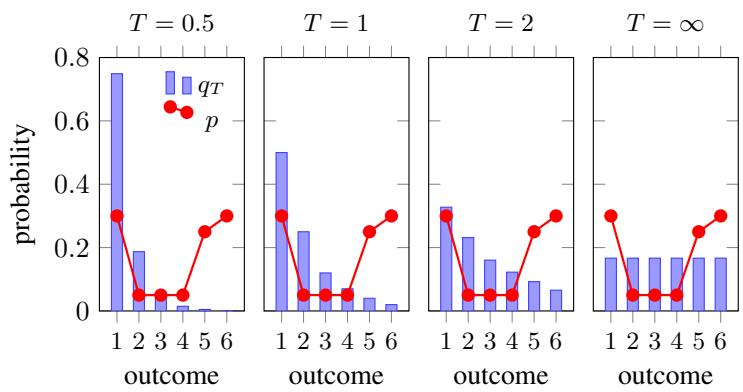  
Figure 8: Temperature preserves outcome order. For $q = ( 0 . 5 0 , 0 . 2 5 , 0 . 1 2 , 0 . 0 7 , 0 . 0 4 , 0 . 0 2 )$ increasing $T$ flattens the distribution but cannot reproduce the off-order target $\begin{array} { r l } { p } & { { } = } \end{array}$ (0.30, 0.05, 0.05, 0.05, 0.25, 0.30), even though $N _ { 2 } ( p ) = 4 { \overset { \cdot } { < } } S = 6$

Two-sided miscalibration. Temperature can leave diversity below the target or flatten beyond it. Neither direction alone establishes output validity: low-probability continuations can be valid or invalid. Even when a temperature matches $N _ { 2 } ( p )$ , it matches $p$ only in the power-family case of Theorem 2.

The rate of temperature-driven diversity change is determined by the spread of the model’s logprobabilities. Defining $\psi ( \beta ) = \log Z _ { \beta }$ , we have $\overline { { \psi ^ { \prime } ( \beta ) } } = \mathbb { E } _ { q _ { \beta } } [ \log q ]$ and $\hat { \psi ^ { \prime \prime } } ( \beta ) = \mathrm { V a r } _ { q _ { \beta } } ( \log q ) \geq \overline { { 0 } }$ where $q _ { \beta }$ is proportional to $q ^ { \beta }$ . Given that log $C _ { T } = \psi ( 2 \beta ) - 2 \psi ( \beta )$ , the derivative with respect to log $T \mathrm { i s } ^ { \cdot } - \beta$ times the derivative with respect to $\beta .$

$$
{ \frac { d \log N _ { 2 } ^ { T } ( x ) } { d \log T } } = - { \frac { d \log C _ { T } } { d \log T } } = 2 \beta \int _ { \beta } ^ { 2 \beta } \operatorname { V a r } _ { q _ { s } } ( \log q ) d s \ \geq \ 0 .\tag{42}
$$

The derivative is governed by the log-probability variance along the power family. For nonuniform finite-support $q ,$ finite temperatures trace the open interval $( g _ { \star } ( \breve { x } ) , S ( \breve { x } ) )$ and approach its endpoints only in the limits.

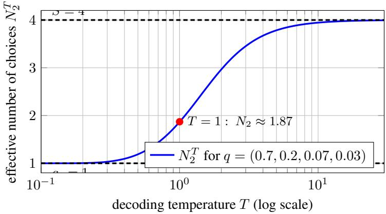  
Figure 9: Global temperature traces a fixed diversity interval. For $q = ( 0 . 7 , 0 . 2 , 0 . 0 7 , 0 . 0 3 ) , N _ { 2 } ^ { T }$ increases from the mode count 1 toward the support size 4; finite temperatures attain neither endpoint.

LLM decoding employs temperature locally, applying $q _ { T } ( a \mid h ) = q ( a \mid h ) ^ { 1 / T } / \sum _ { b } q ( b \mid h ) ^ { 1 / T }$ which influences the future contexts reached, as well as the probabilities of EOS, token length, format, and refusal, and the mixture of rare-valid and rare-invalid tokens. The monotonicity result for global sequence temperature therefore need not hold for token-by-token decoding.

Simple example. Suppose the root probabilities are 0.4 for EOS and 0.6 for CONTINUE, followed by 100 uniform endings after CONTINUE. Sequence collision is $0 . 4 ^ { 2 } + 0 . 6 ^ { 2 } ( 0 . 0 1 ) = 0 . 1 6 3 6$ . Raising local temperature moves the root toward (0.5, 0.5) while leaving the uniform branch unchanged, so collision approaches $0 . 5 ^ { 2 } + 0 . 5 ^ { 2 } ( 0 . 0 1 ) \dot { = } 0 . 2 5 2 5$ . Thus local temperature can reduce sequence diversity even though global temperature of a fixed sequence distribution cannot.

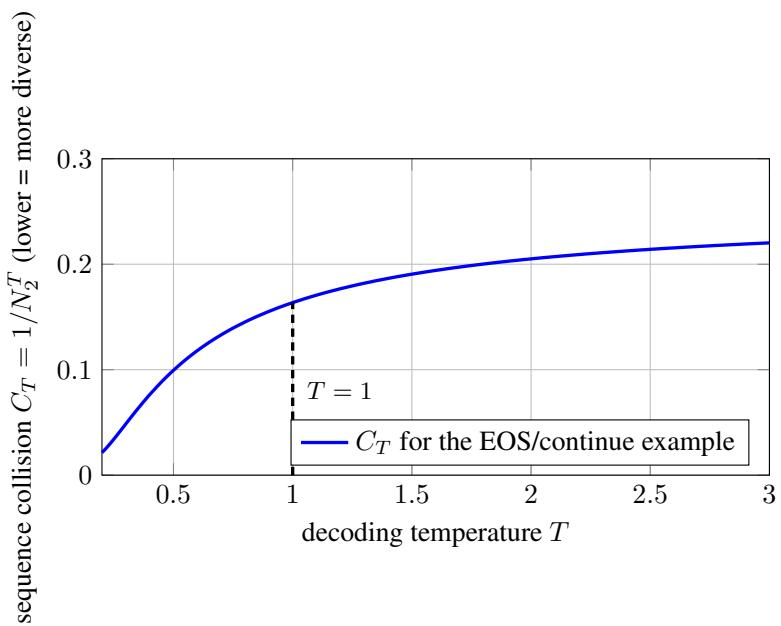  
Figure 10: Local temperature can increase sequence collision. In the two-stage EOS/continue example, raising T moves mass toward the short deterministic branch and reduces sequence diversity.