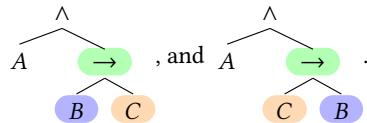
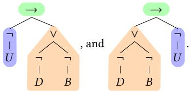
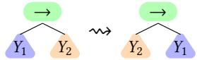
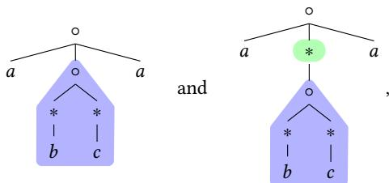
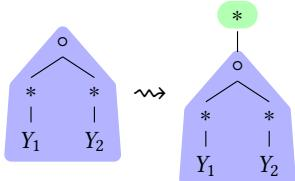
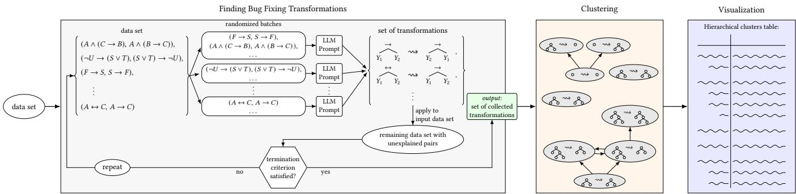
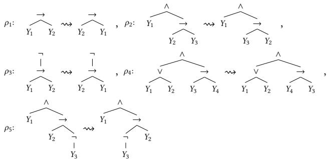
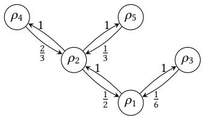
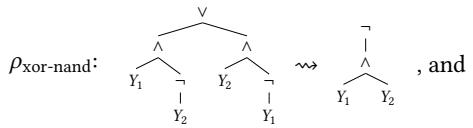
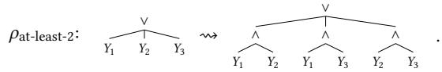

# Finding Common Mistakes In Modelling With Mathematical Formalisms Using LLMs

Lilian Killich   
lilian.killich@rub.de   
Ruhr University Bochum   
Bochum, Germany   
Fabian Vehlken   
fabian.vehlken@rub.de   
Ruhr University Bochum   
Bochum, Germany

Marko Schmellenkamp marko.schmellenkamp@rub.de Ruhr University Bochum Bochum, Germany

Thomas Zeume   
thomas.zeume@rub.de   
Ruhr University Bochum   
Bochum, Germany

## Abstract

Modelling with mathematical formalisms like logical formulas, mathematical equations, or regular expressions is an important yet challenging task for students of computer science and other STEM disciplines. Identifying common mistakes occurring in this context is an important step towards helping struggling students by providing targeted high-quality feedback, e.g. in interactive learning systems.

We present a tool-supported workflow that allows to (1) identify candidates for common mistakes that explain many student mistakes in large educational data sets, (2) cluster candidates according to similarities, and (3) visualize resulting clusters for instructors and CS education researchers. The visualization is designed to help researchers to identify common modelling mistakes. The candidates for common mistakes are represented by bug fixing transformations that translate incorrect formalizations into correct formalizations; they are generated by an LLM and validated algorithmically.

We show that this approach works well by reproducing common mistakes in propositional logic modelling that were identified by hand in the literature; showing that, unlike other algorithmic approaches, the LLM-based approach is suitable for very large sets of data; and applying it to multiple other formalisms to showcase it generalizes beyond propositional logic.

## CCS Concepts

• Theory of computation → Logic; • Social and professional topics → Computer science education.

## Keywords

modelling, logical formulas, mathematical formalisms, common mistakes, large language model

## 1 Introduction and Motivation

Learning to model scenarios with mathematical formalisms such as logical formulas, mathematical equations and terms, regular expressions, and many others, is an important aspect when introducing students to mathematical foundations in computer science and other STEM disciplines. A typical learning objective is that students can model scenarios given in natural language within the intended formalism. In this paper we address the question:

Suppose we are given a large data set ofstudent modelling attempts. How can common modelling mistakes be identified?

Identifying common mistakes is a preliminary step for understanding students’ struggles, exploring their invalid conceptions, and ultimately providing advice and feedback in modelling assignments. Knowing common mistakes also helps to craft specific advice and feedback in interactive learning systems.

We aim for a workflow for identifying common modelling mistakes that supports CS education researchers and educators with adequate algorithmic tools, so that mistakes can be identified from large scale data sets. Our starting point for an algorithmic approach is the observation that the syntax ofmany mathematical formalisms is specified by a context-free grammar and therefore each formalization is associated with a syntax tree. For such formalisms, modelling mistakes are reflected in diferences between the syntax trees of correct and incorrect formalizations. A key idea for answering the above question is that common mistakes can now be found by identifying “bug fixing transformations” that explain diferences between syntax trees [8]. We provide examples of this idea for two diferent formalisms.

Example 1.1 (Modelling with propositional logic formulas). A typical assignment when learning propositional logic is the translation of natural language statements such as “Anna goes to the cinema, but Bob only goes if Celine does.” into formulas. A correct propositional formula is � ∧ (� → �), while a frequent mistake by students is to model the statement by �∧(� → �). The diference is reflected in the syntax trees:

A similar diference occurs for the statement “The user interface is not working properly only if the database or the back end are not working properly.” modelled by $\neg U \to ( \neg D \lor \neg B )$ with frequent mistake $( \neg D \lor \neg B ) \to \neg U$ and the following syntax trees:

The diferences in both examples are captured by a bug fixing transformation that captures the mistake and locally modifies the incorrect trees to correct trees:

This bug fixing transformation matches the two examples from above as follows: the pattern on the left hand side can be mapped into a subtree of the syntax tree of the incorrect formalizations, and rearranging the subtree according to the right hand side of the transformation yields the correct formalizations (see [8] for precise semantics). This transformation captures the common mistake that students model “only if” statements with an implication in the wrong direction. It can be used, for instance, to automatically identify this mistake in student attempts and provide feedback [5].

Example 1.2 (Modelling with regular expressions). For the assignment “Provide a regular expression for the language of words over the alphabet {�, �, �} in which � appears as first and last letter, but nowhere else.” with correct formalization �(�∗�∗)∗� and frequent mistake �(�∗�∗)� with syntax trees

the diference between the trees can be described by  

Contributions. We present a tool-supported workflow (see Figure 1) that allows to (1) identify candidates for common mistakes by finding bug fixing transformations that explain many student mistakes in large educational data sets, (2) cluster candidates according to similarities, and (3) visualize resulting clusters for instructors and CS education researchers. The visualization is designed to help researchers to identify common modelling mistakes. We note that while candidates identified in Step (1) explain frequent structural diferences between syntax trees of correct and incorrect formalizations, it is not guaranteed that these diferences correspond to actual conceptual mistakes. Therefore, structuring and visualizing the candidates in Steps (2) and (3) is a necessary follow-up step to support researchers and educators to check the candidates and select sensible common mistakes.

Identifying candidates for common mistakes has so far been a time consuming process for CS education researchers, which required to go over data sets by hand. We provide algorithms that support Steps (1) – (3) from above, implement them, and thereby reduce the required efort considerably. The main technical challenge is with respect to Step (1). While in [8] a suitable specification language for tree transformations has been crafted and an algorithmic approach to identify transformations from data via a SAT solver was presented, our initial experiments show that this approach does not scale to large educational data sets. Yet, typical such data looks very structured and it is not very hard – though time consuming – for humans to find reasonable bug fixing transformations. This motivates our approach to use large language models (LLMs) to find candidate transformations (see Section 3 for details).

We then employ the resulting tool-supported workflow on educational data sets for logical modelling:

(a) On a data set for propositional logic with 6106 pairs of correct and incorrect formalizations, our workflow discovers 248 clusters of bug fixing transformations that can help to identify common mistakes. These clusters explain 84.44% of the pairs in total, whereas common mistakes identified in previous work [13] explain 71.57% of the pairs. Our approach exclusively explains 15.03% of the pairs, while 2.16% of the pairs are explained exclusively by previous work. When only considering clusters explaining at least 0.5% of the pairs, there are 21 clusters which still explain 66.34% of pairs; with 4.6% explained exclusively.

(b) On data sets for modal logic with 12482 pairs of correct and incorrect formalizations, our workflow yields clusters of bug fixing transformations that explain 79.39%. When only considering clusters explaining at least 0.5% of the pairs, there are 38 clusters for modal logic which explain 40.36%. For computation tree logic (CTL) with 7210 pairs, 35.89% of the pairs are explained, and 19.78% of the pairs are explained by 16 clusters which together explain 0.5% of the pairs each.

## 2 Related Work

Research on mistakes is conducted for several formalisms. Early work focused on propositional logic [2, 7], with later refinements by Schmellenkamp et al. [13], who distinguish linguistic from logical operators to explain discrepancies in earlier findings. Analyses have also been conducted among others for regular expressions [9] and context-free grammars [11, 14].

A common representation of such mistakes uses bug fixing transformations that describe how incorrect attempts can be systematically corrected. In theoretical domains, this idea has been applied to feedback generation for propositional logic in tutoring systems [5] and extended by [13]. It has since been generalized to other formalisms, including context-free grammars [15], demonstrating applicability beyond tree-structured representations. Related ideas also appear in work on regular expressions [9], where feedback is derived from systematic diferences between incorrect and correct solutions.

The view that student errors can be explained by systematic rules has a long tradition in intelligent tutoring systems. Brown and Burton [4] introduced diagnostic models of procedural bugs in arithmetic, and Sleeman [19] studied how such rules can be inferred for computer-aided instruction. Our notion of mistake candidates as transformations follows this tradition by representing errors as rule-like explanations for families of incorrect formalizations.

Repair-based approaches synthesize transformations from incorrect to correct artifacts, for example in programming education [1, 6, 12, 18, 20]. More recent work explores large language models for automated feedback [16, 17], showing their potential while also highlighting the need for validation due to possible unreliability or misalignment with instructional goals. We adopt the repair-based perspective while incorporating external algorithmic verification.

## 3 A Workflow for Finding Common Mistakes

In this section we describe our tool-supported workflow (see Figure 1) that allows to (1) identify candidates for common mistakes by finding bug fixing transformations that explain many student mistakes in large educational data sets, (2) cluster candidates according to similarities, and (3) visualize resulting clusters for instructors and CS education researchers. Step (1) uses an iterative process to generate candidates via an LLM and validates them algorithmically (see Section 3.1). For Step (2), we compute a correlation graph between candidate transformations (see Section 3.2).

The workflow is applicable to various data sets. It can be used, for example, on educational data sets for modelling with logical formulas (propositional formulas, modal formulas, temporal formulas, $\ldots ) ,$ regular expressions, mathematical expressions etc. Another use case is the application to multiple data sets for the same formalism to discover more specific mistakes. As an example, a partitioned data set for propositional modelling into smaller data sets according to linguistic operators occurring in natural language statements has been presented by Schmellenkamp et al. [13]. Applying our workflow to each of these smaller data sets results in candidates for common mistakes for each linguistic operator.

## 3.1 Finding Bug Fixing Transformations

The goal of the first step of our workflow is, given a data set containing pairs of incorrect and correct formalizations, to find transformations that explain (frequent) structural diferences between the correct and incorrect formalizations. More formally, the input is a data set D which contains pairs (�, � ∗) of syntax trees � and $t ^ { * }$ representing incorrect and correct formalizations. The goal is to identifiy a small set $\mathcal { T }$ of bug fixing transformations that explain the diference between as many pairs in D as possible. Here, roughly speaking, a bugfixing transformation is of the form � ⇝ $\sigma ^ { * }$ for two tree patterns � and $\sigma ^ { * }$ . Such a transformation explains a pair (�, � ∗) if the pattern � can be found in � and rearranging � according to the shape of $\sigma ^ { * }$ yields the tree $t ^ { * }$ (see Examples 1.1 and 1.2 as well as [8] for details). Unfortunately, finding a small set of bug fixing transformations that explains a large data set is NP-hard [8] and SAT-solving based approaches do not scale well.

Our algorithmic approach (see Algorithm 1 for pseudo code) is to generate candidates for bug fixing transformations with an LLM, validate those candidates algorithmically, and collect transformations that explain a �-fraction of the initial data set in the output set $\mathcal { T }$ . This procedure is iterated until no new transformation has been found for � iterations. In our experiments we used $\delta = 0 . 0 1$ and $k = 1 0 ,$ see Section 4 for details.

We provide some details. In each iteration, the data set at hand is split into equally sized randomized batches of size � (in our experiments, we use $s \sim 5 0 )$ , to accommodate limits of used LLMs. Each of the batches is put into a prompt that also contains a brief descrip tion of the transformation language, a few sample specifications for special cases, and a description of the task to find transformations. The prompt that was used can be found in the (anonymously published) supplementary material [3]. Via this prompt, the LLM provides a list of transformations for each one of the batches. The number of desired transformations for each batch is configurable (in our experiments, we use ⌊0.2·�⌋). For each transformation found by the LLM, the algorithm tests which fraction of pairs $( t , t ^ { * } )$ it can explains, i.e. pairs for which � can be transformed into $t ^ { * }$ by applying the transformation. If a transformation explains more than a �-fraction of the data, it is added to the output $\bar { \mathcal { T } }$

Algorithm 1 Finding bug fixing transformations   
Input: A set D of pairs $( t , t ^ { * } )$ of syntax trees   
Output: A set $\mathcal { T }$ of bugfixing transformations   
1: $\widehat { \mathcal { D } } : = \mathcal { D }$   
2: $\mathcal { T } : = \emptyset$   
3: while termination criterion is not fulfilled do   
4: $\mathcal { B } _ { 1 } , . . . , \mathcal { B } _ { b }$ := randomly split Db into batches of size �   
5: for all batches $\mathcal { B } _ { i }$ do   
6: prompt LLM to find transformations   
7: add those transformations to $\mathcal { T }$ which explain more than   
a �-fraction of D   
8: end for   
9: $\widehat { \mathcal { D } } : =$ pairs in $\widehat { \mathcal { D } }$ not explained by any transformation in $\mathcal { T }$   
10: end while   
11: return $\mathcal { T }$

## 3.2 Clustering Bug Fixing Transformations

The goal of the second step of the workflow is to structure the list of bug fixing transformations resulting from the first step for CS education researchers and educators. The idea is to cluster transformations according to “similarity” and to sort those clusters by the number ofexplained data points. The idea is that transformations in the list may explain similar kinds of mistakes or one transformation may explain all mistakes also explained by another transformation. As an example, consider the transformations

$$
\rho _ { 1 } \colon \stackrel {  } { Y _ { 1 } } \quad \stackrel {  } { Y _ { 2 } } \quad  \quad \stackrel { \dotsc } { \longleftrightarrow } \quad \stackrel { \dotsc } { \ r _ { 1 } } \quad \stackrel {  } { \rho _ { 2 } } : \ r _ { 1 } \  \quad \stackrel { \dotsc } { | } \ .
$$

Both explain mistakes where a negation ¬ has been forgotten, but the first one is more specific: it only explains pairs in which the negation is missing in front of a bi-implication ↔. The first may explain mistakes that are specific when modelling natural language statements that involve negations and equivalences, while the second can explain natural language statements with negations more broadly.

Our algorithmic approach for finding similar transformations is to compute, for each pair $\rho _ { 1 }$ and $\rho _ { 2 }$ of transformations, the fraction of data points explained by $\rho _ { 1 }$ that are also explained by $\rho _ { 2 } .$ More precisely, denote by $E _ { \rho } ( \mathcal { D } )$ the set of pairs in $\mathcal { D }$ that are explained by $\rho .$ . We compute a correlation graph $\mathcal { G } _ { \mathcal { D } }$ for the transformations found for data set D that has a node for each transformation found in Step (1). For each pair $\rho _ { 1 }$ and $\rho _ { 2 }$ of transformations, the graph has an edge $( \rho _ { 1 } , \rho _ { 2 } )$ of weight $\frac { | E _ { \rho _ { 1 } } ( \mathcal { D } ) \cap E _ { \rho _ { 2 } } ( \mathcal { D } ) | } { | E _ { \rho _ { 2 } } ( \mathcal { D } ) | }$ . Thus, the weight of $( \rho _ { 1 } , \rho _ { 2 } )$ is the fraction of the data points explained by $\rho _ { 2 }$ which are also explained by $\rho _ { 1 }$ . In particular, a value of 1 means $\rho _ { 1 }$ explains all pairs of D explained by $\rho _ { 2 }$ (and possibly more) and a value of 0 means that it explains none. A cluster within a correlation graph is a set of nodes that are connected by a path consisting of edges of non-zero weight.

  
Figure 1: Illustration of the workflow for finding bug fixing transformations, clustering them, and visualizing the clusters.

Consider the following illustrative toy example of a correlation graph for a small hand-chosen data set.

Example 3.1. Consider the following five transformations

  
and data set $s$ consisting of the following (incorrect, correct)-pairs:

$$
\begin{array} { r l } & { t _ { 1 } = ( A \to B , B \to A ) , } \\ & { t _ { 2 } = ( \neg A \to B , B \to \neg A ) , } \\ & { t _ { 3 } = ( ( A \lor \neg D ) \land ( B \to C ) , ( A \lor \neg D ) \land ( C \to B ) ) , } \\ & { t _ { 4 } = ( \neg ( ( A \lor B ) \to ( C \to D ) ) , \neg ( ( C \to D ) \to ( A \lor B ) ) ) , } \\ & { t _ { 5 } = ( ( A \lor B ) \land ( C \to D ) , ( A \lor B ) \land ( D \to C ) ) , } \\ & { t _ { 6 } = ( A \land ( B \to \neg C ) , A \land ( \neg C \to B ) ) } \end{array}
$$

We first compute the sets $E _ { \rho _ { i } } ( S )$ of pairs explained by each transformation $\rho _ { i } \colon$

$$
\begin{array} { r l } & { E _ { \rho _ { 1 } } ( S ) = \{ t _ { 1 } , t _ { 2 } , t _ { 3 } , t _ { 4 } , t _ { 5 } , t _ { 6 } \} , } \\ & { E _ { \rho _ { 2 } } ( S ) = \{ t _ { 3 } , t _ { 5 } , t _ { 6 } \} , } \\ & { E _ { \rho _ { 3 } } ( S ) = \{ t _ { 4 } \} , } \\ & { E _ { \rho _ { 4 } } ( S ) = \{ t _ { 3 } , t _ { 5 } \} , } \\ & { E _ { \rho _ { 5 } } ( S ) = \{ t _ { 6 } \} . } \end{array}
$$

The resulting correlation graph is depicted below. The edges are labelled with their weight, i.e. the fraction of pairs explained by the target transformation that are also explained by the source transformation. Self-loops, edges with weight 0, and “transitive edges” $( \rho _ { 1 } , \rho _ { 4 } ) , ( \rho _ { 4 } , \rho _ { 1 } ) , ( \rho _ { 1 } , \rho _ { 5 } ) , ( \rho _ { 5 } , \rho _ { 1 } )$ are omitted for clarity.

  
As the correlation graph indicates, $\rho _ { 1 } , . . . , \rho _ { 5 }$ form a cluster. □

We use correlation graphs to provide visualizations of how bug fixing transformations found in Step (1) relate to each other. In our experiments, all correlation graphs can be partitioned into clusters of a very simple shape: (a) single-transformation clusters consisting of a single transformation that only explains data points that no other transformation explains; (b) clusters with equivalent transformations consisting of transformations that all explain the same data points; and (c) hierarchical clusters whose transformations can be arranged in a tree, such that if a transformation explains data points $\mathcal { D } ^ { \prime } \subseteq \mathcal { D }$ then each of its children explains only data points ${ \mathcal { D } } ^ { \prime \prime } \subseteq { \mathcal { D } } ^ { \prime }$ . In particular, clusters of type (b) and (c) are helpful for CS education researchers to identify transformations representative for common mistakes and to distinguish “high-level” from “low-level” mistakes.

## 4 Evaluation

In this section we employ our tool-supported workflow exemplarily on educational data sets for logical modelling. In all experiments we use the workflow to find transformations, evaluate how well they cover data, and present a selection of transformations that explain large fractions of the data. Detailed tables on all experiments can be found in the supplementary material [3].

In a first set of experiments we use our workflow on a data set for modelling in propositional logic that has been used by Schmellenkamp et al. [13] to identify common mistakes by hand. Here we apply our workflow to a partition of the data set according to linguistic operators used in natural language statements as well as to the full data set. The objective is to see whether our workflow works as well as the by-hand-approach used in previous work.

Then, in a second set of experiments, we apply our workflow to data sets for modelling with modal logic and computation tree logic (CTL). Here the objective is to see, exemplarily, whether the workflow scales to other formalisms.

We first describe the experimental setup and then the results for the experiments sketched above.

For finding bug fixing transformations in Step (1) of our workflow, we use the GPT-OSS-120B model [10]. Initial experiments showed that this model is powerful enough, but small enough to be locally deployable. As parameters we choose a batch size of 50, due to the token limitations of the model. In all experiments, the prompt asks for transformations that explain at least 20% of the pairs in a batch. For the propositional data set grouped by linguistic operators, found transformations additionally need to explain � = 1% of all data points. The iterative process is terminated if no new transformation is chosen for 10 iterations.

## 4.1 Results for propositional logic

The propositional data set from [13] contains 6106 pairs with 1572 of them being distinct. This data set comes with a partition into 34 subdata sets for diferent linguistic operators. The median and average sizes of the subdata sets are 65.5 and 177.8, respectively.

Results for linguistic operator data sets. Across the subdata sets, the found transformations explain at least as many pairs as the hand-picked mistakes in a substantial fraction of cases.

For > 64% of the lingustic operator data sets, our workflow finds bug fixing transformations transformations that explain more data points than the mistakes identified in [13]. For > 14% of the subdata sets, the transformations explain exactly as many pairs as the hand-picked mistakes.

Results for the full propositional data set. We conducted two different experiments. First, we compared hand-picked mistakes to transformations found by our workflow as follows: For each handpicked mistake, we identified all transformations that explain at least one pair that is explained by the hand-picked mistake and clustered them as described in Section 3.2. As an example, Table 1 shows a hand-picked mistake that a disjunction was erroneously used instead of a conjunction, and the transformations correspond ing to it. This particular hand-picked mistake occurred in 334 pairs (column #), which is 5.47% of the whole data set. Of these, 330 (98.80% of 334) were explained by bug fixing transformations.

Across the whole data set, the bug fixing transformations found by our workflow explain 5156 of the pairs (84.44%), whereas the hand-picked mistakes only explain 4370 of the pairs (71.57%). 918 pairs (15.03%) are exclusively explained by the transformations, i.e. no hand-picked mistake explains any of these pairs; 132 pairs (2.16%) exclusively by the hand-picked mistakes. For instance, the following bug fixing transformations exclusively explain pairs that have not been explained by common mistakes in previous work

The transformation $\rho _ { \mathrm { x o r - n a n d } }$ represents the common mistake of using an exclusive or, expressed using a disjunction of conjunctions, instead of a negated conjunction which explains 114 pairs (6.57% of the pairs unexplained by the hand-picked mistakes). While a similar hand-picked mistake was found in [13], theirs only considers the case in which the exclusive or is expressed using a bi-implication, and thus does not explain the pairs explained by $\rho _ { \mathrm { x o } }$ r-nand.

The transformation $\rho _ { \mathrm { a t - l e a s t - } 2 } ,$ which represents the common mistake of only using a disjunction to express that at least two literals are true, explains 28 pairs (1.61% of the pairs unexplained by the hand-picked mistakes).

## 4.2 Results for Modal Logic and CTL

The data set for modal logic contains 12482 pairs with 3951 of them being distinct and is also from [13]. The data set for CTL contains 7210 pairs with 2695 distinct pairs and was collected by us using an interactive learning tool in two iterations of an introductory logic course (summer 2025 and 2026). The results for the modal logic and CTL data sets are summarized in Table 2.

For modal logic, the transformations found by our workflow explain 79.39% of the pairs in the data set, which is comparable to the propositional logic case. Examples of transformations are

$$
\rho _ { 1 } ^ { \mathrm { m l } } \colon \stackrel { \bigtriangledown } { ^ { \mathrm { \scriptsize ~ U } } } _ { Y _ { 1 } } \quad  { } \quad \stackrel { \diamond } { _ { Y _ { 1 } } } , \quad \rho _ { 2 } ^ { \mathrm { m l } } \colon Y _ { 1 } \quad  { } \quad \stackrel { \bigtriangledown } { ^ { \mathrm { \scriptsize ~ V _ { 1 } ~ } } } , \mathrm { a n d } \quad \rho _ { 3 } ^ { \mathrm { m l } } \colon \stackrel { \bigtriangledown } { ^ { \mathrm { \scriptsize ~ V _ { 1 } ~ } } } \quad \stackrel { \bigtriangledown } { ^ { \mathrm { \scriptsize ~ V _ { 2 } ~ } } } \quad  { } \quad \stackrel { \dotsc } { \underset { Y _ { 1 } } { \prod } } ,
$$

which explain 2.1%, 1.43%, and 3.37% of the data. While $\rho _ { 1 } ^ { \mathrm { m l } }$ and $\rho _ { 2 } ^ { \mathrm { m l } }$ change or add the modal operators ^ and □, $\rho _ { 3 } ^ { \mathrm { m o d a l } }$ was also found for the propositional logic data set. It represents the common mistake of modelling an “exclusive $\mathrm { o r } ^ { \mathrm { * } }$ as an $^ { - } \mathrm { o r } ^ { \prime \prime }$

For CTL, the transformations found by our workflow explain 35.89% of the pairs with the two transformations that explain the largest fractions of the data set being

$$
\rho _ { 1 } ^ { \mathrm { c t l } } : ~ { \mathrm { Y } } _ { 1 } ~ {  } ~ { \begin{array} { l } { { \mathrm { A G } } } \\ { { \mid } } \\ { { \mathrm { Y } _ { 1 } } } \end{array} } ~ , ~ \mathrm { a n d } ~ \rho _ { 2 } ^ { \mathrm { c t l } } : ~ { \begin{array} { l } { { \mathrm { A X } } } \\ { { \mid } } \\ { { \mathrm { Y } _ { 1 } } } \end{array} } ~ {  } ~ { \begin{array} { l } { { \mathrm { A G } } } \\ { { \mid } } \\ { { \mathrm { Y } _ { 1 } } } \end{array} }
$$

explaining 2.98% and 2.48%, respectively.

Determining Usefulness ofTransformations. To exemplarily determine the usefulness of clusters of transformations found by our workflow, a CS educator inspected all clusters explaining at least 0.5% of the pairs in each of the three data sets for propositional logic, modal logic, and CTL (see also Table 2). The focus was on whether the “main transformation”, i.e. the transformation forming the root of the cluster tree, is suficient to provide targeted feedback, or if sub-transformations, those lower in the cluster’s hierarchy, would be required for this.

In propositional logic, 19 clusters had main transformations suitable for feedback, though at least 4 required sub-transformations for more targeted feedback. In CTL, all 17 clusters had useful main transformations, with at least 6 requiring sub-transformations for suficiently specific feedback. In modal logic, the main transformation of 18 clusters was suitable for feedback, but at least 7 required sub-transformations. In 16 clusters, the main transformations were too general to identify specific mistakes directly; for 5 of these, frequent sub-transformations revealed mistakes.

Table 1: Exemplary excerpt of the table of hierarchical bug-fixing transformation clusters that cover most of the pairs explained by the common mistake that a disjunction was erroneously used instead of a conjunction (as identified in [13]). For each transformation, a simple representative example is provided. For the mistake as a whole, each transformation, and the entire cluster, the number # and distinct number #dst of pairs are shown. The common mistake occurrs in 5.47% of all pairs in the full data set (3.88% distinct). Of these, the complete bug fixing transformation cluster found by our workflow explains 330 (98.8%). The fraction of the 334 pairs each transformation explains is also shown (columns % and %dst, respectively). A table with all bug fixing transformation clusters found by our workflow is presented in the (anonymously published) supplementary material [3].
<table><tr><td>Hand-picked mistake / transformations</td><td>#</td><td>%</td><td>#dst</td><td>%dst</td><td>example of (incorrect, correct) formula pairs</td></tr><tr><td>Mistake: disjunction instead of conjunction</td><td>334</td><td>5.47%</td><td>61</td><td>3.88%</td><td></td></tr><tr><td>Transformations combined</td><td>330</td><td>98.80%</td><td>58</td><td>95.08%</td><td></td></tr><tr><td> $\neg ( Y _ { 1 } \wedge \dots \wedge Y _ { n } )  \neg Y _ { 1 } \land \dots \wedge \neg Y _ { n }$ </td><td>201</td><td>60.18%</td><td>23</td><td>37.70%</td><td> $\neg ( A \land B \land C ) ,$   $\neg A \land \neg B \land \neg C$ </td></tr><tr><td> $\neg ( Y _ { 1 } \wedge Y _ { 2 } )  \neg Y _ { 1 } \wedge \neg Y _ { 2 }$ </td><td>153</td><td>45.81%</td><td>16</td><td>26.23%</td><td> $\neg ( A \land B ) ,$   $\neg A \land \neg B$ </td></tr><tr><td> $\lnot ( Y _ { 1 } \land Y _ { 2 } ) \to Y _ { 3 }  ( \lnot Y _ { 1 } \land \lnot Y _ { 2 } ) \to Y _ { 3 }$ </td><td>150</td><td>44.91%</td><td>15</td><td>24.59%</td><td> $\neg ( A \land B ) \to C ,$   $( \neg A \land \neg B ) \to C$ </td></tr><tr><td> $Y _ { 1 } \lor . . . \lor Y _ { n }  Y _ { 1 } \land . . . \land Y _ { n }$ </td><td>128</td><td>38.32%</td><td>34</td><td>55.74%</td><td> $A \lor B \lor C ,$   $A \land B \land C$ </td></tr><tr><td> $Y _ { 1 } \vee Y _ { 2 }  Y _ { 1 } \wedge Y _ { 2 }$ </td><td>118</td><td>35.33%</td><td>29</td><td>47.54%</td><td> $A \lor B ,$   $A \land B$ </td></tr><tr><td> ${ \big [ } = ( \neg Y _ { 1 } \lor \neg \neg Y _ { 2 } ) \to Y _ { 3 } \land \neg \negmedspace ( \neg \medskip Y _ { 1 } \land \neg \bar { Y } _ { 2 } ) \to Y _ { 3 }$ </td><td>35</td><td>10.48%</td><td>9</td><td>14.75%</td><td> $( \neg A \lor \neg B ) \to C ,$   $( \neg A \land \neg B ) \to C$ </td></tr><tr><td> ${ \big \lfloor } = \neg Y _ { 1 } \lor \neg Y _ { 2 } \land \to \neg Y _ { 1 } \land \neg Y _ { 2 }$ </td><td>35</td><td>10.48%</td><td>9</td><td>14.75%</td><td> $( \neg A \lor \neg B ) ,$   $( \neg A \land \neg B )$ </td></tr><tr><td> $( Y _ { 1 } \vee Y _ { 2 } )  \lnot Y _ { 3 }  ( Y _ { 1 } \wedge Y _ { 2 } )  \lnot Y _ { 3 }$ </td><td>17</td><td>5.09%</td><td>6</td><td>9.84%</td><td> $( A \lor B )  \neg C ,$   $( A \land B ) \to \neg C$ </td></tr></table>

Table 2: Overview of the data sets, number of clusters found by our workflow, and the percentage of pairs explained by clusters for the propositional logic (PL), modal logic (PL) and computation tree logic (CTL) data sets. For each data set, we provide the number of (incorrect, correct) formula pairs, modelling contexts (i.e. diferent assignments), and statements to be modelled.

<table><tr><td></td><td>PL</td><td>ML</td><td>CTL</td></tr><tr><td># total formula pairs # modelling contexts # statements to be modelled</td><td>6106 11</td><td>12482 6</td><td>7210 6</td></tr><tr><td># total clusters % total explained</td><td>58 248 84.44%</td><td>28 1585 79.39%</td><td>20 271 35.89%</td></tr><tr><td># clusters explaining ≥ 0.1% % explained by clusters explaining ≥ 0.1%</td><td>78 76.06%</td><td>132 56.00%</td><td>62 29.76%</td></tr><tr><td># clusters explaining ≥ 0.5% % explained by clusters explaining ≥ 0.5%</td><td>21 66.34%</td><td>38 40.36%</td><td>16 19.78%</td></tr><tr><td># clusters explaining ≥ 1% % explained by clusters explaining  $\geq 1 \%$ </td><td>15 62.48%</td><td>17 28.26%</td><td>8 13.86%</td></tr></table>

## 5 Discussion and Conclusion

We presented a tool-supported workflow for identifying candidates for common mistakes in modelling with mathematical formalisms as bug fixing transformations, clustering them, and presenting them to educators and CS education researchers. Our experiments show that the workflow recovers many known propositional logic mistakes, finds additional ones, and can also be applied to other formalisms, such as modal logic and CTL.

Beyond modelling, the workflow is likely also applicable to tasks in which students transform logical formulas into normal forms. A diference in that setting is that one does not immediately have (incorrect, correct) pairs. Instead, one has an incorrect formula, a previous correct formula, and the equivalence transformation that was applied incorrectly. A suitable pair can then be constructed by applying the intended equivalence transformation to the previous correct formula, yielding the correct formula for that step.

Overall, the results suggest that transformation-based mistake candidates can help scale the discovery of common mistakes in education settings. Future work includes applying the workflow to diverse data sets from diferent domains, and studying how the resulting candidates can be integrated into feedback systems of interactive learning tools.

## Acknowledgments

This work was supported by the Deutsche Forschungsgemeinschaft (DFG, German Research Foundation), grant 448468041.

## References

[1] Umair Z. Ahmed, Pawan Kumar, Amey Karkare, Purushottam Kar, and Sumit Gulwani. 2018. Compilation error repair: for the student programs, from the student programs. In Proceedings ofthe 40th International Conference on Software Engineering: Software Engineering Education and Training (Gothenburg, Sweden) (ICSE-SEET ’18). Association for Computing Machinery, New York, NY, USA, 78–87. doi:10.1145/3183377.3183383

[2] Vicki L. Almstrum. 1999. The Propositional Logic Test as a Diagnostic Tool for Misconceptions about Logical Operations. 18, 3 (1999), 205–224. https: //www.learntechlib.org/p/18884

[3] Anonymous Authors. 2026. Supplementary Material: Appendix. https://osf. io/prhk9/overview?view\_only=d4eea3497fe243f399a1a419e340349d. Accessed: 2026-07-03.

[4] John Seely Brown and Richard R. Burton. 1978. Diagnostic models for procedural bugs in basic mathematical skills. Cognitive Science 2, 2 (1978), 155–192. doi:10. 1016/S0364-0213(78)80004-4

[5] Gaetano Geck, Artur Ljulin, Sebastian Peter, Jonas Schmidt, Fabian Vehlken, and Thomas Zeume. 2018. Introduction to Iltis: an interactive, web-based system for teaching logic. In Proceedings ofthe 23rd Annual ACM Conference on Innovation and Technology in Computer Science Education, ITiCSE 2018. ACM, 141–146. doi:10. 1145/3197091.3197095

[6] Sumit Gulwani. 2014. Example-based learning in computer-aided STEM education. Commun. ACM 57, 8 (Aug. 2014), 70–80. doi:10.1145/2634273

[7] Geofrey L. Herman, Michael C. Loui, Lisa Kaczmarczyk, and Craig Zilles. 2012. Describing the What and Why of Students’ Dificulties in Boolean Logic. 12, 1, Article 3 (2012). doi:10.1145/2133797.2133800

[8] Daniel Neider, Leif Sabellek, Johannes Schmidt, Fabian Vehlken, and Thomas Zeume. 2025. Learning Tree Pattern Transformations. In 28th International Conference on Database Theory, ICDT 2025, Barcelona, Spain, March 25-28, 2025

(LIPIcs, Vol. 328), Sudeepa Roy and Ahmet Kara (Eds.). Schloss Dagstuhl - Leibniz Zentrum für Informatik, 24:1–24:20. doi:10.4230/LIPICS.ICDT.2025.24

[9] Olaperi Okuboyejo, Sigrid Ewert, and Ian Sanders. 2025. Automatic Feedback Generation for the Learning of Regular Expressions. ACM Trans. Comput. Educ. 25, 3, Article 36 (Aug. 2025), 26 pages. doi:10.1145/3743682

[10] OpenAI. 2025. gpt-oss-120b & gpt-oss-20b Model Card. arXiv:2508.10925 [cs.CL] https://arxiv.org/abs/2508.10925

[11] Nelishia Pillay. 2010. Learning Dificulties Experienced by Students in a Course on Formal Languages and Automata Theory. 41, 4 (2010), 48–52. doi:10.1145/ 1709424.1709444

[12] Kelly Rivers and Kenneth R Koedinger. 2017. Data-driven hint generation in vast solution spaces: a self-improving python programming tutor. International Journal ofArtificial Intelligence in Education 27, 1 (2017), 37–64.

[13] Marko Schmellenkamp, Alexandra Latys, and Thomas Zeume. 2023. Discovering and Quantifying Misconceptions in Formal Methods Using Intelligent Tutoring Systems. In Proceedings of the 54th ACM Technical Symposium on Computer Science Education, Volume 1, SIGCSE 2023, Toronto, ON, Canada, March 15-18, 2023, Maureen Doyle, Ben Stephenson, Brian Dorn, Leen-Kiat Soh, and Lina Battestilli (Eds.). ACM, 465–471. doi:10.1145/3545945.3569806

[14] Marko Schmellenkamp, Dennis Stanglmair, Tilman Michaeli, and Thomas Zeume. 2024. Exploring Error Types in Formal Languages Among Students of Upper Secondary Education. In Proceedings ofthe 24th Koli Calling International Conference on Computing Education Research, Koli Calling 2024, KoliFinland, November 12-17, 2024, Juho Leinonen and Andreas Mühling (Eds.). ACM, 20:1–20:8. doi:10.1145/3699538.3699540

[15] Marko Schmellenkamp, Thomas Zeume, Sven Argo, Sandra Kiefer, Cedric Siems, and Fynn Stebel. 2025. Detecting and Explaining (In-)equivalence of Context-Free Grammars. Proc. ACM Program. Lang. 9, OOPSLA2, Article 378 (Oct. 2025), 27 pages. doi:10.1145/3763156

[16] Niklas Scholz, Manh Hung Nguyen, Adish Singla, and Tomohiro Nagashima. 2026. Partnering with AI: A Pedagogical Feedback System for LLM Integration Into Programming Education. In Two Decades ofTEL. From Lessons Learnt to Challenges Ahead, Kairit Tammets, Sergey Sosnovsky, Rafael Ferreira Mello, Gerti Pishtari, and Tanya Nazaretsky (Eds.). Springer Nature Switzerland, Cham, 243–248.

[17] Priscylla Silva and Evandro Costa. 2025. Assessing Large Language Models for Automated Feedback Generation in Learning Programming Problem Solving. arXiv:2503.14630 [cs.SE] https://arxiv.org/abs/2503.14630

[18] Rishabh Singh, Sumit Gulwani, and Armando Solar-Lezama. 2013. Automated feedback generation for introductory programming assignments. SIGPLAN Not. 48, 6 (June 2013), 15–26. doi:10.1145/2499370.2462195

[19] Derek H. Sleeman. 1983. 16 - INFERRING STUDENT MODELS FOR INTELLI-GENT COMPUTER-AIDED INSTRUCTION. In Machine Learning, Ryszard S. Michalski, Jaime G. Carbonell, and Tom M. Mitchell (Eds.). Morgan Kaufmann, San Francisco (CA), 483–510. doi:10.1016/B978-0-08-051054-5.50020-0

[20] Songwen Xu and Yam San Chee. 2003. Transformation-based diagnosis ofstudent programs for programming tutoring systems. IEEE Transactions on Software Engineering 29, 4 (2003), 360–384. doi:10.1109/TSE.2003.1191799

## A Prompts for Finding Bug Fixing Transformations

The prompts for all propositional logic, modal logic, and CTL share large parts; they mainly difer in the symbols the transformations are allowed to use. The following prompt represents all three prompts, with the only difering sentence being prefixed by the logic the prompt is used for.

## Start of prompt:

Instruction. Find structural diferences between pairs of propositional logic formulas and express them by transformations of a transformation language. A transformation of our transformation language consists of two tree patterns:

• body: the pattern that matches a subtree in the input tree (left side of the transformation).

• head: the pattern that replaces the matched subtree (right side of the transformation).

• Transformations are written in the format: body —> head

Patterns are trees that follow the following rules:

• propositional: Inner nodes are labeled by the operators of propositional logic: “or”, “and”, “impl”, “not”, “eq”. modal: Inner nodes are labeled by the operators of modal logic: “or”, “and”, “impl”, “not”, “eq”, “box” (for □), “dia” (for ^). CTL: Inner nodes are labeled by the operators of computation tree logic: “or”, “and”, “impl”, “not”, “eq”, “ax”, “ex”, “af”, “ef”, “ag”, “eg”, “au”, “eu”.

• They are written as: operator[child1 child2 ...] with children separated by spaces.

• Leaf nodes are labeled by tree variables, which are placeholders for subtrees. Write them as Y1, Y2, ...

• Variadic patterns: “and” and “or” may have arbitrary arity. Use Y1 .. Yn to denote an ordered sequence of two or more child subtrees. Example: and[Y1 .. Yn] matches and[A B], and[A B C], and[A B C D], etc.; or[Y1 .. Yn] matches or[A B], or[A B C], or[A B C D], etc.

• The sequence Y1 .. Yn must be preserved unchanged: do not reorder, duplicate, or split it. Do not remove or add single elements.

• Use Y1 .. Yn only as the complete child list of an and/or node. Example: and[Y1 .. Yn]

• Every tree variable that appears in the head must also appear in the body.

• Propositional variables of the formulas may not appear in the transformations. Use only tree variables and the operators as nod labels.

## Matching:

• A match for the body may occur anywhere in the tree, not only at the root.

• Matching is injective: every body-node is mapped to a unique node in the input tree.

• If tree variables appear multiple times in the same pattern, the occurrences have to be matched by isomorphic subtrees.

Application: When a match is found, the corresponding subtree is replaced by the head, with variables substituted by the subtrees/labels found in the match.

Your Task: Find <n\_transformations> transformation(s) that can transform as many of the formula pairs as possible in one step. Return the answer exclusively in the following JSON format. Write nothing outside this JSON. Pay attention to correct quotation marks, no comments, no headings. Replace TRANSFORMATION by the respective transformation.

{   
"transformations": [   
{   
"name": "Transformation\_1",   
"transformation": "TRANSFORMATION"   
}   
]   
}

Here is the dataset of formula pairs:

Input: <error\_formula\_1> Target: <correct\_formula\_1>   
Input: <error\_formula\_2> Target: <correct\_formula\_2>

## B Detailed Evaluation Data

## B.1 Propositional Logic Data Set Grouped by Linguistic Operator

The hand-picked mistakes are from [13].

Table 3: Hand-picked errors and transformations for linguistic operator(s) AND\_AND\_NONE\_OF
<table><tr><td>Hand-picked mistake / Transformations</td><td>#</td><td>%</td><td>#dst</td><td>%dst</td></tr><tr><td>Unexplained by ALL hand errors</td><td>48</td><td>100.00%</td><td>26</td><td>100.00%</td></tr><tr><td>Transformations combined</td><td>13</td><td>27.08%</td><td>12</td><td>46.15%</td></tr><tr><td>T1:  $Y _ { 1 } \wedge Y _ { 2 } \wedge \neg ( Y _ { 3 } \wedge Y _ { 4 } )  Y _ { 1 } \wedge Y _ { 2 } \wedge \neg Y _ { 3 } \wedge \neg Y _ { 4 }$ </td><td>4</td><td>8.33%</td><td>3</td><td>11.54%</td></tr><tr><td>T2:  $( Y _ { 1 } \wedge Y _ { 2 } ) \left. \neg ( Y _ { 3 } \wedge Y _ { 4 } ) \right. Y _ { 1 } \wedge Y _ { 2 } \wedge \neg Y _ { 3 } \wedge \neg Y _ { 4 }$ </td><td>1</td><td>2.08%</td><td>1</td><td>3.85%</td></tr><tr><td>T3:  $( Y _ { 1 } \wedge Y _ { 2 } )  ( \neg Y _ { 3 } \wedge \neg Y _ { 4 } )  Y _ { 1 } \wedge Y _ { 2 } \wedge \neg Y _ { 3 } \wedge \neg Y _ { 4 }$ </td><td>1</td><td>2.08%</td><td>1</td><td>3.85%</td></tr><tr><td>T4:  $\left( Y _ { 1 } \wedge Y _ { 2 } \right) \left. \left( \neg Y _ { 3 } \wedge \neg Y _ { 4 } \right) \right. Y _ { 1 } \wedge Y _ { 2 } \wedge \neg Y _ { 3 } \wedge \neg Y _ { 4 }$ </td><td>1</td><td>2.08%</td><td>1</td><td>3.85%</td></tr><tr><td>T5:  $( Y _ { 1 } \wedge Y _ { 2 } \wedge \neg Y _ { 3 } ) \vee ( Y _ { 1 } \wedge Y _ { 2 } \wedge \neg Y _ { 4 } )  Y _ { 1 } \wedge Y _ { 2 } \wedge \neg Y _ { 3 } \wedge \neg Y _ { 4 }$ </td><td>1</td><td>2.08%</td><td>1</td><td>3.85%</td></tr><tr><td>T6:  $( \neg Y _ { 1 } \land \neg Y _ { 2 } )  ( Y _ { 3 } \land Y _ { 4 } )  Y _ { 3 } \land Y _ { 4 } \land \neg Y _ { 1 } \land \neg Y _ { 2 }$ </td><td>1</td><td>2.08%</td><td>1</td><td>3.85%</td></tr><tr><td>T7:  $( Y _ { 1 } \wedge Y _ { 2 } ) \vee ( \neg Y _ { 3 } \wedge \neg Y _ { 4 } )  Y _ { 1 } \wedge Y _ { 2 } \wedge \neg Y _ { 3 } \wedge \neg Y _ { 4 }$ </td><td>1</td><td>2.08%</td><td>1</td><td>3.85%</td></tr><tr><td>T8:  $Y _ { 1 } \wedge Y _ { 2 } \wedge \neg Y _ { 3 } \wedge \neg Y _ { 4 }  Y _ { 3 } \wedge Y _ { 1 } \wedge \neg Y _ { 2 } \wedge \neg Y _ { 4 }$ </td><td>1</td><td>2.08%</td><td>1</td><td>3.85%</td></tr><tr><td>T9:  $Y _ { 1 } \wedge Y _ { 2 } \wedge \neg Y _ { 3 } \wedge \neg Y _ { 4 }  Y _ { 1 } \wedge Y _ { 3 } \wedge \neg Y _ { 4 } \wedge \neg Y _ { 2 }$ </td><td>1</td><td>2.08%</td><td>1</td><td>3.85%</td></tr><tr><td>T10:  $Y _ { 1 } \wedge Y _ { 2 } \wedge \neg ( Y _ { 3 } \wedge Y _ { 4 } )  Y _ { 1 } \wedge Y _ { 2 } \wedge \neg Y _ { 3 } \wedge \neg Y _ { 4 }$ </td><td>1</td><td>2.08%</td><td>1</td><td>3.85%</td></tr><tr><td>Whole file</td><td>48</td><td>100.00%</td><td>26</td><td>100.00%</td></tr><tr><td>ANY hand error explained</td><td>0</td><td>0.00%</td><td>0</td><td>0.00%</td></tr><tr><td>ANY transformation explained</td><td>13</td><td>27.08%</td><td>12</td><td>46.15%</td></tr><tr><td>Only explained by hand error</td><td>0</td><td>0.00%</td><td>0</td><td>0.00%</td></tr><tr><td>Only explained by transformation</td><td>13</td><td>27.08%</td><td>12</td><td>46.15%</td></tr></table>

Table 4: Hand-picked errors and transformations for linguistic operator(s) AND\_AND
<table><tr><td>Hand-picked mistake / Transformations</td><td>#</td><td>%</td><td>#dst</td><td>%dst</td></tr><tr><td>BUGGY_ADD_OPERAND_TO_CONJUNCTION</td><td>19</td><td>65.52%</td><td>4</td><td>30.77%</td></tr><tr><td>Transformations combined</td><td>0</td><td>0.00%</td><td>0</td><td>0.00%</td></tr><tr><td>BUGGY_REPLACE_DISJUNCTION_BY_CONJUNCTION</td><td>2</td><td>6.90%</td><td>2</td><td>15.38%</td></tr><tr><td>Transformations combined</td><td>2</td><td>100.00%</td><td>2</td><td>100.00%</td></tr><tr><td> $\mathrm { T 1 } \colon Y _ { 1 } \lor \ldots \lor Y _ { n }  Y _ { 1 } \land \ldots \land Y _ { n }$ </td><td>1</td><td>50.00%</td><td>1</td><td>50.00%</td></tr><tr><td> $\mathrm { T 4 } \colon ( Y _ { 1 } \vee Y _ { 2 } ) \wedge Y _ { 3 }  Y _ { 3 } \wedge Y _ { 1 } \wedge Y _ { 2 }$ </td><td>1</td><td>50.00%</td><td>1</td><td>50.00%</td></tr><tr><td>BUGGY_REPLACE_EQUIVALENCE_BY_CONJUNCTION</td><td>2</td><td>6.90%</td><td>1</td><td>7.69%</td></tr><tr><td>Transformations combined</td><td>2</td><td>100.00%</td><td>1</td><td>100.00%</td></tr><tr><td> $\mathrm { T 5 } \colon { Y _ { 1 } } \left. \left( { Y _ { 2 } } \wedge { Y _ { 3 } } \right) \right. { Y _ { 1 } } \wedge { Y _ { 2 } } \wedge { Y _ { 3 } }$ </td><td>2</td><td>100.00%</td><td>1</td><td>100.00%</td></tr><tr><td>BUGGY_REPLACE_IMPLICATION_BY_CONJUNCTION</td><td>1</td><td>3.45%</td><td>1</td><td>7.69%</td></tr><tr><td>Transformations combined</td><td>1</td><td>100.00%</td><td>1</td><td>100.00%</td></tr><tr><td>T6:  $Y _ { 1 }  ( Y _ { 2 } \wedge Y _ { 3 } )  Y _ { 1 } \wedge Y _ { 2 } \wedge Y _ { 3 }$ </td><td>1</td><td>100.00%</td><td>1</td><td>100.00%</td></tr><tr><td>BUGGY_REPLACE_NAND_BY_CONJUNCTION</td><td>1</td><td>3.45%</td><td>1</td><td>7.69%</td></tr><tr><td>Transformations combined</td><td></td><td>100.00%</td><td>1</td><td>100.00%</td></tr><tr><td> $\mathrm { T 3 } { \mathrel { \mathop : } } \neg Y _ { 1 } \lor \dots \lor \neg Y _ { n }  Y _ { 1 } \land \dots \land Y _ { n }$ </td><td>1 1</td><td>100.00%</td><td>1</td><td>100.00%</td></tr><tr><td>BUGGY_REPLACE_NOR_BY_CONJUNCTION</td><td>1</td><td>3.45%</td><td>1</td><td>7.69%</td></tr><tr><td>Transformations combined</td><td>1</td><td>100.00%</td><td>1</td><td>100.00%</td></tr><tr><td> $\mathrm { T 2 } \colon \lnot Y _ { 1 } \land \dotsc \land \lnot Y _ { n }  Y _ { 1 } \land \dotsc \land Y _ { n }$ </td><td>1</td><td>100.00%</td><td>1</td><td>100.00%</td></tr><tr><td>Unexplained by ALL hand errors</td><td>3</td><td>10.34%</td><td>3</td><td>23.08%</td></tr><tr><td>Transformations combined</td><td>0</td><td>0.00%</td><td>0</td><td>0.00%</td></tr><tr><td>Whole file</td><td>29</td><td>100.00%</td><td>13</td><td>100.00%</td></tr><tr><td>ANY hand error explained</td><td>26</td><td>89.66%</td><td>10</td><td>76.92%</td></tr><tr><td>ANY transformation explained</td><td>7</td><td>24.14%</td><td>6</td><td>46.15%</td></tr><tr><td>Only explained by hand error</td><td>19</td><td>65.52%</td><td>4</td><td>30.77%</td></tr><tr><td>Only explained by transformation</td><td>0</td><td>0.00%</td><td>0</td><td>0.00%</td></tr></table>

Table 5: Hand-picked errors and transformations for linguistic operator(s) AND\_IF
<table><tr><td>Hand-picked mistake / Transformations</td><td>#</td><td>%</td><td>#dst</td><td>%dst</td></tr><tr><td>BUGGY_REPLACE_IMPLICATION_BY_REVERSED_IMPLICATION</td><td>12</td><td>8.89%</td><td>1</td><td>1.69%</td></tr><tr><td>Transformations combined</td><td>12</td><td>100.00%</td><td>1</td><td>100.00%</td></tr><tr><td>T2:  $( Y _ { 1 }  Y _ { 2 } ) \wedge Y _ { 3 }  ( Y _ { 2 }  Y _ { 1 } ) \wedge Y _ { 3 }$ </td><td>12</td><td>100.00%</td><td>1</td><td>100.00%</td></tr><tr><td>BUGGY_REPLACE_IMPLICATION_BY_CONJUNCTION</td><td>10</td><td>7.41%</td><td>3</td><td>5.08%</td></tr><tr><td>Transformations combined</td><td>8</td><td>80.00%</td><td>1</td><td>33.33%</td></tr><tr><td> $\mathrm { T } 4 \colon Y _ { 1 } \to ( Y _ { 2 } \to Y _ { 3 } )  ( Y _ { 2 } \to Y _ { 3 } ) \land Y _ { 1 }$ </td><td>8</td><td>80.00%</td><td>1</td><td>33.33%</td></tr><tr><td>BUGGY_REPLACE_EQUIVALENCE_BY_IMPLICATION</td><td>9</td><td>6.67%</td><td>1</td><td>1.69%</td></tr><tr><td>Transformations combined</td><td>9</td><td>100.00%</td><td>1</td><td>100.00%</td></tr><tr><td>T3:  $( Y _ { 1 } \left. Y _ { 2 } ) \land Y _ { 3 } \right. ( Y _ { 1 } \to Y _ { 2 } ) \land Y _ { 3 }$ </td><td>9</td><td>100.00%</td><td>1</td><td>100.00%</td></tr><tr><td>BUGGY_REPLACE_DISJUNCTION_BY_CONJUNCTION</td><td>7</td><td>5.19%</td><td>1</td><td>1.69%</td></tr><tr><td>Transformations combined</td><td>7</td><td>100.00%</td><td>1</td><td>100.00%</td></tr><tr><td> ${ \big [ } = \mathrm { T } 5 \colon ( Y _ { 1 } \to Y _ { 2 } ) \lor Y _ { 3 } \not  ( Y _ { 1 } \to Y _ { 2 } ) \land Y _ { 3 }$ </td><td>7</td><td>100.00%</td><td>1</td><td>100.00%</td></tr><tr><td> $\mathsf { \Gamma } \lfloor = { \mathrm { T } } 6 \colon Y _ { 1 } \lor \ldots \lor Y _ { n }  Y _ { 1 } \land \ldots \land Y _ { n }$ </td><td>7</td><td>100.00%</td><td>1</td><td>100.00%</td></tr><tr><td>BUGGY_REMOVE_NEGATION</td><td>1</td><td>0.74%</td><td>1</td><td>1.69%</td></tr><tr><td>Transformations combined</td><td>0</td><td>0.00%</td><td>0</td><td>0.00%</td></tr><tr><td>BUGGY_REPLACE_CONJUNCTION_BY_IMPLICATION</td><td>1</td><td>0.74%</td><td>1</td><td>1.69%</td></tr><tr><td>Transformations combined</td><td>0</td><td>0.00%</td><td>0</td><td>0.00%</td></tr><tr><td>BUGGY_REPLACE_CONJUNCTION_BY_REVERSED_IMPLICATION</td><td>1</td><td>0.74%</td><td>1</td><td>1.69%</td></tr><tr><td>Transformations combined</td><td>0</td><td>0.00%</td><td>0</td><td>0.00%</td></tr><tr><td>BUGGY_REPLACE_DISJUNCTION_BY_IMPLICATION</td><td>1</td><td>0.74%</td><td>1</td><td>1.69%</td></tr><tr><td>Transformations combined</td><td>0</td><td>0.00%</td><td>0</td><td>0.00%</td></tr><tr><td>BUGGY_REPLACE_EQUIVALENCE_BY_CONJUNCTION</td><td>1</td><td>0.74%</td><td>1</td><td>1.69%</td></tr><tr><td>Transformations combined</td><td>0</td><td>0.00%</td><td>0</td><td>0.00%</td></tr><tr><td>BUGGY_REPLACE_EQUIVALENCE_BY_REVERSED_IMPLICATION</td><td>1</td><td>0.74%</td><td>1</td><td>1.69%</td></tr><tr><td>Transformations combined</td><td>0</td><td>0.00%</td><td>0</td><td>0.00%</td></tr><tr><td>BUGGY_REPLACE_XOR_BY_CONJUNCTION</td><td>1</td><td>0.74%</td><td>1</td><td>1.69%</td></tr><tr><td>Transformations combined</td><td>0</td><td>0.00%</td><td>0</td><td>0.00%</td></tr><tr><td>Unexplained by ALL hand errors</td><td>90</td><td>66.67%</td><td>46</td><td>77.97%</td></tr><tr><td>Transformations combined</td><td>47</td><td>52.22%</td><td>11</td><td>23.91%</td></tr><tr><td>T1:  $( Y _ { 1 } \wedge Y _ { 2 } ) \to Y _ { 3 }  ( Y _ { 2 } \to Y _ { 3 } ) \land Y _ { 1 }$ </td><td>22</td><td>24.44%</td><td>2</td><td>4.35%</td></tr><tr><td>T7:  $Y _ { 1 }  ( Y _ { 2 } \wedge Y _ { 3 } )  ( Y _ { 2 }  Y _ { 1 } ) \land Y _ { 3 }$ </td><td>3</td><td>3.33%</td><td>1</td><td>2.17%</td></tr><tr><td>T8:  $( Y _ { 1 }  Y _ { 2 } ) \lor Y _ { 3 }  ( Y _ { 2 }  Y _ { 1 } ) \land Y _ { 3 }$ </td><td>3</td><td>3.33%</td><td>1</td><td>2.17%</td></tr><tr><td>T9:  $Y _ { 1 } \left. ( Y _ { 2 } \land Y _ { 3 } ) \right. ( Y _ { 2 } \to Y _ { 3 } ) \land Y _ { 1 }$ </td><td>3</td><td>3.33%</td><td>1</td><td>2.17%</td></tr><tr><td> $\mathrm { T 1 0 } \colon ( Y _ { 1 } \to Y _ { 2 } ) \to Y _ { 3 }  ( Y _ { 2 } \to Y _ { 3 } ) \land Y _ { 1 }$ </td><td>3</td><td>3.33%</td><td>1</td><td>2.17%</td></tr><tr><td> $\mathrm { T 1 1 : } ( Y _ { 1 } \to Y _ { 2 } ) \to Y _ { 3 }  ( Y _ { 1 } \to Y _ { 3 } ) \land Y _ { 2 }$ </td><td>3</td><td>3.33%</td><td>1</td><td>2.17%</td></tr><tr><td> $\mathrm { T } 1 3 \colon Y _ { 1 } \to \lnot ( Y _ { 2 } \to Y _ { 3 } )  ( Y _ { 2 } \to Y _ { 3 } ) \land Y _ { 1 }$ </td><td>3</td><td>3.33%</td><td>1</td><td>2.17%</td></tr><tr><td> $\mathrm { T 1 4 } { \cdot } Y _ { 1 }  ( Y _ { 2 } \wedge Y _ { 3 } )  ( Y _ { 3 }  Y _ { 2 } ) \wedge Y _ { 1 }$ </td><td>3</td><td>3.33%</td><td>1</td><td>2.17%</td></tr><tr><td> $\mathrm { T } 1 2 { \mathrel { : } } \neg Y _ { 1 } \to ( Y _ { 2 } \to Y _ { 3 } )  ( Y _ { 2 } \to Y _ { 3 } ) \land Y _ { 1 }$ </td><td>2</td><td>2.22%</td><td>1</td><td>2.17%</td></tr><tr><td> $\mathrm { T 1 5 } \colon { \cal Y } _ { 1 } \ldots \neg ( \neg { \cal Y } _ { 2 } \ldots \lor _ { 3 } )  ( { \cal Y } _ { 2 } \ldots { \cal Y } _ { 3 } ) \land { \cal Y } _ { 1 }$ </td><td>2</td><td>2.22%</td><td>1</td><td>2.17%</td></tr><tr><td>Whole file</td><td>135</td><td>100.00%</td><td>59</td><td>100.00%</td></tr><tr><td>ANY hand error explained</td><td>45</td><td>33.33%</td><td>13</td><td>22.03%</td></tr><tr><td>ANY transformation explained</td><td>83</td><td>61.48%</td><td>15</td><td>25.42%</td></tr><tr><td>Only explained by hand error</td><td>9</td><td>6.67%</td><td>9</td><td>15.25%</td></tr><tr><td>Only explained by transformation</td><td>47</td><td>34.81%</td><td>11</td><td>18.64%</td></tr></table>

Table 6: Hand-picked errors and transformations for linguistic operator(s) AND\_NOT\_NOT
<table><tr><td>Hand-picked mistake / Transformations</td><td>#</td><td>%</td><td>#dst</td><td>%dst</td></tr><tr><td>BUGGY_REPLACE_EQUIVALENCE_BY_CONJUNCTION</td><td></td><td>100.00%</td><td>1</td><td></td></tr><tr><td>Transformations combined</td><td>1</td><td></td><td>1</td><td>100.00%</td></tr><tr><td>T1: Y1 ↔ Y2 ~ Y1 ∧ Y2</td><td>1 1</td><td>100.00% 100.00%</td><td>1</td><td>100.00%</td></tr><tr><td></td><td></td><td></td><td></td><td>100.00%</td></tr><tr><td>Unexplained by ALL hand errors Transformations combined</td><td>0</td><td>0.00%</td><td>0</td><td>0.00%</td></tr><tr><td></td><td>0</td><td>0.00%</td><td>0</td><td>0.00%</td></tr><tr><td>Whole file</td><td>1</td><td>100.00%</td><td>1</td><td>100.00%</td></tr><tr><td>ANY hand error explained</td><td>1</td><td>100.00%</td><td>1</td><td>100.00%</td></tr><tr><td>ANY transformation explained</td><td>1</td><td>100.00%</td><td>1</td><td>100.00%</td></tr><tr><td>Only explained by hand error</td><td>0</td><td>0.00%</td><td>0</td><td>0.00%</td></tr><tr><td>Only explained by transformation</td><td>0</td><td>0.00%</td><td>0</td><td>0.00%</td></tr></table>

Table 7: Hand-picked errors and transformations for linguistic operator(s) AND\_NOT
<table><tr><td>Hand-picked mistake / Transformations</td><td>#</td><td>%</td><td>#dst</td><td>%dst</td></tr><tr><td>BUGGY_REPLACE_DISJUNCTION_BY_CONJUNCTION</td><td>4</td><td>80.00%</td><td>1</td><td>50.00%</td></tr><tr><td>Transformations combined</td><td>4</td><td>100.00%</td><td>1</td><td>100.00%</td></tr><tr><td>T1:  $Y _ { 1 } \lor \neg Y _ { 2 }  Y _ { 1 } \land \neg Y _ { 2 }$ </td><td>4</td><td>100.00%</td><td>1</td><td>100.00%</td></tr><tr><td>BUGGY_REPLACE_IMPLICATION_BY_CONJUNCTION</td><td>1</td><td>20.00%</td><td>1</td><td>50.00%</td></tr><tr><td>Transformations combined</td><td>1</td><td>100.00%</td><td>1</td><td>100.00%</td></tr><tr><td> $\mathrm { T 2 } \colon { \cal Y } _ { 1 } \to { \cal Y } _ { 2 }  { \cal Y } _ { 1 } \land { \cal Y } _ { 2 }$ </td><td>1</td><td>100.00%</td><td>1</td><td>100.00%</td></tr><tr><td>Unexplained by ALL hand errors</td><td>0</td><td>0.00%</td><td>0</td><td>0.00%</td></tr><tr><td>Transformations combined</td><td>0</td><td>0.00%</td><td>0</td><td>0.00%</td></tr><tr><td>Whole file</td><td>5</td><td>100.00%</td><td>2</td><td>100.00%</td></tr><tr><td>ANY hand error explained</td><td>5</td><td>100.00%</td><td>2</td><td>100.00%</td></tr><tr><td>ANY transformation explained</td><td>5</td><td>100.00%</td><td>2</td><td>100.00%</td></tr><tr><td>Only explained by hand error</td><td>0</td><td>0.00%</td><td>0</td><td>0.00%</td></tr><tr><td>Only explained by transformation</td><td>0</td><td>0.00%</td><td>0</td><td>0.00%</td></tr></table>

Table 8: Hand-picked errors and transformations for linguistic operator(s) AND
<table><tr><td>Hand-picked mistake / Transformations</td><td>#</td><td>%</td><td>#dst</td><td>%dst</td></tr><tr><td>BUGGY_REPLACE_DISJUNCTION_BY_CONJUNCTION</td><td>50</td><td>78.12%</td><td>6</td><td>40.00%</td></tr><tr><td>Transformations combined</td><td>50</td><td>100.00%</td><td>6</td><td>100.00%</td></tr><tr><td> $\lceil = { \mathrm { T 1 } } \colon Y _ { 1 } \vee \ldots \vee Y _ { n }  Y _ { 1 } \wedge \ldots \wedge Y _ { n }$ </td><td>50</td><td>100.00%</td><td>6</td><td>100.00%</td></tr><tr><td> $\mathsf { L } = \mathrm { T } 2 \colon \boldsymbol { Y } _ { 1 } \vee \boldsymbol { Y } _ { 2 }  \boldsymbol { Y } _ { 1 } \wedge \boldsymbol { Y } _ { 2 }$ </td><td>50</td><td>100.00%</td><td>6</td><td>100.00%</td></tr><tr><td>BUGGY_REPLACE_IMPLICATION_BY_CONJUNCTION</td><td>7</td><td>10.94%</td><td>3</td><td>20.00%</td></tr><tr><td>Transformations combined</td><td>7</td><td>100.00%</td><td>3</td><td>100.00%</td></tr><tr><td>T3:  $Y _ { 1 }  Y _ { 2 }  Y _ { 2 } \land Y _ { 1 }$ </td><td>6</td><td>85.71%</td><td>2</td><td>66.67%</td></tr><tr><td> $\mathrm { T } 5 \colon { \mathrm { } Y _ { 1 } }  { \mathrm { } Y _ { 2 } }  { Y _ { 1 } } \wedge { Y _ { 2 } }$ </td><td>1</td><td>14.29%</td><td>1</td><td>33.33%</td></tr><tr><td>BUGGY_ADD_OPERAND_TO_CONJUNCTION</td><td>2</td><td>3.12%</td><td>2</td><td>13.33%</td></tr><tr><td>Transformations combined</td><td>0</td><td>0.00%</td><td>0</td><td>0.00%</td></tr><tr><td>BUGGY_REPLACE_EQUIVALENCE_BY_CONJUNCTION</td><td>2</td><td>3.12%</td><td>1</td><td>6.67%</td></tr><tr><td>Transformations combined</td><td>2</td><td>100.00%</td><td>1</td><td>100.00%</td></tr><tr><td> $\mathrm { T } 4 \colon { \cal Y } _ { 1 }  { \cal Y } _ { 2 } \ightsquigarrow { \cal Y } _ { 2 } \wedge { \cal Y } _ { 1 }$ </td><td>2</td><td>100.00%</td><td>1</td><td>100.00%</td></tr><tr><td>BUGGY_REMOVE_NEGATION</td><td></td><td>1.56%</td><td>1</td><td>6.67%</td></tr><tr><td>Transformations combined</td><td>1</td><td>100.00%</td><td>1</td><td>100.00%</td></tr><tr><td>T6:  $Y _ { 1 } \wedge { \neg } Y _ { 2 }  Y _ { 2 } \wedge Y _ { 1 }$ </td><td></td><td>100.00%</td><td>1</td><td>100.00%</td></tr><tr><td>Unexplained by ALL hand errors</td><td>1 2</td><td>3.12%</td><td>2</td><td>13.33%</td></tr><tr><td>Transformations combined</td><td>0</td><td>0.00%</td><td>0</td><td>0.00%</td></tr><tr><td>Whole file</td><td>64</td><td>100.00%</td><td>15</td><td>100.00%</td></tr><tr><td>ANY hand error explained</td><td>62</td><td>96.88%</td><td>13</td><td>86.67%</td></tr><tr><td>ANY transformation explained</td><td>60</td><td>93.75%</td><td>11</td><td>73.33%</td></tr><tr><td>Only explained by hand error</td><td>2</td><td>3.12%</td><td>2</td><td>13.33%</td></tr><tr><td>Only explained by transformation</td><td>0</td><td>0.00%</td><td>0</td><td>0.00%</td></tr></table>

Table 9: Hand-picked errors and transformations for linguistic operator(s) AT\_LEAST\_NEUTRAL
<table><tr><td>Hand-picked mistake / Transformations</td><td>#</td><td>%</td><td>#dst</td><td>%dst</td></tr><tr><td>BUGGY_REPLACE_NAND_BY_DISJUNCTION</td><td>2</td><td>40.00%</td><td>1</td><td>25.00%</td></tr><tr><td>Transformations combined</td><td>2</td><td>100.00%</td><td>1</td><td>100.00%</td></tr><tr><td> $\mathrm { T 1 } \colon \neg ( Y _ { 1 } \wedge Y _ { 2 } \wedge Y _ { 3 } \wedge Y _ { 4 } )  Y _ { 1 } \vee Y _ { 2 } \vee Y _ { 3 } \vee Y _ { 4 }$ </td><td>2</td><td>100.00%</td><td>1</td><td>100.00%</td></tr><tr><td>BUGGY_ADD_OPERAND_TO_DISJUNCTION</td><td>1</td><td>20.00%</td><td>1</td><td>25.00%</td></tr><tr><td>Transformations combined</td><td>0</td><td>0.00%</td><td>0</td><td>0.00%</td></tr><tr><td>Unexplained by ALL hand errors</td><td></td><td></td><td></td><td></td></tr><tr><td>Transformations combined</td><td>2</td><td>40.00%</td><td>2</td><td>50.00%</td></tr><tr><td>T2:  $( Y _ { 1 } \wedge \neg Y _ { 2 } \wedge \neg Y _ { 3 } \wedge \neg Y _ { 4 } ) \qquad \vee \qquad ( Y _ { 2 } \wedge \neg Y _ { 1 } \wedge \neg Y _ { 3 } \wedge \neg Y _ { 4 } )$ </td><td>2 V 1</td><td>100.00% 50.00%</td><td>2 1</td><td>100.00% 50.00%</td></tr><tr><td>(Y3  $\wedge \neg Y _ { 1 } \wedge \neg Y _ { 2 } \wedge \neg Y _ { 4 } ) \vee ( Y _ { 4 } \wedge \neg Y _ { 1 } \wedge \neg Y _ { 2 } \wedge \neg Y _ { 3 } )  Y _ { 1 } \vee Y _ { 2 } \vee Y _ { 3 } \vee Y _ { 4 }$   $\begin{array} { r l r } { \mathrm { T 3 : } } & { { } \quad } & { ( Y _ { 1 }  \neg ( Y _ { 2 } \vee Y _ { 3 } \vee Y _ { 4 } ) ) } \end{array}$  V  $( Y _ { 2 }  \neg ( Y _ { 1 } \lor Y _ { 3 } \lor Y _ { 4 } ) )$ </td><td>V 1</td><td>50.00%</td><td>1</td><td>50.00%</td></tr><tr><td> $\begin{array} { r } { ( Y _ { 3 }  \neg ( Y _ { 1 } \lor Y _ { 2 } \lor Y _ { 4 } ) ) \lor ( Y _ { 4 }  \neg ( Y _ { 1 } \lor Y _ { 2 } \lor Y _ { 3 } ) )  Y _ { 1 } \lor Y _ { 2 } \lor Y _ { 3 } \lor Y _ { 4 } } \end{array}$  Whole file</td><td></td><td></td><td></td><td></td></tr><tr><td>ANY hand error explained</td><td>5 3</td><td>100.00% 60.00%</td><td>4 2</td><td>100.00% 50.00%</td></tr><tr><td>ANY transformation explained</td><td>4</td><td>80.00%</td><td>3</td><td>75.00%</td></tr><tr><td>Only explained by hand error</td><td>1</td><td>20.00%</td><td>1</td><td>25.00%</td></tr><tr><td>Only explained by transformation</td><td>2</td><td>40.00%</td><td>2</td><td></td></tr><tr><td></td><td></td><td></td><td></td><td>50.00%</td></tr></table>

Table 10: Hand-picked errors and transformations for linguistic operator(s) AT\_LEAST
<table><tr><td>Hand-picked mistake / Transformations</td><td>#</td><td>%</td><td>#dst</td><td>%dst</td></tr><tr><td>BUGGY_REPLACE_DISJUNCTION_BY_CONJUNCTION</td><td>3</td><td>1.46%</td><td>2</td><td>1.61%</td></tr><tr><td>Transformations combined</td><td>3</td><td>100.00%</td><td>2</td><td>100.00%</td></tr><tr><td>T10:  $( Y _ { 1 } \wedge Y _ { 2 } ) \vee ( Y _ { 1 } \wedge Y _ { 3 } ) \vee Y _ { 2 } \vee Y _ { 3 }  ( Y _ { 1 } \wedge Y _ { 2 } ) \vee ( Y _ { 1 } \wedge Y _ { 3 } ) \vee ( Y _ { 2 } \wedge Y _ { 3 } )$ </td><td>3</td><td>100.00%</td><td>2</td><td>100.00%</td></tr><tr><td>BUGGY_REPLACE_CONJUNCTION_BY_DISJUNCTION</td><td>2</td><td>0.97%</td><td>2</td><td>1.61%</td></tr><tr><td>Transformations combined</td><td>0</td><td>0.00%</td><td>0</td><td>0.00%</td></tr><tr><td>BUGGY_REPLACE_NAND_BY_DISJUNCTION</td><td>2</td><td>0.97%</td><td>2</td><td>1.61%</td></tr><tr><td>Transformations combined</td><td>0</td><td>0.00%</td><td>0</td><td>0.00%</td></tr><tr><td>Unexplained by ALL hand errors</td><td>199</td><td>96.60%</td><td>118</td><td>95.16%</td></tr><tr><td>Transformations combined</td><td>101</td><td>50.75%</td><td>30</td><td>25.42%</td></tr><tr><td>T1:  $( Y _ { 1 } \wedge Y _ { 2 } \wedge \neg Y _ { 3 } ) \vee ( Y _ { 1 } \wedge Y _ { 3 } \wedge \neg Y _ { 2 } ) \vee ( Y _ { 2 } \wedge Y _ { 3 } \wedge \neg Y _ { 1 } ) \cdots ( Y _ { 1 } \wedge Y _ { 2 } ) \vee ( Y _ { 1 } \wedge Y _ { 3 } ) \vee ( Y _ { 2 } \wedge Y _ { 3 } )$ </td><td>31</td><td>15.58%</td><td>9</td><td>7.63%</td></tr><tr><td>T2:  $Y _ { 1 } \vee Y _ { 2 } \vee Y _ { 3 }  ( Y _ { 1 } \wedge Y _ { 2 } ) \vee ( Y _ { 1 } \wedge Y _ { 3 } ) \vee ( Y _ { 2 } \wedge Y _ { 3 } )$ </td><td>28</td><td>14.07%</td><td>6</td><td>5.08%</td></tr><tr><td>T3:  $\ ( Y _ { 1 } \wedge Y _ { 2 } ) \vee Y _ { 3 }  ( Y _ { 1 } \wedge Y _ { 2 } ) \vee ( Y _ { 1 } \wedge Y _ { 3 } ) \vee ( Y _ { 2 } \wedge Y _ { 3 } )$ </td><td>10</td><td>5.03%</td><td>1</td><td>0.85%</td></tr><tr><td>T5:  $( Y _ { 1 } \lor Y _ { 2 } \lor \lnot Y _ { 3 } ) \land ( Y _ { 1 } \lor Y _ { 3 } \lor \lnot Y _ { 2 } ) \land ( Y _ { 2 } \lor Y _ { 3 } \lor \lnot Y _ { 1 } )  ( Y _ { 1 } \land Y _ { 2 } ) \lor ( Y _ { 1 } \land Y _ { 3 } ) \lor ( Y _ { 2 } \land Y _ { 3 } )$ </td><td>7</td><td>3.52%</td><td>4</td><td>3.39%</td></tr><tr><td>T4:  $( Y _ { 1 } \wedge Y _ { 2 } ) \vee Y _ { 3 } \vee ( Y _ { 1 } \wedge Y _ { 3 } ) \vee Y _ { 2 } \vee ( Y _ { 2 } \wedge Y _ { 3 } ) \vee Y _ { 1 } \cdots ( Y _ { 1 } \wedge Y _ { 2 } ) \vee ( Y _ { 1 } \wedge Y _ { 3 } ) \vee ( Y _ { 2 } \wedge Y _ { 3 } )$ </td><td>7</td><td>3.52%</td><td>3</td><td>2.54%</td></tr><tr><td>T6:  $Y _ { 1 } \wedge Y _ { 2 } \wedge Y _ { 3 } \wedge  ( Y _ { 1 } \wedge Y _ { 2 } ) \vee ( Y _ { 1 } \wedge Y _ { 3 } ) \vee ( Y _ { 2 } \wedge Y _ { 3 } )$ </td><td>6</td><td>3.02%</td><td>2</td><td>1.69%</td></tr><tr><td> $\mathrm { T } 7 { \mathrel { \mathop : } } \to ( \neg Y _ { 1 } \wedge \neg Y _ { 2 } \wedge \neg Y _ { 3 } )  ( Y _ { 1 } \wedge Y _ { 2 } ) \lor ( Y _ { 1 } \wedge Y _ { 3 } ) \lor ( Y _ { 2 } \wedge Y _ { 3 } )$ </td><td>5</td><td>2.51%</td><td>2</td><td>1.69%</td></tr><tr><td>T8:  $\ ( Y _ { 1 } \lor Y _ { 2 } ) \land Y _ { 3 }  ( Y _ { 1 } \land Y _ { 2 } ) \lor ( Y _ { 1 } \land Y _ { 3 } ) \lor ( Y _ { 2 } \land Y _ { 3 } )$ </td><td>4</td><td>2.01%</td><td>1</td><td>0.85%</td></tr><tr><td>T9:  $( Y _ { 1 } \wedge Y _ { 2 } ) \vee ( Y _ { 1 } \wedge Y _ { 3 } )  ( Y _ { 1 } \wedge Y _ { 2 } ) \vee ( Y _ { 1 } \wedge Y _ { 3 } ) \vee ( Y _ { 2 } \wedge Y _ { 3 } )$ </td><td>3</td><td>1.51%</td><td>2</td><td>1.69%</td></tr><tr><td>Whole file</td><td>206</td><td>100.00%</td><td>124</td><td>100.00%</td></tr><tr><td>ANY hand error explained</td><td>7</td><td>3.40%</td><td>6</td><td>4.84%</td></tr><tr><td>ANY transformation explained</td><td>104</td><td>50.49%</td><td>32</td><td>25.81%</td></tr><tr><td>Only explained by hand error</td><td>4</td><td>1.94%</td><td>4</td><td>3.23%</td></tr><tr><td>Only explained by transformation</td><td>101</td><td>49.03%</td><td>30</td><td>24.19%</td></tr></table>

Table 11: Hand-picked errors and transformations for linguistic operator(s) EITHER\_OR
<table><tr><td>Hand-picked mistake / Transformations</td><td>#</td><td>% #dst</td><td></td><td>%dst</td></tr><tr><td>BUGGY_REPLACE_DISJUNCTION_BY_XOR</td><td>91</td><td>50.00%</td><td>2</td><td>6.25%</td></tr><tr><td>Transformations combined</td><td>91</td><td>100.00%</td><td>2</td><td>100.00%</td></tr><tr><td>T1:  $Y _ { 1 } \vee Y _ { 2 } \right. \lnot \left( Y _ { 1 } \left. Y _ { 2 } \right)$ </td><td>91</td><td>100.00%</td><td>2</td><td>100.00%</td></tr><tr><td>BUGGY_REPLACE_EQUIVALENCE_BY_XOR</td><td>21</td><td>11.54%</td><td>1</td><td>3.12%</td></tr><tr><td>Transformations combined</td><td>21</td><td>100.00%</td><td>1</td><td>100.00%</td></tr><tr><td> $\mathrm { T } 2 \colon { Y _ { 1 } }  { Y _ { 2 } }  \lnot ( { Y _ { 1 } }  { Y _ { 2 } } )$ </td><td>21</td><td>100.00%</td><td>1</td><td>100.00%</td></tr><tr><td>BUGGY_REPLACE_NAND_BY_XOR</td><td>12</td><td>6.59%</td><td>3</td><td>9.38%</td></tr><tr><td>Transformations combined</td><td>11</td><td>91.67%</td><td>2</td><td>66.67%</td></tr><tr><td> $\mathrm { T } 3 \colon \lnot \left( Y _ { 1 } \wedge Y _ { 2 } \right) \right. \lnot \left( Y _ { 1 } \left. Y _ { 2 } \right)$ </td><td>9</td><td>75.00%</td><td>1</td><td>33.33%</td></tr><tr><td> $\mathrm { T } 1 5 { \div } \neg Y _ { 1 } \lor \neg Y _ { 2 } \right. \to ( Y _ { 1 } \left. Y _ { 2 } )$ </td><td>2</td><td>16.67%</td><td>1</td><td>33.33%</td></tr><tr><td>BUGGY_REPLACE_NOR_BY_XOR</td><td>10</td><td>5.49%</td><td>2</td><td>6.25%</td></tr><tr><td>Transformations combined</td><td>10</td><td>100.00%</td><td>2</td><td>100.00%</td></tr><tr><td> ${ \mathrm { T } } 4 { \mathrm { : } } \neg ( Y _ { 1 } \vee Y _ { 2 } ) \right. \neg ( Y _ { 1 } \left. Y _ { 2 } )$ </td><td>6</td><td>60.00%</td><td>1</td><td>50.00%</td></tr><tr><td> $\mathrm { T } 9 { \mathrm { : } } \lnot Y _ { 1 } \wedge \lnot Y _ { 2 } \right. \to ( Y _ { 1 } \left. Y _ { 2 } )$ </td><td>4</td><td>40.00%</td><td>1</td><td>50.00%</td></tr><tr><td>BUGGY_REPLACE_IMPLICATION_BY_XOR</td><td>6</td><td>3.30%</td><td>2</td><td>6.25%</td></tr><tr><td>Transformations combined</td><td>6</td><td>100.00%</td><td>2</td><td>100.00%</td></tr><tr><td>T8:  $Y _ { 1 } \vee \neg Y _ { 2 } \right. \neg ( Y _ { 2 } \left. Y _ { 1 } )$ </td><td>3</td><td>50.00%</td><td>1</td><td>50.00%</td></tr><tr><td>T10:  $Y _ { 1 }  Y _ { 2 }  \lnot ( Y _ { 1 }  Y _ { 2 } )$ </td><td>3</td><td>50.00%</td><td>1</td><td>50.00%</td></tr><tr><td>BUGGY_REPLACE_CONJUNCTION_BY_XOR</td><td>5</td><td>2.75%</td><td>1</td><td>3.12%</td></tr><tr><td>Transformations combined</td><td>5</td><td>100.00%</td><td>1</td><td>100.00%</td></tr><tr><td> $\mathrm { T } 7 \colon Y _ { 1 } \wedge Y _ { 2 } \right. \lnot \left( Y _ { 2 } \left. Y _ { 1 } \right)$ </td><td>5</td><td>100.00%</td><td>1</td><td>100.00%</td></tr><tr><td>BUGGY_REMOVE_NEGATION</td><td>4</td><td>2.20%</td><td>2</td><td>6.25%</td></tr><tr><td>Transformations combined  $\mathrm { T } 1 1 { : } \neg { Y } _ { 1 }  \neg { Y } _ { 2 }  \to ( Y _ { 1 }  Y _ { 2 } )$ </td><td>3</td><td>75.00%</td><td>1</td><td>50.00%</td></tr><tr><td></td><td>3</td><td>75.00%</td><td>1</td><td>50.00%</td></tr><tr><td>BUGGY_REPLACE_IMPLICATION_BY_EQUIVALENCE Transformations combined</td><td>3</td><td>1.65%</td><td>2</td><td>6.25%</td></tr><tr><td> $\mathrm { T } 1 2 { \mathrel { : } } \neg Y _ { 1 } \to Y _ { 2 } \right. \to ( Y _ { 1 } \left. Y _ { 2 } )$ </td><td>2</td><td>66.67%</td><td>1</td><td>50.00%</td></tr><tr><td></td><td>2</td><td>66.67%</td><td>1</td><td>50.00%</td></tr><tr><td>BUGGY_REPLACE_NAND_BY_EQUIVALENCE Transformations combined</td><td>1</td><td>0.55%</td><td>1</td><td>3.12%</td></tr><tr><td></td><td>0</td><td>0.00%</td><td>0</td><td>0.00%</td></tr><tr><td>BUGGY_REPLACE_NOR_BY_EQUIVALENCE Transformations combined</td><td>1</td><td>0.55%</td><td>1</td><td>3.12%</td></tr><tr><td></td><td>0</td><td>0.00%</td><td>0</td><td>0.00%</td></tr><tr><td>Unexplained by ALL hand errors</td><td>28</td><td>15.38%</td><td>15</td><td>46.88%</td></tr><tr><td>Transformations combined</td><td>19</td><td>67.86%</td><td>6</td><td>40.00%</td></tr><tr><td>T5:  $Y _ { 1 } \vee \neg Y _ { 2 } \right. \lnot \left( Y _ { 1 } \left. Y _ { 2 } \right)$ </td><td>6</td><td>21.43%</td><td>1</td><td>6.67%</td></tr><tr><td>T6:  $Y _ { 1 }  \lnot Y _ { 2 }  \lnot ( Y _ { 1 }  Y _ { 2 } )$ </td><td>5</td><td>17.86%</td><td>1</td><td>6.67%</td></tr><tr><td>T14:  $Y _ { 1 } \wedge { \neg } Y _ { 2 } \right. \to \to ( Y _ { 1 } \left. Y _ { 2 } )$ </td><td>4</td><td>14.29%</td><td>1</td><td>6.67%</td></tr><tr><td>T13:  $( Y _ { 1 } \lor \neg Y _ { 2 } ) \land ( Y _ { 2 } \lor \neg Y _ { 1 } ) \right. \to ( Y _ { 1 } \left. Y _ { 2 } )$ </td><td>2</td><td>7.14%</td><td>2</td><td>13.33%</td></tr><tr><td> ${ \mathrm { T } } 8 \colon Y _ { 1 } \vee \neg Y _ { 2 } \right. \neg \left( Y _ { 2 } \left. Y _ { 1 } \right)$ </td><td>2</td><td>7.14%</td><td>1</td><td>6.67%</td></tr><tr><td>Whole file</td><td>182</td><td>100.00%</td><td>32</td><td>100.00%</td></tr><tr><td>ANY hand error explained</td><td>154</td><td>84.62%</td><td>17</td><td>53.12%</td></tr><tr><td>ANY transformation explained</td><td>168</td><td>92.31%</td><td>18</td><td>56.25%</td></tr><tr><td>Only explained by hand error</td><td>5</td><td>2.75%</td><td>5</td><td>15.62%</td></tr><tr><td>Only explained by transformation</td><td>19</td><td>10.44%</td><td>6</td><td>18.75%</td></tr></table>

Table 12: Hand-picked errors and transformations for linguistic operator(s) IF\_AND\_NEUTRAL
<table><tr><td>Hand-picked mistake / Transformations</td><td>#</td><td>%</td><td>#dst</td><td>%dst</td></tr><tr><td>BUGGY_REMOVE_NEGATION</td><td>9</td><td>37.50%</td><td>3</td><td>21.43%</td></tr><tr><td>Transformations combined</td><td>9</td><td>100.00%</td><td>3</td><td>100.00%</td></tr><tr><td>T4:  $Y _ { 1 }  \lnot Y _ { 2 }  Y _ { 1 }  Y _ { 2 }$ </td><td>9</td><td>100.00%</td><td>3</td><td>100.00%</td></tr><tr><td>BUGGY REPLACE IMPLICATION BY REVERSED IMPLICATION</td><td></td><td>16.67%</td><td></td><td></td></tr><tr><td>Transformations combined</td><td>4 4</td><td>100.00%</td><td>2 2</td><td>14.29% 100.00%</td></tr><tr><td> $\mathrm { T 1 } \colon Y _ { 1 } \to Y _ { 2 }  Y _ { 2 } \to Y _ { 1 }$ </td><td>4</td><td>100.00%</td><td>2</td><td>100.00%</td></tr><tr><td>BUGGY_REPLACE_DISJUNCTION_BY_CONJUNCTION</td><td></td><td></td><td></td><td></td></tr><tr><td>Transformations combined</td><td>2</td><td>8.33%</td><td>1</td><td>7.14%</td></tr><tr><td>T3:  $( Y _ { 1 } \lor Y _ { 2 } )  Y _ { 3 }  ( Y _ { 1 } \land Y _ { 2 } )  Y _ { 3 }$ </td><td>2</td><td>100.00%</td><td>1</td><td>100.00%</td></tr><tr><td></td><td>2</td><td>100.00%</td><td>1</td><td>100.00%</td></tr><tr><td>BUGGY_REPLACE_CONJUNCTION_BY_NAND</td><td>1</td><td>4.17%</td><td>1</td><td>7.14%</td></tr><tr><td>Transformations combined  $\mathrm { T } 2 \colon \negY _ { 1 }  Y _ { 2 }  Y _ { 2 }  Y _ { 1 }$ </td><td>1</td><td>100.00%</td><td>1</td><td>100.00%</td></tr><tr><td></td><td>1</td><td>100.00%</td><td>1</td><td>100.00%</td></tr><tr><td>BUGGY_REPLACE_EQUIVALENCE_BY_IMPLICATION Transformations combined</td><td>1</td><td>4.17%</td><td>1</td><td>7.14%</td></tr><tr><td>T5:  $Y _ { 1 } \left. Y _ { 2 } \right. Y _ { 1 } \to Y _ { 2 }$ </td><td>1</td><td>100.00%</td><td>1</td><td>100.00%</td></tr><tr><td></td><td>1</td><td>100.00%</td><td>1</td><td>100.00%</td></tr><tr><td>Unexplained by ALL hand errors</td><td>7</td><td>29.17%</td><td>6</td><td>42.86%</td></tr><tr><td>Transformations combined</td><td>3</td><td>42.86%</td><td>2</td><td>33.33%</td></tr><tr><td> $\mathrm { T 1 } \colon Y _ { 1 } \to Y _ { 2 }  Y _ { 2 } \to Y _ { 1 }$ </td><td>3</td><td>42.86%</td><td>2</td><td>33.33%</td></tr><tr><td>Whole file</td><td>24</td><td>100.00%</td><td>14</td><td>100.00%</td></tr><tr><td>ANY hand error explained</td><td>17</td><td>70.83%</td><td>8</td><td>57.14%</td></tr><tr><td>ANY transformation explained</td><td>20</td><td>83.33%</td><td>10</td><td>71.43%</td></tr><tr><td>Only explained by hand error</td><td>0</td><td>0.00%</td><td>0</td><td>0.00%</td></tr><tr><td>Only explained by transformation</td><td>3</td><td>12.50%</td><td>2</td><td>14.29%</td></tr></table>

Table 13: Hand-picked errors and transformations for linguistic operator(s) IF\_AND\_NOT
<table><tr><td>Hand-picked mistake / Transformations</td><td>#</td><td>%</td><td>#dst</td><td>%dst</td></tr><tr><td>BUGGY_ADD_NEGATION</td><td>24</td><td>33.80%</td><td>6</td><td>15.00%</td></tr><tr><td>Transformations combined</td><td>24</td><td>100.00%</td><td>6</td><td>100.00%</td></tr><tr><td> $\mathrm { T 1 } \colon ( Y _ { 1 } \wedge Y _ { 2 } ) \to Y _ { 3 }  ( Y _ { 1 } \wedge Y _ { 2 } ) \to \lnot Y _ { 3 }$ </td><td>24</td><td>100.00%</td><td>6</td><td>100.00%</td></tr><tr><td>BUGGY_REPLACE_IMPLICATION_BY_REVERSED_IMPLICATION</td><td>12</td><td>16.90%</td><td>5</td><td>12.50%</td></tr><tr><td>Transformations combined</td><td>12</td><td>100.00%</td><td>5</td><td>100.00%</td></tr><tr><td> $\mathrm { T } 2 \colon \lnot Y _ { 1 } \to Y _ { 2 }  Y _ { 2 } \to \lnot Y _ { 1 }$ </td><td>12</td><td>100.00%</td><td>5</td><td>100.00%</td></tr><tr><td>BUGGY_REPLACE_DISJUNCTION_BY_CONJUNCTION</td><td>9</td><td>12.68%</td><td>5</td><td>12.50%</td></tr><tr><td>Transformations combined</td><td>9</td><td>100.00%</td><td>5</td><td>100.00%</td></tr><tr><td> $ \lceil = { \mathrm { T } } 3 \colon ( Y _ { 1 } \lor Y _ { 2 } ) \to \neg Y _ { 3 }  ( Y _ { 1 } \land Y _ { 2 } ) \to \neg Y _ { 3 }$ </td><td>9</td><td>100.00%</td><td>5</td><td>100.00%</td></tr><tr><td> $\big \lfloor = \mathrm { T } 1 8 \colon \boldsymbol { Y } _ { 1 } \lor \boldsymbol { Y } _ { 2 }  \ : Y _ { 1 } \land Y _ { 2 }$ </td><td>9</td><td>100.00%</td><td>5</td><td>100.00%</td></tr><tr><td>BUGGY_REPLACE_NAND_BY_CONJUNCTION</td><td>5</td><td>7.04%</td><td>3</td><td>7.50%</td></tr><tr><td>Transformations combined</td><td>5</td><td>100.00%</td><td>3</td><td>100.00%</td></tr><tr><td>T4:  $Y _ { 1 }  ( Y _ { 2 } \wedge Y _ { 3 } )  ( Y _ { 2 } \wedge Y _ { 3 } )  \neg Y _ { 1 }$ </td><td>5</td><td>100.00%</td><td>3</td><td>100.00%</td></tr><tr><td>BUGGY_REPLACE_EQUIVALENCE_BY_REVERSED_IMPLICATION</td><td>2</td><td>2.82%</td><td>2</td><td>5.00%</td></tr><tr><td>Transformations combined</td><td>2</td><td>100.00%</td><td>2</td><td>100.00%</td></tr><tr><td> $\mathrm { T 7 } \mathrm { : } \neg \mathrm { Y } _ { 1 } \left. ( \mathrm { Y } _ { 2 } \wedge \mathrm { Y } _ { 3 } ) \right. ( \mathrm { Y } _ { 2 } \wedge \mathrm { Y } _ { 3 } ) \to \neg \mathrm { Y } _ { 1 }$ </td><td>1</td><td>50.00%</td><td>1</td><td>50.00%</td></tr><tr><td>T16:  $Y _ { 1 } \left. \neg ( Y _ { 2 } \wedge Y _ { 3 } ) \right. ( Y _ { 2 } \wedge Y _ { 3 } ) \to \neg Y _ { 1 }$ </td><td>1</td><td>50.00%</td><td>1</td><td>50.00%</td></tr><tr><td>BUGGY_REPLACE_EQUIVALENCE_BY_IMPLICATION</td><td>1</td><td>1.41%</td><td>1</td><td>2.50%</td></tr><tr><td>Transformations combined</td><td>1</td><td>100.00%</td><td>1</td><td>100.00%</td></tr><tr><td>T1  $1 \colon \left( Y _ { 1 } \wedge Y _ { 2 } \right) \left. \neg Y _ { 3 } \right. \left( Y _ { 1 } \wedge Y _ { 2 } \right) \to \neg Y _ { 3 }$ </td><td>1</td><td>100.00%</td><td>1</td><td>100.00%</td></tr><tr><td>BUGGY_REPLACE_NOR_BY_CONJUNCTION</td><td>1</td><td>1.41%</td><td>1</td><td>2.50%</td></tr><tr><td>Transformations combined</td><td>1</td><td>100.00%</td><td>1</td><td>100.00%</td></tr><tr><td>T9  $: Y _ { 1 }  ( Y _ { 2 } \lor Y _ { 3 } )  ( Y _ { 2 } \land Y _ { 3 } ) \to \lnot Y _ { 1 }$ </td><td>1</td><td>100.00%</td><td>1</td><td>100.00%</td></tr><tr><td>Unexplained by ALL hand errors</td><td>17</td><td>23.94%</td><td>17</td><td>42.50%</td></tr><tr><td>Transformations combined</td><td>13</td><td>76.47%</td><td>13</td><td>76.47%</td></tr><tr><td> $\mathrm { T 8 } { \mathrel { : } } \neg Y _ { 1 } \to ( Y _ { 2 } \lor Y _ { 3 } )  ( Y _ { 2 } \land Y _ { 3 } ) \to \neg Y _ { 1 }$ </td><td>3</td><td>17.65%</td><td>3</td><td>17.65%</td></tr><tr><td>T5:  $( Y _ { 1 } \lor Y _ { 2 } )  Y _ { 3 }  ( Y _ { 1 } \land Y _ { 2 } )  \lnot Y _ { 3 }$ </td><td>2</td><td>11.76%</td><td>2</td><td>11.76%</td></tr><tr><td>T6:  $Y _ { 1 } \to ( \neg Y _ { 2 } \land \neg Y _ { 3 } )  ( Y _ { 2 } \land Y _ { 3 } ) \to \neg Y _ { 1 }$ </td><td>2</td><td>11.76%</td><td>2</td><td>11.76%</td></tr><tr><td> $\mathrm { T 1 0 } { \mathrel { : } } \to ( Y _ { 1 } \lor Y _ { 2 } ) \to Y _ { 3 }  ( Y _ { 1 } \land Y _ { 2 } ) \to \lnot Y _ { 3 }$ </td><td>1</td><td>5.88%</td><td>1</td><td>5.88%</td></tr><tr><td> ${ \mathrm { T 1 2 } } \colon ( \lnot Y _ { 1 } \wedge \lnot Y _ { 2 } ) \to Y _ { 3 }  ( Y _ { 1 } \wedge Y _ { 2 } ) \to \lnot Y _ { 3 }$ </td><td>1</td><td>5.88%</td><td>1</td><td>5.88%</td></tr><tr><td> $\mathrm { T 1 3 } \colon { Y _ { 1 } } \wedge { Y _ { 2 } } \wedge { \lnot Y _ { 3 } }  ( { Y _ { 1 } } \wedge { Y _ { 2 } } ) \to \lnot Y _ { 3 }$ </td><td>1</td><td>5.88%</td><td>1</td><td>5.88%</td></tr><tr><td>T14:  $( Y _ { 1 } \wedge \neg Y _ { 2 } ) \vee ( Y _ { 2 } \wedge \neg Y _ { 1 } )  Y _ { 1 } \to \neg Y _ { 2 }$ </td><td>1</td><td>5.88%</td><td>1</td><td>5.88%</td></tr><tr><td>T15:  $( Y _ { 1 } \wedge Y _ { 2 } ) \left. Y _ { 3 } \right. ( Y _ { 1 } \wedge Y _ { 2 } ) \to \lnot Y _ { 3 }$ </td><td>1</td><td>5.88%</td><td>1</td><td>5.88%</td></tr><tr><td> $\mathrm { T 1 7 } \colon Y _ { 1 } \to \lnot ( Y _ { 2 } \lor Y _ { 3 } )  ( Y _ { 2 } \land Y _ { 3 } ) \to \lnot Y _ { 1 }$ </td><td>1</td><td>5.88%</td><td>1</td><td>5.88%</td></tr><tr><td>Whole file</td><td>71</td><td>100.00%</td><td>40</td><td>100.00%</td></tr><tr><td>ANY hand error explained</td><td>54</td><td>76.06%</td><td>23</td><td>57.50%</td></tr><tr><td>ANY transformation explained</td><td>67</td><td>94.37%</td><td>36</td><td>90.00%</td></tr><tr><td>Only explained by hand error</td><td>0</td><td>0.00%</td><td>0</td><td>0.00%</td></tr><tr><td>Only explained by transformation</td><td>13</td><td>18.31%</td><td>13</td><td>32.50%</td></tr></table>

Table 14: Hand-picked errors and transformations for linguistic operator(s) IF\_AND\_ONLY\_IF
<table><tr><td>Hand-picked mistake / Transformations</td><td>#</td><td>%</td><td>#dst</td><td>%dst</td></tr><tr><td>BUGGY_REPLACE_IMPLICATION_BY_EQUIVALENCE</td><td>628</td><td>88.20%</td><td>39</td><td>52.00%</td></tr><tr><td>Transformations combined</td><td>626</td><td>99.68%</td><td>38</td><td>97.44%</td></tr><tr><td> $\mathrm { T 1 } \colon Y _ { 1 } \to Y _ { 2 } \right. Y _ { 2 } \left. Y _ { 1 }$ </td><td>344</td><td>54.78%</td><td>20</td><td>51.28%</td></tr><tr><td>T2:  $Y _ { 1 }  Y _ { 2 }  Y _ { 1 }  Y _ { 2 }$ </td><td>282</td><td>44.90%</td><td>18</td><td>46.15%</td></tr><tr><td>BUGGY_REPLACE_CONJUNCTION_BY_EQUIVALENCE</td><td>35</td><td>4.92%</td><td>10</td><td>13.33%</td></tr><tr><td>Transformations combined</td><td>35</td><td>100.00%</td><td>10</td><td>100.00%</td></tr><tr><td> $\lceil = \mathrm { T } 3 \colon Y _ { 1 } \wedge Y _ { 2 } \right. Y _ { 1 } \left. Y _ { 2 }$ </td><td>18</td><td>51.43%</td><td>4</td><td>40.00%</td></tr><tr><td> $\lfloor = \mathrm { T } 4 \colon Y _ { 1 } \wedge \ldots \wedge Y _ { n } \right. Y _ { 1 } \left. Y _ { 2 }$ </td><td>18</td><td>51.43%</td><td>4</td><td>40.00%</td></tr><tr><td> $\lceil = \mathrm { T } 5 \colon Y _ { 1 } \wedge Y _ { 2 } \right. Y _ { 2 } \left. Y _ { 1 }$ </td><td>17</td><td>48.57%</td><td>6</td><td>60.00%</td></tr><tr><td> $\big \lfloor = { \mathrm { T 6 } } \colon Y _ { 1 } \wedge \ldots \wedge Y _ { n } \right. Y _ { 2 } \left. Y _ { 1 }$ </td><td>17</td><td>48.57%</td><td>6</td><td>60.00%</td></tr><tr><td>BUGGY_ADD_EQUIVALENCE</td><td>9</td><td>1.26%</td><td>3</td><td>4.00%</td></tr><tr><td>Transformations combined</td><td>0</td><td>0.00%</td><td>0</td><td>0.00%</td></tr><tr><td>BUGGY_REMOVE_NEGATION</td><td>8</td><td>1.12%</td><td>7</td><td>9.33%</td></tr><tr><td>Transformations combined</td><td>0</td><td>0.00%</td><td>0</td><td>0.00%</td></tr><tr><td>BUGGY_REPLACE_DISJUNCTION_BY_EQUIVALENCE</td><td>2</td><td>0.28%</td><td>2</td><td>2.67%</td></tr><tr><td>Transformations combined</td><td>0</td><td>0.00%</td><td>0</td><td>0.00%</td></tr><tr><td>BUGGY_REPLACE_IMPLICATION_BY_XOR</td><td>1</td><td>0.14%</td><td>1</td><td></td></tr><tr><td>Transformations combined</td><td>0</td><td>0.00%</td><td>0</td><td>1.33% 0.00%</td></tr><tr><td>Unexplained by ALL hand errors</td><td>29</td><td>4.07%</td><td>13</td><td>17.33%</td></tr><tr><td>Transformations combined</td><td>18</td><td>62.07%</td><td>4</td><td>30.77%</td></tr><tr><td> $\mathrm { T 1 } \colon Y _ { 1 } \to Y _ { 2 } \right. Y _ { 2 } \left. Y _ { 1 }$ </td><td>9</td><td>31.03%</td><td>2</td><td>15.38%</td></tr><tr><td>T2:  $Y _ { 1 }  Y _ { 2 }  Y _ { 1 }  Y _ { 2 }$ </td><td>9</td><td>31.03%</td><td>2</td><td>15.38%</td></tr><tr><td>Whole file</td><td>712</td><td>100.00%</td><td>75</td><td>100.00%</td></tr><tr><td>ANY hand error explained</td><td>683</td><td>95.93%</td><td>62</td><td>82.67%</td></tr><tr><td>ANY transformation explained</td><td>679</td><td>95.37%</td><td>52</td><td>69.33%</td></tr><tr><td>Only explained by hand error</td><td>22</td><td>3.09%</td><td>14</td><td>18.67%</td></tr><tr><td>Only explained by transformation</td><td>18</td><td>2.53%</td><td>4</td><td>5.33%</td></tr><tr><td></td><td></td><td></td><td></td><td></td></tr></table>

Table 15: Hand-picked errors and transformations for linguistic operator(s) IF\_AND
<table><tr><td>Hand-picked mistake / Transformations</td><td>#</td><td>%</td><td>#dst</td><td>%dst</td></tr><tr><td>BUGGY_REPLACE_IMPLICATION_BY_REVERSED_IMPLICATION</td><td>6</td><td>25.00%</td><td>3</td><td>17.65%</td></tr><tr><td>Transformations combined</td><td>6</td><td>100.00%</td><td>3</td><td>100.00%</td></tr><tr><td>T1:  $Y _ { 1 }  Y _ { 2 }  Y _ { 2 }  Y _ { 1 }$ </td><td>6</td><td>100.00%</td><td>3</td><td>100.00%</td></tr><tr><td>BUGGY_REPLACE_EQUIVALENCE_BY_REVERSED_IMPLICATION</td><td></td><td></td><td></td><td></td></tr><tr><td>Transformations combined</td><td>2 2</td><td>8.33%</td><td>2 2</td><td>11.76% 100.00%</td></tr><tr><td>T2:  $Y _ { 1 } \left. Y _ { 2 } \right. Y _ { 2 } \to Y _ { 1 }$ </td><td>2</td><td>100.00% 100.00%</td><td>2</td><td>100.00%</td></tr><tr><td>BUGGY_REPLACE_CONJUNCTION_BY_IMPLICATION</td><td></td><td></td><td></td><td></td></tr><tr><td>Transformations combined</td><td>1</td><td>4.17%</td><td>1</td><td>5.88%</td></tr><tr><td>T3:  $Y _ { 1 } \wedge Y _ { 2 } \wedge Y _ { 3 }  ( Y _ { 1 } \wedge Y _ { 2 } ) \to Y _ { 3 }$ </td><td>1</td><td>100.00%</td><td>1</td><td>100.00% 100.00%</td></tr><tr><td></td><td>1</td><td>100.00%</td><td>1</td><td></td></tr><tr><td>BUGGY_REPLACE_EQUIVALENCE_BY_IMPLICATION Transformations combined</td><td>1</td><td>4.17%</td><td>1</td><td>5.88%</td></tr><tr><td>T5:  $Y _ { 1 } \left. Y _ { 2 } \right. Y _ { 1 } \to Y _ { 2 }$ </td><td>1 1</td><td>100.00% 100.00%</td><td>1 1</td><td>100.00% 100.00%</td></tr><tr><td></td><td></td><td></td><td></td><td></td></tr><tr><td>Unexplained by ALL hand errors Transformations combined</td><td>14</td><td>58.33%</td><td>10</td><td>58.82%</td></tr><tr><td>T1:  $Y _ { 1 }  Y _ { 2 }  Y _ { 2 }  Y _ { 1 }$ </td><td>7 3</td><td>50.00%</td><td>6</td><td>60.00%</td></tr><tr><td>T7:  $Y _ { 1 } \wedge Y _ { 2 } \wedge Y _ { 3 }  ( Y _ { 2 } \wedge Y _ { 3 } ) \to Y _ { 1 }$ </td><td></td><td>21.43%</td><td>2</td><td>20.00%</td></tr><tr><td>T4:  $( Y _ { 1 } \wedge Y _ { 2 } ) \to Y _ { 3 }  ( Y _ { 3 } \wedge Y _ { 2 } ) \to Y _ { 1 }$ </td><td>2 1</td><td>14.29% 7.14%</td><td>2</td><td>20.00%</td></tr><tr><td>T6:  $( Y _ { 1 }  Y _ { 2 } ) \wedge ( Y _ { 1 }  Y _ { 3 } )  ( Y _ { 1 } \wedge Y _ { 3 } )  Y _ { 2 }$ </td><td>1</td><td></td><td>1</td><td>10.00%</td></tr><tr><td></td><td></td><td>7.14%</td><td>1</td><td>10.00%</td></tr><tr><td>Whole file ANY hand error explained</td><td>24</td><td>100.00%</td><td>17</td><td>100.00%</td></tr><tr><td></td><td>10 17</td><td>41.67%</td><td>7</td><td>41.18%</td></tr><tr><td>ANY transformation explained</td><td></td><td>70.83%</td><td>13</td><td>76.47%</td></tr><tr><td>Only explained by hand error</td><td>0</td><td>0.00%</td><td>0</td><td>0.00%</td></tr><tr><td>Only explained by transformation</td><td>7</td><td>29.17%</td><td>6</td><td>35.29%</td></tr></table>

Table 16: Hand-picked errors and transformations for linguistic operator(s) IF\_IF
<table><tr><td>Hand-picked mistake / Transformations</td><td>#</td><td>%</td><td>#dst</td><td>%dst</td></tr><tr><td>BUGGY_REPLACE_CONJUNCTION_BY_IMPLICATION</td><td>40</td><td>29.63%</td><td>2</td><td>4.00%</td></tr><tr><td>Transformations combined</td><td>40</td><td>100.00%</td><td>2</td><td>100.00%</td></tr><tr><td>T1:  $Y _ { 1 } \wedge Y _ { 2 }  Y _ { 2 } \to Y _ { 1 }$ </td><td>40</td><td>100.00%</td><td>2</td><td>100.00%</td></tr><tr><td>T16:  $( Y _ { 1 }  Y _ { 2 } ) \wedge Y _ { 3 }  Y _ { 3 }  ( Y _ { 1 }  Y _ { 2 } )$ </td><td>13</td><td>32.50%</td><td>1</td><td>50.00%</td></tr><tr><td>BUGGY_REPLACE_EQUIVALENCE_BY_IMPLICATION</td><td>10</td><td>7.41%</td><td>2</td><td>4.00%</td></tr><tr><td>Transformations combined</td><td>9</td><td>90.00%</td><td>1</td><td>50.00%</td></tr><tr><td> ${ \lceil = \mathrm { T } 8 \colon Y _ { 1 } \to \left( Y _ { 2 } \left. Y _ { 3 } \right) \right. Y _ { 1 } \to \left( Y _ { 2 } \to Y _ { 3 } \right) }$ </td><td>9</td><td>90.00%</td><td>1</td><td>50.00%</td></tr><tr><td> $\mathsf { L } = { \mathrm { T } } 1 7 \colon Y _ { 1 } \left. Y _ { 2 } \right. Y _ { 1 } \to Y _ { 2 }$ </td><td>9</td><td>90.00%</td><td>1</td><td>50.00%</td></tr><tr><td>BUGGY_REPLACE_IMPLICATION_BY_REVERSED_IMPLICATION</td><td>3</td><td>2.22%</td><td>2</td><td>4.00%</td></tr><tr><td>Transformations combined</td><td>3</td><td>100.00%</td><td>2</td><td>100.00%</td></tr><tr><td>T6:  $Y _ { 1 }  Y _ { 2 }  Y _ { 2 }  Y _ { 1 }$ </td><td>3</td><td>100.00%</td><td>2</td><td>100.00%</td></tr><tr><td>BUGGY_REPLACE_CONJUNCTION_BY_REVERSED_IMPLICATION</td><td>1</td><td>0.74%</td><td>1</td><td>2.00%</td></tr><tr><td>Transformations combined</td><td>1</td><td>100.00%</td><td>1</td><td>100.00%</td></tr><tr><td> $\mathrm { T 1 } \colon { Y _ { 1 } } \wedge { Y _ { 2 } }  { Y _ { 2 } } \to { Y _ { 1 } }$ </td><td>1</td><td>100.00%</td><td>1</td><td>100.00%</td></tr><tr><td>BUGGY_REPLACE_DISJUNCTION_BY_IMPLICATION</td><td>1</td><td>0.74%</td><td>1</td><td>2.00%</td></tr><tr><td>Transformations combined</td><td>0</td><td>0.00%</td><td>0</td><td>0.00%</td></tr><tr><td>BUGGY_REPLACE_EQUIVALENCE_BY_REVERSED_IMPLICATION</td><td>1</td><td>0.74%</td><td>1</td><td>2.00%</td></tr><tr><td>Transformations combined</td><td>0</td><td>0.00%</td><td>0</td><td>0.00%</td></tr><tr><td>Unexplained by ALL hand errors</td><td>79</td><td>58.52%</td><td>41</td><td>82.00%</td></tr><tr><td>Transformations combined</td><td>50</td><td>63.29%</td><td>12</td><td>29.27%</td></tr><tr><td>T2:  $( Y _ { 1 }  Y _ { 2 } )  Y _ { 3 }  Y _ { 1 }  ( Y _ { 2 }  Y _ { 3 } )$ </td><td>16</td><td>20.25%</td><td>1</td><td>2.44%</td></tr><tr><td>T3:  $Y _ { 1 } \left. ( Y _ { 2 } \land Y _ { 3 } ) \right. Y _ { 1 } \to ( Y _ { 2 } \to Y _ { 3 } )$ </td><td>5</td><td>6.33%</td><td>1</td><td>2.44%</td></tr><tr><td>T4:  $( Y _ { 1 } \left. Y _ { 2 } ) \land Y _ { 3 } \right. Y _ { 3 } \to ( Y _ { 1 } \to Y _ { 2 } )$ </td><td>5</td><td>6.33%</td><td>1</td><td>2.44%</td></tr><tr><td>T5:  $( Y _ { 1 } \land Y _ { 2 } )  Y _ { 3 }  Y _ { 3 } \to ( Y _ { 2 } \to Y _ { 1 } )$ </td><td>4</td><td>5.06%</td><td>1</td><td>2.44%</td></tr><tr><td> ${ \mathrm { T 1 3 } } \colon ( Y _ { 1 } \left. Y _ { 2 } ) \to Y _ { 3 } \right. Y _ { 1 } \to ( Y _ { 2 } \to Y _ { 3 } )$ </td><td>4</td><td>5.06%</td><td>1</td><td>2.44%</td></tr><tr><td> $\mathrm { T 9 } { \mathrm { : } } \mathrm { ~ } Y _ { 1 } \wedge Y _ { 2 } \wedge Y _ { 3 }  Y _ { 3 } \to ( Y _ { 1 } \to Y _ { 2 } )$ </td><td>3</td><td>3.80%</td><td>1</td><td>2.44%</td></tr><tr><td>T10:  $( Y _ { 1 }  Y _ { 2 } ) \wedge Y _ { 3 }  Y _ { 1 } \to ( Y _ { 2 } \to Y _ { 3 } )$ </td><td>3</td><td>3.80%</td><td>1</td><td>2.44%</td></tr><tr><td>T7:  $( Y _ { 1 }  Y _ { 2 } ) \wedge Y _ { 3 }  Y _ { 3 }  ( Y _ { 2 }  Y _ { 1 } )$ </td><td>2</td><td>2.53%</td><td>1</td><td>2.44%</td></tr><tr><td>T11:  $Y _ { 1 }  ( Y _ { 2 } \wedge Y _ { 3 } )  Y _ { 3 }  ( Y _ { 2 }  Y _ { 1 } )$ </td><td>2</td><td>2.53%</td><td>1</td><td>2.44%</td></tr><tr><td>T12:  $( Y _ { 1 }  Y _ { 2 } )  Y _ { 3 }  Y _ { 1 }  ( Y _ { 3 }  Y _ { 2 } )$ </td><td>2</td><td>2.53%</td><td>1</td><td>2.44%</td></tr><tr><td>T14:  $Y _ { 1 }  ( Y _ { 2 }  Y _ { 3 } )  Y _ { 2 }  ( Y _ { 3 }  Y _ { 1 } )$ </td><td>2</td><td>2.53%</td><td>1</td><td>2.44%</td></tr><tr><td>T15:  $( Y _ { 1 }  Y _ { 2 } ) \wedge ( Y _ { 3 }  Y _ { 3 } )  Y _ { 3 }  ( Y _ { 1 }  Y _ { 2 } )$ </td><td>2</td><td>2.53%</td><td>1</td><td>2.44%</td></tr><tr><td>Whole file</td><td>135</td><td>100.00%</td><td>50</td><td>100.00%</td></tr><tr><td>ANY hand error explained</td><td>56</td><td>41.48%</td><td>9</td><td>18.00%</td></tr><tr><td>ANY transformation explained</td><td>103</td><td>76.30%</td><td>18</td><td>36.00%</td></tr><tr><td>Only explained by hand error</td><td>3</td><td>2.22%</td><td>3</td><td>6.00%</td></tr><tr><td>Only explained by transformation</td><td>50</td><td>37.04%</td><td>12</td><td>24.00%</td></tr></table>

Table 17: Hand-picked errors and transformations for linguistic operator(s) IF\_NEITHER\_NOR\_NOT
<table><tr><td>Hand-picked mistake / Transformations</td><td>#</td><td>%</td><td>#dst</td><td>%dst</td></tr><tr><td>BUGGY_REPLACE_DISJUNCTION_BY_CONJUNCTION</td><td>73</td><td>20.05%</td><td>3</td><td>3.16%</td></tr><tr><td>Transformations combined</td><td>73</td><td>100.00%</td><td>3</td><td>100.00%</td></tr><tr><td> ${ \big [ } = \mathrm { T 1 } \colon \lnot ( Y _ { 1 } \wedge Y _ { 2 } ) \to \lnot Y _ { 3 }  ( \lnot Y _ { 1 } \wedge \lnot Y _ { 2 } ) \to \lnot Y _ { 3 }$ </td><td>65</td><td>89.04%</td><td>2</td><td>66.67%</td></tr><tr><td> $| = \mathrm { T } 2 ; \lnot ( Y _ { 1 } \wedge Y _ { 2 } )  \lnot Y _ { 1 } \wedge \lnot Y _ { 2 }$ </td><td>65</td><td>89.04%</td><td>2</td><td>66.67%</td></tr><tr><td> $\mid = \mathrm { T 3 } \colon \neg ( Y _ { 1 } \wedge Y _ { 2 } )  Y _ { 3 }  ( \neg Y _ { 1 } \wedge \neg Y _ { 2 } )  Y _ { 3 }$ </td><td>65</td><td>89.04%</td><td>2</td><td>66.67%</td></tr><tr><td> $\mathsf { L } = \mathsf { T } 2 8 { \mathsf { : } } \neg ( Y _ { 1 } \wedge \ldots \wedge Y _ { n } )  \neg Y _ { 1 } \wedge \ldots \wedge \neg Y _ { n }$ </td><td>65</td><td>89.04%</td><td>2</td><td>66.67%</td></tr><tr><td> $\mathrm { T } 2 0 \colon ( \lnot Y _ { 1 } \lor \lnot Y _ { 2 } ) \to \lnot Y _ { 3 }  ( \lnot Y _ { 1 } \land \lnot Y _ { 2 } ) \to \lnot Y _ { 3 }$ </td><td>8</td><td>10.96%</td><td>1</td><td>33.33%</td></tr><tr><td>BUGGY_ADD_NEGATION</td><td>61</td><td>16.76%</td><td>4</td><td>4.21%</td></tr><tr><td>Transformations combined</td><td>58</td><td>95.08%</td><td>2</td><td>50.00%</td></tr><tr><td> ${ \big [ } = \mathrm { T } 4 \colon ( \neg Y _ { 1 } \land \dotsc \land \neg Y _ { n } )  Y _ { 3 } \land \dotsc ( \neg Y _ { 1 } \land \dotsc \land \neg Y _ { n } )  \neg Y _ { 3 }$ </td><td>43</td><td>70.49%</td><td>1</td><td>25.00%</td></tr><tr><td> $\lfloor = { \mathrm { T 5 } } \colon ( \lnot Y _ { 1 } \wedge \lnot Y _ { 2 } ) \to Y _ { 3 }  ( \lnot Y _ { 1 } \wedge \lnot Y _ { 2 } ) \to \lnot Y _ { 3 }$ </td><td>43</td><td>70.49%</td><td>1</td><td>25.00%</td></tr><tr><td> ${ \big [ } = \mathrm { T } 8 \colon \neg \left( Y _ { 1 } \vee \ldots \vee Y _ { n } \right) \to Y _ { 3 } \curvearrowright \to \left( \neg Y _ { 1 } \wedge \ldots \wedge \neg Y _ { n } \right) \to \neg Y _ { 3 }$ </td><td>15</td><td>24.59%</td><td>1</td><td>25.00%</td></tr><tr><td> $\lfloor = \mathrm { T } 9 \colon \neg ( Y _ { 1 } \vee Y _ { 2 } ) \longrightarrow Y _ { 3 } \not  ( \neg Y _ { 1 } \wedge \neg Y _ { 2 } ) \to \neg Y _ { 3 }$ </td><td>15</td><td>24.59%</td><td>1</td><td>25.00%</td></tr><tr><td>BUGGY_REPLACE_IMPLICATION_BY_REVERSED_IMPLICATION</td><td>28</td><td>7.69%</td><td>3</td><td>3.16%</td></tr><tr><td>Transformations combined</td><td>28</td><td>100.00%</td><td>3</td><td>100.00%</td></tr><tr><td> $\mathrm { T 6 } { \mathrel { : } } \neg \mathrm { Y } _ { 1 } \to ( \mathrm { Y } _ { 2 } \wedge Y _ { 3 } )  ( \mathrm { Y } _ { 2 } \wedge Y _ { 3 } ) \to \neg Y _ { 1 }$ </td><td>21</td><td>75.00%</td><td>2</td><td>66.67%</td></tr><tr><td> $\mathrm { T } 1 3 { \mathrel { : } } \neg Y _ { 1 } \to \neg ( Y _ { 2 } \vee Y _ { 3 } )  ( \neg Y _ { 2 } \wedge \neg Y _ { 3 } ) \to \neg Y _ { 1 }$ </td><td>7</td><td>25.00%</td><td>1</td><td>33.33%</td></tr><tr><td>BUGGY_REPLACE_EQUIVALENCE_BY_IMPLICATION</td><td>10</td><td>2.75%</td><td>2</td><td>2.11%</td></tr><tr><td>Transformations combined</td><td>8</td><td>80.00%</td><td>1</td><td>50.00%</td></tr><tr><td>T19:  $Y _ { 1 } \left. Y _ { 2 } \right. Y _ { 1 } \to Y _ { 2 }$ </td><td>8</td><td>80.00%</td><td>1</td><td>50.00%</td></tr><tr><td>BUGGY_REPLACE_NAND_BY_CONJUNCTION</td><td>8</td><td>2.20%</td><td>2</td><td>2.11%</td></tr><tr><td>Transformations combined</td><td>8</td><td>100.00%</td><td>2</td><td>100.00%</td></tr><tr><td> ${ \big [ } = \mathrm { T } 2 3 \colon ( Y _ { 1 } \vee Y _ { 2 } )  \neg Y _ { 3 } \curvearrow \negmedspace ( \neg Y _ { 1 } \wedge \neg Y _ { 2 } )  \neg Y _ { 3 }$ </td><td>4</td><td>50.00%</td><td>1</td><td>50.00%</td></tr><tr><td> $\lfloor = \mathrm { T } 3 2 \colon ( Y _ { 1 } \vee Y _ { 2 } )  Y _ { 3 }  ( \neg Y _ { 1 } \wedge \neg Y _ { 2 } )  Y _ { 3 }$ </td><td>4</td><td>50.00%</td><td>1</td><td>50.00%</td></tr><tr><td> $\mathrm { T 2 7 } \colon { Y _ { 1 } } \to ( \neg { Y _ { 2 } } \wedge \neg { Y _ { 3 } } )  ( \neg { Y _ { 2 } } \wedge \neg { Y _ { 3 } } ) \to \neg { Y _ { 1 } }$ </td><td>4</td><td>50.00%</td><td>1</td><td>50.00%</td></tr><tr><td>BUGGY_REPLACE_EQUIVALENCE_BY_REVERSED_IMPLICATION Transformations combined</td><td>7</td><td>1.92%</td><td>2</td><td>2.11%</td></tr><tr><td> $\mathrm { T } 1 5 \colon \lnot Y _ { 1 } \left. Y _ { 2 } \right. Y _ { 2 } \to \lnot Y _ { 1 }$ </td><td>6 6</td><td>85.71%</td><td>1</td><td>50.00%</td></tr><tr><td>BUGGY_REPLACE_NOR_BY_CONJUNCTION</td><td></td><td>85.71%</td><td>1</td><td>50.00%</td></tr><tr><td>Transformations combined</td><td>6</td><td>1.65%</td><td>1</td><td>1.05%</td></tr><tr><td> $\lceil = { \mathrm { T 1 4 } } \colon ( Y _ { 1 } \wedge Y _ { 2 } ) \to Y _ { 3 }  ( \lnot Y _ { 1 } \wedge \lnot Y _ { 2 } ) \to Y _ { 3 }$ </td><td>6 6</td><td>100.00%</td><td>1</td><td>100.00%</td></tr><tr><td> ${ \mathsf { L } } = \mathrm { T } 2 1 \colon ( Y _ { 1 } \wedge Y _ { 2 } ) \to \neg Y _ { 3 }  ( \neg Y _ { 1 } \wedge \neg Y _ { 2 } ) \to \neg Y _ { 3 }$ </td><td>6</td><td>100.00% 100.00%</td><td>1 1</td><td>100.00% 100.00%</td></tr><tr><td>BUGGY_REPLACE_XOR_BY_NOR</td><td></td><td></td><td></td><td></td></tr><tr><td>Transformations combined</td><td>5 5</td><td>1.37%</td><td>1</td><td>1.05%</td></tr><tr><td> $ \lceil = { \mathrm { T } } 2 5 \colon \neg ( Y _ { 1 }  Y _ { 2 } )  Y _ { 3 }  ( \neg Y _ { 1 } \land \neg Y _ { 2 } )  Y _ { 3 }$ </td><td>5</td><td>100.00%</td><td>1</td><td>100.00%</td></tr><tr><td> $| = \mathrm { T } 2 9 ; \lnot \left( Y _ { 1 } \left. Y _ { 2 } \right) \right. \lnot Y _ { 1 } \land \lnot Y _ { 2 }$ </td><td>5</td><td>100.00% 100.00%</td><td>1 1</td><td>100.00% 100.00%</td></tr><tr><td> $\lfloor = \mathrm { T } 3 1 \colon \neg ( Y _ { 1 }  Y _ { 2 } )  \neg Y _ { 3 }  ( \neg Y _ { 1 } \land \neg Y _ { 2 } )  \neg Y _ { 3 }$ </td><td>5</td><td>100.00%</td><td>1</td><td>100.00%</td></tr><tr><td>BUGGY_REPLACE_EQUIVALENCE_BY_CONJUNCTION</td><td></td><td></td><td></td><td></td></tr><tr><td>Transformations combined</td><td>2 0</td><td>0.55%</td><td>2 0</td><td>2.11% 0.00%</td></tr><tr><td>BUGGY_REPLACE_CONJUNCTION_BY_IMPLICATION</td><td></td><td>0.00%</td><td></td><td></td></tr><tr><td>Transformations combined</td><td>1 0</td><td>0.27%</td><td>1</td><td>1.05%</td></tr><tr><td>BUGGY_REPLACE_DISJUNCTION_BY_IMPLICATION</td><td></td><td>0.00%</td><td>0</td><td>0.00%</td></tr><tr><td>Transformations combined</td><td>1 0</td><td>0.27%</td><td>1</td><td>1.05%</td></tr><tr><td></td><td></td><td>0.00%</td><td>0</td><td>0.00%</td></tr><tr><td>Unexplained by ALL hand errors Transformations combined</td><td>162 73</td><td>44.51% 45.06%</td><td>73 10</td><td>76.84% 13.70%</td></tr><tr><td> $\mathrm { T } 7 \colon \lnot ( Y _ { 1 } \wedge Y _ { 2 } ) \to Y _ { 3 }  ( \lnot Y _ { 1 } \wedge \lnot Y _ { 2 } ) \to \lnot Y _ { 3 }$ </td><td>18</td><td>11.11%</td><td>1</td><td>1.37%</td></tr><tr><td></td><td></td><td></td><td></td><td></td></tr><tr><td> $\mathrm { T } 1 8 \colon \neg Y _ { 1 } \to \neg ( Y _ { 2 } \wedge Y _ { 3 } )  ( \neg Y _ { 2 } \wedge \neg Y _ { 3 } ) \to \neg Y _ { 1 }$ </td><td>13</td><td>8.02%</td><td>1</td><td>1.37%</td></tr></table>

Continued on next page

<table><tr><td>Hand-picked mistake / Transformations</td><td>#</td><td>%</td><td>#dst</td><td>%dst</td></tr><tr><td>T10:  $( Y _ { 1 } \wedge Y _ { 2 } )  Y _ { 3 }  ( \lnot Y _ { 1 } \wedge \lnot Y _ { 2 } )  \lnot Y _ { 3 }$ </td><td>9</td><td>5.56%</td><td>1</td><td>1.37%</td></tr><tr><td> ${ \big [ } = \operatorname { T 1 1 : } \left( Y _ { 1 } \lor \dots \lor Y _ { n } \right) \to Y _ { 3 } \land \bowtie \left( \neg Y _ { 1 } \land \dots \land \neg Y _ { n } \right) \to \neg Y _ { 3 }$ </td><td>7</td><td>4.32%</td><td>1</td><td>1.37%</td></tr><tr><td> $\mathsf { \Gamma } \lfloor = \mathrm { T } 1 2 \colon ( Y _ { 1 } \vee Y _ { 2 } )  Y _ { 3 }  ( \lnot Y _ { 1 } \wedge \lnot Y _ { 2 } )  \lnot Y _ { 3 }$ </td><td>7</td><td>4.32%</td><td>1</td><td>1.37%</td></tr><tr><td> $\mathrm { T 2 4 } ; Y _ { 1 }  \neg ( Y _ { 2 } \vee Y _ { 3 } )  ( \neg Y _ { 2 } \wedge \neg Y _ { 3 } ) \to \neg Y _ { 1 }$ </td><td>5</td><td>3.09%</td><td>1</td><td>1.37%</td></tr><tr><td>T30:  $Y _ { 1 }  ( Y _ { 2 } \wedge Y _ { 3 } )  ( \lnot Y _ { 2 } \wedge \lnot Y _ { 3 } )  \lnot Y _ { 1 }$ </td><td>5</td><td>3.09%</td><td>1</td><td>1.37%</td></tr><tr><td> $\mathrm { T } 1 6 { \mathrm { : } } \lnot \left( Y _ { 1 } \wedge Y _ { 2 } \right) \left. \lnot Y _ { 3 } \right. \left( \lnot Y _ { 1 } \wedge \lnot Y _ { 2 } \right) \to \lnot Y _ { 3 }$ </td><td>4</td><td>2.47%</td><td>1</td><td>1.37%</td></tr><tr><td> $\mathrm { T 1 7 } \colon ( \neg Y _ { 1 } \lor \neg Y _ { 2 } )  Y _ { 3 }  ( \neg Y _ { 1 } \land \neg Y _ { 2 } )  \neg Y _ { 3 }$ </td><td>4</td><td>2.47%</td><td>1</td><td>1.37%</td></tr><tr><td>T22:  $( Y _ { 1 } \wedge Y _ { 2 } ) \left. Y _ { 3 } \right. ( \lnot Y _ { 1 } \wedge \lnot Y _ { 2 } ) \to \lnot Y _ { 3 }$ </td><td>4</td><td>2.47%</td><td>1</td><td>1.37%</td></tr><tr><td>T26:  $Y _ { 1 } \to \lnot ( Y _ { 2 } \land Y _ { 3 } )  ( \lnot Y _ { 2 } \land \lnot Y _ { 3 } ) \to \lnot Y _ { 1 }$ </td><td>4</td><td>2.47%</td><td>1</td><td>1.37%</td></tr><tr><td>Whole file</td><td>364</td><td>100.00%</td><td>95</td><td>100.00%</td></tr><tr><td>ANY hand error explained</td><td>202</td><td>55.49%</td><td>22</td><td>23.16%</td></tr><tr><td>ANY transformation explained</td><td>265</td><td>72.80%</td><td>24</td><td>25.26%</td></tr><tr><td>Only explained by hand error</td><td>10</td><td>2.75%</td><td>8</td><td>8.42%</td></tr><tr><td>Only explained by transformation</td><td>73</td><td>20.05%</td><td>10</td><td>10.53%</td></tr></table>

Table 18: Hand-picked errors and transformations for linguistic operator(s) IF\_NEITHER\_NOR
<table><tr><td>Hand-picked mistake / Transformations</td><td>#</td><td>%</td><td>#dst</td><td>%dst</td></tr><tr><td>BUGGY_REPLACE_DISJUNCTION_BY_CONJUNCTION</td><td>37</td><td>45.12%</td><td>2</td><td>6.25%</td></tr><tr><td>Transformations combined</td><td>37</td><td>100.00%</td><td>2</td><td>100.00%</td></tr><tr><td> $\mathrm { T 1 } \colon \neg ( Y _ { 1 } \wedge Y _ { 2 } ) \to Y _ { 3 }  ( \neg Y _ { 1 } \wedge \neg Y _ { 2 } ) \to Y _ { 3 }$ </td><td>28</td><td>75.68%</td><td>1</td><td>50.00%</td></tr><tr><td>T2:  $( \neg Y _ { 1 } \lor \neg Y _ { 2 } ) \to Y _ { 3 }  ( \neg Y _ { 1 } \land \neg Y _ { 2 } ) \to Y _ { 3 }$ </td><td>9</td><td>24.32%</td><td>1</td><td>50.00%</td></tr><tr><td>BUGGY_REPLACE_IMPLICATION_BY_REVERSED_IMPLICATION</td><td>5</td><td>6.10%</td><td>2</td><td>6.25%</td></tr><tr><td>Transformations combined</td><td>5</td><td>100.00%</td><td>2</td><td>100.00%</td></tr><tr><td>T4:  $Y _ { 1 } \to ( \neg Y _ { 2 } \land \neg Y _ { 3 } )  ( \neg Y _ { 2 } \land \neg Y _ { 3 } ) \to Y _ { 1 }$ </td><td>4</td><td>80.00%</td><td>1</td><td>50.00%</td></tr><tr><td>T14:  $Y _ { 1 } \longrightarrow \neg ( Y _ { 2 } \lor Y _ { 3 } )  ( \neg Y _ { 2 } \land \neg Y _ { 3 } ) \to Y _ { 1 }$ </td><td>1</td><td>20.00%</td><td>1</td><td>50.00%</td></tr><tr><td>BUGGY_REPLACE_NOR_BY_CONJUNCTION</td><td>4</td><td>4.88%</td><td>1</td><td>3.12%</td></tr><tr><td>Transformations combined</td><td>4</td><td>100.00%</td><td>1</td><td>100.00%</td></tr><tr><td>T3:  $( Y _ { 1 } \wedge Y _ { 2 } )  Y _ { 3 }  ( \neg Y _ { 1 } \land \neg Y _ { 2 } )  Y _ { 3 }$ </td><td>4</td><td>100.00%</td><td>1</td><td>100.00%</td></tr><tr><td>BUGGY_REPLACE_EQUIVALENCE_BY_IMPLICATION</td><td>3</td><td>3.66%</td><td>2</td><td>6.25%</td></tr><tr><td>Transformations combined</td><td>3</td><td>100.00%</td><td>2</td><td>100.00%</td></tr><tr><td>T6:  $( \neg Y _ { 1 } \land \neg Y _ { 2 } ) \left. Y _ { 3 } \right. ( \neg Y _ { 1 } \land \neg Y _ { 2 } ) \to Y _ { 3 }$ </td><td>2</td><td>66.67%</td><td>1</td><td>50.00%</td></tr><tr><td> $\mathrm { T } 1 2 \colon \neg ( Y _ { 1 } \vee Y _ { 2 } ) \left. Y _ { 3 } \right. ( \neg Y _ { 1 } \wedge \neg Y _ { 2 } ) \to Y _ { 3 }$ </td><td>1</td><td>33.33%</td><td>1</td><td>50.00%</td></tr><tr><td>BUGGY_REPLACE_XOR_BY_NOR</td><td>3</td><td>3.66%</td><td>1</td><td>3.12%</td></tr><tr><td>Transformations combined</td><td>3</td><td>100.00%</td><td>1</td><td>100.00%</td></tr><tr><td> $\mathrm { T } 5 \colon \lnot \left( Y _ { 1 } \left. Y _ { 2 } \right) \to Y _ { 3 } \right. \left( \lnot Y _ { 1 } \land \lnot Y _ { 2 } \right) \to Y _ { 3 }$ </td><td>3</td><td>100.00%</td><td>1</td><td>100.00%</td></tr><tr><td>BUGGY_REPLACE_EQUIVALENCE_BY_NOR</td><td>2</td><td>2.44%</td><td>1</td><td>3.12%</td></tr><tr><td>Transformations combined T15:  $( Y _ { 1 }  Y _ { 2 } )  Y _ { 3 }  ( \lnot Y _ { 1 } \land \lnot Y _ { 2 } )  Y _ { 3 }$ </td><td>2</td><td>100.00%</td><td>1</td><td>100.00%</td></tr><tr><td></td><td>2</td><td>100.00%</td><td>1</td><td>100.00%</td></tr><tr><td>BUGGY_ADD_CONCLUSION_FOR_IMPLICATION Transformations combined</td><td>1</td><td>1.22%</td><td>1</td><td>3.12%</td></tr><tr><td>BUGGY_ADD_NEGATION</td><td>0</td><td>0.00%</td><td>0</td><td>0.00%</td></tr><tr><td>Transformations combined</td><td>1</td><td>1.22%</td><td>1</td><td>3.12%</td></tr><tr><td>T28:  $( Y _ { 1 } \land Y _ { 2 } )  Y _ { 3 }  ( \lnot Y _ { 1 } \land Y _ { 2 } )  Y _ { 3 }$ </td><td>1</td><td>100.00% 100.00%</td><td>1</td><td>100.00%</td></tr><tr><td>BUGGY_MOVE_PARENTHESIS2</td><td>1</td><td></td><td>1</td><td>100.00%</td></tr><tr><td>Transformations combined</td><td>1</td><td>1.22%</td><td>1</td><td>3.12%</td></tr><tr><td>T22:  $( Y _ { 1 } \lor \neg Y _ { 2 } )  Y _ { 3 }  ( \neg Y _ { 2 } \land \neg Y _ { 1 } )  Y _ { 3 }$ </td><td>1 1</td><td>100.00% 100.00%</td><td>1</td><td>100.00% 100.00%</td></tr><tr><td>BUGGY_REMOVE_NEGATION</td><td></td><td></td><td>1</td><td></td></tr><tr><td>Transformations combined</td><td>1</td><td>1.22%</td><td>1</td><td>3.12%</td></tr><tr><td> $\mathrm { T } 2 5 \colon \lnot ( Y _ { 1 } \lor \lnot Y _ { 2 } )  \lnot Y _ { 1 } \land \lnot Y _ { 2 }$ </td><td>1 1</td><td>100.00% 100.00%</td><td>1 1</td><td>100.00% 100.00%</td></tr><tr><td>BUGGY_REPLACE_CONJUNCTION_BY_IMPLICATION</td><td></td><td></td><td></td><td></td></tr><tr><td>Transformations combined</td><td>1</td><td>1.22%</td><td>1</td><td>3.12%</td></tr><tr><td> $\mathrm { T 9 } { \mathrel { \left. \right.} } \lnot Y _ { 1 } \land \lnot Y _ { 2 } \land Y _ { 3 }  ( \lnot Y _ { 1 } \land \lnot Y _ { 2 } ) \to Y _ { 3 }$ </td><td>1 1</td><td>100.00% 100.00%</td><td>1 1</td><td>100.00% 100.00%</td></tr><tr><td>BUGGY_REPLACE_EQUIVALENCE_BY_CONJUNCTION</td><td></td><td></td><td></td><td></td></tr><tr><td>Transformations combined</td><td>1 1</td><td>1.22% 100.00%</td><td>1 1</td><td>3.12% 100.00%</td></tr><tr><td> $\mathrm { T } 2 4 ; \lnot Y _ { 1 } \left. \lnot Y _ { 2 } \right. \lnot Y _ { 1 } \land \lnot Y _ { 2 }$ </td><td>1</td><td>100.00%</td><td>1</td><td>100.00%</td></tr><tr><td>BUGGY_REPLACE_NAND_BY_CONJUNCTION</td><td></td><td></td><td></td><td></td></tr><tr><td>Transformations combined</td><td>1 1</td><td>1.22% 100.00%</td><td>1 1</td><td>3.12% 100.00%</td></tr><tr><td>T8:  $( Y _ { 1 } \lor Y _ { 2 } )  Y _ { 3 }  ( \lnot Y _ { 1 } \land \lnot Y _ { 2 } )  Y _ { 3 }$ </td><td>1</td><td>100.00%</td><td>1</td><td>100.00%</td></tr><tr><td>Unexplained by ALL hand errors</td><td>21</td><td></td><td></td><td></td></tr><tr><td>Transformations combined</td><td>18</td><td>25.61% 85.71%</td><td>16 13</td><td>50.00% 81.25%</td></tr><tr><td>T10:  $Y _ { 1 } \longrightarrow \neg ( Y _ { 2 } \wedge Y _ { 3 } )  ( \neg Y _ { 2 } \wedge \neg Y _ { 3 } ) \to Y _ { 1 }$ </td><td>3</td><td>14.29%</td><td>1</td><td>6.25%</td></tr><tr><td> $\mathrm { T } 7 \colon \lnot \left( Y _ { 1 } \wedge Y _ { 2 } \right) \left. Y _ { 3 } \right. \left( \lnot Y _ { 1 } \wedge \lnot Y _ { 2 } \right) \to Y _ { 3 }$ </td><td>2</td><td>9.52%</td><td>1</td><td>6.25%</td></tr><tr><td> $\mathrm { T 1 1 : } \left( Y _ { 1 } \left. \neg Y _ { 2 } \right) \to Y _ { 3 } \right. \left( \neg Y _ { 1 } \land \neg \ Y _ { 2 } \right) \to Y _ { 3 }$ </td><td>2</td><td>9.52%</td><td>1</td><td>6.25%</td></tr></table>

Continued on next page

<table><tr><td>Hand-picked mistake / Transformations</td><td>#</td><td>%</td><td>#dst</td><td>%dst</td></tr><tr><td>T17:  $Y _ { 1 }  ( \lnot Y _ { 2 } \lor \lnot Y _ { 3 } )  ( \lnot Y _ { 2 } \land \lnot Y _ { 3 } ) \to Y _ { 1 }$ </td><td>2</td><td>9.52%</td><td>1</td><td>6.25%</td></tr><tr><td>T13:  $( Y _ { 1 } \wedge Y _ { 2 } )  \neg Y _ { 3 }  ( \neg Y _ { 1 } \land \neg Y _ { 2 } ) \to Y _ { 3 }$ </td><td>1</td><td>4.76%</td><td>1</td><td>6.25%</td></tr><tr><td> $\mathrm { T } 1 6 \colon { \cal Y } _ { 1 }  ( { \cal Y } _ { 2 } \wedge { \cal Y } _ { 3 } )  ( \neg { \cal Y } _ { 2 } \wedge \neg { \cal Y } _ { 3 } ) \to { \cal Y } _ { 1 }$ </td><td>1</td><td>4.76%</td><td>1</td><td>6.25%</td></tr><tr><td> ${ \mathrm { T 1 8 } } \colon ( Y _ { 1 } \lor \neg { Y _ { 2 } } ) \to Y _ { 3 }  ( \neg { Y _ { 1 } } \land \neg { Y _ { 2 } } ) \to Y _ { 3 }$ </td><td>1</td><td>4.76%</td><td>1</td><td>6.25%</td></tr><tr><td> $\mathrm { T } 1 9 \colon ( \neg Y _ { 1 } \lor \neg Y _ { 2 } ) \left. Y _ { 3 } \right. ( \neg Y _ { 1 } \land \neg Y _ { 2 } ) \to Y _ { 3 }$ </td><td>1</td><td>4.76%</td><td>1</td><td>6.25%</td></tr><tr><td> ${ \mathrm { T } } 2 0 \colon ( Y _ { 1 } \wedge Y _ { 2 } ) \left. Y _ { 3 } \right. ( \neg Y _ { 1 } \wedge \neg Y _ { 2 } ) \to Y _ { 3 }$ </td><td>1</td><td>4.76%</td><td>1</td><td>6.25%</td></tr><tr><td> $\mathrm { T } 2 1 \colon ( Y _ { 1 } \vee \neg Y _ { 2 } ) \left. Y _ { 3 } \right. ( \neg Y _ { 2 } \wedge \neg Y _ { 1 } ) \to Y _ { 3 }$ </td><td>1</td><td>4.76%</td><td>1</td><td>6.25%</td></tr><tr><td> $\mathrm { T } 2 3 \colon ( \lnot Y _ { 1 } \left. Y _ { 2 } ) \to Y _ { 3 } \right. ( \lnot Y _ { 1 } \land \lnot Y _ { 2 } ) \to Y _ { 3 }$ </td><td>1</td><td>4.76%</td><td>1</td><td>6.25%</td></tr><tr><td> $\mathrm { T } 2 6 \colon { Y _ { 1 } } \wedge \lnot ( { Y _ { 2 } } \wedge { Y _ { 3 } } )  ( \lnot { Y _ { 2 } } \wedge \lnot { Y _ { 3 } } ) \to { Y _ { 1 } }$ </td><td>1</td><td>4.76%</td><td>1</td><td>6.25%</td></tr><tr><td> $\mathrm { T 2 7 } \colon \neg ( Y _ { 1 } \lor \neg Y _ { 2 } ) \left. Y _ { 3 } \right. ( \neg Y _ { 1 } \land \neg Y _ { 2 } ) \to Y _ { 3 }$ </td><td>1</td><td>4.76%</td><td>1</td><td>6.25%</td></tr><tr><td>Whole file</td><td>82</td><td>100.00%</td><td>32</td><td>100.00%</td></tr><tr><td>ANY hand error explained</td><td>61</td><td>74.39%</td><td>16</td><td>50.00%</td></tr><tr><td>ANY transformation explained</td><td>78</td><td>95.12%</td><td>28</td><td>87.50%</td></tr><tr><td>Only explained by hand error</td><td>1</td><td>1.22%</td><td>1</td><td>3.12%</td></tr><tr><td>Only explained by transformation</td><td>18</td><td>21.95%</td><td>13</td><td>40.62%</td></tr></table>

Table 19: Hand-picked errors and transformations for linguistic operator(s) IF\_NOT\_AND
<table><tr><td>Hand-picked mistake / Transformations</td><td>#</td><td>%</td><td>#dst</td><td>%dst</td></tr><tr><td>BUGGY_ADD_NEGATION</td><td>16</td><td>39.02%</td><td>2</td><td>12.50%</td></tr><tr><td>Transformations combined</td><td>16</td><td>100.00%</td><td>2</td><td>100.00%</td></tr><tr><td>T1:  $( Y _ { 1 } \wedge Y _ { 2 } ) \to Y _ { 3 }  ( Y _ { 2 } \wedge \lnot Y _ { 1 } ) \to Y _ { 3 }$ </td><td>15</td><td>93.75%</td><td>1</td><td>50.00%</td></tr><tr><td>T11:  $Y _ { 1 } \vee \neg ( Y _ { 2 } \wedge Y _ { 3 } )  ( Y _ { 3 } \wedge \neg Y _ { 2 } ) \to Y _ { 1 }$ </td><td>1</td><td>6.25%</td><td>1</td><td>50.00%</td></tr><tr><td>BUGGY_REMOVE_NEGATION</td><td>6</td><td>14.63%</td><td>2</td><td>12.50%</td></tr><tr><td>Transformations combined</td><td>6</td><td>100.00%</td><td>2</td><td>100.00%</td></tr><tr><td>T2:  $( \neg Y _ { 1 } \land Y _ { 2 } ) \to Y _ { 3 }  ( Y _ { 1 } \land Y _ { 2 } ) \to Y _ { 3 }$ </td><td>5</td><td>83.33%</td><td>1</td><td>50.00%</td></tr><tr><td> $\mathrm { T } 7 { \mathrm { : } } \neg ( Y _ { 1 } \lor Y _ { 2 } )  Y _ { 1 } \land \lnot Y _ { 2 }$ </td><td>1</td><td>16.67%</td><td>1</td><td>50.00%</td></tr><tr><td>BUGGY_REPLACE_IMPLICATION_BY_REVERSED_IMPLICATION</td><td>4</td><td>9.76%</td><td>2</td><td>12.50%</td></tr><tr><td>Transformations combined</td><td>4</td><td>100.00%</td><td>2</td><td>100.00%</td></tr><tr><td> $\mathrm { T 3 } { \mathrm { : } } Y _ { 1 } \to ( Y _ { 2 } \wedge { \neg } Y _ { 3 } )  ( Y _ { 2 } \wedge { \neg } Y _ { 3 } ) \to Y _ { 1 }$ </td><td>4</td><td>100.00%</td><td>2</td><td>100.00%</td></tr><tr><td>BUGGY_REPLACE_DISJUNCTION_BY_CONJUNCTION</td><td>2</td><td>4.88%</td><td>1</td><td>6.25%</td></tr><tr><td>Transformations combined</td><td>2</td><td>100.00%</td><td>1</td><td>100.00%</td></tr><tr><td> ${ \mathrm { T 4 } } \colon ( Y _ { 1 } \vee Y _ { 2 } )  Y _ { 3 }  ( Y _ { 1 } \wedge Y _ { 2 } )  Y _ { 3 }$ </td><td>2</td><td>100.00%</td><td>1</td><td>100.00%</td></tr><tr><td>BUGGY_REPLACE_CONJUNCTION_BY_IMPLICATION</td><td>1</td><td>2.44%</td><td>1</td><td>6.25%</td></tr><tr><td>Transformations combined</td><td>1</td><td>100.00%</td><td>1</td><td>100.00%</td></tr><tr><td> ${ \mathrm { T } } 1 3 \colon { \mathrm { Y } } _ { 1 } \wedge { \mathrm { Y } } _ { 2 }  { \mathrm { Y } } _ { 1 } \to { \mathrm { Y } } _ { 2 }$ </td><td>1</td><td>100.00%</td><td>1</td><td>100.00%</td></tr><tr><td>Unexplained by ALL hand errors</td><td>12</td><td>29.27%</td><td>8</td><td>50.00%</td></tr><tr><td>Transformations combined</td><td>9</td><td>75.00%</td><td>6</td><td>75.00%</td></tr><tr><td> $\mathrm { T } 5 \colon \lnot ( Y _ { 1 } \wedge Y _ { 2 } )  Y _ { 2 } \wedge \lnot Y _ { 1 }$ </td><td>2</td><td>16.67%</td><td>1</td><td>12.50%</td></tr><tr><td> $\mathrm { T } 6 { \mathrel { : } } \neg Y _ { 1 } \to ( Y _ { 2 } \wedge Y _ { 3 } )  ( Y _ { 2 } \wedge \neg Y _ { 1 } ) \to Y _ { 3 }$ </td><td>2</td><td>16.67%</td><td>1</td><td>12.50%</td></tr><tr><td>T10:  $Y _ { 1 } \to ( \neg Y _ { 2 } \land \neg Y _ { 3 } )  ( Y _ { 3 } \land \neg Y _ { 2 } ) \to Y _ { 1 }$ </td><td>2</td><td>16.67%</td><td>1</td><td>12.50%</td></tr><tr><td>T8:  $Y _ { 1 }  ( Y _ { 2 } \wedge Y _ { 3 } )  ( Y _ { 3 } \wedge \neg Y _ { 2 } ) \to Y _ { 1 }$ </td><td>1</td><td>8.33%</td><td>1</td><td>12.50%</td></tr><tr><td> ${ \mathrm { T 9 } } \colon \lnot { Y _ { 1 } } \to { \bigl ( } Y _ { 2 } \lor Y _ { 3 } { \bigr ) }  { \bigl ( } Y _ { 3 } \land \lnot Y _ { 1 } { \bigr ) } \to Y _ { 2 }$ </td><td>1</td><td>8.33%</td><td>1</td><td>12.50%</td></tr><tr><td> $\mathrm { T } 1 2 { \mathrel { : } } \neg Y _ { 1 } \to ( Y _ { 2 } \wedge Y _ { 3 } )  ( Y _ { 3 } \wedge \neg Y _ { 1 } ) \to Y _ { 2 }$ </td><td>1</td><td>8.33%</td><td>1</td><td>12.50%</td></tr><tr><td>Whole file</td><td>41</td><td></td><td></td><td>100.00%</td></tr><tr><td>ANY hand error explained</td><td>29</td><td>100.00% 70.73%</td><td>16 8</td><td>50.00%</td></tr><tr><td>ANY transformation explained</td><td>38</td><td>92.68%</td><td>14</td><td>87.50%</td></tr><tr><td>Only explained by hand error</td><td>0</td><td>0.00%</td><td>0</td><td>0.00%</td></tr><tr><td>Only explained by transformation</td><td>9</td><td>21.95%</td><td>6</td><td>37.50%</td></tr><tr><td></td><td></td><td></td><td></td><td></td></tr></table>

Table 20: Hand-picked errors and transformations for linguistic operator(s) IF\_NOT
<table><tr><td>Hand-picked mistake / Transformations</td><td>#</td><td>%</td><td>#dst</td><td>%dst</td></tr><tr><td>BUGGY_REPLACE_IMPLICATION_BY_REVERSED_IMPLICATION</td><td>137</td><td>47.24%</td><td>1</td><td>4.35%</td></tr><tr><td>Transformations combined</td><td>137 137</td><td>100.00%</td><td>1</td><td>100.00%</td></tr><tr><td> $\Pi 1 \colon \neg Y _ { 1 } \to Y _ { 2 }  Y _ { 2 } \to \neg Y _ { 1 }$ </td><td></td><td>100.00%</td><td>1</td><td>100.00%</td></tr><tr><td>BUGGY_REPLACE_EQUIVALENCE_BY_REVERSED_IMPLICATION</td><td>54</td><td>18.62%</td><td>2</td><td>8.70%</td></tr><tr><td>Transformations combined</td><td>54</td><td>100.00%</td><td>2</td><td>100.00%</td></tr><tr><td> $\mathrm { T } 2 \colon \lnot Y _ { 1 } \left. Y _ { 2 } \right. Y _ { 2 } \to \lnot Y _ { 1 }$ </td><td>49</td><td>90.74%</td><td>1</td><td>50.00%</td></tr><tr><td> $\mathrm { T } 8 \colon Y _ { 1 } \left. \neg Y _ { 2 } \right. Y _ { 2 } \to \neg Y _ { 1 }$ </td><td>5</td><td>9.26%</td><td>1</td><td>50.00%</td></tr><tr><td>BUGGY_REPLACE_EQUIVALENCE_BY_IMPLICATION</td><td>20</td><td>6.90%</td><td>2</td><td>8.70%</td></tr><tr><td>Transformations combined</td><td>20</td><td>100.00%</td><td>2</td><td>100.00%</td></tr><tr><td> $\mathrm { T } 5 \colon { Y _ { 1 } } \left. \neg { Y _ { 2 } } \right. { Y _ { 1 } } \to \neg { Y _ { 2 } }$ </td><td>15</td><td>75.00%</td><td>1</td><td>50.00%</td></tr><tr><td> $\mathrm { T } 9 \colon \lnot Y _ { 1 }  Y _ { 2 }  Y _ { 1 }  \lnot Y _ { 2 }$ </td><td>5</td><td>25.00%</td><td>1</td><td>50.00%</td></tr><tr><td>BUGGY_ADD_NEGATION</td><td>20</td><td>6.90%</td><td>1</td><td>4.35%</td></tr><tr><td>Transformations combined</td><td>20</td><td>100.00%</td><td>1</td><td>100.00%</td></tr><tr><td> $\mathrm { T } 4 \colon Y _ { 1 }  Y _ { 2 }  Y _ { 1 }  \lnot Y _ { 2 }$ </td><td>20</td><td>100.00%</td><td>1</td><td>100.00%</td></tr><tr><td>BUGGY_REPLACE_CONJUNCTION_BY_REVERSED_IMPLICATION</td><td>14</td><td>4.83%</td><td>1</td><td>4.35%</td></tr><tr><td>Transformations combined</td><td>14</td><td>100.00%</td><td>1</td><td>100.00%</td></tr><tr><td>T3:  $Y _ { 1 } \wedge \neg Y _ { 2 }  Y _ { 1 } \to \neg Y _ { 2 }$ </td><td>14</td><td>100.00%</td><td>1</td><td>100.00%</td></tr><tr><td>BUGGY_REMOVE_NEGATION</td><td>10</td><td>3.45%</td><td>1</td><td>4.35%</td></tr><tr><td>Transformations combined</td><td>10</td><td>100.00%</td><td>1</td><td>100.00%</td></tr><tr><td>T6:  $Y _ { 1 }  Y _ { 2 }  Y _ { 2 }  \lnot Y _ { 1 }$ </td><td>10</td><td>100.00%</td><td>1</td><td>100.00%</td></tr><tr><td>BUGGY_REPLACE_CONJUNCTION_BY_IMPLICATION</td><td>8</td><td>2.76%</td><td>1</td><td>4.35%</td></tr><tr><td>Transformations combined</td><td>8</td><td>100.00%</td><td>1</td><td>100.00%</td></tr><tr><td> $\mathrm { T } 3 \colon { Y _ { 1 } } \wedge \lnot { Y _ { 2 } }  { Y _ { 1 } } \to \lnot { Y _ { 2 } }$ </td><td>8</td><td>100.00%</td><td>1</td><td>100.00%</td></tr><tr><td>BUGGY_REPLACE_DISJUNCTION_BY_REVERSED_IMPLICATION</td><td>4</td><td>1.38%</td><td>1</td><td>4.35%</td></tr><tr><td>Transformations combined</td><td>4</td><td>100.00%</td><td>1</td><td>100.00%</td></tr><tr><td> $\mathrm { T } 7 \colon Y _ { 1 } \lor \neg Y _ { 2 }  Y _ { 1 } \to \neg Y _ { 2 }$ </td><td>4</td><td>100.00%</td><td>1</td><td>100.00%</td></tr><tr><td>BUGGY_REPLACE_DISJUNCTION_BY_IMPLICATION</td><td>2</td><td>0.69%</td><td>1</td><td>4.35%</td></tr><tr><td>Transformations combined</td><td>2</td><td>100.00%</td><td>1</td><td>100.00%</td></tr><tr><td> $\mathrm { T } 7 \colon Y _ { 1 } \lor \neg Y _ { 2 }  Y _ { 1 } \to \neg Y _ { 2 }$ </td><td>2</td><td>100.00%</td><td>1</td><td>100.00%</td></tr><tr><td>BUGGY_EXPLICIFY_IMPLICATION_1</td><td>1</td><td>0.34%</td><td>1</td><td>4.35%</td></tr><tr><td>Transformations combined</td><td></td><td>0.00%</td><td>0</td><td>0.00%</td></tr><tr><td>BUGGY_REPLACE_NOR_BY_REVERSED_IMPLICATION</td><td>1</td><td>0.34%</td><td>1</td><td>4.35%</td></tr><tr><td>Transformations combined</td><td>0</td><td>0.00%</td><td>0</td><td>0.00%</td></tr><tr><td>Unexplained by ALL hand errors</td><td>19</td><td>6.55%</td><td>10</td><td>43.48%</td></tr><tr><td>Transformations combined</td><td>10</td><td>52.63%</td><td>2</td><td>20.00%</td></tr><tr><td> $\mathrm { T } 1 1 { \mathrm { : } } \lnot Y _ { 1 } \to Y _ { 2 }  Y _ { 1 } \to \lnot Y _ { 2 }$ </td><td>7</td><td>36.84%</td><td>1</td><td>10.00%</td></tr><tr><td> $\mathrm { T } 1 0 \colon { Y } _ { 1 }  { Y } _ { 2 }  { Y } _ { 2 }  \lnot { Y } _ { 1 }$ </td><td></td><td>15.79%</td><td>1</td><td>10.00%</td></tr><tr><td>Whole file</td><td>290</td><td>100.00%</td><td>23</td><td>100.00%</td></tr><tr><td>ANY hand error explained</td><td>271</td><td>93.45%</td><td>13</td><td>56.52%</td></tr><tr><td>ANY transformation explained</td><td>279</td><td>96.21%</td><td>13</td><td>56.52%</td></tr><tr><td>Only explained by hand error</td><td></td><td>0.69%</td><td>2</td><td>8.70%</td></tr><tr><td>Only explained by transformation</td><td>2 10</td><td>3.45%</td><td>2</td><td>8.70%</td></tr></table>

Table 21: Hand-picked errors and transformations for linguistic operator(s) IF\_OR\_NEUTRAL
<table><tr><td>Hand-picked mistake / Transformations</td><td>#</td><td>%</td><td>#dst</td><td>%dst</td></tr><tr><td>BUGGY_REPLACE_CONJUNCTION_BY_DISJUNCTION</td><td>6</td><td>17.65%</td><td>2</td><td>9.09%</td></tr><tr><td>Transformations combined</td><td>6</td><td>100.00%</td><td>2</td><td>100.00%</td></tr><tr><td> $\mathrm { T 1 } \colon Y _ { 1 } \to ( Y _ { 2 } \wedge Y _ { 3 } )  Y _ { 1 } \to ( Y _ { 2 } \vee Y _ { 3 } )$ </td><td>6</td><td>100.00%</td><td>2</td><td>100.00%</td></tr><tr><td>BUGGY_REMOVE_NEGATION</td><td>5</td><td>14.71%</td><td>2</td><td>9.09%</td></tr><tr><td>Transformations combined</td><td>5</td><td>100.00%</td><td>2</td><td>100.00%</td></tr><tr><td>T2:  $Y _ { 1 } \to ( Y _ { 2 } \lor \neg Y _ { 3 } )  Y _ { 1 } \to ( Y _ { 2 } \lor Y _ { 3 } )$ </td><td>4</td><td>80.00%</td><td>1</td><td>50.00%</td></tr><tr><td> $\mathrm { T } 5 \colon \negY _ { 1 }  Y _ { 2 }  Y _ { 1 }  Y _ { 2 }$ </td><td>1</td><td>20.00%</td><td>1</td><td>50.00%</td></tr><tr><td>BUGGY_REPLACE_IMPLICATION_BY_REVERSED_IMPLICATION</td><td>4</td><td>11.76%</td><td>1</td><td>4.55%</td></tr><tr><td>Transformations combined</td><td>4</td><td>100.00%</td><td>1</td><td>100.00%</td></tr><tr><td>T3:  $( Y _ { 1 } \lor Y _ { 2 } )  Y _ { 3 }  Y _ { 3 } \to ( Y _ { 1 } \lor Y _ { 2 } )$ </td><td>4</td><td>100.00%</td><td>1</td><td>100.00%</td></tr><tr><td>BUGGY_REPLACE_NOR_BY_DISJUNCTION</td><td>3</td><td>8.82%</td><td>2</td><td>9.09%</td></tr><tr><td>Transformations combined</td><td>3</td><td>100.00%</td><td>2</td><td>100.00%</td></tr><tr><td>T4:  $Y _ { 1 } \to \neg ( Y _ { 2 } \lor Y _ { 3 } )  Y _ { 1 } \to ( Y _ { 2 } \lor Y _ { 3 } )$ </td><td>2</td><td>66.67%</td><td>1</td><td>50.00%</td></tr><tr><td> $\mathrm { T 1 2 } \colon { \cal Y } _ { 1 } \to ( \neg { \cal Y } _ { 2 } \wedge \neg { \cal Y } _ { 3 } )  { \cal Y } _ { 1 } \to ( { \cal Y } _ { 2 } \lor { \cal Y } _ { 3 } )$ </td><td>1</td><td>33.33%</td><td>1</td><td>50.00%</td></tr><tr><td>BUGGY_REPLACE_NAND_BY_DISJUNCTION</td><td>2</td><td>5.88%</td><td>2</td><td>9.09%</td></tr><tr><td>Transformations combined</td><td>2</td><td>100.00%</td><td>2</td><td>100.00%</td></tr><tr><td> ${ \mathrm { T } } 8 \colon \neg ( Y _ { 1 } \wedge Y _ { 2 } )  Y _ { 1 } \lor Y _ { 2 }$ </td><td>1</td><td>50.00%</td><td>1</td><td>50.00%</td></tr><tr><td> $\mathrm { T } 1 3 \colon { Y } _ { 1 }  ( \neg { Y } _ { 2 } \lor \neg { Y } _ { 3 } )  { Y } _ { 1 }  ( { Y } _ { 2 } \lor { Y } _ { 3 } )$ </td><td>1</td><td>50.00%</td><td>1</td><td>50.00%</td></tr><tr><td>BUGGY_REMOVE_FIRST_OPERAND_FROM_CONJUNCTION</td><td>1</td><td>2.94%</td><td>1</td><td>4.55%</td></tr><tr><td>Transformations combined</td><td>1</td><td>100.00%</td><td>1</td><td>100.00%</td></tr><tr><td>T9:  $( Y _ { 1 } \vee Y _ { 2 } ) \wedge \neg ( Y _ { 1 } \wedge Y _ { 2 } )  Y _ { 1 } \vee Y _ { 2 }$ </td><td>1</td><td>100.00%</td><td>1</td><td>100.00%</td></tr><tr><td>BUGGY_REPLACE_EQUIVALENCE_BY_IMPLICATION</td><td>1</td><td>2.94%</td><td>1</td><td>4.55%</td></tr><tr><td>Transformations combined</td><td>1</td><td>100.00%</td><td>1</td><td>100.00%</td></tr><tr><td>T7:  $Y _ { 1 } \left. ( Y _ { 2 } \lor Y _ { 3 } ) \right. Y _ { 1 } \to ( Y _ { 2 } \lor Y _ { 3 } )$ </td><td>1</td><td>100.00%</td><td>1</td><td>100.00%</td></tr><tr><td>BUGGY_REPLACE_EQUIVALENCE_BY_REVERSED_IMPLICATION</td><td>1</td><td>2.94%</td><td>1</td><td>4.55%</td></tr><tr><td>Transformations combined</td><td>1</td><td>100.00%</td><td>1</td><td>100.00%</td></tr><tr><td> $\mathrm { T } 1 0 \colon  { Y _ { 1 } } \left.  { Y _ { 2 } } \right.  { Y _ { 2 } } \to  { Y _ { 1 } }$ </td><td>1</td><td>100.00%</td><td>1</td><td>100.00%</td></tr><tr><td>Unexplained by ALL hand errors</td><td>11</td><td>32.35%</td><td>10</td><td>45.45%</td></tr><tr><td>Transformations combined</td><td>7</td><td>63.64%</td><td>7</td><td>70.00%</td></tr><tr><td> ${ \mathrm { T } } 6 { \mathrel { : } } \neg Y _ { 1 } \to ( Y _ { 2 } \lor \neg Y _ { 3 } )  Y _ { 1 } \to ( Y _ { 2 } \lor Y _ { 3 } )$ </td><td>1</td><td>9.09%</td><td>1</td><td>10.00%</td></tr><tr><td> $\mathrm { T 1 1 : } Y _ { 1 } \left. \neg ( Y _ { 2 } \wedge Y _ { 3 } ) \right. Y _ { 1 } \to ( Y _ { 2 } \vee Y _ { 3 } )$ </td><td>1</td><td>9.09%</td><td>1</td><td>10.00%</td></tr><tr><td> ${ \mathrm { T 1 4 } } { \mathrel { : } } \neg Y _ { 1 } \to ( \neg Y _ { 2 } \lor \neg Y _ { 3 } )  Y _ { 1 } \to ( Y _ { 2 } \lor Y _ { 3 } )$ </td><td>1</td><td>9.09%</td><td>1</td><td>10.00%</td></tr><tr><td> $\mathrm { T 1 5 } \colon { \cal Y } _ { 1 } \left. ( \neg { \cal Y } _ { 2 } \wedge \neg { \cal Y } _ { 3 } ) \right. { \cal Y } _ { 1 } \to ( { \cal Y } _ { 2 } \lor { \cal Y } _ { 3 } )$ </td><td>1</td><td>9.09%</td><td>1</td><td>10.00%</td></tr><tr><td> $\mathrm { T } 1 6 \colon Y _ { 1 } \left. ( \neg Y _ { 2 } \lor \neg Y _ { 3 } ) \right. Y _ { 1 } \to ( Y _ { 2 } \lor Y _ { 3 } )$ </td><td>1</td><td>9.09%</td><td>1</td><td>10.00%</td></tr><tr><td> $\mathrm { T 1 7 } \colon \mathrm { Y } _ { 1 } \left. ( ( Y _ { 2 } \vee Y _ { 3 } ) \wedge \neg ( Y _ { 2 } \wedge Y _ { 3 } ) ) \right. Y _ { 1 } \to ( Y _ { 2 } \vee Y _ { 3 } )$ </td><td>1</td><td>9.09%</td><td>1</td><td>10.00%</td></tr><tr><td> $\mathrm { T 1 } 8 \colon { Y _ { 1 } } \left. ( { Y _ { 2 } } \wedge { Y _ { 3 } } ) \right. { Y _ { 1 } } \to ( { Y _ { 2 } } \vee { Y _ { 3 } } )$ </td><td>1</td><td>9.09%</td><td>1</td><td>10.00%</td></tr><tr><td>Whole file</td><td>34</td><td>100.00%</td><td>22</td><td>100.00%</td></tr><tr><td>ANY hand error explained</td><td>23</td><td>67.65%</td><td>12</td><td>54.55%</td></tr><tr><td>ANY transformation explained</td><td>30</td><td>88.24%</td><td>19</td><td>86.36%</td></tr><tr><td>Only explained by hand error</td><td>0</td><td>0.00%</td><td>0</td><td>0.00%</td></tr><tr><td>Only explained by transformation</td><td>7</td><td>20.59%</td><td>7</td><td>31.82%</td></tr></table>

Table 22: Hand-picked errors and transformations for linguistic operator(s) IF\_OR
<table><tr><td>Hand-picked mistake / Transformations</td><td>#</td><td>%</td><td>#dst</td><td>%dst</td></tr><tr><td>BUGGY_REPLACE_IMPLICATION_BY_REVERSED_IMPLICATION</td><td>18</td><td>52.94%</td><td>4</td><td>23.53%</td></tr><tr><td>Transformations combined</td><td>18</td><td>100.00%</td><td>4</td><td>100.00%</td></tr><tr><td> ${ \big [ } = \operatorname { T 1 : } \left( Y _ { 1 } \lor Y _ { 2 } \right) \to Y _ { 3 } \nightsquigarrow Y _ { 3 } \to \left( Y _ { 1 } \lor Y _ { 2 } \right)$ </td><td>18</td><td>100.00%</td><td>4</td><td>100.00%</td></tr><tr><td> $\lfloor = \mathrm { T } 9 \colon \thinspace Y _ { 1 }  \thinspace Y _ { 2 }  \thinspace Y _ { 2 }  Y _ { 1 }$ </td><td>18</td><td>100.00%</td><td>4</td><td>100.00%</td></tr><tr><td>BUGGY_REPLACE_CONJUNCTION_BY_DISJUNCTION</td><td>3</td><td>8.82%</td><td>2</td><td>11.76%</td></tr><tr><td>Transformations combined</td><td>3</td><td>100.00%</td><td>2</td><td>100.00%</td></tr><tr><td> $\mathrm { T 3 } \colon { \cal Y } _ { 1 } \to ( { \cal Y } _ { 2 } \wedge { \cal Y } _ { 3 } )  { \cal Y } _ { 1 } \to ( { \cal Y } _ { 2 } \vee { \cal Y } _ { 3 } )$ </td><td>3</td><td>100.00%</td><td>2</td><td>100.00%</td></tr><tr><td>BUGGY_REPLACE_EQUIVALENCE_BY_REVERSED_IMPLICATION</td><td></td><td></td><td></td><td></td></tr><tr><td>Transformations combined</td><td>3 3</td><td>8.82% 100.00%</td><td>2</td><td>11.76%</td></tr><tr><td>T2:  $( Y _ { 1 } \lor Y _ { 2 } ) \left. Y _ { 3 } \right. Y _ { 3 } \to ( Y _ { 1 } \lor Y _ { 2 } )$ </td><td>3</td><td>100.00%</td><td>2 2</td><td>100.00% 100.00%</td></tr><tr><td>BUGGY_PULL_NEGATION_DISJUNCTION</td><td></td><td></td><td></td><td></td></tr><tr><td>Transformations combined</td><td>1 1</td><td>2.94% 100.00%</td><td>1 1</td><td>5.88%</td></tr><tr><td>T6:  $( \neg Y _ { 1 } \lor \neg Y _ { 2 } ) \to \neg Y _ { 3 }  Y _ { 3 } \to ( Y _ { 1 } \lor Y _ { 2 } )$ </td><td>1</td><td>100.00%</td><td>1</td><td>100.00% 100.00%</td></tr><tr><td>BUGGY_REPLACE_CONJUNCTION_BY_IMPLICATION</td><td></td><td></td><td></td><td></td></tr><tr><td>Transformations combined</td><td>1 1</td><td>2.94% 100.00%</td><td>1</td><td>5.88%</td></tr><tr><td>T7:  $( Y _ { 1 } \lor Y _ { 2 } ) \land Y _ { 3 }  Y _ { 3 } \to ( Y _ { 1 } \lor Y _ { 2 } )$ </td><td>1</td><td>100.00%</td><td>1 1</td><td>100.00%</td></tr><tr><td>BUGGY_REPLACE_EQUIVALENCE_BY_IMPLICATION</td><td></td><td></td><td></td><td>100.00%</td></tr><tr><td>Transformations combined</td><td>1</td><td>2.94%</td><td>1</td><td>5.88%</td></tr><tr><td>T8:  $Y _ { 1 } \left. Y _ { 2 } \right. Y _ { 1 } \to Y _ { 2 }$ </td><td>1 1</td><td>100.00% 100.00%</td><td>1</td><td>100.00%</td></tr><tr><td></td><td></td><td></td><td>1</td><td>100.00%</td></tr><tr><td>Unexplained by ALL hand errors</td><td>7</td><td>20.59%</td><td>6</td><td>35.29%</td></tr><tr><td>Transformations combined</td><td>2</td><td>28.57%</td><td>2</td><td>33.33%</td></tr><tr><td>T4:  $( Y _ { 1 } \land Y _ { 2 } ) \to Y _ { 3 }  Y _ { 3 } \to ( Y _ { 1 } \lor Y _ { 2 } )$ </td><td>1</td><td>14.29%</td><td>1</td><td>16.67%</td></tr><tr><td> $\mathrm { T } 5 \colon ( \neg Y _ { 1 } \lor \neg Y _ { 2 } )  Y _ { 3 }  Y _ { 3 }  ( Y _ { 1 } \lor Y _ { 2 } )$ </td><td>1</td><td>14.29%</td><td>1</td><td>16.67%</td></tr><tr><td>Whole file</td><td>34</td><td>100.00%</td><td>17</td><td>100.00%</td></tr><tr><td>ANY hand error explained</td><td>27</td><td>79.41%</td><td>11</td><td>64.71%</td></tr><tr><td>ANY transformation explained</td><td>29</td><td>85.29%</td><td>13</td><td>76.47%</td></tr><tr><td>Only explained by hand error</td><td>0</td><td>0.00%</td><td>0</td><td>0.00%</td></tr><tr><td>Only explained by transformation</td><td>2</td><td>5.88%</td><td>2</td><td>11.76%</td></tr></table>

Table 23: Hand-picked errors and transformations for linguistic operator(s) IF
<table><tr><td>Hand-picked mistake / Transformations</td><td>#</td><td>%</td><td>#dst</td><td>%dst</td></tr><tr><td>BUGGY_REPLACE_IMPLICATION_BY_REVERSED_IMPLICATION</td><td>61</td><td>58.65%</td><td>4</td><td>19.05%</td></tr><tr><td>Transformations combined</td><td>61</td><td>100.00%</td><td>4</td><td>100.00%</td></tr><tr><td>T1:  $Y _ { 1 }  Y _ { 2 }  Y _ { 2 }  Y _ { 1 }$ </td><td>61</td><td>100.00%</td><td>4</td><td>100.00%</td></tr><tr><td>BUGGY_REPLACE_EQUIVALENCE_BY_IMPLICATION</td><td>20</td><td>19.23%</td><td>4</td><td>19.05%</td></tr><tr><td>Transformations combined</td><td>20</td><td>100.00%</td><td>4</td><td>100.00%</td></tr><tr><td> $\mathrm { T } 2 \colon Y _ { 1 }  Y _ { 2 }  Y _ { 1 }  Y _ { 2 }$ </td><td>20</td><td>100.00%</td><td>4</td><td>100.00%</td></tr><tr><td>BUGGY_REPLACE_CONJUNCTION_BY_IMPLICATION</td><td>10</td><td></td><td></td><td></td></tr><tr><td>Transformations combined</td><td>10</td><td>9.62% 100.00%</td><td>4 4</td><td>19.05%</td></tr><tr><td>T4:  $Y _ { 1 } \wedge Y _ { 2 }  Y _ { 1 } \to Y _ { 2 }$ </td><td>6</td><td>60.00%</td><td></td><td>100.00%</td></tr><tr><td>T3:  $Y _ { 1 } \wedge Y _ { 2 }  Y _ { 2 } \to Y _ { 1 }$ </td><td>4</td><td>40.00%</td><td>1 3</td><td>25.00% 75.00%</td></tr><tr><td>BUGGY_REPLACE_CONJUNCTION_BY_REVERSED_IMPLICATION</td><td></td><td></td><td></td><td></td></tr><tr><td>Transformations combined</td><td>3 3</td><td>2.88%</td><td>2</td><td>9.52%</td></tr><tr><td>T3:  $Y _ { 1 } \wedge Y _ { 2 }  Y _ { 2 } \to Y _ { 1 }$ </td><td>3</td><td>100.00% 100.00%</td><td>2 2</td><td>100.00% 100.00%</td></tr><tr><td>BUGGY_REPLACE_EQUIVALENCE_BY_REVERSED_IMPLICATION</td><td></td><td></td><td></td><td></td></tr><tr><td>Transformations combined</td><td>3 3</td><td>2.88% 100.00%</td><td>1</td><td>4.76%</td></tr><tr><td>T5:  $Y _ { 1 } \left. Y _ { 2 } \right. Y _ { 2 } \to Y _ { 1 }$ </td><td>3</td><td>100.00%</td><td>1 1</td><td>100.00% 100.00%</td></tr><tr><td>BUGGY_REMOVE_NEGATION</td><td></td><td></td><td></td><td></td></tr><tr><td>Transformations combined</td><td>1 0</td><td>0.96% 0.00%</td><td>1 0</td><td>4.76% 0.00%</td></tr><tr><td>BUGGY_REPLACE_CONJUNCTION_BY_DISJUNCTION</td><td></td><td></td><td></td><td></td></tr><tr><td>Transformations combined</td><td>1 0</td><td>0.96% 0.00%</td><td>1 0</td><td>4.76%</td></tr><tr><td>BUGGY_REPLACE_DISJUNCTION_BY_IMPLICATION</td><td></td><td></td><td></td><td>0.00%</td></tr><tr><td>Transformations combined</td><td>1 0</td><td>0.96%</td><td>1</td><td>4.76%</td></tr><tr><td>BUGGY_REPLACE_DISJUNCTION_BY_REVERSED_IMPLICATION</td><td></td><td>0.00%</td><td>0</td><td>0.00%</td></tr><tr><td>Transformations combined</td><td>1</td><td>0.96%</td><td>1</td><td>4.76%</td></tr><tr><td>BUGGY_REPLACE_XOR_BY_IMPLICATION</td><td>0</td><td>0.00%</td><td>0</td><td>0.00%</td></tr><tr><td>Transformations combined</td><td>1</td><td>0.96%</td><td>1</td><td>4.76%</td></tr><tr><td></td><td>0</td><td>0.00%</td><td>0</td><td>0.00%</td></tr><tr><td>Unexplained by ALL hand errors</td><td>2</td><td>1.92%</td><td>1</td><td>4.76%</td></tr><tr><td>Transformations combined</td><td>0</td><td>0.00%</td><td>0</td><td>0.00%</td></tr><tr><td>Whole file</td><td>104</td><td>100.00%</td><td>21</td><td>100.00%</td></tr><tr><td>ANY hand error explained</td><td>102</td><td>98.08%</td><td>20</td><td>95.24%</td></tr><tr><td>ANY transformation explained</td><td>97</td><td>93.27%</td><td>15</td><td>71.43%</td></tr><tr><td>Only explained by hand error</td><td>5</td><td>4.81%</td><td>5</td><td>23.81%</td></tr><tr><td>Only explained by transformation</td><td>0</td><td>0.00%</td><td>0</td><td>0.00%</td></tr></table>

Table 24: Hand-picked errors and transformations for linguistic operator(s) NEITHER\_NOR
<table><tr><td>Hand-picked mistake / Transformations</td><td>#</td><td>%</td><td>#dst</td><td>%dst</td></tr><tr><td>BUGGY_REPLACE_DISJUNCTION_BY_CONJUNCTION</td><td>25</td><td>37.31%</td><td>7</td><td>23.33%</td></tr><tr><td>Transformations combined</td><td>25</td><td>100.00%</td><td>7</td><td>100.00%</td></tr><tr><td> $\mathrm { T 1 } \colon \neg ( Y _ { 1 } \wedge \ldots \wedge Y _ { n } )  \neg Y _ { 1 } \wedge \ldots \wedge \neg Y _ { n }$ </td><td>14</td><td>56.00%</td><td>2</td><td>28.57%</td></tr><tr><td> ${ \big \lceil } = \mathrm { T } 2 { : } Y _ { 1 } \lor \dots \lor Y _ { n }  Y _ { 1 } \land \dots \land Y _ { n }$ </td><td>7</td><td>28.00%</td><td>2</td><td>28.57%</td></tr><tr><td> $\bigsqcup = \mathrm { T } 7 \colon \lnot Y _ { 1 } \lor \dots \lor \lnot Y _ { n }  \lnot Y _ { 1 } \land \dotsc \land \lnot Y _ { n }$ </td><td>7</td><td>28.00%</td><td>2</td><td>28.57%</td></tr><tr><td> $\mathrm { T } 1 1 { : } \neg { Y } _ { 1 } \lor \neg { Y } _ { 2 } \lor \neg { Y } _ { 3 } \land \Rightarrow \neg { Y } _ { 1 } \land \neg { Y } _ { 3 } \land \neg { Y } _ { 2 }$ </td><td>2</td><td>8.00%</td><td>1</td><td>14.29%</td></tr><tr><td> $\lceil = \mathrm { T } 4 ; \lnot Y _ { 1 } \lor \lnot Y _ { 2 } \lor \lnot Y _ { 3 }  \lnot Y _ { 1 } \land \lnot Y _ { 2 } \land \lnot Y _ { 3 }$ </td><td>1</td><td>4.00%</td><td>1</td><td>14.29%</td></tr><tr><td> $\big \lfloor = { \mathrm { T 9 } } \colon Y _ { 1 } \vee . . . \vee Y _ { n } \vee Y _ { 3 } \ightsquigarrow Y _ { 1 } \wedge . . . \wedge Y _ { n } \wedge Y _ { 3 }$ </td><td>1</td><td>4.00%</td><td>1</td><td>14.29%</td></tr><tr><td>T14:  $( Y _ { 1 } \lor Y _ { 2 } ) \land Y _ { 3 }  Y _ { 1 } \land Y _ { 2 } \land Y _ { 3 }$ </td><td>1</td><td>4.00%</td><td>1</td><td>14.29%</td></tr><tr><td>BUGGY_ADD_OPERAND_TO_DISJUNCTION</td><td>4</td><td>5.97%</td><td>2</td><td>6.67%</td></tr><tr><td>Transformations combined</td><td>0</td><td>0.00%</td><td>0</td><td>0.00%</td></tr><tr><td>BUGGY_REPLACE_NOR_BY_CONJUNCTION</td><td>3</td><td>4.48%</td><td>1</td><td>3.33%</td></tr><tr><td>Transformations combined</td><td>3</td><td>100.00%</td><td>1</td><td>100.00%</td></tr><tr><td>T3:  $Y _ { 1 } \wedge . . . \wedge Y _ { n }  \neg Y _ { 1 } \wedge . . . \wedge \neg Y _ { n }$ </td><td>3</td><td>100.00%</td><td>1</td><td>100.00%</td></tr><tr><td>BUGGY_ADD_NEGATION</td><td>2</td><td>2.99%</td><td>2</td><td>6.67%</td></tr><tr><td>Transformations combined</td><td>2</td><td>100.00%</td><td>2</td><td>100.00%</td></tr><tr><td> $\mathrm { T } 1 0 { : } Y _ { 1 } \wedge { \neg } Y _ { 2 } \wedge { \neg } Y _ { 3 } \not  { \neg } Y _ { 2 } \wedge { \neg } Y _ { 3 } \wedge { \neg } Y _ { 1 }$ </td><td>1</td><td>50.00%</td><td>1</td><td>50.00%</td></tr><tr><td> $\mathrm { T } 1 2 { : } Y _ { 1 } \wedge { \neg { Y } } _ { 2 } \wedge { \neg { Y } } _ { 3 } \not  { \neg { Y } } _ { 1 } \wedge { \neg { Y } } _ { 2 } \wedge { \neg { Y } } _ { 3 }$ </td><td>1</td><td>50.00%</td><td>1</td><td>50.00%</td></tr><tr><td>BUGGY_REMOVE_NEGATION</td><td>1</td><td>1.49%</td><td>1</td><td>3.33%</td></tr><tr><td>Transformations combined</td><td>0</td><td>0.00%</td><td>0</td><td>0.00%</td></tr><tr><td>BUGGY_REPLACE_NAND_BY_CONJUNCTION</td><td>1</td><td>1.49%</td><td>1</td><td>3.33%</td></tr><tr><td>Transformations combined</td><td>1</td><td>100.00%</td><td>1</td><td>100.00%</td></tr><tr><td>T6:  $Y _ { 1 } \lor . . . \lor Y _ { n }  \lnot Y _ { 1 } \land . . . \land \lnot Y _ { n }$ </td><td>1</td><td>100.00%</td><td>1</td><td>100.00%</td></tr><tr><td>Unexplained by ALL hand errors</td><td>31</td><td>46.27%</td><td>16</td><td>53.33%</td></tr><tr><td>Transformations combined</td><td>5</td><td>16.13%</td><td>5</td><td>31.25%</td></tr><tr><td>T5:  $Y _ { 1 }  ( Y _ { 2 } \wedge Y _ { 3 } )  \lnot Y _ { 2 } \wedge \lnot Y _ { 3 } \wedge \lnot Y _ { 1 }$ </td><td>1</td><td>3.23%</td><td>1</td><td>6.25%</td></tr><tr><td>T8:  $Y _ { 1 }  ( Y _ { 2 }  Y _ { 3 } )  Y _ { 3 } \land Y _ { 2 } \land Y _ { 1 }$ </td><td>1</td><td>3.23%</td><td>1</td><td>6.25%</td></tr><tr><td>T13:  $( Y _ { 1 } \left. \neg Y _ { 2 } ) \wedge Y _ { 3 } \right. \neg Y _ { 2 } \land \neg Y _ { 1 } \land \neg Y _ { 3 }$ </td><td>1</td><td>3.23%</td><td>1</td><td>6.25%</td></tr><tr><td> $\mathrm { T } 1 5 { \div }  ( Y _ { 1 } \wedge Y _ { 2 } \wedge { \neg } Y _ { 3 } )  \neg Y _ { 3 } \wedge \neg Y _ { 1 } \wedge \neg Y _ { 2 }$ </td><td>1</td><td>3.23%</td><td>1</td><td>6.25%</td></tr><tr><td> $\mathrm { T } 1 6 { \div } \neg ( Y _ { 1 } \wedge Y _ { 2 } \wedge Y _ { 3 } )  \neg Y _ { 1 } \wedge \neg Y _ { 3 } \wedge \neg Y _ { 2 }$ </td><td>1</td><td>3.23%</td><td>1</td><td>6.25%</td></tr><tr><td>Whole file</td><td>67</td><td>100.00%</td><td>30</td><td>100.00%</td></tr><tr><td>ANY hand error explained</td><td>36</td><td>53.73%</td><td>14</td><td>46.67%</td></tr><tr><td>ANY transformation explained</td><td>36</td><td>53.73%</td><td>16</td><td>53.33%</td></tr><tr><td>Only explained by hand error</td><td>5</td><td>7.46%</td><td>3</td><td>10.00%</td></tr><tr><td>Only explained by transformation</td><td>5</td><td>7.46%</td><td>5</td><td>16.67%</td></tr></table>

Table 25: Hand-picked errors and transformations for linguistic operator(s) NEUTRAL
<table><tr><td>Hand-picked mistake / Transformations</td><td>#</td><td>%</td><td>#dst</td><td>%dst</td></tr><tr><td>BUGGY_REMOVE_NEGATION</td><td>52</td><td>100.00%</td><td>2</td><td>100.00%</td></tr><tr><td>Transformations combined</td><td>52</td><td>100.00%</td><td>2</td><td>100.00%</td></tr><tr><td>T1: ¬Y1 → Y1</td><td>52</td><td>100.00%</td><td>2</td><td>100.00%</td></tr><tr><td>Unexplained by ALL hand errors</td><td>0</td><td>0.00%</td><td>0</td><td>0.00%</td></tr><tr><td>Transformations combined</td><td>0</td><td>0.00%</td><td>0</td><td>0.00%</td></tr><tr><td>Whole file</td><td>52</td><td>100.00%</td><td>2</td><td>100.00%</td></tr><tr><td>ANY hand error explained</td><td>52</td><td>100.00%</td><td>2</td><td>100.00%</td></tr><tr><td>ANY transformation explained</td><td>52</td><td>100.00%</td><td>2</td><td>100.00%</td></tr><tr><td>Only explained by hand error</td><td>0</td><td>0.00%</td><td>0</td><td>0.00%</td></tr><tr><td>Only explained by transformation</td><td>0</td><td>0.00%</td><td>0</td><td>0.00%</td></tr></table>

Table 26: Hand-picked errors and transformations for linguistic operator(s) NONE\_OF
<table><tr><td>Hand-picked mistake / Transformations</td><td>#</td><td>%</td><td>#dst</td><td>%dst</td></tr><tr><td>BUGGY_REPLACE_DISJUNCTION_BY_CONJUNCTION</td><td>36</td><td>78.26%</td><td>7</td><td>46.67%</td></tr><tr><td>Transformations combined</td><td>36</td><td>100.00%</td><td>7</td><td>100.00%</td></tr><tr><td> $\mathrm { T 1 } \colon \neg ( Y _ { 1 } \wedge \ldots \wedge Y _ { n } )  \neg Y _ { 1 } \wedge \ldots \wedge \neg Y _ { n }$ </td><td>34</td><td>94.44%</td><td>5</td><td>71.43%</td></tr><tr><td> $\mathrm { T 7 } \colon Y _ { 1 } \lor \ldots \lor Y _ { n }  Y _ { 1 } \land \ldots \land Y _ { n }$ </td><td>2</td><td>5.56%</td><td>2</td><td>28.57%</td></tr><tr><td>BUGGY_REPLACE_NOR_BY_CONJUNCTION</td><td>4</td><td>8.70%</td><td>2</td><td>13.33%</td></tr><tr><td>Transformations combined</td><td>4</td><td>100.00%</td><td>2</td><td>100.00%</td></tr><tr><td> $\mathrm { T 2 } \colon Y _ { 1 } \wedge \ldots \wedge Y _ { n }  \neg Y _ { 1 } \wedge \ldots \wedge \neg Y _ { n }$ </td><td>4</td><td>100.00%</td><td>2</td><td>100.00%</td></tr><tr><td>BUGGY_REPLACE_NAND_BY_CONJUNCTION</td><td></td><td></td><td></td><td>13.33%</td></tr><tr><td>Transformations combined</td><td>2 2</td><td>4.35% 100.00%</td><td>2 2</td><td>100.00%</td></tr><tr><td>T3:  $Y _ { 1 } \lor . . . \lor Y _ { n }  \lnot Y _ { 1 } \land . . . \land \lnot Y _ { n }$ </td><td>1</td><td>50.00%</td><td>1</td><td>50.00%</td></tr><tr><td> $\mathrm { T 6 } \colon \lnot ( \lnot Y _ { 1 } \land \ldots \land \lnot Y _ { n } )  \lnot Y _ { 1 } \land \ldots \land \lnot Y _ { n }$ </td><td>1</td><td>50.00%</td><td>1</td><td>50.00%</td></tr><tr><td>Unexplained by ALL hand errors</td><td>4</td><td>8.70%</td><td>4</td><td>26.67%</td></tr><tr><td>Transformations combined</td><td>2</td><td>50.00%</td><td>2</td><td>50.00%</td></tr><tr><td> $\mathrm { T } 4 ; \lnot ( Y _ { 1 } \wedge Y _ { 2 } \wedge Y _ { 3 } )  \lnot Y _ { 3 } \wedge \lnot Y _ { 1 } \wedge \lnot Y _ { 2 }$ </td><td>1</td><td>25.00%</td><td>1</td><td>25.00%</td></tr><tr><td> $\mathrm { T } 5 ; \lnot ( Y _ { 1 } \wedge Y _ { 2 } ) \wedge \lnot Y _ { 3 }  \lnot Y _ { 3 } \wedge \lnot Y _ { 1 } \wedge \lnot Y _ { 2 }$ </td><td>1</td><td>25.00%</td><td>1</td><td>25.00%</td></tr><tr><td>Whole file</td><td>46</td><td>100.00%</td><td>15</td><td>100.00%</td></tr><tr><td>ANY hand error explained</td><td>42</td><td>91.30%</td><td>11</td><td>73.33%</td></tr><tr><td>ANY transformation explained</td><td>44</td><td>95.65%</td><td>13</td><td>86.67%</td></tr><tr><td>Only explained by hand error</td><td>0</td><td>0.00%</td><td>0</td><td>0.00%</td></tr><tr><td>Only explained by transformation</td><td>2</td><td>4.35%</td><td>2</td><td>13.33%</td></tr></table>

Table 27: Hand-picked errors and transformations for linguistic operator(s) NOT\_ALL\_OF
<table><tr><td>Hand-picked mistake / Transformations</td><td>#</td><td>%</td><td>#dst</td><td>%dst</td></tr><tr><td>BUGGY_PULL_NEGATION_CONJUNCTION</td><td>67</td><td>12.48%</td><td>13</td><td>7.78%</td></tr><tr><td>Transformations combined</td><td>67</td><td>100.00%</td><td>13</td><td>100.00%</td></tr><tr><td> $\lceil = \mathrm { T } 3 { \mathrm { : } } \neg Y _ { 1 } \wedge \neg Y _ { 2 }  \to ( Y _ { 1 } \wedge Y _ { 2 } )$ </td><td>61</td><td>91.04%</td><td>12</td><td>92.31%</td></tr><tr><td> $\lfloor = \mathrm { T } 4 { \mathrm { : } } \neg Y _ { 1 } \land \dotsc \land \neg Y _ { n }  \neg ( Y _ { 1 } \land \dotsc \land Y _ { n } )$ </td><td>61</td><td>91.04%</td><td>12</td><td>92.31%</td></tr><tr><td> $\mathrm { T 1 7 } { \mathrel { \mathop : } } \to Y _ { 1 } \wedge \ldots \wedge \neg Y _ { n }  \to ( Y _ { 1 } \wedge \ldots \wedge Y _ { n } )$ </td><td>6</td><td>8.96%</td><td>1</td><td>7.69%</td></tr><tr><td>BUGGY_REPLACE_XOR_BY_NAND</td><td>44</td><td>8.19%</td><td>5</td><td>2.99%</td></tr><tr><td>Transformations combined</td><td>43</td><td>97.73%</td><td>4</td><td>80.00%</td></tr><tr><td> $\mathrm { T } 7 { \mathrel { \mathop : } } \to ( Y _ { 1 } \left. Y _ { 2 } ) \right. \to ( Y _ { 1 } \wedge Y _ { 2 } )$ </td><td>24</td><td>54.55%</td><td>2</td><td>40.00%</td></tr><tr><td> $\mathrm { T } 1 1 { \mathrel { : } } \neg { \boldsymbol { Y } } _ { 1 } \left. Y _ { 2 } \right. \to \left( Y _ { 1 } \wedge Y _ { 2 } \right)$ </td><td>19</td><td>43.18%</td><td>2</td><td>40.00%</td></tr><tr><td>BUGGY_REPLACE_DISJUNCTION_BY_NAND</td><td>39</td><td>7.26%</td><td>8</td><td>4.79%</td></tr><tr><td>Transformations combined</td><td>35</td><td>89.74%</td><td>6</td><td>75.00%</td></tr><tr><td> $\lceil = { \mathrm { T } } 5 { \mathrm { : ~ } } Y _ { 1 } \lor Y _ { 2 }  \to ( Y _ { 1 } \land Y _ { 2 } )$ </td><td>35</td><td>89.74%</td><td>6</td><td>75.00%</td></tr><tr><td> $\big \lfloor = { \mathrm { T 6 } } \colon Y _ { 1 } \vee \ldots \vee Y _ { n }  \to \big ( Y _ { 1 } \wedge \ldots \wedge Y _ { n } \big )$ </td><td>35</td><td>89.74%</td><td>6</td><td>75.00%</td></tr><tr><td>BUGGY_REPLACE_NOR_BY_NAND</td><td>26</td><td>4.84%</td><td>7</td><td>4.19%</td></tr><tr><td>Transformations combined</td><td>22</td><td>84.62%</td><td>6</td><td>85.71%</td></tr><tr><td> $\lceil = \mathrm { T } 8 \colon \neg ( Y _ { 1 } \vee Y _ { 2 } )  \neg ( Y _ { 1 } \wedge Y _ { 2 } )$ </td><td>22</td><td>84.62%</td><td>6</td><td>85.71%</td></tr><tr><td> $\mathsf { L } = { \mathrm { T } } 9 { \mathrm { : } } \neg ( Y _ { 1 } \lor \ldots \lor Y _ { n } )  \to ( Y _ { 1 } \land \ldots \land Y _ { n } )$ </td><td>22</td><td>84.62%</td><td>6</td><td>85.71%</td></tr><tr><td>BUGGY_REPLACE_IMPLICATION_BY_NAND</td><td>18</td><td>3.35%</td><td>5</td><td>2.99%</td></tr><tr><td>Transformations combined</td><td>15</td><td>83.33%</td><td>3</td><td>60.00%</td></tr><tr><td>T15:  $Y _ { 1 }  Y _ { 2 }  \lnot ( Y _ { 1 } \land Y _ { 2 } )$  T21:</td><td>8</td><td>44.44%</td><td>2</td><td>40.00%</td></tr><tr><td> $Y _ { 1 } \lor \neg Y _ { 2 }  \neg ( Y _ { 2 } \land Y _ { 1 } )$ </td><td>7</td><td>38.89%</td><td>1</td><td>20.00%</td></tr><tr><td>BUGGY_REPLACE_CONJUNCTION_BY_NAND</td><td>14</td><td>2.61%</td><td>4</td><td>2.40%</td></tr><tr><td>Transformations combined  $\lceil = { \mathrm { T 1 2 } } \colon { \mathrm { Y 1 } } \wedge { \mathrm { Y 2 } }  \to ( { \mathrm { Y _ { 1 } } } \wedge { \mathrm { Y _ { 2 } } } )$ </td><td>13</td><td>92.86%</td><td>3</td><td>75.00%</td></tr><tr><td> $\mathsf { L } = { \mathsf { T } } 2 4 \colon Y _ { 1 } \wedge \ldots \wedge Y _ { n }  \to ( Y _ { 1 } \wedge \ldots \wedge Y _ { n } )$ </td><td>13 13</td><td>92.86% 92.86%</td><td>3</td><td>75.00%</td></tr><tr><td>BUGGY_REPLACE_EQUIVALENCE_BY_NAND</td><td></td><td></td><td>3</td><td>75.00%</td></tr><tr><td>Transformations combined</td><td>11</td><td>2.05%</td><td>5</td><td>2.99%</td></tr><tr><td>T13:  $Y _ { 1 } \left. Y _ { 2 } \right. \lnot \left( Y _ { 1 } \land Y _ { 2 } \right)$ </td><td>10 10</td><td>90.91% 90.91%</td><td>4</td><td>80.00%</td></tr><tr><td>BUGGY_REPLACE_NOR_BY_CONJUNCTION</td><td></td><td></td><td>4</td><td>80.00%</td></tr><tr><td>Transformations combined</td><td>5</td><td>0.93%</td><td>4</td><td>2.40%</td></tr><tr><td>BUGGY_REPLACE_EQUIVALENCE_BY_DISJUNCTION</td><td>0</td><td>0.00%</td><td>0</td><td>0.00%</td></tr><tr><td>Transformations combined</td><td>4</td><td>0.74%</td><td>3</td><td>1.80%</td></tr><tr><td>BUGGY_MOVE_PARENTHESIS1</td><td>0</td><td>0.00%</td><td>0</td><td>0.00%</td></tr><tr><td>Transformations combined</td><td>4 0</td><td>0.74% 0.00%</td><td>2</td><td>1.20% 0.00%</td></tr><tr><td>BUGGY ADD NEGATION</td><td></td><td></td><td>0</td><td></td></tr><tr><td>Transformations combined</td><td>4 0</td><td>0.74% 0.00%</td><td>1 0</td><td>0.60% 0.00%</td></tr><tr><td>BUGGY_REMOVE_NEGATION</td><td></td><td></td><td></td><td></td></tr><tr><td>Transformations combined</td><td>1 0</td><td>0.19% 0.00%</td><td>1 0</td><td>0.60% 0.00%</td></tr><tr><td>BUGGY_REPLACE_IMPLICATION_BY_CONJUNCTION</td><td></td><td></td><td></td><td></td></tr><tr><td>Transformations combined</td><td>1 0</td><td>0.19% 0.00%</td><td>1 0</td><td>0.60%</td></tr><tr><td></td><td></td><td></td><td></td><td>0.00%</td></tr><tr><td>BUGGY_REPLACE_XOR_BY_DISJUNCTION Transformations combined</td><td>1</td><td>0.19%</td><td>1</td><td>0.60%</td></tr><tr><td></td><td>0</td><td>0.00%</td><td>0</td><td>0.00%</td></tr><tr><td>Unexplained by ALL hand errors</td><td>298 245</td><td>55.49%</td><td>107</td><td>64.07%</td></tr><tr><td>Transformations combined</td><td></td><td>82.21%</td><td>62</td><td>57.94%</td></tr><tr><td>T1:  $( Y _ { 1 } \land \neg Y _ { 2 } ) \lor ( Y _ { 2 } \land \neg Y _ { 1 } )  \to ( Y _ { 1 } \land Y _ { 2 } )$ </td><td>114</td><td>38.26%</td><td>20</td><td>18.69%</td></tr></table>

Continued on next page

<table><tr><td>Hand-picked mistake / Transformations</td><td>#</td><td>%</td><td>#dst</td><td>%dst</td></tr><tr><td>T2:  $Y _ { 1 } \left. \neg Y _ { 2 } \right. \to \neg ( Y _ { 1 } \land Y _ { 2 } )$ </td><td>66</td><td>22.15%</td><td>6</td><td>5.61%</td></tr><tr><td>T10:  $( Y _ { 1 } \lor \neg Y _ { 2 } ) \land ( Y _ { 2 } \lor \neg Y _ { 1 } )  \to ( Y _ { 1 } \land Y _ { 2 } )$ </td><td>22</td><td>7.38%</td><td>7</td><td>6.54%</td></tr><tr><td>T23:  $( Y _ { 1 } \vee Y _ { 2 } ) \wedge Y _ { 3 }  \neg ( Y _ { 1 } \wedge Y _ { 2 } )$ </td><td>15</td><td>5.03%</td><td>12</td><td>11.21%</td></tr><tr><td> $ { \big [ } = \mathrm { T } 1 9 \colon ( Y _ { 1 } \lor Y _ { 2 } ) \land \lnot ( Y _ { 1 } \land Y _ { 2 } )  { \big ( } Y _ { 1 } \land Y _ { 2 } { \big ) }$ </td><td>6</td><td>2.01%</td><td>4</td><td>3.74%</td></tr><tr><td> $\big \lfloor = \mathrm { T } 2 0 { \colon } Y _ { 1 } \wedge \neg ( Y _ { 2 } \wedge Y _ { 3 } )  \neg ( Y _ { 2 } \wedge Y _ { 3 } )$ </td><td>6</td><td>2.01%</td><td>4</td><td>3.74%</td></tr><tr><td>T14:  $( Y _ { 1 } \wedge Y _ { 2 } ) \vee ( Y _ { 1 } \wedge \neg Y _ { 2 } ) \vee ( Y _ { 2 } \wedge \neg Y _ { 1 } )  \to ( Y _ { 1 } \wedge Y _ { 2 } )$ </td><td>9</td><td>3.02%</td><td>6</td><td>5.61%</td></tr><tr><td>T16:  $Y _ { 1 } \wedge \neg Y _ { 2 }  \neg ( Y _ { 1 } \wedge Y _ { 2 } )$ </td><td>7</td><td>2.35%</td><td>3</td><td>2.80%</td></tr><tr><td>T18:  $Y _ { 1 } \lor \neg Y _ { 2 } \lor Y _ { 2 } \lor \neg Y _ { 1 }  \neg ( Y _ { 1 } \land Y _ { 2 } )$ </td><td>6</td><td>2.01%</td><td>4</td><td>3.74%</td></tr><tr><td>T22:  $Y _ { 1 } \wedge \neg Y _ { 2 } \wedge Y _ { 2 } \wedge \neg Y _ { 1 }  \to \neg ( Y _ { 1 } \wedge Y _ { 2 } )$ </td><td>6</td><td>2.01%</td><td>4</td><td>3.74%</td></tr><tr><td>Whole file</td><td>537</td><td>100.00%</td><td>167</td><td>100.00%</td></tr><tr><td>ANY hand error explained</td><td>239</td><td>44.51%</td><td>60</td><td>35.93%</td></tr><tr><td>ANY transformation explained</td><td>450</td><td>83.80%</td><td>101</td><td>60.48%</td></tr><tr><td>Only explained by hand error</td><td>34</td><td>6.33%</td><td>21</td><td>12.57%</td></tr><tr><td>Only explained by transformation</td><td>245</td><td>45.62%</td><td>62</td><td>37.13%</td></tr></table>

Table 28: Hand-picked errors and transformations for linguistic operator(s) NOT
<table><tr><td>Hand-picked mistake / Transformations</td><td>#</td><td>%</td><td>#dst</td><td>%dst</td></tr><tr><td>BUGGY_ADD_NEGATION</td><td>1</td><td>100.00%</td><td>1</td><td>100.00%</td></tr><tr><td>Transformations combined</td><td>1</td><td>100.00%</td><td>1</td><td>100.00%</td></tr><tr><td>T1:  $Y _ { 1 }  \to \lnot Y _ { 1 }$ </td><td>1</td><td>100.00%</td><td>1</td><td>100.00%</td></tr><tr><td>Unexplained by ALL hand errors</td><td>0</td><td>0.00%</td><td>0</td><td>0.00%</td></tr><tr><td>Transformations combined</td><td>0</td><td>0.00%</td><td>0</td><td>0.00%</td></tr><tr><td>Whole file</td><td>1</td><td>100.00%</td><td>1</td><td>100.00%</td></tr><tr><td>ANY hand error explained</td><td>1</td><td>100.00%</td><td>1</td><td>100.00%</td></tr><tr><td>ANY transformation explained</td><td>1</td><td>100.00%</td><td>1</td><td>100.00%</td></tr><tr><td>Only explained by hand error</td><td>0</td><td>0.00%</td><td>0</td><td>0.00%</td></tr><tr><td>Only explained by transformation</td><td>0</td><td>0.00%</td><td>0</td><td>0.00%</td></tr></table>

Table 29: Hand-picked errors and transformations for linguistic operator(s) ONLY\_IF\_AND
<table><tr><td>Hand-picked mistake / Transformations</td><td>#</td><td>% #dst</td><td></td><td>%dst</td></tr><tr><td>BUGGY_REPLACE_IMPLICATION_BY_REVERSED_IMPLICATION</td><td>446</td><td>50.06%</td><td>5</td><td>5.75%</td></tr><tr><td>Transformations combined</td><td>443</td><td>99.33%</td><td>3</td><td>60.00%</td></tr><tr><td> ${ \big [ } = \operatorname { T 1 : } ( Y _ { 1 } \land \dots \land Y _ { n } ) \to Y _ { 3 }  Y _ { 3 } \to ( Y _ { 1 } \land \dots \land Y _ { n } )$ </td><td>443</td><td>99.33%</td><td>3</td><td>60.00%</td></tr><tr><td> $| = \mathrm { T } 2 \colon ( Y _ { 1 } \wedge Y _ { 2 } ) \to Y _ { 3 }  Y _ { 3 } \to ( Y _ { 1 } \wedge Y _ { 2 } )$ </td><td>443</td><td>99.33%</td><td>3</td><td>60.00%</td></tr><tr><td> $\lfloor = \mathrm { T } 3 \colon \mathrm { Y } _ { 1 } \to \mathrm { Y } _ { 2 }  Y _ { 2 } \to Y _ { 1 }$ </td><td>443</td><td>99.33%</td><td>3</td><td>60.00%</td></tr><tr><td>BUGGY_REPLACE_EQUIVALENCE_BY_REVERSED_IMPLICATION</td><td>202</td><td>22.67%</td><td>4</td><td>4.60%</td></tr><tr><td>Transformations combined</td><td>201</td><td>99.50%</td><td>3</td><td>75.00%</td></tr><tr><td> ${ \big [ } = \operatorname { T 4 } \colon ( Y _ { 1 } \wedge \ldots \wedge Y _ { n } ) \left. Y _ { 3 } \right. Y _ { 3 } \to ( Y _ { 1 } \wedge \ldots \wedge Y _ { n } )$ </td><td>201</td><td>99.50%</td><td>3</td><td>75.00%</td></tr><tr><td> $| = \mathrm { T } 5 \colon ( Y _ { 1 } \wedge Y _ { 2 } ) \left. Y _ { 3 } \right. Y _ { 3 } \to ( Y _ { 1 } \wedge Y _ { 2 } )$ </td><td>201</td><td>99.50%</td><td>3</td><td>75.00%</td></tr><tr><td> $\lfloor = \mathrm { T } 6 \colon \mathrm { } Y _ { 1 } \left. Y _ { 2 } \right. Y _ { 2 } \to Y _ { 1 }$ </td><td>201</td><td>99.50%</td><td>3</td><td>75.00%</td></tr><tr><td>BUGGY_REPLACE_EQUIVALENCE_BY_IMPLICATION</td><td>18</td><td>2.02%</td><td>3</td><td>3.45%</td></tr><tr><td>Transformations combined</td><td>18</td><td>100.00%</td><td>3</td><td>100.00%</td></tr><tr><td> $ { \big [ } = \mathrm { T } 7 \colon Y _ { 1 } \left. ( Y _ { 2 } \wedge Y _ { 3 } ) \right. Y _ { 1 } \to ( Y _ { 2 } \wedge Y _ { 3 } )$ </td><td>18</td><td>100.00%</td><td>3</td><td>100.00%</td></tr><tr><td> $| = \mathrm { T } 8 \colon  Y _ { 1 }  Y _ { 2 }  Y _ { 1 }  Y _ { 2 }$ </td><td>18</td><td>100.00%</td><td>3</td><td>100.00%</td></tr><tr><td> $\mathsf { \Omega } \mathsf { L } = \mathrm { T } \mathsf { 9 } \colon \mathrm { Y } _ { 3 } \left. ( Y _ { 1 } \wedge Y _ { 2 } ) \right. Y _ { 3 } \to ( Y _ { 1 } \wedge Y _ { 2 } )$ </td><td>18</td><td>100.00%</td><td>3</td><td>100.00%</td></tr><tr><td>BUGGY_ADD_PREMISE_FOR_IMPLICATION</td><td>12</td><td>1.35%</td><td>2</td><td>2.30%</td></tr><tr><td>Transformations combined</td><td>0</td><td>0.00%</td><td>0</td><td>0.00%</td></tr><tr><td>BUGGY_REPLACE_CONJUNCTION_BY_REVERSED_IMPLICATION</td><td>10</td><td>1.12%</td><td>2</td><td>2.30%</td></tr><tr><td>Transformations combined</td><td>10</td><td>100.00%</td><td>2</td><td>100.00%</td></tr><tr><td> ${ \mathrm { T 1 0 } } \colon { \mathit { Y } } _ { 1 } \wedge { \mathit { Y } } _ { 2 } \wedge { \mathit { Y } } _ { 3 }  { \mathit { Y } } _ { 3 } \to ( { \mathit { Y } } _ { 1 } \wedge { \mathit { Y } } _ { 2 } )$ </td><td>10</td><td>100.00%</td><td>2</td><td>100.00%</td></tr><tr><td>BUGGY_REPLACE_CONJUNCTION_BY_NAND</td><td>5</td><td>0.56%</td><td>1</td><td>1.15%</td></tr><tr><td>Transformations combined</td><td>0</td><td>0.00%</td><td>0</td><td>0.00%</td></tr><tr><td>BUGGY_ADD_NEGATION</td><td>4</td><td>0.45%</td><td>1</td><td>1.15%</td></tr><tr><td>Transformations combined</td><td>0</td><td>0.00%</td><td>0</td><td>0.00%</td></tr><tr><td>BUGGY_REPLACE_DISJUNCTION_BY_REVERSED_IMPLICATION</td><td>4</td><td>0.45%</td><td>1</td><td>1.15%</td></tr><tr><td>Transformations combined</td><td>0</td><td>0.00%</td><td>0</td><td>0.00%</td></tr><tr><td>BUGGY_REPLACE_DISJUNCTION_BY_CONJUNCTION Transformations combined</td><td>3</td><td>0.34%</td><td>2</td><td>2.30%</td></tr><tr><td></td><td>0</td><td>0.00%</td><td>0</td><td>0.00%</td></tr><tr><td>BUGGY_REPLACE_XOR_BY_REVERSED_IMPLICATION</td><td>3</td><td>0.34%</td><td>1</td><td>1.15%</td></tr><tr><td>Transformations combined</td><td>0</td><td>0.00%</td><td>0</td><td>0.00%</td></tr><tr><td>BUGGY_ADD_OPERAND_TO_CONJUNCTION</td><td>2</td><td>0.22%</td><td>1</td><td>1.15%</td></tr><tr><td>Transformations combined</td><td>0</td><td>0.00%</td><td>0</td><td>0.00%</td></tr><tr><td>BUGGY_REPLACE_EQUIVALENCE_BY_CONJUNCTION</td><td>2</td><td></td><td></td><td></td></tr><tr><td>Transformations combined</td><td>0</td><td>0.22% 0.00%</td><td>1 0</td><td>1.15% 0.00%</td></tr><tr><td>BUGGY_REMOVE_NEGATION</td><td>1</td><td></td><td></td><td></td></tr><tr><td>Transformations combined</td><td>0</td><td>0.11% 0.00%</td><td>1 0</td><td>1.15% 0.00%</td></tr><tr><td>Unexplained by ALL hand errors</td><td></td><td></td><td></td><td></td></tr><tr><td>Transformations combined</td><td>179 9</td><td>20.09% 5.03%</td><td>62 1</td><td>71.26% 1.61%</td></tr><tr><td> ${ \big [ } = \operatorname { T 1 1 : } \left( Y _ { 1 } \wedge \ldots \wedge Y _ { n } \right) \left. \neg Y _ { 3 } \right. Y _ { 3 } \to \left( Y _ { 1 } \wedge \ldots \wedge Y _ { n } \right)$ </td><td>9</td><td>5.03%</td><td>1</td><td>1.61%</td></tr><tr><td> $\mathsf { L } = \mathsf { T } 1 2 \colon ( Y _ { 1 } \wedge Y _ { 2 } ) \left. \neg Y _ { 3 } \right. Y _ { 3 } \to ( Y _ { 1 } \wedge Y _ { 2 } )$ </td><td>9</td><td>5.03%</td><td>1</td><td>1.61%</td></tr><tr><td>Whole file</td><td></td><td></td><td></td><td></td></tr><tr><td>ANY hand error explained</td><td>891</td><td>100.00%</td><td>87</td><td>100.00%</td></tr><tr><td>ANY transformation explained</td><td>712</td><td>79.91%</td><td>25</td><td>28.74%</td></tr><tr><td></td><td>681</td><td>76.43%</td><td>12</td><td>13.79%</td></tr><tr><td>Only explained by hand error</td><td>40</td><td>4.49%</td><td>14</td><td>16.09%</td></tr><tr><td>Only explained by transformation</td><td>9</td><td>1.01%</td><td>1</td><td>1.15%</td></tr></table>

Table 30: Hand-picked errors and transformations for linguistic operator(s) ONLY\_IF\_AT\_LEAST
<table><tr><td>Hand-picked mistake / Transformations</td><td>#</td><td>% #dst</td><td></td><td>%dst</td></tr><tr><td>BUGGY_REPLACE_IMPLICATION_BY_REVERSED_IMPLICATION</td><td>277</td><td>45.26%</td><td>20</td><td>10.10%</td></tr><tr><td>Transformations combined</td><td>274</td><td>98.92%</td><td>18</td><td>90.00%</td></tr><tr><td>T3:  $( Y _ { 1 } \lor Y _ { 2 } )  Y _ { 3 }  Y _ { 3 } \to ( Y _ { 1 } \lor Y _ { 2 } )$ </td><td>239</td><td>86.28%</td><td>4</td><td>20.00%</td></tr><tr><td>T7:  $( Y _ { 1 } \lor Y _ { 2 } \lor Y _ { 3 } )  Y _ { 4 }  Y _ { 4 } \to ( Y _ { 1 } \lor Y _ { 2 } \lor Y _ { 3 } )$ </td><td>35</td><td>12.64%</td><td>14</td><td>70.00%</td></tr><tr><td>BUGGY_REPLACE_EQUIVALENCE_BY_REVERSED_IMPLICATION</td><td>33</td><td>5.39%</td><td>4</td><td>2.02%</td></tr><tr><td>Transformations combined</td><td>33</td><td>100.00%</td><td>4</td><td>100.00%</td></tr><tr><td>T1:  $Y _ { 1 } \left. Y _ { 2 } \right. Y _ { 2 } \to Y _ { 1 }$ </td><td>33</td><td>100.00%</td><td>4</td><td>100.00%</td></tr><tr><td>BUGGY_REPLACE_CONJUNCTION_BY_IMPLICATION</td><td>29</td><td>4.74%</td><td>17</td><td>8.59%</td></tr><tr><td>Transformations combined</td><td>23</td><td>79.31%</td><td>12</td><td>70.59%</td></tr><tr><td>T6:  $Y _ { 1 } \wedge Y _ { 2 }  Y _ { 2 } \to Y _ { 1 }$ </td><td>23</td><td>79.31%</td><td>12</td><td>70.59%</td></tr><tr><td>BUGGY_REPLACE_EQUIVALENCE_BY_IMPLICATION</td><td>29</td><td>4.74%</td><td>6</td><td>3.03%</td></tr><tr><td>Transformations combined</td><td>29</td><td>100.00%</td><td>6</td><td>100.00%</td></tr><tr><td>T4:  $Y _ { 1 } \left. Y _ { 2 } \right. Y _ { 1 } \to Y _ { 2 }$ </td><td>29</td><td>100.00%</td><td>6</td><td>100.00%</td></tr><tr><td>BUGGY_REPLACE_CONJUNCTION_BY_DISJUNCTION</td><td>12</td><td>1.96%</td><td>3</td><td>1.52%</td></tr><tr><td>Transformations combined</td><td>11</td><td>91.67%</td><td>2</td><td>66.67%</td></tr><tr><td>T5:  $Y _ { 1 } \wedge . . . \wedge Y _ { n }  Y _ { 1 } \lor . . . \lor Y _ { n }$ </td><td>11</td><td>91.67%</td><td>2</td><td>66.67%</td></tr><tr><td>BUGGY_REPLACE_CONJUNCTION_BY_REVERSED_IMPLICATION</td><td>8</td><td>1.31%</td><td>4</td><td>2.02%</td></tr><tr><td>Transformations combined</td><td>6</td><td>75.00%</td><td>2</td><td>50.00%</td></tr><tr><td>T6:  $Y _ { 1 } \wedge Y _ { 2 }  Y _ { 2 } \to Y _ { 1 }$ </td><td>6</td><td>75.00%</td><td>2</td><td>50.00%</td></tr><tr><td>BUGGY_REPLACE_XOR_BY_DISJUNCTION</td><td>6</td><td>0.98%</td><td>3</td><td>1.52%</td></tr><tr><td>Transformations combined</td><td>0</td><td>0.00%</td><td>0</td><td>0.00%</td></tr><tr><td>BUGGY_REPLACE_NAND_BY_DISJUNCTION</td><td>5</td><td>0.82%</td><td>2</td><td>1.01%</td></tr><tr><td>Transformations combined</td><td>0</td><td>0.00%</td><td>0</td><td>0.00%</td></tr><tr><td>BUGGY_REPLACE_EQUIVALENCE_BY_DISJUNCTION</td><td>4</td><td>0.65%</td><td>1</td><td>0.51%</td></tr><tr><td>Transformations combined</td><td>0</td><td>0.00%</td><td>0</td><td>0.00%</td></tr><tr><td>BUGGY_REMOVE_NEGATION</td><td>3</td><td>0.49%</td><td>3</td><td>1.52%</td></tr><tr><td>Transformations combined</td><td>0</td><td>0.00%</td><td>0</td><td>0.00%</td></tr><tr><td>BUGGY_ADD_OPERAND_TO_DISJUNCTION</td><td>2</td><td>0.33%</td><td>2</td><td>1.01%</td></tr><tr><td>Transformations combined</td><td>0</td><td>0.00%</td><td>0</td><td>0.00%</td></tr><tr><td>BUGGY_REPLACE_DISJUNCTION_BY_NOR</td><td>2</td><td>0.33%</td><td>2</td><td>1.01%</td></tr><tr><td>Transformations combined</td><td>0</td><td>0.00%</td><td>0</td><td>0.00%</td></tr><tr><td>BUGGY ADD NEGATION</td><td>2</td><td>0.33%</td><td>1</td><td>0.51%</td></tr><tr><td>Transformations combined</td><td>0</td><td>0.00%</td><td>0</td><td>0.00%</td></tr><tr><td>BUGGY_ADD_PREMISE_FOR_IMPLICATION</td><td>1</td><td>0.16%</td><td>1</td><td>0.51%</td></tr><tr><td>Transformations combined</td><td>0</td><td>0.00%</td><td>0</td><td>0.00%</td></tr><tr><td>BUGGY_MOVE_PARENTHESIS2</td><td>1</td><td>0.16%</td><td>1</td><td>0.51%</td></tr><tr><td>Transformations combined</td><td>0</td><td>0.00%</td><td>0</td><td>0.00%</td></tr><tr><td>BUGGY_REMOVE_FIRST_OPERAND_FROM_CONJUNCTION</td><td>1</td><td>0.16%</td><td>1</td><td>0.51%</td></tr><tr><td>Transformations combined</td><td>0</td><td>0.00%</td><td>0</td><td>0.00%</td></tr><tr><td>BUGGY_REMOVE_FIRST_OPERAND_FROM_DISJUNCTION</td><td>1</td><td>0.16%</td><td>1</td><td>0.51%</td></tr><tr><td>Transformations combined</td><td>0</td><td>0.00%</td><td>0</td><td>0.00%</td></tr><tr><td>BUGGY_REMOVE_LATER_OPERAND_FROM_DISJUNCTION</td><td>1</td><td>0.16%</td><td>1</td><td>0.51%</td></tr><tr><td>Transformations combined</td><td>0</td><td>0.00%</td><td>0</td><td>0.00%</td></tr><tr><td>BUGGY_REPLACE_DISJUNCTION_BY_IMPLICATION</td><td>1</td><td>0.16%</td><td>1</td><td>0.51%</td></tr></table>

Continued on next page

<table><tr><td>Hand-picked mistake / Transformations</td><td>#</td><td>%</td><td>#dst</td><td>%dst</td></tr><tr><td>Transformations combined</td><td>0</td><td>0.00%</td><td>0</td><td>0.00%</td></tr><tr><td>BUGGY_REPLACE_NOR_BY_DISJUNCTION</td><td>1</td><td>0.16%</td><td>1</td><td>0.51%</td></tr><tr><td>Transformations combined</td><td>0</td><td>0.00%</td><td>0</td><td>0.00%</td></tr><tr><td>Unexplained by ALL hand errors</td><td>193</td><td>31.54%</td><td>123</td><td>62.12%</td></tr><tr><td>Transformations combined</td><td>10</td><td>5.18%</td><td>1</td><td>0.81%</td></tr><tr><td>T2:  $( Y _ { 1 } \land Y _ { 2 } ) \to Y _ { 3 }  Y _ { 3 } \to ( Y _ { 1 } \lor Y _ { 2 } )$ </td><td>10</td><td>5.18%</td><td>1</td><td>0.81%</td></tr><tr><td>Whole file</td><td>612</td><td>100.00%</td><td>198</td><td>100.00%</td></tr><tr><td>ANY hand error explained</td><td>419</td><td>68.46%</td><td>75</td><td>37.88%</td></tr><tr><td>ANY transformation explained</td><td>386</td><td>63.07%</td><td>45</td><td>22.73%</td></tr><tr><td>Only explained by hand error</td><td>43</td><td>7.03%</td><td>31</td><td>15.66%</td></tr><tr><td>Only explained by transformation</td><td>10</td><td>1.63%</td><td>1</td><td>0.51%</td></tr></table>

Table 31: Hand-picked errors and transformations for linguistic operator(s) ONLY\_IF\_NEITHER\_NOR
<table><tr><td>Hand-picked mistake / Transformations</td><td>#</td><td>% #dst</td><td></td><td>%dst</td></tr><tr><td>BUGGY_REPLACE_IMPLICATION_BY_REVERSED_IMPLICATION</td><td>138</td><td>28.34%</td><td>33</td><td>15.21%</td></tr><tr><td>Transformations combined</td><td>138</td><td>100.00%</td><td>33</td><td>100.00%</td></tr><tr><td>T1:  $Y _ { 1 }  Y _ { 2 }  Y _ { 2 }  Y _ { 1 }$ </td><td>117</td><td>84.78%</td><td>20</td><td>60.61%</td></tr><tr><td>T4:  $Y _ { 1 } \to \neg ( Y _ { 2 } \lor Y _ { 3 } )  ( \neg Y _ { 2 } \land \neg Y _ { 3 } ) \to Y _ { 1 }$ </td><td>21</td><td>15.22%</td><td>13</td><td>39.39%</td></tr><tr><td>BUGGY_REPLACE_DISJUNCTION_BY_CONJUNCTION</td><td>47</td><td>9.65%</td><td>17</td><td>7.83%</td></tr><tr><td>Transformations combined</td><td>47</td><td>100.00%</td><td>17</td><td>100.00%</td></tr><tr><td> ${ \big [ } = \mathrm { T } 2 \colon \neg ( Y _ { 1 } \wedge Y _ { 2 } ) \to Y _ { 3 }  ( \neg Y _ { 1 } \wedge \neg Y _ { 2 } ) \to Y _ { 3 }$ </td><td>29</td><td>61.70%</td><td>10</td><td>58.82%</td></tr><tr><td> $\lfloor \ b = \mathrm { T 3 } \colon \ b \neg ( Y _ { 1 } \wedge \dots \wedge Y _ { n } )  \to \neg Y _ { 1 } \wedge \dots \wedge \neg Y _ { n }$ </td><td>29</td><td>61.70%</td><td>10</td><td>58.82%</td></tr><tr><td> ${ \mathrm { T 1 4 } } \colon ( \lnot Y _ { 1 } \lor \lnot Y _ { 2 } ) \to Y _ { 3 }  ( \lnot Y _ { 1 } \land \lnot Y _ { 2 } ) \to Y _ { 3 }$ </td><td>18</td><td>38.30%</td><td>7</td><td>41.18%</td></tr><tr><td>BUGGY_REPLACE_EQUIVALENCE_BY_REVERSED_IMPLICATION</td><td>25</td><td>5.13%</td><td>15</td><td>6.91%</td></tr><tr><td>Transformations combined</td><td>25</td><td>100.00%</td><td>15</td><td>100.00%</td></tr><tr><td> $\mathrm { T } 7 \colon Y _ { 1 } \left. Y _ { 2 } \right. Y _ { 2 } \to Y _ { 1 }$ </td><td>19</td><td>76.00%</td><td>9</td><td>60.00%</td></tr><tr><td> $\mathrm { T 1 7 } \colon { \cal Y } _ { 1 } \left. \neg ( { \cal Y } _ { 2 } \vee { \cal Y } _ { 3 } ) \right. ( \neg { \cal Y } _ { 2 } \wedge \neg { \cal Y } _ { 3 } ) \to { \cal Y } _ { 1 }$ </td><td>6</td><td>24.00%</td><td>6</td><td>40.00%</td></tr><tr><td>BUGGY_REPLACE_NOR_BY_CONJUNCTION</td><td>21</td><td>4.31%</td><td>7</td><td>3.23%</td></tr><tr><td>Transformations combined</td><td>21</td><td>100.00%</td><td>7</td><td>100.00%</td></tr><tr><td> ${ \big [ } = \mathrm { T } 5 \colon ( Y _ { 1 } \wedge Y _ { 2 } ) \to Y _ { 3 } \not \to ( \neg Y _ { 1 } \wedge \neg Y _ { 2 } ) \to Y _ { 3 }$ </td><td>21</td><td>100.00%</td><td>7</td><td>100.00%</td></tr><tr><td> $\lfloor = { \mathrm { T 6 } } \colon { \mathrm { Y } } _ { 1 } \wedge \ldots \wedge { \mathrm { Y } } _ { n }  \neg { Y } _ { 1 } \wedge \ldots \wedge \neg { Y } _ { n }$ </td><td>21</td><td>100.00%</td><td>7</td><td>100.00%</td></tr><tr><td>BUGGY_REPLACE_NAND_BY_CONJUNCTION</td><td>17</td><td>3.49%</td><td>8</td><td>3.69%</td></tr><tr><td>Transformations combined</td><td>17</td><td>100.00%</td><td>8</td><td>100.00%</td></tr><tr><td> ${ \big [ } = \mathrm { T } 8 \colon ( Y _ { 1 } \vee Y _ { 2 } )  Y _ { 3 }  ( \lnot Y _ { 1 } \wedge \lnot Y _ { 2 } )  Y _ { 3 }$ </td><td>17</td><td>100.00%</td><td>8</td><td>100.00%</td></tr><tr><td> $\mathsf { L } = \mathsf { T } 1 0 \colon Y _ { 1 } \vee . . . \vee Y _ { n }  . . . Y _ { 1 } \wedge . . . \wedge \lnot Y _ { n }$ </td><td>17</td><td>100.00%</td><td>8</td><td>100.00%</td></tr><tr><td>BUGGY_ADD_NEGATION</td><td>9</td><td>1.85%</td><td>5</td><td>2.30%</td></tr><tr><td>Transformations combined</td><td>9</td><td>100.00%</td><td>5</td><td>100.00%</td></tr><tr><td>T18:  $( Y _ { 1 } \land \neg Y _ { 2 } ) \to Y _ { 3 } \land \Rightarrow ( \neg Y _ { 2 } \land \neg Y _ { 1 } ) \to Y _ { 3 }$ </td><td>5</td><td>55.56%</td><td>3</td><td>60.00%</td></tr><tr><td>T16:  $( Y _ { 1 } \land \neg Y _ { 2 } ) \to Y _ { 3 } \land \Rightarrow ( \neg Y _ { 1 } \land \neg Y _ { 2 } ) \to Y _ { 3 }$ </td><td>4</td><td>44.44%</td><td>2</td><td>40.00%</td></tr><tr><td>BUGGY_REMOVE_NEGATION</td><td>6</td><td>1.23%</td><td>4</td><td>1.84%</td></tr><tr><td>Transformations combined</td><td>0</td><td>0.00%</td><td>0</td><td>0.00%</td></tr><tr><td>BUGGY_REPLACE_CONJUNCTION_BY_REVERSED_IMPLICATION Transformations combined</td><td>4</td><td>0.82%</td><td>4</td><td>1.84%</td></tr><tr><td>BUGGY_MOVE_PARENTHESIS2</td><td>0</td><td>0.00%</td><td>0</td><td>0.00%</td></tr><tr><td>Transformations combined</td><td>3</td><td>0.62%</td><td>2</td><td>0.92%</td></tr><tr><td>BUGGY_REPLACE_EQUIVALENCE_BY_CONJUNCTION</td><td>0</td><td>0.00%</td><td>0</td><td>0.00%</td></tr><tr><td>Transformations combined</td><td>2</td><td>0.41%</td><td>2</td><td>0.92%</td></tr><tr><td></td><td>0</td><td>0.00%</td><td>0</td><td>0.00%</td></tr><tr><td>BUGGY_REPLACE_EQUIVALENCE_BY_IMPLICATION Transformations combined</td><td>2</td><td>0.41%</td><td>2</td><td>0.92%</td></tr><tr><td></td><td>0</td><td>0.00%</td><td>0</td><td>0.00%</td></tr><tr><td>BUGGY_REPLACE_EQUIVALENCE_BY_NOR</td><td>2</td><td>0.41%</td><td>2</td><td>0.92%</td></tr><tr><td>Transformations combined</td><td>0</td><td>0.00%</td><td>0</td><td>0.00%</td></tr><tr><td>BUGGY_REMOVE_FIRST_FROM_EQUIVALENCE</td><td>1</td><td>0.21%</td><td>1</td><td>0.46%</td></tr><tr><td>Transformations combined</td><td>0</td><td>0.00%</td><td>0</td><td>0.00%</td></tr><tr><td>BUGGY_REPLACE_CONJUNCTION_BY_NAND</td><td>1</td><td>0.21%</td><td>1</td><td>0.46%</td></tr><tr><td>Transformations combined</td><td>0</td><td>0.00%</td><td>0</td><td>0.00%</td></tr><tr><td>BUGGY_REPLACE_DISJUNCTION_BY_REVERSED_IMPLICATION</td><td>1</td><td>0.21%</td><td>1</td><td>0.46%</td></tr><tr><td>Transformations combined</td><td>0</td><td>0.00%</td><td>0</td><td>0.00%</td></tr><tr><td>BUGGY_REPLACE_XOR_BY_NOR</td><td>1</td><td>0.21%</td><td>1</td><td>0.46%</td></tr><tr><td>Transformations combined</td><td>0</td><td>0.00%</td><td>0</td><td>0.00%</td></tr></table>

Continued on next page

<table><tr><td>Hand-picked mistake / Transformations</td><td>#</td><td>%</td><td>#dst</td><td>%dst</td></tr><tr><td>Unexplained by ALL hand errors</td><td>207</td><td>42.51%</td><td>112</td><td>51.61%</td></tr><tr><td>Transformations combined</td><td>132</td><td>63.77%</td><td>46</td><td>41.07%</td></tr><tr><td> $\mathrm { T 1 1 : } Y _ { 1 } \to \neg ( Y _ { 2 } \land Y _ { 3 } )  ( \neg Y _ { 2 } \land \neg Y _ { 3 } ) \to Y _ { 1 }$ </td><td>40</td><td>19.32%</td><td>14</td><td>12.50%</td></tr><tr><td> $\mathrm { T } 1 2 \colon { Y } _ { 1 }  ( { Y } _ { 2 } \wedge { Y } _ { 3 } )  ( \lnot { Y } _ { 2 } \wedge \lnot { Y } _ { 3 } )  { Y } _ { 1 }$ </td><td>19</td><td>9.18%</td><td>7</td><td>6.25%</td></tr><tr><td> $\mathrm { T 9 } \colon { \cal Y } _ { 1 } \to ( \neg { \cal Y } _ { 2 } \lor \neg { \cal Y } _ { 3 } )  ( \neg { \cal Y } _ { 2 } \land \neg { \cal Y } _ { 3 } ) \to { \cal Y } _ { 1 }$ </td><td>17</td><td>8.21%</td><td>7</td><td>6.25%</td></tr><tr><td> ${ \big [ } = \mathrm { T } 2 \colon \neg ( Y _ { 1 } \wedge Y _ { 2 } ) \to Y _ { 3 }  ( \neg Y _ { 1 } \wedge \neg Y _ { 2 } ) \to Y _ { 3 }$ </td><td>15</td><td>7.25%</td><td>2</td><td>1.79%</td></tr><tr><td> $\lfloor \ b = \mathrm { T 3 } \colon \ b \neg ( Y _ { 1 } \wedge \dots \wedge Y _ { n } )  \to \neg Y _ { 1 } \wedge \dots \wedge \neg Y _ { n }$ </td><td>15</td><td>7.25%</td><td>2</td><td>1.79%</td></tr><tr><td> $\mathrm { T } 4 \colon Y _ { 1 } \to \neg ( Y _ { 2 } \vee Y _ { 3 } )  ( \neg Y _ { 2 } \wedge \neg Y _ { 3 } ) \to Y _ { 1 }$ </td><td>14</td><td>6.76%</td><td>2</td><td>1.79%</td></tr><tr><td>T15:  $Y _ { 1 } \longrightarrow ( Y _ { 2 } \lor Y _ { 3 } )  ( \lnot Y _ { 2 } \land \lnot Y _ { 3 } ) \to Y _ { 1 }$ </td><td>13</td><td>6.28%</td><td>6</td><td>5.36%</td></tr><tr><td>T13:  $Y _ { 1 } \left. \neg ( Y _ { 2 } \wedge Y _ { 3 } ) \right. ( \neg Y _ { 2 } \wedge \neg Y _ { 3 } ) \to Y _ { 1 }$ </td><td>9</td><td>4.35%</td><td>6</td><td>5.36%</td></tr><tr><td>T16:  $( Y _ { 1 } \land \neg Y _ { 2 } ) \to Y _ { 3 } \land \Rightarrow ( \neg Y _ { 1 } \land \neg Y _ { 2 } ) \to Y _ { 3 }$ </td><td>5</td><td>2.42%</td><td>2</td><td>1.79%</td></tr><tr><td>Whole file</td><td>487</td><td>100.00%</td><td>217</td><td>100.00%</td></tr><tr><td>ANY hand error explained</td><td>280</td><td>57.49%</td><td>105</td><td>48.39%</td></tr><tr><td>ANY transformation explained</td><td>389</td><td>79.88%</td><td>131</td><td>60.37%</td></tr><tr><td>Only explained by hand error</td><td>23</td><td>4.72%</td><td>20</td><td>9.22%</td></tr><tr><td>Only explained by transformation</td><td>132</td><td>27.10%</td><td>46</td><td>21.20%</td></tr></table>

Table 32: Hand-picked errors and transformations for linguistic operator(s) ONLY\_IF\_NOT\_AND\_NOT\_NOT
<table><tr><td>Hand-picked mistake / Transformations</td><td>#</td><td>%</td><td>#dst</td><td>%dst</td></tr><tr><td>BUGGY_REPLACE_IMPLICATION_BY_REVERSED_IMPLICATION</td><td>19</td><td>32.76%</td><td>2</td><td>11.11%</td></tr><tr><td>Transformations combined</td><td>19</td><td>100.00%</td><td>2</td><td>100.00%</td></tr><tr><td>T1:  $Y _ { 1 }  Y _ { 2 }  Y _ { 2 }  Y _ { 1 }$ </td><td>11</td><td>57.89%</td><td>1</td><td>50.00%</td></tr><tr><td> $\mathrm { T 7 } \colon \lnot ( Y _ { 1 } \lor Y _ { 2 } ) \to \lnot Y _ { 3 }  \lnot Y _ { 3 } \to ( \lnot Y _ { 1 } \land \lnot Y _ { 2 } )$ </td><td>8</td><td>42.11%</td><td>1</td><td>50.00%</td></tr><tr><td>BUGGY_ADD_NEGATION</td><td>3</td><td>5.17%</td><td>2</td><td>11.11%</td></tr><tr><td>Transformations combined</td><td>3</td><td>100.00%</td><td>2</td><td>100.00%</td></tr><tr><td> $\mathrm { T 1 0 } { \mathrm { : } } Y _ { 1 } \to { \neg } ( Y _ { 2 } \lor Y _ { 3 } ) {  } \neg Y _ { 1 } \to ( \neg Y _ { 2 } \land \neg Y _ { 3 } )$ </td><td>2</td><td>66.67%</td><td>1</td><td>50.00%</td></tr><tr><td>T16:  $Y _ { 1 }  Y _ { 2 }  \lnot Y _ { 1 }  Y _ { 2 }$ </td><td>1</td><td>33.33%</td><td>1</td><td>50.00%</td></tr><tr><td>BUGGY_REPLACE_DISJUNCTION_BY_CONJUNCTION</td><td>3</td><td>5.17%</td><td>1</td><td>5.56%</td></tr><tr><td>Transformations combined</td><td>3</td><td>100.00%</td><td>1</td><td>100.00%</td></tr><tr><td> $\mathrm { T 3 } { \mathrel { \mathop : } } \neg ( Y _ { 1 } \wedge \dots \wedge Y _ { n } )  \neg Y _ { 1 } \wedge \dots \wedge \neg Y _ { n }$ </td><td>3</td><td>100.00%</td><td>1</td><td>100.00%</td></tr><tr><td>BUGGY_REPLACE_NOR_BY_CONJUNCTION</td><td>2</td><td>3.45%</td><td>1</td><td>5.56%</td></tr><tr><td>Transformations combined</td><td>2</td><td>100.00%</td><td>1</td><td>100.00%</td></tr><tr><td>T4:  $Y _ { 1 } \wedge . . . \wedge Y _ { n }  \neg Y _ { 1 } \wedge . . . \wedge \neg Y _ { n }$ </td><td>2</td><td>100.00%</td><td>1</td><td>100.00%</td></tr><tr><td>BUGGY_REPLACE_EQUIVALENCE_BY_IMPLICATION</td><td>1</td><td>1.72%</td><td>1</td><td>5.56%</td></tr><tr><td>Transformations combined</td><td>1</td><td>100.00%</td><td>1</td><td>100.00%</td></tr><tr><td>T2:  $Y _ { 1 } \left. Y _ { 2 } \right. Y _ { 1 } \to Y _ { 2 }$ </td><td>1</td><td>100.00%</td><td>1</td><td>100.00%</td></tr><tr><td>BUGGY_REPLACE_EQUIVALENCE_BY_REVERSED_IMPLICATION</td><td>1</td><td>1.72%</td><td>1</td><td>5.56%</td></tr><tr><td>Transformations combined</td><td>1</td><td>100.00%</td><td>1</td><td>100.00%</td></tr><tr><td> $\mathrm { T 1 2 } \colon \neg ( Y _ { 1 } \vee Y _ { 2 } ) \left. \neg Y _ { 3 } \right. \neg Y _ { 3 } \longrightarrow ( \neg Y _ { 1 } \wedge \neg Y _ { 2 } )$ </td><td>1</td><td>100.00%</td><td>1</td><td>100.00%</td></tr><tr><td>BUGGY_REPLACE_NAND_BY_CONJUNCTION</td><td>1</td><td>1.72%</td><td>1</td><td>5.56%</td></tr><tr><td>Transformations combined</td><td>1</td><td>100.00%</td><td>1</td><td>100.00%</td></tr><tr><td> ${ \mathrm { T 5 } } \colon Y _ { 1 } \vee \ldots \vee Y _ { n }  \lnot Y _ { 1 } \wedge \ldots \wedge \lnot Y _ { n }$ </td><td>1</td><td>100.00%</td><td>1</td><td>100.00%</td></tr><tr><td>Unexplained by ALL hand errors</td><td>28</td><td>48.28%</td><td>9</td><td>50.00%</td></tr><tr><td>Transformations combined</td><td>27</td><td>96.43%</td><td>8</td><td>88.89%</td></tr><tr><td>T6:  $( Y _ { 1 } \wedge Y _ { 2 } ) \to Y _ { 3 } \nsim \lnot Y _ { 3 } \to ( \lnot Y _ { 1 } \wedge \lnot Y _ { 2 } )$ </td><td>8</td><td>28.57%</td><td>1</td><td>11.11%</td></tr><tr><td>T8:  $Y _ { 1 } \to ( Y _ { 2 } \land Y _ { 3 } )  \lnot Y _ { 1 } \to ( \lnot Y _ { 2 } \land \lnot Y _ { 3 } )$ </td><td>7</td><td>25.00%</td><td>1</td><td>11.11%</td></tr><tr><td> $\mathrm { T 9 } { \mathrel { \cdot } } \lnot ( Y _ { 1 } \wedge Y _ { 2 } ) \to \lnot Y _ { 3 }  \lnot Y _ { 3 } \to ( \lnot Y _ { 1 } \wedge \lnot Y _ { 2 } )$ </td><td>4</td><td>14.29%</td><td>1</td><td>11.11%</td></tr><tr><td> ${ \mathrm { T 1 1 } } \colon \neg ( Y _ { 1 } \wedge Y _ { 2 } ) \to Y _ { 3 }  \neg Y _ { 3 } \to ( \neg Y _ { 1 } \wedge \neg Y _ { 2 } )$ </td><td>2</td><td>7.14%</td><td>1</td><td>11.11%</td></tr><tr><td> ${ \mathrm { T 1 4 } } { \mathrm { : } } \to \left( Y _ { 1 } \lor Y _ { 2 } \right) \to Y _ { 3 } \land \bowtie \lnot Y _ { 3 } \to \left( \lnot Y _ { 1 } \land \lnot Y _ { 2 } \right)$ </td><td>2</td><td>7.14%</td><td>1</td><td>11.11%</td></tr><tr><td> ${ \mathrm { T 1 5 } } \colon ( Y _ { 1 } \wedge Y _ { 2 } ) \to \neg Y _ { 3 }  \neg Y _ { 3 } \to ( \neg Y _ { 1 } \wedge \neg Y _ { 2 } )$ </td><td>2</td><td>7.14%</td><td>1</td><td>11.11%</td></tr><tr><td> $\mathrm { T } 1 3 { \mathrm { : } } \neg { Y } _ { 1 } \left. ( Y _ { 2 } \wedge Y _ { 3 } ) \right. \neg { Y } _ { 1 } \to ( \neg { Y } _ { 2 } \wedge \neg { Y } _ { 3 } )$ </td><td>1</td><td>3.57%</td><td>1</td><td>11.11%</td></tr><tr><td> $\mathrm { T } 1 7 \colon Y _ { 1 } \left. ( Y _ { 2 } \wedge Y _ { 3 } ) \right. \lnot Y _ { 1 } \to ( \lnot Y _ { 2 } \wedge \lnot Y _ { 3 } )$ </td><td>1</td><td>3.57%</td><td>1</td><td>11.11%</td></tr><tr><td>Whole file</td><td>58</td><td>100.00%</td><td>18</td><td>100.00%</td></tr><tr><td>ANY hand error explained</td><td>30</td><td>51.72%</td><td>9</td><td>50.00%</td></tr><tr><td>ANY transformation explained</td><td>57</td><td>98.28%</td><td>17</td><td>94.44%</td></tr><tr><td>Only explained by hand error</td><td>0</td><td>0.00%</td><td>0</td><td>0.00%</td></tr><tr><td>Only explained by transformation</td><td>27</td><td>46.55%</td><td>8</td><td>44.44%</td></tr></table>

Table 33: Hand-picked errors and transformations for linguistic operator(s) ONLY\_IF\_NOT\_OR\_NOT\_NOT
<table><tr><td>Hand-picked mistake / Transformations</td><td>#</td><td>%</td><td>#dst</td><td>%dst</td></tr><tr><td>BUGGY_REPLACE_IMPLICATION_BY_REVERSED_IMPLICATION</td><td>50</td><td>30.12%</td><td>10</td><td>12.05%</td></tr><tr><td>Transformations combined</td><td>50</td><td>100.00%</td><td>10</td><td>100.00%</td></tr><tr><td>T1:  $Y _ { 1 }  Y _ { 2 }  Y _ { 2 }  Y _ { 1 }$ </td><td>44</td><td>88.00%</td><td>7</td><td>70.00%</td></tr><tr><td> ${ \mathrm { T 1 1 } } { \mathrm { : } } \neg ( Y _ { 1 } \wedge Y _ { 2 } ) \to \neg Y _ { 3 }  \neg Y _ { 3 } \to ( \neg Y _ { 1 } \lor \neg Y _ { 2 } )$ </td><td>6</td><td>12.00%</td><td>3</td><td>30.00%</td></tr><tr><td>BUGGY_ADD_NEGATION</td><td>21</td><td>12.65%</td><td>10</td><td>12.05%</td></tr><tr><td>Transformations combined</td><td>21</td><td>100.00%</td><td>10</td><td>100.00%</td></tr><tr><td>T2:  $Y _ { 1 }  Y _ { 2 }  \lnot Y _ { 1 }  Y _ { 2 }$ </td><td>16</td><td>76.19%</td><td>6</td><td>60.00%</td></tr><tr><td>T16:  $Y _ { 1 } \vee Y _ { 2 }  Y _ { 2 } \vee \lnot Y _ { 1 }$ </td><td>3</td><td>14.29%</td><td>2</td><td>20.00%</td></tr><tr><td> $\mathrm { T 1 4 } \colon { Y _ { 1 } } \to \lnot ( { Y _ { 2 } } \land { Y _ { 3 } } )  \lnot { Y _ { 1 } } \to ( \lnot { Y _ { 2 } } \lor \lnot { Y _ { 3 } } )$ </td><td>2</td><td>9.52%</td><td>2</td><td>20.00%</td></tr><tr><td>BUGGY_REPLACE_EQUIVALENCE_BY_REVERSED_IMPLICATION</td><td>14</td><td>8.43%</td><td>4</td><td>4.82%</td></tr><tr><td>Transformations combined</td><td>13</td><td>92.86%</td><td>3</td><td>75.00%</td></tr><tr><td> $\mathrm { T } 6 \colon { \cal Y } _ { 1 } \left. { \cal Y } _ { 2 } \ightsquigarrow { \cal Y } _ { 2 } \right. { \cal Y } _ { 1 }$ </td><td>13</td><td>92.86%</td><td>3</td><td>75.00%</td></tr><tr><td>BUGGY_REPLACE_CONJUNCTION_BY_DISJUNCTION</td><td>12</td><td>7.23%</td><td>6</td><td>7.23%</td></tr><tr><td>Transformations combined</td><td>12</td><td>100.00%</td><td>6</td><td>100.00%</td></tr><tr><td> $\mathrm { T 3 } \colon \neg ( Y _ { 1 } \vee \ldots \vee Y _ { n } )  \neg Y _ { 1 } \vee \ldots \vee \neg Y _ { n }$ </td><td>8</td><td>66.67%</td><td>4</td><td>66.67%</td></tr><tr><td> $\lceil \rceil = \mathrm { T } 4  { : \neg { Y } _ { 1 } \wedge \neg { Y } _ { 2 }  \neg { Y } _ { 1 } \lor \neg { Y } _ { 2 } }$ </td><td>4</td><td>33.33%</td><td>2</td><td>33.33%</td></tr><tr><td> $\mathsf { L } = { \sf T 5 } \colon \neg Y _ { 1 } \wedge \ldots \wedge \neg Y _ { n }  \neg Y _ { 1 } \vee \ldots \vee \neg Y _ { n }$ </td><td>4</td><td>33.33%</td><td>2</td><td>33.33%</td></tr><tr><td>BUGGY_REPLACE_EQUIVALENCE_BY_IMPLICATION</td><td>10</td><td>6.02%</td><td>5</td><td>6.02%</td></tr><tr><td>Transformations combined</td><td>9</td><td>90.00%</td><td>4</td><td>80.00%</td></tr><tr><td> $\mathrm { T } 7 \colon Y _ { 1 } \left. Y _ { 2 } \right. Y _ { 1 } \to Y _ { 2 }$ </td><td>9</td><td>90.00%</td><td>4</td><td>80.00%</td></tr><tr><td>BUGGY_REPLACE_NOR_BY_DISJUNCTION</td><td>10</td><td>6.02%</td><td>5</td><td>6.02%</td></tr><tr><td>Transformations combined</td><td>10</td><td>100.00%</td><td>5</td><td>100.00%</td></tr><tr><td>T10:  $Y _ { 1 }  Y _ { 2 }  \lnot Y _ { 2 }  Y _ { 1 }$ </td><td>10</td><td>100.00%</td><td>5</td><td>100.00%</td></tr><tr><td>BUGGY_REPLACE_CONJUNCTION_BY_REVERSED_IMPLICATION</td><td>3</td><td>1.81%</td><td>2</td><td>2.41%</td></tr><tr><td>Transformations combined</td><td>3</td><td>100.00%</td><td>2</td><td>100.00%</td></tr><tr><td>T9:  $( Y _ { 1 } \lor Y _ { 2 } ) \land Y _ { 3 }  Y _ { 3 } \to ( Y _ { 1 } \lor Y _ { 2 } )$ </td><td>3</td><td>100.00%</td><td>2</td><td>100.00%</td></tr><tr><td>BUGGY_REPLACE_DISJUNCTION_BY_REVERSED_IMPLICATION Transformations combined</td><td>2</td><td>1.20%</td><td>2</td><td>2.41%</td></tr><tr><td></td><td>0</td><td>0.00%</td><td>0</td><td>0.00%</td></tr><tr><td>BUGGY_REMOVE_NEGATION</td><td>1</td><td>0.60%</td><td>1</td><td>1.20%</td></tr><tr><td>Transformations combined</td><td>0</td><td>0.00%</td><td>0</td><td>0.00%</td></tr><tr><td>BUGGY_REPLACE_NAND_BY_DISJUNCTION</td><td>1</td><td>0.60%</td><td>1</td><td>1.20%</td></tr><tr><td>Transformations combined</td><td>0</td><td>0.00%</td><td>0</td><td>0.00%</td></tr><tr><td>Unexplained by ALL hand errors</td><td>42</td><td>25.30%</td><td>37</td><td>44.58%</td></tr><tr><td>Transformations combined</td><td>13</td><td>30.95%</td><td>9</td><td>24.32%</td></tr><tr><td> ${ \mathrm { T 1 2 } } \colon \neg ( Y _ { 1 } \wedge Y _ { 2 } ) \to Y _ { 3 }  \neg Y _ { 3 } \to ( \neg Y _ { 1 } \lor \neg Y _ { 2 } )$ </td><td>5</td><td>11.90%</td><td>4</td><td>10.81%</td></tr><tr><td>T8:  $( Y _ { 1 } \land Y _ { 2 } ) \to Y _ { 3 }  Y _ { 3 } \to ( Y _ { 1 } \lor Y _ { 2 } )$ </td><td>3</td><td>7.14%</td><td>2</td><td>5.41%</td></tr><tr><td> ${ \mathrm { T 1 3 } } { \mathrm { : } } \neg ( Y _ { 1 } \lor Y _ { 2 } ) \to \neg Y _ { 3 } \nsim \neg Y _ { 3 } \to ( \neg Y _ { 1 } \lor \neg Y _ { 2 } )$ </td><td>3 2</td><td>7.14%</td><td>2</td><td>5.41%</td></tr><tr><td> $\mathrm { T 1 5 : } ( ( Y _ { 1 } \wedge \neg Y _ { 2 } ) \vee ( Y _ { 2 } \wedge \neg Y _ { 1 } ) ) \longrightarrow Y _ { 3 } \not  \neg Y _ { 3 } \longrightarrow ( \neg Y _ { 1 } \vee \neg Y _ { 2 } )$ </td><td></td><td>4.76%</td><td>1</td><td>2.70%</td></tr><tr><td>Whole file</td><td>166</td><td>100.00%</td><td>83</td><td>100.00%</td></tr><tr><td>ANY hand error explained ANY transformation explained</td><td>124 131</td><td>74.70%</td><td>46</td><td>55.42%</td></tr><tr><td>Only explained by hand error</td><td></td><td>78.92% 3.61%</td><td>49 6</td><td>59.04% 7.23%</td></tr><tr><td></td><td></td><td></td><td></td><td></td></tr><tr><td>Only explained by transformation</td><td>13</td><td>7.83%</td><td>9</td><td>10.84%</td></tr></table>

Table 34: Hand-picked errors and transformations for linguistic operator(s) ONLY\_IF
<table><tr><td>Hand-picked mistake / Transformations</td><td>#</td><td>%</td><td>#dst</td><td>%dst</td></tr><tr><td>BUGGY_REPLACE_IMPLICATION_BY_REVERSED_IMPLICATION</td><td>164</td><td>35.12%</td><td>1</td><td>3.70%</td></tr><tr><td>Transformations combined</td><td>164</td><td>100.00%</td><td>1</td><td>100.00%</td></tr><tr><td> $\mathrm { T 1 } \colon Y _ { 1 } \to Y _ { 2 }  Y _ { 2 } \to Y _ { 1 }$ </td><td>164</td><td>100.00%</td><td>1</td><td>100.00%</td></tr><tr><td>BUGGY REPLACE EQUIVALENCE BY IMPLICATION</td><td>156</td><td>33.40%</td><td>2</td><td>7.41%</td></tr><tr><td>Transformations combined</td><td>152</td><td>97.44%</td><td>1</td><td>50.00%</td></tr><tr><td> $\mathrm { T } 2 \colon Y _ { 1 }  Y _ { 2 }  Y _ { 1 }  Y _ { 2 }$ </td><td>152</td><td>97.44%</td><td>1</td><td>50.00%</td></tr><tr><td>BUGGY_REPLACE_EQUIVALENCE_BY_REVERSED_IMPLICATION</td><td>97</td><td>20.77%</td><td>3</td><td>11.11%</td></tr><tr><td>Transformations combined</td><td>93</td><td>95.88%</td><td>1</td><td>33.33%</td></tr><tr><td> $\mathrm { T } 3 \colon Y _ { 1 } \left. Y _ { 2 } \right. Y _ { 2 } \to Y _ { 1 }$ </td><td>93</td><td>95.88%</td><td>1</td><td>33.33%</td></tr><tr><td>BUGGY_REPLACE_XOR_BY_REVERSED_IMPLICATION</td><td>14</td><td>3.00%</td><td>3</td><td>11.11%</td></tr><tr><td>Transformations combined</td><td>13</td><td>92.86%</td><td>2</td><td>66.67%</td></tr><tr><td> $\mathrm { T } 5 \colon \lnot \left( Y _ { 1 } \left. Y _ { 2 } \right) \right. Y _ { 2 } \to Y _ { 1 }$ </td><td>8</td><td>57.14%</td><td>1</td><td>33.33%</td></tr><tr><td> $\mathrm { T } 8 \colon \neg Y _ { 1 } \left. Y _ { 2 } \right. Y _ { 2 } \to Y _ { 1 }$ </td><td>5</td><td>35.71%</td><td>1</td><td>33.33%</td></tr><tr><td>BUGGY_REPLACE_XOR_BY_IMPLICATION</td><td>7</td><td>1.50%</td><td>2</td><td>7.41%</td></tr><tr><td>Transformations combined</td><td>6</td><td>85.71%</td><td>1</td><td>50.00%</td></tr><tr><td> ${ \mathrm { T } } 6 \colon \lnot \left( Y _ { 1 } \left. Y _ { 2 } \right) \right. Y _ { 1 } \to Y _ { 2 }$ </td><td>6</td><td>85.71%</td><td>1</td><td>50.00%</td></tr><tr><td>BUGGY_REPLACE_CONJUNCTION_BY_REVERSED_IMPLICATION</td><td>4</td><td>0.86%</td><td>1</td><td>3.70%</td></tr><tr><td>Transformations combined</td><td>4</td><td>100.00%</td><td>1</td><td>100.00%</td></tr><tr><td> $\lceil = \mathrm { T } 7 \colon Y _ { 1 } \wedge Y _ { 2 }  Y _ { 2 } \to Y _ { 1 }$ </td><td>4</td><td>100.00%</td><td>1</td><td>100.00%</td></tr><tr><td> $\lfloor = \mathrm { T } 9 \colon { Y _ { 2 } } \wedge { Y _ { 1 } }  { Y _ { 1 } } \to { Y _ { 2 } }$ </td><td>4</td><td>100.00%</td><td>1</td><td>100.00%</td></tr><tr><td>BUGGY ADD NEGATION Transformations combined</td><td>1</td><td>0.21%</td><td>1</td><td>3.70%</td></tr><tr><td></td><td>0</td><td>0.00%</td><td>0</td><td>0.00%</td></tr><tr><td>BUGGY_REMOVE_NEGATION</td><td>1</td><td>0.21%</td><td>1</td><td>3.70%</td></tr><tr><td>Transformations combined</td><td>0</td><td>0.00%</td><td>0</td><td>0.00%</td></tr><tr><td>BUGGY_REPLACE_CONJUNCTION_BY_IMPLICATION</td><td>1</td><td>0.21%</td><td>1</td><td>3.70%</td></tr><tr><td>Transformations combined</td><td>1</td><td>100.00%</td><td>1</td><td>100.00%</td></tr><tr><td> $\lceil = \mathrm { T } 7 \colon Y _ { 1 } \wedge Y _ { 2 }  Y _ { 2 } \to Y _ { 1 }$ </td><td>1</td><td>100.00%</td><td>1</td><td>100.00%</td></tr><tr><td> $\lfloor = \mathrm { T } 9 \colon { Y _ { 2 } } \wedge { Y _ { 1 } }  { Y _ { 1 } } \to { Y _ { 2 } }$ </td><td>1</td><td>100.00%</td><td>1</td><td>100.00%</td></tr><tr><td>Unexplained by ALL hand errors</td><td>22</td><td>4.71%</td><td>12</td><td>44.44%</td></tr><tr><td>Transformations combined</td><td>10</td><td>45.45%</td><td>1</td><td>8.33%</td></tr><tr><td>T4:  $Y _ { 1 } \left. \lnot Y _ { 2 } \right. Y _ { 2 } \to Y _ { 1 }$ </td><td>10</td><td>45.45%</td><td>1</td><td>8.33%</td></tr><tr><td>Whole file</td><td>467</td><td>100.00%</td><td>27</td><td>100.00%</td></tr><tr><td>ANY hand error explained</td><td>445</td><td>95.29%</td><td>15</td><td>55.56%</td></tr><tr><td>ANY transformation explained</td><td>443</td><td>94.86%</td><td>9</td><td>33.33%</td></tr><tr><td>Only explained by hand error</td><td>12</td><td>2.57%</td><td>7</td><td>25.93%</td></tr><tr><td>Only explained by transformation</td><td>10</td><td>2.14%</td><td>1</td><td>3.70%</td></tr></table>

Table 35: Hand-picked errors and transformations for linguistic operator(s) OR\_AND\_OR
<table><tr><td>Hand-picked mistake / Transformations</td><td>#</td><td>%</td><td>#dst</td><td>%dst</td></tr><tr><td>BUGGY_REPLACE_EQUIVALENCE_BY_CONJUNCTION</td><td>5</td><td>13.89%</td><td>1</td><td>4.55%</td></tr><tr><td>Transformations combined</td><td>5</td><td>100.00%</td><td>1</td><td>100.00%</td></tr><tr><td> $\mathrm { T 1 } \colon ( Y _ { 1 } \vee Y _ { 2 } ) \left. ( Y _ { 3 } \vee Y _ { 4 } ) \right. ( Y _ { 3 } \vee Y _ { 4 } ) \wedge ( Y _ { 1 } \vee Y _ { 2 } )$ </td><td>5</td><td>100.00%</td><td>1</td><td>100.00%</td></tr><tr><td>BUGGY_REPLACE_CONJUNCTION_BY_DISJUNCTION</td><td>4</td><td>11.11%</td><td>1</td><td>4.55%</td></tr><tr><td>Transformations combined</td><td>4</td><td>100.00%</td><td>1</td><td>100.00%</td></tr><tr><td>T7: Y1  $\land Y _ { 2 } \land Y _ { 3 }  Y _ { 1 } \land ( Y _ { 2 } \lor Y _ { 3 } )$ </td><td>4</td><td>100.00%</td><td>1</td><td>100.00%</td></tr><tr><td>BUGGY_REPLACE_DISJUNCTION_BY_CONJUNCTION</td><td>3</td><td>8.33%</td><td>1</td><td>4.55%</td></tr><tr><td>Transformations combined</td><td>3</td><td>100.00%</td><td>1</td><td>100.00%</td></tr><tr><td> ${ \mathrm { T } } 4 \colon { \mathrm { Y } } _ { 1 } \vee { \mathrm { Y } } _ { 2 }  { \mathrm { Y } } _ { 1 } \wedge { \mathrm { Y } } _ { 2 }$ </td><td>3</td><td>100.00%</td><td>1</td><td>100.00%</td></tr><tr><td>BUGGY_REPLACE_IMPLICATION_BY_CONJUNCTION</td><td>1</td><td>2.78%</td><td>1</td><td>4.55%</td></tr><tr><td>Transformations combined</td><td>1</td><td>100.00%</td><td>1</td><td>100.00%</td></tr><tr><td> $\mathrm { T } 5 \colon { \cal Y } _ { 1 }  { \cal Y } _ { 2 }  { \cal Y } _ { 1 } \wedge { \cal Y } _ { 2 }$ </td><td>1</td><td>100.00%</td><td>1</td><td>100.00%</td></tr><tr><td>BUGGY_REPLACE_NOR_BY_DISJUNCTION</td><td>1</td><td>2.78%</td><td>1</td><td>4.55%</td></tr><tr><td>Transformations combined</td><td>1</td><td>100.00%</td><td>1</td><td>100.00%</td></tr><tr><td> ${ \mathrm { T } } 9 \colon \lnot ( Y _ { 1 } \lor Y _ { 2 } )  Y _ { 1 } \lor Y _ { 2 }$ </td><td>1</td><td>100.00%</td><td>1</td><td>100.00%</td></tr><tr><td>Unexplained by ALL hand errors</td><td>22</td><td>61.11%</td><td>17</td><td>77.27%</td></tr><tr><td>Transformations combined</td><td>20</td><td>90.91%</td><td>15</td><td>88.24%</td></tr><tr><td> $\mathrm { T 2 } \colon \neg ( Y _ { 1 }  Y _ { 2 } ) \wedge \neg ( Y _ { 3 }  Y _ { 4 } )  ( Y _ { 1 } \lor Y _ { 2 } ) \land ( Y _ { 3 } \lor Y _ { 4 } )$ </td><td>5</td><td>22.73%</td><td>1</td><td>5.88%</td></tr><tr><td> $\mathrm { T 8 } { \colon } Y _ { 1 } \wedge Y _ { 2 } \wedge Y _ { 3 } \wedge Y _ { 4 } \wedge \neg ( Y _ { 1 } \vee Y _ { 2 } ) \wedge ( Y _ { 3 } \vee Y _ { 4 } )$ </td><td>2</td><td>9.09%</td><td>1</td><td>5.88%</td></tr><tr><td> ${ \mathrm { T 3 } } \colon ( Y _ { 1 } \vee { \neg } Y _ { 2 } ) \left. ( Y _ { 3 } \vee { \neg } Y _ { 4 } ) \right. ( Y _ { 4 } \vee Y _ { 3 } ) \wedge ( Y _ { 2 } \vee Y _ { 1 } )$ </td><td>1</td><td>4.55%</td><td>1</td><td>5.88%</td></tr><tr><td> $\mathrm { T 6 } \colon ( Y _ { 1 } \wedge Y _ { 2 } ) \left. ( Y _ { 3 } \wedge Y _ { 4 } ) \right. ( Y _ { 1 } \vee Y _ { 2 } ) \wedge ( Y _ { 3 } \vee Y _ { 4 } )$ </td><td>1</td><td>4.55%</td><td>1</td><td>5.88%</td></tr><tr><td>T10:  $( ( Y _ { 1 } \wedge \neg Y _ { 2 } ) \vee ( Y _ { 2 } \wedge \neg Y _ { 1 } ) ) \wedge ( ( Y _ { 3 } \wedge \neg Y _ { 4 } ) \vee ( Y _ { 4 } \wedge \neg Y _ { 3 } ) )  ( Y _ { 1 } \vee Y _ { 2 } ) \wedge ( Y _ { 3 } \vee Y _ { 4 } )$ </td><td>1</td><td>4.55%</td><td>1</td><td>5.88%</td></tr><tr><td>T11:  $( Y _ { 1 } \wedge Y _ { 2 } )  ( Y _ { 3 } \wedge Y _ { 4 } )  ( Y _ { 1 } \vee Y _ { 2 } ) \wedge ( Y _ { 3 } \vee Y _ { 4 } )$ </td><td>1</td><td>4.55%</td><td>1</td><td>5.88%</td></tr><tr><td> $\mathrm { T } 1 2 \colon ( Y _ { 1 } \lor \neg Y _ { 2 } ) \left. ( Y _ { 3 } \lor Y _ { 4 } ) \right. ( Y _ { 3 } \lor Y _ { 4 } ) \land ( Y _ { 1 } \lor Y _ { 2 } )$ </td><td>1</td><td>4.55%</td><td>1</td><td>5.88%</td></tr><tr><td> $\mathrm { T 1 3 : \neg ( Y _ { 1 } \left. Y _ { 2 } ) \right.} \wedge \neg ( Y _ { 3 } \wedge Y _ { 4 } )  ( Y _ { 1 } \vee Y _ { 2 } ) \wedge ( Y _ { 3 } \vee Y _ { 4 } )$ </td><td>1</td><td>4.55%</td><td>1</td><td>5.88%</td></tr><tr><td>T14:  $( Y _ { 1 } \lor Y _ { 2 } ) \land ( Y _ { 3 } \lor Y _ { 4 } ) \land \neg ( Y _ { 1 } \land Y _ { 2 } ) \land \neg ( Y _ { 3 } \land Y _ { 4 } )  ( Y _ { 1 } \lor Y _ { 2 } ) \land ( Y _ { 3 } \lor Y _ { 4 } )$ </td><td>1</td><td>4.55%</td><td>1</td><td>5.88%</td></tr><tr><td> $\mathrm { T 1 5 } { \div } \neg ( Y _ { 1 }  Y _ { 2 } ) \lor \neg ( Y _ { 3 }  Y _ { 4 } )  ( Y _ { 2 } \lor Y _ { 1 } ) \land ( Y _ { 3 } \lor Y _ { 4 } )$ </td><td>1</td><td>4.55%</td><td>1</td><td>5.88%</td></tr><tr><td>T16:  $Y _ { 1 } \lor \lnot Y _ { 2 } \lor Y _ { 3 } \lor \lnot Y _ { 4 }  ( Y _ { 1 } \lor Y _ { 2 } ) \land ( Y _ { 4 } \lor Y _ { 3 } )$ </td><td>1</td><td>4.55%</td><td>1</td><td>5.88%</td></tr><tr><td> $\mathrm { T 1 7 } \colon ( Y _ { 1 } \lor \neg Y _ { 2 } ) \land ( Y _ { 3 } \lor \neg Y _ { 4 } )  ( Y _ { 1 } \lor Y _ { 2 } ) \land ( Y _ { 4 } \lor Y _ { 3 } )$ </td><td>1</td><td>4.55%</td><td>1</td><td>5.88%</td></tr><tr><td> ${ \mathrm { T 1 8 : ~ } } ( Y _ { 1 }  \neg Y _ { 2 } ) \lor ( Y _ { 3 }  \neg Y _ { 4 } )  ( Y _ { 1 } \lor Y _ { 2 } ) \land ( Y _ { 4 } \lor Y _ { 3 } )$ </td><td>1</td><td>4.55%</td><td>1</td><td>5.88%</td></tr><tr><td> ${ \mathrm { T 1 9 } } \colon ( Y _ { 1 }  \neg Y _ { 2 } ) \wedge ( Y _ { 3 }  \neg Y _ { 4 } )  ( Y _ { 4 } \lor Y _ { 3 } ) \wedge ( Y _ { 2 } \lor Y _ { 1 } )$ </td><td>1</td><td>4.55%</td><td>1</td><td>5.88%</td></tr><tr><td> $\mathrm { T 2 0 } \colon ( Y _ { 1 }  \neg Y _ { 2 } )  ( Y _ { 3 }  \neg Y _ { 4 } )  ( Y _ { 4 } \lor Y _ { 3 } ) \land ( Y _ { 1 } \lor Y _ { 2 } )$ </td><td>1</td><td>4.55%</td><td>1</td><td>5.88%</td></tr><tr><td>Whole file</td><td>36</td><td>100.00%</td><td>22</td><td></td></tr><tr><td>ANY hand error explained</td><td>14</td><td>38.89%</td><td>5</td><td>100.00%</td></tr><tr><td>ANY transformation explained</td><td></td><td></td><td></td><td>22.73%</td></tr><tr><td></td><td>34</td><td>94.44%</td><td>20</td><td>90.91%</td></tr><tr><td>Only explained by hand error Only explained by transformation</td><td>0 20</td><td>0.00% 55.56%</td><td>0 15</td><td>0.00% 68.18%</td></tr></table>

Table 36: Hand-picked errors and transformations for linguistic operator(s) OR
<table><tr><td>Hand-picked mistake / Transformations</td><td>#</td><td>%</td><td>#dst</td><td>%dst</td></tr><tr><td>BUGGY_REPLACE_CONJUNCTION_BY_DISJUNCTION</td><td>30</td><td>83.33%</td><td>5</td><td>62.50%</td></tr><tr><td>Transformations combined</td><td>30</td><td>100.00%</td><td>5</td><td>100.00%</td></tr><tr><td>T3:  $( Y _ { 1 } \lor Y _ { 2 } ) \land Y _ { 3 }  Y _ { 1 } \lor Y _ { 3 } \lor Y _ { 2 }$ </td><td>15</td><td>50.00%</td><td>1</td><td></td></tr><tr><td>T4:  $( Y _ { 1 } \wedge Y _ { 2 } ) \vee Y _ { 3 }  Y _ { 3 } \vee Y _ { 1 } \vee Y _ { 2 }$ </td><td>9</td><td>30.00%</td><td>2</td><td>20.00% 40.00%</td></tr><tr><td>T1:  $Y _ { 1 } \wedge . . . \wedge Y _ { n }  Y _ { 1 } \lor . . . \lor Y _ { n }$ </td><td>5</td><td></td><td></td><td>20.00%</td></tr><tr><td> $\mathrm { T 2 } \colon Y _ { 1 } \wedge \ldots \wedge Y _ { n }  Y _ { 1 } \vee \ldots \vee Y _ { n }$ </td><td>1</td><td>16.67% 3.33%</td><td>1 1</td><td>20.00%</td></tr><tr><td>BUGGY_REPLACE_IMPLICATION_BY_DISJUNCTION</td><td></td><td></td><td></td><td></td></tr><tr><td>Transformations combined</td><td>4</td><td>11.11%</td><td>1</td><td>12.50%</td></tr><tr><td> $\mathrm { T 5 } \colon { \cal Y } _ { 1 }  ( { \cal Y } _ { 2 } \vee { \cal Y } _ { 3 } )  { \cal Y } _ { 1 } \vee { \cal Y } _ { 2 } \vee { \cal Y } _ { 3 }$ </td><td>4 4</td><td>100.00% 100.00%</td><td>1 1</td><td>100.00% 100.00%</td></tr><tr><td>Unexplained by ALL hand errors</td><td></td><td></td><td></td><td></td></tr><tr><td>Transformations combined</td><td>2</td><td>5.56%</td><td>2</td><td>25.00%</td></tr><tr><td>T6:  $Y _ { 1 } \longrightarrow ( Y _ { 2 } \land Y _ { 3 } )  Y _ { 2 } \lor Y _ { 1 } \lor Y _ { 3 }$ </td><td>2</td><td>100.00%</td><td>2</td><td>100.00% 50.00%</td></tr><tr><td> $\mathrm { T } 7 \colon Y _ { 1 } \left. \neg Y _ { 2 } \right. Y _ { 2 } \lor Y _ { 1 }$ </td><td>1 1</td><td>50.00% 50.00%</td><td>1 1</td><td>50.00%</td></tr><tr><td>Whole file</td><td></td><td></td><td></td><td></td></tr><tr><td>ANY hand error explained</td><td>36 34</td><td>100.00%</td><td>8</td><td>100.00%</td></tr><tr><td>ANY transformation explained</td><td>36</td><td>94.44% 100.00%</td><td>6 8</td><td>75.00%</td></tr><tr><td>Only explained by hand error</td><td>0</td><td>0.00%</td><td>0</td><td>100.00% 0.00%</td></tr><tr><td>Only explained by transformation</td><td>2</td><td>5.56%</td><td>2</td><td>25.00%</td></tr></table>

## B.2 Full Propositional Logic Data Set

The hand-picked mistakes are from [13].

Table 37: Hand-picked errors and transformations for the ungrouped propositional data set.
<table><tr><td>Hand-picked mistake / Transformations</td><td>#</td><td>%</td><td>#dst</td><td>%dst</td></tr><tr><td>BUGGY_REPLACE_IMPLICATION_BY_REVERSED_IMPLICATION</td><td>1418</td><td>23.22%</td><td>105</td><td>6.68%</td></tr><tr><td>Transformations combined</td><td>1414</td><td>99.72%</td><td>102</td><td>97.14%</td></tr><tr><td>T169:  $Y _ { 1 }  Y _ { 2 }  Y _ { 2 }  Y _ { 1 }$ </td><td>1343</td><td>94.71%</td><td>80</td><td>76.19%</td></tr><tr><td>T184:  $Y _ { 1 }  ( Y _ { 2 } \land Y _ { 3 } )  ( Y _ { 2 } \land Y _ { 3 } )  Y _ { 1 }$ </td><td>172</td><td>12.13%</td><td>37</td><td>35.24%</td></tr><tr><td>T210:  $Y _ { 1 } \longrightarrow \neg ( Y _ { 2 } \lor Y _ { 3 } )  ( \neg Y _ { 2 } \land \neg Y _ { 3 } ) \to Y _ { 1 }$ </td><td>55</td><td>3.88%</td><td>17</td><td>16.19%</td></tr><tr><td> ${ \mathrm { T 2 9 3 } } \colon \neg ( Y _ { 1 } \vee Y _ { 2 } )  \neg Y _ { 3 }  \neg Y _ { 3 } \longrightarrow ( \neg Y _ { 1 } \wedge \neg Y _ { 2 } )$ </td><td></td><td>0.56%</td><td>1</td><td>0.95%</td></tr><tr><td> $\mathrm { T 2 } 8 0 \colon \neg ( Y _ { 1 } \wedge Y _ { 2 } ) \to \neg Y _ { 3 }  \neg Y _ { 3 } \to ( \neg Y _ { 1 } \lor \neg Y _ { 2 } )$ </td><td></td><td>0.42%</td><td>3</td><td>2.86%</td></tr><tr><td>T382:  $Y _ { 1 } \vee \neg ( Y _ { 2 } \wedge Y _ { 3 } )  Y _ { 1 } \to ( Y _ { 2 } \wedge Y _ { 3 } )$ </td><td></td><td>0.14%</td><td>1</td><td>0.95%</td></tr><tr><td>BUGGY_REPLACE_IMPLICATION_BY_EQUIVALENCE</td><td>663</td><td>10.86%</td><td>45</td><td>2.86%</td></tr><tr><td>Transformations combined</td><td>660</td><td>99.55%</td><td>43</td><td>95.56%</td></tr><tr><td>T168:  $Y _ { 1 }  Y _ { 2 }  Y _ { 2 }  Y _ { 1 }$ </td><td>360</td><td>54.30%</td><td>22</td><td>48.89%</td></tr><tr><td>T167:  $Y _ { 1 }  Y _ { 2 }  Y _ { 1 }  Y _ { 2 }$ </td><td>298</td><td>44.95%</td><td>20</td><td>44.44%</td></tr><tr><td> $\mathrm { T } 2 5 5 \colon \neg { Y } _ { 1 }  Y _ { 2 }  \to ( Y _ { 1 }  Y _ { 2 } )$ </td><td></td><td>0.30%</td><td>1</td><td>2.22%</td></tr><tr><td>BUGGY_REPLACE_EQUIVALENCE_BY_REVERSED_IMPLICATION</td><td>446</td><td>7.30%</td><td>45</td><td>2.86%</td></tr><tr><td>Transformations combined</td><td>444</td><td>99.55%</td><td>43</td><td>95.56%</td></tr><tr><td>T94:  $Y _ { 1 } \left. Y _ { 2 } \right. Y _ { 2 } \to Y _ { 1 }$ </td><td>426</td><td>95.52%</td><td>31</td><td>68.89%</td></tr><tr><td>T120:  $( Y _ { 1 } \land Y _ { 2 } ) \left. Y _ { 3 } \right. Y _ { 3 } \to ( Y _ { 1 } \land Y _ { 2 } )$ </td><td>201</td><td>45.07%</td><td>3</td><td>6.67%</td></tr><tr><td> $\mathrm { T } 1 4 0 ; \lnot Y _ { 1 } \left. Y _ { 2 } \right. Y _ { 2 } \to \lnot Y _ { 1 }$ </td><td>56</td><td>12.56%</td><td>3</td><td>6.67%</td></tr><tr><td>T164:  $( \neg Y _ { 1 } \lor \neg Y _ { 2 } ) \left. \neg Y _ { 3 } \right. \neg Y _ { 3 } \to ( \neg Y _ { 1 } \lor \neg Y _ { 2 } )$ </td><td>13</td><td>2.91%</td><td>3</td><td>6.67%</td></tr><tr><td>T133:  $( Y _ { 1 }  Y _ { 2 } )  Y _ { 3 }  Y _ { 3 }  ( Y _ { 1 }  Y _ { 2 } )$ </td><td></td><td>0.22%</td><td>1</td><td>2.22%</td></tr><tr><td>T113:  $Y _ { 1 } \left. \neg ( Y _ { 2 } \lor Y _ { 3 } ) \right. ( \neg Y _ { 2 } \land \neg Y _ { 3 } ) \to Y _ { 1 }$ </td><td></td><td>1.57%</td><td>7</td><td>15.56%</td></tr><tr><td>T106:  $Y _ { 1 } \left. \lnot Y _ { 2 } \right. Y _ { 2 } \to \lnot Y _ { 1 }$ </td><td></td><td>1.35%</td><td>2</td><td>4.44%</td></tr><tr><td>T143:  $\neg Y _ { 1 } \left. \neg Y _ { 2 } \right. Y _ { 1 } \to Y _ { 2 }$ </td><td></td><td>0.67%</td><td>1</td><td>2.22%</td></tr><tr><td> $\mathrm { T } 1 5 1 \colon \neg ( \neg Y _ { 1 } ) \left. Y _ { 2 } \right. Y _ { 2 } \to Y _ { 1 }$ </td><td></td><td>0.22%</td><td>1</td><td>2.22%</td></tr><tr><td> $\mathrm { T } 1 5 7 \colon \neg ( \neg Y _ { 1 } \lor \neg Y _ { 2 } ) \left. Y _ { 3 } \right. Y _ { 3 } \to ( Y _ { 1 } \land Y _ { 2 } )$ </td><td></td><td>0.22%</td><td>1</td><td>2.22%</td></tr><tr><td>BUGGY_REPLACE_DISJUNCTION_BY_CONJUNCTION</td><td>334</td><td>5.47%</td><td>61</td><td>3.88%</td></tr><tr><td>Transformations combined</td><td>330</td><td>98.80%</td><td>58</td><td>95.08%</td></tr><tr><td>T318:  $\neg ( Y _ { 1 } \wedge \dots \wedge Y _ { n } )  \neg Y _ { 1 } \land \dots \wedge \neg Y _ { n }$ </td><td>201</td><td>60.18%</td><td>23</td><td>37.70%</td></tr><tr><td> $\mathrm { T } 3 2 3 ; \lnot ( Y _ { 1 } \wedge Y _ { 2 } )  \lnot Y _ { 1 } \wedge \lnot Y _ { 2 }$ </td><td>153</td><td>45.81%</td><td>16</td><td>26.23%</td></tr><tr><td> $\mathrm { T 2 7 4 } \colon \neg ( Y _ { 1 } \wedge Y _ { 2 } ) \to Y _ { 3 }  ( \neg Y _ { 1 } \wedge \neg Y _ { 2 } ) \to Y _ { 3 }$ </td><td>150</td><td>44.91%</td><td>15</td><td>24.59%</td></tr><tr><td>T362:  $Y _ { 1 } \lor . . . \lor Y _ { n }  Y _ { 1 } \land . . . \land Y _ { n }$ </td><td>128</td><td>38.32%</td><td>34</td><td>55.74%</td></tr><tr><td>T367:  $Y _ { 1 } \vee Y _ { 2 }  Y _ { 1 } \wedge Y _ { 2 }$ </td><td>118</td><td>35.33%</td><td>29</td><td>47.54%</td></tr><tr><td> $\lceil = { \mathrm { T } } 3 1 3 \colon ( \neg Y _ { 1 } \lor \neg Y _ { 2 } ) \to Y _ { 3 } \land \bowtie ( \neg Y _ { 1 } \land \neg Y _ { 2 } ) \to Y _ { 3 }$ </td><td>35</td><td>10.48%</td><td>9</td><td>14.75%</td></tr><tr><td> $\lfloor = \mathrm { T } 4 2 8 \colon \lnot Y _ { 1 } \lor \lnot Y _ { 2 }  \lnot Y _ { 1 } \land \lnot Y _ { 2 }$ </td><td>35</td><td>10.48%</td><td>9</td><td>14.75%</td></tr><tr><td> ${ \mathrm { T } } 3 0 3 \colon ( Y _ { 1 } \vee Y _ { 2 } )  \neg Y _ { 3 }  ( Y _ { 1 } \wedge Y _ { 2 } )  \neg Y _ { 3 }$ </td><td>17</td><td>5.09%</td><td>6</td><td>9.84%</td></tr><tr><td> $\mathrm { T } 4 2 4 { \div } \neg Y _ { 1 } \lor \dots \lor \neg Y _ { n }  \neg Y _ { 1 } \land \dots \land \neg Y _ { n }$ </td><td>44</td><td>13.17%</td><td>13</td><td>21.31%</td></tr><tr><td> $\lceil = { \mathrm { T } } 3 1 3 \colon ( \neg Y _ { 1 } \lor \neg Y _ { 2 } ) \to Y _ { 3 } \land \Rightarrow ( \neg Y _ { 1 } \land \neg Y _ { 2 } ) \to Y _ { 3 }$ </td><td>35</td><td>10.48%</td><td>9</td><td>14.75%</td></tr><tr><td> $\lfloor = \mathrm { T } 4 2 8 \colon \lnot Y _ { 1 } \lor \lnot Y _ { 2 }  \lnot Y _ { 1 } \land \lnot Y _ { 2 }$ </td><td>35</td><td>10.48%</td><td>9</td><td>14.75%</td></tr><tr><td>T87:  $( \neg Y _ { 1 } \lor \neg Y _ { 2 } ) \land \neg Y _ { 3 }  \neg Y _ { 1 } \land \neg Y _ { 2 } \land \neg Y _ { 3 }$ </td><td>1</td><td>0.30%</td><td>1</td><td>1.64%</td></tr><tr><td>BUGGY_REPLACE_EQUIVALENCE_BY_IMPLICATION</td><td>293</td><td></td><td></td><td></td></tr><tr><td>Transformations combined</td><td>288</td><td>4.80% 98.29%</td><td>37 35</td><td>2.35% 94.59%</td></tr><tr><td> $\mathrm { T } 9 2 \colon Y _ { 1 }  Y _ { 2 }  Y _ { 1 }  Y _ { 2 }$ </td><td>278</td><td>94.88%</td><td>30</td><td>81.08%</td></tr><tr><td> $\mathrm { T 1 2 1 } \colon ( Y _ { 1 } \wedge Y _ { 2 } ) \left. Y _ { 3 } \right. ( Y _ { 1 } \wedge Y _ { 2 } ) \to Y _ { 3 }$ </td><td>14</td><td>4.78%</td><td>6</td><td>16.22%</td></tr><tr><td>T138:  $\neg Y _ { 1 } \left. Y _ { 2 } \right. Y _ { 1 } \to \neg Y _ { 2 }$ </td><td></td><td>1.71%</td><td>1</td><td>2.70%</td></tr><tr><td> $\mathrm { T } 1 5 3 \colon \neg ( Y _ { 1 } \vee Y _ { 2 } ) \left. Y _ { 3 } \right. ( \neg Y _ { 1 } \wedge \neg Y _ { 2 } ) \to Y _ { 3 }$ </td><td></td><td>1.37%</td><td>3</td><td>8.11%</td></tr><tr><td> $\mathrm { T } 1 5 5 \colon \lnot \left( Y _ { 1 } \lor Y _ { 2 } \right) \left. \lnot Y _ { 3 } \right. \left( \lnot Y _ { 1 } \land \lnot Y _ { 2 } \right) \to \lnot Y _ { 3 }$ </td><td></td><td>0.68%</td><td>1</td><td>2.70%</td></tr></table>

Continued on next page

<table><tr><td>Hand-picked mistake / Transformations</td><td colspan="2">#</td><td colspan="2">#dst</td></tr><tr><td>T218:  $Y _ { 1 }  ( ( Y _ { 2 } \land Y _ { 3 } ) \lor ( \lnot Y _ { 2 } \land \lnot Y _ { 3 } ) )  Y _ { 1 }  ( Y _ { 2 }  Y _ { 3 } )$ </td><td>1</td><td>0.34%</td><td>1</td><td>2.70%</td></tr><tr><td>BUGGY_ADD_NEGATION</td><td>183</td><td>3.00%</td><td>41</td><td>2.61%</td></tr><tr><td>Transformations combined</td><td>160</td><td>87.43%</td><td>34</td><td>82.93%</td></tr><tr><td>T1:  $Y _ { 1 }  \to \lnot Y _ { 1 }$ </td><td>126</td><td>68.85%</td><td>24</td><td>58.54%</td></tr><tr><td>T225:  $( Y _ { 1 } \wedge Y _ { 2 } ) \to Y _ { 3 }  ( Y _ { 1 } \wedge Y _ { 2 } ) \to \neg Y _ { 3 }$ </td><td>67</td><td>36.61%</td><td>7</td><td>17.07%</td></tr><tr><td>T171:  $Y _ { 1 }  Y _ { 2 }  \lnot Y _ { 1 }  Y _ { 2 }$ </td><td>17</td><td>9.29%</td><td>7</td><td>17.07%</td></tr><tr><td>T291:  $\lnot ( Y _ { 1 } \lor Y _ { 2 } ) \to Y _ { 3 }  ( \lnot Y _ { 1 } \land \lnot Y _ { 2 } ) \to \lnot Y _ { 3 }$ </td><td>15</td><td>8.20%</td><td>1</td><td>2.44%</td></tr><tr><td>T233:  $( Y _ { 1 } \land \neg Y _ { 2 } ) \to Y _ { 3 } \land \Rightarrow ( \neg Y _ { 2 } \land \neg Y _ { 1 } ) \to Y _ { 3 }$ </td><td>7</td><td>3.83%</td><td>4</td><td>9.76%</td></tr><tr><td>T272:  $\neg ( Y _ { 1 } \wedge Y _ { 2 } ) \to Y _ { 3 }  Y _ { 3 } \to ( Y _ { 1 } \wedge Y _ { 2 } )$ </td><td>4</td><td>2.19%</td><td>1</td><td>2.44%</td></tr><tr><td>T378:  $Y _ { 1 } \lor \neg Y _ { 2 }  \neg ( Y _ { 1 } \land Y _ { 2 } )$ </td><td>4</td><td>2.19%</td><td>1</td><td>2.44%</td></tr><tr><td>T204:  $Y _ { 1 }  \neg ( Y _ { 2 } \wedge Y _ { 3 } )  \neg Y _ { 1 } \to ( \neg Y _ { 2 } \lor \neg Y _ { 3 } )$ </td><td>2</td><td>1.09%</td><td>2</td><td>4.88%</td></tr><tr><td>T212:  $Y _ { 1 } \to \neg ( Y _ { 2 } \lor Y _ { 3 } )  \neg Y _ { 1 } \to ( \neg Y _ { 2 } \land \neg Y _ { 3 } )$ </td><td>2</td><td>1.09%</td><td>1</td><td>2.44%</td></tr><tr><td>BUGGY_REMOVE_NEGATION</td><td>112</td><td>1.83%</td><td>35</td><td>2.23%</td></tr><tr><td>Transformations combined</td><td>107</td><td>95.54%</td><td>30</td><td>85.71%</td></tr><tr><td> $\mathrm { T } 3 1 7 \colon \lnot Y _ { 1 }  Y _ { 1 }$ </td><td>84</td><td>75.00%</td><td>19</td><td>54.29%</td></tr><tr><td>T198:  $Y _ { 1 }  \lnot Y _ { 2 }  Y _ { 1 }  Y _ { 2 }$ </td><td>12</td><td>10.71%</td><td>5</td><td>14.29%</td></tr><tr><td> $\mathrm { T } 1 0 4 ; Y _ { 1 }  \lnot Y _ { 2 }  Y _ { 1 }  Y _ { 2 }$ </td><td>5</td><td>4.46%</td><td>4</td><td>11.43%</td></tr><tr><td> $\mathrm { T } 6 1 { \colon } \neg \mathrm { } Y _ { 1 } \wedge \neg \mathrm { } Y _ { 2 }  Y _ { 1 } \wedge \neg \mathrm { } Y _ { 2 }$ </td><td>5</td><td>4.46%</td><td>1</td><td>2.86%</td></tr><tr><td> $\mathrm { T } 2 5 1 \colon \neg Y _ { 1 }  Y _ { 2 }  Y _ { 1 }  Y _ { 2 }$ </td><td>2</td><td>1.79%</td><td>2</td><td>5.71%</td></tr><tr><td> $\mathrm { T } 1 3 5 \colon \lnot Y _ { 1 }  Y _ { 2 }  Y _ { 1 }  Y _ { 2 }$ </td><td>1</td><td>0.89%</td><td>1</td><td>2.86%</td></tr><tr><td> ${ \mathrm { T } } 3 4 8 { \mathrm { : } } \lnot ( Y _ { 1 } \to Y _ { 2 } )  Y _ { 1 } \to Y _ { 2 }$ </td><td>1</td><td>0.89%</td><td>1</td><td>2.86%</td></tr><tr><td> $\mathrm { T } 1 7 0 \colon { \cal Y } _ { 1 }  { \cal Y } _ { 2 }  { \cal Y } _ { 2 }  \lnot { { \cal Y } } _ { 1 }$ </td><td>10</td><td>8.93%</td><td>1</td><td>2.86%</td></tr><tr><td> $\mathrm { T } 2 9 2 \colon \neg ( Y _ { 1 } \vee Y _ { 2 } )  \neg Y _ { 3 }  ( \neg Y _ { 1 } \wedge \neg Y _ { 2 } ) \to Y _ { 3 }$ </td><td>3</td><td>2.68%</td><td>2</td><td>5.71%</td></tr><tr><td> $\mathrm { T } 1 4 6 { \div } \neg \quad Y _ { 1 }  \neg Y _ { 2 }  \to \neg ( Y _ { 1 }  Y _ { 2 } )$ </td><td>3</td><td>2.68%</td><td>1</td><td>2.86%</td></tr><tr><td> $\mathrm { T } 1 3 6 \colon \lnot Y _ { 1 }  Y _ { 2 }  Y _ { 2 }  Y _ { 1 }$ </td><td>1</td><td>0.89%</td><td>1</td><td>2.86%</td></tr><tr><td> $\mathrm { T } 1 4 7 { \div } \neg { Y } _ { 1 }  \neg ( \neg { Y } _ { 2 } )  Y _ { 1 }  Y _ { 2 }$ </td><td>1</td><td>0.89%</td><td>1</td><td>2.86%</td></tr><tr><td>T205:  $Y _ { 1 } \to \neg ( Y _ { 2 } \land \neg Y _ { 3 } )  Y _ { 1 } \to ( Y _ { 3 } \lor Y _ { 2 } )$ </td><td>1</td><td>0.89%</td><td>1</td><td>2.86%</td></tr><tr><td> $\mathrm { T } 2 6 1 \colon \neg Y _ { 1 } \to \neg ( Y _ { 2 } \wedge \neg Y _ { 3 } )  \neg Y _ { 1 } \to ( \neg Y _ { 3 } \lor \neg Y _ { 2 } )$ </td><td>1</td><td>0.89%</td><td>1</td><td>2.86%</td></tr><tr><td> $\mathrm { T 2 8 1 } \colon \neg ( Y _ { 1 } \wedge Y _ { 2 } ) \to \neg ( \neg Y _ { 3 } )  Y _ { 3 } \to ( Y _ { 1 } \wedge Y _ { 2 } )$ </td><td>1</td><td>0.89%</td><td></td><td>2.86%</td></tr><tr><td> $\mathrm { T } 2 8 9 \colon \neg ( Y _ { 1 } \vee Y _ { 2 } )  Y _ { 3 }  ( Y _ { 1 } \wedge \neg Y _ { 2 } )  Y _ { 3 }$ </td><td>1</td><td></td><td>1</td><td>2.86%</td></tr><tr><td> $\mathrm { T 3 2 7 } { \div } \neg ( \mathrm { Y _ { 1 } } \wedge \neg \mathrm { Y _ { 2 } } )  \neg ( \mathrm { Y _ { 2 } } \wedge Y _ { 1 } )$ </td><td>1</td><td>0.89% 0.89%</td><td>1 1</td><td>2.86%</td></tr><tr><td>BUGGY_REPLACE_CONJUNCTION_BY_IMPLICATION</td><td>94</td><td>1.54%</td><td>31</td><td>1.97%</td></tr><tr><td>Transformations combined</td><td>89</td><td>94.68%</td><td>26</td><td>83.87%</td></tr><tr><td>T16:  $Y _ { 1 } \wedge Y _ { 2 }  Y _ { 2 } \to Y _ { 1 }$ </td><td>69</td><td>73.40%</td><td>19</td><td>61.29%</td></tr><tr><td>T15:  $Y _ { 1 } \wedge Y _ { 2 }  Y _ { 1 } \to Y _ { 2 }$ </td><td>18</td><td>19.15%</td><td></td><td>19.35%</td></tr><tr><td>T19:  $Y _ { 1 } \wedge \neg Y _ { 2 }  Y _ { 1 } \to \neg Y _ { 2 }$ </td><td>8</td><td>8.51%</td><td>6</td><td>3.23%</td></tr><tr><td>T40:  $\lnot Y _ { 1 } \wedge \lnot Y _ { 2 } \wedge Y _ { 3 }  ( \lnot Y _ { 1 } \wedge \lnot Y _ { 2 } ) \to Y _ { 3 }$ </td><td>1</td><td>1.06%</td><td>1</td><td>3.23%</td></tr><tr><td>T402:  $( Y _ { 1 } \wedge Y _ { 2 } ) \vee ( Y _ { 3 } \wedge Y _ { 2 } )  Y _ { 2 } \to ( Y _ { 1 } \vee Y _ { 3 } )$ </td><td>2</td><td>2.13%</td><td>1 1</td><td>3.23%</td></tr><tr><td>BUGGY_REPLACE_DISJUNCTION_BY_XOR</td><td></td><td></td><td></td><td></td></tr><tr><td>Transformations combined</td><td>91</td><td>1.49%</td><td>2</td><td>0.13%</td></tr><tr><td>T374:  $Y _ { 1 } \vee Y _ { 2 } \right. \lnot \left( Y _ { 1 } \left. Y _ { 2 } \right)$ </td><td>91 91</td><td>100.00% 100.00%</td><td>2 2</td><td>100.00% 100.00%</td></tr><tr><td>BUGGY_REPLACE_CONJUNCTION_BY_DISJUNCTION</td><td>70</td><td></td><td></td><td>1.40%</td></tr><tr><td>Transformations combined</td><td>70</td><td>1.15% 100.00%</td><td>22</td><td>100.00%</td></tr><tr><td>T4: Y1  $\wedge \ . \ . \wedge Y _ { n }  Y _ { 1 } \lor \ . \ . \ \vee Y _ { n }$ </td><td>37</td><td>52.86%</td><td>22 14</td><td>63.64%</td></tr><tr><td>T181:  $Y _ { 1 } \to ( Y _ { 2 } \land Y _ { 3 } )  Y _ { 1 } \to ( Y _ { 2 } \lor Y _ { 3 } )$ </td><td>24</td><td>34.29%</td><td>8</td><td>36.36%</td></tr><tr><td> $\mathrm { T } 5 8 { \div } \neg Y _ { 1 } \land \dotsc \land \neg Y _ { n }  \neg Y _ { 1 } \lor \dotsc \lor \neg Y _ { n }$ </td><td></td><td>5.71%</td><td>2</td><td>9.09%</td></tr><tr><td>T73:  $( Y _ { 1 } \lor Y _ { 2 } ) \land Y _ { 3 }  Y _ { 1 } \lor Y _ { 3 } \lor Y _ { 2 }$ </td><td>15</td><td>21.43%</td><td>1</td><td>4.55%</td></tr><tr><td>T392:  $( Y _ { 1 } \wedge Y _ { 2 } ) \vee Y _ { 3 }  Y _ { 3 } \vee Y _ { 1 } \vee Y _ { 2 }$ </td><td></td><td>12.86%</td><td>2</td><td>9.09%</td></tr><tr><td>T263:  $\neg Y _ { 1 } \to \neg ( Y _ { 2 } \lor Y _ { 3 } )  \neg Y _ { 1 } \to ( \neg Y _ { 2 } \lor \neg Y _ { 3 } )$ </td><td></td><td>11.43%</td><td>4</td><td>18.18%</td></tr><tr><td>T20:  $Y _ { 1 } \wedge \neg Y _ { 2 }  Y _ { 2 } \to Y _ { 1 }$ </td><td></td><td>1.43%</td><td>1</td><td>4.55%</td></tr><tr><td>BUGGY_PULL_NEGATION_CONJUNCTION</td><td>67</td><td>1.10%</td><td>13</td><td>0.83%</td></tr></table>

Continued on next page

<table><tr><td>Hand-picked mistake / Transformations</td><td>#</td><td>%</td><td>#dst</td><td>%dst</td></tr><tr><td>Transformations combined</td><td>67</td><td>100.00%</td><td>13</td><td>100.00%</td></tr><tr><td> $\mathrm { T } 5 7 { \div } \neg Y _ { 1 } \land \dotsc \land \neg Y _ { n }  \to ( Y _ { 1 } \land \dotsc \land Y _ { n } )$ </td><td>67</td><td>100.00%</td><td>13</td><td>100.00%</td></tr><tr><td> $\mathrm { T } 6 3 { \mathrm { : } } \neg \mathrm { } Y _ { 1 } \wedge \neg \mathrm { } Y _ { 2 }  \to ( Y _ { 1 } \wedge Y _ { 2 } )$ </td><td>61</td><td>91.04%</td><td>12</td><td>92.31%</td></tr><tr><td>BUGGY REPLACE CONJUNCTION BY REVERSED IMPLICATION</td><td>48</td><td>0.79%</td><td>18</td><td>1.15%</td></tr><tr><td>Transformations combined</td><td>46</td><td>95.83%</td><td>16</td><td>88.89%</td></tr><tr><td>T16:  $Y _ { 1 } \wedge Y _ { 2 }  Y _ { 2 } \to Y _ { 1 }$ </td><td>28</td><td>58.33%</td><td>11</td><td>61.11%</td></tr><tr><td>T30:  $Y _ { 1 } \wedge Y _ { 2 } \wedge Y _ { 3 }  Y _ { 3 } \to ( Y _ { 1 } \wedge Y _ { 2 } )$ </td><td>10</td><td>20.83%</td><td>2</td><td>11.11%</td></tr><tr><td>T15:  $Y _ { 1 } \wedge Y _ { 2 }  Y _ { 1 } \to Y _ { 2 }$ </td><td>16</td><td>33.33%</td><td>3</td><td>16.67%</td></tr><tr><td>T19:  $Y _ { 1 } \wedge \neg Y _ { 2 }  Y _ { 1 } \to \neg Y _ { 2 }$ </td><td>14</td><td>29.17%</td><td>1</td><td>5.56%</td></tr><tr><td>T40:  $\lnot Y _ { 1 } \wedge \lnot Y _ { 2 } \wedge Y _ { 3 }  ( \lnot Y _ { 1 } \wedge \lnot Y _ { 2 } ) \to Y _ { 3 }$ </td><td>2</td><td>4.17%</td><td>2</td><td>11.11%</td></tr><tr><td>T26:  $Y _ { 1 } \wedge \neg ( Y _ { 2 } \vee Y _ { 3 } )  ( \neg Y _ { 2 } \wedge \neg Y _ { 3 } ) \to Y _ { 1 }$ </td><td>2</td><td>4.17%</td><td>2</td><td>11.11%</td></tr><tr><td>BUGGY_REPLACE_NOR_BY_CONJUNCTION</td><td>47</td><td>0.77%</td><td>19</td><td>1.21%</td></tr><tr><td>Transformations combined</td><td>47</td><td>100.00%</td><td>19</td><td>100.00%</td></tr><tr><td>T2:  $Y _ { 1 } \wedge . . . \wedge Y _ { n }  \neg Y _ { 1 } \wedge . . . \wedge \neg Y _ { n }$ </td><td>40</td><td>85.11%</td><td>13</td><td>68.42%</td></tr><tr><td> $\mathrm { T } 2 2 6 \colon ( Y _ { 1 } \wedge Y _ { 2 } ) \to Y _ { 3 }  ( \neg Y _ { 1 } \wedge \neg Y _ { 2 } ) \to Y _ { 3 }$ </td><td>31</td><td>65.96%</td><td>9</td><td>47.37%</td></tr><tr><td> $\mathrm { T } 5 6 { \div } \neg Y _ { 1 } \land \dotsc \land \neg Y _ { n }  Y _ { 1 } \land \dotsc \land Y _ { n }$ </td><td>6</td><td>12.77%</td><td>5</td><td>26.32%</td></tr><tr><td> $\mathrm { T } 3 3 1 \colon \neg ( \neg Y _ { 1 } \wedge \dots \wedge \neg Y _ { n } )  \to ( Y _ { 1 } \wedge \dots \wedge Y _ { n } )$ </td><td>5</td><td>10.64%</td><td>4</td><td>21.05%</td></tr><tr><td>T215:  $Y _ { 1 }  ( Y _ { 2 } \lor Y _ { 3 } )  ( Y _ { 2 } \land Y _ { 3 } )  \lnot Y _ { 1 }$ </td><td>1</td><td>2.13%</td><td>1</td><td>5.26%</td></tr><tr><td>BUGGY_REPLACE_XOR_BY_NAND</td><td>44</td><td>0.72%</td><td>5</td><td>0.32%</td></tr><tr><td>Transformations combined</td><td>44</td><td>100.00%</td><td>5</td><td>100.00%</td></tr><tr><td> $\lceil = { \mathrm { T } } 8 8 \colon Y _ { 1 } \left. Y _ { 2 } \right. Y _ { 1 } \land Y _ { 2 }$ </td><td>24</td><td>54.55%</td><td>2</td><td>40.00%</td></tr><tr><td> $\lfloor = \mathrm { T } 3 3 7 { \mathord {  }  } ( Y _ { 1 }  Y _ { 2 } )  {  } ( Y _ { 1 } \wedge Y _ { 2 } )$ </td><td>24</td><td>54.55%</td><td>2</td><td>40.00%</td></tr><tr><td> $\mathrm { T } 1 4 1 { \mathrel { : } } \neg Y _ { 1 } \left. Y _ { 2 } \right. \to \neg ( Y _ { 1 } \wedge Y _ { 2 } )$ </td><td>19</td><td>43.18%</td><td>2</td><td>40.00%</td></tr><tr><td> $\mathrm { T } 8 9 \colon Y _ { 1 } \left. Y _ { 2 } \right. Y _ { 2 } \land Y _ { 1 }$ </td><td>1</td><td>2.27%</td><td>1</td><td>20.00%</td></tr><tr><td>BUGGY_REPLACE_DISJUNCTION_BY_NAND</td><td>39</td><td>0.64%</td><td>8</td><td>0.51%</td></tr><tr><td>Transformations combined</td><td>39</td><td>100.00%</td><td>8</td><td>100.00%</td></tr><tr><td>T364:  $Y _ { 1 } \lor . . . \lor Y _ { n } \nightsquigarrow \to \neg ( Y _ { 1 } \land . . . \land Y _ { n } )$  T373:  $Y _ { 1 } \vee Y _ { 2 }  \lnot ( Y _ { 1 } \wedge Y _ { 2 } )$ </td><td>39</td><td>100.00%</td><td>8</td><td>100.00%</td></tr><tr><td></td><td>35</td><td>89.74%</td><td>6</td><td>75.00%</td></tr><tr><td>BUGGY_REPLACE_NAND_BY_CONJUNCTION Transformations combined</td><td>36</td><td>0.59%</td><td>19</td><td>1.21%</td></tr><tr><td>T363:  $Y _ { 1 } \lor . . . \lor Y _ { n }  \lnot Y _ { 1 } \land . . . \land \lnot Y _ { n }$ </td><td>35</td><td>97.22%</td><td>18</td><td>94.74%</td></tr><tr><td></td><td>25</td><td>69.44%</td><td>13</td><td>68.42%</td></tr><tr><td> ${ \big [ } = \mathrm { T } 2 9 7 \colon ( Y _ { 1 } \lor \dots \lor Y _ { n } ) \to Y _ { 3 } \land \to ( \neg Y _ { 1 } \land \dots \land \neg Y _ { n } ) \to Y _ { 3 }$ </td><td>22</td><td>61.11%</td><td>10</td><td>52.63%</td></tr><tr><td> $\mathsf { L } = \mathrm { T } 3 0 1 \colon ( Y _ { 1 } \vee Y _ { 2 } ) \longrightarrow Y _ { 3 }  ( \neg Y _ { 1 } \wedge \neg Y _ { 2 } ) \to Y _ { 3 }$ </td><td>22</td><td>61.11%</td><td>10</td><td>52.63%</td></tr><tr><td> ${ \mathrm { T } } 3 0 5 \colon ( Y _ { 1 } \vee Y _ { 2 } )  \neg Y _ { 3 }  ( \neg Y _ { 1 } \wedge \neg Y _ { 2 } )  \neg Y _ { 3 }$ </td><td>4</td><td>11.11%</td><td>1</td><td>5.26%</td></tr><tr><td> $\lceil = \mathrm { T } 1 7 0 \colon \boldsymbol { Y } _ { 1 } \to \boldsymbol { Y } _ { 2 }  \boldsymbol { Y } _ { 2 } \to \lnot Y _ { 1 }$ </td><td>9</td><td>25.00%</td><td>4</td><td>21.05%</td></tr><tr><td> $\lfloor \ b = \mathrm { T } 1 8 5 \colon Y _ { 1 }  ( Y _ { 2 } \wedge Y _ { 3 } )  ( Y _ { 2 } \wedge Y _ { 3 } )  \neg Y _ { 1 }$ </td><td>9</td><td>25.00%</td><td>4</td><td>21.05%</td></tr><tr><td> $\lceil = { \mathrm { T } } 3 1 7 { \mathrm { : } } \lnot Y _ { 1 }  Y _ { 1 }$ </td><td>1</td><td>2.78%</td><td>1</td><td>5.26%</td></tr><tr><td> $\lfloor = \mathrm { T } 3 3 0 \colon \lnot ( \lnot Y _ { 1 } \land \lnot \land \lnot Y _ { n } )  \lnot Y _ { 1 } \land \ l \dotsc \land \lnot Y _ { n }$ </td><td>1</td><td>2.78%</td><td>1</td><td>5.26%</td></tr><tr><td>BUGGY_REPLACE_CONJUNCTION_BY_EQUIVALENCE</td><td>35</td><td>0.57%</td><td>10</td><td>0.64%</td></tr><tr><td>Transformations combined T12:  $Y _ { 1 } \wedge Y _ { 2 } \right. Y _ { 1 } \left. Y _ { 2 }$ </td><td>35</td><td>100.00%</td><td>10</td><td>100.00%</td></tr><tr><td>T13:  $Y _ { 1 } \wedge Y _ { 2 } \right. Y _ { 2 } \left. Y _ { 1 }$ </td><td>18</td><td>51.43%</td><td>4</td><td>40.00%</td></tr><tr><td></td><td>17</td><td>48.57%</td><td>6</td><td>60.00%</td></tr><tr><td>BUGGY_REPLACE_NOR_BY_NAND</td><td>26</td><td>0.43%</td><td>7</td><td>0.45%</td></tr><tr><td>Transformations combined  ${ \big [ } = \mathrm { T } 3 5 5 \colon \lnot ( Y _ { 1 } \lor \ldots \lor Y _ { n } )  \lnot ( Y _ { 1 } \land \ldots \land Y _ { n } )$ </td><td>26</td><td>100.00%</td><td>7</td><td>100.00%</td></tr><tr><td></td><td>26</td><td>100.00%</td><td>7</td><td>100.00%</td></tr><tr><td> $\big \lfloor = { \mathrm { T 3 6 2 } } \colon Y _ { 1 } \lor \dots \lor Y _ { n } \curvearrowright Y _ { 1 } \land \dots \land Y _ { n }$ </td><td>26</td><td>100.00%</td><td>7</td><td>100.00%</td></tr><tr><td> $\lceil = { \mathrm { T } } 3 5 7 { \mathrm { : } } \neg ( Y _ { 1 } \lor Y _ { 2 } )  \to ( Y _ { 1 } \land Y _ { 2 } )$ </td><td>22</td><td>84.62%</td><td>6</td><td>85.71%</td></tr><tr><td> $\big \lfloor = { \mathrm { T } } 3 6 7 \colon Y _ { 1 } \lor Y _ { 2 }  Y _ { 1 } \land Y _ { 2 }$ </td><td>22</td><td>84.62%</td><td>6</td><td>85.71%</td></tr><tr><td>BUGGY_ADD_OPERAND_TO_CONJUNCTION</td><td>23</td><td>0.38%</td><td>7</td><td>0.45%</td></tr><tr><td>Transformations combined</td><td>0</td><td>0.00%</td><td>0</td><td>0.00%</td></tr></table>

Continued on next page

<table><tr><td>Hand-picked mistake / Transformations</td><td>#</td><td>%</td><td>#dst</td><td>%dst</td></tr><tr><td>BUGGY_REPLACE_IMPLICATION_BY_CONJUNCTION</td><td>21</td><td>0.34%</td><td>10</td><td>0.64%</td></tr><tr><td>Transformations combined</td><td>20</td><td>95.24%</td><td>9</td><td>90.00%</td></tr><tr><td>T166:  $Y _ { 1 }  Y _ { 2 }  Y _ { 2 } \land Y _ { 1 }$ </td><td>14</td><td>66.67%</td><td>3</td><td>30.00%</td></tr><tr><td>T165:  $Y _ { 1 }  Y _ { 2 }  Y _ { 1 } \land Y _ { 2 }$ </td><td>5</td><td>23.81%</td><td>5</td><td>50.00%</td></tr><tr><td>T246:  $( Y _ { 1 }  Y _ { 2 } )  Y _ { 3 }  ( Y _ { 1 }  Y _ { 2 } ) \land Y _ { 3 }$ </td><td>1</td><td>4.76%</td><td>1</td><td>10.00%</td></tr><tr><td> ${ \mathrm { T } } 3 5 1 { \mathrm { : } } \to ( Y _ { 1 } \to Y _ { 2 } )  \to ( Y _ { 1 } \land Y _ { 2 } )$ </td><td>1 1</td><td>4.76%</td><td>1</td><td>10.00%</td></tr><tr><td>T262:  $\neg Y _ { 1 }  \neg ( Y _ { 2 }  Y _ { 3 } )  ( Y _ { 2 }  Y _ { 3 } ) \land Y _ { 1 }$ </td><td></td><td>4.76%</td><td>1</td><td>10.00%</td></tr><tr><td>BUGGY_REPLACE_CONJUNCTION_BY_NAND</td><td>21</td><td>0.34%</td><td>7</td><td>0.45%</td></tr><tr><td>Transformations combined</td><td>19</td><td>90.48%</td><td>5</td><td>71.43%</td></tr><tr><td> $\lceil = \mathrm { T } 1 \colon Y _ { 1 }  \lnot Y _ { 1 }$ </td><td>14</td><td>66.67%</td><td>4</td><td>57.14%</td></tr><tr><td> $\mathsf { \Gamma } \lfloor = { \mathrm { T } } 3 \colon { \mathit { Y } } _ { 1 } \wedge \ldots \wedge { \mathit { Y } } _ { n }  \to ( Y _ { 1 } \wedge \ldots \wedge Y _ { n } )$ </td><td>14</td><td>66.67%</td><td>4</td><td>57.14%</td></tr><tr><td>T229:  $( Y _ { 1 } \wedge Y _ { 2 } ) \to \neg Y _ { 3 }  Y _ { 3 } \to ( Y _ { 1 } \wedge Y _ { 2 } )$ </td><td>5</td><td>23.81%</td><td>1</td><td>14.29%</td></tr><tr><td>BUGGY_REPLACE_EQUIVALENCE_BY_XOR</td><td>21</td><td>0.34%</td><td>1</td><td>0.06%</td></tr><tr><td>Transformations combined</td><td>21</td><td>100.00%</td><td>1</td><td>100.00%</td></tr><tr><td> $\mathrm { T 1 } \colon Y _ { 1 }  \lnot Y _ { 1 }$ </td><td>21</td><td>100.00%</td><td>1</td><td>100.00%</td></tr><tr><td>BUGGY_REPLACE_EQUIVALENCE_BY_CONJUNCTION</td><td></td><td>0.29%</td><td>11</td><td>0.70%</td></tr><tr><td>Transformations combined</td><td>18 16</td><td>88.89%</td><td>10</td><td>90.91%</td></tr><tr><td>T89:  $Y _ { 1 } \left. Y _ { 2 } \right. Y _ { 2 } \land Y _ { 1 }$ </td><td></td><td>50.00%</td><td>4</td><td>36.36%</td></tr><tr><td>T88:  $Y _ { 1 } \left. Y _ { 2 } \right. Y _ { 1 } \land Y _ { 2 }$ </td><td></td><td>33.33%</td><td>5</td><td>45.45%</td></tr><tr><td> $\mathrm { T 1 9 1 } \colon Y _ { 1 } \to ( Y _ { 2 } \left. Y _ { 3 } ) \right. Y _ { 1 } \to ( Y _ { 2 } \land Y _ { 3 } )$ </td><td></td><td>11.11%</td><td>1</td><td>9.09%</td></tr><tr><td> $\mathrm { T } 3 3 9 \colon \lnot \left( Y _ { 1 } \left. \lnot Y _ { 2 } \right) \right. \lnot Y _ { 1 } \land \lnot Y _ { 2 }$ </td><td></td><td>5.56%</td><td>1</td><td>9.09%</td></tr><tr><td>BUGGY_REPLACE_IMPLICATION_BY_NAND</td><td>18</td><td>0.29%</td><td>5</td><td>0.32%</td></tr><tr><td>Transformations combined</td><td>18</td><td>100.00%</td><td>5</td><td>100.00%</td></tr><tr><td>T174:  $Y _ { 1 }  Y _ { 2 }  \lnot ( Y _ { 1 } \land Y _ { 2 } )$ </td><td></td><td>44.44%</td><td>2</td><td>40.00%</td></tr><tr><td>T379:  $Y _ { 1 } \lor \neg Y _ { 2 }  \neg ( Y _ { 2 } \land Y _ { 1 } )$ </td><td></td><td>38.89%</td><td>1</td><td>20.00%</td></tr><tr><td> $\mathrm { T 1 7 5 } \colon  { Y _ { 1 } } \to  { Y _ { 2 } }  \to (  { Y _ { 2 } } \wedge  { Y _ { 1 } } )$ </td><td></td><td>11.11%</td><td>1</td><td>20.00%</td></tr><tr><td> $\mathrm { T } 2 6 0 { \div } \neg Y _ { 1 } \to \neg Y _ { 2 }  \to ( Y _ { 1 } \wedge Y _ { 2 } )$ </td><td></td><td>5.56%</td><td>1</td><td>20.00%</td></tr><tr><td>BUGGY_REPLACE_XOR_BY_REVERSED_IMPLICATION</td><td>17 17</td><td>0.28%</td><td>4</td><td>0.25%</td></tr><tr><td>Transformations combined</td><td></td><td>100.00%</td><td>4</td><td>100.00%</td></tr><tr><td> $\mathrm { T } 1 3 9 \colon \lnot Y _ { 1 }  Y _ { 2 }  Y _ { 2 }  Y _ { 1 }$ </td><td></td><td>47.06%</td><td>2</td><td>50.00%</td></tr><tr><td> $\mathrm { T } 3 3 6 { \mathrm { : } } \neg ( Y _ { 1 }  Y _ { 2 } )  Y _ { 2 }  Y _ { 1 }$ </td><td></td><td>47.06%</td><td>1</td><td>25.00%</td></tr><tr><td> $\mathrm { T } 3 4 3 \colon \neg ( \neg Y _ { 1 } \left. \neg Y _ { 2 } ) \right. Y _ { 1 } \to Y _ { 2 }$ </td><td></td><td>5.88%</td><td>1</td><td>25.00%</td></tr><tr><td>BUGGY_REPLACE_NOR_BY_DISJUNCTION</td><td>15</td><td>0.25%</td><td>9</td><td>0.57%</td></tr><tr><td>Transformations combined</td><td>14</td><td>93.33%</td><td>8</td><td>88.89%</td></tr><tr><td>T172:  $Y _ { 1 }  Y _ { 2 }  \lnot Y _ { 2 }  Y _ { 1 }$ </td><td>10</td><td>66.67%</td><td>5</td><td>55.56%</td></tr><tr><td> $\mathrm { T } 3 1 7 \colon \lnot Y _ { 1 }  Y _ { 1 }$ </td><td></td><td>26.67%</td><td>3</td><td>33.33%</td></tr><tr><td> $\lceil = \mathrm { T } 1 9 8 \colon Y _ { 1 }  \lnot Y _ { 2 }  Y _ { 1 }  Y _ { 2 }$ </td><td></td><td>20.00%</td><td>2</td><td>22.22%</td></tr><tr><td> ${ \big \lfloor } = \mathrm { T } 2 0 9 \colon Y _ { 1 } \to \neg ( Y _ { 2 } \vee Y _ { 3 } )  Y _ { 1 } \to ( Y _ { 2 } \vee Y _ { 3 } )$ </td><td></td><td>20.00%</td><td>2</td><td>22.22%</td></tr><tr><td> ${ \mathrm { T } } 8 1 \colon ( Y _ { 1 } \vee Y _ { 2 } ) \wedge \neg ( Y _ { 3 } \vee Y _ { 4 } )  ( Y _ { 1 } \vee Y _ { 2 } ) \wedge ( Y _ { 3 } \vee Y _ { 4 } )$ </td><td></td><td>6.67%</td><td>1</td><td>11.11%</td></tr><tr><td>BUGGY ADD PREMISE FOR IMPLICATION</td><td>13</td><td>0.21%</td><td>3</td><td>0.19%</td></tr><tr><td>Transformations combined</td><td></td><td>0.00%</td><td>0</td><td>0.00%</td></tr><tr><td>BUGGY_REPLACE_NAND_BY_DISJUNCTION</td><td>12</td><td>0.20%</td><td>8</td><td>0.51%</td></tr><tr><td>Transformations combined</td><td></td><td>75.00%</td><td>6</td><td>75.00%</td></tr><tr><td>T219:  $Y _ { 1 } \to ( \neg Y _ { 2 } \lor \neg Y _ { 3 } )  Y _ { 1 } \to ( Y _ { 2 } \lor Y _ { 3 } )$ </td><td></td><td>33.33%</td><td>2</td><td>25.00%</td></tr><tr><td> $ \lceil = { \mathrm { T } } 2 0 1 \colon Y _ { 1 } \to \neg ( Y _ { 2 } \wedge Y _ { 3 } )  Y _ { 1 } \to ( Y _ { 2 } \vee Y _ { 3 } )$ </td><td></td><td>25.00%</td><td>2</td><td>25.00%</td></tr><tr><td> $\mathsf { I } = { \mathrm { T } } 3 1 9 \colon \neg ( Y _ { 1 } \wedge \ldots \wedge Y _ { n } )  Y _ { 1 } \lor \ldots \lor Y _ { n }$ </td><td></td><td>25.00%</td><td>2</td><td>25.00%</td></tr><tr><td> $\mathsf { L } = \mathrm { T } 3 2 5 \colon \neg ( Y _ { 1 } \wedge Y _ { 2 } )  Y _ { 1 } \vee Y _ { 2 }$ </td><td></td><td>25.00%</td><td>2</td><td>25.00%</td></tr><tr><td> $\mathrm { T 2 6 5 } { \div } \neg Y _ { 1 } \to ( Y _ { 2 } \lor Y _ { 3 } )  \neg Y _ { 1 } \to ( \neg Y _ { 2 } \lor \neg Y _ { 3 } )$ </td><td></td><td>8.33%</td><td>1</td><td>12.50%</td></tr><tr><td> $\mathrm { T } 4 3 0 \colon \neg ( Y _ { 1 } \wedge Y _ { 2 } ) \vee \neg ( Y _ { 1 } \wedge Y _ { 3 } ) \vee \neg ( Y _ { 2 } \wedge Y _ { 3 } )  ( Y _ { 1 } \wedge Y _ { 2 } ) \vee ( Y _ { 1 } \wedge Y _ { 3 } ) \vee ( Y _ { 2 } \wedge Y _ { 3 } )$ </td><td></td><td>8.33%</td><td>1</td><td>12.50%</td></tr><tr><td>BUGGY_REPLACE_DISJUNCTION_BY_REVERSED_IMPLICATION</td><td>12</td><td>0.20%</td><td>6</td><td>0.38%</td></tr></table>

Continued on next page

<table><tr><td>Hand-picked mistake / Transformations</td><td>#</td><td>%</td><td>#dst</td><td>%dst</td></tr><tr><td>Transformations combined</td><td>11</td><td>91.67%</td><td>5</td><td>83.33%</td></tr><tr><td>T371:  $Y _ { 1 } \vee Y _ { 2 }  Y _ { 2 }  Y _ { 1 }$ </td><td>7</td><td>58.33%</td><td>4</td><td>66.67%</td></tr><tr><td>T432:  $Y _ { 1 } \vee Y _ { 2 } \vee Y _ { 3 }  Y _ { 3 } \to ( Y _ { 1 } \vee Y _ { 2 } )$ </td><td>2</td><td>16.67%</td><td>2</td><td>33.33%</td></tr><tr><td>T369:  $Y _ { 1 } \vee Y _ { 2 }  Y _ { 1 }  Y _ { 2 }$ </td><td>4</td><td>33.33%</td><td>1</td><td>16.67%</td></tr><tr><td>BUGGY REPLACE NAND BY XOR</td><td>12</td><td>0.20%</td><td>3</td><td>0.19%</td></tr><tr><td>Transformations combined</td><td>12</td><td>100.00%</td><td>3</td><td>100.00%</td></tr><tr><td> $\lceil = { \mathrm { T } } 1 2 { \mathrm { : } } Y _ { 1 } \wedge Y _ { 2 } \right. Y _ { 1 } \left. Y _ { 2 }$ </td><td>9</td><td>75.00%</td><td>1</td><td>33.33%</td></tr><tr><td> $\lfloor = \mathrm { T } 3 2 4 ; \neg ( Y _ { 1 } \wedge Y _ { 2 } ) \right. \to ( Y _ { 1 } \left. Y _ { 2 } )$ </td><td>9</td><td>75.00%</td><td>1</td><td>33.33%</td></tr><tr><td> ${ \mathrm { T } } 4 2 9 { \mathrm { : } } \lnot Y _ { 1 } \lor \lnot Y _ { 2 } \right. \to ( Y _ { 1 } \left. Y _ { 2 } )$ </td><td>2</td><td>16.67%</td><td>1</td><td>33.33%</td></tr><tr><td>T13:  $Y _ { 1 } \wedge Y _ { 2 } \right. Y _ { 2 } \left. Y _ { 1 }$ </td><td>1</td><td>8.33%</td><td>1</td><td>33.33%</td></tr><tr><td>BUGGY_REPLACE_EQUIVALENCE_BY_NAND</td><td>11</td><td>0.18%</td><td>5</td><td>0.32%</td></tr><tr><td>Transformations combined</td><td>10</td><td>90.91%</td><td>4</td><td>80.00%</td></tr><tr><td> $\mathrm { T } 9 7 \colon { \cal Y } _ { 1 } \left. { \cal Y } _ { 2 } \right. \to ( { \cal Y } _ { 1 } \land { \cal Y } _ { 2 } )$ </td><td>10</td><td>90.91%</td><td>4</td><td>80.00%</td></tr><tr><td>BUGGY_REPLACE_NOR_BY_XOR</td><td>10</td><td>0.16%</td><td>2</td><td>0.13%</td></tr><tr><td>Transformations combined</td><td>10</td><td>100.00%</td><td>2</td><td>100.00%</td></tr><tr><td> $\lceil = \mathrm { T } 3 5 8 \colon \neg ( Y _ { 1 } \vee Y _ { 2 } ) \right. \to ( Y _ { 1 } \left. Y _ { 2 } )$ </td><td>6</td><td>60.00%</td><td>1</td><td>50.00%</td></tr><tr><td> $\big \lfloor = { \mathrm { T } } 3 6 8 \colon Y _ { 1 } \lor Y _ { 2 } \right. Y _ { 1 } \left. Y _ { 2 }$ </td><td>6</td><td>60.00%</td><td>1</td><td>50.00%</td></tr><tr><td> $\mathrm { T } 6 4 ; \neg Y _ { 1 } \land \neg Y _ { 2 } \right. \neg ( Y _ { 1 } \left. Y _ { 2 } )$ </td><td>4</td><td>40.00%</td><td>1</td><td>50.00%</td></tr><tr><td>BUGGY_ADD_EQUIVALENCE</td><td>9</td><td>0.15%</td><td>3</td><td>0.19%</td></tr><tr><td>Transformations combined</td><td>0</td><td>0.00%</td><td>0</td><td>0.00%</td></tr><tr><td>BUGGY_REPLACE_XOR_BY_NOR</td><td>9</td><td>0.15%</td><td>3</td><td>0.19%</td></tr><tr><td>Transformations combined</td><td>9</td><td>100.00%</td><td>3</td><td>100.00%</td></tr><tr><td> $\mathrm { T } 3 3 4 ; \lnot \left( Y _ { 1 } \left. Y _ { 2 } \right) \right. \lnot Y _ { 1 } \land \lnot Y _ { 2 }$ </td><td>9</td><td>100.00%</td><td>3</td><td>100.00%</td></tr><tr><td>BUGGY_REPLACE_EQUIVALENCE_BY_DISJUNCTION</td><td>8</td><td>0.13%</td><td>4</td><td>0.25%</td></tr><tr><td>Transformations combined</td><td>7</td><td>87.50%</td><td>3</td><td>75.00%</td></tr><tr><td>T192:  $Y _ { 1 } \to ( Y _ { 2 } \left. Y _ { 3 } ) \right. Y _ { 1 } \to ( Y _ { 2 } \lor Y _ { 3 } )$ </td><td>4</td><td>50.00%</td><td>1</td><td>25.00%</td></tr><tr><td> $\mathtt { T 1 4 5 } { \mathrel { : } } \lnot Y _ { 1 } \left. \lnot Y _ { 2 } \right. \to \left( Y _ { 1 } \wedge Y _ { 2 } \right)$ </td><td>3</td><td>37.50%</td><td>2</td><td>50.00%</td></tr><tr><td>BUGGY_REPLACE_XOR_BY_IMPLICATION</td><td>8</td><td>0.13%</td><td>3</td><td>0.19%</td></tr><tr><td>Transformations combined</td><td>8</td><td>100.00%</td><td>3</td><td>100.00%</td></tr><tr><td> $\mathrm { T } 3 3 5 \colon \lnot ( Y _ { 1 }  Y _ { 2 } )  Y _ { 1 }  Y _ { 2 }$   $\mathrm { T } 1 3 7 \colon \lnot Y _ { 1 }  Y _ { 2 }  Y _ { 1 }  Y _ { 2 }$ </td><td>6</td><td>75.00%</td><td>1</td><td>33.33%</td></tr><tr><td></td><td>2</td><td>25.00%</td><td>2</td><td>66.67%</td></tr><tr><td>BUGGY_REPLACE_DISJUNCTION_BY_IMPLICATION Transformations combined</td><td>7</td><td>0.11%</td><td>6</td><td>0.38%</td></tr><tr><td> $\mathrm { T } 3 7 1 \colon Y _ { 1 } \vee Y _ { 2 }  Y _ { 2 }  Y _ { 1 }$ </td><td>6</td><td>85.71%</td><td>5</td><td>83.33%</td></tr><tr><td>T71:</td><td>3</td><td>42.86%</td><td>3</td><td>50.00%</td></tr><tr><td> $( Y _ { 1 } \vee Y _ { 2 } ) \wedge Y _ { 3 }  ( Y _ { 2 } \to Y _ { 1 } ) \wedge Y _ { 3 }$ </td><td>1</td><td>14.29%</td><td>1</td><td>16.67%</td></tr><tr><td>T418:  $( Y _ { 1 }  Y _ { 2 } ) \lor Y _ { 3 }  Y _ { 3 }  ( Y _ { 1 }  Y _ { 2 } )$  T369:  $Y _ { 1 } \vee Y _ { 2 }  Y _ { 1 }  Y _ { 2 }$ </td><td>1</td><td>14.29%</td><td>1</td><td>16.67%</td></tr><tr><td></td><td>3</td><td>42.86%</td><td>2</td><td>33.33%</td></tr><tr><td>BUGGY_ADD_OPERAND_TO_DISJUNCTION Transformations combined</td><td>7</td><td>0.11%</td><td>5</td><td>0.32%</td></tr><tr><td></td><td>0</td><td>0.00%</td><td>0</td><td>0.00%</td></tr><tr><td>BUGGY_REPLACE_XOR_BY_DISJUNCTION Transformations combined</td><td>7</td><td>0.11%</td><td>4</td><td>0.25%</td></tr><tr><td>T206:  $Y _ { 1 } \longrightarrow \neg ( Y _ { 2 } \left. Y _ { 3 } ) \right. Y _ { 1 } \to ( Y _ { 3 } \lor Y _ { 2 } )$ </td><td>6</td><td>85.71%</td><td>3</td><td>75.00%</td></tr><tr><td> $\mathrm { T } 3 4 4 ; \lnot \left( \lnot Y _ { 1 } \left. \lnot Y _ { 2 } \right) \right. \lnot \left( Y _ { 1 } \land Y _ { 2 } \right)$ </td><td>5 1</td><td>71.43% 14.29%</td><td>2</td><td>50.00% 25.00%</td></tr><tr><td>BUGGY_REPLACE_IMPLICATION_BY_XOR</td><td></td><td></td><td>1</td><td></td></tr><tr><td>Transformations combined</td><td>7 7</td><td>0.11%</td><td>3</td><td>0.19%</td></tr><tr><td>T176:  $Y _ { 1 }  Y _ { 2 }  \lnot ( Y _ { 1 }  Y _ { 2 } )$ </td><td>3</td><td>100.00% 42.86%</td><td>3</td><td>100.00%</td></tr><tr><td>T381:  $Y _ { 1 } \vee \neg Y _ { 2 } \right. \neg ( Y _ { 2 } \left. Y _ { 1 } )$ </td><td>3</td><td>42.86%</td><td>1 1</td><td>33.33% 33.33%</td></tr><tr><td> $\mathrm { T } 3 4 7 { \mathrm { : } } \neg ( Y _ { 1 } \to Y _ { 2 } ) \right. Y _ { 2 } \left. Y _ { 1 }$ </td><td>1</td><td>14.29%</td><td>1</td><td>33.33%</td></tr><tr><td>BUGGY_MOVE_PARENTHESIS2</td><td>5</td><td>0.08%</td><td>4</td><td>0.25%</td></tr></table>

Continued on next page

<table><tr><td>Hand-picked mistake / Transformations</td><td>#</td><td>%</td><td>#dst</td><td>%dst</td></tr><tr><td>Transformations combined</td><td>4</td><td>80.00%</td><td>3</td><td>75.00%</td></tr><tr><td>T306:  $( Y _ { 1 } \lor \neg Y _ { 2 } )  Y _ { 3 }  ( \neg Y _ { 1 } \land \neg Y _ { 2 } )  Y _ { 3 }$ </td><td>3</td><td>60.00%</td><td>2</td><td>50.00%</td></tr><tr><td>T214:  $Y _ { 1 } \longrightarrow \neg ( Y _ { 2 } \lor \neg Y _ { 3 } )  Y _ { 1 } \to ( Y _ { 2 } \lor Y _ { 3 } )$ </td><td>1</td><td>20.00%</td><td>1</td><td>25.00%</td></tr><tr><td>BUGGY_REPLACE_CONJUNCTION_BY_XOR</td><td>5</td><td>0.08%</td><td>1</td><td>0.06%</td></tr><tr><td>Transformations combined</td><td>5</td><td>100.00%</td><td>1</td><td>100.00%</td></tr><tr><td>T17:  $Y _ { 1 } \wedge Y _ { 2 } \right. \lnot \left( Y _ { 2 } \left. Y _ { 1 } \right)$ </td><td>5</td><td>100.00%</td><td>1</td><td>100.00%</td></tr><tr><td>BUGGY_REPLACE_EQUIVALENCE_BY_NOR</td><td>4</td><td>0.07%</td><td>3</td><td>0.19%</td></tr><tr><td>Transformations combined</td><td>2</td><td>50.00%</td><td>2</td><td>66.67%</td></tr><tr><td>T243:  $( Y _ { 1 }  Y _ { 2 } )  Y _ { 3 }  ( \lnot Y _ { 2 } \land \lnot Y _ { 1 } )  Y _ { 3 }$ </td><td>2</td><td>50.00%</td><td>2</td><td>66.67%</td></tr><tr><td>BUGGY_MOVE_PARENTHESIS1</td><td>4</td><td>0.07%</td><td>2</td><td>0.13%</td></tr><tr><td>Transformations combined</td><td>4</td><td>100.00%</td><td>2</td><td>100.00%</td></tr><tr><td>T23:  $Y _ { 1 } \wedge \neg Y _ { 2 }  \neg ( Y _ { 2 } \wedge Y _ { 1 } )$ </td><td>3</td><td>75.00%</td><td>1</td><td>50.00%</td></tr><tr><td> $\mathrm { T 3 5 9 } { \div } \neg ( \mathrm { Y _ { 1 } } \lor \neg \mathrm { Y _ { 2 } } )  \neg ( \mathrm { Y _ { 2 } } \land \mathrm { Y _ { 1 } } )$ </td><td>1</td><td>25.00%</td><td>1</td><td>50.00%</td></tr><tr><td>BUGGY_REPLACE_IMPLICATION_BY_DISJUNCTION</td><td>4</td><td>0.07%</td><td>1</td><td>0.06%</td></tr><tr><td>Transformations combined  ${ \mathrm { T } } 2 1 7 \colon Y _ { 1 } \to ( Y _ { 2 } \vee Y _ { 3 } )  Y _ { 1 } \vee Y _ { 2 } \vee Y _ { 3 }$ </td><td>4</td><td>100.00%</td><td>1</td><td>100.00%</td></tr><tr><td></td><td>4</td><td>100.00%</td><td>1</td><td>100.00%</td></tr><tr><td>BUGGY_REMOVE_FIRST_OPERAND_FROM_CONJUNCTION</td><td>2</td><td>0.03%</td><td>2</td><td>0.13%</td></tr><tr><td>Transformations combined T190:  $Y _ { 1 } \to ( ( Y _ { 2 } \lor Y _ { 3 } ) \land \neg ( Y _ { 2 } \land Y _ { 3 } ) )  Y _ { 1 } \to ( Y _ { 2 } \lor Y _ { 3 } )$ </td><td>1</td><td>50.00%</td><td>1</td><td>50.00%</td></tr><tr><td></td><td>1</td><td>50.00%</td><td>1</td><td>50.00%</td></tr><tr><td>BUGGY_REPLACE_DISJUNCTION_BY_EQUIVALENCE Transformations combined</td><td>2</td><td>0.03%</td><td>2</td><td>0.13%</td></tr><tr><td>T368:  $Y _ { 1 } \vee Y _ { 2 } \right. Y _ { 1 } \left. Y _ { 2 }$ </td><td>1</td><td>50.00%</td><td>1</td><td>50.00%</td></tr><tr><td>BUGGY REPLACE DISJUNCTION BY NOR</td><td>1</td><td>50.00%</td><td>1</td><td>50.00%</td></tr><tr><td>Transformations combined</td><td>2</td><td>0.03%</td><td>2</td><td>0.13%</td></tr><tr><td>BUGGY_ADD_CONCLUSION_FOR_IMPLICATION</td><td>0</td><td>0.00%</td><td>0</td><td>0.00%</td></tr><tr><td>Transformations combined</td><td>1</td><td>0.02%</td><td>1</td><td>0.06%</td></tr><tr><td>BUGGY_EXPLICIFY_IMPLICATION_1</td><td>0</td><td>0.00%</td><td>0</td><td>0.00%</td></tr><tr><td>Transformations combined</td><td>1</td><td>0.02%</td><td>1</td><td>0.06%</td></tr><tr><td>T372:  $Y _ { 1 } \vee Y _ { 2 }  Y _ { 2 }  \lnot Y _ { 1 }$ </td><td>1 1</td><td>100.00% 100.00%</td><td>1</td><td>100.00%</td></tr><tr><td>BUGGY_PULL_NEGATION_DISJUNCTION</td><td></td><td></td><td>1</td><td>100.00%</td></tr><tr><td>Transformations combined</td><td>1</td><td>0.02%</td><td>1</td><td>0.06%</td></tr><tr><td>T314:  $( \neg Y _ { 1 } \lor \neg Y _ { 2 } ) \to \neg Y _ { 3 }  Y _ { 3 } \to ( Y _ { 1 } \lor Y _ { 2 } )$ </td><td>1 1</td><td>100.00% 100.00%</td><td>1 1</td><td>100.00% 100.00%</td></tr><tr><td>BUGGY_REMOVE_FIRST_FROM_EQUIVALENCE</td><td></td><td></td><td></td><td></td></tr><tr><td>Transformations combined</td><td>1 0</td><td>0.02% 0.00%</td><td>1 0</td><td>0.06% 0.00%</td></tr><tr><td>BUGGY REMOVE FIRST OPERAND FROM DISJUNCTION</td><td></td><td></td><td></td><td></td></tr><tr><td>Transformations combined</td><td>1 0</td><td>0.02% 0.00%</td><td>1</td><td>0.06%</td></tr><tr><td>BUGGY_REMOVE_LATER_OPERAND_FROM_DISJUNCTION</td><td></td><td></td><td>0</td><td>0.00%</td></tr><tr><td>Transformations combined</td><td>1 0</td><td>0.02% 0.00%</td><td>1 0</td><td>0.06% 0.00%</td></tr><tr><td>BUGGY_REPLACE_NAND_BY_EQUIVALENCE</td><td></td><td></td><td></td><td></td></tr><tr><td>Transformations combined</td><td>1 1</td><td>0.02%</td><td>1</td><td>0.06%</td></tr><tr><td> ${ \mathrm { T } } 3 6 1 \colon \neg ( \neg Y _ { 1 } \lor \neg Y _ { 2 } ) \right. \neg ( Y _ { 2 } \left. Y _ { 1 } )$ </td><td>1</td><td>100.00% 100.00%</td><td>1 1</td><td>100.00% 100.00%</td></tr><tr><td></td><td></td><td></td><td></td><td></td></tr><tr><td>BUGGY_REPLACE_NOR_BY_EQUIVALENCE Transformations combined</td><td>1</td><td>0.02%</td><td>1</td><td>0.06%</td></tr><tr><td> $\mathrm { T } 3 3 3 \colon \neg ( \neg Y _ { 1 } \wedge \neg Y _ { 2 } ) \right. \neg ( Y _ { 2 } \left. Y _ { 1 } )$ </td><td>1 1</td><td>100.00%</td><td>1</td><td>100.00%</td></tr><tr><td></td><td>1</td><td>100.00%</td><td>1</td><td>100.00%</td></tr><tr><td>BUGGY_REPLACE_NOR_BY_REVERSED_IMPLICATION</td><td></td><td>0.02%</td><td>1</td><td>0.06%</td></tr><tr><td>Transformations combined</td><td>1</td><td>100.00%</td><td>1</td><td>100.00%</td></tr><tr><td> ${ \mathrm { T } } 3 5 0 { \mathrm { : } } \lnot ( Y _ { 1 } \to Y _ { 2 } )  Y _ { 2 } \to \lnot Y _ { 1 }$ </td><td>1</td><td>100.00%</td><td>1</td><td>100.00%</td></tr></table>

Continued on next page

<table><tr><td>Hand-picked mistake / Transformations</td><td>#</td><td>%</td><td>#dst</td><td>%dst</td></tr><tr><td>BUGGY_REPLACE_XOR_BY_CONJUNCTION</td><td>1</td><td>0.02%</td><td>1</td><td>0.06%</td></tr><tr><td>Transformations combined</td><td>0</td><td>0.00%</td><td>0</td><td>0.00%</td></tr><tr><td>Unexplained by ALL hand errors</td><td>1736</td><td>28.43%</td><td>910</td><td>57.89%</td></tr><tr><td>Transformations combined</td><td>918</td><td>52.88%</td><td>366</td><td>40.22%</td></tr><tr><td>T407:  $( Y _ { 1 } \land \neg Y _ { 2 } ) \lor ( Y _ { 2 } \land \neg Y _ { 1 } )  \to ( Y _ { 1 } \land Y _ { 2 } )$ </td><td>114</td><td>6.57%</td><td>20</td><td>2.20%</td></tr><tr><td>T202:  $Y _ { 1 } \to \neg ( Y _ { 2 } \land Y _ { 3 } )  ( \neg Y _ { 2 } \land \neg Y _ { 3 } ) \to Y _ { 1 }$ </td><td>70</td><td>4.03%</td><td>16</td><td>1.76%</td></tr><tr><td> $\mathrm { T } 1 0 7 { \colon } Y _ { 1 } \left. \neg Y _ { 2 } \right. \to \neg ( Y _ { 1 } \wedge Y _ { 2 } )$ </td><td>66</td><td>3.80%</td><td>6</td><td>0.66%</td></tr><tr><td>T390:  $( Y _ { 1 } \wedge Y _ { 2 } \wedge \neg Y _ { 3 } ) \vee ( Y _ { 1 } \wedge Y _ { 3 } \wedge \neg Y _ { 2 } ) \vee ( Y _ { 2 } \wedge Y _ { 3 } \wedge \neg Y _ { 1 } ) \cdots ( Y _ { 1 } \wedge Y _ { 2 } ) \vee ( Y _ { 1 } \wedge Y _ { 3 } ) \vee ( Y _ { 2 } \wedge Y _ { 3 } )$ </td><td>31</td><td>1.79%</td><td>9</td><td>0.99%</td></tr><tr><td>T365:  $Y _ { 1 } \vee Y _ { 2 } \vee Y _ { 3 }  ( Y _ { 1 } \wedge Y _ { 2 } ) \vee ( Y _ { 1 } \wedge Y _ { 3 } ) \vee ( Y _ { 2 } \wedge Y _ { 3 } )$ </td><td>28</td><td>1.61%</td><td>6</td><td>0.66%</td></tr><tr><td>T86:  $( Y _ { 1 } \lor \neg Y _ { 2 } ) \land ( Y _ { 2 } \lor \neg Y _ { 1 } )  \to ( Y _ { 1 } \land Y _ { 2 } )$ </td><td>22</td><td>1.27%</td><td>7</td><td>0.77%</td></tr><tr><td>T222:  $( Y _ { 1 } \wedge Y _ { 2 } ) \to Y _ { 3 }  ( Y _ { 2 } \to Y _ { 3 } ) \land Y _ { 1 }$ </td><td>22</td><td>1.27%</td><td>2</td><td>0.22%</td></tr><tr><td>T105:  $Y _ { 1 } \left. \lnot Y _ { 2 } \right. Y _ { 2 } \to Y _ { 1 }$ </td><td>21</td><td>1.21%</td><td>4</td><td>0.44%</td></tr><tr><td> $\mathtt { T 1 2 4 } \colon ( Y _ { 1 } \wedge Y _ { 2 } ) \left. \neg Y _ { 3 } \right. Y _ { 3 } \to ( Y _ { 1 } \wedge Y _ { 2 } )$ </td><td>9</td><td>0.52%</td><td>1</td><td>0.11%</td></tr><tr><td> $\mathrm { T } 1 4 4 ; \lnot Y _ { 1 } \left. \lnot Y _ { 2 } \right. Y _ { 2 } \to \lnot Y _ { 1 }$ </td><td>1</td><td>0.06%</td><td>1</td><td>0.11%</td></tr><tr><td>T220:  $Y _ { 1 }  ( \lnot Y _ { 2 } \lor \lnot Y _ { 3 } )  ( \lnot Y _ { 2 } \land \lnot Y _ { 3 } ) \to Y _ { 1 }$ </td><td>20</td><td>1.15%</td><td>9</td><td>0.99%</td></tr><tr><td>T186:  $Y _ { 1 }  ( Y _ { 2 } \wedge Y _ { 3 } )  ( \neg Y _ { 2 } \wedge \neg Y _ { 3 } ) \to Y _ { 1 }$ </td><td>20</td><td>1.15%</td><td>8</td><td>0.88%</td></tr><tr><td> ${ \big [ } = \mathrm { T } 2 7 1 \colon \neg ( Y _ { 1 } \wedge \dots \wedge Y _ { n } ) \to Y _ { 3 }  ( \neg Y _ { 1 } \wedge \dots \wedge \neg Y _ { n } ) \to \neg Y _ { 3 }$ </td><td>18</td><td>1.04%</td><td>1</td><td>0.11%</td></tr><tr><td> $\lfloor = { \mathrm { T } } 2 7 5 ; \lnot ( Y _ { 1 } \wedge Y _ { 2 } ) \to Y _ { 3 }  ( \lnot Y _ { 1 } \wedge \lnot Y _ { 2 } ) \to \lnot Y _ { 3 }$ </td><td>18</td><td>1.04%</td><td>1</td><td>0.11%</td></tr><tr><td> $\mathrm { T } 2 4 9 \colon ( Y _ { 1 }  Y _ { 2 } )  Y _ { 3 }  Y _ { 1 }  ( Y _ { 2 }  Y _ { 3 } )$ </td><td>16</td><td>0.92%</td><td>1</td><td>0.11%</td></tr><tr><td> $\mathrm { T } 2 1 6 \colon Y _ { 1 } \to ( Y _ { 2 } \vee Y _ { 3 } )  ( \neg Y _ { 2 } \wedge \neg Y _ { 3 } ) \to Y _ { 1 }$ </td><td>14</td><td>0.81%</td><td>7</td><td>0.77%</td></tr><tr><td>T224:  $( Y _ { 1 } \land Y _ { 2 } ) \to Y _ { 3 }  Y _ { 3 } \to ( Y _ { 1 } \lor Y _ { 2 } )$ </td><td>14</td><td>0.81%</td><td>4</td><td>0.44%</td></tr><tr><td>T239:  $( \neg Y _ { 1 } \land \neg Y _ { 2 } ) \to \neg Y _ { 3 }  \neg Y _ { 3 } \to ( \neg Y _ { 1 } \lor \neg Y _ { 2 } )$ </td><td>3</td><td>0.17%</td><td>2</td><td>0.22%</td></tr><tr><td>T111:  $Y _ { 1 } \left. \neg ( Y _ { 2 } \wedge Y _ { 3 } ) \right. ( \neg Y _ { 2 } \wedge \neg Y _ { 3 } ) \to Y _ { 1 }$ </td><td>12</td><td>0.69%</td><td>7</td><td>0.77%</td></tr><tr><td>T393:  $\ ( Y _ { 1 } \wedge Y _ { 2 } ) \vee Y _ { 3 }  ( Y _ { 1 } \wedge Y _ { 2 } ) \vee ( Y _ { 1 } \wedge Y _ { 3 } ) \vee ( Y _ { 2 } \wedge Y _ { 3 } )$ </td><td>10</td><td>0.58%</td><td>1</td><td>0.11%</td></tr><tr><td>T398:  $( Y _ { 1 } \wedge Y _ { 2 } ) \vee ( Y _ { 1 } \wedge \neg Y _ { 2 } ) \vee ( Y _ { 2 } \wedge \neg Y _ { 1 } )  \to ( Y _ { 1 } \wedge Y _ { 2 } )$ </td><td>9</td><td>0.52%</td><td>6</td><td>0.66%</td></tr><tr><td>T227:  $( Y _ { 1 } \wedge Y _ { 2 } )  Y _ { 3 }  ( \lnot Y _ { 1 } \wedge \lnot Y _ { 2 } )  \lnot Y _ { 3 }$ </td><td>9</td><td>0.52%</td><td>1</td><td>0.11%</td></tr><tr><td>T228:  $( Y _ { 1 } \wedge Y _ { 2 } ) \to Y _ { 3 } \nsim \lnot Y _ { 3 } \to ( \lnot Y _ { 1 } \wedge \lnot Y _ { 2 } )$ </td><td>8</td><td>0.46%</td><td>1</td><td>0.11%</td></tr><tr><td>T70:  $( Y _ { 1 } \lor Y _ { 2 } \lor \lnot Y _ { 3 } ) \land ( Y _ { 1 } \lor Y _ { 3 } \lor \lnot Y _ { 2 } ) \land ( Y _ { 2 } \lor Y _ { 3 } \lor \lnot Y _ { 1 } )  ( Y _ { 1 } \land Y _ { 2 } ) \lor ( Y _ { 1 } \land Y _ { 3 } ) \lor ( Y _ { 2 } \land Y _ { 3 } )$ </td><td>7</td><td>0.40%</td><td>4</td><td>0.44%</td></tr><tr><td> $\mathsf { T } 2 2 \colon Y _ { 1 } \wedge \neg Y _ { 2 }  \neg ( Y _ { 1 } \wedge Y _ { 2 } )$ </td><td>7</td><td>0.40%</td><td>3</td><td>0.33%</td></tr><tr><td> $ \lceil = { \mathrm { T } } 1 4 9 \colon \neg ( Y _ { 1 } \wedge Y _ { 2 } ) \left. Y _ { 3 } \right. ( \neg Y _ { 1 } \wedge \neg Y _ { 2 } ) \to Y _ { 3 }$ </td><td>7</td><td>0.40%</td><td>3</td><td>0.33%</td></tr><tr><td> $\lfloor = \mathrm { T } 1 5 0 ; \neg ( Y _ { 2 } \wedge Y _ { 3 } ) \left. Y _ { 1 } \right. ( \neg Y _ { 2 } \wedge \neg Y _ { 3 } ) \to Y _ { 1 }$ </td><td>7</td><td>0.40%</td><td>3</td><td>0.33%</td></tr><tr><td> $\mathrm { T } 1 8 8 \colon Y _ { 1 } \to ( Y _ { 2 } \wedge Y _ { 3 } )  \lnot Y _ { 1 } \to ( \lnot Y _ { 2 } \wedge \lnot Y _ { 3 } )$ </td><td>7</td><td>0.40%</td><td>1</td><td>0.11%</td></tr><tr><td> $\mathrm { T } 2 5 2 \colon \neg Y _ { 1 }  Y _ { 2 }  Y _ { 1 }  \neg Y _ { 2 }$ </td><td>7</td><td>0.40%</td><td>1</td><td>0.11%</td></tr><tr><td> $\mathrm { T } 3 8 \colon { Y } _ { 1 } \wedge \neg { Y } _ { 2 } \wedge { Y } _ { 2 } \wedge \neg { Y } _ { 1 }  \to \neg ( { Y } _ { 1 } \wedge { Y } _ { 2 } )$ </td><td>6</td><td>0.35%</td><td>4</td><td>0.44%</td></tr><tr><td> $\lceil = { \mathrm { T 6 8 : } } ( Y _ { 1 } \lor \dots \lor Y _ { n } ) \land \neg ( Y _ { 1 } \land \dots \land Y _ { n } )  \to ( Y _ { 1 } \land \dots \land Y _ { n } )$ </td><td>6</td><td>0.35%</td><td>4</td><td>0.44%</td></tr><tr><td> $\bigsqcup = \mathrm { T } 7 9 \colon ( Y _ { 1 } \vee Y _ { 2 } ) \wedge \neg ( Y _ { 1 } \wedge Y _ { 2 } )  \neg ( Y _ { 1 } \wedge Y _ { 2 } )$   ${ \mathrm { T } } 4 3 7 \colon Y _ { 1 } \lor \neg Y _ { 2 } \lor Y _ { 2 } \lor \neg Y _ { 1 }  \to ( Y _ { 1 } \land Y _ { 2 } )$ </td><td>6</td><td>0.35%</td><td>4</td><td>0.44%</td></tr><tr><td> $\mathrm { T } 3 0 0 \colon ( Y _ { 1 } \vee Y _ { 2 } )  Y _ { 3 }  ( Y _ { 1 } \wedge Y _ { 2 } )  \lnot Y _ { 3 }$ </td><td>6</td><td>0.35%</td><td>4</td><td>0.44%</td></tr><tr><td></td><td>6</td><td>0.35%</td><td>3</td><td>0.33%</td></tr><tr><td>T308:  $( ( Y _ { 1 } \land Y _ { 2 } ) \lor ( Y _ { 1 } \land \neg Y _ { 2 } ) \lor ( Y _ { 2 } \land \neg Y _ { 1 } ) ) \to Y _ { 3 } \land \to Y _ { 3 } \to ( Y _ { 1 } \lor Y _ { 2 } )$ </td><td>6</td><td>0.35%</td><td>3</td><td>0.33%</td></tr><tr><td>T8: Y  ${ \mathrm { ' } } _ { 1 } \wedge Y _ { 2 } \wedge Y _ { 3 } \wedge \ldots { \mathrm { ( } } Y _ { 1 } \wedge Y _ { 2 } { \mathrm { ) } } \vee ( Y _ { 1 } \wedge Y _ { 3 } ) \vee ( Y _ { 2 } \wedge Y _ { 3 } { \mathrm { ) } }$   $Y _ { 1 } \wedge Y _ { 2 } \wedge Y _ { 3 }  Y _ { 2 } \to ( Y _ { 1 } \wedge Y _ { 3 } )$ </td><td>6</td><td>0.35%</td><td>2</td><td>0.22%</td></tr><tr><td>T5: T380:  $Y _ { 1 } \vee \neg Y _ { 2 } \right. \lnot \left( Y _ { 1 } \left. Y _ { 2 } \right)$ </td><td>6</td><td>0.35%</td><td>1</td><td>0.11%</td></tr><tr><td>T84:  $( Y _ { 1 } \lor Y _ { 2 } ) \land ( \neg Y _ { 1 } \lor \neg Y _ { 2 } )  \to ( Y _ { 1 } \land Y _ { 2 } )$ </td><td>6</td><td>0.35%</td><td>1</td><td>0.11%</td></tr><tr><td> $\mathrm { T 2 7 7 } \colon \neg ( Y _ { 1 } \wedge Y _ { 2 } ) \to Y _ { 3 }  \neg Y _ { 3 } \to ( \neg Y _ { 1 } \lor \neg Y _ { 2 } )$ </td><td>5</td><td>0.29%</td><td>4</td><td>0.44%</td></tr><tr><td> $\mathrm { T 3 3 2 : } \neg ( \neg Y _ { 1 } \land \neg Y _ { 2 } \land \neg Y _ { 3 } )  ( Y _ { 1 } \land Y _ { 2 } ) \lor ( Y _ { 1 } \land Y _ { 3 } ) \lor ( Y _ { 2 } \land Y _ { 3 } )$ </td><td>5</td><td>0.29%</td><td>4</td><td>0.44%</td></tr><tr><td></td><td>5</td><td>0.29%</td><td>2</td><td>0.22%</td></tr><tr><td>T42:  $( Y _ { 1 } \left. Y _ { 2 } ) \land Y _ { 3 } \right. Y _ { 3 } \to ( Y _ { 1 } \to Y _ { 2 } )$ </td><td>5</td><td>0.29%</td><td>1</td><td>0.11%</td></tr><tr><td> $\mathrm { T 9 9 : } \ : Y _ { 1 } \left. ( Y _ { 2 } \wedge Y _ { 3 } ) \right. \ : Y _ { 1 } \to ( Y _ { 2 } \to Y _ { 3 } )$ </td><td>5</td><td>0.29%</td><td>1</td><td>0.11%</td></tr><tr><td> $\mathrm { T } 1 9 9 \colon Y _ { 1 } \to \lnot Y _ { 2 } \right. \to \lnot ( Y _ { 1 } \left. Y _ { 2 } )$ </td><td>5</td><td>0.29%</td><td>1</td><td>0.11%</td></tr><tr><td> $\mathrm { T } 2 1 1 \colon Y _ { 1 } \to \neg ( Y _ { 2 } \vee Y _ { 3 } )  ( \neg Y _ { 2 } \wedge \neg Y _ { 3 } ) \to \neg Y _ { 1 }$ </td><td>5</td><td>0.29%</td><td>1</td><td>0.11%</td></tr><tr><td> $\mathrm { T 2 6 4 } { \cdot } \neg \mathrm { Y } _ { 1 } \to ( \mathrm { Y } _ { 2 } \lor \mathrm { Y } _ { 3 } )  ( \mathrm { Y } _ { 2 } \land \mathrm { Y } _ { 3 } ) \to \neg \mathrm { Y } _ { 1 }$ </td><td>4</td><td>0.23%</td><td>4</td><td>0.44%</td></tr><tr><td> $\mathrm { T } 9 3 \colon { Y _ { 1 } }  { Y _ { 2 } }  { Y _ { 1 } }  \lnot { Y _ { 2 } }$ </td><td>4</td><td>0.23%</td><td>3</td><td>0.33%</td></tr><tr><td> ${ \mathrm { T 3 0 9 } } \colon ( ( Y _ { 1 } \wedge \neg Y _ { 2 } ) \vee ( Y _ { 2 } \wedge \neg Y _ { 1 } ) )  Y _ { 3 }  Y _ { 3 } \to ( Y _ { 1 } \vee Y _ { 2 } )$   $\mathrm { T 9 5 colon } Y _ { 1 }  Y _ { 2 }  Y _ { 2 }  \lnot Y _ { 1 }$ </td><td>4 4</td><td>0.23% 0.23%</td><td>3 2</td><td>0.33% 0.22%</td></tr></table>

Continued on next page

<table><tr><td>Hand-picked mistake / Transformations</td><td>#</td><td>%</td><td>#dst</td><td>%dst</td></tr><tr><td>T24:  $Y _ { 1 } \wedge { \neg } Y _ { 2 } \right. \to \to ( Y _ { 1 } \left. Y _ { 2 } )$ </td><td>4</td><td>0.23%</td><td>1</td><td>0.11%</td></tr><tr><td>T122:  $( Y _ { 1 } \wedge Y _ { 2 } ) \left. Y _ { 3 } \right. ( \lnot Y _ { 1 } \wedge \lnot Y _ { 2 } ) \to \lnot Y _ { 3 }$ </td><td>4</td><td>0.23%</td><td>1</td><td>0.11%</td></tr><tr><td> $\mathrm { T 1 } 8 2 \colon Y _ { 1 } \to ( Y _ { 2 } \wedge Y _ { 3 } )  Y _ { 3 } \to ( Y _ { 2 } \wedge Y _ { 1 } )$ </td><td>4</td><td>0.23%</td><td>1</td><td>0.11%</td></tr><tr><td> $\Gamma 2 0 3 \colon Y _ { 1 }  \neg ( Y _ { 2 } \wedge Y _ { 3 } )  ( \neg Y _ { 2 } \wedge \neg Y _ { 3 } ) \to \neg Y _ { 1 }$ </td><td>4</td><td>0.23%</td><td>1</td><td>0.11%</td></tr><tr><td> $\mathrm { T } 2 2 3 \colon ( Y _ { 1 } \wedge Y _ { 2 } ) \to Y _ { 3 }  Y _ { 3 } \to ( Y _ { 2 } \to Y _ { 1 } )$ </td><td>4</td><td>0.23%</td><td>1</td><td>0.11%</td></tr><tr><td> $\mathrm { T } 2 4 0 \colon ( Y _ { 1 }  Y _ { 2 } )  Y _ { 3 }  Y _ { 1 }  ( Y _ { 2 }  Y _ { 3 } )$ </td><td>4</td><td>0.23%</td><td>1</td><td>0.11%</td></tr><tr><td> $\mathrm { T } 2 4 1 \colon ( Y _ { 1 }  Y _ { 2 } )  Y _ { 3 }  Y _ { 3 }  ( Y _ { 2 } \wedge Y _ { 1 } )$ </td><td>4</td><td>0.23%</td><td>1</td><td>0.11%</td></tr><tr><td> $\mathrm { T 2 7 9 } { \colon } \neg ( Y _ { 1 } \wedge Y _ { 2 } ) \to \neg Y _ { 3 } \not  \neg Y _ { 3 } \to ( \neg Y _ { 1 } \wedge \neg Y _ { 2 } )$ </td><td>4</td><td>0.23%</td><td>1</td><td>0.11%</td></tr><tr><td> $\mathrm { T } 1 1 5 \colon { \cal Y } _ { 1 } \left. ( \neg { \cal Y } _ { 2 } \lor \neg { \cal Y } _ { 3 } ) \right. ( \neg { \cal Y } _ { 2 } \land \neg { \cal Y } _ { 3 } ) \to { \cal Y } _ { 1 }$ </td><td>3</td><td>0.17%</td><td>3</td><td>0.33%</td></tr><tr><td> $\mathrm { T } 2 5 8 \colon \lnot Y _ { 1 } \to ( Y _ { 2 } \wedge Y _ { 3 } )  ( \lnot Y _ { 2 } \wedge \lnot Y _ { 3 } ) \to Y _ { 1 }$ </td><td>3</td><td>0.17%</td><td>3</td><td>0.33%</td></tr><tr><td> $\begin{array} { r } { \mathrm { T } 1 4 2 \colon \neg Y _ { 1 } \left. ( Y _ { 2 } \wedge Y _ { 3 } ) \right. ( \neg Y _ { 2 } \wedge \neg Y _ { 3 } ) \to Y _ { 1 } } \end{array}$ </td><td>3</td><td>0.17%</td><td>2</td><td>0.22%</td></tr><tr><td> ${ \mathrm { T } } 2 9 9 \colon ( Y _ { 1 } \vee Y _ { 2 } )  Y _ { 3 }  Y _ { 3 }  ( Y _ { 1 } \wedge Y _ { 2 } )$ </td><td>3</td><td>0.17%</td><td>2</td><td>0.22%</td></tr><tr><td>T307  $: ( ( Y _ { 1 } \land Y _ { 2 } ) \lor Y _ { 1 } \lor Y _ { 2 } ) \to Y _ { 3 }  Y _ { 3 } \to ( Y _ { 1 } \lor Y _ { 2 } )$ </td><td>3</td><td>0.17%</td><td>2</td><td>0.22%</td></tr><tr><td> ${ \mathrm { T 3 9 7 } } \colon ( Y _ { 1 } \wedge Y _ { 2 } ) \vee ( Y _ { 1 } \wedge Y _ { 3 } )  ( Y _ { 1 } \wedge Y _ { 2 } ) \vee ( Y _ { 1 } \wedge Y _ { 3 } ) \vee ( Y _ { 2 } \wedge Y _ { 3 } )$ </td><td>3</td><td>0.17%</td><td>2</td><td>0.22%</td></tr><tr><td> ${ \mathrm { T } } 4 0 8 \colon ( Y _ { 1 } \wedge { \neg } Y _ { 2 } ) \vee ( Y _ { 2 } \wedge { \neg } Y _ { 1 } )  Y _ { 1 } \vee Y _ { 2 }$ </td><td>3</td><td>0.17%</td><td>2</td><td>0.22%</td></tr><tr><td> ${ \mathrm { T 3 1 } } \colon { \mathrm { Y } } _ { 1 } \wedge { \mathrm { Y } } _ { 2 } \wedge { \mathrm { Y } } _ { 3 }  { \mathrm { Y } } _ { 3 } \to ( { \mathrm { Y } } _ { 1 } \to { \mathrm { Y } } _ { 2 } )$ </td><td>3</td><td>0.17%</td><td>1</td><td>0.11%</td></tr><tr><td> ${ \mathrm { T } } 4 6 \colon ( Y _ { 1 } \to Y _ { 2 } ) \land Y _ { 3 }  Y _ { 1 } \to ( Y _ { 2 } \to Y _ { 3 } )$ </td><td>3</td><td>0.17%</td><td>1</td><td>0.11%</td></tr><tr><td> $\mathrm { T } 5 9 ; \lnot Y _ { 1 } \wedge \lnot Y _ { 2 } \wedge \lnot Y _ { 3 }  ( \lnot Y _ { 1 } \wedge \lnot Y _ { 3 } ) \to \lnot Y _ { 2 }$ </td><td>3</td><td>0.17%</td><td>1</td><td>0.11%</td></tr><tr><td> $\mathrm { T 9 8 } \colon { \cal Y } _ { 1 } \left. \left( { \cal Y } _ { 2 } \wedge { \cal Y } _ { 3 } \right) \right. \left( { \cal Y } _ { 2 } \to { \cal Y } _ { 3 } \right) \wedge { \cal Y } _ { 1 }$ </td><td>3</td><td>0.17%</td><td>1</td><td>0.11%</td></tr><tr><td> $\mathrm { T 1 7 9 } \colon Y _ { 1 } \to ( Y _ { 2 } \wedge Y _ { 3 } )  ( Y _ { 2 } \to Y _ { 1 } ) \wedge Y _ { 3 }$ </td><td>3</td><td>0.17%</td><td>1</td><td>0.11%</td></tr><tr><td> $\mathrm { T 1 } 8 0 \colon Y _ { 1 } \to ( Y _ { 2 } \wedge Y _ { 3 } )  ( Y _ { 3 } \to Y _ { 2 } ) \land Y _ { 1 }$ </td><td>3</td><td>0.17%</td><td>1</td><td>0.11%</td></tr><tr><td> $\mathrm { T } 2 4 2 \colon ( Y _ { 1 }  Y _ { 2 } )  Y _ { 3 }  Y _ { 3 }  ( Y _ { 1 } \lor Y _ { 2 } )$ </td><td>3</td><td>0.17%</td><td>1</td><td>0.11%</td></tr><tr><td> $\mathrm { T } 2 4 7 \colon ( Y _ { 1 } \to Y _ { 2 } ) \to Y _ { 3 }  ( Y _ { 1 } \to Y _ { 3 } ) \land Y _ { 2 }$ </td><td>3</td><td>0.17%</td><td>1</td><td>0.11%</td></tr><tr><td> $\mathrm { T } 2 4 8 \colon ( Y _ { 1 } \to Y _ { 2 } ) \to Y _ { 3 }  ( Y _ { 2 } \to Y _ { 3 } ) \land Y _ { 1 }$ </td><td>3</td><td>0.17%</td><td>1</td><td>0.11%</td></tr><tr><td> $\mathrm { T } 4 1 7 \colon ( Y _ { 1 } \to Y _ { 2 } ) \vee Y _ { 3 }  ( Y _ { 2 } \to Y _ { 1 } ) \wedge Y _ { 3 }$ </td><td>3</td><td>0.17%</td><td>1</td><td>0.11%</td></tr><tr><td> $\mathrm { T 1 8 } { \colon } Y _ { 1 } \wedge { \neg } Y _ { 2 } \wedge { \neg } Y _ { 3 }  ( { \neg } Y _ { 2 } \wedge { \neg } Y _ { 3 } ) \to Y _ { 1 }$ </td><td>2</td><td>0.12%</td><td>2</td><td>0.22%</td></tr><tr><td> $\mathrm { T 2 5 } { \colon } Y _ { 1 } \wedge \neg ( Y _ { 2 } \wedge Y _ { 3 } )  ( \neg Y _ { 2 } \wedge \neg Y _ { 3 } ) \to Y _ { 1 }$ </td><td>2</td><td>0.12%</td><td>2</td><td>0.22%</td></tr><tr><td> $\mathrm { T 6 0 } { \mathrm { : } } \neg { \mathrm { Y } } _ { 1 } \wedge \neg { \mathrm { Y } } _ { 2 } \wedge \neg { \mathrm { Y } } _ { 3 }  ( Y _ { 1 } \wedge Y _ { 2 } ) \vee ( Y _ { 1 } \wedge Y _ { 3 } ) \vee ( Y _ { 2 } \wedge Y _ { 3 } )$ </td><td>2</td><td>0.12%</td><td>2</td><td>0.22%</td></tr><tr><td> $\mathtt { T 7 7 : } ( Y _ { 1 } \vee Y _ { 2 } ) \wedge \neg Y _ { 1 } \wedge \neg Y _ { 2 }  \neg ( Y _ { 1 } \wedge Y _ { 2 } )$ </td><td>2</td><td>0.12%</td><td>2</td><td>0.22%</td></tr><tr><td> ${ \mathrm { T 1 0 0 } } \colon { \mathrm { Y } } _ { 1 } \left. ( { \mathrm { Y } } _ { 2 } \wedge { \mathrm { Y } } _ { 3 } ) \right. { \mathrm { Y } } _ { 1 } \to ( { \mathrm { Y } } _ { 2 } \vee { \mathrm { Y } } _ { 3 } )$ </td><td>2</td><td>0.12%</td><td>2</td><td>0.22%</td></tr><tr><td>T108:  $Y _ { 1 } \left. \neg Y _ { 2 } \right. \to \neg ( Y _ { 2 } \land Y _ { 1 } )$ </td><td>2</td><td>0.12%</td><td>2</td><td>0.22%</td></tr><tr><td>T114:  $Y _ { 1 } \left. ( Y _ { 2 } \lor Y _ { 3 } ) \right. ( \lnot Y _ { 2 } \land \lnot Y _ { 3 } ) \to Y _ { 1 }$ </td><td>2</td><td>0.12%</td><td>2</td><td>0.22%</td></tr><tr><td>T163:  $( \neg Y _ { 1 } \lor \neg Y _ { 2 } ) \left. Y _ { 3 } \right. ( \neg Y _ { 1 } \land \neg Y _ { 2 } ) \to Y _ { 3 }$ </td><td>2</td><td>0.12%</td><td>2</td><td>0.22%</td></tr><tr><td>T230:  $( Y _ { 1 } \wedge Y _ { 2 } )  \neg Y _ { 3 }  ( \neg Y _ { 1 } \land \neg Y _ { 2 } ) \to Y _ { 3 }$ </td><td>2</td><td>0.12%</td><td>2</td><td>0.22%</td></tr><tr><td> $\mathrm { T 2 3 4 } \colon ( Y _ { 1 } \wedge \neg Y _ { 2 } )  ( Y _ { 2 } \wedge \neg Y _ { 1 } )  \to ( Y _ { 1 } \wedge Y _ { 2 } )$ </td><td>2</td><td>0.12%</td><td>2</td><td>0.22%</td></tr><tr><td> $\mathrm { T } 2 3 7 \colon ( \neg Y _ { 1 } \wedge \neg Y _ { 2 } ) \to Y _ { 3 }  Y _ { 3 } \to ( Y _ { 1 } \wedge Y _ { 2 } )$ </td><td>2</td><td>0.12%</td><td>2</td><td>0.22%</td></tr><tr><td> $\mathrm { T } 2 8 2 \colon \neg ( Y _ { 1 } \wedge \neg Y _ { 2 } ) \to Y _ { 3 }  Y _ { 3 } \to ( Y _ { 1 } \vee Y _ { 2 } )$ </td><td>2</td><td>0.12%</td><td>2</td><td>0.22%</td></tr><tr><td> ${ \mathrm { T } } 3 0 2 colon ( Y _ { 1 } \vee Y _ { 2 } )  Y _ { 3 }  \lnot Y _ { 3 }  ( \lnot Y _ { 1 } \vee \lnot Y _ { 2 } )$   $( Y _ { 1 } \vee Y _ { 2 } )  \neg Y _ { 3 }  ( \neg Y _ { 1 } \wedge \neg Y _ { 2 } )  Y _ { 3 }$ </td><td>2</td><td>0.12%</td><td>2</td><td>0.22%</td></tr><tr><td>T304:</td><td>2</td><td>0.12%</td><td>2</td><td>0.22%</td></tr><tr><td> ${ \mathrm { T 4 0 9 } } \colon ( Y _ { 1 } \wedge \neg Y _ { 2 } ) \vee Y _ { 1 } \vee Y _ { 2 } \vee ( Y _ { 2 } \wedge \neg Y _ { 1 } )  \to ( Y _ { 1 } \wedge Y _ { 2 } )$   $\mathrm { T } 2 1 \colon Y _ { 1 } \wedge \neg Y _ { 2 }  Y _ { 2 } \to \neg Y _ { 1 }$ </td><td>2</td><td>0.12%</td><td>2</td><td>0.22%</td></tr><tr><td>T34:  $Y _ { 1 } \wedge Y _ { 2 } \wedge Y _ { 3 } \wedge Y _ { 4 }  ( Y _ { 1 } \lor Y _ { 2 } ) \wedge ( Y _ { 3 } \lor Y _ { 4 } )$ </td><td>2</td><td>0.12%</td><td>1</td><td>0.11%</td></tr><tr><td>T52:  $( Y _ { 1 } \to \neg Y _ { 2 } ) \land ( \neg Y _ { 1 } \to Y _ { 2 } )  \to ( Y _ { 1 } \land Y _ { 2 } )$ </td><td>2</td><td>0.12%</td><td>1</td><td>0.11%</td></tr><tr><td> $\mathrm { T 5 5 : } ( \neg Y _ { 1 } \to Y _ { 2 } ) \wedge ( \neg Y _ { 2 } \to Y _ { 1 } )  \to ( Y _ { 1 } \wedge Y _ { 2 } )$ </td><td>2</td><td>0.12%</td><td>1</td><td>0.11%</td></tr><tr><td> $\mathrm { T 6 9 } \colon ( Y _ { 1 } \vee Y _ { 2 } \vee Y _ { 3 } ) \wedge ( Y _ { 1 } \vee Y _ { 2 } \vee Y _ { 3 } )  ( Y _ { 1 } \wedge Y _ { 2 } ) \vee ( Y _ { 1 } \wedge Y _ { 3 } ) \vee ( Y _ { 2 } \wedge Y _ { 3 } )$ </td><td>2</td><td>0.12%</td><td>1</td><td>0.11%</td></tr><tr><td> ${ \mathrm { T 1 5 9 } } \colon ( Y _ { 1 } \vee Y _ { 2 } \vee Y _ { 3 } ) \left. Y _ { 4 } \right. Y _ { 1 } \to ( Y _ { 2 } \vee Y _ { 3 } \vee Y _ { 4 } )$ </td><td>2</td><td>0.12%</td><td>1</td><td>0.11%</td></tr><tr><td> $\mathrm { T 1 6 1 : } ( Y _ { 1 } \vee Y _ { 2 } )  Y _ { 3 }  ( \lnot Y _ { 1 } \wedge \lnot Y _ { 2 } )  \lnot Y _ { 3 }$ </td><td>2</td><td>0.12%</td><td>1</td><td>0.11%</td></tr><tr><td> $\mathrm { T 1 } 8 3 \colon Y _ { 1 } \to ( Y _ { 2 } \wedge Y _ { 3 } )  Y _ { 3 } \to ( Y _ { 2 } \to Y _ { 1 } )$ </td><td>2</td><td>0.12%</td><td>1</td><td>0.11%</td></tr><tr><td> $\mathrm { T } 1 8 9 ; Y _ { 1 }  ( \neg Y _ { 2 } \land \neg Y _ { 3 } )  ( Y _ { 3 } \land \neg Y _ { 2 } ) \to Y _ { 1 }$ </td><td>2 2</td><td>0.12%</td><td>1</td><td>0.11%</td></tr><tr><td> ${ \mathrm { T 1 9 3 } } \colon { \mathrm { Y } } _ { 1 } \to ( { \mathrm { Y } } _ { 2 } \left. \neg { \mathrm { Y } } _ { 3 } ) \right. { \mathrm { Y } } _ { 1 } \to ( { \mathrm { Y } } _ { 2 } \lor { \mathrm { Y } } _ { 3 } )$ </td><td></td><td>0.12%</td><td>1</td><td>0.11%</td></tr><tr><td> ${ \mathrm { T 1 9 4 } } \colon { \mathrm { Y } } _ { 1 } \to ( { \mathrm { Y } } _ { 2 } \to { \mathrm { Y } } _ { 3 } )  { \mathrm { Y } } _ { 2 } \to ( { \mathrm { Y } } _ { 3 } \to { \mathrm { Y } } _ { 1 } )$ </td><td>2</td><td>0.12%</td><td>1</td><td>0.11%</td></tr><tr><td> $\mathrm { T 2 0 7 } \colon Y _ { 1 } \to \lnot ( \lnot Y _ { 2 } \to Y _ { 3 } )  ( Y _ { 2 } \to Y _ { 3 } ) \land Y _ { 1 }$ </td><td>2 2</td><td>0.12% 0.12%</td><td>1 1</td><td>0.11% 0.11%</td></tr><tr><td>T254: ¬Y1 → Y2 ~ ¬ (Y2 ∧ Y1)</td><td>2</td><td>0.12%</td><td>1</td><td>0.11%</td></tr><tr><td> $\mathrm { T 2 5 9 } \colon \lnot Y _ { 1 } \to ( Y _ { 2 } \to Y _ { 3 } )  ( Y _ { 2 } \to Y _ { 3 } ) \land Y _ { 1 }$ </td><td>2</td><td>0.12%</td><td>1</td><td>0.11%</td></tr></table>

Continued on next page

<table><tr><td>Hand-picked mistake / Transformations</td><td>#</td><td>%</td><td>#dst</td><td>%dst</td></tr><tr><td> $\mathrm { T } 2 7 3 \colon \neg ( Y _ { 1 } \wedge Y _ { 2 } ) \to Y _ { 3 }  Y _ { 3 } \to ( Y _ { 1 } \vee Y _ { 2 } )$ </td><td>2</td><td>0.12%</td><td>1</td><td>0.11%</td></tr><tr><td> $\mathrm { T } 3 4 5 \colon \neg \left( \left( Y _ { 1 } \vee Y _ { 2 } \right) \left. Y _ { 3 } \right) \right. \left( \neg Y _ { 1 } \wedge \neg Y _ { 2 } \right) \to \neg Y _ { 3 }$ </td><td>2</td><td>0.12%</td><td>1</td><td>0.11%</td></tr><tr><td> ${ \mathrm { T } } 3 4 9 ; \lnot ( Y _ { 1 } \to Y _ { 2 } )  Y _ { 2 } \to Y _ { 1 }$ </td><td>2</td><td>0.12%</td><td>1</td><td>0.11%</td></tr><tr><td> $\mathrm { T } 3 6 0 \colon \neg ( ( Y _ { 1 } \wedge \neg Y _ { 2 } ) \vee ( Y _ { 2 } \wedge \neg Y _ { 1 } ) )  \to ( Y _ { 1 } \wedge Y _ { 2 } )$ </td><td>2</td><td>0.12%</td><td>1</td><td>0.11%</td></tr><tr><td> $\mathrm { T } 3 8 1 \colon Y _ { 1 } \lor \neg Y _ { 2 } \right. \neg ( Y _ { 2 } \left. Y _ { 1 } )$ </td><td>2</td><td>0.12%</td><td>1</td><td>0.11%</td></tr><tr><td> ${ \mathrm { T } } 4 1 3 \colon ( Y _ { 1 }  Y _ { 2 } ) \vee ( Y _ { 1 }  Y _ { 3 } )  Y _ { 1 } \to ( Y _ { 2 } \vee Y _ { 3 } )$ </td><td>2</td><td>0.12%</td><td>1</td><td>0.11%</td></tr><tr><td> $\mathrm { T } 4 2 2 \colon ( \neg Y _ { 1 } \to Y _ { 2 } ) \vee ( \neg Y _ { 2 } \to Y _ { 1 } )  \to ( Y _ { 1 } \wedge Y _ { 2 } )$ </td><td>2</td><td>0.12%</td><td>1</td><td>0.11%</td></tr><tr><td> ${ \mathrm { T 6 } } \colon { \mathit { Y } } _ { 1 } \wedge { \mathit { Y } } _ { 2 } \wedge { \mathit { Y } } _ { 3 }  { \mathit { Y } } _ { 2 } \to ( { \mathit { Y } } _ { 1 } \lor { \mathit { Y } } _ { 3 } )$ </td><td>1</td><td>0.06%</td><td>1</td><td>0.11%</td></tr><tr><td> $\mathrm { T 7 } \colon Y _ { 1 } \wedge Y _ { 2 } \wedge Y _ { 3 }  Y _ { 3 } \to ( Y _ { 1 } \to Y _ { 2 } )$ </td><td>1</td><td>0.06%</td><td>1</td><td>0.11%</td></tr><tr><td> $\mathrm { T 1 0 : } \ Y _ { 1 } \wedge Y _ { 2 } \wedge \neg Y _ { 3 }  ( Y _ { 3 } \wedge Y _ { 1 } ) \vee ( Y _ { 3 } \wedge Y _ { 2 } ) \vee ( Y _ { 1 } \wedge Y _ { 2 } )$ </td><td>1</td><td>0.06%</td><td>1</td><td>0.11%</td></tr><tr><td> $\mathrm { T 1 1 : } Y _ { 1 } \wedge Y _ { 2 } \wedge \neg ( Y _ { 3 } \wedge Y _ { 4 } ) \wedge \neg ( Y _ { 5 } \wedge Y _ { 6 } )  Y _ { 1 } \wedge Y _ { 2 }$ </td><td>1</td><td>0.06%</td><td>1</td><td>0.11%</td></tr><tr><td> $\lceil = { \mathrm { T } } 2 0 { \mathrm { : ~ } } Y _ { 1 } \wedge { \neg } Y _ { 2 }  Y _ { 2 } \to Y _ { 1 }$ </td><td>1</td><td>0.06%</td><td>1</td><td>0.11%</td></tr><tr><td> $\lfloor = \mathrm { T } 6 2 ; \lnot Y _ { 1 } \wedge \lnot Y _ { 2 }  Y _ { 2 } \to \lnot Y _ { 1 }$ </td><td>1</td><td>0.06%</td><td>1</td><td>0.11%</td></tr><tr><td> $\mathrm { T } 2 7 \colon Y _ { 1 } \wedge \neg ( Y _ { 2 } \vee Y _ { 3 } )  ( \neg Y _ { 2 } \wedge \neg Y _ { 3 } ) \to \neg Y _ { 1 }$ </td><td>1</td><td>0.06%</td><td>1</td><td>0.11%</td></tr><tr><td>T35  $Y _ { 1 } \wedge Y _ { 2 } \wedge Y _ { 3 } \wedge \neg Y _ { 2 }  ( Y _ { 1 } \wedge Y _ { 2 } ) \vee ( Y _ { 1 } \wedge Y _ { 3 } ) \vee ( Y _ { 2 } \wedge Y _ { 3 } )$ </td><td>1</td><td>0.06%</td><td>1</td><td>0.11%</td></tr><tr><td>T37:  $Y _ { 1 } \wedge Y _ { 2 } \wedge ( Y _ { 1 } \vee Y _ { 2 } )  \neg ( Y _ { 1 } \wedge Y _ { 2 } )$ </td><td>1</td><td>0.06%</td><td>1</td><td>0.11%</td></tr><tr><td>T39  $: Y _ { 1 } \wedge \neg Y _ { 2 } \wedge ( Y _ { 2 } \vee \neg Y _ { 1 } )  \neg ( Y _ { 1 } \wedge Y _ { 2 } )$ </td><td>1</td><td>0.06%</td><td>1</td><td>0.11%</td></tr><tr><td> $\mathrm { T } 4 1 \colon ( Y _ { 1 } \left. Y _ { 2 } ) \wedge Y _ { 1 } \right. Y _ { 2 } \to Y _ { 1 }$ </td><td>1</td><td>0.06%</td><td>1</td><td>0.11%</td></tr><tr><td> ${ \mathrm { T 4 3 } } \colon ( Y _ { 1 } \left. \neg Y _ { 2 } ) \wedge Y _ { 3 } \right. Y _ { 3 } \to ( Y _ { 2 } \wedge Y _ { 1 } )$ </td><td>1</td><td>0.06%</td><td>1</td><td>0.11%</td></tr><tr><td> ${ \mathrm { T 4 4 } } \colon ( Y _ { 1 } \left. \neg Y _ { 2 } ) \wedge Y _ { 3 } \right. Y _ { 3 } \to ( Y _ { 1 } \lor Y _ { 2 } )$ </td><td>1</td><td>0.06%</td><td>1</td><td>0.11%</td></tr><tr><td> $\mathrm { T } 4 7 \colon ( Y _ { 1 } \to Y _ { 2 } ) \wedge Y _ { 3 }  Y _ { 2 } \to ( Y _ { 1 } \to Y _ { 3 } )$ </td><td>1</td><td>0.06%</td><td>1</td><td>0.11%</td></tr><tr><td> $\mathrm { T } 4 8 \colon ( Y _ { 1 } \to Y _ { 2 } ) \wedge ( Y _ { 1 } \to Y _ { 3 } )  ( Y _ { 1 } \wedge Y _ { 3 } ) \to Y _ { 2 }$ </td><td>1</td><td>0.06%</td><td>1</td><td>0.11%</td></tr><tr><td> $\mathrm { T } 4 9 ; ( Y _ { 1 }  Y _ { 2 } ) \wedge ( Y _ { 2 }  Y _ { 3 } )  Y _ { 1 }  ( Y _ { 2 }  Y _ { 3 } )$ </td><td>1</td><td>0.06%</td><td>1</td><td>0.11%</td></tr><tr><td> $\mathrm { T } 5 0 \colon ( Y _ { 1 }  Y _ { 3 } ) \wedge ( Y _ { 2 }  Y _ { 3 } )  ( Y _ { 1 } \wedge Y _ { 2 } ) \to Y _ { 3 }$ </td><td>1</td><td>0.06%</td><td>1</td><td>0.11%</td></tr><tr><td> $\mathrm { T } 5 1 \colon ( Y _ { 1 } \to \neg Y _ { 2 } ) \wedge ( Y _ { 1 } \to \neg Y _ { 3 } )  ( \neg Y _ { 2 } \land \neg Y _ { 3 } ) \to Y _ { 1 }$ </td><td>1</td><td>0.06%</td><td>1</td><td>0.11%</td></tr><tr><td> $\mathrm { T 5 3 : } ( Y _ { 1 } \to \lnot Y _ { 2 } ) \wedge ( \lnot Y _ { 1 } \to Y _ { 2 } )  \lnot ( Y _ { 2 } \wedge Y _ { 1 } )$ </td><td>1</td><td>0.06%</td><td>1</td><td>0.11%</td></tr><tr><td> ${ \mathrm { T 5 4 } } \colon ( Y _ { 1 } \to \lnot Y _ { 2 } ) \wedge \lnot Y _ { 3 }  ( \lnot Y _ { 3 } \land \lnot Y _ { 2 } ) \to Y _ { 1 }$ </td><td>1</td><td>0.06%</td><td>1</td><td>0.11%</td></tr><tr><td> $\mathrm { T 6 5 } \colon \neg ( Y _ { 1 } \wedge Y _ { 2 } ) \wedge Y _ { 3 }  Y _ { 3 } \wedge \neg Y _ { 1 } \wedge \neg Y _ { 2 }$ </td><td>1</td><td>0.06%</td><td>1</td><td>0.11%</td></tr><tr><td> $\mathrm { T 7 8 } { \colon } ( Y _ { 1 } \vee Y _ { 2 } ) \wedge { \neg } Y _ { 3 }  ( Y _ { 3 } \wedge Y _ { 1 } ) \vee ( Y _ { 3 } \wedge Y _ { 2 } ) \vee ( Y _ { 1 } \wedge Y _ { 2 } )$ </td><td>1</td><td>0.06%</td><td>1</td><td>0.11%</td></tr><tr><td> $\mathrm { T } 8 0 \colon \left( Y _ { 1 } \vee Y _ { 2 } \right) \wedge \neg \left( Y _ { 1 } \vee Y _ { 2 } \right) \right. \neg \left( Y _ { 1 } \left. Y _ { 2 } \right)$ </td><td>1</td><td>0.06%</td><td>1</td><td>0.11%</td></tr><tr><td> $\mathrm { T } 8 2 \colon ( Y _ { 1 } \vee Y _ { 2 } ) \wedge ( Y _ { 2 } \vee Y _ { 3 } )  ( Y _ { 1 } \wedge Y _ { 2 } ) \vee ( Y _ { 1 } \wedge Y _ { 3 } ) \vee ( Y _ { 2 } \wedge Y _ { 3 } )$ </td><td>1</td><td>0.06%</td><td>1</td><td>0.11%</td></tr><tr><td>T83:  $( Y _ { 1 } \lor Y _ { 2 } ) \land ( Y _ { 2 } \lor \lnot Y _ { 1 } )  \lnot ( Y _ { 1 } \land Y _ { 2 } )$ </td><td>1</td><td>0.06%</td><td>1</td><td>0.11%</td></tr><tr><td>T85:  $( Y _ { 1 } \lor \neg Y _ { 1 } ) \land ( Y _ { 2 } \lor \neg Y _ { 2 } )  \to ( Y _ { 1 } \land Y _ { 2 } )$ </td><td>1</td><td>0.06%</td><td>1</td><td>0.11%</td></tr><tr><td> $\mathrm { T } 9 6 \colon { \cal Y } _ { 1 }  { \cal Y } _ { 2 }  \lnot { { \cal Y } } _ { 1 }  { \cal Y } _ { 2 }$ </td><td>1</td><td>0.06%</td><td>1</td><td>0.11%</td></tr><tr><td> $\mathrm { T } 1 0 1 \colon Y _ { 1 } \left. ( Y _ { 2 } \wedge { - } Y _ { 3 } ) \right. ( { - } Y _ { 3 } \wedge { - } Y _ { 2 } ) \to Y _ { 1 }$  T109: Y1 ↔ ¬Y2 → Y2 V Y1</td><td>1</td><td>0.06%</td><td>1</td><td>0.11%</td></tr><tr><td> $\mathrm { T 1 1 0 : } \ Y _ { 1 } \left. \neg ( Y _ { 2 } \wedge Y _ { 3 } ) \right. ( Y _ { 3 } \to Y _ { 2 } ) \wedge Y _ { 1 }$ </td><td>1</td><td>0.06%</td><td>1</td><td>0.11%</td></tr><tr><td> $\mathrm { T 1 1 2 : } Y _ { 1 } \left. \neg ( Y _ { 2 } \wedge Y _ { 3 } ) \right. \neg Y _ { 1 } \to ( \neg Y _ { 2 } \lor \neg Y _ { 3 } )$ </td><td>1</td><td>0.06%</td><td>1</td><td>0.11%</td></tr><tr><td> $\mathrm { T 1 1 9 } \colon ( Y _ { 1 } \wedge Y _ { 2 } ) \left. Y _ { 3 } \right. ( Y _ { 1 } \to Y _ { 3 } ) \wedge Y _ { 2 }$ </td><td>1</td><td>0.06%</td><td>1</td><td>0.11%</td></tr><tr><td> ${ \mathrm { T 1 2 3 } } \colon ( Y _ { 1 } \wedge Y _ { 2 } ) \left. Y _ { 3 } \right. ( Y _ { 1 } \wedge Y _ { 3 } ) \vee ( Y _ { 1 } \wedge Y _ { 2 } ) \vee ( Y _ { 3 } \wedge Y _ { 2 } )$ </td><td>1</td><td>0.06%</td><td>1</td><td>0.11%</td></tr><tr><td> $\mathrm { T 1 2 5 } \colon ( Y _ { 1 } \wedge Y _ { 2 } ) \left. \neg Y _ { 3 } \right. ( Y _ { 1 } \wedge Y _ { 3 } ) \vee ( Y _ { 1 } \wedge Y _ { 2 } ) \vee ( Y _ { 3 } \wedge Y _ { 2 } )$ </td><td>1</td><td>0.06%</td><td>1</td><td>0.11%</td></tr><tr><td> $\mathrm { T } 1 2 6 \colon ( Y _ { 1 } \wedge \neg Y _ { 2 } ) \left. Y _ { 2 } \right. Y _ { 2 } \to Y _ { 1 }$ </td><td>1</td><td>0.06%</td><td>1</td><td>0.11%</td></tr><tr><td> $\Gamma { 1 2 7 } \colon ( Y _ { 1 } \wedge \neg Y _ { 2 } ) \left. Y _ { 3 } \not \right. ( \neg Y _ { 1 } \wedge \neg Y _ { 2 } ) \to Y _ { 3 }$ </td><td>1</td><td>0.06%</td><td>1</td><td>0.11%</td></tr><tr><td> $\mathrm { T } 1 2 8 \colon ( Y _ { 1 } \wedge \neg Y _ { 2 } ) \left. ( Y _ { 2 } \wedge \neg Y _ { 1 } ) \right. \to ( Y _ { 1 } \wedge Y _ { 2 } )$ </td><td>1</td><td>0.06%</td><td>1</td><td>0.11%</td></tr><tr><td> $\mathrm { T } 1 2 9 \colon ( Y _ { 1 } \wedge \neg Y _ { 2 } )  ( Y _ { 2 } \wedge \neg Y _ { 1 } )  \to ( Y _ { 1 }  Y _ { 2 } )$ </td><td>1</td><td>0.06%</td><td>1</td><td>0.11%</td></tr><tr><td> $\mathrm { T 1 } 3 0 \colon ( Y _ { 1 }  Y _ { 2 } )  Y _ { 3 }  Y _ { 1 }  ( Y _ { 2 }  Y _ { 3 } )$ </td><td>1</td><td>0.06%</td><td>1</td><td>0.11%</td></tr><tr><td> $\mathrm { T } 1 3 1 \colon ( Y _ { 1 }  Y _ { 2 } )  Y _ { 3 }  Y _ { 3 } \to ( Y _ { 2 } \wedge Y _ { 1 } )$ </td><td>1</td><td>0.06%</td><td>1</td><td>0.11%</td></tr><tr><td> $\mathrm { T 1 3 2 : } ( Y _ { 1 }  Y _ { 2 } )  Y _ { 3 }  Y _ { 1 }  ( Y _ { 2 }  Y _ { 3 } )$ </td><td>1</td><td>0.06%</td><td>1</td><td>0.11%</td></tr><tr><td> $\mathrm { T 1 } 3 4 \colon ( Y _ { 1 } \to Y _ { 2 } ) \left. Y _ { 3 } \right. Y _ { 3 } \to ( Y _ { 2 } \to Y _ { 1 } )$ </td><td>1</td><td>0.06%</td><td>1</td><td>0.11%</td></tr><tr><td> $\mathrm { T } 1 5 6 \colon \neg ( Y _ { 1 } \vee \neg Y _ { 2 } ) \left. Y _ { 3 } \right. ( \neg Y _ { 1 } \wedge \neg Y _ { 2 } ) \to Y _ { 3 }$ </td><td>1</td><td>0.06%</td><td>1</td><td>0.11%</td></tr><tr><td> $\mathrm { T } 1 6 0 \colon ( Y _ { 1 } \vee Y _ { 2 } )  Y _ { 3 }  ( \neg Y _ { 1 } \wedge \neg Y _ { 2 } )  Y _ { 3 }$ </td><td>1</td><td>0.06%</td><td>1</td><td>0.11%</td></tr><tr><td> ${ \mathrm { T 1 6 2 } } \colon ( Y _ { 1 } \vee \neg Y _ { 2 } ) \left. Y _ { 3 } \right. ( \neg Y _ { 2 } \wedge \neg Y _ { 1 } ) \to Y _ { 3 }$ </td><td>1 1</td><td>0.06% 0.06%</td><td>1 1</td><td>0.11%</td></tr><tr><td>T178: Y1 → (Y2 ∧ Y3) ~ (Y1 → Y3) ∧ Y2</td><td>1</td><td>0.06%</td><td>1</td><td>0.11% 0.11%</td></tr><tr><td> ${ \mathrm { T 1 9 5 } } \colon { \mathrm { Y } } _ { 1 } \to ( { \mathrm { Y } } _ { 2 } \to { \mathrm { Y } } _ { 3 } )  { \mathrm { Y } } _ { 3 } \to ( { \mathrm { Y } } _ { 2 } \to { \mathrm { Y } } _ { 1 } )$ </td><td>1</td><td>0.06%</td><td>1</td><td>0.11%</td></tr></table>

Continued on next page

<table><tr><td>Hand-picked mistake / Transformations</td><td>#</td><td>%</td><td>#dst</td><td>%dst</td></tr><tr><td>T196:  $Y _ { 1 }  ( \lnot Y _ { 2 }  Y _ { 3 } )  ( Y _ { 2 }  Y _ { 3 } ) \land Y _ { 1 }$ </td><td>1</td><td>0.06%</td><td>1</td><td>0.11%</td></tr><tr><td>T197:  $Y _ { 1 }  \lnot Y _ { 2 }  Y _ { 2 }  Y _ { 1 }$ </td><td>1</td><td>0.06%</td><td>1</td><td>0.11%</td></tr><tr><td>T200:  $Y _ { 1 }  \neg ( Y _ { 2 } \wedge Y _ { 3 } )  ( Y _ { 2 }  Y _ { 3 } ) \land Y _ { 1 }$ </td><td>1</td><td>0.06%</td><td>1</td><td>0.11%</td></tr><tr><td>T214:  $Y _ { 1 } \longrightarrow \neg ( Y _ { 2 } \lor \neg Y _ { 3 } )  Y _ { 1 } \to ( Y _ { 2 } \lor Y _ { 3 } )$ </td><td>1</td><td>0.06%</td><td>1</td><td>0.11%</td></tr><tr><td> $\mathrm { T } 2 2 1 \colon ( Y _ { 1 } \wedge Y _ { 2 } ) \to Y _ { 1 }  Y _ { 2 } \to Y _ { 1 }$ </td><td>1</td><td>0.06%</td><td>1</td><td>0.11%</td></tr><tr><td> $\mathrm { T } 2 3 1 \colon ( Y _ { 1 } \wedge \neg Y _ { 2 } ) \to Y _ { 3 }  Y _ { 3 } \to ( Y _ { 1 } \lor Y _ { 2 } )$ </td><td>1</td><td>0.06%</td><td>1</td><td>0.11%</td></tr><tr><td> $\mathrm { T } 2 3 2 \colon ( Y _ { 1 } \wedge \neg Y _ { 2 } )  Y _ { 3 }  Y _ { 3 }  ( Y _ { 2 } \vee Y _ { 1 } )$ </td><td>1</td><td>0.06%</td><td>1</td><td>0.11%</td></tr><tr><td> $\mathrm { T } 2 3 5 \colon ( Y _ { 1 } \wedge \neg Y _ { 2 } )  \neg Y _ { 3 }  ( \neg Y _ { 1 } \wedge \neg Y _ { 2 } )  Y _ { 3 }$ </td><td>1</td><td>0.06%</td><td>1</td><td>0.11%</td></tr><tr><td> $\mathrm { T } 2 3 8 \colon ( \neg Y _ { 1 } \wedge \neg Y _ { 2 } ) \to Y _ { 3 }  ( Y _ { 1 } \wedge Y _ { 2 } ) \to \neg Y _ { 3 }$ </td><td>1</td><td>0.06%</td><td>1</td><td>0.11%</td></tr><tr><td> $\mathrm { T } 2 4 4 \colon ( \neg Y _ { 1 }  \neg Y _ { 2 } )  Y _ { 3 }  ( Y _ { 2 }  Y _ { 3 } ) \wedge Y _ { 1 }$ </td><td>1</td><td>0.06%</td><td>1</td><td>0.11%</td></tr><tr><td> $\mathrm { T } 2 4 5 \colon ( \neg Y _ { 1 }  \neg Y _ { 2 } )  Y _ { 3 }  ( \neg Y _ { 1 } \land \neg Y _ { 2 } )  \neg Y _ { 3 }$ </td><td>1</td><td>0.06%</td><td>1</td><td>0.11%</td></tr><tr><td> $\mathrm { T 2 5 0 } \colon ( Y _ { 1 } \to \neg Y _ { 2 } ) \to Y _ { 3 }  ( Y _ { 2 } \to Y _ { 3 } ) \land Y _ { 1 }$ </td><td>1</td><td>0.06%</td><td>1</td><td>0.11%</td></tr><tr><td> ${ \mathrm { T } } 2 5 3 { \mathrm { : } } \neg Y _ { 1 } \to Y _ { 2 }  \to ( Y _ { 1 } \wedge Y _ { 2 } )$ </td><td>1</td><td>0.06%</td><td>1</td><td>0.11%</td></tr><tr><td> $\mathrm { T 2 5 7 } \colon \lnot Y _ { 1 } \to ( Y _ { 2 } \land Y _ { 3 } )  ( Y _ { 3 } \land \lnot Y _ { 1 } ) \to Y _ { 2 }$ </td><td>1</td><td>0.06%</td><td>1</td><td>0.11%</td></tr><tr><td> $\mathrm { T } 2 6 6 { \div } \neg \mathrm { Y } _ { 1 } \to ( \mathrm { Y } _ { 2 } \lor \neg \mathrm { Y } _ { 3 } )  \mathrm { Y } _ { 1 } \to ( \mathrm { Y } _ { 2 } \lor \mathrm { Y } _ { 3 } )$ </td><td>1</td><td>0.06%</td><td>1</td><td>0.11%</td></tr><tr><td> $\mathrm { T 2 7 } 8 \colon \neg ( Y _ { 1 } \wedge Y _ { 2 } ) \to \neg Y _ { 3 }  ( Y _ { 1 } \to Y _ { 3 } ) \wedge Y _ { 2 }$ </td><td>1</td><td>0.06%</td><td>1</td><td>0.11%</td></tr><tr><td> $\mathrm { T } 2 8 3 \colon \neg ( Y _ { 1 }  Y _ { 2 } )  Y _ { 3 }  Y _ { 3 } \to ( Y _ { 2 } \lor Y _ { 1 } )$ </td><td>1</td><td>0.06%</td><td>1</td><td>0.11%</td></tr><tr><td> $\mathrm { T } 2 8 8 \colon \neg ( Y _ { 1 } \vee Y _ { 2 } )  Y _ { 3 }  Y _ { 3 }  ( Y _ { 1 } \wedge Y _ { 2 } )$ </td><td>1</td><td>0.06%</td><td>1</td><td>0.11%</td></tr><tr><td> ${ \mathrm { T 2 9 8 } } \colon ( Y _ { 1 } \vee Y _ { 2 } \vee Y _ { 3 } )  Y _ { 4 }  Y _ { 2 }  ( Y _ { 1 } \vee Y _ { 4 } \vee Y _ { 3 } )$ </td><td>1</td><td>0.06%</td><td>1</td><td>0.11%</td></tr><tr><td> ${ \mathrm { T } } 3 0 6 { \mathrm { : } } ( Y _ { 1 } \vee \neg Y _ { 2 } )  Y _ { 3 }  ( \neg Y _ { 1 } \wedge \neg Y _ { 2 } )  Y _ { 3 }$ </td><td>1</td><td>0.06%</td><td>1</td><td>0.11%</td></tr><tr><td> ${ \mathrm { T } } 3 1 0 \colon \left( \left( Y _ { 1 } \left. Y _ { 2 } \right) \vee \left( Y _ { 1 } \wedge Y _ { 2 } \right) \right) \longrightarrow Y _ { 3 } \not \right. Y _ { 3 } \longrightarrow \left( Y _ { 1 } \vee Y _ { 2 } \right)$ </td><td>1</td><td>0.06%</td><td>1</td><td>0.11%</td></tr><tr><td> ${ \mathrm { T 3 1 1 : } } \left( ( Y _ { 1 } \left. Y _ { 2 } ) \lor Y _ { 1 } \lor Y _ { 2 } \right) \to Y _ { 3 } \right. Y _ { 3 } \to ( Y _ { 1 } \lor Y _ { 2 } )$ </td><td>1</td><td>0.06%</td><td>1</td><td>0.11%</td></tr><tr><td> ${ \mathrm { T 3 1 6 } } \colon ( Y _ { 1 } \vee \neg Y _ { 2 } \vee Y _ { 2 } \vee \neg Y _ { 1 } ) \longrightarrow Y _ { 3 }  Y _ { 3 } \to ( Y _ { 1 } \vee Y _ { 2 } )$ </td><td>1</td><td>0.06%</td><td>1</td><td>0.11%</td></tr><tr><td> ${ \mathrm { T 3 2 1 } } \colon \neg ( Y _ { 1 } \wedge Y _ { 2 } \wedge Y _ { 3 } )  ( Y _ { 1 } \wedge Y _ { 2 } ) \vee ( Y _ { 1 } \wedge Y _ { 3 } ) \vee ( Y _ { 2 } \wedge Y _ { 3 } )$ </td><td>1</td><td>0.06%</td><td>1</td><td>0.11%</td></tr><tr><td> $\mathrm { T } 3 2 2 { \div } \neg ( Y _ { 1 } \wedge Y _ { 2 } \wedge \neg Y _ { 3 } )  \neg Y _ { 3 } \wedge \neg Y _ { 1 } \wedge \neg Y _ { 2 }$ </td><td>1</td><td>0.06%</td><td>1</td><td>0.11%</td></tr><tr><td> $\mathrm { T } 3 2 8 \colon \neg ( Y _ { 1 } \wedge \neg Y _ { 2 } ) \right. \to ( Y _ { 1 } \left. Y _ { 2 } )$ </td><td>1</td><td>0.06%</td><td>1</td><td>0.11%</td></tr><tr><td> ${ \mathrm { T 3 2 9 } } \colon \neg ( Y _ { 1 } \wedge Y _ { 2 } \wedge Y _ { 3 } )  ( Y _ { 1 } \wedge Y _ { 2 } ) \vee ( Y _ { 1 } \wedge Y _ { 3 } ) \vee ( Y _ { 2 } \wedge Y _ { 3 } )$ </td><td>1</td><td>0.06%</td><td>1</td><td>0.11%</td></tr><tr><td> ${ \mathrm { T } } 3 4 0 ; \lnot \left( Y _ { 1 } \left. \lnot Y _ { 2 } \right) \right. Y _ { 1 } \to Y _ { 2 }$ </td><td>1</td><td>0.06%</td><td>1</td><td>0.11%</td></tr><tr><td> $\mathrm { T 3 4 1 } \colon \neg ( Y _ { 1 } \left. \neg ( Y _ { 2 } \wedge Y _ { 3 } ) ) \right. ( \neg Y _ { 2 } \wedge \neg Y _ { 3 } ) \to \neg Y _ { 1 }$ </td><td>1</td><td>0.06%</td><td>1</td><td>0.11%</td></tr><tr><td> $\mathrm { T } 3 4 2 { \mathrm { : } }  ( \lnot Y _ { 1 }  Y _ { 2 } )  Y _ { 2 }  Y _ { 1 }$ </td><td>1</td><td>0.06%</td><td>1</td><td>0.11%</td></tr><tr><td> $\mathrm { T } 3 4 6 \colon \neg ( ( Y _ { 1 } \vee Y _ { 2 } ) \left. Y _ { 3 } ) \right. \neg Y _ { 3 } \to ( \neg Y _ { 1 } \vee \neg Y _ { 2 } )$ </td><td>1</td><td>0.06%</td><td>1</td><td>0.11%</td></tr><tr><td> $\mathrm { T } 3 5 2 \colon \neg ( Y _ { 1 }  \neg Y _ { 2 } )  Y _ { 2 }  Y _ { 1 }$ </td><td>1</td><td>0.06%</td><td>1</td><td>0.11%</td></tr><tr><td> $\mathrm { T 3 6 6 } { \mathrm { : ~ } } Y _ { 1 } \vee Y _ { 2 } \vee { \neg { Y _ { 1 } } \vee \neg { Y _ { 2 } }  } { \neg { ( Y _ { 1 } \wedge Y _ { 2 } ) } }$ </td><td>1</td><td>0.06%</td><td>1</td><td>0.11%</td></tr><tr><td> $\mathrm { T } 3 7 0 \colon Y _ { 1 } \vee Y _ { 2 }  Y _ { 1 }  \lnot Y _ { 2 }$ </td><td>1</td><td>0.06%</td><td>1</td><td>0.11%</td></tr><tr><td>T377: Y1 ∨ ¬Y2 ~ Y2 → ¬Y1</td><td>1</td><td>0.06%</td><td>1</td><td>0.11%</td></tr><tr><td>T385:  $( Y _ { 1 } \wedge Y _ { 2 } \wedge Y _ { 3 } ) \vee ( Y _ { 1 } \wedge Y _ { 2 } \wedge Y _ { 3 } ) \vee ( Y _ { 1 } \wedge Y _ { 2 } \wedge Y _ { 3 } )  ( Y _ { 1 } \wedge Y _ { 2 } ) \vee ( Y _ { 1 } \wedge Y _ { 3 } ) \vee ( Y _ { 2 } \wedge Y _ { 3 } )$ </td><td>1</td><td>0.06%</td><td>1</td><td>0.11%</td></tr><tr><td>T386  $: ( Y _ { 1 } \wedge Y _ { 2 } \wedge Y _ { 3 } ) \vee ( Y _ { 1 } \wedge Y _ { 2 } \wedge - Y _ { 3 } ) \vee ( Y _ { 1 } \wedge Y _ { 3 } \wedge - Y _ { 2 } )  ( Y _ { 1 } \wedge Y _ { 2 } ) \vee ( Y _ { 1 } \wedge Y _ { 3 } ) \vee ( Y _ { 2 } \wedge Y _ { 3 } )$ </td><td>1</td><td>0.06%</td><td>1</td><td>0.11%</td></tr><tr><td> ${ \mathrm { T 3 } } 8 7 { \mathrm { : } } ( Y _ { 1 } \wedge Y _ { 2 } \wedge Y _ { 3 } ) \vee ( Y _ { 3 } \wedge \neg Y _ { 1 } \wedge \neg Y _ { 2 } )  Y _ { 3 } \to ( Y _ { 1 } \wedge Y _ { 2 } )$ </td><td>1</td><td>0.06%</td><td>1</td><td>0.11%</td></tr><tr><td> ${ \mathrm { T 3 } } 8 8 \colon ( Y _ { 1 } \wedge Y _ { 2 } \wedge { \mathrm { - } } Y _ { 3 } ) \vee ( Y _ { 1 } \wedge Y _ { 2 } \wedge { \mathrm { - } } Y _ { 4 } )  Y _ { 1 } \wedge Y _ { 2 } \wedge { \mathrm { - } } Y _ { 3 } \wedge { \mathrm { - } } Y _ { 4 }$ </td><td>1</td><td>0.06%</td><td>1</td><td>0.11%</td></tr><tr><td> $\mathrm { T 3 } 8 9 \colon ( Y _ { 1 } \wedge Y _ { 2 } \wedge \neg Y _ { 3 } ) \vee ( Y _ { 1 } \wedge Y _ { 3 } \wedge \neg Y _ { 2 } ) \vee ( Y _ { 2 } \wedge Y _ { 3 } \wedge \neg Y _ { 1 } )  \to ( Y _ { 1 } \wedge Y _ { 2 } \wedge Y _ { 3 } )$ </td><td>1</td><td>0.06%</td><td>1</td><td>0.11%</td></tr><tr><td> ${ \mathrm { T 3 9 5 } } \colon ( Y _ { 1 } \wedge { \mathrm { Y } } _ { 2 } ) \vee ( Y _ { 1 } \wedge Y _ { 2 } \wedge Y _ { 3 } ) \vee ( Y _ { 2 } \wedge Y _ { 3 } )  Y _ { 2 } \to ( Y _ { 1 } \vee Y _ { 3 } )$ </td><td>1</td><td>0.06%</td><td>1</td><td>0.11%</td></tr><tr><td>T396: (Y1 ∧ Y2) V (Y1 ∧ Y3) V (Y2 ∧ Y3)  ¬ (Y1 ∧ Y2 ∧ Y3)</td><td>1</td><td>0.06%</td><td>1</td><td>0.11%</td></tr><tr><td> ${ \mathrm { T } } 4 0 0 \colon ( Y _ { 1 } \wedge Y _ { 2 } ) \vee ( Y _ { 1 } \wedge { \neg } Y _ { 2 } )  \to ( Y _ { 1 } \wedge Y _ { 2 } )$ </td><td>1</td><td>0.06%</td><td>1</td><td>0.11%</td></tr><tr><td> ${ \mathrm { T } } 4 0 1 \colon ( Y _ { 1 } \wedge Y _ { 2 } ) \vee ( Y _ { 2 } \wedge Y _ { 3 } )  ( Y _ { 1 } \wedge Y _ { 2 } ) \vee ( Y _ { 1 } \wedge Y _ { 3 } ) \vee ( Y _ { 2 } \wedge Y _ { 3 } )$ </td><td>1</td><td>0.06%</td><td>1</td><td>0.11%</td></tr><tr><td> ${ \mathrm { T } } 4 0 3 \colon ( Y _ { 1 } \wedge Y _ { 2 } ) \vee ( \neg Y _ { 1 } \wedge \neg Y _ { 2 } )  \to ( Y _ { 1 } \wedge Y _ { 2 } )$   ${ \mathrm { T } } 4 0 4 \colon ( Y _ { 1 } \wedge Y _ { 2 } ) \vee ( Y _ { 2 } \left. \neg Y _ { 1 } ) \right. \to ( Y _ { 1 } \wedge Y _ { 2 } )$ </td><td>1</td><td>0.06%</td><td>1</td><td>0.11%</td></tr><tr><td> ${ \mathrm { T 4 0 5 } } \colon ( Y _ { 1 } \wedge Y _ { 2 } ) \vee \neg Y _ { 3 }  ( Y _ { 1 } \wedge Y _ { 2 } ) \vee ( Y _ { 1 } \wedge Y _ { 3 } ) \vee ( Y _ { 2 } \wedge Y _ { 3 } )$ </td><td>1</td><td>0.06%</td><td>1</td><td>0.11%</td></tr><tr><td> ${ \mathrm { T } } 4 1 0 \colon ( Y _ { 2 } \wedge Y _ { 1 } ) \vee Y _ { 3 }  Y _ { 3 } \to ( Y _ { 1 } \to Y _ { 2 } )$ </td><td>1</td><td>0.06%</td><td>1</td><td>0.11%</td></tr><tr><td>T412: (Y1 ↔ Y2) V Y3  (Y1 → Y2) ∧ Y3</td><td>1</td><td>0.06%</td><td>1</td><td>0.11%</td></tr><tr><td></td><td>1</td><td>0.06%</td><td>1</td><td>0.11%</td></tr><tr><td> $\mathrm { T } 4 1 4 \colon ( Y _ { 1 }  Y _ { 2 } ) \vee ( Y _ { 3 }  Y _ { 1 } ) \vee ( Y _ { 3 }  Y _ { 2 } )  ( Y _ { 1 } \wedge Y _ { 3 } ) \vee ( Y _ { 1 } \wedge Y _ { 2 } ) \vee ( Y _ { 3 } \wedge Y _ { 2 } )$ </td><td>1</td><td>0.06%</td><td>1</td><td>0.11%</td></tr><tr><td> $\mathrm { T } 4 1 5 \colon ( Y _ { 1 }  Y _ { 2 } ) \vee ( Y _ { 3 }  Y _ { 1 } )  ( \neg Y _ { 2 } \land \neg Y _ { 3 } ) \to \neg Y _ { 1 }$   ${ \mathrm { T } } 4 1 9 \colon ( Y _ { 1 } \to Y _ { 2 } ) \lor ( Y _ { 2 } \to Y _ { 1 } )  \to ( Y _ { 1 } \land Y _ { 2 } )$ </td><td>1 1</td><td>0.06% 0.06%</td><td>1 1</td><td>0.11%</td></tr><tr><td> ${ \mathrm { T } } 4 2 0 \colon ( Y _ { 1 } \to \lnot Y _ { 2 } ) \vee ( Y _ { 2 } \to \lnot Y _ { 1 } ) \right. \lnot ( Y _ { 1 } \left. Y _ { 2 } )$ </td><td>1</td><td>0.06%</td><td>1</td><td>0.11% 0.11%</td></tr><tr><td> $\mathrm { T } 4 2 1 \colon ( Y _ { 1 } \to \lnot Y _ { 2 } ) \vee ( \lnot Y _ { 1 } \to Y _ { 2 } )  \lnot ( Y _ { 1 } \wedge Y _ { 2 } )$ </td><td>1</td><td>0.06%</td><td>1</td><td>0.11%</td></tr></table>

Continued on next page

<table><tr><td>Hand-picked mistake / Transformations</td><td>#</td><td>%</td><td>#dst</td><td>%dst</td></tr><tr><td>T423:  $( ( Y _ { 1 } \lor Y _ { 2 } )  Y _ { 3 } ) \lor Y _ { 1 } \lor Y _ { 2 }  Y _ { 3 } \to ( Y _ { 1 } \lor Y _ { 2 } )$ </td><td>1</td><td>0.06%</td><td>1</td><td>0.11%</td></tr><tr><td>T427:  $\lnot Y _ { 1 } \lor \lnot Y _ { 2 } \lor \lnot Y _ { 3 }  ( Y _ { 1 } \land Y _ { 2 } ) \lor ( Y _ { 1 } \land Y _ { 3 } ) \lor ( Y _ { 2 } \land Y _ { 3 } )$ </td><td>1</td><td>0.06%</td><td>1</td><td>0.11%</td></tr><tr><td>T434:  $Y _ { 1 } \lor Y _ { 2 } \lor Y _ { 1 } \lor Y _ { 3 }  ( Y _ { 1 } \land Y _ { 2 } ) \lor ( Y _ { 1 } \land Y _ { 3 } ) \lor ( Y _ { 2 } \land Y _ { 3 } )$ </td><td>1</td><td>0.06%</td><td>1</td><td>0.11%</td></tr><tr><td>T436:  $Y _ { 1 } \lor \neg Y _ { 2 } \lor ( Y _ { 2 } \land \neg Y _ { 1 } )  \to ( Y _ { 1 } \land Y _ { 2 } )$ </td><td>1</td><td>0.06%</td><td>1</td><td>0.11%</td></tr><tr><td>T438:  $Y _ { 1 } \lor \lnot Y _ { 2 } \lor Y _ { 2 } \lor \lnot Y _ { 1 } \right. \lnot ( Y _ { 1 } \left. Y _ { 2 } )$ </td><td>1</td><td>0.06%</td><td>1</td><td>0.11%</td></tr><tr><td> ${ \mathrm { T } } 4 3 9 { \mathrm { : } } \lnot { \mathrm { Y } } _ { 1 } \lor \lnot { \mathrm { Y } } _ { 2 } \lor Y _ { 3 }  Y _ { 3 } \to ( Y _ { 1 } \land Y _ { 2 } )$ </td><td>1</td><td>0.06%</td><td>1</td><td>0.11%</td></tr><tr><td>Whole data set</td><td>6106</td><td>100.00%</td><td>1572</td><td>100.00%</td></tr><tr><td>ANY hand error explained</td><td>4370</td><td>71.57%</td><td>662</td><td>42.11%</td></tr><tr><td>ANY transformation explained</td><td>5156</td><td>84.44%</td><td>955</td><td>60.75%</td></tr><tr><td>Only explained by hand error</td><td>132</td><td>2.16%</td><td>73</td><td>4.64%</td></tr><tr><td>Only explained by transformation</td><td>918</td><td>15.03%</td><td>366</td><td>23.28%</td></tr></table>

## B.3 Propositional Logic: Hierarchical Clustering of Transformations

Table 38: Transformation hierarchy clusters
<table><tr><td>Transformations</td><td colspan="2">#</td><td>% #dst</td><td>%dst</td></tr><tr><td>Whole data set</td><td>6106</td><td>100.00%</td><td>1572</td><td>100.00%</td></tr><tr><td>ANY transformation explained</td><td>5156</td><td>84.44%</td><td>955</td><td>60.75%</td></tr><tr><td>Cluster 1</td><td></td><td></td><td></td><td></td></tr><tr><td>T169:  $Y _ { 1 }  Y _ { 2 } \quad  \quad Y _ { 2 }  Y _ { 1 }$ </td><td>1343</td><td>21.99%</td><td>80</td><td>5.09%</td></tr><tr><td> $\mathrm { T 1 8 4 } \colon Y _ { 1 } \to ( Y _ { 2 } \wedge Y _ { 3 } ) \  \ ( Y _ { 2 } \wedge Y _ { 3 } ) \to Y _ { 1 }$ </td><td>172</td><td>2.82%</td><td>37</td><td>2.35%</td></tr><tr><td>Cluster 2</td><td></td><td></td><td></td><td></td></tr><tr><td>T94:  $Y _ { 1 } \left. Y _ { 2 } \quad \right. \quad Y _ { 2 } \to Y _ { 1 }$ </td><td>426</td><td>6.98%</td><td>31</td><td>1.97%</td></tr><tr><td> $\mathrm { T } 1 2 0 \colon \left( Y _ { 1 } \wedge Y _ { 2 } \right) \left. Y _ { 3 } \right. Y _ { 3 } \to \left( Y _ { 1 } \wedge Y _ { 2 } \right)$ </td><td>201</td><td>3.29%</td><td>3</td><td>0.19%</td></tr><tr><td> $\begin{array} { r } { \mathrm { T } 1 4 0 ; \neg Y _ { 1 } \left. Y _ { 2 } \right. Y _ { 2 } \to \neg Y _ { 1 } } \end{array}$ </td><td>56</td><td>0.92%</td><td>3</td><td>0.19%</td></tr><tr><td> $\mathrm { T 1 6 4 } \colon ( \neg Y _ { 1 } \lor \neg Y _ { 2 } ) \left. \neg Y _ { 3 } \quad \right. \to \neg Y _ { 3 } \to ( \neg Y _ { 1 } \lor \neg Y _ { 2 } )$ </td><td>13</td><td>0.21%</td><td>3</td><td>0.19%</td></tr><tr><td> $\mathrm { T } 1 3 3 \colon ( Y _ { 1 } \to Y _ { 2 } ) \left. Y _ { 3 } \quad \right. \quad Y _ { 3 } \to ( Y _ { 1 } \to Y _ { 2 } )$ </td><td>1</td><td>0.02%</td><td>1</td><td>0.06%</td></tr><tr><td>Cluster 3</td><td></td><td></td><td></td><td></td></tr><tr><td>T168:  $Y _ { 1 }  Y _ { 2 } \quad  \quad Y _ { 2 }  Y _ { 1 }$ </td><td>360</td><td>5.90%</td><td>22</td><td>1.40%</td></tr><tr><td>Cluster 4</td><td></td><td></td><td></td><td></td></tr><tr><td>T167:  $Y _ { 1 }  Y _ { 2 } \quad  \quad Y _ { 1 }  Y _ { 2 }$ </td><td>298</td><td>4.88%</td><td>20</td><td>1.27%</td></tr><tr><td>Cluster 5</td><td></td><td></td><td></td><td></td></tr><tr><td> $\mathrm { T } 9 2 \colon { Y _ { 1 } }  { Y _ { 2 } } \quad  \quad { Y _ { 1 } }  { Y _ { 2 } }$ </td><td>278</td><td>4.55%</td><td>30</td><td>1.91%</td></tr><tr><td> $\mathrm { T } 1 2 1 \colon \left( Y _ { 1 } \wedge Y _ { 2 } \right) \left. Y _ { 3 } \right. \left( Y _ { 1 } \wedge Y _ { 2 } \right) \to Y _ { 3 }$ </td><td>14</td><td>0.23%</td><td>6</td><td>0.38%</td></tr><tr><td>Cluster 6</td><td></td><td></td><td></td><td></td></tr><tr><td> $\mathrm { T } 3 1 8 \colon \neg ( Y _ { 1 } \wedge \dots \wedge Y _ { n } ) \quad  \quad \neg Y _ { 1 } \wedge \dots \wedge \neg Y _ { n }$ </td><td>201</td><td>3.29%</td><td>23</td><td>1.46%</td></tr><tr><td> $\mathrm { T } 3 2 3 \colon \neg ( Y _ { 1 } \wedge Y _ { 2 } ) \quad  \neg Y _ { 1 } \wedge \neg Y _ { 2 }$ </td><td>153</td><td>2.51%</td><td>16</td><td>1.02%</td></tr><tr><td> $\mathrm { T 2 7 4 } \colon \neg ( Y _ { 1 } \wedge Y _ { 2 } ) \to Y _ { 3 } \quad  ( \neg Y _ { 1 } \wedge \neg Y _ { 2 } ) \to Y _ { 3 }$ </td><td>150</td><td>2.46%</td><td>15</td><td>0.95%</td></tr><tr><td>Cluster 7</td><td></td><td></td><td></td><td></td></tr><tr><td>T1:  $Y _ { 1 } \quad  \quad \lnot Y _ { 1 }$ </td><td>161</td><td>2.64%</td><td>29</td><td>1.84%</td></tr><tr><td>T225:  $( Y _ { 1 } \wedge Y _ { 2 } ) \to Y _ { 3 } \quad  ( Y _ { 1 } \wedge Y _ { 2 } ) \to \neg Y _ { 3 }$ </td><td>67</td><td>1.10%</td><td>7</td><td>0.45%</td></tr><tr><td>T171:  $Y _ { 1 }  Y _ { 2 } \nrightarrow \ n  Y _ { 1 }  Y _ { 2 }$ </td><td>17</td><td>0.28%</td><td>7</td><td>0.45%</td></tr><tr><td>T3:  $Y _ { 1 } \wedge . . . \wedge Y _ { n } \quad  { \to } { \to } { \to } { \to } { \ O } ( Y _ { 1 } \wedge . . . \wedge Y _ { n } )$ </td><td>14</td><td>0.23%</td><td>4</td><td>0.25%</td></tr><tr><td>Cluster 8</td><td></td><td></td><td></td><td></td></tr><tr><td>T362:  $Y _ { 1 } \lor . . . \lor Y _ { n } \nightsquigarrow Y _ { 1 } \land . . . \land Y _ { n }$ </td><td>154</td><td>2.52%</td><td>41</td><td>2.61%</td></tr><tr><td>T367:  $Y _ { 1 } \vee Y _ { 2 } \quad  \quad Y _ { 1 } \wedge Y _ { 2 }$ </td><td>140</td><td>2.29%</td><td>35</td><td>2.23%</td></tr><tr><td> $ { \big [ } = \mathrm { T } 3 1 3 \colon ( \neg { \mathrm { Y } } _ { 1 } \lor \neg { \mathrm { Y } } _ { 2 } ) \to { \mathrm { Y } } _ { 3 } \nightsquigarrow ( \neg { \mathrm { Y } } _ { 1 } \land \neg { \mathrm { Y } } _ { 2 } ) \to { \mathrm { Y } } _ { 3 }$ </td><td>35</td><td>0.57%</td><td>9</td><td>0.57%</td></tr><tr><td> ${ \mathsf { L } } = \mathrm { T } 4 2 8 { \mathsf { : } } \lnot Y _ { 1 } \lor \lnot Y _ { 2 } \quad  \quad \lnot Y _ { 1 } \land \lnot Y _ { 2 }$ </td><td>35</td><td>0.57%</td><td>9</td><td>0.57%</td></tr><tr><td> $\mathrm { T } 3 5 7 { \div }  ( Y _ { 1 } \lor Y _ { 2 } ) \quad  0 \to ( Y _ { 1 } \land Y _ { 2 } )$ </td><td>22</td><td>0.36%</td><td>6</td><td>0.38%</td></tr><tr><td> ${ \mathrm { T } } 3 0 3 \colon ( Y _ { 1 } \vee Y _ { 2 } )  \neg Y _ { 3 } \quad  ( Y _ { 1 } \wedge Y _ { 2 } )  \neg Y _ { 3 }$ </td><td>17</td><td>0.28%</td><td>6</td><td>0.38%</td></tr><tr><td> $\mathrm { T } 4 2 4 { \div } \neg Y _ { 1 } \lor \dots \lor \neg Y _ { n } \quad  \quad \neg Y _ { 1 } \land \dotsc \land \neg Y _ { n }$ </td><td>44</td><td>0.72%</td><td>13</td><td>0.83%</td></tr><tr><td> $ { \big [ } = \mathrm { T } 3 1 3 \colon ( \neg { \mathrm { Y } } _ { 1 } \lor \neg { \mathrm { Y } } _ { 2 } ) \to { \mathrm { Y } } _ { 3 } \nightsquigarrow ( \neg { \mathrm { Y } } _ { 1 } \land \neg { \mathrm { Y } } _ { 2 } ) \to { \mathrm { Y } } _ { 3 }$ </td><td>35</td><td>0.57%</td><td>9</td><td>0.57%</td></tr><tr><td> ${ \mathsf { L } } = \mathrm { T } 4 2 8 { \mathsf { : } } \lnot Y _ { 1 } \lor \lnot Y _ { 2 } \quad  \quad \lnot Y _ { 1 } \land \lnot Y _ { 2 }$ </td><td>35</td><td>0.57%</td><td>9</td><td>0.57%</td></tr><tr><td> $\begin{array} { r } { \begin{array} { l l l } { \mathrm { T } 3 5 5 \colon \neg ( Y _ { 1 } \vee \ldots \vee Y _ { n } ) } & {  } & { \neg ( Y _ { 1 } \wedge \ldots \wedge Y _ { n } ) } \end{array} } \end{array}$ </td><td>26</td><td>0.43%</td><td>7</td><td>0.45%</td></tr><tr><td> $\mathrm { T } 3 5 7 { \div }  ( Y _ { 1 } \lor Y _ { 2 } ) \quad  0 \to ( Y _ { 1 } \land Y _ { 2 } )$ </td><td>22</td><td>0.36%</td><td>6</td><td>0.38%</td></tr><tr><td>Cluster 9</td><td></td><td></td><td></td><td></td></tr><tr><td> ${ \mathrm { T } } 4 0 7 \colon ( Y _ { 1 } \wedge \neg Y _ { 2 } ) \vee ( Y _ { 2 } \wedge \neg Y _ { 1 } ) \quad  { \mathrm { \Omega } } \to ( Y _ { 1 } \wedge Y _ { 2 } )$ </td><td>114</td><td>1.87%</td><td>20</td><td>1.27%</td></tr></table>

Continued on next page

<table><tr><td>Transformations</td><td>#</td><td>%</td><td>#dst</td><td>%dst</td></tr><tr><td colspan="5">Cluster 10</td></tr><tr><td>T16:  $Y _ { 1 } \wedge Y _ { 2 } \quad  \quad Y _ { 2 } \to Y _ { 1 }$ </td><td>97</td><td>1.59%</td><td>30</td><td>1.91%</td></tr><tr><td> ${ \mathrm { T } 3 0 } \colon { \mathit { Y } } _ { 1 } \wedge { \mathit { Y } } _ { 2 } \wedge { \mathit { Y } } _ { 3 }  { \mathit { Y } } _ { 3 } \to ( { \mathit { Y } } _ { 1 } \wedge { \mathit { Y } } _ { 2 } )$ </td><td>10</td><td>0.16%</td><td>2</td><td>0.13%</td></tr><tr><td>Cluster 11</td><td>91</td><td>1.49%</td><td>2</td><td>0.13%</td></tr><tr><td colspan="5">T374:  $Y _ { 1 } \vee Y _ { 2 } \quad \right. \ \lnot \left( Y _ { 1 } \left. Y _ { 2 } \right)$  Cluster 12</td></tr><tr><td> $\mathrm { T } 3 1 7 { \mathrm { : } } \lnot Y _ { 1 } \quad  \quad Y _ { 1 }$ </td><td>89</td><td>1.46%</td><td>23</td><td>1.46%</td></tr><tr><td>T198:  $Y _ { 1 }  \lnot Y _ { 2 } \quad  \quad Y _ { 1 }  Y _ { 2 }$ </td><td>15</td><td>0.25%</td><td>7</td><td>0.45%</td></tr><tr><td> $\mathrm { T 2 0 9 } \colon { \cal Y } _ { 1 } \to \neg ( { \cal Y } _ { 2 } \vee { \cal Y } _ { 3 } ) \quad \ightsquigarrow \quad { \cal Y } _ { 1 } \to ( { \cal Y } _ { 2 } \vee { \cal Y } _ { 3 } )$ </td><td>3</td><td>0.05%</td><td>2</td><td>0.13%</td></tr><tr><td> $\mathrm { T } 1 0 4 \colon { Y } _ { 1 }  \neg { Y } _ { 2 } \quad  \quad { Y } _ { 1 }  Y _ { 2 }$ </td><td>5</td><td>0.08%</td><td>4</td><td>0.25%</td></tr><tr><td> $\mathrm { T } 6 1 { \colon } \neg Y _ { 1 } \wedge \neg Y _ { 2 } \quad \approx \quad Y _ { 1 } \wedge \neg Y _ { 2 }$ </td><td>5</td><td>0.08%</td><td>1</td><td>0.06%</td></tr><tr><td> $\mathrm { T } 2 5 1 \colon \neg Y _ { 1 }  Y _ { 2 } \nrightarrow Y _ { 1 }  Y _ { 2 }$ </td><td>2</td><td>0.03%</td><td>2</td><td>0.13%</td></tr><tr><td> ${ \mathrm { T } } 8 1 \colon ( Y _ { 1 } \vee Y _ { 2 } ) \wedge \neg ( Y _ { 3 } \vee Y _ { 4 } ) \quad  \quad ( Y _ { 1 } \vee Y _ { 2 } ) \wedge ( Y _ { 3 } \vee Y _ { 4 } )$ </td><td>1</td><td>0.02%</td><td>1</td><td>0.06%</td></tr><tr><td> $\mathrm { T } 1 3 5 \colon \neg Y _ { 1 }  Y _ { 2 } \quad  \quad Y _ { 1 }  Y _ { 2 }$ </td><td>1</td><td>0.02%</td><td>1</td><td>0.06%</td></tr><tr><td> $\mathrm { T } 3 3 0 \colon \neg ( \neg Y _ { 1 } \wedge \dots \wedge \neg Y _ { n } ) \quad  \quad \neg Y _ { 1 } \wedge \dots \wedge \neg Y _ { n }$ </td><td>1</td><td>0.02%</td><td>1</td><td>0.06%</td></tr><tr><td> ${ \mathrm { T } } 3 4 8 { \mathrm { : } }  ( Y _ { 1 }  Y _ { 2 } )  Y _ { 1 }  Y _ { 2 }$ </td><td>1</td><td>0.02%</td><td>1</td><td>0.06%</td></tr><tr><td colspan="5">Cluster 13</td></tr><tr><td>T202:  $Y _ { 1 }  \lnot ( Y _ { 2 } \land Y _ { 3 } )  ( \lnot Y _ { 2 } \land \lnot Y _ { 3 } ) \to Y _ { 1 }$ </td><td>70</td><td>1.15%</td><td>16</td><td>1.02%</td></tr><tr><td colspan="5">Cluster 14</td></tr><tr><td> $\mathrm { T } 5 7 { \div } \neg Y _ { 1 } \land \dotsc \land \neg Y _ { n } \quad  { \harpoonright } \to ( Y _ { 1 } \land \dotsc \land Y _ { n } )$ </td><td>67</td><td>1.10%</td><td>13</td><td>0.83%</td></tr><tr><td> $\mathrm { T 6 3 } { \mathrel { \mathop : } } \neg Y _ { 1 } \wedge \neg Y _ { 2 } \quad  { \mathrel { \mathop  } } ( Y _ { 1 } \wedge Y _ { 2 } )$ </td><td>61</td><td>1.00%</td><td>12</td><td>0.76%</td></tr><tr><td colspan="5">Cluster 15</td></tr><tr><td> $\mathrm { T 1 0 7 } \colon { \cal Y } _ { 1 } \left. \neg { \cal Y } _ { 2 } \quad \right. { \cal \to } \left( { \cal Y } _ { 1 } \wedge { \cal Y } _ { 2 } \right)$  Cluster 16</td><td>66</td><td>1.08%</td><td>6</td><td>0.38%</td></tr><tr><td colspan="5">T210:  $Y _ { 1 } \to \neg ( Y _ { 2 } \lor Y _ { 3 } ) \quad  ( \neg Y _ { 2 } \land \neg Y _ { 3 } ) \to Y _ { 1 }$ </td></tr><tr><td>Cluster 17</td><td></td><td></td><td></td><td></td></tr><tr><td colspan="5">T2: Y1  $\wedge \ . \ . \wedge \ Y _ { n } \quad  \ \neg Y _ { 1 } \wedge . . . \wedge \neg Y _ { n }$  T226:  $( Y _ { 1 } \wedge Y _ { 2 } )  Y _ { 3 } \infty ( \neg Y _ { 1 } \wedge \neg Y _ { 2 } )  Y _ { 3 }$ </td></tr><tr><td></td><td>31</td><td>0.51%</td><td>9</td><td>0.57%</td></tr><tr><td>Cluster 18 T364:  $Y _ { 1 } \lor . . . \lor Y _ { n } \nightsquigarrow \to \to ( Y _ { 1 } \land . . . \land Y _ { n } )$ </td><td>39</td><td>0.64%</td><td></td><td>0.51%</td></tr><tr><td colspan="5">T373:  $Y _ { 1 } \lor Y _ { 2 } \quad {  } \to \to ( Y _ { 1 } \land Y _ { 2 } )$ </td></tr><tr><td>Cluster 19</td><td>35</td><td>0.57%</td><td>6</td><td>0.38%</td></tr><tr><td></td><td>37</td><td></td><td></td><td>0.89%</td></tr><tr><td colspan="5">T4: Y  $\begin{array} { r } { \mathrm { ~ \psi ~ { ~ 1 ~ } ~ } \land \dots \land Y _ { n } \quad  \quad Y _ { 1 } \lor \dots \lor Y _ { n } } \end{array}$ </td></tr><tr><td> $\mathrm { T } 1 8 1 \colon Y _ { 1 } \to ( Y _ { 2 } \wedge Y _ { 3 } ) \{  \} Y _ { 1 } \to ( Y _ { 2 } \vee Y _ { 3 } )$ </td><td>24</td><td>0.61% 0.39%</td><td>14 8</td><td>0.51%</td></tr><tr><td> $\mathrm { T } 5 8 \colon \neg Y _ { 1 } \wedge \dotsc \wedge \dotsc Y _ { n } \quad  \quad \neg Y _ { 1 } \vee \dotsc \vee \dotsc$ </td><td>4</td><td>0.07%</td><td>2</td><td>0.13%</td></tr><tr><td colspan="5">Cluster 20</td></tr><tr><td>T15:  $Y _ { 1 } \wedge Y _ { 2 } \quad  \quad Y _ { 1 } \to Y _ { 2 }$ </td><td>34</td><td>0.56%</td><td>9</td><td>0.57%</td></tr><tr><td>T19:  $Y _ { 1 } \wedge \neg Y _ { 2 } \quad \mathsf { w } \wedge Y _ { 1 } \to \neg Y _ { 2 }$   ${ \mathrm { T } } 4 0 { \mathrm { : } } \lnot { \mathrm { Y } } _ { 1 } \land \lnot { \mathrm { Y } } _ { 2 } \land { \mathrm { Y } } _ { 3 }  ( \lnot { \mathrm { Y } } _ { 1 } \land \lnot { \mathrm { Y } } _ { 2 } ) \to Y _ { 3 }$ </td><td>22 3</td><td>0.36% 0.05%</td><td>2 3</td><td>0.13% 0.19%</td></tr><tr><td>Cluster 21</td><td></td><td></td><td></td><td></td></tr><tr><td colspan="5">T390:  $( Y _ { 1 } \wedge Y _ { 2 } \wedge \neg Y _ { 3 } ) \vee ( Y _ { 1 } \wedge Y _ { 3 } \wedge \neg Y _ { 2 } ) \vee ( Y _ { 2 } \wedge Y _ { 3 } \wedge \neg Y _ { 1 } ) \quad  ( Y _ { 1 } \wedge Y _ { 2 } ) \vee $ </td></tr><tr><td> $( Y _ { 1 } \land Y _ { 3 } ) \lor ( Y _ { 2 } \land Y _ { 3 } )$ </td><td>31</td><td>0.51%</td><td></td><td>0.57%</td></tr></table>

Continued on next page

<table><tr><td>Transformations</td><td>#</td><td>%</td><td>#dst</td><td>%dst</td></tr><tr><td>T88:  $Y _ { 1 } \left. Y _ { 2 } \quad \right. \quad Y _ { 1 } \land Y _ { 2 }$ </td><td>30</td><td>0.49%</td><td>7</td><td>0.45%</td></tr><tr><td> ${ \mathrm { T } } 3 3 7 { \mathrm { : } } \neg ( Y _ { 1 } \left. Y _ { 2 } ) \quad \right. \ \to ( Y _ { 1 } \wedge Y _ { 2 } )$ </td><td>24</td><td>0.39%</td><td>2</td><td>0.13%</td></tr><tr><td> $\mathrm { T } 1 9 1 \colon Y _ { 1 } \to \left( Y _ { 2 } \left. Y _ { 3 } \right) \ \right. \ Y _ { 1 } \to \left( Y _ { 2 } \wedge Y _ { 3 } \right)$ </td><td>2</td><td>0.03%</td><td>1</td><td>0.06%</td></tr><tr><td>Cluster 23</td><td></td><td></td><td></td><td></td></tr><tr><td>T365:  $Y _ { 1 } \vee Y _ { 2 } \vee Y _ { 3 } \quad  ( Y _ { 1 } \wedge Y _ { 2 } ) \vee ( Y _ { 1 } \wedge Y _ { 3 } ) \vee ( Y _ { 2 } \wedge Y _ { 3 } )$ </td><td>28</td><td>0.46%</td><td>6</td><td>0.38%</td></tr><tr><td>Cluster 24</td><td></td><td></td><td></td><td></td></tr><tr><td>T12:  $Y _ { 1 } \wedge Y _ { 2 } \quad \right. \quad Y _ { 1 } \left. Y _ { 2 }$ </td><td>27</td><td>0.44%</td><td>5</td><td>0.32%</td></tr><tr><td> $\mathrm { T 3 2 4 } \colon \neg ( Y _ { 1 } \wedge Y _ { 2 } ) \quad \right. - ( Y _ { 1 } \left. Y _ { 2 } )$ </td><td>9</td><td>0.15%</td><td>1</td><td>0.06%</td></tr><tr><td>Cluster 25</td><td></td><td></td><td></td><td></td></tr><tr><td>T363: Y  $\ l _ { 1 } ^ { \prime } \lor \ldots \lor \ l Y _ { n } \quad  \lnot Y _ { 1 } \land \ldots \land \lnot Y _ { n }$ </td><td>25</td><td>0.41%</td><td>13</td><td>0.83%</td></tr><tr><td> ${ \big [ } = \mathrm { T } 2 9 7 \colon ( Y _ { 1 } \lor \dots \lor Y _ { n } ) \to Y _ { 3 } \land  \ ( \neg Y _ { 1 } \land \dots \land \neg Y _ { n } ) \to Y _ { 3 }$ </td><td>22</td><td>0.36%</td><td>10</td><td>0.64%</td></tr><tr><td> $\lfloor \frac { } { } = \mathrm { T } 3 0 1 \colon ( Y _ { 1 } \vee Y _ { 2 } )  Y _ { 3 } \nrightarrow ( \neg Y _ { 1 } \wedge \neg Y _ { 2 } )  Y _ { 3 }$ </td><td>22</td><td>0.36%</td><td>10</td><td>0.64%</td></tr><tr><td> ${ \mathrm { T } } 3 0 5 \colon ( Y _ { 1 } \vee Y _ { 2 } )  \neg Y _ { 3 } \quad  \quad ( \neg Y _ { 1 } \wedge \neg Y _ { 2 } )  \neg Y _ { 3 }$ </td><td>4</td><td>0.07%</td><td>1</td><td>0.06%</td></tr><tr><td>Cluster 26</td><td></td><td></td><td></td><td></td></tr><tr><td>T86:  $( Y _ { 1 } \lor \neg Y _ { 2 } ) \land ( Y _ { 2 } \lor \neg Y _ { 1 } ) \quad   \to \neg ( Y _ { 1 } \land Y _ { 2 } )$ </td><td>22</td><td>0.36%</td><td>7</td><td>0.45%</td></tr><tr><td>Cluster 27</td><td></td><td></td><td></td><td></td></tr><tr><td>T222:  $( Y _ { 1 } \wedge Y _ { 2 } ) \to Y _ { 3 } \quad  ( Y _ { 2 } \to Y _ { 3 } ) \wedge Y _ { 1 }$ </td><td>22</td><td>0.36%</td><td>2</td><td>0.13%</td></tr><tr><td>Cluster 28</td><td></td><td></td><td></td><td></td></tr><tr><td>T105:  $Y _ { 1 } \left. \lnot Y _ { 2 } \quad \right. \quad Y _ { 2 } \to Y _ { 1 }$ </td><td>21</td><td>0.34%</td><td>4</td><td>0.25%</td></tr><tr><td>T124:  $( Y _ { 1 } \wedge Y _ { 2 } ) \left. \neg Y _ { 3 } \quad \right. \} \to ( Y _ { 1 } \wedge Y _ { 2 } )$ </td><td>9</td><td>0.15%</td><td>1</td><td>0.06%</td></tr><tr><td> $\mathrm { T } 1 4 4 ; \lnot Y _ { 1 } \left. \lnot Y _ { 2 } \quad \right. \quad Y _ { 2 } \to \lnot Y _ { 1 }$ </td><td>1</td><td>0.02%</td><td>1</td><td>0.06%</td></tr><tr><td>Cluster 29</td><td></td><td></td><td></td><td></td></tr><tr><td> $\mathrm { T } 2 2 0 \colon { \cal Y } _ { 1 }  ( \neg { \cal Y } _ { 2 } \lor \neg { \cal Y } _ { 3 } ) \quad  ( \neg { \cal Y } _ { 2 } \land \neg { \cal Y } _ { 3 } )  { \cal Y } _ { 1 }$ </td><td>20</td><td>0.33%</td><td>9</td><td>0.57%</td></tr><tr><td>Cluster 30</td><td></td><td></td><td></td><td></td></tr><tr><td>T186:  $Y _ { 1 } \to ( Y _ { 2 } \land Y _ { 3 } ) \quad  ( \lnot Y _ { 2 } \land \lnot Y _ { 3 } ) \to Y _ { 1 }$ </td><td>20</td><td>0.33%</td><td>8</td><td>0.51%</td></tr><tr><td>Cluster 31</td><td></td><td></td><td></td><td></td></tr><tr><td>T170:  $Y _ { 1 }  Y _ { 2 } \quad  \quad Y _ { 2 }  \lnot Y _ { 1 }$   $\mathrm { T 1 8 5 } \colon { Y _ { 1 } } \to ( { Y _ { 2 } } \wedge { Y _ { 3 } } ) \quad  \quad ( { Y _ { 2 } } \wedge { Y _ { 3 } } ) \to \lnot { Y _ { 1 } }$ </td><td>19 9</td><td>0.31%</td><td>5</td><td>0.32%</td></tr><tr><td>Cluster 32</td><td></td><td>0.15%</td><td>4</td><td>0.25%</td></tr><tr><td> $\begin{array} { r l } { \scriptstyle \mathrm { T 1 4 1 } \colon \dotsc \dotsc \dotsc \dotsc \dotsc \dotsc \dotsc \dotsc \dotsc \dotsc \dotsc \dotsc \dotsc \dotsc } \end{array}$ </td><td>19</td><td>0.31%</td><td>2</td><td></td></tr><tr><td>Cluster 33</td><td></td><td></td><td></td><td>0.13%</td></tr><tr><td>T13:  $Y _ { 1 } \wedge Y _ { 2 } \quad \right. \quad Y _ { 2 } \left. Y _ { 1 }$ </td><td>18</td><td>0.29%</td><td>7</td><td>0.45%</td></tr><tr><td>Cluster 34</td><td></td><td></td><td></td><td></td></tr><tr><td> $\lceil = { \mathrm { T } } 2 7 1 \colon \neg ( Y _ { 1 } \wedge \dots \wedge Y _ { n } ) \longrightarrow Y _ { 3 } \quad  \quad ( \neg Y _ { 1 } \wedge \dots \wedge \neg Y _ { n } ) \longrightarrow \neg Y _ { 3 }$ </td><td>18</td><td>0.29%</td><td>1</td><td>0.06%</td></tr><tr><td> $\mathsf { \Gamma } \lfloor = \mathrm { T } 2 7 5 \colon \neg \ : ( Y _ { 1 } \wedge Y _ { 2 } ) \to Y _ { 3 } \quad  \quad ( \neg Y _ { 1 } \wedge \neg Y _ { 2 } ) \to \neg Y _ { 3 }$ </td><td>18</td><td>0.29%</td><td>1</td><td>0.06%</td></tr><tr><td>Cluster 35</td><td></td><td></td><td></td><td></td></tr><tr><td> $\mathrm { T } 2 4 9 \colon ( Y _ { 1 }  Y _ { 2 } )  Y _ { 3 }  \ Y _ { 1 }  ( Y _ { 2 }  Y _ { 3 } )$ </td><td>16</td><td>0.26%</td><td>1</td><td>0.06%</td></tr><tr><td>Cluster 36</td><td></td><td></td><td></td><td></td></tr><tr><td> $\mathrm { T } 7 3 \colon ( Y _ { 1 } \lor Y _ { 2 } ) \land Y _ { 3 } \nrightarrow Y _ { 1 } \lor Y _ { 3 } \lor Y _ { 2 }$ </td><td></td><td></td><td></td><td></td></tr><tr><td></td><td>15</td><td>0.25%</td><td>1</td><td>0.06%</td></tr><tr><td></td><td></td><td></td><td></td><td></td></tr><tr><td></td><td></td><td></td><td></td><td></td></tr><tr><td></td><td></td><td></td><td></td><td></td></tr><tr><td></td><td></td><td></td><td></td><td></td></tr><tr><td></td><td></td><td></td><td></td><td></td></tr><tr><td></td><td></td><td></td><td></td><td></td></tr><tr><td></td><td></td><td></td><td></td><td></td></tr><tr><td></td><td></td><td></td><td></td><td></td></tr><tr><td></td><td></td><td></td><td></td><td></td></tr><tr><td>Cluster 37</td><td></td><td></td><td></td><td></td></tr><tr><td></td><td></td><td></td><td></td><td></td></tr><tr><td></td><td></td><td></td><td></td><td></td></tr><tr><td></td><td></td><td></td><td></td><td></td></tr><tr><td></td><td></td><td></td><td></td><td></td></tr><tr><td></td><td></td><td></td><td></td><td></td></tr><tr><td></td><td></td><td></td><td></td><td></td></tr><tr><td></td><td></td><td></td><td></td><td></td></tr><tr><td></td><td></td><td></td><td></td><td></td></tr><tr><td></td><td></td><td></td><td></td><td></td></tr><tr><td></td><td></td><td></td><td></td><td></td></tr><tr><td></td><td></td><td></td><td></td><td></td></tr><tr><td></td><td></td><td></td><td></td><td></td></tr><tr><td></td><td></td><td></td><td></td><td></td></tr><tr><td></td><td></td><td></td><td></td><td></td></tr><tr><td></td><td></td><td></td><td></td><td></td></tr><tr><td></td><td></td><td></td><td></td><td></td></tr><tr><td></td><td></td><td></td><td></td><td></td></tr><tr><td></td><td></td><td></td><td></td><td></td></tr><tr><td></td><td></td><td></td><td></td><td></td></tr><tr><td></td><td></td><td></td><td></td><td></td></tr><tr><td> ${ \mathrm { T 2 9 1 } } \colon \neg ( Y _ { 1 } \vee Y _ { 2 } )  Y _ { 3 } \quad  \quad ( \neg Y _ { 1 } \wedge \neg Y _ { 2 } )  \neg Y _ { 3 }$ </td><td>15</td><td>0.25%</td><td>1</td><td>0.06%</td></tr><tr></table>

Continued on next page

<table><tr><td>Transformations</td><td>#</td><td>% #dst</td><td>%dst</td><td></td></tr><tr><td>Cluster 38</td><td></td><td></td><td></td><td></td></tr><tr><td>T216:  $Y _ { 1 } \to ( Y _ { 2 } \lor Y _ { 3 } ) \quad  ( \lnot Y _ { 2 } \land \lnot Y _ { 3 } ) \to Y _ { 1 }$ </td><td>14</td><td>0.23%</td><td>7</td><td>0.45%</td></tr><tr><td>Cluster 39</td><td></td><td></td><td></td><td></td></tr><tr><td>T224: (Y1  $\wedge Y _ { 2 } ) \to Y _ { 3 } \quad  \} \to ( Y _ { 1 } \lor Y _ { 2 } )$ </td><td>14</td><td>0.23%</td><td>4</td><td>0.25%</td></tr><tr><td>T239:  $( \neg Y _ { 1 } \land \neg \ Y _ { 2 } ) \to \neg Y _ { 3 } \land \bowtie \ \neg Y _ { 3 } \to ( \neg Y _ { 1 } \lor \neg Y _ { 2 } )$ </td><td>3</td><td>0.05%</td><td>2</td><td>0.13%</td></tr><tr><td>Cluster 40</td><td></td><td></td><td></td><td></td></tr><tr><td>T166:  $Y _ { 1 }  Y _ { 2 } \nrightarrow Y _ { 2 } \land Y _ { 1 }$ </td><td>14</td><td>0.23%</td><td>3</td><td>0.19%</td></tr><tr><td>Cluster 41</td><td></td><td></td><td></td><td></td></tr><tr><td>T111:  $Y _ { 1 } \left. \lnot \left( Y _ { 2 } \land Y _ { 3 } \right) \ \right. \ \left( \lnot Y _ { 2 } \land \lnot Y _ { 3 } \right) \to Y _ { 1 }$ </td><td>12</td><td>0.20%</td><td>7</td><td>0.45%</td></tr><tr><td>Cluster 42</td><td></td><td></td><td></td><td></td></tr><tr><td>T371:  $Y _ { 1 } \vee Y _ { 2 } \quad  \quad Y _ { 2 } \to Y _ { 1 }$ </td><td>10</td><td>0.16%</td><td>7</td><td>0.45%</td></tr><tr><td>T432:  $Y _ { 1 } \lor Y _ { 2 } \lor Y _ { 3 } \nrightarrow Y _ { 3 }  ( Y _ { 1 } \lor Y _ { 2 } )$ </td><td>2</td><td>0.03%</td><td>2</td><td>0.13%</td></tr><tr><td> $\mathrm { T } 7 1 \colon ( Y _ { 1 } \vee Y _ { 2 } ) \wedge Y _ { 3 } \quad  ( Y _ { 2 } \to Y _ { 1 } ) \wedge Y _ { 3 }$ </td><td>1</td><td>0.02%</td><td>1</td><td>0.06%</td></tr><tr><td>T418:  $( Y _ { 1 }  Y _ { 2 } ) \lor Y _ { 3 } \nrightarrow Y _ { 3 }  ( Y _ { 1 }  Y _ { 2 } )$ </td><td>1</td><td>0.02%</td><td>1</td><td>0.06%</td></tr><tr><td>Cluster 43</td><td></td><td></td><td></td><td></td></tr><tr><td>T89:  $Y _ { 1 } \left. Y _ { 2 } \quad \right. \quad Y _ { 2 } \land Y _ { 1 }$ </td><td>10</td><td>0.16%</td><td>5</td><td>0.32%</td></tr><tr><td>Cluster 44</td><td></td><td></td><td></td><td></td></tr><tr><td>T172:  $Y _ { 1 }  Y _ { 2 } \infty  \neg Y _ { 2 }  Y _ { 1 }$ </td><td>10</td><td>0.16%</td><td>5</td><td>0.32%</td></tr><tr><td>Cluster 45</td><td></td><td></td><td></td><td></td></tr><tr><td>T97:  $Y _ { 1 } \left. Y _ { 2 } \quad \right. \ \lnot \left( Y _ { 1 } \land Y _ { 2 } \right)$ </td><td>10</td><td>0.16%</td><td>4</td><td>0.25%</td></tr><tr><td>Cluster 46 T393:  $( Y _ { 1 } \wedge Y _ { 2 } ) \vee Y _ { 3 } \quad  ( Y _ { 1 } \wedge Y _ { 2 } ) \vee ( Y _ { 1 } \wedge Y _ { 3 } ) \vee ( Y _ { 2 } \wedge Y _ { 3 } )$ </td><td>10</td><td>0.16%</td><td></td><td></td></tr><tr><td>Cluster 47</td><td></td><td></td><td>1</td><td>0.06%</td></tr><tr><td> $\mathrm { T 3 9 8 \colon ( Y _ { 1 } \wedge Y _ { 2 } ) } \vee ( Y _ { 1 } \wedge \neg Y _ { 2 } ) \vee ( Y _ { 2 } \wedge \neg Y _ { 1 } ) \quad  { \to } ( Y _ { 1 } \wedge Y _ { 2 } )$ </td><td>9</td><td>0.15%</td><td>6</td><td>0.38%</td></tr><tr><td>Cluster 48</td><td></td><td></td><td></td><td></td></tr><tr><td> $\mathrm { T } 3 3 4 ; \lnot \left( Y _ { 1 } \left. Y _ { 2 } \right) \right. \lnot Y _ { 1 } \land \lnot Y _ { 2 }$  Cluster 49</td><td>9</td><td>0.15%</td><td>3</td><td>0.19%</td></tr><tr><td>T392:  $( Y _ { 1 } \wedge Y _ { 2 } ) \vee Y _ { 3 } \quad  \quad Y _ { 3 } \vee Y _ { 1 } \vee Y _ { 2 }$ </td><td>9</td><td>0.15%</td><td>2</td><td></td></tr><tr><td>Cluster 50</td><td></td><td></td><td></td><td>0.13%</td></tr><tr><td> $\mathrm { T 2 2 7 } \colon ( Y _ { 1 } \wedge Y _ { 2 } ) \to Y _ { 3 } \quad  ( \neg Y _ { 1 } \wedge \neg Y _ { 2 } ) \to \neg Y _ { 3 }$ </td><td>9</td><td>0.15%</td><td>1</td><td>0.06%</td></tr><tr><td>Cluster 51</td><td></td><td></td><td></td><td></td></tr><tr><td> $\mathrm { T } 2 6 3 \colon \neg Y _ { 1 }  \neg ( Y _ { 2 } \vee Y _ { 3 } ) \quad  \ \neg Y _ { 1 }  ( \neg Y _ { 2 } \vee \neg Y _ { 3 } )$ </td><td>8</td><td>0.13%</td><td>4</td><td>0.25%</td></tr><tr><td>Cluster 52</td><td></td><td></td><td></td><td></td></tr><tr><td> $\mathrm { T } 1 3 9 ; \lnot Y _ { 1 } \left. Y _ { 2 } \quad \right. \quad Y _ { 2 } \to Y _ { 1 }$ </td><td>8</td><td>0.13%</td><td>2</td><td></td></tr><tr><td>Cluster 53</td><td></td><td></td><td></td><td>0.13%</td></tr><tr><td></td><td></td><td></td><td></td><td></td></tr><tr><td> $\mathrm { T } 1 7 4 ; Y _ { 1 }  Y _ { 2 }    ( Y _ { 1 } \wedge Y _ { 2 } )$ </td><td>8</td><td>0.13%</td><td>2</td><td>0.13%</td></tr><tr><td>Cluster 54</td><td></td><td></td><td></td><td></td></tr><tr><td></td><td></td><td></td><td></td><td></td></tr><tr><td></td><td></td><td></td><td></td><td></td></tr><tr><td> $( Y _ { 1 } \wedge Y _ { 2 } ) \to Y _ { 3 } \quad  \to Y _ { 3 } \to ( \neg Y _ { 1 } \wedge \neg Y _ { 2 } )$ </td><td></td><td></td><td></td><td></td></tr><tr><td>T228: Cluster 55</td><td>8</td><td>0.13%</td><td>1</td><td>0.06%</td></tr><tr><td>Transformations</td><td>#</td><td>% #dst</td><td></td><td>%dst</td></tr><tr><td> $\mathrm { T 2 9 3 } \colon \neg ( Y _ { 1 } \vee Y _ { 2 } )  \neg Y _ { 3 } \quad  \ \neg Y _ { 3 } \longrightarrow ( \neg Y _ { 1 } \wedge \neg Y _ { 2 } )$  Cluster 56</td><td>8</td><td>0.13%</td><td>1</td><td>0.06%</td></tr><tr><td> ${ \mathrm { T } } 3 3 6 { \mathrm { : } }  ( Y _ { 1 }  Y _ { 2 } )  Y _ { 2 }  Y _ { 1 }$ </td><td>8</td><td>0.13%</td><td>1</td><td>0.06%</td></tr><tr><td>Cluster 57 T113:  $Y _ { 1 } \left. \neg ( Y _ { 2 } \lor Y _ { 3 } ) \quad \right. ( \neg Y _ { 2 } \land \neg Y _ { 3 } ) \to Y _ { 1 }$ </td><td>7</td><td>0.11%</td><td>7</td><td>0.45%</td></tr><tr><td>Cluster 58 T70: (Y1 V Y2 V ¬Y3) ∧ (Y1 V Y3 V ¬Y2) ∧ (Y2 V Y3 V ¬Y1) m (Y1 ∧ Y2) V</td><td>7</td><td>0.11%</td><td>4</td><td>0.25%</td></tr><tr><td>(Y1 ∧ Y3) V (Y2 ∧ Y3) Cluster 59</td><td></td><td></td><td></td><td></td></tr><tr><td>T233:  $( Y _ { 1 } \wedge \neg Y _ { 2 } ) \to Y _ { 3 } \nsim ( \neg Y _ { 2 } \wedge \neg Y _ { 1 } ) \to Y _ { 3 }$  Cluster 60</td><td>7</td><td>0.11%</td><td>4</td><td>0.25%</td></tr><tr><td>T22:  $Y _ { 1 } \wedge \neg Y _ { 2 } \quad  \ \neg ( Y _ { 1 } \wedge Y _ { 2 } )$  Cluster 61</td><td>7</td><td>0.11%</td><td>3</td><td>0.19%</td></tr><tr><td> $\begin{array} { r } { [ = { \mathrm { T } } 1 4 9 ; \neg ( Y _ { 1 } \wedge Y _ { 2 } )  Y _ { 3 } \quad  ( \neg Y _ { 1 } \wedge \neg Y _ { 2 } ) \to Y _ { 3 } } \\ { [ = { \mathrm { T } } 1 5 0 ; \neg ( Y _ { 2 } \wedge Y _ { 3 } )  Y _ { 1 } \quad  ( \neg Y _ { 2 } \wedge \neg Y _ { 3 } ) \to Y _ { 1 } } \end{array}$ </td><td>7 7</td><td>0.11% 0.11%</td><td>3 3</td><td>0.19% 0.19%</td></tr><tr><td>Cluster 62 T369:  $Y _ { 1 } \vee Y _ { 2 } \quad  \quad Y _ { 1 }  Y _ { 2 }$ </td><td>7</td><td>0.11%</td><td>3</td><td>0.19%</td></tr><tr><td>Cluster 63 T368:  $Y _ { 1 } \vee Y _ { 2 } \quad \right. \quad Y _ { 1 } \left. Y _ { 2 }$ </td><td>7</td><td>0.11%</td><td>2</td><td></td></tr><tr><td> ${ \mathrm { T } } 3 5 8 \colon \neg ( Y _ { 1 } \vee Y _ { 2 } ) \quad \right. - ( Y _ { 1 } \left. Y _ { 2 } )$  Cluster 64</td><td>6</td><td>0.10%</td><td>1</td><td>0.13% 0.06%</td></tr><tr><td>T188:  $Y _ { 1 } \to ( Y _ { 2 } \land Y _ { 3 } ) \quad  \ \lnot Y _ { 1 } \to ( \lnot Y _ { 2 } \land \lnot Y _ { 3 } )$  Cluster 65</td><td>7</td><td>0.11%</td><td>1</td><td>0.06%</td></tr><tr><td> $\mathrm { T } 2 5 2 \colon \neg Y _ { 1 }  Y _ { 2 }  Y _ { 1 }  \neg Y _ { 2 }$ </td><td>7</td><td>0.11%</td><td>1</td><td>0.06%</td></tr><tr><td>Cluster 66 T379:  $Y _ { 1 } \lor \neg Y _ { 2 } \quad  \ \neg ( Y _ { 2 } \land Y _ { 1 } )$ </td><td>7</td><td>0.11%</td><td>1</td><td>0.06%</td></tr><tr><td>Cluster 67  $\begin{array} { r } { \begin{array} { r c l } { \operatorname { T 5 6 } \colon \neg Y _ { 1 } \wedge \dotsc \wedge \neg Y _ { n } } & {  } & { Y _ { 1 } \wedge \dotsc \wedge Y _ { n } } \\ { \operatorname { T 3 3 1 } \colon \neg ( \neg Y _ { 1 } \wedge \dotsc \wedge \neg Y _ { n } ) } & {  } & { \neg ( Y _ { 1 } \wedge \dotsc \wedge Y _ { n } ) } \end{array} } \end{array}$ </td><td>6</td><td>0.10%</td><td>5</td><td>0.32%</td></tr><tr><td>Cluster 68</td><td>5</td><td>0.08%</td><td>4</td><td>0.25%</td></tr><tr><td>T38:  $Y _ { 1 } \wedge \neg Y _ { 2 } \wedge Y _ { 2 } \wedge \neg Y _ { 1 } \quad  { } \to { } ( Y _ { 1 } \wedge Y _ { 2 } )$  Cluster 69</td><td>6</td><td>0.10%</td><td>4</td><td>0.25%</td></tr><tr><td> ${ \begin{array} { r l } & { { \big [ } = \mathrm { T } 6 8 \colon ( Y _ { 1 } \vee \ldots \vee Y _ { n } ) \wedge \neg ( Y _ { 1 } \wedge \ldots \wedge Y _ { n } ) \quad  \ - ( Y _ { 1 } \wedge \ldots \wedge Y _ { n } ) } \\ & { { \big \downarrow } = \mathrm { T } 7 9 \colon ( Y _ { 1 } \vee Y _ { 2 } ) \wedge \neg ( Y _ { 1 } \wedge Y _ { 2 } ) \quad  \ - ( Y _ { 1 } \wedge Y _ { 2 } ) } \end{array} }$ </td><td>6 6</td><td>0.10%</td><td>4</td><td>0.25%</td></tr><tr><td>Cluster 70</td><td></td><td>0.10%</td><td>4</td><td>0.25%</td></tr><tr><td>T437:  $Y _ { 1 } \lor \lnot Y _ { 2 } \lor Y _ { 2 } \lor \lnot Y _ { 1 } \quad  \ \lnot ( Y _ { 1 } \land Y _ { 2 } )$  Cluster 71</td><td>6</td><td>0.10%</td><td>4</td><td>0.25%</td></tr><tr><td> $\mathrm { T 2 8 0 } \colon \neg ( Y _ { 1 } \wedge Y _ { 2 } ) \to \neg Y _ { 3 } \quad  \neg Y _ { 3 } \to ( \neg Y _ { 1 } \vee \neg Y _ { 2 } )$ </td><td>6</td><td>0.10%</td><td>3</td><td>0.19%</td></tr><tr><td></td><td></td><td></td><td></td><td></td></tr><tr><td></td><td></td><td></td><td></td><td></td></tr><tr><td> ${ \mathrm { T } } 3 0 0 \colon ( Y _ { 1 } \vee Y _ { 2 } )  Y _ { 3 } \quad  ( Y _ { 1 } \wedge Y _ { 2 } )  \lnot Y _ { 3 }$ </td><td>6</td><td></td><td></td><td></td></tr><tr><td></td><td></td><td>0.10%</td><td>3</td><td>0.19%</td></tr><tr><td>Cluster 72</td><td></td><td></td><td></td><td></td></tr><tr><td>Cluster 73</td><td></td><td></td><td>3</td><td></td></tr><tr><td>T308:  $( ( Y _ { 1 } \land Y _ { 2 } ) \lor ( Y _ { 1 } \land \neg Y _ { 2 } ) \lor ( Y _ { 2 } \land \neg Y _ { 1 } ) ) \to Y _ { 3 } \quad \land \to \quad Y _ { 3 } \to ( Y _ { 1 } \lor Y _ { 2 } )$  Cluster 74</td><td>6</td><td>0.10%</td><td></td><td>0.19%</td></tr><tr><td>T8: Y1  $\wedge Y _ { 2 } \wedge Y _ { 3 } \quad  ( Y _ { 1 } \wedge Y _ { 2 } ) \vee ( Y _ { 1 } \wedge Y _ { 3 } ) \vee ( Y _ { 2 } \wedge Y _ { 3 } )$  Cluster 75</td><td>6</td><td>0.10%</td><td>2</td><td>0.13%</td></tr><tr><td>T106:  $Y _ { 1 } \left. \lnot Y _ { 2 } \quad \right. \quad Y _ { 2 } \to \lnot Y _ { 1 }$  Cluster 76</td><td>6</td><td>0.10%</td><td>2</td><td>0.13%</td></tr><tr><td>T5: Y1 ∧ Y2 ∧ Y3 ~ Y2 → (Y1 ∧ Y3) Cluster 77</td><td>6</td><td>0.10%</td><td>1</td><td>0.06%</td></tr><tr><td> ${ \mathrm { T } } 3 3 5 { \mathrm { : } }  ( Y _ { 1 }  Y _ { 2 } )  Y _ { 1 }  Y _ { 2 }$  Cluster 78</td><td>6</td><td>0.10%</td><td>1</td><td>0.06%</td></tr><tr><td>T380: Y1 V ¬Y2  ¬ (Y1 ↔ Y2) Cluster 79</td><td>6</td><td>0.10%</td><td>1</td><td>0.06%</td></tr><tr><td>T165: Y1 → Y2  Y1 ∧ Y2 T246:  $( Y _ { 1 }  Y _ { 2 } )  Y _ { 3 } \nrightarrow ( Y _ { 1 }  Y _ { 2 } ) \land Y _ { 3 }$ </td><td>5 1</td><td>0.08% 0.02%</td><td>5 1</td><td>0.32% 0.06%</td></tr><tr><td>T351: ¬ (Y1 → Y2)  ¬ (Y1 ∧ Y2) Cluster 80</td><td>1</td><td>0.02%</td><td>1</td><td>0.06%</td></tr><tr><td> ${ \mathrm { T } } 8 4 \colon ( Y _ { 1 } \vee Y _ { 2 } ) \wedge ( \neg Y _ { 1 } \vee \neg Y _ { 2 } ) \quad  { \mathrm { ~  ~ } } ( Y _ { 1 } \wedge Y _ { 2 } )$  Cluster 81</td><td>5</td><td>0.08%</td><td>4</td><td>0.25%</td></tr><tr><td> $\mathrm { T 2 7 7 } \colon \neg ( Y _ { 1 } \wedge Y _ { 2 } ) \to Y _ { 3 } \quad \ightsquigarrow \to \neg Y _ { 3 } \to ( \neg Y _ { 1 } \lor \neg Y _ { 2 } )$  Cluster 82</td><td>5</td><td>0.08%</td><td>4</td><td>0.25%</td></tr><tr><td>T206: Y1 → ¬ (Y2 ↔ Y3)  Y1 → (Y3 ∨ Y2) Cluster 83</td><td>5</td><td>0.08%</td><td>2</td><td>0.13%</td></tr><tr><td>T332: ¬ (¬Y1 ∧ ¬Y2 ∧ ¬Y3)  (Y1 ∧ Y2) V (Y1 ∧ Y3) V (Y2 ∧ Y3) Cluster 84</td><td>5</td><td>0.08%</td><td>2</td><td>0.13%</td></tr><tr><td>T381: Y1 V ¬Y2 ¬(Y2 ↔ Y1) Cluster 85</td><td>5</td><td>0.08%</td><td>2</td><td>0.13%</td></tr><tr><td>T17: Y1 ∧ Y2  ¬ (Y2 ↔ Y1) Cluster 86</td><td>5</td><td>0.08%</td><td>1</td><td>0.06%</td></tr><tr><td>T42: (Y1 ↔ Y2) ∧ Y3 ~ Y3 → (Y1 → Y2) Cluster 87</td><td>5</td><td>0.08%</td><td>1</td><td>0.06%</td></tr><tr><td>T99: Y1 ↔ (Y2 ∧ Y3)  Y1 → (Y2 → Y3)</td><td>5</td><td>0.08%</td><td>1</td><td>0.06%</td></tr><tr><td>Cluster 88 T138: ¬Y1 ↔ Y2  Y1 → ¬Y2</td><td>5</td><td>0.08%</td><td>1</td><td>0.06%</td></tr><tr><td>Cluster 89 T199: Y1 → ¬Y2  ¬ (Y1 ↔ Y2)</td><td>5</td><td>0.08%</td><td></td><td></td></tr><tr><td>Cluster 90</td><td></td><td></td><td>1</td><td>0.06%</td></tr><tr><td></td><td></td><td></td><td></td><td></td></tr><tr><td>T211: Y1 → ¬ (Y2 ∨ Y3) (¬Y2 ∧ ¬Y3) → ¬Y1</td><td>5</td><td>0.08%</td><td>1</td><td>0.06%</td></tr></table>

Continued on next page

<table><tr><td>Transformations</td><td>#</td><td>% #dst</td><td></td><td>%dst</td></tr><tr><td>Cluster 91</td><td></td><td></td><td>1</td><td></td></tr><tr><td>T229:  $( Y _ { 1 } \wedge Y _ { 2 } ) \to \neg Y _ { 3 } \quad  \} \to ( Y _ { 1 } \wedge Y _ { 2 } )$  Cluster 92</td><td>5</td><td>0.08%</td><td></td><td>0.06%</td></tr><tr><td> $\begin{array} { c c c } { { \mathrm { T 2 6 4 } \colon \neg Y _ { 1 } \to ( Y _ { 2 } \lor Y _ { 3 } ) } } & { {  } } & { { ( Y _ { 2 } \land Y _ { 3 } ) \to \neg Y _ { 1 } } } \end{array}$  Cluster 93</td><td>4</td><td>0.07%</td><td>4</td><td>0.25%</td></tr><tr><td>T93:  $Y _ { 1 }  Y _ { 2 } \quad \mathsf { \backprime } \mathsf { \backprime } _ { 1 } \mathsf {   \mathsf { \neg } Y _ { 2 } }$  Cluster 94</td><td>4</td><td>0.07%</td><td>3</td><td>0.19%</td></tr><tr><td> $\begin{array} { r } { \begin{array} { r l } & { { \mathrm { T } } 1 5 3 \colon \neg ( Y _ { 1 } \vee Y _ { 2 } ) \left. Y _ { 3 } \quad \right. \quad ( \neg Y _ { 1 } \wedge \neg Y _ { 2 } ) \to Y _ { 3 } } \\ & { \qquad { \mathrm { T } } 1 5 5 \colon \neg ( Y _ { 1 } \vee Y _ { 2 } ) \left. \neg Y _ { 3 } \quad \right. \quad ( \neg Y _ { 1 } \wedge \neg Y _ { 2 } ) \to \neg Y _ { 3 } } \end{array} } \end{array}$ </td><td>4 2</td><td>0.07% 0.03%</td><td>3 1</td><td>0.19% 0.06%</td></tr><tr><td>Cluster 95 T306:  $( Y _ { 1 } \lor \neg Y _ { 2 } ) \to Y _ { 3 } \nsim ( \neg Y _ { 1 } \land \neg Y _ { 2 } ) \to Y _ { 3 }$ </td><td>4</td><td>0.07%</td><td>3</td><td></td></tr><tr><td>Cluster 96 T309:  $( ( Y _ { 1 } \land \neg Y _ { 2 } ) \lor ( Y _ { 2 } \land \neg Y _ { 1 } ) ) \to Y _ { 3 } \land \bowtie \ : Y _ { 3 } \to ( Y _ { 1 } \lor Y _ { 2 } )$ </td><td>4</td><td>0.07%</td><td></td><td>0.19%</td></tr><tr><td>Cluster 97  $\mathrm { T 9 5 colon } Y _ { 1 }  Y _ { 2 } \quad \ightsquigarrow \quad Y _ { 2 } \to \lnot Y _ { 1 }$ </td><td></td><td>0.07%</td><td>3</td><td>0.19%</td></tr><tr><td>Cluster 98  ${ \mathrm { T 2 1 9 } } \colon { \mathrm { Y } } _ { 1 } \to ( \lnot Y _ { 2 } \lor \lnot Y _ { 3 } ) \quad  \quad Y _ { 1 } \to ( Y _ { 2 } \lor Y _ { 3 } )$ </td><td>4</td><td>0.07%</td><td>2</td><td>0.13%</td></tr><tr><td>Cluster 99 T24:  $Y _ { 1 } \wedge { \neg } Y _ { 2 } \quad { \right. } \ \to \ ( Y _ { 1 } \left. Y _ { 2 } )$ </td><td>4</td><td></td><td>2</td><td>0.13%</td></tr><tr><td>Cluster 100  $\mathrm { T } 6 4 ; \lnot Y _ { 1 } \wedge \lnot Y _ { 2 } \quad \right. { \lnot \left( Y _ { 1 } \left. Y _ { 2 } \right) }$ </td><td>4</td><td>0.07%</td><td>1</td><td>0.06%</td></tr><tr><td>Cluster 101 T122:  $( Y _ { 1 } \wedge Y _ { 2 } ) \left. Y _ { 3 } \quad \right. ( \neg Y _ { 1 } \wedge \neg Y _ { 2 } ) \to \neg Y _ { 3 }$ </td><td>4</td><td>0.07%</td><td>1</td><td>0.06%</td></tr><tr><td>Cluster 102</td><td>4</td><td>0.07%</td><td>1</td><td>0.06%</td></tr><tr><td> $\mathrm { T 1 8 2 } \colon { Y _ { 1 } } \to ( { Y _ { 2 } } \wedge { Y _ { 3 } } )  \quad { Y _ { 3 } } \to ( { Y _ { 2 } } \wedge { Y _ { 1 } } )$  Cluster 103</td><td>4</td><td>0.07%</td><td>1</td><td>0.06%</td></tr><tr><td> ${ \mathrm { T 1 9 2 } } \colon { \mathrm { Y } } _ { 1 } \to { \mathrm { ( } } Y _ { 2 } \left. Y _ { 3 } { \mathrm { ) } } \quad \right. \quad Y _ { 1 } \to { \mathrm { ( } } Y _ { 2 } \lor Y _ { 3 } { \mathrm { ) } }$  Cluster 104</td><td>4</td><td>0.07%</td><td>1</td><td>0.06%</td></tr><tr><td> $\mathrm { T } 2 0 3 \colon { Y } _ { 1 }  \lnot ( { Y } _ { 2 } \wedge { Y } _ { 3 } ) \enspace  \enspace ( \lnot { Y } _ { 2 } \wedge \lnot { Y } _ { 3 } ) \longrightarrow \lnot { Y } _ { 1 }$  Cluster 105</td><td>4</td><td>0.07%</td><td>1</td><td>0.06%</td></tr><tr><td> $\begin{array} { r } { \mathrm { T } 2 1 7 \colon Y _ { 1 } \to ( Y _ { 2 } \lor Y _ { 3 } ) \  \ Y _ { 1 } \lor Y _ { 2 } \lor Y _ { 3 } } \end{array}$  Cluster 106</td><td>4</td><td>0.07%</td><td>1</td><td>0.06%</td></tr><tr><td> $\mathrm { T } 2 2 3 \colon ( Y _ { 1 } \wedge Y _ { 2 } ) \to Y _ { 3 } \quad \ightsquigarrow \quad Y _ { 3 } \to ( Y _ { 2 } \to Y _ { 1 } )$  Cluster 107</td><td>4</td><td>0.07%</td><td>1</td><td>0.06%</td></tr><tr><td> ${ \mathrm { T } } 2 4 0 \colon ( Y _ { 1 }  Y _ { 2 } )  Y _ { 3 } \nrightarrow Y _ { 1 }  ( Y _ { 2 }  Y _ { 3 } )$  Cluster 108</td><td>4</td><td>0.07%</td><td>1</td><td>0.06%</td></tr><tr><td> $\mathrm { T 2 4 1 } \colon ( Y _ { 1 } \left. Y _ { 2 } ) \to Y _ { 3 } \quad \right. \quad Y _ { 3 } \to ( Y _ { 2 } \wedge Y _ { 1 } )$  Cluster 109</td><td>4</td><td>0.07%</td><td>1</td><td>0.06%</td></tr></table>

Continued on next page

<table><tr><td>Transformations</td><td>#</td><td>%</td><td>#dst</td><td>%dst</td></tr><tr><td>T272: ¬ (Y1 ∧ Y2) → Y3 ~ Y3 → (Y1 ∧ Y2) Cluster 110</td><td>4</td><td>0.07%</td><td>1</td><td>0.06%</td></tr><tr><td>T279: ¬ (Y1 ∧ Y2) → ¬Y3  ¬Y3 → (¬Y1 ∧ ¬Y2) Cluster 111</td><td>4</td><td>0.07%</td><td>1</td><td>0.06%</td></tr><tr><td>T378: Y1 ν ¬Y2  ¬ (Y1 ∧ Y2) Cluster 112</td><td>4</td><td>0.07%</td><td>1</td><td>0.06%</td></tr><tr><td>T115: Y1 ↔ (¬Y2 ∨ ¬Y3)  (¬Y2 ∧ ¬Y3) → Y1 Cluster 113</td><td>3</td><td>0.05%</td><td>3</td><td>0.19%</td></tr><tr><td>T258: ¬Y1 → (Y2 ∧ Y3)  (¬Y2 ∧ ¬Y3) → Y1 Cluster 114</td><td>3</td><td>0.05%</td><td>3</td><td>0.19%</td></tr><tr><td>T142: ¬Y1 ↔ (Y2 ∧ Y3)  (¬Y2 ∧ ¬Y3) → Y1 Cluster 115</td><td>3</td><td>0.05%</td><td>2</td><td>0.13%</td></tr><tr><td>T145: ¬Y1 ↔ ¬Y2¬(Y1 ∧ Y2) Cluster 116</td><td>3</td><td>0.05%</td><td>2</td><td>0.13%</td></tr><tr><td></td><td>3</td><td>0.05%</td><td>2</td><td>0.13%</td></tr><tr><td> $\begin{array} { r l } & { \textsf { I } = \mathrm { T } 2 0 1 \colon Y _ { 1 } \to \neg ( Y _ { 2 } \wedge Y _ { 3 } ) \quad \{  \quad Y _ { 1 } \to ( Y _ { 2 } \vee Y _ { 3 } ) } \\ & { \mid = \mathrm { T } 3 1 9 \colon \neg ( Y _ { 1 } \wedge \ldots \wedge Y _ { n } ) \quad  \quad Y _ { 1 } \vee \ldots \vee Y _ { n } } \\ & { \mid = \mathrm { T } 3 2 5 \colon \neg ( Y _ { 1 } \wedge Y _ { 2 } ) \quad  \quad Y _ { 1 } \vee Y _ { 2 } } \end{array}$ </td><td>3 3</td><td>0.05% 0.05%</td><td>2 2</td><td>0.13% 0.13%</td></tr><tr><td>Cluster 117 T292: ¬ (Y1 ν Y2) → ¬Y3  (¬Y1 ∧ ¬Y2) → Y3</td><td>3</td><td>0.05%</td><td>2</td><td></td></tr><tr><td>Cluster 118</td><td></td><td></td><td></td><td>0.13%</td></tr><tr><td>T299: (Y1 V Y2) → Y3  Y3 → (Y1 ∧ Y2) Cluster 119</td><td>3</td><td>0.05%</td><td>2</td><td>0.13%</td></tr><tr><td>T307: ((Y1 ∧ Y2) V Y1 V Y2) → Y3  Y3 → (Y1 V Y2) Cluster 120</td><td>3</td><td>0.05%</td><td>2</td><td>0.13%</td></tr><tr><td>T397: (Y1 ∧ Y2) V (Y1 ∧ Y3)  (Y1 ∧ Y2) V (Y1 ∧ Y3) V (Y2 ∧ Y3) Cluster 121</td><td>3</td><td>0.05%</td><td>2</td><td>0.13%</td></tr><tr><td>T408: (Y1 ∧ ¬Y2) ν (Y2 ∧ ¬Y1)  Y1 V Y2 Cluster 122</td><td>3</td><td>0.05%</td><td>2</td><td>0.13%</td></tr><tr><td>T23: Y1 ∧ ¬Y2  ¬ (Y2 ∧ Y1) Cluster 123</td><td>3</td><td>0.05%</td><td>1</td><td>0.06%</td></tr><tr><td>T31: Y1 ∧ Y2 ∧ Y3  Y3 → (Y1 → Y2) Cluster 124</td><td>3</td><td>0.05%</td><td>1</td><td>0.06%</td></tr><tr><td>T46: (Y1 → Y2) ∧ Y3 ~ Y1 → (Y2 → Y3)</td><td>3</td><td>0.05%</td><td>1</td><td>0.06%</td></tr><tr><td>Cluster 125 T59: ¬Y1 ∧ ¬Y2 ∧ ¬Y3 ~ (¬Y1 ∧ ¬Y3) → ¬Y2</td><td>3</td><td>0.05%</td><td>1</td><td>0.06%</td></tr><tr><td>Cluster 126 T98: Y1 ↔ (Y2 ∧ Y3)  (Y2 → Y3) ∧ Y1</td><td>3</td><td>0.05%</td><td>1</td><td></td></tr><tr><td></td><td></td><td></td><td></td><td>0.06%</td></tr><tr><td>Cluster 127</td><td></td><td></td><td></td><td></td></tr><tr><td>T143: ¬Y1 ↔ ¬Y2  Y1 → Y2</td><td>3</td><td>0.05%</td><td>1</td><td>0.06%</td></tr><tr><td>Transformations</td><td>#</td><td>% #dst</td><td></td><td>%dst</td></tr><tr><td>Cluster 128</td><td></td><td>0.05%</td><td>1</td><td>0.06%</td></tr><tr><td>T146: ¬Y1 ↔ ¬Y2  ¬ (Y1 ↔ Y2) Cluster 129</td><td>3</td><td></td><td></td><td></td></tr><tr><td>T176: Y1 → Y2  ¬ (Y1 ↔ Y2) Cluster 130</td><td>3</td><td>0.05%</td><td>1</td><td>0.06%</td></tr><tr><td>T179: Y1 → (Y2 ∧ Y3) ~ (Y2 → Y1) ∧ Y3 Cluster 131</td><td>3</td><td>0.05%</td><td>1</td><td>0.06%</td></tr><tr><td>T180: Y1 → (Y2 ∧ Y3)  (Y3 → Y2) ∧ Y1 Cluster 132</td><td>3</td><td>0.05%</td><td>1</td><td>0.06%</td></tr><tr><td>T242: (Y1 ↔ Y2) → Y3  Y3 → (Y1 V Y2) Cluster 133</td><td>3</td><td>0.05%</td><td>1</td><td>0.06%</td></tr><tr><td>T247: (Y1 → Y2) → Y3  (Y1 → Y3) ∧ Y2 Cluster 134</td><td>3</td><td>0.05%</td><td>1</td><td>0.06%</td></tr><tr><td>T248: (Y1 → Y2) → Y3  (Y2 → Y3) ∧ Y1 Cluster 135</td><td>3</td><td>0.05%</td><td>1</td><td>0.06%</td></tr><tr><td>T417: (Y1 → Y2) V Y3  (Y2 → Y1) ∧ Y3 Cluster 136</td><td>3</td><td>0.05%</td><td>1</td><td>0.06%</td></tr><tr><td>T18: Y1 ∧ ¬Y2 ∧ ¬Y3  (¬Y2 ∧ ¬Y3) → Y1 Cluster 137</td><td>2</td><td>0.03%</td><td>2</td><td>0.13%</td></tr><tr><td>T20: Y1 ∧ ¬Y2  Y2 → Y1 T62: ¬Y1 ∧ ¬Y2 ~ Y2 → ¬Y1</td><td>2 1</td><td>0.03% 0.02%</td><td>2 1</td><td>0.13% 0.06%</td></tr><tr><td>Cluster 138 T25: Y1 ∧ ¬ (Y2 ∧ Y3)  (¬Y2 ∧ ¬Y3) → Y1</td><td>2</td><td>0.03%</td><td>2</td><td>0.13%</td></tr><tr><td>Cluster 139 T26: Y1 ∧ ¬ (Y2 ∨ Y3)  (¬Y2 ∧ ¬Y3) → Y1</td><td>2</td><td>0.03%</td><td>2</td><td>0.13%</td></tr><tr><td>Cluster 140 T60: ¬Y1 ∧ ¬Y2 ∧ ¬Y3 ~ (Y1 ∧ Y2) V (Y1 ∧ Y3) V (Y2 ∧ Y3)</td><td>2</td><td>0.03%</td><td>2</td><td>0.13%</td></tr><tr><td>Cluster 141 T77: (Y1 V Y2) ∧ ¬Y1 ∧ ¬Y2  ¬ (Y1 ∧ Y2)</td><td>2</td><td>0.03%</td><td>2</td><td>0.13%</td></tr><tr><td>Cluster 142 T100: Y1 ↔ (Y2 ∧ Y3)  Y1 → (Y2 V Y3)</td><td>2</td><td>0.03%</td><td>2</td><td>0.13%</td></tr><tr><td>Cluster 143 T108: Y1 ↔ ¬Y2  ¬ (Y2 ∧ Y1)</td><td>2</td><td>0.03%</td><td>2</td><td>0.13%</td></tr><tr><td>Cluster 144 T114: Y1 ↔ (Y2 ∨ Y3) ~ (¬Y2 ∧ ¬Y3) → Y1</td><td>2</td><td>0.03%</td><td>2</td><td>0.13%</td></tr><tr><td>Cluster 145</td><td></td><td></td><td></td><td></td></tr><tr><td>T137: ¬Y1 ↔ Y2  Y1 → Y2 Cluster 146</td><td>2</td><td>0.03%</td><td>2</td><td>0.13%</td></tr></table>

Continued on next page

<table><tr><td>Transformations</td><td>#</td><td>% #dst</td><td></td><td>%dst</td></tr><tr><td>T163:  $( \neg Y _ { 1 } \lor \neg Y _ { 2 } ) \left. Y _ { 3 } \quad \right. ( \neg Y _ { 1 } \land \neg Y _ { 2 } ) \to Y _ { 3 }$  Cluster 147</td><td>2</td><td>0.03%</td><td>2</td><td>0.13%</td></tr><tr><td> $\mathrm { T } 2 0 4 ; Y _ { 1 }  \lnot ( Y _ { 2 } \wedge Y _ { 3 } )  \lnot Y _ { 1 }  ( \lnot Y _ { 2 } \lor \lnot Y _ { 3 } )$  Cluster 148</td><td>2</td><td>0.03%</td><td>2</td><td>0.13%</td></tr><tr><td>T214:  $Y _ { 1 } \to \neg ( Y _ { 2 } \lor \neg Y _ { 3 } ) \quad  \ Y _ { 1 } \to ( Y _ { 2 } \lor Y _ { 3 } )$  Cluster 149</td><td>2</td><td>0.03%</td><td>2</td><td>0.13%</td></tr><tr><td>T230:  $( Y _ { 1 } \wedge Y _ { 2 } )  \neg Y _ { 3 } \quad  ( \neg Y _ { 1 } \wedge \neg Y _ { 2 } )  Y _ { 3 }$  Cluster 150</td><td>2</td><td>0.03%</td><td>2</td><td>0.13%</td></tr><tr><td>T234: (Y1 ∧ ¬Y2) → (Y2 ∧ ¬Y1)  ¬ (Y1 ∧ Y2) Cluster 151</td><td>2</td><td>0.03%</td><td>2</td><td>0.13%</td></tr><tr><td>T237: (¬Y1 ∧ ¬Y2) → Y3  Y3 → (Y1 ∧ Y2) Cluster 152</td><td>2</td><td>0.03%</td><td>2</td><td>0.13%</td></tr><tr><td> $\mathrm { T } 2 4 3 \colon ( Y _ { 1 }  Y _ { 2 } )  Y _ { 3 }  ( \lnot Y _ { 2 } \land \lnot Y _ { 1 } )  Y _ { 3 }$  Cluster 153</td><td>2</td><td>0.03%</td><td>2</td><td>0.13%</td></tr><tr><td> $\mathrm { T 2 } 8 2 \colon \neg ( Y _ { 1 } \wedge \neg Y _ { 2 } ) \to Y _ { 3 } \quad \ightsquigarrow \ : Y _ { 3 } \to ( Y _ { 1 } \vee Y _ { 2 } )$  Cluster 154</td><td>2</td><td>0.03%</td><td>2</td><td>0.13%</td></tr><tr><td>T302: (Y1 ν Y2) → Y3  ¬Y3 → (¬Y1 ν ¬Y2) Cluster 155</td><td>2</td><td>0.03%</td><td>2</td><td>0.13%</td></tr><tr><td>T304: (Y1 ν Y2) → ¬Y3  (¬Y1 ∧ ¬Y2) → Y3 Cluster 156</td><td>2</td><td>0.03%</td><td>2</td><td>0.13%</td></tr><tr><td>T409:  $( Y _ { 1 } \wedge \neg Y _ { 2 } ) \vee Y _ { 1 } \vee Y _ { 2 } \vee ( Y _ { 2 } \wedge \neg Y _ { 1 } ) \quad  { \ } \to ( Y _ { 1 } \wedge Y _ { 2 } )$  Cluster 157</td><td>2</td><td>0.03%</td><td>2</td><td>0.13%</td></tr><tr><td> $\mathrm { T } 2 1 \colon Y _ { 1 } \wedge \neg Y _ { 2 } \quad \approx \quad Y _ { 2 } \to \neg Y _ { 1 }$  Cluster 158</td><td>2</td><td>0.03%</td><td>1</td><td>0.06%</td></tr><tr><td> ${ \mathrm { T 3 4 } } \colon { \cal Y } _ { 1 } \wedge { \cal Y } _ { 2 } \wedge { \cal Y } _ { 3 } \wedge { \cal Y } _ { 4 } \quad \ightsquigarrow { \mathrm { ( } } { \cal Y } _ { 1 } \vee { \cal Y } _ { 2 } { \mathrm { ) } } \wedge { \mathrm { ( } } { \cal Y } _ { 3 } \vee { \cal Y } _ { 4 } { \mathrm { ) } }$  Cluster 159</td><td>2</td><td>0.03%</td><td>1</td><td>0.06%</td></tr><tr><td> $\mathrm { T } 5 2 \colon ( Y _ { 1 } \to \lnot Y _ { 2 } ) \wedge ( \lnot Y _ { 1 } \to Y _ { 2 } ) \quad  { \lnot ( Y _ { 1 } \wedge Y _ { 2 } ) }$  Cluster 160</td><td>2</td><td>0.03%</td><td>1</td><td>0.06%</td></tr><tr><td> $\mathrm { T } 5 5 \colon ( \neg Y _ { 1 } \to Y _ { 2 } ) \wedge ( \neg Y _ { 2 } \to Y _ { 1 } ) \quad  0 \to ( Y _ { 1 } \wedge Y _ { 2 } )$  Cluster 161</td><td>2</td><td>0.03%</td><td>1</td><td>0.06%</td></tr><tr><td>T69:  $( Y _ { 1 } \lor Y _ { 2 } \lor Y _ { 3 } ) \land ( Y _ { 1 } \lor Y _ { 2 } \lor Y _ { 3 } ) \quad  ( Y _ { 1 } \land Y _ { 2 } ) \lor ( Y _ { 1 } \land Y _ { 3 } ) \lor ( Y _ { 2 } \land Y _ { 3 } )$  Cluster 162</td><td>2</td><td>0.03%</td><td>1</td><td>0.06%</td></tr><tr><td>T159:  $( Y _ { 1 } \lor Y _ { 2 } \lor Y _ { 3 } ) \left. Y _ { 4 } \quad \right. \quad Y _ { 1 } \to ( Y _ { 2 } \lor Y _ { 3 } \lor Y _ { 4 } )$  Cluster 163</td><td>2</td><td>0.03%</td><td>1</td><td>0.06%</td></tr><tr><td>T161: (Y1 ∨ Y2) ↔ Y3  (¬Y1 ∧ ¬Y2) → ¬Y3 Cluster 164</td><td>2</td><td>0.03%</td><td>1</td><td>0.06%</td></tr><tr><td>T175: Y1 → Y2 ¬ (Y2 ∧ Y1) Cluster 165</td><td>2</td><td>0.03%</td><td>1</td><td>0.06%</td></tr><tr><td>T183:  $Y _ { 1 }  ( Y _ { 2 } \wedge Y _ { 3 } ) \quad  \quad Y _ { 3 }  ( Y _ { 2 }  Y _ { 1 } )$  Cluster 166</td><td>2</td><td>0.03%</td><td>1</td><td>0.06%</td></tr><tr><td>T189:  $Y _ { 1 } \to ( \neg Y _ { 2 } \land \neg Y _ { 3 } ) \quad  ( Y _ { 3 } \land \neg Y _ { 2 } ) \to Y _ { 1 }$  Cluster 167</td><td>2</td><td>0.03%</td><td>1</td><td>0.06%</td></tr><tr><td>T193:  $Y _ { 1 } \to ( Y _ { 2 } \left. \neg Y _ { 3 } ) { \quad \right. } Y _ { 1 } \to ( Y _ { 2 } \lor Y _ { 3 } )$  Cluster 168</td><td>2</td><td>0.03%</td><td>1</td><td>0.06%</td></tr><tr><td>T194: Y1 → (Y2 → Y3)  Y2 → (Y3 → Y1) Cluster 169</td><td>2</td><td>0.03%</td><td>1</td><td>0.06%</td></tr><tr><td>T207: Y1 → ¬ (¬Y2 → Y3) ~ (Y2 → Y3) ∧ Y1 Cluster 170</td><td>2</td><td>0.03%</td><td>1</td><td>0.06%</td></tr><tr><td>T212: Y1 → ¬ (Y2 V Y3)  ¬Y1 → (¬Y2 ∧ ¬Y3) Cluster 171</td><td>2</td><td>0.03%</td><td>1</td><td>0.06%</td></tr><tr><td> $\begin{array} { r l } { \operatorname { T } 2 5 4 ; \neg Y _ { 1 } \to Y _ { 2 } \quad  } & { { } \neg ( Y _ { 2 } \land Y _ { 1 } ) } \end{array}$  Cluster 172</td><td>2</td><td>0.03%</td><td>1</td><td>0.06%</td></tr><tr><td> $\mathrm { T } 2 5 5 \colon \lnot Y _ { 1 } \to Y _ { 2 } \quad \right. 0 \to \left( Y _ { 1 } \left. Y _ { 2 } \right)$  Cluster 173</td><td>2</td><td>0.03%</td><td>1</td><td>0.06%</td></tr><tr><td>T259: ¬Y1 → (Y2 → Y3)  (Y2 → Y3) ∧ Y1 Cluster 174</td><td>2</td><td>0.03%</td><td>1</td><td>0.06%</td></tr><tr><td>T273: ¬ (Y1 ∧ Y2) → Y3  Y3 → (Y1 V Y2) Cluster 175</td><td>2</td><td>0.03%</td><td>1</td><td>0.06%</td></tr><tr><td> $\mathrm { T } 3 4 5 \colon \neg ( ( Y _ { 1 } \vee Y _ { 2 } ) \left. Y _ { 3 } ) \quad \right. ( \neg Y _ { 1 } \wedge \neg Y _ { 2 } ) \to \neg Y _ { 3 }$  Cluster 176</td><td>2</td><td>0.03%</td><td>1</td><td>0.06%</td></tr><tr><td>T349: ¬ (Y1 → Y2)  Y2 → Y1 Cluster 177</td><td>2</td><td>0.03%</td><td>1</td><td>0.06%</td></tr><tr><td> $\mathrm { T 3 6 0 } { \div } \neg ( ( Y _ { 1 } \wedge \neg Y _ { 2 } ) \vee ( Y _ { 2 } \wedge \neg Y _ { 1 } ) ) \quad {  } - ( Y _ { 1 } \wedge Y _ { 2 } )$  Cluster 178</td><td>2</td><td>0.03%</td><td>1</td><td>0.06%</td></tr><tr><td>T382: Y1 V ¬ (Y2 ∧ Y3)  Y1 → (Y2 ∧ Y3) Cluster 179</td><td>2</td><td>0.03%</td><td>1</td><td>0.06%</td></tr><tr><td>T402: (Y1 ∧ Y2) V (Y3 ∧ Y2)  Y2 → (Y1 V Y3) Cluster 180</td><td>2</td><td>0.03%</td><td>1</td><td>0.06%</td></tr><tr><td> ${ \mathrm { T } } 4 1 3 \colon ( Y _ { 1 }  Y _ { 2 } ) \lor ( Y _ { 1 }  Y _ { 3 } ) \quad  \quad Y _ { 1 } \to ( Y _ { 2 } \lor Y _ { 3 } )$  Cluster 181</td><td>2</td><td>0.03%</td><td>1</td><td>0.06%</td></tr><tr><td>T422: (¬Y1 → Y2) ν (¬Y2 → Y1)  ¬ (Y1 ∧ Y2) Cluster 182</td><td>2</td><td>0.03%</td><td>1</td><td>0.06%</td></tr><tr><td>T429: ¬Y1 ∨ ¬Y2  ¬ (Y1 ↔ Y2) Cluster 183</td><td>2</td><td>0.03%</td><td>1</td><td>0.06%</td></tr><tr><td>T6: Y1 ∧ Y2 ∧ Y3  Y2 → (Y1 V Y3) Cluster 184</td><td>1</td><td>0.02%</td><td>1</td><td>0.06%</td></tr><tr><td>T7: Y1 ∧ Y2 ∧ Y3 ~ Y3 → (Y1 → Y2) Cluster 185</td><td>1</td><td>0.02%</td><td>1</td><td>0.06%</td></tr><tr><td>T10: Y1 ∧ Y2 ∧ ¬Y3  (Y3 ∧ Y1) V (Y3 ∧ Y2) V (Y1 ∧ Y2) Cluster 186</td><td>1</td><td>0.02%</td><td>1</td><td>0.06%</td></tr><tr><td>T11: Y1 ∧ Y2 ∧ ¬ (Y3 ∧ Y4) ∧ ¬ (Y5 ∧ Y6) Y1 ∧ Y2 Cluster 187</td><td>1</td><td>0.02%</td><td>1</td><td>0.06%</td></tr><tr><td>T27: Y1 ∧ ¬ (Y2 ∨ Y3)  (¬Y2 ∧ ¬Y3) → ¬Y1 Cluster 188</td><td>1</td><td>0.02%</td><td>1</td><td>0.06%</td></tr><tr><td>T35: Y1 ∧ Y2 ∧ Y3 ∧ −Y2  (Y1 ∧ Y2) V (Y1 ∧ Y3) V (Y2 ∧ Y3) Cluster 189</td><td>1</td><td>0.02%</td><td>1</td><td>0.06%</td></tr><tr><td>T37: Y1 ∧ Y2 ^ (Y1 V Y2) ) ¬ (Y1 ∧ Y2) Cluster 190</td><td>1</td><td>0.02%</td><td>1</td><td>0.06%</td></tr><tr><td>T39: Y1 ∧ ¬Y2 ∧ (Y2 V ¬Y1)  ¬ (1 ∧ Y2) Cluster 191</td><td>1</td><td>0.02%</td><td>1</td><td>0.06%</td></tr><tr><td>T41: (Y1 ↔ Y2) ∧ Y1  Y2 → Y1 Cluster 192</td><td>1</td><td>0.02%</td><td>1</td><td>0.06%</td></tr><tr><td>T43: (Y1 ↔ ¬Y2) ∧ Y3  Y3 → (Y2 ∧ Y1) Cluster 193</td><td>1</td><td>0.02%</td><td>1</td><td>0.06%</td></tr><tr><td>T44: (Y1 ↔ ¬Y2) ∧ Y3  Y3 → (Y1 V Y2) Cluster 194</td><td>1</td><td>0.02%</td><td>1</td><td>0.06%</td></tr><tr><td>T47: (Y1 → Y2) ∧ Y3  Y2 → (Y1 → Y3) Cluster 195</td><td>1</td><td>0.02%</td><td>1</td><td>0.06%</td></tr><tr><td>T48: (Y1 → Y2) ^ (Y1 → Y3)  (Y1 ∧ Y3) → Y2 Cluster 196</td><td>1</td><td>0.02%</td><td>1</td><td>0.06%</td></tr><tr><td>T49: (Y1 → Y2) ^ (Y2 → Y3)  Y1 → (Y2 → Y3) Cluster 197</td><td>1</td><td>0.02%</td><td>1</td><td>0.06%</td></tr><tr><td>T50: (Y1 → Y3) ∧ (Y2 → Y3)  (Y1 ∧ Y2) → Y3 Cluster 198</td><td>1</td><td>0.02%</td><td>1</td><td>0.06%</td></tr><tr><td>T51: (Y1 → ¬Y2) ∧ (Y1 → ¬Y3)  (¬Y2 ∧ ¬Y3) → Y1 Cluster 199</td><td>1</td><td>0.02%</td><td>1</td><td>0.06%</td></tr><tr><td>T53: (Y1 → ¬Y2) ^ (¬Y1 → Y2)  ¬ (Y2 ∧ Y1) Cluster 200</td><td>1</td><td>0.02%</td><td>1</td><td>0.06%</td></tr><tr><td>T54: (Y1 → ¬Y2) ∧ ¬Y3 ~ (¬Y3 ∧ ¬Y2) → Y1 Cluster 201</td><td>1</td><td>0.02%</td><td>1</td><td>0.06%</td></tr><tr><td>T65: ¬(Y1 ∧ Y2)∧ Y3Y3∧ ¬Y1∧¬Y2 Cluster 202</td><td>1</td><td>0.02%</td><td>1</td><td>0.06%</td></tr><tr><td>T78: (Y1 V Y2) ∧ ¬Y3  (Y3 ∧ Y1) V (Y3 ∧ Y2) V (Y1 ∧ Y2) Cluster 203</td><td>1</td><td>0.02%</td><td>1</td><td>0.06%</td></tr><tr><td>Transformations</td><td>#</td><td>% #dst</td><td>%dst</td><td></td></tr><tr><td>T80: (Y1 ∨ Y2) ∧ ¬ (Y1 V Y2)  ¬ (Y1 ↔ Y2) Cluster 204</td><td>1</td><td>0.02%</td><td>1</td><td>0.06%</td></tr><tr><td>T82: (Y1 V Y2) ∧ (Y2 V Y3) ~ (Y1 ∧ Y2) V (Y1 ∧ Y3) V (Y2 ∧ Y3) Cluster 205</td><td>1</td><td>0.02%</td><td>1</td><td>0.06%</td></tr><tr><td>T83: (Y1 V Y2) ^ (Y2 V ¬Y1)  ¬ (Y1 ∧ Y2) Cluster 206</td><td>1</td><td>0.02%</td><td>1</td><td>0.06%</td></tr><tr><td>T85: (Y1 ∨ ¬Y1) ∧ (Y2 V ¬Y2)  ¬ (Y1 ∧ Y2) Cluster 207</td><td>1</td><td>0.02%</td><td>1</td><td>0.06%</td></tr><tr><td>T87: (¬Y1 ∨ ¬Y2) ∧ ¬Y3 ~ ¬Y1 ∧ ¬Y2 ∧ ¬Y3 Cluster 208</td><td>1</td><td>0.02%</td><td>1</td><td>0.06%</td></tr><tr><td>T96: Y1 ↔ Y2  ¬Y1 → Y2 Cluster 209</td><td>1</td><td>0.02%</td><td>1</td><td>0.06%</td></tr><tr><td>T101: Y1 ↔ (Y2 ∧ ¬Y3)  (¬Y3 ∧ ¬Y2) → Y1 Cluster 210</td><td>1</td><td>0.02%</td><td>1</td><td>0.06%</td></tr><tr><td>T109: Y1 ↔ ¬Y2 Y2 V Y1 Cluster 211</td><td>1</td><td>0.02%</td><td>1</td><td>0.06%</td></tr><tr><td>T110: Y1 ↔ ¬ (Y2 ∧ Y3) ~ (Y3 → Y2) ∧ Y1 Cluster 212</td><td>1</td><td>0.02%</td><td>1</td><td>0.06%</td></tr><tr><td>T112: Y1 ↔ ¬ (Y2 ∧ Y3)  ¬Y1 → (¬Y2 ∨ ¬Y3) Cluster 213</td><td>1</td><td>0.02%</td><td>1</td><td>0.06%</td></tr><tr><td>T119: (Y1 ∧ Y2) ↔ Y3 ~ (Y1 → Y3) ∧ Y2 Cluster 214</td><td>1</td><td>0.02%</td><td>1</td><td>0.06%</td></tr><tr><td>T123: (Y1 ∧ Y2) ↔ Y3  (Y1 ∧ Y3) V (Y1 ∧ Y2) V (Y3 ∧ Y2) Cluster 215</td><td>1</td><td>0.02%</td><td>1</td><td>0.06%</td></tr><tr><td>T125: (Y1 ∧ Y2) ↔ ¬Y3 ~ (Y1 ∧ Y3) V (Y1 ∧ Y2) V (Y3 ∧ Y2) Cluster 216</td><td>1</td><td>0.02%</td><td>1</td><td>0.06%</td></tr><tr><td>T126: (Y1 ∧ ¬Y2) ↔ Y2  Y2 → Y1 Cluster 217</td><td>1</td><td>0.02%</td><td>1</td><td>0.06%</td></tr><tr><td>T127: (Y1 ∧ ¬Y2) ↔ Y3  (¬Y1 ∧ ¬Y2) → Y3 Cluster 218</td><td>1</td><td>0.02%</td><td>1</td><td>0.06%</td></tr><tr><td>T128: (Y1 ∧ ¬Y2) ↔ (Y2 ∧ ¬Y1)  ¬ (Y1 ∧ Y2) Cluster 219</td><td>1</td><td>0.02%</td><td>1</td><td>0.06%</td></tr><tr><td>T129: (Y1 ∧ ¬Y2) ↔ (Y2 ∧ ¬Y1)  ¬ (Y1 ↔ Y2) Cluster 220</td><td>1</td><td>0.02%</td><td>1</td><td>0.06%</td></tr><tr><td>T130: (Y1 ↔ Y2) ↔ Y3  Y1 → (Y2 → Y3) Cluster 221</td><td>1</td><td>0.02%</td><td>1</td><td>0.06%</td></tr><tr><td>T131: (Y1 ↔ Y2) ↔ Y3  Y3 → (Y2 ∧ Y1) Cluster 222</td><td>1</td><td>0.02%</td><td>1</td><td>0.06%</td></tr><tr><td>Transformations</td><td>#</td><td>% #dst</td><td></td><td>%dst</td></tr><tr><td>T132: (Y1 → Y2) ↔ Y3  Y1 → (Y2 → Y3) Cluster 223</td><td>1</td><td>0.02%</td><td>1</td><td>0.06%</td></tr><tr><td>T134: (Y1 → Y2) ↔ Y3  Y3 → (Y2 → Y1) Cluster 224</td><td>1</td><td>0.02%</td><td>1</td><td>0.06%</td></tr><tr><td>T136: ¬Y1 ↔ Y2  Y2 ↔ Y1 Cluster 225</td><td>1</td><td>0.02%</td><td>1</td><td>0.06%</td></tr><tr><td>T147: ¬Y1 ↔ ¬(¬Y2)  Y1 ↔ Y2 Cluster 226</td><td>1</td><td>0.02%</td><td>1</td><td>0.06%</td></tr><tr><td>T151: ¬ (¬Y1) ↔ Y2 ~ Y2 → Y1 Cluster 227</td><td>1</td><td>0.02%</td><td>1</td><td>0.06%</td></tr><tr><td>T156: ¬ (Y1 ∨ ¬Y2) ↔ Y3  (¬Y1 ∧ ¬Y2) → Y3 Cluster 228</td><td>1</td><td>0.02%</td><td>1</td><td>0.06%</td></tr><tr><td>T157: ¬ (¬Y1 V ¬Y2) ↔ Y3  Y3 → (Y1 ∧ Y2) Cluster 229</td><td>1</td><td>0.02%</td><td>1</td><td>0.06%</td></tr><tr><td>T160: (Y1 ∨ Y2) ↔ Y3  (¬Y1 ∧ ¬Y2) → Y3 Cluster 230</td><td>1</td><td>0.02%</td><td>1</td><td>0.06%</td></tr><tr><td>T162: (Y1 ν ¬Y2) ↔ Y3  (¬Y2 ∧ ¬Y1) → Y3 Cluster 231</td><td>1</td><td>0.02%</td><td>1</td><td>0.06%</td></tr><tr><td>T178: Y1 → (Y2 ∧ Y3)  (Y1 → Y3) ∧ Y2 Cluster 232</td><td>1</td><td>0.02%</td><td>1</td><td>0.06%</td></tr><tr><td>T190: Y1 → ((Y2 ∨ Y3) ∧ − (Y2 ∧ Y3))  Y1 → (Y2 ∨ Y3) Cluster 233</td><td>1</td><td>0.02%</td><td>1</td><td>0.06%</td></tr><tr><td>T195: Y1 → (Y2 → Y3)  Y3 → (Y2 → Y1) Cluster 234</td><td>1</td><td>0.02%</td><td>1</td><td>0.06%</td></tr><tr><td>T196: Y1 → (¬Y2 → Y3)  (Y2 → Y3) ∧ Y1 Cluster 235</td><td>1</td><td>0.02%</td><td>1</td><td>0.06%</td></tr><tr><td>T197: Y1 → ¬Y2 Y2 ↔ Y1 Cluster 236</td><td>1</td><td>0.02%</td><td>1</td><td>0.06%</td></tr><tr><td>T200: Y1 → ¬ (Y2 ∧ Y3)  (Y2 → Y3) ∧ Y1 Cluster 237</td><td>1</td><td>0.02%</td><td>1</td><td>0.06%</td></tr><tr><td>T205: Y1 → ¬ (Y2 ∧ ¬Y3)  Y1 → (Y3 V Y2) Cluster 238</td><td>1</td><td>0.02%</td><td>1</td><td>0.06%</td></tr><tr><td>T215: Y1 → (Y2 ∨ Y3)  (Y2 ∧ Y3) → ¬Y1 Cluster 239</td><td>1</td><td>0.02%</td><td>1</td><td>0.06%</td></tr><tr><td>T218: Y1 → ((Y2 ∧ Y3) V (¬Y2 ∧ ¬Y3))  Y1 → (Y2 → Y3) Cluster 240</td><td>1</td><td>0.02%</td><td>1</td><td>0.06%</td></tr><tr><td>T221: (Y1 ∧ Y2) → Y1  Y2 → Y1 Cluster 241</td><td>1</td><td>0.02%</td><td>1</td><td>0.06%</td></tr><tr><td> $\mathrm { T 2 3 1 } \colon ( Y _ { 1 } \wedge \neg Y _ { 2 } ) \to Y _ { 3 } \quad  \quad Y _ { 3 } \to ( Y _ { 1 } \lor Y _ { 2 } )$  Cluster 242</td><td>1</td><td>0.02%</td><td>1</td><td>0.06%</td></tr><tr><td>T232:  $( Y _ { 1 } \land \neg Y _ { 2 } ) \to Y _ { 3 } \quad  \quad Y _ { 3 } \to ( Y _ { 2 } \lor Y _ { 1 } )$  Cluster 243</td><td>1</td><td>0.02%</td><td>1</td><td>0.06%</td></tr><tr><td>T235: (Y1 ∧ ¬Y2) → ¬Y3  (¬Y1 ∧ ¬Y2) → Y3 Cluster 244</td><td>1</td><td>0.02%</td><td>1</td><td>0.06%</td></tr><tr><td>T238: (¬Y1 ∧ ¬Y2) → Y3  (Y1 ∧ Y2) → ¬Y3 Cluster 245</td><td>1</td><td>0.02%</td><td>1</td><td>0.06%</td></tr><tr><td>T244: (¬Y1 ↔ ¬Y2) → Y3 ~ (Y2 → Y3) ∧ Y1 Cluster 246</td><td>1</td><td>0.02%</td><td>1</td><td>0.06%</td></tr><tr><td>T245: (¬Y1 ↔ ¬Y2) → Y3  (¬Y1 ∧ ¬Y2) → ¬Y3 Cluster 247</td><td>1</td><td>0.02%</td><td>1</td><td>0.06%</td></tr><tr><td>T250: (Y1 → ¬Y2) → Y3  (Y2 → Y3) ∧ Y1 Cluster 248</td><td>1</td><td>0.02%</td><td>1</td><td>0.06%</td></tr><tr><td> $\mathrm { T } 2 5 3 \colon \neg Y _ { 1 }  Y _ { 2 }  \to \neg ( Y _ { 1 } \wedge Y _ { 2 } )$  Cluster 249</td><td>1</td><td>0.02%</td><td>1</td><td>0.06%</td></tr><tr><td> $\mathrm { T } 2 5 7 ; \lnot Y _ { 1 } \to ( Y _ { 2 } \land Y _ { 3 } ) \quad  \ ( Y _ { 3 } \land \lnot Y _ { 1 } ) \to Y _ { 2 }$  Cluster 250</td><td>1</td><td>0.02%</td><td>1</td><td>0.06%</td></tr><tr><td>T260: ¬Y1 → ¬Y2  ¬ (Y1 ∧ Y2) Cluster 251</td><td>1</td><td>0.02%</td><td>1</td><td>0.06%</td></tr><tr><td> $\mathrm { T 2 6 1 } { \colon } \neg Y _ { 1 } \to \neg ( Y _ { 2 } \wedge \neg Y _ { 3 } ) \quad  \to \neg Y _ { 1 } \to ( \neg Y _ { 3 } \lor \neg Y _ { 2 } )$  Cluster 252</td><td>1</td><td>0.02%</td><td>1</td><td>0.06%</td></tr><tr><td> $\mathrm { T } 2 6 2 \colon \neg Y _ { 1 }  \neg ( Y _ { 2 }  Y _ { 3 } ) \quad  ( Y _ { 2 }  Y _ { 3 } ) \wedge Y _ { 1 }$  Cluster 253</td><td>1</td><td>0.02%</td><td>1</td><td>0.06%</td></tr><tr><td> $\mathrm { T } 2 6 5 \colon \neg Y _ { 1 } \to ( Y _ { 2 } \lor Y _ { 3 } ) \quad  \to \neg Y _ { 1 } \to ( \neg Y _ { 2 } \lor \neg Y _ { 3 } )$  Cluster 254</td><td>1</td><td>0.02%</td><td>1</td><td>0.06%</td></tr><tr><td>T266: ¬Y1 → (Y2 ∨ ¬Y3) ~ Y1 → (Y2 ∨ Y3) Cluster 255</td><td>1</td><td>0.02%</td><td>1</td><td>0.06%</td></tr><tr><td>T278: ¬ (Y1 ∧ Y2) → ¬Y3 ~ (Y1 → Y3) ∧ Y2 Cluster 256</td><td>1</td><td>0.02%</td><td>1</td><td>0.06%</td></tr><tr><td> $\mathrm { T 2 8 1 \colon \neg ~ ( } Y _ { 1 } \wedge Y _ { 2 } ) \to \neg ( \neg Y _ { 3 } ) \quad  \quad Y _ { 3 } \to ( Y _ { 1 } \wedge Y _ { 2 } )$  Cluster 257</td><td>1</td><td>0.02%</td><td>1</td><td>0.06%</td></tr><tr><td> $\mathrm { T 2 } 8 3 \colon \neg ( Y _ { 1 }  Y _ { 2 } )  Y _ { 3 }  Y _ { 3 } \to ( Y _ { 2 } \lor Y _ { 1 } )$  Cluster 258</td><td>1</td><td>0.02%</td><td>1</td><td>0.06%</td></tr><tr><td>T288: ¬ (Y1 V Y2) → Y3  Y3 → (Y1 ∧ Y2) Cluster 259</td><td>1</td><td>0.02%</td><td>1</td><td>0.06%</td></tr><tr><td>T289: ¬ (Y1 V Y2) → Y3  (Y1 ∧ ¬Y2) → Y3 Cluster 260</td><td>1</td><td>0.02%</td><td>1</td><td>0.06%</td></tr><tr><td>T298: (Y1 V Y2 V Y3) → Y4 ~ Y2 → (Y1 V Y4 V Y3) Cluster 261</td><td>1</td><td>0.02%</td><td>1</td><td>0.06%</td></tr><tr><td>T310: ((Y1 ↔ Y2) ∨ (Y1 ∧ Y2)) → Y3  Y3 → (Y1 V Y2) Cluster 262</td><td>1</td><td>0.02%</td><td>1</td><td>0.06%</td></tr><tr><td>T311: ((Y1 ↔ Y2) V Y1 V Y2) → Y3  Y3 → (Y1 V Y2) Cluster 263</td><td>1</td><td>0.02%</td><td>1</td><td>0.06%</td></tr><tr><td>T314: (¬Y1 ν ¬Y2) → ¬Y3  Y3 → (Y1 ν Y2) Cluster 264</td><td>1</td><td>0.02%</td><td>1</td><td>0.06%</td></tr><tr><td>T316: (Y1 V ¬Y2 V Y2 V ¬Y1) → Y3  Y3 → (Y1 V Y2) Cluster 265</td><td>1</td><td>0.02%</td><td>1</td><td>0.06%</td></tr><tr><td>T321: ¬ (Y1 ∧ Y2 ∧ Y3)  (Y1 ∧ Y2) V (Y1 ∧ Y3) V (Y2 ∧ Y3) Cluster 266</td><td>1</td><td>0.02%</td><td>1</td><td>0.06%</td></tr><tr><td>T322: ¬ (Y1 ∧ Y2 ∧ ¬Y3)  ¬Y3 ∧ ¬Y1 ∧ ¬Y2 Cluster 267</td><td>1</td><td>0.02%</td><td>1</td><td>0.06%</td></tr><tr><td>T327: ¬(Y1 ∧ ¬Y2)  ¬(Y2 ∧ Y1) Cluster 268</td><td>1</td><td>0.02%</td><td>1</td><td>0.06%</td></tr><tr><td>T328: ¬ (Y1 ∧ ¬Y2)  ¬ (Y1 ↔ Y2) Cluster 269</td><td>1</td><td>0.02%</td><td>1</td><td>0.06%</td></tr><tr><td>T329: ¬ (Y1 ∧ Y2 ∧ Y3)  (Y1 ∧ Y2) V (Y1 ∧ Y3) V (Y2 ∧ Y3) Cluster 270</td><td>1</td><td>0.02%</td><td>1</td><td>0.06%</td></tr><tr><td>T333: ¬(¬Y1 ∧ ¬Y2)  ¬ (Y2 ↔ Y1) Cluster 271</td><td>1</td><td>0.02%</td><td>1</td><td>0.06%</td></tr><tr><td>T339: ¬ (Y1 ↔ ¬Y2)  ¬Y1 ∧ ¬Y2 Cluster 272</td><td>1</td><td>0.02%</td><td>1</td><td>0.06%</td></tr><tr><td>T340: ¬ (Y1 ↔ ¬Y2)  Y1 → Y2 Cluster 273</td><td>1</td><td>0.02%</td><td>1</td><td>0.06%</td></tr><tr><td>T341: ¬ (Y1 ↔ ¬ (Y2 ∧ Y3))  (¬Y2 ∧ ¬Y3) → ¬Y1 Cluster 274</td><td>1</td><td>0.02%</td><td>1</td><td>0.06%</td></tr><tr><td>T342: ¬ (¬Y1 ↔ Y2)  Y2 → Y1 Cluster 275</td><td>1</td><td>0.02%</td><td>1</td><td>0.06%</td></tr><tr><td>T343: ¬ (¬Y1 ↔ ¬Y2) ~ Y1 → Y2 Cluster 276</td><td>1</td><td>0.02%</td><td>1</td><td>0.06%</td></tr><tr><td>T344: ¬(¬Y1 ↔ ¬Y2)  ¬ (Y1 ∧ Y2) Cluster 277</td><td>1</td><td>0.02%</td><td>1</td><td>0.06%</td></tr><tr><td>T346: ¬ ((Y1 ν Y2) ↔ Y3) ~ ¬Y3 → (¬Y1 ν ¬Y2) Cluster 278</td><td>1</td><td>0.02%</td><td>1</td><td>0.06%</td></tr><tr><td></td><td></td><td></td><td></td><td></td></tr><tr><td>T347: ¬ (Y1 → Y2)  Y2 ↔ Y1 Cluster 279</td><td>1</td><td>0.02%</td><td>1</td><td>0.06%</td></tr><tr><td>Transformations</td><td>#</td><td>%</td><td>#dst</td><td>%dst</td></tr><tr><td> $\mathrm { T } 3 5 0 \colon \lnot ( Y _ { 1 } \to Y _ { 2 } ) \  \quad Y _ { 2 } \to \lnot Y _ { 1 }$  Cluster 280</td><td>1</td><td>0.02%</td><td>1</td><td>0.06%</td></tr><tr><td> $\mathrm { T } 3 5 2 \colon \lnot \left( Y _ { 1 } \to \lnot Y _ { 2 } \right) \quad \right. \quad Y _ { 2 } \left. Y _ { 1 }$  Cluster 281</td><td>1</td><td>0.02%</td><td>1</td><td>0.06%</td></tr><tr><td>T359: ¬(Y1 ∨ ¬Y2)¬(Y2 ∧ Y1) Cluster 282</td><td>1</td><td>0.02%</td><td>1</td><td>0.06%</td></tr><tr><td>T361: ¬(¬Y1 ∨ ¬Y2)  ¬(Y2 ↔ Y1) Cluster 283</td><td>1</td><td>0.02%</td><td>1</td><td>0.06%</td></tr><tr><td>T366: Y1 V Y2 V ¬Y1 V ¬Y2 ¬(Y1 ∧ Y2) Cluster 284</td><td>1</td><td>0.02%</td><td>1</td><td>0.06%</td></tr><tr><td>T370: Y1 V Y2Y1 → ¬Y2 Cluster 285</td><td>1</td><td>0.02%</td><td>1</td><td>0.06%</td></tr><tr><td>T372: Y1V Y2 Y2 → ¬Y1 Cluster 286</td><td>1</td><td>0.02%</td><td>1</td><td>0.06%</td></tr><tr><td>T377: Y1 V ¬Y2 →Y2 → ¬Y1 Cluster 287</td><td>1</td><td>0.02%</td><td>1</td><td>0.06%</td></tr><tr><td>T385: (Y1 ∧ Y2 ∧ Y3) V (Y1 ∧ Y2 ∧ Y3) V (Y1 ∧ Y2 ∧ Y3)  (Y1 ∧ Y2) V (Y1 ∧ Y3) V (Y2∧ Y3)</td><td>1</td><td>0.02%</td><td>1</td><td>0.06%</td></tr><tr><td>Cluster 288 T386: (Y1 ∧ Y2 ∧ Y3) V (Y1 ∧ Y2 ∧ ¬Y3) V (Y1 ∧ Y3 ∧ ¬Y2) m (Y1 ∧ Y2)V (Y1 ∧ Y3) V (Y2 ∧ Y3)</td><td>1</td><td>0.02%</td><td>1</td><td>0.06%</td></tr><tr><td>Cluster 289 T387: (Y1 ∧ Y2 ∧ Y3) V (Y3 ∧ ¬Y1 ∧ ¬Y2) ~ Y3 → (Y1 ∧ Y2)</td><td>1</td><td>0.02%</td><td>1</td><td>0.06%</td></tr><tr><td>Cluster 290 T388: (Y1 ∧ Y2 ∧ ¬Y3) V (Y1 ∧ Y2 ∧ ¬Y4)  Y1 ∧ Y2 ∧ ¬Y3 ∧ ¬Y4</td><td>1</td><td>0.02%</td><td>1</td><td>0.06%</td></tr><tr><td>Cluster 291 T389: (Y1 ∧ Y2 ∧ ¬Y3) V (Y1 ∧ Y3 ∧ ¬Y2) V (Y2 ∧ Y3 ∧ ¬Y1)  ¬ (Y1 ∧ Y2 ∧ Y3)</td><td>1</td><td>0.02%</td><td>1</td><td>0.06%</td></tr><tr><td>Cluster 292 T395: (Y1 ∧ Y2) V (Y1 ∧ Y2 ∧ Y3) V (Y2 ∧ Y3)  Y2 → (Y1 V Y3)</td><td>1</td><td>0.02%</td><td>1</td><td>0.06%</td></tr><tr><td>Cluster 293 T396: (Y1 ∧ Y2) V (Y1 ∧ Y3) V (Y2 ∧ Y3)  ¬ (Y1 ∧ Y2 ∧ Y3)</td><td>1</td><td>0.02%</td><td>1</td><td>0.06%</td></tr><tr><td>Cluster 294 T400: (Y1 ∧ Y2) ν (Y1 ∧ ¬Y2)  ¬ (Y1 ∧ Y2)</td><td>1</td><td>0.02%</td><td>1</td><td>0.06%</td></tr><tr><td>Cluster 295 T401: (Y1 ∧ Y2) V (Y2 ∧ Y3) (Y1 ∧ Y2) V (Y1 ∧ Y3) V (Y2 ∧ Y3)</td><td>1</td><td>0.02%</td><td>1</td><td>0.06%</td></tr><tr><td>Cluster 296 T403: (Y1 ∧ Y2) V (¬Y1 ∧ ¬Y2)  ¬ (Y1 ∧ Y2)</td><td>1</td><td>0.02%</td><td>1</td><td>0.06%</td></tr><tr><td>Cluster 297 T404: (Y1 ∧ Y2) ν (Y2 ↔ ¬Y1)  ¬ (Y1 ∧ Y2)</td><td>1</td><td>0.02%</td><td>1</td><td>0.06%</td></tr><tr><td>Cluster 298</td><td></td><td>0.02%</td><td>1</td><td>0.06%</td></tr><tr><td>T405:  $\begin{array} { r } { ( Y _ { 1 } \wedge Y _ { 2 } ) \vee \neg Y _ { 3 } \quad  ( Y _ { 1 } \wedge Y _ { 2 } ) \vee ( Y _ { 1 } \wedge Y _ { 3 } ) \vee ( Y _ { 2 } \wedge Y _ { 3 } ) } \end{array}$  Cluster 299</td><td>1</td><td></td><td></td><td></td></tr><tr><td>T410:  $( Y _ { 2 } \land Y _ { 1 } ) \lor Y _ { 3 } \land \infty \lor _ { 3 }  ( Y _ { 1 }  Y _ { 2 } )$  Cluster 300</td><td>1</td><td>0.02%</td><td>1</td><td>0.06%</td></tr><tr><td>T412:  $( Y _ { 1 } \left. Y _ { 2 } ) \lor Y _ { 3 } \quad \right. ( Y _ { 1 } \to Y _ { 2 } ) \land Y _ { 3 }$  Cluster 301</td><td>1</td><td>0.02%</td><td>1</td><td>0.06%</td></tr><tr><td>T414:  $( Y _ { 1 }  Y _ { 2 } ) \lor ( Y _ { 3 }  Y _ { 1 } ) \lor ( Y _ { 3 }  Y _ { 2 } ) \quad  ( Y _ { 1 } \land Y _ { 3 } ) \lor ( Y _ { 1 } \land Y _ { 2 } ) \lor ( Y _ { 3 } \land Y _ { 2 } )$  Cluster 302</td><td>1</td><td>0.02%</td><td>1</td><td>0.06%</td></tr><tr><td> ${ \mathrm { T } } 4 1 5 \colon ( Y _ { 1 }  Y _ { 2 } ) \vee ( Y _ { 3 }  Y _ { 1 } ) \quad  \quad ( \lnot Y _ { 2 } \wedge \lnot Y _ { 3 } ) \to \lnot Y _ { 1 }$  Cluster 303</td><td>1</td><td>0.02%</td><td>1</td><td>0.06%</td></tr><tr><td> ${ \mathrm { T } } 4 1 9 \colon ( Y _ { 1 } \to Y _ { 2 } ) \vee ( Y _ { 2 } \to Y _ { 1 } ) \quad  { \ \lnot ( Y _ { 1 } \wedge Y _ { 2 } ) }$  Cluster 304</td><td>1</td><td>0.02%</td><td>1</td><td>0.06%</td></tr><tr><td>T420:  $( Y _ { 1 }  \lnot Y _ { 2 } ) \lor ( Y _ { 2 }  \lnot Y _ { 1 } )  \lnot ( Y _ { 1 }  Y _ { 2 } )$  Cluster 305</td><td>1</td><td>0.02%</td><td>1</td><td>0.06%</td></tr><tr><td> ${ \mathrm { T } } 4 2 1 \colon ( Y _ { 1 } \to \neg Y _ { 2 } ) \vee ( \neg Y _ { 1 } \to Y _ { 2 } ) \quad  { \mathrm { ~ \to ~ } } ( Y _ { 1 } \wedge Y _ { 2 } )$  Cluster 306</td><td>1</td><td>0.02%</td><td>1</td><td>0.06%</td></tr><tr><td> ${ \mathrm { T 4 } } 2 3 { \mathrm { : } } ( ( Y _ { 1 } \vee Y _ { 2 } )  Y _ { 3 } ) \vee Y _ { 1 } \vee Y _ { 2 }  \} \quad Y _ { 3 }  ( Y _ { 1 } \vee Y _ { 2 } )$  Cluster 307</td><td>1</td><td>0.02%</td><td>1</td><td>0.06%</td></tr><tr><td> ${ \mathrm { T } } 4 2 7 { \mathrm { : } } \neg Y _ { 1 } \lor \neg Y _ { 2 } \lor \neg Y _ { 3 } \nrightarrow { \mathrm { ( } } Y _ { 1 } \land Y _ { 2 } { \mathrm { ) } } \lor ( Y _ { 1 } \land Y _ { 3 } { \mathrm { ) } } \lor ( Y _ { 2 } \land Y _ { 3 } { \mathrm { ) } }$  Cluster 308</td><td>1</td><td>0.02%</td><td>1</td><td>0.06%</td></tr><tr><td> ${ \mathrm { T } } 4 3 0 \colon \neg ( Y _ { 1 } \wedge Y _ { 2 } ) \vee \neg ( Y _ { 1 } \wedge Y _ { 3 } ) \vee \neg ( Y _ { 2 } \wedge Y _ { 3 } ) \quad  \ ( Y _ { 1 } \wedge Y _ { 2 } ) \vee ( Y _ { 1 } \wedge Y _ { 3 } ) \vee ( Y _ { 2 } \wedge Y _ { 3 } )$  Cluster 309</td><td>1</td><td>0.02%</td><td>1</td><td>0.06%</td></tr><tr><td>T434:  $Y _ { 1 } \lor Y _ { 2 } \lor Y _ { 1 } \lor Y _ { 3 } \quad  ( Y _ { 1 } \land Y _ { 2 } ) \lor ( Y _ { 1 } \land Y _ { 3 } ) \lor ( Y _ { 2 } \land Y _ { 3 } )$  Cluster 310</td><td>1</td><td>0.02%</td><td>1</td><td>0.06%</td></tr><tr><td>T436:  $Y _ { 1 } \lor \neg Y _ { 2 } \lor ( Y _ { 2 } \land \neg Y _ { 1 } ) \quad  0 \to ( Y _ { 1 } \land Y _ { 2 } )$  Cluster 311</td><td>1</td><td>0.02%</td><td>1</td><td>0.06%</td></tr><tr><td>T438: Y  $\begin{array} { r } { \begin{array} { r l l } { _ { 1 } \lor \neg Y _ { 2 } \lor Y _ { 2 } \lor \neg Y _ { 1 } } & { \right. } & { \neg ( Y _ { 1 } \left. Y _ { 2 } ) } \end{array} } \end{array}$  Cluster 312</td><td>1</td><td>0.02%</td><td>1</td><td>0.06%</td></tr><tr><td> ${ \mathrm { T } } 4 3 9 { \mathrm { : } } \neg { \mathrm { Y } } _ { 1 } \lor \neg { \mathrm { Y } } _ { 2 } \lor Y _ { 3 } \nrightsquigarrow \ Y _ { 3 } \to ( Y _ { 1 } \land Y _ { 2 } )$ </td><td>1</td><td>0.02%</td><td>1</td><td>0.06%</td></tr></table>

## B.4 Modal Logic: Hierarchical Clustering of Transformations

Table 39: Transformation hierarchy clusters
<table><tr><td>Transformations</td><td>#</td><td>%</td><td>#dst</td><td>%dst</td></tr><tr><td>Whole data set</td><td>12482</td><td>100.00%</td><td>3951</td><td>100.00%</td></tr><tr><td>ANY transformation explained</td><td>9910</td><td>79.39%</td><td>2333</td><td>59.05%</td></tr><tr><td>Cluster 1</td><td></td><td></td><td></td><td></td></tr><tr><td>T960:  $Y _ { 1 }  Y _ { 2 } \nrightarrow Y _ { 1 }  ( \diamond ( \lnot Y _ { 1 } ) \vee \diamond ( \diamond ( \lnot Y _ { 1 } ) ) )$ </td><td>707</td><td>5.66%</td><td>162</td><td>4.10%</td></tr><tr><td>T1035:  $Y _ { 1 } \to \odot ( \neg Y _ { 1 } ) \quad  \quad Y _ { 1 } \to ( \diamondsuit ( \neg Y _ { 1 } ) \lor \diamond ( \diamond ( \neg Y _ { 1 } ) ) )$ </td><td>32</td><td>0.26%</td><td>1</td><td>0.03%</td></tr><tr><td>T1758:  $\diamond ( \neg Y _ { 1 } ) \vee \sqsupset ( \neg Y _ { 1 } ) \  \ \diamond ( \neg Y _ { 1 } ) \vee \diamond ( \diamond ( \neg Y _ { 1 } ) )$ </td><td>16</td><td>0.13%</td><td>1</td><td>0.03%</td></tr><tr><td>T981:  $Y _ { 1 }  ( \neg Y _ { 1 } \land \diamondsuit Y _ { 2 } ) \quad  \quad Y _ { 1 }  ( \diamondsuit ( \neg Y _ { 1 } ) \lor \diamondsuit ( \diamondsuit ( \neg Y _ { 1 } ) ) )$ </td><td>4</td><td>0.03%</td><td>2</td><td>0.05%</td></tr><tr><td> ${ \mathrm { T 3 3 1 : } } \neg Y _ { 1 } \land \diamondsuit \ { \mathrm { ( \neg { Y _ { 1 } } ) } } \  \ \diamondsuit \ { \mathrm { ( \neg { Y _ { 1 } } ) } } \ \vee \ \diamondsuit \ { \mathrm { ( \diamond { ( \mathrm { \neg { Y _ { 1 } } ) } } ) } }$ </td><td>3</td><td>0.02%</td><td>1</td><td>0.03%</td></tr><tr><td> $\lceil = { \mathrm { T } } 5 3 0 { : \sqcap } ( \sqcap Y _ { 1 } ) \  \ \diamondsuit ( \diamondsuit Y _ { 1 } )$ </td><td>4</td><td>0.03%</td><td>1</td><td>0.03%</td></tr><tr><td> $\mathsf { L } = \mathrm { T } 5 4 5 \colon \sqcup ( \sqcap ( \lnot Y _ { 1 } ) )  \hphantom { \chi } \odot ( \diamond ( \lnot Y _ { 1 } ) )$ </td><td>4</td><td>0.03%</td><td>1</td><td>0.03%</td></tr><tr><td> $\mathrm { T } 1 8 1 0 \colon \neg { Y } _ { 1 } \lor \sqcup \big ( \sqsupset ( \neg { Y } _ { 1 } ) \big ) \quad  0 \ \triangle ( \neg { Y } _ { 1 } ) \lor \diamond ( \diamond ( \neg { Y } _ { 1 } ) )$ </td><td>3</td><td>0.02%</td><td>1</td><td>0.03%</td></tr><tr><td> $\mathrm { T } 1 4 2 3 \colon \neg Y _ { 1 } \to \diamond ( \neg Y _ { 1 } ) \quad  \ \diamondsuit ( \neg Y _ { 1 } ) \vee \diamond ( \diamond ( \neg Y _ { 1 } ) )$ </td><td>2</td><td>0.02%</td><td>1</td><td>0.03%</td></tr><tr><td> $\begin{array} { r } { \mathrm { T } 9 8 7 \colon Y _ { 1 } \to \mathord { \varpi } Y _ { 1 } \quad  \quad Y _ { 1 } \to ( \odot ( \lnot Y _ { 1 } ) \lor \diamond ( \diamond ( \lnot Y _ { 1 } ) ) ) } \end{array}$ </td><td>1</td><td>0.01%</td><td>1</td><td>0.03%</td></tr><tr><td> $\mathrm { T } 1 1 0 4 ; Y _ { 1 }  ( \neg ( \diamond Y _ { 1 } ) \vee \diamond ( \diamond Y _ { 1 } ) ) \quad  \quad Y _ { 1 } \to ( \diamond ( \neg Y _ { 1 } ) \vee \diamond ( \diamond ( \neg Y _ { 1 } ) ) )$ </td><td>1</td><td>0.01%</td><td>1</td><td>0.03%</td></tr><tr><td>Cluster 2</td><td></td><td></td><td></td><td></td></tr><tr><td> $ \mathsf { \Gamma } = \mathrm { T } 1 2 2 6 \colon \boxdot Y _ { 1 } \longrightarrow { \left( Y _ { 2 } \vee Y _ { 3 } \right) } \quad \right. \quad \forall Y _ { 1 } \to \neg ( Y _ { 2 } \left. Y _ { 3 } )$ </td><td>421</td><td>3.37%</td><td>1</td><td>0.03%</td></tr><tr><td> $\mathsf { L } = \mathrm { T } 1 5 8 7 \colon Y _ { 1 } \vee Y _ { 2 } \quad \right. \_ \left( Y _ { 1 } \left. Y _ { 2 } \right)$  Cluster 3</td><td>421</td><td>3.37%</td><td>1</td><td>0.03%</td></tr><tr><td>T1708:  $\exists Y _ { 1 } \lor Y _ { 2 } \quad  \quad \sqcup Y _ { 1 } \land \sqcup ( \sqcup Y _ { 1 } )$ </td><td></td><td></td><td></td><td></td></tr><tr><td>T1715:  $\begin{array} { l l l } { \boxed { \Omega Y _ { 1 } } \vee \bigtriangledown ( \bigtriangledown Y _ { 1 } ) } & {  } & { \boxplus Y _ { 1 } \wedge \bigtriangledown ( \bigtriangledown Y _ { 1 } ) } \end{array}$ </td><td>290</td><td>2.32%</td><td>4</td><td>0.10%</td></tr><tr><td>T1717: □Y1  $\lor \sqsubseteq ( \diamond Y _ { 1 } ) \quad  \quad \sqcup Y _ { 1 } \wedge \sqsubseteq ( \sqcup Y _ { 1 } )$ </td><td>168</td><td>1.35%</td><td>1</td><td>0.03%</td></tr><tr><td>T1709:  $\begin{array} { l l l } { \boxed { \Omega } Y _ { 1 } \vee \boxed { \Omega } Y _ { 1 } } & {  } & { \boxplus Y _ { 1 } \wedge \sqcap \big ( \boxplus Y _ { 1 } \big ) } \end{array}$ </td><td>115</td><td>0.92%</td><td>1</td><td>0.03%</td></tr><tr><td>Cluster 4</td><td>6</td><td>0.05%</td><td>1</td><td>0.03%</td></tr><tr><td>T637: □(Y1 V Y2)</td><td></td><td></td><td></td><td></td></tr><tr><td>Y1^(□Y1)</td><td>287</td><td>2.30%</td><td>12</td><td>0.30%</td></tr><tr><td>T643: □  $( Y _ { 1 } \lor \lor \lor Y _ { 1 } ) \quad  \ \sqcup Y _ { 1 } \land \sqcup ( \boxplus Y _ { 1 } )$  T636: □  $( Y _ { 1 } \lor Y _ { 2 } )$ </td><td>131</td><td>1.05%</td><td>1</td><td>0.03%</td></tr><tr><td> 1∧ Y2</td><td>130</td><td>1.04%</td><td>1</td><td>0.03%</td></tr><tr><td>T649: □  $\begin{array} { r } { ( Y _ { 1 } \vee \thinspace \odot ( \odot Y _ { 2 } ) ) \quad  \quad \sqcup Y _ { 1 } \wedge \sqcup ( \boxplus Y _ { 1 } ) } \end{array}$ </td><td>6</td><td>0.05%</td><td>3</td><td>0.08%</td></tr><tr><td> $\mathrm { T } 6 4 6 \colon \boxed { Y _ { 1 } \vee \bigcirc ( \bigcirc Y _ { 1 } ) } \quad  \ \boxplus \ \Gamma _ { 1 } \wedge \sqcup ( \boxplus Y _ { 1 } )$ </td><td>4</td><td>0.03%</td><td>1</td><td>0.03%</td></tr><tr><td>T641: □  $\begin{array} { r } { ( Y _ { 1 } \vee \bigtriangledown ( \bigtriangledown Y _ { 1 } ) ) \quad  \quad \boxplus Y _ { 1 } \wedge \bigtriangledown ( \bigtriangledown Y _ { 1 } ) } \end{array}$ </td><td>5</td><td>0.04%</td><td>1</td><td>0.03%</td></tr><tr><td>T642: □  $( Y _ { 1 } \vee \sqcup ( \odot Y _ { 1 } ) ) \quad  \quad \sqcup Y _ { 1 } \wedge \sqcup ( \sqcup Y _ { 1 } )$ </td><td>4</td><td>0.03%</td><td>1</td><td>0.03%</td></tr><tr><td> ${ \mathrm { T } } 6 3 3 \colon \sqcap ( Y _ { 1 } \lor Y _ { 1 } ) \quad  \quad \sqcup Y _ { 1 } \wedge \sqcup ( \sqcap Y _ { 1 } )$ </td><td>3</td><td>0.02%</td><td>1</td><td>0.03%</td></tr><tr><td> ${ \mathrm { T } } 6 5 1 \colon \sqcap ( Y _ { 1 } \lor \neg Y _ { 1 } ) \quad  \quad \sqcup Y _ { 1 } \land \sqcup ( \sqcup Y _ { 1 } )$ </td><td>1</td><td>0.01%</td><td>1</td><td>0.03%</td></tr><tr><td>Cluster 5</td><td></td><td></td><td></td><td></td></tr><tr><td>T68: Y1  $\land \odot Y _ { 2 } \quad  \quad Y _ { 1 } \to \odot ( \lnot Y _ { 1 } )$  T92: Y1  $\land \odot ( \lnot Y _ { 2 } ) \quad  \quad Y _ { 1 } \to \odot ( \lnot Y _ { 1 } )$ </td><td>264</td><td>2.12%</td><td>14</td><td>0.35%</td></tr><tr><td>T86:  $Y _ { 1 } \wedge \bigcirc ( \neg Y _ { 1 } ) \quad  \quad Y _ { 1 } \to \bigcirc ( \neg Y _ { 1 } )$ </td><td>219</td><td>1.75%</td><td>4</td><td>0.10%</td></tr><tr><td>T94: Y1  $\wedge \odot ( \neg ( \odot Y _ { 1 } ) ) \quad  \quad Y _ { 1 } \to \odot ( \neg Y _ { 1 } )$ </td><td>216</td><td>1.73%</td><td>2</td><td>0.05%</td></tr><tr><td></td><td>2</td><td>0.02%</td><td>1</td><td>0.03%</td></tr><tr><td>T61:  $Y _ { 1 } \wedge \odot Y _ { 1 } \quad  \quad Y _ { 1 } \to \odot ( \lnot Y _ { 1 } )$ </td><td>11</td><td>0.09%</td><td>1</td><td>0.03%</td></tr><tr><td>T74:  $Y _ { 1 } \wedge \bigcirc ( Y _ { 2 } \wedge { \neg } Y _ { 1 } ) \quad {  } \ Y _ { 1 } \to \bigcirc ( { \neg } Y _ { 1 } )$ </td><td>7</td><td>0.06%</td><td>2</td><td>0.05%</td></tr><tr><td> $\mathrm { T 7 1 } \colon Y _ { 1 } \wedge \diamondsuit ( Y _ { 1 } \wedge \neg Y _ { 1 } )  Y _ { 1 } \to \diamondsuit ( \neg Y _ { 1 } )$ </td><td>3</td><td>0.02%</td><td>1</td><td>0.03%</td></tr><tr><td>T82:  $Y _ { 1 } \wedge \bigcirc ( \bigcirc Y _ { 1 } ) \quad  \quad Y _ { 1 } \to \bigcirc ( \neg Y _ { 1 } )$ </td><td>2</td><td>0.02%</td><td>1</td><td>0.03%</td></tr><tr><td>T72:  $Y _ { 1 } \wedge \bigtriangleup ( Y _ { 1 } \wedge \neg ( \diamond Y _ { 1 } ) ) \  \ Y _ { 1 } \to \diamondsuit ( \neg { Y } _ { 1 } )$ </td><td>1</td><td>0.01%</td><td>1</td><td>0.03%</td></tr><tr><td>T78:  $Y _ { 1 } \wedge \bigcirc ( \bigcirc ( \neg Y _ { 1 } ) ) \quad  \ Y _ { 1 } \to \bigcirc ( \neg Y _ { 1 } )$ </td><td>1</td><td>0.01%</td><td>1</td><td>0.03%</td></tr><tr><td>T96:  $Y _ { 1 } \wedge \bigcirc ( Y _ { 1 } \vee { \neg } Y _ { 1 } ) \quad  \} X _ { 1 } \to \bigcirc ( \neg Y _ { 1 } )$ </td><td>1</td><td>0.01%</td><td>1</td><td>0.03%</td></tr><tr><td>Cluster 6</td><td></td><td></td><td></td><td></td></tr><tr><td>T446:Y1Y1</td><td>262</td><td>2.10%</td><td>15</td><td>0.38%</td></tr><tr><td>T1533:¬(Y1) ¬(◇Y1)</td><td>95</td><td>0.76%</td><td>3</td><td>0.08%</td></tr><tr><td>T30: Y1 ∧ □Y2  Y1 ∧ ◇Y2</td><td>82</td><td>0.66%</td><td>2</td><td>0.05%</td></tr><tr><td>T621:(¬Y1)  ◇(¬Y1)</td><td>45</td><td>0.36%</td><td>3</td><td>0.08%</td></tr><tr><td>T529:(□Y1)(Y1)</td><td>15</td><td>0.12%</td><td>1</td><td>0.03%</td></tr><tr><td>T639: □ (Y1 V Y2)  ◇(Y1 V Y2)</td><td>2</td><td>0.02%</td><td>1</td><td>0.03%</td></tr><tr><td>Cluster 7</td><td></td><td></td><td></td><td></td></tr><tr><td>T1152: □Y1 → Y2  Y1 → (◇ (¬Y1) ν ◇ (◇ (¬Y1)))</td><td>238</td><td>1.91%</td><td>85</td><td>2.15%</td></tr><tr><td>T1235: □Y1 → (◇ (¬Y2) ∨ ◇ (◇ (¬Y2))) m Y1 →</td><td>25</td><td>0.20%</td><td>2</td><td>0.05%</td></tr><tr><td>(◇ (¬Y1) ν ◇ (◇ (¬Y1)))</td><td></td><td></td><td></td><td></td></tr><tr><td> $\begin{array} { r } { { \mathrm { T 1 1 7 6 } } \colon { \boxdot \nabla } Y _ { 1 } \to { \boxdot \nabla } Y _ { 2 } \quad  \quad Y _ { 1 } \to { \bigl ( } \odot ( \lnot Y _ { 1 } ) \lor \diamond ( \diamond ( \lnot Y _ { 1 } ) ) { \bigr ) } } \end{array}$ </td><td>13</td><td>0.10%</td><td>7</td><td>0.18%</td></tr><tr><td> $\begin{array} { r } { { \mathrm { T 1 2 0 1 : } } \boxdot { \mathrm { U } Y _ { 1 } } \to { \mathrm { \odot } } ( \lnot Y _ { 1 } ) \quad  { \mathrm {  { Y } } } _ { 1 } \to ( { \mathrm { \odot } } ( \lnot Y _ { 1 } ) \lor { \mathrm { \diamond } } ( \lnot Y _ { 1 } ) ) ) } \end{array}$ </td><td>11</td><td>0.09%</td><td>1</td><td>0.03%</td></tr><tr><td> $\begin{array} { r } { \begin{array} { l l l } { \mathrm { T } 1 2 2 4 \colon \boxplus Y _ { 1 } \to ( Y _ { 1 } \lor \diamond Y _ { 1 } ) } & {  } & { Y _ { 1 } \to ( \diamond ( \lnot Y _ { 1 } ) \lor \diamond ( \diamond ( \lnot Y _ { 1 } ) ) ) } \end{array} } \end{array}$ </td><td>10</td><td>0.08%</td><td>1</td><td>0.03%</td></tr><tr><td> $\mathrm { T } 1 2 3 2 \colon \bigcirc Y _ { 1 }  ( \bigcirc Y _ { 1 } \lor \bigcirc ( \bigcirc Y _ { 1 } ) ) \  \ Y _ { 1 }  ( \bigcirc ( \lnot Y _ { 1 } ) \lor \bigdiamonds ( \bigcirc ( \lnot Y _ { 1 } ) ) )$ </td><td>7</td><td>0.06%</td><td>1</td><td>0.03%</td></tr><tr><td> $\begin{array} { r } { { \mathrm { T } } 1 2 1 0 \colon { \mathrm { } } \Omega Y _ { 1 } \to { \mathrm { - } } Y _ { 1 } \nsim \to { \mathrm { } } Y _ { 1 } \to ( \diamond ( { \mathrm { - } } Y _ { 1 } ) \vee \diamond ( \diamond ( { \mathrm { - } } Y _ { 1 } ) ) ) } \end{array}$ </td><td>3</td><td>0.02%</td><td>1</td><td>0.03%</td></tr><tr><td> $\mathrm { T 1 1 5 7 : } \ \boxed { \Omega Y _ { 1 } } \  \ ( Y _ { 1 } \wedge \sqcup Y _ { 1 } ) \  \ Y _ { 1 } \to \ \big ( \bigodot ( \lnot Y _ { 1 } ) \vee \bigdiamondsuit ( \bigodot ( \lnot Y _ { 1 } ) ) \big )$ </td><td>1</td><td>0.01%</td><td>1</td><td>0.03%</td></tr><tr><td> $\begin{array} { r } { { \mathrm { T } } 1 1 9 3 \colon { \mathrm { } } \Omega Y _ { 1 } \to \diamondsuit Y _ { 1 } \nsim \to \ { \mathrm { } } Y _ { 1 } \to ( \diamond ( \neg Y _ { 1 } ) \vee \diamond ( \diamond ( \neg Y _ { 1 } ) ) ) } \end{array}$ </td><td>1</td><td>0.01%</td><td>1</td><td>0.03%</td></tr><tr><td> $\begin{array} { r } { \mathrm { T } 1 2 0 5 \colon \bigtriangledown \Sigma \mathrm { T } _ { 1 } \to \bigodot \big ( ( Y _ { 2 } \to \neg Y _ { 1 } ) \lor \neg Y _ { 1 } \big ) \quad  \quad Y _ { 1 } \to \big ( \bigodot ( \neg Y _ { 1 } ) \lor \diamond ( \diamond ( \neg Y _ { 1 } ) ) \big ) } \end{array}$ </td><td>1</td><td>0.01%</td><td>1</td><td>0.03%</td></tr><tr><td> $\mathrm { T } 1 2 3 7 \colon \ d \ d \ d \ d \Omega \times \ d Y _ { 1 } \to \ d ( \neg { Y } _ { 1 } \lor \diamond ( \ d \Omega ( \neg { Y } _ { 1 } ) ) ) \quad  \quad Y _ { 1 } \to \ d ( \odot ( \neg { Y } _ { 1 } ) \lor \diamond ( \diamond ( \neg { Y } _ { 1 } ) ) )$ </td><td>1</td><td>0.01%</td><td>1</td><td>0.03%</td></tr><tr><td>Cluster 8</td><td></td><td></td><td></td><td></td></tr><tr><td>[ = T18: Y1 ∧ Y2  Y1 → Y2 = T67: Y1 ∧ ◇Y2  Y1 → ◇Y2</td><td>217</td><td>1.74%</td><td>3</td><td>0.08%</td></tr><tr><td>T86: Y1 ∧ ◇ (¬Y1)  Y1 → ◇ (¬Y1)</td><td>217 216</td><td>1.74% 1.73%</td><td>3 2</td><td>0.08% 0.05%</td></tr><tr><td>T142: Y1 ∧ Y2 ∧ ◇ (Y1 V Y2)  (Y1 ∧ Y2) → ◇ (Y1 V Y2)</td><td>1</td><td>0.01%</td><td>1</td><td>0.03%</td></tr><tr><td>Cluster 9</td><td></td><td></td><td></td><td></td></tr><tr><td>T1580: Y1 V Y2  Y1 ∧ Y2</td><td></td><td>1.59%</td><td></td><td></td></tr><tr><td> $\mathrm { T } 1 7 1 5 \colon \bigtriangledown Y _ { 1 } \lor \bigtriangledown ( \bigtriangledown Y _ { 1 } ) \quad  \ \bigtriangledown Y _ { 1 } \land \bigtriangledown ( \bigtriangledown Y _ { 1 } )$ </td><td>199 168</td><td>1.35%</td><td>6 1</td><td>0.15%</td></tr><tr><td>Cluster 10</td><td></td><td></td><td></td><td>0.03%</td></tr><tr><td>T676: Y1 Y1</td><td></td><td></td><td></td><td></td></tr><tr><td>T753: ◇(◇Y1)(◇Y1)</td><td>193</td><td>1.55%</td><td>16</td><td>0.40%</td></tr><tr><td>T1317: ◇Y1 → Y2  □Y1 → Y2</td><td>22</td><td>0.18%</td><td>1</td><td>0.03%</td></tr><tr><td> ${ \mathrm { T 1 3 6 4 : } } \odot ( Y _ { 1 } \wedge Y _ { 2 } ) \to ( Y _ { 2 } \vee \diamond Y _ { 3 } ) \quad  \ \cup ( Y _ { 1 } \wedge Y _ { 2 } ) \to ( Y _ { 2 } \vee \diamond Y _ { 3 } )$ </td><td>14</td><td>0.11%</td><td>4</td><td>0.10%</td></tr><tr><td>T1552:¬(◇Y1) ¬(Y1)</td><td>1</td><td>0.01% 0.08%</td><td>1</td><td>0.03%</td></tr><tr><td>T772: ◇ (Y1 → Y2)  □ (Y1 → Y2)</td><td>10</td><td></td><td>1</td><td>0.03%</td></tr><tr><td></td><td>2</td><td>0.02%</td><td>1</td><td>0.03%</td></tr><tr><td>Cluster 11</td><td></td><td></td><td></td><td></td></tr><tr><td>T2: Y1Y1  ${ \big { \lceil } = \mathrm { T 9 5 4 } \colon { Y _ { 1 } }  { Y _ { 2 } } \nrightarrow { \square } \ { \big { \sqcap } \ { \big ( } { Y _ { 1 } }  { Y _ { 2 } } { \big ) } } }$ </td><td>178</td><td>1.43%</td><td>9</td><td>0.23%</td></tr><tr><td> $\mathsf { L } = \mathrm { T } 1 4 5 3 \colon \neg ( Y _ { 1 } \vee Y _ { 2 } ) \longrightarrow Y _ { 3 } \quad  \_ { \mathsf { D } } ( \neg ( Y _ { 1 } \vee Y _ { 2 } ) \longrightarrow Y _ { 3 } )$ </td><td>20</td><td>0.16%</td><td>1</td><td>0.03%</td></tr><tr><td>T677:◇Y1(Y1)</td><td>20</td><td>0.16%</td><td>1</td><td>0.03%</td></tr><tr><td> $\mathrm { T } 1 5 1 9 { \div }  ( Y _ { 1 } \wedge Y _ { 2 } )  \ \sqcup ( \lnot ( Y _ { 1 } \wedge Y _ { 2 } ) )$ </td><td>11</td><td>0.09%</td><td>1</td><td>0.03%</td></tr><tr><td>T1518: ¬Y1 ¬(Y1)</td><td>11</td><td>0.09%</td><td>1</td><td>0.03%</td></tr><tr><td> $\mathrm { T } 1 0 7 9 \colon { \cal Y } _ { 1 } \to ( { \cal Y } _ { 2 } \lor { \cal Y } _ { 1 } )  { \cal Y } _ { 1 } \to ( { \cal Y } _ { 2 } \lor \sqcup { \cal Y } _ { 1 } )$ </td><td>7</td><td>0.06%</td><td>1</td><td>0.03%</td></tr><tr><td>T41: Y1 ∧ □ (□Y1) □Y1 ∧ □ (□Y1)</td><td>6</td><td>0.05%</td><td>2</td><td>0.05%</td></tr><tr><td>T963: Y1 → Y2  □Y1 → Y2</td><td>2 2</td><td>0.02%</td><td>1</td><td>0.03%</td></tr><tr><td></td><td></td><td>0.02%</td><td>1</td><td>0.03%</td></tr><tr><td>Cluster 12 T1747: (□Y1) V □Y1□Y1 ∧ □(□Y1)</td><td></td><td></td><td></td><td></td></tr><tr><td></td><td>163</td><td>1.31%</td><td>1</td><td>0.03%</td></tr><tr><td>Cluster 13 T5: Y1  ¬Y1</td><td>144</td><td>1.15%</td><td>15</td><td>0.38%</td></tr></table>

Continued on next page

<table><tr><td>Transformations</td><td>#</td><td>%</td><td>#dst</td><td>%dst</td></tr><tr><td>T822:  $Y _ { 1 }  Y _ { 2 } \quad  \ \lnot ( Y _ { 1 }  Y _ { 2 } )$ </td><td>56</td><td>0.45%</td><td>1</td><td>0.03%</td></tr><tr><td> $\mathrm { T } 6 8 0 \colon \diamondsuit Y _ { 1 } \quad  0 \ \odot \ ( \neg Y _ { 1 } )$ </td><td>28</td><td>0.22%</td><td>4</td><td>0.10%</td></tr><tr><td> $ \begin{array} { c c c c } { { \lceil = \mathrm { T } 6 5 \colon Y _ { 1 } \wedge \diamond Y _ { 2 } } } & { {  } } & { { Y _ { 1 } \wedge \lnot ( \diamond Y _ { 2 } ) } } \end{array} $ </td><td>18</td><td>0.14%</td><td>3</td><td>0.08%</td></tr><tr><td> $\mathsf { \Omega } \mathsf { L } = \mathsf { T 6 8 4 : } \oslash { Y } _ { 1 } \quad \mathsf {  \theta \to ( \diamond Y _ { 1 } ) }$ </td><td>18</td><td>0.14%</td><td>3</td><td>0.08%</td></tr><tr><td> ${ \mathrm { T 4 5 9 } } \colon \sqcup ( Y _ { 1 } \wedge Y _ { 2 } ) \quad  \ \cup ( \lnot ( Y _ { 1 } \wedge Y _ { 2 } ) )$ </td><td>10</td><td>0.08%</td><td>1</td><td>0.03%</td></tr><tr><td> ${ \mathrm { T } } 1 5 9 0 \colon Y _ { 1 } \lor \sqcup Y _ { 1 } \nrightarrow Y _ { 1 } \lor \sqcup ( \lnot Y _ { 1 } )$ </td><td>8</td><td>0.06%</td><td>1</td><td>0.03%</td></tr><tr><td>Cluster 14</td><td></td><td></td><td></td><td></td></tr><tr><td> ${ \mathrm { T } } 6 4 0 \colon \sqcap ( Y _ { 1 } \lor \sqcap Y _ { 2 } ) \quad  \quad \sqcup Y _ { 2 } \land \sqcup ( \sqcup Y _ { 2 } )$   $\mathrm { T } 6 3 6 \colon \sqsupset ( Y _ { 1 } \vee Y _ { 2 } ) \  \ \sqcup Y _ { 1 } \wedge \sqcup Y _ { 2 }$ </td><td>139 130</td><td>1.11%</td><td>7</td><td>0.18%</td></tr><tr><td> $( \diamondsuit Y _ { 1 } \vee \sqcup Y _ { 1 } )  \ \sharp Y _ { 1 } \wedge \sqcup ( \sqcup Y _ { 1 } )$ </td><td></td><td>1.04% 0.02%</td><td>1</td><td>0.03%</td></tr><tr><td>T664: □</td><td>3</td><td>0.01%</td><td>1</td><td>0.03%</td></tr><tr><td>T662: □  $( \sqcup Y _ { 1 } \vee \sqcup Y _ { 1 } ) \  \ \sqcup Y _ { 1 } \wedge \sqcup ( \sqcup Y _ { 1 } )$ </td><td>1</td><td></td><td>1</td><td>0.03%</td></tr><tr><td>Cluster 15</td><td></td><td></td><td></td><td></td></tr><tr><td>T3:  $Y _ { 1 } \quad  \quad \diamondsuit Y _ { 1 }$   $\mathrm { T } 1 0 9 \colon { Y } _ { 1 } \wedge \neg { Y } _ { 2 } \quad  \quad { Y } _ { 1 } \wedge \neg ( \diamond Y _ { 2 } )$ </td><td>138</td><td>1.11%</td><td>14</td><td>0.35%</td></tr><tr><td></td><td>53</td><td>0.42%</td><td>3</td><td>0.08%</td></tr><tr><td> $\begin{array} { r } { \mathrm { T } 1 0 8 3 \colon { Y } _ { 1 }  ( { Y } _ { 2 } \vee \diamond ( \diamond { Y } _ { 2 } ) ) \quad  \quad { Y } _ { 1 }  ( \diamond { Y } _ { 2 } \vee \diamond ( \diamond { Y } _ { 2 } ) ) } \end{array}$ </td><td>30 14</td><td>0.24% 0.11%</td><td>2</td><td>0.05%</td></tr><tr><td> $\mathrm { T } 1 5 \colon { Y _ { 1 } } \wedge { Y _ { 2 } } \enspace  \enspace { Y _ { 1 } } \wedge \diamondsuit { Y _ { 2 } }$ </td><td></td><td>0.10%</td><td>1</td><td>0.03%</td></tr><tr><td> $\mathrm { T } 9 5 7 \colon Y _ { 1 } \to Y _ { 2 } \quad  \quad Y _ { 1 } \to \diamond Y _ { 2 }$ </td><td>13</td><td></td><td>3</td><td>0.08%</td></tr><tr><td> $\lceil = { \mathrm { T } } 6 7 9 \colon \diamondsuit Y _ { 1 } \quad  0 \ \Leftrightarrow \ \Rightarrow ( \diamond Y _ { 1 } )$ </td><td>8</td><td>0.06%</td><td>2</td><td>0.05%</td></tr><tr><td> $\mathsf { L } = \mathrm { T } 1 7 3 2 \colon \diamondsuit Y _ { 1 } \vee \diamond Y _ { 1 }  \phantom { \star } \otimes Y _ { 1 } \vee \diamond ( \diamond Y _ { 1 } )$   $\mathrm { T } 9 3 2 \colon \neg Y _ { 1 }  ( Y _ { 1 } \wedge \sqcup Y _ { 2 } ) \quad  \quad \neg Y _ { 1 }  \odot ( Y _ { 1 } \wedge \sqcup Y _ { 2 } )$ </td><td>8</td><td>0.06% 0.01%</td><td>2 1</td><td>0.05%</td></tr><tr><td>Cluster 16</td><td>1</td><td></td><td></td><td>0.03%</td></tr><tr><td> $Y _ { 1 } \wedge \neg Y _ { 2 } \quad  \quad Y _ { 1 } \to \diamondsuit ( \neg Y _ { 1 } )$ </td><td></td><td></td><td></td><td></td></tr><tr><td>T113: T123:  $Y _ { 1 } \wedge \neg ( \odot Y _ { 1 } ) \quad  \quad Y _ { 1 } \to \diamondsuit \ ( \neg Y _ { 1 } )$ </td><td>131</td><td>1.05%</td><td>6</td><td>0.15%</td></tr><tr><td> $\mathrm { T } 1 0 7 \colon { Y } _ { 1 } \wedge \neg { Y } _ { 1 } \quad  \quad { Y } _ { 1 } \to \diamond ( \neg { Y } _ { 1 } )$ </td><td>96 16</td><td>0.77% 0.13%</td><td>1</td><td>0.03%</td></tr><tr><td> $\mathrm { T } 1 1 4 \colon { Y } _ { 1 } \wedge \neg ( \sqcup { Y } _ { 1 } ) \quad  \quad { Y } _ { 1 } \to \diamond ( \neg { Y } _ { 1 } )$ </td><td>14</td><td>0.11%</td><td>1 1</td><td>0.03% 0.03%</td></tr><tr><td> $\mathrm { T 1 3 2 : } \mathrm { \Delta } Y _ { 1 } \wedge \neg ( \diamond ( \diamond Y _ { 1 } ) ) \quad  \mathrm { \Delta } Y _ { 1 } \to \diamond ( \neg { Y } _ { 1 } )$ </td><td>3</td><td>0.02%</td><td>1</td><td>0.03%</td></tr><tr><td> $\mathrm { T } 1 3 1 \colon Y _ { 1 } \wedge \neg ( \diamond ( \sqcap Y _ { 1 } ) ) \quad  \quad Y _ { 1 } \to \diamond ( \neg Y _ { 1 } )$ </td><td>1</td><td>0.01%</td><td>1</td><td>0.03%</td></tr><tr><td>Cluster 17</td><td></td><td></td><td></td><td></td></tr><tr><td> $\mathrm { T } 7 9 3 \colon \diamondsuit ( \neg Y _ { 1 } ) \  \ \to ( \diamondsuit Y _ { 1 } )$ </td><td>130</td><td>1.04%</td><td>3</td><td>0.08%</td></tr><tr><td>Cluster 18</td><td></td><td></td><td></td><td></td></tr><tr><td> $\lceil \rceil = \mathrm { T } 1 5 8 8 \colon Y _ { 1 } \lor Y _ { 2 } \ightsquigarrow \infty \gg Y _ { 1 } \lor \diamond Y _ { 2 }$   $\mathsf { L } = \mathrm { T } 1 6 0 4 \colon Y _ { 1 } \vee \bigcirc Y _ { 1 } \quad \ightsquigarrow \quad \bigcirc Y _ { 1 } \vee \bigcirc ( \bigcirc Y _ { 1 } )$ </td><td>120 120</td><td>0.96% 0.96%</td><td>2 2</td><td>0.05%</td></tr><tr><td>Cluster 19</td><td></td><td></td><td></td><td>0.05%</td></tr><tr><td>T204:  $\odot Y _ { 1 } \land \sqcup Y _ { 2 } \quad  \quad Y _ { 2 } \to \odot ( \lnot Y _ { 2 } )$ </td><td></td><td></td><td></td><td></td></tr><tr><td> $\mathrm { T } 2 6 2 \colon \diamondsuit ( \neg Y _ { 1 } ) \wedge \sqcup Y _ { 2 } \quad  \quad Y _ { 2 } \to \diamondsuit ( \neg Y _ { 2 } )$ </td><td>114 93</td><td>0.91% 0.75%</td><td>11 3</td><td>0.28% 0.08%</td></tr><tr><td>T259:  $\begin{array} { r } { \odot ( \lnot Y _ { 1 } ) \land \boxdot Y _ { 1 } \quad  \quad Y _ { 1 } \to \odot ( \lnot Y _ { 1 } ) } \end{array}$ </td><td>89</td><td>0.71%</td><td>1</td><td>0.03%</td></tr><tr><td> $\mathrm { T 2 7 1 : } \odot ( \neg ( \diamond Y _ { 1 } ) ) \wedge \sqcap Y _ { 1 } \quad  \quad Y _ { 1 } \to \diamond ( \neg Y _ { 1 } )$ </td><td>3</td><td>0.02%</td><td>1</td><td>0.03%</td></tr><tr><td> $\mathrm { T } 2 0 1 \colon \diamondsuit Y _ { 1 } \wedge \sqcup Y _ { 1 } \quad  \quad Y _ { 1 } \to \diamond ( \neg Y _ { 1 } )$ </td><td>6</td><td>0.05%</td><td>1</td><td>0.03%</td></tr><tr><td> $\mathrm { T } 2 4 4 \colon \diamondsuit ( \bigcirc ( Y _ { 1 }  \neg Y _ { 2 } ) ) \wedge \sqcup Y _ { 2 }  \ Y _ { 2 }  \diamond ( \neg Y _ { 2 } )$ </td><td>1</td><td>0.01%</td><td>1</td><td>0.03%</td></tr><tr><td> $\mathrm { T } 2 4 5 \colon \diamondsuit ( \sqcap ( \neg { Y } _ { 1 } ) ) \wedge \sqcap { Y } _ { 1 } \  \quad { Y } _ { 1 } \to \diamond ( \neg { Y } _ { 1 } )$ </td><td>1</td><td>0.01%</td><td>1</td><td></td></tr><tr><td> $\begin{array} { r } { \mathrm { T } 2 4 9 \colon \diamondsuit ( \diamond Y _ { 1 } ) \wedge \sqcup Y _ { 1 } \quad  \quad Y _ { 1 } \to \diamondsuit ( \neg Y _ { 1 } ) } \end{array}$ </td><td>1</td><td>0.01%</td><td>1</td><td>0.03% 0.03%</td></tr><tr><td>Cluster 20</td><td></td><td></td><td></td><td></td></tr><tr><td>T21: Y  $_ 1 \land Y _ { 2 } \quad  \quad Y _ { 2 }  Y _ { 1 }$ </td><td>113</td><td>0.91%</td><td>7</td><td>0.18%</td></tr><tr><td>T376:  $( Y _ { 1 } \lor Y _ { 2 } ) \land Y _ { 3 } \nrightarrow Y _ { 3 }  ( Y _ { 1 } \lor Y _ { 2 } )$ </td><td>105</td><td>0.84%</td><td>4</td><td>0.10%</td></tr><tr><td>Cluster 21</td><td></td><td></td><td></td><td></td></tr><tr><td> $\mathrm { T 1 4 6 6 } \colon ( Y _ { 1 } \vee Y _ { 2 } )  \sqcup Y _ { 3 } \quad  \ \sqcup Y _ { 3 }  \neg ( Y _ { 1 }  Y _ { 2 } )$ </td><td>108</td><td>0.87%</td><td>1</td><td>0.03%</td></tr></table>

Continued on next page

<table><tr><td>Transformations</td><td>#</td><td>%</td><td>#dst</td><td>%dst</td></tr><tr><td colspan="5">Cluster 22</td></tr><tr><td>T377:  $\begin{array} { c c l } { { ( Y _ { 1 } \vee Y _ { 2 } ) \wedge Y _ { 3 } } } & { {  } } & { { Y _ { 3 } \to ( \odot ( \lnot Y _ { 3 } ) \vee \diamond ( \diamond ( \lnot Y _ { 3 } ) ) ) } } \end{array}$ </td><td>106</td><td>0.85%</td><td>24</td><td>0.61%</td></tr><tr><td>T439  $: ( \odot ( \lnot Y _ { 1 } ) \lor \bigtriangledown ( \bigodot ( \lnot Y _ { 1 } ) ) ) \land Y _ { 1 } \  \ Y _ { 1 } \to ( \bigodot ( \lnot Y _ { 1 } ) \lor \bigodot ( \bigodot ( \lnot Y _ { 1 } ) ) )$ </td><td>3</td><td>0.02%</td><td>1</td><td>0.03%</td></tr><tr><td> $\mathrm { T } 4 2 1 \colon ( \bigcirc ( \neg Y _ { 1 } ) \vee \bigcirc ( \bigcirc ( \neg Y _ { 1 } ) ) ) \wedge Y _ { 1 } \  \ Y _ { 1 } \to ( \bigodot ( \neg Y _ { 1 } ) \vee \bigdiamonds ( \bigodot ( \neg Y _ { 1 } ) ) )$ </td><td>2</td><td>0.02%</td><td>1</td><td>0.03%</td></tr><tr><td> $\mathrm { T } 4 0 0 \colon ( Y _ { 1 } \vee \bigcirc ( \bigcirc Y _ { 1 } ) ) \wedge Y _ { 1 } \  \ Y _ { 1 } \to \ ( \bigcirc ( \lnot Y _ { 1 } ) \vee \bigcirc ( \bigcirc ( \lnot Y _ { 1 } ) ) )$ </td><td>1</td><td>0.01%</td><td>1</td><td>0.03%</td></tr><tr><td> $\mathrm { T } 4 1 2 \colon ( \bigtriangledown Y _ { 1 } \vee \bigtriangledown ( \bigtriangledown Y _ { 1 } ) ) \wedge Y _ { 1 } \quad  \quad Y _ { 1 } \to ( \bigodot ( \neg Y _ { 1 } ) \vee \bigodot ( \bigodot ( \neg Y _ { 1 } ) ) )$ </td><td>1</td><td>0.01%</td><td>1</td><td>0.03%</td></tr><tr><td> ${ \mathrm { T } } 4 2 4 \colon ( \diamondsuit _ { 1 } \vee \sqcup \sqcap ( \sqcup Y _ { 1 } ) ) \wedge Y _ { 1 } \quad  \quad Y _ { 1 } \to ( \diamondsuit ( \neg Y _ { 1 } ) \vee \diamond ( \diamondsuit ( \neg Y _ { 1 } ) ) )$ </td><td>1</td><td>0.01%</td><td>1</td><td>0.03%</td></tr><tr><td colspan="5">Cluster 23</td></tr><tr><td>T37:  $Y _ { 1 } \wedge \sqcap Y _ { 2 } \quad  \quad Y _ { 2 } \to Y _ { 1 }$ </td><td></td><td>0.78%</td><td>3</td><td>0.08%</td></tr><tr><td>T259:  $\odot ( \neg Y _ { 1 } ) \land \sqcap Y _ { 1 } \quad  \quad Y _ { 1 } \to \odot ( \neg Y _ { 1 } )$ </td><td>97 89</td><td>0.71%</td><td>1</td><td>0.03%</td></tr><tr><td>T380:  $( Y _ { 1 } \vee Y _ { 2 } ) \wedge \sqcup Y _ { 3 }  Y _ { 3 } \to ( Y _ { 1 } \vee Y _ { 2 } )$ </td><td></td><td>0.06%</td><td>2</td><td>0.05%</td></tr><tr><td>T440:  $\begin{array} { r } { ( \diamond ( \neg Y _ { 1 } ) \vee \diamond ( \diamond ( \neg Y _ { 1 } ) ) ) \quad \wedge \quad \sqcap Y _ { 1 } \qquad \quad \quad Y _ { 1 } \qquad \to } \end{array}$ </td><td>8</td><td>0.04%</td><td>1</td><td>0.03%</td></tr><tr><td colspan="5"> $( \diamond ( \neg Y _ { 1 } ) \vee \diamond ( \diamond ( \neg Y _ { 1 } ) ) )$  Cluster 24</td></tr><tr><td>T961:  $Y _ { 1 }  Y _ { 2 } \nrightarrow Y _ { 2 }  Y _ { 1 }$ </td><td></td><td></td><td></td><td>0.23%</td></tr><tr><td> $\mathrm { T } 1 3 7 8 \colon \diamondsuit ( \neg Y _ { 1 } ) \to { Y } _ { 1 } \  \quad { Y } _ { 1 } \to \diamondsuit ( \neg { Y } _ { 1 } )$ </td><td>94</td><td>0.75% 0.02%</td><td>9 1</td><td>0.03%</td></tr><tr><td> $\mathrm { T } 1 4 5 1 \colon \neg ( Y _ { 1 } \left. Y _ { 2 } ) \right. \sqcup Y _ { 3 } \quad \right. \quad \sqcup Y _ { 3 } \to \neg ( Y _ { 1 } \left. Y _ { 2 } )$ </td><td></td><td>0.02%</td><td>1</td><td>0.03%</td></tr><tr><td colspan="5">Cluster 25</td></tr><tr><td>T444:  $\begin{array} { r l r } { \sqcap Y _ { 1 } } & { { }  } & { Y _ { 1 } } \end{array}$ </td><td>86</td><td>0.69%</td><td>16</td><td>0.40%</td></tr><tr><td> $\begin{array} { r } { { \mathrm { T } } 1 1 5 0 \colon \sqcup Y _ { 1 } \to Y _ { 2 } \quad  \quad Y _ { 1 } \to Y _ { 2 } } \end{array}$ </td><td>63</td><td>0.50%</td><td>3</td><td>0.08%</td></tr><tr><td> ${ \mathrm { T } } 5 8 9 \colon \sqcap ( Y _ { 1 }  Y _ { 2 } ) \  \quad Y _ { 1 }  Y _ { 2 }$ </td><td>11</td><td>0.09%</td><td>4</td><td>0.10%</td></tr><tr><td> $\mathrm { T } 5 2 8 \colon \sqcap ( \sqcap Y _ { 1 } ) \  \ \sqcup Y _ { 1 }$   $\mathrm { T } 1 0 8 8 \colon Y _ { 1 } \to ( \sqcap Y _ { 2 } \lor Y _ { 3 } ) \quad  \quad Y _ { 1 } \to ( Y _ { 2 } \lor Y _ { 3 } )$ </td><td>2</td><td>0.02%</td><td>2</td><td>0.05% 0.05%</td></tr><tr><td> $\begin{array} { r } { \mathrm { T } 7 2 9 \colon \diamondsuit ( \mathtt { U } Y _ { 1 } ) \  \ \diamond Y _ { 1 } } \end{array}$ </td><td>2</td><td>0.02%</td><td>2</td><td></td></tr><tr><td> $\begin{array} { r } { \mathrm { T } 1 1 7 0 \colon \sqcup Y _ { 1 } \to \sqcup Y _ { 1 } \quad  \quad \sqcup Y _ { 1 } \to Y _ { 1 } } \end{array}$ </td><td>2 2</td><td>0.02%</td><td>1</td><td>0.03%</td></tr><tr><td> $\mathrm { T } 6 2 7 \colon \sqcap \ ( \neg \ ( \sqcup Y _ { 1 } ) ) \quad  \ \to \ \to ( \sqcup Y _ { 1 } )$ </td><td>1</td><td>0.02%</td><td>1 1</td><td>0.03% 0.03%</td></tr><tr><td></td><td></td><td>0.01%</td><td></td><td></td></tr><tr><td colspan="5">Cluster 26 T32:  $Y _ { 1 } \wedge \sqcup Y _ { 2 } \quad  \quad \sqcup Y _ { 2 } \wedge \sqcup ( \sqcup Y _ { 2 } )$ </td></tr><tr><td> $\begin{array} { r } { \mathrm { T } 2 4 0 \colon \diamondsuit ( \varpi Y _ { 1 } ) \wedge \sqcup Y _ { 1 } \quad  \quad \forall Y _ { 1 } \wedge \sqcup ( \boxplus Y _ { 1 } ) } \end{array}$ </td><td>83 35</td><td>0.66%</td><td>20 1</td><td>0.51%</td></tr><tr><td></td><td>11</td><td>0.28%</td><td>1</td><td>0.03% 0.03%</td></tr><tr><td> $\lceil = { \mathrm { T } } 1 7 \colon { \mathit { Y } } _ { 1 } \wedge { \mathit { Y } } _ { 2 } \quad  \ \sqcup { \mathit { Y } } _ { 1 } \wedge \sqcup { \mathit { Y } } _ { 2 }$ </td><td>11</td><td>0.09% 0.09%</td><td>1</td><td>0.03%</td></tr><tr><td> $\mathsf { \Omega } \mathsf { L } = \mathrm { T } 2 5 \colon { \mathsf { Y } } _ { 1 } \wedge \sqcup { \mathsf { Y } } _ { 1 } \quad  \quad \sqcup { \mathsf { Y } } _ { 1 } \wedge \sqcup ( \sqcup Y _ { 1 } )$ </td><td>9</td><td>0.07%</td><td>1</td><td>0.03%</td></tr><tr><td> $\begin{array} { r } { \begin{array} { r c l } { \mathtt { T 2 4 8 : } \diamondsuit ( \diamond Y _ { 1 } ) \wedge \sqcup Y _ { 1 } } & {  } & { \sqcup Y _ { 1 } \wedge \sqcup ( \sqcup Y _ { 1 } ) } \end{array} } \end{array}$ </td><td>1</td><td>0.01%</td><td></td><td>0.03%</td></tr><tr><td> $\mathrm { T } 3 5 1 \colon \neg ( \square ( \odot Y _ { 1 } ) ) \wedge \sqcap Y _ { 1 } \quad  \quad \sqcup Y _ { 1 } \wedge \sqcap ( \sqcup Y _ { 1 } )$   ${ \mathrm { T } } 3 9 3 \colon ( Y _ { 1 } \vee \bigcirc Y _ { 1 } ) \wedge \sqcap Y _ { 1 } \quad  \quad \sqcup Y _ { 1 } \wedge \sqcup ( \sqcup Y _ { 1 } )$ </td><td>1</td><td></td><td></td><td></td></tr><tr><td></td><td></td><td>0.01%</td><td>1</td><td>0.03%</td></tr><tr><td colspan="5">Cluster 27 T953:</td></tr><tr><td> $Y _ { 1 }  Y _ { 2 } \nrightarrow \ \sqcup Y _ { 1 } \land \sqcup ( \sqcup Y _ { 1 } )$ </td><td>79</td><td>0.63%</td><td>31</td><td>0.78%</td></tr><tr><td>T1014:  $Y _ { 1 } \longrightarrow \sqcup \left( Y _ { 1 } \lor Y _ { 2 } \right) \{ \{ \textsf { w } \} \} \land \sqcup \left( \sqcap Y _ { 1 } \land \sqcap \left( \sqcap Y _ { 1 } \right) \right)$ </td><td>16</td><td>0.13%</td><td>3 1</td><td>0.08% 0.03%</td></tr><tr><td> $\mathrm { T } 1 0 7 6 \colon Y _ { 1 } \to ( Y _ { 1 } \lor \sqcup Y _ { 1 } ) \quad  \ \sqcup Y _ { 1 } \land \sqcup ( \sqcup Y _ { 1 } )$   $\mathrm { T } 1 0 9 1 \colon Y _ { 1 } \to ( \odot Y _ { 1 } \lor \diamond ( \odot Y _ { 1 } ) ) \quad  \quad \sqcup Y _ { 1 } \land \sqcup ( \boxplus Y _ { 1 } )$ </td><td>4 1</td><td>0.03% 0.01%</td><td>1</td><td>0.03%</td></tr><tr><td>Cluster 28</td><td></td><td></td><td></td><td></td></tr><tr><td colspan="5">T689:  $\begin{array} { r } { \begin{array} { r l } { \diamondsuit ( Y _ { 1 } \wedge Y _ { 2 } ) } & { { }  } & { Y _ { 1 } \to \diamondsuit ( \lnot Y _ { 1 } ) } \end{array} } \end{array}$ </td></tr><tr><td> $\mathrm { T } 7 0 4 \colon \diamondsuit ( Y _ { 1 } \wedge \neg Y _ { 1 } )  \quad Y _ { 1 } \to \diamondsuit ( \neg Y _ { 1 } )$ </td><td>79</td><td>0.63%</td><td>9</td><td>0.23%</td></tr><tr><td> $\mathrm { T } 6 9 4 \colon \diamondsuit ( Y _ { 1 } \wedge \diamondsuit Y _ { 1 } )  {  } Y _ { 1 } \to \diamondsuit ( \neg Y _ { 1 } )$ </td><td>23</td><td>0.18%</td><td>1</td><td>0.03% 0.03%</td></tr><tr><td> $\mathrm { T } 6 9 2 \colon \diamondsuit ( Y _ { 1 } \wedge \sqcap \lbrack - Y _ { 1 } ) )  {  } Y _ { 1 } \to \diamondsuit ( \neg Y _ { 1 } )$ </td><td>6</td><td>0.05%</td><td>1 1</td><td></td></tr><tr><td> $\mathrm { T 7 } 0 3 \colon \bigcirc ( Y _ { 1 } \wedge \bigcirc ( Y _ { 1 } \vee \neg Y _ { 1 } ) ) \quad  \quad Y _ { 1 } \longrightarrow \bigcirc ( \neg Y _ { 1 } )$ </td><td>2 1</td><td>0.02%</td><td>1</td><td>0.03% 0.03%</td></tr><tr><td>Cluster 29</td><td></td><td>0.01%</td><td></td><td></td></tr><tr><td>T20:  $Y _ { 1 } \wedge Y _ { 2 } \quad  \quad Y _ { 1 } \to ( \diamondsuit ( \neg Y _ { 1 } ) \vee \diamondsuit ( \diamondsuit ( \neg Y _ { 1 } ) ) )$ </td><td>77</td><td>0.62%</td><td>21</td><td>0.53%</td></tr></table>

Continued on next page

<table><tr><td>Transformations</td><td>#</td><td>%</td><td>#dst</td><td>%dst</td></tr><tr><td>T87:  $Y _ { 1 } \wedge \bigtriangleup ( { \neg { Y } _ { 1 } } ) \quad {  } \quad Y _ { 1 } \to \big ( \bigodot ( { \neg { Y } _ { 1 } } ) \vee \bigodot ( \bigodot ( { \neg { Y } _ { 1 } } ) ) \big )$ </td><td>9</td><td>0.07%</td><td>1</td><td>0.03%</td></tr><tr><td>T43:  $Y _ { 1 } \wedge \sqsupset ( \diamond ( \lnot Y _ { 1 } ) ) \  \ Y _ { 1 } \to ( \diamond ( \lnot Y _ { 1 } ) \vee \diamond ( \diamond ( \lnot Y _ { 1 } ) ) )$ </td><td>4</td><td>0.03%</td><td>1</td><td>0.03%</td></tr><tr><td>T79:  $Y _ { 1 } \wedge \bigcirc ( \ b { \bigcirc } ( \lnot Y _ { 1 } ) ) \quad  \quad Y _ { 1 } \to ( \bigcirc ( \lnot Y _ { 1 } ) \vee \bigcirc ( \bigcirc ( \lnot Y _ { 1 } ) ) )$ </td><td>3</td><td>0.02%</td><td>1</td><td>0.03%</td></tr><tr><td>T42:  $Y _ { 1 } \wedge \bigsqcup \big ( \bigsqcup \big ( \neg Y _ { 1 } \big ) \big ) \quad  \quad Y _ { 1 } \to \big ( \bigodot \big ( \neg Y _ { 1 } \big ) \vee \bigodot \big ( \bigodot \big ( \neg Y _ { 1 } \big ) \big ) \big )$ </td><td>2</td><td>0.02%</td><td>1</td><td>0.03%</td></tr><tr><td> $\begin{array} { r } { \mathrm { T } 7 5 \colon Y _ { 1 } \wedge \diamondsuit ( \neg Y _ { 1 } \wedge \diamond ( \neg Y _ { 1 } ) ) \  \ Y _ { 1 } \to ( \diamondsuit ( \neg Y _ { 1 } ) \vee \diamond ( \diamond ( \neg Y _ { 1 } ) ) ) } \end{array}$ </td><td>2</td><td>0.02%</td><td>1</td><td>0.03%</td></tr><tr><td>T76:  $Y _ { 1 } \wedge \bigtriangleup ( \bigtriangledown Y _ { 1 } ) \quad  \quad Y _ { 1 } \to \big ( \bigodot ( \lnot Y _ { 1 } ) \vee \bigodot ( \bigodot ( \lnot Y _ { 1 } ) ) \big )$ </td><td>2</td><td>0.02%</td><td>1</td><td>0.03%</td></tr><tr><td>T27:  $Y _ { 1 } \wedge \sqcap Y _ { 1 } \quad  \quad Y _ { 1 } \to ( \odot ( \lnot Y _ { 1 } ) \vee \diamondsuit ( \odot ( \lnot Y _ { 1 } ) ) )$ </td><td>1</td><td>0.01%</td><td>1</td><td>0.03%</td></tr><tr><td>T45: Y1  $\begin{array} { r } { \Lambda \boxed { \mathcal { D } ( \mathcal { O } ( \neg Y _ { 1 } \vee \bigodot ( \neg Y _ { 1 } ) ) ) } \quad \{  \quad Y _ { 1 } \to ( \mathcal { O } ( \neg Y _ { 1 } ) \vee \bigodot ( \odot ( \neg Y _ { 1 } ) ) ) } \end{array}$ </td><td>1</td><td>0.01%</td><td>1</td><td>0.03%</td></tr><tr><td>T58: Y1  $\begin{array} { r } { \wedge \bigcirc ( \bigcirc ( \neg Y _ { 1 } ) \vee \bigcirc ( \neg Y _ { 1 } ) \bigcirc \quad  1 \to ( \bigcirc ( \neg Y _ { 1 } ) \vee \bigcirc ( \bigcirc ( \neg Y _ { 1 } ) ) ) } \end{array}$ </td><td>1</td><td>0.01%</td><td>1</td><td>0.03%</td></tr><tr><td>T104: Y1  $\land \Leftrightarrow ( \lnot Y _ { 1 } \lor \lor \lor Y _ { 1 } ) \quad  \ Y _ { 1 } \to ( \diamondsuit ( \lnot Y _ { 1 } ) \lor \diamond ( \diamondsuit ( \lnot Y _ { 1 } ) ) )$ </td><td>1</td><td>0.01%</td><td>1</td><td>0.03%</td></tr><tr><td> $\begin{array} { r } { \mathrm { T } 1 2 4 \colon Y _ { 1 } \wedge \neg ( \diamond Y _ { 1 } ) \quad  \quad Y _ { 1 } \to ( \diamond ( \neg Y _ { 1 } ) \lor \diamond ( \diamond ( \neg Y _ { 1 } ) ) ) } \end{array}$ </td><td>1</td><td>0.01%</td><td>1</td><td>0.03%</td></tr><tr><td>Cluster 30</td><td></td><td></td><td></td><td></td></tr><tr><td> $\mathrm { T } 3 1 2 { \mathrm { : } } \neg Y _ { 1 } \wedge \sqcup Y _ { 2 } \quad  \quad Y _ { 2 } \to \odot ( \neg Y _ { 2 } )$   $\mathrm { T } 3 5 3 \colon \neg ( \diamond Y _ { 1 } ) \wedge \sqcup Y _ { 1 } \quad  \quad Y _ { 1 } \to \diamondsuit ( \neg Y _ { 1 } )$ </td><td>75 50</td><td>0.60% 0.40%</td><td>9 1</td><td>0.23% 0.03%</td></tr><tr><td>Cluster 31</td><td></td><td></td><td></td><td></td></tr><tr><td>T1583:  $Y _ { 1 } \vee Y _ { 2 } \quad \right. \quad Y _ { 2 } \left. \neg Y _ { 1 }$ </td><td>75</td><td>0.60%</td><td>2</td><td>0.05%</td></tr><tr><td>Cluster 32  $\begin{array} { r } { { \mathrm { T } } 1 2 4 8 \colon \ d \cup ( \lnot Y _ { 1 } \wedge \lnot Y _ { 2 } ) \longrightarrow Y _ { 3 } \quad  \ \ d \cup ( \lnot ( Y _ { 1 } \vee Y _ { 2 } ) \longrightarrow Y _ { 3 } ) } \end{array}$ </td><td></td><td></td><td></td><td></td></tr><tr><td>Cluster 33</td><td>75</td><td>0.60%</td><td>1</td><td>0.03%</td></tr><tr><td> $\mathrm { T } 1 1 3 6 \colon ( \neg Y _ { 1 } \wedge \neg Y _ { 2 } ) \to Y _ { 3 } \quad  \ \sqcup ( \neg ( Y _ { 1 } \vee Y _ { 2 } ) \to Y _ { 3 } )$ </td><td>73</td><td>0.58%</td><td>1</td><td>0.03%</td></tr><tr><td>Cluster 34</td><td></td><td></td><td></td><td></td></tr><tr><td> $\begin{array} { r c l } { { \mathrm { T } 4 4 5 \colon \sqcup Y _ { 1 } } } & { {  } } & { { \sqcup Y _ { 1 } \wedge \sqcup \big ( \sqcup Y _ { 1 } \big ) } } \end{array}$ </td><td>72</td><td>0.58%</td><td></td><td></td></tr><tr><td>Cluster 35</td><td></td><td></td><td>1</td><td>0.03%</td></tr><tr><td> $\mathrm { T } 1 5 3 1 { \div } \neg ( \sqcup Y _ { 1 } ) \quad { \mathsf {  } } \ \sqcup ( \neg Y _ { 1 } )$ </td><td></td><td></td><td></td><td></td></tr><tr><td>T1535:  $\lnot \ ( \sqcup ( Y _ { 1 } \wedge Y _ { 2 } ) ) \quad  \ \sqcup ( \lnot ( Y _ { 1 } \wedge Y _ { 2 } ) )$ </td><td>67</td><td>0.54%</td><td>2</td><td>0.05%</td></tr><tr><td>T1630:  $Y _ { 1 } \lor \neg ( \sqsupset Y _ { 1 } ) \quad  \quad Y _ { 1 } \lor \sqcup ( \neg Y _ { 1 } )$ </td><td>40</td><td>0.32%</td><td>1</td><td>0.03%</td></tr><tr><td>Cluster 36</td><td>27</td><td>0.22%</td><td>1</td><td>0.03%</td></tr><tr><td> ${ \mathrm { T 1 1 5 1 : } \sqcup { Y _ { 1 } } \to Y _ { 2 } \quad \ightsquigarrow \quad Y _ { 1 } \to \odot ( \neg Y _ { 1 } ) }$ </td><td></td><td></td><td></td><td></td></tr><tr><td> $\mathrm { T } 1 1 9 5 \colon \sqcup Y _ { 1 } \to \odot Y _ { 2 } \quad  \quad Y _ { 1 } \to \odot ( \lnot Y _ { 1 } )$ </td><td>65 39</td><td>0.52% 0.31%</td><td>12</td><td>0.30%</td></tr><tr><td> $\mathrm { T } 1 1 9 2 \colon \sqcup Y _ { 1 } \to \odot Y _ { 1 } \quad  \quad Y _ { 1 } \to \odot ( \neg Y _ { 1 } )$ </td><td>4</td><td>0.03%</td><td>5 1</td><td>0.13% 0.03%</td></tr><tr><td> $\mathrm { T } 1 2 2 3 \colon \sqcup Y _ { 1 } \longrightarrow \neg ( \diamond Y _ { 2 } )  Y _ { 1 } \to \diamond ( \neg Y _ { 1 } )$ </td><td>17</td><td>0.14%</td><td>2</td><td>0.05%</td></tr><tr><td> $\mathrm { T } 1 1 8 4 \colon \bigcirc Y _ { 1 } \longrightarrow \bigcirc ( \neg Y _ { 1 } ) \quad  \quad Y _ { 1 } \to \diamond ( \neg Y _ { 1 } )$ </td><td>4</td><td>0.03%</td><td>1</td><td>0.03%</td></tr><tr><td> $\mathrm { T } 1 1 6 9 \colon \sqcap Y _ { 1 }  \sqcup Y _ { 1 }  \quad Y _ { 1 }  \diamondsuit ( \neg Y _ { 1 } )$ </td><td>1</td><td>0.01%</td><td>1</td><td>0.03%</td></tr><tr><td> $\lceil  = \mathrm { T } 1 1 7 5 \colon \bigcirc Y _ { 1 } \longrightarrow \sqcap Y _ { 2 } \quad  \quad Y _ { 1 } \longrightarrow Y _ { 2 }$ </td><td>1</td><td>0.01%</td><td>1</td><td>0.03%</td></tr><tr><td> $\mathsf { L } = \mathrm { T } 1 1 8 2 \colon \sqcup Y _ { 1 } \longrightarrow \sqcup ( \diamond ( \lnot Y _ { 1 } ) )  \ Y _ { 1 } \to \diamond ( \lnot Y _ { 1 } )$ </td><td>1</td><td>0.01%</td><td>1</td><td>0.03%</td></tr><tr><td>Cluster 37</td><td></td><td></td><td></td><td></td></tr><tr><td>T134:  $Y _ { 2 } \wedge \odot Y _ { 1 } \quad  \quad Y _ { 1 } \to \odot ( \lnot Y _ { 1 } )$ </td><td>65</td><td>0.52%</td><td>10</td><td>0.25%</td></tr><tr><td> $\mathrm { T 3 5 8 } \colon \neg ( \odot Y _ { 1 } ) \wedge \diamondsuit Y _ { 1 } \quad  \quad Y _ { 1 } \to \diamondsuit ( \neg Y _ { 1 } )$ </td><td>24</td><td>0.19%</td><td>1</td><td>0.03%</td></tr><tr><td> $\lceil  = \mathrm { T } 3 1 9 ; \lnot Y _ { 1 } \land \diamondsuit Y _ { 1 }  \to \ Y _ { 1 } \to \diamondsuit ( \lnot Y _ { 1 } )$ </td><td>18</td><td>0.14%</td><td>1</td><td>0.03%</td></tr><tr><td> $\mathsf { \Omega } \mathsf { L } = \mathrm { T } 3 2 6 { \div } \neg Y _ { 1 } \wedge \diamondsuit Y _ { 2 }  Y _ { 2 } \to \diamondsuit ( \neg Y _ { 1 } )$ </td><td>18</td><td>0.14%</td><td>1</td><td>0.03%</td></tr><tr><td> $\mathrm { T } 6 1 \colon { Y } _ { 1 } \wedge \bigcirc { Y } _ { 1 } \enspace  \enspace { Y } _ { 1 }  \bigcirc ( \lnot { Y } _ { 1 } )$ </td><td>11</td><td>0.09%</td><td>1</td><td>0.03%</td></tr><tr><td> $\mathrm { T } 2 1 1 \colon \diamondsuit Y _ { 1 } \wedge \diamondsuit Y _ { 1 } \quad  \quad Y _ { 1 } \to \diamondsuit ( \neg Y _ { 1 } )$ </td><td>4</td><td>0.03%</td><td>1</td><td>0.03%</td></tr><tr><td> $\mathrm { T } 1 4 8 \colon Y _ { 1 } \wedge \neg Y _ { 1 } \wedge \diamond Y _ { 1 } \quad  \quad Y _ { 1 } \to \diamond ( \neg Y _ { 1 } )$ </td><td>1</td><td>0.01%</td><td>1</td><td>0.03%</td></tr><tr><td>Cluster 38</td><td></td><td></td><td></td><td></td></tr><tr><td> $\mathrm { T } 9 5 1 \colon { \cal Y } _ { 1 }  { \cal Y } _ { 2 } \nrightarrow { \cal Y } _ { 1 } \wedge { \cal Y } _ { 2 }$ </td><td>65</td><td>0.52%</td><td>8</td><td>0.20%</td></tr><tr><td> $\mathrm { T 1 0 6 9 : } \ Y _ { 1 } \to \neg ( \diamond Y _ { 2 } ) \quad  \quad Y _ { 1 } \land \neg ( \diamond Y _ { 2 } )$ </td><td>2</td><td>0.02%</td><td>2</td><td>0.05%</td></tr></table>

Continued on next page

<table><tr><td>Transformations</td><td>#</td><td>% #dst</td><td></td><td>%dst</td></tr><tr><td>Cluster 39</td><td></td><td></td><td></td><td></td></tr><tr><td>T23:  $Y _ { 1 } \wedge Y _ { 2 } \quad  \quad Y _ { 1 } \vee Y _ { 2 }$ </td><td>59</td><td>0.47%</td><td>9</td><td>0.23%</td></tr><tr><td> $\mathrm { T } 4 8 \colon { Y } _ { 1 } \wedge \sqcup ( \neg { Y } _ { 1 } ) \enspace  \enspace { Y } _ { 1 } \vee \sqcup ( \neg { Y } _ { 1 } )$ </td><td>32</td><td>0.26%</td><td>1</td><td>0.03%</td></tr><tr><td> $\mathrm { T } 1 5 2 2 { \div }  ( Y _ { 1 } \wedge Y _ { 2 } ) \quad {  } \  \  ( Y _ { 1 } \vee Y _ { 2 } )$ </td><td>7</td><td>0.06%</td><td>1</td><td>0.03%</td></tr><tr><td> $\lceil \rceil = \mathrm { T } 3 0 8 ; \lnot Y _ { 1 } \land Y _ { 2 } \quad  \quad \lnot Y _ { 1 } \lor Y _ { 2 }$ </td><td>1</td><td>0.01%</td><td>1</td><td>0.03%</td></tr><tr><td> $\lfloor \ b = \ b { \mathrm { T 5 0 4 } } \colon \ b { \mathrm { \Omega } } \left( \begingroup \mathrm { \neg } \ b { \mathrm { Y } } _ { 1 } \wedge \beth \right) \quad \bightsquigarrow \ \ b { \mathrm { \Omega } } \ \ b { \mathrm { \cup } } \left( \begingroup \mathrm { \neg } \ b { \mathrm { Y } } _ { 1 } \vee \beth \right)$ </td><td>1</td><td>0.01%</td><td>1</td><td>0.03%</td></tr><tr><td> $\mathrm { T 5 5 1 : } \boxed { \Omega } \left( \bigcirc \left( Y _ { 1 } \wedge Y _ { 2 } \wedge \neg ( \circ Y _ { 3 } ) \right) \right) \quad \right. \ \left. \boxed { \Omega } \left( \bigcirc \left( \left( Y _ { 1 } \vee Y _ { 2 } \right) \wedge \neg ( \circ Y _ { 3 } ) \right) \right)$ </td><td>1</td><td>0.01%</td><td>1</td><td>0.03%</td></tr><tr><td>Cluster 40</td><td></td><td></td><td></td><td></td></tr><tr><td>T35:  $Y _ { 1 } \wedge \sqcup Y _ { 2 } \mod Y _ { 1 } \to \diamond ( \neg Y _ { 1 } )$  T47  $: Y _ { 1 } \wedge \sqcup ( \neg Y _ { 1 } ) \quad  \ Y _ { 1 } \to \diamondsuit ( \neg Y _ { 1 } )$ </td><td>58 47</td><td>0.46% 0.38%</td><td>5 1</td><td>0.13% 0.03%</td></tr><tr><td>Cluster 41</td><td></td><td></td><td></td><td></td></tr><tr><td> $\mathrm { T } 8 9 5 \colon \bigcirc Y _ { 1 }  \big ( Y _ { 2 } \lor Y _ { 3 } \big ) \quad  \ \bigcirc X _ { 1 } \to \neg \big ( Y _ { 2 }  Y _ { 3 } \big )$ </td><td>55</td><td>0.44%</td><td>1</td><td>0.03%</td></tr><tr><td>Cluster 42</td><td></td><td></td><td></td><td></td></tr><tr><td> $\mathrm { T } 1 7 2 8 \colon \diamondsuit Y _ { 1 } \vee \sqcup Y _ { 1 }  \sqcup Y _ { 1 } \wedge \sqcup ( \sqcup Y _ { 1 } )$ </td><td>55</td><td>0.44%</td><td>1</td><td>0.03%</td></tr><tr><td>Cluster 43</td><td></td><td></td><td></td><td></td></tr><tr><td> $\mathrm { T 4 7 9 } \colon \ \scriptstyle \cup \ ( Y _ { 1 } \wedge \neg Y _ { 2 } ) \quad  \ \dotsc \ \cup \ \scriptstyle ( \lnot \ ( Y _ { 2 } \wedge Y _ { 1 } ) )$ </td><td>54</td><td>0.43%</td><td>2</td><td>0.05%</td></tr><tr><td>Cluster 44</td><td></td><td></td><td></td><td></td></tr><tr><td>T1648:  $( Y _ { 1 } \wedge Y _ { 2 } ) \vee \sqcup Y _ { 2 } \quad  \quad Y _ { 2 } \to ( Y _ { 1 } \vee \sqcup Y _ { 2 } )$ </td><td>52</td><td>0.42%</td><td>2</td><td>0.05%</td></tr><tr><td>Cluster 45</td><td></td><td></td><td></td><td></td></tr><tr><td> $\mathrm { T } 1 5 5 0 { \div } \lnot ( \diamond Y _ { 1 } )  {  } \diamondsuit ( \lnot Y _ { 1 } )$ </td><td>51</td><td>0.41%</td><td>3</td><td>0.08%</td></tr><tr><td>Cluster 46</td><td></td><td></td><td></td><td></td></tr><tr><td>T1227:  $\sqcap Y _ { 1 }  ( Y _ { 2 } \lor \diamond Y _ { 2 } ) \  \ \ Y _ { 1 }  ( \diamond Y _ { 2 } \lor \diamond ( \diamond Y _ { 2 } ) )$ </td><td>51</td><td>0.41%</td><td>2</td><td>0.05%</td></tr><tr><td>Cluster 47</td><td></td><td></td><td></td><td></td></tr><tr><td> $\mathrm { T } 7 9 1 \colon \diamondsuit ( \neg Y _ { 1 } ) \  \ Y _ { 1 } \to \diamondsuit ( \neg Y _ { 1 } )$ </td><td>51</td><td>0.41%</td><td>1</td><td>0.03%</td></tr><tr><td>Cluster 48</td><td></td><td></td><td></td><td></td></tr><tr><td>T1057:  $Y _ { 1 } \longrightarrow \neg Y _ { 2 } \quad  \uplus [ \neg ( Y _ { 2 } \wedge Y _ { 1 } ) )$ </td><td>51</td><td>0.41%</td><td>1</td><td>0.03%</td></tr><tr><td>Cluster 49</td><td></td><td></td><td></td><td></td></tr><tr><td>T389:  $( Y _ { 1 } \lor \sqcup Y _ { 2 } ) \land Y _ { 3 } \nrightarrow Y _ { 3 } \to ( Y _ { 1 } \lor \sqcup Y _ { 3 } )$ </td><td>50</td><td>0.40%</td><td>5</td><td>0.13%</td></tr><tr><td>T388:  $( Y _ { 1 } \lor \sqcup Y _ { 1 } ) \land Y _ { 2 } \quad  \quad Y _ { 2 } \to ( Y _ { 1 } \lor \sqcup Y _ { 2 } )$ </td><td>1</td><td>0.01%</td><td>1</td><td>0.03%</td></tr><tr><td>T390:  $( Y _ { 1 } \lor \sqcup ( \odot Y _ { 2 } ) ) \land Y _ { 2 } \quad  \} \to ( Y _ { 1 } \lor \sqcup Y _ { 2 } )$ </td><td>1</td><td>0.01%</td><td>1</td><td>0.03%</td></tr><tr><td>Cluster 50</td><td></td><td></td><td></td><td></td></tr><tr><td> $\Gamma = \mathrm { T } 6 8 8 \colon \diamondsuit ( Y _ { 1 } \wedge Y _ { 2 } )  \diamondsuit Y _ { 2 }$ </td><td>49</td><td>0.39%</td><td>6</td><td>0.15%</td></tr><tr><td> $\mid = \mathrm { T } 7 1 1 \colon \diamondsuit ( Y _ { 1 } \wedge \neg Y _ { 2 } )  \infty ( \neg Y _ { 2 } )$ </td><td>49 49</td><td>0.39%</td><td>6</td><td>0.15%</td></tr><tr><td> $\mathsf { \Omega } \mathsf { L } = \mathrm { T } 7 1 4 \colon \diamondsuit ( Y _ { 2 } \wedge \neg Y _ { 1 } )  \phantom { \Omega } \diamondsuit ( \neg Y _ { 1 } )$   $\Sigma 7 2 2 \colon \bigcirc ( ( Y _ { 1 } \lor Y _ { 2 } \lor Y _ { 3 } ) \land \lnot Y _ { 4 } ) \quad  \ \bigcirc ( \lnot Y _ { 4 } )$ </td><td>42</td><td>0.39% 0.34%</td><td>6</td><td>0.15%</td></tr><tr><td>Cluster 51</td><td></td><td></td><td>2</td><td>0.05%</td></tr><tr><td> $\mathrm { T } 9 9 5 \colon Y _ { 1 } \to \sqcup Y _ { 2 } \quad  \sqcup Y _ { 1 } \to Y _ { 2 }$ </td><td>43</td><td></td><td></td><td></td></tr><tr><td>Cluster 52</td><td></td><td>0.34%</td><td>2</td><td>0.05%</td></tr><tr><td></td><td></td><td></td><td></td><td></td></tr><tr><td> $\mathrm { T } 4 7 0 \colon \sqcup ( Y _ { 1 } \wedge \bigodot ( \neg Y _ { 1 } ) ) \  \ Y _ { 1 } \to \diamondsuit ( \neg Y _ { 1 } )$ </td><td>43</td><td>0.34%</td><td>1</td><td>0.03%</td></tr><tr><td></td><td></td><td></td><td></td><td></td></tr><tr><td></td><td></td><td></td><td></td><td></td></tr><tr><td></td><td></td><td></td><td></td><td>0.51%</td></tr><tr><td> $\begin{array} { r } { \mathrm { T } 6 7 4 \colon \diamond Y _ { 1 } \quad  \quad Y _ { 1 } } \end{array}$ </td><td>42</td><td>0.34%</td><td>20</td><td></td></tr><tr><td></td><td></td><td></td><td></td><td></td></tr><tr><td></td><td></td><td></td><td></td><td></td></tr><tr><td></td><td></td><td></td><td></td><td></td></tr><tr><td></td><td></td><td></td><td></td><td></td></tr><tr><td>Cluster 53</td><td></td><td></td><td></td><td></td></tr><tr><td></td><td></td><td></td><td></td><td></td></tr><tr><td></td><td></td><td></td><td></td><td></td></tr><tr><td></td><td></td><td></td><td></td><td></td></tr><tr><td></td><td></td><td></td><td></td><td></td></tr><tr><td></td><td></td><td></td><td></td><td></td></tr><tr><td></td><td></td><td></td><td></td><td></td></tr><tr><td></td><td></td><td></td><td></td><td></td></tr><tr><td></td><td></td><td></td><td></td><td></td></tr><tr><td></td><td></td><td></td><td></td><td></td></tr><tr><td></td><td></td><td></td><td></td><td></td></tr><tr><td></td><td></td><td></td><td></td><td></td></tr><tr><td></td><td></td><td></td><td></td><td></td></tr><tr><td></td><td></td><td></td><td></td><td></td></tr><tr><td></td><td></td><td></td><td></td><td></td></tr><tr><td></td><td></td><td></td><td></td><td></td></tr><tr><td></td><td></td><td></td><td></td><td></td></tr><tr><td></td><td></td><td></td><td></td><td></td></tr><tr><td></td><td></td><td></td><td></td><td></td></tr><tr><td></td><td></td><td></td><td></td><td></td></tr><tr><td></td><td></td><td></td><td></td><td></td></tr><tr><td></td><td></td><td></td><td></td><td></td></tr><tr><td></td><td></td><td></td><td></td><td></td></tr><tr><td></td><td></td><td></td><td></td><td></td></tr><tr></tr><tr><td>Transformations</td><td>#</td><td>%</td><td>#dst</td><td>%dst</td></tr><tr><td> $\begin{array} { r } { \mathrm { T } 5 4 7 \colon \sqcup \big ( \diamond Y _ { 1 } \big ) \quad  \quad \sqcup Y _ { 1 } } \end{array}$ </td><td>10</td><td>0.08%</td><td>6</td><td>0.15%</td></tr><tr><td> $\mathrm { T } 1 3 3 7 \colon \diamondsuit Y _ { 1 } \to \diamond ( \neg Y _ { 1 } ) \quad  \quad Y _ { 1 } \to \diamond ( \neg Y _ { 1 } )$ </td><td>9</td><td>0.07%</td><td>1</td><td>0.03%</td></tr><tr><td> $\mathrm { T } 1 3 5 8 \colon \diamondsuit { Y } _ { 1 } \to ( \diamond Y _ { 2 } \vee \diamond ( \diamond Y _ { 2 } ) ) \quad  \quad Y _ { 1 } \to ( \diamond Y _ { 2 } \vee \diamond ( \diamond Y _ { 2 } ) )$ </td><td>5</td><td>0.04%</td><td>2</td><td>0.05%</td></tr><tr><td> $\left\lceil \right. = \mathrm { T } 7 2 7 \colon \bigcirc \left( \mathsf { \varpi } Y _ { 1 } \right) \ \mathsf { \~ \ J \ / } \{ \mathsf { \ Q }  \big \mathsf { \sqcap } \mathsf { \sqcap } Y _ { 1 }$ </td><td>3</td><td>0.02%</td><td>2</td><td>0.05%</td></tr><tr><td> $\mathsf { L } = \mathrm { T } 1 6 1 6 \colon Y _ { 1 } \vee \bigcirc ( \bigcirc Y _ { 2 } ) \quad  \quad Y _ { 1 } \vee \bigsqcup Y _ { 2 }$ </td><td>3</td><td>0.02%</td><td>2</td><td>0.05%</td></tr><tr><td> $\mathrm { T } 1 0 2 4 ; Y _ { 1 }  \diamondsuit Y _ { 2 }  Y _ { 1 }  Y _ { 2 }$ </td><td>3</td><td>0.02%</td><td>2</td><td>0.05%</td></tr><tr><td> $\mathrm { T } 1 1 9 4 \colon \sqcup Y _ { 1 } \to \odot Y _ { 1 } \quad  \ \sqcup Y _ { 1 } \to Y _ { 1 }$ </td><td>1</td><td>0.01%</td><td>1</td><td>0.03%</td></tr><tr><td> $\mathrm { T } 7 5 4 \colon \diamondsuit ( \diamondsuit Y _ { 1 } ) \  \ \Leftrightarrow Y _ { 1 }$ </td><td>2</td><td>0.02%</td><td>2</td><td>0.05%</td></tr><tr><td> $\mathrm { T } 6 9 6 \colon \diamondsuit ( Y _ { 1 } \wedge \diamondsuit Y _ { 2 } ) \  \ Y _ { 1 } \wedge \diamondsuit Y _ { 2 }$ </td><td>2</td><td>0.02%</td><td>1</td><td>0.03%</td></tr><tr><td> $\mathrm { T 7 7 5 \colon } \diamondsuit ( Y _ { 1 } \to Y _ { 2 } ) \  \ Y _ { 1 } \to Y _ { 2 }$ </td><td>1</td><td>0.01%</td><td>1</td><td>0.03%</td></tr><tr><td> $\begin{array} { r } { \mathrm { T } 1 0 9 2 \colon Y _ { 1 } \to ( \diamond Y _ { 2 } \vee \sqcup Y _ { 1 } ) \quad  \quad Y _ { 1 } \to ( Y _ { 2 } \vee \sqcup Y _ { 1 } ) } \end{array}$ </td><td>1</td><td>0.01%</td><td>1</td><td>0.03%</td></tr><tr><td>Cluster 54</td><td></td><td></td><td></td><td></td></tr><tr><td>T1144:  $\sqcup Y _ { 1 } \to Y _ { 2 } { \quad  } \ \sqcup Y _ { 2 } \wedge \sqcup ( \sqcup Y _ { 2 } )$ </td><td>40</td><td>0.32%</td><td>16</td><td>0.40%</td></tr><tr><td> $\lceil \neg \mathrm { T } 1 2 9 6 \colon \sqcap \left( Y _ { 1 } \vee Y _ { 2 } \right) \longrightarrow Y _ { 1 } \ightsquigarrow \subseteq \ \sqcup Y _ { 1 } \wedge \sqcap Y _ { 2 }$ </td><td>8</td><td>0.06%</td><td>1</td><td>0.03%</td></tr><tr><td> $\mathsf { L } = { \mathrm { T } } 1 3 0 2 \colon \sqcup ( Y _ { 1 } \vee \sqsubseteq Y _ { 1 } ) \longrightarrow Y _ { 1 } \quad  \quad \sqcup Y _ { 1 } \wedge \sqcup ( \sqcup Y _ { 1 } )$ </td><td>8</td><td>0.06%</td><td>1</td><td>0.03%</td></tr><tr><td> $\begin{array} { r } { \begin{array} { r l l } { \mathtt { T } 1 1 4 2 ; \sqcup Y _ { 1 } \to Y _ { 1 } } & {  } & { \sqcup Y _ { 1 } \land \sqcup ( \sqcup Y _ { 1 } ) } \end{array} } \end{array}$ </td><td>5</td><td>0.04%</td><td>1</td><td>0.03%</td></tr><tr><td> ${ \mathrm { T 1 } } 2 4 3 \colon \sqcup { \bigl ( } Y _ { 1 } \wedge \sqcap Y _ { 1 } { \bigr ) } \to Y _ { 1 } \quad  \quad \sqcup Y _ { 1 } \wedge \sqsupset { \bigl ( } \sqcup Y _ { 1 } { \bigr ) }$ </td><td>2</td><td>0.02%</td><td>1</td><td>0.03%</td></tr><tr><td>Cluster 55</td><td></td><td></td><td></td><td></td></tr><tr><td> $\mathrm { T } 1 3 5 3 \colon \diamondsuit Y _ { 1 } \to ( Y _ { 2 } \vee Y _ { 3 } ) \quad \right. \ \boxtimes Y _ { 1 } \to \neg ( Y _ { 2 } \left. Y _ { 3 } )$  Cluster 56</td><td>39</td><td>0.31%</td><td>1</td><td>0.03%</td></tr><tr><td> $\mathrm { T 3 5 6 } \colon \neg \left( \langle Y Y _ { 1 } \rangle \wedge \sqcap \left( \diamond \left( Y _ { 2 } \vee Y _ { 3 } \right) \right) \quad \right. \ \left( \langle Y _ { 2 } \vee Y _ { 3 } \rangle \wedge \neg \left( \langle Y Y _ { 1 } \rangle \right) \right)$ </td><td>38</td><td>0.30%</td><td>1</td><td>0.03%</td></tr><tr><td>Cluster 57</td><td></td><td></td><td></td><td></td></tr><tr><td> $\mathrm { T 1 7 4 9 : } \odot ( \odot Y _ { 1 } ) \lor \sqcap Y _ { 1 } \quad  \ \sqcup Y _ { 1 } \wedge \sqcup ( \sqcup Y _ { 1 } )$ </td><td>37</td><td>0.30%</td><td>1</td><td>0.03%</td></tr><tr><td>Cluster 58</td><td></td><td></td><td></td><td></td></tr><tr><td>T133: Y2  $\land \sqsubseteq ( \lnot Y _ { 1 } ) \quad  \quad Y _ { 1 } \lor \sqcup ( \lnot Y _ { 1 } )$  T48:  $Y _ { 1 } \wedge \sqcap ( \lnot Y _ { 1 } ) \quad  \quad Y _ { 1 } \vee \sqcup ( \lnot Y _ { 1 } )$ </td><td>33 32</td><td>0.26% 0.26%</td><td>2 1</td><td>0.05% 0.03%</td></tr><tr><td>Cluster 59</td><td></td><td></td><td></td><td></td></tr><tr><td>T1018:  $Y _ { 1 } \longrightarrow \sqcup ( Y _ { 2 } \vee \bigcirc Y _ { 2 } ) \quad  \quad Y _ { 1 } \longrightarrow ( \bigodot Y _ { 2 } \vee \bigcirc ( \bigodot Y _ { 2 } ) )$ </td><td>33</td><td>0.26%</td><td>2</td><td>0.05%</td></tr><tr><td>Cluster 60</td><td></td><td></td><td></td><td></td></tr><tr><td>T527:□(□Y1)□Y1∧(□Y1)</td><td>33</td><td>0.26%</td><td>1</td><td>0.03%</td></tr><tr><td>Cluster 61</td><td></td><td></td><td></td><td></td></tr><tr><td>T623: (¬Y1)  ¬ (Y1)</td><td>33</td><td>0.26%</td><td>1</td><td>0.03%</td></tr><tr><td>Cluster 62 T1010:  $Y _ { 1 }  \sqcup ( \neg Y _ { 2 } ) \{  \} \bigcup ( \neg ( Y _ { 2 } \wedge Y _ { 1 } ) )$ </td><td>33</td><td></td><td></td><td></td></tr><tr><td>Cluster 63</td><td></td><td>0.26%</td><td>1</td><td>0.03%</td></tr><tr><td>T159: □Y1 ∧ Y2 □Y1 ∧ □ (□Y1)</td><td>31</td><td>0.25%</td><td></td><td></td></tr><tr><td> $\mathrm { T 1 7 7 } \colon \sqcup Y _ { 1 } \wedge \sqcup ( \neg Y _ { 2 } ) \  \ \sqcup Y _ { 1 } \wedge \sqcup ( \sqcup Y _ { 1 } )$ </td><td>3</td><td>0.02%</td><td>4 2</td><td>0.10% 0.05%</td></tr><tr><td> $\mathrm { T } 1 7 4 \colon \sqcup Y _ { 1 } \wedge \sqcup ( \neg Y _ { 1 } ) \quad  \ \sqcup Y _ { 1 } \wedge \sqcup ( \sqcup Y _ { 1 } )$ </td><td>2</td><td>0.02%</td><td>1</td><td>0.03%</td></tr><tr><td>Cluster 64</td><td></td><td></td><td></td><td></td></tr><tr><td> $\mathrm { T } 9 5 2 \colon { Y } _ { 1 }  { Y } _ { 2 } \nrightarrow \ { Y } _ { 1 } \wedge \diamond { Y } _ { 2 }$ </td><td>30</td><td>0.24%</td><td>2</td><td>0.05%</td></tr><tr><td>Cluster 65</td><td></td><td></td><td></td><td></td></tr><tr><td></td><td></td><td></td><td></td><td></td></tr><tr><td></td><td></td><td></td><td></td><td></td></tr><tr><td>T223:  $\bigcirc Y _ { 1 } \wedge \bigcirc ( \neg Y _ { 1 } ) \quad  \quad Y _ { 1 } \to \bigcirc ( \neg Y _ { 1 } )$ </td><td>30</td><td>0.24%</td><td>1</td><td>0.03%</td></tr></table>

Continued on next page

<table><tr><td>Transformations</td><td>#</td><td>% #dst</td><td></td><td>%dst</td></tr><tr><td> $\mathrm { T } 4 6 5 \colon \ \scriptstyle \cup \ ( Y _ { 1 } \wedge \bigcirc Y _ { 1 } ) \quad  \ \dotsc \ \dotsc \ \cup Y _ { 1 } \wedge \ \scriptstyle \cup \ ( \sqcup Y _ { 1 } )$ </td><td>30</td><td>0.24%</td><td>1</td><td>0.03%</td></tr><tr><td>Cluster 67</td><td></td><td></td><td></td><td></td></tr><tr><td>T1138:  $( \neg Y _ { 1 } \land \neg \ Y _ { 2 } ) \to \sqcap Y _ { 3 } \nsim \Rightarrow \ \sqcup \big ( \neg ( Y _ { 1 } \lor Y _ { 2 } ) \to Y _ { 3 } \big )$ </td><td>30</td><td>0.24%</td><td>1</td><td>0.03%</td></tr><tr><td>Cluster 68</td><td></td><td></td><td></td><td></td></tr><tr><td>T950:  $Y _ { 1 }  Y _ { 2 } \nrightarrow Y _ { 2 }$ </td><td>29</td><td>0.23%</td><td>10</td><td>0.25%</td></tr><tr><td> $\mathrm { T 7 7 3 } \colon \diamondsuit ( Y _ { 1 } \to Y _ { 2 } ) \  \ \diamondsuit Y _ { 2 }$ </td><td>19</td><td>0.15%</td><td>4</td><td>0.10%</td></tr><tr><td> $\mathrm { T } 1 0 6 3 \colon Y _ { 1 } \to \lnot ( \sqcup Y _ { 1 } ) \  \ \lnot ( \sqcup Y _ { 1 } )$ </td><td>1</td><td>0.01%</td><td>1</td><td>0.03%</td></tr><tr><td> ${ \mathrm { T 1 4 0 6 } } \colon \left( Y _ { 1 } \to \sqcup \left( Y _ { 2 } \wedge Y _ { 3 } \right) \right) \to Y _ { 4 } \quad \{ \mathfrak { w } \} \ \sqcup \ { \mathrm { ( } } Y _ { 2 } \wedge Y _ { 3 } { \mathrm { ) } } \to Y _ { 4 }$ </td><td>1</td><td>0.01%</td><td>1</td><td>0.03%</td></tr><tr><td> $\mathrm { T } 1 5 6 6 \colon \neg \ : ( Y _ { 1 } \longrightarrow \sqcup Y _ { 1 } ) \quad  \ : \ : \neg \ : ( \sqcup Y _ { 1 } )$ </td><td>1</td><td>0.01%</td><td>1</td><td>0.03%</td></tr><tr><td>Cluster 69</td><td></td><td></td><td></td><td></td></tr><tr><td>T16:  $Y _ { 1 } \wedge Y _ { 2 } \quad  \quad Y _ { 2 } \wedge \diamondsuit Y _ { 1 }$ </td><td>28</td><td>0.22%</td><td>1</td><td>0.03%</td></tr><tr><td>Cluster 70</td><td></td><td></td><td></td><td></td></tr><tr><td>T110:  $Y _ { 1 } \wedge \neg Y _ { 2 } \quad  \ \sqcup \ ( \neg ( Y _ { 2 } \wedge Y _ { 1 } ) )$ </td><td>28</td><td>0.22%</td><td>1</td><td>0.03%</td></tr><tr><td>Cluster 71</td><td></td><td></td><td></td><td></td></tr><tr><td> $\mathrm { T } 3 3 9 \colon \neg ( \circ Y _ { 1 } ) \wedge \sqcap ( \diamond Y _ { 2 } ) \  \ \cup ( \diamondsuit ( Y _ { 2 } \wedge \neg ( \diamond Y _ { 1 } ) ) )$ </td><td>28</td><td>0.22%</td><td>1</td><td>0.03%</td></tr><tr><td>Cluster 72  ${ \big [ } = \mathrm { T } 1 0 0 \colon { \cal Y } _ { 1 } \wedge \diamond ( { \cal Y } _ { 2 } \vee { \cal Y } _ { 3 } ) \quad  \quad { \cal Y } _ { 1 } \to ( \diamond { \cal Y } _ { 2 } \vee \diamond { \cal Y } _ { 3 } )$ </td><td></td><td></td><td></td><td></td></tr><tr><td> $\mathsf { L } = \mathrm { T } 1 0 2 \colon Y _ { 1 } \wedge \bigotimes \big ( Y _ { 2 } \vee \bigcirc Y _ { 2 } \big ) \quad \mathsf {  { \theta } } Y _ { 1 } \to \big ( \bigodot Y _ { 2 } \vee \bigcirc ( \bigodot Y _ { 2 } ) \big )$ </td><td>27 27</td><td>0.22% 0.22%</td><td>2 2</td><td>0.05% 0.05%</td></tr><tr><td>Cluster 73</td><td></td><td></td><td></td><td></td></tr><tr><td> $\mathrm { T } 3 8 1 \colon ( Y _ { 1 } \vee Y _ { 2 } ) \wedge \sqcup Y _ { 3 } \quad \right. \ \sqcup Y _ { 3 } \to \neg ( Y _ { 1 } \left. Y _ { 2 } )$ </td><td>26</td><td>0.21%</td><td>1</td><td>0.03%</td></tr><tr><td>Cluster 74</td><td></td><td></td><td></td><td></td></tr><tr><td> $\mathrm { T } 1 2 4 9 \colon \sqcup ( \lnot Y _ { 1 } \wedge \lnot Y _ { 2 } ) \to \sqcup Y _ { 3 }  \ \ Y _ { 1 } \to \ ( \lnot ( Y _ { 1 } \vee Y _ { 2 } ) \to Y _ { 3 } )$ </td><td>26</td><td>0.21%</td><td>1</td><td>0.03%</td></tr><tr><td>Cluster 75</td><td></td><td></td><td></td><td></td></tr><tr><td> $\mathrm { T } 1 5 5 1 { \colon } \neg ( \diamond Y _ { 1 } ) \quad  \quad Y _ { 1 } \to \diamondsuit ( \neg Y _ { 1 } )$ </td><td>26</td><td>0.21%</td><td>1</td><td>0.03%</td></tr><tr><td>Cluster 76</td><td></td><td></td><td></td><td></td></tr><tr><td> ${ \mathrm { T } } 5 4 6 \colon \sqcup { \bigl ( } \odot Y _ { 1 } { \bigr ) } \quad  \quad \sqcup Y _ { 1 } \wedge \sqcup { \bigl ( } \boxplus Y _ { 1 } { \bigr ) }$ </td><td>25</td><td>0.20%</td><td>1</td><td>0.03%</td></tr><tr><td>Cluster 77</td><td></td><td></td><td></td><td></td></tr><tr><td>T1586:  $Y _ { 1 } \vee Y _ { 2 } \quad \infty \quad Y _ { 1 }  \diamond ( \neg Y _ { 1 } )$ </td><td>24</td><td>0.19%</td><td>8</td><td>0.20%</td></tr><tr><td>T1609:  $Y _ { 1 } \lor \diamond Y _ { 2 } \nrightarrow Y _ { 1 }  \diamond ( \lnot Y _ { 1 } )$ </td><td>13</td><td>0.10%</td><td>5</td><td>0.13%</td></tr><tr><td> $\lceil = { \mathrm { T } } 1 5 8 5 \colon Y _ { 1 } \lor Y _ { 2 } \land \infty \quad Y _ { 1 }  Y _ { 2 }$ </td><td>8</td><td>0.06%</td><td>2</td><td>0.05%</td></tr><tr><td> $\mathsf { L } = \mathrm { T } 1 6 2 0 \colon Y _ { 1 } \vee \bigcirc ( \neg Y _ { 1 } ) \quad  \quad Y _ { 1 } \to \bigcirc ( \neg Y _ { 1 } )$ </td><td>8</td><td>0.06%</td><td>2</td><td>0.05%</td></tr><tr><td> $\mathrm { T } 1 6 0 3 \colon Y _ { 1 } \vee \bigcirc Y _ { 1 } \quad  \quad Y _ { 1 } \to \bigcirc ( \neg Y _ { 1 } )$ </td><td>2</td><td>0.02%</td><td>1</td><td>0.03%</td></tr><tr><td> $\begin{array} { r } { \mathrm { T } 1 6 1 5 \colon Y _ { 1 } \vee \big ( Y _ { 2 } \wedge \neg Y _ { 1 } \big ) \quad  \quad Y _ { 1 } \to \bigodot ( \neg Y _ { 1 } ) } \end{array}$ </td><td>1</td><td>0.01%</td><td>1</td><td>0.03%</td></tr><tr><td>T1632:  $Y _ { 1 } \vee \neg ( \oslash Y _ { 1 } ) \quad  \quad Y _ { 1 } \to \diamondsuit ( \neg Y _ { 1 } )$ </td><td>8</td><td>0.06%</td><td>1</td><td>0.03%</td></tr><tr><td>Cluster 78</td><td></td><td></td><td></td><td></td></tr><tr><td> $\mathrm { T } 7 0 2 \colon \diamondsuit ( Y _ { 1 } \wedge \diamondsuit ( \neg Y _ { 2 } ) ) \quad  \quad Y _ { 2 } \to \diamondsuit ( \neg Y _ { 2 } )$ </td><td>24</td><td>0.19%</td><td>4</td><td>0.10%</td></tr><tr><td>Cluster 79</td><td></td><td></td><td></td><td></td></tr><tr><td>T50:  $Y _ { 1 } \wedge \sqcap ( \lnot Y _ { 2 } ) \quad  0 \ \Rightarrow \ \sqcup ( \lnot ( Y _ { 2 } \wedge Y _ { 1 } ) )$ </td><td>24</td><td>0.19%</td><td>1</td><td>0.03%</td></tr><tr><td>Cluster 80</td><td></td><td></td><td></td><td></td></tr><tr><td> $\lceil \rceil = \mathrm { T } 1 5 8 4 \colon Y _ { 1 } \vee Y _ { 2 } \quad \right. \quad \lnot Y _ { 1 } \left. Y _ { 2 }$ </td><td>24</td><td>0.19%</td><td></td><td></td></tr><tr><td></td><td></td><td></td><td>1</td><td>0.03%</td></tr><tr><td> $\mathsf { \Omega } \mathsf { \Omega } = \mathsf { T } 1 6 1 2 \colon Y _ { 1 } \vee \mathsf { \Omega } \left( Y _ { 1 } \wedge Y _ { 2 } \right) \enspace \right. \enspace \lnot Y _ { 1 } \left. \odot \bigodot ( Y _ { 1 } \wedge Y _ { 2 } )$ </td><td>24</td><td>0.19%</td><td>1</td><td>0.03%</td></tr></table>

Continued on next page

<table><tr><td>Transformations</td><td>#</td><td>% #dst</td><td></td><td>%dst</td></tr><tr><td>Cluster 81</td><td></td><td></td><td></td><td></td></tr><tr><td> $\begin{array} { r l } { { \mathsf { T } } 1 8 1 8 { \mathsf { : } } \lnot Y _ { 1 } \lor \lnot Y _ { 2 } } & {  } & { \lnot ( Y _ { 1 } \lor Y _ { 2 } ) } \end{array}$ </td><td>24</td><td>0.19%</td><td>1</td><td>0.03%</td></tr><tr><td>Cluster 82</td><td></td><td></td><td></td><td></td></tr><tr><td></td><td>23</td><td>0.18%</td><td>2</td><td>0.05%</td></tr><tr><td> ${ \begin{array} { r l } & { { \bigl [ } = \mathrm { T } 4 4 7 \colon \mathrm { } \boxtimes Y _ { 1 } \  \ \odot \ ( \bigodot Y _ { 1 } ) } \\ & { { \bigl \downarrow } = \mathrm { T } 1 0 9 3 \colon Y _ { 1 } \to ( \bigodot Y _ { 2 } \lor \Pi _ { 2 } ) \  \ Y _ { 1 } \to ( \bigodot Y _ { 2 } \lor \diamond ( \bigodot Y _ { 2 } ) ) } \\ & { \quad \mathrm { T } 1 7 5 8 \colon \diamond ( \lnot Y _ { 1 } ) \lor \ \boxtimes \ ( \lnot Y _ { 1 } ) \  \ \bigodot \ ( \lnot Y _ { 1 } ) \lor \diamond ( \odot \ ( \lnot Y _ { 1 } ) ) } \end{array} }$ </td><td>23</td><td>0.18%</td><td>2</td><td>0.05%</td></tr><tr><td></td><td>16</td><td>0.13%</td><td>1</td><td>0.03%</td></tr><tr><td>Cluster 83  $\mathrm { T 6 6 7 : } \boxdot { \boxed { \times } Y _ { 1 } \vee \bigcirc ( \bigcirc Y _ { 1 } ) } \quad  \quad \boxdot { \boxplus Y _ { 1 } \wedge \bigcirc ( \bigcirc Y _ { 1 } ) }$ </td><td>23</td><td></td><td></td><td></td></tr><tr><td>Cluster 84</td><td></td><td>0.18%</td><td>1</td><td>0.03%</td></tr><tr><td>T818:  $Y _ { 1 } \left. Y _ { 2 } \quad \right. \quad Y _ { 1 } \to Y _ { 2 }$ </td><td></td><td></td><td></td><td></td></tr><tr><td>T840:  $Y _ { 1 } \left. \odot ( \neg Y _ { 1 } ) \quad \right. \quad Y _ { 1 } \to \diamondsuit ( \neg Y _ { 1 } )$ </td><td>22 7</td><td>0.18%</td><td>8</td><td>0.20%</td></tr><tr><td> ${ \big [ } = \mathrm { T } 5 8 4 \colon \cup \left( \lnot \left( Y _ { 1 } \lor Y _ { 2 } \right) \left. Y _ { 3 } \right) \quad \right. \quad \cup \left( \lnot \left( Y _ { 1 } \lor Y _ { 2 } \right) \to Y _ { 3 } \right)$ </td><td></td><td>0.06%</td><td>1</td><td>0.03%</td></tr><tr><td> $\lfloor = \mathrm { T } 9 3 0 \colon \lnot Y _ { 1 }  Y _ { 2 } \quad  \_ Y _ { 1 }  Y _ { 2 }$ </td><td>1 1</td><td>0.01%</td><td>1</td><td>0.03%</td></tr><tr><td>Cluster 85</td><td></td><td>0.01%</td><td>1</td><td>0.03%</td></tr><tr><td> ${ \mathrm { T } } 1 5 8 9 \colon Y _ { 1 } \lor \sqcup Y _ { 1 } \nightsquigarrow \sqcup Y _ { 1 } \land \sqcup \left( \sqcup Y _ { 1 } \right)$ </td><td>21</td><td>0.17%</td><td></td><td></td></tr><tr><td>Cluster 86</td><td></td><td></td><td>1</td><td>0.03%</td></tr><tr><td></td><td></td><td></td><td></td><td></td></tr><tr><td>T1475:  $( Y _ { 1 } \lor \sqcup Y _ { 1 } ) \to Y _ { 2 } \quad  \quad \sqcup Y _ { 2 } \land \sqcup ( \sqcup Y _ { 2 } )$ </td><td>20</td><td>0.16%</td><td>4</td><td>0.10%</td></tr><tr><td>T1460:  $( Y _ { 1 } \lor Y _ { 2 } )  Y _ { 3 } \nrightarrow Y _ { 1 } \land Y _ { 2 }$ </td><td>9</td><td>0.07%</td><td>1</td><td>0.03%</td></tr><tr><td> ${ \mathrm { T 1 4 7 4 } } \colon ( Y _ { 1 } \lor \sqcup Y _ { 1 } ) \to Y _ { 1 } \quad  \ \sqcup Y _ { 1 } \land \ \sqcup ( \sqcup Y _ { 1 } )$ </td><td>8</td><td>0.06%</td><td>1</td><td>0.03%</td></tr><tr><td>Cluster 87</td><td></td><td></td><td></td><td></td></tr><tr><td> ${ \big [ } = \mathrm { T } 1 0 8 \colon { \cal Y } _ { 1 } \wedge \neg { \cal Y } _ { 2 } \wedge \neg { \cal Y } _ { 3 } \quad \not  { \ } \neg ( { \cal Y } _ { 2 } \vee { \cal Y } _ { 3 } ) \to { \cal Y } _ { 1 }$   ${ \mathsf { L } } = \mathrm { T } 4 7 6 \colon \boxed { Y _ { 1 } \wedge \neg Y _ { 2 } \wedge \neg Y _ { 3 } } \quad  \quad \sqcup ( \neg ( Y _ { 2 } \vee Y _ { 3 } ) \to Y _ { 1 } )$ </td><td>20 20</td><td>0.16% 0.16%</td><td>1 1</td><td>0.03% 0.03%</td></tr><tr><td>Cluster 88</td><td></td><td></td><td></td><td></td></tr><tr><td> $\mathrm { T 2 3 1 } \colon \diamondsuit ( Y _ { 1 } \wedge Y _ { 2 } ) \wedge \diamondsuit ( \sqcup Y _ { 3 } )  {  } \odot ( Y _ { 1 } \wedge Y _ { 2 } \wedge \sqcup Y _ { 3 } )$ </td><td>20</td><td>0.16%</td><td>1</td><td>0.03%</td></tr><tr><td>Cluster 89  $\mathrm { T } 5 1 0 \colon \cup ( \neg ( \diamond Y _ { 1 } ) \wedge \diamondsuit Y _ { 2 } ) \  \ \cup ( \diamondsuit ( Y _ { 2 } \wedge \neg ( \diamond Y _ { 1 } ) ) )$ </td><td>20</td><td>0.16%</td><td>1</td><td>0.03%</td></tr><tr><td>Cluster 90</td><td></td><td></td><td></td><td></td></tr><tr><td> $\mathrm { T 7 5 9 } \colon \odot ( \odot ( ( Y _ { 1 } \vee Y _ { 2 } ) \wedge \sqcap ( \neg Y _ { 3 } ) ) ) \  \ \cup ( \odot ( ( Y _ { 1 } \vee Y _ { 2 } ) \wedge \neg ( \diamond Y _ { 3 } ) ) )$  Cluster 91</td><td>20</td><td>0.16%</td><td>1</td><td>0.03%</td></tr><tr><td> $\begin{array} { r l } & { \lceil = { \mathrm { T } } 1 1 4 5 { \mathrm { : } } \boxplus Y _ { 1 } \to Y _ { 2 } \quad  { \mathrm { ~  ~ } } \boxed { \mathrm { ~ Y _ { 1 } ~ } } \to Y _ { 2 } ) } \\ & { \bigcup = { \mathrm { T } } 1 2 9 3 { \mathrm { : } } \boxplus ( \neg ( Y _ { 1 } \lor Y _ { 2 } ) ) \to Y _ { 3 } \quad  { \mathrm { ~  ~ } } \boxed { \mathrm { ~ Y _ { 1 } ~ } } \to Y _ { 3 } } \end{array}$ </td><td>20</td><td>0.16%</td><td>1</td><td>0.03%</td></tr><tr><td>Cluster 92</td><td>20</td><td>0.16%</td><td>1</td><td>0.03%</td></tr><tr><td>T432:  $\left( \diamondsuit \left( \sqcap Y _ { 1 } \right) \vee \sqcup Y _ { 2 } \ \right. \ \infty \quad Y _ { 2 } \to \left( \diamond Y _ { 1 } \vee \diamond \left( \diamond Y _ { 1 } \right) \right)$ </td><td>19</td><td>0.15%</td><td>2</td><td>0.05%</td></tr><tr><td>Cluster 93</td><td></td><td></td><td></td><td></td></tr><tr><td> $\begin{array} { r } { \begin{array} { l l l } { \mathrm { T } 7 2 6 \colon \diamondsuit ( \mathsf { { O } } Y _ { 1 } ) } & {  } & { \boxplus Y _ { 1 } \wedge \sqcup ( \boxplus Y _ { 1 } ) } \end{array} } \end{array}$ </td><td>19</td><td>0.15%</td><td>1</td><td>0.03%</td></tr><tr><td>Cluster 94  $\mathrm { T 1 0 1 6 : } Y _ { 1 } \to \sqcup \left( Y _ { 2 } \lor Y _ { 3 } \right) \{ \right. Y _ { 1 } \to \odot ( Y _ { 3 } \left. \neg Y _ { 2 } )$ </td><td></td><td></td><td></td><td></td></tr><tr><td></td><td>19</td><td>0.15%</td><td>1</td><td>0.03%</td></tr><tr><td>Cluster 95</td><td></td><td></td><td></td><td></td></tr><tr><td> $\mathrm { T } 1 1 5 9 \colon \sqcap Y _ { 1 }  ( Y _ { 2 } \wedge Y _ { 3 } ) \quad  \ \sqcup Y _ { 1 }  \neg ( Y _ { 2 }  Y _ { 3 } )$ </td><td>19</td><td>0.15%</td><td>1</td><td>0.03%</td></tr><tr><td></td><td></td><td></td><td></td><td></td></tr><tr><td>Cluster 96</td><td></td><td></td><td></td><td></td></tr><tr><td></td><td></td><td></td><td></td><td></td></tr><tr><td> $\mathrm { T } 4 8 3 \colon \bigsqcup ( Y _ { 1 } \wedge \neg ( \odot Y _ { 1 } ) ) \  \ Y _ { 1 } \to \diamondsuit ( \neg Y _ { 1 } )$ </td><td>18</td><td>0.14%</td><td>1</td><td>0.03%</td></tr><tr><td>Transformations</td><td>#</td><td>%</td><td>#dst</td><td>%dst</td></tr><tr><td>Cluster 97</td><td></td><td></td><td></td><td></td></tr><tr><td>T708: ◇ (Y1 ∧ ¬Y2)  (¬ (Y2 ∧ Y1))</td><td>18</td><td>0.14%</td><td>1</td><td>0.03%</td></tr><tr><td>Cluster 98</td><td></td><td></td><td></td><td></td></tr><tr><td>T1733:  $\diamondsuit Y _ { 1 } \vee \diamond Y _ { 2 } \vee \diamond Y _ { 3 } \quad  0 ( Y _ { 1 } \vee Y _ { 2 } \vee Y _ { 3 } )$ </td><td>18</td><td>0.14%</td><td>1</td><td>0.03%</td></tr><tr><td>Cluster 99</td><td></td><td></td><td></td><td></td></tr><tr><td>T480: □ (Y1 ∧ ¬Y2)  □ (¬Y1 ∨ ¬Y2)</td><td>17</td><td>0.14%</td><td>2</td><td>0.05%</td></tr><tr><td>Cluster 100</td><td>17</td><td></td><td></td><td></td></tr><tr><td>T1002: Y1 → □(¬Y2 ∧ ¬Y3) ~ □ (¬ (Y2 ∨ Y3) → Y1) Cluster 101</td><td></td><td>0.14%</td><td>1</td><td>0.03%</td></tr><tr><td>T1215: □Y1 → ¬Y2  □(¬ (Y2 ∧ Y1))</td><td>17</td><td>0.14%</td><td>1</td><td>0.03%</td></tr><tr><td>Cluster 102</td><td></td><td></td><td></td><td></td></tr><tr><td>T1308: □ (¬Y1 ∨ ¬Y2) → Y3 ~ □ (¬ (Y1 ∨ Y2) → Y3)</td><td>17</td><td>0.14%</td><td>1</td><td>0.03%</td></tr><tr><td>Cluster 103</td><td></td><td></td><td></td><td></td></tr><tr><td></td><td></td><td></td><td></td><td></td></tr><tr><td>T1735: ◇Y1 ∨ ◇Y2◇Y2 ∨ ◇ (◇Y2) = T679: ◇Y1  ◇(◇Y1)</td><td>16 8</td><td>0.13% 0.06%</td><td>8</td><td>0.20%</td></tr><tr><td> = T1732: ◇Y1 ν ◇Y1◇Y1 ν ◇ (◇Y1)</td><td>8</td><td>0.06%</td><td>2</td><td>0.05%</td></tr><tr><td> $\mathrm { T 1 0 9 7 } \colon \boldsymbol { Y } _ { 1 }  ( \odot ( \odot \boldsymbol { Y } _ { 2 }  \boldsymbol { Y } _ { 1 } ) \lor \diamond \boldsymbol { Y } _ { 2 } )  \nu _ { 1 }  ( \odot \boldsymbol { Y } _ { 2 } \lor \diamond ( \odot \boldsymbol { Y } _ { 2 } ) )$ </td><td>1</td><td>0.01%</td><td>2 1</td><td>0.05% 0.03%</td></tr><tr><td>Cluster 104</td><td></td><td></td><td></td><td></td></tr><tr><td>T119: Y1 ∧ ¬ (□Y2)  □ (¬ (Y2 ∧ Y1))</td><td>16</td><td>0.13%</td><td>1</td><td>0.03%</td></tr><tr><td>Cluster 105</td><td></td><td></td><td></td><td></td></tr><tr><td> $\mathrm { T } 5 0 7 \colon \sqcup ( \neg ( \sqcup Y _ { 1 } ) \wedge \diamond \quad Y _ { 2 } ) \  \ \cup ( \odot ( Y _ { 2 } \wedge \neg ( \diamond Y _ { 1 } ) ) )$ </td><td>16</td><td>0.13%</td><td>1</td><td>0.03%</td></tr><tr><td>Cluster 106</td><td></td><td></td><td></td><td></td></tr><tr><td>T989: Y1 → □Y2  Y1 ∧ ◇Y2</td><td>15</td><td>0.12%</td><td>2</td><td>0.05%</td></tr><tr><td>Cluster 107</td><td></td><td></td><td></td><td></td></tr><tr><td>T1025: Y1 → ◇Y2  Y1 → ◇ (¬Y1)</td><td>14</td><td>0.11%</td><td>4</td><td>0.10%</td></tr><tr><td>Cluster 108</td><td></td><td></td><td></td><td></td></tr><tr><td>T84: Y1 ∧ ◇ (◇Y2) Y1 → (◇Y2 ∨ ◇ (◇Y2)) Cluster 109</td><td>14</td><td>0.11%</td><td>2</td><td>0.05%</td></tr><tr><td>T1650: (Y1 ∧ Y2) V ◇Y2  Y2 → (Y1 V □Y2)</td><td>14</td><td>0.11%</td><td></td><td></td></tr><tr><td>Cluster 110</td><td></td><td></td><td>2</td><td>0.05%</td></tr><tr><td>T681: ◇Y1 Y1 → (¬Y1)</td><td>14</td><td>0.11%</td><td>1</td><td>0.03%</td></tr><tr><td>Cluster 111</td><td></td><td></td><td></td><td></td></tr><tr><td>T1281: □ (¬Y1) → Y2   (¬ (Y1 ∧ Y2))</td><td>14</td><td>0.11%</td><td>1</td><td>0.03%</td></tr><tr><td>Cluster 112</td><td></td><td></td><td></td><td></td></tr><tr><td>T1536: ¬ ( (Y1 ∧ Y2))  □ (¬Y1 ∨ ¬Y2)</td><td>14</td><td>0.11%</td><td></td><td></td></tr><tr><td></td><td></td><td></td><td>1</td><td>0.03%</td></tr><tr><td>Cluster 113</td><td></td><td></td><td></td><td></td></tr><tr><td></td><td></td><td></td><td></td><td></td></tr><tr><td></td><td></td><td></td><td></td><td></td></tr><tr><td></td><td></td><td></td><td></td><td></td></tr><tr><td></td><td></td><td></td><td></td><td></td></tr><tr><td>T1463: (Y1 V Y2) → Y3  Y3 → (◇ (¬Y3) ν ◇ (◇ (¬Y3))</td><td></td><td></td><td></td><td></td></tr><tr><td></td><td>13</td><td></td><td></td><td></td></tr><tr><td></td><td></td><td></td><td></td><td>0.25%</td></tr><tr><td></td><td></td><td></td><td></td><td></td></tr><tr><td></td><td></td><td></td><td></td><td></td></tr><tr><td></td><td></td><td>0.10%</td><td></td><td></td></tr><tr><td></td><td></td><td></td><td>10</td><td></td></tr><tr><td></td><td></td><td></td><td></td><td></td></tr><tr><td></td><td></td><td></td><td></td><td></td></tr><tr><td>T962: Y1 → Y2  Y2 → (◇ (¬Y2) ∨ ◇ (◇ (¬Y2)))</td><td></td><td></td><td></td><td></td></tr><tr><td></td><td></td><td></td><td></td><td></td></tr><tr><td></td><td></td><td></td><td></td><td></td></tr><tr><td></td><td></td><td></td><td></td><td></td></tr><tr><td></td><td></td><td></td><td></td><td></td></tr><tr><td></td><td></td><td></td><td></td><td></td></tr><tr><td></td><td></td><td></td><td></td><td></td></tr><tr><td></td><td></td><td></td><td></td><td></td></tr><tr><td></td><td></td><td></td><td></td><td></td></tr><tr><td></td><td></td><td></td><td></td><td></td></tr><tr><td></td><td></td><td></td><td></td><td></td></tr><tr><td></td><td></td><td></td><td></td><td></td></tr><tr><td></td><td></td><td></td><td></td><td></td></tr><tr><td></td><td></td><td></td><td></td><td></td></tr><tr><td></td><td></td><td></td><td></td><td></td></tr><tr><td></td><td></td><td></td><td></td><td></td></tr><tr><td></td><td></td><td></td><td></td><td></td></tr><tr><td></td><td></td><td></td><td></td><td></td></tr><tr><td></td><td></td><td></td><td></td><td></td></tr><tr><td></td><td></td><td></td><td></td><td></td></tr><tr><td></td><td></td><td></td><td></td><td></td></tr><tr><td></td><td></td><td>0.07%</td><td>6</td><td>0.15%</td></tr><tr></tr></table>

Continued on next page

<table><tr><td>Transformations</td><td>#</td><td>% #dst</td><td></td><td>%dst</td></tr><tr><td>T1593:  $Y _ { 1 } \lor \sqcup Y _ { 2 } \quad \Join \quad Y _ { 1 } \lor \sqcup \left( \neg Y _ { 1 } \right)$   ${ \mathrm { T } } 1 5 9 0 \colon Y _ { 1 } \lor \sqcup Y _ { 1 } \nrightarrow Y _ { 1 } \lor \sqcup ( \lnot Y _ { 1 } )$ </td><td>13 8</td><td>0.10% 0.06%</td><td>4 1</td><td>0.10% 0.03%</td></tr><tr><td>Cluster 115</td><td></td><td></td><td></td><td></td></tr><tr><td> $\begin{array} { l } { { \lceil = \mathrm { T } 3 1 \colon Y _ { 1 } \wedge \sqcap Y _ { 2 } \quad  \quad Y _ { 1 } \wedge \lnot ( \odot Y _ { 2 } ) } } \\ { { \lfloor = \mathrm { T } 4 5 1 \colon \sqcup Y _ { 1 } \quad  \quad \lnot ( \odot Y _ { 1 } ) } } \end{array}$ </td><td>13 13</td><td>0.10% 0.10%</td><td>3 3</td><td>0.08% 0.08%</td></tr><tr><td>Cluster 116</td><td></td><td></td><td></td><td></td></tr><tr><td> $\mathrm { T } 1 0 0 8 \colon { \cal Y } _ { 1 }  \sqcup ( \lnot { \cal Y } _ { 2 } )  \ : { \cal Y } _ { 1 } \wedge \lnot ( \diamond { \cal Y } _ { 2 } )$  Cluster 117</td><td>13</td><td>0.10%</td><td>3</td><td>0.08%</td></tr><tr><td> $\mathrm { T } 3 9 4 \colon ( Y _ { 1 } \vee \bigcirc Y _ { 1 } ) \wedge \sqcup Y _ { 2 } \quad  \quad Y _ { 2 } \to ( \bigcirc Y _ { 1 } \vee \bigcirc ( \bigcirc Y _ { 1 } ) )$  Cluster 118</td><td>13</td><td>0.10%</td><td>2</td><td>0.05%</td></tr><tr><td> $\begin{array} { r } { \mathrm { T } 9 5 9 \colon { Y } _ { 1 }  { Y } _ { 2 } \nrightarrow \ { Y } _ { 1 }  ( \odot { Y } _ { 2 } \lor \diamond ( \diamond { Y } _ { 2 } ) ) } \end{array}$  Cluster 119</td><td>13</td><td>0.10%</td><td>2</td><td>0.05%</td></tr><tr><td>T206: ◇Y1 ∧ □(¬Y2)  □(¬ (Y2 ∧ Y1)) Cluster 120</td><td>13</td><td>0.10%</td><td>1</td><td>0.03%</td></tr><tr><td>T228: ◇ (Y1 ∧ Y2) ∧ □Y3  ◇ (Y1 ∧ Y2 ∧ □Y3) Cluster 121</td><td>13</td><td>0.10%</td><td>1</td><td>0.03%</td></tr><tr><td>T567: □(◇(¬Y1))  Y1 → ◇(¬Y1) Cluster 122</td><td>13</td><td>0.10%</td><td>1</td><td>0.03%</td></tr><tr><td>T758: ◇ (◇ (Y1 ∧ ¬ (□Y2)))  □(◇ (Y1 ∧ ¬ (◇Y2))) Cluster 123</td><td>13</td><td>0.10%</td><td>1</td><td>0.03%</td></tr><tr><td>T1080: Y1 → (Y2 ∨ Y3)  □Y1 → ¬ (Y2 ↔ Y3)</td><td>13</td><td>0.10%</td><td>1</td><td>0.03%</td></tr><tr><td>Cluster 124</td><td></td><td></td><td></td><td></td></tr><tr><td>T1225: □Y1 → (Y2 ∨ Y3)  □Y1 ∧ □ (□Y1)  $\mathrm { T } 1 2 2 9 \colon \sqcup Y _ { 1 } \to ( ( Y _ { 1 } \wedge Y _ { 1 } ) \vee Y _ { 1 } ) \quad  \quad \sqcup Y _ { 1 } \wedge \sqcup ( \sqcup Y _ { 1 } )$ </td><td>12 1</td><td>0.10% 0.01%</td><td>9 1</td><td>0.23% 0.03%</td></tr><tr><td>Cluster 125</td><td></td><td></td><td></td><td></td></tr><tr><td>T1459: (Y1 V Y2) → Y1  □Y1 ∧ □ (□Y1)</td><td></td><td>0.10%</td><td></td><td></td></tr><tr><td>T1474:  $( Y _ { 1 } \lor \sqcup Y _ { 1 } ) \to Y _ { 1 } \quad  \sqcup Y _ { 1 } \land \sqcup ( \sqcup Y _ { 1 } )$ </td><td>12 8</td><td>0.06%</td><td>4</td><td>0.10%</td></tr><tr><td>T1485:  $( Y _ { 1 } \lor \lor \lor ( \lor \lor Y _ { 1 } ) )  Y _ { 1 } \nightsquigarrow \ \square Y _ { 1 } \land \square ( \square Y _ { 1 } )$ </td><td>1</td><td>0.01%</td><td>1</td><td>0.03%</td></tr><tr><td>T1486:  $( Y _ { 1 } \lor \neg Y _ { 1 } ) \to Y _ { 1 } \quad  \uplus { \sqcup } Y _ { 1 } \land \sqcup ( \sqcup Y _ { 1 } )$ </td><td></td><td></td><td>1</td><td>0.03%</td></tr><tr><td></td><td>1</td><td>0.01%</td><td>1</td><td>0.03%</td></tr><tr><td>Cluster 126</td><td></td><td></td><td></td><td></td></tr><tr><td></td><td></td><td></td><td></td><td></td></tr><tr><td>T1043:  $Y _ { 1 }   ( Y _ { 2 } \lor \sqcup Y _ { 2 } ) \quad  \quad Y _ { 1 }  ( \odot Y _ { 2 } \lor \diamond ( \diamond Y _ { 2 } ) )$ </td><td>12</td><td>0.10%</td><td>2</td><td>0.05%</td></tr><tr><td>Cluster 127</td><td></td><td></td><td></td><td></td></tr><tr><td>T1096:  $Y _ { 1 }  ( \diamondsuit ( \odot Y _ { 2 } ) \vee \sqcap Y _ { 2 } ) \quad  \quad Y _ { 1 }  ( \diamond Y _ { 2 } \vee \diamond ( \diamond Y _ { 2 } ) )$ </td><td>12</td><td>0.10%</td><td>2</td><td></td></tr><tr><td></td><td></td><td></td><td></td><td>0.05%</td></tr><tr><td>Cluster 128</td><td></td><td></td><td></td><td></td></tr><tr><td> $\mathrm { T } 1 1 9 6 \colon \sqcap { \mathrm { U } } _ { 1 } \to \odot Y _ { 2 } \quad  \quad Y _ { 1 } \to ( \diamond Y _ { 2 } \lor \diamond ( \diamond Y _ { 2 } ) )$ </td><td>12 11</td><td>0.10%</td><td>2</td><td>0.05%</td></tr><tr><td> $\begin{array} { r } { { \mathrm { T 1 2 0 1 : } } \boxdot { \mathrm { U } Y _ { 1 } } \to { \mathrm { \odot } } ( \lnot Y _ { 1 } ) \quad  { \mathrm {  { Y } } } _ { 1 } \to ( { \mathrm { \odot } } ( \lnot Y _ { 1 } ) \lor { \mathrm { \diamond } } ( \lnot Y _ { 1 } ) ) ) } \end{array}$ </td><td></td><td>0.09%</td><td>1</td><td>0.03%</td></tr><tr><td>Cluster 129</td><td></td><td></td><td></td><td></td></tr><tr><td>T175: □Y1 ∧ □(¬Y1)  Y1 → ◇ (¬Y1)</td><td>12</td><td>0.10%</td><td>1</td><td>0.03%</td></tr><tr><td></td><td></td><td></td><td></td><td></td></tr><tr><td>Cluster 130</td><td></td><td></td><td></td><td></td></tr><tr><td>T609: □(Y1 → (¬Y1 ∨ ◇(¬Y1))) ~ Y1 → (◇ (¬Y1) ∨ ◇(◇ (¬Y1)))</td><td>12</td><td>0.10%</td><td>1</td><td>0.03%</td></tr></table>

Continued on next page

<table><tr><td>Transformations</td><td>#</td><td>% #dst</td><td></td><td>%dst</td></tr><tr><td>Cluster 131</td><td></td><td></td><td></td><td></td></tr><tr><td> $\mathrm { T } 8 6 9 \colon ( \neg Y _ { 1 } \wedge \neg Y _ { 2 } )  Y _ { 3 } \quad  0 \ \cup ( \neg ( Y _ { 1 } \vee Y _ { 2 } )  Y _ { 3 } )$ </td><td>12</td><td>0.10%</td><td>1</td><td>0.03%</td></tr><tr><td>Cluster 132</td><td></td><td></td><td></td><td></td></tr><tr><td> $\mathrm { T } 1 1 8 6 \colon \sqcup Y _ { 1 } \to \sqcup ( \neg Y _ { 2 } ) \quad  \ \sqcup \big ( \neg ( Y _ { 2 } \wedge Y _ { 1 } ) \big )$ </td><td>12</td><td>0.10%</td><td>1</td><td>0.03%</td></tr><tr><td>Cluster 133</td><td></td><td></td><td></td><td></td></tr><tr><td>T1622:  $Y _ { 1 } \vee \bigcirc ( \neg Y _ { 2 } ) \quad  \quad Y _ { 2 } \to ( \odot ( \neg Y _ { 2 } ) \vee \bigcirc ( \diamond ( \neg Y _ { 2 } ) ) )$ </td><td>11</td><td>0.09%</td><td>6</td><td>0.15%</td></tr><tr><td> $\begin{array} { r } { \mathrm { T } 1 6 2 1 \colon Y _ { 1 } \vee ( \neg Y _ { 1 } ) \enspace  \quad Y _ { 1 } \longrightarrow ( \odot ( \neg Y _ { 1 } ) \vee \diamond ( \odot ( \neg Y _ { 1 } ) ) ) } \end{array}$ </td><td>1</td><td>0.01%</td><td>1</td><td>0.03%</td></tr><tr><td> $\mathrm { T } 1 7 0 7 \colon ( \neg ( \triangle { Y _ { 1 } } ) \wedge \sqcup \mathrm { Y } _ { 1 } ) \vee \big ( \neg { Y _ { 1 } } \big ) \  \ Y _ { 1 } \to ( \bigodot ( \neg { Y _ { 1 } } ) \vee \bigodot ( \bigodot ( \neg { Y _ { 1 } } ) ) )$ </td><td>1</td><td>0.01%</td><td>1</td><td>0.03%</td></tr><tr><td>Cluster 134</td><td></td><td></td><td></td><td></td></tr><tr><td> $\mathrm { T } 1 2 0 4 ; \perp \Upsilon _ { 1 }  \diamondsuit ( Y _ { 2 } \vee \diamond Y _ { 2 } )  Y _ { 1 }  ( \diamond Y _ { 2 } \vee \diamond ( \diamond Y _ { 2 } ) )$ </td><td>11</td><td>0.09%</td><td>2</td><td>0.05%</td></tr><tr><td>Cluster 135</td><td></td><td></td><td></td><td></td></tr><tr><td> ${ \mathrm { T 1 6 3 9 } } \colon ( Y _ { 1 } \wedge Y _ { 2 } ) \vee ( Y _ { 1 } \wedge Y _ { 3 } ) \quad  \quad Y _ { 1 } \to ( Y _ { 2 } \vee Y _ { 3 } )$ </td><td>11</td><td>0.09%</td><td>2</td><td>0.05%</td></tr><tr><td>Cluster 136</td><td></td><td></td><td></td><td></td></tr><tr><td> $\mathrm { T 2 6 3 colon \bigcirc ~ ( \neg Y _ { 1 } ) \wedge \sqcap ( \bigodot ( Y _ { 2 } \vee ~ Y _ { 3 } ) ) ~ \ t w o ~ \sqcap ( \bigodot ( ( Y _ { 2 } \vee ~ Y _ { 3 } ) \wedge \neg ( \langle Y _ { 1 } ) \rangle ) ) }$ </td><td>11</td><td>0.09%</td><td>1</td><td>0.03%</td></tr><tr><td>Cluster 137</td><td></td><td></td><td></td><td></td></tr><tr><td> $\mathrm { T } 7 6 5 \colon \diamondsuit ( \diamondsuit ( \neg Y _ { 1 } ) ) \  \ Y _ { 1 } \to \diamondsuit ( \neg Y _ { 1 } )$ </td><td>11</td><td>0.09%</td><td>1</td><td>0.03%</td></tr><tr><td>Cluster 138</td><td></td><td></td><td></td><td></td></tr><tr><td> $\mathrm { T } 1 1 7 1 \colon \sqcup Y _ { 1 } \to \sqcup Y _ { 2 } \quad  0 \ [ Y _ { 1 } \to Y _ { 2 } )$ </td><td>11</td><td>0.09%</td><td>1</td><td>0.03%</td></tr><tr><td>Cluster 139</td><td></td><td></td><td></td><td></td></tr><tr><td> ${ \mathrm { T 1 2 5 3 } } \colon \cup ( \lnot Y _ { 1 } \land \lnot Y _ { 2 } ) \to \emptyset Y _ { 3 } \quad  \quad \sqcup ( \lnot ( Y _ { 1 } \lor Y _ { 2 } ) \to Y _ { 3 } )$ </td><td>11</td><td>0.09%</td><td>1</td><td>0.03%</td></tr><tr><td>Cluster 140</td><td></td><td></td><td></td><td></td></tr><tr><td> $\mathrm { T 1 3 6 5 } \colon \diamond ( \neg Y _ { 1 } \wedge \neg Y _ { 2 } ) \to Y _ { 3 } \quad  \ \odot ( \neg Y _ { 1 } \wedge \neg Y _ { 2 } \wedge Y _ { 3 } )$  Cluster 141</td><td>11</td><td>0.09%</td><td>1</td><td>0.03%</td></tr><tr><td>T1464:  $( Y _ { 1 } \lor Y _ { 2 } )  Y _ { 3 } \nrightarrow \ \sqcap Y _ { 3 }  \neg ( Y _ { 1 }  Y _ { 2 } )$ </td><td>11</td><td>0.09%</td><td></td><td></td></tr><tr><td>Cluster 142</td><td></td><td></td><td>1</td><td>0.03%</td></tr><tr><td>T1153:  $\sqcap Y _ { 1 }  Y _ { 2 } \twoheadrightarrow \sqcap Y _ { 1 }  Y _ { 1 }$ </td><td>10</td><td>0.08%</td><td></td><td></td></tr><tr><td> $\begin{array} { r } { \mathrm { T } 1 1 7 0 \colon \sqcup Y _ { 1 } \to \sqcup Y _ { 1 } \  \ \sqcup Y _ { 1 } \to Y _ { 1 } } \end{array}$ </td><td>2</td><td>0.02%</td><td>6 1</td><td>0.15% 0.03%</td></tr><tr><td> $\mathrm { T } 1 1 9 4 \colon \sqcup Y _ { 1 } \to \odot Y _ { 1 } \quad  \quad \sqcup Y _ { 1 } \to Y _ { 1 }$ </td><td>1</td><td>0.01%</td><td>1</td><td>0.03%</td></tr><tr><td>Cluster 143</td><td></td><td></td><td></td><td></td></tr><tr><td>T57:  $Y _ { 1 } \wedge \sqcap ( Y _ { 2 } \vee \sqsupset Y _ { 2 } ) \quad  \quad Y _ { 1 } \to ( \diamond Y _ { 2 } \vee \diamond ( \diamond Y _ { 2 } ) )$ </td><td>10</td><td>0.08%</td><td>2</td><td>0.05%</td></tr><tr><td>Cluster 144</td><td></td><td></td><td></td><td></td></tr><tr><td>T69:  $Y _ { 1 } \wedge \bigcirc X _ { 2 } \quad  \quad Y _ { 1 } \to \big ( \bigcirc Y _ { 2 } \vee \bigcirc ( \bigcirc Y _ { 2 } ) \big )$ </td><td>10</td><td>0.08%</td><td>2</td><td>0.05%</td></tr><tr><td> $\begin{array} { r } { \mathrm { T } 8 7 \colon Y _ { 1 } \wedge \bigtriangleup ( \neg { Y } _ { 1 } ) \  \ { Y } _ { 1 } \longrightarrow \ \big ( \bigodot ( \neg { Y } _ { 1 } ) \vee \bigdiamonds ( \bigodot ( \neg { Y } _ { 1 } ) ) \big ) } \end{array}$ </td><td>9</td><td>0.07%</td><td>1</td><td>0.03%</td></tr><tr><td>Cluster 145</td><td></td><td></td><td></td><td></td></tr><tr><td>T93:  $\begin{array} { c c c } { { \zeta _ { 1 } \wedge \diamond ( \neg Y _ { 2 } ) } } & { {  } } & { { Y _ { 2 } \to ( \odot ( \neg Y _ { 2 } ) \lor \diamond ( \diamond ( \neg Y _ { 2 } ) ) ) } } \end{array}$ </td><td>10</td><td>0.08%</td><td>2</td><td>0.05%</td></tr><tr><td> $\begin{array} { r } { \mathrm { T } 8 7 \colon Y _ { 1 } \wedge \bigtriangleup ( \neg Y _ { 1 } ) \  \ Y _ { 1 } \to \ ( \bigodot ( \neg Y _ { 1 } ) \vee \bigdiamonds ( \bigodot ( \neg Y _ { 1 } ) ) ) } \end{array}$ </td><td>9</td><td>0.07%</td><td>1</td><td>0.03%</td></tr><tr><td>Cluster 146</td><td></td><td></td><td></td><td></td></tr><tr><td> $\mathrm { T 3 9 2 } \colon ( Y _ { 1 } \vee \bigcirc Y _ { 1 } ) \wedge Y _ { 2 } \quad  0 \quad Y _ { 2 } \to ( \bigodot Y _ { 1 } \vee \bigcirc ( \bigodot Y _ { 1 } ) )$ </td><td>10</td><td>0.08%</td><td>2</td><td>0.05%</td></tr><tr><td></td><td></td><td></td><td></td><td></td></tr><tr><td>Cluster 147</td><td></td><td></td><td></td><td></td></tr><tr><td>T396:  $( Y _ { 1 } \vee \bigcirc Y _ { 2 } ) \wedge Y _ { 2 } \quad  \quad Y _ { 2 } \to ( Y _ { 1 } \vee \sqcup Y _ { 2 } )$ </td><td>10</td><td>0.08%</td><td>2</td><td>0.05%</td></tr><tr><td>Transformations</td><td>#</td><td>%</td><td>#dst</td><td>%dst</td></tr><tr><td>Cluster 148</td><td></td><td></td><td></td><td></td></tr><tr><td> $\lceil \rceil = \mathrm { T } 6 9 0 \colon \diamondsuit ( Y _ { 1 } \wedge Y _ { 2 } ) \quad  \quad \diamondsuit Y _ { 1 } \vee \diamond Y _ { 2 }$ </td><td>10</td><td>0.08%</td><td>2</td><td>0.05%</td></tr><tr><td> $\mid = \mathrm { T } 6 9 5 \colon \diamondsuit ( Y _ { 1 } \wedge \diamondsuit Y _ { 1 } )  {  } \diamondsuit Y _ { 1 } \vee \diamond ( \diamond Y _ { 1 } )$ </td><td>10</td><td>0.08%</td><td>2</td><td>0.05%</td></tr><tr><td> $\mathsf { \Gamma } = \mathrm { T } 1 0 3 1 \colon { Y } _ { 1 } \to \odot ( { Y } _ { 2 } \wedge \odot { Y } _ { 2 } ) \quad \mathsf {  \theta } \mathrm { Y } _ { 1 } \to ( \odot { Y } _ { 2 } \vee \diamond ( \odot { Y } _ { 2 } ) )$ </td><td>10</td><td>0.08%</td><td>2</td><td>0.05%</td></tr><tr><td>Cluster 149</td><td></td><td></td><td></td><td></td></tr><tr><td> $\mathrm { T 1 6 4 3 } \colon ( Y _ { 1 } \wedge Y _ { 2 } ) \vee ( Y _ { 2 } \wedge \sqcup Y _ { 2 } ) \quad  \quad Y _ { 2 } \to ( Y _ { 1 } \vee \sqcup Y _ { 2 } )$ </td><td>10</td><td>0.08%</td><td>2</td><td>0.05%</td></tr><tr><td>Cluster 150</td><td></td><td></td><td></td><td></td></tr><tr><td>T40:  $Y _ { 1 } \wedge \sqcap ( \neg Y _ { 2 } \wedge \neg Y _ { 3 } ) \quad  \quad \sqcup ( \neg ( Y _ { 2 } \vee Y _ { 3 } ) \to Y _ { 1 } )$ </td><td>10</td><td>0.08%</td><td>1</td><td>0.03%</td></tr><tr><td>Cluster 151 T115:  $Y _ { 1 } \wedge \neg ( \sqcup Y _ { 1 } ) \quad  \quad Y _ { 1 } \vee \sqcup ( \neg Y _ { 1 } )$ </td><td>10</td><td>0.08%</td><td></td><td></td></tr><tr><td>Cluster 152</td><td></td><td></td><td>1</td><td>0.03%</td></tr><tr><td> $\begin{array} { r } { \mathrm { T } 1 7 2 \colon \bigcirc Y _ { 1 } \wedge \bigcirc \bigcirc \bigcirc ( \bigcirc ( \neg Y _ { 1 } ) \big ) \quad  \quad Y _ { 1 } \to \bigcirc ( \neg Y _ { 1 } ) } \end{array}$ </td><td>10</td><td>0.08%</td><td>1</td><td>0.03%</td></tr><tr><td>Cluster 153</td><td></td><td></td><td></td><td></td></tr><tr><td> $\mathrm { T } 5 1 4 \colon \sqcap ( ( Y _ { 1 } \vee Y _ { 2 } \vee Y _ { 3 } ) \wedge \neg Y _ { 4 } ) \quad  \ \odot \ ( \neg Y _ { 4 } )$ </td><td>10</td><td>0.08%</td><td>1</td><td>0.03%</td></tr><tr><td>Cluster 154</td><td></td><td></td><td></td><td></td></tr><tr><td> $\mathrm { T } 1 3 3 1 \colon \diamondsuit Y _ { 1 } \to \sqcup ( \neg Y _ { 2 } ) \{ \underset {  } {  } \ \sqcup ( \neg ( Y _ { 2 } \wedge Y _ { 1 } ) )$ </td><td>10</td><td>0.08%</td><td>1</td><td>0.03%</td></tr><tr><td>Cluster 155</td><td></td><td></td><td></td><td></td></tr><tr><td> $\mathrm { T } 1 3 6 6 \colon \diamondsuit ( \neg Y _ { 1 } \wedge \neg Y _ { 2 } ) \to \sqcup Y _ { 3 } \quad  \ \cup ( \neg ( Y _ { 1 } \vee Y _ { 2 } ) \to Y _ { 3 } )$ </td><td>10</td><td>0.08%</td><td>1</td><td>0.03%</td></tr><tr><td>Cluster 156</td><td></td><td></td><td></td><td></td></tr><tr><td> $\operatorname { T 1 4 3 2 : } \to ( \boxdot Y _ { 1 } ) \to Y _ { 2 } \quad  \ \sqcup \ \to ( \neg ( Y _ { 1 } \wedge Y _ { 2 } ) )$  Cluster 157</td><td>10</td><td>0.08%</td><td>1</td><td>0.03%</td></tr><tr><td>T1602:</td><td></td><td></td><td></td><td></td></tr><tr><td> $Y _ { 1 } \lor \diamond Y _ { 1 } \nrightarrow \ \square Y _ { 1 } \land \square \left( \sqsupset Y _ { 1 } \right)$ </td><td>10</td><td>0.08%</td><td>1</td><td>0.03%</td></tr><tr><td>Cluster 158  $\mathrm { T } 1 5 1 6 \colon \neg Y _ { 1 } \quad  \quad Y _ { 1 }$ </td><td></td><td></td><td></td><td></td></tr><tr><td> $\mathrm { T } 7 9 0 \colon \diamondsuit ( \neg Y _ { 1 } ) \  \ \diamondsuit Y _ { 1 }$ </td><td>9 2</td><td>0.07% 0.02%</td><td>9</td><td>0.23%</td></tr><tr><td> $\mathrm { T } 1 5 6 2 { \div } \neg ( \diamond ( \neg Y _ { 1 } ) ) \quad  \ \lnot ( \diamond Y _ { 1 } )$ </td><td>1</td><td>0.01%</td><td>2 1</td><td>0.05%</td></tr><tr><td> $\mathrm { T } 1 5 4 9 \colon \lnot ( \diamond Y _ { 1 } )  { \~  ~ \infty ~ } \diamond Y _ { 1 }$ </td><td>2</td><td>0.02%</td><td>2</td><td>0.03%</td></tr><tr><td> $\begin{array} { r } { \mathrm { T } 1 0 8 1 \colon Y _ { 1 } \to ( Y _ { 2 } \lor \sqcup ( \neg Y _ { 1 } ) ) \  \ Y _ { 1 } \to ( Y _ { 2 } \lor \sqcup Y _ { 1 } ) } \end{array}$ </td><td>1</td><td>0.01%</td><td></td><td>0.05%</td></tr><tr><td> $\mathrm { T 1 5 3 0  \colon \neg ( \sqcap Y _ { 1 } ) \quad  \quad \sqcup Y _ { 1 } }$ </td><td>1</td><td>0.01%</td><td>1</td><td>0.03%</td></tr><tr><td>Cluster 159</td><td></td><td></td><td>1</td><td>0.03%</td></tr><tr><td>T1465:  $( Y _ { 1 } \lor Y _ { 2 } )  \sqcap Y _ { 1 } \twoheadrightarrow \sqcap Y _ { 1 } \land \sqcup ( \sqcup Y _ { 1 } )$ </td><td>9</td><td>0.07%</td><td></td><td></td></tr><tr><td>T1476:  $( Y _ { 1 } \lor \sqcup Y _ { 1 } ) \to \sqcup Y _ { 1 } \quad  \ \sqcup Y _ { 1 } \land \sqcup ( \sqcup Y _ { 1 } )$ </td><td>2</td><td>0.02%</td><td>6 1</td><td>0.15% 0.03%</td></tr><tr><td>T1481:  $( Y _ { 1 } \lor \lor \lor Y _ { 1 } )  \sqcap Y _ { 1 } \nrightarrow \lor \sqcap Y _ { 1 } \land \sqcap ( \sqcup Y _ { 1 } )$ </td><td>2</td><td>0.02%</td><td>1</td><td>0.03%</td></tr><tr><td>T1487:  $( Y _ { 1 } \lor \neg Y _ { 1 } ) \to \sqcap Y _ { 2 } \quad  \sqsubseteq Y _ { 2 } \land \sqcup ( \sqcup Y _ { 2 } )$ </td><td>1</td><td>0.01%</td><td>1</td><td>0.03%</td></tr><tr><td></td><td></td><td></td><td></td><td></td></tr><tr><td>Cluster 160</td><td></td><td></td><td></td><td></td></tr><tr><td> $\mathrm { T } 1 0 6 4 \colon { Y } _ { 1 }  \lnot ( \sqcup { Y } _ { 2 } )  \quad { Y } _ { 1 } \wedge \lnot ( \bigodot { Y } _ { 2 } )$ </td><td>9</td><td>0.07%</td><td>3</td><td>0.08%</td></tr><tr><td>Cluster 161</td><td></td><td></td><td></td><td></td></tr><tr><td> $\mathrm { T } 1 1 0 5 \colon Y _ { 2 } \to ( \boxplus Y _ { 1 } \lor \sqcup ( \boxplus Y _ { 1 } ) ) \quad  \quad \sqcup Y _ { 1 } \land \sqcup ( \boxplus Y _ { 1 } )$ </td><td>9</td><td>0.07%</td><td>3</td><td>0.08%</td></tr><tr><td>Cluster 162</td><td></td><td></td><td></td><td></td></tr><tr><td> $\mathrm { T } 1 1 1 \colon { Y } _ { 1 } \wedge \neg { Y } _ { 2 } \quad  \quad \sqcup ( \neg { Y } _ { 1 } \vee \neg { Y } _ { 2 } )$ </td><td>9</td><td>0.07%</td><td>1</td><td>0.03%</td></tr></table>

Continued on next page

<table><tr><td>Transformations</td><td>#</td><td>%</td><td>#dst</td><td>%dst</td></tr><tr><td>Cluster 163</td><td></td><td>0.07%</td><td>1</td><td>0.03%</td></tr><tr><td>T128: Y1 ∧ ¬ (◇Y2)  □(¬ (Y2 ∧ Y1)) Cluster 164</td><td>9</td><td></td><td></td><td></td></tr><tr><td>T161: □Y1 ∧Y2Y1∧ □(Y1∧ Y2) Cluster 165</td><td>9</td><td>0.07%</td><td>1</td><td>0.03%</td></tr><tr><td>T343: ¬ (□Y1) ∧ ◇Y2  □ (¬ (Y1 ∧ Y2)) Cluster 166</td><td>9</td><td>0.07%</td><td>1</td><td>0.03%</td></tr><tr><td>T373: (Y1 V Y2 V Y3) ∧ ¬Y4  ◇ (¬Y4) Cluster 167</td><td>9</td><td>0.07%</td><td>1</td><td>0.03%</td></tr><tr><td>T404: (Y1 ν ¬Y2) ∧ (Y2 ∨ ¬Y1) ~ ¬ (Y1 ↔ Y2) Cluster 168</td><td>9</td><td>0.07%</td><td>1</td><td>0.03%</td></tr><tr><td>T683: ◇Y1  ¬(Y1) Cluster 169</td><td>9</td><td>0.07%</td><td>1</td><td>0.03%</td></tr><tr><td>T804: ◇ (Y1 V □Y1)  □Y1 ∧ □(□Y1) Cluster 170</td><td>9</td><td>0.07%</td><td>1</td><td>0.03%</td></tr><tr><td>T806: ◇ (Y1 ∨ ◇Y1)  □Y1 ∧ □(□Y1) Cluster 171</td><td>9</td><td>0.07%</td><td>1</td><td>0.03%</td></tr><tr><td> $\begin{array} { r l } & { \lceil = { \mathrm { T } } 9 9 1 \colon Y _ { 1 } \to { \mathrm { U } } Y _ { 2 } \quad  \quad \Omega ( Y _ { 1 } \to Y _ { 2 } ) } \\ & { \lfloor = { \mathrm { T } } 1 4 5 4 \colon \neg ( Y _ { 1 } \lor Y _ { 2 } ) \to { \mathrm { U } } Y _ { 3 } \quad  \quad \sqcup ( \neg ( Y _ { 1 } \lor Y _ { 2 } ) \to Y _ { 3 } ) } \end{array}$ </td><td>9 9</td><td>0.07% 0.07%</td><td>1 1</td><td>0.03% 0.03%</td></tr><tr><td>Cluster 172 T1149: □Y1 → Y2  □(¬Y2 ∨ Y1)</td><td></td><td></td><td></td><td></td></tr><tr><td>Cluster 173 T1513: (¬Y1 ∨ ¬Y2) → Y3  □ (¬ (Y1 ∨ Y2) → Y3)</td><td>9</td><td>0.07%</td><td>1</td><td>0.03%</td></tr><tr><td>Cluster 174</td><td>9</td><td>0.07%</td><td>1</td><td>0.03%</td></tr><tr><td>T1736: Y1 ∨ ◇ (□Y1) □Y1 ∧ □ (□Y1) Cluster 175</td><td>9</td><td>0.07%</td><td>1</td><td>0.03%</td></tr><tr><td>T837: Y1 ↔ ◇Y2 ~ Y1 → ◇ (¬Y1) T840: Y1 ↔ ◇(¬Y1)  Y1 → ◇ (¬Y1) Cluster 176</td><td>8 7</td><td>0.06% 0.06%</td><td>2 1</td><td>0.05% 0.03%</td></tr><tr><td>T1771: (Y1 → Y2) V ◇Y1 ~ Y1 → (Y2 V □Y1) Cluster 177</td><td>8</td><td>0.06%</td><td>2</td><td>0.05%</td></tr><tr><td>T1: Y1  □Y1 ∧ □(□Y1) Cluster 178</td><td>8</td><td>0.06%</td><td>1</td><td>0.03%</td></tr><tr><td>T8: Y1 ^ Y1 ∧ □Y2  Y1 ∧ □ (Y1 ^ Y2)</td><td>8</td><td>0.06%</td><td>1</td><td>0.03%</td></tr><tr><td>Cluster 179 T51: Y1 ∧ (¬Y2)(¬Y1 ν¬Y2)</td><td>8</td><td>0.06%</td><td>1</td><td></td></tr><tr><td></td><td></td><td></td><td></td><td>0.03%</td></tr><tr><td>Cluster 180</td><td></td><td></td><td></td><td></td></tr><tr><td>T98: Y1 ∧ ◇ (Y2 ∨ Y3) ~ Y1 → ◇ (Y3 ↔ ¬Y2)</td><td>8</td><td>0.06%</td><td>1</td><td>0.03%</td></tr></table>

Continued on next page

<table><tr><td>Transformations</td><td>#</td><td>%</td><td>#dst</td><td>%dst</td></tr><tr><td>Cluster 181</td><td></td><td></td><td></td><td></td></tr><tr><td> $\mathrm { T 7 0 6 } \colon \diamondsuit ( Y _ { 1 } \wedge \neg Y _ { 2 } \wedge \neg Y _ { 3 } )  \square ( \neg ( Y _ { 2 } \vee Y _ { 3 } ) \to Y _ { 1 } )$  Cluster 182</td><td>8</td><td>0.06%</td><td>1</td><td>0.03%</td></tr><tr><td> $\Sigma 7 7 9 \colon \diamondsuit \left( Y _ { 1 } \to \neg Y _ { 2 } \right) \{ \vightsquigarrow \} \ \boxtimes \left( \neg \left( Y _ { 2 } \land Y _ { 1 } \right) \right)$  Cluster 183</td><td>8</td><td>0.06%</td><td>1</td><td>0.03%</td></tr><tr><td>T858:  $Y _ { 1 } \left. \lnot \left( \bigcirc Y _ { 1 } \right) \ \right. \ Y _ { 1 } \to \diamondsuit \left( \lnot Y _ { 1 } \right)$ </td><td>8</td><td>0.06%</td><td>1</td><td>0.03%</td></tr><tr><td>Cluster 184 T1203:  $\begin{array} { r } { \boxed { \Omega } Y _ { 1 }  \bigcirc ( Y _ { 2 } \lor Y _ { 3 } ) \quad  \ \Omega Y _ { 1 }  \neg ( Y _ { 2 }  Y _ { 3 } ) } \end{array}$ </td><td>8</td><td>0.06%</td><td>1</td><td>0.03%</td></tr><tr><td>Cluster 185  ${ \mathrm { T 1 4 4 4 } } \colon \neg ( \diamond Y _ { 1 } ) \to Y _ { 2 } \  \ \cup ( \neg ( Y _ { 1 } \wedge Y _ { 2 } ) )$ </td><td>8</td><td>0.06%</td><td>1</td><td>0.03%</td></tr><tr><td>Cluster 186 T1468: (Y1 ∨ Y2) → ◇Y3  □Y3 → ¬ (Y1 ↔ Y2)</td><td>8</td><td>0.06%</td><td>1</td><td>0.03%</td></tr><tr><td>Cluster 187 T1155: □Y1 → Y2  □Y2 → Y2</td><td>7</td><td>0.06%</td><td>5</td><td>0.13%</td></tr><tr><td> $\mathrm { T } 1 2 8 5 \colon \sqcup ( \neg Y _ { 1 } ) \to Y _ { 2 } \{ \bowtie \} \sqcup Y _ { 2 } \to Y _ { 2 }$  Cluster 188</td><td>3</td><td>0.02%</td><td>2</td><td>0.05%</td></tr><tr><td>T912: ◇Y1 ↔ Y2  Y1 → ◇ (¬Y1)  $\mathrm { T } 9 1 9 \colon \diamondsuit { \cal Y } _ { 1 }  \diamondsuit ( \neg { \cal Y } _ { 1 } )  \delta { \cal Y } _ { 1 }  \diamondsuit ( \neg { \cal Y } _ { 1 } )$ </td><td>7</td><td>0.06% 0.01%</td><td>4</td><td>0.10%</td></tr><tr><td>Cluster 189</td><td>1</td><td></td><td>1</td><td>0.03%</td></tr><tr><td>T803:  $\diamondsuit ( Y _ { 1 } \vee Y _ { 2 } )  \infty \quad \diamondsuit Y _ { 2 }$  T814  $\begin{array} { r l } { { } } & { { } \diamondsuit \left( ( Y _ { 1 } \wedge \neg Y _ { 2 } \wedge \neg Y _ { 3 } ) \vee ( Y _ { 2 } \wedge \neg Y _ { 1 } \wedge \neg Y _ { 3 } ) \vee ( Y _ { 3 } \wedge \neg Y _ { 1 } \wedge \neg Y _ { 2 } ) \vee \neg Y _ { 4 } \right) } \end{array}$  (¬Y4)</td><td>7 1</td><td>0.06% 0.01%</td><td>3 1</td><td>0.08% 0.03%</td></tr><tr><td>Cluster 190</td><td></td><td></td><td></td><td></td></tr><tr><td>T11: Y1 ∧ Y2 ∧ □Y2  Y2 → (Y1 V □Y2) Cluster 191</td><td>7</td><td>0.06%</td><td>2</td><td></td></tr><tr><td></td><td></td><td></td><td></td><td>0.05%</td></tr><tr><td> $\mathrm { T } 2 0 3 \colon \diamondsuit Y _ { 1 } \wedge \sqcup Y _ { 2 } \quad  \quad Y _ { 2 } \wedge \diamondsuit Y _ { 1 }$ </td><td>7</td><td>0.06%</td><td>2</td><td>0.05%</td></tr><tr><td>Cluster 192</td><td></td><td></td><td></td><td></td></tr><tr><td> $\mathrm { T } 8 1 0 { \colon } \diamondsuit ( Y _ { 1 } \vee \neg Y _ { 2 } ) \quad  \quad Y _ { 2 }  \diamondsuit ( \neg Y _ { 2 } )$   $\mathrm { T } 8 0 9 { \colon } \diamondsuit ( Y _ { 1 } \vee \neg Y _ { 1 } )  \quad Y _ { 1 } \to \diamondsuit ( \neg Y _ { 1 } )$ </td><td>7 6</td><td>0.06% 0.05%</td><td>2 1</td><td>0.05%</td></tr><tr><td>Cluster 193</td><td></td><td></td><td></td><td>0.03%</td></tr><tr><td>T1082:  $Y _ { 1 }  ( Y _ { 2 } \lor \diamond ( \sqcup _ { \cdot } Y _ { 2 } ) ) \  \ Y _ { 1 }  ( \diamond Y _ { 2 } \lor \diamond ( \diamond Y _ { 2 } ) )$ </td><td>7</td><td>0.06%</td><td>2</td><td>0.05%</td></tr><tr><td>Cluster 194</td><td></td><td></td><td></td><td></td></tr><tr><td>T1598:  $Y _ { 1 } \lor \sqcap ( \lnot Y _ { 2 } ) \{  \} \ Y _ { 2 } \lor \sqcup ( \lnot Y _ { 2 } )$ </td><td>7</td><td>0.06%</td><td>2</td><td>0.05%</td></tr><tr><td>Cluster 195</td><td></td><td></td><td></td><td></td></tr><tr><td> $\mathrm { T } 1 8 1 4 \colon \neg Y _ { 1 } \lor \diamond Y _ { 2 } \quad  \quad Y _ { 1 } \to ( \diamond Y _ { 2 } \lor \diamond ( \diamond Y _ { 2 } ) )$ </td><td>7</td><td>0.06%</td><td>2</td><td>0.05%</td></tr><tr><td>Cluster 196</td><td></td><td></td><td></td><td></td></tr><tr><td></td><td></td><td></td><td></td><td></td></tr><tr><td>T4:  $Y _ { 1 } \quad  \quad Y _ { 1 } \to ( \diamondsuit ( \lnot Y _ { 1 } ) \lor \diamondsuit ( \diamondsuit ( \lnot Y _ { 1 } ) ) )$ </td><td>7</td><td>0.06%</td><td>1</td><td>0.03%</td></tr><tr><td></td><td></td><td></td><td></td><td></td></tr><tr><td>Cluster 197</td><td></td><td></td><td></td><td></td></tr><tr><td> $\mathrm { T } 1 2 6 \colon { Y } _ { 1 } \wedge \neg ( \diamond { Y } _ { 2 } ) \quad  \quad { Y } _ { 2 } \wedge \neg ( \diamond { Y } _ { 1 } )$ </td><td>7</td><td>0.06%</td><td>1</td><td>0.03%</td></tr></table>

Continued on next page

<table><tr><td>Transformations</td><td>#</td><td>%</td><td>#dst</td><td>%dst</td></tr><tr><td>Cluster 198</td><td></td><td>0.06%</td><td>1</td><td>0.03%</td></tr><tr><td> $\mathrm { T 3 6 3 \colon \neg ( \odot Y _ { 1 } ) } \wedge \odot ( \odot ( Y _ { 2 } \vee Y _ { 3 } ) ) \quad  \ \scriptscriptstyle \boxtimes ( \odot ( ( Y _ { 2 } \vee Y _ { 3 } ) \wedge \neg ( \odot Y _ { 1 } ) ) )$  Cluster 199</td><td>7</td><td></td><td></td><td></td></tr><tr><td> $\mathrm { T } 4 9 1 \colon \bigtriangledown ( \bigodot Y _ { 1 } \wedge \bigodot ( \neg Y _ { 2 } ) ) \  \ \bigstar \ \bigtriangleup ( \bigodot ( Y _ { 1 } \wedge \neg ( \bigodot Y _ { 2 } ) ) )$  Cluster 200</td><td>7</td><td>0.06%</td><td>1</td><td>0.03%</td></tr><tr><td>T515:  $\begin{array} { r } { \mathrm { 1 } ( ( Y _ { 1 } \vee Y _ { 2 } ) \wedge \neg Y _ { 3 } ) \quad  \ \mathsf { D } ( \odot ( ( Y _ { 1 } \vee Y _ { 2 } ) \wedge \neg ( \odot Y _ { 3 } ) ) ) } \end{array}$  Cluster 201</td><td>7</td><td>0.06%</td><td>1</td><td>0.03%</td></tr><tr><td>T1228:  $\boxed { \ d \ b { \Sigma } } Y _ { 1 }  ( Y _ { 2 } \lor \lnot Y _ { 3 } )  \\\\\\\\\\\\\\\\\\\\\\\\\bigcirc X _ { 1 }  \lnot ( Y _ { 2 }  Y _ { 3 } )$  Cluster 202</td><td>7</td><td>0.06%</td><td>1</td><td>0.03%</td></tr><tr><td> $\mathrm { T } 1 3 4 4 \colon \diamondsuit Y _ { 1 } \to ( Y _ { 2 }  \neg Y _ { 3 } ) \quad  \ \boxtimes Y _ { 1 } \to \neg ( Y _ { 2 }  Y _ { 3 } )$  Cluster 203</td><td>7</td><td>0.06%</td><td>1</td><td>0.03%</td></tr><tr><td>T1409: ¬Y1 → Y2  □(¬ (Y1 ∧ Y2)) Cluster 204</td><td>7</td><td>0.06%</td><td>1</td><td>0.03%</td></tr><tr><td> $\mathrm { T } 1 4 1 3 \colon \negY _ { 1 } \to Y _ { 2 } \to \negmedspace  \neg Y _ { 2 } \lor \neg Y _ { 1 }$  Cluster 205</td><td>7</td><td>0.06%</td><td>1</td><td>0.03%</td></tr><tr><td> $\mathrm { T } 1 4 3 1 \colon \neg ( Y _ { 1 } \wedge Y _ { 2 } ) \to Y _ { 3 } \quad  \ \cup ( \neg ( Y _ { 1 } \vee Y _ { 2 } ) \to Y _ { 3 } )$  Cluster 206</td><td>7</td><td>0.06%</td><td>1</td><td>0.03%</td></tr><tr><td>T1490:  $( ( Y _ { 1 } \land \neg Y _ { 2 } ) \lor ( Y _ { 2 } \land \neg Y _ { 1 } ) ) \to \boxplus Y _ { 3 } \quad \right. \quad \sqcup Y _ { 3 } \to \neg ( Y _ { 1 } \left. Y _ { 2 } )$ </td><td>7</td><td>0.06%</td><td>1</td><td>0.03%</td></tr><tr><td>Cluster 207  $\mathrm { T } 1 5 2 1 { \colon } \neg ( Y _ { 1 } \wedge Y _ { 2 } ) \quad \right. \ \neg ( Y _ { 1 } \left. Y _ { 2 } )$ </td><td>7</td><td>0.06%</td><td>1</td><td>0.03%</td></tr><tr><td>Cluster 208  $\mathrm { T 1 5 7 3 } { \cdot }  ( Y _ { 1 } \lor Y _ { 2 } ) \quad {  } - ( Y _ { 1 }  Y _ { 2 } )$ </td><td>7</td><td>0.06%</td><td>1</td><td>0.03%</td></tr><tr><td>Cluster 209</td><td></td><td></td><td></td><td></td></tr><tr><td>T1775:  ${ \big ( } Y _ { 1 } \to Y _ { 2 } { \big ) } \vee { \big ( } Y _ { 1 } \to \sqcup { \big ( } { \big ( } \lnot Y _ { 1 } { \big ) } { \big ) } \quad  { \big . } Y _ { 1 } \to { \big ( } \odot ( \lnot Y _ { 1 } ) \vee \diamond ( \lnot Y _ { 1 } ) { \big ) } { \big ) }$   $\mathrm { T 1 7 9 1 : } ( Y _ { 1 } \to \neg Y _ { 1 } ) \lor ( Y _ { 1 } \to \sqcap ( \neg Y _ { 1 } ) ) \  \ Y _ { 1 } \to ( \diamondsuit ( \neg Y _ { 1 } ) \lor \diamond ( \diamondsuit ( \neg Y _ { 1 } ) ) )$ </td><td>6 1</td><td>0.05% 0.01%</td><td>5 1</td><td>0.13% 0.03%</td></tr><tr><td>Cluster 210  $\mathrm { T } 8 1 5 \colon { \cal Y } _ { 1 } \left. { \cal Y } _ { 2 } \quad \right. { \cal Y } _ { 2 }$ </td><td>6</td><td>0.05%</td><td></td><td></td></tr><tr><td>Cluster 211</td><td></td><td></td><td>4</td><td>0.10%</td></tr><tr><td> $\mathrm { T } 3 2 5 { \div } \neg Y _ { 1 } \land \diamondsuit Y _ { 2 }  \land \diamondsuit ( \neg Y _ { 1 } )$  Cluster 212</td><td>6</td><td>0.05%</td><td>3</td><td>0.08%</td></tr><tr><td>T816:  $Y _ { 1 } \left. Y _ { 2 } \quad \right. \quad Y _ { 1 } \land Y _ { 2 }$   $\mathrm { T } 8 2 9 \colon Y _ { 1 } \left. \sqcup \left( Y _ { 1 } \wedge Y _ { 2 } \right) \quad \right. \quad Y _ { 1 } \wedge \sqcup \left( Y _ { 1 } \wedge Y _ { 2 } \right)$ </td><td>6 2</td><td>0.05% 0.02%</td><td>3</td><td>0.08%</td></tr><tr><td>Cluster 213</td><td></td><td></td><td>1</td><td>0.03%</td></tr><tr><td>T66: Y1 ∧ ◇Y2  Y2 ∧ ◇Y1</td><td>6</td><td>0.05%</td><td>2</td><td>0.05%</td></tr><tr><td>Cluster 214</td><td></td><td></td><td></td><td></td></tr><tr><td></td><td></td><td></td><td></td><td></td></tr><tr><td>T179: □Y1 ∧ □(¬Y2)  □(¬ (Y2 ∧ Y1))</td><td>6</td><td>0.05%</td><td></td><td></td></tr><tr><td></td><td></td><td></td><td>2</td><td>0.05%</td></tr><tr><td></td><td></td><td></td><td></td><td></td></tr><tr><td>Cluster 215</td><td></td><td></td><td></td><td></td></tr><tr><td> $\mathrm { T } 6 4 5 \colon \sqcup ( Y _ { 1 } \vee \bigodot \big ( \bigsqcup Y _ { 2 } \big ) ) \quad  \ \sqcup Y _ { 2 } \wedge \ \sqcup \ ( \sqcup Y _ { 2 } )$ </td><td>6</td><td>0.05%</td><td>2</td><td>0.05%</td></tr></table>

Continued on next page

Continued on next page

<table><tr><td>Transformations</td><td>#</td><td>% #dst</td><td></td><td>%dst</td></tr><tr><td>Cluster 216</td><td></td><td></td><td>2</td><td>0.05%</td></tr><tr><td>T958: Y1 → Y2  Y1 → (Y2 V □Y1) Cluster 217</td><td>6</td><td>0.05%</td><td></td><td></td></tr><tr><td>T1313: ◇Y1 → Y2 Y1 ∧ ◇Y2 Cluster 218</td><td>6</td><td>0.05%</td><td>2</td><td>0.05%</td></tr><tr><td>T1764: (Y1 ↔ Y2) V Y3  Y1 → (Y2 V Y3) Cluster 219</td><td>6</td><td>0.05%</td><td>2</td><td>0.05%</td></tr><tr><td>T214: ◇Y1 ∧ ◇Y2Y2 ∧ ◇Y1 Cluster 220</td><td>6</td><td>0.05%</td><td>1</td><td>0.03%</td></tr><tr><td>T473: □ (Y1 ∧ ¬Y1)  Y1 → ◇ (¬Y1) Cluster 221</td><td>6</td><td>0.05%</td><td>1</td><td>0.03%</td></tr><tr><td>T516: □((Y1 ∨ Y2) ∧ ¬ (□Y3)) (◇((Y1 ∨ Y2) ∧ ¬(◇Y3)) Cluster 222</td><td>6</td><td>0.05%</td><td>1</td><td>0.03%</td></tr><tr><td>T548: □ (◇ (Y1 ∧ Y2 ∧ ¬ (◇Y3))) □(◇ ((Y1 ∨ Y2) ∧ ¬ (◇Y3))) Cluster 223</td><td>6</td><td>0.05%</td><td>1</td><td>0.03%</td></tr><tr><td>T573: □ ( (Y1 ∨ ◇Y1)) □Y1 ∧ □ (□Y1) Cluster 224</td><td>6</td><td>0.05%</td><td>1</td><td>0.03%</td></tr><tr><td>T599: □(Y1 → ◇(¬Y1))  Y1 → (◇ (¬Y1) ∨ ◇(◇ (¬Y1))) Cluster 225</td><td>6</td><td>0.05%</td><td>1</td><td>0.03%</td></tr><tr><td>T628: □(¬(◇Y1))  Y1 → ◇(¬Y1) Cluster 226</td><td>6</td><td>0.05%</td><td>1</td><td>0.03%</td></tr><tr><td>T675: ◇Y1□Y1∧ □(Y1) Cluster 227</td><td>6</td><td>0.05%</td><td>1</td><td>0.03%</td></tr><tr><td>T894: □Y1 ↔ ¬ (Y2 ∨ Y3)  Y1 → ¬ (Y2 ↔ Y3) Cluster 228</td><td>6</td><td>0.05%</td><td>1</td><td>0.03%</td></tr><tr><td>T969: Y1 → (Y1 ∧ Y2)  Y1 ∧  (Y1 ∧ Y2) Cluster 229</td><td>6</td><td>0.05%</td><td>1</td><td>0.03%</td></tr><tr><td>T976: Y1 → (□Y1 ∧ □Y2) ) Y1 ∧ □ (Y1 ∧ Y2) Cluster 230</td><td>6</td><td>0.05%</td><td>1</td><td>0.03%</td></tr><tr><td>T1028: Y1 → ◇ (Y1 ∧ Y2)  Y1 ∧ □ (Y1 ∧ Y2) Cluster 231</td><td>6</td><td>0.05%</td><td>1</td><td>0.03%</td></tr><tr><td>T1058: Y1 → ¬Y2  □(¬Y1 ∨ ¬Y2) Cluster 232</td><td>6</td><td>0.05%</td><td>1</td><td>0.03%</td></tr><tr><td>T1189: □Y1 → □ (Y2 ∨ Y3)  □Y1 → ¬ (Y2 ↔ Y3) Cluster 233</td><td>6</td><td>0.05%</td><td>1</td><td>0.03%</td></tr><tr><td>T1346: ◇Y1 → ¬Y1 ~ Y1 → ◇ (¬Y1)</td><td>6</td><td>0.05%</td><td>1</td><td>0.03%</td></tr><tr><td>Cluster 234 T1350: ◇Y1 → ¬ (□Y2)  □(¬ (Y2 ∧ Y1))</td><td>6</td><td>0.05%</td><td>1</td><td>0.03%</td></tr><tr><td>Cluster 235</td><td></td><td></td><td>1</td><td></td></tr><tr><td>T1382:  $\diamond ( \neg ( Y _ { 1 } \vee Y _ { 2 } ) ) \to Y _ { 3 } \quad  \ \cup ( \neg ( Y _ { 1 } \vee Y _ { 2 } ) \to Y _ { 3 } )$  Cluster 236</td><td>6</td><td>0.05%</td><td></td><td>0.03%</td></tr><tr><td> ${ \mathrm { T 1 4 4 9 } } \colon \neg ( \odot ( Y _ { 1 } \wedge Y _ { 2 } ) ) \longrightarrow Y _ { 3 } \quad  \quad \sqcup ( \neg ( Y _ { 1 } \vee Y _ { 2 } ) \to Y _ { 3 } )$  Cluster 237</td><td>6</td><td>0.05%</td><td>1</td><td>0.03%</td></tr><tr><td> $\mathrm { T } 1 5 3 2 \colon \neg ( \sqcup Y _ { 1 } ) \  \ Y _ { 1 } \to \diamondsuit ( \neg Y _ { 1 } )$  Cluster 238</td><td>6</td><td>0.05%</td><td>1</td><td>0.03%</td></tr><tr><td>T1760:  $\begin{array} { r } { \odot ( \lnot Y _ { 1 } ) \lor \odot ( \odot ( \lnot Y _ { 1 } ) ) \  \ \ l Y _ { 1 } \to ( \odot ( \lnot Y _ { 1 } ) \lor \ldiamond ( \odot ( \lnot Y _ { 1 } ) ) ) } \end{array}$ </td><td>6</td><td>0.05%</td><td>1</td><td>0.03%</td></tr><tr><td>Cluster 239 T821:  $Y _ { 1 } \left. Y _ { 2 } \quad \right. \quad Y _ { 2 } \to Y _ { 1 }$ </td><td></td><td>0.04%</td><td></td><td></td></tr><tr><td>T828:  $Y _ { 1 } \left. \sqsubseteq \sqcup Y _ { 1 } \twoheadrightarrow \ \sqcup Y _ { 1 } \right. Y _ { 1 }$ </td><td>5 2</td><td>0.02%</td><td>3 1</td><td>0.08% 0.03%</td></tr><tr><td> $\mathrm { T } 9 4 5 \colon ( Y _ { 1 } \vee \bigcirc Y _ { 1 } ) \left. \boxplus Y _ { 2 } \quad \right. \quad \sqcup Y _ { 2 } \to ( Y _ { 1 } \vee \bigcirc Y _ { 1 } )$ </td><td>2</td><td>0.02%</td><td>1</td><td>0.03%</td></tr><tr><td>T926:  $\begin{array} { r } { \diamondsuit \left( \neg Y _ { 1 } \right) \left. Y _ { 1 } \ \right. \ \operatorname { Y } _ { 1 } \to \diamondsuit \left( \neg Y _ { 1 } \right) } \end{array}$ </td><td>1</td><td>0.01%</td><td>1</td><td>0.03%</td></tr><tr><td>Cluster 240 T22:  $Y _ { 1 } \wedge Y _ { 2 } \quad  \quad Y _ { 2 } \to ( Y _ { 1 } \lor \sqcup Y _ { 2 } )$ </td><td>5</td><td>0.04%</td><td>2</td><td>0.05%</td></tr><tr><td>Cluster 241</td><td></td><td></td><td></td><td></td></tr><tr><td>T62: Y1  $\land \lor Y _ { 1 } \quad  \land Y _ { 1 } \lor \diamondsuit ( \diamond Y _ { 1 } )$   ${ \mathrm { T 3 3 1 : } } \neg Y _ { 1 } \land \diamondsuit \ { \mathrm { ( \neg { Y _ { 1 } } ) } } \  \ \diamondsuit \ { \mathrm { ( \neg { Y _ { 1 } } ) } } \ \vee \ \diamondsuit \ { \mathrm { ( \diamond { ( \mathrm { \neg { Y _ { 1 } } ) } } ) } }$ </td><td>5 3</td><td>0.04% 0.02%</td><td>2 1</td><td>0.05% 0.03%</td></tr><tr><td>Cluster 242  $\mathrm { T } 3 1 6 \colon \neg { Y } _ { 1 } \wedge \sqcup ( \neg { Y } _ { 2 } ) \  \ Y _ { 2 } \to \diamondsuit ( \neg { Y } _ { 2 } )$ </td><td></td><td>0.04%</td><td></td><td></td></tr><tr><td> $\mathrm { T } 3 1 4 { \div } \neg { Y } _ { 1 } \wedge \sqcup ( \neg { Y } _ { 1 } ) \quad  \quad Y _ { 1 } \to \diamondsuit ( \neg { Y } _ { 1 } )$ </td><td>5 3</td><td>0.02%</td><td>2 1</td><td>0.05% 0.03%</td></tr><tr><td>Cluster 243  $\mathrm { T } 8 3 8 \colon Y _ { 1 } \left. \bigcirc Y _ { 2 } \quad \right. \quad Y _ { 1 } \to \big ( \bigodot Y _ { 2 } \lor \diamond ( \diamond Y _ { 2 } ) \big )$ </td><td>5</td><td>0.04%</td><td></td><td></td></tr><tr><td>Cluster 244</td><td></td><td></td><td>2</td><td>0.05%</td></tr><tr><td>T1315: ◇Y1 → Y2 Y2 Cluster 245</td><td>5</td><td>0.04%</td><td>2</td><td>0.05%</td></tr><tr><td> $\mathrm { T } 1 3 3 4 \colon \diamondsuit Y _ { 1 } \to \diamondsuit Y _ { 2 }  \quad Y _ { 1 } \land \diamondsuit Y _ { 2 }$ </td><td>5</td><td>0.04%</td><td>2</td><td>0.05%</td></tr><tr><td>Cluster 246</td><td></td><td></td><td></td><td></td></tr><tr><td> $\begin{array} { r } { \mathrm { T } 1 6 1 0 \colon Y _ { 1 } \vee \bigcirc Y _ { 2 } \quad  \quad Y _ { 1 } \longrightarrow \big ( \bigodot Y _ { 2 } \vee \bigdiamonds ( \bigodot Y _ { 2 } ) \big ) } \end{array}$   $\begin{array} { r } { \mathrm { T } 1 6 2 1 \colon Y _ { 1 } \vee ( \neg Y _ { 1 } ) \enspace  \quad Y _ { 1 } \longrightarrow ( \odot ( \neg Y _ { 1 } ) \vee \diamond ( \odot ( \neg Y _ { 1 } ) ) ) } \end{array}$ </td><td>5 1</td><td>0.04% 0.01%</td><td>2 1</td><td>0.05% 0.03%</td></tr><tr><td>Cluster 247</td><td></td><td></td><td></td><td></td></tr><tr><td>T53:  $Y _ { 1 } \wedge \sqcap ( \neg ( Y _ { 2 } \vee Y _ { 3 } ) ) \quad  \quad \sqcup ( \neg ( Y _ { 2 } \vee Y _ { 3 } ) \to Y _ { 1 } )$ </td><td>5</td><td>0.04%</td><td>1</td><td>0.03%</td></tr><tr><td>Cluster 248</td><td></td><td></td><td></td><td></td></tr><tr><td>T90:  $Y _ { 1 } \wedge \bigcirc ( \neg Y _ { 2 } ) \quad  \quad Y _ { 2 } \wedge \neg ( \diamond Y _ { 1 } )$ </td><td>5</td><td>0.04%</td><td></td><td></td></tr><tr><td></td><td></td><td></td><td>1</td><td>0.03%</td></tr><tr><td>Cluster 249</td><td></td><td></td><td></td><td></td></tr><tr><td> $\mathrm { T 9 1 : } \ : Y _ { 1 } \wedge \diamondsuit ( \neg Y _ { 2 } )  { \ :  } \ : \ : \boxed { \Omega ( \neg ( Y _ { 2 } \wedge Y _ { 1 } ) ) }$ </td><td>5</td><td>0.04%</td><td>1</td><td>0.03%</td></tr><tr><td>Cluster 250</td><td></td><td></td><td></td><td></td></tr><tr><td></td><td></td><td></td><td></td><td></td></tr><tr><td>T129: Y1 ∧ ¬(◇Y2)  (¬Y1 ν ¬Y2)</td><td>5</td><td>0.04%</td><td>1</td><td>0.03%</td></tr><tr><td></td><td></td><td></td><td></td><td></td></tr><tr><td>Cluster 251</td><td></td><td></td><td></td><td></td></tr><tr><td> $\mathrm { T } 1 5 8 { \div } \neg Y _ { 1 } \land \neg Y _ { 2 } \land Y _ { 3 } \nrightarrow \lor \neg ( Y _ { 1 } \lor Y _ { 2 } )  Y _ { 3 }$ </td><td>5</td><td>0.04%</td><td>1</td><td>0.03%</td></tr></table>

Continued on next page

<table><tr><td>Transformations</td><td>#</td><td>% #dst</td><td></td><td>%dst</td></tr><tr><td>Cluster 252 T189: □(¬Y1) ∧ □(□Y2) □(◇ (Y2 ∧ ¬(◇Y1)))</td><td>5</td><td>0.04%</td><td>1</td><td>0.03%</td></tr><tr><td>Cluster 253 T324: ¬Y1 ∧ ◇Y2  □(¬ (Y1 ∧ Y2))</td><td>5</td><td>0.04%</td><td>1</td><td>0.03%</td></tr><tr><td>Cluster 254 T449: □Y1  Y1 → (◇ (¬Y1) ν ◇ (◇ (¬Y1)))</td><td>5</td><td>0.04%</td><td>1</td><td>0.03%</td></tr><tr><td>Cluster 255 T613: □(¬Y1 → Y2)  (¬(Y1 ∧ Y2))</td><td>5</td><td>0.04%</td><td>1</td><td>0.03%</td></tr><tr><td>Cluster 256 T650: □ (Y1 ν ◇ (¬Y1)) ~ Y1 → (◇ (¬Y1) ν ◇ (◇ (¬Y1)))</td><td>5</td><td>0.04%</td><td>1</td><td>0.03%</td></tr><tr><td>Cluster 257 T663: □(□Y1∨ (□Y1)) □Y1∧ □(□Y1) Cluster 258</td><td>5</td><td>0.04%</td><td>1</td><td>0.03%</td></tr><tr><td>T794: ◇ (¬ (Y1 ∧ Y2))  □(¬Y1 ∨ ¬Y2) Cluster 259</td><td>5</td><td>0.04%</td><td>1</td><td>0.03%</td></tr><tr><td>T850: Y1 ↔ ¬Y2  (¬ (Y2 ∧ Y1)) Cluster 260</td><td>5</td><td>0.04%</td><td>1</td><td>0.03%</td></tr><tr><td>T856: Y1 ↔ ¬ (◇Y1 ∧ □Y2)  ¬Y1 ↔ ◇ (Y1 ∧ □Y2) Cluster 261</td><td>5</td><td>0.04%</td><td>1</td><td>0.03%</td></tr><tr><td>T898: □ (¬Y1 ∧ ¬Y2) ↔ Y3  □(¬ (Y1 ∨ Y2) → Y3)</td><td>5</td><td>0.04%</td><td>1</td><td>0.03%</td></tr><tr><td>Cluster 262 T968: Y1 → Y2  Y1 V Y2</td><td>5</td><td>0.04%</td><td>1</td><td>0.03%</td></tr><tr><td>Cluster 263 T1056: Y1 → ¬Y2  (¬ (Y1 ∧ Y2))</td><td>5</td><td>0.04%</td><td>1</td><td>0.03%</td></tr><tr><td>Cluster 264 T1168: □Y1 → □Y1  □Y1 ∧ □ (□Y1)</td><td>5</td><td>0.04%</td><td>1</td><td>0.03%</td></tr><tr><td>Cluster 265 T1197: □Y1 → ◇Y2  □Y1 → (Y2 ∨ ◇Y2)</td><td>5</td><td>0.04%</td><td>1</td><td>0.03%</td></tr><tr><td>Cluster 266 T1199: □Y1 → ◇ (□Y1)  □Y1 ∧ □ (□Y1) Cluster 267</td><td>5</td><td>0.04%</td><td>1</td><td>0.03%</td></tr><tr><td>T1220: □Y1 → ¬ (□Y2)  □(¬ (Y2 ∧ Y1))</td><td>5</td><td>0.04%</td><td>1</td><td>0.03%</td></tr><tr><td>Cluster 268 T1318: ◇Y1 → Y2  □Y1 → ¬Y2</td><td>5</td><td>0.04%</td><td>1</td><td>0.03%</td></tr><tr><td>Cluster 269 T1325: Y1 → □Y1  □Y1 → Y1</td><td>5</td><td>0.04%</td><td>1</td><td>0.03%</td></tr><tr><td>Cluster 270</td><td></td><td></td><td></td><td></td></tr><tr><td>T1415: ¬Y1 → □Y2  □(¬ (Y1 ∧ Y2))</td><td>5</td><td>0.04%</td><td>1</td><td>0.03%</td></tr><tr><td>Transformations</td><td>#</td><td>%</td><td>#dst</td><td>%dst</td></tr><tr><td>Cluster 271</td><td></td><td></td><td></td><td></td></tr><tr><td> $\mathrm { T } 1 4 3 9 \colon \neg ( \square ( Y _ { 1 } \wedge Y _ { 2 } ) ) \longrightarrow Y _ { 3 } \quad  \_ { \square } ( \neg ( Y _ { 1 } \vee Y _ { 2 } ) \longrightarrow Y _ { 3 } )$  Cluster 272</td><td>5</td><td>0.04%</td><td>1</td><td>0.03%</td></tr><tr><td>T1637:  $( Y _ { 1 } \land Y _ { 2 } ) \lor Y _ { 3 } \nrightarrow Y _ { 1 }  ( Y _ { 2 } \lor Y _ { 3 } )$ </td><td>5</td><td>0.04%</td><td>1</td><td>0.03%</td></tr><tr><td>Cluster 273 T1640:  $( Y _ { 1 } \wedge Y _ { 2 } ) \vee ( Y _ { 1 } \wedge \bigcirc Y _ { 2 } ) \quad  \quad Y _ { 1 } \to ( \bigodot Y _ { 2 } \vee \bigdiamondsuit ( \bigodot Y _ { 2 } ) )$ </td><td>5</td><td>0.04%</td><td>1</td><td>0.03%</td></tr><tr><td>Cluster 274 T1713:  $\sqcap Y _ { 1 } \lor \sqcup Y _ { 2 } \nsim \gg \ \odot ( Y _ { 2 }  \neg Y _ { 1 } )$ </td><td>5</td><td>0.04%</td><td>1</td><td>0.03%</td></tr><tr><td>Cluster 275  $\mathrm { T } 1 7 8 1 \colon ( Y _ { 1 } \to \sqcup Y _ { 2 } ) \vee ( Y _ { 3 } \to \sqcup Y _ { 2 } ) \quad \right. \sqcup Y _ { 2 } \to \neg ( Y _ { 1 } \left. Y _ { 3 } )$ </td><td></td><td></td><td></td><td></td></tr><tr><td>Cluster 276</td><td>5</td><td>0.04%</td><td>1</td><td>0.03%</td></tr><tr><td> ${ \mathrm { T } } 3 3 5 { \mathrm { : } } \lnot { Y _ { 1 } } \wedge \lnot { Y _ { 2 } } \quad  \quad { Y _ { 1 } } \to \diamond ( \lnot { Y _ { 1 } } )$   $\mathrm { T } 3 3 6 { \div } \neg Y _ { 1 } \wedge \neg ( \diamond Y _ { 1 } ) \quad  \quad Y _ { 1 } \to \diamond ( \neg Y _ { 1 } )$ </td><td>4 2</td><td>0.03% 0.02%</td><td>3 1</td><td>0.08%</td></tr><tr><td> $\mathrm { T 3 3 4 } { \cdot \neg { Y _ { 1 } } } \land { \neg { Y _ { 1 } } } \nrightsquigarrow \ Y _ { 1 } \to \diamond ( \neg { Y _ { 1 } } )$ </td><td>1</td><td>0.01%</td><td>1</td><td>0.03% 0.03%</td></tr><tr><td>Cluster 277  ${ \mathrm { T } } 5 9 7 \colon \sqcup { \bigl ( } Y _ { 1 } \to \sqcup Y _ { 2 } { \bigr ) } \quad  \quad \sqcup Y _ { 2 } \wedge \sqcup { \bigl ( } \sqcup Y _ { 2 } { \bigr ) }$ </td><td></td><td></td><td></td><td></td></tr><tr><td> ${ \mathrm { T } } 5 9 6 \colon \sqcup { \big ( } Y _ { 1 } \to \sqcup Y _ { 1 } { \big ) } \quad  \quad \sqcup Y _ { 1 } \wedge \sqcup { \big ( } \sqcup Y _ { 1 } { \big ) }$ </td><td>4 2</td><td>0.03% 0.02%</td><td>3 1</td><td>0.08% 0.03%</td></tr><tr><td>Cluster 278</td><td></td><td></td><td></td><td></td></tr><tr><td>T1027:  $Y _ { 1 }  \diamondsuit Y _ { 2 }  \sqsubseteq Y _ { 2 }  Y _ { 1 }$  T1022:  $Y _ { 1 }  \diamondsuit Y _ { 1 }  \sqsupset \sqcap _ { 1 } \to Y _ { 1 }$ </td><td>4</td><td>0.03%</td><td>3</td><td>0.08%</td></tr><tr><td> $\mathrm { T } 1 4 5 2 \colon  ( Y _ { 1 }  Y _ { 2 } )  \diamond Y _ { 3 } \quad  \quad \sqcup Y _ { 3 }  \neg ( Y _ { 1 }  Y _ { 2 } )$ </td><td>2 1</td><td>0.02% 0.01%</td><td>1 1</td><td>0.03% 0.03%</td></tr><tr><td>Cluster 279</td><td></td><td></td><td></td><td></td></tr><tr><td> $\mathrm { T 1 7 3 0 : } \diamondsuit _ { 1 } \lor \sqcup Y _ { 2 }  \ Y _ { 2 } \to \diamondsuit ( \lnot Y _ { 2 } )$ </td><td>4</td><td>0.03%</td><td>3</td><td>0.08%</td></tr><tr><td>Cluster 280 T34:  $Y _ { 1 } \wedge \sqcap Y _ { 2 } \quad  \quad Y _ { 1 } \to Y _ { 2 }$ </td><td>4</td><td></td><td></td><td></td></tr><tr><td>Cluster 281</td><td></td><td>0.03%</td><td>2</td><td>0.05%</td></tr><tr><td>T73:  $Y _ { 1 } \wedge \bigtriangleup ( Y _ { 2 } \wedge \bigtriangleup Y _ { 2 } ) \quad  \quad Y _ { 1 } \to \big ( \bigodot Y _ { 2 } \vee \bigdiamondsuit ( \bigodot Y _ { 2 } ) \big )$  T75:  $Y _ { 1 } \wedge \bigcirc ( \neg Y _ { 1 } \wedge \bigcirc ( \neg Y _ { 1 } ) ) \quad  \quad Y _ { 1 } \to ( \bigcirc ( \neg Y _ { 1 } ) \vee \bigcirc ( \bigcirc ( \neg Y _ { 1 } ) ) )$ </td><td>4</td><td>0.03%</td><td>2</td><td>0.05%</td></tr><tr><td>Cluster 282</td><td>2</td><td>0.02%</td><td>1</td><td>0.03%</td></tr><tr><td>T77: Y  $\begin{array} { r } { \ \wedge \bigcirc ( \sqcap Y _ { 2 } ) \quad  \quad Y _ { 1 } \to \big ( \diamond Y _ { 2 } \vee \diamond ( \diamond Y _ { 2 } ) \big ) } \end{array}$ </td><td>4</td><td>0.03%</td><td></td><td></td></tr><tr><td> $\mathrm { T 7 9 } \colon \boldsymbol { Y } _ { 1 } \wedge \diamondsuit \left( \boldsymbol { \bigcirc } \left( \boldsymbol { \neg } \boldsymbol { Y } _ { 1 } \right) \right) \ \right. \ \boldsymbol { Y } _ { 1 } \to \left( \diamondsuit \left( \boldsymbol { \neg } \boldsymbol { Y } _ { 1 } \right) \vee \diamond \left( \diamond \left( \boldsymbol { \sigma } \left( \boldsymbol { \sigma } \left( \boldsymbol { \sigma } \right) \right) \right) \right)$ </td><td>3</td><td>0.02%</td><td>2 1</td><td>0.05%</td></tr><tr><td>Cluster 283</td><td></td><td></td><td></td><td>0.03%</td></tr><tr><td> $\mathrm { T } 6 0 4 \colon \sqcap ( Y _ { 1 }  \neg Y _ { 2 } )  ( \neg Y _ { 2 } )$ </td><td></td><td></td><td></td><td></td></tr><tr><td></td><td>4</td><td>0.03%</td><td>2</td><td>0.05%</td></tr><tr><td>Cluster 284</td><td></td><td></td><td></td><td></td></tr><tr><td> $\mathrm { T 6 5 5 \colon \sqcup ( ( Y _ { 1 } \wedge \sqcup Y _ { 2 } ) \vee Y _ { 2 } ) ~  ~ \sqcup Y _ { 2 } \wedge \sqcup ( \sqcup Y _ { 2 } ) }$ </td><td>4</td><td>0.03%</td><td>2</td><td>0.05%</td></tr><tr><td> ${ \mathrm { T } } 6 5 4 \colon \sqcup { \big ( } { \big ( } Y _ { 1 } \wedge \sqcup Y _ { 1 } { \big ) } \vee Y _ { 1 } { \big ) } \quad  \quad \sqcup Y _ { 1 } \wedge \sqcup { \big ( } \sqcup Y _ { 1 } { \big ) }$ </td><td>3</td><td>0.02%</td><td>1</td><td>0.03%</td></tr><tr><td>Cluster 285</td><td></td><td></td><td></td><td></td></tr><tr><td>T1039:  $Y _ { 1 }  \diamondsuit ( \neg ( Y _ { 2 } \wedge Y _ { 3 } ) )  Y _ { 1 }  \diamondsuit ( Y _ { 3 }  \neg Y _ { 2 } )$ </td><td>4</td><td>0.03%</td><td>2</td><td>0.05%</td></tr><tr><td></td><td></td><td></td><td></td><td></td></tr><tr><td>Cluster 286</td><td></td><td></td><td></td><td></td></tr><tr><td> $\mathrm { T } 1 0 7 8 \colon { Y } _ { 1 }  ( { { Y } _ { 1 } } \vee \diamond { { Y } _ { 2 } } )  \ { { Y } _ { 1 } }  ( \odot { { Y } _ { 2 } } \vee \diamond ( \odot { { Y } _ { 2 } } ) )$ </td><td>4</td><td>0.03%</td><td>2</td><td>0.05%</td></tr></table>

Continued on next page

<table><tr><td>Transformations</td><td>#</td><td>%</td><td>#dst</td><td>%dst</td></tr><tr><td>Cluster 287</td><td>4</td><td>0.03%</td><td>2</td><td>0.05%</td></tr><tr><td>T1592:  $Y _ { 1 } \lor \sqcup Y _ { 2 } \quad  \quad Y _ { 2 } \to ( Y _ { 1 } \lor \sqcup Y _ { 2 } )$  Cluster 288</td><td></td><td></td><td></td><td></td></tr><tr><td>T1635: (Y1 ∧ Y2) V Y2  Y2 → (Y1 V □Y2) Cluster 289</td><td>4</td><td>0.03%</td><td>2</td><td>0.05%</td></tr><tr><td>T1769:  $( Y _ { 1 }  Y _ { 2 } ) \lor ( Y _ { 1 } \land Y _ { 3 } )  Y _ { 1 }  ( Y _ { 2 } \lor \diamond Y _ { 2 } )$  Cluster 290</td><td>4</td><td>0.03%</td><td>2</td><td>0.05%</td></tr><tr><td> $\lceil = \mathrm { T } 2 4 \colon Y _ { 1 } \wedge Y _ { 2 } \quad  \_ Y _ { 1 } \vee \lnot Y _ { 2 }$   $\mathsf { L } = \mathrm { T } 4 6 0 \colon \sqsupset ( Y _ { 1 } \wedge Y _ { 2 } ) \quad  \ \sqcup ( \neg Y _ { 1 } \vee \neg Y _ { 2 } )$ </td><td>4 4</td><td>0.03% 0.03%</td><td>1 1</td><td>0.03% 0.03%</td></tr><tr><td>Cluster 291 T120: Y1 ∧ ¬ (□Y2)  □(¬Y1 ν ¬Y2)</td><td>4</td><td>0.03%</td><td>1</td><td>0.03%</td></tr><tr><td>Cluster 292 T187: □ (◇ (Y1 ∨ Y2)) Λ □ (◇ (◇ (¬Y3))) (◇ ((Y1 ∨ Y2) ∧ ¬ (◇Y3)))</td><td>4</td><td>0.03%</td><td>1</td><td>0.03%</td></tr><tr><td>Cluster 293 T205: ◇Y1 ∧ □(¬Y1)  Y1 → ◇(¬Y1)</td><td>4</td><td>0.03%</td><td>1</td><td>0.03%</td></tr><tr><td>Cluster 294 T230: ◇ (Y1 ∧ Y2) ∧ □ (□Y3)  ◇ (Y1 ∧ Y2 ∧ □Y3)</td><td>4</td><td>0.03%</td><td>1</td><td>0.03%</td></tr><tr><td>Cluster 295  $\mathrm { T } 2 3 9 \colon \diamondsuit ( \neg Y _ { 1 } \wedge \neg Y _ { 2 } ) \wedge \diamondsuit Y _ { 3 } \quad  \ \diamondsuit ( \neg Y _ { 1 } \wedge \neg Y _ { 2 } \wedge \sqcup Y _ { 3 } )$ </td><td>4</td><td>0.03%</td><td>1</td><td>0.03%</td></tr><tr><td>Cluster 296 T254: ◇ (◇ (¬Y1)) ∧ □Y1  Y1 → (◇ (¬Y1) ∨ ◇ (◇ (¬Y1)))</td><td>4</td><td>0.03%</td><td>1</td><td>0.03%</td></tr><tr><td>Cluster 297 T260: ◇ (¬Y1) ∧ □Y1 ~ Y1 → (◇ (¬1) ν ◇ (◇ (¬Y1)))</td><td>4</td><td>0.03%</td><td>1</td><td>0.03%</td></tr><tr><td>Cluster 298 T273: ◇ (¬ (Y1 ∨ Y2)) ∧ Y3  ◇ (¬Y1 ∧ ¬Y2 ∧ Y3)</td><td>4</td><td>0.03%</td><td>1</td><td>0.03%</td></tr><tr><td>Cluster 299 T309: ¬Y1 ∧ □Y2  (¬ (Y1 ∧ Y2))</td><td>4</td><td>0.03%</td><td>1</td><td>0.03%</td></tr><tr><td>Cluster 300 T333: ¬Y1 ∧ ◇ (Y2 V Y3) ) ◇((Y2 ∨ Y3) ∧ ¬(◇Y1))</td><td>4</td><td>0.03%</td><td>1</td><td>0.03%</td></tr><tr><td>Cluster 301 T500: □(¬Y1 ∧ ◇Y2)  □ (¬ (Y1 ∧ Y2))</td><td>4</td><td>0.03%</td><td>1</td><td>0.03%</td></tr><tr><td>Cluster 302 T509: □(¬ (◇Y1) Λ □(Y2 ∨ Y3))  □(◇ ((Y2 ∨ Y3) ∧ ¬ (◇Y1)))</td><td>4</td><td>0.03%</td><td>1</td><td>0.03%</td></tr><tr><td>Cluster 303 T555: □(◇ ((Y1 ∨ Y2) ∧ Y3))(◇((Y1 ∨ Y2) ∧ ¬(◇Y3)))</td><td>4</td><td>0.03%</td><td>1</td><td></td></tr><tr><td>Cluster 304</td><td></td><td></td><td></td><td>0.03%</td></tr><tr><td>T580: □(Y1 ↔ ¬Y2)  □(¬Y1 ∨ ¬Y2) Cluster 305</td><td>4</td><td>0.03%</td><td>1</td><td>0.03%</td></tr></table>

Continued on next page

<table><tr><td>Transformations</td><td>#</td><td>% #dst</td><td></td><td>%dst</td></tr><tr><td>T582: □ (¬Y1 ↔ Y2)  □ (¬ (Y1 ∧ Y2)) Cluster 306</td><td>4</td><td>0.03%</td><td>1</td><td>0.03%</td></tr><tr><td>T607: □(Y1 → (Y2 ∨ Y3))  □Y1 → ¬ (Y2 ↔ Y3) Cluster 307</td><td>4</td><td>0.03%</td><td>1</td><td>0.03%</td></tr><tr><td>T610: □ ((¬Y1 ∧ ¬Y2) → □Y3) )   (¬ (Y1 ∨ Y2) → Y3) Cluster 308</td><td>4</td><td>0.03%</td><td>1</td><td>0.03%</td></tr><tr><td>T615: □(¬Y1 → Y2)  ◇(¬Y1) Cluster 309</td><td>4</td><td>0.03%</td><td>1</td><td>0.03%</td></tr><tr><td>T631: □ (¬ (Y1 → Y2))  □(¬Y2 ∨ ¬Y1) Cluster 310</td><td>4</td><td>0.03%</td><td>1</td><td>0.03%</td></tr><tr><td>T724: ◇((Y1 ∨ Y2) ∧ □(¬Y3))□ (◇((Y1 ∨ Y2) ∧ ¬ (◇Y3))) Cluster 311</td><td>4</td><td>0.03%</td><td>1</td><td>0.03%</td></tr><tr><td>T725: ◇ ((Y1 ∨ Y2) ∧ ¬ (□Y3))  □ (◇ ((Y1 ∨ Y2) ∧ ¬ (◇Y3))) Cluster 312</td><td>4</td><td>0.03%</td><td>1</td><td>0.03%</td></tr><tr><td>T728:(Y1)(Y1) Cluster 313</td><td>4</td><td>0.03%</td><td>1</td><td>0.03%</td></tr><tr><td>T738: ◇ (((Y1 ∨ Y2) ∧ □(¬Y3))) □(◇((Y1 ∨ Y2) ∧ ¬(◇Y3))) Cluster 314</td><td>4</td><td>0.03%</td><td>1</td><td>0.03%</td></tr><tr><td>T741: ◇ (((Y1 ∨ Y2) ∧ ¬ (□Y3)))   (◇((Y1 ∨ Y2) ∧ ¬(◇Y3))) Cluster 315</td><td>4</td><td>0.03%</td><td>1</td><td>0.03%</td></tr><tr><td>T760: ◇ ( ((Y1 ∨ Y2) ∧ ◇Y3))  □ (◇ ((Y1 ∨ Y2) ∧ ¬ (◇Y3))) Cluster 316</td><td>4</td><td>0.03%</td><td>1</td><td>0.03%</td></tr><tr><td>T785: ◇ ((¬Y1 ∧ ¬Y2) → Y3) ~ ◇ (¬Y1 ∧ ¬Y2 ∧ Y3) Cluster 317</td><td>4</td><td>0.03%</td><td>1</td><td>0.03%</td></tr><tr><td>T801: ◇ (Y1V Y2 V Y3V Y4V Y5) (Y2 ∨ Y3 ∨ Y4) Cluster 318</td><td>4</td><td>0.03%</td><td>1</td><td>0.03%</td></tr><tr><td>T900: □(¬Y1) ↔ Y2 (¬(Y1 ∧ Y2)) Cluster 319</td><td>4</td><td>0.03%</td><td>1</td><td>0.03%</td></tr><tr><td>T1009: Y1 → □(¬Y2)  (¬(Y1 ∧ Y2)) Cluster 320</td><td>4</td><td>0.03%</td><td>1</td><td>0.03%</td></tr><tr><td>T1011: Y1 → □(¬Y2) (¬Y1∨¬Y2) Cluster 321</td><td>4</td><td>0.03%</td><td>1</td><td>0.03%</td></tr><tr><td>T1017: Y1 → □ (Y2 V Y3)  □Y1 → ¬ (Y2 ↔ Y3) Cluster 322</td><td>4</td><td>0.03%</td><td>1</td><td>0.03%</td></tr><tr><td>T1065: Y1 → ¬ (□Y2) )  (¬ (Y1 ∧ Y2)) Cluster 323</td><td>4</td><td>0.03%</td><td>1</td><td>0.03%</td></tr><tr><td>T1111: (Y1 ∧ Y2) → □Y3  □Y3 → ¬ (Y1 ↔ Y2) Cluster 324</td><td>4</td><td>0.03%</td><td>1</td><td>0.03%</td></tr><tr><td>T1125: (□ (¬Y1) ∧ □ (¬Y2)) → Y3  □(¬ (Y1 ∨ Y2) → Y3) Cluster 325</td><td>4</td><td>0.03%</td><td>1</td><td>0.03%</td></tr><tr><td>T1164: □Y1 → (¬Y2 ∧ ¬Y3)  □ (¬ (Y2 ∨ Y3) → Y1) Cluster 326</td><td>4</td><td>0.03%</td><td>1</td><td>0.03%</td></tr><tr><td>T1179: □Y1 → □(¬Y2 ∧ ¬Y3)  □(¬ (Y2 ∨ Y3) → Y1) Cluster 327</td><td>4</td><td>0.03%</td><td>1</td><td>0.03%</td></tr><tr><td>T1202: □Y1 → ◇ (¬Y2) (¬(Y2 ∧ Y1)) Cluster 328</td><td>4</td><td>0.03%</td><td>1</td><td>0.03%</td></tr><tr><td>T1239: □ (Y1 ∧ Y2) → Y1  Y1 ∧ □ (Y1 ∧ Y2) Cluster 329</td><td>4</td><td>0.03%</td><td>1</td><td>0.03%</td></tr><tr><td>T1274: □(◇Y1) → ¬(□Y2)  □(◇(Y1 ∧ ¬(◇Y2))) Cluster 330</td><td>4</td><td>0.03%</td><td>1</td><td>0.03%</td></tr><tr><td>T1294: □ (¬ (Y1 ∨ Y2)) → ◇Y3  □ (¬ (Y1 ∨ Y2) → Y3) Cluster 331</td><td>4</td><td>0.03%</td><td>1</td><td>0.03%</td></tr><tr><td>T1297: □ (Y1 ∨ Y2) → Y3  □ (¬ (Y1 ∨ Y2) → Y3) Cluster 332</td><td>4</td><td>0.03%</td><td>1</td><td>0.03%</td></tr><tr><td>T1351: ◇Y1 → ¬(◇Y2)  □(¬ (Y2 ∧ Y1)) Cluster 333</td><td>4</td><td>0.03%</td><td>1</td><td>0.03%</td></tr><tr><td>T1362: ◇ (Y1 ∧ Y2) → ◇ (□Y3)  ◇ (Y1 ∧ Y2 ∧ □Y3) Cluster 334</td><td>4</td><td>0.03%</td><td>1</td><td>0.03%</td></tr><tr><td>T1396: (Y1 ↔ Y2) → □Y3  □Y3 → ¬ (Y1 ↔ Y2) Cluster 335</td><td>4</td><td>0.03%</td><td>1</td><td>0.03%</td></tr><tr><td>T1400: (Y1 ↔ ¬Y2) → Y3  Y3 → ¬ (Y1 ↔ Y2) Cluster 336</td><td>4</td><td>0.03%</td><td>1</td><td>0.03%</td></tr><tr><td>T1467: (Y1 ∨ Y2) → □ (◇ Y3)  □Y3 → ¬ (Y1 ↔ Y2) Cluster 337</td><td>4</td><td>0.03%</td><td>1</td><td>0.03%</td></tr><tr><td>T1477: (Y1 ∨ □Y1) → □Y2  □Y2 → (Y1 ∨ ◇Y1) Cluster 338</td><td>4</td><td>0.03%</td><td>1</td><td>0.03%</td></tr><tr><td>T1627: Y1 ∨ ¬Y2 ¬(Y2 ↔ Y1) Cluster 339</td><td>4</td><td>0.03%</td><td>1</td><td>0.03%</td></tr><tr><td>T1711: □Y1V □Y2 V Y3(Y1 V Y2 V Y3) Cluster 340</td><td>4</td><td>0.03%</td><td>1</td><td>0.03%</td></tr><tr><td>T1721:□(Y1) ν((Y1)) □Y1∧ (□Y1) Cluster 341</td><td>4</td><td>0.03%</td><td>1</td><td>0.03%</td></tr><tr><td>T1298: □ (Y1 ∨ Y2) → □Y1 □Y1 ∧ □ (□Y1) Cluster 342</td><td>3</td><td>0.02%</td><td>3</td><td>0.08%</td></tr><tr><td>T1691: (Y2 ∧ □Y1)V □Y1□Y1∧ (□Y1) Cluster 343</td><td>3</td><td>0.02%</td><td>3</td><td>0.08%</td></tr><tr><td>Transformations</td><td>#</td><td>%</td><td>#dst</td><td>%dst</td></tr><tr><td>T64: Y1  $\wedge \odot Y _ { 2 } \wedge \odot ( \odot Y _ { 2 } ) \quad  \quad Y _ { 1 } \to ( \odot Y _ { 2 } \lor \diamond ( \diamond Y _ { 2 } ) )$   $\mathrm { T } 8 5 \colon Y _ { 1 } \wedge \diamondsuit ( \neg Y _ { 1 } ) \wedge \diamondsuit ( \diamondsuit ( \neg Y _ { 1 } ) ) \  \ Y _ { 1 } \to ( \diamondsuit ( \neg Y _ { 1 } ) \vee \diamond ( \diamondsuit ( \neg Y _ { 1 } ) ) )$ </td><td>3 1</td><td>0.02% 0.01%</td><td>2 1</td><td>0.05% 0.03%</td></tr><tr><td>Cluster 344</td><td></td><td></td><td></td><td></td></tr><tr><td>T590:  $1 ( Y _ { 1 }  Y _ { 2 } )  \quad Y _ { 1 }  \diamondsuit Y _ { 2 }$  T603: □  $( Y _ { 1 } \to \neg Y _ { 1 } ) \quad  \quad Y _ { 1 } \to \supset ( \neg Y _ { 1 } )$ </td><td>3 2</td><td>0.02% 0.02%</td><td>2 1</td><td>0.05% 0.03%</td></tr><tr><td>Cluster 345</td><td></td><td></td><td></td><td></td></tr><tr><td> $\mathrm { T } 5 9 1 \colon \sqcup ( Y _ { 1 } \to Y _ { 2 } ) \  \ Y _ { 1 } \to ( \odot Y _ { 2 } \lor \diamond ( \diamond Y _ { 2 } ) )$  Cluster 346</td><td>3</td><td>0.02%</td><td>2</td><td>0.05%</td></tr><tr><td> $\mathrm { T } 7 0 7 { \colon } \diamondsuit ( Y _ { 1 } \wedge \neg Y _ { 2 } )  {  } Y _ { 1 } \wedge \neg ( \diamond Y _ { 2 } )$  Cluster 347</td><td>3</td><td>0.02%</td><td>2</td><td>0.05%</td></tr><tr><td>T1054:  $Y _ { 1 }  ( Y _ { 2 }  \diamond Y _ { 2 } ) \  \ \ * Y _ { 1 }  ( \diamond Y _ { 2 } \lor \diamond ( \diamond Y _ { 2 } ) )$   $\mathrm { T } 1 4 2 3 \colon \neg Y _ { 1 } \to \diamond ( \neg Y _ { 1 } ) \quad  \ \diamondsuit ( \neg Y _ { 1 } ) \vee \diamond ( \diamond ( \neg Y _ { 1 } ) )$ </td><td>3 2</td><td>0.02% 0.02%</td><td>2 1</td><td>0.05% 0.03%</td></tr><tr><td>Cluster 348 T1055:  $Y _ { 1 }  \lnot Y _ { 2 } \quad  \quad Y _ { 1 } \land \lnot ( \diamond Y _ { 2 } )$ </td><td>3</td><td>0.02%</td><td>2</td><td>0.05%</td></tr><tr><td> ${ \mathrm { T 5 6 5 colon } } \boxed { \Omega \mathrm { ~ ( } \ l \big ( } \ l ( Y _ { 1 } \lor Y _ { 2 } ) \to \lnot Y _ { 3 } \big ) \rrangle \quad  \ \{ \ O ( \ l ( Y _ { 1 } \lor Y _ { 2 } ) \land \lnot ( \ O ( Y _ { 3 } ) \lor ) ) \}$  Cluster 349</td><td>1</td><td>0.01%</td><td>1</td><td>0.03%</td></tr><tr><td>T1245:□  $( Y _ { 1 } \land \neg Y _ { 2 } \land \neg Y _ { 3 } ) \to Y _ { 4 } \quad  \ \cup ( \neg ( Y _ { 2 } \lor Y _ { 3 } ) \to Y _ { 4 } )$ </td><td>3</td><td>0.02%</td><td>2</td><td>0.05%</td></tr><tr><td>Cluster 350 T1480:  $( Y _ { 1 } \lor \lor \lor Y _ { 1 } )  Y _ { 2 } \quad  \quad Y _ { 2 } \to ( \diamond Y _ { 1 } \lor \diamond ( \diamond Y _ { 1 } ) )$ </td><td>3</td><td>0.02%</td><td>2</td><td>0.05%</td></tr><tr><td>Cluster 351</td><td></td><td></td><td></td><td></td></tr><tr><td> ${ \mathrm { T } } 1 4 8 2 \colon ( Y _ { 1 } \lor \lor Y _ { 2 } )  Y _ { 2 } \nrightarrow Y _ { 2 }  ( Y _ { 1 } \lor \lor \lor Y _ { 2 } )$ </td><td>3</td><td>0.02%</td><td>2</td><td>0.05%</td></tr><tr><td>Cluster 352 T1483:  $( Y _ { 1 } \lor \land \lor Y _ { 2 } )  \sqcap Y _ { 2 } \quad  \ \sqcup Y _ { 2 } \land \sqsupset ( \sqcup Y _ { 2 } )$ </td><td>3</td><td>0.02%</td><td></td><td></td></tr><tr><td>T1481:  $( Y _ { 1 } \lor \lor \lor Y _ { 1 } )  \sqcap Y _ { 1 } \nrightarrow \lor \sqcap Y _ { 1 } \land \sqcap ( \sqcup Y _ { 1 } )$ </td><td>2</td><td>0.02%</td><td>2 1</td><td>0.05% 0.03%</td></tr><tr><td>Cluster 353</td><td></td><td></td><td></td><td></td></tr><tr><td> $\mathrm { T } 1 5 0 1 \colon ( \diamond Y _ { 1 } \vee \diamond Y _ { 2 } )  \sqcup Y _ { 1 } \quad  \quad \sqcup Y _ { 1 } \wedge \sqcup ( \sqcup Y _ { 1 } )$ </td><td>3</td><td>0.02%</td><td></td><td></td></tr><tr><td> $\mathrm { T 1 5 0 4 : } ( \odot Y _ { 1 } \lor \diamond ( \odot Y _ { 1 } ) ) \to \boxplus Y _ { 1 } \quad  \quad \sqcup Y _ { 1 } \land \sqcup ( \boxplus Y _ { 1 } )$ </td><td>2</td><td>0.02%</td><td>2 1</td><td>0.05% 0.03%</td></tr><tr><td>Cluster 354</td><td></td><td></td><td></td><td></td></tr><tr><td> ${ \mathrm { T 1 6 8 1 : ~ } } ( Y _ { 1 } \wedge \neg Y _ { 2 } ) \vee ( Y _ { 2 } \wedge \neg Y _ { 1 } ) \quad  \quad Y _ { 1 } \vee Y _ { 2 }$ </td><td>3</td><td></td><td></td><td></td></tr><tr><td></td><td></td><td>0.02%</td><td>2</td><td>0.05%</td></tr><tr><td>Cluster 355</td><td></td><td></td><td></td><td></td></tr><tr><td>T1789:  $( Y _ { 1 }  \diamond ( \odot Y _ { 2 } ) ) \vee ( Y _ { 1 }  \sqsubset \sqcup Y _ { 2 } )  \quad Y _ { 1 }  ( \diamond Y _ { 2 } \vee \diamond ( \diamond Y _ { 2 } ) )$ </td><td></td><td>0.02%</td><td>2</td><td>0.05%</td></tr><tr><td>Cluster 356</td><td></td><td></td><td></td><td></td></tr><tr><td></td><td></td><td></td><td></td><td></td></tr><tr><td>T26:  $Y _ { 1 } \wedge \sqcup Y _ { 1 } \quad  \quad \sqcup Y _ { 1 }$ </td><td></td><td>0.02%</td><td>1</td><td>0.03%</td></tr><tr><td>Cluster 357</td><td></td><td></td><td></td><td></td></tr><tr><td></td><td></td><td></td><td></td><td></td></tr><tr><td>T97:  $Y _ { 1 } \wedge \bigcirc ( Y _ { 2 } \vee Y _ { 1 } ) \quad  \quad Y _ { 1 } \to ( Y _ { 2 } \vee \sqcup Y _ { 1 } )$ </td><td></td><td>0.02%</td><td>1</td><td>0.03%</td></tr><tr><td></td><td></td><td></td><td></td><td></td></tr><tr><td>Cluster 358</td><td></td><td></td><td></td><td></td></tr><tr><td></td><td></td><td></td><td></td><td></td></tr><tr><td>T101: Y1  $\wedge \odot ( Y _ { 2 } \vee \bigcirc Y _ { 1 } ) \quad  \quad Y _ { 1 } \longrightarrow ( Y _ { 2 } \vee \bigcirc Y _ { 1 } )$ </td><td></td><td>0.02%</td><td>1</td><td></td></tr><tr><td></td><td></td><td></td><td></td><td>0.03%</td></tr><tr><td></td><td></td><td></td><td></td><td></td></tr><tr><td></td><td>3</td><td></td><td></td><td></td></tr><tr><td></td><td></td><td></td><td></td><td></td></tr><tr><td></td><td></td><td></td><td></td><td></td></tr><tr><td></td><td></td><td></td><td></td><td></td></tr><tr><td></td><td></td><td></td><td></td><td></td></tr><tr><td></td><td></td><td></td><td></td><td></td></tr><tr><td></td><td></td><td></td><td></td><td></td></tr><tr><td></td><td></td><td></td><td></td><td></td></tr><tr><td></td><td></td><td></td><td></td><td></td></tr><tr><td></td><td></td><td></td><td></td><td></td></tr><tr><td></td><td></td><td></td><td></td><td></td></tr><tr><td></td><td></td><td></td><td></td><td></td></tr><tr><td></td><td></td><td></td><td></td><td></td></tr><tr><td></td><td></td><td></td><td></td><td></td></tr><tr><td>Cluster 359</td><td></td><td></td><td></td><td></td></tr><tr><td></td><td></td><td></td><td></td><td></td></tr><tr><td></td><td></td><td></td><td></td><td></td></tr><tr><td></td><td></td><td></td><td></td><td></td></tr><tr><td></td><td></td><td></td><td></td><td></td></tr><tr><td></td><td></td><td></td><td></td><td></td></tr><tr><td></td><td></td><td></td><td></td><td></td></tr><tr><td></td><td></td><td></td><td></td><td></td></tr><tr><td></td><td></td><td></td><td></td><td></td></tr><tr><td></td><td></td><td></td><td></td><td></td></tr><tr><td></td><td></td><td></td><td></td><td></td></tr><tr><td></td><td></td><td></td><td></td><td></td></tr><tr><td></td><td></td><td></td><td></td><td></td></tr><tr><td></td><td></td><td></td><td></td><td></td></tr><tr><td></td><td></td><td></td><td></td><td></td></tr><tr><td></td><td></td><td></td><td></td><td></td></tr><tr><td></td><td></td><td></td><td></td><td></td></tr><tr><td></td><td></td><td></td><td></td><td></td></tr><tr><td></td><td></td><td></td><td></td><td></td></tr><tr><td></td><td></td><td></td><td></td><td></td></tr><tr><td></td><td></td><td></td><td></td><td></td></tr><tr></tr></table>

Continued on next page

<table><tr><td>Transformations</td><td>#</td><td>% #dst</td><td></td><td>%dst</td></tr><tr><td>Cluster 360</td><td></td><td></td><td></td><td></td></tr><tr><td> $\mathrm { T 1 5 7 } { \cdot } \lnot Y _ { 1 } \land \lnot Y _ { 2 } \land Y _ { 3 } \nrightarrow \ \lnot ( \lnot ( Y _ { 1 } \lor Y _ { 2 } )  Y _ { 3 } )$  Cluster 361</td><td>3</td><td>0.02%</td><td>1</td><td>0.03%</td></tr><tr><td>T165: □Y1 ∧ Y2 ¬(Y1 ↔ Y2) Cluster 362</td><td>3</td><td>0.02%</td><td>1</td><td>0.03%</td></tr><tr><td>T182: □ (Y1 ∧ Y2) ∧ □Y1 Y1 ∧ □ (Y1 ∧ Y2) Cluster 363</td><td>3</td><td>0.02%</td><td>1</td><td>0.03%</td></tr><tr><td>T194: □(¬(◇Y1)) Λ □((Y2 ∨ Y3))(◇((Y2 ∨ Y3) ∧ ¬(◇Y1))) Cluster 364</td><td>3</td><td>0.02%</td><td>1</td><td>0.03%</td></tr><tr><td>T227: ◇ (Y1 ∧ Y2) ∧ Y1Y1 ∧ □ (Y1 ∧ Y2) Cluster 365</td><td>3</td><td>0.02%</td><td>1</td><td>0.03%</td></tr><tr><td>T246: ◇ ( (¬Y1)) ∧ □Y1  Y1 → (◇ (¬Y1) ν ◇ (◇ (¬Y1))) Cluster 366</td><td>3</td><td>0.02%</td><td>1</td><td>0.03%</td></tr><tr><td>T264: ◇(¬Y1) ∧ □(◇Y2 ∨ ◇Y3)□(◇((Y2 ∨ Y3) ∧ ¬(◇Y1))) Cluster 367</td><td>3</td><td>0.02%</td><td>1</td><td>0.03%</td></tr><tr><td>T347: ¬((□Y1))∧ □(◇Y2)□(◇(Y2 ∧ ¬(◇Y1))) Cluster 368</td><td>3</td><td>0.02%</td><td>1</td><td>0.03%</td></tr><tr><td>T355: ¬(◇Y1) ∧ □(□Y2) □(◇(Y2 ∧ ¬(◇Y1))) Cluster 369</td><td>3</td><td>0.02%</td><td>1</td><td>0.03%</td></tr><tr><td>T357: ¬ (◇Y1) ∧ □ (◇Y2 ∨ ◇Y3)  □ (◇ ((Y2 ∨ Y3) ∧ ¬ (◇Y1))) Cluster 370</td><td>3</td><td>0.02%</td><td>1</td><td>0.03%</td></tr><tr><td>T370: ¬ (Y1 V Y2) ∧ □Y3  □ (¬ (Y1 V Y2) → Y3) Cluster 371</td><td>3</td><td>0.02%</td><td>1</td><td>0.03%</td></tr><tr><td>T436: ( (◇Y1) ∨ ◇(◇Y2)) ∧ ¬ (□Y3)  □(◇((Y1 ∨ Y2) ∧ ¬(◇Y3))) Cluster 372</td><td>3</td><td>0.02%</td><td>1</td><td>0.03%</td></tr><tr><td>T453: □ (Y1 ∧ Y2 ∧ Y3)  □ (¬ (Y1 V Y2) → Y3) Cluster 373</td><td>3</td><td>0.02%</td><td>1</td><td>0.03%</td></tr><tr><td>T456: □ (Y1 ∧ Y2)  Y1 ∧ ◇Y2 Cluster 374</td><td>3</td><td>0.02%</td><td>1</td><td>0.03%</td></tr><tr><td>T462: □(Y1 ∧ □ (¬Y1))  Y1 → ◇ (¬Y1) Cluster 375</td><td>3</td><td>0.02%</td><td>1</td><td>0.03%</td></tr><tr><td>T478: □(Y1 ∧ ¬Y2)  (¬(Y1 ∧ Y2)) Cluster 376</td><td>3</td><td>0.02%</td><td>1</td><td>0.03%</td></tr><tr><td> $\mathrm { T } 5 2 2 \colon \big \square ( ( \bigcirc Y _ { 1 } \vee \bigcirc Y _ { 2 } ) \wedge \bigcirc ( \neg Y _ { 3 } ) ) \  \ \big \square ( \bigotimes ( ( Y _ { 1 } \vee \ Y _ { 2 } ) \wedge \neg ( \bigcirc Y _ { 3 } ) ) )$  Cluster 377</td><td>3</td><td>0.02%</td><td>1</td><td>0.03%</td></tr><tr><td>T549: □(◇ (Y1 ∧ ¬Y2))  □(¬ (Y2 ∧ Y1)) Cluster 378</td><td>3</td><td>0.02%</td><td>1</td><td>0.03%</td></tr><tr><td>T560:□(◇(◇Y1)) □Y1^□(□Y1)</td><td>3</td><td>0.02%</td><td>1</td><td>0.03%</td></tr><tr><td>Transformations</td><td>#</td><td>%</td><td>#dst</td><td>%dst</td></tr><tr><td>Cluster 379</td><td></td><td>0.02%</td><td>1</td><td>0.03%</td></tr><tr><td>T619: □((¬Y1 ∨ ¬Y2) → ◇Y3)  □(¬ (Y1 ∨ Y2) → Y3) Cluster 380</td><td>3</td><td></td><td></td><td></td></tr><tr><td>T622: □(¬Y1)  Y1 → (◇(¬1) ∨ ◇(◇(¬Y1))) Cluster 381</td><td>3</td><td>0.02%</td><td>1</td><td>0.03%</td></tr><tr><td>T672: □ (¬Y1 ν ◇ (¬Y1))  Y1 → (◇ (¬Y1) ∨ ◇ (◇ (¬Y1))) Cluster 382</td><td>3</td><td>0.02%</td><td>1</td><td>0.03%</td></tr><tr><td>T686: ◇(Y1 ∧ Y2)Y2 ∧ ◇Y1 Cluster 383</td><td>3</td><td>0.02%</td><td>1</td><td>0.03%</td></tr><tr><td>T752: (Y1)□Y1∧(Y1) Cluster 384</td><td>3</td><td>0.02%</td><td>1</td><td>0.03%</td></tr><tr><td>T766: ◇ (◇ (¬Y1))  Y1 → (◇ (¬Y1) ∨ ◇ (◇ (¬1))) Cluster 385</td><td>3</td><td>0.02%</td><td>1</td><td>0.03%</td></tr><tr><td>T778: ◇ (Y1 → ¬Y1) ~ Y1 → ◇ (¬Y1) Cluster 386</td><td>3</td><td>0.02%</td><td>1</td><td>0.03%</td></tr><tr><td>T782: ◇ (Y1 → (Y2 ∨ ◇Y1)) ~ Y1 → (Y2 ∨ □Y1) Cluster 387</td><td>3</td><td>0.02%</td><td>1</td><td>0.03%</td></tr><tr><td> $\begin{array} { r l } & { \lceil = \mathrm { T } 8 1 9 \colon Y _ { 1 }  Y _ { 2 }  Y _ { 1 } \to \lnot Y _ { 2 } } \\ & { \lfloor = \mathrm { T } 8 8 9 \colon \bigcirc Y _ { 1 }  \big ( Y _ { 2 }  Y _ { 3 } \big )  \bigcirc X _ { 1 } \to \lnot ( Y _ { 2 }  Y _ { 3 } ) } \end{array}$ </td><td>3</td><td>0.02%</td><td>1</td><td>0.03%</td></tr><tr><td>Cluster 388</td><td>3</td><td>0.02%</td><td>1</td><td>0.03%</td></tr><tr><td>T826: Y1 ↔ (¬Y2 ∧ ¬Y3)  □(¬ (Y2 ∨ Y3) → Y1) Cluster 389</td><td>3</td><td>0.02%</td><td>1</td><td>0.03%</td></tr><tr><td>T827: Y1 ↔ □Y1 □Y1 ∧ □ (□Y1) Cluster 390</td><td>3</td><td>0.02%</td><td>1</td><td>0.03%</td></tr><tr><td>T831: Y1 ↔ (¬Y2)  (¬(Y2 ∧ Y1)) Cluster 391</td><td>3</td><td>0.02%</td><td>1</td><td>0.03%</td></tr><tr><td>T874: □Y1 ↔ (Y2 ∧ Y3)  □Y1 → ¬ (Y2 ↔ Y3) Cluster 392</td><td>3</td><td>0.02%</td><td>1</td><td>0.03%</td></tr><tr><td>T882: □Y1 ↔  (¬Y2)  □(¬ (Y2 ∧ Y1)) Cluster 393</td><td>3</td><td>0.02%</td><td>1</td><td>0.03%</td></tr><tr><td>T886: □Y1 ↔ (□Y1) □Y1 ∧ □(□Y1) Cluster 394</td><td>3</td><td>0.02%</td><td>1</td><td>0.03%</td></tr><tr><td>T909: □(¬Y1 ∨ ¬Y2) ↔ Y3  □(¬ (Y1 ∨ Y2) → Y3) Cluster 395</td><td>3</td><td>0.02%</td><td>1</td><td>0.03%</td></tr><tr><td>T913: ◇Y1 ↔ (Y2 ∧ Y3)  □Y1 → ¬ (Y2 ↔ Y3) Cluster 396</td><td>3</td><td>0.02%</td><td>1</td><td>0.03%</td></tr><tr><td>T940: ¬ (Y1 ∨ Y2) ↔ Y3  □ (¬ (Y1 ∨ Y2) → Y3) Cluster 397</td><td>3</td><td>0.02%</td><td>1</td><td>0.03%</td></tr><tr><td>Transformations</td><td>#</td><td>% #dst</td><td></td><td>%dst</td></tr><tr><td>T966:  $Y _ { 1 }  Y _ { 2 } \infty  \neg Y _ { 2 }  Y _ { 1 }$  Cluster 398</td><td>3</td><td>0.02%</td><td>1</td><td>0.03%</td></tr><tr><td> $\mathrm { T 9 7 7 } \colon { \cal Y } _ { 1 } \to ( \diamondsuit { \cal Y } _ { 1 } \wedge \diamondsuit { \cal Y } _ { 2 } ) \quad  \quad { \cal Y } _ { 1 } \wedge \sqcup ( { \cal Y } _ { 1 } \wedge { \cal Y } _ { 2 } )$  Cluster 399</td><td>3</td><td>0.02%</td><td>1</td><td>0.03%</td></tr><tr><td>T994: Y1 → □Y2  Y2 → Y1 Cluster 400</td><td>3</td><td>0.02%</td><td>1</td><td>0.03%</td></tr><tr><td>T1005: Y1 → □ (Y2 ↔ Y3)  Y1 → ◇ (Y2 ↔ ¬Y3) Cluster 401</td><td>3</td><td>0.02%</td><td>1</td><td>0.03%</td></tr><tr><td>T1007: Y1 → (¬Y1)  ¬(□Y1) Cluster 402</td><td>3</td><td>0.02%</td><td>1</td><td>0.03%</td></tr><tr><td>T1048: Y1 → (Y2 ↔ ¬Y3)  □Y1 → ¬ (Y2 ↔ Y3) Cluster 403</td><td>3</td><td>0.02%</td><td>1</td><td>0.03%</td></tr><tr><td>T1075: Y1 → ¬ (Y2 ∨ Y3)  □ (¬ (Y2 ∨ Y3) → Y1) Cluster 404</td><td>3</td><td>0.02%</td><td>1</td><td>0.03%</td></tr><tr><td>T1099: Y1 → ((Y1 → ◇Y2) ∨ ◇Y2)  Y1 → (◇Y2 V ◇ (◇Y2)) Cluster 405</td><td>3</td><td>0.02%</td><td>1</td><td>0.03%</td></tr><tr><td>T1108: (Y1 ∧ Y2) → Y3  Y3 → ¬ (Y1 ↔ Y2) Cluster 406</td><td>3</td><td>0.02%</td><td>1</td><td>0.03%</td></tr><tr><td>T1115: (Y1 ∧ Y2) → ◇Y3  □Y3 → ¬ (Y1 ↔ Y2) Cluster 407</td><td>3</td><td>0.02%</td><td>1</td><td>0.03%</td></tr><tr><td>T1124: (□Y1 ∧ □Y2) → □Y3  □Y3 → ¬ (Y1 ↔ Y2) Cluster 408</td><td>3</td><td>0.02%</td><td>1</td><td>0.03%</td></tr><tr><td>T1126: (□ (¬Y1) ∧ □(¬Y2)) → □Y3 □(¬ (Y1 ∨ Y2) → Y3) Cluster 409</td><td>3</td><td>0.02%</td><td>1</td><td>0.03%</td></tr><tr><td>T1140: (¬Y1 ∧ ¬Y2) → ¬Y3 ~ □ (¬ (Y1 ∨ Y2) → Y3) Cluster 410</td><td>3</td><td>0.02%</td><td>1</td><td>0.03%</td></tr><tr><td>T1187: □Y1 → □(¬Y2)  □(¬Y1 ∨ ¬Y2) Cluster 411</td><td>3</td><td>0.02%</td><td>1</td><td>0.03%</td></tr><tr><td>T1222: □Y1 → ¬(◇Y2) (¬(Y2 ∧ Y1)) Cluster 412</td><td>3</td><td>0.02%</td><td>1</td><td>0.03%</td></tr><tr><td>T1255: □ (¬Y1 ∧ ¬Y2) → ¬Y3  □ (¬ (Y1 V Y2) → Y3) Cluster 413</td><td>3</td><td>0.02%</td><td>1</td><td>0.03%</td></tr><tr><td>T1259:□(□Y1)→ □(¬Y2) ((Y1∧¬(◇Y2))) Cluster 414</td><td>3</td><td>0.02%</td><td>1</td><td>0.03%</td></tr><tr><td>T1268: □(Y1) → □Y1  Y1 → Y1 Cluster 415</td><td>3</td><td>0.02%</td><td>1</td><td>0.03%</td></tr><tr><td>T1286: □(¬Y1) → □Y2  □(¬(Y1 ∧ Y2)) Cluster 416</td><td>3</td><td>0.02%</td><td>1</td><td>0.03%</td></tr><tr><td>Transformations</td><td>#</td><td>%</td><td>#dst</td><td>%dst</td></tr><tr><td>T1347: ◇Y1 → ¬Y2  (¬ (Y2 ∧ Y1)) Cluster 417</td><td>3</td><td>0.02%</td><td>1</td><td></td><td>0.03%</td></tr><tr><td>T1383: ◇ (¬ (Y1 ∨ Y2)) → □Y3  □ (¬ (Y1 ∨ Y2) → Y3) Cluster 418</td><td>3</td><td>0.02%</td><td></td><td>1</td><td>0.03%</td></tr><tr><td>T1384: ◇ (¬ (Y1 ∨ Y2)) → ◇Y3 ~ □ (¬ (Y1 ∨ Y2) → Y3) Cluster 419</td><td>3</td><td></td><td>0.02%</td><td>1</td><td>0.03%</td></tr><tr><td>T1386: ◇ (Y1 ∨ Y2) → □Y3  □Y3 → ¬ (Y1 ↔ Y2) Cluster 420</td><td>3</td><td></td><td>0.02%</td><td>1</td><td>0.03%</td></tr><tr><td>T1394: ◇ (¬Y1 ∨ ¬Y2) → Y3  □ (¬ (Y1 ∨ Y2) → Y3) Cluster 421</td><td>3</td><td></td><td>0.02%</td><td>1</td><td>0.03%</td></tr><tr><td>T1411: ¬Y1 → Y2  □(¬Y2 ∨ ¬Y1) Cluster 422</td><td>3</td><td></td><td>0.02%</td><td>1</td><td>0.03%</td></tr><tr><td>T1436: ¬ (□Y1) → Y2  (¬ (Y1 ∧ Y2)) Cluster 423</td><td>3</td><td></td><td>0.02%</td><td>1</td><td>0.03%</td></tr><tr><td>T1441: ¬ (□ (Y1 ∨ Y2)) → □Y3  □(¬ (Y1 ∨ Y2) → Y3) Cluster 424</td><td>3</td><td></td><td>0.02%</td><td>1</td><td>0.03%</td></tr><tr><td>T1456: ¬ (Y1 ∨ Y2) → ◇Y3  □ (¬ (Y1 ∨ Y2) → Y3) Cluster 425</td><td>3</td><td></td><td>0.02%</td><td>1</td><td>0.03%</td></tr><tr><td>T1508: (◇ (◇Y1) ν ◇ (◇Y2)) → ¬ (□Y3) (◇((Y1 ∨ Y2) ∧ ¬(◇Y3))) Cluster 426</td><td>3</td><td></td><td>0.02%</td><td>1</td><td>0.03%</td></tr><tr><td>T1512: (¬Y1 ν ◇ (¬Y1)) → □Y1  Y1 → (◇ (¬Y1) ν ◇ (◇ (¬Y1))) Cluster 427</td><td></td><td></td><td>0.02%</td><td>1</td><td>0.03%</td></tr><tr><td>T1542: ¬ ( (Y1 → Y2))  □(¬ (Y1 ∧ Y2)) Cluster 428</td><td></td><td></td><td>0.02%</td><td>1</td><td>0.03%</td></tr><tr><td>T1543: ¬ (□(Y1 → Y2)) (¬(Y2 ∧ Y1)) Cluster 429</td><td>3</td><td></td><td>0.02%</td><td>1</td><td>0.03%</td></tr><tr><td>T1545: ¬ (□ (Y1 → Y2))  □(¬Y2 ∨ ¬Y1) Cluster 430</td><td></td><td></td><td>0.02%</td><td>1</td><td>0.03%</td></tr><tr><td>T1594: Y1 V □(Y1) □Y1 ∧ □ (□Y1) Cluster 431</td><td></td><td></td><td>0.02%</td><td>1</td><td>0.03%</td></tr><tr><td>T1611: Y1 V Y2  Y2 → (Y1 V □Y2) Cluster 432</td><td></td><td></td><td>0.02%</td><td>1</td><td>0.03%</td></tr><tr><td>T1614: Y1 ∨ ◇ (Y2 ∧ ◇Y2) Y1 → (◇Y2 V ◇ (◇Y2)) Cluster 433</td><td></td><td></td><td>0.02%</td><td>1</td><td>0.03%</td></tr><tr><td>T1712: □Y1 V □Y2  Y1 ∧ □ (Y1 ∧ Y2) Cluster 434</td><td></td><td></td><td>0.02%</td><td>1</td><td>0.03%</td></tr><tr><td>T1748: ◇ (□Y1) ν □Y1  Y1 → (◇ (¬Y1) ν ◇(◇ (¬Y1))) Cluster 435</td><td></td><td>3</td><td>0.02%</td><td>1</td><td>0.03%</td></tr></table>

<table><tr><td>Transformations</td><td>#</td><td>%</td><td>#dst</td><td>%dst</td></tr><tr><td> $\mathrm { T 1 7 7 6 } \colon ( Y _ { 1 } \to Y _ { 2 } ) \vee ( Y _ { 3 } \to Y _ { 2 } ) \quad \right. \quad \sqcup Y _ { 2 } \to \neg ( Y _ { 1 } \left. Y _ { 3 } )$  Cluster 436</td><td>3</td><td>0.02%</td><td>1</td><td>0.03%</td></tr><tr><td>T1795:  $( \sqcup Y _ { 1 } \to ( ( Y _ { 1 } \lor Y _ { 2 } ) \to Y _ { 2 } ) ) \lor ( \sqcup Y _ { 1 } \to Y _ { 2 } ) \quad  \ \operatorname { Y } _ { 1 } \to ( \odot Y _ { 2 } \lor \diamond ( \odot Y _ { 2 } ) )$ </td><td>3</td><td>0.02%</td><td>1</td><td>0.03%</td></tr><tr><td>Cluster 437  $\mathrm { T } 1 8 1 2 \colon \neg { Y } _ { 1 } \lor \sqcup ( \neg { Y } _ { 1 } ) \quad  \quad Y _ { 1 } \to ( \odot ( \neg { Y } _ { 1 } ) \lor \diamond ( \odot ( \neg { Y } _ { 1 } ) ) )$ </td><td>3</td><td>0.02%</td><td>1</td><td>0.03%</td></tr><tr><td>Cluster 438 T1822: ¬ (◇Y1) ∨ □Y1  Y1 → ◇(¬Y1)</td><td>3</td><td>0.02%</td><td>1</td><td>0.03%</td></tr><tr><td>Cluster 439 T1824: ¬ (◇Y1) ν ◇Y1  Y1 → ◇ (¬Y1)</td><td>3</td><td>0.02%</td><td>1</td><td>0.03%</td></tr><tr><td>Cluster 440 T1829: Y1 V Y2 V □Y3  □Y3 → ¬ (Y1 ↔ Y2)</td><td>3</td><td>0.02%</td><td>1</td><td>0.03%</td></tr><tr><td>Cluster 441 T12: Y1 ∧ Y2 ∧ ◇Y2  Y1 → (◇Y2 V ◇ (◇Y2))</td><td>2</td><td>0.02%</td><td>2</td><td>0.05%</td></tr><tr><td>T106: Y1  $\land \lnot Y _ { 1 } \land \lnot ( \lnot Y _ { 1 } ) \  \ { Y } _ { 1 } \to ( \lnot Y _ { 1 } ) \lor \lnot ( \lnot ( \lnot Y _ { 1 } ) ) )$  Cluster 442</td><td>1</td><td>0.01%</td><td>1</td><td>0.03%</td></tr><tr><td>T54: Y1 ∧ □ (Y1 V Y2)  Y1 ∧ □ (Y1) T55:  $Y _ { 1 } \wedge \sqcap ( Y _ { 1 } \lor \sqsupset Y _ { 1 } ) \quad  \quad \sqcup Y _ { 1 } \wedge \sqcup ( \sqcup Y _ { 1 } )$ </td><td>2 1</td><td>0.02% 0.01%</td><td>2 1</td><td>0.05% 0.03%</td></tr><tr><td>Cluster 443 T63:  $Y _ { 1 } \wedge \bigcirc X _ { 2 } \wedge \sqsupset \sqsupset \bigcirc X _ { 2 } \mod Y _ { 1 }  \big ( \bigcirc Y _ { 2 } \vee \diamond ( \diamond Y _ { 2 } ) \big )$ </td><td></td><td>0.02%</td><td></td><td></td></tr><tr><td>Cluster 444</td><td>2</td><td></td><td>2</td><td>0.05%</td></tr><tr><td>T70: Y1 ∧ ◇Y2  Y2 → (◇Y1 ∨ ◇ (◇Y1))  $\mathrm { T } 3 2 0 { : } \lnot Y _ { 1 } \land \lor \lor Y _ { 1 } \lnot \lor \to \lor _ { 1 } \to ( \diamond ( \lnot Y _ { 1 } ) \lor \diamond ( \diamond ( \lnot Y _ { 1 } ) ) )$ </td><td>2 1</td><td>0.02% 0.01%</td><td>2 1</td><td>0.05% 0.03%</td></tr><tr><td>Cluster 445 T136:  $Y _ { 1 } \wedge Y _ { 2 } \wedge \sqcup Y _ { 2 } \quad  \quad Y _ { 2 } \to ( Y _ { 1 } \vee \sqcup Y _ { 2 } )$ </td><td>2</td><td>0.02%</td><td></td><td></td></tr><tr><td>Cluster 446</td><td></td><td></td><td>2</td><td>0.05%</td></tr><tr><td> $\begin{array} { c } { { \mathrm { T } 2 9 1 \colon ( Y _ { 1 } \longrightarrow Y _ { 2 } ) \wedge Y _ { 3 } \quad  \quad Y _ { 3 } \wedge \diamond Y _ { 2 } } } \\ { { \mathrm { T } 3 0 3 \colon ( \diamond Y _ { 1 } \to Y _ { 2 } ) \wedge Y _ { 3 } \quad  \quad Y _ { 3 } \wedge \diamond Y _ { 2 } } } \end{array}$ </td><td>2 1</td><td>0.02% 0.01%</td><td>2 1</td><td>0.05% 0.03%</td></tr><tr><td>Cluster 447  $\mathrm { T } 3 0 5 \colon ( \neg Y _ { 1 } \to Y _ { 2 } ) \wedge \sqcap ( \diamond Y _ { 3 } ) \quad  \ \cup ( \diamond ( Y _ { 3 } \wedge \neg ( \diamond Y _ { 2 } ) ) )$ </td><td>2</td><td>0.02%</td><td>2</td><td>0.05%</td></tr><tr><td>Cluster 448 T422: (◇Y1 V □Y2) ∧ Y2  Y2 → (Y1 V □Y2)</td><td></td><td></td><td></td><td></td></tr><tr><td>Cluster 449</td><td>2</td><td>0.02%</td><td>2</td><td>0.05%</td></tr><tr><td>T431: (◇Y1 ∨ ◇(¬Y2)) ∧ Y2 Y2 → ◇(¬Y2)</td><td>2</td><td>0.02%</td><td>2</td><td>0.05%</td></tr><tr><td>Cluster 450</td><td></td><td></td><td></td><td></td></tr><tr><td>T461: □ (Y1 ∧ Y2)  Y2 → Y1</td><td>2</td><td>0.02%</td><td>2</td><td>0.05%</td></tr><tr><td>Cluster 451</td><td></td><td></td><td></td><td></td></tr><tr><td></td><td></td><td></td><td></td><td></td></tr><tr><td></td><td></td><td></td><td></td><td></td></tr><tr><td>T653: □ (Y1 ∨ ¬Y2)  Y2 → ◇ (¬Y2)</td><td>2</td><td>0.02%</td><td>2</td><td>0.05%</td></tr><tr><td></td><td></td><td></td><td></td><td></td></tr><tr><td>Cluster 452</td><td></td><td></td><td></td><td></td></tr><tr><td></td><td></td><td></td><td></td><td></td></tr><tr><td>T691: ◇ (Y1 ∧ □Y2)  Y2 → ◇(¬Y2)</td><td>2</td><td>0.02%</td><td>2</td><td>0.05%</td></tr></table>

Continued on next page

<table><tr><td>Transformations</td><td>#</td><td>% #dst</td><td></td><td>%dst</td></tr><tr><td>Cluster 453</td><td></td><td></td><td></td><td></td></tr><tr><td> $\mathrm { T } 8 3 4 \colon Y _ { 1 }  \sqsubseteq \sqsubseteq \sqsubseteq \vee \diamondsuit Y _ { 2 } ) \quad  \quad Y _ { 1 }  ( \diamond Y _ { 2 } \vee \diamond ( \diamond Y _ { 2 } ) )$ </td><td>2</td><td>0.02%</td><td>2</td><td>0.05%</td></tr><tr><td>Cluster 454 T835:  $Y _ { 1 } \left. \vartriangle { \mathbb { C } } \left( Y _ { 2 } \vee \diamondsuit Y _ { 2 } \right) \ \right. \ \left. Y _ { 1 } \right. \left( \diamondsuit \left( \lnot Y _ { 1 } \right) \vee \diamond ( \diamond ( \lnot Y _ { 1 } ) ) \right)$ </td><td>2</td><td>0.02%</td><td>2</td><td>0.05%</td></tr><tr><td>Cluster 455</td><td></td><td></td><td></td><td></td></tr><tr><td>T1015:  $Y _ { 1 }  \sqcup ( Y _ { 2 } \vee Y _ { 1 } )  Y _ { 1 }  ( Y _ { 2 } \vee \sqcup Y _ { 1 } )$ </td><td>2</td><td>0.02%</td><td>2</td><td>0.05%</td></tr><tr><td>Cluster 456</td><td></td><td></td><td></td><td></td></tr><tr><td>T1098:  $Y _ { 1 }  ( ( Y _ { 1 }  Y _ { 2 } ) \lor Y _ { 2 } )  Y _ { 1 }  ( \bigodot Y _ { 2 } \lor \diamond ( \bigodot Y _ { 2 } ) )$ </td><td>2</td><td>0.02%</td><td>2</td><td>0.05%</td></tr><tr><td>Cluster 457  $\mathrm { T } 1 1 9 0 \colon \bigcirc X _ { 1 }  \bigcirc X ( Y _ { 2 } \vee \bigcirc Y _ { 2 } )  Y _ { 1 }  ( \bigcirc Y _ { 2 } \vee \bigcirc ( \bigcirc Y _ { 2 } ) )$ </td><td>2</td><td>0.02%</td><td>2</td><td>0.05%</td></tr><tr><td>Cluster 458</td><td></td><td></td><td></td><td></td></tr><tr><td> $\mathrm { T } 1 2 3 3 \colon \bigcirc Y _ { 1 }  \big ( \bigcirc Y _ { 2 } \lor \sqcup Y _ { 2 } \big ) \quad   &  Y _ { 1 }  \big ( \bigodot Y _ { 2 } \lor \diamond ( \bigcirc Y _ { 2 } ) \big )$ </td><td>2</td><td>0.02%</td><td>2</td><td>0.05%</td></tr><tr><td>Cluster 459</td><td></td><td>0.02%</td><td></td><td></td></tr><tr><td>T1280: □ (¬Y1) → Y2  Y2 ∧ ¬ (◇Y1) Cluster 460</td><td>2</td><td></td><td>2</td><td>0.05%</td></tr><tr><td> $\mathrm { T } 1 3 0 7 \colon \bigtriangledown ( \bigodot Y _ { 1 } \vee \bigodot ( \bigodot Y _ { 1 } ) ) \longrightarrow \bigtriangledown Y _ { 2 } \quad  \quad \bigtriangledown Y _ { 2 } \wedge \bigtriangledown ( \bigtriangledown Y _ { 2 } )$  Cluster 461</td><td>2</td><td>0.02%</td><td>2</td><td>0.05%</td></tr><tr><td> ${ \mathrm { T 1 3 5 7 } } \colon \diamondsuit Y _ { 1 } \to ( \diamond Y _ { 2 } \vee \diamond ( \diamond Y _ { 1 } ) ) \quad  \quad Y _ { 1 } \to ( Y _ { 2 } \vee \sqcup Y _ { 1 } )$ </td><td>2</td><td>0.02%</td><td>2</td><td>0.05%</td></tr><tr><td>Cluster 462  $\begin{array} { r } { \begin{array} { r l } { \mathrm { T 1 } 4 0 2 ; ( ( \neg Y _ { 1 } \land \neg Y _ { 2 } ) \left. Y _ { 3 } ) \to Y _ { 4 } \quad \right. } & { \boxplus \left( \neg \left( Y _ { 1 } \lor Y _ { 2 } \right) \to Y _ { 3 } \right) } \\ { \mathrm { T 1 } 4 0 3 ; ( ( \neg Y _ { 1 } \land \neg Y _ { 2 } ) \left. Y _ { 3 } ) \to \diamond Y _ { 4 } \quad \right. } & { \boxed { \Omega \ ( \neg \left( Y _ { 1 } \lor Y _ { 2 } \right) \to Y _ { 3 } ) } } \end{array} } \end{array}$ </td><td>2</td><td>0.02%</td><td>2</td><td>0.05%</td></tr><tr><td>Cluster 463</td><td>1</td><td>0.01%</td><td>1</td><td>0.03%</td></tr><tr><td> $\begin{array} { c } { { \mathrm { T 1 4 1 2 } \mathrm { : } \neg { Y _ { 1 } }  Y _ { 2 }  \sqcup _ { 2 } Y _ { 2 }  Y _ { 2 } } } \\ { { \mathrm { T 1 5 3 0 } \mathrm { : } \neg ( \sqcup Y _ { 1 } )  \sqcup _ { 1 } } } \end{array}$ </td><td>2 1</td><td>0.02% 0.01%</td><td>2 1</td><td>0.05% 0.03%</td></tr><tr><td>Cluster 464</td><td></td><td></td><td></td><td></td></tr><tr><td>T1686:  $( Y _ { 1 } \land \neg ( \sqcup Y _ { 2 } ) ) \lor Y _ { 2 } \quad  \quad Y _ { 2 } \lor \sqcup ( \neg Y _ { 2 } )$  Cluster 465</td><td>2</td><td>0.02%</td><td>2</td><td>0.05%</td></tr><tr><td>T1695:  $( \diamond Y _ { 1 } \land \sqcup Y _ { 2 } ) \lor Y _ { 2 } \quad  \ [ \sqsupset \sqcap Y _ { 2 } \land \sqsupset ( \sqcup Y _ { 2 } )$ </td><td>2</td><td>0.02%</td><td>2</td><td>0.05%</td></tr><tr><td> ${ \mathrm { T } } 1 6 9 4 \colon ( \diamondsuit Y _ { 1 } \wedge \sqcup Y _ { 1 } ) \vee Y _ { 1 } \quad  \ \sqcup Y _ { 1 } \wedge \sqcup ( \sqcup Y _ { 1 } )$  Cluster 466</td><td>1</td><td>0.01%</td><td>1</td><td>0.03%</td></tr><tr><td> $\begin{array} { r } { \mathrm { T } 1 7 1 4 \colon \boxdot Y _ { 1 } \lor \boxdot Y _ { 2 } \quad  \quad Y _ { 2 } \to ( Y _ { 1 } \lor \sqcup Y _ { 2 } ) } \end{array}$ </td><td>2</td><td>0.02%</td><td></td><td></td></tr><tr><td>Cluster 467</td><td></td><td></td><td>2</td><td>0.05%</td></tr><tr><td> $\mathrm { T } 1 7 7 0 \colon ( Y _ { 1 } \to Y _ { 2 } ) \vee \sqcup ( \bigcirc Y _ { 1 } ) \quad  \quad Y _ { 1 } \to ( Y _ { 2 } \vee \sqcup Y _ { 1 } )$ </td><td></td><td></td><td></td><td></td></tr><tr><td>Cluster 468</td><td>2</td><td>0.02%</td><td>2</td><td>0.05%</td></tr><tr><td></td><td></td><td></td><td></td><td></td></tr><tr><td> $\mathrm { T 1 7 8 0 : } ( Y _ { 1 }  \sqcup Y _ { 2 } ) \vee ( Y _ { 1 }  \sqcup ( \odot Y _ { 2 } ) ) \ x  \ Y _ { 1 }  ( \odot Y _ { 2 } \vee \diamond ( \odot Y _ { 2 } ) )$ </td><td>2</td><td>0.02%</td><td>2</td><td></td></tr><tr><td></td><td></td><td></td><td></td><td>0.05%</td></tr><tr><td>Cluster 469</td><td></td><td></td><td></td><td></td></tr><tr><td></td><td></td><td></td><td></td><td></td></tr><tr><td> $\mathrm { T 1 7 8 5 : } ( Y _ { 1 } \to \odot Y _ { 2 } ) \lor ( Y _ { 1 } \to \sqcup Y _ { 2 } ) \  \ \mathrm { Y } _ { 1 } \to ( \odot Y _ { 2 } \lor \diamond ( \odot Y _ { 2 } ) )$ </td><td>2</td><td>0.02%</td><td>2</td><td>0.05%</td></tr><tr><td></td><td></td><td></td><td></td><td></td></tr><tr><td>Cluster 470</td><td></td><td></td><td></td><td></td></tr><tr><td> ${ \mathrm { T 1 } } 8 0 6 \colon ( ( Y _ { 1 } \vee Y _ { 2 } )  \sqcup Y _ { 3 } ) \vee \sqcup Y _ { 3 } \  \ \sqcup Y _ { 3 } \wedge \sqcup ( \sqcup Y _ { 3 } )$ </td><td>2</td><td>0.02%</td><td>2</td><td>0.05%</td></tr></table>

Continued on next page

<table><tr><td>Transformations</td><td>#</td><td>%</td><td>#dst</td><td>%dst</td></tr><tr><td>Cluster 471</td><td>2</td><td>0.02%</td><td>1</td><td>0.03%</td></tr><tr><td>T28: Y1 ∧ Y1  Y1 ν ◇Y1 Cluster 472</td><td></td><td></td><td></td><td></td></tr><tr><td>T29: Y1 ∧ □Y2 Y1 ∧ □(Y1 ∧ Y2) Cluster 473</td><td>2</td><td>0.02%</td><td>1</td><td>0.03%</td></tr><tr><td>T36: Y1 ∧ □Y2  Y1 → (◇Y2 ∨ ◇ (◇Y2)) Cluster 474</td><td>2</td><td>0.02%</td><td>1</td><td>0.03%</td></tr><tr><td>T56: Y1 ∧ □ (Y2 ∨ Y3)  Y1 → ◇ (Y3 ↔ ¬Y2) Cluster 475</td><td>2</td><td>0.02%</td><td>1</td><td>0.03%</td></tr><tr><td>T60: Y1 ∧ ◇Y1  □Y1 ∧  (□Y1) Cluster 476</td><td>2</td><td>0.02%</td><td>1</td><td>0.03%</td></tr><tr><td>T99: Y1 ∧ ◇ (Y2 V Y3)  Y1 → (Y2 V Y3) Cluster 477</td><td>2</td><td>0.02%</td><td>1</td><td>0.03%</td></tr><tr><td>T112: Y1 ∧ ¬Y2□(¬Y2 ∨ ¬Y1) Cluster 478</td><td>2</td><td>0.02%</td><td>1</td><td>0.03%</td></tr><tr><td>T135: Y1 ^ Y2 ∧ Y1 Y1 ∧ □ (Y1 ∧ Y2) Cluster 479</td><td>2</td><td>0.02%</td><td>1</td><td>0.03%</td></tr><tr><td>T154: ◇Y1 ∧ ◇Y2 ∧ Y1  Y1 ∧ □ (Y1 ∧ Y2) Cluster 480</td><td>2</td><td>0.02%</td><td>1</td><td>0.03%</td></tr><tr><td>T156: ¬Y1 ∧ ◇Y1 ∧ Y1 ~ Y1 → ◇ (¬Y1) Cluster 481</td><td>2</td><td>0.02%</td><td>1</td><td>0.03%</td></tr><tr><td>T170: □Y1 ∧ □((¬Y1))  Y1 → (◇ (¬Y1) ν ◇ (◇ (¬Y1)))</td><td>2</td><td>0.02%</td><td>1</td><td>0.03%</td></tr><tr><td>Cluster 482 T171: □Y1 ∧ □ (◇ ((Y1 ν Y2) → ¬Y1))  Y1 → ◇ (¬1)</td><td>2</td><td>0.02%</td><td>1</td><td>0.03%</td></tr><tr><td>Cluster 483 T181: □Y1 ∧ □(¬ (Y2 ∨ Y3))  □(¬ (Y2 ∨ Y3) → Y1)</td><td>2</td><td>0.02%</td><td>1</td><td>0.03%</td></tr><tr><td>Cluster 484 T191: □(¬Y1) ∧ □(◇(¬Y1))  Y1 → ( (¬Y1) ∨ ◇ (◇ (¬Y1))</td><td>2</td><td>0.02%</td><td>1</td><td>0.03%</td></tr><tr><td>Cluster 485 T199: □(¬Y1 ∨ ¬Y2) ∧ □Y3  □ (¬ (Y1 ∨ Y2) → Y3)</td><td>2</td><td>0.02%</td><td>1</td><td>0.03%</td></tr><tr><td>Cluster 486 T200: ◇Y1 ∧ Y2  ◇ (Y1 ∧ Y2)</td><td>2</td><td>0.02%</td><td>1</td><td>0.03%</td></tr><tr><td>Cluster 487 T207: ◇Y1 ∧ □(¬Y2)(¬Y1∨ ¬Y2)</td><td>2</td><td>0.02%</td><td>1</td><td>0.03%</td></tr><tr><td>Cluster 488 T209: ◇Y1 ∧ □ (¬ (Y2 ∨ Y3))   (¬ (Y2 ∨ Y3) → Y1)</td><td>2</td><td>0.02%</td><td>1</td><td>0.03%</td></tr><tr><td>Cluster 489</td><td></td><td></td><td></td><td></td></tr><tr><td>T213: ◇Y1 ∧ ◇Y2  Y1 ∧ □ (Y1 ∧ Y2)</td><td>2</td><td>0.02%</td><td>1</td><td>0.03%</td></tr><tr><td>Transformations</td><td>#</td><td>% #dst</td><td></td><td>%dst</td></tr><tr><td>Cluster 490</td><td></td><td></td><td></td><td></td></tr><tr><td>T219: ◇Y1 ∧ ◇(◇Y1) □Y1 ∧ □ (□Y1) Cluster 491</td><td>2</td><td>0.02%</td><td>1</td><td>0.03%</td></tr><tr><td>T220: ◇Y1 ∧ ◇ (◇Y1)  Y1 → ◇ (¬Y1) Cluster 492</td><td>2</td><td>0.02%</td><td>1</td><td>0.03%</td></tr><tr><td>T222: ◇Y1 ∧ ◇ (◇ (¬Y1))  Y1 → ◇ (¬Y1) Cluster 493</td><td>2</td><td>0.02%</td><td>1</td><td>0.03%</td></tr><tr><td>T232: ◇ (Y1 ∧ ◇Y1) ^ □Y2  Y2 → (◇Y1 V ◇ (◇Y1)) Cluster 494</td><td>2</td><td>0.02%</td><td>1</td><td>0.03%</td></tr><tr><td>T250: ◇(◇Y1) ∧ □(¬(◇Y2))  □(◇(Y1 ∧ ¬(◇Y2))) Cluster 495</td><td>2</td><td>0.02%</td><td>1</td><td>0.03%</td></tr><tr><td>T258: (¬Y1) ∧ Y2  ◇(¬Y1) Cluster 496</td><td>2</td><td>0.02%</td><td>1</td><td>0.03%</td></tr><tr><td>T261: ◇(¬Y1) ∧ □Y2  (¬ (Y1 ∧ Y2)) Cluster 497</td><td>2</td><td>0.02%</td><td>1</td><td>0.03%</td></tr><tr><td>T270: ◇ (¬ (□Y1)) ∧ ◇ (◇ (Y2 ∨ Y3))  □(◇ ((Y2 ∨ Y3) ∧ ¬ (◇Y1))) Cluster 498</td><td>2</td><td>0.02%</td><td>1</td><td>0.03%</td></tr><tr><td>T274: ◇ (Y1 ∨ Y2 ∨ Y3) ∧ ◇ (¬Y4)  ◇ (¬Y4) Cluster 499</td><td>2</td><td>0.02%</td><td>1</td><td>0.03%</td></tr><tr><td>T275: ◇ (Y1 V Y2) ∧ ◇Y2  Y2 → (Y1 V □Y2) Cluster 500</td><td>2</td><td>0.02%</td><td>1</td><td>0.03%</td></tr><tr><td>T277: ◇ (Y1 ν ◇Y1) ∧ ◇Y2  Y2 → (◇Y1 ν ◇ (◇Y1)) Cluster 501</td><td>2</td><td>0.02%</td><td>1</td><td>0.03%</td></tr><tr><td>T310: ¬Y1 ∧ □Y2□(¬Y1 ν ¬Y2)</td><td>2</td><td>0.02%</td><td>1</td><td>0.03%</td></tr><tr><td>Cluster 502 T311:¬Y1∧ □Y2□(¬Y2 ν¬Y1)</td><td>2</td><td>0.02%</td><td>1</td><td>0.03%</td></tr><tr><td>Cluster 503 T332: ¬Y1 ∧ ◇ (Y2 ∨ Y3)   (◇ ((Y2 ∨ Y3) ∧ ¬ (◇Y1)))</td><td>2</td><td>0.02%</td><td>1</td><td>0.03%</td></tr><tr><td>Cluster 504 T368: ¬(◇ (◇ (◇Y1))) Λ ◇ (◇ (Y2 ∨ Y3))   (◇ ((Y2 ∨ Y3) ∧ ¬ (◇Y1)))</td><td>2</td><td>0.02%</td><td>1</td><td>0.03%</td></tr><tr><td>Cluster 505 T383: (Y1 V Y2) ∧ ◇Y3  Y3 → (Y1 V Y2)</td><td>2</td><td>0.02%</td><td>1</td><td>0.03%</td></tr><tr><td>Cluster 506 T397: (Y1 V ◇Y2) ∧ ◇Y2  Y2 → (Y1 V □Y2)</td><td>2</td><td>0.02%</td><td>1</td><td>0.03%</td></tr><tr><td>Cluster 507 T409: (□Y1 ∨ □Y2) ∧ □(¬Y3) (◇((Y1 ∨ Y2) ∧ ¬ (◇Y3)))</td><td>2</td><td>0.02%</td><td>1</td><td>0.03%</td></tr><tr><td>Cluster 508</td><td></td><td></td><td></td><td></td></tr><tr><td>T413: (□ (Y1 ∧ ¬Y2) ∨ □(Y2 ∧ ¬Y1)) ∧ ¬ (□Y3)  (◇((Y1 ∨ Y2) ∧ ¬(◇Y3)))</td><td>2</td><td>0.02%</td><td>1</td><td>0.03%</td></tr></table>

Continued on next page

<table><tr><td>Transformations</td><td>#</td><td>% #dst</td><td></td><td>%dst</td></tr><tr><td>Cluster 509 T429: (◇Y1 ∨ ◇Y2) ∧ ¬ (◇ (◇Y3))  □(◇ ((Y1 ∨ Y2) ∧ ¬ (◇Y3)))</td><td>2</td><td>0.02%</td><td>1</td><td>0.03%</td></tr><tr><td>Cluster 510</td><td></td><td></td><td></td><td></td></tr><tr><td>T434: ((◇Y1) ∨ ◇(◇Y2)) ∧ □Y3 □(◇((Y1 ∨ Y2) ∧ ¬(◇Y3))) Cluster 511</td><td>2</td><td>0.02%</td><td>1</td><td>0.03%</td></tr><tr><td>T435: (◇ (◇Y1) ∨ ◇(◇Y2)) ∧ □ (¬Y3)  □(◇((Y1 ∨ Y2) ∧ ¬(◇Y3)) Cluster 512</td><td>2</td><td>0.02%</td><td>1</td><td>0.03%</td></tr><tr><td>T452: □(Y1 ∧ Y1)  □Y1 ∧ □ (□Y1) Cluster 513</td><td>2</td><td>0.02%</td><td>1</td><td>0.03%</td></tr><tr><td>T455: □ (Y1 ∧ Y2 ∧ ¬Y3)  □ (¬ (Y1 V Y2) → Y3) Cluster 514</td><td>2</td><td>0.02%</td><td>1</td><td>0.03%</td></tr><tr><td>T466: □(Y1 ∧ ◇Y1)  Y1 → ◇(¬Y1) Cluster 515</td><td>2</td><td>0.02%</td><td>1</td><td>0.03%</td></tr><tr><td>T468: □ (Y1 ∧ ◇(◇Y1)) □Y1 ∧ □ (□Y1) Cluster 516</td><td>2</td><td>0.02%</td><td>1</td><td>0.03%</td></tr><tr><td>T469: □ (Y1 ∧ ◇ (◇ (¬Y1)))  Y1 → (◇ (¬Y1) ∨ ◇ (◇ (¬Y1)))</td><td>2</td><td>0.02%</td><td>1</td><td>0.03%</td></tr><tr><td>Cluster 517 T482: □(Y1∧¬(□Y1)) )  Y1 → ◇(¬Y1)</td><td>2</td><td>0.02%</td><td>1</td><td>0.03%</td></tr><tr><td>Cluster 518 T487:□(□(Y1∨Y2)∧□(□(¬Y3))) (◇((Y1 ∨ Y2) ∧ ¬(◇Y3)))</td><td>2</td><td>0.02%</td><td>1</td><td>0.03%</td></tr><tr><td>Cluster 519 T489:□(◇Y1∧◇Y2) (◇(Y1 ∧ ¬(◇Y2)))</td><td>2</td><td>0.02%</td><td>1</td><td>0.03%</td></tr><tr><td>Cluster 520 T493: □(◇Y1 ∧ ◇(¬(□Y2))) (◇(Y1 ∧ ¬(◇Y2)))</td><td>2</td><td>0.02%</td><td>1</td><td>0.03%</td></tr><tr><td>Cluster 521 T501: □(¬Y1∧¬Y2 ∧ □Y3) □(¬ (Y1 V Y2) → Y3)</td><td>2</td><td>0.02% 1</td><td></td><td>0.03%</td></tr><tr><td>Cluster 522 T508: □(¬(□Y1) ∧ ◇(Y2 ∧ Y3)) (◇((Y2 ∨ Y3) ∧ ¬(◇Y1)))</td><td>2</td><td>0.02% 1</td><td></td><td>0.03%</td></tr><tr><td>Cluster 523 T517: □((Y1 V □Y1) ∧ Y1) Y1 ∧ (□Y1)</td><td>2</td><td>0.02% 1</td><td></td><td>0.03%</td></tr><tr><td>Cluster 524 T523: □((◇Y1V ◇Y2)∧¬Y3)  (◇((Y1 ∨ Y2) ∧ ¬(◇Y3)))</td><td>2</td><td>0.02%</td><td></td><td></td></tr><tr><td>Cluster 525</td><td></td><td></td><td>1</td><td>0.03%</td></tr><tr><td>T525: □((¬Y1 V ¬Y2) ∧ Y3) □(¬ (Y1 ∨ Y2) → Y3) Cluster 526</td><td>2</td><td>0.02%</td><td>1</td><td>0.03%</td></tr><tr><td>T539: □ (□((Y1 V Y2) ∧ ¬Y3)) ) (◇ ((Y1 ∨ Y2) ∧ ¬ (◇Y3)))</td><td>2</td><td>0.02%</td><td>1</td><td>0.03%</td></tr><tr><td></td><td></td><td></td><td></td><td></td></tr><tr><td>Cluster 527 T550: □(◇(Y1∧ ¬Y2)) (¬Y1ν¬Y2)</td><td>2</td><td>0.02%</td><td>1</td><td>0.03%</td></tr></table>

Continued on next page

<table><tr><td>Transformations</td><td>#</td><td>% #dst</td><td></td><td>%dst</td></tr><tr><td>Cluster 528 T568: □(◇(¬Y1)) ¬(Y1)</td><td>2</td><td>0.02% 1</td><td>0.03%</td><td></td></tr><tr><td>Cluster 529  $\mathrm { T } 5 8 7 \colon \sqcup ( Y _ { 1 }  Y _ { 2 } )  \ \sqcup ( \neg ( Y _ { 2 } \wedge Y _ { 1 } ) )$ </td><td>2</td><td>0.02%</td><td>1</td><td>0.03%</td></tr><tr><td>Cluster 530 T608: □ (Y1 → (Y2 ∨ ◇Y1)) ~ Y1 → (Y2 ∨ □Y1)</td><td>2</td><td>0.02% 1</td><td></td><td>0.03%</td></tr><tr><td>Cluster 531  $\mathrm { T 6 1 6 } \colon \ \boxed { - Y _ { 1 } } \ \longrightarrow \ ( \lnot Y _ { 2 } \wedge \lnot Y _ { 3 } ) \quad  \ \sqcup \ \lnot ( \lnot ( Y _ { 2 } \vee Y _ { 3 } ) \to Y _ { 1 } )$ </td><td></td><td>0.02% 1</td><td></td><td></td></tr><tr><td>Cluster 532</td><td>2</td><td>0.02% 1</td><td></td><td>0.03%</td></tr><tr><td>T618: □ ((¬Y1 ∨ ¬Y2) → □Y3)  □ (¬ (Y1 ∨ Y2) → Y3) Cluster 533</td><td>2</td><td>0.02%</td><td></td><td>0.03%</td></tr><tr><td>T634: □ (Y1 V Y2)  Y1 ∧ □ (Y1 ∧ Y2) Cluster 534</td><td>2</td><td></td><td>1</td><td>0.03%</td></tr><tr><td>T671: □(¬Y1 ∨ (¬Y1)) Y1 → (◇(¬Y1) ν ◇(◇ (¬Y1))) Cluster 535</td><td>2 0.02%</td><td></td><td>1</td><td>0.03%</td></tr><tr><td>T678: Y1(¬Y1) Cluster 536</td><td>2</td><td>0.02%</td><td>1</td><td>0.03%</td></tr><tr><td>T685: ◇(Y1 ∧ Y2)Y1 ∧ ◇Y2 Cluster 537</td><td>2 0.02%</td><td>1</td><td></td><td>0.03%</td></tr><tr><td>T699: ◇ (Y1 ∧ ◇(¬Y1))  Y1 → (◇ (¬Y1) ∨ ◇(◇ (¬Y1))) Cluster 538</td><td>2 0.02%</td><td>1</td><td></td><td>0.03%</td></tr><tr><td>T719: ◇ (¬Y1 ∧ ◇Y1) ~ Y1 → ◇(¬Y1) Cluster 539</td><td>2 0.02%</td><td>1</td><td></td><td>0.03%</td></tr><tr><td>T720: ◇ (¬ (□Y1) ∧ ◇Y2)  □ (◇ (Y2 ∧ ¬ (◇Y1))) Cluster 540</td><td>2</td><td>0.02% 1</td><td></td><td>0.03%</td></tr><tr><td>T732: ◇ ( (Y1 ∧ Y2)) □(◇ (Y1 ∧ ¬(◇Y2))) Cluster 541</td><td>2 0.02%</td><td>1</td><td></td><td>0.03%</td></tr><tr><td> $\begin{array} { r } { \mathrm { T } 7 3 3 \colon \diamondsuit ( \ d { \bigcirc } ( Y _ { 1 } \wedge \neg Y _ { 1 } ) ) \  \ Y _ { 1 } \to ( \diamondsuit ( \neg Y _ { 1 } ) \vee \diamond ( \diamondsuit ( \neg Y _ { 1 } ) ) ) } \end{array}$  Cluster 542</td><td>2 0.02%</td><td>1</td><td></td><td>0.03%</td></tr><tr><td>T734: ◇ (□ (Y1 ∧ ¬Y2 ∧ ¬Y3))  ◇ (¬Y2 ∧ ¬Y3 ∧ □Y1) Cluster 543</td><td>2</td><td>0.02% 1</td><td></td><td>0.03%</td></tr><tr><td>T739: ◇(((Y1 V Y2) ∧ ◇(¬Y3))) □(◇((Y1 ∨ Y2) ∧ ¬ (◇Y3))) Cluster 544</td><td>2</td><td>0.02% 1</td><td></td><td>0.03%</td></tr><tr><td>T755: ◇(Y1) Y1 → (¬Y1) Cluster 545</td><td>2</td><td>0.02% 1</td><td></td><td>0.03%</td></tr><tr><td>T757: ◇(◇(Y1 ∧ ◇(¬Y1))) Y1 → ◇(¬1) Cluster 546</td><td>2</td><td>0.02% 1</td><td>0.03%</td><td></td></tr><tr><td>T761: ◇ (◇ ((Y1 ∨ Y2) ∧ ¬Y3))  □(◇ ((Y1 ∨ Y2) ∧ ¬ (◇Y3)))</td><td>2</td><td>0.02%</td><td>1</td><td>0.03%</td></tr><tr><td>Cluster 547</td><td></td><td></td><td>1</td><td>0.03%</td></tr><tr><td>T784: ◇ ((¬Y1 ∧ ¬Y2) → Y3)  □ (¬ (Y1 ∨ Y2) → Y3) Cluster 548</td><td>2</td><td>0.02%</td><td></td><td></td></tr><tr><td>T796: ◇ (− ((Y1 V Y2 ∨ Y3) ∧ Y4))  ◇ (¬Y4)</td><td>2</td><td>0.02%</td><td>1</td><td>0.03%</td></tr><tr><td>Cluster 549</td><td></td><td></td><td></td><td></td></tr><tr><td> $\mathrm { T 7 9 7 } \colon \diamond ( \neg ( ( Y _ { 1 } \vee Y _ { 2 } ) \wedge \sqcap Y _ { 3 } ) ) \  \ \odot ( \neg Y _ { 1 } \wedge \neg Y _ { 2 } \wedge \sqcup Y _ { 3 } )$  Cluster 550</td><td>2</td><td>0.02%</td><td>1</td><td>0.03%</td></tr><tr><td>T798: ◇(¬(□Y1))  □(¬Y1) Cluster 551</td><td>2</td><td>0.02%</td><td>1</td><td>0.03%</td></tr><tr><td>T808: ◇ (Y1 ν ◇ (¬Y1)) ~ Y1 → ◇ (¬Y1) Cluster 552</td><td>2</td><td>0.02%</td><td>1</td><td>0.03%</td></tr><tr><td>T811: ◇ (Y1 ∨ ¬(◇Y1))  Y1 → ◇(¬Y1)</td><td>2</td><td>0.02%</td><td>1</td><td>0.03%</td></tr><tr><td>Cluster 553 T832: Y1 ↔ □(¬Y2)  □(¬Y1 ∨ ¬Y2)</td><td>2</td><td>0.02%</td><td>1</td><td>0.03%</td></tr><tr><td>Cluster 554 T836: Y1 ↔  (¬Y1 ν □ (¬Y1))  Y1 → (◇ (¬Y1) ν ◇ (◇ (¬Y1)))</td><td>2</td><td>0.02%</td><td>1</td><td>0.03%</td></tr><tr><td>Cluster 555 T843: Y1 ↔ ◇ (Y2 ∨ Y3)  Y1 → ◇ (Y3 ↔ ¬Y2)</td><td>2</td><td>0.02%</td><td>1</td><td>0.03%</td></tr><tr><td>Cluster 556 T851: Y1 ↔ ¬Y2  □(¬Y1 ∨ ¬Y2)</td><td>2</td><td>0.02%</td><td>1</td><td>0.03%</td></tr><tr><td>Cluster 557 T863: Y1 ↔ (¬Y1 ∨ □ (¬Y1))  1 → (◇ (¬Y1) ν ◇ (◇ (¬Y1)))</td><td></td><td>0.02% 1</td><td></td><td>0.03%</td></tr><tr><td>Cluster 558</td><td>2</td><td></td><td></td><td></td></tr><tr><td>T864: Y1 ↔ (¬Y1 ∨ ◇ (¬Y1))  Y1 → (◇ (¬Y1) ν ◇ (◇ (¬Y1))) Cluster 559</td><td>2</td><td>0.02%</td><td>1</td><td>0.03%</td></tr><tr><td>T871: □Y1 ↔ Y1 □Y1 ∧ □(□Y1) Cluster 560</td><td>2</td><td>0.02%</td><td>1</td><td>0.03%</td></tr><tr><td>T887: □Y1 ↔ ◇(¬Y1)  Y1 → (◇ (¬Y1) ∨ ◇ (◇(¬Y1))) Cluster 561</td><td>2</td><td>0.02%</td><td>1</td><td>0.03%</td></tr><tr><td>T888: □Y1 ↔ ◇(Y2 V Y3) Y1 → ¬(Y2 ↔ Y3) Cluster 562</td><td>2</td><td>0.02%</td><td>1</td><td>0.03%</td></tr><tr><td>T893: □Y1 ↔ ¬(◇Y1)Y1 → ◇(¬Y1)</td><td>2</td><td>0.02%</td><td>1</td><td>0.03%</td></tr><tr><td>Cluster 563 T905: □(− (Y1 ∨ Y2)) ↔ Y3  □ (¬ (Y1 ∨ Y2) → Y3)</td><td>2</td><td>0.02%</td><td>1</td><td></td></tr><tr><td>Cluster 564</td><td></td><td></td><td></td><td>0.03%</td></tr><tr><td></td><td></td><td></td><td></td><td></td></tr><tr><td>T910: □(¬Y1 ∨ ¬Y2) ↔ □Y3  □(¬ (Y1 ∨ Y2) → Y3)</td><td>2</td><td>0.02%</td><td>1</td><td>0.03%</td></tr><tr><td></td><td></td><td></td><td></td><td></td></tr><tr><td></td><td></td><td></td><td></td><td></td></tr><tr><td>Cluster 565</td><td></td><td></td><td></td><td></td></tr><tr><td></td><td></td><td></td><td></td><td></td></tr><tr><td>T923: ◇ (¬Y1 ∧ ¬Y2) ↔ Y3  □ (¬ (Y1 ∨ Y2) → Y3)</td><td>2</td><td>0.02%</td><td>1</td><td>0.03%</td></tr></table>

Continued on next page

<table><tr><td>Transformations</td><td>#</td><td>%</td><td>#dst</td><td>%dst</td></tr><tr><td>Cluster 566</td><td></td><td></td><td></td><td></td></tr><tr><td>T942:  $( Y _ { 1 } \lor Y _ { 2 } )  Y _ { 3 } \quad  \ \sqcup Y _ { 3 } \to \neg ( Y _ { 1 }  Y _ { 2 } )$  Cluster 567</td><td>2</td><td>0.02%</td><td>1</td><td>0.03%</td></tr><tr><td>T948:  $( \neg Y _ { 1 } \lor \neg Y _ { 2 } )  Y _ { 3 } \nsim \Rightarrow \ \sqcup \ ( \neg ( Y _ { 1 } \lor Y _ { 2 } ) \to Y _ { 3 } )$ </td><td>2</td><td>0.02%</td><td>1</td><td>0.03%</td></tr><tr><td>Cluster 568</td><td></td><td></td><td></td><td></td></tr><tr><td> $\lceil = \mathrm { T } 9 5 5 \colon Y _ { 1 } \to Y _ { 2 } \quad  \ U ( \lnot Y _ { 1 } \to Y _ { 2 } )$   $\mathsf { L } = \mathrm { T } 1 4 6 1 \colon ( Y _ { 1 } \vee Y _ { 2 } )  Y _ { 3 } \enspace  \enspace \cup ( \neg ( Y _ { 1 } \vee Y _ { 2 } )  Y _ { 3 } )$ </td><td>2 2</td><td>0.02% 0.02%</td><td>1 1</td><td>0.03% 0.03%</td></tr><tr><td>Cluster 569  $\mathrm { T } 9 6 4 \colon Y _ { 1 }  Y _ { 2 } \nrightarrow \ \square Y _ { 1 }  \lnot Y _ { 2 }$ </td><td>2</td><td>0.02%</td><td>1</td><td>0.03%</td></tr><tr><td>Cluster 570  $\begin{array} { r l } & { \lceil = \mathrm { T } 9 6 7 \colon Y _ { 1 } \to Y _ { 2 } \nsim \ \right. \ \ \lnot \left( Y _ { 1 } \left. Y _ { 2 } \right) } \\ & { \lfloor = \mathrm { T } 1 2 0 7 \colon \bigtriangledown Y _ { 1 } \to \left( Y _ { 2 } \to Y _ { 3 } \right) \ \right. \ \bigsqcup Y _ { 1 } \to \lnot \left( Y _ { 2 } \left. Y _ { 3 } \right) } \end{array}$ </td><td>2</td><td>0.02%</td><td>1</td><td>0.03%</td></tr><tr><td>Cluster 571</td><td>2</td><td>0.02%</td><td>1</td><td>0.03%</td></tr><tr><td> $\mathrm { T 9 7 0 } \colon { \cal Y } _ { 1 }  ( { \cal Y } _ { 1 } \wedge \sqcup { \cal Y } _ { 1 } ) \quad  \ \sqcup { \cal Y } _ { 1 }  { \cal Y } _ { 1 }$  Cluster 572</td><td>2</td><td>0.02%</td><td>1</td><td>0.03%</td></tr><tr><td> $\mathrm { T 9 8 3 } \colon { \cal Y } _ { 1 } \to ( \neg { \cal Y } _ { 2 } \wedge \neg { \cal Y } _ { 3 } ) \quad  \to ( \ o { \cal Y } _ { 2 } \vee \ Y _ { 3 } ) \to { \cal Y } _ { 1 }$ </td><td>2</td><td>0.02%</td><td>1</td><td>0.03%</td></tr><tr><td>Cluster 573  $\begin{array} { r } { \mathrm { T } 9 9 2 \colon Y _ { 1 }  \sqcap Y _ { 2 } \quad  \quad \sqcup \big ( \lnot \big ( Y _ { 2 } \wedge Y _ { 1 } \big ) \big ) } \end{array}$ </td><td>2</td><td>0.02%</td><td>1</td><td>0.03%</td></tr><tr><td>Cluster 574  $\mathrm { T 1 0 0 6 } \colon Y _ { 1 } \to \sqcup ( Y _ { 2 }  \neg Y _ { 3 } ) \quad  \quad Y _ { 1 } \to \odot ( Y _ { 3 }  \neg Y _ { 2 } )$ </td><td>2</td><td>0.02%</td><td></td><td></td></tr><tr><td>Cluster 575  $\begin{array} { r } { \mathrm { T } 1 0 2 1 \colon \boldsymbol { Y } _ { 1 } \to \sqcup ( \neg { Y } _ { 2 } \lor \neg { Y } _ { 3 } ) \quad  \ \sqcup ( \neg ( \boldsymbol { Y } _ { 2 } \lor \boldsymbol { Y } _ { 3 } ) \to \boldsymbol { Y } _ { 1 } ) } \end{array}$ </td><td></td><td>0.02%</td><td>1</td><td>0.03%</td></tr><tr><td>Cluster 576 T1044: Y1 → ◇ (Y2 ∨ ◇Y1)  Y1 → (Y2 V □Y1)</td><td>2</td><td></td><td>1</td><td>0.03%</td></tr><tr><td>Cluster 577</td><td>2</td><td>0.02%</td><td>1</td><td>0.03%</td></tr><tr><td> $\mathrm { T 1 0 4 5 } \colon { \cal Y } _ { 1 } \to \diamond ( { \cal Y } _ { 2 } \vee \neg { \cal Y } _ { 2 } ) \quad  \quad { \cal Y } _ { 1 } \to ( \diamond { \cal Y } _ { 2 } \vee \diamond ( \diamond { \cal Y } _ { 2 } ) )$  Cluster 578</td><td>2</td><td>0.02%</td><td>1</td><td>0.03%</td></tr><tr><td> $\begin{array} { r } { \mathrm { T } 1 0 5 2 ; Y _ { 1 }  ( \diamond Y _ { 2 }  \neg ( \diamond Y _ { 3 } ) ) \quad  \quad Y _ { 1 }  \diamond ( Y _ { 2 }  \neg Y _ { 3 } ) } \end{array}$  Cluster 579</td><td>2</td><td>0.02%</td><td>1</td><td>0.03%</td></tr><tr><td>T1059: Y1 → ¬Y2  □(¬Y2 ∨ ¬Y1) Cluster 580</td><td>2</td><td>0.02%</td><td>1</td><td>0.03%</td></tr><tr><td> $\mathrm { T 1 0 6 1 } \colon Y _ { 1 } \to \neg ( \diamond Y _ { 2 } \wedge \diamond Y _ { 3 } ) \quad \right. \quad Y _ { 1 } \to \diamond ( Y _ { 3 } \left. \neg Y _ { 2 } )$  Cluster 581</td><td>2</td><td>0.02%</td><td>1</td><td>0.03%</td></tr><tr><td>T1066: Y1 → ¬ (□Y2)  □(¬Y1 ∨ ¬Y2)</td><td>2</td><td>0.02%</td><td>1</td><td>0.03%</td></tr><tr><td>Cluster 582  $\begin{array} { r } { \mathrm { T } 1 0 6 8 \colon \boldsymbol { Y } _ { 1 } \longrightarrow \neg ( \bigtriangledown ( \boldsymbol { Y } _ { 2 } \vee \boldsymbol { Y } _ { 3 } ) ) \quad  \ \scriptscriptstyle {  } \ \boxtimes ( \neg ( \boldsymbol { Y } _ { 2 } \vee \boldsymbol { Y } _ { 3 } ) \to \boldsymbol { Y } _ { 1 } ) } \end{array}$ </td><td>2</td><td>0.02%</td><td></td><td></td></tr><tr><td></td><td></td><td></td><td>1</td><td>0.03%</td></tr><tr><td>Cluster 583</td><td></td><td></td><td></td><td></td></tr><tr><td> $\mathrm { T } 1 0 8 7 \colon Y _ { 1 } \to \left( \left( Y _ { 2 } \wedge \diamond Y _ { 1 } \right) \vee Y _ { 2 } \right) \right. \left( Y _ { 1 } \to \left( \diamond Y _ { 2 } \vee \diamond ( \diamond Y _ { 2 } ) \right)$ </td><td>2</td><td>0.02%</td><td>1</td><td>0.03%</td></tr></table>

Continued on next page

<table><tr><td>Transformations</td><td>#</td><td>% #dst</td><td>%dst</td><td></td></tr><tr><td>Cluster 584</td><td></td><td></td><td>1</td><td></td></tr><tr><td>T1102: Y1 → (¬Y2 ∨ ¬Y3)  □(¬ (Y2 ∨ Y3) → Y1) Cluster 585</td><td>2</td><td>0.02%</td><td></td><td>0.03%</td></tr><tr><td>T1109: (Y1 ∧ Y2) → □Y2  Y2 → (Y1 V □Y2) Cluster 586</td><td>2</td><td>0.02%</td><td>1</td><td>0.03%</td></tr><tr><td>T1110: (Y1 ∧ Y2) → □Y3  ◇ (Y1 ∧ Y2 ∧ □Y3) Cluster 587</td><td>2</td><td>0.02%</td><td>1</td><td>0.03%</td></tr><tr><td>T1116: (Y1 ∧ Y2) → ◇ (◇Y3)  □Y3 → ¬ (Y1 ↔ Y2) Cluster 588</td><td>2</td><td>0.02%</td><td>1</td><td>0.03%</td></tr><tr><td>T1134: (◇ (¬Y1) ∧ ◇ (¬Y2)) → ◇Y3  □(¬ (Y1 ∨ Y2) → Y3) Cluster 589</td><td>2</td><td>0.02%</td><td>1</td><td>0.03%</td></tr><tr><td>T1181: □Y1 → □(◇Y1)  □Y1 ∧ □ (□Y1) Cluster 590</td><td>2</td><td>0.02%</td><td>1</td><td>0.03%</td></tr><tr><td>T1183: □Y1 → □ (Y2 ↔ Y3)  □Y1 → ¬ (Y2 ↔ Y3) Cluster 591</td><td>2</td><td>0.02%</td><td>1</td><td>0.03%</td></tr><tr><td>T1214: □Y1 → ¬Y2  □ (¬ (Y1 ∧ Y2)) Cluster 592</td><td>2</td><td>0.02%</td><td>1</td><td>0.03%</td></tr><tr><td>T1234: □Y1 → (◇ Y2 ∨ ◇Y3)  □Y1 → ¬ (Y2 ↔ Y3) Cluster 593</td><td>2</td><td>0.02%</td><td>1</td><td>0.03%</td></tr><tr><td>T1236: □Y1 → (((Y1 ∨ Y2) → ◇Y2) ∨ ◇Y2)  Y1 → (◇Y2 ∨ ◇ (◇Y2)) Cluster 594</td><td>2</td><td>0.02%</td><td>1</td><td>0.03%</td></tr><tr><td>T1238: □Y1 → (¬Y2 ∨ ¬Y3)  □Y1 → ¬ (Y2 ↔ Y3) Cluster 595</td><td>2</td><td>0.02%</td><td>1</td><td>0.03%</td></tr><tr><td>T1250: □ (¬Y1 ∧ ¬Y2) → □ (□Y3)  ◇ (¬Y1 ∧ ¬Y2 ∧ □Y3) Cluster 596</td><td>2</td><td>0.02%</td><td>1</td><td>0.03%</td></tr><tr><td>T1254: □ (¬Y1 ∧ ¬Y2) → ◇Y3  ◇ (¬Y1 ∧ ¬Y2 ∧ □Y3) Cluster 597</td><td>2</td><td>0.02%</td><td>1</td><td>0.03%</td></tr><tr><td>T1257: □(□Y1) → □Y1  □Y1 ∧ □(□Y1) Cluster 598</td><td>2</td><td>0.02%</td><td>1</td><td>0.03%</td></tr><tr><td>T1266: □ (◇Y1) → Y2  □Y1 → ¬Y2 Cluster 599</td><td>2</td><td>0.02%</td><td>1</td><td>0.03%</td></tr><tr><td>T1267: □(◇Y1) → (¬(◇Y2) ∧ ◇(Y3 ∨ Y4))□(◇((Y3 ∨ Y4) ∧ ¬(◇Y2))) Cluster 600</td><td>2</td><td>0.02%</td><td>1</td><td>0.03%</td></tr><tr><td>T1271: □(◇Y1) → ◇(¬Y2)  □(◇ (Y1 ∧ ¬(◇Y2))) Cluster 601</td><td>2</td><td>0.02%</td><td>1</td><td>0.03%</td></tr><tr><td>T1272: □(◇Y1) → (Y2 ↔ ¬Y3) )  □Y1 → ¬ (Y2 ↔ Y3)</td><td>2</td><td>0.02%</td><td>1</td><td>0.03%</td></tr><tr><td>Cluster 602</td><td></td><td></td><td></td><td></td></tr><tr><td>T1300: □ (Y1 ∨ Y2) → ¬ (□Y3) (◇((Y1 ∨ Y2) ∧ ¬ (◇Y3)))</td><td>2</td><td>0.02%</td><td>1</td><td>0.03%</td></tr></table>

Continued on next page

<table><tr><td>Transformations</td><td>#</td><td>% #dst</td><td></td><td>%dst</td></tr><tr><td>Cluster 603</td><td></td><td>0.02%</td><td>1</td><td></td></tr><tr><td>T1309: □ (¬Y1 ∨ ¬Y2) → □Y3  □ (¬ (Y1 ∨ Y2) → Y3) Cluster 604</td><td>2</td><td></td><td></td><td>0.03%</td></tr><tr><td> ${ \mathrm { T 1 3 1 1 } } \colon \cup ( \lnot Y _ { 1 } \lor \lnot Y _ { 2 } ) \to \emptyset Y _ { 3 } \  \ \cup ( \lnot ( Y _ { 1 } \lor Y _ { 2 } ) \to Y _ { 3 } )$  Cluster 605</td><td>2</td><td>0.02%</td><td>1</td><td>0.03%</td></tr><tr><td>T1312: ◇Y1 → Y1  □Y1 ∧ □ (□Y1) Cluster 606</td><td>2</td><td>0.02%</td><td>1</td><td>0.03%</td></tr><tr><td>T1314: Y1 → Y2 Y1 Cluster 607</td><td>2</td><td>0.02%</td><td>1</td><td>0.03%</td></tr><tr><td>T1320: ◇Y1 → (¬Y2 ∧ ¬Y3) ~ □(¬ (Y2 ∨ Y3) → Y1) Cluster 608</td><td>2</td><td>0.02%</td><td>1</td><td>0.03%</td></tr><tr><td>T1324: ◇Y1 → □Y1  □Y1 ∧ □ (□Y1) Cluster 609</td><td>2</td><td>0.02%</td><td>1</td><td>0.03%</td></tr><tr><td>T1328: ◇Y1 → □ (¬Y2 ∧ ¬Y3)  □(¬ (Y2 ∨ Y3) → Y1) Cluster 610</td><td>2</td><td>0.02%</td><td>1</td><td>0.03%</td></tr><tr><td>T1339: ◇Y1 → ◇ (¬Y2)  □(¬ (Y2 ∧ Y1)) Cluster 611</td><td>2</td><td>0.02%</td><td>1</td><td>0.03%</td></tr><tr><td>T1348: ◇Y1 → ¬Y2  □(¬Y1 ν ¬Y2) Cluster 612</td><td>2</td><td>0.02%</td><td>1</td><td>0.03%</td></tr><tr><td>T1361: ◇ (Y1 ∧ Y2) → ◇Y3  ◇ (Y1 ∧ Y2 ∧ □Y3) Cluster 613</td><td>2</td><td>0.02%</td><td>1</td><td>0.03%</td></tr><tr><td>T1372: ◇ (□Y1) → (Y2 ∨ Y3)  Y1 → ¬ (Y2 ↔ Y3) Cluster 614</td><td>2</td><td>0.02%</td><td>1</td><td>0.03%</td></tr><tr><td> $\mathrm { T } 1 3 8 7 \colon \odot ( Y _ { 1 } \vee Y _ { 2 } ) \longrightarrow \bigodot ( \bigodot ( \neg Y _ { 3 } ) ) \  \ \bigodot \ ( \bigodot ( ( Y _ { 1 } \vee \ Y _ { 2 } ) \wedge \lnot ( \bigodot Y _ { 3 } ) ) )$  Cluster 615</td><td>2</td><td>0.02%</td><td>1</td><td>0.03%</td></tr><tr><td>T1392: ◇ (Y1 ∨ ◇Y1) → Y1  □Y1 ∧ □ (□Y1) Cluster 616</td><td>2</td><td>0.02%</td><td>1</td><td>0.03%</td></tr><tr><td>T1410: ¬Y1 → Y2  □(¬ (Y2 ∧ Y1)) Cluster 617</td><td>2</td><td>0.02%</td><td>1</td><td>0.03%</td></tr><tr><td>T1418: ¬Y1 → □Y2  □(¬Y2 ∨ ¬Y1) Cluster 618</td><td>2</td><td>0.02%</td><td>1</td><td>0.03%</td></tr><tr><td>T1433: ¬ (□Y1) → Y2  □ (¬Y2 ∨ ¬Y1) Cluster 619</td><td>2</td><td>0.02%</td><td>1</td><td>0.03%</td></tr><tr><td>T1434: ¬ (□Y1) → □Y2  □(¬ (Y1 ∧ Y2)) Cluster 620</td><td>2</td><td>0.02%</td><td>1</td><td>0.03%</td></tr><tr><td>T1440: ¬ (□ (Y1 ∨ Y2)) → Y3  □ (¬ (Y1 V Y2) → Y3)</td><td>2</td><td>0.02%</td><td>1</td><td>0.03%</td></tr><tr><td>Cluster 621</td><td></td><td></td><td></td><td></td></tr><tr><td>T1446: ¬ (◇Y1) → ◇Y2  □ (¬Y1 → Y2)</td><td>2</td><td>0.02%</td><td>1</td><td>0.03%</td></tr></table>

Continued on next page

<table><tr><td>Transformations</td><td>#</td><td>%</td><td>#dst</td><td>%dst</td></tr><tr><td>Cluster 622 T1455: ¬ (Y1 ∨ Y2) → □Y3  □Y3 → ¬ (Y1 ↔ Y2)</td><td>2</td><td>0.02%</td><td>1</td><td>0.03%</td></tr><tr><td>Cluster 623 T1469: (Y1 ∨ Y2) → ◇ (□Y3)  □Y3 → ¬ (Y1 ↔ Y2)</td><td></td><td>0.02%</td><td></td><td></td></tr><tr><td>Cluster 624</td><td>2</td><td></td><td>1</td><td>0.03%</td></tr><tr><td>T1489: (Y1 V ¬Y2) → Y3  ¬ (Y1 V Y2) → Y3 Cluster 625</td><td>2</td><td>0.02%</td><td>1</td><td>0.03%</td></tr><tr><td>T1495: (□Y1 V □ (◇Y1)) → □Y2  □Y2 ∧ □ (□Y2) Cluster 626</td><td>2</td><td>0.02%</td><td>1</td><td>0.03%</td></tr><tr><td>T1502: (◇Y1 ∨ ◇Y2) → □Y3  Y3 → ¬(Y1 ↔ Y2) Cluster 627</td><td>2</td><td>0.02%</td><td>1</td><td>0.03%</td></tr><tr><td>T1503: (◇Y1 ∨ ◇ (◇Y1)) → Y1  □Y1 ∧ □ (□Y1) Cluster 628</td><td>2</td><td>0.02%</td><td>1</td><td>0.03%</td></tr><tr><td>T1506: (◇ (□Y1) ν ◇ (□Y2)) → ◇(口(口(¬Y3))) m (◇ ((Y1 V Y2) ∧ ¬ (◇Y3))) Cluster 629</td><td>2</td><td>0.02%</td><td>1</td><td>0.03%</td></tr><tr><td>T1523: ¬ (Y1 ∧ □Y2)  (¬ (Y1 ∧ Y2)) Cluster 630</td><td>2</td><td>0.02%</td><td>1</td><td>0.03%</td></tr><tr><td>T1527: ¬ (Y1 ∧ ◇Y2)  □ (¬ (Y1 ∧ Y2)) Cluster 631</td><td>2</td><td>0.02%</td><td>1</td><td>0.03%</td></tr><tr><td>T1528: ¬ (Y1 ∧ ◇Y2)  □(¬ (Y2 ∧ Y1)) Cluster 632</td><td>2</td><td>0.02%</td><td>1</td><td>0.03%</td></tr><tr><td>T1544: ¬ (□ (Y1 → Y2))  □(¬Y1 ∨ ¬Y2) Cluster 633</td><td>2</td><td>0.02%</td><td>1</td><td>0.03%</td></tr><tr><td>T1546: ¬ (□(Y1 → ¬Y2))  □(¬ (Y2 ∧ Y1)) Cluster 634</td><td>2</td><td>0.02%</td><td>1</td><td>0.03%</td></tr><tr><td>T1547: ¬ ( (Y1 → ¬Y2))  □(¬Y2 ∨ ¬Y1) Cluster 635</td><td>2</td><td>0.02%</td><td>1</td><td>0.03%</td></tr><tr><td>T1558: ¬ (◇ (◇Y1))  Y1 → ◇ (¬Y1) Cluster 636</td><td>2</td><td>0.02%</td><td>1</td><td>0.03%</td></tr><tr><td>T1559: ¬ ( (Y1 → Y2))  □ (¬ (Y1 ∧ Y2)) Cluster 637</td><td>2</td><td>0.02%</td><td>1</td><td>0.03%</td></tr><tr><td>T1560: ¬ (◇ (Y1 → Y2))  □(¬ (Y2 ∧ Y1)) Cluster 638</td><td>2</td><td>0.02%</td><td>1</td><td>0.03%</td></tr><tr><td>T1578: Y1 V Y2 V □Y3 □ (Y1 V Y3 V Y2) Cluster 639</td><td>2</td><td>0.02%</td><td>1</td><td>0.03%</td></tr><tr><td>T1599: Y1 V □ (Y1 V Y2)  Y1 ∧ □ (Y1 ∧ Y2) Cluster 640</td><td>2</td><td>0.02%</td><td>1</td><td>0.03%</td></tr></table>

Continued on next page

<table><tr><td>Transformations</td><td>#</td><td>%</td><td>#dst</td><td>%dst</td></tr><tr><td>T1607: Y1 ∨ ◇Y2  Y2 ∧ ¬ (◇Y1) Cluster 641</td><td>2</td><td>0.02%</td><td>1</td><td>0.03%</td></tr><tr><td>T1618: Y1 V (◇Y1) □Y1 ∧ □ (□Y1) Cluster 642</td><td>2</td><td>0.02%</td><td>1</td><td>0.03%</td></tr><tr><td>T1641: (Y1 ∧ Y2) V (Y1 ∧ ◇ (◇Y2)) ) 1 → (◇Y2 ∨ ◇ (◇Y2)) Cluster 643</td><td>2</td><td>0.02%</td><td>1</td><td>0.03%</td></tr><tr><td>T1657: (Y1 ∧ □Y2) ∨ (Y3 ∧ □Y2) ν (¬Y1 ∧ ¬Y3)  □Y2 → ¬ (Y1 ↔ Y3) Cluster 644</td><td>2</td><td>0.02%</td><td>1</td><td>0.03%</td></tr><tr><td>T1658: (Y1 ∧ □Y2) V (Y3 ∧ □Y2)  □Y2 → ¬ (Y1 ↔ Y3) Cluster 645</td><td>2</td><td>0.02%</td><td>1</td><td>0.03%</td></tr><tr><td>T1678: (Y1 ∧ ¬Y2) ∨ (Y2 ∧ ¬Y1)  ◇ (Y2 ↔ ¬Y1) Cluster 646</td><td>2</td><td>0.02%</td><td>1</td><td>0.03%</td></tr><tr><td>T1684: (Y1 ∧ ¬Y2) V Y2 V ¬Y1  ¬ (Y1 ↔ Y2) Cluster 647</td><td>2</td><td>0.02%</td><td>1</td><td>0.03%</td></tr><tr><td>T1693: ((◇Y1)^□(◇Y2)) V ((◇Y3) ∧ □(◇Y2)) m (◇ ((Y1 V Y3) ∧ ¬ (◇Y2)))</td><td>2</td><td>0.02%</td><td>1</td><td>0.03%</td></tr><tr><td>Cluster 648 T1696: (◇Y1 ∧ □Y2) V (◇ (◇Y1) ∧ □Y2)  Y2 → (◇Y1 V ◇ (◇Y1))</td><td>2</td><td>0.02%</td><td>1</td><td>0.03%</td></tr><tr><td>Cluster 649 T1724: □ (¬1) ν □ ( (¬Y1))  Y1 → (◇ (¬Y1) ν ◇ (◇ (¬Y1)))</td><td>2</td><td>0.02%</td><td>1</td><td>0.03%</td></tr><tr><td>Cluster 650 T1725: □ (Y1 V Y2) V □ (Y3 ∧ Y4)  □ (¬ (Y1 V Y2) → Y4)</td><td></td><td>0.02%</td><td></td><td>0.03%</td></tr><tr><td>Cluster 651 T1738: ◇Y1 ∨ ◇ (◇Y1) Y1 → (◇ (¬Y1) ν ◇ (◇ (¬Y1)))</td><td>2</td><td>0.02%</td><td></td><td>0.03%</td></tr><tr><td>Cluster 652 T1752: ◇((□Y1))ν □Y1□Y1 ∧ (□Y1)</td><td>2</td><td>0.02%</td><td></td><td>0.03%</td></tr><tr><td>Cluster 653 T1759: ◇ (¬Y1) ∨ ◇ ( (¬Y1))  Y1 → (◇ (¬Y1) ν ◇ (◇ (¬Y1)))</td><td></td><td></td><td></td><td>0.03%</td></tr><tr><td>Cluster 654 T1762: ◇(Y1 ∨ Y2) V Y1 Y1 ∧ (□Y1)</td><td></td><td></td><td></td><td>0.03%</td></tr><tr><td>Cluster 655 T1765: (Y1 ↔ Y2) V ◇Y1  Y1 → (Y2 V □Y1)</td><td>2</td><td>0.02%</td><td></td><td>0.03%</td></tr><tr><td>Cluster 656 T1768: (Y1 → Y2) V Y1  Y1 → (Y2 V □Y1)</td><td></td><td>0.02%</td><td></td><td>0.03%</td></tr><tr><td>Cluster 657</td><td>2</td><td></td><td></td><td></td></tr><tr><td></td><td></td><td></td><td></td><td></td></tr><tr><td>T1790: (Y1 → ◇ ((Y1 V Y2) → ◇Y2)) V (Y1 → ◇Y2)</td><td></td><td>0.02%</td><td>1</td><td>0.03%</td></tr><tr><td> Y1 → (◇Y2 ∨ ◇ (◇Y2))</td><td></td><td></td><td></td><td></td></tr><tr><td></td><td></td><td></td><td></td><td></td></tr><tr><td></td><td></td><td></td><td></td><td></td></tr><tr><td>T1773: (Y1 → Y2) V (Y1 → Y2)  Y1 → (Y2 V ◇Y2)</td><td></td><td></td><td></td><td></td></tr><tr><td></td><td></td><td></td><td></td><td></td></tr><tr><td></td><td></td><td>0.02%</td><td></td><td></td></tr><tr><td></td><td></td><td></td><td>1</td><td>0.03%</td></tr><tr><td></td><td></td><td></td><td></td><td></td></tr><tr><td></td><td></td><td></td><td></td><td></td></tr><tr><td></td><td></td><td></td><td></td><td></td></tr><tr><td></td><td></td><td></td><td></td><td></td></tr><tr><td></td><td></td><td></td><td></td><td></td></tr><tr><td></td><td></td><td></td><td></td><td></td></tr><tr><td></td><td></td><td></td><td></td><td></td></tr><tr><td></td><td></td><td></td><td></td><td></td></tr><tr><td></td><td></td><td></td><td></td><td></td></tr><tr><td></td><td></td><td></td><td></td><td></td></tr><tr><td></td><td></td><td></td><td></td><td></td></tr><tr><td></td><td></td><td></td><td></td><td></td></tr><tr><td></td><td></td><td></td><td></td><td></td></tr><tr><td></td><td></td><td></td><td></td><td></td></tr><tr><td></td><td></td><td></td><td></td><td></td></tr><tr><td></td><td></td><td></td><td></td><td></td></tr><tr><td></td><td></td><td></td><td></td><td></td></tr><tr><td></td><td></td><td></td><td></td><td></td></tr><tr><td></td><td></td><td></td><td></td><td></td></tr><tr><td></td><td></td><td></td><td></td><td></td></tr><tr><td></td><td></td><td></td><td></td><td></td></tr><tr><td></td><td></td><td></td><td></td><td></td></tr><tr><td></td><td></td><td></td><td></td><td></td></tr><tr><td></td><td></td><td></td><td></td><td></td></tr><tr><td></td><td></td><td></td><td></td><td></td></tr><tr><td></td><td></td><td></td><td></td><td></td></tr><tr><td></td><td></td><td></td><td></td><td></td></tr><tr><td></td><td></td><td></td><td></td><td></td></tr><tr><td></td><td></td><td></td><td></td><td></td></tr><tr><td></td><td></td><td></td><td></td><td></td></tr><tr><td></td><td></td><td></td><td></td><td></td></tr><tr><td></td><td></td><td></td><td></td><td></td></tr><tr><td></td><td></td><td></td><td></td><td></td></tr><tr><td></td><td></td><td></td><td></td><td></td></tr><tr><td></td><td></td><td></td><td></td><td></td></tr><tr><td></td><td></td><td></td><td></td><td></td></tr><tr><td></td><td></td><td></td><td></td><td></td></tr><tr><td></td><td></td><td></td><td></td><td></td></tr><tr><td></td><td></td><td></td><td></td><td></td></tr><tr><td></td><td></td><td></td><td></td><td></td></tr><tr><td></td><td></td><td></td><td></td><td></td></tr><tr><td></td><td></td><td></td><td></td><td></td></tr><tr><td>Cluster 658</td><td></td><td></td><td></td><td></td></tr><tr></table>

Continued on next page

<table><tr><td>Transformations</td><td>#</td><td>% #dst</td><td></td><td>%dst</td></tr><tr><td>Cluster 659 T1792: (Y1 → ¬Y1) ν∨ (Y1 → ◇ (¬Y1))  Y1 → (◇ (¬Y1) ∨ ◇ (◇ (¬Y1)))</td><td>2</td><td>0.02%</td><td>1</td><td>0.03%</td></tr><tr><td>Cluster 660 T1793: (□Y1 → Y1) ν (□ (□Y1) → Y1)  □Y1 ^ □ (□Y1)</td><td>2</td><td>0.02%</td><td>1</td><td>0.03%</td></tr><tr><td>Cluster 661 T1794: (□Y1 → Y2) ν (□Y1 → Y3)  □Y1 → ¬ (Y2 ↔ Y3)</td><td>2</td><td>0.02%</td><td>1</td><td>0.03%</td></tr><tr><td>Cluster 662 T1813: ¬Y1 V ◇Y2 (¬(Y1 ∧ Y2))</td><td>2</td><td>0.02%</td><td>1</td><td>0.03%</td></tr><tr><td>Cluster 663 T1826: ¬ (Y1 ∨ Y2) V □Y2  Y2 → (Y1 V □Y2)</td><td>2</td><td>0.02%</td><td>1</td><td>0.03%</td></tr><tr><td>Cluster 664 T1827: ¬ (Y1 ν Y2) ν ◇Y3  □Y3 → ¬ (Y1 ↔ Y2)</td><td>2</td><td>0.02%</td><td>1</td><td>0.03%</td></tr><tr><td>Cluster 665 T6: Y1  ¬(Y1)</td><td>1</td><td>0.01%</td><td>1</td><td>0.03%</td></tr><tr><td>Cluster 666 T7: Y1  Y1 V (¬Y1)</td><td>1</td><td>0.01%</td><td>1</td><td>0.03%</td></tr><tr><td>Cluster 667 T9: Y1 ∧ Y1 ∧ ¬ (□Y1)  Y1 → ◇(¬Y1)</td><td>1</td><td>0.01%</td><td>1</td><td>0.03%</td></tr><tr><td>Cluster 668 T10: Y1 ∧ Y1  Y1 → ◇ (¬Y1)</td><td>1</td><td>0.01%</td><td>1</td><td>0.03%</td></tr><tr><td>Cluster 669 T13: Y1 ∧ Y2 ∧ ◇Y2  Y2 → (Y1 V □Y2)</td><td>1</td><td>0.01%</td><td>1</td><td>0.03%</td></tr><tr><td>Cluster 670 T14: Y1 ^ Y2  Y1 ^  (Y1 ^ Y2)</td><td>1</td><td>0.01%</td><td>1</td><td>0.03%</td></tr><tr><td>Cluster 671 T19: Y1 ∧ Y2  Y1 → (◇Y2 V ◇ (◇Y2))</td><td>1</td><td>0.01%</td><td>1</td><td>0.03%</td></tr><tr><td>Cluster 672 T33: Y1 ∧ Y2 (Y1 ∧ Y2)</td><td>1</td><td>0.01%</td><td>1</td><td>0.03%</td></tr><tr><td>Cluster 673 T38: Y1 ∧ □ (Y2 ∧ Y1)  Y2 ∧ □ (Y2 ∧ Y1)</td><td>1</td><td>0.01%</td><td>1</td><td>0.03%</td></tr><tr><td>Cluster 674 T39: Y1 ∧ □ (Y2 ∧ Y3) □(¬ (Y2 V Y3) → Y1)</td><td>1</td><td>0.01%</td><td>1</td><td>0.03%</td></tr><tr><td>Cluster 675 T44: Y1 ∧ □ (◇ (Y1 V Y2))  Y1 ∧  (Y1 ∧ Y2)</td><td>1</td><td>0.01%</td><td>1</td><td>0.03%</td></tr><tr><td>Cluster 676 T46: Y1 ∧ □(¬Y1) ∧ □ ((¬Y1))  Y1 → (◇ (¬Y1) ∨ ◇(◇ (¬Y1)))</td><td>1</td><td>0.01%</td><td>1</td><td>0.03%</td></tr><tr><td>Cluster 677 T49: Y1 ∧ □ (¬Y2)  Y2 ∧ ¬ (◇Y1)</td><td>1</td><td>0.01%</td><td>1</td><td>0.03%</td></tr><tr><td>Cluster 678</td><td></td><td>0.01%</td><td>1</td><td>0.03%</td></tr><tr><td>T52: Y1 ∧ □ (¬Y2)□(¬Y2 ∨ ¬Y1) Cluster 679</td><td>1</td><td>0.01%</td><td></td><td></td></tr><tr><td>T59: Y1 ∧ ◇Y1 ∧ ◇Y2  Y1 ∧ □ (Y1 ∧ Y2) Cluster 680</td><td>1</td><td></td><td>1</td><td>0.03%</td></tr><tr><td>T80: Y1 ∧ ◇ ( (Y1 V Y2))  Y1 ∧ □ (Y1 ^ Y2) Cluster 681</td><td>1</td><td>0.01%</td><td>1</td><td>0.03%</td></tr><tr><td>T81: Y1 ∧ ◇ (◇Y1)  □Y1 ∧ □ (□Y1) Cluster 682</td><td>1</td><td>0.01%</td><td>1</td><td>0.03%</td></tr><tr><td>T83: Y1 ∧ ◇ (◇Y2)  Y1 ∧ ¬ (◇Y2) Cluster 683</td><td>1</td><td>0.01%</td><td>1</td><td>0.03%</td></tr><tr><td>T88: Y1 ∧ ◇(¬Y1) Y1 V (¬Y1) Cluster 684</td><td>1</td><td>0.01%</td><td>1</td><td>0.03%</td></tr><tr><td>T89: Y1 ∧ ◇ (¬Y2) ∧ □(¬Y2)  Y2 ∧ ¬ (◇Y1) Cluster 685</td><td>1</td><td>0.01%</td><td>1</td><td>0.03%</td></tr><tr><td>T95: Y1 ∧ ◇ (¬ (Y2 ∨ Y3))  (¬ (Y2 ∨ Y3) → Y1) Cluster 686</td><td>1</td><td>0.01%</td><td>1</td><td>0.03%</td></tr><tr><td>T103: Y1 ∧ ◇ ((Y2 → ◇Y2) V Y2)  Y1 → (◇Y2 V ◇ (◇Y2)) Cluster 687</td><td>1</td><td>0.01%</td><td>1</td><td>0.03%</td></tr><tr><td>T105: Y1 ∧ ◇ (¬Y2 ∨ ¬Y3) ~ □(¬ (Y2 ∨ Y3) → Y1) Cluster 688</td><td>1</td><td>0.01%</td><td>1</td><td>0.03%</td></tr><tr><td>T116: Y1 ∧ ¬ (□Y2) ∧ □Y3  □ (◇ ((Y1 ∨ Y3) Λ ¬ (◇Y2))) Cluster 689</td><td>1</td><td>0.01%</td><td>1</td><td>0.03%</td></tr><tr><td>T118: Y1 ∧ ¬ (□Y2)  Y2 ∧ ¬ (◇Y1) Cluster 690</td><td>1</td><td>0.01%</td><td>1</td><td>0.03%</td></tr><tr><td>T121: Y1 ∧ ¬ (◇Y1) ∧ ◇Y1  Y1 → ◇ (¬Y1) Cluster 691</td><td>1</td><td>0.01%</td><td>1</td><td>0.03%</td></tr><tr><td>T122: Y1 ∧ ¬ (◇Y1) ∧ ◇ ((¬Y1))  Y1 → (◇ (¬Y1) ∨ ◇ (◇ (¬Y1))) Cluster 692</td><td>1</td><td>0.01%</td><td>1</td><td>0.03%</td></tr><tr><td>T125: Y1 Λ ¬(◇Y1) Y1 ∨(¬Y1) Cluster 693</td><td>1</td><td>0.01%</td><td>1</td><td>0.03%</td></tr><tr><td>T127: Y1 ∧ ¬(◇Y2) (◇(Y1 Λ¬(◇Y2))) Cluster 694</td><td>1</td><td>0.01%</td><td>1</td><td>0.03%</td></tr><tr><td>T130: Y1 ∧ ¬ (◇ (Y2 ∧ Y3))  □(¬ (Y2 ∨ Y3) → Y1) Cluster 695</td><td>1</td><td>0.01%</td><td>1</td><td>0.03%</td></tr><tr><td>T137: Y1 ∧ Y2 ∧ □Y3  □Y3 → ¬ (Y1 ↔ Y2)</td><td>1</td><td>0.01%</td><td>1</td><td>0.03%</td></tr><tr><td>Cluster 696 T138: Y1∧ Y2 ∧ □(¬Y3) (◇((Y1 ∨ Y2) ∧ ¬(◇Y3)))</td><td>1</td><td>0.01%</td><td>1</td><td>0.03%</td></tr></table>

Continued on next page

<table><tr><td>Transformations</td><td>#</td><td>% #dst</td><td></td><td>%dst</td></tr><tr><td>Cluster 697</td><td></td><td></td><td>1</td><td></td></tr><tr><td>T139: Y1 ∧ Y2 ∧ ◇Y2 ~ Y2 → (Y1 V □Y2) Cluster 698</td><td>1</td><td>0.01%</td><td></td><td>0.03%</td></tr><tr><td>T140: Y1 ∧ Y2 ∧ ◇ (Y2 ∧ ¬Y1)  (Y1 ∧ Y2) → ◇ (Y1 V Y2)</td><td>1</td><td>0.01%</td><td>1</td><td>0.03%</td></tr><tr><td>Cluster 699</td><td></td><td></td><td></td><td></td></tr><tr><td>T141: Y1 ∧ Y2 ∧ ◇ (¬Y1)  Y1 → ◇ (¬Y1)</td><td>1</td><td>0.01%</td><td>1</td><td>0.03%</td></tr><tr><td>Cluster 700 T143: Y1 ∧ Y2 ∧ ¬ (□Y3)  □ (◇ ((Y1 V Y2) Λ ¬ (◇Y3)))</td><td>1</td><td>0.01%</td><td>1</td><td>0.03%</td></tr><tr><td>Cluster 701 T144: Y1 ∧ □Y2 ∧ Y1  Y1 ∧ □ (Y1 ^ Y2)</td><td>1</td><td>0.01%</td><td>1</td><td>0.03%</td></tr><tr><td>Cluster 702</td><td></td><td>0.01%</td><td></td><td></td></tr><tr><td>T145: Y1 ∧ □ (□Y2) ∧ ¬ (□Y3)  □(◇((Y1 ∨ Y2) ∧ ¬(◇Y3))) Cluster 703</td><td>1</td><td></td><td>1</td><td>0.03%</td></tr><tr><td>T146: Y1 ∧ ◇Y1 ∧ Y2  Y2 → (◇Y1 V ◇ (◇Y1)) Cluster 704</td><td>1</td><td>0.01%</td><td>1</td><td>0.03%</td></tr><tr><td>T147: Y1 ∧ ◇Y2 ∧ ¬ (◇Y3)(◇((Y1 ∨ Y2) ∧ ¬ (◇Y3))) Cluster 705</td><td>1</td><td>0.01%</td><td>1</td><td>0.03%</td></tr><tr><td>T149: Y1 ∧ ¬Y2 ∧ ◇ (Y2 ν ¬Y1)  Y1 → ◇ (¬Y1) Cluster 706</td><td>1</td><td>0.01%</td><td>1</td><td>0.03%</td></tr><tr><td>T150: Y1 ∧ ¬ (◇Y1) ∧ Y1  Y1 → ◇ (¬Y1) Cluster 707</td><td>1</td><td>0.01%</td><td>1</td><td>0.03%</td></tr><tr><td>T151: □Y1 ∧ □Y2 ∧ □Y1 Y1 ∧ □ (Y1 ^ Y2) Cluster 708</td><td>1</td><td>0.01%</td><td>1</td><td>0.03%</td></tr><tr><td>T152: □(¬Y1) ∧ □(¬Y2) ∧ ◇Y3  ◇(¬Y1 ∧ ¬Y2 ∧ □Y3) Cluster 709</td><td>1</td><td>0.01%</td><td>1</td><td>0.03%</td></tr><tr><td>T153: ◇Y1 ^ □Y1 ∧ ¬Y1 Y1 → ◇(¬Y1)</td><td>1</td><td>0.01%</td><td>1</td><td>0.03%</td></tr><tr><td>Cluster 710 T155: ◇Y1 ∧ ◇ (□Y2) ∧ Y1¬Y1 ↔ ◇ (Y1 ∧ □Y2)</td><td>1</td><td>0.01%</td><td>1</td><td>0.03%</td></tr><tr><td>Cluster 711 T160: □Y1 ∧ □Y2 ∧ □Y3 □ (Y1 V Y2 V Y3)</td><td>1</td><td>0.01%</td><td>1</td><td>0.03%</td></tr><tr><td>Cluster 712 T162: □Y1 ∧ □Y2Y1 ∧ ◇Y2</td><td>1</td><td>0.01%</td><td>1</td><td>0.03%</td></tr><tr><td>Cluster 713 T163: □Y1 ∧ □Y2 Y2 ∧ Y1</td><td>1</td><td>0.01%</td><td>1</td><td>0.03%</td></tr><tr><td>Cluster 714</td><td></td><td></td><td></td><td></td></tr><tr><td>T164: □Y1 ∧ □Y2  (◇ (Y1 ∧ ¬ (◇Y2)))</td><td>1</td><td>0.01%</td><td>1</td><td>0.03%</td></tr><tr><td></td><td></td><td></td><td></td><td></td></tr><tr><td>Cluster 715 T166: □Y1∧□(□Y1) Y1</td><td>1</td><td>0.01%</td><td>1</td><td>0.03%</td></tr><tr><td>Cluster 716</td><td></td><td>0.01%</td><td>1</td><td>0.03%</td></tr><tr><td> $\mathrm { T 1 6 7 } \colon \sqcup Y _ { 1 } \wedge \sqcup ( \sqcup Y _ { 1 } ) \  \ Y _ { 1 } \to \diamondsuit ( \neg Y _ { 1 } )$  Cluster 717</td><td>1</td><td></td><td></td><td></td></tr><tr><td>T168: □Y1  $\land \sqcup ( \sqcap ( \sqcap ( \neg Y _ { 1 } ) ) ) \  \ \ Y _ { 1 } \to ( \diamondsuit ( \neg Y _ { 1 } ) \vee \diamond ( \diamondsuit ( \neg Y _ { 1 } ) ) )$  Cluster 718</td><td>1</td><td>0.01%</td><td>1</td><td>0.03%</td></tr><tr><td> $\begin{array} { r } { \mathrm { T } 1 6 9 \colon \bigcirc Y _ { 1 } \wedge \bigcirc \bigcirc \bigcirc ( \bigcirc ( \neg Y _ { 1 } ) \bigcirc ) \quad  \quad Y _ { 1 } \to \bigcirc ( \neg Y _ { 1 } ) } \end{array}$  Cluster 719</td><td>1</td><td>0.01%</td><td>1</td><td>0.03%</td></tr><tr><td>T173: □Y1 ^ □ (◇ (¬Y1))  Y1 → (◇ (¬Y1) ν ◇ (◇ (¬Y1))) Cluster 720</td><td>1</td><td>0.01%</td><td>1</td><td>0.03%</td></tr><tr><td>T176: □Y1 ^  (¬Y1)  Y1 → (◇ (¬Y1) ν ◇ (◇(¬Y1))) Cluster 721</td><td>1</td><td>0.01%</td><td>1</td><td>0.03%</td></tr><tr><td> $\mathrm { T } 1 7 8 \colon \sqcup Y _ { 1 } \wedge \sqcup ( \neg Y _ { 2 } ) \quad  0 \ ( \neg Y _ { 1 } \to Y _ { 2 } )$  Cluster 722</td><td>1</td><td>0.01%</td><td>1</td><td>0.03%</td></tr><tr><td>T180: □Y1 ∧ □(¬ (◇Y1))  Y1 → ◇(¬Y1) Cluster 723</td><td>1</td><td>0.01%</td><td>1</td><td>0.03%</td></tr><tr><td> $\mathrm { T } 1 8 3 \colon \bigtriangledown ( \bigtriangledown ( Y _ { 1 } \vee Y _ { 2 } ) ) \wedge \bigtriangledown ( \bigtriangledown ( \bigodot Y _ { 3 } ) ) \  \ \bigtriangledown ( \bigodot ( ( Y _ { 1 } \vee Y _ { 2 } ) \wedge \lnot ( \bigodot Y _ { 3 } ) ) )$  Cluster 724</td><td>1</td><td>0.01%</td><td>1</td><td>0.03%</td></tr><tr><td> ${ \begin{array} { r l } & { { \big [ } = \mathrm { T } 1 8 4 \colon  \sq \sq \bigcirc ( \diamond Y _ { 1 } ) \wedge \bigtriangledown ( \diamond Y _ { 2 } ) \  \   ( \diamond ( \nabla _ { 1 } \wedge Y _ { 2 } ) ) } \\ & { { \big \downarrow } = \mathrm { T } 1 8 8 \colon  \sq \bigcirc ( \diamond ( Y _ { 1 } \vee Y _ { 2 } ) ) \wedge \bigtriangledown ( \diamond ( \diamond Y _ { 3 } ) ) \big ) \  \   ( \diamond ( ( Y _ { 1 } \vee Y _ { 2 } ) \wedge \lnot ( \diamond Y _ { 3 } ) ) ) } \end{array} }$ </td><td>1 1</td><td>0.01% 0.01%</td><td>1 1</td><td>0.03% 0.03%</td></tr><tr><td>Cluster 725  $\mathrm { T } 1 8 5 \colon \bigtriangledown ( \bigodot ( Y _ { 1 } \vee Y _ { 2 } ) ) \wedge \bigtriangledown ( \bigtriangledown ( \bigtriangledown Y _ { 3 } ) ) \  \ \bigtriangledown ( \bigodot ( ( Y _ { 1 } \vee Y _ { 2 } ) \wedge \lnot ( \bigodot Y _ { 3 } ) ) )$ </td><td></td><td></td><td></td><td></td></tr><tr><td>Cluster 726  $\mathrm { T } 1 8 6 \colon \ \boxed { \odot ( Y _ { 1 } \vee Y _ { 2 } ) } \wedge \boxed { \Omega ( \bigtriangledown ( \bigtriangledown - Y _ { 3 } ) ) } \  \ \ \boxtimes \ \big ( \bigodot ( ( Y _ { 1 } \vee Y _ { 2 } ) \wedge \lnot ( \bigodot Y _ { 3 } ) ) \big )$ </td><td>1</td><td>0.01%</td><td>1</td><td>0.03%</td></tr><tr><td>Cluster 727  $\mathrm { T } 1 9 0 \colon \ d \cup ( \neg Y _ { 1 } ) \wedge \ d \cup ( \ d \cup ( \neg Y _ { 1 } ) ) \quad  \quad Y _ { 1 } \to ( \odot ( \neg Y _ { 1 } ) \vee \bigodot ( \odot ( \neg Y _ { 1 } ) ) )$ </td><td>1</td><td>0.01%</td><td>1</td><td>0.03%</td></tr><tr><td>Cluster 728</td><td>1</td><td>0.01%</td><td>1</td><td>0.03%</td></tr><tr><td> $\mathrm { T } 1 9 2 \colon \sqcup ( \neg Y _ { 1 } ) \wedge \sqsupset ( \neg Y _ { 2 } ) \  \quad Y _ { 1 } \to \diamond ( \neg Y _ { 1 } )$  Cluster 729  $\mathrm { T } 1 9 3 \colon \bigtriangledown ( \neg ( \bigtriangledown Y _ { 1 } ) ) \wedge \bigtriangledown ( \bigtriangledown ( Y _ { 2 } \vee Y _ { 3 } ) ) \  \ \bigtriangledown ( \bigodot ( ( Y _ { 2 } \vee Y _ { 3 } ) \wedge \neg ( \bigodot Y _ { 1 } ) ) )$ </td><td>1</td><td>0.01%</td><td>1</td><td>0.03%</td></tr><tr><td>Cluster 730</td><td>1</td><td>0.01%</td><td>1</td><td>0.03%</td></tr><tr><td> $\mathrm { T } 1 9 5 \colon \bigtriangledown ( \neg ( \bigtriangledown Y _ { 1 } ) ) \wedge \bigtriangledown ( \bigodot ( Y _ { 2 } \vee Y _ { 3 } ) ) \  \ \bigtriangledown ( \bigodot ( ( Y _ { 2 } \vee Y _ { 3 } ) \wedge \neg ( \bigodot Y _ { 1 } ) ) )$  Cluster 731</td><td>1</td><td>0.01%</td><td>1</td><td>0.03%</td></tr><tr><td> $\mathrm { T 1 9 6 : } \sqcup ( \neg ( \bigcirc ( \sqcap ( \neg Y _ { 1 } ) ) ) ) \wedge \sqcup ( \bigcirc Y _ { 2 } ) \  \ \cup ( \bigodot ( Y _ { 2 } \wedge \neg ( \bigcirc Y _ { 1 } ) ) )$  Cluster 732</td><td>1</td><td>0.01%</td><td>1</td><td>0.03%</td></tr><tr><td> $\mathrm { T } 1 9 7 \colon \ d \cup ( Y _ { 1 } \vee Y _ { 2 } ) \wedge \ d \cup ( - Y _ { 3 } ) \enspace  \enspace \bigstar \enspace \bigstar \big . \big . \big . \big . \big . \big . \big . \big . \big . \big . \big . \big . \big . \big . \big . \big . \big . \big . \big . \big . \big . \big . \big . \big . \big . \big . \big \big . \big . \big . \big \big . \big . \big . \big \big . \big . \big \big . \big . \big \big . \big . \big \big . \big . \big \big . \big . \big \big . \big \big . \big . \big \big . \big \big . \big \big . \big . \big \big . \big \big . \big \big . \big \big . \big \big . \big \big . \big \big . \big \big . \big \big . \big \big . \big \big . \big \big . \big \big . \big \big . \big \big . \big \big . \big \big . \big \big . \big \big . \big \big . \big \big . \big \big . \big \big . \big \big . \big \big . \big \big . \big \big \big . \big \big . \big \big . \big \big \big . \big \big . \big \big . \big \big \big . \big \big . \big \big . \big \big \big . \big \big . \big \big \big . \big \big . \big \big \big . \big \big . \big \big \big . \big \big \big . \big \big . \big \big \big . \big \big \big . \big \big . \big \big \big . \big \big \big . \big \big \big . \big \big . \big \big \big . \big \big \big . \big \big \big . \big \big \big . \big \big . \big \big \big . \big \big \big . \big \big \big . \big \big \big . \big \big \big . \big \big . \big \big \big . \big \big \big . \big \big \big . \big \big \big . \big \big \big . \big \big \big . \big \big \big . \big \big \big . \big \big \big . \big \big \big . \big \big \big \big . \big \big \big \big . \big \big \big \big . \big \big \big \big . \big \big \big \big \big . \big \big \big \big \big \big . $  Cluster 733</td><td>1</td><td>0.01%</td><td>1</td><td>0.03%</td></tr><tr><td> $\mathrm { T 1 9 8 \colon } \sqcup ( \odot Y _ { 1 } \vee \bigodot Y _ { 2 } ) \wedge \sqcap ( \neg Y _ { 3 } ) \  \ \cup ( \bigodot ( ( Y _ { 1 } \vee Y _ { 2 } ) \wedge \neg ( \bigodot Y _ { 3 } ) ) )$  Cluster 734</td><td>1</td><td>0.01%</td><td>1</td><td>0.03%</td></tr></table>

Continued on next page

<table><tr><td>Transformations</td><td>#</td><td>% #dst</td><td></td><td>%dst</td></tr><tr><td>T202: ◇Y1 ∧ □Y1  □Y1 → Y1 Cluster 735</td><td>1</td><td>0.01%</td><td>1</td><td>0.03%</td></tr><tr><td>T208: ◇Y1∧□(¬Y2) (¬Y2) Cluster 736</td><td>1</td><td>0.01%</td><td>1</td><td>0.03%</td></tr><tr><td>T210: ◇Y1 ∧ □(Y2 V Y1) Y1 → (Y2 V □Y1) Cluster 737</td><td>1</td><td>0.01%</td><td>1</td><td>0.03%</td></tr><tr><td>T212: Y1 ∧ ◇Y2 ∧ ◇Y3(Y1 V Y2 V Y3) Cluster 738</td><td>1</td><td>0.01%</td><td>1</td><td>0.03%</td></tr><tr><td>= T215: ◇Y1 ∧ ◇Y2  ◇ (Y1 ∧ Y2) = T218: ◇Y1 ∧ ◇ (□Y2)  ◇ (Y1 ∧ □Y2) Cluster 739</td><td>1 1</td><td>0.01% 0.01%</td><td>1 1</td><td>0.03% 0.03%</td></tr><tr><td>T216: ◇Y1 ∧ ◇Y2  ◇(Y2 ↔ ¬Y1) Cluster 740</td><td>1</td><td>0.01%</td><td>1</td><td>0.03%</td></tr><tr><td>T217: ◇Y1 ∧ ◇(□Y1) Y1∧(□Y1) Cluster 741</td><td>1</td><td>0.01%</td><td>1</td><td>0.03%</td></tr><tr><td>T221: ◇Y1 ∧ ◇ (◇ (¬Y1)) ∧ □Y1 i ~ Y1 → ◇ (¬Y1) Cluster 742</td><td>1</td><td>0.01%</td><td>1</td><td>0.03%</td></tr><tr><td>T224: ◇Y1 ∧ ◇ (¬Y2) (¬Y1ν¬Y2) Cluster 743</td><td>1</td><td>0.01%</td><td>1</td><td>0.03%</td></tr><tr><td>T225: ◇Y1 ∧ ◇(¬(◇Y1)) )  Y1 → ◇ (¬Y1) Cluster 744</td><td>1</td><td>0.01%</td><td>1</td><td>0.03%</td></tr><tr><td>T226: ◇Y1 Λ ◇ (¬ (Y2 V Y3)) )  □ (¬ (Y2 ∨ Y3) → Y1) Cluster 745</td><td>1</td><td>0.01%</td><td>1</td><td>0.03%</td></tr><tr><td>T229: ◇ (Y1 ∧ Y2) ∧ □ (□Y3) ∧ □ ( (¬Y3))  ◇ (Y1 ∧ Y2 ∧ □Y3) Cluster 746</td><td>1</td><td>0.01%</td><td>1</td><td>0.03%</td></tr><tr><td>T233: ◇ (Y1 ∧ ¬Y2 ∧ ¬Y3) ∧ ◇ (Y2 ∧ ¬Y1 ∧ ¬Y3) ∧ ◇ (Y3 ∧ ¬Y1 ∧ ¬Y2) m (Y1 V Y2 V Y3)</td><td>1</td><td>0.01%</td><td>1</td><td>0.03%</td></tr><tr><td>Cluster 747 T234: ◇ (Y1 ∧ ¬Y2) ∧ ◇ (◇Y3) ∧ ◇ (□Y3)  ◇ (¬Y2 ∧ ¬Y1 ∧ □Y3) Cluster 748</td><td>1</td><td>0.01%</td><td>1</td><td>0.03%</td></tr><tr><td>T235: ◇ (Y1 ∧ ¬Y2) ∧ ◇ (◇Y3)  ◇ (¬Y2 ∧ ¬Y1 ∧ □Y3) Cluster 749</td><td>1</td><td>0.01%</td><td>1</td><td>0.03%</td></tr><tr><td>T236: ◇(¬Y1∧¬Y2)Λ□(□(¬Y3)) )  ◇ (¬Y1 ∧ ¬Y2 ∧ □Y3) Cluster 750</td><td>1</td><td>0.01%</td><td>1</td><td>0.03%</td></tr><tr><td>T237: ◇ (¬Y1 ∧ ¬Y2) ∧ □ (□ (Y1 ∨ Y2 ∨ Y3)) ◇(¬Y1 ∧ ¬Y2 ∧ □Y3) Cluster 751</td><td>1</td><td>0.01%</td><td>1</td><td>0.03%</td></tr><tr><td>T238: ◇ (¬Y1 ∧ ¬Y2) ∧ ◇Y3   (¬ (Y1 ∨ Y2) → Y3)</td><td>1</td><td>0.01%</td><td>1</td><td>0.03%</td></tr><tr><td>Cluster 752</td><td></td><td></td><td></td><td></td></tr><tr><td>T241: ◇ (□Y1) ∧ □Y1  Y1 → (◇ (¬Y1) ν ◇ (◇ (¬Y1)))</td><td>1</td><td>0.01%</td><td>1</td><td>0.03%</td></tr></table>

Continued on next page

<table><tr><td>Transformations</td><td>#</td><td>% #dst</td><td></td><td>%dst</td></tr><tr><td>Cluster 753 T242: ◇ (□Y1) ∧ □Y2  Y2 ∧ ◇Y1</td><td>1</td><td>0.01% 1</td><td></td><td>0.03%</td></tr><tr><td>Cluster 754 T243: ◇ (□Y1) ∧ ◇ ((¬Y2))  □ (◇ (Y1 Λ ¬ (◇Y2)))</td><td>1</td><td>0.01%</td><td>1</td><td>0.03%</td></tr><tr><td>Cluster 755 T247: ◇ ((¬Y1)) Λ □(¬Y1)  Y1 → (◇ (¬Y1) ν ◇ (◇ (¬Y1)))</td><td>1</td><td>0.01%</td><td>1</td><td>0.03%</td></tr><tr><td>Cluster 756 T251: ◇(◇Y1) ∧ ◇((¬Y2)) (◇(Y1 ∧¬(◇Y2)))</td><td>1</td><td>0.01%</td><td>1</td><td>0.03%</td></tr><tr><td>Cluster 757 T252: ◇ (◇ (□Y1)) ∧ ◇ (□Y1) Y1∧(□Y1)</td><td>1</td><td>0.01%</td><td>1</td><td>0.03%</td></tr><tr><td>Cluster 758 T253: ◇(◇ ((¬Y1))) ∧ □((Y2 ∨ Y3)) (◇((Y2 ∨ Y3) ∧ ¬(◇Y1)))</td><td>1</td><td>0.01%</td><td>1</td><td>0.03%</td></tr><tr><td>Cluster 759 T255: ◇ (◇ (¬Y1)) ∧ □ (□Y1)  Y1 → ◇ (¬Y1)</td><td>1</td><td>0.01%</td><td>1</td><td>0.03%</td></tr><tr><td>Cluster 760 T256: ◇ (◇ (Y1 ∨ Y2)) ∧ ◇ (□Y3)  □ (◇ ((Y1 ∨ Y2) ∧ ¬ (◇Y3)))</td><td>1</td><td>0.01%</td><td>1</td><td>0.03%</td></tr><tr><td>Cluster 761 T257: ◇ (◇ (Y1 ∨ Y2)) ∧ ◇ (◇Y3) )   (◇ ((Y1 ∨ Y2) ∧ ¬ (◇Y3)))</td><td>1</td><td>0.01%</td><td>1</td><td>0.03%</td></tr><tr><td>Cluster 762 T265: ◇ (¬Y1) ∧ ◇ (◇Y1) )  Y1 → ◇ (¬Y1)</td><td>1</td><td>0.01%</td><td>1</td><td>0.03%</td></tr><tr><td>Cluster 763 T266: ◇ (¬ (Y1 ∧ Y2)) Λ □ (□Y3) ◇(¬Y1 ∧ ¬Y2 ∧ □Y3)</td><td>1</td><td>0.01%</td><td>1</td><td>0.03%</td></tr><tr><td>Cluster 764 T267: ◇ (¬ (Y1 ∧ Y2)) ∧ ◇ (□Y3) ◇(¬Y1 ∧ ¬Y2 ∧ □Y3)</td><td>1</td><td>0.01%</td><td>1</td><td>0.03%</td></tr><tr><td>Cluster 765 T268: ◇ (¬ (□Y1)) ∧ □ (◇ (Y2 ∨ Y3)) (◇ ((Y2 ∨ Y3) ∧ ¬ (◇Y1)))</td><td>1</td><td>0.01%</td><td>1</td><td>0.03%</td></tr><tr><td>Cluster 766 T269: ◇(¬ (□Y1)) ∧ ◇ (□Y2) (◇(Y2 ∧¬(Y1)))</td><td>1</td><td>0.01%</td><td>1</td><td>0.03%</td></tr><tr><td>Cluster 767 T272: ◇ (¬ (◇Y1)) ∧ ◇ (◇Y2) m □(◇(Y2 Λ¬(◇Y1)))</td><td>1</td><td>0.01% 1</td><td></td><td>0.03%</td></tr><tr><td>Cluster 768 T276: ◇ (Y1 V □Y2) ∧ ◇Y2 Y2 → (Y1 V Y2)</td><td>1</td><td>0.01%</td><td>1</td><td></td></tr><tr><td>Cluster 769 T278: ◇ (Y1 V ◇Y2) ∧ ◇Y2 Y2 → (Y1 ∨ □Y2)</td><td></td><td></td><td></td><td>0.03%</td></tr><tr><td>Cluster 770</td><td>1</td><td>0.01%</td><td>1</td><td>0.03%</td></tr><tr><td>T279: (Y1 ↔ Y2) ∧ Y3  □Y3 → ¬ (Y1 ↔ Y2)</td><td>1</td><td>0.01%</td><td>1</td><td>0.03%</td></tr><tr><td>Cluster 771</td><td></td><td></td><td></td><td></td></tr><tr><td>T280: (Y1 ↔ Y2) ∧ □Y3 3  □ (¬ (Y2 ∨ Y1) → Y3)</td><td>1</td><td>0.01%</td><td>1</td><td>0.03%</td></tr><tr><td>Transformations</td><td>#</td><td>% #dst</td><td>%dst</td><td></td></tr><tr><td>Cluster 772</td><td></td><td></td><td>1</td><td></td></tr><tr><td> $\mathrm { T 2 8 1 } \colon ( Y _ { 1 }  Y _ { 2 } ) \wedge \sqcup Y _ { 3 } \quad  \quad \sqcup Y _ { 3 } \to \neg ( Y _ { 1 }  Y _ { 2 } )$  Cluster 773</td><td>1</td><td>0.01%</td><td></td><td>0.03%</td></tr><tr><td> $\mathrm { T 2 } 8 2 \colon ( Y _ { 1 }  Y _ { 2 } ) \wedge ( Y _ { 3 }  Y _ { 2 } ) \quad  \quad \sqcup Y _ { 2 }  \neg ( Y _ { 1 }  Y _ { 3 } )$  Cluster 774</td><td>1</td><td>0.01%</td><td>1</td><td>0.03%</td></tr><tr><td>T283:  $( Y _ { 1 } \left. Y _ { 2 } ) \land \neg ( \odot ( Y _ { 3 } \lor Y _ { 4 } ) ) \quad \right. \ \cup ( \neg ( Y _ { 3 } \lor Y _ { 4 } ) \to Y _ { 2 } )$  Cluster 775</td><td>1</td><td>0.01%</td><td>1</td><td>0.03%</td></tr><tr><td>T284:  $( Y _ { 1 }  ( Y _ { 2 } \land \neg Y _ { 3 } ) ) \land \sqcup ( Y _ { 1 }  ( Y _ { 2 } \land \neg Y _ { 3 } ) ) \quad  \ \sqcup ( \neg Y _ { 1 } \lor \neg Y _ { 3 } )$  Cluster 776</td><td>1</td><td>0.01%</td><td>1</td><td>0.03%</td></tr><tr><td> $\mathrm { T 2 8 5 \colon } ( Y _ { 1 }  \odot Y _ { 3 } ) \wedge ( Y _ { 2 }  \diamond Y _ { 3 } ) \  \ \boxtimes Y _ { 3 }  \lnot ( Y _ { 1 }  Y _ { 2 } )$  Cluster 777</td><td>1</td><td>0.01%</td><td>1</td><td>0.03%</td></tr><tr><td> $\mathrm { T } 2 8 6 \colon ( \sqcup Y _ { 1 } \left. \sqcup Y _ { 2 } ) \wedge Y _ { 1 } \quad \right. \ : \ : Y _ { 1 } \wedge \sqcup ( Y _ { 1 } \wedge Y _ { 2 } )$  Cluster 778</td><td>1</td><td>0.01%</td><td>1</td><td>0.03%</td></tr><tr><td>T287:  $( \odot Y _ { 1 }  \odot Y _ { 2 } ) \land ( \odot Y _ { 3 }  \odot Y _ { 2 } ) \  \ \boxplus Y _ { 2 }  \lnot ( Y _ { 1 }  Y _ { 3 } )$  Cluster 779</td><td>1</td><td>0.01%</td><td>1</td><td>0.03%</td></tr><tr><td> $\mathrm { T 2 8 8 } \colon ( \neg Y _ { 1 }  Y _ { 2 } ) \wedge Y _ { 3 } \quad  \_ \cup Y _ { 3 } \to \neg ( Y _ { 1 }  Y _ { 2 } )$  Cluster 780</td><td>1</td><td>0.01%</td><td>1</td><td>0.03%</td></tr><tr><td> $\mathrm { T 2 } 8 9 \colon ( \neg Y _ { 1 } \left. Y _ { 2 } ) \wedge Y _ { 3 } \right. \to \to ( Y _ { 2 } \lor Y _ { 1 } ) \to Y _ { 3 }$  Cluster 781</td><td>1</td><td>0.01%</td><td>1</td><td>0.03%</td></tr><tr><td> $\mathrm { T 2 9 0 : \left( \neg Y _ { 1 } \left. \odot Y _ { 1 } \right) \wedge \sqcup Y _ { 1 } \right.} \  \ \mathrm { Y } _ { 1 } \to \ \left( \odot \left( \neg Y _ { 1 } \right) \vee \diamond \left( \odot \left( \neg Y _ { 1 } \right) \right) \right)$  Cluster 782</td><td>1</td><td>0.01%</td><td>1</td><td>0.03%</td></tr><tr><td> $\mathrm { T 2 9 2 } \colon ( Y _ { 1 } \to Y _ { 2 } ) \wedge ( Y _ { 1 } \to Y _ { 3 } ) \quad \right. \quad \sqcup Y _ { 1 } \to \lnot ( Y _ { 2 } \left. Y _ { 3 } )$  Cluster 783</td><td>1</td><td>0.01%</td><td>1</td><td>0.03%</td></tr><tr><td> $\mathrm { T } 2 9 3 \colon ( Y _ { 1 } \to Y _ { 2 } ) \wedge ( Y _ { 1 } \vee \diamond Y _ { 1 } ) \quad  \ \sqcup Y _ { 2 } \to ( Y _ { 1 } \vee \diamond Y _ { 1 } )$  Cluster 784</td><td>1</td><td>0.01%</td><td>1</td><td>0.03%</td></tr><tr><td> $\mathrm { T 2 9 4 } \colon ( Y _ { 1 } \to Y _ { 3 } ) \wedge ( Y _ { 2 } \to Y _ { 3 } ) \quad \right. \quad \sqcup Y _ { 3 } \to \neg ( Y _ { 1 } \left. Y _ { 2 } )$  Cluster 785</td><td>1</td><td>0.01%</td><td>1</td><td>0.03%</td></tr><tr><td> $\mathrm { T 2 9 5 \colon } \left( Y _ { 1 } \to \sqcup Y _ { 3 } \right) \wedge \left( Y _ { 2 } \to \sqcup Y _ { 3 } \right) \ \right. \ \sqcup Y _ { 3 } \to \lnot \left( Y _ { 1 } \left. Y _ { 2 } \right)$  Cluster 786</td><td>1</td><td>0.01%</td><td>1</td><td>0.03%</td></tr><tr><td> $\mathrm { T 2 9 6 \colon } ( Y _ { 1 } \to \odot Y _ { 1 } ) \wedge Y _ { 2 } \  \ Y _ { 2 } \to ( \odot Y _ { 1 } \lor \diamond ( \odot Y _ { 1 } ) )$  Cluster 787</td><td>1</td><td>0.01%</td><td>1</td><td>0.03%</td></tr><tr><td> $\mathrm { T } 2 9 7 \colon ( Y _ { 1 } \to \diamond Y _ { 2 } ) \wedge ( Y _ { 1 } \to \diamond Y _ { 3 } ) \quad \right. \ \sqcup Y _ { 1 } \to \neg ( Y _ { 2 } \left. Y _ { 3 } )$  Cluster 788</td><td>1</td><td>0.01%</td><td>1</td><td>0.03%</td></tr><tr><td> $\mathrm { T } 2 9 8 \colon ( Y _ { 1 } \to \odot Y _ { 2 } ) \wedge ( Y _ { 3 } \to \odot Y _ { 2 } ) \quad \right. \quad \sqcup Y _ { 2 } \to \lnot ( Y _ { 1 } \left. Y _ { 3 } )$  Cluster 789</td><td>1</td><td>0.01%</td><td>1</td><td>0.03%</td></tr><tr><td> $\mathrm { T 2 9 9 } \colon ( Y _ { 1 } \to \lnot Y _ { 2 } ) \wedge \sqcup ( Y _ { 1 } \to \lnot Y _ { 2 } ) \quad  0 \ \scriptscriptstyle {  } \ \sqcup ( \lnot ( Y _ { 2 } \wedge Y _ { 1 } ) )$ </td><td>1</td><td>0.01%</td><td>1</td><td>0.03%</td></tr><tr><td>Cluster 790</td><td></td><td></td><td></td><td></td></tr><tr><td> $\mathrm { T } 3 0 0 \colon ( Y _ { 1 } \to ( Y _ { 2 } \lor \diamond ( \diamond Y _ { 2 } ) ) ) \wedge Y _ { 1 } \quad  \quad Y _ { 1 } \to ( \diamond Y _ { 2 } \lor \diamond ( \diamond Y _ { 2 } ) )$ </td><td>1</td><td>0.01%</td><td>1 Continued on next pa</td><td>0.03%</td></tr></table>

Continued on next page

<table><tr><td>Transformations</td><td>#</td><td>% #dst</td><td></td><td>%dst</td></tr><tr><td>Cluster 791</td><td></td><td></td><td>1</td><td></td></tr><tr><td> $\mathrm { T 3 0 1 } \colon ( \sqcup Y _ { 1 } \to Y _ { 1 } ) \wedge ( \sqcup ( \sqcup Y _ { 1 } ) \to Y _ { 1 } ) \quad  \ \sqcup Y _ { 1 } \wedge \sqcup ( \sqcup Y _ { 1 } )$  Cluster 792</td><td>1</td><td>0.01%</td><td></td><td>0.03%</td></tr><tr><td>T302: (□Y1 → ¬Y2) ∧ ¬Y1  (¬ (Y2 ∧ Y1)) Cluster 793</td><td>1</td><td>0.01%</td><td>1</td><td>0.03%</td></tr><tr><td>T304:  $( \diamond Y _ { 1 } \to \neg Y _ { 2 } ) \land \neg Y _ { 1 } \quad  \ \sqcup ( \neg ( Y _ { 2 } \wedge Y _ { 1 } ) )$  Cluster 794</td><td>1</td><td>0.01%</td><td>1</td><td>0.03%</td></tr><tr><td> $\begin{array} { r l } & { \lceil = \mathrm { T } 3 0 6 \colon ( \neg { Y } _ { 1 } \to Y _ { 2 } ) \wedge ( \neg { Y } _ { 2 } \to Y _ { 1 } ) \quad \right. \ \to \ \neg ( Y _ { 1 } \left. Y _ { 2 } ) } \\ & { \lfloor = \mathrm { T } 1 1 6 3 \colon \sqcup Y _ { 1 } \to ( ( \neg { Y } _ { 2 } \to Y _ { 3 } ) \wedge ( \neg { Y } _ { 3 } \to Y _ { 2 } ) ) \quad \right. \ \sqcup Y _ { 1 } \to \lnot ( Y _ { 2 } \left. Y _ { 3 } ) } \end{array}$ </td><td>1 1</td><td>0.01% 0.01%</td><td>1 1</td><td>0.03% 0.03%</td></tr><tr><td>Cluster 795</td><td>1</td><td>0.01%</td><td>1</td><td></td></tr><tr><td> $\begin{array} { l } { { \lceil = \mathrm { T } 3 0 7 { : } \neg Y _ { 1 } \wedge Y _ { 2 } \quad  Y _ { 1 } \to Y _ { 2 } } } \\ { { \lfloor = \mathrm { T } 3 3 0 { : } \neg Y _ { 1 } \wedge \diamond ( \lnot Y _ { 1 } ) \quad  Y _ { 1 } \to \diamond ( \lnot Y _ { 1 } ) } } \end{array}$  Cluster 796</td><td>1</td><td>0.01%</td><td>1</td><td>0.03% 0.03%</td></tr><tr><td>T313:¬Y1∧□(◇Y2) (¬(Y1 ∧ Y2)) Cluster 797</td><td>1</td><td>0.01%</td><td>1</td><td>0.03%</td></tr><tr><td>T315:¬Y1∧□(¬Y2) (¬(Y2 ∧ Y1))</td><td>1</td><td>0.01%</td><td>1</td><td>0.03%</td></tr><tr><td>Cluster 798  $\begin{array} { r } { \mathrm { T } 3 1 7 \colon \neg Y _ { 1 } \wedge \sqcup \big ( Y _ { 1 } \vee \neg Y _ { 1 } \big ) \quad  \quad Y _ { 1 } \to \odot ( \neg Y _ { 1 } ) } \end{array}$  Cluster 799</td><td>1</td><td>0.01%</td><td>1</td><td>0.03%</td></tr><tr><td>T318: ¬Y1 ∧ ◇Y1 ∧ ◇ (¬Y1) ~ Y1 → (◇ (¬Y1) ∨ ◇ (◇ (¬Y1)))</td><td>1</td><td>0.01%</td><td>1</td><td>0.03%</td></tr><tr><td>Cluster 800 T321: ¬Y1 ∧ ◇Y2  Y1 ∧ □ (Y1 ∧ Y2)</td><td>1</td><td>0.01%</td><td>1</td><td>0.03%</td></tr><tr><td>Cluster 801 T322: ¬Y1 ∧ ◇Y2  Y1 ∧ ¬ (◇Y2)</td><td>1</td><td>0.01%</td><td>1</td><td>0.03%</td></tr><tr><td>Cluster 802 T323:¬Y1∧ ◇Y2Y2∧Y1</td><td>1</td><td>0.01%</td><td>1</td><td>0.03%</td></tr><tr><td>Cluster 803 T327: ¬Y1 ∧ ◇ (◇Y1)  Y1 → ◇ (¬Y1)</td><td>1</td><td>0.01%</td><td>1</td><td>0.03%</td></tr><tr><td>Cluster 804 T328: ¬Y1 ∧ ◇ (◇ (¬Y1))  Y1 → (◇ (¬Y1) ν ◇ (◇ (¬Y1)))</td><td>1</td><td>0.01%</td><td>1</td><td>0.03%</td></tr><tr><td>Cluster 805 T329: ¬1 ∧ ◇ (¬Y1) ∧ □Y1 ~ Y1 → (◇ (¬Y1) ν ◇ (◇ (¬Y1)))</td><td>1</td><td>0.01%</td><td>1</td><td>0.03%</td></tr><tr><td>Cluster 806 T337: ¬ (□Y1) ∧ □((Y2 ∧ Y3)) □(◇((Y2 ∨ Y3) ∧ ¬(◇Y1)))</td><td>1</td><td>0.01%</td><td></td><td></td></tr><tr><td>Cluster 807 T338: ¬(□Y1) ∧ ((◇ (Y2 ∧ Y3))) (◇((Y2 ∨ Y3) ∧ ¬(◇Y1)))</td><td></td><td></td><td>1</td><td>0.03%</td></tr><tr><td>Cluster 808</td><td>1</td><td>0.01%</td><td>1</td><td>0.03%</td></tr><tr><td>T340: ¬ (□Y1) ∧ □ (Y2 ∨ ◇ Y3) (◇ ((Y2 ∨ Y3) ∧ ¬ (◇Y1)))</td><td>1</td><td>0.01% Continued on next page</td><td>1</td><td>0.03%</td></tr></table>

Continued on next page

<table><tr><td>Transformations</td><td>#</td><td>%</td><td>#dst</td><td>%dst</td></tr><tr><td>Cluster 809</td><td>1</td><td>0.01%</td><td>1</td><td>0.03%</td></tr><tr><td> $\mathrm { T 3 4 1 } \colon \neg ( \mathrm { \sqcup } Y _ { 1 } ) \wedge \ \scriptstyle \sqcup ( \mathrm { \sqcup } Y _ { 2 } \vee \mathrm { \sqcup } Y _ { 3 } ) \  \ \mathrm { \sqcup } ( \bigodot ( ( Y _ { 2 } \vee Y _ { 3 } ) \wedge \neg ( \bigcirc Y _ { 1 } ) ) )$  Cluster 810</td><td></td><td></td><td></td><td></td></tr><tr><td>T342: ¬(Y1)∧ ◇Y2(◇(Y2 ∧¬(◇Y1))) Cluster 811</td><td>1</td><td>0.01%</td><td>1</td><td>0.03%</td></tr><tr><td> $\mathrm { T 3 4 4 } \colon \neg ( \sqcup Y _ { 1 } ) \wedge \odot ( \neg Y _ { 2 } \wedge \neg Y _ { 3 } ) \quad  \ \odot ( \neg Y _ { 2 } \wedge \neg Y _ { 3 } \wedge \sqcup Y _ { 1 } )$  Cluster 812</td><td>1</td><td>0.01%</td><td>1</td><td>0.03%</td></tr><tr><td> $\mathrm { T } 3 4 5 \colon \neg ( \ d \ d \div \ d \ d \Gamma _ { 1 } ) \wedge \oslash ( \ d \square ( Y _ { 2 } \wedge Y _ { 3 } ) ) \  \ \ d \boxtimes \ ( \bigodot ( ( Y _ { 2 } \vee \ Y _ { 3 } ) \wedge \neg ( \bigodot Y _ { 1 } ) ) )$  Cluster 813</td><td>1</td><td>0.01%</td><td>1</td><td>0.03%</td></tr><tr><td>T346: ¬(□Y1) ∧¬(□Y2) (¬(Y1 ∧ Y2)) Cluster 814</td><td>1</td><td>0.01%</td><td>1</td><td>0.03%</td></tr><tr><td> $\mathrm { T } 3 4 8 \colon \neg ( \sqcup ( \sqcup Y _ { 1 } ) ) \wedge \diamondsuit Y _ { 2 } \quad  \ \odot ( Y _ { 2 } \wedge \neg ( \diamondsuit Y _ { 1 } ) )$  Cluster 815</td><td>1</td><td>0.01%</td><td>1</td><td>0.03%</td></tr><tr><td>T349: ¬(口(口(口(口(口(口1)))) Λ □((Y2 ∨ Y3)) m (◇ ((Y2 ∨ Y3) ∧ ¬ (◇Y1))) Cluster 816</td><td>1</td><td>0.01%</td><td>1</td><td>0.03%</td></tr><tr><td>T350:¬((((◇Y1))))^□(((2 ∨ Y3))(((Y2 ∨ Y3) ∧ ¬(◇Y1))) Cluster 817</td><td>1</td><td>0.01%</td><td>1</td><td>0.03%</td></tr><tr><td> $\mathrm { T } 3 5 2 \colon \neg ( \square ( \odot Y _ { 1 } ) ) \wedge \sqcap ( \odot Y _ { 2 } ) \  \ \boxtimes ( \odot ( Y _ { 2 } \wedge \neg ( \odot Y _ { 1 } ) ) )$  Cluster 818</td><td>1</td><td>0.01%</td><td>1</td><td>0.03%</td></tr><tr><td>T354: ¬ (◇Y1) ∧ □Y2  □(◇ (Y2 ∧ ¬ (◇Y1)))</td><td>1</td><td>0.01%</td><td>1</td><td>0.03%</td></tr><tr><td>Cluster 819 T359: ¬ (◇Y1) ∧ ◇Y2  □ (¬ (Y1 ∧ Y2))</td><td>1</td><td>0.01%</td><td>1</td><td>0.03%</td></tr><tr><td>Cluster 820 T360: ¬(◇Y1) ∧ ◇Y2  ¬Y2 ∨ ¬Y1</td><td>1</td><td>0.01%</td><td>1</td><td>0.03%</td></tr><tr><td>Cluster 821 T361: ¬(◇Y1) ∧ ◇ ((¬Y1))  Y1 → (◇ (¬Y1) ν ◇(◇(¬Y1)))</td><td>1</td><td>0.01%</td><td>1</td><td>0.03%</td></tr><tr><td>Cluster 822 T362: ¬(◇Y1) ∧ ◇ (◇Y1) )  Y1 → ◇ (¬Y1)</td><td>1</td><td>0.01%</td><td>1</td><td>0.03%</td></tr><tr><td>Cluster 823 T364: ¬ (◇Y1) Λ ¬ (◇ (◇Y1)) Y1 → ◇ (¬Y1)</td><td>1</td><td>0.01%</td><td>1</td><td>0.03%</td></tr><tr><td>Cluster 824 T365: ¬ (◇ (Y1 ∧ Y2)) ∧ □Y3  □ (¬ (Y1 ∨ Y2) → Y3)</td><td>1</td><td>0.01%</td><td>1</td><td>0.03%</td></tr><tr><td>Cluster 825 T366: ¬(◇ (□Y1)) Λ □(◇Y2) □(◇ (Y2 ∧ ¬(◇Y1)))</td><td>1</td><td>0.01%</td><td>1</td><td>0.03%</td></tr><tr><td>Cluster 826</td><td></td><td></td><td></td><td></td></tr><tr><td>T367: ¬ (◇ (◇Y1)) ∧ Y2  Y1 → Y2</td><td>1</td><td>0.01%</td><td>1</td><td></td></tr><tr><td>Cluster 827</td><td></td><td></td><td></td><td>0.03%</td></tr></table>

Continued on next page

<table><tr><td>Transformations</td><td>#</td><td>% #dst</td><td></td><td>%dst</td></tr><tr><td>T369: ¬ (Y1 ↔ ¬Y2) ∧ □ (Y1 ↔ ¬Y2)  □(¬Y1 ∨ ¬Y2) Cluster 828</td><td>1</td><td>0.01%</td><td>1</td><td>0.03%</td></tr><tr><td>T371: ¬ (Y1 ∨ Y2) ∧ ◇Y3   (¬ (Y1 ∨ Y2) → Y3) Cluster 829</td><td>1</td><td>0.01%</td><td>1</td><td>0.03%</td></tr><tr><td>T372: (Y1 V Y2 V Y3 V Y4 V Y5) ∧^ □ (Y1 V Y2 V Y3 V Y4 V Y5)  (Y2 V Y3 V Y4) Cluster 830</td><td>1</td><td>0.01%</td><td>1</td><td>0.03%</td></tr><tr><td>T374: (Y1 V Y2 V Y3) ∧ ¬ (◇Y4) ◇ (¬Y4) Cluster 831</td><td>1</td><td>0.01%</td><td>1</td><td>0.03%</td></tr><tr><td>T375: (Y1 ∨ Y2) ∧ Y2  Y2 → (Y1 V □Y2) Cluster 832</td><td>1</td><td>0.01%</td><td>1</td><td>0.03%</td></tr><tr><td>T378: (Y1 V Y2) ∧ Y3  Y3 → ¬ (Y1 ↔ Y2) Cluster 833</td><td>1</td><td>0.01%</td><td>1</td><td>0.03%</td></tr><tr><td>T379: (Y1 V Y2) ∧ □Y3  □ (¬ (Y1 V Y2) → Y3) Cluster 834</td><td>1</td><td>0.01%</td><td>1</td><td>0.03%</td></tr><tr><td>T382: (Y1 V Y2) ∧ ◇Y2  Y2 → (Y1 V □Y2) Cluster 835</td><td>1</td><td>0.01%</td><td>1</td><td>0.03%</td></tr><tr><td>T384: (Y1 V Y2) ∧ ◇ (¬Y1 ∧ ¬Y2) ∧ ◇ (□Y3) ◇ (¬Y1 ∧ ¬Y2 ∧ □Y3) Cluster 836</td><td>1</td><td>0.01%</td><td>1</td><td>0.03%</td></tr><tr><td>T385: (Y1 ν Y2) ∧ ¬Y3  ¬ (Y1 V Y2) → Y3 Cluster 837</td><td>1</td><td>0.01%</td><td>1</td><td>0.03%</td></tr><tr><td>T386: (Y1 V Y2) ∧ ¬ (Y1 ∧ Y3)  ¬ (Y1 ↔ Y2) Cluster 838</td><td>1</td><td>0.01%</td><td>1</td><td>0.03%</td></tr><tr><td>T387: (Y1 V □Y1) ∧ Y1  □Y1 ∧ □ (□Y1) Cluster 839</td><td>1</td><td>0.01%</td><td>1</td><td>0.03%</td></tr><tr><td>T391: (Y1 ∨ □(◇Y2))∧ ¬ (□Y3)□(◇((Y1 ∨ Y2) ∧ ¬(◇Y3))) Cluster 840</td><td>1</td><td>0.01%</td><td>1</td><td>0.03%</td></tr><tr><td>T395: (Y1 ∨ ◇Y1) ∧ ¬Y2 ~ Y2 → (◇Y1 ∨ ◇ (◇Y1)) Cluster 841</td><td>1</td><td>0.01%</td><td>1</td><td>0.03%</td></tr><tr><td>T398: (Y1 ∨ ◇Y2) ∧ ¬(◇Y3)□(◇((Y1 ∨ Y2) ∧ ¬ (◇Y3))) Cluster 842</td><td>1</td><td>0.01%</td><td>1</td><td>0.03%</td></tr><tr><td>T399: (Y1 ∨ ◇ (□Y2)) ^ (¬Y1 ∨ ◇ (□Y2))  ¬Y1 ↔ ◇ (Y1 ∧ □Y2) Cluster 843</td><td>1</td><td>0.01%</td><td>1</td><td>0.03%</td></tr><tr><td>T401: (Y1 ν ¬Y1) ∧ Y1  Y1 → ◇(¬Y1) Cluster 844</td><td>1</td><td>0.01%</td><td>1</td><td>0.03%</td></tr><tr><td>T402: (Y1 ∨ ¬Y2) ∧ Y3  ¬ (Y1 ∨ Y2) → Y3 Cluster 845</td><td>1</td><td>0.01%</td><td>1</td><td>0.03%</td></tr><tr><td>T403: (Y1 ∨ ¬Y2) ∧ □Y3  □Y3 → ¬ (Y1 ↔ Y2) Cluster 846</td><td>1</td><td>0.01%</td><td>1</td><td>0.03%</td></tr><tr><td>T405: (Y1 ∨ ¬ (◇Y2)) ∧ □Y2  Y2 → ◇ (¬Y2) Cluster 847</td><td>1</td><td>0.01%</td><td>1</td><td>0.03%</td></tr><tr><td>T406: ((Y1 ∧ Y2) ν (Y1 ∧ ¬Y2)) ∧ Y3  Y1 → Y3 Cluster 848</td><td>1</td><td>0.01%</td><td>1</td><td>0.03%</td></tr><tr><td>T407: (((Y1 ∨ Y2) ∧ ◇Y2) ∨ ◇Y2) ∧ ◇Y1  Y1 → (◇Y2 V ◇ (◇Y2)) Cluster 849</td><td>1</td><td>0.01%</td><td>1</td><td>0.03%</td></tr><tr><td>T408: (□Y1 V □Y2) ∧ □Y3  □ (◇ ((Y1 ∨ Y2) ∧ ¬ (◇Y3))) Cluster 850</td><td>1</td><td>0.01%</td><td>1</td><td>0.03%</td></tr><tr><td>T410: (□Y1 V □Y2) ∧ ¬Y3  □ (◇ ((Y1 ∨ Y2) ∧ ¬ (◇Y3))) Cluster 851</td><td>1</td><td>0.01%</td><td>1</td><td>0.03%</td></tr><tr><td>T411: (□Y1 ∨ □Y2) ∧ ¬ (□Y3) □ (◇((Y1 ∨ Y2) ∧ ¬ (◇Y3)) Cluster 852</td><td>1</td><td>0.01%</td><td>1</td><td>0.03%</td></tr><tr><td>T414: (□(□Y1) ∨ □(□Y2)) ∧ ¬(□Y3)  (◇((Y1 ∨ Y2) ∧ ¬(◇Y3))) Cluster 853</td><td>1</td><td>0.01%</td><td>1</td><td>0.03%</td></tr><tr><td>T415: (□(◇Y1)∨□(◇Y2))Λ□(□(¬(◇Y3))) (((Y1 ∨ Y2) ∧ ¬(◇Y3))) Cluster 854</td><td>1</td><td>0.01%</td><td>1</td><td>0.03%</td></tr><tr><td>T416: (□(◇Y1)V□(◇Y2))∧ □(◇Y3) (◇ ((Y1 ∨ Y2) ∧ ¬(◇Y3))) Cluster 855</td><td>1</td><td>0.01%</td><td>1</td><td>0.03%</td></tr><tr><td>T417: ((◇Y1) ∨ □(◇Y2)) Λ □(◇(¬Y3)) □(◇((Y1 ∨ Y2) Λ ¬(◇Y3))) Cluster 856</td><td>1</td><td>0.01%</td><td>1</td><td>0.03%</td></tr><tr><td>T418: ((◇Y1) V □(◇Y2))∧ (¬Y3)(◇((Y1 ∨ Y2) ∧ ¬(◇Y3))) Cluster 857</td><td>1</td><td>0.01%</td><td>1</td><td>0.03%</td></tr><tr><td>T419: ((◇Y1) V  (◇Y2)) ∧ ◇((¬Y3)) (◇((Y1 ∨ Y2) ∧ ¬(◇Y3))) Cluster 858</td><td>1</td><td>0.01%</td><td>1</td><td>0.03%</td></tr><tr><td>T420: (□(◇Y1)V□(◇Y2))∧ ¬(◇Y3) (◇ ((Y1 ∨ Y2) ∧ ¬ (◇Y3))) Cluster 859</td><td>1</td><td>0.01%</td><td>1</td><td>0.03%</td></tr><tr><td>T423: (◇Y1 V □Y2) ∧ ◇Y2  Y2 → (Y1 V □Y2) Cluster 860</td><td>1</td><td>0.01%</td><td>1</td><td>0.03%</td></tr><tr><td>T425: (◇Y1 ∨ ◇Y1) ∧ Y2  Y2 → (◇Y1 ∨ ◇ (◇Y1)) Cluster 861</td><td>1</td><td>0.01%</td><td>1</td><td>0.03%</td></tr><tr><td>T426: (◇Y1 ∨ ◇Y2) ∧ Y3  Y3 → ◇ (Y2 ↔ ¬Y1) Cluster 862</td><td>1</td><td>0.01%</td><td>1</td><td>0.03%</td></tr><tr><td>T427: (◇Y1 ∨ ◇Y2) ∧ □ (¬Y3) (◇((Y1 ∨ Y2) ∧ ¬(◇Y3)) Cluster 863</td><td>1</td><td>0.01%</td><td>1</td><td>0.03%</td></tr><tr><td>T428: (◇Y1 ∨ ◇Y2) ∧ ¬Y3 □(◇ ((Y1 ∨ Y2) ∧ ¬ (◇Y3))) Cluster 864</td><td>1</td><td>0.01%</td><td>1</td><td>0.03%</td></tr><tr><td>T430: (◇Y1 ∨ ◇ (◇ (◇Y1)) ∧ Y2  Y2 → (◇Y1 ∨ ◇ (◇Y1)) Cluster 865</td><td>1</td><td>0.01%</td><td>1</td><td>0.03%</td></tr><tr><td>T433: (◇ ((¬Y1)) ν  (¬Y1)) ∧ □Y1  Y1 → ( (¬Y1) ∨ ◇ (◇ (¬Y1))) Cluster 866</td><td>1</td><td>0.01%</td><td>1</td><td>0.03%</td></tr><tr><td>T437: (◇ (◇Y1) ν ◇ (◇Y2)) Λ ¬ (◇ (◇ (□Y3))) )  (◇ ((Y1 ∨ Y2) ∧ ¬ (◇Y3))) Cluster 867</td><td>1</td><td>0.01%</td><td>1</td><td>0.03%</td></tr><tr><td>T438: (◇ (◇ (¬Y1)) V □Y1) ∧ □Y1  Y1 → (◇ (¬Y1) ν ◇ (◇ (¬Y1))) Cluster 868</td><td>1</td><td>0.01%</td><td>1</td><td>0.03%</td></tr><tr><td>T441: (¬Y1 ∨ □(¬Y1)) ∧ □Y1  Y1 → (◇ (¬Y1) ∨ ◇ (◇ (¬Y1))) Cluster 869</td><td>1</td><td>0.01%</td><td>1</td><td>0.03%</td></tr><tr><td>T442: (¬Y1 V ¬Y2) ∧ Y3  □ (¬ (Y1 ∨ Y2) → Y3) Cluster 870</td><td>1</td><td>0.01%</td><td>1</td><td>0.03%</td></tr><tr><td>T443: (¬(◇Y1) ν¬(□Y1)) ^ □(◇Y2)□(◇(2 ∧ ¬(◇Y1))) Cluster 871</td><td>1</td><td>0.01%</td><td>1</td><td>0.03%</td></tr><tr><td>T448: Y1(¬Y1) Cluster 872</td><td>1</td><td>0.01%</td><td>1</td><td>0.03%</td></tr><tr><td>T450: □Y1  Y1 → Y1 Cluster 873</td><td>1</td><td>0.01%</td><td>1</td><td>0.03%</td></tr><tr><td>T454: □ (Y1 ∧ Y2 ∧ Y3)  □ (Y1 V Y2 V Y3) Cluster 874</td><td>1</td><td>0.01%</td><td>1</td><td>0.03%</td></tr><tr><td>T457: □ (Y1 ∧ Y2)  Y2 ∧ ◇Y1 Cluster 875</td><td>1</td><td>0.01%</td><td>1</td><td>0.03%</td></tr><tr><td>T458: □(Y1 ∧ Y2)  □(◇ (Y1 ∧ ¬(◇Y2))) Cluster 876</td><td>1</td><td>0.01%</td><td>1</td><td>0.03%</td></tr><tr><td>T463:□(Y1∧□(¬Y2)) )  (¬ (Y2 ∧ Y1)) Cluster 877</td><td>1</td><td>0.01%</td><td>1</td><td>0.03%</td></tr><tr><td>T464: □ (Y1 ∧ □(¬Y2))□(¬Y1 ∨ ¬Y2) Cluster 878</td><td>1</td><td>0.01%</td><td>1</td><td>0.03%</td></tr><tr><td>T467: □ (Y1 ∧ ◇ (Y1 ∧ ◇ (Y1 ∧ ◇Y1)))  □Y1 Cluster 879</td><td>1</td><td>0.01%</td><td>1</td><td>0.03%</td></tr><tr><td>T471: □(Y1 ∧ ◇ (¬Y2))  ◇(¬Y2) Cluster 880</td><td>1</td><td>0.01%</td><td>1</td><td>0.03%</td></tr><tr><td>T472: □ (Y1 ∧ ¬Y1 ∧ ◇ (¬Y1)) )  Y1 → ◇ (¬Y1) Cluster 881</td><td>1</td><td>0.01%</td><td>1</td><td>0.03%</td></tr><tr><td>T474: □ (Y1 ∧ ¬Y1)  Y1 → (◇ (¬Y1) ν ◇(◇ (¬Y1))) Cluster 882</td><td>1</td><td>0.01%</td><td>1</td><td>0.03%</td></tr><tr><td>T475: □(Y1 ∧ ¬Y2 ∧ ◇Y3)□(◇(Y3 ∧ ¬(◇Y1))) Cluster 883</td><td>1</td><td>0.01%</td><td>1</td><td>0.03%</td></tr><tr><td>T477: □(Y1∧¬Y2)□Y1∧ (□Y1) Cluster 884</td><td>1</td><td>0.01%</td><td>1</td><td>0.03%</td></tr><tr><td>T481: □(Y1 ∧ ¬Y2) □(¬Y2 ∨ ¬Y1) Cluster 885</td><td>1</td><td>0.01%</td><td>1</td><td>0.03%</td></tr><tr><td>T484: □(Y1 ∧ ¬(◇Y2))  (¬(Y2 ∧ Y1)) Cluster 886</td><td>1</td><td>0.01%</td><td>1</td><td>0.03%</td></tr><tr><td>T485: □ (¬Y1 ∧ ¬Y2 ∧ □Y3)  (¬ (Y1 ∨ Y2) → Y3) Cluster 887</td><td>1</td><td>0.01%</td><td>1</td><td>0.03%</td></tr><tr><td>T486:□(□Y1^□(¬(◇Y2))) (◇(Y1 ∧¬(◇Y2))) Cluster 888</td><td>1</td><td>0.01%</td><td>1</td><td>0.03%</td></tr><tr><td>T488:□(◇Y1∧◇Y2) (Y1 ∧ Y2) Cluster 889</td><td>1</td><td>0.01%</td><td>1</td><td>0.03%</td></tr><tr><td>T490: □(◇Y1 ∧ ◇(◇Y1)) Y1 ∧ (□Y1) Cluster 890</td><td>1</td><td>0.01%</td><td>1</td><td>0.03%</td></tr><tr><td>T492: □(◇Y1 ∧ ◇(¬Y2))□(¬Y1 ∨ ¬Y2) Cluster 891</td><td>1</td><td>0.01%</td><td>1</td><td>0.03%</td></tr><tr><td>T494: □ (◇ (Y1 ∨ Y2) ∧ □Y3)  (◇((Y1 ∨ Y2) ∧ ¬ (◇Y3))) Cluster 892</td><td>1</td><td>0.01%</td><td>1</td><td>0.03%</td></tr><tr><td>T495: □(◇ (Y1 ∨ Y2) ∧ ◇(◇ (¬Y3)))  □(◇((Y1 ∨ Y2) ∧ ¬ (◇Y3))) Cluster 893</td><td>1</td><td>0.01%</td><td>1</td><td>0.03%</td></tr><tr><td>T496: □ ((Y1 ↔ Y2) ∧ Y3)  □Y3 → ¬ (Y1 ↔ Y2) Cluster 894</td><td>1</td><td>0.01%</td><td>1</td><td>0.03%</td></tr><tr><td>T497: □ ((Y1 → Y2) ∧ ¬ (□Y3)) ~ □ (◇ ((Y2 ∨ Y1) ∧ ¬ (◇Y3))) Cluster 895</td><td>1</td><td>0.01%</td><td>1</td><td>0.03%</td></tr><tr><td>T498: □(¬Y1 ∧ □Y1) □Y1 ∧ □(□Y1) Cluster 896</td><td>1</td><td>0.01%</td><td>1</td><td>0.03%</td></tr><tr><td>T499:□(¬Y1∧□Y2) (¬(Y1 ∧ Y2)) Cluster 897</td><td>1</td><td>0.01%</td><td>1</td><td>0.03%</td></tr><tr><td>T502: □(¬Y1∧¬Y2 ∧¬Y3) ) □(¬ (Y1 ∨ Y2) → Y3) Cluster 898</td><td>1</td><td>0.01%</td><td>1</td><td>0.03%</td></tr><tr><td>T503: □(¬Y1 ∧ ¬Y2)  □ (¬ (Y1 ∧ Y2)) Cluster 899</td><td>1</td><td>0.01%</td><td>1</td><td>0.03%</td></tr><tr><td>T505: □(¬Y1 ∧ ¬(◇Y1))  Y1 → ◇(¬Y1) Cluster 900</td><td>1</td><td>0.01%</td><td>1</td><td>0.03%</td></tr><tr><td>T506: □(¬(□Y1) ∧ □Y2) (◇(Y2 ∧ ¬(◇Y1))) Cluster 901</td><td>1</td><td>0.01%</td><td>1</td><td>0.03%</td></tr><tr><td>T511:□(¬(◇Y1)∧ ◇Y2)◇(Y2 ∧¬(◇Y1)) Cluster 902</td><td>1</td><td>0.01%</td><td>1</td><td>0.03%</td></tr><tr><td>T512: □(¬(◇ (□Y1)) ∧ ◇ (Y2 ∨ Y3)) □(◇((Y2 ∨ Y3) ∧ ¬(◇Y1))) Cluster 903</td><td>1</td><td>0.01%</td><td>1</td><td>0.03%</td></tr><tr><td>T513: □(¬ (◇ (¬Y1)) ∧ □ (Y2 ∨ Y3))  □(◇ ((Y2 ∨ Y3) ∧ ¬ (◇Y1))) Cluster 904</td><td>1</td><td>0.01%</td><td>1</td><td>0.03%</td></tr><tr><td>T518: □((Y1 ∨ ◇Y2) Λ ¬ (□Y3))  □ (◇((Y1 ∨ Y2) Λ ¬ (◇Y3))) Cluster 905</td><td>1</td><td>0.01%</td><td>1</td><td>0.03%</td></tr><tr><td>T519: □((Y1 ∨ ◇Y2) ∧ ¬(◇ (□Y3))) (◇((Y1 V Y2) ∧ ¬(◇Y3))) Cluster 906</td><td>1</td><td>0.01%</td><td>1</td><td>0.03%</td></tr><tr><td>T520: □((Y1 ν ¬Y2) ∧ ◇Y3) )  □ (¬ (Y1 ∨ Y2) → Y3) Cluster 907</td><td>1</td><td>0.01%</td><td>1</td><td>0.03%</td></tr><tr><td>T521:□((□Y1∨□Y2)∧□(□(¬Y3))) (◇((Y1 ∨ Y2) ∧ ¬ (◇Y3))) Cluster 908</td><td>1</td><td>0.01%</td><td>1</td><td>0.03%</td></tr><tr><td>T524: □((◇Y1 ∨ ◇Y2) ∧ ¬ (□Y3)) (◇((Y1 ∨ Y2) ∧ ¬(◇Y3))) Cluster 909</td><td>1</td><td>0.01%</td><td>1</td><td>0.03%</td></tr><tr><td>T526: □((¬Y1∨ ¬Y2) ∧ □Y3) (¬ (Y1 ∨ Y2) → Y3) Cluster 910</td><td>1</td><td>0.01%</td><td>1</td><td>0.03%</td></tr><tr><td>T531: □ (□Y1)  Y1 → (◇(¬Y1) ∨ ◇(◇(¬Y1))) Cluster 911</td><td>1</td><td>0.01%</td><td>1</td><td>0.03%</td></tr><tr><td>T532: □(□Y1) ¬(□Y1) Cluster 912</td><td>1</td><td>0.01%</td><td>1</td><td>0.03%</td></tr><tr><td>T533: □(□Y1) Y1 ∨ □(¬Y1) Cluster 913</td><td>1</td><td>0.01%</td><td>1</td><td>0.03%</td></tr><tr><td>T534:□(□(Y1∧□(¬Y1))) Y1 → ◇(¬Y1) Cluster 914</td><td>1</td><td>0.01%</td><td>1</td><td>0.03%</td></tr><tr><td>T535: □ (((Y1 ↔ ¬Y2) ∧ ◇(¬Y3)))  □(◇((Y1 ∨ 2) ∧ ¬(◇Y3))) Cluster 915</td><td>1</td><td>0.01%</td><td>1</td><td>0.03%</td></tr><tr><td>T536: □(((Y1↔ ¬Y2) ∧ ¬(◇Y3))) (◇ ((Y1 ∨ Y2) ∧ ¬ (◇Y3))) Cluster 916</td><td>1</td><td>0.01%</td><td>1</td><td>0.03%</td></tr><tr><td>T537: □(□((Y1V Y2)∧ □Y3)) (◇((Y1 ∨ 2) ∧ ¬ (◇Y3))) Cluster 917</td><td>1</td><td>0.01%</td><td>1</td><td>0.03%</td></tr><tr><td>T538: □(((Y1 ∨ Y2) ∧ ◇Y3))(◇((Y1 ∨ Y2) ∧ ¬(◇Y3)) Cluster 918</td><td>1</td><td>0.01%</td><td>1</td><td>0.03%</td></tr><tr><td>T540:□(□(□Y1)) Y1∧(□Y1) Cluster 919</td><td>1</td><td>0.01%</td><td>1</td><td>0.03%</td></tr><tr><td>T541: □ (□ (□Y1))  Y1 → (◇ (¬Y1) ν ◇ (◇ (¬Y1))) Cluster 920</td><td>1</td><td>0.01%</td><td>1</td><td>0.03%</td></tr><tr><td>T542: □(□((Y1∨ Y2)→□(¬Y3))) (◇((Y1 ∨ Y2) ∧ ¬(◇Y3))) Cluster 921</td><td>1</td><td>0.01%</td><td>1</td><td>0.03%</td></tr><tr><td>T543: □(((Y1 ∨ Y2) → ¬ (□Y3)))  □(◇((Y1 ∨ Y2) ∧ ¬(◇Y3))) Cluster 922</td><td>1</td><td>0.01%</td><td>1</td><td>0.03%</td></tr></table>

<table><tr><td>Transformations</td><td>#</td><td>% #dst</td><td>%dst</td></tr><tr><td>T544: □(□((Y1 ∨ Y2) → ¬((¬Y3)))) □(◇((Y1 ∨ Y2) ∧ ¬(◇Y3))) Cluster 923</td><td>1</td><td>0.01%</td><td>1 0.03%</td></tr><tr><td>T552: □(◇((Y1 ↔ ¬Y2) ∧ □(¬Y3)))  □(◇((Y2 ∨ Y1) ∧ ¬(◇Y3))) Cluster 924</td><td>1</td><td>0.01% 1</td><td>0.03%</td></tr><tr><td>T553: □(◇(¬Y1 ∧ □Y2)) □(¬Y2 ∨ ¬Y1) Cluster 925</td><td>1</td><td>0.01% 1</td><td>0.03%</td></tr><tr><td>T554: □(◇(¬Y1 Λ¬Y2 ∧ □(¬Y3))) (◇((Y1 ∨ Y2) Λ ¬(◇Y3))) Cluster 926</td><td>1 0.01%</td><td>1</td><td>0.03%</td></tr><tr><td>T556: (◇ ((Y1 V Y2) ^ ◇ (¬ (Y1 V Y2 V Y3 V Y4)))) m (◇ ((Y1 V Y2) ∧ ¬ (◇Y4)))</td><td>1 0.01%</td><td>1</td><td>0.03%</td></tr><tr><td>Cluster 927 T557: □ (◇ (((Y1 ∧ ¬Y2) V (Y2 ∧ ¬Y1)) ^ ¬ (□Y3))) m (◇ ((Y1 V Y2) ∧ ¬ (◇Y3)))</td><td>1 0.01%</td><td>1</td><td>0.03%</td></tr><tr><td>Cluster 928 T558: □(◇ (□(Y1 ∧ ◇(¬Y2)))) ((Y1∧¬(◇Y2)))</td><td></td><td>0.01% 1</td><td>0.03%</td></tr><tr><td>Cluster 929 T559: □(◇ ((¬Y1)))  Y1 → (◇ (¬Y1) ν ◇ (◇(¬Y1)))</td><td>1</td><td>0.01% 1</td><td>0.03%</td></tr><tr><td>Cluster 930 T561:□(◇(Y1→□(¬Y2))) (¬(Y2 ∧ Y1))</td><td>1</td><td>0.01% 1</td><td>0.03%</td></tr><tr><td>Cluster 931 T562: □ (◇ (Y1 → ¬Y1))  Y1 → (◇ (¬Y1) ∨ ◇ (◇ (¬Y1)))</td><td>1</td><td></td><td></td></tr><tr><td>Cluster 932 T563:□(◇(□Y1→ □(¬Y2))) (¬ (Y2 ∧ Y1))</td><td>1</td><td>0.01% 1</td><td>0.03%</td></tr><tr><td>Cluster 933 T564: □(◇ (◇ (¬Y1) → (Y2 ∨ Y3)))  □ (◇ ((Y2 ∨ Y3) ∧ ¬ (◇Y1)))</td><td>1</td><td>0.01% 1</td><td>0.03%</td></tr><tr><td>Cluster 934 T566: □(◇ ((Y1 ∨ ◇Y1) → □Y1))  □Y1 ∧ □ (□Y1)</td><td>1</td><td>0.01% 1</td><td>0.03%</td></tr><tr><td>Cluster 935</td><td>1</td><td>0.01% 1</td><td>0.03%</td></tr><tr><td>T569: □ (◇ (Y1∨ Y2 ∨ ◇ (¬Y3))) ) (◇ ((Y1 ∨ Y2) ∧ ¬(◇Y3))) Cluster 936</td><td>1</td><td>0.01% 1</td><td>0.03%</td></tr><tr><td>T570: □ ( (Y1 ∨ Y2 ∨ ¬Y3))   (◇ ((Y1 ∨ Y2) ∧ ¬ (◇Y3))) Cluster 937</td><td>1</td><td>0.01% 1</td><td>0.03%</td></tr><tr><td>T571: □(◇(Y1 ∨ Y2 ∨ ¬(◇Y3))) ) (◇ ((1 ∨ Y2) ∧ ¬ (◇Y3))) Cluster 938</td><td>1</td><td>0.01% 1</td><td>0.03%</td></tr><tr><td>T572: □(◇ (Y1 ∨ □Y1)) □Y1 ∧ □ (□Y1) Cluster 939</td><td>1</td><td>0.01% 1</td><td>0.03%</td></tr><tr><td>T574: □(◇ (¬Y1 ∨ ◇ (¬Y1)))  Y1 → (◇ (¬1) ∨ ◇ (◇ (¬Y1)))</td><td>1</td><td>0.01%</td><td>1 0.03%</td></tr><tr><td>Cluster 940 T575: □ (Y1 ↔ Y2)  Y1 ∧ □ (Y1 ∧ Y2)</td><td>1</td><td>0.01%</td><td>1 0.03%</td></tr><tr><td>Cluster 941</td><td>1</td><td></td><td></td></tr><tr><td>T576: □ (Y1 ↔ Y2)  (¬(Y2 ∧ Y1)) Cluster 942</td><td></td><td>0.01% 1</td><td>0.03%</td></tr><tr><td>T577: □(Y1 ↔ (Y1)) □Y1 ∧ □(□Y1)</td><td>1</td><td>0.01% 1</td><td>0.03%</td></tr><tr><td>Cluster 943 T578: □ (Y1 ↔ (¬Y2)) (¬(Y2 ∧ Y1))</td><td>1</td><td>0.01% 1</td><td>0.03%</td></tr><tr><td>Cluster 944 T579: □(Y1 ↔ ¬Y1)  Y1 → ◇(¬Y1)</td><td>1</td><td>0.01% 1</td><td>0.03%</td></tr><tr><td>Cluster 945 T581: □(Y1 ↔ ¬Y2)□(¬Y2 ∨ ¬Y1)</td><td>1</td><td>0.01% 1</td><td>0.03%</td></tr><tr><td>Cluster 946 T583: □(¬Y1 ↔ ¬Y2)□(¬Y2 ∨ ¬Y1)</td><td>1</td><td>0.01% 1</td><td>0.03%</td></tr><tr><td>Cluster 947 T585: □ ((Y1 ∨ Y2 ∨ Y3) ↔ ¬Y4)  ◇ (¬Y4)</td><td>1</td><td>0.01% 1</td><td>0.03%</td></tr><tr><td>Cluster 948 T586: □ (Y1 → Y2)  Y1 ∧ ◇Y2</td><td>1</td><td>0.01% 1</td><td>0.03%</td></tr><tr><td>Cluster 949 T588: □ (Y1 → Y2)  □(¬Y1 ∨ ¬Y2)</td><td>1</td><td>0.01% 1</td><td>0.03%</td></tr><tr><td>Cluster 950 T592: □(Y1 → Y2)  □Y2 → Y1</td><td>1</td><td>0.01% 1</td><td>0.03%</td></tr><tr><td>Cluster 951 T593: □ (Y1 → (Y2 ∧ □(¬Y1))  Y1 → (◇ (¬Y1) ∨ ◇ (◇ (¬Y1)))</td><td>1</td><td>0.01% 1</td><td>0.03%</td></tr><tr><td>Cluster 952 T594: □(Y1 → ((¬Y1) ∧ □ ((¬Y1))))  Y1 → (◇ (¬1) ∨ ◇(◇ (¬Y1)))</td><td>1</td><td>0.01% 1</td><td>0.03%</td></tr><tr><td>Cluster 953 T595: □ (Y1 → (◇ (¬Y1) ∧ ◇ (◇ (¬Y1)))  Y1 → (◇ (¬Y1) ∨ ◇ (◇ (¬Y1)))</td><td>1</td><td>0.01% 1</td><td>0.03%</td></tr><tr><td>Cluster 954 T598: □(Y1 → ◇(¬Y1 ∧ ◇ (¬Y1)))  Y1 → (◇ (¬Y1) ∨ ◇ (◇ (¬Y1)))</td><td>1</td><td>0.01% 1</td><td>0.03%</td></tr><tr><td>Cluster 955 T600: □ (Y1 →  (Y1 ∨ ◇Y1))  □Y1 ∧ □ (□Y1)</td><td>1</td><td>0.01% 1</td><td>0.03%</td></tr><tr><td>Cluster 956 T601: □ (Y1 → (Y2 ↔ Y3))  □Y1 → ¬ (Y2 ↔ Y3)</td><td>1</td><td>0.01% 1</td><td>0.03%</td></tr><tr><td>Cluster 957</td><td></td><td>0.01% 1</td><td></td></tr><tr><td>T602: □ (Y1 → (¬Y2 ↔ Y3))  □(¬ (Y3 ∨ Y2) → Y1) Cluster 958</td><td>1</td><td></td><td>0.03%</td></tr><tr><td>T605: □(Y1 → ¬(◇Y1))  Y1 → ◇(¬Y1)</td><td>1</td><td>0.01% 1</td><td>0.03%</td></tr><tr><td>Cluster 959</td><td></td><td></td><td></td></tr><tr><td>T606: □ (Y1 → ¬ (◇Y1))  Y1 → (◇ (¬Y1) ν ◇ (◇ (¬Y1)))</td><td>1</td><td>0.01% 1</td><td>0.03%</td></tr></table>

<table><tr><td>Transformations</td><td>#</td><td>%</td><td>#dst</td><td>%dst</td></tr><tr><td>Cluster 960</td><td>1</td><td>0.01%</td><td>1</td><td>0.03%</td></tr><tr><td> $\mathrm { T } 6 1 1 \colon \sqcap ( \diamondsuit \mathrm { Y } _ { 1 }  \mathrm { Y } _ { 1 } )  {  } \ \sqcap \mathrm { Y } _ { 1 } \wedge \sqcup ( \sqcup \mathrm { Y } _ { 1 } )$  Cluster 961</td><td></td><td></td><td></td><td></td></tr><tr><td> $\mathrm { T } 6 1 2 \colon \sqcup \left( \odot Y _ { 1 } \to \left( Y _ { 2 } \lor Y _ { 3 } \right) \right) \ \right. \ \sqcup Y _ { 1 } \to \lnot \left( Y _ { 2 } \left. Y _ { 3 } \right)$  Cluster 962</td><td>1</td><td>0.01%</td><td>1</td><td>0.03%</td></tr><tr><td> $\mathrm { T } 6 1 4 \colon \ \cup \ ( \neg Y _ { 1 } \to Y _ { 2 } ) \quad  \ \cup \ ( \neg Y _ { 1 } \lor \neg Y _ { 2 } )$  Cluster 963</td><td>1</td><td>0.01%</td><td>1</td><td>0.03%</td></tr><tr><td> $\mathrm { T } 6 1 7 \colon \sqcup ( \neg Y _ { 1 } \longrightarrow \neg Y _ { 2 } )  \ \sqcup ( \neg ( Y _ { 1 } \wedge Y _ { 2 } ) )$  Cluster 964</td><td>1</td><td>0.01%</td><td>1</td><td>0.03%</td></tr><tr><td>T620:□(¬Y1) Y1 ∧ (□Y1) Cluster 965</td><td>1</td><td>0.01%</td><td>1</td><td>0.03%</td></tr><tr><td> $\mathrm { T 6 2 4 } \colon \cup ( \lnot ( Y _ { 1 } \wedge Y _ { 2 } ) ) \quad  \ \bigodot ( \lnot Y _ { 2 } )$  Cluster 966</td><td>1</td><td>0.01%</td><td>1</td><td>0.03%</td></tr><tr><td> $\mathrm { T 6 2 5 \colon \sqcup { \bigl ( } \neg ( ( Y _ { 1 } \vee Y _ { 2 } ) \wedge Y _ { 3 } ) { \bigr ) } ~  ~ \cup ( \neg ( Y _ { 1 } \vee Y _ { 2 } ) \to Y _ { 3 } ) }$  Cluster 967</td><td>1</td><td>0.01%</td><td>1</td><td>0.03%</td></tr><tr><td> $\mathrm { T } 6 2 6 \colon \ \cup \ ( \neg \ ( ( Y _ { 1 } \vee Y _ { 2 } ) \wedge \neg Y _ { 3 } ) ) \quad  \ \cup ( \neg \ ( Y _ { 1 } \vee Y _ { 2 } ) \to Y _ { 3 } )$  Cluster 968</td><td>1</td><td>0.01%</td><td>1</td><td>0.03%</td></tr><tr><td> $\mathrm { T } 6 2 9 \colon \sqcup \big ( \neg ( Y _ { 1 } \to Y _ { 2 } ) \big ) \quad  \ \sqcup \big ( \neg ( Y _ { 2 } \wedge Y _ { 1 } ) \big )$  Cluster 969</td><td>1</td><td>0.01%</td><td>1</td><td>0.03%</td></tr><tr><td>T630: □ (¬ (Y1 → Y2)) ~ □ (¬Y1 ∨ ¬Y2) Cluster 970</td><td>1</td><td>0.01%</td><td>1</td><td>0.03%</td></tr><tr><td> $\mathrm { T } 6 3 2 \colon \sqcup ( \neg ( Y _ { 1 } \vee Y _ { 2 } ) ) \quad  \ \sqcup ( \neg Y _ { 1 } \vee \neg Y _ { 2 } )$  Cluster 971</td><td>1</td><td>0.01%</td><td>1</td><td>0.03%</td></tr><tr><td> $\mathrm { T } 6 3 5 \colon \sqcup ( Y _ { 1 } \vee Y _ { 2 } )  {  } Y _ { 1 } \wedge \diamondsuit Y _ { 2 }$  Cluster 972</td><td>1</td><td>0.01%</td><td>1</td><td>0.03%</td></tr><tr><td>T638: □ (Y1 V Y2)   (¬ (Y1 ∧ Y2)) Cluster 973</td><td>1</td><td>0.01%</td><td>1</td><td>0.03%</td></tr><tr><td> $\mathrm { T 6 4 4 } \colon \ \boxed { 1 } \ \vee \ \diamond Y _ { 2 } ) \quad  \ \cup \ \bigcup \ - \ \big ( Y _ { 1 } \wedge Y _ { 2 } \big ) \big )$  Cluster 974</td><td>1</td><td>0.01%</td><td>1</td><td>0.03%</td></tr><tr><td> $\begin{array} { r } { \mathrm { T } 6 4 7 \colon \bigtriangledown ( Y _ { 1 } \vee \bigodot ( \bigodot Y _ { 1 } ) ) \  \ Y _ { 1 } \longrightarrow ( \bigodot ( \lnot Y _ { 1 } ) \vee \bigodot ( \bigodot ( \lnot Y _ { 1 } ) ) ) } \end{array}$  Cluster 975</td><td>1</td><td>0.01%</td><td>1</td><td>0.03%</td></tr><tr><td> $\begin{array} { r l } & { \big [ = \mathrm { T } 6 4 8 \colon \big \cup ( Y _ { 1 } \vee \diamond ( \diamond Y _ { 1 } ) ) \  \ \gg \ \gg Y _ { 1 } \vee \diamond ( \diamond Y _ { 1 } ) } \\ & { \big \lfloor = \mathrm { T } 1 0 1 9 \colon Y _ { 1 } \to \cup ( Y _ { 2 } \vee \diamond ( \diamond Y _ { 2 } ) ) \  \ \to ( \diamond Y _ { 2 } \vee \diamond ( \diamond Y _ { 2 } ) ) } \end{array}$ </td><td>1 1</td><td>0.01% 0.01%</td><td>1 1</td><td>0.03% 0.03%</td></tr><tr><td>Cluster 976 T652: □ (Y1 ∨ ¬Y2)  □(¬ (Y2 ∧ Y1))</td><td></td><td>0.01%</td><td></td><td></td></tr><tr><td>Cluster 977</td><td>1</td><td></td><td>1</td><td>0.03%</td></tr><tr><td></td><td></td><td></td><td></td><td></td></tr><tr><td>T656: □((Y1 ∧ ◇Y1) V Y1)  □Y1 ∧ □ (□Y1) Cluster 978</td><td>1</td><td>0.01%</td><td>1</td><td>0.03%</td></tr></table>

Continued on next page

<table><tr><td>Transformations</td><td>#</td><td>% #dst</td><td></td><td>%dst</td></tr><tr><td> ${ \begin{array} { r l } & { { \big [ } = \mathrm { T } 6 5 7 \colon \boxdot { \Omega } ( ( Y _ { 1 } \wedge \neg Y _ { 2 } ) \vee ( Y _ { 2 } \wedge \neg Y _ { 1 } ) ) } \\ & { { \big \downarrow } = \mathrm { T } 1 6 7 9 \colon ( Y _ { 1 } \wedge \neg Y _ { 2 } ) \vee ( Y _ { 2 } \wedge \neg Y _ { 1 } ) \enspace  \enspace \lnot ( Y _ { 1 } \wedge Y _ { 2 } ) } \end{array} }$ </td><td>1 1</td><td>0.01% 0.01%</td><td>1 1</td><td>0.03% 0.03%</td></tr><tr><td>Cluster 979</td><td>1</td><td>0.01%</td><td>1</td><td></td></tr><tr><td> $\mathrm { T } 6 5 8 \colon \bigtriangledown ( ( Y _ { 1 } \wedge \neg ( \diamond Y _ { 3 } ) ) \vee ( Y _ { 2 } \wedge \neg ( \diamond Y _ { 3 } ) ) ) \  \ \bigtriangledown ( \bigodot ( ( Y _ { 1 } \vee Y _ { 2 } ) \wedge \neg ( \diamond Y _ { 3 } ) ) )$  Cluster 980</td><td></td><td></td><td></td><td>0.03%</td></tr><tr><td>T659: □((¬Y1 ∧ Y1) ν Y1)  □Y1 ∧ □ (□Y1) Cluster 981</td><td>1</td><td>0.01%</td><td>1</td><td>0.03%</td></tr><tr><td> $\mathrm { T 6 6 0 } \colon \cup ( ( \neg Y _ { 1 } \wedge \neg Y _ { 2 } ) \vee Y _ { 3 } ) \quad  \ \cup ( \neg ( Y _ { 1 } \vee Y _ { 2 } ) \to Y _ { 3 } )$  Cluster 982</td><td>1</td><td>0.01%</td><td>1</td><td>0.03%</td></tr><tr><td>T661: □((¬ (◇Y1) ∧ ◇Y2) ∨ (¬ (◇Y1) ∧ ◇Y3))□ (◇ ((Y2 ∨ Y3) ∧ ¬ (◇Y1))) Cluster 983</td><td>1</td><td>0.01%</td><td>1</td><td>0.03%</td></tr><tr><td>T665: □(◇Y1 V □(□Y1)) □Y1∧ □(□Y1) Cluster 984</td><td>1</td><td>0.01%</td><td>1</td><td>0.03%</td></tr><tr><td>T666: □ (◇Y1 ∨ ◇Y2 ∨ ◇Y3)  □ (Y1 V Y2 ∨ Y3) Cluster 985</td><td>1</td><td>0.01%</td><td>1</td><td>0.03%</td></tr><tr><td>T668: □ (◇ (¬Y1) ∨ ◇ (◇ (¬Y1)))  □Y1 ∧ □ (□Y1) Cluster 986</td><td>1</td><td>0.01%</td><td>1</td><td>0.03%</td></tr><tr><td> $\mathrm { T } 6 6 9 \colon \  \cup ( ( Y _ { 1 }  \diamond Y _ { 1 } ) \vee ( Y _ { 1 }  \sqcup Y _ { 1 } ) ) \quad  \  Y _ { 1 }  ( \diamond ( \lnot Y _ { 1 } ) \vee \diamond ( \diamond ( \lnot Y _ { 1 } ) ) )$  Cluster 987</td><td>1</td><td>0.01%</td><td>1</td><td>0.03%</td></tr><tr><td>T670: □((Y1 → ¬Y1) ν (Y1 → ◇ (¬Y1))) ∞ Y1 → (◇ (¬Y1) ν ◇ (◇ (¬Y1))) Cluster 988</td><td>1</td><td>0.01%</td><td>1</td><td>0.03%</td></tr><tr><td>T673: □ (Y1 ∨ Y2 V  (¬Y3)) □(◇((Y1 ∨ Y2) ∧ ¬(◇Y3))) Cluster 989</td><td>1</td><td>0.01%</td><td>1</td><td>0.03%</td></tr><tr><td>T682: ◇Y1 ~ Y1 → (◇ (¬Y1) ν ◇ (◇ (¬Y1))) Cluster 990</td><td>1</td><td>0.01%</td><td>1</td><td>0.03%</td></tr><tr><td>T687: ◇ (Y1 ∧ Y2)  □(¬Y1 ∨ ¬Y2) Cluster 991</td><td>1</td><td>0.01%</td><td>1</td><td>0.03%</td></tr><tr><td>T693: ◇ (Y1 ∧ ◇Y1)  □Y1 ∧ □ (□Y1) Cluster 992</td><td>1</td><td>0.01%</td><td>1</td><td>0.03%</td></tr><tr><td>T697: ◇ (Y1 ∧ ◇Y2)  Y2 ∧ □ (Y2 ∧ Y1) Cluster 993</td><td>1</td><td>0.01%</td><td>1</td><td>0.03%</td></tr><tr><td>T698: ◇ (Y1 ∧ ◇Y2)  □(◇ (Y1 ∧ ¬ (◇Y2))) Cluster 994</td><td>1</td><td>0.01%</td><td>1</td><td>0.03%</td></tr><tr><td>T700: ◇ (Y1 ∧ ◇ (¬Y1)) ◇Y1 ν  (◇Y1) Cluster 995</td><td>1</td><td>0.01%</td><td>1</td><td>0.03%</td></tr><tr><td>T701: ◇ (Y1 ∧ ◇ (¬Y2))  Y1 ∧ ¬ (◇Y2)</td><td>1</td><td>0.01%</td><td>1</td><td>0.03%</td></tr><tr><td>Cluster 996 T705: ◇ (Y1 ∧ ¬Y1)  Y1 → (◇ (¬Y1) ν ◇ (◇ (¬Y1)))</td><td>1</td><td>0.01%</td><td>1</td><td>0.03%</td></tr></table>

Continued on next page

<table><tr><td>Transformations</td><td>#</td><td>% #dst</td><td>%dst</td></tr><tr><td>Cluster 997</td><td></td><td></td><td></td></tr><tr><td>T709: ◇ (Y1 ∧ ¬Y2) (¬Y2 ∨ ¬Y1) Cluster 998</td><td>1</td><td>0.01%</td><td>1 0.03%</td></tr><tr><td>T710: ◇ (Y1 ∧ ¬Y2)  ◇ (Y2 ↔ ¬Y1) Cluster 999</td><td>1</td><td>0.01% 1</td><td>0.03%</td></tr><tr><td>T712: ◇ (Y1 ∧ ¬ (◇Y2))  □(¬ (Y2 ∧ Y1)) Cluster 1000</td><td>1</td><td>0.01% 1</td><td>0.03%</td></tr><tr><td>T713: ◇ (Y1 ∧ ¬ (Y2 ∨ Y3))  □(¬ (Y2 ∨ Y3) → Y1) Cluster 1001</td><td>1</td><td>0.01%</td><td>1 0.03%</td></tr><tr><td>T715: ◇ (Y1 ∧ Y2 ∧ ◇Y3)  ◇ (Y1 ∧ Y2 ∧ □Y3) Cluster 1002</td><td>1</td><td>0.01%</td><td>1 0.03%</td></tr><tr><td>T716: ◇ (Y1 ∧ ¬Y2 ∧ Y2 ∧ ¬Y1)  ◇ (Y2 ↔ ¬Y1) Cluster 1003</td><td>1</td><td>0.01%</td><td>1 0.03%</td></tr><tr><td>T717: ◇ (Y1 ∧ ¬Y2 ∧ ◇Y3)  ◇ (¬Y2 ∧ ¬Y1 ∧ □Y3) Cluster 1004</td><td>1</td><td>0.01%</td><td>1 0.03%</td></tr><tr><td>T718: ◇ ((Y1 → ◇Y2) ∧ Y2)  ◇Y2 ∨ ◇ (◇Y2) Cluster 1005</td><td>1</td><td>0.01%</td><td>1 0.03%</td></tr><tr><td>T721: ◇(¬(◇(◇Y1)) ∧ ◇ (Y2 ∨ Y3)) (◇((Y2 ∨ Y3) ∧ ¬ (◇Y1))) Cluster 1006</td><td>1</td><td>0.01%</td><td>1 0.03%</td></tr><tr><td>T723: ◇ ((Y1 V Y2) ∧ Y3)   (¬ (Y1 V Y2) → Y3) Cluster 1007</td><td>1</td><td>0.01%</td><td>1 0.03%</td></tr><tr><td>T730: ◇(□Y1) ) Y1 → ◇ (¬Y1) Cluster 1008</td><td>1</td><td>0.01%</td><td>1 0.03%</td></tr><tr><td>T731: ◇(□Y1) ) Y1 ∨  (¬Y1) Cluster 1009</td><td>1</td><td>0.01%</td><td>1 0.03%</td></tr><tr><td>T735: ◇ ( (Y1 ∧ ¬Y2))  (¬ (Y2 ∧ Y1)) Cluster 1010</td><td>1</td><td>0.01%</td><td>1 0.03%</td></tr><tr><td>T736: ◇ ((¬Y1 ∧ ◇(◇ (◇Y2)))) (◇(Y2 ∧¬(◇Y1))) Cluster 1011</td><td>1</td><td>0.01%</td><td>1 0.03%</td></tr><tr><td>T737: ◇ (((Y1 ∨ Y2) ∧ □Y3))  (◇ ((Y1 ∨ Y2) ∧ ¬ (◇Y3))) Cluster 1012</td><td>1</td><td>0.01%</td><td>1 0.03%</td></tr><tr><td>T740: ◇ ( ((Y1 ∨ Y2) ∧ ¬Y3))  □ (◇ ((Y1 ∨ Y2) ∧ ¬ (◇Y3))) Cluster 1013</td><td>1</td><td>0.01%</td><td>1 0.03%</td></tr><tr><td>T742: ◇ (□ ((Y1 ∨ ◇Y2) ∧ ◇ (¬Y3))) ) (◇ ((Y1 ∨ Y2) ∧ ¬ (◇Y3))) Cluster 1014</td><td>1</td><td>0.01%</td><td>1 0.03%</td></tr><tr><td>T743: ◇ ( ((◇Y1 ∨ ◇Y2) ∧ ◇(¬Y3)))  (((Y1 ∨ Y2) ∧ ¬(◇Y3)))</td><td>1</td><td>0.01%</td><td>1 0.03%</td></tr><tr><td>Cluster 1015</td><td></td><td></td><td></td></tr><tr><td>T744: ◇ ((□Y1))  □Y1 ∧ □(□Y1)</td><td>1</td><td>0.01% 1</td><td>0.03%</td></tr></table>

Continued on next page

Continued on next page

<table><tr><td>Transformations</td><td>#</td><td>% #dst</td><td></td><td>%dst</td></tr><tr><td>Cluster 1016</td><td></td><td>0.01%</td><td>1</td><td>0.03%</td></tr><tr><td> $\mathrm { T } 7 4 5 \colon \bigcirc \ ( \bigcirc ( \bigcirc ( ( Y _ { 1 } \lor Y _ { 2 } ) \land \bigcirc ( - Y _ { 3 } ) \bigcirc ) \bigcirc ) \big ) \  \ \bigcirc \ \bigcirc \ ( \bigcirc ( ( Y _ { 1 } \lor Y _ { 2 } ) \land \lnot ( \bigcirc Y _ { 3 } ) \bigcirc ) \big )$  Cluster 1017</td><td>1</td><td></td><td></td><td></td></tr><tr><td>T746: ◇ ( (◇((Y1 ∨ Y2) ∧ ◇(¬Y3))))  (◇ ((Y1 ∨ Y2) ∧ ¬ (◇Y3))) Cluster 1018</td><td>1</td><td>0.01%</td><td>1</td><td>0.03%</td></tr><tr><td>T747:  $\begin{array} { r } { \mathrm { ~ > ~ ( } \bigtriangledown ( \bigtriangledown ( \bigodot ( \bigodot ( ( Y _ { 1 } \vee Y _ { 2 } ) \wedge \neg Y _ { 3 } ) ) ) ) \quad  \ ( \bigodot ( ( Y _ { 1 } \vee Y _ { 2 } ) \wedge \neg ( \bigodot Y _ { 3 } ) ) ) } \end{array}$  Cluster 1019</td><td>1</td><td>0.01%</td><td>1</td><td>0.03%</td></tr><tr><td>T748:  $\diamond ( \sqcap ( Y _ { 1 }  \neg Y _ { 2 } ) ) \quad  0 ( \neg ( Y _ { 2 } \wedge Y _ { 1 } ) )$  Cluster 1020</td><td>1</td><td>0.01%</td><td>1</td><td>0.03%</td></tr><tr><td>T749:  $\begin{array} { r } { \begin{array} { c c } { \odot ( \bigtriangledown ( \big ( Y _ { 1 } \vee Y _ { 2 } \big )  \bigtriangledown ( - Y _ { 3 } ) \big ) ) } & {  } & { \bigtriangledown ( \bigodot ( ( Y _ { 1 } \vee Y _ { 2 } ) \wedge \neg ( \bigodot Y _ { 3 } ) ) ) } \end{array} } \end{array}$  Cluster 1021</td><td>1</td><td>0.01%</td><td>1</td><td>0.03%</td></tr><tr><td> $\mathrm { T 7 5 0 : } \odot \left( \bigtriangledown \left( \boldsymbol { \mathrm { X } } _ { 1 } \lor Y _ { 2 } \lor \neg Y _ { 3 } \right) \right) \quad \right. \ \left. \odot \left( \bigodot \left( \left( Y _ { 1 } \lor Y _ { 2 } \right) \land \neg ( \bigodot Y _ { 3 } ) \right) \right)$  Cluster 1022</td><td>1</td><td>0.01%</td><td>1</td><td>0.03%</td></tr><tr><td>T751:  $\begin{array} { r } { \gamma ( \boxtimes ( Y _ { 1 } \vee Y _ { 2 } \vee \neg ( \diamond Y _ { 3 } ) ) ) \  \ \cup ( \odot ( ( Y _ { 1 } \vee Y _ { 2 } ) \wedge \neg ( \diamond Y _ { 3 } ) ) ) } \end{array}$  Cluster 1023</td><td>1</td><td>0.01%</td><td>1</td><td>0.03%</td></tr><tr><td>T756:  $\odot ( \odot ( Y _ { 1 } \land Y _ { 2 } ) ) \quad  \ Y _ { 1 } \land \diamondsuit Y _ { 2 }$  Cluster 1024</td><td>1</td><td>0.01%</td><td>1</td><td>0.03%</td></tr><tr><td>T762:  $\odot ( \odot ( ( Y _ { 1 } \vee Y _ { 2 } ) \wedge \odot ( \neg Y _ { 3 } ) ) ) \quad  \  \boxed { \odot ( ( Y _ { 1 } \vee Y _ { 2 } ) \wedge \neg ( \odot Y _ { 3 } ) ) } )$  Cluster 1025</td><td>1</td><td>0.01%</td><td>1</td><td>0.03%</td></tr><tr><td> $\mathrm { T 7 6 3 : } \odot ( \odot ( \odot ( \odot ( \odot ( \odot ( Y _ { 1 } \lor Y _ { 2 } \lor Y _ { 3 } ) ) ) ) ) ) ) \xrightarrow { } \odot \ \odot \ \odot ( Y _ { 1 } \lor Y _ { 2 } \lor Y _ { 3 } )$  Cluster 1026</td><td>1</td><td>0.01%</td><td>1</td><td>0.03%</td></tr><tr><td> $\mathrm { T 7 6 4 } \colon \mathcal { O } ( \mathcal { O } ( Y _ { 1 } \longrightarrow \square ( - Y _ { 2 } ) ) ) \  \ \cup ( \bigodot ( Y _ { 1 } \wedge \neg ( \bigodot Y _ { 2 } ) ) )$  Cluster 1027</td><td>1</td><td>0.01%</td><td>1</td><td>0.03%</td></tr><tr><td> $\begin{array} { r } { \mathrm { T } 7 6 7 \colon \bigtriangleup \left( \bigtriangleup \left( Y _ { 1 } \vee Y _ { 2 } \vee \bigtriangleup Y _ { 3 } \right) \big ) \quad \right. \ \bigtriangleup \left( \bigtriangleup \left( \big ( Y _ { 1 } \vee Y _ { 2 } \right) \wedge \neg ( \bigtriangleup Y _ { 3 } ) \big ) \right) } \end{array}$  Cluster 1028</td><td>1</td><td>0.01%</td><td>1</td><td>0.03%</td></tr><tr><td>T768:  (Y1 ↔ Y2)  (Y1 ∧ Y2) Cluster 1029</td><td>1</td><td>0.01%</td><td>1</td><td>0.03%</td></tr><tr><td> $\mathrm { T } 7 6 9 \colon \diamondsuit ( Y _ { 1 }  Y _ { 2 } ) \  \ \sqcup ( Y _ { 1 }  Y _ { 2 } )$  Cluster 1030</td><td>1</td><td>0.01%</td><td>1</td><td>0.03%</td></tr><tr><td> $\mathrm { T 7 7 0 } \colon \odot \left( \bigcirc \mathrm { U } _ { 1 } \left. \bigcirc \bigcirc ( \neg { Y } _ { 2 } ) \right) \enspace \right. \enspace \cup \left( \neg \left( { Y } _ { 2 } \wedge { Y } _ { 1 } \right) \right)$  Cluster 1031</td><td>1</td><td>0.01%</td><td>1</td><td>0.03%</td></tr><tr><td> $\mathrm { T 7 7 1 } \colon \mathsf { O } \left( \left( \lnot Y _ { 1 } \left. Y _ { 2 } \right) \left. Y _ { 3 } \right) \ \right. \ \boxed { \mathsf { O } \left( \lnot \left( Y _ { 2 } \vee Y _ { 1 } \right) \right. Y _ { 3 } \right) }$  Cluster 1032</td><td>1</td><td>0.01%</td><td>1</td><td>0.03%</td></tr><tr><td> $\mathrm { T 7 7 4 } \colon \diamondsuit ( Y _ { 1 }  Y _ { 2 } )  \ \diamondsuit ( \lnot Y _ { 2 } )$ </td><td>1</td><td>0.01%</td><td>1</td><td>0.03%</td></tr><tr><td>Cluster 1033  $\begin{array} { r } { \mathrm { T } 7 7 6 \colon \diamondsuit ( Y _ { 1 } \to \sqcup Y _ { 1 } ) \  \ \sqcup Y _ { 1 } \to Y _ { 1 } } \end{array}$ </td><td>1</td><td>0.01%</td><td>1</td><td>0.03%</td></tr><tr><td>Cluster 1034  $\mathrm { T 7 7 7 } \colon \bigcirc ( Y _ { 1 } \longrightarrow \sqcup ( \neg Y _ { 2 } ) ) \quad  0 ( \neg ( Y _ { 2 } \wedge Y _ { 1 } ) )$ </td><td>1</td><td>0.01%</td><td>1</td><td>0.03%</td></tr><tr><td>Transformations</td><td>#</td><td>%</td><td>#dst</td><td>%dst</td></tr><tr><td>Cluster 1035</td><td></td><td>0.01%</td><td>1</td><td>0.03%</td></tr><tr><td> $\mathrm { T 7 } 8 0 \colon \odot ( Y _ { 1 } \longrightarrow \neg ( \sqcap Y _ { 2 } ) ) \quad  \ \cup ( \neg ( Y _ { 2 } \wedge Y _ { 1 } ) )$  Cluster 1036</td><td>1</td><td></td><td></td><td></td></tr><tr><td> $\mathrm { T 7 8 1 : } \diamondsuit ( Y _ { 1 } \to \neg ( \diamond Y _ { 1 } ) ) \  \ Y _ { 1 } \to \diamondsuit ( \neg Y _ { 1 } )$  Cluster 1037</td><td>1</td><td>0.01%</td><td>1</td><td>0.03%</td></tr><tr><td>T783: ◇ (Y1 → (¬Y1 ∨ ◇ (¬Y1)))  Y1 → (◇ (¬Y1) ∨ ◇ (◇ (¬Y1))) Cluster 1038</td><td>1</td><td>0.01%</td><td>1</td><td>0.03%</td></tr><tr><td> $\mathrm { T } 7 8 6 \colon \diamondsuit ( ( \neg Y _ { 1 } \wedge \neg Y _ { 2 } ) \to \sqcup Y _ { 3 } ) \  \ \cup ( \neg ( Y _ { 1 } \vee Y _ { 2 } ) \to Y _ { 3 } )$  Cluster 1039</td><td>1</td><td>0.01%</td><td>1</td><td>0.03%</td></tr><tr><td> $\mathrm { T 7 } 8 7 \colon \diamondsuit ( ( \neg Y _ { 1 } \wedge \neg Y _ { 2 } )  \diamond ( \ v Y _ { 3 } ) ) \  \ \diamondsuit ( \neg Y _ { 1 } \wedge \neg Y _ { 2 } \wedge \sqcup Y _ { 3 } )$ </td><td>1</td><td>0.01%</td><td>1</td><td>0.03%</td></tr><tr><td>Cluster 1040 T788: ◇ ((¬Y1 ↔ Y2) → Y3)  □ (¬ (Y2 ∨ Y1) → Y3)</td><td>1</td><td>0.01%</td><td>1</td><td>0.03%</td></tr><tr><td>Cluster 1041  $\mathrm { T } 7 8 9 \colon \odot ( ( \neg Y _ { 1 } \lor \neg Y _ { 2 } ) \to Y _ { 3 } ) \quad  \ \cup ( \neg ( Y _ { 1 } \lor Y _ { 2 } ) \to Y _ { 3 } )$ </td><td>1</td><td>0.01%</td><td>1</td><td>0.03%</td></tr><tr><td>Cluster 1042  $\mathrm { T 7 9 2 : } \odot ( \neg Y _ { 1 } ) \quad  \quad Y _ { 1 } \to ( \diamond ( \neg Y _ { 1 } ) \lor \diamond ( \diamond ( \neg Y _ { 1 } ) ) )$ </td><td>1</td><td>0.01%</td><td>1</td><td>0.03%</td></tr><tr><td>Cluster 1043  $\begin{array} { l } { { \lceil = \mathrm { T } 7 9 5 \colon \diamond ( \neg ( Y _ { 1 } \wedge \neg Y _ { 2 } ) ) \quad \right. \ \odot ( Y _ { 1 } \left. \neg Y _ { 2 } ) } } \\ { { \lfloor = \mathrm { T } 1 0 4 0 \colon Y _ { 1 } \to \diamond ( \neg ( Y _ { 2 } \wedge \neg Y _ { 3 } ) ) \quad \right. \ Y _ { 1 } \to \diamond ( Y _ { 2 } \left. \neg Y _ { 3 } ) } } \end{array}$ </td><td>1</td><td>0.01%</td><td>1</td><td>0.03%</td></tr><tr><td>Cluster 1044</td><td>1</td><td>0.01%</td><td>1</td><td>0.03%</td></tr><tr><td> $\mathrm { T 7 9 9 } \colon \odot ( \neg ( ( Y _ { 1 } \lor Y _ { 2 } ) \to \sqcap Y _ { 3 } ) ) \quad  \ \odot ( \neg Y _ { 1 } \land \neg Y _ { 2 } \land \sqcup Y _ { 3 } )$  Cluster 1045</td><td>1</td><td>0.01%</td><td>1</td><td>0.03%</td></tr><tr><td>T800: ◇ (Y1 ∨ Y1)  □Y1 ∧ □ (□Y1) Cluster 1046</td><td>1</td><td>0.01%</td><td>1</td><td>0.03%</td></tr><tr><td>T802: ◇ (Y1 ∨ Y2 V Y3)  ◇ (Y1 V Y2) Cluster 1047</td><td>1</td><td>0.01%</td><td>1</td><td>0.03%</td></tr><tr><td> $\begin{array} { r } { \mathrm { T } 8 0 5 \colon \diamondsuit ( Y _ { 1 } \vee \sqcup ( \neg Y _ { 1 } ) ) \quad  \quad Y _ { 1 } \to ( \diamondsuit ( \neg Y _ { 1 } ) \vee \diamond ( \diamondsuit ( \neg Y _ { 1 } ) ) ) } \end{array}$  Cluster 1048</td><td>1</td><td>0.01%</td><td>1</td><td>0.03%</td></tr><tr><td>T807: ◇ (Y1 ∨ ◇Y2)  □(¬ (Y1 ∧ Y2)) Cluster 1049</td><td>1</td><td>0.01%</td><td>1</td><td>0.03%</td></tr><tr><td>T812: ◇ ((Y1 ∧ Y2) V Y1)   (Y1 ∧ Y2) Cluster 1050</td><td>1</td><td>0.01%</td><td>1</td><td>0.03%</td></tr><tr><td>T813: ◇((Y1 ∧ ¬(◇Y3)) ν (Y2 ∧ ¬ (◇Y3))) □ (◇ ((Y1 ∨ Y2) ∧ ¬ (◇Y3))) Cluster 1051</td><td>1</td><td>0.01%</td><td>1</td><td>0.03%</td></tr><tr><td>T817: Y1 ↔ Y2  Y1 ∧ ◇Y2</td><td>1</td><td>0.01%</td><td>1</td><td>0.03%</td></tr><tr><td>Cluster 1052</td><td></td><td>0.01%</td><td></td><td></td></tr><tr><td>T820: Y1 ↔ Y2  Y1 → (Y2 V □Y1) Cluster 1053</td><td>1</td><td></td><td>1</td><td>0.03%</td></tr><tr><td>T823: Y1 ↔ (Y2 ∧ Y3)  □Y1 → ¬ (Y2 ↔ Y3) Cluster 1054</td><td>1</td><td>0.01%</td><td>1</td><td>0.03%</td></tr><tr><td>T824: Y1 ↔ (◇Y1 ∧ □Y2)  ¬Y1 ↔ ◇ (Y1 ∧ □Y2) Cluster 1055</td><td>1</td><td>0.01%</td><td>1</td><td>0.03%</td></tr><tr><td>T825: Y1 ↔ (◇ (¬Y1) ∧ ◇ (□Y2))  ¬Y1 ↔ ◇ (Y1 ∧ □Y2) Cluster 1056</td><td>1</td><td>0.01%</td><td>1</td><td>0.03%</td></tr><tr><td>T830: Y1 ↔  (¬Y1)  Y1 → ◇(¬Y1) Cluster 1057</td><td>1</td><td>0.01%</td><td>1</td><td>0.03%</td></tr><tr><td>T833: Y1 ↔  (Y1 V □Y1)  □Y1 ∧ □(□Y1) Cluster 1058</td><td>1</td><td>0.01%</td><td>1</td><td>0.03%</td></tr><tr><td>T839: Y1 ↔ (□Y1) □Y1 ∧ (□Y1) Cluster 1059</td><td>1</td><td>0.01%</td><td>1</td><td>0.03%</td></tr><tr><td>T841: Y1 ↔ ◇(¬Y2) Y1 ∧ ¬ (◇Y2) Cluster 1060</td><td>1</td><td>0.01%</td><td>1</td><td>0.03%</td></tr><tr><td>T842: Y1 ↔ ◇(¬Y2) (¬(Y2 ∧ Y1)) Cluster 1061</td><td>1</td><td>0.01%</td><td>1</td><td>0.03%</td></tr><tr><td>T844: Y1 ↔ ◇ (Y2 ∨ ◇Y2)  Y1 → (◇Y2 ∨ ◇ (◇Y2)) Cluster 1062</td><td>1</td><td>0.01%</td><td>1</td><td>0.03%</td></tr><tr><td>T845: Y1 ↔ ◇ (Y2 ∨ ¬Y2)  Y1 → (◇Y2 ∨ ◇(◇Y2)) Cluster 1063</td><td>1</td><td>0.01%</td><td>1</td><td>0.03%</td></tr><tr><td>T846: Y1 ↔ (◇ (¬Y1) → □Y2)  ¬Y1 ↔ ◇ (Y1 ∧ □Y2) Cluster 1064</td><td>1</td><td>0.01%</td><td>1</td><td>0.03%</td></tr><tr><td>T847: Y1 ↔ ¬Y1  Y1 → ◇ (¬Y1) Cluster 1065</td><td>1</td><td>0.01%</td><td>1</td><td>0.03%</td></tr><tr><td>T848: Y1 ↔ ¬Y1  Y1 → (◇ (¬Y1) ν ◇ (◇ (¬Y1))) Cluster 1066</td><td>1</td><td>0.01%</td><td>1</td><td>0.03%</td></tr><tr><td>T849: Y1 ↔ ¬Y2  Y1 ∧ □ (Y1 ∧ Y2) Cluster 1067</td><td>1</td><td>0.01%</td><td>1</td><td>0.03%</td></tr><tr><td>T852: Y1 ↔ ¬Y2  ¬ (Y2 ∨ Y1) Cluster 1068</td><td>1</td><td>0.01%</td><td>1</td><td>0.03%</td></tr><tr><td>T853: Y1 ↔ ¬Y2  Y2 V Y1 Cluster 1069</td><td>1</td><td>0.01%</td><td>1</td><td>0.03%</td></tr><tr><td>T854: Y1 ↔ ¬ (Y1 ∧ Y2)  ¬Y1 ↔ ◇ (Y1 ∧ Y2) Cluster 1070</td><td>1</td><td>0.01%</td><td>1</td><td>0.03%</td></tr><tr><td>T855: Y1 ↔ ¬ (Y1 ∧ ◇Y1) ~ Y1 → (◇ (¬Y1) ν ◇ (◇ (¬Y1))) Cluster 1071</td><td>1</td><td>0.01%</td><td>1</td><td>0.03%</td></tr><tr><td>T857: Y1 ↔ ¬(◇Y1 ∧ ◇ (□Y2))¬Y1 ↔ ◇(Y1 ∧ □Y2)</td><td>1</td><td>0.01%</td><td>1</td><td>0.03%</td></tr><tr><td>T859: Y1 ↔ ¬ (Y2 V □Y1)  Y1 → (Y2 ∨ □Y1) Cluster 1073</td><td>1</td><td>0.01%</td><td>1</td><td>0.03%</td></tr><tr><td>T860: Y1 ↔ (Y2 ∨ ◇Y1)  Y1 → (Y2 ∨ □Y1) Cluster 1074</td><td>1</td><td>0.01%</td><td>1</td><td>0.03%</td></tr><tr><td>T861: Y1 ↔ (Y2 ∨ ◇ (◇Y2))  Y1 → (◇Y2 ∨ ◇ (◇Y2)) Cluster 1075</td><td>1</td><td>0.01%</td><td>1</td><td>0.03%</td></tr><tr><td>T862: Y1 ↔ (◇Y2 ∨ □Y2)  Y1 → (◇Y2 ∨ ◇ (◇Y2)) Cluster 1076</td><td>1</td><td>0.01%</td><td>1</td><td>0.03%</td></tr><tr><td>T865: (Y1 ∧ Y2) ↔ □ (◇ Y3)  □Y3 → ¬ (Y1 ↔ Y2) Cluster 1077</td><td>1</td><td>0.01%</td><td>1</td><td>0.03%</td></tr><tr><td>T866: (Y1 ∧ Y2) ↔ ◇ (□Y3)  □Y3 → ¬ (Y1 ↔ Y2) Cluster 1078</td><td>1</td><td>0.01%</td><td>1</td><td>0.03%</td></tr><tr><td>T867: (□Y1 ∧ □Y2) ↔ □Y3  □Y3 → ¬ (Y1 ↔ Y2) Cluster 1079</td><td>1</td><td>0.01%</td><td>1</td><td>0.03%</td></tr><tr><td>T868: (◇(◇Y1) ∧ ◇ (□ (¬Y2))) ↔ (◇ (◇Y3) ∧ ◇ ((¬Y2))) m (◇ ((Y1 V Y3) ∧ ¬ (◇Y2)))</td><td>1</td><td>0.01%</td><td>1</td><td>0.03%</td></tr><tr><td>Cluster 1080 T870: (¬Y1 ∧ ¬Y2) ↔ □Y3  □ (¬ (Y1 ∨ Y2) → Y3)</td><td>1</td><td>0.01%</td><td>1</td><td>0.03%</td></tr><tr><td>Cluster 1081 T872: □Y1 ↔ Y2  □ (¬Y1 → Y2)</td><td>1</td><td>0.01%</td><td>1</td><td>0.03%</td></tr><tr><td>Cluster 1082 T873: □Y1 ↔ Y2  Y1 → Y2</td><td>1</td><td>0.01%</td><td>1</td><td>0.03%</td></tr><tr><td>Cluster 1083 T875: □Y1 ↔ (□Y2 ∧ □Y3)  □Y1 → ¬ (Y2 ↔ Y3)</td><td>1</td><td>0.01%</td><td>1</td><td>0.03%</td></tr><tr><td>Cluster 1084 T876: □Y1 ↔ □Y1 □Y1 ∧ □(□Y1)</td><td>1</td><td>0.01%</td><td>1</td><td>0.03%</td></tr><tr><td>Cluster 1085 T877: □Y1 ↔ □Y2  Y1 ∧ □ (Y1 ∧ Y2)</td><td>1</td><td>0.01%</td><td>1</td><td>0.03%</td></tr><tr><td>Cluster 1086 T878: □1 ↔ □(□ (¬Y1))  Y1 → (◇ (¬Y1) ν ◇ (◇ (¬Y1)))</td><td>1</td><td>0.01%</td><td>1</td><td>0.03%</td></tr><tr><td>Cluster 1087 T879: □Y1 ↔ □(◇Y1) □Y1 ∧ □(□Y1)</td><td>1</td><td>0.01%</td><td></td><td>0.03%</td></tr><tr><td>Cluster 1088 T880: □Y1 ↔ □(¬Y1)  Y1 → ◇ (¬Y1)</td><td>1</td><td>0.01%</td><td>1</td><td>0.03%</td></tr><tr><td></td><td>1</td><td></td><td></td><td></td></tr><tr><td></td><td>1</td><td></td><td></td><td></td></tr><tr><td>T883: □Y1 ↔ □(¬Y2)  □(¬Y1 ∨ ¬Y2)</td><td></td><td>0.01%</td><td>1</td><td>0.03%</td></tr><tr><td></td><td></td><td></td><td></td><td></td></tr><tr><td>Cluster 1090</td><td></td><td></td><td></td><td></td></tr><tr><td></td><td></td><td></td><td></td><td>0.03%</td></tr><tr><td></td><td></td><td>0.01%</td><td></td><td></td></tr><tr><td></td><td></td><td></td><td></td><td></td></tr><tr><td></td><td></td><td></td><td></td><td></td></tr><tr><td></td><td></td><td></td><td></td><td></td></tr><tr><td></td><td></td><td></td><td></td><td></td></tr><tr><td>Cluster 1089</td><td></td><td></td><td></td><td></td></tr><tr><td></td><td></td><td></td><td></td><td></td></tr><tr><td></td><td></td><td></td><td></td><td></td></tr><tr><td></td><td></td><td></td><td></td><td></td></tr><tr><td></td><td></td><td></td><td></td><td></td></tr><tr><td></td><td></td><td></td><td></td><td></td></tr><tr><td></td><td></td><td></td><td></td><td></td></tr><tr><td></td><td></td><td></td><td></td><td></td></tr><tr><td></td><td></td><td></td><td>1</td><td></td></tr><tr><td></td><td></td><td></td><td></td><td></td></tr><tr><td></td><td></td><td></td><td></td><td></td></tr><tr><td></td><td></td><td></td><td></td><td></td></tr><tr><td></td><td></td><td></td><td></td><td></td></tr><tr><td></td><td></td><td></td><td></td><td></td></tr><tr><td></td><td></td><td></td><td></td><td></td></tr><tr><td></td><td></td><td></td><td></td><td></td></tr><tr><td></td><td></td><td></td><td></td><td></td></tr><tr><td></td><td></td><td></td><td></td><td></td></tr><tr><td></td><td></td><td></td><td></td><td></td></tr><tr><td></td><td></td><td></td><td></td><td></td></tr><tr><td></td><td></td><td></td><td></td><td></td></tr><tr><td></td><td></td><td></td><td></td><td></td></tr><tr><td></td><td></td><td></td><td></td><td></td></tr><tr><td></td><td></td><td></td><td></td><td></td></tr><tr><td></td><td></td><td></td><td></td><td></td></tr><tr><td>T881: □Y1 ↔ □(¬Y2)  □(¬ (Y1 ∧ Y2))</td><td></td><td></td><td></td><td></td></tr><tr><td></td><td></td><td></td><td></td><td></td></tr><tr><td></td><td></td><td></td><td></td><td></td></tr><tr><td></td><td></td><td></td><td></td><td></td></tr><tr><td></td><td></td><td></td><td></td><td></td></tr><tr><td></td><td></td><td></td><td></td><td></td></tr><tr><td></td><td></td><td></td><td></td><td></td></tr><tr><td></td><td></td><td></td><td></td><td></td></tr><tr><td></td><td></td><td></td><td></td><td></td></tr><tr><td></td><td></td><td></td><td></td><td></td></tr><tr><td></td><td></td><td></td><td></td><td></td></tr><tr><td></td><td></td><td></td><td></td><td></td></tr><tr><td></td><td></td><td></td><td></td><td></td></tr><tr><td></td><td></td><td></td><td></td><td></td></tr><tr><td></td><td></td><td></td><td></td><td></td></tr><tr><td></td><td></td><td></td><td></td><td></td></tr><tr><td></td><td></td><td></td><td></td><td></td></tr><tr></tr></table>

Continued on next page

Continued on next page

<table><tr><td>Transformations</td><td>#</td><td>% #dst</td><td></td><td>%dst</td></tr><tr><td>Cluster 1091  $\mathsf { T } 8 8 4 \colon \sqcap Y _ { 1 }  \sqcap ( \neg Y _ { 2 } ) \quad  ( Y _ { 2 }  \neg Y _ { 1 } )$ </td><td>1</td><td>0.01%</td><td>1</td><td>0.03%</td></tr><tr><td>Cluster 1092</td><td></td><td></td><td></td><td></td></tr><tr><td>T885: □Y1 ↔ □ (Y2 ∨ Y3)  □Y1 → ¬ (Y2 ↔ Y3) Cluster 1093</td><td>1</td><td>0.01%</td><td>1</td><td>0.03%</td></tr><tr><td>T890: □Y1 ↔ ¬Y1  Y1 → (◇ (¬Y1) ν ◇ (◇ (¬Y1))) Cluster 1094</td><td>1</td><td>0.01%</td><td>1</td><td>0.03%</td></tr><tr><td>T891: □Y1 ↔ ¬Y2  □(¬(Y1 ∧ Y2)) Cluster 1095</td><td>1</td><td>0.01%</td><td>1</td><td>0.03%</td></tr><tr><td> $\mathrm { T } 8 9 2 \colon \sqcup Y _ { 1 }  \neg ( Y _ { 2 } \wedge Y _ { 3 } ) \quad  \ \sqcup Y _ { 1 } \to \neg ( Y _ { 2 }  Y _ { 3 } )$ </td><td>1</td><td>0.01%</td><td>1</td><td>0.03%</td></tr><tr><td>Cluster 1096 T896: □Y1 ↔ (Y2 ∨ ¬Y3)  □Y1 → ¬ (Y2 ↔ Y3)</td><td>1</td><td>0.01%</td><td>1</td><td>0.03%</td></tr><tr><td>Cluster 1097 T897: □Y1 ↔ ((¬Y1) ν □(¬Y1))  Y1 → (◇ (¬Y1) ν ◇(◇ (¬Y1)))</td><td>1</td><td>0.01%</td><td>1</td><td>0.03%</td></tr><tr><td>Cluster 1098  $\mathrm { T } 8 9 9 \colon \sqcap ( \bigodot ( Y _ { 1 } \wedge Y _ { 2 } ) )  \bigodot Y _ { 3 } \quad  \quad \sqcup Y _ { 3 } \longrightarrow \neg ( Y _ { 1 }  Y _ { 2 } )$ </td><td>1</td><td>0.01%</td><td>1</td><td>0.03%</td></tr><tr><td>Cluster 1099  $\mathrm { T } 9 0 1 \colon \bigcirc ( \neg Y _ { 1 } ) \left. Y _ { 2 } \quad \right. 0 \ \bigcirc ( \neg Y _ { 2 } \lor \neg Y _ { 1 } )$ </td><td>1</td><td>0.01%</td><td>1</td><td>0.03%</td></tr><tr><td>Cluster 1100 T902: □(¬Y1) ↔ ◇Y2  □(¬ (Y1 ∧ Y2))</td><td>1</td><td>0.01%</td><td>1</td><td>0.03%</td></tr><tr><td>Cluster 1101  $\mathtt { T 9 0 3 : } \sqcup ( \lnot Y _ { 1 } ) \left. \lnot Y _ { 2 } \quad \right. 0 \ \sqcup \ \big ( \lnot \left( Y _ { 1 } \wedge Y _ { 2 } \right) \big )$ </td><td>1</td><td>0.01%</td><td>1</td><td>0.03%</td></tr><tr><td>Cluster 1102  $\mathrm { T } 9 0 4 \colon \sqcup ( \neg Y _ { 1 } )  ( Y _ { 2 } \vee Y _ { 3 } )  \ \sqcup Y _ { 1 } \to \lnot ( Y _ { 2 }  Y _ { 3 } )$ </td><td>1</td><td>0.01%</td><td>1</td><td>0.03%</td></tr><tr><td>Cluster 1103  $\mathrm { T } 9 0 6 \colon \boxed { \neg \textsc { ( Y _ { 1 } vee Y _ { 2 } ) } }  \boxplus Y _ { 3 } \quad  \quad \sqcup ( \neg ( Y _ { 1 } \vee Y _ { 2 } )  Y _ { 3 } )$ </td><td>1</td><td>0.01%</td><td>1</td><td>0.03%</td></tr><tr><td>Cluster 1104  $\mathrm { T } 9 0 7 \colon \sqcup ( Y _ { 1 } \vee Y _ { 2 } ) \left. \sqcup Y _ { 3 } \quad \right. \ \sqcup ( \neg ( Y _ { 1 } \vee Y _ { 2 } ) \to Y _ { 3 } )$ </td><td>1</td><td>0.01%</td><td>1</td><td>0.03%</td></tr><tr><td>Cluster 1105  $\mathrm { T } 9 0 8 \colon \sqcup \left( \bigcirc Y _ { 1 } \lor \sqsupset \lor \ X _ { 1 } \right) \left. Y _ { 1 } \quad \right. \quad \sqcup Y _ { 1 } \wedge \sqcup \left( \bigcirc Y _ { 1 } \right)$ </td><td>1</td><td>0.01%</td><td>1</td><td>0.03%</td></tr><tr><td>Cluster 1106  ${ \mathrm { T } } 9 1 1 \colon \boxed { \lnot Y _ { 1 } \lor \lnot Y _ { 2 } } \left. \diamondsuit Y _ { 3 } \quad \right. \quad \sqcup \left( \lnot \left( Y _ { 1 } \lor Y _ { 2 } \right) \to Y _ { 3 } \right)$ </td><td>1</td><td>0.01%</td><td>1</td><td>0.03%</td></tr><tr><td>Cluster 1107  $\begin{array} { r } { \mathrm { T } 9 1 4 \colon \diamondsuit Y _ { 1 } \left. ( \neg Y _ { 2 } \wedge \neg Y _ { 3 } ) \quad \right. \ \boxtimes ( \neg ( Y _ { 2 } \vee Y _ { 3 } ) \to Y _ { 1 } ) } \end{array}$ </td><td>1</td><td>0.01%</td><td>1</td><td>0.03%</td></tr><tr><td>Cluster 1108</td><td></td><td></td><td></td><td></td></tr><tr><td>T915: ◇Y1 ↔ □Y1□Y1 ∧ □(□Y1) Cluster 1109</td><td>1</td><td>0.01%</td><td>1</td><td>0.03%</td></tr><tr><td>T916: ◇Y1 ↔ □Y1  □Y1 → Y1</td><td>1</td><td>0.01%</td><td>1</td><td>0.03%</td></tr></table>

<table><tr><td>Transformations</td><td>#</td><td>% #dst</td><td>%dst</td></tr><tr><td>Cluster 1110</td><td></td><td></td><td></td></tr><tr><td> $\mathrm { T } 9 1 7 \colon \diamondsuit Y _ { 1 } \left. \sqsubseteq \sqcup \left( Y _ { 1 } \vee \diamond Y _ { 1 } \right) \right. \ \boxtimes Y _ { 1 } \wedge \sqsubseteq \left( \sqcup Y _ { 1 } \right)$  Cluster 1111</td><td>1</td><td>0.01% 1</td><td>0.03%</td></tr><tr><td>T918:  $\diamondsuit Y _ { 1 } \left. \diamondsuit Y _ { 2 } \right. Y _ { 1 } \land \diamondsuit Y _ { 2 }$  Cluster 1112</td><td>1</td><td>0.01% 1</td><td>0.03%</td></tr><tr><td>T920: ◇Y1 ↔ ¬(□Y1) □Y1 ∧ □(□Y1) Cluster 1113</td><td>1</td><td>0.01% 1</td><td>0.03%</td></tr><tr><td>T921: ◇Y1 ↔ ¬ (Y2 ∨ Y3)  □Y1 → ¬ (Y2 ↔ Y3) Cluster 1114</td><td>1</td><td>0.01% 1</td><td>0.03%</td></tr><tr><td>T922: ◇ (Y1 ∧ Y2) ↔ □Y3  ◇ (Y1 ∧ Y2 ∧ Y3) Cluster 1115</td><td>1</td><td>0.01% 1</td><td>0.03%</td></tr><tr><td>T924: ◇ (¬Y1 ∧ ¬Y2) ↔ □Y3  □ (¬ (Y1 ∨ Y2) → Y3) Cluster 1116</td><td>1</td><td>0.01% 1</td><td>0.03%</td></tr><tr><td>T925: ◇ ( (Y1 ∧ Y2)) ↔ ◇Y3  □Y3 → ¬ (Y1 ↔ Y2) Cluster 1117</td><td>1</td><td>0.01% 1</td><td>0.03%</td></tr><tr><td> $\mathrm { T } 9 2 7 \colon \diamondsuit \left( \neg \left( Y _ { 1 } \wedge Y _ { 2 } \right) \right) \left. \bigcirc X _ { 3 } \quad \right. \ \diamond \ \diamondsuit \left( \neg Y _ { 1 } \wedge \neg Y _ { 2 } \wedge \sqcup Y _ { 3 } \right)$  Cluster 1118</td><td>1</td><td>0.01% 1</td><td>0.03%</td></tr><tr><td> $\mathrm { T } 9 2 8 \colon \ \cap ( \neg ( Y _ { 1 } \vee Y _ { 2 } ) ) \  Y _ { 3 } \quad  \ \cup ( \neg ( Y _ { 1 } \vee Y _ { 2 } )  Y _ { 3 } )$  Cluster 1119</td><td>1</td><td>0.01% 1</td><td>0.03%</td></tr><tr><td>T929: (¬Y1 ↔ Y2) ↔ □Y3  □Y3 → ¬ (Y1 ↔ Y2)</td><td>1</td><td>0.01% 1</td><td>0.03%</td></tr><tr><td>Cluster 1120  $\mathrm { T } 9 3 1 { \mathrm { : } } \lnot Y _ { 1 } \left. Y _ { 2 } \quad \right. \ \lnot Y _ { 2 } \lor \lnot Y _ { 1 }$ </td><td>1</td><td>0.01% 1</td><td>0.03%</td></tr><tr><td>Cluster 1121  $\begin{array} { r } { \mathrm { T } 9 3 3 \colon \neg Y _ { 1 } \left. \sqsubseteq \sqsubseteq ( \neg Y _ { 2 } ) \quad \right. \quad \sqcup \big ( \neg ( Y _ { 2 } \wedge Y _ { 1 } ) \big ) } \end{array}$ </td><td>1</td><td>0.01% 1</td><td>0.03%</td></tr><tr><td>Cluster 1122 T934: ¬Y1 ↔ ¬Y2  ¬ (Y1 ↔ Y2)</td><td>1</td><td>0.01% 1</td><td>0.03%</td></tr><tr><td>Cluster 1123 T935: ¬ (□Y1) ↔ Y2  (¬ (Y1 ∧ Y2))</td><td>1</td><td>0.01% 1</td><td>0.03%</td></tr><tr><td>Cluster 1124  $\mathrm { T } 9 3 6 \colon \neg ( \sqcup Y _ { 1 } )  \neg ( Y _ { 2 } \vee Y _ { 3 } ) \quad  \quad \sqcup Y _ { 1 } \to \neg ( Y _ { 2 }  Y _ { 3 } )$ </td><td>1</td><td>0.01% 1</td><td>0.03%</td></tr><tr><td>Cluster 1125 T937: ¬ (◇Y1) ↔ Y1  Y1 → ◇ (¬Y1)</td><td>1</td><td>0.01% 1</td><td>0.03%</td></tr><tr><td>Cluster 1126 T938: ¬ (◇Y1) ↔ Y2  Y2 ∧ ¬ (◇Y1)</td><td>1</td><td>0.01% 1</td><td>0.03%</td></tr><tr><td>Cluster 1127  $\mathrm { T } 9 3 9 \colon \neg ( \odot ( Y _ { 1 } \wedge Y _ { 2 } ) )  Y _ { 3 } \quad  0 ( \neg ( Y _ { 1 } \vee Y _ { 2 } )  Y _ { 3 } )$ </td><td>1</td><td>0.01% 1</td><td>0.03%</td></tr><tr><td>Cluster 1128</td><td></td><td></td><td></td></tr><tr><td></td><td></td><td></td><td></td></tr><tr><td>T941: ¬ (Y1 ∨ Y2) ↔ ◇Y3  □ (¬ (Y1 ∨ Y2) → Y3)</td><td>1</td><td>0.01% 1</td><td>0.03%</td></tr></table>

Continued on next page

<table><tr><td>Transformations</td><td>#</td><td>% #dst</td><td></td><td>%dst</td></tr><tr><td>Cluster 1129</td><td></td><td></td><td>1</td><td></td></tr><tr><td> $\mathrm { T } 9 4 3 \colon ( Y _ { 1 } \vee Y _ { 2 } ) \left. \sqcap Y _ { 3 } \quad \right. \quad Y _ { 3 } \longrightarrow ( Y _ { 1 } \vee Y _ { 2 } )$  Cluster 1130</td><td>1</td><td>0.01%</td><td></td><td>0.03%</td></tr><tr><td>T944: (Y1 ∨ Y2) ↔ ◇Y3  □Y3 → ¬ (Y1 ↔ Y2) Cluster 1131</td><td>1</td><td>0.01%</td><td>1</td><td>0.03%</td></tr><tr><td>T946:  $( ( Y _ { 1 } \land \neg Y _ { 2 } ) \lor ( Y _ { 2 } \land \neg Y _ { 1 } ) )  Y _ { 3 } \quad  \quad Y _ { 3 } \to \neg ( Y _ { 1 }  Y _ { 2 } )$  Cluster 1132</td><td>1</td><td>0.01%</td><td>1</td><td>0.03%</td></tr><tr><td>T947: (□Y1 ∨ □Y2) ↔ □(¬Y3)□(◇((Y1 ∨ Y2) ∧ ¬(◇Y3))) Cluster 1133</td><td>1</td><td>0.01%</td><td>1</td><td>0.03%</td></tr><tr><td>T949: Y1 → Y1  Y1 → ◇ (¬Y1) Cluster 1134</td><td>1</td><td>0.01%</td><td>1</td><td>0.03%</td></tr><tr><td> ${ \mathrm { T } } 9 5 6 \colon { \mathit { Y } } _ { 1 } \to { \mathit { Y } } _ { 2 } \quad  \ \sqcup \ { \bigl ( } \lnot ( { \mathit { Y } } _ { 2 } \land { \mathit { Y } } _ { 1 } { \bigr ) } { \bigr ) }$  Cluster 1135</td><td>1</td><td>0.01%</td><td>1</td><td>0.03%</td></tr><tr><td> $\mathrm { T } 9 6 5 \colon Y _ { 1 }  Y _ { 2 } \nightsquigarrow \sqcup Y _ { 2 }  Y _ { 1 }$  Cluster 1136</td><td>1</td><td>0.01%</td><td>1</td><td>0.03%</td></tr><tr><td> $\mathrm { T } 9 7 1 \colon Y _ { 1 } \to ( Y _ { 1 } \wedge \diamond Y _ { 2 } )  Y _ { 1 } \to ( \diamond Y _ { 2 } \vee \diamond ( \diamond Y _ { 2 } ) )$  Cluster 1137</td><td>1</td><td>0.01%</td><td>1</td><td>0.03%</td></tr><tr><td> $\mathrm { T 9 7 2 } \colon { Y } _ { 1 }  ( { Y } _ { 1 } \wedge \neg ( \diamond { Y } _ { 1 } ) ) \quad  \quad { Y } _ { 1 }  \diamond ( \neg { Y } _ { 1 } )$  Cluster 1138</td><td>1</td><td>0.01%</td><td>1</td><td>0.03%</td></tr><tr><td>T973: Y1 → (Y2 ∧ Y3)  ¬ (Y2 V Y3) → Y1 Cluster 1139</td><td>1</td><td>0.01%</td><td>1</td><td>0.03%</td></tr><tr><td> $\mathrm { T 9 7 4 } \colon Y _ { 1 } \to ( Y _ { 2 } \wedge { \neg } Y _ { 1 } ) \quad  \quad Y _ { 1 } \wedge \diamond Y _ { 2 }$ </td><td>1</td><td>0.01%</td><td>1</td><td>0.03%</td></tr><tr><td>Cluster 1140  $\mathrm { T 9 7 5 } \colon { Y _ { 1 } } \to ( \sqcup { Y _ { 1 } } \wedge Y _ { 2 } ) \quad  \ \sqcup { Y _ { 1 } } \to Y _ { 1 }$ </td><td>1</td><td>0.01%</td><td>1</td><td>0.03%</td></tr><tr><td>Cluster 1141 T978: Y1 → (◇ (¬Y1) ∧ Y2) ¬Y1 ↔ ◇ (Y1 ∧ Y2)</td><td>1</td><td>0.01%</td><td>1</td><td>0.03%</td></tr><tr><td>Cluster 1142  $\mathrm { T 9 7 9 } \colon { \cal Y } _ { 1 } \to ( ( \sqcup { \cal Y } _ { 1 } \to { \cal Y } _ { 1 } ) \wedge \sqcup { \cal Y } _ { 1 } ) \  \ \sqcup { \cal Y } _ { 1 } \to { \cal Y } _ { 1 }$ </td><td>1</td><td>0.01%</td><td>1</td><td>0.03%</td></tr><tr><td>Cluster 1143  $\mathrm { T } 9 8 0 \colon { \cal Y } _ { 1 } \to ( ( \sqcup { \cal Y } _ { 1 } \to { \cal Y } _ { 1 } ) \wedge \diamondsuit { \cal Y } _ { 1 } )  \ \sqcup { \cal Y } _ { 1 } \to { \cal Y } _ { 1 }$ </td><td>1</td><td>0.01%</td><td>1</td><td>0.03%</td></tr><tr><td>Cluster 1144 T982: Y1 → (¬Y2 ∧ □(¬Y2)) (¬(Y2 ∧ Y1))</td><td>1</td><td>0.01%</td><td>1</td><td>0.03%</td></tr><tr><td>Cluster 1145  ${ \mathrm { T 9 8 4 } } \colon Y _ { 1 } \to ( \lnot ( \sqcup Y _ { 2 } ) \wedge \sqcup Y _ { 1 } ) \  \ \sqcup Y _ { 1 } \to Y _ { 1 }$ </td><td>1</td><td>0.01%</td><td>1</td><td>0.03%</td></tr><tr><td>Cluster 1146  $\mathrm { T } 9 8 5 \colon Y _ { 1 }  ( \neg ( \diamond Y _ { 2 } ) \wedge \diamond Y _ { 3 } ) \quad  \quad Y _ { 1 }  \diamond ( Y _ { 3 }  \neg Y _ { 2 } )$ </td><td>1</td><td>0.01%</td><td>1</td><td>0.03%</td></tr><tr><td>Cluster 1147</td><td></td><td></td><td></td><td></td></tr><tr><td>T986: Y1 → ((Y2 ∨ ¬Y3) ∧ ◇ (Y3 V ¬Y2)) ) ∞ Y1 → ◇ (Y2 ↔ ¬Y3)</td><td>1</td><td>0.01%</td><td>1</td><td>0.03%</td></tr></table>

Continued on next page

<table><tr><td>Transformations</td><td>#</td><td>% #dst</td><td></td><td>%dst</td></tr><tr><td>Cluster 1148</td><td></td><td>0.01%</td><td>0.03%</td><td></td></tr><tr><td> $\begin{array} { r } { \mathrm { T } 9 8 8 \colon Y _ { 1 } \to \sqcup Y _ { 1 } \quad  \quad \lnot ( \boxed { \square Y _ { 1 } } ) } \end{array}$  Cluster 1149</td><td>1</td><td></td><td>1</td><td></td></tr><tr><td> $\mathrm { T } 9 9 0 \colon { Y } _ { 1 }  \sqcup { Y } _ { 2 } \nrightarrow \ { \cal Y } _ { 1 } \wedge \lnot ( \diamond { \cal Y } _ { 2 } )$  Cluster 1150</td><td>1</td><td>0.01%</td><td>1</td><td>0.03%</td></tr><tr><td>T993:  $Y _ { 1 }  \sqcup _ { 2 } { Y _ { 2 } } \twoheadrightarrow \sqsupset \sqcup ( \lnot Y _ { 2 } \vee \lnot Y _ { 1 } )$  Cluster 1151</td><td>1</td><td>0.01%</td><td>1</td><td>0.03%</td></tr><tr><td> ${ \mathrm { T 9 9 6 } } \colon { \mathrm { Y } } _ { 1 } \to { \bigsqcup } { \big ( } Y _ { 1 } \wedge \neg Y _ { 2 } \wedge \neg Y _ { 3 } { \big ) } \quad  \ { \mathrm { U } } { \big ( } \neg ( Y _ { 2 } \vee Y _ { 3 } ) \to Y _ { 1 } { \big ) }$  Cluster 1152</td><td>1</td><td>0.01%</td><td>1</td><td>0.03%</td></tr><tr><td> ${ \mathrm { T 9 9 7 } } \colon Y _ { 1 } \to \sqcup { \big ( } Y _ { 1 } \wedge \neg Y _ { 2 } { \big ) } \quad  \quad Y _ { 1 } \to \odot ( \neg Y _ { 1 } )$  Cluster 1153</td><td>1</td><td>0.01%</td><td>1</td><td>0.03%</td></tr><tr><td> $\mathrm { T } 9 9 8 \colon Y _ { 1 } \to \sqcup \left( Y _ { 1 } \wedge \neg Y _ { 2 } \right) \{ \infty \} \sqcup Y _ { 1 } \to Y _ { 1 }$  Cluster 1154</td><td>1</td><td>0.01%</td><td>1</td><td>0.03%</td></tr><tr><td> $\mathrm { T 9 9 9 : } \mathrm { ~ } Y _ { 1 }  \sqcup ( Y _ { 2 } \wedge Y _ { 3 } )  \} \mathrm { ~ } Y _ { 1 }  \odot ( Y _ { 3 }  \lnot Y _ { 2 } )$  Cluster 1155</td><td>1</td><td>0.01%</td><td>1</td><td>0.03%</td></tr><tr><td> $\mathrm { T } 1 0 0 0 \colon { Y } _ { 1 } \to \sqcup ( { Y } _ { 2 } \wedge { Y } _ { 3 } ) \{ \infty \} \sqcup { Y } _ { 1 } \to \neg ( { Y } _ { 2 }  { Y } _ { 3 } )$  Cluster 1156</td><td>1 0.01%</td><td></td><td>1</td><td>0.03%</td></tr><tr><td> $\mathrm { T } 1 0 0 1 \colon Y _ { 1 } \to \sqcup \left( \left( \sqcup Y _ { 1 } \to Y _ { 1 } \right) \wedge Y _ { 1 } \right) \to \ \sqcup Y _ { 1 } \to Y _ { 1 }$  Cluster 1157</td><td>1 0.01%</td><td></td><td>1</td><td>0.03%</td></tr><tr><td> $\mathrm { T } 1 0 0 3 \colon Y _ { 1 } \to \sqsubseteq ( \diamond Y _ { 2 } ) \quad  \quad Y _ { 1 } \wedge \diamond Y _ { 2 }$  Cluster 1158</td><td>1 0.01%</td><td></td><td>1</td><td>0.03%</td></tr><tr><td> $\mathrm { T } 1 0 0 4 \colon { \cal Y } _ { 1 }  \sqcup ( \diamond ( \neg { \cal Y } _ { 1 } ) )  { \  \ \lnot ( \sqcup { \cal Y } _ { 1 } ) }$  Cluster 1159</td><td>1</td><td>0.01%</td><td>1</td><td>0.03%</td></tr><tr><td>T1012: Y1 → □(¬Y2)  □(¬Y2 ∨ ¬Y1) Cluster 1160</td><td>1</td><td>0.01%</td><td>1</td><td>0.03%</td></tr><tr><td> $\begin{array} { r } { \mathrm { T } 1 0 1 3 \colon Y _ { 1 } \to \ d \Omega \left( \neg \left( Y _ { 2 } \wedge Y _ { 3 } \right) \right) \quad \right. \quad Y _ { 1 } \to \ d \bigodot \left( Y _ { 3 } \left. \neg Y _ { 2 } \right) } \end{array}$  Cluster 1161</td><td>1</td><td>0.01%</td><td>1</td><td>0.03%</td></tr><tr><td> $\mathrm { T } 1 0 2 0 \colon { \cal Y } _ { 1 } \to \sqcup ( { \cal Y } _ { 2 } \vee \neg { \cal Y } _ { 2 } ) \  \ { \cal Y } _ { 1 } \to ( \odot { \cal Y } _ { 2 } \vee \diamond ( \diamond { \cal Y } _ { 2 } ) )$  Cluster 1162</td><td>1</td><td>0.01% 1</td><td></td><td>0.03%</td></tr><tr><td> $\mathrm { T } 1 0 2 3 \colon { \cal Y } _ { 1 }  \diamond { \cal Y } _ { 2 } \nwarrow \  \ \sqcup ( \neg ( { \cal Y } _ { 2 } \wedge { \cal Y } _ { 1 } ) )$  Cluster 1163</td><td>1</td><td>0.01% 1</td><td></td><td>0.03%</td></tr><tr><td> $\mathrm { T } 1 0 2 6 \colon \boldsymbol { Y } _ { 1 }  \diamond \boldsymbol { Y } _ { 2 }  \quad Y _ { 1 }  ( Y _ { 2 } \vee \sqcup Y _ { 1 } )$  Cluster 1164</td><td>1</td><td>0.01% 1</td><td></td><td>0.03%</td></tr><tr><td>T1029:  $Y _ { 1 }  \diamondsuit ( Y _ { 1 } \wedge Y _ { 2 } )  Y _ { 1 }  ( \diamond Y _ { 2 } \vee \diamond ( \diamond Y _ { 2 } ) )$  Cluster 1165</td><td>1</td><td>0.01% 1</td><td></td><td>0.03%</td></tr><tr><td>T1030:  $Y _ { 1 } \to \odot ( Y _ { 2 } \land Y _ { 3 } ) \quad  \ \odot ( Y _ { 2 } \land Y _ { 3 } \land \sqcup Y _ { 1 } )$ </td><td>1</td><td>0.01%</td><td>1</td><td>0.03%</td></tr><tr><td>Cluster 1166</td><td></td><td></td><td></td><td></td></tr><tr><td> $\mathrm { T } 1 0 3 2 \colon \boldsymbol { Y } _ { 1 } \to \odot ( ( Y _ { 1 } \to Y _ { 2 } ) \wedge Y _ { 2 } )  \quad Y _ { 1 } \to ( \odot Y _ { 2 } \lor \diamond ( \diamond Y _ { 2 } ) )$ </td><td>1</td><td>0.01%</td><td>1</td><td>0.03%</td></tr><tr><td>Cluster 1167 T1033:</td><td>1</td><td>0.01%</td><td>1 0.03%</td><td></td></tr><tr><td> $Y _ { 1 }  \odot ( ( Y _ { 2 } \lor \neg Y _ { 3 } ) \land ( Y _ { 3 } \lor \neg Y _ { 2 } ) ) \quad  \ Y _ { 1 }  \odot ( Y _ { 3 }  \neg Y _ { 2 } )$  Cluster 1168  $\mathrm { T } 1 0 3 4 \colon { Y } _ { 1 }  \diamondsuit ( { Y } _ { 2 }  \diamondsuit { Y } _ { 2 } )  \quad { Y } _ { 1 }  ( \diamond { Y } _ { 2 } \vee \diamond ( \diamond { Y } _ { 2 } ) )$ </td><td>1</td><td>0.01%</td><td>1</td><td>0.03%</td></tr><tr><td>Cluster 1169 T1036:  $Y _ { 1 }  \diamondsuit ( \neg Y _ { 1 } )  { \ } \neg ( \sqsupset Y _ { 1 } )$ </td><td>1</td><td>0.01% 1</td><td></td><td></td></tr><tr><td>Cluster 1170  $\mathrm { T } 1 0 3 7 \colon Y _ { 1 } \to \odot ( \neg Y _ { 2 } ) \quad  \ \sqcup ( \neg ( Y _ { 1 } \wedge Y _ { 2 } ) )$ </td><td></td><td>0.01%</td><td></td><td>0.03%</td></tr><tr><td>Cluster 1171  $\mathrm { T } 1 0 3 8 \colon { \cal Y } _ { 1 }  \diamondsuit ( \neg ( { \cal Y } _ { 2 } \wedge { \cal Y } _ { 3 } ) )  {  } \diamondsuit ( \neg { \cal Y } _ { 2 } \wedge \neg { \cal Y } _ { 3 } \wedge \sqcup { \cal Y } _ { 1 } )$ </td><td>1</td><td>0.01% 1</td><td>1</td><td>0.03%</td></tr><tr><td>Cluster 1172</td><td>1</td><td>0.01%</td><td></td><td>0.03%</td></tr><tr><td> $\mathrm { T } 1 0 4 1 \colon { \cal Y } _ { 1 } \to \odot ( { \cal Y } _ { 1 } \lor { \cal Y } _ { 2 } )  \ { \cal Y } _ { 1 } \to ( \odot { \cal Y } _ { 2 } \lor \diamond ( \odot { \cal Y } _ { 2 } ) )$  Cluster 1173</td><td>1</td><td></td><td>1</td><td>0.03%</td></tr><tr><td> $\begin{array} { r } { \mathrm { T } 1 0 4 2 \colon Y _ { 1 } \to \diamond ( Y _ { 2 } \vee Y _ { 1 } ) \quad  \quad Y _ { 1 } \to ( Y _ { 2 } \vee \sqcup Y _ { 1 } ) } \end{array}$  Cluster 1174</td><td>1</td><td>0.01%</td><td>1</td><td>0.03%</td></tr><tr><td>T1046:  $Y _ { 1 }  \diamondsuit ( ( \diamond Y _ { 2 }  Y _ { 1 } ) \vee Y _ { 2 } )   { Y } _ { 1 }  ( \diamond Y _ { 2 } \vee \diamond ( \diamond Y _ { 2 } ) )$  Cluster 1175</td><td>1</td><td>0.01%</td><td>1</td><td>0.03%</td></tr><tr><td>T1047  $Y _ { 1 }  ( Y _ { 2 }  Y _ { 3 } )  Y _ { 1 }  \odot ( Y _ { 2 }  \lnot Y _ { 3 } )$  Cluster 1176</td><td>1</td><td>0.01%</td><td>1</td><td>0.03%</td></tr><tr><td> $\begin{array} { r } { \mathrm { T } 1 0 4 9 \colon Y _ { 1 }  ( \boxplus Y _ { 2 }  \boxplus Y _ { 3 } ) \quad  \quad Y _ { 1 }  \diamondsuit ( Y _ { 2 }  \neg Y _ { 3 } ) } \end{array}$  Cluster 1177</td><td>1</td><td>0.01% 1</td><td></td><td>0.03%</td></tr><tr><td> $\mathrm { T } 1 0 5 0 \colon Y _ { 1 } \to ( \odot Y _ { 1 } \left. \odot Y _ { 2 } ) \quad \right. \quad Y _ { 1 } \land \sqcup ( Y _ { 1 } \land Y _ { 2 } )$  Cluster 1178</td><td>1</td><td>0.01%</td><td>1</td><td>0.03%</td></tr><tr><td> $\begin{array} { r } { \mathrm { T } 1 0 5 1 \colon Y _ { 1 } \to ( \diamond Y _ { 2 }  \diamond ( \neg Y _ { 3 } ) ) \quad  \quad Y _ { 1 } \to \diamond ( Y _ { 2 }  \neg Y _ { 3 } ) } \end{array}$  Cluster 1179</td><td>1</td><td>0.01% 1</td><td></td><td>0.03%</td></tr><tr><td> $\mathrm { T } 1 0 5 3 \colon Y _ { 1 } \to ( Y _ { 2 } \to Y _ { 3 } ) \quad \right. \quad \sqcup Y _ { 1 } \to \neg ( Y _ { 3 } \left. Y _ { 2 } )$  Cluster 1180</td><td>1</td><td>0.01% 1</td><td></td><td>0.03%</td></tr><tr><td> $\mathrm { T } 1 0 6 0 \colon { \cal Y } _ { 1 } \to \neg ( \sqcup { \cal Y } _ { 2 } \wedge \sqcup { \cal Y } _ { 3 } ) \quad \right. \} \ : \ : { \cal Y } _ { 1 } \to \odot ( { \cal Y } _ { 3 } \left. \neg { \cal Y } _ { 2 } )$  Cluster 1181</td><td>1</td><td>0.01% 1</td><td></td><td>0.03%</td></tr><tr><td> $\mathrm { T } 1 0 6 2 \colon { \cal Y } _ { 1 } \to \neg \left( \left( { \cal Y } _ { 2 } \vee { \cal Y } _ { 3 } \right) \wedge \left( \neg { \cal Y } _ { 2 } \vee \neg { \cal Y } _ { 3 } \right) \right) \quad \right. \ \scriptscriptstyle { \boxtimes } { \cal Y } _ { 1 } \to \neg \left( { \cal Y } _ { 2 } \left. { \cal Y } _ { 3 } \right)$  Cluster 1182</td><td>1</td><td>0.01% 1</td><td></td><td>0.03%</td></tr><tr><td> $\mathrm { T } 1 0 6 7 \colon \boldsymbol { Y } _ { 1 } \to \lnot ( \sqcup _ { \boldsymbol { Y } _ { 2 } } )  \quad Y _ { 1 } \lor \sqcup ( \lnot Y _ { 2 } )$  Cluster 1183</td><td>1</td><td>0.01% 1</td><td></td><td>0.03%</td></tr><tr><td> $\mathrm { T 1 0 7 0 : ~ } Y _ { 1 } \to \neg ( \diamond Y _ { 2 } ) \quad  \ \cup ( \neg ( Y _ { 1 } \wedge Y _ { 2 } ) )$  Cluster 1184</td><td>1</td><td>0.01% 1</td><td></td><td>0.03%</td></tr><tr><td> $\mathrm { T } 1 0 7 1 \colon Y _ { 1 } \to \neg ( \diamond Y _ { 2 } ) \quad  0 ( \neg Y _ { 2 } \vee \neg Y _ { 1 } )$ </td><td>1</td><td>0.01% 1</td><td></td><td>0.03%</td></tr><tr><td>Cluster 1185  $\begin{array} { r } { \mathrm { T } 1 0 7 2 \colon Y _ { 1 } \to \neg \left( \odot \left( Y _ { 2 } \wedge Y _ { 3 } \right) \right) \ \right. \ Y _ { 1 } \to \diamond \left( Y _ { 3 } \left. \neg Y _ { 2 } \right) } \end{array}$ </td><td>1</td><td>0.01%</td><td>1</td><td>0.03%</td></tr></table>

Continued on next page

<table><tr><td>Transformations</td><td>#</td><td>% #dst</td><td></td><td>%dst</td></tr><tr><td>Cluster 1186  $\mathrm { T } 1 0 7 3 \colon { \cal Y } _ { 1 }  \neg ( \diamondsuit ( \diamond { \cal Y } _ { 1 } ) )  { \  } \quad { \cal Y } _ { 1 }  \diamondsuit ( \neg { \cal Y } _ { 1 } )$ </td><td>1</td><td>0.01% 1</td><td></td><td>0.03%</td></tr><tr><td>Cluster 1187  $\mathrm { T 1 0 7 4 } \colon { Y _ { 1 } } \to \lnot ( { Y _ { 2 } }  { Y _ { 3 } } )  { Y _ { 1 } } \to \lnot ( { Y _ { 2 } }  \lnot { Y _ { 3 } } )$ </td><td>1</td><td>0.01%</td><td>1</td><td>0.03%</td></tr><tr><td>Cluster 1188 T1077:  $Y _ { 1 }  ( Y _ { 1 } \lor \sqcup Y _ { 2 } ) \quad  \} \ Y _ { 2 }  ( Y _ { 1 } \lor \sqcup Y _ { 2 } )$ </td><td>1</td><td>0.01%</td><td>1</td><td>0.03%</td></tr><tr><td>Cluster 1189 T1084:  $Y _ { 1 }  ( Y _ { 2 } \lor \diamond ( \diamond ( \diamond Y _ { 2 } ) ) )  \ Y _ { 1 }  ( \diamond Y _ { 2 } \lor \diamond ( \diamond Y _ { 2 } ) )$ </td><td>1</td><td>0.01%</td><td>1</td><td>0.03%</td></tr><tr><td>Cluster 1190  $\mathrm { T 1 0 8 5 : } \mathrm { ~ } Y _ { 1 } \to ( Y _ { 2 } \lor \neg \mathrm { Y } _ { 3 } ) \quad \right. \quad Y _ { 1 } \to \odot ( Y _ { 2 } \left. \neg Y _ { 3 } )$ </td><td>1</td><td>0.01%</td><td>1</td><td>0.03%</td></tr><tr><td>Cluster 1191 T1086:  $Y _ { 1 } \to \left( \left( Y _ { 1 } \land Y _ { 2 } \right) \lor \left( Y _ { 1 } \land \diamond Y _ { 2 } \right) \right) \ \right. \ \left. Y _ { 1 } \to \left( \diamond Y _ { 2 } \lor \diamond \left( \diamond Y _ { 2 } \right) \right)$ </td><td>1</td><td>0.01%</td><td>1</td><td>0.03%</td></tr><tr><td>Cluster 1192 T1089: Y1 → (□Y2 ∨ □Y2)  Y1 → (◇Y2 V ◇ (◇Y2))</td><td>1</td><td>0.01%</td><td>1</td><td>0.03%</td></tr><tr><td>Cluster 1193  $\mathrm { T } 1 0 9 0 \colon { Y } _ { 1 } \to ( \sqcup { Y } _ { 2 } \lor \sqcup { Y } _ { 3 } ) \quad \right. \sqcup { Y } _ { 1 } \to \neg ( { Y } _ { 2 } \left. Y _ { 3 } )$ </td><td>1</td><td>0.01%</td><td>1</td><td>0.03%</td></tr><tr><td>Cluster 1194  $\mathrm { T } 1 0 9 4 ; Y _ { 1 }  ( \odot Y _ { 2 } \lor \diamond Y _ { 3 } )  \\\\\Rightarrow \ \sqcap Y _ { 1 }  \neg ( Y _ { 2 }  Y _ { 3 } )$ </td><td>1</td><td>0.01%</td><td>1</td><td>0.03%</td></tr><tr><td>Cluster 1195 T  $\begin{array} { r } { \begin{array} { l l l } { \mathsf { l } 0 9 5 \colon Y _ { 1 } \to ( \odot ( ( Y _ { 1 } \lor Y _ { 2 } ) \land \diamond Y _ { 2 } ) \lor \sqcup Y _ { 2 } ) } & {  } & { Y _ { 1 } \to ( \odot Y _ { 2 } \lor \diamond ( \diamond Y _ { 2 } ) ) } \end{array} } \end{array}$ </td><td>1</td><td>0.01%</td><td>1</td><td>0.03%</td></tr><tr><td>Cluster 1196  $\mathrm { T } 1 1 0 0 \colon Y _ { 1 } \to ( ( Y _ { 2 } \to Y _ { 3 } ) \lor ( Y _ { 3 } \to Y _ { 2 } ) ) \quad \right. \quad \sqcup Y _ { 1 } \to \lnot ( Y _ { 2 } \left. Y _ { 3 } )$ </td><td>1</td><td>0.01%</td><td>1</td><td>0.03%</td></tr><tr><td>Cluster 1197  $\mathrm { T } 1 1 0 1 \colon { \cal Y } _ { 1 } \to ( \neg { \cal Y } _ { 2 } \lor \diamond { \cal Y } _ { 2 } ) \quad  \quad { \cal Y } _ { 1 } \to ( \diamond { \cal Y } _ { 2 } \lor \diamond ( \diamond { \cal Y } _ { 2 } ) )$ </td><td>1</td><td>0.01%</td><td>1</td><td>0.03%</td></tr><tr><td>Cluster 1198  $\mathrm { T 1 1 0 3 : } \ Y _ { 1 } \to ( \neg Y _ { 2 } \lor \neg Y _ { 3 } ) \quad \right. \ Y _ { 1 } \to \odot ( Y _ { 3 } \left. \neg Y _ { 2 } )$ </td><td>1</td><td>0.01%</td><td>1</td><td>0.03%</td></tr><tr><td>Cluster 1199  $\mathrm { T 1 1 0 6 : } ( Y _ { 1 } \wedge Y _ { 2 } ) \to Y _ { 3 }  Y _ { 1 } \to Y _ { 3 }$ </td><td>1</td><td>0.01%</td><td>1</td><td>0.03%</td></tr><tr><td>Cluster 1200  $\mathrm { T 1 1 0 7 : } \left( Y _ { 1 } \wedge Y _ { 2 } \right) \longrightarrow Y _ { 3 } \right. Y _ { 3 } \to \diamondsuit \left( Y _ { 2 } \left. \lnot Y _ { 1 } \right)$ </td><td>1</td><td>0.01% 1</td><td></td><td>0.03%</td></tr><tr><td>Cluster 1201  $\mathrm { T } 1 1 1 2 \colon ( Y _ { 1 } \wedge Y _ { 2 } ) \to \sqcup ( \sqcup Y _ { 3 } ) \quad \right. \ \sqcup Y _ { 3 } \to \lnot ( Y _ { 1 } \left. Y _ { 2 } )$ </td><td>1</td><td>0.01%</td><td>1</td><td>0.03%</td></tr><tr><td>Cluster 1202  $\mathrm { T } 1 1 1 3 \colon ( Y _ { 1 } \wedge Y _ { 2 } ) \to \sqcup ( Y _ { 1 } \vee \diamond Y _ { 1 } ) \quad  \ \sqcup Y _ { 1 } \wedge \sqcup ( \sqcup Y _ { 1 } )$ </td><td>1</td><td>0.01% 1</td><td></td><td>0.03%</td></tr><tr><td>Cluster 1203  $\mathrm { T 1 1 1 4 } \colon ( Y _ { 1 } \wedge Y _ { 2 } )  \sqcup ( Y _ { 1 } \vee \diamond ( \diamond Y _ { 1 } ) ) \  \ \forall Y _ { 1 } \wedge \sqcup ( \mathrm { \sqcup } Y _ { 1 } )$ </td><td>1</td><td></td><td></td><td></td></tr><tr><td>Cluster 1204</td><td></td><td>0.01%</td><td>1</td><td>0.03%</td></tr><tr><td> ${ \mathrm { T 1 1 1 7 } } \colon ( Y _ { 1 } \wedge \sqcup Y _ { 1 } ) \to Y _ { 1 } \quad  \ \sqcup Y _ { 1 } \wedge \sqcup ( \sqcup Y _ { 1 } )$ </td><td>1</td><td>0.01%</td><td>1</td><td>0.03%</td></tr><tr><td>Cluster 1205 T1118: (Y1 ∧ □Y1) → □Y1 □Y1 ∧ □ (□Y1)</td><td>1</td><td>0.01%</td><td>1</td><td>0.03%</td></tr><tr><td>Cluster 1206</td><td></td><td></td><td></td><td></td></tr><tr><td>T1119: (Y1 ^ □Y1) → (¬Y1 ν ◇ (¬Y1))  Y1 → (◇ (¬Y1) ν ◇ (◇ (¬Y1))) Cluster 1207</td><td>1</td><td>0.01%</td><td>1</td><td>0.03%</td></tr><tr><td>T1120: (Y1 ∧ ◇Y1) → ¬Y1 ~ Y1 → ◇ (¬Y1) Cluster 1208</td><td>1</td><td>0.01%</td><td>1</td><td>0.03%</td></tr><tr><td>T1121: (Y1 ∧ ¬Y2 ∧ ¬Y3) → Y4  □ (¬ (Y2 V Y3) → Y4) Cluster 1209</td><td>1</td><td>0.01%</td><td>1</td><td>0.03%</td></tr><tr><td>T1122: (□Y1 ∧ □Y2) → Y1  Y1 ∧ □ (Y1 ∧ Y2) Cluster 1210</td><td>1</td><td>0.01%</td><td>1</td><td>0.03%</td></tr><tr><td>T1123: (□Y1 ∧ □Y2) → Y3  □Y3 → ¬ (Y1 ↔ Y2) Cluster 1211</td><td>1</td><td>0.01%</td><td>1</td><td>0.03%</td></tr><tr><td>T1127: ( (¬Y1) ∧ □ (¬Y2)) → ◇Y3  □(¬ (Y1 ∨ Y2) → Y3) Cluster 1212</td><td>1</td><td>0.01%</td><td>1</td><td>0.03%</td></tr><tr><td>T1128: (□(¬Y1) ∧ □(¬Y2)) → ◇Y3  ◇(¬Y1 ∧ ¬Y2 ∧ □Y3) Cluster 1213</td><td>1</td><td>0.01%</td><td>1</td><td>0.03%</td></tr><tr><td>T1129: (◇Y1 ∧ ◇Y2) → Y1  Y1 ∧ □ (Y1 ∧ Y2) Cluster 1214</td><td>1</td><td>0.01%</td><td>1</td><td>0.03%</td></tr><tr><td>T1130: (◇Y1 ∧ ◇Y2) → Y3  □ (¬ (Y1 V Y2) → Y3)</td><td>1</td><td>0.01%</td><td>1</td><td>0.03%</td></tr><tr><td>Cluster 1215 T1131: (◇Y1 ∧ ◇Y2) → □Y3  □ (¬ (Y1 ∨ Y2) → Y3)</td><td>1</td><td>0.01%</td><td>1</td><td>0.03%</td></tr><tr><td>Cluster 1216  ${ \mathrm { T 1 1 3 2 : ~ } } ( \diamond ( \lnot Y _ { 1 } ) \wedge \diamond ( \lnot Y _ { 2 } ) ) \to Y _ { 3 }  \ \infty \ \sqcup ( \lnot ( Y _ { 1 } \vee Y _ { 2 } ) \to Y _ { 3 } )$ </td><td>1</td><td>0.01%</td><td>1</td><td>0.03%</td></tr><tr><td>Cluster 1217 T1133: (◇ (¬Y1) ∧ ◇ (¬Y2)) → □Y3  ◇ (¬Y1 ∧ ¬Y2 ∧ □Y3)</td><td>1</td><td>0.01%</td><td>1</td><td>0.03%</td></tr><tr><td>Cluster 1218 T1135: ((□Y1 → Y1) ^ □Y1) → Y1  □Y1 → Y1</td><td>1</td><td>0.01%</td><td>1</td><td>0.03%</td></tr><tr><td>Cluster 1219 T1137: (¬Y1 ∧ ¬Y2) → □Y3  □(◇ ((Y1 ∨ Y2) ∧ ¬ (◇Y3)))</td><td>1</td><td>0.01%</td><td>1</td><td>0.03%</td></tr><tr><td>Cluster 1220 T1139: (¬Y1 ∧ ¬Y2) → ◇Y3  ◇ (¬Y1 ∧ ¬Y2 ∧ □Y3)</td><td>1</td><td>0.01%</td><td>1</td><td>0.03%</td></tr><tr><td>Cluster 1221 T1141: (¬ (◇Y1) ∧ ¬ (◇Y2)) → ◇Y3 ~□(¬ (Y1 ∨ Y2) → Y3)</td><td>1</td><td>0.01%</td><td>1</td><td>0.03%</td></tr><tr><td>Cluster 1222 T1143: □Y1 → Y2  Y1 ∧ ◇Y2</td><td>1</td><td>0.01%</td><td>1</td><td>0.03%</td></tr><tr><td>Cluster 1223</td><td></td><td></td><td></td><td></td></tr><tr><td>T1146: □Y1 → Y2  □ (Y2 → Y1)</td><td>1</td><td>0.01%</td><td>1</td><td>0.03%</td></tr><tr><td>Transformations</td><td>#</td><td>% #dst</td><td>%dst</td><td></td></tr><tr><td>Cluster 1224</td><td></td><td></td><td>1</td><td></td></tr><tr><td> $\Gamma 1 1 4 7 \colon \sqcap Y _ { 1 }  Y _ { 2 } \nrightarrow \lor \negthickspace \neg ( \neg ( Y _ { 1 } \wedge Y _ { 2 } ) )$  Cluster 1225</td><td>1</td><td>0.01%</td><td></td><td>0.03%</td></tr><tr><td> $\mathrm { T } 1 1 4 8 \colon \sqcup Y _ { 1 } \to Y _ { 2 } \{ \bowtie \ \sqcup ( \neg ( Y _ { 2 } \wedge Y _ { 1 } ) )$  Cluster 1226</td><td>1</td><td>0.01%</td><td>1</td><td>0.03%</td></tr><tr><td> $\mathrm { T } 1 1 5 4 \colon \sqcup Y _ { 1 } \to Y _ { 2 } \{ \bowtie \ \sqcup Y _ { 2 } \to Y _ { 1 } $  Cluster 1227</td><td>1</td><td>0.01%</td><td>1</td><td>0.03%</td></tr><tr><td>T1156:  $\sqcup Y _ { 1 } \to ( Y _ { 1 } \land Y _ { 2 } ) \quad  \quad Y _ { 1 } \land \sqcup ( Y _ { 1 } \land Y _ { 2 } )$  Cluster 1228</td><td>1</td><td>0.01%</td><td>1</td><td>0.03%</td></tr><tr><td> $\mathrm { T } 1 1 5 8 \colon \bigcirc X _ { 1 }  \big ( Y _ { 1 } \wedge \neg Y _ { 2 } \wedge \neg Y _ { 3 } \big ) \quad  \ : \ : \bigotimes ( \neg ( Y _ { 2 } \vee Y _ { 3 } ) \to Y _ { 1 } )$  Cluster 1229</td><td>1</td><td>0.01%</td><td>1</td><td>0.03%</td></tr><tr><td> $\mathrm { T } 1 1 6 0 \colon \sqcup Y _ { 1 } \to ( Y _ { 2 } \wedge \sqcup Y _ { 3 } ) \quad \right. \quad \sqcup Y _ { 1 } \to \neg ( Y _ { 3 } \left. Y _ { 2 } )$  Cluster 1230</td><td>1</td><td>0.01%</td><td>1</td><td>0.03%</td></tr><tr><td> $\mathrm { T } 1 1 6 1 \colon \bigcirc Y _ { 1 }  \big ( Y _ { 2 } \wedge Y _ { 3 } \wedge \big ( Y _ { 2 } \vee Y _ { 3 } \big ) \big ) \quad  \ \bigsqcup Y _ { 1 }  \neg \big ( Y _ { 2 }  Y _ { 3 } \big )$  Cluster 1231</td><td>1</td><td>0.01%</td><td>1</td><td>0.03%</td></tr><tr><td> $\mathrm { T } 1 1 6 2 \colon \bigcirc Y _ { 1 }  ( \bigcirc Y _ { 2 } \wedge \bigcirc Y _ { 3 } )  \ \bigcirc X _ { 1 }  \lnot ( Y _ { 2 }  Y _ { 3 } )$  Cluster 1232</td><td>1</td><td>0.01%</td><td>1</td><td>0.03%</td></tr><tr><td> $\mathrm { T } 1 1 6 5 \colon \sqcup Y _ { 1 } \to ( \neg Y _ { 2 } \land \neg Y _ { 3 } ) \quad \right. \ \sqcup Y _ { 1 } \to \neg ( Y _ { 2 } \left. Y _ { 3 } )$  Cluster 1233</td><td>1</td><td>0.01%</td><td>1</td><td>0.03%</td></tr><tr><td> $\mathrm { T 1 1 6 6 } \colon \ \scriptstyle \boxed { 1 } \mathrm { Y 1 } \ \longrightarrow \ \big ( \big ( Y _ { 2 } \vee Y _ { 3 } \big ) \wedge \neg Y _ { 2 } \wedge \neg Y _ { 3 } \big ) \quad \right. \ \ \dotsc \ \dotsc \ \ \dotsc \ \ \big ( Y _ { 2 } \left. Y _ { 3 } \big )$  Cluster 1234</td><td>1</td><td>0.01%</td><td>1</td><td>0.03%</td></tr><tr><td> ${ \mathrm { T 1 1 6 7 } } \colon \boxed { \mathrm { D } Y _ { 1 } } \to \left( \left( Y _ { 2 } \vee Y _ { 3 } \right) \wedge \neg \left( Y _ { 1 } \vee Y _ { 4 } \right) \right) \quad \right. \quad \sqcup Y _ { 1 } \to \neg \left( Y _ { 2 } \left. Y _ { 3 } \right)$  Cluster 1235</td><td>1</td><td>0.01%</td><td>1</td><td>0.03%</td></tr><tr><td>T1172: □Y1 → □Y2  (¬ (Y1 ∧ Y2)) Cluster 1236</td><td>1</td><td>0.01%</td><td>1</td><td>0.03%</td></tr><tr><td>T1173: □Y1 → □Y2   (¬ (Y2 ∧ Y1)) Cluster 1237</td><td>1</td><td>0.01%</td><td>1</td><td>0.03%</td></tr><tr><td> $\mathrm { T } 1 1 7 4 \colon \sqcup Y _ { 1 } \to \sqcup Y _ { 2 } \{ \bowtie \ \sqcup \big ( \neg { Y _ { 1 } } \lor \neg { Y _ { 2 } } \big )$  Cluster 1238</td><td>1</td><td>0.01%</td><td>1</td><td>0.03%</td></tr><tr><td> $\mathrm { T 1 1 7 7 } \colon \boxed { \mathrm { U } Y _ { 1 } } \to \boxed { \mathrm { U } \mathrm { \Omega } } ( Y _ { 1 } \wedge \neg Y _ { 2 } \wedge \neg Y _ { 3 } ) \quad  \ \square ( \neg ( Y _ { 2 } \vee Y _ { 3 } ) \to Y _ { 1 } )$  Cluster 1239</td><td>1</td><td>0.01%</td><td>1</td><td>0.03%</td></tr><tr><td> $\mathrm { T } 1 1 7 8 \colon \sqcup Y _ { 1 } \to \sqcup { \big ( } Y _ { 2 } \wedge Y _ { 3 } { \big ) } \quad \right. \ \sqcup Y _ { 1 } \to \lnot ( Y _ { 2 } \left. Y _ { 3 } )$  Cluster 1240</td><td>1</td><td>0.01%</td><td>1</td><td>0.03%</td></tr><tr><td> $\begin{array} { r } { \mathrm { T } 1 1 8 0 \colon \boxdot Y _ { 1 } \longrightarrow \boxdot \bigcirc ( \bigcirc ( \neg Y _ { 2 } ) ) \quad  \ \sharp ( \neg ( Y _ { 2 } \wedge Y _ { 1 } ) ) } \end{array}$  Cluster 1241</td><td>1</td><td>0.01%</td><td>1</td><td>0.03%</td></tr><tr><td> $\mathrm { T } 1 1 8 5 \colon \sqcup Y _ { 1 } \to \sqcup ( \neg Y _ { 2 } ) \quad  \ \sqcup ( \neg ( Y _ { 1 } \wedge Y _ { 2 } ) )$ </td><td>1</td><td>0.01%</td><td>1</td><td>0.03%</td></tr><tr><td>Cluster 1242  $\mathrm { T } 1 1 8 8 \colon \bigcirc Y _ { 1 }  \bigcirc X ( \neg ( Y _ { 2 } \vee Y _ { 3 } ) ) \enspace  \enspace \bigcirc X ( \neg ( Y _ { 2 } \vee Y _ { 3 } )  Y _ { 1 } )$ </td><td>1</td><td>0.01%</td><td>1</td><td>0.03%</td></tr></table>

Continued on next page

<table><tr><td>Transformations</td><td>#</td><td>% #dst</td><td></td><td>%dst</td></tr><tr><td>Cluster 1243</td><td></td><td></td><td></td><td></td></tr><tr><td> $\mathrm { T } 1 1 9 1 \colon \sqcup Y _ { 1 } \to \odot Y _ { 1 } \nrightarrow \ \ J \sqcup Y _ { 1 } \land \sqcup \left( \sqcup Y _ { 1 } \right)$  Cluster 1244</td><td>1</td><td>0.01%</td><td>1</td><td>0.03%</td></tr><tr><td> $\mathrm { T } 1 1 9 8 \colon \sqcup Y _ { 1 } \to \odot Y _ { 2 } \quad  \quad \sqcup Y _ { 2 } \to ( Y _ { 1 } \lor \diamond Y _ { 1 } )$  Cluster 1245</td><td>1</td><td>0.01%</td><td>1</td><td>0.03%</td></tr><tr><td>T1200:  $\begin{array} { r } { \boxed { \Omega } Y _ { 1 }  \bigodot ( Y _ { 2 }  Y _ { 3 } ) \quad  \ \Omega Y _ { 1 }  \lnot ( Y _ { 2 }  Y _ { 3 } ) } \end{array}$  Cluster 1246</td><td>1</td><td>0.01%</td><td>1</td><td>0.03%</td></tr><tr><td>T1206:  $\begin{array} { r } { \boxed { \Omega } Y _ { 1 }  ( \diamond Y _ { 2 }  \diamond ( \neg Y _ { 3 } ) ) \quad  \quad \sqcup Y _ { 1 }  \neg ( Y _ { 2 }  Y _ { 3 } ) } \end{array}$  Cluster 1247</td><td>1</td><td>0.01%</td><td>1</td><td>0.03%</td></tr><tr><td> $\mathrm { T } 1 2 0 8 \colon \sqcup Y _ { 1 } \to ( Y _ { 2 } \to \lnot Y _ { 3 } ) \quad \right. \ \sqcup Y _ { 1 } \to \lnot ( Y _ { 2 } \left. Y _ { 3 } )$  Cluster 1248</td><td>1</td><td>0.01%</td><td>1</td><td>0.03%</td></tr><tr><td>T1209: □Y1 → (◇Y1 → Y2)  □(◇Y2) Cluster 1249</td><td>1</td><td>0.01%</td><td>1</td><td>0.03%</td></tr><tr><td> $\mathrm { T } 1 2 1 1 \colon \sqcup Y _ { 1 } \to \neg Y _ { 2 } \quad  \quad Y _ { 1 } \land \diamond Y _ { 2 }$  Cluster 1250</td><td>1</td><td>0.01%</td><td>1</td><td>0.03%</td></tr><tr><td> $\mathrm { T } 1 2 1 2 \colon \sqcap { \cal Y } _ { 1 }  \neg { \cal Y } _ { 2 } \nightsquigarrow \ Y _ { 1 } \wedge \neg ( \diamond Y _ { 2 } )$ </td><td>1</td><td>0.01%</td><td>1</td><td>0.03%</td></tr><tr><td>Cluster 1251  $\mathrm { T } 1 2 1 3 \colon \sqcup Y _ { 1 } \to \neg Y _ { 2 } \{ \bowtie \ \sqcup ( \neg Y _ { 1 } \to Y _ { 2 } )$ </td><td>1</td><td>0.01%</td><td>1</td><td>0.03%</td></tr><tr><td>Cluster 1252 T1216: □Y1 → ¬Y2  □(¬Y1 ∨ ¬Y2)</td><td>1</td><td>0.01%</td><td>1</td><td>0.03%</td></tr><tr><td>Cluster 1253  $\mathrm { T } 1 2 1 7 \colon \sqcup Y _ { 1 } \to \neg Y _ { 2 } \quad  \ \sqcup ( \neg Y _ { 2 } \lor \neg Y _ { 1 } )$ </td><td>1</td><td>0.01%</td><td>1</td><td>0.03%</td></tr><tr><td>Cluster 1254  $\begin{array} { r } { \mathrm { T } 1 2 1 8 \colon \ d \ d \Omega \ d Y _ { 1 } \to \neg ( Y _ { 2 } \wedge Y _ { 3 } ) \quad  \quad \ d \Omega ( \neg ( Y _ { 2 } \vee Y _ { 3 } ) \to Y _ { 1 } ) } \end{array}$ </td><td>1</td><td>0.01%</td><td>1</td><td>0.03%</td></tr><tr><td>Cluster 1255  $\mathrm { T } 1 2 1 9 \colon \sqcap Y _ { 1 }  \neg ( \sqcup Y _ { 2 } ) \quad  \ \sqcup ( \neg ( Y _ { 1 } \wedge Y _ { 2 } ) )$ </td><td>1</td><td>0.01%</td><td>1</td><td>0.03%</td></tr><tr><td>Cluster 1256  $\mathrm { T } 1 2 2 1 \colon \bigcirc Y _ { 1 }  \neg ( \sqcup Y _ { 2 } ) \quad  0 ( \neg Y _ { 1 } \vee \neg Y _ { 2 } )$ </td><td>1</td><td>0.01%</td><td>1</td><td>0.03%</td></tr><tr><td>Cluster 1257  $\mathrm { T } 1 2 3 0 \colon \bigcirc \mathrm { U } _ { 1 } \to \big ( \big ( Y _ { 2 } \wedge Y _ { 3 } \big ) \vee \big ( \neg Y _ { 2 } \wedge \neg Y _ { 3 } \big ) \big ) \quad \right. \ \bigsqcup Y _ { 1 } \to \neg \big ( Y _ { 2 } \left. Y _ { 3 } \big )$ </td><td>1</td><td>0.01%</td><td>1</td><td>0.03%</td></tr><tr><td>Cluster 1258  $\mathrm { T } 1 2 3 1 \colon \bigcirc Y _ { 1 }  \big ( \bigcirc ( \diamond Y _ { 2 } ) \vee \bigcirc ( \diamond Y _ { 3 } ) \big ) \quad  \ \bigstar \ \bigcirc X _ { 1 }  \neg \big ( Y _ { 2 }  Y _ { 3 } \big )$ </td><td>1</td><td>0.01%</td><td>1</td><td>0.03%</td></tr><tr><td>Cluster 1259  ${ \texttt { T 1 2 4 0 : } \cup \{ Y _ { 1 } \wedge Y _ { 2 } \} } \to { \sqcup } Y _ { 3 } \quad  \ \odot \ ( Y _ { 1 } \wedge Y _ { 2 } \wedge \sqcup Y _ { 3 } )$ </td><td>1</td><td>0.01%</td><td>1</td><td>0.03%</td></tr><tr><td>Cluster 1260  $\mathrm { T } 1 2 4 1 \colon \sqcup ( Y _ { 1 } \wedge Y _ { 2 } ) \to \neg Y _ { 3 } \quad  \ \sqcup ( \neg ( Y _ { 1 } \vee Y _ { 2 } ) \to Y _ { 3 } )$ </td><td>1</td><td>0.01%</td><td></td><td></td></tr><tr><td>Cluster 1261</td><td></td><td></td><td>1</td><td>0.03%</td></tr><tr><td> $\mathrm { T } 1 2 4 2 \colon \sqcup ( Y _ { 1 } \wedge Y _ { 2 } ) \longrightarrow ( Y _ { 1 } \vee Y _ { 2 } )  \sqcup Y _ { 1 } \wedge \sqcup ( \bigsqcup Y _ { 1 } )$ </td><td>1</td><td>0.01%</td><td>1</td><td>0.03%</td></tr><tr><td>Transformations</td><td>#</td><td>% #dst</td><td>%dst</td><td></td></tr><tr><td>Cluster 1262</td><td></td><td></td><td>1</td><td>0.03%</td></tr><tr><td> $\mathrm { T } 1 2 4 4 \colon \bigstar \bigstar \bigstar \bigstar \bigstar \bigstar \bigstar \bigstar \bigstar \bigstar \bigstar \bigstar \bigstar \bigstar \bigstar \bigstar  \bigstar ( \bigstar \bigstar \bigstar ) \bigstar \bigstar \bigstar \bigstar \bigstar \bigstar \bigstar \bigstar \bigstar \bigstar \bigstar \bigstar$  Cluster 1263</td><td>1</td><td>0.01%</td><td></td><td></td></tr><tr><td>T1246:  $( Y _ { 1 } \land \neg Y _ { 2 } \land \neg Y _ { 3 } ) \to \sqcap Y _ { 1 } \quad  \ \sqcup \ ( \neg ( Y _ { 2 } \lor Y _ { 3 } ) \to Y _ { 1 } )$  Cluster 1264</td><td>1</td><td>0.01%</td><td>1</td><td>0.03%</td></tr><tr><td>T1247:  $\mid ( Y _ { 1 } \land \neg Y _ { 2 } ) \to Y _ { 3 } \land \bowtie \ \sqcap ( \neg ( Y _ { 1 } \lor Y _ { 2 } ) \to Y _ { 3 } )$  Cluster 1265</td><td>1</td><td>0.01%</td><td>1</td><td>0.03%</td></tr><tr><td> ${ \mathrm { T 1 2 5 1 : } } \ \boxed { \Omega ( \lnot Y _ { 1 } \wedge \lnot Y _ { 2 } ) \to \sqcup ( \odot Y _ { 3 } ) } \  \ \boxtimes \ \{ \lnot ( Y _ { 1 } \vee Y _ { 2 } ) \to Y _ { 3 } \}$  Cluster 1266</td><td>1</td><td>0.01%</td><td>1</td><td>0.03%</td></tr><tr><td> $\mathrm { T } 1 2 5 2 \colon \bigcirc ( \neg Y _ { 1 } \wedge \neg Y _ { 2 } ) \to \bigcirc ( \neg Y _ { 3 } ) \quad  0 \ \bigcirc \ \neg ( Y _ { 1 } \vee Y _ { 2 } ) \to Y _ { 3 } \big )$  Cluster 1267</td><td>1</td><td>0.01%</td><td>1</td><td>0.03%</td></tr><tr><td> ${ \mathrm { T 1 } } 2 5 6 \colon \sqcup { \bigl ( } \sqcap { \mathrm { Y } } _ { 1 } { \bigr ) } \to { \mathrm { Y } } _ { 2 } \quad  \ \sqcup { \bigl ( } \lnot Y _ { 2 } \lor \lnot Y _ { 1 } { \bigr ) }$  Cluster 1268</td><td>1</td><td>0.01%</td><td>1</td><td>0.03%</td></tr><tr><td>T1258: □ (□Y1) → □Y2  □(¬Y2 ∨ ¬Y1) Cluster 1269</td><td>1</td><td>0.01%</td><td>1</td><td>0.03%</td></tr><tr><td> $\mathrm { T } 1 2 6 0 \colon \sqcup ( \sqcup Y _ { 1 } ) \to \neg ( \sqcup Y _ { 2 } ) \  \ \cup ( \diamondsuit ( Y _ { 1 } \wedge \neg ( \diamond Y _ { 2 } ) ) )$  Cluster 1270</td><td>1</td><td>0.01%</td><td>1</td><td>0.03%</td></tr><tr><td> ${ \mathrm { T 1 2 6 1 : } } \boxed { \Omega } ( \boxed { Y _ { 1 } } )  ( Y _ { 2 } \lor Y _ { 3 } ) \  \ \boxtimes { \mathrm { D } } Y _ { 1 }  \lnot ( Y _ { 2 }  Y _ { 3 } )$  Cluster 1271</td><td>1</td><td>0.01%</td><td>1</td><td>0.03%</td></tr><tr><td> ${ \mathrm { T 1 2 6 2 } } \colon \cup ( \sqcap ( \lnot Y _ { 1 } ) ) \to Y _ { 2 } \quad  \quad \sqcup ( \lnot Y _ { 2 } \lor \lnot Y _ { 1 } )$  Cluster 1272</td><td>1</td><td>0.01%</td><td>1</td><td>0.03%</td></tr><tr><td> $\mathrm { T } 1 2 6 3 \colon \ \cup \ \left( \cup \ \left( \lnot Y _ { 1 } \right) \right) \to \ \boxtimes \ \left( \lnot Y _ { 2 } \lor \lnot Y _ { 3 } \right) \ \right. \ \left. \boxtimes \ \left( \bigodot \ ( \left( Y _ { 2 } \lor Y _ { 3 } \right) \land \lnot ( \bigodot Y _ { 1 } ) \big ) \right)$  Cluster 1273</td><td>1</td><td>0.01%</td><td>1</td><td>0.03%</td></tr><tr><td> $\begin{array} { r } { \mathrm { T } 1 2 6 4 \colon \bigtriangledown ( \bigtriangledown ( Y _ { 1 } \vee Y _ { 2 } ) )  \bigtriangledown ( \bigtriangledown ( \bigtriangledown ( - Y _ { 3 } ) ) ) \  \ \bigtriangledown ( \bigodot ( ( Y _ { 1 } \vee Y _ { 2 } ) \wedge \lnot ( \bigodot Y _ { 3 } ) ) ) } \end{array}$  Cluster 1274</td><td>1</td><td>0.01%</td><td>1</td><td>0.03%</td></tr><tr><td>T1265: □ (◇Y1) → Y2  Y1 ∧ ◇Y2 Cluster 1275</td><td>1</td><td>0.01%</td><td>1</td><td>0.03%</td></tr><tr><td> $\mathrm { T } 1 2 6 9 \colon \bigcirc ( \bigcirc Y _ { 1 } )  \bigcirc ( Y _ { 2 }  \neg Y _ { 3 } ) \  \ \bigcirc X _ { 1 }  \neg ( Y _ { 2 }  Y _ { 3 } )$  Cluster 1276</td><td>1</td><td>0.01%</td><td>1</td><td>0.03%</td></tr><tr><td> $\mathrm { T 1 } 2 7 0 \colon \sqcup ( \bigcirc Y _ { 1 } ) \to \odot ( \bigcirc Y _ { 2 } ) \  \ Y _ { 1 } \wedge \bigcirc Y _ { 2 }$  Cluster 1277</td><td>1</td><td>0.01%</td><td>1</td><td>0.03%</td></tr><tr><td> $\mathrm { T } 1 2 7 3 \colon \cup ( \diamond Y _ { 1 } ) \to \neg Y _ { 1 } \quad  \quad Y _ { 1 } \to \diamond ( \neg Y _ { 1 } )$  Cluster 1278</td><td>1</td><td>0.01%</td><td>1</td><td>0.03%</td></tr><tr><td>T1275:  $\exists ( \diamond ( Y _ { 1 } \land Y _ { 2 } ) ) \to \neg ( \diamond Y _ { 3 } ) \  \ \cup ( \diamond ( ( Y _ { 1 } \lor Y _ { 2 } ) \land \neg ( \diamond Y _ { 3 } ) ) )$  Cluster 1279</td><td>1</td><td>0.01%</td><td>1</td><td>0.03%</td></tr><tr><td> $\begin{array} { r } { \mathrm { T } 1 2 7 6 \colon \bigcirc ( \bigcirc ( Y _ { 1 } \vee Y _ { 2 } ) )  \bigcirc ( \bigcirc ( \bigcirc ( \bigcirc - Y _ { 3 } ) ) ) \ \xrightarrow { } \ \bigcirc \ \bigcirc \ \big ( \bigotimes ( ( Y _ { 1 } \vee Y _ { 2 } ) \wedge \neg ( \bigcirc Y _ { 3 } ) ) \big ) } \end{array}$  Cluster 1280</td><td>1</td><td>0.01%</td><td>1</td><td>0.03%</td></tr><tr><td> $\mathrm { T 1 2 7 7 : } \boxed { \Omega ( \bigcirc ( Y _ { 1 } \vee Y _ { 2 } ) ) \longrightarrow \neg ( \bigcirc ( \bigcirc ( \bigcirc Y _ { 3 } ) ) ) } \quad  \ \sharp ( \bigodot ( ( Y _ { 1 } \vee Y _ { 2 } ) \wedge \neg ( \bigodot Y _ { 3 } ) ) )$ </td><td>1</td><td>0.01%</td><td>1</td><td>0.03%</td></tr></table>

Continued on next page

<table><tr><td>Transformations</td><td></td><td>#</td><td>%</td><td>#dst</td><td>%dst</td></tr><tr><td>Cluster 1281</td><td>¬((◇(◇(¬Y3))) m</td><td>1</td><td>0.01%</td><td>1</td><td>0.03%</td></tr><tr><td>T1278: (◇ (Y1 V Y2)) →  $\sqcap \left( \diamond \left( \left( Y _ { 1 } \vee Y _ { 2 } \right) \wedge \neg \left( \diamond Y _ { 3 } \right) \right) \right)$  Cluster 1282</td><td></td><td></td><td></td><td></td><td></td></tr><tr><td> $\begin{array} { r } { \begin{array} { c c c c } { \lceil = \mathrm { T } 1 2 7 9 \colon \sqsupset ( \neg Y _ { 1 } ) \to Y _ { 1 } } & {  } & { Y _ { 1 } \to \diamond ( \neg Y _ { 1 } ) } \\ { \lfloor = \mathrm { T } 1 2 8 4 \colon \sqcup ( \neg Y _ { 1 } ) \to Y _ { 2 } } & {  } & { Y _ { 2 } \to \diamond ( \neg Y _ { 1 } ) } \end{array} } \end{array}$ </td><td></td><td>1 1</td><td>0.01% 0.01%</td><td>1</td><td>0.03%</td></tr><tr><td>Cluster 1283</td><td></td><td></td><td></td><td>1</td><td>0.03%</td></tr><tr><td> $\mathrm { T 1 } 2 8 2 \colon \sqcup \ ( \neg Y _ { 1 } ) \to Y _ { 2 } \{ \bowtie \ \sqcup \ ( \neg ( Y _ { 2 } \wedge Y _ { 1 } ) )$  Cluster 1284</td><td></td><td>1</td><td>0.01%</td><td>1</td><td>0.03%</td></tr><tr><td>T1283: □ (¬Y1) → Y2  □ (¬Y1 ∨ ¬Y2) Cluster 1285</td><td></td><td>1</td><td>0.01%</td><td>1</td><td>0.03%</td></tr><tr><td> ${ \mathrm { T 1 2 8 7 } } \colon { \mathrm { } } \cup { \mathrm { } } ( \lnot Y _ { 1 } ) \to \emptyset Y _ { 1 } \  \ { \mathrm { } } Y _ { 1 } \to ( \odot ( \lnot Y _ { 1 } ) \lor \diamondsuit ( \odot ( \lnot Y _ { 1 } ) ) )$  Cluster 1286</td><td></td><td>1</td><td>0.01%</td><td>1</td><td>0.03%</td></tr><tr><td>T1288: □ (¬Y1) → (Y2 ↔ Y3)  □Y1 → ¬ (Y2 ↔ Y3) Cluster 1287</td><td></td><td>1</td><td>0.01%</td><td>1</td><td>0.03%</td></tr><tr><td>T1289: □(¬Y1) → (◇ (¬Y) ν ◇ ((¬Y1))) (◇ (¬Y1) ν ◇ (◇ (¬Y1)))</td><td>m Y1 →</td><td>1</td><td>0.01%</td><td>1</td><td>0.03%</td></tr><tr><td>Cluster 1288 T1290: □ (¬ (Y1 ∧ Y2)) → ◇Y3  □ (¬ (Y1 ∨ Y2) → Y3)</td><td></td><td>1</td><td>0.01%</td><td>1</td><td>0.03%</td></tr><tr><td>Cluster 1289  $\mathrm { T 1 2 9 1 : } \cup ( \neg ( Y _ { 1 } \wedge Y _ { 2 } ) )  \odot Y _ { 3 }  \odot ( \neg Y _ { 1 } \wedge \neg Y _ { 2 } \wedge \sqcup Y _ { 3 } )$ </td><td></td><td>1</td><td>0.01%</td><td>1</td><td>0.03%</td></tr><tr><td>Cluster 1290 T1292: □ (¬ (Y1 ∧ Y2)) → ¬Y3  □(¬ (Y1 ∨ Y2) → Y3)</td><td></td><td>1</td><td>0.01% 1</td><td></td><td>0.03%</td></tr><tr><td>Cluster 1291 T1295: □ (Y1 V Y2) → Y1  Y1 ∧ □ (Y1 ∧ Y2)</td><td></td><td>1</td><td>0.01% 1</td><td></td><td>0.03%</td></tr><tr><td>Cluster 1292 T1299: □ (Y1 ∨ Y2) → ◇Y3  Y3 → ◇ (Y2 ↔ ¬Y1)</td><td></td><td>1</td><td>0.01% 1</td><td></td><td>0.03%</td></tr><tr><td>Cluster 1293 T1301: □ (Y1 ∨ Y2) → (◇Y1 ∨ ◇ (◇Y1))  □Y1 ∧ □ (□Y1)</td><td></td><td></td><td>0.01% 1</td><td></td><td></td></tr><tr><td>Cluster 1294 T1303: □(Y1 ∨ □Y2) → □((¬Y3)) □(◇((Y2 ∨ Y1) ∧ ¬(◇Y3)))</td><td></td><td>1</td><td>0.01%</td><td></td><td>0.03%</td></tr><tr><td>Cluster 1295 T1304: □ (Y1 ν ¬Y2) → Y3  □(¬ (Y1 ∨ Y2) → Y3)</td><td></td><td>1</td><td></td><td>1</td><td>0.03%</td></tr><tr><td>Cluster 1296 T1305: □ (◇Y1 ∨ ◇Y2) → ◇(¬Y3) (◇((Y1 ∨ Y2) ∧ ¬(◇Y3)))</td><td></td><td>1</td><td>0.01%</td><td>1</td><td>0.03%</td></tr><tr><td>Cluster 1297</td><td></td><td>1</td><td>0.01%</td><td>1</td><td>0.03%</td></tr><tr><td>T1306: □ (◇Y1 ∨ ◇Y2) → ¬(□Y3)  □(◇((Y1 ∨ Y2) ∧ ¬(◇Y3)))</td><td></td><td>1</td><td>0.01%</td><td>1</td><td>0.03%</td></tr><tr><td>Cluster 1298</td><td></td><td></td><td></td><td></td><td></td></tr><tr><td>T1310: □ (¬Y1 ∨ ¬Y2) → □(¬Y3) ~ □ (◇((Y1 ∨ Y2) ∧ ¬ (◇Y3)))</td><td></td><td>1</td><td>0.01%</td><td>1</td><td>0.03%</td></tr></table>

<table><tr><td>Transformations</td><td>#</td><td>% #dst</td><td>%dst</td><td></td></tr><tr><td>Cluster 1299</td><td></td><td></td><td>1</td><td></td></tr><tr><td> $\mathrm { T } 1 3 1 6 \colon \diamondsuit Y _ { 1 } \to Y _ { 2 } \quad  \quad Y _ { 1 } \to ( \diamond Y _ { 2 } \lor \diamond ( \diamond Y _ { 2 } ) )$  Cluster 1300</td><td>1</td><td>0.01%</td><td></td><td>0.03%</td></tr><tr><td>T1319: ◇Y1 → (Y1 ∧ ¬Y2)  □ (¬Y1 V ¬Y2) Cluster 1301</td><td>1</td><td>0.01%</td><td>1</td><td>0.03%</td></tr><tr><td> $\mathrm { T } 1 3 2 1 \colon \bigcirc Y _ { 1 }  \big ( \big ( Y _ { 2 } \vee Y _ { 3 } \big ) \wedge \neg \big ( Y _ { 1 } \vee Y _ { 3 } \big ) \big ) \quad  \ \bigsqcup Y _ { 1 }  \neg \big ( Y _ { 2 }  Y _ { 3 } \big )$  Cluster 1302</td><td>1</td><td>0.01%</td><td>1</td><td>0.03%</td></tr><tr><td>T1322:  $\odot Y _ { 1 } \to ( ( Y _ { 2 } \lor \neg Y _ { 3 } ) \land ( Y _ { 3 } \lor \neg Y _ { 2 } ) ) \quad \right. \ \boxplus Y _ { 1 } \to \neg ( Y _ { 2 } \left. Y _ { 3 } )$  Cluster 1303</td><td>1</td><td>0.01%</td><td>1</td><td>0.03%</td></tr><tr><td>T1323: ◇Y1 → ((□Y2 ∨ □Y3) ∧ ¬Y4)  □ (◇ ((Y2 ∨ Y3) ∧ ¬(◇Y4))) Cluster 1304</td><td>1</td><td>0.01%</td><td>1</td><td>0.03%</td></tr><tr><td>T1326: ◇Y1 → □Y2  Y1 ∧ ◇Y2 Cluster 1305</td><td>1</td><td>0.01%</td><td>1</td><td>0.03%</td></tr><tr><td>T1327: ◇Y1 → □Y2  □Y1 → ¬Y2 Cluster 1306</td><td>1</td><td>0.01%</td><td>1</td><td>0.03%</td></tr><tr><td>T1329: ◇Y1 → □ ((¬Y2))  □(¬(Y2 ∧ Y1))</td><td>1</td><td>0.01%</td><td>1</td><td>0.03%</td></tr><tr><td>Cluster 1307  $\mathrm { T } 1 3 3 0 \colon \bigcirc Y _ { 1 }  \sqcup \big ( \bigcirc ( \neg Y _ { 1 } ) \big ) \quad  \quad Y _ { 1 }  ( \bigodot ( \neg Y _ { 1 } ) \vee \bigcirc ( \bigodot ( \neg Y _ { 1 } ) ) )$ </td><td>1</td><td>0.01%</td><td>1</td><td>0.03%</td></tr><tr><td>Cluster 1308 T1332: ◇Y1 → □(¬Y2)  ◇(¬Y2)</td><td>1</td><td>0.01%</td><td>1</td><td>0.03%</td></tr><tr><td>Cluster 1309  $\mathrm { T } 1 3 3 3 \colon \diamondsuit Y _ { 1 } \to \sqcup \left( Y _ { 2 } \vee Y _ { 3 } \right) \{ \right. \ \ J { \Sigma } _ { 1 } \to \neg ( Y _ { 2 } \left. Y _ { 3 } )$ </td><td>1</td><td>0.01%</td><td>1</td><td>0.03%</td></tr><tr><td>Cluster 1310  $\mathrm { T } 1 3 3 5 \colon \diamondsuit Y _ { 1 } \to \diamondsuit Y _ { 2 } \quad  \quad Y _ { 1 } \to Y _ { 2 }$ </td><td>1</td><td>0.01%</td><td>1</td><td>0.03%</td></tr><tr><td>Cluster 1311 T1336: ◇Y1 → ◇ ( (¬Y1))  Y1 → (◇ (¬Y1) ν ◇ (◇ (¬Y1)))</td><td>1</td><td>0.01%</td><td>1</td><td>0.03%</td></tr><tr><td>Cluster 1312  $\mathrm { T } 1 3 3 8 \colon \diamondsuit { \cal Y } _ { 1 } \to \diamond ( \neg { \cal Y } _ { 1 } ) \quad  \quad { \cal Y } _ { 1 } \to ( \diamond ( \neg { \cal Y } _ { 1 } ) \vee \diamond ( \diamond ( \neg { \cal Y } _ { 1 } ) ) )$ </td><td>1</td><td>0.01%</td><td>1</td><td>0.03%</td></tr><tr><td>Cluster 1313 T1340: ◇Y1 → ◇(¬Y2)  □(¬Y1 ∨ ¬Y2)</td><td>1</td><td>0.01%</td><td>1</td><td>0.03%</td></tr><tr><td>Cluster 1314 T1341: ◇Y1 → ◇ (Y2 ∨ Y3)  Y1 → ¬ (Y2 ↔ Y3)</td><td>1</td><td>0.01%</td><td>1</td><td>0.03%</td></tr><tr><td>Cluster 1315  $\mathrm { T } 1 3 4 2 \colon \diamondsuit { \boldsymbol { Y } } _ { 1 } \to \diamond ( Y _ { 2 } \vee \diamond Y _ { 1 } ) \quad  \quad Y _ { 1 } \to ( Y _ { 2 } \vee \sqcup Y _ { 1 } )$ </td><td>1</td><td>0.01%</td><td>1</td><td>0.03%</td></tr><tr><td>Cluster 1316  $\mathrm { T } 1 3 4 3 \colon \bigcirc Y _ { 1 }  \bigcirc ( Y _ { 2 } \vee \bigcirc Y _ { 2 } )  Y _ { 1 }  ( \bigcirc Y _ { 2 } \vee \bigcirc ( \bigcirc Y _ { 2 } ) )$ </td><td>1</td><td>0.01%</td><td>1</td><td>0.03%</td></tr><tr><td>Cluster 1317</td><td></td><td></td><td></td><td></td></tr><tr><td>T1345: ◇Y1 → (□Y2 ↔ □Y3)  Y1 → ◇ (Y3 ↔ ¬Y2)</td><td>1</td><td>0.01%</td><td>1</td><td>0.03%</td></tr></table>

Continued on next page

<table><tr><td>Transformations</td><td>#</td><td>% #dst</td><td></td><td>%dst</td></tr><tr><td>Cluster 1318</td><td>1</td><td>0.01%</td><td>1</td><td>0.03%</td></tr><tr><td> $\mathrm { T } 1 3 4 9 \colon \diamondsuit Y _ { 1 } \to \neg ( \sqcup Y _ { 2 } ) \quad  0 \ ( \neg ( Y _ { 1 } \wedge Y _ { 2 } ) )$  Cluster 1319</td><td></td><td></td><td></td><td></td></tr><tr><td>T1352:  $\begin{array} { r } { \diamondsuit Y _ { 1 } \to ( Y _ { 1 } \vee \neg ( \diamond Y _ { 1 } ) ) \quad  \quad Y _ { 1 } \to ( \diamond ( \neg Y _ { 1 } ) \vee \diamond ( \diamond ( \neg Y _ { 1 } ) ) ) } \end{array}$  Cluster 1320</td><td>1</td><td>0.01%</td><td>1</td><td>0.03%</td></tr><tr><td> $\mathrm { T } 1 3 5 4 \colon \bigcirc Y _ { 1 }  \big ( Y _ { 2 } \vee \bigcirc Y _ { 1 } \big ) \quad  \quad Y _ { 1 } \longrightarrow \big ( Y _ { 2 } \vee \bigcirc Y _ { 1 } \big )$  Cluster 1321</td><td>1</td><td>0.01%</td><td>1</td><td>0.03%</td></tr><tr><td>T1355:  $\odot Y _ { 1 } \to ( ( Y _ { 1 } \land \neg Y _ { 2 } ) \lor ( Y _ { 2 } \land \neg Y _ { 3 } ) ) \quad \right. \ \boxplus Y _ { 1 } \to \neg ( Y _ { 2 } \left. Y _ { 3 } )$  Cluster 1322</td><td>1</td><td>0.01%</td><td>1</td><td>0.03%</td></tr><tr><td>T1356:  $\begin{array} { r } { \odot Y _ { 1 }  ( \odot Y _ { 1 } \lor \boxed { \mathsf { D } } ( \boxplus Y _ { 1 } ) ) \quad  \quad Y _ { 1 }  ( \diamond ( \lnot Y _ { 1 } ) \lor \diamond ( \diamond ( \lnot Y _ { 1 } ) ) ) } \end{array}$  Cluster 1323</td><td>1</td><td>0.01%</td><td>1</td><td>0.03%</td></tr><tr><td>T1359: Y1 → (◇ (◇ (□(¬Y1))) ν ◇ (□(¬Y))) m Y1 → (◇ (¬Y1) ν ◇ (◇ (¬Y1))) Cluster 1324</td><td>1</td><td>0.01%</td><td>1</td><td>0.03%</td></tr><tr><td> $\begin{array} { r } { \mathrm { T } 1 3 6 0 \colon \bigcirc { \mathrm { S } } Y _ { 1 }  ( \neg Y _ { 1 } \lor \sqcap ( \neg Y _ { 1 } ) ) \quad  Y _ { 1 }  ( \bigodot ( \neg Y _ { 1 } ) \lor \diamond ( \diamond ( \neg Y _ { 1 } ) ) ) } \end{array}$  Cluster 1325</td><td>1</td><td>0.01%</td><td>1</td><td>0.03%</td></tr><tr><td> $\mathrm { T } 1 3 6 3 \colon \bigcirc ( Y _ { 1 } \wedge Y _ { 2 } )  \bigodot ( \bigcirc ( \neg Y _ { 3 } ) ) \  \ \bigodot \ \big ( \bigodot ( ( Y _ { 1 } \vee \ Y _ { 2 } ) \wedge \lnot ( \bigodot Y _ { 3 } ) ) \big )$  Cluster 1326</td><td>1</td><td>0.01%</td><td>1</td><td>0.03%</td></tr><tr><td> ${ \mathrm { T } } 1 3 6 7 { \mathrm { : } } \odot ( \lnot Y _ { 1 } \land \lnot Y _ { 2 } ) \to \odot ( Y _ { 3 } \land \lnot Y _ { 1 } \land \lnot Y _ { 2 } ) \quad  \ \boxplus ( \lnot ( Y _ { 1 } \lor Y _ { 2 } ) \to Y _ { 3 } )$  Cluster 1327</td><td>1</td><td>0.01%</td><td>1</td><td>0.03%</td></tr><tr><td> $\mathrm { T } 1 3 6 8 \colon \bigcirc ( \neg Y _ { 1 } \wedge \neg Y _ { 2 } )  \bigcirc ( \neg Y _ { 3 } ) \quad  0 \ \to \ \Sigma _ { 1 } \lor Y _ { 2 } )  Y _ { 3 } )$  Cluster 1328</td><td>1</td><td>0.01%</td><td>1</td><td>0.03%</td></tr><tr><td> $\mathrm { T } 1 3 6 9 \colon \diamondsuit ( \sqcup Y _ { 1 } ) \to \sqcup Y _ { 1 } \quad  \ \sqcup Y _ { 1 } \to Y _ { 1 }$  Cluster 1329</td><td>1</td><td>0.01%</td><td>1</td><td>0.03%</td></tr><tr><td> $\mathrm { T } 1 3 7 0 \colon \bigcirc ( \bigcirc Y _ { 1 } )  \bigcirc ( \bigcirc ( \neg Y _ { 2 } ) ) \  \ \bigcirc \ \bigcirc \ \big ( \bigcirc ( Y _ { 1 } \wedge \neg ( \bigcirc Y _ { 2 } ) ) \big )$  Cluster 1330</td><td>1</td><td>0.01%</td><td>1</td><td>0.03%</td></tr><tr><td> $\mathrm { T } 1 3 7 1 \colon \odot ( \boxed { \Omega } Y _ { 1 } ) \longrightarrow \neg ( \odot Y _ { 2 } ) \  \ \cup ( \diamondsuit ( Y _ { 1 } \wedge \neg ( \diamond Y _ { 2 } ) ) )$  Cluster 1331</td><td>1</td><td>0.01%</td><td>1</td><td>0.03%</td></tr><tr><td> $\mathrm { T } 1 3 7 3 \colon \bigcirc ( \bigcirc Y _ { 1 } \bigcirc )  \bigcirc ( \bigcirc ( \bigcirc ( - Y _ { 2 } ) ) \big ) \quad  0 \ \bigcirc ( \bigcirc ( Y _ { 1 } \wedge \neg ( \bigcirc Y _ { 2 } ) ) \big )$  Cluster 1332</td><td>1</td><td>0.01%</td><td>1</td><td>0.03%</td></tr><tr><td> $\mathrm { T } 1 3 7 4 \colon \mathsf { O } ( \mathsf { O } ( Y _ { 1 } \wedge Y _ { 2 } ) ) \longrightarrow \mathsf { O } ( \bigcirc ( \neg Y _ { 3 } ) ) \  \ \big \cup ( \mathsf { O } ( ( Y _ { 1 } \vee Y _ { 2 } ) \wedge \neg ( \mathsf { O } Y _ { 3 } ) ) )$  Cluster 1333</td><td>1</td><td>0.01%</td><td>1</td><td>0.03%</td></tr><tr><td> ${ \mathrm { T 1 3 7 5 : } } \odot ( \odot ( \neg Y _ { 1 } ) ) \to \sqcup Y _ { 1 } \quad  \quad Y _ { 1 } \to ( \odot ( \neg Y _ { 1 } ) \lor \diamond ( \odot ( \neg Y _ { 1 } ) ) )$  Cluster 1334</td><td>1</td><td>0.01%</td><td>1</td><td>0.03%</td></tr><tr><td> $\mathrm { T } 1 3 7 6 \colon \big \odot \big ( \bigodot \big ( Y _ { 1 } \vee Y _ { 2 } \big ) \big ) \longrightarrow \bigodot \big ( \bigodot ( \neg Y _ { 3 } ) \big ) \quad  \ \bigodot \ \bigodot \ \big ( \bigodot \ ( \big ( Y _ { 1 } \vee Y _ { 2 } \big ) \wedge \neg ( \bigodot Y _ { 3 } ) \big ) \big )$  Cluster 1335</td><td>1</td><td>0.01%</td><td>1</td><td>0.03%</td></tr><tr><td> $\mathrm { T 1 3 7 7 } \colon \diamond ( \diamond ( Y _ { 1 } \vee Y _ { 2 } ) ) \to \neg ( \odot Y _ { 3 } ) \  \ \cup ( \diamond ( ( Y _ { 1 } \vee Y _ { 2 } ) \wedge \neg ( \diamond Y _ { 3 } ) ) )$  Cluster 1336</td><td>1</td><td>0.01%</td><td>1</td><td>0.03%</td></tr></table>

Continued on next page

<table><tr><td>Transformations</td><td>#</td><td>% #dst</td><td></td><td>%dst</td></tr><tr><td>T1379: ◇ (¬ (Y1 ∧ Y2)) → □Y3 ~ ◇ (¬Y1 ∧ ¬Y2 ∧ □Y3) Cluster 1337</td><td>1</td><td>0.01%</td><td>1</td><td>0.03%</td></tr><tr><td>T1380: ◇ (¬ (Y1 ∧ Y2)) → ◇Y3  ◇ (¬Y1 ∧ ¬Y2 ∧ □Y3) Cluster 1338</td><td>1</td><td>0.01%</td><td>1</td><td>0.03%</td></tr><tr><td>T1381: ◇ (¬ (Y1 ↔ Y2)) → Y3   (¬ (Y2 ∨ Y1) → Y3) Cluster 1339</td><td>1</td><td>0.01%</td><td>1</td><td>0.03%</td></tr><tr><td>T1385: ◇ (Y1 V Y2) → Y3  □ (¬ (Y1 ∨ Y2) → Y3) Cluster 1340</td><td>1</td><td>0.01%</td><td>1</td><td>0.03%</td></tr><tr><td>T1388: ◇ (Y1 ∨ Y2) → ◇Y3  Y3 → ◇ (Y2 ↔ ¬Y1) Cluster 1341</td><td>1</td><td>0.01%</td><td>1</td><td>0.03%</td></tr><tr><td>T1389: ◇ (Y1 ∨ Y2) → ◇Y3  □Y3 → ¬ (Y1 ↔ Y2) Cluster 1342</td><td>1</td><td>0.01%</td><td>1</td><td>0.03%</td></tr><tr><td>T1390: ◇ (Y1 ∨ Y2) → ◇ (¬Y3)  □ (◇ ((Y1 ∨ Y2) ∧ ¬ (◇Y3))) Cluster 1343</td><td>1</td><td>0.01%</td><td>1</td><td>0.03%</td></tr><tr><td>T1391: ◇ (Y1 ∨ Y2) → ¬ (□Y3)  □ (◇ ((Y1 ∨ Y2) ∧ ¬ (◇Y3))) Cluster 1344</td><td>1</td><td>0.01%</td><td>1</td><td>0.03%</td></tr><tr><td>T1393: ◇ (Y1 ∨ ◇Y1) → □Y1  □Y1 ∧ □ (□Y1) Cluster 1345</td><td>1</td><td>0.01%</td><td>1</td><td>0.03%</td></tr><tr><td>T1395: ◇ (¬Y1 ν ¬Y2) → □Y3  □ (¬ (Y1 ∨ Y2) → Y3) Cluster 1346</td><td>1</td><td>0.01%</td><td>1</td><td>0.03%</td></tr><tr><td>T1397: (Y1 ↔ Y2) → □ (◇Y3)  □Y3 → ¬ (Y1 ↔ Y2) Cluster 1347</td><td>1</td><td>0.01%</td><td>1</td><td>0.03%</td></tr><tr><td>T1398: (Y1 ↔ Y2) → ◇Y3  □Y3 → ¬ (Y1 ↔ Y2) Cluster 1348</td><td>1</td><td>0.01%</td><td>1</td><td>0.03%</td></tr><tr><td>T1399: (Y1 ↔ □Y1) → □Y2  ¬Y1 ↔ ◇ (Y1 ∧ □Y2) Cluster 1349</td><td>1</td><td>0.01%</td><td>1</td><td>0.03%</td></tr><tr><td>T1401: (Y1 ↔ ¬ (◇Y1)) → □Y2  ¬Y1 ↔ ◇ (Y1 ∧ □Y2) Cluster 1350</td><td>1</td><td>0.01%</td><td>1</td><td>0.03%</td></tr><tr><td>T1404: (¬Y1 ↔ Y2) → □Y3  □Y3 → ¬ (Y1 ↔ Y2) Cluster 1351</td><td>1</td><td>0.01%</td><td>1</td><td>0.03%</td></tr><tr><td>T1405: (¬Y1 ↔ □Y1) → ◇Y2  ¬Y1 ↔ ◇ (Y1 ∧ □Y2) Cluster 1352</td><td>1</td><td>0.01%</td><td>1</td><td>0.03%</td></tr><tr><td>T1407: ((Y1 ∨ Y2) → (◇Y1 ∨ ◇ (◇Y1))) → Y1  □Y1 ^ □ (□Y1) Cluster 1353</td><td>1</td><td>0.01%</td><td>1</td><td>0.03%</td></tr><tr><td>T1408: ((Y1 ∨ Y2) → (◇ (Y1 ∨ Y2) ∨ ◇ (◇ (Y1 ∨ Y2)))) → Y1  □Y1 ∧ □ (□Y1) Cluster 1354</td><td>1</td><td>0.01%</td><td>1</td><td>0.03%</td></tr><tr><td>T1414: ¬Y1 → (◇Y2 ∧ ◇ (◇Y2))  Y1 → (◇Y2 ∨ ◇ (◇Y2)) Cluster 1355</td><td>1</td><td>0.01%</td><td>1</td><td>0.03%</td></tr><tr><td> $\begin{array} { r } { \mathrm { T } 1 4 1 6 \colon \neg Y _ { 1 } \longrightarrow \sqcup Y _ { 2 } \quad  \ \sqcup \big ( \neg ( Y _ { 2 } \wedge Y _ { 1 } ) \big ) } \end{array}$  Cluster 1356</td><td>1</td><td>0.01%</td><td>1</td><td>0.03%</td></tr><tr><td> $\mathrm { T } 1 4 1 7 { \div } \neg { } Y _ { 1 } \to \sqcup Y _ { 2 }  \sqcup ( \neg Y _ { 1 } \lor \neg { } Y _ { 2 } )$  Cluster 1357</td><td>1</td><td>0.01%</td><td>1</td><td>0.03%</td></tr><tr><td>T1419: ¬Y1 → □ (¬Y2) ) (¬(Y2 ∧ Y1)) Cluster 1358</td><td>1</td><td>0.01%</td><td>1</td><td>0.03%</td></tr><tr><td>T1420: ¬Y1 → □(¬Y2) )  □(¬Y2 ∨ ¬Y1) Cluster 1359</td><td>1</td><td>0.01%</td><td>1</td><td>0.03%</td></tr><tr><td>T1421: ¬Y1 → ◇Y1  Y1 → ◇(¬Y1) Cluster 1360</td><td>1</td><td>0.01%</td><td>1</td><td>0.03%</td></tr><tr><td>T1422: ¬Y1 → ◇Y2   (¬ (Y2 ∧ Y1)) Cluster 1361</td><td>1</td><td>0.01%</td><td>1</td><td>0.03%</td></tr><tr><td> $\begin{array} { r } { \begin{array} { c c c } { \mathrm { T } 1 4 2 4 ; \neg { Y } _ { 1 } \longrightarrow \diamond ( Y _ { 2 } \vee Y _ { 3 } ) } & { \right. } & { Y _ { 1 } \longrightarrow \diamond ( Y _ { 3 } \left. \neg { Y } _ { 2 } ) } \end{array} } \end{array}$  Cluster 1362</td><td>1</td><td>0.01%</td><td>1</td><td>0.03%</td></tr><tr><td>T1425: ¬Y1 → ¬Y2  □(¬ (Y1 ∧ Y2)) Cluster 1363</td><td>1</td><td>0.01%</td><td>1</td><td>0.03%</td></tr><tr><td>T1426: ¬Y1 → ¬Y2  □(¬ (Y2 ∧ Y1)) Cluster 1364</td><td>1</td><td>0.01%</td><td>1</td><td>0.03%</td></tr><tr><td>T1427: ¬Y1 → ¬ (Y2 ∧ Y3)  □ (¬ (Y2 ∨ Y3) → Y1) Cluster 1365</td><td>1</td><td>0.01%</td><td>1</td><td>0.03%</td></tr><tr><td> $\mathrm { T } 1 4 2 8 \colon \neg Y _ { 1 } \to \neg ( Y _ { 2 } \wedge Y _ { 3 } ) \quad  \ \to \ \neg ( Y _ { 2 } \vee Y _ { 3 } ) \to Y _ { 1 }$  Cluster 1366</td><td>1</td><td>0.01%</td><td>1</td><td>0.03%</td></tr><tr><td>T1429: ¬Y1 → ((¬Y1) ν □((¬Y1)))  Y1 → (◇ (¬Y1) ν ◇ (◇(¬Y1))) Cluster 1367</td><td>1</td><td>0.01%</td><td>1</td><td>0.03%</td></tr><tr><td>T1430: ¬Y1 → ((¬Y1) ν □ (◇ (¬Y1)))  Y1 → (◇ (¬Y1) ν ◇ (◇ (¬Y1))) Cluster 1368</td><td>1</td><td>0.01%</td><td>1</td><td>0.03%</td></tr><tr><td>T1435: ¬ (□Y1) → □Y2  □(¬Y2 ∨ ¬Y1) Cluster 1369</td><td>1</td><td>0.01%</td><td>1</td><td>0.03%</td></tr><tr><td>T1437: ¬ (□Y1) → ¬Y2  □(¬ (Y1 ∧ Y2)) Cluster 1370</td><td>1</td><td>0.01%</td><td>1</td><td>0.03%</td></tr><tr><td> $\mathrm { T } 1 4 3 8 \colon \neg ( \sqcup Y _ { 1 } ) \to \neg ( Y _ { 2 } \vee Y _ { 3 } ) \quad \right. \quad \sqcup Y _ { 1 } \to \neg ( Y _ { 2 } \left. Y _ { 3 } )$  Cluster 1371</td><td>1</td><td>0.01%</td><td>1</td><td>0.03%</td></tr><tr><td>T1442: ¬ (◇Y1) → Y1  Y1 → ◇ (¬Y1) Cluster 1372</td><td>1</td><td>0.01%</td><td>1</td><td>0.03%</td></tr><tr><td>T1443: ¬ (◇Y1) → Y2  Y2 ∧ ◇Y1 Cluster 1373</td><td>1</td><td>0.01%</td><td>1</td><td>0.03%</td></tr><tr><td>T1445: ¬ (◇Y1) → Y2  □Y1 → ¬Y2 Cluster 1374</td><td>1</td><td>0.01%</td><td>1</td><td>0.03%</td></tr><tr><td>T1447: ¬ (◇Y1) → ◇Y2  □(¬ (Y1 ∧ Y2)) Cluster 1375</td><td>1</td><td>0.01%</td><td>1</td><td>0.03%</td></tr><tr><td>T1448: ¬ (◇Y1) → ¬ (Y2 ∨ Y3)  □Y1 → ¬ (Y2 ↔ Y3) Cluster 1376</td><td>1</td><td>0.01%</td><td>1</td><td>0.03%</td></tr><tr><td>T1450: ¬ (◇ (Y1 ∨ Y2)) → Y3  □ (− (Y1 ∨ Y2) → Y3) Cluster 1377</td><td>1</td><td>0.01%</td><td>1</td><td>0.03%</td></tr><tr><td>T1457: (Y1 ∨ Y2 ∨ Y3) → ¬Y4  ◇(¬Y4) Cluster 1378</td><td>1</td><td>0.01%</td><td>1</td><td>0.03%</td></tr><tr><td>T1458: (Y1 V Y2) → Y1  Y1 ∧ □ (Y1 ∧ Y2) Cluster 1379</td><td>1</td><td>0.01%</td><td>1</td><td>0.03%</td></tr><tr><td>T1462: (Y1 ∨ Y2) → Y3  Y3 → ◇ (Y2 ↔ ¬Y1) Cluster 1380</td><td>1</td><td>0.01%</td><td>1</td><td>0.03%</td></tr><tr><td>T1470: (Y1 ∨ Y2) → ¬Y3  □ (¬ (Y1 ∨ Y2) → Y3) Cluster 1381</td><td>1</td><td>0.01%</td><td>1</td><td>0.03%</td></tr><tr><td>T1471: (Y1 ∨ Y2) → ¬ (□Y3)  □ (◇ ((Y1 V Y2) ∧ ¬ (◇Y3))) Cluster 1382</td><td>1</td><td>0.01%</td><td>1</td><td>0.03%</td></tr><tr><td>T1472: (Y1 ν Y2) → ¬ (◇Y3)  □(¬ (Y1 ν Y2) → Y3) Cluster 1383</td><td>1</td><td>0.01%</td><td>1</td><td>0.03%</td></tr><tr><td>T1473: (Y1 V □Y1 V Y2) → Y1  Y1 ∧ □ (□Y1) Cluster 1384</td><td>1</td><td>0.01%</td><td>1</td><td>0.03%</td></tr><tr><td>T1478: (Y1 V □Y1) → ◇Y2  □Y2 → (Y1 V ◇Y1) Cluster 1385</td><td>1</td><td>0.01%</td><td>1</td><td>0.03%</td></tr><tr><td>T1479: (Y1 ∨ □Y1) → (Y2 ∨ Y3)  □Y1 → ¬ (Y2 ↔ Y3) Cluster 1386</td><td>1</td><td>0.01%</td><td>1</td><td>0.03%</td></tr><tr><td>T1484: (Y1 ∨ ◇Y2) → □Y3  □Y3 → ¬ (Y1 ↔ Y2) Cluster 1387</td><td>1</td><td>0.01%</td><td>1</td><td>0.03%</td></tr><tr><td>T1488: (Y1 ν ¬Y2) → Y3  □ (¬ (Y1 ν Y2) → Y3) Cluster 1388</td><td>1</td><td>0.01%</td><td>1</td><td>0.03%</td></tr><tr><td>T1491: (□Y1 ∨ □Y2) → Y3  Y3 → ◇ (Y2 ↔ ¬Y1) Cluster 1389</td><td>1</td><td>0.01%</td><td>1</td><td>0.03%</td></tr><tr><td>T1492: (□Y1 ∨ □Y2) → Y3  □Y3 → ¬ (Y1 ↔ Y2) Cluster 1390</td><td>1</td><td>0.01%</td><td>1</td><td>0.03%</td></tr><tr><td>T1493: (□Y1 ∨ □Y2) → □ (□Y3)  (◇((Y1 ∨ Y2) ∧ ¬ (◇Y3))) Cluster 1391</td><td>1</td><td>0.01%</td><td>1</td><td>0.03%</td></tr><tr><td>T1494: (□Y1 ∨ □Y2) → ¬ (□Y3)  □ (◇ ((Y1 ∨ Y2) ∧ ¬ (◇Y3))) Cluster 1392</td><td>1</td><td>0.01%</td><td>1</td><td>0.03%</td></tr><tr><td>T1496: (□Y1 ∨ □ (¬Y1)) → □Y1 □Y1 ∧ □(□Y1) Cluster 1393</td><td>1</td><td>0.01%</td><td>1</td><td>0.03%</td></tr><tr><td>Transformations</td><td>#</td><td>%</td><td>#dst</td><td>%dst</td></tr><tr><td>T1497: (□ (Y1 ∧ Y2) V □ (◇ (Y1 ∧ Y2))) → Y1  □Y1 ∧ □ (□Y1) Cluster 1394</td><td>1</td><td>0.01%</td><td>1</td><td>0.03%</td></tr><tr><td>T1498: ((◇Y1)ν□(◇Y2)) → ◇(口(口(¬Y3))) m □ (◇ ((Y1 ∨ Y2) ∧ ¬ (◇Y3))) Cluster 1395</td><td>1</td><td>0.01%</td><td>1</td><td>0.03%</td></tr><tr><td>T1499: ( (¬Y1) ν □ (¬Y2)) → Y3  □ (¬ (Y1 ∨ Y2) → Y3) Cluster 1396</td><td>1</td><td>0.01%</td><td>1</td><td>0.03%</td></tr><tr><td>T1500: (◇Y1 V □Y1) → Y2  Y2 → (◇Y1 V ◇ (◇Y1)) Cluster 1397</td><td>1</td><td>0.01%</td><td>1</td><td>0.03%</td></tr><tr><td>T1505: (◇ (□Y1) ∨ ◇ (□Y2)) → □ ((¬Y3)) (◇((Y1 ∨ Y2) ∧ ¬(◇Y3))) Cluster 1398</td><td>1</td><td>0.01%</td><td>1</td><td>0.03%</td></tr><tr><td>T1507: (◇ (◇Y1) ν ◇ (◇Y2)) → ◇(◇(¬(□Y3))) m ( ((Y1 V Y2) ∧ ¬ (◇Y3)))</td><td>1</td><td>0.01%</td><td>1</td><td>0.03%</td></tr><tr><td>Cluster 1399 T1509: (◇ (◇Y1) ν ◇ (◇Y2)) → ¬(◇(◇(□Y3)) m (◇ ((1 V Y2) ∧ ¬ (◇Y3)))</td><td>1</td><td>0.01%</td><td>1</td><td>0.03%</td></tr><tr><td>Cluster 1400 T1510: (◇ (Y1 V Y2) V □ (Y1 V Y2)) → Y1  □Y1 ∧ □ (□Y1)</td><td>1</td><td>0.01%</td><td>1</td><td>0.03%</td></tr><tr><td>Cluster 1401 T1511: ( (Y1 ∨ Y2) ν ◇ (◇ (Y1 ∨ Y2))) → □Y1  □Y1 ∧ □ (□Y1)</td><td>1</td><td>0.01%</td><td>1</td><td>0.03%</td></tr><tr><td>Cluster 1402 T1514: (¬Y1 ∨ ¬Y2) → □Y3  □Y3 → ¬ (Y1 ↔ Y2) Cluster 1403</td><td>1</td><td>0.01%</td><td>1</td><td>0.03%</td></tr><tr><td>T1515: (¬ (□Y1) ν ¬ (□Y2)) → Y3  □(¬ (Y1 ∨ Y2) → Y3)</td><td>1</td><td>0.01%</td><td>1</td><td>0.03%</td></tr><tr><td>Cluster 1404 T1517: ¬Y1  Y1 → (◇ (¬Y1) ν ◇ (◇ (¬Y1)))</td><td>1</td><td>0.01%</td><td>1</td><td>0.03%</td></tr><tr><td>Cluster 1405 T1520: ¬ (Y1 ∧ Y2)  (¬Y1 ν ¬Y2)</td><td>1</td><td>0.01%</td><td>1</td><td>0.03%</td></tr><tr><td>Cluster 1406 T1524: ¬(Y1∧ □Y2) ) (¬ (Y2 ∧ Y1))</td><td>1</td><td>0.01%</td><td>1</td><td>0.03%</td></tr><tr><td>Cluster 1407 T1525: ¬ (Y1 ∧ □Y2)  □(¬Y1 ∨ ¬Y2)</td><td>1</td><td>0.01%</td><td>1</td><td>0.03%</td></tr><tr><td>Cluster 1408 T1526: ¬ (Y1 ∧ □ (¬ (Y1 ∧ ◇Y2)))  ¬Y1 ↔ ◇ (Y1 ∧ □Y2)</td><td>1</td><td>0.01%</td><td>1</td><td>0.03%</td></tr><tr><td>Cluster 1409 T1529: ¬(◇Y1 ∧ □Y2) □(¬Y1 ν ¬Y2)</td><td>1</td><td>0.01%</td><td>1</td><td>0.03%</td></tr><tr><td>Cluster 1410</td><td></td><td></td><td></td><td></td></tr><tr><td>T1534:¬(□Y1) Y1 ν(¬Y1) Cluster 1411</td><td>1</td><td>0.01%</td><td>1</td><td>0.03%</td></tr><tr><td>Transformations</td><td>#</td><td>% #dst</td><td></td><td>%dst</td></tr><tr><td>T1537: ¬((Y1 ∧ Y2)) ◇(¬Y2) Cluster 1412</td><td>1</td><td>0.01%</td><td>1</td><td>0.03%</td></tr><tr><td>T1538:¬(□(Y1∧¬Y2)) )  (¬Y2 ∨ ¬Y1) Cluster 1413</td><td>1</td><td>0.01%</td><td>1</td><td>0.03%</td></tr><tr><td>T1539: ¬ ( ((Y1 ∨ Y2 ∨ Y3) ∧ ¬Y4))  ◇ (¬Y4) Cluster 1414</td><td>1</td><td>0.01%</td><td>1</td><td>0.03%</td></tr><tr><td>T1540: ¬ ( (◇Y1))  Y1 → ◇ (¬Y1) Cluster 1415</td><td>1</td><td>0.01%</td><td>1</td><td>0.03%</td></tr><tr><td>T1541: ¬ ( (Y1 ↔ Y2))  □ (¬Y2 ∨ ¬Y1) Cluster 1416</td><td>1</td><td>0.01%</td><td>1</td><td>0.03%</td></tr><tr><td>T1548: ¬ ( (Y1 ∨ Y2)) □ (¬Y1 ∨ ¬Y2) Cluster 1417</td><td>1</td><td>0.01%</td><td>1</td><td>0.03%</td></tr><tr><td>T1553:¬(Y1) Y1 ν (¬Y1) Cluster 1418</td><td>1</td><td>0.01%</td><td>1</td><td>0.03%</td></tr><tr><td>T1554: ¬(◇(Y1 ∧ ◇Y2)) (¬(Y1 ∧ Y2)) Cluster 1419</td><td>1</td><td>0.01%</td><td>1</td><td>0.03%</td></tr><tr><td>T1555: ¬(◇ (Y1 ∧ ¬Y2))  □(¬ (Y2 ∧ Y1)) Cluster 1420</td><td>1</td><td>0.01%</td><td>1</td><td>0.03%</td></tr><tr><td>T1556: ¬((□Y1))  (¬Y1) Cluster 1421</td><td>1</td><td>0.01%</td><td>1</td><td>0.03%</td></tr><tr><td>T1557: ¬ (◇ (□Y1))  Y1 → ◇ (¬Y1) Cluster 1422</td><td>1</td><td>0.01%</td><td>1</td><td>0.03%</td></tr><tr><td>T1561: ¬ (◇ (Y1 → Y2))  □(¬Y1 ν ¬Y2) Cluster 1423</td><td>1</td><td>0.01%</td><td>1</td><td>0.03%</td></tr><tr><td>T1563: ¬ (◇ (Y1 V Y2)) )  □(¬Y1 ν ¬Y2) Cluster 1424</td><td>1</td><td>0.01%</td><td>1</td><td>0.03%</td></tr><tr><td>T1564: ¬ (◇Y1 ↔ ◇Y2)  ◇ (Y1 ↔ ¬Y2) Cluster 1425</td><td>1</td><td>0.01%</td><td>1</td><td>0.03%</td></tr><tr><td>T1565: ¬ (◇Y1 ↔ ◇Y2)  ¬ (Y1 ↔ Y2) Cluster 1426</td><td>1</td><td>0.01%</td><td>1</td><td>0.03%</td></tr><tr><td>T1567: ¬ (Y1 → ¬Y2)  □ (¬Y2 ∨ ¬Y1) Cluster 1427</td><td>1</td><td>0.01%</td><td>1</td><td>0.03%</td></tr><tr><td>T1568: ¬ (□Y1 → Y2)  (¬Y2 ∨ ¬Y1)</td><td>1</td><td>0.01%</td><td>1</td><td>0.03%</td></tr><tr><td>Cluster 1428 T1569: ¬ (□Y1 → (Y2 ∨ Y3))  □Y1 → ¬ (Y2 ↔ Y3)</td><td>1</td><td>0.01%</td><td>1</td><td>0.03%</td></tr><tr><td>Cluster 1429</td><td></td><td></td><td></td><td></td></tr><tr><td>T1570: ¬(◇Y1 → Y2)  (¬ (Y1 ∧ Y2)) Cluster 1430</td><td>1</td><td>0.01%</td><td>1</td><td>0.03%</td></tr><tr><td>T1571: ¬ (Y1 ∨ Y2 ∨ ◇Y3) ~ □ (¬ (Y1 ∨ Y2) → Y3) Cluster 1431</td><td>1</td><td>0.01%</td><td>1</td><td>0.03%</td></tr><tr><td>T1572: ¬ (Y1 ∨ Y2 ∨ ¬ (□Y3))  □ (¬ (Y1 ∨ Y2) → Y3) Cluster 1432</td><td>1</td><td>0.01%</td><td>1</td><td>0.03%</td></tr><tr><td>T1574: ¬(Y1 V ◇Y2) Y1 ∧ □(Y1 ∧ Y2) Cluster 1433</td><td>1</td><td>0.01%</td><td>1</td><td>0.03%</td></tr><tr><td>T1575: ¬ (◇Y1 ∨ ◇Y2)  □(Y1 ∧ Y2) Cluster 1434</td><td>1</td><td>0.01%</td><td>1</td><td>0.03%</td></tr><tr><td>T1576: Y1 V Y2 V Y3  ¬ (Y2) Cluster 1435</td><td>1</td><td>0.01%</td><td>1</td><td>0.03%</td></tr><tr><td>T1577: Y1 V Y2 V □Y2  Y2 → (Y1 V □Y2) Cluster 1436</td><td>1</td><td>0.01%</td><td>1</td><td>0.03%</td></tr><tr><td>T1579: Y1 V Y2 V □Y3 □ (Y3 V Y1 V Y2) Cluster 1437</td><td>1</td><td>0.01%</td><td>1</td><td>0.03%</td></tr><tr><td>T1581: Y1V Y2Y1 ∧ ◇Y2 Cluster 1438</td><td>1</td><td>0.01%</td><td>1</td><td>0.03%</td></tr><tr><td>T1582: Y1 V Y2  □ (¬ (Y1 ∧ Y2)) Cluster 1439</td><td>1</td><td>0.01%</td><td>1</td><td>0.03%</td></tr><tr><td>T1591: Y1 V □Y2  (¬ (Y2 ∧ Y1)) Cluster 1440</td><td>1</td><td>0.01%</td><td>1</td><td>0.03%</td></tr><tr><td>T1595: Y1 ∨ □ (◇ (¬Y1))  Y1 → (◇ (¬Y1) ν ◇ (◇ (¬Y1))) Cluster 1441</td><td>1</td><td>0.01%</td><td>1</td><td>0.03%</td></tr><tr><td>T1596: Y1 V □(¬Y2)  Y1 ∧ ¬ (◇Y2) Cluster 1442</td><td>1</td><td>0.01%</td><td>1</td><td>0.03%</td></tr><tr><td>T1597: Y1 ∨ (¬Y2) (¬(Y2 ∧ Y1)) Cluster 1443</td><td>1</td><td>0.01%</td><td>1</td><td>0.03%</td></tr><tr><td>T1600: Y1 V □ (Y1 V Y2) □Y1 ∧ □ (□Y1) Cluster 1444</td><td>1</td><td>0.01%</td><td>1</td><td>0.03%</td></tr><tr><td>T1601: Y1 ∨ ◇Y1 V ◇Y2 ∨ ◇ (◇Y2)  1 → (◇Y2 V ◇ (◇Y2)) Cluster 1445</td><td>1</td><td>0.01%</td><td>1</td><td>0.03%</td></tr><tr><td>T1605: Y1 ∨ ◇Y2 V ◇ (◇Y2) Y1 → (◇Y2 ∨ ◇ (◇Y2)) Cluster 1446</td><td>1</td><td>0.01%</td><td>1</td><td>0.03%</td></tr><tr><td>T1606: Y1 V ◇Y2Y1 ∧ ¬(Y2) Cluster 1447</td><td>1</td><td>0.01%</td><td>1</td><td>0.03%</td></tr><tr><td>T1608: Y1 V ◇Y2  □ (¬ (Y2 ∧ Y1)) Cluster 1448</td><td>1</td><td>0.01%</td><td>1</td><td>0.03%</td></tr><tr><td>T1613: Y1 ν  (Y2 ∧ Y1)Y1 V ◇ (◇Y1) Cluster 1449</td><td>1</td><td>0.01%</td><td>1</td><td>0.03%</td></tr><tr><td>T1617: Y1 ∨ ◇ ( (¬Y1)) ν □(¬Y1)  Y1 → (◇ (¬Y1) ν ◇ (◇ (¬Y1))) Cluster 1450</td><td>1</td><td>0.01%</td><td>1</td><td>0.03%</td></tr><tr><td>T1619: Y1 ∨ ◇ (◇Y1) ~ Y1 → ( (¬Y1) ν ◇ (◇ (¬Y1))) Cluster 1451</td><td>1</td><td>0.01%</td><td>1</td><td>0.03%</td></tr><tr><td>T1623: Y1 V ◇ (¬ (Y2 ∧ Y3)) )  □(¬ (Y2 ∨ Y3) → Y1) Cluster 1452</td><td>1</td><td>0.01%</td><td>1</td><td>0.03%</td></tr><tr><td>T1624: Y1V¬Y1V□(¬Y1) Y1 → (◇ (¬Y1) ν ◇ (◇ (¬Y1))) Cluster 1453</td><td>1</td><td>0.01%</td><td>1</td><td>0.03%</td></tr><tr><td>T1625: Y1 ν ¬Y1 ∨ ◇ (¬Y1) Y1 → (◇ (¬Y1) ν ◇ (◇ (¬Y1))) Cluster 1454</td><td>1</td><td>0.01%</td><td>1</td><td>0.03%</td></tr><tr><td>T1626: Y1 ∨ ¬Y2 (¬(Y2 ∧ Y1)) Cluster 1455</td><td>1</td><td>0.01%</td><td>1</td><td>0.03%</td></tr><tr><td>T1628: Y1 V ¬ (Y2 ∧ Y3)   (¬ (Y2 ∨ Y3) → Y1) Cluster 1456</td><td>1</td><td>0.01%</td><td>1</td><td>0.03%</td></tr><tr><td>T1629: Y1 ν ¬ (□Y1) ν ¬ ( (□Y1))  Y1 → (◇ (¬Y1) ν ◇ (◇ (¬Y1))) Cluster 1457</td><td>1</td><td>0.01%</td><td>1</td><td>0.03%</td></tr><tr><td>T1631: Y1 ν ¬ (◇Y1) ν ◇Y1 ~ Y1 → ◇ (¬Y1) Cluster 1458</td><td>1</td><td>0.01%</td><td>1</td><td>0.03%</td></tr><tr><td>T1633: Y1 ∨ ¬ (◇ (Y2 ∧ Y3))   (¬ (Y2 ∨ Y3) → Y1) Cluster 1459</td><td>1</td><td>0.01%</td><td>1</td><td>0.03%</td></tr><tr><td>T1634: (Y1 ∧ Y2) V Y1  Y1 ∧ □ (Y1 ∧ Y2) Cluster 1460</td><td>1</td><td>0.01%</td><td>1</td><td>0.03%</td></tr><tr><td>T1636: (Y1 ∧ Y2) V Y3  □ (¬ (Y1 V Y2) → Y3) Cluster 1461</td><td>1</td><td>0.01%</td><td>1</td><td>0.03%</td></tr><tr><td>T1638: (Y1 ∧ Y2) V (Y1 ∧ Y2 ∧ Y3) V Y2  □ (Y1 V Y2 V Y3) Cluster 1462</td><td>1</td><td>0.01%</td><td>1</td><td>0.03%</td></tr><tr><td>T1642: (Y1 ∧ Y2) V (Y2 ∧ □Y1)  Y2 → (Y1 V □Y2) Cluster 1463</td><td>1</td><td>0.01%</td><td>1</td><td>0.03%</td></tr><tr><td>T1644: (Y1 ∧ Y2) V (Y2 ∧ ◇Y1)  Y1 → (◇Y2 V ◇ (◇Y2)) Cluster 1464</td><td>1</td><td>0.01%</td><td>1</td><td>0.03%</td></tr><tr><td>T1645: (Y1 ∧ Y2) ∨ (Y2 ∧ ¬Y1)  ¬ (Y1 ↔ Y2) Cluster 1465</td><td>1</td><td>0.01%</td><td>1</td><td>0.03%</td></tr><tr><td>T1646: (Y1 ∧ Y2) V (◇Y2 ∧ ◇ (□Y2))  Y2 → (Y1 V □Y2) Cluster 1466</td><td>1</td><td>0.01%</td><td>1</td><td>0.03%</td></tr><tr><td>T1647: (Y1 ∧ Y2) V (¬Y1 ∧ Y2)  ¬Y1 ↔ Y2 Cluster 1467</td><td>1</td><td>0.01%</td><td>1</td><td>0.03%</td></tr><tr><td>T1649: (Y1 ∧ Y2) ∨ ◇Y2  Y1 → (◇Y2 ∨ ◇ (◇Y2)) Cluster 1468</td><td>1</td><td>0.01%</td><td>1</td><td>0.03%</td></tr><tr><td>T1651: (Y1 ∧ Y2) ν ¬ (◇ (¬Y2)) ~ Y2 → (Y1 V □Y2) Cluster 1469</td><td>1</td><td>0.01%</td><td>1</td><td>0.03%</td></tr><tr><td>T1652: (Y1 ∧ Y2) V ¬ (Y1 V Y2)  ¬ (Y1 ↔ Y2) Cluster 1470</td><td>1</td><td>0.01%</td><td>1</td><td>0.03%</td></tr><tr><td>T1653: (Y1 ∧ □Y1) ∨ (◇Y1 ∧ □Y1)  Y1 → (◇ (¬Y1) ν ◇ (◇ (¬Y1))) Cluster 1471</td><td>1</td><td>0.01%</td><td>1</td><td>0.03%</td></tr><tr><td>T1654: (Y1 ∧ □Y2) V Y1  Y1 → (Y2 V □Y1) Cluster 1472</td><td>1</td><td>0.01%</td><td>1</td><td>0.03%</td></tr><tr><td>T1655: (Y1 ∧ □Y2) V (Y1 ∧ □Y3)  Y1 → (Y2 V □Y1) Cluster 1473</td><td>1</td><td>0.01%</td><td>1</td><td>0.03%</td></tr><tr><td>T1656: (Y1 ∧ □Y2) ∨ (Y1 ^ □ (□Y2)) Y1 → (◇Y2 ∨ ◇ (◇Y2)) Cluster 1474</td><td>1</td><td>0.01%</td><td>1</td><td>0.03%</td></tr><tr><td>T1659: (Y1 ∧ □Y2) V ◇Y1  Y1 → (Y2 V □Y1) Cluster 1475</td><td>1</td><td>0.01%</td><td>1</td><td>0.03%</td></tr><tr><td>T1660: (Y1 ∧ □Y2) ∨ ◇ (◇Y2)  Y1 → (◇Y2 ∨ ◇ (◇Y2)) Cluster 1476</td><td>1</td><td>0.01%</td><td>1</td><td>0.03%</td></tr><tr><td>T1661: (Y1 ∧ □ (¬Y1)) V ◇ (Y1 ∧ □Y2) ¬Y1 ↔ ◇ (Y1 ∧ □Y2) Cluster 1477</td><td>1</td><td>0.01%</td><td>1</td><td>0.03%</td></tr><tr><td>T1662: (Y1 ∧ Y1) V □Y1 □Y1 ∧ □ (□Y1) Cluster 1478</td><td>1</td><td>0.01%</td><td>1</td><td>0.03%</td></tr><tr><td>T1663: (Y1 ∧ ◇Y2) V Y1  Y1 → (Y2 V □Y1) Cluster 1479</td><td>1</td><td>0.01%</td><td>1</td><td>0.03%</td></tr><tr><td>T1664: (Y1 ∧ ◇Y2) V (Y1 ∧ □Y3)  Y1 → (Y3 V □Y1) Cluster 1480</td><td>1</td><td>0.01%</td><td>1</td><td>0.03%</td></tr><tr><td>T1665: (Y1 ∧ ◇Y2) V (Y1 ∧ ◇Y2) ~ Y2 → (◇Y1 ∨ ◇ (◇Y1)) Cluster 1481</td><td>1</td><td>0.01%</td><td>1</td><td>0.03%</td></tr><tr><td>T1666: (Y1 ∧ ◇Y2) V (Y2 ∧ ◇Y1)  Y1 → (◇Y2 ∨ ◇ (◇Y2)) Cluster 1482</td><td>1</td><td>0.01%</td><td>1</td><td>0.03%</td></tr><tr><td>T1667: (Y1 ∧ ◇Y2) V (◇Y1 ∧ ◇Y2)  Y1 → (◇Y2 ∨ ◇ (◇Y2)) Cluster 1483</td><td>1</td><td>0.01%</td><td>1</td><td>0.03%</td></tr><tr><td>T1668: (Y1 ∧ ◇Y2) V □Y2  Y2 → (Y1 V □Y2) Cluster 1484</td><td>1</td><td>0.01%</td><td>1</td><td>0.03%</td></tr><tr><td>T1669: (Y1 ∧ Y2) V ◇Y2Y2 V (◇Y2) Cluster 1485</td><td>1</td><td>0.01%</td><td>1</td><td>0.03%</td></tr><tr><td>T1670: (Y1 ∧ ◇Y2) V ¬Y2  Y2 → Y1 Cluster 1486</td><td>1</td><td>0.01%</td><td>1</td><td>0.03%</td></tr><tr><td>T1671: (Y1 ∧ ◇ (Y1 ∧ ◇Y2)) ∨ (Y1 ∧ ◇Y2) Y1 → (◇Y2 V ◇ (◇Y2)) Cluster 1487</td><td>1</td><td>0.01%</td><td>1</td><td>0.03%</td></tr><tr><td>Transformations</td><td>#</td><td>%</td><td>#dst</td><td>%dst</td></tr><tr><td>T1672: (Y1 ∧ ◇ (□Y2)) ν (Y1 ∧ □Y2)  Y1 → (◇Y2 ∨ ◇ (◇Y2)) Cluster 1488</td><td>1</td><td>0.01%</td><td>1</td><td>0.03%</td></tr><tr><td>T1673: (Y1 ∧ ◇ (□Y2)) ∨ ◇ (◇Y2)  Y1 → (◇Y2 ∨ ◇ (◇Y2)) Cluster 1489</td><td>1</td><td>0.01%</td><td>1</td><td>0.03%</td></tr><tr><td>T1674: (Y1 ∧ ◇ (¬Y1)) ν Y1 ~ Y1 → ◇ (¬Y1) Cluster 1490</td><td>1</td><td>0.01%</td><td>1</td><td>0.03%</td></tr><tr><td>T1675: (Y1 ∧ ◇ (¬ (Y1 ∧ Y2))) ν (¬Y1 ∧ ◇ (Y1 ∧ Y2))  ¬Y1 ↔ ◇ (Y1 ^ Y2) Cluster 1491</td><td>1</td><td>0.01%</td><td>1</td><td>0.03%</td></tr><tr><td>T1676: (Y1 ∧ ¬Y2 ∧ ¬Y3) V (Y2 ∧¬Y1∧¬Y3) V (Y3 ∧ ¬Y1 ∧ ¬Y2) m (Y1 V Y2 V Y3)</td><td>1</td><td>0.01%</td><td>1</td><td>0.03%</td></tr><tr><td>Cluster 1492 T1677: (Y1 ∧ ¬Y2) V Y2  □ (¬ (Y2 ∧ Y1))</td><td>1</td><td>0.01%</td><td>1</td><td>0.03%</td></tr><tr><td>Cluster 1493 T1680: (Y1 ∧ ¬Y2) ν (Y2 ∧ ¬Y1)  ¬ (Y1 V Y2)</td><td>1</td><td>0.01%</td><td>1</td><td>0.03%</td></tr><tr><td>Cluster 1494 T1682: (Y1 ∧ ¬Y2) V ◇Y1  Y1 → (Y2 V □Y1)</td><td>1</td><td>0.01%</td><td>1</td><td>0.03%</td></tr><tr><td>Cluster 1495 T1683: (Y1 ∧ ¬Y2) ν ◇ (Y2 ∧ ¬Y1)  ◇ (Y1 ↔ ¬Y2) Cluster 1496</td><td>1</td><td>0.01%</td><td>1</td><td>0.03%</td></tr><tr><td>T1685: (Y1 ∧ ¬Y4) ν (Y2 ∧ ¬Y4) ν (Y3 ∧ ¬Y4) ~ ◇ (¬Y4) Cluster 1497</td><td>1</td><td>0.01%</td><td>1</td><td>0.03%</td></tr><tr><td>T1687: (Y1 ∧ ¬ (◇Y1) ∧ ¬ (◇ (□Y2))) ν (¬Y1 ∧ ◇Y1 ∧ ◇ (□Y2)) ¬Y1 ↔ ◇ (Y1 ^ □Y2)</td><td>1</td><td>0.01%</td><td>1</td><td>0.03%</td></tr><tr><td>Cluster 1498 T1688: (Y1 ∧ ¬ (◇Y1)) ν ¬Y1 ~ Y1 → ◇ (¬Y1) Cluster 1499</td><td>1</td><td>0.01%</td><td>1</td><td>0.03%</td></tr><tr><td>T1689: (Y1 ∧ ¬ (◇ (Y1 ∧ □Y2))) ν ¬Y1 V ◇ (Y1 ∧ □Y2)  ¬Y1 ↔ ◇ (Y1 ∧ □Y2) Cluster 1500</td><td>1</td><td>0.01%</td><td>1</td><td>0.03%</td></tr><tr><td>T1690: (Y1 ∧ ¬ (Y1 ∨ Y2)) V □Y3  Y3 → (Y1 V □Y3) Cluster 1501</td><td>1</td><td>0.01%</td><td>1</td><td>0.03%</td></tr><tr><td>T1692: (◇Y1 ∧ ◇ (□Y2) ∧ ¬Y1) V (Y1 ∧ ¬ (◇ (Y1 ∧ □Y2))) ¬Y1 m ↔ ◇ (Y1 ^ □Y2)</td><td>1</td><td>0.01%</td><td>1</td><td>0.03%</td></tr><tr><td>Cluster 1502 T1697: (◇Y1 ∧ □Y2) V □Y1  Y1 → (Y2 ∨ □Y1)</td><td>1</td><td>0.01%</td><td>1</td><td>0.03%</td></tr><tr><td>Cluster 1503 T1698: (◇Y1 ∧ □Y2) ∨ ◇ (Y2 ∧ ◇Y1)  Y2 → (◇Y1 ∨ ◇ (◇Y1))</td><td>1</td><td>0.01%</td><td>1</td><td>0.03%</td></tr><tr><td>Cluster 1504 T1699: (◇Y1 ∧ □Y2) ∨ ◇ (◇Y1)  Y2 → (◇Y1 ∨ ◇ (◇Y1)) Cluster 1505</td><td>1</td><td>0.01%</td><td>1</td><td>0.03%</td></tr><tr><td>Transformations</td><td>#</td><td>% #dst</td><td></td><td>%dst</td></tr><tr><td>T1700: (◇Y1 ∧ ◇Y2) ν (◇Y1 ∧ ◇Y2)  Y1 → (◇Y2 ∨ ◇ (◇Y2)) Cluster 1506</td><td>1</td><td>0.01%</td><td>1</td><td>0.03%</td></tr><tr><td>T1701: (◇Y1 ∧ ◇Y2) ν ◇ (◇Y2)  Y1 → (◇Y2 ∨ ◇ (◇Y2)) Cluster 1507</td><td>1</td><td>0.01%</td><td>1</td><td>0.03%</td></tr><tr><td>T1702: (◇Y1 ∧ ◇ (◇Y1)) V Y2 Y2 → (◇Y1 ∨ ◇ (◇Y1)) Cluster 1508</td><td>1</td><td>0.01%</td><td>1</td><td>0.03%</td></tr><tr><td>T1703: (◇Y1 ∧ ◇ (◇Y2)) V Y1 ¬Y1 ↔ ◇ (Y1 ∧ □Y2) Cluster 1509</td><td>1</td><td>0.01%</td><td>1</td><td>0.03%</td></tr><tr><td>T1704: (◇ (¬Y1) ∧ □Y1) ν ¬Y1  Y1 → ◇ (¬Y1) Cluster 1510</td><td>1</td><td>0.01%</td><td>1</td><td>0.03%</td></tr><tr><td>T1705: ((◇Y1 → ◇ (□Y2)) ∧ ¬Y1) ν (Y1 ∧ ¬ (◇Y1 → ◇ (□Y2))) ¬1↔ (Y1^ Y2)</td><td>1</td><td>0.01%</td><td>1</td><td>0.03%</td></tr><tr><td>Cluster 1511 T1706: (¬ (□Y1) ∧ □Y2) ∨(¬ (□Y1) ∧ □Y3) □(◇((Y2 ∨ Y3) ∧ ¬(◇Y1)))</td><td>1</td><td>0.01%</td><td>1</td><td>0.03%</td></tr><tr><td>Cluster 1512 T1710: □Y1 V □Y2 V □Y3 V □Y4 V □Y5 □(Y2 V Y3 ∨ Y4)</td><td>1</td><td>0.01%</td><td>1</td><td>0.03%</td></tr><tr><td>Cluster 1513 T1716: □Y1   (Y1) Y1</td><td>1</td><td>0.01%</td><td>1</td><td>0.03%</td></tr><tr><td>Cluster 1514 T1718: □Y1 ∨ □ (¬ (Y2 ∨ Y3)) □ (¬ (Y2 ∨ Y3) → Y1)</td><td>1</td><td>0.01%</td><td>1</td><td>0.03%</td></tr><tr><td>Cluster 1515 T1719: □ ((Y1 ν Y2) ∧ □Y1) V □Y1  □Y1 ∧ □ (□Y1)</td><td>1</td><td>0.01%</td><td>1</td><td>0.03%</td></tr><tr><td>Cluster 1516 T1720: □ ((Y1 ∨ Y2) ∧ ¬Y3) ∨ □ (Y3 ∧ ¬ (Y1 ∨ Y2)) □ (¬ (Y1 ∨ Y2) → Y3)</td><td>1</td><td>0.01%</td><td>1</td><td>0.03%</td></tr><tr><td>Cluster 1517 T1722: □ (Y1 → (Y1 V Y2)) V □Y1 □Y1 ∧ □(□Y1)</td><td>1</td><td>0.01%</td><td>1</td><td>0.03%</td></tr><tr><td>Cluster 1518 T1723: □ ( (Y1 V Y2) → Y1) V □Y1  □Y1 ∧ □ (□Y1)</td><td>1</td><td>0.01%</td><td>1</td><td>0.03%</td></tr><tr><td>Cluster 1519 T1726: □ (Y1V Y2) V □(¬Y3) □ (¬ (Y1 ∨ Y2) → Y3)</td><td>1</td><td>0.01%</td><td>1</td><td>0.03%</td></tr><tr><td>Cluster 1520 T1727:□(Y1∨ □Y1) ν Y1 □Y1∧ (Y1)</td><td>1</td><td>0.01%</td><td>1</td><td>0.03%</td></tr><tr><td>Cluster 1521 T1729: ◇Y1 V □Y2  Y1 → (Y2 V □Y1)</td><td>1</td><td>0.01%</td><td>1</td><td></td></tr><tr><td>Cluster 1522 T1731: ◇Y1 V ((□Y1))  Y1 → (¬Y1)</td><td></td><td></td><td></td><td>0.03%</td></tr><tr><td>Cluster 1523</td><td>1</td><td>0.01%</td><td>1</td><td>0.03%</td></tr><tr><td>T1734: ◇Y1 V Y2  Y1 ∧  (Y1 ∧ Y2)</td><td>1</td><td>0.01%</td><td>1</td><td>0.03%</td></tr></table>

Continued on next page

<table><tr><td>Transformations</td><td>#</td><td>% #dst</td><td></td><td>%dst</td></tr><tr><td>Cluster 1524</td><td></td><td>0.01%</td><td>1</td><td></td></tr><tr><td>T1737: ◇Y1 ∨  (◇Y1) Y1 Cluster 1525</td><td>1</td><td></td><td></td><td>0.03%</td></tr><tr><td>T1739: ◇Y1 ∨ ◇ (◇Y2)  Y1 → (◇Y2 ∨ ◇ (◇Y2)) Cluster 1526</td><td>1</td><td>0.01%</td><td>1</td><td>0.03%</td></tr><tr><td>T1740: ◇Y1∨ ◇(◇ (□Y1)) Y1 ∧ (□Y1) Cluster 1527</td><td>1</td><td>0.01%</td><td>1</td><td>0.03%</td></tr><tr><td>T1741: ◇ (Y1 ∧ Y2) V □Y2  Y2 → (Y1 V □Y2) Cluster 1528</td><td>1</td><td>0.01%</td><td>1</td><td>0.03%</td></tr><tr><td>T1742: ◇ (Y1 ∧ Y2) V ◇Y2  Y2 → (Y1 V □Y2) Cluster 1529</td><td>1</td><td>0.01%</td><td>1</td><td>0.03%</td></tr><tr><td>T1743: ◇ (Y1 ∧ ◇Y2) ∨ ◇Y2  Y1 → (◇Y2 ∨ ◇ (◇Y2)) Cluster 1530</td><td>1</td><td>0.01%</td><td>1</td><td>0.03%</td></tr><tr><td>T1744: ◇ (Y1 ∧ ◇Y2) ∨ ◇ (◇Y2)  Y1 → (◇Y2 ∨ ◇ (◇Y2)) Cluster 1531</td><td>1</td><td>0.01%</td><td>1</td><td>0.03%</td></tr><tr><td>T1745: ◇(Y1 ∧ □Y1) V □Y1 □Y1 ∧ □ (□Y1) Cluster 1532</td><td>1</td><td>0.01%</td><td>1</td><td>0.03%</td></tr><tr><td>T1746: ◇(¬Y1∧ ¬Y2) ∨□(¬Y3) ) ◇ (¬Y1 ∧ ¬Y2 ∧ □Y3) Cluster 1533</td><td>1</td><td>0.01%</td><td>1</td><td>0.03%</td></tr><tr><td>T1750: (◇Y1) V □(□Y1) □Y1 ∧ □ (□Y1) Cluster 1534</td><td>1</td><td>0.01%</td><td>1</td><td>0.03%</td></tr><tr><td>T1751: ◇ (◇Y1) ν ◇ ( (◇Y1)) □Y1 ^ □ (□Y1) Cluster 1535</td><td>1</td><td>0.01%</td><td>1</td><td>0.03%</td></tr><tr><td>T1753: ◇ (Y1 → (Y1 ∨ Y2)) V □Y1  □Y1 ^ □ (□Y1) Cluster 1536</td><td>1</td><td>0.01%</td><td>1</td><td>0.03%</td></tr><tr><td>T1754: ◇ ((Y1 V Y2) → Y1) V □Y1  □Y1 ^ □ (□Y1) Cluster 1537</td><td>1</td><td>0.01%</td><td>1</td><td>0.03%</td></tr><tr><td>T1755: ◇ (¬Y1) ∨ □Y1  Y1 → (◇ (¬Y1) ν ◇ (◇ (¬Y1))) Cluster 1538</td><td>1</td><td>0.01%</td><td>1</td><td>0.03%</td></tr><tr><td>T1756: ◇ (¬Y1) ν □(◇Y1) ~ Y1 → (◇ (¬Y1) ν ◇ (◇ (¬Y1))) Cluster 1539</td><td>1</td><td>0.01%</td><td>1</td><td>0.03%</td></tr><tr><td>T1757: ◇ (¬Y1) ∨ □ (◇ (¬Y1))  Y1 → (◇ (¬Y1) ν ◇ (◇ (¬Y1))) Cluster 1540</td><td>1</td><td>0.01%</td><td>1</td><td>0.03%</td></tr><tr><td>T1761: ◇ (¬ (Y1 V Y2)) V □Y3  □ (¬ (Y1 V Y2) → Y3) Cluster 1541</td><td>1</td><td>0.01%</td><td>1</td><td>0.03%</td></tr><tr><td>T1763: ◇ (Y1 V Y2) V Y1 □Y1 ∧ □ (□Y1)</td><td>1</td><td>0.01%</td><td>1</td><td>0.03%</td></tr><tr><td>Cluster 1542 T1766: (Y1 ↔ Y3) ∨ (Y2 ↔ Y3)  Y3 → ¬ (Y1 ↔ Y2)</td><td>1</td><td>0.01%</td><td>1</td><td>0.03%</td></tr></table>

Continued on next page

<table><tr><td>Transformations</td><td>#</td><td>%</td><td>#dst</td><td>%dst</td></tr><tr><td>Cluster 1543</td><td></td><td>0.01%</td><td>1</td><td>0.03%</td></tr><tr><td>T1767: (□Y2 ↔ □Y1) ∨ (□Y3 ↔ □Y1)  □Y1 → ¬ (Y2 ↔ Y3) Cluster 1544</td><td>1</td><td></td><td></td><td></td></tr><tr><td>T1772: (Y1 → Y2) V ◇Y2  Y1 → (Y2 V □Y1) Cluster 1545</td><td>1</td><td>0.01%</td><td>1</td><td>0.03%</td></tr><tr><td>T1774: (Y1 → Y2) V (Y1 → □Y2)  Y1 → (Y2 V □Y1) Cluster 1546</td><td>1</td><td>0.01%</td><td>1</td><td>0.03%</td></tr><tr><td>T1777: (Y1 → □1) V □Y1 □Y1 ^  (□Y1) Cluster 1547</td><td>1</td><td>0.01%</td><td>1</td><td>0.03%</td></tr><tr><td>T1778: (Y1 → □Y1) V (◇Y1 → Y1)  □Y1 ∧ □ (□Y1) Cluster 1548</td><td>1</td><td>0.01%</td><td>1</td><td>0.03%</td></tr><tr><td>T1779: (Y1 → □Y2) ∨ ◇ (◇ (◇Y2))  Y1 → (◇Y2 ∨ ◇ (◇Y2)) Cluster 1549</td><td>1</td><td>0.01%</td><td>1</td><td>0.03%</td></tr><tr><td>T1782: (Y1 → □ (□Y3)) ∨ (Y2 → □ (□Y3))  □Y3 → ¬ (Y1 ↔ Y2) Cluster 1550</td><td>1</td><td>0.01%</td><td>1</td><td>0.03%</td></tr><tr><td>T1783: (Y1 → □(¬Y1)) V (Y1 → □(□(¬Y1))) m Y1 → (◇(¬Y1) ν ◇ (◇ (¬Y1))) Cluster 1551</td><td>1</td><td>0.01%</td><td>1</td><td>0.03%</td></tr><tr><td> $\mathrm { T 1 7 8 4 : } ( Y _ { 1 } \to \odot Y _ { 1 } ) \lor ( Y _ { 1 } \to \boxplus Y _ { 1 } ) \  \ \ Y _ { 1 } \to ( \odot ( \lnot Y _ { 1 } ) \lor \diamond ( \odot ( \lnot Y _ { 1 } ) ) )$  Cluster 1552</td><td>1</td><td>0.01%</td><td>1</td><td>0.03%</td></tr><tr><td>T1786: (Y1 → ◇Y2) ν (Y1 → ◇ (¬Y2))  Y1 → (◇Y2 ∨ ◇ (◇Y2)) Cluster 1553</td><td>1</td><td>0.01%</td><td>1</td><td>0.03%</td></tr><tr><td>T1787: (Y1 → ◇Y2) ∨ (Y3 → ◇Y2)  □Y2 → ¬ (Y1 ↔ Y3) Cluster 1554</td><td>1</td><td>0.01%</td><td>1</td><td>0.03%</td></tr><tr><td>T1788: (Y1 → ◇ (□Y2)) ν (Y1 → □ (◇Y3))  □Y1 → ¬ (Y2 ↔ Y3) Cluster 1555</td><td>1</td><td>0.01%</td><td>1</td><td>0.03%</td></tr><tr><td>T1796: (□Y1 → ¬Y1) ν (□Y1 → (¬Y1))  Y1 → (◇ (¬Y1) ν ◇ (◇ (¬Y1))) Cluster 1556</td><td>1</td><td>0.01%</td><td>1</td><td>0.03%</td></tr><tr><td>T1797: (□ (Y1 V Y2) → □Y1) V □Y1 □Y1 ∧ □ (□Y1) Cluster 1557</td><td>1</td><td>0.01%</td><td>1</td><td>0.03%</td></tr><tr><td>T1798: (◇Y1 → Y1) V □Y1  □Y1 ∧ □ (□Y1)</td><td>1</td><td>0.01%</td><td>1</td><td>0.03%</td></tr><tr><td>Cluster 1558 T1799: (◇Y1 → Y1) ν (□Y1 → Y1)  □Y1 ^ □ (□Y1)</td><td>1</td><td>0.01%</td><td>1</td><td>0.03%</td></tr><tr><td>Cluster 1559 T1800: (◇Y1 → Y2) V □ (◇Y1)  Y1 → (Y2 V □Y1)</td><td>1</td><td>0.01%</td><td>1</td><td>0.03%</td></tr><tr><td>Cluster 1560 T1801: (◇Y1 → Y2) ν (□Y1 → Y2) ~ Y1 → (◇Y2 ∨ ◇ (◇Y2)) Cluster 1561</td><td>1</td><td>0.01%</td><td>1</td><td>0.03%</td></tr><tr><td>Transformations</td><td>#</td><td>% #dst</td><td></td><td>%dst</td></tr><tr><td> $\mathrm { T } 1 8 0 2 \colon ( \diamond Y _ { 1 } \to \sqcup Y _ { 1 } ) \vee \sqcup Y _ { 1 } \  \ \sharp Y _ { 1 } \wedge \sqcup ( \sqcup Y _ { 1 } )$  Cluster 1562</td><td>1</td><td>0.01%</td><td>1</td><td>0.03%</td></tr><tr><td>T1803:  $( \diamond Y _ { 1 } \to \sqcup Y _ { 2 } ) \vee \sqcup ( \diamond Y _ { 1 } ) \quad  \quad Y _ { 1 } \to ( Y _ { 2 } \vee \sqcup Y _ { 1 } )$  Cluster 1563</td><td>1</td><td>0.01%</td><td>1</td><td>0.03%</td></tr><tr><td>T1804:  $( \diamond Y _ { 1 } \to ( ( Y _ { 1 } \lor Y _ { 2 } ) \to Y _ { 2 } ) ) \lor ( \sqcup Y _ { 1 } \to Y _ { 2 } ) \quad   &  Y _ { 1 } \to ( \diamond Y _ { 2 } \lor \diamond ( \diamond Y _ { 2 } ) )$  Cluster 1564</td><td>1</td><td>0.01%</td><td>1</td><td>0.03%</td></tr><tr><td>T1805: (◇ (◇Y1) → ◇ (◇ (□(¬Y2)))) ∨ (◇ (◇Y3) → ◇ (◇ (□(¬Y2)))) m □ (◇ ((Y1 ∨ Y3) ^ ¬ (◇Y2)))</td><td>1</td><td>0.01%</td><td>1</td><td>0.03%</td></tr><tr><td>Cluster 1565 T1807:  $( ( Y _ { 1 } \lor \neg Y _ { 2 } )  \sqsubseteq \sqcup Y _ { 3 } ) \lor ( ( Y _ { 2 } \lor \neg Y _ { 1 } )  \sqcup Y _ { 3 } )  \ \boxtimes Y _ { 3 }  \neg ( Y _ { 1 }  Y _ { 2 } )$ </td><td>1</td><td>0.01%</td><td>1</td><td>0.03%</td></tr><tr><td>Cluster 1566  $\mathrm { T } 1 8 0 8 { \div } \neg Y _ { 1 } \lor \sqcup Y _ { 1 } \lnot \twoheadrightarrow \lor _ { 1 } \lor \sqcup ( \neg Y _ { 1 } )$ </td><td>1</td><td>0.01%</td><td>1</td><td>0.03%</td></tr><tr><td>Cluster 1567  $\mathrm { T } 1 8 0 9 ; \lnot Y _ { 1 } \lor \sqcup \left( Y _ { 1 } \land \bigcirc Y _ { 2 } \right) \ \right. \ \lnot Y _ { 1 } \left. \emptyset \left( Y _ { 1 } \land \sqcup Y _ { 2 } \right)$ </td><td>1</td><td>0.01%</td><td>1</td><td>0.03%</td></tr><tr><td>Cluster 1568  $\mathrm { T } 1 8 1 1 { \colon } \neg { Y } _ { 1 } \lor \sqcup ( \neg { Y } _ { 1 } ) \quad  \quad Y _ { 1 } \to \odot ( \neg { Y } _ { 1 } )$ </td><td>1</td><td>0.01%</td><td>1</td><td>0.03%</td></tr><tr><td>Cluster 1569  $\mathrm { T } 1 8 1 5 \colon \lnot Y _ { 1 } \lor \lnot \left( Y _ { 1 } \land Y _ { 2 } \right) \ \right. \ \lnot Y _ { 1 } \left. \lor ( Y _ { 1 } \land Y _ { 2 } )$ </td><td>1</td><td>0.01%</td><td>1</td><td>0.03%</td></tr><tr><td>Cluster 1570  $\mathrm { T 1 } 8 1 6 \colon \neg Y _ { 1 } \lor \diamond ( \diamond Y _ { 2 } ) \quad  \quad Y _ { 1 } \to ( \diamond Y _ { 2 } \lor \diamond ( \diamond Y _ { 2 } ) )$ </td><td>1</td><td>0.01%</td><td>1</td><td>0.03%</td></tr><tr><td>Cluster 1571  $\mathrm { T } 1 8 1 7 { \div } \neg { } Y _ { 1 } \lor \neg { } Y _ { 2 } \nwarrow { } \lor \neg { } \mathrel { \left. \right. } \boxed { } \left( \neg \left( Y _ { 1 } \land Y _ { 2 } \right) \right)$ </td><td>1</td><td>0.01%</td><td>1</td><td>0.03%</td></tr><tr><td>Cluster 1572  $\mathrm { T } 1 8 1 9 \colon \neg Y _ { 1 } \lor \neg Y _ { 2 } \quad  \quad Y _ { 1 } \lor Y _ { 2 }$ </td><td>1</td><td>0.01%</td><td>1</td><td>0.03%</td></tr><tr><td>Cluster 1573  ${ \mathrm { T 1 } } 8 2 0 { \mathrm { : } } \to ( Y _ { 1 } \wedge Y _ { 2 } ) \vee { \sqcup } Y _ { 2 } \quad  \quad Y _ { 2 } \to ( Y _ { 1 } \vee \sqcup Y _ { 2 } )$ </td><td>1</td><td>0.01%</td><td>1</td><td>0.03%</td></tr><tr><td>Cluster 1574  $\mathrm { T } 1 8 2 1 \colon \neg ( \sqcup Y _ { 1 } ) \vee \diamond Y _ { 2 } \quad  0 \ [ \neg ( Y _ { 1 } \wedge Y _ { 2 } ) )$ </td><td>1</td><td>0.01%</td><td>1</td><td>0.03%</td></tr><tr><td>Cluster 1575  $\mathrm { T } 1 8 2 3 \colon \neg ( \odot Y _ { 1 } ) \vee \sqcap ( \odot Y _ { 2 } ) \  \ \cup ( \diamond ( Y _ { 2 } \wedge \neg ( \odot Y _ { 1 } ) ) )$ </td><td>1</td><td>0.01%</td><td>1</td><td>0.03%</td></tr><tr><td>Cluster 1576 T1825: ¬ (◇Y1) V ◇Y2  □ (¬ (Y1 ∧ Y2))</td><td>1</td><td>0.01%</td><td>1</td><td>0.03%</td></tr><tr><td>Cluster 1577 T1828: Y1 V Y2 ∨ Y3  □Y3 → ¬ (Y1 ↔ Y2)</td><td>1</td><td>0.01%</td><td>1</td><td></td></tr><tr><td>Cluster 1578</td><td></td><td></td><td></td><td>0.03%</td></tr><tr><td>T1830: Y1 ∨ Y2 ∨ □ (¬Y3)  □Y3 → ¬ (Y1 ↔ Y2) Cluster 1579</td><td>1</td><td>0.01%</td><td>1</td><td>0.03%</td></tr><tr><td> $\mathrm { T } 1 8 3 1 \colon Y _ { 1 } \vee \vee Y _ { 1 } \vee Y _ { 2 } \quad  0 \quad Y _ { 2 }  ( \odot Y _ { 1 } \vee \diamond ( \odot Y _ { 1 } ) )$ </td><td>1</td><td>0.01%</td><td>1</td><td>0.03%</td></tr></table>

Continued on next page

<table><tr><td>Transformations</td><td>#</td><td>%</td><td>#dst</td><td>%dst</td></tr><tr><td>Cluster 1580</td><td></td><td></td><td></td><td></td></tr><tr><td>T1832:  $Y _ { 1 } \vee \bigcirc Y _ { 1 } \vee \sqsupset Y _ { 1 } \quad  \quad \sqcup Y _ { 1 } \wedge \sqcup \big ( \bigcirc Y _ { 1 } \big )$  Cluster 1581</td><td>1</td><td>0.01%</td><td>1</td><td>0.03%</td></tr><tr><td>T1833:  $Y _ { 1 } \lor \lnot Y _ { 2 } \lor Y _ { 2 } \lor \lnot Y _ { 1 } \land \lnot \to \lnot ( Y _ { 1 }  Y _ { 2 } )$  Cluster 1582</td><td>1</td><td>0.01%</td><td>1</td><td>0.03%</td></tr><tr><td>T1834: □  $\begin{array} { r } { ( \neg Y _ { 1 } ) \lor \neg \neg \neg \neg \neg \neg \neg \neg \neg } \\ { \neg \neg \neg \neg \neg \neg \neg \neg \neg \neg \neg \neg \neg } \\ { \neg \neg \neg \neg \neg \neg \neg \neg \neg \neg } \\ { \neg \neg \neg \neg \neg \neg \neg \neg \neg } \end{array}$  Cluster 1583</td><td>1</td><td>0.01%</td><td>1</td><td>0.03%</td></tr><tr><td>T1835:  $\diamond ( \diamond Y _ { 1 } ) \vee \diamond ( \diamond Y _ { 2 } ) \vee \sqsupset Y _ { 3 } \quad  \ \cup ( \diamond ( ( Y _ { 1 } \vee Y _ { 2 } ) \wedge \neg ( \diamond Y _ { 3 } ) ) )$  Cluster 1584</td><td>1</td><td>0.01%</td><td>1</td><td>0.03%</td></tr><tr><td>T1836:  $\begin{array} { r } { \odot ( \neg Y _ { 1 } ) \vee \odot ( \odot ( \neg Y _ { 1 } ) ) \vee \sqcap Y _ { 1 } \quad  \quad Y _ { 1 } \to ( \odot ( \neg Y _ { 1 } ) \vee \diamond ( \diamond ( \neg Y _ { 1 } ) ) ) } \end{array}$  Cluster 1585</td><td>1</td><td>0.01%</td><td>1</td><td>0.03%</td></tr><tr><td> ${ \mathrm { T 1 } } 8 3 7 \colon \neg { \mathrm { Y } } _ { 1 } \lor \sqcup { \mathrm { ( \neg { Y } _ { 1 } ) } } \lor { \mathrm { Y } } _ { 1 } \  \ Y _ { 1 } \to ( \odot ( \neg { Y } _ { 1 } ) \lor \diamond ( \diamond { \mathrm { ( \neg { Y } _ { 1 } ) } } ) )$ </td><td>1</td><td>0.01%</td><td>1</td><td>0.03%</td></tr></table>

## B.5 CTL: Hierarchical Clustering of Transformations

Table 40: Transformation hierarchy clusters
<table><tr><td>Transformations</td><td>#</td><td>%</td><td>#dst</td><td>%dst</td></tr><tr><td>Whole data set</td><td>7210</td><td>100.00%</td><td>2695</td><td>100.00%</td></tr><tr><td>ANY transformation explained</td><td>2588</td><td>35.89%</td><td>409</td><td>15.18%</td></tr><tr><td>Cluster 1</td><td></td><td></td><td></td><td></td></tr><tr><td>T2: Y1 AGY1</td><td>215</td><td>2.98%</td><td>9</td><td>0.33%</td></tr><tr><td>T304: ¬Y1  AG (¬Y1)</td><td>36</td><td>0.50%</td><td>2</td><td>0.07%</td></tr><tr><td>T222: EF (¬Y1)  EF (AG(¬Y1))</td><td>28</td><td>0.39%</td><td>1</td><td>0.04%</td></tr><tr><td>T199: EFY1  AG (EFY1)</td><td>27</td><td>0.37%</td><td>2</td><td>0.07%</td></tr><tr><td>T262: EXY1  AG (EXY1)</td><td>23</td><td>0.32%</td><td>1</td><td>0.04%</td></tr><tr><td>Cluster 2</td><td></td><td></td><td></td><td></td></tr><tr><td>T145: AXY1  AGY1</td><td>179</td><td>2.48%</td><td>6</td><td>0.22%</td></tr><tr><td>T174:  $\mathbf { A X } ( \mathbf { E F Y } _ { 1 } ) \  \ \mathbf { A G } ( \mathbf { E F Y } _ { 1 } )$ </td><td>18</td><td>0.25%</td><td>1</td><td>0.04%</td></tr><tr><td>T192: AX(¬Y1)  AG (¬Y1)</td><td>6</td><td>0.08%</td><td>1</td><td>0.04%</td></tr><tr><td>Cluster 3</td><td></td><td></td><td></td><td></td></tr><tr><td>T11: AFY1  AGY1</td><td>119</td><td>1.65%</td><td>10</td><td>0.37%</td></tr><tr><td>T46: AF (¬Y1)  AG (¬Y1)</td><td>25</td><td>0.35%</td><td>2</td><td>0.07%</td></tr><tr><td>T205: EF (AF (¬Y1))  EF (AG (¬Y1))</td><td>24</td><td>0.33%</td><td>1</td><td>0.04%</td></tr><tr><td>T36: AF (EFY1)  AG (EFY1)</td><td>16</td><td>0.22%</td><td>2</td><td>0.07%</td></tr><tr><td>T17: AF (AFY1)  AG (AFY1)</td><td>2</td><td>0.03%</td><td>1</td><td>0.04%</td></tr><tr><td>Cluster 4</td><td></td><td></td><td></td><td></td></tr><tr><td>T148: AXY1  AG (EXY1)</td><td>107</td><td>1.48%</td><td>1</td><td>0.04%</td></tr><tr><td>Cluster 5</td><td></td><td></td><td></td><td></td></tr><tr><td>T12: AFY1 AG (EFY1)</td><td>99</td><td>1.37%</td><td>2</td><td>0.07%</td></tr><tr><td>Cluster 6</td><td></td><td></td><td></td><td></td></tr><tr><td>T265: EXY1 EFY1</td><td>96</td><td>1.33%</td><td>8</td><td>0.30%</td></tr><tr><td>T112: AG (EXY1)  AG (EFY1)</td><td>8</td><td>0.11%</td><td>2</td><td>0.07%</td></tr><tr><td>T270: EX (AG (¬Y1))  EF (AG (¬Y1))</td><td>5</td><td>0.07%</td><td>1</td><td>0.04%</td></tr><tr><td>Cluster 7</td><td></td><td></td><td></td><td></td></tr><tr><td>T151: AXY1  EXY1</td><td>94</td><td>1.30%</td><td>3</td><td>0.11%</td></tr><tr><td>T86: AG (AXY1)  AG (EXY1)</td><td>84</td><td>1.17%</td><td>1</td><td>0.04%</td></tr><tr><td>T314: ¬ (AXY1)  ¬(EXY1)</td><td>6</td><td>0.08%</td><td>1</td><td>0.04%</td></tr><tr><td>T299: EFY1 → AXY2 ~ EFY1 → EXY2</td><td>4</td><td>0.06%</td><td>1</td><td>0.04%</td></tr><tr><td>Cluster 8</td><td></td><td></td><td></td><td></td></tr><tr><td>T7: Y1  EFY1</td><td>90</td><td>1.25%</td><td>6</td><td>0.22%</td></tr><tr><td>T53: AGY1AG (EFY1)</td><td>69</td><td>0.96%</td><td>2</td><td>0.07%</td></tr><tr><td>T124: AG (¬Y1)  EF (AG (¬Y1))</td><td>8</td><td>0.11%</td><td>1</td><td>0.04%</td></tr><tr><td>T129: Y1 ^ Y2  EF (Y1 ∧ Y2)</td><td>1</td><td>0.01%</td><td>1</td><td>0.04%</td></tr><tr><td>Cluster 9</td><td></td><td></td><td></td><td></td></tr><tr><td>T1: Y1  AFY1</td><td>71</td><td>0.98%</td><td>3</td><td>0.11%</td></tr><tr><td>T52: AGY1AG (AFY1)</td><td>58</td><td>0.80%</td><td>1</td><td>0.04%</td></tr><tr><td>T51: AGY1  AF (AGY1)</td><td>5</td><td>0.07%</td><td>1</td><td>0.04%</td></tr><tr><td>Cluster 10</td><td></td><td></td><td></td><td></td></tr></table>

Continued on next page

<table><tr><td>Transformations</td><td>#</td><td>% #dst</td><td></td><td>%dst</td></tr><tr><td>T285: EX (EX (EFY1))  ¬ (EXY1) ∧ ¬Y1 ∧ EFY1</td><td>70</td><td>0.97%</td><td>1</td><td>0.04%</td></tr><tr><td>Cluster 11</td><td></td><td></td><td></td><td></td></tr><tr><td>T231: EGY1  EFY1 T107: AG (EGY1)  AG (EFY1)</td><td>55 5</td><td>0.76% 0.07%</td><td>7 2</td><td>0.26% 0.07%</td></tr><tr><td></td><td></td><td></td><td></td><td></td></tr><tr><td>Cluster 12</td><td></td><td></td><td></td><td></td></tr><tr><td> = T8: Y1  EXY1</td><td>54</td><td>0.75%</td><td>1</td><td>0.04%</td></tr><tr><td> = T54: AGY1  AG (EXY1)</td><td>54</td><td>0.75%</td><td>1</td><td>0.04%</td></tr><tr><td>Cluster 13 T282: EX (EXY1)  ¬ (EXY1) ∧ ¬Y1 ∧ EFY1</td><td>48</td><td></td><td></td><td></td></tr><tr><td>Cluster 14</td><td></td><td>0.67%</td><td>1</td><td>0.04%</td></tr><tr><td></td><td>45</td><td></td><td></td><td></td></tr><tr><td>T59: AG (AFY1)  AF (AGY1)</td><td></td><td>0.62%</td><td>1</td><td>0.04%</td></tr><tr><td>Cluster 15</td><td></td><td></td><td></td><td></td></tr><tr><td>T15: AFY1  EFY1</td><td>44</td><td>0.61%</td><td>7</td><td>0.26%</td></tr><tr><td>T62: AG (AFY1)  AG (EFY1)</td><td>36</td><td>0.50%</td><td>2</td><td>0.07%</td></tr><tr><td>T24: AF (AGY1)  EF (AGY1)</td><td>1</td><td>0.01%</td><td>1</td><td>0.04%</td></tr><tr><td>Cluster 16</td><td></td><td></td><td></td><td></td></tr><tr><td>T196: EFY1  AFY1 T93: AG (EFY1)  AG (AFY1)</td><td>40 17</td><td>0.55% 0.24%</td><td>3 1</td><td>0.11% 0.04%</td></tr><tr><td>Cluster 17</td><td></td><td></td><td></td><td></td></tr><tr><td>T138: ¬ (EXY1) ∧ Y2 ~ Y2 → AX (¬Y1) Cluster 18</td><td>36</td><td>0.50%</td><td>1</td><td>0.04%</td></tr><tr><td>T90: AG (EFY1)  AF (AGY1)</td><td>34</td><td>0.47%</td><td>1</td><td>0.04%</td></tr><tr><td>Cluster 19 T14: AFY1  AXY1</td><td>33</td><td>0.46%</td><td></td><td></td></tr><tr><td>Cluster 20</td><td></td><td></td><td>2</td><td>0.07%</td></tr><tr><td>T6: Y1  AXY1 T115: AG (Y1 → Y2)  AG (Y1 → AXY2)</td><td>32 29</td><td>0.44% 0.40%</td><td>3 1</td><td>0.11% 0.04%</td></tr><tr><td>Cluster 21</td><td></td><td></td><td></td><td></td></tr><tr><td>T263: EXY1  AXY1</td><td>30</td><td>0.42%</td><td>2</td><td>0.07%</td></tr><tr><td>Cluster 22</td><td></td><td></td><td></td><td></td></tr><tr><td>T142: A (Y1UY2) E (Y1UY2)</td><td>27</td><td>0.37%</td><td>2</td><td>0.07%</td></tr><tr><td>Cluster 23</td><td></td><td></td><td></td><td></td></tr><tr><td>T13: AFY1  AG (EXY1)</td><td>27</td><td>0.37%</td><td>1</td><td>0.04%</td></tr><tr><td>Cluster 24</td><td></td><td></td><td></td><td></td></tr><tr><td>T143: AXY1  Y1</td><td></td><td></td><td></td><td></td></tr><tr><td></td><td>26</td><td>0.36%</td><td>8</td><td>0.30%</td></tr><tr><td>T83: AG (AXY1) AGY1</td><td>6</td><td>0.08%</td><td>2</td><td>0.07%</td></tr><tr><td>T156: AX (AGY1)  AGY1</td><td>2</td><td>0.03%</td><td>1</td><td>0.04%</td></tr><tr><td>T176: AX (EFY1)  EFY1</td><td>1</td><td>0.01%</td><td>1</td><td>0.04%</td></tr><tr><td></td><td></td><td></td><td></td><td></td></tr><tr><td>Cluster 25</td><td></td><td></td><td></td><td></td></tr><tr><td></td><td></td><td></td><td></td><td></td></tr><tr><td>T258: EXY1  Y1</td><td>25</td><td>0.35%</td><td>7</td><td>0.26%</td></tr><tr><td>T110: AG (EXY1)  AGY1</td><td>3</td><td>0.04%</td><td>1</td><td>0.04%</td></tr></table>

Continued on next page

<table><tr><td>Transformations</td><td>#</td><td>%</td><td>#dst</td><td>%dst</td></tr><tr><td> = T284: EX (EXY1)  EXY1</td><td>1</td><td>0.01%</td><td>1</td><td>0.04%</td></tr><tr><td>| = T321: ¬ (EXY1)  ¬Y1</td><td>1</td><td>0.01%</td><td>1</td><td>0.04%</td></tr><tr><td> = T322: ¬ (EX (EXY1))  ¬ (EXY1)</td><td>1</td><td>0.01%</td><td>1</td><td>0.04%</td></tr><tr><td>Cluster 26</td><td></td><td></td><td></td><td></td></tr><tr><td>T50: AGY1  AFY1</td><td>24</td><td>0.33%</td><td>3</td><td>0.11%</td></tr><tr><td>T72: AG (AGY1)  AG (AFY1)</td><td>17</td><td>0.24%</td><td>1</td><td>0.04%</td></tr><tr><td>Cluster 27</td><td></td><td></td><td></td><td></td></tr><tr><td>T49: AGY1  Y1</td><td>23</td><td>0.32%</td><td>5</td><td>0.19%</td></tr><tr><td>T87: AG (AXY1)  AXY1</td><td>2</td><td>0.03%</td><td>1</td><td>0.04%</td></tr><tr><td>T96: AG (EFY1)  EFY1</td><td>1</td><td>0.01%</td><td>1</td><td>0.04%</td></tr><tr><td>Cluster 28</td><td></td><td></td><td></td><td></td></tr><tr><td>T147: AXY1  AG (EFY1)</td><td>23</td><td>0.32%</td><td>2</td><td>0.07%</td></tr><tr><td>Cluster 29</td><td></td><td></td><td></td><td></td></tr><tr><td>T56: AGY1  AXY1 Cluster 30</td><td>20</td><td>0.28%</td><td>3</td><td>0.11%</td></tr><tr><td>T169: AX (AXY1)  AG (EXY1)</td><td>20</td><td>0.28%</td><td>1</td><td>0.04%</td></tr><tr><td>Cluster 31 T246: EG (¬Y1) )  EF (AG (¬Y1))</td><td>20</td><td>0.28%</td><td>1</td><td>0.04%</td></tr><tr><td>Cluster 32 T152: AX (AFY1)  AG (EFY1)</td><td></td><td></td><td></td><td></td></tr><tr><td>Cluster 33</td><td>19</td><td>0.26%</td><td>2</td><td>0.07%</td></tr><tr><td>T150: AXY1  EFY1</td><td>18</td><td>0.25%</td><td>7</td><td>0.26%</td></tr><tr><td>T85: AG (AXY1)  AG (EFY1)</td><td>8</td><td>0.11%</td><td>2</td><td>0.07%</td></tr><tr><td>T160: AX (AGY1)  EF (AGY1)</td><td>1</td><td>0.01%</td><td>1</td><td>0.04%</td></tr><tr><td>Cluster 34</td><td></td><td></td><td></td><td></td></tr><tr><td>T210: EF (Y1 ∧ Y2)  E (Y2UY1)</td><td>18</td><td>0.25%</td><td>1</td><td>0.04%</td></tr><tr><td>Cluster 35</td><td></td><td></td><td></td><td></td></tr><tr><td>T197: EFY1  AGY1</td><td>16</td><td>0.22%</td><td>7</td><td>0.26%</td></tr><tr><td>T217: EF (EXY1)  AG (EXY1)</td><td>1</td><td>0.01%</td><td>1</td><td>0.04%</td></tr><tr><td>Cluster 36</td><td></td><td></td><td></td><td></td></tr><tr><td>T226: EGY1 AGY1</td><td>16</td><td>0.22%</td><td></td><td></td></tr><tr><td>T241: EG (EFY1)  AG (EFY1)</td><td>3</td><td>0.04%</td><td>5 1</td><td>0.19%</td></tr><tr><td></td><td></td><td></td><td></td><td>0.04%</td></tr><tr><td>Cluster 37</td><td></td><td></td><td></td><td></td></tr><tr><td>T201: EFY1  AXY1</td><td>16</td><td>0.22%</td><td>2</td><td>0.07%</td></tr><tr><td>Cluster 38</td><td></td><td></td><td></td><td></td></tr><tr><td>T33: AF (AXY1) AG (EXY1)</td><td>16</td><td>0.22%</td><td>1</td><td>0.04%</td></tr><tr><td>Cluster 39</td><td></td><td></td><td></td><td></td></tr><tr><td></td><td></td><td></td><td></td><td></td></tr><tr><td>T218: EF (EX (EXY1))  ¬ (EXY1) ∧ ¬Y1 ∧ EFY1</td><td>16</td><td>0.22%</td><td>1</td><td>0.04%</td></tr><tr><td>Cluster 40</td><td></td><td></td><td></td><td></td></tr><tr><td>T259: EXY1 AGY1</td><td>15</td><td>0.21%</td><td>5</td><td>0.19%</td></tr></table>

Continued on next page

<table><tr><td>Transformations</td><td>#</td><td>%</td><td>#dst</td><td>%dst</td></tr><tr><td>Cluster 41 T127: AG (− (EFY1))  AF (AG (¬Y1))</td><td>15</td><td>0.21%</td><td>1</td><td>0.04%</td></tr><tr><td>Cluster 42 T57: AGY1 EFY1</td><td>13</td><td>0.18%</td><td>4</td><td>0.15%</td></tr><tr><td>Cluster 43</td><td>13</td><td>0.18%</td><td></td><td></td></tr><tr><td>= T223: EF (¬ (AGY1))  EF (AG (¬Y1)) = T308: ¬ (AGY1)  AG (¬Y1) Cluster 44</td><td>13</td><td>0.18%</td><td>1 1</td><td>0.04% 0.04%</td></tr><tr><td>T306: ¬ (AFY1)  AG (¬Y1) Cluster 45</td><td>11</td><td>0.15%</td><td>2</td><td>0.07%</td></tr><tr><td>T109: AG (EG (¬Y1))  AF (AG (¬Y1)) Cluster 46</td><td>11</td><td>0.15%</td><td>1</td><td>0.04%</td></tr><tr><td>T195: EFY1Y1 T92: AG (EFY1)  AGY1</td><td>10 1</td><td>0.14% 0.01%</td><td>4 1</td><td>0.15% 0.04%</td></tr><tr><td>Cluster 47 T42: AF (Y1 → Y2)  AG (Y1 → AXY2)</td><td>10</td><td>0.14%</td><td>1</td><td>0.04%</td></tr><tr><td>Cluster 48 T135: ¬Y1 ∧ EX (¬Y1 ∧ EFY1)  ¬ (EXY1) ∧ ¬1 ∧ EFY1</td><td>10</td><td>0.14%</td><td>1</td><td>0.04%</td></tr><tr><td>Cluster 49</td><td>9</td><td></td><td></td><td></td></tr><tr><td>T303: ¬Y1 Y1 T323: ¬(EX(¬Y1))  ¬(EXY1) T123: AG (¬Y1)  AGY1</td><td>2 1</td><td>0.12% 0.03% 0.01%</td><td>6 1 1</td><td>0.22% 0.04%</td></tr><tr><td>T311: ¬ (AXY1)  AXY1 Cluster 50</td><td>1</td><td>0.01%</td><td>1</td><td>0.04% 0.04%</td></tr><tr><td>T21: AF (AGY1)  AG (AFY1) Cluster 51</td><td>9</td><td>0.12%</td><td>1</td><td>0.04%</td></tr><tr><td>T29: AF (AXY1 ∧ Y2)  AG (Y2 → AXY1)</td><td>9</td><td>0.12%</td><td></td><td></td></tr><tr><td>Cluster 52 T122: AG (EXY1 → EXY2)  EFY1 → EXY2</td><td></td><td></td><td>1</td><td>0.04%</td></tr><tr><td>Cluster 53</td><td>9</td><td>0.12%</td><td>1</td><td>0.04%</td></tr><tr><td>T228: EGY1  AG (EFY1)</td><td>9</td><td>0.12%</td><td>1</td><td>0.04%</td></tr><tr><td>Cluster 54</td><td>8</td><td>0.11%</td><td></td><td></td></tr><tr><td>T144: AXY1  AFY1 T84: AG (AXY1)  AG (AFY1)</td><td>6</td><td>0.08%</td><td>2 1</td><td>0.07% 0.04%</td></tr><tr><td>Cluster 55</td><td></td><td></td><td></td><td></td></tr><tr><td></td><td></td><td></td><td></td><td></td></tr><tr><td>T89: AG (EFY1)  AFY1</td><td>8</td><td>0.11%</td><td>1</td><td>0.04%</td></tr><tr><td></td><td></td><td></td><td></td><td></td></tr><tr><td></td><td></td><td></td><td></td><td></td></tr><tr><td>Cluster 56</td><td></td><td></td><td></td><td></td></tr><tr><td></td><td></td><td></td><td></td><td></td></tr><tr><td></td><td></td><td></td><td></td><td></td></tr><tr><td>T234: EG (AFY1)  EF (AGY1)</td><td>8</td><td>0.11%</td><td>1</td><td>0.04%</td></tr><tr><td></td><td></td><td></td><td></td><td></td></tr><tr><td>Cluster 57 T276: EX (AXY1)  AG (EXY1)</td><td>8</td><td>0.11%</td><td></td><td></td></tr><tr><td>Transformations</td><td>#</td><td>% #dst</td><td></td><td>%dst</td></tr><tr><td>Cluster 58</td><td></td><td></td><td></td><td></td></tr><tr><td>T130: Y1 ∧ AXY2  AG (EXY2)</td><td>7</td><td>0.10%</td><td>4</td><td>0.15%</td></tr><tr><td>Cluster 59 T225: EGY1 AFY1</td><td>7</td><td>0.10%</td><td>2</td><td>0.07%</td></tr><tr><td>T106: AG (EGY1)  AG (AFY1)</td><td>5</td><td>0.07%</td><td>1</td><td>0.04%</td></tr><tr><td>Cluster 60 T18: AF (AFY1)  AG (EFY1)</td><td>7</td><td>0.10%</td><td>1</td><td>0.04%</td></tr><tr><td>Cluster 61</td><td></td><td></td><td></td><td></td></tr><tr><td>T43: AF (Y1 → EXY2)  AG (Y1 → AXY2) Cluster 62</td><td>7</td><td>0.10%</td><td>1</td><td>0.04%</td></tr><tr><td>T261: EXY1 AG (EFY1) Cluster 63</td><td>7</td><td>0.10%</td><td>1</td><td>0.04%</td></tr><tr><td>T9: AFY1  Y1 T61: AG (AFY1)  AGY1</td><td>6 2</td><td>0.08% 0.03%</td><td>6</td><td>0.22%</td></tr><tr><td>T20: AF (AGY1)AGY1 Cluster 64</td><td>1</td><td>0.01%</td><td>2 1</td><td>0.07% 0.04%</td></tr><tr><td>T22: AF (AGY1)  AG (EFY1)</td><td>6</td><td>0.08%</td><td>2</td><td>0.07%</td></tr><tr><td>Cluster 65 T111: AG (EXY1)  AG (AFY1)</td><td>6</td><td>0.08%</td><td>1</td><td>0.04%</td></tr><tr><td>Cluster 66 T158: AX (AGY1) AG (EFY1)</td><td>6</td><td>0.08% 1</td><td></td><td>0.04%</td></tr><tr><td>Cluster 67 T229: EGY1 AG (EXY1)</td><td>6</td><td>0.08% 1</td><td></td><td>0.04%</td></tr><tr><td>Cluster 68 T230: EGY1  AXY1</td><td>6</td><td>0.08%</td><td></td><td></td></tr><tr><td>Cluster 69 T266: EX (AFY1)  EF (AGY1)</td><td>6</td><td>0.08%</td><td>1</td><td>0.04%</td></tr><tr><td>Cluster 70 T312: ¬(AXY1)  AX(¬Y1)</td><td></td><td></td><td>1</td><td>0.04%</td></tr><tr><td>Cluster 71</td><td>6</td><td>0.08%</td><td>1</td><td>0.04%</td></tr><tr><td>T75: AG (Y1 ∧ Y2)  AGY1 Cluster 72</td><td>5</td><td>0.07%</td><td>3</td><td>0.11%</td></tr><tr><td>T4: Y1  AG (EXY1) Cluster 73</td><td>5</td><td>0.07%</td><td>1</td><td>0.04%</td></tr><tr><td>T88: AG (AX(¬Y1))  AF (AG (¬Y1))</td><td>5</td><td>0.07%</td><td>1</td><td>0.04%</td></tr><tr><td>Cluster 74</td><td></td><td></td><td></td><td></td></tr><tr><td>T146: AXY1  AG (AFY1)</td><td>5</td><td>0.07%</td><td>1</td><td>0.04%</td></tr><tr><td></td><td></td><td></td><td></td><td></td></tr><tr><td></td><td></td><td></td><td></td><td></td></tr><tr><td></td><td></td><td></td><td></td><td></td></tr><tr><td></td><td></td><td></td><td></td><td></td></tr><tr><td>Cluster 75</td><td></td><td></td><td></td><td></td></tr><tr><td></td><td></td><td></td><td></td><td></td></tr><tr><td>T219: EF (Y1 → Y2)  EF (Y1 ∧ Y2)</td><td>5</td><td>0.07%</td><td>1</td><td>0.04%</td></tr></table>

Continued on next page

<table><tr><td>Transformations</td><td>#</td><td>% #dst</td><td></td><td>%dst</td></tr><tr><td>Cluster 76</td><td></td><td></td><td>1</td><td></td></tr><tr><td>T283: EX (EXY1) EFY1 Cluster 77</td><td>5</td><td>0.07%</td><td></td><td>0.04%</td></tr><tr><td>T300: EGY1 → EFY2  Y1 → AFY2 Cluster 78</td><td>5</td><td>0.07%</td><td>1</td><td>0.04%</td></tr><tr><td>T302: ¬ (EXY1) → ¬ (EXY2) EFY2 → EXY1 Cluster 79</td><td>5</td><td>0.07%</td><td>1</td><td>0.04%</td></tr><tr><td>T252:  $Y _ { 1 } \left. Y _ { 2 } \quad \right. \quad Y _ { 1 } \to Y _ { 2 }$  T255: EFY1 ↔ EXY2  EFY1 → EXY2</td><td>4 1</td><td>0.06% 0.01%</td><td>3 1</td><td>0.11% 0.04%</td></tr><tr><td>Cluster 80 T168: AX (AXY1)  AG (EFY1)</td><td></td><td></td><td></td><td></td></tr><tr><td>Cluster 81</td><td>4</td><td>0.06%</td><td>2</td><td>0.07%</td></tr><tr><td>T16:  $\begin{array} { r l } { \mathbf { A F } Y _ { 1 } } & { { }  \mathbf { E F } ( \mathbf { A G } Y _ { 1 } ) } \end{array}$  Cluster 82</td><td>4</td><td>0.06%</td><td>1</td><td>0.04%</td></tr><tr><td>T27: AF (AFY1 ∧ Y1)  AG (AFY1) Cluster 83</td><td>4</td><td>0.06%</td><td>1</td><td>0.04%</td></tr><tr><td>T125: AG (¬ (AFY1)) ) AF (AG (¬Y1)) Cluster 84</td><td>4</td><td>0.06%</td><td>1</td><td>0.04%</td></tr><tr><td>T139: ¬ (EX (EXY1)) ∧ EFY1  ¬ (EXY1) ∧ ¬1 ∧ EFY1 Cluster 85</td><td>4</td><td>0.06%</td><td>1</td><td>0.04%</td></tr><tr><td>T141: ¬ (EX (EXY1)) ∧ ¬ (EXY1) ∧ ¬Y1 ∧ EFY1  ¬ (EXY1) ∧ ¬Y1 ∧ EFY1 Cluster 86</td><td>4</td><td>0.06%</td><td>1</td><td>0.04%</td></tr><tr><td>T163: AX (Y1 ∧ Y2)  AG (Y1 → AXY2) Cluster 87</td><td>4</td><td>0.06%</td><td>1</td><td>0.04%</td></tr><tr><td>T206: EF (AGY1) ) AG (AFY1) Cluster 88</td><td>4</td><td>0.06%</td><td>1</td><td>0.04%</td></tr><tr><td>T213: EF (AXY1) AG (EXY1) Cluster 89</td><td>4</td><td>0.06%</td><td>1</td><td>0.04%</td></tr><tr><td>T227: EGY1 AG (AFY1) Cluster 90</td><td>4</td><td>0.06%</td><td>1</td><td>0.04%</td></tr><tr><td>T289: EX (¬Y1) EF (AG (¬Y1)) Cluster 91</td><td>4</td><td>0.06%</td><td>1</td><td>0.04%</td></tr><tr><td>T293: Y1 → Y2  AG (Y1 → AXY2) Cluster 92</td><td>4</td><td>0.06%</td><td>1</td><td>0.04%</td></tr><tr><td>T114: AG (EXY1) EFY1 Cluster 93</td><td>3</td><td>0.04%</td><td>3</td><td>0.11%</td></tr><tr><td>T38: AF (EGY1) ) AG (AFY1) Cluster 94</td><td>3</td><td>0.04%</td><td>1</td><td>0.04%</td></tr></table>

Continued on next page

<table><tr><td>Transformations</td><td>#</td><td>% #dst</td><td></td><td>%dst</td></tr><tr><td>T76: AG (Y1 ∧ Y2) AG (Y1 V Y2) Cluster 95</td><td>3</td><td>0.04%</td><td>1</td><td>0.04%</td></tr><tr><td>T91: AG (EFY1) ) AF (AG (¬Y1)) Cluster 96</td><td>3</td><td>0.04%</td><td>1</td><td>0.04%</td></tr><tr><td>[ = T97: AG (EFY1) EF(AGY1) = T102: AG (EF (¬Y1))  EF (AG (¬Y1))</td><td>3 3</td><td>0.04% 0.04%</td><td>1 1</td><td>0.04% 0.04%</td></tr><tr><td>Cluster 97 T101: AG (EF (EGY1))  AF (AGY1)</td><td>3</td><td>0.04%</td><td>1</td><td>0.04%</td></tr><tr><td>Cluster 98 T103: AG (EF (¬ (EFY1)  AF (AG (¬Y1))</td><td>3</td><td>0.04%</td><td>1</td><td>0.04%</td></tr><tr><td>Cluster 99 T121: AG (EXY1 → EXY2) AG (Y1 → AXY2)</td><td>3</td><td>0.04%</td><td>1</td><td>0.04%</td></tr><tr><td>Cluster 100 T131: EFY1 ∧ EXY2  EFY1 → EXY2</td><td>3</td><td>0.04%</td><td>1</td><td>0.04%</td></tr><tr><td>Cluster 101 T159: AX (AGY1)  AG (EXY1)</td><td>3</td><td>0.04%</td><td>1</td><td>0.04%</td></tr><tr><td>Cluster 102 T162: AX (AG (AXY1)) AG (EXY1)</td><td>3</td><td>0.04%</td><td>1</td><td>0.04%</td></tr><tr><td>Cluster 103 T198: EFY1AG (AFY1)</td><td>3</td><td>0.04%</td><td>1</td><td>0.04%</td></tr><tr><td>Cluster 104 T221: EF(¬Y1) AF (AG (¬Y1))</td><td>3</td><td>0.04%</td><td>1</td><td>0.04%</td></tr><tr><td>Cluster 105 T236: EG (AGY1) AG (EFY1)</td><td>3</td><td>0.04%</td><td></td><td></td></tr><tr><td>Cluster 106 T238: EG (AXY1) m AG (EXY1)</td><td>3</td><td>0.04%</td><td>1</td><td>0.04%</td></tr><tr><td>Cluster 107</td><td></td><td></td><td>1</td><td>0.04%</td></tr><tr><td>T242: EG (EFY1)  EF (AGY1) Cluster 108</td><td>3</td><td>0.04%</td><td>1</td><td>0.04%</td></tr><tr><td>T248: EG (¬ (AGY1))  EF (AG (¬Y1)) Cluster 109</td><td>3</td><td>0.04%</td><td>1</td><td>0.04%</td></tr><tr><td>T264: EXY1  AX(¬Y1) Cluster 110</td><td>3</td><td>0.04%</td><td>1</td><td>0.04%</td></tr><tr><td>T292: Y1 → Y2 AG (Y1 → AFY2) Cluster 111</td><td>3</td><td>0.04%</td><td>1</td><td>0.04%</td></tr><tr><td>T318: ¬ (EFY1) ) EF (AG (¬Y1))</td><td>3</td><td>0.04%</td><td>1</td><td>0.04%</td></tr><tr><td></td><td></td><td></td><td></td><td></td></tr><tr><td>Cluster 112 T32: AF (AXY1) AG (EFY1)</td><td>2</td><td>0.03%</td><td>2</td><td>0.07%</td></tr></table>

Continued on next page

<table><tr><td>Transformations</td><td>#</td><td>% #dst</td><td></td><td>%dst</td></tr><tr><td>Cluster 113</td><td></td><td></td><td></td><td></td></tr><tr><td>T65: AG (AFY1)  EFY1 Cluster 114</td><td>2</td><td>0.03%</td><td>2</td><td>0.07%</td></tr><tr><td>T194: AX (Y1 V Y2)  AGY1 Cluster 115</td><td>2</td><td>0.03%</td><td>2</td><td>0.07%</td></tr><tr><td>T202: EFY1  EXY1 T94: AG (EFY1)  AG (EXY1)</td><td>2 1</td><td>0.03% 0.01%</td><td>2 1</td><td>0.07% 0.04%</td></tr><tr><td>Cluster 116 T203: EF (AFY1) 2 AG (EFY1)</td><td>2</td><td>0.03%</td><td>2</td><td>0.07%</td></tr><tr><td>Cluster 117 T256: E (Y1UY2)  AG (Y1 → Y2)</td><td></td><td>0.03%</td><td></td><td></td></tr><tr><td>Cluster 118</td><td>2</td><td></td><td>2</td><td>0.07%</td></tr><tr><td>T3: Y1  AG (AFY1) Cluster 119</td><td>2</td><td>0.03%</td><td>1</td><td>0.04%</td></tr><tr><td>T26: AF (Y1 ∧ Y2)  AG (Y1 V Y2) Cluster 120</td><td>2</td><td>0.03%</td><td>1</td><td>0.04%</td></tr><tr><td>T30: AF (EFY1 ∧ Y2)  AG (Y2 → AFY1) Cluster 121</td><td>2</td><td>0.03%</td><td>1</td><td>0.04%</td></tr><tr><td>T31: AF (AXY1)  AG (AFY1) Cluster 122</td><td>2</td><td>0.03%</td><td>1</td><td>0.04%</td></tr><tr><td>T39: AF (EGY1) )  AG (EXY1) Cluster 123</td><td>2</td><td>0.03%</td><td>1</td><td>0.04%</td></tr><tr><td>T48: AF (¬ (EFY1))  EF (AG (¬Y1)) Cluster 124</td><td>2</td><td>0.03%</td><td>1</td><td>0.04%</td></tr><tr><td>T55: AGY1 AG (¬Y1) Cluster 125</td><td>2</td><td>0.03%</td><td>1</td><td>0.04%</td></tr><tr><td>T60: AG (AFY1)  AF (AG (¬Y1)) Cluster 126</td><td>2</td><td>0.03%</td><td>1</td><td>0.04%</td></tr><tr><td>T64: AG (AFY1)  AXY1 Cluster 127</td><td>2</td><td>0.03%</td><td>1</td><td>0.04%</td></tr><tr><td>T69: AG (AF (Y1 → Y2))  AG (Y1 → AFY2) Cluster 128</td><td>2</td><td>0.03%</td><td>1</td><td>0.04%</td></tr><tr><td>T78: AG (EFY1 ∧ Y1)  AG (AFY1) Cluster 129</td><td>2</td><td>0.03%</td><td>1</td><td>0.04%</td></tr><tr><td>T79: AG (EFY1 ∧ Y2)  AG (Y2 → AFY1) Cluster 130</td><td>2</td><td>0.03%</td><td>1</td><td>0.04%</td></tr><tr><td>T81: AG (¬Y1 ∧ AFY1)  ¬ (EXY1) ∧ ¬Y1 ∧ EFY1 Cluster 131</td><td>2</td><td>0.03%</td><td>1</td><td>0.04%</td></tr></table>

Continued on next page

<table><tr><td>Transformations</td><td>#</td><td>% #dst</td><td></td><td>%dst</td></tr><tr><td>T82: AG (¬Y1 ∧ EXY1)  AG (EXY1) Cluster 132</td><td>2</td><td>0.03%</td><td>1</td><td>0.04%</td></tr><tr><td>T95: AG (EFY1) AXY1 Cluster 133</td><td>2</td><td>0.03%</td><td>1</td><td>0.04%</td></tr><tr><td>T134: ¬Y1 ∧ AX (¬Y1) ¬ (EXY1) ∧ ¬Y1 ∧ EFY1 Cluster 134</td><td>2</td><td>0.03%</td><td>1</td><td>0.04%</td></tr><tr><td>T155: AX (AF (¬Y1)) )  AF (AG (¬Y1)) Cluster 135</td><td>2</td><td>0.03%</td><td>1</td><td>0.04%</td></tr><tr><td>T157: AX (AGY1)  AG (AFY1) Cluster 136</td><td>2</td><td>0.03%</td><td>1</td><td>0.04%</td></tr><tr><td>T164: AX (EXY1 ∧ Y2)  AG (Y2 → AXY1) Cluster 137</td><td>2</td><td>0.03%</td><td>1</td><td>0.04%</td></tr><tr><td>T175: AX (EFY1)  AG (EXY1) Cluster 138</td><td>2</td><td>0.03%</td><td>1</td><td>0.04%</td></tr><tr><td>= T182: AX (EXY1)  AGY1 = T186: AX (EX (EXY1))  AG (EXY1)</td><td>2 2</td><td>0.03% 0.03%</td><td>1 1</td><td>0.04% 0.04%</td></tr><tr><td>Cluster 139 T183: AX (EXY1)  AG (AFY1)</td><td>2</td><td>0.03% 1</td><td></td><td>0.04%</td></tr><tr><td>Cluster 140 T187: AX (Y1 → Y2) EF (Y2 ∧ Y1)</td><td>2</td><td>0.03%</td><td>1</td><td>0.04%</td></tr><tr><td>Cluster 141 T191: AX (EXY1 → EXY2)  AG (Y1 → AXY2)</td><td>2</td><td>0.03% 1</td><td></td><td>0.04%</td></tr><tr><td>Cluster 142 T200: EFY1  AG (EXY1)</td><td>2</td><td>0.03% 1</td><td></td><td>0.04%</td></tr><tr><td>Cluster 143 T207: EF (AGY1)  AG (EFY1)</td><td>2</td><td>0.03% 1</td><td></td><td>0.04%</td></tr><tr><td>Cluster 144 T216: EF (E (Y2UY1)) EF (Y1 ∧ Y2)</td><td>2</td><td>0.03% 1</td><td></td><td>0.04%</td></tr><tr><td>Cluster 145 T240: EG (EFY1)  AG (AFY1)</td><td>2</td><td>0.03%</td><td>1</td><td>0.04%</td></tr><tr><td>Cluster 146 T250: EG (¬ (EFY1)) EF(AG (¬Y1))</td><td></td><td>0.03%</td><td></td><td></td></tr><tr><td>Cluster 147 T253: Y1 ↔ EFY2  AG (Y1 → AFY2)</td><td>2</td><td></td><td>1</td><td>0.04%</td></tr><tr><td>Cluster 148</td><td>2</td><td>0.03%</td><td>1</td><td>0.04%</td></tr><tr><td>T267: EX (AGY1)  AG (AFY1) Cluster 149</td><td>2</td><td>0.03%</td><td>1</td><td>0.04%</td></tr><tr><td>T268: EX (AGY1)  AG (EFY1)</td><td>2</td><td>0.03%</td><td>1</td><td>0.04%</td></tr></table>

Continued on next page

Continued on next page

<table><tr><td>Transformations</td><td>#</td><td>% #dst</td><td></td><td>%dst</td></tr><tr><td>Cluster 150</td><td>2</td><td>0.03%</td><td>1</td><td>0.04%</td></tr><tr><td>T278: EX (AX (¬Y1))  EF (AG (¬Y1)) Cluster 151</td><td></td><td>0.03%</td><td>1</td><td>0.04%</td></tr><tr><td>T279: EX (EGY1)  EF (AGY1) Cluster 152</td><td>2</td><td></td><td></td><td></td></tr><tr><td>T291: EX (Y1 V Y2)  EF (Y1 ∧ Y2) Cluster 153</td><td>2</td><td>0.03% 0.03%</td><td>1</td><td>0.04%</td></tr><tr><td>T296: Y1 → EGY2  AG (Y1 → AXY2) Cluster 154</td><td>2</td><td>0.03%</td><td>1</td><td>0.04%</td></tr><tr><td>T297: Y1 → EXY2  Y1 → AFY2 Cluster 155</td><td>2</td><td>0.03%</td><td>1</td><td>0.04%</td></tr><tr><td>T309: ¬ (AGY1)  EF (AG (¬Y1)) Cluster 156</td><td>2</td><td></td><td>1</td><td>0.04%</td></tr><tr><td>T317: ¬ (EFY1)  AX(¬Y1) Cluster 157</td><td>2</td><td>0.03%</td><td>1</td><td>0.04%</td></tr><tr><td>T320: ¬ (EG (¬Y1))  AG (AFY1) Cluster 158</td><td>2</td><td>0.03%</td><td>1</td><td>0.04%</td></tr><tr><td>T324: (¬Y1 ∧ ¬Y2) ν (¬Y1 ∧ Y2) ν (¬Y2 ∧ Y1) ~ AG (¬Y1 V ¬Y2) Cluster 159</td><td>2</td><td>0.03%</td><td>1</td><td>0.04%</td></tr><tr><td>T5: Y1  ¬ (EXY1) ∧ ¬Y1 ∧ EFY1 Cluster 160</td><td>1</td><td>0.01%</td><td>1</td><td>0.04%</td></tr><tr><td>T10: AFY1  AF(AG (¬Y1)) Cluster 161</td><td>1</td><td>0.01%</td><td>1</td><td>0.04%</td></tr><tr><td>T19: AF (AF (Y1 → Y2)) ~ AG (Y1 → AXY2) Cluster 162</td><td>1</td><td>0.01%</td><td>1</td><td>0.04%</td></tr><tr><td>T23: AF (AGY1) AG (EXY1) Cluster 163</td><td>1</td><td>0.01%</td><td>1</td><td>0.04%</td></tr><tr><td>T25: AF (AG (Y1 → Y2))  AG (Y1 → AXY2) Cluster 164</td><td>1</td><td>0.01%</td><td>1</td><td>0.04%</td></tr><tr><td>T28: AF (AGY1∧ Y1) )  AG (EXY1) Cluster 165</td><td>1</td><td>0.01%</td><td>1</td><td>0.04%</td></tr><tr><td>T34: AF (AXY1) ¬ (EXY1) ∧ ¬Y1 ∧ EFY1 Cluster 166</td><td>1</td><td>0.01%</td><td>1</td><td>0.04%</td></tr><tr><td>T35: AF (EFY1) AG (AFY1) Cluster 167</td><td>1</td><td>0.01%</td><td>1</td><td>0.04%</td></tr><tr><td>T37: AF (EFY1)  EF (AGY1)</td><td>1</td><td>0.01%</td><td>1</td><td>0.04%</td></tr><tr><td>Cluster 168</td><td></td><td></td><td></td><td></td></tr><tr><td>T40: AF (EG (AXY1)) AG (EXY1)</td><td>1</td><td>0.01%</td><td>1</td><td>0.04%</td></tr></table>

<table><tr><td>Transformations</td><td>#</td><td>% #dst</td><td>%dst</td></tr><tr><td>Cluster 169</td><td></td><td></td><td></td></tr><tr><td>T41: AF (EXY1) AG (EFY1)</td><td>1</td><td>0.01% 1</td><td>0.04%</td></tr><tr><td>Cluster 170 T44: AF (¬Y1 → Y2) )  AG (¬Y1 ∨ ¬Y2)</td><td>1</td><td>0.01% 1</td><td>0.04%</td></tr><tr><td>Cluster 171</td><td></td><td></td><td></td></tr><tr><td>T45: AF(¬Y1)  AGY1 Cluster 172</td><td>1</td><td>0.01% 1</td><td>0.04%</td></tr><tr><td>T47: AF (¬ (Y1 ∧ Y2))  AG (EF (Y1 V Y2)) Cluster 173</td><td>1</td><td>0.01% 1</td><td>0.04%</td></tr><tr><td>T58: AGY1  EF (AG (¬Y1)) Cluster 174</td><td>1</td><td>0.01% 1</td><td>0.04%</td></tr><tr><td>T63: AG (AFY1)  AG (EXY1) Cluster 175</td><td>1</td><td>0.01% 1</td><td>0.04%</td></tr><tr><td>[ = T66: AG (AFY1) ) EF (AGY1) = T71: AG (AF (¬Y1))  EF (AG (¬Y1))</td><td>1 1</td><td>0.01% 1 0.01% 1</td><td>0.04% 0.04%</td></tr><tr><td>Cluster 176 T67: AG (AF (AFY1))  AF (AGY1)</td><td>1</td><td>0.01% 1</td><td>0.04%</td></tr><tr><td>Cluster 177 T68: AG (AF (AXY1))  AF (AGY1)</td><td>1</td><td>0.01% 1</td><td>0.04%</td></tr><tr><td>Cluster 178 T70: AG (AF (¬Y1))  AG (EFY1)</td><td>1</td><td>0.01%</td><td>1 0.04%</td></tr><tr><td>Cluster 179 T73: AG (AGY1)  AG (EXY1)</td><td>1</td><td>0.01%</td><td>1 0.04%</td></tr><tr><td>Cluster 180 T74: AG (AG (EFY1))  AF (AGY1)</td><td>1</td><td>0.01%</td><td>1 0.04%</td></tr><tr><td>Cluster 181 T77: AG (AFY1 ∧ Y2) )  AG (Y2 → AFY1)</td><td>1</td><td>0.01%</td><td>1 0.04%</td></tr><tr><td>Cluster 182 T80: AG (EGY1 ∧ Y2) AX (EFY1 ∧ Y2)</td><td>1</td><td>0.01%</td><td>1 0.04%</td></tr><tr><td>Cluster 183</td><td>1</td><td></td><td></td></tr><tr><td>T98: AG (EFY1) EF(AG(¬Y1))</td><td></td><td>0.01%</td><td>1 0.04%</td></tr><tr><td>Cluster 184 T99: AG (EF (AFY1)) AF(AGY1)</td><td>1</td><td>0.01%</td><td>1 0.04%</td></tr><tr><td></td><td></td><td></td><td></td></tr><tr><td></td><td></td><td></td><td></td></tr><tr><td></td><td></td><td></td><td></td></tr><tr><td></td><td></td><td></td><td></td></tr><tr><td>Cluster 185</td><td></td><td></td><td></td></tr><tr><td></td><td></td><td></td><td></td></tr><tr><td></td><td></td><td></td><td></td></tr><tr><td>T100: AG (EF (AXY1))  AG (EXY1)</td><td>1</td><td>0.01%</td><td>0.04%</td></tr><tr><td></td><td></td><td></td><td>1</td></tr><tr><td></td><td></td><td></td><td></td></tr><tr><td>Cluster 186</td><td></td><td></td><td></td></tr><tr><td></td><td></td><td></td><td></td></tr><tr><td>T104: AG (EF (¬ (EXY1)))  AF (AG (¬Y1))</td><td>1</td><td>0.01% 1</td><td>0.04%</td></tr></table>

<table><tr><td>Transformations</td><td>#</td><td>% #dst</td><td></td><td>%dst</td></tr><tr><td>T105: AG (EF ((¬Y1 ∧ Y2) V (¬Y2 ∧ Y1))) ~ AG (¬Y1 V ¬Y2) Cluster 188</td><td>1</td><td>0.01%</td><td>1</td><td>0.04%</td></tr><tr><td>T108: AG (EGY1)  EF (AGY1) Cluster 189</td><td>1</td><td>0.01%</td><td>1</td><td>0.04%</td></tr><tr><td>T113: AG (EXY1) AXY1 Cluster 190</td><td>1</td><td>0.01%</td><td>1</td><td>0.04%</td></tr><tr><td>T116: AG (Y1 → AGY1) AG (AFY1) Cluster 191</td><td>1</td><td>0.01%</td><td>1</td><td>0.04%</td></tr><tr><td>T117: AG (EFY1 → Y2) AG (Y1 → AXY2) Cluster 192</td><td>1</td><td>0.01%</td><td>1</td><td>0.04%</td></tr><tr><td>T118: AG (EFY1 → AGY2) AG (Y1 → AXY2) Cluster 193</td><td>1</td><td>0.01%</td><td>1</td><td>0.04%</td></tr><tr><td>T119: AG (EGY1 → Y2) EFY1 → Y2 Cluster 194</td><td>1</td><td>0.01%</td><td>1</td><td>0.04%</td></tr><tr><td>T120: AG (EXY1 → Y2)  AG (Y2 → AXY1) Cluster 195</td><td>1</td><td>0.01%</td><td>1</td><td>0.04%</td></tr><tr><td>T126: AG (¬ (AGY1))  AF (AG (¬Y1)) Cluster 196</td><td>1</td><td>0.01%</td><td>1</td><td>0.04%</td></tr><tr><td>T128: AG (¬Y1 V Y1)  AG (EFY1) Cluster 197</td><td>1</td><td>0.01%</td><td>1</td><td>0.04%</td></tr><tr><td>T132: ¬Y1 ∧ Y2  AG (¬Y1 V ¬Y2) Cluster 198</td><td>1</td><td>0.01%</td><td>1</td><td>0.04%</td></tr><tr><td>T133: ¬Y1 ∧ AFY1 ∧ AX (¬Y1) ~ ¬ (EXY1) ∧ ¬Y1 ∧ EFY1 Cluster 199</td><td>1</td><td>0.01%</td><td>1</td><td>0.04%</td></tr><tr><td>T136: ¬ (Y1 ∧ Y2) ∧ AF (¬ (Y1 ∧ Y2)) ~ AG (¬Y1 V ¬Y2) Cluster 200</td><td>1</td><td>0.01%</td><td>1</td><td>0.04%</td></tr><tr><td>T137: ¬ (EFY1) ∧ AGY2  AX (EFY1 ∧ Y2) Cluster 201</td><td>1</td><td>0.01%</td><td>1</td><td>0.04%</td></tr><tr><td>T140: ¬ (EX (EXY1)) ∧ ¬ (EXY1) ∧ AFY1  ¬ (EXY1) ∧ ¬Y1 ∧ EFY1 Cluster 202</td><td>1</td><td>0.01%</td><td>1</td><td>0.04%</td></tr><tr><td>T149: AXY1AX(¬Y1) Cluster 203</td><td>1</td><td>0.01%</td><td>1</td><td>0.04%</td></tr><tr><td>T153: AX (AFY1) AG (EXY1) Cluster 204</td><td>1</td><td>0.01%</td><td>1</td><td>0.04%</td></tr><tr><td>T154: AX (AFY1) EFY1 Cluster 205</td><td>1</td><td>0.01%</td><td>1</td><td>0.04%</td></tr><tr><td>T161: AX (AG (AFY1))  AG (EFY1) Cluster 206</td><td>1</td><td>0.01%</td><td>1</td><td>0.04%</td></tr><tr><td>Transformations</td><td>#</td><td>%</td><td>#dst</td><td>%dst</td></tr><tr><td>T165: AX (¬Y1 ∧ AFY1) ¬ (EXY1) ∧ ¬Y1 ∧ EFY1 Cluster 207</td><td>1</td><td>0.01%</td><td>1</td><td>0.04%</td></tr><tr><td>T166: AX (¬Y1 ∧ EFY1) m AG (EXY1) Cluster 208</td><td>1</td><td>0.01%</td><td>1</td><td>0.04%</td></tr><tr><td>T167: AX (AXY1) m AG (AFY1) Cluster 209</td><td>1</td><td>0.01%</td><td>1</td><td>0.04%</td></tr><tr><td>T170: AX (AX (AGY1)) AG (EXY1) Cluster 210</td><td>1</td><td>0.01%</td><td>1</td><td>0.04%</td></tr><tr><td>T171: AX (AX (AXY1)) AG (EXY1) Cluster 211</td><td>1</td><td>0.01%</td><td>1</td><td>0.04%</td></tr><tr><td>T172: AX (EFY1)  AFY1 Cluster 212</td><td>1</td><td>0.01%</td><td>1</td><td>0.04%</td></tr><tr><td>T173: AX (EFY1) ) AF (AGY1) Cluster 213</td><td>1</td><td>0.01%</td><td>1</td><td>0.04%</td></tr><tr><td>T177: AX (EF (Y1 ↔ ¬Y2))  AG (¬Y1 ∨ ¬Y2) Cluster 214</td><td>1</td><td>0.01%</td><td>1</td><td>0.04%</td></tr><tr><td>T178: AX (EGY1)  AG (AFY1) Cluster 215</td><td>1</td><td>0.01%</td><td>1</td><td>0.04%</td></tr><tr><td>T179: AX (EGY1)  AG (EFY1) Cluster 216</td><td>1</td><td>0.01%</td><td>1</td><td>0.04%</td></tr><tr><td>T180: AX (EGY1)  AG (EXY1) Cluster 217</td><td>1</td><td>0.01%</td><td>1</td><td>0.04%</td></tr><tr><td>T181: AX (EXY1)  AF (AGY1) Cluster 218</td><td>1</td><td>0.01%</td><td>1</td><td>0.04%</td></tr><tr><td>T184: AX (EXY1) AG (EFY1) Cluster 219</td><td>1</td><td>0.01%</td><td>1</td><td>0.04%</td></tr><tr><td>T185: AX (EX (EGY1)) AG (EXY1) Cluster 220</td><td>1</td><td>0.01%</td><td>1</td><td>0.04%</td></tr><tr><td>T188: AX (Y1 → AFY2) AG (Y2 → AXY1) Cluster 221</td><td>1</td><td>0.01%</td><td>1</td><td>0.04%</td></tr><tr><td>T189: AX (Y1 → EFY2) m AX (EFY2 ∧ Y1) Cluster 222</td><td>1</td><td>0.01%</td><td>1</td><td>0.04%</td></tr><tr><td>T190: AX (Y1 → ¬Y2) m AG (¬Y1V ¬Y2) Cluster 223</td><td>1</td><td>0.01%</td><td>1</td><td>0.04%</td></tr><tr><td>T193: AX(¬Y1) m EF (AG (¬Y1)) Cluster 224</td><td>1</td><td>0.01%</td><td>1</td><td>0.04%</td></tr><tr><td>T204: EF (AFY1) AG (EXY1) Cluster 225</td><td>1</td><td>0.01%</td><td>1</td><td>0.04%</td></tr><tr><td>T208: EF (Y1 ∧ Y2) AG (EF (Y1 ∨ Y2)) Cluster 226</td><td>1</td><td>0.01%</td><td>1</td><td>0.04%</td></tr><tr><td>T209: EF (Y1 ∧ Y2) m AG (Y1 → AXY2) Cluster 227</td><td>1</td><td>0.01%</td><td>1</td><td>0.04%</td></tr><tr><td>T211: EF (EFY1 ∧ Y1) m AG (AFY1) Cluster 228</td><td>1</td><td>0.01%</td><td>1</td><td>0.04%</td></tr><tr><td>T212: EF (¬Y1 ∧ EXY1) ¬ (EXY1) ∧ ¬Y1 ∧ EFY1 Cluster 229</td><td>1</td><td>0.01%</td><td>1</td><td>0.04%</td></tr><tr><td>T214: EF (EF (EFY1)) AG (AFY1) Cluster 230</td><td>1</td><td>0.01%</td><td>1</td><td>0.04%</td></tr><tr><td>T215: EF (EGY1)  AG (EXY1) Cluster 231</td><td>1</td><td>0.01%</td><td>1</td><td>0.04%</td></tr><tr><td>T220: EF (¬Y1 → Y2) EF(AG(¬Y1)) Cluster 232</td><td>1</td><td>0.01%</td><td>1</td><td>0.04%</td></tr><tr><td>T224: EF (¬ (EF(¬Y1))) EF (AG (¬Y1)) Cluster 233</td><td>1</td><td>0.01%</td><td>1</td><td>0.04%</td></tr><tr><td>T232: EG (AFY1) AG (EFY1) Cluster 234</td><td>1</td><td>0.01%</td><td>1</td><td>0.04%</td></tr><tr><td>T233: EG (AFY1) AG (EXY1) Cluster 235</td><td>1</td><td>0.01%</td><td>1</td><td>0.04%</td></tr><tr><td>T235: EG (AGY1)  AG (AFY1) Cluster 236</td><td>1</td><td>0.01%</td><td>1</td><td>0.04%</td></tr><tr><td>T237: EG (AGY1)  EF (AG (¬Y1)) Cluster 237</td><td>1</td><td>0.01%</td><td>1</td><td>0.04%</td></tr><tr><td>T239: EG (AX (¬Y1)) EF(AG(¬Y1)) Cluster 238</td><td>1</td><td>0.01%</td><td>1</td><td>0.04%</td></tr><tr><td>T243: EG (EGY1) EF (AGY1) Cluster 239</td><td>1</td><td>0.01%</td><td>1</td><td>0.04%</td></tr><tr><td>T244: EG (Y1 → EFY2) AG (Y1 → AFY2) Cluster 240</td><td>1</td><td>0.01%</td><td>1</td><td>0.04%</td></tr><tr><td>T245: EG (¬Y1) AF(AG(¬Y1)) Cluster 241</td><td>1</td><td>0.01%</td><td>1</td><td>0.04%</td></tr><tr><td>T247: EG (¬ (AFY1)) AF(AG(¬Y1)) Cluster 242</td><td>1</td><td>0.01%</td><td>1</td><td>0.04%</td></tr><tr><td>T249: EG (¬ (AG (¬Y1))) m EF(AG (¬Y1)) Cluster 243</td><td>1</td><td>0.01%</td><td>1</td><td>0.04%</td></tr><tr><td>T251: EG (EFY1 V EFY2) AG (EF (Y1 V Y2)) Cluster 244</td><td>1</td><td>0.01%</td><td>1</td><td>0.04%</td></tr><tr><td>Transformations</td><td>#</td><td>% #dst</td><td></td><td>%dst</td></tr><tr><td>T254: Y1 ↔ EFY2  EF (Y1 ∧ Y2) Cluster 245</td><td>1</td><td>0.01%</td><td>1</td><td>0.04%</td></tr><tr><td>T257: E (Y1UEFY2) )  AG (Y1 → AXY2) Cluster 246</td><td>1</td><td>0.01%</td><td>1</td><td>0.04%</td></tr><tr><td>T260: EXY1 m AG (AFY1) Cluster 247</td><td>1</td><td>0.01%</td><td>1</td><td>0.04%</td></tr><tr><td>T269: EX (AGY1) AG (EXY1) Cluster 248</td><td>1</td><td>0.01%</td><td>1</td><td>0.04%</td></tr><tr><td>T271: EX (AFY1 ∧ Y2)  AG (Y2 → AXY1) Cluster 249</td><td>1</td><td>0.01%</td><td>1</td><td>0.04%</td></tr><tr><td>T272: EX (EFY1 ∧ Y1)  AG (AFY1) Cluster 250</td><td>1</td><td>0.01%</td><td>1</td><td>0.04%</td></tr><tr><td>T273: EX (EXY1 ∧ Y2)  AX (EFY1 ∧ Y2) Cluster 251</td><td>1</td><td>0.01%</td><td>1</td><td>0.04%</td></tr><tr><td>T274: EX (EX (EFY1) ∧ Y1)  AG (AFY1) Cluster 252</td><td>1</td><td>0.01%</td><td>1</td><td>0.04%</td></tr><tr><td>T275: EX (¬Y1 ∧ EXY1)  EFY1 Cluster 253</td><td>1</td><td>0.01%</td><td>1</td><td>0.04%</td></tr><tr><td>T277: EX (AX (EFY1)) ¬ (EXY1) ∧ ¬Y1 ∧ EFY1 Cluster 254</td><td>1</td><td>0.01%</td><td>1</td><td>0.04%</td></tr><tr><td>T280: EX (Y1 ↔ Y2)  EF (Y1 ∧ Y2) Cluster 255</td><td>1</td><td>0.01%</td><td>1</td><td>0.04%</td></tr><tr><td>T281: EX (EXY1) AG (AFY1) Cluster 256</td><td>1</td><td>0.01%</td><td>1</td><td>0.04%</td></tr><tr><td>T286: EX (Y1 → Y2) AG (Y1 → AXY2) Cluster 257</td><td>1</td><td>0.01%</td><td>1</td><td>0.04%</td></tr><tr><td>T287: EX (Y1 → EXY2) )  AG (Y2 → AXY1) Cluster 258</td><td>1</td><td>0.01%</td><td>1</td><td>0.04%</td></tr><tr><td>T288: EX (EXY1 → Y2)  AG (Y1 → AXY2)</td><td>1</td><td>0.01%</td><td>1</td><td>0.04%</td></tr><tr><td>Cluster 259 T290: EX (¬ (AGY1))  EF (AG (¬Y1))</td><td>1</td><td>0.01%</td><td>1</td><td>0.04%</td></tr><tr><td>Cluster 260 T294: Y1 → AF (¬Y1 ∧ Y2) ~ AG (Y1 → AFY2)</td><td>1</td><td>0.01%</td><td>1</td><td>0.04%</td></tr><tr><td>Cluster 261 T295: Y1 → AX (¬Y2 ∧ ¬Y1 ∧ Y3) AG (Y1 → AXY3) Cluster 262</td><td>1</td><td>0.01%</td><td>1</td><td>0.04%</td></tr><tr><td>T298: (−¬Y1 ∧ Y2) → AFY1 ~ AG (Y2 → AFY1) Cluster 263</td><td>1</td><td>0.01%</td><td>1</td><td>0.04%</td></tr><tr><td>Transformations</td><td>#</td><td>%</td><td>#dst</td><td>%dst</td></tr><tr><td>T301: (Y1 → EXY2) → (Y1 → EXY3) ~ EFY2 → EXY3 Cluster 264</td><td>1</td><td>0.01%</td><td>1</td><td>0.04%</td></tr><tr><td>T305: ¬ (AFY1)  AF (AG (¬Y1)) Cluster 265</td><td>1</td><td>0.01%</td><td>1</td><td>0.04%</td></tr><tr><td>T307: ¬ (AFY1)  EF (AG (¬Y1)) Cluster 266</td><td>1</td><td>0.01%</td><td>1</td><td>0.04%</td></tr><tr><td>T310: ¬ (AG (EXY1))  AX(¬Y1) Cluster 267</td><td>1</td><td>0.01%</td><td>1</td><td>0.04%</td></tr><tr><td>T313: ¬ (AXY1)  EF (AG (¬Y1)) Cluster 268</td><td>1</td><td>0.01%</td><td>1</td><td>0.04%</td></tr><tr><td>T315: ¬ (AX(¬Y1))  AG (EXY1) Cluster 269</td><td>1</td><td>0.01%</td><td>1</td><td>0.04%</td></tr><tr><td>T316: ¬ (EFY1)  AF (AG (¬Y1)) Cluster 270</td><td>1</td><td>0.01%</td><td>1</td><td>0.04%</td></tr><tr><td>T319: ¬ (EGY1)  AG (¬Y1)</td><td>1</td><td>0.01%</td><td>1</td><td>0.04%</td></tr><tr><td>Cluster 271 T325: AX (¬Y1 ∧ Y2) V AX (¬Y2 ∧ Y1)  AG (¬Y1 V ¬Y2)</td><td>1</td><td>0.01%</td><td>1</td><td>0.04%</td></tr></table>