# FirmCORe: A Benchmark for Structured Reasoning about Inter-Firm Collaboration Opportunities

Tian Du<sup>1,2,∗</sup>, Tiantong Wu<sup>2</sup>, Yafei Wang<sup>3</sup>, Mengyu Liu<sup>1</sup>, Xingyan Chen<sup>3</sup>, Mu Wang<sup>3</sup>

<sup>1</sup>S<sub>ou</sub>th<sub>wes</sub>t U<sub>n</sub>i<sub>vers</sub>it<sub>y o</sub>f Fi<sub>nance an</sub>d E<sub>conom</sub>i<sub>cs</sub>

<sup>2</sup>N<sub>a</sub>n<sub>ya</sub>n<sub>g</sub> T<sub>ec</sub>hn<sub>o</sub>l<sub>og</sub>i<sub>ca</sub>l Uni<sub>ve</sub>r<sub>s</sub>it<sub>y</sub>

<sup>3</sup>Beijing University of Post and Telecommunication

## Abstract

C<sub>ompre</sub>h<sub>ens</sub>i<sub>ve s</sub>t<sub>ruc</sub>t<sub>ure</sub>d d<sub>a</sub>t<sub>a on</sub> i<sub>n</sub>t<sub>er-</sub>fi<sub>rm re</sub>l<sub>a</sub>ti<sub>ons</sub>hi<sub>ps</sub> i<sub>s</sub> <sub>o</sub>ft<sub>en scarce or</sub> i<sub>naccess</sub>ibl<sub>e</sub> b<sub>ecause many re</sub>l<sub>a</sub>ti<sub>ons</sub>hi<sub>ps are</sub> <sub>pr</sub>i<sub>va</sub>t<sub>e</sub>l<sub>y nego</sub>ti<sub>a</sub>t<sub>e</sub>d<sub>, se</sub>l<sub>ec</sub>ti<sub>ve</sub>l<sub>y</sub> di<sub>sc</sub>l<sub>ose</sub>d<sub>, an</sub>d f<sub>ragmen</sub>t<sub>e</sub>d <sub>across propr</sub>i<sub>e</sub>t<sub>ary</sub> d<sub>a</sub>t<sub>a</sub>b<sub>ases.</sub> Thi<sub>s scarc</sub>it<sub>y</sub> hi<sub>n</sub>d<sub>ers</sub> th<sub>e</sub> di<sub>scov-</sub> <sub>ery o</sub>f <sub>co</sub>ll<sub>a</sub>b<sub>ora</sub>ti<sub>on oppor</sub>t<sub>un</sub>iti<sub>es, par</sub>ti<sub>cu</sub>l<sub>ar</sub>l<sub>y</sub> f<sub>or s</sub>t<sub>ar</sub>t<sub>ups an</sub>d <sub>sma</sub>ll <sub>an</sub>d <sub>me</sub>di<sub>um-s</sub>i<sub>ze</sub>d <sub>en</sub>t<sub>erpr</sub>i<sub>ses.</sub> Fi<sub>rm pro</sub>fil<sub>es are rea</sub>dil<sub>y</sub> <sub>ava</sub>il<sub>a</sub>bl<sub>e,</sub> b<sub>u</sub>t <sub>co</sub>ll<sub>a</sub>b<sub>ora</sub>ti<sub>on po</sub>t<sub>en</sub>ti<sub>a</sub>l <sub>canno</sub>t b<sub>e</sub> i<sub>n</sub>f<sub>erre</sub>d f<sub>rom</sub> b<sub>us</sub>i<sub>ness s</sub>i<sub>m</sub>il<sub>ar</sub>it<sub>y a</sub>l<sub>one, s</sub>i<sub>nce s</sub>i<sub>m</sub>il<sub>ar</sub> fi<sub>rms may</sub> b<sub>e com-</sub> <sub>pe</sub>tit<sub>ors, w</sub>h<sub>ereas</sub> di<sub>ss</sub>i<sub>m</sub>il<sub>ar</sub> fi<sub>rms may o</sub>f<sub>er comp</sub>l<sub>emen</sub>t<sub>ary</sub> <sub>pro</sub>d<sub>uc</sub>t<sub>s,</sub> t<sub>ec</sub>h<sub>no</sub>l<sub>og</sub>i<sub>es, c</sub>h<sub>anne</sub>l<sub>s, capa</sub>biliti<sub>es, or cap</sub>it<sub>a</sub>l<sub>.</sub> W<sub>e</sub> present FirmCORe (Inter-Firm Collaboration Opportunity Reasoning), a human-annotated benchmark for pairwise rea-<sub>son</sub>i<sub>ng over wea</sub>kl<sub>y s</sub>t<sub>ruc</sub>t<sub>ure</sub>d fi<sub>rm pro</sub>fil<sub>es, compr</sub>i<sub>s</sub>i<sub>ng</sub> 2<sub>,</sub>805 l<sub>a</sub>b<sub>e</sub>l<sub>e</sub>d fi<sub>rm pa</sub>i<sub>rs.</sub> Gi<sub>ven</sub> t<sub>wo</sub> fi<sub>rm pro</sub>fil<sub>es, a mo</sub>d<sub>e</sub>l <sub>mus</sub>t d<sub>e</sub>t<sub>erm</sub>i<sub>ne w</sub>h<sub>e</sub>th<sub>er</sub> th<sub>e ava</sub>il<sub>a</sub>bl<sub>e ev</sub>id<sub>ence suppor</sub>t<sub>s a co</sub>ll<sub>a</sub>b<sub>-</sub> oration opportunity and, for positive pairs, jointly predict its <sub>s</sub>t<sub>reng</sub>th<sub>,</sub> <sub>pr</sub>i<sub>mary</sub> <sub>co</sub>ll<sub>a</sub>b<sub>ora</sub>ti<sub>on</sub> t<sub>ype,</sub> <sub>an</sub>d <sub>ro</sub>l<sub>e</sub> di<sub>rec</sub>ti<sub>on.</sub> F<sub>irm-</sub> COR<sub>e a</sub>l<sub>so prov</sub>id<sub>es para</sub>ll<sub>e</sub>l Chi<sub>nese- an</sub>d E<sub>ng</sub>li<sub>s</sub>h<sub>-</sub>l<sub>anguage</sub> <sub>eva</sub>l<sub>ua</sub>ti<sub>on se</sub>t<sub>s con</sub>t<sub>a</sub>i<sub>n</sub>i<sub>ng</sub> id<sub>en</sub>ti<sub>ca</sub>l i<sub>ns</sub>t<sub>ances an</sub>d <sub>go</sub>ld l<sub>a</sub>b<sub>e</sub>l<sub>s,</sub> <sub>ena</sub>bli<sub>ng con</sub>t<sub>ro</sub>ll<sub>e</sub>d <sub>ana</sub>l<sub>ys</sub>i<sub>s o</sub>f i<sub>npu</sub>t<sub>-</sub>l<sub>anguage sens</sub>iti<sub>v</sub>it<sub>y.</sub> E<sub>x-</sub> <sub>per</sub>i<sub>men</sub>t<sub>s w</sub>ith <sub>represen</sub>t<sub>a</sub>ti<sub>ve</sub> l<sub>oca</sub>ll<sub>y</sub> d<sub>ep</sub>l<sub>oye</sub>d <sub>an</sub>d h<sub>os</sub>t<sub>e</sub>d lar<sub>g</sub>e lan<sub>g</sub>ua<sub>g</sub>e models (LLMs) show that the stron<sub>g</sub>est model <sub>ac</sub>hi<sub>eves a macro-</sub>F1 <sub>score o</sub>f 74<sub>.</sub>51 f<sub>or oppor</sub>t<sub>un</sub>it<sub>y</sub> d<sub>e</sub>t<sub>ec</sub>ti<sub>on</sub> b<sub>u</sub>t <sub>on</sub>l<sub>y</sub> 61<sub>.</sub>57% <sub>exac</sub>t <sub>ma</sub>t<sub>c</sub>h <sub>across a</sub>ll f<sub>our ou</sub>t<sub>pu</sub>t fi<sub>e</sub>ld<sub>s.</sub> L<sub>an-</sub> <sub>guage</sub> <sub>e</sub>f<sub>ec</sub>t<sub>s</sub> <sub>vary</sub> <sub>across</sub> <sub>mo</sub>d<sub>e</sub>l<sub>s,</sub> <sub>an</sub>d hi<sub>g</sub>h <sub>cross-</sub>l<sub>anguage</sub> <sub>agreemen</sub>t <sub>can mas</sub>k <sub>errors s</sub>h<sub>are</sub>d <sub>across</sub> l<sub>anguages.</sub> Th<sub>ese</sub> <sub>resu</sub>lt<sub>s</sub> i<sub>n</sub>di<sub>ca</sub>t<sub>e</sub> th<sub>a</sub>t <sub>curren</sub>t LLM<sub>s are su</sub>b<sub>s</sub>t<sub>an</sub>ti<sub>a</sub>ll<sub>y more re-</sub> li<sub>a</sub>bl<sub>e a</sub>t d<sub>e</sub>t<sub>ec</sub>ti<sub>ng</sub> b<sub>roa</sub>d <sub>co</sub>ll<sub>a</sub>b<sub>ora</sub>ti<sub>on oppor</sub>t<sub>un</sub>iti<sub>es</sub> th<sub>an a</sub>t id<sub>en</sub>tif<sub>y</sub>i<sub>ng</sub> th<sub>e</sub>i<sub>r spec</sub>ifi<sub>c</sub> t<sub>ypes an</sub>d <sub>ro</sub>l<sub>e</sub> di<sub>rec</sub>ti<sub>ons.</sub>

## 1 Introduction

Id<sub>en</sub>tif<sub>y</sub>i<sub>ng po</sub>t<sub>en</sub>ti<sub>a</sub>l i<sub>n</sub>t<sub>er-</sub>fi<sub>rm co</sub>ll<sub>a</sub>b<sub>ora</sub>ti<sub>on oppor</sub>t<sub>un</sub>iti<sub>es</sub> i<sub>s</sub> i<sub>mpor</sub>t<sub>an</sub>t f<sub>or</sub> i<sub>n</sub>d<sub>us</sub>t<sub>r</sub>i<sub>a</sub>l <sub>coor</sub>di<sub>na</sub>ti<sub>on an</sub>d <sub>supp</sub>l<sub>y-c</sub>h<sub>a</sub>i<sub>n re-</sub> <sub>s</sub>ili<sub>ence.</sub> H<sub>owever, compre</sub>h<sub>ens</sub>i<sub>ve s</sub>t<sub>ruc</sub>t<sub>ure</sub>d d<sub>a</sub>t<sub>a on</sub> i<sub>n</sub>t<sub>er-</sub> fi<sub>rm re</sub>l<sub>a</sub>ti<sub>ons</sub>hi<sub>ps rema</sub>i<sub>ns scarce: many co</sub>ll<sub>a</sub>b<sub>ora</sub>ti<sub>ons are</sub> <sub>es</sub>t<sub>a</sub>bli<sub>s</sub>h<sub>e</sub>d th<sub>roug</sub>h <sub>pr</sub>i<sub>va</sub>t<sub>e nego</sub>ti<sub>a</sub>ti<sub>ons,</sub> di<sub>sc</sub>l<sub>ose</sub>d <sub>on</sub>l<sub>y se-</sub> l<sub>ec</sub>ti<sub>ve</sub>l<sub>y,</sub> <sub>or</sub> <sub>recor</sub>d<sub>e</sub>d i<sub>n</sub> <sub>propr</sub>i<sub>e</sub>t<sub>ary</sub> d<sub>a</sub>t<sub>a</sub>b<sub>ases.</sub> Thi<sub>s</sub> d<sub>a</sub>t<sub>a</sub> <sub>gap</sub> i<sub>s</sub> <sub>par</sub>ti<sub>cu</sub>l<sub>ar</sub>l<sub>y</sub> <sub>severe</sub> f<sub>or</sub> <sub>s</sub>t<sub>ar</sub>t<sub>ups</sub> <sub>an</sub>d <sub>sma</sub>ll <sub>an</sub>d <sub>me</sub>di<sub>um-s</sub>i<sub>ze</sub>d <sub>en</sub>t<sub>erpr</sub>i<sub>ses,</sub> <sub>w</sub>hi<sub>c</sub>h <sub>o</sub>ft<sub>en</sub> l<sub>ac</sub>k th<sub>e</sub> <sub>resources</sub> t<sub>o</sub> id<sub>en</sub>tif<sub>y</sub> <sub>su</sub>it<sub>-</sub> <sub>a</sub>bl<sub>e</sub> <sub>supp</sub>li<sub>ers,</sub> <sub>cus</sub>t<sub>omers,</sub> <sub>an</sub>d <sub>o</sub>th<sub>er</sub> <sub>po</sub>t<sub>en</sub>ti<sub>a</sub>l <sub>co</sub>ll<sub>a</sub>b<sub>ora</sub>t<sub>ors.</sub> E<sub>x</sub>i<sub>s</sub>ti<sub>ng</sub> t<sub>ransac</sub>ti<sub>on</sub> <sub>ne</sub>t<sub>wor</sub>k<sub>s</sub> <sub>an</sub>d <sub>s</sub>t<sub>ruc</sub>t<sub>ure</sub>d <sub>supp</sub>l<sub>y–</sub>d<sub>eman</sub>d d<sub>a</sub>t<sub>a</sub>b<sub>ases cap</sub>t<sub>ure on</sub>l<sub>y a su</sub>b<sub>se</sub>t <sub>o</sub>f <sub>rea</sub>li<sub>ze</sub>d <sub>re</sub>l<sub>a</sub>ti<sub>ons</sub>hi<sub>ps an</sub>d <sub>prov</sub>id<sub>e</sub> <sub>even</sub> l<sub>ess</sub> i<sub>n</sub>f<sub>orma</sub>ti<sub>on</sub> <sub>a</sub>b<sub>ou</sub>t <sub>co</sub>ll<sub>a</sub>b<sub>ora</sub>ti<sub>on</sub> <sub>oppor</sub>t<sub>un</sub>i<sub>-</sub> ti<sub>es</sub> th<sub>a</sub>t h<sub>ave no</sub>t <sub>ye</sub>t <sub>ma</sub>t<sub>er</sub>i<sub>a</sub>li<sub>ze</sub>d<sub>.</sub> I<sub>n con</sub>t<sub>ras</sub>t<sub>,</sub> fi<sub>rm pro</sub>fil<sub>es,</sub> i<sub>nc</sub>l<sub>u</sub>di<sub>ng core</sub> b<sub>us</sub>i<sub>ness ac</sub>ti<sub>v</sub>iti<sub>es, pro</sub>d<sub>uc</sub>t<sub>s an</sub>d <sub>serv</sub>i<sub>ces, an</sub>d <sub>pro</sub>fil<sub>e</sub> d<sub>escr</sub>i<sub>p</sub>ti<sub>ons, are more w</sub>id<sub>e</sub>l<sub>y ava</sub>il<sub>a</sub>bl<sub>e an</sub>d th<sub>ere</sub>f<sub>ore</sub> <sub>prov</sub>id<sub>e a prac</sub>ti<sub>ca</sub>l <sub>source o</sub>f <sub>ev</sub>id<sub>ence.</sub>

I<sub>n</sub>f<sub>err</sub>i<sub>ng co</sub>ll<sub>a</sub>b<sub>ora</sub>ti<sub>on oppor</sub>t<sub>un</sub>iti<sub>es</sub> f<sub>rom</sub> fi<sub>rm pro</sub>fil<sub>es</sub> i<sub>s never</sub>th<sub>e</sub>l<sub>ess c</sub>h<sub>a</sub>ll<sub>eng</sub>i<sub>ng.</sub> S<sub>uc</sub>h <sub>pro</sub>fil<sub>es are o</sub>ft<sub>en</sub> i<sub>ncom-</sub> <sub>p</sub>l<sub>e</sub>t<sub>e,</sub> <sub>wea</sub>kl<sub>y</sub> <sub>s</sub>t<sub>ruc</sub>t<sub>ure</sub>d<sub>,</sub> <sub>an</sub>d <sub>expresse</sub>d <sub>a</sub>t <sub>vary</sub>i<sub>ng</sub> l<sub>eve</sub>l<sub>s</sub> <sub>o</sub>f <sub>granu</sub>l<sub>ar</sub>it<sub>y</sub> <sub>us</sub>i<sub>ng</sub> h<sub>e</sub>t<sub>erogeneous</sub> <sub>or</sub> d<sub>oma</sub>i<sub>n-spec</sub>ifi<sub>c</sub> t<sub>erm</sub>i<sub>-</sub> <sub>no</sub>l<sub>ogy.</sub> M<sub>ore</sub> f<sub>un</sub>d<sub>amen</sub>t<sub>a</sub>ll<sub>y, co</sub>ll<sub>a</sub>b<sub>ora</sub>ti<sub>on</sub> d<sub>epen</sub>d<sub>s on capa-</sub> bilit<sub>y</sub> com<sub>p</sub>lementarit<sub>y</sub> rather than firm similarit<sub>y</sub> (Hitt et al. 2000; Furlotti and Soda 2018). Similar firms ma<sub>y</sub> be com<sub>p</sub>etit<sub>ors,</sub> <sub>w</sub>h<sub>ereas</sub> di<sub>ss</sub>i<sub>m</sub>il<sub>ar</sub> fi<sub>rms</sub> <sub>may</sub> <sub>comp</sub>l<sub>emen</sub>t <sub>one</sub> <sub>ano</sub>th<sub>er</sub> th<sub>roug</sub>h <sub>pro</sub>d<sub>uc</sub>t<sub>s,</sub> t<sub>ec</sub>h<sub>no</sub>l<sub>og</sub>i<sub>es,</sub> di<sub>s</sub>t<sub>r</sub>ib<sub>u</sub>ti<sub>on</sub> <sub>c</sub>h<sub>anne</sub>l<sub>s,</sub> <sub>oper-</sub> ational ca<sub>p</sub>abilities, or ca<sub>p</sub>ital (Mitsuhashi and Greve 2009; Mindruta et al. 2016; Greve et al. 2013). Reliable reasonin<sub>g</sub> <sub>mus</sub>t th<sub>ere</sub>f<sub>ore</sub> d<sub>e</sub>t<sub>erm</sub>i<sub>ne</sub> <sub>no</sub>t <sub>on</sub>l<sub>y</sub> <sub>w</sub>h<sub>e</sub>th<sub>er</sub> th<sub>e</sub> <sub>ava</sub>il<sub>a</sub>bl<sub>e</sub> <sub>pro-</sub> fil<sub>e ev</sub>id<sub>ence suppor</sub>t<sub>s a co</sub>ll<sub>a</sub>b<sub>ora</sub>ti<sub>on oppor</sub>t<sub>un</sub>it<sub>y,</sub> b<sub>u</sub>t <sub>a</sub>l<sub>so</sub> it<sub>s oppor</sub>t<sub>un</sub>it<sub>y s</sub>t<sub>reng</sub>th<sub>, pr</sub>i<sub>mary co</sub>ll<sub>a</sub>b<sub>ora</sub>ti<sub>on</sub> t<sub>ype, an</sub>d th<sub>e</sub> <sub>ro</sub>l<sub>e</sub> di<sub>rec</sub>ti<sub>on o</sub>f th<sub>e</sub> t<sub>wo</sub> fi<sub>rms.</sub>

E<sub>x</sub>i<sub>s</sub>ti<sub>ng researc</sub>h d<sub>oes no</sub>t di<sub>rec</sub>tl<sub>y eva</sub>l<sub>ua</sub>t<sub>e</sub> thi<sub>s</sub> f<sub>orm</sub> <sub>o</sub>f <sub>reason</sub>i<sub>ng.</sub> C<sub>orpora</sub>t<sub>e s</sub>i<sub>m</sub>il<sub>ar</sub>it<sub>y me</sub>th<sub>o</sub>d<sub>s pr</sub>i<sub>mar</sub>il<sub>y mea-</sub> sure semantic or business relatedness (Davis and Aid 2022; AlMahri et al. 2026). Su<sub>pp</sub>l<sub>y</sub>-chain link <sub>p</sub>rediction t<sub>yp</sub>icall<sub>y</sub> relies on observed relational <sub>g</sub>ra<sub>p</sub>hs (Cabrera et al. 2021; Tu et al. 2024). Partner recommendation is usuall<sub>y</sub> desi<sub>g</sub>ned for <sub>can</sub>did<sub>a</sub>t<sub>e</sub> <sub>re</sub>t<sub>r</sub>i<sub>eva</sub>l <sub>or</sub> <sub>ran</sub>ki<sub>ng</sub> i<sub>n</sub> <sub>spec</sub>ifi<sub>c</sub> <sub>app</sub>li<sub>ca</sub>ti<sub>on</sub> <sub>se</sub>tti<sub>ngs.</sub> None jointly evaluates whether two firm profiles provide suffi<sub>c</sub>i<sub>en</sub>t <sub>ev</sub>id<sub>ence</sub> f<sub>or</sub> <sub>a</sub> <sub>po</sub>t<sub>en</sub>ti<sub>a</sub>l <sub>co</sub>ll<sub>a</sub>b<sub>ora</sub>ti<sub>on.</sub> L<sub>arge</sub> l<sub>anguage</sub> models (LLMs) ofer a <sub>p</sub>romisin<sub>g</sub> a<sub>pp</sub>roach because the<sub>y</sub> <sub>can</sub> i<sub>n</sub>t<sub>egra</sub>t<sub>e</sub> h<sub>e</sub>t<sub>erogeneous</sub> t<sub>ex</sub>t<sub>ua</sub>l <sub>ev</sub>id<sub>ence an</sub>d i<sub>n</sub>t<sub>erpre</sub>t domain-s<sub>p</sub>ecific terminolo<sub>gy</sub> (AlMahri et al. 2026; Zhen<sub>g</sub> and Brintru<sub>p</sub> 2025; Sun et al. 2025). However, the<sub>y</sub> ma<sub>y</sub> <sub>con</sub>fl<sub>a</sub>t<sub>e re</sub>l<sub>a</sub>t<sub>e</sub>d<sub>ness w</sub>ith <sub>comp</sub>l<sub>emen</sub>t<sub>ar</sub>it<sub>y,</sub> i<sub>n</sub>f<sub>er p</sub>l<sub>aus</sub>ibl<sub>e</sub> b<sub>u</sub>t <sub>wea</sub>kl<sub>y</sub> <sub>suppor</sub>t<sub>e</sub>d <sub>co</sub>ll<sub>a</sub>b<sub>ora</sub>ti<sub>on</sub> <sub>oppor</sub>t<sub>un</sub>iti<sub>es,</sub> <sub>or</sub> <sub>pro-</sub> d<sub>uce</sub> i<sub>ncons</sub>i<sub>s</sub>t<sub>en</sub>t <sub>pre</sub>di<sub>c</sub>ti<sub>ons across oppor</sub>t<sub>un</sub>it<sub>y ex</sub>i<sub>s</sub>t<sub>ence,</sub> <sub>oppor</sub>t<sub>un</sub>it<sub>y s</sub>t<sub>reng</sub>th<sub>, co</sub>ll<sub>a</sub>b<sub>ora</sub>ti<sub>on</sub> t<sub>ype, an</sub>d <sub>ro</sub>l<sub>e</sub> di<sub>rec</sub>ti<sub>on.</sub> C<sub>onsequen</sub>tl<sub>y,</sub> th<sub>e a</sub>bilit<sub>y o</sub>f LLM<sub>s</sub> t<sub>o per</sub>f<sub>orm mu</sub>ltidi<sub>men-</sub> <sub>s</sub>i<sub>ona</sub>l i<sub>n</sub>t<sub>er-</sub>fi<sub>rm co</sub>ll<sub>a</sub>b<sub>ora</sub>ti<sub>on reason</sub>i<sub>ng</sub> f<sub>rom</sub> fi<sub>rm pro</sub>fil<sub>es</sub> <sub>rema</sub>i<sub>ns</sub> l<sub>arge</sub>l<sub>y un</sub>k<sub>nown.</sub>

We investigate three research questions: (RQ1) Can LLMs di<sub>s</sub>ti<sub>ngu</sub>i<sub>s</sub>h <sub>ev</sub>id<sub>ence-suppor</sub>t<sub>e</sub>d <sub>co</sub>ll<sub>a</sub>b<sub>ora</sub>ti<sub>on</sub> <sub>oppor</sub>t<sub>un</sub>iti<sub>es</sub> from superficial business relatedness? (RQ2) Can they jointly recover opportunity strength, collaboration type, and role direction? (RQ3) Would the structured predictions re-<sub>ma</sub>i<sub>n s</sub>t<sub>a</sub>bl<sub>e across</sub> fi<sub>rm pro</sub>fil<sub>es</sub> i<sub>n</sub> dif<sub>eren</sub>t l<sub>anguages</sub>? Addi<sub>-</sub> ti<sub>ona</sub>l <sub>ana</sub>l<sub>yses</sub> <sub>o</sub>f <sub>mo</sub>d<sub>e</sub>l <sub>ou</sub>t<sub>pu</sub>t <sub>va</sub>lidit<sub>y,</sub> <sub>cons</sub>i<sub>s</sub>t<sub>ency</sub> <sub>across</sub> dif<sub>eren</sub>t <sub>pre</sub>di<sub>c</sub>ti<sub>on</sub> fi<sub>e</sub>ld<sub>s,</sub> <sub>an</sub>d th<sub>e</sub> <sub>mo</sub>d<sub>e</sub>l’<sub>s</sub> <sub>se</sub>lf<sub>-repor</sub>t<sub>e</sub>d <sub>con-</sub> fid<sub>ence were a</sub>l<sub>so</sub> i<sub>nc</sub>l<sub>u</sub>d<sub>e</sub>d<sub>.</sub>

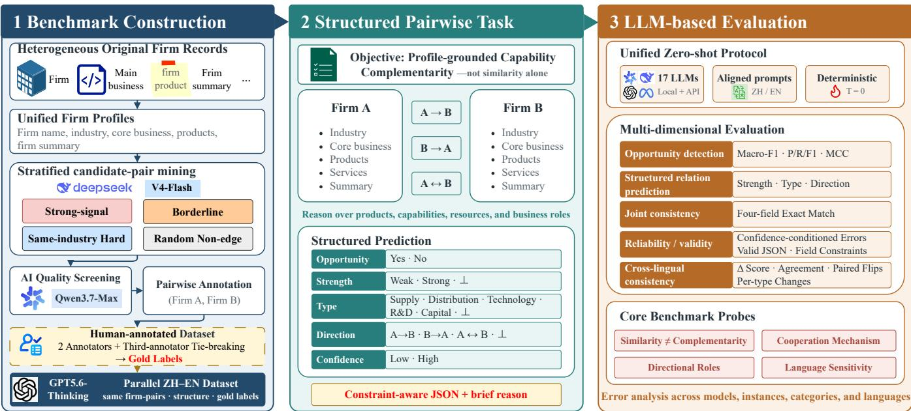  
Fi<sub>gure</sub> 1<sub>:</sub> O<sub>verv</sub>i<sub>ew o</sub>f F<sub>irm</sub>COR<sub>e.</sub> Th<sub>e</sub> b<sub>enc</sub>h<sub>mar</sub>k i<sub>s cons</sub>t<sub>ruc</sub>t<sub>e</sub>d f<sub>rom un</sub>ifi<sub>e</sub>d fi<sub>rm pro</sub>fil<sub>es</sub> th<sub>roug</sub>h <sub>s</sub>t<sub>ra</sub>tifi<sub>e</sub>d <sub>can</sub>did<sub>a</sub>t<sub>e m</sub>i<sub>n</sub>i<sub>ng,</sub> qualit screenin , blind human annotation, and tuple-level adjudication. Models then perform zero-shot structured prediction <sub>on para</sub>ll<sub>e</sub>l Chi<sub>nese an</sub>d E<sub>ng</sub>li<sub>s</sub>h <sub>pro</sub>fil<sub>e pa</sub>i<sub>rs un</sub>d<sub>er a un</sub>ifi<sub>e</sub>d <sub>eva</sub>l<sub>ua</sub>ti<sub>on pro</sub>t<sub>oco</sub>l<sub>.</sub>

To address these RQs, we introduce FirmCORe (Inter-Firm Collaboration Opportunity Reasoning), a human-<sub>anno</sub>t<sub>a</sub>t<sub>e</sub>d b<sub>enc</sub>h<sub>mar</sub>k <sub>compr</sub>i<sub>s</sub>i<sub>ng</sub> 2<sub>,</sub>805 <sub>go</sub>ld<sub>-</sub>l<sub>a</sub>b<sub>e</sub>l<sub>e</sub>d fi<sub>rm</sub> <sub>pa</sub>i<sub>rs</sub> f<sub>or s</sub>t<sub>ruc</sub>t<sub>ure</sub>d <sub>reason</sub>i<sub>ng a</sub>b<sub>ou</sub>t i<sub>n</sub>t<sub>er-</sub>fi<sub>rm co</sub>ll<sub>a</sub>b<sub>ora</sub>ti<sub>on</sub> <sub>oppor</sub>t<sub>un</sub>iti<sub>es.</sub> Th<sub>e</sub> <sub>ma</sub>i<sub>n</sub> <sub>con</sub>t<sub>r</sub>ib<sub>u</sub>ti<sub>ons</sub> <sub>o</sub>f thi<sub>s</sub> <sub>paper</sub> <sub>are</sub> <sub>as</sub> f<sub>o</sub>ll<sub>ows:</sub>

• We formulate inter-firm collaboration o<sub>pp</sub>ortunit<sub>y</sub> detecti<sub>on</sub> <sub>as</sub> <sub>a</sub> <sub>pro</sub>fil<sub>e-</sub>b<sub>ase</sub>d<sub>,</sub> <sub>capa</sub>bilit<sub>y-comp</sub>l<sub>emen</sub>t<sub>ar</sub>it<sub>y</sub> <sub>reason-</sub> ing task that jointly predicts opportunity existence, opport<sub>un</sub>it<sub>y</sub> <sub>s</sub>t<sub>reng</sub>th<sub>,</sub> <sub>co</sub>ll<sub>a</sub>b<sub>ora</sub>ti<sub>on</sub> t<sub>ype,</sub> <sub>an</sub>d <sub>ro</sub>l<sub>e</sub> di<sub>rec</sub>ti<sub>on.</sub>

• We introduce FirmCORe<sub>,</sub> a human-annotated benchmark <sub>con</sub>t<sub>a</sub>i<sub>n</sub>i<sub>ng</sub> 2<sub>,</sub>805 <sub>go</sub>ld<sub>-</sub>l<sub>a</sub>b<sub>e</sub>l<sub>e</sub>d fi<sub>rm pa</sub>i<sub>rs</sub> d<sub>er</sub>i<sub>ve</sub>d f<sub>rom rea</sub>l<sub>-</sub> <sub>wor</sub>ld fi<sub>rm pro</sub>fil<sub>es,</sub> t<sub>oge</sub>th<sub>er w</sub>ith <sub>para</sub>ll<sub>e</sub>l Chi<sub>nese an</sub>d E<sub>n-</sub> <sub>g</sub>li<sub>s</sub>h <sub>eva</sub>l<sub>ua</sub>ti<sub>on se</sub>t<sub>s.</sub>

• We s<sub>y</sub>stematicall<sub>y</sub> evaluate re<sub>p</sub>resentative LLMs under a <sub>un</sub>ifi<sub>e</sub>d <sub>s</sub>t<sub>ruc</sub>t<sub>ure</sub>d <sub>pre</sub>di<sub>c</sub>ti<sub>on</sub> <sub>se</sub>tti<sub>ng</sub> <sub>an</sub>d <sub>s</sub>h<sub>ow</sub> th<sub>a</sub>t d<sub>e</sub>t<sub>ec</sub>t<sub>-</sub> i<sub>ng</sub> b<sub>roa</sub>d <sub>co</sub>ll<sub>a</sub>b<sub>ora</sub>ti<sub>on</sub> <sub>oppor</sub>t<sub>un</sub>iti<sub>es</sub> i<sub>s</sub> <sub>su</sub>b<sub>s</sub>t<sub>an</sub>ti<sub>a</sub>ll<sub>y</sub> <sub>eas</sub>i<sub>er</sub> th<sub>an</sub> <sub>correc</sub>tl<sub>y</sub> id<sub>en</sub>tif<sub>y</sub>i<sub>ng</sub> <sub>co</sub>ll<sub>a</sub>b<sub>ora</sub>ti<sub>on</sub> t<sub>ypes,</sub> <sub>ro</sub>l<sub>e</sub> di<sub>rec-</sub> ti<sub>ons, an</sub>d <sub>comp</sub>l<sub>e</sub>t<sub>e</sub> f<sub>our-</sub>fi<sub>e</sub>ld <sub>re</sub>l<sub>a</sub>ti<sub>on s</sub>t<sub>ruc</sub>t<sub>ures.</sub>

## 2 Related Work

Firm Similarity and Representation. Prior work uses busi-<sub>ness</sub> d<sub>escr</sub>i<sub>p</sub>ti<sub>ons,</sub> i<sub>n</sub>d<sub>us</sub>t<sub>ry</sub> <sub>a</sub>tt<sub>r</sub>ib<sub>u</sub>t<sub>es,</sub> <sub>an</sub>d i<sub>n</sub>t<sub>er-</sub>fi<sub>rm</sub> <sub>grap</sub>h<sub>s</sub> t<sub>o suppor</sub>t t<sub>as</sub>k<sub>s suc</sub>h <sub>as s</sub>i<sub>m</sub>il<sub>ar</sub>it<sub>y es</sub>ti<sub>ma</sub>ti<sub>on, compe</sub>tit<sub>or</sub> retrieval, and industr<sub>y</sub> classification (Cao et al. 2024; Yan<sub>g</sub> et al. 2025). These methods <sub>p</sub>rimaril<sub>y</sub> ca<sub>p</sub>ture semantic or <sub>s</sub>t<sub>ruc</sub>t<sub>ura</sub>l <sub>re</sub>l<sub>a</sub>t<sub>e</sub>d<sub>ness</sub> b<sub>e</sub>t<sub>ween</sub> fi<sub>rms.</sub> H<sub>owever, s</sub>i<sub>m</sub>il<sub>ar</sub>it<sub>y</sub> i<sub>n</sub> <sub>pro</sub>d<sub>uc</sub>t<sub>s,</sub> b<sub>us</sub>i<sub>ness</sub> <sub>ac</sub>ti<sub>v</sub>iti<sub>es,</sub> <sub>or</sub> i<sub>n</sub>d<sub>us</sub>t<sub>ry</sub> <sub>a</sub>fili<sub>a</sub>ti<sub>on</sub> d<sub>oes</sub> <sub>no</sub>t <sub>necessar</sub>il<sub>y</sub> i<sub>n</sub>di<sub>ca</sub>t<sub>e comp</sub>l<sub>emen</sub>t<sub>ary capa</sub>biliti<sub>es or an</sub> <sub>ev</sub>id<sub>ence-suppor</sub>t<sub>e</sub>d <sub>co</sub>ll<sub>a</sub>b<sub>ora</sub>ti<sub>on</sub> <sub>oppor</sub>t<sub>un</sub>it<sub>y.</sub>

Link Prediction and Supplier Recommendation. S<sub>upp</sub>l<sub>y-c</sub>h<sub>a</sub>i<sub>n</sub> li<sub>n</sub>k <sub>pre</sub>di<sub>c</sub>ti<sub>on an</sub>d <sub>supp</sub>li<sub>er recommen</sub>d<sub>a</sub>ti<sub>on</sub> l<sub>everage re</sub>l<sub>a</sub>ti<sub>ona</sub>l <sub>grap</sub>h<sub>s,</sub> k<sub>now</sub>l<sub>e</sub>d<sub>ge</sub> b<sub>ases,</sub> fi<sub>rm a</sub>tt<sub>r</sub>ib<sub>u</sub>t<sub>es,</sub> <sub>an</sub>d <sub>procuremen</sub>t <sub>s</sub>i<sub>gna</sub>l<sub>s</sub> t<sub>o pre</sub>di<sub>c</sub>t <sub>supp</sub>li<sub>er–cus</sub>t<sub>omer</sub> li<sub>n</sub>k<sub>s</sub> or rank candidate firms for collaboration (Kosasih and Brintru<sub>p</sub> 2025; Li et al. 2025). The former relies <sub>p</sub>rimaril<sub>y</sub> on <sub>o</sub>b<sub>serve</sub>d i<sub>n</sub>t<sub>er-</sub>fi<sub>rm ne</sub>t<sub>wor</sub>k <sub>s</sub>t<sub>ruc</sub>t<sub>ure, w</sub>h<sub>ereas</sub> th<sub>e</sub> l<sub>a</sub>tt<sub>er</sub> t<sub>yp-</sub> i<sub>ca</sub>ll<sub>y opera</sub>t<sub>es w</sub>ithi<sub>n spec</sub>ifi<sub>c p</sub>l<sub>a</sub>tf<sub>orms or app</sub>li<sub>ca</sub>ti<sub>on con-</sub> t<sub>ex</sub>t<sub>s.</sub> In <sub>co</sub>ntr<sub>as</sub>t<sub>,</sub> F<sub>irm</sub>COR<sub>e uses o</sub>nl<sub>y</sub> t<sub>wo wea</sub>kl<sub>y s</sub>tr<sub>uc</sub>t<sub>u</sub>r<sub>e</sub>d fi<sub>rm</sub> <sub>pro</sub>fil<sub>es,</sub> <sub>w</sub>ith<sub>ou</sub>t <sub>re</sub>l<sub>y</sub>i<sub>ng</sub> <sub>on</sub> i<sub>n</sub>t<sub>er-</sub>fi<sub>rm</sub> <sub>ne</sub>t<sub>wor</sub>k<sub>s</sub> <sub>or</sub> <sub>p</sub>l<sub>a</sub>t<sub>-</sub> f<sub>orm</sub> i<sub>n</sub>t<sub>erac</sub>ti<sub>ons,</sub> t<sub>o</sub> di<sub>s</sub>ti<sub>ngu</sub>i<sub>s</sub>h <sub>capa</sub>bilit<sub>y</sub> <sub>comp</sub>l<sub>emen</sub>t<sub>ar</sub>it<sub>y</sub> f<sub>rom super</sub>fi<sub>c</sub>i<sub>a</sub>l <sub>re</sub>l<sub>a</sub>t<sub>e</sub>d<sub>ness.</sub>

LLM-Based Benchmarks for Business Reasoning. Re-<sub>cen</sub>t b<sub>enc</sub>h<sub>mar</sub>k<sub>s eva</sub>l<sub>ua</sub>t<sub>e</sub> LLM<sub>s on econom</sub>i<sub>c reason</sub>i<sub>ng,</sub> <sub>corpora</sub>t<sub>e</sub> t<sub>as</sub>k<sub>s, an</sub>d <sub>supp</sub>l<sub>y-c</sub>h<sub>a</sub>i<sub>n</sub> k<sub>now</sub>l<sub>e</sub>d<sub>ge or wor</sub>kfl<sub>ow</sub> execution (Quan and Liu 2024; Guan et al. 2026), <sub>p</sub>rimaril<sub>y</sub> th<sub>roug</sub>h i<sub>n</sub>di<sub>v</sub>id<sub>ua</sub>l <sub>ques</sub>ti<sub>ons,</sub> d<sub>ocumen</sub>t<sub>s, s</sub>i<sub>mu</sub>l<sub>a</sub>t<sub>e</sub>d <sub>scenar-</sub> ios, or <sub>p</sub>redefined o<sub>p</sub>erational workflows (Krumdick et al. 2024; Matlin et al. 2025). FirmCORe instead tar<sub>g</sub>ets <sub>p</sub>rofile-<sub>groun</sub>d<sub>e</sub>d <sub>s</sub>t<sub>ruc</sub>t<sub>ure</sub>d <sub>reason</sub>i<sub>ng</sub> <sub>a</sub>b<sub>ou</sub>t i<sub>n</sub>t<sub>er-</sub>fi<sub>rm</sub> <sub>co</sub>ll<sub>a</sub>b<sub>ora</sub>ti<sub>on</sub> <sub>oppor</sub>t<sub>un</sub>iti<sub>es.</sub> Gi<sub>ven</sub> t<sub>wo</sub> <sub>wea</sub>kl<sub>y</sub> <sub>s</sub>t<sub>ruc</sub>t<sub>ure</sub>d fi<sub>rm</sub> <sub>pro</sub>fil<sub>es,</sub> it <sub>assesses</sub> <sub>w</sub>h<sub>e</sub>th<sub>er</sub> LLM<sub>s</sub> <sub>can</sub> d<sub>e</sub>t<sub>ec</sub>t <sub>an</sub> <sub>ev</sub>id<sub>ence-suppor</sub>t<sub>e</sub>d <sub>co</sub>ll<sub>a</sub>b<sub>ora</sub>ti<sub>on</sub> <sub>oppor</sub>t<sub>un</sub>it<sub>y</sub> <sub>an</sub>d<sub>,</sub> f<sub>or</sub> <sub>pos</sub>iti<sub>ve</sub> <sub>pa</sub>i<sub>rs,</sub> <sub>pre</sub>di<sub>c</sub>t <sub>op-</sub> <sub>por</sub>t<sub>un</sub>it<sub>y</sub> <sub>s</sub>t<sub>reng</sub>th<sub>,</sub> <sub>co</sub>ll<sub>a</sub>b<sub>ora</sub>ti<sub>on</sub> t<sub>ype,</sub> <sub>an</sub>d <sub>ro</sub>l<sub>e</sub> di<sub>rec</sub>ti<sub>on.</sub>

## 3 The FirmCORe Benchmark

## 3.1 Task Definition

E<sub>ac</sub>h b<sub>enc</sub>h<sub>mar</sub>k i<sub>ns</sub>t<sub>ance cons</sub>i<sub>s</sub>t<sub>s o</sub>f <sub>a pa</sub>i<sub>r o</sub>f fi<sub>rm pro</sub>fil<sub>es</sub> <sub>presen</sub>t<sub>e</sub>d i<sub>n a</sub> fi<sub>xe</sub>d <sub>ran</sub>d<sub>om</sub>i<sub>ze</sub>d <sub>or</sub>d<sub>er as</sub> Fi<sub>rm</sub> A <sub>an</sub>d Fi<sub>rm</sub> B<sub>.</sub> E<sub>ac</sub>h fi<sub>rm</sub> <sub>pro</sub>fil<sub>e</sub> i<sub>nc</sub>l<sub>u</sub>d<sub>es</sub> th<sub>e</sub> fi<sub>rm</sub> <sub>name,</sub> i<sub>n</sub>d<sub>us</sub>t<sub>ry,</sub> <sub>core</sub> b<sub>us</sub>i<sub>ness, pro</sub>d<sub>uc</sub>t<sub>s an</sub>d <sub>serv</sub>i<sub>ces, an</sub>d <sub>a</sub> b<sub>r</sub>i<sub>e</sub>f <sub>pro</sub>fil<sub>e summary.</sub> E<sub>ac</sub>h fi<sub>rm pa</sub>i<sub>r appears on</sub>l<sub>y once, an</sub>d th<sub>e reverse</sub>d <sub>or</sub>d<sub>er</sub>i<sub>ng</sub> i<sub>s no</sub>t i<sub>nc</sub>l<sub>u</sub>d<sub>e</sub>d <sub>separa</sub>t<sub>e</sub>l<sub>y.</sub> F<sub>or eac</sub>h <sub>pa</sub>i<sub>r</sub> $( i , j )$ <sub>,</sub> F<sub>irm</sub>COR<sub>e</sub> <sub>prov</sub>id<sub>es</sub> th<sub>e</sub> f<sub>o</sub>ll<sub>ow</sub>i<sub>ng s</sub>t<sub>ruc</sub>t<sub>ure</sub>d l<sub>a</sub>b<sub>e</sub>l<sub>:</sub>

$$
y _ { i j } = ( o _ { i j } , g _ { i j } , t _ { i j } , r _ { i j } ) ,\tag{1}
$$

<sub>w</sub>h<sub>ere</sub> $o _ { i j }$ i<sub>n</sub>di<sub>ca</sub>t<sub>es w</sub>h<sub>e</sub>th<sub>er a co</sub>ll<sub>a</sub>b<sub>ora</sub>ti<sub>on oppor</sub>t<sub>un</sub>it<sub>y ex-</sub> i<sub>s</sub>t<sub>s,</sub> $g _ { i j }$ d<sub>eno</sub>t<sub>es</sub> it<sub>s</sub> <sub>s</sub>t<sub>reng</sub>th<sub>,</sub> $t _ { i j }$ d<sub>eno</sub>t<sub>es</sub> th<sub>e</sub> <sub>pr</sub>i<sub>mary</sub> <sub>co</sub>ll<sub>a</sub>b<sub>-</sub> orat<sup>i</sup>on t<sub>yp</sub>e, an<sup>d</sup> $r _ { i j }$ d<sub>eno</sub>t<sub>es</sub> th<sub>e ro</sub>l<sub>e</sub> di<sub>rec</sub>ti<sub>on.</sub>

O<sub>ppor</sub>t<sub>un</sub>it<sub>y ex</sub>i<sub>s</sub>t<sub>ence</sub> i<sub>s</sub> bi<sub>nary:</sub> $o _ { i j } ~ \in ~ \{ 0 , 1 \}$ <sub>, w</sub>h<sub>ere</sub> $o _ { i j } ~ = ~ 1$ i<sub>n</sub>di<sub>ca</sub>t<sub>es</sub> th<sub>a</sub>t <sub>a co</sub>ll<sub>a</sub>b<sub>ora</sub>ti<sub>on oppor</sub>t<sub>un</sub>it<sub>y ex</sub>i<sub>s</sub>t<sub>s,</sub> <sub>an</sub>d $o _ { i j } ~ = ~ 0$ <sub>o</sub>th<sub>erw</sub>i<sub>se.</sub> C<sub>on</sub>diti<sub>ona</sub>l <sub>on</sub> $o _ { i j } ~ = ~ 1$ <sub>,</sub> th<sub>e</sub> <sub>rema</sub>i<sub>n</sub>i<sub>ng</sub> l<sub>a</sub>b<sub>e</sub>l<sub>s sa</sub>ti<sub>s</sub>f<sub>y:</sub> $g _ { i j } ~ \in ~ \{ \mathrm { W } _ { \mathrm { E A K } , \mathrm { S T R O N G } } \} , ~ t _ { i j } ~ \in$ {Supply, Distribution, Technology, R&D, Capital}, <sub>an</sub>d $r _ { i j } \in \{ \mathbf { A } 2 \mathbf { B } : A  B , \mathbf { B } 2 \mathbf { A } : B  A$ , Bidirectional : $A  { \bar { B } } \} . g _ { i j } = S$ <sub>trong</sub> d<sub>eno</sub>t<sub>es</sub> <sub>a</sub> di<sub>rec</sub>t <sub>an</sub>d <sub>we</sub>ll<sub>-suppor</sub>t<sub>e</sub>d <sub>co</sub>ll<sub>a</sub>b<sub>ora</sub>ti<sub>on</sub> i<sub>n</sub>t<sub>er</sub>f<sub>ace, w</sub>h<sub>ereas</sub> $g _ { i j } ~ = ~ \mathsf { W } _ { \mathsf { E A K } }$ d<sub>eno</sub>t<sub>es a</sub> <sub>p</sub>l<sub>aus</sub>ibl<sub>e</sub> b<sub>u</sub>t i<sub>n</sub>di<sub>rec</sub>t <sub>or</sub> l<sub>ess</sub> <sub>c</sub>l<sub>ear</sub>l<sub>y</sub> <sub>suppor</sub>t<sub>e</sub>d <sub>oppor</sub>t<sub>un</sub>it<sub>y.</sub> Th<sub>e co</sub>ll<sub>a</sub>b<sub>ora</sub>ti<sub>on</sub> t<sub>ype represen</sub>t<sub>s</sub> th<sub>e mos</sub>t di<sub>rec</sub>t <sub>an</sub>d b<sub>es</sub>t<sub>-suppor</sub>t<sub>e</sub>d f<sub>orm</sub> <sub>o</sub>f <sub>co</sub>ll<sub>a</sub>b<sub>ora</sub>ti<sub>on.</sub> R<sub>o</sub>l<sub>e</sub> di<sub>rec</sub>ti<sub>on</sub> i<sub>s</sub> d<sub>e</sub>fi<sub>ne</sub>d <sub>re</sub>l<sub>a</sub>ti<sub>ve</sub> t<sub>o</sub> th<sub>e</sub> di<sub>sp</sub>l<sub>aye</sub>d A/B <sub>or</sub>d<sub>er</sub> <sub>an</sub>d <sub>cap</sub>t<sub>ures</sub> th<sub>e</sub> <sub>pr</sub>i<sub>mary</sub> fl<sub>ow o</sub>f <sub>resources or capa</sub>biliti<sub>es.</sub>

F<sub>irm</sub>COR<sub>e</sub> <sub>eva</sub>l<sub>ua</sub>t<sub>es</sub> <sub>w</sub>h<sub>e</sub>th<sub>er</sub> th<sub>e</sub> <sub>supp</sub>li<sub>e</sub>d <sub>pro</sub>fil<sub>es</sub> <sub>sup-</sub> <sub>por</sub>t <sub>a po</sub>t<sub>en</sub>ti<sub>a</sub>l <sub>co</sub>ll<sub>a</sub>b<sub>ora</sub>ti<sub>on, ra</sub>th<sub>er</sub> th<sub>an w</sub>h<sub>e</sub>th<sub>er</sub> th<sub>e</sub> fi<sub>rms</sub> h<sub>ave co</sub>ll<sub>a</sub>b<sub>ora</sub>t<sub>e</sub>d i<sub>n prac</sub>ti<sub>ce.</sub> M<sub>o</sub>d<sub>e</sub>l<sub>s mus</sub>t <sub>re</sub>l<sub>y so</sub>l<sub>e</sub>l<sub>y on</sub> th<sub>e</sub> <sub>prov</sub>id<sub>e</sub>d <sub>pro</sub>fil<sub>es.</sub> Th<sub>ey a</sub>l<sub>so genera</sub>t<sub>e a</sub> b<sub>r</sub>i<sub>e</sub>f <sub>ra</sub>ti<sub>ona</sub>l<sub>e an</sub>d <sub>a</sub> L<sub>ow</sub>/H<sub>igh</sub> <sub>con</sub>fid<sub>ence</sub> l<sub>a</sub>b<sub>e</sub>l<sub>,</sub> <sub>w</sub>hi<sub>c</sub>h <sub>are</sub> <sub>ana</sub>l<sub>yze</sub>d <sub>separa</sub>t<sub>e</sub>l<sub>y</sub> f<sub>rom</sub> f<sub>our-</sub>fi<sub>e</sub>ld <sub>exac</sub>t <sub>ma</sub>t<sub>c</sub>h<sub>.</sub>

## 3.2 FirmCORe Framework

Fi<sub>gure</sub> 1 <sub>presen</sub>t<sub>s an overv</sub>i<sub>ew o</sub>f th<sub>e</sub> F<sub>irm</sub>COR<sub>e</sub> f<sub>ramewor</sub>k<sub>,</sub> <sub>w</sub>hi<sub>c</sub>h i<sub>s s</sub>t<sub>ruc</sub>t<sub>ure</sub>d i<sub>n</sub>t<sub>o</sub> th<sub>ree s</sub>t<sub>ages an</sub>d fi<sub>ve</sub> k<sub>ey componen</sub>t<sub>s.</sub>

A. Firm Profile Construction We consolidate records f<sub>rom</sub> h<sub>e</sub>t<sub>erogeneous</sub> d<sub>a</sub>t<sub>a sources</sub> i<sub>n</sub>t<sub>o un</sub>ifi<sub>e</sub>d fi<sub>rm pro</sub>fil<sub>es,</sub> <sub>eac</sub>h <sub>con</sub>t<sub>a</sub>i<sub>n</sub>i<sub>ng</sub> th<sub>e</sub> fi<sub>rm name,</sub> i<sub>n</sub>d<sub>us</sub>t<sub>ry, core</sub> b<sub>us</sub>i<sub>ness,</sub> <sub>pro</sub>d<sub>uc</sub>t<sub>s an</sub>d <sub>serv</sub>i<sub>ces, an</sub>d <sub>a</sub> t<sub>ex</sub>t<sub>ua</sub>l <sub>summary.</sub> R<sub>ecor</sub>d<sub>s are</sub> <sub>ma</sub>t<sub>c</sub>h<sub>e</sub>d b<sub>ase</sub>d <sub>on</sub> id<sub>en</sub>tifi<sub>ers an</sub>d <sub>names,</sub> d<sub>up</sub>li<sub>ca</sub>t<sub>e va</sub>l<sub>ues are</sub> <sub>merge</sub>d <sub>a</sub>t th<sub>e</sub> fi<sub>e</sub>ld l<sub>eve</sub>l<sub>, an</sub>d <sub>m</sub>i<sub>ss</sub>i<sub>ng</sub> fi<sub>e</sub>ld<sub>s are om</sub>itt<sub>e</sub>d <sub>w</sub>ith<sub>-</sub> <sub>ou</sub>t i<sub>mpu</sub>t<sub>a</sub>ti<sub>on.</sub> W<sub>e</sub> th<sub>en remove recor</sub>d<sub>s</sub> l<sub>ac</sub>ki<sub>ng va</sub>lid fi<sub>rm</sub> <sub>names,</sub> d<sub>e</sub>d<sub>up</sub>li<sub>ca</sub>t<sub>e</sub> th<sub>e resu</sub>lti<sub>ng</sub> fi<sub>rm pro</sub>fil<sub>es, an</sub>d <sub>exc</sub>l<sub>u</sub>d<sub>e</sub> <sub>pro</sub>fil<sub>es</sub> th<sub>a</sub>t <sub>are</sub> t<sub>oo sparse</sub> f<sub>or mean</sub>i<sub>ng</sub>f<sub>u</sub>l <sub>pa</sub>i<sub>rw</sub>i<sub>se assess-</sub> <sup>ment</sup>. <sup>Data</sup> p<sup>ro</sup>v<sup>enance</sup>, <sup>tem</sup>p<sup>oral</sup> <sup>and</sup> g<sup>eo</sup>g<sup>ra</sup>p<sup>hic</sup> <sup>co</sup>v<sup>era</sup>g<sup>e</sup>, <sub>pr</sub>i<sub>vacy</sub> filt<sub>er</sub>i<sub>ng,</sub> <sub>an</sub>d <sub>re</sub>l<sub>ease</sub> <sub>con</sub>diti<sub>ons</sub> <sub>are</sub> d<sub>ocumen</sub>t<sub>e</sub>d i<sub>n</sub> A<sub>ppen</sub>di<sub>x</sub> C<sub>.</sub>

B. Stratified Candidate Pair Mining To prevent the b<sub>enc</sub>h<sub>mar</sub>k f<sub>rom</sub> b<sub>e</sub>i<sub>ng</sub> d<sub>om</sub>i<sub>na</sub>t<sub>e</sub>d b<sub>y</sub> t<sub>r</sub>i<sub>v</sub>i<sub>a</sub>l <sub>nega</sub>ti<sub>ve sam-</sub> <sub>p</sub>l<sub>es,</sub> <sub>we</sub> <sub>m</sub>i<sub>ne</sub> <sub>can</sub>did<sub>a</sub>t<sub>e</sub> fi<sub>rm</sub> <sub>pa</sub>i<sub>rs</sub> f<sub>rom</sub> f<sub>our</sub> <sub>s</sub>t<sub>ra</sub>t<sub>a:</sub> <sub>s</sub>t<sub>rong-</sub> <sub>s</sub>i<sub>gna</sub>l <sub>pa</sub>i<sub>rs,</sub> b<sub>or</sub>d<sub>er</sub>li<sub>ne-s</sub>i<sub>gna</sub>l <sub>pa</sub>i<sub>rs,</sub> <sub>same-</sub>i<sub>n</sub>d<sub>us</sub>t<sub>ry</sub> h<sub>ar</sub>d <sub>pa</sub>i<sub>rs</sub> th<sub>a</sub>t <sub>ex</sub>hibit b<sub>us</sub>i<sub>ness</sub> <sub>re</sub>l<sub>a</sub>t<sub>e</sub>d<sub>ness</sub> b<sub>u</sub>t l<sub>ac</sub>k <sub>exp</sub>li<sub>c</sub>it <sub>supp</sub>l<sub>y–</sub> d<sub>eman</sub>d <sub>comp</sub>l<sub>emen</sub>t<sub>ar</sub>it<sub>y,</sub> <sub>an</sub>d <sub>ran</sub>d<sub>om</sub>l<sub>y</sub> <sub>samp</sub>l<sub>e</sub>d <sub>non-e</sub>d<sub>ge</sub> <sub>pa</sub>i<sub>rs.</sub> U<sub>ps</sub>t<sub>ream</sub> <sub>re</sub>l<sub>a</sub>ti<sub>ons</sub>hi<sub>p</sub> <sub>scores</sub> <sub>are</sub> <sub>compu</sub>t<sub>e</sub>d f<sub>rom</sub> fi<sub>rm</sub> <sub>pro</sub>fil<sub>es</sub> <sub>an</sub>d t<sub>rue</sub> <sub>ava</sub>il<sub>a</sub>bl<sub>e</sub> <sub>supp</sub>l<sub>y–</sub>d<sub>eman</sub>d i<sub>n</sub>f<sub>orma</sub>ti<sub>on</sub> <sub>an</sub>d <sub>are use</sub>d <sub>so</sub>l<sub>e</sub>l<sub>y</sub> f<sub>or can</sub>did<sub>a</sub>t<sub>e se</sub>l<sub>ec</sub>ti<sub>on, never as groun</sub>d<sub>-</sub>t<sub>ru</sub>th l<sub>a</sub>b<sub>e</sub>l<sub>s.</sub> W<sub>e re</sub>t<sub>a</sub>i<sub>n up</sub> t<sub>o</sub> 3<sub>,</sub>000 fi<sub>rm pa</sub>i<sub>rs per s</sub>t<sub>ra</sub>t<sub>um an</sub>d <sub>re-</sub> <sub>move</sub> d<sub>up</sub>li<sub>ca</sub>t<sub>e pa</sub>i<sub>rs as we</sub>ll <sub>as pa</sub>i<sub>rs</sub> th<sub>a</sub>t dif<sub>er on</sub>l<sub>y</sub> i<sub>n or</sub>d<sub>er-</sub> i<sub>ng.</sub> W<sub>e use</sub> D<sub>eep</sub>S<sub>ee</sub>k<sub>-</sub>V4<sub>-</sub>Fl<sub>as</sub>h t<sub>o screen</sub> f<sub>or po</sub>t<sub>en</sub>ti<sub>a</sub>l l<sub>a</sub>b<sub>e</sub>l l<sub>ea</sub>k<sub>age, pr</sub>i<sub>vacy r</sub>i<sub>s</sub>k<sub>s, an</sub>d d<sub>a</sub>t<sub>a-qua</sub>lit<sub>y</sub> i<sub>ssues.</sub> U<sub>p</sub> t<sub>o</sub> 750 <sub>pa</sub>i<sub>rs per s</sub>t<sub>ra</sub>t<sub>um are se</sub>l<sub>ec</sub>t<sub>e</sub>d f<sub>or</sub> h<sub>uman anno</sub>t<sub>a</sub>ti<sub>on, w</sub>hil<sub>e</sub> <sub>s</sub>t<sub>ra</sub>t<sub>um mem</sub>b<sub>ers</sub>hi<sub>p, assoc</sub>i<sub>a</sub>t<sub>e</sub>d <sub>scores, an</sub>d <sub>source</sub> id<sub>en</sub>ti<sub>-</sub> fi<sub>ers are</sub> hidd<sub>en</sub> f<sub>rom anno</sub>t<sub>a</sub>t<sub>ors.</sub> D<sub>e</sub>t<sub>a</sub>il<sub>e</sub>d <sub>m</sub>i<sub>n</sub>i<sub>ng cr</sub>it<sub>er</sub>i<sub>a</sub> <sub>an</sub>d th<sub>res</sub>h<sub>o</sub>ld<sub>s are prov</sub>id<sub>e</sub>d i<sub>n</sub> A<sub>ppen</sub>di<sub>x</sub> A<sub>.</sub>

C. Human Annotation Each firm pair was independently <sub>anno</sub>t<sub>a</sub>t<sub>e</sub>d b<sub>y</sub> t<sub>wo anno</sub>t<sub>a</sub>t<sub>ors un</sub>d<sub>er source-</sub>bli<sub>n</sub>d <sub>con</sub>di<sub>-</sub> tions (Bender and Friedman 2018). Annotators relied solel<sub>y</sub> <sub>on</sub> th<sub>e prov</sub>id<sub>e</sub>d fi<sub>rm pro</sub>fil<sub>es an</sub>d <sub>were no</sub>t <sub>a</sub>ll<sub>owe</sub>d t<sub>o consu</sub>lt <sub>ex</sub>t<sub>erna</sub>l <sub>sources.</sub> Th<sub>ey</sub> l<sub>a</sub>b<sub>e</sub>l<sub>e</sub>d <sub>oppor</sub>t<sub>un</sub>it<sub>y ex</sub>i<sub>s</sub>t<sub>ence an</sub>d<sub>,</sub> f<sub>or</sub> <sub>pos</sub>iti<sub>ve</sub> <sub>pa</sub>i<sub>rs,</sub> <sub>oppor</sub>t<sub>un</sub>it<sub>y</sub> <sub>s</sub>t<sub>reng</sub>th<sub>,</sub> <sub>co</sub>ll<sub>a</sub>b<sub>ora</sub>ti<sub>on</sub> t<sub>ype,</sub> <sub>an</sub>d <sub>ro</sub>l<sub>e</sub> di<sub>rec</sub>ti<sub>on.</sub> A <sub>pos</sub>iti<sub>ve</sub> l<sub>a</sub>b<sub>e</sub>l <sub>requ</sub>i<sub>re</sub>d <sub>an ev</sub>id<sub>ence-</sub> <sub>suppor</sub>t<sub>e</sub>d <sub>co</sub>ll<sub>a</sub>b<sub>ora</sub>ti<sub>on</sub> i<sub>n</sub>t<sub>er</sub>f<sub>ace</sub> i<sub>nvo</sub>l<sub>v</sub>i<sub>ng pro</sub>d<sub>uc</sub>t<sub>s, ser-</sub> <sub>v</sub>i<sub>ces,</sub> t<sub>ec</sub>h<sub>no</sub>l<sub>og</sub>i<sub>es, c</sub>h<sub>anne</sub>l<sub>s, capa</sub>biliti<sub>es, resources, or cap-</sub> it<sub>a</sub>l<sub>.</sub> I<sub>n</sub>d<sub>us</sub>t<sub>ry s</sub>i<sub>m</sub>il<sub>ar</sub>it<sub>y or</sub> l<sub>ex</sub>i<sub>ca</sub>l <sub>over</sub>l<sub>ap a</sub>l<sub>one was</sub> i<sub>nsu</sub>fi<sub>-</sub> <sub>c</sub>i<sub>en</sub>t<sub>.</sub> F<sub>or nega</sub>ti<sub>ve pa</sub>i<sub>rs,</sub> th<sub>e rema</sub>i<sub>n</sub>i<sub>ng</sub> th<sub>ree</sub> fi<sub>e</sub>ld<sub>s were se</sub>t to None (⊥).

D. Gold Label Aggregation Labels were aggregated at the l<sub>eve</sub>l <sub>o</sub>f <sub>comp</sub>l<sub>e</sub>t<sub>e</sub> f<sub>our-</sub>fi<sub>e</sub>ld t<sub>up</sub>l<sub>es ra</sub>th<sub>er</sub> th<sub>an</sub> b<sub>y</sub> fi<sub>e</sub>ld<sub>-w</sub>i<sub>se</sub> <sub>vo</sub>ti<sub>ng,</sub> <sub>w</sub>hi<sub>c</sub>h <sub>cou</sub>ld <sub>pro</sub>d<sub>uce</sub> i<sub>n</sub>t<sub>erna</sub>ll<sub>y</sub> i<sub>ncons</sub>i<sub>s</sub>t<sub>en</sub>t <sub>com-</sub> bi<sub>na</sub>ti<sub>ons</sub> th<sub>a</sub>t <sub>no anno</sub>t<sub>a</sub>t<sub>or</sub> h<sub>a</sub>d <sub>se</sub>l<sub>ec</sub>t<sub>e</sub>d<sub>.</sub> If th<sub>e</sub> t<sub>wo</sub> i<sub>n</sub>iti<sub>a</sub>l <sub>anno</sub>t<sub>a</sub>t<sub>ors</sub> di<sub>sagree</sub>d <sub>on</sub> th<sub>e comp</sub>l<sub>e</sub>t<sub>e</sub> f<sub>our-</sub>fi<sub>e</sub>ld t<sub>up</sub>l<sub>e, a</sub> thi<sub>r</sub>d <sub>anno</sub>t<sub>a</sub>t<sub>or</sub> i<sub>n</sub>d<sub>epen</sub>d<sub>en</sub>tl<sub>y</sub> l<sub>a</sub>b<sub>e</sub>l<sub>e</sub>d th<sub>e</sub> i<sub>ns</sub>t<sub>ance as a</sub> ti<sub>e</sub> b<sub>rea</sub>k<sub>er.</sub> Th<sub>e go</sub>ld t<sub>up</sub>l<sub>e was accep</sub>t<sub>e</sub>d <sub>on</sub>l<sub>y w</sub>h<sub>en</sub> th<sub>e</sub> thi<sub>r</sub>d <sub>anno</sub>t<sub>a</sub>ti<sub>on</sub> <sub>ma</sub>t<sub>c</sub>h<sub>e</sub>d <sub>one o</sub>f th<sub>e</sub> t<sub>wo</sub> i<sub>n</sub>iti<sub>a</sub>l t<sub>up</sub>l<sub>es; cases w</sub>ith th<sub>ree</sub> di<sub>s-</sub> ti<sub>nc</sub>t t<sub>up</sub>l<sub>es or</sub> i<sub>nsu</sub>fi<sub>c</sub>i<sub>en</sub>t <sub>ev</sub>id<sub>ence rema</sub>i<sub>ne</sub>d <sub>unreso</sub>l<sub>ve</sub>d <sub>an</sub>d were excluded. Third-annotator adjudication was required f<sub>or</sub> 30<sub>.</sub>55% <sub>o</sub>f th<sub>e samp</sub>l<sub>es.</sub> Thi<sub>s process y</sub>i<sub>e</sub>ld<sub>e</sub>d 2<sub>,</sub>805 <sub>go</sub>ld<sub>-</sub> <sub>s</sub>t<sub>an</sub>d<sub>ar</sub>d i<sub>ns</sub>t<sub>ances, w</sub>hil<sub>e</sub> th<sub>e rema</sub>i<sub>n</sub>i<sub>ng</sub> 195 <sub>cases were ex-</sub> <sub>c</sub>l<sub>u</sub>d<sub>e</sub>d b<sub>ecause</sub> th<sub>e</sub> di<sub>sagreemen</sub>t<sub>s cou</sub>ld <sub>no</sub>t b<sub>e reso</sub>l<sub>ve</sub>d <sub>w</sub>ith <sub>su</sub>fi<sub>c</sub>i<sub>en</sub>t <sub>con</sub>fid<sub>ence.</sub> Th<sub>e</sub> t<sub>wo</sub> i<sub>n</sub>iti<sub>a</sub>l <sub>anno</sub>t<sub>a</sub>t<sub>ors ac</sub>hi<sub>eve</sub>d <sub>an average</sub> fi<sub>e</sub>ld<sub>-</sub>l<sub>eve</sub>l <sub>agreemen</sub>t <sub>o</sub>f 84<sub>.</sub>26% <sub>an</sub>d <sub>a</sub> f<sub>u</sub>ll<sub>-</sub>t<sub>up</sub>l<sub>e</sub> <sub>agreemen</sub>t <sub>o</sub>f 69<sub>.</sub>45%<sub>.</sub> S<sub>ee</sub> T<sub>a</sub>bl<sub>e</sub> 1 f<sub>or</sub> d<sub>e</sub>t<sub>a</sub>il<sub>e</sub>d <sub>s</sub>t<sub>a</sub>ti<sub>s</sub>ti<sub>cs.</sub>

E. Structured Model Evaluation Let $\ell \in \{ \mathrm { z h } , \mathrm { e n } \}$ d<sub>eno</sub>t<sub>e</sub> th<sub>e</sub> i<sub>npu</sub>t l<sub>anguage.</sub> E<sub>ac</sub>h <sub>eva</sub>l<sub>ua</sub>ti<sub>on</sub> i<sub>ns</sub>t<sub>ance</sub> i<sub>s expresse</sub>d <sub>as</sub>

$$
d _ { i j } ^ { \ell } = \left( x _ { i } ^ { \ell } , x _ { j } ^ { \ell } , y _ { i j } ^ { * } \right) , y _ { i j } ^ { * } = \left( o _ { i j } ^ { * } , g _ { i j } ^ { * } , t _ { i j } ^ { * } , r _ { i j } ^ { * } \right) ,\tag{2}
$$

<sub>w</sub>h<sub>ere</sub> $x _ { i } ^ { \ell }$ <sub>an</sub>d $\boldsymbol { x } _ { j } ^ { \ell }$ <sub>are</sub> th<sub>e</sub> fi<sub>rm</sub> <sub>pro</sub>fil<sub>es</sub> <sub>presen</sub>t<sub>e</sub>d <sub>as</sub> Fi<sub>rm</sub> A <sub>an</sub>d B<sub>,</sub> <sub>respec</sub>ti<sub>ve</sub>l<sub>y.</sub> Th<sub>e</sub> <sub>go</sub>ld <sub>s</sub>t<sub>ruc</sub>t<sub>ure</sub>d l<sub>a</sub>b<sub>e</sub>l $y _ { i j } ^ { * }$ conta<sup>i</sup>ns o<sub>p</sub>- <sub>p</sub>ortun<sup>i</sup>t<sub>y</sub> ex<sup>i</sup>stence, o<sub>pp</sub>ortun<sup>i</sup>t<sub>y</sub> stren<sub>g</sub>t<sup>h</sup>, co<sup>ll</sup>a<sup>b</sup>orat<sup>i</sup>on t<sub>yp</sub>e, <sub>an</sub>d <sub>ro</sub>l<sub>e</sub> di<sub>rec</sub>ti<sub>on.</sub> Gi<sub>ven a</sub> l<sub>anguage-a</sub>li<sub>gne</sub>d t<sub>as</sub>k i<sub>ns</sub>t<sub>ruc</sub>ti<sub>on</sub> $p ^ { \ell }$ <sub>,</sub> <sub>a</sub> <sub>mo</sub>d<sub>e</sub>l $f _ { \theta }$ <sub>p</sub>ro<sup>d</sup>uces a raw textua<sup>l</sup> res<sub>p</sub>onse

$$
z _ { i j } ^ { \ell } = f _ { \theta } \left( p ^ { \ell } , x _ { i } ^ { \ell } , x _ { j } ^ { \ell } \right) .\tag{3}
$$

A deterministic parser Π maps the raw response to

$$
\Pi \left( z _ { i j } ^ { \ell } \right) = \left( \hat { y } _ { i j } ^ { \ell } , \hat { c } _ { i j } ^ { \ell } , \hat { e } _ { i j } ^ { \ell } \right) , \hat { y } _ { i j } ^ { \ell } = \left( \hat { o } _ { i j } ^ { \ell } , \hat { g } _ { i j } ^ { \ell } , \hat { t } _ { i j } ^ { \ell } , \hat { r } _ { i j } ^ { \ell } \right)\tag{4}
$$

<sub>w</sub>h<sub>ere</sub> $\hat { y } _ { i j } ^ { \ell }$ i<sub>s</sub> th<sub>e pre</sub>di<sub>c</sub>t<sub>e</sub>d f<sub>our-</sub>fi<sub>e</sub>ld l<sub>a</sub>b<sub>e</sub>l<sub>,</sub> $\hat { c } _ { i j } ^ { \ell }$ i<sub>s</sub> th<sub>e se</sub>lf<sub>-</sub> <sub>repor</sub>t<sub>e</sub>d <sub>con</sub>fid<sub>ence, an</sub>d $\hat { e } _ { i j } ^ { \ell }$ i<sub>s a</sub> b<sub>r</sub>i<sub>e</sub>f <sub>ra</sub>ti<sub>ona</sub>l<sub>e.</sub> A <sub>s</sub>t<sub>ruc</sub>t<sub>ura</sub>ll<sub>y</sub> <sub>va</sub>lid <sub>pre</sub>di<sub>c</sub>ti<sub>on</sub> <sub>mus</sub>t <sub>sa</sub>ti<sub>s</sub>f<sub>y</sub>

$$
\hat { o } _ { i j } ^ { \ell } = \mathbf { N o } \quad \Longrightarrow \quad \hat { g } _ { i j } ^ { \ell } = \hat { t } _ { i j } ^ { \ell } = \hat { r } _ { i j } ^ { \ell } = \mathbf { N o } \mathbf { N } \mathrm { E } .\tag{5}
$$

T<sub>a</sub>bl<sub>e</sub> 1<sub>:</sub> St<sub>a</sub>ti<sub>s</sub>ti<sub>cs o</sub>f th<sub>e</sub> F<sub>irm</sub>COR<sub>e</sub> b<sub>enc</sub>h<sub>mar</sub>k<sub>.</sub>
<table><tr><td>Statistic</td><td>Value</td></tr><tr><td>Firm profiles Firms / industries</td><td>3,230 / 1,114</td></tr><tr><td>Avg. profile length (characters)</td><td>179.09</td></tr><tr><td>Annotation outcomes</td><td></td></tr><tr><td>Gold / unresolved pairs</td><td>2,805 / 195</td></tr><tr><td>Positive / negative pairs</td><td>968 / 1,837</td></tr><tr><td>Weak / strong opportunities</td><td>35 / 933</td></tr><tr><td>Collaboration types Supply / distribution</td><td>641 / 114</td></tr><tr><td>Technology / R&amp;D</td><td>86 /112</td></tr><tr><td>Capital</td><td>15</td></tr><tr><td>Role directions</td><td></td></tr><tr><td>A2B / B2A / bidirectional</td><td>157 / 700 / 111</td></tr><tr><td>Annotation quality</td><td></td></tr><tr><td></td><td></td></tr><tr><td>Field / tuple agreement</td><td>84.26% / 69.45%</td></tr><tr><td>Third-annotator involvement</td><td></td></tr><tr><td></td><td>30.55%</td></tr><tr><td></td><td></td></tr><tr><td></td><td></td></tr><tr><td>Parallel ZH–EN sets</td><td></td></tr><tr><td></td><td></td></tr><tr><td></td><td></td></tr><tr><td></td><td></td></tr><tr><td>Chinese / English instances</td><td></td></tr><tr><td></td><td></td></tr><tr><td></td><td></td></tr><tr><td></td><td></td></tr><tr><td></td><td></td></tr><tr><td></td><td></td></tr><tr><td></td><td></td></tr><tr><td></td><td></td></tr><tr><td></td><td></td></tr><tr><td></td><td></td></tr><tr><td></td><td></td></tr><tr><td></td><td></td></tr><tr><td></td><td></td></tr><tr><td></td><td></td></tr><tr><td></td><td></td></tr><tr><td></td><td></td></tr><tr><td></td><td></td></tr><tr><td></td><td>2,805 / 2,805</td></tr><tr><td></td><td></td></tr><tr><td></td><td></td></tr><tr><td></td><td></td></tr><tr><td></td><td></td></tr><tr><td></td><td></td></tr><tr><td></td><td></td></tr><tr><td></td><td></td></tr><tr><td>Pairs flagged for review</td><td></td></tr><tr><td></td><td></td></tr><tr><td></td><td></td></tr><tr><td></td><td></td></tr><tr><td></td><td></td></tr><tr><td></td><td>144</td></tr></table>

Note. Distribution denotes Marketing and Distribution; Techn<sub>o</sub>l<sub>ogy</sub> d<sub>e</sub>n<sub>o</sub>t<sub>es</sub> T<sub>ec</sub>hn<sub>o</sub>l<sub>ogy</sub> Tr<sub>a</sub>n<sub>s</sub>f<sub>e</sub>r<sub>;</sub> R&D d<sub>e</sub>n<sub>o</sub>t<sub>es</sub> R&D <sub>a</sub>nd C<sub>o-</sub>d<sub>eve</sub>l<sub>opmen</sub>t<sub>.</sub>

L<sub>e</sub>t $\mathcal { T } ^ { \ell }$ d<sub>eno</sub>t<sub>e</sub> th<sub>e</sub> <sub>se</sub>t <sub>o</sub>f <sub>a</sub>ll <sub>eva</sub>l<sub>ua</sub>ti<sub>on</sub> i<sub>ns</sub>t<sub>ances</sub> <sub>an</sub>d l<sub>e</sub>t $\mathcal { T } _ { + } ^ { \ell } ~ = ~ \left\{ ( i , j ) \in \mathcal { T } ^ { \ell } \ : \middle | \ : o _ { i j } ^ { * } = \mathrm { Y } _ { \mathrm { E S } } \right\}$ d<sub>eno</sub>t<sub>e</sub> th<sub>e go</sub>ld<sub>-pos</sub>iti<sub>ve</sub> <sub>su</sub>b<sub>se</sub>t<sub>.</sub> O<sub>ppor</sub>t<sub>un</sub>it<sub>y</sub> d<sub>e</sub>t<sub>ec</sub>ti<sub>on</sub> i<sub>s eva</sub>l<sub>ua</sub>t<sub>e</sub>d <sub>on a</sub>ll i<sub>ns</sub>t<sub>ances.</sub> O<sub>ppor</sub>t<sub>un</sub>it<sub>y</sub> <sub>s</sub>t<sub>reng</sub>th<sub>,</sub> <sub>co</sub>ll<sub>a</sub>b<sub>ora</sub>ti<sub>on</sub> t<sub>ype,</sub> <sub>an</sub>d <sub>ro</sub>l<sub>e</sub> di<sub>rec</sub>ti<sub>on</sub> <sub>are eva</sub>l<sub>ua</sub>t<sub>e</sub>d <sub>on</sub> $\check { \mathcal { T } } _ { + } ^ { \ell }$

O<sub>ppor</sub>t<sub>un</sub>it<sub>y s</sub>t<sub>reng</sub>th<sub>, co</sub>ll<sub>a</sub>b<sub>ora</sub>ti<sub>on</sub> t<sub>ype, an</sub>d <sub>ro</sub>l<sub>e</sub> di<sub>rec-</sub> ti<sub>on are eva</sub>l<sub>ua</sub>t<sub>e</sub>d <sub>en</sub>d<sub>-</sub>t<sub>o-en</sub>d <sub>on a</sub>ll <sub>go</sub>ld<sub>-pos</sub>iti<sub>ve</sub> i<sub>ns</sub>t<sub>ances</sub> $\mathcal { T } _ { + } ^ { \ell }$ <sub>.</sub> If <sub>a mo</sub>d<sub>e</sub>l <sub>pre</sub>di<sub>c</sub>t<sub>s</sub> N<sub>o, or pro</sub>d<sub>uces an</sub> i<sub>nva</sub>lid <sub>or m</sub>i<sub>ss-</sub> i<sub>ng</sub> <sub>re</sub>l<sub>a</sub>ti<sub>on</sub> <sub>a</sub>tt<sub>r</sub>ib<sub>u</sub>t<sub>e,</sub> th<sub>e</sub> <sub>correspon</sub>di<sub>ng</sub> <sub>a</sub>tt<sub>r</sub>ib<sub>u</sub>t<sub>e</sub> <sub>pre</sub>di<sub>c</sub>ti<sub>on</sub> i<sub>s coun</sub>t<sub>e</sub>d <sub>as</sub> i<sub>ncorrec</sub>t<sub>.</sub> O<sub>rac</sub>l<sub>e-</sub>d<sub>e</sub>t<sub>ec</sub>ti<sub>on eva</sub>l<sub>ua</sub>ti<sub>on</sub> i<sub>ns</sub>t<sub>ea</sub>d <sub>con</sub>diti<sub>ons on</sub> th<sub>e su</sub>b<sub>se</sub>t <sub>o</sub>f <sub>go</sub>ld<sub>-pos</sub>iti<sub>ve</sub> i<sub>ns</sub>t<sub>ances</sub> th<sub>a</sub>t th<sub>e</sub> <sub>mo</sub>d<sub>e</sub>l <sub>correc</sub>tl<sub>y</sub> d<sub>e</sub>t<sub>ec</sub>t<sub>s as oppor</sub>t<sub>un</sub>iti<sub>es.</sub> Th<sub>e</sub> f<sub>ormer mea-</sub> <sub>sures comp</sub>l<sub>e</sub>t<sub>e p</sub>i<sub>pe</sub>li<sub>ne per</sub>f<sub>ormance, w</sub>h<sub>ereas</sub> th<sub>e</sub> l<sub>a</sub>tt<sub>er</sub> i<sub>so-</sub> l<sub>a</sub>t<sub>es re</sub>l<sub>a</sub>ti<sub>on-a</sub>tt<sub>r</sub>ib<sub>u</sub>t<sub>e reason</sub>i<sub>ng a</sub>ft<sub>er success</sub>f<sub>u</sub>l d<sub>e</sub>t<sub>ec</sub>ti<sub>on.</sub> F<sub>or</sub> f<sub>u</sub>ll <sub>s</sub>t<sub>ruc</sub>t<sub>ure</sub>d <sub>pre</sub>di<sub>c</sub>ti<sub>on, we use</sub> f<sub>our-</sub>fi<sub>e</sub>ld <sub>exac</sub>t <sub>ma</sub>t<sub>c</sub>h<sub>:</sub>

$$
\mathrm { E M } ^ { \ell } = \frac { 1 } { | \mathcal { T } ^ { \ell } | } \sum _ { ( i , j ) \in \mathcal { T } ^ { \ell } } \mathbb { I } \left[ \hat { y } _ { i j } ^ { \ell } = y _ { i j } ^ { * } \right] ,\tag{6}
$$

<sub>w</sub>h<sub>ere</sub> $\mathbb { I } [ \cdot ]$ d<sub>eno</sub>t<sub>es</sub> th<sub>e</sub> i<sub>n</sub>di<sub>ca</sub>t<sub>or</sub> f<sub>unc</sub>ti<sub>on.</sub> F<sub>or</sub> th<sub>e para</sub>ll<sub>e</sub>l Chi<sub>-</sub> <sub>nese an</sub>d E<sub>ng</sub>li<sub>s</sub>h <sub>eva</sub>l<sub>ua</sub>ti<sub>on se</sub>t<sub>s, cross-</sub>li<sub>ngua</sub>l <sub>cons</sub>i<sub>s</sub>t<sub>ency</sub> i<sub>s</sub> <sub>measure</sub>d b<sub>y</sub> <sub>pa</sub>i<sub>re</sub>d <sub>exac</sub>t <sub>agreemen</sub>t<sub>:</sub>

$$
\mathrm { A g r e e } _ { \mathrm { z h , e n } } = \frac { 1 } { | \mathcal { T } | } \sum _ { ( i , j ) \in \mathcal { T } } \mathbb { I } \left[ \hat { y } _ { i j } ^ { \mathrm { z h } } = \hat { y } _ { i j } ^ { \mathrm { e n } } \right] .\tag{7}
$$

## 3.3 Chinese–English Parallel Evaluation Set

T<sub>o</sub> <sub>assess</sub> <sub>mo</sub>d<sub>e</sub>l <sub>sens</sub>iti<sub>v</sub>it<sub>y</sub> t<sub>o</sub> i<sub>npu</sub>t l<sub>anguage</sub> <sub>un</sub>d<sub>er</sub> <sub>con-</sub> t<sub>ro</sub>ll<sub>e</sub>d <sub>con</sub>diti<sub>ons, we cons</sub>t<sub>ruc</sub>t<sub>e</sub>d <sub>an</sub> E<sub>ng</sub>li<sub>s</sub>h <sub>para</sub>ll<sub>e</sub>l <sub>eva</sub>l<sub>u-</sub> ation set (Han et al. 2026). It contains the same 2,805 firm <sub>pa</sub>i<sub>rs, pro</sub>fil<sub>e</sub> fi<sub>e</sub>ld<sub>s, an</sub>d <sub>go</sub>ld l<sub>a</sub>b<sub>e</sub>l<sub>s as</sub> th<sub>e or</sub>i<sub>g</sub>i<sub>na</sub>l Chi<sub>nese</sub> b<sub>enc</sub>h<sub>mar</sub>k<sub>.</sub> L<sub>e</sub>t $\mathcal { P }$ d<sub>eno</sub>t<sub>e</sub> th<sub>e</sub> fi<sub>xe</sub>d <sub>se</sub>t <sub>o</sub>f <sub>anno</sub>t<sub>a</sub>t<sub>e</sub>d <sub>or</sub>d<sub>ere</sub>d fi<sub>rm</sub> <sub>pa</sub>i<sub>rs,</sub> <sub>an</sub>d l<sub>e</sub>t $x _ { k } ^ { \mathrm { z h } }$ denote the Chinese profile of firm k. F<sub>o</sub>r <sub>eac</sub>h l<sub>a</sub>n<sub>guage</sub> $\mathcal { l } \in \{ \mathrm { z h } , \mathrm { e n } \}$ <sub>,</sub> <sub>we</sub> d<sub>e</sub>fi<sub>ne</sub>

$$
\begin{array} { r } { \mathcal { D } ^ { \ell } = \left\{ d _ { i j } ^ { \ell } \vert ( i , j ) \in \mathcal { P } \right\} , x _ { k } ^ { \mathrm { e n } } = T \big ( x _ { k } ^ { \mathrm { z h } } \big ) , } \end{array}\tag{8}
$$

<sub>w</sub>h<sub>ere</sub> $T ( \cdot )$ d<sub>eno</sub>t<sub>es</sub> th<sub>e</sub> fi<sub>e</sub>ld<sub>-</sub>l<sub>eve</sub>l t<sub>rans</sub>l<sub>a</sub>ti<sub>on</sub> f<sub>unc</sub>ti<sub>on.</sub> $\mathcal { D } ^ { \mathrm { z h } }$ <sub>an</sub>d $\mathcal { D } ^ { \mathrm { e n } }$ <sub>con</sub>t<sub>a</sub>i<sub>n</sub> id<sub>en</sub>ti<sub>ca</sub>l <sub>or</sub>d<sub>ere</sub>d fi<sub>rm</sub> <sub>pa</sub>i<sub>rs</sub> <sub>an</sub>d <sub>go</sub>ld l<sub>a</sub>b<sub>e</sub>l<sub>s,</sub> dif<sub>er</sub>i<sub>ng on</sub>l<sub>y</sub> i<sub>n</sub> th<sub>e</sub> l<sub>anguage o</sub>f th<sub>e</sub> fi<sub>rm pro</sub>fil<sub>es.</sub> M<sub>ore</sub> d<sub>e</sub>t<sub>a</sub>il<sub>s are s</sub>h<sub>own</sub> i<sub>n</sub> A<sub>ppen</sub>di<sub>x</sub> B<sub>.</sub>

Th<sub>e</sub> E<sub>ng</sub>li<sub>s</sub>h <sub>pro</sub>fil<sub>es were</sub> t<sub>rans</sub>l<sub>a</sub>t<sub>e</sub>d fi<sub>e</sub>ld b<sub>y</sub> fi<sub>e</sub>ld <sub>w</sub>ith <sub>ass</sub>i<sub>s</sub>t<sub>ance</sub> f<sub>rom</sub> GPT5<sub>.</sub>6<sub>-</sub>Thi<sub>n</sub>ki<sub>ng an</sub>d th<sub>en se</sub>l<sub>ec</sub>ti<sub>ve</sub>l<sub>y re-</sub> <sub>v</sub>i<sub>ewe</sub>d b<sub>y</sub> h<sub>uman anno</sub>t<sub>a</sub>t<sub>ors.</sub> Th<sub>e</sub> t<sub>rans</sub>l<sub>a</sub>ti<sub>on process was</sub> d<sub>e-</sub> <sub>s</sub>i<sub>gne</sub>d t<sub>o preserve</sub> th<sub>e seman</sub>ti<sub>c scope,</sub> l<sub>eve</sub>l <sub>o</sub>f d<sub>e</sub>t<sub>a</sub>il<sub>, an</sub>d <sub>un-</sub> <sub>cer</sub>t<sub>a</sub>i<sub>n</sub>t<sub>y</sub> <sub>o</sub>f th<sub>e</sub> Chi<sub>nese</sub> <sub>or</sub>i<sub>g</sub>i<sub>na</sub>l<sub>s.</sub> F<sub>or</sub> <sub>recurr</sub>i<sub>ng</sub> <sub>compan</sub>i<sub>es,</sub> <sub>cons</sub>i<sub>s</sub>t<sub>en</sub>t t<sub>rans</sub>l<sub>a</sub>ti<sub>ons were use</sub>d f<sub>or</sub> fi<sub>rm names,</sub> i<sub>n</sub>d<sub>us</sub>t<sub>r</sub>i<sub>es,</sub> <sub>core</sub> b<sub>us</sub>i<sub>ness</sub> d<sub>escr</sub>i<sub>p</sub>ti<sub>ons, pro</sub>d<sub>uc</sub>t<sub>s an</sub>d <sub>serv</sub>i<sub>ces, an</sub>d <sub>pro</sub>fil<sub>e</sub> <sub>summar</sub>i<sub>es.</sub> W<sub>e</sub> fl<sub>agge</sub>d 94 di<sub>s</sub>ti<sub>nc</sub>t fi<sub>rm pro</sub>fil<sub>es appear</sub>i<sub>ng</sub> i<sub>n</sub> 144 fi<sub>rm-pa</sub>i<sub>r</sub> i<sub>ns</sub>t<sub>ances</sub> f<sub>or man</sub>d<sub>a</sub>t<sub>ory rev</sub>i<sub>ew</sub> b<sub>ecause</sub> th<sub>ey</sub> i<sub>nvo</sub>l<sub>ve</sub>d <sub>po</sub>t<sub>en</sub>ti<sub>a</sub>l <sub>am</sub>bi<sub>gu</sub>iti<sub>es</sub> i<sub>n</sub> t<sub>erm</sub>i<sub>no</sub>l<sub>ogy,</sub> fi<sub>rm names,</sub> <sub>a</sub>bb<sub>rev</sub>i<sub>a</sub>ti<sub>ons,</sub> b<sub>us</sub>i<sub>ness ro</sub>l<sub>es, or</sub> di<sub>rec</sub>ti<sub>ona</sub>l <sub>seman</sub>ti<sub>cs.</sub> A<sub>n-</sub> <sub>no</sub>t<sub>a</sub>t<sub>ors compare</sub>d <sub>eac</sub>h fl<sub>agge</sub>d E<sub>ng</sub>li<sub>s</sub>h fi<sub>e</sub>ld <sub>aga</sub>i<sub>ns</sub>t it<sub>s</sub> Chi<sub>-</sub> <sub>nese</sub> <sub>source</sub> <sub>an</sub>d <sub>correc</sub>t<sub>e</sub>d <sub>any</sub> <sub>errors.</sub> Thi<sub>s</sub> <sub>pa</sub>i<sub>re</sub>d d<sub>es</sub>i<sub>gn</sub> <sub>en-</sub> <sub>a</sub>bl<sub>es</sub> i<sub>ns</sub>t<sub>ance-</sub>l<sub>eve</sub>l <sub>compar</sub>i<sub>son o</sub>f <sub>mo</sub>d<sub>e</sub>l <sub>pre</sub>di<sub>c</sub>ti<sub>ons w</sub>hil<sub>e</sub> h<sub>o</sub>ldi<sub>ng</sub> <sub>samp</sub>l<sub>e</sub> <sub>compos</sub>iti<sub>on</sub> <sub>an</sub>d <sub>go</sub>ld l<sub>a</sub>b<sub>e</sub>l<sub>s</sub> <sub>cons</sub>t<sub>an</sub>t<sub>.</sub> Th<sub>e</sub> <sub>comp</sub>l<sub>e</sub>t<sub>e</sub> Chi<sub>nese</sub> <sub>an</sub>d E<sub>ng</sub>li<sub>s</sub>h <sub>promp</sub>t<sub>s,</sub> <sub>ou</sub>t<sub>pu</sub>t <sub>sc</sub>h<sub>ema,</sub> <sub>an</sub>d l<sub>a</sub>b<sub>e</sub>l <sub>mapp</sub>i<sub>ngs are prov</sub>id<sub>e</sub>d i<sub>n</sub> A<sub>ppen</sub>di<sub>x</sub> D<sub>.</sub>

## 4 Experiments

## 4.1 Experimental Setups

Models We evaluate 17 LLMs, ranging from 1.5B-<sub>parame</sub>t<sub>er mo</sub>d<sub>e</sub>l<sub>s</sub> t<sub>o</sub> l<sub>arge m</sub>i<sub>x</sub>t<sub>ure-o</sub>f<sub>-exper</sub>t<sub>s sys</sub>t<sub>ems.</sub> Th<sub>e</sub> b<sub>enc</sub>h<sub>mar</sub>k <sub>covers</sub> b<sub>o</sub>th l<sub>oca</sub>ll<sub>y</sub> d<sub>ep</sub>l<sub>oye</sub>d <sub>open-we</sub>i<sub>g</sub>ht <sub>mo</sub>d<sub>-</sub> <sub>e</sub>l<sub>s,</sub> in<sub>c</sub>l<sub>u</sub>din<sub>g</sub> D<sub>eep</sub>S<sub>ee</sub>k<sub>-</sub>7B<sub>,</sub> Ll<sub>a</sub>m<sub>a</sub>3<sub>.</sub>1<sub>-</sub>8B<sub>,</sub> Ll<sub>a</sub>m<sub>a</sub>3<sub>.</sub>2<sub>-</sub>3B<sub>,</sub> Qwen3-2B/4B/8B/Coder, Gemma3-12B, and Gemma4-26B, <sub>an</sub>d h<sub>os</sub>t<sub>e</sub>d <sub>mo</sub>d<sub>e</sub>l<sub>s,</sub> i<sub>nc</sub>l<sub>u</sub>di<sub>ng</sub> GLM<sub>-</sub>5<sub>.</sub>1/5<sub>.</sub>2<sub>,</sub> Ki<sub>m</sub>i<sub>-</sub>K2<sub>.</sub>7<sub>,</sub> Qwen3-VL-8B, Qwen3.6-27B, Qwen3.6-35B, Qwen3.6- Max, and Qwen3.7-Plus.

Implementation Each model received rofiles of Firm A <sub>an</sub>d B <sub>an</sub>d <sub>a s</sub>t<sub>an</sub>d<sub>ar</sub>di<sub>ze</sub>d <sub>promp</sub>t<sub>, an</sub>d <sub>was as</sub>k<sub>e</sub>d t<sub>o</sub> d<sub>e</sub>t<sub>erm</sub>i<sub>ne</sub> <sub>w</sub>h<sub>e</sub>th<sub>er a co</sub>ll<sub>a</sub>b<sub>ora</sub>ti<sub>on oppor</sub>t<sub>un</sub>it<sub>y ex</sub>i<sub>s</sub>t<sub>e</sub>d<sub>,</sub> it<sub>s s</sub>t<sub>reng</sub>th <sub>an</sub>d t<sub>ype,</sub> th<sub>e</sub> di<sub>rec</sub>ti<sub>ona</sub>l <sub>ro</sub>l<sub>es,</sub> <sub>an</sub>d th<sub>e</sub> <sub>mo</sub>d<sub>e</sub>l’<sub>s</sub> <sub>se</sub>lf<sub>-repor</sub>t<sub>e</sub>d <sub>con-</sub> fid<sub>ence.</sub> All <sub>mo</sub>d<sub>e</sub>l<sub>s use</sub>d th<sub>e same promp</sub>t t<sub>emp</sub>l<sub>a</sub>t<sub>e, ou</sub>t<sub>pu</sub>t <sub>parser,</sub> l<sub>a</sub>b<sub>e</sub>l<sub>-norma</sub>li<sub>za</sub>ti<sub>on</sub> <sub>p</sub>i<sub>pe</sub>li<sub>ne,</sub> <sub>an</sub>d <sub>eva</sub>l<sub>ua</sub>ti<sub>on</sub> <sub>scr</sub>i<sub>p</sub>t<sub>s.</sub> All <sub>mo</sub>d<sub>e</sub>l<sub>s were eva</sub>l<sub>ua</sub>t<sub>e</sub>d i<sub>n a zero-s</sub>h<sub>o</sub>t <sub>se</sub>tti<sub>ng, w</sub>ith <sub>no</sub> <sub>examp</sub>l<sub>es</sub> <sub>or</sub> t<sub>as</sub>k<sub>-spec</sub>ifi<sub>c</sub> fi<sub>ne-</sub>t<sub>un</sub>i<sub>ng.</sub> P<sub>rov</sub>id<sub>er-spec</sub>ifi<sub>c</sub> <sub>rea-</sub> <sub>son</sub>i<sub>ng mo</sub>d<sub>es were</sub> di<sub>sa</sub>bl<sub>e</sub>d<sub>.</sub> E<sub>ac</sub>h <sub>samp</sub>l<sub>e was eva</sub>l<sub>ua</sub>t<sub>e</sub>d <sub>once w</sub>ith <sub>a</sub> t<sub>empera</sub>t<sub>ure o</sub>f 0 <sub>an</sub>d <sub>a max</sub>i<sub>mum ou</sub>t<sub>pu</sub>t l<sub>eng</sub>th <sub>o</sub>f 2<sub>,</sub>048 t<sub>o</sub>k<sub>ens.</sub> H<sub>os</sub>t<sub>e</sub>d <sub>mo</sub>d<sub>e</sub>l<sub>s were accesse</sub>d th<sub>roug</sub>h O<sub>pen</sub>AI<sub>-</sub> <sub>compa</sub>tibl<sub>e c</sub>h<sub>a</sub>t <sub>comp</sub>l<sub>e</sub>ti<sub>on</sub> API<sub>s w</sub>ith <sub>a</sub> 180<sub>-secon</sub>d ti<sub>meou</sub>t<sub>.</sub> T<sub>rans</sub>i<sub>en</sub>t <sub>connec</sub>ti<sub>on</sub> f<sub>a</sub>il<sub>ures,</sub> <sub>ra</sub>t<sub>e-</sub>li<sub>m</sub>it <sub>errors,</sub> <sub>an</sub>d <sub>server</sub> <sub>errors were re</sub>t<sub>r</sub>i<sub>e</sub>d <sub>up</sub> t<sub>o</sub> f<sub>our</sub> ti<sub>mes.</sub> L<sub>oca</sub>l <sub>mo</sub>d<sub>e</sub>l<sub>s were eva</sub>l<sub>-</sub> <sub>ua</sub>t<sub>e</sub>d <sub>us</sub>in<sub>g</sub> H<sub>ugg</sub>in<sub>g</sub> F<sub>ace</sub> Tr<sub>a</sub>n<sub>s</sub>f<sub>o</sub>rm<sub>e</sub>r<sub>s.</sub>

Evaluation Metrics We follow the structured evaluation <sub>pro</sub>t<sub>oco</sub>l d<sub>e</sub>fi<sub>ne</sub>d i<sub>n</sub> S<sub>ec</sub>ti<sub>on</sub> 3<sub>.</sub>2<sub>.</sub> O<sub>ppor</sub>t<sub>un</sub>it<sub>y</sub> d<sub>e</sub>t<sub>ec</sub>ti<sub>on</sub> i<sub>s</sub> <sub>pr</sub>i<sub>-</sub> <sub>mar</sub>il<sub>y measure</sub>d b<sub>y</sub> M<sub>acro-</sub>F1<sub>.</sub> R<sub>e</sub>l<sub>a</sub>ti<sub>on a</sub>tt<sub>r</sub>ib<sub>u</sub>t<sub>es are eva</sub>l<sub>-</sub> <sub>ua</sub>t<sub>e</sub>d <sub>un</sub>d<sub>er</sub> b<sub>o</sub>th <sub>en</sub>d<sub>-</sub>t<sub>o-en</sub>d <sub>an</sub>d <sub>orac</sub>l<sub>e-</sub>d<sub>e</sub>t<sub>ec</sub>ti<sub>on</sub> <sub>se</sub>tti<sub>ngs</sub> <sub>an</sub>d <sub>comp</sub>l<sub>e</sub>t<sub>e pre</sub>di<sub>c</sub>ti<sub>ons are assesse</sub>d <sub>us</sub>i<sub>ng</sub> f<sub>our-</sub>fi<sub>e</sub>ld <sub>exac</sub>t <sub>ma</sub>t<sub>c</sub>h<sub>.</sub> W<sub>e a</sub>l<sub>so repor</sub>t <sub>pa</sub>i<sub>re</sub>d Chi<sub>nese–</sub>E<sub>ng</sub>li<sub>s</sub>h <sub>agreemen</sub>t<sub>,</sub> <sub>ou</sub>t<sub>pu</sub>t <sub>va</sub>lidit<sub>y, an</sub>d <sub>con</sub>fid<sub>ence-</sub>b<sub>ase</sub>d <sub>re</sub>li<sub>a</sub>bilit<sub>y me</sub>t<sub>r</sub>i<sub>cs.</sub>

## 5 Results and Analysis

Followin<sub>g</sub> the RQs, we first evaluate opportunit<sub>y</sub> detection, th<sub>en exam</sub>i<sub>ne s</sub>t<sub>ruc</sub>t<sub>ure</sub>d <sub>re</sub>l<sub>a</sub>ti<sub>on recovery an</sub>d i<sub>npu</sub>t<sub>-</sub>l<sub>anguage</sub> <sub>sens</sub>iti<sub>v</sub>it<sub>y.</sub> W<sub>e conc</sub>l<sub>u</sub>d<sub>e w</sub>ith <sub>an ana</sub>l<sub>ys</sub>i<sub>s o</sub>f <sub>ou</sub>t<sub>pu</sub>t <sub>va</sub>lidit<sub>y</sub> <sub>an</sub>d <sub>se</sub>lf<sub>-repor</sub>t<sub>e</sub>d <sub>con</sub>fid<sub>ence.</sub> Additi<sub>ona</sub>l b<sub>ase</sub>li<sub>ne</sub> <sub>compar-</sub> i<sub>sons,</sub> <sub>comp</sub>l<sub>e</sub>t<sub>e</sub> di<sub>agnos</sub>ti<sub>c</sub> <sub>resu</sub>lt<sub>s,</sub> <sub>an</sub>d <sub>c</sub>h<sub>a</sub>ll<sub>eng</sub>i<sub>ng</sub> f<sub>a</sub>il<sub>ure</sub> <sub>cases</sub> <sub>are</sub> <sub>prov</sub>id<sub>e</sub>d i<sub>n</sub> A<sub>ppen</sub>di<sub>x</sub> E<sub>.</sub>

## 5.1 RQ1: Distinguishing Collaboration Opportunities from Relatedness

T<sub>a</sub>bl<sub>e</sub> 2 <sub>repor</sub>t<sub>s per</sub>f<sub>ormance on</sub> th<sub>e co</sub>ll<sub>a</sub>b<sub>ora</sub>ti<sub>on oppor</sub>t<sub>u-</sub> nity detection. LLMs tend to conflate business relatedness with genuine collaboration potential. Qwen3.6-27B perf<sub>orms</sub> b<sub>es</sub>t<sub>, ac</sub>hi<sub>ev</sub>i<sub>ng a</sub> M<sub>acro-</sub>F1 <sub>o</sub>f 74<sub>.</sub>51 <sub>w</sub>ith <sub>a</sub> 95% b<sub>oo</sub>t<sub>-</sub> <sub>s</sub>t<sub>rap con</sub>fid<sub>ence</sub> i<sub>n</sub>t<sub>erva</sub>l <sub>o</sub>f 72<sub>.</sub>89<sub>–</sub>76<sub>.</sub>07<sub>.</sub> It<sub>s pos</sub>iti<sub>ve-c</sub>l<sub>ass</sub> <sub>prec</sub>i<sub>s</sub>i<sub>on an</sub>d <sub>reca</sub>ll <sub>are</sub> 59<sub>.</sub>99% <sub>an</sub>d 84<sub>.</sub>71%<sub>, respec</sub>ti<sub>ve</sub>l<sub>y.</sub> S<sub>evera</sub>l <sub>o</sub>th<sub>er mo</sub>d<sub>e</sub>l<sub>s a</sub>tt<sub>a</sub>i<sub>n near-sa</sub>t<sub>ura</sub>t<sub>e</sub>d <sub>reca</sub>ll b<sub>u</sub>t <sub>su</sub>b<sub>-</sub> stantiall<sub>y</sub> lower precision. For example, Qwen3.6-35B and GLM<sub>-</sub>5<sub>.</sub>1 <sub>reac</sub>h <sub>reca</sub>ll<sub>s o</sub>f 97<sub>.</sub>62% <sub>an</sub>d 98<sub>.</sub>86%<sub>, ye</sub>t th<sub>e</sub>i<sub>r pre-</sub> <sub>c</sub>i<sub>s</sub>i<sub>on</sub> i<sub>s on</sub>l<sub>y</sub> 44<sub>.</sub>16% <sub>an</sub>d 38<sub>.</sub>90%<sub>.</sub> Thi<sub>s pa</sub>tt<sub>ern</sub> i<sub>n</sub>di<sub>ca</sub>t<sub>es</sub> <sub>sys</sub>t<sub>ema</sub>ti<sub>c overpre</sub>di<sub>c</sub>ti<sub>on once a mo</sub>d<sub>e</sub>l d<sub>e</sub>t<sub>ec</sub>t<sub>s a seem</sub>i<sub>ng</sub>l<sub>y</sub> <sub>p</sub>l<sub>aus</sub>ibl<sub>e</sub> i<sub>n</sub>d<sub>us</sub>t<sub>r</sub>i<sub>a</sub>l <sub>or commerc</sub>i<sub>a</sub>l <sub>connec</sub>ti<sub>on.</sub>

T<sub>a</sub>bl<sub>e</sub> 2<sub>:</sub> O<sub>ppor</sub>t<sub>un</sub>it<sub>y</sub> d<sub>e</sub>t<sub>ec</sub>ti<sub>on</sub> <sub>per</sub>f<sub>ormance</sub> <sub>on</sub> Chi<sub>nese.</sub>
<table><tr><td rowspan="2">Model</td><td rowspan="2">Macro-F1</td><td colspan="3">Positive</td><td rowspan="2">MCC</td></tr><tr><td>P</td><td>R</td><td>F1</td></tr><tr><td>Qwen3-2B</td><td>51.50</td><td>38.10</td><td>26.96</td><td>31.58</td><td>4.30</td></tr><tr><td>Qwen3-8B</td><td>51.42</td><td>42.49</td><td>93.80</td><td>58.49</td><td>28.55</td></tr><tr><td>Gemma4-26B</td><td>50.82</td><td>41.69</td><td>97.93</td><td>58.48</td><td>31.25</td></tr><tr><td>DeepSeek-7B</td><td>37.64</td><td>36.69</td><td>94.73</td><td>52.90</td><td>12.96</td></tr><tr><td>Llama3.1-8B</td><td>36.50</td><td>36.87</td><td>98.97</td><td>53.73</td><td>17.62</td></tr><tr><td>Qwen3-4B</td><td>34.48</td><td>36.34</td><td>97.93</td><td>53.01</td><td>14.20</td></tr><tr><td>Gemma3-12B</td><td>32.22</td><td>35.93</td><td>99.90</td><td>52.86</td><td>14.56</td></tr><tr><td>Llama3.2-3B</td><td>25.77</td><td>34.65</td><td>99.69</td><td>51.43</td><td>1.89</td></tr><tr><td>Qwen3.6-27B Qwen3.6-Max</td><td>74.51</td><td>59.99</td><td>84.71</td><td>70.24</td><td>52.25</td></tr><tr><td></td><td>70.23</td><td>54.40</td><td>89.46</td><td>67.66</td><td>47.88</td></tr><tr><td>Qwen3.7-Plus</td><td>69.64</td><td>53.62</td><td>91.84</td><td>67.71</td><td>48.33</td></tr><tr><td>Qwen3-Coder</td><td>56.48</td><td>43.75</td><td>89.98</td><td>58.87</td><td></td></tr><tr><td>Qwen3.6-35B</td><td>56.04</td><td>44.16</td><td>97.62</td><td></td><td>30.39</td></tr><tr><td>GLM-5.2</td><td></td><td></td><td></td><td>60.81</td><td>36.37</td></tr><tr><td></td><td>53.78</td><td>42.97</td><td>97.21</td><td>59.59</td><td>33.57</td></tr><tr><td>Kimi-K2.7</td><td>52.87</td><td>42.55</td><td>97.42</td><td>59.23</td><td>32.87</td></tr><tr><td>Qwen3-VL-8B</td><td>44.46</td><td>39.32</td><td>96.80</td><td>55.92</td><td>23.49</td></tr><tr><td>GLM-5.1</td><td>43.22</td><td>38.90</td><td>98.86</td><td>55.83</td><td>24.67</td></tr></table>

Scores are percentages. N = 2,805 (968 positive, 1,837 negative). I<sub>ncomp</sub>l<sub>e</sub>t<sub>e pre</sub>di<sub>c</sub>ti<sub>on</sub> fil<sub>es are exc</sub>l<sub>u</sub>d<sub>e</sub>d<sub>,</sub> 95% CI<sub>s are prov</sub>id<sub>e</sub>d i<sub>n</sub> th<sub>e mac</sub>hi<sub>ne-rea</sub>d<sub>a</sub>bl<sub>e resu</sub>lt<sub>s.</sub>

Fi<sub>gure</sub> 2 f<sub>ur</sub>th<sub>er</sub> <sub>s</sub>h<sub>ows</sub> th<sub>a</sub>t <sub>mo</sub>d<sub>e</sub>l<sub>s</sub> <sub>genera</sub>ll<sub>y</sub> <sub>per</sub>f<sub>orm</sub> worse on same-industr<sub>y</sub> hard pairs. For Qwen3.6-27B, M<sub>acro-</sub>F1 d<sub>rops</sub> f<sub>rom</sub> 66<sub>.</sub>42 <sub>on</sub> <sub>ran</sub>d<sub>om</sub>l<sub>y</sub> <sub>samp</sub>l<sub>e</sub>d <sub>non-e</sub>d<sub>ge</sub> <sub>pa</sub>i<sub>rs</sub> t<sub>o</sub> 58<sub>.</sub>77 <sub>on</sub> <sub>same-</sub>i<sub>n</sub>d<sub>us</sub>t<sub>ry</sub> h<sub>ar</sub>d <sub>pa</sub>i<sub>rs.</sub> Thi<sub>s</sub> <sub>sugges</sub>t<sub>s</sub> th<sub>a</sub>t i<sub>n</sub>d<sub>us</sub>t<sub>ry mem</sub>b<sub>ers</sub>hi<sub>p an</sub>d <sub>seman</sub>ti<sub>c s</sub>i<sub>m</sub>il<sub>ar</sub>it<sub>y o</sub>ft<sub>en serve as</sub> d<sub>ec</sub>i<sub>s</sub>i<sub>on s</sub>h<sub>or</sub>t<sub>cu</sub>t<sub>s.</sub> D<sub>e</sub>t<sub>a</sub>il<sub>e</sub>d <sub>compar</sub>i<sub>sons w</sub>ith t<sub>ra</sub>diti<sub>ona</sub>l <sub>an</sub>d li<sub>g</sub>ht<sub>we</sub>i<sub>g</sub>ht b<sub>ase</sub>li<sub>nes,</sub> t<sub>oge</sub>th<sub>er</sub> <sub>w</sub>ith b<sub>oo</sub>t<sub>s</sub>t<sub>rap</sub> <sub>uncer</sub>t<sub>a</sub>i<sub>n</sub>t<sub>y</sub> <sub>es-</sub> ti<sub>ma</sub>t<sub>es, are prov</sub>id<sub>e</sub>d i<sub>n</sub> A<sub>ppen</sub>di<sub>x</sub> E<sub>.</sub> Th<sub>e</sub> b<sub>es</sub>t <sub>zero-s</sub>h<sub>o</sub>t LLM <sub>ou</sub>t<sub>per</sub>f<sub>orms a</sub>ll <sub>eva</sub>l<sub>ua</sub>t<sub>e</sub>d b<sub>ase</sub>li<sub>nes, a</sub>lth<sub>oug</sub>h th<sub>e compe</sub>titi<sub>ve</sub> <sub>superv</sub>i<sub>se</sub>d <sub>resu</sub>lt i<sub>n</sub>di<sub>ca</sub>t<sub>es</sub> th<sub>a</sub>t t<sub>as</sub>k<sub>-spec</sub>ifi<sub>c</sub> d<sub>ec</sub>i<sub>s</sub>i<sub>on pa</sub>tt<sub>erns</sub> <sub>can a</sub>l<sub>so</sub> b<sub>e</sub> l<sub>earne</sub>d <sub>e</sub>f<sub>ec</sub>ti<sub>ve</sub>l<sub>y</sub> f<sub>rom</sub> l<sub>a</sub>b<sub>e</sub>l<sub>e</sub>d <sub>examp</sub>l<sub>es.</sub>

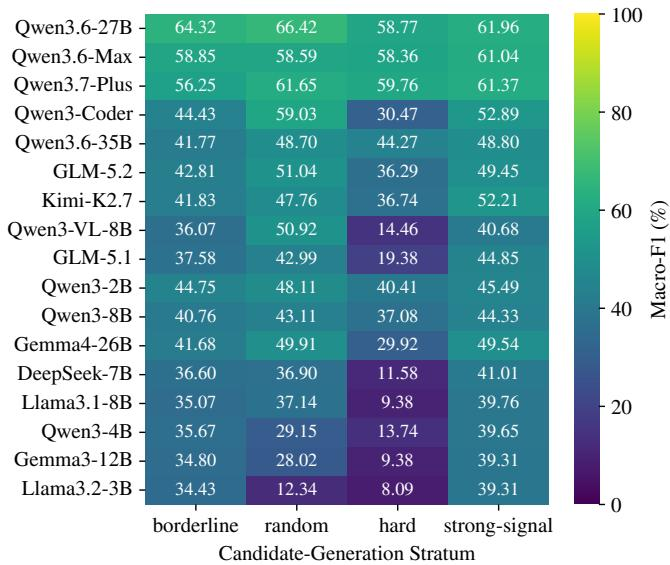  
Fi<sub>gure</sub> 2<sub>:</sub> O<sub>ppor</sub>t<sub>un</sub>it<sub>y-</sub>d<sub>e</sub>t<sub>ec</sub>ti<sub>on</sub> M<sub>acro-</sub>F1 b<sub>y can</sub>did<sub>a</sub>t<sub>e-</sub> <sub>genera</sub>ti<sub>on s</sub>t<sub>ra</sub>t<sub>um on</sub> th<sub>e</sub> Chi<sub>nese</sub> b<sub>enc</sub>h<sub>mar</sub>k<sub>.</sub> St<sub>ra</sub>t<sub>um</sub> <sub>preva</sub>l<sub>ence</sub> dif<sub>ers</sub> <sub>su</sub>b<sub>s</sub>t<sub>an</sub>ti<sub>a</sub>ll<sub>y,</sub> <sub>so</sub> <sub>cross-s</sub>t<sub>ra</sub>t<sub>um</sub> <sub>va</sub>l<sub>ues</sub> <sub>are</sub> d<sub>escr</sub>i<sub>p</sub>ti<sub>ve ra</sub>th<sub>er</sub> th<sub>an con</sub>t<sub>ro</sub>ll<sub>e</sub>d <sub>es</sub>ti<sub>ma</sub>t<sub>es o</sub>f i<sub>n</sub>t<sub>r</sub>i<sub>ns</sub>i<sub>c</sub> difi<sub>-</sub> cu<sup>l</sup>t<sub>y</sub>.

T<sub>a</sub>bl<sub>e</sub> 3<sub>:</sub> E<sub>n</sub>d<sub>-</sub>t<sub>o-en</sub>d <sub>s</sub>t<sub>ruc</sub>t<sub>ure</sub>d <sub>re</sub>l<sub>a</sub>ti<sub>on pre</sub>di<sub>c</sub>ti<sub>on on</sub> th<sub>e</sub> Chi<sub>nese</sub> b<sub>enc</sub>h<sub>mar</sub>k<sub>.</sub> F1 d<sub>eno</sub>t<sub>es</sub> M<sub>acro-</sub>F1<sub>.</sub>
<table><tr><td rowspan="2">Model</td><td colspan="2">Strength</td><td colspan="2">Type</td><td colspan="2">Direction</td></tr><tr><td>Acc.</td><td>F1</td><td>Acc.</td><td>F1</td><td>Acc.</td><td>F1</td></tr><tr><td>Qwen3-2B</td><td>20.66</td><td>19.59</td><td>15.08</td><td>13.05</td><td>7.64</td><td>13.34</td></tr><tr><td>Qwen3-8B</td><td>69.94</td><td>46.42</td><td>67.56</td><td>47.42</td><td>69.11</td><td>52.10</td></tr><tr><td>Gemma4-26B</td><td>66.53</td><td>46.00</td><td>70.66</td><td>53.34</td><td>73.45</td><td>66.52</td></tr><tr><td>DeepSeek-7B</td><td>78.51</td><td>46.41</td><td>32.54</td><td>31.75</td><td>38.95</td><td>36.31</td></tr><tr><td>Llama3.1-8B</td><td>77.48</td><td>45.93</td><td>60.02</td><td>42.77</td><td>67.56</td><td>52.25</td></tr><tr><td>Qwen3-4B</td><td>86.88</td><td>50.73</td><td>68.70</td><td>57.14</td><td>59.71</td><td>54.89</td></tr><tr><td>Gemma3-12B Llama3.2-3B</td><td>68.08 55.48</td><td>45.27 38.85</td><td>51.65 46.69</td><td>44.44</td><td>63.84</td><td>61.02</td></tr><tr><td>Qwen3.6-27B</td><td></td><td></td><td></td><td>14.55</td><td>31.71</td><td>22.25</td></tr><tr><td>Qwen3.6-Max</td><td>64.67</td><td>44.62</td><td>60.12</td><td>51.05</td><td>63.95</td><td>56.11</td></tr><tr><td></td><td>76.34</td><td>49.87</td><td>66.32</td><td>51.97</td><td>68.39</td><td>58.61</td></tr><tr><td>Qwen3.7-Plus</td><td>72.42</td><td>46.74</td><td>68.18</td><td>58.10</td><td>72.73</td><td>67.04</td></tr><tr><td>Qwen3-Coder</td><td>86.98</td><td>46.70</td><td>64.67</td><td>46.65</td><td>68.08</td><td>59.54</td></tr><tr><td>Qwen3.6-35B</td><td>75.62</td><td>48.04</td><td>70.87</td><td>54.53</td><td>68.90</td><td>63.38</td></tr><tr><td>GLM-5.2</td><td>75.21</td><td>50.00</td><td>67.56</td><td>54.25</td><td>67.87</td><td>59.87</td></tr><tr><td>Kimi-K2.7</td><td>88.64</td><td>53.08</td><td>74.28</td><td>60.23</td><td>77.38</td><td>67.71</td></tr><tr><td>Qwen3-VL-8B</td><td>60.85</td><td>41.83</td><td>59.61</td><td>40.07</td><td>68.08</td><td>54.61</td></tr><tr><td>GLM-5.1</td><td>58.16</td><td>42.32</td><td>65.50</td><td>56.28</td><td>71.80</td><td>63.72</td></tr></table>

## 5.2 RQ2: Recovering Structured Collaboration Relations

Opportunity detection does not imply accurate recovery of the underlying relation structure. Table 3 reports <sub>comp</sub>l<sub>e</sub>t<sub>e per-mo</sub>d<sub>e</sub>l <sub>en</sub>d<sub>-</sub>t<sub>o-en</sub>d <sub>resu</sub>lt<sub>s.</sub> Ki<sub>m</sub>i<sub>-</sub>K2<sub>.</sub>7 <sub>o</sub>bt<sub>a</sub>i<sub>ns</sub> th<sub>e</sub> hi<sub>g</sub>h<sub>es</sub>t M<sub>acro-</sub>F1 <sub>scores</sub> f<sub>or</sub> <sub>co</sub>ll<sub>a</sub>b<sub>ora</sub>ti<sub>on</sub> t<sub>ype</sub> <sub>an</sub>d <sub>ro</sub>l<sub>e</sub> di<sub>rec</sub>ti<sub>on, reac</sub>hi<sub>ng</sub> 60<sub>.</sub>23 <sub>an</sub>d 67<sub>.</sub>71<sub>,</sub> d<sub>esp</sub>it<sub>e ac</sub>hi<sub>ev</sub>i<sub>ng</sub> <sub>on</sub>l<sub>y</sub> 52<sub>.</sub>87 M<sub>acro-</sub>F1 f<sub>or</sub> <sub>oppor</sub>t<sub>un</sub>it<sub>y</sub> d<sub>e</sub>t<sub>ec</sub>ti<sub>on.</sub> I<sub>n</sub> <sub>con</sub>t<sub>ras</sub>t<sub>,</sub> Qwen3.6-27B leads opportunit<sub>y</sub> detection with 74.51 Macro-F1 b<sub>u</sub>t <sub>reac</sub>h<sub>es</sub> <sub>on</sub>l<sub>y</sub> 51<sub>.</sub>05 <sub>an</sub>d 56<sub>.</sub>11 f<sub>or</sub> <sub>co</sub>ll<sub>a</sub>b<sub>ora</sub>ti<sub>on</sub> t<sub>ype</sub> <sub>an</sub>d <sub>ro</sub>l<sub>e</sub> di<sub>rec</sub>ti<sub>on.</sub>

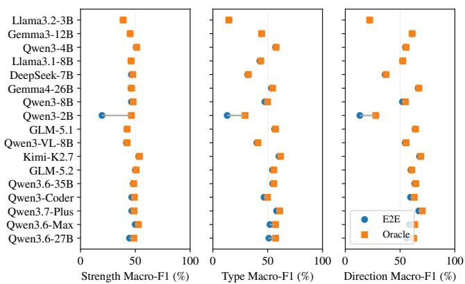  
Fi<sub>gure</sub> 3<sub>:</sub> E<sub>n</sub>d<sub>-</sub>t<sub>o-en</sub>d <sub>an</sub>d <sub>orac</sub>l<sub>e-</sub>d<sub>e</sub>t<sub>ec</sub>ti<sub>on</sub> M<sub>acro-</sub>F1 f<sub>or op-</sub> <sub>por</sub>t<sub>un</sub>it<sub>y s</sub>t<sub>reng</sub>th<sub>, co</sub>ll<sub>a</sub>b<sub>ora</sub>ti<sub>on</sub> t<sub>ype, an</sub>d <sub>ro</sub>l<sub>e</sub> di<sub>rec</sub>ti<sub>on on</sub> th<sub>e</sub> Chi<sub>nese</sub> b<sub>enc</sub>h<sub>mar</sub>k<sub>.</sub> E<sub>n</sub>d<sub>-</sub>t<sub>o-en</sub>d <sub>eva</sub>l<sub>ua</sub>ti<sub>on re</sub>t<sub>a</sub>i<sub>ns a</sub>l <sub>go</sub>ld<sub>-pos</sub>iti<sub>ve</sub> i<sub>ns</sub>t<sub>ances</sub> <sub>an</sub>d <sub>coun</sub>t<sub>s</sub> <sub>a</sub> <sub>m</sub>i<sub>sse</sub>d <sub>oppor</sub>t<sub>un</sub>it<sub>y</sub> <sub>as</sub> <sub>an a</sub>tt<sub>r</sub>ib<sub>u</sub>t<sub>e error; orac</sub>l<sub>e eva</sub>l<sub>ua</sub>ti<sub>on con</sub>diti<sub>ons on correc</sub>tl<sub>y</sub> d<sub>e</sub>t<sub>ec</sub>t<sub>e</sub>d <sub>go</sub>ld<sub>-pos</sub>iti<sub>ve</sub> i<sub>ns</sub>t<sub>ances.</sub>

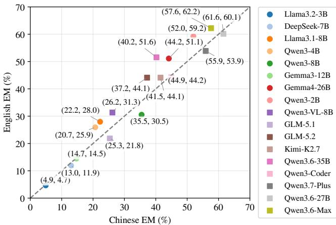  
Fi<sub>gure</sub> 4<sub>:</sub> Chi<sub>nese versus</sub> E<sub>ng</sub>li<sub>s</sub>h f<sub>our-</sub>fi<sub>e</sub>ld <sub>exac</sub>t <sub>ma</sub>t<sub>c</sub>h <sub>across eva</sub>l<sub>ua</sub>t<sub>e</sub>d <sub>mo</sub>d<sub>e</sub>l<sub>s.</sub> Th<sub>e</sub> d<sub>as</sub>h<sub>e</sub>d di<sub>agona</sub>l i<sub>n</sub>di<sub>ca</sub>t<sub>es</sub> <sub>equa</sub>l <sub>per</sub>f<sub>ormance</sub> i<sub>n</sub> b<sub>o</sub>th l<sub>anguages.</sub>

Joint prediction remains substantially more dificult. Ki<sub>m</sub>i<sub>-</sub>K2<sub>.</sub>7 <sub>ac</sub>hi<sub>eves</sub> th<sub>e</sub> hi<sub>g</sub>h<sub>es</sub>t <sub>pos</sub>iti<sub>ve</sub> f<sub>our-</sub>fi<sub>e</sub>ld <sub>exac</sub>t match of 61.98%, whereas Qwen3-2B obtains hi<sub>g</sub>h overall exact match mainly by rejecting negative pairs and reaches <sub>on</sub>l<sub>y</sub> 4<sub>.</sub>65% <sub>exac</sub>t <sub>ma</sub>t<sub>c</sub>h <sub>on go</sub>ld<sub>-pos</sub>iti<sub>ve</sub> i<sub>ns</sub>t<sub>ances.</sub> D<sub>e</sub>t<sub>a</sub>il<sub>e</sub>d <sub>pe</sub>r<sub>-</sub>t<sub>ype</sub> r<sub>esu</sub>lt<sub>s</sub> in A<sub>ppe</sub>ndi<sub>x</sub> E <sub>s</sub>h<sub>ow</sub> th<sub>a</sub>t T<sub>ec</sub>hn<sub>o</sub>l<sub>ogy</sub> Tr<sub>a</sub>n<sub>s-</sub> f<sub>er</sub> i<sub>s par</sub>ti<sub>cu</sub>l<sub>ar</sub>l<sub>y</sub> difi<sub>cu</sub>lt <sub>an</sub>d i<sub>s</sub> f<sub>requen</sub>tl<sub>y con</sub> f<sub>use</sub>d <sub>w</sub>ith S<sub>upp</sub>l<sub>y</sub> <sub>a</sub>nd Pr<sub>o</sub>d<sub>uc</sub>ti<sub>o</sub>n<sub>.</sub> O<sub>ve</sub>r<sub>a</sub>ll<sub>,</sub> <sub>cu</sub>rr<sub>e</sub>nt LLM<sub>s</sub> <sub>a</sub>r<sub>e</sub> <sub>co</sub>n<sub>s</sub>id<sub>e</sub>r<sub>-</sub> <sub>a</sub>bl<sub>y more re</sub>li<sub>a</sub>bl<sub>e a</sub>t id<sub>en</sub>tif<sub>y</sub>i<sub>ng</sub> b<sub>roa</sub>d <sub>co</sub>ll<sub>a</sub>b<sub>ora</sub>ti<sub>on po</sub>t<sub>en-</sub> ti<sub>a</sub>l th<sub>an</sub> <sub>a</sub>t <sub>recons</sub>t<sub>ruc</sub>ti<sub>ng</sub> it<sub>s</sub> <sub>comp</sub>l<sub>e</sub>t<sub>e</sub> <sub>s</sub>t<sub>reng</sub>th<sub>,</sub> <sub>mec</sub>h<sub>an</sub>i<sub>sm,</sub> <sub>an</sub>d <sub>ro</sub>l<sub>e</sub> di<sub>rec</sub>ti<sub>on.</sub>

Where do structured-relation errors arise? Figure 3 <sub>separa</sub>t<sub>es errors cause</sub>d b<sub>y m</sub>i<sub>sse</sub>d <sub>oppor</sub>t<sub>un</sub>iti<sub>es</sub> f<sub>rom errors</sub> i<sub>n ass</sub>i<sub>gn</sub>i<sub>ng re</sub>l<sub>a</sub>ti<sub>on a</sub>tt<sub>r</sub>ib<sub>u</sub>t<sub>es.</sub> Th<sub>e</sub> t<sub>wo scores are c</sub>l<sub>ose</sub> f<sub>or</sub> <sub>mos</sub>t hi<sub>g</sub>h<sub>-reca</sub>ll <sub>sys</sub>t<sub>ems.</sub> Ki<sub>m</sub>i<sub>-</sub>K2<sub>.</sub>7<sub>,</sub> f<sub>or</sub> <sub>examp</sub>l<sub>e,</sub> d<sub>e</sub>t<sub>ec</sub>t<sub>s</sub> 97<sub>.</sub>42% <sub>o</sub>f <sub>go</sub>ld<sub>-pos</sub>iti<sub>ve pa</sub>i<sub>rs an</sub>d h<sub>as a mean orac</sub>l<sub>e–en</sub>d<sub>-</sub> t<sub>o-en</sub>d <sub>gap o</sub>f <sub>on</sub>l<sub>y</sub> 1<sub>.</sub>11 <sub>po</sub>i<sub>n</sub>t<sub>s across</sub> th<sub>e</sub> th<sub>ree a</sub>tt<sub>r</sub>ib<sub>u</sub>t<sub>es.</sub> Gemma4-26B, Qwen3.6-35B, GLM-5.2, and GLM-5.1 like-<sub>w</sub>i<sub>se</sub> h<sub>ave mean gaps</sub> b<sub>e</sub>l<sub>ow one po</sub>i<sub>n</sub>t<sub>.</sub> Th<sub>e</sub>i<sub>r rema</sub>i<sub>n</sub>i<sub>ng er-</sub> <sub>rors</sub> th<sub>ere</sub>f<sub>ore ar</sub>i<sub>se ma</sub>i<sub>n</sub>l<sub>y a</sub>ft<sub>er an oppor</sub>t<sub>un</sub>it<sub>y</sub> h<sub>as a</sub>l<sub>rea</sub>d<sub>y</sub> been detected. In contrast, Qwen3-2B covers onl<sub>y</sub> 26.96% of <sub>go</sub>ld <sub>pos</sub>iti<sub>ves an</sub>d it<sub>s mean gap reac</sub>h<sub>es</sub> 19<sub>.</sub>21 <sub>po</sub>i<sub>n</sub>t<sub>s, ma</sub>k<sub>-</sub> i<sub>ng m</sub>i<sub>sse</sub>d d<sub>e</sub>t<sub>ec</sub>ti<sub>on</sub> th<sub>e</sub> d<sub>om</sub>i<sub>nan</sub>t b<sub>o</sub>ttl<sub>enec</sub>k f<sub>or</sub> th<sub>a</sub>t <sub>mo</sub>d<sub>e</sub>l<sub>.</sub> Qwen3.6-27B also shows a non-ne<sub>g</sub>li<sub>g</sub>ible 5.52-point <sub>g</sub>ap despite leading opportunity detection overall. Complete joint <sub>an</sub>d <sub>orac</sub>l<sub>e-</sub>d<sub>e</sub>t<sub>ec</sub>ti<sub>on</sub> <sub>resu</sub>lt<sub>s</sub> <sub>are</sub> <sub>repor</sub>t<sub>e</sub>d i<sub>n</sub> A<sub>ppen</sub>di<sub>x</sub> E<sub>.</sub>2<sub>.</sub> A<sub>ppen</sub>di<sub>x</sub> F f<sub>ur</sub>th<sub>er</sub> d<sub>ecomposes pos</sub>iti<sub>ve-pa</sub>i<sub>r errors an</sub>d <sub>ana</sub>l<sub>yzes sys</sub>t<sub>ema</sub>ti<sub>c co</sub>ll<sub>a</sub>b<sub>ora</sub>ti<sub>on-</sub>t<sub>ype con</sub>f<sub>us</sub>i<sub>on an</sub>d <sub>ro</sub>l<sub>e-</sub> di<sub>rec</sub>ti<sub>on</sub> bi<sub>as.</sub>

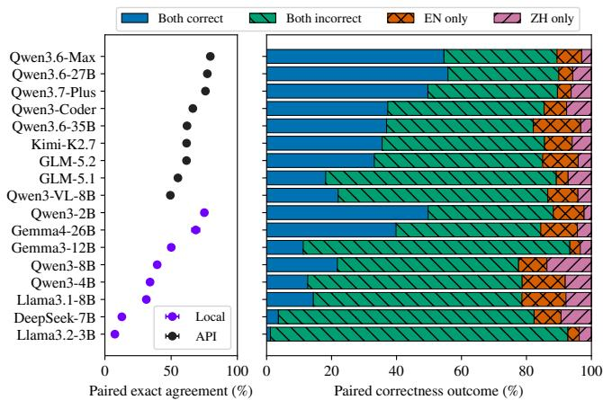  
Fi<sub>gure</sub> 5<sub>:</sub> P<sub>a</sub>i<sub>re</sub>d Chi<sub>nese–</sub>E<sub>ng</sub>li<sub>s</sub>h <sub>pre</sub>di<sub>c</sub>ti<sub>on agreemen</sub>t <sub>an</sub>d <sub>correc</sub>t<sub>ness</sub> <sub>ou</sub>t<sub>comes.</sub> P<sub>a</sub>i<sub>re</sub>d <sub>agreemen</sub>t <sub>measures</sub> t<sub>up</sub>l<sub>e</sub> id<sub>en</sub>tit<sub>y</sub> <sub>an</sub>d d<sub>oes</sub> <sub>no</sub>t i<sub>mp</sub>l<sub>y</sub> <sub>correc</sub>t<sub>ness.</sub>

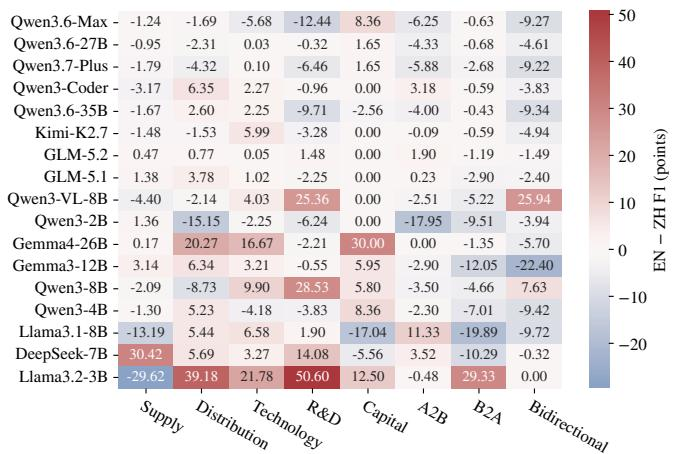  
Fi<sub>gure</sub> 6<sub>:</sub> E<sub>ng</sub>li<sub>s</sub>h<sub>-m</sub>i<sub>nus-</sub>Chi<sub>nese c</sub>l<sub>ass-</sub>l<sub>eve</sub>l F1 dif<sub>erences</sub> f<sub>or co</sub>ll<sub>a</sub>b<sub>ora</sub>ti<sub>on</sub> t<sub>ypes an</sub>d <sub>ro</sub>l<sub>e</sub> di<sub>rec</sub>ti<sub>ons.</sub> P<sub>os</sub>iti<sub>ve va</sub>l<sub>ues</sub> i<sub>n</sub>di<sub>ca</sub>t<sub>e</sub> hi<sub>g</sub>h<sub>er</sub> <sub>per</sub>f<sub>ormance</sub> <sub>un</sub>d<sub>er</sub> E<sub>ng</sub>li<sub>s</sub>h i<sub>npu</sub>t<sub>.</sub>

## 5.3 RQ3: Sensitivity to Input Language

Input-language sensitivity. Figure 4 shows that English i<sub>npu</sub>t d<sub>oes</sub> <sub>no</sub>t <sub>y</sub>i<sub>e</sub>ld <sub>a</sub> <sub>cons</sub>i<sub>s</sub>t<sub>en</sub>t <sub>a</sub>d<sub>van</sub>t<sub>age.</sub> F<sub>or</sub> <sub>examp</sub>l<sub>e,</sub> four-field exact match increases b<sub>y</sub> 11.34 points for Qwen3.6- 35B but decreases b<sub>y</sub> 4.96 points for Qwen3-8B, while Qwen3.6-27B remains relatively stable (−1.43 points). Com-<sub>p</sub>l<sub>e</sub>t<sub>e</sub> <sub>mo</sub>d<sub>e</sub>l<sub>-</sub>l<sub>eve</sub>l <sub>resu</sub>lt<sub>s</sub> <sub>are</sub> <sub>repor</sub>t<sub>e</sub>d i<sub>n</sub> A<sub>ppen</sub>di<sub>x</sub> T<sub>a</sub>bl<sub>e</sub> 8<sub>.</sub> Fi<sub>gure</sub> 5 f<sub>ur</sub>th<sub>er</sub> <sub>s</sub>h<sub>ows</sub> th<sub>a</sub>t <sub>s</sub>i<sub>m</sub>il<sub>ar</sub> <sub>aggrega</sub>t<sub>e</sub> <sub>scores</sub> <sub>can</sub> <sub>concea</sub>l <sub>su</sub>b<sub>s</sub>t<sub>an</sub>ti<sub>a</sub>l i<sub>ns</sub>t<sub>ance-</sub>l<sub>eve</sub>l <sub>c</sub>h<sub>anges.</sub> M<sub>oreover,</sub> hi<sub>g</sub>h <sub>cross-</sub>l<sub>anguage</sub> <sub>agreemen</sub>t d<sub>oes</sub> <sub>no</sub>t <sub>necessar</sub>il<sub>y</sub> i<sub>n</sub>di<sub>ca</sub>t<sub>e</sub> <sub>ro-</sub> bust reasonin<sub>g</sub>: Qwen3.6-Max produces identical predictions i<sub>n</sub> 79<sub>.</sub>57% <sub>o</sub>f <sub>pa</sub>i<sub>re</sub>d i<sub>ns</sub>t<sub>ances,</sub> b<sub>u</sub>t i<sub>s</sub> <sub>correc</sub>t i<sub>n</sub> b<sub>o</sub>th l<sub>anguages</sub> <sub>on on</sub>l<sub>y</sub> 54<sub>.</sub>62%<sub>,</sub> i<sub>n</sub>di<sub>ca</sub>ti<sub>ng</sub> th<sub>a</sub>t <sub>some errors are repea</sub>t<sub>e</sub>d <sup>across</sup> <sup>lan</sup>gu<sup>a</sup>g<sup>es</sup>.

Category-level variation. Figure 6 shows that language <sub>e</sub>f<sub>ec</sub>t<sub>s a</sub>l<sub>so vary across co</sub>ll<sub>a</sub>b<sub>ora</sub>ti<sub>on</sub> t<sub>ypes an</sub>d <sub>ro</sub>l<sub>e</sub> di<sub>rec-</sub> ti<sub>ons.</sub> E<sub>ng</sub>li<sub>s</sub>h i<sub>mproves some ca</sub>t<sub>egor</sub>i<sub>es</sub> f<sub>or par</sub>ti<sub>cu</sub>l<sub>ar mo</sub>d<sub>-</sub> <sub>e</sub>l<sub>s w</sub>hil<sub>e</sub> d<sub>egra</sub>di<sub>ng</sub> th<sub>e same ca</sub>t<sub>egor</sub>i<sub>es</sub> f<sub>or o</sub>th<sub>ers, an</sub>d <sub>no</sub> <sub>re</sub>l<sub>a</sub>ti<sub>on ca</sub>t<sub>egory ex</sub>hibit<sub>s a cons</sub>i<sub>s</sub>t<sub>en</sub>t l<sub>anguage a</sub>d<sub>van</sub>t<sub>age</sub> <sub>across a</sub>ll <sub>sys</sub>t<sub>ems.</sub> I<sub>npu</sub>t<sub>-</sub>l<sub>anguage sens</sub>iti<sub>v</sub>it<sub>y</sub> i<sub>s</sub> th<sub>ere</sub>f<sub>ore</sub> <sub>mo</sub>d<sub>e</sub>l<sub>-,</sub> i<sub>ns</sub>t<sub>ance-, an</sub>d <sub>ca</sub>t<sub>egory-</sub>d<sub>epen</sub>d<sub>en</sub>t <sub>ra</sub>th<sub>er</sub> th<sub>an a un</sub>i<sub>-</sub> f<sub>orm per</sub>f<sub>ormance s</sub>hift<sub>.</sub>

## 5.4 Reliability Analysis

Valid outputs are not necessarily reliable. Most hosted <sub>mo</sub>d<sub>e</sub>l<sub>s pro</sub>d<sub>uce syn</sub>t<sub>ac</sub>ti<sub>ca</sub>ll<sub>y va</sub>lid JSON<sub>,</sub> b<sub>u</sub>t th<sub>e</sub>i<sub>r cross-</sub> field consistenc<sub>y</sub> varies substantiall<sub>y</sub>. Qwen3-Coder achieves th<sub>e</sub> l<sub>owes</sub>t <sub>v</sub>i<sub>o</sub>l<sub>a</sub>ti<sub>on ra</sub>t<sub>e o</sub>f 0<sub>.</sub>21%<sub>, w</sub>h<sub>ereas severa</sub>l <sub>mo</sub>d<sub>e</sub>l<sub>s</sub> <sub>excee</sub>d 10%<sub>.</sub> S<sub>e</sub>lf<sub>-repor</sub>t<sub>e</sub>d <sub>con</sub>fid<sub>ence</sub> i<sub>s</sub> <sub>a</sub>l<sub>so</sub> <sub>on</sub>l<sub>y</sub> <sub>par</sub>ti<sub>a</sub>ll<sub>y</sub> informative: althou<sub>g</sub>h Qwen3.6-27B, Qwen3.7-Plus, and Qwen3.6-Max exhibit lar<sub>g</sub>e Hi<sub>g</sub>h–Low exact-match <sub>g</sub>aps, th<sub>e</sub>i<sub>r</sub> hi<sub>g</sub>h<sub>-con</sub>fid<sub>ence su</sub>b<sub>se</sub>t<sub>s s</sub>till <sub>con</sub>t<sub>a</sub>i<sub>n</sub> 31<sub>.</sub>86<sub>–</sub>39<sub>.</sub>64% <sub>er-</sub> <sub>rors.</sub> C<sub>omp</sub>l<sub>e</sub>t<sub>e ou</sub>t<sub>pu</sub>t<sub>-va</sub>lidit<sub>y an</sub>d <sub>con</sub>fid<sub>ence-con</sub>diti<sub>one</sub>d <sub>resu</sub>lt<sub>s are repor</sub>t<sub>e</sub>d i<sub>n</sub> A<sub>ppen</sub>di<sub>x</sub> E<sub>.</sub>5<sub>.</sub>

## 6 Conclusion

W<sub>e</sub> i<sub>n</sub>t<sub>ro</sub>d<sub>uce</sub> F<sub>irm</sub>COR<sub>e, a</sub> h<sub>uman-anno</sub>t<sub>a</sub>t<sub>e</sub>d b<sub>enc</sub>h<sub>mar</sub>k f<sub>or</sub> <sub>eva</sub>l<sub>ua</sub>ti<sub>ng s</sub>t<sub>ruc</sub>t<sub>ure</sub>d <sub>reason</sub>i<sub>ng over</sub> i<sub>n</sub>t<sub>er-</sub>fi<sub>rm co</sub>ll<sub>a</sub>b<sub>ora</sub>ti<sub>on</sub> <sub>oppor</sub>t<sub>un</sub>iti<sub>es</sub> f<sub>rom wea</sub>kl<sub>y s</sub>t<sub>ruc</sub>t<sub>ure</sub>d fi<sub>rm pro</sub>fil<sub>es.</sub> Th<sub>e</sub> t<sub>as</sub>k <sub>requ</sub>i<sub>res</sub> <sub>mo</sub>d<sub>e</sub>l<sub>s</sub> t<sub>o</sub> di<sub>s</sub>ti<sub>ngu</sub>i<sub>s</sub>h <sub>capa</sub>bilit<sub>y</sub> <sub>comp</sub>l<sub>emen</sub>t<sub>ar</sub>it<sub>y</sub> from superficial relatedness and jointly predict the existence, <sub>s</sub>t<sub>reng</sub>th<sub>,</sub> t<sub>ype,</sub> <sub>an</sub>d <sub>ro</sub>l<sub>e</sub> di<sub>rec</sub>ti<sub>on</sub> <sub>o</sub>f <sub>eac</sub>h <sub>oppor</sub>t<sub>un</sub>it<sub>y.</sub> E<sub>x-</sub> <sub>per</sub>i<sub>men</sub>t<sub>s on</sub> 2<sub>,</sub>805 <sub>para</sub>ll<sub>e</sub>l Chi<sub>nese–</sub>E<sub>ng</sub>li<sub>s</sub>h <sub>samp</sub>l<sub>es s</sub>h<sub>ow</sub> th<sub>a</sub>t <sub>curren</sub>t LLM<sub>s can</sub> id<sub>en</sub>tif<sub>y</sub> b<sub>roa</sub>d <sub>co</sub>ll<sub>a</sub>b<sub>ora</sub>ti<sub>on po</sub>t<sub>en</sub>ti<sub>a</sub> b<sub>u</sub>t <sub>rema</sub>i<sub>n</sub> f<sub>ar</sub> l<sub>ess capa</sub>bl<sub>e o</sub>f <sub>recons</sub>t<sub>ruc</sub>ti<sub>ng</sub> th<sub>e</sub> f<sub>u</sub>ll <sub>re</sub>l<sub>a-</sub> ti<sub>ona</sub>l <sub>s</sub>t<sub>ruc</sub>t<sub>ure.</sub> Th<sub>ey o</sub>ft<sub>en overpre</sub>di<sub>c</sub>t <sub>oppor</sub>t<sub>un</sub>iti<sub>es</sub> b<sub>ase</sub>d <sub>on mere re</sub>l<sub>a</sub>t<sub>e</sub>d<sub>ness, con</sub>fl<sub>a</sub>t<sub>e</sub> di<sub>s</sub>ti<sub>nc</sub>t <sub>co</sub>ll<sub>a</sub>b<sub>ora</sub>ti<sub>on mec</sub>h<sub>a-</sub> <sub>n</sub>i<sub>sms, an</sub>d <sub>m</sub>i<sub>s</sub>id<sub>en</sub>tif<sub>y</sub> th<sub>e</sub> di<sub>rec</sub>ti<sub>on o</sub>f <sub>resource</sub> fl<sub>ows.</sub> L<sub>an-</sub> <sub>guage</sub> <sub>e</sub>f<sub>ec</sub>t<sub>s</sub> <sub>vary</sub> <sub>across</sub> <sub>mo</sub>d<sub>e</sub>l<sub>s</sub> <sub>an</sub>d i<sub>ns</sub>t<sub>ances,</sub> <sub>w</sub>hil<sub>e</sub> hi<sub>g</sub>h <sub>cross-</sub>li<sub>ngua</sub>l <sub>cons</sub>i<sub>s</sub>t<sub>ency may re</sub>fl<sub>ec</sub>t th<sub>e same errors</sub> b<sub>e</sub>i<sub>ng</sub> <sub>repea</sub>t<sub>e</sub>d <sub>across</sub> l<sub>anguages ra</sub>th<sub>er</sub> th<sub>an genu</sub>i<sub>ne</sub>l<sub>y ro</sub>b<sub>us</sub>t <sub>rea-</sub> <sub>son</sub>i<sub>ng.</sub> F<sub>irm</sub>COR<sub>e</sub> th<sub>ere</sub>f<sub>ore prov</sub>id<sub>es a con</sub>t<sub>ro</sub>ll<sub>e</sub>d t<sub>es</sub>tb<sub>e</sub>d f<sub>or</sub> di<sub>agnos</sub>i<sub>ng an</sub>d i<sub>mprov</sub>i<sub>ng pro</sub>fil<sub>e-groun</sub>d<sub>e</sub>d<sub>, mu</sub>ltidi<sub>men-</sub> <sub>s</sub>i<sub>ona</sub>l i<sub>n</sub>t<sub>er-</sub>fi<sub>rm reason</sub>i<sub>ng</sub> i<sub>n</sub> f<sub>u</sub>t<sub>ure mo</sub>d<sub>e</sub>l<sub>s.</sub>

## 7 Limitations

F<sub>irm</sub>COR<sub>e</sub> <sub>eva</sub>l<sub>ua</sub>t<sub>es</sub> <sub>po</sub>t<sub>en</sub>ti<sub>a</sub>l <sub>co</sub>ll<sub>a</sub>b<sub>ora</sub>ti<sub>on</sub> <sub>oppor</sub>t<sub>un</sub>iti<sub>es</sub> i<sub>n</sub>f<sub>erre</sub>d f<sub>rom prov</sub>id<sub>e</sub>d fi<sub>rm pro</sub>fil<sub>es, ra</sub>th<sub>er</sub> th<sub>an rea</sub>li<sub>ze</sub>d <sub>par</sub>t<sub>ners</sub>hi<sub>ps</sub> <sub>or</sub> th<sub>e</sub>i<sub>r</sub> <sub>commerc</sub>i<sub>a</sub>l <sub>v</sub>i<sub>a</sub>bilit<sub>y.</sub> It<sub>s</sub> <sub>pa</sub>i<sub>rw</sub>i<sub>se</sub> <sub>se</sub>t<sub>up</sub> d<sub>oes</sub> <sub>no</sub>t <sub>a</sub>dd<sub>ress</sub> l<sub>arge-sca</sub>l<sub>e</sub> <sub>par</sub>t<sub>ner</sub> <sub>re</sub>t<sub>r</sub>i<sub>eva</sub>l <sub>or</sub> <sub>ran</sub>ki<sub>ng.</sub> O<sub>ur</sub> <sub>exper</sub>i<sub>men</sub>t<sub>s</sub> <sub>are</sub> f<sub>ur</sub>th<sub>er</sub> li<sub>m</sub>it<sub>e</sub>d t<sub>o</sub> <sub>zero-s</sub>h<sub>o</sub>t <sub>promp</sub>ti<sub>ng</sub> <sub>an</sub>d <sub>s</sub>i<sub>ng</sub>l<sub>e</sub> d<sub>e</sub>t<sub>erm</sub>i<sub>n</sub>i<sub>s</sub>ti<sub>c</sub> <sub>runs,</sub> l<sub>eav</sub>i<sub>ng</sub> fi<sub>ne-</sub>t<sub>un</sub>i<sub>ng,</sub> <sub>promp</sub>t <sub>sens</sub>i<sub>-</sub> ti<sub>v</sub>it<sub>y,</sub> t<sub>oo</sub>l <sub>use, an</sub>d <sub>mu</sub>lti<sub>-run var</sub>i<sub>a</sub>bilit<sub>y unexp</sub>l<sub>ore</sub>d<sub>.</sub>

## References

AlM<sub>a</sub>h<sub>r</sub>i<sub>,</sub> S<sub>.;</sub> X<sub>u,</sub> L<sub>.;</sub> <sub>an</sub>d B<sub>r</sub>i<sub>n</sub>t<sub>rup,</sub> A<sub>.</sub> 2026<sub>.</sub> E<sub>n</sub>h<sub>anc</sub>i<sub>ng</sub> <sub>supp</sub>l<sub>y c</sub>h<sub>a</sub>i<sub>n v</sub>i<sub>s</sub>ibilit<sub>y w</sub>ith k<sub>now</sub>l<sub>e</sub>d<sub>ge grap</sub>h<sub>s an</sub>d l<sub>arge</sub> language models. International Journal of Production Research, 64(6).

B<sub>en</sub>d<sub>er,</sub> E<sub>.</sub> M<sub>.; an</sub>d F<sub>r</sub>i<sub>e</sub>d<sub>man,</sub> B<sub>.</sub> 2018<sub>.</sub> D<sub>a</sub>t<sub>a s</sub>t<sub>a</sub>t<sub>emen</sub>t<sub>s</sub> f<sub>or</sub> <sub>na</sub>t<sub>ura</sub>l l<sub>anguage process</sub>i<sub>ng:</sub> T<sub>owar</sub>d <sub>m</sub>iti<sub>ga</sub>ti<sub>ng sys</sub>t<sub>em</sub> bi<sub>as</sub> and enabling better science. Transactions ofthe Association for Computational Linguistics, 6: 587–604.

Cabrera, S. C.; Pishchulov, G.; Sampaio, P.; Mehandjiev, N.; Li<sub>u,</sub> Z<sub>.; an</sub>d K<sub>unun</sub>k<sub>a,</sub> S<sub>.</sub> 2021<sub>.</sub> A<sub>n approac</sub>h <sub>an</sub>d d<sub>ec</sub>i<sub>s</sub>i<sub>on</sub> <sub>suppor</sub>t t<sub>oo</sub>l f<sub>or</sub> f<sub>orm</sub>i<sub>ng</sub> I<sub>n</sub>d<sub>us</sub>t<sub>ry</sub> 4<sub>.</sub>0 <sub>supp</sub>l<sub>y</sub> <sub>c</sub>h<sub>a</sub>i<sub>n</sub> <sub>co</sub>ll<sub>a</sub>b<sub>o-</sub> rations. Computers in Industry, 125: 1–16.

C<sub>ao,</sub> L<sub>.; von</sub> Eh<sub>ren</sub>h<sub>e</sub>i<sub>m,</sub> V<sub>.;</sub> G<sub>ranro</sub>th<sub>-</sub>Wildi<sub>ng,</sub> M<sub>.;</sub> A<sub>nse</sub>l<sub>mo</sub> St<sub>a</sub>hl<sub>,</sub> R<sub>.;</sub> M<sub>c</sub>C<sub>ornac</sub>k<sub>,</sub> A<sub>.;</sub> C<sub>a</sub>t<sub>ov</sub>i<sub>c,</sub> A<sub>.; an</sub>d C<sub>ava</sub>l<sub>-</sub> <sub>can</sub>ti R<sub>oc</sub>h<sub>a,</sub> D<sub>.</sub> D<sub>.</sub> 2024<sub>.</sub> C<sub>ompany</sub>k<sub>g:</sub> A l<sub>arge-sca</sub>l<sub>e</sub> h<sub>e</sub>t<sub>ero-</sub> geneous graph for company similarity quantification. In Proceedings of the 30th ACM SIGKDD Conference on Knowledge Discovery and Data Mining, 4816–4827.

D<sub>av</sub>i<sub>s,</sub> C<sub>.;</sub> <sub>an</sub>d Aid<sub>,</sub> G<sub>.</sub> 2022<sub>.</sub> M<sub>ac</sub>hi<sub>ne</sub> l<sub>earn</sub>i<sub>ng-ass</sub>i<sub>s</sub>t<sub>e</sub>d i<sub>n-</sub> d<sub>us</sub>t<sub>r</sub>i<sub>a</sub>l <sub>sym</sub>bi<sub>os</sub>i<sub>s:</sub> T<sub>es</sub>ti<sub>ng</sub> th<sub>e</sub> <sub>a</sub>bilit<sub>y</sub> <sub>o</sub>f <sub>wor</sub>d <sub>vec</sub>t<sub>ors</sub> t<sub>o</sub> estimate similarity for material substitutions. Journal of Industrial Ecology, 26(1): 27–43.

F<sub>ur</sub>l<sub>o</sub>tti<sub>,</sub> M<sub>.; an</sub>d S<sub>o</sub>d<sub>a,</sub> G<sub>.</sub> 2018<sub>.</sub> Fit f<sub>or</sub> th<sub>e</sub> t<sub>as</sub>k<sub>:</sub> C<sub>om-</sub> <sub>p</sub>l<sub>emen</sub>t<sub>ar</sub>it<sub>y, asymme</sub>t<sub>ry, an</sub>d <sub>par</sub>t<sub>ner se</sub>l<sub>ec</sub>ti<sub>on</sub> i<sub>n a</sub>lli<sub>ances.</sub> Organization Science, 29(5): 837–854.

Gr<sub>eve,</sub> H<sub>.</sub> R<sub>.;</sub> Mit<sub>su</sub>h<sub>as</sub>hi<sub>,</sub> H<sub>.; a</sub>nd B<sub>au</sub>m<sub>,</sub> J<sub>.</sub> A<sub>.</sub> 2013<sub>.</sub> Gr<sub>ee</sub>n<sub>e</sub>r <sub>pas</sub>t<sub>ures:</sub> O<sub>u</sub>t<sub>s</sub>id<sub>e</sub> <sub>op</sub>ti<sub>ons</sub> <sub>an</sub>d <sub>s</sub>t<sub>ra</sub>t<sub>eg</sub>i<sub>c</sub> <sub>a</sub>lli<sub>ance</sub> <sub>w</sub>ithd<sub>rawa</sub>l<sub>.</sub> Organization Science, 24(1): 79–98.

G<sub>ua</sub>n<sub>,</sub> S<sub>.;</sub> Li<sub>u,</sub> Y<sub>.; a</sub>nd C<sub>ao,</sub> L<sub>.</sub> 2026<sub>.</sub> S<sub>up</sub>Ch<sub>a</sub>in<sub>-</sub>B<sub>e</sub>n<sub>c</sub>h<sub>:</sub> B<sub>e</sub>n<sub>c</sub>hm<sub>a</sub>rkin<sub>g</sub> L<sub>a</sub>r<sub>ge</sub> L<sub>a</sub>n<sub>guage</sub> M<sub>o</sub>d<sub>e</sub>l<sub>s</sub> f<sub>o</sub>r R<sub>ea</sub>l<sub>-</sub>W<sub>o</sub>rld S<sub>up-</sub> ply Chain Management. In Findings of the Association for Computational Linguistics: ACL 2026, 7526–7550.

H<sub>an,</sub> W<sub>.;</sub> Zh<sub>ang,</sub> Y<sub>.;</sub> Ch<sub>en,</sub> Z<sub>.;</sub> P<sub>ec</sub>h<sub>en</sub>i<sub>z</sub>ki<sub>y,</sub> M<sub>.;</sub> F<sub>ang,</sub> M<sub>.;</sub> Zh<sub>eng,</sub> Y<sub>.;</sub> <sub>e</sub>t <sub>a</sub>l<sub>.</sub> 2026<sub>.</sub> M<sub>u</sub>b<sub>enc</sub>h<sub>:</sub> A<sub>ssessmen</sub>t <sub>o</sub>f <sub>mu</sub>ltili<sub>ngua</sub>l <sub>capa</sub>biliti<sub>es o</sub>f l<sub>arge</sub> l<sub>anguage mo</sub>d<sub>e</sub>l<sub>s across</sub> 61 l<sub>anguages.</sub> I<sub>n</sub> Findings of the Association for Computational Linguistics: ACL 2026, 16163–16192.

Hitt<sub>,</sub> M<sub>.</sub> A<sub>.;</sub> D<sub>ac</sub>in<sub>,</sub> M<sub>.</sub> T<sub>.;</sub> L<sub>ev</sub>it<sub>as,</sub> E<sub>.;</sub> Arr<sub>eg</sub>l<sub>e,</sub> J<sub>.-</sub>L<sub>.;</sub> <sub>a</sub>nd B<sub>orza,</sub> A<sub>.</sub> 2000<sub>.</sub> P<sub>ar</sub>t<sub>ner</sub> <sub>se</sub>l<sub>ec</sub>ti<sub>on</sub> i<sub>n</sub> <sub>emerg</sub>i<sub>ng</sub> <sub>an</sub>d d<sub>eve</sub>l<sub>ope</sub>d <sub>mar</sub>k<sub>e</sub>t <sub>con</sub>t<sub>ex</sub>t<sub>s:</sub> R<sub>esource-</sub>b<sub>ase</sub>d <sub>an</sub>d <sub>organ</sub>i<sub>za</sub>ti<sub>ona</sub>l l<sub>earn</sub>i<sub>ng</sub> perspectives. Academy of Management journal, 43(3): 449– 467<sub>.</sub>

K<sub>osas</sub>ih<sub>,</sub> E<sub>.</sub> E<sub>.; an</sub>d B<sub>r</sub>i<sub>n</sub>t<sub>rup,</sub> A<sub>.</sub> 2025<sub>.</sub> T<sub>owar</sub>d<sub>s</sub> t<sub>rus</sub>t<sub>wor</sub>th<sub>y</sub> AI f<sub>or</sub> li<sub>n</sub>k <sub>pre</sub>di<sub>c</sub>ti<sub>on</sub> i<sub>n</sub> <sub>supp</sub>l<sub>y</sub> <sub>c</sub>h<sub>a</sub>i<sub>n</sub> k<sub>now</sub>l<sub>e</sub>d<sub>ge</sub> <sub>grap</sub>h<sub>:</sub> <sub>a</sub> neurosymbolic reasoning approach. International Journal ofProduction Research, 63(6): 2268–2290.

K<sub>rum</sub>di<sub>c</sub>k<sub>,</sub> M<sub>.;</sub> K<sub>once</sub>l<sub>-</sub>K<sub>e</sub>d<sub>z</sub>i<sub>ors</sub>ki<sub>,</sub> R<sub>.;</sub> L<sub>a</sub>i<sub>,</sub> V<sub>.</sub> D<sub>.;</sub> R<sub>e</sub>dd<sub>y,</sub> V<sub>.;</sub> L<sub>over</sub>i<sub>ng,</sub> C<sub>.; an</sub>d T<sub>anner,</sub> C<sub>.</sub> 2024<sub>.</sub> Bi<sub>z</sub>B<sub>enc</sub>h<sub>:</sub> A <sub>quan</sub>tit<sub>a</sub>ti<sub>ve</sub>

reasoning benchmark for business and finance. In Proceedings ofthe 62nd Annual Meeting ofthe Associationfor Computational Linguistics (Volume 1: Long Papers), 8309–8332.

Li<sub>,</sub> Y<sub>.;</sub> K<sub>o,</sub> H<sub>.; a</sub>nd Am<sub>e</sub>ri<sub>,</sub> F<sub>.</sub> 2025<sub>.</sub> Int<sub>eg</sub>r<sub>a</sub>tin<sub>g g</sub>r<sub>ap</sub>h <sub>re</sub>t<sub>r</sub>i<sub>eva</sub>l<sub>-augmen</sub>t<sub>e</sub>d <sub>genera</sub>ti<sub>on</sub> <sub>w</sub>ith l<sub>arge</sub> l<sub>anguage</sub> <sub>mo</sub>d<sub>e</sub>l<sub>s</sub> for supplier discovery. Journal of Computing and Information Science in Engineering, 25(2): 021010.

M<sub>a</sub>tlin<sub>,</sub> G<sub>.;</sub> Ok<sub>a</sub>m<sub>o</sub>t<sub>o,</sub> M<sub>.;</sub> P<sub>a</sub>rd<sub>awa</sub>l<sub>a,</sub> H<sub>.;</sub> Y<sub>a</sub>n<sub>g,</sub> Y<sub>.; a</sub>nd Chava, S. 2025. Finance lan<sub>g</sub>ua<sub>g</sub>e model evaluation (flame). In Proceedings ofthe Fourth Workshop on Generation, Evaluation and Metrics (GEM<sup>2</sup>), 880–926.

Mi<sub>n</sub>d<sub>ru</sub>t<sub>a,</sub> D<sub>.;</sub> M<sub>oeen,</sub> M<sub>.; an</sub>d A<sub>garwa</sub>l<sub>,</sub> R<sub>.</sub> 2016<sub>.</sub> A t<sub>wo-</sub> <sub>s</sub>id<sub>e</sub>d <sub>ma</sub>t<sub>c</sub>hi<sub>ng approac</sub>h f<sub>or par</sub>t<sub>ner se</sub>l<sub>ec</sub>ti<sub>on an</sub>d <sub>assess-</sub> i<sub>ng comp</sub>l<sub>emen</sub>t<sub>ar</sub>iti<sub>es</sub> i<sub>n par</sub>t<sub>ners</sub>’ <sub>a</sub>tt<sub>r</sub>ib<sub>u</sub>t<sub>es</sub> i<sub>n</sub> i<sub>n</sub>t<sub>er-</sub>fi<sub>rm</sub> alliances. Strategic Management Journal, 37(1): 206–231.

Mit<sub>su</sub>h<sub>as</sub>hi<sub>,</sub> H<sub>.; an</sub>d G<sub>reve,</sub> H<sub>.</sub> R<sub>.</sub> 2009<sub>.</sub> A <sub>ma</sub>t<sub>c</sub>hi<sub>ng</sub> th<sub>eory o</sub>f <sub>a</sub>lli<sub>ance</sub> f<sub>orma</sub>ti<sub>on</sub> <sub>an</sub>d <sub>organ</sub>i<sub>za</sub>ti<sub>ona</sub>l <sub>success:</sub> C<sub>omp</sub>l<sub>emen-</sub> tarity and compatibility. Academy of management journal, 52(5): 975–995.

Quan, Y.; and Liu, Z. 2024. Econlo<sub>g</sub>icqa: A question-<sub>answer</sub>i<sub>ng</sub> b<sub>enc</sub>h<sub>mar</sub>k f<sub>or eva</sub>l<sub>ua</sub>ti<sub>ng</sub> l<sub>arge</sub> l<sub>anguage mo</sub>d<sub>-</sub> els in economic sequential reasoning. In Findings of the Association for Computational Linguistics: EMNLP 2024, 2273<sub>–</sub>2282<sub>.</sub>

Sun, Q.; Zhen<sub>g</sub>, J.; Jin, B.; Chen, L.; and Pen<sub>g</sub>, Y. 2025. Int<sub>e</sub>rC<sub>o</sub>r<sub>p</sub>R<sub>e</sub>l<sub>-</sub>LLM<sub>:</sub> Enh<sub>a</sub>n<sub>c</sub>in<sub>g</sub> Fin<sub>a</sub>n<sub>c</sub>i<sub>a</sub>l R<sub>e</sub>l<sub>a</sub>ti<sub>o</sub>n<sub>a</sub>l Und<sub>e</sub>r<sub>-</sub> standing with Graph-Language Models. arXiv preprint arXiv:2510.09735.

Tu, Y.; Li, W.; Son<sub>g</sub>, X.; Gon<sub>g</sub>, K.; Liu, L.; Qin, Y.; Liu, S.; <sub>an</sub>d Li<sub>u,</sub> M<sub>.</sub> 2024<sub>.</sub> U<sub>s</sub>i<sub>ng</sub> <sub>grap</sub>h <sub>neura</sub>l <sub>ne</sub>t<sub>wor</sub>k t<sub>o</sub> <sub>con</sub>d<sub>uc</sub>t <sub>supp</sub>li<sub>er</sub> <sub>recommen</sub>d<sub>a</sub>ti<sub>on</sub> b<sub>ase</sub>d <sub>on</sub> l<sub>arge-sca</sub>l<sub>e</sub> <sub>supp</sub>l<sub>y</sub> <sub>c</sub>h<sub>a</sub>i<sub>n.</sub> International Journal ofProduction Research, 62(24): 8595– 8608<sub>.</sub>

Y<sub>a</sub>n<sub>g,</sub> B<sub>.;</sub> Zh<sub>a</sub>n<sub>g,</sub> B<sub>.;</sub> C<sub>u</sub>t<sub>s</sub>f<sub>o</sub>rth<sub>,</sub> K<sub>.;</sub> Y<sub>u,</sub> S<sub>.; a</sub>nd Y<sub>u,</sub> X<sub>.</sub> 2025<sub>.</sub> Emerging industry classification based on BERT model. Information Systems, 128: 102484.

Zh<sub>eng,</sub> G<sub>.;</sub> <sub>an</sub>d B<sub>r</sub>i<sub>n</sub>t<sub>rup,</sub> A<sub>.</sub> 2025<sub>.</sub> E<sub>n</sub>h<sub>anc</sub>i<sub>ng</sub> <sub>supp</sub>l<sub>y</sub> <sub>c</sub>h<sub>a</sub>i<sub>n</sub> <sub>v</sub>i<sub>s</sub>ibilit<sub>y w</sub>ith <sub>genera</sub>ti<sub>ve</sub> AI<sub>: an exp</sub>l<sub>ora</sub>t<sub>ory case s</sub>t<sub>u</sub>d<sub>y on</sub> relationship prediction in knowledge graphs. International Journal ofProduction Research, 1–23.

## A Candidate-Mining Details

F<sub>or</sub> fi<sub>rm</sub> $e _ { i } ,$ l<sub>e</sub>t $S _ { i }$ <sub>an</sub>d $D _ { i }$ d<sub>eno</sub>t<sub>e</sub> it<sub>s</sub> <sub>supp</sub>l<sub>y</sub> <sub>an</sub>d d<sub>eman</sub>d l<sub>a</sub>b<sub>e</sub>l <sub>se</sub>t<sub>s, an</sub>d l<sub>e</sub>t $A _ { i } = S _ { i } \cup D _ { i }$ <sub>.</sub> W<sub>e</sub> d<sub>e</sub>fi<sub>ne</sub>

$$
J ( U , V ) = { \left\{ \begin{array} { l l } { \displaystyle { \frac { | U \cap V | } { | U \cup V | } } , } & { | U \cup V | > 0 , } \\ { 0 , } & { { \mathrm { o t h e r w i s e } } , } \end{array} \right. }\tag{9}
$$

an<sup>d</sup> com<sub>p</sub>ute

$$
\mathrm { S i m } ( i , j ) = J ( A _ { i } , A _ { j } ) , \mathrm { C o m p } ( i , j ) = \frac { J ( D _ { i } , S _ { j } ) + J ( D _ { j } , S _ { i } ) } { 2 }\tag{10}
$$

Th<sub>ese</sub> <sub>s</sub>i<sub>gna</sub>l<sub>s</sub> <sub>are</sub> <sub>use</sub>d <sub>on</sub>l<sub>y</sub> f<sub>or</sub> <sub>can</sub>did<sub>a</sub>t<sub>e</sub> <sub>m</sub>i<sub>n</sub>i<sub>ng</sub> <sub>an</sub>d <sub>are</sub> <sub>no</sub>t t<sub>rea</sub>t<sub>e</sub>d <sub>as</sub> <sub>go</sub>ld l<sub>a</sub>b<sub>e</sub>l<sub>s.</sub>

<table><tr><td>Stratum</td><td>Criterion</td></tr><tr><td>Strong-signal</td><td>Upstream score  $\overline { { \geq 9 0 } }$ </td></tr><tr><td>Borderline</td><td>Upstream score in  $[ 6 0 , 7 5 )$ </td></tr><tr><td>Same-industry</td><td>Same industry,  $\begin{array} { r } { \mathrm { S i } \dot { \bf { m } } ( i , j ) \ge 0 . 0 3 } \end{array}$  and</td></tr><tr><td>Hard</td><td> $\mathrm { C o m p } ( i , j ) \le 0 . 1 2$ </td></tr><tr><td>Random Non-edge</td><td>No edge in the upstream candidate graph</td></tr></table>

T<sub>a</sub>bl<sub>e</sub> 4<sub>:</sub> C<sub>an</sub>did<sub>a</sub>t<sub>e-m</sub>i<sub>n</sub>i<sub>ng</sub> <sub>s</sub>t<sub>ra</sub>t<sub>a.</sub> S<sub>ame-</sub>i<sub>n</sub>d<sub>us</sub>t<sub>ry</sub> h<sub>ar</sub>d <sub>pa</sub>i<sub>rs</sub> <sub>are</sub> <sub>no</sub>t <sub>presume</sub>d t<sub>o</sub> b<sub>e</sub> <sub>nega</sub>ti<sub>ve.</sub>

Th<sub>e</sub> <sub>ups</sub>t<sub>ream</sub> <sub>can</sub>did<sub>a</sub>t<sub>e</sub> <sub>grap</sub>h <sub>an</sub>d <sub>scores</sub> <sub>are</sub> <sub>genera</sub>t<sub>e</sub>d b<sub>y</sub> D<sub>eep</sub>S<sub>ee</sub>k<sub>-</sub>V4<sub>-</sub>Fl<sub>as</sub>h f<sub>rom</sub> fi<sub>rm pro</sub>fil<sub>es an</sub>d <sub>pu</sub>bli<sub>s</sub>h<sub>e</sub>d <sub>co</sub>ll<sub>a</sub>b<sub>ora</sub>ti<sub>on-oppor</sub>t<sub>un</sub>it<sub>y</sub> i<sub>n</sub>f<sub>orma</sub>ti<sub>on.</sub> W<sub>e re</sub>t<sub>a</sub>i<sub>n a</sub>t <sub>mos</sub>t 3,000 pairs per stratum, remove cross-stratum and reversed d<sub>up</sub>li<sub>ca</sub>t<sub>es,</sub> <sub>an</sub>d <sub>ran</sub>d<sub>om</sub>l<sub>y</sub> <sub>ass</sub>i<sub>gn</sub> <sub>pa</sub>i<sub>rs</sub> <sub>sa</sub>ti<sub>s</sub>f<sub>y</sub>i<sub>ng</sub> <sub>mu</sub>lti<sub>p</sub>l<sub>e</sub> <sub>cr</sub>i<sub>-</sub> t<sub>er</sub>i<sub>a</sub> t<sub>o</sub> <sub>one</sub> <sub>s</sub>t<sub>ra</sub>t<sub>um,</sub> <sub>as</sub> <sub>s</sub>h<sub>own</sub> i<sub>n</sub> T<sub>a</sub>bl<sub>e</sub> 4<sub>.</sub> F<sub>or</sub> <sub>score</sub>d <sub>e</sub>d<sub>ges,</sub> th<sub>e</sub> Fi<sub>rm</sub> A/Fi<sub>rm</sub> B <sub>or</sub>d<sub>er</sub> f<sub>o</sub>ll<sub>ows</sub> th<sub>e</sub> fi<sub>xe</sub>d <sub>ran</sub>d<sub>om</sub>i<sub>ze</sub>d <sub>or</sub>d<sub>er.</sub>

Qwen3.7-Max is subsequentl<sub>y</sub> used onl<sub>y</sub> to screen for pot<sub>en</sub>ti<sub>a</sub>l l<sub>a</sub>b<sub>e</sub>l l<sub>ea</sub>k<sub>age,</sub> <sub>pr</sub>i<sub>vacy</sub> <sub>r</sub>i<sub>s</sub>k<sub>s,</sub> <sub>an</sub>d d<sub>a</sub>t<sub>a-qua</sub>lit<sub>y</sub> i<sub>ssues.</sub> At most 750 pairs per stratum are retained for human annot<sub>a</sub>ti<sub>on.</sub> C<sub>an</sub>did<sub>a</sub>t<sub>e</sub> <sub>s</sub>t<sub>ra</sub>t<sub>a,</sub> <sub>ups</sub>t<sub>ream</sub> <sub>scores,</sub> <sub>an</sub>d <sub>source-recor</sub>d id<sub>en</sub>tifi<sub>ers are</sub> hidd<sub>en</sub> f<sub>rom anno</sub>t<sub>a</sub>t<sub>ors.</sub>

## B Chinese–English Parallel Translation

Th<sub>e or</sub>i<sub>g</sub>i<sub>na</sub>l fi<sub>rm pro</sub>fil<sub>es an</sub>d <sub>anno</sub>t<sub>a</sub>ti<sub>ons</sub> i<sub>n</sub> F<sub>irm</sub>COR<sub>e</sub> <sub>were</sub> <sub>co</sub>ll<sub>ec</sub>t<sub>e</sub>d <sub>an</sub>d <sub>cons</sub>t<sub>ruc</sub>t<sub>e</sub>d i<sub>n</sub> Chi<sub>nese.</sub> T<sub>o</sub> <sub>suppor</sub>t <sub>cross-</sub> li<sub>ngua</sub>l <sub>eva</sub>l<sub>ua</sub>ti<sub>on,</sub> <sub>we</sub> t<sub>rans</sub>l<sub>a</sub>t<sub>e</sub>d th<sub>e</sub> f<sub>u</sub>ll d<sub>a</sub>t<sub>ase</sub>t i<sub>n</sub>t<sub>o</sub> E<sub>ng</sub>li<sub>s</sub>h <sub>us</sub>i<sub>ng a con</sub>t<sub>ro</sub>ll<sub>e</sub>d t<sub>rans</sub>l<sub>a</sub>ti<sub>on an</sub>d <sub>qua</sub>lit<sub>y-assurance pro</sub>t<sub>o-</sub> col. The objective was not to produce a literal word-by-word t<sub>rans</sub>l<sub>a</sub>ti<sub>on,</sub> b<sub>u</sub>t t<sub>o</sub> <sub>preserve</sub> th<sub>e</sub> b<sub>us</sub>i<sub>ness</sub> <sub>mean</sub>i<sub>ng,</sub> <sub>en</sub>tit<sub>y</sub> id<sub>en-</sub> tit<sub>y, re</sub>l<sub>a</sub>ti<sub>ona</sub>l di<sub>rec</sub>ti<sub>on, an</sub>d <sub>ev</sub>id<sub>en</sub>ti<sub>a</sub>l b<sub>oun</sub>d<sub>ar</sub>i<sub>es o</sub>f <sub>eac</sub>h <sub>or</sub>i<sub>g</sub>i<sub>na</sub>l <sub>recor</sub>d<sub>.</sub> Th<sub>e resu</sub>lti<sub>ng</sub> E<sub>ng</sub>li<sub>s</sub>h <sub>vers</sub>i<sub>on con</sub>t<sub>a</sub>i<sub>ns</sub> th<sub>e</sub> <sub>same</sub> 2<sub>,</sub>805 <sub>anno</sub>t<sub>a</sub>t<sub>e</sub>d fi<sub>rm pa</sub>i<sub>rs as</sub> th<sub>e</sub> Chi<sub>nese vers</sub>i<sub>on an</sub>d <sub>preserves a</sub>ll <sub>go</sub>ld l<sub>a</sub>b<sub>e</sub>l<sub>s w</sub>ith<sub>ou</sub>t <sub>mo</sub>difi<sub>ca</sub>ti<sub>on.</sub>

Profile-level translation. Each firm profile was decom-<sub>pose</sub>d i<sub>n</sub>t<sub>o</sub> fi<sub>ve</sub> fi<sub>e</sub>ld<sub>s: en</sub>tit<sub>y name,</sub> i<sub>n</sub>d<sub>us</sub>t<sub>ry, core</sub> b<sub>us</sub>i<sub>ness,</sub> <sub>pro</sub>d<sub>uc</sub>t<sub>s</sub> <sub>or</sub> <sub>serv</sub>i<sub>ces,</sub> <sub>an</sub>d fi<sub>rm</sub> <sub>summary.</sub> T<sub>rans</sub>l<sub>a</sub>ti<sub>on</sub> <sub>was</sub> <sub>per-</sub> f<sub>orme</sub>d <sub>a</sub>t th<sub>e</sub> <sub>pro</sub>fil<sub>e</sub> l<sub>eve</sub>l <sub>ra</sub>th<sub>er</sub> th<sub>an</sub> i<sub>n</sub>d<sub>epen</sub>d<sub>en</sub>tl<sub>y</sub> <sub>a</sub>t <sub>eac</sub>h <sub>occurrence.</sub> Aft<sub>er</sub> <sub>remov</sub>i<sub>ng</sub> <sub>repea</sub>t<sub>e</sub>d <sub>pro</sub>fil<sub>es,</sub> 2<sub>,</sub>256 <sub>un</sub>i<sub>que</sub> <sub>pro</sub>fil<sub>es</sub> <sub>were</sub> id<sub>en</sub>tifi<sub>e</sub>d <sub>an</sub>d <sub>ass</sub>i<sub>gne</sub>d <sub>a</sub> <sub>s</sub>i<sub>ng</sub>l<sub>e</sub> E<sub>ng</sub>li<sub>s</sub>h <sub>repre-</sub> <sub>sen</sub>t<sub>a</sub>ti<sub>on.</sub> Th<sub>e same</sub> t<sub>rans</sub>l<sub>a</sub>ti<sub>on was</sub> th<sub>en reuse</sub>d <sub>w</sub>h<sub>enever</sub> th<sub>e</sub> <sub>pro</sub>fil<sub>e</sub> <sub>appeare</sub>d i<sub>n</sub> <sub>mu</sub>lti<sub>p</sub>l<sub>e</sub> fi<sub>rm</sub> <sub>pa</sub>i<sub>rs.</sub> Thi<sub>s</sub> <sub>proce</sub>d<sub>ure</sub> <sub>pre-</sub> <sub>ven</sub>t<sub>s</sub> <sub>a</sub> Chi<sub>nese</sub> <sub>en</sub>tit<sub>y</sub> <sub>or</sub> b<sub>us</sub>i<sub>ness</sub> d<sub>escr</sub>i<sub>p</sub>ti<sub>on</sub> f<sub>rom</sub> <sub>rece</sub>i<sub>v</sub>i<sub>ng</sub> i<sub>ncons</sub>i<sub>s</sub>t<sub>en</sub>t t<sub>rans</sub>l<sub>a</sub>ti<sub>ons</sub> <sub>across</sub> dif<sub>eren</sub>t <sub>examp</sub>l<sub>es.</sub>

B<sub>us</sub>i<sub>ness</sub> d<sub>escr</sub>i<sub>p</sub>ti<sub>ons were</sub> t<sub>rans</sub>l<sub>a</sub>t<sub>e</sub>d i<sub>n</sub>t<sub>o na</sub>t<sub>ura</sub>l <sub>pro</sub>f<sub>es-</sub> <sub>s</sub>i<sub>ona</sub>l E<sub>ng</sub>li<sub>s</sub>h <sub>w</sub>hil<sub>e preserv</sub>i<sub>ng</sub> th<sub>e scope o</sub>f th<sub>e source</sub> t<sub>ex</sub>t<sub>.</sub> I<sub>n</sub> <sub>par</sub>ti<sub>cu</sub>l<sub>ar,</sub> <sub>we</sub> <sub>avo</sub>id<sub>e</sub>d i<sub>n</sub>t<sub>ro</sub>d<sub>uc</sub>i<sub>ng</sub> <sub>capa</sub>biliti<sub>es,</sub> <sub>pro</sub>d<sub>uc</sub>t<sub>s,</sub> <sub>qua</sub>lifi<sub>ca</sub>ti<sub>ons, or</sub> b<sub>us</sub>i<sub>ness re</sub>l<sub>a</sub>ti<sub>ons</sub>hi<sub>ps</sub> th<sub>a</sub>t <sub>were no</sub>t <sub>exp</sub>li<sub>c-</sub> itl<sub>y suppor</sub>t<sub>e</sub>d b<sub>y</sub> th<sub>e</sub> Chi<sub>nese pro</sub>fil<sub>e.</sub> L<sub>ong</sub> Chi<sub>nese nom</sub>i<sub>na</sub>l <sub>express</sub>i<sub>ons</sub> <sub>were</sub> <sub>reorgan</sub>i<sub>ze</sub>d <sub>w</sub>h<sub>en</sub> <sub>necessary</sub> t<sub>o</sub> i<sub>mprove</sub> <sub>rea</sub>d<sub>a</sub>bilit<sub>y,</sub> b<sub>u</sub>t th<sub>e</sub>i<sub>r seman</sub>ti<sub>c con</sub>t<sub>en</sub>t <sub>was no</sub>t <sub>expan</sub>d<sub>e</sub>d<sub>.</sub> E<sub>numera</sub>ti<sub>on</sub> b<sub>oun</sub>d<sub>ar</sub>i<sub>es were a</sub>l<sub>so re</sub>t<sub>a</sub>i<sub>ne</sub>d <sub>so</sub> th<sub>a</sub>t <sub>separa</sub>t<sub>e</sub> <sub>pro</sub>d<sub>uc</sub>t<sub>s, serv</sub>i<sub>ces, an</sub>d t<sub>ec</sub>h<sub>n</sub>i<sub>ca</sub>l <sub>capa</sub>biliti<sub>es were no</sub>t i<sub>ncor-</sub> rect<sup>l</sup><sub>y</sub> mer<sub>g</sub>e<sup>d</sup>.

Entity-name normalization and verification. Entity <sub>names requ</sub>i<sub>re</sub>d <sub>spec</sub>i<sub>a</sub>l t<sub>rea</sub>t<sub>men</sub>t b<sub>ecause</sub> th<sub>e</sub> d<sub>a</sub>t<sub>ase</sub>t <sub>con-</sub> t<sub>a</sub>i<sub>ns</sub> li<sub>s</sub>t<sub>e</sub>d <sub>compan</sub>i<sub>es, pr</sub>i<sub>va</sub>t<sub>e</sub> fi<sub>rms, pu</sub>bli<sub>c</sub> i<sub>ns</sub>tit<sub>u</sub>ti<sub>ons, un</sub>i<sub>-</sub> <sub>vers</sub>iti<sub>es,</sub> <sub>governmen</sub>t d<sub>epar</sub>t<sub>men</sub>t<sub>s,</sub> b<sub>ranc</sub>h<sub>es,</sub> <sub>s</sub>t<sub>ores,</sub> <sub>researc</sub>h centers, projects, brands, and other non-standard organizati<sub>ona</sub>l l<sub>a</sub>b<sub>e</sub>l<sub>s.</sub> F<sub>or</sub> i<sub>n</sub>t<sub>erna</sub>ti<sub>ona</sub>ll<sub>y recogn</sub>i<sub>ze</sub>d fi<sub>rms an</sub>d i<sub>ns</sub>ti<sub>-</sub> t<sub>u</sub>ti<sub>ons, we pre</sub>f<sub>eren</sub>ti<sub>a</sub>ll<sub>y use</sub>d th<sub>e</sub> E<sub>ng</sub>li<sub>s</sub>h <sub>name pu</sub>bli<sub>s</sub>h<sub>e</sub>d <sub>on</sub> th<sub>e en</sub>tit<sub>y</sub>’<sub>s o</sub>fi<sub>c</sub>i<sub>a</sub>l <sub>we</sub>b<sub>s</sub>it<sub>e or</sub> i<sub>n o</sub>fi<sub>c</sub>i<sub>a</sub>l <sub>corpora</sub>t<sub>e ma-</sub> terials. Examples include Alibaba Group, Tencent, Huawei, Chinese Academy ofSciences, and Tsinghua University.

Wh<sub>en no ver</sub>ifi<sub>a</sub>bl<sub>e o</sub>fi<sub>c</sub>i<sub>a</sub>l E<sub>ng</sub>li<sub>s</sub>h <sub>name was ava</sub>il<sub>a</sub>bl<sub>e,</sub> <sub>we pro</sub>d<sub>uce</sub>d <sub>a s</sub>t<sub>an</sub>d<sub>ar</sub>di<sub>ze</sub>d E<sub>ng</sub>li<sub>s</sub>h <sub>ren</sub>d<sub>er</sub>i<sub>ng</sub> b<sub>ase</sub>d <sub>on</sub> th<sub>e</sub> Chi<sub>nese</sub> <sub>name</sub> <sub>an</sub>d it<sub>s</sub> <sub>organ</sub>i<sub>za</sub>ti<sub>ona</sub>l f<sub>orm.</sub> S<sub>uc</sub>h <sub>ren</sub>d<sub>er</sub>i<sub>ngs</sub> <sub>were no</sub>t t<sub>rea</sub>t<sub>e</sub>d <sub>as o</sub>fi<sub>c</sub>i<sub>a</sub>l l<sub>ega</sub>l <sub>names.</sub> F<sub>or</sub> l<sub>oca</sub>l fi<sub>rms w</sub>h<sub>ose</sub> <sub>names con</sub>t<sub>a</sub>i<sub>ne</sub>d di<sub>s</sub>ti<sub>nc</sub>ti<sub>ve</sub> Chi<sub>nese</sub> b<sub>ran</sub>d t<sub>erms,</sub> t<sub>rans</sub>lit<sub>era-</sub> ti<sub>on was re</sub>t<sub>a</sub>i<sub>ne</sub>d <sub>w</sub>h<sub>ere a</sub> lit<sub>era</sub>l t<sub>rans</sub>l<sub>a</sub>ti<sub>on wou</sub>ld <sub>o</sub>b<sub>scure</sub> th<sub>e</sub> <sub>en</sub>tit<sub>y</sub> id<sub>en</sub>tit<sub>y.</sub> D<sub>escr</sub>i<sub>p</sub>ti<sub>ve</sub> t<sub>rans</sub>l<sub>a</sub>ti<sub>on was use</sub>d f<sub>or gener</sub>i<sub>c</sub> i<sub>ns</sub>tit<sub>u</sub>ti<sub>ona</sub>l <sub>names, suc</sub>h <sub>as researc</sub>h <sub>cen</sub>t<sub>ers, a</sub>d<sub>m</sub>i<sub>n</sub>i<sub>s</sub>t<sub>ra</sub>ti<sub>ve</sub> <sub>o</sub>fi<sub>ces,</sub> b<sub>ranc</sub>h<sub>es, an</sub>d <sub>serv</sub>i<sub>ce p</sub>l<sub>a</sub>tf<sub>orms.</sub>

W<sub>e recor</sub>d<sub>e</sub>d th<sub>e provenance an</sub>d <sub>con</sub>fid<sub>ence o</sub>f <sub>en</sub>tit<sub>y-</sub> name translations using three review levels. Verified names were supported by oficial English-language sources. Review recommended was assigned when the translation was lin-<sub>gu</sub>i<sub>s</sub>ti<sub>ca</sub>ll<sub>y re</sub>li<sub>a</sub>bl<sub>e</sub> b<sub>u</sub>t th<sub>e o</sub>fi<sub>c</sub>i<sub>a</sub>l E<sub>ng</sub>li<sub>s</sub>h <sub>name cou</sub>ld <sub>no</sub>t b<sub>e</sub> i<sub>n</sub>d<sub>epen</sub>d<sub>en</sub>tl<sub>y con</sub>fi<sub>rme</sub>d<sub>, or w</sub>h<sub>en</sub> th<sub>e recor</sub>d <sub>re</sub>f<sub>erre</sub>d t<sub>o a</sub> branch, department, project, or non-corporate organization. Review required was assigned when the Chinese source name <sub>was a</sub>bb<sub>rev</sub>i<sub>a</sub>t<sub>e</sub>d<sub>, ma</sub>lf<sub>orme</sub>d<sub>, gener</sub>i<sub>c, com</sub>bi<sub>ne</sub>d <sub>mu</sub>lti<sub>p</sub>l<sub>e en-</sub> titi<sub>es,</sub> <sub>or</sub> <sub>o</sub>th<sub>erw</sub>i<sub>se</sub> i<sub>nsu</sub>fi<sub>c</sub>i<sub>en</sub>t f<sub>or</sub> <sub>un</sub>i<sub>que</sub> <sub>en</sub>tit<sub>y</sub> <sub>reso</sub>l<sub>u</sub>ti<sub>on.</sub>

Domain terminology. A controlled terminology glossary <sub>was ma</sub>i<sub>n</sub>t<sub>a</sub>i<sub>ne</sub>d f<sub>or recurr</sub>i<sub>ng concep</sub>t<sub>s</sub> i<sub>n corpora</sub>t<sub>e reg</sub>i<sub>s</sub>t<sub>ra-</sub> ti<sub>on, manu</sub>f<sub>ac</sub>t<sub>ur</sub>i<sub>ng, supp</sub>l<sub>y c</sub>h<sub>a</sub>i<sub>ns,</sub> t<sub>ec</sub>h<sub>no</sub>l<sub>ogy</sub> t<sub>rans</sub>f<sub>er, an</sub>d <sub>pu</sub>bli<sub>c-sec</sub>t<sub>or a</sub>d<sub>m</sub>i<sub>n</sub>i<sub>s</sub>t<sub>ra</sub>ti<sub>on.</sub> T<sub>erms were</sub> t<sub>rans</sub>l<sub>a</sub>t<sub>e</sub>d <sub>accor</sub>d<sub>-</sub> i<sub>ng</sub> t<sub>o</sub> th<sub>e</sub>i<sub>r</sub> f<sub>unc</sub>ti<sub>ona</sub>l <sub>mean</sub>i<sub>ng</sub> <sub>ra</sub>th<sub>er</sub> th<sub>an</sub> b<sub>y</sub> <sub>sur</sub>f<sub>ace</sub> l<sub>ex</sub>i<sub>ca</sub>l corres<sub>p</sub>on<sup>d</sup>ence.

Th<sub>e</sub> fi<sub>ve</sub> <sub>co</sub>ll<sub>a</sub>b<sub>ora</sub>ti<sub>on</sub> l<sub>a</sub>b<sub>e</sub>l<sub>s</sub> <sub>were</sub> <sub>a</sub>l<sub>so</sub> t<sub>rans</sub>l<sub>a</sub>t<sub>e</sub>d <sub>us</sub>i<sub>ng</sub> fixed expressions throughout the dataset: Supply and Production Collaboration, Marketing and Distribution Collaboration, R&D and Co-development Collaboration, Licensing and Technology Transfer Collaboration, and Capital and Equity Collaboration. Direction labels were preserved ex-<sub>p</sub>li<sub>c</sub>itl<sub>y.</sub> Th<sub>us,</sub> A2B i<sub>n</sub>di<sub>ca</sub>t<sub>es</sub> th<sub>a</sub>t Fi<sub>rm</sub> A <sub>prov</sub>id<sub>es pro</sub>d<sub>uc</sub>t<sub>s,</sub> <sub>serv</sub>i<sub>ces,</sub> t<sub>ec</sub>h<sub>no</sub>l<sub>ogy, capa</sub>biliti<sub>es, or o</sub>th<sub>er resources</sub> t<sub>o</sub> Fi<sub>rm</sub> B<sub>, w</sub>h<sub>ereas</sub> B2A i<sub>n</sub>di<sub>ca</sub>t<sub>es</sub> th<sub>e reverse</sub> di<sub>rec</sub>ti<sub>on.</sub> N<sub>o</sub> di<sub>rec</sub>ti<sub>on</sub> l<sub>a</sub>b<sub>e</sub>l <sub>was</sub> i<sub>n</sub>f<sub>erre</sub>d <sub>or a</sub>lt<sub>ere</sub>d d<sub>ur</sub>i<sub>ng</sub> t<sub>rans</sub>l<sub>a</sub>ti<sub>on.</sub>

Preservation of source uncertainty. The Chinese profil<sub>es</sub> <sub>occas</sub>i<sub>ona</sub>ll<sub>y</sub> <sub>con</sub>t<sub>a</sub>i<sub>ne</sub>d i<sub>ncomp</sub>l<sub>e</sub>t<sub>e</sub> <sub>names,</sub> <sub>con</sub>fli<sub>c</sub>ti<sub>ng</sub> i<sub>n</sub>d<sub>us</sub>t<sub>ry</sub> d<sub>escr</sub>i<sub>p</sub>ti<sub>ons,</sub> hi<sub>s</sub>t<sub>or</sub>i<sub>ca</sub>l <sub>company names, or</sub> i<sub>ncon-</sub> <sub>s</sub>i<sub>s</sub>t<sub>enc</sub>i<sub>es</sub> b<sub>e</sub>t<sub>ween</sub> th<sub>e</sub> li<sub>s</sub>t<sub>e</sub>d i<sub>n</sub>d<sub>us</sub>t<sub>ry</sub> <sub>an</sub>d b<sub>us</sub>i<sub>ness</sub> <sub>summary.</sub> T<sub>rans</sub>l<sub>a</sub>ti<sub>on was no</sub>t <sub>use</sub>d t<sub>o s</sub>il<sub>en</sub>tl<sub>y repa</sub>i<sub>r</sub> th<sub>ese source-</sub>l<sub>eve</sub>l i<sub>ssues.</sub> I<sub>ns</sub>t<sub>ea</sub>d<sub>,</sub> th<sub>e</sub> E<sub>ng</sub>li<sub>s</sub>h <sub>vers</sub>i<sub>on</sub> <sub>preserves</sub> th<sub>e</sub> <sub>ava</sub>il<sub>a</sub>bl<sub>e</sub> i<sub>n</sub>f<sub>orma</sub>ti<sub>on an</sub>d<sub>, w</sub>h<sub>en necessary, exp</sub>li<sub>c</sub>itl<sub>y s</sub>i<sub>gna</sub>l<sub>s</sub> th<sub>a</sub>t th<sub>e</sub> <sub>source</sub> <sub>pro</sub>fil<sub>e</sub> i<sub>s</sub> i<sub>ncons</sub>i<sub>s</sub>t<sub>en</sub>t <sub>or</sub> th<sub>a</sub>t th<sub>e</sub> l<sub>ega</sub>l <sub>en</sub>tit<sub>y</sub> <sub>can-</sub> <sub>no</sub>t b<sub>e un</sub>i<sub>que</sub>l<sub>y</sub> id<sub>en</sub>tifi<sub>e</sub>d<sub>.</sub> Thi<sub>s</sub> d<sub>es</sub>i<sub>gn preven</sub>t<sub>s</sub> t<sub>rans</sub>l<sub>a</sub>ti<sub>on</sub> f<sub>rom ar</sub>tifi<sub>c</sub>i<sub>a</sub>ll<sub>y</sub> i<sub>mprov</sub>i<sub>ng</sub> th<sub>e</sub> i<sub>n</sub>f<sub>orma</sub>ti<sub>ona</sub>l <sub>qua</sub>lit<sub>y o</sub>f <sub>one</sub> l<sub>anguage vers</sub>i<sub>on an</sub>d <sub>ensures</sub> th<sub>a</sub>t Chi<sub>nese–</sub>E<sub>ng</sub>li<sub>s</sub>h <sub>compar-</sub> i<sub>sons rema</sub>i<sub>n va</sub>lid<sub>.</sub>

Quality assurance. The translated data underwent several <sub>au</sub>t<sub>oma</sub>ti<sub>c an</sub>d <sub>manua</sub>l <sub>c</sub>h<sub>ec</sub>k<sub>s.</sub> W<sub>e ver</sub>ifi<sub>e</sub>d th<sub>a</sub>t <sub>every or</sub>i<sub>g</sub>i<sub>na</sub>l <sub>pa</sub>i<sub>r</sub> h<sub>a</sub>d <sub>a correspon</sub>di<sub>ng</sub> E<sub>ng</sub>li<sub>s</sub>h <sub>recor</sub>d<sub>,</sub> th<sub>a</sub>t <sub>repea</sub>t<sub>e</sub>d Chi<sub>-</sub> <sub>nese pro</sub>fil<sub>es rece</sub>i<sub>ve</sub>d id<sub>en</sub>ti<sub>ca</sub>l E<sub>ng</sub>li<sub>s</sub>h t<sub>rans</sub>l<sub>a</sub>ti<sub>ons, an</sub>d th<sub>a</sub>t <sub>a</sub>ll <sub>co</sub>ll<sub>a</sub>b<sub>ora</sub>ti<sub>on</sub> l<sub>a</sub>b<sub>e</sub>l<sub>s, scores, an</sub>d <sub>ro</sub>l<sub>e</sub> di<sub>rec</sub>ti<sub>ons were un-</sub> <sub>c</sub>h<sub>ange</sub>d<sub>.</sub> W<sub>e a</sub>dditi<sub>ona</sub>ll<sub>y c</sub>h<sub>ec</sub>k<sub>e</sub>d f<sub>or m</sub>i<sub>ss</sub>i<sub>ng</sub> E<sub>ng</sub>li<sub>s</sub>h fi<sub>e</sub>ld<sub>s,</sub> <sub>res</sub>id<sub>ua</sub>l Chi<sub>nese c</sub>h<sub>arac</sub>t<sub>ers</sub> i<sub>n</sub> t<sub>rans</sub>l<sub>a</sub>t<sub>e</sub>d fi<sub>e</sub>ld<sub>s,</sub> i<sub>ncons</sub>i<sub>s</sub>t<sub>en</sub>t E<sub>ng</sub>li<sub>s</sub>h <sub>names</sub> f<sub>or</sub> th<sub>e same</sub> Chi<sub>nese en</sub>tit<sub>y, an</sub>d <sub>ma</sub>lf<sub>orme</sub>d <sub>pro</sub>fil<sub>e s</sub>t<sub>ruc</sub>t<sub>ures.</sub> Hi<sub>g</sub>h<sub>-r</sub>i<sub>s</sub>k <sub>en</sub>tit<sub>y names an</sub>d <sub>source</sub> i<sub>ncon-</sub> <sub>s</sub>i<sub>s</sub>t<sub>enc</sub>i<sub>es were re</sub>t<sub>a</sub>i<sub>ne</sub>d i<sub>n</sub> d<sub>e</sub>di<sub>ca</sub>t<sub>e</sub>d <sub>rev</sub>i<sub>ew</sub> fi<sub>e</sub>ld<sub>s.</sub> Th<sub>ese</sub> <sub>proce</sub>d<sub>ures resu</sub>lt<sub>e</sub>d i<sub>n a</sub> t<sub>racea</sub>bl<sub>e</sub> bili<sub>ngua</sub>l d<sub>a</sub>t<sub>ase</sub>t i<sub>n w</sub>hi<sub>c</sub>h <sub>eac</sub>h E<sub>ng</sub>li<sub>s</sub>h <sub>pro</sub>fil<sub>e can</sub> b<sub>e</sub> di<sub>rec</sub>tl<sub>y a</sub>li<sub>gne</sub>d <sub>w</sub>ith it<sub>s</sub> Chi<sub>nese</sub> <sub>source,</sub> t<sub>rans</sub>l<sub>a</sub>ti<sub>on s</sub>t<sub>a</sub>t<sub>us, an</sub>d <sub>rev</sub>i<sub>ew no</sub>t<sub>e.</sub>

## C Data Statement

Data source and acquisition date. The source data und<sub>er</sub>l<sub>y</sub>i<sub>ng</sub> F<sub>irm</sub>COR<sub>e was o</sub>bt<sub>a</sub>i<sub>ne</sub>d f<sub>rom</sub> th<sub>e</sub> X<sub>un</sub>f<sub>u p</sub>l<sub>a</sub>t<sub>-</sub> f<sub>orm</sub> th<sub>roug</sub>h <sub>an opera</sub>ti<sub>ona</sub>l d<sub>a</sub>t<sub>a expor</sub>t <sub>genera</sub>t<sub>e</sub>d i<sub>n</sub> J<sub>une</sub> 2026<sub>.</sub> Th<sub>e</sub> <sub>expor</sub>t <sub>con</sub>t<sub>a</sub>i<sub>ns</sub> <sub>core</sub> <sub>organ</sub>i<sub>za</sub>ti<sub>on</sub> <sub>an</sub>d b<sub>us</sub>i<sub>ness</sub> <sub>recor</sub>d<sub>s,</sub> <sub>supp</sub>l<sub>emen</sub>t<sub>ary</sub> <sub>pro</sub>fil<sub>e</sub> i<sub>n</sub>f<sub>orma</sub>ti<sub>on,</sub> <sub>ups</sub>t<sub>ream</sub> <sub>can-</sub> did<sub>a</sub>t<sub>e ma</sub>t<sub>c</sub>hi<sub>ng re</sub>l<sub>a</sub>ti<sub>ons, an</sub>d AI <sub>genera</sub>t<sub>e</sub>d l<sub>a</sub>b<sub>e</sub>l<sub>s.</sub> W<sub>e use</sub> th<sub>ese recor</sub>d<sub>s</sub> t<sub>o cons</sub>t<sub>ruc</sub>t <sub>un</sub>ifi<sub>e</sub>d <sub>organ</sub>i<sub>za</sub>ti<sub>on pro</sub>fil<sub>es,</sub> i<sub>n</sub>t<sub>er-</sub> <sub>me</sub>di<sub>a</sub>t<sub>e</sub> <sub>supp</sub>l<sub>y</sub> <sub>an</sub>d d<sub>eman</sub>d t<sub>a</sub>bl<sub>es,</sub> <sub>can</sub>did<sub>a</sub>t<sub>e</sub> <sub>pa</sub>i<sub>rs,</sub> <sub>source</sub> bli<sub>n</sub>d <sub>anno</sub>t<sub>a</sub>ti<sub>on se</sub>t<sub>s, an</sub>d th<sub>e</sub> fi<sub>na</sub>l <sub>go</sub>ld <sub>s</sub>t<sub>an</sub>d<sub>ar</sub>d b<sub>enc</sub>h<sub>mar</sub>k<sub>.</sub> D<sub>ue</sub> t<sub>o commerc</sub>i<sub>a</sub>l <sub>access res</sub>t<sub>r</sub>i<sub>c</sub>ti<sub>ons an</sub>d li<sub>cens</sub>i<sub>ng con-</sub> <sub>s</sub>t<sub>ra</sub>i<sub>n</sub>t<sub>s, we re</sub>l<sub>ease on</sub>l<sub>y</sub> th<sub>e</sub> fi<sub>na</sub>l <sub>go</sub>ld l<sub>a</sub>b<sub>e</sub>l<sub>e</sub>d b<sub>enc</sub>h<sub>mar</sub>k d<sub>a</sub>t<sub>a.</sub>

Data sources by field. The raw platform fields used in F<sub>irm</sub>COR<sub>e</sub> i<sub>nc</sub>l<sub>u</sub>d<sub>e</sub> <sub>organ</sub>i<sub>za</sub>ti<sub>on</sub> <sub>names,</sub> <sub>se</sub>l<sub>ec</sub>t<sub>e</sub>d i<sub>n</sub>d<sub>us</sub>t<sub>ry</sub> <sub>an</sub>d <sub>organ</sub>i<sub>za</sub>ti<sub>on</sub> t<sub>ype</sub> <sub>a</sub>tt<sub>r</sub>ib<sub>u</sub>t<sub>es,</sub> <sub>an</sub>d <sub>ava</sub>il<sub>a</sub>bl<sub>e</sub> b<sub>us</sub>i<sub>ness</sub> <sub>or</sub> <sub>con</sub>t<sub>ac</sub>t <sub>re</sub>l<sub>a</sub>t<sub>e</sub>d <sub>me</sub>t<sub>a</sub>d<sub>a</sub>t<sub>a.</sub> D<sub>er</sub>i<sub>ve</sub>d fi<sub>e</sub>ld<sub>s</sub> i<sub>nc</sub>l<sub>u</sub>d<sub>e</sub> <sub>pro</sub>fil<sub>e</sub> l<sub>eng</sub>th<sub>,</sub> l<sub>a</sub>b<sub>e</sub>l <sub>over</sub>l<sub>ap,</sub> b<sub>us</sub>i<sub>ness s</sub>i<sub>m</sub>il<sub>ar</sub>it<sub>y, supp</sub>l<sub>y an</sub>d d<sub>eman</sub>d <sub>comp</sub>l<sub>emen</sub>t<sub>ar</sub>it<sub>y, an</sub>d <sub>s</sub>h<sub>are</sub>d l<sub>a</sub>b<sub>e</sub>l <sub>se</sub>t<sub>s.</sub> Th<sub>ese</sub> fi<sub>e</sub>ld<sub>s are com-</sub> <sub>pu</sub>t<sub>e</sub>d <sub>us</sub>i<sub>ng</sub> d<sub>e</sub>t<sub>erm</sub>i<sub>n</sub>i<sub>s</sub>ti<sub>c</sub> <sub>scr</sub>i<sub>p</sub>t<sub>s.</sub> Oth<sub>er</sub> i<sub>n</sub>t<sub>erme</sub>di<sub>a</sub>t<sub>e</sub> fi<sub>e</sub>ld<sub>s,</sub> i<sub>nc</sub>l<sub>u</sub>di<sub>ng</sub> t<sub>ex</sub>t <sub>summar</sub>i<sub>es,</sub> AI <sub>genera</sub>t<sub>e</sub>d l<sub>a</sub>b<sub>e</sub>l<sub>s,</sub> <sub>supp</sub>l<sub>y</sub> <sub>an</sub>d d<sub>eman</sub>d l<sub>a</sub>b<sub>e</sub>l<sub>s,</sub> <sub>can</sub>did<sub>a</sub>t<sub>e</sub> <sub>re</sub>l<sub>a</sub>ti<sub>on</sub> <sub>scores,</sub> <sub>an</sub>d <sub>exp</sub>l<sub>ana</sub>t<sub>ory</sub> fi<sub>e</sub>ld<sub>s, or</sub>i<sub>g</sub>i<sub>na</sub>t<sub>e</sub> f<sub>rom ups</sub>t<sub>ream</sub> AI <sub>or p</sub>l<sub>a</sub>tf<sub>orm sys</sub>t<sub>ems.</sub> F<sub>irm-</sub> COR<sub>e</sub> i<sub>s</sub> th<sub>ere</sub>f<sub>ore no</sub>t <sub>an unmo</sub>difi<sub>e</sub>d <sub>co</sub>ll<sub>ec</sub>ti<sub>on o</sub>f <sub>corpora</sub>t<sub>e</sub> <sub>reg</sub>i<sub>s</sub>t<sub>ra</sub>ti<sub>on recor</sub>d<sub>s.</sub>

Entity matching, deduplication, and filtering. Organi-<sub>za</sub>ti<sub>on</sub> <sub>pro</sub>fil<sub>es</sub> <sub>are</sub> <sub>cons</sub>t<sub>ruc</sub>t<sub>e</sub>d <sub>pr</sub>i<sub>mar</sub>il<sub>y</sub> b<sub>y</sub> <sub>a</sub>li<sub>gn</sub>i<sub>ng</sub> <sub>names</sub> <sub>across p</sub>l<sub>a</sub>tf<sub>orm</sub> t<sub>a</sub>bl<sub>es, supp</sub>l<sub>emen</sub>t<sub>e</sub>d b<sub>y ava</sub>il<sub>a</sub>bl<sub>e organ</sub>i<sub>za-</sub> ti<sub>on</sub> id<sub>en</sub>tifi<sub>ers.</sub> D<sub>up</sub>li<sub>ca</sub>t<sub>e</sub> fi<sub>e</sub>ld <sub>va</sub>l<sub>ues are merge</sub>d<sub>, recor</sub>d<sub>s</sub> <sub>w</sub>ith <sub>m</sub>i<sub>ss</sub>i<sub>ng</sub> <sub>or</sub> i<sub>nva</sub>lid <sub>organ</sub>i<sub>za</sub>ti<sub>on</sub> <sub>names</sub> <sub>are</sub> <sub>remove</sub>d<sub>,</sub> <sub>an</sub>d d<sub>up</sub>li<sub>ca</sub>t<sub>e pro</sub>fil<sub>es are</sub> d<sub>e</sub>d<sub>up</sub>li<sub>ca</sub>t<sub>e</sub>d<sub>.</sub> P<sub>ro</sub>fil<sub>es</sub> th<sub>a</sub>t <sub>con</sub>t<sub>a</sub>i<sub>n</sub> i<sub>nsu</sub>fi<sub>c</sub>i<sub>en</sub>t b<sub>us</sub>i<sub>ness</sub> i<sub>n</sub>f<sub>orma</sub>ti<sub>on</sub> f<sub>or</sub> <sub>mean</sub>i<sub>ng</sub>f<sub>u</sub>l <sub>pa</sub>i<sub>rw</sub>i<sub>se</sub> <sub>as-</sub> <sub>sessmen</sub>t <sub>are a</sub>l<sub>so exc</sub>l<sub>u</sub>d<sub>e</sub>d<sub>.</sub> D<sub>ur</sub>i<sub>ng can</sub>did<sub>a</sub>t<sub>e pa</sub>i<sub>r cons</sub>t<sub>ruc-</sub> ti<sub>on,</sub> <sub>we</sub> <sub>remove</sub> <sub>se</sub>lf <sub>pa</sub>i<sub>rs,</sub> d<sub>up</sub>li<sub>ca</sub>t<sub>e</sub> <sub>unor</sub>d<sub>ere</sub>d <sub>pa</sub>i<sub>rs,</sub> <sub>re-</sub> <sub>verse</sub>d d<sub>up</sub>li<sub>ca</sub>t<sub>es, pa</sub>i<sub>rs con</sub>t<sub>a</sub>i<sub>n</sub>i<sub>ng</sub> i<sub>nva</sub>lid <sub>pro</sub>fil<sub>es, an</sub>d <sub>pa</sub>i<sub>rs</sub> <sub>con</sub>t<sub>a</sub>i<sub>n</sub>i<sub>ng</sub> fi<sub>e</sub>ld<sub>s</sub> th<sub>a</sub>t <sub>cou</sub>ld <sub>revea</sub>l <sub>can</sub>did<sub>a</sub>t<sub>e</sub> <sub>genera</sub>ti<sub>on</sub> <sub>s</sub>i<sub>g-</sub> <sub>na</sub>l<sub>s.</sub> Th<sub>e</sub> <sub>curren</sub>t <sub>en</sub>tit<sub>y</sub> <sub>ma</sub>t<sub>c</sub>hi<sub>ng</sub> <sub>process</sub> <sub>re</sub>li<sub>es</sub> <sub>ma</sub>i<sub>n</sub>l<sub>y</sub> <sub>on</sub> <sub>organ</sub>i<sub>za</sub>ti<sub>on names an</sub>d d<sub>e</sub>t<sub>erm</sub>i<sub>n</sub>i<sub>s</sub>ti<sub>c ru</sub>l<sub>es ra</sub>th<sub>er</sub> th<sub>an a com-</sub> <sub>pre</sub>h<sub>ens</sub>i<sub>ve en</sub>tit<sub>y reso</sub>l<sub>u</sub>ti<sub>on sys</sub>t<sub>em.</sub>

Candidate pair construction and representativeness. F<sub>irm</sub>COR<sub>e</sub> i<sub>s</sub> <sub>no</sub>t <sub>un</sub>if<sub>orm</sub>l<sub>y</sub> <sub>samp</sub>l<sub>e</sub>d f<sub>rom</sub> <sub>a</sub>ll <sub>poss</sub>ibl<sub>e</sub> <sub>orga-</sub> <sub>n</sub>i<sub>za</sub>ti<sub>on pa</sub>i<sub>rs.</sub> C<sub>an</sub>did<sub>a</sub>t<sub>e pa</sub>i<sub>rs are</sub> d<sub>e</sub>lib<sub>era</sub>t<sub>e</sub>l<sub>y m</sub>i<sub>ne</sub>d f<sub>rom</sub> f<sub>our s</sub>t<sub>ra</sub>t<sub>a: s</sub>t<sub>rong s</sub>i<sub>gna</sub>l <sub>ups</sub>t<sub>ream pa</sub>i<sub>rs,</sub> b<sub>or</sub>d<sub>er</sub>li<sub>ne s</sub>i<sub>gna</sub>l <sub>up-</sub> <sub>s</sub>t<sub>ream pa</sub>i<sub>rs, same</sub> i<sub>n</sub>d<sub>us</sub>t<sub>ry</sub> h<sub>ar</sub>d <sub>pa</sub>i<sub>rs, an</sub>d <sub>ran</sub>d<sub>om non-e</sub>d<sub>ge</sub> <sub>pa</sub>i<sub>rs.</sub> W<sub>e</sub> fi<sub>rs</sub>t <sub>cons</sub>t<sub>ruc</sub>t <sub>a</sub> l<sub>arger can</sub>did<sub>a</sub>t<sub>e poo</sub>l f<sub>or eac</sub>h <sub>s</sub>t<sub>ra-</sub> t<sub>um,</sub> th<sub>en app</sub>l<sub>y</sub> AI b<sub>ase</sub>d <sub>qua</sub>lit<sub>y screen</sub>i<sub>ng an</sub>d <sub>source</sub> bli<sub>n</sub>d h<sub>uman anno</sub>t<sub>a</sub>ti<sub>on.</sub> U<sub>p</sub> t<sub>o</sub> 750 <sub>pa</sub>i<sub>rs are se</sub>l<sub>ec</sub>t<sub>e</sub>d f<sub>rom eac</sub>h <sub>s</sub>t<sub>ra</sub>t<sub>um, pro</sub>d<sub>uc</sub>i<sub>ng an anno</sub>t<sub>a</sub>ti<sub>on poo</sub>l <sub>o</sub>f 3<sub>,</sub>000 <sub>pa</sub>i<sub>rs.</sub> Af<sub>-</sub> t<sub>er comp</sub>l<sub>e</sub>t<sub>e</sub> t<sub>up</sub>l<sub>e aggrega</sub>ti<sub>on an</sub>d di<sub>sagreemen</sub>t <sub>reso</sub>l<sub>u</sub>ti<sub>on,</sub> 2<sub>,</sub>805 i<sub>ns</sub>t<sub>ances rece</sub>i<sub>ve</sub> d<sub>e</sub>fi<sub>n</sub>iti<sub>ve go</sub>ld l<sub>a</sub>b<sub>e</sub>l<sub>s.</sub> Thi<sub>s s</sub>t<sub>ra</sub>tifi<sub>e</sub>d d<sub>es</sub>i<sub>gn covers</sub> d<sub>ec</sub>i<sub>s</sub>i<sub>on reg</sub>i<sub>ons rang</sub>i<sub>ng</sub> f<sub>rom o</sub>b<sub>v</sub>i<sub>ous</sub> t<sub>o</sub> difi<sub>-</sub> <sub>cu</sub>lt <sub>cases an</sub>d <sub>preven</sub>t<sub>s</sub> th<sub>e</sub> b<sub>enc</sub>h<sub>mar</sub>k f<sub>rom</sub> b<sub>e</sub>i<sub>ng</sub> d<sub>om</sub>i<sub>na</sub>t<sub>e</sub>d b<sub>y</sub> t<sub>r</sub>i<sub>v</sub>i<sub>a</sub>l <sub>ran</sub>d<sub>om nega</sub>ti<sub>ves.</sub>

Privacy and sensitive information. The original platform <sub>expor</sub>t<sub>s</sub> <sub>con</sub>t<sub>a</sub>i<sub>n</sub> fi<sub>e</sub>ld<sub>s</sub> th<sub>a</sub>t <sub>are</sub> <sub>unsu</sub>it<sub>a</sub>bl<sub>e</sub> f<sub>or</sub> di<sub>rec</sub>t <sub>pu</sub>bli<sub>c</sub> <sub>re-</sub> l<sub>ease,</sub> i<sub>nc</sub>l<sub>u</sub>di<sub>ng p</sub>h<sub>one num</sub>b<sub>ers, ema</sub>il <sub>a</sub>dd<sub>resses, au</sub>th<sub>en</sub>ti<sub>ca-</sub> ti<sub>on</sub> t<sub>o</sub>k<sub>ens, sess</sub>i<sub>on</sub> id<sub>en</sub>tifi<sub>ers, na</sub>ti<sub>ona</sub>l id<sub>en</sub>tifi<sub>ca</sub>ti<sub>on num-</sub> b<sub>ers,</sub> i<sub>ns</sub>t<sub>an</sub>t <sub>messag</sub>i<sub>ng accoun</sub>t<sub>s, an</sub>d <sub>o</sub>th<sub>er po</sub>t<sub>en</sub>ti<sub>a</sub>ll<sub>y sen-</sub> <sub>s</sub>iti<sub>ve</sub> <sub>me</sub>t<sub>a</sub>d<sub>a</sub>t<sub>a.</sub> F<sub>irm</sub>COR<sub>e</sub> d<sub>oes</sub> <sub>no</sub>t <sub>re</sub>l<sub>ease</sub> th<sub>e</sub> <sub>or</sub>i<sub>g</sub>i<sub>na</sub>l <sub>ex-</sub> <sub>por</sub>t<sub>s.</sub> H<sub>uman anno</sub>t<sub>a</sub>ti<sub>on an</sub>d <sub>mo</sub>d<sub>e</sub>l <sub>eva</sub>l<sub>ua</sub>ti<sub>on are</sub> b<sub>ase</sub>d <sub>on</sub> <sub>m</sub>i<sub>n</sub>i<sub>m</sub>i<sub>ze</sub>d <sub>organ</sub>i<sub>za</sub>ti<sub>on</sub> l<sub>eve</sub>l b<sub>us</sub>i<sub>ness pro</sub>fil<sub>es</sub> th<sub>a</sub>t <sub>exc</sub>l<sub>u</sub>d<sub>e</sub> di<sub>rec</sub>t <sub>con</sub>t<sub>ac</sub>t d<sub>e</sub>t<sub>a</sub>il<sub>s, au</sub>th<sub>en</sub>ti<sub>ca</sub>ti<sub>on</sub> i<sub>n</sub>f<sub>orma</sub>ti<sub>on, an</sub>d i<sub>n</sub>t<sub>er-</sub> nal <sub>p</sub>latform fields. We also remove fields such as reason, action\_plan, and raw\_json, since the<sub>y</sub> ma<sub>y</sub> contain sensitive content or directly reveal upstream system judg-<sub>men</sub>t<sub>s.</sub> Th<sub>ese measures re</sub>d<sub>uce unnecessary exposure</sub> b<sub>u</sub>t d<sub>o</sub> <sub>no</sub>t <sub>rep</sub>l<sub>ace</sub> i<sub>n</sub>d<sub>epen</sub>d<sub>en</sub>t l<sub>ega</sub>l<sub>, pr</sub>i<sub>vacy, an</sub>d d<sub>a</sub>t<sub>a governance</sub> <sub>rev</sub>i<sub>ew.</sub> A<sub>ny pu</sub>bli<sub>c re</sub>l<sub>ease s</sub>h<sub>ou</sub>ld th<sub>ere</sub>f<sub>ore</sub> b<sub>e</sub> li<sub>m</sub>it<sub>e</sub>d t<sub>o</sub> th<sub>e</sub> <sub>m</sub>i<sub>n</sub>i<sub>mum</sub> i<sub>n</sub>f<sub>orma</sub>ti<sub>on requ</sub>i<sub>re</sub>d t<sub>o repro</sub>d<sub>uce</sub> th<sub>e</sub> b<sub>enc</sub>h<sub>mar</sub>k t<sub>as</sub>k<sub>.</sub>

Label semantics and intended use. A positive label in F<sub>irm</sub>COR<sub>e</sub> i<sub>n</sub>di<sub>ca</sub>t<sub>es</sub> th<sub>a</sub>t<sub>, un</sub>d<sub>er</sub> th<sub>e anno</sub>t<sub>a</sub>ti<sub>on gu</sub>id<sub>e</sub>li<sub>nes,</sub> th<sub>e</sub> t<sub>wo prov</sub>id<sub>e</sub>d <sub>organ</sub>i<sub>za</sub>ti<sub>on pro</sub>fil<sub>es con</sub>t<sub>a</sub>i<sub>n su</sub>fi<sub>c</sub>i<sub>en</sub>t <sub>ev</sub>i<sub>-</sub> d<sub>ence</sub> t<sub>o suppor</sub>t <sub>a p</sub>l<sub>aus</sub>ibl<sub>e co</sub>ll<sub>a</sub>b<sub>ora</sub>ti<sub>on oppor</sub>t<sub>un</sub>it<sub>y.</sub> P<sub>os-</sub> iti<sub>ve</sub> i<sub>ns</sub>t<sub>ances are</sub> f<sub>ur</sub>th<sub>er</sub> l<sub>a</sub>b<sub>e</sub>l<sub>e</sub>d <sub>w</sub>ith <sub>oppor</sub>t<sub>un</sub>it<sub>y s</sub>t<sub>reng</sub>th<sub>,</sub> <sub>pr</sub>i<sub>mary co</sub>ll<sub>a</sub>b<sub>ora</sub>ti<sub>on</sub> t<sub>ype, an</sub>d <sub>ro</sub>l<sub>e</sub> di<sub>rec</sub>ti<sub>on.</sub> Th<sub>ese</sub> l<sub>a</sub>b<sub>e</sub>l<sub>s</sub> d<sub>o no</sub>t i<sub>n</sub>di<sub>ca</sub>t<sub>e</sub> th<sub>a</sub>t th<sub>e organ</sub>i<sub>za</sub>ti<sub>ons</sub> h<sub>ave co</sub>ll<sub>a</sub>b<sub>ora</sub>t<sub>e</sub>d i<sub>n</sub> <sub>prac</sub>ti<sub>ce.</sub> A <sub>nega</sub>ti<sub>ve</sub> l<sub>a</sub>b<sub>e</sub>l i<sub>n</sub>di<sub>ca</sub>t<sub>es</sub> th<sub>a</sub>t th<sub>e ava</sub>il<sub>a</sub>bl<sub>e pro-</sub> fil<sub>es</sub> d<sub>o no</sub>t <sub>prov</sub>id<sub>e su</sub>fi<sub>c</sub>i<sub>en</sub>t <sub>ev</sub>id<sub>ence</sub> f<sub>or a co</sub>ll<sub>a</sub>b<sub>ora</sub>ti<sub>on</sub> <sub>oppor</sub>t<sub>un</sub>it<sub>y un</sub>d<sub>er</sub> th<sub>e anno</sub>t<sub>a</sub>ti<sub>on gu</sub>id<sub>e</sub>li<sub>nes.</sub> Si<sub>nce re</sub>l<sub>evan</sub>t <sub>capa</sub>biliti<sub>es</sub> <sub>or</sub> <sub>cons</sub>t<sub>ra</sub>i<sub>n</sub>t<sub>s</sub> <sub>may</sub> b<sub>e</sub> <sub>a</sub>b<sub>sen</sub>t f<sub>rom</sub> th<sub>e</sub> <sub>pro</sub>fil<sub>es,</sub> <sub>a</sub> <sub>nega</sub>ti<sub>ve</sub> l<sub>a</sub>b<sub>e</sub>l <sub>s</sub>h<sub>ou</sub>ld <sub>no</sub>t b<sub>e</sub> i<sub>n</sub>t<sub>erpre</sub>t<sub>e</sub>d <sub>as ev</sub>id<sub>ence</sub> th<sub>a</sub>t <sub>co</sub>l<sub>-</sub> l<sub>a</sub>b<sub>ora</sub>ti<sub>on</sub> i<sub>s</sub> i<sub>mposs</sub>ibl<sub>e</sub> i<sub>n</sub> <sub>prac</sub>ti<sub>ce.</sub> F<sub>irm</sub>COR<sub>e</sub> i<sub>s</sub> i<sub>n</sub>t<sub>en</sub>d<sub>e</sub>d t<sub>o eva</sub>l<sub>ua</sub>t<sub>e pro</sub>fil<sub>e</sub> b<sub>ase</sub>d <sub>re</sub>l<sub>a</sub>ti<sub>on reason</sub>i<sub>ng an</sub>d <sub>s</sub>t<sub>ruc</sub>t<sub>ure</sub>d <sub>re</sub>l<sub>a</sub>ti<sub>on pre</sub>di<sub>c</sub>ti<sub>on.</sub>

Known biases and limitations. FirmCORe inherits sev-<sub>era</sub>l <sub>po</sub>t<sub>en</sub>ti<sub>a</sub>l bi<sub>ases.</sub> Fi<sub>rs</sub>t<sub>,</sub> th<sub>e</sub> <sub>source</sub> d<sub>a</sub>t<sub>a</sub> <sub>pr</sub>i<sub>mar</sub>il<sub>y</sub> <sub>re</sub>fl<sub>ec</sub>t<sub>s</sub> Chi<sub>nese commerc</sub>i<sub>a</sub>l <sub>an</sub>d i<sub>ns</sub>tit<sub>u</sub>ti<sub>ona</sub>l <sub>con</sub>t<sub>ex</sub>t<sub>s.</sub> Th<sub>e</sub> E<sub>ng</sub>li<sub>s</sub>h <sub>eva</sub>l<sub>ua</sub>ti<sub>on</sub> <sub>se</sub>t i<sub>s</sub> t<sub>rans</sub>l<sub>a</sub>t<sub>e</sub>d f<sub>rom</sub> th<sub>e</sub> <sub>same</sub> Chi<sub>nese</sub> <sub>pro</sub>fil<sub>es</sub> <sub>ra</sub>th<sub>er</sub> th<sub>an</sub> i<sub>n</sub>d<sub>epen</sub>d<sub>en</sub>tl<sub>y co</sub>ll<sub>ec</sub>t<sub>e</sub>d f<sub>rom na</sub>t<sub>ura</sub>ll<sub>y occurr</sub>i<sub>ng</sub>

E<sub>ng</sub>li<sub>s</sub>h <sub>organ</sub>i<sub>za</sub>ti<sub>on pro</sub>fil<sub>es.</sub> S<sub>econ</sub>d<sub>,</sub> th<sub>e go</sub>ld l<sub>a</sub>b<sub>e</sub>l<sub>s con-</sub> t<sub>a</sub>i<sub>n</sub> f<sub>ewer</sub> <sub>pos</sub>iti<sub>ve</sub> th<sub>an</sub> <sub>nega</sub>ti<sub>ve</sub> i<sub>ns</sub>t<sub>ances.</sub> P<sub>os</sub>iti<sub>ve</sub> i<sub>ns</sub>t<sub>ances</sub> <sub>are</sub> <sub>a</sub>l<sub>so</sub> <sub>concen</sub>t<sub>ra</sub>t<sub>e</sub>d i<sub>n</sub> <sub>s</sub>t<sub>rong</sub> <sub>oppor</sub>t<sub>un</sub>iti<sub>es,</sub> th<sub>e</sub> S<sub>upp</sub>l<sub>y</sub> <sub>an</sub>d P<sub>ro</sub>d<sub>uc</sub>ti<sub>on ca</sub>t<sub>egor , an</sub>d <sub>one</sub> di<sub>sp</sub>l<sub>a e</sub>d <sub>ro</sub>l<sub>e</sub> di<sub>rec</sub>ti<sub>on.</sub> Th<sub>ese</sub> di<sub>s</sub>t<sub>r</sub>ib<sub>u</sub>ti<sub>ons</sub> <sub>may</sub> <sub>a</sub>f<sub>ec</sub>t <sub>aggrega</sub>t<sub>e</sub> <sub>accuracy</sub> <sub>an</sub>d <sub>c</sub>l<sub>ass</sub> <sub>spe-</sub> <sub>c</sub>ifi<sub>c per</sub>f<sub>ormance.</sub> W<sub>e</sub> th<sub>ere</sub>f<sub>ore repor</sub>t M<sub>acro-</sub>F1 <sub>an</sub>d <sub>per</sub> <sub>c</sub>l<sub>ass me</sub>t<sub>r</sub>i<sub>cs</sub> i<sub>n a</sub>dditi<sub>on</sub> t<sub>o accuracy.</sub> Fi<sub>na</sub>ll<sub>y, organ</sub>i<sub>za</sub>ti<sub>on</sub> <sub>pro</sub>fil<sub>es re</sub>fl<sub>ec</sub>t b<sub>us</sub>i<sub>ness</sub> i<sub>n</sub>f<sub>orma</sub>ti<sub>on ava</sub>il<sub>a</sub>bl<sub>e a</sub>t <sub>a par</sub>ti<sub>cu-</sub> l<sub>ar po</sub>i<sub>n</sub>t i<sub>n</sub> ti<sub>me.</sub> Th<sub>ey may</sub> b<sub>ecome ou</sub>td<sub>a</sub>t<sub>e</sub>d <sub>as pro</sub>d<sub>uc</sub>t<sub>s,</sub> <sub>capa</sub>biliti<sub>es,</sub> <sub>an</sub>d <sub>organ</sub>i<sub>za</sub>ti<sub>ona</sub>l <sub>ro</sub>l<sub>es</sub> <sub>c</sub>h<sub>ange.</sub>

## D Prompts

W<sub>e use</sub> l<sub>anguage-a</sub>li<sub>gne</sub>d <sub>promp</sub>t<sub>s</sub> f<sub>or</sub> th<sub>e</sub> Chi<sub>nese an</sub>d E<sub>n-</sub> <sub>g</sub>li<sub>s</sub>h <sub>eva</sub>l<sub>ua</sub>ti<sub>on se</sub>t<sub>s.</sub> Th<sub>e</sub> t<sub>wo promp</sub>t<sub>s s</sub>h<sub>are</sub> th<sub>e same</sub> t<sub>as</sub>k d<sub>e</sub>fi<sub>n</sub>iti<sub>on,</sub> l<sub>a</sub>b<sub>e</sub>l <sub>space, cons</sub>i<sub>s</sub>t<sub>ency cons</sub>t<sub>ra</sub>i<sub>n</sub>t<sub>s, an</sub>d JSON <sub>ou</sub>t<sub>pu</sub>t <sub>sc</sub>h<sub>ema.</sub> Th<sub>e</sub> Chi<sub>nese</sub> <sub>promp</sub>t <sub>requ</sub>i<sub>res</sub> <sub>a</sub> b<sub>r</sub>i<sub>e</sub>f <sub>ra</sub>ti<sub>ona</sub>l<sub>e</sub> i<sub>n</sub> Chi<sub>nese,</sub> <sub>w</sub>hil<sub>e</sub> th<sub>e</sub> E<sub>ng</sub>li<sub>s</sub>h <sub>promp</sub>t <sub>requ</sub>i<sub>res</sub> <sub>a</sub> b<sub>r</sub>i<sub>e</sub>f <sub>ra</sub>ti<sub>o-</sub> <sub>na</sub>l<sub>e</sub> i<sub>n</sub> E<sub>ng</sub>li<sub>s</sub>h<sub>.</sub> W<sub>e</sub> <sub>prov</sub>id<sub>e</sub> th<sub>e</sub> <sub>comp</sub>l<sub>e</sub>t<sub>e</sub> E<sub>ng</sub>li<sub>s</sub>h <sub>promp</sub>t b<sub>e</sub>l<sub>ow.</sub>

## English Prompt

Y<sub>ou are an anno</sub>t<sub>a</sub>t<sub>or spec</sub>i<sub>a</sub>li<sub>z</sub>i<sub>ng</sub> i<sub>n</sub> i<sub>n</sub>t<sub>er-</sub>fi<sub>rm co</sub>ll<sub>a</sub>b<sub>ora</sub>ti<sub>on</sub> <sub>oppor</sub>t<sub>un</sub>iti<sub>es.</sub> Gi<sub>ven</sub> th<sub>e</sub> <sub>pro</sub>fil<sub>es</sub> <sub>o</sub>f t<sub>wo</sub> i<sub>n</sub>d<sub>us</sub>t<sub>ry</sub> <sub>en</sub>titi<sub>es,</sub> C<sub>om-</sub> <sub>pany</sub> A <sub>an</sub>d C<sub>ompany</sub> B<sub>,</sub> d<sub>e</sub>t<sub>erm</sub>i<sub>ne w</sub>h<sub>e</sub>th<sub>er</sub> th<sub>e prov</sub>id<sub>e</sub>d i<sub>n</sub>f<sub>or-</sub> <sub>ma</sub>ti<sub>on</sub> <sub>suppor</sub>t<sub>s</sub> <sub>a</sub> <sub>po</sub>t<sub>en</sub>ti<sub>a</sub>l <sub>co</sub>ll<sub>a</sub>b<sub>ora</sub>ti<sub>on</sub> <sub>oppor</sub>t<sub>un</sub>it<sub>y</sub> b<sub>e</sub>t<sub>ween</sub> th<sub>em.</sub>

Base your judgment strictly on the provided profiles. Do not i<sub>n</sub>t<sub>ro</sub>d<sub>uce ex</sub>t<sub>erna</sub>l k<sub>now</sub>l<sub>e</sub>d<sub>ge or assume</sub> f<sub>ac</sub>t<sub>s</sub> th<sub>a</sub>t <sub>are no</sub>t <sub>s</sub>t<sub>a</sub>t<sub>e</sub>d <sub>or</sub> <sub>reasona</sub>bl<sub>y</sub> <sub>suppor</sub>t<sub>e</sub>d b<sub>y</sub> th<sub>e</sub> t<sub>ex</sub>t<sub>.</sub>

O<sub>u</sub>t<sub>pu</sub>t JSON <sub>o</sub>nl<sub>y.</sub> D<sub>o</sub> n<sub>o</sub>t <sub>ou</sub>t<sub>pu</sub>t M<sub>a</sub>rkd<sub>ow</sub>n<sub>,</sub> <sub>a</sub>dditi<sub>o</sub>n<sub>a</sub>l <sub>exp</sub>l<sub>a-</sub> nations, or any content outside the JSON object.

Th<sub>e</sub> <sub>anno</sub>t<sub>a</sub>ti<sub>on</sub> fi<sub>e</sub>ld<sub>s</sub> <sub>are</sub> d<sub>e</sub>fi<sub>ne</sub>d <sub>as</sub> f<sub>o</sub>ll<sub>ows.</sub>

## 1. has\_opportunity

• Yes: The <sub>p</sub>rofiles <sub>p</sub>rovide suficient evidence for a <sub>p</sub>lausible <sub>co</sub>ll<sub>a</sub>b<sub>ora</sub>ti<sub>on oppor</sub>t<sub>un</sub>it<sub>y</sub> b<sub>e</sub>t<sub>ween</sub> A <sub>an</sub>d B<sub>.</sub>

• No: The <sub>p</sub>rofiles do not <sub>p</sub>rovide suficient evidence for a <sub>c</sub>l<sub>ear</sub> <sub>co</sub>ll<sub>a</sub>b<sub>ora</sub>ti<sub>on</sub> <sub>or</sub> <sub>capa</sub>bilit<sub>y-comp</sub>l<sub>emen</sub>t<sub>ar</sub>it<sub>y</sub> <sub>re</sub>l<sub>a</sub>ti<sub>on-</sub> <sub>s</sub>hi<sub>p.</sub>

## 2. opportunity\_score

• 1: Weak o<sub>pp</sub>ortunit<sub>y</sub>. Coo<sub>p</sub>eration is <sub>p</sub>lausible<sub>,</sub> but the rel<sub>a</sub>ti<sub>ons</sub>hi<sub>p</sub> i<sub>s</sub> i<sub>n</sub>di<sub>rec</sub>t<sub>,</sub> th<sub>e ev</sub>id<sub>ence</sub> i<sub>s</sub> li<sub>m</sub>it<sub>e</sub>d<sub>, or</sub> th<sub>e co</sub>ll<sub>a</sub>b<sub>-</sub> <sub>ora</sub>ti<sub>on c</sub>h<sub>a</sub>i<sub>n</sub> i<sub>s re</sub>l<sub>a</sub>ti<sub>ve</sub>l<sub>y</sub> l<sub>ong.</sub>

• 2: Stron<sub>g</sub> o<sub>pp</sub>ortunit<sub>y</sub>. One <sub>p</sub>art<sub>y</sub>’s <sub>p</sub>roducts<sub>,</sub> services<sub>,</sub> tech-<sub>no</sub>l<sub>og</sub>i<sub>es,</sub> <sub>c</sub>h<sub>anne</sub>l<sub>s,</sub> <sub>capa</sub>biliti<sub>es,</sub> <sub>resources,</sub> <sub>or</sub> <sub>cap</sub>it<sub>a</sub>l <sub>can</sub> <sub>re</sub>l<sub>a</sub>ti<sub>ve</sub>l<sub>y</sub> di<sub>rec</sub>tl<sub>y</sub> <sub>suppor</sub>t th<sub>e</sub> <sub>o</sub>th<sub>er</sub> <sub>par</sub>t<sub>y.</sub>

## 3. cooperation\_type

S<sub>e</sub>l<sub>ec</sub>t <sub>exac</sub>tl<sub>y</sub> <sub>one</sub> <sub>o</sub>f th<sub>e</sub> f<sub>o</sub>ll<sub>ow</sub>i<sub>ng:</sub>

• Supply and Production Collaboration

• Marketing and Distribution Collaboration

• Licensing and Technology Transfer Collaboration

• R&D and Co-development Collaboration

• Capital and Equity Collaboration

## 4. role\_direction

• A2B: Under the selected coo<sub>p</sub>eration t<sub>yp</sub>e<sub>,</sub> Com<sub>p</sub>an<sub>y</sub> A <sub>p</sub>ri-<sub>mar</sub>il<sub>y prov</sub>id<sub>es</sub> C<sub>ompany</sub> B <sub>w</sub>ith th<sub>e re</sub>l<sub>evan</sub>t <sub>pro</sub>d<sub>uc</sub>t<sub>s,</sub> <sub>serv</sub>i<sub>ces,</sub> t<sub>ec</sub>h<sub>no</sub>l<sub>og</sub>i<sub>es,</sub> <sub>capa</sub>biliti<sub>es,</sub> <sub>resources,</sub> <sub>c</sub>h<sub>anne</sub>l<sub>s,</sub> <sub>or</sub> <sub>cap</sub>it<sub>a</sub>l<sub>.</sub>

• B2A: Under the selected coo<sub>p</sub>eration t<sub>yp</sub>e<sub>,</sub> Com<sub>p</sub>an<sub>y</sub> B <sub>p</sub>ri-<sub>mar</sub>il<sub>y</sub> <sub>prov</sub>id<sub>es</sub> C<sub>ompany</sub> A <sub>w</sub>ith th<sub>e</sub> <sub>re</sub>l<sub>evan</sub>t <sub>pro</sub>d<sub>uc</sub>t<sub>s,</sub> <sub>serv</sub>i<sub>ces,</sub> t<sub>ec</sub>h<sub>no</sub>l<sub>og</sub>i<sub>es,</sub> <sub>capa</sub>biliti<sub>es,</sub> <sub>resources,</sub> <sub>c</sub>h<sub>anne</sub>l<sub>s,</sub> <sub>or</sub> <sub>cap</sub>it<sub>a</sub>l<sub>.</sub>

• Bidirectional: The o<sub>pp</sub>ortunit<sub>y</sub> <sub>p</sub>rimaril<sub>y</sub> involves mutual exchange, joint development, or two-way value cre-<sub>a</sub>ti<sub>on.</sub>

## 5. confidence

• 1: Low confidence.

• 2: Hi<sub>g</sub>h confidence.

## 6. reason

P<sub>rov</sub>id<sub>e</sub> <sub>one</sub> <sub>conc</sub>i<sub>se</sub> E<sub>ng</sub>li<sub>s</sub>h <sub>sen</sub>t<sub>ence</sub> <sub>exp</sub>l<sub>a</sub>i<sub>n</sub>i<sub>ng</sub> th<sub>e</sub> <sub>ev</sub>id<sub>ence</sub> for the judgment.

## Consistency requirements

• If has\_opportunity = No, th<sub>en</sub>   
opportunity\_score, cooperation\_type,   
and role\_direction must all be None.

• If has\_opportunity = Yes, th<sub>en</sub> opportunity\_score must be 1 or 2, and neither cooperation\_type nor role\_direction ma<sub>y</sub> be None.

• A stron<sub>g</sub> o<sub>pp</sub>ortunit<sub>y</sub> must be su<sub>pp</sub>orted b<sub>y</sub> a relativel<sub>y</sub> di<sub>rec</sub>t <sub>pro</sub>d<sub>uc</sub>t<sub>,</sub> <sub>serv</sub>i<sub>ce,</sub> t<sub>ec</sub>h<sub>no</sub>l<sub>ogy,</sub> <sub>c</sub>h<sub>anne</sub>l<sub>,</sub> <sub>capa</sub>bilit<sub>y,</sub> <sub>re-</sub> <sub>source, or cap</sub>it<sub>a</sub>l <sub>re</sub>l<sub>a</sub>ti<sub>ons</sub>hi<sub>p.</sub>

• Business similarit<sub>y,</sub> shared industr<sub>y</sub> membershi<sub>p,</sub> or lexical <sub>over</sub>l<sub>ap a</sub>l<sub>one</sub> i<sub>s</sub> i<sub>nsu</sub>fi<sub>c</sub>i<sub>en</sub>t <sub>ev</sub>id<sub>ence</sub> f<sub>or a pos</sub>iti<sub>ve</sub> l<sub>a</sub>b<sub>e</sub>l<sub>.</sub>

```jsonl
Company A
{object_a_profile}
Company B
{object_b_profile}
Return exactly one JSON object using the following schema:
{
"has_opportunity": "Yes / No",
"opportunity_score": "1 / 2",
"cooperation_type": "Supply and
Production Collaboration / Marketing
and Distribution Collaboration /
Licensing and Technology Transfer
Collaboration / R&D and Co-development
Collaboration / Capital and Equity
Collaboration", "role_direction":
"A2B / B2A / Bidirectional",
"confidence": "1 / 2",
"reason": "One concise English
sentence"
}
```

## E Additional Results

## E.1 Baselines and Detection Uncertainty

T<sub>a</sub>bl<sub>e</sub> 5 <sub>compares</sub> th<sub>e</sub> b<sub>es</sub>t <sub>eva</sub>l<sub>ua</sub>t<sub>e</sub>d <sub>zero-s</sub>h<sub>o</sub>t LLM<sub>,</sub> Qwen3.6-27B, with trivial priors, lexical and embeddin<sub>g</sub>- b<sub>ase</sub>d <sub>s</sub>i<sub>m</sub>il<sub>ar</sub>it<sub>y</sub> <sub>me</sub>th<sub>o</sub>d<sub>s,</sub> <sub>ru</sub>l<sub>e-</sub>b<sub>ase</sub>d <sub>s</sub>i<sub>gna</sub>l<sub>s,</sub> th<sub>e</sub> <sub>ups</sub>t<sub>ream</sub> <sub>scor</sub>i<sub>ng sys</sub>t<sub>em, an</sub>d <sub>a</sub> li<sub>g</sub>ht<sub>we</sub>i<sub>g</sub>ht <sub>superv</sub>i<sub>se</sub>d <sub>c</sub>l<sub>ass</sub>ifi<sub>er.</sub> Th<sub>e</sub> t<sub>r</sub>i<sub>v</sub>i<sub>a</sub>l b<sub>ase</sub>li<sub>nes</sub> <sub>expose</sub> th<sub>e</sub> <sub>e</sub>f<sub>ec</sub>t <sub>o</sub>f <sub>c</sub>l<sub>ass</sub> i<sub>m</sub>b<sub>a</sub>l<sub>ance:</sub> Al<sub>ways-</sub> Y<sub>es</sub> <sub>reac</sub>h<sub>es</sub> 100% <sub>pos</sub>iti<sub>ve</sub> <sub>reca</sub>ll b<sub>u</sub>t <sub>on</sub>l<sub>y</sub> 25<sub>.</sub>66 M<sub>acro-</sub>F1<sub>,</sub> whereas Always-No and the majority-tuple baseline obtain

T<sub>a</sub>bl<sub>e</sub> 5<sub>:</sub> C<sub>ompar</sub>i<sub>son</sub> <sub>o</sub>f <sub>oppor</sub>t<sub>un</sub>it<sub>y-</sub>d<sub>e</sub>t<sub>ec</sub>ti<sub>on</sub> b<sub>ase</sub>li<sub>nes</sub> <sub>on</sub> th<sub>e</sub> Chi<sub>nese</sub> b<sub>enc</sub>h<sub>mar</sub>k<sub>.</sub>
<table><tr><td>Baseline</td><td>Macro-F1</td><td>Positive P</td><td>Positive R</td><td>Positive F1</td><td>MCC</td></tr><tr><td>Always-No</td><td>39.57</td><td>0.00</td><td>0.00</td><td>0.00</td><td>0.00</td></tr><tr><td>Majority-Prior</td><td>39.57</td><td>0.00</td><td>0.00</td><td>0.00</td><td>0.00</td></tr><tr><td>Always-Yes</td><td>25.66</td><td>34.51</td><td>100.00</td><td>51.31</td><td>0.00</td></tr><tr><td>LSA-Cosine</td><td>43.67</td><td>33.55</td><td>64.46</td><td>44.13</td><td>-2.84</td></tr><tr><td>Com.-Threshold</td><td>46.43</td><td>67.29</td><td>7.44</td><td>13.40</td><td>13.73</td></tr><tr><td>Industry-Rule</td><td>33.29</td><td>9.11</td><td>7.33</td><td>8.13</td><td>-33.12</td></tr><tr><td>Upstream-Score</td><td>67.29</td><td>64.78</td><td>46.18</td><td>53.92</td><td>36.37</td></tr><tr><td>TF-IDF-Cosine</td><td>47.71</td><td>37.17</td><td>74.38</td><td>49.57</td><td>8.36</td></tr><tr><td>J.S.</td><td>47.18</td><td>34.00</td><td>54.75</td><td>41.95</td><td>-1.21</td></tr><tr><td>L.S.C</td><td>71.69</td><td>59.89</td><td>70.04</td><td>64.57</td><td>43.92</td></tr><tr><td>Best zero-shot LLM (Qwen3.6-27B)</td><td>74.51</td><td>59.99</td><td>84.71</td><td>70.24</td><td>52.25</td></tr></table>

39<sub>.</sub>57 M<sub>acro-</sub>F1 <sub>w</sub>ith<sub>ou</sub>t id<sub>en</sub>tif<sub>y</sub>i<sub>ng any pos</sub>iti<sub>ve</sub> i<sub>ns</sub>t<sub>ance.</sub> U<sub>nsuperv</sub>i<sub>se</sub>d <sub>s</sub>i<sub>m</sub>il<sub>ar</sub>it<sub>y an</sub>d <sub>ru</sub>l<sub>e-</sub>b<sub>ase</sub>d <sub>me</sub>th<sub>o</sub>d<sub>s rema</sub>i<sub>n</sub> b<sub>e-</sub> l<sub>ow</sub> 48 M<sub>acro-</sub>F1<sub>.</sub> I<sub>n</sub>d<sub>us</sub>t<sub>ry s</sub>i<sub>m</sub>il<sub>ar</sub>it<sub>y per</sub>f<sub>orms par</sub>ti<sub>cu</sub>l<sub>ar</sub>l<sub>y</sub> <sub>poor</sub>l<sub>y, con</sub>fi<sub>rm</sub>i<sub>ng</sub> th<sub>a</sub>t <sub>s</sub>h<sub>are</sub>d i<sub>n</sub>d<sub>us</sub>t<sub>ry mem</sub>b<sub>ers</sub>hi<sub>p a</sub>l<sub>one</sub> i<sub>s</sub> <sub>no</sub>t <sub>a</sub> <sub>re</sub>li<sub>a</sub>bl<sub>e</sub> <sub>proxy</sub> f<sub>or</sub> <sub>co</sub>ll<sub>a</sub>b<sub>ora</sub>ti<sub>on</sub> <sub>po</sub>t<sub>en</sub>ti<sub>a</sub>l<sub>.</sub> S<sub>upp</sub>l<sub>y–</sub> d<sub>eman</sub>d <sub>comp</sub>l<sub>emen</sub>t<sub>ar</sub>it<sub>y</sub> <sub>a</sub>tt<sub>a</sub>i<sub>ns</sub> <sub>re</sub>l<sub>a</sub>ti<sub>ve</sub>l<sub>y</sub> hi<sub>g</sub>h <sub>prec</sub>i<sub>s</sub>i<sub>on</sub> (67.29%) but ver<sub>y</sub> low recall (7.44%), indicatin<sub>g</sub> that di-<sub>rec</sub>t l<sub>a</sub>b<sub>e</sub>l <sub>over</sub>l<sub>ap</sub> i<sub>s</sub> <sub>over</sub>l<sub>y</sub> <sub>conserva</sub>ti<sub>ve</sub> <sub>an</sub>d <sub>m</sub>i<sub>sses</sub> i<sub>mp</sub>li<sub>c</sub>it <sub>capa</sub>bilit<sub>y</sub> <sub>comp</sub>l<sub>emen</sub>t<sub>ar</sub>it<sub>y.</sub>

Th<sub>e ups</sub>t<sub>ream score prov</sub>id<sub>es a s</sub>t<sub>ronger re</sub>f<sub>erence a</sub>t 67<sub>.</sub>29 M<sub>acro-</sub>F1<sub>,</sub> <sub>an</sub>d th<sub>e</sub> li<sub>g</sub>ht<sub>we</sub>i<sub>g</sub>ht <sub>superv</sub>i<sub>se</sub>d <sub>c</sub>l<sub>ass</sub>ifi<sub>er</sub> <sub>reac</sub>h<sub>es</sub> 71.69. Qwen3.6-27B achieves the best overall result, with 74<sub>.</sub>51 M<sub>acro-</sub>F1<sub>,</sub> 52<sub>.</sub>25 MCC<sub>, an</sub>d <sub>a compara</sub>ti<sub>ve</sub>l<sub>y</sub> b<sub>a</sub>l<sub>ance</sub>d <sub>pos</sub>iti<sub>ve prec</sub>i<sub>s</sub>i<sub>on an</sub>d <sub>reca</sub>ll <sub>o</sub>f 59<sub>.</sub>99% <sub>an</sub>d 84<sub>.</sub>71%<sub>.</sub> Th<sub>ese</sub> <sub>resu</sub>lt<sub>s</sub> <sub>s</sub>h<sub>ow</sub> th<sub>a</sub>t <sub>oppor</sub>t<sub>un</sub>it<sub>y</sub> d<sub>e</sub>t<sub>ec</sub>ti<sub>on</sub> b<sub>ene</sub>fit<sub>s</sub> f<sub>rom</sub> <sub>seman-</sub> ti<sub>c reason</sub>i<sub>ng</sub> b<sub>eyon</sub>d l<sub>ex</sub>i<sub>ca</sub>l <sub>s</sub>i<sub>m</sub>il<sub>ar</sub>it<sub>y an</sub>d <sub>manua</sub>ll<sub>y</sub> d<sub>e</sub>fi<sub>ne</sub>d <sub>ma</sub>t<sub>c</sub>hi<sub>ng s</sub>i<sub>gna</sub>l<sub>s, w</sub>hil<sub>e</sub> th<sub>e compe</sub>titi<sub>ve superv</sub>i<sub>se</sub>d <sub>resu</sub>lt i<sub>n-</sub> di<sub>ca</sub>t<sub>es</sub> th<sub>a</sub>t t<sub>as</sub>k<sub>-spec</sub>ifi<sub>c</sub> d<sub>ec</sub>i<sub>s</sub>i<sub>on pa</sub>tt<sub>erns can a</sub>l<sub>so</sub> b<sub>e</sub> l<sub>earne</sub>d <sub>e</sub>f<sub>ec</sub>ti<sub>ve</sub>l<sub>y</sub> f<sub>rom</sub> l<sub>a</sub>b<sub>e</sub>l<sub>e</sub>d <sub>examp</sub>l<sub>es.</sub>

Fi<sub>gure</sub> 7 <sub>comp</sub>l<sub>emen</sub>t<sub>s</sub> th<sub>e</sub> <sub>po</sub>i<sub>n</sub>t <sub>es</sub>ti<sub>ma</sub>t<sub>es</sub> <sub>w</sub>ith i<sub>ns</sub>t<sub>ance-</sub> bootstrap uncertaint<sub>y</sub>. Qwen3.6-27B remains the stron<sub>g</sub>est o<sub>pp</sub>ortunit<sub>y</sub> detector at 74.51 Macro-F1 (95% CI: 72.89– 76.07), followed b<sub>y</sub> Qwen3.6-Max and Qwen3.7-Plus. These i<sub>n</sub>t<sub>erva</sub>l<sub>s</sub> <sub>quan</sub>tif<sub>y</sub> i<sub>ns</sub>t<sub>ance-</sub>l<sub>eve</sub>l <sub>uncer</sub>t<sub>a</sub>i<sub>n</sub>t<sub>y,</sub> b<sub>u</sub>t th<sub>ey</sub> d<sub>o</sub> <sub>no</sub>t <sub>cap</sub>t<sub>ure promp</sub>t <sub>sens</sub>iti<sub>v</sub>it<sub>y or run-</sub>t<sub>o-run var</sub>i<sub>a</sub>ti<sub>on</sub> b<sub>ecause</sub> <sub>eac</sub>h <sub>mo</sub>d<sub>e</sub>l <sub>was eva</sub>l<sub>ua</sub>t<sub>e</sub>d <sub>once un</sub>d<sub>er</sub> d<sub>e</sub>t<sub>erm</sub>i<sub>n</sub>i<sub>s</sub>ti<sub>c</sub> d<sub>eco</sub>d<sub>-</sub> <sup>i</sup>n<sub>g</sub>.

## E.2 Joint and Oracle Structured Prediction

Joint prediction. Table 6 evaluates whether opportunity <sub>ex</sub>i<sub>s</sub>t<sub>ence, s</sub>t<sub>reng</sub>th<sub>, co</sub>ll<sub>a</sub>b<sub>ora</sub>ti<sub>on</sub> t<sub>ype, an</sub>d <sub>ro</sub>l<sub>e</sub> di<sub>rec</sub>ti<sub>on</sub> <sub>are recovere</sub>d <sub>s</sub>i<sub>mu</sub>lt<sub>aneous</sub>l<sub>y.</sub> Ki<sub>m</sub>i<sub>-</sub>K2<sub>.</sub>7 <sub>ac</sub>hi<sub>eves</sub> th<sub>e</sub> hi<sub>g</sub>h<sub>-</sub> <sub>es</sub>t <sub>pos</sub>iti<sub>ve</sub> f<sub>our-</sub>fi<sub>e</sub>ld <sub>exac</sub>t <sub>ma</sub>t<sub>c</sub>h <sub>o</sub>f 61<sub>.</sub>98%<sub>,</sub> f<sub>o</sub>ll<sub>owe</sub>d b<sub>y</sub> Qwen3-Coder at 56.10%. In contrast, Qwen3-2B obtains an <sub>overa</sub>ll <sub>exac</sub>t <sub>ma</sub>t<sub>c</sub>h <sub>o</sub>f 51<sub>.</sub>98% b<sub>u</sub>t <sub>on</sub>l<sub>y</sub> 4<sub>.</sub>65% <sub>exac</sub>t <sub>ma</sub>t<sub>c</sub>h <sub>on</sub> <sub>go</sub>ld<sub>-pos</sub>iti<sub>ve</sub> i<sub>ns</sub>t<sub>ances</sub> b<sub>ecause</sub> it d<sub>e</sub>t<sub>ec</sub>t<sub>s</sub> <sub>on</sub>l<sub>y</sub> 26<sub>.</sub>96% <sub>o</sub>f th<sub>em.</sub> O<sub>vera</sub>ll <sub>exac</sub>t <sub>ma</sub>t<sub>c</sub>h <sub>can</sub> th<sub>ere</sub>f<sub>ore</sub> b<sub>e</sub> d<sub>om</sub>i<sub>na</sub>t<sub>e</sub>d b<sub>y</sub> correct rejection of negative pairs and should be interpreted t<sub>oge</sub>th<sub>er</sub> <sub>w</sub>ith <sub>pos</sub>iti<sub>ve</sub> <sub>exac</sub>t <sub>ma</sub>t<sub>c</sub>h <sub>an</sub>d <sub>pos</sub>iti<sub>ve</sub> <sub>coverage.</sub>

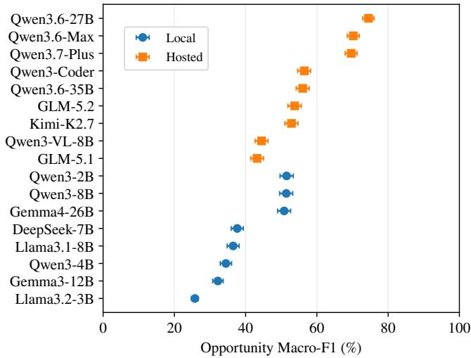  
Fi<sub>gu</sub>r<sub>e</sub> 7<sub>:</sub> O<sub>ppo</sub>rt<sub>u</sub>nit<sub>y-</sub>d<sub>e</sub>t<sub>ec</sub>ti<sub>o</sub>n M<sub>ac</sub>r<sub>o-</sub>F1 <sub>w</sub>ith 95% i<sub>ns</sub>t<sub>ance-</sub>b<sub>oo</sub>t<sub>s</sub>t<sub>rap con</sub>fid<sub>ence</sub> i<sub>n</sub>t<sub>erva</sub>l<sub>s on</sub> th<sub>e</sub> Chi<sub>nese</sub> b<sub>enc</sub>h<sub>mar</sub>k<sub>.</sub>

Detection-conditioned analysis. Table 7 reports relation-<sub>a</sub>tt<sub>r</sub>ib<sub>u</sub>t<sub>e</sub> <sub>per</sub>f<sub>ormance</sub> <sub>con</sub>diti<sub>ona</sub>l <sub>on</sub> <sub>correc</sub>tl<sub>y</sub> d<sub>e</sub>t<sub>ec</sub>ti<sub>ng</sub> <sub>a</sub> <sub>go</sub>ld<sub>-pos</sub>iti<sub>ve pa</sub>i<sub>r.</sub> C<sub>overage mus</sub>t b<sub>e rea</sub>d t<sub>oge</sub>th<sub>er w</sub>ith th<sub>e</sub> <sub>con</sub>diti<sub>ona</sub>l <sub>scores: a</sub> hi<sub>g</sub>h <sub>orac</sub>l<sub>e score a</sub>t l<sub>ow coverage c</sub>h<sub>ar-</sub> <sub>ac</sub>t<sub>er</sub>i<sub>zes on</sub>l<sub>y</sub> th<sub>e su</sub>b<sub>se</sub>t <sub>a</sub>l<sub>rea</sub>d<sub>y</sub> d<sub>e</sub>t<sub>ec</sub>t<sub>e</sub>d <sub>an</sub>d i<sub>s no</sub>t <sub>a</sub> di<sub>-</sub> <sub>rec</sub>tl<sub>y</sub> <sub>compara</sub>bl<sub>e</sub> <sub>en</sub>d<sub>-</sub>t<sub>o-en</sub>d <sub>ran</sub>ki<sub>ng.</sub> F<sub>or</sub> <sub>mos</sub>t hi<sub>g</sub>h<sub>-reca</sub>ll <sub>sys</sub>t<sub>ems,</sub> th<sub>e orac</sub>l<sub>e–en</sub>d<sub>-</sub>t<sub>o-en</sub>d <sub>gap</sub> i<sub>s sma</sub>ll<sub>,</sub> i<sub>n</sub>di<sub>ca</sub>ti<sub>ng</sub> th<sub>a</sub>t th<sub>e</sub>i<sub>r rema</sub>i<sub>n</sub>i<sub>ng errors ar</sub>i<sub>se ma</sub>i<sub>n</sub>l<sub>y w</sub>h<sub>en ass</sub>i<sub>gn</sub>i<sub>ng s</sub>t<sub>reng</sub>th<sub>,</sub> <sub>co</sub>ll<sub>a</sub>b<sub>ora</sub>ti<sub>on</sub> t<sub>ype, or ro</sub>l<sub>e</sub> di<sub>rec</sub>ti<sub>on a</sub>ft<sub>er an oppor</sub>t<sub>un</sub>it<sub>y</sub> h<sub>as</sub> <sub>a</sub>l<sub>rea</sub>d<sub>y</sub> b<sub>een</sub> d<sub>e</sub>t<sub>ec</sub>t<sub>e</sub>d<sub>.</sub> Mi<sub>sse</sub>d d<sub>e</sub>t<sub>ec</sub>ti<sub>on</sub> i<sub>s</sub> i<sub>ns</sub>t<sub>ea</sub>d th<sub>e</sub> d<sub>om</sub>i<sub>-</sub> nant bottleneck for Qwen3-2B. Detailed t<sub>y</sub>pe-confusion and di<sub>rec</sub>ti<sub>on-</sub>bi<sub>as ana</sub>l<sub>yses are prov</sub>id<sub>e</sub>d i<sub>n</sub> A<sub>ppen</sub>di<sub>x</sub> F<sub>.</sub>

## E.3 Complete Cross-Lingual Results

T<sub>a</sub>bl<sub>e</sub> 8 <sub>prov</sub>id<sub>es</sub> th<sub>e</sub> <sub>comp</sub>l<sub>e</sub>t<sub>e</sub> <sub>mo</sub>d<sub>e</sub>l<sub>-</sub>l<sub>eve</sub>l <sub>s</sub>t<sub>a</sub>ti<sub>s</sub>ti<sub>cs</sub> <sub>un</sub>d<sub>er</sub>l<sub>y-</sub> i<sub>ng</sub> th<sub>e</sub> <sub>cross-</sub>li<sub>ngua</sub>l <sub>ana</sub>l<sub>ys</sub>i<sub>s.</sub> E<sub>ng</sub>li<sub>s</sub>h i<sub>npu</sub>t <sub>pro</sub>d<sub>uces</sub> <sub>ne</sub>ith<sub>er</sub> <sub>a un</sub>i<sub>versa</sub>l <sub>ga</sub>i<sub>n nor a un</sub>i<sub>versa</sub>l d<sub>ec</sub>li<sub>ne.</sub> M<sub>o</sub>d<sub>e</sub>l<sub>s w</sub>ith <sub>s</sub>i<sub>m</sub>il<sub>ar</sub> Chi<sub>nese</sub> <sub>an</sub>d E<sub>ng</sub>li<sub>s</sub>h <sub>aggrega</sub>t<sub>e</sub> <sub>exac</sub>t<sub>-ma</sub>t<sub>c</sub>h <sub>scores</sub> <sub>may</sub> <sub>nev-</sub> <sub>er</sub>th<sub>e</sub>l<sub>ess</sub> <sub>s</sub>h<sub>ow</sub> <sub>su</sub>b<sub>s</sub>t<sub>an</sub>ti<sub>a</sub>l <sub>asymme</sub>t<sub>ry</sub> b<sub>e</sub>t<sub>ween</sub> th<sub>e</sub> ZH<sub>-on</sub>l<sub>y</sub> <sub>an</sub>d EN<sub>-on</sub>l<sub>y</sub> <sub>su</sub>b<sub>se</sub>t<sub>s.</sub> M<sub>oreover,</sub> <sub>pa</sub>i<sub>re</sub>d <sub>agreemen</sub>t i<sub>s</sub> <sub>con-</sub> <sub>s</sub>i<sub>s</sub>t<sub>en</sub>tl<sub>y</sub> hi<sub>g</sub>h<sub>er</sub> th<sub>an</sub> th<sub>e propor</sub>ti<sub>on o</sub>f i<sub>ns</sub>t<sub>ances answere</sub>d <sub>correc</sub>tl<sub>y</sub> i<sub>n</sub> b<sub>o</sub>th l<sub>anguages,</sub> d<sub>emons</sub>t<sub>ra</sub>ti<sub>ng</sub> th<sub>a</sub>t <sub>par</sub>t <sub>o</sub>f th<sub>e</sub> <sub>apparen</sub>t <sub>cross-</sub>l<sub>anguage s</sub>t<sub>a</sub>bilit<sub>y</sub> i<sub>s a</sub>tt<sub>r</sub>ib<sub>u</sub>t<sub>a</sub>bl<sub>e</sub> t<sub>o</sub> th<sub>e same</sub> i<sub>ncorrec</sub>t t<sub>up</sub>l<sub>e</sub> b<sub>e</sub>i<sub>ng repea</sub>t<sub>e</sub>d <sub>across</sub> th<sub>e</sub> t<sub>wo</sub> i<sub>npu</sub>t <sub>con</sub>di<sub>-</sub> ti<sub>ons.</sub>

<table><tr><td>Model</td><td>Overall</td><td>Pos. EM</td><td>95% CI</td><td>Cov.</td><td>Cond. Attr. EM</td><td>MCF</td></tr><tr><td>Qwen3-8B</td><td>35.47</td><td>47.62</td><td>[44.42, 50.72]</td><td>93.80</td><td>50.77</td><td>3.00</td></tr><tr><td>Gemma4-26B</td><td>34.47</td><td>47.11</td><td>[44.01, 50.31]</td><td>97.93</td><td>48.10</td><td>3.09</td></tr><tr><td>Llama3.1-8B</td><td>22.25</td><td>44.11</td><td>[41.01, 47.21]</td><td>98.97</td><td>44.57</td><td>3.04</td></tr><tr><td>Qwen3-4B</td><td>20.71</td><td>43.49</td><td>[40.39, 46.59]</td><td>97.93</td><td>44.41</td><td>3.13</td></tr><tr><td>Gemma3-12B</td><td>14.69</td><td>30.89</td><td>[28.10, 33.78]</td><td>99.90</td><td>30.92</td><td>2.83</td></tr><tr><td>Llama3.2-3B</td><td>4.92</td><td>14.15</td><td>[11.98, 16.43]</td><td>99.69</td><td>14.20</td><td>2.34</td></tr><tr><td>Deepseek-7B</td><td>12.98</td><td>13.12</td><td>[11.05, 15.29]</td><td>94.73</td><td>13.85</td><td>2.45</td></tr><tr><td>Qwen3-2B</td><td>51.98</td><td>4.65</td><td>[3.41, 5.99]</td><td>26.96</td><td>17.24</td><td>0.70</td></tr><tr><td>Kimi-K2.7</td><td>41.50</td><td>61.98</td><td>[58.78, 64.98]</td><td>97.42</td><td>63.63</td><td>3.38</td></tr><tr><td>Qwen3-Coder</td><td>44.92</td><td>56.10</td><td>[53.00, 59.30]</td><td>89.98</td><td>62.34</td><td>3.10</td></tr><tr><td>Qwen3.6-Max</td><td>57.61</td><td>52.27</td><td>[49.17, 55.37]</td><td>89.46</td><td>58.43</td><td>3.01</td></tr><tr><td>Qwen3.7-Plus</td><td>55.90</td><td>51.65</td><td>[48.45, 54.86]</td><td>91.84</td><td>56.24</td><td>3.05</td></tr><tr><td>Qwen3.6-35B</td><td>40.21</td><td>50.31</td><td>[47.11, 53.51]</td><td>97.62</td><td>51.53</td><td>3.13</td></tr><tr><td>GLM-5.2</td><td>37.22</td><td>47.11</td><td>[43.90, 50.31]</td><td>97.21</td><td>48.46</td><td>3.08</td></tr><tr><td>Qwen3.6-27B</td><td>61.57</td><td>45.14</td><td>[42.05, 48.24]</td><td>84.71</td><td>53.29</td><td>2.73</td></tr><tr><td>GLM-5.1</td><td>25.35</td><td>38.95</td><td>[35.95, 41.94]</td><td>98.86</td><td>39.39</td><td>2.94</td></tr><tr><td>Qwen3-VL-8B</td><td>26.17</td><td>37.81</td><td>[34.81, 40.91]</td><td>96.80</td><td>39.06</td><td>2.85</td></tr></table>

T<sub>a</sub>bl<sub>e</sub> 6<sub>:</sub> J<sub>o</sub>i<sub>n</sub>t <sub>s</sub>t<sub>ruc</sub>t<sub>ure</sub>d <sub>pre</sub>di<sub>c</sub>ti<sub>on</sub> <sub>per</sub>f<sub>ormance.</sub> P<sub>os</sub>iti<sub>ve</sub> f<sub>our-</sub>fi<sub>e</sub>ld <sub>exac</sub>t <sub>ma</sub>t<sub>c</sub>h <sub>requ</sub>i<sub>res</sub> <sub>oppor</sub>t<sub>un</sub>it<sub>y</sub> <sub>ex</sub>i<sub>s</sub>t<sub>ence,</sub> <sub>s</sub>t<sub>reng</sub>th<sub>,</sub> <sub>co</sub>ll<sub>a</sub>b<sub>ora</sub>ti<sub>on</sub> t<sub>ype, an</sub>d <sub>ro</sub>l<sub>e</sub> di<sub>rec</sub>ti<sub>on</sub> t<sub>o</sub> b<sub>e s</sub>i<sub>mu</sub>lt<sub>aneous</sub>l<sub>y correc</sub>t <sub>on every go</sub>ld<sub>-pos</sub>iti<sub>ve</sub> i<sub>ns</sub>t<sub>ance.</sub> D<sub>e</sub>t<sub>ec</sub>ti<sub>on-con</sub>diti<sub>one</sub>d th<sub>ree-</sub> <sub>a</sub>tt<sub>r</sub>ib<sub>u</sub>t<sub>e exac</sub>t <sub>ma</sub>t<sub>c</sub>h i<sub>s com u</sub>t<sub>e</sub>d <sub>on</sub>l f<sub>or o</sub>ld<sub>- os</sub>iti<sub>ve</sub> i<sub>ns</sub>t<sub>ances re</sub>di<sub>c</sub>t<sub>e</sub>d <sub>as o or</sub>t<sub>un</sub>iti<sub>es an</sub>d i<sub>s re or</sub>t<sub>e</sub>d t<sub>o e</sub>th<sub>er w</sub>ith <sub>p</sub>os<sup>i</sup>t<sup>i</sup>ve covera<sub>g</sub>e.  
Note. All values except MCF are percentages. Overall denotes four-field exact match over all instances. Pos. EM denotes four-field exact <sub>ma</sub>t<sub>c</sub>h <sub>on go</sub>ld<sub>-pos</sub>iti<sub>ve</sub> i<sub>ns</sub>t<sub>ances.</sub> C<sub>ov.</sub> d<sub>eno</sub>t<sub>es pos</sub>iti<sub>ve coverage,</sub> i<sub>.e.,</sub> th<sub>e propor</sub>ti<sub>on o</sub>f <sub>go</sub>ld<sub>-pos</sub>iti<sub>ve</sub> i<sub>ns</sub>t<sub>ances pre</sub>di<sub>c</sub>t<sub>e</sub>d <sub>as oppor</sub>t<sub>un</sub>iti<sub>es.</sub> C<sub>on</sub>d<sub>.</sub> Att<sub>r.</sub> EM d<sub>eno</sub>t<sub>es</sub> d<sub>e</sub>t<sub>ec</sub>ti<sub>on-con</sub>diti<sub>one</sub>d th<sub>ree-a</sub>tt<sub>r</sub>ib<sub>u</sub>t<sub>e exac</sub>t <sub>ma</sub>t<sub>c</sub>h<sub>.</sub> MCF d<sub>eno</sub>t<sub>es mean correc</sub>t fi<sub>e</sub>ld<sub>s.</sub>

## E.4 Robustness to A/B Firm-Order Permutation

T<sub>o</sub> t<sub>es</sub>t <sub>w</sub>h<sub>e</sub>th<sub>er pre</sub>di<sub>c</sub>ti<sub>ons</sub> d<sub>epen</sub>d <sub>on presen</sub>t<sub>a</sub>ti<sub>on or</sub>d<sub>er,</sub> <sub>we cons</sub>t<sub>ruc</sub>t <sub>a</sub> di<sub>rec</sub>ti<sub>on-</sub>b<sub>a</sub>l<sub>ance</sub>d <sub>var</sub>i<sub>an</sub>t <sub>o</sub>f th<sub>e</sub> Chi<sub>nese</sub> t<sub>es</sub>t <sub>se</sub>t<sub>.</sub> Th<sub>e var</sub>i<sub>an</sub>t <sub>re</sub>t<sub>a</sub>i<sub>ns a</sub>ll 2<sub>,</sub>805 fi<sub>rm pa</sub>i<sub>rs an</sub>d <sub>preserves op-</sub> <sub>por</sub>t<sub>un</sub>it<sub>y ex</sub>i<sub>s</sub>t<sub>ence, oppor</sub>t<sub>un</sub>it<sub>y s</sub>t<sub>reng</sub>th<sub>, an</sub>d <sub>co</sub>ll<sub>a</sub>b<sub>ora</sub>ti<sub>on</sub> t<sub>ype.</sub> W<sub>e reverse</sub> th<sub>e</sub> di<sub>sp</sub>l<sub>aye</sub>d <sub>or</sub>d<sub>er on</sub>l<sub>y</sub> f<sub>or go</sub>ld<sub>-pos</sub>iti<sub>ve</sub> <sub>pa</sub>i<sub>rs</sub> <sub>w</sub>ith <sub>a</sub> <sub>un</sub>idi<sub>rec</sub>ti<sub>ona</sub>l <sub>re</sub>l<sub>a</sub>ti<sub>on.</sub> Th<sub>e</sub> <sub>or</sub>i<sub>g</sub>i<sub>na</sub>l t<sub>es</sub>t <sub>se</sub>t <sub>con-</sub> t<sub>a</sub>i<sub>ns</sub> 157 A2B <sub>an</sub>d 700 B2A i<sub>ns</sub>t<sub>ances.</sub> U<sub>s</sub>i<sub>ng a</sub> fi<sub>xe</sub>d <sub>ran</sub>d<sub>om</sub> <sub>see</sub>d<sub>, we swap</sub> 427 <sub>pa</sub>i<sub>rs,</sub> i<sub>nc</sub>l<sub>u</sub>di<sub>ng</sub> 78 <sub>or</sub>i<sub>g</sub>i<sub>na</sub>l A2B i<sub>ns</sub>t<sub>ances</sub> <sub>an</sub>d 349 <sub>or</sub>i<sub>g</sub>i<sub>na</sub>l B2A i<sub>ns</sub>t<sub>ances, y</sub>i<sub>e</sub>ldi<sub>ng an approx</sub>i<sub>ma</sub>t<sub>e</sub>l<sub>y</sub> b<sub>a</sub>l<sub>ance</sub>d di<sub>s</sub>t<sub>r</sub>ib<sub>u</sub>ti<sub>on o</sub>f 428 A2B <sub>an</sub>d 429 B2A <sub>pa</sub>i<sub>rs.</sub> U<sub>n</sub>d<sub>er</sub> id<sub>ea</sub>l <sub>equ</sub>i<sub>var</sub>i<sub>ance, a swappe</sub>d <sub>pa</sub>i<sub>r s</sub>h<sub>ou</sub>ld <sub>preserve oppor</sub>t<sub>u-</sub> <sub>n</sub>it<sub>y</sub> <sub>ex</sub>i<sub>s</sub>t<sub>ence,</sub> <sub>s</sub>t<sub>reng</sub>th<sub>,</sub> <sub>an</sub>d t<sub>ype</sub> <sub>w</sub>hil<sub>e</sub> <sub>revers</sub>i<sub>ng</sub> <sub>on</sub>l<sub>y</sub> A2B <sub>an</sub>d B2A<sub>.</sub> P<sub>re</sub>di<sub>c</sub>ti<sub>ons</sub> f<sub>or</sub> <sub>unswappe</sub>d <sub>pa</sub>i<sub>rs</sub> <sub>s</sub>h<sub>ou</sub>ld <sub>rema</sub>i<sub>n</sub> <sub>unc</sub>h<sub>ange</sub>d<sub>.</sub>

T<sub>a</sub>bl<sub>e</sub> 9 <sub>repor</sub>t<sub>s resu</sub>lt<sub>s</sub> f<sub>or</sub> th<sub>e n</sub>i<sub>ne mo</sub>d<sub>e</sub>l<sub>s w</sub>ith <sub>pre</sub>di<sub>c-</sub> ti<sub>ons</sub> <sub>on</sub> b<sub>o</sub>th th<sub>e</sub> <sub>or</sub>i<sub>g</sub>i<sub>na</sub>l <sub>an</sub>d b<sub>a</sub>l<sub>ance</sub>d <sub>var</sub>i<sub>an</sub>t<sub>s.</sub> A<sub>verage</sub>d <sub>across mo</sub>d<sub>e</sub>l<sub>s, exac</sub>t <sub>equ</sub>i<sub>var</sub>i<sub>ance</sub> i<sub>s</sub> 76<sub>.</sub>47% <sub>an</sub>d di<sub>rec</sub>ti<sub>on</sub> <sub>equ</sub>i<sub>var</sub>i<sub>ance</sub> i<sub>s</sub> 85<sub>.</sub>90%<sub>.</sub> Th<sub>us,</sub> 23<sub>.</sub>53% <sub>o</sub>f <sub>pre</sub>di<sub>c</sub>ti<sub>ons</sub> f<sub>a</sub>il t<sub>o</sub> <sub>preserve</sub> th<sub>e expec</sub>t<sub>e</sub>d <sub>s</sub>t<sub>ruc</sub>t<sub>ure</sub>d <sub>equ</sub>i<sub>va</sub>l<sub>ence, an</sub>d 18<sub>.</sub>91% <sub>c</sub>h<sub>ange</sub> <sub>no</sub>t <sub>on</sub>l<sub>y</sub> di<sub>rec</sub>ti<sub>on</sub> b<sub>u</sub>t <sub>a</sub>l<sub>so</sub> <sub>oppor</sub>t<sub>un</sub>it<sub>y</sub> <sub>ex</sub>i<sub>s</sub>t<sub>ence,</sub> <sub>s</sub>t<sub>reng</sub>th<sub>, or co</sub>ll<sub>a</sub>b<sub>ora</sub>ti<sub>on</sub> t<sub>ype.</sub> O<sub>r</sub>d<sub>er sens</sub>iti<sub>v</sub>it<sub>y</sub> i<sub>s</sub> th<sub>ere</sub>f<sub>ore</sub> <sub>no</sub>t <sub>con</sub>fi<sub>ne</sub>d t<sub>o</sub> th<sub>e</sub> di<sub>rec</sub>ti<sub>ona</sub>l l<sub>a</sub>b<sub>e</sub>l<sub>.</sub>

A/B <sub>permu</sub>t<sub>a</sub>ti<sub>on</sub> d<sub>oes</sub> <sub>no</sub>t <sub>sys</sub>t<sub>ema</sub>ti<sub>ca</sub>ll<sub>y</sub> <sub>over</sub>t<sub>urn</sub> <sub>prev</sub>i<sub>-</sub> <sub>ous</sub>l<sub>y correc</sub>t <sub>pre</sub>di<sub>c</sub>ti<sub>ons.</sub> A<sub>s s</sub>h<sub>own</sub> i<sub>n</sub> Fi<sub>gure</sub> 8<sub>, an average o</sub>f 2<sub>.</sub>46% <sub>o</sub>f i<sub>ns</sub>t<sub>ances c</sub>h<sub>ange</sub> f<sub>rom correc</sub>t t<sub>o</sub> i<sub>ncorrec</sub>t<sub>, w</sub>h<sub>ereas</sub> 4<sub>.</sub>61% <sub>c</sub>h<sub>ange</sub> f<sub>rom</sub> i<sub>ncorrec</sub>t t<sub>o correc</sub>t<sub>,</sub> f<sub>or a ne</sub>t i<sub>mprove-</sub> <sub>men</sub>t <sub>o</sub>f 2<sub>.</sub>15 <sub>po</sub>i<sub>n</sub>t<sub>s.</sub> Th<sub>e</sub> b<sub>a</sub>l<sub>ance</sub>d <sub>var</sub>i<sub>an</sub>t <sub>s</sub>h<sub>ou</sub>ld th<sub>ere</sub>f<sub>ore</sub> b<sub>e</sub> i<sub>n</sub>t<sub>erpre</sub>t<sub>e</sub>d <sub>as a s</sub>t<sub>ress</sub> t<sub>es</sub>t f<sub>or or</sub>d<sub>er sens</sub>iti<sub>v</sub>it<sub>y ra</sub>th<sub>er</sub> th<sub>an</sub> <sub>as ev</sub>id<sub>ence aga</sub>i<sub>ns</sub>t th<sub>e ma</sub>i<sub>n conc</sub>l<sub>us</sub>i<sub>ons</sub> d<sub>rawn</sub> f<sub>rom</sub> th<sub>e</sub> <sub>or</sub>i<sub>g</sub>i<sub>na</sub>l b<sub>enc</sub>h<sub>mar</sub>k<sub>.</sub>

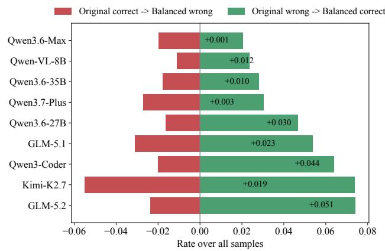  
Fi<sub>gure</sub> 8<sub>:</sub> Ch<sub>anges</sub> i<sub>n</sub> f<sub>our-</sub>fi<sub>e</sub>ld <sub>exac</sub>t<sub>-ma</sub>t<sub>c</sub>h <sub>correc</sub>t<sub>ness a</sub>f<sub>-</sub> t<sub>er</sub> A/B fi<sub>rm-or</sub>d<sub>er</sub> <sub>permu</sub>t<sub>a</sub>ti<sub>on.</sub> L<sub>e</sub>ft<sub>war</sub>d <sub>an</sub>d <sub>r</sub>i<sub>g</sub>ht<sub>war</sub>d b<sub>ars</sub> denote Correct→Wron<sub>g</sub> and Wron<sub>g</sub>→Correct transitions, re-<sub>spec</sub>ti<sub>ve</sub>l<sub>y;</sub> <sub>anno</sub>t<sub>a</sub>ti<sub>ons</sub> <sub>repor</sub>t <sub>ne</sub>t <sub>correc</sub>ti<sub>on</sub> <sub>ra</sub>t<sub>es.</sub>

## E.5 Output Validity and Confidence Reliability

Table 10 jointly reports raw JSON validity, normalized <sub>pars</sub>i<sub>ng success, m</sub>i<sub>ss</sub>i<sub>ng-</sub>fi<sub>e</sub>ld <sub>an</sub>d i<sub>nva</sub>lid<sub>-</sub>l<sub>a</sub>b<sub>e</sub>l <sub>ra</sub>t<sub>es, cross-</sub> fi<sub>e</sub>ld <sub>cons</sub>t<sub>ra</sub>i<sub>n</sub>t <sub>v</sub>i<sub>o</sub>l<sub>a</sub>ti<sub>ons, an</sub>d <sub>con</sub>fid<sub>ence-con</sub>diti<sub>one</sub>d <sub>ex-</sub> <sub>ac</sub>t <sub>ma</sub>t<sub>c</sub>h<sub>.</sub> M<sub>os</sub>t h<sub>os</sub>t<sub>e</sub>d <sub>mo</sub>d<sub>e</sub>l<sub>s pro</sub>d<sub>uce syn</sub>t<sub>ac</sub>ti<sub>ca</sub>ll<sub>y va</sub>lid <sub>ou</sub>t<sub>pu</sub>t<sub>s,</sub> b<sub>u</sub>t <sub>compara</sub>bl<sub>e</sub> <sub>pars</sub>i<sub>ng</sub> <sub>success</sub> d<sub>oes</sub> <sub>no</sub>t i<sub>mp</sub>l<sub>y</sub> comparable structural consistenc<sub>y</sub>. Qwen3-Coder records the lowest violation rate at 0.21%, followed b<sub>y</sub> Qwen3- 2B (0.46%), Qwen3.7-Plus (1.03%), Qwen3.6-27B (1.43%), and Qwen3.6-Max (1.89%). Common errors include retaini<sub>ng</sub> <sub>non-emp</sub>t<sub>y</sub> <sub>re</sub>l<sub>a</sub>ti<sub>on</sub> <sub>a</sub>tt<sub>r</sub>ib<sub>u</sub>t<sub>es</sub> <sub>a</sub>ft<sub>er</sub> <sub>pre</sub>di<sub>c</sub>ti<sub>ng</sub> N<sub>o</sub> <sub>an</sub>d <sub>om</sub>itti<sub>ng requ</sub>i<sub>re</sub>d fi<sub>e</sub>ld<sub>s a</sub>ft<sub>er pre</sub>di<sub>c</sub>ti<sub>ng</sub> Y<sub>es.</sub>

T<sub>a</sub>bl<sub>e</sub> 7<sub>:</sub> O<sub>rac</sub>l<sub>e-</sub>d<sub>e</sub>t<sub>ec</sub>ti<sub>on con</sub>diti<sub>ona</sub>l <sub>per</sub>f<sub>ormance.</sub>
<table><tr><td>Model</td><td>Coverage</td><td>Strength Macro-F1</td><td>Type Macro-F1</td><td>Direction Macro-F1</td><td>Oracle-E2E Gap</td></tr><tr><td>Qwen3-2B</td><td>26.96</td><td>46.40</td><td>29.37</td><td>27.85</td><td>19.21</td></tr><tr><td>Qwen3-8B</td><td>93.80</td><td>47.99</td><td>49.89</td><td>54.87</td><td>2.27</td></tr><tr><td>Gemma4-26B</td><td>97.93</td><td>46.50</td><td>54.46</td><td>67.23</td><td>0.78</td></tr><tr><td>DeepSeek-7B</td><td>94.73</td><td>47.72</td><td>32.32</td><td>37.24</td><td>0.94</td></tr><tr><td>Llama3.1-8B</td><td>98.97</td><td>46.17</td><td>43.70</td><td>52.51</td><td>0.48</td></tr><tr><td>Qwen3-4B</td><td>97.93</td><td>51.27</td><td>57.70</td><td>55.54</td><td>0.58</td></tr><tr><td>Gemma3-12B</td><td>99.90</td><td>45.30</td><td>44.45</td><td>61.04</td><td>0.02</td></tr><tr><td>Llama3.2-3B</td><td>99.69</td><td>38.92</td><td>14.56</td><td>22.29</td><td>0.04</td></tr><tr><td>Qwen3.6-27B</td><td>84.71</td><td>48.68</td><td>57.23</td><td>62.43</td><td>5.52</td></tr><tr><td>Qwen3.6-Max</td><td>89.46</td><td>52.80</td><td>57.17</td><td>63.43</td><td>4.32</td></tr><tr><td>Qwen3.7-Plus</td><td>91.84</td><td>48.82</td><td>60.94</td><td>70.30</td><td>2.73</td></tr><tr><td>Qwen3-Coder</td><td>89.98</td><td>49.15</td><td>49.86</td><td>62.94</td><td>3.02</td></tr><tr><td>Qwen3.6-35B</td><td>97.62</td><td>48.62</td><td>55.63</td><td>64.35</td><td>0.88</td></tr><tr><td>GLM-5.2</td><td>97.21</td><td>50.71</td><td>55.61</td><td>60.76</td><td>0.99</td></tr><tr><td>Kimi-K2.7</td><td>97.42</td><td>53.81</td><td>61.71</td><td>68.85</td><td>1.11</td></tr><tr><td>Qwen3-VL-8B</td><td>96.80</td><td>42.56</td><td>41.15</td><td>55.56</td><td>0.93</td></tr><tr><td>GLM-5.1</td><td>98.86</td><td>42.59</td><td>57.15</td><td>64.11</td><td>0.51</td></tr></table>

O<sub>rac</sub>l<sub>e</sub> i<sub>nc</sub>l<sub>u</sub>d<sub>es</sub> <sub>on</sub>l<sub>y</sub> <sub>go</sub>ld<sub>-pos</sub>iti<sub>ve</sub> i<sub>ns</sub>t<sub>ances</sub> <sub>correc</sub>tl<sub>y</sub> d<sub>e</sub>t<sub>ec</sub>t<sub>e</sub>d <sub>as</sub> Y<sub>es.</sub> C<sub>overage</sub> i<sub>s</sub> <sub>oppor</sub>t<sub>un</sub>it<sub>y</sub> <sub>reca</sub>ll <sub>on</sub> <sub>go</sub>ld<sub>-pos</sub>iti<sub>ve</sub> i<sub>ns</sub>t<sub>ances;</sub> th<sub>e</sub> <sub>gap</sub> i<sub>s</sub> th<sub>e mean orac</sub>l<sub>e m</sub>i<sub>nus</sub> E2E M<sub>acro-</sub>F1 <sub>across</sub> th<sub>ree a</sub>tt<sub>r</sub>ib<sub>u</sub>t<sub>es.</sub>

S<sub>e</sub>lf<sub>-repor</sub>t<sub>e</sub>d <sub>con</sub>fid<sub>ence prov</sub>id<sub>es use</sub>f<sub>u</sub>l <sub>r</sub>i<sub>s</sub>k <sub>s</sub>t<sub>ra</sub>tifi<sub>ca</sub>ti<sub>on</sub> for some models but is not a calibrated probabilit<sub>y</sub>. Qwen3.6- 27B, Qwen3.7-Plus, and Qwen3.6-Max show Hi<sub>g</sub>h–Low <sub>exac</sub>t<sub>-ma</sub>t<sub>c</sub>h <sub>gaps o</sub>f 67<sub>.</sub>05<sub>,</sub> 59<sub>.</sub>88<sub>, an</sub>d 56<sub>.</sub>57 <sub>po</sub>i<sub>n</sub>t<sub>s, re-</sub> <sub>spec</sub>ti<sub>ve</sub>l<sub>y,</sub> <sub>ye</sub>t th<sub>e</sub>i<sub>r</sub> Hi<sub>g</sub>h<sub>-con</sub>fid<sub>ence</sub> <sub>su</sub>b<sub>se</sub>t<sub>s</sub> <sub>s</sub>till <sub>con</sub>t<sub>a</sub>i<sub>n</sub> 31<sub>.</sub>86<sub>–</sub>39<sub>.</sub>64% <sub>e</sub>rr<sub>o</sub>r<sub>s.</sub> Int<sub>e</sub>r<sub>p</sub>r<sub>e</sub>t<sub>a</sub>ti<sub>o</sub>n <sub>a</sub>l<sub>so</sub> d<sub>epe</sub>nd<sub>s</sub> <sub>s</sub>tr<sub>o</sub>n<sub>g</sub>l<sub>y</sub> <sub>on</sub> <sub>coverage:</sub> <sub>some</sub> <sub>mo</sub>d<sub>e</sub>l<sub>s</sub> <sub>ass</sub>i<sub>gn</sub> <sub>near</sub>l<sub>y</sub> <sub>a</sub>ll i<sub>ns</sub>t<sub>ances</sub> t<sub>o</sub> th<sub>e</sub> Hi<sub>g</sub>h<sub>-con</sub>fid<sub>ence</sub> <sub>su</sub>b<sub>se</sub>t<sub>,</sub> <sub>ma</sub>ki<sub>ng</sub> th<sub>e</sub> L<sub>ow-con</sub>fid<sub>ence</sub> <sub>es</sub>ti<sub>-</sub> <sub>ma</sub>t<sub>e uns</sub>t<sub>a</sub>bl<sub>e.</sub> C<sub>on</sub>fid<sub>ence s</sub>h<sub>ou</sub>ld th<sub>ere</sub>f<sub>ore</sub> b<sub>e</sub> t<sub>rea</sub>t<sub>e</sub>d <sub>as a</sub> <sub>mo</sub>d<sub>e</sub>l<sub>-spec</sub>ifi<sub>c</sub> di<sub>agnos</sub>ti<sub>c</sub> <sub>an</sub>d <sub>repor</sub>t<sub>e</sub>d t<sub>oge</sub>th<sub>er</sub> <sub>w</sub>ith Hi<sub>g</sub>h<sub>-</sub> <sub>con</sub>fid<sub>ence coverage.</sub>

## F Error Analyses

Evaluation alignment. All analyses in this section use the i<sub>ns</sub>t<sub>ance-</sub>l<sub>eve</sub>l <sub>pre</sub>di<sub>c</sub>ti<sub>on</sub> t<sub>a</sub>bl<sub>e a</sub>li<sub>gne</sub>d t<sub>o</sub> th<sub>e</sub> 2<sub>,</sub>805 <sub>go</sub>ld <sub>pa</sub>i<sub>r</sub> id<sub>en</sub>tifi<sub>ers.</sub> D<sub>up</sub>li<sub>ca</sub>t<sub>e ou</sub>t<sub>pu</sub>t<sub>s,</sub> API f<sub>a</sub>il<sub>ures, m</sub>i<sub>ss</sub>i<sub>ng pre</sub>di<sub>c-</sub> ti<sub>ons,</sub> i<sub>nva</sub>lid l<sub>a</sub>b<sub>e</sub>l<sub>s, an</sub>d <sub>cross-</sub>fi<sub>e</sub>ld <sub>v</sub>i<sub>o</sub>l<sub>a</sub>ti<sub>ons are re</sub>t<sub>a</sub>i<sub>ne</sub>d <sub>an</sub>d h<sub>an</sub>dl<sub>e</sub>d <sub>exp</sub>li<sub>c</sub>itl<sub>y.</sub> C<sub>ross-</sub>li<sub>ngua</sub>l <sub>s</sub>t<sub>a</sub>ti<sub>s</sub>ti<sub>cs are compu</sub>t<sub>e</sub>d <sub>on</sub>l<sub>y on</sub> fi<sub>rm pa</sub>i<sub>rs</sub> f<sub>or w</sub>hi<sub>c</sub>h b<sub>o</sub>th Chi<sub>nese an</sub>d E<sub>ng</sub>li<sub>s</sub>h <sub>pre-</sub> di<sub>c</sub>ti<sub>ons are ava</sub>il<sub>a</sub>bl<sub>e</sub> f<sub>or</sub> th<sub>e same mo</sub>d<sub>e</sub>l<sub>.</sub>

## F.1 Error Decomposition

Fi<sub>gure</sub> 9 d<sub>ecomposes</sub> <sub>pre</sub>di<sub>c</sub>ti<sub>ons</sub> <sub>on</sub> th<sub>e</sub> 968 <sub>go</sub>ld<sub>-pos</sub>iti<sub>ve</sub> <sub>p</sub>a<sup>i</sup>rs <sup>i</sup>nto com<sub>p</sub><sup>l</sup>ete tu<sub>p</sub><sup>l</sup>e correctness, o<sub>pp</sub>ortun<sup>i</sup>t<sub>y</sub> <sup>f</sup>a<sup>l</sup>se ne<sub>g</sub>- <sub>a</sub>ti<sub>ves,</sub> <sub>an</sub>d <sub>a</sub>tt<sub>r</sub>ib<sub>u</sub>t<sub>e</sub> <sub>errors</sub> <sub>con</sub>diti<sub>ona</sub>l <sub>on</sub> <sub>a</sub> <sub>pos</sub>iti<sub>ve</sub> <sub>oppor</sub>t<sub>u-</sub> <sub>n</sub>it<sub>y pre</sub>di<sub>c</sub>ti<sub>on.</sub> Ki<sub>m</sub>i<sub>-</sub>K2<sub>.</sub>7 <sub>o</sub>bt<sub>a</sub>i<sub>ns</sub> th<sub>e</sub> hi<sub>g</sub>h<sub>es</sub>t <sub>pos</sub>iti<sub>ve</sub> f<sub>our-</sub> fi<sub>e</sub>ld <sub>exac</sub>t <sub>ma</sub>t<sub>c</sub>h<sub>,</sub> <sub>recover</sub>i<sub>ng</sub> th<sub>e</sub> <sub>comp</sub>l<sub>e</sub>t<sub>e</sub> t<sub>up</sub>l<sub>e</sub> f<sub>or</sub> 600 <sub>o</sub>f 968 <sub>p</sub>airs (62.0%). It <sub>p</sub>redicts the o<sub>pp</sub>ortunit<sub>y</sub>-existence label as No for 25 <sub>g</sub>old-<sub>p</sub>ositive <sub>p</sub>airs (2.6%). For another 343 <sub>p</sub>airs (35.4%), it correctl<sub>y</sub> <sub>p</sub>redicts Yes but returns at least one incorrect, missin<sub>g</sub>, or invalid relation attribute. Qwen3.6-27B i<sub>s</sub> th<sub>e s</sub>t<sub>ronges</sub>t <sub>oppor</sub>t<sub>un</sub>it<sub>y</sub> d<sub>e</sub>t<sub>ec</sub>t<sub>or</sub> i<sub>n</sub> th<sub>e ma</sub>i<sub>n eva</sub>l<sub>ua</sub>ti<sub>on,</sub> <sub>y</sub>et its <sub>p</sub>ositive four-field exact match is 437/968 (45.1%): 148 <sub>g</sub>old-<sub>p</sub>ositive <sub>p</sub>airs (15.3%) are <sub>p</sub>redicted as No, while 383 (39.6%) receive a <sub>p</sub>ositive o<sub>pp</sub>ortunit<sub>y p</sub>rediction with at least one erroneous relation attribute. B<sub>y</sub> contrast, Qwen3-2B <sub>p</sub>redicts No for 707 <sub>g</sub>old-<sub>p</sub>ositive <sub>p</sub>airs (73.0%) and recovers the com<sub>p</sub>lete tu<sub>p</sub>le for onl<sub>y</sub> 45 (4.6%). O<sub>pp</sub>ortunit<sub>y</sub> false <sub>nega</sub>ti<sub>ves</sub> th<sub>ere</sub>f<sub>ore</sub> d<sub>om</sub>i<sub>na</sub>t<sub>e</sub> th<sub>e errors o</sub>f l<sub>ow-reca</sub>ll <sub>mo</sub>d<sub>-</sub> <sub>e</sub>l<sub>s, w</sub>h<sub>ereas</sub> hi<sub>g</sub>h<sub>-reca</sub>ll <sub>sys</sub>t<sub>ems are</sub> li<sub>m</sub>it<sub>e</sub>d <sub>pr</sub>i<sub>mar</sub>il<sub>y</sub> b<sub>y</sub> <sub>co</sub>ll<sub>a</sub>b<sub>ora</sub>ti<sub>on-</sub>t<sub>ype</sub> <sub>an</sub>d <sub>ro</sub>l<sub>e-</sub>di<sub>rec</sub>ti<sub>on</sub> <sub>errors</sub> <sub>a</sub>ft<sub>er</sub> <sub>pre</sub>di<sub>c</sub>ti<sub>ng</sub> t<sup>h</sup>at an o<sub>pp</sub>ortun<sup>i</sup>t<sub>y</sub> ex<sup>i</sup>sts.

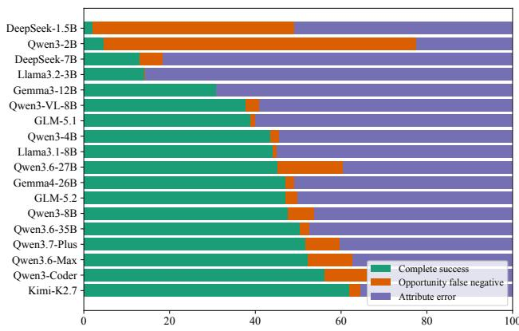  
Fi<sub>gure</sub> 9<sub>:</sub> P<sub>re</sub>di<sub>c</sub>ti<sub>on</sub> <sub>ou</sub>t<sub>comes</sub> <sub>on</sub> th<sub>e</sub> 968 <sub>go</sub>ld<sub>-pos</sub>iti<sub>ve</sub> Chi<sub>-</sub> <sub>nese</sub> i<sub>ns</sub>t<sub>ances.</sub> E<sub>ac</sub>h <sub>pre</sub>di<sub>c</sub>ti<sub>on</sub> b<sub>e</sub>l<sub>ongs</sub> t<sub>o one o</sub>f th<sub>ree mu-</sub> tuall<sub>y</sub> exclusive cate<sub>g</sub>ories: (i) com<sub>p</sub>lete tu<sub>p</sub>le correct; (ii) <sub>oppor</sub>t<sub>un</sub>it<sub>y</sub> f<sub>a</sub>l<sub>se nega</sub>ti<sub>ve, w</sub>h<sub>ere</sub> th<sub>e go</sub>ld l<sub>a</sub>b<sub>e</sub>l i<sub>s</sub> Y<sub>es</sub> b<sub>u</sub>t the model <sub>p</sub>redicts No; or (iii) attribute error after a <sub>p</sub>ositive <sub>oppor</sub>t<sub>un</sub>it<sub>y</sub> <sub>pre</sub>di<sub>c</sub>ti<sub>on,</sub> <sub>w</sub>h<sub>ere</sub> th<sub>e</sub> <sub>mo</sub>d<sub>e</sub>l <sub>pre</sub>di<sub>c</sub>t<sub>s</sub> Y<sub>es</sub> b<sub>u</sub>t <sub>a</sub>t l<sub>eas</sub>t <sub>one o</sub>f <sub>s</sub>t<sub>reng</sub>th<sub>, co</sub>ll<sub>a</sub>b<sub>ora</sub>ti<sub>on</sub> t<sub>ype, or ro</sub>l<sub>e</sub> di<sub>rec</sub>ti<sub>on</sub> i<sub>s</sub> i<sub>ncorrec</sub>t<sub>, m</sub>i<sub>ss</sub>i<sub>ng, or</sub> i<sub>nva</sub>lid<sub>.</sub>

T<sub>a</sub>bl<sub>e</sub> 8<sub>:</sub> P<sub>a</sub>i<sub>re</sub>d Chi<sub>nese–</sub>E<sub>ng</sub>li<sub>s</sub>h <sub>eva</sub>l<sub>ua</sub>ti<sub>on.</sub> P<sub>a</sub>i<sub>re</sub>d A<sub>greemen</sub>t <sub>measures</sub> t<sub>up</sub>l<sub>e</sub> id<sub>en</sub>tit<sub>y</sub> <sub>ra</sub>th<sub>er</sub> th<sub>an</sub> <sub>correc</sub>t<sub>ness.</sub>
<table><tr><td>Model</td><td>ZH EM</td><td>EN EM</td><td>∆EM</td><td>Paired Agreement</td><td>Both Correct</td><td>ZH Only</td><td>EN Only</td></tr><tr><td>Qwen3-2B</td><td>51.98</td><td>59.22</td><td>+7.24</td><td>75.08</td><td>49.73</td><td>2.25</td><td>9.48</td></tr><tr><td>Gemma4-26B</td><td>44.15</td><td>51.11</td><td>+6.95</td><td>68.60</td><td>39.83</td><td>4.32</td><td>11.28</td></tr><tr><td>Gemma3-12B</td><td>14.69</td><td>14.47</td><td>-0.21</td><td>50.09</td><td>11.27</td><td>3.42</td><td>3.21</td></tr><tr><td>Qwen3-8B</td><td>35.47</td><td>30.52</td><td>-4.96</td><td>39.47</td><td>21.78</td><td>13.69</td><td>8.73</td></tr><tr><td>Qwen3-4B</td><td>20.71</td><td>25.92</td><td>+5.20</td><td>34.08</td><td>12.66</td><td>8.06</td><td>13.26</td></tr><tr><td>Llama3.1-8B</td><td>22.25</td><td>27.95</td><td>+5.70</td><td>31.27</td><td>14.40</td><td>7.84</td><td>13.55</td></tr><tr><td>DeepSeek-7B</td><td>12.98</td><td>11.94</td><td>-1.03</td><td>12.80</td><td>3.64</td><td>9.34</td><td>8.31</td></tr><tr><td>Llama3.2-3B</td><td>4.92</td><td>4.67</td><td>-0.25</td><td>7.52</td><td>1.18</td><td>3.74</td><td>3.49</td></tr><tr><td>Qwen3.6-Max</td><td>57.61</td><td>62.21</td><td>+4.60</td><td>79.57</td><td>54.62</td><td>2.99</td><td>7.59</td></tr><tr><td>Qwen3.6-27B</td><td>61.57</td><td>60.14</td><td>-1.43</td><td>77.33</td><td>55.83</td><td>5.74</td><td>4.31</td></tr><tr><td>Qwen3.7-Plus</td><td>55.90</td><td>53.87</td><td>-2.03</td><td>75.90</td><td>49.66</td><td>6.24</td><td>4.21</td></tr><tr><td>Qwen3-Coder</td><td>44.92</td><td>44.21</td><td>-0.71</td><td>66.38</td><td>37.29</td><td>7.63</td><td>6.92</td></tr><tr><td>Qwen3.6-35B</td><td>40.21</td><td>51.55</td><td>+11.34</td><td>61.96</td><td>36.93</td><td>3.28</td><td>14.62</td></tr><tr><td>Kimi-K2.7</td><td>41.50</td><td>44.10</td><td>+2.60</td><td>61.68</td><td>35.58</td><td>5.92</td><td>8.52</td></tr><tr><td>GLM-5.2</td><td>37.22</td><td>44.10</td><td>+6.88</td><td>61.60</td><td>33.16</td><td>4.06</td><td>10.94</td></tr><tr><td>GLM-5.1</td><td>25.35</td><td>21.82</td><td>-3.53</td><td>55.12</td><td>18.18</td><td>7.17</td><td>3.64</td></tr><tr><td>Qwen3-VL-8B</td><td>26.17</td><td>31.34</td><td>+5.17</td><td>49.41</td><td>22.03</td><td>4.14</td><td>9.30</td></tr></table>

Scores are percentages; ∆EM = EN − ZH. Paired Agreement measures predicted-tuple identity across the Chinese and English versions <sub>an</sub>d d<sub>oes</sub> <sub>no</sub>t i<sub>mp</sub>l<sub>y</sub> <sub>correc</sub>t<sub>ness.</sub> C<sub>omp</sub>l<sub>e</sub>t<sub>e</sub> <sub>pa</sub>i<sub>rs</sub> h<sub>ave</sub> $\mathrm { \Delta } N = 2 { , } 8 0 5 \mathrm { \Delta }$ <sub>, a</sub>lth<sub>oug</sub>h <sub>usa</sub>bl<sub>e pa</sub>i<sub>r coun</sub>t<sub>s may vary</sub> b<sub>y mo</sub>d<sub>e</sub>l<sub>.</sub> C<sub>orrec</sub>t<sub>ness</sub> d<sub>eno</sub>t<sub>es</sub> f<sub>our-</sub>fi<sub>e</sub>ld <sub>exac</sub>t <sub>ma</sub>t<sub>c</sub>h<sub>.</sub>

## F.2 Systematic Failure Modes

Relatedness mistaken for complementarity. Unsup-<sub>por</sub>t<sub>e</sub>d <sub>oppor</sub>t<sub>un</sub>it<sub>y pre</sub>di<sub>c</sub>ti<sub>ons are</sub> th<sub>e mos</sub>t f<sub>requen</sub>t <sub>error</sub> <sub>a</sub>t th<sub>e mo</sub>d<sub>e</sub>l<sub>–</sub>i<sub>ns</sub>t<sub>ance</sub> l<sub>eve</sub>l<sub>.</sub> A<sub>mong</sub> th<sub>e</sub> 1<sub>,</sub>836 <sub>go</sub>ld<sub>-nega</sub>ti<sub>ve</sub> <sub>pa</sub>i<sub>rs m</sub>i<sub>sc</sub>l<sub>ass</sub>ifi<sub>e</sub>d b<sub>y a</sub>t l<sub>eas</sub>t <sub>one</sub> Chi<sub>nese mo</sub>d<sub>e</sub>l<sub>,</sub> 1<sub>,</sub>773 (96.6%) are misclassified b<sub>y</sub> three or more models. Moreover, 18,551 of the 23,621 false-<sub>p</sub>ositive decisions (78.5%) are as-<sub>s</sub>i<sub>gne</sub>d Hi<sub>g</sub>h <sub>con</sub>fid<sub>ence.</sub> At th<sub>e pa</sub>i<sub>r</sub> l<sub>eve</sub>l<sub>,</sub> b<sub>o</sub>th <sub>same-</sub>i<sub>n</sub>d<sub>us</sub>t<sub>ry</sub> hard <sub>p</sub>airs (644/644) and random non-ed<sub>g</sub>es (626/627) attract <sub>a</sub>t l<sub>eas</sub>t <sub>one</sub> f<sub>a</sub>l<sub>se pos</sub>iti<sub>ve.</sub> Th<sub>e recurrence across mo</sub>d<sub>e</sub>l<sub>s</sub> i<sub>n-</sub> di<sub>ca</sub>t<sub>es</sub> th<sub>a</sub>t b<sub>roa</sub>d i<sub>n</sub>d<sub>us</sub>t<sub>ry</sub> <sub>prox</sub>i<sub>m</sub>it<sub>y,</sub> <sub>s</sub>h<sub>are</sub>d t<sub>erm</sub>i<sub>no</sub>l<sub>ogy,</sub> or market adjacency often triggers a plausible collaboration <sub>narra</sub>ti<sub>ve even w</sub>h<sub>en</sub> th<sub>e supp</sub>li<sub>e</sub>d <sub>pro</sub>fil<sub>es</sub> d<sub>o no</sub>t id<sub>en</sub>tif<sub>y a</sub> <sub>su</sub>fi<sub>c</sub>i<sub>en</sub>tl<sub>y</sub> <sub>spec</sub>ifi<sub>c</sub> <sub>pro</sub>d<sub>uc</sub>t<sub>,</sub> t<sub>ec</sub>h<sub>no</sub>l<sub>ogy,</sub> <sub>c</sub>h<sub>anne</sub>l<sub>,</sub> <sub>capa</sub>bilit<sub>y,</sub> <sub>or</sub> <sub>cap</sub>it<sub>a</sub>l fl<sub>ow.</sub>

Opportunity false negatives on implicit complementarity. A<sub>cross</sub> th<sub>e</sub> 18<sub>,</sub>392 <sub>go</sub>ld<sub>-pos</sub>iti<sub>ve mo</sub>d<sub>e</sub>l<sub>–</sub>i<sub>ns</sub>t<sub>ance</sub> d<sub>ec</sub>i<sub>s</sub>i<sub>ons,</sub> models <sub>p</sub>redict No in 1,903 cases (10.3%), <sub>p</sub>roducin<sub>g</sub> o<sub>pp</sub>ort<sub>un</sub>it<sub>y</sub> f<sub>a</sub>l<sub>se nega</sub>ti<sub>ves.</sub> At th<sub>e pa</sub>i<sub>r</sub> l<sub>eve</sub>l<sub>,</sub> 804 <sub>o</sub>f 968 <sub>pos</sub>iti<sub>ve</sub> <sub>pa</sub>i<sub>rs rece</sub>i<sub>ve a</sub>t l<sub>eas</sub>t <sub>one</sub> f<sub>a</sub>l<sub>se-nega</sub>ti<sub>ve pre</sub>di<sub>c</sub>ti<sub>on, an</sub>d 209 <sub>rece</sub>i<sub>ve</sub> f<sub>a</sub>l<sub>se-nega</sub>ti<sub>ve pre</sub>di<sub>c</sub>ti<sub>ons</sub> f<sub>rom a</sub>t l<sub>eas</sub>t th<sub>ree mo</sub>d<sub>-</sub> <sub>e</sub>l<sub>s.</sub> Th<sub>ese errors are no</sub>t <sub>con</sub>fi<sub>ne</sub>d t<sub>o</sub> l<sub>ow-s</sub>i<sub>gna</sub>l <sub>can</sub>did<sub>a</sub>t<sub>es:</sub> <sub>a</sub>t l<sub>eas</sub>t <sub>one mo</sub>d<sub>e</sub>l <sub>pre</sub>di<sub>c</sub>t<sub>s</sub> N<sub>o</sub> f<sub>or</sub> 299/358 b<sub>or</sub>d<sub>er</sub>li<sub>ne pa</sub>i<sub>rs</sub> (83.5%) and 347/447 stron<sub>g</sub>-si<sub>g</sub>nal <sub>p</sub>airs (77.6%). The <sub>p</sub>att<sub>ern</sub> <sub>sugges</sub>t<sub>s</sub> th<sub>a</sub>t <sub>mo</sub>d<sub>e</sub>l<sub>s</sub> d<sub>o</sub> <sub>no</sub>t <sub>cons</sub>i<sub>s</sub>t<sub>en</sub>tl<sub>y</sub> i<sub>n</sub>t<sub>egra</sub>t<sub>e</sub> <sub>ev</sub>i<sub>-</sub> d<sub>ence</sub> di<sub>s</sub>t<sub>r</sub>ib<sub>u</sub>t<sub>e</sub>d <sub>across pro</sub>d<sub>uc</sub>t<sub>s, serv</sub>i<sub>ces,</sub> t<sub>ra</sub>di<sub>ng capa</sub>bili<sub>-</sub> ti<sub>es,</sub> <sub>c</sub>h<sub>anne</sub>l<sub>s,</sub> <sub>an</sub>d b<sub>us</sub>i<sub>ness</sub> <sub>ro</sub>l<sub>es.</sub> Wh<sub>en</sub> <sub>comp</sub>l<sub>emen</sub>t<sub>ar</sub>it<sub>y</sub> i<sub>s</sub> <sub>expresse</sub>d i<sub>n</sub>di<sub>rec</sub>tl<sub>y or w</sub>ith li<sub>m</sub>it<sub>e</sub>d l<sub>ex</sub>i<sub>ca</sub>l <sub>over</sub>l<sub>ap,</sub> th<sub>e mo</sub>d<sub>e</sub>l <sub>may</sub> <sub>ass</sub>i<sub>gn</sub> th<sub>e</sub> <sub>nega</sub>ti<sub>ve</sub> <sub>oppor</sub>t<sub>un</sub>it<sub>y</sub> l<sub>a</sub>b<sub>e</sub>l <sub>even</sub> th<sub>oug</sub>h th<sub>e</sub> <sub>supp</sub>li<sub>e</sub>d <sub>pro</sub>fil<sub>es</sub> <sub>suppor</sub>t <sub>a</sub> <sub>pos</sub>iti<sub>ve</sub> <sub>re</sub>l<sub>a</sub>ti<sub>on.</sub>

Collaboration-type confusion. Type-related errors have th<sub>ree</sub> di<sub>s</sub>ti<sub>nc</sub>t f<sub>orms.</sub> A<sub>cross a</sub>ll <sub>go</sub>ld<sub>-pos</sub>iti<sub>ve mo</sub>d<sub>e</sub>l<sub>–</sub>i<sub>ns</sub>t<sub>ance</sub> d<sub>ec</sub>i<sub>s</sub>i<sub>ons,</sub> <sub>mo</sub>d<sub>e</sub>l<sub>s</sub> <sub>pre</sub>di<sub>c</sub>t N<sub>o</sub> i<sub>n</sub> 1<sub>,</sub>903 <sub>cases.</sub> I<sub>n</sub> <sub>ano</sub>th<sub>er</sub> 1<sub>,</sub>458 <sub>cases,</sub> th<sub>ey</sub> <sub>pre</sub>di<sub>c</sub>t Y<sub>es</sub> b<sub>u</sub>t <sub>re</sub>t<sub>urn</sub> <sub>an</sub> i<sub>nva</sub>lid <sub>or</sub> <sub>m</sub>i<sub>ss</sub>i<sub>ng</sub> t<sub>ype, an</sub>d i<sub>n</sub> 4<sub>,</sub>495 <sub>cases,</sub> th<sub>ey pre</sub>di<sub>c</sub>t Y<sub>es an</sub>d <sub>re</sub>t<sub>urn a va</sub>lid t<sub>ype</sub> th<sub>a</sub>t dif<sub>ers</sub> f<sub>rom</sub> th<sub>e go</sub>ld l<sub>a</sub>b<sub>e</sub>l<sub>.</sub> Fi<sub>gure</sub> 10 i<sub>so</sub>l<sub>a</sub>t<sub>es</sub> th<sub>e</sub> thi<sub>r</sub>d <sub>ca</sub>t<sub>egory.</sub> T<sub>ec</sub>h<sub>no</sub>l<sub>ogy</sub> T<sub>rans</sub>f<sub>er</sub> i<sub>s par</sub>ti<sub>cu</sub>l<sub>ar</sub>l<sub>y uns</sub>t<sub>a</sub>bl<sub>e:</sub> <sub>among</sub> <sub>va</sub>lid t<sub>ype</sub> <sub>pre</sub>di<sub>c</sub>ti<sub>ons</sub> f<sub>or</sub> T<sub>ec</sub>h<sub>no</sub>l<sub>ogy</sub> i<sub>ns</sub>t<sub>ances,</sub> <sub>on</sub>l<sub>y</sub> 6<sub>.</sub>5% <sub>are correc</sub>t<sub>, w</sub>hil<sub>e</sub> 48<sub>.</sub>9% <sub>are ass</sub>i<sub>gne</sub>d S<sub>upp</sub>l<sub>y an</sub>d P<sub>ro-</sub> d<sub>uc</sub>ti<sub>on</sub> <sub>an</sub>d 23<sub>.</sub>4% R&D <sub>an</sub>d C<sub>o-</sub>d<sub>eve</sub>l<sub>opmen</sub>t<sub>.</sub> Di<sub>s</sub>t<sub>r</sub>ib<sub>u</sub>ti<sub>on</sub> <sub>a</sub>nd R&D <sub>a</sub>r<sub>e a</sub>l<sub>so</sub> fr<sub>eque</sub>ntl<sub>y</sub> m<sub>appe</sub>d t<sub>o</sub> S<sub>upp</sub>l<sub>y a</sub>nd Pr<sub>o</sub>d<sub>uc-</sub> tion (27.6% and 25.6%, res<sub>p</sub>ectivel<sub>y</sub>). These errors su<sub>gg</sub>est th<sub>a</sub>t <sub>mo</sub>d<sub>e</sub>l<sub>s o</sub>ft<sub>en recogn</sub>i<sub>ze a</sub> b<sub>roa</sub>d b<sub>as</sub>i<sub>s</sub> f<sub>or co</sub>ll<sub>a</sub>b<sub>ora</sub>ti<sub>on</sub> b<sub>u</sub>t f<sub>a</sub>il t<sub>o</sub> di<sub>s</sub>ti<sub>ngu</sub>i<sub>s</sub>h th<sub>e resource</sub> b<sub>e</sub>i<sub>ng exc</sub>h<sub>ange</sub>d<sub>: a</sub> d<sub>e</sub>li<sub>v-</sub> ered product or service, an existing technology, or a jointly d<sub>eve</sub>l<sub>ope</sub>d <sub>capa</sub>bilit<sub>y.</sub>

Role-direction bias and reversal. The gold direction dist<sub>r</sub>ib<sub>u</sub>ti<sub>on</sub> i<sub>s</sub> hi<sub>g</sub>hl<sub>y</sub> i<sub>m</sub>b<sub>a</sub>l<sub>ance</sub>d<sub>:</sub> 157 <sub>pa</sub>i<sub>rs are</sub> A2B<sub>,</sub> 700 B2A<sub>,</sub> <sub>an</sub>d 111 Bidi<sub>rec</sub>ti<sub>ona</sub>l<sub>.</sub> A<sub>n a</sub>l<sub>ways-</sub>B2A <sub>c</sub>l<sub>ass</sub>ifi<sub>er</sub> th<sub>ere</sub>f<sub>ore</sub> <sub>reac</sub>h<sub>es</sub> 72<sub>.</sub>31% <sub>accuracy w</sub>ith<sub>ou</sub>t <sub>per</sub>f<sub>orm</sub>i<sub>ng pa</sub>i<sub>r-spec</sub>ifi<sub>c</sub> di<sub>rec</sub>ti<sub>on reason</sub>i<sub>ng.</sub> Fi<sub>gure</sub> 11 <sub>s</sub>h<sub>ows</sub> th<sub>a</sub>t <sub>mo</sub>d<sub>e</sub>l bi<sub>ases are</sub> hetero<sub>g</sub>eneous. Qwen3-8B assi<sub>g</sub>ns 79.9% of its valid directi<sub>on</sub> <sub>pre</sub>di<sub>c</sub>ti<sub>ons</sub> t<sub>o</sub> B2A<sub>,</sub> <sub>compare</sub>d <sub>w</sub>ith 72<sub>.</sub>3% i<sub>n</sub> th<sub>e</sub> <sub>go</sub>ld d<sub>a</sub>t<sub>a.</sub> I<sub>n</sub> <sub>con</sub>t<sub>ras</sub>t<sub>,</sub> D<sub>eep</sub>S<sub>ee</sub>k<sub>-</sub>7B <sub>pre</sub>di<sub>c</sub>t<sub>s</sub> Bidi<sub>rec</sub>ti<sub>ona</sub>l f<sub>or</sub> 33<sub>.</sub>4% <sub>o</sub>f <sub>va</sub>lid <sub>ou</sub>t<sub>pu</sub>t<sub>s,</sub> <sub>near</sub>l<sub>y</sub> th<sub>ree</sub> ti<sub>mes</sub> th<sub>e</sub> <sub>go</sub>ld <sub>s</sub>h<sub>are</sub> <sub>o</sub>f 11<sub>.</sub>5%<sub>, w</sub>hil<sub>e</sub> Ll<sub>ama</sub>3<sub>.</sub>2<sub>-</sub>3B <sub>ass</sub>i<sub>gns</sub> 69<sub>.</sub>1% t<sub>o</sub> A2B <sub>an</sub>d <sub>never</sub> <sub>pre</sub>di<sub>c</sub>t<sub>s</sub> Bidi<sub>rec</sub>ti<sub>ona</sub>l<sub>.</sub> Ki<sub>m</sub>i<sub>-</sub>K2<sub>.</sub>7 <sub>a</sub>tt<sub>a</sub>i<sub>ns</sub> th<sub>e</sub> <sub>s</sub>t<sub>ronges</sub>t direction Macro-F1 (67.71) and 77.38% accurac<sub>y</sub>, onl<sub>y</sub> 5.07 points above the majority-direction baseline.

(b) Changes in four-field exact-match correctness  
T<sub>a</sub>bl<sub>e</sub> 9<sub>:</sub> P<sub>re</sub>di<sub>c</sub>ti<sub>on s</sub>t<sub>a</sub>bilit<sub>y un</sub>d<sub>er</sub> A/B fi<sub>rm-or</sub>d<sub>er permu</sub>t<sub>a</sub>ti<sub>on.</sub> All <sub>ra</sub>t<sub>es are percen</sub>t<sub>ages.</sub> Th<sub>e</sub> b<sub>a</sub>l<sub>ance</sub>d <sub>se</sub>t <sub>con</sub>t<sub>a</sub>i<sub>ns</sub> th<sub>e same</sub> 2<sub>,</sub>805 fi<sub>rm pa</sub>i<sub>rs as</sub> th<sub>e or</sub>i<sub>g</sub>i<sub>na</sub>l Chi<sub>nese</sub> t<sub>es</sub>t <sub>se</sub>t<sub>, w</sub>ith 427 <sub>go</sub>ld<sub>-pos</sub>iti<sub>ve un</sub>idi<sub>rec</sub>ti<sub>ona</sub>l <sub>pa</sub>i<sub>rs s</sub>h<sub>own</sub> i<sub>n reverse</sub>d <sub>or</sub>d<sub>er.</sub>  
(a) Prediction equivariance
<table><tr><td>Model</td><td>Exact Eq. ↑</td><td>Direction Eq. ↑</td><td>Overturned ↓</td><td>Severe ↓</td><td>Swapped Pos. Overturned ↓</td></tr><tr><td>Qwen3.6-Max</td><td>91.37</td><td>94.44</td><td>8.63</td><td>6.74</td><td>26.00</td></tr><tr><td>Qwen3-VL-8B</td><td>88.63</td><td>93.05</td><td>11.37</td><td>8.09</td><td>39.81</td></tr><tr><td>Qwen3.6-35B</td><td>86.35</td><td>89.77</td><td>13.65</td><td>8.48</td><td>34.19</td></tr><tr><td>Qwen3.7-Plus</td><td>81.21</td><td>91.27</td><td>18.79</td><td>16.93</td><td>28.10</td></tr><tr><td>Qwen3.6-27B</td><td>81.89</td><td>89.55</td><td>18.11</td><td>16.33</td><td>36.07</td></tr><tr><td>GLM-5.1</td><td>51.98</td><td>73.23</td><td>48.02</td><td>38.86</td><td>41.92</td></tr><tr><td>Qwen3-Coder</td><td>80.25</td><td>84.99</td><td>19.75</td><td>13.80</td><td>22.25</td></tr><tr><td>Kimi-K2.7</td><td>62.82</td><td>77.79</td><td>37.18</td><td>31.12</td><td>25.53</td></tr><tr><td>GLM-5.2</td><td>63.74</td><td>79.04</td><td>36.26</td><td>29.84</td><td>38.17</td></tr><tr><td>Average</td><td>76.47</td><td>85.90</td><td>23.53</td><td>18.91</td><td>32.45</td></tr></table>

<table><tr><td>Model</td><td>Correct→Wrong ↓</td><td>Wrong→Correct ↑</td><td>Net Correction ↑</td><td>Both Correct ↑</td><td>Both Wrong ↓</td></tr><tr><td>Qwen3.6-Max</td><td>1.96</td><td>2.03</td><td>0.07</td><td>55.69</td><td>40.32</td></tr><tr><td>Qwen3-VL-8B</td><td>1.11</td><td>2.35</td><td>1.25</td><td>25.06</td><td>71.48</td></tr><tr><td>Qwen3.6-35B</td><td>1.78</td><td>2.82</td><td>1.03</td><td>38.43</td><td>56.97</td></tr><tr><td>Qwen3.7-Plus</td><td>2.71</td><td>3.03</td><td>0.32</td><td>53.19</td><td>41.07</td></tr><tr><td>Qwen3.6-27B</td><td>1.64</td><td>4.67</td><td>3.03</td><td>59.93</td><td>33.76</td></tr><tr><td>GLM-5.1</td><td>3.10</td><td>5.38</td><td>2.28</td><td>22.25</td><td>69.27</td></tr><tr><td>Qwen3-Coder</td><td>2.00</td><td>6.38</td><td>4.39</td><td>42.92</td><td>48.70</td></tr><tr><td>Kimi-K2.7</td><td>5.49</td><td>7.38</td><td>1.89</td><td>36.01</td><td>51.12</td></tr><tr><td>GLM-5.2</td><td>2.35</td><td>7.42</td><td>5.06</td><td>34.87</td><td>55.37</td></tr><tr><td>Average</td><td>2.46</td><td>4.61</td><td>2.15</td><td>40.93</td><td>52.01</td></tr></table>

Note. Exact equivariance requires the complete structured prediction to remain unchanged for unswapped pairs and to undergo only the expected A2B/B2A reversal for swapped pairs. Direction equivariance evaluates only the direction field. Severe denotes changes involving opportunity existence, opportunity strength, or collaboration type rather than direction alone. Correctness-transition rates and the Both Correct and Both Wrong columns are computed over all 2,805 pairs. Swapped Pos. Overturned is computed only over the 427 reversed <sub>g</sub>old-<sub>p</sub>ositive unidirectional <sub>p</sub>airs. Net Correction e<sub>q</sub>uals Wron<sub>g</sub>→Correct minus Correct→Wron<sub>g</sub>.

## F.3 Cross-Lingual and Confidence-Related Failures

Hi<sub>g</sub>h <sub>cross-</sub>li<sub>ngua</sub>l <sub>agreemen</sub>t <sub>can re</sub>fl<sub>ec</sub>t <sub>s</sub>h<sub>are</sub>d <sub>errors ra</sub>th<sub>er</sub> th<sub>an ro</sub>b<sub>us</sub>t <sub>reason</sub>i<sub>ng.</sub> A<sub>s s</sub>h<sub>own</sub> i<sub>n</sub> T<sub>a</sub>bl<sub>e</sub> 12<sub>,</sub> th<sub>e same</sub> i<sub>ncorrec</sub>t t<sub>up</sub>l<sub>e</sub> i<sub>s pro</sub>d<sub>uce</sub>d i<sub>n</sub> b<sub>o</sub>th l<sub>anguages</sub> f<sub>or</sub> 21<sub>.</sub>5% of Qwen3.6-27B pairs, 25.0% of Qwen3.6-Max pairs, and 26.2% of Qwen3.7-Plus pairs. For Gemma3-12B, identical <sub>wrong</sub> t<sub>up</sub>l<sub>es</sub> <sub>accoun</sub>t f<sub>or</sub> 38<sub>.</sub>8% <sub>o</sub>f <sub>pa</sub>i<sub>rs,</sub> <sub>w</sub>hil<sub>e</sub> <sub>a</sub> f<sub>ur</sub>th<sub>er</sub> 43<sub>.</sub>3% <sub>rece</sub>i<sub>ve</sub> dif<sub>eren</sub>t i<sub>ncorrec</sub>t t<sub>up</sub>l<sub>es.</sub> Th<sub>ese ou</sub>t<sub>comes</sub> di<sub>s</sub>ti<sub>ngu</sub>i<sub>s</sub>h t<sub>wo</sub> f<sub>a</sub>il<sub>ure</sub> <sub>mo</sub>d<sub>es:</sub> l<sub>anguage-</sub>i<sub>nvar</sub>i<sub>an</sub>t <sub>reason</sub>i<sub>ng</sub> <sub>s</sub>h<sub>or</sub>t<sub>cu</sub>t<sub>s an</sub>d l<sub>anguage-sens</sub>iti<sub>ve</sub> d<sub>ec</sub>i<sub>s</sub>i<sub>on c</sub>h<sub>anges.</sub> N<sub>e</sub>ith<sub>er</sub> <sub>pa</sub>tt<sub>ern,</sub> b<sub>y</sub> it<sub>se</sub>lf<sub>,</sub> id<sub>en</sub>tifi<sub>es</sub> t<sub>rans</sub>l<sub>a</sub>ti<sub>on qua</sub>lit<sub>y as</sub> th<sub>e cause.</sub>

S<sub>e</sub>lf<sub>-repor</sub>t<sub>e</sub>d <sub>con</sub>fid<sub>ence</sub> i<sub>s</sub> <sub>s</sub>i<sub>m</sub>il<sub>ar</sub>l<sub>y</sub> i<sub>n</sub>f<sub>orma</sub>ti<sub>ve</sub> <sub>on</sub>l<sub>y</sub> <sub>as</sub> a model-specific dia<sub>g</sub>nostic. Qwen3.6-27B labels 90.20% <sub>o</sub>f Chi<sub>nese pre</sub>di<sub>c</sub>ti<sub>ons as</sub> Hi<sub>g</sub>h <sub>con</sub>fid<sub>ence, ye</sub>t 31<sub>.</sub>86% <sub>o</sub>f th<sub>a</sub>t <sub>su</sub>b<sub>se</sub>t i<sub>s</sub> i<sub>ncorrec</sub>t <sub>un</sub>d<sub>er</sub> f<sub>our-</sub>fi<sub>e</sub>ld <sub>exac</sub>t <sub>ma</sub>t<sub>c</sub>h<sub>.</sub> Th<sub>e</sub> <sub>correspon</sub>di<sub>ng</sub> hi<sub>g</sub>h<sub>-con</sub>fid<sub>ence error ra</sub>t<sub>es are</sub> 34<sub>.</sub>60% f<sub>or</sub> Qwen3.6-Max and 39.64% for Qwen3.7-Plus. Thus, the bi-<sub>nary</sub> <sub>con</sub>fid<sub>ence</sub> l<sub>a</sub>b<sub>e</sub>l <sub>separa</sub>t<sub>es</sub> <sub>r</sub>i<sub>s</sub>k f<sub>or</sub> <sub>some</sub> <sub>mo</sub>d<sub>e</sub>l<sub>s</sub> b<sub>u</sub>t <sub>rema</sub>i<sub>ns</sub> f<sub>ar</sub> f<sub>rom a ca</sub>lib<sub>ra</sub>t<sub>e</sub>d <sub>pro</sub>b<sub>a</sub>bilit<sub>y o</sub>f <sub>correc</sub>t<sub>ness.</sub>

## F.4 Representative Failure Cases

Th<sub>e cases</sub> i<sub>n</sub> T<sub>a</sub>bl<sub>e</sub> 13 ill<sub>us</sub>t<sub>ra</sub>t<sub>e</sub> th<sub>ree recurr</sub>i<sub>ng</sub> b<sub>oun</sub>d<sub>ar</sub>i<sub>es.</sub> Fi<sub>rs</sub>t<sub>, pro</sub>fil<sub>e-</sub>l<sub>eve</sub>l <sub>re</sub>l<sub>a</sub>t<sub>e</sub>d<sub>ness can suppor</sub>t <sub>a p</sub>l<sub>aus</sub>ibl<sub>e nar-</sub> <sub>ra</sub>ti<sub>ve w</sub>ith<sub>ou</sub>t <sub>supp</sub>l<sub>y</sub>i<sub>ng</sub> th<sub>e spec</sub>ifi<sub>c</sub> i<sub>n</sub>t<sub>er</sub>f<sub>ace requ</sub>i<sub>re</sub>d b<sub>y</sub> th<sub>e go</sub>ld l<sub>a</sub>b<sub>e</sub>l<sub>.</sub> S<sub>econ</sub>d<sub>,</sub> i<sub>mp</sub>li<sub>c</sub>it <sub>oppor</sub>t<sub>un</sub>iti<sub>es may requ</sub>i<sub>re</sub> <sub>com</sub>bi<sub>n</sub>i<sub>ng a</sub> b<sub>roa</sub>d <sub>capa</sub>bilit<sub>y w</sub>ith <sub>a</sub> d<sub>owns</sub>t<sub>ream</sub> b<sub>us</sub>i<sub>ness</sub> <sub>ro</sub>l<sub>e,</sub> <sub>ma</sub>ki<sub>ng</sub> th<sub>em</sub> difi<sub>cu</sub>lt t<sub>o</sub> <sub>recover</sub> f<sub>rom</sub> l<sub>ex</sub>i<sub>ca</sub>l <sub>over</sub>l<sub>ap</sub> alone. Third, semantically adjacent mechanisms remain diffi<sub>cu</sub>lt t<sub>o</sub> <sub>separa</sub>t<sub>e</sub> <sub>even</sub> <sub>w</sub>h<sub>en</sub> th<sub>e</sub> <sub>mo</sub>d<sub>e</sub>l <sub>correc</sub>tl<sub>y</sub> <sub>pre</sub>di<sub>c</sub>t<sub>s</sub> th<sub>e</sub> <sub>oppo</sub>rt<sub>u</sub>nit<sub>y-ex</sub>i<sub>s</sub>t<sub>e</sub>n<sub>ce</sub> l<sub>a</sub>b<sub>e</sub>l <sub>as</sub> Y<sub>es.</sub> In HSAI<sub>\_</sub>00848<sub>,</sub> th<sub>e</sub> r<sub>ep-</sub> <sub>resen</sub>t<sub>a</sub>ti<sub>ve</sub> <sub>pre</sub>di<sub>c</sub>ti<sub>on</sub> <sub>c</sub>h<sub>anges</sub> b<sub>o</sub>th th<sub>e</sub> <sub>pr</sub>i<sub>mary</sub> <sub>co</sub>ll<sub>a</sub>b<sub>ora</sub>ti<sub>on</sub> <sub>mec</sub>h<sub>an</sub>i<sub>sm an</sub>d th<sub>e resource-</sub>fl<sub>ow</sub> di<sub>rec</sub>ti<sub>on.</sub> RNEG<sub>\_</sub>01776 f<sub>ur</sub>th<sub>er s</sub>h<sub>ows</sub> th<sub>a</sub>t Hi<sub>g</sub>h <sub>con</sub>fid<sub>ence</sub> d<sub>oes no</sub>t <sub>preven</sub>t <sub>a nar-</sub> <sub>rower</sub> t<sub>ype error:</sub> th<sub>e</sub> di<sub>rec</sub>ti<sub>on</sub> i<sub>s correc</sub>t<sub>,</sub> b<sub>u</sub>t S<sub>upp</sub>l<sub>y an</sub>d P<sub>ro</sub>d<sub>uc</sub>ti<sub>on</sub> i<sub>s rep</sub>l<sub>ace</sub>d b<sub>y</sub> M<sub>ar</sub>k<sub>e</sub>ti<sub>ng an</sub>d Di<sub>s</sub>t<sub>r</sub>ib<sub>u</sub>ti<sub>on.</sub> Th<sub>ese</sub> <sub>cases</sub> <sub>s</sub>h<sub>ow</sub> th<sub>a</sub>t id<sub>en</sub>tif<sub>y</sub>i<sub>ng</sub> b<sub>roa</sub>d <sub>co</sub>ll<sub>a</sub>b<sub>ora</sub>ti<sub>on</sub> <sub>oppor</sub>t<sub>un</sub>iti<sub>es</sub> i<sub>s eas</sub>i<sub>er</sub> th<sub>an recons</sub>t<sub>ruc</sub>ti<sub>ng</sub> th<sub>e comp</sub>l<sub>e</sub>t<sub>e re</sub>l<sub>a</sub>ti<sub>ona</sub>l <sub>s</sub>t<sub>ruc</sub>t<sub>ure.</sub>

T<sub>a</sub>bl<sub>e</sub> 10<sub>:</sub> O<sub>u</sub>t<sub>pu</sub>t <sub>va</sub>lidit<sub>y an</sub>d <sub>se</sub>lf<sub>-repor</sub>t<sub>e</sub>d <sub>con</sub>fid<sub>ence re</sub>li<sub>a</sub>bilit<sub>y on</sub> th<sub>e</sub> Chi<sub>nese</sub> b<sub>enc</sub>h<sub>mar</sub>k<sub>.</sub>
<table><tr><td></td><td colspan="5">Output validity</td><td colspan="5">Confidence reliability</td></tr><tr><td>Model</td><td>Strict JSON ↑</td><td>Parse ↑</td><td>Missing ↓</td><td>Invalid ↓</td><td>Violation ↓</td><td>High Cov.</td><td>EM@High</td><td>EM@Low</td><td>Gap</td><td>High Err. ↓</td></tr><tr><td>Qwen3-2B</td><td>100.00</td><td>100.00</td><td>0.46</td><td>0.00</td><td>0.46</td><td>42.14</td><td>36.55</td><td>63.22</td><td>-26.67</td><td>63.45</td></tr><tr><td>Qwen3-8B</td><td>0.00</td><td>96.54</td><td>24.21</td><td>3.46</td><td>20.75</td><td>69.73</td><td>33.13</td><td>46.14</td><td>-13.01</td><td>66.87</td></tr><tr><td>Gemma4-26B</td><td>99.43</td><td>100.00</td><td>2.64</td><td>0.00</td><td>2.64</td><td>90.34</td><td>38.12</td><td>0.37</td><td>37.75</td><td>61.88</td></tr><tr><td>DeepSeek-7B</td><td>0.00</td><td>99.07</td><td>10.20</td><td>0.93</td><td>9.27</td><td>77.86</td><td>5.82</td><td>31.03</td><td>-25.22</td><td>94.18</td></tr><tr><td>Llama3.1-8B</td><td>100.00</td><td>100.00</td><td>5.13</td><td>0.00</td><td>5.13</td><td>92.62</td><td>16.44</td><td>95.12</td><td>-78.69</td><td>83.56</td></tr><tr><td>Qwen3-4B</td><td>0.00</td><td>99.04</td><td>16.93</td><td>0.96</td><td>15.97</td><td>95.58</td><td>21.67</td><td>0.00</td><td>21.67</td><td>78.33</td></tr><tr><td>Gemma3-12B</td><td>0.00</td><td>100.00</td><td>8.81</td><td>0.00</td><td>8.81</td><td>90.45</td><td>11.79</td><td>42.16</td><td>-30.38</td><td>88.21</td></tr><tr><td>Llama3.2-3B</td><td>99.32</td><td>99.32</td><td>12.73</td><td>0.68</td><td>12.05</td><td>85.42</td><td>5.72</td><td>0.26</td><td>5.46</td><td>94.28</td></tr><tr><td>Qwen3.6-27B</td><td>100.00</td><td>100.00</td><td>1.43</td><td>0.00</td><td>1.43</td><td>90.20</td><td>68.14</td><td>1.09</td><td>67.05</td><td>31.86</td></tr><tr><td>Qwen3.6-Max</td><td>99.89</td><td>99.89</td><td>1.99</td><td>0.11</td><td>1.89</td><td>86.24</td><td>65.40</td><td>8.83</td><td>56.57</td><td>34.60</td></tr><tr><td>Qwen3.7-Plus</td><td>100.00</td><td>100.00</td><td>1.03</td><td>0.00</td><td>1.03</td><td>92.55</td><td>60.36</td><td>0.48</td><td>59.88</td><td>39.64</td></tr><tr><td>Qwen3-Coder</td><td>100.00</td><td>100.00</td><td>0.21</td><td>0.00</td><td>0.21</td><td>98.86</td><td>44.32</td><td>96.88</td><td>-52.55</td><td>55.68</td></tr><tr><td>Qwen3.6-35B</td><td>99.96</td><td>99.96</td><td>13.12</td><td>0.04</td><td>13.08</td><td>97.54</td><td>40.94</td><td>11.76</td><td>29.17</td><td>59.06</td></tr><tr><td>GLM-5.2</td><td>100.00</td><td>100.00</td><td>8.13</td><td>0.00</td><td>8.13</td><td>60.78</td><td>56.72</td><td>7.00</td><td>49.72</td><td>43.28</td></tr><tr><td>Kimi-K2.7</td><td>99.96</td><td>99.96</td><td>2.71</td><td>0.04</td><td>2.67</td><td>83.71</td><td>49.23</td><td>1.75</td><td>47.48</td><td>50.77</td></tr><tr><td>Qwen3-VL-8B</td><td>98.97</td><td>98.97</td><td>16.19</td><td>1.03</td><td>15.15</td><td>98.93</td><td>26.41</td><td>100.00</td><td>-73.59</td><td>73.59</td></tr><tr><td>GLM-5.1</td><td>100.00</td><td>100.00</td><td>15.29</td><td>0.00</td><td>15.29</td><td>28.27</td><td>51.45</td><td>15.06</td><td>36.39</td><td>48.55</td></tr></table>

C<sub>o</sub>rr<sub>ec</sub>tn<sub>ess</sub> i<sub>s</sub> f<sub>ou</sub>r<sub>-</sub>fi<sub>e</sub>ld <sub>exac</sub>t m<sub>a</sub>t<sub>c</sub>h<sub>.</sub> G<sub>ap</sub> i<sub>s</sub> EM@Hi<sub>g</sub>h min<sub>us</sub> EM@L<sub>ow.</sub> Stri<sub>c</sub>t JSON i<sub>s</sub> m<sub>easu</sub>r<sub>e</sub>d <sub>o</sub>n <sub>u</sub>nt<sub>ouc</sub>h<sub>e</sub>d r<sub>aw</sub> <sub>ou</sub>t<sub>pu</sub>t<sub>;</sub> P<sub>a</sub>r<sub>se</sub> i<sub>s</sub> <sub>measure</sub>d <sub>a</sub>ft<sub>er</sub> d<sub>e</sub>t<sub>erm</sub>i<sub>n</sub>i<sub>s</sub>ti<sub>c norma</sub>li<sub>za</sub>ti<sub>on.</sub> Mi<sub>ss</sub>i<sub>ng,</sub> I<sub>nva</sub>lid<sub>, an</sub>d Vi<sub>o</sub>l<sub>a</sub>ti<sub>on are error ra</sub>t<sub>es over a</sub>ll <sub>pre</sub>di<sub>c</sub>ti<sub>ons.</sub> “<sub>–</sub>" i<sub>n</sub>di<sub>ca</sub>t<sub>es zero coverage</sub> <sub>or unava</sub>il<sub>a</sub>bl<sub>e con</sub>diti<sub>on</sub>i<sub>ng.</sub> C<sub>on</sub>fid<sub>ence</sub> i<sub>s a</sub> t<sub>wo-</sub>l<sub>eve</sub>l <sub>se</sub>lf<sub>-repor</sub>t<sub>, no</sub>t <sub>a ca</sub>lib<sub>ra</sub>t<sub>e</sub>d <sub>pro</sub>b<sub>a</sub>bilit<sub>y.</sub>

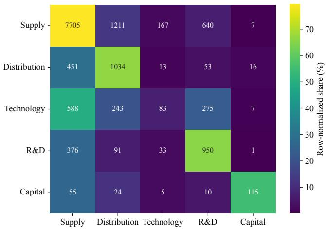  
Fi<sub>gure</sub> 10<sub>:</sub> C<sub>o</sub>ll<sub>a</sub>b<sub>ora</sub>ti<sub>on-</sub>t<sub>ype con</sub>f<sub>us</sub>i<sub>on aggrega</sub>t<sub>e</sub>d <sub>over</sub> 17 <sub>mo</sub>d<sub>e</sub>l<sub>s on go</sub>ld<sub>-pos</sub>iti<sub>ve</sub> Chi<sub>nese</sub> i<sub>ns</sub>t<sub>ances</sub> f<sub>or w</sub>hi<sub>c</sub>h th<sub>e mo</sub>d<sub>e</sub>l <sub>pre</sub>di<sub>c</sub>t<sub>s</sub> Y<sub>es an</sub>d <sub>re</sub>t<sub>urns a va</sub>lid <sub>co</sub>ll<sub>a</sub>b<sub>ora</sub>ti<sub>on</sub> t<sub>ype.</sub> C<sub>e</sub>ll <sub>a</sub>nn<sub>o</sub>t<sub>a</sub>ti<sub>o</sub>n<sub>s</sub> r<sub>epo</sub>rt <sub>agg</sub>r<sub>ega</sub>t<sub>e</sub>d <sub>p</sub>r<sub>e</sub>di<sub>c</sub>ti<sub>o</sub>n <sub>cou</sub>nt<sub>s,</sub> <sub>w</sub>hil<sub>e ce</sub>ll <sub>co</sub>l<sub>ors enco</sub>d<sub>e row-norma</sub>li<sub>ze</sub>d <sub>percen</sub>t<sub>ages.</sub> G<sub>o</sub>ld<sub>-</sub> <sub>pos</sub>iti<sub>ve</sub> i<sub>ns</sub>t<sub>ances</sub> <sub>pre</sub>di<sub>c</sub>t<sub>e</sub>d <sub>as</sub> N<sub>o,</sub> t<sub>oge</sub>th<sub>er</sub> <sub>w</sub>ith <sub>pre</sub>di<sub>c</sub>ti<sub>ons</sub> <sub>con</sub>t<sub>a</sub>i<sub>n</sub>i<sub>ng</sub> i<sub>nva</sub>lid <sub>or m</sub>i<sub>ss</sub>i<sub>ng</sub> t<sub>ype ou</sub>t<sub>pu</sub>t<sub>s, are exc</sub>l<sub>u</sub>d<sub>e</sub>d f<sub>rom</sub> th<sub>e ma</sub>t<sub>r</sub>i<sub>x.</sub>

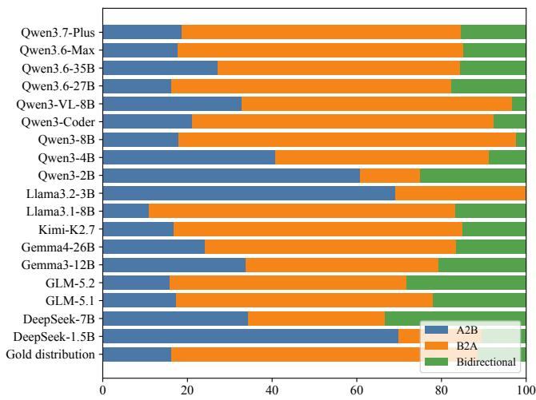  
Fi<sub>gure</sub> 11<sub>:</sub> Di<sub>s</sub>t<sub>r</sub>ib<sub>u</sub>ti<sub>on o</sub>f <sub>va</sub>lid <sub>ro</sub>l<sub>e-</sub>di<sub>rec</sub>ti<sub>on pre</sub>di<sub>c</sub>ti<sub>ons on</sub> <sub>go</sub>ld<sub>-pos</sub>iti<sub>ve</sub> Chi<sub>nese</sub> i<sub>ns</sub>t<sub>ances</sub> f<sub>or w</sub>hi<sub>c</sub>h th<sub>e mo</sub>d<sub>e</sub>l <sub>pre-</sub> di<sub>c</sub>t<sub>s</sub> Y<sub>es.</sub> M<sub>o</sub>d<sub>e</sub>l<sub>s</sub> <sub>are</sub> <sub>or</sub>d<sub>ere</sub>d b<sub>y</sub> th<sub>e</sub>i<sub>r</sub> <sub>pre</sub>di<sub>c</sub>t<sub>e</sub>d B2A <sub>s</sub>h<sub>are,</sub> <sub>an</sub>d th<sub>e go</sub>ld di<sub>s</sub>t<sub>r</sub>ib<sub>u</sub>ti<sub>on</sub> i<sub>s</sub> i<sub>nc</sub>l<sub>u</sub>d<sub>e</sub>d <sub>as a re</sub>f<sub>erence.</sub> G<sub>o</sub>ld<sub>-</sub> <sub>pos</sub>iti<sub>ve</sub> i<sub>ns</sub>t<sub>ances pre</sub>di<sub>c</sub>t<sub>e</sub>d <sub>as</sub> N<sub>o an</sub>d <sub>pos</sub>iti<sub>ve pre</sub>di<sub>c</sub>ti<sub>ons</sub> <sub>w</sub>ith i<sub>nva</sub>lid <sub>or m</sub>i<sub>ss</sub>i<sub>ng</sub> di<sub>rec</sub>ti<sub>ons are exc</sub>l<sub>u</sub>d<sub>e</sub>d f<sub>rom</sub> th<sub>e nor-</sub> <sub>ma</sub>li<sub>za</sub>ti<sub>on.</sub>

T<sub>a</sub>bl<sub>e</sub> 11<sub>:</sub> A<sub>ggrega</sub>t<sub>e</sub> f<sub>a</sub>il<sub>ure mo</sub>d<sub>es on</sub> th<sub>e</sub> Chi<sub>nese</sub> b<sub>enc</sub>h<sub>mar</sub>k<sub>.</sub> C<sub>oun</sub>t<sub>s are mo</sub>d<sub>e</sub>l<sub>–</sub>i<sub>ns</sub>t<sub>ance</sub> d<sub>ec</sub>i<sub>s</sub>i<sub>ons aggrega</sub>t<sub>e</sub>d <sub>over</sub> 17 <sub>mo</sub>d<sub>e</sub>l<sub>s.</sub> D<sub>enom</sub>i<sub>na</sub>t<sub>ors</sub> i<sub>nc</sub>l<sub>u</sub>d<sub>e a</sub>ll <sub>e</sub>li<sub>g</sub>ibl<sub>e</sub> d<sub>ec</sub>i<sub>s</sub>i<sub>ons</sub> f<sub>or</sub> th<sub>e correspon</sub>di<sub>ng</sub> t<sub>as</sub>k<sub>.</sub>
<table><tr><td>Failure mode</td><td>Operational criterion</td><td>Frequency</td><td>Main pattern</td></tr><tr><td>Unsupported prediction</td><td>opportunity Gold opportunity is No, but the model 23,621/34,903 (67.7%) predicts Yes.</td><td></td><td>Broad industrial or lexical relatedness is frequently treated as sufficient evidence for a concrete collaboration interface.</td></tr><tr><td>Opportunity false negative</td><td>Gold opportunity is Yes, but the model 1,903/18,392 (10.3%) predicts No.</td><td></td><td>Cross-field evidence for complementar- ity is sometimes insufficiently integrated, leading the model to assign the negative</td></tr><tr><td>Valid but incorrect type</td><td>The gold label is Yes, the model predicts 4,495/18,392 (24.4%) Yes, and the returned valid type differs from the gold type.</td><td></td><td>opportunity label. Predictions collapse toward frequent or semantically adjacent mechanisms, espe- cially Supply and Production.</td></tr><tr><td>Valid but incorrect direc- tion</td><td>The gold label is Yes, the model predicts 5,092/18,392 (27.7%) Yes, and the returned valid direction dif- fers from the gold direction.</td><td></td><td>Errors reflect both majority-class attrac- tion and model-specific overprediction of A2B or Bidirectional relations.</td></tr></table>

T<sub>a</sub>bl<sub>e</sub> 12<sub>:</sub> R<sub>epresen</sub>t<sub>a</sub>ti<sub>ve</sub> <sub>pa</sub>i<sub>re</sub>d Chi<sub>nese–</sub>E<sub>ng</sub>li<sub>s</sub>h <sub>ou</sub>t<sub>comes.</sub> V<sub>a</sub>l<sub>ues</sub> <sub>are</sub> <sub>percen</sub>t<sub>ages</sub> <sub>o</sub>f <sub>usa</sub>bl<sub>e</sub> <sub>pa</sub>i<sub>re</sub>d i<sub>ns</sub>t<sub>ances.</sub> “Id<sub>en</sub>ti<sub>ca</sub>l <sub>wrong</sub>” d<sub>eno</sub>t<sub>es</sub> th<sub>e same</sub> i<sub>ncorrec</sub>t f<sub>our-</sub>fi<sub>e</sub>ld t<sub>up</sub>l<sub>e</sub> i<sub>n</sub> b<sub>o</sub>th l<sub>anguages.</sub>
<table><tr><td>Model</td><td>N</td><td>Both correct</td><td>Identical wrong</td><td>Different wrong</td><td>ZH only</td><td>EN only</td></tr><tr><td>Qwen3.6-27B</td><td>2,805</td><td>55.8</td><td>21.5</td><td>12.6</td><td>5.7</td><td>4.3</td></tr><tr><td>Qwen3.6-Max</td><td>2,805</td><td>54.6</td><td>25.0</td><td>9.8</td><td>3.0</td><td>7.6</td></tr><tr><td>Qwen3.7-Plus</td><td>2,805</td><td>49.7</td><td>26.2</td><td>13.7</td><td>6.2</td><td>4.2</td></tr><tr><td>Kimi-K2.7</td><td>2,805</td><td>35.6</td><td>26.1</td><td>23.9</td><td>5.9</td><td>8.5</td></tr><tr><td>Gemma3-12B</td><td>2,805</td><td>11.3</td><td>38.8</td><td>43.3</td><td>3.4</td><td>3.2</td></tr><tr><td>Llama3.2-3B</td><td>2,805</td><td>1.2</td><td>6.3</td><td>85.2</td><td>3.7</td><td>3.5</td></tr></table>

T<sub>a</sub>bl<sub>e</sub> 13<sub>:</sub> R<sub>epresen</sub>t<sub>a</sub>ti<sub>ve</sub> di<sub>agnos</sub>ti<sub>c</sub> <sub>cases.</sub> E<sub>v</sub>id<sub>ence</sub> <sub>summar</sub>i<sub>es</sub> <sub>are</sub> d<sub>er</sub>i<sub>ve</sub>d <sub>on</sub>l<sub>y</sub> f<sub>rom</sub> th<sub>e</sub> <sub>supp</sub>li<sub>e</sub>d fi<sub>rm</sub> <sub>pro</sub>fil<sub>es.</sub>
<table><tr><td>Pair</td><td>Pattern</td><td></td><td>Key profile evidence</td><td>prediction</td><td>Gold / representative Diagnostic interpretation</td></tr><tr><td></td><td>HSAI_00165 Unsupported portunity</td><td></td><td>op- A: telecommunications services, No / Yes-Strong- Broad ICT overlap is treated broadband, IoT, cloud, and data cen- Supply-B2A ters. B: ICT infrastructure, network equipment, enterprise solutions, cloud, and smart devices.</td><td></td><td>as a specific supply interface, although neither profile states a concrete demand relation- ship.</td></tr><tr><td></td><td>negative</td><td></td><td>MLAI_01557 Opportunity false A: retail of furniture, home- Yes-Strong- improvement materials, appliances, Distribution-B2A bathroom products, and lighting. B: No broad import-export trade in agricul- tural products, machinery, textiles, and</td><td></td><td>The model must connect a / broad trading capability to a downstream retail channel despite limited direct product overlap.</td></tr><tr><td></td><td>confusion</td><td>other goods.</td><td>HSAI_00848 Type and direction A: media distribution, advertising, Yes-Strong- brand promotion, and digital market- Technology-B2A ing. B: digital-marketing platforms, ad- / delivery systems, analytics, and related Distribution–</td><td></td><td>Commercial-channelcues obscure both the technical Yes-Strong- mechanism and the annotated resource-flow direction.</td></tr><tr><td>RNEG_01776 High-confidence</td><td>type error</td><td>technical services. management.</td><td>A: property sales, leasing, and consult- Yes-Strong-Supply- ment, asset management, and property Distribution-A2B</td><td>Bidirectional</td><td>The direction is preserved, ing. B: real-estate development, invest- A2B / Yes-Strong- but service provision is con- flated with channel distribu- tion under High confidence.</td></tr></table>