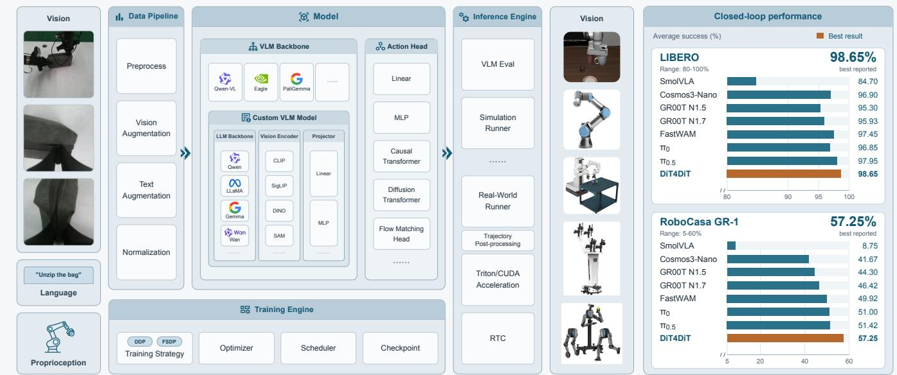
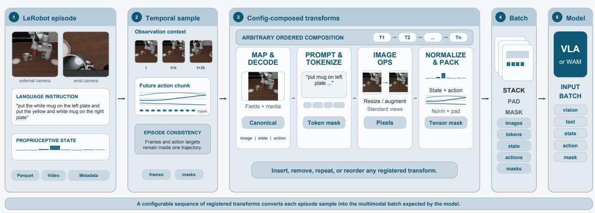
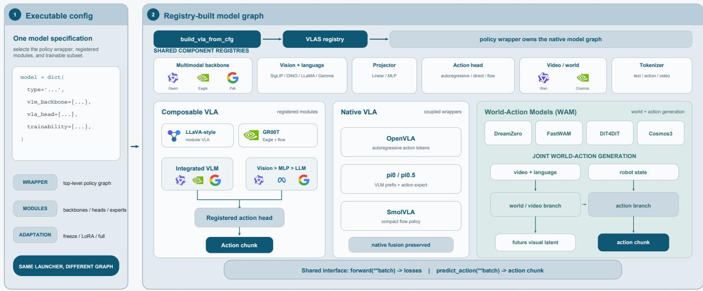
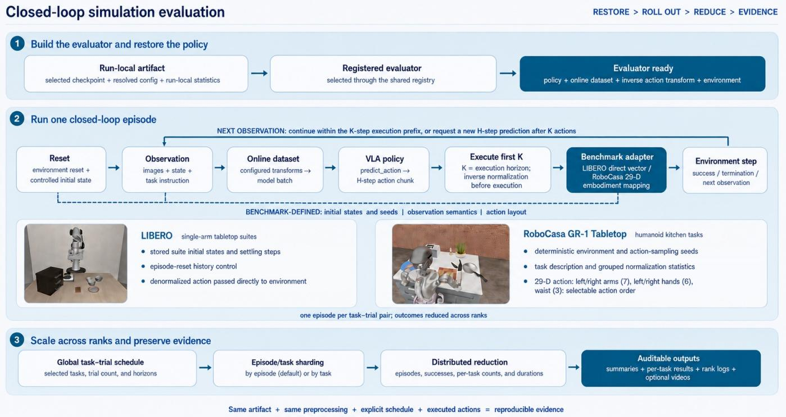
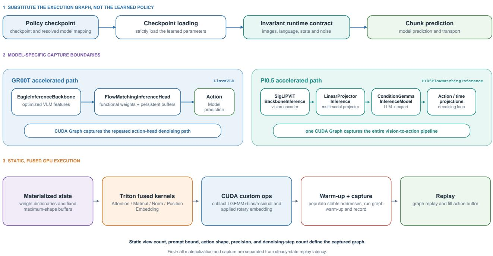
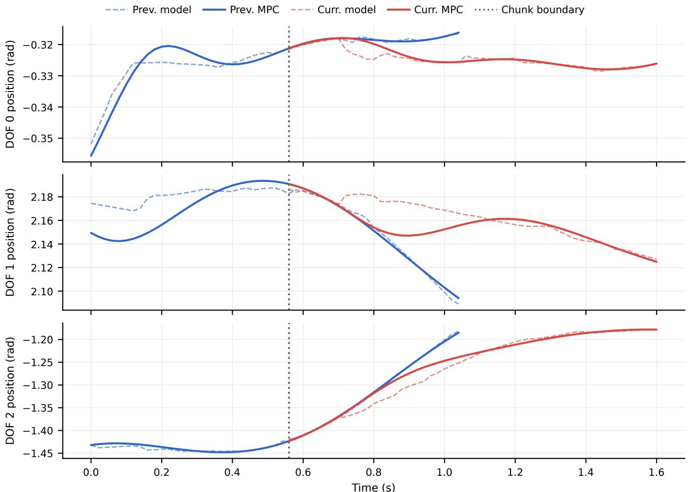

# FluxVLA Engine: A One-Stop VLA Engineering Platform for Embodied Intelligence

Yinhao Li1, Weixin Mao1, Zihan Lan1, Jikun Rong1, Qirui Hu1, Yiming Zhang2, Weipeng Deng3, Bowen Shen1, Minzhao Zhu1, Yiming Mao1, Yan Yang1, Chenguang Cui4, Hongyuan Chen1, Xu Huang1, Zheyi Zhao1, Pinxi Shen1, Bozhen He1, Zhen Fu1, Yifan Wang5, Zexin Zhang6, Ang Gao7, Haoyu Chen1, Chengqi Shi8, Hua Chen1

1LimX Dynamics 2Nankai University 3The University of Hong Kong 4University of Electronic Science and Technology of China 5Beijing Institute of Technology 6Xidian University 7Zhejiang University 8Xi’an Jiaotong University

## Abstract

Vision–language–action (VLA) models, world–action models (WAMs), and ofline reinforcement learning methods are rapidly expanding the design space of embodied policies, yet turning these algorithms into reliable robot systems remains constrained by fragmented data formats, training stacks, evaluation protocols, inference runtimes, and embodiment-specific interfaces. We present FluxVLA Engine, an open, configuration-driven platform that turns heterogeneous embodied-policy components into a reproducible data-to-deployment workflow. Rather than introducing another policy model, FluxVLA standardizes interfaces for datasets, visual– language and world models, action heads, reward- or advantage-weighted learning, distributed training, simulation evaluation, optimized inference, and robot operators. The engine further integrates compositional dual-arm simulation, scalable automatic data generation, and modeldecoupled human-in-the-loop rollout, takeover, correction collection, and reward annotation. For responsive physical execution, it combines Real-Time Chunking (RTC) with accelerated inference backends, lightweight remote GPU serving, and configurable trajectory post-processing. Together, these capabilities connect ofline learning, simulation validation, online correction, and real-robot execution through shared and auditable contracts. FluxVLA therefore targets the engineering bottlenecks separating promising embodied-learning algorithms from reproducible evaluation and dependable deployment. Code is available at https://github.com/FluxVLA/FluxVLA.

## 1 Introduction

## 1.1 Motivation and problem setting

Embodied policy learning now spans several complementary paradigms. Vision–language–action (VLA) models map multimodal observations and language instructions to robot actions [1, 2]; world–action models (WAMs) additionally use predicted visual dynamics and temporally rich world representations [3, 4]; and ofline reinforcement learning improves policies from previously collected experience without additional online data collection [5]. These directions expand the range of tasks, data sources, and embodiments available to robot learning, but an algorithm or checkpoint is not yet a robot system. Turning a research implementation into repeatable physical behavior requires decisions outside the model architecture, spanning data representation, training infrastructure, reward and advantage estimation, evaluation protocols, inference runtimes, hardware communication, and operational safeguards. These decisions are often embedded in projectspecific code, making the path from a promising policy to a working robot substantially harder than running the model itself.

The first gap appears before deployment. VLA, WAM, and ofline policy implementations frequently make different assumptions about dataset schemas, camera ordering, observation history, robot-state encoding, coordinate frames, action representations, normalization statistics, and prediction horizons. Their training launchers, checkpoint formats, and evaluation runners are similarly coupled to specific models or benchmarks. Consequently, integrating a new model or dataset often requires rebuilding the same adapters and execution logic, while results obtained through diferent preprocessing pipelines, evaluator versions, or rollout protocols can be dificult to compare. This fragmentation not only slows iteration and reproduction, but also obscures whether an observed gain comes from the learning algorithm or from diferences in the surrounding system.

Physical deployment introduces a second, stricter gap. Success in simulation does not by itself establish that a policy can operate reliably on a real robot. A deployment stack must reconcile model outputs with embodimentspecific control modes and hardware interfaces while handling observation staleness, inference latency, network jitter, action scheduling, and safety constraints. This is especially challenging for action-chunking VLA policies: model inference may be slower than the robot control loop, and asynchronously executing one chunk while predicting the next can produce discontinuities at chunk boundaries. Even a temporally consistent prediction may remain unsuitable for direct execution under embodiment-specific motion constraints. Hosting a large policy on a remote GPU relaxes robot-side compute requirements, but adds serialization, transport, timeout, and recovery concerns. Runtime acceleration, temporal coordination, trajectory post-processing, serving, and robot operators must therefore be treated as first-class parts of the learning system rather than as deployment details added after training.

  
Figure 1: Overview of the FluxVLA engineering platform. Visual, language, and proprioceptive inputs enter a configurable data pipeline before reaching either an integrated VLM backbone or a custom composition of language, vision, and projector modules. Replaceable action heads connect these representations to robot actions. The training engine manages distributed strategies, optimization, scheduling, and checkpointing, while the inference engine connects evaluation, simulation, physical-robot runners, accelerated kernels, RTC, and trajectory post-processing to heterogeneous embodiments. Right: average closed-loop success for eight policies evaluated on LIBERO and RoboCasa GR-1. Orange highlights the best reported result; axes are truncated to the labeled ranges. Training and evaluation budgets difer across integrations; complete results are given in Tables 7 and 8.

Bridging these gaps requires a closed engineering loop: collect and standardize data, train interchangeable policies, validate them in simulation, execute them through optimized local or remote inference, capture failures and human corrections, and feed the resulting experience back into training. FluxVLA is designed around this loop. Rather than proposing another policy architecture, it provides a common engineering layer for composing models, world-model components, reward or advantage signals, data, evaluators, runtime optimizations, and robot interfaces, with the goal of turning embodied-intelligence research artifacts into systems that can be reproduced, measured, and iteratively improved on physical robots. Figure 1 summarizes the platform architecture and representative simulation results.

## 1.2 Scope

FluxVLA is a configuration-driven engineering platform spanning data preparation, model construction, distributed training, simulation evaluation, inference optimization, trajectory post-processing, serving, and physical-robot deployment. Its scope is the reusable infrastructure and the contracts connecting these stages. The platform integrates existing VLA and WAM architectures, ofline and reward-weighted learning workflows, benchmarks, simulators, reward models, and robot SDKs, but does not claim their underlying algorithmic contributions as new. Performance results are therefore attributed to the corresponding model and protocol, while the platform is evaluated through integration breadth, reproducibility, runtime behavior, and deployment coverage.

## 1.3 Contributions

To bridge the gap between rapidly evolving embodiedpolicy models and the fragmented engineering stacks needed to train, evaluate, and deploy them, we present FluxVLA. Rather than introducing another modelspecific implementation, the platform provides a reusable full-stack foundation organized around four engineering principles: unification, modularity, deployability, and reproducibility. Our main contributions are:

1. A unified, configuration-driven embodied-policy workflow. A single configuration connects data processing, model construction, optimization, evaluation, and deployment for VLA, WAM, and ofline policies.

2. A modular and extensible system architecture. Registry-based interfaces decouple major data, model, execution, and robot components, enabling new methods to reuse the shared system workflow.

3. A deployment-ready and optimized execution stack. A unified runtime combines simulation and robot execution, local and remote inference, GPU acceleration, RTC, and trajectory post-processing for eficient and continuous control across embodiments.

4. A reproducible experimentation pipeline. Standardized experiment artifacts, resumable training, deterministic controls, and structured evaluation improve reproducibility across models, benchmarks, and deployment environments.

## 2 Related Work

FluxVLA lies at the intersection of vision–language– action (VLA) and world–action modeling (WAM), ofline and reward-guided policy learning, robot-learning infrastructure, and deployment systems. These areas are tightly coupled in a working robot stack but address diferent questions. Model papers study how observations and instructions are mapped to actions or future visual dynamics; ofline learning studies how logged experience can improve a policy; datasets and benchmarks determine what experience and evaluation protocols are available; and engineering platforms determine whether these methods can be trained, compared, and deployed through one reproducible path. We review these lines separately and then delimit the claims of this report.

## 2.1 Engineering platforms for model development

Mature perception toolboxes established an important precedent for treating software architecture as a systems contribution. MMDetection [6] organizes detectors from many papers through registries, reusable components, declarative configurations, and common training and evaluation tools. MMDetection3D [7] extends the pattern to heterogeneous 3D detectors, datasets, and sensor modalities. Their relevance here is methodological: support breadth becomes scientifically useful when alternative components obey explicit contracts and can be evaluated under controlled configurations, rather than being isolated reproductions with unrelated scripts.

Robot-learning libraries bring this toolbox idea closer to embodied systems. robomimic provides standardized implementations and empirical comparisons for learning manipulation policies from ofline human demonstrations [8]. LeRobot [9] spans hardware interfaces, data collection and storage, policy implementations, training, visualization, and asynchronous inference. StarVLA targets Lego-like VLA development through modular model abstractions, reusable training strategies, and unified benchmark interfaces [10]. These systems substantially lower the cost of reproduction, yet a shared model API alone does not guarantee consistency across preprocessing, checkpoint restoration, evaluation, serving, and physical execution.

FluxVLA follows this toolbox tradition while making the complete configuration-resolved execution path its unit of integration. A supported method therefore includes its dataset and ordered transforms, model construction, distributed runner, self-contained checkpoint, evaluator or inference runner, and simulator or robot operator. The report evaluates whether heterogeneous policy families can share stable interfaces from ofline data to real-device execution, rather than treating the number of registered model names as the primary evidence of support.

## 2.2 Embodied policy architectures

Early generalist policies demonstrated that transformer sequence models can represent many language-conditioned robot skills in a single network. RT-1 tokenizes observations and actions for scalable real-world control [11], while RT-2 co-fine-tunes vision–language models on web and robot data so that semantic knowledge can influence action prediction [12]. Subsequent open-source systems expose several distinct action interfaces that an engineering platform must preserve rather than flatten into one nominal $^ { 6 6 } \mathrm { V L A } ^ { \prime \prime }$ abstraction.

Discrete and autoregressive actions. OpenVLA casts continuous control as next-token prediction by discretizing actions and adapting a pretrained vision– language model on robot trajectories [1]. FAST combines a DCT-based frequency representation, quantization, and byte-pair encoding to compress action chunks into substantially fewer tokens than per-timestep discretization, making autoregressive learning on high-frequency control data more tractable [13]. Such methods inherit languagemodel training and decoding machinery but introduce policy-specific choices about quantization, token ordering, de-tokenization, and sequential inference. They motivate explicit tokenizer and action-space contracts instead of conversions hidden inside a particular backbone.

Continuous action chunks and generative policies. Action Chunking with Transformers predicts temporally extended action sequences and temporally ensembles overlapping predictions [14]. Difusion Policy instead represents multimodal visuomotor behavior with a conditional denoising process [15]. Octo demonstrates an open-source generalist transformer policy trained across heterogeneous robot datasets [16]. More recent VLAs combine large pretrained representations with continuous generative action heads: $\pi _ { 0 }$ couples a vision–language model to a flowmatching action expert [17], $\pi _ { 0 . 5 }$ extends the approach toward heterogeneous data and open-world generalization [18], and GR00T N1 combines a vision–language reasoning module with a difusion-transformer action module for generalist humanoid control [2]. SmolVLA investigates a related interface under stronger eficiency and accessibility constraints [19]. LLaVA connects a pretrained visual encoder to a language model through a learned projection layer, exemplifying modular visual–language integration [20]; action generation remains policy-specific.

These policies difer not only in backbone size. They require distinct action horizons, noise or time parameterizations, state-conditioning paths, attention masks, normalization conventions, and inference loops. Consequently, interchangeability should be claimed only at an interface whose tensors and semantics actually agree; a common base class is not evidence that every backbone and action head can be freely combined.

World–action models. WAMs use video or latent dynamics during policy learning and may jointly model future visual trajectories and actions. DreamZero adapts pretrained video generation into a zero-shot policy that produces future visual and action trajectories [3]. DiT4DiT jointly models video dynamics and actions with difusion transformers [4]. Fast-WAM separates the benefit of video co-training from test-time imagination and omits future-video generation during action inference [21]. Relative to conventional VLA heads, these methods introduce video tokenization, temporal packing, cross-modal attention, additional training targets, and substantially diferent memory and scheduling behavior. Their coexistence with autoregressive and flow-based VLAs motivates FluxVLA’s separation of backbones, temporal or world modules, action heads, losses, and inference procedures behind typed data contracts.

## 2.3 Ofline and reward-guided policy improvement

Ofline reinforcement learning seeks to improve a policy from a fixed dataset without additional online data collection [5]. Its central dificulty is distribution shift: value estimates can become unreliable for actions insuficiently represented by the behavior data. Conservative Q-Learning regularizes learned values against this failure mode [22], whereas Implicit Q-Learning avoids explicitly evaluating out-of-distribution actions and extracts a policy through advantage-weighted regression [23]. In an adjacent interactive setting, DAgger aggregates expert action labels for states visited by the learned policy, directly addressing the train–execution state-distribution mismatch [24].

For large robot policies, reward models, progress estimates, and sample reweighting provide practical bridges between supervised imitation and policy improvement. ARM, for example, uses learned advantage estimates to reweight behavior-cloning updates for long-horizon manipulation [25]. These methods require more than replacing a loss function: datasets must retain reward, progress, source-policy, and intervention metadata; transforms and collators must preserve sample weights; runners must coordinate policy and reward-model computation; and evaluation must distinguish algorithmic improvement from changes in the underlying data mixture. FluxVLA therefore treats ofline and reward-guided learning as extensions of the same data, model, and runner contracts used for supervised VLA and WAM training.

## 2.4 Robot data and evaluation benchmarks

Large heterogeneous datasets make cross-embodiment learning possible while turning data semantics into a first-order systems concern. RLDS introduced a common episodic representation for sharing sequential decision data [26]; Open X-Embodiment aggregates trajectories from multiple institutions and robot platforms and uses them to train RT-X models [27]; and LeRobot [9] provides a practical representation and tooling stack for storing, visualizing, streaming, and processing robot episodes. A common container improves portability but does not by itself reconcile camera order, control frequency, coordinate frames, proprioceptive state, action parameterization, normalization statistics, episode boundaries, or language annotations. These conversions must remain explicit, ordered, and versionable if training and inference are to implement the same observation–action contract.

Simulation benchmarks ofer repeatable closed-loop testing, but they measure diferent capability distributions. LIBERO organizes language-guided manipulation into suites for knowledge transfer and lifelong learning [28]. RoboCasa provides large-scale household simulation, diverse kitchen scenes and assets, and everyday manipulation tasks [29]. These benchmarks are complementary rather than directly interchangeable: task versions, observation spaces, initialization distributions, action horizons, checkpoint selection, and trial counts must be aligned before success rates can support a meaningful comparison.

Accordingly, the quantitative core of this report is restricted to benchmark paths accompanied by runnable configurations, evaluator versions, checkpoints, and explicit aggregation procedures. LIBERO and RoboCasa provide the principal simulation evidence in the current release. Other adapters are counted as engineering coverage only when their corresponding evaluation artifacts are available; a configuration stub or empty result table is not treated as benchmark support.

## 2.5 Inference and physical deployment

Physical execution changes the objective from merely predicting an action to delivering safe and temporally consistent commands at a stable control rate. Although action chunking amortizes policy queries, a robot may continue executing an outdated chunk while the next prediction is being computed. The original Real-Time Chunking method addresses this asynchronous setting with inference-time guidance-based inpainting, using a vector–Jacobian product to condition each newly generated flow-policy chunk on actions already committed for execution [30]. Training-Time Action Conditioning later moves this capability into the learned policy: training simulates inference delay so that inference can directly condition on the known action prefix [31]. Both routes enable asynchronous policy inference while reducing dis continuities at chunk boundaries. LeRobot [9] likewise identifies asynchronous inference as part of an end-to-end learning stack.

Prediction-time consistency does not by itself guarantee an executable motion. After denormalization, a chunk may still violate execution-side motion requirements or connect poorly to the trajectory already in progress. Trajectory post-processing addresses this boundary after prediction. It complements RTC: RTC shapes the next prediction, while post-processing shapes the command ultimately sent to the robot.

This temporal coordination must be combined with systems-level inference optimization. Reduced-precision execution, CUDA Graph capture, fused operators, and optimized attention kernels can increase model throughput. Realtime-VLA demonstrates a complementary systems path by running a π0-level multi-view VLA at 30 Hz on a single consumer GPU and proposes a full streaming inference framework for higher-frequency control [32]. Local and remote inference runners then determine how predictions are delivered to the robot. Remote serving additionally introduces serialization, network latency, timeouts, health checks, reset semantics, and recovery behavior. The deployment interface must therefore track observation timestamps, committed actions, execution horizons, communication latency, and failure handling. In this report, model-only throughput is consequently separated from end-to-end control frequency. Inference acceleration, RTC, and trajectory post-processing are therefore treated as complementary components of the deployment stack.

## 2.6 Positioning and claim boundary

This report studies FluxVLA as an engineering platform. The platform owns the configuration and build path, unified data adapters and composable transforms, component registries, training and evaluation runners, checkpoint and serving plumbing, runtime optimizations, and robot-facing operators implemented in the released code. It integrates—but does not claim authorship of— upstream architectures, pretrained weights, datasets, simulators, benchmarks, robot SDKs, or their algorithmic contributions.

Four boundaries follow. First, the report does not propose a universal VLA or WAM architecture; it studies whether heterogeneous architectures can coexist behind stable contracts. Second, it does not introduce a benchmark and follows the protocols and limitations of the suites it integrates. Third, a registry entry is not evidence of end-to-end support: training requires a reproducible checkpoint, evaluation requires a fixed protocol and raw rollouts, and deployment requires a runnable operator and measured execution. Finally, performance claims are confined to matched data, checkpoints, evaluators, hardware, and trial counts. Measurements from diferent settings are reported as separate system results rather than evidence of universal superiority.

## 3 System Design and Overview

A VLA engineering system must accommodate two forms of change at the same time. The learning stack evolves as new visual–language backbones, action representations, and optimization strategies are introduced, while the execution stack varies across datasets, simulators, inference hardware, and physical robots. A design that couples these choices quickly degenerates into parallel modelspecific code paths: each integration obtains its own data loader, launcher, evaluator, and deployment script, and improvements made in one path do not propagate to the others. FluxVLA is designed to avoid this fragmentation by separating component selection from component implementation and by expressing the complete experiment lifecycle through common configuration and execution contracts.

This chapter presents the system from the outside in. We first describe the overall design, including the registry and configuration mechanisms, the separation of modules, the train–evaluate lifecycle, and the construction of selfcontained inference artifacts. The subsequent sections follow the path of an experiment: data preparation and transformation, model composition, simulation evaluation, real-robot inference, inference acceleration, Real-Time Chunking (RTC), and trajectory post-processing. This ordering is intentional. It makes explicit how the same configuration and intermediate representations connect ofline training to closed-loop execution, while keeping benchmark- and robot-specific logic at the boundaries of the system. The complete workflow is summarized in Figure 1.

## 3.1 Overall design

Design objective. The primary objective of FluxVLA is to make a VLA experiment a composable and reconstructable system rather than a collection of scripts. The framework is therefore organized around four principles. Unification places data, model, optimization, evaluation, and deployment choices in one experiment description. Modularity separates implementations behind explicit construction and runtime interfaces. Deployability preserves the model and preprocessing path while replacing only the environment- or robot-facing execution layer. Reproducibility records the resolved experiment state and exports the artifacts required to evaluate or deploy the trained policy. These principles are implemented jointly: a registry without a complete configuration does not reproduce an experiment, while a configuration without stable module boundaries merely moves hard-coded coupling into a diferent file.

Registry-based construction. FluxVLA uses typekeyed registries to decouple component selection from implementation. Data, model, training, evaluation, and deployment modules are declared through configuration and instantiated through a shared construction interface. Nested modules are assembled by their owning components, localizing architecture-specific composition while preserving a uniform system-level workflow.

This mechanism removes model selection from the training and inference entry points. The launcher asks for a dataset or runner to be built; it does not contain a branch for every supported policy family. Adding an implementation therefore consists of registering the new component and supplying a configuration that satisfies the existing contract, rather than copying the entire workflow. Importantly, registration establishes a construction interface, not unrestricted interchangeability. Components must still agree on field names, tensor shapes, action dimensions, temporal horizons, and lifecycle semantics. Model-specific adapters remain appropriate when those semantics difer, but the diferences are localized rather than propagated through the whole stack.

Modular system boundaries. The platform separates five major responsibilities. The data layer maps stored episodes and online observations into a canonical sample dictionary through composable transforms and collators. The model layer maps that dictionary to losses during training or action chunks during inference. The execution layer owns distributed setup, optimization, checkpoint ing, evaluation loops, and runtime state. The serving layer transports observations and actions when the policy and robot execute in diferent processes or machines. The execution layer can additionally apply trajectory post-processing after denormalization, keeping motion constraints and cross-chunk stitching independent of the policy architecture. Finally, the operator layer translates between the framework-level state/action contract and a simulator or robot SDK. This decomposition allows, for example, a new robot operator to reuse an existing policy and inference runner, or a new action head to reuse the same dataset and distributed training engine.

The boundary between runners and operators is particularly important. Runners own model-side decisions such as observation assembly, action-chunk scheduling, local versus remote prediction, and RTC state. Operators own hardware-facing I/O, including sensor acquisition and command transport. Keeping these responsibilities separate prevents robot communication code from becoming a hidden dependency of the model and lets simulation and physical execution share the same policy-facing interface.

Configuration as an executable experiment specification. FluxVLA uses hierarchical Python configurations to describe an experiment end to end. A configuration specifies the model, data pipeline, training strategy, evaluation protocol, and deployment interface, while inheritance allows common settings to be reused across models, datasets, and embodiments. After resolution, the configuration serves as the single source of truth for component construction and runtime behavior. This design makes experiments reproducible and allows training, evaluation, and inference to share consistent data and model semantics without relying on separately maintained scripts.

A closed train–evaluate lifecycle. FluxVLA supports both standalone evaluation and an eval-after-train workflow. When enabled, the checkpoint produced by training is automatically passed to the evaluator defined by the same experiment configuration. Evaluation begins as a separate stage after the training environment has been released, preserving a clean execution boundary while maintaining consistent model, data, and evaluation semantics. This closed lifecycle reduces manual coordination, avoids configuration and checkpoint mismatches, and makes reported results easier to reproduce.

A self-contained inference artifact. A common deployment failure in robot-learning systems is that a training checkpoint contains only task-specific updates while implicitly depending on the original pretrained weights, configuration files, or preprocessing assets. Such hidden dependencies make checkpoints dificult to transfer and can cause training and inference to use inconsistent model or data semantics.

FluxVLA addresses this problem by packaging the complete trained model state together with the resolved configuration and the metadata required for inference. Evaluation and deployment can therefore reconstruct the trained policy directly from the run artifact without locating the original pretraining weights. This self-contained handof reduces configuration and version mismatches and provides a consistent interface between training, simulation, serving, and physical-robot deployment, while leaving the software environment and hardware-specific dependencies explicit.

## 3.2 Data pipeline

The data pipeline has two responsibilities that are easy to conflate. First, it must ingest trajectories produced by diferent simulators and robot platforms. Second, it must present each model with the exact observation, language, state, and action semantics assumed by that model.

FluxVLA separates these responsibilities into a storagefacing dataset layer and a configuration-defined transform layer. Dataset classes recover temporally consistent samples from an episode store; transforms then convert those samples into a model-facing dictionary. This separation keeps physical storage choices out of model code and makes diferences in preprocessing visible in the experiment configuration. As illustrated in Figure 2, raw sources are first converted to a unified Parquet representation compatible with the LeRobot dataset format [9]. A ParquetDataset then owns an ordered list of registered transforms that can be inserted, replaced, or rearranged entirely through configuration. Online inference follows the same pattern: an environment-specific dataset or adapter receives observations and executes its own configured transform list to produce the same model-facing semantics.

Episode storage and ingestion. The principal ofline representation is compatible with the LeRobot dataset layout [9]. Low-dimensional signals and episode indices are stored in Parquet, while camera observations are referenced from per-episode video files; metadata records the feature schema, tasks, episodes, and per-feature statistics. FluxVLA reads both the established LeRobot v2.1 metadata layout and the v3 layout, whose tasks and episode metadata may themselves be stored as Parquet files. This compatibility allows the data layer to use the Hugging Face datasets implementation for indexed low-dimensional records without requiring images to be expanded into the tabular store.

For data collected outside this representation, conversion is treated as an explicit ingestion step. The provided ALOHA conversion path, for example, turns HDF5 episodes containing joint state, optional end-efector pose, action, and camera streams into LeRobot-compatible Parquet, metadata, and video assets. The converter also makes otherwise implicit embodiment conventions—such as camera names, arm ordering, gripper representation, and video frame rate—part of the generated dataset. Dataset roots can optionally carry a FluxVLA content version; when an expected version is configured, loading fails on a missing or mismatched version rather than silently training on stale data.

Episode-aware temporal sampling. Robot trajectories contain temporal dependencies that cannot be captured by treating individual rows as independent samples. FluxVLA therefore constructs each training example from an episode-consistent temporal window containing the current observation, a future action chunk, and, when required, multi-frame visual context. Sampling never crosses episode boundaries, while masks prevent padded observations or actions from contributing unintended supervision. Temporal and camera dimensions are canonicalized before model-specific preprocessing, allowing the same stored trajectories to support single-frame VLAs, action-chunk policies, and video-based world–action models.

Canonical sample representation. Robot datasets often encode equivalent observations and actions using dataset-specific schemas. FluxVLA resolves these differences through a canonical sample representation that unifies visual observations, proprioceptive states, language instructions, action targets, validity masks, and optional metadata. This representation forms a stable interface between data storage and model-specific preprocessing. Its extensible dictionary-based design accommodates additional modalities, embodiment information, and learning signals without changing unrelated components, thereby simplifying the integration of heterogeneous datasets and policy families.

Statistics and normalization. FluxVLA derives normalization statistics from the associated dataset metadata and applies them consistently to states and actions. Multiple normalization strategies are supported to accommodate heterogeneous data distributions and mixed continuous or discrete representations. The statistics used during training are preserved with the resulting model artifact and reused during evaluation and deployment. This coupling prevents discrepancies between trainingtime preprocessing and inference-time action recovery, while allowing diferent datasets and policy families to share the same data pipeline.

Multi-source sampling and batching. The outer dataset wrapper turns one or more finite episode datasets into the iterable consumed by distributed training. It supports a single source, concatenated sources with shared statistics, and grouped sources that retain separate normalization domains. Samples are deterministically sharded over both distributed ranks and data-loader workers; optional epoch-wise reshufling changes the order without duplicating a rank’s shard. A balanced variant defines a virtual epoch over multiple sources so that large datasets do not automatically dominate small ones, with optional configured sampling weights when the intended training mixture is not uniform.

The final collator makes batching behavior explicit. Fixed-shape numeric fields are stacked, textual or diagnostic metadata is retained as lists, and model-specific collators pad variable-length language or action-token sequences while constructing attention masks and ignore labels. The resulting batch is passed to the VLA without additional data-dependent logic in the training loop. This keeps the runner agnostic to whether a batch originated from one robot, several embodiments, or a mixture of model-specific preprocessing paths.

Consistency between training and closed-loop inference. Simulation and real-robot execution begin from online observations rather than Parquet rows, so they use environment-specific input adapters. Nevertheless, the adapters converge to the same model-facing dictionary and reuse the same registered prompt, image, state, and action transforms. Evaluation loads the normalization statistics stored with the checkpoint, applies the configured state normalization before prediction, and applies the inverse action transform before sending commands to the environment or robot. Image-history bufers and episode-reset signals are handled explicitly for temporal models. Thus, training and deployment need not share the same storage backend, but they share the semantic preprocessing contract that determines what the policy actually observes and what its output means.

  
Figure 2: Configuration-driven data processing in FluxVLA. Heterogeneous trajectories are converted to one LeRobot compatible Parquet representation containing indexed signals, video assets, schemas, tasks, and statistics. The training configuration places an ordered, freely composable transform list inside ParquetDataset; this list performs input mapping, prompting, image processing, normalization, padding, and any model-specific preparation before collation. Inference mirrors this organization with an online observation adapter and another configuration-defined transform list built from the same registry and semantic keys. Run-local statistics are reused to denormalize predicted actions.

## 3.3 Model architecture

The model layer is designed to preserve the native structure of substantially diferent VLA algorithms while exposing a small interface to the rest of the system. This distinction is important: forcing every policy into one internal network topology would simplify the launcher at the cost of changing the methods being reproduced. Instead, FluxVLA standardizes construction, batch semantics, loss reporting, action prediction, and distributed wrapping, while allowing each model family to retain its own multimodal fusion and action generation procedure. Figure 3 presents this construction boundary in the original configuration-to-model layout: an executable model description selects registered components or a native policy wrapper, while the execution-engine and deployment lifecycle are intentionally omitted.

A configurable model graph. The common BaseVLA class defines slots for a vision backbone, a language backbone, an integrated vision–language backbone, a modality projector, and an action head. A model may use a decomposed path—for example, a vision encoder whose patch features are projected into the embedding space of a causal language model—or delegate multimodal fusion to an integrated VLM. The optional action head consumes the fused representation together with proprioceptive state and other conditioning variables. Each slot is built from its own registry and configuration block, so replacing a visual encoder, projector, VLM, or action head does not require a new training entry point.

This graph is intentionally permissive rather than artificially uniform. Architectures such as π0 contain a coupled language model and action expert; world–action models may contain a video VAE, a text encoder, and multiple difusion-transformer streams; Cosmos3 performs modality packing inside a mixture-of-transformers backbone. Such components remain owned by their model-specific VLA class when their interaction is part of the original algorithm. They still participate in the same registry, checkpoint, runner, and inference contracts. Modularity therefore means that architectural diferences have explicit boundaries, not that all networks are reduced to an interchangeable sequence of layers.

Unified training and prediction contracts. Diferent policy families often require model-specific inputs, objectives, and decoding procedures, forcing training and evaluation pipelines to accumulate specialized branches. FluxVLA addresses this fragmentation through a common model-facing contract: policies consume a canonical multimodal representation and produce standardized training objectives or executable action sequences. Architecture-specific validation, masking, fusion, and generation remain encapsulated within each policy, while environment-specific post-processing is handled by the corresponding adapter. Consequently, autoregressive policies, flow-based VLAs, and world–action models can share the same training and evaluation workflows without sacrificing their native algorithmic structure.

  
Figure 3: Configuration-driven model composition in FluxVLA. An executable model specification selects a top-level policy wrapper and its trainability choices. The registry-driven model graph can assemble an integrated or decomposed multimodal backbone with a registered action head, while native wrappers preserve tightly coupled autoregressive, action-expert, temporal, and world–action architectures. The figure deliberately excludes the runner/engine and deployment lifecycle.

Multimodal representation and conditioning. For decomposed VLA models, the vision backbone converts one or more camera views into patch features, and a linear or multilayer projector maps those features to the language-model width. The resulting visual embeddings are inserted into the language sequence with corresponding attention masks. An integrated VLM instead returns a normalized backbone output containing hidden states, a fused attention mask, and, when applicable, auxiliary losses. This small output contract allows backbones such as Eagle, PaliGemma, Qwen-VL, Florence, and SmolVLM to difer internally while remaining usable by a common model-facing interface.

Proprioception and embodiment information are kept separate until the point at which the target algorithm consumes them. A flow head may project the robot state into a conditioning token, concatenate an embodiment embedding, and cross-attend to VLM features. An action-expert architecture may instead append state, noised-action, and time embeddings as a sufix to a cached visual–language prefix. Temporal models receive canonical video tensors and frame masks rather than independent images. In each case, the data pipeline defines the physical meaning of the values, while the model defines how those values enter its computation graph.

Autoregressive action generation. The OpenVLA path follows the discrete-action formulation of Open-VLA [1]. A continuous action vector is quantized by an action tokenizer and appended to the language target. If $z _ { k }$ is the token assigned to action component k, training minimizes masked next-token cross-entropy,

$$
\mathcal { L } _ { \mathrm { t o k } } = - \frac { 1 } { \sum _ { k } m _ { k } } \sum _ { k } m _ { k } \log p _ { \theta } ( z _ { k } \mid \mathbf { o } , \mathbf { l } , z _ { < k } ) ,
$$

where o and l denote visual observation and language instruction, and $m _ { k }$ excludes non-action or padded targets. Inference uses the causal model’s generation path and converts the generated token IDs back to continuous values. The implementation also reports token accuracy and the $\ell _ { 1 }$ error after de-tokenization, separating the optimized language-model objective from a metric in the robot action space.

Continuous flow-matching policies. Continuous policies retain action chunks as real-valued tensors and learn a velocity field between demonstrations and noise. Under the convention used by the $\pi _ { 0 }$ implementation, for a clean action chunk a, noise $\epsilon ,$ and sampled time t, the interpolated input and target velocity are

Table 1: Principal policy composition patterns represented in the FluxVLA model layer. The table describes shared engineering paths rather than claiming that the listed algorithms are architecturally identical.
<table><tr><td>Composition pattern</td><td>Representative integrations</td><td>Conditioning path</td><td>Action interface</td></tr><tr><td>Autoregressive action tokens</td><td>OpenVLA</td><td>Vision encoder, projector, and causal language model</td><td>Token cross-entropy followed by action de-tokenization</td></tr><tr><td>VLM features with a replaceable head</td><td>LLaVA-style policies and GR00T</td><td>Integrated or decomposed VLM produces masked hidden features</td><td>Direct or flow-matching head produces continuous actions</td></tr><tr><td>VLM with an action expert</td><td>π0, π0.5, and SmolVLA</td><td>Visual–language prefix conditions state, time, and noisy-action tokens</td><td>Iterative flow integration produces an action chunk</td></tr><tr><td>Temporal or world-action model</td><td>DreamZero, DiT4DiT, FastWAM, and Cosmos3</td><td>Language and video latents are processed with temporal/action streams</td><td>Action objective, optionally coupled to dynamics or visual generation</td></tr></table>

$$
{ \bf x } _ { t } = ( 1 - t ) { \bf a } + t \epsilon , \qquad { \bf u } _ { t } = \epsilon - { \bf a } .
$$

The model predicts $\mathbf { v } _ { \theta } ( \mathbf { x } _ { t } , t \mid \mathbf { o } , \mathbf { l } , \mathbf { s } )$ , and training applies masked mean-squared error over valid timesteps and action dimensions. At inference, sampling starts from noise and numerically integrates the learned field toward a clean action chunk. GR00T’s feature-conditioned difusion-transformer head, $\pi _ { 0 } / \pi _ { 0 . 5 }$ action experts, and SmolVLA’s compact expert use diferent fusion and parameterization details [2, 17, 18, 19]; FluxVLA preserves those details behind the shared loss and predict\_action interfaces. The same reduction path can also apply persample weights, allowing data-selection or reward-derived weighting to alter behavioral-cloning emphasis without rewriting each optimizer loop.

Temporal and world–action models. The model boundary also accommodates policies whose visual input is a temporal object rather than a set of current-frame features. DreamZero combines encoded video latents, language, state, and actions under a joint flow-matching objective [3]; its FluxVLA integration reports the visual dynamics and action loss components separately. DiT4DiT couples a video difusion transformer with a separate action difusion transformer conditioned on visual dynamics and proprioceptive state [4]; its FluxVLA wrapper enforces the corresponding video, state, action, and mask inputs through an explicit tensor contract. Fast-WAM constructs video and action experts around a shared mixture-of-transformers computation [21], while Cosmos3 packs text, visual latents, and action tokens into a multimodal flow-matching sequence and can optionally optimize a visual objective alongside the action objective.

The shared runner only consumes their total loss and action output; cache management, latent layout, repeated difusion steps, and auxiliary objectives remain local to the corresponding implementation.

Initialization and adaptation. Model construction is separated from pretrained-weight import. A VLA can load safetensors, a directory of tensor shards, or a Py-Torch checkpoint. Because upstream projects frequently use diferent module names, configurable name mappings translate external parameter paths to the FluxVLA module graph; strict loading can be enabled when an exact mapping is required. Shape checks and explicit mapping failures make partial or incompatible initialization visible instead of silently redefining the model.

Trainability is likewise configuration controlled. Vision, language, integrated VLM, and projector modules may be frozen independently; specialized backbones can refine this policy for submodules that must remain trainable. Fullparameter training and LoRA adaptation share the same dataset and runner contracts. Finally, each VLA provides an FSDP wrapping policy aligned with its transformer blocks and constituent modules. These mechanisms keep optimization choices outside the semantic definition of the policy while ensuring that a large heterogeneous model can still be initialized, fine-tuned, checkpointed, and restored through the common system lifecycle.

## 3.4 Simulation evaluation

Simulation evaluation in FluxVLA reconstructs a trained experiment in closed loop rather than invoking a model in isolation. Each rollout restores the policy and preprocessing state, resets the benchmark to a controlled state, coordinates inference with action execution, and records episode outcomes. Because boundary mismatches can change the measured success rate without changing the model weights, benchmark-specific environment semantics remain confined to registered evaluators that reuse shared model and data contracts. Dedicated evaluators currently support LIBERO [28] and RoboCasa [29]. Three properties define this design: faithful reconstruction of the policy and evaluation setup from the selected checkpoint and run-local artifacts; isolation of benchmark-specific interaction within each evaluator; and preservation of task-, trial-, and rollout-level evidence beyond aggregate metrics. Figure 4 illustrates the resulting workflow, and Table 2 summarizes its shared contract and benchmark-specific mechanisms.

Evaluation workflow reconstruction. An evaluator reconstructs the policy and evaluation setup associated with a selected checkpoint from explicit configuration and run-local artifacts, avoiding hidden defaults. Selected through the same registry as the training runner, it resolves the inference model, online transform pipeline, inverse action transform, benchmark protocol, and output configuration. A configured inference-oriented implementation may replace its training counterpart for rollout (Section 3.6), provided strict checkpoint validation confirms state compatibility. The evaluator also uses run-local dataset statistics to restore the training-time normalization contract. Simulator creation and stepping remain benchmark-specific, while model construction and invocation continue through the common VLA interface; this separation prevents LIBERO- or RoboCasa-specific branches from propagating across model implementations.

Closed-loop rollout and execution horizon. At the beginning of an episode, the evaluator resets the environment and constructs an observation dictionary containing the benchmark-provided sensor values and task instruction. The configured online dataset applies the ordered transform pipeline described in Section 3.2, and the resulting batch is passed to the policy for action prediction. From each H-step prediction, the evaluator executes a configurable K-step prefix, $1 \leq K \leq H .$ applying the inverse normalization transform before each command and checking for success or termination after every transition; the predict–execute cycle repeats until the episode ends. Smaller prefixes improve reactivity, while longer ones amortize inference. Because this schedule remains outside the model, the same trained policy can be evaluated under diferent closed-loop schedules and deployed through the real-robot execution path (Section 3.5). In ference and training thus meet at the transformed batch contract, and the simulator receives actions only after their dataset-specific physical scale has been restored.

Benchmark integrations. The two evaluators difer in simulator semantics, not in how the policy is invoked. LIBERO loads suite tasks and their benchmark-provided initial states, cycling through the states across trials as needed. It applies the suite-specific horizon and no-op settling steps and clears temporal observation history at episode boundaries. After inverse normalization, its action vector is passed directly to the environment.

RoboCasa GR-1 Tabletop instead uses a 29-D action interface for the GR-1 embodiment. The evaluator truncates the policy output to its 29 active dimensions and partitions it into 7-D left-arm, 6-D left-hand, 7-D rightarm, 6-D right-hand, and 3-D waist entries. The evaluator supports the native FluxVLA order and the order used by the oficial GR00T N1.5 path; an unrecognized convention fails at construction time, and the selected convention must match the training data. Grouped normalization statistics can be selected according to the task group.

In both cases the benchmark-specific behavior ends at the evaluator: the model receives the same transformed batch contract, and the data pipeline defines the same physical meaning of states and actions. Checks such as action-order validation encode semantic assumptions that tensor-shape validation alone cannot detect and therefore belong to the evaluator rather than the model.

Distributed execution and auditable artifacts. Both evaluators treat task–trial episodes as independent work units and shard them across distributed ranks by episode for load balance or by task to amortize expensive initialization. Distributed reductions aggregate total and per-task episode and success counts together with durations. Determinism remains benchmark-specific: Robo-Casa derives per-episode environment seeds and per-step action-sampling seeds when its deterministic modes are enabled, while LIBERO combines stored initial states with global and inference seed controls. Rank logs, structured summaries, per-task results, and optional rollout videos connect aggregate success rates to individual behaviors and preserve the task, trial, scheduling, and visual evidence required for audit.

## 3.5 Real-robot inference

Real-robot deployment introduces boundaries that are absent from ofline training and partially represented by simulation. Observations arrive from independent sensor processes, commands must match an embodiment-specific controller, and model latency competes directly with the robot control schedule. FluxVLA addresses these dificulties by separating the policy-side inference runner from the hardware-facing operator. The runner owns the realtime sensor stream, model restoration, task state selection, and action-chunk prediction. The operator owns timestamped sensor acquisition and then transport action trajectories to command the robot. Consequently, FluxVLA can reuse the same trained model and preprocessing configuration while adapting only the robot-specific observation and actuation interfaces.

A four-stage runner contract. FluxVLA defines real-robot inference as a four-stage control loop: observation preprocessing, action prediction, action postprocessing, and trajectory execution. The runner maintains deployment state, including control timing, action chunk bufer, and optional temporal context, so the policy interface remains focused on action generation. The same contract is used for both local and remote inference: local execution runs the model on the robot client computer, whereas remote execution sends observations to an accel erated server and receives executable actions. This shared contract keeps observation and action semantics consistent across simulation, local deployment, and remote serving.

  
Figure 4: Closed-loop simulation evaluation in FluxVLA. A registered evaluator reconstructs the policy and evaluation setup from the selected checkpoint and run-local artifacts. For each episode, benchmark observations pass through the configured online transform pipeline, the VLA predicts an H-step action chunk, and the first K actions are inverse-normalized and sent either directly to LIBERO or through the 29-D embodiment mapping for RoboCasa GR-1 Tabletop. Benchmark-defined reset, observation, and action semantics remain confined to the evaluator. Independent task–trial episodes are sharded across ranks, reduced into aggregate and per-task metrics, and retained with structured summaries, rank logs, per-task results, and optional rollout videos.

Synchronized observation acquisition. Real-robot observations come from multiple sensor processes with different rates and communication delays. Simply taking the latest message from each stream can mix measurements from diferent physical states, producing an inconsistent model input. FluxVLA therefore treats timestamp alignment as part of the hardware-facing boundary rather than as a policy responsibility.

The operator synchronizes sensor messages by timestamp, maintains a bounded bufer of valid observations, and monitors availability, freshness, and update rate. Missing, stale, or poorly aligned inputs are reported explicitly before they reach the policy. After synchronization, the observation is converted into the canonical modelinput format, while the runner maintains any fixed observation history required by temporal policies. This keeps frame synchronization and hardware-specific representations outside the policy while preserving the preprocessing assumptions used during training.

Embodiment-aware action execution. Policy outputs follow the action representation used during training, whereas robot controllers use embodiment-specific command spaces, dimension orderings, control rates, and gripper conventions. FluxVLA assigns this translation to the operator, which validates predicted action chunks, converts them into executable command trajectories, and dispatches them through a common interface for synchronous or asynchronous execution. This design keeps robot-specific conventions outside the policy, while lowlevel safety remains the responsibility of the robot controller.

Remote GPU inference. The remote path decouples the latency-sensitive robot process from the model runtime through a ZeroMQ request-reply service. The robot-side runner retains sensor acquisition, user interaction, preparation poses, and command publication. It serializes raw observations with MessagePack or Protocol

Table 2: Shared contract and benchmark-specific mechanisms in simulation evaluation.
<table><tr><td>Concern</td><td>Shared contract</td><td>LIBERO integration</td><td>RoboCasa integration</td></tr><tr><td>Policy restoration</td><td>Configured inference model restored from run-local weights and statistics with strict validation</td><td>Model-only weights preferred when available; tokenizer assets resolved from the run directory when present</td><td>Optional checkpoint name mapping and grouped statistics</td></tr><tr><td>Task and trial definition</td><td>Configured task set, trial count, and horizon</td><td>Suite tasks paired with stored initial states; suite-specific default horizons and settling steps</td><td>Task-specific environments instantiated from a configured task list</td></tr><tr><td>Online input path</td><td>Observation and instruction processed by the configured evaluation dataset</td><td>Episode-reset flag; per-action or per-query preprocessing</td><td>Environment-provided task description</td></tr><tr><td>Action execution</td><td>First K of H predicted actions, denormalized before execution</td><td>Denormalized vector passed directly to the environment</td><td>Denormalized 29-D vector split into arm, hand, and waist entries under a selectable index convention</td></tr><tr><td>Scheduling</td><td>Distribute independent rollouts and aggregate counts and durations across ranks</td><td>Episode sharding by default; manager-controlled task sharding is also available</td><td>Episode- or task-level sharding; deterministic environment and action-sampling seeds when enabled</td></tr></table>

Bufers: selected RGB arrays may be JPEG-compressed, other arrays are encoded as NumPy payloads, and strings are sent directly. Each request contains an observation and normalization key. The GPU server applies the online transform, predicts and denormalizes the action, and then responses serialized continuous actions.

The client profiles request serialization, ZMQ roundtrip, server-side inference, action deserialization, and total latency, and estimates non-inference overhead from the diference between round-trip and inference time. Because the ZMQ service uses plain TCP without built-in authen tication or encryption, it should be restricted to a trusted network or protected by an SSH tunnel.

Safety boundary. The real-robot layer provides observation synchronization, dimensional and mode validation, preparation commands, rate-controlled publishing, trajectory cancellation, and graceful cleanup. Individual integrations may expose additional safeguards or control hooks; for example, the Tron2 operator forwards emergency-stop requests, while Franka can fall back from unavailable gripper action servers to a publisher interface. However, FluxVLA does not itself implement collision avoidance, workspace constraints, torque limits, or a certified emergency controller. These protections must be enforced by the robot SDK, low-level controller, and deployment procedure. A valid deployment therefore requires the dataset action convention, normalization statistics, runner action mode, operator command mode, active embodiment, and hardware safety envelope to be consistently aligned.

## 3.6 Inference acceleration

VLA training implementations are designed to make experimentation reliable: they expose clear module boundaries, support gradient computation, and preserve architectural flexibility. At deployment time, however, the limiting factor shifts to action-prediction latency. Excessive inference delay can make manipulator execution appear discontinuous or sluggish, and can prevent the system from handling highly dynamic tasks. Inference acceleration is therefore a deployment requirement rather than a cosmetic optimization. FluxVLA addresses this by allowing the configuration to define an inference model that remains structurally compatible with the trained model while replacing selected modules, or the complete prediction path, with an inference-oriented implementation. The checkpoint remains unchanged: acceleration is a different execution graph over the same learned parameters, not a separately trained policy. Figure 5 summarizes the two code-level capture boundaries and the shared fused execution stack.

Inference-model substitution. Model selection is performed before checkpoint restoration. For GR00T-style models, the optimized path retains the top-level LlavaVLA composition but substitutes an EagleInferenceBackbone and FlowMatchingInferenceHead for their training counterparts. For $\pi _ { 0 . 5 }$ , the PI05FlowMatchingInference class replaces the complete vision–language and actiongeneration pipeline. Configured name mappings align the checkpoint parameter paths with these inference modules, and strict state loading exposes a missing or incompatible mapping. This arrangement keeps optimization local to the model implementation: the simulation and robot runners continue to call the same predict\_action interface.

  
Figure 5: Inference acceleration in FluxVLA. The training checkpoint is restored into an explicitly configured inference model with the same runner-facing action contract. The GR00T path substitutes an optimized Eagle backbone and captures the functionalized flow-matching head, whereas the π path captures the complete vision–language–action pipeline in a single CUDA Graph. Both paths use persistent bufers, Triton fusion, selected CUDA operators, warm-up and capture, followed by steady-state graph replay.

Kernel fusion and functionalization. The optimized paths target small operations that become expensive when they are repeated across many transformer layers and denoising iterations. The Triton normalization and matrixmultiplication operators, together with parts of the optimized inference backbone, build on the open-source Realtime-VLA implementation [32]. The operator library includes fused residual addition and normalization, adaptive LayerNorm and RMSNorm, QKV projection with rotary embedding, gated MLP projections with SiLU, matrix multiplication with bias and activation, and in-place position-embedding addition. These kernels combine operations that would otherwise allocate intermediate tensors and launch separate GPU kernels.

Selected hotspots are implemented as custom CUDA extensions when direct use of vendor primitives or a specialized memory layout is advantageous. The cublasLtbased matrix multiplication path fuses GEMM, bias, and an optional residual into one operation and accepts a preallocated output tensor. Separate rotary kernels construct Gemma sine/cosine embeddings and apply rotary position encoding to query and key tensors. Above these primitives, functional atomic operations explicitly receive weights, bufers, and output locations rather than relying on dynamically allocated intermediate module outputs.

Static bufers and CUDA Graphs. CUDA Graph replay requires stable memory addresses and a fixed execution topology. The accelerated models therefore materialize weights and allocate bufers for the maximum configured image, prompt, encoder, decoder, action, and denoising dimensions. Runtime inputs are copied into these persistent bufers; valid prompt length and related masks indicate which portion contains data without changing the allocated shape. The first prediction performs operator warm-up, synchronizes the device, captures the graph, and stores it. Subsequent predictions update the input and noise bufers and replay the same graph.

The scope of capture difers between the two principal implementations. FlowMatchingInferenceHead functionalizes and captures the repeated GR00T action-head computation after receiving VLM features. In contrast, PI05FlowMatchingInference manually unrolls the vision encoder, language-conditioned transformer encoder, action expert, and denoising loop into one graph. Capturing the full $\pi _ { 0 . 5 }$ pipeline avoids a host boundary between the visual–language prefix and repeated action decoding, but also requires fixed camera count, maximum prompt length, chunk length, precision, and number of denoising steps.

Table 3: Layers of the accelerated inference path. The exact combination is model dependent; unsupported shapes or operators fall outside the static captured path rather than being silently approximated.
<table><tr><td>Layer</td><td>Mechanism</td><td>Runtime effect</td></tr><tr><td>Model substitution</td><td>Configuration selects inference-specific backbones, projectors, heads, or a complete VLA class</td><td>Retains the training checkpoint while removing training-oriented module paths</td></tr><tr><td>Functional execution</td><td>Weights and intermediate tensors are materialized into explicit dictionaries and fixed buffers</td><td>Reduces Python and nn.Module dispatch inside repeated denoising steps</td></tr><tr><td>Triton fusion</td><td>Fused normalization, projection, activation, attention, and position-embedding kernels</td><td>Avoids intermediate allocations and repeated global-memory traffic</td></tr><tr><td>CUDA operators</td><td>rotary-embedding kernels</td><td>Specialized cublasLt GEMM-bias/residual and Uses fused low-level implementations for selected hot operations</td></tr><tr><td>CUDA Graph replay</td><td>Warm up and capture a fixed-shape GPU execution sequence once</td><td>Replaces repeated host-side kernel submission with graph replay</td></tr></table>

Numerical and configuration contract. An optimized backend is expected to preserve the policy’s external behavior: it accepts the same transformed observation semantics and returns the same continuous action layout. It need not reproduce every floating-point operation bit for bit. Fused kernels, bfloat16 arithmetic, and reordered reductions can produce small diferences from eager Py-Torch, so backend validation should compare action-space error and trajectory or task behavior in addition to modelloading success. The training model remains the reference path, and the inference model is an explicit configuration choice rather than an automatic global replacement.

Static capture also creates constraints that must remain visible. Inputs cannot exceed the allocated prompt or sequence bounds, and changes to the number of views, action horizon, action width, denoising-step count, or model structure may require rematerialization and recapture. The first-call warm-up and graph recording cost must be excluded or reported separately from steady-state latency. Likewise, model frequency is not end-to-end control frequency: image acquisition, preprocessing, host–device copies, remote transport, denormalization, and robot command scheduling remain outside some captured regions. For this reason, FluxVLA exposes acceleration through the same runner and profiling boundaries used by deployment rather than treating an isolated kernel benchmark as the complete runtime result.

## 3.7 Real-Time Chunking

Action chunking reduces how often a VLA must be queried, but it introduces a temporal coordination problem. Suppose a policy predicts $\hat { \bf A } ^ { i } = ( \hat { \bf a } _ { 0 } ^ { i } , \dots , \hat { \bf a } _ { H - 1 } ^ { i } )$ and the robot begins executing it while the next observation is processed. When prediction and execution overlap, part of a newly generated action chunk may already be outdated by the time it becomes available. The execution layer therefore schedules only temporally valid actions, while RTC further conditions the next prediction on the portion of the previous chunk that remains active.

Timing-aware scheduling prevents stale commands from being replayed, but it does not ensure continuity between successive predictions. Independently generating the new chunk can still produce an abrupt transition even when both chunks are individually plausible. Real-Time Chunking (RTC) treats temporally overlapping actions from the previous chunk as an inpainting target: commands guaranteed to execute are fixed, while later overlapping actions receive decaying consistency guidance [30].

In this report, Training-time RTC and Test-time RTC name two complete routes rather than two mandatory stages of one procedure. Training-time RTC pairs simulated-delay conditioning during training with prefix conditioning during inference [31]. The original Testtime RTC method leaves model training unchanged and applies vector–Jacobian-product (VJP) guidance during inference [30]. FluxVLA additionally implements a lowercost direct approximation to that guidance.

Runtime alignment of successive chunks. RTC aligns the previous raw action chunk with the time of the next query. Let $t _ { \mathrm { r e f } }$ denote the time origin of the previous chunk’s first sample and $\Delta t$ the command period. The

Table 4: Training- and inference-stage mechanisms of the RTC routes implemented in FluxVLA.
<table><tr><td>RTC route</td><td>Training stage</td><td>Inference stage</td></tr><tr><td>Training-time RTC</td><td>Simulated-delay conditioning. Expose a clean known-action prefix during training [31]</td><td>Prefix conditioning. Keep the aligned prefix fixed throughout denoising</td></tr><tr><td>Test-time RTC (VJP)</td><td>No RTC-specific training</td><td>VJP guidance. Differentiate the prefix-consistency error through the denoiser [30]</td></tr><tr><td>Test-time RTC (direct)</td><td>No RTC-specific training</td><td>Direct guidance. Add the weighted prefix error directly to the predicted velocity</td></tr></table>

elapsed ofset is

$$
\delta = \frac { t _ { \mathrm { q u e r y } } - t _ { \mathrm { r e f } } } { \Delta t } ,
$$

which may be fractional. The runner therefore linearly resamples the remaining trajectory from $\delta$ and clamps the requested prefix length L to the available sufix. The resulting prefix refers to the commands that remain relevant on the control timeline rather than to stale array positions. The execution horizon controls when a new query is issued, whereas L controls how much overlap conditions that query.

Training-time RTC. Its training-stage mechanism is simulated-delay conditioning [31]. For each batch element, the implementation samples a simulated delay $d ,$ interpreted as the length of a known action prefix. The first d action positions are therefore the known-prefix positions. Let $\mathbf { \bar { m } } ^ { ( d ) }$ mark these positions, $j < d .$ Their per-position difusion or flow time is replaced by the model’s clean-time value, and their reconstruction loss is masked:

$$
t _ { j } ^ { \prime } = \left\{ \begin{array} { l l } { t _ { \mathrm { c l e a n } } , } & { j < d , } \\ { t , } & { j \geq d , } \end{array} \right. \quad \quad \tilde { m } _ { j } = m _ { j } \mathbf { 1 } _ { \{ j \geq d \} } .
$$

This construction exposes the model to a clean known prefix while asking it to predict only the unknown sufix. The implementation accounts for difering time conventions: the clean endpoint is 1 for the GR00T flow head and 0 for the $\pi _ { 0 } / \pi _ { 0 . 5 }$ convention. With a configured maximum delay $D ,$ the implementation samples $d \in \{ 0 , \ldots , D - 1 \}$ ; the upper bound is exclusive. The simulated-delay distribution and exponential temperature are likewise configuration parameters rather than fixed properties of the training runner.

Its inference-stage mechanism is prefix conditioning. It initializes the first L positions with the aligned previous actions, restores them after every denoising update, and provides a clean-time encoding for those positions. Reapplying the constraint after the final step ensures that the returned overlap exactly matches the prefix. Prefix conditioning remains executable without the matched training procedure, but here Training-time RTC denotes the paired use of simulated-delay conditioning and prefix-conditioned inference.

Test-time RTC. Test-time RTC leaves model training unchanged and applies RTC guidance only during inference. It defines a position weight $w _ { j }$ that is one over the locked prefix and decays toward zero over a configurable region after the boundary. Given a current noisy action $\mathbf { x } _ { t } ,$ predicted velocity $\mathbf { v } _ { t } ,$ and implied clean estimate $\hat { \mathbf { x } } _ { 1 } .$ the method forms a prefix error against the aligned previous actions.

The original method diferentiates this error through the denoiser and applies the resulting vector–Jacobian product as a velocity correction [30]. This incorporates the denoiser’s local Jacobian but enables gradients during inference and adds compute and memory cost. FluxVLA also provides a lower-cost direct approximation that adds the weighted prefix error to the predicted velocity without diferentiating through the denoiser. This direct path is an implementation-specific simplification, not a method attributed to the cited work. Exponential, linear, constantone, and zero decay schedules are available for the prefix weights, together with a maximum guidance weight. Training-time RTC and Test-time RTC remain alternative routes: a single query uses either prefix conditioning or guidance, not both.

Interaction with accelerated inference. RTC must not invalidate the fixed-shape assumptions of CUDA Graph replay. The accelerated GR00T head therefore allocates prefix-action, prefix-mask, and prefixtimestep bufers before capture. Each query clears and fills the relevant prefix region in place, while the captured graph always executes over the same full shapes. PI05FlowMatchingRTCInference similarly extends the whole-pipeline captured graph with prefix-aware decoder attention and in-place prefill bufers. Both accelerated implementations currently support the prefix-conditioning mechanism used by Training-time RTC. Both the original VJP guidance and the direct approximation remain on the eager model paths: their dynamic corrections are not part of the captured execution graph, and the VJP method additionally requires gradients during inference.

Both RTC routes couple runner-side temporal alignment with a model-side denoising intervention. Trainingtime RTC adds simulated-delay conditioning during training and enforces the aligned prefix during inference. Testtime RTC instead applies guidance to an ordinarily trained flow policy. In both cases, a prefix without temporal alignment may be stale, and faster inference reduces but does not by itself remove cross-chunk discontinuity.

## 3.8 Trajectory Post-processing

RTC improves temporal consistency while an action chunk is being generated, but a prediction that is consistent with its predecessor is not necessarily ready for direct execution. A raw robot-space trajectory may still contain local oscillations, imply excessive velocity, acceleration, or jerk, or meet the previous chunk with an undesirable change in higher-order motion. These properties depend on the robot controller and command rate rather than only on the policy distribution. FluxVLA therefore exposes trajectory post-processing as an optional runnerside stage between action denormalization and command execution.

The post-processing interface receives a timestamped trajectory containing positions and, when available, velocities and accelerations. It operates only on configured continuous degrees of freedom; discrete or mode-like channels such as gripper and suction commands remain outside the continuous optimizer and retain their embodimentspecific handling. The result preserves the original action layout and horizon so that the downstream operator contract is unchanged. This placement also keeps execution constraints independent of the VLA architecture and applies equally to locally and remotely predicted action chunks. The configuration separates three decisions: how the trajectory is generated, what terminal behavior is desired, and whether an active previous trajectory must be stitched to the new one. Table 5 summarizes these orthogonal axes rather than treating their individual choices as interchangeable methods.

Joint-space finite-horizon optimization. The jointspace model predictive control (MPC) backend treats the denormalized policy output $\hat { \mathbf { q } } _ { 0 : H - 1 }$ as a reference trajectory. For each continuous joint, it optimizes position, velocity, acceleration, and jerk over the fixed action horizon. In a simplified vector notation, the objective is

$$
\begin{array} { r l } { \displaystyle \underset { \mathbf { q } , \mathbf { v } , \mathbf { a } , \mathbf { j } } { \operatorname* { m i n } } } & { w _ { \mathrm { t r k } } \displaystyle \sum _ { t = 0 } ^ { H - 1 } \| \mathbf { q } _ { t } - \hat { \mathbf { q } } _ { t } \| _ { 2 } ^ { 2 } } \\ & { +  \lambda \| \mathbf { z } \| _ { 2 } ^ { 2 }  } \\ & { +  w _ { \mathrm { t e r m } } \| \mathbf { q } _ { H - 1 } - \hat { \mathbf { q } } _ { H - 1 } \| _ { 2 } ^ { 2 }  } \\ & { +  w _ { \mathrm { s t o p } } \| \mathbf { v } _ { H - 1 } \| _ { 2 } ^ { 2 } , } \end{array}
$$

where z collects the optimized trajectory variables. The tracking term is active in both modes, while the terminal-

position and terminal-velocity terms provide the soft settling bias when requested. The optimization obeys a discrete triple-integrator model,

$$
\begin{array} { r l } & { \mathbf { q } _ { t + 1 } = \mathbf { q } _ { t } + \Delta t \mathbf { v } _ { t } , } \\ & { \mathbf { v } _ { t + 1 } = \mathbf { v } _ { t } + \Delta t \mathbf { a } _ { t } , } \\ & { \mathbf { a } _ { t + 1 } = \mathbf { a } _ { t } + \Delta t \mathbf { j } _ { t } , } \end{array}
$$

with the initial state anchored to the aligned execution state and box constraints on velocity, acceleration, and jerk. The resulting quadratic program is separable across joints and is solved with OSQP [33]. The FluxVLA backend reuses one solver per joint and executes the independent problems in parallel. This is an executionside kinematic trajectory optimizer: it does not model coupled robot dynamics, torque, collision, or workspace constraints, which remain outside its guarantee.

Jerk-limited filtering. Ruckig provides online trajectory generation under velocity, acceleration, and jerk constraints [34]. The FluxVLA backend uses it as a second realization of the post-processing contract, advancing a feasible trajectory toward successive policy targets rather than optimizing tracking error over the complete horizon. This construction makes higher-order bounds direct and computationally light, but it can introduce reference lag because each update prioritizes feasible motion from the current kinematic state. In tracking mode the fixed-length result follows the rolling command stream. In settle mode the generator may continue beyond the final reference to approach rest and then resample the result to the policy horizon. Because temporal resampling changes derivatives, limits must be verified again whenever an extended settle trajectory is compressed to a fixed output length.

Current backend scope and extensibility. Both backends operate independently on each selected joint. They share the chunk timestamps and horizon, but do not introduce cross-joint costs or coupled constraints. This joint-separable design keeps the optimization small, permits parallel execution, and is suficient in the evaluated setting to obtain a practical balance between reference precision and smoothness when velocity, acceleration, and jerk bounds are chosen for the robot. Joint MPC favors closer tracking of the policy reference, whereas Ruckig favors lower processing latency and direct jerk-limited generation.

Joint separability is a property of the provided backends, not a restriction of the post-processing boundary. A new implementation may instead optimize coupled joints, operate in Cartesian space, enforce embodiment-specific constraints, fit splines, or apply another filtering rule. To reuse the runner and operator paths, it must consume the timestamped robot-space trajectory and selected action channels, preserve the declared action layout, and return a trajectory whose timing and horizon are explicit. Backendspecific parameters and validity checks remain visible in the post-processing configuration.

Table 5: Orthogonal configuration axes of trajectory post-processing. A deployment selects one backend and one execution mode, then independently enables stitching when cross-chunk boundary alignment is required.
<table><tr><td>Configuration axis</td><td>Choices</td><td>Responsibility</td><td>Selection criterion</td></tr><tr><td>Trajectory-processing backend</td><td>Joint-separable MPC or Ruckig filter</td><td>Convert a policy reference into a trajectory satisfying the selected higher-order motion limits</td><td>Horizon-level tracking fidelity versus lower post-processing latency and reference lag</td></tr><tr><td>Execution mode</td><td>Tracking or settle</td><td>Determine whether the processed trajectory should preserve rolling motion or approach its final target and rest</td><td>Asynchronous repeated replanning versus synchronous execution of a self-contained segment</td></tr><tr><td>Boundary handling</td><td>Stitching enabled or disabled</td><td>Reuse a time-aligned prefix from the previously processed trajectory before solving the new suffix</td><td>Whether a new chunk replaces a trajectory that is still being executed</td></tr></table>

Cross-chunk stitching. Post-processing retains the previously processed trajectory together with its start time and command period. When a new chunk arrives during asynchronous execution, the runner samples that trajectory at the timestamps assigned to the beginning of the new chunk. The first S samples are copied as a stitch prefix, and optimization begins from the position, velocity, and acceleration at the stitch boundary. The assembled result consists of this time-aligned bridge followed by the newly optimized sufix. Thus stitching follows the trajectory scheduled for execution rather than treating each policy output as an isolated motion segment.

Relationship to RTC. RTC and trajectory postprocessing are sequential rather than competing mechanisms. RTC acts inside the policy query: it conditions the next normalized action chunk on the unexecuted part of the previous raw prediction. The result is then denormalized and passed to trajectory post-processing, which applies joint-space bounds and, when enabled, stitches it to the previously processed trajectory. The operator executes only this final robot-space trajectory.

This ordering gives the two stages distinct guarantees. RTC reduces the change introduced when the policy generates a new chunk, but does not bound velocity, acceleration, or jerk after denormalization. Post-processing regularizes the executable command, but does not change how the policy represents or generates the unknown sufix. Either stage can be used alone. When both are enabled, RTC provides a more consistent reference for the postprocessor, while stitching connects that reference to the trajectory actually sent to the robot. The runner includes prediction and post-processing delay when discarding stale samples before execution.

Configuration and operational boundary. The runner selects the backend, tracking or settle mode, continuous action indices, stitch length, motion limits, and objective weights through a post-processing configuration block. Tracking with stitching is the natural choice for rolling asynchronous inference, whereas settle mode is intended for synchronous execution of a self-contained segment. These settings are part of the embodiment contract rather than universal model hyperparameters: the same numerical limit can have diferent physical meaning under joint-position, end-efector, or whole-body control. The downstream robot controller must retain clipping, collision checking, emergency stopping, and other safety interlocks; trajectory post-processing improves command regularity but is not a certified safety controller.

## 4 Extensibility through Stable Contracts

Section 3 described how a complete FluxVLA experiment moves from data to training, evaluation, and deployment. This chapter instead examines the interfaces that allow that workflow to be extended without rewriting it. The central design choice is to stabilize the boundaries between components rather than impose one implementation on every policy or robot. A dataset may change its storage backend, a VLA may replace its action decoder, and a robot may use a diferent middleware stack, provided that each component continues to satisfy the contract at the boundary it crosses.

A contract in this context has four parts: a construction rule, an exchanged data structure, lifecycle ownership, and an explicit extension point. Registries and configuration determine how an object is constructed. Sample and output dictionaries define what adjacent components exchange. Runners determine when resources are initialized, used, checkpointed, and released. Operators isolate the communication and actuation details that should not enter the policy implementation. These contracts are intentionally narrower than semantic compatibility: the fact that two objects can be constructed from the same registry does not guarantee that their tensor shapes, temporal semantics, or optimization assumptions agree. The configuration author is responsible for selecting compatible components, while the framework makes the selection visible and localizes the required adaptation.

## 4.1 Abstraction hierarchy and extension boundaries

The abstraction hierarchy follows the ownership structure of an experiment. A launcher constructs a dataset and a runner. The dataset owns its ordered transform pipeline; the runner owns the model, collator, metric, optimizer, scheduler, and optional evaluator. The model in turn owns its vision, language, integrated VLM, projector, and action-head modules. During physical execution, an inference runner owns policy-side temporal logic and delegates hardware I/O to an operator. This ownership hierarchy is more than an implementation detail: it identifies the component that must validate a nested configuration and the component whose lifecycle controls the nested object.

This structure creates two kinds of extension boundary. A horizontal boundary replaces one implementation within a family, such as one image transform with another or one evaluator with another. A vertical boundary introduces a new owner that composes existing lower-level modules, such as a new VLA class that combines a registered VLM backbone with an action head. Horizontal replacement is usually configuration-only when the semantic contract is unchanged. Vertical extension normally requires a small amount of Python code because the owner must define how its children interact.

The hierarchy also prevents configuration from becoming an unstructured dependency injection mechanism. Nested modules are not built globally and then passed to arbitrary consumers. Instead, each owner invokes the category-specific builder for the children it understands. For example, a dataset interprets its transform list in order, a VLA decides how backbone features enter an action head, and a runner decides when to create the optimizer. This keeps semantic knowledge near the code that can validate it and limits the efect of a new integration on unrelated workflows.

## 4.2 Configuration and construction contract

Robotic learning systems often couple component selection with task-specific control logic, making it dificult to reuse implementations or introduce new models without modifying the overall workflow. FluxVLA addresses this problem through registry-based construction: data processing, model, optimization, evaluation, and deployment components are exposed through a common interface and selected declaratively from configuration.

A unified hierarchical configuration describes both the component graph and the relationships among its parts. The framework constructs the requested modules recursively, allowing model backbones, action heads, preprocessing operations, training strategies, and execution backends to be replaced or recombined without introducing modelspecific branches into the launcher. Invalid or unavailable components are detected during construction, making integration errors explicit rather than silently falling back to unintended behavior.

This modularity does not imply that arbitrary components are automatically compatible. Components must still agree on their semantic contracts, including input fields, feature dimensions, temporal horizons, and action representations. The configuration therefore serves as an executable specification of the complete system rather than merely a collection of hyperparameters.

By preserving the resolved configuration together with the trained model, FluxVLA can reconstruct the same component composition and preprocessing semantics during evaluation and deployment. This design improves reproducibility while reducing inconsistencies between training, simulation, serving, and physical-robot execution.

## 4.3 Data contract

Robot datasets and online observations often difer in storage layout, field names, sensor organization, and action representation. Directly exposing these diferences to the model would couple each policy to a particular dataset or deployment platform. FluxVLA instead defines a semantic, dictionary-based boundary between the data and model layers.

Both ofline trajectories and live observations are converted to this boundary through configurable transform sequences. The data layer constructs the required temporal context while respecting episode boundaries, and the transforms progressively canonicalize, decode, normalize, augment, and encode the sample. Each policy can therefore request the modalities and representations it requires without imposing a single tensor layout on all model families.

The contract is intentionally extensible. New observations, embodiment descriptors, validity information, or auxiliary supervision can be introduced without changing unrelated components, while explicit batching rules prevent fields from being silently discarded or interpreted incorrectly. Models remain independent of the original storage format and whether samples originate from a single source or a mixture of datasets.

Training and inference may use diferent acquisition paths, but they preserve the same model-facing semantics and preprocessing conventions. In particular, normalization, modality ordering, and action interpretation remain coupled to the trained policy. This shared contract reduces discrepancies between ofline training, simulation evaluation, remote serving, and physical-robot deployment.

## 4.4 Model contract

VLA architectures difer substantially in how they combine visual, linguistic, proprioceptive, and temporal information. Coupling the training and deployment infrastructure to these internal choices would require a separate execution path for every model family. FluxVLA therefore treats the top-level policy as the model-side integration boundary, behind which architecture-specific components and algorithms can be implemented independently.

During training, a policy consumes the semantic batch produced by the data pipeline and returns a primary optimization objective together with optional diagnostic quantities. During inference, it maps the processed observations and task specification to an action or action sequence. This compact interface allows the same execution stack to support autoregressive policies, continuous-action generative policies, and world–action models despite their diferent prediction procedures.

The shared external contract does not require models to expose identical internal structures. Some policies provide clear boundaries between multimodal representation learning and action generation, whereas others tightly couple token generation, dynamics prediction, or iterative action sampling. FluxVLA allows compatible backbones, projectors, and action modules to be composed where appropriate, while preserving specialized implementations when the underlying algorithm requires stronger coupling.

Modular construction therefore guarantees a common integration mechanism rather than unrestricted interchangeability. Components must still agree on feature structure, temporal semantics, conditioning information, and action representation. By making these boundaries explicit, FluxVLA supports model extension without hiding the mathematical assumptions of individual policy families.

Finally, the model contract includes a complete and transferable trained state. The architecture can be reconstructed from the saved experiment specification and restored from the corresponding model artifact without separately recovering its original initialization weights. This provides a consistent handof from training to evaluation, serving, and physical-robot deployment.

## 4.5 Execution lifecycle and deployment contract

A model defines how actions are predicted, but it does not specify how an experiment is initialized, distributed, evaluated, or connected to a robot. Embedding these responsibilities in individual policies would duplicate infrastructure and tightly couple model development to execution details. FluxVLA therefore uses runners as the orchestration boundary between model computation and complete executable workflows.

Runners follow a common lifecycle that covers initialization, repeated execution, artifact production, and resource release. Training runners coordinate optimization and checkpointing, evaluation runners manage environment interaction and metric aggregation, and inference runners maintain the temporal state required for continuous control. This separation allows the same policy interface to be used across training, simulation, local inference, and remote serving without requiring the model to manage workflow-specific state.

Explicit resource ownership also provides a clean boundary between successive stages. In particular, training can release its distributed and computational state before evaluation begins, while the produced model artifact is transferred to a fresh evaluation process. This design supports a reliable train–evaluate lifecycle and prevents residual training state from afecting subsequent evaluation or deployment.

Physical deployment introduces an additional boundary between model-facing semantics and hardware-specific communication. FluxVLA separates these responsibilities between the inference runner and the operator. The runner manages preprocessing, prediction, optional trajectory post-processing, execution timing, action chunks, and RTC or trajectory-stitching state. The operator acquires and synchronizes sensor observations, translates them into the framework representation, and delivers commands through the robot’s communication interface.

This division keeps temporal policy logic independent of a particular robot platform while allowing the same operator abstraction to support diferent models and serving modes. Observation, prediction, and communication failures are propagated explicitly so that the surrounding workflow can stop, retry, or recover without fabricating valid inputs. Hardware safety mechanisms and low-level control constraints remain the responsibility of the robot controller and deployment environment.

## 4.6 Extension recipes

The contracts above reduce common integrations to three bounded recipes. Each recipe begins by choosing the narrowest extension point that preserves the existing semantics; a new top-level runner or model should not be introduced when a transform or adapter is suficient.

Adding a dataset. First, convert the source trajectories to the common Parquet-oriented episode layout when possible, or implement a registered dataset that yields temporally valid sample dictionaries. Second, define field mappings, observation and action horizons, dataset/group statistics, and an ordered list of registered transforms that produces the keys expected by the target model. Third, classify every final field in the configured collator, stacking tensor fields and preserving required metadata. Finally, inspect samples at episode boundaries and verify that normalization followed by denormalization recovers the intended physical action convention. No change to the training loop is required when the resulting batch already satisfies the model contract.

Table 6: Responsibility split at the real-robot boundary. The runner owns policy execution and temporal state, while the operator owns hardware-facing communication and command transport.
<table><tr><td>Inference runner</td><td>Operator</td></tr><tr><td>Construct the model or remote client and load run-local artifacts</td><td>Initialize robot middleware and vendor communication</td></tr><tr><td>Maintain observations, instructions, action chunks, timestamps, RTC context, and trajectory-stitching state</td><td>Acquire and synchronize sensors and maintain frame queues</td></tr><tr><td>Invoke prediction, convert outputs to robot-space actions, and optionally post-process continuous trajectories</td><td>Publish joint, end-effector, gripper, head, or whole-body commands</td></tr><tr><td>Decide when a chunk is replaced, truncated, stitched, or canceled</td><td>Execute and stop trajectories and report their active state</td></tr><tr><td>Release model-side, serving-client, and temporal state</td><td>Release communication resources, subscribers, queues, and threads</td></tr></table>

Adding a model. First, determine whether the integration is a new composition of existing modules or a new algorithmic owner. Register reusable backbones, projectors, or heads separately only when their interfaces are meaningful outside one model. Implement a top-level VLA that builds its children, defines forward, returns a scalar loss, exposes predict\_action, and supplies an FSDP wrapping policy when distributed training is required. Then define the model-specific transforms and collator keys, state/action dimensions, temporal horizon, and checkpoint name mapping. Validate construction, one forward and backward step, checkpoint reload, and action prediction before attaching the model to benchmark or robot runners.

Adding a robot. First, implement or reuse an operator that synchronizes the necessary camera and state streams and provides the required command transports. Preserve source timestamps and define the logical observation names consumed by the online data pipeline. Second, implement the narrow robot-specific runner methods that assemble the observation window and execute denormalized actions; reuse the base preprocessing, prediction, postprocessing, serving, and cleanup paths. Third, configure state and action dimensions, camera order, control representation, publish rate, action chunk, execution horizon, statistics key, and any optional trajectory post-processing settings. Before closed-loop policy execution, validate observation freshness, normalization, command signs and units, trajectory cancellation, and external safety interlocks with a non-learning command sequence.

Together, these recipes illustrate the purpose of stable contracts in FluxVLA. Extensibility does not mean that every component can be combined with every other component. It means that incompatibilities are expressed at a small number of reviewable boundaries, and that a compatible new dataset, model, execution backend, or robot can reuse the remainder of the system without copying its training and deployment infrastructure.

## 5 Experimental Evaluation

The preceding chapters describe the mechanisms by which FluxVLA unifies VLA training and deployment. This chapter asks whether the released system provides corresponding empirical evidence. For an engineering platform, evaluation must cover more than the highest task-success number. It should establish that heterogeneous policy families can execute through the common stack, that closed-loop performance remains competitive after integration, that runtime optimizations improve execution without changing the intended computation, that trajectory post-processing can be integrated with asynchronous chunk execution at measurable runtime cost, and that the deployment path reaches physical robots under explicit operational contracts.

The current evidence has three diferent levels of provenance. First, the source tree itself provides auditable configurations, component registrations, tests, evaluators, checkpoint conventions, and robot runners. Second, the project reports simulation and inference measurements together with five-task ALOHA and three-task Oli benchmarks. Third, a companion study reports a quantitative real-robot result obtained with the platform. We keep these levels separate throughout the chapter. Values transcribed from project documentation are labeled projectreported; they are not presented as independently rerun measurements. Likewise, the existence of a robot operator is treated as integration coverage, not as evidence of task success.

## 5.1 Evaluation

We evaluate FluxVLA along three dimensions corresponding to its primary system objectives.

Closed-loop efectiveness. We evaluate whether policies integrated through FluxVLA retain reliable tasklevel performance on representative simulation benchmarks under the shared training and evaluation pipeline.

Runtime eficiency. We measure the inferencefrequency improvements provided by the optimized execution paths, verify their numerical consistency with the corresponding reference implementations, and measure the host-side latency added by the trajectory-processing backends.

Deployment capability. We assess the extent to which the unified execution stack supports end-to-end physical deployment, including the combined RTC and trajectoryprocessing path, and distinguish quantitative closed-loop results from integration and demonstration coverage.

FluxVLA is a system framework rather than a new policy-learning algorithm. Accordingly, the experiments focus on integration coverage, execution correctness, runtime eficiency, and deployment readiness. Direct comparisons between policy families would require matched architectures, pretraining data, optimization budgets, and evaluation protocols beyond the scope of this work.

## 5.2 Evaluation protocol

Our evaluation covers three complementary aspects of FluxVLA: closed-loop policy performance in simulation, inference eficiency, and deployment on physical robots. Quantitative results are reported only when the corresponding model, evaluation configuration, and benchmark protocol are available. Implementations without complete evaluation records are presented as evidence of integration coverage rather than policy performance.

Simulation. We use task success rate as the primary closed-loop metric. On LIBERO, results are reported over the commonly used Spatial, Object, Goal, and Long (libero\_10) suites. The first three emphasize controlled changes in spatial relations, object identities, and goal specifications, while the Long suite contains ten longerhorizon tasks drawn from LIBERO-100 [28]. Under the project-specific RoboCasa GR-1 protocol, results are grouped into trained-task categories and a generalization set; the tasks are instantiated in the RoboCasa environment family [29]. Success rates are aggregated from task-level rollouts under the reported protocol for each integration. For GPT-6, resource constraints limit evaluation to five episodes per task, giving 50 episodes for each ten-task suite and 200 episodes in total. These limited-sample estimates are reported separately from the checkpoint-based results rather than assumed to use a matched evaluation budget.

Inference eficiency. We report model inference latency and its corresponding execution frequency. Baseline and optimized implementations are compared using the same model, hardware, precision, and input configuration. These measurements isolate the model execution path and should not be interpreted as end-to-end robot control frequency, which additionally includes sensing, preprocessing, communication, and command execution. We also verify numerical consistency with the reference implementation to ensure that acceleration does not alter the intended model computation.

Real-robot evaluation. The ALOHA benchmark reports successful trials for two deformable-object folding tasks and three pick-and-place tasks. Each policy is evaluated for 20 trials per task, except for the second folding task, which uses 30 trials; overall success is the total number of successes divided by all 110 trials. The Oli benchmark covers stationary candy picking, four-stage box transport, and mobile basket-and-toy picking. For box transport, we distinguish cumulative completion of stages 1–3 from full completion of all four stages; the former is an intermediate milestone rather than full task success. The companion ARM study follows a separate task and evaluation protocol, so its results are reported independently. Configurations and demonstrations without trial outcomes establish deployment compatibility rather than success rates.

For reproducibility, benchmark assets, evaluation settings, random seeds, action horizons, and checkpointselection rules should remain fixed within each comparison. We provide the associated configurations, checkpoints, and evaluation entry points whenever available, enabling the reported experiments to be reproduced without relying on implementation-specific assumptions.

## 5.3 Simulation benchmark results

Table 7 reports fourteen integrations: thirteen checkpointbased policies spanning compact VLA, pretrained flowmatching, modular VLM/action-head, and world–action architectures, plus an inference-only GPT-6 API policy. Average success ranges from 37.50% for GPT-6 to 98.65% for DiT4DiT; eleven integrations exceed 95%, and the highest Long-suite result is 98.0% for Cosmos3- Nano. These results demonstrate shared evaluation across heterogeneous policy implementations, not a controlled leaderboard: pretraining, optimization, checkpoint selection, control interfaces, and evaluation budgets are not

matched across rows.

The suite-level pattern is also informative. SmolVLA’s largest reduction is on the Long suite, while several larger or generative integrations retain strong performance there. By contrast, the Object suite is at or above 98.8 for eight reported integrations. This suggests that the evaluation path is not saturated uniformly across task types, although identifying the cause would require matched training budgets and per-task outcomes. The table reports uncertainty only for the three Long entries that include it in the source record; the absence of an interval elsewhere must not be read as zero variance.

Table 8 extends the evaluation beyond LIBERO and exposes a more challenging regime. Across the eight reported integrations, average success ranges from 8.75% for SmolVLA to 57.25% for DiT4DiT. GR00T N1.5, trained with 30 demonstrations per task, reports 44.30%, while GR00T N1.7, trained on the full dataset, reports 46.42%. FastWAM reaches 49.92% overall and 50.00% on the Generalization group. The full-data $\pi _ { 0 } , \pi _ { 0 . 5 }$ , and DiT4DiT integrations report 51.00%, 51.42%, and 57.25%, respectively. These values are not a controlled architecture comparison because the data budgets, model initialization, and optimization procedures are not matched, and the source does not report per-task uncertainty.

These results demonstrate strong closed-loop LIBERO performance for multiple checkpoint-based policy families and extend the shared FluxVLA evaluation pipeline to an API-hosted controller. They also validate the Robo Casa GR-1 evaluation path across eight model and data configurations. We do not claim exact reproduction of every upstream implementation, as such comparisons require matched checkpoints, preprocessing, simulator versions, random seeds, and evaluation protocols.

## 5.4 Inference acceleration and numerical alignment

The runtime evaluation compares the ordinary model path with inference-specific implementations that replace eligible operations with Triton fused kernels, CUDA Graph replay, and custom CUDA operators. The optimized GR00T path uses an inference VLM backbone and flowmatching head, while the optimized $\pi _ { 0 . 5 }$ path captures a larger portion of the vision–language–action pipeline. These are model-specific optimizations behind the same predict\_action boundary; they are not a universal compiler pass over arbitrary registered models.

Across the eight reported device/model cases in Table 9, acceleration raises model frequency by $2 . 3 1 \times { \mathrm { ~ t o ~ } } 9 . 6 4 \times$ On A100, GR00T increases from 5.96 to 32.6 Hz and $\pi _ { 0 . 5 }$ from 2.2 to 21.2 Hz. On RTX 5090, the optimized paths reach 42.6 Hz for GR00T, 47.6 Hz for GR00T with Training-time RTC, and 31.6 Hz for $\pi _ { 0 . 5 }$ . The edge result is also practically relevant: on AGX Orin 64GB, GR00T rises from 3.2 to 7.4 Hz and $\pi _ { 0 . 5 }$ from 1.4 to 4.4 Hz. The magnitude varies across devices and models because the fraction of work captured or fused, launch overhead, sequence shapes, and accelerator characteristics difer.

The $4 0 9 0 \pi _ { 0 . 5 ^ { - } } \mathrm { R T C }$ source row, which uses the Trainingtime RTC route, lists 3.4 and 19.6 Hz. Their ratio is $5 . 7 6 \times$ , which is the value reported here; this corrects the inconsistent 6.66× ratio printed in the frozen acceleration document. More broadly, the frequencies require a standardized rerun before publication-quality hardware comparison. The current documentation does not completely specify warm-up iterations, measurement repetitions, synchronization points, batch and sequence shapes, denoising steps, clock/power settings, or whether image preprocessing is inside the timed region.

Acceleration is useful only if it preserves the intended policy computation. The released GR00T test copies matched random weights into the baseline and accelerated heads, holds inputs and sampling seed fixed, and compares predicted actions. Cosine similarities exceed 0.99999 for both the plain and Training-time RTC prefixconditioning paths, with maximum absolute diferences of approximately 0.02. These results are consistent with small changes from bf16 kernels, fusion, and operation ordering. They validate numerical alignment of the tested head-level paths, but not full checkpoint equivalence or task-level parity. A stronger final protocol should add representative trained checkpoints, multiple observations and seeds, action-error distributions after denormalization, and closed-loop success with and without acceleration.

These results characterize runtime eficiency in two parts. First, specialized backends provide substantial model-path speedups across datacenter, desktop, and edge GPUs. Second, the tested accelerated GR00T head remains closely aligned with the baseline computation. End-to-end control benefit remains a separate measurement: an inference path running at 40 Hz does not imply a $4 0 – \mathrm { H z }$ robot loop if cameras, network transfer, or command execution are slower. The serving profiler already separates serialization, round trip, server inference, network residual, deserialization, payload size, and total time; a future quantitative table should aggregate those measurements under controlled local and remote network conditions.

## 5.5 Trajectory post-processing behavior

We benchmark the host-side latency of the joint MPC and Ruckig backends independently of policy inference. Both implementations process each selected joint separately; this experiment does not evaluate coupled-joint or Cartesian post-processing.

The measured tracking latency in Table 11 is small relative to many large-model inference calls, although it is not negligible for high-rate control. Ruckig is approximately 4.19× faster in this configuration, showing that backend choice changes the CPU overhead added before command execution. These measurements are specific to the reported processor, horizon, and degree-of-freedom count and should not be interpreted as a general hardware ranking. With bounds chosen for the robot, the joint-separable formulation provides a practical precision–smoothness trade-of: looser bounds track the policy reference more closely, whereas tighter bounds reduce higher-order motion at the cost of tracking error or lag. This result characterizes the two provided backends rather than the broader post-processing interface, which can host other trajectory-processing methods.

Table 7: LIBERO closed-loop success rates (%) for integrated policy checkpoints and the inference-only GPT-6 API policy. Uncertainty is shown only where reported; † marks the resource-limited evaluation. Bold denotes the highest value in each metric column, including ties.
<table><tr><td>FluxVLA integration</td><td>Spatial</td><td>Object</td><td>Goal</td><td>Long</td><td>Average</td></tr><tr><td>GPT-6†</td><td>32.0</td><td>66.0</td><td>38.0</td><td>14.0</td><td>37.50</td></tr><tr><td>SmolVLA</td><td>86.2</td><td>92.4</td><td>91.4</td><td>68.8</td><td>84.70</td></tr><tr><td>Cosmos3-Edge</td><td>95.6</td><td>95.6</td><td>91.6</td><td>94.8</td><td>94.40</td></tr><tr><td>GR00T N1.5</td><td>97.4</td><td>96.2</td><td>94.6</td><td> $9 3 . 0 \pm 1 . 5$ </td><td>95.30</td></tr><tr><td>GR00T N1.7</td><td>96.5</td><td>97.6</td><td>97.6</td><td> $9 2 . 0 \pm 1 . 0$ </td><td>95.93</td></tr><tr><td>Qwen3VL-0.6B + GR00T N1.5</td><td>96.0</td><td>99.4</td><td>95.2</td><td>94.2</td><td>96.20</td></tr><tr><td>DreamZero</td><td>98.2</td><td>98.8</td><td>93.2</td><td>94.8</td><td>96.25</td></tr><tr><td>π0</td><td>98.6</td><td>98.8</td><td>96.8</td><td>93.2</td><td>96.85</td></tr><tr><td>Cosmos3-Nano</td><td>96.0</td><td>99.6</td><td>94.0</td><td>98.0</td><td>96.90</td></tr><tr><td>FastWAM</td><td>96.6</td><td>99.4</td><td>97.6</td><td>96.2</td><td>97.45</td></tr><tr><td>π0.5</td><td>98.6</td><td>99.6</td><td>98.0</td><td>95.6 ± 1.0</td><td>97.95</td></tr><tr><td>FastWAM-IDM</td><td>99.8</td><td>98.0</td><td>98.4</td><td>96.2</td><td>98.10</td></tr><tr><td>FastWAM-Joint</td><td>99.2</td><td>98.8</td><td>99.6</td><td>95.8</td><td>98.35</td></tr><tr><td>DiT4DiT</td><td>99.6</td><td>99.2</td><td>99.6</td><td>96.2</td><td>98.65</td></tr></table>

Evaluation scope. The rows difer in architecture, pretraining, optimization, and evaluation budget, and are not a controlled algorithmic comparison. “Long” denotes libero\_10. †GPT-6 evaluation budget. Due to resource constraints, only 5 episodes per task are evaluated: 50 per suite and 200 in total. Successful episodes are 16/50 (Spatial), 33/50 (Object), 19/50 (Goal), and 7/50 (Long); the average is the mean of the four suite success rates. Other rows retain the previously reported checkpoint results.

Together, the latency measurement and the runtime trace in Figure 6 provide complementary runtime and deployment evidence: trajectory post-processing adds millisecond-scale host overhead, and a Training-time RTC output chunk is post-processed to connect to the active processed trajectory at an asynchronous handof. The trace is qualitative and does not isolate Training-time RTC from post-processing or establish an efect on tasklevel performance.

## 5.6 Real-robot benchmark results

Table 12 reports closed-loop results for GR00T N1.5 and $\pi _ { 0 . 5 }$ on five ALOHA tasks. GR00T N1.5 succeeds in 36 of 110 trials (32.73%), while $\pi _ { 0 . 5 }$ succeeds in 70 of 110 trials (63.64%) and has a higher observed success rate on each task. These results provide direct physical-robot evaluation of two policy families through the shared FluxVLA deployment path. They characterize the evaluated policy configurations rather than isolate an algorithmic or framework-level cause of the performance gap.

Table 13 extends physical evaluation to stationary and mobile manipulation on Oli using the same two policy families. On box transport, GR00T N1.5 and $\pi _ { 0 . 5 }$ complete the first three stages at similar rates (60.0% and 60.7%), but their full-task success rates are 6.7% and 32.8%, respectively. Reporting both milestones distinguishes partial progress from end-to-end completion. The task profiles also difer: $\pi _ { 0 . 5 }$ has a higher observed candypicking success rate, whereas GR00T N1.5 has a higher rate on basket-and-toy picking. These results characterize the evaluated configurations rather than establish an overall ranking between policy families.

Table 14 provides complementary evidence from the companion ARM study. On a separate eight-stage ALOHA towel-folding task, the reported success rate rises from 62.1% for behavior cloning to 78.5% for SARM-based RA-BC and 99.4% for ARM-based AW-BC, alongside higher episode throughput and folding precision. The result demonstrates that FluxVLA can participate in a closed loop spanning real-robot data, reward modeling, reweighted policy training, and deployment. Because the study does not state the number of policy-evaluation trials, this report preserves the published point estimates but does not derive confidence intervals or claim statistical significance.

A common real-robot protocol should evaluate a small representative subset rather than every available platform. For each policy–robot pair, it should freeze the checkpoint, camera layout, control representation, normalization statistics, action horizon, execution horizon, inference location, and control rate. Each task should declare its initial-state distribution, timeout, success predicate, number of independent trials, intervention rule, and treatment of communication or safety failures. Reporting should include per-task success with confidence intervals, end-to-end latency, intervention rate, completion time, and a failure taxonomy. These records are necessary to distinguish model errors from sensing, transport, controller, and operator failures.

Table 8: Project-reported RoboCasa GR-1 closed-loop success rates (%). All results use 50 trials per task, but difer in model configuration and training-data budget and therefore should not be interpreted as a controlled model comparison. Bold denotes the highest value in each metric column.
<table><tr><td>Integration</td><td>Training data</td><td>Cabinet</td><td>Drawer</td><td>Microwave</td><td>Generalization</td><td>Average</td></tr><tr><td>SmolVLA</td><td>24 tasks, full data</td><td>12.50</td><td>10.00</td><td>17.50</td><td>7.22</td><td>8.75</td></tr><tr><td>Cosmos3-Nano</td><td>24 tasks, full data</td><td>46.00</td><td>39.00</td><td>40.00</td><td>41.67</td><td>41.67</td></tr><tr><td>GR00T N1.5</td><td>24 tasks, 30 demos/task</td><td>22.7</td><td>35.7</td><td>32.5</td><td>48.9</td><td>44.30</td></tr><tr><td>GR00T N1.7</td><td>24 tasks, full data</td><td>53.00</td><td>51.00</td><td>47.00</td><td>45.11</td><td>46.42</td></tr><tr><td>FastWAM</td><td>24 tasks, full data</td><td>55.00</td><td>47.00</td><td>47.00</td><td>50.00</td><td>49.92</td></tr><tr><td>π0</td><td>24 tasks, full data</td><td>60.0</td><td>56.0</td><td>48.0</td><td>49.33</td><td>51.00</td></tr><tr><td>π0.5</td><td>24 tasks, full data</td><td>60.0</td><td>51.0</td><td>52.0</td><td>50.44</td><td>51.42</td></tr><tr><td>DiT4DiT</td><td>24 tasks, full data</td><td>63.0</td><td>52.0</td><td>59.0</td><td>57.0</td><td>57.25</td></tr></table>

Cabinet, Drawer, and Microwave each aggregate two trained manipulation tasks; Generalization aggregates the remaining 18 post training novel tasks. Overall averages are project-reported across all 24 tasks; the source does not provide per-task uncertainty.

## 5.7 Findings and remaining controlled studies

The current evidence supports three conclusions. First, across multiple integrated policy families, the released configurations obtain strong closed-loop results on LIBERO and execute through a second simulator family, RoboCasa GR-1. Second, model-specific accelerated backends sub stantially increase reported inference frequency with close numerical alignment in the available GR00T parity test; the trajectory benchmark additionally quantifies the hostside latency of joint MPC and jerk-limited filtering. Third, the ALOHA and Oli benchmarks provide physical-robot results for GR00T N1.5 and $\pi _ { 0 . 5 } ,$ including stage-aware evaluation of mobile manipulation, while the ARM study provides complementary evidence for ofline policy improvement. The runtime trace additionally demonstrates that Training-time RTC and trajectory post-processing can execute in sequence.

Several claims remain deliberately open. The current snapshot does not provide a uniform upstream-versus-FluxVLA reproduction study, a controlled comparison of all LIBERO models, multi-seed uncertainty for most table entries, a single-/multi-node training scaling sweep, tasklevel parity for accelerated inference, a controlled comparison of RTC routes under injected latency, a local-versusremote closed-loop comparison, or a common multi-robot trial benchmark. These are the highest-value additions for a subsequent report revision because each isolates a platform claim rather than adding another uncalibrated model score.

A suitable controlled-study order is: (1) reproduce one autoregressive and one flow-matching policy against their upstream evaluation paths; (2) benchmark training throughput and peak memory as device count increases; (3) measure baseline, individual kernel groups, CUDA Graphs, and their combination under a single latency harness; (4) compare an unconditioned baseline, Trainingtime RTC, original Test-time RTC with VJP guidance, and the direct approximation across controlled inference delays and execution horizons; and (5) run a shared pickand-place protocol on two embodiments with both local and remote inference. This sequence would turn the current breadth and project-reported measurements into causal evidence about reproduction, scaling, runtime optimization, temporal coordination, and cross-platform deployment.

## 6 Conclusion and Outlook

## 6.1 Conclusion

Embodied policy learning is no longer defined by a single modeling paradigm. Vision–language–action models connect multimodal instructions directly to robot actions, world–action models incorporate predicted visual dynamics and longer temporal structure, and ofline reinforcement learning or reward-guided methods improve policies from previously collected experience. Although their learning objectives difer, all three depend on the same engineering foundations: versioned data and action semantics, scalable training, reproducible evaluation, efficient inference, and reliable connections to simulators and physical robots. FluxVLA addresses this shared systems problem through a configuration-driven platform that treats the full policy lifecycle as one reconstructable workflow.

Table 9: Project-reported model inference frequency for baseline and accelerated implementations. Speedups are recomputed from the displayed frequencies. These values describe model execution and should not be read as end-to-end robot control rates. RTC-labelled rows use the Training-time RTC route with prefix-conditioned inference.
<table><tr><td>Device</td><td>Model path</td><td>Baseline (Hz)</td><td>Accelerated (Hz)</td><td>Speedup</td></tr><tr><td>NVIDIA A100</td><td>GR00T</td><td>5.96</td><td>32.6</td><td>5.47×</td></tr><tr><td>NVIDIA A100</td><td>π0.5</td><td>2.20</td><td>21.2</td><td>9.64×</td></tr><tr><td>NVIDIA RTX 5090</td><td>GR00T</td><td>14.7</td><td>42.6</td><td>2.90×</td></tr><tr><td>NVIDIA RTX 5090</td><td> $\mathrm { G R 0 0 T + R T C }$ </td><td>15.0</td><td>47.6</td><td>3.17×</td></tr><tr><td>NVIDIA RTX 5090</td><td>π0.5</td><td>4.52</td><td>31.6</td><td>6.99×</td></tr><tr><td>NVIDIA RTX 4090</td><td> $\pi _ { 0 . 5 } + \mathrm { R T C }$ </td><td>3.40</td><td>19.6</td><td>5.76×</td></tr><tr><td>NVIDIA AGX Orin 64GB</td><td>GR00T</td><td>3.20</td><td>7.40</td><td>2.31×</td></tr><tr><td>NVIDIA AGX Orin 64GB</td><td>π0.5</td><td>1.40</td><td>4.40</td><td>3.14×</td></tr></table>

Measurement status. The frozen documentation reports frequencies but does not yet attach the raw timing traces or a complete common protocol covering batch size, observation shape, denoising steps, warm-up, precision, synchronization, power mode, and timing boundaries. The table therefore supports the existence of substantial path-specific speedups, not a hardware-normalized comparison between models.

Table 10: Random-weight numerical comparison between the original and accelerated GR00T action heads reported by the acceleration tests.
<table><tr><td>Compared path</td><td>Cosine similarity</td><td>Maximum absolute difference</td></tr><tr><td>Plain GR00T</td><td>0.99999237</td><td>0.02273726</td></tr><tr><td>GR00T with Training-time RTC</td><td>0.99999380</td><td>0.02104545</td></tr></table>

Both paths use matched randomly initialized weights, inputs, and sampling seeds. The test checks implementation alignment under bf16 fused operations and CUDA Graph replay; it is not a substitute for checkpoint-level action parity or closed-loop task evaluation.

Table 11: Project-reported trajectory post-processing latency for a 12-DoF, 50-step synthetic trajectory on an Intel Xeon Platinum 8336C CPU. Values include warmed solver execution but exclude policy inference and robot  
I/O. Bold denotes the lower latency.
<table><tr><td>Backend</td><td>Mode</td><td>Mean latency (ms)</td></tr><tr><td>Joint MPC</td><td>Tracking</td><td>4.90</td></tr><tr><td>Ruckig filter</td><td>Tracking</td><td>1.17</td></tr></table>

A common Parquet-oriented data layer and ordered transform pipelines separate storage from policy-specific semantics. Registry-built models accommodate integrated

VLMs, compositional backbones and action heads, temporal or world-model components, and reward- or advantageweighted objectives. Runners own distributed training, evaluation, serving, checkpoint state, and control-loop context, while operators isolate simulator and robot communication. Training and evaluation are connected through a clean eval-after-train transition; resolved configurations, normalization statistics, and complete model weights remain attached to the run; and local, remote, and accelerated inference share the same external action-prediction contract. Real-Time Chunking coordinates asynchronous prediction with ongoing execution, while runner-side trajectory post-processing adapts denormalized chunks to embodiment-specific motion requirements and active trajectories.

The available evidence demonstrates the breadth and practical value of these contracts while defining their present limits. Released integrations cover autoregressive VLA policies, modular VLM/action-head architectures, pretrained action experts, compact policies, and world– action or generative models. Project-reported results show strong closed-loop performance on LIBERO and working RoboCasa GR-1 paths. Optimized GR00T and π0.5 implementations provide substantial inference-frequency gains across datacenter, desktop, and edge GPUs, with the available parity test showing close numerical alignment. Five-task ALOHA and three-task Oli results additionally provide direct closed-loop deployment evidence for GR00T N1.5 and $\pi _ { 0 . 5 } ,$ spanning stationary and mobile manipulation. Reward modeling and reweighted behavior-cloning results provide an initial example of ofline, advantageguided policy improvement within the same data and deployment loop. These results establish FluxVLA as an engineering foundation; they do not transfer ownership of the integrated algorithms to the platform or imply equal statistical validation for every configuration.

  
Figure 6: Qualitative real-robot runtime trace of asynchronous Training-time RTC followed by joint-MPC trajectory post-processing. Dashed and solid curves denote model outputs and MPC-processed trajectories, respectively; blue and red indicate the previous and current chunks, and the dotted line marks the chunk boundary. Across three representative joints, the current MPC trajectory connects to the active previous trajectory at the handof.

## 6.2 Outlook: Toward an integrated FluxVLA ecosystem

The next step is to develop FluxVLA from a unified learning framework into the contract layer of a broader embodied-intelligence ecosystem. Rather than incorporating data engineering, simulation, interactive collection, evaluation, and model compilation into a single repository, these responsibilities should remain modular and communicate through stable data, model, action, and evaluation interfaces. This organization allows each subsystem to evolve independently while preserving an end-to-end workflow.

Table 15 summarizes the intended division of responsibilities. The components are currently at diferent stages of maturity; the table describes their target roles rather than implying that every capability is already productioncomplete.

FluxMimir: validated ofline data engineering. Raw robot trajectories are rarely ready for direct model training. They may difer in schema, temporal alignment, action semantics, calibration, task annotation, and data quality. FluxMimir is designed to sit upstream of FluxVLA and convert these heterogeneous sources into validated, versioned dataset releases. It owns canonical conversion, semantic and temporal validation, dataset statistics, optional visual or language annotation, and data provenance. FluxVLA can consequently focus on modelfacing transforms and learning from a fixed dataset release rather than repeatedly implementing source-specific conversion logic.

Table 12: Closed-loop ALOHA benchmark results for GR00T N1.5 and $\pi _ { 0 . 5 }$ . Each task entry is successful trials / total trials. Overall success pools all 110 trials per policy rather than averaging the five task-level success rates. Bold denotes the higher success rate in each metric column.
<table><tr><td rowspan="2">Policy</td><td colspan="2">Deformable-object folding</td><td colspan="3">Pick-and-place</td><td rowspan="2">Overall (%)</td></tr><tr><td>Task 1</td><td>Task 2</td><td>Task 1</td><td>Task 2</td><td>Task 3</td></tr><tr><td>GR00T N1.5</td><td>4/20</td><td>8/30</td><td>11/20</td><td>3/20</td><td>10/20</td><td>32.73</td></tr><tr><td>π0.5</td><td>14/20</td><td>23/30</td><td>15/20</td><td>6/20</td><td>12/20</td><td>63.64</td></tr></table>

Table 13: Oli real-robot completion rates (%). Mobile manipulation 1 has four stages: completion of stages 1–3 is a cumulative intermediate milestone, whereas completion of all four stages measures full task success. Mobile manipulation 2 requires at least two toys to be picked up. Bold denotes the higher rate in each metric column.
<table><tr><td rowspan="2">Policy</td><td rowspan="2">Stationary manipulation Candy picking</td><td colspan="2">Mobile manipulation 1</td><td rowspan="2">Mobile manipulation 2 Basket-and-toy picking ≥ 2 toys picked up</td></tr><tr><td>Full task</td><td>Box transport Stages 1–3 completed All 4 stages completed</td></tr><tr><td>GR00T N1.5</td><td>40.5</td><td>60.0</td><td>6.7</td><td>36.3</td></tr><tr><td>π0.5</td><td>62.5</td><td>60.7</td><td>32.8</td><td>29.7</td></tr></table>

The stage-1–3 and all-four-stage rates describe the same box-transport task, not two independent tasks. Trial counts are not reported in the available summary; no pooled success rate is computed.

FluxBisim: scalable simulation and data generation. FluxBisim provides the simulation layer for constructing manipulation tasks, generating demonstrations, and evaluating policies before physical deployment. Its observations, actions, task definitions, and trajectories should follow the same semantic contracts used by the learning engine and physical datasets. This enables simulated experience to pass through FluxMimir and enter the standard FluxVLA training pipeline. Future development can expand task diversity, domain randomization, whole-body scenarios, and simulation-to-real validation without introducing simulator-specific logic into individ ual policies.

FluxDAgger: interactive policy improvement. FluxDAgger closes the loop between deployment failures and subsequent training. It decouples policy inference from human takeover so that diferent VLA, WAM, or reward models can share the same interactive collection workflow. Autonomous trajectories, intervention boundaries, corrective commands, and the identity of the generating policy can be recorded together and passed to FluxMimir for validation and release. The resulting data can support behavior cloning, ofline reinforcement learning, reward-guided optimization, and iterative policy refinement.

A key future direction is to preserve complete lineage across this loop. Each correction should remain associated with the original observation, policy prediction, human intervention, execution result, and resulting dataset revision. This makes it possible to determine not only whether a policy improves, but also which failures and corrections produced that improvement.

FluxThemis: unified evaluation orchestration. FluxThemis is intended to provide a dedicated evaluation layer for both simulation and physical robots. It separates policy inference from environment execution, rendering, scheduling, and result aggregation. This separation is particularly useful for computationally expensive simulators, remote inference, asynchronous checkpoint evaluation, and experiments involving shared physical hardware.

The evaluation contract should specify task versions, initialization conditions, trial budgets, success criteria, random seeds, intervention rules, and failure categories. FluxThemis can then evaluate either a training checkpoint or a deployment bundle under the same declared protocol, producing comparable trial-level records rather than relying on manually collected summaries.

FluxHermes: verified compilation and deployment. FluxHermes is intended to bridge the gap between a trained FluxVLA model and an eficient hardwarespecific deployment artifact. Its scope includes model export, graph optimization, reduced-precision execution, backend compilation, and numerical validation. The resulting bundle should preserve not only model parameters, but also the preprocessing, normalization, embodiment, and action semantics required to execute the policy correctly.

Table 14: Real-robot results reported by the companion ARM study [25]. All methods use a GR00T-N1.5 policy on an eight-stage AgileX ALOHA towel-folding task with a 120-second timeout. The training set contains 972 episodes: 809 expert and 163 DAgger episodes. Bold denotes the highest value in each metric column.
<table><tr><td>Method</td><td>Reward model</td><td>Success (%)</td><td>Throughput (episodes/h)</td><td>Folding precision</td></tr><tr><td>Behavior cloning</td><td>None</td><td>62.1</td><td>18</td><td>2.2</td></tr><tr><td>RA-BC</td><td>SARM</td><td>78.5</td><td>24</td><td>2.7</td></tr><tr><td>AW-BC</td><td>ARM</td><td>99.4</td><td>32</td><td>3.6</td></tr></table>

Provenance. Values are transcribed from Table 2 of the ARM paper, not regenerated by this report. The source defines task success and timeout but does not report the number of policy-evaluation trials. The result is evidence for one integrated data–reward–training– deployment workflow, not a standardized comparison across embodiments.

Table 15: Target organization of the FluxVLA ecosystem. Each subsystem owns a distinct stage while exchanging versioned artifacts through shared contracts.
<table><tr><td>System</td><td>Primary responsibility</td><td>Principal artifact or contract</td></tr><tr><td>FluxMimir</td><td>Offline data ingestion, canonicalization, enrichment, validation, and versioned release</td><td>Validated Parquet/LeRobot-compatible datasets with explicit schemas, statistics, and provenance</td></tr><tr><td>FluxBisim</td><td>Scalable simulation, task construction, demonstration generation, and closed-loop rollout</td><td>Versioned task definitions, trajectories, simulator metadata, and rollout records</td></tr><tr><td>FluxDAgger</td><td>Human-in-the-loop rollout, intervention, correction, and iterative data collection</td><td>Intervention-aligned trajectories with source-policy and correction provenance</td></tr><tr><td>FLUxVLA Engine</td><td>VLA and WAM construction, offline or ereward-guided learning, distributed training, and policy inference</td><td>Self-contained model artifacts with preprocessing, normalization, and action semantics</td></tr><tr><td>FluxThemis</td><td>Simulation and physical-robot evaluation orchestration</td><td>Versioned evaluation protocols, trial records, metrics, and failure reports</td></tr><tr><td>FluxHermes</td><td>Model export, optimization, quantization, validation, and deployment packaging</td><td>Hardware-specific deployment bundles with numerical and performance validation</td></tr></table>

Performance optimization must remain subordinate to semantic fidelity. Compiled or quantized models should therefore be validated against their source implementations before physical deployment. Numerical agreement, latency, memory consumption, simulation regression, and controlled robot tests together provide stronger evidence than inference speed alone.

## 6.3 A unified future lifecycle

Together, these systems form a closed improvement cycle. FluxBisim generates simulated tasks, demonstrations, and rollout experience, while FluxDAgger collects intervention and correction data from policy execution. FluxMimir converts these heterogeneous sources into validated and versioned dataset releases. FluxVLA consumes those releases to train VLA, WAM, and ofline or reward-guided policies and produces self-contained model artifacts. Flux-Hermes can compile selected models into target-specific deployment bundles, and FluxThemis evaluates checkpoints or compiled bundles in simulation and on physical robots. Failures and interventions observed during evaluation are returned through FluxDAgger and FluxMimir to form the next dataset revision.

## References

[1] Moo Jin Kim, Karl Pertsch, Siddharth Karamcheti, Ted Xiao, Ashwin Balakrishna, Suraj Nair, Rafael Rafailov, Ethan Foster, Grace Lam, Pannag Sanketi, Quan Vuong, Thomas Kollar, Benjamin Burchfiel, Russ Tedrake, Dorsa Sadigh, Sergey Levine, Percy Liang, and Chelsea Finn. OpenVLA: An opensource vision-language-action model. arXiv preprint arXiv:2406.09246, 2024.

[2] NVIDIA, Johan Bjorck, Fernando Castañeda, et al. GR00T N1: An open foundation model for generalist humanoid robots. arXiv preprint arXiv:2503.14734, 2025.

[3] Seonghyeon Ye, Yunhao Ge, Kaiyuan Zheng, Shenyuan Gao, Sihyun Yu, George Kurian, Suneel Indupuru, You Liang Tan, Chuning Zhu, Jiannan Xiang, et al. World action models are zero-shot policies. arXiv preprint arXiv:2602.15922, 2026.

[4] Teli Ma, Jia Zheng, Zifan Wang, Chunli Jiang, Andy Cui, Junwei Liang, and Shuo Yang. DiT4DiT: Jointly modeling video dynamics and actions for generaliz able robot control. arXiv preprint arXiv:2603.10448, 2026.

[5] Sergey Levine, Aviral Kumar, George Tucker, and Justin Fu. Ofline reinforcement learning: Tutorial, review, and perspectives on open problems. arXiv preprint arXiv:2005.01643, 2020.

[6] Kai Chen, Jiaqi Wang, Jiangmiao Pang, Yuhang Cao, Yu Xiong, Xiaoxiao Li, Shuyang Sun, Wansen Feng, Ziwei Liu, Jiarui Xu, Zheng Zhang, Dazhi Cheng, Chenchen Zhu, Tianheng Cheng, Qijie Zhao, Buyu Li, Xin Lu, Rui Zhu, Yue Wu, Jifeng Dai, Jingdong Wang, Jianping Shi, Wanli Ouyang, Chen Change Loy, and Dahua Lin. MMDetection: Open mmlab detection toolbox and benchmark. arXiv preprint arXiv:1906.07155, 2019.

[7] MMDetection3D Contributors. MMDetection3D: OpenMMLab’s next-generation platform for general 3D object detection. https://github.com/ open-mmlab/mmdetection3d, 2020.

[8] Ajay Mandlekar, Danfei Xu, Josiah Wong, Soroush Nasiriany, Chen Wang, Rohun Kulkarni, Li Fei-Fei, Silvio Savarese, Yuke Zhu, and Roberto Martín-Martín. What matters in learning from ofline human demonstrations for robot manipulation. arXiv preprint arXiv:2108.03298, 2021.

[9] Remi Cadene, Simon Alibert, Francesco Capuano, Michel Aractingi, Adil Zouitine, Pepijn Kooijmans, Jade Choghari, Martino Russi, Caroline Pascal, Steven Palma, Dana Aubakirova, Mustafa Shukor, Jess Moss, Alexander Soare, Quentin Lhoest, Quentin Gallouédec, and Thomas Wolf. LeRobot: An opensource library for end-to-end robot learning. In The Fourteenth International Conference on Learning Representations, 2026.

[10] StarVLA Community. StarVLA: A lego-like codebase for vision-language-action model developing, 2026.

[11] Anthony Brohan, Noah Brown, Justice Carbajal, Yevgen Chebotar, Joseph Dabis, et al. RT-1: Robotics transformer for real-world control at scale. arXiv preprint arXiv:2212.06817, 2022.

[12] Anthony Brohan, Noah Brown, Justice Carbajal, Yevgen Chebotar, Xi Chen, et al. RT-2: Visionlanguage-action models transfer web knowledge to robotic control. arXiv preprint arXiv:2307.15818, 2023.

[13] Karl Pertsch, Kyle Stachowicz, Brian Ichter, Danny Driess, Suraj Nair, Quan Vuong, Oier Mees, Chelsea Finn, and Sergey Levine. FAST: Eficient action tokenization for vision-language-action models. arXiv preprint arXiv:2501.09747, 2025.

[14] Tony Z. Zhao, Vikash Kumar, Sergey Levine, and Chelsea Finn. Learning fine-grained bimanual manipulation with low-cost hardware. arXiv preprint arXiv:2304.13705, 2023.

[15] Cheng Chi, Zhenjia Xu, Siyuan Feng, Eric Cousineau, Yilun Du, Benjamin Burchfiel, Russ Tedrake, and Shuran Song. Difusion policy: Visuomotor policy learning via action difusion. arXiv preprint arXiv:2303.04137, 2023.

[16] Octo Model Team, Dibya Ghosh, Homer Walke, Karl Pertsch, Kevin Black, et al. Octo: An open-source generalist robot policy. arXiv preprint arXiv:2405.12213, 2024.

[17] Kevin Black, Noah Brown, Danny Driess, Adnan Esmail, Michael Equi, Chelsea Finn, Niccolo Fusai, Lachy Groom, Karol Hausman, Brian Ichter, et al. π : A vision-language-action flow model for general robot control. arXiv preprint arXiv:2410.24164, 2024.

[18] Physical Intelligence, Kevin Black, Noah Brown, James Darpinian, Karan Dhabalia, Danny Driess, et al. π0.5: A vision-language-action model with open-world generalization. arXiv preprint arXiv:2504.16054, 2025.

[19] Mustafa Shukor, Dana Aubakirova, Francesco Capuano, Pepijn Kooijmans, Steven Palma, Adil Zouitine, Michel Aractingi, Caroline Pascal, Martino Russi, Andres Marafioti, Simon Alibert, Matthieu Cord, Thomas Wolf, and Remi Cadene. SmolVLA: A vision-language-action model for afordable and eficient robotics. arXiv preprint arXiv:2506.01844, 2025.

[20] Haotian Liu, Chunyuan Li, Qingyang Wu, and Yong Jae Lee. Visual instruction tuning. In Advances in Neural Information Processing Systems, 2023.

[21] Tianyuan Yuan, Zibin Dong, Yicheng Liu, and Hang Zhao. Fast-WAM: Do world action models need test-time future imagination? arXiv preprint arXiv:2603.16666, 2026.

[22] Aviral Kumar, Aurick Zhou, George Tucker, and Sergey Levine. Conservative Q-learning for ofline

reinforcement learning. In Advances in Neural Information Processing Systems, 2020.

[23] Ilya Kostrikov, Ashvin Nair, and Sergey Levine. Offline reinforcement learning with implicit Q-learning. In International Conference on Learning Representations, 2022.

[24] Stéphane Ross, Geofrey J. Gordon, and J. Andrew Bagnell. A reduction of imitation learning and structured prediction to no-regret online learning. In Proceedings of the Fourteenth International Conference on Artificial Intelligence and Statistics, volume 15, pages 627–635, 2011.

[25] Yiming Mao, Zixi Yu, Weixin Mao, Yinhao Li, Qirui Hu, Zihan Lan, Minzhao Zhu, and Hua Chen. ARM: Advantage reward modeling for long-horizon manipulation. arXiv preprint arXiv:2604.03037, 2026.

[26] Sabela Ramos, Sertan Girgin, Léonard Hussenot, Damien Vincent, et al. RLDS: An ecosystem to generate, share and use datasets in reinforcement learning. arXiv preprint arXiv:2111.02767, 2021.

[27] Open X-Embodiment Collaboration, Abby O’Neill, Abdul Rehman, Abhinav Gupta, Abhiram Maddukuri, et al. Open X-embodiment: Robotic learning datasets and RT-X models. arXiv preprint arXiv:2310.08864, 2023.

[28] Bo Liu, Yifeng Zhu, Chongkai Gao, Yihao Feng, Qiang Liu, Yuke Zhu, and Peter Stone. LIBERO: Benchmarking knowledge transfer for lifelong robot learning. arXiv preprint arXiv:2306.03310, 2023.

[29] Soroush Nasiriany, Abhiram Maddukuri, Lance Zhang, Adeet Parikh, Aaron Lo, Abhishek Joshi, Ajay Mandlekar, and Yuke Zhu. RoboCasa: Largescale simulation of household tasks for generalist robots. In Proceedings of Robotics: Science and Systems, July 2024.

[30] Kevin Black, Manuel Y. Galliker, and Sergey Levine. Real-time execution of action chunking flow policies. arXiv preprint arXiv:2506.07339, 2025.

[31] Kevin Black, Allen Z. Ren, Michael Equi, and Sergey Levine. Training-time action conditioning for eficient real-time chunking. arXiv preprint arXiv:2512.05964, 2025.

[32] Yunchao Ma, Yizhuang Zhou, Yunhuan Yang, Tiancai Wang, and Haoqiang Fan. Running VLAs at real-time speed. arXiv preprint arXiv:2510.26742, 2025.

[33] Bartolomeo Stellato, Goran Banjac, Paul Goulart, Alberto Bemporad, and Stephen Boyd. OSQP: An operator splitting solver for quadratic programs. Mathematical Programming Computation, 12:637– 672, 2020.

[34] Lars Berscheid and Torsten Kröger. Jerk-limited real-time trajectory generation with arbitrary target states. In Proceedings of Robotics: Science and Systems, July 2021.