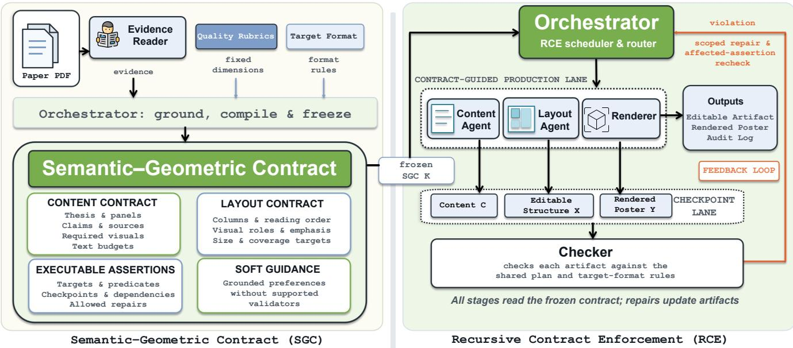
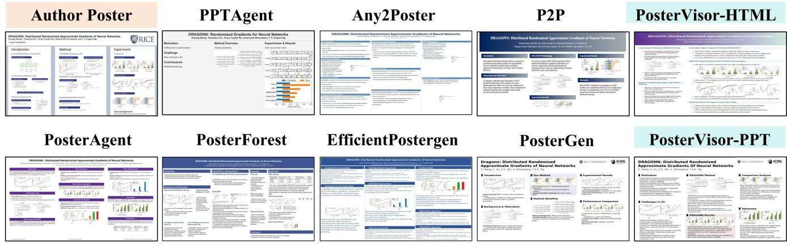
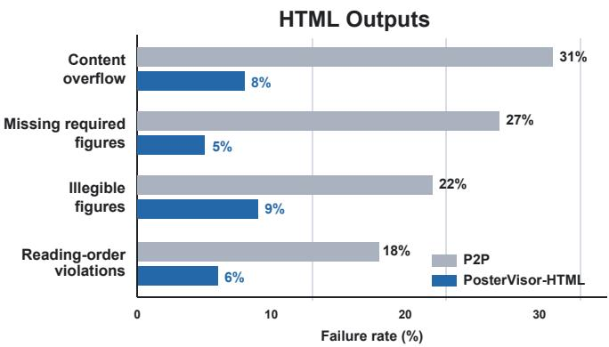
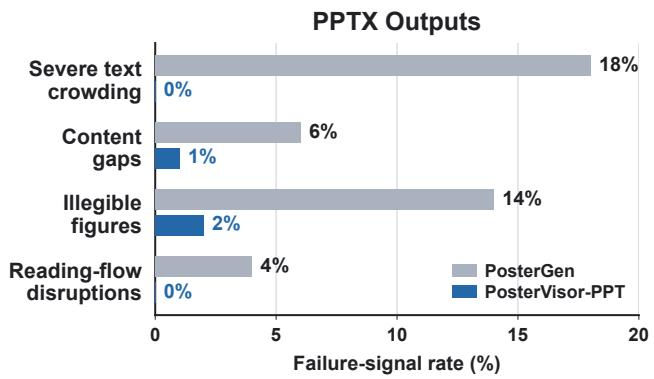
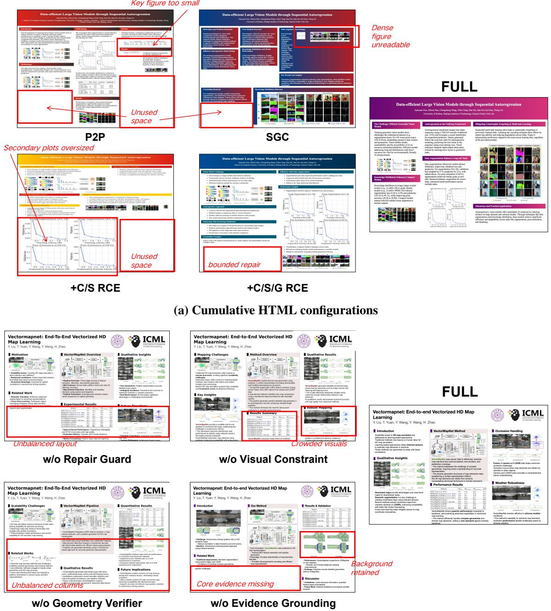
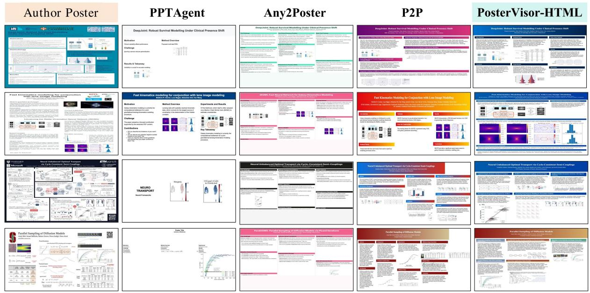
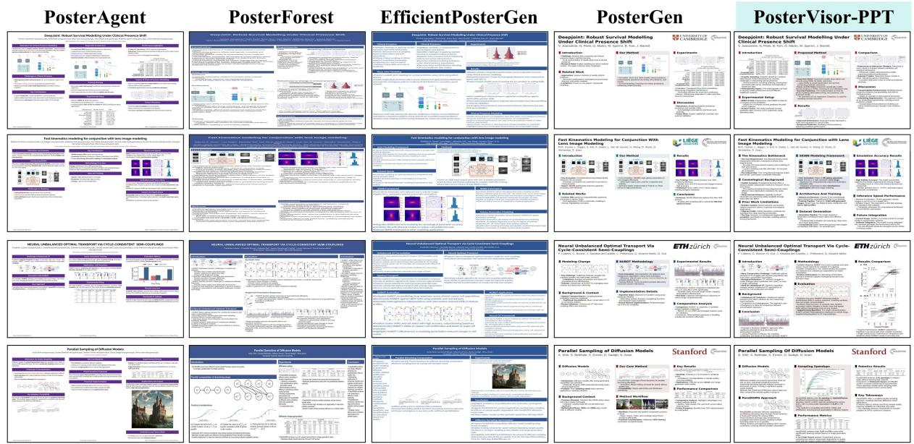

# From Transient Prompts to Persistent Control: Scientific Poster Generation via Recursive Semantic–Geometric Contracts

Runze Li1,2, Yukun Zhao3, Can Xu4, Yucheng Shen5,

Shuaiqiang Wang1, Jianmin Wu1, Lingyong Yan1∗, Dawei Yin1

1Baidu Inc., Beijing, China

2Harbin University of Science and Technology, Harbin, China

3Shandong University, Jinan, China

4East China Normal University, Shanghai, China

5Soochow University, Suzhou, China

## Abstract

Scientific poster generation distills a multimodal paper into a single-page visual artifact, forcing strict trade-ofs between informational coverage and readability under a fixed spatial budget. Existing methods pass plans as transient prompts and validate individual stages in isolation. This strategy causes re- quirements to drift across content and layout modules, and pre- vious checks to be silentl invalidated. We introduce Poster- Visor, a control framework that shifts poster generation from transient prompts to persistent control. An Orchestrator grounds rubrics in the paper and visual assets, compiling them into a Semantic–Geometric Contract (SGC) that binds claims and sources to required visuals, budgets, and spatial com- mitments. Only fully instantiated records become executable assertions; other usable requirements remain soft guidance. Recursive Contract Enforcement (RCE) dynamically triggers checks across stages as evidence emerges. Crucially, during repairs, RCE rechecks afected checkpoint states, preventing repair-induced regressions from propagating silently. We in- stantiate PosterVisor in HTML/CSS and editable PPTX gen- erators. On the 100-paper Paper2Poster benchmark, Poster- Visor-PPT improves observed mean poster-grounded QA accuracy over PosterGen (64.47% vs. 58.53%) and is preferred by human judges in 72.5% of non-tied pairwise comparisons (95% CI, 61.6–83.4%). A secondary 30-paper study also yields higher VLM Overall and PaperQuiz means. These re-sults support rubric-compiled contracts and stage-conditioned enforcement for controllable poster synthesis.

## Introduction

Scientific posters provide a compact visual medium for pre- senting research papers, distilling a full paper into a single- page narrative (Qiang et al. 2019; Zhong et al. 2025; Tanaka, Wang, and Ushiku 2024). Automating this process goes be-yond conventional text summarization: under a fixed spatial budget, a system must jointly select scientific claims, retain supporting evidence, and coordinate text, visuals, and layout to clearly convey the paper’s core message while keeping its visual evidence legible (Sun et al. 2026; Pang et al. 2025; Zhang et al. 2026; Choi et al. 2026).

Recent LLM- and VLM-based systems frame scientific poster generation as a multi-stage process. They combine content–layout planning, specialized agents, hierarchical or editable representations, and visual feedback to coordinate content, layout, and revision (Pang et al. 2025; Sun et al. 2026; Zhang et al. 2026; Choi et al. 2026). More recent work improves eficiency and auditability through token compres- sion, targeted violation detection, provenance tracking, and geometry checks (Tang et al. 2026; Yang et al. 2026). How-ever, these pipelines still bind plans and checks to individual stages rather than maintaining a shared, paper-specific ac- ceptance state throughout generation.

This limitation creates two control challenges. First, se- mantic and spatial requirements are frequently weakened as a poster evolves from a textual plan to structured content and rendered outputs. Early plans merely specify what to gener- ate, failing to bind claims, evidence, and spatial allocations into a persistent specification. Second, since requirements become observable at diferent stages, later modifications can silently invalidate earlier checks. Without tracking the scope and dependencies of each repair, the system cannot determine which results remain valid.

To address these challenges, we introduce PosterVisor, an Orchestrator-centered framework that turns poster gener- ation from transient prompts to persistent contracts. It turns paper-specific planning decisions into a Semantic–Geometric Contract (SGC) shared across the content generation, layout construction, and rendering stages. Starting from a fixed cat- alog of poster-quality criteria, the Orchestrator grounds rele- vant criteria in the source paper and its visual assets, binding narrative claims and source evidence to required visuals, con- tent budgets, and coarse spatial commitments. Requirements with explicit targets and available validators are compiled into executable assertions, while other useful requirements are retained as soft guidance. Because these requirements be- come observable at diferent stages, Recursive Contract Enforcement (RCE) evaluates each executable assertion when the evidence needed to check them becomes available. When an assertion fails, RCE routes the violation to a scoped and bounded repair and then revalidates the assertions that may have been afected by the change. SGC therefore limits the drift of semantic and spatial commitments, while RCE pre- vents afected validation results from being silently treated as valid after repair. Together, SGC and RCE extend stage-local planning and checking into persistent, repair-aware control

throughout poster generation.

We instantiate PosterVisor in two systems: a P2P-derived HTML/CSS generator and a PosterGen-derived editable- PPTX generator. On the primary benchmark of 100 papers, both implementations obtain higher observed VLM Over- all and Raw PaperQuiz means than their matched baselines and tie for the highest displayed automatic VLM Overall of 3.82. PosterVisor-PPT improves Raw PaperQuiz by 5.94 points and is preferred to PosterGen in 72.5% of non-tied human comparisons (95% CI, 61.6–83.4%). Across four additional model backbones, PosterVisor-HTML improves both objectives in all four settings, while PosterVisor-PPT improves each objective in three ofthe four settings. Archived execution logs further show that all 159 recorded determin- istic repair events are followed by rule-based rechecking, providing direct evidence of the intended enforcement be- havior. A secondary study on 30 papers provides additional evidence of transferability.

Our contributions are summarized as follows:

• We formulate scientific poster generation as a cross-representation control problem in which coupled seman- tic, evidential, and spatial commitments become observ- able at diferent stages and may be invalidated by subse- quent repairs.

• We introduce a rubric-grounded Semantic–Geometric Contract that preserves paper-specific commitments as a shared acceptance state, together with Recursive Contract Enforcement, which evaluates executable assertions at appropriate checkpoints and revalidates afected asser- tions after scoped and bounded repairs.

• We instantiate the framework as HTML/CSS and editable PPTX generators, and demonstrate its efectiveness across two benchmarks in terms of output quality, cross-model robustness, human preference, and recorded control be- havior.

## Related Work

Scientific Poster Generation. Early scientific-poster systems select and arrange content using learned statistics or neural components (Qiang et al. 2019; Xu and Wan 2022). Subsequent resources support poster generation, layout anal- ysis, structural parsing, and summarization (Zhong et al. 2025; Tanaka, Wang, and Ushiku 2024; Tanaka, Hashimoto, and Ushiku 2026; Saxena, Minervini, and Keller 2025). Re-cent LLM/VLM pipelines use structured intermediate repre- sentations to transform parsed document content into editable visual structures for posters, slides, and webpages (Pang et al. 2025; Sun et al. 2026; Zhang et al. 2026; Choi et al. 2026; Sun et al. 2021; Zheng et al. 2025; Ma et al. 2025). A typical agentflow decomposes the task into paper pars- ing, content and figure selection, narrative planning, con- tent writing, layout construction, rendering, and output re- view (Pang et al. 2025; Sun et al. 2026; Zhang et al. 2026; Choi et al. 2026; Tan et al. 2026). PosterHarness further advances contract-oriented control through placeholder-first planning, staged QA, and deterministic source-figure com-position (Yang et al. 2026). Any2Poster and ResearchStudio-

Reel broaden the task to diverse inputs and editable multi- artifact outputs (Vinaykumar et al. 2026; Xiao et al. 2026).

Rubric-Guided Evaluation and Recursive Enforcement. Rubrics decompose open-ended quality into interpretable criteria for evaluation, diagnosis, and reward or verifier de- sign; recent work also automates their synthesis and extrac- tion (Hashemi et al. 2024; Sharma et al. 2025; Gunjal et al. 2025; He et al. 2026; Shao et al. 2025; Liu et al. 2026; Xie et al. 2025; Li et al. 2026). Prior poster-generation systems likewise employ fine-grained criteria, stage-specific check- ers, rendered-image critics, deterministic layout tests, and rejection rules (Pang et al. 2025; Sun et al. 2026; Zhang et al. 2026; Choi et al. 2026; Tang et al. 2026; Yang et al. 2026). These mechanisms address local defects, but their criteria usually remain attached only to the current artifact at a particular stage. For example, a plan may require a key figure to be both included and readable. A content checker may confirm its inclusion, while an overflow checker may confirm that the layout fits; yet the figure may remain too small to convey its evidence. Enlarging it may then cause text overflow unless the afected constraints are rechecked. These mechanisms therefore rovide useful local feedback but ofer limited cross-stage persistence and repair-aware revalidation.

## Problem Formulation

Given a multimodal source paper P, a fixed poster-quality rubric catalog R, and a target output format f, we formulate controlled poster generation as

$$
( P , R , f ) \longmapsto ( X , Y , L ) ,
$$

where X is an editable artifact, Y is its rendered poster, and L is an audit log. Requirements instantiated from P and R under format f combine scientific content, source evidence, and spatial presentation. The control problem is to maintain and evaluate this paper-specific requirement set across generated content, editable geometry, and rendered output, recognizing that requirements become verifiable at diferent stages and repairs may afect previously satisfied constraints.

## Method

In this section, we first summarize PosterVisor’s end-to- end workflow and then describe its two core components: Semantic–Geometric Contract (SGC) construction and Recursive Contract Enforcement (RCE).

## Overview

PosterVisor first uses an Evidence Reader to transform the source paper P into indexed text T and a provenancepreserving visual inventory A. The Orchestrator uses (T, A) to determine the thesis, priorities, and spatial allocation. It grounds applicable criteria from R to freeze the SGC K, binding claims to required visuals, budgets, and spatial com- mitments. Guided by K, the Content Agent writes the poster content C. The Layout Agent combines the checked content, selected visuals, and spatial requirements into the editable artifact X, which a format-specific renderer converts into Y.

  
Figure 1: Overview of PosterVisor. The Evidence Reader extracts traceable paper evidence, and the Orchestrator grounds rubric dimensions to construct a persistent SGC. Content and layout modules generate artifacts under the frozen contract. RCE evaluates assertions as state becomes available, routes violations to bounded repairs, and rechecks afected assertions.

At the content, editable-layout, and rendered-output check- points, the Checker evaluates applicable assertions against the corresponding artifact state and returns structured viola- tions. Under RCE, the Orchestrator routes each actionable violation to an allowed repair operator, and the Checker rechecks the assertions afected by the repair. We instan- tiate this shared SGC/RCE abstraction in a P2P-derived HTML/CSS generator and a PosterGen-derived editable- PPTX generator. Figure 1 summarizes the workflow.

## Semantic–Geometric Contract Construction

The fixed catalog R defines the general quality dimensions considered in our experiments: scientific-content coverage, visual-evidence suficiency, information density, visual read- ability, figure–text balance, and spatial balance. For a source paper $P$ , the Orchestrator grounds the applicable dimensions in the indexed text $T$ and visual inventory A and repre-sents the resulting paper-specific requirements as an SGC, $K = ( K _ { c } , K _ { l } , \mathcal { \bar { E } } , \bar { \mathcal { S } } ) .$ $K _ { c }$ stores the poster thesis, ordered panels, claims or content intents, source anchors, required visual evidence, and text budgets. $K _ { l }$ stores panel-to-column assignments, reading order, spatial emphasis, visual roles, key-visual protection, and paper-specific size or coverage targets. $\mathcal { E }$ contains fully instantiated, checkable assertions, whereas $s$ retains grounded records that can guide genera- tion but are not executable. Each panel record thereby binds scientific intent and evidence to a content budget and a coarse spatial commitment. Only assertions in E determine verified contract compliance. Format-wide measurement rules, de- fault tolerances, checkpoints, and admissible repair operators are specified separately by the format policy $\Theta _ { f }$

Planning first produces a candidate record set G. For each applicable rubric dimension, grounding yields zero or more records $g _ { j } = \langle r _ { j } , q _ { j } , \widehat { \eta } _ { j } , p _ { j } \rangle$ , where $r _ { j }$ identifies the crite- rion, $q _ { j }$ is a typed target query, $\widehat { \eta } _ { j }$ is a required value or policy key, and $p _ { j } \subseteq T \cup A$ records paper provenance. The Orchestrator also adds schema-derived records for required sections, evidence bindings, and budgets. Normalization re- solves $q _ { j }$ and $\widehat { \eta } _ { j }$ against the draft contract and $\Theta _ { f }$ , producing either $g _ { j } ^ { \prime } = \langle \bar { r _ { j } } , \tau _ { j } , \eta _ { j } , p _ { j } \rangle$ or an explicitly unresolved record in $\mathcal { G } ^ { \prime }$

Each executable assertion has the form

$$
e _ { i } = \langle c _ { i } , \tau _ { i } , \eta _ { i } , \phi _ { i } , s _ { i } , D _ { i } , \mathcal { U } _ { i } \rangle ,
$$

where $c _ { i }$ is a violation code, $\tau _ { i }$ is a typed target, $\eta _ { i }$ is the expected value or bound, $\phi _ { i }$ is the checking predicate, and $s _ { i }$ is its checkpoint. $D _ { i }$ lists read dependencies, and $\mathcal { U } _ { i }$ is a repair allow-list that may be empty. The format policy supplies a finite catalog of typed predicate templates. A policy key is not executable by itself: before a record en- ters ${ \dot { \boldsymbol { \mathcal { E } } } } ,$ its target, expectation, and checking rule must be materialized by the run’s contract state and format-policy configuration. Accordingly, for $g _ { j } ^ { \prime } \in \mathcal { G } ^ { \prime }$ , the compiler emits $e _ { i } = C _ { f } ( g _ { i } ^ { \prime } ; K _ { c } , K _ { l } , \Theta _ { f } ) \in \mathcal { E }$ only when $\tau _ { i }$ and $\eta _ { i }$ are re-solved and a compatible template defines $\left( \phi _ { i } , s _ { i } , D _ { i } , \mathcal { U } _ { i } \right)$ Otherwise, the record enters $s$ only if it remains usable as generation guidance; unusable records are retained as unre- solved in $L .$

To illustrate this compilation mechanism, consider a rubric requiring “visual balance.” Grounding might resolve this ab- stract concept to extracting Figure 3 from the paper. During compilation, if the format policy $\Theta _ { f }$ supports measuring im- age area, this becomes an executable assertion in $\mathcal { E }$ (e.g., “Figure 3 must occupy $\geq 1 5 \%$ of the column”). Conversely, if the system cannot reliably validate a specific aesthetic style, that requirement degrades to soft guidance in S, prompting the generator without forcing a hard check. For a compiled as- sertion, $\phi _ { i } ( Z [ D _ { i } ] , \tau _ { i } ; \eta _ { i } , \Theta _ { f } ^ { - } )$ returns $\{ \mathrm { P A S S , F A I L , \perp } \}$ , where ⊥ denotes an unavailable observation or checker failure and is never treated as a pass.

Indexed text, captions, visual references, asset geometry, and readability or importance estimates provide the evidence used to resolve record targets and expectations. The construc- tion process is summarized as

$$
\begin{array} { r c l } { ( T , A ) } & { = } & { E ( P ) , } \\ { ( \widetilde K , \mathcal G ) } & { = } & { { \Pi } ( T , A ; R ) , } \\ { ( K _ { c } , K _ { l } , \mathcal G ^ { \prime } ) } & { = } & { N ( \widetilde K , \mathcal G ; T , A , \Theta _ { f } ) , } \\ { ( \mathcal E , \mathcal S ) } & { = } & { C _ { f } ( \mathcal G ^ { \prime } ; K _ { c } , K _ { l } , \Theta _ { f } ) . } \end{array}
$$

Here, E, Π, N, and $C _ { f }$ denote evidence extraction, paper- specific planning and grounding, normalization, and asser- tion compilation, respectively; $\widetilde { K }$ is the draft contract pro- duced during planning. Normalization resolves identifier, an- chor, budget, and estimated-load conflicts before the final contract $\bar { \boldsymbol { K } } = ( K _ { c } , K _ { l } , \mathcal { E } , \mathcal { S } )$ is frozen. Any conflict that cannot be resolved remains a plan violation. After freezing, K remains unchanged, and state-specific projections of the same contract are supplied to generation, checking, and re- pair. Format-specific modules may instantiate supplementary artifact-specific checks from $\Theta _ { f }$ for diagnosis or auxiliary repair, but these checks neither modify $\check { K }$ nor expand $\mathcal { E } .$

## Recursive Contract Enforcement

Recursive Contract Enforcement (RCE) evaluates executable assertions when their required state is available at checkpoint $s _ { t } .$ . Content checkpoints expose sections, claims, evidence references, sources, and budgets. Layout checkpoints expose structural feasibility and realized geometry. Within $Q _ { s _ { t } }$ , ex-ecutable assertions are evaluated either by deterministic val- idators for computable structural and geometric requirements or by task-scoped model predicates for properties that are dif- ficult to fully formalize, such as plan coverage, figure–text consistency, and rendered content quality. Model outputs af- fect $Q _ { s _ { t } }$ only when they implement the predicate of an as- sertion already compiled into $\mathcal { E } ;$ other critic findings remain diagnostic or may trigger auxiliary repair without afecting contract compliance. For an artifact state $Z _ { t } \in \{ C , X , Y \}$ the Checker and repair router compute

$$
\begin{array} { r c l } { \mathcal { V } _ { t } } & { = } & { Q _ { s _ { t } } \big ( Z _ { t } ; \mathcal { E } _ { s _ { t } } ( K ) , \Theta _ { f } \big ) , } \\ { u _ { t } } & { = } & { H \big ( v _ { t } , Z _ { t } ; K , \Theta _ { f } \big ) \in \mathcal { U } ( v _ { t } ) , } \\ { Z _ { t + 1 } } & { = } & { \rho \big ( u _ { t } , Z _ { t } ; K , \Theta _ { f } \big ) , } \\ { W _ { t } } & { = } & { W _ { \mathrm { d e c l } } \big ( u _ { t } \big ) \cup \mathrm { d i f f } \big ( Z _ { t } , Z _ { t + 1 } \big ) , } \\ { Z _ { t } } & { = } & { \big \{ e _ { i } \in \mathcal { E } : D _ { i } \cap W _ { t } \neq \mathcal { D } \big \} , } \\ { \Gamma _ { t } } & { = } & { \mathrm { c l } _ { K , \Theta _ { f } } \big ( \{ e ( v _ { t } ) \} \cup \mathcal { T } _ { t } \big ) , } \end{array}
$$

for an actionable violation $v _ { t } \in \mathcal V _ { t }$ . Here, $Q _ { s _ { t } }$ returns vi- olations among the assertions active at checkpoint $s _ { t } ,$ , and $\boldsymbol { \mathcal { U } } ( \boldsymbol { v } _ { t } )$ is the failed assertion’s nonempty repair allow-list. $W _ { t }$ combines the repair’s declared scope with the observed artifact diference. $\bar { \mathcal { T } } _ { t }$ identifies directly afected assertions, while $\Gamma _ { t }$ adds the failed assertion $e ( v _ { t } )$ and closes this set under contract- and format-specific dependencies. If a reli- able structural diference is unavailable, the Checker reruns all executable assertions over the modified artifact state.

The closure $\Gamma _ { t }$ additionally includes transitive geometry de endencies and lobal structural uards. When reliable field-level dependencies are unavailable, the full-checkpoint fallback conservatively includes all applicable assertions at the modified state. This dependency-aware rechecking is our key departure from single-pass self-correction, which may silently retain cascading errors. For example, after an image is shrunk to fix spatial overflow, the recheck scope includes image-text readability and adjacent alignment, allowing any resulting regression to be detected rather than silently ac- cepted. After repair, the Checker reevaluates $\Gamma _ { t } ,$ and a target is considered resolved only when its predicate passes. If an assertion changes from pass on $Z _ { t }$ to fail or ⊥ on $Z _ { t + 1 }$ , RCE records a typed regression violation. The frozen contract $K$ provides the comparison reference. Thus, the observed- delta closure makes regressions detectable, whereas contract immutability alone neither prevents nor repairs them.

Repair types depend on the violation, not the checkpoint $( \mathrm { e . g . }$ , layout overflow may trigger geometric tweaks or con- tent shortening). RCE uses deterministic operators for di-rectly measurable failures and scoped model calls when re- generation is required. It continues only while the relevant verification results improve and stops when all executable assertions applicable to the final artifact return pass, no per- mitted repair remains, verification no longer improves, or the format-specific repair budget is exhausted. Contract compli- ance is assigned only when all applicable assertions pass. Otherwise, the system returns the latest available artifact and records failed or unresolved assertions, exhausted repairs, and detected regressions in L. Regression detection is limited by the declared dependencies, observed diferences, and underlying checkers; soft guidance and unmodeled proper- ties remain outside the compliance claim.

## Experiments

## Experimental Setup

Datasets. Our primary benchmark is Paper2Poster (Pang et al. 2025), containing 100 source papers, author posters, and factual QA data. We additionally use a 30-paper secondary evaluation set (Zhang et al. 2026). Lacking PaperQuiz data for this set, we reproduce the Paper2Poster protocol to gener- ate 50 verbatim and 50 interpretive questions per paper. All generators in the main comparison use GPT-4o, whereas the secondary comparison uses GPT-4.1.

Baselines. We compare against eight automatic systems: PosterAgent (Pang et al. 2025), P2P (Sun et al. 2026), PosterGen (Zhang et al. 2026), PPTAgent (Zheng et al. 2025), PosterForest (Choi et al. 2026), Any2Poster (Vinaykumar et al. 2026), EficientPoster-Gen (Tang et al. 2026), and PosterHarness (Yang et al. 2026). P2P and PosterGen are the respective base generators for PosterVisor-HTML and PosterVisor-PPT, enabling direct within-generator comparisons. Superscripts in Table 1 distinguish reported reference values from our reproductions.

Evaluation Metrics. Following Paper2Poster (Pang et al. 2025), VLM-as-Judge uses GPT-4o to score six criteria from 1 to 5. Element quality, layout balance, and engagement form Aesthetic; clarity, content completeness, and logical flow form Information; Overall averages all six. PaperQuiz measures source-information recoverability with 50 verbatim and 50 interpretive questions answered by GPT-4o, GPT-4o- mini, and o3. The Paper reference provides up to 20 rendered pages, whereas each poster method provides one image. Un- supported answers count as incorrect, and reader scores are averaged per sample. Density augmentation is computed be- fore cross-paper averaging as $s _ { A } \bar { = } s _ { R } ( 1 { + } 1 / \operatorname* { m a x } ( 1 , l / w ) )$ where l is the OCR-text token count and w = 1335.5 is the median over re-evaluated author posters. These criteria are external output-quality measures rather than the generation- time rubric catalog R or direct tests of contract compliance.

<table><tr><td rowspan="3">Method</td><td colspan="10">VLM-as-Judge (↑)</td><td colspan="5">PaperQuiz (↑)</td></tr><tr><td colspan="4">Aesthetic</td><td colspan="4">Information</td><td rowspan="2">Overall</td><td colspan="3">Raw Accuracy</td><td colspan="3">Density-Augmented</td></tr><tr><td>Elem. Layout Engage. Avg. Clarity Content Logic Avg.</td><td></td><td></td><td></td><td></td><td></td><td></td><td></td><td></td><td>Verb. Interp.</td><td>Overall</td><td>Verb.</td><td>Interp.</td><td>Overall</td></tr><tr><td>Paper†</td><td>4.05</td><td>3.89</td><td>2.80</td><td>3.58</td><td>4.00</td><td>4.68</td><td>3.98</td><td>4.22</td><td>3.90</td><td>84.41</td><td>79.69</td><td>82.05</td><td>92.97</td><td>87.75</td><td>90.36</td></tr><tr><td>GT Poster†</td><td>4.07</td><td>3.90</td><td>2.70</td><td>3.56</td><td>4.09</td><td>3.96</td><td>3.89</td><td>3.98</td><td>3.77</td><td>68.25</td><td>74.73</td><td>71.49</td><td>127.75</td><td>140.29</td><td>134.02</td></tr><tr><td>PosterAgent‡</td><td>3.92</td><td>3.05</td><td>2.98</td><td>3.32</td><td>3.98</td><td>3.97</td><td>3.55</td><td>3.83</td><td>3.58</td><td>57.81</td><td>76.39</td><td>67.10</td><td>111.40</td><td>147.29</td><td>129.34</td></tr><tr><td>PosterGen*</td><td>3.59</td><td>2.98</td><td>2.81</td><td>3.13</td><td>4.14</td><td>3.93</td><td>3.32</td><td>3.80</td><td>3.46</td><td>43.90</td><td>73.15</td><td>58.53</td><td>87.71</td><td>146.19</td><td>116.95</td></tr><tr><td>PPTAgent*</td><td>2.76</td><td>2.83</td><td>1.93</td><td>2.51</td><td>3.80</td><td>2.68</td><td>2.31</td><td>2.93</td><td>2.72</td><td>22.24</td><td>60.09</td><td>41.17</td><td>44.48</td><td>120.19</td><td>82.33</td></tr><tr><td>P2P*</td><td>3.99</td><td>3.50</td><td>3.01</td><td>3.50</td><td>3.99</td><td>3.92</td><td>3.83</td><td>3.91</td><td>3.71</td><td>55.67</td><td>76.60</td><td>66.14</td><td>111.19</td><td>153.03</td><td>132.11</td></tr><tr><td>PosterForest*</td><td>3.96</td><td>3.56</td><td>3.01</td><td>3.51</td><td>3.90</td><td>3.91</td><td>3.70</td><td>3.84</td><td>3.67</td><td>51.05</td><td>80.42</td><td>65.73</td><td>101.99</td><td>160.74</td><td>131.37</td></tr><tr><td>Any2Poster*</td><td>3.10</td><td>2.87</td><td>2.39</td><td>2.79</td><td>3.76</td><td>3.69</td><td>3.29</td><td>3.58</td><td>3.18</td><td>49.91</td><td>79.89</td><td>64.90</td><td>99.59</td><td>159.45</td><td>129.52</td></tr><tr><td>EfficientPosterGen*</td><td>3.18</td><td>2.99</td><td>2.21</td><td>2.79</td><td>4.09</td><td>3.96</td><td>3.43</td><td>3.83</td><td>3.31</td><td>55.08</td><td>76.71</td><td>65.89</td><td>109.98</td><td>153.18</td><td>131.58</td></tr><tr><td>PosterHarness*</td><td>3.42</td><td>3.40</td><td>3.02</td><td>3.28</td><td>4.29</td><td>4.14</td><td>4.14</td><td>4.19</td><td>3.74</td><td>55.50</td><td>76.68</td><td>66.09</td><td></td><td>110.94 153.28</td><td>132.11</td></tr><tr><td>POSTERVISOR-PPT</td><td>3.97</td><td>3.76</td><td>3.09</td><td>3.61</td><td>4.45</td><td>4.05</td><td>3.59</td><td>4.03</td><td>3.82</td><td>53.02</td><td>75.91</td><td>64.47</td><td></td><td>106.04 151.83</td><td>128.93</td></tr><tr><td>POSTERVISOR-HTML 3.73</td><td></td><td>3.45</td><td>2.96</td><td>3.38</td><td>4.62</td><td>3.92</td><td>4.25</td><td>4.26</td><td>3.82</td><td>58.23</td><td>75.40</td><td>66.82</td><td></td><td>115.95 150.21 133.08</td><td></td></tr></table>

Table 1: Results on the 100-paper Paper2Poster benchmark. † marks values reported by Paper2Poster, ‡ marks our LaTeX PosterAgent reproduction, and ⋆ marks our other reproductions. Paper and GT Poster are reference inputs excluded from automatic-method ranking. Bold and underline indicate the best and second-best automatic results; rounded ties share a mark.

Implementation Details. Both realizations share the rubric catalog R and the SGC/RCE abstraction but use format-specific artifact states, validators, and repair opera- tors. PosterVisor-HTML checks generated content, DOM structure, and Playwright-rendered geometry. It uses a 650- word budget, balanced density, at least three required visu- als, up to two content and DOM repair rounds, and three layout–render–check attempts. PosterVisor-PPT checks its panel blueprint, editable PPTX geometry, and LibreOfice- rendered output and permits at most three repair–render rounds. Only executable validators determine contract com- pliance; if a repair budget is exhausted, the latest artifact is returned with its remaining violations recorded rather than being marked compliant. Each evaluated system produces one poster per paper without candidate selection; within each benchmark, newly evaluated outputs share the same judge and PaperQuiz protocol. Each run retains the frozen SGC, structured violations, applied repair patches, geometry reports, unresolved assertions, and final artifacts for audit.

## Main Results

Table 1 shows higher observed means for both matched com- parisons. PosterVisor-HTML raises VLM Overall from 3.707 to 3.822 and Raw PaperQuiz Overall from 66.14 to 66.82, while attaining the highest Density-Augmented Overall of 133.08. PosterVisor-PPT raises the correspond- ing VLM and Raw PaperQuiz scores from 3.460 to 3.818 and from 58.53 to 64.47. Both realizations round to the highest displayed automatic VLM Overall of 3.82. Fine- grained results show complementary strengths: PosterVi- sor-HTML leads clarity, logical flow, and aggregate Infor- mation, whereas PosterVisor-PPT leads engagement and improves most strongly over its base in Aesthetic.

Cross-model experiments with Qwen3.7-Plus, GPT-5.5, Gemini-3.1-Pro-Preview, and Claude-Opus-4.8 further test whether the control abstraction depends on GPT-4o. Poster- Visor-HTML improves both VLM Overall and Raw Pa- perQuiz over P2P in all four settings, by 0.019–0.127 VLM points and 1.56–3.90 QA points. PosterVisor-PPT improves VLM Overall in three settings and Raw PaperQuiz in three settings, revealing stronger model-dependent content– presentation trade-ofs. Full results appear in the supplement.

Figure 2 illustrates missing evidence, excessive whites- pace, text overload, and undersized visuals in representative baseline outputs. The final outputs use space more fully and foreground key visuals; mechanism evidence comes from the ablation configurations and repair logs below.

On the 30-paper secondary set, PosterVisor-PPT raises PosterGen’s VLM Overall from 3.91 to 4.01 and Raw Pa- perQuiz Overall from 78.9 to 85.5, ranking first among the evaluated automatic methods on both. Full results appear in the supplement.

  
Figure 2: Qualitative comparison for one Paper2Poster paper across the author poster, seven automatic baselines, and the two PosterVisor realizations.

<table><tr><td rowspan="2">Configuration</td><td>VLM-as-Judge (↑)</td><td colspan="3">Raw PaperQuiz (↑)</td></tr><tr><td>Aes. Info.</td><td>All Verb.</td><td>Interp.</td><td>All</td></tr><tr><td>P2P (base)</td><td>3.500 3.913 3.707</td><td>55.67</td><td>76.60</td><td>66.14</td></tr><tr><td>SGC</td><td>3.530 3.900</td><td>3.715 40.42</td><td>77.78</td><td>59.10</td></tr><tr><td>+ C/S</td><td>3.562 3.938</td><td>3.729 45.28</td><td>76.38</td><td>60.83</td></tr><tr><td>+ C/S/G</td><td>3.657 3.980</td><td>3.818 49.74</td><td>69.76</td><td>59.75</td></tr><tr><td>Full</td><td>3.380 4.263</td><td>3.822 58.23</td><td>75.40</td><td>66.82</td></tr></table>

Table 2: HTML ablations on 100 papers. C, S, and G denote content-, structure-, and geometry-level RCE; “+” indicates cumulative addition to SGC. Each configuration is generated independently; the base and full-system results match Ta- ble 1.

## Ablation Study

We conduct format-specific ablations. For HTML, we com- pare combinations of SGC, content/structure RCE, and rendered-geometry RCE against the P2P base. For PPTX, we remove one implementation component from the full system at a time. Crucially, Evidence Grounding and the Repair Guard jointly implement the dependency closure (Γt), acting as local constraints that uphold the global persistent contract (SGC). Specifically, Evidence Grounding supplies required visual dependencies, the Visual Constraint prevents incompatible large assets from sharing a column, the Geometry Verifier checks pre-render spatial feasibility, and the Repair Guard prevents local edits from hiding global structural failures.

Table 2 shows non-monotonic trade-ofs among the HTML ablations, with only the full system exceeding P2P on both aggregate objectives. In Table 3, removing any PPTX com-ponent lowers VLM Overall from 3.818 to 3.496–3.622. Re- moving the Geometry Verifier eliminates visual-demotion events, while removing the Repair Guard reduces structural- repair events from 217 to 6, consistent with their intended control roles. The QA changes reveal a content–presentation trade-of rather than uniform gains. Complete switch def- initions, additional PPTX configurations, and event counts appear in the supplement.

<table><tr><td>Configuration</td><td>VLM Overall</td><td>QA Overall</td><td>demot.</td><td>Vis. Struct. repair</td></tr><tr><td>Full system</td><td>3.818</td><td>64.47</td><td>27</td><td>217</td></tr><tr><td>w/o Evidence Grounding</td><td>3.537</td><td>64.60</td><td>18</td><td>162</td></tr><tr><td>w/o Visual Constraint</td><td>3.622</td><td>66.40</td><td>33</td><td>179</td></tr><tr><td>w/o Geometry Verifier</td><td>3.573</td><td>66.50</td><td>0</td><td>200</td></tr><tr><td>w/o Repair Guard</td><td>3.496</td><td>67.30</td><td>29</td><td>6</td></tr></table>

Table 3: Diagnostic leave-one-component-out ablations for the PPTX realization. VLM and QA are Overall scores; event columns report totals over each run.

## Analysis

Failure-Mode Reduction. Figures 3 and 4 show comple-mentary reductions in output-level failure signals: HTML overflow falls from 31% to 8% and missing required figures from 27% to 5%; PPTX severe text crowding drops from 18% to 0% and illegible figures from 14% to 2%.

RCE Repair Activity. The archived HTML runs contain 159 deterministic local repairs, all followed by rule-based rechecking: 41 are followed by a subsequent full check, while 118 retain only an inline residual check. Regression analysis is restricted to the 41 repair stages with a subsequent full check. Comparing the same rule codes across each adjacent full-check pair yields 75 code-level assertion transitions, of which eight are pass-to-fail transitions across eight diferent posters. Seven appear only after model-based regeneration following a deterministic patch, while one is already present in the deterministic residual check. Crucially, RCE’s post- repair rechecking detects these observed regressions and routes them through the bounded repair loop. Five regressed codes are eliminated before finalization; the remaining three persist after the repair budget is exhausted and are explicitly recorded as residual violations. This directly demonstrates an operational advantage over single-pass checking: subject to its repair budget, RCE prevents observed regressions from propagating silently.

  
Figure 3: Output-level failure-signal rates across 100 matched HTML cases: PosterVisor-HTML versus P2P.

<table><tr><td>Case</td><td>Violation and scoped repair</td><td>Recheck</td></tr><tr><td>H01</td><td>Three required visuals missing → restore Content affected placeholders</td><td>and global checks pass</td></tr><tr><td></td><td>H02 Required visual lacks two-column span Violations: → local layout repair and rerender</td><td>2→1→0</td></tr><tr><td></td><td>U01 Four-column contract, three-column out- Unresolved and put → two bounded local retries</td><td>logged</td></tr></table>

Table 4: Selected auditable HTML repair trails. These ex- amples illustrate RCE behavior rather than aggregate repair reliability.

Generation Overhead. PosterVisor-PPT increases calls from 8.05 to 19.15 and mean latency from 160.32 to 505.49 seconds per poster. Its decomposed requests nevertheless re- duce total tokens from 104,251 to 67,066 and the token-only cost estimate from \$0.297 to \$0.228 per poster.

## Human Evaluation

We recruit 15 annotators with AI backgrounds and graduate- level research training: two doctoral researchers and 13 cur- rent master’s students or master’s degree holders. After stan- dardized training, all annotators complete 1,175 blind seven- source ranking trials; 13 also complete 2,588 blind within- pipeline pairwise trials. In each ranking trial, annotators may select up to three poster sources or abstain at any position. Top-1, Top-2, and Top-3 selections receive 3/2/1 points, and unselected sources share the mean of the remaining ranks. Pairwise trials compare each PosterVisor realization with its matched base generator, and win rates exclude ties.

Table 5 shows PosterVisor-PPT ranks first among auto- matic methods and wins 72.5% ofnon-tied comparisons with PosterGen (95% CI, 61.6–83.4%). PosterVisor-HTML se-cures more Top-1 selections than P2P but yields a 54.7% win rate (CI includes 50%). This statistical tie is expected, as P2P is already highly optimized for aesthetics. Crucially, PosterVisor achieves visual parity while significantly im- proving factual recoverability (Table 1). CIs are clustered by annotator and paper (Cameron, Gelbach, and Miller 2011).

  
Figure 4: Output-level failure-signal rates across 100 matched PPTX cases: PosterVisor-PPT versus PosterGen.

<table><tr><td colspan="5">(a) Ranking over seven poster sources</td></tr><tr><td colspan="5">Method Top-1 Top-2 Top-3 Score (↑) Rank (↓)</td></tr><tr><td>Author Poster</td><td>341 198</td><td>186</td><td>1605</td><td>3.18</td></tr><tr><td>P2P</td><td>164 225</td><td>209</td><td>1151</td><td>3.73</td></tr><tr><td>PosterGen</td><td>95 128</td><td>199</td><td>740</td><td>4.30</td></tr><tr><td>PosterAgent</td><td>59 98</td><td>131</td><td>504</td><td>4.68</td></tr><tr><td>PPTAgent</td><td>64 62</td><td>55</td><td>371</td><td>4.93</td></tr><tr><td>POSTERVISOR-PPT POSTERVISOR-HTML</td><td>254 277 184 169</td><td>183 176</td><td>1499 1066</td><td>3.29 3.89</td></tr><tr><td>(b) Pairwise preference per pipeline Comparison</td><td>O/B/T</td><td></td><td></td><td></td></tr><tr><td>PPT / PosterGen</td><td>898/341/57</td><td></td><td>Win % (95% CI) 72.5 (61.6–83.4)</td><td></td></tr><tr><td>HTML / P2P</td><td>653/540/99</td><td></td><td>54.7 (45.6–63.8)</td><td></td></tr><tr><td></td><td></td><td></td><td></td><td></td></tr></table>

Table 5: Human evaluation: seven-source ranking (top) and matched-pipeline pairwise outcomes (bottom), with clusterrobust 95% CIs.

## Conclusion

We presented PosterVisor, which coordinates scientific content, visual evidence, and geometry through a persis- tent SGC and RCE. On the primary benchmark, both real- izations obtain higher observed VLM Overall and Raw Pa- perQuiz Overall than their matched baselines and tie for the highest displayed automatic VLM Overall of 3.82. Poster- Visor-PPT additionally gains 5.94 Raw PaperQuiz points and receives 72.5% of non-tied preferences over PosterGen. These results support persistent contracts, scoped repair, and rechecking as practical control mechanisms for the two pipelines studied here.

## References

Cameron, A. C.; Gelbach, J. B.; and Miller, D. L. 2011. Ro- bust Inference with Multiway Clustering. Journal of Business & Economic Statistics, 29(2): 238–249.

Choi, J.; Park, S.; Song, S.; and Shim, H. 2026. PosterForest: Hierarchical Multi-Agent Collaboration for Scientific Poster Generation. In Proceedings of the 64th Annual Meeting of the Association for Computational Linguistics (Volume 1: Long Papers), 379–401. San Diego, California, United States: Association for Computational Linguistics.

Gunjal, A.; Wang, A.; Lau, E.; Nath, V.; He, Y.; Liu, B.; and Hendryx, S. 2025. Rubrics as Rewards: Reinforcement Learning Beyond Verifiable Domains. arXiv:2507.17746.

Hashemi, H.; Eisner, J.; Rosset, C.; Van Durme, B.; and Kedzie, C. 2024. LLM-Rubric: A Multidimensional, Cali- brated Approach to Automated Evaluation of Natural Lan- guage Texts. In Proceedings of the 62nd Annual Meeting of the Association for Computational Linguistics (Volume 1: Long Papers), 13806–13834. Bangkok, Thailand: Association for Computational Linguistics.

He, Y.; Li, W.; Zhang, H.; Li, S.; Mandyam, K.; Khosla, S.; Xiong, Y.; Wang, N.; Peng, X.; Li, B.; Bi, S.; Patil, S. G.; Qi, Q.; Feng, S.; Katz-Samuels, J.; Pang, R. Y.; Gonugondla, S. K.; Lang, H.; Yu, Y.; Qian, Y.; Fazel-Zarandi, M.; Yu, L.; Benhalloum, A.; Awadalla, H. H.; and Faruqui, M. 2026. Ad- vancedIF: Rubric-Based Benchmarking and Reinforcement Learning for Advancing LLM Instruction Following. In Proceedings of the 64th Annual Meeting of the Association for Computational Linguistics (Volume 1: Long Papers), 18003– 18022. San Diego, California, United States: Association for Computational Linguistics.

Li, S.; Zhao, J.; Ren, H.; Wei, Z.; Zhou, Y.; Yang, J.; Liu, S.; Zhang, K.; and Wei, C. 2026. RubricHub: A Com- prehensive and Highly Discriminative Rubric Dataset via Automated Coarse-to-Fine Generation. In Proceedings of the 64th Annual Meeting of the Association for Computational Linguistics (Volume 1: Long Papers), 31320–31344. San Diego, California, United States: Association for Com- putational Linguistics.

Liu, T.; Xu, R.; Yu, T.; Hong, I.; Yang, C.; Zhao, T.; and Wang, H. 2026. OpenRubrics: Towards Scalable Synthetic Rubric Generation for Reward Modeling and LLM Align- ment. In Proceedings of the 64th Annual Meeting of the Associationfor Computational Linguistics (Volume 1: Long Papers), 17417–17437. San Diego, California, United States: Association for Computational Linguistics.

Ma, Q.; Wang, S.; Chen, Y.; Tang, Y.; Yang, Y.; Guo, C.; Gao, B.; Xing, Z.; Sun, Y.; and Zhang, Z. 2025. Human- Agent Collaborative Paper-to-Page Crafting for Under \$0.1. arXiv:2510.19600.

Pang, W.; Lin, K. Q.; Jian, X.; He, X.; and Torr, P. 2025. Paper2Poster: Towards Multimodal Poster Automation from Scientific Papers. In Belgrave, D.; Zhang, C.; Lin, H.-T.; Pascanu, R.; Koniusz, P.; Ghassemi, M.; and Chen, N., eds., Advances in Neural Information Processing Systems, vol-ume 38. Curran Associates, Inc.

Qiang, Y.-T.; Fu, Y.-W.; Yu, X.; Guo, Y.-W.; Zhou, Z.-H.; and Sigal, L. 2019. Learning to Generate Posters of Scien- tific Papers by Probabilistic Graphical Models. Journal of Computer Science and Technology, 34(1): 155–169.

Saxena, R.; Minervini, P.; and Keller, F. 2025. PosterSum: A Multimodal Benchmark for Scientific Poster Summarization. In Proceedings of the 14th International Joint Conference on Natural Language Processing and the 4th Conference ofthe Asia-Pacific Chapter of the Association for Computational Linguistics, 1828–1844. Mumbai, India: The Asian Feder-ation of Natural Language Processing and The Association for Computational Linguistics.

Shao, R.; Asai, A.; Shen, S. Z.; Ivison, H.; Kishore, V.; Zhuo, J.; Zhao, X.; Park, M.; Finlayson, S. G.; Sontag, D.; Murray, T.; Min, S.; Dasigi, P.; Soldaini, L.; Brahman, F.; Yih, W.-t.; Wu, T.; Zettlemoyer, L.; Kim, Y.; Hajishirzi, H.; and Koh, P. W. 2025. DR Tulu: Reinforcement Learning with Evolving Rubrics for Deep Research. arXiv:2511.19399.

Sharma, M.; Zhang, C. B. C.; Bandi, C.; Wang, C.; Aich, A.; Nghiem, H.; Rabbani, T.; Htet, Y.; Jang, B.; Basu, S.; Balwani, A.; Peskof, D.; Ayestaran, M.; Hendryx, S. M.; Kenstler, B.; and Liu, B. 2025. ResearchRubrics: A Bench- mark of Prompts and Rubrics for Evaluating Deep Research Agents. arXiv:2511.07685.

Sun, E.; Hou, Y.; Wang, D.; Zhang, Y.; and Wang, N. X. R. 2021. D2S: Document-to-Slide Generation Via Query-Based Text Summarization. In Proceedings of the 2021 Conference of the North American Chapter of the Association for Computational Linguistics: Human Language Technologies, 1405–1418. Online: Association for Computational Linguis- tics.

Sun, T.; Pan, E.; Yang, Z.; Sui, K.; Shi, J.; Cheng, X.; Li, T.; Zhang, G.; Huang, W.; Yang, J.; and Li, Z. 2026. P2P: Auto- mated Paper-to-Poster Generation and Fine-Grained Bench- mark. In The Fourteenth International Conference on Learning Representations.

Tanaka, S.; Hashimoto, A.; and Ushiku, Y. 2026. SciPost- LayoutTree: A Dataset for Structural Analysis of Scientific Posters. In Proceedings of the IEEE/CVF Conference on Computer Vision and Pattern Recognition (CVPR) Findings, 2753–2762.

Tanaka, S.; Wang, H.; and Ushiku, Y. 2024. SciPostLayout: A Dataset for Layout Analysis and Layout Generation of Scientific Posters. In 35th British Machine Vision Conference 2024, BMVC 2024, Glasgow, UK, November 25–28, 2024. BMVA.

Tang, W.; Xiao, J.; Gong, Y.; Ran, F.; Xia, T.; Liu, J.; Lam, M. H.; Wang, W.; and Lyu, M. R. 2026. Efi- cientPosterGen: Semantic-Aware Eficient Poster Generation via Token Compression and Accurate Violation Detection. arXiv:2603.00155.

Vinaykumar, A.; Li, A.; Huang, S.; and Liu, S. 2026. Any2Poster: Any-Source Poster Generation Across Modali- ties and Domains. arXiv:2606.02915.

Xiao, L.; Dai, Y.; Huang, Y.; Zhao, Q.; Wu, W.; He, H.;Chen, R.; Jiang, J.; Ma, Q.; Zhang, J.; Zhang, X.; Xin, Y.;Ou, Y.; Xia, Y.; Li, S.; Huang, L.; Zhang, Z.; He, Y.; Hui,

Y. K.; and Lu, Y. 2026. ResearchStudio-Reel: Automate the Last Mile of Research from Paper to Poster, Video, and Blog. arXiv:2607.04438.

Xie, L.; Huang, S.; Zhang, Z.; Zou, A.; Zhai, Y.; Ren, D.; Zhang, K.; Hu, H.; Liu, B.; Chen, H.; Liu, Z.; and Ding, B. 2025. Auto-Rubric: Learning to Extract Generalizable Criteria for Reward Modeling. arXiv:2510.17314.

Xu, S.; and Wan, X. 2022. PosterBot: A System for Gener- ating Posters of Scientific Papers with Neural Models. Proceedings of the AAAI Conference on Artificial Intelligence, 36(11): 13233–13235.

Yang, T.; Fu, D.; Wu, Y.; Kou, Z.; Chen, L.; Jiang, R.; Wang, Z.; and Li, Q. 2026. PosterHarness: Turning Scientific Poster Generation into an Auditable Instruction-Following Bench- mark. arXiv:2607.03006.

Zhang, Z.; Zhang, X.; Wei, J.; Xu, Y.; and You, C. 2026. PosterGen: Aesthetic-Aware Multi-Modal Paper-to-Poster Generation Via Multi-Agent LLMs. In Proceedings of the IEEE/CVF Conference on Computer Vision and Pattern Recognition (CVPR) Findings, 9813–9823.

Zheng, H.; Guan, X.; Kong, H.; Zhang, W.; Zheng, J.; Zhou, W.; Lin, H.; Lu, Y.; Han, X.; and Sun, L. 2025. PPTAgent: Generating and Evaluating Presentations Beyond Text-to- Slides. In Proceedings of the 2025 Conference on Empirical Methods in Natural Language Processing, 14402–14418. Suzhou, China: Association for Computational Linguistics.

Zhong, X.; Tan, Z.; Li, J.; Gao, S.; Ma, J.; Feng, S.; and Chiu, B. 2025. Scientific Poster Generation: A New Dataset and Approach. Pattern Recognition, 164: 111507.

# Supplementary Material for From Transient Prompts to Persistent Control: Scientific Poster Generation via Recursive Semantic–Geometric Contracts

## 1 Operationalizing the SGC and RCE

The two implementations specialize the frozen contract de- fined in the main paper through format-specific states, val- idators, and bounded repair operators.

## 1.1 Worked Archived SGC Instance

This section provides an implementation-level example of a frozen SGC and its checkpoint evidence. The archived HTML record binds a warm-start claim to a required source visual, its planned placement, executable survival checks, and readability guidance. The assignments and validator bindings are read directly from the saved contract and re- pair trail, without additional model inference or post-hoc reclassification.

The initial content omitted the required visual. De- terministic repair restored its reference, and the residua recheck passed. The editable-HTML checkpoint then raised COLUMN\_COUNT\_DRIFT; a bounded layout retry re- stored the frozen column target, and the final checkpoint- wide recheck passed. The case therefore illustrates both ex- ecutable constraints in E and soft preferences in S without treating every stored plan field as a compliance test.

## 2 Format-Specific Instantiations

The HTML GlobalPlan and PPTX blueprint become the format-specific frozen SGC representations only after nor- malization and assertion compilation have instantiated $K _ { c } ,$ $K _ { l } , \mathcal { E } .$ , and S. Before that point, they are candidate plans or blueprints; the resulting complete contract is then frozen and serialized as K.

## 2.1 PosterVisor-HTML

The PosterVisor-HTML runs on the main 100-paper Pa- per2Poster benchmark (Pang et al. 2025) use GPT-4o for gen-eration and visual analysis. The frozen plan uses a 650-word poster budget, balanced density, and at least three required visual assets.

HTML Contract Schema The GlobalPlan links section identifiers, sources, budgets, and positions to visual roles, spans, size constraints, readability guidance, and grounded rubric records.

The planner grounds claim-oriented sections and visual roles in extracted text, captions, and image geometry. It dis- tributes the text budget, prioritizes the key visual, and emits schema-valid JSON; dense tables may be represented as re- sult cards or simplified tables.

Pre-Render Content Verification The content checkpoint verifies required sections and visual placeholders, the 650- word poster budget, and a per-section limit of 1.5 times the planned budget. Section-count drift is blocking only when a required section is missing; readability is deferred to rendered-output inspection.

Deterministic repair restores planned order, required vi- sual references, and budget compliance. A missing section triggers a targeted retry restricted to the implicated section, followed by the same content checks.

Structure and Rendered-Geometry Verification The editable-layout checkpoint checks required image references, the key visual’s intended span, and COLUMN\_COUNT\_ DRIFT. DOM repair can restore references or span meta- data; column drift triggers a bounded layout retry and the same structural recheck.

Playwright then measures rendered bounding boxes. Blocking assertions cover overlap above 2% of the smaller element, overflow beyond 8 pixels, aspect-ratio distortion above 10%, text columns below 180 pixels or 12% of poster width, within-row width ratios above 4:1, content-width cov-erage below 70%, section blank ratios above 35%, and fig- ure containers below 15% of their column width. Supported figure-size predicates are enforced only when compiled into $\mathcal { E } ;$ other readability preferences remain in S.

Content and editable-layout verification each permit up to two repair rounds; the subsequent layout–render–check loop permits at most three attempts along the same trajectory. A retained artifact may be returned after budget exhaustion, but any unresolved executable assertion keeps compliance false.

## 2.2 PosterVisor-PPT

The PPTX implementation normalizes the candidate blueprint before freezing and then verifies content, editable geometry, typography, and rendered output.

Blueprint Contract The Evidence Reader supplies in- dexed paper sections and a scored visual inventory. The Or- chestrator uses the highest-ranked candidates to construct a five-to-eight-panel blueprint with grounded claims, sources, budgets, and visual bindings.

<table><tr><td colspan="2">Grounded requirement</td><td>Saved contract realization</td><td>Operational class</td><td>Validator and archived evidence</td></tr><tr><td colspan="2">Warm-start claim and source visual</td><td> $K _ { c } \colon$  claim-bearing section and required source visual;  $K _ { l } \bar { : }$  multi-column span</td><td> $K _ { c } / K _ { l }$  assigned column and binding</td><td>contract fields; the Fields are retained in the frozen linked requirement is exe- contract and supplied to content and cutable only with a validator layout generation</td></tr><tr><td colspan="2">vives writing</td><td>valid numeric Markdown placeholder after content generation</td><td>Required visual sur- The required visual must appear as a E: executable content assertion MISSING_FIGURE</td><td>PLACEHOLDER; failed be- fore repair and passed after</td></tr><tr><td colspan="2">vives layout</td><td>responding image reference before</td><td>Required visual sur- Editable HTML must retain the cor- E: executable layout assertion</td><td>deterministic reference restoration MISSING_VISUAL_REF;passed at the archived layout checkpoint</td></tr><tr><td colspan="2">Readable, placed visual</td><td>source-asset embedding logically Keep trends and annotations visible; S: soft guidance place figures logically to support the sto-</td><td></td><td>Retained as generation guidance unless compilation produces a sup-</td></tr></table>

Table S1: One archived paper-specific SGC instance. The $\mathcal { E } / \mathcal { S }$ assignments and their validator bindings are read from the saved frozen-contract record; checkpoint artifacts provide the observed pass/fail evidence.

Before normalization and assertion compilation, the plan- ner output is only a candidate blueprint. The finalized blueprint binds panel claims, evidence, budgets, and layout priorities to the compiled $\mathcal { E } / \mathcal { S }$ records and is then frozen as the PPTX-specific SGC.

During normalization, the Orchestrator designates exactly one high-importance anchor panel, places it at the top of the middle column, and binds it to the key visual. The PPTX format policy clamps per-panel budgets to 50–140 words and normalizes them toward a poster-wide target of approx- imately 400 body words. Before the SGC is frozen, required visual and source identifiers are resolved against the supplied inventories; unresolved identifier or anchor conflicts remain plan violations.

Adaptive Global Geometry During SGC normalization, the Orchestrator selects a near-equal global column profile from panel roles, estimated load, and visual evidence. The resulting allocations instantiate $K _ { l }$ , and panel budgets in $K _ { c }$ are rescaled by the assigned column width before freezing.

The Geometry Verifier estimates column coverage from text budgets, typography, padding, and visual aspect ratios, using an accepted band of 0.75–1.10. For an over- full candidate, bounded normalization may move one non- anchor panel, replace one non-protected visual binding with grounded textual evidence, or split one long text panel. Fea- sibility is recomputed after each action; unresolved conflicts remain plan violations.

During the same normalization stage, the PPTX format policy imposes a deterministic large-visual allocation con- straint: no column may contain two large figures or a large figure together with a large table. For this constraint, a figure is considered large when its estimated height exceeds 45% of the column height, and a table is considered large when its estimated height exceeds 35%. The key visual and any visual bound to the anchor panel cannot be converted into text-only evidence requirements. If the allowed candidate- contract normalization actions cannot resolve the allocation conflict, it remains a plan violation.

Plan/Content Verification and Repair After the Con- tent Agent produces the poster content C, the content checkpoint compares the storyboard with the frozen SGC blueprint. Deterministic predicates check panel presence (SECTION\_PRESENT), title identity (SECTION\_TITLE), required visual evidence (REQUIRED\_FIGURE), and panel and poster-wide word budgets. Two task-scoped model predicates evaluate the semantic records already com- piled into E: UNCOVERED\_CLAIM tests coverage of each panel’s main\_claim and must\_mention facts, while OUT\_OF\_SOURCE\_EVIDENCE tests whether the stated evidence is consistent with the panel’s frozen source\_sections. Both codes are blocking executable assertions. A model-call failure returns ⊥ and leaves the assertion unresolved rather than passing it.

Deterministic repairs restore missing panels or titles, insert required figures, and truncate text to the applica- ble budget. The two semantic violation codes permit only a scoped\_content\_patch: the implicated panel is rewritten to cover its frozen claim and required facts us- ing only its allowed source sections. Each applied patch is followed by the same content checks. The format policy al- lows up to three scoped content-repair calls and stops when verification no longer improves.

Layout Verification and Typed Repair At the editable- layout checkpoint before rendering, the Checker evaluates executable assertions in E for page coverage, per-column coverage, column imbalance, bottom whitespace, key-visual and main-result size, aspect-ratio distortion, and overlap. In the reported PPTX format policy, the instantiated blocking bounds are 0.82–0.94 for page coverage, 0.78–0.96 for col- umn coverage, at most 0.18 for column imbalance, and at most 0.12 for the bottom-blank ratio. After typography is applied, the post-typography layout checkpoint remeasures text bounds and collisions and enforces a minimum body- font size of 36 points. Failed assertions are routed through bounded RCE and must ass before the artifact can be certi- fied contract-compliant.

At the rendered-output checkpoint, the Checker applies full-poster task-scoped VLM visual-QA together with rulefirst panel- and column-level verification. The rule-based path recomputes deterministic geometry from the rendered styled layout, while task-scoped VLM predicates evaluate al- ready compiled assertions in $\mathcal { E } ,$ including applicable figure– text consistency and numerical- evidence requirements. A model finding afects contract compliance only when it eval- uates an assertion in $\mathcal { E } ;$ other critic observations remain diag- nostic. The configured severity threshold determines which actionable violations are routed to repair, but it does not con- vert a failed executable assertion into a pass. A model-call failure returns ⊥ and is never treated as verified compliance.

At rendered-output RCE, the repair router selects a typed operator from $\mathcal { U } _ { i } ,$ , such as resizing or moving a visual within its column, adjusting text, adding compact evidence, or dropping a non-key visual. The dependency closure is im- plemented jointly by Evidence Grounding and the Repair Guard: Evidence Grounding supplies required-visual dependencies, while the Repair Guard enforces the resulting repair scope by validating targets and parameters, preserving the canvas and frozen column assignments, and preventing re- moval of the key visual. Format-wide readability bounds remain enforced, including minimum scales of 0.65 for or- dinary figures and 0.75 for tables and the key visual. Up to three repair–rerender–recheck iterations are allowed; ex- hausted budgets return the latest artifact with unresolved as- sertions recorded in L and compliance kept false.

## 3 Mechanism Validation

This section audits the archived generation-time logs and artifacts from the full PosterVisor-HTML and PosterVi- sor-PPT GPT-4o runs underlying their rows in the main 100- paper comparison. It invokes no additional model inference and uses no evaluation-model logs.

## 3.1 HTML Recheck and Regression Audit

At the immediate post-repair check, all eight detected pass- to-fail regression transitions were recorded as fail rather than ⊥. Five were subsequently resolved before finalization, whereas three remained as residual violations after the repair budget was exhausted.

## 3.2 PPTX Mechanism Audit

SGC construction boundary. The audit observes 21 candidate-blueprint geometry mutations across 18 posters. They occur before the blueprint is frozen and are therefore SGC construction, not post-freeze RCE repair.

Audit recheck coverage is 1.0 for content, editable-layout, and post-typography repair records. Recheck coverage for the rendered-output critic loop is also 1.0 (29/29 critic-loop repair trajectories): all 29 posters whose critic loop applied repairs completed the required post-repair recheck. Each tra- jectory completed violation detection, repair writing, repair application, rerendering, and full-poster rechecking. The de- nominator is poster-level critic-loop repair trajectories, not the 103 rendered-output event records in Table S2; recheck- ing is performed over the full poster state rather than paired to individual violation codes. Thus, no repaired trajectory inherits a preceding check result without revalidation. The reported repair counts therefore use distinct scopes. The main paper’s 159 events are deterministic local repairs from the HTML pipeline; Table S2 counts 422 PPTX control records across checkpoints, including 21 pre-freeze mutations; and the 217 value in main-paper Table 3 is a PPTX category- specific structural-repair counter. These quantities do not share a denominator and should not be compared as alterna- tive totals.

<table><tr><td>Control stage</td><td>Events</td><td>Mechanism role</td></tr><tr><td>Candidate-blueprint normalization</td><td>21</td><td>Pre-freeze SGC construction</td></tr><tr><td>Content-checkpoint RCE</td><td>153</td><td>Content repair and recheck</td></tr><tr><td>Editable-layout RCE</td><td>121</td><td>Geometry repair and recheck</td></tr><tr><td>Post-typography RCE</td><td>24</td><td>Styled-geometry repair and recheck</td></tr><tr><td>Rendered-output RCE</td><td>103</td><td>Guarded repair, rerendering, and recheck</td></tr><tr><td colspan="3">422</td></tr></table>

Table S2: PPTX control events observed in the main- benchmark GPT-4o PosterVisor-PPT runs over 100 papers. Counts are per-event repair records, not violation counts or state transitions; one record may bundle multiple violation codes. The 21 pre-freeze blueprint-geometry mutations are excluded from the 401 post-freeze records by definition.

## 4 Ablation Study and Visual Evidence

For the main 100-paper GPT-4o benchmark, this section re- ports the complete PPTX progressive study and an expanded decomposition of the leave-one-component-out results sum- marized in Table 3 of the main paper. The quantitative HTML ablation table is not repeated here.

## 4.1 PPTX Progressive Configurations

The progressive study begins with the PosterGen base- line (Zhang et al. 2026). L2 adds only a blueprint scafold, not the finalized blueprint used as the SGC. L3 adds source- grounded claims, evidence anchors, and required-visual de- pendencies; after normalization and assertion compilation, the resulting blueprint is frozen as the grounded SGC. L4 activates the pre-render Visual Constraint, Geometry Veri- fier, and Repair Guard, and L5 adds rendered-output RCE. Tables S3 and S4 report the switches and results.

## 4.2 Same-Paper Visual Ablations

Figure S1 shows same-paper outputs for the cumulative HTML configurations and diagnostic PPTX leave-one-out configurations.

  
(b) Diagnostic PPTX leave-one-out configurations  
Figure S1: Same-paper visual ablations. In (a), C, S, and G denote content-, structure-, and rendered-geometry-level RCE, respectively. The +C/S/G configuration adds all three RCE levels to SGC; Full additionally enables visual analysis, readability-aware figure-size enforcement, and bounded layout–render–check retries with layout compaction, all performed under the frozen SGC. Callouts mark undersized or unreadable figures, unused space, crowded layouts, column imbalance, and misplaced visual priority across the HTML and PPTX configurations.

## 5 Extended Efectiveness

## 5.1 Cross-Model Robustness

Table S6 reports the six systems under four additional model settings. Within each setting, the named model handles ev- ery model-based call in the generation and internal-control pipeline, including figure scoring and visual analysis, Or- chestrator and blueprint planning, Content Agent and sec- tion writing, internal semantic and rendered-poster critics, and Repair Writer. Thus, the Qwen3.7-Plus setting uses Qwen3.7-Plus throughout this pipeline, and the same rule applies to GPT-5.5, Gemini-3.1-Pro-Preview, and Claude- Opus-4.8. The six-system subset was fixed when these ex- periments were run; baselines added later to the main com- parison were omitted because their public implementations were unavailable or not reproducible at that time. GPT-4o does not participate in poster generation, internal checking, or repair. It is used only during external evaluation, both as the VLM-as-Judge and as one member of the common PaperQuiz reader ensemble.

<table><tr><td>Layer</td><td>Added</td><td>EG VC GV RG RR</td><td></td><td></td></tr><tr><td>L1 PosterGen</td><td>baseline</td><td>一 一</td><td>一</td><td>一</td></tr><tr><td>L2 blueprint scaffold scaffold</td><td></td><td>× ×</td><td>× ×</td><td>X</td></tr><tr><td>L3 grounded SGC</td><td>EG</td><td>√ ×</td><td>× ×</td><td>×</td></tr><tr><td>L4 pre-render</td><td>VC/GV/RG</td><td>V √</td><td>√ √</td><td>X</td></tr><tr><td>L5 full</td><td>rendered RCE</td><td>√ √</td><td>√</td><td>√√</td></tr></table>

Table S3: Switches in the progressive PosterVisor-PPT study. EG: Evidence Grounding; VC: Visual Constraint; GV: Geometry Verifier, including pre-render layout verification; RG: Repair Guard; RR: rendered-output RCE.

## 5.2 Failure-Signal Audit

For the HTML comparison in Figure 3 of the main pa- per, each percentage is computed over the final rendered posters. The four categories capture output-level signals of content overflow, missing required figures, illegible figures, and reading-order disruption. These signals are first identi- fied from poster-level VLM judgments and then manually reviewed against the final rendered posters; the reported per- centages use the reviewed labels. The categories are not mu- tually exclusive, and one poster may contribute to multi- ple categories. These measurements characterize observable final-output failures rather than internal checkpoint activity or contract-compliance status.

For the PPTX comparison in Figure 4 of the main paper, we apply fixed rules to poster-level VLM-as-Judge outputs for paired PosterGen and PosterVisor-PPT posters. Severe text crowding requires an engagement score of at most 2 and an explanation explicitly identifying dense or excessive text. A content gap requires a content-completeness score of at most 3 and an explanation identifying missing or underde- veloped content. An illegible figure requires a relevant score of at most 3 and an explanation identifying a small or unread- able visual. A reading-flow disruption is counted only when the explanation explicitly identifies a broken order or nar- rative flow. Categories are not mutually exclusive. All rule- flagged signals are manually reviewed against the final ren- dered posters, and the reported percentages use the reviewed labels. These measurements capture VLM-observable output signals and are not direct evaluations of executable assertions in E.

## 5.3 PosterGen Transfer Set

We evaluate transfer on the 30-paper set provided by the PosterGen authors. Because it lacks PaperQuiz questions, we generate 50 verbatim and 50 interpretive questions per paper once and freeze them before comparing methods.

GPT-4.1 generates the automatic posters, GPT-4o provides all VLM-as-Judge scores, and GPT-4o, GPT-4o-mini, and o3 form the image-only PaperQuiz ensemble. All methods share the frozen questions, prompts, scoring, and aggregation; den-sity augmentation uses the main-paper formula with the transfer benchmark’s separately computed GT-Poster refer- ence median $w = 1 3 3 5 . 0$ . The 100-paper primary and cross- model experiments instead use their benchmark-specific me- dian $w = 1 3 3 5 . 5$

## 6 Evaluation and Human-Study Protocols 6.1 Automatic Evaluation Protocol

The primary protocol uses the 100-paper Paper2Poster benchmark; cross-model and transfer exceptions are defined in Sections 5.1 and 5.3. Each system produces one poster per paper without independent candidate selection. HTML and PPTX outputs are rendered with Playwright and LibreOfice, respectively, and all automatic metrics evaluate only the final poster image.

Automatic metrics. For external VLM-as-Judge evalua- tion, all comparisons use GPT-4o with the benchmark’s six criteria and five-level anchors. PaperQuiz uses 50 frozen verbatim and 50 frozen interpretive questions per paper, an image-only prompt, common scoring, and the same ensemble of GPT-4o, GPT-4o-mini, and o3. Scores are averaged across readers per paper and then across the benchmark; missing, invalid, or unsupported answers are incorrect. For the 100-paper primary and cross-model experiments, den- sity augmentation follows the main-paper formula with the fixed GT-Poster median $w = 1 3 3 5 . 5 ;$ the 30-paper transfer exception is defined in Section 5.3.

## 6.2 Human Evaluation Protocol

Fifteen trained annotators with AI research backgrounds completed the seven-way ranking task, and 13 also completed the paired comparisons. Method identities were concealed; poster order and pairwise left–right placement were random- ized. The seven-source subset was fixed when the study was run; baselines added later to the main comparison were omit- ted because their public implementations were unavailable or not reproducible at that time.

Seven-way ranking. For mean-rank calculation in the seven-way task, unselected systems share the average of the remaining ranks; when three systems are selected, each of the other four receives rank 5.5. Across 1,175 trials, annotators provide 1,161 top-1, 1,157 top-2, and 1,139 top-3 selections, with the diferences arising from permitted abstentions. Re- stricting the sensitivity analysis to the 11 annotators who completed all 100 papers preserves the direction of every paired mean-rank diference.

Within-pipeline pairs. The study contains 1,296 PPTX and 1,292 HTML comparisons. Because annotators and pa- pers are repeatedly observed, primary 95% confidence inter- vals use two-way cluster-robust standard errors (Cameron, Gelbach, and Miller 2011). A 20,000-replicate crossed-cluster bootstrap provides sensitivity intervals, and Holm correction is applied across the two tests.

<table><tr><td rowspan="2">Configuration</td><td colspan="3">VLM-as-Judge (↑)</td><td colspan="3">Raw PaperQuiz Accuracy (↑)</td></tr><tr><td>Aesth.</td><td>Info.</td><td>Overall</td><td>Verbatim</td><td>Interpretive</td><td>Overall</td></tr><tr><td>L1 PosterGen</td><td>3.130</td><td>3.800</td><td>3.460</td><td>43.90</td><td>73.15</td><td>58.53</td></tr><tr><td>L2 blueprint scaffold</td><td>3.040</td><td>4.100</td><td>3.570</td><td>45.17</td><td>76.10</td><td>60.64</td></tr><tr><td>L3 + grounded SGC</td><td>3.060</td><td>4.030</td><td>3.540</td><td>48.91</td><td>75.49</td><td>62.20</td></tr><tr><td>L4 + pre-render controls</td><td>3.100</td><td>4.050</td><td>3.580</td><td>47.09</td><td>74.70</td><td>60.89</td></tr><tr><td>L5 full PoSTERVISOR-PPT</td><td>3.607</td><td>4.030</td><td>3.818</td><td>53.02</td><td>75.91</td><td>64.47</td></tr></table>

Table S4: Complete progressive PosterVisor-PPT results on the main GPT-4o benchmark. Because configurations are inde pendently generated, adjacent rows describe configuration-level transitions rather than isolated marginal efects.

(a) Leave-one-out quality and information retention
<table><tr><td rowspan="2">Configuration</td><td colspan="3">VLM-as-Judge</td><td colspan="3">Raw PaperQuiz Accuracy</td></tr><tr><td>Aesth.</td><td>Info.</td><td>Overall</td><td>Verbatim</td><td>Interpretive</td><td>Overall</td></tr><tr><td>full</td><td>3.607</td><td>4.030</td><td>3.818</td><td>53.02</td><td>75.91</td><td>64.47</td></tr><tr><td>w/o Visual Constraint</td><td>3.080</td><td>4.163</td><td>3.622</td><td>60.80</td><td>72.00</td><td>66.40</td></tr><tr><td>w/o Geometry Verifier</td><td>3.057</td><td>4.090</td><td>3.573</td><td>61.50</td><td>71.50</td><td>66.50</td></tr><tr><td>w/o Evidence Grounding</td><td>3.057</td><td>4.017</td><td>3.537</td><td>58.80</td><td>70.30</td><td>64.60</td></tr><tr><td>w/o Repair Guard</td><td>3.016</td><td>3.975</td><td>3.496</td><td>62.40</td><td>72.20</td><td>67.30</td></tr></table>

(b) Recorded mechanism events
<table><tr><td>Config.</td><td>Active geom. reports</td><td>Vis.</td><td>Struct. demot. repairs</td></tr><tr><td colspan="4">Leave-one-out configurations</td></tr><tr><td>full</td><td>100</td><td>27</td><td>217</td></tr><tr><td>w/o GV</td><td>0</td><td>0</td><td>200</td></tr><tr><td>w/o VC</td><td>100</td><td>33</td><td>179</td></tr><tr><td>w/o RG</td><td>100</td><td>29</td><td>6</td></tr><tr><td>w/o EG</td><td>100</td><td>18</td><td>162</td></tr><tr><td colspan="4">Progressive-stage controls</td></tr><tr><td>L2 blueprint scaffold</td><td>0</td><td>0</td><td>0</td></tr><tr><td>L3 grounded SGC</td><td>0</td><td>0</td><td>0</td></tr><tr><td>L4 pre-render controls</td><td>100</td><td>29</td><td>112</td></tr></table>

Table S5: Diagnostic PosterVisor-PPT leave-one-component-out configurations and recorded control events. VLM quality and Raw PaperQuiz Accuracy are aggregate results for each configuration. Whenever the geometry-gate node is instantiated, it emits a report file; when GV is disabled in the leave-one-out ablation, that file is a status="disabled" stub with no actions. Active geometry reports therefore count only status="ok" records, rather than files. In the focal full versus w/o GV comparison, the active gate produced 21 geometry mutations across 18 posters, versus zero mutations when GV was disabled. Visual demotions and structural repairs are event totals rather than poster counts or repair success rates. EG, VC, GV, and RG follow the component names defined in Table S3.

<table><tr><td rowspan="3">Method</td><td colspan="8">VLM-as-Judge (↑)</td><td colspan="7">PaperQuiz (↑)</td></tr><tr><td colspan="3">Aesthetic</td><td colspan="4">Information</td><td rowspan="2">Overall</td><td colspan="3">Raw PaperQuiz Accuracy</td><td colspan="4">Density-Augmented PaperQuiz</td></tr><tr><td>Elem. Layout Engage. Avg.</td><td></td><td></td><td></td><td>. Clarity Content Logic Avg.</td><td></td><td></td><td></td><td>Verbatim Interpretive Overall Verbatim Interpretive</td><td></td><td></td><td></td><td colspan="2">Overall</td></tr><tr><td>Qwen3.7-Plus</td><td></td><td></td><td></td><td></td><td></td><td></td><td></td><td></td><td></td><td></td><td></td><td></td><td></td><td colspan="2"></td></tr><tr><td>GT Poster</td><td>4.07</td><td>3.90</td><td>2.70</td><td>3.56 4.09</td><td></td><td>3.96</td><td>3.89 3.98</td><td>3.77</td><td>68.25</td><td>74.73</td><td>71.49</td><td>127.75</td><td>140.29</td><td colspan="2">134.02</td></tr><tr><td>PosterAgent</td><td>2.92</td><td>3.01</td><td>1.76</td><td>2.56 2.07</td><td></td><td>3.89</td><td>4.903.62</td><td>3.09</td><td>60.53</td><td>72.91</td><td>66.72</td><td>114.21</td><td>137.90</td><td colspan="2">126.06</td></tr><tr><td>PosterGen</td><td>3.53</td><td>3.62</td><td>2.38</td><td>3.18 4.71</td><td></td><td>3.90</td><td>4.94 4.52</td><td>3.85</td><td>53.53</td><td>72.97</td><td>63.25</td><td>107.07</td><td>145.93</td><td colspan="2">126.50</td></tr><tr><td>PPTAgent</td><td>3.75</td><td>3.45</td><td>2.43</td><td>3.21 4.61</td><td>4.02</td><td></td><td>4.91 4.51</td><td>3.86</td><td>63.48</td><td>76.45</td><td>69.97</td><td>126.96</td><td>152.91</td><td colspan="2">139.93</td></tr><tr><td>P2P</td><td>2.90</td><td>3.00</td><td>1.93</td><td>2.61 4.35</td><td>4.18</td><td>4.98</td><td>4.50</td><td>3.56</td><td>66.03</td><td>76.31</td><td>71.17</td><td>131.11</td><td>151.56</td><td colspan="2">141.33</td></tr><tr><td>POSTERVISOR-PPT</td><td>3.72</td><td>3.89</td><td>2.87</td><td>3.49 4.66</td><td>4.09</td><td>4.97</td><td>4.57</td><td>4.03</td><td>55.64</td><td>74.87</td><td>65.26</td><td>110.79</td><td>149.08</td><td colspan="2">129.94</td></tr><tr><td>POSTERVISOR-HTML</td><td>3.20</td><td>3.37</td><td>2.14</td><td>2.90 4.53</td><td>3.87</td><td>4.99</td><td>4.46</td><td>3.68</td><td>71.83</td><td>77.12</td><td>74.47</td><td>143.18</td><td>153.77</td><td colspan="2">148.47</td></tr><tr><td>GPT-5.5</td><td></td><td></td><td></td><td></td><td></td><td></td><td></td><td></td><td></td><td></td><td></td><td></td><td></td><td colspan="2"></td></tr><tr><td>GT Poster</td><td>4.07</td><td>3.90</td><td>2.70</td><td>3.56 4.09</td><td></td><td>3.96</td><td>3.89 3.98</td><td>3.77</td><td>68.25</td><td>74.73</td><td>71.49</td><td>127.75</td><td>140.29</td><td colspan="2">134.02</td></tr><tr><td>PosterAgent</td><td>2.51</td><td>2.37</td><td>2.06</td><td>2.31 2.19</td><td>3.48</td><td></td><td>3.903.19</td><td>2.75</td><td>67.75</td><td>75.54</td><td>71.65</td><td>125.69</td><td>140.68</td><td colspan="2">133.19</td></tr><tr><td>PosterGen</td><td>3.06</td><td>2.99</td><td>2.62</td><td>2.89 3.75</td><td>3.29</td><td>3.89</td><td>3.64</td><td>3.27</td><td>56.45</td><td>74.21</td><td>65.33</td><td>112.80</td><td>148.25</td><td colspan="2">130.52</td></tr><tr><td>PPTAgent</td><td>2.94</td><td>3.12</td><td>2.92</td><td>2.99 3.52</td><td>2.96</td><td>3.85</td><td>3.44</td><td>3.22</td><td>48.75</td><td>75.55</td><td>62.15</td><td>97.49</td><td>151.11</td><td colspan="2">124.30</td></tr><tr><td>P2P</td><td>2.63</td><td>2.96</td><td>2.01</td><td>2.53 3.44</td><td>3.99</td><td></td><td>4.00 3.81</td><td>3.17</td><td>73.75</td><td>77.15</td><td>75.45</td><td>124.82</td><td>130.43</td><td colspan="2">127.62</td></tr><tr><td>POSTERVISOR-PPT</td><td>3.13 2.99</td><td></td><td>2.63</td><td>2.92 3.58</td><td>3.45</td><td>3.89</td><td>3.64</td><td>3.28</td><td>60.02</td><td>75.58</td><td>67.80</td><td>119.48</td><td>150.42</td><td colspan="2">134.95</td></tr><tr><td>POSTERVISOR-HTML</td><td>2.85</td><td>3.02</td><td>2.20</td><td>2.69 3.48</td><td>3.78</td><td>3.97</td><td>3.74</td><td>3.22</td><td>75.60</td><td>79.19</td><td>77.39</td><td>149.11</td><td>156.20</td><td colspan="2">152.66</td></tr><tr><td>Gemini-3.1-Pro-Preview</td><td></td><td></td><td></td><td></td><td></td><td></td><td></td><td></td><td></td><td></td><td></td><td></td><td></td><td colspan="2"></td></tr><tr><td>GT Poster</td><td>4.07</td><td>3.90</td><td>2.70</td><td>3.56 4.09</td><td>3.96</td><td></td><td>3.893.98</td><td>3.77</td><td>68.25</td><td>74.73</td><td>71.49</td><td>127.75</td><td>140.29</td><td colspan="2">134.02</td></tr><tr><td>PosterAgent</td><td>2.66</td><td>2.46</td><td>2.53</td><td>2.55 2.29</td><td>3.19</td><td></td><td>4.453.31</td><td>2.93</td><td>65.07</td><td>76.17</td><td>70.62</td><td>123.50</td><td>144.95</td><td colspan="2">134.22</td></tr><tr><td>PosterGen</td><td>2.62</td><td>2.56</td><td>2.58</td><td>2.59 3.73</td><td></td><td></td><td>3.74</td><td>3.17</td><td>55.67</td><td>74.61</td><td>65.14</td><td>111.23</td><td>149.09</td><td colspan="2">130.16</td></tr><tr><td>PPTAgent</td><td>2.85</td><td>2.64</td><td>2.17</td><td>2.55 2.88</td><td>3.40</td><td>4.10</td><td>3.06</td><td>2.81</td><td>32.66</td><td>73.14</td><td>52.90</td><td>65.32</td><td>146.28</td><td colspan="2">105.80</td></tr><tr><td>P2P</td><td>2.16</td><td>2.26</td><td>2.09</td><td>2.17 3.62</td><td>2.08 3.57</td><td>4.23</td><td>4.35 3.85</td><td></td><td>55.96</td><td>75.06</td><td>65.51</td><td>110.17</td><td></td><td colspan="2">128.99</td></tr><tr><td>POSTERVISOR-PPT</td><td>2.72</td><td>2.42</td><td></td><td>2.56 3.74</td><td></td><td></td><td></td><td>3.01</td><td></td><td></td><td></td><td></td><td>147.80</td><td colspan="2"></td></tr><tr><td>POSTERVISOR-HTML</td><td>2.40</td><td>2.73</td><td>2.55 2.29</td><td>3.87</td><td>3.24 3.09</td><td>4.02</td><td>3.67</td><td>3.12</td><td>71.11 63.03</td><td>78.12 75.79</td><td>74.62 69.41</td><td>142.15 125.99</td><td>156.17 151.53</td><td colspan="2">149.16</td></tr><tr><td>Claude-Opus-4.8</td><td></td><td></td><td></td><td>2.47</td><td></td><td></td><td>4.183.71</td><td>3.09</td><td></td><td></td><td></td><td></td><td></td><td colspan="2">138.76</td></tr><tr><td>GT Poster</td><td>4.07</td><td>3.90</td><td>2.70</td><td>3.56 4.09</td><td></td><td>3.96</td><td>3.893.98</td><td>3.77</td><td>68.25</td><td>74.73</td><td>71.49</td><td>127.75</td><td>140.29</td><td colspan="2">134.02</td></tr><tr><td>PosterAgent</td><td colspan="8">2.48 2.86</td><td></td><td colspan="6">2.20 2.51</td></tr><tr><td rowspan="3">Method</td><td colspan="8">VLM-as-Judge (↑)</td><td rowspan="2"></td><td colspan="6">PaperQuiz (↑)</td></tr><tr><td colspan="3">Aesthetic</td><td colspan="4">Information</td><td rowspan="2">Overall</td><td colspan="3">Raw PaperQuiz Accuracy</td><td colspan="3">Density-Augmented PaperQuiz</td></tr><tr><td>Elem. Layout Engage. Avg.</td><td></td><td></td><td></td><td>Clarity</td><td></td><td> Content Logic Avg.</td><td></td><td>Verbatim Interpretive Overall Verbatim Interpretive</td><td></td><td></td><td></td><td></td><td>Overall</td></tr><tr><td>GT Poster</td><td>3.97</td><td>3.73</td><td>3.10</td><td>3.60</td><td>4.40</td><td>4.00</td><td>4.37</td><td>4.26</td><td>3.93</td><td>71.27</td><td>87.93</td><td>79.60</td><td>135.67</td><td>167.80</td><td>151.73</td></tr><tr><td>PosterAgent</td><td>4.03</td><td>3.70</td><td>3.13</td><td>3.62</td><td>3.90</td><td>4.00</td><td>4.23</td><td>4.04</td><td>3.83</td><td>70.07</td><td>90.00</td><td>80.03</td><td>134.12</td><td>172.36</td><td>153.24</td></tr><tr><td>PosterGen</td><td>4.03</td><td>3.60</td><td>3.07</td><td>3.57</td><td>4.53</td><td>4.00</td><td>4.23</td><td>4.26</td><td>3.91</td><td>65.60</td><td>92.27</td><td>78.93</td><td>130.44</td><td>183.45</td><td>156.94</td></tr><tr><td>PPTAgent</td><td>2.07</td><td>3.40</td><td>2.53</td><td>2.67</td><td>4.33</td><td>3.07</td><td>3.67</td><td>3.69</td><td>3.18</td><td>24.80</td><td>46.87</td><td>35.83</td><td>49.60</td><td>93.73</td><td>71.67</td></tr><tr><td>P2P</td><td>3.73</td><td>3.37</td><td>3.07</td><td>3.39</td><td>4.50</td><td>4.03</td><td>4.23</td><td>4.26</td><td>3.82</td><td>67.60</td><td>87.73</td><td>77.67</td><td>133.07</td><td>172.81</td><td>152.94</td></tr><tr><td>PosterForest</td><td>4.00</td><td>3.33</td><td>3.03</td><td>3.46</td><td>4.57</td><td>4.00</td><td>4.13</td><td>4.23</td><td>3.84</td><td>70.67</td><td>89.20</td><td>79.93</td><td>135.56</td><td>171.00</td><td>153.28</td></tr><tr><td>Any2Poster</td><td>2.00</td><td>2.33</td><td>2.33</td><td>2.22</td><td>4.03</td><td>3.43</td><td>3.53 3.67</td><td></td><td>2.94</td><td>53.53</td><td>81.40</td><td>67.47</td><td>107.07</td><td>162.80</td><td>134.93</td></tr><tr><td>EfficientPosterGen</td><td>3.90</td><td>3.57</td><td>2.93</td><td>3.47</td><td>4.37</td><td>3.80</td><td>4.10</td><td>4.09</td><td>3.78</td><td>59.33</td><td>82.33</td><td>70.83</td><td>116.39</td><td>161.75</td><td>139.07</td></tr><tr><td>PosterHarness</td><td>3.07</td><td>2.77</td><td>2.27</td><td>2.70</td><td>4.07</td><td>4.33</td><td>3.30</td><td>3.90</td><td>3.30</td><td>66.67</td><td>87.73</td><td>77.20</td><td>133.33</td><td>175.47</td><td>154.40</td></tr><tr><td>POSTERVISOR-PPT</td><td>4.00</td><td>3.83</td><td>3.07</td><td>3.63</td><td>4.87</td><td>4.00</td><td>4.30</td><td>4.39</td><td>4.01</td><td>82.60</td><td>88.40</td><td>85.50</td><td>164.23</td><td>175.88</td><td>170.06</td></tr><tr><td>POSTERVISOR-HTML</td><td>3.90</td><td>3.23</td><td>3.13</td><td>3.42</td><td>4.53</td><td>4.10</td><td>4.23</td><td>4.29</td><td>3.86</td><td>71.00</td><td>91.73</td><td>81.37</td><td>137.33</td><td>177.11</td><td>157.22</td></tr></table>

Table S6: Cross-model robustness results. In each setting, the named model is used for every model-based call in the generation and internal-control pipeline. GPT-4o does not participate in poster generation, internal checking, or repair; during external evaluation, it serves as the VLM-as-Judge and as one member of the common PaperQuiz reader ensemble. The complete GT Poster row reuses the main-comparison reference values. Bold and underlined values denote the best and second-best automatic methods within each setting; rounded ties share the same mark.

Table S7: Transfer results on the 30-paper PosterGen evaluation set. Automatic posters use GPT-4.1 for generation; all VLM- as-Judge scores in this table are produced by GPT-4o using the same six criteria as in the main experiment. PaperQuiz uses the shared three-reader image-only ensemble of GPT-4o, GPT-4o-mini, and o3; scores are averaged across readers per poster and then across papers. We report Raw PaperQuiz Accuracy and per-poster Density-Augmented PaperQuiz scores using the fixed reference w = 1335.0. The GT Poster is included only as a reference and is excluded from automatic-method ranking. Bold and underlined values denote the best and second-best automatic results; rounded ties share the same mark.

Table S8: Sensitivity analyses for pairwise preference. Holm p adjusts both tests; bootstrap CIs cross-cluster by annotator and paper.
<table><tr><td>Comparison</td><td>Holm p</td><td>Bootstrap CI</td><td>LOO range</td></tr><tr><td>PPT vs. PosterGen</td><td>.0015</td><td>62.5–82.4%</td><td>70.6–74.6%</td></tr><tr><td>HTML vs. P2P</td><td>.278</td><td>46.3–63.7%</td><td>53.0–57.2%</td></tr></table>

Leave-one-annotator-out results do not attribute the PPTX preference to one annotator. The HTML intervals include 50%, so that result remains descriptive.

## 7 Extended Qualitative Results

Figures S2 and S3 compare HTML- and PPTX-oriented methods on the same four papers. They support direct in- spection of density, evidence use, readability, and spatial organization, but not aggregate performance estimates or component-level causal attribution. Light-blue headers iden- tify PosterVisor outputs. Figure S4 additionally shows PosterHarness outputs on the same paper set.

## References

Cameron, A. C.; Gelbach, J. B.; and Miller, D. L. 2011. Ro- bust Inference with Multiway Clustering. Journal of Business & Economic Statistics, 29(2): 238–249.

Pang, W.; Lin, K. Q.; Jian, X.; He, X.; and Torr, P. 2025. Paper2Poster: Towards Multimodal Poster Automation from Scientific Papers. In Belgrave, D.; Zhang, C.; Lin, H.-T.; Pascanu, R.; Koniusz, P.; Ghassemi, M.; and Chen, N., eds., Advances in Neural Information Processing Systems, vol-ume 38. Curran Associates, Inc.

Zhang, Z.; Zhang, X.; Wei, J.; Xu, Y.; and You, C. 2026. PosterGen: Aesthetic-Aware Multi-Modal Paper-to-Poster Generation Via Multi-Agent LLMs. In Proceedings of the IEEE/CVF Conference on Computer Vision and Pattern Recognition (CVPR) Findings, 9813–9823.

  
Figure S2: Representative HTML-oriented outputs on four papers. Columns show Author Poster, PPTAgent, Any2Poster, P2P, and PosterVisor-HTML.

  
Figure S3: Representative PPTX-oriented outputs on the same four papers. Columns show PosterAgent, PosterForest, Eficient- PosterGen, PosterGen, and PosterVisor-PPT.  
Figure S4: Representative PosterHarness outputs on the same four papers.