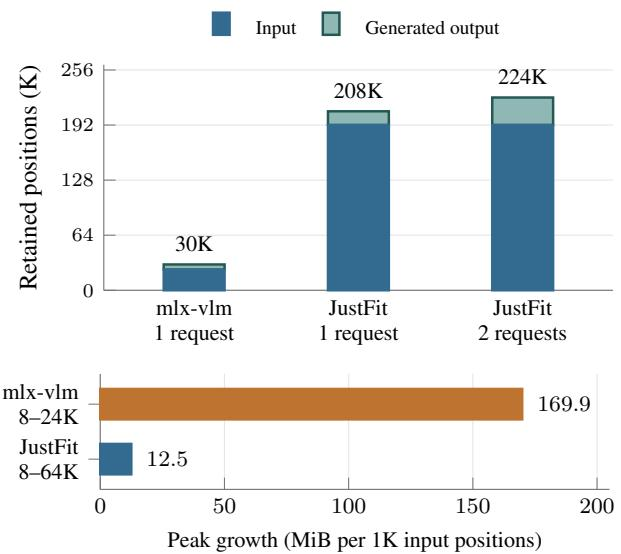
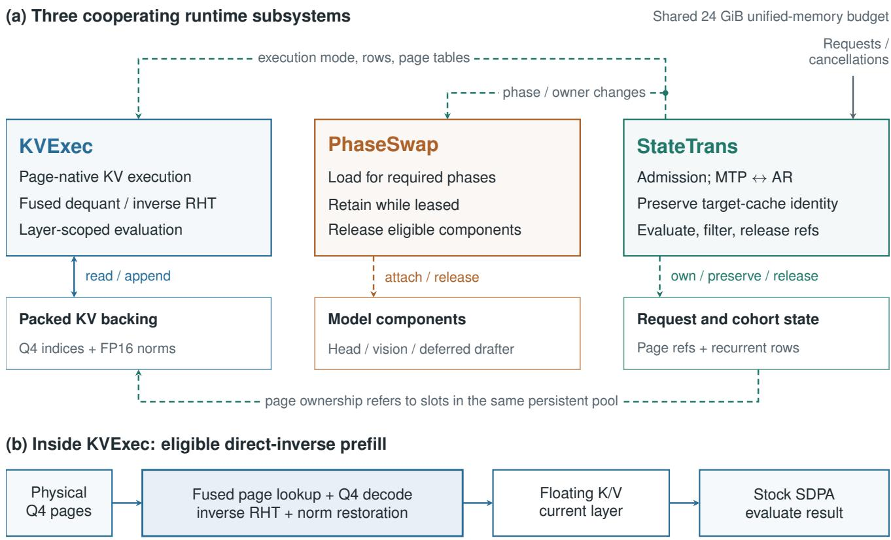
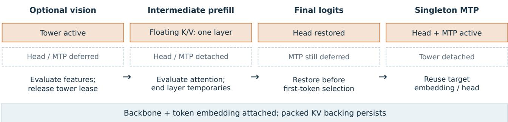
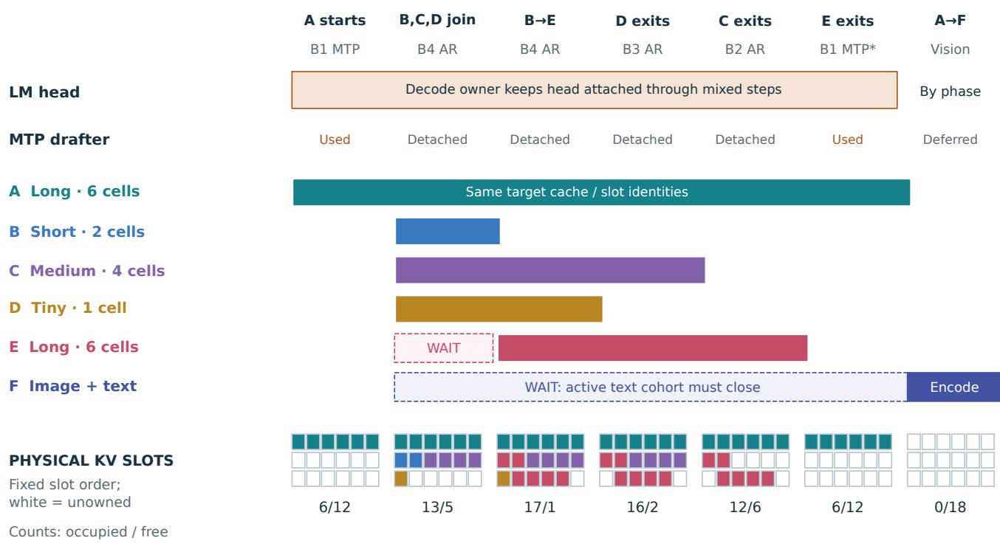
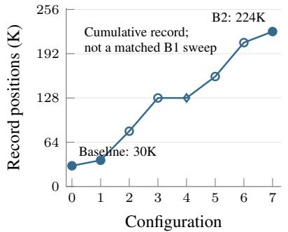
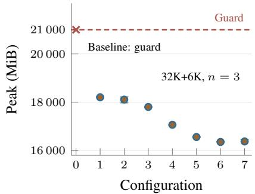
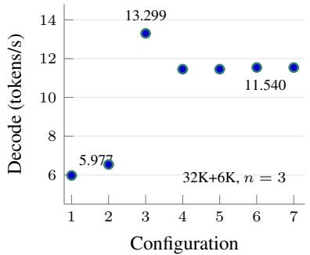

# JustFit: 200K-Token LLM Serving on a 24 GiB Laptop with Just-in-Time State Management

Yuhua Chen

www.yuhuachen.com

Abstract. Capable open-weight models make local coding and reasoning attractive, but their context and execution state strain laptop memory. We present JustFit, an MLX-based inference runtime that combines KVExec for compressed KV execution, PhaseSwap for component residency, and StateTrans for state-preserving serving transitions. These mechanisms fuse reconstruction and coordinate just-in-time materialization and release, independently of model-weight quantization. In full-execution capacity tests on a 24 GiB M4 Pro MacBook running Qwen3.8-27B MXFP4, three independent runs complete 196,608 input and 16,384 output tokens, increasing completed single-request context from the mlx-vlm baseline’s 30,720 positions to 212,992 (6.93×); a separate two-request run retains 229,376 positions in aggregate. In separate performance tests, a 32K-input, 64-output probe reaches 19.11 tokens/s, and a repeated 32K+6K workload has a median peak process footprint of 16,374 MiB. The integrated runtime answers 29 of 30 AIME 2026 problems correctly, showing how compact state and lifetime-aware execution expand local serving capacity while supporting extended generated reasoning.

## 1. Introduction

Open-weight 27B models now make demanding local inference worth pursuing. Qwen3.8-27B reports 89.2 on GPQA Diamond and 90.3 on LiveCodeBench v6, compared with 91.3 and 88.8 for Opus 4.6 Max in its upstream evaluation (Qwen Team, 2026). Deploying such capability on a userowned laptop would give private code and working state a local execution path, without requiring a dedicated accelerator server. The obstacle is no longer simply whether the weights fit: a useful service must also retain context, execute attention, and accommodate changing requests within the same memory budget.

Long context is especially important for repository-scale coding. Source files, tool results, failed attempts, and earlier decisions accumulate over many model calls. Compaction can omit details that later edits require and adds a separate summarization call (Anthropic, 2025; Nous Research, 2026a). Hermes consequently requires at least 64,000 context tokens per active tool-using session (Nous Research, 2026b). Prefix caching avoids recomputing an unchanged history at every turn, but the reusable state must still fit in memory (Zheng et al., 2024). Increasing retained capacity and reducing redundant prefill are therefore complementary requirements.

  
Figure 1. Completed context and its memory cost. Top: under a 21,000-MiB process guard, the mlx-vlm baseline completes 24K+6K for one request; JustFit completes 192K+16K in three independent single-request runs (Table 1) and, separately, 2×(96K+16K) across two concurrent requests (224K aggregate). Bottom: process-peak slopes from separate single-request 64-output probes over the labeled ranges (three successful lengths per runtime). This is system-level growth, not intrinsic KV storage. K = 1,024.

We target a 24 GiB Apple-silicon laptop running MLX. Weight quantizers such as AWQ, and aggressively compressed models such as Bonsai 27B, already address local deployment by reducing static model storage (Lin et al., 2024; PrismML, 2026). Bonsai’s binary and ternary variants use 1.125 and 1.71 effective bits per weight while retaining substantial reported reasoning capability. Our work is orthogonal: we fix the model’s MXFP4 weights and optimize the context and execution state around them. Even ideal four-bit storage for 27 billion weights costs about 12.6 GiB; FP16 KV for this model adds another 12 GiB at 192K input positions, before workspaces and other state.

Low-bit KV is a necessary starting point, not a complete execution strategy. KIVI, KVQuant, and TurboQuant establish representations that preserve useful information at low precision (Liu et al., 2024; Hooper et al., 2024; Zandieh et al., 2025). A compressed cache can nevertheless fit while its reconstruction workspaces do not. Flash-based inference systems address when weights should be available (Alizadeh et al., 2024; Sheng et al., 2023; Du et al., 2025); DwarfStar manages routed experts within an SSD-streaming cache and reserves prefill headroom (DwarfStar Contributors, 2026). PagedAttention and chunked-prefill serving address allocation and interference between requests (Kwon et al., 2023; Agrawal et al., 2024). Near a laptop’s memory limit, these decisions interact: an output head unused by one request’s prefill may still be required by another request’s generation, and a finished request can delay new work if it retains page ownership.

JustFit addresses this interaction with just-in-time state management. Persistent KV remains compact; execution operands are reconstructed near their consumer; model components remain attached while a live owner needs them; and departing requests release state at safe execution boundaries. Figure 2 separates these responsibilities into KVExec, PhaseSwap, and StateTrans. Together they expand usable context without rebuilding the target cache when execution switches between singleton multi-token prediction (MTP) and continuous batching.

The contributions are threefold. First, KVExec integrates TurboQuant-based four-bit storage with page-native access, fused inverse reconstruction, and layer-scoped evaluation. Second, PhaseSwap and StateTrans coordinate component ownership with request admission, speculation, and reclamation. Third, the evaluation establishes completed 200K-scale capacity, repeatability at the single-request limit, throughput across context lengths, and end-to-end reasoning with compressed state. Figure 1 compares the evaluated upstream mlx-vlm baseline with JustFit: single-request retained capacity grows 6.93×, and the separate two-request record grows 7.47× in aggregate.

## 2. Background and Memory Constraints

Autoregressive serving first processes a prompt (prefill), then generates tokens while extending its cached state. In multi-turn use, an unchanged prefix can be restored and only the new suffix processed. MLX shares array storage between CPU and GPU (MLX Contributors, 2026); it does not provide a second, independent host-memory budget. We therefore optimize the simultaneous live set, rather than the size of serialized weights or KV alone:

$$
M _ { \mathrm { l i v e } } ( t ) = W ( t ) + K ( t ) + S ( t ) + X ( t ) + H ( t ) .\tag{1}
$$

Here W is reachable weight storage, K the packed KV backing, S recurrent and speculative state, X execution workspaces, and H other host and allocator storage. Weight compression primarily reduces W; KV encoding reduces K; our execution and lifetime policies control $\breve { X }$ and the overlap among terms. Equation 1 describes logical allocations. Experiments separately measure the operating system’s whole-process physical footprint.

The target model interleaves 16 full-attention layers with 48 Gated DeltaNet layers, using four KV heads of dimension 256 in full attention (Qwen Team, 2026). Recurrent state scales with active requests rather than retained sequence length. For each K or V vector, TQ4 stores 128 bytes of packed indices and a two-byte norm. Across the attention layers, the actual KV payload per retained position is

$$
\beta _ { \mathrm { T Q 4 } } = 1 6 \cdot 2 \cdot 4 \cdot ( 1 2 8 + 2 ) = 1 6 , 6 4 0 \mathrm { B } .\tag{2}
$$

FP16 requires 65,536 bytes per position for the same geometry. At 229,376 positions, these formats occupy $^ { 3 , 6 4 0 }$ MiB and 14,336 MiB, respectively: a 3.94× reduction including norms. The pool uses 256-token pages and remains allocated across request completion and idle periods. Returning page IDs makes slots reusable without reallocating their backing arrays.

Compression must also survive execution. Reconstructing one attention layer’s floating K/V requires

$$
B _ { \mathrm { l a y e r } } ( T , s ) = 2 h T d s ,\tag{3}
$$

where T is retained length and s is bytes per scalar. With $h \ : = \ : 4 , \ : d \ : = \ : 2 5 6$ , and BF16, this is 768 MiB at 192K positions, alongside the packed pool. The design problem is thus to avoid unnecessary intermediate representations and cross-layer retention, not merely to choose a smaller cache datatype.

## 3. JustFit Design

Figure 2 organizes the runtime around three decisions: which representation an operation consumes, which components must remain attached, and which requests own persistent state. The subsystems cooperate through shared page tables, execution modes, and owner leases. Paging is therefore both an execution interface for KVExec and an ownership interface for StateTrans.

## 3.1. KVExec: Just-in-Time KV Execution

KVExec builds on the normalized, rotated MSE branch of TurboQuant (Zandieh et al., 2025). For a nonzero vector x, norm $\rho = \| x \| _ { 2 }$ , unnormalized Hadamard matrix $H _ { d } ,$ , and random-sign diagonal matrix S, encoding and reconstruction are

$$
y = \frac { H _ { d } S } { \sqrt { d } } \frac { x } { \rho } , \qquad \widehat { x } = \widehat { \rho } \frac { S H _ { d } } { \sqrt { d } } c [ z ] .\tag{4}
$$

The indices z select among 16 nonuniform FP32 centroids using midpoint thresholds. The norm is computed in FP32 and stored in FP16; eight indices are packed per U32 word. K and V use distinct random-sign sequences. Appendix A gives the parameters. Our contribution is the page-addressed execution of this representation, not a new quantizer or distortion bound.

  
Figure 2. JustFit system overview. (a) KVExec consumes packed KV, PhaseSwap controls component attachment, and StateTrans controls request ownership and execution modes. Solid arrows carry tensor access; dashed arrows carry policy or ownership changes. (b) Fused direct-inverse prefill reconstructs the current layer’s floating K/V for stock SDPA, followed by eager evaluation. The packed pool remains live.

Fused reconstruction. For prefill, direct-inverse reconstruction reads physical page IDs, unpacks Q4 indices, performs centroid lookup and inverse Hadamard rotation, restores norms, and writes contiguous current-layer K/V in the query dtype. Stock scaled dot-product attention (SDPA) then consumes these operands. Fusing these steps avoids a contiguous packed-row gather and separate unpack, lookup, and rotation arrays. It retains the final floating operands needed by the attention consumer, rather than retaining a floating cache for all layers.

An evaluation boundary completes the attention result before the layer returns, limiting the lifetime of lazy dependencies across layers. This makes fusion and evaluation complementary: fusion removes intermediate representations, while evaluation constrains how long required operands remain live. Equation 3 gives the array payload; SDPA scratch and allocator storage are accounted for by the process measurements.

Execution-specific paths. Single-query decode uses pagenative attention. Multi-query prefill uses direct inverse when the single-row facade and mask are eligible; short verification tiles may use a packed verifier on the alternate dispatch path. Direct inverse precedes the verifier in the evaluated dispatch order. The implementation specializes the Metal kernels to 256-dimensional heads and 256-token pages, with a gather-and-SDPA fallback. This separation lets decode consume compressed state directly while prefill uses an optimized floating-point consumer.

## 3.2. PhaseSwap: Component Residency

A component that is small relative to the model can still consume substantial context headroom. The untied LM head occupies 644.14 MiB, equivalent in payload size to

$$
{ \frac { 6 7 5 , 4 3 0 , 4 0 0 \mathrm { B } } { 1 6 , 6 4 0 \mathrm { B } / \mathrm { p o s i t i o n } } } \approx 4 0 { , } 5 9 1 \mathrm { p o s i t i o n s } .\tag{5}
$$

This equivalence explains why component residency matters near the memory limit. It is not an additional 40K-token allocation: the pool is fixed and the head must return for logits. PhaseSwap instead frees phase-local headroom by detaching the head during intermediate prefill and reconstructing it before the final prefill/first-logits boundary.

Residency follows ownership, not just the operation currently executing. Let $O _ { c } ( t )$ be the owners requiring component c, and $ { a _ { c } } ( t )$ indicate that its evaluated arrays are attached. The lease rule is

$$
| O _ { c } ( t ) | > 0 \implies a _ { c } ( t ) = 1 .\tag{6}
$$

A generation row holds the head lease through mixed prefill/decode. Thus, while A decodes and B prefills, the head remains attached even during B’s intermediate chunks (Figure 3b). This avoids repeated reconstruction at every scheduling step. Release becomes eligible only when the last relevant owner exits.

The evaluated text path keeps the backbone and token embedding attached and materializes the 215.21-MiB MTP predictor only for singleton speculation. Media requests use the same residency principle for the vision tower: while a text decode cohort is active, they remain queued at the phase-cohort boundary; when admitted, a media-embedding lease loads the tower, the resulting media embeddings are evaluated, and the lease releases the tower before ordinary text prefill continues (Figure 3). The predictor references the target embedding and head rather than duplicating them. Component reconstruction is file-backed; we do not assume that every load corresponds to physical SSD traffic.

## 3.3. StateTrans: Preserving State Across Requests

StateTrans separates queue arrival, admission, and execution. Figure 3 uses unequal request lifetimes to make the policy explicit. A queued text peer leaves the incumbent’s mode unchanged; once eligible under page and phase budgets, ad mission waits for a complete speculative round, converts the incumbent to autoregressive (AR) batching, and reuses its target prompt cache. Target KV and Gated DeltaNet state persist, while the singleton drafter is released at the round boundary. A queued media request follows a stricter phase boundary: it is not inserted into an active text decode cohort, so the vision tower can be scoped to media embedding before the next cohort enters ordinary text prefill. This avoids duplicate target state and keeps component residency aligned with the work that can actually use it.

While a generation row is active, the scheduler permits one prefill opportunity per four decode forwards and caps that chunk at 64 tokens (N4/PF64). The work is interleaved on the shared device. After a peer exits, MTP can resume when exactly one row remains, no prompt is pending in the batch, no request was newly admitted in that iteration, and re-promotion is enabled. A capacity-blocked external queue does not by itself prevent re-promotion. The reconstructed drafter binds to the survivor’s existing target state.

Admission and reuse. For an unshared request with prompt length $p _ { i }$ and output budget $o _ { i } ,$ admission reserves

$$
R _ { i } = \left\lceil { \frac { p _ { i } + \operatorname* { m i n } ( o _ { i } , 8 1 9 2 ) } { 2 5 6 } } \right\rceil\tag{7}
$$

physical-page equivalents. Shared prefixes use reference accounting. The scheduler tracks output beyond the guaranteed portion as surplus and permits bounded bypass of a capacity-blocked request. This turns compressed capacity into a resource that can be allocated among requests rather than a per-request maximum alone.

Completion and cancellation follow the same state-release ordering: finish the current generation step, evaluate pending token/cache state and page writes, filter departing rows, then decrement page references. A page ID returns to the free list only when its reference count reaches zero after this boundary. Recurrent rows are filtered with the request state, while the pool backing persists for future cohorts. Algorithm 1 summarizes the ordering.

Algorithm 1 StateTrans serving iteration   
1: Finish the current step (a complete round in MTP)   
2: Evaluate pending state and page writes   
3: Filter completed/cancelled rows; release their references   
4: Select a peer that satisfies page and phase budgets   
5: if a peer is selected and the incumbent uses MTP then   
6: Convert to AR, preserving the target cache   
7: Release the singleton drafter   
8: end if   
9: Admit the peer; interleave prefill with active decode   
10: Retain the head while a generation owner exists   
11: if one eligible row remains with no pending/new prompt then   
12: Restore MTP using the same target cache   
13: end if   
14: On cohort close, release owners; keep pool backing

A later residency-manager refactor places deferred components under a common dependency and lease manager. Unique cohort owners prevent an old finalizer from releasing a new cohort’s lease; closing ends the round iterator and han dles pending target state before releasing the drafter. Scalar MTP statistics survive without keeping predictor weights alive. We evaluate the refactor separately from the earlier component-specific managers; it is an implementation revision of JustFit, not a separate system variant.

## 4. Experimental Setup

Platform and baseline. We evaluate Qwen3.8-27B with a fixed MXFP4 checkpoint on an Apple M4 Pro MacBook with 24 GiB of unified memory. The reference is the evaluated mlx-vlm baseline, before the JustFit KV and serving changes, rather than a JustFit prototype. It completes 24K input plus 6K output, but reaches the memory guard at 32K+6K. We retain this baseline throughout the capacity comparison. The intermediate configurations trace the integration of TQ4, fused reconstruction, segmentation, paging, and lifetime management.

Implementation revisions. All optimized measurements are reported as JustFit. The development and capacity data span several source revisions as the runtime was integrated. The repeated 192K+16K single-request result was collected after a later residency-manager refactor, whereas the tworequest capacity record and short-output memory-growth probes were collected with earlier JustFit revisions. The refactor reorganizes component ownership and cleanup; it does not define a separate system. We therefore do not introduce separate product names or pool non-matched runs across revisions. Run provenance and available source snapshots are retained in the accompanying manifests and Appendix C.2.

Capacity and throughput workloads. Capacity tests measure whether both the requested input and output complete

E waits: 6 needed > 5 free, and B4 is full. B exits: 7 free → E takes 6.

(a) Phase-aware residency: materialize only for the required phase  

(b) Shared serving: unequal requests compete for a finite KV pool  
  
Safe reuse: evaluate writes → release references → reuse zero-reference slots.

Figure 3. Phase-aware residency and shared KV ownership (schematic). (a) Optional vision, prefill, first logits, and singleton MTP. (b) Unequal text requests share a fixed pool; E waits for capacity and a lane, while image request F waits for the text cohort to close. Each cell denotes an equal-capacity page group, not measured bytes. Snapshots follow prefill; sub-cell decode growth is omitted. Output reservations are separate; E admission assumes they pass after B exits. Returned slots do not release pool backing. \*MTP resumes only with one eligible row, no pending prompt, no new admission, and re-promotion enabled. The queue alone need not prevent it. Event spacing is not elapsed time; this is not one measured vision+B4+200K trace.

within a 21,000-MiB process-footprint guard. They use repetitive text, greedy token selection, and EOS suppression to control sequence length; the model still computes each generated token. A checkpoint-local tokenizer and chat template construct each request, and the harness verifies the server’s actual token count. These are full-execution memory stress tests. A separate AIME evaluation uses mathematical problems to test generated reasoning.

We report three performance protocols: short-output probes at 8K, 32K, and 64K input with 64 generated tokens; a fixed 32K+6K workload with three fresh processes per successful development configuration and MTP block size 3; and full-output capacity tests at longer contexts. Each repeated single-request limit attempt uses one lane, a 229,376- position pool, 196,608 input tokens, and 16,384 output tokens. A one-token preflight precedes the timed main request. Main-request inputs have no prefix hit, using isolated

  
(a) Cumulative capacity record

  
(b) Fixed-workload footprint

  
(c) Fixed-workload decode  
Figure 4. Development tradeoffs. Configuration 0 is the mlx-vlm baseline; 1–7 add the mechanisms listed in Table 5. (a) Filled circles are current/matched observations, open circles earlier observations, and the diamond a carried record; workloads differ. (b,c) Unconnected points show medians with min–max whiskers from three fresh processes per successful configuration at fixed B1 32K+6K. The cross marks guard failure, not a completing peak. Configuration 3 remains faster than the final paged system.

Table 1. Independent JustFit single-request limit runs. Every fresh process completes 192K input + 16K output with one lane, identical output tokens, and successful postflight/reuse.
<table><tr><td>Run</td><td>PP (tok/s)</td><td>TG (tok/s)</td><td>Peak (MiB)</td></tr><tr><td>1</td><td>68.311</td><td>4.9853</td><td>20,977</td></tr><tr><td>2</td><td>68.304</td><td>4.9847</td><td>20,975</td></tr><tr><td>3</td><td>68.326</td><td>4.9862</td><td>20,960</td></tr><tr><td>Median</td><td>68.311</td><td>4.9853</td><td>20,975</td></tr></table>

cache directories; prefix-reuse tests are reported separately. Throughout, K denotes 1,024 tokens.

Metrics. The guard samples macOS phys\_footprint approximately every 0.25 seconds and terminates at an integer-MiB sample of at least 21,000. Reported peaks are sampled whole-process measurements; MiB denotes 220 bytes. Prefill throughput divides uncached prompt tokens by summed prefill work time. Singleton decode throughput divides post-first-token outputs by their decode interval. Concurrent throughput sums generated tokens over the common active interval; wall-output throughput additionally includes prefill and non-overlapping work. Repeated results use medians and observed min–max ranges. Subsequentrequest and page-reuse checks run after capacity tests.

## 5. Evaluation

## 5.1. Completed Context Capacity

JustFit expands completed single-request context from the mlx-vlm baseline’s 30,720 positions to 212,992, a 6.93× increase on the same laptop (Figure 1). The request includes 196,608 input positions and all 16,384 generated outputs. JustFit completes this workload in all three independent fresh-process attempts, with identical output-token sequences and successful postflight and page-reuse checks. The median decode rate is 4.985 tokens/s; sampled peaks range from 20,960 to 20,977 MiB. Table 1 reports these repeats.

With two requests, JustFit completes $2 \times ( 9 6 \mathrm { K } { + } 1 6 \mathrm { K } )$ , retaining 229,376 positions in aggregate at 12.55 aggregate tokens/s and a 20,310-MiB peak. A staggered-arrival run completes the same lengths at 12.51 aggregate tokens/s and 20,247 MiB. The aggregate capacity is 7.47× the baseline’s single-request record; this is distinct from the 6.93× single-request comparison. Request shape matters because reconstruction workspace and speculative state depend on the active execution mode as well as total retained length.

Table 2. B1 short-output probes. Each completed run produces 64 tokens; TG excludes the first. Figure 1 fits the completing peaks. ×: guard termination; —: unmeasured.
<table><tr><td rowspan="2">Input</td><td colspan="2">Peak (MiB)</td><td rowspan="2">JustFit TG (tok/s)</td></tr><tr><td>mlx-vlm</td><td>JustFit</td></tr><tr><td>8K</td><td>17,180</td><td>15,746</td><td>24.31</td></tr><tr><td>16K</td><td>18,449</td><td>一</td><td>一</td></tr><tr><td>24K</td><td>19,898</td><td></td><td></td></tr><tr><td>32K</td><td>X</td><td>15,899</td><td>19.11</td></tr><tr><td>64K</td><td>X</td><td>16,433</td><td>14.59</td></tr></table>

A four-request mix also completes: one 128K+12K stream and three 8K+12K streams retain 204,800 positions at 20.78 common-interval aggregate tokens/s. The end-to-end walloutput rate is 11.55 tokens/s. These configurations show that the expanded context can be shared by multiple requests, rather than used only by a dedicated singleton. Appendix B reports the remaining arrival patterns and run-level data.

## 5.2. Throughput and Memory Tradeoffs

Short-output probes measure generation near a fixed context frontier (Table 2). JustFit reaches 24.31, 19.11, and 14.59 tokens/s at 8K, 32K, and 64K input. To separate contextdependent growth from the large process offset, Figure 1 also fits $F _ { \mathrm { p e a k } } ^ { - } ( L ) = a + g ( \bar { L ^ { \prime } } | \bar { 1 0 2 4 } )$ to each runtime’s successful 64-output probes. The fitted growth g is 169.9 MiB per 1K positions for mlx-vlm over 8–24K, versus 12.5 for JustFit over 8–64K. The intercept is a fit parameter, not a measured static-memory component. These are processlevel slopes over different observed ranges, not the KV-array compression ratio. JustFit’s pool is sized per probe.

The fixed 32K+6K study isolates workload length while following the runtime’s development (Figure 4b,c). The mlx-vlm baseline reaches the guard. The first completing TQ4+MTP configuration attains 5.98 tokens/s at a median peak of 18,203 MiB; the final configuration attains 11.54 tokens/s at 16,374 MiB. This is a 1.93× decode improvement and 1,829 MiB lower peak relative to the first completing configuration. Median prefill throughput rises from 110.84 to 115.00 tokens/s. The baseline failure has no completing throughput to include in this ratio.

The progression exposes a real tradeoff. Segmented KV reaches 13.30 tokens/s, faster than the later paged configurations, whereas paging and lifecycle changes reduce memory and support shared serving state. The cumulative record rises to 229,376 positions, but the individual changes are not one-factor ablations. Likewise, the 19.11-token/s short probe and 11.54-token/s sustained result differ in output horizon and runtime configuration. They characterize different operating points rather than a context-independent speed.

## 5.3. Prefix Reuse and Online Transitions

Prefix reuse is the connection between retained capacity and incremental interaction. In the exact-prefix test, a new request restores 16,383 cached positions and prefills one new token in 82.314 ms while an incumbent decodes. This is a measured restore/prefill interval, not a full-turn latency. It demonstrates that an unchanged prefix can be reused instead of recomputed. Cold ingestion, cached restoration, and new-suffix processing are therefore distinct operations in the evaluated server.

The mixed-arrival test verifies the text transitions in Figure 3: head reconstruction, MTP-to-AR transition, peer prefill, row removal, and MTP re-promotion with the same target cache. It uses a 32K pool and two active rows. Three short requests finish before a blocked large request emits its first token; two are admitted before that large request starts prefill. The first two short streams have P99 inter-token gaps of 89.8 and 89.2 ms, compared with 600 ms for the lead stream. A separate cancellation test disconnects a client after 128 stream events; a survivor and a newcomer each complete 512 tokens, and the cancelled row’s pages are reused.

The component trace records one head restore of 0.151 seconds and an MLX-active allocation decrease of 644.14 MiB on one unload. These measurements complement the ownership mechanism: the head is retained across mixed steps rather than reconstructed for every chunk. The measured transitions and successful page reuse establish the tested lifecycle behavior without requiring the backing pool to be freed and reallocated between cohorts.

## 5.4. Reasoning with Compressed State

The integrated TQ4 runtime answers 29 of 30 AIME 2026 problems correctly, generating 696,834 tokens across the suite at 15.04 token-weighted tokens/s (Table 3). The maximum recorded process footprint is 19,043 MiB. This provides end-to-end evidence that the compressed representation supports extended generated mathematical reasoning, beyond synthetic capacity tests. The uniform INT8 comparison answers 28 of 30 at 14.64 token-weighted tokens/s.

Table 3. AIME 2026 on the MacBook. TG is token-weighted across generated reasoning. INT8 finishes the remaining questions on fresh servers after a guard event; protocol details are in Appendix C.
<table><tr><td>KV format</td><td>Correct</td><td>Output tokens</td><td>TG (tok/s)</td></tr><tr><td>Paged TQ4</td><td>29/30</td><td>696,834</td><td>15.04</td></tr><tr><td>Uniform INT8</td><td>28/30</td><td>680,071</td><td>14.64</td></tr></table>

Both arms reach an output ceiling on one problem; their other sampled trajectories differ. We use the result as an integrated reasoning check, not an isolated quantizer ranking. A separate Bonsai 27B run with paged TQ4 answers 26/30 on a MacBook Air, illustrating compatibility with more aggressive weight compression on another host.

Residency-manager refactor. Paired short tests compare the component-specific and common-manager implementations. Decode changes by −0.02% for B1, −0.85% for staggered B2, and +4.09% for B4; output-token sequences agree and postflight/reuse checks pass in every pair. These are regression checks between two optimized implementations, not a PhaseSwap-off/on ablation. The three independent 192K+16K runs above were collected after the refactor and show that the refactored implementation also completes the long-context workload. Appendix B.4 gives the paired measurements.

## 6. Related Work

Memory-constrained inference. FlexGen jointly places and compresses weights, activations, and KV across GPU, CPU, and disk for high-throughput inference (Sheng et al., 2023). LLM in a Flash exploits activation sparsity, reuse windows, and data layout to reduce flash traffic (Alizadeh et al., 2024). FlexInfer combines prefetching, memory locking, and selective tensor retention for on-device inference (Du et al., 2025). PowerInfer-2 and ActiveFlow exploit execution-dependent active weights and I/O scheduling (Xue et al., 2024; Jia et al., 2025). DwarfStar’s SSDstreaming implementation maintains a bounded routedexpert cache and reserves memory for context, prefill, and sessions (DwarfStar Contributors, 2026). JustFit addresses a complementary setting: a resident dense backbone, compact hybrid-model state, and selected components whose lifetimes must track online requests. It introduces no weight sparsification or retraining.

Quantization and attention execution. AWQ and Bonsai reduce weight storage; KIVI and KVQuant address the growing KV cache (Lin et al., 2024; PrismML, 2026; Liu et al., 2024; Hooper et al., 2024). TurboQuant supplies the rotated-vector quantization framework used here (Zandieh et al., 2025). FlashAttention reduces attention I/O through tiling (Dao et al., 2022). The closest Apple-silicon execution precedent, Open-TQ-Metal, combines compressed-cache decode with floating K/V and MLX SDPA for prefill (Vegasena, 2026). KVExec connects physical-page addressing to fused inverse reconstruction and an explicit evaluation boundary, so required floating operands do not turn into persistent second representations across layers.

Serving and persistent context. Orca introduces iterationlevel scheduling, PagedAttention provides block-based KV management, and Sarathi-Serve schedules chunked prefill alongside decode (Yu et al., 2022; Kwon et al., 2023; Agrawal et al., 2024). SGLang uses prefix sharing for structured model programs, while vllm-mlx implements native Apple-silicon batching and caching (Zheng et al., 2024; Barrios, 2026). Agent Memory Below the Prompt persists quantized per-agent KV state for reuse (Shkolnikov, 2026). JustFit coordinates such persistent state with component leases and transitions between singleton speculation and multi-row AR. It builds on, rather than originates, paging, prefix caching, or speculative decoding (Leviathan et al., 2023).

## 7. Discussion and Limitations

Cold ingestion versus incremental interaction. The 192K cold-input experiment deliberately exercises a full cache build followed by 16K generated tokens. It establishes a capacity boundary, not the expected ingestion cost of every agent turn. A prefix-reusing session retains or restores unchanged state and processes only the new suffix. For a cached prefix of length L and a suffix of length ∆, the input-side work is

$$
T _ { \mathrm { i n p u t } } = T _ { \mathrm { l o o k u p / r e s t o r e } } ( L ) + T _ { \mathrm { p r e f i l l } } ( \Delta \mid L ) ,\tag{8}
$$

not a new cold prefill of L + ∆ positions. This makes retained capacity useful across rounds of tool results and edits, as the measured exact-prefix gate demonstrates (Section 5.3). Prefix retention also has a cost: the suffix still attends to the retained history, and evicted or changed prefixes may require restoration or recomputation.

Speed remains the principal practical limit at extreme context. The repeated single-request limit runs spend about 48 minutes on cold prefill and generate at 4.99 tokens/s; full attempts take about 103 minutes. These costs favor asynchronous ingestion and repeated reuse of a stable prefix. The 82.314-ms prefix test is not a 200K warm-latency measurement, and suffix size and scheduling load remain important. A deployment needs to select context and output budgets for its latency requirements rather than defaulting to the capacity limit.

Complementary hardware progress. Apple’s MLX evaluation reports 3.33–4.06× lower time to first token on 24 GB M5 versus base-M4 systems at 4,096 input tokens, using GPU Neural Accelerators through Metal 4 (Apple Machine Learning Research, 2025). BaseRT likewise targets matrixheavy prefill while retaining bandwidth-oriented decode paths (Waschkowski et al., 2026). Faster prefill and more efficient weight representations complement JustFit’s memory management: they reduce the time and static storage needed to use a larger context. The benefit for this 27B workload requires measurement on the newer hardware; the published base-M4 ratios are not predictions for our M4 Pro results.

Scope. This is a single-platform systems study. The smallest sampled guard margin is 23 MiB, so an everyday service requires more reserve than the limit configuration. Repetitive capacity inputs and AIME reasoning answer different evaluation questions; neither measures repository-level task success or compaction frequency. The development study combines changes rather than isolating each mechanism, and no matched PhaseSwap-off/on test is reported. Privacy, cost, and continuous availability motivate local deployment but depend on workflow controls, power consumption, and sustained recovery behavior beyond this evaluation.

## 8. Conclusion

JustFit makes a quantized 27B model executable beyond 200K retained positions on a 24 GiB laptop. Its just-intime design couples compressed KV execution, component residency, and state-preserving request transitions. Three independent single-request runs complete 212,992 positions, 6.93× the evaluated mlx-vlm baseline record; a separate two-request configuration reaches 229,376 in aggregate. Moderate-context throughput, prefix reuse, online state transitions, and AIME reasoning show how this capacity participates in a serving system. Weight compression and faster prefill hardware can build on the same memory-management foundation to improve the practicality of user-owned inference.

## Impact Statement

Local inference can increase control over sensitive inputs and enable reuse of existing hardware. Real privacy and energy outcomes depend on the surrounding workflow and deployment; this study evaluates the inference system rather than those outcomes.

## Acknowledgments

Codex assisted with runtime implementation, test orchestration, and data organization. ChatGPT assisted with manuscript editing, LaTeX, and visualization code. The author is responsible for the implementation, experiments, and manuscript.

## References

A. Agrawal, N. Kedia, A. Panwar, J. Mohan, N. Kwatra, B. S. Gulavani, A. Tumanov, and R. Ramjee. Taming throughput-latency tradeoff in LLM inference with Sarathi-Serve. In 18th USENIX Symposium on Operating Systems Design and Implementation. USENIX Association, 2024.

K. Alizadeh, S. I. Mirzadeh, D. Belenko, S. Khatamifard, M. Cho, C. C. Del Mundo, M. Rastegari, and M. Farajtabar. LLM in a flash: Efficient large language model inference with limited memory. In Proceedings of the 62nd Annual Meeting of the Association for Computational Linguistics (Volume 1: Long Papers), pages 12562–12584. Association for Computational Linguistics, 2024. doi: 10.18653/v1/2024.acl-long.678.

Anthropic. Effective context engineering for AI agents, September 2025. Accessed September 14, 2026.

Apple Machine Learning Research. Exploring LLMs with MLX and the neural accelerators in the M5 GPU, November 2025. Accessed September 14, 2026.

W. Barrios. Native LLM and MLLM inference at scale on Apple Silicon, 2026.

T. Dao, D. Y. Fu, S. Ermon, A. Rudra, and C. Ré. FlashAttention: Fast and memory-efficient exact attention with IO-awareness. In Advances in Neural Information Processing Systems, volume 35, pages 16344–16359, 2022.

H. Du, S. Wu, A. Kharlamova, N. Guan, and C. J. Xue. FlexInfer: Breaking memory constraint via flexible and efficient offloading for on-device LLM inference. In Proceedings ofthe 5th Workshop on Machine Learning and Systems, pages 56–65. ACM, 2025. doi: 10.1145/3721146.3721961.

DwarfStar Contributors. DwarfStar: SSD streaming and models larger than RAM, 2026. Accessed September 14, 2026.

C. Hooper, S. Kim, H. Mohammadzadeh, M. W. Mahoney, Y. S. Shao, K. Keutzer, and A. Gholami. KVQuant: Towards 10 million context length LLM inference with KV cache quantization. In Advances in Neural Information Processing Systems, volume 37, 2024.

F. Jia, Z. Wu, S. Jiang, H. Jiang, Q. Zhang, Y. Yang, Y. Liu, J. Ren, D. Zhang, and T. Cao. Scaling up on-device LLMs via activeweight swapping between DRAM and flash, 2025.

W. Kwon, Z. Li, S. Zhuang, Y. Sheng, L. Zheng, C. H. Yu, J. E. Gonzalez, H. Zhang, and I. Stoica. Efficient memory management for large language model serving with PagedAttention. In Proceedings ofthe 29th Symposium on Operating Systems Principles, pages 611–626, 2023. doi: 10.1145/3600006.3613165.

Y. Leviathan, M. Kalman, and Y. Matias. Fast inference from transformers via speculative decoding. In Proceedings of the 40th International Conference on Machine Learning, volume 202 of Proceedings ofMachine Learning Research, 2023.

J. Lin, J. Tang, H. Tang, S. Yang, W.-M. Chen, W.-C. Wang, G. Xiao, X. Dang, C. Gan, and S. Han. AWQ: Activationaware weight quantization for on-device LLM compression and acceleration. In Proceedings ofMachine Learning and Systems, volume 6, 2024.

Z. Liu, J. Yuan, H. Jin, S. Zhong, Z. Xu, V. Braverman, B. Chen, and X. Hu. KIVI: A tuning-free asymmetric 2bit quantization for KV cache. In Proceedings of the 41st International Conference on Machine Learning, volume 235 of Proceedings of Machine Learning Research, 2024.

MLX Contributors. Unified memory, 2026. Accessed September 14, 2026.

Nous Research. Hermes Agent configuration: Context compression, 2026a. Accessed September 14, 2026.

Nous Research. Hermes Agent: LLM and model providers, 2026b. Accessed September 14, 2026.

PrismML. Announcing Bonsai 27B: The first 27b-class model to run on a phone, July 2026. Accessed September 14, 2026.

Qwen Team. Qwen3.8-27B model card, 2026. Accessed September 14, 2026.

Y. Sheng, L. Zheng, B. Yuan, Z. Li, M. Ryabinin, B. Chen, P. Liang, C. Ré, I. Stoica, and C. Zhang. FlexGen: High-throughput generative inference of large language models with a single GPU. In Proceedings of the 40th International Conference on Machine Learning, volume 202 of Proceedings ofMachine Learning Research, pages 31094–31116, 2023.

Y. P. Shkolnikov. Agent memory below the prompt: Persistent Q4 KV cache for multi-agent LLM inference on edge devices, 2026.

S. Vegasena. Open-TQ-Metal: Fused compressed-domain attention for long-context LLM inference on Apple Silicon, 2026.

F. Waschkowski, P. Rathnayaka, and L. Wesemann. BaseRT: Advancing best-in-class LLM inference with Apple M5 neural accelerators, 2026.

Z. Xue, Y. Song, Z. Mi, X. Zheng, Y. Xia, and H. Chen. PowerInfer-2: Fast large language model inference on a smartphone, 2024.

G.-I. Yu, J. S. Jeong, G.-W. Kim, S. Kim, and B.-G. Chun. Orca: A distributed serving system for transformer-based generative models. In 16th USENIX Symposium on Operating Systems Design and Implementation, pages 521–538. USENIX Association, 2022.

A. Zandieh, M. Daliri, M. Hadian, and V. Mirrokni. TurboQuant: Online vector quantization with near-optimal distortion rate, 2025.

L. Zheng, L. Yin, Z. Xie, C. Sun, J. Huang, C. H. Yu, S. Cao, C. Kozyrakis, I. Stoica, J. E. Gonzalez, C. Barrett, and Y. Sheng. SGLang: Efficient execution of structured language model programs, 2024.

## A. Implementation and Benchmark Details

## A.1. Codec and Attention Dispatch

The evaluated geometry uses 256-dimensional heads, four KV heads per full-attention layer, 16 full-attention layers, and 256-token pages. The 48 recurrent layers maintain request-local state. Table 4 specifies the TQ4 reconstruction path; the codebook construction and random-sign rule make the representation reproducible without introducing a learned quantizer.

Table 4. TQ4 representation and specialized direct-inverse kernel parameters.
<table><tr><td>Parameter</td><td>Value or procedure</td></tr><tr><td>Quantizer</td><td>MSE scalar quantization after normalization and randomized Hadamard rotation; K/V use four bits each.</td></tr><tr><td>Per-vector storage</td><td>32 U32 words (eight indices per word) and one FP16 norm computed from an FP32 norm.</td></tr><tr><td>Codebook</td><td>16 FP32 centroids for density proportional to  $( 1 - x ^ { 2 } ) ^ { ( d - 3 ) / 2 }$ </td></tr><tr><td>Construction</td><td>32,768-point grid on  $[ - 1 + 1 0 ^ { - 6 } , 1 - 1 0 ^ { - 6 } ] ;$  quantile initialization; at most 100 centroid updates; stop when maximum change is below  $1 0 ^ { - 6 } .$ </td></tr><tr><td>Random signs</td><td>NumPy default_rng  $( \mathsf { s e e d } ~ + ~ \mathsf { d } { \star } 7 9 1 9 )$  , sampling ±1; K/V default seeds are 0/1.</td></tr><tr><td>Quantization Inverse kernel</td><td>Midpoint thresholds between ordered centroids, with strict &gt; comparisons.</td></tr><tr><td></td><td>Two radix-16 stages, 16-thread group, 256-element threadgroup float buffer; sequential K and V processing.</td></tr><tr><td>Launch</td><td>Grid (16, T, h); threadgroup (16, 1, 1).</td></tr><tr><td>Outputs</td><td>Contiguous K/V, each [1, h, T, 256], in the query dtype; consumed by MLX SDPA.</td></tr><tr><td>Evaluation</td><td>Evaluate the attention result before returning from the eager-release branch.</td></tr></table>

Single-query attention selects page-native decode. Multi-query attention requires a single-row prefill facade. Direct inverse is selected first when enabled and the mask is a causal string or has compatible array shape. Otherwise, an enabled packed verifier accepts causal-string masks and query lengths 2–4. The remaining fallback gathers the logical packed row for helper prefill, or dequantizes for SDPA. Array-mask eligibility is a shape check. The specialized Metal kernel requires the stated head and page dimensions.

## A.2. Component and Cache Storage

The embedding and untied head each have U32 packed weights of shape [248320, 640] and U8 scales of shape [248320, 160], totaling 644.140625 MiB per matrix. The MTP predictor has 215.206 MiB of separate checkpoint payload and references the target vocabulary matrices. The text-only policy excludes the vision component after setup. These checkpoint sizes describe component payload, while the process measurements include execution and allocation effects.

For each K or V vector, four KV heads store 512 bytes of packed indices and 8 bytes of norms. Across K/V and 16 attention layers, the result is 16,640 bytes per retained position. The 229,376-position pool therefore has 3,640 MiB of backing arrays. Free-list growth returns page IDs for reuse within this allocation. Recurrent state is separate; the configured BF16 recurrent arrays imply approximately 74.8 MiB per request row before other metadata.

## A.3. Controlled Capacity Protocol

The capacity request repeats the word measurement and asks the model to keep emitting it until the output limit. The checkpoint-local tokenizer applies the chat template, adjusts repetitions to the target length, and checks the actual server prompt count. Temperature is zero, streaming is enabled, and the capacity-only stopping control suppresses EOS. Token IDs 248044 and 248046 receive a logit bias of −10,000 in the inspected requests. This controls execution length without replaying a fixed output sequence. A one-token preflight precedes the timed main request.

Main capacity requests use a fresh isolated prefix-cache directory and no main-request prefix hit. Prefix reuse is enabled in its separate gate. B1 limit tests use one lane and a 229,376-position pool; simultaneous and staggered B2 tests use two lanes, with the latter starting the peer after the first stream’s initial token. The controlled 32K+6K study uses the same corpus helper and EOS suppression across configurations. This repeated workload is useful for memory stress and execution comparisons; acceptance rates and throughput are workload-dependent.

## B. Additional Evaluation Results

## B.1. Development Configurations

Table 5 identifies the changes behind Figure 4. The capacity column records achieved points, including earlier workload shapes and one carried record. The fixed-workload columns report a separate 32K+6K protocol. The baseline’s cross denotes a guard failure, not a completed run or an operating-system out-of-memory event.

Table 5. Development configurations. Peak, PP, and TG in the final three columns are medians for the fixed B1 32K+6K study (n = 3 for each successful configuration). Capacity records are not a matched single-request sweep.
<table><tr><td>ID</td><td>Configuration</td><td>Record positions</td><td>Record type</td><td>Peak (MiB)</td><td>PP (tok/s)</td><td>TG (tok/s)</td></tr><tr><td>0</td><td>mlx-vlm baseline</td><td>30,720</td><td>Current</td><td>21,000 ×</td><td></td><td></td></tr><tr><td>1</td><td>TQ4 + MTP</td><td>38,912</td><td>Matched</td><td>18,203</td><td>110.84</td><td>5.98</td></tr><tr><td>2</td><td>Fused dequant</td><td>81,920</td><td>Earlier</td><td>18,109</td><td>115.86</td><td>6.54</td></tr><tr><td>3</td><td>Segmented KV</td><td>131,072</td><td>Earlier</td><td>17,804</td><td>115.88</td><td>13.30</td></tr><tr><td>4</td><td>Paged KV + attention</td><td>131,072</td><td>Carried</td><td>17,065</td><td>110.55</td><td>11.45</td></tr><tr><td>5</td><td>Page-native MTP + lifecycle</td><td>162,816</td><td>Earlier</td><td>16,557</td><td>110.55</td><td>11.45</td></tr><tr><td>6</td><td>Eager release + scheduling</td><td>212,992</td><td>Earlier</td><td>16,353</td><td>108.86</td><td>11.54</td></tr><tr><td>7</td><td>Direct-inverse prefill</td><td>229,376</td><td>Current</td><td>16,374</td><td>115.00</td><td>11.54</td></tr></table>

Table 6. Observed min–max ranges for the fixed-workload repeats. The independently computed metric medians need not belong to the same run.
<table><tr><td>Configuration</td><td>Peak (MiB)</td><td>PP (tok/s)</td><td>TG (tok/s)</td></tr><tr><td>1</td><td>18,188-18,234</td><td>110.798-110.860</td><td>5.972–5.978</td></tr><tr><td>2</td><td>17,971–18,218</td><td>115.838-115.865</td><td>6.540–6.543</td></tr><tr><td>3</td><td>17,793–17,807</td><td>115.880-115.889</td><td>13.293-13.308</td></tr><tr><td>4</td><td>17,040–17,092</td><td>110.341-110.565</td><td>11.448-11.457</td></tr><tr><td>5</td><td>16,544–16,559</td><td>110.537–110.558</td><td>11.452–11.453</td></tr><tr><td>6</td><td>16,351–16,379</td><td>108.595–108.865</td><td>11.541-11.548</td></tr><tr><td>7</td><td>16,362–16,457</td><td>114.997–115.001</td><td>11.536-11.542</td></tr></table>

## B.2. Repeated Single-Request Limit Runs

Each fresh process completes 196,608 uncached input positions and 16,384 generated tokens, using one lane. All three output-token sequences agree, and all postflight/page-reuse checks pass. The high-water mark is 13,312 layer-pages: at 16 attention layers and 256 positions per page, this corresponds to 212,992 retained positions. The configured capacity of 14,336 layer-pages corresponds to 229,376 pool positions. Table 7 reports this fresh-process cohort. A prior single JustFit observation at the same workload is retained in the archived provenance and is not pooled with these repeats.

Table 7. Independent JustFit single-request limit runs. PP uses uncached tokens over prefill work time; TG uses 16,383 post-first-token outputs. Wall TPS includes all 16,384 outputs and the full reported request interval. Margin is the sampled distance below the 21,000-MiB guard.
<table><tr><td>Run</td><td>PP (tok/s)</td><td>TG (tok/s)</td><td>Wall (s)</td><td>Wall TPS</td><td>Peak (MiB)</td><td>Margin (MiB)</td></tr><tr><td>1</td><td>68.311</td><td>4.9853</td><td>6,165.164</td><td>2.6575</td><td>20,977</td><td>23</td></tr><tr><td>2</td><td>68.304</td><td>4.9847</td><td>6,165.963</td><td>2.6572</td><td>20,975</td><td>25</td></tr><tr><td>3</td><td>68.326</td><td>4.9862</td><td>6,164.015</td><td>2.6580</td><td>20,960</td><td>40</td></tr></table>

## B.3. Concurrent Workloads

Table 8. Additional JustFit capacity runs. Each row completes all outputs and passes postflight/reuse. TG is common-interval aggregate, whereas wall TPS includes prefill and non-overlapping phases.
<table><tr><td>Workload / arrival</td><td>Positions</td><td>PP</td><td>TG</td><td>Wall TPS</td><td>Peak (MiB)</td></tr><tr><td> $\mathbf { B } 2 2 \times ( 9 6 \mathbf { K } + 1 2 \mathbf { K } )$  , simultaneous</td><td>221,184</td><td>90.51</td><td>12.72</td><td></td><td>20,195</td></tr><tr><td>B2 2×(96K+12K), staggered</td><td>221,184</td><td>90.52</td><td>12.81</td><td></td><td>20,156</td></tr><tr><td>B2 2×(96K+16K), simultaneous</td><td>229,376</td><td>90.44</td><td>12.55</td><td></td><td>20,310</td></tr><tr><td>B2 2×(96K+16K), staggered</td><td>229,376</td><td>90.44</td><td>12.51</td><td></td><td>20,247</td></tr><tr><td>B4 96K+12K; 3×(8K+4K)</td><td>147,456</td><td>91.25</td><td>23.41</td><td>8.16</td><td>19,178</td></tr><tr><td>B4 128K+12K; 3×(8K+4K)</td><td>180,224</td><td>83.35</td><td>21.54</td><td>6.57</td><td>20,236</td></tr><tr><td> $\mathrm { B } 4 ~ 1 2 8 \mathrm { K } { + } 1 2 \mathrm { K } ; 3 { \times } ( 8 \mathrm { K } { + } 1 2 \mathrm { K } )$ </td><td>204,800</td><td>83.16</td><td>20.78</td><td>11.55</td><td>20,623</td></tr></table>

## B.4. Residency-Manager Refactor

Table 9 compares one final pair per workload before and after the common-manager refactor. The staggered B2 test exercises MTP-to-AR-to-MTP transitions. All per-stream outputs agree, and postflight/page-reuse checks pass. The B4 pair’s 225-MiB peak difference is not an isolated memory saving: another pre-refactor observation already reached 19,159 MiB. Neither arm disables PhaseSwap.

Table 9. Short paired regression. Each arrow is component-specific manager → common residency manager.
<table><tr><td>Workload</td><td>PP (tok/s)</td><td>TG (tok/s)</td><td>Peak (MiB)</td></tr><tr><td>B1 24K+512</td><td>118.757 → 118.410</td><td>19.246 → 19.243</td><td> $1 8 , 8 3 2  1 8 , 8 3 0$ </td></tr><tr><td>B4  $4 \times ( 2 \mathrm { K } + 5 1 2 )$ </td><td>121.538 → 122.960</td><td>37.762 → 39.305</td><td> $1 9 , 3 8 2  1 9 , 1 5 7$ </td></tr><tr><td>B2 2K each, 512/128 output</td><td>125.822 → 125.399</td><td>30.367 → 30.110</td><td> $1 9 , 0 0 1 \to 1 9 , 0 0 3$ </td></tr></table>

## C. Reasoning Evaluation and Reproducibility

## C.1. AIME Protocol and Error Cases

The paired MacBook evaluation uses an EvalScope-style prompt requesting step-by-step reasoning and repeating the instruction to place the final answer in \boxed{}. Sampling uses temperature 1, top-p 0.95, top-k 20, and seed 20260811, with the runtime’s xhigh reasoning setting. Both arms enable MTP with draft block size 3 and disable prefix caching. Each arm reports one seeded evaluation over the same 30 problems.

Output ceilings are 71,680 tokens for TQ4 Q1–Q14 and 98,304 for TQ4 Q15–Q30; INT8 uses 71,680 throughout. TQ4 uses the page-backed storage and attention path, whereas INT8 uses the existing non-paged reference path. Together with the different ceilings and recovery procedure below, this makes the comparison an integrated capability check rather than an isolated KV-bit-width experiment.

Paged TQ4 completes the 30-problem AIME 2026 evaluation with 29 correct answers. The only failure reaches its 98,304- token output ceiling. Uniform INT8 answers 28/30; after a 21,153-MiB guard event following Q10, Q11–Q30 run on fresh servers. Both arms reach an output ceiling on Q15. On Q19, INT8 returns 271, omitting the one-digit cases 1–8, wherea TQ4 returns 279. This is a trajectory-level difference, not evidence that TQ4 is generally more accurate.

The TQ4 suite produces 696,834 output tokens at 15.04 token-weighted tokens/s; the arithmetic mean of per-question decode rates is 17.59. INT8 produces 680,071 at 14.64 token-weighted tokens/s, with a mean per-question rate of 17.84. The different denominators should not be interchanged. The separate MacBook Air/Bonsai run answers 26/30, producing 1,057,606 output tokens at 5.22 token-weighted tokens/s. Host suspension between its records excludes suite wall time from the comparison. These capability runs are distinct from the repetitive capacity tests and from the later single-request repetitions.

## C.2. Reproducibility Materials

The author’s public mlx-vlm fork provides the production CB branch, a pinned historical single-request source snapshot, and a pinned later residency-manager source snapshot used for the three independent limit runs. These are implementation revisions of the same JustFit system, not separate system variants. The branch is an evolving code entry point, not a fixed experimental version.

Archived manifests preserve request hashes and available source-file fingerprints; they do not recover every historical checkout or working-tree state, including the B2 runs. The upstream model revision and historical checkpoint byte identity remain unverified. Current checkpoint hashes are recorded separately.

The recorded converted-checkpoint label is Qwen3.8-27B-mxfp4-mtp-vq8, using checkpoint-local tokenizer and chat-template files. This label identifies the local artifact, not a public model revision. The retained records establish the M4 Pro / 24 GiB platform but do not establish a complete per-run inventory of GPU core count, macOS, Python, and MLX versions across the historical cohorts. Consequently, the current software environment is not substituted for missing historical metadata. This limits exact reproduction of the reported throughput and guard margins.

The manuscript source package includes plot data, figure sources, and validation scripts. Additional run records and launch configurations are retained in a separate evidence archive. A public benchmark companion is still being prepared.