# Layers, Sinks, and Scaling: Adaptive Evidence Selection for Multimodal Large Language Models

Zhenbin Wang, Lei Zhang∗, Lituan Wang, Wei Huang, Yan Wang, Zhenwei Zhang

Sichuan University

wangzhenbin@stu.scu.edu.cn

## Abstract

Multimodal large language models (MLLMs) can answer knowledge-intensive visual questions by combining visual evidence from images with facts retrieved from external sources. However, MLLMs may overlook relevant evidence in both modalities, attending weakly to the textual sentences or visual regions needed for the correct answer. Recent eforts address this by highlighting retrieved text and marking visual regions before generation, but apply a fixed, one-shot policy that cannot adapt to three sources of variation: whether highlighting is necessary, how much evidence diferent examples require, and when diferent textual evidence becomes relevant as the answer unfolds. We introduce Adaptive Relevance-guided Evidence Allocation (AREA), a training-free inference-time method that formulates evidence highlighting as adaptive allocation. AREA generates a single probe token to read visual and textual relevance from fixed backbone layers, then makes three decisions: i) whether to intervene (controlled by natural attention coverage and visual sink contamination), ii) how much evidence to expose (determined by relevance entropy), and iii) when to refresh text during generation (triggered by causal context-attention peaks). Across four KB-VQA and seven standard multimodal benchmarks with nine frozen MLLM checkpoints, establishes the best performance among training-free highlighting methods.

## 1 Introduction

Knowledge-based visual question answering (KB-VQA) requires multimodal large language models (MLLMs) to combine localized visual cues with facts retrieved from external knowledge sources (Chen et al. 2023; Mensink et al. 2023). Supplying both modalities, however, does not solve the task: the model must still determine which textual statements and image regions are jointly needed to answer the question. Retrieved passages mix critical facts with irrelevant or weakly related content (Cafagni et al. 2024), while images contain many salient objects and regions beyond the answer-bearing area (Kang et al. 2025). Consequently, the model can overlook a required sentence, focus on the wrong visual region, or fail to connect complementary evidence across modalities, producing an incorrect answer even when all required evidence is available.

The challenge therefore lies not only in obtaining relevant evidence, but also in ensuring that the generator uses evidence already present in its input. While retrieval and filtering methods improve which external content reaches the model (Hong et al. 2025; Yan and Xie 2024; Yang et al. 2025; Ye et al. 2026), a complementary line of work targets evidence utilization at inference time. Recent trainingfree methods improve evidence utilization through explicit highlighting: SelfElicit highlights relevant context sentences, while Look Twice (LoT) extends the intervention to both retrieved text and visual regions (Liu et al. 2025; Morini et al. 2026). By converting selected evidence into sentence markers and visual crops, such methods make latent evidence explicit without updating model parameters. However, they instantiate highlighting as a fixed, one-shot policy: the same number of sentences and the same visual extent are selected once before answer generation.

This design overlooks variation across examples and generation steps, as illustrated in Figure 1. In some cases, the model already uses the relevant evidence, so additional highlighting is unnecessary. The required evidence also varies in scope: one sentence or a compact image region may suffice for some questions, whereas others depend on multiple sentences or broader visual context. As the answer unfolds, the relevant textual evidence can change, with later tokens depending on context that was not selected before decoding. Static evidence allocation therefore cannot match heterogeneous and time-varying demand. An efective policy must decide whether to intervene, how much evidence to expose, and when to refresh textual evidence.

We introduce Adaptive Relevance-guided Evidence Allocation (AREA), a training-free inference-time method that turns evidence highlighting into adaptive allocation. A single probe token reads visual and textual relevance from fixed, backbone-specific layer groups. AREA uses the entropy of the textual and visual relevance distributions to set the number of selected sentences and the crop scale. It then gates the two modalities independently: the text gate measures how much attention the selected sentences already receive, while the visual gate measures the fraction of the unfiltered visual relevance assigned to detected sink tokens. During generation, AREA monitors attention over the original retrievedcontext tokens. When its entropy exceeds a threshold computed from earlier decoding steps, the method reselects relevant sentences and appends them at the current decoding position, subject to a fixed refresh budget. Together, these operations adapt whether to intervene, how much evidence to expose, and when to refresh textual evidence, while keeping all model parameters frozen.

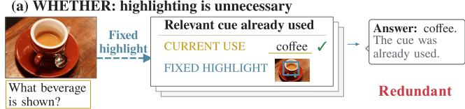

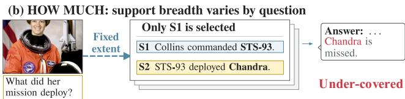

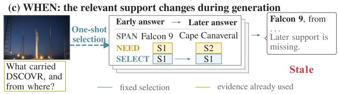  
Figure 1: Schematic illustration of three mismatches between fixed, one-shot evidence highlighting and evidence demand. (a) Highlighting is redundant when the model already uses the relevant evidence. (b) A fixed sentence budget can omit part ofa multi-sentence evidence chain. (c) Evidence selected before decoding can become stale when later answer tokens require diferent textual evidence. Blue marks the fixed selection, gold marks evidence already used or required at the corresponding stage, and red labels the resulting mismatch.

The main contributions of this work are summarized as follows:

• We formalize adaptive evidence allocation for frozen MLLMs through three decisions: whether to mark selected context sentences and whether to add a visual crop, how many sentences to mark and what spatial extent the crop should cover, and at which decoding steps to reselect and append marked sentences.

• We develop AREA, a training-free method for frozen MLLMs that obtains layer-resolved visual and textual relevance in one probe pass, uses it to set sentence count and crop extent, gates text and vision with selected-sentence attention surprisal and raw visual sink mass, and triggers text refresh from decoding-time context attention under a fixed budget.

• We evaluate AREA with nine frozen MLLM checkpoints on four KB-VQA and seven standard multimodal benchmarks, where it consistently establishes state-of-the-art performance across both knowledge-intensive and standard multimodal settings under a frozen-backbone inference protocol.

## 2 Related Work

## 2.1 KB-VQA and Multimodal Retrieval

KB-VQA combines image understanding with facts from external sources. Benchmarks like Encyclopedic VQA, InfoSeek, and ViQuAE test whether models can answer questions about fine-grained entities, unseen knowledge, or facts requiring multi-step reasoning (Mensink et al. 2023; Chen et al. 2023; Lerner et al. 2022). Systems that perform well on these tasks typically improve the upstream evidence pipeline: hierarchical retrieval over structured knowledge (Cafagni et al. 2024), multimodal reranking to prioritize relevant passages (Yan and Xie 2024; Yang et al. 2025), learned retrieval-relevance decisions (Cocchi et al. 2025), reasoningaugmented retrieval (Compagnoni et al. 2026), questionfocused filtering (Ye et al. 2026), and multimodal knowledge graph integration (Yuan et al. 2026). These methods determine which external content reaches the model. AREA addresses the complementary question: given that relevant evidence is available in the input, how should it be presented to ensure the frozen generator uses it? This distinction permits controlled comparisons under identical retrieval, isolating evidence utilization from retrieval quality.

## 2.2 Inference-Time Evidence Highlighting

Training-free evidence highlighting provides a direct approach to improving evidence utilization without changing the retrieval pipeline or updating model parameters. SelfElicit uses model-derived relevance to select and mark context sentences, while LoT extends this approach to MLLMs by combining textual highlighting with visual localization (Liu et al. 2025; Morini et al. 2026). Together, these methods show that relevance signals from a frozen model can guide how available evidence is presented during inference. Existing approaches, however, make the intervention in a single pre-decoding step under a predetermined allocation policy. AREA advances this direction by independently adapting the intervention for text and vision, scaling the exposed evidence to each example, and refreshing textual evidence as generation unfolds.

## 3 Method

## 3.1 Problem Setup and Overview

Given an image I, a question Q, and a candidate context C of $N _ { C }$ tokens, AREA generates an answer with a frozen MLLM ${ \mathcal { F } } _ { \theta } ;$ vision-only tasks have $N _ { C } = 0$ . The visual front end maps I to $N _ { V } = \dot { G } ^ { 2 }$ spatial patch tokens arranged on a square $G \times G$ grid. The decoder has L layers, $N _ { H }$ attention heads per layer, and hidden width d. From the unhighlighted tokenized prompt, $\mathcal { F } _ { \theta }$ generates exactly one probe token. Let $S _ { p }$ denote the resulting sequence length and $i _ { \mathrm { p } }$ the final position occupied by that token. For layer $\ell \in \{ 1 , \ldots , L \}$ and head $h \in \{ 1 , \dotsc , N _ { H } \}$ , the probe pass exposes postsoftmax causal attention $\mathbf { \Delta A } _ { p } ^ { \ell , h } \ \in \ [ 0 , 1 ] ^ { \mathbf { \dot { S } } _ { p } \times S _ { \xi } }$ and hidden states $\mathbf { H } _ { p } ^ { \ell } \in \mathbb { R } ^ { S _ { p } \times d }$ . An entry $\mathbf { A } _ { p } ^ { \ell , h } [ r , s ]$ gives attention from query position r to key position s. Tokenization maps visual patch v to its absolute prompt position $\chi _ { \mathrm { v i s } } ( v )$ and, when $N _ { C } > 0$ , original context token j to $\chi _ { \mathrm { c t x } } ( j )$ .

Our objective is to allocate the available visual and textual evidence according to the evidence demand of each example and generation step. AREA therefore decides whether to intervene in each modality, how much evidence to expose through the number of selected sentences and the visual crop extent, and when to refresh textual evidence during decoding, while keeping $\mathcal { F } _ { \theta }$ frozen.

Figure 2 connects Layer-Resolved Evidence Readout to Entropy-Calibrated Evidence Scaling and Modality-Specific Intervention Gating, followed by Causal Text-Evidence Refresh during generation. Algorithm 1 presents the complete inference sequence.

## 3.2 Layer-Resolved Evidence Readout

We use nonempty, fixed, backbone-specific layer groups $\mathcal { L } _ { \mathrm { v i s } } , \mathcal { L } _ { \mathrm { t x t } } \subseteq \{ 1 , \dots , L \}$ for visual and textual relevance readout, together with nonempty fixed sink dimensions $\mathcal { D } _ { \mathrm { s i n k } } \subseteq \{ 1 , \dots , d \}$ for activation-based visual sink detection (Kang et al. 2025). The fixed question parser identifies the target-object phrase; let O denote the nonempty set of its absolute prompt positions. The same probe pass produces raw visual relevance for each patch v and, when context is present, textual relevance for each original context token j:

$$
\begin{array} { r l } & { \quad \displaystyle \sum _ { a _ { \mathrm { v i s } , v } ^ { \mathrm { r a w } } } \sum _ { \varrho \in \mathcal { O } } \varrho \sum _ { \ell \in \mathcal { L } _ { \mathrm { v i s } } } \sum _ { h = 1 } ^ { N _ { H } } \mathbf { A } _ { p } ^ { \ell , h } [ o , \chi _ { \mathrm { v i s } } ( v ) ] } \\ & { \quad \quad \quad \quad \quad \quad \quad \quad \quad \quad \quad \quad \vert O \vert \vert \mathcal { L } _ { \mathrm { v i s } } \vert N _ { H } } \\ & { \quad \quad \quad \quad \quad \quad \quad \quad \quad \quad \quad \quad \quad \quad \quad \quad \quad \quad \quad \quad \quad \quad \quad \quad \quad \quad } \\ & { a _ { \mathrm { t x t } , j } = \frac { \ell \in \mathcal { L } _ { \mathrm { t x t } } \sum _ { h = 1 } ^ { N _ { H } } \mathbf { A } _ { p } ^ { \ell , h } [ i _ { \mathrm { p } } , \chi _ { \mathrm { c t x } } ( j ) ] } { \vert \mathcal { L } _ { \mathrm { t x t } } \vert N _ { H } } . } \end{array}\tag{1}
$$

Collecting these scores yields the raw visual relevance vector $\mathbf { a } _ { \mathrm { v i s } } ^ { \mathrm { r a w } } \in \mathbb { R } _ { > 0 } ^ { N _ { V } }$ and textual relevance vector $\mathbf { a } _ { \mathrm { t x t } } \in \mathbb { R } _ { > 0 } ^ { N _ { C } }$ . Thus the visual branch reads object-to-patch attention, while the textual branch reads probe-to-context attention. Both directly average the original post-softmax weights over their fixed layers and all heads.

Visual sink filtering. Visual sink tokens concentrate activation in a small set of hidden dimensions and can distort the relevance map used to localize the target object. We score this concentration by normalizing the strongest activation in $\mathcal { D } _ { \mathrm { s i n k } }$ by the root mean square across all d hidden dimensions:

$$
s _ { \mathrm { s i n k } , v } = \frac { 1 } { | \mathcal { L } _ { \mathrm { v i s } } | } \sum _ { \ell \in \mathcal { L } _ { \mathrm { v i s } } } \frac { \displaystyle \operatorname* { m a x } _ { r \in \mathcal { D } _ { \mathrm { s i n k } } } | \mathbf { H } _ { p } ^ { \ell } [ \chi _ { \mathrm { v i s } } ( v ) , r ] | } { \displaystyle \sqrt { \frac { 1 } { d } \sum _ { q = 1 } ^ { d } \left( \mathbf { H } _ { p } ^ { \ell } [ \chi _ { \mathrm { v i s } } ( v ) , q ] \right) ^ { 2 } } } .\tag{2}
$$

For visual sink threshold $\tau ,$ tokens satisfying $s _ { \mathrm { s i n k } , v } ~ > ~ \tau$ form $\mathcal { T } _ { \mathrm { s i n k } }$ . We define ${ \bf a } _ { \mathrm { v i s } } = ( a _ { \mathrm { v i s } , 1 } , \dots , a _ { \mathrm { v i s } , N _ { V } } ) \in \mathbb { R } _ { > 0 } ^ { N _ { V } }$ by setting $a _ { \mathrm { v i s } , v } = 0$ inside $\mathcal { T } _ { \mathrm { s i n k } }$ and $a _ { \mathrm { v i s } , v } = a _ { \mathrm { v i s } , v } ^ { \mathrm { r a w } }$ otherwise. This filtered vector determines crop location and scale, and the corresponding raw sink mass controls the visual intervention gate.

Spatial localization. We reshape $\mathbf { a } _ { \mathrm { v i s } }$ in the visual processor’s patch order and divide each cell by the sum over all $G ^ { 2 }$ cells, obtaining the spatial distribution $\widetilde { M } _ { u , w }$ for $u , w \in \{ 0 , \ldots , G - 1 \}$ . Its center and spread are

$$
\begin{array} { r l } { \displaystyle \mu _ { x } = \sum _ { u , w } w \widetilde { M } _ { u , w } , } & { { } ~ \sigma _ { x } = \sqrt { ( \displaystyle \sum _ { u , w } ( w - \mu _ { x } ) ^ { 2 } \widetilde { M } _ { u , w } ) } , } \\ { \displaystyle \mu _ { y } = \sum _ { u , w } u \widetilde { M } _ { u , w } , } & { { } ~ \sigma _ { y } = \sqrt { ( \displaystyle \sum _ { u , w } ( u - \mu _ { y } ) ^ { 2 } \widetilde { M } _ { u , w } ) } . } \end{array}\tag{3}
$$

These moments locate the crop and define its horizontal and vertical extent before adaptive scaling.

## 3.3 Entropy-Calibrated Evidence Scaling

Text scaling. For $N _ { C } > 0 ,$ a sentence segmenter maps the original context to token sets $\{ \boldsymbol { S _ { m } } \} _ { m = 1 } ^ { N _ { S } }$ . We form the sentence distribution $\textbf { p } = \ \left( p _ { 1 } , \ldots , p _ { N _ { S } } \right)$ by setting $\begin{array} { r } { p _ { m } \propto \vert S _ { m } \vert ^ { - 1 } \sum _ { j \in S _ { m } } a _ { \mathrm { t x t } , j } } \end{array}$ and normalizing it so that $\begin{array} { r } { \sum _ { m = 1 } ^ { N _ { S } } p _ { m } = 1 } \end{array}$ . Let $\begin{array} { r } { H ( \mathbf { p } ) = - \sum _ { m = 1 } ^ { N _ { S } } p _ { m } \log _ { 2 } p _ { m } } \end{array}$ . We select the sentence indices

$$
\begin{array} { r } { \mathcal { I } _ { \mathrm { t x t } } = \mathrm { T o p K } \Big ( \mathbf { p } , \mathrm { m i n } \Big ( \Big \lceil 2 ^ { H ( \mathbf { p } ) } \Big \rceil , k _ { \mathrm { m a x } } \Big ) \Big ) . } \end{array}\tag{4}
$$

Eq. (4) converts relevance dispersion into an evidence budget: low entropy indicates concentrated evidence and selects fewer sentences, whereas high entropy indicates distributed evidence and selects more. The efective count $2 ^ { H ( \mathbf { p } ) }$ , capped at $k _ { \operatorname* { m a x } } .$ sets this budget before TopK retains the most relevant sentences.

Visual scaling. The spatial entropy controls crop extent:

$$
\begin{array} { l } { \displaystyle \mathcal { H } _ { \mathrm { v i s } } = - \sum _ { u , w } \widetilde { M } _ { u , w } \log _ { 2 } \widetilde { M } _ { u , w } , } \\ { \displaystyle \beta = \mathrm { c l i p } \left( \frac { 1 } { 2 } \sqrt { \frac { 2 \mathcal { H } _ { \mathrm { v i s } } } { \sigma _ { x } \sigma _ { y } } } , \beta _ { \mathrm { m i n } } , \beta _ { \mathrm { m a x } } \right) , } \\ { \displaystyle \mathbf { b } _ { \mathrm { p i x } } = \Pi _ { \mathrm { p i x } } ( \mu _ { x } - \beta \sigma _ { x } , \mu _ { y } - \beta \sigma _ { y } , \mu _ { x } + \beta \sigma _ { x } , \mu _ { y } + \beta \sigma _ { y } ) . } \end{array}\tag{5}
$$

The fixed map $\Pi _ { \mathrm { p i x } }$ converts grid coordinates to pixels and clips the box to the image boundary. Because $2 ^ { \mathcal { H } _ { \mathrm { v i s } } }$ is the efective number of grid cells carrying relevance, the unconstrained scale satisfies $( 2 \beta \sigma _ { x } ) ( 2 \bar { \beta } \sigma _ { y } ) = 2 ^ { \mathcal { H } _ { \mathrm { v i s } } }$ , tying crop area to spatial relevance dispersion. The centroid and axiswise spreads retain the map’s location and shape, so concentrated maps yield tight crops while difuse maps yield broader ones.

## 3.4 Modality-Specific Intervention Gating

The preceding scaling stage determines the candidate text and crop, but presenting them unconditionally would ignore whether intervention is needed. Because the model may already use the relevant evidence and intervention demand can difer by modality, AREA gates text and vision independently. The text score measures how little natural attention reaches the selected sentences, while the visual score is the fraction of raw relevance assigned to sink-flagged patches:

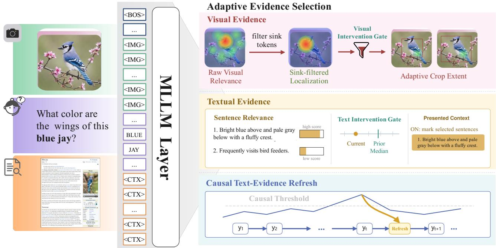  
Figure 2: Overview of AREA. One probe token reads visual and textual relevance from fixed, backbone-specific layer groups of a frozen MLLM. Independent gates use selected-sentence attention coverage and raw visual sink mass to decide whether to intervene, while the sentence-level and sink-filtered spatial relevance distributions set the sentence count and crop extent. After warmup, both gates use prior-sample medians and update their histories only after deciding. During the same autoregressive stream, strictly causal peaks in context-attention entropy trigger bounded textual refresh; visual evidence and the initial gate remain fixed.

$$
\begin{array} { r l } & { u _ { \mathrm { t x t } } = - \log _ { 2 } \left( \frac { \sum _ { m \in \mathcal { I } _ { \mathrm { t x t } } } \sum _ { j \in \mathcal { S } _ { m } } a _ { \mathrm { t x t } , j } } { \sum _ { j = 1 } ^ { N _ { C } } a _ { \mathrm { t x t } , j } } + \varepsilon \right) , } \\ & { u _ { \mathrm { v i s } } = \frac { \sum _ { v \in \mathcal { T } _ { \mathrm { s i n k } } } a _ { \mathrm { v i s } , v } ^ { \mathrm { r a w } } } { \sum _ { v = 1 } ^ { N _ { V } } a _ { \mathrm { v i s } , v } ^ { \mathrm { r a w } } } . } \end{array}\tag{6}
$$

A high $u _ { \mathrm { t x t } }$ indicates that the selected sentences are underused, and a high $u _ { \mathrm { v i s } }$ indicates stronger sink contamination in the raw localization signal.

For sample n and modality $x \in \{ \mathrm { t x t } , \mathrm { v i s } \}$ , let $m _ { x } ^ { \left( < n \right) }$ be the median of duplicate-retaining scores from earlier eligible samples in the current dataset–backbone stream. Vision is always eligible, whereas text is eligible only when $N _ { C } > 0 ;$ thus $z _ { \mathrm { t x t } } ^ { ( n ) } ~ = ~ 0$ when $N _ { C } = 0$ . For each eligible modality, we set $z _ { x } ^ { ( n ) } = 1$ during the first $W _ { \mathrm { w a r m } }$ samples and $z _ { x } ^ { ( n ) } = \mathbf { 1 } [ u _ { x } \geq m _ { x } ^ { ( < n ) } ]$ thereafter. The two decisions are independent and use only preceding samples. After both decisions, we append the current eligible scores to their histories; histories reset between datasets and backbones. When $z _ { \mathrm { t x t } } = 1 , C ^ { \star }$ is C with the sentences in $\mathcal { I } _ { \mathrm { t x t } }$ wrapped by text-evidence markers, otherwise $C ^ { \star } = C .$ . When $z _ { \mathrm { v i s } } = 1 .$ the image payload $\mathcal { T } ^ { \star }$ is the marker-wrapped crop defined by $\mathbf { b } _ { \mathrm { p i x } }$ alone, otherwise $\mathcal { T } ^ { \star }$ contains the original image.

## 3.5 Causal Text-Evidence Refresh

As generation progresses, evidence needs can shift beyond the initial selection. AREA therefore monitors contextattention dispersion and reselects and appends textual evidence when the current value exceeds a threshold determined only by earlier decoding steps, subject to a fixed refresh budget.

The initial generation prompt $\mathcal { P } _ { 1 }$ is tokenized over $( \mathbf { { \mathcal { L } } ^ { \star } } , Q , C ^ { \star } )$ . When $N _ { C } > 0 ,$ , tokenization supplies the orderpreserving map $j \mapsto \iota ( j )$ from each original context token to its prompt position; evidence-marker tokens are excluded. $R _ { \mathrm { m a x } }$ caps refreshes, and $r _ { t }$ counts those completed through step $t ,$ with $r _ { 0 } = 0$

For $t \geq 1 , \mathcal { P } _ { t }$ is the cached prefix before decoding $y _ { t }$ Once committed and cached, $y _ { t }$ occupies $i _ { t } = | \mathcal { P } _ { t } | + \mathrm { \tilde { 1 } } ;$ let $\mathbf { A } _ { t } ^ { \ell , h } [ i _ { t } , : ] \in [ 0 , 1 ] ^ { i _ { t } }$ denote its post-softmax causal-attention row. Applying the textual readout of Eq. (1) to this row at keys $\iota ( j )$ yields $\mathbf { a } _ { \mathrm { t x t } } ^ { ( t ) } \in \mathbb { R } _ { > 0 } ^ { N _ { C } }$ . We normalize these scores and compute their entropy:

$$
\pi _ { j } ^ { ( t ) } = \frac { a _ { \mathrm { t x t } , j } ^ { ( t ) } } { \sum _ { q = 1 } ^ { N _ { C } } a _ { \mathrm { t x t } , q } ^ { ( t ) } } , \quad e _ { t } = - \sum _ { j = 1 } ^ { N _ { C } } \pi _ { j } ^ { ( t ) } \log _ { 2 } \pi _ { j } ^ { ( t ) } .\tag{7}
$$

The weights $\pi _ { j } ^ { ( t ) }$ cover only original context tokens; evidence markers and appended reminders are excluded. Their entropy $e _ { t }$ is low for concentrated attention and high for dispersed attention, serving as a step-wise evidence-demand proxy.

For $t > 1 , \bar { e } _ { t - 1 }$ and $\sigma _ { e , t - 1 }$ are the mean and population standard deviation of $( e _ { 1 } , \ldots , e _ { t - 1 } ) ; \kappa \geq 0$ controls peak sensitivity. The binary trigger is

$$
\gamma _ { t } = \left\{ \begin{array} { l l } { { \mathbf { 1 } [ e _ { t } > \bar { e } _ { t - 1 } + \kappa \sigma _ { e , t - 1 } ] , } } & { { t > 1 \wedge r _ { t - 1 } < R _ { \mathrm { m a x } } , } } \\ { { 0 , } } & { { \mathrm { o t h e r w i s e } . } } \end{array} \right.\tag{8}
$$

The strict test excludes $e _ { t }$ from its own threshold. The first eligible trigger is therefore $t = 2 .$ , where the one-value population standard deviation is zero.

When $\gamma _ { t } = 1$ , substituting $\mathbf { a } _ { \mathrm { t x t } } ^ { ( t ) }$ for $\mathbf { a } _ { \mathrm { t x t } }$ in the sentence aggregation and Eq. (4) yields $\mathcal { I } _ { \mathrm { t x t } } ^ { ( t ) }$ . We serialize these sentences in context order and define $R _ { t }$ as the resulting token block, enclosed once by the text-evidence markers. With brackets denoting token-sequence concatenation, the cached prefix and refresh count evolve as

$$
\mathcal { P } _ { t + 1 } = \left\{ \begin{array} { l l } { [ \mathcal { P } _ { t } ; y _ { t } ; R _ { t } ] , } & { \gamma _ { t } = 1 , } \\ { [ \mathcal { P } _ { t } ; y _ { t } ] , } & { \gamma _ { t } = 0 , } \end{array} \right. ~ r _ { t } = r _ { t - 1 } + \gamma _ { t } .\tag{9}
$$

Appending $R _ { t }$ at the decoding frontier preserves ι and existing key–value cache entries; $e _ { t }$ then enters the history used at step t + 1. The mechanism refreshes only textual evidence and remains active when $z _ { \mathrm { t x t } } = 0$

## 3.6 Inference Protocol

Algorithm 1 AREA Inference   
Input: I, Q, C; frozen ${ \mathcal { F } } _ { \theta } ;$ state $\mathcal { U } _ { \mathrm { t x t } } , \mathcal { U } _ { \mathrm { v i s } } , n _ { \mathrm { s e e n } }$   
Layer-Resolved Evidence Readout   
1: Generate exactly one probe token; expose $\mathbf { A } _ { p } ^ { \ell , h } , \mathbf { H } _ { p } ^ { \ell }$   
2: Resolve O, $\chi _ { \mathrm { v i s } }$ and, when $N _ { C } > 0 ,$ χctx   
3: Compute $\mathbf { a } _ { \mathrm { v i s } } ^ { \mathrm { r a w } }$ and, when $N _ { C } > 0 ,$ atxt   
4: Compute sink scores and $\mathcal { T } _ { \mathrm { s i n k } } = \{ v : s _ { \mathrm { s i n k } , v } > \tau \}$   
5: Form $\mathbf { a } _ { \mathrm { v i s } } , \widetilde { M } ,$ and its spatial moments   
Entropy-Calibrated Evidence Scaling   
6: if $N _ { C } > 0$ then   
7: Form p and select $\mathcal { I } _ { \mathrm { t x t } }$ by Eq. (4)   
8: end if   
9: Compute $\mathcal { H } _ { \mathrm { v i s } } , \beta , \mathbf { b } _ { \mathrm { p i x } }$ by Eq. (5)   
Modality-Specific Intervention Gating   
10: Compute $u _ { \mathrm { v i s } }$ and, if $N _ { C } > 0 , u _ { \mathrm { t x t } }$   
11: Set eligible $z _ { x }$ from warmup or prior medians ▷ prior only   
12: Append each eligible $u _ { x } ;$ increment nseen ▷ after both gates   
13: Form the conditional payloads $\mathcal { T } ^ { \star }$ and $C ^ { \star }$   
14: Tokenize $\mathcal { P } _ { 1 }$ and, if $\begin{array} { r } { \dot { N _ { C } } > 0 , } \end{array}$ , obtain ι   
Causal Text-Evidence Refresh   
15: Set $r _ { 0 } \gets 0$ and initialize an empty entropy history   
16: for $t = 1 , 2 , \dots$ until generation terminates do   
17: Decode, commit, and cache $y _ { t }$   
18: if $N _ { C } > 0$ then   
19: Read $\mathbf { a } _ { \mathrm { t x t } } ^ { ( t ) }$ through ι; compute $\pi _ { j } ^ { ( t ) }$ and $e _ { t }$   
20: Set $\gamma _ { t }$ by the strict prior-history test in Eq. (8)   
21: if $\gamma _ { t } = 1$ then   
22: Reselect $\mathcal { I } _ { \mathrm { t x t } } ^ { ( t ) }$ and form $R _ { t }$ ▷ text only   
23: end if   
24: Update $\left( \mathcal { P } _ { t + 1 } , \boldsymbol { r } _ { t } \right)$ by Eq. (9)   
25: Append $e _ { t }$ to the entropy history ▷ after decision   
26: end if   
27: end for   
28: return generated answer tokens

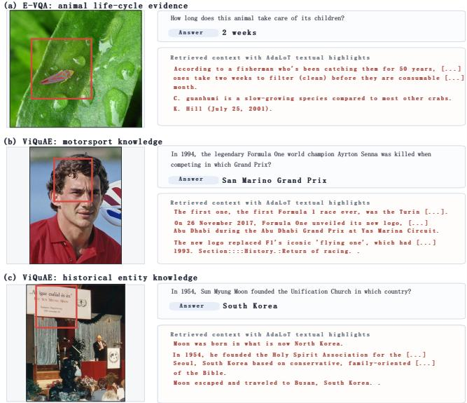  
Figure 3: Qualitative examples of AREA on E-VQA and Vi-QuAE. Each row shows the original image with the AREAinduced visual bounding box and the retrieved textual context with AREA-selected sentences highlighted. The examples illustrate how AREA jointly localizes visual evidence and emphasizes relevant textual evidence for knowledge-intensive visual question answering. Best viewed when zoomed in.

## 4 Experiments

## 4.1 Experimental Setup

Datasets and metrics. We follow the evaluation protocol of LoT (Morini et al. 2026). The knowledge-based visual question answering (KB-VQA) suite comprises Encyclopedic VQA (E-VQA) (Mensink et al. 2023), InfoSeek (Chen et al. 2023), Open-domain Visual Entity Recognition (OVEN) (Hu et al. 2023), and ViQuAE (Lerner et al. 2022). We report Single-Hop and All accuracy on the E-VQA test set; Unseen-Q, Unseen-E, and All accuracy on the InfoSeek validation set; validation accuracy on OVEN; and exact match on the ViQuAE test set. The standard suite contains RealWorldQA (xAI 2024), Vstar (Wu and Xie 2024), TextVQA (Singh et al. 2019), ChartQA (Masry et al. 2022), OCRBench (Liu et al. 2024), POPE (Li et al. 2023), and AMBER-D (Wang et al. 2023). We use the Cambrian-1 evaluation suite (Tong et al. 2024) except for AMBER-D, which uses its oficial discriminative-accuracy pipeline.

Backbones and protocol. We evaluate nine frozen MLLM checkpoints: Qwen2-VL-2B and Qwen2-VL-7B (Wang et al. 2024); Qwen2.5-VL-3B, Qwen2.5-VL-7B, and Qwen2.5- VL-32B (Bai et al. 2025b); Qwen3-VL-4B and Qwen3-VL-8B (Bai et al. 2025a); and InternVL3.5-4B and InternVL3.5- 8B (Wang et al. 2025). For KB-VQA, we retrieve three Wikipedia entities with the same EVA-CLIP and FAISS pipeline used by LoT (Sun et al. 2024; Johnson, Douze, and Jégou 2019). Each LoT–AREA pair uses the same checkpoint, retrieved entities, task instruction, decoding configuration, and evaluator. LoT selects one sentence, fixes the visual scale to $\beta = 2 ,$ , and always applies its intervention. AREA uses $k _ { \mathrm { m a x } } = 3 , ( \beta _ { \mathrm { m i n } } , \dot { \beta _ { \mathrm { m a x } } } ) \stackrel { - } { = } ( 1 . 5 , 2 . 5 ) , \kappa = 1$ $R _ { \operatorname* { m a x } } = 4$ and $W _ { \mathrm { w a r m } } = 5 0$

<table><tr><td rowspan="2">Backbone</td><td rowspan="2">Method</td><td colspan="2">E-VQA</td><td colspan="3">InfoSeek</td><td rowspan="2">OVEN All</td><td rowspan="2">ViQuAE All</td><td rowspan="2">Avg</td></tr><tr><td>SH</td><td>All</td><td>U-Q</td><td>U-E</td><td>All</td></tr><tr><td rowspan="4">Qwen2-VL-2B</td><td>Base</td><td>17.5</td><td>16.0</td><td>5.3</td><td>5.6</td><td>5.4</td><td>1.2</td><td>15.0</td><td>10.2</td></tr><tr><td>+LoT</td><td>18.2</td><td>16.2</td><td>10.5</td><td>10.1</td><td>10.3</td><td>2.8</td><td>18.4</td><td>11.9(+1.7)</td></tr><tr><td>+AREA (Ours)</td><td>18.7</td><td>16.7</td><td>11.4</td><td>10.0</td><td>10.9</td><td>3.4</td><td>19.2</td><td>12.6(+2.4)</td></tr><tr><td>Base</td><td>30.1</td><td>27.8</td><td>22.6</td><td>22.2</td><td>22.4</td><td>11.5</td><td>22.9</td><td>21.2</td></tr><tr><td rowspan="4">Qwen2.5-VL-3B Small</td><td>+LoT</td><td>32.9</td><td>30.4</td><td>25.4</td><td>25.1</td><td>25.2</td><td>18.3</td><td>27.8</td><td>25.5 (+4.3)</td></tr><tr><td>+AREA (Ours)</td><td>33.4</td><td>31.0</td><td>25.9</td><td>24.9</td><td>25.6</td><td>19.0</td><td>28.5</td><td>26.0 (+4.8)</td></tr><tr><td>Base</td><td>35.0</td><td>32.8</td><td>27.9</td><td>28.6</td><td>28.3</td><td>25.1</td><td>34.5</td><td>30.2</td></tr><tr><td>+LoT</td><td>37.3</td><td>34.8</td><td>30.8</td><td>30.2</td><td>30.5</td><td>24.5</td><td>36.3</td><td>31.5 (+1.3)</td></tr><tr><td rowspan="3">InternVL3.5-4B</td><td>+AREA (Ours)</td><td>37.9</td><td>35.4</td><td>31.4</td><td>30.0</td><td>30.9</td><td>25.1</td><td>37.0</td><td>32.1 (+1.9)</td></tr><tr><td>Base</td><td>29.1</td><td>26.2</td><td>28.8</td><td>29.0</td><td>28.9</td><td>10.8</td><td>36.4</td><td>25.6</td></tr><tr><td>+LoT +AREA (Ours)</td><td>31.7 32.3</td><td>28.7 29.3</td><td>33.3 33.9</td><td>33.1 32.9</td><td>33.2</td><td>11.5</td><td>45.6</td><td>29.8 (+4.2)</td></tr><tr><td rowspan="4">Qwen2-VL-7B</td><td></td><td></td><td></td><td></td><td></td><td>33.6</td><td>12.2</td><td>46.5</td><td>30.4(+4.8)</td></tr><tr><td>Base +LoT</td><td>25.6 28.7</td><td>22.9 25.6</td><td>24.2 29.8</td><td>24.7 30.1</td><td>24.4 29.9</td><td>11.1</td><td>33.0</td><td>22.9</td></tr><tr><td>+AREA (Ours)</td><td>29.3</td><td>26.2</td><td>30.5</td><td>29.9</td><td>30.2</td><td>16.6 17.2</td><td>40.8 41.6</td><td>28.2 (+5.3)</td></tr><tr><td>Base</td><td>32.1</td><td>30.1</td><td>23.9</td><td>25.2</td><td>24.5</td><td>21.1</td><td>36.3</td><td>28.8 (+5.9) 28.0</td></tr><tr><td rowspan="4">Meddum Qwen2.5-VL-7B</td><td>+LoT</td><td>33.6</td><td>31.4</td><td>24.9</td><td>25.4</td><td>25.1</td><td>21.2</td><td>38.6</td><td>29.1 (+1.1)</td></tr><tr><td>+AREA (Ours)</td><td>34.0</td><td>31.8</td><td>25.5</td><td>25.2</td><td>25.4</td><td>21.8</td><td>39.4</td><td>29.6(+1.6)</td></tr><tr><td>Base</td><td>36.6</td><td>35.0</td><td>29.1</td><td>30.4</td><td>29.7</td><td>17.7</td><td>43.7</td><td>31.5</td></tr><tr><td>+LoT</td><td>38.6</td><td>36.4</td><td>33.2</td><td>32.5</td><td>32.8</td><td>19.6</td><td>51.0</td><td>35.0(+3.5)</td></tr><tr><td rowspan="4">InternVL3.5-8B</td><td>+AREA (Ours)</td><td>39.1</td><td>36.9</td><td>33.8</td><td>32.3</td><td>33.1</td><td>20.2</td><td>51.8</td><td>35.5 (+4.0)</td></tr><tr><td>Base</td><td>31.4</td><td>29.0</td><td>29.5</td><td>29.9</td><td>29.7</td><td>17.7</td><td>44.2</td><td>30.2</td></tr><tr><td>+LoT</td><td>33.2</td><td>30.7</td><td>32.1</td><td>32.5</td><td>32.3</td><td>17.6</td><td>54.2</td><td>33.7 (+3.5)</td></tr><tr><td>+AREA (Ours)</td><td>33.8</td><td>31.3</td><td>32.8</td><td>32.3</td><td>32.6</td><td>18.3</td><td>55.0</td><td>34.3 (+4.1)</td></tr><tr><td rowspan="2">Large Qwen2.5-VL-32B</td><td>Base</td><td></td><td></td><td>26.7</td><td>26.1</td><td>26.4</td><td>13.3</td><td></td><td></td></tr><tr><td>+LoT</td><td>35.3 37.7</td><td>33.7 36.0</td><td>31.2</td><td>26.2</td><td>29.6</td><td>14.2</td><td>37.9 46.0</td><td>27.8 31.5(+3.7)</td></tr></table>

Table 1: Performance on KB-VQA benchmarks. Base denotes the same checkpoint without evidence highlighting. SH, U-Q, and U-E denote Single-Hop, Unseen-Q, and Unseen-E; Avg is computed over the four All columns. Colored values in parentheses indicate absolute improvements over Base.

## 4.2 Results on KB-VQA

Table 1 reports the results on four KB-VQA benchmarks. AREA outperforms LoT for all nine checkpoints, improving the four-dataset average by approximately 0.6 points across backbones. This consistency across model families and scales suggests that the gains arise from better matching the intervention to each example, rather than from a particular architecture. Unlike LoT, which always exposes a fixed crop and a single sentence, AREA avoids redundant interventions when the relevant evidence is already well covered and expands the evidence scope when relevance is more dispersed.

The gains are particularly clear on OVEN and ViQuAE, where answering often requires identifying a visual entity and connecting it to a specific retrieved fact. Adaptive localization can suppress unrelated visual regions, while flexible sentence allocation reduces the risk of omitting supporting information. On InfoSeek, the improvements are mainly observed on Unseen-Q and the overall score, whereas Unseen-E changes only marginally and occasionally decreases. We conjecture that unseen-entity questions are more strongly limited by entity recognition and retrieval quality; when the correct entity or passage is absent, improving evidence presentation alone provides limited benefit.

Figure 3 further illustrates how AREA allocates evidence on representative KB-VQA examples. Across questions involving biological, historical, and entity-specific knowledge, AREA localizes the query-relevant visual content while highlighting the retrieved sentences that directly support the answer. The selected evidence is compact and varies across examples, rather than following a uniform sentence budget or crop scale. This behavior is important for KB-VQA, where retrieved passages commonly contain facts that are topically related to the question but insuficient for deriving the answer.

The examples also show that visual and textual evidence need not contribute equally to every prediction. In some cases, the image primarily identifies the queried entity, while the retrieved context supplies the answer-specific fact; in others, accurate visual localization is necessary to disambiguate among several plausible entities before consulting the context. By allocating the two modalities independently, AREA can emphasize the modality that is currently underused without unnecessarily modifying the other. These qualitative results complement the quantitative improvements in Table 1 and suggest that AREA benefits KB-VQA by making short cross-modal evidence chains easier for the frozen model to follow.

<table><tr><td rowspan="2">Backbone</td><td rowspan="2">Method</td><td colspan="5">Vision-Centric/OCR and Chart</td><td colspan="2">Hallucination</td></tr><tr><td>RealWorldQA</td><td>V-Star</td><td>TextVQA</td><td>ChartQA</td><td>OCRBench</td><td>POPE</td><td>AMBER-D</td></tr><tr><td rowspan="3">Qwen2-VL-2B</td><td>Base</td><td>54.8</td><td>46.6</td><td>72.0</td><td>73.4</td><td>74.6</td><td>88.4</td><td>42.1</td></tr><tr><td>+LoT</td><td>56.7 (+1.9)</td><td>53.9 (+7.3)</td><td>74.9 (+2.9)</td><td>73.2 (-0.2)</td><td>74.0 (-0.6)</td><td>88.6 (+0.2)</td><td>75.0 (+32.9)</td></tr><tr><td>+AREA (Ours) Base</td><td>57.4(+2.6) 59.1</td><td>54.8 (+8.2)</td><td>75.4 (+3.4)</td><td>73.0 (-0.4)</td><td>74.7 (+0.1) 76.1</td><td>89.0 (+0.6)</td><td>75.8 (+33.7)</td></tr><tr><td rowspan="4">Qwen2.5-VL-3B Small</td><td>+LoT</td><td>61.7 (+2.6)</td><td>59.7 61.8 (+2.1)</td><td>62.5</td><td>79.1</td><td>79.7 (+3.6)</td><td>88.2 89.0 (+0.8)</td><td>17.2</td></tr><tr><td></td><td></td><td></td><td>66.4 (+3.9)</td><td>79.5 (+0.4)</td><td></td><td></td><td>40.5 (+23.3)</td></tr><tr><td>+AREA (Ours)</td><td>62.4(+3.3)</td><td>62.6 (+2.9)</td><td>67.0 (+4.5)</td><td>79.3 (+0.2)</td><td>80.2 (+4.1)</td><td>89.4 (+1.2)</td><td>41.7 (+24.5)</td></tr><tr><td>Base +LoT</td><td>66.7</td><td>56.0</td><td>74.7</td><td>80.7</td><td>76.0</td><td>90.1</td><td>81.9</td></tr><tr><td rowspan="3">Qwen3-VL-4B InternVL3.5-4B</td><td>+AREA (Ours)</td><td>71.6(+4.9) 72.2 (+5.5)</td><td>67.8 (+11.8) 77.1 (+2.4)</td><td>67.0 (+11.0) 76.5 (+1.8)</td><td>82.3 (+1.6) 82.0 (+1.3)</td><td>77.4(+1.4) 78.1 (+2.1)</td><td>90.2 (+0.1) 90.5 (+0.4)</td><td>81.2 (-0.7) 82.0 (+0.1)</td></tr><tr><td>Base</td><td>66.7</td><td>73.8</td><td>75.5</td><td>85.9</td><td>82.9</td><td>89.0</td><td>80.1</td></tr><tr><td>+LoT</td><td>67.3 (+0.6)</td><td>76.4(+2.6)</td><td>76.0 (+0.5)</td><td>85.4 (-0.5)</td><td>82.5 (-0.4)</td><td>86.4 (-2.6)</td><td>73.0 (-7.1)</td></tr><tr><td rowspan="3">Qwen2-VL-7B</td><td>+AREA (Ours)</td><td>68.0(+1.3)</td><td>77.1 (+3.3)</td><td>76.6(+1.1)</td><td>85.2 (-0.7)</td><td>83.1 (+0.2)</td><td>87.0 (-2.0)</td><td>74.2 (-5.9)</td></tr><tr><td>Base +LoT</td><td>62.7 64.8 (+2.1)</td><td>52.4 56.0 (+3.6)</td><td>78.0</td><td>81.6</td><td>80.0</td><td>70.3</td><td>33.7</td></tr><tr><td>+AREA (Ours)</td><td>65.5 (+2.8)</td><td>56.8 (+4.4)</td><td>79.3 (+1.3) 79.8 (+1.8)</td><td>82.0(+0.4) 81.8 (+0.2)</td><td>81.3(+1.3) 81.9 (+1.9)</td><td>89.1 (+18.8) 89.4 (+19.1)</td><td>47.3 (+13.6) 48.6(+14.9)</td></tr><tr><td rowspan="3">Meddum Qwen2.5-VL-7B</td><td>Base +LoT</td><td>65.0 67.5 (+2.5)</td><td>57.1 61.3 (+4.2)</td><td>75.7</td><td>77.0</td><td>84.9</td><td>87.4</td><td>62.0</td></tr><tr><td>+AREA (Ours)</td><td>68.1 (+3.1)</td><td>62.0 (+4.9)</td><td>77.9 (+2.2) 78.4(+2.7)</td><td>79.4(+2.4)</td><td>84.3 (-0.6)</td><td>87.4(+0.0)</td><td>62.6 (+0.6)</td></tr><tr><td>Base</td><td>66.8</td><td>60.7</td><td>76.9</td><td>79.1 (+2.1)</td><td>85.0(+0.1) 79.5</td><td>87.8 (+0.4)</td><td>63.4 (+1.4)</td></tr><tr><td rowspan="3">Qwen3-VL-8B</td><td>+LoT</td><td>67.5(+0.7)</td><td>61.3 (+0.6)</td><td>77.9 (+1.0)</td><td>82.0 79.4 (-2.6)</td><td>84.3 (+4.8)</td><td>89.2 89.2 (+0.0)</td><td>75.9</td></tr><tr><td>+AREA (Ours)</td><td>68.2 (+1.4)</td><td>62.0 (+1.3)</td><td>78.5 (+1.6)</td><td>79.1 (-2.9)</td><td>84.9 (+5.4)</td><td>89.5 (+0.3)</td><td>62.6 (-13.3)</td></tr><tr><td>Base</td><td>64.7</td><td>73.3</td><td>77.2</td><td>84.3</td><td>84.3</td><td></td><td>63.8 (-12.1)</td></tr><tr><td rowspan="3">InternVL3.5-8B</td><td>+LoT</td><td>65.9(+1.2)</td><td>69.6 (-3.7)</td><td>78.0 (+0.8)</td><td></td><td>83.0 (-1.3)</td><td>86.3</td><td>80.4</td></tr><tr><td>+AREA (Ours)</td><td>66.5 (+1.8)</td><td>70.4 (-2.9)</td><td>78.6 (+1.4)</td><td>79.7 (-4.6) 79.5 (-4.8)</td><td>83.6 (-0.7)</td><td>87.3 (+1.0)</td><td>80.8 (+0.4)</td></tr><tr><td></td><td></td><td></td><td></td><td></td><td></td><td>87.7 (+1.4)</td><td>81.4 (+1.0)</td></tr><tr><td rowspan="3">Laarge Qwen2.5-VL-32B</td><td>Base</td><td>65.6</td><td>55.5</td><td>72.4</td><td>35.7</td><td>78.7</td><td>88.8</td><td></td></tr><tr><td>+LoT</td><td>67.1 (+1.5)</td><td></td><td></td><td>65.4 (+9.9) 74.0 (+1.6) 48.2 (+12.5)</td><td>79.0(+0.3)</td><td>89.0(+0.2)</td><td>89.4</td></tr><tr><td>+AREA (Ours)</td><td>67.8 (+2.2)</td><td></td><td>66.1 (+10.6) 74.6 (+2.2) 50.0 (+14.3)</td><td></td><td>78.8 (+0.1)</td><td>89.3 (+0.5)</td><td>89.0 (-0.4) 89.6 (+0.2)</td></tr></table>

Table 2: Performance on standard MLLM benchmarks using visual evidence only. Base denotes the same checkpoint without evidence highlighting. Colored values in parentheses indicate absolute changes relative to Base.

## 4.3 Generalization to Standard Multimodal Benchmarks

Table 2 evaluates AREA on standard multimodal benchmarks without retrieved textual context. In this setting, text scaling, text gating, and causal evidence refresh are disabled, while sink filtering, entropy-calibrated crop scaling, and visual intervention gating remain active. Across the 63 checkpoint–benchmark pairs, AREA improves over LoT by approximately 0.55 points on average. The improvement is observed across diferent backbone families and parameter scales, indicating that adaptive visual allocation is not limited to retrieval-augmented settings or a particular model architecture.

The most consistent gains appear on V-Star and Real-WorldQA. V-Star frequently requires recognizing small objects, subtle attributes, or fine-grained spatial cues, for which a question-conditioned crop can increase the relative prominence of the answer-bearing region. RealWorldQA contains more diverse scenes, but its questions often still identify a particular object or local relationship. In such cases, the visual gate is useful because it can retain the original image when broader context is already necessary, rather than applying a compact crop unconditionally. This may explain why AREA improves consistently over LoT on both locally focused and more heterogeneous real-world questions.

AREA also produces stable, although more moderate, gains on TextVQA and OCRBench. Visual text may occupy only a small part of an image, making localization beneficial, but the required words can also be distributed across multiple signs, lines, or document regions. Entropy-calibrated scaling provides a compromise: concentrated relevance leads to a tighter crop, whereas dispersed relevance preserves a larger visual extent. Nevertheless, evidence allocation alone cannot resolve recognition errors caused by small fonts, low resolution, or dificult layouts, which likely limits the magnitude of the improvement on these benchmarks.

The clearest exception is ChartQA, where AREA remains approximately comparable to LoT and occasionally performs slightly worse. Chart questions often require jointly interpreting axes, legends, categories, and spatially separated numerical values. Cropping around the most salient region may therefore remove structural information needed to relate these components, even when the localized content itself is relevant. The improvement obtained with Qwen2.5-VL-32B suggests that stronger models may recover missing global relationships more efectively, but the overall pattern indicates that localized evidence highlighting is less suitable for tasks whose reasoning depends on the complete visual layout.

On the hallucination-oriented benchmarks, AREA consistently improves over LoT, with the largest additional gains observed on AMBER-D. Sink filtering can prevent highly activated but semantically uninformative visual tokens from dominating localization, while intervention gating avoids altering inputs for which the original visual evidence is already suficiently represented. However, highlighting still degrades some strong backbones relative to their Base performance on AMBER-D, suggesting that adaptive allocation mitigates rather than fully eliminates the risks of visual intervention. POPE shows smaller gains, likely because several checkpoints already achieve high accuracy and leave limited room for improvement. Overall, these results support the central premise of AREA: visual highlighting is most efective when its necessity and spatial extent are determined by the evidence distribution of each input, rather than fixed in advance.

## 5 Conclusion

We investigated evidence utilization in frozen multimoda large language models and showed that fixed highlighting policies cannot adapt to diverse evidence demands. We proposed Adaptive Relevance-guided Evidence Allocation (AREA), a training-free framework that dynamically determines whether to intervene, how much evidence to expose, and when to refresh textual evidence during generation. By leveraging relevance signals from a single probe pass, AREA performs adaptive evidence scaling and modality-specific intervention without modifying model parameters. Experiments across KB-VQA and general multimodal benchmarks demonstrate that AREA consistently improves over fixed highlighting strategies, especially when answers rely on compact cross-modal evidence. These results highlight the importance of adaptive evidence presentation for improving MLLM inference.

## References

Bai, S.; Cai, Y.; Chen, R.; Chen, K.; Chen, X.; Cheng, Z.; Deng, L.; Ding, W.; Gao, C.; et al. 2025a. Qwen3-VL Technical Report. arXiv:2511.21631.

Bai, S.; Chen, K.; Liu, X.; Wang, J.; Ge, W.; Song, S.; Dang,K.; Wang, P.; Wang, S.; Tang, J.; Zhong, H.; et al. 2025b.Qwen2.5-VL Technical Report. arXiv:2502.13923.

Cafagni, D.; Cocchi, F.; Moratelli, N.; Sarto, S.; Cornia, M.; Baraldi, L.; and Cucchiara, R. 2024. Wiki-LLaVA: Hierarchical Retrieval-Augmented Generation for Multimodal LLMs. In Proceedings of the IEEE/CVF Conference on Computer Vision and Pattern Recognition Workshops, 1818– 1826.

Chen, Y.; Hu, H.; Luan, Y.; Sun, H.; Changpinyo, S.; Ritter, A.; and Chang, M.-W. 2023. Can Pre-trained Vision and Language Models Answer Visual Information-Seeking Questions? In Proceedings of the 2023 Conference on Empirical Methods in Natural Language Processing.

Cocchi, F.; Moratelli, N.; Cornia, M.; Baraldi, L.; and Cucchiara, R. 2025. Augmenting Multimodal LLMs with Self-Reflective Tokens for Knowledge-based Visual Question Answering. In Proceedings ofthe Computer Vision and Pattern Recognition Conference, 9199–9209.

Compagnoni, A.; Morini, M.; Sarto, S.; Cocchi, F.; Cafagni, D.; Cornia, M.; Baraldi, L.; and Cucchiara, R. 2026. ReAG: Reasoning-Augmented Generation for Knowledge-based Visual Question Answering. In Proceedings of the IEEE/CVF Conference on Computer Vision and Pattern Recognition, 11901–11911.

Hong, Y.; Gu, J.; Yang, Q.; Fan, L.; Wu, Y.; Wang, Y.; Ding, K.; Xiang, S.; and Ye, J. 2025. Knowledge-based Visual Question Answer with Multimodal Processing, Retrieval and Filtering. In Belgrave, D.; Zhang, C.; Lin, H.; Pascanu, R.; Koniusz, P.; Ghassemi, M.; and Chen, N., eds., Advances in Neural Information Processing Systems, volume 38, 119251– 119282. Curran Associates, Inc.

Hu, H.; Luan, Y.; Chen, Y.; Khandelwal, U.; Joshi, M.; Lee, K.; Toutanova, K.; and Chang, M. W. 2023. Open-domain Visual Entity Recognition: Towards Recognizing Millions of Wikipedia Entities. In CVPR.

Johnson, J.; Douze, M.; and Jégou, H. 2019. Billion-Scale Similarity Search with GPUs. IEEE Trans. on Big Data, 7(3): 535–547.

Kang, S.; Kim, J.; Kim, J.; and Hwang, S. J. 2025. See What You Are Told: Visual Attention Sink in Large Multimodal Models. In International Conference on Learning Representations.

Lerner, P.; Ferret, O.; Guinaudeau, C.; Le Borgne, H.; Besancon, R.; Moreno, J. G.; and Lovon Melgarejo, J. 2022. ViQuAE, a Dataset for Knowledge-Based Visual Question Answering about Named Entities. In Proceedings of the 45th International ACM SIGIR Conference on Research and Development in Information Retrieval.

Li, Y.; Du, Y.; Zhou, K.; Wang, J.; Zhao, W. X.; and Wen, J.-R. 2023. Evaluating Object Hallucination in Large Vision-Language Models. In Proceedings of the 2023 Conference on Empirical Methods in Natural Language Processing.

Liu, Y.; Li, Z.; Huang, M.; Yang, B.; Yu, W.; Li, C.; Yin, X.; Liu, C.-L.; Jin, L.; and Bai, X. 2024. OCRBench: On the Hidden Mystery of OCR in Large Multimodal Models. Science China Information Sciences, 67(12): 220102.

Liu, Z.; Amjad, R. A.; Adkathimar, R.; Wei, T.; and Tong, H. 2025. SelfElicit: Your Language Model Secretly Knows Where is the Relevant Evidence. arXiv:2502.08767.

Masry, A.; Do, X. L.; Tan, J. Q.; Joty, S.; and Hoque, E. 2022. ChartQA: A Benchmark for Question Answering about Charts with Visual and Logical Reasoning. In Findings of the Association for Computational Linguistics: ACL 2022.

Mensink, T.; Uijlings, J.; Castrejon, L.; Goel, A.; Cadar, F.; Zhou, H.; Sha, F.; Araujo, A.; and Ferrari, V. 2023. Encyclopedic VQA: Visual Questions about Detailed Properties of Fine-Grained Categories. In Proceedings of the IEEE/CVF International Conference on Computer Vision.

Morini, M.; Sarto, S.; Cornia, M.; and Baraldi, L. 2026. Look Twice: Training-Free Evidence Highlighting in Multimodal Large Language Models. arXiv:2604.01280.

Singh, A.; Natarajan, V.; Shah, M.; Jiang, Y.; Chen, X.; Batra, D.; Parikh, D.; and Rohrbach, M. 2019. Towards VQA Models That Can Read. In Proceedings of the IEEE/CVF Conference on Computer Vision and Pattern Recognition.

Sun, Q.; Wang, J.; Yu, Q.; Cui, Y.; Zhang, F.; Zhang, X.; and Wang, X. 2024. EVA-CLIP-18B: Scaling CLIP to 18 Billion Parameters. arXiv:2402.04252.

Tong, P.; Brown, E.; Wu, P.; Woo, S.; IYER, A. J. V.; Akula, S. C.; Yang, S.; Yang, J.; Middepogu, M.; Wang, Z.; et al. 2024. Cambrian-1: A Fully Open, Vision-Centric Exploration of Multimodal LLMs. In NeurIPS.

Wang, J.; Wang, Y.; Xu, G.; Zhang, J.; Gu, Y.; Jia, H.; Wang, J.; Xu, H.; Yan, M.; Zhang, J.; et al. 2023. AMBER: An LLM-free Multi-dimensional Benchmark for MLLMs Hallucination Evaluation. arXiv:2311.07397.

Wang, P.; Bai, S.; Tan, S.; Wang, S.; Fan, Z.; Bai, J.; Chen, K.; Liu, X.; Wang, J.; Ge, W.; et al. 2024. Qwen2-VL: Enhancing Vision-Language Model’s Perception of the World at Any Resolution. arXiv:2409.12191.

Wang, W.; Gao, Z.; Gu, L.; Pu, H.; Cui, L.; Wei, X.; Liu, Z.; Jing, L.; Ye, S.; Shao, J.; et al. 2025. InternVL3.5: Advancing Open-Source Multimodal Models in Versatility, Reasoning, and Eficiency. arXiv:2508.18265.

Wu, P.; and Xie, S. 2024. V\*: Guided Visual Search as a Core Mechanism in Multimodal LLMs. In Proceedings of the IEEE/CVF Conference on Computer Vision and Pattern Recognition.

xAI. 2024. Grok.

Yan, Y.; and Xie, W. 2024. EchoSight: Advancing Visual-Language Models with Wiki Knowledge. In Al-Onaizan, Y.; Bansal, M.; and Chen, Y.-N., eds., Findings of the Association for Computational Linguistics: EMNLP 2024, 1538– 1551. Miami, Florida, USA: Association for Computational Linguistics.

Yang, W.; Fu, J.; Wang, R.; Wang, J.; Song, L.; and Bian, J. 2025. OMGM: Orchestrate Multiple Granularities and Modalities for Eficient Multimodal Retrieval. In Che, W.; Nabende, J.; Shutova, E.; and Pilehvar, M. T., eds., Proceedings of the 63rd Annual Meeting of the Association for Computational Linguistics (Volume 1: Long Papers), 24545– 24563. Vienna, Austria: Association for Computational Linguistics.

Ye, W.; Su, Y.; Chen, Y.; Gao, L.; Li, J.; Li, R.; and Zhang, R. 2026. QKVQA: Question-Focused Filtering for Knowledgebased VQA. In Proceedings ofthe ACM International Conference on Multimedia. Rio de Janeiro, Brazil.

Yuan, X.; Ning, L.; Ye, Q.; Fan, W.; and Li, Q. 2026. mKG-RAG: Leveraging Multimodal Knowledge Graphs in Retrieval-Augmented Generation for Knowledge-intensive VQA. In Proceedings ofthe 49th International ACM SIGIR Conference on Research and Development in Information Retrieval, 2274–2285. New York, NY, USA: ACM.

# Appendix for

# Layers, Sinks, and Scaling: Adaptive Evidence Selection for Multimodal Large Language Models

This standalone appendix accompanies Layers, Sinks, and Scaling: Adaptive Evidence Selection for Multimodal Large Language Models. It contains three complementary parts. Part I reports the runtime comparison between LoT and AREA under a common model and GPU configuration. Part II isolates the contributions of AREA’s evidence scaling, intervention gating, and textual refresh components. Part III presents qualitative comparisons across ten benchmarks, exposing the predictions and the visual and textual evidence selected by each method. Together, these results supplement the main paper with eficiency details, component-level analysis, and instance-level evidence.

## Part I: Runtime Eficiency

The table below reports average end-to-end latency per sample. Per-sample time is used so that the comparison is not confounded by the diferent sharding layouts of the recorded full-dataset runs.

Table 1: Per-sample inference runtime of LoT and AREA using Qwen2.5-VL-3B-Instruct in BF16 with batch size 1 on an NVIDIA A30 24 GB GPU per process. Each time is the recorded sum of per-sample elapsed times divided by the number of evaluated samples. The timed region includes retrieval, evidence processing, and answer generation, but excludes model/dataset initialization and metric evaluation. Runtime reduction is $( t _ { \mathrm { L o T } } - t _ { \mathrm { A R E A } } ) / t _ { \mathrm { L o T } } \times 1 0 0 \%$ . Positive values mean AREA is faster.
<table><tr><td>Dataset</td><td>Samples</td><td>LoT (s/sample)</td><td>AREA (s/sample)</td><td>Faster (%)</td></tr><tr><td>E-VQA</td><td>5,750</td><td>1.363</td><td>1.018</td><td>25.3%</td></tr><tr><td>ViQuAE</td><td>1,257</td><td>1.927</td><td>1.272</td><td>34.0%</td></tr><tr><td>RealWorldQA</td><td>765</td><td>1.019</td><td>0.874</td><td>14.2%</td></tr><tr><td>VstarBench</td><td>191</td><td>1.225</td><td>0.894</td><td>27.1%</td></tr><tr><td>TextVQA</td><td>5,000</td><td>1.250</td><td>0.973</td><td>22.2%</td></tr><tr><td>ChartQA</td><td>2,500</td><td>1.177</td><td>0.909</td><td>22.8%</td></tr><tr><td>OCRBench</td><td>1,000</td><td>1.170</td><td>0.878</td><td>25.0%</td></tr><tr><td>POPE</td><td>9,000</td><td>0.992</td><td>0.922</td><td>7.0%</td></tr><tr><td>AMBER-D</td><td>14,216</td><td>1.164</td><td>1.049</td><td>9.8%</td></tr></table>

## Part II: Algorithm Ablation

AREA makes three complementary evidence-allocation decisions: how much evidence to expose through Entropy-Calibrated Evidence Scaling, whether to intervene through Modality-Specific Intervention Gating, and when to revisit textual evidence through Causal Text-Evidence Refresh. Table 2 isolates these decisions using one-factor-at-a-time ablations. All variants use the same Qwen2.5-VL-3B-Instruct checkpoint, retrieved entities (when applicable), dataset splits, prompts, decoding settings, and evaluators; only the component named by each column is removed. Causal Text-Evidence Refresh is not applicable to vision-only benchmarks because they provide no retrieved textual context.

Table 2: Component ablation of AREA. The full AREA column reproduces the Qwen2.5-VL-3B-Instruct results reported in the main tables. $\mathbf { w } / \mathbf { o }$ Scaling fixes the textual evidence budget to one sentence and the visual crop scale to $\beta = 2 ;$ $\mathbf { w } / \mathbf { o }$ Gating applies the candidate intervention to every eligible modality; and $\mathbf { w } / \mathbf { o }$ Refresh disables generation-time textual evidence refresh. All other settings are held fixed. Higher is better for every metric, and the best value in each row is bold.
<table><tr><td>Dataset</td><td>Metric</td><td>AREA</td><td> $\mathbf { w } / \mathbf { o }$  Scaling</td><td>w/o Gating</td><td> $\mathbf { w } / \mathbf { o }$  Refresh</td></tr><tr><td colspan="6">Retrieval-augmented benchmarks</td></tr><tr><td>E-VQA</td><td>All Accuracy</td><td>31.0</td><td>30.5</td><td>30.7</td><td>30.8</td></tr><tr><td>InfoSeek</td><td>All Accuracy</td><td>25.6</td><td>25.3</td><td>25.2</td><td>25.4</td></tr><tr><td>ViQuAE</td><td>Exact Match</td><td>28.5</td><td>27.9</td><td>28.0</td><td>28.2</td></tr><tr><td>Retrieval  $\operatorname { A v g } .$ </td><td>Mean</td><td>28.4</td><td>27.9</td><td>28.0</td><td>28.1</td></tr><tr><td colspan="6">Vision-only benchmarks</td></tr><tr><td>RealWorldQA</td><td>Accuracy</td><td>62.4</td><td>61.9</td><td>61.8</td><td></td></tr><tr><td>V-Star</td><td>Accuracy</td><td>62.6</td><td>61.7</td><td>62.0</td><td></td></tr><tr><td>TextVQA</td><td>VQA Accuracy</td><td>67.0</td><td>66.3</td><td>66.5</td><td></td></tr><tr><td> $\mathrm { C h a r t Q A }$ </td><td>Relaxed Accuracy</td><td>79.3</td><td>79.5</td><td>78.9</td><td></td></tr><tr><td>OCRBench</td><td>Overall Score</td><td>80.2</td><td>79.6</td><td>79.8</td><td></td></tr><tr><td>POPE</td><td>F1</td><td>89.4</td><td>89.1</td><td>89.0</td><td></td></tr><tr><td>AMBER-D</td><td>Accuracy</td><td>41.7</td><td>41.2</td><td>40.6</td><td></td></tr><tr><td>Vision-only Avg.</td><td>Mean</td><td>68.9</td><td>68.5</td><td>68.4</td><td></td></tr></table>

The full AREA column serves as the matched reference. Diferences from it quantify the contribution of each decision without changing the underlying model or retrieval inputs. For vision-only tasks, the scaling and gating ablations operate on visual evidence alone, while the refresh entry is marked as not applicable.

## Part III: Qualitative Visualizations

The following pages present three instance-level comparisons for each of ten benchmarks. Each panel reports the question, reference answer, both predictions, localized visual evidence, and the surrounding retrieved context with selected sentences highlighted. Vision-only benchmarks explicitly state that no external retrieval is used.

## E-VQA: AREA vs. LoT

## Example 1 | E-VQA | evqa\_2746577\_2317

Q: What does this bird glean? Gold: insects from leaves and twigs LoT (exact\_match=0.00): Inga

AREA (exact match=1.00): Insects from leaves and twigs.

## LoT visual evidence

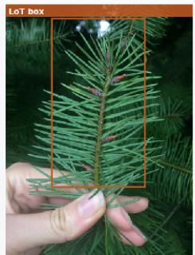

## LoT textual evidence

## LoT retrieved text

## Example 2 | E-VQA | evqa\_2771159\_1682

[..1 lean warbler forages thrgughgut the forest canopy, predominantly at middle to top layers. It hops from branch to branch, gleaning small soft-bodied insects from leaves and twigs. In the non-breeding season, it mav also glean insects from flowers. [...] to branch, gleaning small soft-bodied insects from leaves and twigs.In the non-breeding season, it may also glean insects from flowers. Its preferred prey consists of butterfly and moth (lepidopteran larvae), though it supplements its diet with [...]

Q: What color are the stems of this plant? Gold: red

LoT (exact\_match=0.00): Bronze and gold

## AREA visual evidence

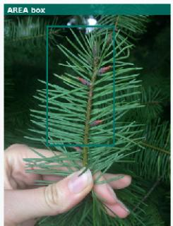

## AREA (exact\_match=1.00): Red

## AREA textual evidence

## AREA retrieved text

4 selected sentence(s): surrounding text retained [...] streaking, and are vellow belgw. All have two white wing bars and a thin, pointed bill. The cerulean warbler is insectivorous and predominantly feeds on insect larvae, though it also takes winged insects, It forages for prey and nests high in forest canopies. Individuals are strongly territorial; males will defen [...] lean warbler forages throughout the forest canopy, predominantly at middle to top layers. It hops fror branch to branch, gleaning small soft-bodied insects from leaves and twigs. In the non-breeding season, it may also glean insects from flowers. [...] to branch, gleaning small soft-bodied insects from leaves and twigs. In the non-breeding season, it may also glean insects from flowers. Its preferred prey consists of butterfly and

## LoT visual evidence

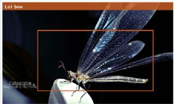

## LoT textual evidence

2 selected sentence(s): surrounding text retained [..1 states of Western Australia, South Australia. New South Wales, Victoria and Tasmania. They arrived in England in the late 18th century. According to tradition, the English gardener James Lee discovered them on the windowsill of a seaman's house [...] chsiagallmite4-2004.html "Fuchsia magellanica", www.rhs.org. Roval Horticultural Society. Retrieved 23 September 2020. "Fuchsia magellanica var, gracilis", RHS.Retrieved 23 September 2020. "Fuchsia magellanica var. gracilis 'Au [...]

## LoT retrieved text

## Example 3 |E-VQA | evqa\_2708029\_256

Q: How large is the mycelium of this fungus? Gold: 3-5 to 1.5-2.5 μm. LoT (exact match=0.00): 4 to 6 cm

## AREA visual evidence

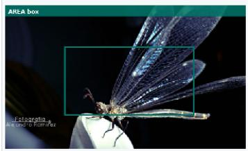

## AREA textual evidence

## AREA (exact\_match=1.00): 3-5 to 1.5-2.5 μm

## AREA retrieved text

[...] states of Western Australia. South Australia New South Wales, Victoria and Tasmania. They arrived in England in the late 18th century. According to tradition, the English gardener James Lee discovered them on the windowsill of a seaman's house [...] ical gardens and conservatories, in containers on patios, balconylbalconies, and indoors. They prefer a sunny position. The plants are quite cold-hardy compared to other species from more tropical climates, being deciduous where [...] chsiagallmite4-2004.html "Fuchsia magellanica". www.rhs.org. Rova Horticultural Society. Retrieved 23 September 2020. "Fuchsia magellanica var. gracilis". RHS.Retrieved 23 September 2020. "Fuchsia magellanica var. [...]

## LoT visual evidence

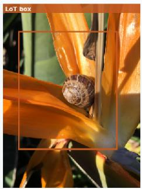

## LoT textual evidence

## LoT retrieved text

2 selected sentence(s): surrounding text retained [...] specific epithet, impudicus, is derived from the Latin for "shameless" or "immodest". Sometimes called the witch's egg, the immature stinkhorn is whitish or pinkish, egg-shaped, and typically 4 to 6 cm (1.6 to 2.4 in) by 3 to 5 cm (1.2 to 2.0 in). On the outside is a thick whitish volva, also known as the peridium, covering the olive-colored gelatinous gl [...] France and parts of Germany, where it may be sold fresh or pickled and used in sausages. Similar species are consumed in China..

## AREA visual evidence

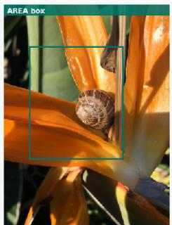

## AREA textual evidence

## AREA retrieved text

4 selected sentence(s): surrounding text retained [...] s transported by insects which are attracted by the odor—described as resembling carrion. Despite its foul smell, it is not usually poisonous and immature mushrooms are consumed in parts of France and Germany. The Italian naturalist Ulisse Aldrovandi described the fungus in 1560 with name fungus priapeus, and he depic [...] specific epithet, impudicus, is derived from the Latin for "shameless' or "immodest". Sometimes called the witch's egg, the immature stinkhor is whitish or pinkish. egg-shaped. and typically 4 to 6 cm (1.6 to 2.4 in) by 3 to 5 cm (1.2 to 2.0 in). On the outside is a thick whitish volva, also known as the peridium, covering the olive-colored gelatinous gl [...] able to exert up to 1.33 kPa of pressure — a force sufficient to push [..]

# InfoSeek: AREA vs. LoT

## Example 1 | InfoSeek | infoseek\_val\_00000103

Q: What country does this building belong to? Gold: UKR / Ukraine / UA LoT (exact match=0.00): Poland

AREA (exact match=1.00): Ukraine

## LoT visual evidence

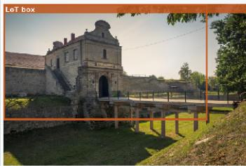

## LoT textual evidence

## LoT retrieved text

3 selected sentence(s): surrounding text retained. Zbarazh Castle Ukrainan: 3an3 3. Polish: Zamek w Zbarażu) is a fortified defense stronghold in Zbarazh. built during the times of the Polish-Lithuanian Commonwealth. It dominates the crests of the Zamkova Hills of Ternopil Oblast in Western Ukraine next to the city's central [...] e elements. First ruination of the new fortification was endeavored by cossacks in 1648. Polish sources reported their amount as much as 100,000 strong. But it would rather be an exaggeration. There was no business for such a ferocious army to siege a small cast [...] nder the castle's walls. Ivan Mazepa and Peter I are known to have visited it in 1707. Ukrainian Independence having been announced the castle was included into a registry of national

## Example 2 | InfoSeek | infoseek\_val\_00000521

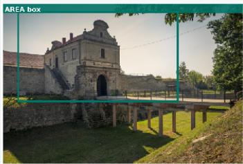  
AREA visual evidence

Q: Where is the lake inflow from? Gold: Giessbach LoT (exact match=0.00): Aare

## AREA textual evidence

AREA (exact match=1.00): Giessbach

## AREA retrieved text

4 selected sentence(s): surrounding text retained Zbarazh Castle (Ukrainian: 3apa3 a, Polish: Zamek w Zbarażu) is a fortified defense stronghold in Zbarazh, built during the times of the Polish-Lithuanian Commonwealth, It dominates the crests of the Zamkova Hills of Ternopil Oblast in Western Ukraine next [...] barazh, built during the times of the Polish-Lithuanian Commonwealth. It dominates the crests of the Zamkova Hills of Ternopil Oblast in Western Ukraine next to the city's central plaza that was not in so distant past surrounded by marshland. The castle existence has been credited to last members of the Polish Zbaraski family; Krzysztof and Jerzy Zba [...] e elements. First ruination of the new fortification was endeavored by cossacks in 1648. Polish sources [...]

## LoT visual evidence

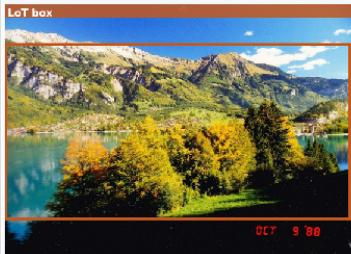

## LoT textual evidence

## LoT retrieved text

Lake Brienz (German: Brienzersee) is a lake lust north of the Alps, in the canton of Berne in Switzerland. It has a length of about 14 kilometres (8.7 mi), a width of 2.8 kilometres (1.7 mi) and a maximum depth of 26 [...] re kilometres (11.5 sg mi), and the surface is 564 metres (1,850 ft) above the sea-level. It is fed. among others. by the upper reaches of the Aare at its eastern end. the Giessbach at its southern shore from steep, forested and rocky hills of the hi [...] from the valleys of Grindelwald and Lauterbrunnen, at its south-western corner. It flows out into a further stretch of the Aare at its western end. The culminating poi [...1. It flows out into a further stretch of the Aare at its western end. The culminating point of the lake's drainage

## AREA visual evidence

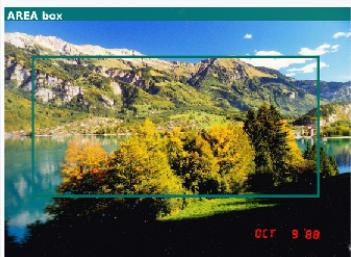

## AREA textual evidence

## AREA retrieved text

## Example 3 | InfoSeek |infoseek\_val\_00001807

Lake Brienz (German: Brienzersee) is a lake just north of the Alps, in the canton of Berne in Switzerland. It has a length of about 14 kilometres (8.7 mi), a width of 2.8 kilometres (1.7 mi) and a maximum depth of 26 [...] re kilometres (11.5 sq mi), and the surface is 564 metres (1,850 ft) above the sea-level. It is fed, among others, by the upper reaches of the Aare at its eastern end, the Giessbach at its southern shore from steep, forested and rocky hills of the hi [...] from the valleys of Grindelwald and Lauterbrunnen, at its south-western corner. It flows out into a further stretch of the Aare at its western end. The culminating poi [...] . It flows out into a further stretch of the Aare at its western end. The culminating point of the lake's drainage

Q: Which historic period or era did this place occur? Gold: Neolithic Age / Neolithic Period / Neolithic Era LoT (exact\_match=0.00): Prehistoric Orkney.

AREA (exact\_match=1.00): Neolithic

## LoT visual evidence

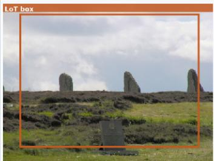

## LoT textual evidence

## LoT retrieved text

1 selected sentence(s): surrounding text retained [...] ra, the Ring of Brodgar appears in the town of Roseborough and is pivotal to the plot. Prehistoric Orkney.

## AREA visual evidence

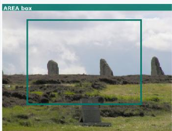

## AREA textual evidence

## AREA retrieved text

4 selected sentence(s): surrounding text retained The Ring of Brodgar (or Brogar, or Ring o' Brodgar) is a Neolithic henge and stone circle about 6 miles north-east of Stromness on Mainland, the largest island in Orkney, Scotland. It is part of the UNESCO World Heritage Site known as the Heart of Neolithic Orkney. [...] and, the largest island in Orkney Scotland. It is part of the UNESCO World Heritage Site known as the Heart of Neolithic Orkney. The Ring of Brodgar (or Brogar, or Ring o' Brodgar) is a Neolithic henge and stone circle in Mainland, Orkney [...] een recognized as part of the "Heart of Neolithic Orkney" World Heritage Site In 1999. The Heart of Neolithic Orkney was inscribed as a World Heritage site in December 1999. In addition to the Ring of Brodgar, the site includes Maeshowe, Skara Brae [...]

# ViQuAE: AREA vs. LoT

## Example 1 | ViQuAE | e66a5d556526396207d27e1bbbc08910

Q: Where was the original Globe Theatre located? Gold: London (UK) / Climate in London / London (England) LoT (exact\_match=0.00): Southwark

AREA (exact\_match=1.00): London

LoT visual evidence  
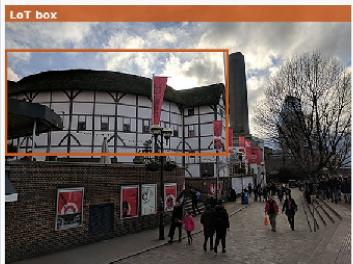

## LoT textual evidence

## LoT retrieved text

1 selected sentence(s): surrounding text retained Globe Theatre The Globe Theatre was a theatre in London associated with William Shakespeare. It was built in 1599 by Shakespeare's playing company, the Lord Chamberlain's Men, on land owned by Thomas Br [...]

## AREA visual evidence

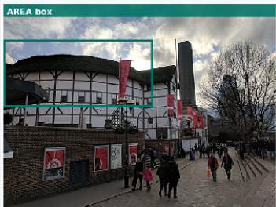

## AREA textual evidence

## AREA retrieved text

4 selected sentence(s): surrounding text retained Globe Theatre The Globe Theatre was a theatre in London associated with William Shakespeare. It was built in 1599 by Shakespeare's playing company, the Lord Chamberlain's Men, on land owned by Thomas Br [...1 Nicholas Brend and grandson Sir Matthew Brend, and was destroyed by fire on 29 June 1613.A second Globe Theatre was built on the same site by June 1614 and closed by an Ordinance issued on 6 September 1642. A modern reconstruction of the Globe, named "Shakespeare's Globe", opened in 1997 appro [...] June 1614 and closed by an Ordinance Issued on 6 September 1642. A modern reconstruction of the Globe, named "Shakespeare's Globe", opened in 1997 approximately from the site of the original theatre. From 1909, the current

## Example 2 | ViQuAE | 4de74c0f3dccddced8196483d0fb3fa4

Q: Who was the first British monarch to live in Buckingham Palace? Q: Who was the first British monarch to live in Buckingham Palace?

Gold: Queen Victoria's Diamond Jubilee / We are not amused / Queen Victoria I of the United Kingdom LoT (exact match=0.00): George VI AREA (exact match=1.00): Queen Victoria

## LoT visual evidence

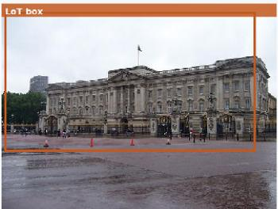

## LoT textual evidence

## LoT retrieved text

2 selected sentence(s): surrounding text retained [...] k of Guernsey, the Bailiwick of Jersey and the Isle of Man) and its overseas territories. The current monarch and head of state is Queen Elizabeth II, who ascended the throne in 1952. The monarch and their immediate family undertake various official ceremonial, diplomatic and representationa [...] h colonies and territories became independent. effectively bringing the Empire to an end. George VI and his successor, Elizabeth II, adopted the title Head of the Commonwealth as a symbol of the free association of its independent member states. The United Kingdom and fifteen other Independent sovereign states that share the same person as their monarch [...]

## AREA visual evidence

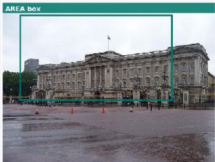

## Example 3 | ViQuAE | 66aae24313bd94a0cccdcb7a019d1046

Q: Which British actor played the role of Odysseus in the 2004 film 'Troy'?   
Gold: Sean Bean / Shaun Bean / Sean Been   
LoT (exact match=0.00): Ulysses

## AREA retrieved text

4 selected sentence(s): surrounding text retained Monarchy of the United Kingdom The monarchy of the United Kinadom, commonly referred to as the British monarchy, is the constitutional monarchy of the United Ki [...] nsey, the Bailiwick of Jersey and the Isle of Man) and its overseas territories. The current monarch and head of state is Queen Elizabeth II, who ascended the throne in [...] ailiwick of Jersey and the Isle of Man) and its overseas territories. The current monarch and head of state is Queen Elizabeth II, who ascended the throne in 1952. The monarch and their immediate family undertake various official, ceremonial, diplomatic and representationa [...] al powers. From 1603, the English and Scottish kingdoms were ruled by a single sovereign. From 1649 to 1660, the tradition of [...]

## AREA textual evidence

AREA (exact match=1.00): Sean Bean

## LoT visual evidence

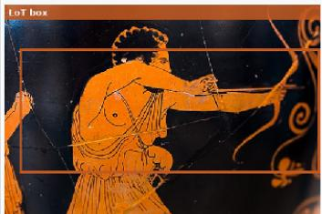

## LoT textual evidence

## LoT retrieved text

1 selected sentence(s): surrounding text retained   
[...] me, gave rise to different counterparts (i. e. "5° or "λ" in Greek, "θ" in Etruscan).   
Section::::Genealogy..

## AREA visual evidence

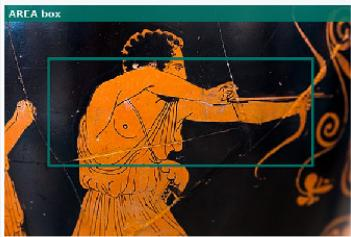

## AREA textual evidence

## AREA retrieved text

4 selected sentence(s): surrounding text retained Odysseus Odysseus (;, " Odysseús"), also known by the Latin variant Ulysses ( ; ), is a legendary Greek king of Ithaca and the hero of Homer's epic poem the "Odyssey". Odysseus also plays a key role in Homer's "lliad" and other works in that same epic cycle. Son of Laertes [...] or "homecoming", which took him ten eventful years after the decade-long Trojan War. Section::Name, etymology and epithets. In Greek the name was used in various versions. Vase inscriptions have the two groups of "Olyseus" (), "Olyss [...] name is of non-Greek origin, possibly not even Indo-European, with an unknown etymology. Robert S. P. Beekes has suggested a Pre-Greek origin. In Etruscan religion the name (and stories) of Odysseus were adopted under the name [...]

LoT retrieved text

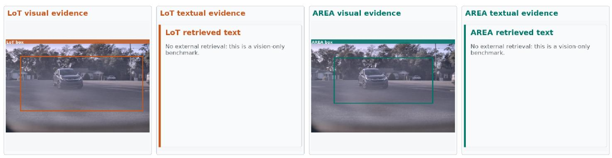  
AREA (option\_accuracy=1.00): C  
AREA (option\_accuracy=1.00): B.

# RealWorldQA: AREA vs. LoT

## Example 1 |RealWorldQA |RealWorIdQA\_213

Q: What is the speed limit on this road? A. 25 B. 35 C. 45

LoT (option\_accuracy=0.00): B

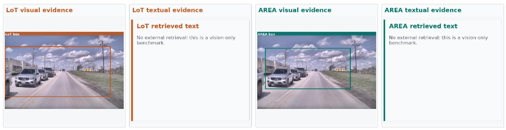

## Example 2 | RealWorldQA | RealWorIdQA\_562

LoT (option accuracy=0.00): A

Q: Is the car ahead of us driving away from us or towards us? A. Away from us. B. Towards us.

## Example 3 | RealWorldQA | RealWorIdQA\_514

LoT (option\_accuracy=0.00): B

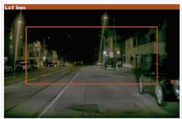  
LoT textual evidence  
No external retrieval: this is a vision-only benchmark.  
AREA visual evidence

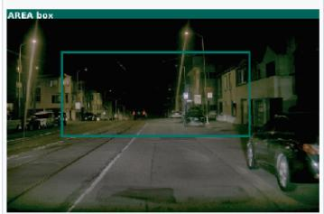

## AREA textual evidence

## AREA retrieved text

No external retrieval: this is a vision-only

AREA (option\_accuracy=1.00): A

# VstarBench: AREA vs. LoT

## Example 1 | V\*Bench | VStar\_55

Q: What is the color of the dress? (A) white (B) black (C) pink (D) red Answer with the option's letter from the given choices directly Gold: D

LoT (option\_accuracy=0.00): A

AREA (option\_accuracy=1.00): D

LoT visual evidence  
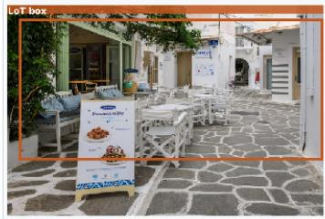  
LoT textual evidence  
LoT retrieved text  
benchmark.  
AREA visual evidence

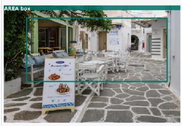

## AREA textual evidence

## AREA retrieved text

benchmark.

## Example 2 | V\*Bench | VStar\_30

LoT (option accuracy=0.00): D

## LoT visual evidence

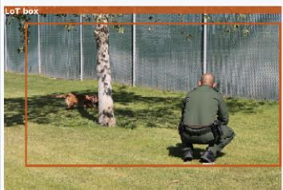

## LoT textual evidence

## LoT retrieved text

benchmark.

## AREA visual evidence

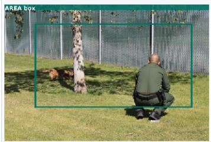

## AREA textual evidence

## AREA retrieved text

benchmark.

## Example 3 | V\*Bench | VStar\_177

LoT (option\_accuracy=0.00): A

Q: Is the soccer ball on the left or right side of the long bench? (A) right (B) left Answer with the option's letter from the given choices directly. Gold: B

## LoT visual evidence

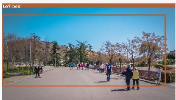

## LoT textual evidence

## LoT retrieved text

benchmark.

## AREA visual evidence

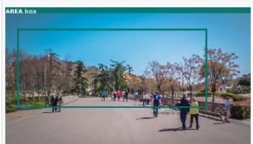

## AREA textual evidence

## AREA retrieved text

No external retrieval: this is a vision-only benchmark.

AREA (vqa\_accuracy=1.00): 7

# TextVQA: AREA vs. LoT

## Example 1 | TextVQA | TextVQA\_36447

Q: what is the last digit of the runner on the right?   
Gold: 7 / 227 / 127   
LoT (vqa\_accuracy=0.00): 2

LoT visual evidence  
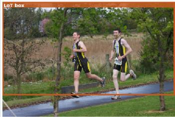  
AREA visual evidence

  
LoT retrieved text  
No external retrieval: this is a vision-only benchmark.

## Example 2 | TextVQA | TextVQA\_38712

Q: what does his shirt say? Reference OCR tokens: A, MtE, W6/ Gold: medstar emergency / emergency matthew / meister emergency LoT (vqa\_accuracy=0.00): university

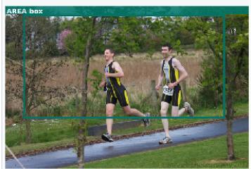

## AREA textual evidence

## AREA retrieved text

No external retrieval: this is a vision-only

## AREA (vqa\_accuracy=1.00): medstar emergency

## LoT visual evidence

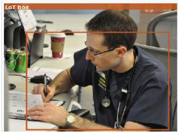

## AREA visual evidence

## AREA textual evidence

## AREA retrieved text

No external retrieval: this is a vision-only

## Example 3 | TextVQA | TextVQA\_39133

Q: what brand is the girl's shoes? Reference OCR tokens: HUOSON, 7

Gold: nike

LoT (vqa\_accuracy=0.00): adidas

AREA (vqa\_accuracy=1.00): nike

## LoT visual evidence

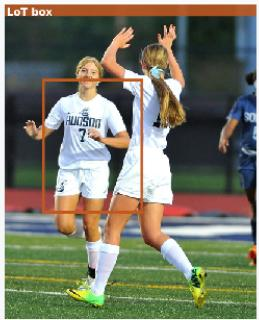

## LoT textual evidence

## LoT retrieved text

No external retrieval: this is a vision-only benchmark.

## AREA visual evidence

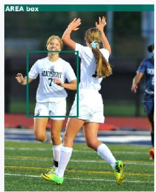

## AREA textual evidence

## AREA retrieved text

No external retrieval: this is a vision-only

ChartQA: AREA vs. LoT

## Example 1 | ChartQA | ChartQA\_281

Q: What is the sum of smallest two bars?

LoT (relaxed\_accuracy=0.00): 0.07

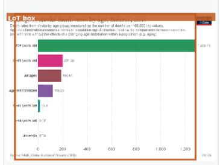

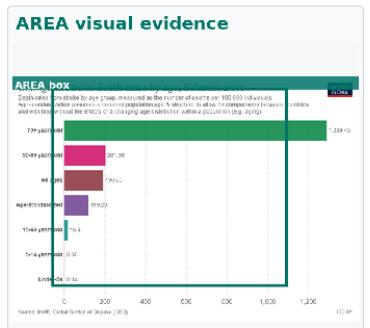  
AREA (relaxed\_accuracy=1.00): 0.11

No external retrieval: this is a vision-only

## Example 2 | ChartQA | ChartQA\_600

Q: Which country is represented by blue color line?

Gold: Chinese Taipei

LoT (relaxed accuracy=0.00): China Taipei

AREA (relaxed accuracy=1.00): Chinese Taipei  
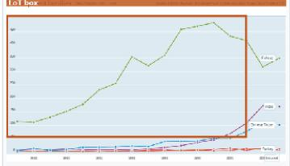

No external retrieval: this is a vision-only benchmark.

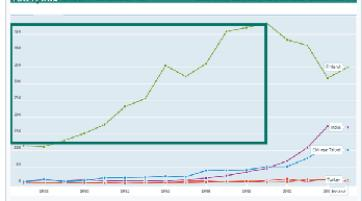

No external retrieval: this is a vision-only

## Example 3 | ChartQA | ChartQA\_1428

Q: How many marathons took place in the United States in 2012?

Gold: 850

LoT (relaxed\_accuracy=0.00): 650

AREA (relaxed accuracy=1.00): 850  
LoT visual evidence  
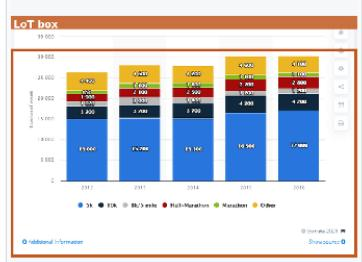

No external retrieval: this is a vision-only

# OCRBench: AREA vs. LoT

## Example 1 | OCRBench | OCRBench\_335

O: What is the name of this boat? Gold: Lady Joan III LoT (ocr\_match=0.00): Lady Jean III

AREA (ocr\_match=1.00): Lady Joan III  
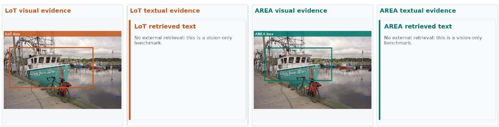

## Example 2 | OCRBench | OCRBench\_646

Q: In which year the market share of KLA is highest? Gold: 2019

LoT (ocr match=0.00): 2020

AREA (ocr match=1.00): 2019  
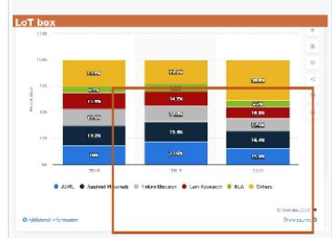

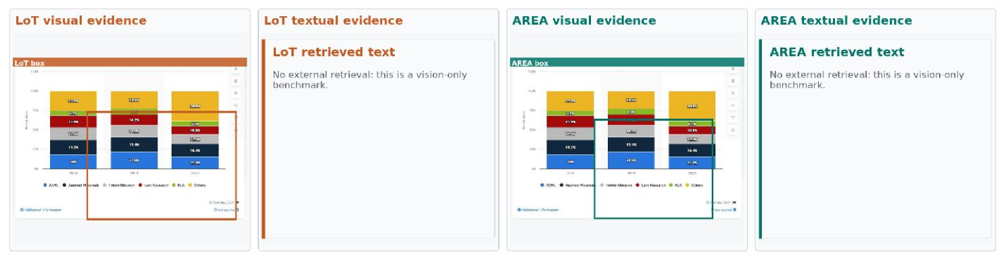

## Example 3 | OCRBench | OCRBench\_704

Q: when was this receipt issued? Answer this question using the text in the image directly.

Gold: 08 JUN 2018

LoT (ocr\_match=0.00): 08 JUN 2014

AREA (ocr\_match=1.00): 08 JUN 2018  
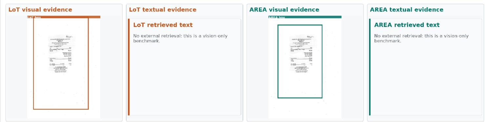

# POPE: AREA vs. LoT

## Example 1 | POPE | POPE\_2478

Q: Is there a cup in the image? Gold: no LoT (binary\_accuracy=0.00): yes

LoT visual evidence  
AREA (binary\_accuracy=1.00): no  
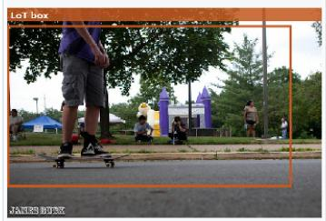  
AREA (binary\_accuracy=1.00): no  
AREA visual evidence

## Example 2 | POPE | POPE\_1404

Q: Is there a truck in the image?

LoT (binary\_accuracy=0.00): yes

## LoT visual evidence

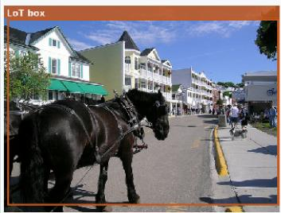  
No external retrieval: this is a vision-only benchmark.  
LoT textual evidence  
LoT retrieved text  
LoT textual evidence

## Example 3 | POPE | POPE\_2409

Q: Is there a fork in the image?

LoT (binary\_accuracy=0.00): no

## LoT retrieved text

benchmark.

## LoT visual evidence

AREA visual evidence

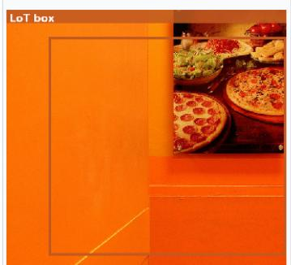

  
AREA (binary\_accuracy=1.00): yes

## LoT textual evidence

## LoT retrieved text

benchmark.

  
No external retrieval: this is a vision-only benchmark.

## AREA textual evidence

## AREA retrieved text

## AREA textual evidence

## AREA retrieved text

benchmark.

## AREA textual evidence

## AREA retrieved text

No external retrieval: this is a vision-only benchmark.

  
AMBER-D: AREA vs. LoT  
AREA (binary\_accuracy=1.00): no

## Example 1 | AMBER-D | AMBER\_11844

## Example 2 | AMBER-D | AMBER\_4216

Q: Is the sky dim in this image? Gold: no LoT (binary accuracy=0.00): yes

## Example 3 |AMBER-D |AMBER\_4859

Q: Is the tree red in this image? Gold: yes LoT (binary\_accuracy=0.00): no

AREA (binary\_accuracy=1.00): yes  

## LoT textual evidence

## AREA textual evidence

## AREA retrieved text

No external retrieval: this is a vision-only benchmark.