# LimiX-2: A Contextual Mechanism Network Towards General Structured-Data Intelligence

LimiX Team

Stable AI & Tsinghua University

https://github.com/limix-ldm/LimiX/

https://huggingface.co/stableai-org/

https://modelscope.cn/organization/stable-ai/

## Abstract

We introduce LimiX-2, a new model in the LimiX family, developed through model and data scaling guided by our previously established scaling laws. LimiX-2 adopts the Contextual Mechanism Networks (CMNs) paradigm and is pretrained with Context-Conditional Masked Modeling (CCMM). CMNs shifts the organizing principle of incontext learning from target-centric prediction to mechanism-oriented joint modeling. Rather than centering the network on the p(y | x, Dcontext) objective of conventional tabular PFNs, it is designed around learning p(x, y | Dcontext), a context-dependent representation of the joint structure underlying data generation. Pretraining uses synthetic datasets generated by structural causal models (SCMs) spanning diverse graph structures, functional mechanisms, and observation processes. Evaluations on TabArena, TALENT, and BCCO show that LimiX-2 outperforms current dataset-specific models and tabular foundation models. Beyond predictive performance, the CMN paradigm also promotes causal awareness in LimiX-2: its feature attention encodes direct causal relationships, enabling accurate causal skeleton recovery.

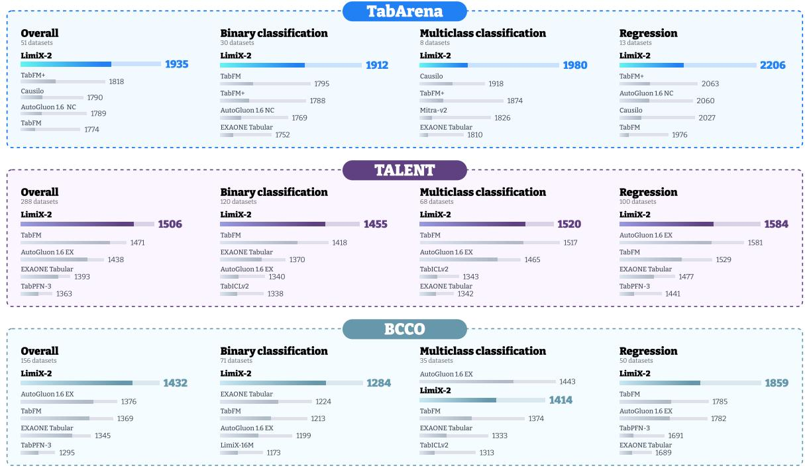  
Figure 1: Performance overview on evaluated benchmarks. LimiX-2 achieves Elo scores of 1935, 1506, and 1432 on TabArena (Erickson et al., 2025), TALENT (Ye et al., 2024; Liu et al., 2024), and BCCO (LimiX Team, 2025), respectively, outperforming all compared foundation models and AutoGluon 1.6 (Erickson et al., 2020). For TabArena, only the best AutoGluon setting is shown. Bar ends and labels indicate Elo point estimates, while shaded regions with terminal markers show 95% bootstrap confidence intervals.

## Contents

1 Introduction 3   
2 Architecture   
2.1 Embedding of Tabular Data . .   
2.2 Discriminative Feature Encoding   
2.3 Model Backbone Architecture   
2.4 Prediction Heads   
3 Pretraining 7   
3.1 Context-Conditional Masked Modeling for Joint Distribution Learning 7   
3.2 Mask Pattern Design 8   
3.3 Mask Embedding 8   
4 Pretraining Data Generation 8   
4.1 Hyperparameter Sampling . 8   
4.2 Directed Acyclic Graph Generation . 8   
4.3 Functional Mechanisms of SCM . 8   
4.4 Feature and Target Sampling 9   
4.5 Task Adaptation . 10   
Evaluation 10   
5.1 Predictive Performance Evaluation Setup 10   
5.2 Results on TabArena 11   
5.3 Results on TALENT 15   
5.4 Results on BCCO 18   
5.5 Causal Skeleton Recovery Evaluation 21   
6 Scaling Law 21   
6.1 Experimental Setup and Scaling Model 22   
6.2 Scaling Results . 23   
7 Conclusions 24   
8 Contribution 25

## 1 Introduction

Progress toward general-purpose machine intelligence can be organized around three complementary frontiers: language, the physical world, and structured data (LimiX Team, 2025). Large-scale next-token pretraining and post-training have enabled large language models (LLMs) to follow instructions, use tools, and reason over text and visual inputs (Ouyang et al., 2022; Schick et al., 2023; Team et al., 2023; Guo et al., 2025). Embodied agents and world models pursue physical-world intelligence by learning to model and interact with environments (Ha & Schmidhuber, 2018; Kim et al., 2024). In contrast, general-purpose learning and reasoning over structured data remain comparatively underdeveloped.

Structured data supports prediction and decision-making in healthcare (Johnson et al., 2016), finance (Gu et al., 2020), and scientific discovery (Baldi et al., 2014). For tabular prediction, gradient-boosted trees (Chen & Guestrin, 2016; Ke et al., 2017; Dorogush et al., 2018), deep neural networks (Gorishniy et al., 2021; 2024), and automated ensemble pipelines (Erickson et al., 2020) have achieved strong task-specific performance. However, these methods typically require separate training and model selection for each dataset, with limited reuse of knowledge across tasks. This motivates foundation models that learn from diverse datasets through pretraining and transfer to new prediction tasks.

Motivated by this gap, we advocate the development of large structured-data models (LDMs)1: large-scale pretrained models for inference over structured data. We characterize LDMs by three properties: (i) pretraining on large-scale data that covers a wide distribution of tasks; (ii) a unified modeling paradigm over structured variables without task-specific design; and (iii) the ability to perform new tasks at inference time without any model updates. Classification and regression are the canonical instances of tabular data inference, yet they do not exhaust the choice of such tasks.

One line of work pretrains tabular predictors on synthetic tasks using Prior-Data Fitted Networks (PFNs) (Muller et al.¨ , 2021; Hollmann et al., 2022; 2025). Subsequent models, including TabICL (Qu et al., 2025; 2026), TabFM (Kong & Das, 2026), and Mitra (Zhang et al., 2025; Tao et al., 2026), follow this approach of pretraining on synthetic tasks for supervised in-context prediction. In their standard supervised formulation, PFNs approximate $p ( y \mid x , \dot { D } _ { \mathrm { c o n t e x t } } )$ , the posterior predictive distribution of a designated target y given query features x and a labeled context set (Hollmann et al., 2022). This enables prediction on new datasets through in-context learning without parameter updates. However, within each task, direct supervision is confined to predicting a single target column rather than explicitly modeling the joint distribution over all variables, which may significantly limit the ability on variant data reasoning tasks.

We introduce Contextual Mechanism Networks (CMNs), a new paradigm for structured-data intelligence that shifts the modeling focus from a designated target to the system of predictive dependencies among variables. Unlike PFNs, CMNs learn from multiple conditional prediction tasks over the same dataset, using context to capture the dependencies shared across them and target the joint dependency structure of $p ( \mathbf { x } , y \mid D _ { \mathrm { c o n t e x t } } ) $ . Supervised prediction is thus a special case of a broader framework for inferring unobserved quantities from available evidence.

This paradigm builds on the context-conditional modeling principles introduced in LimiX (LimiX Team, 2025). We instantiate CMNs in LimiX-2 and advance this design through model and data scaling. Pretraining uses Context-Conditional Masked Modeling (CCMM) (LimiX Team, 2025), which integrates target prediction and feature reconstruction under varied observation patterns. By organizing supervision across variables, CCMM makes inter-variable inference an explicit pretraining objective rather than an auxiliary capability. This provides a unified basis for supervised prediction, missing-value imputation, and broader conditional reasoning within a single pretrained model.

LimiX-2 refines the Transformer-based architecture of LimiX (Vaswani et al., 2017; LimiX Team, 2025) while retaining cell-level representations. It is pretrained exclusively on synthetic datasets produced by an expanded generation engine based on structural causal models (SCMs) (Pearl et al., 2003). Compared with its predecessor, the engine spans a broader range of graph structures, functional mechanisms, and observation processes. Our evaluations demonstrate the effectiveness of the CMN paradigm: a single pretrained LimiX-2 model supports classification, regression, and missing-value imputation, as well as causal discovery, without task-specific parameter updates.

We empirically evaluate the prediction performance of LimiX-2 model on three benchmarks widely adopted by the community of tabular machine learning: TabArena, TALENT and BCCO. These benchmarks span broad regimes of sample size, feature dimensionality, class number, categorical–to-numerical feature ratio, missingness and sample-to-feature ratios. The results demonstrate that our LimiX-2 model outperforms current models, including tabular foundation models and traditional models trained specif ically on each dataset. Notably, LimiX-2 surpasses TabFM despite being 4 times smaller in model parameter size. Furthermore, we also conduct causal skeleton recovery evaluations on several typical causal discovery datasets. The results demonstrate that LimiX-2 outperforms other tabular foundation models, tree-based feature importance methods and dedicated causal discovery methods, indicating that its feature attention encodes causal structural information.

## 2 Architecture

LimiX-2 continues the cell-level design of the previous generation (LimiX Team, 2025): it does not compress feature information at the row level, instead encodes each cell into separate representation2, supporting conditional reasoning across variables. Local relations among features within a row can therefore be modeled directly, while dataset-level statistics can be derived from the corresponding cells in context. Contrastive to representations that collapse a whole row into a single vector, cell-level representations better preserve the fine-grained structure tabular data.

On this basis, LimiX-2 instantiates cell-level modeling at a larger scale. Every cell must keep its own representation, and masked prediction further requires these vectors to yield consistent conditionals under different visibility patterns. The parameter budget is increased so that each cell has a richer representation space and fine-grained relations across columns and samples can be captured more stably. The extra capacity is not applied as a uniform width multiplier. It is allocated mainly to the subsequent task pathway, which organizes the evidence needed for prediction.

## 2.1 Embedding of Tabular Data

Suppose a table has N rows and F columns, we denote raw cell in the i-th row and j-th column as $x _ { i , j } ^ { R }$ and raw targets of the i-th row as $y _ { i } ^ { R }$ . We firstly map each raw cell $x _ { i , j } ^ { R }$ into feature representation space $\mathbf { x } _ { i , j } \in \mathbb { R } ^ { d }$ . In the previous version LimiX, we set $d = 1 9 2$ for LimiX-16M (LimiX Team, 2025) and $d = 9 6$ for LimiX-2M (Wang et al., 2026b). LimiX-2 extends the embedding dimension to $d = 2 5 6$ . Missing cells share a single learnable embedding, while column identity is provided separately by discriminative feature encoding (DFE).

$$
\begin{array} { r } { \mathbf { x } _ { i , j } = \left\{ \begin{array} { l l } { E _ { \mathrm { m i s s } } , } & { \mathrm { i f ~ } x _ { i , j } ^ { R } \mathrm { ~ i s ~ m i s s i n g , } } \\ { E _ { \mathrm { n u m } } ( x _ { i , j } ^ { R } ) , } & { \mathrm { o t h e r w i s e . } } \end{array} \right. } \end{array}
$$

$E _ { \mathrm { n u m } }$ is a two-layer MLP with RMSNorm (Zhang & Sennrich, 2019) and GELU (Hendrycks & Gimpel, 2016). $E _ { \mathrm { m i s s } }$ is one learnable vector shared by all missing cells, irrelevant to column index and type. Therefore, the entire feature representation tensor can be denoted as $\pmb { x } \in \mathbb { R } ^ { N \times F \times d }$

Targets are encoded as $\mathbf { y } _ { i } \in \mathbb { R } ^ { K d }$ (we set $K = 4$ in LimiX-2) according to task type: numerical regression targets are mapped through an encoder $E _ { \mathrm { n u m } } ^ { Y } ,$ while categorical classification targets are mapped through an orthogonally initialized embedding table $E _ { \mathrm { { c a t } } } ^ { Y } .$ Context rows retain their observed labels, whereas the target position of each query row is filled with a learnable MASK embedding. While LimiX uses the task embedding as a whole per sample, LimiX-2 splits the embedding into K task-embedding slots, each of dimension d. Formally,

$$
\mathbf { y } _ { i } = \left( \mathbf { y } _ { i , 1 } , \ldots , \mathbf { y } _ { i , K } \right) , \qquad \mathbf { y } _ { i , k } \in \mathbb { R } ^ { d } .
$$

Furthermore, a task-type embedding $E _ { \mathrm { t y p e } } ( \tau )$ , where $\tau \in \{ \mathrm { c l s } , \mathrm { r e g } \}$ , is added to each of the four task embeddings.

## 2.2 Discriminative Feature Encoding

In LimiX-2, each feature shares the same numerical MLP, so the distinct columns of similar marginal distribution become indistinguishable from their value representations alone. Therefore, an explicit column identity is therefore required.

LimiX-2 adopts low-rank DFE to produce column identity representation. The j-th column is associated with an s-dimensional code $u _ { j } \in \mathbb { R } ^ { s }$ , where $s = d / 4$ by default. A transformation matrix $\boldsymbol { E } \in \mathbb { R } ^ { s \times d }$ then maps the codes into the embedding space, and the mapped codes (i.e. column identity embedding) are added with feature representation.

The column identity embedding $e _ { j }$ distinguish the columns without encoding sequential proximity: when columns are permuted together with their codes, attention should not depend on an accidental order. The low rank confines column identity to a compact subspace so that statistical strength can be shared across columns. Since the representation dimension is set as a larger value $d = 2 5 6$ than previous generation of LimiX, it becomes easier to memorize column-index shortcuts. Hence, compressing column identity into an s-dimensional code constrains the model recognizing columns rather than positions.

## 2.3 Model Backbone Architecture

The backbone remains a stack of dual-axis transformer blocks: the feature-axis blocks models variable relations within rows, and the sample-axis blocks use context samples to form a prior for the current table. In LimiX, feature-axis and sample-axis attention and the Feed-Forward Network (FFN) were shared within a block (LimiX Team, 2025). LimiX-2 keeps this two-dimensional factorization, but no longer routes feature and task representations through the same computation path. The model architecture is shown in Figure 2. We denote $\mathbf { x } _ { i , j } ^ { ( l ) }$ and $\mathbf { y } ^ { ( l ) }$ as the output representation of the l-th dual-axis transformer block. Specifically, $\mathbf { x } _ { i , j } ^ { ( 0 ) }$ and $\mathbf { y } _ { i } ^ { ( 0 ) }$ are the original representation of the initial embedding components. Formally, we have $\mathbf { x } _ { i , j } ^ { ( 0 ) } = \mathbf { x } _ { i , j }$ and $\mathbf { y } _ { i } ^ { ( 0 ) } = \mathbf { y } _ { i }$

Sample-axis attention. For each dual-axis transformer block, the representations produced by the previous block are firstly fed into sample-axis attention components. The sample-axis attention components propagate information across samples on each feature position as well as target position. For the target position, LimiX-2 firstly concatenates the task embeddings into a unified one before feeding into attention process,

$$
\mathbf { y } _ { i } ^ { ( l - 1 ) } = ( \mathbf { y } _ { i , 1 } ^ { ( l - 1 ) } , \ldots , \mathbf { y } _ { i , K } ^ { ( l - 1 ) } ) \in \mathbb { R } ^ { K d } .
$$

In the attention component, context rows are visible to each other, while query rows can only attend to context. The query/key/value mapping functions are shared among features, but not between features and target. $\mathrm { A } ^ { \bar { } }$ query prediction therefore depends only on the sample’s own features and the context, not on which other test samples share the batch. After the calculation, the target representaions are then split back into K embeddings. The immediate representation of features and target produced by the $l ^ { t h }$ sample-axis attention are denoted as $\widetilde { x } _ { i , j } ^ { ( l ) }$ and $\widetilde { y } _ { i } ^ { ( l ) }$ respectively.

Asymmetric feature-axis attention. Feature representations may attend to the target and other feature representations, while target representations can only attend to features representations. Formally we have,

$$
\pmb { x } ^ { ( l ) } = \mathrm { A t t m } _ { X } ^ { \mathrm { f e a t } } \big ( Q _ { X } ( \widetilde { \pmb { x } } ^ { ( l ) } ) , K _ { X } ( [ \widetilde { \pmb { x } } ^ { ( l ) } , \widetilde { \pmb { y } } ^ { ( l ) } ] ) , V _ { X } ( [ \widetilde { \pmb { x } } ^ { ( l ) } , \widetilde { \pmb { y } } ^ { ( l ) } ] ) \big ) ,
$$

$$
\mathbf { y } ^ { ( l ) } = \mathbf { A t t n } _ { Y } ^ { \mathrm { f e a t } } \big ( Q _ { Y } ( \widetilde { \mathbf { y } } ^ { ( l ) } ) , K _ { Y } ( \widetilde { \mathbf { x } } ^ { ( l ) } ) , V _ { Y } ( \widetilde { \mathbf { x } } ^ { ( l ) } ) \big ) ,
$$

where Attn $\boldsymbol { \mathrm { f e a t } } _ { X / Y } ( \cdot , \cdot , \cdot )$ is multi-head attention components for feature/target representations and $Q _ { X / Y } ( \cdot )$ $K _ { X / Y } ( \cdot )$ and $V _ { X / Y } ( \cdot )$ are query mapping function, key mapping function and value mapping function of feature and target representation attention respectively. The $\mathrm { \Delta \stackrel { \sim } { Q } / K / V }$ mapping functions for feature and target representation attention are not shared, so the model implicitly distinguish their roles inside a mixed stream.

Independent SwiGLU. The shared MLP is replaced by a gated FFN (Shazeer, 2020), instantiated separately for feature and target representations. Formally,

$$
\begin{array} { r } { \mathrm { S w i G L U } ( z ) = W _ { o } \left[ \mathrm { S i L U } ( W _ { g } z + b _ { g } ) \odot ( W _ { v } z + b _ { v } ) \right] + b _ { o } , } \end{array}
$$

where $W _ { g / v }$ and $b _ { g / v / o }$ are learnable projection matrices and bias parameters.

The FFNs of feature representations operates in the space of $\mathbb { R } ^ { p } .$ , and the FFNs of target representations operates on the concatenated slot space of $\mathbb { R } ^ { K d }$

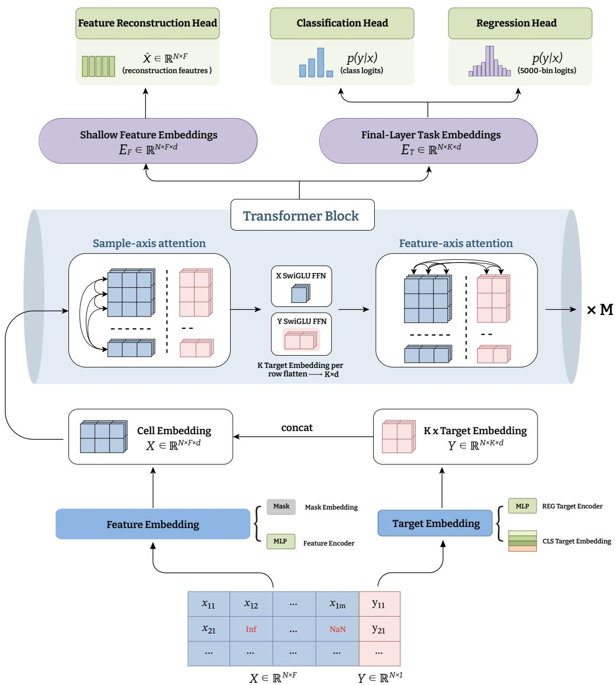  
Figure 2: Overall structure of LimiX-2. Features are encoded by a MLP-based encoder, and missing cell is imputed by a shared learnable vector. Targets are encoded into K = 4 embedding slots. Each block successively applies sample-axis attention and SwiGLU on the feature and target representations, followed by asymmetric feature-axis attention. Feature embeddings produced at the shallow depth are used for masked-feature reconstruction. Final-layer task embeddings are used for both classification and regression tasks.

Multi-head Attention and length stability of multi-head attention. In LimiX, cross-attention used only the one key/value head. In contrast, LimiX-2 applies all the K/V heads. Before attention scores are computed, Q and K are normalized to control the magnitude of the attention logits in deep stacks. Queries are then rescaled per head by a length-dependent factor

$$
s _ { h } = \left( 1 + w _ { h } \log n \right) \beta _ { h } ,
$$

where n is the current sequence length and $w _ { h }$ and $\beta _ { h }$ are learnable and softly truncated by the tanh

function. This is conceptually related to length-aware softmax scaling for variable context lengths (Chiang & Cholak, 2022; Nakanishi, 2025). All sublayers use pre-normalized RMSNorm (Zhang & Sennrich, 2019).

The computation order inside a block is as follows: independent $X / Y$ sample-axis attention, independent SwiGLU, asymmetric feature-axis attention, and residual connections. The blocks are stacked $M = 2 4$ layers deep.

## 2.4 Prediction Heads

In LimiX-2, the prediction heads of different tasks (i.e. classification, regression and masked-feature reconstruction) are attached to the output representation of different depths. Masked-feature reconstruction needs local details of data and the corresponding prediction head is attached to the shallow depth representations $\mathbf { { x } } ^ { ( l _ { \mathrm { { m a s k } } } ) } \left( l _ { \mathrm { { m a s k } } } < M \right)$ . In contrast, classification and regression tasks are decoded from the representations of the last layer $\mathbf { v } ^ { ( M ) }$ . Each head is preceded by an independent bottleneck post-adapter (Post Adapter): $A _ { \mathrm { m a s k } } , A _ { \mathrm { c l s } } , \mathbf { \bar { o r } } \ : \dot { A } _ { \mathrm { r e g } } .$ For classification and regression, the post-adapter is applied to each of the K target embeddings slots, which are then concatenated into the space of $\mathbb { R } ^ { K d }$

For C-way classification, the head emits logits in $\mathbb { R } ^ { C }$ and is trained with cross-entropy. Learning objective of regression does not adopt mean square error (MSE) loss as in LimiX. Instead, LimiX-2 partitions the target range into $B = 5 0 0 0$ ordered bins, predicts probability of each bin $p \in \Delta ^ { B - 1 }$ , and derive the regression value as following

$$
\hat { y } = \sum _ { i = 1 } ^ { B } p _ { i } c _ { i } ,
$$

where $c _ { i }$ is the center value of the $i ^ { t h }$ bin.

## 3 Pretraining

## 3.1 Context-Conditional Masked Modeling for Joint Distribution Learning

Pretraining aims to capture the joint dependency structure of table variables through conditional prediction under varied observation patterns. Following LimiX (LimiX Team, 2025), LimiX-2 adopts Context-Conditional Masked Modeling (CCMM), which combines target prediction with masked-feature reconstruction. Whereas standard supervised objectives in PFNs including TabPFN and TabICL concentrate on $p ( y \mid \mathbf { x } , D _ { \mathrm { c t } } )$ within each task (Hollmann et al., 2025; Qu et al., 2025), CCMM extends direct supervision across variables and conditioning sets.

Each pretraining episode partitions a table into disjoint context and query row sets, $\mathcal { T } _ { \mathrm { c t } }$ and $\mathcal { T } _ { \mathrm { t e } }$ . The context $D _ { \mathrm { c t } } = ( \breve { \mathbf { X } } _ { \mathrm { c t } } , \mathbf { y } _ { \mathrm { c t } } )$ retains available observations, providing evidence about the table’s marginal distributions and inter-variable dependencies. For each query row i $\in \mathcal { T } _ { \mathrm { t e } }$ , let $\pi _ { i }$ index its masked feature columns. The model estimates

$$
q _ { \theta } \left( x _ { i , j } \mid \mathbf { x } _ { i , - \pi _ { i } } , \mathbf { X } _ { \mathrm { c t } } , \mathbf { y } _ { \mathrm { c t } } \right) , \qquad i \in \mathcal { T } _ { \mathrm { t e } } , \ j \in \pi _ { i } ,
$$

where j ranges over the masked columns of row $i ,$ and $\mathbf { x } _ { i , - \pi _ { i } }$ denotes the observed query features. The query target y is predicted from the same conditioning information through the task heads.

Along the sample axis, query rows attend only to context rows, and context representations are computed without access to queries. This prevents both direct and context-mediated information exchange between query rows. For fixed input representations and context, predictions are therefore invariant to query-batch composition. The same conditional interface supports classification, regression, and masked-feature reconstruction without task-specific parameter updates. Conditional likelihoods can additionally be used to score potentially anomalous entries.

LimiX-2 retains CCMM while scaling an architecture with separate feature and task pathways. The feature pathway models inter-variable dependencies through cell-level representations, while the task pathway uses $\check { K } = 4$ embeddings to aggregate prediction-relevant information. Asymmetric attention directs information from feature representations to the task readout. We scale the backbone and widen the task FFN to provide additional capacity for conditional prediction over wider tables, longer contexts, and more diverse observation patterns.

## 3.2 Mask Pattern Design

A fixed masking pattern restricts the range of conditional prediction tasks encountered during pretraining. LimiX-2 therefore combines three masking schemes to vary the granularity of prediction targets and the available conditioning information.

Masks are applied to individual entries, selected columns across query rows, or blocks of entries, exposing the model to prediction tasks at different granularities. The resulting tasks range from recovering isolated values to predicting target columns and reconstructing groups of missing entries, all conditioned on the remaining observations and the context set. Interleaving these schemes across episodes broadens the coverage of observation patterns and discourages specialization to a single reconstruction setting.

## 3.3 Mask Embedding

For each cell masked during pretraining, the value embedding is replaced by the shared missing-value embedding $E _ { \mathrm { m i s s } }$ defined in Section 2.1 and added to the DFE column code $e _ { j } .$ Masked and naturally missing cells thus share a missingness encoding while retaining column identity. The resulting representations pass through the same dual-axis attention layers as observed-cell embeddings, allowing the model to integrate evidence across columns and context samples and produce distributional predictions through the corresponding output heads.

## 4 Pretraining Data Generation

We construct large-scale pretraining data following the SCM framework (Pearl et al., 2003). By varying the components at different stages of the data-generation process, we synthesize a large number of datasets with diverse variable dependencies, feature distributions, and task properties.

Inherited from the previous version of LimiX (LimiX Team, 2025), the overall data-generation pipeline consists of five main stages-hyperparameter sampling, directed acyclic graph (DAG) generation, SCM propagation, data sampling, and task adaptation-as illustrated in Figure 3. Building upon this pipeline, LimiX-2 further expands the space of graph structures, functional mechanisms, and variable observation processes, thereby increasing the structural and statistical diversity of the pretraining tasks.

## 4.1 Hyperparameter Sampling

For each pretraining dataset, we sample a set of hyperparameters that characterize its global properties, including the sample size, the feature dimension (specified separately as the numbers of continuous and categorical features), and the task type (i.e., classification or regression). Given the sampled sample size, we then randomly draw an evaluation position that splits the dataset into a context part and a query part. The sampling distribution of each hyperparameter is randomly chosen from a family of distributions, such as the normal, uniform, and beta distributions.

## 4.2 Directed Acyclic Graph Generation

We generate DAGs that depict the structural dependencies among variables in a hierarchical manner. The overall DAG is composed of multiple local causal structures (LCSs), which is specified as causal motifs (Barjasiˇ c et al. ´ , 2021) in this practice. Each causal motif may contain multiple input and output nodes and encodes directed dependencies among variables, such as chain, confounding, and collider structures (Peters et al., 2017; Pearl et al., 2016).

Through recursive expansion of causal motifs at multiple granularities, the induced DAG can simultaneously capture macro- and micro-level dependencies with complex local topologies. In addition, we allow topology-constrained graph transformation (Maslov & Sneppen, 2002; Sanfeliu & Fu, 1983) on the DAG, where operations such as edge redirection, local path replacement, and node-level structural transformations are randomly selected and applied. These operations further enrich the local topology while preserving the acyclicity of the graph, allowing the resulting DAGs to exhibit diverse connectivity patterns and information-propagation pathways.

## 4.3 Functional Mechanisms of SCM

While the DAG of an SCM determines the dependencies among variables, the functional mechanisms determine the statistical relationships underlying these dependencies.

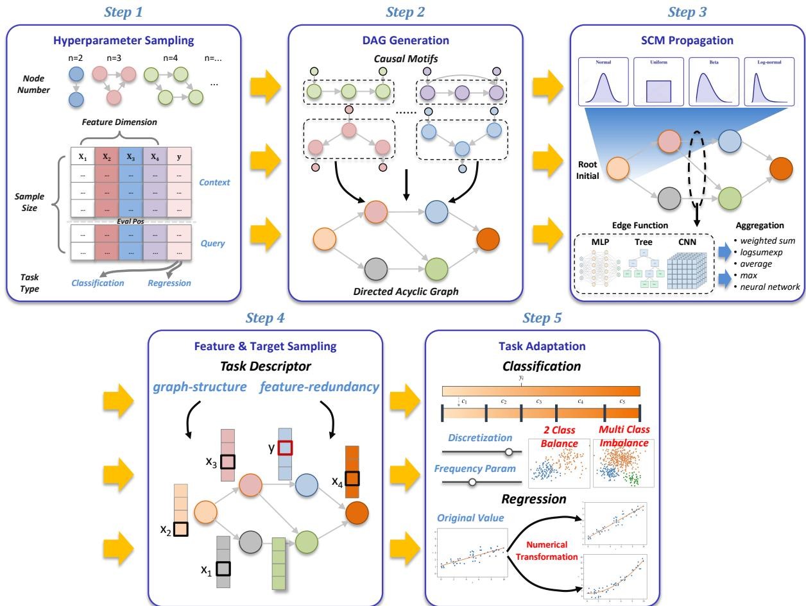  
Figure 3: Schematic overview of the synthetic data generation process for pretraining. The pipeline consists of five phases, that are hyperparameter sampling, directed acyclic graph (DAG) generation, SCM propagation, data sampling and task adaptation respectively.

For each DAG, we first sample the values of root nodes from distributions with randomly chosen types and parameters. The values of the remaining nodes are then determined by propagating functional computations along the topological order of the DAG. For a node $X _ { i } ,$ the value-generation process can be expressed as

$$
X _ { i } = f _ { i } \left( \{ g _ { i , j } ( X _ { j } ) \} _ { j \in \mathrm { P A } ( X _ { i } ) } , \epsilon _ { i } \right) ,
$$

where $\mathrm { P A } ( X _ { i } )$ denotes the set of parent nodes of $X _ { i } , g _ { i , j }$ is the edge function associated with the parent node $X _ { j } , f _ { i }$ denotes the aggregation function that combines the mapped parent values, and $\epsilon _ { i }$ denotes stochastic noise.

LimiX-2 retains the three main types of edge functions from the previous version, including MLPs, CNNs, and decision trees (LimiX Team, 2025). Furthermore, we incorporate additional mechanisms such as linear mappings, kernel functions, piecewise functions, periodic functions, and multiplicative interactions. Moreover, these basic functions can be composed, enabling the SCM to depict more complex variable relationships.

For nodes with multiple parents, we design several aggregation strategies, e.g., simple averaging, weighted aggregation, and neural aggregation, producing diverse forms of multivariate interactions.

## 4.4 Feature and Target Sampling

A complete SCM characterizes the joint states of all variables, whereas in practice only a subset of them is typically observable. To make the generated data resemble real-world scenarios, we retrieve only a subset of variables as sample features and prediction targets to construct each dataset. Specifically, LimiX-2 formulates variable sampling as a multi-attribute selection problem. For each dataset, coarse-grained task descriptors are constructed based on the assigned design with respect to its subgraph structure and feature redundancy. Candidate tasks are then filtered through a multi-objective selection mechanism, ensuring that the resulting tasks not only differ in graph structure but also cover prediction problems with diverse statistical properties, thereby broadening the coverage of the final pretraining tasks in both structural complexity and statistical characteristics.

## 4.5 Task Adaptation

We apply stochastic observation transformations to the features and target variables for task adaptation. Examples of such transformations include linear scaling, monotonic nonlinear transformations, logarithmic transformations, exponential transformations, and multiple operators can be randomly composed. For the target variable, the transformation is specified according to the task type of each dataset (i.e., classification or regression). For classification tasks, since the initial target variable is generally continuous, we convert it into a categorical target via random discretization: LimiX-2 randomly partitions the value space of the target into several intervals and varies the class frequencies and discretization parameters, allowing different synthetic datasets to yield classification tasks with varying numbers of classes and degrees of class imbalance. For regression tasks, targets may undergo random scale transformations as well as adjustments to their skewness and tail behavior, thereby covering continuous prediction tasks with diverse functional relationships.

## 5 Evaluation

In this section, we conduct a comprehensive predictive performance evaluation of LimiX-2 on several pub lic tabular benchmarks, which encompass a diverse collection of real-world classification and regression tasks. As shown in Figure 1, LimiX-2 achieves the highest Elo rating on all three benchmarks. We further evaluate causal skeleton recovery with LimiX-2 on causal discovery benchmarks. The results show that the recovered skeletons based on LimiX-2 feature attention surpass those of other tabular foundation models, XGBoost-based feature importance methods, and dedicated causal discovery methods.

## 5.1 Predictive Performance Evaluation Setup

Benchmarks. Three widely adopted benchmarks, TabArena (Erickson et al., 2025), TALENT (Ye et al., 2024; Liu et al., 2024), and BCCO (LimiX Team, 2025), are used for evaluation. TabArena focuses on evaluating predictive performance under practical protocols, TALENT evaluates generalization across diverse task types, and BCCO evaluates robustness under challenging and incomplete datasets. These benchmarks provide a broad assessment of LimiX-2 in terms of predictive performance, generalization, scalability, and robustness.

• TabArena is an actively maintained benchmark designed to evaluate the practical predictive performance of tabular learning methods. It comprises 51 manually curated real-world tabular datasets, covering a diverse range of classification and regression tasks.

• TALENT is a large-scale and systematic benchmark for studying tabular learning methods across a broad spectrum of datasets. It consists of 300 datasets, including 120 binary classification datasets, 80 multiclass classification datasets, and 100 regression datasets. Excluding 12 classification datasets with more than 10 target classes, we perform evaluation on the remaining 288 datasets.

• BCCO provides a robustness-focused benchmark for tabular models, designed to evaluate model performance on challenging and imperfect data. It contains 106 classification datasets in BCCO-CLS and 50 regression datasets in BCCO-REG, focusing on scenarios involving missing and incomplete features.

Benchmark Protocol. Table 1 summarizes the composition of task types in the tabular benchmarks and the main evaluation metrics reported in this technical report. The detailed evaluation protocols for TabArena, TALENT, and BCCO are described as follows.

• TabArena Protocol: For TabArena, we fully follow the benchmark’s evaluation configuration, including its dataset collection, data splits, metrics, and result aggregation procedure. We take the published leaderboard scores as the reference for existing baselines (accessed September 15, 2026) and then report the Elo rating computed by the official TabArena evaluation pipeline, ensuring direct comparability with the leaderboard results.

Table 1: Task composition and evaluation metrics of the 3 tabular benchmarks. Twelve TALENT datasets with more than 10 target classes are excluded.
<table><tr><td>Benchmark # Datasets</td><td></td><td>Task Type</td><td># Tasks</td><td>Main Metrics</td></tr><tr><td rowspan="2">TabArena</td><td rowspan="2">51</td><td>Binary CLS</td><td>30</td><td rowspan="8"></td></tr><tr><td>Multiclass CLS</td><td>8</td></tr><tr><td rowspan="2"></td><td>REG</td><td>13</td><td rowspan="2">Elo, Rank, Win Rate</td></tr><tr><td>Binary CLS</td><td>120</td></tr><tr><td rowspan="2">TALENT</td><td rowspan="2">288</td><td>Multiclass CLS REG</td><td>68 100</td></tr><tr><td></td><td></td></tr><tr><td rowspan="2">BCCO</td><td rowspan="2">156</td><td>Binary CLS Multiclass CLS</td><td>71</td></tr><tr><td>REG</td><td>35 50</td></tr></table>

• TALENT and BCCO Protocol: For TALENT and BCCO, we follow the official evaluation pipeline provided by TALENT, conducting each experiment with 15 random seeds. For TALENT, we adopt the official fixed 64%/16%/20% train/validation/test split. For BCCO, we randomly hold out 20% of the training set for validation, leaving the official test set unchanged.

For models integrated into the TALENT library, we use their default configurations, including model-specific hyperparameter settings. Regarding tabular foundation models such as EXAONE Tabular (Eo et al., 2026), Xiaomi-TabLDM (Wang et al., 2026a), and Mitra-v2 (Tao et al., 2026), we implement the evaluation following the preprocessing and inference procedures specified in their respective official repositories, without tuning the hyperparameters for fair comparisons.

For each dataset, models are ranked by accuracy for classification tasks and by RMSE for regression tasks. Ranking is performed for each random seed, with ranks first averaged across seeds and then equally across datasets to obtain the mean rank. In addition to ranks, we aggregate model performance by converting per-dataset results into pairwise comparisons and fitting a Bradley–Terry Elo model, following TabArena, with Random Forest anchored at 1000. For reported Elo, we show 95% confidence intervals from 2000 bootstrap rounds, using the 2.5% and 97.5% quantiles.

Baselines. We compare LimiX-2 against a range of state-of-the-art baseline models, including tree-based models, auto-ML frameworks, neural networks, and recent tabular foundation models.

• Tree-based models. We include XGBoost (Chen & Guestrin, 2016), LightGBM (Ke et al., 2017), CatBoost (Dorogush et al., 2018), and Random Forest (Breiman, 2001).

• Auto-ML frameworks. We compare LimiX-2 against AutoGluon (Erickson et al., 2020), an automated machine learning framework that performs model selection, hyperparameter optimization, and ensemble learning for tabular data.

• Neural networks. We evaluate LimiX-2 against neural baselines, including FT-Transformer (Gorishniy et al., 2024), RealMLP (Holzmuller et al.¨ , 2024), TabR (Gorishniy et al., 2024), TabM (Gorishniy et al., 2025), and ModernNCA (Ye et al., 2025).

• Tabular foundation models. We compare LimiX-2 with recent tabular foundation models, including Mitra-v2 (Tao et al., 2026), TabFM (Kong & Das, 2026), TabPFN-3 (Grinsztajn et al., 2026), TabICLv2 (Qu et al., 2026), TabDPT (Ma et al., 2026), EXAONE Tabular (Eo et al., 2026), Xiaomi-TabLDM (Wang et al., 2026a) and LimiX-16M (LimiX Team, 2025). These models cover a range of recent approaches to pretraining and in-context learning for tabular data.

## 5.2 Results on TabArena

Overall performance. Figure 4 and Table 2 report performance on the full TabArena benchmark. Across all four predictive metrics reported in the table, LimiX-2 ranks first among the compared methods. It attains the highest Elo score of 1935, exceeding the Elo runner-up, TabFM+, by 117.4 points before rounding, and yields an improvability of 3.3% versus 6.2% for TabFM+. Consistently, LimiX-2 achieves an average rank of 5.5, compared with 9.0 for TabFM+, and records an aggregated win count of 18.9 against 5.3 for TabFM+, corresponding to approximately 3.6 times as many aggregated wins.

Win rate averages pairwise comparisons against all other methods in the corresponding table, first across evaluation splits within each dataset and then equally across datasets, with ties counted as half a win.

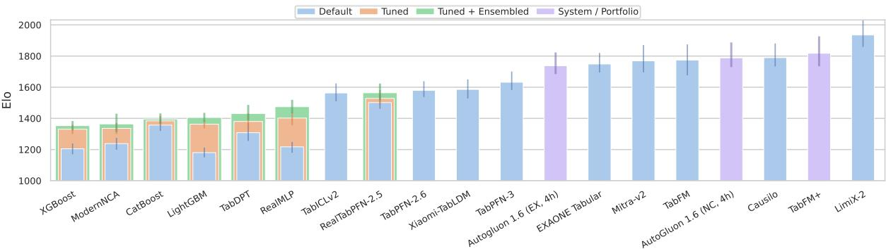  
Figure 4: Performance on the TabArena benchmark. Baseline results are reported under the default, tuned, and tuned-plus-ensembled configurations. LimiX-2 with default configuration achieves an Elo score of 1935, outperforming all compared foundation models, including TabFM, TabPFN-3, and EXAONE Tabular. LimiX-2 also surpasses AutoGluon under its noncommercial 4h configuration.

The aggregated win count instead assigns one unit of credit per split to the best-performing method, shares it equally among tied winners, averages within each dataset, and sums across datasets. Elo point estimates are rounded to integers in the tables. Elo differences and relative comparisons are computed from the unrounded results.

Classification performance. Table 3 reports results on the 38 classification datasets. LimiX-2 ranks first across all four predictive metrics reported in the table. It attains an Elo of 1917, an improvability of 4.3%, an average rank of 6.0, an aggregated win count of 10.6, and an average pairwise win rate of 94.5%. These results indicate strong aggregate performance across the classification tasks.

Regression performance. Table 4 reports results on the 13 regression datasets. LimiX-2 again ranks first across all four predictive metrics reported in the table, achieving an Elo of 2206, an improvability of 0.6%, an average rank of 3.8, an aggregated win count of 8.3, and an average pairwise win rate of 96.9%. TabFM+ is the Elo runner-up at 2063, followed by AutoGluon 1.6 (noncommercial, 4h) at 2060. These results indicate strong performance on the regression subset.

Table 2: Performance on the TabArena benchmark. Models are ranked by Elo, improvability, average rank, and aggregated win count are also reported. LimiX-2 ranks first on all four metrics, with an Elo of 1935 (117.4 points above TabFM+ before rounding). Compared with TabFM+, its improvability is 3.3% versus 6.2%, its average rank is 5.5 versus 9.0, and its aggregated win count is 18.9 versus 5.3.
<table><tr><td>Model</td><td>Elo ↑</td><td>ability↓</td><td>Improv- Avg. rank #wins ↓</td><td>↑</td><td>Model</td><td>Elo ↑</td><td>ability↓</td><td>Improv- Avg. rank #wins ↓</td><td>↑</td></tr><tr><td>LimiX-2 (D)</td><td>1935–77,+111</td><td>3.3%</td><td>5.5</td><td>18.9</td><td>TabM (D)</td><td>1283 -42,+43</td><td>18.9%</td><td>47.7</td><td>0.1</td></tr><tr><td>TabFM+</td><td>1818–84,+109</td><td>6.2%</td><td>9.0</td><td>5.3</td><td>iLTM (T)</td><td>1280 -32,+35</td><td>19.0%</td><td>47.9</td><td>0.1</td></tr><tr><td>Causilo (D)</td><td>1790-57,+92</td><td>8.9%</td><td>10.1</td><td>1.7</td><td>BetaTabPFN (D)</td><td>1272 -57,+58</td><td>20.3%</td><td>48.8</td><td>0.0</td></tr><tr><td>AutoGluon 1.6 (NC, 4h)</td><td>1789-60,+99</td><td>8.6%</td><td>10.1</td><td>1.2</td><td>TabPFNv2 (T)</td><td>1272 -57,+57</td><td>20.0%</td><td>48.8</td><td>0.1</td></tr><tr><td>TabFM (D)</td><td>1774–98,+101</td><td>6.5%</td><td>10.7</td><td>5.9</td><td>SAP-RPT-OSS (D)</td><td>1268 -58,+57</td><td>20.2%</td><td>49.1</td><td>0.6</td></tr><tr><td>Mitra-v2 (D)</td><td>1769-74,+102</td><td>8.3%</td><td>10.9</td><td>3.2</td><td>TorchMLP (T+E)</td><td>1268 -45,+46</td><td>19.0%</td><td>49.1</td><td>0.0</td></tr><tr><td>EXAONE Tabular (D)</td><td>1749–55,+72</td><td>9.5%</td><td>11.8</td><td>2.9</td><td>EBM (T+E)</td><td>1253 -36,+36</td><td>20.5%</td><td>50.7</td><td>0.0</td></tr><tr><td>AutoGluon 1.6 (EX, 4h)</td><td>1738–54,+85</td><td>9.2%</td><td>12.3</td><td>1.2</td><td>TabPFNv2 (D)</td><td>1245 -63,+65</td><td>20.8%</td><td>51.5</td><td>0.3</td></tr><tr><td>AutoGluon 1.5 (EX, 4h)</td><td>1648-60,+69</td><td>10.2%</td><td>16.9</td><td>1.3</td><td>ModernNCA (D)</td><td>1238 -40,+37</td><td>21.0%</td><td>52.2</td><td>0.2</td></tr><tr><td>TabPFN-3 (D)</td><td>1632–49,+69</td><td>11.6%</td><td>17.9</td><td>0.4</td><td>EBM (T)</td><td>1220 -40,+44</td><td>21.1%</td><td>54.0</td><td>0.0</td></tr><tr><td>Xiaomi-TabLDM (D)</td><td>1586–59,+65</td><td>12.1%</td><td>20.8</td><td>0.5</td><td>RealMLP (D)</td><td>1217 -38,+32</td><td>20.4%</td><td>54.3</td><td>0.1</td></tr><tr><td>TabPFN-2.6 (D)</td><td>1580-43,+59</td><td>12.9%</td><td>21.2</td><td>0.1</td><td>XGBoost (D)</td><td>1205 -36,+34</td><td>20.6%</td><td>55.6</td><td>0.0</td></tr><tr><td>RealTabPFN-2.5 (T+E)</td><td>1564-48,+59</td><td>12.6%</td><td>22.3</td><td>0.1</td><td>ExtraTrees (T+E)</td><td>1201 -43,+46</td><td>21.5%</td><td>55.9</td><td>0.0</td></tr><tr><td>TabICLv2 (D)</td><td>1563-54,+62</td><td>12.4%</td><td>22.4</td><td>0.1</td><td>TorchMLP (T)</td><td>1200 -42,+41</td><td>20.7%</td><td>56.1</td><td>0.0</td></tr><tr><td>RealTabPFN-2.5 (T)</td><td>1528-44,+54</td><td>13.3%</td><td>25.0</td><td>0.1</td><td>FastaiMLP (T+E)</td><td>1192 -59,+55</td><td>21.4%</td><td>56.8</td><td>0.0</td></tr><tr><td>RealTabPFN-2.5 (D)</td><td>1502-40,+50</td><td>13.8%</td><td>27.1</td><td>0.0</td><td>EBM (D)</td><td>1192 -48,+46</td><td>22.0%</td><td>56.8</td><td>0.1</td></tr><tr><td>AutoGluon 1.4 (best, 4h)</td><td>1479-46,+44</td><td>14.8%</td><td>28.9</td><td>0.0</td><td>APLR (T+E)</td><td>1186 -57,+41</td><td>22.1%</td><td>57.4</td><td>0.0</td></tr><tr><td>RealMLP (T+E)</td><td>1475-42,+45</td><td>14.9%</td><td>29.3</td><td>0.2</td><td>LightGBM (D)</td><td>1180 -30,+32</td><td>21.1%</td><td>58.0</td><td>0.0</td></tr><tr><td>TabDPT-Turbo (D)</td><td>1433-47,+50</td><td>16.0%</td><td>33.0</td><td>0.2</td><td>ExtraTrees (T)</td><td>1177 -53,+43</td><td>22.3%</td><td>58.3</td><td>0.2</td></tr><tr><td>TabDPT (T+E)</td><td>1431–44,+56</td><td>15.8%</td><td>33.1</td><td>0.4</td><td>CTBoost (D)</td><td>1171 -66,+60</td><td>23.0%</td><td>58.9</td><td>0.1</td></tr><tr><td>TabM (T+E)</td><td>1422-37,+45</td><td>16.1%</td><td>34.0</td><td>0.0</td><td>RandomForest (T+E)</td><td>1169-44,+53</td><td>22.5%</td><td>59.1</td><td>0.1</td></tr><tr><td>LightGBM (T+E)</td><td>1406-27,+30</td><td>17.0%</td><td>35.5</td><td>0.0</td><td>Nori-30M (D)</td><td>1156-82,+73</td><td>24.8%</td><td>60.4</td><td>0.2</td></tr><tr><td>RealMLP (T)</td><td> $1 4 0 2 _ { - 4 6 , + 3 9 }$ </td><td>16.2%</td><td>35.8</td><td>0.0</td><td>Nori (D)</td><td> $1 1 4 5 _ { - 7 7 , + 7 0 }$ </td><td>25.0%</td><td>61.4</td><td>0.0</td></tr><tr><td>CatBoost (T+E)</td><td> $1 3 9 6 _ { - 3 2 , + 3 7 }$ </td><td>16.6%</td><td>36.4</td><td>0.1</td><td>APLR (T)</td><td> $1 1 4 5 _ { - 5 6 , + 4 5 }$ </td><td>23.2%</td><td>61.4</td><td>0.0</td></tr><tr><td>CatBoost (T)</td><td> $1 3 8 4 _ { - 3 3 , + 3 3 }$ </td><td>16.8%</td><td>37.5</td><td>0.0</td><td>FastaiMLP (T)</td><td> $1 1 3 7 _ { - 5 7 , + 5 3 }$ </td><td>22.8%</td><td>62.2</td><td>0.0</td></tr><tr><td>TabDPT (T)</td><td> $1 3 8 0 _ { - 5 2 , + 5 3 }$ </td><td>16.9%</td><td>37.9</td><td>0.1</td><td>RandomForest (T)</td><td> $1 1 3 4 _ { - 4 5 , + 4 7 }$ </td><td>23.2%</td><td>62.5</td><td>0.2</td></tr><tr><td>iLTM (T+E)</td><td> $1 3 7 9 _ { - 3 8 , + 3 9 }$ </td><td>17.2%</td><td>38.0</td><td>0.0</td><td>TabSTAR (T)</td><td> $1 0 8 8 _ { - 8 3 , + 7 5 }$ </td><td>27.1%</td><td>66.8</td><td>0.4</td></tr><tr><td>TabM (T)</td><td> $1 3 7 1 _ { - 3 7 , + 4 3 }$ </td><td>16.9%</td><td>38.8</td><td>0.1</td><td>iLTM (D)</td><td> $1 0 8 8 _ { - 5 7 , + 4 7 }$ </td><td>24.7%</td><td>66.8</td><td>0.1</td></tr><tr><td>ModernNCA (T+E)</td><td> $1 3 6 4 _ { - 5 2 , + 6 6 }$ </td><td>17.5%</td><td>39.5</td><td>0.1</td><td>TabSTAR (T+E)</td><td> $1 0 8 7 _ { - 8 3 , + 7 9 }$ </td><td>27.2%</td><td>66.8</td><td>0.5</td></tr><tr><td>LightGBM (T)</td><td> $1 3 6 3 _ { - 2 7 , + 2 4 }$ </td><td>17.6%</td><td>39.6</td><td>0.0</td><td>PerpetualBooster (T+E)</td><td> $1 0 8 6 _ { - 4 5 , + 4 6 }$ </td><td>28.0%</td><td>66.9</td><td>0.0</td></tr><tr><td>ChimeraBoost (T+E)</td><td> $1 3 6 0 _ { - 5 4 , + 4 5 }$ </td><td>17.9%</td><td>39.8</td><td>0.8</td><td>OrionMSP (D)</td><td> $1 0 8 6 _ { - 5 2 , + 5 3 }$ </td><td>25.3%</td><td>66.9</td><td>0.0</td></tr><tr><td>CatBoost (D)</td><td> $1 3 5 7 _ { - 3 8 , + 3 8 }$ </td><td>17.4%</td><td>40.2</td><td>0.1</td><td>APLR (D)</td><td> $1 0 7 9 _ { - 8 0 , + 5 1 }$ </td><td>26.1%</td><td>67.5</td><td>0.0</td></tr><tr><td>XGBoost (T+E)</td><td> $1 3 5 4 _ { - 3 1 , + 3 0 }$ </td><td>17.7%</td><td>40.5</td><td>0.0</td><td>TorchMLP (D)</td><td> $1 0 7 1 _ { - 4 9 , + 3 8 }$ </td><td>24.5%</td><td>68.2</td><td>0.0</td></tr><tr><td>LimiX-16M (D)</td><td> $1 3 4 5 _ { - 5 7 , + 7 2 }$ </td><td>17.5%</td><td>41.4</td><td>0.3</td><td>PerpetualBooster (T)</td><td> $1 0 5 2 _ { - 4 6 , + 4 7 }$ </td><td>29.2%</td><td>69.9</td><td>0.0</td></tr><tr><td>ModernNCA (T)</td><td> $1 3 3 6 _ { - 3 7 , + 3 6 }$ </td><td>17.9%</td><td>42.2</td><td>0.3</td><td>xRFM (D)</td><td> $1 0 3 9 _ { - 6 9 , + 5 5 }$ </td><td>28.0%</td><td>70.9</td><td>0.0</td></tr><tr><td>ChimeraBoost (T)</td><td> $^ { 1 3 3 3 } - 5 1 , + 4 3$ </td><td>18.3%</td><td>42.5</td><td>0.3</td><td>TabFlex (D)</td><td> $1 0 1 0 _ { - 7 4 , + 6 5 }$ </td><td>29.2%</td><td>73.2</td><td>0.1</td></tr><tr><td>TabSwift (D)</td><td> $1 3 3 2 _ { - 4 9 , + 5 9 }$ </td><td>18.0%</td><td>42.7</td><td>0.0</td><td>ExtraTrees (D)</td><td> $1 0 0 8 _ { - 6 1 , + 4 8 }$ </td><td>27.7%</td><td>73.4</td><td>0.0</td></tr><tr><td>XGBoost (T)</td><td> $1 3 3 0 _ { - 3 1 , + 2 9 }$ </td><td>18.0%</td><td>42.8</td><td>0.0</td><td>FastaiMLP (D)</td><td> $1 0 0 5 _ { - 6 1 , + 6 0 }$ </td><td>27.3%</td><td>73.6</td><td>0.1</td></tr><tr><td>xRFM (T+E)</td><td> $1 3 3 0 _ { - 4 4 , + 4 4 }$ </td><td>18.2%</td><td>42.9</td><td>0.1</td><td>RandomForest (D)</td><td> $1 0 0 0 _ { - 4 7 , + 4 3 }$ </td><td>27.8%</td><td>73.9</td><td>0.0</td></tr><tr><td>TabPFNv2 (T+E)</td><td> $1 3 2 5 _ { - 6 6 , + 6 4 }$ </td><td>18.6%</td><td>43.3</td><td>0.0</td><td>KNN (T+E)</td><td> $9 9 1 _ { - 8 1 , + 6 2 }$ </td><td>29.3%</td><td>74.6</td><td>0.1</td></tr><tr><td>CTBoost (T+E)</td><td> $1 3 2 4 _ { - 4 3 , + 3 9 }$ </td><td>18.6%</td><td>43.5</td><td>0.0</td><td>TabSTAR (D)</td><td> $9 8 9 _ { - 1 0 1 , + 8 9 }$ </td><td>31.9%</td><td>74.7</td><td>0.3</td></tr><tr><td>Mitra (D)</td><td> $1 3 1 5 _ { - 6 4 , + 6 3 }$ </td><td>19.1%</td><td>44.4</td><td>0.1</td><td>Linear (T+E)</td><td> $9 5 6 _ { - 1 0 3 , + 6 1 }$ </td><td>35.1%</td><td>77.1</td><td>0.0</td></tr><tr><td>TabDPT (D)</td><td> $^ { 1 3 0 8 } \mathrm { - } 5 3 , + 6 2$ </td><td>19.1%</td><td>45.1</td><td>0.1</td><td>PerpetualBooster (D)</td><td> $9 3 4 _ { - 6 1 , + 4 1 }$ </td><td>33.1%</td><td>78.5</td><td>0.1</td></tr><tr><td>TabICL (D)</td><td> $1 3 0 6 _ { - 5 7 , + 4 9 }$ </td><td>19.0%</td><td>45.3</td><td>0.0</td><td>Linear (T)</td><td> $9 3 2 _ { - 1 1 0 , + 6 7 }$ </td><td>35.6%</td><td>78.6</td><td>0.0</td></tr><tr><td>ChimeraBoost (D)</td><td> $1 2 9 9 _ { - 5 5 , + 4 2 }$ </td><td>19.1%</td><td>46.0</td><td>0.0</td><td>KNN (T)</td><td> $8 8 7 _ { - 1 0 2 , + 6 1 }$ </td><td>34.1%</td><td>81.3</td><td>0.1</td></tr><tr><td>CTBoost (T)</td><td> $1 2 9 4 _ { - 4 4 , + 3 7 }$ </td><td>19.1%</td><td>46.5</td><td>0.0</td><td>Linear (D)</td><td> $8 5 8 _ { - 1 1 7 , + 6 8 }$ </td><td>38.1%</td><td>82.8</td><td>0.1</td></tr><tr><td>xRFM (T)</td><td> $1 2 8 6 _ { - 4 3 , + 4 2 }$ </td><td>19.3%</td><td>47.3</td><td>0.1</td><td>KNN (D)</td><td> $6 4 6 _ { - 1 0 0 , + 7 9 }$ </td><td>47.0%</td><td>90.2</td><td>0.0</td></tr></table>

Table 3: Performance on classification tasks in the TabArena benchmark. Models are ranked by Elo, improvability, average rank, and aggregated win count are also reported. LimiX-2 ranks first on all four metrics, with an Elo of 1917 (121.1 points above TabFM+ before rounding). Its improvability is 4.3%, approximately 42.7% lower than that of TabFM+ (7.5%). Its average rank is 6.0 versus 9.9, and its aggregated win count is 10.6 versus 4.7.
<table><tr><td>Model</td><td>Elo ↑</td><td>ability ↓</td><td>Improv- Avg. rank #wins ↓</td><td>↑</td></tr><tr><td>LimiX-2 (D)</td><td> $1 9 1 7 _ { - 7 7 , + 1 2 7 }$ </td><td>4.3%</td><td>6.0</td><td>10.6</td></tr><tr><td>TabFM+</td><td> $1 7 9 6 _ { - 8 6 , + 1 2 1 }$ </td><td>7.5%</td><td>9.9</td><td>4.7</td></tr><tr><td>Causilo (D)</td><td> $1 7 6 8 _ { - 7 0 , + 9 0 }$ </td><td>11.0%</td><td>11.0</td><td>1.3</td></tr><tr><td>AutoGluon 1.6 (NC, 4h)</td><td> $1 7 6 1 _ { - 5 3 , + 8 8 }$ </td><td>10.5%</td><td>11.4</td><td>1.1</td></tr><tr><td>TabFM (D)</td><td> $1 7 6 0 _ { - 1 1 4 , + 1 2 5 }$ </td><td>7.5%</td><td>11.4</td><td>5.6</td></tr><tr><td>Mitra-v2 (D)</td><td> $1 7 5 4 _ { - 8 5 , + 1 2 6 }$ </td><td>10.1%</td><td>11.6</td><td>2.9</td></tr><tr><td>EXAONE Tabular (D)</td><td> $1 7 5 4 _ { - 5 7 , + 8 5 }$ </td><td>11.1%</td><td>11.6</td><td>2.8</td></tr><tr><td>AutoGluon 1.6 (EX, 4h)</td><td> $1 7 1 1 _ { - 4 3 , + 6 2 }$ </td><td>11.2%</td><td>13.7</td><td>0.8</td></tr><tr><td>AutoGluon 1.5 (EX, 4h)</td><td> $1 6 5 2 _ { - 7 1 , + 8 1 }$ </td><td>11.7%</td><td>17.0</td><td>1.0</td></tr><tr><td>TabPFN-3 (D)</td><td> $1 6 2 7 _ { - 6 5 , + 7 6 }$ </td><td>14.0%</td><td>18.6</td><td>0.4</td></tr><tr><td>Xiaomi-TabLDM (D)</td><td> $1 5 7 7 _ { - 5 6 , + 7 0 }$ </td><td>14.5%</td><td>22.0</td><td>0.5</td></tr><tr><td>TabPFN-2.6 (D)</td><td> $1 5 7 6 _ { - 5 5 , + 5 9 }$ </td><td>15.2%</td><td>22.1</td><td>0.1</td></tr><tr><td>TabICLv2 (D)</td><td> $1 5 6 9 _ { - 6 3 , + 7 0 }$ </td><td>14.5%</td><td>22.6</td><td>0.1</td></tr><tr><td>RealTabPFN-2.5 (T+E)</td><td> $1 5 5 7 _ { - 6 6 , + 6 4 }$ </td><td>15.1%</td><td>23.5</td><td>0.1</td></tr><tr><td>RealTabPFN-2.5 (T)</td><td> $1 5 3 7 _ { - 5 8 , + 6 7 }$ </td><td>15.7%</td><td>25.0</td><td>0.1</td></tr><tr><td>RealTabPFN-2.5 (D)</td><td> $1 5 2 5 _ { - 5 2 , + 5 2 }$ </td><td>16.0%</td><td>25.9</td><td>0.0</td></tr><tr><td>AutoGluon 1.4 (best, 4h)</td><td> $^ { 1 4 8 1 } - 5 1 , + 6 4$ </td><td>17.0%</td><td>29.6</td><td>0.0</td></tr><tr><td>RealMLP (T+E)</td><td> $1 4 6 3 _ { - 3 8 , + 5 2 }$ </td><td>17.6%</td><td>31.2</td><td>0.1</td></tr><tr><td>TabM (T+E)</td><td> $1 4 4 2 _ { - 4 2 , + 5 3 }$ </td><td>18.5%</td><td>33.1</td><td>0.0</td></tr><tr><td>TabDPT-Turbo (D)</td><td> $1 4 1 9 _ { - 5 6 , + 7 1 }$ </td><td>19.0%</td><td>35.4</td><td>0.1</td></tr><tr><td>LightGBM (T+E)</td><td> $1 4 1 2 _ { - 3 0 , + 4 6 }$ </td><td>19.2%</td><td>36.0</td><td>0.0</td></tr><tr><td>TabICL (D)</td><td> $1 4 0 6 _ { - 5 4 , + 4 9 }$ </td><td>19.5%</td><td>36.6</td><td>0.0</td></tr><tr><td>CatBoost (T+E)</td><td> $1 3 9 7 _ { - 4 4 , + 5 3 }$ </td><td>18.9%</td><td>37.4</td><td>0.1</td></tr><tr><td>LimiX-16M (D)</td><td> $1 3 9 6 _ { - 7 3 , + 8 3 }$ </td><td>19.3%</td><td>37.5</td><td>0.3</td></tr><tr><td>TabM (T)</td><td> $1 3 9 5 _ { - 4 2 , + 4 9 }$ </td><td>19.3%</td><td>37.6</td><td>0.0</td></tr><tr><td>TabDPT (T+E)</td><td> $1 3 9 3 _ { - 4 8 , + 7 0 }$ </td><td>19.1%</td><td>37.8</td><td>0.1</td></tr><tr><td>RealMLP (T)</td><td> $1 3 9 3 _ { - 4 3 , + 5 1 }$ </td><td>19.0%</td><td>37.8</td><td>0.0</td></tr><tr><td>iLTM (T+E)</td><td> $^ { 1 3 8 8 } \mathrm { - } 4 1 , + 4 5$ </td><td>19.3%</td><td>38.3</td><td>0.0</td></tr></table>

<table><tr><td>Model</td><td>Elo ↑</td><td>ability ↓</td><td>Improv- Avg. rank #wins ↓</td><td>↑</td></tr><tr><td>TabPFNv2 (T)</td><td></td><td>22.9%</td><td>46.7</td><td>0.1</td></tr><tr><td>TabM (D)</td><td> $1 3 0 4 _ { - 7 7 , + 6 9 }$   $1 3 0 4 _ { - 4 3 , + 5 2 }$ </td><td>21.5%</td><td>46.7</td><td>0.1</td></tr><tr><td>EBM (T+E)</td><td> $1 3 0 1 _ { - 3 6 , + 3 8 }$ </td><td>22.0%</td><td>47.1</td><td>0.0</td></tr><tr><td>TorchMLP (T+E)</td><td> $1 2 9 7 _ { - 3 9 , + 4 1 }$ </td><td>21.2%</td><td>47.5</td><td>0.0</td></tr><tr><td>SAP-RPT-OSS (D)</td><td> $1 2 9 1 _ { - 7 1 , + 5 3 }$ </td><td>22.8%</td><td>48.1</td><td>0.5</td></tr><tr><td>iLTM (T)</td><td> $1 2 8 5 _ { - 3 8 , + 4 2 }$ </td><td>21.7%</td><td>48.7</td><td>0.1</td></tr><tr><td>TabPFNv2 (D)</td><td> $1 2 8 1 _ { - 8 2 , + 7 0 }$ </td><td>23.5%</td><td>49.1</td><td>0.3</td></tr><tr><td>xRFM (T)</td><td> $1 2 8 0 _ { - 6 2 , + 5 6 }$ </td><td>22.4%</td><td>49.2</td><td>0.1</td></tr><tr><td>EBM (T)</td><td> $1 2 6 8 _ { - 3 9 , + 4 3 }$ </td><td>22.6%</td><td>50.4</td><td>0.0</td></tr><tr><td>TabDPT (D)</td><td> $1 2 6 3 _ { - 5 8 , + 6 2 }$ </td><td>23.0%</td><td>50.9</td><td>0.1</td></tr><tr><td>FastaiMLP (T+E)</td><td> $1 2 5 0 _ { - 6 7 , + 5 9 }$ </td><td>22.9%</td><td>52.2</td><td>0.0</td></tr><tr><td>EBM (D)</td><td> $1 2 4 6 _ { - 4 9 , + 4 2 }$ </td><td>23.6%</td><td>52.7</td><td>0.1</td></tr><tr><td>ModernNCA (D)</td><td> $1 2 4 4 _ { - 4 2 , + 4 1 }$ </td><td>23.9%</td><td>52.8</td><td>0.2</td></tr><tr><td>APLR (T+E)</td><td> $1 2 3 9 _ { - 5 9 , + 4 5 }$ </td><td>23.7%</td><td>53.3</td><td>0.0</td></tr><tr><td>CTBoost (D)</td><td> $1 2 3 3 _ { - 6 5 , + 6 0 }$ </td><td>24.0%</td><td>53.9</td><td>0.1</td></tr><tr><td>RealMLP (D)</td><td> $1 2 3 2 _ { - 3 8 , + 3 8 }$ </td><td>23.1%</td><td>54.1</td><td>0.1</td></tr><tr><td>XGBoost (D)</td><td> $1 2 2 2 _ { - 4 6 , + 4 2 }$ </td><td>23.0%</td><td>55.0</td><td>0.0</td></tr><tr><td>TorchMLP (T)</td><td> $1 2 2 0 _ { - 3 8 , + 4 7 }$ </td><td>23.1%</td><td>55.2</td><td>0.0</td></tr><tr><td>ExtraTrees (T+E)</td><td> $1 2 0 6 _ { - 5 3 , + 5 6 }$ </td><td>23.9%</td><td>56.6</td><td>0.0</td></tr><tr><td>APLR (T)</td><td> $1 1 9 5 _ { - 6 2 , + 5 0 }$ </td><td>24.9%</td><td>57.6</td><td>0.0</td></tr><tr><td>FastaiMLP (T)</td><td> $1 1 8 8 _ { - 6 8 , + 5 6 }$ </td><td>24.6%</td><td>58.3</td><td>0.0</td></tr><tr><td>LightGBM (D)</td><td> $1 1 8 4 _ { - 4 2 , + 4 9 }$ </td><td>23.9%</td><td>58.7</td><td>0.0</td></tr><tr><td>ExtraTrees (T)</td><td> $1 1 8 0 _ { - 6 1 , + 6 1 }$ </td><td>24.8%</td><td>59.1</td><td>0.2</td></tr><tr><td>RandomForest (T+E)</td><td> $1 1 8 0 _ { - 6 6 , + 6 3 }$ </td><td>24.9%</td><td>59.1</td><td>0.1</td></tr><tr><td>iLTM (D)</td><td> $1 1 4 6 _ { - 5 6 , + 5 7 }$ </td><td>26.1%</td><td>62.2</td><td>0.1</td></tr><tr><td>RandomForest (T)</td><td> $1 1 4 6 _ { - 6 8 , + 6 8 }$ </td><td>25.7%</td><td>62.3</td><td>0.2</td></tr><tr><td>APLR (D)</td><td> $1 1 4 1 _ { - 6 7 , + 5 9 }$ </td><td>27.2%</td><td>62.7</td><td>0.0</td></tr><tr><td>TabSTAR (T)</td><td> $1 1 3 5 _ { - 9 5 , + 7 4 }$ </td><td>27.9%</td><td>63.3</td><td>0.3</td></tr></table>

Continued on next page

Table 3 (continued)
<table><tr><td>Model</td><td>Elo ↑</td><td>Improv- Avg. rank #wins ability ↓</td><td>↓</td><td>↑</td><td>Model</td><td>Elo ↑</td><td>ability ↓</td><td>Improv- Avg. rank #wins ↓</td><td>↑</td></tr><tr><td>CatBoost (T)</td><td> $^ { 1 3 8 8 } \mathrm { - } 4 1 , + 4 8$ </td><td>19.1%</td><td>38.3</td><td>0.0</td><td>TabSTAR (T+E)</td><td> $1 1 3 1 - 9 3 , + 7 3$ </td><td>27.9%</td><td>63.7</td><td>0.4</td></tr><tr><td>CatBoost (D)</td><td> $1 3 7 4 _ { - 4 4 , + 4 5 }$ </td><td>19.5%</td><td>39.7</td><td>0.1</td><td>OrionMSP (D)</td><td> $1 1 1 7 _ { - 6 6 , + 6 1 }$ </td><td>28.0%</td><td>64.9</td><td>0.0</td></tr><tr><td>LightGBM (T)</td><td> $^ { 1 3 7 2 } - 3 1 , + 3 6$ </td><td>19.9%</td><td>39.9</td><td>0.0</td><td>TorchMLP (D)</td><td> $^ { 1 0 8 7 } - 5 4 , + 4 4$ </td><td>27.1%</td><td>67.5</td><td>0.0</td></tr><tr><td>CTBoost (T+E)</td><td> $1 3 7 1 _ { - 5 6 , + 5 1 }$ </td><td>20.1%</td><td>39.9</td><td>0.0</td><td>PerpetualBooster (T+E)</td><td> $1 0 6 6 _ { - 6 2 , + 5 6 }$ </td><td>32.4%</td><td>69.2</td><td>0.0</td></tr><tr><td>ChimeraBoost (T+E)</td><td> $1 3 7 0 _ { - 5 6 , + 5 2 }$ </td><td>20.2%</td><td>40.0</td><td>0.0</td><td>FastaiMLP (D)</td><td> $1 0 4 4 _ { - 7 3 , + 6 9 }$ </td><td>29.2%</td><td>70.9</td><td>0.1</td></tr><tr><td>XGBoost (T+E)</td><td> $1 3 6 1 _ { - 4 6 , + 4 3 }$ </td><td>20.0%</td><td>40.9</td><td>0.0</td><td>Linear (T+E)</td><td> $1 0 3 8 _ { - 8 9 , + 8 7 }$ </td><td>33.9%</td><td>71.4</td><td>0.0</td></tr><tr><td>BetaTabPFN (D)</td><td> $1 3 6 0 _ { - 4 7 , + 4 8 }$ </td><td>21.3%</td><td>41.0</td><td>0.0</td><td>TabSTAR (D)</td><td> $1 0 3 4 _ { - 1 1 7 , + 8 5 }$ </td><td>33.3%</td><td>71.7</td><td>0.2</td></tr><tr><td>Mitra (D)</td><td> $1 3 5 2 _ { - 7 9 , + 7 6 }$ </td><td>21.5%</td><td>41.9</td><td>0.1</td><td>PerpetualBooster (T)</td><td> $1 0 3 2 _ { - 5 8 , + 5 5 }$ </td><td>33.8%</td><td>71.8</td><td>0.0</td></tr><tr><td>TabPFNv2 (T+E)</td><td> $1 3 5 2 _ { - 7 2 , + 8 5 }$ </td><td>21.3%</td><td>41.9</td><td>0.0</td><td>KNN (T+E)</td><td> $1 0 2 5 _ { - 8 9 , + 7 4 }$ </td><td>31.7%</td><td>72.4</td><td>0.1</td></tr><tr><td>ModernNCA (T)</td><td> $1 3 4 9 _ { - 3 7 , + 5 3 }$ </td><td>20.3%</td><td>42.1</td><td>0.3</td><td>TabFlex (D)</td><td> $1 0 1 4 _ { - 1 0 3 , + 8 2 }$ </td><td>33.1%</td><td>73.1</td><td>0.1</td></tr><tr><td>ModernNCA (T+E)</td><td> $1 3 4 7 _ { - 7 0 , + 7 3 }$ </td><td>20.4%</td><td>42.4</td><td>0.0</td><td>Linear (T)</td><td> $1 0 1 2 _ { - 9 4 , + 8 7 }$ </td><td>34.5%</td><td>73.3</td><td>0.0</td></tr><tr><td>ChimeraBoost (T)</td><td> $1 3 4 4 _ { - 5 3 , + 5 3 }$ </td><td>20.7%</td><td>42.7</td><td>0.0</td><td>xRFM (D)</td><td> $1 0 0 9 _ { - 8 6 , + 6 8 }$ </td><td>32.3%</td><td>73.5</td><td>0.0</td></tr><tr><td>CTBoost (T)</td><td> $^ { 1 3 4 1 - 5 2 , + 4 7 }$ </td><td>20.7%</td><td>43.0</td><td>0.0</td><td>RandomForest (D)</td><td> $1 0 0 0 _ { - 6 6 , + 5 9 }$ </td><td>31.3%</td><td>74.1</td><td>0.0</td></tr><tr><td>TabDPT (T)</td><td> $1 3 3 9 _ { - 5 0 , + 6 0 }$ </td><td>20.4%</td><td>43.2</td><td>0.1</td><td>ExtraTrees (D)</td><td> $9 9 2 _ { - 7 1 , + 7 3 }$ </td><td>31.3%</td><td>74.6</td><td>0.0</td></tr><tr><td>TabSwift (D)</td><td> $1 3 3 7 _ { - 5 7 , + 5 4 }$ </td><td>21.0%</td><td>43.3</td><td>0.0</td><td>Linear (D)</td><td> $9 3 7 _ { - 1 0 8 , + 8 4 }$ </td><td>37.2%</td><td>78.1</td><td>0.1</td></tr><tr><td>XGBoost (T)</td><td> $1 3 3 6 _ { - 3 8 , + 3 9 }$ </td><td>20.4%</td><td>43.4</td><td>0.0</td><td>PerpetualBooster (D)</td><td> $9 2 8 _ { - 7 9 , + 5 8 }$ </td><td>37.8%</td><td>78.6</td><td>0.1</td></tr><tr><td>xRFM (T+E)</td><td> $1 3 1 6 _ { - 4 8 , + 5 1 }$ </td><td>21.2%</td><td>45.5</td><td>0.1</td><td>KNN (T)</td><td> $9 1 3 _ { - 1 1 5 , + 8 4 }$ </td><td>37.3%</td><td>79.5</td><td>0.1</td></tr><tr><td>ChimeraBoost (D)</td><td> $1 3 1 5 _ { - 6 5 , + 5 2 }$ </td><td>21.5%</td><td>45.6</td><td>0.0</td><td>KNN (D)</td><td> $5 8 2 _ { - 1 0 6 , + 1 1 0 }$ </td><td>52.3%</td><td>89.7</td><td>0.0</td></tr></table>

Table 4: Performance on regression tasks in the TabArena benchmark. Models are ranked by Elo, improvability, average rank, and aggregated win count are also reported. LimiX-2 ranks first on all four metrics, with an Elo of 2206, exceeding TabFM+ and AutoGluon 1.6 (noncommercial, 4h) by 143.2 and 146.3 points, respectively, before rounding. Compared with those two methods, respectively, its improvability is 0.6% versus 2.6% and 3.1%, its average rank is 3.8 versus 6.4 and 6.5, and its aggregated win count is 8.3 versus 0.5 and 0.1.
<table><tr><td rowspan="2">Model</td><td rowspan="2">Elo ↑</td><td colspan="3">Improv- Avg. rank #wins</td></tr><tr><td>ability ↓</td><td>↓</td><td>↑</td></tr><tr><td>LimiX-2 (D)</td><td> $2 2 0 6 _ { - 1 8 8 , + 3 1 8 }$ </td><td>0.6%</td><td>3.8</td><td>8.3</td></tr><tr><td>TabFM+</td><td> $2 0 6 3 _ { - 1 3 9 , + 2 1 2 }$ </td><td>2.6%</td><td>6.4</td><td>0.5</td></tr><tr><td>AutoGluon 1.6 (NC, 4h)</td><td> $2 0 6 0 _ { - 1 4 1 , + 1 9 3 }$ </td><td>3.1%</td><td>6.5</td><td>0.1</td></tr><tr><td>Causilo (D)</td><td> $2 0 2 7 _ { - 1 3 1 , + 2 3 7 }$ </td><td>2.9%</td><td>7.3</td><td>0.3</td></tr><tr><td>AutoGluon 1.6 (EX, 4h)</td><td> $2 0 0 2 _ { - 1 0 5 , + 1 6 5 }$ </td><td>3.5%</td><td>7.9</td><td>0.4</td></tr><tr><td>TabFM (D)</td><td> $1 9 7 6 _ { - 9 6 , + 1 7 6 }$ </td><td>3.7%</td><td>8.6</td><td>0.4</td></tr><tr><td>Mitra-v2 (D)</td><td> $1 9 7 4 _ { - 1 2 4 , + 2 2 5 }$ </td><td>3.0%</td><td>8.7</td><td>0.3</td></tr><tr><td>EXAONE Tabular (D)</td><td> $1 8 7 0 _ { - 9 0 , + 1 3 4 }$ </td><td>4.8%</td><td>12.1</td><td>0.1</td></tr><tr><td>TabPFN-3 (D)</td><td> $1 7 8 2 _ { - 1 2 4 , + 2 0 9 }$ </td><td>4.5%</td><td>15.7</td><td>0.0</td></tr><tr><td>AutoGluon 1.5 (EX, 4h)</td><td> $1 7 6 5 _ { - 7 7 , + 1 2 9 }$ </td><td>6.0%</td><td>16.5</td><td>0.2</td></tr><tr><td>Xiaomi-TabLDM (D)</td><td> $1 7 5 9 _ { - 1 7 2 , + 2 3 9 }$ </td><td>4.9%</td><td>16.7</td><td>0.0</td></tr><tr><td>Nori-30M (D)</td><td> $1 7 5 0 _ { - 8 1 , + 1 2 5 }$ </td><td>5.5%</td><td>17.1</td><td>0.2</td></tr><tr><td>TabPFN-2.6 (D)</td><td> $1 7 1 9 _ { - 4 7 , + 9 2 }$ </td><td>6.0%</td><td>18.6</td><td>0.0</td></tr><tr><td>RealTabPFN-2.5 (T+E)</td><td> $1 7 1 9 _ { - 8 7 , + 1 1 7 }$ </td><td>5.5%</td><td>18.7</td><td>0.0</td></tr><tr><td>TabDPT (T+E)</td><td> $1 7 0 8 _ { - 8 5 , + 1 5 5 }$ </td><td>6.3%</td><td>19.2</td><td>0.3</td></tr><tr><td>Nori (D)</td><td> $^ { 1 6 6 8 } \mathrm { - } 7 8 \mathrm { , + } 1 2 7$ </td><td>6.5%</td><td>21.4</td><td>0.0</td></tr><tr><td>TabICLv2 (D)</td><td> $1 6 6 8 _ { - 1 3 7 , + 2 2 5 }$ </td><td>6.0%</td><td>21.4</td><td>0.0</td></tr><tr><td>TabDPT (T)</td><td> $1 6 5 7 _ { - 6 5 , + 1 2 3 }$ </td><td>6.7%</td><td>22.0</td><td>0.0</td></tr><tr><td>RealMLP (T+E)</td><td> $1 6 3 3 _ { - 5 9 , + 1 0 4 }$ </td><td>7.0%</td><td>23.3</td><td>0.0</td></tr><tr><td>RealTabPFN-2.5 (T)</td><td> $1 6 1 6 _ { - 9 8 , + 1 3 2 }$ </td><td>6.2%</td><td>24.3</td><td>0.0</td></tr><tr><td>TabDPT-Turbo (D)</td><td> $1 5 9 4 _ { - 9 3 , + 1 8 8 }$ </td><td>7.2%</td><td>25.7</td><td>0.1</td></tr><tr><td>AutoGluon 1.4 (best, 4h)</td><td> $1 5 8 1 _ { - 8 0 , + 9 3 }$ </td><td>8.4%</td><td>26.5</td><td>0.0</td></tr><tr><td>TabDPT (D)</td><td> $1 5 7 5 _ { - 6 7 , + 1 3 9 }$ </td><td>7.6%</td><td>26.9</td><td>0.0</td></tr><tr><td>RealMLP (T)</td><td> $1 5 3 7 _ { - 6 6 , + 9 7 }$ </td><td>8.0%</td><td>29.3</td><td>0.0</td></tr><tr><td>RealTabPFN-2.5 (D)</td><td> $1 5 2 9 _ { - 1 0 0 , + 1 2 5 }$ </td><td>7.6%</td><td>29.8</td><td>0.0</td></tr><tr><td>ModernNCA (T+E)</td><td> $1 5 2 4 _ { - 1 1 7 , + 1 2 7 }$ </td><td>9.2%</td><td>30.1</td><td>0.0</td></tr><tr><td>CatBoost (T+E)</td><td> $1 4 7 9 _ { - 5 7 , + 8 9 }$ </td><td>9.9%</td><td>33.2</td><td>0.0</td></tr><tr><td>LightGBM (T+E)</td><td> $1 4 7 2 _ { - 7 1 , + 7 6 }$ </td><td>10.3%</td><td>33.7</td><td>0.0</td></tr><tr><td>CatBoost (T)</td><td> $1 4 5 6 _ { - 6 1 , + 9 1 }$ </td><td>10.0%</td><td>34.8</td><td>0.0</td></tr><tr><td>xRFM (T+E)</td><td> $1 4 5 6 _ { - 1 0 0 , + 1 0 5 }$ </td><td>9.4%</td><td>34.8</td><td>0.0</td></tr><tr><td>TabM (T+E)</td><td> $1 4 4 1 _ { - 7 6 , + 1 0 9 }$ </td><td>8.9%</td><td>35.9</td><td>0.0</td></tr><tr><td>iLTM (T+E)</td><td> $1 4 2 8 _ { - 5 0 , + 6 7 }$ </td><td>11.2%</td><td>36.8</td><td>0.0</td></tr><tr><td>LightGBM (T)</td><td> $1 4 1 0 _ { - 7 3 , + 7 9 }$ </td><td>10.8%</td><td>38.2</td><td>0.0</td></tr><tr><td>ChimeraBoost (T+E)</td><td> $1 4 0 8 _ { - 1 0 7 , + 1 0 8 }$ </td><td>11.1%</td><td>38.4</td><td>0.8</td></tr></table>

<table><tr><td>Model</td><td>Elo ↑</td><td>Improv- Avg. rank #wins</td><td></td><td></td></tr><tr><td></td><td></td><td>ability ↓</td><td>↓</td><td>↑</td></tr><tr><td>TabM (D)</td><td> $1 2 7 4 _ { - 9 4 , + 1 1 4 }$ </td><td>11.3%</td><td>48.7</td><td>0.0</td></tr><tr><td>ModernNCA (D)</td><td> $1 2 6 8 _ { - 7 3 , + 8 1 }$ </td><td>12.5%</td><td>49.2</td><td>0.0</td></tr><tr><td>Mitra (D)</td><td> $1 2 6 4 _ { - 1 1 2 , + 1 2 7 }$ </td><td>12.1%</td><td>49.5</td><td>0.0 0.1</td></tr><tr><td>SAP-RPT-OSS (D) LimiX-16M (D)</td><td> $1 2 6 0 _ { - 1 4 7 , + 1 5 8 }$ </td><td>12.6% 12.2%</td><td>49.8</td><td>0.0</td></tr><tr><td>TabPFNv2 (T)</td><td>1247-156,+177</td><td>11.6%</td><td>50.8 51.9</td><td>0.0</td></tr><tr><td>CTBoost (T+E)</td><td> $1 2 3 3 _ { - 1 2 9 , + 1 4 6 }$ </td><td>14.4%</td><td>52.2</td><td>0.0</td></tr><tr><td>TorchMLP (T+E)</td><td> $1 2 3 0 _ { - 1 1 8 , + 8 1 }$ </td><td>12.8%</td><td>52.2</td><td>0.0</td></tr><tr><td>ExtraTrees (T+E)</td><td> $1 2 3 0 _ { - 1 0 7 , + 1 0 3 }$ </td><td>14.7%</td><td>52.9</td><td>0.0</td></tr><tr><td>RealMLP (D)</td><td> $^ { 1 2 2 1 - 1 0 1 , + 1 0 9 }$ </td><td>12.4%</td><td>53.1</td><td>0.0</td></tr><tr><td>LightGBM (D)</td><td> $1 2 1 8 _ { - 8 7 , + 1 0 0 }$ </td><td>13.2%</td><td>54.2</td><td>0.0</td></tr><tr><td>ExtraTrees (T)</td><td> $1 2 0 3 _ { - 4 0 , + 3 0 }$ </td><td>14.9%</td><td>54.5</td><td>0.0</td></tr><tr><td>CTBoost (T)</td><td> $1 2 0 0 _ { - 1 0 2 , + 1 0 3 }$ </td><td>14.7%</td><td>55.2</td><td>0.0</td></tr><tr><td>TabPFNv2 (D)</td><td> $1 1 9 1 _ { - 1 2 0 , + 8 7 }$ </td><td>13.0%</td><td>55.7</td><td>0.0</td></tr><tr><td>XGBoost (D)</td><td> $1 1 8 4 _ { - 1 4 5 , + 1 2 6 }$   $1 1 8 2 _ { - 8 6 , + 8 7 }$ </td><td>13.8%</td><td>55.9</td><td>0.0</td></tr><tr><td>TorchMLP (T)</td><td> $1 1 7 8 _ { - 1 0 6 , + 8 7 }$ </td><td>13.5%</td><td>56.2</td><td>0.0</td></tr><tr><td>PerpetualBooster (T+E)</td><td> $1 1 7 4 _ { - 9 4 , + 6 2 }$ </td><td>14.9%</td><td>56.5</td><td>0.0</td></tr><tr><td>RandomForest (T+E)</td><td> $1 1 5 0 _ { - 7 8 , + 6 9 }$ </td><td>15.6%</td><td>58.3</td><td>0.0</td></tr><tr><td>xRFM (D)</td><td> $1 1 4 5 _ { - 1 1 2 , + 1 1 3 }$ </td><td>15.5%</td><td>58.7</td><td>0.0</td></tr><tr><td>EBM (T+E)</td><td> $1 1 4 5 _ { - 1 7 1 , + 1 2 6 }$ </td><td>16.1%</td><td>58.7</td><td>0.0</td></tr><tr><td>PerpetualBooster (T)</td><td> $1 1 2 2 _ { - 9 5 , + 5 0 }$ </td><td>15.9%</td><td>60.4</td><td>0.0</td></tr><tr><td>RandomForest (T)</td><td></td><td>16.1%</td><td>60.9</td><td>0.0</td></tr><tr><td>EBM (T)</td><td> $1 1 1 4 _ { - 9 1 , + 7 0 }$ </td><td>16.7%</td><td>61.7</td><td>0.0</td></tr><tr><td>ExtraTrees (D)</td><td> $1 1 0 3 _ { - 1 6 8 , + 1 2 5 }$ </td><td>17.2%</td><td>64.9</td><td>0.0</td></tr><tr><td>EBM (D)</td><td> $1 0 5 6 _ { - 1 1 8 , + 8 8 }$ </td><td>17.5%</td><td>65.7</td><td>0.0</td></tr><tr><td>APLR (T+E)</td><td> $1 0 4 4 _ { - 1 6 3 , + 1 1 6 }$   $1 0 2 9 _ { - 1 1 7 , + 9 9 }$ </td><td>17.6%</td><td>66.6</td><td>0.0</td></tr><tr><td>TorchMLP (D)</td><td></td><td>16.8%</td><td>66.8</td><td>0.0</td></tr><tr><td>FastaiMLP (T+E)</td><td> $1 0 2 7 _ { - 1 3 3 , + 8 2 }$ </td><td>17.0%</td><td>67.0</td><td>0.0</td></tr><tr><td>RandomForest (D)</td><td> $1 0 2 4 _ { - 1 1 7 , + 1 0 1 }$ </td><td>17.6%</td><td>68.5</td><td>0.0</td></tr><tr><td>APLR (T)</td><td> $1 0 0 0 _ { - 7 8 , + 4 7 }$ </td><td>18.4%</td><td>69.2</td><td>0.0</td></tr><tr><td>FastaiMLP (T)</td><td> $9 8 8 _ { - 1 3 7 , + 1 0 0 }$ </td><td>17.5%</td><td>69.7</td><td>0.0</td></tr><tr><td>CTBoost (D)</td><td> $9 8 0 _ { - 1 1 8 , + 1 0 4 }$ </td><td>20.0%</td><td>70.0</td><td></td></tr><tr><td></td><td> $9 7 4 _ { - 1 5 6 , + 1 0 4 }$ </td><td>24.9%</td><td>71.1</td><td>0.0</td></tr><tr><td>TabSTAR (T+E)</td><td> $9 5 6 _ { - 3 0 8 , + 2 3 0 }$ </td><td></td><td></td><td>0.1</td></tr><tr><td>TabSTAR (T)</td><td> $9 4 3 _ { - 3 1 6 , + 2 3 1 }$ </td><td>25.1%</td><td>71.9</td><td>0.1</td></tr></table>

Continued on next page

Table 4 (continued)
<table><tr><td>Model</td><td>Elo ↑</td><td>Improv- Avg. rank #wins ability ↓</td><td>↓</td><td>↑</td><td>Model</td><td>Elo ↑</td><td>ability ↓</td><td>Improv- Avg. rank #wins ↓</td><td>↑</td></tr><tr><td>XGBoost (T+E)</td><td> $1 4 0 1 _ { - 3 9 , + 5 2 }$ </td><td>10.8%</td><td>38.9</td><td>0.0</td><td>PerpetualBooster (D)</td><td>938–120,+82</td><td>19.3%</td><td>72.1</td><td>0.0</td></tr><tr><td>TabSwift (D)</td><td> $1 3 9 2 _ { - 1 0 8 , + 1 4 4 }$ </td><td>9.2%</td><td>39.6</td><td>0.0</td><td>KNN (T+E)</td><td> $8 8 8 _ { - 1 7 2 , + 1 4 7 }$ </td><td>22.5%</td><td>74.7</td><td>0.0</td></tr><tr><td>XGBoost (T)</td><td> $^ { 1 3 8 1 - 4 7 , + 6 2 }$ </td><td>10.9%</td><td>40.5</td><td>0.0</td><td>iLTM (D)</td><td> $8 7 4 _ { - 1 0 8 , + 6 8 }$ </td><td>20.5%</td><td>75.5</td><td>0.0</td></tr><tr><td>CatBoost (D)</td><td>1377-85,+85</td><td>11.4%</td><td>40.8</td><td>0.0</td><td>FastaiMLP (D)</td><td> $8 6 8 _ { - 1 5 7 , + 1 0 3 }$ </td><td>21.5%</td><td>75.8</td><td>0.0</td></tr><tr><td>xRFM (T)</td><td> $1 3 7 5 _ { - 8 5 , + 7 7 }$ </td><td>10.0%</td><td>40.9</td><td>0.0</td><td>APLR (D)</td><td> $8 4 5 _ { - 2 1 1 , + 1 1 8 }$ </td><td>22.8%</td><td>76.8</td><td>0.0</td></tr><tr><td>ChimeraBoost (T)</td><td>1374-108,+103</td><td>11.5%</td><td>41.0</td><td>0.2</td><td>TabSTAR (D)</td><td> $8 3 4 - 3 6 4 , + 2 5 4$ </td><td>27.9%</td><td>77.3</td><td>0.1</td></tr><tr><td>TabM (T)</td><td> $1 3 7 0 _ { - 8 9 , + 1 0 2 }$ </td><td>9.7%</td><td>41.3</td><td>0.0</td><td>KNN (T)</td><td> $7 9 8 _ { - 1 8 6 , + 1 4 2 }$ </td><td>24.8%</td><td>78.8</td><td>0.0</td></tr><tr><td>ModernNCA (T)</td><td>1365–89,+102</td><td>11.1%</td><td>41.7</td><td>0.0</td><td>KNN (D)</td><td> $6 9 6 _ { - 2 5 0 , + 1 7 1 }$ </td><td>31.6%</td><td>82.2</td><td>0.0</td></tr><tr><td>iLTM (T)</td><td>1326-59,+71</td><td>11.1%</td><td>44.7</td><td>0.0</td><td>Linear (T+E)</td><td> $4 7 9 _ { - 3 7 0 , + 1 2 9 }$ </td><td>38.5%</td><td>86.7</td><td>0.0</td></tr><tr><td>ChimeraBoost (D)</td><td>1317-108,+109</td><td>12.2%</td><td>45.4</td><td>0.0</td><td>Linear (T)</td><td> $4 4 7 _ { - 4 2 4 , + 1 4 9 }$ </td><td>38.7%</td><td>87.2</td><td>0.0</td></tr><tr><td>TabPFNv2 (T+E)</td><td>1316-119,+161</td><td>10.6%</td><td>45.5</td><td>0.0</td><td>Linear (D)</td><td> $2 8 9 _ { - 3 9 1 , + 1 5 0 }$ </td><td>41.0%</td><td>88.9</td><td>0.0</td></tr></table>

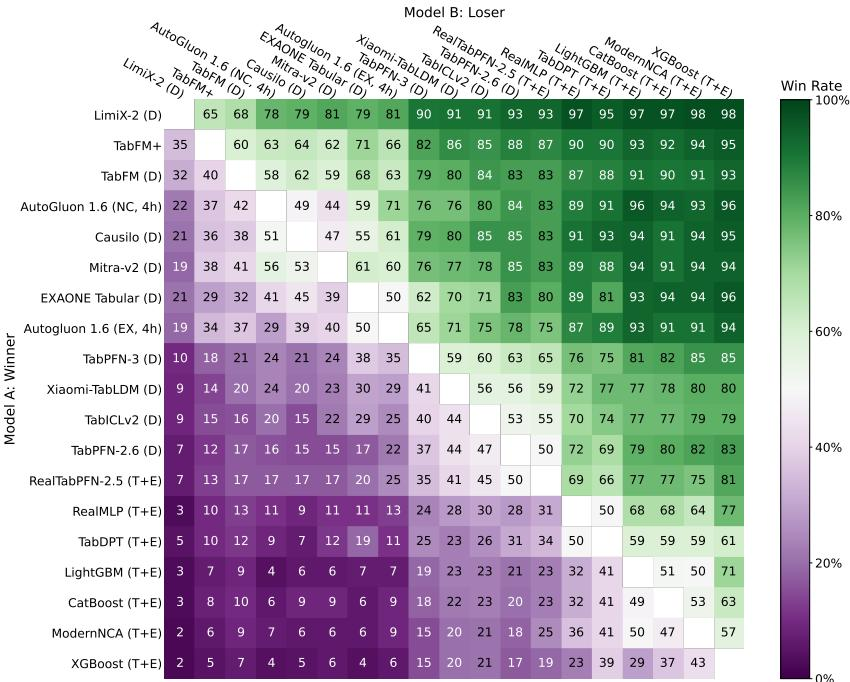  
Figure 5: Pairwise win rates on the TabArena benchmark. Entry (i, j) is the pairwise win rate of method i against method j, computed within each dataset and then averaged equally across datasets, with ties counted as half a win. All off-diagonal entries in the row corresponding to LimiX-2 exceed 60%.

Pairwise comparisons. Figure 5 reports pairwise win rates for the displayed methods and configurations. Each entry (i, j) is computed by first calculating the split-level win rate of method i against method j within each dataset, with ties counted as half a win, and then averaging equally across datasets. All offdiagonal entries in the row corresponding to LimiX-2 exceed 60%, indicating that LimiX-2 holds a majority win rate against every displayed competitor. In particular, its win rates against TabFM+, TabFM, Auto-Gluon 1.6 (noncommercial, 4h), and EXAONE Tabular are 65.2%, 67.7%, 78.3%, and 79.0%, respectively. It also achieves 79.3% against Causilo (Nums AI Inc., 2026) and 81.3% against Mitra-v2. Its win rates exceed 90% against the remaining displayed tabular foundation models, including Xiaomi-TabLDM, and reach at least 95% against the displayed tuned-and-ensembled tree-based and neural-network baselines.

## 5.3 Results on TALENT

Overall performance. Table 5 reports performance on the TALENT benchmark. LimiX-2 achieves the highest Elo across all five evaluation categories, together with the lowest overall improvability and the largest aggregated win count among the compared methods. Its overall Elo reaches 1506, exceeding TabFM and AutoGluon 1.6 (EX, 4h) by 35 and 68 points, respectively. The improvability decreases to 6.75%, compared with 9.17% for TabFM, corresponding to a 26.4% relative reduction. LimiX-2 also records an aggregated win count of 84.3, versus 50.1 for TabFM, approximately 1.7× as many wins. Consistent with these aggregate results, Figure 6 shows that LimiX-2 attains the lowest average rank in binary classification, multiclass classification, and regression. Together, these results demonstrate that its strong relative performance extends beyond TabArena to the TALENT benchmark.

Table 5: Performance on the TALENT benchmark. Models are ranked by overall Elo score. We also report Elo scores for classification and regression tasks, with classification further split into binary and multiclass settings. Red boldface highlights the best result in each metric. LimiX-2 achieves the highest Elo across all five evaluation categories, attaining an overall Elo of 1506 and exceeding the runner-up, TabFM, by 35 points. Its classification and regression Elo scores reach 1475 and 1584, surpassing TabFM by 26 and 55 points, respectively. LimiX-2 also leads in both binary and multiclass classification, with Elo scores of 1455 and 1520, respectively, demonstrating consistent model performance across task types.
<table><tr><td rowspan="2">Model</td><td colspan="5">Elo (↑)</td><td rowspan="2">Improv- ability</td><td rowspan="2">#wins (↑)</td></tr><tr><td>Overall</td><td>Classifi- cation</td><td>Regression</td><td>Binary</td><td>Multiclass (↓)</td></tr><tr><td>LimiX-2</td><td>1506-32,+37</td><td>1475-35,+38</td><td>1584-71,+92</td><td>1455-43,+51</td><td>1520-51,+63</td><td>6.75%</td><td>84.3</td></tr><tr><td>TabFM</td><td>1471-28,+30</td><td>1449-34,+36</td><td>1529-53,+60</td><td>1418-38,+46</td><td>1517-64,+78</td><td>9.17%</td><td>50.1</td></tr><tr><td>AutoGluon 1.6 (EX, 4h)</td><td>1438-27,+30</td><td>1379-32,+33</td><td>1581-53,+65</td><td>1340–38,+40</td><td>1465-43,+53</td><td>11.21%</td><td>48.0</td></tr><tr><td>EXAONE Tabular</td><td>1393-22,+23</td><td>1358-26,+25</td><td>1477-36,+44</td><td>1370-31,+37</td><td>1342-37,+41</td><td>14.74%</td><td>12.9</td></tr><tr><td>TabPFN-3</td><td>1363-22,+26</td><td>1331-26,+27</td><td>1441-48,+55</td><td>1333-31,+36</td><td>1331-42,+49</td><td>15.98%</td><td>15.7</td></tr><tr><td>TabICLv2</td><td>1344-22,+23</td><td>1338-27,+28</td><td>1365-33,+39</td><td>1338-35,+39</td><td>1343-41,+51</td><td>15.63%</td><td>10.2</td></tr><tr><td>Xiaomi-TabLDM</td><td>1341-20,+21</td><td>1303-22,+24</td><td>1431-37,+44</td><td>1305-28,+30</td><td>1301-34,+40</td><td>16.48%</td><td>7.4</td></tr><tr><td>TabDPT</td><td>1272-25,+24</td><td>1279-28,+31</td><td>1262-42,+46</td><td>1312-35,+34</td><td>1224–51,+52</td><td>19.47%</td><td>11.2</td></tr><tr><td>Mitra-v2</td><td>1269-22,+24</td><td>1263-28,+30</td><td>1287-44,+46</td><td>1267-31,+34</td><td>1258-48,+51</td><td>17.72%</td><td>7.4</td></tr><tr><td>LimiX-16M</td><td>1227-21,+21</td><td>1210-23,+23</td><td>1268-42,+43</td><td>1217-26,+28</td><td>1198-39,+39</td><td>20.52%</td><td>6.1</td></tr><tr><td>CatBoost</td><td>1094-22,+23</td><td>1094-27,+26</td><td>1094-44,+37</td><td>1107 -32,+32</td><td>1073-51,+46</td><td>26.84%</td><td>4.9</td></tr><tr><td>TabR</td><td>1075-24,+24</td><td>1078-29,+29</td><td>1071–39,+36</td><td>1077-35,+31</td><td>1080-52,+50</td><td>26.25%</td><td>4.1</td></tr><tr><td>RealMLP</td><td>1069-23,+22</td><td>1046-27,+26</td><td>1115-42,+39</td><td>1023-34,+30</td><td>1087-46,+43</td><td>26.62%</td><td>4.5</td></tr><tr><td>ModernNCA</td><td>1055-26,+24</td><td>1053-29,+27</td><td>1058–51,+48</td><td>1062-39,+33</td><td>1039–49,+44</td><td>26.65%</td><td>5.4</td></tr><tr><td>FT-Transformer</td><td>1032-25,+25</td><td>1024-31,+28</td><td>1048-45,+42</td><td>1027-39,+36</td><td>1018-56,+46</td><td>29.27%</td><td>4.1</td></tr><tr><td>RandomForest</td><td>1000-30,+28</td><td>1000-37,+35</td><td>1000-53,+48</td><td>1000-49,+43</td><td>1000-68,+59</td><td>30.06%</td><td>3.8</td></tr><tr><td>XGBoost</td><td>999-26,+24</td><td>1007-27,+27</td><td>980–58,+49</td><td>999-32,+29</td><td>1022-53,+44</td><td>29.37%</td><td>2.3</td></tr><tr><td>LightGBM</td><td>973-30,+29</td><td>978-38,+35</td><td>964–58,+48</td><td> $9 7 7 _ { - 4 5 , + 4 1 }$ </td><td> $9 7 9 _ { - 6 2 , + 5 9 }$ </td><td>29.80%</td><td>2.6</td></tr><tr><td>TabM</td><td>953-32,+29</td><td> $9 7 7 - 3 6 , + 3 3$ </td><td> $8 9 9 _ { - 6 1 , + 5 3 }$ </td><td> $9 6 7 _ { - 4 7 , + 4 3 }$ </td><td> $9 9 6 _ { - 5 6 , + 4 9 }$ </td><td>32.37%</td><td>3.0</td></tr></table>

Classification performance. Table 5 shows that LimiX-2 achieves an Elo rating of 1475 on classification tasks, surpassing TabFM by 26 points. This advantage holds in both binary and multiclass classification, with Elo scores of 1455 and 1520, compared with 1418 and 1517 for TabFM, respectively. Figure 6 provides a complementary dataset-level comparison based on accuracy, where LimiX-2 achieves the lowest average ranks of 4.62 and 3.91 on binary and multiclass classification, respectively. The agreement between Elo and average-rank evaluations demonstrates consistently strong classification performance across the two task settings.

Regression performance. On regression, LimiX-2 attains the highest Elo of 1584, slightly ahead of AutoGluon 1.6 (EX, 4h) at 1581 and exceeding TabFM and EXAONE Tabular by 55 and 107 points, respectively, as shown in Table 5. Figure 6 provides a complementary comparison based on RMSE, where LimiX-2 again achieves the lowest average rank, at 3.88. The consistent advantage under both Elo and dataset-level average rank further supports the strong regression performance of LimiX-2.

Pairwise comparisons. Figure 7 reports pairwise win rates across evaluation tasks. Each entry (i, j) denotes the percentage of tasks on which method i outperforms method j. LimiX-2 wins 57% of tasks against TabFM, 62% against AutoGluon 1.6 (EX, 4h), and 75% against EXAONE Tabular. Against the remaining tabular foundation models, its win rates range from 74% to 85%, while they reach 89–96% against the remaining baselines. Overall, LimiX-2 achieves a win rate above 50% against every competing method, showing that its leading aggregate performance is supported by broad pairwise advantages rather than gains concentrated on a small subset of datasets.

Meta-feature subgroups. Figure 8 examines how model rankings vary with dataset size and dimensionality. LimiX-2 maintains among the lowest fitted ranks across most sample-size and feature-count ranges, with particularly strong performance on medium-to-large datasets. Across feature counts, its fitted rank also remains consistently competitive and generally improves as dimensionality increases. These trends indicate that the aggregate advantage of LimiX-2 is preserved across datasets with substantially different numbers of samples and features, rather than being driven by a narrow dataset regime.

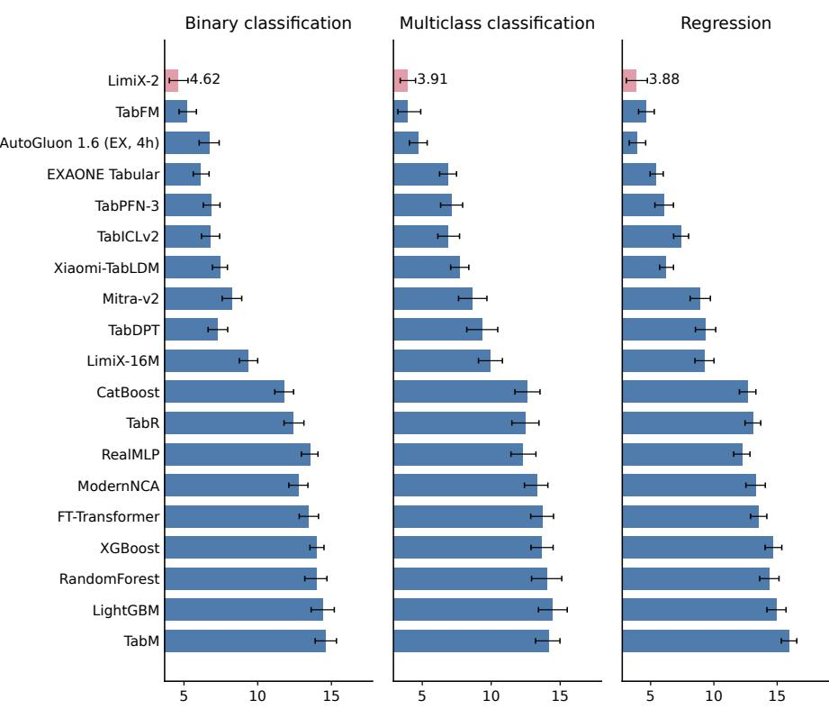  
Figure 6: Average-rank comparison on the TALENT benchmark across binary classification, multiclass classification, and regression tasks. Each bar represents a method’s mean rank over datasets in the corresponding task, using accuracy for classification and RMSE for regression. Error bars denote 95% bootstrap CIs from 1000 dataset resamples. For consistency with Table 5, methods are displayed in the same order across all panels. LimiX-2 is highlighted in pink, while baseline models are shown in dark blue. LimiX-2 achieves the lowest average rank in all three task categories, with ranks of 4.62, 3.91, and 3.88 for binary classification, multiclass classification, and regression, respectively.

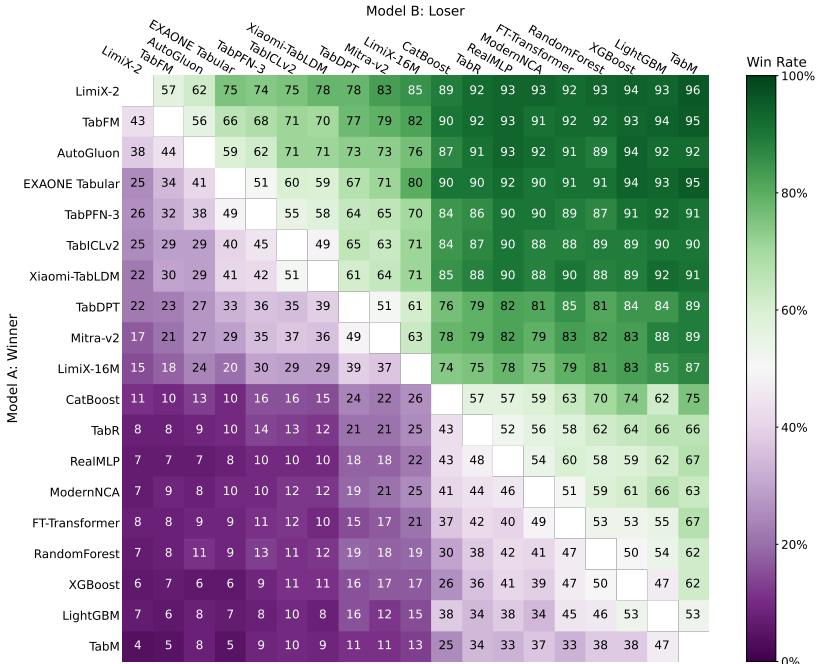  
Figure 7: Pairwise win rates on the TALENT benchmark. Entry $( i , j )$ is the percentage of evaluation tasks on which method i beats method j. Cells range from purple (row loses) to white (tie) to green (row wins). LimiX-2 achieves a win rate above 50% against every competing method, ranging from 57% against TabFM to 96% against TabM.

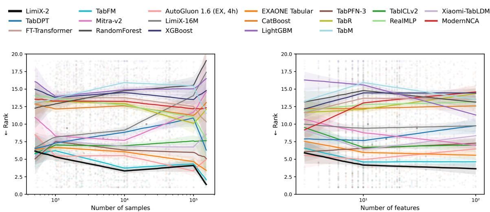  
Figure 8: Model rankings across dataset meta-features on TALENT. Lines show median piecewise-linear fits over 300 bootstrap rounds, with 10th–90th percentile bands (Qu et al., 2026). LimiX-2 achieves among the lowest fitted ranks across most sample-size and feature-count ranges, with particularly strong performance on medium-to-large datasets. These results show that its strong aggregate performance remains robust across datasets with varying scales and dimensionalities.

Table 6: Performance on the BCCO benchmark. LimiX-2 ranks first overall, with an Elo of 1432 (56 / 63 / 202 above AutoGluon 1.6 (EX, 4h), TabFM, and LimiX-16M). Its lead holds on classification (1321) and regression (1859), and on binary (1284) tasks. AutoGluon 1.6 (EX, 4h) leads on multiclass (1443).
<table><tr><td rowspan="2">Model</td><td colspan="5">Elo (↑)</td><td rowspan="2">Improv- ability (↓)</td><td rowspan="2">#wins (↑)</td></tr><tr><td>Overall</td><td>Classifi- cation</td><td>Regression</td><td>Binary</td><td>Multiclass</td></tr><tr><td>LimiX-2</td><td>1432-38,+45</td><td>1321-35,+42</td><td>1859-112,+158</td><td>1284-44,+51</td><td>1414–67,+87</td><td>6.97%</td><td>50.4</td></tr><tr><td>AutoGluon 1.6 (EX, 4h)</td><td>1376-37,+39</td><td>1269-37,+42</td><td>1782-71,+101</td><td>1199-44,+47</td><td>1443-56,+76</td><td>9.77%</td><td>24.5</td></tr><tr><td>TabFM</td><td>1369-37,+40</td><td>1260-40,+43</td><td>1785-75,+101</td><td>1213-44,+51</td><td>1374-74,+93</td><td>12.24%</td><td>16.7</td></tr><tr><td>EXAONE Tabular</td><td>1345-29,+32</td><td>1255-32,+36</td><td>1689-40,+54</td><td>1224-43,+46</td><td>1333-60,+73</td><td>13.40%</td><td>7.8</td></tr><tr><td>TabPFN-3</td><td>1295-26,+29</td><td>1188-29,+30</td><td>1691-67,+84</td><td>1153-38,+40</td><td>1275-44,+48</td><td>14.92%</td><td>5.7</td></tr><tr><td>Xiaomi-TabLDM</td><td>1277-27,+29</td><td>1176-29,+29</td><td>1646-60,+72</td><td>1136-36,+35</td><td>1273-50,+57</td><td>15.58%</td><td>3.5</td></tr><tr><td>TabICLv2</td><td>1275-25,+27</td><td>1205-30,+34</td><td>1542-49,+64</td><td>1161-34,+35</td><td>1313-64,+73</td><td>15.67%</td><td>3.3</td></tr><tr><td>Mitra-v2</td><td>1239-31,+32</td><td>1169-36,+38</td><td>1502-70,+83</td><td>1129-41,+43</td><td>1266-73,+82</td><td>16.86%</td><td>3.0</td></tr><tr><td>TabDPT</td><td>1238-28,+28</td><td>1197-34,+38</td><td>1410-60,+70</td><td>1151-42,+47</td><td>1308-53,+53</td><td>16.96%</td><td>8.4</td></tr><tr><td>LimiX-16M</td><td>1230-24,+26</td><td>1195-30,+31</td><td>1385-61,+63</td><td>1173-37,+37</td><td>1252-57,+66</td><td>16.94%</td><td>6.1</td></tr><tr><td>CatBoost</td><td>1140-28,+25</td><td>1101-30,+31</td><td>1287-67,+56</td><td>1096-35,+37</td><td>1118-66,+58</td><td>21.64%</td><td>4.6</td></tr><tr><td>TabR</td><td>1045-30,+29</td><td>1001-38,+34</td><td>1194-70,+59</td><td>976-41,+41</td><td>1061–76,+75</td><td>23.52%</td><td>2.6</td></tr><tr><td>RealMLP</td><td>1044-29,+27</td><td>973-32,+31</td><td>1269-70,+68</td><td>943-41,+40</td><td>1042-61,+56</td><td>24.58%</td><td>3.8</td></tr><tr><td>FT-Transformer</td><td>1020-32,+30</td><td>973-40,+34</td><td>1176-76,+64</td><td>942-46,+41</td><td>1043-81,+64</td><td>25.89%</td><td>2.1</td></tr><tr><td>ModernNCA</td><td>1019-30,+28</td><td>986-34,+33</td><td>1133-74,+62</td><td>952-45,+41</td><td>1064-62,+53</td><td>25.14%</td><td>2.0</td></tr><tr><td>RandomForest</td><td>1000-41,+36</td><td>1000-44,+39</td><td>1000-102,+74</td><td>1000-51,+50</td><td>1000-86,+72</td><td>26.75%</td><td>2.3</td></tr><tr><td>XGBoost</td><td>997-36,+32</td><td>994-33,+31</td><td>1008-120,+88</td><td>981–41,+38</td><td>1024-64,+53</td><td>26.35%</td><td>3.0</td></tr><tr><td>LightGBM</td><td>969-44,+40</td><td>953-51,+50</td><td>1023-93,+67</td><td>958-63,+63</td><td>936-87,+72</td><td>27.73%</td><td>3.7</td></tr><tr><td>TabM</td><td>957-41,+38</td><td>950-47,+42</td><td>978–98,+73</td><td>953-53,+47</td><td>941-93,+77</td><td>29.45%</td><td>2.6</td></tr></table>

## 5.4 Results on BCCO

Overall performance. Table 6 reports performance on the BCCO benchmark. LimiX-2 achieves the highest overall Elo, along with the lowest overall improvability and the largest aggregated win count among the compared methods. Its overall Elo reaches 1432, exceeding AutoGluon 1.6 (EX, 4h), TabFM, and LimiX-16M by 56, 63, and 202 points, respectively. The improvability decreases to 6.97%, compared with 12.24% for TabFM, corresponding to a 43.1% relative reduction. In addition, LimiX-2 records an aggregated win count of 50.4, versus 16.7 for TabFM, approximately 3.0× as many wins. These results demonstrate the leading predictive performance of LimiX-2 across the heterogeneous tasks within the BCCO benchmark.

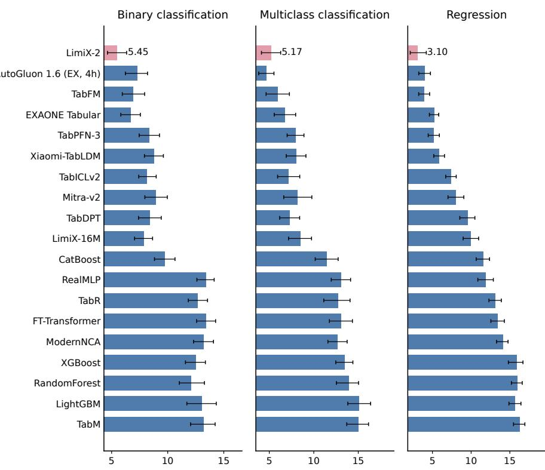  
Figure 9: Average-rank comparison on the BCCO benchmark across binary classification, multiclass classification, and regression tasks. Each bar represents a method’s mean rank over datasets in the corresponding task, using accuracy for classification and RMSE for regression. Error bars denote 95% bootstrap CIs from 1000 dataset resamples. For consistency with Table 6, methods are shown in the same order across all panels. LimiX-2 is highlighted in pink, and baseline models are shown in dark blue. LimiX-2 achieves a low average rank in all three task categories, with ranks of 5.45, 5.17, and 3.10 for binary classification, multiclass classification, and regression, respectively.

Classification performance. Table 6 reports a classification Elo of 1321 for LimiX-2, exceeding AutoGluon 1.6 (EX, 4h) by 52 points and TabFM by 61 points. It also achieves the highest Elo in binary classification, reaching 1284. On multiclass classification, LimiX-2 remains highly competitive with an Elo of 1414, 40 points above TabFM and within 29 points of the best result. Figure 9 provides complementary comparisons based on accuracy across 71 binary and 35 multiclass classification datasets. On binary classification, LimiX-2 achieves the best average rank of 5.45, followed by EXAONE Tabular at 6.69 and TabFM at 6.93. On multiclass classification, LimiX-2 attains a competitive average rank of 5.17, ahead of TabFM at 5.93 and within 0.49 of the best result. The agreement between Elo and accuracy-based rankings demonstrates the classification strength of LimiX-2 across both binary and multiclass prediction tasks.

Regression performance. On regression, LimiX-2 attains an Elo of 1859, exceeding TabFM by 74 points and TabPFN-3 by 168 points, as shown in Table 6. Figure 9 compares RMSE-based average ranks across 50 regression datasets. LimiX-2 achieves the lowest average rank of 3.10, followed by TabFM at 3.93 and AutoGluon 1.6 (EX, 4h) at 3.97, while TabPFN-3 and EXAONE Tabular attain 5.16 and 5.20. It also improves substantially over LimiX-16M, whose average rank is 9.96. The leading position of LimiX-2 under both Elo and RMSE-based rankings reinforces the strong regression performance established on TabArena and TALENT, demonstrating its effectiveness across the regression tasks in the BCCO benchmark.

Pairwise comparisons. Figure 10 reports pairwise win rates across evaluation tasks. Each entry (i, j) denotes the percentage of tasks on which method i outperforms method j. For LimiX-2, the off-diagonal values span 62% to 94%, showing that it defeats every baseline in the majority of tasks. Specifically, LimiX-2 wins 65% of tasks against TabFM and 67% against EXAONE Tabular. Against the other tabular foundation models, its win rates fall between 73% and 79%. For tree-based and neural baselines, the win rates are even higher, ranging from 81% to 94%. These pairwise results align with the overall Elo and average-rank findings, confirming that LimiX-2 maintains a consistent predictive advantage across the various model families.

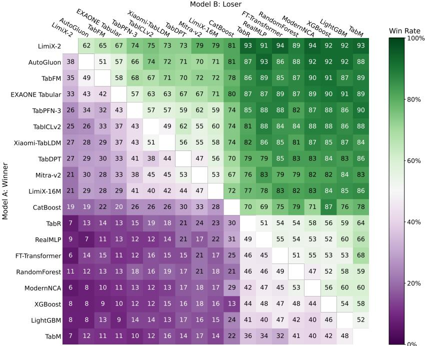  
Figure 10: Pairwise win rates on the BCCO benchmark. Entry (i, j) is the percentage of evaluation tasks on which method i beats method j. Cells range from purple (row loses) to white (tie) to green (row wins). LimiX-2 wins the majority of tasks against every compared method, achieving win rates of 65% against TabFM and 67% against EXAONE Tabular. Its win rates reach 73–79% against the remaining tabular foundation models, including 79% against LimiX-16M, and 81–94% against tree-based and neuralnetwork baselines, demonstrating broad predictive advantages across the benchmark.

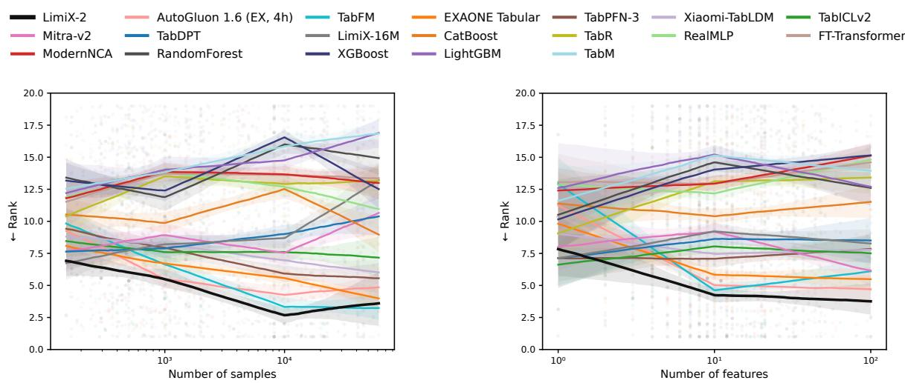  
Figure 11: Model rankings as a function of meta-features on the BCCO benchmark. Each curve is a piecewise-linear fit. The line is the median over 300 bootstrap rounds and the band is the 10th–90th percentile (Qu et al., 2026). Lower is better.

Meta-feature subgroups. Figure 11 examines model rankings across dataset characteristics, including sample size and feature dimensionality. LimiX-2 maintains one of the lowest fitted ranks over much of the sample-size range, with particularly strong relative performance around $1 0 ^ { 4 }$ samples. It also achieves low fitted ranks on datasets with approximately 10–100 features, highlighting its effectiveness across a broad range of feature dimensionalities. These results identify advantages across multiple dataset characteristics and complement the leading aggregate performance of LimiX-2.

## 5.5 Causal Skeleton Recovery Evaluation

We evaluate the causal awareness of tabular foundation models through probing the structural information encoded in their internal feature attention score. Specifically, we investigate whether feature attention scores can distinguish causal relationships (i.e. adjacency in causal graph) from non-causal ones (i.e. non-adjacency). When predicting a target variable, a model with genuine causal awareness is expected to concentrate its attention on the features causally adjacent to the target. The presence of a causal edge between a feature and the target can therefore be identified by thresholding the corresponding attention score: the stronger a model’s causal awareness, the more accurate the causal skeleton induced by this separation should be. We thus adopt causal skeleton recovery performance as an operational measurement of causal awareness for tabular foundation models.

Benchmark Protocol Given observational data over F variables, we designate each variable $X _ { j }$ in turn as the prediction target, with the remaining variables serving as features for tabular foundation models. Owing to the design of cell-level representations, we can measure the feature attention exclusive to each feature as the causal relationship strength between the feature and target for models retaining cell-level representations. However, some tabular foundation models, such as TabPFN-3, TabICLv2, TabFM and Xiaomi-TabLDM, aggregate feature information into row-level representation to predict targets. Thereby, the feature attention score attended by target can be calculated only at the feature group level. For these models, we distribute the attention score of each feature group uniformly among its member features to obtain the measurement of causal relationship strength. The tree-based XGBoost can also produce feature importance scores (Chen & Guestrin, 2016), for which we adopt the gain-based variant as its measure of causal strength. By retaining the variable relations with high scores, determined by a threshold over the overall score distribution, we yield a sparse causal skeleton $\widehat { G } _ { \mathrm { s k e l } }$ of the causal graph. For causal discovery methods, we convert the produced directed causal graphs into undirected ones to obtain causal skeletons. We compare the estimated skeletons against the ground truths using skeleton F1 score and structural Hamming distance (SHD).

Baselines The baselines include tabular foundation models (TabPFN-3, TabICLv2, TabFM, EXAONE Tabular, Xiaomi-TabLDM), XGBoost with gain-based feature importance, and causal discovery methods across major families: pretrained/amortized structure learning (TabCausal (Li et al., 2026), AVICI (Lorch et al., 2022)), nonlinear continuous-optimization (NOTEARS-MLP (Zheng et al., 2020), DAG-GNN (Yu et al., 2019)), conditional independence constraint-based PC (Spirtes et al., 2000), graph score-based GES (Chickering, 2002), and identifiable functional causal models LiNGAM (Shimizu et al., 2006).

Benchmarks We evaluate on six causal discovery datasets: three continuous datasets and three discrete datasets. The continuous datasets span the Sachs protein signaling network(Sachs et al., 2005), the UF food production process(Menegozzo et al., 2022), and the CausalChamber light tunnel system(Gamella et al., 2025). The discrete benchmarks are the PATHFINDER network for lymph node pathology(Heckerman et al., 1992; Scutari, 2026), the DIABETES network for blood glucose regulation and insulin adjust ment(Andreassen et al., 1991; Scutari, 2026), and the PIGS genetic pedigree network(Cowell et al., 1999; Scutari, 2026).

Table 7 shows that the feature attention scores in tabular foundation models encode the structural information of direct causal relationship, which can be converted into a causal skeleton. LimiX-2 attains a mean F1 score of 0.7972 across the six datasets, ranking first in F1 on six datasets and achieving the lowest SHD on five. This improvement suggests that LimiX-2 extracts predictive signal from the direct causal relations, i.e., its feature attention scores encode causal information. EXAONE Tabular ranks second with F1 score of 0.6591. In contrast, the tabular foundation models that compute feature attention at the group level can not distinguish causal relationship strength among features at fine-granularity. Consequently, the causal skeleton recovery performances of TabFM, TabICLv2, TabPFN-3 and Xiaomi-TabLDM deteriorate markedly, highlighting the importance of CMNs and cell-level representations for causal structure awareness in tabular foundation models. Furthermore, the skeletons recovered by LimiX-2 match or surpass those of methods designed exclusively for causal discovery in several settings, indicating that LimiX-2 can effectively internalize causal structure information into its internal representations.

## 6 Scaling Law

Scaling laws have only recently begun to be studied for foundation models operating on structured data. LimiX (LimiX Team, 2025) introduced the first explicit scaling-law study for large structured-data models (LDMs), characterizing how model capacity and pretraining scale affect both training loss and downstream performance. Subsequent work broadened scaling analyses for LDMs along complementary axes. PluRel established power-law scaling of relational-foundation-model pretraining loss with the number of synthetic databases and training tokens. MaskTab reported one-axis-at-a-time scaling trends over unlabeled data volume, feature dimensionality, and model capacity. TabPFN-3 explored context-size and test-time compute scaling for tabular prediction (Kothapalli et al., 2026; Zheng et al., 2026; Grinsztajn et al., 2026). Building on this emerging line of research, LimiX-2 conducts a finer-grained and more controlled scaling study along the model-capacity axis, covering multiple downstream benchmarks.

Table 7: Comparison of causal skeleton recovery among tabular foundation models, XGBoost, and dedicated causal discovery methods. LiNGAM assumes continuous variables and is therefore not applicable to the discrete networks (PATHFINDER, DIABETES, and PIGS). These results are marked as –. PC, GES, and NOTEARS-MLP do not finish within the 12-hour time limit on some datasets and are marked as TIMEOUT.
<table><tr><td>Model</td><td>Metric</td><td>Sachs</td><td>UF</td><td>CausalChamber</td><td>PATHFINDER</td><td>DIABETES</td><td>PIGS</td></tr><tr><td>LimiX-2</td><td>F1 score ↑ SHD↓</td><td>0.7143 8</td><td>0.8617 26</td><td>0.7013 23</td><td>0.7829 76</td><td>0.7846 263</td><td>0.9385 77</td></tr><tr><td>EXAONE Tabular</td><td>F1 score ↑ SHD↓</td><td>0.6429 10</td><td>0.6492 67</td><td>0.5195 37</td><td>0.5486 158</td><td>0.6994 367</td><td>0.8955 131</td></tr><tr><td>TabFM</td><td>F1 score ↑ SHD↓</td><td>0.4286 16</td><td>0.2727 80</td><td>0.4156 45</td><td>0.2400 266</td><td>0.6028 485</td><td>0.6895 389</td></tr><tr><td>TabICLv2</td><td>F1 score ↑ SHD↓</td><td>0.6429 10</td><td>0.1818 90</td><td>0.2857 55</td><td>0.1600 294</td><td>0.2277 943</td><td>0.1612 1051</td></tr><tr><td>TabPFN-3</td><td>F1 score ↑ SHD↓</td><td>0.5714 12</td><td>0.6845 59</td><td>0.3636 49</td><td>0.1429 300</td><td>0.0426 1169</td><td>0.0271 1219</td></tr><tr><td>Xiaomi-TabLDM</td><td>F1 score ↑ SHD↓</td><td>0.3704 17</td><td>0.2364 84</td><td>0.2078 61</td><td>0.0114 346</td><td>0.2211 951</td><td>0.2426 949</td></tr><tr><td>XGBoost</td><td>F1 score ↑ SHD↓</td><td>0.5714 12</td><td>0.2545 82</td><td>0.2632 56</td><td>0.2914 248</td><td>0.4111 719</td><td>0.8125 235</td></tr><tr><td>TabCausal</td><td>F1 score ↑ SHD↓</td><td>0.5600 11</td><td>0.4000 81</td><td>0.5970 27</td><td>0.0000 189</td><td>0.1855 685</td><td>0.0000 592</td></tr><tr><td>PC</td><td>F1 score ↑ SHD↓</td><td>0.6400 9</td><td>0.3817 81</td><td>0.4000 39</td><td>0.3659 156</td><td>0.4674 449</td><td>TIMEOUT TIMEOUT</td></tr><tr><td>GES</td><td>F1 score ↑ SHD↓</td><td>0.6400 9</td><td>0.6044 72</td><td>0.6234 29</td><td>TIMEOUT TIMEOUT</td><td>TIMEOUT</td><td>TIMEOUT</td></tr><tr><td>LiNGAM</td><td>F1 score ↑ SHD↓</td><td>0.5600 11</td><td>0.5521 73</td><td>0.6667 21</td><td>一</td><td>TIMEOUT</td><td>TIMEOUT</td></tr><tr><td>AVICI</td><td>F1 score ↑ SHD↓</td><td>0.5000 12</td><td>0.4783 72</td><td>0.2917 34</td><td>0.0485</td><td>0.0251</td><td>0.0000</td></tr><tr><td>NOTEARS-MLP</td><td>F1 score ↑ SHD↓</td><td>0.5600 11</td><td>0.4030</td><td>0.4571</td><td>196 0.6146</td><td>622 TIMEOUT</td><td>592 0.8907</td></tr><tr><td>DAG-GNN</td><td>F1 score ↑ SHD↓</td><td>0.4167 14</td><td>80 0.0860 85</td><td>38 0.2642 39</td><td>158 0.3846 144</td><td>TIMEOUT 0.4320 497</td><td>145 0.1529 543</td></tr></table>

LimiX-2 is pretrained on generated data, allowing the training corpus to be expanded on demand, while its model sizes remain far below those of modern large language models, keeping controlled scaling experiments computationally manageable. This setting allows us to focus on model capacity as the primary scaling variable and ask a targeted question: under a fixed data-generation, optimization, and inference recipe, how does downstream performance scale with the number of trainable parameters? We evaluate LimiX-2 configurations ranging from 12.5M to 406.2M parameters and extrapolate the fitted scaling trend toward the billion-parameter regime.

## 6.1 Experimental Setup and Scaling Model

For each evaluation series, let $N _ { i }$ denote the number of parameters in millions and $E _ { i }$ the observed Elo score. We fit the following log-linear scaling law:

$$
E _ { i } = \alpha + \beta \log _ { 2 } \left( \frac { N _ { i } } { 1 0 0 } \right) + \varepsilon _ { i } .\tag{1}
$$

Here, α denotes the fitted Elo at 100M parameters, while $\beta$ measures the expected Elo improvement from each doubling of model size.Both coefficients are estimated by ordinary least squares over the six model sizes for each evaluation series:

$$
{ \widehat { \beta } } = { \frac { \sum _ { i } ( x _ { i } - { \bar { x } } ) ( E _ { i } - { \bar { E } } ) } { \sum _ { i } ( x _ { i } - { \bar { x } } ) ^ { 2 } } } , \qquad { \widehat { \alpha } } = { \bar { E } } - { \widehat { \beta } } { \bar { x } } , \quad x _ { i } = \log _ { 2 } \left( { \frac { N _ { i } } { 1 0 0 } } \right) .\tag{2}
$$

Baselines are shown only for reference and are not included in the scaling-law fit. We report $R ^ { 2 }$ and residual RMSE to characterize the goodness of fit.

Table 8: Log-linear scaling fits. α is the fitted Elo at 100M parameters, and $\beta$ is the Elo gained per parameter doubling.
<table><tr><td>Evaluation task</td><td>α</td><td> $\beta$ </td><td> $R ^ { 2 }$ </td><td>RMSE</td></tr><tr><td>TabArena</td><td>1863.88</td><td>34.68</td><td>0.9808</td><td>8.31</td></tr><tr><td>TALENT classification</td><td>1427.25</td><td>22.16</td><td>0.9792</td><td>5.53</td></tr><tr><td>TALENT regression</td><td>1545.12</td><td>18.26</td><td>0.9680</td><td>5.69</td></tr><tr><td>BCCO classification</td><td>1295.86</td><td>11.24</td><td>0.9617</td><td>3.84</td></tr><tr><td>BCCO regression</td><td>1795.89</td><td>30.06</td><td>0.9702</td><td>9.03</td></tr></table>

## 6.2 Scaling Results

Across all five evaluation series, downstream performance follows a clear log-linear trend with model size. The fitted models achieve $R ^ { 2 }$ values between 0.9617 and 0.9808, with residual RMSE ranging from 3.84 to 9.03 Elo (Table 8). The consistently positive slopes indicate robust gains from increasing model capacity, while their different magnitudes reveal substantial task-dependent variation in the returns to scaling.

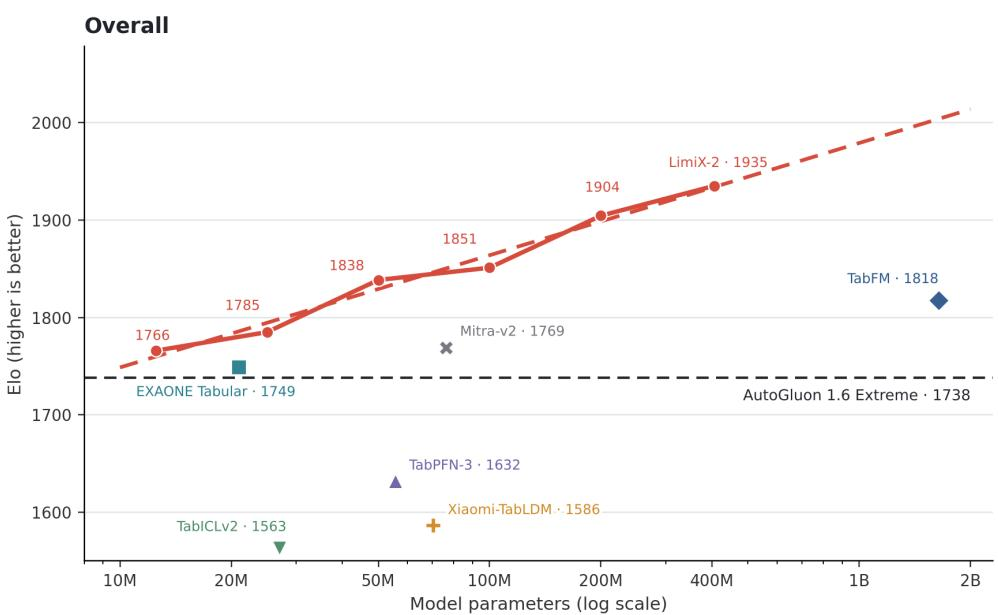  
Figure 12: Parameter scaling on TabArena. The solid line connects the observed LimiX-2 scale points, while the dashed line shows the log-linear OLS fit extrapolated to 2B parameters.

On TabArena, Elo increases from 1766 at 12.5M parameters to 1935 at 406.2M, yielding a gain of 169 Elo over a roughly 32.5× increase in model size. The fitted slope reaches 34.68 Elo per parameter doubling, the steepest among the five evaluation series. On TALENT, classification and regression improve by approximately 109 and 89 Elo, respectively, over the same range. The trend generalizes to the disjoint BCCO benchmark collection, where classification gains 56 Elo and regression gains 147 Elo. Notably, BCCO regression exhibits the second-largest scaling coefficient, at 30.06 Elo per doubling.

Within the measured parameter range, LimiX-2 also compares favorably with existing structured-data foundation models at comparable model scales. These comparisons provide evidence of strong empirical parameter efficiency under the reported evaluation protocols, although differences in architectures, pretraining distributions, and training compute preclude attributing the gaps solely to model design.

The extrapolated 2B results should be interpreted as forecasts rather than measured performance: larger models may enter different optimization or data regimes, and Elo scores also depend on the benchmark comparison pool. Nevertheless, the consistency of the scaling trends across three benchmark suites and both classification and regression supports a clear conclusion: model capacity is a robust and predictable scaling axis for LimiX-2 within the regime studied. We observe no clear evidence of performance saturation up to 406.2M parameters, providing strong empirical motivation for extending LimiX-2 into the billion-parameter regime.

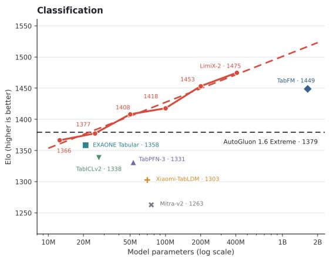

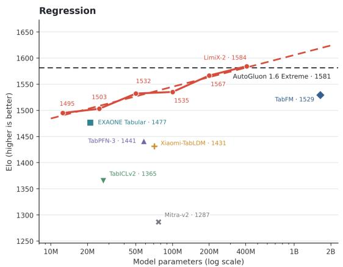

Figure 13: Parameter scaling on TALENT classification and regression.  
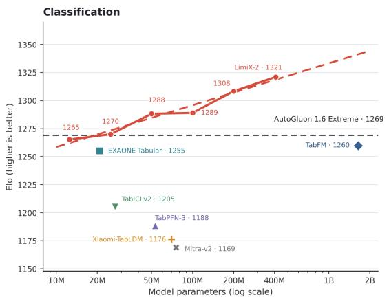

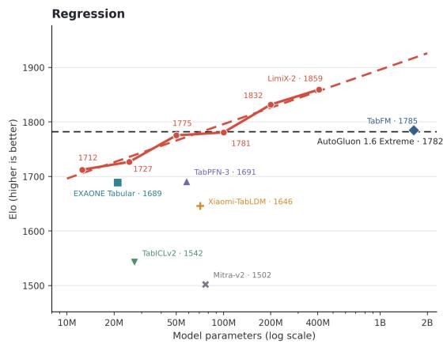  
Figure 14: Parameter scaling on BCCO classification and regression.

## 7 Conclusions

In this report, we have advocated the development of Large Data Models (LDMs) and identified a key limitation of the prevailing Prior-Fitted Network (PFN) paradigm, which is the confinement to label prediction, thereby introduce Contextual Mechanism Networks (CMNs), a design paradigm that generalizes label prediction to the imputation of arbitrary masked columns. CMNs are trained with Context-Conditional Masked Modeling (CCMM), an objective that provides substantially denser supervision than label prediction alone and steers the model toward stronger data reasoning capabilities. We instantiated this paradigm with LimiX-2, a transformer-based tabular foundation model with cell-level representations, pretrained exclusively on synthetic data from an SCM-based generation engine. Without any task-specific training, LimiX-2 performs classification, regression, missing-value imputation, and causal inference in a single forward pass. The evaluation results on TabArena, TALENT, and BCCO reveal that Limix-2 outperform a wide range of tabular foundation models and dataset-specific models, and justify the superiority of CMNs.

## 8 Contribution

## Project Design and Lead

Xingxuan Zhang, Peng Cui

## Core Contributors

Gang Ren, Hao Yuan, Hao Zou, Hongze Tan, Hui Wang, Jianhao Song, Jiansheng Li, Jiayao Zhang, Jinghan Zhang, Kaifang Li, Lang Mo, Li Mao, Mingchao Hao, Nuo Xu, Rui Ding, Ruiji Zhang, Shuyang Li, Siyu Mei, Tianyang Zhang, Weiyang Mu, Yancheng Dong, Yongxian Wei, Yuan Xue, Yuanrui Wang, Yue He, Zijia Yang, Ziyun Li

## Contributors

Dongzhe Li, Fuqiang Wang, Jiandong Liu, Jiawei Chen, Jiaxin Du, Kaijie Cheng, Kehan Li, Lei Sun, Linjun Zhou, Ningbo Dai, Qi Wang, Renzhe Xu, Shaoxing Du, Shumeng Yang, Wang Lu, Wenjing Chu, Xiannan Huang, Xiaoyu Lin, Xing Ai, Xinyan Han, Xuanyue Li, Xuanyue Su, Xukun Zhang, Yan Lu, Yaxin Zhang, Yi Qin, Yifei Huang, Yihan Xu, Yongle Lv, Yuanyuan Jiang, Yushan Han

## References

Steen Andreassen, Roman Hovorka, John Benn, Kristian G. Olesen, and Ewart R. Carson. A model-based approach to insulin adjustment. In Proceedings of the Third Conference on Artificial Intelligence in Medicine, pp. 239–249, 1991.

Pierre Baldi, Peter Sadowski, and Daniel Whiteson. Searching for exotic particles in high-energy physics with deep learning. Nature communications, 5(1):4308, 2014.

Irena Barjasiˇ c, Hrvoje´ Stefanˇ ciˇ c, Vedrana Pribi´ ceviˇ c, and Vinko Zlati´ c. Causal motifs and existence of´ endogenous cascades in directed networks with application to company defaults. Scientific reports, 11 (1):24028, 2021.

Leo Breiman. Random forests. Machine learning, 45(1):5–32, 2001.

Tianqi Chen and Carlos Guestrin. Xgboost: A scalable tree boosting system. In Proceedings of the 22nd acm sigkdd international conference on knowledge discovery and data mining, pp. 785–794, 2016.

David Chiang and Peter Cholak. Overcoming a theoretical limitation of self-attention. In Proceedings of the 60th Annual Meeting of the Association for Computational Linguistics (Volume 1: Long Papers), pp. 7654–7664, Dublin, Ireland, May 2022. Association for Computational Linguistics. doi: 10.18653/v1/20 22.acl-long.527. URL https://aclanthology.org/2022.acl-long.527/.

David Maxwell Chickering. Optimal structure identification with greedy search. Journal of Machine Learning Research, 3:507–554, 2002.

Robert G. Cowell, A. Philip Dawid, Steffen L. Lauritzen, and David J. Spiegelhalter. Probabilistic Networks and Expert Systems. Springer, 1999.

Anna Veronika Dorogush, Vasily Ershov, and Andrey Gulin. Catboost: gradient boosting with categorical features support. arXiv preprint arXiv:1810.11363, 2018.

Moonjung Eo, Min-Kook Suh, Hye-Seung Cho, Jiwon Kim, Seoyoon Kim, Sangjun Nam, and Soonyoung Lee. EXAONE Tabular 1.0: Technical report. arXiv preprint arXiv:2608.25774, 2026. URL https: //arxiv.org/abs/2608.25774.

Nick Erickson, Jonas Mueller, Alexander Shirkov, Hang Zhang, Pedro Larroy, Mu Li, and Alexander Smola. Autogluon-tabular: Robust and accurate automl for structured data. arXiv preprint arXiv:2003.06505, 2020.

Nick Erickson, Lennart Purucker, Andrej Tschalzev, David Holzmuller, Prateek Mutalik Desai, David¨ Salinas, and Frank Hutter. Tabarena: A living benchmark for machine learning on tabular data. arXiv preprint arXiv:2506.16791, 2025.

Juan L. Gamella, Jonas Peters, and Peter Buhlmann. Causal chambers as a real-world physical testbed for¨ AI methodology. Nature Machine Intelligence, 7:107–118, 2025.

Yury Gorishniy, Ivan Rubachev, Valentin Khrulkov, and Artem Babenko. Revisiting deep learning models for tabular data. Advances in neural information processing systems, 34:18932–18943, 2021.

Yury Gorishniy, Ivan Rubachev, Nikolay Kartashev, Daniil Shlenskii, Akim Kotelnikov, and Artem Babenko. Tabr: Tabular deep learning meets nearest neighbors. In International Conference on Learning Representations, volume 2024, pp. 18209–18249, 2024.

Yury Gorishniy, Akim Kotelnikov, and Artem Babenko. Tabm: Advancing tabular deep learning with parameter-efficient ensembling. arxiv 2024. arXiv preprint arXiv:2410.24210, 2025.

Leo Grinsztajn, Klemens Fl ´ oge, Oscar Key, et al. TabPFN-3: Technical report. ¨ arXiv preprint arXiv:2605.13986, 2026. URL https://arxiv.org/abs/2605.13986.

Shihao Gu, Bryan Kelly, and Dacheng Xiu. Empirical asset pricing via machine learning. The review of financial studies, 33(5):2223–2273, 2020.

Daya Guo, Dejian Yang, Haowei Zhang, Junxiao Song, Peiyi Wang, Qihao Zhu, Runxin Xu, Ruoyu Zhang, Shirong Ma, Xiao Bi, et al. Deepseek-r1: Incentivizing reasoning capability in llms via reinforcement learning. arXiv preprint arXiv:2501.12948, 2025.

David Ha and Jurgen Schmidhuber. World models. ¨ arXiv preprint arXiv:1803.10122, 2(3):440, 2018.

David E. Heckerman, Eric J. Horvitz, and Bharat N. Nathwani. Toward normative expert systems: Part i. the pathfinder project. Methods ofInformation in Medicine, 31(2):90–105, 1992.

Dan Hendrycks and Kevin Gimpel. Gaussian error linear units (GELUs). arXiv preprint arXiv:1606.08415, 2016. URL https://arxiv.org/abs/1606.08415.

Noah Hollmann, Samuel Muller, Katharina Eggensperger, and Frank Hutter. Tabpfn: A transformer¨ that solves small tabular classification problems in a second. In The Eleventh International Conference on Learning Representations, 2022.

Noah Hollmann, Samuel Muller, Lennart Purucker, et al. Accurate predictions on small data with a¨ tabular foundation model. Nature, 637(8045):319–326, 2025. doi: 10.1038/s41586-024-08328-6. URL https://www.nature.com/articles/s41586-024-08328-6.

David Holzmuller, L ¨ eo Grinsztajn, and Ingo Steinwart. Better by default: Strong pre-tuned mlps and ´ boosted trees on tabular data. Advances in Neural Information Processing Systems, 37:26577–26658, 2024.

Alistair EW Johnson, Tom J Pollard, Lu Shen, Li-wei H Lehman, Mengling Feng, Mohammad Ghassemi, Benjamin Moody, Peter Szolovits, Leo Anthony Celi, and Roger G Mark. Mimic-iii, a freely accessible critical care database. Scientific data, 3(1):1–9, 2016.

Guolin Ke, Qi Meng, Thomas Finley, Taifeng Wang, Wei Chen, Weidong Ma, Qiwei Ye, and Tie-Yan Liu. Lightgbm: A highly efficient gradient boosting decision tree. Advances in neural information processing systems, 30, 2017.

Moo Jin Kim, Karl Pertsch, Siddharth Karamcheti, Ted Xiao, Ashwin Balakrishna, Suraj Nair, Rafael Rafailov, Ethan Foster, Grace Lam, Pannag Sanketi, et al. Openvla: An open-source vision-languageaction model. arXiv preprint arXiv:2406.09246, 2024.

Weihao Kong and Abhimanyu Das. Introducing TabFM: A zero-shot foundation model for tabular data. Google Research Blog, June 2026. URL https://research.google/blog/introducing-tabfm-a-zer o-shot-foundation-model-for-tabular-data/.

Vignesh Kothapalli, Rishabh Ranjan, Valter Hudovernik, Vijay Prakash Dwivedi, Johannes Hoffart, Carlos Guestrin, and Jure Leskovec. PluRel: Synthetic data unlocks scaling laws for relational foundation models. arXiv preprint arXiv:2602.04029, 2026. URL https://arxiv.org/abs/2602.04029.

Zi-Rong Li, Si-Yang Liu, Tian-Zuo Wang, and Han-Jia Ye. TabCausal: Pretraining across causal environments for tabular causal discovery, 2026. URL https://arxiv.org/abs/2605.31156.

LimiX Team. LimiX: Unleashing structured-data modeling capability for generalist intelligence. arXiv preprint arXiv:2509.03505, 2025. URL https://arxiv.org/abs/2509.03505.

Si-Yang Liu, Hao-Run Cai, Qi-Le Zhou, and Han-Jia Ye. Talent: A tabular analytics and learning toolbox. arXiv preprint arXiv:2407.04057, 2024.

Lars Lorch, Scott Sussex, Jonas Rothfuss, Andreas Krause, and Bernhard Scholkopf. Amortized inference¨ for causal structure learning. In Advances in Neural Information Processing Systems, volume 35, 2022.

Junwei Ma, Valentin Thomas, Rasa Hosseinzadeh, Alex Labach, Jesse Cresswell, Keyvan Golestan, Guangwei Yu, Anthony L Caterini, and Maks Volkovs. Tabdpt: Scaling tabular foundation models on real data. Advances in Neural Information Processing Systems, 38:172692–172722, 2026.

Sergei Maslov and Kim Sneppen. Specificity and stability in topology of protein networks. Science, 296 (5569):910–913, 2002.

Giovanni Menegozzo, Diego Dall’Alba, and Paolo Fiorini. CIPCaD-Bench: Continuous industrial process datasets for benchmarking causal discovery methods. In 2022 IEEE 18th International Conference on Automation Science and Engineering, pp. 2124–2131, 2022.

Samuel Muller, Noah Hollmann, Sebastian Pineda Arango, Josif Grabocka, and Frank Hutter. Transform-¨ ers can do bayesian inference. arXiv preprint arXiv:2112.10510, 2021.

Ken M. Nakanishi. Scalable-Softmax is superior for attention. arXiv preprint arXiv:2501.19399, 2025. doi: 10.48550/arXiv.2501.19399. URL https://arxiv.org/abs/2501.19399.

Nums AI Inc. Causilo: A pretrained tabular foundation model for classification and regression. https: //github.com/nums-ai/causilo, 2026. GitHub repository.

Long Ouyang, Jeffrey Wu, Xu Jiang, Diogo Almeida, Carroll Wainwright, Pamela Mishkin, Chong Zhang, Sandhini Agarwal, Katarina Slama, Alex Ray, et al. Training language models to follow instructions with human feedback. Advances in neural information processing systems, 35:27730–27744, 2022.

Judea Pearl, Madelyn Glymour, and Nicholas P Jewell. Causal inference in statistics: A primer. John Wiley & Sons, 2016.

Judea Pearl et al. Causality: models, reasoning, and inference. Econometric Theory, 19(675-685):46, 2003.

Jonas Peters, Dominik Janzing, and Bernhard Scholkopf.¨ Elements of causal inference: foundations and learning algorithms. The MIT press, 2017.

Jingang Qu, David Holzmuller, Ga¨ el Varoquaux, and Marine Le Morvan. TabICL: A tabular foundation¨ model for in-context learning on large data. In Proceedings ofthe 42nd International Conference on Machine Learning, volume 267 of Proceedings ofMachine Learning Research, pp. 50817–50847. PMLR, 2025. URL https://proceedings.mlr.press/v267/qu25d.html.

Jingang Qu, David HolzmA˜ zller, Gaˇ el Varoquaux, and Marine Le Morvan. Tabiclv2: A better, faster,¨ scalable, and open tabular foundation model. In Forty-third International Conference on Machine Learning, 2026.

Karen Sachs, Omar Perez, Dana Pe’er, Douglas A. Lauffenburger, and Garry P. Nolan. Causal proteinsignaling networks derived from multiparameter single-cell data. Science, 308(5721):523–529, 2005.

Alberto Sanfeliu and King-Sun Fu. A distance measure between attributed relational graphs for pattern recognition. IEEE transactions on systems, man, and cybernetics, (3):353–362, 1983.

Timo Schick, Jane Dwivedi-Yu, Roberto Dess\`ı, Roberta Raileanu, Maria Lomeli, Eric Hambro, Luke Zettlemoyer, Nicola Cancedda, and Thomas Scialom. Toolformer: Language models can teach themselves to use tools. Advances in neural information processing systems, 36:68539–68551, 2023.

Marco Scutari. Bayesian network repository, 2026. URL https://www.bnlearn.com/bnrepository/. Accessed 2026-09-14.

Noam Shazeer. GLU variants improve transformer. arXiv preprint arXiv:2002.05202, 2020. URL https: //arxiv.org/abs/2002.05202.

Shohei Shimizu, Patrik O. Hoyer, Aapo Hyvarinen, and Antti Kerminen. A linear non-gaussian acyclic ¨ model for causal discovery. Journal ofMachine Learning Research, 7:2003–2030, 2006.

Peter Spirtes, Clark Glymour, and Richard Scheines. Causation, Prediction, and Search. MIT Press, 2 edition, 2000.

Yefan Tao, Xiyuan Zhang, Xinyi Liu, Boran Han, Danielle Maddix, Haoyang Fang, Zhen Han, Jiading Gai, Xuanqing Liu, Michael Bohlke-Schneider, Yuyang (Bernie) Wang, Gerald Friedland, Kevan Mah, Chris Lee, and Chris Kong. Mitra-v2 technical report. arXiv preprint arXiv:2609.04540, 2026. URL https://arxiv.org/abs/2609.04540.

Gemini Team, Rohan Anil, Sebastian Borgeaud, Jean-Baptiste Alayrac, Jiahui Yu, Radu Soricut, Johan Schalkwyk, Andrew M Dai, Anja Hauth, Katie Millican, et al. Gemini: a family of highly capable multimodal models. arXiv preprint arXiv:2312.11805, 2023.

Ashish Vaswani, Noam Shazeer, Niki Parmar, et al. Attention is all you need. In Advances in Neural Information Processing Systems, 2017. URL https://papers.nips.cc/paper/7181-attention-is-all -you-need.

Penghui Wang, Wei Liu, Hong Wang, Chengyue Huang, Yuxi Sun, Zirui Wang, Hongming Huang, Quan Wang, Zhenwei Xin, Ping Hou, Jie Yu, Chunxiao Liu, Erli Meng, and Bin Wang. Xiaomi-TabLDM: A tabular foundation model technical report. arXiv preprint arXiv:2609.03880, 2026a. URL https://arxiv.org/abs/2609.03880.

Yuanrui Wang, Xingxuan Zhang, Han Yu, Mingchao Hao, Gang Ren, Hao Yuan, Li Mao, Yunjia Zhang, Chun Yuan, and Peng Cui. Limix-2m: Mitigating low-rank collapse and attention bottlenecks in tabular foundation models. arXiv preprint arXiv:2606.04485, 2026b.

Han-Jia Ye, Si-Yang Liu, Hao-Run Cai, Qi-Le Zhou, and De-Chuan Zhan. A closer look at deep learning on tabular data. arXiv preprint arXiv:2407.00956, 2024. URL https://arxiv.org/abs/2407.00956v1.

Han-Jia Ye, Huai-Hong Yin, De-Chuan Zhan, and Wei-Lun Chao. Revisiting nearest neighbor for tabular data: A deep tabular baseline two decades later. In The Thirteenth International Conference on Learning Representations, 2025.

Yue Yu, Jie Chen, Tian Gao, and Mo Yu. DAG-GNN: DAG structure learning with graph neural networks. In Proceedings of the 36th International Conference on Machine Learning, pp. 7154–7163, 2019.

Biao Zhang and Rico Sennrich. Root mean square layer normalization. In Advances in Neural Information Processing Systems, 2019. URL https://arxiv.org/abs/1910.07467.

Xiyuan Zhang, Danielle Maddix Robinson, Junming Yin, Nick Erickson, Abdul Fatir Ansari, Boran Han, Shuai Zhang, Leman Akoglu, Christos Faloutsos, Michael W. Mahoney, Tony Hu, Huzefa Rangwala, George Karypis, and Yuyang (Bernie) Wang. Mitra: Mixed synthetic priors for enhancing tabular foundation models. In Advances in Neural Information Processing Systems, volume 38, 2025. doi: 10.52202/085713-0535. URL https://proceedings.neurips.cc/paper files/paper/2025/hash/1 77d68f4adef163b7b123b5c5adb3c60-Abstract-Conference.html.

Bo Zheng, Yudong Chen, Zihua Xiong, Shuai Fang, Peidong He, Yang Yang, and Sheng Guo. MaskTab: Scalable masked tabular pretraining with scaling laws and distillation for industrial classification. arXiv preprint arXiv:2605.11408, 2026. URL https://arxiv.org/abs/2605.11408.

Xun Zheng, Chen Dan, Bryon Aragam, Pradeep Ravikumar, and Eric Xing. Learning sparse nonparametric DAGs. In Silvia Chiappa and Roberto Calandra (eds.), Proceedings ofthe Twenty Third International Conference on Artificial Intelligence and Statistics, volume 108 of Proceedings of Machine Learning Research, pp. 3414–3425. PMLR, 2020. URL https://proceedings.mlr.press/v108/zheng20a.html.