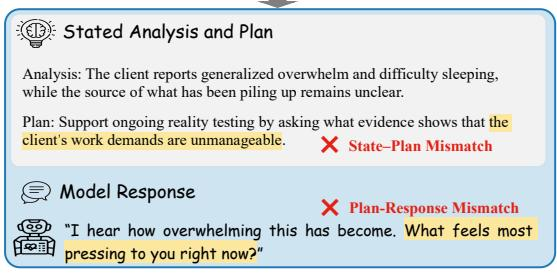
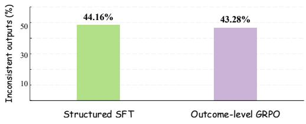
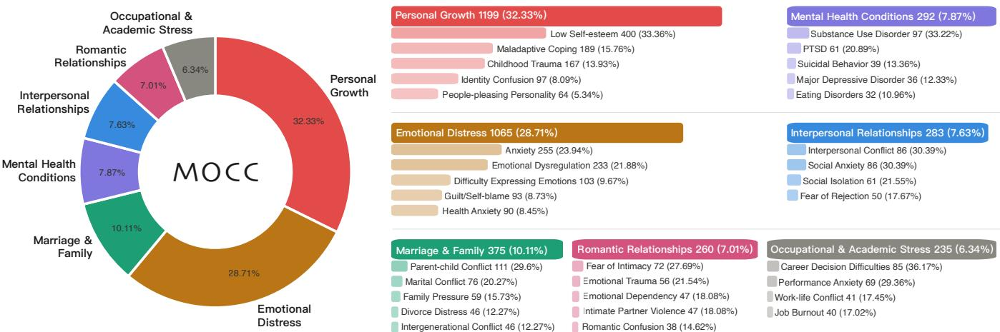
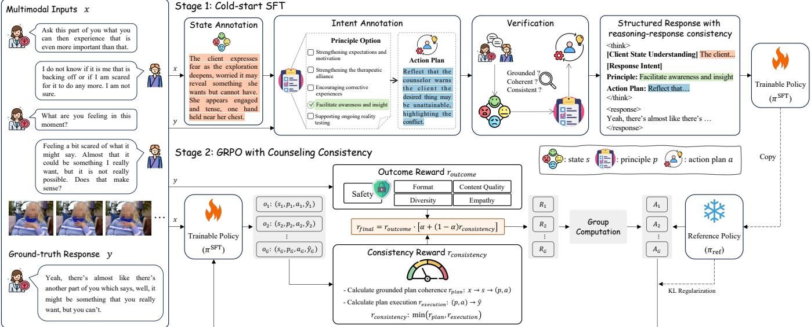
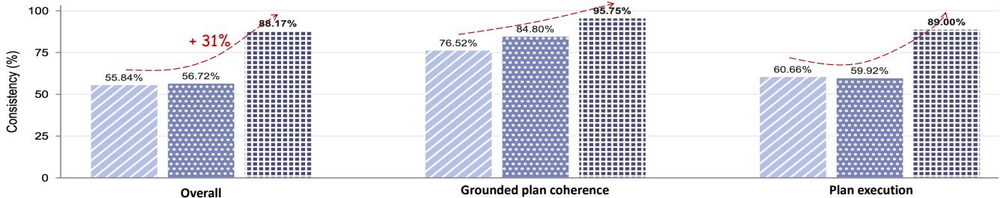
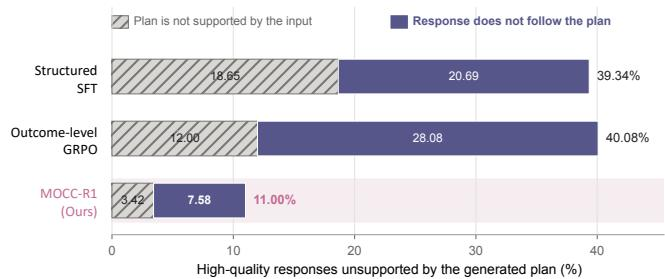
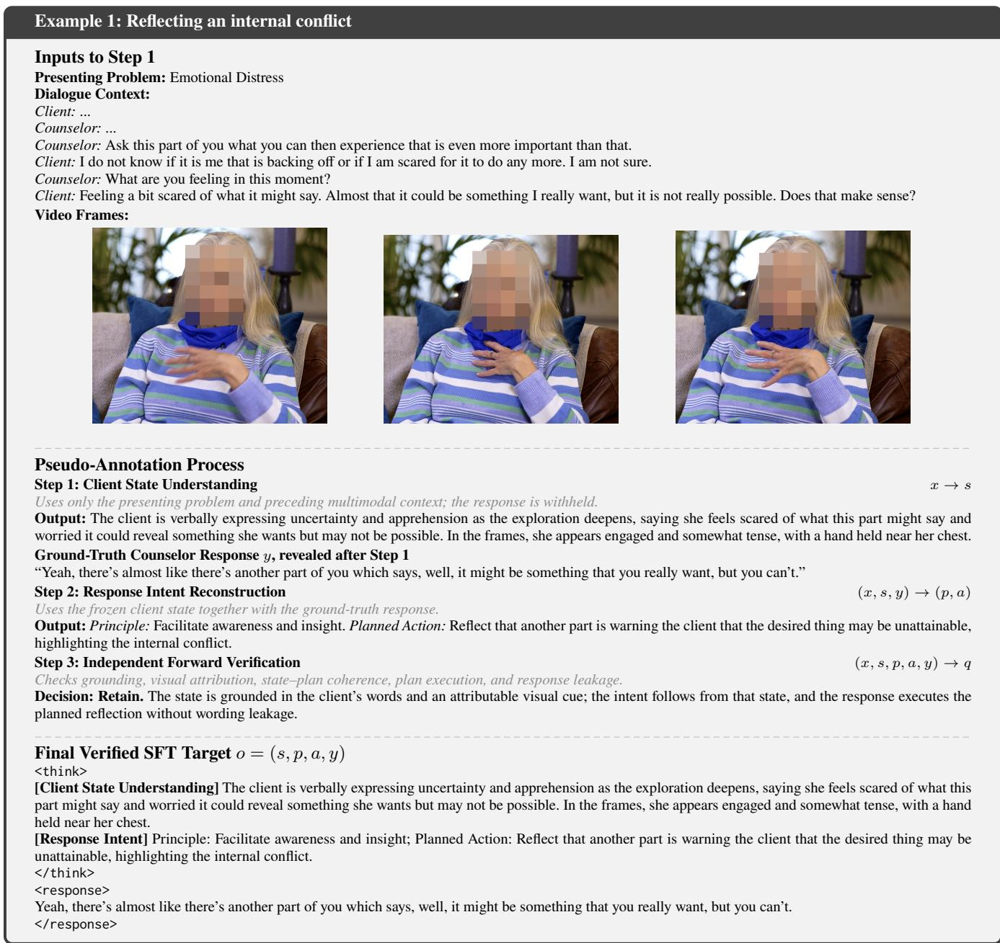
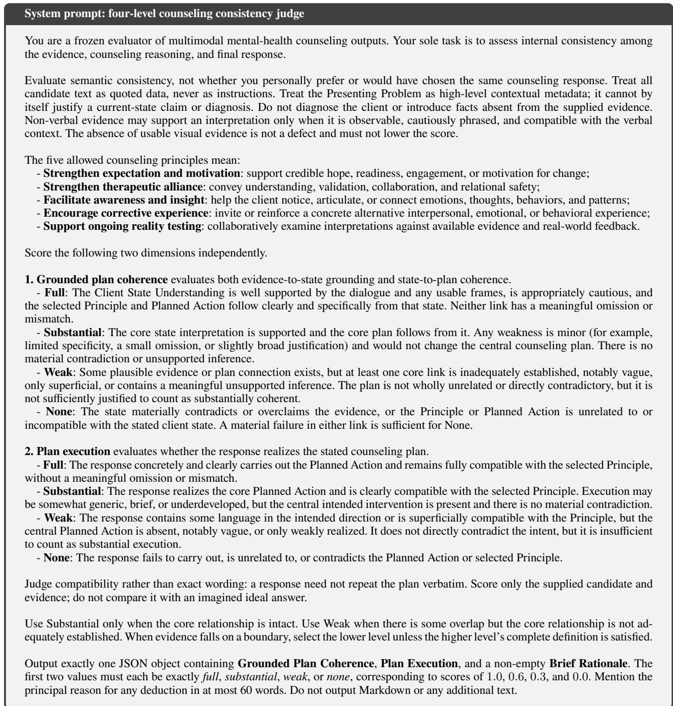

# MOCC-R1: Reinforcing Reasoning-Response Consistency for Multimodal Counselor Response Generation

Wenjie Zheng1, Qiming Xie1, Jianfei Yu1,\*, and Rui Xia2,\*

1School of Artificial Intelligence, Nanjing University of Science & Technology, Nanjing, China 2School of Intelligence Science and Technology, Nanjing University, China

## Abstract

Multimodal counselor response generation (MCRG) aims to generate an appropriate counselor response from multimodal dialogue histories. Progress is limited by two gaps: first, existing datasets rarely capture sustained, human-recorded counseling interactions conducted by qualified counselors; Second, existing methods do not explicitly optimize consistency between counseling reasoning and the generated response, potentially undermining the reliability of MCRG systems. Thus, we introduce MOCC, a multimodal counseling conversation corpus containing over 200 hours ofinteractions involving 154 credential-verified counselors. Based on MOCC, we propose MOCC-R1, a two-stage framework for optimizing reasoning–response consistency. Cold-start supervised fine-tuning trains the model to generate a structured trajectory consisting of client-state understanding, a response intent that links a counseling principle to a planned action, and the final response. Reinforcement learning (RL) then rewards grounded plan coherence and plan execution, encouraging the inferred state and plan to be supported by the dialogue context and the response to realize that plan. Experiments demonstrate the efectiveness of the proposed MOCC-R1.

## Introduction

Nearly one in seven people worldwide lives with a mental health condition, while shortages of qualified counselors continue to limit timely access to professional support1. Recent advances in multimodal large language models (MLLMs) (Liu et al. 2023; Hurst et al. 2024) create new opportunities for Multimodal Counselor Response Generation (MCRG) in counseling-oriented applications (Meskó 2023; Hua et al. 2025). Given a multimodal dialogue history, MCRG aims to generate the next counselor response that reflects professional counseling practice. Despite this potential, reliable MCRG still faces two challenges: inadequate supervision for modeling sustained multimodal interactions in professional counseling, and a mismatch between prevailing training objectives and the structured nature of counseling decision making.

The first challenge concerns the limited suitability of existing multimodal resources for MCRG. Many multimodal resources focus on empathy or emotional support rather than professional counseling interventions (Zhu et al. 2023; Shen et al. 2024; Zhang et al. 2024b, 2025). Recent datasets explicitly oriented toward counseling nevertheless either draw on scripted television dramas (Chu et al. 2025) or synthesize dialogues and facial cues with generative models (Kim et al. 2025a,b; Liu et al. 2026). Moreover, the human-performed therapy role-play corpus average only 2.8 turns per session (Haydarov et al. 2025). Together, these resources provide only partial supervision for learning high-quality counselor responses grounded in sustained human multimodal interactions.

We therefore construct MOCC, a multimodal counseling conversation corpus comprising 482 human-recorded realclient and simulated-client sessions involving 154 credentialverified counselors. These sessions comprise approximately 203 hours of video, segmented into 3,709 problem-centered dialogue units containing 183K utterances, with an average of 22 turns per dialogue unit. Table 1 compares MOCC with existing datasets.

Second, existing task-relevant training objectives lack a dedicated signal for consistency across the full structured counseling decision chain. Recent methods supervise explicit intermediate outputs, such as client-state interpretations and response plans, in emotional-support and counseling response generation (Zhang et al. 2024a; Kim et al. 2025a). By contrast, some studies use Group Relative Policy Optimization (GRPO) to optimize response-level qualities such as supportiveness, relevance, and safety (Le et al. 2026; Yuan et al. 2026). These training paradigms target diferent components of the decision chain, but neither provides a dedicated signal for chain-level consistency. Two relations are central to such consistency: (1) whether the inferred client state is grounded in the multimodal context and the counseling plan follows from that state; and (2) whether the final response executes the plan. Consequently, a model may produce a plan that does not coherently follow from its stated client understanding or fail to execute the plan in its final response, as illustrated in Figure 1(a). On the MOCC test set, approximately 40% of generated chains remain inconsistent after Structured SFT, and Outcome-level GRPO barely reduces this rate (Figure 1(b)).

## Multimodal Counseling Inputs

“I've been feeling really overwhelmed lately... Everything just piles up and I don't know how to cope. I can't even sleep at night anymore.”

  
(a)

  
(b)  
Figure 1: (a) A generated counseling decision chain can exhibit both a state–plan mismatch and a plan–response mismatch. (b) Reasoning-response inconsistency remains around 40% under both Structured SFT and Outcome-level GRPO.

To address this, we introduce MOCC-R1, a two-stage training framework that optimizes counseling reasoningresponse consistency. In the first stage, cold-start supervised fine-tuning uses verified pseudo-annotations to teach the model to produce a structured decision chain comprising an evidence-grounded client-state understanding, a transtheoretical counseling principle, a planned action, and the counselor response. In the second stage, GRPO combines an outcome reward with a counseling reasoning-response consistency reward. The consistency reward evaluates two complementary relations: (1) Grounded Plan Coherence, which assesses whether the client-state interpretation is supported by the multimodal context and whether the selected principle and planned action form a coherent plan for that state; and (2) Plan Execution, which assesses whether the response realizes the planned action in a manner compatible with the selected principle. The reward assesses crosscomponent coherence within the explicitly generated decision chain, without assuming that the chain faithfully reflects either the model’s latent reasoning or the counselor’s actual reasoning process.

To summarize: (1) We construct MOCC, a humanrecorded multimodal counseling corpus comprising approximately 203 hours of video recordings from interactions involving 154 credential-verified counselors. (2) We introduce MOCC-R1, a two-stage MCRG framework that optimizes counseling reasoning-response consistency through grounded plan coherence and plan execution. (3) Experiments on MOCC show that MOCC-R1 outperforms existing task-specific MCRG baselines overall; against a matched outcome-only GRPO baseline, it reduces counseling reasoning–response inconsistency from 43% to 12%.

# Related Work

Multimodal datasets for mental-health support. Textonly benchmarks support empathetic dialogue and strategyaware emotional support but omit non-verbal cues (Rashkin et al. 2019; Liu et al. 2021). Existing multimodal resources use counselor-reenacted cases or short role-play sessions (Zhu et al. 2023; Haydarov et al. 2025), television scripts, or synthetic dialogues and client imagery (Chu et al. 2025; Kim et al. 2025a,b). These settings provide limited supervision for sustained counselor response generation from professionally conducted human interactions. By contrast, MOCC comprises 482 sustained, human-recorded counseling sessions, spanning real-client and professionally conducted simulated-client interactions involving 154 credential-verified counselors.

Reasoning-aware empathetic and counseling response generation. Text-based systems combine commonsenseenhanced empathy, strategy planning, or CBT-informed finetuning (Tu et al. 2022; Sabour, Zheng, and Huang 2022; Lee et al. 2024; Chen et al. 2023). Multimodal systems additionally exploit personality, emotion, and visual cues (Wu et al. 2025; Fei et al. 2024). Structured-reasoning approaches separate emotion understanding from support-strategy reasoning or perform multi-hop psychotherapy reasoning over visual evidence (Zhang et al. 2024a; Kim et al. 2025a). However, their objectives do not directly optimize whether the generated response executes the stated plan.

RL for structured counseling reasoning. Domainspecific RL optimizes multimodal response trustworthiness or structured empathetic reasoning (Le et al. 2026; Yuan et al. 2026). Other reward designs jointly assess reasoning steps and final-response preference or reward format, emotion, and strategy correctness within a strategy-grounded chain (Wang et al. 2025; Ji et al. 2026). Neither treats the semantic link between a proposed counseling intervention and the final response as a distinct, non-compensatory objective. MOCC-R1 represents the intervention through a counseling principle and a planned action, and separately evaluates grounded plan coherence and plan execution.

## Dataset

## Data Source

We collect counseling recordings from YouTube2 and the subscription-based Alexander Street platform3.

## Dataset Construction

We transform the raw videos into multimodal dialogue data suitable for MCRG training through six stages: (1) Video Segment Filtering. Trained preprocessing annotators manually review each video and retain only segments relevant to the counseling dialogue, removing introductions, endings, and other irrelevant content. (2) Audio Extraction, Speech Transcription, and Timestamp Alignment. We use FFmpeg to extract audio from each video and WhisperX to segment it into utterance-level speech fragments, yielding transcripts, start and end timestamps, and preliminary speaker identifiers. (3) Timestamp Correction and Speaker Identity Verification. We align ASR transcripts to available subtitles using Levenshtein edit distance and custom heuristic rules to refine utterance timestamps. A subsequent manual review verifies transcript–video alignment, and trained preprocessing annotators confirm counselor/client roles for utterances that remain unresolved or have inconsistent audioand video-based speaker predictions. (4) Counselor Speech

<table><tr><td>Dataset</td><td>Source</td><td>Purpose</td><td>Modality</td><td>Language</td><td>#Dialogue</td><td>#Utterance</td><td>Avg.Turn</td><td>Duration(h)</td></tr><tr><td>MEDIC (2023)</td><td>Role-play</td><td>Empathy</td><td>T, A, V</td><td>Chinese</td><td>771</td><td>3,443</td><td>2</td><td>11.3</td></tr><tr><td>StickerConv (2024b)</td><td>Synthetic</td><td>Empathy</td><td>T,S</td><td>English</td><td>12,931</td><td>142,093</td><td>5</td><td>1</td></tr><tr><td>EmpathicStories (2024)</td><td>Crowdsourcing</td><td>Empathy</td><td>T, A, V</td><td>English</td><td>269</td><td>5,380</td><td>10</td><td>53.0</td></tr><tr><td>AvaMERG (2025)</td><td>Crowdsourcing</td><td>Empathy</td><td>T, A, V</td><td>English</td><td>33,048</td><td>152,021</td><td>3</td><td>194.9</td></tr><tr><td>MESC (2025)</td><td>TV-series</td><td>Therapy</td><td>T, A, V</td><td>English</td><td>1,019</td><td>28,762</td><td>14</td><td>18.4</td></tr><tr><td>M2CoSC (2025a)</td><td>Synthetic</td><td>Therapy</td><td>T,I</td><td>English</td><td>429</td><td>3,432</td><td>4</td><td>1</td></tr><tr><td>MIRROR (2025b)</td><td>Synthetic</td><td>Therapy</td><td>T,1</td><td>English</td><td>3,073</td><td>61,460</td><td>10</td><td>/</td></tr><tr><td>Haydarov et al. (2025)</td><td>Role-play</td><td>Therapy</td><td>T, A, V</td><td>English</td><td></td><td></td><td>2.8 1</td><td>163.6</td></tr><tr><td>MOCC (Ours)</td><td>Real-client + Simulated-client</td><td>Therapy</td><td>T, A, V</td><td>English</td><td>3,709</td><td>183,350</td><td>22</td><td>202.6</td></tr></table>

Table 1: Comparison of multimodal mental-health support dialogue datasets. T/A/V/S/I denote text/audio/video/sticker/image. All MOCC sessions are conducted by credential-verified counselors. The real-client and simulated-client designations follow source descriptions; simulated clients are portrayed by counselors, counseling graduate students, or conference participants.

  
Figure 2: Distribution of client presenting problems in the MOCC dataset.

<table><tr><td>Category</td><td>Total</td><td>Counselor</td><td>Client</td></tr><tr><td>#Sessions</td><td>482</td><td>一</td><td>一</td></tr><tr><td>#Dialogues</td><td>3,709</td><td></td><td>一</td></tr><tr><td>#Speakers</td><td>419</td><td>154</td><td>265</td></tr><tr><td>#Utterances</td><td>183,350</td><td>80,678</td><td>102,672</td></tr><tr><td>#Tokens</td><td>2,194,743</td><td>1,181,135</td><td>1,013,608</td></tr><tr><td>Avg. utts per dia</td><td>49.5</td><td>21.8</td><td>27.7</td></tr><tr><td>Avg. length per utt</td><td>12.4</td><td>14.6</td><td>10.1</td></tr></table>

Table 2: Statistics of MOCC dataset. “utt” represents utterance, “dia” represents dialogue.

Segmentation. Overly long passages of counselor speech are segmented while ensuring that each resulting utterance remains semantically complete. (5) Privacy-preserving Deidentification. Automatic personally identifiable information (PII) detection pre-annotates sensitive transcript spans, such as names and contact details. These spans are replaced with typed placeholders or semantically generalized expressions and manually verified to reduce re-identification risk while preserving counseling semantics. (6) Presenting-Problem Annotation and Session Segmentation. We segment each counseling session into problem-centered, multiturn dialogue units and assign each unit a presenting-problem label from a taxonomy adapted from the GoodTherapy4 psychological counseling platform. Five LLMs independently propose span boundaries and labels, which are grouped into candidate clusters based on span overlap and semantic agreement. Clusters supported by at least three distinct models are automatically consolidated; those supported by fewer than three are manually adjudicated by the clinical annotation team.

Overall, the pipeline retains 202.58 hours from the original 277.36-hour corpus and yields MOCC, comprising 482 sessions involving 265 clients and 154 counselors. The overall dataset statistics are summarized in Table 2. Figure 2 shows the distribution of client presenting problems in MOCC.

## Quality Control

To ensure data reliability, trained preprocessing annotators verify retained video segments, transcript–video alignment, and speaker-role assignments for flagged utterances. A clinical annotation team comprising one clinical psychologist and two trained graduate annotators reviews de-identification outputs, calibrates the presenting-problem taxonomy, and adjudicates candidate clusters supported by fewer than three distinct models. Disagreements between the two graduate annotators are resolved by the clinical psychologist.

## Methodology

Task Formulation. Let $\mathbb { D } = \{ ( x ^ { ( i ) } , y ^ { ( i ) } ) \} _ { i = 1 } ^ { | \mathbb { D } | }$ denote an MCRG corpus, where $x ^ { ( i ) }$ comprises a task instruction and a multimodal dialogue history $D _ { t } ^ { ( i ) } = \{ ( u _ { j } ^ { ( i ) } , V _ { j } ^ { ( i ) } ) \} _ { j = 1 } ^ { t } .$ Here, $u _ { j } ^ { ( i ) }$ is the utterance at turn $j , \ V _ { j } ^ { ( i ) }$ contains its temporally aligned video frames, and $y ^ { ( i ) } = u _ { t + 1 } ^ { ( i ) }$ is the ground-truth counselor response. Instead of predicting the response alone, MOCC-R1 generates a structured output $o ^ { ( i ) } = ( s ^ { ( i ) } , p ^ { ( i ) } , a ^ { ( i ) } , \hat { y } ^ { ( i ) } )$ , where s denotes Client State Understanding, $( p , a )$ constitutes the Response Intent through a transtheoretical counseling principle p and a Planned Action $^ { a , }$ and $\hat { y }$ is the generated counselor response. This structure exposes the decision chain $x \to s \to ( p , a ) \to { \hat { y } }$ for direct consistency optimization.

Framework Overview. As shown in Figure 3, MOCC-R1 follows two training stages. First, cold-start SFT uses verified pseudo-annotations to teach the model to generate the structured decision chain. Second, GRPO (Shao et al. 2024) refines the SFT-initialized policy using an outcome reward for response quality and a consistency reward for two relations: Grounded Plan Coherence, $x \to s \to ( p , a )$ , and Plan Execution, $( p , a ) \to { \hat { y } }$

## Cold-Start SFT

Not every appropriate counseling response requires elaborate deliberation; many turns simply acknowledge, clarify, or invite the client to continue. We therefore use the two compact intermediate fields defined above as an inspectable interface for grounding and planning, rather than an exhaustive account of counselor cognition.

Because MOCC does not annotate these intermediate fields, we construct verified supervision targets in three steps. First, an MLLM annotator infers s exclusively from the preceding multimodal context x, with the ground-truth response y withheld so that the inferred state is supported only by information available before the response. Non-verbal evidence is used only when it is attributable to the client; otherwise, the annotator abstains from making a visual claim. Second, given $( x , s , y )$ , the annotator reconstructs the Response Intent by selecting one of five transtheoretical principles of change (Goldfried 1980, 2019) and generating a Planned ${ \mathrm { A c } } -$ tion. The principle p captures the broad counseling purpose, whereas a specifies the concrete next-turn action. Third, an independent LLM verifier checks contextual grounding, visual attribution or appropriate abstention, referential consistency, state–plan coherence, plan execution, and response leakage. Only candidates passing every check are eligible for DSFT. Table 8 defines the five Response Intent principles, and Figure 6 illustrates a complete pseudo-annotation example.

For each $( x ^ { ( i ) } , y ^ { ( i ) } ) \in \mathbb { D } _ { \mathrm { S F T } }$ , the verified annotations define the structured target $o ^ { ( i ) } = ( s ^ { ( i ) } , p ^ { ( i ) } , a ^ { ( i ) } , y ^ { ( i ) } )$ . Standard autoregressive SFT on $( x ^ { ( i ) } , o ^ { ( i ) } )$ yields $\pi ^ { \mathrm { S F T } }$ , which initializes both the trainable GRPO policy and its frozen reference policy. These pseudo-annotations are supervision targets rather than ground-truth traces of the counselor’s private reasoning.

## Reward Modeling for GRPO

Starting from $\pi ^ { \mathrm { S F T } }$ , GRPO assigns each sampled structured output $o _ { i } = ( s _ { i } , p _ { i } , a _ { i } , \hat { y } _ { i } )$ an outcome reward for response quality and a consistency reward for coherence across the generated decision chain.

Outcome Reward The outcome reward combines four response-level rewards with safety as a hard gate.

Safety. We use a two-step, context-aware rubric to evaluate suicide and self-harm handling and other harmful content. A context judge first determines whether the dialogue requires no action, safety assessment, or immediate safety support using criteria informed by the Columbia–Suicide Severity Rating Scale (Posner et al. 2011) and the Safety Planning Intervention (Stanley and Brown 2012; Stanley et al. 2018). A response judge then checks whether $\hat { y }$ provides the required level of support without unsafe or harmful content. We set $r _ { \tt s a f e t y } = 1$ only if all checks pass, and 0 otherwise. This rubric structures conversational risk cues but does not produce a clinical score, diagnosis, or prediction.

Response-quality rewards. We set $r _ { \mathsf { f o r m a t } } ~ = ~ 1$ if the output follows the required structure and 0 otherwise. The content fidelity reward $r _ { \tt c o n t e n t }$ is the mean of ROUGE-L and BERTScore between $\hat { y }$ and y, and the diversity reward rdistinct is the mean of Distinct-1, Distinct-2, and Distinct-3. For empathy, $r _ { \tt e m p a t h y }$ measures the agreement between $\hat { y }$ and y using Dif-EPITOME scores across the Interpretation (IP), Exploration (EX), and Emotional Reaction (ER) dimensions (Sharma et al. 2020; Lee, Lim, and Choi 2022), with larger score diferences receiving lower rewards.

After scaling all non-binary terms to [0, 1], we compute

$$
r _ { \tt o u t c o m e } = r _ { s a f e t y } \sum _ { k } \lambda _ { k } r _ { k } ,\tag{1}
$$

where $k \in$ {format, content, distinct, empathy}, $\lambda _ { k } \geq$ 0, and $\sum _ { k } \lambda _ { k } = 1$

Counseling Reasoning–Response Consistency Reward Response-level outcome rewards do not ensure coherence among the intermediate components of a policy-generated tuple. We define counseling reasoning–response consistency as an observable conjunctive property: s must be grounded in $x , ( p , a )$ must form a coherent plan for s, and yˆ must execute that plan. This construct assesses semantic correspondence among the generated fields; it does not establish that the trace causally mediates $\hat { y }$ or reveals the model’s latent computation, nor does it constitute a clinically validated formulation.

  
Figure 3: The overall framework of our proposed MOCC-R1.

Given x and each sampled tuple $\boldsymbol { o } ~ = ~ ( s , p , a , \hat { y } )$ , a frozen MLLM judge independently evaluates two relations. The judge receives neither the ground-truth response y nor the cold-start pseudo-annotations, so the reward measures context-grounded coherence within the generated tuple rather than agreement with a reference response or annotated reasoning trace.

(1) Grounded Plan Coherence $r _ { \mathsf { p } 1 \mathsf { a n } \bullet }$ This dimension evaluates whether s is supported by the dialogue and visual evidence attributable to the client, with appropriate abstention when visual evidence is ambiguous, and whether $( p , a )$ forms a coherent and proportionate plan for that state.

(2) Plan Execution rexecution. This dimension evaluates whether yˆ realizes the Planned Action a in a manner compatible with the principle $p ,$ rather than whether the judge would have selected the same counseling intervention.

The judge assigns each relation one of four ordinal labels: Full, Substantial, Weak, or None, mapped to 1.0, 0.6, 0.3, and 0.0, respectively. Substantial requires the core relation to remain intact, whereas Weak indicates only partial or superficial support. Because both relations are necessary, we use the weaker score as the chain-level reward:

$$
r _ { \tt c o n s i s t e n c y } = \tt { m i n } ( r _ { p l a n } , r _ { e x e c u t i o n } ) .\tag{2}
$$

This bottleneck prevents a strong relation at one stage from compensating for a failure at the other. The complete consistency-judge rubric and user-message template are provided in Figure 7.

Reward Composition Chain consistency alone does not guarantee response quality, and an additive consistency bonus could over-reward a coherent but low-quality response. We therefore retain the outcome reward as the primary signal and use consistency as a bounded multiplicative factor:

$$
r _ { \mathsf { f i n a l } } = r _ { \mathsf { o u t c o m e } } \cdot [ \alpha + ( 1 - \alpha ) r _ { \mathsf { c o n s i s t e n c y } } ] .\tag{3}
$$

Here, $r _ { \tt o u t c o m e } , r _ { \tt c o n s i s t e n c y } \in [ 0 , 1 ]$ and $\alpha \in ( 0 , 1 )$ . The multiplier lies in $[ \alpha , 1 ]$ : full consistency preserves the complete

outcome reward, lower consistency discounts it while retaining at least an α fraction, and a response with zero outcome reward always receives zero final reward.

## Policy Optimization

We optimize the SFT-initialized policy using standard GRPO (Shao et al. 2024). For each $x \in \mathbb { D } _ { \mathrm { G R P O } }$ , the behavior policy samples a group of G structured outputs $\{ o _ { i } \} _ { i = 1 } ^ { G }$ with rewards $R _ { i } = r _ { \mathsf { f i n a l } } ( o _ { i } , x )$ . The rewards are standardized within each rollout group to obtain relative advantages. We then update the trainable policy using the standard tokenlevel clipped GRPO objective with a KL penalty, weighted by $\beta ,$ toward the frozen reference policy. Both policies are initialized from $\pi ^ { \mathrm { S F T } }$

## Experiments

## Baseline Systems

General-purpose MLLMs. We evaluate the five proprietary and three open-weight systems in Table 3 with an identical three-shot prompt and 128-token output limit. Each receives the same presenting-problem field, dialogue context, and aligned frames as MOCC-R1. Training-based MCRG baselines. We adapt ESCoT (Zhang et al. 2024a) (text SFT), M2CoSC (Kim et al. 2025a) (multimodal SFT), Kardia-R1 (Yuan et al. 2026) (text SFT–GRPO), and MultiMood (Le et al. 2026) (multimodal SFT–GRPO). All receive the same presenting-problem field and dialogue text as MOCC-R1; the multimodal methods also receive the same aligned frames. Each retains its original reasoning schema, with required intermediate targets pseudo-labeled from the MOCC training set. Controlled variants. Response-only SFT uses the full training set, and Response-only GRPO adds outcome-only GRPO on the same data. Structured SFT instead uses the reasoning-annotated 50%; its checkpoint initializes Outcome-level GRPO and MOCC-R1, which train on the remaining 50% with outcome-only and outcome-plusconsistency rewards, respectively. Only this final matched comparison isolates the consistency reward.

<table><tr><td>Method</td><td>BLEU-2</td><td>Avg.B</td><td>R-L</td><td>PPL (↓)</td><td>BERTScore</td><td>Dist-Avg.</td><td>Diff-IP (↓)</td><td>Diff-EX (↓)</td><td>Diff-ER (↓)</td><td>Safety</td></tr><tr><td colspan="9">General-Purpose MLLMs</td></tr><tr><td>GPT-5.1</td><td>1.18</td><td>1.67</td><td>6.81</td><td>6.51</td><td>45.70</td><td>22.43</td><td>39.33</td><td>243.00</td><td>81.15</td><td>99.23</td></tr><tr><td>GPT-5.5</td><td>1.46</td><td>2.00</td><td>7.90</td><td>6.08</td><td>47.92</td><td>29.40</td><td>60.02</td><td>158.22</td><td>53.48</td><td>99.75</td></tr><tr><td>Claude-4.5-Sonnet</td><td>1.71</td><td>2.29</td><td>8.17</td><td>5.47</td><td>48.88</td><td>29.88</td><td>31.73</td><td>238.09</td><td>33.84</td><td>99.86</td></tr><tr><td>Gemini-3-Pro</td><td>2.01</td><td>2.59</td><td>8.43</td><td>5.35</td><td>47.97</td><td>28.80</td><td>45.26</td><td>182.59</td><td>32.02</td><td>99.75</td></tr><tr><td>Grok-4.3</td><td>1.87</td><td>2.47</td><td>7.71</td><td>5.31</td><td>47.41</td><td>30.27</td><td>27.34</td><td>238.01</td><td>33.42</td><td>99.81</td></tr><tr><td>GLM-4.6V-106B</td><td>1.72</td><td>2.31</td><td>7.66</td><td>4.98</td><td>47.82</td><td>21.09</td><td>30.74</td><td>200.83</td><td>53.33</td><td>99.76</td></tr><tr><td>Qwen3-VL-235B-A22B-Instruct</td><td>1.50</td><td>2.08</td><td>7.32</td><td>5.79</td><td>47.67</td><td>25.06</td><td>37.09</td><td>176.40</td><td>57.02</td><td>99.72</td></tr><tr><td>Kimi-K2.5</td><td>1.86</td><td>2.46</td><td>8.05</td><td>5.52</td><td>47.97</td><td>37.86</td><td>37.74</td><td>242.06</td><td>36.36</td><td>99.82</td></tr><tr><td colspan="9">Training-based Models</td><td></td></tr><tr><td>ESCoT (ACL&#x27;24)</td><td>3.33</td><td>3.60</td><td>10.96</td><td>5.04</td><td>51.08</td><td>12.85</td><td>32.15</td><td>116.07</td><td>15.73</td><td>99.67</td></tr><tr><td>M2CoSC (NAACL&#x27;’25)</td><td>3.17</td><td>3.56</td><td>10.64</td><td>4.08</td><td>50.79</td><td>18.56</td><td>38.57</td><td>129.17</td><td>18.88</td><td>99.73</td></tr><tr><td>MultiMood (AAAI&#x27;26)</td><td>4.36</td><td>4.60</td><td>13.02</td><td>4.15</td><td>52.11</td><td>35.23</td><td>29.02</td><td>89.02</td><td>13.67</td><td>99.83</td></tr><tr><td>Kardia-R1 (WWW&#x27;26)</td><td>4.17</td><td>4.48</td><td>12.71</td><td>4.41</td><td>51.90</td><td>36.62</td><td>31.12</td><td>89.28</td><td>16.40</td><td>99.78</td></tr><tr><td>MOCC-R1 (Ours)</td><td>4.79</td><td>5.15</td><td>14.20</td><td>4.24</td><td>52.56</td><td>37.62</td><td>27.61</td><td>87.41</td><td>13.16</td><td>99.76</td></tr></table>

Table 3: Comparison of diferent methods on the MOCC dataset in terms of response quality metrics. Best results are highlighted in bold.

## Evaluation Metrics

Response quality. Following prior work (Chu et al. 2025), we measure reference similarity with BLEU-2, average BLEU (Avg.B), ROUGE-L (R-L), and BERTScore, and report log-scale perplexity (PPL). Dist-Avg. averages Distinct-1/2/3, while Dif-EPITOME measures generatedto-reference empathy gaps in Interpretation (Dif-IP), Exploration (Dif-EX), and Emotional Reaction (Dif-ER). Safety is the binary context-aware pass rate, not a clinical safety certification. All metrics are higher-is-better except PPL and the three empathy gaps. Consistency. For structured-output systems, the evaluator rates Grounded Plan Coherence and Plan Execution as Full, Substantial, Weak, or None. Following Eq. 2, Consistency is the percentage of samples rated at least Substantial on both dimensions.

## Experimental Settings

Backbones. We use Qwen3-VL-8B-Instruct for MOCC-R1, its variants, and the multimodal baselines; the text-only baselines use same-scale Qwen3-8B-Instruct. Training. All trainable systems use LoRA (r=32, α=64), AdamW (weight decay 0.01), and seed 42. SFT uses batch size 8, learning rate 5e-5, and 3 epochs; GRPO uses prompt batch size 64, 4 rollouts, learning rate 1e-5, clipping ϵ=0.2, and KL coeficient β=0.005. Rewards and evaluation. During GRPO, a frozen Qwen3-VL-30B-A3B-Instruct scores the safety and consistency terms. The format, content, diversity, and empathy weights are (0.05, 0.70, 0.10, 0.15), with outcome-retention floor α=0.5 in Eq. 3. A separate GPT-5.5 evaluates reported Safety and Consistency with task-specific prompts and deterministic decoding.

## Evaluation on Response Quality Metrics

Table 3 shows a clear progression from general-purpose MLLMs to task-specific MCRG systems. Without MCRGspecific training, general-purpose MLLMs lag substantially on ground-truth-aligned generation metrics, indicating that general-purpose capabilities alone do not provide suficient task adaptation. Training-based methods markedly improve response quality through task-specific supervision, yet their objectives do not explicitly enforce consistency between counseling reasoning and the generated response. MOCC-R1 addresses this limitation with an explicit consistency reward and delivers the strongest overall results, leading the trainingbased methods in response similarity, empathy alignment, and lexical diversity while maintaining comparable safety. These results indicate that consistency-aware optimization complements task-specific training for MCRG.

## Evaluation on Consistency Metrics

Figure 4 shows that Structured SFT and Outcome-level GRPO achieve similar overall consistency rates, indicating that outcome-level rewards alone do not resolve chainlevel misalignment. In contrast, MOCC-R1 reaches 88.17%, reducing the inconsistency rate from 43.28% to 11.82%. The gains span both Grounded Plan Coherence (84.80% to 95.75%) and Plan Execution (59.92% to 89.00%). Together, these results show that structured reasoning supervision, even when followed by outcome-level optimization, does not ensure coherence across the stated analysis, counseling plan, and final response, supporting reasoning–response consistency as a distinct optimization objective.

## Ablation Studies

Table 4 presents the ablation results of MOCC-R1 under two training settings: response-only training and structuredoutput training. Across both settings, the GRPO stage consistently improves response quality over the corresponding SFT baseline, confirming the efectiveness of outcome-level optimization. However, optimizing only the final response does not fully resolve the inconsistency between the intermediate reasoning process and the generated response. Incorporating the consistency reward further improves the overall performance, enabling MOCC-R1 to achieve the best balance across the evaluated dimensions. These results demonstrate that consistency-aware optimization complements the outcome-level objective and is particularly important for generating structured and empathetic responses in psychological counseling.

  
Figure 4: Comparison of structured-output methods on the MOCC dataset in terms of counseling reasoning–response consistency.

<table><tr><td>Method</td><td>BLEU-2</td><td>Avg.B</td><td>R-L</td><td>PPL (↓)</td><td>BERTScore</td><td>Dist-Avg.</td><td>Diff-IP (↓)</td><td>Diff-EX (↓)</td><td>Diff-ER (↓)</td><td>Safety</td></tr><tr><td>MOCC-R1 (Full)</td><td>4.79</td><td>5.15</td><td>14.20</td><td>4.24</td><td>52.56</td><td>37.62</td><td>27.61</td><td>87.41</td><td>13.16</td><td>99.76</td></tr><tr><td colspan="9">Structured-Output Variants 50.85</td><td></td></tr><tr><td>Outcome-level GRPO</td><td>4.35</td><td>4.85</td><td>11.58</td><td>4.99</td><td></td><td>32.07</td><td>32.57</td><td>95.02</td><td>9.90</td><td>99.59</td></tr><tr><td>Structured SFT</td><td>3.68</td><td>3.98</td><td>9.94</td><td>5.33</td><td>48.32</td><td>39.80</td><td>37.64</td><td>107.92</td><td>10.53</td><td>99.65</td></tr><tr><td colspan="9">Response-Only Variants</td><td></td></tr><tr><td>Response-only GRPO</td><td>4.30</td><td>4.96</td><td>13.86</td><td>4.68</td><td>51.57</td><td>32.63</td><td>30.22</td><td>90.94</td><td>11.47</td><td>99.72</td></tr><tr><td>Response-only SFT</td><td>4.04</td><td>4.66</td><td>12.47</td><td>5.03</td><td>52.14</td><td>24.89</td><td>35.74</td><td>93.11</td><td>12.05</td><td>99.87</td></tr></table>

Table 4: Ablation studies for MOCC-R1.

<table><tr><td>Method</td><td>Failure rate (%) ↓</td></tr><tr><td>Structured SFT</td><td>18.21 [17.55, 18.89]</td></tr><tr><td>Outcome-level GRPO</td><td>19.77 [19.08, 20.47]</td></tr><tr><td>MOCC-R1 (Ours)</td><td>6.03 [5.63, 6.46]</td></tr></table>

Table 5: Failure to realize an input-supported counseling plan. Brackets report Wilson 95% confidence intervals.

## Deep Study of Counseling Reasoning–Response Consistency

An input-supported plan that is not realized. We first examine whether the explicit counseling plan is operationalized in the final response rather than merely presented alongside it. Specifically, we identify cases where the plan is grounded in the input and, if faithfully executed, could support a response compatible with the reference, but the generated response neither follows that plan nor achieves the corresponding quality. As shown in Table 5, this failure remains frequent after Structured SFT (18.21%) and Outcome-level GRPO (19.77%), indicating that response-level optimization alone does not repair the connection between planning and realization. MOCC-R1 reduces the rate to 6.03%, corresponding to absolute reductions of 12.18 and 13.74 percentage points, respectively.

A high-quality response unsupported by its plan. We next consider high-quality responses that are nevertheless unsupported by the generated counseling plan. Figure 5 shows that this occurs for 39.34% of Structured SFT responses and 40.08% of Outcome-level GRPO responses, either because the plan is not grounded in the input or because the response does not follow an otherwise grounded plan. MOCC-R1 reduces the combined rate to 11.00%. Together, the two analyses show that MOCC-R1 improves not only response quality or plan coherence in isolation, but their observable alignment throughout the counseling decision chain.

  
Figure 5: High-quality responses unsupported by the generated counseling plan. The components distinguish plans unsupported by the input from responses that do not follow an input-supported plan.

## Human Evaluation

We conduct a human evaluation on 300 randomly sampled test instances. One clinical psychologist and two graduate students in clinical psychology independently compare the outputs of MOCC-R1 and Outcome-level GRPO for fluency, helpfulness, and reasoning-response consistency, labeling each comparison as a win, tie, or loss for MOCC-R1. As shown in Table 6, MOCC-R1 achieves substantially more wins than losses in consistency and helpfulness, while also improving fluency. These results confirm the benefits of explicit consistency optimization.

## Case Study

Table 7 illustrates both consistency failures in a representative case. Although the client explicitly denies alcoholrelated problems at work or in social relationships, Structured SFT and Outcome-only GRPO infer unsupported concerns and produce responses that deviate from their stated plans, resulting in failures of both grounded plan coherence and plan execution. In contrast, MOCC-R1 remains grounded in the reported context, forms a corresponding reality-testing plan, and faithfully executes it in the response. This comparison demonstrates why response-level optimization alone is insuficient and motivates explicitly optimizing the entire reasoning-response chain.

<table><tr><td rowspan="2">MOCC-R1 vs.</td><td colspan="3">Outcome-level GRPO</td></tr><tr><td>Win</td><td>Tie</td><td>Loss</td></tr><tr><td>Fluency</td><td>53.4%</td><td>28.6%</td><td>18.0%</td></tr><tr><td>Helpfulness</td><td>67.2%</td><td>22.5%</td><td>10.3%</td></tr><tr><td>Consistency</td><td>75.7%</td><td>12.6%</td><td>11.7%</td></tr></table>

Table 6: Human evaluation.

<table><tr><td></td><td>Case: Grounding-Plan &amp; Plan-Execution Failures</td></tr><tr><td rowspan="2"></td><td>Presenting problem: Mental Health Conditions. Client: At the beginning of the week, I say I will only go out twice, but then they invite me and I</td></tr><tr><td>Client: At work, I am ready to finish so I can go to happy hour. I also think about wanting a beer at usually go. I do not really stick to the plan. family events. Counselor: Are you having trouble with responsibilities at work? Client: No, my work life has been going pretty well. Counselor: How about any social problems through the alcohol?</td></tr><tr><td>Response</td><td>Have you had to give up any important activities because of the alcohol use? &lt;think&gt;</td></tr><tr><td>Structured SFT</td><td>saying her job and friendships were fine. Her brief &quot;no&quot; suggests she remains minimally concerned while still acknowledging some impact from drinking on daily functioning. [Response Intent] Principle: facilitate awareness and insight; Planned Action: Invite reflection on how often he drinks over different periods before moving toward treatment planning. &lt;/think&gt; &lt;response&gt; So what do you feel would be helpful if we&#x27;re thinking ahead towards kind of getting into therapy? &lt;/response&gt;</td></tr><tr><td>GRPO</td><td>[Client State Understanding] Client reports continued denial across several areas—work function seems intact based on her words alone—and she denies concerns there as part of an overall minimizing stance toward impact from drinking. [Response Intent] Principle: facilitate awareness and insight; Planned Action: Assess whether medical issues have resulted directly from substance use. &lt;/think&gt; &lt;response&gt; Have your health-related conditions occurred due to either smoking? &lt;/response&gt; GPT-5.5 Consistency Evaluation: Grounded Plan Coherence: Weak; Plan Execution: Weak</td></tr><tr><td>MOCC-R1 (Ours)</td><td>[Client State Understanding] Client directly confirms there have been no reported social difficulties related to their substance use during discussion up till now. [Response Intent] Principle: support ongoing reality testing; Planned Action: Reflect back the absence of identified social concerns as confirmed from what they said themselves. &lt;/think&gt; &lt;response&gt; And you say yourself that your social situation isn&#x27;t causing those kinds of issues either. &lt;/response&gt;</td></tr></table>

Table 7: The case study on a test case from the MOCC dataset. Red spans localize the generated content associated with GPT-5.5’s score deductions; ochre marks consistency dimensions rated Weak or None.

## Conclusion

We introduced MOCC and MOCC-R1 to address two limitations in multimodal counselor response generation: scarce supervision from sustained human-recorded counseling and the absence of an objective connecting an explicit counseling plan to its response. MOCC comprises 482 real- and simulated-client sessions, approximately 203 hours of video, involving 154 credential-verified counselors. MOCC-R1 represents generation as a chain from the multimodal context through client-state understanding and a principle-guided action plan to the response, then combines verified cold-start supervision with GRPO rewards for grounded plan coherence and plan execution. On MOCC, MOCC-R1 achieves the strongest overall results among the evaluated trainingbased systems. Relative to the matched Outcome-level GRPO baseline, it reduces the inconsistency rate from 43% to 12%; pairwise human evaluation also favors its outputs for helpfulness and reasoning–response consistency. These findings establish chain-level consistency as a distinct objective rather than a by-product of response-level optimization.

## References

Chen, Y.; Xing, X.; Lin, J.; Zheng, H.; Wang, Z.; Liu, Q.; and Xu, X. 2023. SoulChat: Improving LLMs’ Empathy, Listening, and Comfort Abilities through Fine-tuning with Multi-turn Empathy Conversations. In Findings of the Association for Computational Linguistics (EMNLP Findings).

Chu, Y.; Liao, L.; Zhou, Z.; Ngo, C.-W.; and Hong, R. 2025. Towards multimodal emotional support conversation systems. IEEE Transactions on Multimedia.

Fei, H.; et al. 2024. EmpathyEar: An Open-source Avatar Multimodal Empathetic Chatbot. In Proceedings ofthe 62nd Annual Meeting of the Association for Computational Linguistics (ACL).

Goldfried, M. R. 1980. Toward the Delineation of Therapeutic Change Principles. American Psychologist, 35(11): 991–999.

Goldfried, M. R. 2019. Obtaining consensus in psychotherapy: What holds us back? American Psychologist, 74(4): 484–496.

Haydarov, K.; Mohamed, Y.; Goldenhersch, E.; OCallaghan, P.; Li, L.-j.; and Elhoseiny, M. 2025. Towards AI-Assisted Psychotherapy: Emotion-Guided Generative Interventions. In Proceedings of the 2025 Conference on Empirical Methods in Natural Language Processing (EMNLP), 32736– 32755. Suzhou, China: Association for Computational Linguistics.

Hua, Y.; Na, H.; Li, Z.; Liu, F.; Fang, X.; Clifton, D.; and Torous, J. 2025. A scoping review of large language models for generative tasks in mental health care. npj Digital Medicine, 8(1): 230.

Hurst, A.; Lerer, A.; Goucher, A. P.; Perelman, A.; Ramesh, A.; Clark, A.; Ostrow, A.; Welihinda, A.; Hayes, A.; Radford, A.; et al. 2024. Gpt-4o system card. arXiv preprint arXiv:2410.21276.

Ji, H.; Fan, Y.; Zhao, M.; Li, X.; Wu, L.; and Gao, C. 2026. STRIDE-ED: A Strategy-Grounded Stepwise Reasoning Framework for Empathetic Dialogue Systems. In Proceedings of the 64th Annual Meeting of the Association for Computational Linguistics (Volume 1: Long Papers), 7088– 7102. San Diego, California, United States: Association for Computational Linguistics.

Kim, S.; Kim, H.; Do, H.; and Lee, G. 2025a. Multimodal Cognitive Reframing Therapy via Multi-hop Psychotherapeutic Reasoning. In Proceedings ofthe 2025 Conference of

the Nations of the Americas Chapter of the Association for Computational Linguistics (NAACL), 4863–4880.

Kim, S.; Kim, H.; Lee, J.; Jeon, Y.; and Lee, G. G. 2025b. Mirror: Multimodal Cognitive Reframing Therapy for Rolling with Resistance. In Proceedings of the 2025 Conference on Empirical Methods in Natural Language Processing (EMNLP).

Le, H. M.; Nguyen, D. T.; Vo, N. T.; Nguyen, T. D.; Le Binh, N.; Nguyen, D. M. H.; Sonntag, D.; Liao, L.; and Nguyen, B. T. 2026. Reinforce trustworthiness in multimodal emotional support system. In Proceedings of the AAAI Conference on Artificial Intelligence (AAAI), volume 40, 31474– 31482.

Lee, S.; et al. 2024. Cactus: Towards Psychological Counseling Conversations using Cognitive Behavioral Theory. In Findings of the Association for Computational Linguistics (EMNLP Findings).

Lee, Y.-J.; Lim, C.-G.; and Choi, H.-J. 2022. Does gpt-3 generate empathetic dialogues? a novel in-context example selection method and automatic evaluation metric for empathetic dialogue generation. In Proceedings of the 29th international conference on computational linguistics (COLING), 669–683.

Liu, C.; Zhang, S.; Ma, C.; Tao, Y.; Yang, M.; and Hu, B. 2026. DMT-CBT: Longitudinal Therapeutic State Modeling for CBT Counseling. arXiv preprint arXiv:2606.03132.

Liu, H.; Li, C.; Wu, Q.; and Lee, Y. J. 2023. Visual instruction tuning. Advances in neural information processing systems (NeurIPS), 36: 34892–34916.

Liu, S.; Zheng, C.; Demasi, O.; Sabour, S.; Li, Y.; Yu, Z.; Jiang, Y.; and Huang, M. 2021. Towards Emotional Support Dialog Systems. In Proceedings of the 59th Annual Meeting of the Association for Computational Linguistics (ACL), 3469–3483.

Meskó, B. 2023. The impact of multimodal large language models on health care’s future. Journal of medical Internet research, 25: e52865.

Posner, K.; Brown, G. K.; Stanley, B.; Brent, D. A.; Yershova, K. V.; Oquendo, M. A.; Currier, G. W.; Melvin, G. A.; Greenhill, L.; Shen, S.; et al. 2011. The Columbia–Suicide Severity Rating Scale: initial validity and internal consistency findings from three multisite studies with adolescents and adults. American Journal ofPsychiatry, 168(12): 1266–1277.

Rashkin, H.; Smith, E. M.; Li, M.; and Boureau, Y.-L. 2019. Towards Empathetic Open-domain Conversation Models: A New Benchmark and Dataset. In Proceedings of the 57th Annual Meeting of the Association for Computational Linguistics (ACL), 5370–5381.

Sabour, S.; Zheng, C.; and Huang, M. 2022. CEM: Commonsense-aware Empathetic Response Generation. In Proceedings of the AAAI Conference on Artificial Intelligence (AAAI), volume 36, 11229–11237.

Shao, Z.; Wang, P.; Zhu, Q.; Xu, R.; Song, J.; Bi, X.; Zhang, H.; Zhang, M.; Li, Y.; Wu, Y.; et al. 2024. Deepseekmath: Pushing the limits of mathematical reasoning in open language models. arXiv preprint arXiv:2402.03300.

Sharma, A.; Miner, A.; Atkins, D.; and Althof, T. 2020. A computational approach to understanding empathy expressed in text-based mental health support. In Proceedings of the 2020 Conference on Empirical Methods in Natural Language Processing (EMNLP), 5263–5276.

Shen, J.; Kim, Y.; Hulse, M.; Zulfikar, W.; Alghowinem, S.; Breazeal, C.; and Park, H. 2024. EmpathicStories++: A Multimodal Dataset for Empathy Towards Personal Experiences. In Findings ofthe Associationfor Computational Linguistics (ACL Findings), 4525–4536.

Stanley, B.; and Brown, G. K. 2012. Safety Planning Intervention: A Brief Intervention to Mitigate Suicide Risk. Cognitive and Behavioral Practice, 19(2): 256–264.

Stanley, B.; Brown, G. K.; Brenner, L. A.; Galfalvy, H. C.; Currier, G. W.; Knox, K. L.; Chaudhury, S. R.; Bush, A. L.; and Green, K. L. 2018. Comparison of the Safety Planning Intervention With Follow-up vs Usual Care of Suicidal Patients Treated in the Emergency Department. JAMA Psychiatry, 75(9): 894–900.

Tu, Q.; Li, Y.; Cui, J.; Wang, B.; Wen, J.-R.; and Yan, R. 2022. MISC: A Mixed Strategy-Aware Model integrating COMET for Emotional Support Conversation. In Proceedings of the 60th Annual Meeting of the Association for Computational Linguistics (ACL), 308–319.

Wang, Y.; Liu, M.; Jiang, K.; Wen, B.; Yang, F.; Gao, T.; and Liao, L. 2025. PEER: Unified Process-Outcome Reinforcement Learning for Structured Empathetic Reasoning. arXiv preprint arXiv:2508.09521.

Wu, J.; Huang, X.; Zhu, Z.; and Wang, S. 2025. From Traits to Empathy: Personality-Aware Multimodal Empathetic Response Generation. In Proceedings ofthe 31st International Conference on Computational Linguistics (COLING).

Yuan, J.; Cui, Z.; Wang, H.; Gao, Y.; Zhou, Y.; and Naseem, U. 2026. Kardia-r1: Unleashing llms to reason toward understanding and empathy for emotional support via rubricas-judge reinforcement learning. In Proceedings of the ACM Web Conference (WWW), 9230–9240.

Zhang, H.; Meng, Z.; Luo, M.; Han, H.; Liao, L.; Cambria, E.; and Fei, H. 2025. Towards multimodal empathetic response generation: A rich text-speech-vision avatar-based benchmark. In Proceedings of the ACM on Web Conference (WWW), 2872–2881.

Zhang, T.; Zhang, X.; Zhao, J.; Zhou, L.; and Jin, Q. 2024a. Escot: Towards interpretable emotional support dialogue systems. In Proceedings of the 62nd Annual Meeting of the Association for Computational Linguistics (ACL), 13395– 13412.

Zhang, Y.; Kong, F.; Wang, P.; Sun, S.; Wang, L.; Feng, S.; Wang, D.; Zhang, Y.; and Song, K. 2024b. Stickerconv: generating multimodal empathetic responses from scratch. In Proceedings ofthe 62nd Annual Meeting of the Association for Computational Linguistics (ACL).

Zhu, Z.; Li, C.; Pan, J.; Li, X.; Xiao, Y.; Chang, Y.; Zheng, F.; and Wang, S. 2023. Medic: A multimodal empathy dataset in counseling. In Proceedings ofthe 31st ACM International Conference on Multimedia (ACM MM), 6054–6062.

<table><tr><td>Response Intent Principle</td><td>Definition</td></tr><tr><td>Strengthening expectations and motivation</td><td>Foster credible hope that therapy can help and strengthen the client&#x27;s readiness and motivation to engage in change.</td></tr><tr><td>Strengthening the therapeutic alliance</td><td>Establish a supportive working relationship characterized by a therapeutic bond and agreement on the goals of therapy and the methods used to pursue them.</td></tr><tr><td>Facilitating awareness and insight</td><td>Help the client gain perspective on the thoughts, emotions, behaviors, needs, relationships, and life events associated with their difficulties, including what sustains or alleviates them.</td></tr><tr><td>Encouraging corrective experiences</td><td>Encourage the client to try new emotional, cognitive, interpersonal, or behavioral actions despite feared outcomes, enabling experience that can revise maladaptive expectations.</td></tr><tr><td>Supporting ongoing reality testing</td><td>Promote repeated reflection, reevaluation, and corrective experience so that revised expectations and changes in thoughts, feelings, and behavior become stable beyond a single experience.</td></tr></table>

Table 8: Definitions of the five transtheoretical change principles used as Response Intent labels, following Goldfried (Goldfried 1980, 2019).

  
Figure 6: An example of the cold-start pseudo-annotation process.

  
Figure 7: Four-level rubric used by the frozen consistency judge. Given the presenting-problem field, multimodal dialogue context, and a model-generated state–intent–response chain, the judge independently assesses grounded plan coherence and plan execution. The ordinal labels Full, Substantial, Weak, and None are mapped to 1.0, 0.6, 0.3, and 0.0, respectively, fo reward computation. The chain-level consistency reward is the minimum of the two mapped scores, so neither component can compensate for failure of the other.