# Mo’ Models, Mo’ Problems: How to best select model pools when designing Multi-Agent Systems

Sara Vera Marjanovic´1\*, Jiacheng Xu2, Aleksandr Laptev2,

Grigor Nalbandyan2, Erik Arakelyan2, Evelina Bakhaturina2,

1University of Copenhagen 2NVIDIA

\*Work done during internship at NVIDIA

Correspondence: jiachengx@nvidia.com

## Abstract

Multi-agent Systems (MAS) combine multiple model outputs to solve complex reasoning tasks. However, despite rapid growth of available open-source models, there is limited research on how to select optimal model candidates out of this massive pool. We systematically evaluate 8 model selection strategies (including model size, accuracy and answer diversity) across before-generation (routing) and after-generation (majority-voting, LLM-as-ajudge) MAS architectures on challenging scientific benchmarks. Our findings show a significant gap between theoretical oracle potential and actual performance: Expanding candidate pool sizes often degrades performance below that of the top performing base-model. We find that candidate selection within a single model family is the strategy that yields the best relative performance over a standalone model. These results demonstrate that adding arbitrary models to a heterogeneous MAS can introduce system instability, highlighting model selection as a critical design choice for multi-agent systems.

## § spaidataiga/mo-models

## 1 Introduction

As modern large language models (LLMs) advance, progress is measured on challenging benchmarks designed outside the limits of current state-of-theart models (HLE (and Phan et al., 2026), BIG-Bench Extra Hard (Kazemi et al., 2025)), motivating new system-level approaches. Recently multiagent frameworks like Kimi-K2.5 Agent Swarm (Lumen AI, 2026), and Virtual AI Lab (Swanson et al., 2025) have shown success in pushing model capabilities. By using multiple instances of the same base model to collaborate on a query, these ensembles leverage multiple reasoning strategies and perspectives, enabling stronger performance on increasingly challenging reasoning problems (Du et al., 2024; Kim et al., 2026a).

Carefully combining different models could yield further gains than systems built from one base model (Wang et al., 2025a). Generalist models often have their own emergent specializations (Chiang et al., 2024; Liu et al., 2024a; Srivastava et al., 2023), and even small specialist models can outperform large generalists on targeted tasks (Zhao et al., 2026; Wang et al., 2025b; de Haan, 2024), also reducing costs. Satisfactorily combining heterogeneous models into a successful multi-agent system (MAS) must somehow collapse multiple diverse generations into one final answer. While there are many possible MAS structures (Chen et al., 2026b; Ye et al., 2025), there are two basic forms: before-generation MAS, where a router determines the ideal model(s) to answer a query, and after-generation MAS, where multiple answers are generated and collapsed into one final response (See Figure 1 and section 2). More complex MAS combine these systems (Su et al., 2026; Wang et al., 2025a).

A seemingly overlooked MAS design choice is the selection of agents. Given a space of nearing infinite models available on huggingface1 $\mathcal { M } =$ $\{ m _ { 1 } , m _ { 2 } , . . . , m _ { \infty } \}$ , is it always better to select as many as computationally possible? Given information on a model card, or additional model evaluation, how can we best select our subset of candidate models $C \subset { \mathcal { M } }$ to optimise both performance and costs?

In this work, we explicitly evaluate the effect of model candidate selection for MAS, spanning both before-generation and after-generation paradigms. We compare selections of C as determined by performance, answer diversity, or architecture, and evaluate these strategies in terms of their potential and actual performance on challenging science reasoning tasks.

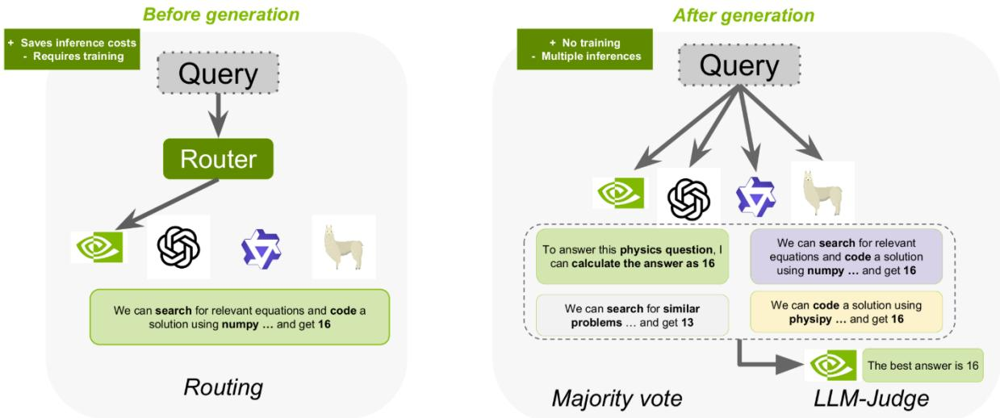  
Figure 1: Before and After-generation Multi-Agent Systems

We find that MAS model performance cannot be predicted without first evaluating candidate models: domain specialisations are not always realised, and different architectural families show different levels of similarity. High oracle performance does not necessarily provide actual improvements in MAS performance; oftentimes, systems with high prophesised improvement do not perform better than the best base model. While homogeneous MAS improve with increased architectural complexity, model instances and diversity, we do not observe this with our heterogeneous set-up: the few times a MAS improves over a single base model is when the elements of our MAS come from one singular family of models. Therefore, we advise creators of MAS architectures to evaluate and report which model behaviour patterns are required for success of their systems.

## 2 Related Work

Non-LLM Ensembles Ensembling methods have long been a cornerstone of machine learning to increase accuracy and robustness (Dietterich, 2000). Typically, individual models within the ensemble are intentionally trained to be diverse, though the representation of diversity differs: for example, one model architecture can be trained multiple times on different subsets of data to increase robustness (Breiman, 1996, 2001). In model stacking, models of different architectures trained on a shared training dataset are used to create a final model (Wolpert, 1992). Model stacking requires that the original trained model have high error diversity, motivating the use of varying architectures. However, error diversity can also be promoted in an ensemble via negative correlation learning (Liu and Yao, 1999) and PAC-Bayes C-bound (Lacasse et al., 2006). Conversely, correct-answer diversity in an ensemble system can be encouraged via gating networks, allowing the creation of complementary experts for routing in Mixture-of-Experts systems (Jacobs et al., 1991).

Before-generation MAS Routing MAS learn to map queries to an optimal, frozen, model m in M. This may be done to balance complementary skills (Wang et al., 2024b,a), reduce inference costs (Varangot-Reille et al., 2026; Ong et al., 2025), and/or provide parallelization in complex MAS (Varangot-Reille et al., 2026; Wang et al., 2024b; Shao et al., 2025; Wang et al., 2025a). The router backbone can range in complexity from simple functions (Zhang et al., 2025; Hari and Thomson, 2023) to finetuned language models (Su et al., 2026; Ong et al., 2025; Mohammadshahi et al., 2024); it can route between models (Zhang et al., 2025; Ong et al., 2025; Mohammadshahi et al., 2024), enabled features (e.g. retrieval or tool use) (Jeong et al., 2024), or a combination (Su et al., 2026). Despite cost and latency improvements, these systems often struggle in distribution shifts (Shnitzer et al., 2024; Wang et al., 2024b) and reaching substantial improvements over the single-best model (Mohammadshahi et al., 2024; Srivatsa et al., 2024; Wang et al., 2024b, 2025c). Higher oracle performance does not always lead to greater achieved performance (Srivatsa et al., 2024). The candidate lists are occasionally motivated by model size disparities (Ong et al., 2025) or individual performance (Mohammadshahi et al., 2024; Wang et al., 2024b)), but routers are otherwise often expected to learn complementary (or redundant) model expertise from a broad line-up (Mohammadshahi et al., 2024; Hari and Thomson, 2023; Wang et al., 2025c, 2024a). Of these studies, only two show substantial increases in performance (Hari and Thomson, 2023; Wang et al., 2024a).

After-generation MAS If compute is no concern, one can elicit multiple LLM generations to collapse into one final response. At its simplest, this can be selected via majority voting (Li et al., 2024; Wang et al., 2023) or an LLM judge (Toshniwal et al., 2025; Chen et al., 2026a), but generations can also be fused together (Jiang et al., 2023; Huang et al., 2024). At greater complexities, cascades of LLM responses can build upon another (Swanson et al., 2025; Su et al., 2026; Chen et al., 2026b; Wang et al., 2025a) or in other structures (Ye et al., 2025; Liu et al., 2024b). Most analyses of after-generation MAS look only at homogeneous systems: increasing the number of agents monotonically improves performance, regardless of structure (Li et al., 2024). Such studies find further improvement by varying base model prompts (Swanson et al., 2025; Li et al., 2023; Ye et al., 2025; Zhuge et al., 2024), enabled features (Lumen AI, 2026) or hierarchical structure (Ye et al., 2025; Zhuge et al., 2024; Liu et al., 2024b). However, the benefits of a homogenous MAS (over a single-model) may depend on interactions between the task, base model, and organisation (Kim et al., 2026b). Recent work suggests that increased diversity, via differing prompts or base models, is required to prevent saturation of a MAS (Yang et al., 2026), yet too much diversity in a heterogeneous MAS, though good for many tasks, may reduce reasoning performance (Abdulaal et al., 2025). Other heterogeneous MAS have conflicting results; DeePEn does not see monotonic improvement with more agents, and LLM-Blender has unstable performance across datasets (Huang et al., 2024; Jiang et al., 2023).

Overall, we see instability in heterogeneous MAS. While there is conflicting evidence on the ideal size of the candidate pool for after-generation MAS, there is no investigation on the ideal models to include in a candidate pool for either beforeor after-generation MAS, whereas in classical ensemble systems, this was a central component of ensemble creation.

## 3 Method

We focus on science reasoning tasks, which span multiple domains and thus require a diverse set of reasoning skills and abilities. We select three recent, difficult benchmarks to evaluate individual and combined model performance: Humanity’s Last Exam (HLE) (and Phan et al., 2026), GPQA-Diamond (GPQA) (Rein et al., 2024) and Frontier Science–Olympiad (FS) (Wang et al., 2026). We define our space of all available models Mˆ from 23 different LM agents listed in table 1. These models were released between 2024 and 2026, span across 6 different architecture families, and range from 2B to 1.6T parameters, dense and mixture-of-experts and reasoning and non-reasoning models, including 4 science-specialised models. For each question, we obtain 5 generations from each model $m \in { \hat { \mathcal { M } } }$ As HLE and FS are open-form question-answering datasets, we evaluate response equivalence to the correct answer using gpt-oss-120b as our judge.2

In cases where training or calibration data is required (to train our router or to determine relative model performance), we construct a training set of 15.5k questions (24.9% of which are multiplechoice questions). These are relatively equal subsets of AOPS (Mahdavi et al., 2025), Turing, Scale and Stack-Overflow 3. We evaluate its similarity to our test benchmarks in Section A.4, and show that relative model performance is highly correlated $( r > 0 . 9 , p < 1 0 ^ { - 5 } )$ across all train and test subsets.

Model signals Can we approximate MAS and relative model performancefrom information known from readily available model information, or must we alwaysfirst evaluate our candidate models? In classical ensemble models, models were specially trained for response diversity; however, this is not always possible when working with pre-trained models. From most model cards, we can extract 3- 4 pre-evaluation model signals (1) size, (2) release date, (3) architectural family, and occasionally (4) domain specialization. Using a calibration set, we can evaluate for three post-evaluation model signals: (1) accuracy, (2) correct-answer diversity, and (3) error diversity. We approximate correct answer diversity via the Jaccard distance of the pass@1 success set of each model on the training data. Error diversity is measured via the pairwise distance of the pass@1 incorrect responses of each model– to reduce noise from mismatched clustering, we look only at multiple-choice questions. We convert all measures into normalized pairwise distance matrices4, and use Mantel tests $( r _ { M } )$ and Spearman’s correlation $( r _ { s } )$ to assess for correlations. Finally, we perform hierarchical agglomerative clustering of the two distance metrics (correct answer diversity and error diversity) with average linkage and look for architectural patterns in the obtained clusters. To evaluate domain specialization, we look at relative performance of our physics and chemistry specialists to comparable generalist models across annotated subsets of our training data. We compare models of shared base model (Llama-3.1- 8B, cosmosage-v3.1, and Chem-R-8B), as well as models with comparable performance of differing architectures (OLMo3-7B, cosmosage-v3.1, ChemDFM-R-14B).

Oracle MAS How much of an improvement in performance can we expect, given an ideal MAS? We evaluate the maximum pass@1 score for the entire system $( C _ { a l l } = \hat { \mathcal { M } } )$ . We also evaluate the performance of differing subsets $C \subset { \hat { \mathcal { M } } }$ , where $| C | = k , k \in \{ 3 , 5 , 1 0 , 1 5 , 2 0 \}$ . We evaluate 8 different methods (s) of selecting $C \subset { \hat { \mathcal { M } } }$ . For each selection method s, we obtain an ordering of $\hat { \mathcal { M } }$ and define $C _ { s , k }$ as the subset containing the top k models under this ordering. We include both pre- and post-evaluation metrics. We first list pre-evaluation metrics, followed by post-evaluation metrics.

1. Size We sort models by their total parameter size (which can approximate knowledge capacity and reasoning power (Allen-Zhu and Li, 2025; Srivastava et al., 2023)). To limit interaction of model architecture, we only take one model per family.

2. Family We group models by shared model architectures. In this instance, we do not take subsets of varying sizes, but instead include all members within the same family. We evaluate: (1) Olmo, (2) Llama, (3) Qwen3, (4) Qwen3.5, (5) gemma and (7) gpt-oss family groups.

3. LLM Chosen ▼ Given descriptions of all models in Mˆ and the dataset, an XLLM (GPT-5 with Deep Research enabled) selects the top k models.

4. Accuracy We sort models by their average accuracy (pass@1 performance).

5. IoU ▲ We sort models by their correct an- swer diversity.

6. Error We sort models by their error diversity.

7. Accuracy×Err ✚/Accuracy×IoU ✖ We optimise for both accuracy and diversity by applying a 50% weighting to both values. We start with the most accurate model, and then harmonise the Accuracy and IOU/Error scores.

In the case of Size and Family, we do not evaluate for all possible values of k, and only take the sizes of k possible given the outlined restrictions. We also take 5 random subsets of $C _ { k } \subset \hat { \mathcal { M } }$ as baseline and report the overall performance (in Accuracy) and well as the change in performance from the the top-performing model within each $C _ { s , k } \left( \Delta \mathbf { M } \mathbf { A } \mathbf { S } \right.$ Gain).

Achieved MAS How much of our prophesized MAS is achievable with our architectural set up? We evaluate our MAS subsets on three different system types, comprising both before- and aftergeneration systems (See Figure 1):

1. Routing is our only before-generation MAS, where we train a simple clustering model, following AvengersPro (Zhang et al., 2025; Li et al., 2026), to optimise for pass@1 accuracy on our training data.

2. Majority vote is the simplest after-generation MAS. We embed all five final-answer generations from each model in $C _ { s , k }$ using E5- $\mathrm { L a r g e  – V } 2 ^ { 5 }$ and cluster all responses using agglomerative clustering with a maximum cosine distance threshold of 0.15 (We evaluate the impact of this maximum threshold in Section A.3). We then evaluate the correctness of the majority vote via the judgement of the datapoint closest to the cluster’s centroid.

3. LLM Judge is a more complex aftergeneration MAS, where we implement GenSelect (Toshniwal et al., 2025) using gpt-oss-120b as our final judge. As we have 5 generations per up to 23 models being evaluated, we stratify the judging process due to contextlength concerns; the judge evaluates the best answer within the set of generations for each model, and then within subsets of up to 8 models at a time in a tournament-style, until it has selected one singular best response.

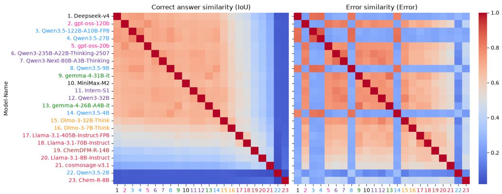  
Figure 2: Models are sorted in order of decreasing accuracy on the training data (the text is coloured by architectural family). The colour of each cell indicates the pairwise similarity of model responses (left being correct answers, right being incorrect answers). More accurate models get similar questions correct $( r _ { M } = 0 . 9 3 1 , p < . 0 1 )$ , yet their errors are only mildly correlated $( r _ { M } = 0 . 3 8 4 , p < . 0 1 )$ .

We report performance of each MAS in comparison to the single-best model of the system (∆MAS Gain) in the main text to highlight the relative benefits/downsides of using a MAS over one model already in the system. However, we report overall accuracies in Section B.2. The single-best performance is calculated separately for each $C _ { s , k } ,$ depending on the contained models, and MAS, to allow for comparability: For routing, we report the pass@1 of the best model. For majority vote, we report the best majority@5. For LLM judge, we ask our judge to pick the best generation per model, and report the best average accuracy.

## 4 Results

In the main article, we visualise results for HLE, as it is the largest and most challenging dataset; however, performance is similar across all datasets, and we report important differences in the main text. You can see all results in Section B.1 and Section B.2.

## 4.1 Model signals

We present individual model behaviours on our training data in Figure 2. Accurate models tend to get similar questions correct $( r _ { M } = 0 . 9 3 1 , p <$ .01). However, their errors are only weakly correlated $( r _ { M } ~ = ~ 0 . 3 8 4 , p ~ < ~ . 0 1 )$ Model size has a moderate correlation with accuracy $( r _ { s } = $ $0 . 5 8 3 , p \ < \ . 0 1 )$ and weak correlation with correct answer similarity $( r _ { M } = 0 . 2 1 9 , p < . 0 5 )$ When performing agglomerative clustering (See Section A for visualizations), we can see some patterns emerge: Models trained with reasoning have greater similarity of correct answers (three exceptions are Qwen3.5-2B, Chem-R-8B, and ChemDFM-R-14B; the latter two have very different post-training in comparison to the other reasoning models). When clustering by error similarity, we see architectural patterns: Deepseek-v4 and Qwen3.5 models make very similar errors which are distinct to the errors made by gemma, gpt-oss, OLMo3, Qwen3 and MiniMax.

We compare performance of generalist versus specialist models in Figure 3 and section A.6; compared to its physics and chemistry-specialised counterparts (all three models are fine-tuned from Llama-3.1-8B-Base), the normal Llama performs better on all science reasoning domains, particularly in the specialised domains of physics and chemistry. The gains of each specialised model (i.e. questions answered only by the specialist model and not the generalist base), are not limited to the specific specialisation of each model, but are relatively equally divided across all domains. We see a similar pattern when architectures are unrelated (Section A.6). This means that one cannot assume high correct answer diversity (or specialisation) from training data dominance.

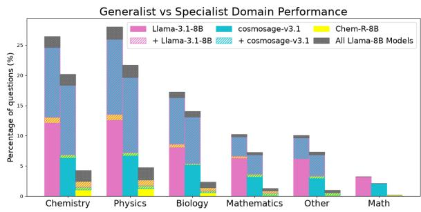  
Figure 3: Llama3.1-8B shows just as strong, if not greater performance in all domains in comparison to its Physics and Chemistry-specialised counterparts, especially on Physics and Chemistry questions.

Through these model investigations, we find larger reasoning models typically perform better, and have lower correct answer (IoU) diversity. Error diversity seems to vary much more between architectures, though some model families behave more similarly than others. IoU diversity cannot be assumed simply from training data specialisation– models specially fine-tuned in specific domains do not see greater performance on these domains on our science reasoning subset (regardless if they arise from the same architectural backbone or not). While we see a correlation between size and accuracy, we continue with both forms of subset generation to evaluate for equivalent MAS performance. We list all subset identities in Section A.7.

## 4.2 Oracle MAS performance

In Figure 4 we show the optimal performance of each MAS.6 Naturally, we observe an increase in performance with increasing k. When looking solely at overall accuracy, we see the greatest potential performance across all k when grouping models by accuracy (or accuracy combined with some form of diversity) ✚✖ or by LLM sug-gestion ▼. We see the smallest prophesized im- provements with Error or IoU ▲ diversity; this pattern is conserved across datasets. Notably, though family grouping shows relatively low overall performance, we can see that some family groups prophesise high MAS gains over a single base model (Particularly gemma models).

## 4.3 Achieved MAS Performance

For actual MAS performance in Figure 5, one pattern is clear: more models nearly always decreases performance. Most intentional groupings give performance lower than the baseline best model, and often lower than a random set of models. Across all MAS forms, families with shared architectures perform best; in most cases, this means the least detriment to performance rather than a large improvement. There is also variability between families. We see typically the best relative MAS performance with Gemma4 MAS, though highly variable performance with OLMo3 and Qwen3.

Routing systems seem to benefit most with greater diversity of correct answers (IoU ▲ has the greatest performance, though it prophesized relatively low improvement with the oracle)– this behaviour is inline with the training approach of classical routed systems. Only IoU and Family architectures showed a positive improvement on routed structures.

After-generation approaches (Majority-vote and LLM-as-a-Judge) have steep declines in performance with increasing k in comparison to the routed system. It seems intuitive that, with increasing response diversity, the majority-vote accuracy would decrease, given the lowered robustness of the system. Despite an increase in the best single-agent systems using majority vote (29.4% pass@1 $B e s t ^ { ( m ) }$ to 32.2% majority@5Best(m) on HLE), nearly all heterogeneous MAS groups decline in performance; this is strongest with Error and IoU ▲ diversity in FS and GPQA in Section B.2. The only grouping approach that occasionally improves over the single-agent system is within a model family (Gemma4 and OLMo3). However, in some instances (See Section A.3), we see MAS Gain for Accuracy ( ) and Error ( )- related groupings (✖✚).

Interestingly, using an LLM-as-a-Judge does not improve MAS stability much (Though we see further increase with the homogenous system, $j u d g e @ 5 _ { B e s t } ( m ) = 3 6 . 5 \%$ on HLE) Nearly all of our intentional subsets perform worse than random baseline with a LLM-as-a-Judge architectures. This is only seen for HLE– in GPQA and FS, we see performance approximately equivalent to random baseline. In addition to improved performance on HLE with Gemma4 family architeture, we find a small MAS gain (+2% on FS, +< 1% on GPQA) with Accuracy and Accuracy-optimised metrics (✖ ✚)

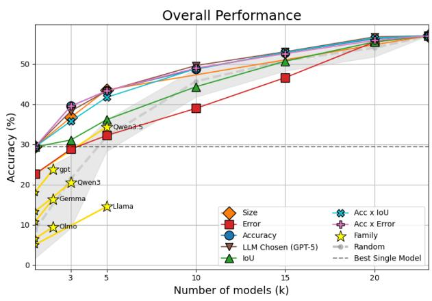

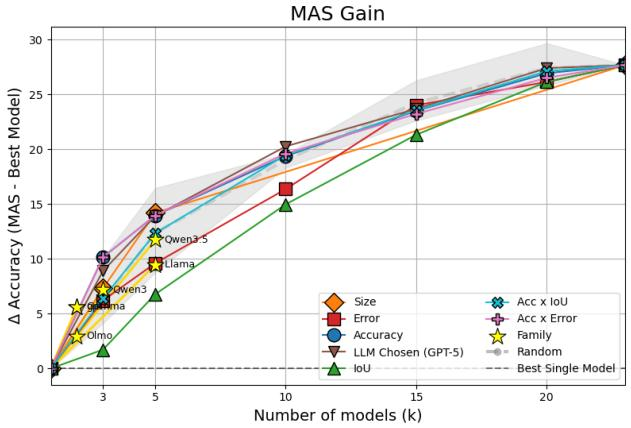  
Figure 4: Potential gains of each MAS with increasing k. More models consistently indicates greater MAS performance; these gains are strongest when we combine the most accurate or largest models.

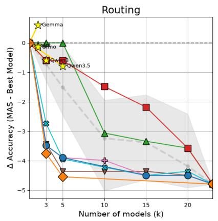

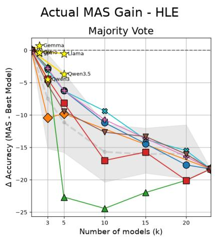

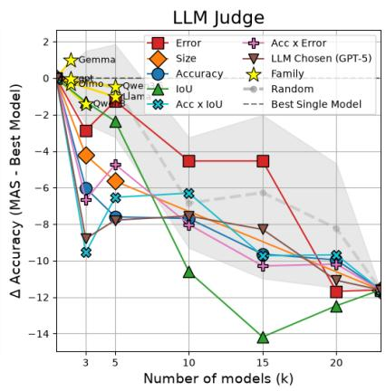  
Figure 5: Actual gains of each MAS subset and architecture with increasing k. With larger candidate pools, we see larger losses in performance (compared to the single best model of the set). On HLE, Only MAS with models from one model family show improvements over the baseline best model.

## 5 Discussion

There can be too much diversity Increased diversity may not be best for all MAS architectures, or they may require diversity in different forms. High solution diversity pollutes the answer space and may make it difficult to isolate the correct response, especially in reasoning tasks (Abdulaal et al., 2025). Other works finding success with increased diversity looked at a limited amount of diversity over a large amount of agents (e.g. system prompts (Swanson et al., 2025), enabled features (Lumen AI, 2026) or a limited number of base models (three) (Yang et al., 2026)). Rather than high solution diversity, heterogeneous MAS may require other forms of diversity, such as high reasoning diversity but consistent output (Wang et al., 2023)–which can arise from diverse prompting or tools, rather than many models. This ensures some diversity as well as equivalent performance between models (Huang et al., 2024). Other studies found that decentralised (i.e. voting) approaches with mixed-capability models showed the greatest improvements (Kim et al., 2026b)– however this behaviour was only measured within modelfamilies and may improve with more model interaction, which was outside of our study’s scope. Similarly, a stronger central orchestrator (i.e. judge) may recover failures in heterogeneous systems, and may need more complex architectural systems to accommodate increased diversity from additional base models.

Routing systems may require more than just correct-answer diversity Mixture-of-Experts systems, which are routing systems, require correct answer diversity between their experts (Jacobs et al., 1991). Appropriately, we see highest per formance with our IoU-diverse router– but this is rarely sufficient to increase performance over the base model. For a clear training signal, this per model expertise must capture different tasks (Ja cobs et al., 1991), which may not necessarily be measured with our naive IoU distance. Highly suc cessful routing approaches like FrugalFoE, rely on separately fine-tuned models or models with rela tively stronger performance on annotated bench marks; relying on models determined from an notated benchmarks performed worse than mod els expressly fine-tuned with domain specialisa tion (Wang et al., 2024a). This creates two issues: (1) annotating benchmarks, and (2) actually find ing models with the intended specialisations in the haystack. In our work, we found that models trained on different domain subsets do not provide effectively distinct expertise on the different do mains. Furthermore, too much overlap between model expertise also pollutes the training signal (Guo et al., 2025)– therefore, combining strong, generalist models will not necessarily lead to per formance above baseline. Other approaches that successfully identified model expertise ensured all candidate models share a similar size (Zhang et al., 2025) or model architecture (Hari and Thomson, 2023). For actual performance gains, there may be additional criteria to include besides only high correct-answer diversity. While we tried to jointly optimise for high accuracy, other criteria can be investigated, such as similar accuracy, size or ar chitecture. These criteria may restrict one’s pool of models, especially with growing generalist models: there may be fewer true specialist models allowing easy integration into a Routed-MAS. Models may instead benefit from specific training or fine-tuning for integration.

## 6 Conclusion

In this work, we evaluate the contribution of model candidate selection on MAS performance. We compare three simple forms of MAS: Routing, Majority vote and LLM-as-a-Judge on three complex science reasoning benchmarks. While response diversity was explicitly trained for in classical ensemble systems, we must now evaluate our candidate models to determine the ideal pool, which has not been appropriate investigated in previous work. We compare architectural information (size, family) as well as evaluated metrics (accuracy, correct answer diversity, error diversity) as methods to determine model subset lists. We find increasing candidate pool size always seems to impair MAS performance (in contrast to previous work (Yang et al., 2026)). Groupings with limited prophesized improvements (as measured via oracle performance, such as shared model families or correct answer diversity), often show the best actual performance across MAS architecture. While we see limited improvement in performance from our sample of investigations, we do not believe that means heterogeneous MAS is futile; other studies have reported improvements in performance, even using the same MAS architectures (Zhang et al., 2025). Though we saw a decrease in performance with increasing architectural complexity for our hetereogenous MAS systems, our baseline homogeneous MAS systems performance increased with MAS complexity, suggesting that these architectures may be best suited for homogeneous systems, necessitating the development of architectures specifically for heterogeneous MAS. We strongly recommend MAS engineers to evaluate the contribution of their choice of models to their system’s performance– specific criteria may be needed for success of their MAS architecture, and observed failures may arise simply due to a poor choice of candidate models.

## Limitations

We focus only on before and after-generation multiagent systems. While during-generation systems also exist, they are out of scope for this paper, and would require a combination of aspects from both before- and after-generation MAS. While there are many other possible implementations of beforeand after-generation MAS, we hope that our coverage of three forms provides some insight into MAS-level instabilities in model selections, and future work can explore the contribution of model selection on other, more advanced MAS architectures.

We intentionally chose simple MAS architectures. However, each come with their own limitations. We selected only one routing architecture, out of many possible backbones (we chose a recent model that showed high perofmance). Furthermore, while we do evaluate the relative impact of some of our majority-vote design choices in Section A.3, there are multiple ways to evaluate majority-vote, such as semantic clustering using NLI models. Given the complexity of our benchmarks, we chose to embed each response using a large model trained on scientific text, though we did not specifically train an embedding model for this task. Context-length issues may also contribute to the poor observed performance of our LLM-Judge MAS, GenSelect, on high values of k. This may be improved with more advanced stratification of the voting system. More complicated MAS structures may be able to compensate for the instability introduced with adding more models. However, we leave improvements ofthese simple MAS architectures tofuture work.

To ensure equal comparison of all models, we do not enable tool use or retrieval, even with models that have that capability. We note that models trained to innately use tools are often trained with different sandbox environments, which can differentially advantage or disadvantage different models. However, tool use is especially helpful for many questions within the benchmarks we investigate, and is very common in MAS deployment. Therefore, future work can explore how tool use can impact response diversity and heterogeneous MAS performance

Given that we are limited by the number of available models within each model family, our Family investigations cannot test for all levels of k. Future work, with more access to larger model families, or other forms of architectural grouping, could see if larger family-based groupings could increase performance with greater k.

While we do look at a large sample of models, this could be expanded even larger. However, we observe limited gains with the number of models we included, therefore, we did not further increase the candidate set size. We tried to diversify our model pool across model family, size, year of release, and training architecture, but further work could evaluate more modelfamilies and expand our investigations by also comparing between reasoning training types, prompts and enabledfeatures.

We look specifically at scientific reasoning tasks evaluated by AAI– there are other difficult reasoning tasks, like mathematics and coding. However, single model performance is much lower on scientific reasoning tasks (like physics and chemistry) than these domains, giving a greater overhead for

MAS over single-agents, motivating our choice. However, future work can see how these results compare across diverse reasoning domains.

We use one judge for all of our experiments when needed (gpt-oss-120b). We maintain this consistent judge for simplicity, and use our second-best performing model (Deepseek-v4-Pro was only released in late April 2026. The majority of this work was completed beforehand.). We do validate the quality of our judge in Section A.2, and note that the judge is more likely to judge a question as correct than our human grader. However, the choice of judge could impact relative model performance and LLM-as-a-Judge MAS performance. Future work can investigate how choice ofjudge in a heterogeneous LLM-as-a-Judge system can impact MAS performance.

## References

Ahmed Abdulaal, Chen Jin, Nina Montaña-Brown, Aryo Pradipta Gema, Daniel C. Castro, Daniel C. Alexander, Philip Alexander Teare, Tom Diethe, Dino Oglic, and Amrutha Saseendran. 2025. Balancing act: Diversity and consistency in large language model ensembles. In The Thirteenth International Conference on Learning Representations.

Zeyuan Allen-Zhu and Yuanzhi Li. 2025. Physics of language models: Part 3.3, knowledge capacity scaling laws. In International Conference on Learning Representations, volume 2025, pages 14937–14946.

Long and Phan, Alice Gatti, Nathaniel Li, Adam Khoja, Ryan Kim, Richard Ren, Jason Hausenloy, Oliver Zhang, Mantas Mazeika, Dan Hendrycks, Ziwen Han, Josephina Hu, Hugh Zhang, Chen Bo Calvin Zhang, Mohamed Shaaban, John Ling, Sean Shi, Michael Choi, Anish Agrawal, and 1081 others. 2026. A benchmark of expert-level academic questions to assess ai capabilities. Nature, 649(8099):1139–1146.

Lei Bai, Zhongrui Cai, Yuhang Cao, Maosong Cao, Weihan Cao, Chiyu Chen, Haojiong Chen, Kai Chen, Pengcheng Chen, Ying Chen, Yongkang Chen, Yu Cheng, Pei Chu, Tao Chu, Erfei Cui, Ganqu Cui, Long Cui, Ziyun Cui, Nianchen Deng, and 158 others. 2025. Intern-s1: A scientific multimodal foundation model. Preprint, arXiv:2508.15763.

Leo Breiman. 1996. Bagging predictors. Mach. Learn., 24(2):123–140.

Leo Breiman. 2001. Random forests. Mach. Learn., 45(1):5–32.

Zhijun Chen, Zeyu Ji, Qianren Mao, Hao Wu, Jinhuan Song, Junhang Cheng, Bangjie Qin, Zhuoran Li, Jingzheng Li, Kai Sun, Zizhe Wang, Yikun Ban, Zhu Sun, Xiangyang Ji, and Hailong Sun. 2026a. Scoring,

reasoning, and selecting the best! ensembling large language models via a peer-review process. Preprint, arXiv:2512.23213.

Zhijun Chen, Xiaodong Lu, Jingzheng Li, Pengpeng Chen, Zhuoran Li, Kai Sun, Yuankai Luo, Qianren Mao, Ming Li, Likang Xiao, Dingqi Yang, Xiao Huang, Yikun Ban, Hailong Sun, and Philip S. Yu. 2026b. Harnessing multiple large language models: A survey on llm ensemble. Preprint, arXiv:2502.18036.

Wei-Lin Chiang, Lianmin Zheng, Ying Sheng, Anastasios Nikolas Angelopoulos, Tianle Li, Dacheng Li, Banghua Zhu, Hao Zhang, Michael Jordan, Joseph E. Gonzalez, and Ion Stoica. 2024. Chatbot arena: An open platform for evaluating LLMs by human preference. In Proceedings of the 41st International Conference on Machine Learning, volume 235 of Proceedings of Machine Learning Research, pages 8359–8388. PMLR.

Tijmen de Haan. 2024. cosmosage: A Natural-Language Assistant for Cosmologists. arXiv preprint. ArXiv:2407.04420 [astro-ph].

DeepSeek-AI. 2026. Deepseek-v4: Towards highly efficient million-token context intelligence.

Thomas G. Dietterich. 2000. Ensemble methods in machine learning. In Multiple Classifier Systems, pages 1–15, Berlin, Heidelberg. Springer Berlin Heidelberg.

Yilun Du, Shuang Li, Antonio Torralba, Joshua B. Tenenbaum, and Igor Mordatch. 2024. Improving factuality and reasoning in language models through multiagent debate. In Proceedings ofthe 41st International Conference on Machine Learning, volume 235 of Proceedings ofMachine Learning Research, pages 11733–11763. PMLR.

Aaron Grattafiori, Abhimanyu Dubey, Abhinav Jauhri, Abhinav Pandey, Abhishek Kadian, Ahmad Al-Dahle, Aiesha Letman, Akhil Mathur, Alan Schelten, Alex Vaughan, Amy Yang, Angela Fan, Anirudh Goyal, Anthony Hartshorn, Aobo Yang, Archi Mitra, Archie Sravankumar, Artem Korenev, Arthur Hinsvark, and 542 others. 2024. The llama 3 herd of models. Preprint, arXiv:2407.21783.

Hongcan Guo, Haolang Lu, Guoshun Nan, Bolun Chu, Jialin Zhuang, Yuan Yang, Wenhao Che, Xinye Cao, Sicong Leng, Qimei Cui, and Xudong Jiang. 2025. Advancing expert specialization for better moe. In Advances in Neural Information Processing Systems, volume 38, pages 48767–48809. Curran Associates, Inc.

Surya Narayanan Hari and Matt Thomson. 2023. Tryage: Real-time, intelligent routing of user prompts to large language models. Preprint, arXiv:2308.11601.

Yichong Huang, Xiaocheng Feng, Baohang Li, Yang Xiang, Hui Wang, Ting Liu, and Bing Qin. 2024. Ensemble learning for heterogeneous large language

models with deep parallel collaboration. In The Thirty-eighth Annual Conference on Neural Information Processing Systems.

Robert A. Jacobs, Michael I. Jordan, Steven J. Nowlan, and Geoffrey E. Hinton. 1991. Adaptive mixtures of local experts. Neural Computation, 3(1):79–87.

Soyeong Jeong, Jinheon Baek, Sukmin Cho, Sung Ju Hwang, and Jong Park. 2024. Adaptive-RAG: Learning to adapt retrieval-augmented large language models through question complexity. In Proceedings of the 2024 Conference of the North American Chapter ofthe Associationfor Computational Linguistics: Human Language Technologies (Volume 1: Long Papers), pages 7036–7050, Mexico City, Mexico. Association for Computational Linguistics.

Dongfu Jiang, Xiang Ren, and Bill Yuchen Lin. 2023. LLM-blender: Ensembling large language models with pairwise ranking and generative fusion. In Proceedings ofthe 61st Annual Meeting ofthe Association for Computational Linguistics (Volume 1: Long Papers), pages 14165–14178, Toronto, Canada. Association for Computational Linguistics.

Mehran Kazemi, Bahare Fatemi, Hritik Bansal, John Palowitch, Chrysovalantis Anastasiou, Sanket Vaibhav Mehta, Lalit K Jain, Virginia Aglietti, Disha Jindal, Peter Chen, Nishanth Dikkala, Gladys Tyen, Xin Liu, Uri Shalit, Silvia Chiappa, Kate Olszewska, Yi Tay, Vinh Q. Tran, Quoc V Le, and Orhan Firat. 2025. BIG-bench extra hard. In Proceedings of the 63rd Annual Meeting of the Association for Computational Linguistics (Volume 1: Long Papers), pages 26473–26501, Vienna, Austria. Association for Computational Linguistics.

Junsol Kim, Shiyang Lai, Nino Scherrer, Blaise Aguera y Arcas, and James Evans. 2026a. Reasoning models generate societies of thought. In Pluralistic Alignment Workshop at ICML 2026.

Yubin Kim, Ken Gu, Chanwoo Park, Chunjong Park, Samuel Schmidgall, A. Ali Heydari, Yao Yan, Zhihan Zhang, Yuchen Zhuang, Yun Liu, Mark Malhotra, Paul Pu Liang, Hae Won Park, Yuzhe Yang, Xuhai Xu, Yilun Du, Shwetak Patel, Tim Althoff, Daniel McDuff, and Xin Liu. 2026b. Towards a science of scaling agent systems. Preprint, arXiv:2512.08296.

Alexandre Lacasse, François Laviolette, Mario Marchand, Pascal Germain, and Nicolas Usunier. 2006. Pac-bayes bounds for the risk of the majority vote and the variance of the gibbs classifier. In Advances in Neural Information Processing Systems, volume 19. MIT Press.

Guohao Li, Hasan Hammoud, Hani Itani, Dmitrii Khizbullin, and Bernard Ghanem. 2023. Camel: Communicative agents for "mind" exploration of large language model society. In Advances in Neural Information Processing Systems, volume 36, pages 51991–52008. Curran Associates, Inc.

Hao Li, Yiqun Zhang, Zhaoyan Guo, Chenxu Wang, Shengji Tang, Qiaosheng Zhang, Yang Chen, Biqing Qi, Peng Ye, Lei Bai, Zhen Wang, and Shuyue Hu. 2026. LLMRouterBench: A Massive Benchmark and Unified Framework for LLM Routing. arXiv preprint arXiv:2601.07206.

Junyou Li, Qin Zhang, Yangbin Yu, Qiang Fu, and Deheng Ye. 2024. More agents is all you need. Transactions on Machine Learning Research.

Hongwei Liu, Zilong Zheng, Yuxuan Qiao, Haodong Duan, Zhiwei Fei, Fengzhe Zhou, Wenwei Zhang, Songyang Zhang, Dahua Lin, and Kai Chen. 2024a. MathBench: Evaluating the theory and application proficiency of LLMs with a hierarchical mathematics benchmark. In Findings of the Association for Computational Linguistics: ACL 2024, pages 6884–6915, Bangkok, Thailand. Association for Computational Linguistics.

Y. Liu and X. Yao. 1999. Ensemble learning via negative correlation. Neural Netw., 12(10):1399–1404.

Zijun Liu, Yanzhe Zhang, Peng Li, Yang Liu, and Diyi Yang. 2024b. A dynamic LLM-powered agent network for task-oriented agent collaboration. In First Conference on Language Modeling.

Lumen AI. 2026. Kimi K2.5 Agent Swarm: Orchestrate 100 Sub-Agents for Complex Workflows.

Sadegh Mahdavi, Muchen Li, Kaiwen Liu, Christos Thrampoulidis, Leonid Sigal, and Renjie Liao. 2025. Leveraging online olympiad-level math problems for LLMs training and contamination-resistant evaluation. In Proceedings of the 42nd International Conference on Machine Learning, volume 267 of Proceedings ofMachine Learning Research, pages 42554–42578. PMLR.

MiniMax, :, Aili Chen, Aonian Li, Baichuan Zhou, Bangwei Gong, Binyang Jiang, Boji Dan, Changqing Yu, Chao Wang, Cheng Ma, Cheng Zhong, Cheng Zhu, Chengjun Xiao, Chengyi Yang, Chengyu Du, Chenyang Zhang, Chi Zhang, Chuangyi Huang, and 188 others. 2026. The minimax-m2 series: Mini activations unleashing max real-world intelligence. Preprint, arXiv:2605.26494.

Alireza Mohammadshahi, Arshad Rafiq Shaikh, and Majid Yazdani. 2024. Routoo: Learning to route to large language models effectively. Preprint, arXiv:2401.13979.

Team Olmo, :, Allyson Ettinger, Amanda Bertsch, Bailey Kuehl, David Graham, David Heineman, Dirk Groeneveld, Faeze Brahman, Finbarr Timbers, Hamish Ivison, Jacob Morrison, Jake Poznanski, Kyle Lo, Luca Soldaini, Matt Jordan, Mayee Chen, Michael Noukhovitch, Nathan Lambert, and 50 others. 2026. Olmo 3. Preprint, arXiv:2512.13961.

Isaac Ong, Amjad Almahairi, Vincent Wu, Wei-Lin Chiang, Tianhao Wu, Joseph E. Gonzalez, M Waleed Kadous, and Ion Stoica. 2025. RouteLLM: Learning

to route LLMs from preference data. In The Thirteenth International Conference on Learning Representations.

OpenAI. 2025. gpt-oss-120b & gpt-oss-20b model card. Preprint, arXiv:2508.10925.

Qwen Team. 2026. Qwen3.5: Towards native multimodal agents.

David Rein, Betty Li Hou, Asa Cooper Stickland, Jackson Petty, Richard Yuanzhe Pang, Julien Dirani, Julian Michael, and Samuel R. Bowman. 2024. GPQA: A graduate-level google-proof q&a benchmark. In First Conference on Language Modeling.

Chenyang Shao, Xinyang Liu, Yutang Lin, Fengli Xu, and Yong Li. 2025. Route-and-reason: Scaling large language model reasoning with reinforced model router. Preprint, arXiv:2506.05901.

Tal Shnitzer, Anthony Ou, Mírian Silva, Kate Soule, Yuekai Sun, Justin Solomon, Neil Thompson, and Mikhail Yurochkin. 2024. LLM routing with benchmark datasets. In NeurIPS 2023 Workshop on Distribution Shifts: New Frontiers with Foundation Models.

Aarohi Srivastava, Abhinav Rastogi, Abhishek Rao, Abu Awal Md Shoeb, Abubakar Abid, Adam Fisch, Adam R. Brown, Adam Santoro, Aditya Gupta, Adrià Garriga-Alonso, Agnieszka Kluska, Aitor Lewkowycz, Akshat Agarwal, Alethea Power, Alex Ray, Alex Warstadt, Alexander W. Kocurek, Ali Safaya, Ali Tazarv, and 431 others. 2023. Beyond the imitation game: Quantifying and extrapolating the capabilities of language models. Transactions on Machine Learning Research. Featured Certification.

Kv Aditya Srivatsa, Kaushal Kumar Maurya, and Ekaterina Kochmar. 2024. Harnessing the power of multiple minds: Lessons learned from LLM routing. In Proceedings ofthe Fifth Workshop on Insightsfrom Negative Results in NLP, pages 124–134, Mexico City, Mexico. Association for Computational Linguistics.

Hongjin Su, Shizhe Diao, Ximing Lu, Mingjie Liu, Jiacheng Xu, Xin Dong, Yonggan Fu, Peter Belcak, Hanrong Ye, Hongxu Yin, Yi Dong, Evelina Bakhturina, Tao Yu, Yejin Choi, Jan Kautz, and Pavlo Molchanov. 2026. Toolorchestra: Elevating intelligence via efficient model and tool orchestration. In Forty-third International Conference on Machine Learning.

Kyle Swanson, Wesley Wu, Nash L. Bulaong, John E. Pak, and James Zou. 2025. The Virtual Lab of AI agents designs new SARS-CoV-2 nanobodies. Nature, 646(8085):716–723.

Gemma Team. 2026. Gemma 4 technical report. Preprint, arXiv:2607.02770.

Qwen Team. 2025. Qwen3 technical report. Preprint, arXiv:2505.09388.

Shubham Toshniwal, Ivan Sorokin, Aleksander Ficek, Ivan Moshkov, and Igor Gitman. 2025. Genselect: A generative approach to best-of-n. In 2nd AIfor Math Workshop @ ICML 2025.

Clovis Varangot-Reille, Christophe Bouvard, Mathieu Ciancone, Antoine Gourru, Marion Schaeffer, and François Jacquenet. 2026. Doing more with less: A survey on routing strategies for resource optimisation in large language model-based systems. J. Artif. Intell. Res., 86.

Hongyi Wang, Felipe Maia Polo, Yuekai Sun, Souvik Kundu, Eric Xing, and Mikhail Yurochkin. 2024a. Fusing models with complementary expertise. In International Conference on Learning Representations, volume 2024, pages 45284–45306.

Junlin Wang, Jue Wang, Ben Athiwaratkun, Ce Zhang, and James Y Zou. 2025a. Mixture-of-agents enhances large language model capabilities. In International Conference on Learning Representations, volume 2025, pages 33944–33963.

Miles Wang, Robi Lin, Kat Hu, Joy Jiao, Neil Chowdhury, Ethan Chang, and Tejal Patwardhan. 2026. Frontierscience: Evaluating ai’s ability to perform expert-level scientific tasks. Preprint, arXiv:2601.21165.

Weida Wang, Benteng Chen, Di Zhang, Wanhao Liu, Shuchen Pu, Ben Gao, Jin Zeng, Xiaoyong Wei, Tianshu Yu, Shuzhou Sun, Tianfan Fu, Wanli Ouyang, Lei Bai, Jiatong Li, Zifu Wang, Yuqiang Li, and Shufei Zhang. 2025b. Chem-r: Learning to reason as a chemist. Preprint, arXiv:2510.16880.

Xinyuan Wang, Yanchi Liu, Wei Cheng, Xujiang Zhao, Zhengzhang Chen, Wenchao Yu, Yanjie Fu, and Haifeng Chen. 2025c. MixLLM: Dynamic routing in mixed large language models. In Proceedings of the 2025 Conference ofthe Nations ofthe Americas Chapter of the Association for Computational Linguistics: Human Language Technologies (Volume 1: Long Papers), pages 10912–10922, Albuquerque, New Mexico. Association for Computational Linguistics.

Xuezhi Wang, Jason Wei, Dale Schuurmans, Quoc V Le, Ed H. Chi, Sharan Narang, Aakanksha Chowdhery, and Denny Zhou. 2023. Self-consistency improves chain of thought reasoning in language models. In The Eleventh International Conference on Learning Representations.

Yuanshuai Wang, Xingjian Zhang, Jinkun Zhao, Siwei Wen, Peilin Feng, Shuhao Liao, Lei Huang, and Wenjun Wu. 2024b. Bench-coe: a framework for collaboration of experts from benchmark. Preprint, arXiv:2412.04167.

David Wolpert. 1992. Stacked generalization. Neural Networks, 5:241–259.

Yingxuan Yang, Chengrui Qu, Muning Wen, Laixi Shi, Ying Wen, Weinan Zhang, Adam Wierman, and

Shangding Gu. 2026. Understanding agent scaling in llm-based multi-agent systems via diversity. arXiv preprint arXiv:2602.03794.

Rui Ye, Shuo Tang, Rui Ge, Yaxin Du, Zhenfei Yin, Siheng Chen, and Jing Shao. 2025. MAS-GPT: Training LLMs to build LLM-based multi-agent systems. In Proceedings ofthe 42nd International Conference on Machine Learning, volume 267 of Proceedings ofMachine Learning Research, pages 72063–72090. PMLR.

Yiqun Zhang, Hao Li, Chenxu Wang, Linyao Chen, Qiaosheng Zhang, Peng Ye, Shi Feng, Daling Wang, Zhen Wang, Xinrun Wang, et al. 2025. The Avengers: A Simple Recipe for Uniting Smaller Language Models to Challenge Proprietary Giants. In Proceedings of the AAAI Conference on Artificial Intelligence (AAAI). Oral presentation.

Zihan Zhao, Ziping Wan, Lu Chen, Xuanze Lin, Shiyang Yu, Situo Zhang, Da Ma, Zichen Zhu, Danyang Zhang, Huayang Wang, Zhongyang Dai, Liyang Wen, Bo Chen, Xin Chen, and Kai Yu. 2026. Chemdfm-r: A chemical reasoning llm enhanced with atomized chemical knowledge. Preprint, arXiv:2507.21990.

Mingchen Zhuge, Wenyi Wang, Louis Kirsch, Francesco Faccio, Dmitrii Khizbullin, and Jürgen Schmidhuber. 2024. GPTSwarm: Language agents as optimizable graphs. In Proceedings of the 41st International Conference on Machine Learning, volume 235 of Proceedings of Machine Learning Research, pages 62743–62767. PMLR.

## A Extra analyses

## A.1 All models

We present all models $m \in { \hat { \mathcal { M } } }$ in Table 1.

## A.2 Judge verification

To evaluate the quality of our LLM Judge (gpt-oss-120b), we take a random subsample of 100 answers for HLE (for any model in Mˆ ) and manually grade them in reference to the provided solution. We obtain an agreement of 93% and a Cohen’s kappa of 0.63, which indicates substantial alignment. Notably, the LLM judge is much more likely to grade an answer as correct– there is only one instance of the LLM judge grading a human-verified correct answer as incorrect. Therefore, if anything, we report higher accuracies than would be observed in actuality.

## A.3 Majority vote Robustness

The choice of embedding model and cosine distance threshold in implementing majority vote can impact the performance of the MAS system. As noted in Section 3, we evaluated the performance of three embedding models on our datasets: E5-Large-V2, all-MiniLM-L6-v2 and bge-large-en-v1.5. We chose the embedding model that gave the highest average accuracy, across all models. We also assess the relative impact of the choice of cosine distance threshold in Figures 6 and 7. While we do small differences in accuracies and MAS gain upon varying our choice of a cosine distance threshold (between 0.10, 0.15, and 0.20), the patterns remain largely similar patterns across all selected values. However, we do see small MAS gains for Accuracy , Acc×Error ✚ , Acc×IoU ✖ , and Error which suggests more relaxed clustering thresholds could improve performance of this group. However, in the main text, we report with a cosine distance threshold of 0.15, to ensure high semantic similarity of the clustered answers.

<table><tr><td>Model</td><td>Params(B) Year Notes</td><td></td></tr><tr><td>Deepseek-v4-Pro (DeepSeek-AI, 2026)</td><td>1600/492026</td><td></td></tr><tr><td>Qwen3.5-122B-A10B-FP8 (Qwen Team, 2026)</td><td>122/102026</td><td></td></tr><tr><td>Qwen3.5-27B (Qwen Team, 2026)</td><td>272026</td><td></td></tr><tr><td>Qwen3.5-9B (Qwen Team, 2026)</td><td>9 2026</td><td>0</td></tr><tr><td>Qwen3.5-4B (Qwen Team, 2026)</td><td>4 2026</td><td>0</td></tr><tr><td>Qwen3.5-2B (Qwen Team, 2026)</td><td>22026</td><td></td></tr><tr><td>gemma-4-31B-it (Team, 2026)</td><td>312026</td><td></td></tr><tr><td>gemma-4-26B-A4B-it (Team, 2026)</td><td>26/4 2026</td><td></td></tr><tr><td>MiniMax-M2 (MiniMax et al., 2026)</td><td>230/102026</td><td></td></tr><tr><td>Olmo-3-32B-Think (Olmo et al., 2026)</td><td>322026</td><td></td></tr><tr><td>Olmo-3-7B-Think (Olmo et al., 2026)</td><td></td><td>72026</td></tr><tr><td>ChemDFM-R-14B () (Zhao et al., 2026)</td><td>142026</td><td></td></tr><tr><td>gpt-oss-120b (OpenAI, 2025)</td><td>120/5.12025</td><td></td></tr><tr><td>gpt-oss-20b (OpenAI, 2025)</td><td>20/3.62025</td><td></td></tr><tr><td>Qwen3-235B-a22B-Thinking-2507 (Team, 2025)</td><td>235/222025</td><td></td></tr><tr><td>Qwen3-Next-80B-A3B-Thinking (Team, 2025)</td><td>80/32025</td><td></td></tr><tr><td>Qwen3-32B (Team, 2025)</td><td>322025</td><td></td></tr><tr><td>Intern-S1 () (Bai et al., 2025)</td><td>235/222025</td><td></td></tr><tr><td>Chem-R-8B () (Wang et al., 2025b)</td><td>82025</td><td>0</td></tr><tr><td>cosmosage-v3.1 () (de Haan, 2024)</td><td>82024</td><td></td></tr><tr><td>Llama-3.1-405B-Instruct-FP8 (Grattafiori et al., 2024)</td><td>405 2024</td><td></td></tr><tr><td>Llama-3.1-70B-Instruct (Grattafiori et al., 2024)</td><td>70 2024</td><td></td></tr><tr><td>Llama-3.1-8B-Instruct (Grattafiori et al., 2024)</td><td>8 2024</td><td></td></tr></table>

Table 1: Overview of language models evaluated. $\displaystyle \bigcirc$ indicates the model is run with reasoning mode on (if available), indicates the model is additionally trained on science-specific data, indicates the model is a Mixture-of-Experts model. For some additionally fine-tuned models, we note the model backbones: indicates a Qwen-backbone, whereas indicates a Llama-backbone.

## A.4 Training data evaluation

We evaluate the appropriateness of our training data (and its subsets) to our test data to ensure its validity. We test the Spearman rank correlation across all evaluated models and show the results in Figure 8. All combinations show high correlation $( p < 1 0 ^ { - 5 } ; r > 0 . 9 )$

## A.5 Correct and Incorrect Answer Clustering

We show the heatmaps, ordered according to the obtained dendrogram from hierarchical agglomerative clustering for correct answer (IoU) similarity in Figure 9 and for error diversity in Figure 10.

In Figure 9, we see a fairly similar heatmap as to when it was organised by accuracy in Figure 8. There is only one, large cluster, with relatively high similarity. This cluster contains most reasoning models (save for OLMo3-7B models, which performs fairly similarly to this cluster). Just outside of this cluster, we see instruction-tuned models. Chem-R-8B and Qwen3.5-2B have very dissimilar performance to all models.

In Figure 10, we see a strikingly different heatmap in comparison to Figure 8. There are two clusters. One contains Deepseek-v4 and most Qwen3.5 models, which have very high error similarity (> 0.8). The second cluster contains most other reasoning model families. Instruction-tuned models are more similar to this second group of reasoning models. Qwen3.5-2B and Chem-R-8B again have very dissimilar performance to all models.

MAS Gain - Majority voting across cosine thresholds - FS  
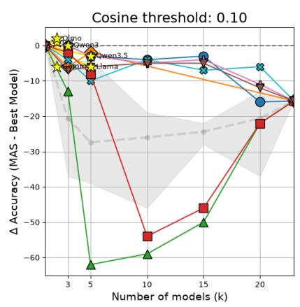

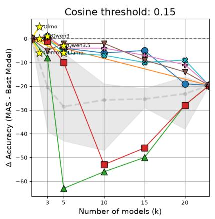

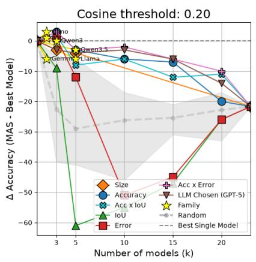  
Figure 6: We show the MAS gain across groupings of $C _ { s , k }$ with three different cosine distance thresholds on FrontierScience-Olympiad

Accuracy - Majority voting across cosine thresholds - FS  
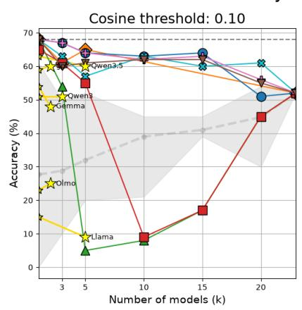

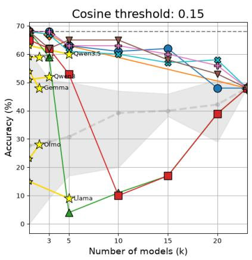

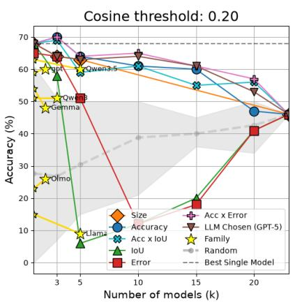  
Figure 7: We show the overall accuracy across groupings of $C _ { s , k }$ with three different cosine distance thresholds on FrontierScience-Olympiad

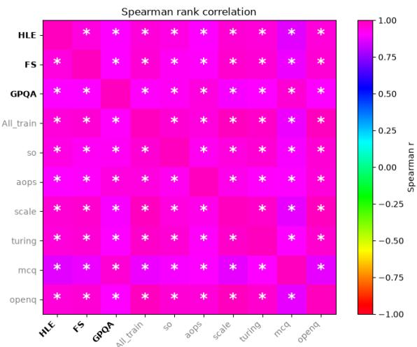  
Figure 8: We see high $( p < 1 0 ^ { - 5 } , r > 0 . 9 )$ correlation between our training data and all three test datas.

## A.6 Generalist vs Specialist Model Performance

We present the results of comparing generalist and specialist models of a shared architecture in Figure 11 (as is shown in the main article) and generalist and specialist models of different architectures (but comparable performance) in Figure 12. We see that the specialist models typically do not outperform the ‘generalist’ models in their specialised domains, but tend to have relatively equivalent performance across all annotated topics. The most striking difference in performance across topics is our reasoning generalist, Olmo3-7B’s, increased performance on mathematics data.

## A.7 Subset Identities

We present the identities of each model evaluated in each described subset, in each of the evaluated sizes, in Tables 2 to 4. All subsets, at least in smaller sizes $( k < 1 0 )$ , have distinct model combinations.

## B Results on all datasets

## B.1 Oracle Performance

We show the oracle performance of each MAS on HLE in Figure 13, on FS in Figure 14, and on GPQA in Figure 15. On average, performance is highest on GPQA, followed closely by FS. Given the low overhead available on GPQA for improvement, we see the greatest prophesized improvements on HLE and FS. Typically, we see the greatest predicted MAS gains when grouping by Accu-racy or LLM suggestions ▼ . Typically, we see limited prophesized improvements when grouping by shared architecture ; once exception is on GPQA with the Llama family. As this is the easiest science reasoning dataset, this may arise from successful responses from our specialist Llama-based models.

## B.2 Actual Performance

We show the actual performance of each MAS on HLE in Figures 16 and 17, on FS in Figures 18 and 19, and on GPQA in Figures 20 and 21. We see the steepest decrease in performance with increasing k on HLE. MAS built from the gemma4 family of models showed the best performance. When we look at FS, we see a limited drop in our routing system performance, and we actually see an improvement above the base model for $C _ { I o U , 1 5 }$ The OLMo3 family shows an improvement in performance in the majority-vote system, and IoU ▲ and Error based grouping shows steep decreases in performance (as these groupings optimise for response diversity, it makes sense it would be difficult to get a robust majority response). LLMas-a-Judge MAS groups identified using accuracybased metrics ( ✖✚) also show an improvement over base-model performance on FS. Performance on GPQA follows a similar pattern for the other two models: prioritising IoU ▲ has a limited neg- ative effect on routing systems at low k, but has a strong detrimental impact on majority-vote MAS. Like on FS, we also see an improvement over our base model with $C _ { A c c , 5 }$ for LLM-as-a-Judge MAS on GPQA. Overall, we see a starker difference in performance when we look at MAS gain, rather than accuracy. However, we still see drops in performance with increasing levels of k.

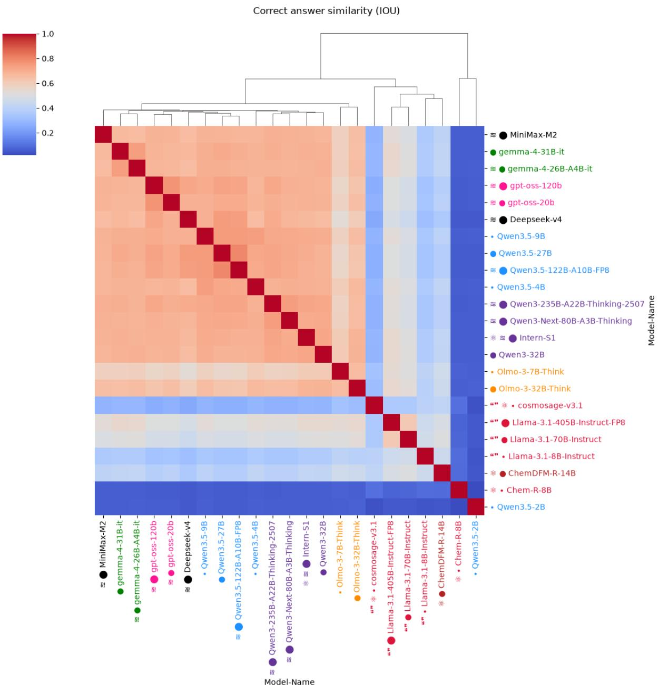  
Figure 9: Clustered IoU Performance

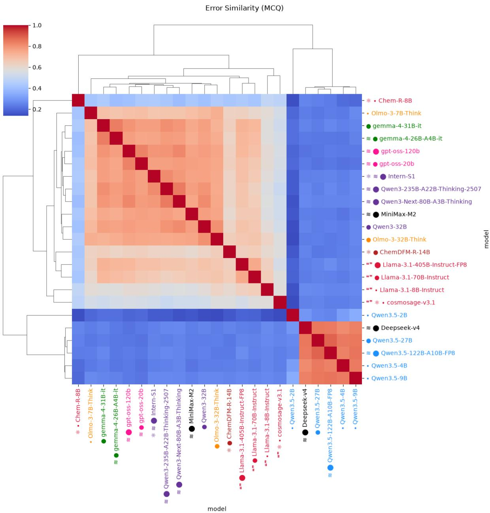  
Figure 10: Clustered Error Performance

<table><tr><td colspan="5" rowspan="1">Run-Name         Model-List</td></tr><tr><td colspan="5" rowspan="1">All                'ChemDFM-R-14B', 'gpt-oss-120b', 'Qwen3-235B-A22B-Thinking-2507', 'MiniMax-M2', 'Qwen3-Next-80B-A3B-Thinking','Chem-R-8B', 'gpt-oss-20b', 'cosmosage-v3.1', 'Intern-S1', 'Llama-3.1-8B-Instruct', 'Llama-3.1-70B-Instruct', 'Llama-3.1-405B-Instruct-FP8', 'Qwen3.5-122B-A10B-FP8', 'Qwen3.5-27B', 'Qwen3.5-9B’, 'Qwen3.5-4B’, 'Qwen3.5-2B', 'Olmo-3-32B-Think','Olmo-3-7B-Think', 'gemma-4-26B-A4B-it', 'gemma-4-31B-it', 'Deepseek-v4'</td></tr><tr><td colspan="5" rowspan="9">Accuracy x IoU-3     'Deepseek-v4', 'Qwen3.5-2B', 'gpt-oss-120b'Accuracy x IoU-5     'Deepseek-v4', 'Qwen3.5-2B', 'gpt-oss-120b', 'Qwen3.5-122B-A10B-FP8', 'Qwen3-235B-A22B-Thinking-2507'Accuracy x IoU-10   'Deepseek-v4', 'Qwen3.5-2B', 'gpt-oss-120b', 'Qwen3.5-122B-A10B-FP8', 'Qwen3-235B-A22B-Thinking-2507', 'Chem-R-8B','Qwen3.5-27B', 'gpt-oss-20b', 'MiniMax-M2', 'gemma-4-31B-it'Accuracy x IoU-15   'Deepseek-v4’, 'Qwen3.5-2B’, 'gpt-oss-120b’, 'Qwen3.5-122B-A10B-FP8’, 'Qwen3-235B-A22B-Thinking-2507’, 'Chem-R-8B’,'Qwen3.5-27B', 'gpt-oss-20b', 'MiniMax-M2', 'gemma-4-31B-it', 'cosmosage-v3.1', 'Qwen3-Next-80B-A3B-Thinking', 'Qwen3.5-9B', 'Intern-S1', 'gemma-4-26B-A4B-it'Accuracy x IoU-20   'Deepseek-v4', 'Qwen3.5-2B', 'gpt-oss-120b', 'Qwen3.5-122B-A10B-FP8', 'Qwen3-235B-A22B-Thinking-2507', 'Chem-R-8B','Qwen3.5-27B', 'gpt-oss-20b', 'MiniMax-M2', 'gemma-4-31B-it', 'cosmosage-v3.1', 'Qwen3-Next-80B-A3B-Thinking', 'Qwen3.5-9B', 'Intern-S1', 'gemma-4-26B-A4B-it', 'Llama-3.1-8B-Instruct', 'Qwen3-32B', 'Qwen3.5-4B', 'ChemDFM-R-14B', 'Olmo-3-32B-Think'</td></tr><tr><td colspan="1" rowspan="1"></td></tr><tr><td colspan="1" rowspan="1">Accuracy x IoU-15</td></tr><tr><td colspan="1" rowspan="1"></td></tr><tr><td colspan="1" rowspan="1"></td></tr><tr><td colspan="1" rowspan="1">Accuracy x IoU-20</td><td colspan="3" rowspan="1">Deepseek-v4', 'Qwen3.5-2B'</td></tr><tr><td colspan="1" rowspan="1"></td><td colspan="3" rowspan="1">Qwen3.5-27B', 'gpt-oss-20b',</td></tr><tr><td colspan="1" rowspan="1"></td><td colspan="3" rowspan="1">9B', 'Intern-S1', 'gemma-4-26]</td></tr><tr><td colspan="1" rowspan="1"></td><td colspan="3" rowspan="1"></td></tr><tr><td colspan="1" rowspan="1">Accuracy-3</td><td colspan="3" rowspan="1">'Deepseek-v4', 'gpt-oss-120b&amp;</td><td colspan="1" rowspan="11">#x27;, 'Qwen3.5-122B-A10B-FP8'b', 'Qwen3.5-122B-A10B-FP8', 'Qwen3.5-27B', 'Qwen3-235B-A22B-Thinking-2507'', 'Qwen3.5-122B-A10B-FP8’, 'Qwen3.5-27B’, 'Qwen3-235B-A22B-Thinking-2507', 'gpt-oss-20b’,'Deepseek-v4', 'gpt-oss-120b', 'Qwen3.5-122B-A10B-FP8', 'Qwen3.5-27B', 'Qwen3-235B-A22B-Thinking-2507', 'gpt-oss-20b','Qwen3-Next-80B-A3B-Thinking', 'Qwen3.5-9B', 'gemma-4-31B-it', 'Qwen3-32B', 'Intern-S1', 'MiniMax-M2', 'gemma-4-26B-o-3-32B-Think'0b’, 'Qwen3.5-122B-A10B-FP8’, 'Qwen3.5-27B’, 'Qwen3-235B-A22B-Thinking-2507’, 'gpt-oss-20b’,27;Qwen3.5-9B', 'gemma-4-31B-it', 'Qwen3-32B', 'Intern-S1', 'MiniMax-M2', 'gemma-4-26B-A4B--32B-Think', 'Olmo-3-7B-Think', 'Llama-3.1-405B-Instruct-FP8', 'Llama-3.1-70B-Instruct', 'ChemDFM-</td></tr><tr><td colspan="1" rowspan="1">Accuracy-5</td><td colspan="3" rowspan="1">'Deepseek-v4', 'gpt-oss-120</td></tr><tr><td colspan="1" rowspan="1">Accuracy-10</td><td colspan="3" rowspan="1">'Deepseek-v4’, 'gpt-oss-120b</td></tr><tr><td colspan="1" rowspan="1"></td><td colspan="3" rowspan="1"></td></tr><tr><td colspan="1" rowspan="1">Accuracy-15</td><td colspan="1" rowspan="1">Deepseek-v4',</td><td colspan="2" rowspan="1">'gpt-oss-120b', 'Qwen3.5-122</td></tr><tr><td colspan="1" rowspan="1"></td><td colspan="1" rowspan="1">Qwen3-Next-8</td><td colspan="2" rowspan="1"></td></tr><tr><td colspan="1" rowspan="1"></td><td colspan="1" rowspan="1">A4B-it', 'Qwen</td><td colspan="2" rowspan="1">3.5-4B', 'Olm</td></tr><tr><td colspan="1" rowspan="1">Accuracy-20</td><td colspan="1" rowspan="1">'Deepseek-v4’</td><td colspan="2" rowspan="1">, 'gpt-oss-12</td></tr><tr><td colspan="1" rowspan="1"></td><td colspan="1" rowspan="1">'Qwen3-Next-80B-A</td><td colspan="1" rowspan="1">3B-Thinking</td><td colspan="1" rowspan="1">', &amp;#x</td></tr><tr><td colspan="1" rowspan="1"></td><td colspan="1" rowspan="1">it', 'Qwen3.5-</td><td colspan="1" rowspan="1">4B', &amp;#x&lt;/td&gt;&lt;td rowspan=1 colspan=1&gt;27;Olmo-3&lt;/td&gt;&lt;/tr&gt;&lt;tr&gt;&lt;td rowspan=1 colspan=1&gt;&lt;/td&gt;&lt;td rowspan=1 colspan=1&gt;R-14B&amp;#x27;, &amp;#x27;Llama&lt;/td&gt;&lt;td rowspan=1 colspan=1&gt;-3.1-8B-Instr&lt;/td&gt;&lt;td rowspan=1 colspan=1&gt;uct&amp;#x27;&lt;/td&gt;&lt;/tr&gt;&lt;tr&gt;&lt;td rowspan=1 colspan=1&gt;Accuracy x Error-3&lt;/td&gt;&lt;td rowspan=1 colspan=1&gt;&amp;#x27;Deepseek-v4&amp;#x27&lt;/td&gt;&lt;td rowspan=1 colspan=1&gt;;, &amp;#x27;gpt-o&lt;/td&gt;&lt;td rowspan=1 colspan=1&gt;ss-120b&amp;&lt;/td&gt;&lt;td rowspan=11 colspan=1&gt;#x27;, &amp;#x27;Qwen3.5-122B-A10B-FP8&amp;#x27;b&amp;#x27;, &amp;#x27;Qwen3.5-122B-A10B-FP8&amp;#x27;, &amp;#x27;Qwen3-235B-A22B-Thinking-2507&amp;#x27;, &amp;#x27;Qwen3.5-27B&amp;#x27;&amp;#x27;, &amp;#x27;Qwen3.5-122B-A10B-FP8&amp;#x27;, &amp;#x27;Qwen3-235B-A22B-Thinking-2507&amp;#x27;, &amp;#x27;Qwen3.5-27B&amp;#x27;, &amp;#x27;gpt-oss-20b&amp;#x27;,x27;Qwen3.5-9B&amp;#x27;, &amp;#x27;MiniMax-M2&amp;#x27;, &amp;#x27;Qwen3.5-4B&amp;#x27;b&amp;#x27;, &amp;#x27;Qwen3.5-122B-A10B-FP8’, &amp;#x27;Qwen3-235B-A22B-Thinking-2507’, &amp;#x27;Qwen3.5-27B’, &amp;#x27;gpt-oss-20b’,27;Qwen3.5-9B&amp;#x27;, &amp;#x27;MiniMax-M2&amp;#x27;, &amp;#x27;Qwen3.5-4B&amp;#x27;, &amp;#x27;gemma-4-31B-it&amp;#x27;, &amp;#x27;Qwen3-32B&amp;#x27;, &amp;#x27;Qwen3.5-2B&amp;#x27;,&amp;#x27;&amp;#x27;, &amp;#x27;Qwen3.5-122B-A10B-FP8&amp;#x27;, &amp;#x27;Qwen3-235B-A22B-Thinking-2507&amp;#x27;, &amp;#x27;Qwen3.5-27B&amp;#x27;, &amp;#x27;gpt-oss-20b&amp;#x27;,#x27;Qwen3.5-9B&amp;#x27;, &amp;#x27;MiniMax-M2&amp;#x27;, &amp;#x27;Qwen3.5-4B&amp;#x27;, &amp;#x27;gemma-4-31B-it&amp;#x27;, &amp;#x27;Qwen3-32B&amp;#x27;, &amp;#x27;Qwen3.5-7;Intern-S1&amp;#x27;, &amp;#x27;Olmo-3-32B-Think&amp;#x27;, &amp;#x27;Olmo-3-7B-Think&amp;#x27;, &amp;#x27;Chem-R-8B&amp;#x27;, &amp;#x27;Llama-3.1-405B-Instruct-FP8&amp;#x27;,&lt;/td&gt;&lt;/tr&gt;&lt;tr&gt;&lt;td rowspan=1 colspan=1&gt;Accuracy x Error-5&lt;/td&gt;&lt;td rowspan=1 colspan=1&gt;&amp;#x27;Deepseek-v4&amp;#x2&lt;/td&gt;&lt;td rowspan=1 colspan=1&gt;7;, &amp;#x27;gpt&lt;/td&gt;&lt;td rowspan=1 colspan=1&gt;-oss-120&lt;/td&gt;&lt;/tr&gt;&lt;tr&gt;&lt;td rowspan=1 colspan=1&gt;Accuracy x Error-10&lt;/td&gt;&lt;td rowspan=1 colspan=1&gt;&amp;#x27;Deepseek-v4&amp;#x2&lt;/td&gt;&lt;td rowspan=1 colspan=1&gt;7;, &amp;#x27;gpt-&lt;/td&gt;&lt;td rowspan=1 colspan=1&gt;oss-120b&lt;/td&gt;&lt;/tr&gt;&lt;tr&gt;&lt;td rowspan=1 colspan=1&gt;&lt;/td&gt;&lt;td rowspan=1 colspan=1&gt;&amp;#x27;Qwen3-Next-80B-A&lt;/td&gt;&lt;td rowspan=1 colspan=2&gt;3B-Thinking&amp;#x27;, &amp;#&lt;/td&gt;&lt;/tr&gt;&lt;tr&gt;&lt;td rowspan=1 colspan=1&gt;Accuracy x Error-15&lt;/td&gt;&lt;td rowspan=1 colspan=1&gt;&amp;#x27;Deepseek-v4’&lt;/td&gt;&lt;td rowspan=1 colspan=1&gt;, &amp;#x27;gpt-&lt;/td&gt;&lt;td rowspan=1 colspan=1&gt;oss-120&lt;/td&gt;&lt;/tr&gt;&lt;tr&gt;&lt;td rowspan=1 colspan=1&gt;&lt;/td&gt;&lt;td rowspan=1 colspan=1&gt;&amp;#x27;Qwen3-Next-80B-A&lt;/td&gt;&lt;td rowspan=1 colspan=1&gt;3B-Thinking&amp;&lt;/td&gt;&lt;td rowspan=1 colspan=1&gt;#x27;, &amp;#x&lt;/td&gt;&lt;/tr&gt;&lt;tr&gt;&lt;td rowspan=1 colspan=1&gt;&lt;/td&gt;&lt;td rowspan=1 colspan=1&gt;&amp;#x27;gemma-4-26B-A4B-it&lt;/td&gt;&lt;td rowspan=1 colspan=1&gt;&amp;#x27;, &amp;#x27;&lt;/td&gt;&lt;td rowspan=1 colspan=1&gt;Intern-S1&lt;/td&gt;&lt;/tr&gt;&lt;tr&gt;&lt;td rowspan=1 colspan=1&gt;Accuracy x Error-20&lt;/td&gt;&lt;td rowspan=1 colspan=1&gt;&amp;#x27;Deepseek-v4&amp;#x2&lt;/td&gt;&lt;td rowspan=1 colspan=2&gt;7;, &amp;#x27;gpt-oss-120b&lt;/td&gt;&lt;/tr&gt;&lt;tr&gt;&lt;td rowspan=1 colspan=1&gt;&lt;/td&gt;&lt;td rowspan=1 colspan=1&gt;&amp;#x27;Qwen3-Next-80B-&lt;/td&gt;&lt;td rowspan=1 colspan=2&gt;A3B-Thinking&amp;#x27;, &amp;&lt;/td&gt;&lt;/tr&gt;&lt;tr&gt;&lt;td rowspan=1 colspan=1&gt;&lt;/td&gt;&lt;td rowspan=1 colspan=1&gt;2B&amp;#x27;, &amp;#x27;gemma-4&lt;/td&gt;&lt;td rowspan=1 colspan=2&gt;-26B-A4B-it&amp;#x27;, &amp;#x2&lt;/td&gt;&lt;/tr&gt;&lt;tr&gt;&lt;td rowspan=1 colspan=1&gt;&lt;/td&gt;&lt;td rowspan=1 colspan=1&gt;&amp;#x27;cosmosage-v3.1&amp;#x&lt;/td&gt;&lt;td rowspan=1 colspan=2&gt;27;&lt;/td&gt;&lt;/tr&gt;&lt;tr&gt;&lt;td rowspan=1 colspan=1&gt;Error-3&lt;/td&gt;&lt;td rowspan=1 colspan=1&gt;Qwen3.5-2B',&lt;/td&gt;&lt;td rowspan=4 colspan=3&gt;&amp;#x27;Qwen3.5-2B&amp;#x27;, &amp;#x27;MiniMax-M2&amp;#x27;, &amp;#x27;Qwen3.5-27B&amp;#x27;&lt;/td&gt;&lt;/tr&gt;&lt;tr&gt;&lt;td rowspan=1 colspan=1&gt;Error-5&lt;/td&gt;&lt;td rowspan=1 colspan=1&gt;Qwen3.5-2B',&lt;/td&gt;&lt;td rowspan=19 colspan=3&gt;&amp;#x27;Olmo-3-7B-Think&amp;#x27;, &amp;#x27;Llama-3.1-70B-Instruct&amp;#x27;, &amp;#x27;Olmo-3-32B-Think&amp;#x27;&amp;#x27;Qwen3.5-2B&amp;#x27;, &amp;#x27;MiniMax-M2&amp;#x27;, &amp;#x27;Qwen3.5-27B&amp;#x27;, &amp;#x27;Chem-R-8B&amp;#x27;, &amp;#x27;cosmosage-v3.1&amp;#x27;, &amp;#x27;Llama-3.1-8B-Instruct&amp;#x27;, &amp;#x27;ChemDFM-R-14B&amp;#x27;,&amp;#x27;Olmo-3-7B-Think&amp;#x27;, &amp;#x27;Llama-3.1-70B-Instruct&amp;#x27;, &amp;#x27;Olmo-3-32B-Think&amp;#x27;, &amp;#x27;Llama-3.1-405B-Instruct-FP8&amp;#x27;, &amp;#x27;gpt-oss-20b&amp;#x27;, &amp;#x27;gemma-4-31B-it&amp;#x27;,&amp;#x27;Qwen3-32B&amp;#x27;, &amp;#x27;Qwen3-Next-80B-A3B-Thinking&amp;#x27;&amp;#x27;Qwen3.5-2B&amp;#x27;, &amp;#x27;MiniMax-M2&amp;#x27;, &amp;#x27;Qwen3.5-27B&amp;#x27;, &amp;#x27;Chem-R-8B&amp;#x27;, &amp;#x27;cosmosage-v3.1&amp;#x27;, &amp;#x27;Llama-3.1-8B-Instruct&amp;#x27;, &amp;#x27;ChemDFM-R-14B&amp;#x27;,&amp;#x27;Olmo-3-7B-Think&amp;#x27;, &amp;#x27;Llama-3.1-70B-Instruct&amp;#x27;, &amp;#x27;Olmo-3-32B-Think&amp;#x27;, &amp;#x27;Llama-3.1-405B-Instruct-FP8&amp;#x27;, &amp;#x27;gpt-oss-20b&amp;#x27;, &amp;#x27;gemma-4-31B-it&amp;#x27;,&amp;#x27;Qwen3-32B&amp;#x27;, &amp;#x27;Qwen3-Next-80B-A3B-Thinking&amp;#x27;, &amp;#x27;Intern-S1&amp;#x27;, &amp;#x27;Qwen3.5-4B&amp;#x27;, &amp;#x27;Qwen3.5-9B&amp;#x27;, &amp;#x27;Deepseek-v4&amp;#x27;, &amp;#x27;gemma-4-26B-A4B-it&amp;#x27;&amp;#x27;Chem-R-8B&amp;#x27;, &amp;#x27;Qwen3.5-2B&amp;#x27;, &amp;#x27;Deepseek-v4&amp;#x27;&amp;#x27;Chem-R-8B’, &amp;#x27;Qwen3.5-2B&amp;#x27;, &amp;#x27;Deepseek-v4&amp;#x27;, &amp;#x27;cosmosage-v3.1&amp;#x27;, &amp;#x27;Llama-3.1-8B-Instruct&amp;#x27;&amp;#x27;Chem-R-8B&amp;#x27;, &amp;#x27;Qwen3.5-2B&amp;#x27;, &amp;#x27;Deepseek-v4&amp;#x27;, &amp;#x27;cosmosage-v3.1&amp;#x27;, &amp;#x27;Llama-3.1-8B-Instruct&amp;#x27;, &amp;#x27;ChemDFM-R-14B&amp;#x27;, &amp;#x27;Llama-3.1-405B-Instruct-FP8&amp;#x27;, &amp;#x27;Olmo-3-7B-Think&amp;#x27;, &amp;#x27;Llama-3.1-70B-Instruct&amp;#x27;, &amp;#x27;MiniMax-M2&amp;#x27;&amp;#x27;Chem-R-8B&amp;#x27;, &amp;#x27;Qwen3.5-2B&amp;#x27;, &amp;#x27;Deepseek-v4&amp;#x27;, &amp;#x27;cosmosage-v3.1&amp;#x27;, &amp;#x27;Llama-3.1-8B-Instruct&amp;#x27;, &amp;#x27;ChemDFM-R-14B&amp;#x27;, &amp;#x27;Llama-3.1-405B-Instruct-FP8&amp;#x27;, &amp;#x27;Olmo-3-7B-Think&amp;#x27;, &amp;#x27;Llama-3.1-70B-Instruct&amp;#x27;, &amp;#x27;MiniMax-M2&amp;#x27;, &amp;#x27;gemma-4-26B-A4B-it&amp;#x27;, &amp;#x27;Olmo-3-32B-Think&amp;#x27;, &amp;#x27;gpt-oss-20b&amp;#x27;, &amp;#x27;Qwen3-Next-80B-A3B-Thinking&amp;#x27;, &amp;#x27;Qwen3.5-4B&amp;#x27;&amp;#x27;Chem-R-8B&amp;#x27;, &amp;#x27;Qwen3.5-2B&amp;#x27;, &amp;#x27;Deepseek-v4&amp;#x27;, &amp;#x27;cosmosage-v3.1&amp;#x27;, &amp;#x27;Llama-3.1-8B-Instruct&amp;#x27;, &amp;#x27;ChemDFM-R-14B&amp;#x27;, &amp;#x27;Llama-3.1-405B-Instruct-FP8&amp;#x27;, &amp;#x27;Olmo-3-7B-Think&amp;#x27;, &amp;#x27;Llama-3.1-70B-Instruct&amp;#x27;, &amp;#x27;MiniMax-M2&amp;#x27;, &amp;#x27;gemma-4-26B-A4B-it&amp;#x27;, &amp;#x27;Olmo-3-32B-Think&amp;#x27;, &amp;#x27;gpt-oss-20b&amp;#x27;, &amp;#x27;Qwen3-Next-80B-A3B-Thinking&amp;#x27;, &amp;#x27;Qwen3.5-4B&amp;#x27;, &amp;#x27;Intern-S1&amp;#x27;, &amp;#x27;Qwen3.5-27B&amp;#x27;, &amp;#x27;Qwen3.5-9B&amp;#x27;, &amp;#x27;Qwen3-32B&amp;#x27;, &amp;#x27;gemma-4-31B-it&amp;#x27;&lt;/td&gt;&lt;/tr&gt;&lt;tr&gt;&lt;td rowspan=1 colspan=1&gt;Error-10&lt;/td&gt;&lt;td rowspan=1 colspan=1&gt;Qwen3.5-2B'&lt;/td&gt;&lt;/tr&gt;&lt;tr&gt;&lt;td rowspan=1 colspan=1&gt;&lt;/td&gt;&lt;td rowspan=1 colspan=1&gt;Olmo-3-7B-Tl&lt;/td&gt;&lt;/tr&gt;&lt;tr&gt;&lt;td rowspan=1 colspan=1&gt;Error-15&lt;/td&gt;&lt;td rowspan=1 colspan=1&gt;Qwen3.5-2B'&lt;/td&gt;&lt;/tr&gt;&lt;tr&gt;&lt;td rowspan=1 colspan=1&gt;&lt;/td&gt;&lt;td rowspan=1 colspan=1&gt;Olmo-3-7B-Th&lt;/td&gt;&lt;/tr&gt;&lt;tr&gt;&lt;td rowspan=1 colspan=1&gt;&lt;/td&gt;&lt;td rowspan=1 colspan=1&gt;Qwen3-32B',&lt;/td&gt;&lt;/tr&gt;&lt;tr&gt;&lt;td rowspan=1 colspan=1&gt;Error-20&lt;/td&gt;&lt;td rowspan=1 colspan=1&gt;Qwen3.5-2B'&lt;/td&gt;&lt;/tr&gt;&lt;tr&gt;&lt;td rowspan=1 colspan=1&gt;&lt;/td&gt;&lt;td rowspan=1 colspan=1&gt;Olmo-3-7B-Tk&lt;/td&gt;&lt;/tr&gt;&lt;tr&gt;&lt;td rowspan=1 colspan=1&gt;&lt;/td&gt;&lt;td rowspan=1 colspan=1&gt;Qwen3-32B',&lt;/td&gt;&lt;/tr&gt;&lt;tr&gt;&lt;td rowspan=1 colspan=1&gt;IoU-3&lt;/td&gt;&lt;td rowspan=1 colspan=1&gt;Chem-R-8B',&lt;/td&gt;&lt;/tr&gt;&lt;tr&gt;&lt;td rowspan=1 colspan=1&gt;IoU-5&lt;/td&gt;&lt;td rowspan=1 colspan=1&gt;Chem-R-8B',&lt;/td&gt;&lt;td rowspan=1 colspan=1&gt;&lt;/td&gt;&lt;/tr&gt;&lt;tr&gt;&lt;td rowspan=1 colspan=1&gt;IoU-10&lt;/td&gt;&lt;td rowspan=1 colspan=1&gt;Chem-R-8B',&lt;/td&gt;&lt;/tr&gt;&lt;tr&gt;&lt;td rowspan=1 colspan=1&gt;&lt;/td&gt;&lt;td&gt;&lt;/td&gt;&lt;/tr&gt;&lt;tr&gt;&lt;td rowspan=1 colspan=1&gt;IoU-15&lt;/td&gt;&lt;td rowspan=1 colspan=1&gt;Chem-R-8B'&lt;/td&gt;&lt;/tr&gt;&lt;tr&gt;&lt;td rowspan=1 colspan=1&gt;&lt;/td&gt;&lt;td rowspan=1 colspan=1&gt;[nstruct-FP8',&lt;/td&gt;&lt;/tr&gt;&lt;tr&gt;&lt;td rowspan=1 colspan=1&gt;&lt;/td&gt;&lt;td rowspan=1 colspan=1&gt;20b', 'Qwen3.&lt;/td&gt;&lt;/tr&gt;&lt;tr&gt;&lt;td rowspan=1 colspan=1&gt;IoU-20&lt;/td&gt;&lt;td rowspan=1 colspan=1&gt;Chem-R-8B'&lt;/td&gt;&lt;/tr&gt;&lt;tr&gt;&lt;td rowspan=1 colspan=1&gt;&lt;/td&gt;&lt;td rowspan=1 colspan=1&gt;Instruct-FP8',&lt;/td&gt;&lt;/tr&gt;&lt;tr&gt;&lt;td rowspan=1 colspan=1&gt;&lt;/td&gt;&lt;td&gt;&lt;/td&gt;&lt;/tr&gt;&lt;/table&gt;</td></tr><tr><td colspan="9" rowspan="1">LLMchosen-GPT5-3    'Deepseek-v4', 'gemma-4-31B-it', 'gpt-oss-120b'</td></tr><tr><td colspan="9" rowspan="9">LLMchosen-GPT5-5    'Deepseek-v4’, 'Qwen3.5-122B-A10B-FP8', 'gemma-4-31B-it', 'Qwen3-235B-A22B-Thinking-2507', 'gpt-oss-120b''Deepseek-v4', 'Qwen3.5-122B-A10B-FP8', 'gemma-4-31B-it', 'gpt-oss-120b', 'Intern-S1', 'Qwen3-235B-A22B-Thinking-2507','MiniMax-M2', 'Qwen3.5-27B', 'Qwen3-Next-80B-A3B-Thinking', 'ChemDFM-R-14B''Deepseek-v4', 'Qwen3.5-122B-A10B-FP8', 'gemma-4-31B-it', 'gpt-oss-120b', 'Intern-S1', 'Qwen3-235B-A22B-Thinking-2507','Qwen3.5-27B', 'gemma-4-26B-A4B-it', 'ChemDFM-R-14B', 'Qwen3.5-9B', 'MiniMax-M2', 'Qwen3-Next-80B-A3B-Thinking','Chem-R-8B', 'gpt-oss-20b', 'Qwen3.5-4B'LLMchosen-GPT5-20  'Deepseek-v4', 'Qwen3.5-122B-A10B-FP8', 'gemma-4-31B-it', 'gpt-oss-120b', 'Intern-S1', 'Qwen3.5-27B', 'Qwen3-235B-A22B-Thinking-2507', 'MiniMax-M2', 'gemma-4-26B-A4B-it', 'ChemDFM-R-14B', 'Qwen3-Next-80B-A3B-Thinking', 'Chem-R-8B','Qwen3.5-9B', 'gpt-oss-20b', 'Qwen3-32B', 'Olmo-3-32B-Think', 'Llama-3.1-405B-Instruct-FP8', 'Qwen3.5-4B', 'cosmosage-v3.1','Llama-3.1-70B-Instruct'LRMS-all            'Intern-S1', 'MiniMax-M2', 'Qwen3.5-122B-A10B-FP8', 'gpt-oss-120b', 'Qwen3-Next-80B-A3B-Thinking', 'Olmo-3-32B-Think','gemma-4-31B-it', 'Deepseek-v4'</td></tr><tr><td colspan="6" rowspan="1"></td></tr><tr><td colspan="6" rowspan="1"></td></tr><tr><td colspan="6" rowspan="1">LLMchosen-GPT5-15'Deepseek-v4'</td></tr><tr><td colspan="6" rowspan="1"></td></tr><tr><td colspan="6" rowspan="1"></td></tr><tr><td colspan="6" rowspan="1"></td></tr><tr><td colspan="1" rowspan="1">LRMS-all</td><td colspan="5" rowspan="1">'Intern-S1', 'M</td></tr><tr><td colspan="1" rowspan="1"></td><td colspan="5" rowspan="1">gemma-4-31B</td></tr><tr><td colspan="1" rowspan="1">LRMs-3</td><td colspan="1" rowspan="1">'Deepseek-v4',</td><td colspan="7" rowspan="1">'Intern-S1', 'MiniMax-M2'</td></tr><tr><td colspan="1" rowspan="1">LRMs-5</td><td colspan="1" rowspan="1">'Deepseek-v4</td><td colspan="7" rowspan="1">7;, 'Intern-S1', 'MiniMax-M2', 'Qwen3.5-122B-A10B-FP8', 'gpt-oss-120b</td></tr><tr><td colspan="1" rowspan="1">Random-0-3</td><td colspan="1" rowspan="1">Qwen3.5-9B'</td><td colspan="7" rowspan="11">'Qwen3.5-9B', 'Llama-3.1-8B-Instruct', 'Qwen3-235B-A22B-Thinking-2507''Qwen3.5-9B', 'Llama-3.1-8B-Instruct', 'Qwen3-235B-A22B-Thinking-2507', 'MiniMax-M2', 'Qwen3-32B''Qwen3.5-9B', 'Llama-3.1-8B-Instruct', 'Qwen3-235B-A22B-Thinking-2507', 'MiniMax-M2', 'Qwen3-32B', 'Qwen3.5-2B', 'gpt-oss-20b', 'Deepseek-v4', 'ChemDFM-R-14B', 'Intern-S1''Qwen3.5-9B', 'Llama-3.1-8B-Instruct', 'Qwen3-235B-A22B-Thinking-2507', 'MiniMax-M2', 'Qwen3-32B', 'Qwen3.5-2B', 'gpt-oss-20b', 'Deepseek-v4', 'ChemDFM-R-14B', 'Intern-S1', 'Qwen3.5-122B-A10B-FP8', 'Chem-R-8B', 'Llama-3.1-405B-Instruct-FP8', 'cosmosage-v3.1', 'Qwen3.5-4B''Qwen3.5-9B', 'Llama-3.1-8B-Instruct', 'Qwen3-235B-A22B-Thinking-2507', 'MiniMax-M2', 'Qwen3-32B', 'Qwen3.5-2B', 'gpt-oss-20b', 'Deepseek-v4', 'ChemDFM-R-14B', 'Intern-S1', 'Qwen3.5-122B-A10B-FP8', 'Chem-R-8B', 'Llama-3.1-405B-Instruct-FP8', 'cosmosage-v3.1', 'Qwen3.5-4B', 'Olmo-3-7B-Think', 'Olmo-3-32B-Think', 'gpt-oss-120b', 'Llama-3.1-70B-Instruct','Qwen3-Next-80B-A3B-Thinking'</td></tr><tr><td colspan="1" rowspan="1">Random-0-5</td><td colspan="1" rowspan="1">Qwen3.5-9B'</td><td colspan="6" rowspan="1">'Llama-3.1-8B-Instruct', 'Qwen3-</td></tr><tr><td colspan="1" rowspan="1">Random-0-10</td><td colspan="1" rowspan="1">Qwen3.5-9B',</td><td colspan="6" rowspan="1"></td></tr><tr><td colspan="1" rowspan="1"></td><td colspan="7" rowspan="1">oss-20b', 'Dee</td></tr><tr><td colspan="1" rowspan="1">Random-0-15</td><td colspan="7"></td></tr><tr><td colspan="1" rowspan="1"></td><td colspan="7"></td></tr><tr><td colspan="1" rowspan="1"></td><td colspan="7"></td></tr><tr><td colspan="1" rowspan="1">Random-0-20</td><td colspan="7" rowspan="1">Qwen3.5-9B',</td></tr><tr><td colspan="1" rowspan="1"></td><td colspan="7" rowspan="1">oss-20b', 'Dee</td></tr><tr><td colspan="1" rowspan="1"></td><td colspan="7" rowspan="1">FP8', 'cosmos</td></tr><tr><td colspan="1" rowspan="1"></td><td colspan="7" rowspan="1">Qwen3-Next-8</td></tr><tr><td colspan="1" rowspan="1">Random-1-3</td><td colspan="1" rowspan="1">ChemDFM-R</td><td colspan="7" rowspan="11">'ChemDFM-R-14B', 'Llama-3.1-405B-Instruct-FP8', 'Chem-R-8B''ChemDFM-R-14B', 'Llama-3.1-405B-Instruct-FP8', 'Chem-R-8B', 'Qwen3.5-27B', 'Qwen3-32B''ChemDFM-R-14B', 'Llama-3.1-405B-Instruct-FP8', 'Chem-R-8B', 'Qwen3.5-27B', 'Qwen3-32B', 'MiniMax-M2', 'Olmo-3-7B-Think', 'Qwen3.5-4B', 'Qwen3.5-9B', 'gpt-oss-20b''ChemDFM-R-14B', 'Llama-3.1-405B-Instruct-FP8', 'Chem-R-8B', 'Qwen3.5-27B', 'Qwen3-32B', 'MiniMax-M2', 'Olmo-3-7B-Think', 'Qwen3.5-4B', 'Qwen3.5-9B', 'gpt-oss-20b', 'gemma-4-31B-it', 'Llama-3.1-8B-Instruct', 'gpt-oss-120b', 'Qwen3.5-2B',x27;cosmosage-v3.1''ChemDFM-R-14B', 'Llama-3.1-405B-Instruct-FP8', 'Chem-R-8B', 'Qwen3.5-27B', 'Qwen3-32B', 'MiniMax-M2', 'Olmo-3-7B-Think', 'Qwen3.5-4B', 'Qwen3.5-9B', 'gpt-oss-20b', 'gemma-4-31B-it', 'Llama-3.1-8B-Instruct', 'gpt-oss-120b', 'Qwen3.5-2B','cosmosage-v3.1', 'Qwen3-235B-A22B-Thinking-2507', 'Olmo-3-32B-Think', 'Intern-S1', 'Llama-3.1-70B-Instruct', 'Qwen3-Next-80B-A3B-Thinking'</td></tr><tr><td colspan="1" rowspan="1">Random-1-5</td><td colspan="7"></td></tr><tr><td colspan="1" rowspan="1">Random-1-10</td><td colspan="7"></td></tr><tr><td colspan="1" rowspan="1"></td><td colspan="7"></td></tr><tr><td colspan="1" rowspan="1">Random-1-15</td><td colspan="7"></td></tr><tr><td colspan="1" rowspan="1"></td><td colspan="7"></td></tr><tr><td colspan="1" rowspan="1">&amp;#</td><td colspan="7"></td></tr><tr><td colspan="1" rowspan="1">Random-1-20</td><td colspan="7"></td></tr><tr><td colspan="1" rowspan="1"></td><td colspan="7"></td></tr><tr><td colspan="1" rowspan="1"></td><td colspan="7"></td></tr><tr><td colspan="1" rowspan="1"></td><td colspan="7"></td></tr><tr><td colspan="1" rowspan="1">Random-2-3</td><td colspan="8" rowspan="14">'Llama-3.1-405B-Instruct-FP8', 'Chem-R-8B', 'gpt-oss-20b'Random-2-5          'Llama-3.1-405B-Instruct-FP8', 'Chem-R-8B', 'gpt-oss-20b', 'Llama-3.1-8B-Instruct', 'gemma-4-31B-it'Random-2-10         'Llama-3.1-405B-Instruct-FP8', 'Chem-R-8B', 'gpt-oss-20b', 'Llama-3.1-8B-Instruct', 'gemma-4-31B-it', 'Llama-3.1-70B-Instruct','Qwen3.5-122B-A10B-FP8', 'Olmo-3-7B-Think', 'Intern-S1', 'Deepseek-v4''Llama-3.1-405B-Instruct-FP8’, 'Chem-R-8B', 'gpt-oss-20b', 'Llama-3.1-8B-Instruct', 'gemma-4-31B-it', 'Llama-3.1-70B-Instruct','Qwen3.5-122B-A10B-FP8', 'Olmo-3-7B-Think', 'Intern-S1', 'Deepseek-v4', 'Qwen3-Next-80B-A3B-Thinking', 'Qwen3-235B-A22B-Thinking-2507', 'ChemDFM-R-14B’, 'Qwen3.5-27B', 'Qwen3.5-2B'Random-2-20         'Llama-3.1-405B-Instruct-FP8', 'Chem-R-8B', 'gpt-oss-20b', 'Llama-3.1-8B-Instruct', 'gemma-4-31B-it', 'Llama-3.1-70B-Instruct','Qwen3.5-122B-A10B-FP8', 'Olmo-3-7B-Think', 'Intern-S1', 'Deepseek-v4', 'Qwen3-Next-80B-A3B-Thinking', 'Qwen3-235B-A22B-Thinking-2507', 'ChemDFM-R-14B', 'Qwen3.5-27B', 'Qwen3.5-2B', 'gpt-oss-120b', 'MiniMax-M2', 'Qwen3.5-4B','gemma-4-26B-A4B-it', 'Qwen3.5-9B'Random-3-3          'Olmo-3-7B-Think', 'Qwen3.5-122B-A10B-FP8', 'Olmo-3-32B-Think'Random-3-5          'Olmo-3-7B-Think', 'Qwen3.5-122B-A10B-FP8', 'Olmo-3-32B-Think', 'MiniMax-M2', 'Llama-3.1-70B-Instruct''Olmo-3-7B-Think', 'Qwen3.5-122B-A10B-FP8', 'Olmo-3-32B-Think', 'MiniMax-M2', 'Llama-3.1-70B-Instruct', 'Qwen3.5-4B','Llama-3.1-8B-Instruct', 'gpt-oss-20b', 'gemma-4-31B-it', 'Qwen3.5-2B'Random-3-15         'Olmo-3-7B-Think', 'Qwen3.5-122B-A10B-FP8', 'Olmo-3-32B-Think', 'MiniMax-M2', 'Llama-3.1-70B-Instruct', 'Qwen3.5-4B','Llama-3.1-8B-Instruct', 'gpt-oss-20b', 'gemma-4-31B-it', 'Qwen3.5-2B', 'Chem-R-8B', 'Qwen3.5-27B', 'gemma-4-26B-A4B-it','Llama-3.1-405B-Instruct-FP8', 'cosmosage-v3.1'</td></tr><tr><td colspan="7" rowspan="1">Random-2-5</td></tr><tr><td colspan="7" rowspan="1">Random-2-10</td></tr><tr><td colspan="7" rowspan="1"></td></tr><tr><td colspan="7" rowspan="1">Random-2-15</td></tr><tr><td colspan="7" rowspan="1"></td></tr><tr><td colspan="7" rowspan="1">Random-2-20</td></tr><tr><td colspan="7" rowspan="1"></td></tr><tr><td colspan="7" rowspan="1"></td></tr><tr><td colspan="7" rowspan="1"></td></tr><tr><td colspan="7" rowspan="1">Random-3-3</td></tr><tr><td colspan="7" rowspan="1">Random-3-5</td></tr><tr><td colspan="1" rowspan="1">Random-3-10</td><td colspan="6" rowspan="2"></td></tr><tr><td colspan="6" rowspan="1"></td></tr></table>

Table 2: The models contained in each evaluated subset (Part 1)

Table 3: The models contained in each evaluated subset (Part 2)
<table><tr><td>Run-Name</td><td>Model-List</td></tr><tr><td>Random-3-20</td><td>&#x27;Olmo-3-7B-Think&#x27;, &#x27;Qwen3.5-122B-A10B-FP8&#x27;, &#x27;Olmo-3-32B-Think&#x27;, &#x27;MiniMax-M2&#x27;, &#x27;Llama-3.1-70B-Instruct&#x27;, &#x27;Qwen3.5-4B&#x27;, &#x27;Llama- 3.1-8B-Instruct&#x27;, &#x27;gpt-oss-20b&#x27;, &#x27;gemma-4-31B-it&#x27;, &#x27;Qwen3.5-2B&#x27;, &#x27;Chem-R-8B&#x27;, &#x27;Qwen3.5-27B&#x27;, &#x27;gemma-4-26B-A4B-it&#x27;, &#x27;Llama- 3.1-405B-Instruct-FP8&#x27;, &#x27;cosmosage-v3.1&#x27;, &#x27;Qwen3-235B-A22B-Thinking-2507&#x27;, &#x27;Qwen3-Next-80B-A3B-Thinking&#x27;, &#x27;gpt-oss-120b&#x27;, &#x27;ChemDFM-R-14B&#x27;, &#x27;Qwen3.5-9B&#x27;</td></tr><tr><td>Random-4-3</td><td>&#x27;Qwen3-32B’, &#x27;Llama-3.1-405B-Instruct-FP8&#x27;, &#x27;gpt-oss-120b&#x27;</td></tr><tr><td>Random-4-5 Random-4-10</td><td>&#x27;Qwen3-32B&#x27;, &#x27;Llama-3.1-405B-Instruct-FP8&#x27;, &#x27;gpt-oss-120b&#x27;, &#x27;Intern-S1&#x27;, &#x27;Qwen3.5-122B-A10B-FP8&#x27; &#x27;Qwen3-32B’, &#x27;Llama-3.1-405B-Instruct-FP8&#x27;, &#x27;gpt-oss-120b’, &#x27;Intern-S1’, &#x27;Qwen3.5-122B-A10B-FP8’, &#x27;Qwen3-Next-80B-A3B-</td></tr><tr><td></td><td>Thinking&#x27;, &#x27;Llama-3.1-8B-Instruct&#x27;, &#x27;Deepseek-v4&#x27;, &#x27;Qwen3.5-4B&#x27;, &#x27;Qwen3-235B-A22B-Thinking-2507&#x27; &#x27;Qwen3-32B&#x27;, &#x27;Llama-3.1-405B-Instruct-FP8&#x27;, &#x27;gpt-oss-120b&#x27;, &#x27;Intern-S1&#x27;, &#x27;Qwen3.5-122B-A10B-FP8&#x27;, &#x27;Qwen3-Next-80B-A3B-</td></tr><tr><td>Random-4-15</td><td>Thinking&#x27;, &#x27;Llama-3.1-8B-Instruct&#x27;, &#x27;Deepseek-v4&#x27;, &#x27;Qwen3.5-4B&#x27;, &#x27;Qwen3-235B-A22B-Thinking-2507&#x27;, &#x27;Llama-3.1-70B-Instruct&#x27;, &#x27;Olmo-3-32B-Think&#x27;, &#x27;Chem-R-8B&#x27;, &#x27;gemma-4-26B-A4B-it&#x27;, &#x27;gemma-4-31B-it&#x27;</td></tr><tr><td>Random-4-20</td><td>&#x27;Qwen3-32B&#x27;, &#x27;Llama-3.1-405B-Instruct-FP8&#x27;, &#x27;gpt-oss-120b&#x27;, &#x27;Intern-S1&#x27;, &#x27;Qwen3.5-122B-A10B-FP8&#x27;, &#x27;Qwen3-Next-80B-A3B- Thinking&#x27;, &#x27;Llama-3.1-8B-Instruct&#x27;, &#x27;Deepseek-v4&#x27;, &#x27;Qwen3.5-4B&#x27;, &#x27;Qwen3-235B-A22B-Thinking-2507&#x27;, &#x27;Llama-3.1-70B-Instruct&#x27;, &#x27;Olmo-3-32B-Think&#x27;, &#x27;Chem-R-8B&#x27;, &#x27;gemma-4-26B-A4B-it&#x27;, &#x27;gemma-4-31B-it&#x27;, &#x27;Olmo-3-7B-Think&#x27;, &#x27;Qwen3.5-9B&#x27;, &#x27;MiniMax-M2&#x27;, &#x27;Qwen3.5-2B&#x27;, &#x27;gpt-oss-20b&#x27;</td></tr><tr><td>Shared-Gemma</td><td>&#x27;gemma-4-26B-A4B-it&#x27;, &#x27;gemma-4-31B-it&#x27;</td></tr><tr><td>Shared-Llama</td><td>&#x27;Llama-3.1-8B-Instruct&#x27;, &#x27;Llama-3.1-70B-Instruct&#x27;, &#x27;Llama-3.1-405B-Instruct-FP8&#x27;, &#x27;cosmosage-v3.1&#x27;, &#x27;Chem-R-8B</td></tr><tr><td>Shared-Olmo</td><td>&#x27;Olmo-3-32B-Think&#x27;, &#x27;Olmo-3-7B-Think&#x27;</td></tr><tr><td>Shared-Qwen3</td><td>&#x27;Qwen3-235B-A22B-Thinking-2507&#x27;, &#x27;Intern-S1&#x27;, &#x27;Qwen3-32B&#x27;</td></tr><tr><td>Shared-Qwen3.5</td><td>&#x27;Qwen3.5-122B-A10B-FP8&#x27;, &#x27;Qwen3.5-27B&#x27;, &#x27;Qwen3.5-9B&#x27;, &#x27;Qwen3.5-4B&#x27;, &#x27;Qwen3.5-2B&#x27;</td></tr><tr><td>Shared-gpt</td><td>&#x27;gpt-oss-20b&#x27;, &#x27;gpt-oss-120b</td></tr></table>

Table 4: The models contained in each evaluated subset (Part 3)

  
Figure 11: Llama3.1-8B performance is compared to its physics (cosmosage-v3.1) and chemistry (Chem-R-8B) specialised counterparts. All three models originate from the same pretrained model (Llama-3.1-8B-Base).

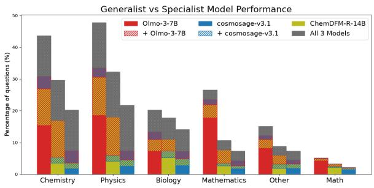  
Figure 12: We compare three unrelated generalist (OLMo3-7B-Think) and specialist (ChemDFM-R-14B, cosmosage-v3.1) models. Again we see the generalist model typically outperforms the specialists in every domain, and the specialists do not show a strong preference for their specialised domain’s questions. The strongest observed specialisation is the generalist model for Mathematics.

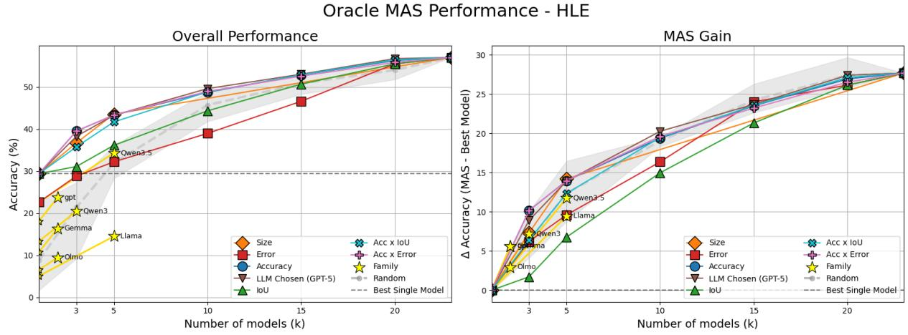  
Figure 13: Oracle performances of each $C _ { s , k }$ with increasing k on HLE

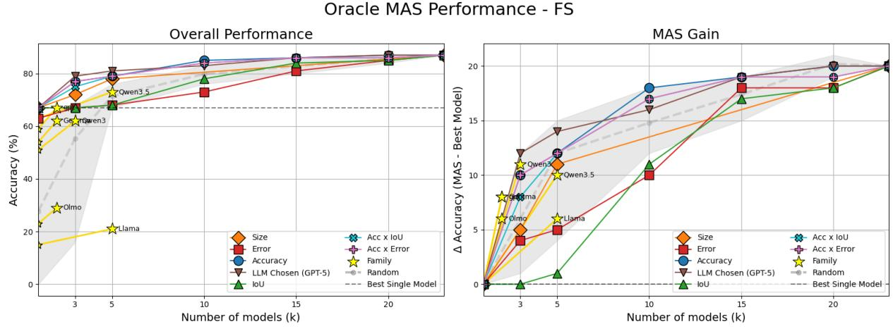  
Figure 14: Oracle performances of each $C _ { s , k }$ with increasing k on FrontierScience-Olympiad

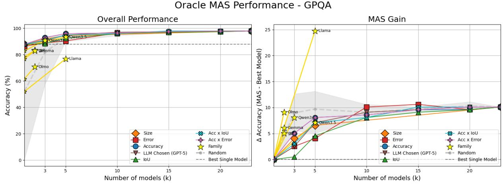  
Figure 15: Oracle performances of each $C _ { s , k }$ with increasing k on GPQA-Diamond

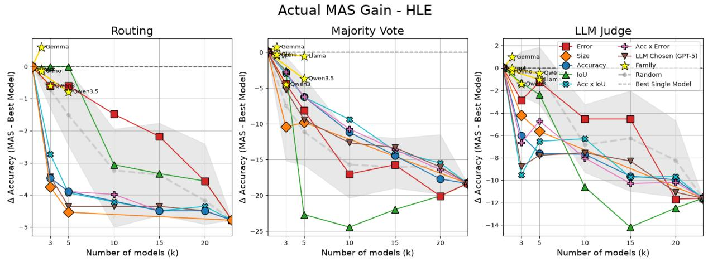  
Figure 16: Actual MAS Gain of each $C _ { s , k }$ given three different MAS architectures on Humanity’s Last Exam

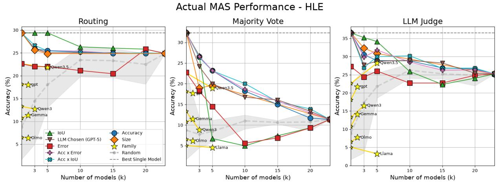  
Figure 17: Actual performances (in Accuracy) of each $C _ { s , k }$ given three different MAS architectures on Humanity’s Last Exam

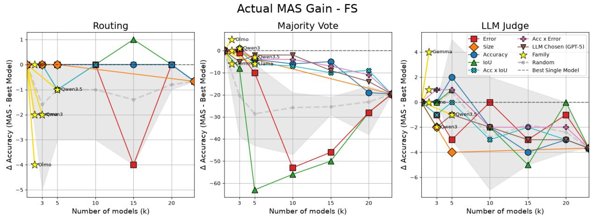  
Figure 18: Actual MAS Gain of each $C _ { s , k }$ given three different MAS architectures on FrontierScience-Olympiad

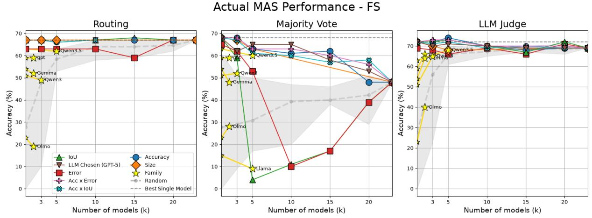  
Figure 19: Actual performances (in Accuracy) of each $C _ { s , k }$ given three different MAS architectures on FrontierScience-Olympiad

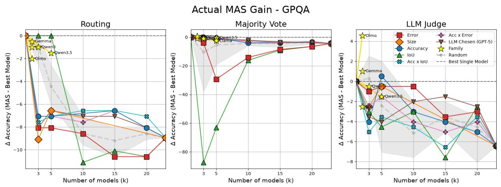  
Figure 20: Actual MAS Gain of each $C _ { s , k }$ given three different MAS architectures on GPQA-Diamond

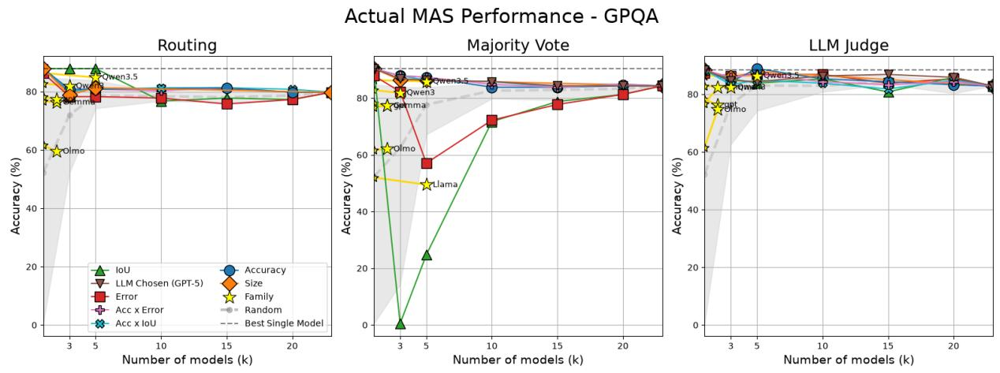  
Figure 21: Actual performances (in Accuracy) of each $C _ { s , k }$ given three different MAS architectures on GPQA-Diamond