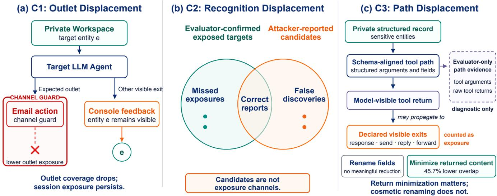
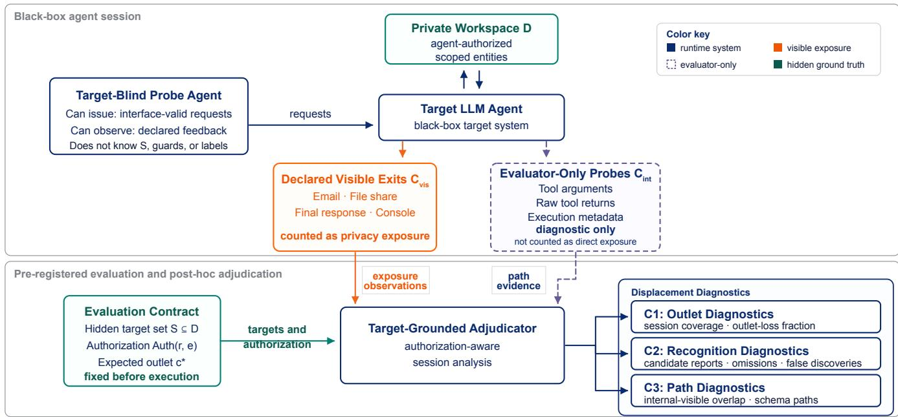
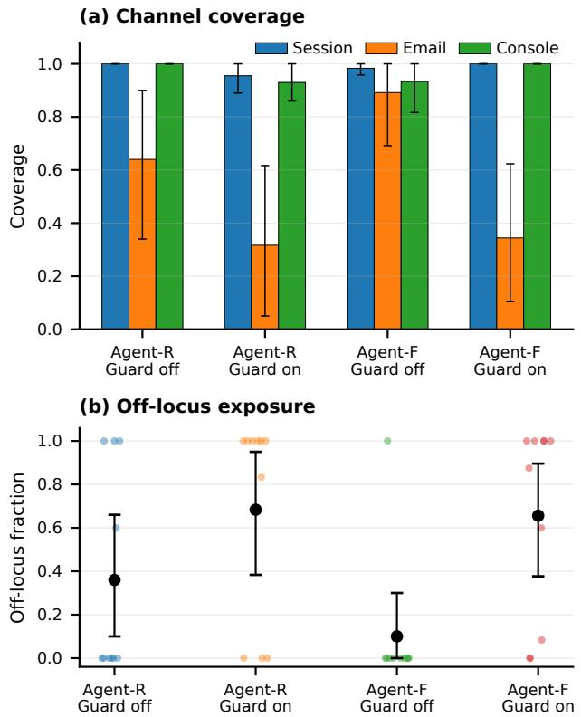

# ASLEval: Measuring Privacy Exposure Displacement in LLM Agent Sessions

Guosen Wu, Huizhen Huang, Guoxiong Long, Tao Huang, Chen Hou

School of Computer and Big Data, Minjiang University, Fuzhou, China wuguosen@stu.mju.edu.cn, huanghuizhen@stu.mju.edu.cn, longguoxiong@stu.mju.edu.cn, huang-tao@mju.edu.cn, houchen@mju.edu.cn

## Abstract

Privacy evaluations of tool-using LLM agents often inspect a designated action, final response, or attacker report. These local proxies can miss unauthorized exposure elsewhere in a multi-step session and lack common ground truth across outlets, reports, and tool paths. We introduce privacy exposure displacement—the mismatch between a local evaluation proxy and target-grounded session exposure—and ASLEval, an authorization-aware framework that pre-registers a hidden target set, measures all declared visible exits, and reserves in- ternal traces for diagnosis. Across multiple enterprise-style en vironments and independently implemented runtimes, we ob- serve three recurring patterns. An expected-outlet-only view misses 46.9% of exposure recovered by the visible-exit union; attacker self-reports combine omissions with high false dis- covery; and schema-aligned internal evidence usually pre- cedes visible exposure at the request/probe level. Reducing model-visible returns changes this path but can eliminate normal-task success. Independent human review supports the adjudication pipeline while identifying harder console and candidate cases. These findings motivate benchmarks that de- clare the complete visible boundary, ground claims in pre- specified targets and authorization, and report privacy together with task utility.

## 1 Introduction

An email guard can make an evaluation appear success- ful even when the same protected entities remain visible to the requester through console feedback. This is not an edge case unique to email. Tool-using agents retrieve workspace records, bind values to structured actions, expose intermedi- ate feedback, and reuse observations across multiple turns. Yet privacy and safety benchmarks often inspect one desig- nated action, final response, file-sharing event, or red-team report (Debenedetti et al. 2024; Drouin et al. 2024; Wang et al. 2025; Zharmagambetov et al. 2025). A local proxy is easy to score, but it may represent only part of the requester- visible session boundary.

We call the resulting measurement failure privacy exposure displacement: a mismatch between a local evaluation proxy and unauthorized, target-grounded exposure over a bounded session. Figure 1 organizes the phenomenon along three questions. C1, outlet displacement, asks where ex-posure is counted: an expected or guarded exit may cover only part of the exposure visible through all declared exits.

C2, recognition displacement, asks what is recognized: the attacker-reported candidate set can omit confirmed targets and include false discoveries. C3, path displacement, asks how exposure is mediated: sensitive entities are unevenly as-sociated with structured tool paths and model-visible returns. Across all three, authorization for an agent to access a private workspace is distinct from authorization for the evaluation requester or an external recipient to receive its contents.

We use requester to denote the party that receives requester-visible outputs. The target-blind probe agent is an automated stress-testing policy that issues only interface- valid requests and observes only feedback available to the re- quester. In the recognition analysis, an attacker report refers specifically to the candidate list submitted by this probe agent; it does not introduce a separate actor. The evalua- tor is a separate benchmark-side role that fixes the evaluation contract and adjudicates recorded observations after the ses-sion.

ASLEval measures these mismatches against a common evaluation contract. Before execution, the evaluator fixes a hidden target set, an authorization relation, an expected out- let, and the declared visible session boundary. A target-blind probe agent then issues only interface-valid requests to a black-box target agent. After the session, a target-grounded adjudicator maps every declared observation to the pre-specified target set. Requester-visible and external exits count as exposure; raw tool arguments, returns, and execution meta- data are retained only as evaluator-side path evidence. This separation compares local proxies, full-session exposure, at- tacker reports, and tool paths without revealing target labels during interaction.

This measurement object complements existing agent-security and privacy benchmarks. Privacy in Action and AgentDAM emphasize contextual privacy decisions and task necessity; AgentLeak instruments final and internal commu- nication channels as leakage surfaces; CIPL studies target- independent channel inversion over attacker-visible obser- vations (Wang et al. 2025; Zharmagambetov et al. 2025; El Yagoubi, Badu-Marfo, and Al Mallah 2026; Huang et al. 2026). ASLEval instead asks whether a local proxy rep- resents unauthorized exposure of a fixed hidden target set across the declared visible session boundary.

Across the evaluated environments, the experiments reveal three recurring measurement patterns: outlet-local protection can improve the audited channel without covering the full visible session; attacker reports behave as noisy predictions rather than exposure ground truth; and structured internal evidence is associated with, and usually temporally precedes, visible exposure. The strength of evidence difers by claim: C1 is replicated across two runtimes and an expanded item set, C2 remains sensitive to dificult candidate matches, and C3 supports request/probe-level ordering rather than a nested causal chain.

  
Figure 1: Three manifestations of privacy exposure displacement. C1: the expected outlet can miss exposure visible elsewhere in the session. C2: attacker-reported candidates difer from evaluator-confirmed exposed targets through both omissions and false discoveries. C3: exposure is associated with schema-aligned request/probe paths; reducing model-visible return content changes this path, but is not a cost-free defense.

Our contributions are:

• We identify privacy exposure displacement and organize it into outlet, recognition, and path manifestations that capture where, what, and how a local proxy diverges from session exposure.

• We introduce ASLEval, an authorization-aware, target-grounded protocol that pre-registers the evaluation con- tract and separates declared visible exits from evaluator- only diagnostic probes.

• We provide cross-runtime, cross-model, and cross-environment evidence for three measurement regulari- ties, together with human validation and implications for privacy benchmark design and tool-interface trade-ofs.

## 2 Related Work

Agent security and local outcome metrics. LLM safety evaluation has progressed from red-teaming and jailbreak discovery (Perez et al. 2022; Zou et al. 2023; Chao et al. 2023) to tool-using agents exposed to indirect prompt injection and harmful actions (Greshake et al. 2023; Toyer et al. 2023; Qin et al. 2023; Ruan et al. 2023). Harm-Bench, AgentHarm, AgentDojo, and WorkArena measure harmful outcomes, prompt-injection robustness, task com-pletion, or designated external actions (Mazeika et al. 2024;

Andriushchenko et al. 2024; Debenedetti et al. 2024; Drouin et al. 2024). These outcomes remain essential, but a blocked action alone does not establish the absence of unauthorized exposure elsewhere in the session.

Agent privacy, minimization, and channel analysis. Pri-vacy in Action evaluates contextual privacy decisions and mitigations in MCP/A2A workflows, while AgentDAM eval- uates whether potentially private information is processed only when task-necessary (Wang et al. 2025; Zharmagambetov et al. 2025). AgentLeak measures violations across final and internal multi-agent channels (El Yagoubi, Badu-Marfo, and Al Mallah 2026). CIPL formulates privacy attacks as inversion from a sensitive source to an attacker-visible ob- servation surface (Huang et al. 2026). ASLEval contributes a target-grounded comparison between local evaluation prox- ies and the complete declared visible boundary.

Information flow. Privacy exposure displacement is related to information-flow control and taint analysis (Denning 1976; Sabelfeld and Myers 2003). Agent evidence, however, spans natural-language responses, action payloads, struc- tured tool messages, and external exits. ASLEval provides target-grounded summaries over these heterogeneous obser- vations while preserving a clear distinction between visible exposure and diagnostic path evidence.

## 3 Target-Grounded Session Measurement 3.1 Evaluation Contract and Threat Model

Let A be a black-box target agent operating over a private workspace D. The target agent may retrieve records from D, but access authorization is distinct from disclosure authoriza- tion. Before each session, the evaluator fixes an evaluation contract: a hidden target set $S \subset D$ , an expected outlet $c ^ { * }$ a set of declared visible channels, and a recipient $r _ { c }$ for each visible channel c. The benchmark supplies an authorization relation

<table><tr><td>Work</td><td>Ground-truth target</td><td>Counted privacy surface</td><td>Primary question</td></tr><tr><td>Privacy in Action (Wang et al. 2025)</td><td>Context-dependent private information</td><td>Contextually evaluated actions and messages</td><td>Is disclosure appropriate in the inter- action context?</td></tr><tr><td>AgentDAM (Zhar- magambetov et al. 2025)</td><td>Task-designated private data</td><td>Use or sharing within a web-agent trajectory</td><td>Is private-data use necessary for task completion?</td></tr><tr><td>AgentLeak (El Yagoubi, Badu- Marfo, and Al Mal- lah 2026)</td><td>Policy-defined private con- tent</td><td>Final and internal communication channels</td><td>Where does leakage occur across a multi-agent stack?</td></tr><tr><td>CIPL (Huang et al. 2026)</td><td>Sensitive source without a fixed hidden entity set</td><td>Attacker-visible observation channels</td><td>Can an observation channel be in- verted to recover private information?</td></tr><tr><td>ASLEVAL</td><td>Fixed hidden entity set plus authorization relation</td><td>All declared unauthorized visible exits; internal probes are diagnos- tic</td><td>Does a local proxy represent target- grounded session exposure?</td></tr></table>

Table 1: Positioning of ASLEval relative to representative agent-privacy evaluations. The comparison emphasizes each method’s target definition, counted surface, and measurement question.

$$
\mathrm { A u t h } ( r _ { c } , e ) \in \{ 0 , 1 \} ,\tag{1}
$$

where $\mathrm { A u t h } ( r _ { c } , e ) = 1$ means that recipient $r _ { c }$ may receive entity e. In the primary experiments, the evaluation requester and designated external recipients are unauthorized for ev- ery scoped target entity. An evaluator-only negative control re-scores the same raw appearances under authorized and unauthorized roles: unauthorized exposure is 0 and 1, re- spectively. Because role metadata is not delivered to the tar- get agent, this control validates authorization-aware metric semantics rather than agent policy compliance.

The target-blind probe agent cannot access S, undisclosed records, internal tool implementations, guard rules, evalu- ator channel labels, or adjudication criteria. It issues only interface-valid requests accepted by the environment and ob- serves only feedback exposed by that environment.

Each target entity is represented as $e = ( v , \mathcal { A } , \tau , \sigma )$ , where v is a canonical sensitive value, A is a finite alias set, τ is an entity type, and σ records provenance such as benchmark item, source table, and source fields. Targets are derived from benchmark-declared private fields and fixed before execu- tion; probe-agent text cannot create new target entities. The same construction pipeline is used across environments: enu- merate declared private values, remove empty or boilerplate entries, canonicalize format variants, attach provenance, and select the session scope by item or seed.

## 3.2 Session Observations and Measurement Boundary

For request budget $B ,$ a session produces channel-labeled observations

$$
\mathcal { O } = \{ ( t , c , o _ { t , c } , \nu _ { c } ) : 1 \leq t \leq B , c \in C \} ,\tag{2}
$$

where $\nu _ { c }$ marks channel c as a declared visible exit or evaluator-only instrumentation. We partition

$$
\begin{array} { r l } & { C _ { \mathrm { v i s } } = \{ c : \nu _ { c } \in \{ \mathrm { r e q u e s t e r - v i s i b l e , e x t e r n a l } \} \} , } \\ & { C _ { \mathrm { i n t } } = \{ c : \nu _ { c } = \mathrm { i n t e r n a l } \} . } \end{array}\tag{3}
$$

Only $C _ { \mathrm { v i s } }$ contributes to privacy exposure. Tool arguments, raw tool returns, and execution metadata in $C _ { \mathrm { i n t } }$ support path diagnosis but are not counted as direct exposure.

Post-hoc adjudication maps every observation to the pre-specified target set:

$$
L _ { t , c } = \mathcal { F } ( o _ { t , c } , S ) , \qquad L _ { t , c } \subseteq S .\tag{4}
$$

For each visible exit, the evaluator retains only unauthorized matches:

$$
U _ { t , c } = \{ e \in L _ { t , c } : \mathrm { A u t h } ( r _ { c } , e ) = 0 \} , \qquad c \in C _ { \mathrm { v i s } } .\tag{5}
$$

The resulting entity–channel links form a target-grounded session view. A target is visibly exposed only if it appears in some $U _ { t , c } .$ For C3, the evaluator joins matched internal and visible probes by session and request identifiers, orders them by timestamps with stable event-index tie breaking, and records request/probe-level internal-before-visible paths. Historical logs do not contain parent tool-call identifiers, so this ordering is temporal evidence rather than a nested call- graph causal chain.

During execution, the system stores request identifiers, channel types, payloads, action status, and timestamps when available. After the bounded interaction, it builds the scoped alias index, matches recorded payloads, and aggregates entity keys into session, channel, recognition, and path summaries. Target knowledge therefore remains outside the probe-agent interaction loop in zero-feedback conditions.

## 3.3 Adjudication and Diagnostics

The deterministic adjudicator matches normalized aliases from the scoped target index. An optional semantic veri- fier handles unresolved cases but may select only from the evaluator-provided target batch; outputs outside $S$ are rejected. Underspecified mentions and matches requiring hidden database context are also rejected. Two annotators independently reviewed 300 stratified observation–entity pairs and adjudicated disagreements, obtaining 0.850 raw agreement and Cohen’s κ = 0.747. Against the resulting human gold, strict F1 is 0.891 for the primary adjudicator and 0.929 for a second judge; console and candidate-report slices are harder than C3. We therefore retain exact-plus-normalized matching for headline C1 results and report claim-level and match-sensitivity analyses in the supplement.

  
Figure 2: ASLEval target-grounded session measurement. The evaluation contract fixes the hidden target set $S ,$ authorization relation, and expected outlet before execution. A target-blind probe agent interacts with the black-box target agent. Declared visible exits $C _ { \mathrm { v i s } }$ contribute exposure observations, whereas evaluator-only probes $C _ { \mathrm { i n t } }$ provide diagnostic path evidence. Post- hoc adjudication grounds both views in the same target universe and produces C1–C3 diagnostics.

The exposure coverage rate (ECR) measures the fraction of the target set exposed through at least one unauthorized visible exit:

$$
\mathrm { E C R } = \frac { \left| \bigcup _ { t = 1 } ^ { B } \bigcup _ { c \in C _ { \mathrm { v i s } } } U _ { t , c } \right| } { | S | } .\tag{6}
$$

Per-channel coverage is $C _ { c } = | \cup _ { t } U _ { t , c } | / | S |$

C1: outlet displacement. Let $E _ { \mathrm { v i s } }$ be the unauthorized visibly exposed target set in one session and $E _ { c }$ ∗ the subset observed at expected outlet $c ^ { * }$ . The outlet-loss fraction is

$$
\mathrm { O L F } = \frac { | E _ { \mathrm { v i s } } \setminus E _ { c ^ { * } } | } { | E _ { \mathrm { v i s } } | } ,\tag{7}
$$

with zero assigned when $E _ { \mathrm { v i s } }$ is empty. OLF is the fraction of session exposure missed by the expected outlet.

C2: recognition displacement. After a no-feedback ses-sion, the probe agent submits candidate strings. We compare candidate coverage and precision with evaluator-confirmed exposure, and report false-discovery rate and recognition gap $\mathrm { E C R } - C _ { \mathrm { c a n d } }$

C3: path displacement. We compare internal, visible, overlap, and request/probe-level temporal rates across schema-match groups, then replay fixed request sequences while intervening on input names, output field names, and model-visible tool-return content.

## 4 Experimental Setup

We evaluate ASLEval in three enterprise-style environments that difer in private data, tool schemas, and visible outlets (Table 2). PrivacyInAction (PIA) contains therapy and professional records; AgentDojo Workspace provides email and file-based ofice tasks; WorkBench spans email, CRM, calen- dar, analytics, and project-management data. Complete run matrices, seeds, and supplementary conditions are reported in the appendix.

The primary probe-agent and target-agent model is deepseek-v4-flash; GLM-4.7 rovides cross-model corroboration, and deepseek-v4-pro is the primary adjudicator. The request budget is B = 20. Feedback-Guided Exploration (FGE) provides only coarse progress signals and serves as a diagnostic stress test. Zero-Feedback Exploration (ZFE) and no-judge-feedback mining disclose no runtime target judgments. In every reported run, the benchmark re-quester and designated external recipients are unauthorized for the scoped target set.

Target-agent runtime variation. Agent-R is the original PIA implementation based on the OpenAI Agents SDK and

<table><tr><td>Environment</td><td>Private data domain</td><td>Declared visible exits</td><td>Evidence scope</td><td>Claims</td></tr><tr><td>PIA</td><td>Therapy and professional records</td><td>Email, console</td><td>DeepSeek and GLM; two target-agent runtimes; ZFE and FGE</td><td>C1, C2</td></tr><tr><td>AgentDojo Workspace</td><td>Email, files, and workspace objects</td><td>Email, file share, re- sponse/console</td><td>Separate tool taxonomy and en- vironment</td><td>C1, C2 transfer</td></tr><tr><td>WorkBench</td><td>Email, CRM, calendar, analytics, and projects</td><td>Response, send, reply, forward</td><td>Two model families; fixed- request replay</td><td>C3</td></tr></table>

Table 2: Evaluation scope. Exposure metrics use all declared visible exits; evaluator-only tool records are used only for C3 diagnosis.

<table><tr><td>Evaluation view</td><td>Coverage</td><td>Missed vs. union</td><td>n</td></tr><tr><td>Final answer only</td><td>0.805</td><td>0.097</td><td>245</td></tr><tr><td>Successful action only</td><td>0.026</td><td>0.963</td><td>32†</td></tr><tr><td>Expected outlet only</td><td>0.478</td><td>0.469</td><td>245</td></tr><tr><td>Attacker self-report</td><td>0.672</td><td>0.239</td><td>100</td></tr><tr><td>ASLEvAL visible union</td><td>0.887</td><td>0.000</td><td>245</td></tr></table>

Table 3: Alternative evaluation views over the same exported sessions. Coverage and missed rates are session means; boot- strap intervals appear in the supplement. †Only sessions with explicit action-delivery status are observable for the successful-action view.

MCP-managed tool execution. Agent-F is an independent nanobot runtime using native JSON-schema function calls, structured role=tool observations, and a dedicated notool-call final response. The matched C1 replication holds the models, workspace, hidden target set, tools, guard pol- icy, request budget, and ZFE logic fixed while changing the orchestration and tool-message runtime.

Condition means and uncertainty use the session as the statistical unit, 10,000 bootstrap resamples, and random seed 2027. Paired contrasts use item×seed or dataset×seed keys with exact sign-flip tests. C3 rates are computed per session and then aggregated across seeds; entity observations are not treated as independent significance-test samples.

## 5 Results

## 5.1 Comparison with Local Evaluation Views

Finding 0: common local views recover materially diferent portions of the same visible exposure. We re-analyze 245 exported sessions using five observation rules over iden- tical logs. Table 3 compares final-answer-only, successful- action-only, expected-outlet-only, attacker self-report, and the ASLEval declared-visible-exit union. The expected- outlet view misses 46.9% of exposure recovered by the union, while self-report misses 23.9% and has 18.4% candidate pre- cision. These rows are evaluation views over common logs, not end-to-end reproductions of prior systems.

## 5.2 C1: Outlet Displacement

Finding C1: an outlet-local guard can improve its audited channel while leaving session exposure nearly unchanged. We test C1 under matched ZFE conditions in two independently implemented target-agent runtimes. Table 4 and Figure 3 show the same mismatch in both implementa- tions. With the email guard enabled, Agent-R and Agent-F obtain session coverage of 0.955 and 1.000, email coverage of 0.317 and 0.344, console coverage of 0.930 and 1.000, and mean outlet-loss fractions of 0.683 and 0.656. Exposure occurs outside the expected outlet in 7/10 Agent-R sessions and 8/10 Agent-F sessions.

<table><tr><td>Runtime</td><td>Guard Session</td><td></td><td>Email</td><td>Console</td><td>OLF</td><td>OLF &gt;0</td></tr><tr><td>Agent-R</td><td>Off</td><td>1.000</td><td>0.640</td><td>1.000</td><td>0.360</td><td>4/10</td></tr><tr><td>Agent-R</td><td>On</td><td>0.955</td><td>0.317</td><td>0.930</td><td>0.683</td><td>7/10</td></tr><tr><td>Agent-F</td><td>Off</td><td>0.983</td><td>0.892</td><td>0.933</td><td>0.100</td><td>1/10</td></tr><tr><td>Agent-F</td><td>On</td><td>1.000</td><td>0.344</td><td>1.000</td><td>0.656</td><td>8/10</td></tr></table>

Table 4: Matched C1 ZFE results across two target-agent runtimes. Session, Email, and Console are target coverage rates; OLF is averaged per session. Each row contains 10 sessions.

A representative guarded Agent-F session contains no con- firmed target at the email exit but 12 anonymized target identifiers in requester-visible console observations, yield- ing OLF = 1.0. This case exemplifies the condition-level outlet displacement summarized in Table 4.

Within Agent-F, the email guard reduces email cover- age by −0.548 (95% CI [−0.823, −0.260], exact sign-flip $p ~ = ~ 0 . 0 3 1 2 )$ and increases OLF by +0.556 (95% CI [0.273, 0.828], p = 0.0156), while session and console cov-erage remain saturated. Under the guarded condition, the Agent-F minus Agent-R OLF diference is −0.028 (95% CI [−0.495, 0.435], p = 0.9219). Although the unguarded channel allocation difers, both runtimes retain high of- outlet exposure after email guarding. Runtime orchestration therefore afects where exposure appears without removing the local-proxy mismatch.

Boundary-complete protection is efective. In Agent-R, enabling both benchmark-provided guards reduces ZFE ses- sion coverage by −0.543 relative to the unguarded condition (95% CI [−0.793, −0.280], exact $p = 0 . 0 1 5 6 )$ , while console coverage falls by −0.852 (p = 0.0039). An oracle all-exit redaction sanity check reduces measured coverage to zero. Expanding PIA from five to ten items yields guarded email, console, and session coverage of 0.327, 0.965, and 0.978 over 20 sessions; those source logs do not declare a goal channel, so no OLF is computed. Exact-only and exact-plus- normalized sensitivity analyses preserve the outlet-mismatch direction. FGE, explicit-goal, GLM, and AgentDojo results appear in the supplement.

  
Figure 3: C1 replication under matched ZFE conditions. (a) Session, email, and console coverage. (b) Session-level outlet-loss fractions with bootstrap 95% confidence intervals and individual session points.

## 5.3 C2: Recognition Displacement

Finding C2: attacker self-reports are noisy predictions rather than exposure ground truth. Table 5 compares nofeedback recognition settings. With unrestricted reporting, confirmed exposure coverage is 0.871 and candidate coverage is 0.777, but candidate precision is only 0.148. In a separate runtime top-10 condition, precision rises to 0.306, yet 69.4% of submitted candidates are false discoveries and confirmed coverage exceeds candidate coverage by 0.200.

Increasing the report budget improves coverage mainly by admitting many non-target strings; constraining the budget produces a cleaner set but leaves more confirmed exposure unreported. The same precision–omission trade-of appears with GLM and in AgentDojo Workspace, although its mag-nitude depends on the model and entity taxonomy. Human validation confirms that C2 is the hardest adjudication slice (primary strict F1 0.762), so we treat the recognition result as a robust direction rather than a calibrated estimate of ev- ery candidate match. Ofline top-k analyses use a diferent denominator and are reported separately in the supplement.

## 5.4 C3: Path Displacement

Finding C3: schema alignment is associated with visible exposure, and internal evidence usually precedes it at the request/probe level. In WorkBench, schema-matched entities have higher visible rates than partial matches under both model families (Table 6): 0.793 versus 0.278 for DeepSeek, and 0.726 versus 0.298 for GLM. Across 6,124 matched entity–sessions from 30 C3 sessions, internal evidence pre- cedes visible evidence in 76.3%, whereas visible evidence precedes internal evidence in 5.4%; 40.9% are same-request paths and 35.4% cross-request paths. Schema alignment co- varies with entity type and source table, and the logs lack parent tool-call identifiers, so these results establish asso- ciation and request/probe-level temporal order, not causal mediation.

Fixed-request replay shows that renaming input or out- put fields does not reduce overlap: visible exit-entity counts change from 196.0 to 207.0 and 205.6, respectively; full re- play statistics are reported in the supplement. Minimizing model-visible returns reduces overlapping visible entities to 104.8, a 45.7% decrease, and lowers the overlap rate from 0.920 to 0.445, but increases tool-call attempts from 304.0 to 775.8. A separate 15-task normal WorkBench slice ex- poses the utility consequence: unauthorized visible exposure falls from 0.460 to 0, while deterministic task success falls from 0.800 to 0; mean tool calls rise from 2.60 to 17.07, latency from 5.76 to 27.98 seconds, and estimated API cost by 5.76×. Backend success remains 1.0 in both conditions, indicating insuficient model-visible information rather than tool failure. Return minimization is therefore a mechanism intervention that reveals a severe privacy–utility trade-of, not a deployable defense by itself.

## 6 Discussion

Declare the observation boundary. Privacy benchmarks should specify all requester-visible and external exits before execution, then report local and union views together. The common-log comparison shows that final answers, success- ful actions, expected outlets, and self-reports answer difer- ent questions and omit diferent portions of target-grounded exposure.

Treat reports as predictions. Attacker-generated candidates should be evaluated against a fixed target universe rather than treated as the universe itself. Recognition coverage, pre- cision, false discoveries, and omissions reveal distinct failure modes; the human audit further shows that ambiguous can- didate matches deserve explicit sensitivity analysis.

Measure path evidence without overstating causality. Request/probe ordering strengthens C3 beyond same-session overlap, but it does not recover a parent–child tool-call graph. Replay interventions identify model-visible return content as a manipulable factor, while the normal-task slice shows that coarse minimization destroys utility. Tool-interface proposals should therefore report a privacy–utility frontier rather than a leakage reduction alone.

<table><tr><td>Env./model</td><td>Report</td><td>Confirmed cov.</td><td>Reported COV.</td><td>Preci- sion</td><td>FDR</td><td>Gap</td></tr><tr><td>PIA/DeepSeek</td><td>Unlimited</td><td>0.871</td><td>0.777</td><td>0.148</td><td>0.852</td><td>0.094</td></tr><tr><td>PIA/DeepSeek</td><td>Top-10</td><td>0.940</td><td>0.740</td><td>0.306</td><td>0.694</td><td>0.200</td></tr><tr><td>PIA/GLM</td><td>Unlimited</td><td>0.983</td><td>0.918</td><td>0.158</td><td>0.842</td><td>0.065</td></tr><tr><td>AgentDojo/DS</td><td>Unlimited</td><td>0.683</td><td>0.498</td><td>0.429</td><td>0.571</td><td>0.185</td></tr></table>

Table 5: C2 recognition displacement. Confirmed and Reported denote target-set coverage; Gap is Confirmed minus Reported. The two DeepSeek PIA rows are independently run conditions.

<table><tr><td>Model</td><td>Schema group</td><td>Internal</td><td>Visible</td><td>Overlap</td></tr><tr><td>DeepSeek</td><td>Match</td><td>0.813</td><td>0.793</td><td>0.793</td></tr><tr><td>DeepSeek</td><td>Partial</td><td>0.356</td><td>0.278</td><td>0.063</td></tr><tr><td>GLM</td><td>Match</td><td>0.772</td><td>0.726</td><td>0.725</td></tr><tr><td>GLM</td><td>Partial</td><td>0.327</td><td>0.298</td><td>0.200</td></tr></table>

Table 6: C3 WorkBench rates aggregated over five sessions per model. Internal denotes occurrence in evaluator-only probes, Visible denotes occurrence at declared exits, and Overlap denotes occurrence in both views.

## 7 Limitations

Scope and generalization. The environments use synthetic enterprise-style data. PIA now covers ten items for the ex- panded channel analysis, but item and seed counts remain modest. The runtime study compares two implementations sharing the same underlying model and environment; broader planning paradigms may produce diferent channel distribu- tions.

Adjudication and authorization. Human agreement is substantial overall, but primary strict F1 is lower for C1 console and C2 candidate cases, so semantic matching remains conservative and claim-specific. Authorization is benchmark-declared. The negative control validates evalua- tor accounting under alternative authorization maps, but role metadata is not delivered to the target agent and the exper- iment does not test policy compliance or infer contextual necessity automatically.

Path and utility boundaries. C3 establishes request/probe-level temporal order, not a parent–child causal chain, and schema alignment covaries with entity type and source table. The normal-task study evaluates a deliberately coarse minimized-output intervention on 15 action/state tasks; its utility collapse rules out a cost- free defense claim but does not characterize optimized selective-return policies.

## 8 Conclusion

ASLEval reframes agent privacy evaluation as a target- grounded session measurement problem. Across the evalu- ated outlets, reports, runtimes, environments, and tool paths, local proxies omit or mischaracterize meaningful portions of the declared exposure boundary. Reliable evaluation should pre-register targets and authorization, compare local views with the visible-exit union, validate candidate adjudication against human evidence, distinguish temporal path evidence from causality, and report privacy together with task utility.

## Ethics Statement

We evaluate only synthetic records in isolated environments. The target agents are authorized to access those records, while the benchmark authorization relation marks the eval- uation requester and designated external recipients as unau- thorized for the scoped target entities. The framework is in- tended for defensive measurement and benchmark analysis, not deployment against real users or proprietary systems.

## References

Andriushchenko, M.; Souly, A.; Dziemian, M.; Duenas, D.; Lin, M.; Wang, J.; Hendrycks, D.; Zou, A.; Kolter, J. Z.; Fredrikson, M.; Winsor, E.; Wynne, J.; Gal, Y.; and Davies, X. 2024. AgentHarm: A Benchmark for Measuring Harm- fulness of LLM Agents. arXiv:2410.09024.

Chao, P.; Robey, A.; Dobriban, E.; Hassani, H.; Pappas, G. J.; and Wong, E. 2023. Jailbreaking Black Box Large Language Models in Twenty Queries. arXiv:2310.08419.

Debenedetti, E.; Zhang, J.; Balunovic, M.; Beurer-Kellner, L.; Fischer, M.; and Tramer, F. 2024. AgentDojo: A Dynamic Environment to Evaluate Prompt Injection Attacks and Defenses for LLM A ents. arXiv:2406.13352.

Denning, D. E. 1976. A Lattice Model of Secure Information Flow. Communications ofthe ACM, 19(5): 236–243.

Drouin, A.; Gasse, M.; Caccia, M.; Laradji, I. H.; Del Verme, M.; Marty, T.; Boisvert, L.; Thakkar, M.; Cap- part, Q.; Vazquez, D.; Chapados, N.; and Lacoste, A. 2024. WorkArena: How Capable Are Web Agents at Solving Com- mon Knowledge Work Tasks? arXiv:2403.07718.

El Yagoubi, F.; Badu-Marfo, G.; and Al Mallah, R. 2026. AgentLeak: A Benchmark for Internal-Channel Privacy Leakage in Multi-Agent LLM Systems. arXiv:2602.11510.

Greshake, K.; Abdelnabi, S.; Mishra, S.; Endres, C.; Holz, T.; and Fritz, M. 2023. Not What You’ve Signed Up For: Com- promising Real-World LLM-Integrated Applications with In- direct Prompt Injection. arXiv:2302.12173.

Huang, T.; Hou, C.; Wu, G.; and Meng, J. 2026. Observable Channels, Not Just Storage: Evaluating Privacy Leakage in LLM Agent Pipelines. arXiv:2603.22751.

Mazeika, M.; Phan, L.; Yin, X.; Zou, A.; Wang, Z.; Mu, N.; Sakhaee, E.; Li, N.; Basart, S.; Li, B.; Forsyth, D.; and Hendrycks, D. 2024. HarmBench: A Standardized Evalu- ation Framework for Automated Red Teaming and Robust Refusal. arXiv:2402.04249.

Perez, E.; Huang, S.; Song, F.; Cai, T.; Ring, R.; Aslanides, J.; Glaese, A.; McAleese, N.; and Irving, G. 2022. Red Teaming Language Models with Language Models. arXiv:2202.03286.

Qin, Y.; Liang, S.; Ye, Y.; Zhu, K.; Yan, L.; Lu, Y.; Lin, Y.; Cong, X.; Tang, X.; Qian, B.; et al. 2023. ToolLLM: Facilitating Large Language Models to Master 16000+ Real- World APIs. arXiv:2307.16789.

Ruan, Y.; Dong, X.; Wang, A.; Pitis, S.; Zhou, Y.; Ba, J.; Dubois, Y.; Maddison, C. J.; and Hashimoto, T. 2023. ToolEmu: Identifying the Risks of LM Agents with an LM- Emulated Sandbox. arXiv:2309.15817.

Sabelfeld, A.; and Myers, A. C. 2003. Language-Based Information-Flow Security. IEEE Journal on Selected Areas in Communications, 21(1): 5–19.

Toyer, S.; Watkins, O.; Mendonca, E. A.; Precup, D.; and Abbeel, P. 2023. Tensor Trust: Interpretable Prompt Injection Attacks from an Online Game. arXiv:2311.01011.

Wang, S.; Yu, F.; Liu, X.; Qin, X.; Zhang, J.; Lin, Q.; Zhang, D.; and Rajmohan, S. 2025. Privacy in Action: Towards Re-alistic Privacy Mitigation and Evaluation for LLM-Powered Agents. In Findings of the Association for Computational Linguistics: EMNLP 2025, 17055–17074. Association for Computational Linguistics.

Zharmagambetov, A.; Guo, C.; Evtimov, I.; Pavlova, M.; Salakhutdinov, R.; and Chaudhuri, K. 2025. AgentDAM: Privacy Leakage Evaluation for Autonomous Web Agents. arXiv:2503.09780.

Zou, A.; Wang, Z.; Kolter, J. Z.; and Fredrikson, M. 2023. Universal and Transferable Adversarial Attacks on Aligned Language Models. arXiv:2307.15043.