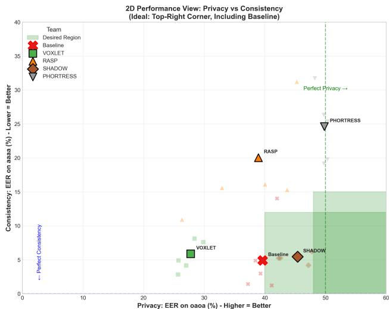
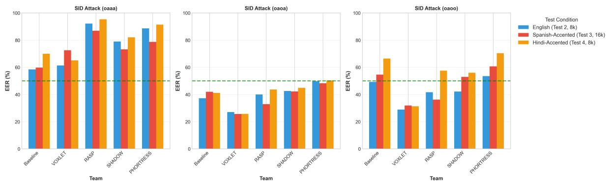
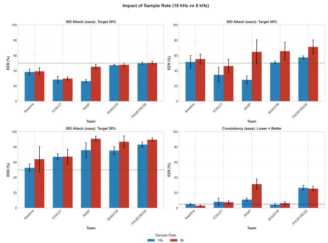

# Beyond EER: Multi-Dimensional Evaluation of Information Leakage in Speaker De-Identification

Seungmin Seo

Contractor Associate, National Institute of Standards and Technology, Gaithersburg, MD, USA Chakra Consulting Inc., Clarksburg, MD, USA

Oleg Aulov P. Jonathon Phillips Kevin Mangold Jonathan Eskin National Institute of Standards and Technology, Gaithersburg, MD, USA

{seungmin.seo, oleg.aulov, jonathon.phillips, kevin.mangold, jonathan.eskin}@nist.gov

## Abstract

Speaker de-identification (SDID) aims to preserve privacy by concealing speaker identity while maintaining speech utility. However, current evaluations often reduce privacy to a single dimension—biometric verification performance—typically measured by Equal Error Rate (EER). This narrow focus ignores critical leakage channels, such as soft biometric inference, embedding-level re-identification, and structural template similarity, which threaten the unlinkability and irreversibility of biometric references. We propose a holistic evaluation framework across five complementary metrics: (i) EER, (ii) soft biometric leakage score , (iii) cumulative match characteristic re-identification analysis, (iv) canonical correlation analysis and Procrustes embedding alignment, and (v) intelligibility via word error rate and semantic similarity. Evaluatingfive SDID systemsfrom the IARPA ARTS program, we demonstrate that these metrics capture independent dimensions of information leakage. Our results indicate that reliance on a single metric can misrepresent the privacy properties ofan SDID system.

## 1. Introduction

Speech signals encode biometric and behavioral attributes beyond linguistic content, implicitly revealing a speaker’s sex, age, and accent [16, 9]. Speaker deidentification (SDID) systems aim to transform these signals to remain intelligible while concealing the speaker’s identity [24, 12, 21, 26]. However, the growing availability of high-accuracy, publicly accessible attribute classifiers [27] has fundamentally changed the threat landscape: modern speech representation models enable accurate inference of biometric attributes even from anonymized speech. This raises a central question: How much identity information remains detectable in speech processed by current SDID systems, and along which dimensions can it be measured?

This pattern echoes findings in other biometric modalities: in face recognition, embeddings have been shown to inadvertently store demographic, paralinguistic, and extrinsic factors beyond identity [13, 5, 3, 14]. Yet while the VoicePrivacy Challenges [24, 21, 12, 22] have established a benchmark for voice anonymization, evaluation of these residual signals in speech remains fragmented.

Most current evaluations rely on a solitary metric such as Equal Error Rate (EER) for speaker verification [24, 12, 8, 10, 11, 28, 21], which captures resistance to direct reidentification but not whether an adversary can recover demographic attributes or exploit systematic patterns across a population. Privacy metrics alone are also insufficient without understanding their cost in utility: a system that renders speech unintelligible achieves perfect privacy at the expense of speech communication’s fundamental purpose.

This paper makes the following contributions:

1. Evaluation across complementary privacy metrics. We evaluate SDID systems using various privacy metrics spanning verification resistance (EER), attribute leakage (SBLS), search-based re-identification using cumulative match characteristic (CMC), and embedding-space similarity measured by canonical correlation analysis (CCA) and Procrustes alignment. These metrics capture distinct aspects of residual speaker information and can yield different assessments of privacy.

2. Biometric leakage analysis on anonymized speech. We extend SBLS[19] to include accent prediction and introduce subgroup protection analysis to measure demographic disparities in attribute leakage.

3. Large-scale cross-corpus evaluation. We evaluate SDID systems across four test sets from three corpora (Mixer 3, 6, and 7), covering multiple accents and sampling conditions with more than 22,000 segments per system and over 3.4 million verification trials.

4. Privacy-utility quantification. We measure the impact of anonymization on intelligibility using word error rate (WER) and semantic similarity, revealing a measurable trade-off between identity suppression and speech utility.

Comparing system performance across these dimensions, we find that no system achieves top performance across all of them: the metrics capture fundamentally different aspects of privacy that can trade off against one another, and reliance on any single metric yields an incomplete—and potentially misleading—assessment.

## 2. Related Work

## 2.1. Speaker De-Identification Systems and Evaluation

SDID spans signal-processing transforms and neural voice conversion. The VoicePrivacy Challenge [24, 12, 21, 22] established a common benchmark, primarily evaluating systems using EER and log-likelihood ratio cost. Subsequent work explores diverse approaches, including speaker attribute perturbation [1], voice conversion with alternative distance metrics and kNN conversion in self-supervised spaces [26]. Despite architectural diversity, evaluation remains largely centered on speaker verification, offering limited insight into demographic leakage or privacy–utility trade-offs.

## 2.2. Identity Information Leakage in Anonymized Speech

Recent work shows that anonymized speech can still contain residual identity information detectable through modern speaker representation models [8, 11, 28, 23, 10]. These studies primarily evaluate speaker-level resistance using speaker verification metrics.

Beyond speaker identity, speech embeddings also encode soft biometric attributes such as sex, age, and accent [27]. VoxProfile [4] demonstrates large-scale extraction of speaker traits from foundation-model embeddings, while prior studies on benchmark dataset usage dynamics [16] highlight privacy challenges.

Together, these findings suggest that resistance to speaker re-identification alone does not guarantee broader privacy protection. Anonymized speech may still reveal demographic attributes or structural embedding similarities. This motivates evaluating SDID systems across multiple complementary metrics of privacy and utility.

## 3. Evaluation Setup

## 3.1. Corpora and Test Conditions

Evaluation data were developed by NIST from selected segments of the Mixer 3, 6, and 7 corpora collected by the Linguistic Data Consortium (LDC). Segments of 10, 30, and 60 seconds were generated using the LDC Broad Phonetic Class Speech Activity Detector [17]. The first 60 seconds of each recording were discarded to exclude greetings and channel stabilization effects. Test and initialization recordings were disjoint.

The test sets were designed to address complementary evaluation goals. Test 1 enables controlled sample-rate comparison (8 kHz vs. 16 kHz) on the same speakers using Mixer 6 CHiME interview recordings with available human transcriptions. Test 2 uses Mixer 3 8 kHz sampled English data. Test 3 and 4 introduce linguistic diversity: Mixer 7 Spanish speakers and Mixer 3 Hindi speakers producing English speech, enabling analysis of non-native accent handling. The statistics of test sets are shown in Table 1.

The Mixer/ARTS corpora were selected over alternatives such as the VoicePrivacy Challenge data because they provide the necessary speaker metadata, including annotations for sex, age group, and native language that are not available in existing privacy-evaluation benchmarks.

Demographic distributions are imbalanced across test sets. Test 3 contains no Young speakers and is 73% Female; Test 4 is sex-balanced but skewed Adult; These conditions reflect realistic deployment scenarios and expose potential subgroup vulnerabilities.

## 3.2. Trials

We employ five trial types: three designed to assess resistance to speaker identification (SID) attacks, one to evaluate pseudo-identity consistency, and one to measure pseudo-identity distinctness. Here, a pseudo-identity refers to the anonymized speaker profile produced by the SDID system, where each original speaker is mapped to a consistent synthetic identity across utterances (e.g., Alice → pseudo-Alice). Table 2 summarizes the trial types.

<table><tr><td></td><td>Test 1 (16k)</td><td>Test 1 (8k)</td><td>Test 2 (8k)</td><td>Test 3 (16k)</td><td>Test 4 (8k)</td></tr><tr><td>Original corpus</td><td>Mixer 6</td><td>Mixer 6</td><td>Mixer 3</td><td>Mixer 7</td><td>Mixer 3</td></tr><tr><td>Total trials</td><td>277,634</td><td>277,634</td><td>951,025</td><td>991,474</td><td>1,244,014</td></tr><tr><td>Target trials</td><td>4,838</td><td>4,838</td><td>10,458</td><td>52,300</td><td>77,434</td></tr><tr><td>Non-target trials</td><td>272,796</td><td>272,796</td><td>940,567</td><td>939,174</td><td>1,166,580</td></tr><tr><td>Unique speakers</td><td>76</td><td>76</td><td>223</td><td>60</td><td>76</td></tr><tr><td>Unique segments</td><td>1,058</td><td>1,058</td><td>2,983</td><td>2,778</td><td>3,355</td></tr><tr><td>Male speakers</td><td>43</td><td>43</td><td>81</td><td>13</td><td>37</td></tr><tr><td>Female speakers</td><td>33</td><td>33</td><td>142</td><td>47</td><td>39</td></tr><tr><td>Adult speakers (25–54)</td><td>47</td><td>47</td><td>161</td><td>40</td><td>63</td></tr><tr><td>Senior speakers (55–85)</td><td>4</td><td>4</td><td>30</td><td>20</td><td>13</td></tr><tr><td>Young speakers (18–24)</td><td>25</td><td>25</td><td>32</td><td></td><td></td></tr><tr><td>Native language</td><td>English</td><td>English</td><td>English</td><td>Spanish</td><td>Hindi</td></tr></table>

<table><tr><td>Trial type</td><td>Composition (target vs. non-target)</td><td>Target EER</td><td>Purpose</td></tr><tr><td>oaoa</td><td>orig-anon vs. orig-anon</td><td>50%</td><td>SID attack resistance</td></tr><tr><td>oaoo</td><td>orig-anon vs. orig-orig</td><td>50%</td><td>SID attack resistance</td></tr><tr><td>oaaa</td><td>orig-anon vs. anon-anon</td><td>50%</td><td>SID attack resistance</td></tr><tr><td>aaaa</td><td>anon-anon vs. anon-anon</td><td>0%</td><td>Self-consistency</td></tr><tr><td>cross-profile</td><td>p1-p1 vs. p1-p2 (cross pseudo-profile)</td><td>0%</td><td>Pseudo-identity distinctness</td></tr></table>

Table 2. Five different trial types used in evaluation.

A well-performing anonymization system should produce voices that cannot be traced back to the original speaker. Pseudo-speaker output should functionally behave like real speaker output in that SID systems consistently match the same pseudo-speaker to itself, and not to other pseudo-speakers or real speakers.

The three SID attack trials assess different aspects of this goal. In oaoa, original segments are compared against anonymized segments (e.g., Alice vs. pseudo-Bob), directly testing whether an attacker can match a known voice to its anonymized counterpart. In oaoo, original segments are compared against other original recordings (e.g., Alice vs. Bob), testing whether the presence of anonymized enrollment data degrades the SID backend’s ability to distinguish real speakers. In oaaa, anonymized segments are compared against other anonymized segments (e.g., pseudo-Alice vs. pseudo-Bob), testing whether different anonymized speakers remain distinguishable from one another. EER near 50% indicates strong performance on each. However, an inflated oaaa EER (well above 50%) can indicate that anonymized voices from different speakers have become acoustically similar, compressing the speaker identity space rather than successfully concealing individual identities.

The aaaa trial evaluates self-consistency with a target EER of 0%. Pseudo-Alice should consistently sound like pseudo-Alice, regardless of which utterance is anonymized. Higher EER indicates that different segments from the same speaker may sound like different people after processing. The cross-profile trial evaluates pseudo-identity distinctness, also targeting 0% EER. Pseudo-Alice should be clearly distinguishable from pseudo-Bob; an EER near 50% would indicate that different pseudo-identities are acoustically interchangeable.

## 3.3. Speaker De-Identification Systems

Five SDID systems developed under the IARPA ARTS1 program were evaluated: four performer submissions and one baseline system. The systems span diverse architectural approaches:

VOXLET maps audio to wav2vec 2.0 latent representations, applies differential privacy noise in latent space, and reconstructs speech using HiFiGAN 2.0.

RASP employs a disentangled autoencoder separating content (HuBERT), speaker identity, and pitch/energy. Speaker identity is replaced with a pseudo-speaker embedding selected via cosine similarity.

SHADOW uses an autoregressive language model over EnCodec tokens conditioned on Wav2Vec2 features. Pseudo-speaker embeddings are generated via PLDA and converted with FreeVC.

PHORTRESS decomposes speech using the SPARC articulatory coding framework. The speaker embedding is replaced with a fabricated identity, and a DDSP vocoder resynthesizes speech from articulatory features.

Baseline system performs k-nearest-neighbor regression on WavLM features, averaging matched pseudo-speaker embeddings and synthesizing with HiFiGAN.

## 3.4. Speaker Identification Backends

Four independent SID backends assess anonymization effectiveness:

• NeMo TitaNet Large: depth-wise separable convolutions with SE layers and channel-attention pooling, trained on VoxCeleb 1&2, Fisher, SwitchBoard, LibriSpeech, and augmented data [6].

• NeMo ECAPA-TDNN: TDNN with SE and Res2Block layers and multi-scale attention [2].

• Hyperion: ResNet-based x-vector extractor with PLDA backend trained on NIST SRE CTS Superset. [25]

• OLIVE: TDNN x-vector extractor with PNCC features and PLDA backend trained on NIST SRE 2004– 2012, Mixer6, and VoxCeleb 1&2 [7].

## 3.5. Attribute Classifier and Automated Speech Recognition Systems

VoxProfile [4] serves as a strong attribute inference adversary for evaluating soft biometric leakage. While greater attacker diversity would offer a more complete assessment, using a single threshold-free attacker in our analysis reduces sensitivity to classifier calibration. Evaluated attributes include sex (binary), age group (Young 17–24, Adult 25–54, Senior 55+), and accent family (North America, Romance, South Asia). Accent is evaluated only on aggregated crosstest results.

For intelligibility assessment, OpenAI Whisper [15] and NVIDIA NeMo Canary-1B [18] transcribe original and anonymized speech. Canary-1B was additionally used because it exhibits fewer hallucinations during silent segments. The Whisper English text normalizer (lowercasing, contraction expansion, punctuation removal, numeric normalization) is applied for WER scoring.

## 4. Evaluation Metrics

We evaluate SDID systems along five complementary dimensions capturing speaker-level privacy using EER, soft biometric leakage using SBLS, re-identification risk using CMC, embedding structure using CCA, and utility preservation using WER.

## 4.1. Speaker Verification EER

EER measures the operating point at which the false acceptance rate equals the false rejection rate in a speaker verification task. EER results are aggregated across SID backends and pseudo-identity profiles. Higher EER in SID attack trials (target 50%) indicates stronger privacy; lower EER in consistency trials (target 0%) indicates reliable pseudo-identity behavior.

## 4.2. Soft Biometric Leakage Score (SBLS)

SBLS [19] quantifies soft biometric leakage via three components:

$$
\mathrm { S B L S } = \alpha P _ { \mathrm { a t t r } } + \beta P _ { \mathrm { a s s o c } } + \gamma P _ { \mathrm { s u b g r o u p } } ,\tag{1}
$$

where $\alpha , \beta , \gamma \ge 0 , \alpha + \beta + \gamma = 1$ , and each component lies in $[ 0 , 1 ] ~ ( 1 =$ maximal privacy). In this work, we set $\alpha = \beta = 0 . 4$ and $\gamma = 0 . 2$ to slightly downweight subgroup robustness, though the choice is heuristic. The impact of parameter is reported in section 5.2.3

1. Zero-Shot Attribute Privacy $( P _ { \mathbf { a t t r } } ) \colon$ Let A be the set of attributes $\begin{array} { r l } { ( \mathbf { e } . \mathbf { g } . , ~ A } & { { } = } \end{array}$ {Male/Female label, age group}). For each attribute $a \in A$ with $K _ { a }$ classes, the frozen attacker outputs class scores on the anonymized dataset. We compute one-vs-rest AUC for each class from scores.

$$
P _ { \mathrm { a t t r } } = 1 - { \frac { 1 } { | A | } } \sum _ { a \in A } { \frac { \operatorname* { m a x } \{ 0 , \operatorname* { m A U C } _ { a } ^ { * } - 0 . 5 \} } { 0 . 5 } } .\tag{2}
$$

Here $P _ { \mathrm { a t t r } } { = } 1$ indicates chance-level zero-shot inference (low leakage) and $P _ { \mathrm { a t t r } } { = } 0$ indicates near-perfect attribute recoverability (high leakage). When only hard predictions are available, we substitute macro balanced accuracy for m $\mathrm { A U C } _ { a } ^ { \star }$ and normalize by the chance-level baseline $1 / K _ { a }$

2. Systematic Association $( P _ { \mathbf { a s s o c } } ) { : }$ Let $\hat { A } _ { a } ^ { \star }$ denote hard predictions obtained via arg max over the permutation-aligned scores from the previous step. Residual statistical dependence between true and predicted labels is measured using normalized mutual information:

$$
P _ { \mathrm { a s s o c } } = 1 - { \frac { 1 } { | A | } } \sum _ { a \in A } { \frac { I ( A _ { a } ; { \hat { A } } _ { a } ^ { * } ) } { \log K _ { a } } } .\tag{3}
$$

where $I ( A _ { a } ; \hat { A } _ { a } ^ { \star } )$ is the mutual information between true and predicted attributes. In practice, we estimate ${ \tilde { I } } _ { a }$ from the confusion matrix between $( A _ { a } , \hat { A } _ { a } ^ { \star } )$ using standard entropy calculations. High ${ \tilde { I } } _ { a }$ indicates strong systematic dependence (higher leakage), while ${ \tilde { I } } _ { a }$ ≈ 0 suggests that predictions contain little information about true attributes beyond random chance.

3. Subgroup Protection $( P _ { \mathbf { s u b g r o u p } } ) { : }$ Equity across demographic subgroups is evaluated as

$$
P _ { \mathrm { s u b g r o u p } } = \omega ( 1 - \operatorname* { m a x } _ { g } L _ { g } ) + ( 1 - \omega ) \frac { \mathrm { m i n } _ { g } ( 1 - L _ { g } ) } { \mathrm { m a x } _ { g } ( 1 - L _ { g } ) } ,\tag{4}
$$

where $L _ { g }$ denotes subgroup leakage and $\omega \ = \ 0 . 7 .$ Varying $\omega \in \{ 0 . 3 , 0 . 5 , 0 . 7 , 0 . 9 \}$ changes SBLS by at most 0.004 and does not affect rankings. When accent is included, demographic and accent subgroup protection are averaged equally.

## 4.3. CMC

CMC simulates a closed-set identification attack. For each anonymized embedding, cosine distances to all original embeddings are computed, and the rank of the first correct match is recorded:

$$
\operatorname { C M C @ } k = \frac { 1 } { N } \left| \left\{ i : \operatorname { r a n k } _ { i } \leq k \right\} \right| .\tag{5}
$$

Lower CMC values indicate stronger anonymization. Both NeMo embeddings are used. A permutation bootstrap establishes chance-level performance.

## 4.4. CCA and Procrustes Alignment

CCA measures linear relationships between original and anonymized embedding subspaces. CCA is fit on matched pairs (80/20 train/test split), and the mean of the top-10 canonical correlations is reported on held-out data.

Procrustes alignment learns an orthogonal rotation R minimizing alignment error and evaluates alignment via mean cosine similarity.

A random permutation baseline breaks original–anonymized pairing, yielding reference levels (CCA $\mathrm { T o p } { - } 1 0 \approx 0 . 7 3 4$ , Procrustes cosine ≈ 0.29–0.31). Values near baseline indicate decorrelation; values approaching 1 indicate linear predictability.

## 4.5. Speech Intelligibility and Semantic Preservation

Utility cost is measured using two ASR systems: OpenAI Whisper and NVIDIA NeMo Canary-1B. WER is computed as

$$
\mathrm { W E R } = \frac { S + D + I } { N } ,\tag{6}
$$

where $S , D ,$ , and I denote substitutions, deletions, and insertions, and N is the number of reference words.

Because WER penalizes all errors equally regardless of semantic impact, we complement it with cosine similarity of sentence embeddings [20]. Cosine similarity ranges from 0 to 1, with higher values indicating stronger semantic preservation.

## 5. Evaluation Results

## 5.1. EER-Based Speaker Verification Results

We first report EER-based evaluation to establish the speaker-level privacy landscape before examining soft biometric and embedding-structure dimensions.

<table><tr><td>SID Backend</td><td>Test 1 (16k)</td><td>Test 1 (8k)</td><td>Test 2</td><td>Test 3</td><td>Test 4</td></tr><tr><td>NeMo TitaNet</td><td>4.75</td><td>29.70</td><td>3.82</td><td>4.51</td><td>6.49</td></tr><tr><td>NeMo ECAPA</td><td>4.81</td><td>22.14</td><td>3.64</td><td>5.21</td><td>5.06</td></tr><tr><td>Hyperion</td><td>4.70</td><td>7.55</td><td>4.86</td><td>5.50</td><td>4.48</td></tr><tr><td>SRI OLIVE</td><td>2.60</td><td>6.06</td><td>4.38</td><td>4.19</td><td>3.45</td></tr></table>

Table 3. Reference EER (%) on original speech for each SID backend across different test dataset.

<table><tr><td>System</td><td>oaoa</td><td>oa00</td><td>oaaa</td><td>aaaa</td><td>cross-profile</td></tr><tr><td>Baseline</td><td> $\overline { { 3 9 . 6 2 \pm 1 . 1 9 } }$ </td><td> $\overline { { 5 5 . 4 2 \pm 3 . 1 1 } }$ </td><td> $\overline { { 6 0 . 9 4 \pm 3 . 9 9 } }$ </td><td> $\overline { { 4 . 9 0 { \pm } 1 . 5 2 } }$ </td><td>30.89±1.27</td></tr><tr><td>VOXLET</td><td> $2 7 . 7 5 { \pm } 1 . 7 2 $ </td><td> $3 6 . 5 0 { \pm } 4 . 5 3 $ </td><td> $6 6 . 7 9 { \scriptstyle \pm 3 . 1 3 }$ </td><td> $5 . 8 7 { \pm } 1 . 1 5 $ </td><td>50.01±0.02</td></tr><tr><td>RASP</td><td> $3 8 . 9 2 \pm 3 . 0 7$ </td><td>48.82±7.31</td><td> $8 8 . 6 1 \pm 2 . 9 5$ </td><td>20.04±3.53</td><td>27.57±2.93</td></tr><tr><td>SHADOW</td><td> $4 5 . 4 0 { \pm } 1 . 2 1 $ </td><td>55.54±4.42</td><td>80.49±3.76</td><td>5.45±0.86</td><td>3.47±0.57</td></tr><tr><td>PHORTRESS 49.79±0.60</td><td></td><td>64.08±3.87</td><td>86.81±2.02</td><td>24.62±2.08</td><td>23.28±3.10</td></tr></table>

Table 4. Mean EER (%) for trials, aggregated across all test sets and SID backends. Values are shown as mean ± half-width of 95% CI, computed by non-parametric bootstrap $( \mathbf { B } = 1 0 0 0 0 )$ over the per-condition EER values.

Table 3 shows the reference performance on original speech with different SID backends. All four SID backends achieve EER below 7% on most conditions, except Test 1 at 8 kHz, where TitaNet (29.7%) and ECAPA-TDNN (22.1%) show degraded performance. Hyperion (7.6%) and OLIVE (6.1%) remain robust.

## 5.1.1 Overall EER Landscape

Aggregating across all test sets and SID backends, the EER landscape varies substantially by system and trial type. For SID attack trials, mean EERs are shown in Table 4.

PHORTRESS is closest to the 50% target on oaoa trial, indicating the strongest resistance under the primary attack scenario. A consistent pattern appears in the oaaa trial: all systems exceed 50%, often substantially. This elevation suggests anonymization-induced compression of the speaker identity space, making non-target pairs harder to distinguish and inflating EER above chance.

For verification trials (target: 0% EER), Baseline, VOXLET, and SHADOW achieve low EER on aaaa trial types, indicating that their pseudo-speakers consistently sound like themselves across utterances. PHORTRESS shows the highest EER, suggesting that its anonymized segments for the same speaker can sound noticeably different from one another. Cross-profile results show a sharp contrast: SHADOW achieves low EER, meaning its pseudo-identities are readily distinguishable from one another (pseudo-Alice sounds different from pseudo-Bob). VOXLET is near chance (50%), meaning its pseudoidentities sound so similar that SID backends cannot tell them apart.

## 5.1.2 Privacy–Consistency Trade-off

Figure 1 illustrates that systems occupy distinct operating points in the privacy vs. consistency plane. PHORTRESS is the hardest system to trace back to the original speaker, but its anonymized segments for the same speaker are less reliably recognized as belonging to the same pseudo-identity. SHADOW offers a more balanced profile, maintaining both reasonable privacy and consistent pseudo-speaker output. VOXLET exhibits strong consistency but weaker privacy.

  
Figure 1. Privacy–consistency trade-off across systems. The ideal region combines high EER on oaoa trial (better privacy) with low EER on aaaa trial (better consistency).

## 5.1.3 Accent Effects

Evaluation on Test 3 and 4 assess robustness to non-native accents. Figure 2 shows the results. Differences in oaoa trial EER across accent conditions are generally modest relative to inter-team differences. In contrast, the results on oaoo and oaaa trials exhibit larger shifts for some teams (e.g., Test 4 Hindi increasing oaoo EER for every system), suggesting interactions between accent-dependent acoustics and trial-type composition.

## 5.1.4 Sample Rate Effects

Evaluation results on Test 1 dataset shown in Figure 3 provide a controlled comparison using the same 76 English speakers at both 16 kHz and 8 kHz. For oaoa trial, most systems show stable performance across sample rates, except RASP, which moves from 26.3% (16 kHz) to 45.3% (8 kHz), toward the 50% target. However, RASP’s aaaa EER degrades (10.9% to 31.2%), indicating that reduced bandwidth affects both attackers and within-system consistency.

## 5.2. SBLS Results: Soft Biometric Leakage

## 5.2.1 Overall Results (Sex + Age)

Table 5 summarizes SBLS using sex and age. All SDID systems improve over the unprocessed baseline, indicating meaningful but incomplete protection. Across systems, $P _ { \mathrm { a s s o c } }$ is consistently high, suggesting errors are not driven by simple, exploitable mappings. The dominant differentiator is subgroup protection $P _ { \mathrm { s u b g r o u p } } .$ , where residual vulnerability remains.

Sex is consistently harder to mask than age: several systems yield near-perfect sex recovery $( \mathrm { A U C } \approx 0 . 9 5 )$ even when age leakage is moderate. This asymmetry is consistent with deeply embedded sex-correlated acoustic cues (e.g., fundamental frequency and formant structure).

SBLS rankings are stable across test sets (Table 6). PHORTRESS ranks first and Baseline second in every condition; other systems swap only in isolated cases.

## 5.2.2 Accent as a Third Attribute

Adding accent family preserves top and bottom rankings while narrowing mid-tier differences (Table 7). PHORTRESS remains near-chance on accent (AUC ≈ 0.51), whereas VOXLET exhibits substantial accent leakage (AUC ≈ 0.78), producing the largest SBLS drop. RASP and SHADOW improve due to stronger accent subgroup protection.

## 5.2.3 Weight Sensitivity

We recompute SBLS under seven weighting schemes that vary $( \alpha , \beta , \gamma )$ for attribute predictability, systematic association, and subgroup protection: default (0.4,0.4,0.2), equal (0.33,0.33,0.34), α-heavy (0.6,0.2,0.2), β-heavy (0.2,0.6,0.2), γ-heavy (0.2,0.2,0.6), no-sub (0.5,0.5,0.0), and min-sub (0.45,0.45,0.1).

Results remain stable (Table 8): the top-3 and bottom-1 are invariant, and only RASP and SHADOW swap under equal and γ-heavy weighting. This reflects SHADOW’s stronger subgroup protection versus RASP’s higher $P _ { \mathrm { a t t r } }$ and $P _ { \mathrm { a s s o c } }$ . Removing or downweighting subgroup protection does not alter overall conclusions.

## 5.2.4 Component Correlation

With sex and age only, SBLS components are strongly positively correlated (Pearson $r ~ > ~ 0 . 8 0 )$ , with perfect rank correlation between $P _ { \mathrm { a t t r } }$ and $P _ { \mathrm { a s s o c } }$ (Spearman $\rho = 1 . 0 )$ Including accent yields weaker correlations for accent subgroup protection: $\rho = 0 . 2 0$ with $P _ { \mathrm { a t t r } } , \rho = 0 . 3 1$ with $P _ { \mathrm { a s s o c } } .$ and $\rho = 0 . 4 3$ with $P _ { \mathrm { s u b g r o u p . n o a c c e n t } } .$ , supporting accent as a distinct privacy dimension.

## 5.3. CMC Analysis: Speaker Re-Identification

Table 9 reports CMC re-identification rates (lower is better). PHORTRESS achieves the lowest rates, near the random-permutation baseline. VOXLET exhibits substantially elevated rates across ranks, indicating strong residual identity preservation in embedding space. TitaNet typically yields slightly higher re-identification than ECAPA-TDNN, suggesting increased sensitivity to residual speaker cues.

Figure 2. Impact of speaker accent on SID attack performance. Accent effects on the primary oaoa trial are modest, while oaoo and oaaa show larger system-specific interactions.
<table><tr><td>System</td><td>SBLS</td><td> $P _ { \mathrm { a t t r } }$ </td><td> $P _ { \mathrm { a s s o c } }$ </td><td> $P _ { \mathrm { s u b g r o u p } }$ </td><td> $\overline { { { \bf S e x } { \bf A U C } } }$ </td><td> $\overline { { { \bf A g e } { \bf A U C } } }$ </td><td></td><td>Max Reident Most Vulnerable</td></tr><tr><td>Baseline</td><td> $\overline { { { \bf 0 . 8 7 7 } \pm 0 . 0 3 9 } }$ </td><td> $\overline { { 0 . 9 2 1 { \pm } 0 . 0 6 3 } }$ </td><td> $\overline { { 0 . 9 9 7 { \scriptstyle \pm 0 . 0 0 5 } } }$ </td><td> $\overline { { 0 . 5 5 2 { \scriptstyle \pm 0 . 0 8 9 } } }$ </td><td> $\overline { { 0 . 5 6 9 { \pm } 0 . 0 4 8 } }$ </td><td> $\overline { { 0 . 5 1 0 { \pm } 0 . 0 4 4 } }$ </td><td> $4 5 . 1 { \pm } 8 . 9 \%$ </td><td>Adult_Male</td></tr><tr><td>VOXLET</td><td> $\mathbf { 0 . 7 2 8 { \scriptstyle \pm 0 . 0 2 7 } }$ </td><td> $0 . 6 4 5 { \scriptstyle \pm 0 . 0 3 4 }$ </td><td> $0 . 9 0 3 { \scriptstyle \pm 0 . 0 3 0 }$ </td><td> $0 . 5 4 2 { \pm } 0 . 0 5 5$ </td><td> $0 . 8 5 5 { \pm } 0 . 0 3 3$ </td><td> $0 . 4 8 2 { \pm } 0 . 0 3 4$ </td><td> $4 6 . 4 { \pm } 5 . 5 \%$ </td><td>Adult_Female</td></tr><tr><td>RASP</td><td> $\mathbf { 0 . 6 1 7 { \overset { . } { = } } 0 . 0 2 1 }$ </td><td> $0 . 5 1 5 { \scriptstyle \pm 0 . 0 3 7 }$ </td><td> $0 . 8 9 5 { \scriptstyle \pm 0 . 0 1 7 }$ </td><td> $0 . 2 6 4 { \scriptstyle \pm 0 . 0 4 1 }$ </td><td> $0 . 9 2 2 { \scriptstyle \pm 0 . 0 1 6 }$ </td><td> $0 . 5 6 4 { \scriptstyle \pm 0 . 0 3 4 }$ </td><td> $7 3 . 7 { \pm } 4 . 1 \%$ </td><td>Adult_Male</td></tr><tr><td>SHADOW</td><td> $\mathbf { 0 . 5 9 3 { \scriptstyle \pm 0 . 0 3 1 } }$ </td><td> $0 . 5 0 5 { \scriptstyle \pm 0 . 0 4 0 }$ </td><td> $0 . 7 7 6 { \scriptstyle \pm 0 . 0 3 0 }$ </td><td> $0 . 4 0 3 { \scriptstyle \pm 0 . 0 8 0 }$ </td><td> $0 . 9 5 5 { \pm } 0 . 0 1 4$ </td><td> $0 . 5 4 1 { \pm } 0 . 0 3 7$ </td><td> $6 0 . 3 { \pm } 7 . 8 \%$ </td><td>Adult_Male</td></tr><tr><td>PHORTRESS</td><td> $\mathbf { 0 . 9 2 0 { \overset { . } { = } } 0 . 0 1 1 }$ </td><td> $1 . 0 0 0 { \scriptstyle \pm 0 . 0 1 2 }$ </td><td> $0 . 9 9 7 { \scriptstyle \pm 0 . 0 0 4 }$ </td><td> $0 . 6 0 6 { \scriptstyle \pm 0 . 0 5 0 }$ </td><td> $0 . 4 6 4 { \pm } 0 . 0 3 9$ </td><td> $0 . 4 9 6 { \pm } 0 . 0 2 7$ </td><td> $3 9 . 4 { \pm } 5 . 0 \%$ </td><td>Adult_Male</td></tr><tr><td>Original</td><td> $\overline { { { \bf 0 . 4 5 6 { \pm 0 . 0 2 3 } } } }$ </td><td> $\overline { { 0 . 3 6 8 { \pm } 0 . 0 3 9 } }$ </td><td> $\overline { { 0 . 6 7 6 { \pm } 0 . 0 2 8 } }$ </td><td> $\overline { { 0 . 1 9 4 2 0 . 0 3 1 } }$ </td><td> $\overline { { 0 . 9 7 3 { \scriptstyle \pm 0 . 0 0 8 } } }$ </td><td> $\overline { { 0 . 6 5 9 { \pm } 0 . 0 3 9 } }$ </td><td> $8 1 . 4 { \pm } 3 . 0 \%$ </td><td>Adult_Female</td></tr></table>

Table 5. SBLS results $( \mathrm { s e x } + \mathrm { a g e } )$ . Higher SBLS indicates better privacy. AUC of 0.5 corresponds to chance-level attribute prediction. Values are shown as mean ± half-width of95% CI, computed by a speaker-clustered non-parametric bootstrap (B = 1000).

  
Figure 3. Impact of sample rate on speaker de-identification performance for Test 1 dataset (76 English speakers, Mixer 6).

<table><tr><td></td><td>test1-16k</td><td>test1-8k</td><td>test2</td><td>test3</td><td>test4</td></tr><tr><td>Baseline</td><td>0.816±0.080</td><td>0.812±0.086</td><td>0.863±0.057</td><td>0.847±0.092</td><td>0.846±0.108</td></tr><tr><td>VOXLET</td><td>0.665±0.072</td><td>0.659±0.074</td><td>0.724±0.047</td><td>0.634±0.096</td><td>0.698±0.065</td></tr><tr><td>SHADOW</td><td>0.547±0.045</td><td>0.552±0.065</td><td>0.542±0.049</td><td>0.629±0.053</td><td>0.522±0.100</td></tr><tr><td>RASP</td><td>0.605±0.045</td><td>0.611±0.054</td><td>0.634±0.046</td><td>0.566±0.057</td><td>0.588±0.040</td></tr><tr><td>PHORTRESS</td><td>0.863±0.042</td><td>0.879±0.037</td><td>0.908±0.024</td><td>0.893±0.070</td><td>0.931±0.024</td></tr></table>

Table 6. SBLS with sex and age attributes per dataset. Values are shown as mean ± half-width of 95% CI from a speaker-clustered non-parametric bootstrap $( \mathbf { B } = 1 0 0 0 )$

<table><tr><td>System</td><td>SBLS (accent)</td><td>SBLS (no accent)</td><td>Δ</td><td>Accent AUC</td></tr><tr><td>Baseline</td><td>0.857±0.029</td><td> $\overline { { 0 . 8 7 7 { \pm } 0 . 0 3 9 } }$ </td><td>-0.020±0.020</td><td>0.610±0.034</td></tr><tr><td>VOXLET</td><td>0.674±0.024</td><td>0.728±0.027</td><td>-0.054±0.018</td><td>0.775±0.026</td></tr><tr><td>RASP</td><td>0.652±0.021</td><td>0.617±0.021</td><td>+0.035±0.014</td><td>0.692±0.026</td></tr><tr><td>SHADOW</td><td>0.649±0.020</td><td>0.593±0.031</td><td>+0.056±0.016</td><td>0.710±0.019</td></tr><tr><td>PHORTRESS</td><td>0.911±0.009</td><td>0.920±0.011</td><td>-0.009±0.010</td><td>0.509±0.020</td></tr><tr><td>Original</td><td>0.453±0.022</td><td>0.456±0.023</td><td>-0.003±0.016</td><td>0.857±0.020</td></tr></table>

Table 7. SBLS with and without accent as a third attribute. Values are shown as mean ± half-width of 95% CI from a speakerclustered non-parametric bootstrap $( \mathbf { B } = 1 0 0 0 )$ ; the ∆ CI is paired (accent and no-accent SBLS are evaluated on the same resample each iteration).

<table><tr><td>System</td><td>default</td><td>equal</td><td>α-heavy</td><td>β-heavy</td><td>γ-heavy</td><td>no-sub</td><td>min-sub</td></tr><tr><td>Baseline</td><td>2</td><td>2</td><td>2</td><td>2</td><td>2</td><td>2</td><td>2</td></tr><tr><td>VOXLET</td><td>3</td><td>3</td><td>3</td><td>3</td><td>3</td><td>3</td><td>3</td></tr><tr><td>RASP</td><td>4</td><td>5</td><td>4</td><td>4</td><td>5</td><td>4</td><td>4</td></tr><tr><td>SHADOW</td><td>5</td><td>4</td><td>5</td><td>5</td><td>4</td><td>5</td><td>5</td></tr><tr><td>PHORTRESS</td><td>1</td><td>1</td><td>1</td><td>1</td><td>1</td><td>1</td><td>1</td></tr><tr><td>Original</td><td>6</td><td>6</td><td>6</td><td>6</td><td>6</td><td>6</td><td>6</td></tr></table>

Table 8. SBLS rankings across weight configurations.

<table><tr><td>System</td><td>k=1 (ECAPA)</td><td>k=1 (TitaNet)</td><td>k=20 (ECAPA)</td><td>k=20 (TitaNet)</td></tr><tr><td>Baseline</td><td>0.043</td><td>0.055</td><td>0.228</td><td>0.263</td></tr><tr><td>VOXLET</td><td>0.231</td><td>0.267</td><td>0.622</td><td>0.686</td></tr><tr><td>RASP</td><td>0.078</td><td>0.084</td><td>0.398</td><td>0.418</td></tr><tr><td>SHADOW</td><td>0.027</td><td>0.034</td><td>0.142</td><td>0.165</td></tr><tr><td>PHORTRESS</td><td>0.016</td><td>0.014</td><td>0.099</td><td>0.101</td></tr></table>

Table 9. CMC re-identification rates (lower is better privacy). CMC@k with two NeMo SID backends.

<table><tr><td>System</td><td>CCA (ECAPA)</td><td>CCA (TitaNet)</td><td>Proc (ECAPA)</td><td>Proc (TitaNet)</td></tr><tr><td>Baseline</td><td>0.903</td><td>0.910</td><td>0.591</td><td>0.595</td></tr><tr><td>VOXLET</td><td>0.900</td><td>0.915</td><td>0.597</td><td>0.624</td></tr><tr><td>RASP</td><td>0.877</td><td>0.899</td><td>0.581</td><td>0.617</td></tr><tr><td>SHADOW</td><td>0.870</td><td>0.874</td><td>0.552</td><td>0.557</td></tr><tr><td>PHORTRESS</td><td>0.694</td><td>0.707</td><td>0.390</td><td>0.407</td></tr><tr><td>Random</td><td>0.734</td><td>0.734</td><td>0.291</td><td>0.306</td></tr></table>

Table 10. CCA of top 10 and Procrustes alignment results averaged across datasets and pseudo-profiles. Lower CCA and Procrustes similarity (Proc) indicate stronger decorrelation.

<table><tr><td>System</td><td>Average WER</td><td>Average Cosine Similarity</td></tr><tr><td>VOXLET</td><td>0.24</td><td>0.860</td></tr><tr><td>RASP</td><td>0.44</td><td>0.686</td></tr><tr><td>SHADOW</td><td>0.37</td><td>0.729</td></tr><tr><td>PHORTRESS</td><td>0.70</td><td>0.482</td></tr></table>

Table 11. Overall intelligibility of anonymized segments from SDID systems (lower WER and higher cosine similarity indicate better utility).

<table><tr><td>System</td><td>Test1-16k</td><td>Test1-8k</td><td>Test2</td><td>Test3</td><td>Test4</td></tr><tr><td>VOXLET</td><td>0.26</td><td>0.23</td><td>0.22</td><td>0.27</td><td>0.24</td></tr><tr><td>RASP</td><td>0.24</td><td>0.51</td><td>0.47</td><td>0.29</td><td>0.61</td></tr><tr><td>SHADOW</td><td>0.27</td><td>0.32</td><td>0.32</td><td>0.45</td><td>0.39</td></tr><tr><td>PHORTRESS</td><td>0.57</td><td>0.59</td><td>0.62</td><td>0.82</td><td>0.75</td></tr></table>

Table 12. WER by dataset/accent condition (averaged across ASR models).

## 5.4. CCA and Procrustes: Embedding Subspace Analysis

Table 10 summarizes embedding subspace similarity. PHORTRESS is the only system with CCA below the random baseline, indicating stronger-than-random decorrelation between original and anonymized subspaces. All other systems remain well above baseline, suggesting that substantial linear structure is preserved. Procrustes alignment is consistent with CCA trends.

## 5.5. Speech Intelligibility: The Privacy–Utility Trade-off

Table 11 reports overall intelligibility aggregated across datasets and ASR configurations. VOXLET achieves the best utility, while PHORTRESS exhibits the largest utility degradation. This highlights a sharp privacy–utility trade-off: the most privacy-protective system is also the least intelligible, whereas the most intelligible system offers weaker privacy on several dimensions.

## 6. Discussion

This study demonstrates that privacy in speaker deidentification is inherently multi-dimensional. Evaluation practices often rely on a single metric—most commonly speaker verification EER—while other signals of identity leakage remain less frequently measured. Our results show that EER, CMC, embedding subspace similarity, and SBLS each probe a distinct mechanism of identity retention: pairwise matching, gallery-based retrieval, global structural preservation, and demographic predictability, respectively. Notably, the weak correlations between certain SBLS components, particularly accent subgroup protection with others, suggest that accent attributes may occupy partially independent representational subspaces.

These findings carry clear methodological implications: reliance on a single metric can mischaracterize privacy risk, since a system may reduce speaker verification accuracy while preserving embedding-level structure or demographic predictability; subgroup-level analyses are essential, as aggregate performance can obscure uneven protection across demographic groups; and privacy must be assessed alongside utility, as identity suppression can degrade linguistic fidelity under distributional shifts such as nonnative accents or reduced bandwidth. Notably, WER and semantic similarity capture linguistic content preservation but not perceived naturalness, speaker consistency, signallevel quality, or forensic detectability; human listening studies, speech-quality measures, and audio-forensic detectors would complement the current framework.

Finally, subspace decorrelation below random-pair baselines suggests that some anonymization strategies actively restructure representational geometry rather than merely perturbing it—a distinction future work could formalize using information-theoretic or geometric measures.

## 7. Conclusion

We evaluated speaker de-identification systems using five complementary metrics, showing that they capture different aspects of identity leakage and can yield divergent privacy assessments. These findings motivate multimetric evaluation as standard practice and point toward anonymization methods that better balance privacy protection, speech utility, and broader measures of speech quality.

## 8. Acknowledgements

This research is based upon work supported by the Office of the Director of National Intelligence (ODNI), Intelligence Advanced Research Projects Activity (IARPA), Anonymous Real-Time Speech (ARTS) research program, under Interagency Agreement (IAA) with NIST IARPA-20001-D250300042. The views and conclusions contained herein are those of the authors and should not be interpreted as necessarily representing the official policies or endorsements, either expressed or implied, of the ODNI, IARPA, NIST or the U.S. Government.

## References

[1] L. Chen, C. Guo, R. Wang, K. Aik Lee, and Z.-H. Ling. Anyto-any speaker attribute perturbation for asynchronous voice

anonymization. IEEE Transactions on Information Forensics and Security, 20:7736–7747, 2025. 2

[2] N. Dawalatabad, M. Ravanelli, F. Grondin, J. Thienpondt, B. Desplanques, and H. Na. Ecapa-tdnn embeddings for speaker diarization. In Proc. Interspeech 2021, pages 3560– 3564, 2021. 4

[3] P. Dhar, J. Gleason, A. Roy, C. D. Castillo, and R. Chellappa. Pass: Protected attribute suppression system for mitigating bias in face recognition. In 2021 IEEE/CVF International Conference on Computer Vision (ICCV), pages 15067–15076. IEEE, 2021. 1

[4] T. Feng, J. Lee, A. Xu, Y. Lee, T. Lertpetchpun, X. Shi, H. Wang, T. Thebaud, L. Moro-Velazquez, D. Byrd, et al. Vox-profile: A speech foundation model benchmark for characterizing diverse speaker and speech traits. arXiv preprint arXiv:2505.14648, 2025. 2, 4

[5] M. Q. Hill, C. J. Parde, C. D. Castillo, Y. I. Colon, R. Ranjan,´ J.-C. Chen, V. Blanz, and A. J. O’Toole. Deep convolutional neural networks in the face of caricature. Nature Machine Intelligence, 1:522 – 529, 2018. 1

[6] N. R. Koluguri, T. Park, and B. Ginsburg. Titanet: Neural model for speaker representation with 1d depth-wise separable convolutions and global context. In ICASSP 2022-2022 IEEE international conference on acoustics, speech and signal processing (ICASSP), pages 8102–8106. IEEE, 2022. 4

[7] A. Lawson, M. McLaren, H. Bratt, M. Graciarena, H. Franco, C. George, A. Stauffer, C. Bartels, and J. Van-Hout. Open language interface for voice exploitation (olive). In Proc. Interspeech 2016, pages 377–378, 2016. 4

[8] Y. Li, Y. Zheng, Z. Guo, Y. Wang, J. Yin, and H. Fei. Specwav-attack: Leveraging spectrogram resizing and wav2vec 2.0 for attacking anonymized speech. In ICASSP 2025-2025 IEEE International Conference on Acoustics, Speech and Signal Processing (ICASSP). IEEE, 2025. 1, 2

[9] Y.-C. Lin, Y.-S. Tsai, K.-Y. Chen, H.-Y. Huang, H.-C. Chou, and H.-y. Lee. Toward fair speech technologies: A comprehensive survey of bias and fairness in speech ai. arXiv preprint arXiv:2605.01597, 2026. 1

[10] X. Lyu, Y. Wang, T. Zhao, and H. Liu. Fast adaptation of pretrained speaker verification system for source speaker tracking. In ICASSP 2025-2025 IEEE International Conference on Acoustics, Speech and Signal Processing (ICASSP). IEEE, 2025. 1, 2

[11] C. O. Mawalim, A. Adila, and M. Unoki. Fine-tuning titanetlarge model for speaker anonymization attacker systems. In ICASSP 2025-2025 IEEE International Conference on Acoustics, Speech and Signal Processing (ICASSP). IEEE, 2025. 1, 2

[12] M. Panariello, N. Tomashenko, X. Wang, X. Miao, P. Champion, H. Nourtel, M. Todisco, N. Evans, E. Vincent, and J. Yamagishi. The voiceprivacy 2022 challenge: Progress and perspectives in voice anonymisation. IEEE/ACM Transactions on Audio, Speech, and Language Processing, 32:3477–3491, 2024. 1, 2

[13] C. J. Parde, C. Castillo, M. Q. Hill, Y. I. Colon, S. Sankaranarayanan, J.-C. Chen, and A. J. O’Toole. Face and image representation in deep cnn features. In 2017 12th IEEE Inter-

national Conference on Automatic Face Gesture Recognition (FG 2017), pages 673–680, 2017. 1

[14] P. J. Phillips and D. White. The state of modelling face processing in humans with deep learning. British Journal of Psychology, 2025. 1

[15] A. Radford, J. W. Kim, T. Xu, G. Brockman, C. McLeavey, and I. Sutskever. Robust speech recognition via large-scale weak supervision. In International conference on machine learning, pages 28492–28518. PMLR, 2023. 4

[16] C. Rusti, A. Leschanowsky, C. Quinlan, M. Pnacekova, L. Gorce, and W. T. Hutiri. Benchmark dataset dynamics, bias and privacy challenges in voice biometrics research. In 2023 IEEE International Joint Conference on Biometrics (IJCB), pages 1–10, 2023. 1, 2

[17] N. Ryant. Linguistic Data Consortium Broad Phonetic Class Speech Activity Detector (ldc-bpcsad), 2023. 2

[18] M. Sekoyan, N. R. Koluguri, N. Tadevosyan, P. Zelasko, T. Bartley, N. Karpov, J. Balam, and B. Ginsburg. Canary-1b-v2 & parakeet-tdt-0.6 b-v3: Efficient and highperformance models for multilingual asr and ast. arXiv preprint arXiv:2509.14128, 2025. 4

[19] S. Seo, O. Aulov, and P. J. Phillips. Measuring soft biometric leakage in speaker de-identification systems. arXiv preprint arXiv:2509.14469, 2025. 2, 4

[20] K. Song, X. Tan, T. Qin, J. Lu, and T.-Y. Liu. Mpnet: Masked and permuted pre-training for language understanding. Advances in neural information processing systems, 33:16857– 16867, 2020. 5

[21] N. Tomashenko, X. Miao, P. Champion, S. Meyer, X. Wang, E. Vincent, M. Panariello, N. Evans, J. Yamagishi, and M. Todisco. The voiceprivacy 2024 challenge evaluation plan. arXiv preprint arXiv:2404.02677, 2024. 1, 2

[22] N. Tomashenko, X. Miao, E. Vincent, and J. Yamagishi. The first voiceprivacy attacker challenge evaluation plan. arXiv preprint arXiv:2410.07428, 2024. 1, 2

[23] N. Tomashenko, E. Vincent, and M. Tommasi. Analysis of speech temporal dynamics in the context of speaker verification and voice anonymization. In ICASSP 2025-2025 IEEE International Conference on Acoustics, Speech and Signal Processing (ICASSP), pages 1–5. IEEE, 2025. 2

[24] N. Tomashenko, X. Wang, E. Vincent, J. Patino, B. M. L. Srivastava, P.-G. Noe, A. Nautsch, N. Evans, J. Yamagishi,´ B. O’Brien, et al. The voiceprivacy 2020 challenge: Results and findings. Computer Speech & Language, 74:101362, 2022. 1, 2

[25] J. Villalba, B. J. Borgstrom, S. Kataria, M. Rybicka, C. D. Castillo, J. Cho, L. P. Garc´ıa-Perera, P. A. Torres-Carrasquillo, and N. Dehak. Advances in cross-lingual and cross-source audio-visual speaker recognition: The jhu-mit system for nist sre21. In Odyssey, pages 213–220, 2022. 4

[26] H. L. Xinyuan, A. Garg, Z. Cai, K. Duh, L. P. Garc´ıa-Perera, S. Khudanpur, N. Andrews, and M. Wiesner. Hltcoe submission to the voiceprivacy attacker challenge. In ICASSP 2025 - 2025 IEEE International Conference on Acoustics, Speech and Signal Processing (ICASSP), 2025. 1, 2

[27] Y. Yang, T. Thebaud, and N. Dehak. Demographic attributes prediction from speech using wavlm embeddings. In 2025

[28] Y. Zhang, Z. Bi, F. Xiao, X. Yang, Q. Zhu, and J. Guan. Attacking voice anonymization systems with augmented feature and speaker identity difference. In ICASSP 2025-2025 IEEE International Conference on Acoustics, Speech and Signal Processing (ICASSP). IEEE, 2025. 1, 2

59th Annual Conference on Information Sciences and Systems (CISS). IEEE, 2025. 1, 2