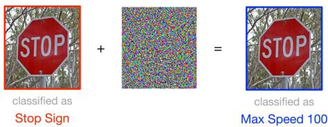
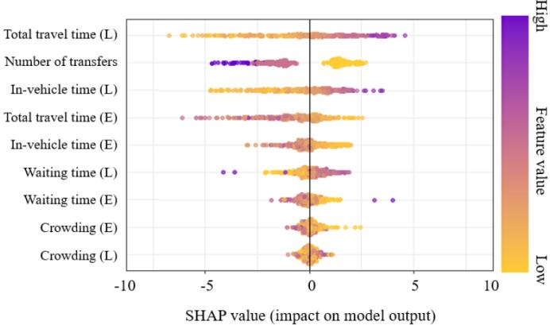
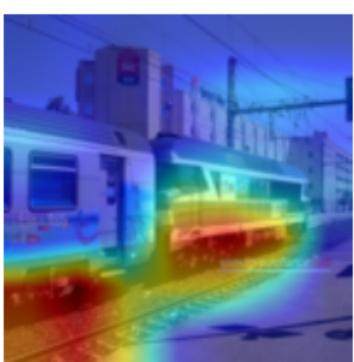
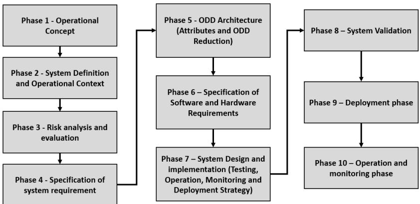
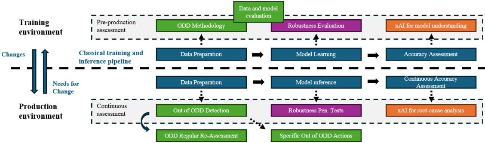

# Building Trust in Artificial Intelligence: A Necessity for Railway Applications

Lefebvre Renard Clement ´ 1\*[0009-0006-3917-6902], Leb´ e Vincent ´ 2[0009-0005-2114-1261],

Da Silva Ribeiro Pereira Ricardo1[0009-0006-8969-2753], Sundell Johan3[0000-0001-7212-5644], Jaoul Arnaud2[0009-0006-3473-7491], Saiah Kenza2[0009-0008-6131-8780], Mijatovic Nenad´ 4[0000-0003-0071-9683]

1Alstom - Mobility Data Science and AI, Madrid, Spain

2Alstom - Mobility Data Science and AI, Saint-Ouen, France

3Alstom - Safety Engineering, Stockholm, Sweden

4Alstom - Chief AI & Data Science Office, Pittsburgh, Pennsylvania USA E-mails: \*clement.lefebvre-renard@alstomgroup.com, vincent.lebe@alstomgroup.com, ricardo.pereira@alstomgroup.com, johan.sundell@alstomgroup.com, arnaud.jaoul@alstomgroup.com, kenza.saiah@alstomgroup.com, nenad.mijatovic@alstomgroup.com

## Abstract

Artificial Intelligence (AI) is currently only applied to non-safety critical applications due to the strict standards and regulations for railway industries. We propose to review the three main fields necessary to increase trust in data science and AI algorithms and reach compliance: robustness, Operational Design Domain (ODD), and explainability. Robustness is the ability of an AI system to maintain its level of performance under any circumstances (ISO24029). ODDs allow the explicit definition of operating conditions under which a system is intended to operate, according to the recently published DIN DKE SPEC 99004. Explainability is the property of an AI system to express important factors influencing the AI system results in a way that humans can understand. Those 3 domains of research are already well investigated by nonrailway actors, with algorithms and methods ready to use for railway applications. A system view is necessary to ensure all trustworthy requirements interact continuously in a safe MLOps environment thereby fostering acceptance from regulators, operators and the public. Beyond safeguarding safety-critical applications, we aim to show that fostering deep trust in AI, as now required by regulatory frameworks worldwide, will unlock its full potential and transform the pace of adoption across mission-critical domains.

## Keywords

Artificial Intelligence, Railway, Transportation, Mobility, Trust, Safety.

## 1 Introduction

The levers of trust needed for AI, as described by Bo Li et al. [1] (2023), are: Robustness, Explainability, Transparency, Reproducibility, Generalization, Fairness, Privacy and Accountability. The theoretical framework they propose towards a more Trustworthy AI is very complete and valuable, as models are increasingly impacting our way of working. This work addresses the industrial gaps of the railway industry to deploy AI at scale, including in safety-related projects. Our paper focuses on the three domains where research is necessary to unlock deploying AI when trust is paramount: Robustness, Explainability, Operational Design Domain (ODD). This publication uses the terminology presented in the ISO22989 [2] (2022), where ”AI system” is defined in this standard as an engineered system that generates outputs such as content, forecasts, recommendations or decisions for a given set of human-defined objectives.

## 1.1 Regulatory Landscape

The regulatory environment for AI in the railway sector is evolving rapidly, and is shaped by both sectorspecific safety standards and cross-sectoral AI regulations. A key development is the EU AI Act, defined as Regulation (EU) 2024/1689 [3], which introduces a risk-based classification of AI systems into the following four categories: Unacceptable risk (e.g., social scoring), High risk (e.g., AI in safety functions or critical infrastructure), Specific transparency obligations (e.g., bots, deepfakes), Minimal or no risk. Given the increasing use of AI in predictive maintenance, autonomous train operations, and safety-critical systems, many railway applications fall under the high-risk category. This classification imposes stringent requirements for transparency, traceability, and human oversight, making Explainable AI (xAI) not only a compliance necessity but also a valuable tool to better understand subsystems. To support these regulatory demands, several international standards and technical reports provide foundational guidance:

• ISO/IEC TR5469:2024 [4] (2024) plays a crucial interim role by offering practical guidance on the use of AI in safety-related systems while the more detailed ISO/IEC TS22440 is under development. It addresses the functional safety of AI systems, particularly in E/E/PE safety-related systems, and introduces a three-stage realization principle (data acquisition, knowledge induction, and output generation). and mitigation strategies tailored to AI.

• IEC61508 [5] (2010), the cornerstone standard for functional safety of electrical / electronic / programmable electronic (E/E/PE) systems, provides the conceptual backbone for ISO/IEC TR5469. Many of the safety principles, such as risk reduction, ALARP (As Low As Reasonably Practicable), and positive risk balance, are adapted and extended to address the unique characteristics of AI systems.

• ISO/IEC22989 [2] (2023) emphasizes explainability, ensuring AI decisions are interpretable by humans.

• ISO/IEC24029 [6] (2023) focuses on robustness, defining it as the AI system’s ability to maintain performance under varying conditions.

• DIN DKE SPEC 99004 [7] (2025) introduces the concept of Operational Design Domains (ODD), specifying the operational boundaries for AI systems.

ISO/IEC TR5469 also highlights the limitations of traditional software assurance methods when applied to AI, such as the inapplicability of code coverage metrics and the challenge of verifying non-deterministic, data-driven models. It advocates for architectural safeguards, robust learning techniques, and runtime monitoring to mitigate AI-specific risks. In summary, legal frameworks like the EU AI Act provide compliance obligations and technical standards provide methodological tools. Those are not sufficient to state clear guidelines for AI compliance in railway safety critical applications, hence a growing pressure from all the stakeholders to clarify the requirements.

## 1.2 Safety Integrity Level

Safety Integrity Level (SIL) is used to evaluate and specify the safety requirements for critical system functions within railway operations and introduces a probabilistic safety approach. The SIL rating system appears in several standards applicable on railway solutions, for instance in IEC61508 [5] (2010) for electrical, electronic and programmable electronic (E/E/PE) systems or in EN50126 [8] (1999), EN50716 [9] (2023), and EN50129 [10] (2018) for safe software development in European Railway Applications. The SIL level and its tolerable hazard rate associated are described in Table 1.

<table><tr><td rowspan=1 colspan=1>Safety Integrity Level</td><td rowspan=1 colspan=1>Tolerable Hazard Rate (THR) per hour and per function</td></tr><tr><td rowspan=1 colspan=1>4</td><td rowspan=1 colspan=1> $\overline { { 1 0 ^ { - 9 } \leq \mathrm { T H R } < 1 0 ^ { - 8 } } }$ </td></tr><tr><td rowspan=1 colspan=1>3</td><td rowspan=1 colspan=1> $\overline { { 1 0 ^ { - 8 } \leq \mathrm { T H R } < 1 0 ^ { - 7 } } }$ </td></tr><tr><td rowspan=1 colspan=1>2</td><td rowspan=1 colspan=1> $1 0 ^ { - 7 } \leq \mathrm { T H R } < 1 0 ^ { - 6 }$ </td></tr><tr><td rowspan=1 colspan=1>1</td><td rowspan=1 colspan=1> $1 0 ^ { - 6 } \le \mathrm { T H R } < 1 0 ^ { - 5 }$ </td></tr></table>

Table 1: Safety Integrated Levels

Peter Wigger (2001) [11] presents several examples of Railway applications SIL levels on the Copenhagen Metro subsystems, where some functions of the ATP (Automatic Train Protection) such as the interlocking and speed profile control are SIL4 while the vehicles door management is SIL3. A SIL4 solution would translate into allowing a failure every 100 000 years, which corresponds to the highest level of safety.

While AI models typically aim for 80–99% accuracy, this falls short of the stringent tolerable hazard rates required by SIL standards. Even high-performing models remain vulnerable to previously unseen out-of-distribution data. Current standards do not fully address AI-specific challenges, especially in safetycritical domains like railways, making compliance assessment difficult and underscoring the need for dedicated AI safety specifications. In operational settings like maintenance analysis, users can benefit from understanding AI outputs, as proposed by Di-Santi et al. (2025) for the predictive maintenance of track circuits [13] [14] and point machines [12] using neural networks. However, in safety-critical scenarios such as an obstacle detected on rails, lives are at stake, leaving no room for errors. In such cases, trust in the system and higher Safety Integrity Levels (SIL) becomes essential, which is why AI is not used currently. This publication describes the need for research to design robust AI systems embedded in SIL environments.

## 2 Robustness of AI Systems

## 2.1 Definition and context

Robustness refers to the ability of an AI system to maintain its level of performance under any circumstances (ISO24029 [6], 2023). This concept addresses the extent to which the system performs under expected and unseen perturbations in input data due to various operational environments. In the railway context, this means that system performance must be maintained across diverse and potentially harsh conditions (such as lighting, weather, . . . ). Collecting diverse and representative data is often difficult due to infrastructure constraints, privacy concerns, or the rarity of edge-case scenarios. As a result, models trained on limited data may become highly sensitive to out-of-distribution inputs.

In the AI literature, generalization and robustness are separate concepts. Generalization refers to the ability of a model to perform well on unseen data, whereas robustness is mainly defined as a per-input property, meaning that a model is robust if it does not change its output for a specified set of perturbations on a given input [15, 16].

## 2.2 Adversarial robustness

In the field of evaluating the robustness of machine learning models, adversarial examples are gathering more and more interest from the community [16, 17, 15, 18, 19]. An adversarial example is a deliberately crafted sample to fool the model’s output by adding small but carefully structured perturbations to a given input, which may or may not be perceptible to humans (see Figure 1).

  
Figure 1: Example of adversarial attack on signaling classification from [20].

This questions the potential use of models in safety-critical systems and introduces challenges that complicate regulatory approval for AI-based systems. Evaluating adversarial robustness refers to the evaluation of the system’s resilience and whether the amount of perturbation needed to create the adversarial examples is sufficiently large, either so that it becomes perceptible to humans, or so that it reasonably justifies the model’s error. As an initial step towards ensuring robustness, it is crucial to verify that the adversarial examples identified involve a level of perturbation that makes the model misclassification understandable. When trying to address adversarial robustness, two major strategies have emerged from the community: (1) empirical defenses that consist of architectural changes or training the model with adversarial examples, to empirically improve the robustness against adversarial attacks [21, 22], (2) certified defenses that provide formal guarantees of the model’s robustness against input perturbations. A certificate c is usually formally defined for a given input x as:

$$
\forall \delta , \quad \| \delta \| < c \implies f ( x ) = f ( x + \delta )
$$

where $f ( x )$ refers to the model’s output.

Certified defenses are therefore a relevant way to assess the robustness of a model in a safety-critical environment. To achieve that, several approaches are being developed such as randomized smoothing [23] providing probabilistic certificates and formal verification methods [24, 25]. Another approach is Lipschitz neural networks [26] that are showing promising results by controlling the Lipschitz constant of the model (see Definition 1).

Definition 1 (Lipschitz Continuity) A function $f : \mathbb { R } ^ { n }  \mathbb { R } ^ { m }$ is said to be Lipschitz continuous if there exists a constant $K \geq 0$ such thatfor all $x _ { 1 } , x _ { 2 } \in \mathbb { R } ^ { n }$

$$
\| f ( x _ { 1 } ) - f ( x _ { 2 } ) \| \leq K \| x _ { 1 } - x _ { 2 } \| .\tag{1}
$$

The smallest such constant K is called the Lipschitz constant of f, denoted Lip(f).

To build Lipschitz neural networks, several methods can be used [27, 26, 28]. In practice, one can use libraries like DEEL-Lip [28] to build such networks. Bounding the Lipschitz constant of neural networks has been shown to improve robustness against adversarial attacks, generalization, and interpretability [29, 30, 28, 31].

Combining this approach with adversarial attacks leads to both a lower bound and an upper bound of the true robustness of the model on a given input. These certificates can be used to certify a prediction and, when the bound is too low, trigger fallback mechanisms, use more computationally expensive methods, such as formal methods, or human intervention to ensure safe operation.

## 3 Explainability

## 3.1 Definition and examples

Explainability is defined in the ISO22989 (2022) [2] as ”the property of an AI system to express important factors influencing the AI system results in a way that humans can understand”. This definition is humancentric, underscoring the importance of making AI systems transparent to all stakeholders and not only the engineers developing it. Explainable AI algorithms are already used for production-grade models to provide insights for the data scientists or the business experts into what the model focused on, and to support debugging and validation tasks. Global xAI explain how a model behaves in general and local xAI explain the reasons behind a specific prediction.

Lee et al. (2021) [32] present an example of global interpretability of a model predicting the preference between using an express or a local train from 9 features, using SHAP (2018) [33], a feature attribution algorithm. Figure 2 (a) shows the 9 features, ranked by importance. Each point represents one sample on which the model does a prediction and gets a local interpretability with Shapley values (1953) [34] expressing the feature´s contribution, as detailed in Figure 2. The local interpretability values of all samples are plot all together. The scale on the right shows the point´s feature values: purple is a high value of the feature, yellow is low. The X-axis represents the impact on model output, negative or positive. In that case, a negative value lowers the output probability of taking an express train, while a positive value raises it. Engineers could draw conclusions from XAI, such as: the longer the trip, the more likely a passenger is to take an express train according to the model.

Figure 2 (b) is an example of local explainability, of an image classified as a train from Stalder et al. (2022) [35]. GradCAM [36], a post-hoc attribution algorithm, shows the pixel the algorithm focused on to classify. The more red the pixel is, the more important it is for the computer vision classifier (in our example, the algorithm focused on the boggie of the train). Local explainability methods are used in the railway industry on production-grade algorithms, such as the detection and recognition of wayside signals by Staino et al. (2022) [37] or the detection and classification of wheel tread defects based pictures by Trilla et al. (2021) [38]. In railway systems, apart from being a necessity to understand complex models, explainability is leveraged for new use cases such as root cause analysis for incident investigation.

  
(a) Global explainability of an express train classifier [32]

  
(b) Local explainability of a classified train [35]  
Figure 2: Global and local explainability

Both global and local explanations are necessary to provide engineers and users insights on the system they are building.

## 3.2 Methods and limitations

Many state of the art publications list the methods for explainable AI very well, notably Molnar (2020) [39] providing a deep review of algorithms for tabular Machine Learning, the unified comprehensive review of Minh et all (2022) [40] and more recently Enemona et al. (2025) [41] on the emerging techniques in 2025.

Minh et all [40] describe three groups of methods : (i) pre-modeling explainability to ensure transparency in data preparation and feature selection (ii) interpretable model, which are transparent by design (such as decision trees, linear models, and rule-based systems) and (iii) post-modeling explainability, refering to methods applied after a model has been trained, particularly for complex or black-box models (for example SHAP for tabular data or Saliency maps for Computer Vision). Fel et all [42] gathered the most important methods of the state of the art in a single package: Xplique, which facilitates the adoption. By providing a consistent interface with XAI algorithms, the unified framework promotes reproducibility and comparability across studies. Both SHAP and Gradcam, used for the example of Figure 2, are accessible.

However, we would like to highlight that even if the research on XAI algorithms seems quite avanced, there are still important gaps before XAI becomes an enabler for implementation in safety-related areas. The research community is more focused on computer vision use cases than on tabular or time series applications, which are highly important in the railway industry. The current state of the art presents hypothesis that must be understood and tracked if explaination becomes a safety or a regulation requirement. Indeed, post-modeling explainability algorithms are a representation of the model´s reasoning, not the reality. For instance, one could expect the features presented in Figure 2 (a) to be quite correlated... and computing explainations with SHAP when features are correlated is likely to provide an interpretation not representing well the model´s decision making process, as widely covered by the literature and by [39]. So mathematical hypothesis should be tracked and verified if one is to provide trust on a model´s explainability.

The only safe way to ensure an explanation given is trustworthy as of now is to use a model interpretable by design, which is what is currently done in regulated areas where models take decision (ex: an expert model for interlocking presented by Klein et al. (1991) [43])). By using simple models such as linear regression or decision trees, engineers and auditors can be sure to fully understand and trust what´s behind the model decision, which is paramount for safety-related projects. Another relevant research path is causality, which aims to identify a direct link between an input and the model´s output. By understanding cause-and-effect relationships in data rather than just identifying correlations, one can get back to the true reason behind an artificial intelligence reasoning. However, this research domain is at its early stage and will need more maturity before being fully integrated in production products.

## 4 Operational Design Domain

As per DIN DKE SPEC 99004 [7] (2025), the Operational Design Domain (ODD) in Rail is defined as an operational domain in which a given AI system, or feature thereof, is specifically designed to function. By clearly defining the boundaries, ODD help prevent AI systems from operating outside their safe zones, reducing risk and improving predictability. Confiance.AI provided a simple example of ODD for their welding quality use case [44], where a model is used to detect welding defects on images. Domain experts defined the acceptable conditions for image acquisition: Image brightness, rotation angles between -30° and +30°, translation of the piece in the image up to 5 millimeters.

The DIN DKE SPEC 99004 [7] details the steps to follow for the ODD´s lifecycle. We propose to resume this lifecycle in Figure 3.

  
Figure 3: ODD Steps as per DIN DKE SPEC 99004 [7]

The research on ODD has been primarily driven by the Autonomous Driving field, which happens to use Artificial Intelligence in some specific cases. We believe that what was done for Autonomous Driving could be applied to all A.I use cases, which would bring more trust in all production algorithms. The ODD concepts are already well defined and industrialized for autonomous driving, and all AI applications would benefit from the standardized requirements already guiding the development of autonomous vehicles. Indeed, when reading the 10 purposes of an ODD presented in [7], one can identify attributes that are desirable for any AI system. For instance: ”ODD limit detection: By defining an ODD one can develop algorithms to determine which sensing capabilities or data input are needed to detect when the AI System is inside and outside expected operating conditions.” That statement would ring a bell to any data scientist who have been confronted to the issue of data drift.

Data drift is defined as a significant change to the data distribution compared to the data used for training. The model is then operating over a domain it has not been properly evaluated on, which may decrease the trust one could have over the results. Many methods exist for data drift detection in an industrial context, as detailed by Simonetto et al. [45] (2025), ranging from statistical tests to uncertainty evaluation. So detecting when the input data is different from the boundaries defined in the ODD and the training data is feasible. The issue is more on the actions taken after a drift identification: if a model retraining is required, then change management of the ODD is also needed, which is costly and long. Hence the need for the standardization and industrialization of ODD, to save engineering and validation time for changes.

Overall, ODD is an important lever of trust for AI solutions. The strong added value of ODD highlights the key need of system engineers when designing AI solutions, and not only data scientists focusing on creating the best algorithms.

## 5 A System Approach to Trustworthy AI

Rather than treating robustness, ODD, and explainability as isolated requirements, we advocate for a systemic approach where these elements interact continuously. Those three pillars shall be integrated in operations to continuously monitor AI performance and boundary conditions, and identify when a model shall be updated or not used at all. System definitions are already defined in detail in the work of Confiance.AI by Mattioli et al. in several publications [46, 47, 48] (2024).

We propose in Figure 4 an approach where those three technological bricks are integrated into a classical Machine Learning flow (in blue): The ODD is defined after having acquired the right data and the robustness tests are performed on the model continuously. In production, the ODD technologies are used to identify needs for changes in the ODD (in green) and take mitigation actions for specific samples. The explainability bricks (in orange) are used by engineers to understand the model, globally in a training environment, then locally to understand each prediction of the production environment.

  
Figure 4: System approach using Trustworthy AI technologies

To do so, a safe MLOps (Machine Learning Operations) environment is necessary, as proposed by Zeller et al. [49] (2023), with a software infrastructure able to continuously assess and validate the trustworthiness of an AI in production without a human intervention. This will faster development by simplifying the engineering workload of monitoring models in production and increase cross-functional collaboration between AI developers and safety engineers. Such a system fosters trust not only from regulators but also from operators and the public, accelerating AI adoption in mission-critical railway applications. A system approach is imperative if one wants to deploy AI products in critical environments.

## 6 Conclusion

By focusing on robustness, ODD and xAI —and integrating them into a systemic framework— we can pave the way for safe, compliant, and widely accepted AI systems. Future work should focus on the development of certification frameworks and standards that establish the foundation to clear and exhaustive requirements for safety-critical applications in railways. Looking for algorithm compliance is not possible without the necessary norms to frame the use of AI. Railways would benefit from cross-industry collaboration to leverage their best practices and standards. Several sectors are more advanced, such as the aerospace and automotive where engineers are already implementing AI models in safety-critical systems, supported by explicit requirements. This publication does not exhaustively treat all key attributes needed for a trustworthy AI, which should operate ethically and safely, within a cyber-secured environment and be supported by a strong data management system that correctly stores accurate data. Only by being extremely precise over the complete life cycle of AI will we be able to deploy AI in railway safety-critical environments.

## References

[1] Bo Li et al. “Trustworthy AI: From Principles to Practices”. In: ACM Computing Surveys 55.9 (2023), Article 177. DOI: 10.1145/3555803.

[2] International Organization for Standardization and International Electrotechnical Commission. Information technology — Artificial intelligence — Artificial intelligence concepts and terminology. Standard ISO/IEC 22989:2022. Geneva, Switzerland. URL: https://www.iso.org/standard/74296.html.

[3] The EU Artificial Intelligence Act. https://eur-lex.europa.eu/eli/reg/2024/1689/oj. Official Journal of the European Union, L series, 12.7.2024. 2024.

[4] ISO/IEC TR 5469:2024 - Artificial intelligence — Functional safety and AI systems. Technical Report ISO/IEC TR 5469:2024. International Organization for Standardization (ISO) and International Electrotechnical Commission (IEC), 2024. URL: https://www.iso.org/standard/81283.html.

[5] International Electrotechnical Commission. Functional safety ofelectrical/electronic/programmable electronic safety-related systems. Standard IEC 61508:2010. URL: https://webstore.iec.ch/.

[6] Artificial Intelligence (AI) — Assessment of the robustness of neural networks — Part 1: Overview and Part 2: Methodology for the use of formal methods. International Standard. Available from https://www.iso.org/standard/77608.html. Geneva, Switzerland, 2023.

[7] DIN - Deutsches Institut fur Normung e.V.¨ DIN DKE SPEC 99004:2025-05 - Specification ofOperational Design Domain in Rail. https://dx.doi.org/10.31030/3610746. May 2025.

[8] CENELEC. EN 50126-1:1999 Railway Applications – The Specification and Demonstration of Reliability, Availability, Maintainability and Safety (RAMS) – Part 1: Basic Requirements and Generic Process. 1999. URL: https://www.cenelec.eu/.

[9] CENELEC. EN 50716:2023 - Railway applications – Software for communication, signalling and processing systems. European Standard. 2023. URL: https://www.cenelec.eu/.

[10] CENELEC. EN 50129:2018 Railway Applications – Communication, Signalling and Processing Systems – Safety Related Electronic Systems for Signalling. 2018. URL: https://www.cenelec.eu/.

[11] Peter Wigger. “Experience with Safety Integrity Level (SIL) Allocation in Railway Applications”. In: EIC2 Conference Proceedings. 2001. URL: https://www.eic2.com/pdf/publ 2001 experience with safety integrity level allocation in railway applications.pdf.

[12] Eduardo Di Santi et al. Scalable, Technology-Agnostic Diagnosis and Predictive Maintenance for Point Machine using Deep Learning. 2025. DOI: 10.48550/arXiv.2508.11692.

[13] Francisco Lopez et al.´ Track Component Failure Detection Using Data Analytics over existing STDS Track Circuit data. 2025. DOI: 10.48550/arXiv.2508.11693.

[14] Debdeep Mukherjee et al. “CVCM Track Circuits Pre-emptive Failure Diagnostics for Predictive Maintenance Using Deep Networks”. In: arXiv preprint (2025). DOI: 10.48550/arXiv.2508.09054.

[15] Christian Szegedy et al. “Intriguing properties of neural networks”. In: International Conference on Learning Representations (ICLR). 2014. DOI: 10.48550/arXiv.1312.6199.

[16] Ian J. Goodfellow, Jonathon Shlens, and Christian Szegedy. “Explaining and Harnessing Adversarial Examples”. In: ICLR. 2015. DOI: 10.48550/arXiv.1412.6572.

[17] Jun Guo et al. “A comprehensive evaluation framework for deep model robustness”. In: Pattern Recognition 137 (May 2023), p. 109308. ISSN: 0031-3203. DOI: 10.1016/j.patcog.2023.109308.

[18] Nicholas Carlini and David Wagner. “Towards Evaluating the Robustness of Neural Networks”. In: IEEE Computer Society, May 2017, pp. 39–57. ISBN: 978-1-5090-5533-3. DOI: 10.1109/SP.2017.49.

[19] Nicolas Papernot, Patrick McDaniel, and Ian Goodfellow. Transferability in Machine Learning:from Phenomena to Black-Box Attacks using Adversarial Samples. 2016. DOI: 10 . 48550/arXiv. 1605 . 07277.

[20] M. Julia et al. “It Is All About Data: A Survey on the Effects of Data on Adversarial Robustness”. In: arXiv preprint (2023). DOI: 10.48550/arXiv.2303.09767.

[21] Aleksander Madry et al. “Towards deep learning models resistant to adversarial attacks”. In: arXiv preprint arXiv:1706.06083 (2017). DOI: 10.48550/arXiv.1706.06083.

[22] Ziyi Dong, Pengxu Wei, and Liang Lin. “Adversarially-Aware Robust Object Detector”. In: Proceedings of the European Conference on Computer Vision (ECCV). Vol. 13669. Lecture Notes in Computer Science. Springer, 2022, pp. 297–313. DOI: 10.1007/978-3-031-20077-9 18.

[23] Jeremy Cohen, Elan Rosenfeld, and Zico Kolter. “Certified adversarial robustness via randomized smoothing”. In: Proceedings of the 36th International Conference on Machine Learning. Vol. 97. PMLR, 2019, pp. 1310–1320. DOI: 10.48550/arXiv.1902.02918.

[24] Guy Katz et al. “Reluplex: An efficient SMT solver for verifying deep neural networks”. In: International conference on computer aided verification. Springer. 2017, pp. 97–117. DOI: https://doi.org/ 10.48550/arXiv.1702.01135.

[25] Shiqi Wang et al. “Beta-crown: Efficient bound propagation with per-neuron split constraints for neural network robustness verification”. In: Advances in neural information processing systems 34 (2021), pp. 29909–29921. DOI: https://doi.org/10.48550/arXiv.2103.06624.

[26] Cem Anil, James Lucas, and Roger Grosse. “Sorting out Lipschitz function approximation”. In: Proceedings ofthe 36th International Conference on Machine Learning. Ed. by Kamalika Chaudhuri and Ruslan Salakhutdinov. Vol. 97. June 2019, pp. 291–301. DOI: 10.48550/arXiv.1811.05381.

[27] Takeru Miyato et al. “Spectral normalization for generative adversarial networks”. In: arXiv preprint arXiv:1802.05957 (2018). DOI: https://doi.org/10.48550/arXiv.1802.05957.

[28] Mathieu Serrurier et al. “Achieving robustness in classification using optimal transport with hinge regularization”. In: Proceedings of the IEEE/CVF Conference on Computer Vision and Pattern Recognition (CVPR). 2021. DOI: 10.1109/CVPR46437.2021.00057.

[29] Matthias Hein and Maksym Andriushchenko. “Formal Guarantees on the Robustness of a Classifier against Adversarial Manipulation”. In: arXiv preprint (2017). DOI: 10.48550/arXiv.1705.08475.

[30] Jure Sokolic et al. “Robust large margin deep neural networks”. In: IEEE Transactions on Signal Processing 65.16 (2017), pp. 4265–4280. DOI: 10.1109/TSP.2017.2708039.

[31] Dimitris Tsipras et al. “There is no free lunch in adversarial robustness (but there are unexpected benefits)”. In: arXiv preprint arXiv:1805.12152 2.3 (2018). URL: https://arxiv.org/pdf/1805.12152v2.

[32] Eun Hak Lee et al. “Estimating Express Train Preference of Urban Railway Passengers Based on Extreme Gradient Boosting (XGBoost) using Smart Card Data”. In: Transportation Research Record 2675.9 (2021), pp. 1–13. DOI: 10.1177/03611981211013349.

[33] Scott M. Lundberg, Gabriel G. Erion, and Su-In Lee. “Consistent Individualized Feature Attribution for Tree Ensembles”. In: CoRR abs/1802.03888 (2018). DOI: 10.48550/arXiv.1802.03888.

[34] Lloyd S. Shapley. A Value for n-Person Games. Tech. rep. P-295. RAND Corporation, 1953. URL: https://www.rand.org/pubs/papers/P295.html.

[35] Steven Stalder et al. “What You See is What You Classify: Black Box Attributions”. In: Advances in Neural Information Processing Systems. Vol. 35. 2022, pp. 84–94. DOI: 10.48550/arXiv.2205.11266.

[36] Ramprasaath R. Selvaraju et al. “Grad-CAM: Visual Explanations from Deep Networks via Gradientbased Localization”. In: Proceedings of the IEEE International Conference on Computer Vision (ICCV). 2017, pp. 618–626. DOI: 10.1109/ICCV.2017.74.

[37] Andrea Staino et al. “Real-Time Detection and Recognition of Railway Traffic Signals Using Deep Learning”. In: Journal ofBig Data Analytics in Transportation 4 (2022). DOI: 10.1007/s42421-022- 00054-7.

[38] Alexandre Trilla et al. “Integrated Multiple-Defect Detection and Evaluation of Rail Wheel Tread Images using Convolutional Neural Networks”. In: International Journal ofPrognostics and Health Management 12.1 (2021), pp. 1–12. DOI: 10.36001/ijphm.2021.v12i1.2906.

[39] Christoph Molnar. Interpretable Machine Learning: Definitions, Methods, andApplications. Lulu.com, 2020. URL: https://christophm.github.io/interpretable-ml-book/.

[40] Dang Minh et al. “Explainable artificial intelligence: a comprehensive review”. In: Artificial Intelligence Review 55.5 (2022), pp. 3503–3568. DOI: 10 . 1007 / s10462 - 021 - 10088 - y. URL: https : //link.springer.com/article/10.1007/s10462-021-10088-y.

[41] Daniel Enemona Mathew et al. “Recent Emerging Techniques in Explainable Artificial Intelligence to Enhance the Interpretable and Understanding of AI Models for Human”. In: Neural Processing Letters 57.16 (2025). DOI: 10.1007/s11063-025-11732-2.

[42] Thomas Fel et al. “Xplique: A Deep Learning Explainability Toolbox”. In: Workshop on Explainable Artificial Intelligence for Computer Vision (CVPR) (2022). DOI: 10.48550/arXiv.2206.04394.

[43] Peter Klein. “The safety-bag expert system in the electronic railway interlocking system elektra”. In: Expert Systems with Applications 3.4 (1991). DOI: 10.1016/0957-4174(91)90175-E.

[44] Confiance AI Team. Welding Quality Detection Challenge. https://confianceai.github.io/Welding-Quality-Detection-Challenge/. Accessed: 2025-07-17. 2025.

[45] Thibault Simonetto et al. “On the Impact of Industrial Delays when Mitigating Distribution Drifts: An Empirical Study on Real-World Financial Systems”. In: Discovering Drift Phenomena in Evolving Landscapes. Vol. 15013. Springer, 2025. DOI: 10.1007/978-3-031-82346-6 4.

[46] Juliette Mattioli et al. “An Overview of Key Trustworthiness Attributes and KPIs for Trusted ML-Based Systems Engineering”. In: AI and Ethics 4 (2024). DOI: 10.1007/s43681-023-00394-2.

[47] Karla Quintero et al. “An end-to-end method for operationalizing trustwothiness in AI-based critical systems”. In: 15th International Conference on Performance, Safety and Robustness in Complex Systems and Applications PESARO 2025. May 2025. URL: https://hal.science/hal-05074120.

[48] Juliette Mattioli et al. “Trustworthy ML Assessment methodology”. In: 4th International Conference on AI ML, Data Science, and Robotics. Nov. 2024. URL: https://hal.science/hal-04813492.

[49] Marc Zeller et al. “Towards a safe MLOps Process for the Continuous Development and Safety Assurance of ML-based Systems in the Railway Domain”. In: arXiv preprint (2023). DOI: 10.48550/ arXiv.2307.02867.