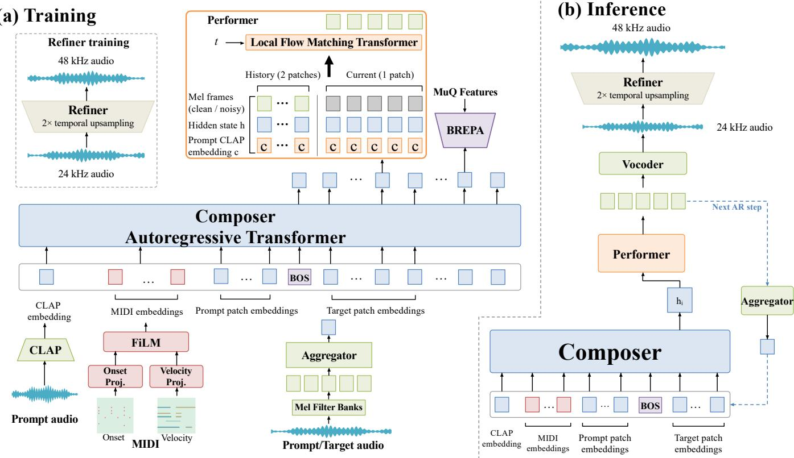

# CPR: COMBINING GLOBAL COMPOSING, LOCAL PERFORMING AND FULL-SEQUENCE REFINING IN PIANO RENDERING WITH CONTINUOUS AUTOREGRESSIVE MODELLING

Chong Jing, Junan Zhang, Zhizheng Wu

The Chinese University of Hong Kong, Shenzhen

{chongjing,junanzhang}@link.cuhk.edu.cn, wuzhizheng@cuhk.edu.cn

## ABSTRACT

Prompt-conditioned piano MIDI-to-Music rendering aims to faithfully render target notes while reproducing the timbre of a reference recording. Existing approaches primarily follow two paradigms: autoregressive (AR) modeling and flow matching (or diffusion). Discrete-codec AR models provide causal temporal modeling, but quantization can discard acoustic detail. Flow matching better preserves acoustic structure in the cost of full-sequence attention costs and worse semantic structure. Continuous autoregressive models operate directly on continuous representations. It not only combines the condition-following ability of AR models and distribution-modeling capacity of flow matching but also bypasses the quantization bottleneck with lower computational costs. Building on this principle, we present Composer–Performer–Refiner (CPR) framework. Composer autoregressively predicts continuous hidden states, Performer generates 24kHz acoustic latents through local flow matching and Refiner then upsamples the waveform to 48 kHz. We further introduce Bottlenecked Representation Alignment (BREPA) and Modality–Time RoPE (MT-RoPE) to strengthen musical semantic structure in Composer hidden states and temporal alignments across modalities. Codes are available at https: //github.com/FEAfeatherTHER/CPR\_official.

Index Terms— piano rendering, MIDI-to-Music, flow matching, autoregressive modeling, representation alignment

## 1. INTRODUCTION

Prompt-conditioned piano MIDI-to-Music synthesis renders target MIDI while transferring the acoustic identity of a reference recording. Given prompt audio, its aligned MIDI, and target MIDI, a piano renderer must follow note onsets and dynamics, preserve prompt timbre, and produce a musically expressive performance.

Autoregressive (AR) and flow matching (or diffusion) models [1, 2] are two established paradigms for systems like MIDI-to-Music (MTM) and Text-to-Speech (TTS) [3, 4, 5, 6, 7, 8]. AR models generate audio through next-token prediction like MIDI-VALLE [3]. However, quantization limits the representation of continuous music, while the train–test mismatch from teacher forcing causes cumulative errors, degrading long-sequence generation and controllability. Fullsequence flow matching with bidirectional attention can capture richer acoustic details like P-MUSE [6]. It demonstrates superior timbre similarity but lacking in naturalness in musicality. Many literatures [9, 10] have verified that pure flow matching supervision has difficulty in recovering semantic structure which is necessary for generation thus requires auxiliary alignment objectives.

A common improved hybrid system uses an AR model to predict first-depth codebook tokens that condition full-sequence flow matching [11]. These independently trained stages combine both paradigms, but quantization bottleneck still limits the performance of generation. Several recent works have proposed to autoregressively generate continuous representations to bypass the quantization bottleneck. DiTAR [12] bulid a continuous autogressive TTS system, composed of a global autogressive and a local diffusion model with aggregated patch tokens, which shorten sequences thus mitigates cumulative error. FireRedTTS-3 [13] further emphasize the latent’s semantic structure because its importance in continuous autogressive model and the trade off between reconstruction and generation [10].

Considering the more complex temporal structure and harmonic components in music domain, MiniMax Music 3 [14] design a cascaded system with a Hybrid-LLM and a full-sequence flow matching transformer. Hybrid-LLM incorporates a Global-LLM and a Local-LLM to regress codes of first and residual depths respectively. To mitigate quantization loss, its generation is directly conditoned on continuous Hybrid-LLM hidden states. However, the Local-LLM can worsen error accumulation so replacing it with local FM is more fundamentally aligned with first principles to alleviate both limitations. It’s also worth noticing that the tokenizer in MiniMax Music 3 is on 24kHz and variational autoencoder(VAE) on 44.1kHz. This strategy arises from the different representational requirements and preference of autoregressive modeling and flow matching.

Building on these observations, we propose Composer–Performer– Refiner (CPR) framework for MIDI-to-Music. We first jointly train Composer–Performer as a continuous autoregressive model on 24 kHz. We then train a Refiner [15] to upsample the generated waveforms to 48kHz. Considering that flow matching loss lacks direct supervision for Composer hidden states, we therefore introduce Bottlenecked Representation Alignment (BREPA) as an auxiliary semantic supervision objective. It aligns a compressed projection of Composer hidden states with self-surpervised features, strengthening musical structure while retaining capacity for acoustic details. To further enhance condition following, we introduce Modality–Time Rotary Position Embeddings (MT-RoPE) to improve cross-modal temporal alignment between MIDI and audio.

In summary, the contributions are as follows:

• We introduce CPR, a framework that combines complementary strengths of autoregressive and flow matching modeling. Extensive experiments demonstrate that CPR achieves stateof-the-art (SOTA) performance on the piano MIDI-to-Music generation task.

• To enhance semantic alignment and facilitate the joint optimization of the system, we introduce Bottlenecked Representation Alignment (BREPA).

• We propose Modality–Time RoPE (MT-RoPE), a two-axis adaptation of rotary position embeddings [16] that achieves better temporal alignment between audio and MIDI modalities.

  
Fig. 1. Overview of CPR: (a) training, including the Performer architecture, and (b) autoregressive inference. Composer and Performer are jointly trained with flow matching and BREPA loss. Performer conditions each 5-frame patch on two clean historical patches, concatenating Composer hidden states and repeated prompt CLAP embeddings with mel frames along the feature dimension. The separately trained Vocos-based Refiner maps generated 24 kHz audio to 48 kHz.

## 2. METHOD

## 2.1. Formulation

Given a sequence of continuous embeddings $( x _ { 1 } , x _ { 2 } , \ldots , x _ { N } )$ , an autoregressive model performing next-token prediction can be formulated as:

$$
p _ { \theta } ( x _ { 1 } , x _ { 2 } , \ldots , x _ { N } ) = \prod _ { i = 1 } ^ { N } p _ { \theta } ( x _ { i } \mid x _ { 1 } , x _ { 2 } , \ldots , x _ { i - 1 } ) .\tag{1}
$$

Instead of regressing token by token, CPR aggregates groups of adjacent P tokens into one patch embedding pi and replace the classification head based on discrete tokens with a local flow matching head based on continuous latents. Local flow matching models the distribution pθ $( x _ { i + 1 } , \ldots , x i + P )$ of the current patch.

## 2.2. Architecture

## 2.2.1. Composer–Performer–Refiner

As shown in Fig. 1, CPR is trained in two stages. First stage is a jointly trained continuous autogressive system including Composer and Performer. We aggregate five 20-ms Mel frames into one 100-ms patch embedding. Composer is a causal transformer that autoregressively predicts the continuous hidden states of each acoustic patch, while Performer is a local bidirectional flow matching transformer [17] that generates the next acoustic patch conditioned on the clap embedding, Composer hidden states, and historical information with In-Context Learning. The second stage is training the Refiner that upsamples efficiently the generated 24 kHz waveform to 48 kHz based on Vocos [15].

## 2.2.2. Composer

Prompt and target MIDI are rasterized at 25 Hz into onset and velocity channels. Separate projections encode the two channels, which are fused through feature-wise linear modulation (FiLM) to form MIDI embeddings. The patch embeddings are aggregated into a prepended [CLS] token through a transformer encoder within each patch. The CLAP embeddings [18] of the prompt audio, MIDI and patch embeddings are concatenated through the sequence dimension. The backbone of Composer is an autogressive transformer.

To strengthen cross modality temporal alignment, we introduce Modality–Time RoPE (MT-RoPE). It is a two-axis adaptation of rotary position embeddings [16]. Inspired by the axis-wise decomposition in Qwen2-VL’s M-RoPE [19] and ARDiT’s modality-specific fractional position indexing [20], we allocate half of the rotary dimensions for modality identity, half for temporal position and MIDI and audio embeddings are indexed independently. For MIDI frame r at 25 Hz and audio patch i at 10 Hz, their temporal coordinates are $\textstyle { \frac { 1 0 } { 2 5 } } r$ and i, respectively, placing both modalities on a common physical-time axis.

## 2.2.3. Performer

Flow matching models data distribution through a velocity field conditioned on the noisy observation. We use a linear path [1] between clean data and standard Gaussian noise:

$$
x _ { t } = t x _ { 1 } + ( 1 - t ) x _ { 0 } , \quad \mathrm { w h e r e } \ x _ { 0 } \sim \mathcal { N } ( 0 , \mathbf { I } )\tag{2}
$$

Along the sequence dimension, we concatenate the historical clean context with the current noisy mel spectrogram. Along the feature dimension, we concatenate the audio prompt’s CLAP embedding, Composer hidden states, and mel spectrogram. CLAP supplies a global timbre prior when local history is degraded or uninformative. To prevent this prior from becoming a shortcut that limits In-Context Learning, Performer uses hierarchical condition dropping for CFG [21]: dropping Composer hidden states always drops CLAP; otherwise, CLAP is dropped with probability 0.2. This encourages timbre cloning through history and Composer hidden states.

## 2.2.4. Refiner

Because directly aggregating patch embeddings on latents of 48kHz audio contains too much high-frequency acoustic information not fit for semantic modeling, our continuous autoregeressive model is trained on the 24 kHz. Then Refiner, composed of a transposed convolution layer, a ConvNeXt backbone and a STFT prediction head [15], converts the reconstructed 24 kHz waveform to 48 kHz to compenstate for high-frequency harmonic components.

## 2.2.5. Bottlenecked Representation Alignment

BREPA operates only on alignment branch during training [22]. A transposed-convolution module upsamples Composer hidden states from 10 Hz to 25 Hz with a bottleneck (1024 → 768) enforcing irreversible compression. The resulting representations are aligned with MuQ features with cosine similarity loss. The bottleneck forces most of hidden states’ dimension to capture the semantic structure while the remaining dimensions retain capacity for residual information like acoustic details.

## 3. EXPERIMENTS

## 3.1. Dataset

The training data combine real recordings and synthesized audio with aligned MIDI annotations, restricted to piano-family instruments. They comprise real piano performances from MAESTRO [23], piano tracks from Slakh [24], and single-track MIDI sequences from Lakh [25] rendered using NSynth note samples [26]. The overall timbral distribution basically covers all eight subcategories within the Piano family under General MIDI standard. Recordings are segmented into 3–30-s clips, totaling approximately 5,000 hours in duration. We evaluate on the paired-prompt piano generation task of P-MUSE-eval [6], comprising 100 samples covering diverse pianofamily timbres. Each sample provides an audio prompt, its aligned MIDI, and a target MIDI sequence.

## 3.2. Implementation Details

Model. Composer is initialized from Qwen3-0.6B [27], removing the original vocabulary embeddings. Patch aggregator is a 4-block transformer encoder with 8 attention heads, a hidden dimension of 1024, and a feed-forward dimension of 4096. Composer contains approximately 500M parameters. Performer is a 6-block DiT with 8 attention heads, a hidden dimension of 1024, and a feed-forward dimension of 4096, totaling approximately 175M parameters. We extract 128-dimensional mel spectrograms from 24 kHz audio with a hop size of 480 samples. The vocoder is based on Vocos [15] and maps generated mel spectrograms to 24 kHz waveforms, with approximately 255M parameters. Refiner is also Vocos-based with a transposed-convolution module and contains approximately 14M parameters.

Training. Composer and Performer are trained jointly using AdamW [28] with $\beta _ { 1 } ~ = ~ 0 . 9 , ~ \beta _ { 2 } ~ = ~ 0 . 9 9 9$ , weight decay 0.01, and a gradient clipping threshold of 0.2. Training is performed on 8 NVIDIA GeForce RTX 5090 GPUs with dynamic batch sizes for 200,000 steps and a 4,000-step linear warmup followed by inversesquare-root learning-rate decay. The peak learning rate is $2 \times 1 0 ^ { - 5 }$ for the Qwen3-initialized AR Transformer and $\overline { { 1 } } \times 1 0 ^ { - 4 }$ for the remaining modules in the Composer–Performer system. The training objective for Composer-Performer is

$$
\mathcal { L } _ { \mathrm { C - P } } = \mathcal { L } _ { \mathrm { f l o w } } + 0 . 5 \mathcal { L } _ { \mathrm { B R E P A } } ,\tag{3}
$$

Refiner is pretrained for 700k steps then fine-tuned for 90k steps on full-band data. Random bandwidth degradation constructs inputs paired with the original 48 kHz audio as targets. We use AdamW with a batch size of 48. Generator and discriminator learning rates are $1 0 ^ { - 4 }$ during pretraining. During fine-tuning, the generator rate is reduced to $2 \times 1 0 ^ { - 5 }$ while the discriminator rate remains $1 0 ^ { - 4 }$ . The Refiner generator objective is

$$
{ \mathcal { L } } _ { \mathrm { R e f i n e r } } = { \mathcal { L } } _ { \mathrm { M R - S T F T } } + 1 5 { \mathcal { L } } _ { \mathrm { M R - M e l } } + { \mathcal { L } } _ { \mathrm { a d v } } + { \mathcal { L } } _ { \mathrm { f e a t } } ,\tag{4}
$$

where the four terms denote multi-resolution STFT, multi-resolution mel, adversarial, and feature-matching losses, respectively [29].

Inference. Each patch is sampled from Gaussian noise using a first-order Euler ODE solver. Let $v _ { c } = v _ { \theta } ( x _ { t } , t , e , h , H )$ denote the conditional velocity field, where e is the audio prompt’s CLAP embedding, h is the Composer hidden state, and H is the clean historical context. Dropping only e and h while retaining H gives $v _ { u } = v _ { \theta } ( x _ { t } , t , \emptyset , \emptyset , H )$ . CFG and Euler updates are

$$
v _ { \mathrm { C F G } } = v _ { c } + w ( v _ { c } - v _ { u } )\tag{5}
$$

$$
x _ { t _ { k + 1 } } = x _ { t _ { k } } + ( t _ { k + 1 } - t _ { k } ) v _ { \mathrm { C F G } } .\tag{6}
$$

w is CFG strength. We use 4 Euler integration steps per patch. After sampling, the generated mel patch is converted into the patch embedding and fed back to Composer for next autoregressive step. The generated mel sequence is decoded into 24 kHz audio by the vocoder and mapped to 48 kHz by Refiner.

## 3.3. Metrics

We report timbre similarity (Sim), onset F1, and Frechet Audio Dis-´ tance (FAD) [30] to evaluate timbre preservation, MIDI adherence, and the overall generation quality respectively.

Sim measures the embedding similarity between generated audio and its corresponding audio prompt[31]. For onset F1, we use MuScriptor-Large [32] to transcribe the generated audio into note sequences, which are then compared with the target MIDI. A note is considered correctly matched only if its pitch agrees and its onset differs with a tolerance of 50 ms (offsets are not considered). For FAD, we use LAION-CLAP (music) features [18] to compute the Frechet distance between the distributions of the generated au-´ dio set and the corresponding ground-truth target audio set from P-MUSE-eval, denoted as $\mathrm { F A D } _ { \mathrm { c l a p } }$ . Higher Sim and onset F1 and lower $\mathrm { F A D } _ { \mathrm { c l a p } }$ indicate better performance.

Table 1. Objective results on P-MUSE-eval test set. C–P: outputs of Composer–Performer; SR: sampling rate in kHz. Sim and onset F1 are percentages. NFE counts sampling steps; Refiner adds none. “–” means not applicable. Best and second-best metric values are bold and underlined.
<table><tr><td colspan="5">Model SR NFE Sim ↑ Onset F1 ↑  $\mathrm { F A D } _ { \mathrm { c l a p } } \downarrow$ </td></tr><tr><td>P-MUSE MIDI-VALLE</td><td>24 25 32 一</td><td>90.6 83.4</td><td>75.7 63.7</td><td>0.161 0.390</td></tr><tr><td>C-P</td><td>24 2</td><td>89.0</td><td>75.1</td><td>0.165</td></tr><tr><td>C-P</td><td>24 4</td><td>89.3</td><td>78.3</td><td>0.147</td></tr><tr><td>C-P</td><td>24 10</td><td>89.3</td><td>78.4</td><td>0.148</td></tr><tr><td>CPR</td><td>48 4</td><td>89.3</td><td>78.4</td><td>0.129</td></tr><tr><td></td><td></td><td></td><td></td><td></td></tr></table>

Table 2. MOS on 14 P-MUSE-eval samples rated by 13 listeners on a 1–5 scale. Higher is better.
<table><tr><td>Model</td><td>Timbre sim. MIDI acc. Naturalness</td><td></td><td></td></tr><tr><td>Ground truth</td><td>4.429</td><td>4.929</td><td>4.500</td></tr><tr><td>P-MUSE</td><td>4.071</td><td>4.571</td><td>3.857</td></tr><tr><td>MIDI-VALLE</td><td>2.357</td><td>3.643</td><td>3.214</td></tr><tr><td>C–P (24 kHz)</td><td>4.214</td><td>4.643</td><td>4.000</td></tr><tr><td>CPR (48 kHz)</td><td>4.000</td><td>4.714</td><td>4.071</td></tr></table>

For subjective evaluation, we report mean opinion scores (MOS) for timbre similarity, MIDI accuracy, and naturalness. Listeners rate each dimension on a 1–5 scale with higher scores indicating better performance. We extract 14 samples from the P-MUSE-eval test set, covering all timbres with one sample per timbre. 13 listeners participate in a fully blind evaluation. Ground-truth audio is also included as a comparision.

## 3.4. Results

Objective evaluation. We compare against P-MUSE [6] and MIDI-VALLE [3]. P-MUSE is a single-stage non-autoregressive generator based on a full-sequence flow matching Transformer. MIDI-VALLE uses a discrete audio tokenizer and a two-stage generation pipeline: an AR model predicts the first codebook, followed by an NAR model that generates the remaining codebooks. Since MIDI-VALLE accepts only a 3-second audio prompt, we use the first 3 seconds of the original prompt for this baseline.

As shown in Table 1, CPR outperforms MIDI-VALLE on all three evaluation metrics. Compared with P-MUSE, CPR achieves slightly lower timbre similarity. One possible explanation is that P-MUSE’s full-sequence flow matching Transformer can jointly exploit broader context to capture richer timbral details. In contrast, CPR improves onset F1 by a gain of 2.7 %, indicating more accurate adherence to target MIDI pitches and onsets and better cross-modal temporal alignment. For overall generation quality, CPR achieves the lowest $\mathrm { F A D } _ { \mathrm { c l a p } } .$ . These results indicate that the generated audio more closely matches the real-audio distribution, providing distributionlevel support for improved overall musicality and naturalness.

Table 1 also demonstrates the metric trends with respect to the number of function evaluations (NFE). The performance peaks near ${ \mathrm { N F E } } = 4$ , beyond which further increases on NFE bring no additional bonus. Unless stated otherwise, CPR operates with NFE = 4 for all remaining evaluations.

Subjective evaluation. We select 14 samples from the P-MUSEeval test set, covering all timbres with one sample per timbre. 13 listeners participate in a fully blind evaluation. Overall, CPR’s subjective evaluation results (Table 2) are consistent with the objective metrics. Introducing Refiner increases the scores for MIDI accuracy and naturalness and musicality, but reduces timbre similarity, revealing a trade-off across perceptual dimensions. This suggests limitations of a purely mapping-based super-resolution design for Refiner: being unable to restore detailed information lost during lowresolution generation. Designing a Refiner that effectively recovers such information is left for future work.

Table 3. Controlled ablations on P-MUSE-eval. Each variant changes only the indicated setting; all other settings remain fixed. Sim and onset F1 are percentages.
<table><tr><td colspan="3">Model Sim ↑ Onset F1 ↑  $\mathrm { F A D _ { c l a p } \ , }$  </td></tr><tr><td>CPR</td><td>89.3 78.4</td><td>0.129</td></tr><tr><td>w/o REPA</td><td>89.1 73.2</td><td>0.145</td></tr><tr><td>REPA w/o Bottleneck</td><td>88.7 78.1</td><td>0.136</td></tr><tr><td>standard RoPE</td><td>88.0 64.4</td><td>0.251</td></tr></table>

## 3.5. Ablations

We conduct three controlled ablations to examine BREPA and MT-RoPE. Each experiment changes only the module under study; all other model components, training data, training configurations, inference settings, and evaluation procedures remain unchanged. The three variants remove REPA, using REPA without the bottleneck or replace MT-RoPE with standard one-dimensional RoPE, respectively.

As shown in Table 3, training with REPA can improve onset F1 and $\mathrm { F A D } _ { \mathrm { c l a p } }$ and introducing bottleneck brings additional improvements. It indicates that introducing REPA objective into training reshapes the manifold of Composer hidden states, encouraging them to retain more rhythm, pitch, and dynamics structures, thereby improving cross-modal control and overall generation quality. The inner bottleneck can further strike a balance between acoustic and semantic structures in Composer hidden states. Replacing MT-RoPE with standard RoPE causes a larger degradation despite retaining BREPA during training, indicating that semantic representation constraints cannot fully replace explicit cross-modal temporal alignment.

## 4. CONCLUSION

We introduced CPR, combining a global autoregressive model, a local flow matching model and a full-sequence refiner. It also incorporates Bottlenecked Representation Alignment (BREPA) and Modality–Time RoPE (MT-RoPE) to enhance semantic and crossmodal temporal alignment. Future work may include leverage lowresolution observations to guide efficient refinement at higher sampling rates, representations suited for continuous autoregressive modeling of music and incorporate richer conditioning to extend the instruction-following capabilities.

## 5. REFERENCES

[1] Yaron Lipman, Ricky T. Q. Chen, Heli Ben-Hamu, Maximilian Nickel, and Matt Le, “Flow matching for generative modeling,” in International Conference on Learning Representations, 2023.

[2] Yang Song, Jascha Sohl-Dickstein, Diederik P. Kingma, Abhishek Kumar, Stefano Ermon, and Ben Poole, “Score-based generative modeling through stochastic differential equations,” 2021.

[3] Jingjing Tang, Xin Wang, Zhe Zhang, Junichi Yamagishi, Geraint Wiggins, and George Fazekas, “MIDI-VALLE: Improving expressive piano performance synthesis through neural codec language modelling,” in Proceedings of the International Societyfor Music Information Retrieval Conference, 2025.

[4] Hangrui Hu, Xinfa Zhu, Ting He, Dake Guo, Bin Zhang, Xiong Wang, et al., “Qwen3-tts technical report,” 2026.

[5] Jade Copet, Felix Kreuk, Itai Gat, Tal Remez, David Kant, Gabriel Synnaeve, Yossi Adi, and Alexandre Defossez, “Simple´ and controllable music generation,” 2024.

[6] Chong Jing, Junan Zhang, Jing Yang, Yulun Wu, Fan Fan, and Zhizheng Wu, “P-MUSE: Prompt-MIDI-optional model for unified instrumental music synthesis and editing,” arXiv preprint arXiv:2608.01920, 2026.

[7] Chong Jing, Junan Zhang, Jing Yang, Yulun Wu, Fan Fan, and Zhizheng Wu, “Anysynth:zero-shot instrument cloning via incontext learning and asymmetric hierarchical guidance,” 2026.

[8] Yushen Chen, Zhikang Niu, Ziyang Ma, Keqi Deng, Chunhui Wang, Jian Zhao, Kai Yu, and Xie Chen, “F5-tts: A fairytaler that fakes fluent and faithful speech with flow matching,” 2025.

[9] Sihyun Yu, Sangkyung Kwak, Huiwon Jang, Jongheon Jeong, Jonathan Huang, Jinwoo Shin, et al., “Representation alignment for generation: Training diffusion transformers is easier than you think,” arXiv preprint arXiv:2410.06940, 2024.

[10] Tongda Xu, Mingwei He, Shady Abu-Hussein, Jose Miguel Hernandez-Lobato, Chunhang Zheng, Kai Zhao, et al., “Making reconstruction FID predictive of diffusion generation FID,” arXiv preprint arXiv:2603.05630, 2026.

[11] Bowen Zhang, Congchao Guo, Geng Yang, Hang Yu, Haozhe Zhang, Heidi Lei, et al., “Minimax-speech: Intrinsic zero-shot text-to-speech with a learnable speaker encoder,” 2025.

[12] Dongya Jia, Zhuo Chen, Jiawei Chen, Chenpeng Du, Jian Wu, Jian Cong, et al., “DiTAR: Diffusion transformer autoregressive modeling for speech generation,” in Proceedings of the International Conference on Machine Learning, 2025.

[13] Feiyu Shen, Kun Xie, Yichen Wu, Ziqi Dai, Yichen Han, Junjie Li, et al., “FireRedTTS3: Unified speech generation and editing with semantically enriched speech representations,” arXiv preprint arXiv:2608.17492, 2026.

[14] MiniMax Research, “MiniMax Music 3.0: Next-generation open-weights, production-ready and versatile music model,” Online technical report, Aug. 2026, Accessed Sep. 5, 2026.

[15] Hubert Siuzdak, “Vocos: Closing the gap between time-domain and fourier-based neural vocoders for high-quality audio synthesis,” arXiv preprint arXiv:2306.00814, 2023.

[16] Jianlin Su, Yu Lu, Shengfeng Pan, Ahmed Murtadha, Bo Wen, and Yunfeng Liu, “Roformer: Enhanced transformer with rotary position embedding,” 2023.

[17] William Peebles and Saining Xie, “Scalable diffusion models with transformers,” 2023.

[18] Yusong Wu, Ke Chen, Tianyu Zhang, Yuchen Hui, Marianna Nezhurina, Taylor Berg-Kirkpatrick, and Shlomo Dubnov, “Large-scale contrastive language-audio pretraining with feature fusion and keyword-to-caption augmentation,” 2024.

[19] Peng Wang, Shuai Bai, Sinan Tan, Shijie Wang, Zhihao Fan, Jinze Bai, Keqin Chen, Xuejing Liu, Jialin Wang, Wenbin Ge, Yang Fan, Kai Dang, Mengfei Du, Xuancheng Ren, Rui Men, Dayiheng Liu, Chang Zhou, Jingren Zhou, and Junyang Lin, “Qwen2-VL: Enhancing vision-language model’s perception of the world at any resolution,” arXiv preprint arXiv:2409.12191, 2024.

[20] Zhijun Liu, Shuai Wang, Sho Inoue, Qibing Bai, and Haizhou Li, “Autoregressive diffusion transformer for text-to-speech synthesis,” 2024.

[21] Jonathan Ho and Tim Salimans, “Classifier-free diffusion guidance,” 2022.

[22] Haina Zhu, Yizhi Zhou, Hangting Chen, Jianwei Yu, Ziyang Ma, Rongzhi Gu, et al., “MuQ: Self-supervised music representation learning with mel residual vector quantization,” arXiv preprint arXiv:2501.01108, 2025.

[23] Curtis Hawthorne, Andriy Stasyuk, Adam Roberts, Ian Simon, Cheng-Zhi Anna Huang, Sander Dieleman, et al., “Enabling factorized piano music modeling and generation with the MAE-STRO dataset,” in International Conference on Learning Representations, 2019.

[24] Ethan Manilow, Gordon Wichern, Prem Seetharaman, and Jonathan Le Roux, “Cutting music source separation some Slakh: A dataset to study the impact of training data quality and quantity,” in IEEE Workshop on Applications of Signal Processing to Audio and Acoustics (WASPAA), 2019.

[25] Colin Raffel, Learning-Based Methods for Comparing Sequences, with Applications to Audio-to-MIDI Alignment and Matching, Ph.D. thesis, Columbia University, 2016, Lakh MIDI Dataset.

[26] Jesse Engel, Cinjon Resnick, Adam Roberts, Sander Dieleman, Douglas Eck, Karen Simonyan, et al., “Neural audio synthesis of musical notes with WaveNet autoencoders,” arXiv preprint arXiv:1704.01279, 2017.

[27] An Yang et al., “Qwen3 technical report,” arXiv preprint arXiv:2505.09388, 2025.

[28] Ilya Loshchilov and Frank Hutter, “Decoupled weight decay regularization,” 2019.

[29] Jungil Kong, Jaehyeon Kim, and Jaekyoung Bae, “Hifi-gan: Generative adversarial networks for efficient and high fidelity speech synthesis,” 2020.

[30] Kevin Kilgour, Mauricio Zuluaga, Dominik Roblek, and Matthew Sharifi, “Frechet audio distance: A metric for´ evaluating music enhancement algorithms,” arXiv preprint arXiv:1812.08466, 2018.

[31] Xuan Shi, Erica Cooper, and Junichi Yamagishi, “Use of speaker recognition approaches for learning and evaluating embedding representations of musical instrument sounds,” 2021.

[32] Simon Rouard, Michael Krause, Axel Roebel, Carl-Johann Simon-Gabriel, and Alexandre Defossez, “MuScriptor: An´ open model for multi-instrument music transcription,” in Proceedings of the International Society for Music Information Retrieval Conference, 2026.