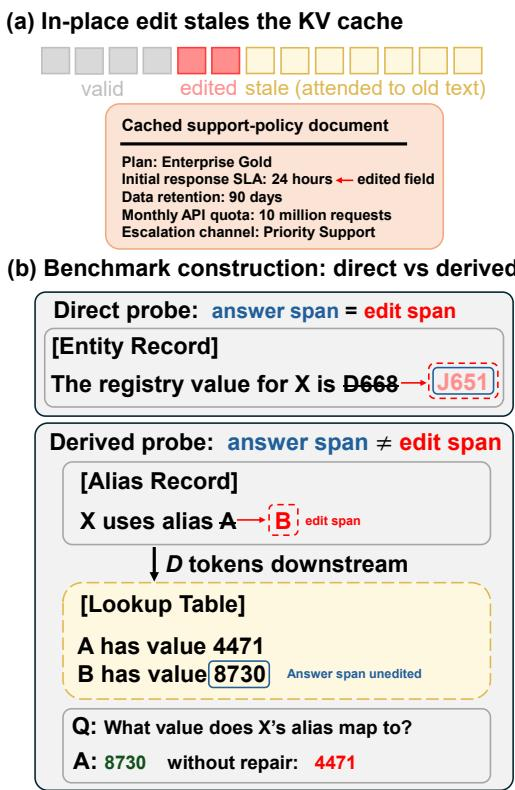
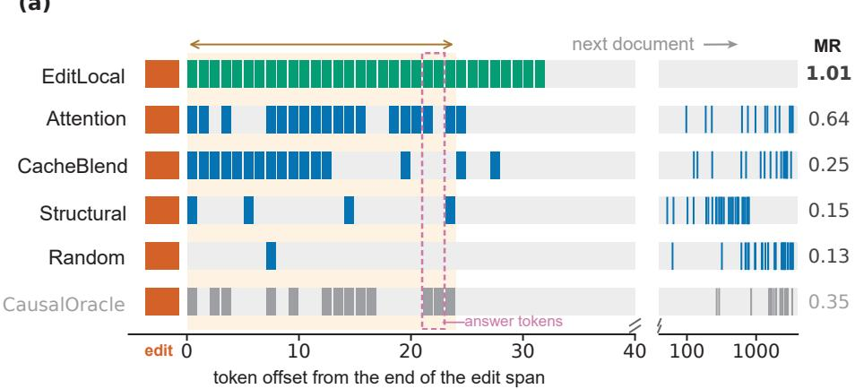
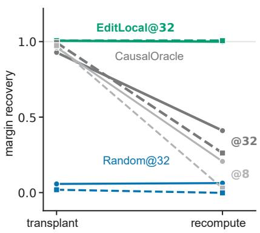
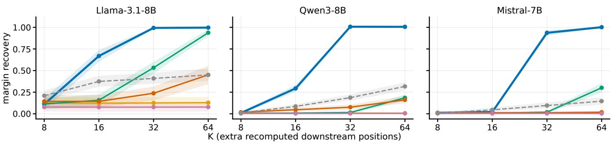

# Contiguity, Not Importance: Budgeted Repair of Stale KV Caches After Document Edits

Mingyang Mao1, Wyatt Mackey2, Xiaomin Lin1∗

1University of South Florida, Electrical and Computer Engineering 2DEVCOM Army Research Laboratory {mmao, xlin2}@usf.edu, wyatt.t.mackey.civ@army.mil

## Abstract

KV-cache reuse can reduce inference cost in retrieval- augmented generation and agentic systems, but cached con- texts may become stale when retrieved knowledge, working memory, or user state is edited. Under causal self-attention, even a local edit can afect downstream KV states. A full re-prefill reliably restores consistency but is costly, whereas refreshing only the edited span can leave downstream depen- dencies stale. We formulate in-place repair as budgeted recom- putation and compare training-free position-selection policies on a factual RAG benchmark with matched direct and derived edits. Across three model families, all policies repair direct cases, but derived cases clearly separate them. At the pri- mary budget, a contiguous edit-local window recovers at least 0.94 of the post-edit answer margin and substantially outper- forms attention-based, KV-deviation, and structural selectors. Mechanistic analysis shows that position sets efective under clean-state transplantation can fail under actual recomputation because scattered positions inherit surrounding staleness. The edit-local advantage also depends on adjacency and largely disappears when the answer-bearing text moves downstream. Because answer-relevant edits almost always corrupt model behavior, failure severity is dificult to predict, and repair is 13–21× faster than full re-prefill, our results support unconditional edit-local repair when the dependent text remains adjacent to the edit.

## Introduction

RAG pipelines and LLM-based agents increasingly reuse KV states for retrieved documents or memory blocks across re- quests, avoiding repeated prefill (Yao et al. 2025; Bergman et al. 2025; Ye et al. 2026; Pan et al. 2026). This optimization assumes cached source content does not change. In de- ployment, that assumption breaks when a factual record is corrected (Ouyang et al. 2025; Cohen et al. 2024), a policy is revised, or an agent’s working memory is updated (Packer et al. 2023). The source text then carries the update, while retained KV tensors encode the older version. A request can therefore be answered from a representation that no longer matches the knowledge base. Existing document-level reuse methods optimize reuse and composition, but do not syn- chronize cached representations after a source edit.

Repairing this mismatch is not confined to the edited span. Continuing to serve from a stale cache can reduce response accuracy (Ouyang et al. 2025), and causal self-attention leaves every downstream KV state dependent on the old con- tent. A full re-prefill restores consistency but re-encodes an entire long context after an edit of only a few tokens. Re- cent work has begun to repair the cache in place after such small edits, but each proposed method carries a limitation. KVEraser replaces a target span with learned steering states, yet requires per-model training and targets deletion rather than factual replacement(Li et al. 2026). MTN recomputes downstream notes ranked b their causal efect, usin an oracle signal in controlled agent tasks (Li 2026). Neither answers the matched-budget question for factual RAG under actual recomputation. To build a low-budget, training-free repair policy, we therefore first ask which downstream positions matter most once the edited span itself has been refreshed.

  
Figure 1: Problem and probe design. (a) An in-place edit to a cached document leaves the edited span’s KV entries encoding old text and all downstream entries stale. (b) Each benchmark item pairs the same question with two context structures: a direct probe, where the edit rewrites the answer text, and a derived probe, where the answer sits in an unedited lookup entry downstream of the edited alias. Without repair the cache returns the pre-edit answer.

Our study pairs factual edits with contexts of roughly 5000 retrieved tokens. Each question either asks for the edited fact directly or requires a two-hop derivation through unchanged downstream text. Starting from the stale cache, every policy refreshes the known edit span and selects K downstream positions under the same recomputation budget. We com- pare an edit-local window, structural delimiters (Li 2026), stale-query attention (Wang et al. 2026), CacheBlend-based KV deviation (Yao et al. 2025), and random selection. A transplant-derived causal ranking is included only as a non- deployable diagnostic. Evaluation covers development and held-out cohorts across Llama, Qwen, and Mistral, plus a 1099-item variant that moves the answer-carrying text down-stream. We use pre-specified criteria and report held-out mar- gin recovery and flip rate.

Three results define the baseline. At K=32, every policy saturates on direct questions, while derived answers sepa- rate them. The edit-local window recovers 0.94–1.01 of the answer margin and flips 0.95–1.00 of held-out items, beating every alternative by 0.46–1.00 margin recovery (Holm-corrected $p \leq 3 \times 1 0 ^ { - 9 } )$ . This advantage depends on adjacency. Moving the answer-carrying text 250 tokens downstream reduces edit-local recovery to 0.01–0.09, with stale-query attention helping on only one model family. Transplant recoverability also fails to predict repair under recomputa- tion. The causal ranking recovers 0.92–0.97 of the margin when clean states are transplanted, but the same positions recover only 0.01–0.21 when recomputed at K=8. Recom-putation is worse on every held-out item. A transplanted state imports information from a correct cache, whereas a recom- puted state reads stale surrounding states. A contiguous edit- local window succeeds by rebuilding that dependency chain in order. Finally, answer-relevant edits almost always break the stale cache (base rate $\geq 0 . 9 8 8 )$ , and cheap features poorly predict failure severity (best out-of-fold $\rho = 0 . 1 7 )$ . Because repair runs 13–21× faster than re-prefill, applying edit-local repair unconditionally is the practical policy within this set- ting. It is also the training-free baseline that future selection methods must beat.

In summary, this paper makes the following key contribu- tions:

• We formulate stale-cache repair as budgeted recomputation and introduce paired direct, derived, and distance- controlled factual edits.

• We compare five training-free selectors at a matched bud-get across three model families, establishing EditLocal as a strong adjacent-block baseline.

• We separate localization under clean-state transplant from repair under recomputation.

• We show that answer-relevant edits warrant unconditional repair within this benchmark because failure is frequent, severity is hard to predict, and repair is inexpensive.

## Related Works

Document-level KV reuse. RAGCache stores intermedi-ate states of retrieved knowledge, while TurboRAG precom- putes per-chunk KV caches for reuse across queries (Jin et al. 2025; Lu et al. 2025). Both reduce repeated prefill by reusing stored states of retrieved text. Neither addresses how those states should be updated after the source text changes. HoH shows that outdated retrieved evidence can reduce RAG ac- curacy even when current evidence is available (Ouyang et al. 2025), but it studies stale information at the text level rather than repair of an already cached representation. We study the systems problem that follows a source edit: how much of one stale document cache must be recomputed?

Selective recomputation. Selective recomputation addresses a diferent cache mismatch. CacheBlend restores missing cross-attention by recomputing positions with large KV deviations, while ProphetKV prioritizes positions us- ing query relevance (Yao et al. 2025; Wang et al. 2026). EPIC recomputes a small, fixed set of initial chunk tokens, Cache-Craft repairs reusable chunk caches through limited recomputation, and KVShare selects high-deviation states during prefill and decoding (Hu et al. 2025; Agarwal et al. 2025; Yang et al. 2025). Across these methods, the source chunks are unchanged and the mismatch comes from reusing their caches in a new context. Our experiments transfer the deviation- and query-based selection signals to a cache whose source text has changed and compare them at the same downstream-position budget.

KV-cache editing. KV-cache editing is closest to our setting. KVEraser replaces a target span with learned steering states to erase its influence (Li et al. 2026). Li (2026) shows that changing a field can leave old conclusions in downstream states and ranks those states by causal efect. Leyline pro- vides serving primitives for removing or replacing cached spans, including positional correction for length-changing edits (Ma, Eitzinger, and Koestler 2026). We isolate length-preserving factual replacement and ask which training-free selector works when its chosen positions are actually re- computed at a matched budget. This separates our setting from learned erasure, cache splicing, and position sets ranked through oracle-state transplantation.

## Cache Repair as Budgeted Recomputation

Question Setting. A serving system prefills a context C and stores its key–value states for reuse. After an edit pro- duces $C ^ { \prime }$ , the stored cache $\kappa ( C )$ is stale; a full prefill $\hat { \kappa ( { C ^ { \prime } } ) }$ is the oracle repair target, not a competing method. In-place repair instead refreshes selected entries of $\kappa ( C )$ toward this target.

We isolate one contiguous, length-preserving edit: $| C | =$ $| C ^ { \prime } | ~ = ~ n$ and $c _ { i } = \bar { c } _ { i } ^ { \prime }$ outside the half-open span $S \ =$ $[ s _ { \mathrm { s t a r t } } , s _ { \mathrm { e n d } } )$ . Positions and rotary phases therefore remain fixed; length-changing edits, which also require positional correction, are outside our scope (Ma, Eitzinger, and Koestler 2026). Each benchmark item pairs a direct condition, whose answer lies in $S ,$ with a derived condition, whose answer lies in unchanged downstream text but depends on the edited fact (Figure 1b). The pair otherwise shares its retrieved documents, insertion point, subject, value pair, and query, and we report the conditions separately.

The repair interface. Every policy uses the same $\mathrm { \ o p - }$ erator and difers only in its $\bar { K }$ selected positions. Let $D = [ s _ { \mathrm { e n d } } , n - 1 )$ be the downstream candidate pool and let $A _ { \pi } \sp { \cdot } \subseteq D , \left| A _ { \pi } \right| = K$ , be the positions chosen by policy π. The repaired set is $P _ { \pi } = S \cup { \bar { A } } _ { \pi }$ , and

$$
\widetilde { \mathcal { K } } = \mathcal { R } \big ( \mathcal { K } ( C ) , C ^ { \prime } , P _ { \pi } \big ) .
$$

The operator recomputes $P _ { \pi }$ from $C ^ { \prime }$ layer by layer and leaves all other states unchanged, using the same selective- recomputation primitive as prior systems (Yao et al. 2025). Its full-position endpoint is

$$
{ \mathcal R } { \big ( } K ( C ) , C ^ { \prime } , \{ 0 , \ldots , n - 1 \} { \big ) } = K ( C ^ { \prime } ) .\tag{1}
$$

The known edit span is always recomputed and shared across policies, while the fresh query is never cached and is recomputed during scoring. Thus, $\dot { K }$ counts only additional downstream positions. We exclude upstream positions be- cause causal attention prevents them from depending on the edit, and verify this invariant numerically. The question is which deployable rule chooses $A _ { \pi }$ most efectively.

Cost accounting. We separate three costs: common work for the edit span and fresh query, the matched repair budget of K · L token-layers, and selector overhead. The common term cancels in policy comparisons, while overhead is reported outside K. Text- and position-only rules have no selector forward; Attention adds a stale-cache scoring pass (Wang et al. 2026), and CacheBlend adds roughly one prefill layer over the prefix (Yao et al. 2025). We use wall-clock latency as the headline systems measure and token-layers as a device- independent secondary measure; Section reports both. The full construction, interface invariants, and cost decomposi- tion appear in the supplementary appendix.

What counts as repaired. Answer accuracy alone cannot distinguish caches that emit the same string with diferent underlying preferences. Each item therefore defines a pre- edit answer $a _ { \mathrm { o l d } }$ and a post-edit answer $a _ { \mathrm { n e w } }$ . For cache state $x ,$ let $m _ { x }$ be the diference between their length-averaged, teacher-forced log probabilities. Our primary metric is

$$
\mathrm { M R } \ = \ { \frac { m _ { \mathrm { r e p a i r e d } } - m _ { \mathrm { s t a l e } } } { m _ { \mathrm { o r a c l e } } - m _ { \mathrm { s t a l e } } } } ,\tag{2}
$$

where 0 denotes no change from the stale cache and 1 reaches the oracle. MR is unclipped, and zero-gap items are excluded.

We pair this internal measure with visible behavior. Let $y _ { b }$ be the greedy continuation of at most 16 tokens for retained item b. The flip rate is

$$
\mathrm { F l i p ~ = ~ } \frac { 1 } { | \mathcal { B } | } \sum _ { b \in \mathcal { B } } \mathbf { 1 } \big [ a _ { \mathrm { n e w } } \in \mathcal { Y } _ { b } \land a _ { \mathrm { o l d } } \notin \mathcal { Y } _ { b } \big ] .\tag{3}
$$

MR captures partial recovery before the decision boundary, whereas flip records whether generation exposes only the new answer. We report both, with KL recovery as a sec- ondary distributional measure. The appendix gives the com- plete scoring and edge-case rules.

<table><tr><td>Policy</td><td>Rule (all pick K positions from  $[ s _ { \mathrm { e n d } } , n - 1 ) )$ </td><td></td></tr><tr><td>EDITLOCAL</td><td>the K positions immediately after the span</td></tr><tr><td>STRUCTURAL ATTENTION</td><td>structural tokens, nearest to the span first</td></tr><tr><td></td><td>top-K by stale-cache attention from the query</td></tr><tr><td>CACHEBLEND RANDOM</td><td>top-K by layer-2 key/value deviation uniform from the pool, 5 seeds</td></tr><tr><td>CAUSALORACLE</td><td>top-K by measured causal effect (needs oracle cache)</td></tr><tr><td>CARRIERWINDOW</td><td>contiguous window at the true carrier block (needs its location)</td></tr></table>

Table 1: Selection policies, frozen before held-out evaluation. Only K varies; grey rows are diagnostics.

Selection policies. Table 1 compares four deployable signals—edit proximity, structure, stale-query attention (Wang et al. 2026), and KV deviation (Yao et al. 2025)— with a matched random control. These policies may use the stale cache, edited context, edit location, and query, but never the oracle cache or answers. Grey rows use unavailable ora- cle or carrier information and are diagnostics, not deployable methods or upper bounds on recomputation.

The primary budget is K=32; curves over $K \in$ {8, 16, 32, 64} are descriptive. The structural EditLocal@∂ variant in Section is exploratory because it was inferred from those curves. Full policy definitions and provenance appear in the appendix.

Transplant is not recomputation. A selected position set can be used in two ways. Transplant copies its KV states from the oracle cache into the stale cache, while recomputation rebuilds them within the stale cache. Only recomputation is deployable because transplant requires the oracle cache. We use transplant only as a localization diagnostic.

The two operators provide diferent information. A trans- planted state was computed with an otherwise correct cache and can therefore import information from outside the se- lected set. A recomputed state must instead read the still- stale cache around it. Positions that appear suficient under transplant may therefore fail under recomputation. We apply both operators to identical position sets to measure this gap.

## Experimental Setup

Paired edit benchmark. Each item contains roughly 5000 tokens of shufled HotpotQA fullwiki validation para-graphs (Yang et al. 2018), used only as realistic retrieval background; HotpotQA questions and answers are not used. We insert one synthetic record at a document boundary about 30% into the context. Background denotes the filler paragraphs, whereas item denotes the full construction and is the unit of every paired comparison. The direct block states the queried field and rewrites its value. The derived block instead rewrites an alias that selects between two downstream lookup rows; both rows are present before the edit and remain un- changed. Thus, only the location of the answer relative to the edit difers between the conditions. All synthetic subjects, aliases, and values are absent from the background.

(a)  

(b)  
  
Figure 2: Contiguity, not localization, decides repair. (a) Selections for a representative held-out Llama item at K=32. Orange marks the edit span, repaired outside the budget, and grey marks states left stale. Only EditLocal forms an unbroken path from the edit throu h the answer. (b) Mar in recover under trans lant and recom utation on identical sets from 15 develo ment items. Lines connect the two operators. Solid lines denote Llama and dashed lines Qwen. Grey CausalOracle results are mechanism diagnostics without tests.

Build-time filters require the old and edited prefixes to have equal length under every tokenizer, difer in one span of at most six tokens, and place that span between 25% and 40% of the context. Direct and derived pairs must match within 3% in relative edit position. At evaluation, we retain only items for which the oracle answers correctly and a stale- to-oracle margin gap exists. These model-dependent filters define retention. The appendix gives the full construction and filter provenance.

Distance-controlled variant. The main derived block makes the edit and answer-carrying text adjacent. To vary this geometry, we split its alias and lookup records into two doc- uments, leave the alias in place, and move the lookup record downstream. We define $d = s _ { \mathrm { c a r r i e r } } - s _ { \mathrm { e n d } } \in \{ 0 , 2 5 0 , 1 5 0 0 \}$ The direct condition appears only at d=0. At d=0, the de-rived construction is byte-identical to the main benchmark. The distance axis extends rather than replaces the main set- ting; all policies, budgets, and metrics remain fixed.

Models and decoding. We use Llama-3.1-8B-Instruct, Qwen3-8B, and Mistral-7B-Instruct-v0.3 in bfloat16 with SDPA attention, decoding greedily with no chain of thought. Qwen3 receives an empty think block so that it answers di-rectly. Because the three tokenizers map the same text to dif- ferent token counts, a fixed K does not cover identical text spans across families. Before evaluation, a frozen harness gate compares the repaired cached path with a full forward at the answer position under a bfloat16 tolerance fixed after the initial smoke test.

Pre-specified held-out evaluation. Development uses 100 items. The policy roster, metrics, budgets, and tests are pre- specified and applied consistently across all three model families. Held-out items use diferent seeds and HotpotQA indices disjoint from development. A candidate-pool expan-sion rule is fixed in advance, preventing retention shortfalls from being repaired by loosening filters. Retention is 75 direct and 34 derived for Llama, 75 in each condition for Qwen, and 60 direct and 58 derived for Mistral. Llama’s lower de-rived count reflects failure to solve some two-hop items even from a clean prefill.

All comparisons are paired by item. We report 95% percentile intervals from 10,000 bootstrap resamples. A policy mean is resampled directly; a contrast is formed per item be- fore resampling so that pairing is preserved. Paired Wilcoxon tests accompany the contrasts. At K=32, all 15 comparisons among six policies form one Holm-corrected family within each model and condition; CarrierWindow appears only in the distance variant. Curves over K are descriptive and are not tested. Win–tie–loss uses a primary MR tie band of 0.05, fixed before held-out evaluation from the spread of semantically equivalent arms, with 0.01 and 0.10 as appendix sensitivities. Direct and derived conditions are never pooled. The appendix records the cohort and statistical details.

## Results

Across all three model families, every policy saturates in the direct condition, which serves as a sanity check. The derived condition separates the methods: EditLocal nearly restores the full answer margin when the dependent text is adjacent to the edit, but its advantage largely disappears once that text moves downstream. Transplant-ranked positions also lose most of their value under actual recomputation. Together with near-universal stale-cache failure and the low cost of repair, these results support unconditional edit-local repair within the adjacent-block setting.

## The Edit-Local Window Wins

At the frozen K=32, EditLocal recovers 0.993, 1.007, and 0.937 of the margin on Llama, Qwen, and Mistral and flips

<table><tr><td rowspan="2">Policy</td><td colspan="2">Llama-3.1-8B (n=34)</td><td colspan="2">Qwen3-8B (n=75)</td><td colspan="2">Mistral-7B (n=58)</td></tr><tr><td>MR</td><td>Flip</td><td>MR</td><td>Flip</td><td>MR</td><td>Flip</td></tr><tr><td>EDITLoCAL</td><td> ${ \bf 0 . 9 9 3 \pm 0 . 0 0 8 }$ </td><td>0.97</td><td> $\mathbf { 1 . 0 0 7 \pm 0 . 0 0 5 }$ </td><td>1.00</td><td> $\mathbf { 0 . 9 3 7 \pm 0 . 0 3 2 }$ </td><td>0.95</td></tr><tr><td>STRUCTURAL</td><td> $0 . 1 2 6 \pm 0 . 0 6 5$ </td><td>0.03</td><td> $0 . 0 0 8 \pm 0 . 0 1 1$ </td><td>0.01</td><td> $0 . 0 1 2 \pm 0 . 0 1 2$ </td><td>0.00</td></tr><tr><td>ATTENTION</td><td> $0 . 5 3 3 \pm 0 . 0 6 8$ </td><td>0.03</td><td> $0 . 0 1 5 \pm 0 . 0 1 4$ </td><td>0.01</td><td> $0 . 0 1 9 \pm 0 . 0 1 4$ </td><td>0.00</td></tr><tr><td>CACHEBLEND</td><td> $0 . 2 3 8 \pm 0 . 0 8 0$ </td><td>0.03</td><td> $0 . 0 7 6 \pm 0 . 0 3 0$ </td><td>0.03</td><td> $0 . 0 1 2 \pm 0 . 0 1 2$ </td><td>0.00</td></tr><tr><td>RANDOM</td><td> $0 . 0 7 8 \pm 0 . 0 5 4$ </td><td>0.00</td><td> $0 . 0 0 4 \pm 0 . 0 1 0$ </td><td>0.00</td><td> $0 . 0 0 4 \pm 0 . 0 0 9$ </td><td>0.00</td></tr><tr><td>CAUSALORACLE</td><td> $0 . 4 0 9 \pm 0 . 0 6 4$ </td><td>0.00</td><td> $0 . 1 8 7 \pm 0 . 0 3 7$ </td><td>0.09</td><td> $0 . 0 9 6 \pm 0 . 0 3 5$ </td><td>0.05</td></tr></table>

Table 2: Held-out results for the derived condition at K=32. MR is Eq. 2, reported as the mean ± the half-width of a 95% percentile interval from 10,000 bootstrap resamples, which is symmetric to within 0.003; Flip is Eq. 3. Every paired contrast against EditLocal is Holm-significant within its model’s 15-pair family $( p \leq 3 \times 1 0 ^ { - 9 } )$ . The grey row is a transplant-ranked diagnostic, not a method or an upper bound under recomputation. Direct rows are omitted because all policies achieve 0.98–1.00.

95–100% of held-out items (Table 2). The best rival, Attention on Llama, reaches 0.533. No deployable rival clears 0.08 on Qwen or Mistral. The grey CausalOracle reaches only 0.10–0.41. On Llama, rivals can move probability toward the new answer, but none flips more than one of 34 items. MR thus captures partial internal repair, while Flip records whether generation exposes the new value.

Figure 2a makes the geometric diference visible. Causa- lOracle includes the answer token but recovers only 0.35, and CacheBlend stops inside the row holding the old value. Only EditLocal rebuilds an unbroken path from the edit through the dependent text. It beats the oracle on all 34, 75, and 58 held-out items, and its weakest record against any rival is 32 wins, 2 ties, and no losses. KL recovery follows MR at 0.999, 1.000, and 0.943.

Qwen’s mean MR above one reflects slight overshoot be-yond the oracle margin, which Eq. 2 leaves visible. Mistral reaches 1.002 at K=64, consistent with its tokenizer requiring more than 32 tokens to cover the same text.

## How Far the Window Should Extend

Direct results stay near one at every budget and are omitted from Figure 3. In the derived condition, EditLocal rises from 0.11 to 1.00 on Llama, from 0.01 to 1.01 on Qwen, and from 0.01 to 1.00 on Mistral as K increases from 8 to 64. The transition occurs at K=32. At K=64, Attention reaches 0.94 on Llama but only 0.18 and 0.30 on Qwen and Mistral, and every other rule remains at or below 0.45. More budget alone does not produce the same gain.

The threshold matches the block geometry, an exploratory observation made after unblinding the curves. From the edit to the block boundary, the dependent text spans a median of 24 Llama tokens (maximum 26) and 28 Qwen tokens (maximum 30). A window of 16 tokens is incomplete, while 32 covers the path. This motivates EditLocal@∂, which recomputes to the next document boundary with no selector forward. It coincides with K=32 on Llama and Qwen, while Mistral needs a slightly larger budget. This structural rule is an interpretation of the curves, not a separately tested arm, and still assumes that dependent text begins where the edit ends.

## Moving the Answer Away from the Edit

The byte-identical d=0 tier reproduces the main results, ruling out the two-document builder as the source of the dis- tance efect. For example, Qwen EditLocal scores 1.002 rather than 1.007, and CacheBlend scores 0.075 rather than 0.076. Tests are Holm-corrected within each four-pair cell family.

Adjacency is load-bearing. At d ≥ 250, EditLocal falls to 0.01–0.09 MR and 0.00–0.04 Flip. It mostly ties Random on Qwen and Mistral, while Llama’s remaining advantage is only +0.07. EditLocal@∂ also stops before the carrier. Attention retains useful signal only on Llama, reaching 0.39 at d=250 and 0.84 at K=64. It stays at or below 0.11 on Qwen and Mistral. The main win is therefore an adjacency efect, not a general advantage of the selector.

Search is only part of the problem. Even with the true lo- cation, CarrierWindow recovers just 0.43–0.74 on Llama and Mistral, compared with 0.89–0.95 on Qwen. The probe still moves the dependency as intended: 61–71% of the ora-cle’s positive efect mass lies in the carrier block, and at most 3% remains in the edited block. Recovery from a correctly placed window is thus model-dependent.

Llama retains only 118 solvable items at d=250, about one third of the pool, so its distance cells cover only solv- able examples. Distance also changes absolute position and recency, which partly confounds the attention result.

## Transplant Recoverability Does Not Imply Recompute Repairability

The grey oracle ranks positions by causal efect under trans- plant, but the same sets behave diferently under recompu- tation (Figure 2b). On 15 development items, transplant recovers 0.93–0.99 of the margin, while recomputation reaches only 0.03–0.41. The gap is specific to scattered sets: EditLocal and Random difer by less than 0.02 between operators, and all direct cells difer by less than 0.003.

Held-out results repeat the gap on all three families. At K=8, transplant recovers 0.918, 0.952, and 0.969 on Llama, Qwen, and Mistral, compared with 0.209, 0.011, and 0.008 under recomputation. Recomputation is worse on every held- out item, and all 167 recorded position sets match when replayed. Even at K=32, recomputation reaches only 0.10– 0.41.

Figure 3: Margin recovery against the budget K on the held-out set, derived condition. Budgets double along a logarithmic axis, and bands are 95% bootstrap intervals. The direct condition is omitted because every policy lies between 0.98 and 1.00 from $K { = } 8 \ \mathrm { o n }$ . The curves are descriptive, and the specification reserves testing for K=32. EditLocal is threshold-shaped and saturates once the window covers the remainder of the injected block. The grey dashed line is the transplant-ranked oracle, a dia nostic rather than a method.
<table><tr><td></td><td colspan="2">Llama</td><td colspan="3">Qwen</td><td colspan="3">Mistral</td></tr><tr><td>Policy</td><td>d=0</td><td>250</td><td>d=0</td><td>250</td><td>1500</td><td>d=0</td><td>250</td><td>1500</td></tr><tr><td>EDItLOCAL</td><td>1.00</td><td>0.09</td><td>1.00</td><td>0.01</td><td>0.01</td><td>0.94</td><td>0.01</td><td>0.02</td></tr><tr><td>STRUCTURAL</td><td>0.08</td><td>0.08</td><td>0.01</td><td>0.00</td><td>0.01</td><td>0.01</td><td>0.01</td><td>0.02</td></tr><tr><td>ATTENTION</td><td>0.51</td><td>0.39</td><td>0.01</td><td>0.02</td><td>0.05</td><td>0.01</td><td>0.02</td><td>0.11</td></tr><tr><td>CACHEBLEND</td><td>0.19</td><td>0.08</td><td>0.09</td><td>0.01</td><td>0.01</td><td>0.01</td><td>0.01</td><td>0.02</td></tr><tr><td>RANDOM</td><td>0.04</td><td>0.02</td><td>0.00</td><td>0.00</td><td>0.00</td><td>-0.00</td><td>-0.01</td><td>-0.00</td></tr><tr><td>CAUSALORACLE</td><td>0.35</td><td>0.42</td><td>0.22</td><td>0.22</td><td>0.22</td><td>0.09</td><td>0.10</td><td>0.13</td></tr><tr><td>CARRIERWINDOW</td><td>0.61</td><td>0.43</td><td>0.95</td><td>0.90</td><td>0.89</td><td>0.74</td><td>0.64</td><td>0.60</td></tr></table>

Table 3: Mean MR at K=32 as the looku table moves d tokens downstream. Sam le sizes are 191/118 (Llama), 372/359/354 (Qwen), and $3 4 3 / 2 1 6 / 2 2 1$ (Mistral). Bootstrap intervals are omitted. Every half-width is at most 0.06. The post-hoc Llama d=1500 cell is excluded. Grey rows are diagnostics, and CarrierWindow receives the true carrier location.

A transplanted state comes from a fully correct cache and can import information from outside the chosen set. A re- computed state reads the stale cache around it, so scattered positions inherit staleness. A contiguous window instead re- builds the forward chain in order. Transplant recoverability therefore shows where clean information can act, not what sparse recomputation can reconstruct. Development diagnos- tics support this account: Structural omits content tokens carrying most positive efect mass, while stale-query atten- tion ranks them too deep to fit the budget.

## Repair Should Be Unconditional

We tested cheap repair triggers on Llama and Qwen without retention filters (n=175 per condition). After an answerrelevant edit, the stale cache fails on at least 98.8% of items per condition, reaches 100% in both direct conditions, and never falls below 97.3% in any split. This result is limited to edits that touch the answer chain, but within that scope there is little for a gate to separate.

Severity is no easier to predict. Ridge and random-forest models using text, position, edit, and embedding features reach a best out-of-fold Spearman $\rho = 0 . 1 7 ( R ^ { \tilde { 2 } } = 0 . 0 5 )$ under grouped five-fold cross-validation. Edit type distin- guishes direct from derived cases, but the remaining features do not support a useful severity gate. Near-certain failure, weak predictability, and low repair cost favor unconditional repair.

<table><tr><td>Model</td><td>Ctx</td><td>Full prefill</td><td>Repair@32</td><td>Speedup</td></tr><tr><td rowspan="2">Llama-3.1-8B</td><td>4096</td><td>382.8 ms</td><td>27.8 ms</td><td>13.8×</td></tr><tr><td>8192</td><td>818.1 ms</td><td>39.6 ms</td><td>20.7×</td></tr><tr><td rowspan="2">Qwen3-8B</td><td>4096</td><td>412.1 ms</td><td>31.6 ms</td><td>13.0×</td></tr><tr><td>8192</td><td>884.1 ms</td><td>44.9 ms</td><td>19.7×</td></tr><tr><td rowspan="2">Mistral-7B</td><td>4096</td><td>374.3 ms</td><td>28.0 ms</td><td>13.4×</td></tr><tr><td>8192</td><td>802.3 ms</td><td>39.8 ms</td><td>20.2×</td></tr></table>

Table 4: Wall-clock cost of repair (span plus K=32 downstream positions, all layers) against a full re-prefill of the edited prefix. Median of 20 timed runs after 3 warmup runs, on one RTX 5090, bfloat16, batch 1. Both sides exclude the fresh-query forward, which is identical for every method. Re- pair includes a defensive cache copy (< 2 ms), and in-place repair is marginally faster.

## What Repair Costs

At roughly 5,000 tokens, repair takes 31–35 ms versus 458– 502 ms for re-prefill, about 15× faster on all three models (Table 4). The ratio reaches about 20× at 8K. Raising K from 8 to 64 adds only 1–4 ms, making a structural boundary such as EditLocal@∂ inexpensive. The token-layer proxy gives 117×–234× but overstates the measured gain. Selector overhead also favors local rules, which require no scoring forward, unlike Attention and CacheBlend.

Sanity checks. No frozen guard fired on the held-out batch. Stale and oracle outputs reproduced byte-equal generations with margins within 10−3, and all oracle rankings replayed without mismatches. The endpoint identity in Eq. 1 passes on Llama. Qwen passes in margin (0.997–1.013) but exceeds the frozen value-tensor L2 tolerance. A null-content con- trol places the discrepancy within bfloat16 numerical noise. We retain the failed label. On Mistral, three of 80 bfloat16 smoke states changed argmax, and all three matched exactly in float32.

## Discussion

What to deploy. For a direct question, refreshing the edited span completes the repair. For an answer derived through adjacent text, recompute through the end of the block. This rule reads only text and position, and its forward is 13– 21× cheaper than re-prefill. A structural stopping point such as EditLocal@∂ avoids tuning K, and repair should be unconditional because failure is nearly certain while severity is hard to predict. This recommendation applies when the answer dependency remains in the edited block. Beyond that boundary, a system needs a diferent repair operator, not only a larger fixed budget.

Coverage, not importance. Chunk-composition methods repair states computed from correct inputs but missing cross- chunk attention, so large KV deviations can be useful signals (Yao et al. 2025). An edit inside a cached document creates a diferent defect: a broken dependency chain. Scattered high- scoring positions are recomputed from stale inputs, while a contiguous window rebuilds the path in order. Selection quality is therefore a property of the set, not each position in isolation. Deviation and attention scores can help when surrounding states are sound. When they are stale, repair must cover the path that produces the answer.

Localization evidence overstates what repair can do. Cache-editing work can rank positions by patching clean states into a corrupted run (Li 2026), but that ranking need not transfer to recomputation. Transplant imports states pro- duced in a correct context, including information from out- side the chosen set. Recomputation must rebuild those states from the stale cache. The operator gap shows that a rule intended for recomputation must be tested under recompu- tation. Transplant locates where clean information can influ- ence the output, but it is not an upper bound on deployable repair.

Where repair still fails. Once dependent text moves 250 tokens away, EditLocal collapses and only stale-query at- tention on Llama provides a useful deployable alternative.

Search is not the whole problem: CarrierWindow knows the carrier location yet remains far below full recovery on Llama and Mistral. A second pass or a window spanning the edit-to-carrier path may restore the missing inputs, but neither is tested here. Qwen’s stronger result also shows that the boundary is model-dependent.

Limitations. Edits are single, contiguous, and length-preserving, and the synthetic blocks make every edit answer- relevant. The failure rate therefore does not extend to arbi- trary edits, and the two-value metrics do not measure long free-form answers. Llama retains 34 of 75 held-out derived items and about one third at d=250, so those cells cover only solvable examples, and distance also changes recency. The transplant panel uses 15 development items without Mistral, although the operator gap is also measured on held-out data. EditLocal@∂ was inferred from unblinded curves rather than tested as a registered arm. The models are dense and near 8B, and timing uses one GPU at batch 1 while excluding the identical query forward. Multi-edit and length-changing updates, larger or sparse models, and production serving re- main open.

## Conclusion

We framed in-place repair of a stale KV cache as budgeted recomputation and compared training-free selection policies at a matched budget on paired factual edits across three model families. Recomputing a contiguous window from the edit to the end of its block restores post-edit behavior almost completely wherever the dependent text is adjacent, beats every signal-based rule by a wide margin, and runs 13–21× faster than a re-prefill. The result carries a mechanism and a boundary. Repair works by rebuilding a forward dependency chain, so position sets that look suficient under transplant fail under recomputation, and the same window fails once the chain grows long. Edit-local recomputation is the baseline that any future policy for this problem has to beat.

## References

Agarwal, S.; Sundaresan, S.; Mitra, S.; Mahapatra, D.; Gupta, A.; Sharma, R.; Kapu, N. J.; Yu, T.; and Saini, S. 2025. Cache-craft: Managing chunk-caches for eficient retrieval- augmented generation. Proceedings ofthe ACM on Management ofData, 3(3): 1–28.

Bergman, S.; Kermarrec, A.-M.; Petrescu, D.; Pires, R.; Randl, M.; De Vos, M.; and Zhang, J. 2025. Leveraging approximate caching for faster retrieval-augmented genera- tion. In Proceedings of the 26th International Middleware Conference, 340–353.

Cohen, R.; Biran, E.; Yoran, O.; Globerson, A.; and Geva, M. 2024. Evaluating the Ripple Efects of Knowledge Editing in Language Models. Transactions of the Association for Computational Linguistics, 12.

Hu, J.; Huang, W.; Wang, W.; Wang, H.; Hu, T.; Qin, Z.; Feng, H.; Chen, X.; Shan, Y.; and Xie, T. 2025. EPIC: Eficient Position-Independent Caching for Serving Large Language Models. In International Conference on Machine Learning, 24391–24402. PMLR.

Jin, C.; Zhang, Z.; Jiang, X.; Liu, F.; Liu, S.; Liu, X.; and Jin, X. 2025. Ragcache: Eficient knowledge caching for retrieval-augmented generation. ACM Transactions on Computer Systems, 44(1): 1–27.

Li, B. 2026. Models Take Notes at Prefill: KV Cache Can Be Editable and Composable. arXiv preprint arXiv:2606.17107.

Li, M.; Liu, S.; Fu, D.; Wang, H.; Xia, Y.; Li, H.; Yan, H.; and Li, P. 2026. KVEraser: Learning to Steer KV Cache for Eficient Localized Context Erasing. arXiv preprint arXiv:2606.17034.

Lu, S.; Wang, H.; Rong, Y.; Chen, Z.; and Tang, Y. 2025. Turborag: Accelerating retrieval-augmented generation with precomputed kv caches for chunked text. In Proceedings of the 2025 Conference on Empirical Methods in Natural Language Processing, 6599–6612.

Ma, B.; Eitzinger, J.; and Koestler, H. 2026. Leyline: KV Cache Directives for Agentic Inference. arXiv:2606.01065.

Ouyang, J.; Pan, T.; Cheng, M.; Yan, R.; Luo, Y.; Lin, J.; and Liu, Q. 2025. Hoh: A dynamic benchmark for evaluating the impact of outdated information on retrieval-augmented generation. In Proceedings ofthe 63rdAnnual Meeting ofthe Association for Computational Linguistics (Volume 1: Long Papers), 6036–6063.

Packer, C.; Wooders, S.; Lin, K.; Fang, V.; Patil, S. G.; Stoica, I.; and Gonzalez, J. E. 2023. MemGPT: Towards LLMs as operating systems. arXiv preprint arXiv:2310.08560.

Pan, Z.; PATEL, A. D.; Shen, Y.; Hu, Z.; Guan, Y.; Li, W.- L.; Qin, L.; Wang, Y.; and Ding, Y. 2026. KVFlow: Eficient prefix caching for accelerating LLM-based multi-agent work- flows. Advances in Neural Information Processing Systems, 38: 126246–126265.

Wang, S.; Chen, J.; Pan, Y.; Huang, H.; Hao, Y.; Zou, X.; Xia, W.; Zhang, W.; Wang, H.; Li, J.; et al. 2026. ProphetKV: User-Query-Driven Selective Recomputation for Eficient KV Cache Reuse in Retrieval-Augmented Generation. arXiv preprint arXiv:2602.02579.

Yang, H.; Zhang, R.; Huang, M.; Wang, W.; Tang, Y.; Li, Y.; Liu, Y.; and Zhang, D. 2025. Kvshare: An llm service system with eficient and efective multi-tenant kv cache reuse. arXiv preprint arXiv:2503.16525.

Yang, Z.; Qi, P.; Zhang, S.; Bengio, Y.; Cohen, W. W.; Salakhutdinov, R.; and Manning, C. D. 2018. HotpotQA: A dataset for diverse, explainable multi-hop question answer- ing. In Proceedings of the 2018 Conference on Empirical Methods in Natural Language Processing, 2369–2380.

Yao, J.; Li, H.; Liu, Y.; Ray, S.; Cheng, Y.; Zhang, Q.; Du, K.; Lu, S.; and Jiang, J. 2025. Cacheblend: Fast large language model serving for rag with cached knowledge fusion. In Proceedings ofthe twentieth European conference on computer systems, 94–109.

Ye, H.; Gao, Z.; Ma, M.; Wang, Q.; Fu, Y.; Chung, M.-Y.; Lin, Y.; Liu, Z.; Zhan , J.; Zhuo, D.; et al. 2026. Kvcomm: Online cross-context kv-cache communication for eficient llm-based multi-agent systems. Advances in Neural Information Processing Systems, 38: 17882–17928.