# Designing Agentic AI Workflow Portfolios under Imperfect Selection and Compute Cost

Mojtaba Abdolmaleki

Ross School of Business, University of Michigan, United States, mojtabaa@umich.edu

Stefanus Jasin

Ross School of Business, University of Michigan, United States, sjasin@umich.edu

Boyu Wang

TrueFoundry, boyu.wang@truefoundry.com

School of Management, University of San Francisco, United States, bwang62@usfca.edu

Agentic AI systems often approach the same task through multiple workflows that difer in reasoning strategy, verification structure, and compute cost. A natural deployment policy is to use the workflow with the highest average performance, but this can be suboptimal because diferent workflows may succeed on diferent instances. We study a portfolio-and-selector paradigm in which a firm runs multiple workflow executions and selects the final answer after observing their outputs. Additional executions may uncover correct answers that the best standalone workflow misses, but they consume compute and introduce plausible distractors that complicate final selection. We formulate this as a workflow portfolio problem in which the firm jointly chooses run size and allocation across workflow types. We summarize selector quality through an odds-lift index and derive sharp bounds on the value of workflow variety. For finite workflow pools, we develop exact formulations, linear programming relaxations, randomized rounding procedures, and computable performance certificates. For large implicit workflow classes, we derive a finite-dimensional dual and an ellipsoid method using a pricing oracle to identify workflows with high weighted accuracy net of recurring compute cost. Under a weak condition, the method obtains a near-optimal solution to the relaxation with polynomially many oracle calls We evaluate the framework on three datasets: ABCD, Schema-Guided Dialogue, and HotpotQA. Relative to the best standalone workflow, portfolio optimization improves held-out selector accuracy by 3.1, 7.5, and 0.9 percentage points, respectively. Dual-guided workflow generation adds 3.5 points on ABCD and 24.1 on HotpotQA, with no additional gain on Schema-Guided Dialogue.

Key words : agentic AI; workflow portfolios; large language models; endogenous portfolio size; compute allocation; selector design; selector strength; odds lift; random utility; ellipsoid method; separation oracle; repeated execution

## 1. Introduction

Artificial intelligence is moving beyond individual productivity tools and into the operating core of organizations. Enterprise software vendors are embedding task-specific AI capabilities into business applications, while firms are beginning to delegate not only information retrieval and drafting, but also parts of operational decision processes to AI systems (Gartner 2025a,b). Recent business surveys report that many organizations are experimenting with or deploying agentic AI, while also emphasizing that realizing value requires redesigning workflows, establishing governance, and building reliable orchestration layers rather than simply giving employees access to models (McKinsey & Company 2025, 2026, Ransbotham et al. 2025, Harvard Business Review Analytic Services 2026). This shift raises a natural operations-management question: once AI workflows become part of recurring business processes, how should firms decide which workflows to deploy and how much compute to devote to them?

The setting we study arises in service operations, compliance, claims processing, internal knowledge work, and decision support. A customer-service system may classify a ticket, retrieve relevant policies, identify the customer’s need, draft a response, check the response for compliance, and decide whether to escalate the case to a human. A claims-processing system may summarize a claim, compare it with contract language, identify relevant exceptions, and recommend whether to approve or deny it. A compliance assistant may retrieve applicable rules, analyze a transaction, flag inconsistencies, and recommend an appropriate action. In each of these settings, the relevant operational unit is not a single model call, but a workflow: a sequence or graph of prompts, model calls, retrieval steps, tools, verifiers, and aggregation rules that produces a candidate answer.

At first glance, a natural approach is to identify the workflow with the highest average accuracy and deploy it alone. Average performance, however, can conceal substantial heterogeneity across tasks: diferent workflows may succeed on very diferent cases. Relying on a single workflow can therefore leave important gaps that another workflow could fill. A firm may have many workflows that it could develop and maintain. Some are cheap and fast, while others are more expensive but more careful. Some rely on retrieval, some on decomposition or repeated reasoning, and others on verification or critique. A workflow that performs poorly on average may still be valuable if it solves cases that stronger workflows miss, whereas a high-performing workflow may add little if it succeeds mainly on cases that are already easy. The firm must therefore decide which workflow types to maintain, how many times to execute each type, and which candidate answer to select as the final output, while accounting for the recurring compute cost of these decisions.

Much of the existing literature follows a plan, then execute paradigm (Shen et al. 2023, Liang et al. 2024, Lu et al. 2023, Zhang et al. 2025b, Hu et al. 2025, Zhang et al. 2025a). A large model, router, or planner first selects or designs a single workflow, which is then executed to produce the final answer. This plan–then–execute paradigm is illustrated in Figure 1. This approach is natural when the system can reliably predict, before execution, which workflow is best suited to the task. In many operational settings, however, the firm may not know in advance which workflow will succeed. It may be easier to recognize a correct answer after observing the candidate outputs and their supporting evidence, such as execution traces, retrieved sources, agreement patterns, confidence signals, or verifier results, than to identify ex ante the single workflow that will generate it.

In this paper, we propose a portfolio and selector paradigm. The firm first builds and maintains a set of workflow types. For each task class or deployment setting, it decides how many execution slots to use and how to allocate those slots across the available workflows. The same workflow may receive more than one slot. The selected executions are then run in parallel, and a selector chooses the final answer from the resulting candidates. This operating model creates a fundamental tradeof. An additional execution may produce a correct answer that would otherwise be unavailable, or it may increase the representation of a workflow that performs well on many tasks. At the same time, every execution consumes tokens, latency, tool calls, and money. If its output is wrong, it also adds another plausible distractor for the selector. More executions are therefore not necessarily better.

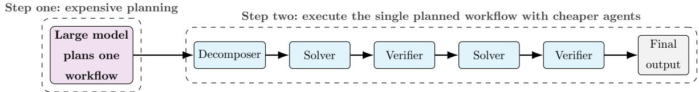  
Figure 1 Traditional orchestration paradigm: a large model synthesizes one workflow, which is then executed by cheaper specialized agents.

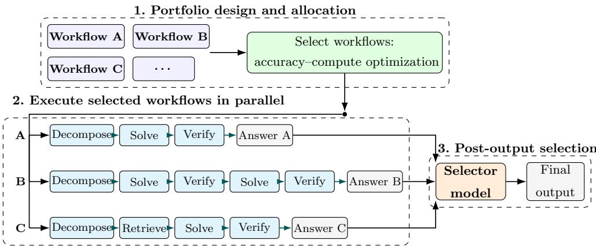  
Figure 2 Portfolio-based orchestration: the decision maker selects workflow types and allocates execution slots, runs the selected workflows in parallel, and chooses the final answer after observing their realized outputs.

The central question of this paper is: How should a firm decide how many workflow executions to run and how to allocate them across workflow types, when additional executions can improve the quality of the candidate set but also increase selector confusion and compute cost?

Related literature. Our work brings together several related streams, which we discuss in detail in Section 2. One stream studies how to design efective agentic workflows and inference time architectures (Zhang et al. 2025b, Hu et al. 2025, Zhuge et al. 2024, Saad-Falcon et al. 2025, Zhang et al. 2025a). A second stream studies how to route queries across models or workflows to balance quality and cost (Chen et al. 2024, Ong et al. 2025, Hu et al. 2024, Huang et al. 2025). A third stream generates multiple candidate answers and uses ranking, fusion, self consistency, or multi-agent aggregation to choose among them (Wang et al. 2023, Jiang et al. 2023, Wang et al. 2025). Together, these studies address important parts of the deployment problem, namely workflow design, pre-execution allocation, and post-output aggregation. Once these decisions are considered jointly, however, the problem becomes one of choosing and allocating a portfolio of alternatives under limited resources and imperfect final selection. This perspective relates to several established areas in operations research, including choice modeling, assortment optimization, coverage, submodular optimization, column generation, and optimization through separation oracles (Luce 1959, McFadden 1974, van Ryzin and Mahajan 1999, Talluri and van Ryzin 2004, Bertsimas and Miˇsi´c 2019, Dong et al. 2023, Wang et al. 2024, Nemhauser et al. 1978, Barman et al. 2021, Alaei et al. 2010, Dantzig and Wolfe 1960, Desaulniers et al. 2005, Gr¨otschel et al. 1981, 1988). What remains missing is an integrated framework for designing workflow portfolios when both execution decisions and final answer selection afect performance and cost.

The challenge is not limited to choosing among workflows that have already been evaluated. In practice, the feasible workflow space is large and cannot usually be enumerated in advance. We therefore need a way to model how the firm accesses workflows outside its current evaluated pool. In this paper, we assume that new workflows can be proposed by an oracle, which may take the form of a teacher model, an automated workflow generator, a structured search procedure, or a human engineering team. The firm guides the oracle toward generating workflows that perform well on tasks that the current portfolio handles poorly, while also accounting for the recurring cost of executing those workflows. This raises two questions: how should the firm use the oracle to search the implicit workflow space, and how can it certify the quality of the resulting portfolio?

We address these questions through a selector aware workflow portfolio model. The firm decides how many times to execute each workflow type, which jointly determines the composition and total size of the candidate set. Each execution produces a candidate answer, and a selector chooses the final output after observing the resulting candidates. This portfolio-and-selector paradigm is illustrated in Figure 2. We summarize selector performance through recovery curves that relate the number of correct candidates in the set to the probability that the final selected answer is correct. The firm’s objective is to maximize deployed decision quality net of recurring compute cost.

Our contributions. Our first contribution develops a general theory of selector strength. We introduce an odds lift index that measures how much the selector increases the odds of returning a correct answer relative to random selection. A finite bound on this index places the selector’s recovery curve below a common concave envelope. This envelope gives a sharp limit on how much any workflow portfolio can improve on the best single workflow, regardless of how many workflows are available or how complementary they appear. It also yields simple screening rules that identify when selector quality and execution cost make a multi-workflow portfolio unattractive, so that the best decision is to use a single workflow or not deploy the system.

Our second contribution develops an optimization framework for finite workflow pools when the total number of workflow executions, which we call the run size, is itself a decision. The framework determines both the run size and the allocation of execution slots across workflow types, recognizing that an additional execution may improve accuracy on some tasks while increasing selector confusion on others. For any fixed run size, the problem becomes a concave coverage problem. This structure leads to exact integer programming formulations, linear programming relaxations, randomized rounding procedures, and computable optimality certificates. We then develop a sparse grid method for choosing the run size. Rather than solving a separate optimization problem for every possible size, the method evaluates only a small collection of candidate values while retaining a provable approximation guarantee. This provides a practical approach for jointly choosing how many workflow executions to run and how to allocate them across workflow types.

Our third contribution develops an optimization method over the implicit workflow class, by which we mean the full set of feasible workflows that the oracle can search over but the firm cannot enumerate in advance. Because the same workflow type may occupy multiple execution slots, the linear program for a fixed run size does not require an upper bound on the number of times each type can be used. Although this linear program contains one variable for every workflow type in the implicit class, its dual has only finitely many task price variables, together with one constraint for each workflow. A global pricing oracle can therefore identify a workflow whose constraint is violated, or certify that no important violation remains. Using the classical equivalence between optimization and separation, the ellipsoid method computes a solution within ε of the ful linear programming relaxation using a number of oracle calls that is polynomial in the problem encoding and log(1/ε). Combining this optimization error with the losses from the cardinality grid and randomized rounding yields a high probability approximation guarantee relative to the entire implicit workflow class, without requiring that class to be enumerated.

Our fourth contribution is empirical. We first calibrate selector recovery across the ABCD and Schema-Guided Dialogue service-operations tasks (Chen et al. 2021a, Rastogi et al. 2020) and the HotpotQA question-answering benchmark (Yang et al. 2018). Selector strength is substantially above random selection in the two service domains and remains positive, although weaker, on HotpotQA. We then evaluate the complete stochastic workflow- generation and portfolio-optimization pipeline in all three domains. On fresh held-out tasks, actual selector accuracy rises from 43.625% for the best initial singleton to 50.250% for the final ABCD portfolio, from 85.250% to 92.750% on Schema-Guided Dialogue, and from 30.250% to 55.250% on HotpotQA. Dual-guided generation incorporates four workflows on ABCD, none on Schema-Guided Dialogue, and one on HotpotQA. This variation is consistent with the model’s central implication: a generated workflow creates value only when its incremental coverage and selection benefit justify its recurring compute cost.

The central message is that deploying agentic AI is neither a search for the single best workflow nor a simple rule that more candidates are always better. Workflow variety creates value only when the selector can identify useful outputs reliably enough to justify the additional compute cost and selection dificulty. Efective deployment therefore requires firms to manage workflow generation, run size, the allocation of executions across workflow types, selector strength, and compute expenditure as a joint decision.

Organization of the paper. The rest of the paper is organized as follows. Section 2 reviews the related literature. Section 3 formulates the portfolio and selector problem and introduces the oracle interface for searching the implicit workflow class. Section 4 studies how selector strength limits the value of workflow variety. Section 5 develops the finite pool optimization framework, including exact integer programs, linear programming relaxations, randomized rounding, and optimality certificates. Section 6 derives the dual formulation for the implicit workflow class and uses a workflow pricing oracle together with the ellipsoid method to obtain performance guarantees without enumerating all feasible workflows. Section 7 extends the model and its algorithmic guarantees to stochastic workflow execution. Section 8 presents the numerical experiments, and Section 9 concludes the paper. Unless otherwise noted, all proofs are provided in the appendix.

## 2. Related Literature

Our work relates to several streams of literature. The first studies the automated design of agentic workflows, compound AI systems, and LLM generated algorithms or heuristics. The second examines model routing, cascades, and methods that generate and aggregate multiple candidate outputs. The third includes work on random utility, assortment choice, and selection among competing alternatives. The fourth concerns coverage, submodular optimization, and optimization over large implicitly represented decision spaces. Finally, our paper contributes to the emerging operations management literature on the deployment, allocation, and governance of AI systems. We discuss these streams in turn and explain how they inform, but do not resolve, the joint problem of workflow generation, execution allocation, and final answer selection studied here.

Automated design of agentic workflows and compound AI systems. A growing computer science literature studies how to design and optimize multistep language model systems. AFlow searches over workflows represented as code, using execution feedback and tree search (Zhang et al. 2025b). Automated Design of Agentic Systems treats agent design as a search problem in which a meta agent proposes new agentic systems (Hu et al. 2025). GPTSwarm represents interacting language agents as a graph whose structure can be optimized (Zhuge et al. 2024). Archon searches over inference architectures that combine repeated sampling, ranking, critique, verification, fusion, and model choice (Saad-Falcon et al. 2025). MaAS constructs an agentic supernet and selects task dependent multiagent architectures to balance performance and resource use (Zhang et al. 2025a). LLMSelector studies model assignment within a compound AI system, asking which language model should be used in each module of a fixed multicall architecture (Chen et al. 2025). Collectively, these studies show that workflow structure, module choice, and automated search can have substantia efects on system performance. Our work treats all these methods as potential mechanisms for generating candidate workflows, but studies a diferent operational decision. The primary objective in automated workflow design is typically to discover a strong workflow, architecture, or assignment of models to modules. We instead ask which workflow types should be retained, how many execution slots should be allocated to each, and how much compute should be spent when the final answer is chosen only after the candidate outputs are observed. Under this perspective, a workflow that is not the strongest on average may still be valuable if it solves cases missed by the existing portfolio and the selector can recognize its contribution. The same workflow may be harmful if it mainly produces costly distractors that make final selection more dificult.

LLM based algorithm design and heuristic portfolio generation. A related literature studies the use of large language models to design algorithms and heuristics. Recent surveys organize this work around the roles of language models as optimizers, designers, predictors, and components of algorithmic search (Liu et al. 2026b). AlphaEvolve combines language model generated code modifications with evaluator feedback and evolutionary search to improve algorithms (Novikov et al. 2025). EoH-S moves beyond the search for a single heuristic and instead constructs a small set of complementary heuristics (Liu et al. 2026a). The recurring process of generating candidates, evaluating their performance, and reoptimizing the system also has methodological parallels in self adjusting control and joint learning and optimization (Jasin 2014, Chen et al. 2019, 2021b,

Zhang and Jasin 2022, Agrawal et al. 2014, Keskin and Zeevi 2014, Elmachtoub and Grigas 2022, Faradonbeh and Faradonbeh 2023). The above literature is closely related to our workflow generation layer. In our setting, however, the generated objects are executable AI workflows drawn from an implicit workflow class, and their value depends on how they are deployed together. The objective therefore accounts not only for the performance of each generated workflow, but also for its contribution to a portfolio under imperfect final selection and its recurring execution cost.

LLM routing, model cascades, and eficient inference. Another stream studies how to allocate queries across models with diferent cost and quality profiles. FrugalGPT develops adaptive strategies, including model cascades, to reduce inference cost while preserving or improving performance (Chen et al. 2024). RouteLLM learns routers that choose between stronger and weaker models using preference data (Ong et al. 2025), while RouterBench provides a benchmark for evaluating systems that route queries across multiple language models (Hu et al. 2024). ThriftLLM studies the cost conscious selection of LLM ensembles for classification tasks (Huang et al. 2025). Recent operations research also treats heterogeneous LLM use as a resource allocation problem. Dean et al. (2026) optimize parallel query counts under reliability constraints, Li et al. (2026) study sequential model choice and stopping with query and waiting costs, and Guo et al. (2026) analyze static cascades under congestion and latency. Together, these papers determine how model calls should be allocated, sequenced, or stopped. Our paper studies a complementary problem. Rather than deciding which model to query next, we choose how many workflow executions to run, how to allocate those executions across workflow types, and which answer to select from the resulting candidates. Routing and cascade methods govern the process of acquiring model outputs, while our framework governs the design and evaluation of the candidate portfolio presented to the selector.

Output ensembling, ranking, self consistency, and inference time aggregation. A related literature improves language model performance by generating multiple candidate outputs and then selecting, combining, or refining them. Self consistency samples several reasoning paths and returns the answer with the greatest agreement across paths (Wang et al. 2023). LLM Blender ranks outputs from multiple language models and combines the highest quality candidates through generative fusion (Jiang et al. 2023). Mixture of Agents uses a layered architecture in which agents at later stages build on outputs produced by agents in earlier stages (Wang et al. 2025). Archon treats ranking, fusion, critique, verification, and related inference techniques as components of an architecture that can be selected through search (Saad-Falcon et al. 2025). Our paper abstracts from the details of the selector itself. The selector may use ranking, fusion, consistency, critique, verification, or some other mechanism. We instead study the upstream portfolio decision: which workflows should generate candidates, how many executions should be run, and when an additional candidate is worth its compute cost and its efect on final selection.

Choice modeling, coverage, and implicit optimization. Our selector model draws on random utility and assortment choice. Multinomial logit and Plackett–Luce provide tractable models of selection and ranking (Luce 1959, McFadden 1974, Plackett 1975, van Ryzin and Mahajan 1999, Tallur and van Ryzin 2004). Related work estimates preference parameters from observed choices and response times (Echenique et al. 2025). In our setting, the alternatives are workflow outputs rather than products, and their value depends on whether they are correct. A wrong output enlarges the selector’s choice set without adding correct attraction. We use Plackett–Luce as an estimable specialization, while our main variety bound relies only on a general odds lift envelope. This choice structure leads directly to the optimization problem studied in the paper. Once the run size is fixed, portfolio composition afects selector performance only through the number of correct outputs on each task, yielding a concave coverage problem and allowing us to use established linear programming and rounding tools (Nemhauser et al. 1978, Barman et al. 2021, Ageev and Sviridenko 2004, Chekuri et al. 2010). When run size is endogenous, however, adding an execution changes both the correct count and the total number of candidates, so the global objective is neither monotone nor generally submodular. We handle this additional decision through a sparse cardinality grid. Finally, when the feasible workflow class cannot be enumerated, a global workflow pricing oracle separates the workflow indexed dual constraints, allowing the ellipsoid method to optimize over the implicit class (Gr¨otschel et al. 1981, 1988).

Operations management and AI deployment. An emerging operations management literature studies how AI systems should be adopted, allocated, priced, and governed. Recent work examines query allocation across heterogeneous language models (Dean et al. 2026, Li et al. 2026, Guo et al. 2026), the timing of AI adoption and access (Abdolmaleki and Duenyas 2026), pricing and delay in agentic AI services (Abdolmaleki et al. 2026), and the provenance of language model generated content (Radvand et al. 2026). Baek et al. (2026) study complementarity among humans, large language models, and operations research algorithms in inventory control. We contribute to this literature by studying workflow portfolio design. Our focus is how a firm should choose the number and allocation of workflow executions, generate new workflow types, and select among their outputs when performance depends jointly on workflow complementarity, selector strength, and recurring compute cost.

## 3. Model

This section develops the operational model for selector-aware workflow portfolio design. We first define the task environment, workflow executions, selector recovery, and the firm’s objective of choosing both the composition and size of the deployed portfolio. We then distinguish optimization over a finite evaluated workflow pool from search over the larger implicit workflow class and formalize the cost-aware pricing interface used to generate new workflows.

## 3.1. Deployment setting

We study an operational setting in which a firm handles a stream of similar tasks. Although the tasks share a common objective, individual instances may difer substantially in the information, reasoning, and verification required to solve them. A workflow designed for one source of dificulty may therefore perform poorly on cases that require a diferent approach. This heterogeneity creates a role for workflow portfolios: by running several complementary workflows and selecting among their outputs, the firm may obtain a correct answer on cases that no single workflow handles reliably. As a running example, consider customer-service routing. A customer initiates a service conversation, and the system observes the customer’s initial messages together with relevant account information, order status, and policy context. Determining the appropriate route may require the system to infer the customer’s objective, identify the current service state, retrieve the applicable policy, and verify that the proposed action is feasible. The final decision may be, for example, to initiate an order cancellation, address a refund-status inquiry, modify a subscription, begin troubleshooting, or escalate the case to a human agent. Diferent workflows may emphasize diferent parts of this reasoning process. Running multiple workflows can increase the likelihood that at least one produces the correct route, but it also incurs additional compute cost and creates more candidate outputs for the selector to distinguish. The model below formalizes this tradeof. (Remark 1 discusses the extension to settings with multiple task types.)

Tasks. Let $X \in { \mathcal { X } }$ denote a task instance drawn from a population D, and let $Y ^ { \star } \in { \mathcal { V } }$ denote the correct answer, target decision, or benchmark solution. The output space Y may be finite, numerical, structured, or textual. In the baseline model, a returned answer y receives payof 1 $\{ y =$ $Y ^ { \star } \}$ . In the customer-service routing example, X contains the observed conversation, account information, order status, and relevant context, while the target $Y ^ { \star }$ is the correct routing label, such as “cancel order,” “refund status,” “subscription change,” or “escalate to human.”

Workflows. A workflow $g \in { \mathcal { G } }$ is an executable AI procedure that maps a task instance to a candidate answer and an observable trace. Workflows can take many forms: a single prompt, a chain of specialized agents, a retrieval-augmented routine, a verify-and-revise loop, or a graph of agents and tools. The feasible space $\mathcal { G }$ contains all workflows consistent with the firm’s operational constraints, such as allowed models, tools, retrieval sources, context length, latency, and termination rules. The main analysis does not require a particular graph representation of workflows; it only uses each workflow’s evaluated correctness vector and running cost. Appendix A gives one possible graph-based representation of G for readers who want a concrete finite workflow class.

When workflow g is run on task X, it produces

$$
O _ { g } ( X ) = { \bigl ( } A _ { g } ( X ) , T _ { g } ( X ) { \bigr ) } ,\tag{1}
$$

where $A _ { g } ( X ) \in \mathcal { V }$ is the candidate answer and $T _ { g } ( X )$ is the observable execution trace, potentially including intermediate messages, retrieved documents, tool outputs, confidence scores, verifier signals, token counts, and latency. We suppress the dependence on X when it is clear from context. Because $\mathcal { G }$ is typically too large to enumerate, the firm must search over an “implicit” workflow space rather than selecting from a fixed list; we return to this search layer in Sections 3.2 and 3.3. In the routing example, a workflow might first retrieve relevant policy text, infer the customer’s intent, and propose a routing label. A verifier then checks the proposal against the conversation and retrieved policy. If the proposal fails verification, a revision agent updates it using the verifier’s feedback, and the verify–revise loop continues until the proposal passes verification or a prespecified iteration limit is reached.

Workflow accuracy. Each workflow has a recurring per-task running cost $c _ { g } \geq 0$ . This cost may represent dollars, tokens, latency-adjusted compute, tool-call charges, or an additive resource index. The cost is recurring because it is paid every time the workflow is run on an incoming task. Let $( x _ { i } , y _ { i } ^ { \star } ) _ { i = 1 } ^ { n }$ be a labeled development sample, i.e., the training or validation tasks used to evaluate candidate workflows before deployment. The portfolio optimization problem below is defined on this training sample: workflow correctness, and portfolio values are computed from $( x _ { i } , y _ { i } ^ { \star } ) _ { i = 1 } ^ { n }$ . For workflow g, define its task-level correctness indicator by

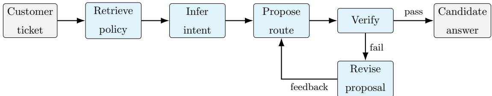  
Figure 3 A customer-service routing workflow with a bounded verify–revise loop.

$$
a _ { i g } = \mathbf { 1 } \{ A _ { g } ( x _ { i } ) = y _ { i } ^ { \star } \} , \qquad i = 1 , \ldots , n , \quad g \in { \mathcal { G } } .\tag{2}
$$

Thus, $a _ { i g } = 1$ if workflow g returns the correct routing label for task i, and $a _ { i g } = 0$ otherwise. Throughout the main analysis, we treat $a _ { i g }$ as deterministic, so each workflow–task pair has a fixed evaluated correctness outcome on the development sample. Section 7 extends the model to stochastic workflow execution, where $a _ { i g } \in [ 0 , 1 ]$ denotes the probability that one execution of workflow g is correct on task i.

Portfolio and execution cost. We use $g \in { \mathcal { G } }$ to index workflow types. For each incoming task, the firm chooses an execution-count vector

$$
\pmb { m } = ( m _ { g } ) _ { g \in \mathcal { G } } \in \mathbb { Z } _ { + } ^ { \mathcal { G } }
$$

with finite support, where $m _ { g }$ is the number of execution slots assigned to workflow type g. It may appear natural to impose $m _ { g } \le 1$ for every workflow type. Under an imperfect selector, however, repeated execution of a strong workflow may raise the share of correct candidate outputs on the tasks it already solves and thereby improve selector recovery; see Appendix C. Under stochastic execution, repeated runs can also yield diferent outcomes, making multiplicity even more natural; Section 7 extends most of our results to that setting.

The total number of workflow executions is

$$
k ( \pmb { m } ) = \sum _ { g \in \mathcal { G } } m _ { g } ,\tag{3}
$$

and must satisfy $k ( m ) \leq K _ { \operatorname* { m a x } } .$ , where $K _ { \mathrm { m a x } }$ reflects operational limits such as latency, contextwindow capacity, compute budget, or risk policy.

Each execution occupies a separate slot, incurs cost $c _ { g } .$ , and produces a separate candidate for the selector. In the deterministic development-sample model, all executions of workflow type g share the evaluated correctness vector $( a _ { 1 g } , \ldots , a _ { n g } )$ . The zero vector 0 represents the outside option of not deploying the AI system and has value zero. For $g \in { \mathcal { G } }$ , let $e _ { g }$ denote the execution-count vector containing one execution of workflow g and zero executions of every other workflow.

For a feasible execution-count vector m, let

$$
r _ { i } ( \pmb { m } ) = \sum _ { g \in \mathcal { G } } a _ { i g } m _ { g }\tag{4}
$$

denote the number of correct candidate outputs produced on task i, and let

$$
C ( \pmb { m } ) = \sum _ { g \in \mathcal { G } } c _ { g } m _ { g }\tag{5}
$$

denote the total recurring execution cost.

Selector. Consider a feasible nonzero execution-count vector m. Choose any labeling $g _ { 1 } , \ldots ,$ $g _ { k ( m ) }$ of its execution slots satisfying $| \{ j : g _ { j } = g \} | = m _ { g }$ for all $g \in { \mathcal { G } }$ . After all workflow executions have been completed, the firm observes

$$
O _ { m } = \big ( O _ { g _ { j } } : j = 1 , \dots , k ( m ) \big ) .\tag{6}
$$

A post-output selector then chooses one of the candidate outputs:

$$
\operatorname { S e l } ( X , O _ { m } ) \in \left\{ A _ { g _ { j } } : j = 1 , \ldots , k ( m ) \right\} .\tag{7}
$$

The selector may be an LLM judge, a verifier, a ranking model, a rule-based policy checker, a human reviewer, or a combination of these mechanisms. In the customer-service routing example, the selector observes the proposed routing decisions and their execution traces and chooses the route submitted to the service system.

We summarize selector performance through a family of recovery curves $\{ \psi _ { k } ( r ) \} _ { k = 1 } ^ { K _ { \mathrm { m a x } } }$ , one for each candidate-set size k. Each curve

$$
\psi _ { k } : \{ 0 , 1 , \ldots , k \}  [ 0 , 1 ] , \qquad \psi _ { k } ( 0 ) = 0 , \quad \psi _ { k } ( k ) = 1 ,\tag{8}
$$

maps the number of correct candidate outputs r to the probability that the selector returns a correct final output. The endpoint conditions are natural: if no candidate is correct, the selector cannot recover one, and if all candidates are correct, any choice succeeds.

The empirical selector-aware accuracy of a nonzero execution-count vector m is

$$
J _ { \psi } ( \pmb { m } ) = \frac { 1 } { n } \sum _ { i = 1 } ^ { n } \psi _ { k ( \pmb { m } ) } \big ( r _ { i } ( \pmb { m } ) \big ) ,\tag{9}
$$

with $J _ { \psi } ( \mathbf { 0 } ) = 0$ by convention.

Deployment objective. The firm’s goal is to choose an execution-count vector m that maximizes selector-aware accuracy on the development sample net of recurring execution cost. To place accuracy and cost on a common scale, let $\gamma \geq 0$ denote the cost price. If a correct decision is worth $v > 0$ monetary units relative to an incorrect decision, dividing monetary value by $v { \mathrm { ~ g i v e s ~ } } \gamma = 1 / v$ The net deployed value of m is

$$
\Pi _ { \psi , \gamma } ( { \pmb m } ) = J _ { \psi } ( { \pmb m } ) - \gamma C ( { \pmb m } ) , \qquad \Pi _ { \psi , \gamma } ( { \pmb 0 } ) = 0 .\tag{10}
$$

The ideal deployment objective is

$$
\operatorname { O P T } _ { \psi , \gamma } ( \mathcal G ) = \underset { m \in \mathbb Z _ { + } ^ { \mathcal G } } { \operatorname* { m a x } } \Pi _ { \psi , \gamma } ( m ) .\tag{11}
$$

This is the best net value achievable over the full workflow space ${ \mathcal { G } } ,$ and serves as the benchmark for the algorithms developed in subsequent sections.

Remark 1 (Multiple task types). The model is written for a fixed task type. In settings with several task types, the same formulation can be applied separately within each type, so that the firm chooses a type-specific workflow portfolio. A task type may be defined by operational information available before execution, such as the claim category, product line, customer segment, language, channel, risk tier, or required output format. Thus, task-type information can be used to select the relevant portfolio before workflows are run. Throughout the paper, we fix one task type and suppress the type index.

## 3.2. Restricted pools and the inner–outer view

Solving (11) directly is generally infeasible because the workflow class G is large and implicit. We therefore distinguish two objects. The first is a finite evaluated pool of workflows, over which the portfolio problem can be solved directly. The second is the larger implicit workflow class, over which the algorithm must search for additional useful workflows.

For any finite evaluated pool ${ \mathcal { M } } \subseteq { \mathcal { G } }$ , define the restricted benchmark

$$
\mathrm { O P T } _ { \psi , \gamma } ( \mathcal { M } ) = \operatorname* { m a x } _ { \pmb { m } \in \mathbb { Z } _ { + } ^ { \mathcal { M } } \atop k ( \pmb { m } ) \leq K _ { \operatorname* { m a x } } } \ \Pi _ { \psi , \gamma } ( \pmb { m } ) .\tag{12}
$$

Here, m is the execution-count vector restricted to workflow types in M. Every workflow type $g \in$ M has already been evaluated on the development sample, so its correctness vector $( a _ { 1 g } , \ldots , a _ { n g } )$ and recurring execution cost $c _ { g }$ are known. The restricted problem (12) is the best net value achievable using only these evaluated workflow types. When $\mathcal { M } = \mathcal { G }$ , it coincides with the full deployment benchmark (11); otherwise it is only a finite-pool approximation.

The role of the outer layer is to decide where to search next in the implicit class G. The guiding principle is marginal value. Once a finite-pool linear program (LP) relaxation is solved, the optimization problem assigns dual prices to development tasks and to execution slots. A high task price means that an additional correct candidate on that task would be valuable. A high execution-slot price means that a new workflow must deliver enough marginal value to justify occupying one of the limited run slots. These prices are passed to a workflow-pricing oracle, which searches the implicit class for a workflow with high price-weighted correctness net of recurring cost. Thus, the outer layer repeatedly asks a simple operational question: is there a workflow, not yet available to the optimizer, whose expected marginal contribution is large enough to matter?

Workflow generator oracle. We do not answer the above question by searching G ourselves. Instead, we assume access to a workflow generator, which we call the pricing oracle, and which may be a teacher model, an automated workflow-search procedure, or a human engineering team. The optimizer supplies the current prices, and the oracle proposes a workflow that scores well against them. If the oracle returns such a workflow, the workflow is evaluated on the development sample and becomes available to the finite-pool optimizer. If the oracle can certify that no workflow has suficiently large price-adjusted value, then the current LP relaxation has no important missing workflow at that query tolerance. We discuss this in more detail in Section 3.3.

The overall information flow is summarized in Figure 4.

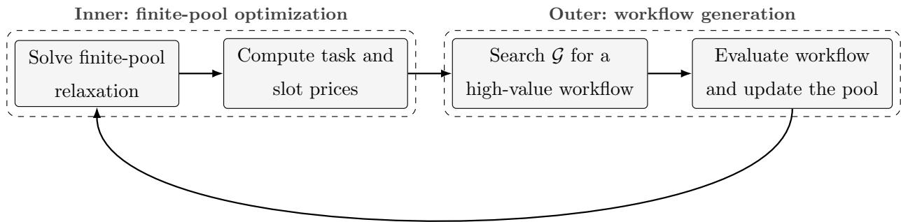  
Figure 4 Inner–outer workflow-generation loop. The dashed regions distinguish the finite-pool inner optimization from the outer workflow-generation and pool-update steps.

The next subsection formalizes this workflow-pricing interface. Section 5.4 derives the corresponding task and slot prices from the LP relaxation, and Section 6 uses these prices to optimize over the implicit workflow class through an ellipsoid-based method.

## 3.3. Cost-aware generation over an implicit workflow class

To search beyond the currently evaluated workflow pool, the optimizer needs a way to identify promising workflows in the implicit class G. As noted above, this search is carried out by the pricing oracle, and it is guided by nonnegative task prices $w _ { i }$ supplied by the optimizer. These prices come from the current dual solution: a larger $w _ { i }$ means that an additional correct output on development task i would create greater marginal value in the current LP relaxation. The prices therefore direct the oracle toward the residual tasks, meaning those the current workflow pool still handles poorly and on which an additional correct output would create the most value.

Given task prices $w = ( w _ { 1 } , \ldots , w _ { n } )$ and the cost price $\gamma ,$ define the global workflow-pricing value

$$
P ( w , \gamma ) = \operatorname* { m a x } _ { g \in \mathcal { G } } \left\{ \sum _ { i = 1 } ^ { n } w _ { i } a _ { i g } - \gamma c _ { g } \right\} .\tag{13}
$$

The term $\sum _ { i } w _ { i } a _ { i g }$ rewards a workflow for being correct on high-price tasks, while $\gamma c _ { g }$ penalizes its recurring execution cost. We refer to the diference

$$
s _ { g } ( w ) = \sum _ { i = 1 } ^ { n } w _ { i } a _ { i g } - \gamma c _ { g }
$$

as the score of workflow $g$ at prices w, so that $P ( w , \gamma ) = \operatorname* { m a x } _ { g \in \mathcal { G } } s _ { g } ( w )$ . Accordingly, the pricing problem searches for a workflow with the greatest price-weighted correctness net of compute cost.

Let θ denote the current dual price of occupying an execution slot (i.e., the slot price). The largest violation among the workflow-indexed dual constraints is

$$
\Phi ( w , \theta , \gamma ) = P ( w , \gamma ) - \theta = \operatorname* { m a x } _ { g \in { \mathcal { G } } } \left\{ s _ { g } ( w ) - \theta \right\} .\tag{14}
$$

Hence, $\Phi ( w , \theta , \gamma ) > 0$ means that some workflow creates more price-weighted value than the slot price. The pricing interface asks the oracle to identify workflows that perform well on tasks with high current prices, while screening out candidates whose recurring execution costs outweigh their potential contribution. In the customer-service routing example, high task prices may concentrate on cancellation, refund, or escalation cases for which an additional correct workflow output would be especially valuable.

Because exact maximization over $\mathcal { G }$ may itself be dificult, we allow an approximate stochastic pricing procedure. A $( \delta , \beta )$ weak global pricing oracle returns a workflow $\widetilde g \in { \mathcal G }$ such that, conditional on the query history, with probability at least $1 - \beta$ 2

$$
s _ { \tilde { g } } ( w ) \geq P ( w , \gamma ) - \delta .\tag{15}
$$

Given a proposed slot price $\theta ,$ exactly one of two things happens. If the returned workflow has score strictly greater than θ, then the proposed price cannot be right: a workflow in $\mathcal { G }$ is worth more than the slot it would occupy, even after its recurring execution cost is charged, so the optimizer has found a better workflow than it currently has. If, however, the returned workflow has score at most $\theta ,$ then, on the event that the guarantee in (15) holds, no workflow in the entire class scores more than δ above the proposed price:

$$
P ( w , \gamma ) \leq \theta + \delta .
$$

Thus a single call to the oracle either produces a workflow that beats the current slot price or certifies, up to tolerance $\delta ,$ that no workflow in $\mathcal { G }$ can do so. This is precisely the weak-separation information required by the ellipsoid method, which Section 6 uses to optimize over the implicit class G without enumerating it.

Recall that the oracle may be implemented by a teacher model, an automated workflow-search procedure, an explicit search over a prespecified workflow grammar, or a human engineering team. The theoretical guarantee developed later requires the oracle to satisfy the global approximation property in (15). In particular, the mere failure of a search procedure to find a workflow with score above θ does not certify that no such workflow exists.

## 4. Selector Strength and the Value of Workflow Variety

This section studies how selector quality limits the value of running multiple workflows. Even if the firm can generate many diverse candidate workflows, variety is only beneficial when the selector can reliably identify correct answers from the realized candidate set. The results in this section formalize this limitation: they bound how much any multi-workflow portfolio can outperform the best single workflow, as a function of selector strength and workflow cost. These bounds provide pre-optimization screens that can inform the firm whether expanding the portfolio or improving the selector is the more valuable investment.

The remainder of this section develops these bounds in three steps. Section 4.1 defines the oddslift index Λ, a single scalar that summarizes how much the selector improves the odds of returning a correct output relative to picking a candidate at random. Section 4.2 uses Λ to bound the net value of any workflow pool relative to the best available singleton workflow, producing a screening rule that can rule out portfolio expansion before solving any optimization problem. Section 4.3 specializes this bound to the Plackett–Luce choice model, in which the odds-lift index reduces to a single discrimination parameter that can be estimated directly from data.

## 4.1. Recovery envelopes and selector odds lift

The recovery curves $\{ \psi _ { k } \}$ introduced in Section 3 may vary with candidate-set size k and need not follow any particular random-utility model. To obtain a single structural bound that applies across all portfolio sizes, we impose the following assumption.

Assumption 1 (Common fraction-based recovery envelope). There exists a function $H$ : $[ 0 , 1 ]  [ 0 , 1 ]$ with $H ( 0 ) = 0$ and $H ( 1 ) = 1$ such that

$$
\psi _ { k } ( r ) \leq H \left( { \frac { r } { k } } \right) , \qquad k = 1 , \dots , K _ { \mathrm { m a x } } , \quad r = 0 , \dots , k .\tag{16}
$$

Assumption 1 states that selector performance can be bounded by a function of the fraction of correct candidates alone, rather than the count r and size k separately. This reflects the premise that a selector’s task dificulty is governed primarily by how concentrated the correct answer is among the alternatives it is shown, a premise that holds across many selector implementations. It is worth noting that Assumption 1 is mild: some envelope always exists. Specifically, given any finite collection of curves $\{ \psi _ { k } \} _ { k = 1 } ^ { K _ { \mathrm { m a x } } }$ , the choice

$$
H ( p ) : = \operatorname* { m a x } \{ \psi _ { k } ( r ) : 1 \leq k \leq K _ { \operatorname* { m a x } } , \ 0 \leq r \leq k , \ r / k \leq p \}\tag{17}
$$

is a valid envelope, since $\psi _ { k } ( 0 ) = 0$ and $\psi _ { k } ( k ) = 1$ for every k.

We now introduce an index that measures how much the selector improves the odds of a correct final output relative to random selection.

Definition 1 (Selector odds-lift index). For a recovery envelope H, define

$$
\Lambda ( H ) = \operatorname* { s u p } _ { p \in ( 0 , 1 ) } \frac { H ( p ) / ( 1 - H ( p ) ) } { p / ( 1 - p ) } ,\tag{18}
$$

with the convention that $\Lambda ( H ) = + \infty { \mathrm { ~ i f ~ } } H ( p ) = 1$ for some $p \in ( 0 , 1 )$

The index $\Lambda ( H )$ admits a direct interpretation as an odds ratio. At any correct fraction $p ,$ $p / ( 1 - p )$ is the odds of returning a correct output under uniform random selection, and $H ( p ) / ( 1 -$ $H ( p ) )$ is the corresponding odds under the selector’s recovery envelope. Their ratio measures the selector’s odds improvement over random chance at that fraction, and $\Lambda ( H )$ takes the largest such improvement, i.e., the supremum, over all fractions $p \in ( 0 , 1 )$ .

Three cases illustrate the range of $\Lambda ( H )$ . A selector no better than random chance has $H ( p ) = p$ at every fraction, giving $\Lambda ( H ) = 1$ . A selector that systematically improves on random chance, without ever achieving certainty in returning the correct output unless all candidates are correct, has $\Lambda ( H ) \in ( 1 , \infty )$ . A selector that recovers the correct output with certainty at some interior fraction $p \in ( 0 , 1 )$ , that is, $H ( p ) = 1$ while $p < 1$ , has infinite odds-lift, $\Lambda ( H ) = + \infty$ , by the convention in

Definition 1. This last case is excluded whenever we assume $\Lambda ( H )$ is finite, as we do throughout the results that follow.

The next lemma converts the bound $\Lambda ( H ) \leq \Lambda$ into an explicit closed-form envelope for H.

Lemma 1 (Odds-lift envelope). If $\Lambda ( H ) \leq \Lambda < \infty$ for some $\Lambda \geq 1$ , then

$$
H ( p ) \leq h _ { \Lambda } ( p ) : = { \frac { \Lambda p } { 1 + ( \Lambda - 1 ) p } } , \qquad p \in [ 0 , 1 ] .\tag{19}
$$

The function $h _ { \Lambda }$ is the tight recovery envelope implied by an odds-lift bound Λ: no selector with odds lift at most Λ can exceed $h _ { \Lambda }$ at any correct fraction. We call this a Luce-shaped envelope. (The formal Plackett–Luce specialization, for which this same functional form arises exactly, is introduced in Section 4.3.) The next property, the concavity of $h _ { \Lambda }$ , is what makes the envelope useful for comparing portfolios of diferent sizes.

Lemma 2 (Shape of the odds-lift envelope). For every $\Lambda \geq 1$ , the function $h _ { \Lambda }$ is increasing and concave on [0, 1].

The key here is that the realized recovery curves $\psi _ { k }$ need not themselves be concave. Lemmas 1 and 2 show that a finite odds-lift bound nonetheless forces every such curve to lie below a common concave, Luce-shaped, envelope.

## 4.2. The value of workflow variety

We now bound $\mathrm { O P T } _ { \psi , \gamma } ( \mathcal { M } )$ , the best net value attainable using workflow types from the evaluated pool M. For each workflow type $g \in \mathcal { M }$ , define its standalone accuracy as its average correctness on the development sample:

$$
\bar { a } _ { g } = \frac { 1 } { n } \sum _ { i = 1 } ^ { n } a _ { i g } .\tag{20}
$$

Because repeated assignments are allowed, the extremal accuracy and cost quantities for a size-k portfolio can be defined directly from the workflow types. For each $k \leq K _ { \operatorname* { m a x } }$ , define

$$
A _ { k } = \operatorname* { m a x } _ { g \in \mathcal { M } } \bar { a } _ { g } , \qquad C _ { k } = k \operatorname* { m i n } _ { g \in \mathcal { M } } c _ { g } .\tag{21}
$$

Indeed, all k execution slots may be assigned to the same workflow type. Thus, $A _ { k }$ is the largest average standalone accuracy that can be assigned to k execution slots, whereas $C _ { k }$ is the smallest total execution cost of any k slots. Consequently, every execution-count vector $\pmb { m } \in \mathbb { Z } _ { + } ^ { \mathcal { M } }$ satisfying $k ( m ) = k ~ \mathrm { o b e y s }$

$$
{ \frac { 1 } { k } } \sum _ { g \in { \mathcal { M } } } { \bar { a } } _ { g } m _ { g } \leq A _ { k } \qquad { \mathrm { a n d } } \qquad C ( m ) \geq C _ { k } .
$$

The two bounds are computed separately and need not be attained by the same workflow type.

Combining these quantities with the concave odds-lift envelope $h _ { \Lambda }$ from Section 4.1 yields an upper bound on the net value of every size-k portfolio and, consequently, on $\mathrm { O P T } _ { \psi , \gamma } ( \mathcal { M } )$

Theorem 1 (Selector-limited value of workflow variety). Suppose Assumption 1 holds and $\Lambda ( H ) \leq \Lambda < \infty$ for some $\Lambda \geq 1$ . For a finite evaluated workflow pool M, let $V _ { 1 } = \operatorname* { m a x } \left\{ 0 \right.$

$\begin{array} { r } { \operatorname* { m a x } _ { g \in \mathcal { M } } \{ \bar { a } _ { g } - \gamma c _ { g } \} \} } \end{array}$ denote the best net value achievable by a singleton portfolio or the outside option. Then

$$
V _ { 1 } \leq \mathrm { O P T } _ { \psi , \gamma } ( \mathcal { M } ) \leq U _ { \Lambda , \gamma } ( \mathcal { M } ) : = \operatorname* { m a x } \left\{ 0 , \operatorname* { m a x } _ { 1 \leq k \leq K _ { \operatorname* { m a x } } } \left[ h _ { \Lambda } ( A _ { k } ) - \gamma C _ { k } \right] \right\} .\tag{22}
$$

In particular, when $\gamma = 0$ , letting $a ^ { \star } = \operatorname* { m a x } _ { g } \bar { a } _ { g }$ yields

$$
a ^ { \star } \leq \mathrm { O P T } _ { \psi , 0 } ( \mathcal { M } ) \leq h _ { \Lambda } ( a ^ { \star } ) .\tag{23}
$$

We call the upper bound $\mathrm { O P T } _ { \psi , 0 } ( \mathcal { M } ) \leq h _ { \Lambda } ( a ^ { \star } )$ in (23) the no-cost upper bound: it applies when the recurring workflow running costs are ignored, i.e., when $\gamma = 0$ . This no-cost upper bound is tight over the class of selectors with odds lift at most Λ.

The lower bound $V _ { 1 } \leq \mathrm { O P T } _ { \psi , \gamma } ( \mathcal { M } )$ immediately holds because both the singleton portfolios and the outside option are feasible. Thus, the main content of the theorem is really the upper bound, which gives a quick test for whether any genuinely multi-workflow portfolio can be worth considering. Specifically, if

$$
V _ { 1 } \geq \operatorname* { m a x } _ { 2 \leq k \leq K _ { \operatorname* { m a x } } } \left[ h _ { \Lambda } ( A _ { k } ) - \gamma C _ { k } \right] ,\tag{24}
$$

then no multi-workflow portfolio in the evaluated pool can outperform the best singleton or the outside option. (Note that the maximum in (24) starts at $k = 2$ because $k = 0$ and $k = 1$ are already accounted for by $V _ { 1 \cdot } )$

Corollary 1 (Selector-strength and uniform-cost implications). Let $a ^ { \star } = \operatorname* { m a x } _ { g } \bar { a } _ { g }$ be as in Theorem 1. The following hold:

1. $I f \gamma = 0$ , the maximum gain over the best workflow satisfies

$$
\mathrm { O P T } _ { \psi , 0 } ( \mathcal { M } ) - a ^ { \star } \leq h _ { \Lambda } \bigl ( a ^ { \star } \bigr ) - a ^ { \star } = \frac { ( \Lambda - 1 ) a ^ { \star } \bigl ( 1 - a ^ { \star } \bigr ) } { 1 + ( \Lambda - 1 ) a ^ { \star } } \leq \frac { \sqrt { \Lambda } - 1 } { \sqrt { \Lambda } + 1 } .\tag{25}
$$

2. If every workflow has the same execution cost $c ,$ and

$$
\gamma c \geq h _ { \Lambda } ( a ^ { \star } ) - a ^ { \star } ,\tag{26}
$$

then the best nonempty portfolio is a singleton. With the outside option, the global optimum is either that singleton or no deployment.

The corollary highlights the limit of adding more workflows. When $\Lambda = 1$ , the envelope is $h _ { 1 } ( p ) =$ $p ,$ so no combination of workflows can outperform the best individual workflow. As Λ grows, stronger selection can support more value from complementary workflows, but this value is capped by the selector-strength term in (25). The finite pool M can be arbitrarily large: in the no-cost bound, its size afects the cap only through the best singleton accuracy $a ^ { \star }$ , not directly through $| { \mathcal { M } } |$ . Thus a larger pool cannot by itself overcome a weak selector.

## 4.3. Plackett–Luce specialization

The general bound in Section 4.2 does not require a random-utility model. We now specialize to the Plackett–Luce model, a standard model for choice and ranking in which each alternative has an attraction weight and is selected with probability proportional to that weight. Beyond its foundations in choice theory, the model has been used extensively in computer science for Bayesian ranking, label ranking, rank aggregation, and online preference learning (Luce 1959, Plackett 1975, Guiver and Snelson 2009, Cheng et al. 2010, Hajek et al. 2014, Sz¨or´enyi et al. 2015). The model is useful here because it gives an interpretable one-parameter measure of selector strength, closedform fixed-size increments, and a tractable marginal-value formula for the generation loop.

Recall from Section 3 that, for a nonzero execution-count vector m, the selector ${ \mathrm { S e l } } ( X , O _ { m } )$ observes the task, the candidate outputs, and their execution traces and returns one candidate as the final output. To model how it makes this choice, condition on a task instance and let $Z _ { j } = { \bf 1 } \{ A _ { j } = Y ^ { \star } \}$ indicate whether candidate $j$ is correct. We posit that the selector assigns each candidate j a latent score

$$
S _ { j } = \eta Z _ { j } + \varepsilon _ { j } ,\tag{27}
$$

and returns the candidate with the highest score. Here $\eta \geq 0$ is the selector’s discrimination advantage: it measures how much more attractive a correct candidate is to the selector than an incorrect one, on average. When $\eta = 0$ , correct and incorrect candidates are equally attractive and the selector behaves like a coin flip; larger η means the selector systematically favors correctness. The terms $\varepsilon _ { j }$ are i.i.d. standard Gumbel shocks representing idiosyncratic factors, unrelated to correctness, that also influence the selector’s choice. The selector never observes $Z _ { j }$ directly; (27) is a statistica description of the relationship between true correctness and the selector’s realized preference, not a claim about the selector’s internal reasoning.

Let $\lambda = \exp ( \eta ) \geq 1$ . By the Gumbel-max identity, choosing the candidate with the highest score $S _ { j }$ is equivalent to choosing candidate $j$ with probability proportional to $\exp ( \eta Z _ { j } )$ : each correct candidate receives attraction weight $\lambda = \exp ( \eta )$ and each incorrect candidate receives weight $1 =$ exp(0), and the selector returns a given candidate with probability equal to its weight divided by the sum of all weights. Summing this probability over all correct candidates, if r of k candidates are correct, the probability that the selector returns a correct answer is

$$
\psi _ { k , \lambda } ^ { \mathrm { P L } } ( r ) = \frac { \lambda r } { \lambda r + k - r } = \frac { \lambda r } { k + ( \lambda - 1 ) r } , \qquad r = 0 , 1 , \ldots , k .\tag{28}
$$

This is the Plackett–Luce recovery curve. Define

$$
h _ { \lambda } ( p ) = { \frac { \lambda p } { 1 + ( \lambda - 1 ) p } } , \qquad p \in [ 0 , 1 ] .\tag{29}
$$

Dividing numerator and denominator of (28) by k shows $\psi _ { k , \lambda } ^ { \mathrm { { P L } } } ( r ) = h _ { \lambda } ( r / k )$ : the Plackett–Luce recovery probability depends on r and k only through the correct fraction $p = r / k$ , exactly the fraction-based structure assumed in Assumption 1. Moreover, $h _ { \lambda }$ has the same functional form as the envelope $h _ { \Lambda }$ from Lemma 1, and a direct calculation confirms

$$
\frac { h _ { \lambda } ( p ) / ( 1 - h _ { \lambda } ( p ) ) } { p / ( 1 - p ) } = \lambda , \qquad p \in ( 0 , 1 ) .\tag{30}
$$

Thus the Plackett–Luce discrimination parameter λ is exactly its corresponding selector odds-lift index: a Plackett–Luce selector with strength λ satisfies $\Lambda ( H ) = \lambda$ with $H = h _ { \lambda }$ , so the general bounds of Section 4.2 apply to it with equality at $\Lambda = \lambda$ , not merely as an upper bound.

The continuous concavity of $h _ { \lambda }$ follows immediately from Lemma 2 by setting $\Lambda = \lambda$ . The next lemma records the additional result needed for the inner optimization problem in Section 5.

Lemma 3 (Fixed-size Plackett–Luce increments). For every $k \geq 1$ and $\lambda \ge 1 , \psi _ { k , \lambda } ^ { \mathrm { { P L } } }$ is nondecreasing and discrete concave. Its increments are

$$
d _ { \ell , k } ^ { \mathrm { P L } } = \psi _ { k , \lambda } ^ { \mathrm { P L } } ( \ell ) - \psi _ { k , \lambda } ^ { \mathrm { P L } } ( \ell - 1 ) = \frac { \lambda k } { \left( k + ( \lambda - 1 ) \ell \right) \left( k + ( \lambda - 1 ) ( \ell - 1 ) \right) } , \quad \ell = 1 , \ldots , k .\tag{31}
$$

The estimation of λ from validation data is described in Section 8.1. Once λ is computed, the general portfolio objective from Section 3 has a closed-form expression. For every nonzero execution-count vector $_ m$ , define

$$
J _ { \lambda } ( \pmb { m } ) = \frac { 1 } { n } \sum _ { i = 1 } ^ { n } h _ { \lambda } \left( \frac { r _ { i } ( \pmb { m } ) } { k ( \pmb { m } ) } \right) , \qquad \Pi _ { \lambda , \gamma } ( \pmb { m } ) = J _ { \lambda } ( \pmb { m } ) - \gamma C ( \pmb { m } ) ,\tag{32}
$$

with both functions set to zero at ${ \bf { \nabla } } m = { \bf { 0 } }$ . Here $J _ { \lambda } ( m )$ plays the role of $J _ { \psi } ( m )$ from Section $^ { 3 , }$ but with the recovery curve $\psi _ { k ( m ) }$ replaced by its Plackett–Luce form $h _ { \lambda }$ evaluated at the correct fraction $r _ { i } ( m ) / k ( m )$ . This is the objective used in the optimization algorithms of Sections 5 and 6.

To study the structure of $J _ { \lambda }$ , we represent each execution slot as a distinct labeled copy of its workflow type. Thus, an execution-count vector m can be viewed as an ordinary subset of the ground set $\mathcal { G } \times \{ 1 , \dots , K _ { \operatorname* { m a x } } \}$ containing $m _ { g }$ labeled copies of each workflow type g, with the second coordinate serving only to distinguish repeated executions. A natural question is whether $J _ { \lambda } ,$ , viewed as a set function under this representation, has the familiar properties of a coverage objective commonly found in submodular optimization.

The next proposition shows that neither property holds in general. The endogenous-size objective can decrease when an execution is added and can exhibit both increasing and decreasing marginal returns. Standard monotone-submodular optimization tools therefore do not apply directly, which motivates our development in Section 5.

Proposition 1 (More workflows need not be better). For every $\lambda \geq 1$ $J _ { \lambda }$ is generally nonmonotone with respect to adding executions: there exist a feasible m and workflow type g such that selector-aware accuracy decreases $J _ { \lambda } ( \pmb { m } + \pmb { e } _ { g } ) < J _ { \lambda } ( \pmb { m } )$ . Moreover, $J _ { \lambda }$ is neither submodular nor supermodular. Subtracting the modular workflow-cost term $\gamma C ( m )$ preserves these failures, so $\Pi _ { \lambda , \gamma }$ has the same general structure.

The reason is a selection externality: increasing one component $m _ { g }$ by one changes not only the number of correct candidates $r _ { i } ( m )$ but also the total number of candidates $k ( m )$ faced by the selector. If the added execution is incorrect on task $i ,$ then $r _ { i } ( m )$ is unchanged while $k ( m )$ increases, this lowers the correct fraction $r _ { i } ( m ) / k ( m )$ , and since $h _ { \lambda }$ is increasing, strictly lowers recovery probability on that task; this is why $J _ { \lambda }$ can decrease when a workflow is added, ruling out monotonicity. Conversely, because $h _ { \lambda }$ is concave, the marginal gain from adding a correct workflow depends on the composition of the existing portfolio. A correct workflow can be more valuable after an incorrect workflow has entered the portfolio and diluted the correct fraction, producing increasing marginal returns and violating submodularity. Supermodularity would require the opposite inequality: the marginal gain from adding a workflow must weakly increase as the base portfolio becomes larger. This property also fails<sup>1</sup>. In Appendix D, we construct explicit examples exhibiting both failures.

## 5. The Inner Optimization Problem

This section studies the portfolio problem for a given nonempty evaluated workflow-type pool ${ \mathcal { M } } \subseteq { \mathcal { G } }$ , allowing repeated execution of the same workflow type. The resulting finite-pool formulations serve two purposes. They produce exact and approximate deployment plans for the current workflow pool, and they reveal the dual-price structure used to search over the implicit workflow class in Section 6.

The restricted problem decomposes exactly by run size:

$$
\operatorname { O P T } _ { \psi , \gamma } ( \mathcal { M } ) = \operatorname* { m a x } \left\{ 0 , \operatorname* { m a x } _ { 1 \leq k \leq K _ { \operatorname* { m a x } } } \operatorname { O P T } _ { k } ( \mathcal { M } ) \right\} , \qquad \operatorname { O P T } _ { k } ( \mathcal { M } ) = \operatorname* { m a x } _ { m \in \mathbb { Z } _ { + } ^ { \mathcal { M } } } \Pi _ { \psi , \gamma } ( m ) .\tag{33}
$$

This decomposition isolates the source of dificulty created by endogenous run size. As shown in Proposition 1, adding an execution changes both the number of correct candidates and the total number of alternatives faced by the selector, so the global objective need not be monotone or submodular. Within a fixed-size problem, however, every feasible execution-count vector satisfies $k ( m ) = k$ . The selector therefore faces the same number of candidates across all portfolios in that slice, and portfolio composition afects recovery only through the correct counts $r _ { i } ( m )$ . Under Assumption 2 below, each fixed-size accuracy objective is a concave-coverage function in the sense of Barman et al. (2021). We formulate the fixed-size problem exactly as an integer program, derive an LP relaxation and its dual prices, and develop a randomized-rounding procedure with an explicit performance certificate (Ageev and Sviridenko 2004, Chekuri et al. 2010, Calinescu et al. 2011).

The remainder of this section proceeds in five steps. Section 5.1 shows that a sparse, geometrically spaced cardinality grid certifies a near-optimal run size without solving the fixed-size problem for every k. Section 5.2 then fixes a run size and imposes a concavity assumption on each $\psi _ { k }$ introducing a curvature parameter that will later control the tightness of the rounding guarantee. Section 5.3 formulates an exact integer program for each fixed size and shows its optimal value coincides with $\mathrm { O P T } _ { k } ( \mathcal { M } )$ . Section 5.4 relaxes this integer program to an LP whose dual prices identify the residual tasks most worth targeting with new workflows. Section 5.5 rounds the LP solution into a feasible portfolio and bounds how far its value can fall short of the true fixed-size optimum, yielding a certificate that holds across the entire cardinality grid.

## 5.1. Sparse geometric grids for the optimal run size

Proposition 1 rules out simply deploying the largest feasible portfolio because more workflows need not increase net value. Thus, finding the best run size requires comparing across $k = 1 , \ldots , K _ { \mathrm { m a x } } ,$ not assuming $k = K _ { \operatorname* { m a x } }$ is optimal. Doing this by solving $\mathrm { O P T } _ { k } ( \mathcal { M } )$ for every candidate k can be expensive, especially since the inner problem must be resolved at every generation round as the pool grows. This subsection shows that when a single concave function generates every recovery curve, checking only a sparse, geometrically spaced set of sizes is enough to certify a near-optimal size, without solving the fixed-size problem at every k. Formally, this is the case when the fractionbased envelope of Assumption 1 holds with equality rather than merely as an upper bound. Recall that Section 4.3 showed that Plackett–Luce recovery has exactly this form.

Theorem 2 (Geometric cardinality approximation). Suppose the recovery curves are generated by a common increasing concave function $h : [ 0 , 1 ]  [ 0 , 1 ]$ with $h ( 0 ) = 0 .$ , so that $\psi _ { k } ( r ) =$ $h ( r / k ) , r = 0 , \ldots , k$ . Let $\mathrm { O P T } _ { k } ^ { + } ( \mathcal { M } ) = \operatorname* { m a x } \{ 0 , \mathrm { O P T } _ { k } ( \mathcal { M } ) \}$ . Then, for every $1 \leq b \leq k \leq K _ { \operatorname* { m a x } }$

$$
\mathrm { O P T } _ { b } ^ { + } ( { \cal M } ) \geq \frac { b } { k } \mathrm { O P T } _ { k } ^ { + } ( { \cal M } ) .\tag{34}
$$

Consequently, if a cardinality grid ${ \mathcal { K } } \subseteq \{ 1 , \dots , K _ { \operatorname* { m a x } } \}$ has coverage ratio $\varrho \ge 1$ , meaning that for every $k \leq K _ { \operatorname* { m a x } }$ there exists $b \in \mathcal K$ with $b \leq k \leq \varrho b$ , then

$$
\operatorname* { m a x } _ { b \in \mathcal { K } } \mathrm { O P T } _ { b } ^ { + } ( \mathcal { M } ) \geq \frac { 1 } { \varrho } \mathrm { O P T } _ { \psi , \gamma } ( \mathcal { M } ) .\tag{35}
$$

In particular, the dyadic grid gives a 1/2-approximation, and a grid with ratio $\varrho = 1 / ( 1 - \eta _ { \mathrm { g r i d } } )$ gives a $\left( 1 - \eta _ { \mathrm { g r i d } } \right)$ -approximation using $O ( \eta _ { \mathrm { g r i d } } ^ { - 1 } \log K _ { \mathrm { m a x } } )$ fixed-size solves.

Inequality (34) says that a portfolio of size $b \leq k$ can always secure at least a $b / k$ fraction of the value achievable at size $k \colon$ shrinking the run size costs at most proportionally, never more, because concavity of h rules out returns to scale that vanish faster than linearly. This is what makes a coarse grid safe: whichever true optimal size $k ^ { \star }$ exhaustive search would find, some grid point b within a factor $\varrho$ of $k ^ { \star }$ still retains at least a $1 / \varrho$ share of the optimal value, which is exactly (35).

Two concrete grids turn this general guarantee into the specific ratios. The dyadic grid

$$
\mathcal { K } _ { \mathrm { d y a d } } = \{ 2 ^ { j } : j = 0 , 1 , \dots , \lceil \log _ { 2 } K _ { \operatorname* { m a x } } \rceil \} \cap \{ 1 , \dots , K _ { \operatorname* { m a x } } \}
$$

has coverage ratio $\varrho = 2$ and $O ( \log K _ { \operatorname* { m a x } } )$ points, giving the 1/2-approximation. More generally, for any $\varrho > 1$ , the ratio-ϱ grid

$$
\begin{array} { r } { \mathcal { K } _ { \varrho } = \{ \lceil \varrho ^ { j } \rceil : j = 0 , 1 , \dots , \lceil \log _ { \varrho } K _ { \operatorname* { m a x } } \rceil \} \cap \{ 1 , \dots , K _ { \operatorname* { m a x } } \} } \end{array}
$$

has coverage ratio $\varrho$ and $O ( \log K _ { \operatorname* { m a x } } )$ points. Taking $\varrho = 1 / ( 1 - \eta _ { \mathrm { g r i d } } )$ gives the $( 1 - \eta _ { \mathrm { g r i d } } ) .$ approximation using $O ( \eta _ { \mathrm { g r i d } } ^ { - 1 } \log K _ { \mathrm { m a x } } )$ fixed-size solves. The full grid $\mathcal { K } = \{ 1 , \dots , K _ { \operatorname* { m a x } } \}$ corresponds to the case $\varrho = 1$ , where every size is its own anchor and the guarantee in (35) becomes exact. Small pools can aford this exhaustive search. Large generation loops resolve the inner problem at every round, so a sparse grid, dyadic or otherwise, cuts the number of LP solves and oracle calls.

## 5.2. Concave recovery and selector curvature at fixed size

We now fix k and build towards solving $\mathrm { O P T } _ { k } ( \mathcal { M } )$ : exactly, through the integer program in Section 5.3, and at scale, through the rounding certificate in Section 5.5. This subsection lays the groundwork with the following condition on the fixed-size recovery curve $\psi _ { k }$

Assumption 2 (Concave recovery at each fixed size). For every $k = 1 , \ldots , K _ { \mathrm { m a x } } , \ \psi _ { k }$ is nondecreasing and discrete concave:

$$
d _ { 1 , k } \geq d _ { 2 , k } \geq \cdots \geq d _ { k , k } \geq 0 , \qquad d _ { \ell , k } = \psi _ { k } ( \ell ) - \psi _ { k } ( \ell - 1 ) .\tag{36}
$$

When $d _ { 1 , k } > 0$ , define

$$
c _ { \psi , k } = 1 - \frac { d _ { k , k } } { d _ { 1 , k } } .\tag{37}
$$

The curvature $c _ { \psi , k } \in [ 0 , 1 ]$ measures how much recovery flattens as correct candidates accumulate: it is zero when marginal recovery gains are constant and approaches one when the last correct candidate contributes much less than the first. The requirements used below are nested. The exact integer-program result in Proposition 2 requires only that $\psi _ { k }$ be nondecreasing, equivalently, that $d _ { \ell , k } \geq 0$ for every ℓ. This is weaker than Assumption 2, which additionally requires the diminishingincrement inequalities $d _ { 1 , k } \geq \cdots \geq d _ { k , k }$ . The stronger condition is used only to identify the fixed-size objective as concave coverage and to establish the LP-rounding certificate. Diminishing increments are natural when the first correct candidate provides most of the selector’s recoverable signal and additional correct candidates are partly redundant. For example, once the candidate set already contains a clearly correct answer, a second or third correct answer may provide less additional help to the selector than the first. Plackett–Luce recovery satisfies the condition exactly by Lemma 3.

For the rounding analysis in Section 5.5, it is useful to extend the fixed-size curve beyond the deployed range $r = 0 , \ldots ,$ k:

$$
\widetilde { \psi } _ { k } ( r ) = d _ { k , k } r + \sum _ { t = 1 } ^ { k - 1 } ( d _ { t , k } - d _ { t + 1 , k } ) \operatorname* { m i n } \{ r , t \} , \qquad r \geq 0 .\tag{38}
$$

This continuation expresses the fixed-size accuracy function as a modular linear term plus a nonnegative combination of threshold coverage functions min $\{ r , t \}$ , the form used in the rounding proof, and it agrees with $\psi _ { k }$ at the deployed integer points $r = 0 , \ldots , k .$ , so it changes nothing about the value of any actual size-k portfolio.

## 5.3. Exact integer programs

For a fixed run size k, the selector-aware contribution of task i under an execution-count vector m is $\psi _ { k } ( r _ { i } ( \pmb { m } ) )$ , which is generally nonlinear in the execution counts. We linearize this term using binary tier indicators.

Let $z _ { g } \in \mathbb { Z } _ { + }$ denote the number of execution slots assigned to workflow type $g .$ . For each task i and tier $\ell = 1 , \ldots , k$ , let $y _ { i \ell } \in \{ 0 , 1 \}$ indicate whether the execution plan produces at least ℓ correct candidates on task i. Because

$$
\psi _ { k } ( r ) = \sum _ { \ell = 1 } ^ { r } d _ { \ell , k } , \qquad d _ { \ell , k } = \psi _ { k } ( \ell ) - \psi _ { k } ( \ell - 1 ) ,
$$

an integral allocation z induces the execution-count vector with $m _ { g } = z _ { g }$ . Weighting $y _ { i \ell }$ by $d _ { \ell , k }$ therefore reproduces $\psi _ { k } ( r _ { i } ( \pmb { m } ) )$ exactly. The formulation below enforces that the active tiers form a prefix and that their total number cannot exceed the number of correct candidate executions produced on the task. For each $k ,$ solve

$$
\begin{array} { r l } { I _ { k } ( M ) = \displaystyle { \operatorname* { m a x } _ { y , z } } \quad \frac { 1 } { n } \displaystyle { \sum _ { i = 1 } ^ { n } \sum _ { \ell = 1 } ^ { k } d _ { \ell , k } y _ { i \ell } } - \gamma \displaystyle { \sum _ { g \in M } c _ { g } z _ { g } } } \\ { \mathrm { s . t . } \quad } & { \displaystyle { \sum _ { \ell = 1 } ^ { k } \ y _ { i \ell } \leq \sum _ { g \in M } a _ { i \ell } z _ { g } } , } \\ & { \displaystyle { y _ { i \ell } \leq y _ { i \ell } , _ { \ell = 1 } } , } \\ & { \displaystyle { \sum _ { g \in M } z _ { g } = k , } } \\ & { \displaystyle { z _ { g } \in \mathbb { Z } _ { + } , } } \\ & { \displaystyle { z _ { g } \in \mathbb { Z } _ { + } , } } \\ & { \displaystyle { y _ { i \ell } \in \{ 0 , 1 \} , } } \end{array} \quad \begin{array} { r l } { \displaystyle { c _ { g } \in M } , } & { } \\ { \displaystyle { i = 1 , \ldots , n , } } & { } \\ { \displaystyle { i = 1 , \ldots , n , } } & { \displaystyle { \ell = 2 , \ldots , k } , } \\ { \displaystyle { \mathbb { Z } _ { \ell } \in M } , } & { } \\ { \displaystyle { g \in \mathbb { M } , } } & { } \\ { \displaystyle { i = 1 , \ldots , n , } } & { \displaystyle { \ell = 1 , \ldots , k } . } \end{array}\tag{39}
$$

Solving (39) is not an approximation. The next result shows its optimal value coincides exactly with the fixed-size optimum $\mathrm { O P T } _ { k } ( \mathcal { M } )$ , and it does so under only a nondecreasing recovery curve, without invoking the concavity assumed in Section 5.2.

Proposition 2 (Exactness of the fixed-size inner problem). $I f \ M$ is nonempty and $\psi _ { k }$ is nondecreasing, then $I _ { k } ( \mathcal { M } ) = \mathrm { O P T } _ { k } ( \mathcal { M } )$ . Consequently,

$$
\mathrm { O P T } _ { \psi , \gamma } ( \mathcal { M } ) = \operatorname* { m a x } \left\{ 0 , \operatorname* { m a x } _ { 1 \leq k \leq K _ { \operatorname* { m a x } } } I _ { k } ( \mathcal { M } ) \right\} .\tag{40}
$$

Equation (40) is the size decomposition (33) with each $\mathrm { O P T } _ { k } ( \mathcal { M } )$ replaced by its exact integer program value $I _ { k } ( \mathcal { M } )$ , so endogenous run size does not require a monolithic nonlinear formulation: exact enumeration solves (39) for every k, while Theorem 2 permits a sparse grid instead when a controlled approximation is suficient.

## 5.4. LP relaxation, dual prices, and reduced costs

The exact integer program in Section 5.3 solves the inner problem for the current pool, but it says nothing about which workflows outside the pool are worth generating next. Extracting that information requires relaxing integrality and reading of dual prices.<sup>2</sup>

Relaxing integrality in (39) gives

$$
\begin{array} { r l } { \displaystyle L _ { k } ( \mathcal { M } ) = \operatorname* { m a x } _ { y , z } } & { \displaystyle \frac { 1 } { n } \sum _ { i = 1 } ^ { n } \sum _ { \ell = 1 } ^ { k } d _ { \ell , k } y _ { i \ell } - \gamma \sum _ { g \in \mathcal { M } } c _ { g } z _ { g } } \\ { \mathrm { s . t . } } & { ~ \displaystyle \sum _ { \ell = 1 } ^ { k } y _ { i \ell } \leq \sum _ { g \in \mathcal { M } } a _ { i g } z _ { g } , \quad \quad \quad \quad \quad i = 1 , \ldots , n , } \end{array}\tag{41}
$$

$$
\begin{array} { l } { y _ { i \ell } \le y _ { i , \ell - 1 } , } \\ { ~ \displaystyle \sum _ { g \in { \cal M } } z _ { g } = k , } \\ { z _ { g } \ge 0 , } \\ { 0 \le y _ { i \ell } \le 1 , } \end{array}
$$

$$
\begin{array} { r l } & { i = 1 , \dots , n , \quad \ell = 2 , \dots , k , } \\ & { } \\ & { \qquad i = 1 , \dots , n , \quad \ell = 1 , \dots , k . } \\ & { } \\ & { g \in { \mathcal M } , } \\ & { i = 1 , \dots , n , \quad \ell = 1 , \dots , k . } \end{array}
$$

For fixed z, let $\begin{array} { r } { x _ { i } ( z ) = \sum _ { g } a _ { i g } z _ { g } } \end{array}$ , now possibly fractional. Under Assumption 2, the marginal weights $d _ { \ell , k }$ are already sorted in decreasing order, so filling the y slots in index order up to $x _ { i } ( z )$ is optimal; the accuracy component then equals $\widetilde { \psi } _ { k } ( x _ { i } ( z ) )$ , the same analytical continuation defined in (38), now evaluated at a possibly fractional argument rather than an integer one.

Let $\mu _ { i } \geq 0$ denote the dual variable associated with the task-i coverage constraint, let $\nu _ { i \ell } \geq 0$ correspond to the prefix constraint for tier ℓ, let $\sigma _ { i \ell } \geq 0$ correspond to the upper bound $y _ { i \ell } \leq 1$ , and let θ be the unrestricted dual variable associated with the fixed-cardinality constraint $\textstyle \sum _ { g } z _ { g } = k$ Because repeated execution is allowed, the primal variables $z _ { g }$ have no upper bounds; hence, the dual contains no workflow-specific variables corresponding to constraints of the form $z _ { g } \le 1$ . Using the boundary convention $\nu _ { i 1 } = \nu _ { i , k + 1 } = 0$ , a dual formulation of (41) is

$$
\begin{array} { r l } { D _ { k } ( M ) = \displaystyle \operatorname* { m i n } _ { \mu , \nu , \theta , \sigma } \quad k \theta + \displaystyle \sum _ { i = 1 } ^ { n } \sum _ { \ell = 1 } ^ { k } \sigma _ { i \ell } } \\ { \mathrm { s . t . } \quad \mu _ { i } + \nu _ { i \ell } - \nu _ { i , \ell + 1 } + \sigma _ { i \ell } \geq \frac { d _ { \ell , k } } { n } , } \\ { \displaystyle \sum _ { i = 1 } ^ { n } a _ { i \varphi } \mu _ { i } - \gamma c _ { g } \leq \theta , } \\ { \quad \mu _ { i } , \sigma _ { i \ell } \geq 0 , } \\ { \quad \nu _ { i \ell } \geq 0 , } \\ { \quad \mu _ { i } \geq 0 , } \\ { \quad  , \mu _ { i } \geq 0 , } \\ { \quad  , \ell \mathrm { r e c . } } \end{array} \quad \begin{array} { r l } { i = 1 , \dots , n , } & { \ell = 1 , \dots , k , } \\ { i = 1 , \dots , n , } & { \ell = 1 , \dots , k , } \\ { g \in \mathcal { M } , } \\ { \quad \ell = 1 , \dots , n , } & { \ell = 1 , \dots , k , } \\ { \quad i = 1 , \dots , n , } & { \ell = 2 , \dots , k , } \\ { \quad i = 1 , \dots , n , } & { \ell = 2 , \dots , k , } \\ { \quad i = 1 , \dots , n , } & { \ell = 2 , \dots , k , } \\ { \quad \ell = 1 , \dots , n , } & { \ell = 2 , \dots , k , } \end{array}\tag{42}
$$

For a workflow type $g \in \mathcal { G } \setminus \mathcal { M }$ , define its reduced-cost score by

$$
\Gamma _ { k } ( g ; \mu , \theta ) = \sum _ { i = 1 } ^ { n } \mu _ { i } a _ { i g } - \gamma c _ { g } - \theta .\tag{43}
$$

The first term is the task-price-weighted value of the workflow’s correct outputs, $\gamma c _ { g }$ is its recurring execution cost, and θ is the dual price of one execution slot. Thus, $\Gamma _ { k } ( g ; \mu , \theta ) > 0$ means that workflow g violates its full-dual constraint $\begin{array} { r } { \sum _ { i = 1 } ^ { n } \mu _ { i } a _ { i g } - \gamma c _ { g } \leq \theta } \end{array}$ . To see why all workflowindexed constraints can be checked through one pricing problem, recall the score function $s _ { g } ( \mu ) =$ $\scriptstyle \sum _ { i = 1 } ^ { n } \mu _ { i } a _ { i g } - \gamma c _ { g }$ . Because repeated-execution multiplicities are uncapped, we have

$$
\underset { z _ { g } \geq 0 , ~ g \in \mathcal { G } } { \operatorname* { m a x } } \sum _ { g \in \mathcal { G } } s _ { g } ( \mu ) z _ { g } = k \underset { g \in \mathcal { G } } { \operatorname* { m a x } } s _ { g } ( \mu ) .\tag{44}
$$

Hence it is enough to solve the single global pricing problem

$$
\operatorname* { m a x } _ { g \in { \mathcal { G } } } s _ { g } ( \mu ) .
$$

If its value exceeds $\theta ,$ the maximizing workflow identifies a missing workflow that could improve the current LP solution and should therefore be added to the evaluated pool. If its value is at most $\theta ,$ no workflow in the implicit class has enough price-weighted accuracy, net of execution cost, to improve the current relaxation at these dual prices.

## 5.5. Cost-preserving randomized rounding and certificates

The integer program in Section 5.3, when exactly solved, already returns a deployable portfolio, with no rounding required. The obstacle is scale, not exactness: this is a concave-coverage problem, and coverage problems are known to be NP-hard in general (Nemhauser et al. 1978, Feige 1998), so solving the integer program to optimality by branch-and-bound can become expensive when M or n is large. This subsection trades exactness for scalability: it solves the eficient LP relaxation (41), rounds the fractional solution into a feasible portfolio, and certifies how close the result comes to the true fixed-size optimum $\mathrm { O P T } _ { k } ( \mathcal { M } )$

For any feasible fractional execution vector $z \geq 0$ satisfying $\textstyle \sum _ { g \in { \mathcal { M } } } z _ { g } = k$ , let $\begin{array} { r } { x _ { i } ( z ) = \sum _ { g \in \mathcal { M } } a _ { i g } z _ { g } . } \end{array}$ be the fractional number of correct executions assigned to task i. We separate the relaxed objective into three components:

$$
Q _ { k } ( z ) = { \frac { 1 } { n } } \sum _ { i = 1 } ^ { n } { \widetilde { \psi } } _ { k } \left( x _ { i } ( z ) \right) , \qquad R _ { k } ( z ) = { \frac { 1 } { n } } \sum _ { i = 1 } ^ { n } x _ { i } ( z ) , \qquad C _ { k } ( z ) = \sum _ { g \in { \mathcal { M } } } c _ { g } z _ { g } .\tag{45}
$$

The corresponding relaxed net value is $F _ { k } ( z ) = Q _ { k } ( z ) - \gamma C _ { k } ( z )$

Let $z ^ { k \star }$ be an optimal solution of the size-k LP, and write $Q _ { k } ^ { \star } = Q _ { k } ( z ^ { k \star } ) , \ R _ { k } ^ { \star } = R _ { k } ( z ^ { k \star } )$ , and $C _ { k } ^ { \star } = C _ { k } ( z ^ { k \star } )$ . Then $L _ { k } ( \mathcal { M } ) = F _ { k } ( z ^ { k \star } ) = Q _ { k } ^ { \star } - \gamma C _ { k } ^ { \star }$ . To obtain an integral execution plan, consider any feasible fractional execution vector z satisfying $\textstyle \sum _ { g \in { \mathcal { M } } } z _ { g } = k$ , and define

$$
q _ { g } ( z ) = \frac { z _ { g } } { k } , \qquad g \in \mathcal { M } .
$$

Because $\textstyle \sum _ { q } z _ { g } = k$ , the vector $q ( z )$ is a probability distribution over workflow types. Draw $G _ { 1 } , \dots , G _ { k } \overset { \mathrm { i i d } } { \sim } q ( z )$ , and define the random execution-count vector

$$
M _ { k , g } ^ { \mathrm { R R } } ( z ) = \sum _ { j = 1 } ^ { k } \mathbf { 1 } \{ G _ { j } = g \} , \qquad M _ { k } ^ { \mathrm { R R } } ( z ) = { \big ( } M _ { k , g } ^ { \mathrm { R R } } ( z ) : g \in { \mathcal { M } } { \big ) } .
$$

Thus, each of the k execution slots independently receives a workflow type according to the fractional allocation, and

$$
k \big ( M _ { k } ^ { \mathrm { R R } } ( z ) \big ) = k \quad \mathrm { a l m o s t ~ s u r e l y } , \qquad \mathbb { E } \big [ M _ { k , g } ^ { \mathrm { R R } } ( z ) \big ] = z _ { g } .
$$

Hence the rounding procedure preserves every workflow multiplicity, and therefore total execution cost, in expectation. Moreover, for task $i ,$ the random number of correct candidates satisfies

$$
R _ { i } ^ { \mathrm { R R } } ( z ) : = r _ { i } \big ( M _ { k } ^ { \mathrm { R R } } ( z ) \big ) \sim \mathrm { B i n o m i a l } \bigg ( k , \frac { x _ { i } ( z ) } { k } \bigg ) .
$$

When $z = z ^ { k \star }$ , abbreviate

$$
\begin{array} { r } { \boldsymbol { M } _ { k } ^ { \mathrm { R R } } : = \boldsymbol { M } _ { k } ^ { \mathrm { R R } } ( z ^ { k \star } ) , \qquad \boldsymbol { M } _ { k , g } ^ { \mathrm { R R } } : = \boldsymbol { M } _ { k , g } ^ { \mathrm { R R } } ( z ^ { k \star } ) , \qquad \boldsymbol { R } _ { i } ^ { \mathrm { R R } } : = \boldsymbol { R } _ { i } ^ { \mathrm { R R } } ( z ^ { k \star } ) . } \end{array}
$$

The next theorem bounds this rounding scheme for any feasible fractional vector z, not only an exact LP optimizer.

Theorem 3 (Fixed-size net-value rounding certificate). Suppose Assumption 2 holds for run size k and $d _ { 1 , k } > 0$ . Let z be any feasible fractional execution vector for the repeated-execution $L P ,$ and let $M _ { k } ^ { \mathrm { R R } } ( z )$ be the size-k execution multiset obtained by the with-replacement rounding procedure described above. Then

$$
\mathbb { E } \left[ \Pi _ { \psi , \gamma } \big ( M _ { k } ^ { \mathrm { R R } } ( z ) \big ) \right] \geq \left( 1 - \frac { 1 } { e } \right) Q _ { k } ( z ) + \frac { d _ { k , k } } { e } R _ { k } ( z ) - \gamma C _ { k } ( z ) ,\tag{46}
$$

$$
F _ { k } ( z ) - \mathbb { E } \left[ \Pi _ { \psi , \gamma } \big ( M _ { k } ^ { \mathrm { R R } } ( z ) \big ) \right] \leq \frac { 1 } { e } \left\{ Q _ { k } ( z ) - d _ { k , k } R _ { k } ( z ) \right\} \leq \frac { c _ { \psi , k } } { e } Q _ { k } ( z ) .\tag{47}
$$

In particular, $i f z = z ^ { k \star }$ is an optimal solution of the size-k $L P ,$ then

$$
\mathrm { O P T } _ { k } ( \mathcal { M } ) - \mathbb { E } \left[ \Pi _ { \psi , \gamma } \big ( M _ { k } ^ { \mathrm { R R } } \big ) \right] \leq \frac { 1 } { e } \left( Q _ { k } ^ { \star } - d _ { k , k } R _ { k } ^ { \star } \right) \leq \frac { c _ { \psi , k } } { e } Q _ { k } ^ { \star } .\tag{48}
$$

The final bound has a uniform interpretation. Because $0 \leq y _ { i \ell } ^ { k \star } \leq 1$ and $\begin{array} { r } { \sum _ { \ell = 1 } ^ { k } d _ { \ell , k } = \psi _ { k } ( k ) - } \end{array}$ $\psi _ { k } ( 0 ) = 1$ , the LP accuracy component satisfies $0 \leq Q _ { k } ^ { \star } \leq 1$ . Consequently,

$$
0 \leq \mathrm { O P T } _ { k } ( \mathcal { M } ) - \mathbb { E } \left[ \Pi _ { \psi , \gamma } ( M _ { k } ^ { \mathrm { R R } } ) \right] \leq \frac { c _ { \psi , k } } { e } Q _ { k } ^ { \star } \leq \frac { c _ { \psi , k } } { e } \leq \frac { 1 } { e } .
$$

Thus $c _ { \psi , k } / e$ is a directly interpretable worst-case additive loss in accuracy-equivalent units, while the bound involving $Q _ { k } ^ { \star }$ can be strictly sharper for the realized LP solution (see also Remark 2 at the end of this section).

The recurring execution-cost term does not incur any additional rounding loss. Because withreplacement rounding preserves each workflow multiplicity in expectation,

$$
\mathbb { E } \left[ C \big ( M _ { k } ^ { \mathrm { R R } } \big ) \right] = \sum _ { g \in \mathcal { M } } c _ { g } \mathbb { E } \left[ M _ { k , g } ^ { \mathrm { R R } } \right] = \sum _ { g \in \mathcal { M } } c _ { g } z _ { g } ^ { k \star } = C _ { k } ^ { \star } .
$$

Thus, all loss in the certificate arises from rounding the nonlinear selector-aware accuracy term, not from execution cost. The with-replacement procedure is the natural rounding scheme for the repeated-execution model, because it permits the same workflow type to be assigned to multiple execution slots while preserving expected multiplicities and execution cost.

Specializing (37) to Plackett–Luce recovery gives a closed form for the curvature:

$$
c _ { k , \lambda } ^ { \mathrm { P L } } = 1 - \frac { k + \lambda - 1 } { \lambda \{ k + ( \lambda - 1 ) ( k - 1 ) \} } .\tag{49}
$$

This expression depends only on the run size k and selector strength λ. It satisfies $c _ { 1 , \lambda } ^ { \mathrm { P L } } = 0 , c _ { k , 1 } ^ { \mathrm { P L } } = 0$ For $k \geq 2$ and $\lambda > 1$ , the curvature is nondecreasing in both k and λ. Moreover, for fixed $\lambda ,$ $\begin{array} { r } { \operatorname* { l i m } _ { k \to \infty } c _ { k , \lambda } ^ { \mathrm { P L } } = 1 - \frac { 1 } { \lambda ^ { 2 } } } \end{array}$ . Thus the rounding certificate is exact for a singleton portfolio and for a random selector. As the portfolio grows or the selector becomes more discriminating, the recovery curve becomes more curved: the first correct candidate accounts for a larger share of the total recovery gain, and the worst-case additive rounding certificate becomes looser. This does not mean that a stronger selector reduces portfolio value; it means only that a linear relaxation may approximate the more strongly curved recovery objective less tightly.

For a cardinality grid $\kappa ,$ define the grid LP benchmark

$$
U _ { \mathrm { L P } } ( \mathcal { K } ; \mathcal { M } ) : = \operatorname* { m a x } \left\{ 0 , \operatorname* { m a x } _ { k \in \mathcal { K } } L _ { k } ( \mathcal { M } ) \right\} .\tag{50}
$$

Under Plackett–Luce recovery, $c _ { k , \lambda } ^ { \mathrm { P L } }$ is nondecreasing in k. Let <sup>¯</sup>k = max $\kappa$ and define the worst-case rounding loss on the grid by

$$
\varepsilon _ { \mathrm { r n d } } ( \mathcal { K } , \lambda ) : = \frac { c _ { \bar { k } , \lambda } ^ { \mathrm { P L } } } { e } = \frac { 1 } { e } \operatorname* { m a x } _ { k \in \mathcal { K } } c _ { k , \lambda } ^ { \mathrm { P L } } .
$$

Corollary 2 (Grid-level Plackett–Luce rounding guarantee). Suppose the selector follows the Plackett–Luce recovery curve with strength $\lambda \geq 1$ . For each $k \in \mathcal { K }$ , let ${ M } _ { k } ^ { \mathrm { R R } }$ be obtained by applying the with-replacement rounding procedure to an optimal solution of the size-k LP in (41). Assume the firm retains a feasible baseline execution-count vector $m ^ { 0 } \in \mathbb { Z } _ { + } ^ { M }$ , such as a validated incumbent deployment, satisfying $\Pi _ { \lambda , \gamma } ( { m ^ { 0 } } ) \geq \underline { { { V } } } > 0$ . After rounding, choose the best realized portfolio among the baseline and the rounded grid candidates: $\widehat { M } \in \arg \operatorname* { m a x } _ { S \in \{ m ^ { 0 } \} \cup \{ M _ { k } ^ { \mathrm { R R } } : k \in { \mathcal { K } } \} } \Pi _ { \lambda , \gamma } ( S )$ Then, we have

$$
\mathbb E \big [ \Pi _ { \lambda , \gamma } ( \widehat M ) \big ] \geq \operatorname* { m a x } \left\{ \underline { { V } } , U _ { \mathrm { L P } } ( K ; \mathcal { M } ) - \varepsilon _ { \mathrm { r n d } } ( \mathcal { K } , \lambda ) \right\} \geq \frac { V } { \underline { { V } } + \varepsilon _ { \mathrm { r n d } } ( \mathcal { K } , \lambda ) } U _ { \mathrm { L P } } ( K ; \mathcal { M } ) .\tag{51}
$$

Moreover, if the size-k integer programs are solved exactly instead, the same guarantee holds without the expectation.

Note that because $L _ { k } ( \mathcal { M } )$ is an LP relaxation of the size-k problem, we have $U _ { \mathrm { L P } } ( \mathcal { K } ; \mathcal { M } ) \ge$ max $\left\{ 0 , \operatorname* { m a x } _ { k \in \mathcal { K } } \mathrm { O P T } _ { k } ( \mathcal { M } ) \right\}$ . Thus,

$$
\mathbb { E } \big [ \Pi _ { \lambda , \gamma } ( \widehat { M } ) \big ] \geq \frac { V } { \underline { { V } } + \varepsilon _ { \mathrm { r n d } } ( \mathcal { K } , \lambda ) } \operatorname* { m a x } _ { k \in \mathcal { K } } \mathrm { O P T } _ { k } ( \mathcal { M } ) .
$$

The first inequality in (51) combines two safeguards. The retained baseline guarantees value at least V, while the rounded grid solution achieves the LP benchmark up to the uniform additive rounding loss $\varepsilon _ { \mathrm { r n d } } ( \boldsymbol { K } , \lambda )$ . The second inequality converts these two additive guarantees into a multiplicative bound relative to the grid LP benchmark.

The resulting factor depends only on the baseline value and the largest selector curvature among the grid sizes. Since $0 \leq \varepsilon _ { \mathrm { r n d } } ( \mathcal { K } , \lambda ) \leq 1 / e$ , the factor is always strictly positive whenever $V > 0$ Moreover, the rounding loss vanishes when the fixed-size recovery curve is linear, in which case the LP solution is preserved in expectation by the rounding procedure.

Remark 2 (On the uniform bound $1 / e )$ . The fact that the uniform bound $1 / e$ in Theorem 3 does not vanish as the selector becomes perfect is structural. Under Plackett–Luce recovery, as $\lambda \to \infty , \psi _ { k , \lambda } ^ { \mathrm { P L } } ( r ) \to \mathbf { 1 } \{ r \geq 1 \}$ . The fixed-size accuracy problem then reduces to maximum coverage: the firm must choose k workflows to maximize the fraction of tasks covered by at least one correct workflow. Thus, even a perfect selector removes selection error but not the combinatorial dificulty of constructing the portfolio. The resulting $1 - 1 / e$ rounding factor, or equivalently the uniform additive loss of at most $1 / e$ under normalized accuracy, is consistent with the classical maximumcoverage barrier. This gap concerns the LP-rounding method; it disappears if the fixed-size integer program is solved exactly.

## 6. Ellipsoid-Based Optimization Over an Implicit Workflow Class

The finite-pool formulations in Section 5 introduce one primal variable for each evaluated workflow type. When the feasible workflow class $\mathcal { G }$ is large and represented only implicitly, the corresponding repeated-execution LP may contain too many variables to enumerate. The dual, however, has only finitely many price variables. Its only implicit component is a family of constraints indexed by workflow types. This is exactly the setting in which the ellipsoid method can optimize through separation rather than explicit enumeration (Gr¨otschel et al. 1981, 1988).

Fix a run size k. An equivalent projected dual of the full LP relaxation is

$$
\begin{array} { r l } { E _ { k } ( \mathcal { G } ) = \displaystyle \operatorname* { m i n } _ { \mu , \xi , \theta } } & { \displaystyle \sum _ { i = 1 } ^ { n } \xi _ { i } + k \theta } \\ { \mathrm { s . t . } \quad \xi _ { i } + r \mu _ { i } \geq \frac { \psi _ { k } ( r ) } { n } , } & { \quad \quad \quad i = 1 , \dots , n , \quad r = 0 , \dots , k , } \\ & { 0 \leq \mu _ { i } \leq \frac { d _ { 1 , k } } { n } , \quad \quad 0 \leq \xi _ { i } \leq \frac { 1 } { n } , \quad \quad \quad \quad i = 1 , \dots , n , } \\ & { \quad \quad - \gamma _ { \mathrm { c m a x } } \leq \theta \leq d _ { 1 , k } , } \\ & { \quad \quad \quad \displaystyle \sum _ { i = 1 } ^ { n } \mu _ { i } a _ { i } - \gamma c _ { g } \leq \theta , \quad \quad \quad \quad \quad g \in \mathcal { G } . } \end{array}\tag{52}
$$

Appendix D.11 derives (52) and proves that $E _ { k } ( \mathcal { G } ) = L _ { k } ( \mathcal { G } )$

## 6.1. Single-workflow separation

Section 3.3 introduced the global workflow-pricing value

$$
P ( w , \gamma ) = \operatorname* { m a x } _ { g \in \mathcal { G } } \left\{ \sum _ { i = 1 } ^ { n } w _ { i } a _ { i g } - \gamma c _ { g } \right\}
$$

and explained how it compares with the price θ of one execution slot. The dual in (52) now provides the formal origin of these quantities: the task prices $w _ { i }$ are precisely the dual variables $\mu _ { i }$ , and the workflow-indexed constraints require $P ( \mu , \gamma ) \leq \theta .$ . Thus, the pricing interface from Section 3.3 is exactly the separation oracle needed to optimize the implicit dual. We do not solve $P ( \mu , \gamma )$ by explicitly enumerating or optimizing over ${ \mathcal { G } } .$ . Instead, at each candidate dual solution, we pass the task prices and execution-cost penalty to the weak global pricing oracle, which searches for a high-scoring workflow according to (15).

In particular, if the oracle returns a workflow $\widetilde g$ satisfying $\begin{array} { r } { \sum _ { i = 1 } ^ { n } \mu _ { i } a _ { i \widetilde { g } } - \gamma c _ { \widetilde { g } } > \theta . } \end{array}$ , then the constraint indexed by $\widetilde g$ in (52) is violated. That constraint supplies a separating hyperplane, which the ellipsoid method uses to exclude the current candidate dual point and continue its search. Conversely, suppose the oracle is δ-accurate in the sense of (15) and returns a workflow whose score is at most $\theta .$ The guarantee established in Section 3.3 then implies $P ( \mu , \gamma ) \leq \theta + \delta .$ . Hence all workflow-indexed constraints are satisfied after increasing the slot price from θ to $\theta + \delta$ . Because θ has coeficient k in the dual objective, this adjustment increases the objective by at most $k \delta$

The pricing oracle therefore implements weak separation for the implicit dual: it either produces a violated workflow constraint or certifies feasibility of the entire workflow-indexed constraint family up to an objective error of kδ.

## 6.2. Batched stochastic pricing

The pricing oracle may itself be stochastic. We assume that there exists a constant $p _ { \mathrm { o r c } } > 0$ such that every primitive oracle call, conditional on the full query history, satisfies the additive weakpricing guarantee in (15) with probability at least $p _ { \mathrm { o r c } }$ . Thus, when queried at task prices $\mu$ with tolerance $\delta ,$ a primitive call returns a workflow $\widetilde g$ satisfying

$$
\sum _ { i = 1 } ^ { n } \mu _ { i } a _ { i \widetilde { g } } - \gamma c _ { \widetilde { g } } \geq P ( \mu , \gamma ) - \delta
$$

with conditional probability at least $p _ { \mathrm { o r c } }$

A single unsuccessful pricing call cannot safely be used to certify that no violated workflow constraint exists. More seriously, an invalid separator can undermine the correctness of the entire ellipsoid routine. We therefore amplify the primitive oracle at each separation query. Specifically, the algorithm makes $m$ pricing calls at the same dual prices and retains the returned workflow with the highest score. The batch is unsuccessful only if none of its $m$ primitive calls satisfies the weak-pricing guarantee. Therefore, conditional on the history before the batch,

$$
\mathbb { P } \{ \mathrm { b a t c h ~ f a i l s } | \mathrm { ~ h i s t o r y } \} \le ( 1 - p _ { \mathrm { o r c } } ) ^ { m } \le e ^ { - p _ { \mathrm { o r c } } m } .\tag{53}
$$

Thus, batching converts a primitive stochastic pricing procedure with constant success probability into a weak-separation oracle whose failure probability decays exponentially in the batch size.

## 6.3. Ellipsoid algorithm and finite-call guarantee

We now combine the projected dual, the batched pricing oracle, and the fixed-size rounding procedure into an end-to-end algorithm. The method solves the implicit LP separately for each run size on the cardinality grid, recovers a fractional execution allocation supported on workflows discovered during separation, and rounds that allocation into a deployable portfolio. We write $\varepsilon _ { \mathrm { e l l } } > 0$ for the prescribed ellipsoid-method tolerance, where the subscript “ell” denotes the ellipsoid method.

For each $k \in { \mathcal { K } } .$ , let $N _ { \mathrm { e l l } , k } ( \varepsilon _ { \mathrm { e l l } } )$ be a deterministic upper bound on the number of iterations of the while-loop in Algorithm 1 before the ellipsoid routine reaches optimization tolerance $\varepsilon _ { \mathrm { e l l } } / 2$ . Thus, in the run corresponding to size $k ,$ the iteration index takes the values $t = 0 , \ldots , T _ { k } - 1$ , for some $T _ { k } \le$ $N _ { \mathrm { e l l } , k } ( \varepsilon _ { \mathrm { e l l } } )$ . Classical ellipsoid-method complexity bounds imply<sup>3</sup> $\begin{array} { r } { N _ { \mathrm { e l l } } ( \varepsilon _ { \mathrm { e l l } } ) : = \sum _ { k \in \mathcal { K } } N _ { \mathrm { e l l } , k } ( \varepsilon _ { \mathrm { e l l } } ) = } \end{array}$ $\begin{array} { r l } { \sum _ { k \in \mathcal { K } } \mathrm { p o l y } \Big ( n , k , B , \log \frac { 1 } { \varepsilon _ { \mathrm { e l l } } } \Big ) } & { { } } \end{array}$ . Because each iteration invokes at most one batch of m primitive pricing calls, Algorithm 1 makes at most $T : = m N _ { \mathrm { e l l } } ( \varepsilon _ { \mathrm { e l l } } )$ primitive pricing calls.

```latex
Algorithm 1 Ellipsoid-Based Dual-Guided Workflow Optimization
1: Input: cardinality grid $\kappa ;$ recovery curves $\{ \psi _ { k } \}$ ; cost price $\gamma ;$ implicit-LP tolerance $\varepsilon _ { \mathrm { e l l } } > 0 ;$ batch size
$m ;$ primitive stochastic pricing oracle; feasible baseline execution-count vector $m ^ { 0 }$
2: for $k \in \mathcal { K }$ do
3: Set the pricing tolerance $\tau _ { k } \gets \frac { \varepsilon _ { \mathrm { e l l } } } { 2 k }$
4: Initialize $\mathcal { G } _ { k } ^ { \mathrm { r e c } }  \emptyset$ and initialize the ellipsoid routine for (52) with optimization tolerance $\varepsilon _ { \mathrm { e l l } } / 2 ;$ set
$t \gets 0 .$
5: while the ellipsoid routine has not met its stopping criterion do
6: Let $( \mu ^ { t } , \xi ^ { t } , \theta ^ { t } )$ be the current ellipsoid iterate.
7: if an explicit constraint in (52) is violated then
8: Supply one such violated explicit constraint to the ellipsoid routine as a separating hyperplane.
9: else
10: Call the primitive pricing oracle m times at $( \mu ^ { t } , \gamma , \tau _ { k } )$ , obtaining $\widetilde { g } ^ { t , 1 } , \ldots , \widetilde { g } ^ { t , m }$ , and set $g ^ { t } \in$
arg ma $\begin{array} { r } { \mathfrak { c } _ { j \in [ m ] } \{ \sum _ { i = 1 } ^ { n } \mu _ { i } ^ { t } a _ { i \widetilde { g } ^ { t , j } } - \gamma c _ { \widetilde { g } ^ { t , j } } \} } \end{array}$
11: Record the returned workflow: $\mathcal { G } _ { k } ^ { \mathrm { r e c } }  \mathcal { G } _ { k } ^ { \mathrm { r e c } } \cup \{ g ^ { t } \}$
12: if $\begin{array} { r } { \sum _ { i = 1 } ^ { n } \mu _ { i } ^ { t } a _ { i g ^ { t } } - \gamma c _ { g ^ { t } } > \theta ^ { t } } \end{array}$ then
13: Supply the violated workflow constraint $\begin{array} { r } { \sum _ { i = 1 } ^ { n } \mu _ { i } a _ { i g ^ { t } } - \gamma c _ { g ^ { t } } \leq \theta } \end{array}$ to the ellipsoid routine as a
separating hyperplane.
14: else
15: Supply the weak-separation certificate $P ( \mu ^ { t } , \gamma ) \leq \theta ^ { t } + \tau _ { k }$ to the ellipsoid routine.
16: end if
17: end if
18: Let the ellipsoid routine perform its update and stopping test; set $t \gets t + 1 .$
19: end while
20: Perform primal recovery by solving the restricted fixed-size LP relaxation (41) with $\mathcal { M } = \mathcal { G } _ { k } ^ { \mathrm { r e c } }$ . Let
$( y ^ { k } , z ^ { k } )$ be the resulting recovered primal solution, extended by $z _ { g } ^ { k } = 0$ for $g \notin \mathcal { G } _ { k } ^ { \mathrm { r e c } }$ , such that $z _ { g } ^ { k } \ge$
$\begin{array} { r } { 0 , \sum _ { g \in \mathcal { G } _ { k } ^ { \mathrm { r e c } } } z _ { g } ^ { k } = k , F _ { k } ( z ^ { k } ) \geq L _ { k } ( \mathcal { G } ) - \varepsilon _ { \mathrm { e l l } } } \end{array}$
21: Set $q _ { g } ^ { k } = z _ { g } ^ { k } / k ,$ draw $G _ { 1 } ^ { k } , \ldots , G _ { k } ^ { k } \overset { \mathrm { i i d } } { \sim } q ^ { k }$ , and define $\begin{array} { r } { M _ { k , g } ^ { \mathrm { R R } } = \sum _ { j = 1 } ^ { k } \mathbf { 1 } \{ G _ { j } ^ { k } = g \} , M _ { k } ^ { \mathrm { R R } } = \left( M _ { k , g } ^ { \mathrm { R R } } : g \in \mathcal { G } _ { k } ^ { \mathrm { r e c } } \right) } \end{array}$
22: end for
23: Return the execution-count vector $\widehat { M }$ with the largest realized net value among the outside option 0,
the baseline $m ^ { 0 }$ , and the rounded vectors $\{ M _ { k } ^ { \mathrm { R R } } : k \in \mathcal { K } \}$
```

Theorem 4 (High-probability implicit-class guarantee). Suppose $\mathcal { G }$ is a finite, implicitly represented workflow-type class whose rational data have encoding length at most $B ,$ and suppose $c _ { g } \leq c _ { \operatorname* { m a x } }$ for every $g \in { \mathcal { G } }$ . Suppose the selector follows the Plackett–Luce recovery curve with strength $\lambda \geq 1$ , and let the cardinality grid K have coverage ratio $\varrho \ge 1$ . Retain a feasible baseline portfolio $\mathbf { \nabla } m ^ { 0 }$ satisfying $\Pi _ { \lambda , \gamma } ( \pmb { m } ^ { 0 } ) \geq \underline { { V } } > 0$ . Suppose further that every primitive pricing call satisfies (15), conditional on the query history, with probability at least $p _ { \mathrm { o r c } } > 0$ . Run Algorithm 1 with batch size

m. Then, with probability at least

$$
1 - N _ { \mathrm { e l l } } ( \varepsilon _ { \mathrm { e l l } } ) e ^ { - p _ { \mathrm { o r c } } m } = 1 - \exp \left\{ - \frac { p _ { \mathrm { o r c } } T } { N _ { \mathrm { e l l } } ( \varepsilon _ { \mathrm { e l l } } ) } + \log N _ { \mathrm { e l l } } ( \varepsilon _ { \mathrm { e l l } } ) \right\} ,\tag{54}
$$

all batched separation calls satisfy their weak-pricing guarantees, and the returned portfolio obeys

$$
\mathbb { E } _ { \mathrm { r n d } } \Big [ \Pi _ { \lambda , \gamma } ( \widehat { M } ) \Big ] \geq \operatorname* { m a x } \left\{ \underline { { V } } , \frac { 1 } { \varrho } \mathrm { O P T } _ { \lambda , \gamma } ( \mathcal { G } ) - \varepsilon _ { \mathrm { e l l } } - \varepsilon _ { \mathrm { r n d } } ( \mathcal { K } , \lambda ) \right\} .\tag{55}
$$

Consequently,

$$
\mathbb { E } _ { \mathrm { r n d } } \bigl [ \Pi _ { \lambda , \gamma } ( \widehat { M } ) \bigr ] \geq \frac { 1 } { \varrho } \frac { V } { \underline { { V } } + \varepsilon _ { \mathrm { e l l } } + \varepsilon _ { \mathrm { r n d } } ( \mathcal { K } , \lambda ) } \mathrm { O P T } _ { \lambda , \gamma } ( \mathcal { G } ) .\tag{56}
$$

Here, the expectation $\mathbb { E } _ { \mathrm { r n d } }$ is taken over the final randomized-rounding step, conditional on the successful batched-separation event.

To make the probability of any failed batch at most $\beta ,$ it is suficient to choose

$$
m \geq \frac { 1 } { p _ { \mathrm { o r c } } } \left[ \log N _ { \mathrm { e l l } } ( \varepsilon _ { \mathrm { e l l } } ) + \log \frac { 1 } { \beta } \right] .\tag{57}
$$

The resulting primitive-call complexity is

$$
T = O \left( \frac { N _ { \mathrm { e l l } } ( \varepsilon _ { \mathrm { e l l } } ) } { p _ { \mathrm { o r c } } } \log \frac { N _ { \mathrm { e l l } } ( \varepsilon _ { \mathrm { e l l } } ) } { \beta } \right) .\tag{58}
$$

The guarantee separates three distinct sources of loss. The factor $1 / \varrho$ comes from replacing exhaustive search over all run sizes by the cardinality grid. The term $\varepsilon _ { \mathrm { e l l } }$ is the error from solving the implicit LP only approximately, and $\varepsilon _ { \mathrm { r n d } } ( \boldsymbol { K } , \lambda )$ is the loss from converting the recovered fractional allocations into integral execution portfolios. The stochastic pricing oracle afects the confidence level, but not the value bound conditional on successful separation.

Most importantly, the benchmark in (55)–(56) is the best portfolio over the full implicit workflow class ${ \mathcal { G } } ,$ not merely over the workflows explicitly generated during the algorithm. The method therefore does not require enumerating $\mathcal { G }$ or discovering every workflow with positive reduced cost; it requires only enough global pricing calls to optimize the implicit dual to the prescribed tolerance.

## 7. Stochastic Workflow Outcomes

Sections 3 through 6 treat $a _ { i g }$ as deterministic: workflow g either solves development task i or it does not, and repeated executions reproduce the same outcome. In practice, an execution of the same workflow on the same task need not return the same answer twice. In this section, we reinterpret $a _ { i g } \in [ 0 , 1 ]$ as the probability that a single execution of workflow g is correct on task $i ,$ with the deterministic model recovered when every $a _ { i g }$ is zero or one.

The deployment decision is unchanged. It remains the execution-count vector $\pmb { m } = ( m _ { g } ) _ { g \in \mathcal { G } } \in \mathbb { Z } _ { + } ^ { \mathcal { G } }$ ， with finite support. What changes is that the number of correct candidate answers on a task is now random rather than determined by m.

The stochastic model requires the following independent-sampling assumption.

Assumption 3 (IID workflow execution). For every development task i and workflow type g, there is a parameter $a _ { i g } \in [ 0 , 1 ]$ . Each execution of workflow g on task i has a correctness indicator distributed as Bernoulli $\left( a _ { i g } \right)$ . Correctness indicators are mutually independent across tasks, workflow types, execution copies, and sampling stages. Thus, for each fixed pair $( i , g )$ , repeated executions are i.i.d. Bernoulli draws with mean $a _ { i g }$

For a feasible m, let $Z _ { i g q } \sim \mathrm { B e r n o u l l i } ( a _ { i g } )$ denote the correctness indicator of copy q of workflow g on task i. Under Assumption 3, the random number of correct outputs on task i is

$$
R _ { i } ( \pmb { m } ) = \sum _ { g \in \mathscr { G } } \sum _ { q = 1 } ^ { m _ { g } } Z _ { i g q } \in \{ 0 , \ldots , k ( \pmb { m } ) \} , \qquad \mathbb { E } [ R _ { i } ( \pmb { m } ) ] = \sum _ { g \in \mathscr { G } } m _ { g } a _ { i g } .\tag{59}
$$

The stochastic net value is

$$
\Pi _ { \psi , \gamma } ^ { \mathrm { s t o c h } } ( \pmb { m } ) = \mathbb { E } \left[ \frac { 1 } { n } \sum _ { i = 1 } ^ { n } \psi _ { k ( \pmb { m } ) } \big ( R _ { i } ( \pmb { m } ) \big ) \right] - \gamma C ( \pmb { m } ) , \qquad \Pi _ { \psi , \gamma } ^ { \mathrm { s t o c h } } ( \pmb { 0 } ) = 0 .\tag{60}
$$

Recovery is evaluated at the realized correct count and only then averaged. In general, $\mathbb { E } [ \psi _ { k } ( R _ { i } ( { \pmb m } ) ) ] \neq \psi _ { k } ( \mathbb { E } [ R _ { i } ( { \pmb m } ) ] )$ , so the deterministic objective is not recovered by substituting expected correctness for realized correctness. For a finite workflow pool ${ \mathcal { M } } \subseteq { \mathcal { G } }$ , define

$$
\mathrm { O P T } _ { \psi , \gamma } ^ { \mathrm { s t o c h } } ( \mathcal { M } ) = \operatorname* { m a x } _ { \pmb { m } \in \mathbb { Z } _ { + } ^ { \mathcal { M } } \atop k ( \pmb { m } ) \leq K _ { \operatorname* { m a x } } } \ \Pi _ { \psi , \gamma } ^ { \mathrm { s t o c h } } ( \pmb { m } ) .
$$

Selector-strength bound. The deterministic selector-strength bound of Theorem 1 extends to stochastic execution. Only the reading of $\bar { a } _ { g }$ changes: under (20) it was the fraction of development tasks workflow g solves, whereas it is now the average probability that one execution of g is correct. Recall that $h _ { \Lambda } ( p ) = \Lambda p / \{ 1 + ( \Lambda - 1 ) p \}$ from Lemma 1.

Proposition 3 (Selector odds lift under stochastic execution). Suppose Assumption 1 holds and $\Lambda ( H ) \leq \Lambda < \infty$ . Every feasible nonzero m satisfies

$$
\frac { 1 } { n } \sum _ { i = 1 } ^ { n } \mathbb { E } \big [ \psi _ { k ( m ) } \big ( R _ { i } ( m ) \big ) \big ] \leq h _ { \Lambda } \left( \frac { 1 } { k ( m ) } \sum _ { g \in \mathcal { G } } m _ { g } \bar { a } _ { g } \right) .\tag{61}
$$

For a finite pool M, let $\begin{array} { r } { { a } ^ { \star } = \operatorname* { m a x } _ { g \in \mathcal { M } } \bar { a } _ { g } , c _ { \operatorname* { m i n } } = \operatorname* { m i n } _ { g \in \mathcal { M } } c _ { g } , } \end{array}$ and $\begin{array} { r } { V _ { 1 } ^ { \mathrm { s t o c h } } = \operatorname* { m a x } \{ 0 , \operatorname* { m a x } _ { g \in { \mathcal { M } } } \left( \bar { a } _ { g } - \gamma c _ { g } \right) \} } \end{array}$ Then

$$
V _ { 1 } ^ { \mathrm { s t o c h } } \leq \mathrm { O P T } _ { \psi , \gamma } ^ { \mathrm { s t o c h } } ( \mathcal { M } ) \leq \operatorname* { m a x } \left\{ 0 , \operatorname* { m a x } _ { 1 \leq k \leq K _ { \operatorname* { m a x } } } \left[ h _ { \Lambda } ( a ^ { \star } ) - \gamma k c _ { \operatorname* { m i n } } \right] \right\} .\tag{62}
$$

$I f \gamma = 0$ , then

$$
a ^ { \star } \leq \mathrm { O P T } _ { \psi , 0 } ^ { \mathrm { s t o c h } } ( \mathcal { M } ) \leq h _ { \Lambda } ( a ^ { \star } ) , \qquad \mathrm { O P T } _ { \psi , 0 } ^ { \mathrm { s t o c h } } ( \mathcal { M } ) - a ^ { \star } \leq \frac { \sqrt { \Lambda } - 1 } { \sqrt { \Lambda } + 1 } .\tag{63}
$$

The conclusion is the same as in the deterministic model. Under the iid law, $\mathbb { E } [ R _ { i } ( { \pmb m } ) ] =$ $\textstyle \sum _ { g } m _ { g } a _ { i g }$ , and Jensen’s inequality reduces the bound to the same average success probabilities $\bar { a } _ { g }$ Thus stochastic execution adds no new term to the selector-strength cap; the additional statistical issue is that the probabilities $a _ { i g }$ must now be estimated.

Implicit workflow generation. The probabilities $a _ { i g }$ are unknown. Whenever a workflow g is first made available to the optimizer, we execute it independently $L _ { 1 }$ times on every development task and define

$$
\widehat { a } _ { i g } ^ { ( 1 ) } = \frac { 1 } { L _ { 1 } } \sum _ { \ell = 1 } ^ { L _ { 1 } } Z _ { i g } ^ { ( 1 , \ell ) } , \qquad Z _ { i g } ^ { ( 1 , \ell ) } \overset { \mathrm { i i d } } { \sim } \mathrm { B e r n o u l l i } ( a _ { i g } ) .\tag{64}
$$

The superscript (1) marks the Stage-1 estimation sample. For the analysis, an independent $L _ { 1 ^ { - } }$ sample panel may be associated with every workflow in the finite class $\mathcal { G }$ and revealed only when that workflow is queried. This lazy-sampling interpretation does not require the algorithm to enumerate $\mathcal { G }$ . For every $\delta _ { 1 } \in ( 0 , 1 )$ , Hoefding’s inequality and a union bound give

$$
\mathbb { P } \left\{ \underset { i = 1 , \ldots , n } { \operatorname* { m a x } } \left| \widehat { a } _ { i g } ^ { ( 1 ) } - a _ { i g } \right| \leq \varepsilon _ { a } ( L _ { 1 } , \delta _ { 1 } ) \right\} \geq 1 - \delta _ { 1 } , \qquad \varepsilon _ { a } ( L _ { 1 } , \delta _ { 1 } ) : = \sqrt { \frac { \log ( 2 n | \mathcal { G } | / \delta _ { 1 } ) } { 2 L _ { 1 } } } .\tag{65}
$$

Let $\widehat { \mathbb { P } } _ { 1 }$ be the product-Bernoulli execution law obtained by replacing $a _ { i g }$ with $\widehat { a } _ { i g } ^ { ( 1 ) }$ , and let $\widehat { \mathbb { E } }$ 1 denote expectation under this plug-in law. Define

$$
\widehat { \Pi } _ { \psi , \gamma } ^ { ( 1 ) } ( m ) = \widehat { \mathbb { E } } _ { 1 } \left[ \frac { 1 } { n } \sum _ { i = 1 } ^ { n } \psi _ { k ( m ) } \big ( R _ { i } ( m ) \big ) \right] - \gamma C ( m ) , \qquad \widehat { \Pi } _ { \psi , \gamma } ^ { ( 1 ) } ( \mathbf { 0 } ) = 0 .\tag{66}
$$

On the concentration event in (65), a common-uniform coupling of the true and plug-in Bernoulli executions gives

$$
\operatorname* { s u p } _ { \stackrel { { \scriptstyle m \in \mathbb { Z } _ { + } ^ { \mathcal { G } } } } { \scriptstyle k ( m ) \leq K _ { \operatorname* { m a x } } } } \left| \widehat { \Pi } _ { \psi , \gamma } ^ { ( 1 ) } ( m ) - \Pi _ { \psi , \gamma } ^ { \mathrm { s t o c h } } ( m ) \right| \leq \varepsilon _ { \mathrm { e s t } } ( L _ { 1 } , \delta _ { 1 } ) : = \operatorname* { m i n } \left\{ 1 , K _ { \operatorname* { m a x } } \varepsilon _ { a } ( L _ { 1 } , \delta _ { 1 } ) \right\} .\tag{67}
$$

Algorithm 2 in Appendix F applies the grid, ellipsoid, batched-pricing, primal-recovery, and rounding arguments to the plug-in iid law. Its workflow-indexed constraints are separated using the plug-in stochastic pricing score in (131). Although the iid execution law is determined by the marginal probabilities, this stochastic reduced cost is not generally the deterministic mean-column score $\begin{array} { r } { \sum _ { i } \mu _ { i } \widehat { a } _ { i g } ^ { ( 1 ) } - \gamma c _ { g } \colon } \end{array}$ the marginal task price depends on the realized number of other correct candidates in the same execution scenario. Every newly proposed workflow is therefore evaluated using its own fresh $L _ { \mathrm { 1 } } \mathrm { - s a m p l e }$ panel before its plug-in stochastic score is used.

Fresh-sample evaluation. Let $\mathcal { M } _ { T }$ be the workflow pool produced by the generation stage. Because $\mathcal { M } _ { T }$ was assembled using the Stage-1 estimates, those same executions are not reused to select the final portfolio. We freeze $\mathcal { M } _ { T }$ and collect a second, independent sample. Specifically, for every replication $\ell = 1 , \ldots , L _ { 2 }$ , task $i ,$ workflow $g \in \mathcal { M } _ { T }$ , and potential execution copy $q = 1 , \ldots , K _ { \mathrm { m a x } }$ , let $Z _ { i g q } ^ { ( 2 , \ell ) } \sim \mathrm { B e r n o u l l i } ( a _ { i g } )$ be mutually independent Stage-2 draws, independent of the complete generation history. For a candidate execution-count vector m, define

$$
R _ { i } ^ { ( 2 , \ell ) } ( { \pmb m } ) = \sum _ { g \in \mathcal { M } _ { T } } \sum _ { q = 1 } ^ { m _ { g } } Z _ { i g q } ^ { ( 2 , \ell ) } .\tag{68}
$$

Thus one Stage-2 replication supplies a common fresh execution table from which every candidate portfolio over $\mathcal { M } _ { T }$ can be evaluated. Set

$$
\widehat { \Pi } _ { L _ { 2 } } ^ { \mathrm { f i n a l } } ( m ) = \frac { 1 } { L _ { 2 } } \sum _ { \ell = 1 } ^ { L _ { 2 } } \left[ \frac { 1 } { n } \sum _ { i = 1 } ^ { n } \psi _ { k ( m ) } \big ( R _ { i } ^ { ( 2 , \ell ) } ( m ) \big ) \right] - \gamma C ( m ) , \qquad \widehat { \Pi } _ { L _ { 2 } } ^ { \mathrm { f i n a l } } ( \mathbf { 0 } ) = 0 .\tag{69}
$$

For a cardinality grid $\kappa ,$ define $\mathcal { C } _ { K } ( \mathcal { M } _ { T } ) = \{ \mathbf { 0 } \} \cup \Big \{ \pmb { m } \in \mathbb { Z } _ { + } ^ { \mathcal { M } _ { T } } : k ( \pmb { m } ) \in \mathcal { K } \Big \}$ . Let $N _ { T }$ denote the size of this class. Since repeated execution is allowed,

$$
N _ { T } = 1 + \sum _ { k \in \mathcal K } \binom { | \mathcal M _ { T } | + k - 1 } k , \qquad \varepsilon _ { \mathrm { s a m p } } ( L _ { 2 } , \delta _ { 2 } ) : = \sqrt { \frac { \log ( 2 N _ { T } / \delta _ { 2 } ) } { 2 n L _ { 2 } } } .\tag{70}
$$

Conditional on the frozen generated pool, Hoefding’s inequality and a union bound imply that, with probability at least $1 - \delta _ { 2 }$ , every portfolio in $\mathcal { C } _ { \kappa } ( \mathcal { M } _ { T } )$ is evaluated within $\varepsilon _ { \mathrm { s a m p } } ( L _ { 2 } , \delta _ { 2 } )$ of its true stochastic value.

Let

$$
\widetilde { \pmb { m } } \in \underset { \pmb { m } \in \mathcal { C } _ { K } ( \mathcal { M } _ { T } ) } { \arg \operatorname* { m a x } } ~ \widehat { \Pi } _ { L _ { 2 } } ^ { \mathrm { f i n a l } } ( \pmb { m } )
$$

be the Stage-2 empirical maximizer. Retain a feasible baseline $m ^ { 0 } \in \mathcal { C } _ { K } ( \mathcal { M } _ { T } )$ whose true stochastic value is known to satisfy $\Pi _ { \psi , \gamma } ^ { \mathrm { s t o c h } } ( \pmb { m } ^ { 0 } ) \geq \underline { { V } } > 0$ , and return

$$
\widehat { \pmb { m } } = \left\{ \begin{array} { l l } { \widetilde { m } , } & { \widehat { \Pi } _ { L _ { 2 } } ^ { \mathrm { f i n a l } } ( \widetilde { \pmb { m } } ) - \varepsilon _ { \mathrm { s a m p } } ( L _ { 2 } , \delta _ { 2 } ) \geq \underline { { V } } , } \\ { m ^ { 0 } , } & { \mathrm { o t h e r w i s e } . } \end{array} \right.\tag{71}
$$

The rule switches away from the baseline only when the fresh Stage-2 value clears V by more than the uniform sampling deviation.

The complete two-stage procedure is stated as Algorithm 2 in the appendix. The following theorem records its end-to-end guarantee.

Theorem 5 (High-probability stochastic implicit-class guarantee). Suppose Assumption 3 holds, G is a finite implicitly represented workflow-type class with $c _ { g } \leq c _ { \operatorname* { m a x } }$ . Suppose $\psi _ { k } ( r ) = h ( r / k )$ for a common increasing concave function $h : [ 0 , 1 ]  [ 0 , 1 ]$ with $h ( 0 ) = 0$ and $h ( 1 ) = 1$ , and let K have coverage ratio $\varrho \ge 1$ . Retain a baseline $\mathbf { \nabla } m ^ { 0 }$ satisfying $\Pi _ { \psi , \gamma } ^ { \mathrm { s t o c h } } ( \pmb { m } ^ { 0 } ) \geq \underline { { V } } > 0$

Run Algorithm 2 with sample sizes $L _ { 1 } , L _ { 2 }$ , confidence levels $\delta _ { 1 } , \delta _ { 2 } \in ( 0 , 1 )$ , ellipsoid tolerance $\varepsilon _ { \mathrm { e l l } } >$ 0, and pricing-batch size m. Suppose every primitive pricing call satisfies (134), conditional on the query history, with probability at least $p _ { \mathrm { o r c } } > 0$ , and let $N _ { \mathrm { p r i c e } } ^ { \mathrm { s t o c h } } ( \varepsilon _ { \mathrm { e l l } } )$ bound the total number of pricing batches. Define $\begin{array} { r } { \varepsilon _ { \mathrm { r n d } } : = \operatorname* { m a x } _ { k \in \mathcal { K } } \frac { c _ { \psi , k } } { e } } \end{array}$ . Then, with probability at least $1 - \delta _ { 1 } - \delta _ { 2 } - N _ { \mathrm { p r i c e } } ^ { \mathrm { s t o c h } } ( \varepsilon _ { \mathrm { e l l } } ) e ^ { - p _ { \mathrm { o r c } } m }$ the returned execution-count vector satisfies

$$
\Pi _ { \psi , \gamma } ^ { \mathrm { s t o c h } } ( \widehat { \boldsymbol { m } } ) \geq \operatorname* { m a x } \left\{ \underline { { V } } , \frac { 1 } { \varrho } \mathrm { O P T } _ { \psi , \gamma } ^ { \mathrm { s t o c h } } ( \mathcal { G } ) - \varepsilon _ { \mathrm { e l l } } - \varepsilon _ { \mathrm { r n d } } - 2 \varepsilon _ { \mathrm { e s t } } ( L _ { 1 } , \delta _ { 1 } ) - 2 \varepsilon _ { \mathrm { s a m p } } ( L _ { 2 } , \delta _ { 2 } ) \right\} .\tag{72}
$$

Consequently,

$$
\Pi _ { \psi , \gamma } ^ { \mathrm { s t o c h } } ( \widehat { \pmb m } ) \geq \frac { 1 } { \varrho } \frac { V } { V + \varepsilon _ { \mathrm { e l l } } + \varepsilon _ { \mathrm { r n d } } + 2 \varepsilon _ { \mathrm { e s t } } ( L _ { 1 } , \delta _ { 1 } ) + 2 \varepsilon _ { \mathrm { s a m p } } ( L _ { 2 } , \delta _ { 2 } ) } \mathrm { O P T } _ { \psi , \gamma } ^ { \mathrm { s t o c h } } ( \mathcal G ) .\tag{73}
$$

## 8. Numerical Experiments

The numerical study addresses two questions. First, how reliably can a post-output selector identify a correct answer from a mixed candidate set, and how does this ability vary across applications and selector models? We study selector recovery on three domains (ABCD, Schema-Guided Dialogue (SGD), and HotpotQA) using three selector model families. Second, does selector-aware workflow portfolio design improve deployment performance? We answer these questions using each data set by evaluating the complete pipeline: initial workflow evaluation, selector calibration, cost-aware portfolio optimization, dual-guided workflow generation, selector recalibration after the workflow bank expands, and fresh held-out deployment.

The three domains difer in the type of decision the system must make and the information available for making it. ABCD (Chen et al. 2021a) is a customer-service routing task with a common operational taxonomy: after observing the first few customer turns, the system must identify the appropriate service subflow. SGD (Rastogi et al. 2020) contains task-oriented conversations between users and virtual assistants across many services and domains. Each service is accompanied by a schema describing the intents it supports and the information fields relevant to those intents. The system must therefore interpret a conversation relative to a service-specific set of possible intents and slots, rather than a single taxonomy shared across all conversations. HotpotQA (Yang et al. 2018) is an open-domain question-answering task in which answering a question typically requires combining information from multiple passages. It therefore provides a substantively diferent setting in which candidate workflows must perform multistep evidence-based reasoning. Together, the three domains span fixed-taxonomy service routing, schema-dependent dialogue understanding, and multistep question answering.

Common experimental protocol. Candidate-generating workflows are stochastic. For every task– workflow pair, we execute the workflow independently $L = 5$ times using do sample=True, temperature one, and distinct random seeds. We retain each execution’s output, correctness indicator, seed, and parse status and estimate

$$
\widehat { a } _ { i g } = \frac { 1 } { 5 } \sum _ { \ell = 1 } ^ { 5 } Z _ { i g \ell } .
$$

Selectors are evaluated deterministically (do sample=False). Candidate order is randomized to reduce position efects. When one task contributes multiple selector panels or orderings, confidence intervals treat the task, rather than each individual selector decision, as the independent sampling unit.

In all three end-to-end experiments, we set $K _ { \mathrm { m a x } } = 6$ and search $K \in \{ 1 , \ldots , 6 \}$ . The primary formulation permits repeated execution of a workflow type, and we also report a no-repeat benchmark imposing $m _ { g } \le 1$ . We optimize the LP relaxation using a 16-scenario sample-average approximation (SAA), where each scenario is drawn from the plug-in independent Bernoulli execution law defined by the estimated probabilities $\widehat { a } _ { i g }$ . We then apply 512 randomized-rounding trials. For every returned integral portfolio, we compute the distribution of the number of correct outputs exactly: because this count is a sum of independent Bernoulli variables with potentially diferent probabilities, it follows a Poisson–binomial distribution. We average the selector recovery curve over this exact distribution rather than reporting the finite 16-scenario average.

A correct final decision is valued at \$1, recurring compute cost is expressed using the small-model reference-call normalization described below, and we set γ = 1. To conserve space, we report ABCD in detail, summarize the SGD and HotpotQA results in Section 8.3, and provide their complete experiments in Sections G.1 and G.2 in the Appendix.

## 8.1. ABCD customer-service routing

Task and data. ABCD is a customer-service dialogue dataset organized around operational flows and policy-constrained service actions (Chen et al. 2021a). We study an early routing task: after observing at most the customer’s first three messages and the available dialogue context, the system must identify the appropriate service subflow from 96 possible labels, including routes associated with order cancellation, refund status, subscription changes, troubleshooting, and escalation.We preserve the oficial data splits and the naturally occurring distribution of labels within each split. The experiment uses 800 development tasks to evaluate workflows and optimize the portfolio, al 1,004 available tasks from the development split to calibrate the selector, and 800 tasks from the oficial test split for final held-out evaluation. No single label accounts for more than 4.2% of the observations in any split. Thus, performance cannot be driven by repeatedly predicting a small number of dominant classes; the system must distinguish among a large set of possible routing decisions.

Initial workflow bank and stochastic execution. We begin with a deliberately simple bank of 18 single-call workflows, formed by crossing three generator models (Qwen2.5-3B-Instruct, Mistral-7B-Instruct-v0.3, and Granite-3.3-8B-Instruct) with six prompting strategies. The strategies difer in the reasoning process the model is asked to follow before making the routing decision. The direct strategy asks for the routing label immediately. Evidence first asks the model to identify the parts of the conversation that are most informative for the decision before choosing a label. Decomposition asks it to consider the customer’s intent, the current service state, and the routing logic separately before combining them into a final decision. Verify and revise asks the model to make an initial judgment, check it for possible errors, and revise it if needed within the same response. Alternatives asks the model to compare several plausible routing labels before selecting one, while limited context deliberately withholds part of the available dialogue information to create a less informed workflow. Importantly, these diferences do not change the workflow topology: every initial workflow consists of a single model call, with no separate verifier, fallback call, or multistep agent interaction. This provides a controlled starting bank against which we later evaluate whether richer multistep agentic workflows add value.

We set the reference cost of one 7B-model call to 0.001 and scale execution cost linearly with model size and the number of model calls.<sup>4</sup> The generated workflows instead consist of executable compositions of GPT-4o-mini calls connected through Python control flow. Depending on the generated program, calls may be sequenced or run in parallel and combined through voting, critique, verification, clarification, or conditional fallback. OpenAI describes GPT-4o-mini as a small model and, at its release, characterized it as belonging to roughly the same small-model tier as models such as Llama 3 8B. For consistency in experimental cost accounting, we assign each GPT-4o-mini invocation one reference small-model call and the same normalized cost of \$0.001.

Table 1 ABCD design and selector calibration. The primary selector uses execution slots rather than answer deduplication and aggregates cyclic candidate-order rotations by vote. Confidence intervals for λ are clustered at
<table><tr><td>Quantity</td><td>setting or estimate</td></tr><tr><td>Development / calibration / held-out tasks 800/1,004/800 Allowed routing labels</td><td>96 ABCD subflows</td></tr><tr><td>Initial workflow bank</td><td>18 workflows: 3 generator models × 6 reasoning strate-</td></tr><tr><td>Stochastic execution</td><td>gies  $L = 5$  independent draws per task-workflow cell; tem-</td></tr><tr><td>Run-size search</td><td>perature one  $K \in \{ 1 , 2 , 3 , 4 , 5 , 6 \}$  ; repeats allowed in the primary anal-</td></tr><tr><td>Workflow generation</td><td>ysis one-scenario common-uniform ellipsoid pricing; 20</td></tr><tr><td>Final portfolio optimization</td><td>distinct-candidate evaluation budget 16 SAA scenarios and 512 randomized-rounding trials</td></tr><tr><td>Selector</td><td>per K Qwen2.5-7B-Instruct; greedy decoding; up to six cyclic</td></tr><tr><td>Initial-bank calibration sample</td><td>rotations 1,500 balanced panels from 586 distinct tasks</td></tr><tr><td>Initial-bank selector strength</td><td>λ = 2.9848, 95% CI [2.4930, 3.5844]</td></tr><tr><td>Initial-bank implied pairwise recovery</td><td> $\widehat { \lambda } / ( 1 + \widehat { \lambda } ) = 7 4 . 9 0 \%$ </td></tr><tr><td>choice</td><td>Average selector advantage over uniform 21.33 percentage points on the initial-bank calibration design</td></tr><tr><td>Expanded-bank selector strength</td><td>λ = 2.5229, 95% CI [2.0918, 3.0670]</td></tr><tr><td>Expanded-bank implied pairwise recovery Selector parse rate</td><td> $\widehat { \lambda } / ( 1 + \widehat { \lambda } ) = 7 1 . 6 1 \%$  100% on both initial- and expanded-bank calibration</td></tr></table>

Across the 800 development tasks, the Mistral decomposition workflow has the highest estimated one-execution accuracy, at 46.625%. However, when each of the 18 initial workflows is executed once, the probability that at least one of them produces the correct answer rises to 69.896%. This diference shows that the workflows are complementary: many tasks missed by the best individual workflow are solved by another workflow in the pool.

Precision and stability of the L = 5 execution design. With only five executions for each taskworkflow pair, the individual $\widehat { a } _ { i g }$ estimates can be noisy.<sup>5</sup> Our goal, however, is not to estimate every task-workflow success probability precisely. Rather, we need suficiently stable estimates of each workflow’s average performance across the 800 development tasks to support portfolio construction. We therefore examine whether the workflow-level results are sensitive to using only a few executions.

For each workflow, we recompute its average accuracy using only the first $L ^ { \prime } = 1 , 2 , 3$ executions and compare the resulting workflow ranking with the ranking based on all $L = 5$ executions. We measure agreement using Spearman’s rank correlation (Spearman 1961), where values close to one indicate similar rankings. The correlations are 0.945, 0.971, and 0.958 for $L ^ { \prime } = 1 , 2 , 3$ , respectively. Relative to the $L = 5$ estimates, the largest absolute change in any workflow’s average accuracy across these comparisons is 1.25 percentage points, approximately 2.7% of the best workflow’s 46.625% average accuracy, and four of the five highest-ranked workflows remain in the top five. These results suggest that, although individual task-workflow estimates remain noisy, $L = 5$ provides reasonably stable workflow-level information for portfolio construction.

Bank-specific selector calibration. We next estimate how well the selector can distinguish correct from incorrect outputs produced by the initial ABCD workflow bank. For each $K \in \{ 2 , \ldots , 6 \}$ and each possible number of correct candidates $r \in \{ 1 , \ldots , K - 1 \}$ , we construct 100 candidate panels containing exactly r correct execution outputs and $K - r$ incorrect outputs. The selector observes the task, dialogue context, and candidate labels, but does not observe workflow identity, generator identity, execution cost, or which candidates are correct. The resulting calibration sample contains 1,500 panels drawn from 586 distinct tasks.

We estimate selector strength by maximum likelihood under the Plackett–Luce recovery model. Let $S _ { j } \in \{ 0 , 1 \}$ indicate whether the selector chooses a correct candidate on calibration panel j, where $\boldsymbol { r } _ { j }$ of the $K _ { j }$ candidates are correct. Under the Plackett–Luce specification,

$$
\mathrm { l o g i t P r } ( S _ { j } = 1 \mid r _ { j } , K _ { j } ) = \alpha + \log \left( \frac { r _ { j } } { K _ { j } - r _ { j } } \right) , \qquad \lambda = \exp ( \alpha ) .
$$

Thus, λ measures how strongly the selector favors correct candidates relative to incorrect ones, and we estimate it by fitting the logistic model above. The resulting estimate is $\widehat { \lambda } = 2 . 9 8 4 8$ , with a task-clustered 95% confidence interval of [2.4930, 3.5844]. Under the fitted model, when exactly one of two candidates is correct, the selector chooses the correct candidate with probability 74.90%. Averaged across all panel compositions in the calibration design, its fitted probability of selecting a correct candidate is 21.33 percentage points higher than under uniform random selection.

Figure 5 compares the observed selector recovery rates with two benchmarks: uniform random selection and the fitted Plackett–Luce curve. The fitted curve captures the main pattern that selector performance improves as the fraction of correct candidates increases, although the empirical recovery rates do not lie exactly on the one-parameter model. We thus use Plackett–Luce as a simple operational approximation for portfolio optimization rather than as an exact behavioral description of the selector. To check whether this approximation leads to useful deployment decisions, we subsequently evaluate the optimized portfolios using the actual selector on fresh held-out tasks. The final deployment results therefore do not depend solely on the fitted parametric recovery model.

Initial-pool optimization. We next test whether the complementarity in the initial bank can be converted into deployed value after accounting for selector confusion and compute cost. We set $K _ { \mathrm { m a x } } = 6$ , matching the largest candidate set used in selector calibration. For every $K \in \{ 1 , \ldots , 6 \}$ we solve the repeat-allowed stochastic LP relaxation using 16 independent execution-outcome scenarios drawn from the plug-in Bernoulli law. We then apply randomized rounding 512 times and evaluate each distinct integral portfolio using the exact Poisson–binomial calculation described above. The best portfolio from the initial workflow bank has K = 6 and contains one Granite verify-and-revise execution, one Mistral decomposition execution, two Mistral verify-and-revise executions, one Qwen evidence-first execution, and one Qwen verify-and-revise execution. On the development sample, its calibrated selector accuracy is 52.523%, and its workflow-cost-adjusted value is 0.520074 per task. Thus, the optimized portfolio assigns two execution slots to the Mistral verify-and-revise workflow. When repeated execution is prohibited, the best no-repeat portfolio has a slightly lower development value of 0.518755.

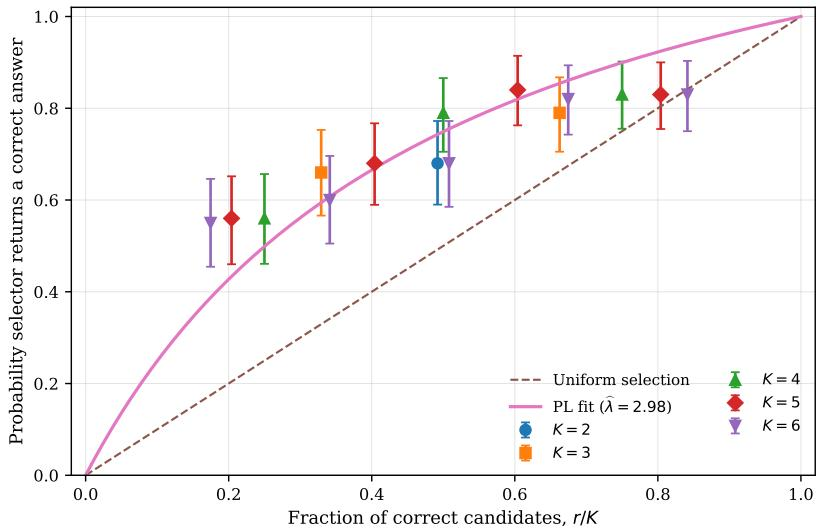  
Figure 5 ABCD selector recovery. Points show task-clustered estimates for controlled $( K , r )$ cells, vertical bars show 95% task-clustered bootstrap intervals, the dashed line is uniform selection, and the solid curve is the fitted Plackett–Luce model. Small horizontal ofsets separate cells with the same correct fraction.

Dual-guided workflow generation. We use ADAS Meta Agent Search (Hu et al. 2025) to generate new workflows, with OpenAI’s GPT-4o-mini serving both as the meta-agent that proposes workflow structures and as the execution model within the generated workflows. The search is guided by task prices from the stochastic dual. These prices identify development tasks on which an additional correct workflow output would be most valuable, allowing ADAS to focus its search on weaknesses of the current workflow bank. To implement this idea, for each K we run the ellipsoid separation procedure associated with Algorithm 2, using a one-scenario sample-average approximation (SAA) of the stochastic projected dual. Because the stochastic dual assigns a separate slot price $\theta _ { q }$ to each labeled execution copy $q = 1 , \ldots , K$ , workflow pricing is checked separately for each copy. At a given ellipsoid iterate, we first check the explicit dual constraints and the workflow constraints corresponding to workflows already evaluated. ADAS is invoked only if these constraints do not separate the current iterate. Whenever ADAS proposes a new workflow, we freeze its design and evaluate it independently using the same $L = 5$ execution protocol before using its estimated performance in subsequent pricing calculations.

We impose a prespecified budget of 20 distinct new workflow evaluations during generation. After the generation stage, the final finite-pool portfolio optimization uses 16 SAA scenarios and 512 randomized-rounding trials. Across the fixed-K searches, the procedure makes 26 ADAS pricing queries and incorporates four generated workflows, expanding the evaluated bank from 18 to 22 workflow types. Because each fixed-K search is subject to its prespecified workflow-evaluation budget, the resulting expanded bank should be viewed as the output of a budgeted dual-guided search rather than an exhaustive search over the full workflow class.

Expanded-bank recalibration and reoptimization. After adding the generated workflows, we recalibrate the same Qwen selector using a new controlled panel constructed from outputs in the expanded workflow bank. This step allows the estimated selector model to reflect the new kinds of candidate outputs it will encounter after workflow generation. The estimated selector strength is $\widehat { \lambda } = 2 . 5 2 2 9$ , with a 95% confidence interval of [2.0918, 3.0670]. This interval overlaps the initial-bank confidence interval, although the point estimate is lower. The comparison illustrates why we recalibrate after expanding the workflow bank: λ summarizes selector performance for the candidate distribution it faces and should not be treated as a fixed intrinsic property of the selector.

We then reoptimize the portfolio over all 22 workflow types. The best repeat-allowed portfolio has K = 4, where K counts complete workflow executions, or equivalently the four candidate outputs ultimately presented to the selector. Two of these four slots are assigned to generated workflow G4 (FinalABCDRouterWithLabel) in Table 2. A single execution of G4 makes three independently seeded GPT-4o-mini routing calls on the same ABCD task and returns the label receiving the most votes. Assigning G4 to two slots therefore means running this entire three-call workflow twice independently, producing two candidate outputs. The remaining two slots contain one initialbank Mistral verify-and-revise execution and one Qwen evidence-first execution. Thus, the K = 4 portfolio presents four candidate outputs to the final selector but uses eight underlying model calls per task: six from the two G4 executions and one from each of the two initial-bank workflows.

On the development sample, this portfolio has calibrated selector accuracy of 54.190% and a workflow-cost-adjusted value of 0.534410. The no-repeat benchmark also selects K = 4, but replaces the second copy of G4 with G3 (Final Single Routing Agent), a generated router with critique and fallback. Its workflow-cost-adjusted value is 0.533396.

Composition of the generated workflows. Table 2 summarizes the four workflows generated by ADAS and added to the evaluated workflow bank. Every model call within these workflows uses GPT-4o-mini. Thus, the generated workflows difer not in the underlying model, but in how they organize multiple calls and combine their outputs, using mechanisms such as parallel sampling, voting, critique, clarification, and conditional fallback. The repeat-allowed optimal portfolio assigns two execution slots to FinalABCDRouterWithLabel. Each deployed task therefore receives two independent runs of this three-call voting workflow, together with one Mistral and one Qwen workflow from the initial bank. In the no-repeat benchmark, the second copy is replaced by one execution of Final Single Routing Agent.

Fresh held-out deployment. We freeze all reported portfolios before examining the 800 held-out tasks. For each workflow type appearing in a reported portfolio, we collect five new stochastic executions per task. We first evaluate each portfolio under the plug-in Plackett–Luce model, using the estimated workflow success probabilities and selector strength. We then evaluate actual deploy-

Table 2 ADAS-generated workflows incorporated into the expanded ABCD bank. All generated model calls use GPT-4o-mini through the ADAS LLMAgentBase interface. Each GPT-4o-mini invocation is assigned one \$0.001 reference-call unit; mean calls and normalized cost are measured during independent workflow evaluation.
<table><tr><td>Workflow</td><td>Executable structure</td><td>Mean calls</td><td>Cost</td></tr><tr><td>G1</td><td>Five independent routing calls followed by a plurality vote. If the highest vote is tied, three additional routing calls are made and a second plurality vote resolves the tie.</td><td></td><td>8.00.008</td></tr><tr><td>G2</td><td>Five independent routing calls followed by a plurality vote. If the leading vote is tied, one additional clarification routing call determines the returned label.</td><td></td><td>6.0 0.006</td></tr><tr><td>G3</td><td>One initial routing call followed by a critique/validation call. If the proposed label is invalid, ambiguous, or unsure, an additional fallback routing call is made.</td><td></td><td>2.0 0.002</td></tr><tr><td>G4</td><td>Three independent routing calls on the same task, followed by a vote; the workflow returns the label with the largest vote count.</td><td></td><td>3.00.003</td></tr></table>

Notes. G1–G4 correspond respectively to the frozen ADAS programs FinalEnhancedRoutingAgent,

FinalRoutingAgent, Final Single Routing Agent, and FinalABCDRouterWithLabel. Cost is recurring normalized execution cost per workflow run.

ment performance by using Qwen2.5-7B-Instruct as the final selector. The selector does not observe workflow identity or correctness. To reduce sensitivity to candidate position, we present each candidate set under up to six cyclic rotations of the candidate order and use the candidate receiving the most selection votes across rotations.

## 8.2. Results on ABCD

Table 3 and figure 6 report deployment performance on 800 fresh held-out ABCD tasks. Actual selector accuracy increases from 43.625% for the best initial singleton to 46.750% for the optimized initial-bank portfolio and to 50.250% for the portfolio obtained after ellipsoid-guided workflow generation. Thus, optimizing the initial workflow bank contributes 3.125 percentage points, and expanding the bank through workflow generation contributes an additional 3.500 percentage points. Relative to the initial singleton, the complete procedure gains 6.625 percentage points, or 15.2%. The same ordering appears under the calibrated Plackett–Luce model, where predicted selector accuracy rises from 43.550% to 47.269% and then to 50.648%. Notably, the final portfolio uses only four execution slots, compared with six for the optimized initial-bank portfolio. The generated workflows therefore allow the system to use fewer workflow executions while achieving higher heldout accuracy. The no-repeat benchmark reaches 50.125%, only 0.125 percentage points below the primary repeat-allowed solution.

The improvement does not come simply from increasing the probability that at least one candidate is correct. That probability, which we refer to as oracle coverage, decreases modestly from 59.517% for the optimized initial-bank portfolio to 58.264% for the expanded-bank portfolio. At the same time, the accuracy obtained by selecting uniformly at random from the realized candidate outputs rises from 40.533% to 45.681%. Thus, the generated workflows produce candidate sets in which correct outputs are more prevalent, even though the chance of having at least one correct output is slightly lower. After subtracting both workflow execution cost and the realized cost of the selector, actual total-system net value increases from 0.435207 for the singleton to 0.455829 for the optimized initial-bank portfolio and 0.490671 for the final ADAS-expanded portfolio.

Table 3 Fresh held-out ABCD deployment on 800 tasks. PL accuracy is the plug-in Plackett–Luce prediction; actual accuracy uses the blind deterministic Qwen selector. Brackets report 95% Wilson intervals. Workflow and selector costs are per task, and actual total-system net subtracts both.
<table><tr><td>Method</td><td></td><td>K PL accuracy</td><td>Actual accuracy (95% CI)</td><td></td><td>Random accuracy</td><td>Oracle coverage</td><td>Workflow cost</td><td>Selector cost</td><td>Actual total-system net</td></tr><tr><td>Best initial singleton</td><td>1</td><td>0.4355</td><td></td><td>0.4363 [0.4023,0.4708]</td><td>0.4355</td><td>0.4355</td><td>0.001043</td><td>0.000000</td><td>0.435207</td></tr><tr><td>Optimized initial bank</td><td>6</td><td>0.4727</td><td></td><td>0.4675 [0.4332,0.5021</td><td>0.4053</td><td>0.5952</td><td>0.005157</td><td>0.006514</td><td>0.455829</td></tr><tr><td>ADAS-expanded bank</td><td>4</td><td>0.5065</td><td></td><td>0.5025 [0.4679,0.5371]</td><td>0.4568</td><td>0.5826</td><td>0.007486</td><td>0.004343</td><td>0.490671</td></tr><tr><td>ADAS-expanded, no-repeat</td><td>4</td><td>0.5069</td><td></td><td>0.5013 [0.4667, 0.5358]</td><td>0.4572</td><td>0.5829</td><td>0.006486</td><td>0.004343</td><td>0.490421</td></tr></table>

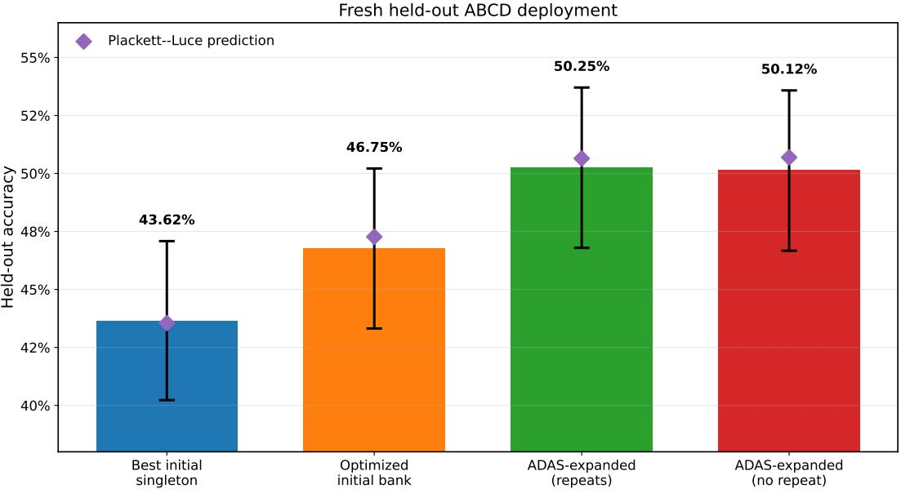  
Figure 6 Fresh held-out ABCD accuracy. Bars report actual deterministic selector accuracy, error bars show 95% Wilson intervals over 800 tasks, and diamonds report the corresponding plug-in Plackett–Luce predictions.

## 8.3. Results on SGD and HotpotQA

The same end-to-end pipeline produces diferent sources of value across the other two domains. On SGD, the initial workflow bank is already strong and complementary: optimizing it raises actual held-out selector accuracy from 85.250% for the best singleton to 92.750%. None of the 20 evaluated ADAS candidates is incorporated at the queried dual prices, so the final portfolio coincides with the optimized initial-bank portfolio. Thus, SGD demonstrates the value of portfolio optimization without requiring workflow generation.

On HotpotQA, optimizing the initial bank raises actual held-out accuracy only from 30.250% to 31.125%, but dual-guided generation incorporates a three-call evidence-extraction, verification, and multihop-solving workflow. Two independent executions of this workflow attain 55.250% actual accuracy; one execution attains 54.875% and has slightly higher total-system net value after selector cost is included. Together with ABCD, these results show that portfolio optimization, workflow generation, and multiplicity are distinct sources of value whose importance varies across applications. Complete experimental designs, calibration results, portfolio compositions, and held-out evaluations are reported in Sections G.1 and G.2.

## 9. Conclusion

Agentic AI systems often approach the same task through multiple workflows and then rely on a selector to choose the final answer. This paper shows that workflow variety creates both opportunity and risk. While additional executions may solve cases that the current portfolio misses, they also consume compute and may introduce plausible wrong answers that make final selection more dificult. We develop a framework for managing this tradeof. Our selector strength bound places a sharp limit on the value of workflow variety and identifies conditions under which a single workflow or no deployment is optimal. We then develop optimization methods for choosing the run size and allocating execution slots across workflow types. For large implicit workflow classes, dual prices guide a workflow generation oracle toward residual tasks on which an additional correct output would be most valuable, while the ellipsoid method provides performance guarantees without requiring the workflow class to be enumerated.

The numerical results illustrate both the value and the limits of workflow portfolios. Relative to the best initial singleton, the final portfolio raises actual held-out selector accuracy by 6.625 percentage points on ABCD, 7.500 points on SGD, and 25.000 points on HotpotQA. Workflow generation adds value on ABCD and HotpotQA but not on SGD, where optimizing the already strong initial bank is suficient. Multiplicity likewise has heterogeneous value: it binds in ABCD and HotpotQA but not in SGD, and its incremental accuracy benefit need not justify its addi tional compute and selection cost. The central message is that more inference time variety is not automatically better. Efective deployment requires firms to coordinate workflow generation, run size, execution allocation, and compute expenditure with the recovery capabilities of the selector.

## References

Abdolmaleki M, Duenyas I (2026) Hold back, team up, or take over? optimal timing of AI access. URL http: //dx.doi.org/10.2139/ssrn.6953340, available at SSRN 6953340.

Abdolmaleki M, Duenyas I, Kapuscinski R (2026) Pricing delayed agentic AI services: When high-value jobs wait longer. URL http://dx.doi.org/10.2139/ssrn.6721378, available at SSRN 6721378.

Ageev AA, Sviridenko MI (2004) Pipage Rounding: A New Method of Constructing Algorithms with Proven Perfor mance Guarantee. Journal of Combinatorial Optimization 8(3):307–328.

Agrawal S, Wang Z, Ye Y (2014) A dynamic near-optimal algorithm for online linear programming. Operations Research 62(4):876–890.

Alaei S, Makhdoumi A, Malekian A (2010) Maximizing sequence-submodular functions and its application to online advertising. arXiv preprint arXiv:1009.4153 .

Baek J, Fu Y, Ma W, Peng T (2026) Ai agents for inventory control: Human-llm-or complementarity. arXiv preprint arXiv:2602.12631 .

Barman S, Fawzi O, Ferm´e P (2021) Tight Approximation Guarantees for Concave Coverage Problems. 38th International Symposium on Theoretical Aspects of Computer Science (STACS 2021), volume 187 of Leibniz International Proceedings in Informatics (LIPIcs), 9:1–9:17.

Bertsimas D, Miˇsi´c VV (2019) Exact first-choice product line optimization. Operations Research 67(3):651–670.

Calinescu G, Chekuri C, P´al M, Vondr´ak J (2011) Maximizing a Monotone Submodular Function Subject to a Matroid Constraint. SIAM Journal on Computing 40(6):1740–1766.

Chekuri C, Vondr´ak J, Zenklusen R (2010) Dependent Randomized Rounding via Exchange Properties of Combi natorial Structures. Proceedings of the 51st Annual IEEE Symposium on Foundations of Computer Science, 575–584.

Chen D, Chen H, Yang Y, Lin A, Yu Z (2021a) Action-Based Conversations Dataset: A Corpus for Building More In-Depth Task-Oriented Dialogue Systems. URL https://arxiv.org/abs/2104.00783.

Chen D, Chua GA (2024) Noisy dual mirror descent: A near optimal algorithm for jointly-dp convex resource alloca tion. Advances in Neural Information Processing Systems 37:91723–91755.

Chen L, Davis JQ, Hanin B, Bailis P, Zaharia M, Zou J, Stoica I (2025) Optimizing Model Selection for Compound AI Systems. URL https://arxiv.org/abs/2502.14815.

Chen L, Zaharia M, Zou J (2024) FrugalGPT: How to Use Large Language Models While Reducing Cost and Improving Performance. Transactions on Machine Learning Research .

Chen Q, Jasin S, Duenyas I (2019) Nonparametric Self-Adjusting Control for Joint Learning and Optimization of Multiproduct Pricing with Finite Resource Capacity. Mathematics of Operations Research 44(2):601–631.

Chen Q, Jasin S, Duenyas I (2021b) Technical Note—Joint Learning and Optimization of Multi-Product Pricing with Finite Resource Capacity and Unknown Demand Parameters. Operations Research 69(2):560–573.

Cheng W, Dembczy´nski K, H¨ullermeier E (2010) Label Ranking Methods Based on the Plackett–Luce Model. Proceedings of the 27th International Conference on Machine Learning, 215–222.

Dantzig GB, Wolfe P (1960) Decomposition Principle for Linear Programs. Operations Research 8(1):101–111.

Dean A, Zhang Z, Jasin S, Liu Y (2026) Multi-LLM Query Optimization. URL https://arxiv.org/abs/2603.24617.

Desaulniers G, Desrosiers J, Solomon MM, eds. (2005) Column Generation (Springer).

Dong J, Mo W, Qi Z, Shi C, Fang EX, Tarokh V (2023) Pasta: pessimistic assortment optimization. International Conference on Machine Learning, 8276–8295 (PMLR).

Echenique F, Fallah A, Jordan MI (2025) A general framework for estimating preferences using response time data. arXiv preprint arXiv:2507.20403 .

Elmachtoub AN, Grigas P (2022) Smart “predict, then optimize”. Management science 68(1):9–26.

Faradonbeh MKS, Faradonbeh MSS (2023) Online reinforcement learning in stochastic continuous-time systems. The Thirty Sixth Annual Conference on Learning Theory, 612–656 (PMLR).

Feige U (1998) A Threshold of ln n for Approximating Set Cover. Journal of the ACM 45(4):634–652.

Gartner (2025a) Gartner Predicts 40% of Enterprise Apps Will Feature Task-Specific AI Agents by 2026, Up from Less Than 5% in 2025. Gartner Newsroom, URL https://www.gartner.com/en/newsroom/press-releases/

Gartner (2025b) Gartner Predicts Over 40% of Agentic AI Projects Will Be Canceled by End of 2027. Gartner Newsroom, URL https://www.gartner.com/en/newsroom/press-releases/ 2025-06-25-gartner-predicts-over-40-percent-of-agentic-ai-projects-will-be-canceled-by-end-of-2027, accessed: 2026-06-26.

Gr¨otschel M, Lov´asz L, Schrijver A (1981) The ellipsoid method and its consequences in combinatorial optimization. Combinatorica 1(2):169–197, URL http://dx.doi.org/10.1007/BF02579273.

Gr¨otschel M, Lov´asz L, Schrijver A (1988) Geometric Algorithms and Combinatorial Optimization, volume 2 of Algorithms and Combinatorics (Berlin: Springer-Verlag), URL http://dx.doi.org/10.1007/978-3-642-97881-4.

Guiver J, Snelson E (2009) Bayesian Inference for Plackett–Luce Ranking Models. Proceedings of the 26th Annual International Conference on Machine Learning, 377–384, URL http://dx.doi.org/10.1145/1553374.1553423.

Guo Y, Jasin S, Lin CA (2026) Congestion-Aware Static LLM Cascades: Analysis of a Steady-State Framework. Available at SSRN, sSRN 6759238.

Hajek B, Oh S, Xu J (2014) Minimax-Optimal Inference from Partial Rankings. Advances in Neural Information Processing Systems, volume 27, 1475–1483.

Harvard Business Review Analytic Services (2026) From the Edge to the Core: Bringing Agentic AI to the Heart of the Enterprise. Harvard Business Review Sponsored Content, URL https://hbr.org/sponsored/2026/01/ from-the-edge-to-the-core, accessed: 2026-06-26.

Hu QJ, Bieker J, Li X, Jiang N, Keigwin B, Ranganath G, Keutzer K, Upadhyay S (2024) RouterBench: A Benchmark for Multi-LLM Routing System. URL https://arxiv.org/abs/2403.12031.

Hu S, Lu C, Clune J (2025) Automated Design of Agentic Systems. International Conference on Learning Representations.

Huang K, Shi Y, Ding D, Li Y, Fei Y, Lakshmanan LVS, Xiao X (2025) ThriftLLM: On Cost-Efective Selection of Large Language Models for Classification Queries. Proceedings of the VLDB Endowment 18(11):4410–4423.

Jasin S (2014) Reoptimization and Self-Adjusting Price Control for Network Revenue Management. Operations Research 62(5):1168–1178.

Jiang D, Ren X, Lin BY (2023) LLM-Blender: Ensembling Large Language Models with Pairwise Ranking and Generative Fusion. Proceedings of the 61st Annual Meeting of the Association for Computational Linguistics.

Keskin NB, Zeevi A (2014) Dynamic pricing with an unknown demand model: Asymptotically optimal semi-myopic policies. Operations research 62(5):1142–1167.

Kleywegt AJ, Shapiro A, Homem-de Mello T (2002) The Sample Average Approximation Method for Stochastic Discrete Optimization. SIAM Journal on Optimization 12(2):479–502.

Li G, Liang J, Liu M, Lei Y, Jasin S, Yang F, Baxi P (2026) Asymptotically Optimal Sequential Testing with Heterogeneous LLMs. URL https://arxiv.org/abs/2604.01086.

Liang Y, Wu C, Song T, Wu W, Xia Y, Liu Y, Ou Y, Lu S, Ji L, Mao S, Wang Y, Shou L, Gong M, Duan N (2024) TaskMatrix.AI: Completing tasks by connecting foundation models with millions of APIs. Intelligent Computing 3:0063, URL http://dx.doi.org/10.34133/icomputing.0063.

Liu F, Liu Y, Zhang Q, Tong X, Yuan M (2026a) EoH-S: Evolution of Heuristic Set Using LLMs for Automated Heuristic Design. Proceedings of the AAAI Conference on Artificial Intelligence 40(43):37090–37098

Liu F, Yao Y, Guo P, Yang Z, Zhao Z, Lin X, Tong X, Yuan M, Lu Z, Wang Z, Zhang Q (2026b) A Systematic Survey on Large Language Models for Algorithm Design. ACM Computing Surveys .

Lu P, Peng B, Cheng H, Galley M, Chang KW, Wu YN, Zhu SC, Gao J (2023) Chameleon: Plug-and-play compositional reasoning with large language models. Advances in Neural Information Processing Systems, volume 36, 43447–43478.

Luce RD (1959) Individual Choice Behavior: A Theoretical Analysis (New York: Wiley).

McFadden D (1974) Conditional Logit Analysis of Qualitative Choice Behavior. Zarembka P, ed., Frontiers in Econometrics, 105–142 (New York: Academic Press).

McKinsey & Company (2025) The State of AI: Global Survey 2025. McKinsey QuantumBlack, URL https://www. mckinsey.com/capabilities/quantumblack/our-insights/the-state-of-ai, accessed: 2026-06-26.

McKinsey & Company (2026) Building the Foundations for Agentic AI at Scale. McKinsey Technology, URL https://www.mckinsey.com/capabilities/mckinsey-technology/our-insights/ building-the-foundations-for-agentic-ai-at-scale, accessed: 2026-06-26.

Nemhauser GL, Wolsey LA, Fisher ML (1978) An Analysis of Approximations for Maximizing Submodular Set Functions—I. Mathematical Programming 14:265–294.

Novikov A, V˜u N, Eisenberger M, Dupont E, Huang PS, Wagner AZ, Shirobokov S, Kozlovskii B, Ruiz FJR, Mehrabian A, Kumar MP, See A, Chaudhuri S, Holland G, Davies A, Nowozin S, Kohli P, Balog M (2025) AlphaEvolve: A Coding Agent for Scientific and Algorithmic Discovery. URL https://arxiv.org/abs/2506.13131.

Ong I, Almahairi A, Wu V, Chiang WL, Wu T, Gonzalez JE, Kadous MW, Stoica I (2025) RouteLLM: Learning to Route LLMs with Preference Data. International Conference on Learning Representations.

Plackett RL (1975) The Analysis of Permutations. Journal of the Royal Statistical Society: Series C 24(2):193–202.

Radvand T, Abdolmaleki M, Mostagir M, Tewari A (2026) A training-free method for LLM text attribution. URL http://dx.doi.org/10.2139/ssrn.6169527, available at SSRN 6169527; also available as arXiv:2501.02406.

Ransbotham S, Kiron D, Khodabandeh S, Iyer S, Das A (2025) The Emerging Agentic Enterprise: How Leaders Must Navigate a New Age of AI. MIT Sloan Management Review and Boston Consulting Group, URL https://shop.sloanreview.mit.edu/ the-emerging-agentic-enterprise-how-leaders-must-navigate-a-new-age-of-ai, accessed: 2026-06-26.

Rastogi A, Zang X, Sunkara S, Gupta R, Khaitan P (2020) Towards Scalable Multi-Domain Conversational Agents: The Schema-Guided Dialogue Dataset. Proceedings of the AAAI Conference on Artificial Intelligence, volume 34, 8689–8696.

Saad-Falcon J, Lafuente AG, Natarajan S, Maru N, Todorov H, Guha E, Buchanan EK, Chen M, Guha N, R´e C, Mirhoseini A (2025) Archon: An Architecture Search Framework for Inference-Time Techniques. International Conference on Learning Representations.

Shen Y, Song K, Tan X, Li D, Lu W, Zhuang Y (2023) HuggingGPT: Solving AI tasks with ChatGPT and its friends in Hugging Face. Advances in Neural Information Processing Systems, volume 36, 38154–38180.

Spearman C (1961) The proof and measurement of association between two things. .

Sz¨or´enyi B, Busa-Fekete R, Paul A, H¨ullermeier E (2015) Online Rank Elicitation for Plackett–Luce: A Dueling Bandits Approach. Advances in Neural Information Processing Systems, volume 28, 604–612.

Talluri KT, van Ryzin GJ (2004) The Theory and Practice of Revenue Management (Springer).

van Ryzin G, Mahajan S (1999) On the Relationship Between Inventory Costs and Variety Benefits in Retail Assort ments. Management Science 45(11):1496–1509.

Wang J, Wang J, Athiwaratkun B, Zhang C, Zou J (2025) Mixture-of-Agents Enhances Large Language Model Capabilities. International Conference on Learning Representations.

Wang X, Wei J, Schuurmans D, Le Q, Chi EH, Narang S, Chowdhery A, Zhou D (2023) Self-Consistency Improves Chain of Thought Reasoning in Language Models. International Conference on Learning Representations.

Wang Z, Peura H, Wiesemann W (2024) Randomized assortment optimization. Operations Research 72(5):2042–2060.

Yang Z, Qi P, Zhang S, Bengio Y, Cohen WW, Salakhutdinov R, Manning CD (2018) HotpotQA: A Dataset for Diverse, Explainable Multi-Hop Question Answering. Proceedings of the 2018 Conference on Empirical Methods in Natural Language Processing, 2369–2380.

Zhang G, Niu L, Fang J, Wang K, Bai L, Wang X (2025a) Multi-Agent Architecture Search via Agentic Supernet. URL https://arxiv.org/abs/2502.04180.

Zhang H, Jasin S (2022) Online Learning and Optimization of (Some) Cyclic Pricing Policies in the Presence of Patient Customers. Manufacturing & Service Operations Management 24(2):1165–1182.

Zhang J, Xiang J, Yu Z, Teng F, Chen X, Chen J, Zhuge M, Cheng X, Hong S, Wang J, Zheng B, Liu B, Luo Y, Wu C (2025b) AFlow: Automating Agentic Workflow Generation. International Conference on Learning Representations.

Zhuge M, Wang W, Kirsch L, Faccio F, Khizbullin D, Schmidhuber J (2024) GPTSwarm: Language Agents as Optimizable Graphs. International Conference on Machine Learning.

# Appendices for “Managing Agentic AI Workflow Portfolios under Imperfect Selection and Compute Cost.”

## Appendix A: A Graph-Based Formalization of Workflow Classes

This appendix gives one formal representation of the implicit workflow class ${ \mathcal { G } } .$ . The main analysis requires only that each workflow $g$ can be executed on a task, produces a candidate answer and trace, and has an evaluated correctness column and recurring cost. A graph grammar is useful for making the feasible class explicit, but the portfolio optimization results do not depend on this particular representation.

Let ${ \mathcal { U } } = \{ u _ { 1 } , . . . , u _ { Q } \}$ denote a library of primitive executable modules. A module may be a prompt-based agent, retriever, solver, verifier, critic, tool call, aggregation rule, learned classifier, neural-network block, or answer formatter. A workflow g is a finite directed computation graph

$$
g = ( V _ { g } , E _ { g } , \ell _ { g } , s _ { g } , t _ { g } ) ,
$$

where $V _ { g }$ is a finite node set, $E _ { g }$ represents information flow, $\ell _ { g } : V _ { g } \to \mathcal { U }$ assigns a module to each node, and $s _ { g } , t _ { g }$ are input and output nodes. We impose $| V _ { g } | \le L _ { \operatorname* { m a x } }$ and any application-specific restrictions on retrieval, tools, model calls, memory, context length, or termination. The feasible workflow class $\mathcal { G }$ consists of all graphs satisfying these restrictions.

## Appendix B: Other selector technologies

The endogenous framework allows a diferent recovery curve $\psi _ { k }$ for each candidate-set size k. The selector-strength bound in Section 4 applies whenever these curves admit a common fraction-based envelope with finite odds-lift. The fixed-size IP remains valid for any nondecreasing recovery curve, while the randomized-rounding certificate additionally requires diminishing increments. A selector that reaches recovery probability one at an interior correct fraction has infinite odds-lift, so the uniform selector-strength cap becomes vacuous even though the exact size-conditioned IP remains applicable.

Conservative clean recovery. Suppose each correct candidate is rejected with probability $\beta ,$ each incorrect candidate is falsely certified with probability $\alpha ,$ and verifier outputs are conditionally independent. The event that at least one correct candidate is certified and no incorrect candidate is certified has probability

$$
\psi _ { \alpha , \beta , k } ^ { \mathrm { c l e a n } } ( r ) = { \bf 1 } \{ r \geq 1 \} ( 1 - \beta ^ { r } ) ( 1 - \alpha ) ^ { k - r } .\tag{74}
$$

Uniform selection among certified candidates. If the selector chooses uniformly among certified candidates, with U ∼ Binomia $( r , 1 - \beta )$ and $W \sim$ Binomial $\left( k - r , \alpha \right)$ ，

$$
\psi _ { \alpha , \beta , k } ^ { \mathrm { u n i f } } ( r ) = \sum _ { u = 1 } ^ { r } \sum _ { w = 0 } ^ { k - r } \frac { u } { u + w } { \binom { r } { u } } ( 1 - \beta ) ^ { u } \beta ^ { r - u } { \binom { k - r } { w } } \alpha ^ { w } ( 1 - \alpha ) ^ { k - r - w } .\tag{75}
$$

Voting. Under a conservative model in which accepted wrong workflows coordinate on the same wrong answer, let $C _ { r } \sim \mathrm { B i n o m i a l } ( r , 1 - \beta )$ and $W _ { k - r } \sim \mathrm { B i n o m i a l } ( k - r , \alpha )$ . A suficient recovery event is $C _ { r } > W _ { k - r } ,$ giving

$$
\psi _ { \alpha , \beta , k } ^ { \mathrm { v o t e } } ( r ) = \mathbb { P } \{ C _ { r } > W _ { k - r } \} .\tag{76}
$$

Voting is typically threshold-like and need not be concave. The size-conditioned IP remains exact, but the concave-coverage rounding certificate does not apply unless the estimated curve satisfies diminishing increments.

## Appendix C: A Numerical Illustration of Workflow Multiplicity

This example illustrates why it can be optimal to assign multiple execution slots to the same workflow type under an imperfect selector. Suppose there are two deterministic workflow types, A and B, and three task types with the correctness patterns and population shares shown in Table 4.

Table 4 Task types and workflow correctness.
<table><tr><td>Task type</td><td>Workflow A Workflow B Population share</td><td></td><td></td></tr><tr><td>Type 1</td><td>Correct</td><td>Incorrect</td><td>0.40</td></tr><tr><td>Type 2</td><td>Incorrect</td><td>Correct</td><td>0.20</td></tr><tr><td>Type 3</td><td>Incorrect</td><td>Incorrect</td><td>0.40</td></tr></table>

For compactness, write execution-count vectors in the coordinate order (A, B), and define

$$
{ \pmb m } ^ { A } = ( 1 , 0 ) , \qquad { \pmb m } ^ { A B } = ( 1 , 1 ) , \qquad { \pmb m } ^ { A A B } = ( 2 , 1 ) .
$$

Workflow A has standalone accuracy 0.40, whereas workflow B has standalone accuracy 0.20. Workflow B is nevertheless complementary because it solves Type 2 tasks, which workflow A misses. Suppose the selector follows the Plackett–Luce recovery curve with $\lambda = 2 \colon$

$$
\psi _ { k , 2 } ^ { \mathrm { { P L } } } ( r ) = \frac { 2 r } { 2 r + k - r } .\tag{77}
$$

For the portfolio $\mathbf { \delta } _ { m } { } ^ { A B }$ , exactly one of the two candidates is correct on Types 1 and 2, so

$$
J _ { 2 } ( m ^ { A B } ) = 0 . 4 0 \left( \frac { 2 } { 3 } \right) + 0 . 2 0 \left( \frac { 2 } { 3 } \right) = 0 . 4 0 .\tag{78}
$$

Now consider the portfolio $\mathbf { \delta } _ { m } ^ { A A B }$ . On Type 1 tasks, two of the three candidates are correct, giving recovery probability $4 / 5$ . On Type 2 tasks, only workflow B is correct, giving recovery probability $1 / 2$ . Therefore,

$$
J _ { 2 } ( m ^ { A A B } ) = 0 . 4 0 \left( \frac { 4 } { 5 } \right) + 0 . 2 0 \left( \frac { 1 } { 2 } \right) = 0 . 4 2 .\tag{79}
$$

Thus,

$$
J _ { 2 } ( m ^ { A A B } ) = 0 . 4 2 > J _ { 2 } ( m ^ { A B } ) = J _ { 2 } ( m ^ { A } ) = 0 . 4 0 .\tag{80}
$$

The additional execution of A creates no new task coverage. Instead, it increases the representation of the stronger workflow on the more common Type 1 tasks, raising recovery from $2 / 3$ to $4 / 5$ , while retaining workflow $B$ to cover Type 2 tasks. The gain on Type 1 tasks exceeds the corresponding loss in selector recovery on Type 2 tasks.

The result also survives a small execution cost. If every execution has accuracy-equivalent cost $\kappa = 0 . 0 0 5$ , then

$$
\begin{array} { r } { \Pi _ { 2 } ( pmb { m } ^ { A } ) = 0 . 4 0 0 - 0 . 0 0 5 = 0 . 3 9 5 , } \\ { ~ } \\ { \Pi _ { 2 } ( \pmb { m } ^ { A B } ) = 0 . 4 0 0 - 0 . 0 1 0 = 0 . 3 9 0 , } \\ { ~ } \\ { \Pi _ { 2 } ( \pmb { m } ^ { A A B } ) = 0 . 4 2 0 - 0 . 0 1 5 = 0 . 4 0 5 . } \end{array}\tag{81}
$$

Hence, $\scriptstyle m ^ { A A B }$ remains optimal among these portfolios after accounting for recurring execution cost. By contrast, repeating A without including another workflow type would leave its selectoraware accuracy unchanged at 0.40 and would only add cost. Multiplicity is valuable here because it adjusts the relative representation of complementary workflow types, not because pure repetition expands coverage.

## Appendix D: Proofs

## D.1. Proof of Lemma 1

For $p \in ( 0 , 1 )$ , the condition $\Lambda ( H ) \leq \Lambda$ gives

$$
{ \frac { H ( p ) } { 1 - H ( p ) } } \leq \Lambda { \frac { p } { 1 - p } } .\tag{82}
$$

Finite odds-lift implies $H ( p ) < 1$ at every interior $p ,$ so all denominators are positive. Multiplying through and collecting terms yields

$$
H ( p ) \{ 1 - p + \Lambda p \} \le \Lambda p .\tag{83}
$$

Because $1 - p + \Lambda p = 1 + ( \Lambda - 1 ) p > 0 ,$

$$
H ( p ) \leq { \frac { \Lambda p } { 1 + ( \Lambda - 1 ) p } } = h _ { \Lambda } ( p ) .\tag{84}
$$

At $p = 0$ , both sides are zero under $H ( 0 ) = 0 ; { \mathrm { a t } } p = 1$ , the right-hand side is one and the inequality follows from $H ( 1 ) \leq 1$ □

## D.2. Proof of Lemma 2

For $p \in [ 0 , 1 ]$

$$
h _ { \Lambda } ^ { \prime } ( p ) = \frac { \Lambda } { \{ 1 + ( \Lambda - 1 ) p \} ^ { 2 } } \geq 0 , \qquad h _ { \Lambda } ^ { \prime \prime } ( p ) = - \frac { 2 \Lambda ( \Lambda - 1 ) } { \{ 1 + ( \Lambda - 1 ) p \} ^ { 3 } } \leq 0 .\tag{85}
$$

Thus $h _ { \Lambda }$ is increasing and concave. □

## D.3. Proof of Lemma 3

For continuous r,

$$
\frac { d } { d r } \frac { \lambda r } { k + ( \lambda - 1 ) r } = \frac { \lambda k } { \{ k + ( \lambda - 1 ) r \} ^ { 2 } } \geq 0 ,\tag{86}
$$

and

$$
\frac { d ^ { 2 } } { d r ^ { 2 } } \frac { \lambda r } { k + ( \lambda - 1 ) r } = - \frac { 2 \lambda k ( \lambda - 1 ) } { \{ k + ( \lambda - 1 ) r \} ^ { 3 } } \le 0 .\tag{87}
$$

The discrete increment follows by subtracting adjacent values and simplifying, which yields (31); its denominator increases in ℓ. Finally,

$$
h _ { \lambda } ^ { \prime } ( p ) = \frac { \lambda } { \{ 1 + ( \lambda - 1 ) p \} ^ { 2 } } > 0 , \qquad h _ { \lambda } ^ { \prime \prime } ( p ) = - \frac { 2 \lambda ( \lambda - 1 ) } { \{ 1 + ( \lambda - 1 ) p \} ^ { 3 } } \le 0 .\tag{88}
$$

□

## D.4. Proof of Proposition 1

Consider one task and zero compute costs. Let $c _ { 1 } , c _ { 2 }$ be workflows that are correct on the task and let $w _ { 1 } , w _ { 2 }$ be wrong. Nonmonotonicity follows from

$$
J _ { \lambda } \big ( \{ c _ { 1 } \} \big ) = 1 , \qquad J _ { \lambda } \big ( \{ c _ { 1 } , w _ { 1 } \} \big ) = h _ { \lambda } \big ( 1 / 2 \big ) < 1 .\tag{89}
$$

For submodularity, take $A = \{ c _ { 1 } \} , B = \{ c _ { 1 } , w _ { 1 } \}$ , and $e = c _ { 2 }$ . Then

$$
\Delta ( e \mid A ) = 0 , \qquad \Delta ( e \mid B ) = h _ { \lambda } ( 2 / 3 ) - h _ { \lambda } ( 1 / 2 ) > 0 ,\tag{90}
$$

which violates diminishing returns. For supermodularity, take $A = \{ w _ { 1 } \} , B = \{ w _ { 1 } , w _ { 2 } \}$ , and $e = c _ { 1 }$ Then

$$
\Delta ( e \mid A ) = h _ { \lambda } ( 1 / 2 ) > h _ { \lambda } ( 1 / 3 ) = \Delta ( e \mid B ) ,\tag{91}
$$

which violates increasing returns. Adding or subtracting a modular function does not change the submodularity or supermodularity inequalities. □

## D.5. Proof of Theorem 2

Fix an execution-count vector $\pmb { m } \in \mathbb { Z } _ { + } ^ { \mathcal { M } }$ satisfying $k ( m ) = k$ , label its k execution slots, and sample b labeled slots uniformly without replacement. Let $M ^ { ( b ) }$ be the resulting random execution-count vector and let $\alpha = b / k$ . For task $i ,$ write $r _ { i } = r _ { i } ( m )$ and let

$$
R _ { i } = r _ { i } \big ( M ^ { ( b ) } \big ) .
$$

Then

$$
R _ { i } \sim \mathrm { H y p e r g e o m } ( k , r _ { i } , b ) , \qquad \mathbb { E } [ R _ { i } ] = \alpha r _ { i } .
$$

$r _ { i } = 0 .$ , then both the size-k task value and the expected size-b task value are zero. Suppose $r _ { i } > 0$ and define $p _ { i } = r _ { i } / k$ and $X _ { i } = R _ { i } / b$ . Since h is increasing, concave, and satisfies $h ( 0 ) = 0$

$$
h ( x ) \geq h ( p _ { i } ) \operatorname* { m i n } \{ x / p _ { i } , 1 \} , \qquad x \in [ 0 , 1 ] .\tag{92}
$$

Indeed, for $x \leq p _ { i }$ the inequality follows from concavity between 0 and $p _ { i }$ , and for $x \geq p _ { i }$ it follows from monotonicity. Now

$$
\frac { X _ { i } } { p _ { i } } = \frac { R _ { i } } { \alpha r _ { i } } .\tag{93}
$$

Let $Z _ { i } = R _ { i } / r _ { i } \in [ 0 , 1 ]$ . Then $\mathbb { E } [ Z _ { i } ] = \alpha$ and, for every $z \in [ 0 , 1 ]$ , min $\{ z , \alpha \} \ge \alpha z$ . Hence

$$
\mathbb { E } \left[ \operatorname* { m i n } \left\{ \frac { X _ { i } } { p _ { i } } , 1 \right\} \right] = \frac { 1 } { \alpha } \mathbb { E } [ \operatorname* { m i n } \{ Z _ { i } , \alpha \} ] \geq \frac { 1 } { \alpha } \alpha \mathbb { E } [ Z _ { i } ] = \alpha .\tag{94}
$$

Combining this with (92) gives

$$
\mathbb { E } [ h ( R _ { i } / b ) ] \geq \alpha h ( r _ { i } / k ) .\tag{95}
$$

Averaging across tasks yields

$$
\mathbb { E } \left[ J _ { \psi } \big ( M ^ { ( b ) } \big ) \right] \geq \alpha J _ { \psi } ( m ) ,\tag{96}
$$

Because costs are additive,

$$
\mathbb { E } \big [ C \big ( M ^ { ( b ) } \big ) \big ] = \alpha C ( m ) ,\tag{97}
$$

Therefore

$$
\mathbb { E } \big [ \Pi _ { \psi , \gamma } \big ( { \pmb M } ^ { ( b ) } \big ) \big ] \ge \alpha \Pi _ { \psi , \gamma } ( { \pmb m } ) .\tag{98}
$$

Some realization of $M ^ { ( b ) }$ attains at least this expected value. If m is an optimal size-k executioncount vector with positive value, then

$$
\begin{array} { r } { \mathrm { O P T } _ { b } ( \mathcal { M } ) \geq \alpha \mathrm { O P T } _ { k } ( \mathcal { M } ) , } \end{array}\tag{99}
$$

which proves (34); if $\mathrm { O P T } _ { k } ( \mathcal { M } ) \leq 0$ , the statement with positive parts is immediate. For the grid result, choose for each k an anchor $b \in \mathcal K$ with $b \leq k \leq \varrho b$ . Then

$$
\mathrm { O P T } _ { b } ^ { + } ( \mathcal { M } ) \geq \frac { b } { k } \mathrm { O P T } _ { k } ^ { + } ( \mathcal { M } ) \geq \frac { 1 } { \varrho } \mathrm { O P T } _ { k } ^ { + } ( \mathcal { M } ) .\tag{100}
$$

Maximizing over k proves (35). The dyadic and ratio- $\lvert \ / \rvert - \eta _ { \mathrm { g r i d } } )$ claims follow from the definition of the grid coverage ratio. □

## D.6. Proof of Theorem 1

The lower bound follows from the outside option and singleton feasibility. With one candidate, the selector must return that candidate, so the net value of the singleton execution-count vector $e _ { g }$ is $\begin{array} { r } { \bar { a } _ { g } - \gamma c _ { g } . } \end{array}$

Fix a nonzero execution-count vector $\pmb { m } \in \mathbb { Z } _ { + } ^ { \mathcal { M } }$ satisfying $k ( m ) = k$ , and define

$$
p _ { i } ( { m } ) = \frac { r _ { i } ( m ) } { k } .
$$

By Assumption 1 and lemma 1,

$$
J _ { \psi } ( \pmb { m } ) = \frac { 1 } { n } \sum _ { i = 1 } ^ { n } \psi _ { k } \big ( r _ { i } ( \pmb { m } ) \big )\tag{101}
$$

$$
\leq { \frac { 1 } { n } } \sum _ { i = 1 } ^ { n } H { \big ( } p _ { i } ( m ) { \big ) }\tag{102}
$$

$$
\leq { \frac { 1 } { n } } \sum _ { i = 1 } ^ { n } h _ { \Lambda } { \big ( } p _ { i } ( m ) { \big ) } .\tag{103}
$$

By Lemma 2 and Jensen’s inequality,

$$
\frac { 1 } { n } \sum _ { i = 1 } ^ { n } h _ { \Lambda } \big ( p _ { i } ( m ) \big ) \leq h _ { \Lambda } \left( \frac { 1 } { n } \sum _ { i = 1 } ^ { n } p _ { i } ( m ) \right)\tag{104}
$$

$$
= h _ { \Lambda } \left( \frac { 1 } { k } \sum _ { g \in \mathcal { M } } \bar { a } _ { g } m _ { g } \right)\tag{105}
$$

$$
\leq h _ { \Lambda } ( A _ { k } ) .\tag{106}
$$

Also $C ( m ) \geq C _ { k }$ . Hence

$$
\Pi _ { \psi , \gamma } ( \pmb { m } ) \leq h _ { \Lambda } ( \pmb { A } _ { k } ) - \gamma C _ { k } .
$$

Maximizing over k and including the outside option proves (22). When $\gamma = 0 , A _ { k } \leq a ^ { \star }$ for all k, giving (23).

For tightness over the selector class, take recovery $H = h _ { \Lambda }$ . Suppose $a ^ { \star } = r / k$ and $k \leq K _ { \operatorname* { m a x } }$ Construct k tasks and k workflows using a cyclic incidence matrix in which each workflow solves exactly r tasks and each task is solved by exactly r workflows. Let $m ^ { \star }$ assign one execution slot to each of these k workflows. Then $p _ { i } ( m ^ { \star } ) = a ^ { \star }$ for every task, and therefore $J _ { \psi } ( \pmb { m } ^ { \star } ) = h _ { \Lambda } ( a ^ { \star } )$ . Rational values can be represented exactly after replication, and arbitrary values can be approximated.

## D.7. Proof of Corollary 1

The first inequality follows from (23). Let

$$
G _ { \Lambda } ( a ) = h _ { \Lambda } ( a ) - a = { \frac { ( \Lambda - 1 ) a ( 1 - a ) } { 1 + ( \Lambda - 1 ) a } } .\tag{107}
$$

For $\Lambda > 1$ , diferentiation gives the unique maximizer $a = 1 / ( 1 + \sqrt { \Lambda } )$ and maximum $( \sqrt { \Lambda } -$ $1 ) / ( \sqrt { \Lambda } + 1 )$ . At $\Lambda = 1$ , both sides are zero.

If all workflows cost $c ,$ any execution-count vector m satisfying $k ( m ) = k \geq 2$ obeys

$$
\Pi _ { \psi , \gamma } ( { \pmb m } ) \le h _ { \Lambda } ( \pmb a ^ { \star } ) - k \gamma c .
$$

Under (26),

$$
h _ { \Lambda } ( a ^ { \star } ) - k \gamma c \leq a ^ { \star } - \gamma c ,\tag{108}
$$

so no multi-workflow portfolio beats the best singleton. The outside option dominates only when the singleton net value is negative. □

## D.8. Proof of Proposition 2

Fix an execution-count vector $\pmb { m } \in \mathbb { Z } _ { + } ^ { \mathcal { M } }$ satisfying $k ( m ) = k$ , and set

$$
z _ { g } = m _ { g } , \qquad g \in \mathcal { M } .
$$

Then

$$
\sum _ { g \in { \mathcal { M } } } a _ { i g } z _ { g } = r _ { i } ( { \pmb m } ) , \qquad i = 1 , \ldots , n .
$$

For this fixed $z ,$ the prefix constraints imply that the active tier variables for task i form a prefix, while the capacity constraint implies that the length of this prefix is at most $r _ { i } ( m )$ . Since $d _ { \ell , k } \geq 0$ there exists an optimal choice

$$
y _ { i \ell } = { \bf 1 } \{ \ell \leq r _ { i } ( m ) \} , \qquad \ell = 1 , \ldots , k .
$$

Its task-i contribution is

$$
\sum _ { \ell = 1 } ^ { k } d _ { \ell , k } y _ { i \ell } = \sum _ { \ell = 1 } ^ { r _ { i } ( m ) } d _ { \ell , k } = \psi _ { k } \big ( r _ { i } ( m ) \big ) ,
$$

where the last equality uses $\psi _ { k } ( 0 ) = 0$ . Moreover, the cost term is

$$
- \gamma \sum _ { g \in \mathcal { M } } c _ { g } z _ { g } = - \gamma C ( \pmb { m } ) .
$$

Thus every feasible size-k execution-count vector induces an integer-program solution with the same objective value, and hence

$$
I _ { k } ( { \mathcal { M } } ) \geq \mathrm { O P T } _ { k } ( { \mathcal { M } } ) .
$$

Conversely, let $( y , z )$ be any integral feasible solution of (39), and define the execution-count vector $\pmb { m } \in \mathbb { Z } _ { + } ^ { \mathcal { M } }$ by $m _ { g } = z _ { g }$ . Then $k ( m ) = k$ . For each task $i ,$ let

$$
t _ { i } = \sum _ { \ell = 1 } ^ { k } y _ { i \ell } .
$$

Because $y$ is binary and satisfies the prefix constraints, its active entries form a prefix of length $t _ { i }$ Feasibility gives

$$
t _ { i } \leq \sum _ { g \in \mathcal { M } } a _ { i g } z _ { g } = r _ { i } ( \pmb { m } ) .
$$

Therefore, using the nonnegativity of the increments,

$$
\sum _ { \ell = 1 } ^ { k } d _ { \ell , k } y _ { i \ell } = \sum _ { \ell = 1 } ^ { t _ { i } } d _ { \ell , k } = \psi _ { k } ( t _ { i } ) \leq \psi _ { k } \big ( r _ { i } ( m ) \big ) .
$$

The integer-program objective is consequently at most $\Pi _ { \psi , \gamma } ( m )$ , and hence at most $\mathrm { O P T } _ { k } ( \mathcal { M } )$ Thus

$$
I _ { k } ( { \mathcal { M } } ) \leq \mathrm { O P T } _ { k } ( { \mathcal { M } } ) .
$$

Combining the two inequalities gives $I _ { k } ( \mathcal { M } ) = \mathrm { O P T } _ { k } ( \mathcal { M } )$ . Finally, combining this equality with the size decomposition (33) proves (40). □

## D.9. Proof of Theorem 3

Write $d _ { \ell } = d _ { \ell , k }$ . For a feasible repeated-execution LP vector z, define

$$
x _ { i } = \sum _ { g } a _ { i g } z _ { g } , \qquad q _ { g } = z _ { g } / k .
$$

Draw $G _ { 1 } , \ldots , G _ { k }$ independently from $q ,$ and let $\textstyle R _ { i } = \sum _ { j = 1 } ^ { k } a _ { i G _ { j } }$ . Then

$$
R _ { i } \sim \mathrm { B i n o m i a l } ( k , x _ { i } / k ) , \qquad \mathbb { E } [ R _ { i } ] = x _ { i } .
$$

For every integer $t \geq 1$ and $r \geq 0$

$$
\operatorname* { m i n } \{ r , t \} \geq t \left\{ 1 - ( 1 - 1 / t ) ^ { r } \right\} .
$$

Therefore

$$
\begin{array} { r l } { \mathbb { E } [ \operatorname* { m i n } \{ R _ { i } , t \} ] \geq t \left[ 1 - \mathbb { E } \{ ( 1 - 1 / t ) ^ { R _ { i } } \} \right] } & { } \\ { = t \left[ 1 - \left( 1 - \displaystyle \frac { x _ { i } } { k t } \right) ^ { k } \right] } & { } \\ { \geq t \left( 1 - e ^ { - x _ { i } / t } \right) } & { } \\ { \geq \left( 1 - \displaystyle \frac { 1 } { e } \right) \operatorname* { m i n } \{ x _ { i } , t \} . } \end{array}
$$

The last inequality follows from $1 - e ^ { - u } \geq ( 1 - 1 / e ) \operatorname* { m i n } \{ u , 1 \}$ for $u \geq 0$ . Using the decomposition

$$
\widetilde { \psi } _ { k } ( r ) = d _ { k , k } r + \sum _ { t = 1 } ^ { k - 1 } ( d _ { t , k } - d _ { t + 1 , k } ) \operatorname* { m i n } \{ r , t \} ,
$$

and averaging across tasks gives

$$
\mathbb { E } \left[ J _ { \psi } \left( M _ { k } ^ { \mathrm { R R } } ( z ) \right) \right] \geq \left( 1 - \frac { 1 } { e } \right) Q _ { k } ( z ) + \frac { d _ { k , k } } { e } R _ { k } ( z ) .
$$

Moreover, if $N _ { g }$ is the sampled multiplicity of type g, then

$$
\mathbb { E } \big [ C \big ( M _ { k } ^ { \mathrm { R R } } ( z ) \big ) \big ] = \sum _ { g } c _ { g } \mathbb { E } \big [ M _ { k , g } ^ { \mathrm { R R } } ( z ) \big ] = \sum _ { g } c _ { g } z _ { g } = C _ { k } ( z ) .
$$

Subtracting cost proves (46) and (47). $\operatorname { I f } z = z ^ { k \star }$ is LP-optimal, then $\mathrm { O P T } _ { k } ( \mathcal { M } ) \leq L _ { k } ( \mathcal { M } ) = F _ { k } ( z ^ { k \star } )$ ， which gives the first inequality in (48). Finally, concavity implies $Q _ { k } ( z ) \leq d _ { 1 , k } R _ { k } ( z )$ , so

$$
d _ { k , k } R _ { k } ( z ) = ( 1 - c _ { \psi , k } ) d _ { 1 , k } R _ { k } ( z ) \geq ( 1 - c _ { \psi , k } ) Q _ { k } ( z ) .
$$

This proves the curvature bound. □

## D.10. Proof of Corollary 2

By Theorem 3,

$$
\mathbb { E } \left[ \Pi _ { \lambda , \gamma } ( M _ { k } ^ { \mathrm { R R } } ) \right] \geq L _ { k } ( \mathcal { M } ) - \frac { c _ { k , \lambda } ^ { \mathrm { P L } } } { e } Q _ { k } ^ { \star } .
$$

Since the LP relaxation has $0 \leq y _ { i \ell } \leq 1$ and $\textstyle \sum _ { \ell = 1 } ^ { k } d _ { \ell , k } = 1$ , we have $0 \leq Q _ { k } ^ { \star } \leq 1$ . Hence

$$
\mathbb { E } \big [ \Pi _ { \lambda , \gamma } ( M _ { k } ^ { \mathrm { R R } } ) \big ] \geq L _ { k } ( \mathcal { M } ) - \frac { c _ { k , \lambda } ^ { \mathrm { P L } } } { e } ,
$$

This establishes the fixed-size additive net-value bound used below.

For the accuracy-only bound, Theorem 3 gives

$$
\mathbb { E } \big [ J _ { \lambda } ( M _ { k } ^ { \mathrm { R R } } ) \big ] \geq \left( 1 - \frac { 1 } { e } \right) Q _ { k } ^ { \star } + \frac { d _ { k , k } } { e } R _ { k } ^ { \star } .
$$

By the definition of curvature,

$$
d _ { k , k } = \left( 1 - c _ { k , \lambda } ^ { \mathrm { P L } } \right) d _ { 1 , k } .
$$

Concavity implies $Q _ { k } ^ { \star } \leq d _ { 1 , k } R _ { k } ^ { \star }$ , so

$$
d _ { k , k } R _ { k } ^ { \star } \geq \left( 1 - c _ { k , \lambda } ^ { \mathrm { P L } } \right) Q _ { k } ^ { \star } .
$$

Substituting this inequality yields

$$
\mathbb { E } \left[ J _ { \lambda } ( M _ { k } ^ { \mathrm { R R } } ) \right] \geq \left( 1 - \frac { 1 } { e } \right) Q _ { k } ^ { \star } + \frac { 1 - c _ { k , \lambda } ^ { \mathrm { P L } } } { e } Q _ { k } ^ { \star } = \left( 1 - \frac { c _ { k , \lambda } ^ { \mathrm { P L } } } { e } \right) Q _ { k } ^ { \star } ,
$$

This establishes an auxiliary accuracy-only bound.

It remains to prove the grid-level multiplicative bound. Let

$$
U = U _ { \mathrm { L P } } ( \mathcal { K } ; \mathcal { M } ) , \qquad a = \frac { 1 } { e } \operatorname* { m a x } _ { k \in \mathcal { K } } c _ { k , \lambda } ^ { \mathrm { P L } } .
$$

If $U = 0$ , the result is immediate. Otherwise, choose $k ^ { \star } \in \arg \operatorname* { m a x } _ { k \in \mathcal { K } } L _ { k } ( \mathcal { M } )$ , so that $L _ { k ^ { \star } } ( \mathcal { M } ) = U$ By the fixed-size additive net-value bound derived above,

$$
\mathbb { E } \big [ \Pi _ { \lambda , \gamma } \big ( S _ { k ^ { \star } } ^ { \mathrm { R R } } \big ) \big ] \geq U - a .
$$

Because $\widehat { M }$ is chosen after comparing the rounded portfolios with the baseline $m ^ { 0 }$ and the outside option, Jensen’s inequality for the convex maximum function gives

$$
\mathbb { E } \Big [ \Pi _ { \lambda , \gamma } \big ( \widehat { M } \big ) \Big ] \geq \operatorname* { m a x } \{ \underline { { V } } , U - a \} .
$$

For every $U \geq 0 , a \geq 0$ , and $\underline { { V } } > 0$

$$
\operatorname* { m a x } \{ \underline { { V } } , U - a \} \geq \frac { V } { \underline { { V } } + a } U .
$$

Indeed, if $U \leq \underline { { { V } } } + a .$ , then

$$
\operatorname* { m a x } \{ \underline { { V } } , U - a \} \geq \underline { { V } } \geq \frac { V } { \underline { { V } } + a } U .
$$

If $U > \underline { { V } } + a$ , then

$$
\operatorname* { m a x } \{ \underline { { V } } , U - a \} \geq U - a \geq \frac { V } { \underline { { V } } + a } U .
$$

Combining the last two displays proves (51). Finally, exact integer-program solves over M dominate the rounded feasible portfolios, so the same lower bound also applies when the final restricted problems are solved exactly. □

## D.11. Projected dual, weak separation, and proof details

For $x \in [ 0 , k ]$ , let

$$
\varphi _ { k } ( x ) = \frac { 1 } { n } \widetilde { \psi } _ { k } ( x ) ,
$$

and define

$$
\chi _ { k } ( u ) = \operatorname* { m a x } _ { r = 0 , \ldots , k } \left\{ { \frac { \psi _ { k } ( r ) } { n } } - u r \right\} , \qquad 0 \leq u \leq { \frac { d _ { 1 , k } } { n } } .\tag{109}
$$

Because $\varphi _ { k }$ is concave and piecewise linear with slopes in $[ 0 , d _ { 1 , k } / n ]$ ，

$$
\varphi _ { k } ( x ) = \operatorname* { m i n } _ { \substack { 0 \leq u \leq d _ { 1 , k } / n } } \{ u x + \chi _ { k } ( u ) \} .\tag{110}
$$

Lemma 4 (Projected dual for repeated executions). For every nonempty finite workflowtype class $\mathcal { G }$ and fixed size $k _ { i }$

$$
L _ { k } ( \mathcal { G } ) = \operatorname* { m i n } _ { 0 \leq \mu _ { i } \leq d _ { 1 , k } / n } \left\{ \sum _ { i = 1 } ^ { n } \chi _ { k } ( \mu _ { i } ) + k \operatorname* { m a x } _ { g \in \mathcal { G } } \left( \sum _ { i = 1 } ^ { n } \mu _ { i } a _ { i g } - \gamma c _ { g } \right) \right\} .\tag{111}
$$

Equivalently, introducing θ and epigraph variables $\xi _ { i }$ yields (52).

A fter optimizing the tier variables, the repeated-execution LP is

$$
\operatorname* { m a x } _ { z \geq 0 : \sum _ { g } z _ { g } = k } \left\{ \sum _ { i = 1 } ^ { n } \varphi _ { k } \left( \sum _ { g } a _ { i g } z _ { g } \right) - \gamma \sum _ { g } c _ { g } z _ { g } \right\} .
$$

Substitute (110) and apply finite- dimensional minimax to interchange the minimization over $\mu$ and the maximization over the scaled simplex. For fixed $\mu ,$ linear optimization over that simplex gives

$$
\operatorname* { m a x } _ { z \geq 0 ; \sum _ { g } z _ { g } = k } \sum _ { g } z _ { g } \left( \sum _ { i } \mu _ { i } a _ { i g } - \gamma c _ { g } \right) = k \operatorname* { m a x } _ { g \in \mathcal { G } } \left( \sum _ { i } \mu _ { i } a _ { i g } - \gamma c _ { g } \right) .
$$

This proves (111). The epigraph representation of $\chi _ { k }$ is

$$
\xi _ { i } + r \mu _ { i } \geq { \frac { \psi _ { k } ( r ) } { n } } , \qquad r = 0 , \ldots , k ,
$$

which gives (52). □

Lemma 5 (Batched pricing gives high-confidence weak separation). Fix a candidate dual point $( \mu , \xi , \theta )$ and a tolerance $\delta > 0$ . Suppose each primitive pricing call made at task prices $\mu$ returns a δ-accurate workflow, meaning a workflow $\widetilde g$ satisfying

$$
s _ { \widetilde { g } } ( \mu ) \geq \operatorname* { m a x } _ { g \in \mathcal { G } } s _ { g } ( \mu ) - \delta , \qquad s _ { g } ( \mu ) = \sum _ { i } \mu _ { i } a _ { i g } - \gamma c _ { g } ,
$$

with conditional probability at least $p _ { \mathrm { o r c } } > 0$ . Run m primitive calls at the same prices and keep the highest-scoring returned workflow. Then, conditional on the history before the batch, the batch is δ-accurate with probability at least

$$
1 - e ^ { - p _ { \mathrm { o r c } } m } .
$$

On this event, if the best returned workflow has score above $\theta ,$ its workflow inequality is a valid violated constraint. If its score is at most θ, then all workflow inequalities are satisfied after replacing θ by $\theta + \delta$ , increasing the dual objective by at most $k \delta$

L et $Y _ { j }$ be the indicator that primitive call $j$ in the batch is δ-accurate. The calls may be adaptive to previous failed attempts inside the batch, but by assumption

$$
\mathbb { P } \{ Y _ { j } = 1 \mid \mathrm { p a s t ~ w i t h i n ~ t h e ~ b a t c h } \} \ge p _ { \mathrm { o r c } } .
$$

Therefore

$$
\mathbb { P } \{ Y _ { 1 } = \cdot \cdot \cdot = Y _ { m } = 0 \mid { \mathrm { h i s t o r y } } \} \leq ( 1 - p _ { \mathrm { o r c } } ) ^ { m } \leq e ^ { - p _ { \mathrm { o r c } } m } .
$$

Thus, with probability at least $1 - e ^ { - p _ { \mathrm { o r c } } m }$ , at least one primitive call is δ-accurate. Since the batch keeps the highest-scoring returned workflow, the batch output is also δ-accurate.

If the batch output satisfies $s _ { \widetilde g } ( \mu ) > \theta$ , then the constraint

$$
s _ { \widetilde g } ( \mu ) \le \theta
$$

is violated and supplies a valid separating hyperplane. If instead $s _ { \widetilde g } ( \mu ) \le \theta$ , then δ-accuracy gives

$$
\operatorname* { m a x } _ { g \in \mathcal { G } } s _ { g } ( \mu ) \leq s _ { \widetilde { g } } ( \mu ) + \delta \leq \theta + \delta .
$$

Thus $s _ { g } ( \mu ) \leq \theta + \delta$ for every $g \in { \mathcal { G } }$ . Since the coeficient of θ in (52) is $k ,$ this relaxation increases the dual objective by at most kδ. □

## D.12. Proof of Theorem 4

For each fixed k, (52) is a rational LP in 2n+1 variables, with polynomially many explicit recovery and box constraints and an implicit family of workflow constraints. By Lemma $5 ,$ a successful batch supplies weak separation for the implicit workflow constraints. The weak optimization–separation equivalence for the ellipsoid method therefore returns an $\varepsilon _ { \mathrm { e l l } } / 2$ -optimal dual solution in a number of separation queries polynomial in

$$
n , \quad k , \quad B , \quad \log ( 1 / \varepsilon _ { \mathrm { e l l } } ) .
$$

With $\tau _ { k } = \varepsilon _ { \mathrm { e l l } } / ( 2 k )$ , the possible slot-price relaxation in Lemma 5 contributes at most $k \tau _ { k } = \varepsilon _ { \mathrm { e l l } } / 2$ to the dual objective. Hence, on the event that all batches used by the ellipsoid routine are successful, standard primal recovery from the workflow inequalities generated by the routine gives, for every $k \in \mathcal { K }$ , a feasible fractional execution vector $z ^ { k }$ supported only on oracle-returned workflows and satisfying

$$
F _ { k } ( z ^ { k } ) \geq L _ { k } ( \mathcal G ) - \varepsilon _ { \mathrm { e l l } } .\tag{112}
$$

It remains to bound the probability that all batches are successful. Let $N _ { \mathrm { e l l } } ( \varepsilon _ { \mathrm { e l l } } )$ be the deterministic upper bound on the total number of ellipsoid separation queries across all grid sizes. Index these separation queries by $q = 1 , \ldots , N _ { \mathrm { e l l } }$ . Let $B _ { q }$ be the event that batch $q$ contains at least one $\tau _ { k }$ -accurate primitive pricing call, where k is the grid size being solved at that query. By Lemma 5,

$$
\mathbb { P } ( B _ { q } ^ { c } \mid \mathrm { h i s t o r y ~ b e f o r e ~ b a t c h } ~ q ) \le e ^ { - p _ { \mathrm { o r c } } m } .
$$

Therefore,

$$
\mathbb { P } \left( \bigcup _ { q = 1 } ^ { N _ { \mathrm { e l l } } } \mathcal { B } _ { q } ^ { c } \right) \leq \sum _ { q = 1 } ^ { N _ { \mathrm { e l l } } } \mathbb { E } \left[ \mathbb { P } ( \mathcal { B } _ { q } ^ { c } \mid \mathrm { h i s t o r y ~ b e f o r e ~ b a t c h ~ } q ) \right]\tag{113}
$$

$$
\leq N _ { \mathrm { e l l } } ( \varepsilon _ { \mathrm { e l l } } ) e ^ { - p _ { \mathrm { o r c } } m } .\tag{114}
$$

Equivalently, since $T = m N _ { \mathrm { e l l } } ( \varepsilon _ { \mathrm { e l l } } )$ 2

$$
N _ { \mathrm { e l l } } ( \varepsilon _ { \mathrm { e l l } } ) e ^ { - p _ { \mathrm { o r c } } m } = \exp \left\{ - \frac { p _ { \mathrm { o r c } } T } { N _ { \mathrm { e l l } } ( \varepsilon _ { \mathrm { e l l } } ) } + \log N _ { \mathrm { e l l } } ( \varepsilon _ { \mathrm { e l l } } ) \right\} .
$$

This proves the probability statement in (54).

On the event that all batches are successful, apply Theorem 3 to each recovered fractional solution $z ^ { k }$ . Since $Q _ { k } ( z ^ { k } ) \leq 1$ , for every $k \in \mathcal { K }$ ,

$$
\mathbb { E } _ { \mathrm { r n d } } \left[ \Pi _ { \lambda , \gamma } ( M _ { k } ^ { \mathrm { R R } } ) \right] \geq F _ { k } ( z ^ { k } ) - \frac { c _ { k , \lambda } ^ { \mathrm { P L } } } { e } \geq L _ { k } ( \mathcal { G } ) - \varepsilon _ { \mathrm { e l l } } - \frac { c _ { k , \lambda } ^ { \mathrm { P L } } } { e } .
$$

Taking the best grid point gives

$$
\operatorname* { m a x } _ { k \in { \mathcal K } } { \mathbb E } _ { \mathrm { r n d } } \left[ \Pi _ { \lambda , \gamma } ( { \cal M } _ { k } ^ { \mathrm { R R } } ) \right] \ge U _ { \mathrm { L P } } ( { \cal K } ; \mathcal { G } ) - \varepsilon _ { \mathrm { e l l } } - \varepsilon _ { \mathrm { r n d } } ( { \cal K } , \lambda ) .
$$

By Theorem $^ { 2 , }$

$$
U _ { \mathrm { L P } } ( { \mathcal K } ; { \mathcal G } ) \geq \frac { 1 } { \varrho } \mathrm { O P T } _ { \lambda , \gamma } ( { \mathcal G } ) .
$$

Comparing the rounded grid candidates with the retained baseline $m ^ { 0 }$ proves (55).

Finally, for every $A \ge 0 , e \ge 0$ , and $\underline { { V } } > 0$

$$
\operatorname* { m a x } \{ \underline { { V } } , A - e \} \geq \frac { V } { \underline { { V } } + e } A .
$$

Apply this inequality with

$$
A = \frac { 1 } { \varrho } \mathrm { O P T } _ { \lambda , \gamma } ( \mathcal { G } ) , \qquad e = \varepsilon _ { \mathrm { e l l } } + \varepsilon _ { \mathrm { r n d } } ( \mathcal { K } , \lambda ) ,
$$

to obtain (56). □

## Appendix E: Managerial Implications and Extensions

Accuracy value and the price of compute. The parameter $\gamma$ is not an arbitrary regularizer. If a correct decision is worth v dollars relative to an incorrect one, maximizing $v J _ { \psi } ( \pmb { m } ) - C ( \pmb { m } )$ is equivalent to maximizing $J _ { \psi } ( \pmb { m } ) - \gamma C ( \pmb { m } )$ with $\gamma = 1 / v$ . Varying $\gamma$ traces an accuracy–compute frontier. The screening bound in Theorem 1 can eliminate run sizes that cannot be eficient before solving any IP.

Selector investment versus workflow investment. The selector-strength cap (25) maps an oddslift bound Λ into the largest possible gross return from workflow complementarity. When Λ is close to one, spending on additional workflows has little possible upside; improving the selector may dominate expanding the portfolio. When Λ is large, workflow variety can become more valuable, subject to cost. Under Plackett–Luce, Λ = λ, so selector-model investment can be evaluated through the fitted discrimination parameter.

Shared modules, latency, and nonadditive costs. The additive cost $\begin{array} { r } { C ( \pmb { m } ) = \sum _ { g \in \mathcal { G } } c _ { g } m _ { g } } \end{array}$ is appropriate for token or dollar expenditure when all assigned workflow executions are run. Workflow graphs may share retrieval results, cached model calls, or verification modules, and parallel execution makes latency depend on a critical path rather than a sum. These features can be represented by fixed-charge module variables or a set-dependent cost $C ( S )$ . The structural accuracy bound remains valid, while the finite-pool optimization becomes a richer mixed-integer problem.

Stochastic workflow outputs. If correctness is stochastic, the exact selector-aware contribution of task i under execution-count vector m is

$$
\mathbb { E } \left[ \psi _ { k ( m ) } ( R _ { i } ( { \pmb m } ) ) \right] .
$$

where the expectation is over the joint distribution of workflow outcomes. In general this is not equal to applying ψ to the sum of marginal success probabilities. A practical approach is scenario-based sample-average approximation: repeated workflow runs create deterministic correctness scenarios, and the portfolio is optimized against their average selector value (Kleywegt et al. 2002).

Task-dependent run sets. The paper chooses one persistent portfolio for a task population. A pre-output router could select a task-specific subset before execution, yielding a joint routing and post-output selection problem. The current model provides the value and cost of each candidate run set; an outer policy can then allocate run sets by task features or congestion state.

Voting and nonconcave selectors. Majority voting and threshold verification can have increasing marginal value near a decision threshold. The general selector-strength bound still applies if a finite common odds-lift envelope exists, even when the raw recovery curve is nonconcave. If recovery reaches one at an interior correct fraction, however, the odds-lift index is infinite and that uniform cap is vacuous. For each fixed size, the exact IP remains valid with arbitrary nondecreasing increments, but the concave-coverage rounding certificate may fail. Endogenous size still matters because adding a wrong vote can move the system away from the threshold and incurs compute. Selector-specific approximation or robust envelope methods are natural extensions.

Creation cost versus execution cost. Execution cost $c _ { g }$ recurs on every deployed task. Workflow creation and evaluation costs are one-time investments. The generation algorithm can impose a separate budget on oracle calls, candidate evaluation, or human engineering. A longer planning horizon increases the relative importance of recurring execution cost, while a short-lived application may place more weight on creation cost.

Robust selector calibration. The fitted λ may vary across task types or drift when portfolios are optimized. For the structural cap, a robust analysis can construct an upper confidence envelope $H ^ { + }$ for recovery and use $\Lambda ( H ^ { + } )$ , or use an upper confidence bound for λ under Plackett–Luce. For portfolio optimization, one can optimize worst-case net value over a family of recovery curves or impose a distribution over task-specific selector strengths. The cardinality-grid and IP architecture remains unchanged; only the recovery coeficients $d _ { \ell , k }$ vary. If the recovery curves do not share a common concave fraction-based representation, the exact fixed-size IPs remain valid but the geometric cardinality approximation should be treated as a Plackett–Luce or common-fraction specialization rather than a universal guarantee.

## Appendix F: Proofs for Stochastic Workflow Outcomes

This appendix gives the complete two-stage stochastic procedure and its proof. Stage 1 uses $L _ { 1 }$ independent executions to estimate each task–workflow success probability and constructs a plugin iid execution law. Workflow generation, stochastic pricing, and primal recovery are performed under that plug-in law. After the generated workflow pool is frozen, Stage 2 discards the Stage-1 outcomes for selection purposes and uses $L _ { 2 }$ fresh execution panels to choose the final portfolio.

For the analysis, associate with every task–workflow pair $( i , g )$ a potential Stage-1 pilot panel

$$
\begin{array} { r l r } { \left( Z _ { i g } ^ { ( 1 , \ell ) } : \ell = 1 , \ldots , L _ { 1 } \right) , } & { { } } & { Z _ { i g } ^ { ( 1 , \ell ) } \overset { \mathrm { i i d } } { \sim } \mathrm { B e r n o u l l i } ( a _ { i g } ) , } \end{array}\tag{115}
$$

with all panels mutually independent. The algorithm reveals a panel only when the corresponding workflow is first evaluated. This lazy revelation is equivalent to drawing the entire finite table in advance and does not require enumerating $\mathcal { G }$ computationally.

Lemma 6 (Uniform concentration of the $L _ { 1 }$ workflow estimates). Under Assumption 3, for every $\delta _ { 1 } \in ( 0 , 1 )$

$$
\mathbb { P } \left\{ \underset { i = 1 , \ldots , n } { \operatorname* { m a x } } \Big | \widehat { a } _ { i g } ^ { ( 1 ) } - a _ { i g } \Big | \le \varepsilon _ { a } \big ( L _ { 1 } , \delta _ { 1 } \big ) \right\} \ge 1 - \delta _ { 1 } ,\tag{116}
$$

where $\varepsilon _ { a } ( L _ { 1 } , \delta _ { 1 } )$ is defined in (65).

F or each fixed $( i , g )$ , Hoefding’s inequality gives

$$
\mathbb { P } \left\{ \bigg | \widehat { a } _ { i g } ^ { ( 1 ) } - a _ { i g } \bigg | > t \right\} \leq 2 e ^ { - 2 L _ { 1 } t ^ { 2 } } .
$$

A union bound over the $n | \mathcal G |$ potential pilot panels and the choice $t = \varepsilon _ { a } ( L _ { 1 } , \delta _ { 1 } )$ prove the result. Since the complete pilot table can be regarded as drawn before the generation process begins, revealing its entries adaptively does not alter the bound. □

Lemma 7 (Perturbation of iid stochastic portfolio values). Let $b = \left( b _ { i g } \right)$ and $b ^ { \prime } = ( b _ { i g } ^ { \prime } )$ be two success-probability matrices such that max $\dot { \mathbf { \eta } } _ { i , g } | b _ { i g } - b _ { i g } ^ { \prime } | \leq \eta$ . Let $\Pi _ { \psi , \gamma } ^ { b }$ and $\Pi _ { \psi , \gamma } ^ { b ^ { \prime } }$ denote portfolio values under the corresponding product-Bernoulli execution laws. Then

$$
\underset { { \displaystyle { \cal { m } } \in \mathbb { Z } _ { + } ^ { \mathcal { G } } } } { \operatorname* { s u p } } \left. \Pi _ { \psi , \gamma } ^ { b } ( { \pmb { m } } ) - \Pi _ { \psi , \gamma } ^ { b ^ { \prime } } ( { \pmb { m } } ) \right. \leq \operatorname* { m i n } \{ 1 , K _ { \operatorname* { m a x } } \eta \} .\tag{117}
$$

Consequently, on the event in (116),

$$
\operatorname* { s u p } _ { \pmb { m } \in \mathbb { Z } _ { + } ^ { \mathcal { G } } } \left| \widehat { \Pi } _ { \psi , \gamma } ^ { ( 1 ) } ( \pmb { m } ) - \Pi _ { \psi , \gamma } ^ { \mathrm { s t o c h } } ( \pmb { m } ) \right| \leq \varepsilon _ { \mathrm { e s t } } ( L _ { 1 } , \delta _ { 1 } ) .\tag{118}
$$

$F$ ix m and couple every Bernoulli execution under b and $b ^ { \prime }$ using the same independent uniform random variable. On task $i ,$ one execution of workflow $g$ difers under the two laws with probability $| b _ { i g } - b _ { i g } ^ { \prime } |$ . Hence the probability that any of the $k ( m )$ coupled execution outcomes difers is at most

$$
\sum _ { g \in \mathcal { G } } m _ { g } \vert b _ { i g } - b _ { i g } ^ { \prime } \vert \leq k ( \pmb { m } ) \eta .
$$

If no coupled outcome difers, the two correct counts and therefore the two recovery values coincide. Since recovery lies in [0, 1], the diference in expected task value is at most min $\{ 1 , k ( \pmb { m } ) \eta \}$ Averaging over tasks and observing that the cost term is identical under the two laws prove (117). The second claim follows from Lemma 6. □

For a fixed run size $k ,$ label the execution copies by $q = 1 , \ldots , k .$ . The Stage-1 estimates are integer multiples of $1 / L _ { 1 }$ . This permits a common finite scenario representation of the entire plug-in law that does not change when a new workflow is revealed. Let

$$
\Omega _ { k } = \{ 1 , \ldots , L _ { 1 } \} ^ { n \times k } , \qquad p _ { \omega } = L _ { 1 } ^ { - n k } ,\tag{119}
$$

and write $U _ { i q } ( \omega ) \in \{ 1 , \ldots , L _ { 1 } \}$ for coordinate $( i , q )$ of scenario $\omega .$ . For every workflow $^ { g , }$ define its potential plug-in correctness outcome in scenario ω by

$$
\widehat { A } _ { i g q } ^ { ( 1 ) } ( \omega ) = \mathbf { 1 } \left\{ U _ { i q } ( \omega ) \leq L _ { 1 } \widehat { a } _ { i g } ^ { ( 1 ) } \right\} .\tag{120}
$$

For each fixed integral assignment of workflows to execution copies, the variables in (120) are independent across tasks and copies and have the required Bernoulli means $\widehat { a } _ { i g } ^ { ( 1 ) }$ . The same uniforms may be used for diferent workflow choices within one copy because an integral assignment selects only one workflow for that copy.

For a finite workflow class ${ \mathcal { M } } .$ , define

$$
\mathcal { C } _ { k } ( \mathcal { M } ) = \left\{ m \in \mathbb { Z } _ { + } ^ { \mathcal { M } } : \sum _ { g \in \mathcal { M } } m _ { g } = k \right\} , \qquad | \mathcal { C } _ { k } ( \mathcal { M } ) | = \binom { | \mathcal { M } | + k - 1 } { k } ,\tag{121}
$$

and let

$$
\widehat { \mathrm { O P T } } _ { k } ^ { ( 1 ) } ( \mathcal { M } ) = \operatorname* { m a x } _ { m \in \mathcal { C } _ { k } ( \mathcal { M } ) } \widehat { \Pi } _ { \psi , \gamma } ^ { ( 1 ) } ( \pmb { m } ) .\tag{122}
$$

Lemma 8 (Plug-in stochastic LP relaxation and projected dual). Fix k and suppose $d _ { 1 , k } \geq \dots \geq d _ { k , k } \geq 0$ . Let $\widetilde { \psi } _ { k }$ be defined by (38), and set

$$
\mathcal { X } _ { k } ( \mathcal { G } ) = \left\{ x \geq 0 : \sum _ { g \in \mathcal { G } } x _ { g q } = 1 , \ q = 1 , \ldots , k \right\} .\tag{123}
$$

For $x \in \mathcal { X } _ { k } ( \mathcal G )$ , define

$$
\widehat { s } _ { i \omega } ^ { ( 1 ) } ( x ) : = \sum _ { q = 1 } ^ { k } \sum _ { g \in \mathcal { G } } \widehat { A } _ { i g q } ^ { ( 1 ) } ( \omega ) x _ { g q } ,\tag{124}
$$

$$
\widehat { \mathcal { F } } _ { k } ^ { ( 1 ) } ( x ) : = \sum _ { \omega \in \Omega _ { k } } p _ { \omega } \frac { 1 } { n } \sum _ { i = 1 } ^ { n } \widetilde { \psi } _ { k } \big ( \widehat { s } _ { i \omega } ^ { ( 1 ) } ( x ) \big ) - \gamma \sum _ { q = 1 } ^ { k } \sum _ { g \in \mathcal { G } } c _ { g } x _ { g q } ,\tag{125}
$$

$$
\widehat { \mathcal { L } } _ { k } ^ { ( 1 ) } ( \mathcal { G } ) : = \operatorname* { m a x } _ { x \in \mathcal { X } _ { k } ( \mathcal { G } ) } \widehat { \mathcal { F } } _ { k } ^ { ( 1 ) } ( x ) .\tag{126}
$$

Then

$$
{ \widehat { \mathscr { L } } } _ { k } ^ { ( 1 ) } ( { \mathcal { G } } ) \geq { \widehat { \mathrm { O P T } } } _ { k } ^ { ( 1 ) } ( { \mathcal { G } } ) .\tag{127}
$$

Define

$$
\chi _ { k } ( u ) = \operatorname* { m a x } _ { r = 0 , \ldots , k } \left\{ { \frac { \psi _ { k } ( r ) } { n } } - u r \right\} , \qquad 0 \leq u \leq { \frac { d _ { 1 , k } } { n } } .\tag{128}
$$

Strong duality gives

$$
\begin{array} { r l } { \widehat { \mathcal { L } } _ { k } ^ { ( 1 ) } ( \mathcal { G } ) = \displaystyle \operatorname* { m i n } _ { \mu , \boldsymbol { \theta } } } & { \displaystyle \sum _ { \omega \in \Omega _ { k } } p _ { \omega } \sum _ { i = 1 } ^ { n } \chi _ { k } ( \mu _ { i \omega } ) + \sum _ { q = 1 } ^ { k } \theta _ { q } } \\ { \mathrm { s . t . } \quad } & { \displaystyle \sum _ { \omega \in \Omega _ { k } } p _ { \omega } \sum _ { i = 1 } ^ { n } \mu _ { i \omega } \widehat { A } _ { i g q } ^ { ( 1 ) } ( \omega ) - \gamma c _ { g } \leq \theta _ { q } , } \\ & { 0 \leq \mu _ { i \omega } \leq \frac { d _ { 1 , k } } { n } , \ \qquad i = 1 , \ldots , n , \ \omega \in \Omega _ { k } . } \end{array}\tag{129}
$$

Equivalently, introducing epigraph variables $\xi _ { i \omega }$ gives the rational $L P$

$$
\begin{array} { r l } { \widehat { \mathcal L } _ { k } ^ { ( 1 ) } ( \mathcal G ) = \displaystyle \operatorname* { m i n } _ { \mu , \xi , \theta } } & { \displaystyle \sum _ { \omega \in \Omega _ { k } } p _ { \omega } \sum _ { i = 1 } ^ { n } \xi _ { i \omega } + \sum _ { q = 1 } ^ { k } \theta _ { q } } \\ { \mathrm { s . t . } } & { \xi _ { i \omega } + r \mu _ { i \omega } \geq \frac { \psi _ { k } ( r ) } { n } , } \\ & { \displaystyle \sum _ { \omega \in \Omega _ { k } } p _ { \omega } \sum _ { i = 1 } ^ { n } \mu _ { i \omega } \widehat A _ { i q ( \omega ) } ^ { ( 1 ) } ( \omega ) - \gamma c _ { g } \leq \theta _ { q } , } \\ & { 0 \leq \mu _ { i \omega } \leq \frac { d _ { 1 , k } } { n } , \qquad 0 \leq \xi _ { i \omega } \leq \frac { 1 } { n } , } \\ & { - \gamma c _ { \operatorname* { m a x } } \leq \theta _ { q } \leq d _ { 1 , k } , } \end{array} \quad \begin{array} { r l } & { i = 1 , \ldots , n , \ \omega \in \Omega _ { k } , \ r = 0 , \ldots , k , } \\ & { i = 1 , \ldots , n , \ \omega \in \Omega _ { k } , \ r = 0 , \ldots , k , } \\ & { g \in \mathcal G , \ q = 1 , \ldots , k , } \\ & { g \in \mathcal G , \ q = 1 , \ldots , n , } \end{array}\tag{130}
$$

The plug-in stochastic pricing score is therefore

$$
\widehat { S } _ { k q } ^ { ( 1 ) } ( g ; \mu ) = \sum _ { \omega \in \Omega _ { k } } p _ { \omega } \sum _ { i = 1 } ^ { n } \mu _ { i \omega } \widehat { A } _ { i g q } ^ { ( 1 ) } ( \omega ) - \gamma c _ { g } .\tag{131}
$$

A n integral x assigns one workflow to every execution copy q and induces counts $\begin{array} { r } { m _ { g } = \sum _ { q } x _ { g q } } \end{array}$ Its scenario-wise correct counts are integral, so $\widetilde { \psi } _ { k } = \psi _ { k }$ at those counts. By the construction in (120), its scenario distribution is exactly the Stage-1 plug-in iid law. Thus its objective is $\widehat { \Pi } _ { \psi , \gamma } ^ { ( 1 ) } ( m )$ and relaxing integrality proves (127).

Let $\varphi _ { k } ( t ) = \widetilde { \psi } _ { k } ( t ) / n$ . Concavity gives

$$
\varphi _ { k } ( t ) = \operatorname* { m i n } _ { 0 \leq u \leq d _ { 1 , k } / n } \{ u t + \chi _ { k } ( u ) \} , \qquad 0 \leq t \leq k .\tag{132}
$$

Substitute (132) into (125) and apply finite-dimensional minimax to interchange maximization over x and minimization over $\mu .$ For fixed $\mu ,$ maximization separates by execution copy:

$$
\begin{array} { r l r } { \displaystyle \operatorname* { m a x } _ { x \in \mathcal { X } _ { k } ( \mathcal { G } ) } \sum _ { q = 1 } ^ { k } \sum _ { g \in \mathcal { G } } x _ { g q } \widehat { S } _ { k q } ^ { ( 1 ) } ( g ; \mu ) } & { } & \\ { \displaystyle } & { } & { \displaystyle = \sum _ { q = 1 } ^ { k } \sum _ { g \in \mathcal { G } } \operatorname* { m a x } _ { k q } \widehat { S } _ { k q } ^ { ( 1 ) } ( g ; \mu ) . } \end{array}\tag{133}
$$

Introducing the variables $\theta _ { q }$ yields (129); replacing each $\chi _ { k }$ by its finite epigraph representation yields (130). □

Even under iid execution, the score in (131) is not generally equal to the deterministic meancolumn score $\begin{array} { r } { \sum _ { i } \bar { \mu } _ { i } \widehat { a } _ { i g } ^ { ( 1 ) } - \gamma c _ { g } } \end{array}$ . The scenario-dependent marginal price $\mu _ { i \omega }$ and the candidate’s correctness indicator are evaluated in the same execution scenario, so averaging them separately need not preserve their product.

At a query $( k , q , \mu )$ , a primitive plug-in pricing call is $\tau _ { k }$ -accurate if it returns $\widetilde g$ satisfying

$$
\widehat { S } _ { k q } ^ { ( 1 ) } ( \widetilde { g } ; \mu ) \ge \operatorname* { m a x } _ { g \in \mathcal { G } } \widehat { S } _ { k q } ^ { ( 1 ) } ( g ; \mu ) - \tau _ { k } .\tag{134}
$$

The guarantee is defined relative to the complete potential Stage-1 pilot table in (115); only the panels of workflows actually proposed by the oracle need to be materialized.

Lemma 9 (Batched plug-in stochastic pricing). Suppose each primitive pricing call satisfies (134), conditional on the complete query history, with probability at least $p _ { \mathrm { o r c } } > 0$ . If each pricing query uses m primitive calls and retains the highest-scoring returned workflow, let ${ \mathcal E } _ { \mathrm { o r c } }$ be the event that every resulting batch is $\tau _ { k }$ -accurate. If at most $N _ { \mathrm { p r i c e } } ^ { \mathrm { s t o c h } }$ batches are used, then

$$
\mathbb { P } ( \mathcal { E } _ { \mathrm { o r c } } ) \geq 1 - N _ { \mathrm { p r i c e } } ^ { \mathrm { s t o c h } } e ^ { - p _ { \mathrm { o r c } } m } .\tag{135}
$$

A batch fails only if all m primitive calls fail, which has conditional probability at most $( 1 -$ $p _ { \mathrm { o r c } } ) ^ { m } \leq e ^ { - p _ { \mathrm { o r c } } m }$ . A union bound over the pricing batches proves the claim. □

Algorithm 2 IID Stochastic Dual-Guided Workflow Optimization   
1: Input: initial workflow pool $\mathcal { M } _ { 0 } ;$ cardinality grid $\kappa ;$ recovery curves $\{ \psi _ { k } \}$ ; cost price $\gamma ;$ Stage-1 sample   
size $L _ { 1 }$ and confidence level $\delta _ { 1 } \mathbf { ; }$ ; Stage-2 sample size $L _ { 2 }$ and confidence level $\delta _ { 2 } ;$ ellipsoid tolerance $\varepsilon _ { \mathrm { e l l } } > 0 ;$   
pricing-batch size $m ;$ primitive stochastic pricing oracle; baseline $m ^ { 0 }$ with certified value $V > 0$ and   
su $\mathrm { p p } ( m ^ { 0 } ) \subseteq { \mathcal { M } } _ { 0 }$   
2: For every $g \in \mathcal { M } _ { 0 }$ and task $i ,$ collect $L _ { 1 }$ independent executions and compute $\widehat { a } _ { i g } ^ { ( 1 ) }$ using (64). Set   
$\mathcal { M } _ { \mathrm { r e c } }  \mathcal { M } _ { 0 }$   
3: for $k \in \mathcal { K }$ do   
4: Set $\tau _ { k }  \varepsilon _ { \mathrm { e l l } } / ( 2 k )$   
5: Run the ellipsoid method on the plug-in epigraph dual (130) with optimization tolerance $\varepsilon _ { \mathrm { e l l } } / 2 .$   
6: while the ellipsoid routine has not terminated do   
7: At the current point $( \mu ^ { t } , \xi ^ { t } , \theta ^ { t } )$ , separate violated explicit recovery and box constraints directly.   
8: if no explicit constraint is violated then   
9: for $q = 1 , \ldots , k$ do   
10: Make m primitive pricing calls at $( k , q , \mu ^ { t } , \tau _ { k } )$ . Whenever a call proposes a workflow $g$ that   
has not been evaluated, collect its independent $L _ { 1 }$ -sample panel, compute $( \widehat { a } _ { 1 g } ^ { ( 1 ) } , \ldots , \widehat { a } _ { n g } ^ { ( 1 ) } )$ , and   
set $\mathcal { M } _ { \mathrm { { r e c } } }  \mathcal { M } _ { \mathrm { { r e c } } } \cup \{ g \}$ before scoring it.   
11: Retain the proposed workflow $g ^ { t q }$ with the largest score $\widehat { S } _ { k q } ^ { ( 1 ) } ( g ; \mu ^ { t } )$   
12: if $\widehat { S } _ { k q } ^ { ( 1 ) } ( g ^ { t q } ; \mu ^ { t } ) > \theta _ { q } ^ { t }$ then   
13: Add its violated workflow constraint to the ellipsoid system.   
14: else   
15: Use the weak-separation certificate max<sub>g∈G</sub> $\widehat { S } _ { k q } ^ { ( 1 ) } ( g ; \mu ^ { t } ) \le \theta _ { q } ^ { t } + \tau _ { k }$   
16: end if   
17: end for   
18: end if   
19: end while   
20: By primal recovery, construct $x ^ { k } \in \mathcal { X } _ { k } ( \mathcal G )$ supported on $\mathcal { M } _ { \mathrm { r e c } }$ such that ${ \widehat { \mathcal { F } } } _ { k } ^ { ( 1 ) } ( x ^ { k } ) \geq { \widehat { \mathcal { L } } } _ { k } ^ { ( 1 ) } ( { \mathcal { G } } ) - \varepsilon _ { \mathrm { e l l } }$   
21: end for   
22: Freeze the generated poo $\mathcal { M } _ { T }  \mathcal { M } _ { \mathrm { r e c } }$ . Do not reuse Stage-1 execution outcomes for final portfolio   
selection.   
23: Draw the $L _ { 2 }$ independent Stage-2 execution panels $\{ Z _ { i g q } ^ { ( 2 , \ell ) } \}$ , compute $\widehat { \Pi } _ { L _ { 2 } } ^ { \mathrm { f i n a l } }$ for every $\pmb { m } \in \mathcal { C } _ { \kappa } ( \mathcal { M } _ { T } )$ , and   
choose the empirical maximizer $\widetilde { m }$   
24: Return $\widehat { \textbf { m } }$ according to the conservative rule (71).

Lemma 10 (Ellipsoid recovery under plug-in iid pricing). For each $k \in \mathcal { K } ,$ run the plugin stochastic dual with ellipsoid optimization tolerance $\varepsilon _ { \mathrm { e l l } , k } / 2$ and pricing tolerance $\tau _ { k } = \varepsilon _ { \mathrm { e l l } , k } / ( 2 k )$ On ${ \mathcal E } _ { \mathrm { o r c } }$ , primal recovery returns an $x ^ { k } \in \mathcal { X } _ { k } ( \mathcal G )$ supported on the returned workflow pool $\mathcal { M } _ { T }$ such

that

$$
{ \widehat { \mathcal { F } } } _ { k } ^ { ( 1 ) } ( x ^ { k } ) \geq { \widehat { \mathcal { L } } } _ { k } ^ { ( 1 ) } ( { \mathcal { G } } ) - \varepsilon _ { \mathrm { e l l } , k } .\tag{136}
$$

S uccessful plug-in pricing supplies weak separation. If the best returned score for copy q is at most $\theta _ { q } .$ then (134) implies that all copy-q workflow constraints hold after replacing $\theta _ { q }$ by $\theta _ { q } + \tau _ { k }$ Across all k copies, this increases the dual objective by at most $k \tau _ { k } = \varepsilon _ { \mathrm { e l l } , k } / 2$ . Ellipsoid optimization contributes the remaining half. Standard optimization–separation and primal recovery give (136). □

Lemma 11 (Rounding the plug-in stochastic LP). Fix k and $x \in \mathcal { X } _ { k } ( \mathcal G )$ . Independently for every copy q, draw $G _ { q }$ with ${ \mathbb P } \{ G _ { q } = g \} = x _ { g q }$ and define

$$
M _ { k , g } ^ { \mathrm { R R } } ( x ) = \sum _ { q = 1 } ^ { k } \mathbf { 1 } \{ G _ { q } = g \} , \qquad M _ { k } ^ { \mathrm { R R } } ( x ) = \bigl ( M _ { k , g } ^ { \mathrm { R R } } ( x ) : g \in \mathcal { G } \bigr ) .
$$

Let

$$
\widehat { Q } _ { k } ^ { ( 1 ) } ( x ) : = \sum _ { \omega \in \Omega _ { k } } p _ { \omega } \frac { 1 } { n } \sum _ { i = 1 } ^ { n } \widetilde { \psi } _ { k } \big ( \widehat { s } _ { i \omega } ^ { ( 1 ) } ( x ) \big ) ,\tag{137}
$$

$$
\widehat { R } _ { k } ^ { ( 1 ) } ( x ) : = \sum _ { \omega \in \Omega _ { k } } p _ { \omega } \frac { 1 } { n } \sum _ { i = 1 } ^ { n } \widehat { s } _ { i \omega } ^ { ( 1 ) } ( x ) , \qquad C _ { k } ( x ) : = \sum _ { q = 1 } ^ { k } \sum _ { g \in \mathcal { G } } c _ { g } x _ { g q } .\tag{138}
$$

Then

$$
\mathbb { E } _ { \mathrm { r n d } } \left[ \widehat { \Pi } _ { \psi , \gamma } ^ { ( 1 ) } \big ( M _ { k } ^ { \mathrm { R R } } ( x ) \big ) \right] \geq \left( 1 - \frac { 1 } { e } \right) \widehat { Q } _ { k } ^ { ( 1 ) } ( x ) + \frac { d _ { k , k } } { e } \widehat { R } _ { k } ^ { ( 1 ) } ( x ) - \gamma C _ { k } ( x ) ,\tag{139}
$$

$$
\widehat { \mathcal { F } } _ { k } ^ { ( 1 ) } ( x ) - \mathbb { E } _ { \mathrm { r n d } } \left[ \widehat { \Pi } _ { \psi , \gamma } ^ { ( 1 ) } \big ( M _ { k } ^ { \mathrm { R R } } ( x ) \big ) \right] \leq \frac { 1 } { e } \left\{ \widehat { Q } _ { k } ^ { ( 1 ) } ( x ) - d _ { k , k } \widehat { R } _ { k } ^ { ( 1 ) } ( x ) \right\} \leq \frac { c _ { \psi , k } } { e } \widehat { Q } _ { k } ^ { ( 1 ) } ( x ) .\tag{140}
$$

Since $\widehat { Q } _ { k } ^ { ( 1 ) } ( x ) \leq 1$ , a uniform rounding loss is

$$
\varepsilon _ { \mathrm { r n d } , k } = \frac { c _ { \psi , k } } { e } .\tag{141}
$$

F ix $( i , \omega )$ and set $B _ { q } = \widehat { A } _ { i , G _ { q } , q } ^ { ( 1 ) } ( \omega )$ and $\begin{array} { r } { p _ { q } = \sum _ { g } x _ { g q } \widehat { A } _ { i g q } ^ { ( 1 ) } ( \omega ) } \end{array}$ . Conditional on $\omega ,$ , the $B _ { q }$ are independent under the rounding and $N = \textstyle \sum _ { q } B _ { q }$ has mean $\widehat { s } _ { i \omega } ^ { ( 1 ) } ( x )$ . For every integer $t \geq 1$ ，

$$
\operatorname* { m i n } \{ r , t \} \geq t \{ 1 - ( 1 - 1 / t ) ^ { r } \} .\tag{142}
$$

Hence

$$
\begin{array} { r l } & { \mathbb { E } _ { \mathrm { r n d } } [ \operatorname* { m i n } \{ N , t \} \mid \omega ] \ge t \left[ 1 - \displaystyle \prod _ { q = 1 } ^ { k } \left( 1 - \frac { p _ { q } } { t } \right) \right] } \\ & { \qquad \ge t \left( 1 - e ^ { - \hat { s } _ { i \omega } ^ { ( 1 ) } ( x ) / t } \right) } \\ & { \qquad \ge \left( 1 - \displaystyle \frac { 1 } { e } \right) \operatorname* { m i n } \{ \hat { s } _ { i \omega } ^ { ( 1 ) } ( x ) , t \} . } \end{array}\tag{143}
$$

Using

$$
\widetilde { \psi } _ { k } ( r ) = d _ { k , k } r + \sum _ { t = 1 } ^ { k - 1 } ( d _ { t , k } - d _ { t + 1 , k } ) \operatorname* { m i n } \{ r , t \} ,\tag{144}
$$

and averaging over tasks and scenarios prove (139). Rounding also preserves execution cost in expectation. Subtraction gives the first inequality in (140). Finally, $\widetilde { \psi } _ { k } ( r ) \leq d _ { 1 , k } r$ and $d _ { k , k } = ( 1 -$ $c _ { \psi , k } ) d _ { 1 , k }$ give the curvature bound, while $0 \leq \widetilde { \psi } _ { k } ( r ) \leq 1$ gives $\widehat { Q } _ { k } ^ { ( 1 ) } ( x ) \leq 1$ □

Lemma 12 (Stochastic cardinality grid under the plug-in iid law). Suppose $\psi _ { k } ( r ) ~ =$ $h ( r / k )$ for a common increasing concave function $h : [ 0 , 1 ]  [ 0 , 1 ]$ with $h ( 0 ) = 0$ . For every workflow class M and $1 \leq b \leq k \leq K _ { \operatorname* { m a x } }$ 2

$$
\left\{ \widehat { \mathrm { O P T } } _ { b } ^ { ( 1 ) } ( \mathcal { M } ) \right\} ^ { + } \geq \frac { b } { k } \left\{ \widehat { \mathrm { O P T } } _ { k } ^ { ( 1 ) } ( \mathcal { M } ) \right\} ^ { + } .\tag{145}
$$

Consequently, $i f \ : K$ has coverage ratio $\varrho ,$

$$
\operatorname* { m a x } \left\{ 0 , \operatorname* { m a x } _ { b \in \mathcal { K } } \widehat { \mathrm { O P T } } _ { b } ^ { ( 1 ) } ( \mathcal { M } ) \right\} \geq \frac { 1 } { \varrho } \widehat { \mathrm { O P T } } _ { \psi , \gamma } ^ { ( 1 ) } ( \mathcal { M } ) ,\tag{146}
$$

where

$$
\widehat { \mathrm { O P T } } _ { \psi , \gamma } ^ { ( 1 ) } ( \mathcal { M } ) = \operatorname* { m a x } _ { \pmb { m } \in \mathbb { Z } _ { + } ^ { \mathcal { M } } \atop \boldsymbol { k } ( \pmb { m } ) \leq \boldsymbol { K } _ { \operatorname* { m a x } } } \widehat { \Pi } _ { \psi , \gamma } ^ { ( 1 ) } ( \pmb { m } ) .
$$

$F$ ix $m \in \mathcal { C } _ { k } ( \mathcal { M } )$ , label its k execution copies, retain b of them uniformly without replacement, and let $M ^ { ( b ) }$ be the retained count vector. Set $\alpha = b / k$ . Conditional on a realized plug-in size-k execution, if task i has $r _ { i }$ correct copies and $R _ { i }$ of them are retained, then $R _ { i } \sim \mathrm { H y p e r g e o m } ( k , r _ { i } , b )$ For $r _ { i } > 0$ , set $p _ { i } = r _ { i } / k$ and $X _ { i } = R _ { i } / b$ . Concavity and monotonicity give

$$
h ( x ) \geq h ( p _ { i } ) \operatorname* { m i n } \{ x / p _ { i } , 1 \} , \qquad x \in [ 0 , 1 ] .\tag{147}
$$

Writing $Z _ { i } = R _ { i } / r _ { i }$ , we have $X _ { i } / p _ { i } = Z _ { i } / \alpha , \ \mathbb { E } [ Z _ { i } ] = \alpha$ , and min $\{ z , \alpha \} \ge \alpha z \mathrm { o n } [ 0 , 1 ]$ . Hence $\mathbb { E } [ h ( R _ { i } / b ) ] \ge \alpha h ( r _ { i } / k )$ . The case $r _ { i } = 0$ is immediate.

By the iid plug-in execution law, any retained set of labeled copies has the same distribution as a direct run of the retained execution-count vector, and $\mathbb { E } [ C ( M ^ { ( b ) } ) ] = \alpha C ( m )$ . Therefore

$$
\mathbb { E } \left[ \widehat { \Pi } _ { \psi , \gamma } ^ { ( 1 ) } ( M ^ { ( b ) } ) \right] \geq \alpha \widehat { \Pi } _ { \psi , \gamma } ^ { ( 1 ) } ( m ) .
$$

Some retained multiset attains at least this expected value. Applying the result to an optimal positive-valued size-k vector proves (145); choosing a grid anchor $b \leq k \leq \varrho b$ proves (146). □

Lemma 13 (Plug-in generated-pool certificate). On ${ \mathcal { E } } _ { \mathrm { o r c } } ,$ define

$$
\varepsilon _ { \mathrm { e l l } } = \operatorname* { m a x } _ { k \in \mathcal K } \varepsilon _ { \mathrm { e l l } , k } , \qquad &  \varepsilon _ { \mathrm { r n d } } = \operatorname* { m a x } _ { k \in \mathcal K } \varepsilon _ { \mathrm { r n d } , k } ,
$$

and let

$$
\widehat { V } _ { T } ^ { ( 1 ) } = \operatorname* { m a x } _ { \pmb { m } \in \mathcal { C } _ { K } ( \mathcal { M } _ { T } ) } \widehat { \Pi } _ { \psi , \gamma } ^ { ( 1 ) } ( \pmb { m } ) .
$$

Then

$$
\widehat { V } _ { T } ^ { ( 1 ) } \geq \frac { 1 } { \varrho } \widehat { \mathrm { O P T } } _ { \psi , \gamma } ^ { ( 1 ) } ( \mathcal { G } ) - \varepsilon _ { \mathrm { e l l } } - \varepsilon _ { \mathrm { r n d } } .\tag{148}
$$

F or every $k \in \mathcal { K }$ , the recovered $x ^ { k }$ is supported on $\mathcal { M } _ { T }$ . By Lemmas 10 and 11,

$$
\begin{array} { r l } & { \widehat { \mathrm { O P T } } _ { k } ^ { ( 1 ) } ( \mathcal { M } _ { T } ) \geq \mathbb { E } _ { \mathrm { r n d } } \Big [ \widehat { \Pi } _ { \psi , \gamma } ^ { ( 1 ) } \big ( M _ { k } ^ { \mathrm { R R } } ( \boldsymbol { x } ^ { k } ) \big ) \Big ] } \\ & { \qquad \geq \widehat { \mathcal { L } } _ { k } ^ { ( 1 ) } ( \mathcal { G } ) - \varepsilon _ { \mathrm { e l l } , k } - \varepsilon _ { \mathrm { r n d } , k } } \\ & { \qquad \geq \widehat { \mathrm { O P T } } _ { k } ^ { ( 1 ) } ( \mathcal { G } ) - \varepsilon _ { \mathrm { e l l } , k } - \varepsilon _ { \mathrm { r n d } , k } . } \end{array}\tag{149}
$$

By Lemma 12, some $k \in \mathcal { K }$ satisfies

$$
\widehat { \mathrm { O P T } } _ { k } ^ { ( 1 ) } ( { \mathcal G } ) \geq \frac { 1 } { \varrho } \widehat { \mathrm { O P T } } _ { \psi , \gamma } ^ { ( 1 ) } ( { \mathcal G } ) .
$$

Combining the two displays proves (148). □

Lemma 14 (Transfer of the generated-pool certificate to the true iid law). On the intersection of the Stage-1 concentration event (116) and ${ \mathcal E } _ { \mathrm { o r c } }$

$$
\operatorname* { m a x } _ { m \in { \mathcal C } _ { { \mathcal K } } ( { \mathcal M } _ { T } ) } \Pi _ { \psi , \gamma } ^ { \mathrm { s t o c h } } ( m ) \geq \frac { 1 } { \varrho } \mathrm { O P T } _ { \psi , \gamma } ^ { \mathrm { s t o c h } } ( { \mathcal G } ) - \varepsilon _ { \mathrm { e l l } } - \varepsilon _ { \mathrm { r n d } } - \left( 1 + \frac { 1 } { \varrho } \right) \varepsilon _ { \mathrm { e s t } } ( L _ { 1 } , \delta _ { 1 } ) .\tag{150}
$$

In particular, the final term is at most $2 \varepsilon _ { \mathrm { e s t } } ( L _ { 1 } , \delta _ { 1 } )$

B y Lemma 7, the true and plug-in values of every feasible portfolio difer by at most $\varepsilon _ { \mathrm { e s t } } ( L _ { 1 } , \delta _ { 1 } )$ Therefore

$$
\begin{array} { l } { \displaystyle \underset { m \in { \mathcal C } _ { \kappa } ( M _ { T } ) } { \operatorname* { m a x } } \Pi _ { \psi , \gamma } ^ { \mathrm { s t o c h } } ( m ) \geq \widehat { V } _ { T } ^ { ( 1 ) } - \varepsilon _ { \mathrm { e s t } } \bigl ( L _ { 1 } , \delta _ { 1 } \bigr ) } \\ { \displaystyle \quad \geq \frac { 1 } { \varrho } \widehat { \mathrm { O P T } } _ { \psi , \gamma } ^ { ( 1 ) } ( \mathcal { G } ) - \varepsilon _ { \mathrm { e l l } } - \varepsilon _ { \mathrm { r n d } } - \varepsilon _ { \mathrm { e s t } } \bigl ( L _ { 1 } , \delta _ { 1 } \bigr ) } \\ { \displaystyle \qquad \geq \frac { 1 } { \varrho } \mathrm { O P T } _ { \psi , \gamma } ^ { \mathrm { s t o c h } } ( \mathcal { G } ) - \varepsilon _ { \mathrm { e l l } } - \varepsilon _ { \mathrm { r n d } } - \left( 1 + \frac { 1 } { \varrho } \right) \varepsilon _ { \mathrm { e s t } } \bigl ( L _ { 1 } , \delta _ { 1 } \bigr ) , } \end{array}
$$

which proves the claim. □

Let $\mathcal { H } _ { T }$ denote the sigma-field generated by the completed workflow generation stage, including all Stage-1 pilot outcomes and oracle randomness.

Lemma 15 (Conditional fresh- $. L _ { 2 }$ deviation). Let $\boldsymbol { \mathcal { A } } _ { T }$ be a finite, H<sub>T</sub>-measurable class of execution-count vectors. Conditional on $\mathcal { H } _ { T }$ , with probability at least $1 - \delta _ { 2 }$ ，

$$
\operatorname* { s u p } _ { m \in A _ { T } } \Big | \widehat { \Pi } _ { L _ { 2 } } ^ { \mathrm { f i n a l } } ( m ) - \Pi _ { \psi , \gamma } ^ { \mathrm { s t o c h } } ( m ) \Big | \leq \sqrt { \frac { \log ( 2 | A _ { T } | / \delta _ { 2 } ) } { 2 n L _ { 2 } } } .\tag{151}
$$

Consequently, an exact empirical maximizer over $\boldsymbol { \mathcal { A } } _ { T }$ has true value at least the best true value in $\boldsymbol { \mathcal { A } } _ { T }$ minus twice the right-hand side.

F or fixed $m ,$ the $n L _ { 2 }$ random variables

$$
\psi _ { k ( m ) } \big ( R _ { i } ^ { ( 2 , \ell ) } ( m ) \big ) , \qquad i = 1 , \ldots , n , \quad \ell = 1 , \ldots , L _ { 2 } ,
$$

are conditionally independent under Assumption 3, lie in [0, 1], and have average mean equal to the stochastic accuracy component of m. Hoefding’s inequality and a union bound over $\boldsymbol { \mathcal { A } } _ { T }$ prove (151). Applying the uniform bound once to the empirical maximizer and once to a true maximizer gives the final statement. □

Proof of Proposition 3. Fix a nonzero m and write $k = k ( m )$ . For every task i, Assumption 1 and lemma 1 and concavity of $h _ { \Lambda }$ give

$$
\mathbb { E } [ \psi _ { k } ( R _ { i } ( m ) ) ] \leq \mathbb { E } \left[ h _ { \Lambda } \left( \frac { R _ { i } ( m ) } { k } \right) \right] \leq h _ { \Lambda } \left( \frac { \mathbb { E } [ R _ { i } ( m ) ] } { k } \right) .\tag{152}
$$

Using (59), averaging over tasks, and applying Jensen once more yield

$$
\frac { 1 } { n } \sum _ { i } \mathbb { E } [ \psi _ { k } ( R _ { i } ( { \pmb m } ) ) ] \le h _ { \Lambda } \left( \frac { 1 } { k } \sum _ { g } m _ { g } \bar { a } _ { g } \right) ,
$$

which proves (61). For a size-k vector over $\mathcal { M }$ , the argument of $h _ { \Lambda }$ is at most $a ^ { \star }$ and $C ( m ) \geq k c _ { \operatorname* { m i n } }$ proving (62). Singleton feasibility gives the lower bound. Maximizing $h _ { \Lambda } ( a ) - a$ over $a \in [ 0 , 1 ]$ proves (63). □

Proof of Theorem 5. Let ${ \mathcal E } _ { \mathrm { e s t } }$ be the Stage-1 concentration event in (116), let ${ \mathcal E } _ { \mathrm { o r c } }$ be the event that every pricing batch is $\tau _ { k } .$ -accurate, and let $\mathcal { E } _ { \mathrm { s a m p } }$ be the Stage-2 uniform-deviation event in (151) for $\mathcal { C } _ { \kappa } ( \mathcal { M } _ { T } )$ . By Lemmas 6, 9 and 15,

$$
\begin{array} { r } { \mathbb { P } \left( \mathcal { E } _ { \mathrm { e s t } } \cap \mathcal { E } _ { \mathrm { o r c } } \cap \mathcal { E } _ { \mathrm { s a m p } } \right) \geq 1 - \delta _ { 1 } - \delta _ { 2 } - N _ { \mathrm { p r i c e } } ^ { \mathrm { s t o c h } } ( \varepsilon _ { \mathrm { e l l } } ) e ^ { - p _ { \mathrm { o r c } } m } . } \end{array}\tag{153}
$$

Work on this intersection and write

$$
V _ { T } ^ { \star } = \operatorname* { m a x } _ { m \in \mathcal { C } _ { K } ( \mathcal { M } _ { T } ) } \Pi _ { \psi , \gamma } ^ { \mathrm { s t o c h } } ( m ) .
$$

By Lemma 14,

$$
V _ { T } ^ { \star } \geq \frac { 1 } { \varrho } \mathrm { O P T } _ { \psi , \gamma } ^ { \mathrm { s t o c h } } ( \mathcal { G } ) - \varepsilon _ { \mathrm { e l l } } - \varepsilon _ { \mathrm { r n d } } - 2 \varepsilon _ { \mathrm { e s t } } \big ( L _ { 1 } , \delta _ { 1 } \big ) .\tag{154}
$$

Let $\varepsilon _ { s } = \varepsilon _ { \mathrm { s a m p } } ( L _ { 2 } , \delta _ { 2 } )$ and let $m _ { T } ^ { \star }$ maximize true value over $\mathcal { C } _ { \kappa } ( \mathcal { M } _ { T } )$

Suppose first that the conservative rule returns $\widetilde { m }$ . By the rule and uniform deviation,

$$
\Pi _ { \psi , \gamma } ^ { \mathrm { s t o c h } } ( \widetilde { \pmb { m } } ) \geq \widehat { \Pi } _ { L _ { 2 } } ^ { \mathrm { f i n a l } } ( \widetilde { \pmb { m } } ) - \varepsilon _ { s } \geq \underline { { V } } .
$$

Empirical optimality and uniform deviation also give

$$
\begin{array} { r l } & { \Pi _ { \psi , \gamma } ^ { \mathrm { s t o c h } } ( \widetilde { \pmb { m } } ) \geq \widehat { \Pi } _ { L _ { 2 } } ^ { \mathrm { f i n a l } } ( \widetilde { \pmb { m } } ) - \varepsilon _ { s } } \\ & { \qquad \geq \widehat { \Pi } _ { L _ { 2 } } ^ { \mathrm { f i n a l } } ( \pmb { m } _ { T } ^ { \star } ) - \varepsilon _ { s } } \\ & { \qquad \geq V _ { T } ^ { \star } - 2 \varepsilon _ { s } . } \end{array}
$$

Hence this case yields

$$
\Pi _ { \psi , \gamma } ^ { \mathrm { s t o c h } } ( \widehat { \pmb { m } } ) \geq \operatorname* { m a x } \{ \underline { { V } } , V _ { T } ^ { \star } - 2 \varepsilon _ { s } \} .
$$

Suppose instead that the rule returns the baseline $m ^ { 0 }$ . Then

$$
\widehat { \Pi } _ { L _ { 2 } } ^ { \mathrm { f i n a l } } ( \widetilde { \pmb { m } } ) - \varepsilon _ { s } < \underline { { V } } .
$$

Empirical optimality and uniform deviation imply

$$
\widehat { \Pi } _ { L _ { 2 } } ^ { \mathrm { f i n a l } } ( \widetilde { \pmb { m } } ) - \varepsilon _ { s } \geq V _ { T } ^ { \star } - 2 \varepsilon _ { s } ,
$$

so $V _ { T } ^ { \star } - 2 \varepsilon _ { s } < V$ . Since the baseline has true value at least $\underline { { V } } .$ this case $\mathrm { g i }$ ves the same bound.   
Combining the two cases with (154) proves (72).

Finally, for every $A , e \ge 0$ and $\underline { { V } } > 0$

$$
\operatorname* { m a x } \{ \underline { { V } } , A - e \} \geq \frac { V } { \underline { { V } } + e } A .
$$

Apply this inequality with

$$
A = \frac { 1 } { \varrho } \mathrm { O P T } _ { \psi , \gamma } ^ { \mathrm { s t o c h } } ( \mathcal { G } ) , \qquad e = \varepsilon _ { \mathrm { e l l } } + \varepsilon _ { \mathrm { r n d } } + 2 \varepsilon _ { \mathrm { e s t } } \bigl ( L _ { 1 } , \delta _ { 1 } \bigr ) + 2 \varepsilon _ { \mathrm { s a m p } } \bigl ( L _ { 2 } , \delta _ { 2 } \bigr ) ,
$$

to obtain (73). □

## Appendix G: Additional End-to-End Experiments

The main text reports the ABCD experiment in detail. This appendix applies the same stochastic workflow-evaluation, selector-calibration, portfolio- optimization, and dual-guided generation pipeline to the two other domains in the study. We organize each domain in the same order: task construction and data, stochastic performance of the initial workflow bank, selector calibration, finite-pool optimization, budgeted workflow generation, and fresh held-out deployment. The SGD and HotpotQA experiments are reported below.

## G.1. Schema-Guided Dialogue

Task construction and data. Schema-Guided Dialogue (SGD) contains task-oriented conversations spanning multiple services, each accompanied by a natural-language schema that defines the service, its available intents, and its slots (Rastogi et al. 2020). We form a schema-conditioned active-intent classification task. At a user turn, the workflow observes the service description, the descriptions of all intents available for that service, required and optional slots, slot descriptions, and the dialogue prefix through the current user message. It must return exactly one intent from that service’s allowed intent set.

To reduce nearly repeated observations within a dialogue, we retain the first user turn at which each distinct service–active-intent pair appears. We exclude frames whose active intent is NONE and services with fewer than two available intents. We preserve the oficial train, development, and test split structure and sample 800 development tasks for workflow evaluation and portfolio construction, 1,004 development-split tasks for selector calibration, and 800 oficial test tasks for held-out deployment. The sampled development, calibration, and held-out sets contain 33, 24, and 30 observed active-intent labels, respectively; no single intent accounts for more than 6.13%, 9.27%, and 7.38% of the corresponding samples.

Initial workflow bank and stochastic execution. We use the same initial bank as in the ABCD experiment: 18 single-call workflows obtained by crossing Qwen2.5-3B-Instruct, Mistral-7B-Instruct-v0.3, and Granite-3.3-8B-Instruct with the direct, evidence-first, decomposition, verifyand-revise, alternatives, and limited-context prompting strategies. Every workflow–task pair is executed independently $L = 5$ times at temperature one. The best estimated standalone workflow on the development sample is Granite alternatives, with one-execution accuracy 82.175%. If every workflow in the initial bank is run once independently, expected oracle coverage is 97.467%, indicating that the bank retains meaningful complementarity despite its strong best singleton.

The execution parser succeeds on 95.207% of development executions, and the five draws produce 1.433 distinct intent predictions per task–workflow cell on average, confirming that repeated executions are not simply identical copies of a deterministic output. Workflow-level estimates are also stable at small L. Relative to the full $L = 5$ estimates, the workflow rankings based on the first one, two, and three draws have Spearman correlations 0.897, 0.989, and 0.994; the largest corresponding absolute change in a workflow’s average accuracy is 1.975, 0.700, and 0.492 percentage points.

Selector calibration. We construct 100 feasible candidate panels for every $K \in \{ 2 , \ldots , 6 \}$ and every interior correct count $r \in \{ 1 , \ldots , K - 1 \}$ . The selector observes the service schema, dialogue prefix, and candidate intent labels but not workflow identity, cost, or correctness. The primary rotation-vote calibration contains 1,500 panels from 702 distinct tasks and has a 100% parse rate. Maximum-likelihood estimation of the Plackett–Luce recovery model gives $\widehat { \lambda } = 7 . 2 1 4 5$ with a 95% confidence interval of [5.7747, 9.0901], obtained by resampling tasks. This estimate corresponds to an 87.83% fitted probability of selecting the correct candidate when exactly one of two candidates is correct and an average 34.33 percentage-point advantage over uniform selection on the calibration design.

Initial-pool optimization. For each $K \in \{ 1 , \ldots , 6 \}$ , we apply the common 16-scenario SAA and 512-trial randomized-rounding procedure described in the main text and then evaluate each distinct integral portfolio using the corresponding exact plug-in calculation. Net development value increases throughout the searched range, and the selected portfolio has $K = 6$ . It contains Granite alternatives, Granite direct, Granite limited context, Mistral evidence first, Qwen decomposition, and Qwen limited context, one execution each. Its calibrated development accuracy is 92.612%, and its workflow-cost-adjusted value is 0.920758. Thus, although repetition is allowed, the selected

Table 5 SGD design, selector calibration, and workflow-generation summary.
<table><tr><td>Quantity</td><td>Setting or estimate</td></tr><tr><td>Development / calibration / held-out tasks</td><td> $8 0 0 / 1 , 0 0 4 / 8 0 0$   $3 3 / 2 4 / 3 0 ;$ </td></tr><tr><td>Observed active-intent labels Initial workflow bank</td><td>service-specific allowed intent sets 18 workflows: 3 generator models × 6 prompting</td></tr><tr><td></td><td>strategies</td></tr><tr><td>Stochastic workflow execution</td><td>L = 5 independent draws per task-workflow cell; tem- perature one</td></tr><tr><td>Run-size search Final finite-pool optimization</td><td> $K \in \{ 1 , 2 , 3 , 4 , 5 , 6 \}$  16 SÁA scenarios and 512 randomized-rounding trials</td></tr><tr><td></td><td>per K</td></tr><tr><td>Selector</td><td>Qwen2.5-7B-Instruct; greedy decoding; cyclic-rotation vote</td></tr><tr><td>Initial selector calibration</td><td>1,500 balanced panels from 702 distinct tasks</td></tr><tr><td>Initial selector strength Implied pairwise recovery</td><td> $\widehat { \lambda } = 7 . 2 1 4 5 , 9 5 \% \mathrm { C I } \left[ 5 . 7 7 4 7 , 9 . 0 9 0 1 \right]$   $\widehat { \lambda } / ( 1 + \widehat { \lambda } ) = 8 7 . 8 3 \%$ </td></tr><tr><td></td><td>Average selector advantage over uniform 34.33 percentage points on the calibration design</td></tr><tr><td>choice Budgeted workflow generation</td><td>26 ADAS pricing queries; 20 distinct candidates eval-</td></tr><tr><td>Generated workflows incorporated</td><td>uated 0; final optimization bank remains at 18 workflow</td></tr><tr><td>Second selector calibration</td><td>types λ = 8.1506, 95% CI [6.5437, 10.4949]</td></tr></table>

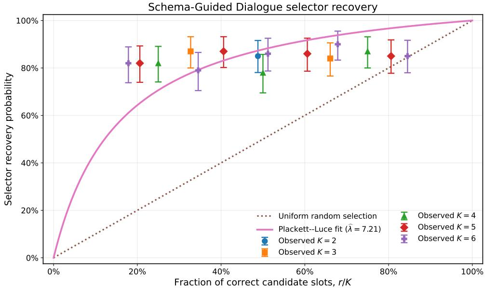  
Figure 7 SGD selector recovery. Points report observed recovery on controlled $( K , r )$ panels, vertical bars report 95% bootstrap intervals obtained by resampling tasks, the dotted line is uniform selection, and the solid curve is the fitted Plackett–Luce model. Small horizontal ofsets separate observations having the same correct fraction.

SGD initial-bank optimization by run size  
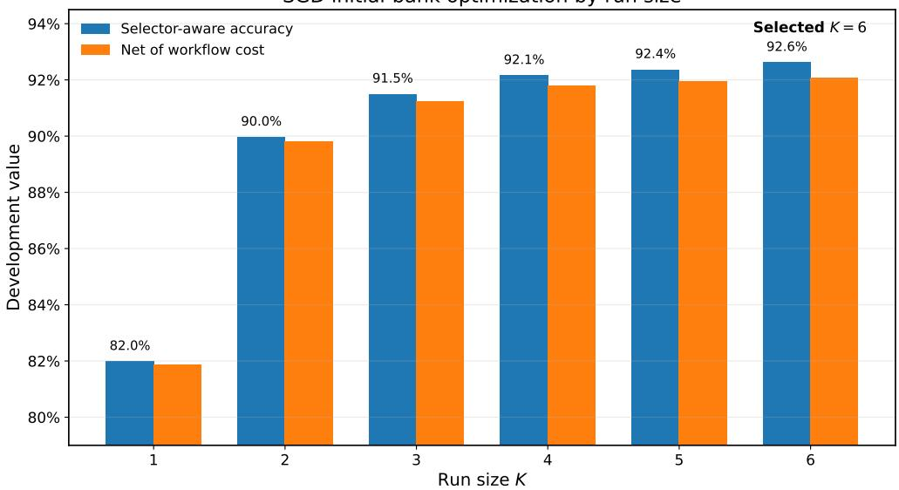  
Figure 8 Development performance of the initial SGD workflow bank by run size. Bars report exact plug-in selector-aware accuracy and the same value after subtracting recurring workflow cost. The primary search selects K = 6.

SGD portfolio uses six distinct workflow types. The separately optimized no-repeat solution has essentially the same development value.

Budgeted dual-guided workflow generation. We apply the same practical stochastic ellipsoidgeneration procedure as in the ABCD experiment. For each K, workflow generation uses one common-uniform SAA scenario, checks the explicit and previously materialized workflow constraints before invoking ADAS, and evaluates every distinct new workflow with five independent executions on each development task. The prespecified paper budget permits 20 distinct new workflow evaluations, allocated across the six run sizes. The SGD run makes 26 ADAS pricing queries and evaluates all 20 candidate workflows. None satisfies the stochastic pricing criterion required for incorporation at the queried dual points, so the optimization bank remains at its original 18 workflow types. Each fixed-K search reaches its candidate-evaluation budget; this result is therefore evidence from a budgeted search, not a claim that no useful workflow exists anywhere in the implicit class.

Because the workflow bank does not change, the pipeline’s second calibration is a repeated calibration of the same 18-workflow candidate distribution rather than an expanded-bank calibration. It gives $\widehat { \lambda } = 8 . 1 5 0 6$ with 95% confidence interval [6.5437, 10.4949], overlapping the initial estimate. We use this second estimate for the final model-based predictions below; the held-out deployment results additionally run the selector directly and do not rely solely on the parametric recovery model.

Table 6 Fresh held-out SGD deployment on 800 tasks. PL accuracy is the plug-in Plackett–Luce prediction; actual accuracy uses the blind deterministic Qwen selector. Brackets report 95% Wilson intervals. Workflow and selector costs are per task, and actual total-system net subtracts both.
<table><tr><td>Method</td><td>K PL accuracy</td><td></td><td>Actual accuracy (95% CI)</td><td>Random accuracy</td><td>Oracle coverage</td><td>Workflow cost</td><td>Selector cost</td><td>Actual total-system net</td></tr><tr><td>Best initial singleton</td><td>1</td><td>0.8470</td><td>0.8525 [0.8262,0.8754]</td><td>0.8470</td><td>0.8470</td><td>0.001143</td><td>0.000000</td><td>0.851357</td></tr><tr><td>Optimized initial bank / final repeat portfolio</td><td>6</td><td>0.9471</td><td>0.9275 [0.9074,0.9435]</td><td>0.8315</td><td>0.9790</td><td>0.005357</td><td>0.006514</td><td>0.915629</td></tr><tr><td>Final no-repeat benchmark</td><td>6</td><td>0.9454</td><td>0.9238 [0.9033,0.9402]</td><td>0.8303</td><td>0.9772</td><td>0.005357</td><td>0.006514</td><td>0.911879</td></tr></table>

Fresh held-out SGD deployment  
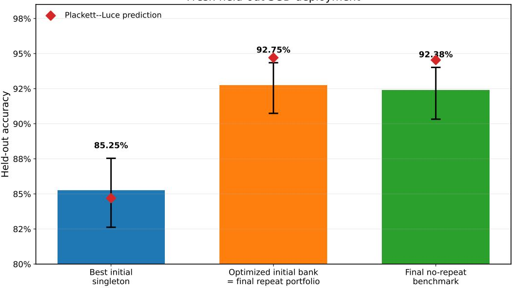  
Figure 9 Fresh held-out SGD accuracy. Bars report actual deterministic selector accuracy, error bars show 95% Wilson intervals over 800 tasks, and diamonds report the corresponding plug-in Plackett–Luce predictions.

Fresh held-out deployment. We freeze the reported portfolios, collect five new stochastic executions per selected workflow on each of 800 oficial test tasks, and run the deterministic Qwen selector using cyclic candidate-order rotations and rotation vote. Table 6 and figure 9 report the results. Actual selector accuracy rises from 85.250% for the best initial singleton to 92.750% for the optimized initial-bank portfolio, an increase of 7.500 percentage points or 8.8% relative to the singleton. Since the budgeted ADAS search incorporates no new workflow, the final repeat-allowed portfolio is the same optimized initial-bank portfolio and has the same held-out accuracy. The no-repeat benchmark reaches 92.375%.

The calibrated model predicts the same ordering, with selector-aware accuracy 84.700% for the singleton, 94.708% for the optimized repeat-allowed portfolio, and 94.543% for the no-repeat benchmark. For the optimized portfolio, uniform selection among the realized candidate slots would attain 83.150%, while oracle coverage is 97.904%. After subtracting both workflow cost and realized selector cost, actual total-system net value rises from 0.851357 for the singleton to 0.915629 for the optimized portfolio.

Multiplicity. Within the selector-calibrated range $K \leq 6 ,$ , the repeat-allowed solution uses only distinct workflow types, and the repeat and no-repeat values are efectively identical. Repetition first appears at $K = 7$ in the extended model-based sensitivity analysis and produces only small gains. Thus, SGD supports the value of portfolio diversity and post-output selection but, unlike ABCD, does not provide meaningful evidence that multiplicity is valuable at the endogenous deployment solution.

## G.2. HotpotQA

Task construction, data, and answer scoring. HotpotQA is an open-domain question-answering benchmark designed to require reasoning across multiple pieces of evidence (Yang et al. 2018). We use the distractor configuration. Each workflow receives the question together with all supplied Wikipedia passages and must return a concise answer span or short phrase. Supporting-fact annotations are retained only as audit metadata and are not shown to candidate workflows or to the selector.

The public distractor test labels are not distributed. We therefore sample 800 workflowdevelopment questions from the oficial training split and form disjoint selector-calibration and held-out samples of 1,004 and 800 questions from the labeled distractor validation split. These samples contain 733, 913, and 741 distinct normalized answers, respectively. The largest answer share is 2.63% in the development sample, 3.98% in the calibration sample, and 2.63% in the held-out sample. Answers are evaluated using the normalized exact-match rule implemented in the notebooks: text is lowercased, articles and nonalphanumeric punctuation are removed, and whitespace is collapsed before comparison with the reference answer.

Initial workflow bank and stochastic execution. We use the same 18-workflow initial bank as in the other domains, obtained by crossing Qwen2.5-3B-Instruct, Mistral-7B-Instruct-v0.3, and Granite-3.3-8B-Instruct with the direct, evidence-first, decomposition, verify-and-revise, alternatives, and limited-context prompting strategies. Every workflow–question pair is executed independently $L =$ 5 times at temperature one.

The best estimated standalone workflow on the development sample is Granite evidence first, with one-execution accuracy 44.950%. If every workflow in the initial bank is executed once independently, expected oracle coverage is 77.578%, showing substantial complementarity among the candidate generators. The answer parser succeeds on 88.468% of executions, and the five stochastic draws produce 2.908 distinct normalized answers per workflow–question cell on average, confirming substantial within-cell stochastic variation. Workflow-level estimates are stable despite noisy task-level probabilities. Relative to the full $L = 5$ ranking, rankings based on the first one, two, and three executions have Spearman correlations 0.939, 0.993, and 0.990; all five of the highest-ranked workflows remain in the top five. The largest absolute change in a workflow’s average accuracy is 3.000, 0.875, and 0.633 percentage points, respectively.

Table 7 HotpotQA design, selector calibration, and workflow-generation summary.
<table><tr><td>Quantity</td><td>Setting or estimate</td></tr><tr><td>Development / calibration / held-out questions 800/1,004/800 Data split</td><td>Development from official train; disjoint calibration and held-out subsets from labeled distractor valida-</td></tr><tr><td>Observed normalized answers Initial workflow bank</td><td>tion  $7 3 3 / 9 1 3 / 7 4 1$  18 workflows: 3 generator models × 6 prompting</td></tr><tr><td>Stochastic workflow execution</td><td>strategies L = 5 independent draws per workflow-question cell;</td></tr><tr><td></td><td>temperature one</td></tr><tr><td>Run-size search Final finite-pool optimization</td><td> $K \in \{ 1 , 2 , 3 , 4 , 5 , 6 \}$  16 SAA scenarios and 512 randomized-rounding trials</td></tr><tr><td>Selector</td><td>per K Qwen2.5-7B-Instruct; greedy decoding; cyclic-</td></tr><tr><td>Initial selector calibration</td><td>rotation vote</td></tr><tr><td>Initial selector strength</td><td>1,500 balanced panels from 633 distinct questions λ = 1.7062, 95% CI [1.4557, 2.0068]</td></tr><tr><td>Implied pairwise recovery</td><td> $\widehat { \lambda } / ( 1 + \widehat { \lambda } ) = 6 3 . 0 5 \%$ </td></tr><tr><td>Average selector advantage over uniform choice 10.87 percentage points on the calibration design</td><td></td></tr><tr><td>Budgeted workflow generation</td><td>26 ADAS pricing queries; 20 distinct candidates eval- uated</td></tr><tr><td>Generated workflows incorporated Expanded-bank selector strength</td><td>1; final optimization bank contains 19 workflow types λ = 1.7529, 95% CI [1.5028, 2.0499]</td></tr></table>

Selector calibration. For each $K \in \{ 2 , \ldots , 6 \}$ and each interior correct count $r \in \{ 1 , \ldots , K - 1 \}$ , we construct 100 feasible panels containing exactly r correct candidate slots and K − r incorrect slots. The selector observes the question, all supplied passages, and the candidate answers, but not workflow identity, cost, or correctness. The primary rotation-vote calibration contains 1,500 panels from 633 distinct questions and has a 100% base-panel parse rate.

Maximum-likelihood estimation of the Plackett–Luce recovery model gives $\widehat { \lambda } = 1 . 7 0 6 2$ with a 95% confidence interval of [1.4557, 2.0068], obtained by resampling tasks. The fitted selector therefore chooses the correct answer with probability 63.05% when exactly one of two candidates is correct. Averaged over the calibration design, selector recovery exceeds uniform selection by 10.87 percentage points. Selector recovery is positive but substantially weaker than in the two service-operation domains, consistent with the greater dificulty of recognizing a correct free-form multi-hop answer among plausible alternatives.

Initial-pool optimization. For each $K \in \{ 1 , \ldots , 6 \}$ , we apply the common 16-scenario SAA and 512-trial randomized-rounding procedure described in the main text and then evaluate each distinct integral portfolio using the corresponding exact plug-in calculation. The best initial-bank solution has $K = 6$ and assigns five execution slots to Granite evidence first and one slot to Granite decomposition. Its calibrated development accuracy is 48.270%, compared with 44.950% for the best singleton, and its workflow-cost-adjusted value is 0.475840.

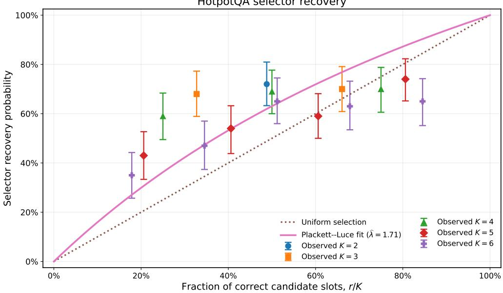  
Figure 10 HotpotQA selector recovery. Points report observed recovery on controlled $( K , r )$ panels, vertical bars report 95% bootstrap intervals obtained by resampling tasks, the dotted line is uniform selection, and the solid curve is the fitted Plackett–Luce model. Small horizontal ofsets separate observations having the same correct fraction.

Multiplicity is already valuable in the initial bank. When repeated workflow types are prohibited, the best no-repeat solution is attained at $K = 3$ by Granite alternatives, Granite decomposition, and Granite evidence first and has workflow-cost-adjusted value 0.466358. Thus, allowing repetition increases the initial-bank endogenous optimum by 0.009482 in accuracy-equivalent net-value units.

Budgeted dual-guided workflow generation. We apply the same practical stochastic ellipsoidgeneration procedure used in the ABCD and SGD experiments. For each K, generation uses one common-uniform SAA scenario, checks explicit and already materialized workflow constraints before invoking ADAS, and evaluates every distinct new workflow using five independent executions on each development question. The prespecified paper budget permits 20 distinct workflow evaluations across the six run sizes.

The search makes 26 ADAS pricing queries, evaluates all 20 distinct candidates, and incorporates one workflow during the K = 2 search, expanding the final optimization bank from 18 to 19 workflow types. We label this workflow G1; its frozen ADAS name is FinalizedMultiHopQASolver. Each fixed-K search reaches its prespecified candidate-evaluation budget, so the result should be interpreted as a budgeted ellipsoid search rather than as a claim that the complete implicit workflow class has been exhausted.

After adding G1, we recalibrate the deterministic Qwen selector on the expanded candidate distribution. The estimate increases modestly to $\widehat { \lambda } = 1 . 7 5 2 9$ with 95% confidence interval [1.5028, 2.0499].

Table 8 Executable structure of the ADAS-generated HotpotQA workflow incorporated into the final bank. All three model calls use GPT-4o-mini through the ADAS LLMAgentBase interface.
<table><tr><td>Workflow</td><td>Executable structure</td><td>Mean calls Cost</td><td></td></tr><tr><td>G1</td><td>A first GPT-4o-mini call extracts evidence from the supplied pas- sages. A second call verifies the relevance and accuracy of that evi- dence. A third call receives the question, passages, and verified evi- dence and derives the final answer. If either evidence stage returns no usable output, the workflow returns a fixed insufficient-evidence response.</td><td></td><td>3.00.003</td></tr></table>

Notes. G1 is the frozen ADAS program adas ell 5860177799ff /  
FinalizedMultiHopQASolver. Cost is recurring normalized execution cost per complete workflow run.

Table 9 Key HotpotQA development portfolios. Accuracy is the exact plug-in Plackett–Luce value of the reported integral portfolio. Net value subtracts recurring workflow cost but not selector cost, matching the primary optimization objective.
<table><tr><td>Method</td><td>Portfolio</td><td>Accuracy</td><td>Net value</td></tr><tr><td>Best initial singleton</td><td>1 Granite evidence first</td><td>0.449500</td><td>0.448357</td></tr><tr><td>Optimized initial bank</td><td>6 Granite decomposition + 5× Granite evi- dence first</td><td>0.482697</td><td>0.475840</td></tr><tr><td>Generated workflow, no repeat</td><td>1 G1</td><td>0.661000</td><td>0.658000</td></tr><tr><td>Final repeat-allowed port- 2 folio</td><td>2×G1</td><td>0.668631</td><td>0.662631</td></tr></table>

Expanded-bank reoptimization and multiplicity. G1 changes the portfolio substantially. As a standalone workflow, it has estimated development accuracy 66.100%, compared with 44.950% for the best initial workflow. Under the primary objective, which subtracts recurring workflow cost but not selector cost, the final repeat-allowed optimum has K = 2 and assigns both execution slots to G1. Its calibrated development accuracy is 66.863%, and its workflow-cost-adjusted value is 0.662631. The endogenous no-repeat optimum is one execution of G1, with calibrated accuracy 66.100% and workflow-cost-adjusted value 0.658000.

At fixed K = 2, multiplicity is valuable under the primary workflow-cost objective. When repetition is prohibited, the best K = 2 portfolio combines G1 with Granite evidence first and has value 0.596823. Allowing two independent executions of G1 raises that fixed-size value by 0.065808. After optimizing run size separately under each formulation, the repeat-allowed optimum remains 0.004631 above the no-repeat optimum.

Fresh held-out deployment. We freeze the reported portfolios, collect five new stochastic executions per selected workflow on each of 800 held-out questions, and then deploy the Qwen2.5- 7B-Instruct selector deterministically using cyclic candidate-order rotations and rotation vote. Table 10 and figure 12 report both the plug-in Plackett–Luce prediction and the realized selector performance.

HotpotQA development optimization before and after workflow generation  
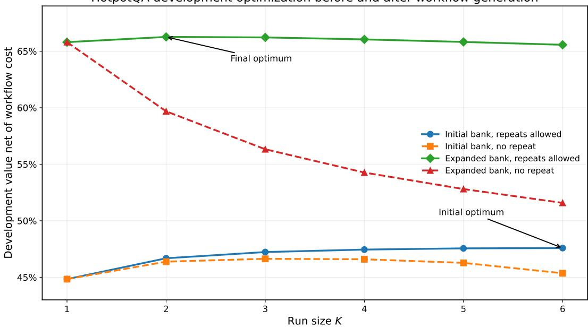  
Figure 11 HotpotQA development value before and after workflow generation. Lines compare repeat-allowed and no-repeat optimization over the initial and expanded workflow banks. Workflow generation shifts the selected run size from K = 6 to K = 2 and makes repeated execution of G1 optimal under the primary workflow-cost objective.

Actual selector accuracy is 30.250% for the best initial singleton and 31.125% for the optimized initial-bank portfolio. After workflow generation, accuracy rises to 55.250% for the two-copy G1 portfolio and 54.875% for the single-G1 no-repeat benchmark. Relative to the best initial singleton, the full repeat-allowed procedure gains 25.000 percentage points, or 82.6%. Workflow generation contributes 24.125 percentage points relative to the optimized initial portfolio. The fitted recovery model is especially accurate for the final repeated portfolio, predicting 55.017% compared with the realized 55.250%.

The held-out comparison also clarifies the value and cost of multiplicity. A second independent G1 execution raises actual accuracy by 0.375 percentage points relative to one G1 execution. Under the primary objective, which charges workflow cost but not selector cost, the two-copy portfolio has slightly higher net value: 0.546500 versus 0.545750. Once realized selector cost is also subtracted, however, the one-copy benchmark has slightly higher total-system net value, 0.545750 versus 0.544329. Thus, HotpotQA provides evidence that multiplicity can improve accuracy while also illustrating that the incremental gain may not justify the additional post-output selection cost.

Table 10 Fresh held-out HotpotQA deployment on 800 questions. PL accuracy is the plug-in Plackett–Luce prediction; actual accuracy uses the blind deterministic Qwen selector. Brackets report 95% Wilson intervals. Workflow and selector costs are per question, and actual total-system net subtracts both.
<table><tr><td>Method</td><td>K</td><td>PL accuracy</td><td>Actual accuracy (95% CI)</td><td>Random accuracy</td><td>Oracle coverage</td><td>Workflow cost</td><td>Selector cost</td><td>Actual total-system net</td></tr><tr><td>Best initial singleton</td><td>1</td><td>0.2980</td><td>0.3025 [0.2717,0.3352]</td><td>0.2980</td><td>0.2980</td><td>0.001143</td><td>0.000000</td><td>0.301357</td></tr><tr><td>Optimized initial bank</td><td>6</td><td>0.3331</td><td>0.3113 [0.2801,0.3442]</td><td>0.2997</td><td>0.4642</td><td>0.006857</td><td>0.006514</td><td>0.297879</td></tr><tr><td>Final ADAS portfolio, repeats</td><td>2</td><td>0.5502</td><td>0.5525 [0.5179, 0.5866]</td><td>0.5430</td><td>0.5692</td><td>0.006000</td><td>0.002171</td><td>0.544329</td></tr><tr><td>Final ADAS portfolio, no repeat</td><td>1</td><td>0.5430</td><td>0.5488 [0.5141,0.5829]</td><td>0.5430</td><td>0.5430</td><td>0.003000</td><td>0.000000</td><td>0.545750</td></tr></table>

Fresh held-out HotpotQA deployment  
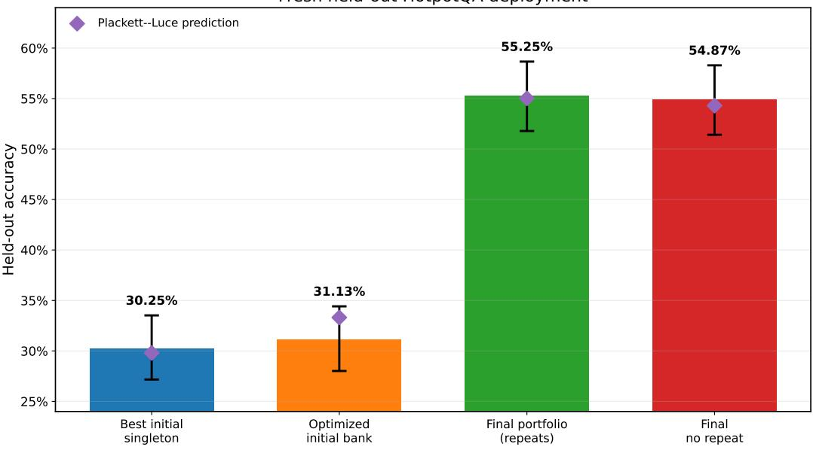  
Figure 12 Fresh held-out HotpotQA accuracy. Bars report actual deterministic-selector accuracy, error bars show 95% Wilson intervals over 800 questions, and diamonds report the corresponding plug-in Plackett–Luce predictions.