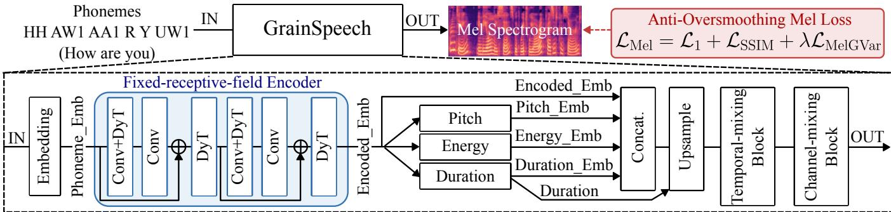
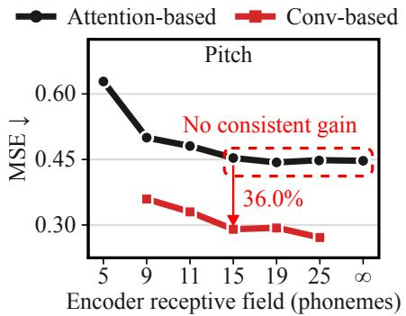
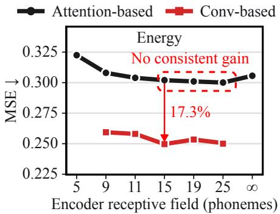
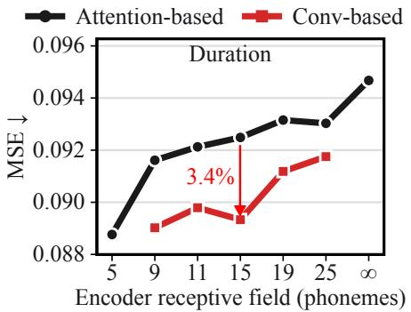
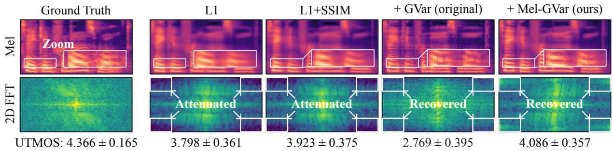

# GRAINSPEECH: LESS CONTEXT, MORE DETAIL FOR COMPACT SPEECH SYNTHESIS

Zitao Liang , Chang Gao ∗

Department of Microelectronics, Delft University of Technology, The Netherlands

## ABSTRACT

Compact acoustic models face a challenging quality–capacity trade-off. We investigate two factors in this regime: encoder context and Mel-spectrogram supervision. A receptivefield-scaling study shows that expanding self-attention beyond 15 phonemes provides no consistent gains in pitch, energy, or duration prediction. Guided by this finding, we introduce a fixed-receptive-field convolutional encoder that reduces the respective prediction errors by 36.0%, 17.3%, and 3.4%. We further show that directly transferring image-domain gradient-variance supervision restores fine-scale variation but degrades predicted quality, motivating a Mel-specific formulation with axis-specific gradients, overlapping local statistics, and log-domain variance matching. GrainSpeech contains only 264.8K parameters and achieves 17.9× real-time Mel generation on a microcontroller (MCU), while attaining UTMOS scores comparable to substantially larger models with less than 1.5% of their parameters. Source code and demos are available at https://github.com/lab-emi/GrainSpeech.

Index Terms— speech synthesis, MCU, context window, oversmoothing, gradient-variance loss

## 1. INTRODUCTION

A common neural text-to-speech (TTS) system uses an acoustic model to map text to a Mel spectrogram and a neural vocoder to reconstruct the waveform [1, 2]. However, many high-quality acoustic models contain millions of parameters, limiting deployment on memory- and computationconstrained devices [1, 3, 4]. EfficientSpeech (ES) demonstrated a compact acoustic model with approximately 266K parameters [5], showing the feasibility of highly compact acoustic modeling. Under such tight capacity constraints, maintaining synthesis quality remains challenging.

We focus on two potential bottlenecks in compact acoustic modeling. First, the role of encoder context has not been well isolated. Self-attention encoders commonly provide broad phoneme context [1, 5], while convolutional alternatives have also shown strong performance in acoustic-feature prediction [3, 6]. However, prior comparisons typically differ in both encoder architecture and accessible context, making the contribution of each factor difficult to isolate. Second, Mel-spectrogram over-smoothing can degrade synthesized speech quality [7, 8]. Pointwise $L _ { 1 }$ supervision is prone to this problem, while structural objectives such as SSIM improve local reconstruction but do not explicitly supervise finegrained variation [6, 9]. Gradient variance (GVar) provides local-variation supervision [10], but its original formulation is designed for spatial image structure.

To address these issues, we propose GrainSpeech, a 264.8K-parameter acoustic model with a fixed-receptive-field convolutional encoder and Mel-adapted GVar supervision. Our main contributions are:

• A receptive-field study separates context from architecture: self-attention beyond 15 phonemes gives no consistent gain, and a parameter-matched fixed-receptivefield convolutional encoder reduces pitch, energy, and duration errors by 36.0%, 17.3%, and 3.4%.

• We propose Mel-GVar, which adapts image-domain gradient-variance supervision to Mel spectrograms via axis-specific gradients, overlapping local statistics, and log-domain variance matching. Direct transfer degrades UTMOS to 2.769, whereas Mel-GVar raises it to 4.086.

• GrainSpeech, having only 264.8K parameters, improves UTMOS by 0.496 over ES-Tiny at the same budget and is statistically on par with MixerTTS with 75.7× fewer parameters, while generating Mel at 17.9× real time on an STM32H747XI MCU.

## 2. PROPOSED METHOD

## 2.1. System Overview

Figure 1 illustrates GrainSpeech, where a fixed-receptivefield convolutional encoder predicts pitch, energy, and duration from the phoneme sequence. The predicted features are embedded, concatenated with the encoder output, and upsampled according to duration before being processed by dilated temporal mixing [2] and a channel-mixing bottleneck MLP to generate the Mel spectrogram. Training uses the anti-oversmoothing Mel objective in Section 2.3.

  
Fig. 1. GrainSpeech architecture with a fixed-receptive-field encoder, and an anti-oversmoothing Mel loss.

## 2.2. Fixed-Receptive-Field Encoder

To examine the role of encoder receptive field in acousticfeature prediction, we construct a single-block self-attention encoder based on EfficientSpeech [5]. We define W as the encoder receptive field on the original phoneme sequence and control it using symmetric attention masks. Here, W refers only to the encoder; downstream acoustic-feature predictors further expand the context equally across all variants.

Motivated by this context study, we construct a fixedreceptive-field convolutional encoder for matched-context comparison and the final GrainSpeech model. As shown in Fig. 1, it consists of a phoneme embedding layer followed by stacked residual convolutional blocks, with dilation schedules chosen to realize different W values. This allows attention and convolutional encoders to be compared under the same accessible phoneme context. Following prior work, LayerNorm is replaced with DynamicTanh (DyT) in the convolutional blocks [11, 12].

## 2.3. Anti-Oversmoothing Mel Loss

Mel-spectrogram over-smoothing suppresses fine-grained acoustic variation and can degrade synthesized speech quality [7]. To explicitly supervise these local variations, we adapt the gradient-variance (GVar) objective originally proposed for image super-resolution [10]. The original GVar uses Sobel gradients, non-overlapping spatial patches, and raw-domain $L _ { 2 }$ variance matching. Since Mel spectrograms represent time and Mel frequency rather than two spatial dimensions, we retain the local gradient-variance principle while adapting three components: (1) axis-wise first-order differences replace Sobel filtering to characterize temporal and spectral variations; (2) sliding $1 1 \times 5$ neighborhoods replace non-overlapping patches to provide overlapping local statistics; and (3) log-domain $L _ { 1 }$ matching replaces rawdomain $L _ { 2 }$ matching to compare relative rather than absolute

variance discrepancies.

Let $\widehat { \mathbf { M } } , \mathbf { M } \in \mathbb { R } ^ { T \times F }$ denote the predicted and reference Mel spectrograms. We define

$$
\begin{array} { r } { G _ { t } ( \mathbf { M } ) _ { t , f } = \mathbf { M } _ { t + 1 , f } - \mathbf { M } _ { t , f } , } \\ { G _ { f } ( \mathbf { M } ) _ { t , f } = \mathbf { M } _ { t , f + 1 } - \mathbf { M } _ { t , f } . } \end{array}\tag{1}
$$

Let $S _ { d } ( \mathbf { M } ) \ = \ \log ( \mathrm { L V a r } _ { 1 1 \times 5 } ( G _ { d } ( \mathbf { M } ) ) + 1 0 ^ { - 6 } )$ , where $\mathrm { L V a r } _ { 1 1 \times 5 }$ is population variance over unit-stride time×Melfrequency windows, excluding padded elements. We define

$$
\mathcal { L } _ { \mathrm { M e l G V a r } } = \frac { 1 } { 2 } \sum _ { d \in \{ t , f \} } \| S _ { d } ( \widehat { \mathbf { M } } ) - S _ { d } ( \mathbf { M } ) \| _ { 1 , \Omega } ,\tag{2}
$$

where Ω denotes valid non-padded positions.

The Mel objective is $\begin{array} { r } { \mathcal { L } _ { \mathrm { M e l } } = \mathcal { L } _ { 1 } + \mathcal { L } _ { \mathrm { S S I M } } + \lambda \mathcal { L } _ { \mathrm { M e l G V a r } } . } \end{array}$

## 3. EXPERIMENTS

## 3.1. Experimental Setup

We use LJSpeech [13], with 12,588 utterances for training and the remaining 512 split into 384 validation and 128 evaluation utterances. All variants use the same training seed and are evaluated after 5,000 epochs. Phonemes and durations are obtained from forced-alignment TextGrids [14]. WORLD [15] pitch and energy are averaged by phoneme and normalized over the training set. Audio is sampled at 22.05 kHz and converted to 80-bin Mel spectrograms using a 1,024-point FFT and window, a hop length of 256, and a 0– 8 kHz frequency range. Our models are trained from scratch using AdamW with batch size 128, learning rate $1 0 ^ { - 3 }$ , weight decay $1 0 ^ { - 5 }$ , 50 warm-up epochs, and cosine decay.

All synthesized Mels are vocoded using the same HiFi-GAN-v2 [2]. Speech quality is evaluated using UTMOS [16]. Intelligibility is measured by WER using Whisper-largev3 [17] with fixed greedy decoding and identical English text normalization for all systems. Spectral distortion is measured by MCD-DTW [18] using 24-dimensional mel-cepstral coefficients $( c _ { 1 } – c _ { 2 4 } , \alpha = 0 . 4 5 5 )$ extracted from WORLD spectral envelopes at a 5-ms frame shift and aligned by dynamic time warping. WER and MCD-DTW are evaluated on the same 128 utterances, with 95% confidence intervals obtained from 10,000 shared-index bootstrap replicates.

  
Fig. 2. Effects of encoder receptive field and architecture on acoustic-feature prediction. MSE denotes mean squared error.

## 3.2. Encoder Receptive Field and Architecture Study

To separate the effects of encoder context and architecture, we compare parameter-matched attention and convolutional encoders while keeping all downstream components and the Mel objective unchanged. For attention, we evaluate W ∈ $\{ 5 , 9 , 1 1 , 1 5 , 1 9 , 2 5 , \infty \}$ , where $W = \infty$ denotes global context; for convolution, we evaluate $W \in \{ 9 , 1 1 , 1 5 , 1 9 , 2 5 \}$ The two encoders contain 147,368 and 147,428 parameters, respectively. $W = 1 5$ is selected based on validation acoustic-feature errors and is used for the final GrainSpeech.

As shown in Fig. 2, expanding the attention receptive field beyond W = 15 provides no consistent improvement in pitch, energy, or duration prediction, indicating limited benefit from additional encoder context under this setting. At matched receptive fields, the convolutional encoder achieves lower MSE across all three tasks and all shared W values. At $W = 1 5 ,$ it reduces pitch, energy, and duration MSE by 36.0%, 17.3%, and 3.4%, respectively. These results show that the convolutional encoder provides more effective acoustic-feature prediction under a matched parameter budget.

## 3.3. Oversmoothing Analysis and Loss Ablation

We use the SSIM formulation and settings of [6]. For the original-GVar baseline, we use the original Sobel-gradient, non-overlapping-patch, and raw-domain $L _ { 2 }$ formulation [10], with $\lambda _ { \mathrm { G V a r } } ~ = ~ 0 . 0 1$ following the official implementation. Our Mel-GVar uses $\lambda _ { \mathrm { G V a r } } = 0 . 5$

For visualization, we mean-center each Mel spectrogram, apply a 2D Hann window, and compute its normalized 2D Fourier power spectrum. Figure 3 compares the same utterance under four Mel objectives. Relative to the ground truth, $L _ { 1 }$ predictions exhibit smoother Mel patterns and attenuated energy in the corners of the 2D spectrum. Adding SSIM improves UTMOS from 3.798 to 3.923, but the corner-region attenuation remains visible.

Directly applying the original image-domain GVar restores substantial corner-region spectral energy and fine-scale variation, but introduces visible horizontal discontinuities that perturb the high-energy structures of the Mel spectrogram and reduces UTMOS to 2.769. This contrast suggests that recovering fine-scale variation alone is insufficient; the recovered variation should also preserve coherent time–frequency structure. In comparison, the proposed Mel-GVar restores fine-scale variation while maintaining more continuous Mel structures and increases UTMOS to 4.086, the highest among the evaluated objectives. These results support adapting the image-domain GVar formulation to Mel spectrograms.

To examine whether the proposed Mel objective is specific to the GrainSpeech architecture, we apply it to ES-Tiny. It improves ES-Tiny UTMOS from 3.591 to 3.945 and MCD-DTW from 6.374 to 6.350, while WER remains similar (3.08% vs. 3.13%). These gains suggest that its benefit is not specific to the proposed encoder.

## 3.4. Overall Comparison

Table 1 compares model size and objective quality on the 128 evaluation utterances with a common vocoder and evaluation pipeline. At the ES-Tiny parameter budget, GrainSpeech improves UTMOS by 0.496 (paired-bootstrap 95% CI: [0.431, 0.562]) with a close WER (3.27% vs. 3.08%) and slightly lower MCD-DTW (6.314 vs. 6.374). The two shaded rows separate the sources of this gain: our Mel-GVar loss alone lifts ES-Tiny from 3.591 to 3.945 UTMOS, and the encoder adds a further 0.141 under the same objective (paired-bootstrap 95% CI: [0.077, 0.204]).

GrainSpeech attains the highest UTMOS below 5M parameters and is statistically indistinguishable from MixerTTS (4.086 vs. 4.087, overlapping CIs) with 75.7× fewer parameters; only MatchaTTS scores higher, at 68.7× the size. The 18–35M-parameter models still obtain lower WER and MCD-DTW.

Table 2 reports A16W8 deployment on an STM32H747XI (480 MHz Cortex-M7, 1 MB SRAM). GrainSpeech generates Mel spectrograms at 17.9× real time within 483.19 KiB peak

  
Fig. 3. Mel spectrograms and normalized 2D Fourier spectra for GrainSpeech under different Mel losses. Values are mean ± std over 128 evaluation utterances.

Table 1. Model size and objective quality on 128 evaluation utterances; brackets are 95% CIs from 10,000 utterance-level bootstrap replicates. “Size vs. ours” is the parameter count relative to GrainSpeech. GrainSpeech (this work); ES-Tiny retrained with our Mel-GVar loss only. †UTMOS CI overlaps with GrainSpeech at 75.7× the parameters.
<table><tr><td>Model</td><td>Params. ↓</td><td>Size vs. ours</td><td>UTMOS ↑</td><td>WER (%) ↓</td><td>MCD-DTW (dB) ↓</td></tr><tr><td>GrainSpeech (this work)</td><td>0.265M</td><td>1×</td><td>4.086 [4.020, 4.148]</td><td>3.27 [2.32, 4.32]</td><td>6.314 [6.255, 6.374]</td></tr><tr><td>ES-Tiny [5] + our Mel-GVar loss</td><td>0.266M</td><td>1.0×</td><td>3.945 [3.872, 4.016]</td><td>3.13 [2.11, 4.31]</td><td>6.350 [6.285, 6.419]</td></tr><tr><td>ES-Tiny [5]</td><td>0.266M</td><td>1.0×</td><td>3.591 [3.522, 3.658]</td><td>3.08 [2.08, 4.23]</td><td>6.374 [6.314, 6.439]</td></tr><tr><td>ES-Small [5]</td><td>0.952M</td><td>3.6×</td><td>3.885 [3.820, 3.949]</td><td>3.13 [2.23, 4.15]</td><td>6.286 [6.231, 6.344]</td></tr><tr><td>ES-Base [5]</td><td>3.953M</td><td>14.9×</td><td>3.900 [3.836, 3.963]</td><td>3.50 [2.53, 4.57]</td><td>6.183 [6.120, 6.250]</td></tr><tr><td>SpeedySpeech [6]</td><td>4.306M</td><td>16.2×</td><td>3.716 [3.663, 3.769]</td><td>4.19 [3.18, 5.29]</td><td>6.352 [6.285, 6.421]</td></tr><tr><td>MatchaTTS [4]</td><td>18.204M</td><td>68.7×</td><td>4.264 [4.225, 4.300]</td><td>1.98 [1.31, 2.73]</td><td>5.597 [5.548, 5.653]</td></tr><tr><td>MixerTTS [3]</td><td>20.060M</td><td>75.7×</td><td>4.087† [4.030, 4.142]</td><td>1.80 [1.12, 2.59]</td><td>5.374 [5.327, 5.426]</td></tr><tr><td>FastSpeech 2 [1]</td><td>35.159M</td><td>132.7×</td><td>3.953 [3.889, 4.015]</td><td>2.85 [1.95, 3.84]</td><td>5.935 [5.867, 6.008]</td></tr><tr><td>Ground Truth</td><td>一</td><td></td><td>4.366 [4.340, 4.389]</td><td>1.98 [1.28, 2.77]</td><td></td></tr></table>

Table 2. A16W8 MCU deployment on an STM32H747XI. A16W8 denotes 16-bit activations and 8-bit weights; mRTF is generated duration divided by acoustic-model inference time; ∆UTMOS is the change from FP32; SRAM is peak usage.
<table><tr><td>Model</td><td>mRTF↑</td><td>∆UTMOS ↑</td><td>SRAM↓</td></tr><tr><td>GrainSpeech (this work)</td><td>17.9</td><td>-0.036</td><td>483.19 KiB</td></tr><tr><td>ES-Tiny [5]</td><td>17.2</td><td>-0.079</td><td>478.59 KiB</td></tr><tr><td>ES-Small [5]</td><td></td><td>-0.019</td><td>Out-of-Mem.</td></tr></table>

SRAM, matching the ES-Tiny footprint within 1% at slightly higher throughput, and loses only 0.036 UTMOS to quantization versus 0.079 for ES-Tiny. ES-Small already exceeds the available SRAM, so the quality gain is obtained within the largest ES footprint that fits this MCU.

## 4. DISCUSSION

Two caveats apply to Table 1: evaluation relies on automatic metrics on LJSpeech, so listening tests and broader datasets are needed to confirm the UTMOS gains; and the external checkpoints use their native data splits, training settings, and frontends, so their rows are reference points rather than controlled comparisons, whereas the ES-Tiny rows share our pipeline. The context study is specific to the evaluated architecture and training setting and does not establish a universal receptive-field requirement. Mel-GVar constrains local variation statistics rather than exact detail locations, so recovered details need not match the reference point by point; its three adaptations are evaluated jointly, and their individual contributions remain to be isolated. Finally, Table 2 covers Mel generation only; end-to-end deployment including vocoding is beyond our scope.

## 5. CONCLUSION

We presented GrainSpeech, a 264.8K-parameter acoustic model. Under our experimental setting, additional selfattention encoder context beyond 15 phonemes provides no consistent benefit, while the matched-context convolutional encoder improves acoustic-feature prediction. Our Mel-GVar restores fine-grained variation while avoiding the quality degradation observed with direct transfer of the image-domain objective. At the ES-Tiny budget, Grain-Speech raises UTMOS from 3.591 to 4.086, statistically comparable to MixerTTS with 75.7× fewer parameters, and generates Mel at 17.9× real time within 483 KiB of SRAM on an STM32H747XI MCU.

## 6. COMPLIANCE WITH ETHICAL STANDARDS

This study uses the publicly available LJSpeech dataset [13]. No participants were recruited, no new recordings were collected, and no human listening tests or animal experiments were conducted.

## 7. ACKNOWLEDGMENTS

This work was partially supported by the Dutch Research Council (NWO) under the Talent Programme Veni 2023 scheme in Applied and Engineering Sciences (AES), Grant No. 21132 (Energy-Efficient Real-Time Edge Intelligence for Wearable Healthcare Devices). The authors declare no conflicts of interest.

## 8. REFERENCES

[1] Yi Ren, Chenxu Hu, Xu Tan, Tao Qin, Sheng Zhao, Zhou Zhao, and Tie-Yan Liu, “Fastspeech 2: Fast and high-quality end-to-end text to speech,” arXiv preprint arXiv:2006.04558, 2020.

[2] Jungil Kong, Jaehyeon Kim, and Jaekyoung Bae, “Hifigan: Generative adversarial networks for efficient and high fidelity speech synthesis,” Advances in neural information processing systems, vol. 33, pp. 17022– 17033, 2020.

[3] Oktai Tatanov, Stanislav Beliaev, and Boris Ginsburg, “Mixer-tts: non-autoregressive, fast and compact textto-speech model conditioned on language model embeddings,” in ICASSP 2022-2022 IEEE International Conference on Acoustics, Speech and Signal Processing (ICASSP). IEEE, 2022, pp. 7482–7486.

[4] Shivam Mehta, Ruibo Tu, Jonas Beskow, Eva Sz ´ ekely,´ and Gustav Eje Henter, “Matcha-tts: A fast tts architecture with conditional flow matching,” in ICASSP 2024-2024 IEEE International Conference on Acoustics, Speech and Signal Processing (ICASSP). IEEE, 2024, pp. 11341–11345.

[5] Rowel Atienza, “Efficientspeech: An on-device text to speech model,” in ICASSP 2023-2023 IEEE International Conference on Acoustics, Speech and Signal Processing (ICASSP). IEEE, 2023, pp. 1–5.

[6] Jan Vainer and Ondˇrej Dusek, “Speedyspeech: Ef-ˇ ficient neural speech synthesis,” arXiv preprint arXiv:2008.03802, 2020.

[7] Yi Ren, Xu Tan, Tao Qin, Zhou Zhao, and Tie-Yan Liu, “Revisiting over-smoothness in text to speech,” in Proceedings of the 60th Annual Meeting of the Association for Computational Linguistics (Volume 1: Long Papers), 2022, pp. 8197–8213.

[8] Fabian Kogel, Bac Nguyen, and Fabien Cardinaux, “To-¨ wards robust fastspeech 2 by modelling residual multimodality,” arXiv preprint arXiv:2306.01442, 2023.

[9] Zhou Wang, Alan C. Bovik, Hamid R. Sheikh, and Eero P. Simoncelli, “Image quality assessment: From error visibility to structural similarity,” IEEE Transactions on Image Processing, vol. 13, no. 4, pp. 600–612, 2004.

[10] Lusine Abrahamyan, Anh Minh Truong, Wilfried Philips, and Nikos Deligiannis, “Gradient variance loss for structure-enhanced image super-resolution,” in Proc. IEEE Int. Conf. Acoustics, Speech and Signal Processing (ICASSP), 2022, pp. 3219–3223.

[11] Jiachen Zhu, Xinlei Chen, Kaiming He, Yann LeCun, and Zhuang Liu, “Transformers without normalization,” in 2025 IEEE/CVF Conference on Computer Vision and Pattern Recognition (CVPR). IEEE, 2025, pp. 14901– 14911.

[12] Arne de Beer and Chang Gao, “Slimtts: Parameterand compute-efficient neural text-to-speech synthesis for real-time inference,” in 2026 IEEE International Symposium on Circuits and Systems (ISCAS), 2026, pp. 4588–4592.

[13] Keith Ito and Linda Johnson, “The lj speech dataset,” https://keithito.com/LJ-Speech-Datas et/, 2017.

[14] Michael McAuliffe, Michaela Socolof, Sarah Mihuc, Michael Wagner, and Morgan Sonderegger, “Montreal forced aligner: Trainable text-speech alignment using kaldi,” in Proc. Interspeech 2017, 2017, pp. 498–502.

[15] Masanori Morise, Fumiya Yokomori, and Kenji Ozawa, “World: A vocoder-based high-quality speech synthesis system for real-time applications,” IEICE TRANSAC-TIONS on Information and Systems, vol. 99, no. 7, pp. 1877–1884, 2016.

[16] Takaaki Saeki, Detai Xin, Wataru Nakata, Tomoki Koriyama, Shinnosuke Takamichi, and Hiroshi Saruwatari, “Utmos: Utokyo-sarulab system for voicemos challenge 2022,” arXiv preprint arXiv:2204.02152, 2022.

[17] Alec Radford, Jong Wook Kim, Tao Xu, Greg Brockman, Christine McLeavey, and Ilya Sutskever, “Robust speech recognition via large-scale weak supervision,” in International conference on machine learning. PMLR, 2023, pp. 28492–28518.

[18] Robert Kubichek, “Mel-cepstral distance measure for objective speech quality assessment,” in Proceedings of IEEE pacific rim conference on communications computers and signal processing. IEEE, 1993, vol. 1, pp. 125–128.