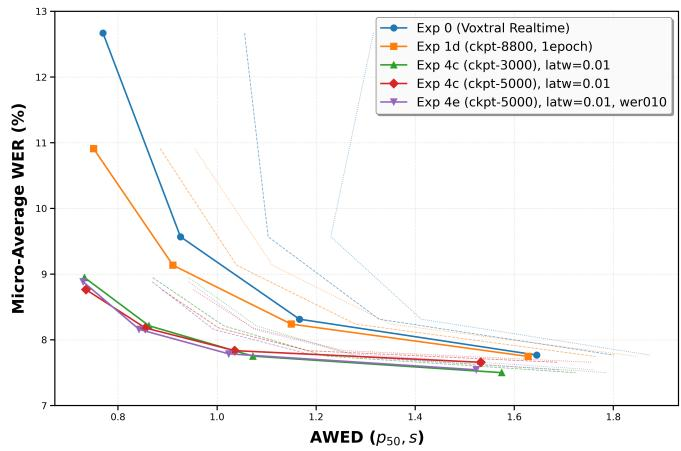
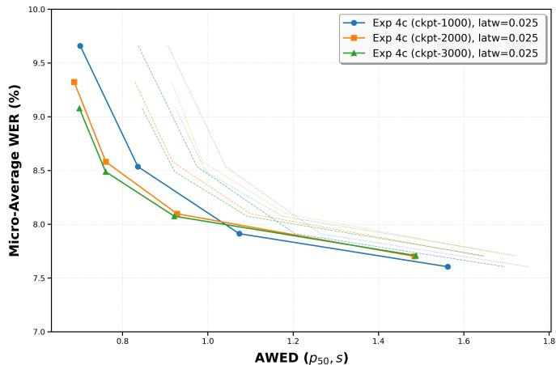
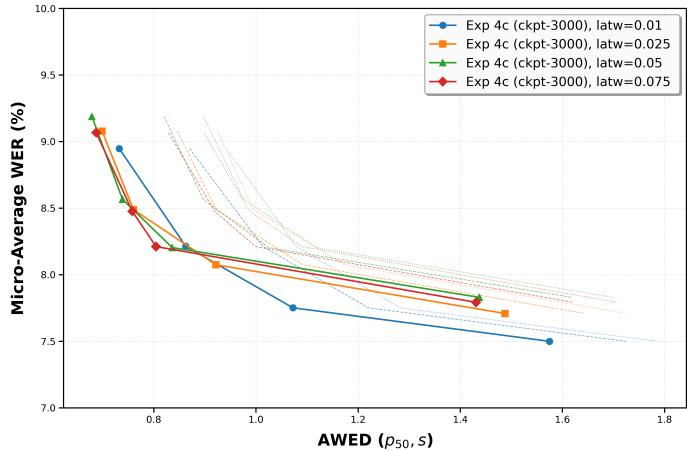

# LOOK LESS, HEAR BETTER: JOINTLY REWARDED GRPO FOR STREAMING ASR

Xiuwen Zheng

University of Illinois Urbana-Champaign

## ABSTRACT

Streaming automatic speech recognition (ASR) must be judged jointly on what it transcribes and on how quickly it commits each word. Delayed streams modeling (DSM) has become the dominant paradigm for streaming large audiolanguage models, exposing a structural delay τ that bounds the decoder’s lookahead. We show that τ is a poor proxy for user-perceived latency, and that the alignment-based supervision of DSM leaves latency on the table: the same forced-aligned transcript is used at every τ, forcing the model to withhold words it could already commit. We introduce AWED, a word-level emission-delay metric defined relative to the acoustic end of each word, and post-train a DSM recognizer with GRPO under a reward that scores transcription accuracy and measured delay jointly. Trained at a single operating point (τ = 6 frames), our model dominates both its supervised fine-tuning initialization and the Voxtral Realtime backbone across all evaluated lookahead budgets: it cuts WER by 30.8% relative at an 80 ms structural delay, and by 5.7% relative at 480 ms while lowering median AWED from 1.17 s to 1.04 s. Latency-rewarded post-training thus advances the accuracy–latency Pareto frontier of streaming ASR without architectural change.

Index Terms— streaming speech recognition, speech language models, reinforcement learning, emission latency

## 1. INTRODUCTION

Streaming automatic speech recognition (ASR) underpins live captioning, voice assistants, meeting transcription and simultaneous interpretation. In all of these settings the quality a user perceives depends not only on whether words are transcribed correctly, but also on when they appear. Streaming ASR is therefore inherently a two-objective problem, and progress is properly judged by the accuracy–latency Pareto frontier rather than by word error rate (WER) alone.

Large audio-language models (LALMs) have recently achieved highly competitive performance on ASR benchmarks [1], and delayed streams modeling (DSM) [2] has emerged as the dominant recipe for making them streaming: text and audio are placed on a shared time axis, with the transcript offset from the audio by a structural delay τ that bounds the lookahead available to the decoder. Voxtral

Realtime [1] builds on DSM with a causal streaming audio encoder and conditions a single model on τ sampled from 1 to 30 frames (80–2400 ms), attaining state-of-the-art streaming accuracy across a broad range of lookahead budgets. In parallel, reinforcement learning (RL) post-training with group relative policy optimization (GRPO) [3] has proven effective for LLMs and, more recently, for speech tasks [4] — but always under accuracy-only rewards.

Two gaps remain. First, latency in DSM is declared rather than measured. The structural delay τ is a nominal bound on lookahead, not the time a user waits for a word: at τ = 1 the median word-level emission delay of Voxtral Realtime is 0.77 s, nearly an order of magnitude above the nominal 80 ms. The discrepancy arises because a word is committed only after its aligned end time plus τ, after any hesitation of the decoder, and after enough subsequent tokens have been emitted to disambiguate it. Existing latency measures — token emission delay for RNN-T, average lagging and its differentiable variants from simultaneous translation, or first-token latency — were not designed for the alignment-anchored output stream of DSM and do not expose this gap. What is not measured cannot be optimized.

Second, alignment-supervised training pins emission to a fixed schedule. Under DSM the training signal instructs the model to emit each word exactly τ frames after its forced-aligned end time, and the same alignment is reused for every τ . When τ is large the decoder holds far more acoustic evidence than its decision requires, yet the target forbids it from committing earlier; the schedule is likewise uniform across words, ignoring that many words are unambiguous well before their acoustic offset. This slack is out of reach for supervised fine-tuning (SFT), whose objective is to imitate one predetermined schedule, and equally out of reach for a hand-designed alignment heuristic, which would require knowing the optimal per-word emission time in advance. Emission timing is discrete and non-differentiable — precisely the regime where RL applies.

We bridge both gaps. We introduce AWED (aligned word emission delay), a word-level latency metric defined relative to the acoustic end of each word and reported over its full distribution, which makes the true cost of a given τ visible and differentiates systems that share the same nominal delay. We then post-train a DSM streaming recognizer with GRPO under a reward that scores transcription accuracy and measured emission delay jointly, gated by a match rate that withholds latency credit from rollouts whose WER is too high for early emission to be meaningful. Trained at a single operating point $( \tau = 6 )$ , the resulting policy dominates both its SFT initialization and the Voxtral Realtime backbone across the entire latency spectrum, reducing WER by 30.8% relative at the tightest 80 ms budget at no latency cost.

Our contributions are as follows:

1. AWED, a word-level emission-delay metric tailored to DSM, which separates true output latency from the nominal structural delay.

2. A two-stage recipe that reproduces the Voxtral Realtime SFT pipeline and post-trains it with GRPO under a joint accuracy–latency reward.

3. A consistent advance of the accuracy–latency Pareto frontier of streaming ASR, generalizing from a single training τ to all evaluated lookahead budgets.

## 2. METHOD

## 2.1. Delayed Streams Modeling and Supervised Baseline

DSM places the audio and text streams on a shared time axis discretized at $1 / \Delta = 1 2 . 5 \mathrm { H z } ( \Delta = 8 0 \mathrm { m s } )$ . At each frame t the decoder emits one token $a _ { t } \in \mathcal { V } \cup \{ \intercal \mathrm { p } \} \mathrm { j }$ , where the pad symbol [P] denotes wait; emission timing is therefore learned end-to-end rather than governed by an external policy. The text stream is offset from the audio stream by a structural delay of $\tau$ frames, which bounds the lookahead available when any token is produced. Following [1], $\tau$ is injected into the decoder through AdaRMSNorm conditioning and sampled per utterance during training, so that a single model serves every operating point in the range at inference time.

Given a transcript $w _ { 1 } , \dots , w _ { K }$ with forced-aligned end times $e _ { 1 } , \ldots , e _ { K }$ , the supervised target is constructed by placing the tokens of $w _ { k }$ contiguously from frame

$$
t _ { k } = \lceil e _ { k } / \Delta \rceil + \tau ,\tag{1}
$$

and filling every remaining frame with [P]. Equation (1) is the object of interest for the rest of this paper: it prescribes a single emission schedule, shifted rigidly by $\tau ,$ for all words and all operating points. We additionally append $\tau _ { \mathrm { p a d } }$ pad frames after $e _ { K }$ before the end-of-sequence symbol; anchoring EOS directly to the final word causes the model to terminate prematurely and inflates deletion errors.

This stage reproduces the DSM recipe on our own aligned corpora. It is not a contribution in itself, but it supplies both a like-for-like reference point and the initialization $\pi _ { \mathrm { r e f } }$ for the post-training stage below.

## 2.2. Aligned Word Emission Delay

Latency in DSM is conventionally reported as τ, which is a nominal bound on lookahead rather than the time a user waits for a word. We therefore measure emission delay directly, at word level, relative to the acoustic end of each word.

Let a hypothesis consist of words $\hat { w } _ { 1 } , \dotsc , \hat { w } _ { J }$ , and let $f ( j )$ be the frame at which the final token of $\hat { w } _ { j }$ is emitted. We align reference and hypothesis by word-level edit distance and retain the set M of matched pairs $( k , j )$ . For each such pair,

$$
\mathrm { A W E D } ( k , j ) = f ( j ) \Delta \ : - \ : e _ { k } ,\tag{2}
$$

i.e. the audio duration consumed at the moment the word is committed, minus the time at which the word actually ended in the signal. Delays are averaged within an utterance and aggregated over a corpus by quantile; we report the median (p50) as the primary figure and $\mathsf { p } 9 0 / \mathsf { p } 9 5$ to expose the tail.

Restricting (2) to M is not a convenience: a deleted reference word has no emission time and an inserted hypothesis word has no reference time, so emission delay is undefined outside the matched set. This property is what makes an unconstrained latency objective exploitable, and motivates the gate introduced in Sec. 2.3.

Anchoring to $e _ { k }$ decouples the measurement from word duration and speaking rate, which distinguishes AWED from existing measures. Token emission delay for RNN-T is defined on that model’s alignment lattice; average lagging and its differentiable variants from simultaneous translation quantify read/write lag against input length rather than against an acoustic landmark; first-token latency observes only the onset of the stream. None of the three exposes the gap we are concerned with: at $\tau = 1$ , a nominal delay of 80 ms corresponds to a median AWED of 0.77 s.

## 2.3. Latency-Rewarded GRPO

Under DSM the state at frame t is the conditioning delay together with the consumed audio and the tokens emitted so far, and the action is the token emitted next — including [P] and EOS. What to emit and when to emit it thus inhabit the same discrete action space, and emission timing can be optimized without any additional head or auxiliary decision model. Because that timing is discrete and the delay in (2) is a nondifferentiable function of the sampled trajectory, we optimize it by policy gradient rather than by a modified supervised target.

For each utterance we draw a group of G rollouts from the current policy at a fixed conditioning delay and score rollout i by

$$
r _ { i } ~ = ~ \left( 1 - \mathrm { W E R } _ { i } \right) ~ - ~ \lambda { \rlap / k } [ m _ { i } \geq m _ { 0 } ] \tilde { d } _ { i } ,\tag{3}
$$

where $m _ { i }$ is the fraction of reference words matched by rollout $i , { \tilde { d } } _ { i }$ is the group-normalized emission delay $\tilde { d } _ { i } = ( d _ { i } -$ mini′ $d _ { i ^ { \prime } } ) / ( \operatorname* { m a x } _ { i ^ { \prime } } d _ { i ^ { \prime } } - \operatorname* { m i n } _ { i ^ { \prime } } d _ { i ^ { \prime } } + \epsilon )$ with $d _ { i }$ the mean AWED of rollout i, and λ trades accuracy against latency. Normalizing within the group places both terms on a common $O ( 1 )$ scale, so that λ is interpretable and stable across corpora of differing speaking rate. The indicator withholds latency credit from rollouts whose match rate falls below $m _ { 0 } \colon$ as noted in Sec. 2.2, delay is measured only on matched words, so a rollout that emits little or emits poorly would otherwise be rewarded for appearing fast. The gate is inspired by the qualitythresholded reward of HPO [5].

Rewards are converted to group-relative advantages, ${ \hat { A } } _ { i } =$ $( r _ { i } - \mathrm { m e a n } ( \mathbf { r } ) ) / \mathrm { s t d } ( \mathbf { r } )$ , which removes the need for a learned critic, and the policy is updated with the clipped GRPO objective

$$
\begin{array} { r l } & { \mathcal { I } ( \theta ) = \mathbb { E } \Big [ \frac { 1 } { G } \sum _ { i } \frac { 1 } { | o _ { i } | } \sum _ { t } \operatorname* { m i n } \big ( \rho _ { i , t } \hat { A } _ { i } , \mathrm { { \exp } } ( \rho _ { i , t } , 1 - \varepsilon , 1 + \varepsilon ) \hat { A } _ { i } \big ) \Big ] } \\ & { \quad \quad \quad \quad - \beta \mathbb { D } _ { \mathrm { K L } } \big [ \pi _ { \theta } \| \pi _ { \mathrm { r e f } } \big ] , } \end{array}\tag{4}
$$

with $\rho _ { i , t } = \pi _ { \boldsymbol { \theta } } \big ( o _ { i , t } \mid s _ { i , t } \big ) / \pi _ { \theta _ { \mathrm { o l d } } } \big ( o _ { i , t } \mid s _ { i , t } \big ) .$

We train at a single conditioning delay. Nothing in (3) references τ , so the policy is not rewarded for waiting a prescribed number of frames but for committing once the evidence suffices; since the delay condition is shared across operating points through the same AdaRMSNorm pathway, the learned behaviour is expected to transfer across the range. Sec. 4 confirms that it does.

## 3. EXPERIMENTAL SETUP

## 3.1. Data Preparation

This work uses English ASR data exclusively. We aggregate twelve publicly available corpora: YODAS [6], LibriHeavy [7], VoxPopuli [8], GigaSpeech [9], Fisher [10], Common Voice [11], LibriSpeech [12], National Speech Corpus [13], Speech Accessibility Project [14], Switchboard [15], Europarl [16], and CALLHOME [17], amounting to approximately 175k hours of raw audio. Only utterances between 1 s and 30 s in duration are retained for training. Word-level timestamps, which our training objective requires, are obtained by forced alignment using Qwen3- ForceAligner [18].

Evaluation follows the HuggingFace Open ASR Leaderboard [19], on its eight English test sets: AMI, Earnings22, GigaSpeech, LibriSpeech test-clean, LibriSpeech test-other, SPGISpeech, TED-LIUM, and VoxPopuli. Together these cover read speech, meetings, earnings calls, parliamentary and lecture speech, so that no single domain dominates the aggregate. For each set we compute WER by pooling errors and reference words over all of its utterances, and report the unweighted mean of the eight resulting values; the same hypotheses are used to compute AWED as defined in Sec. 2.2. Text normalization is performed with an in-house normalizer rather than the leaderboard default, and is applied identically to every system compared in this paper, so all reported numbers are internally consistent but not directly comparable to published leaderboard entries.

## 3.2. Implementation Details

Our experiments build upon the Voxtral-Mini-4B-Realtime1 checkpoint using its Hugging Face implementation. Only the language decoder is updated via LoRA $( r = \alpha = 2 5 6 )$ while the causal audio encoder remains frozen. The training procedure comprises two sequential stages. Stage 1 performs supervised fine-tuning for one epoch. Following Voxtral-Realtime [1], the structural streaming delay τ is uniformly sampled from 1 to 30 frames (80–2400 ms, where 1 frame = 80 ms) to cover a broad spectrum of lookahead configurations. To prevent premature truncation, six padding tokens are appended post-transcript, positioning the EOS token 6 frames (480 ms) beyond the reference ending. Stage 2 applies GRPO to the Stage 1 checkpoint with τ fixed at 6 frames, the optimal operating point identified in [1].

## 4. RESULTS AND ANALYSIS

## 4.1. Main Results

  
Fig. 1: Accuracy-latency Pareto frontiers. Y-axis: mean Micro-WER (%); X-axis: output delay (AWED $p _ { 5 0 }$ in seconds). Dashed lines indicate $p _ { 9 0 }$ and $p _ { 9 5 }$ long-tail delays. Exp 4c (Stage 2 GRPO) consistently dominates the frontiers.

To evaluate the accuracy-latency trade-off, Table 1 and Fig. 1 present the quantitative performance and corresponding Pareto frontiers across four structural delay settings $( \tau \in$ {1, 3, 6, 12} frames, where 1 frame = 80 ms). Here, recognition accuracy is reported as the mean Micro-WER across eight inference benchmarks, while latency is measured via AWED $( p _ { 5 0 }$ serves as the primary metric, with $p _ { 9 0 }$ and $p _ { 9 5 }$ representing long-tail delays as indicated by dashed lines in the Pareto plots).

Table 1: Performance across structural delay settings $( \tau \in \{ 1 , 3 , 6 , 1 2 \}$ frames) over eight benchmarks. Latency metrics $( p _ { 5 0 } , p _ { 9 0 } , p _ { 9 5 } )$ are reported in seconds via AWED; WER is reported as mean Micro-WER (%).
<table><tr><td></td><td colspan="4">Delay 80 ms  $( \tau = 1 )$ </td><td colspan="4">Delay 240 ms  $( \tau = 3 )$ </td><td colspan="4">Delay 480 ms  $( \tau = 6 )$ </td><td colspan="4">Delay 960 ms  $( \tau = 1 2 )$ </td></tr><tr><td>Model</td><td>WER</td><td>p50</td><td>p90</td><td>p95</td><td>WER</td><td>p50</td><td>p90</td><td>p95</td><td>WER</td><td>p50</td><td>p90</td><td>p95</td><td>WER</td><td>p50</td><td>p90</td><td>p95</td></tr><tr><td>Exp 0 (Voxtral Realtime)</td><td>12.67</td><td>0.77</td><td>1.06</td><td>1.32</td><td>9.57</td><td>0.93</td><td>1.10</td><td>1.23</td><td>8.31</td><td>1.17</td><td>1.33</td><td>1.41</td><td>7.77</td><td>1.65</td><td>1.80</td><td>1.87</td></tr><tr><td>Exp 1d (Stage 1 SFT)</td><td>10.91</td><td>0.75</td><td>0.89</td><td>0.95</td><td>9.14</td><td>0.91</td><td>1.04</td><td>1.11</td><td>8.24</td><td>1.15</td><td>1.28</td><td>1.35</td><td>7.75</td><td>1.63</td><td>1.76</td><td>1.85</td></tr><tr><td>Exp 4c (Stage 2 GRPO)</td><td>8.76</td><td>0.74</td><td>0.89</td><td>0.95</td><td>8.18</td><td>0.86</td><td>1.00</td><td>1.07</td><td>7.84</td><td>1.04</td><td>1.18</td><td>1.26</td><td>7.66</td><td>1.53</td><td>1.69</td><td>1.76</td></tr></table>

Compared to the pretrained Voxtral-Realtime backbone (Exp 0), Stage 1 SFT (Exp 1d) achieves comparable overall performance while offering pronounced gains under tight delay constraints. At an 80 ms structural delay $( \tau = 1 )$ , Stage 1 SFT lowers WER from 12.67% to 10.91% (13.9% relative reduction) at similar latency AWED $p _ { 5 0 }$ . Moreover, it substantially mitigates long-tail emission lag, reducing $p _ { 9 0 }$ from 1.06 s to 0.89 s and $p _ { 9 5 }$ from 1.32 s to 0.95 s, which stabilizes token emissions and provides a well-behaved checkpoint for Stage 2.

Building upon the Stage 1 checkpoint, Stage 2 GRPO post-training—using our grounded hyperparameter choices of $\lambda = 0 . 0 1$ and 5k steps (Exp 4c, Section 4.2)—yields substantial performance gains across the entire latency spectrum. Under the default setting (480 ms delay budget), Exp 4c brings WER down to 7.84% (vs. 8.31% in Exp 0) while reducing AWED $p _ { 5 0 }$ latency to 1.04 s (down from 1.17 s). Crucially, despite being conditioned on a fixed $\tau = 6$ during training, these optimizations generalize effectively across the entire latency spectrum. In particular, under the 80 ms setting $( \tau = 1 )$ Exp 4c pushes WER down to 8.76%—achieving relative error reductions of 19.7% and 30.8% relative to Exp 1d and Exp 0, respectively—while maintaining an AWED $p _ { 5 0 }$ latency comparable to Exp 1d.

## 4.2. Ablation Study

This section presents systematic ablations over training duration and latency penalty weight to validate our optimal GRPO recipe $( \lambda = 0 . 0 1$ , 5k steps).

First, regarding training duration, we evaluate checkpoints across 1k to 3k steps under $\lambda = 0 . 0 2 5$ . The 3k-step setup markedly outperforms 1k steps and achieves comparable trade-offs to 2k steps across the Pareto curve (fig. 2a). Extended training to 3k steps yields additional subtle WER gains at higher latency budgets, confirming that 3k–5k steps are sufficient for full convergence without over-fitting.

Second, concerning the latency reward weight (λ), while higher penalties $( \lambda \in \{ 0 . 0 2 5 , 0 . 0 5 , 0 . 0 7 5 \} )$ yield nearidentical trade-off profiles, a milder penalty $( \lambda ~ = ~ 0 . 0 1 )$ demonstrates distinct advantages (fig. 2b). Although it lags slightly at the tightest 80 ms delay budget, $\lambda = 0 . 0 1$ unlocks noticeable accuracy gains as the delay budget expands. This indicates that a smaller weight avoids over-constraining the model’s capacity, preserving higher accuracy for inferencetime delay tuning.

  
(a) Impact of GRPO training steps $( \lambda = 0 . 0 2 5 )$

  
(b) Impact of latency reward weight λ.  
Fig. 2: Pareto frontiers illustrating the trade-off between recognition error (Micro-Average WER across 8 benchmarks) and streaming delay $( \mathrm { A W E D } p _ { 5 0 } )$ . The ablations evaluate: (a) policy convergence over GRPO training steps, and (b) model sensitivity to the latency penalty coefficient λ.

## 5. CONCLUSION

## 6. REFERENCES

[1] A. H. Liu, A. Ehrenberg, A. Lo, C.-Y. Sun, G. Lample, J.-M. Delignon, K. R. Chandu, P. von Platen, P. R. Muddireddy, R. Arora et al., “Voxtral realtime,” arXiv preprint arXiv:2602.11298, 2026.

[2] N. Zeghidour, E. Kharitonov, M. Orsini, V. Volhejn, G. de Marmiesse, E. Grave, P. Perez, L. Mazar´ e, and A. D´ efossez, “Streaming sequence-to-sequence learning´ with delayed streams modeling,” arXiv preprint arXiv:2509.08753, 2025.

[3] Z. Shao, P. Wang, Q. Zhu, R. Xu, J. Song, X. Bi, H. Zhang, M. Zhang, Y. K. Li, Y. Wu, and D. Guo, “Deepseekmath: Pushing the limits of mathematical reasoning in open language models,” arXiv preprint arXiv:2402.03300, 2024.

[4] P. G. Shivakumar, Y. Gu, A. Gandhe, and I. Bulyko, “Group relative policy optimization for speech recognition,” arXiv preprint arXiv:2509.01939, 2025.

[5] S. Ouyang, S. Ding, O. Hrinchuk, V. Lavrukhin, B. Yan, B. Ginsburg, and L. Li, “Hierarchical policy optimization for simultaneous translation of unbounded speech,” in Proceedings of the 64th Annual Meeting of the Association for Computational Linguistics (Volume 1: Long Papers). Association for Computational Linguistics, 2026, pp. 1772–1787.

[6] X. Li, S. Takamichi, T. Saeki, W. Chen, S. Shiota, and S. Watanabe, “Yodas: Youtube-oriented dataset for audio and speech,” in 2023 IEEE Automatic Speech Recognition and Understanding Workshop (ASRU). IEEE, 2023, pp. 1–8.

[7] W. Kang, X. Yang, Z. Yao, F. Kuang, Y. Yang, L. Guo, L. Lin, and D. Povey, “Libriheavy: A 50,000 hours asr corpus with punctuation casing and context,” in ICASSP 2024-2024 IEEE International Conference on Acoustics, Speech and Signal Processing (ICASSP). IEEE, 2024, pp. 10 991–10 995.

[8] L. Lugosch, T. Likhomanenko, G. Synnaeve, and R. Collobert, “Pseudo-labeling for massively multilingual speech recognition,” in ICASSP 2022-2022 IEEE International Conference on Acoustics, Speech and Signal Processing (ICASSP). IEEE, 2022, pp. 7687–7691.

[9] G. Chen, S. Chai, G. Wang, J. Du, W.-Q. Zhang, C. Weng, D. Su, D. Povey, J. Trmal, J. Zhang et al., “Gigaspeech: An evolving, multi-domain asr corpus with 10,000 hours of transcribed audio,” arXiv preprint arXiv:2106.06909, 2021.

[10] C. Cieri, D. Miller, and K. Walker, “The fisher corpus: A resource for the next generations of speech-to-text.” in LREC, vol. 4, 2004, pp. 69–71.

[11] R. Ardila, M. Branson, K. Davis, M. Kohler, J. Meyer, M. Henretty, R. Morais, L. Saunders, F. Tyers, and G. Weber, “Common voice: A massively-multilingua speech corpus,” in Proceedings of the twelfth language resources and evaluation conference, 2020, pp. 4218–4222.

[12] V. Panayotov, G. Chen, D. Povey, and S. Khudanpur, “Librispeech: an asr corpus based on public domain audio books,” in 2015 IEEE international conference on acoustics, speech and signal processing (ICASSP). IEEE, 2015, pp. 5206–5210.

[13] J. X. Koh, A. Mislan, K. Khoo, B. Ang, W. Ang, C. Ng, and Y.-Y. Tan, “Building the singapore english national speech corpus,” in Proc. Interspeech 2019, 2019, pp. 321–325.

[14] M. Hasegawa-Johnson, X. Zheng, H. Kim, C. Mendes, M. Dickinson, E. Hege, C. Zwilling, M. M. Channell, L. Mattie, H. Hodges et al., “Community-supported shared infrastructure in support of speech accessibility,” Journal of Speech, Lan guage, and Hearing Research, vol. 67, no. 11, pp. 4162–4175, 2024.

[15] J. J. Godfrey, E. C. Holliman, and J. McDaniel, “Switchboard: Telephone speech corpus for research and development,” in [Proceedings] ICASSP-92: 1992 IEEE International Conference on Acoustics, Speech, and Signal Processing, vol. 1. IEEE, 1992, pp. 517–520.

[16] P. Koehn, “Europarl: A parallel corpus for statistical machine translation,” in Proceedings ofmachine translation summit x: papers, 2005, pp. 79–86.

[17] A. Canavan, D. Graff, and G. Zipperlen, “CALLHOME American English speech LDC97S42,” Web Download, Philadelphia, PA, USA, 1997.

[18] X. Shi, X. Wang, Z. Guo, Y. Wang, P. Zhang, X. Zhang, Z. Guo, H. Hao, Y. Xi, B. Yang et al., “Qwen3-asr technical report,” arXiv preprint arXiv:2601.21337, 2026.

[19] V. Srivastav, S. Zheng, E. Bezzam, E. L. Bihan, N. R. Koluguri, P. Zelasko, S. Ma-˙ jumdar, A. Moumen, and S. Gandhi, “Open asr leaderboard: Towards reproducible and transparent multilingual and long-form speech recognition evaluation,” arXiv preprint arXiv:2510.06961, 2025.