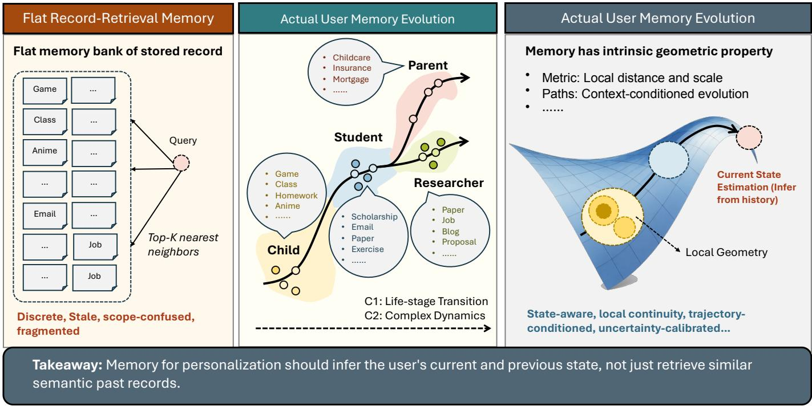
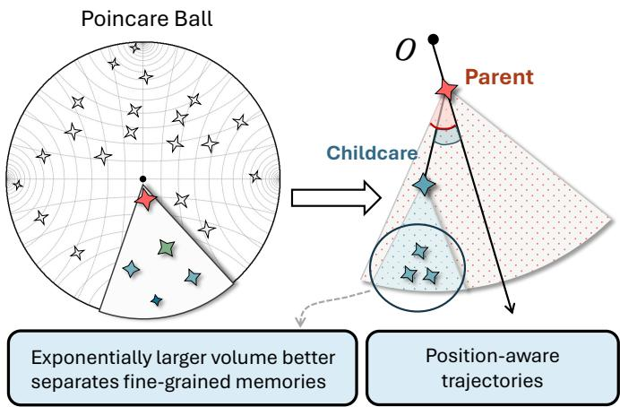

# Memory Has Geometry: Non-Uniform Geometric Memory for Long-Horizon Personalized AI

Jiahong Liu1, Wenhao Yu1, Zexuan Qiu1, Menglin Yang2, Irwin King1

1The Chinese University of Hong Kong, Hong Kong SAR, China

{jiahong.liu21, yuwenhao117}@gmail.com, {zxqiu22, king}@cse.cuhk.edu.hk

2The Hong Kong University of Science and Technology (Guangzhou), Guangzhou, China menglinyang@hkust-gz.edu.cn

Abstract—Long-term memory is becoming a core substrate for personalized AI, yet most systems still represent personalization as discrete records in a largely static latent space, accessed under one global similarity notion. For data mining, this creates a mismatch: the evidence is a temporal event stream, while the dominant abstraction is a searchable record set. We argue that long-horizon personalization should instead model memory as a user-specific dynamical state space with locally heterogeneous geometry. Geometry here is a computational language, not a literal claim about cognition: it captures stable versus volatile regions, variable-rate drift, heterogeneous neighborhoods, and uncertainty about current user state. Profiles and isolated events remain useful as points, but interaction, feedback, and elapsed time induce trajectories. Memory access then becomes trajectoryconditioned reconstruction of the relevant user state, not only nearest-neighbor lookup.

Index Terms—personalized AI, long-term memory, user modeling, recommender systems, agent memory

## I. THE MEMORY BOTTLENECK

Personalized AI now sustains months-long interactions, but its memory infrastructure has not kept pace. Memory must carry evidence across interactions and maintain an evolving estimate of user state: preferences, constraints, goals, project context, and prior corrections. Dialogue systems [1]–[6], personalized LLMs [7]–[12], autonomous agents [13]–[15], and recommenders [16]–[19] face the same bottleneck: as histories grow from sessions to lifetimes, personalization is limited less by model capacity than by how experience is stored, structured, and accessed. This is a data mining problem at its core: inferring durable but evolving state from heterogeneous, asynchronous, weakly labeled user-event data.

Existing systems include textual memory banks [13], [20], [21], vector retrieval [22], [23], and learned external memories [24]. A-Mem dynamically links notes [25], Zep maintains temporal knowledge graphs [26], and HeLa-Mem consolidates associative memories [27]. Our distinction is explicit local metrics and trajectory-conditioned state estimation, rather than structure alone.

The structural gap is between a temporal, weakly supervised event process and a searchable record set. Later evidence changes the relevance of earlier events; local corrections need not generalize. Figure 1 groups a toy user’s records into distinct interest, routine, constraint, and project trajectories. Retrieval can find relevant evidence while still estimating the wrong current state.

TABLE I  
RECORD-RETRIEVAL MEMORY VERSUS GEOMETRIC MEMORY.
<table><tr><td colspan="3">Record-Retrieval Geometric</td></tr><tr><td>Store Measure</td><td>Discrete records Single global similarity</td><td>Latent state and trajectories Global structure plus local</td></tr><tr><td>Update</td><td>Append, overwrite, summarize</td><td>uncertainty Path-dependent dynamical update</td></tr><tr><td>Access</td><td>Top-k neighbors</td><td>Trajectory-conditioned reconstruction</td></tr></table>

This convergence hides three assumptions. A1: discrete records. Memory is a set of messages, slots, profiles, summaries, or embeddings. A2: uniform geometry. These items live in one latent space governed by one broadly sufficient similarity metric [28], [29]. A3: item-level access. Memory is accessed by retrieving or attending to stored items, rather than reconstructing user state. These assumptions make stored items primary, rather than evolving state. The bottleneck is therefore not retrieval quality alone, but the abstraction itself.

## II. A GEOMETRIC MEMORY VIEW

We propose modeling personalized memory as a geometric dynamical system: a user-specific state space whose local metric structure, curvature, scale, and uncertainty vary across regions and evolve with interaction. Geometry is a computational abstraction, not a literal cognitive manifold.

Let (M, G) be a personalized memory state space, where M is a manifold-like state space and $\mathcal { G } ~ = ~ \{ g _ { x } \} _ { x \in \mathcal { M } }$ is a field of positive-definite local metrics encoding scale and anisotropy; curvature is derived from metric variation, while uncertainty is modeled separately. A user’s memory state at time t is a point $x _ { t } \in \mathcal { M }$ . An event $e _ { t } = \left( o _ { t } , \Delta t _ { t } \right)$ contains interaction evidence $o _ { t }$ and elapsed time $\Delta t _ { t }$

Given state $x _ { t - 1 }$ and event $e _ { t } ,$ memory evolves as

$$
x _ { t } = \mathrm { E x p } _ { x _ { t - 1 } } \Big ( g _ { x _ { t - 1 } } ^ { - 1 } f _ { \theta } \big ( x _ { t - 1 } , e _ { t } \big ) \Big ) ,
$$

where $f _ { \theta }$ proposes a tangent covector and the inverse metric converts it to a displacement. With an identity metric this is an additive Euclidean update. A posterior over metrics and states represents epistemic uncertainty; update rate is learned separately, as in continuous-time dynamics [30]. High curvature does not itself imply rapid drift.

  
Fig. 1. Flat record-retrieval memory versus a geometric view of user memory evolution. Instead of retrieving isolated past records under one similarity notion, geometric memory infers the user’s current state from structured trajectories, local geometry, and longer-term evolution.

The fundamental object is then a trajectory family $\Gamma =$ $\{ \gamma _ { k } \}$ , with each path tracing a coherent evolution of user state: a preference regime, project, routine, or episode. Recordcentric access retrieves top-k neighbors,

$$
R ( q _ { t } , D _ { t } ) = \mathrm { T o p K } _ { m _ { i } \in D _ { t } } s ( q _ { t } , m _ { i } ) .
$$

Geometric memory replaces this with trajectory-conditioned reconstruction,

$$
\hat { r } _ { t } = \int h _ { \theta } ( q _ { t } , x _ { t } , z ) p ( z \mid q _ { t } , x _ { t } , \Gamma ) d z ,
$$

where z is a relevant path segment and $\hat { r } _ { t }$ may drive response generation, recommendation, action, adaptation, confidence, or abstention. The shift is conceptual but consequential: memory access becomes inference over trajectories, not lookup over items.

## III. WHY THIS IS A BLUESKY AGENDA

The ICDM 2026 BlueSky track asks for bold visions that expose gaps, challenge assumptions, and define transformative research directions [31]. Geometric memory fits that call by reframing long-horizon personalization as state estimation under non-uniform geometry, not another retrieval refinement. The central idea is to mine latent dynamics, local uncertainty, and trajectory structure from persistent interaction streams instead of building ever larger stores of retrievable records.

Why ICDM? Sequential recommendation and semantic transfer already model evolving behavior [17], [32]–[34].

PerFit identifies shared and user-specific representation shifts [12]; HRCF and HICF exploit hyperbolic structure in recommendation [35]–[37]. Geometric learning and foundationmodel agendas motivate matching representation to structure [38]–[42]. Our contribution combines position-dependent metrics, trajectory-conditioned reconstruction, and controllable updates. JODIE forecasts user–item embedding trajectories [43]; temporal graph networks maintain event-driven states [44]. Geometry adds an explicit distance and transport structure governing how updates propagate across contexts; matched identity-metric ablations can isolate this contribution directly.

A concrete instantiation. Hyperbolic memory is one illustrative case. Hyperbolic spaces support coarse-to-fine branching: broad stable tendencies at one scale, and specific interests, projects, or temporary regimes at finer scales. A user’s state could evolve through hyperbolic exponential and logarithmic maps while reconstruction reasons over geodesic segments. Other users or domains may require Euclidean, spherical, mixed-curvature, graph-structured, or hybrid spaces; the agenda is to learn the geometry rather than assume one metric.

## IV. RESEARCH OPPORTUNITIES

Table II summarizes geometric memory research opportunities.

## A. Foundation: Geometric Representation

The first question is which substrate captures multiscale user state. Hyperbolic embeddings and graph convolutions model hierarchy [45]–[47]; spherical components recurring routines; flat subspaces near-linear drift; and graph or mixed-curvature products discrete projects and continuous preferences [48]. A tractable starting point shares an event encoder and transition model across users, then learns small user-specific metric adapters under population priors. A fixed product substrate provides common interfaces while avoiding manifold search. Contrastive learning and UHCone offer weak supervision [49], [50]; population priors mitigate dimensional collapse [51]. Predictive validation activates useful local flexibility.

TABLE II RESEARCH LANDSCAPE OF GEOMETRIC MEMORY.
<table><tr><td>Layer</td><td>Direction</td><td>Core Question</td></tr><tr><td>Foundation</td><td>Representation</td><td>What geometric substrate-Riemannian, mixed-curvature, graph-structured, or hybrid–captures multiscale user state?</td></tr><tr><td>Operation</td><td>Formation</td><td>How should heterogeneous, asynchronous interactions update the state space and reveal trajectory structure?</td></tr><tr><td></td><td>Access</td><td>How can systems reconstruct relevant user state by marginalizing over trajectory segments under production latency?</td></tr><tr><td></td><td>Evolution</td><td>How does local geometry adapt under preference drift, regime shifts, and multiscale temporal dynamics?</td></tr><tr><td></td><td>Forgetting &amp; Editing</td><td>How can memory surgery modify or decay local regions with bounded propagation and user-controllable forgetting?</td></tr><tr><td>System</td><td>Cross-User Geometry</td><td>How can systems align, compare, and transfer knowledge across user-specific geometric structures?</td></tr><tr><td></td><td>Efficiency</td><td>How can expensive operations-exponential maps, parallel transport, curvature estimation-support real-time serving?</td></tr><tr><td></td><td>Trust &amp; Privacy</td><td>How can geometric uncertainty, trajectory-level explanation, and privacy guarantees coexist?</td></tr><tr><td>Benchmark</td><td>Evaluation</td><td>What temporal granularity, state-evolution complexity, and evidence sparsity must benchmarks reach?</td></tr><tr><td></td><td>Geometric Metrics</td><td>How should we measure trajectory coherence, predictive calibration, editing locality, and forgetting fidelity?</td></tr></table>

  
Fig. 2. Illustrative coarse-to-fine organization of user state, with hyperbolic geometry as one candidate substrate. In a candidate implementation, a broad role anchors context-specific paths, allowing a temporary childcare constraint to remain local rather than overwrite a general preference. Distance measures state compatibility, not elapsed time; arrows indicate inferred transitions. Learned routing and a state decoder complement the layout with temporal dynamics and predictive uncertainty.

## B. Operation: Memory Lifecycle

Formation. A shared encoder maps each event to content, context, and time features. Soft routing assigns it to active or dormant paths using context compatibility and predictive likelihood. Sustained residuals propose a new branch; repeated contextual matches resume a dormant path; compatible predictive states propose a merge. Posterior routing uncertainty should remain explicit, rather than forcing every event into one trajectory. Branch and merge decisions require validation against annotated episodes and held-out prediction.

Access. Trajectory-conditioned reconstruction asks which path segment explains the current context, not which item is closest. This requires latency-aware marginalization, approximate geodesic search, amortized inference, and confidence estimates that survive long gaps and sparse evidence.

Evolution. User state is non-stationary. Metric scale and transition dynamics should be estimated separately, and restructure only when predictive evidence supports new domains. Short episodes, medium-term projects, and long-term identity evolve at different rates; a useful model should distinguish durable drift from brief excursions, and regime shift from noise. Hyperbolic continual learning supports geometric preservation [52], while ProWorld models trajectory progress [53]; both supply components for personalized memory evolution.

Forgetting and editing. Staleness can increase predictive uncertainty and reduce evidence weight; it need not change curvature. Editing intervenes on a local state or path, while deletion must also remove supporting records and invalidate derived states. The key requirement is bounded propagation: changing one neighborhood should not distort unrelated memory.

## C. System: Deployment and Trust

Cross-user geometry. FlatLand demonstrates tailored client geometries with shared aggregation [54], providing a concrete basis for population priors, cold-start transfer, and efficient user-specific adaptation.

Efficiency. Exponential maps, parallel transport, curvature estimation, and trajectory marginalization are costlier than flat inner products. Riemannian adaptive optimization supports manifold training [55]. Hypformer supplies efficient hyperbolic operators [56]; HypLoRA and low-rank adaptation provide lightweight adaptation tools [57], [58]; HiHPQ suggests geometry-aware compression [59]. Streaming inference still requires validation.

Trust and privacy. Position-dependent uncertainty can tell a system when to abstain; trajectory explanations can show whether a decision follows a stable preference or a transient episode; and privacy guarantees must bound what the latent state reveals. Trustworthy agentic AI also supplies privacy and system-security mechanisms [60] that can be layered with geometric uncertainty and trajectory-level auditing.

## D. Benchmark: Evaluation for Geometric Memory

Recent benchmarks probe long-horizon memory–LoCoMo [61], LongMemEval [62], and LifeBench [63]–but structural gaps remain. First, temporal granularity: user state evolves across hours, weeks, projects, and life stages. Second, stateevolution complexity: evaluations should cover consolidation, partly valid old preferences, and regime shifts. Third, evidence implicitness: weak distributed signals should complement declared facts. Fourth, geometry-aware metrics are missing. We need to measure trajectory coherence, predictive calibration, editing locality, and forgetting fidelity, not only end-task accuracy.

Validation protocol. Construct timestamped streams with recurrent roles, gradual preference drift, a temporary exception, a dormant project that resumes, and a true regime change. Controlled streams with known states and consented annotations establish identifiable behavior before scaling to natural interaction logs. Split chronologically and hold out users, varying time gaps and evidence density. Compare retrieval, a strong dynamic latent-state model, and the same encoder, routing, and transition model with identity versus learned local metrics, matching parameter count, data, and memory budget. Measure state prediction, stale-preference error, crossrole leakage, Brier score, selective risk, edit spillover, and latency; report user-level confidence intervals. TRACE motivates process evaluation beyond final accuracy [64].

End-to-end probe. A user repeatedly prefers concise work emails, asks for one detailed grant proposal, then resumes routine email writing. Context routing should place the proposal on a temporary project path. A feedback-trained metric can make displacement from that path into the general emailpreference region costly. Reconstruction should retain concise emails while permitting detailed proposals. A dynamic embedding provides a competitive reference, while the identitymetric ablation quantifies geometry’s added value.

H1: horizon sensitivity predicts lower stale-state error as gaps and regime shifts grow. H2: calibration predicts better selective risk at matched coverage. H3: sparse evidence predicts fewer events needed to reach a fixed state-prediction error. Consistent gains over the matched dynamic baseline after controlling for capacity and routing would identify the value contributed specifically by local geometry.

What would count as success? Success means recovering state from weak signals while preserving valid old preferences and keeping temporary exceptions local. After a local correction, unrelated contexts should retain their previous behavior; after deletion, both direct retrieval and derived state should cease to expose the removed evidence. These tests assess controllable revision beyond historical fit.

## V. FEASIBILITY AND SAFEGUARDS

Structured sharing makes the model learnable and deployable. A population metric and shared transition model provide a data-efficient starting point, with user adapters activated as evidence accumulates. Canonical coordinates remove equivalent parameterizations, while prediction, calibration, and edit-locality objectives identify useful geometry. Decisionlevel identifiability accepts coordinate-equivalent models that preserve calibrated predictions and localized edits. Evidencedependent regularization specializes shared behavior as stable personal structure emerges. Cold-start users inherit the shared model, and identity-metric shrinkage stabilizes adaptation. Low-rank adapters, cached local charts, and approximate trajectory search enable scale; private aggregation, consentaware deletion, and trajectory audits protect inferred state. These mechanisms turn feasibility and safety into measurable acceptance criteria.

## VI. CONCLUSION

We introduce non-uniform geometric memory as a unified framework for user states, trajectories, local metrics, uncertainty, and controllable intervention. Trajectory-conditioned estimation allows durable preferences, temporary contexts, and regime changes to coexist. The framework connects temporal data mining, geometric learning, recommendation, and personalized agents, supporting consistent adaptation, interpretable decisions, and targeted editing or forgetting.

Deployment builds directly on existing systems: encoders initialize state, metric adapters specialize geometry, trajectory routers organize context, and reconstruction guides decisions. Modular components use standard feedback, while offline replay and shadow deployment evaluate calibration, latency, and edit locality before rollout. This creates a practical path to enduring personalized intelligence.

## ACKNOWLEDGMENT

The research presented in this paper was partially supported by the Research Grants Council of the Hong Kong Special Administrative Region, China (CUHK 2300246, RGC C1043- 24G), (CUHK 14203425, RGC GRF 2151317).

## REFERENCES

[1] H. Li, C. Yang, A. Zhang, Y. Deng, X. Wang, and T.-S. Chua, “Hello again! LLM-powered personalized agent for long-term dialogue,” in Proceedings of the 2025 Conference of the Nations of the Americas Chapter of the Association for Computational Linguistics: Human Language Technologies (Volume 1: Long Papers). Albuquerque, New Mexico: Association for Computational Linguistics, 2025, pp. 5259– 5276. [Online]. Available: https://aclanthology.org/2025.naacl-long.272/

[2] K. T. iunn Ong, N. Kim, M. Gwak, H. Chae, T. Kwon, Y. Jo, S. won Hwang, D. Lee, and J. Yeo, “Towards lifelong dialogue agents via timeline-based memory management,” in Proceedings of the 2025 Conference of the Nations of the Americas Chapter of the Association for Computational Linguistics: Human Language Technologies (Volume 1: Long Papers). Albuquerque, New Mexico: Association for Computational Linguistics, 2025, pp. 8631–8661. [Online]. Available: https://aclanthology.org/2025.naacl-long.435/

[3] Z. Tan, J. Yan, I.-H. Hsu, R. Han, Z. Wang, L. Le, Y. Song, Y. Chen, H. Palangi, G. Lee, A. R. Iyer, T. Chen, H. Liu, C.-Y. Lee, and T. Pfister, “In prospect and retrospect: Reflective memory management for long-term personalized dialogue agents,” in Proceedings of the 63rd Annual Meeting of the Association for Computational Linguistics (Volume 1: Long Papers). Vienna, Austria: Association for Computational Linguistics, 2025, pp. 8416–8439. [Online]. Available: https://aclanthology.org/2025.acl-long.413/

[4] D. Liu, Z. Wu, D. Song, and H. Huang, “A persona-aware LLM-enhanced framework for multi-session personalized dialogue generation,” in Findings of the Association for Computational Linguistics: ACL 2025. Vienna, Austria: Association for Computational Linguistics, 2025, pp. 103–123. [Online]. Available: https://aclanthology. org/2025.findings-acl.5/

[5] E. Kim, C. Park, and B. Chang, “SHARE: Shared memory-aware open-domain long-term dialogue dataset constructed from movie script,” in Proceedings of the 63rd Annual Meeting of the Association for Computational Linguistics (Volume 1: Long Papers). Vienna, Austria: Association for Computational Linguistics, 2025, pp. 14 474–14 498. [Online]. Available: https://aclanthology.org/2025.acl-long.704/

[6] Y.-P. Chen, N. Nishida, H. Nakayama, and Y. Matsumoto, “Post persona alignment for multi-session dialogue generation,” in Findings of the Association for Computational Linguistics: EMNLP 2025. Suzhou, China: Association for Computational Linguistics, 2025, pp. 20 184–20 192. [Online]. Available: https://aclanthology.org/2025. findings-emnlp.1098

[7] A. Salemi, S. Mysore, M. Bendersky, and H. Zamani, “LaMP: When large language models meet personalization,” in Proceedings of the 62nd Annual Meeting of the Association for Computational Linguistics (Volume 1: Long Papers). Bangkok, Thailand: Association for Computational Linguistics, 2024, pp. 7370–7392. [Online]. Available: https://aclanthology.org/2024.acl-long.399/

[8] L. Ning, L. Liu, J. Wu, N. Wu, D. Berlowitz, S. Prakash, B. Green, S. O’Banion, and J. Xie, “User-LLM: Efficient LLM contextualization with user embeddings,” 2024. [Online]. Available: https://arxiv.org/abs/2402.13598

[9] Y. Zhang, D. Adila, C. Shin, and F. Sala, “Personalize your LLM: Fake it then align it,” in Findings of the Association for Computational Linguistics: NAACL 2025. Albuquerque, New Mexico: Association for Computational Linguistics, 2025, pp. 7287–7301. [Online]. Available: https://aclanthology.org/2025.findings-naacl.407/

[10] S. Wu, Y. R. Fung, C. Qian, J. Kim, D. Hakkani-Tur, and H. Ji, “Aligning LLMs with individual preferences via interaction,” in Proceedings of the 31st International Conference on Computational Linguistics. Abu Dhabi, UAE: Association for Computational Linguistics, 2025, pp. 7648–7662. [Online]. Available: https://aclanthology.org/2025. coling-main.511/

[11] J. Liu, Z. Qiu, Z. Li, Q. Dai, W. Yu, J. Zhu, M. Hu, M. Yang, T.-S. Chua, and I. King, “A survey of personalized large language models: Progress and future directions,” 2025. [Online]. Available: https://arxiv.org/abs/2502.11528

[12] J. Liu, W. Yu, Q. Dai, Z. Li, J. Zhu, M. Yang, T.-S. Chua, and I. King, “Perfit: Exploring personalization shifts in representation space of llms,” in International Conference on Learning Representations, vol. 2026, 2026, pp. 75 361–75 396. [Online]. Available: https://proceedings.iclr.cc/paper files/paper/2026/ file/7a1ac10ea9d98178a389c7fbb3575567-Paper-Conference.pdf

[13] J. S. Park, J. C. O’Brien, C. J. Cai, M. R. Morris, P. Liang, and M. S. Bernstein, “Generative agents: Interactive simulacra of human behavior,” in Proceedings of the 36th Annual ACM Symposium on User Interface Software and Technology, UIST 2023. ACM, 2023, pp. 1–22.

[14] C. Packer, S. Wooders, K. Lin, V. Fang, S. G. Patil, I. Stoica, and J. E. Gonzalez, “MemGPT: towards LLMs as operating systems,” CoRR, vol. abs/2310.08560, 2023.

[15] Z. Zhang, X. Bo, C. Ma, R. Li, X. Chen, Q. Dai, J. Zhu, Z. Dong, and J.-R. Wen, “A survey on the memory mechanism of large language model based agents,” 2024. [Online]. Available: https://arxiv.org/abs/2404.13501

[16] G. Zhou, X. Zhu, C. Song, Y. Fan, H. Zhu, X. Ma, Y. Yan, J. Jin, H. Li, and K. Gai, “Deep interest network for click-through rate prediction,” in Proceedings of the 24th ACM SIGKDD International Conference on Knowledge Discovery and Data Mining. ACM, 2018, pp. 1059–1068.

[17] G. Zhou, Y. Fan, R. Cui, W. Bian, X. Zhu, and K. Gai, “Deep interest evolution network for click-through rate prediction,” in The Thirty-Third AAAI Conference on Artificial Intelligence, AAAI 2019. AAAI Press, 2019, pp. 5941–5948.

[18] W. Kang and J. McAuley, “Self-attentive sequential recommendation,” in 2018 IEEE International Conference on Data Mining, ICDM 2018. IEEE Computer Society, 2018, pp. 197–206.

[19] N. Shani, S. Bercovich, O. S. Shalom, R. Aharonov, M. Eilat, Y. Boutoris, G. Dalal, A. Ingber, A. Katz, R. Pereg, and I. Guy, “Surrogate for long-term user experience in recommender systems,” in Proceedings of the 28th ACM SIGKDD Conference on Knowledge Discovery and Data Mining. ACM, 2022, pp. 4100–4109.

[20] W. Zhong, L. Guo, Q. Gao, H. Ye, and Y. Wang, “Memorybank: Enhancing large language models with long-term memory,” 2023. [Online]. Available: https://arxiv.org/abs/2305.10250

[21] W. Wang, L. Dong, H. Cheng, X. Liu, X. Yan, J. Gao, and F. Wei, “Augmenting language models with long-term memory,” CoRR, vol. abs/2306.07174, 2023. [Online]. Available: https://arxiv.org/abs/2306. 07174

[22] K. Guu, K. Lee, Z. Tung, P. Pasupat, and M. Chang, “REALM: retrievalaugmented language model pre-training,” CoRR, vol. abs/2002.08909, 2020.

[23] P. Lewis, E. Perez, A. Piktus, F. Petroni, V. Karpukhin, N. Goyal, H. Kuttler, M. Lewis, W. Yih, T. Rockt¨ aschel, S. Riedel, and D. Kiela,¨ “Retrieval-augmented generation for knowledge-intensive NLP tasks,” in Advances in Neural Information Processing Systems 33: Annual Conference on Neural Information Processing Systems 2020. Curran Associates, Inc., 2020, pp. 9459–9474.

[24] A. Graves, G. Wayne, M. Reynolds, T. Harley, I. Danihelka, A. Grabska-Barwinska, S. G. Colmenarejo, E. Grefenstette, T. Ramalho, J. Agapiou,´ A. P. Badia, K. M. Hermann, Y. Zwols, G. Ostrovski, A. Cain, H. King, C. Summerfield, P. Blunsom, K. Kavukcuoglu, and D. Hassabis, “Hybrid computing using a neural network with dynamic external memory,” Nature, vol. 538, no. 7626, pp. 471–476, 2016.

[25] W. Xu, Z. Liang, K. Mei, H. Gao, J. Tan, and Y. Zhang, “A-Mem: Agentic Memory for LLM Agents,” in Advances in Neural Information Processing Systems, vol. 38, 2025. [Online]. Available: https://papers.neurips.cc/paper files/paper/2025/file/ 19909c36f51abc4856b4560aff3d36d6-Paper-Conference.pdf

[26] P. Rasmussen, P. Paliychuk, T. Beauvais, J. Ryan, and D. Chalef, “Zep: A Temporal Knowledge Graph Architecture for Agent Memory,” arXiv:2501.13956, 2025. [Online]. Available: https://arxiv.org/abs/2501. 13956

[27] J. Zhu, J. Li, C. Zhang, J. Liu, and M. Yang, “HeLa-mem: Hebbian learning and associative memory for LLM agents,” in Proceedings of the 64th Annual Meeting of the Association for Computational Linguistics (Volume 1: Long Papers). San Diego, California, United States: Association for Computational Linguistics, 2026, pp. 13 757–13 769. [Online]. Available: https://aclanthology.org/2026.acl-long.625

[28] J. Li, Y. Wang, and J. McAuley, “Time interval aware self-attention for sequential recommendation,” in Proceedings of the 13th International Conference on Web Search and Data Mining, WSDM 2020. ACM, 2020, pp. 322–330.

[29] F. Sun, J. Liu, J. Wu, C. Pei, X. Lin, W. Ou, and P. Jiang, “BERT4Rec: sequential recommendation with bidirectional encoder representations from transformer,” in Proceedings of the 28th ACM International Conference on Information and Knowledge Management, CIKM 2019. ACM, 2019, pp. 1441–1450.

[30] R. T. Q. Chen, Y. Rubanova, J. Bettencourt, and D. K. Duvenaud, “Neural ordinary differential equations,” in Advances in Neural Information Processing Systems, vol. 31, 2018. [Online]. Available: https://proceedings.neurips.cc/paper files/paper/ 2018/hash/69386f6bb1dfed68692a24c8686939b9-Abstract.html

[31] IEEE ICDM 2026, “Call for BlueSky track papers,” https://icdm2026. neu.edu.cn/CallforBlueSkyTrackPapers/list.htm, 2026, accessed: 2026- 07-02.

[32] Y. Koren, “Collaborative filtering with temporal dynamics,” in Proceedings of the 15th ACM SIGKDD International Conference on Knowledge Discovery and Data Mining. ACM, 2009, pp. 447–456.

[33] C. Zhang, S. Huang, Z. Zhang, J. Liu, L. Yu, R. Wan, B. Yang, and I. King, “Semacdr: Llm-powered transferable semantics for cross-domain sequential recommendation,” 2026. [Online]. Available: https://arxiv.org/abs/2604.09551

[34] Y. Li, J. Liu, X. Zhang, H. Chen, Y. Chen, W. Yu, J. Chen, and I. King, “Generative archetype-grounded item representations for sequential recommendation,” 2026. [Online]. Available: https: //arxiv.org/abs/2606.11023

[35] M. Yang, M. Zhou, J. Liu, D. Lian, and I. King, “Hrcf: Enhancing collaborative filtering via hyperbolic geometric regularization,” in Proceedings of the ACM Web Conference 2022, ser. WWW ’22. ACM, 2022, pp. 2462–2471. [Online]. Available: http://dx.doi.org/10. 1145/3485447.3512118

[36] M. Yang, Z. Li, M. Zhou, J. Liu, and I. King, “Hicf: Hyperbolic informative collaborative filtering,” in Proceedings of the 28th ACM SIGKDD Conference on Knowledge Discovery and Data Mining, ser. KDD ’22. ACM, 2022, pp. 2212–2221. [Online]. Available: http://dx.doi.org/10.1145/3534678.3539475

[37] X. Yang, X. Li, H. Chang, Y. Jinze, X. Yang, S. Tao, M. Shigeno, N. Chang, J. Wang, D. Yin, and E. Min, “Hgformer: Hyperbolic graph transformer for collaborative filtering,” in Proceedings of the 42nd International Conference on Machine Learning, ser. Proceedings of Machine Learning Research, vol. 267. PMLR, 2025, pp. 70 813–70 832. [Online]. Available: https://proceedings.mlr.press/v267/yang25o.html

[38] M. M. Bronstein, J. Bruna, T. Cohen, and P. Velickoviˇ c, “Geometric´ deep learning: Grids, groups, graphs, geodesics, and gauges,” CoRR, vol. abs/2104.13478, 2021. [Online]. Available: https://arxiv.org/abs/ 2104.13478

[39] M. Yang, M. Zhou, T. Zhang, J. Liu, Z. Li, L. Pan, H. Xiong, and I. King, “Hyperbolic graph neural networks: A review of methods and applications,” 2025. [Online]. Available: https://arxiv.org/abs/2202. 13852

[40] N. He, J. Liu, B. Zhang, N. Bui, A. Maatouk, M. Yang, I. King, M. Weber, and R. Ying, “Position: Beyond euclidean – foundation models should embrace non-euclidean geometries,” 2025. [Online]. Available: https://arxiv.org/abs/2504.08896

[41] M. Yang, J. Liu, L. Vinh Tran, and R. Ying, “Geometric space, architecture and learning objective for large pre-trained models,” in Proceedings of the 32nd ACM SIGKDD Conference on Knowledge Discovery and Data Mining V.2. ACM, 2026, pp. 13 447–13 448. [Online]. Available: http://dx.doi.org/10.1145/3770855.3818244

[42] J. Liu, M. Yang, and I. King, “Hyperbolic learning for structured data, knowledge, and memory: A tutorial,” in Proceedings of the 32nd ACM SIGKDD Conference on Knowledge Discovery and Data Mining V.2. ACM, 2026, pp. 13 351–13 355. [Online]. Available: http://dx.doi.org/10.1145/3770855.3816467

[43] S. Kumar, X. Zhang, and J. Leskovec, “Predicting dynamic embedding trajectory in temporal interaction networks,” in Proceedings of the 25th ACM SIGKDD International Conference on Knowledge Discovery and Data Mining, 2019, pp. 1269–1278. [Online]. Available: https://snap.stanford.edu/jodie/

[44] E. Rossi, B. Chamberlain, F. Frasca, D. Eynard, F. Monti, and M. Bronstein, “Temporal graph networks for deep learning on dynamic graphs,” arXiv:2006.10637, 2020. [Online]. Available: https://arxiv.org/abs/2006.10637

[45] M. Nickel and D. Kiela, “Poincare embeddings for learning hierarchical´ representations,” in Advances in Neural Information Processing Systems 30, 2017. [Online]. Available: https://papers.nips.cc/paper/2017/hash/ 59dfa2df42d9e3d41f5b02bfc32229d-Abstract.html

[46] F. Sala, C. D. Sa, A. Gu, and C. Re, “Representation tradeoffs´ for hyperbolic embeddings,” in Proceedings of the 35th International Conference on Machine Learning, ser. Proceedings of Machine Learning Research, vol. 80, 2018, pp. 4460–4469. [Online]. Available: https://proceedings.mlr.press/v80/sala18a.html

[47] I. Chami, Z. Ying, C. Re, and J. Leskovec, “Hyperbolic graph convolu-´ tional neural networks,” in Advances in Neural Information Processing Systems, vol. 32, 2019. [Online]. Available: https://proceedings.neurips. cc/paper/2019/hash/0415740eaa4d9decbc8da001d3fd805f-Abstract.html

[48] A. Gu, F. Sala, B. Gunel, and C. Re, “Learning mixed-curvature´ representations in product spaces,” in International Conference on Learning Representations, 2019. [Online]. Available: https: //openreview.net/forum?id=HJxeWnCcF7

[49] J. Liu, M. Yang, M. Zhou, S. Feng, and P. Fournier-Viger, “Enhancing hyperbolic graph embeddings via contrastive learning,” 2022. [Online]. Available: https://arxiv.org/abs/2201.08554

[50] M. Yang, J. Liu, I. King, and R. Ying, “UHCone: Universal Hyperbolic Cone For Implicit Hierarchical Learning,” in ICML Workshop on Geometry-grounded Representation Learning and Generative Modeling, 2024. [Online]. Available: https://openreview.net/forum?id= BBgop7vYvX

[51] Y. Zhang, H. Zhu, M. Yang, J. Liu, R. Ying, I. King, and P. Koniusz, “Understanding and mitigating hyperbolic dimensional collapse in graph contrastive learning,” in Proceedings of the 31st ACM SIGKDD Conference on Knowledge Discovery and Data Mining V.1, ser. KDD ’25. ACM, 2025, pp. 1984–1995. [Online]. Available: http://dx.doi.org/10.1145/3690624.3709249

[52] J. Liu, M. Shen, X. Liu, R. Ying, M. Yang, T.-S. Chua, and I. King, “Hyperbolic multimodal continual learning,” 2026. [Online]. Available: https://arxiv.org/abs/2608.09572

[53] Z. Liu, Y. Zhuang, Y. Li, W. Gou, J. Liu, M. Zhou, and M. Yang, “Proworld: Progress-aware hyperbolic world models for long-horizon visual goal reaching,” 2026. [Online]. Available: https: //arxiv.org/abs/2608.01926

[54] J. Liu, R. S. B. B, X. Fu, M. Yang, W. Zhang, R. Ying, and I. King, “Flatland: Personalized graph federated learning via tailored lorentz space,” 2026. [Online]. Available: https://arxiv.org/abs/2608.21096

[55] G. Becigneul and O.-E. Ganea, “Riemannian adaptive optimization´ methods,” in International Conference on Learning Representations, 2019. [Online]. Available: https://openreview.net/forum?id=r1eiqi09K7

[56] M. Yang, H. Verma, D. C. Zhang, J. Liu, I. King, and R. Ying, “Hypformer: Exploring efficient transformer fully in hyperbolic space,” in Proceedings of the 30th ACM SIGKDD Conference on Knowledge Discovery and Data Mining, ser. KDD ’24. ACM, 2024, pp. 3770– 3781. [Online]. Available: http://dx.doi.org/10.1145/3637528.3672039

[57] M. Yang, R. B, A. Feng, B. Xiong, J. Liu, I. King, and R. Ying, “Hyperbolic fine-tuning for large language models,” in Advances in Neural Information Processing Systems, vol. 38, Main Conference. Curran Associates, Inc., 2025, pp. 29 613–29 648. [Online]. Available: https://proceedings.neurips.cc/paper files/paper/ 2025/file/2a711847bb13b3c55ad74853b7efd70a-Paper-Conference.pdf

[58] M. Yang, J. Chen, J. Tao, Y. Zhang, J. Liu, J. Zhang, Q. Ma, H. Verma, R. Zhang, M. Zhou, I. King, and R. Ying, “Low-rank adaptation for foundation models: A comprehensive review,” 2025. [Online]. Available: https://arxiv.org/abs/2501.00365

[59] Z. Qiu, J. Liu, Y. Chen, and I. King, “Hihpq: Hierarchical hyperbolic product quantization for unsupervised image retrieval,” Proceedings of the AAAI Conference on Artificial Intelligence, vol. 38, no. 5, pp. 4614–4622, 2024. [Online]. Available: http: //dx.doi.org/10.1609/aaai.v38i5.28261

[60] J. Qi, M. Li, J. Liu, Y. Shu, D. Yu, S. Ma, W. Cui, Y. Zhao, Y. Chen, R. Jiang, I. King, and Z. Xu, “Towards trustworthy agentic ai: a comprehensive survey of safety, robustness, privacy, and system security,” 2026. [Online]. Available: https://arxiv.org/abs/2605.23989

[61] A. Maharana, D.-H. Lee, S. Tulyakov, M. Bansal, F. Barbieri, and Y. Fang, “Evaluating very long-term conversational memory of LLM agents,” in Proceedings of the 62nd Annual Meeting of the Association for Computational Linguistics (ACL), 2024.

[62] D. Wu, H. Wang, W. Yu, Y. Zhang, K.-W. Chang, and D. Yu, “LongMemEval: Benchmarking chat assistants on long-term interactive memory,” in Proceedings of the International Conference on Learning Representations (ICLR), 2025.

[63] Z. Cheng, W. Wang, Y. Zhao, Z. Ren, J. Chen, R. Xu, S. Huang, Y. Chen, G. Li, M. Wang, Y. Xie, R. Zhu, Z. Jiang, K. Lu, Y. Li, X. Wang, L. Liu, and C.-T. Nguyen, “LifeBench: A benchmark for long-horizon multi-source memory,” arXiv preprint arXiv:2603.03781, 2026.

[64] Y. Chen, J. Jiang, J. Liu, Y. Zhang, X. Guo, and I. King, “Trace: Trajectory-aware comprehensive evaluation for deep research agents,” 2026. [Online]. Available: https://arxiv.org/abs/2602.21230