# MiST: Mid-Training LLMs for Cybersecurity

Oded Ovadia\* Elad Ben Zaken\* Elad Guttman\* Orly Moreno Kadosh

Dream

{odedov,elad,eladg,orly}@dreamgroup.com

## Abstract

Cybersecurity combines high-stakes analysis with complex technical language, making it an impactful and challenging domain for LLMs. We present MiST (Mid-trained Security Trans former), a suite of 8B and 32B models that achieve strong performance on public cybersecurity benchmarks. We use mid-training as an intermediate adaptation stage between general pre-training and cybersecurity training. Rather than performing continual pre-training over large volumes of raw domain text, we cu rate a compact, expert-vetted seed corpus, and transform it into high-quality domain-specific synthetic training data. The final MiST checkpoints improve mean cybersecurity accuracy by +13.1 and +8.6 absolute percentage points over the corresponding Qwen baselines for 8B and 32B, respectively, corresponding to relative gains of +27.0% and +15.8%. Ablation results further show that these cybersecurity gains arise in the mid-training and supervised fine-tuning stages through a combination of the synthetic data generation flows. Furthermore, we show that MiST provides a stronger initialization for downstream task-specific finetuning adaptation and reinforcement learning.

## 1 Introduction

LLMs and Cybersecurity. As large language models (LLMs) continue to improve on naturallanguage and code tasks (Minaee et al., 2024; Jiang et al., 2024), interest has grown in applying them to cybersecurity (Xu et al., 2025; Zhang et al., 2025b). Security analysis requires interpreting vast amounts of textual data, such as vulnerability records, attack taxonomies, code, and reports, making LLMs a promising tool for supporting cybersecurity analysis. As cybersecurity threats continue to increase in scale and sophistication (Li and Liu, 2021), there is a growing need for models that can operate over such data.

At the same time, cybersecurity exposes key limitations of general-purpose LLMs. Effective performance in this domain demands precise interpretation of specialized terminology, dynamic attack techniques, and context-dependent operational knowledge. These are requirements that generalpurpose training does not necessarily meet, especially as high-quality cybersecurity pre-training corpora remain scarce (Yu et al., 2025). Furthermore, privacy-sensitive environments typically mandate on-premises deployment, making reliance on external API-based models impractical (Huang et al., 2025a).

Domain-specific models. One approach to such challenges is to develop domain-specific models tailored to particular areas. By incorporating domain data, terminology, and expert knowledge, such models aim to better capture specialized semantics and knowledge than general-purpose LLMs (Ling et al., 2025; Wang et al., 2023). Prior work has demonstrated the effectiveness of this strategy in domains such as healthcare (Wu et al., 2024), finance (Bhatia et al., 2024), and software engineering (Hui et al., 2024; Guo et al., 2024; Huang et al., 2025b). These efforts commonly follow a twostage methodology: continual pre-training (CPT) on large-scale raw domain text, followed by supervised fine-tuning (SFT) on instruction data.

Mid-training provides a more deliberate alternative to this raw-domain adaptation pipeline. In this work, we use mid-training as a domain-specific stage after pre-training and before post-training, designed to bridge the distributional gap between a broad base model and the target domain (Tu et al., 2025; Zhang et al., 2025a). In contrast to raw CPT, which primarily focuses on scaling the number of new domain tokens, cybersecurity mid-training in this work emphasizes the composition of the training data: we start from a small, high-quality seed dataset and extend it with diverse synthetic pipelines to form our mid-training corpus, thereby facilitating better domain learning.

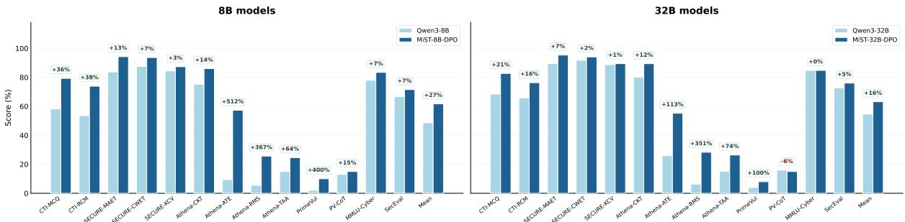  
Figure 1: Accuracy of MiST and corresponding Qwen models on cybersecurity benchmarks, shown for 8B (left) and 32B (right), with relative improvements annotated. Results are reported relative to the original Qwen baselines from which MiST is derived.

MiST: Cybersecurity Language Model. We present MiST, a family of 8B and 32B models adapted from Qwen checkpoints. Our approach centers on the construction of the mid-training corpus. We curate a compact, expert-vetted seed corpus and use it to generate synthetic training data that teaches cybersecurity concepts, terminology, and structured analysis. We first mid-train on this corpus, then perform SFT using a combination of general and cybersecurity instruction data, and finally apply preference optimization as a general alignment stage. Since this final DPO stage uses general preference data rather than cybersecurityspecific preferences, we do not treat it as the main source of cybersecurity capability; instead, it is intended to preserve the domain capabilities acquired during mid-training and SFT while improving general response behavior. On public cybersecurity benchmarks, the MiST models substantially improve over their base models (Figure 1), outperform similarly sized cybersecurity-specialized models (Figure 4), and are competitive with larger LLMs (Table 1).

More broadly, MiST frames mid-training as a corpus design problem rather than a token-scaling problem. In cybersecurity, where much of the relevant knowledge is encoded in compact expert artifacts such as vulnerability records, taxonomies, detection rules, and threat-intelligence reports, transforming these sources into an intermediate training distribution can be more effective than simply training on more raw domain text.

## 2 Related Work

Cybersecurity LLMs Prior work has explored several strategies for adapting general-purpose LLMs to cybersecurity. PRIMUS (Yu et al., 2025) and Foundation-Sec-8B (Kassianik et al., 2025; Weerawardhena et al., 2025) emphasize continued pretraining (CPT) on large raw cybersecurity corpora, while community models such as DeepHat-V1 (DeepHat, 2025) and Lily-Cybersecurity (Sego-Lily Labs, 2025) primarily report cybersecurityfocused SFT through model cards. A more data-centric line constructs cybersecurity supervision from expert sources: CyberPal.AI (Levi et al., 2025a) introduces SecKnowledge, an expertguided instruction dataset expanded with contentgrounded synthetic generation. Recent and contemporaneous works use synthetic data at other stages: CyberPal 2.0 (Levi et al., 2025b) enriches cybersecurity instructions with grounded reasoning traces, while RedSage (Suryanto et al., 2026) combines large-scale cybersecurity CPT with agentically generated multi-turn SFT data. MiST instead uses synthetic transformations of a compact expert-vetted corpus as the mid-training data itself, exposing the base model to high-quality synthetic cybersecurity data before proceeding to SFT and preference tuning.

Mid-training Mid-training has recently emerged as a distinct stage in the LLM training pipeline. In a detailed review of the topic, Tu et al. (2025) describe mid-training as “the critical bridge between general pre-training and post-training.” A useful way to make this bridge concrete is through the data distribution. Zhang et al. (2025a) argue that midtraining works by moving the model toward the target post-training distribution before post-training begins, with the strongest gains when the intermediate data is closer to the target domain than ordinary general pre-training data. This view is also consistent with evidence from parameter-efficient finetuning that adaptation can often expose or redirect knowledge already present in pretrained models, rather than requiring all task-relevant knowledge to be learned from scratch (Ben Zaken et al., 2022). Under this view, mid-training is not defined only by its stage in the training pipeline, but also by the construction of the intermediate corpus.

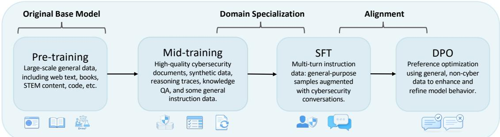  
Figure 2: Overview of the full training pipeline. Training begins from a general-purpose pre-trained base model. Mid-training is then used to enhance cybersecurity-specific capabilities using high-quality data. Supervised fine-tuning (SFT) introduces the chat template and further refines general behavior while strengthening cybersecurity capabilities. Direct preference optimization (DPO) (Rafailov et al., 2023) is applied in the final stage to improve general alignment.

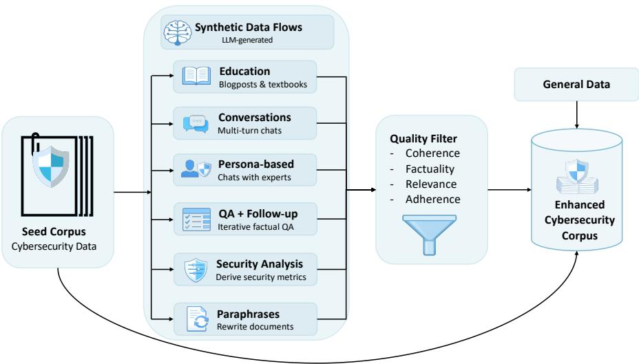  
Figure 3: Overview of the synthetic data generation pipeline. An expert-curated cybersecurity seed corpus (Section 3.1) is expanded through multiple data generation flows, producing synthetic educational content, multi-turn conversations, personabased interactions, iterative QA, and analytical explanations (Section 3.2). All generated data points are filtered for coherence, factuality, relevance, and instruction adherence using an LLM, and then combined with a small amount of general SFT data to form the final cyber mid-training corpus. Detailed examples of generated samples are provided in Section N.

This paradigm has been adopted in several recent large-scale efforts (Wang et al., 2025; Abdin et al., 2024; Wake et al., 2025; Olmo et al., 2025). Notably, Olmo et al. (2025) devote a substantial portion of their training methodology to mid-training, constructing a high-quality corpus of approximately 100B tokens. Their mid-training data combines newly generated synthetic sources with carefully filtered and rewritten data derived from the pre-training stage, explicitly tailored to the target capabilities emphasized at this phase. This differs from raw CPT, where the model is typically trained further on domain text with little change to its original format. In our setting, the same distinction motivates a synthetic cybersecurity corpus built from authoritative sources but rewritten into forms that expose the model to various aspects of the concepts, relations, and reasoning used in security applications.

## 3 Methodology

In this section, we describe our adaptation strategy as outlined in Figure 2, with a particular emphasis on the synthetic data generation methodology visualized in Figure 3.

We first curate a small but information-dense seed corpus composed of high-quality cybersecurity documents (Section 3.1). Rather than use this corpus directly as raw CPT data, we treat it as source material for a synthetic data generation pipeline tailored to cybersecurity tasks. The resulting data emphasizes knowledge acquisition, concise reasoning, and multi-turn conversational behavior, with rigorous quality verification (Section 3.2). Finally, we discuss the use of noncybersecurity data to preserve general capabilities (Section 3.3) and describe the training process (Section 3.4). Full dataset composition and statistics across the training stages are reported in Table 12.

## 3.1 Seed Data Curation

Our seed corpus exposes the model to complementary forms of cybersecurity knowledge rather than a single homogeneous text distribution. We organize it into four source families: vulnerability and threat intelligence; security knowledge bases and taxonomies; operational security artifacts; and defensive guidance and platform documentation. Because these sources vary in structure, granularity, audience, and density, we apply source-specific transformations that convert structured or specialized artifacts into examples better suited for cybersecurity reasoning. Brief descriptions of the cybersecurity resources, taxonomies, and acronyms referenced in this section are provided in Section G.

Vulnerability and threat intelligence. We include NVD CVE records along with expert curated CTI/RSS reports. These sources provide instance-level knowledge about real vulnerabilities and threats, including identifiers, advisory text, CVSS metadata, affected products, CWE mappings, references, and vulnerable or patched implementations. Since many records are brief or operational, we use them as anchors for synthetic transformations covering severity, impact, remediation rationale, weakness mappings, and mitigation intuition.

Security knowledge bases and taxonomies. We use CWE, CAPEC, ATT&CK, and D3FEND to capture cybersecurity abstractions and relationships. CWE covers recurring software and hardware weaknesses; CAPEC describes attack patterns; ATT&CK organizes adversary tactics, techniques, procedures, and software; and D3FEND represents defensive countermeasures.

Operational security artifacts. To connect abstract knowledge to practitioner workflows, we include Sigma rules, Atomic Red Team tests, Splunk ESCU detections, and MISP Galaxy clusters. These sources expose detection logic, logsource assumptions, analytic stories, adversaryemulation steps, malware and threat-actor clusters and ATT&CK mappings. They help the model link techniques, weaknesses, and attack patterns to detection engineering, threat hunting, incident analysis, and red-team emulation.

Defensive guidance and platform documentation. We include OWASP and NIST materials, vendor and platform documentation, cloud and container documentation, operating-system and browser sources, and a security-focused subset of English Wikipedia. These sources provide defensive guidance, platform terminology, APIs, configuration patterns, security mechanisms, operational constraints, and background context. Wikipedia is used only for terminology and historical context; advisories, standards, and vendor documentation remain the primary sources for security facts.

## 3.2 Synthetic Data Generation

We create multiple synthetic data generation pipelines grounded in the curated seed corpus to strengthen cybersecurity knowledge and capabilities. We group these pipelines by training stage: mid-training flows emphasize knowledge acquisition and foundational reasoning, while posttraining flows focus on conversational abilities for realistic cybersecurity interactions. All flows were manually reviewed and refined, with additional dataset curation details and representative examples provided in Section N.

Generation model. We select Qwen-30B-A3B1 as the synthetic data generator based on its performance and efficiency. It provides strong instructionfollowing and reasoning capabilities while activating only 3B parameters, enabling fast and scalable inference. While it’s smaller than many frontier models, our generation setup consistently supplies context from the seed documents, allowing the model to function primarily as a transformation engine rather than relying on memorized knowledge.

## 3.2.1 Flows for Mid-Training Data

Paraphrasing. Training on semantically diverse rephrasings of the same content is known to improve knowledge acquisition in LLMs (Ovadia et al., 2024; Team et al., 2025; Ovadia et al., 2025). Therefore, we implement a semantic rewriting pipeline that generates paraphrased variants of seed documents by varying lexical choices and syntactic structure while preserving technical meaning, thereby building a linguistically diverse view of core cybersecurity concepts.

Educational transformation. Educational-style data has been shown to be effective for training LLMs (Li et al., 2023b; Penedo et al., 2024). Each seed document is transformed into a highly structured educational artifact, written either in the style of a professional cybersecurity blog post or as a textbook-style chapter.

QA. Beyond longer conversational scenarios, we generate concise factual question–answer pairs that can be answered in one or two sentences, encouraging accurate and succinct responses. To improve coverage, we iteratively extend this process by reusing previously generated questions as context for follow-up question generation, explicitly instructing the model to target aspects not addressed in earlier rounds; we perform two additional followup rounds.

Cyber metrics and terminology analysis. For documents that reference structured security metadata (e.g., CVE/CWE identifiers, CVSS vectors and scores, or ATT&CK techniques), we provide the relevant fields and prompt the model to explain and justify them. This emphasizes domain reasoning while avoiding error-prone, unguided generation of security metadata.

## 3.2.2 Flows for Post-Training Data

Conversations. We generate full user–assistant dialogues in which the assistant acts as a helpful cybersecurity expert and the user queries are also model-generated. Conversations run for up to seven turns, but may terminate earlier when they reach a natural stopping point.

Persona-based conversations. Since different stakeholders interact with cybersecurity content in distinct ways, we adopt a persona-based approach (Meyer and Corneil, 2025). We first prompt the model to propose a set of personas relevant to each seed document (e.g., a security officer, a software engineer working in JavaScript, a red team operator analyzing a CVE, or a student learning defensive security), and then simulate a conversation between the selected persona and a general cybersecurity expert.

## 3.2.3 Data Verification and Filtering

Ensuring high-quality synthetic data is critical, as artifacts introduced during training can directly shape model behavior, and even a small amount of low-quality data can be harmful (Li et al., 2024). We therefore apply an LLM-based verification stage to the generated samples using Qwen-30B-A3B. The verifier assigns six sub-scores on a 1–10 scale, covering instruction adherence, task completion, factuality, format and style alignment, relevance and focus, and logical consistency and coherence, along with an overall quality score. Samples with an overall score below 8 are removed from the final training corpus.

## 3.3 General Data

Our synthetic dataset is entirely cybersecuritycentric. To keep the intermediate distribution from becoming a domain-only CPT corpus and to introduce instruction formatting, we augment the training data with general supervised instruction data. We use the publicly available Olmo 3 Dolci SFT dataset (Olmo et al., 2025). A small subset of 50K samples is included during mid-training using a replay strategy (Shi et al., 2025), with the rest used during post-training.

## 3.4 Training

For MiST-8B, we initialize from the pre-trained Qwen3-8B-Base checkpoint. For MiST-32B, we initialize from a post-trained Qwen3-32B checkpoint, since a Qwen3-32B-Base checkpoint was not publicly available at the time of training. Both models are then adapted using the three-stage MiST pipeline consisting of cybersecurity mid-training, supervised fine-tuning, and preference tuning via DPO (Rafailov et al., 2023), as shown in Figure 2. During mid-training, we optimize the standard causal language modeling objective, i.e., nexttoken prediction, over the mixed cybersecurity and general-data corpus. All experiments are conducted on a single node with 8× NVIDIA B200 GPUs.

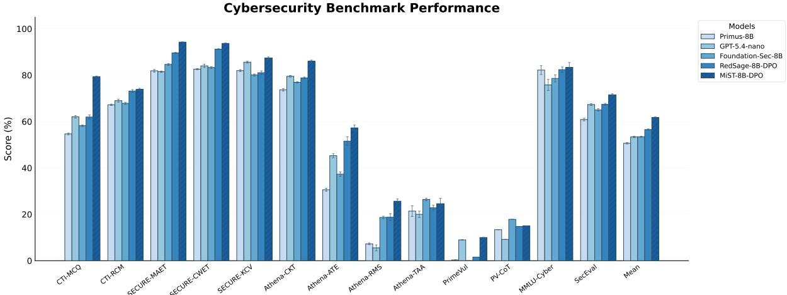  
Figure 4: Performance on the cybersecurity evaluation suite (Section 4), comparing MiST-8B with representative general and cybersecurity models of similar size. Bars report accuracy (%) as reported in Table 1, along with standard deviation error bars. This comparison is particularly relevant as cybersecurity models often need to be deployed in resource-constrained environments, where strong performance at smaller model sizes is especially valuable. MiST-8B greatly outperforms other models in its weight class.

We run mid-training for two epochs with a maximum sequence length of 16,384 tokens and an effective per-device batch size of 16 with sequence packing enabled. We use AdamW (Loshchilov and Hutter, 2017) with a cosine learning rate schedule, with a peak of $5 \times 1 0 ^ { - 5 }$ and a minimum of $1 \times 1 0 ^ { - 6 }$ a warmup ratio of 0.03, weight decay of 0.05, and gradient clipping at 0.2. Training is carried out in bfloat16 precision with FlashAttention-2 (Dao, 2023) and DeepSpeed (Rajbhandari et al., 2020), using ZeRO-2 for the 8B model and ZeRO-3 for the 32B model. The SFT and DPO stages use similar configuration; full hyperparameters and estimated training times are provided in Tables 3 and 4. For the DPO phase we use the general Dolci-Instruct-DPO dataset2(Olmo et al., 2025). Because these preference data are not cybersecurity-specific, the DPO stage is intended primarily as a general alignment step rather than as a mechanism for adding new cybersecurity capabilities.

## 4 Evaluation

We evaluate our model on a broad set of widely used cybersecurity benchmarks to assess its performance across representative security tasks. In addition, we measure performance on general-domain benchmarks to quantify the extent of catastrophic forgetting (French, 1999; Kirkpatrick et al., 2017) resulting from domain-specific training. The cybersecurity suite covers threat-intelligence knowledge, realistic advisory settings, security multiplechoice exams, computer-security knowledge, vulnerability detection, and applied cyber threat intelligence tasks using CTI-Bench (Alam et al., 2024), SECURE (Bhusal et al., 2024), SecEval (Li et al., 2023a), MMLU-Cyber (Hendrycks et al., 2020), PrimeVul (Ding et al., 2024), and AthenaBench (Alam et al., 2025). Full descriptions of these benchmarks are given in Section D.

Contamination controls. Cybersecurity benchmarks frequently derive examples from the same public artifacts used to build domain-training corpora, making both identifier and textual leakage important risks. We therefore apply decontamination at three points in the data lifecycle. First, before synthetic generation, we audit the seed corpus against the evaluation suite and remove records that anchor benchmark examples. In particular, we exclude CVE records appearing in the CTI-Bench root-cause-mapping and vulnerability-severity-prediction splits, and remove GHSA-linked code records whose fixing commit hashes overlap with the PrimeVul validation or test sets. All removals and associated identifiers are logged for reproducibility. Second, because most evaluated tasks are multiple-choice, our synthetic flows deliberately avoid MCQ prompts and A/B/C/D answer structures; instead, they generate free-form rewrites, open-ended QA, conversations, and analytical explanations. Third, we apply an identical 13-gram filter to the mid-training, SFT, and DPO datasets before tokenization. The comparison corpus includes benchmark prompts, reference answers, task instructions, and individual messages from multi-turn examples. Text is lowercased and stripped of non-alphanumeric characters, and each training sample is serialized across all relevant fields and turns; a sample is removed upon a single matching 13-gram. The resulting corpus contains 27,201 benchmark segments and approximately 467,000 unique 13-grams. Across the combined mid-training and SFT data, the full pipeline removes approximately 3.78% of candidate samples. These controls target exact and lightly modified overlap, but cannot rule out paraphrased or semantically equivalent leakage. Full implementation details, reports, and residual limitations are provided in Section J.

<table><tr><td></td><td colspan="2">CTI</td><td colspan="3">Secure</td><td colspan="3">Athena</td><td colspan="3">PrimeVul</td><td></td><td></td><td></td></tr><tr><td>Model</td><td>MCQ</td><td></td><td>RCM MAET</td><td>CWET</td><td>KCV</td><td>CKT</td><td>ATE</td><td>RMS</td><td>TAA</td><td></td><td>P-C P-C CoT</td><td>MMLU Cyber</td><td>Sec Eval</td><td>Mean</td></tr><tr><td>Large/Proprietary</td><td></td><td></td><td></td><td></td><td></td><td></td><td></td><td></td><td></td><td></td><td></td><td></td><td></td><td></td></tr><tr><td>GPT-5.4-mini</td><td>73.9</td><td>73.1</td><td>91.3</td><td>92.0</td><td>88.9</td><td>85.2</td><td>53.2</td><td>29.2</td><td>29.8</td><td>8.4</td><td>10.1</td><td>86.0</td><td>74.7</td><td>61.2</td></tr><tr><td>GPT-5.4-nano</td><td>62.1</td><td>69.0</td><td>81.5</td><td>84.0</td><td>85.6</td><td>79.5</td><td>45.3</td><td>5.5</td><td>20.0</td><td>9.0</td><td>9.2</td><td>75.8</td><td>67.3</td><td>53.4</td></tr><tr><td>Qwen3-235B</td><td>71.9</td><td>71.4</td><td>89.6</td><td>91.5</td><td>86.2</td><td>83.6</td><td>43.5</td><td>13.1</td><td>27.6</td><td>4.5</td><td>14.6</td><td>87.0</td><td>71.3</td><td>58.1</td></tr><tr><td>Cybersecurity models</td><td></td><td></td><td></td><td></td><td></td><td></td><td></td><td></td><td></td><td></td><td></td><td></td><td></td><td></td></tr><tr><td>DeepHat-7B</td><td>54.7</td><td>67.2</td><td>82.7</td><td>83.1</td><td>86.2</td><td>69.2</td><td>9.8</td><td>3.1</td><td>14.8</td><td>12.0</td><td>3.9</td><td>79.8</td><td>62.4</td><td>48.4</td></tr><tr><td>Foundation-Sec-8B</td><td>58.2</td><td>67.9</td><td>84.7</td><td>83.3</td><td>80.1</td><td>76.9</td><td>37.3</td><td>18.7</td><td>26.4</td><td>0.0</td><td>17.8</td><td>78.6</td><td>65.0</td><td>53.5</td></tr><tr><td>Lily-Cyber-7B</td><td>42.1</td><td>42.9</td><td>55.8</td><td>54.4</td><td>43.2</td><td>67.0</td><td>3.0</td><td>2.1</td><td>12.4</td><td>0.0</td><td>7.1</td><td>68.8</td><td>48.9</td><td>34.4</td></tr><tr><td>Qwen3-8B-Primus</td><td>66.8</td><td>64.4</td><td>85.9</td><td>87.0</td><td>75.8</td><td>76.4</td><td>33.9</td><td>11.5</td><td>24.6</td><td>0.3</td><td>17.1</td><td>86.0</td><td>61.8</td><td>53.2</td></tr><tr><td>RedSage-8B-DPO</td><td>62.0</td><td>73.2</td><td>89.6</td><td>91.2</td><td>81.1</td><td>78.8</td><td>51.6</td><td>18.8</td><td>22.8</td><td>1.6</td><td>14.8</td><td>82.4</td><td>67.4</td><td>56.5</td></tr><tr><td>Primus-8B</td><td>54.7</td><td>67.2</td><td>81.9</td><td>82.6</td><td>82.0</td><td>73.7</td><td>30.6</td><td>7.3</td><td>21.4</td><td>0.3</td><td>13.4</td><td>82.2</td><td>60.9</td><td>50.6</td></tr><tr><td>Primus-70B</td><td>67.7</td><td>65.1</td><td>91.4</td><td>93.7</td><td>88.1</td><td>82.1</td><td>52.7</td><td>14.8</td><td>2.2</td><td>1.0</td><td>17.6</td><td>87.6</td><td>70.5</td><td>56.5</td></tr><tr><td>CyberPal2.0-20B</td><td>73.8</td><td>72.8</td><td>91.4</td><td>92.5</td><td>83.6</td><td>82.7</td><td>57.0</td><td>23.3</td><td>19.6</td><td>0.8</td><td>14.1</td><td>82.2</td><td>67.1</td><td>58.5</td></tr><tr><td>Baseline models</td><td></td><td></td><td></td><td></td><td></td><td></td><td></td><td></td><td></td><td></td><td></td><td></td><td></td><td></td></tr><tr><td>Qwen3-8B</td><td>58.2</td><td>53.5</td><td>83.8</td><td>87.5</td><td>84.5</td><td>75.2</td><td>9.4</td><td>5.5</td><td>15.0</td><td>2.0</td><td>13.0</td><td>78.0</td><td>66.7</td><td>48.6</td></tr><tr><td>Qwen3-32B</td><td>68.4</td><td>65.9</td><td>89.5</td><td>91.9</td><td>88.8</td><td>80.2</td><td>26.0</td><td>6.3</td><td>15.2</td><td>4.0</td><td>16.0</td><td>84.8</td><td>72.7</td><td>54.6</td></tr><tr><td>Ours</td><td></td><td></td><td></td><td></td><td></td><td></td><td></td><td></td><td></td><td></td><td></td><td></td><td></td><td></td></tr><tr><td>MiST-8B-SFT</td><td>78.9</td><td>74.1</td><td>93.7</td><td>92.7</td><td>85.4</td><td>86.0</td><td>60.2</td><td>29.4</td><td>23.8</td><td>14.0</td><td>18.0</td><td>82.8</td><td>72.2</td><td>62.4</td></tr><tr><td>MiST-8B-DPO</td><td>79.3</td><td>73.9</td><td>94.3</td><td>93.7</td><td>87.3</td><td>86.0</td><td>57.3</td><td>25.7</td><td>24.6</td><td>10.0</td><td>15.0</td><td>83.4</td><td>71.5</td><td>61.7</td></tr><tr><td>MiST-32B-SFT</td><td>82.2</td><td>76.4</td><td>95.0</td><td>92.9</td><td>88.7</td><td>89.2</td><td>52.8</td><td>27.1</td><td>27.8</td><td>10.0</td><td>17.0</td><td>82.2</td><td>76.2</td><td>62.9</td></tr><tr><td>MiST-32B-DPO</td><td>82.7</td><td>76.3</td><td>95.4</td><td>94.1</td><td>89.4</td><td>89.4</td><td>55.2</td><td>28.3</td><td>26.4</td><td>8.0</td><td>15.0</td><td>84.8</td><td>76.0</td><td>63.2</td></tr></table>

Table 1: Cybersecurity benchmark results with reasoning/thinking modes disabled when available. The Mean column reports the unweighted average across all benchmark columns. Bold indicates best, underline indicates second best.

For all benchmarks, we report mean performance over five runs. Evaluations use nonreasoning inference whenever the model or serving API exposes a separate reasoning or thinking mode, and scoring uses task-appropriate extraction and metrics. Full benchmark descriptions, dataset sizes, prompting strategies, inference settings, and model identifiers are provided in Sections D and E and Tables 5 to 7 and 13.

## 5 Results

We evaluate MiST models across cybersecurity benchmarks, general capabilities, comparisons to raw continual pre-training, and downstream task adaptation. Overall, the results show that MiST improves cybersecurity performance while preserving general abilities and providing a stronger initialization for subsequent specialization.

## 5.1 Cybersecurity Results.

As shown in Table 1, MiST substantially improves over the corresponding Qwen3 baselines at both model scales, and these gains are already obtained by the SFT checkpoints. MiST-8B-SFT reaches a mean cybersecurity score of 62.4, compared with 48.6 for Qwen3-8B, an absolute improvement of +13.8 percentage points (+28.4% relative). MiST-32B-SFT reaches 62.9, compared with 54.6 for Qwen3-32B, an absolute improvement of +8.3 percentage points (+15.2% relative). The final DPO checkpoints obtain similar scores: 61.7 for MiST-8B-DPO, corresponding to +13.1 percentage points (+27.0% relative), and 63.2 for MiST-32B-DPO, corresponding to +8.6 percentage points (+15.8% relative). Thus, the main source of cybersecurity improvement is the mid-training and SFT stages, rather than DPO.

The gains are broad rather than concentrated in a single benchmark. MiST improves most strongly on CTI-Bench and Athena, indicating better performance on both cyber threat intelligence questions and applied security analysis tasks. Improvements on SECURE and PrimeVul are smaller but generally positive, suggesting that the benefits extend across benchmark families.

After cybersecurity mid-training and supervised fine-tuning, the SFT checkpoints already account for nearly all of the final cybersecurity performance. MiST-8B-SFT reaches a mean score of 62.4, close to the DPO checkpoint at 61.7, while MiST-32B-SFT reaches 62.9 compared with 63.2 after DPO. Since DPO uses general preference data, these results suggest that it can improve final instruction-following behavior while largely retaining the cybersecurity capabilities acquired during earlier training stages.

## 5.2 General Benchmarks.

The full list of benchmarks is provided in Section C, with results reported in Table 2. We observe that the MiST models largely retain or improve their performance on general non-cybersecurity benchmarks. We hypothesize that this is due to the inclusion of general instruction data during mid-training, SFT and DPO.

## 5.3 Mid-training vs. Raw CPT

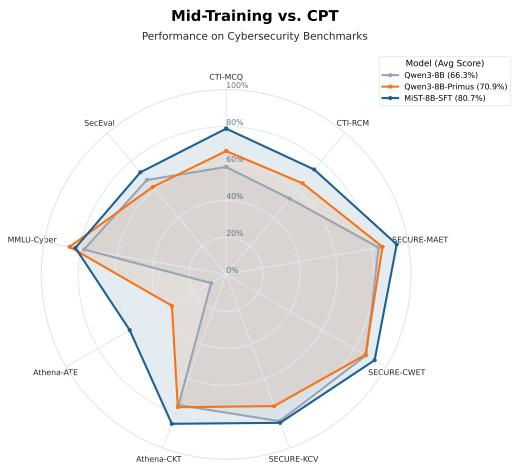  
Figure 5: Performance comparison of MiST-8B against the original Qwen3-8B and an 8B raw-CPT baseline.

<table><tr><td colspan="5">Model ARC-C GSM8K MMLU IFEval Mean</td></tr><tr><td>Qwen3-8B</td><td>77.1</td><td>89.7</td><td>73.4 74.5</td><td>90.0 82.5</td></tr><tr><td>MiST-8B-SFT</td><td>86.0</td><td>88.9</td><td>88.4</td><td>84.5</td></tr><tr><td>MiST-8B-DPO</td><td>89.8</td><td>90.0 74.9</td><td>88.5</td><td>85.8</td></tr><tr><td>Qwen3-32B</td><td>89.8</td><td>94.0</td><td>81.6 91.1</td><td>89.1</td></tr><tr><td>MiST-32B-SFT</td><td>94.3</td><td>93.4</td><td>81.8</td><td>90.2 89.9</td></tr><tr><td>MiST-32B-DPO</td><td>96.2</td><td>93.5</td><td>82.1</td><td>90.9 90.7</td></tr></table>

Table 2: Performance of MiST and its Qwen baselines on standard non-cybersecurity benchmarks evaluating reasoning, instruction following, and knowledge. The full list of benchmarks is described in Section C.

To further assess our approach, we compare it to a raw Continual Pre-Training (CPT) baseline. This baseline follows the raw-domain adaptation recipe: continue training on a large cybersecurity text corpus, then apply the same SFT procedure. We construct the raw CPT corpus by augmenting our seed data with PRIMUS (Yu et al., 2025), yielding ∼2.4B tokens, approximately 2× larger than our mid-training corpus (Table 12).

We train Qwen3-8B-Base on this raw corpus and then apply the same SFT procedure used for MiST-8B, using identical hyperparameters (Section B). As shown in Figure 5, while raw CPT improves over the original model, MiST achieves superior performance on nearly all benchmarks despite using fewer training tokens. This shows that a compact synthetic mid-training corpus can be more effective than substantially larger raw-domain training for cybersecurity adaptation. Further ablation studies isolating other components of the full methods are shown in Section F.

## 5.4 Downstream Task Adaptation

We next ask whether cybersecurity mid-training provides a stronger initialization for downstream task-specific adaptation. We study two settings: reinforcement learning with verifiable rewards and supervised fine-tuning.

## 5.4.1 Task-Specific Reinforcement Learning

Validation Accuracy and KL Divergence During GRPO

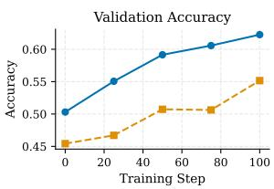

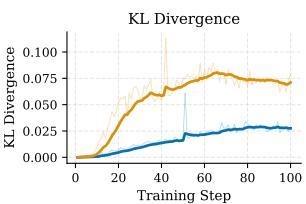  
Figure 6: Validation accuracy and tracked KL divergence during GRPO on three verifiable cybersecurity tasks. Compared with Qwen3-8B, MiST-8B-DPO reaches higher validation accuracy at every checkpoint while requiring smaller policy movement.

We first evaluate whether MiST is a better starting point for task-specific reinforcement learning; full task and reward details are provided in Section L. We apply GRPO (Shao et al., 2024; Mroueh, 2025) to MiST-8B-DPO and the original Qwen3- 8B using the same RL pipeline on three verifiable cybersecurity tasks: CVE-to-CWE mapping, CVE-to-CVSS vector prediction, and vulnerablecode-to-CWE mapping. Because each task can be checked against canonical labels or schemas, rewards are deterministic and do not require a learned reward model, as in recent cyber threat intelligence work (Alam et al., 2026).

As shown in Figure 6, RL from the MiST initialization achieves higher validation accuracy throughout training while maintaining lower KL divergence. This suggests that cybersecurity midtraining moves the model closer to the downstream task distribution before RL begins (Tu et al., 2025; Liu et al., 2025a). RL can therefore refine cybersecurity behaviors that are already partially present, whereas the base model must undergo a larger policy shift to reach reward-relevant regions.

This finding is consistent with studies showing that mid-training improves downstream RL and that RL is most effective near the model’s existing competence boundary (Zhang et al., 2025a; Wang et al., 2025). It also aligns with analyses of GRPO in which performance depends on the initial probability of success (Mroueh, 2025). Overall, MiST is not only stronger before adaptation; it also provides a better RL initialization for specialized cybersecurity tasks.

## 5.4.2 Task-Specific SFT

We next evaluate whether cybersecurity midtraining also improves supervised downstream adaptation. We fine-tune Qwen and MiST checkpoints on PrimeVul (Ding et al., 2024), a paired vulnerability-detection benchmark in which each vulnerable function is matched with a patched counterpart. We then evaluate on the held-out Prime-Vul paired test split under two prompting variants: PRIMEVUL, which uses a direct YES/NO vulnerability classification prompt, and PRIMEVUL-COT, which asks the model to reason step-by-step before giving its final verdict. Full training and evaluation details are provided in Section M.

As shown in Figure 7, task-specific SFT yields substantially larger gains when applied to MiST than when applied to Qwen. This holds for both 8B and 32B models and under both direct and chainof-thought prompting. These results mirror the RL findings: cybersecurity mid-training provides a stronger initialization for downstream adaptation, especially when the task requires fine-grained security distinctions that are difficult to learn from task data alone.

## 6 Conclusion

We introduce MiST, a suite of 8B and 32B cybersecurity-specialized models and propose a data curation and generation recipe for constructing mid-training corpora from information dense data. Our results show that this curated mid-training approach is more effective than continual pre-training on substantially larger raw domain corpora, highlighting the importance of data quality and structure over token volume alone. MiST outperforms existing open cybersecurity-specific models while preserving general capabilities, and matches the performance of similarly sized proprietary models.

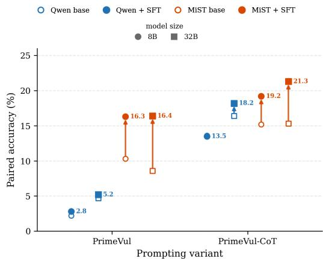  
Figure 7: Effect of task-specific SFT on PrimeVul paired accuracy. Each vertical pair connects a base checkpoint (hollow marker) to its PrimeVul-fine-tuned counterpart (filled marker); arrow length is the gain from SFT. Color encodes family (Qwen / MiST) and marker shape encodes scale (◦ = 8B, □ = 32B), shown under direct (PRIMEVUL) and chain-of-thought (PRIMEVUL-COT) prompting. MiST arrows are consistently longer than Qwen arrows at both scales and under both prompting variants, indicating that cybersecurity mid-training provides a stronger initialization for downstream task-specific SFT.

Furthermore, MiST provides a stronger starting point for downstream adaptation. Under both taskspecific SFT and reinforcement learning, MiST adapts more effectively than the original Qwen models; in the RL setting, it achieves higher validation accuracy with lower KL movement. Overall, MiST demonstrates that carefully curated midtraining data can produce capable, generalizable, and adaptable open LLMs for cybersecurity.

## Limitations

This work has several limitations. First, cybersecurity is a broad domain, and our evaluation focuses primarily on knowledge-intensive security understanding, cyber threat intelligence, vulnerability reasoning, and benchmark-style analysis. We do not comprehensively evaluate MiST in operational settings such as log and telemetry analysis, incident triage, secure code assistance, tool use, or long-horizon agentic workflows. Accordingly, our results should be interpreted as evidence of improved cybersecurity knowledge and structured analysis, rather than as a direct measure of deployment readiness in live security operations.

Second, although we study both task-specific supervised fine-tuning and reinforcement learning with verifiable rewards, our RL experiments cover only a small set of structured cybersecurity tasks. We do not explore reasoning-specialized models, broader RL recipes, tool-use settings, or agentic reinforcement learning. Future work should test whether cybersecurity mid-training provides similar benefits for more complex multi-step security tasks.

Third, MiST relies heavily on LLM-generated synthetic data. While synthetic data is widely used in modern LLM training, it can introduce systematic biases, artifacts, or distributional distortions (Long et al., 2024). We mitigate this risk through expert review and LLM-based filtering, but we do not fully quantify the effects of generator choice, prompt design, filtering thresholds, or source mixtures. Moreover, because the same model family is used for generation and verification, the verifier may share blind spots with the generator.

Fourth, although we apply source-level filtering and n-gram decontamination, contamination cannot be ruled out completely. Exact- and near-exactmatch filtering may miss paraphrased, reformatted, or semantically equivalent benchmark content. This is especially relevant in cybersecurity, where benchmarks and training sources often refer to the same public CVEs, CWEs, ATT&CK techniques, and vulnerability descriptions. Future evaluations should include additional held-out, time-split, and privately constructed benchmarks.

## Ethical Considerations

Data governance. MiST is trained using public and third-party cybersecurity resources, together with synthetic transformations grounded in those resources. Public availability does not necessarily imply unrestricted permission to redistribute source text or derived examples, and cybersecurity sources may contain sensitive operational details, personal information, disputed threat-actor attributions, or information that later becomes outdated. Before releasing training artifacts, we will document source provenance, collection dates, applicable licenses or terms of use, transformation procedures, and known restrictions in a dataset card. We will release only artifacts for which redistribution is permitted, screen released data for sensitive content, and provide a mechanism for reporting errors or requesting correction or removal. Because synthetic generation can preserve or amplify errors and sensitive details from its inputs, we treat generated samples as governed derivatives of their source material rather than as independent data.

Model governance and dual use. MiST is intended for cybersecurity research and defensive analysis and should not be treated as an autonomous authority for operational security decisions. Improved vulnerability analysis, threatintelligence understanding, and security reasoning may also lower the barrier to offensive or otherwise harmful use. Moreover, the preliminary safety evaluation in Section O does not establish safety under adaptive, multi-turn, or tool-assisted attacks. Model releases will therefore be accompanied by model cards describing intended and out-of-scope uses, inherited licensing obligations, evaluation results and limitations, checkpoint versions, and recommended deployment safeguards. Release decisions will be informed by dual-use red-teaming, and higher-risk artifacts may be released through staged or access-controlled mechanisms when warranted. Deployers should apply human oversight, access controls, logging, monitoring, and domainspecific legal and organizational review, particularly in live security operations.

## Acknowledgments

We thank Iyar Zaks, Ran Avnimelech, Shay Geller, and Ofek Ophir for their help in evaluating and testing the final model. We also extend our thanks to Tal Fialkow, whose leadership and support were instrumental throughout this work.

## References

Marah Abdin, Jyoti Aneja, Hany Awadalla, Ahmed Awadallah, Ammar Ahmad Awan, Nguyen Bach, Amit Bahree, Arash Bakhtiari, Jianmin Bao, Harkirat Behl, Alon Benhaim, Misha Bilenko, Johan Bjorck, Sébastien Bubeck, Martin Cai, Qin Cai, Vishrav Chaudhary, Dong Chen, Dongdong Chen, and 110 others. 2024. Phi-3 technical report: A highly capable language model locally on your phone. Preprint, arXiv:2404.14219.

Md Tanvirul Alam, Dipkamal Bhusal, Salman Ahmad, Nidhi Rastogi, and Peter Worth. 2025. Athenabench: A dynamic benchmark for evaluating llms in cyber threat intelligence. Preprint, arXiv:2511.01144.

Md Tanvirul Alam, Dipkamal Bhusal, Le Nguyen, and Nidhi Rastogi. 2024. Ctibench: A benchmark for evaluating llms in cyber threat intelligence. Advances

in Neural Information Processing Systems, 37:50805– 50825.

Md Tanvirul Alam, Aritran Piplai, Ionut Cardei, Nidhi Rastogi, and Peter J. Worth, Jr. 2026. Minerva: Reinforcement Learning with Verifiable Rewards for Cyber Threat Intelligence LLMs. Preprint, arXiv:2602.00513. ArXiv:2602.00513 [cs.LG].

Elad Ben Zaken, Yoav Goldberg, and Shauli Ravfogel. 2022. BitFit: Simple parameter-efficient fine-tuning for transformer-based masked language-models. In Proceedings of the 60th Annual Meeting of the Associationfor Computational Linguistics (Volume 2: Short Papers), pages 1–9, Dublin, Ireland. Association for Computational Linguistics.

Ruslan Berdichevsky, Shai Nahum-Gefen, and Elad Ben Zaken. 2025. Salsa: Single-pass autoregressive llm structured classification. Preprint, arXiv:2510.22691.

Gagan Bhatia, El Moatez Billah Nagoudi, Hasan Cavusoglu, and Muhammad Abdul-Mageed. 2024. Fintral: A family of gpt-4 level multimodal financial large language models. Preprint, arXiv:2402.10986.

Dipkamal Bhusal, Md Tanvirul Alam, Le Nguyen, Ashim Mahara, Zachary Lightcap, Rodney Frazier, Romy Fieblinger, Grace Long Torales, Benjamin A Blakely, and Nidhi Rastogi. 2024. Secure: Benchmarking large language models for cybersecurity. In 2024 Annual Computer Security Applications Conference (ACSAC), pages 15–30. IEEE.

Tom Brown, Benjamin Mann, Nick Ryder, Melanie Subbiah, Jared D Kaplan, Prafulla Dhariwal, Arvind Neelakantan, Pranav Shyam, Girish Sastry, Amanda Askell, Sandhini Agarwal, Ariel Herbert-Voss, Gretchen Krueger, Tom Henighan, Rewon Child, Aditya Ramesh, Daniel Ziegler, Jeffrey Wu, Clemens Winter, and 12 others. 2020. Language models are few-shot learners. In Advances in Neural Information Processing Systems, volume 33, pages 1877–1901. Curran Associates, Inc.

Peter Clark, Isaac Cowhey, Oren Etzioni, Tushar Khot, Ashish Sabharwal, Carissa Schoenick, and Oyvind Tafjord. 2018. Think you have solved question answering? try arc, the ai2 reasoning challenge. arXiv:1803.05457v1.

Karl Cobbe, Vineet Kosaraju, Mohammad Bavarian, Mark Chen, Heewoo Jun, Lukasz Kaiser, Matthias Plappert, Jerry Tworek, Jacob Hilton, Reiichiro Nakano, Christopher Hesse, and John Schulman. 2021. Training verifiers to solve math word problems. Preprint, arXiv:2110.14168.

Tri Dao. 2023. Flashattention-2: Faster attention with better parallelism and work partitioning. arXiv preprint arXiv:2307.08691.

DeepHat. 2025. Deephat-v1-7b. https:// huggingface.co/DeepHat/. Model card.

Chunyuan Deng, Yilun Zhao, Xiangru Tang, Mark Gerstein, and Arman Cohan. 2024. Investigating data contamination in modern benchmarks for large language models. Preprint, arXiv:2311.09783.

Yangruibo Ding, Yanjun Fu, Omniyyah Ibrahim, Chawin Sitawarin, Xinyun Chen, Basel Alomair, David Wagner, Baishakhi Ray, and Yizheng Chen. 2024. Vulnerability detection with code language models: How far are we? Preprint, arXiv:2403.18624.

Jesse Dodge, Maarten Sap, Ana Marasovic, William´ Agnew, Gabriel Ilharco, Dirk Groeneveld, Margaret Mitchell, and Matt Gardner. 2021. Documenting large webtext corpora: A case study on the colossal clean crawled corpus. In Proceedings of the 2021 Conference on Empirical Methods in Natural Language Processing, pages 1286–1305, Online and Punta Cana, Dominican Republic. Association for Computational Linguistics.

Robert M French. 1999. Catastrophic forgetting in connectionist networks. Trends in cognitive sciences, 3(4):128–135.

Daya Guo, Qihao Zhu, Dejian Yang, Zhenda Xie, Kai Dong, Wentao Zhang, Guanting Chen, Xiao Bi, Y. Wu, Y. K. Li, Fuli Luo, Yingfei Xiong, and Wenfeng Liang. 2024. Deepseek-coder: When the large language model meets programming – the rise of code intelligence. Preprint, arXiv:2401.14196.

Dan Hendrycks, Collin Burns, Steven Basart, Andy Zou, Mantas Mazeika, Dawn Song, and Jacob Steinhardt. 2020. Measuring massive multitask language understanding. arXiv preprint arXiv:2009.03300.

Hanbo Huang, Yihan Li, Bowen Jiang, Bo Jiang, Lin Liu, Zhuotao Liu, Ruoyu Sun, and Shiyu Liang. 2025a. A middle path for on-premises LLM deployment: Preserving privacy without sacrificing model confidentiality. In Proceedings of the 2025 Conference on Empirical Methods in Natural Language Processing, pages 8321–8359, Suzhou, China. Association for Computational Linguistics.

Siming Huang, Tianhao Cheng, Jason Klein Liu, Weidi Xu, Jiaran Hao, Liuyihan Song, Yang Xu, Jian Yang, Jiaheng Liu, Chenchen Zhang, Linzheng Chai, Ruifeng Yuan, Xianzhen Luo, Qiufeng Wang, Yuan-Tao Fan, Qingfu Zhu, Zhaoxiang Zhang, Yang Gao, Jie Fu, and 7 others. 2025b. OpenCoder: The open cookbook for top-tier code large language models. In Proceedings of the 63rd Annual Meeting of the Associationfor Computational Linguistics (Volume 1: Long Papers), pages 33167–33193, Vienna, Austria. Association for Computational Linguistics.

Binyuan Hui, Jian Yang, Zeyu Cui, Jiaxi Yang, Dayiheng Liu, Lei Zhang, Tianyu Liu, Jiajun Zhang, Bowen Yu, Keming Lu, Kai Dang, Yang Fan, Yichang Zhang, An Yang, Rui Men, Fei Huang, Bo Zheng, Yibo Miao, Shanghaoran Quan, and 5 others. 2024. Qwen2.5-coder technical report. Preprint, arXiv:2409.12186.

Alon Jacovi, Avi Caciularu, Omer Goldman, and Yoav Goldberg. 2023. Stop uploading test data in plain text: Practical strategies for mitigating data contamination by evaluation benchmarks. Preprint, arXiv:2305.10160.

Juyong Jiang, Fan Wang, Jiasi Shen, Sungju Kim, and Sunghun Kim. 2024. A survey on large language models for code generation. arXiv preprint arXiv:2406.00515.

Paul Kassianik, Baturay Saglam, Alexander Chen, Blaine Nelson, Anu Vellore, Massimo Aufiero, Fraser Burch, Dhruv Kedia, Avi Zohary, Sajana Weerawardhena, Aman Priyanshu, Adam Swanda, Amy Chang, Hyrum Anderson, Kojin Oshiba, Omar Santos, Yaron Singer, and Amin Karbasi. 2025. Llama-3.1-foundationai-securityllm-base-8b technical report. Preprint, arXiv:2504.21039.

James Kirkpatrick, Razvan Pascanu, Neil Rabinowitz, Joel Veness, Guillaume Desjardins, Andrei A. Rusu, Kieran Milan, John Quan, Tiago Ramalho, Agnieszka Grabska-Barwinska, Demis Hassabis, Claudia Clopath, Dharshan Kumaran, and Raia Hadsell. 2017. Overcoming catastrophic forgetting in neural networks. Proceedings ofthe National Academy of Sciences, 114(13):3521–3526.

Matan Levi, Yair Allouche, Daniel Ohayon, and Anton Puzanov. 2025a. Cyberpal.ai: empowering llms with expert-driven cybersecurity instructions. In Proceedings ofthe Thirty-Ninth AAAI Conference on Artificial Intelligence and Thirty-Seventh Conference on Innovative Applications ofArtificial Intelligence and Fifteenth Symposium on Educational Advances in Artificial Intelligence, AAAI’25/IAAI’25/EAAI’25. AAAI Press.

Matan Levi, Daniel Ohayon, Ariel Blobstein, Ravid Sagi, Ian Molloy, and Yair Allouche. 2025b. Toward cybersecurity-expert small language models. arXiv preprint arXiv:2510.14113.

Guancheng Li, Yifeng Li, Guannan Wang, Haoyu Yang, and Yang Yu. 2023a. Seceval: A comprehensive benchmark for evaluating cybersecurity knowledge of foundation models. https://github.com/XuanwuAI/SecEval.

Ming Li, Yong Zhang, Shwai He, Zhitao Li, Hongyu Zhao, Jianzong Wang, Ning Cheng, and Tianyi Zhou. 2024. Superfiltering: Weak-to-strong data filtering for fast instruction-tuning. In Proceedings of the 62nd Annual Meeting ofthe Associationfor Computational Linguistics (Volume 1: Long Papers), pages 14255–14273, Bangkok, Thailand. Association for Computational Linguistics.

Yuanzhi Li, Sébastien Bubeck, Ronen Eldan, Allie Del Giorno, Suriya Gunasekar, and Yin Tat Lee. 2023b. Textbooks are all you need ii: phi-1.5 technical report. arXiv preprint arXiv:2309.05463.

Yuchong Li and Qinghui Liu. 2021. A comprehensive review study of cyber-attacks and cyber security;

emerging trends and recent developments. Energy Reports, 7:8176–8186.

Chen Ling, Xujiang Zhao, Jiaying Lu, Chengyuan Deng, Can Zheng, Junxiang Wang, Tanmoy Chowdhury, Yun Li, Hejie Cui, Xuchao Zhang, Tianjiao Zhao, Amit Panalkar, Dhagash Mehta, Stefano Pasquali, Wei Cheng, Haoyu Wang, Yanchi Liu, Zhengzhang Chen, Haifeng Chen, and 5 others. 2025. Domain specialization as the key to make large language models disruptive: A comprehensive survey. ACM Comput. Surv., 58(3).

Emmy Liu, Graham Neubig, and Chenyan Xiong. 2025a. Midtraining Bridges Pretraining and Posttraining Distributions. Preprint, arXiv:2510.14865. ArXiv:2510.14865 [cs.CL].

Jiawei Liu, Nirav Diwan, Zhe Wang, Haoyu Zhai, Xiaona Zhou, Kiet A. Nguyen, Tianjiao Yu, Muntasir Wahed, Yinlin Deng, Hadjer Benkraouda, Yuxiang Wei, Lingming Zhang, Ismini Lourentzou, and Gang Wang. 2025b. PurpCode: Reasoning for safer code generation. arXiv preprint arXiv:2507.19060.

Lin Long, Rui Wang, Ruixuan Xiao, Junbo Zhao, Xiao Ding, Gang Chen, and Haobo Wang. 2024. On LLMs-driven synthetic data generation, curation, and evaluation: A survey. In Findings of the Association for Computational Linguistics: ACL 2024, pages 11065–11082, Bangkok, Thailand. Association for Computational Linguistics.

Ilya Loshchilov and Frank Hutter. 2017. Decoupled weight decay regularization. arXiv preprint arXiv:1711.05101.

Inbal Magar and Roy Schwartz. 2022. Data contamination: From memorization to exploitation. Preprint, arXiv:2203.08242.

Yev Meyer and Dane Corneil. 2025. Nemotron-Personas-USA: Synthetic personas aligned to realworld distributions.

Shervin Minaee, Tomas Mikolov, Narjes Nikzad, Meysam Chenaghlu, Richard Socher, Xavier Amatriain, and Jianfeng Gao. 2024. Large language models: A survey. arXiv preprint arXiv:2402.06196.

Youssef Mroueh. 2025. Reinforcement Learning with Verifiable Rewards: GRPO’s Effective Loss, Dynamics, and Success Amplification. Preprint, arXiv:2503.06639. ArXiv:2503.06639 [cs.LG].

Team Olmo, Allyson Ettinger, Amanda Bertsch, Bailey Kuehl, David Graham, David Heineman, Dirk Groeneveld, Faeze Brahman, Finbarr Timbers, Hamish Ivison, Jacob Morrison, Jake Poznanski, Kyle Lo, Luca Soldaini, Matt Jordan, Mayee Chen, Michael Noukhovitch, Nathan Lambert, Pete Walsh, and 49 others. 2025. Olmo 3. Preprint, arXiv:2512.13961.

Yonatan Oren, Nicole Meister, Niladri Chatterji, Faisal Ladhak, and Tatsunori B. Hashimoto. 2023. Proving test set contamination in black box language models. Preprint, arXiv:2310.17623.

Oded Ovadia, Menachem Brief, Moshik Mishaeli, and Oren Elisha. 2024. Fine-tuning or retrieval? comparing knowledge injection in llms. In Proceedings of the 2024 conference on empirical methods in natural language processing, pages 237–250.

Oded Ovadia, Meni Brief, Rachel Lemberg, and Eitam Sheetrit. 2025. Knowledge-instruct: Effective continual pre-training from limited data using instructions. Preprint, arXiv:2504.05571.

Guilherme Penedo, Hynek Kydlícek, Loubna Ben al-ˇ lal, Anton Lozhkov, Margaret Mitchell, Colin Raffel, Leandro Von Werra, and Thomas Wolf. 2024. The fineweb datasets: Decanting the web for the finest text data at scale. In Advances in Neural Information Processing Systems, volume 37, pages 30811–30849. Curran Associates, Inc.

Rafael Rafailov, Archit Sharma, Eric Mitchell, Christopher D Manning, Stefano Ermon, and Chelsea Finn. 2023. Direct preference optimization: Your language model is secretly a reward model. Advances in neural information processing systems, 36:53728–53741.

Samyam Rajbhandari, Jeff Rasley, Olatunji Ruwase, and Yuxiong He. 2020. Zero: Memory optimizations toward training trillion parameter models. In SC20: International Conferencefor High Performance Computing, Networking, Storage and Analysis, pages 1– 16. IEEE.

Martin Riddell, Ansong Ni, and Arman Cohan. 2024. Quantifying contamination in evaluating code generation capabilities of language models. Preprint, arXiv:2403.04811.

Oscar Sainz, Jon Ander Campos, Iker García-Ferrero, Julen Etxaniz, Oier Lopez de Lacalle, and Eneko Agirre. 2023. Nlp evaluation in trouble: On the need to measure llm data contamination for each benchmark. Preprint, arXiv:2310.18018.

SegoLily Labs. 2025. Lily-cybersecurity-7b-v0.2. https://huggingface.co/segolilylabs/ Lily-Cybersecurity-7B-v0.2. Model card.

Zhihong Shao, Peiyi Wang, Qihao Zhu, Runxin Xu, Junxiao Song, Mingchuan Zhang, Y.K. Li, Y. Wu, and Daya Guo. 2024. Deepseekmath: Pushing the limits of mathematical reasoning in open language models. arXiv preprint arXiv:2402.03300.

Haizhou Shi, Zihao Xu, Hengyi Wang, Weiyi Qin, Wenyuan Wang, Yibin Wang, Zifeng Wang, Sayna Ebrahimi, and Hao Wang. 2025. Continual learning of large language models: A comprehensive survey. ACM Computing Surveys, 58(5):1–42.

Naufal Suryanto, Muzammal Naseer, Pengfei Li, Syed Talal Wasim, Jinhui Yi, Juergen Gall, Paolo Ceravolo, and Ernesto Damiani. 2026. Redsage: A cybersecurity generalist LLM. In The Fourteenth International Conference on Learning Representations.

Kimi Team, Yifan Bai, Yiping Bao, Guanduo Chen, Jiahao Chen, Ningxin Chen, Ruijue Chen, Yanru Chen, Yuankun Chen, Yutian Chen, Zhuofu Chen, Jialei Cui, Hao Ding, Mengnan Dong, Angang Du, Chenzhuang Du, Dikang Du, Yulun Du, Yu Fan, and 150 others. 2025. Kimi k2: Open agentic intelligence. Preprint, arXiv:2507.20534.

Hugo Touvron, Louis Martin, Kevin Stone, Peter Albert, Amjad Almahairi, Yasmine Babaei, Nikolay Bashlykov, Soumya Batra, Prajjwal Bhargava, Shruti Bhosale, Dan Bikel, Lukas Blecher, Cristian Canton Ferrer, Moya Chen, Guillem Cucurull, David Esiobu, Jude Fernandes, Jeremy Fu, Wenyin Fu, and 49 others. 2023. Llama 2: Open foundation and fine-tuned chat models. Preprint, arXiv:2307.09288.

Chengying Tu, Xuemiao Zhang, Rongxiang Weng, Rumei Li, Chen Zhang, Yang Bai, Hongfei Yan, Jingang Wang, and Xunliang Cai. 2025. A survey on llm mid-training. Preprint, arXiv:2510.23081.

Alan Wake, Bei Chen, C. X. Lv, Chao Li, Chengen Huang, Chenglin Cai, Chujie Zheng, Daniel Cooper, Fan Zhou, Feng Hu, Ge Zhang, Guoyin Wang, Heng Ji, Howard Qiu, Jiangcheng Zhu, Jun Tian, Katherine Su, Lihuan Zhang, Liying Li, and 25 others. 2025. Yi-lightning technical report. Preprint, arXiv:2412.01253.

Shengye Wan, Cyrus Nikolaidis, Daniel Song, David Molnar, James Crnkovich, Jayson Grace, Manish Bhatt, Sahana Chennabasappa, Spencer Whitman, Stephanie Ding, Vlad Ionescu, Yue Li, and Joshua Saxe. 2024. CyberSecEval 3: Advancing the evaluation of cybersecurity risks and capabilities in large language models. arXiv preprint arXiv:2408.01605.

Cunxiang Wang, Xiaoze Liu, Yuanhao Yue, Xiangru Tang, Tianhang Zhang, Cheng Jiayang, Yunzhi Yao, Wenyang Gao, Xuming Hu, Zehan Qi, Yidong Wang, Linyi Yang, Jindong Wang, Xing Xie, Zheng Zhang, and Yue Zhang. 2023. Survey on factuality in large language models: Knowledge, retrieval and domainspecificity. Preprint, arXiv:2310.07521.

Zengzhi Wang, Fan Zhou, Xuefeng Li, and Pengfei Liu. 2025. Octothinker: Mid-training incentivizes reinforcement learning scaling. arXiv preprint arXiv:2506.20512.

Sajana Weerawardhena, Paul Kassianik, Blaine Nelson, Baturay Saglam, Anu Vellore, Aman Priyanshu, Supriti Vijay, Massimo Aufiero, Arthur Goldblatt, Fraser Burch, Ed Li, Jianliang He, Dhruv Kedia, Kojin Oshiba, Zhouran Yang, Yaron Singer, and Amin Karbasi. 2025. Llama-3.1-foundationaisecurityllm-8b-instruct technical report. Preprint, arXiv:2508.01059.

Chaoyi Wu, Weixiong Lin, Xiaoman Zhang, Ya Zhang, Weidi Xie, and Yanfeng Wang. 2024. Pmc-llama: toward building open-source language models for medicine. Journal of the American Medical Informatics Association, 31(9):1833–1843.

Hanxiang Xu, Shenao Wang, Ningke Li, Kailong Wang, Yanjie Zhao, Kai Chen, Ting Yu, Yang Liu, and Haoyu Wang. 2025. Large language models for cyber security: A systematic literature review. ACM Trans. Softw. Eng. Methodol. Just Accepted.

Shuo Yang, Wei-Lin Chiang, Lianmin Zheng, Joseph E. Gonzalez, and Ion Stoica. 2023. Rethinking benchmark and contamination for language models with rephrased samples. Preprint, arXiv:2311.04850.

Yao-Ching Yu, Tsun-Han Chiang, Cheng-Wei Tsai, Chien-Ming Huang, and Wen-Kwang Tsao. 2025. Primus: A pioneering collection of open-source datasets for cybersecurity LLM training. In Proceedings ofthe 2025 Conference on Empirical Methods in Natural Language Processing, pages 10391–10413, Suzhou, China. Association for Computational Linguistics.

Charlie Zhang, Graham Neubig, and Xiang Yue. 2025a. On the interplay of pre-training, mid-training, and rl on reasoning language models. arXiv preprint arXiv:2512.07783.

Jie Zhang, Haoyu Bu, Hui Wen, Yongji Liu, Haiqiang Fei, Rongrong Xi, Lun Li, Yun Yang, Hongsong Zhu, and Dan Meng. 2025b. When llms meet cybersecurity: A systematic literature review. Cybersecurity, 8(1):55.

Lianmin Zheng, Liangsheng Yin, Zhiqiang Xie, Chuyue Sun, Jeff Huang, Cody Hao Yu, Shiyi Cao, Christos Kozyrakis, Ion Stoica, Joseph E. Gonzalez, Clark Barrett, and Ying Sheng. 2024. Sglang: Efficient execution of structured language model programs. In Advances in Neural Information Processing Systems, volume 37, pages 62557–62583. Curran Associates, Inc.

Jeffrey Zhou, Tianjian Lu, Swaroop Mishra, Siddhartha Brahma, Sujoy Basu, Yi Luan, Denny Zhou, and Le Hou. 2023. Instruction-following evaluation for large language models. arXiv preprint arXiv:2311.07911.

## A Estimated Training Time

In Table 3, we report the estimated wall-clock training time on a single node with 8×B200 NVIDIA GPUs. The full pipeline requires 7.1 hours (56.8 GPU-hours) for MiST-8B and 42.7 hours (341.3 GPU-hours) for MiST-32B, with supervised finetuning accounting for the largest share of compute.

<table><tr><td>Model</td><td>Stage</td><td>Time</td><td>Hours/GPU-hours</td></tr><tr><td rowspan="4">8B</td><td>Mid-training</td><td>2h 10m</td><td>2.17 / 17.33</td></tr><tr><td>SFT</td><td>3h 20m</td><td>3.33 / 26.67</td></tr><tr><td>DPO</td><td>1h 36m</td><td>1.60 / 12.80</td></tr><tr><td>Total</td><td>7h 06m</td><td>7.10 / 56.80</td></tr><tr><td rowspan="4">32B</td><td>Mid-training</td><td>7h 46m</td><td>7.77 / 62.13</td></tr><tr><td>SFT</td><td>1d 1h 4m</td><td>25.07 / 200.53</td></tr><tr><td>DPO</td><td>9h 50m</td><td>9.83 / 78.67</td></tr><tr><td>Total</td><td>1d 18h 40m</td><td>42.67 / 341.33</td></tr></table>

Table 3: Estimated wall-clock training time.

## B Training Hyperparameters

The full set of hyperparameters is reported in Table 4. Unless otherwise noted, all training stages share the same core configuration: trained for 2 epochs, using the AdamW optimizer with a cosine learning-rate schedule, bfloat16 precision, FlashAttention-2, and gradient clipping with a threshold of 0.2. Preference optimization additionally uses a DPO parameter β = 0.1 and early stopping after 200 steps. The only difference between mid-training the 8B and 32B models is the use of DeepSpeed ZeRO-3 for the 32B model to reduce memory usage, with all other settings kept identical.

## C General Benchmarks Details

In addition to the cybersecurity benchmarks described in Section 4, we evaluate our model on general-purpose benchmarks that measure broad LLM capabilities. This evaluation allows us to quantify potential degradation in general performance resulting from specialization to a narrow domain, which is a key objective of a successful mid-training run (Tu et al., 2025).

IFEval (Zhou et al., 2023) evaluates instructionfollowing behavior in LLMs by measuring adherence to explicit constraints specified in prompts, such as output format, length, stylistic requirements, or prohibited content. Rather than task accuracy, IFEval focuses on precise compliance, making it well suited for assessing alignment in instruction-tuned models.

<table><tr><td>Hyperparameter</td><td>Mid-training</td><td>SFT-8B</td><td>SFT-32B</td><td>DPO-8B</td><td>DPO-32B</td></tr><tr><td>Max sequence length</td><td>16,384</td><td>8,192</td><td>8,192</td><td>8,192</td><td>8,192</td></tr><tr><td>Per-device batch size</td><td>4</td><td>16</td><td>12</td><td>16</td><td>1</td></tr><tr><td>Gradient accumulation steps</td><td>4</td><td>2</td><td>3</td><td>4</td><td>64</td></tr><tr><td>Global batch (tokens)</td><td>≈ 2M</td><td>≈2M</td><td>≈ 2.36M</td><td>≈4.2M</td><td>≈4.2M</td></tr><tr><td>Learning rate (peak)</td><td> $5 \times 1 0 ^ { - 5 }$ </td><td> $3 \times 1 0 ^ { - 5 }$ </td><td> $3 \times 1 0 ^ { - 5 }$ </td><td> $3 \times 1 0 ^ { - 7 }$ </td><td> $1 \times 1 0 ^ { - 7 }$ </td></tr><tr><td>Learning rate (min)</td><td> $1 \times 1 0 ^ { - 6 }$ </td><td> $5 \times 1 0 ^ { - 7 }$ </td><td> $5 \times 1 0 ^ { - 7 }$ </td><td>0</td><td>0</td></tr><tr><td>Warmup ratio</td><td>0.03</td><td>0.03</td><td>0.03</td><td>0.1</td><td>0.1</td></tr><tr><td>Weight decay</td><td>0.05</td><td>0.05</td><td>0.05</td><td>0.1</td><td>0.1</td></tr><tr><td>DeepSpeed stage</td><td>ZeRO-2/3</td><td>ZeRO-2</td><td>ZeRO-3</td><td>ZeRO-2 (ofload)</td><td>ZeRO-2 (offload)</td></tr><tr><td>Packing</td><td>enabled</td><td>enabled</td><td>enabled</td><td>disabled</td><td>disabled</td></tr></table>

Table 4: Stage-specific hyperparameters for mid-training, supervised fine-tuning (SFT), and preference optimization (DPO). Constant settings shared across all stages are described in the text.

MMLU (Hendrycks et al., 2020) is a large-scale, knowledge-intensive multiple-choice benchmark covering 57 subjects across the sciences, humanities, social sciences, and professional domains. We use MMLU as a coarse measure of general knowledge and reasoning breadth to assess what is lost when focusing on cybersecurity-specific training.

ARC-Challenge (ARC-C) (Clark et al., 2018) is the Challenge subset of the AI2 Reasoning Challenge, consisting of grade-school science multiplechoice questions filtered to be difficult for simple retrieval and word co-occurrence baselines.

GSM8K (Cobbe et al., 2021) is a dataset of 8.5K human-written grade-school math word problems paired with natural-language solutions, with problems typically requiring multiple steps of arithmetic reasoning. The benchmark targets robustness to linguistic variation and diverse problem structure, rather than memorization of fixed patterns.

## D Cybersecurity Benchmark Details

CTI-Bench (Alam et al., 2024) evaluates LLM performance on core cyber threat intelligence (CTI) tasks using real-world threat intelligence data. We report results on the multiple-choice question (MCQ) and root cause mapping (RCM) subsets. MCQ measures factual knowledge and fine-grained understanding of CTI concepts, while RCM evaluates the model’s ability to identify underlying vulnerability causes by linking CVE records and bug reports to corresponding CWE entries. For the MCQ subset, we additionally report results broken down by its three largest subjects: attack techniques (ATT), software weaknesses (CWE), and attack patterns (CAP).

SECURE (Bhusal et al., 2024) is a cybersecurity benchmark designed to evaluate LLM performance in realistic advisory settings for critical infrastructure environments. We use three subsets:

MAET, CWET, and KCV. MAET and CWET use multiple-choice questions to assess cybersecurity knowledge, while KCV evaluates knowledge understanding through boolean statements grounded in CVE descriptions.

SecEval (Li et al., 2023a) is a benchmark with over 2,000 multiple-choice questions spanning nine cybersecurity domains, including system, application, and network security. The questions are generated by prompting GPT-4 with authoritative sources such as textbooks and official documentation.

MMLU Computer Security (Hendrycks et al., 2020) We additionally report results on the computer security subset of MMLU (see Section C), which consists of 100 multiple-choice questions related to cybersecurity.

PrimeVul (Ding et al., 2024) is a vulnerability detection benchmark built from real-world C/C++ functions with high-quality labels, deduplication, and chronological splits. Following PrimeVul’s recommended protocol, we report paired accuracy: a vulnerable/patched pair is counted as correct only when both functions are classified correctly. This metric better captures whether a model can distinguish a vulnerability from its corresponding patch, rather than merely predicting the marginal likelihood of vulnerability. In Table 1, P-C denotes this paired classification accuracy, and P-C CoT denotes the same metric under the benchmark’s chain-of-thought prompting setting.

AthenaBench (Alam et al., 2025) is a dynamic cyber threat intelligence benchmark that extends prior CTI evaluation with updated data construction, deduplication, refined metrics, and additional applied-reasoning tasks. We evaluate four AthenaBench tasks: CTI knowledge testing (CKT), attack technique extraction (ATE), risk mitigation strategy selection (RMS), and threat actor attribution (TAA).

## E Evaluation Protocol

We evaluate our models on 13 cybersecurity tasks and 4 general-purpose benchmarks.

Reasoning Mode. All reported evaluations are conducted with reasoning disabled whenever the model or serving API exposes a separate reasoning or thinking mode. This applies to our Qwenderived MiST models, the original Qwen baselines, and all external comparison models for which such a control is available. Thus, the reported results measure standard non-reasoning inference rather than explicit test-time reasoning. Prompting strategies that contain phrases such as “think step by step” follow the benchmark’s prescribed prompt format, but no model is allowed to use a separate reasoning mode or hidden reasoning budget.

Inference Configuration. We serve models using SGLang (Zheng et al., 2024) with data parallelism (DP= 8) on our 8×B200 node, a context length of 16,384 tokens, and a maximum generation length of 4,096 tokens. We use temperature = 0.3, top-p = 0.95, top-k = 20, and repetition penalty = 1.1 for all evaluations, except for OpenAI GPT-5 models where these controls are not fully supported. To ensure a fair comparison, all models are evaluated in a non-reasoning setting: reasoning or thinking modes are disabled for GPT, Qwen, MiST, and other evaluated models whenever such controls are available. Each benchmark is run n = 5 times with different random seeds (0, 1, 2, 3, 4), and we report mean.

Answer Extraction and Scoring. We use rulebased answer extraction with regular expressions tailored to each benchmark’s expected output format. For multiple-choice tasks, we extract the first valid answer choice (A–D) from the model response and score with accuracy. For mathematical reasoning (GSM8K), we extract the final numeric answer using the benchmark’s required output pattern and report exact match. For CWE mapping (CTI-RCM), we extract CWE identifiers via pattern matching and report exact match. For IFEval, we use the official metric in the loose setting. All remaining benchmarks are scored with standard accuracy. This generation-and-extraction protocol matches the benchmark prompting setup. For structured tasks, however, logit-based alternatives such as SALSA (Berdichevsky et al., 2025) can classify in a single forward pass by mapping labels to output tokens and scoring their decoder logits. We leave such interfaces for future evaluation.

Aggregation. Suite-level scores are computed as the unweighted mean across benchmarks. CTI-MCQ sub-scores for attack techniques (ATT), software weaknesses (CWE), and attack patterns (CAP) are reported separately but excluded from suite averages.

## E.1 Prompting Strategies

For all benchmarks, we use the official prompts when available. When no official prompt is provided or multiple configurations exist, we specify the exact prompt used. Below we list the prompts for benchmarks with custom instructions.

## MMLU System Instruction.

You are a large language model trained to answer standardized multiple-choice questions covering a wide range of subjects, including mathematics, science, humanities, and social sciences. For each question, analyze the problem carefully and select the single best answer from the given options (A, B, C, or D). Output only the letter corresponding to the correct answer. Do not include explanations or any additional text.

## GSM8K Instruction.

Solve the provided math problem. Note: The final answer must be the last word in the response. Only plain numbers are allowed (no currency symbols, percentage signs, etc.)

## ARC-Challenge Instruction.

The following is a multiple choice question. Provide your step-by-step reasoning, then give your answer in the format ‘Answer: X’ where X is the answer choice label.

## CTI-MCQ.

You are given a multiple-choice question (MCQ) from a Cyber Threat Intelligence (CTI) knowledge benchmark dataset. Your task is to choose the best option among the four provided. Return your answer as a single uppercase letter: A, B, C, or D.

{question}

Important: The last line of your answer should contain only the single letter corresponding to the best option, with no additional text.

## SecEval System Instruction.

Below are multiple-choice questions concerning cybersecurity. Please select the correct answers and respond with the letters ABCD only.

<table><tr><td>Benchmark</td><td>Source</td><td>Size</td><td>Task Type</td></tr><tr><td>MMLU (5-shot)</td><td>cais/mmlu</td><td>14,042</td><td>Multiple-choice QA (57 subjects)</td></tr><tr><td>ARC-Challenge</td><td>allenai/ai2_arc</td><td>2,590</td><td>Science reasoning MCQ</td></tr><tr><td>GSM8K (3-shot)</td><td>openai/gsm8k</td><td>1,319</td><td>Mathematical reasoning</td></tr><tr><td>IFEval</td><td>google/IFEval</td><td>541</td><td>Instruction following</td></tr></table>

Table 5: General capability benchmarks used for evaluation.
<table><tr><td>Benchmark</td><td>Source</td><td>Size</td><td>Task Type</td></tr><tr><td>MMLU-Cyber</td><td>cais/mmlu (computer_security)</td><td>100</td><td>Security knowledge MCQ</td></tr><tr><td>CTI-MCQ</td><td>AI4Sec/cti-bench</td><td>2,500</td><td>Threat intelligence MCQ</td></tr><tr><td>CTI-RCM</td><td>AI4Sec/cti-bench</td><td>1,000</td><td>Root cause mapping</td></tr><tr><td>SecEval</td><td>XuanwuAI/SecEval</td><td>2,189</td><td>Multi-select security MCQ</td></tr><tr><td>SECURE-MAET</td><td>SECURE benchmark</td><td>1,072</td><td>MITRE ATT&amp;CK evaluation MCQ</td></tr><tr><td>SECURE-CWET</td><td>SECURE benchmark</td><td>964</td><td>CWE evaluation MCQ</td></tr><tr><td>SECURE-KCV</td><td>SECURE benchmark</td><td>466</td><td>CVE verification true/false</td></tr><tr><td>PrimeVul-Base</td><td>PrimeVul (Ding et al., 2024)</td><td>870</td><td>Vulnerable-code binary classification</td></tr><tr><td>PrimeVul-CoT</td><td>PrimeVul (Ding et al., 2024)</td><td>870</td><td>Vulnerable-code classification with CoT</td></tr><tr><td>AthenaBench-CKT</td><td>AthenaBench (Alam et al., 2025)</td><td>3,000</td><td>CTI knowledge testing</td></tr><tr><td>AthenaBench-ATE</td><td>AthenaBench (Alam et al., 2025)</td><td>500</td><td>Attack technique extraction</td></tr><tr><td>AthenaBench-RMS</td><td>AthenaBench (Alam et al., 2025)</td><td>500</td><td>Risk mitigation strategy selection</td></tr><tr><td>AthenaBench-TAA</td><td>AthenaBench (Alam et al., 2025)</td><td>100</td><td>Threat actor attribution</td></tr></table>

Table 6: Cybersecurity benchmarks and task subsets used for evaluation.

<table><tr><td>Benchmark</td><td>Strategy</td></tr><tr><td>MMLU</td><td>5-shot with dev set examples</td></tr><tr><td>MMLU-Cyber</td><td>5-shot with dev set examples (Computer Security subset)</td></tr><tr><td>GSM8K</td><td>3-shot with solution/answer format</td></tr><tr><td>ARC-C</td><td>Zero-shot with step-by-step reasoning instruction</td></tr><tr><td>IFEval</td><td>Direct prompts from dataset</td></tr><tr><td>CTI-MCQ (incl. subsets)</td><td>Zero-shot with thinking instruction suffix</td></tr><tr><td>CTI-RCM</td><td>Direct prompts from dataset</td></tr><tr><td>SecEval</td><td>1-shot example with multi-select instruction</td></tr><tr><td>SECURE benchmarks</td><td>Direct prompts from dataset</td></tr><tr><td>PrimeVul</td><td>Zero-shot YES/NO classification with security-expert system prompt</td></tr><tr><td>PrimeVul-CoT</td><td>Step-by-step reasoning then &lt;answer&gt;YES/NO&lt;/answer&gt; verdict</td></tr><tr><td>AthenaBench (all tasks)</td><td>Direct prompts from dataset (CKT, ATE, RCM, RMS, VSP, TAA)</td></tr></table>

Table 7: Prompting strategies used for each benchmark.

## F Ablation Studies

We run three ablations at the 8B scale to understand which parts of the MiST recipe drive the cybersecurity gains. In the first two, we hold the SFT stage fixed so that differences between models reflect only the mid-training corpus; the third varies only the initialization checkpoint. All models are evaluated with the protocol of Section 4.

Effect of mid-training. A natural question is whether the improvements come from mid-training itself or from the SFT mixture alone. To answer it, we apply the identical SFT procedure directly to Qwen3-8B-Base, skipping mid-training, and compare the result against MiST-8B-SFT. As shown in Table 8, mid-training raises the mean cybersecurity score from 57.6 to 62.4 (+4.8 points). The gains are largest on applied analysis tasks such as ATE (+15.7), PrimeVul paired classification (+11.1), and

KCV (+8.8), with a small drop only on MMLU-Cyber (−1.5). Together with the raw-CPT comparison in Section 5, these results indicate that the cybersecurity gains come from the mid-training stage itself rather than from the SFT data alone.

Synthetic flow ablations. We next ask which synthetic flows are responsible for the gains. We ablate the four document-level transformation flows of Section 3.2: paraphrasing, educational transformation, QA, and cyber metrics and terminology analysis (security analysis below). We report two variants: single-flow, where the mid-training corpus contains a single flow, and leave-one-out, where one flow is removed and the rest are kept. Results are shown in Table 9.

No single flow recovers the full recipe: the best single-flow variant (paraphrasing, 60.3) remains 2.1 points below the full corpus. At the same time, no flow is redundant, as removing any one of them lowers the mean, by 1.4 to 2.8 points. The flows also peak on different benchmarks (e.g., paraphrasing on KCV and educational transformation on RMS), suggesting they are complementary rather than interchangeable. The gains thus come from the composition of the corpus rather than from any single transformation.

<table><tr><td></td><td colspan="2">CTI</td><td colspan="3">Secure</td><td colspan="4">Athena</td><td colspan="2">PrimeVul</td><td rowspan="2">MMLU</td><td rowspan="2">Sec</td><td rowspan="2">Mean</td></tr><tr><td>Model</td><td>MCQ</td><td></td><td>RCM MAET</td><td>CWET KCV</td><td></td><td>CKT</td><td>ATE</td><td>RMS</td><td>TAA</td><td>P-C</td><td>P-C CoT Cyber</td><td>Eval</td></tr><tr><td>MiST-8B-SFT (no mid-training)</td><td>74.1</td><td>67.0</td><td>92.7</td><td>90.5</td><td>76.6</td><td>83.0</td><td>44.5</td><td>27.3</td><td>22.0</td><td>2.9</td><td>14.3</td><td>84.3</td><td>69.0</td><td>57.6</td></tr><tr><td>MiST-8B-SFT (with mid-training)</td><td>78.9</td><td>74.1</td><td>93.7</td><td>92.7</td><td>85.4</td><td>86.0</td><td>60.2</td><td>29.4</td><td>23.8</td><td>14.0</td><td>18.0</td><td>82.8</td><td>72.2</td><td>62.4</td></tr><tr><td>∆ (mid − no mid)</td><td>+4.8</td><td>+7.1</td><td>+1.0</td><td>+2.3</td><td>+8.8</td><td>+3.0</td><td>+15.7</td><td>+2.0</td><td>+1.8</td><td>+11.1</td><td>+3.7</td><td>-1.5</td><td>+3.2</td><td>+4.8</td></tr></table>

Table 8: Isolating the effect of mid-training. Both models share the identical SFT stage and differ only in whether cybersecurity mid-training is applied first. Bold indicates the better score per column.

Initialization checkpoint. Finally, because no Qwen3-32B-Base checkpoint is publicly available, our 32B pipeline starts from a post-trained checkpoint and is therefore less controlled than the 8B setup. To better understand the effect of starting from a post-trained checkpoint, we run the full 8B pipeline from the post-trained Qwen3-8B and compare it to the original MiST checkpoint, created from Qwen3-8B-Base. As shown in Table 10, base initialization is slightly but consistently better, both after SFT (62.4 vs. 60.6) and after DPO (61.7 vs. 60.4). This shows that the base model responds better to our full training methodology.

## G Cybersecurity Resources and Acronyms

Table 11 summarizes the cybersecurity resources, taxonomies, and acronyms referenced in the seed corpus and synthetic data generation pipeline. These resources differ in scope: some provide instance-level vulnerability records, some encode abstract security concepts and relationships, and others represent operational artifacts used in detection engineering, threat hunting, incident analysis, and defensive guidance.

## H Training Data Composition

We summarize the composition of the seed corpus and the synthetic training datasets in Table 12. The seed corpus contains raw high-quality cybersecurity sources used to ground data generation. The mid-training split consists primarily of synthetic cybersecurity examples spanning educational explanations, paraphrases, Q&A, and security-analysis tasks, as explained in Section 3.2. The SFT split combines cybersecurity conversations with a broad general-instruction dataset, ensuring that the final training mixture preserves cybersecurity specialization while maintaining general instructionfollowing ability.

## I Model Identifiers and Hugging Face URLs

For reproducibility, Table 13 maps the open model names used in our result tables to their corresponding Hugging Face repositories when available. Proprietary OpenAI models reported in the tables, including GPT-5.4-mini and GPT-5.4-nano, are not included because they are not released as Hugging Face model checkpoints.

## J Decontamination

We employ a multi-layered decontamination pipeline that operates at three different points in the data lifecycle: (i) source-level filtering of the seed corpus, (ii) structural constraints during synthetic data generation, and (iii) n-gram overlap filtering applied to every training stage (mid-training, SFT, and DPO). This combination is designed to prevent both identifier leakage (specific CVE, CWE, or commit-hash entities that appear in our benchmarks) and textual leakage (verbatim spans copied into training examples), following established protocols (Brown et al., 2020; Dodge et al., 2021). Decontamination matters because prior work has shown that pretraining-time exposure to benchmark instances can be exploited at evaluation time, inflating reported performance (Magar and Schwartz, 2022; Sainz et al., 2023).

Source-level filtering. Before the seed corpus is used for any downstream transformation, we audit each source against the evaluation benchmarks and remove records that anchor a benchmark example, following the practice of removing benchmarkrelated source data adopted in recent domainadapted LLMs (Hui et al., 2024; Jacovi et al., 2023). We remove all CVE records that appear in the CTI-Bench root-cause-mapping (cti-rcm) and vulnerability-severity-prediction (cti-vsp) splits from the CVE seed corpus before running any synthetic generation flow. For the GHSA-linked vulnerable and fixed code records, we additionally remove any record whose fixing commit hash overlaps with the PrimeVul (test and validation splits);

<table><tr><td></td><td colspan="2">CTI</td><td colspan="3">Secure</td><td colspan="3">Athena</td><td colspan="3">PrimeVul</td><td></td><td></td><td></td></tr><tr><td>Mid-training corpus MCQ</td><td></td><td>RCM</td><td>MAET</td><td>CWET</td><td>KCV</td><td>CKT</td><td>ATE</td><td>RMS</td><td>TAA</td><td>P-C</td><td>P-C CoT</td><td>MMLU Cyber</td><td>Sec Eval</td><td>Mean</td></tr><tr><td>All flows (full recipe)</td><td>78.9</td><td>74.1</td><td>93.7</td><td>92.7</td><td>85.4</td><td>86.0</td><td>60.2</td><td>29.4</td><td>23.8</td><td>14.0</td><td>18.0</td><td>82.8</td><td>72.2</td><td>62.4</td></tr><tr><td>Single-flow</td><td></td><td></td><td></td><td></td><td></td><td></td><td></td><td></td><td></td><td></td><td></td><td></td><td></td><td></td></tr><tr><td>QA only</td><td>76.8</td><td>66.0</td><td>93.0</td><td>92.2</td><td>79.2</td><td>83.5</td><td>52.6</td><td>26.2</td><td>20.3</td><td>6.2</td><td>16.3</td><td>82.3</td><td>68.3</td><td>58.7</td></tr><tr><td>Security-analysis only</td><td>74.7</td><td>69.5</td><td>92.0</td><td>90.5</td><td>83.5</td><td>82.0</td><td>55.9</td><td>22.7</td><td>19.0</td><td>7.6</td><td>14.0</td><td>83.7</td><td>69.1</td><td>58.8</td></tr><tr><td>Educational only</td><td>76.7</td><td>68.2</td><td>92.9</td><td>91.8</td><td>79.1</td><td>83.8</td><td>48.7</td><td>32.9</td><td>23.0</td><td>3.5</td><td>14.7</td><td>84.3</td><td>69.5</td><td>59.2</td></tr><tr><td>Paraphrase only</td><td>76.2</td><td>65.0</td><td>92.6</td><td>90.9</td><td>86.3</td><td>83.2</td><td>52.4</td><td>29.3</td><td>25.3</td><td>11.8</td><td>16.8</td><td>83.7</td><td>70.6</td><td>60.3</td></tr><tr><td>Leave-one-out</td><td></td><td></td><td></td><td></td><td></td><td></td><td></td><td></td><td></td><td></td><td></td><td></td><td></td><td></td></tr><tr><td>No QA</td><td>77.8</td><td>71.5</td><td>93.1</td><td>92.2</td><td>80.6</td><td>83.8</td><td>58.2</td><td>27.7</td><td>25.0</td><td>11.6</td><td>10.0</td><td>85.3</td><td>70.8</td><td>60.6</td></tr><tr><td>No security-analysis</td><td>78.3</td><td>65.8</td><td>93.3</td><td>91.8</td><td>80.3</td><td>85.3</td><td>53.9</td><td>27.3</td><td>26.7</td><td>5.4</td><td>11.7</td><td>85.3</td><td>70.2</td><td>59.6</td></tr><tr><td>No educational</td><td>77.7</td><td>70.4</td><td>93.3</td><td>92.9</td><td>86.2</td><td>84.4</td><td>55.3</td><td>26.9</td><td>23.0</td><td>6.4</td><td>18.0</td><td>82.7</td><td>67.9</td><td>60.4</td></tr><tr><td>No paraphrase</td><td>77.9</td><td>72.4</td><td>93.5</td><td>93.0</td><td>82.8</td><td>84.7</td><td>60.1</td><td>29.0</td><td>23.7</td><td>9.8</td><td>15.3</td><td>83.7</td><td>67.6</td><td>61.0</td></tr></table>

Table 9: Synthetic flow ablations. All variants share the identical SFT stage and differ only in which synthetic flows compose the mid-training corpus: single-flow keeps one flow, leave-one-out removes one flow. Bold indicates the best score per column across all variants.

<table><tr><td></td><td colspan="2">CTI</td><td colspan="3">Secure</td><td colspan="4">Athena</td><td colspan="2">PrimeVul</td><td colspan="3"></td></tr><tr><td>Model</td><td>MCQ</td><td>RCM</td><td>MAET</td><td>CWET</td><td>KCV</td><td>CKT</td><td>ATE</td><td>RMS</td><td>TAA</td><td>P-C</td><td>P-C CoT</td><td>MMLU Cyber</td><td>Sec Eval</td><td>Mean</td></tr><tr><td>MiST-8B-SFT (from Base)</td><td>78.9</td><td>74.1</td><td>93.7</td><td>92.7</td><td>85.4</td><td>86.0</td><td>60.2</td><td>29.4</td><td>23.8</td><td>14.0</td><td>18.0</td><td>82.8</td><td>72.2</td><td>62.4</td></tr><tr><td>MiST-8B-SFT (from Instruct)</td><td>78.5</td><td>71.5</td><td>92.5</td><td>92.0</td><td>85.5</td><td>85.2</td><td>55.7</td><td>28.1</td><td>22.3</td><td>13.4</td><td>11.5</td><td>81.7</td><td>70.0</td><td>60.6</td></tr><tr><td>MiST-8B-DPO (from Base)</td><td>79.3</td><td>73.9</td><td>94.3</td><td>93.7</td><td>87.3</td><td>86.0</td><td>57.3</td><td>25.7</td><td>24.6</td><td>10.0</td><td>15.0</td><td>83.4</td><td>71.5</td><td>61.7</td></tr><tr><td>MiST-8B-DPO (from Instruct)</td><td>77.4</td><td>72.2</td><td>94.1</td><td>93.4</td><td>86.4</td><td>85.3</td><td>53.9</td><td>27.4</td><td>23.0</td><td>12.4</td><td>10.4</td><td>80.3</td><td>69.5</td><td>60.4</td></tr></table>

Table 10: Effect of the initialization checkpoint at the 8B scale. Both pipelines apply the identical mid-training, SFT, and DPO stages and differ only in whether they start from Qwen3-8B-Base or the post-trained Qwen3-8B. Bold indicates the better score per column within each stage.

<table><tr><td>Term</td><td>Full name</td><td>Description</td></tr><tr><td>NVD</td><td>National Vulnerability Database</td><td>A U.S. government vulnerability database that enriches CVE records with metadata such as severity scores, affected products, weakness mappings, and external references.</td></tr><tr><td>CVE</td><td>Common Vulnerabilities and Exposures</td><td>A standardized identifier system for publicly disclosed cybersecurity vulnerabilities.</td></tr><tr><td>CVSS</td><td>Common Vulnerability Scoring System</td><td>A scoring framework for representing the severity and exploitability characteristics of vulnerabilities.</td></tr><tr><td>CTI</td><td>Cyber Threat Intelligence</td><td>Information about threats, adversaries, vulnerabilities, malware, campaigns, tactics, techniques, procedures, and defensive context.</td></tr><tr><td>RSS</td><td>Really Simple Syndication</td><td>A web feed format used to collect newly published security reports, advisories, and blog posts from external sources.</td></tr><tr><td>CWE</td><td>Common Weakness Enumeration</td><td>A taxonomy of recurring software and hardware weakness types that can lead to vulnerabilities.</td></tr><tr><td>CAPEC</td><td>Common Attack Pattern Enumeration and Classification</td><td>A taxonomy of common attack patterns describing how adversaries exploit weaknesses in systems and software.</td></tr><tr><td>ATT&amp;CK</td><td>Adversarial Tactics, Techniques, and Common Knowledge</td><td>A knowledge base of adversary tactics, techniques, procedures, software, groups, and campaigns.</td></tr><tr><td>D3FEND</td><td>Digital Artifact and Defensive Knowledge</td><td>A knowledge graph of defensive cybersecurity techniques, countermeasures, and their relationships to adversary behaviors.</td></tr><tr><td>Sigma</td><td>Sigma rules</td><td>A generic rule format for describing log-based detection logic in a platform-independent way.</td></tr><tr><td>Atomic Red Team</td><td>Atomic Red Team tests</td><td>Small adversary-emulation tests designed to exercise specific ATT&amp;CK techniques in controlled environments.</td></tr><tr><td>Splunk ESCU</td><td>Splunk Enterprise Security Content Update</td><td>Curated Splunk security content, including detections, analytic stories, and operational guidance for security monitoring.</td></tr><tr><td>MISP Galaxy</td><td>Malware Information Sharing Platform Galaxy</td><td>A structured vocabulary for representing threat actors, malware families, campaigns, tools, and related threat-intelligence entities.</td></tr><tr><td>OWASP</td><td>Open Worldwide Application Security Project</td><td>A community-driven source of application-security guidance, risks, testing practices, and secure-development recommendations.</td></tr><tr><td>NIST</td><td>National Institute of Standards and Technology</td><td>A U.S. standards body that publishes cybersecurity frameworks, controls, guidelines, and technical recommendations.</td></tr></table>

Table 11: Cybersecurity resources, taxonomies, and acronyms referenced in the seed corpus and data generation pipeline.

code contamination has been shown to substantially inflate performance on code benchmarks such as HumanEval and MBPP (Riddell et al., 2024), which motivates this stricter, identifier-level filtering for the code portion of our seed. We log the number of removed records and the offending CVE identifiers per benchmark so that the audit is reproducible.

<table><tr><td>Split</td><td>Source / flow</td><td>Samples</td><td>Avg tok.</td><td>Tokens (M)</td><td>Token share (%)</td></tr><tr><td rowspan="11">Seed</td><td>Security reports</td><td>3,506</td><td>2,464</td><td>8.6</td><td></td></tr><tr><td>CVE records</td><td>156,834</td><td>152</td><td>23.9</td><td></td></tr><tr><td>MISP Galaxy</td><td>8,104</td><td>299</td><td>2.4</td><td></td></tr><tr><td>MITRE</td><td>2,182</td><td>3,205</td><td>7.0</td><td></td></tr><tr><td>NIST publications</td><td>16,827</td><td>458</td><td>7.7</td><td></td></tr><tr><td>OWASP</td><td>240</td><td>3,132</td><td>0.8</td><td></td></tr><tr><td>CWE examples</td><td>940</td><td>602</td><td>0.6</td><td></td></tr><tr><td>Security platform guides</td><td>9,672</td><td>410</td><td>4.0</td><td></td></tr><tr><td>Wikipedia security</td><td>21,356</td><td>455</td><td>9.7</td><td></td></tr><tr><td>Seed total</td><td>219,661</td><td>一</td><td>64.7</td><td></td></tr><tr><td rowspan="6">Mid-training</td><td>Cybersecurity: Educational</td><td>254,287</td><td>2,416</td><td>614.5</td><td>63.0</td></tr><tr><td>Cybersecurity: Paraphrases</td><td>233,828</td><td>780</td><td>182.4</td><td>18.7</td></tr><tr><td>Cybersecurity: Q&amp;A</td><td>576,087</td><td>115</td><td>66.1</td><td>6.8</td></tr><tr><td>Cybersecurity: Security Analysis</td><td>123,743</td><td>589</td><td>72.9</td><td>7.5</td></tr><tr><td>Dolci: General instruction subset</td><td>50,000</td><td>798</td><td>39.9</td><td>4.1</td></tr><tr><td>Mid-training total</td><td>1,237,945</td><td>一</td><td>975.7</td><td>100.0</td></tr><tr><td rowspan="3">SFT</td><td>Cybersecurity: Conversations</td><td>307,679</td><td>1,145</td><td>352.2</td><td>22.7</td></tr><tr><td>Dolci: General instruction (full)</td><td>1,924,533</td><td>623</td><td>1,198.7</td><td>77.3</td></tr><tr><td>SFT total</td><td>2,232,212</td><td></td><td>1,550.9</td><td>100.0</td></tr><tr><td rowspan="3">Total</td><td>Cybersecurity</td><td></td><td>一</td><td></td><td></td></tr><tr><td>General Instructions</td><td>1,495,624</td><td></td><td>1,288.0</td><td>51.0</td></tr><tr><td>Training total (excl. seed)</td><td>1,974,533 3,470,157</td><td></td><td>1,238.6 2,526.6</td><td>49.0 100.0</td></tr></table>

Table 12: Data statistics for the curated seed corpus and the synthetic datasets used for mid-training and SFT. Seed token counts are computed using the Qwen3 tokenizer. Token counts are reported in millions (M), and Avg tok. denotes the mean number of tokens per sample. Token share (%) is shown only for Mid-training and SFT (computed within each split), and for Total (computed w.r.t. Training total (excl. seed)).

<table><tr><td>Name in tables</td><td>Hugging Face repository</td></tr><tr><td>Qwen3-235B</td><td> $\mathtt { Q w e n / Q w e n 3 - 2 3 5 B - A 2 2 B - I n s t r u c t - 2 5 0 7 }$ </td></tr><tr><td>DeepHat-7B</td><td> $\mathsf { D e e p H a t } / \mathsf { D e e p H a t } - \mathsf { V } 1 - 7 \mathsf { B }$ </td></tr><tr><td>Foundation-Sec-8B</td><td> $\mathsf { f d t n - a i / F o u n d a t i o n - S e c - } 8 8 \mathsf { - I n s t r u c t }$ </td></tr><tr><td>Lily-Cyber-7B</td><td> $\mathsf { s e g o l i l y l a b s } / \mathsf { L i l y - C y b e r s e c u r i t y - 7 B - v } \mathsf { 0 } . 2$ </td></tr><tr><td>Primus-70B</td><td> $\mathtt { t r e n d - c y b e r t r o n / L l a m a - P r i m u s - N e m o t r o n - 7 0 B - I n s t r u c t }$ </td></tr><tr><td>Primus-8B</td><td> $\mathsf { t r e n d - c y b e r t r o n / L l a m a - P r i m u s - M e r g e d }$ </td></tr><tr><td>RedSage-8B-DPO</td><td> $\mathsf { R I S y s { - } L a b / R e d S a g e { - } Q w e n } 3 { - } 8 8 { - } \mathsf { D P 0 }$ </td></tr><tr><td>Qwen3-8B-Base</td><td> $\mathtt { Q w e n / Q w e n 3 - 8 B - B a s e }$ </td></tr><tr><td>Qwen3-8B</td><td> $\mathsf { Q w e n } / \mathsf { Q w e n 3 } - \mathsf { 8 B }$ </td></tr><tr><td>Qwen3-32B</td><td> $\mathtt { Q w e n / Q w e n 3 - 3 2 B }$ </td></tr><tr><td>CyberPal2.0-20B</td><td> $\mathsf { c y b e r - p a l - s e c u r i t y / C y b e r P a l } 2 . \mathsf { 0 - 2 } 0 \mathsf { B }$ </td></tr></table>

Table 13: Mapping between the open model names reported in the paper tables and their corresponding Hugging Face repositories when available. Names are shown as they appear in the result tables.

Format-level constraints on synthetic data. Because the majority of our evaluation benchmarks are multiple-choice (MCQ), we deliberately do not include MCQ-style generation prompts in any synthetic flow described in Section 3.2. This avoids exposing the model to the structural and stylistic patterns of MCQs during mid-training and SFT (e.g., the $\mathrm { ^ { 6 6 } A / B / C / D ^ { 3 } }$ option layout and stem–distractor phrasing), which have been shown to constitute an indirect contamination vector: Deng et al. (2024)

demonstrate that models can recover masked incorrect options on MMLU at high exact-match rates, indicating that exposure to MCQ structure itself leaks evaluation signal. Our synthetic flows therefore produce free-form paraphrases, educational rewrites, short open-ended QA, conversations, and persona-based dialogues, none of which mirror MCQ format.

N-gram overlap filtering. We adopt a 13-gram overlap criterion (Brown et al., 2020) as the primary mechanism for detecting textual contamination across all training data. Token- and wordlevel n-gram matching is the standard decontamination tool used in modern LLM training, including Llama 2 (Touvron et al., 2023), and Qwen2.5- Coder (Hui et al., 2024). We construct the decontamination corpus by aggregating, for every benchmark in our cybersecurity evaluation suite (Section 4), both the question prompts and the reference answers, including the per-task instruction templates when applicable. For multi-turn or message-style benchmarks, each message content string is included independently. All text is normalized by lower-casing and stripping all non-alphanumeric characters before n-gram extraction, following the normalization recommended by Dodge et al. (2021), which makes the matching robust to differences in punctuation, whitespace, and casing between benchmark and training text. We extract overlapping n-grams using a sliding window with n = 13 and store the unique benchmark n-grams in a Python hash set for constanttime lookup. A training sample is flagged as contaminated as soon as a single matching n-gram is found (threshold = 1), and matching is shortcircuited on the first hit for efficiency.

Pipeline integration. The n-gram filter is applied as a preprocessing step inside the training entry point, immediately after dataset loading and instruction formatting and before tokenization, so that the model never sees contaminated samples in any stage. The same filter, configured identically, is applied at mid-training, SFT, and DPO. For each run, we serialize each sample into a single text by concatenating the relevant text fields (e.g., messages, prompt, text, instruction, input, output); for message-formatted data we concatenate the contents of all turns so that both user and assistant tokens are checked. The benchmark ngram set is cached to disk after the first construction to amortize cost across runs, and a per-run contamination report is written to the model output directory, including the total number of samples, the number and fraction flagged as contaminated, the configured n-gram size and threshold, and a sample of contaminated examples (with their matching n-grams and text previews) for manual inspection. This per-run reporting aligns with the perbenchmark contamination documentation called for by Sainz et al. (2023).

Statistics. Across the cybersecurity benchmarks listed in Table 5 and Table 6, the aggregated decontamination corpus comprises 27,201 benchmark text segments yielding approximately 467,000 unique 13-grams. Applying the full pipeline to the combined mid-training and SFT corpus described in Table 12 removes ≈ 3.78% of the candidate training samples, with the majority of removals originating from synthetic flows grounded in MITRE and CVE seeds whose surface form occasionally overlaps with benchmark prompts that reference the same identifiers.

Limitations of n-gram-based decontamination. N-gram overlap is robust to verbatim and lightly modified reuse, but is known to miss heavily paraphrased or translated variants of benchmark items (Yang et al., 2023); black-box statistical tests (Oren et al., 2023) provide complementary evidence but cannot replace source-level removal. Our reliance on source-level filtering for benchmark-anchoring identifiers (CVE records, commit hashes) and on the deliberate exclusion of MCQ-style synthetic generation is intended to mitigate these residual risks where they are most likely to matter for cybersecurity evaluation.

## K RSS Blogposts Curation

As described in Section 3.1, we include cybersecurity blog posts from RSS feeds as part of the seed corpus to complement structured security knowledge bases with timely, practitioner-driven insights. These posts provide unstructured, narrative accounts of real-world incidents, attack techniques, vulnerabilities, and defensive practices. However, many entries contain broadly scoped security commentary without substantive technical content, or are written in languages other than English, necessitating additional filtering to ensure domain relevance and quality.

To ensure corpus quality and domain relevance, we apply an automated filtering pipeline in which an LLM (GPT-5-Mini) acts as a judge to identify and exclude posts that are not directly relevant to cyber threat intelligence (CTI). While our broader focus is on cybersecurity, we restrict this subset to CTI-oriented content in order to retain posts that provide concrete, actionable descriptions of threats, attacker behavior, and real-world incidents, rather than high-level or purely defensive commentary. The full prompt used for filtering is shown in Figure 8. Applying this pipeline reduces the number of blog posts from 7,916 to 2,995.

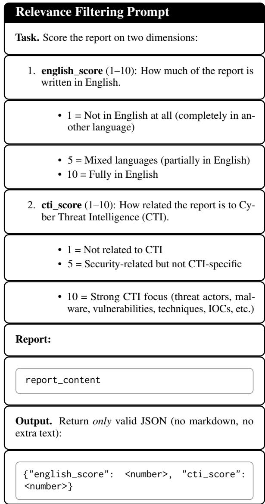  
Figure 8: Scoring instructions for RSS feed filtering.

## L Task-Specific Reinforcement Learning Details

We apply Group Relative Policy Optimization (GRPO; Shao et al., 2024) to MiST-8B and the Qwen3-8B baseline on three verifiable cybersecurity tasks. Each task admits deterministic, rulebased reward functions that require no learned reward model.

CVE-to-CWE mapping. Given a CVE description, the model predicts the corresponding CWE identifier. Reward is 1 if the predicted CWE matches the ground-truth label and 0 otherwise.

CVE-to-CVSS vector scoring. Given a CVE description, the model produces a CVSS vector string. Reward is computed as the fraction of CVSS metric components that match the reference vector.

Vulnerable-code-to-CWE mapping. Given a code snippet containing a known vulnerability, the model predicts the associated CWE. Scoring follows the same exact-match criterion as CVE-to-CWE mapping.

## M Task-Specific SFT Details

For supervised task adaptation, we fine-tune the Qwen and MiST checkpoints on PrimeVul (Ding et al., 2024). PrimeVul is a vulnerability-detection benchmark constructed from real-world C/C++ functions and includes paired examples in which a vulnerable function is matched with its corresponding patched version. This paired structure makes it possible to evaluate whether a model can identify the security-relevant difference between two closely related functions.

Training uses only the PrimeVul training and validation splits. Each example is converted into a three-turn chat format consisting of: (i) a system message instructing the model to act as a security expert, (ii) a user message containing the function and a direct YES/NO vulnerability-detection instruction, and (iii) an assistant response containing the gold label. The paired subset is used as provided by PrimeVul, while the default subset is class-balanced within each split.

We evaluate on the held-out PrimeVul paired test split using two prompting variants. The first, denoted PRIMEVUL, matches the direct YES/NO format used during SFT. The second, denoted PRIMEVUL-COT, asks the model to reason stepby-step before producing its final verdict. In both cases, the final answer is extracted as a binary YES/NO prediction.

Following the PrimeVul evaluation protocol, we report paired accuracy rather than standard accuracy. Standard accuracy can be misleading in vulnerability detection because models may learn dataset priors or over-predict the vulnerable class without identifying the precise code-level distinction between a vulnerable function and its patched counterpart. Under paired accuracy, a pair is counted as correct only if both the vulnerable function and its patched version are classified correctly.

The full PrimeVul SFT results are shown in Table 14. Before task-specific SFT, MiST already outperforms the corresponding Qwen baselines under paired accuracy, suggesting that cybersecurity mid-training improves sensitivity to vulnerabilityrelevant signals. After task-specific SFT, the gap becomes larger: MiST-8B-DPO-PrimeVul improves from 10.3 to 16.3 on PRIMEVUL and from 15.2 to 19.2 on PRIMEVUL-COT, while MiST-32B-DPO-PrimeVul improves from 8.6 to 16.4 and from 15.3 to 21.3, respectively. In contrast, Qwen gains only marginally after the same task-specific SFT procedure. This indicates that cybersecurity midtraining provides a better initialization for learning the paired vulnerability-detection objective.

<table><tr><td>Model</td><td>P-C</td><td>P-C CoT</td></tr><tr><td>PrimeVul-8B</td><td></td><td></td></tr><tr><td>Qwen3-8B-Instruct</td><td>2.2</td><td>13.6</td></tr><tr><td>Qwen3-8B-PrimeVul</td><td>2.8</td><td>13.5</td></tr><tr><td>MiST-8B-DPO</td><td>10.3</td><td>15.2</td></tr><tr><td>MiST-8B-DPO-PrimeVul</td><td>16.3</td><td>19.2</td></tr><tr><td>PrimeVul-32B</td><td></td><td></td></tr><tr><td>Qwen3-32B-Instruct</td><td>4.7</td><td>16.4</td></tr><tr><td>Qwen3-32B-PrimeVul</td><td>5.2</td><td>18.2</td></tr><tr><td>MiST-32B-DPO</td><td>8.6</td><td>15.3</td></tr><tr><td>MiST-32B-DPO-PrimeVul</td><td>16.4</td><td>21.3</td></tr></table>

Table 14: Task-specific SFT on PrimeVul. We report paired accuracy (P-C), following PrimeVul’s pair-wise evaluation protocol.

## N Data examples

We present representative examples of synthetic data generated by our pipeline described in Section 3, including persona-conditioned dialogues (Figure 9), standalone QA pairs (Figure 10), and educational content (Figure 9).

## O Safety Evaluation

Because cybersecurity specialization carries dualuse risk, we ran a preliminary safety evaluation of the MiST 8B checkpoints, focused on whether task specialization degrades the model’s tendency to refuse or safely handle misuse-oriented requests relative to its base model.

Setup. We evaluated on the CyberSecEval MITRE benchmark (Wan et al., 2024), which probes willingness to assist with offensive-security tasks mapped to the MITRE ATT&CK framework. Rather than the benchmark’s original judge, we scored responses with the Llama-3.3 judge of Liu et al. (2025b), which they introduce to reduce false positives from CyberSecEval MITRE’s original judge. We compare the safe-response rates of MiST-8B-SFT and MiST-8B-DPO against the Qwen3-8B base model.

Results. Both MiST checkpoints improve over the Qwen3-8B baseline in safe-response rate (Ta-

ble 15), indicating that specialization did not erode safe-handling behavior on this benchmark.
<table><tr><td>Model</td><td>Safe-response rate (%)</td></tr><tr><td>Qwen3-8B (base)</td><td>75.8</td></tr><tr><td>MiST-8B-SFT</td><td>89.8</td></tr><tr><td>MiST-8B-DPO</td><td>85.3</td></tr></table>

Table 15: Safe-response rate on the CyberSecEval MITRE benchmark

Qualitative red-teaming and internal benchmark. We complemented the automated evaluation with qualitative red-teaming and an internal safety benchmark covering misuse-oriented prompts. Across these, MiST performed comparably to or better than the baseline.

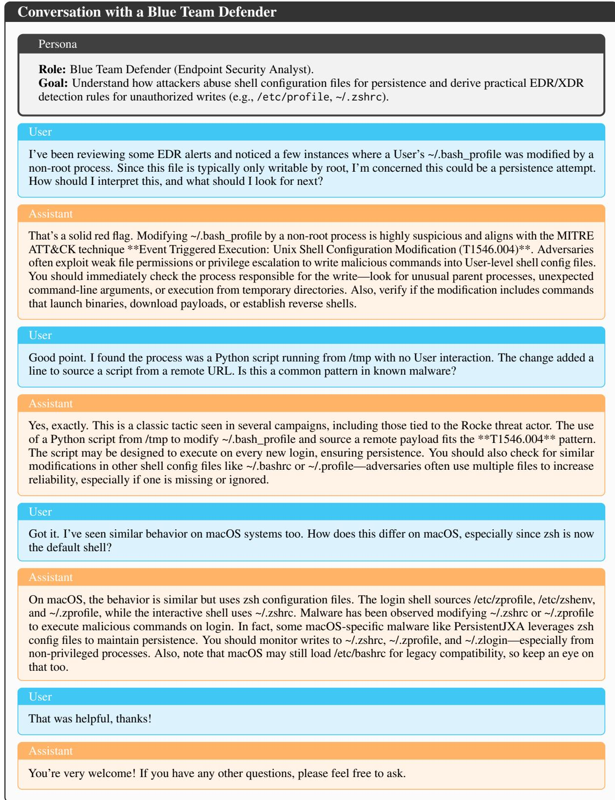  
Figure 9: Example of persona-conditioned dialogue. The persona casts the user as a Blue Team defender, steering the interaction toward defensive investigation. The assistant provides expert guidance on identifying persistence mechanisms via shell configuration changes on Linux and macOS.

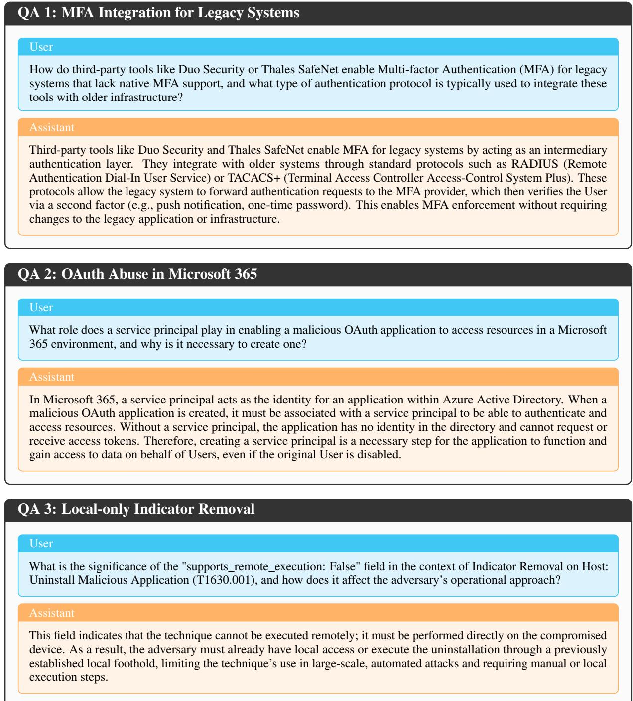  
Figure 10: Representative question–answer pairs used in our synthetic data pipeline. Each example targets a distinct cybersecurity knowledge area, including enterprise authentication mechanisms, cloud identity abuse, and MITRE ATT&CK technique semantics, and is designed to elicit concise, technically grounded explanations.

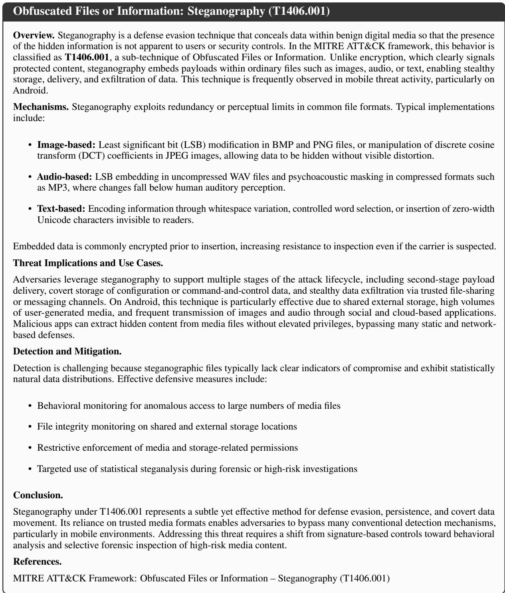  
Figure 11: Example of educational content used in our synthetic data pipeline. The passage provides a technically grounded overview of a MITRE ATT&CK technique (T1406.001), including mechanisms, threat implications, and detection considerations, reflecting the style of explanatory artifacts generated to support knowledge acquisition.