Current (in-development app with incomplete functionality)

# ProgramDistill: From Interactive Web Apps to Verifiable Reference-Guided SWE Tasks

Jeonghye Kim¹, Minseon Kim², Young Jin Kim³, Matheus Pereira²

Marc-Alexandre Côté², Alessandro Sordoni², Xingdi Yuan², Zhengyan Shi²

1KAIST 2Microsoft Research Montréal 3Microsoft AI

jeonghye.kim@kaist.ac.kr froggy@microsoft.com

https://aka.ms/froggy

Coding agents are typically evaluated with desired behavior specified through issues or instructions. In practical web development, however, agents may need to infer behavior from working software and implement it in an incomplete application. We introduce ProgramDistill¹, a benchmark evaluating coding agents on features discovered through interaction with fully functional reference applications. We build ProgramDistill by factorizing applications into features of different granularities, each associated with replayable behaviors executable via its gold patch. Our pipeline, mine-craft-patch, discovers 1,975 replay-verified behaviors across 26 applications and constructs 4,063 tasks without human intervention. Across nine frontier coding agents, GPT-6 Astra and Claude Opus 5 achieve 49.2% and 28.8% success on cumulative workflows in full-application reconstruction. In partial-application reconstruction, success falls from 100% to 64.0% and from 96% to 32% as restoration depth increases from 1 to 8. ProgramDistill thus provides a scalable benchmark with controlled difficulty for evaluating and diagnosing coding agents, and a natural basis for future curriculum-based training.

## 1 Introduction

Reference (observable behavior from reference apps, mockups, videos, etc.)

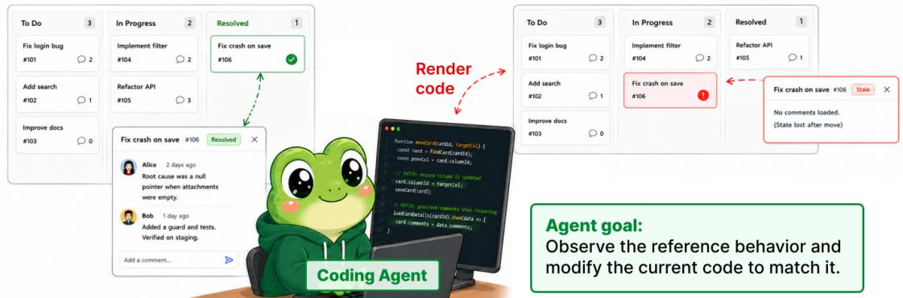  
Figure 1: ProgramDistill evaluates reference-guided software engineering for interactive web applications. A coding agent is given a working reference application whose source implementation is hidden and an editable current application with missing functionality. The agent interacts with the reference to infer the intended behavior, restores that behavior by modifying the current implementation, and validates the result against the reference.

Large language models (LLMs) increasingly serve as coding agents capable of inspecting repositories and modifying source code in response to issues, instructions, or tests [15, 34, 27, 14, 33]. These settings, however, typically assume that the desired behavior has already been specified. In practical web development, developers may instead need to infer intended behavior directly from a working reference, such as an earlier product version, an interactive prototype, a comparable application, or a demonstration video. As illustrated in Figure 1, an agent must interact with the reference, modify the current implementation, and validate the resulting behavior against it. Even a simple interaction such as dragging a card may require inferring both its visible effect and the application state that persists afterward.

Recent work has begun to treat running software itself as part of the specification. ProgramBench [37], for example, asks agents to probe compiled programs in C/C++, Go, or Rust and reconstruct them from observable execution behavior. This establishes a behavior-to-code setting, but treats the program as a whole-program reconstruction target.

Interactive web applications expose additional structure. Their functionality unfolds through user interface (UI) actions and application states, often with explicit behavioral prerequisites. For instance, a user may need to log in before creating an object and create that object before modifying it later. Such stateful dependencies naturally organize behaviors into prerequisite lineages.

This raises a different question. Can we uncover this latent behavioral structure and use it to turn a working interactive web application into a scalable source of verifiable software-engineering tasks? Rather than treating an application as a single reconstruction problem, we identify features at varying levels of granularity and construct a SWE task for each, together with replayable interactions and a gold patch. These tasks can be composed along prerequisite lineages into increasingly cumulative repairs, yielding a controllable restoration-depth axis. We call this transformation application-to-task factorization

The resulting tasks evaluate a complementary form of behavioral distillation. Given a working reference and an incomplete current implementation, the agent must infer the required behavior from the reference and realize it through source-code changes in the current application. We call this reference-to-current distillation, where success is measured by whether the replayable interaction executes identically after applying the submitted patch. Together, application-totask factorization and reference-to-current distillation define ProgramDistill. Here, distillation refers to extracting and transferring executable behavior across these transformations.

To realize this framework at scale, ProgramDistill introduces a fully automated mine-craft-patch pipeline orchestrated by multiple LLM agents. It mines reproducible behaviors as replayable browser-interaction traces, crafts tasks by masking the source implementations responsible for those behaviors, and patches the resulting applications by asking coding agents to recover missing functionality from a working reference. Mining and crafting together realize application-to-task factorization, while patching realizes reference-to-current distillation. Each mined behavior serves as both a task unit and a behavioral verifier, with the same trace succeeding on the intact application, failing after masking, and being replayed after repair. These verified task units can then be composed along prerequisite lineages, increasing restoration depth from atomic repair to full-application reconstruction. Across 26 applications, the pipeline mines 1,975 replay-verified behaviors and constructs 4,063 tasks without human intervention.

We evaluate nine frontier coding agents. In full-application reconstruction, GPT-6 Astra [24] and Claude Opus 5 [3] recover 49.2% and 28.8% of evaluated workflows. In partial-application reconstruction, their success falls from 100% to 64.0% and from 96% to 32%, respectively, as restoration depth increases from 1 to 8. Trajectory analysis reveals a growing mismatch between reconstruction burden and agent effort, with observation effort per required behavior declining especially sharply as tasks deepen. Astra, meanwhile, achieves the strongest repair performance while exhibiting the highest observation activity and the fewest edit/write steps. Together, these results identify effort allocation across observation, validation, and editing as an important dimension of reference-guided software engineering alongside implementation capability. ProgramDistill thus provides a scalable, controlled benchmark for evaluating reconstruction performance and the interactive information-seeking strategies that contribute to it across varying restoration depths. We make the following contributions:

• A benchmark for reference-guided software engineering. We introduce ProgramDistill, comprising 4,063 replayverified SWE tasks derived from 1,975 behaviors across 26 interactive web applications, spanning atomic repair, cumulative repair, and full-application reconstruction

• Program distillation from executable behavior. We formulate program distillation along two axes. Application-totask factorization converts working applications into structured SWE tasks, while reference-to-current distillation requires agents to recover behavior from an executable reference. We operationalize both with a fully automated mine-craft-patch pipeline.

• Restoration depth for evaluation and curriculum construction. Prerequisite lineages provide a controlled progression from atomic repair to full reconstruction, exposing systematic failures as restoration depth increases and providing a natural curriculum for future training through trajectory distillation or reinforcement learning.

## 2 Application-to-Task Factorization via the Mine-Craft-Patch Pipeline

Figure 2 illustrates mine-craft-patch, our new synthetic task generation pipeline that orchestrates multiple LLM agents to synthesize verifiable tasks from web applications without relying on human-written issues, tests, or behavioral annotations. The pipeline is model-agnostic, and we use GPT-5.6 Sol [23] for all stages in our experiments.

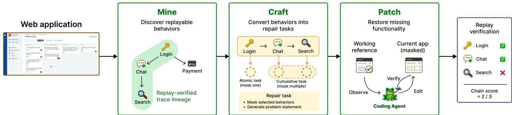  
Figure 2: Overview of the mine-craft-patch pipeline. Mining discovers replayable behaviors and organizes them into a prerequisite trace tree by extending previously verified traces. Crafting constructs atomic repair tasks by masking one behavior, or combines masks along a lineage to construct progressively deeper cumulative repair tasks. Patching asks a coding agent to restore the masked functionality from a working reference, then replays the corresponding lineage traces to measure how much of the behavior chain has been recovered.

## 2.1 Setup: Deterministic and Observable Application Instances

To support the full mine-craft-patch pipeline, we set up each application as a live, self-contained execution environment accessible through a common browser interface. The environment provides a stable reference for behavior observation. an editable application for task construction and repair, and a reproducible runtime for replay-based verification.

## 2.1.1 Applications and Runtime Instances

Application corpus. The mine-craft-patch pipeline operates on 26 web applications drawn from two complementary sources. The corpus includes self-contained applications adapted from the OSWorld web-application suite [32], as well as real-world open-source projects and SaaS clones drawn from public repositories. The former provide a controlled and diverse interaction substrate, while the latter contribute larger codebases, deeper workflows, nontrivial state, and heterogeneous architectures. Details of the corpus are provided in Appendix A.

Reference and editable instances. For each web application, we serve a fixed production build as the reference instance and a development-server version as the editable instance. The reference remains unchanged throughout task construction and repair, while masking and agent edits are applied to the source code and reflected in the editable instance through hot reload. Both instances expose the same application interface, allowing behavior observed in the reference to be reproduced and evaluated in the editable instance.

Deterministic execution. Reliable replay requires a reproducible starting state. The pipeline therefore resets application state before collection and replay and uses a shared deterministic clock across the database, backend, and frontend. This reduces variation from time-dependent behavior while preserving normal ordering and timeout semantics. Details of the deterministic execution setup are provided in Appendix A.1.

## 2.1.2 Browser Helper

A shared Playwright-based browser helper [18] provides a common interaction interface for mining, replay verification, and repair. It executes high-level browser actions and returns structured observations of visible text, accessibility information, and interactive elements. For reliable replay, the helper resolves elements using stable observable attributes rather than volatile DOM identifiers and waits for application state to settle before recording observations. The same interaction and observation semantics are used throughout the pipeline. The helper also records screenshots for analysis and behavior relabeling, while the partial-application and full-application reconstruction agents evaluated in this work receive only structured browser observations. Appendix B provides implementation details.

## 2.2 Mining: Discovering and Verifying Interactive Behaviors

Mining discovers what an application can do and records those behaviors as replayable specifications for task construction and evaluation. By exploring the live application with access to its source, the pipeline builds a bank B of verified traces, each containing browser actions, expected outcome signals, and an optional parent trace. Parent links preserve the prerequisite context needed to reproduce dependent behaviors, allowing later stages to mask and evaluate them along the same lineage.

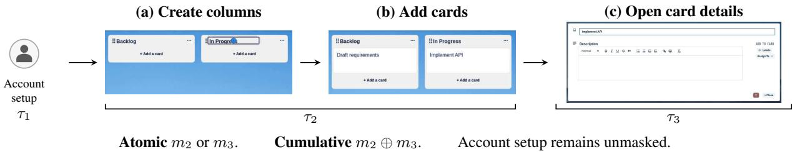  
Figure 3: A behavioral dependency in Trel1o (Knowankit). Account setup (τ1, represented by the icon) precedes board/card creation (τ2) and the editor interaction $\left( \tau _ { 3 } \right)$ . The brackets group panels (a)–(b) into one trace and panel (c) into its dependent trace.

From a behavior goal to a verified trace. Given the current trace bank, the pipeline first proposes a set of new behavior goals grounded in source and UI evidence, each with an optional parent trace. When a parent is specified, the application is reset and its lineage is replayed to establish the prerequisite state. An LLM agent then explores the live application to pursue the proposed goal, choosing each action from the current observation while the environment records its interactions to form an exploratory trace $\tilde { \tau } _ { d } .$ In Figure 3, for instance, the editor behavior $\tau _ { 3 }$ is explored after replaying account setup $\left( \tau _ { 1 } \right)$ and board/card creation $\left( \tau _ { 2 } \right)$ . The resulting trace activates the column title editor and opens the card details, with expected signals checking the title field values and the presence of the Description label.

Because this initial exploration may include detours, the pipeline re-collects the behavior from a clean reset, providing $\tilde { \tau } _ { d }$ to the LLM agent as additional prompt context about a successful route. The agent still chooses each action from live observations, but can now omit unnecessary exploratory steps. This parallels findings in self-distillation that conditioning on additional privileged information can elicit more concise reasoning trajectories [16]. During this clean re-collection, the environment records replay-stable actions and exposes candidate signals derived from the observed state. The agent selects the signals that support the achieved outcome. The resulting trace $\tau _ { d }$ therefore contains the actions, expected signals, and parent reference needed for deterministic replay.

Only traces that pass the replay verifier described below are admitted. Each admitted trace is labeled according to the behavior actually achieved and extends its parent lineage, yielding $L _ { d } = ( \tau _ { 1 } , \dots , \tau _ { d } )$ ; for a root trace, $L _ { 1 } = ( \tau _ { 1 } )$ Mining repeats this process to expand coverage and discover deeper dependent behaviors. We implement these stages with specialized Planner, Collector, Relabeler, and Reflector roles. Appendix D.1 details their control flow, Appendix D provides the corresponding prompts, and Appendix D.7 illustrates how a trace evolves through the mining pipeline.

Replay-based verification. For the intact application A and a trace lineage $L _ { d } = ( \tau _ { 1 } , \dots , \tau _ { d } )$ , we define the replay verifier $V ( A , L _ { d } ) \in \{ 0 , 1 \}$ . Starting from a reset application and browser state, it replays $\tau _ { 1 } , \ldots , \tau _ { d }$ in order without LLM intervention and returns 1 only if all recorded actions complete and all expected behavioral signals are satisfied. A candidate trace $\tau _ { d }$ is admitted when $V ( A , L _ { d } ) = 1$ . The same verifier is used for mask validation and repair evaluation in Sections 2.3 and 2.4.

## 2.3 Crafting: From Verified Behaviors to Repair Tasks

Crafting turns replay-verified behaviors into repair tasks by removing their source implementations and checking that the resulting failures are confined to the intended targets rather than their prerequisites. Validated masks can then be combined along a lineage to vary how many dependent behaviors must be restored together.

We control the resulting tasks along two dimensions. Mask scope determines how much of a feature is removed. A logic-only mask leaves the existing user interface (UI) in place but removes the implementation that makes it work, while a logic-and-UI mask removes both the feature's behavior and its UI. Task composition determines whether the task targets a single behavior or multiple dependent behaviors along a prerequisite lineage. Each behavior is first considered for an atomic task that masks only that behavior. Validated atomic masks are then combined along a lineage to form cumulative tasks that require several behaviors to be restored together. Figure 4 summarizes this process, from trace-conditioned masking through atomic validation to cumulative composition.

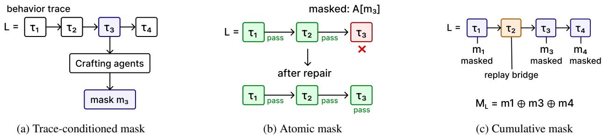  
Figure 4: Crafting verified behaviors into repair tasks. (a) A behavior-specific mask is generated from a verified trace. (b) Atomic validation requires all prerequisite traces to pass and the target trace to fail after masking. Gold-patch replay verifies recovery of the complete lineage. (c) Validated masks are composed along a prerequisite lineage, with unmasked traces serving as replay bridges and masked behaviors forming joint restoration targets.

Trace-conditioned masking. As illustrated in Figure 4(a), consider a verified lineage $L _ { d } = ( \tau _ { 1 } , \dots , \tau _ { d } )$ with target trace $\tau _ { d } .$ The Crafting agents identify the source implementation responsible for the observed behavior of $\tau _ { d }$ and propose a mask $m _ { d }$ We write $A [ m _ { d } ]$ for the application obtained by applying $m _ { d }$ to the intact application A. The prompts for the Crafting agents are provided in Appendix E.

For each logic-only or logic-and-UI mask, the pipeline generates a concise behavioral problem statement describing the feature's user-facing purpose and workflow while withholding the original implementation, repair procedure, and exact verification signals. The coding agent must infer the missing behavior from the working reference.

Atomic task validation. An atomic repair task applies only the target mask $m _ { d } ,$ leaving the prerequisite implementations unmasked. Since $L _ { d }$ was replay-verified on the intact application, $V ( A , L _ { d } ) = 1$ by construction. A mask is accepted only if the masked application builds and launches successfully, all prerequisite traces $\tau _ { 1 } , \ldots , \tau _ { d - 1 }$ remain replayable, and the target behavior fails. For d $> 1$ , with $L _ { d - 1 } = ( \tau _ { 1 } , \dots , \tau _ { d - 1 } )$ , these conditions are

$$
\mathrm { B u i l d } ( A [ m _ { d } ] ) = 1 , \qquad V ( A [ m _ { d } ] , L _ { d - 1 } ) = 1 , \qquad V ( A [ m _ { d } ] , L _ { d } ) = 0 .
$$

For a root trace with $d = 1$ , only the build and target-failure conditions apply. These conditions yield an SWE-benchstyle fail-to-pass (F2P) objective for the target and pass-to-pass (P2P) checks for its unmasked prerequisites [15]. Figure 4(b) illustrates this counterfactual validation, where the prerequisite traces continue to pass after masking while the target trace fails and must be recovered by the repair.

In Figure 3, the atomic mask $m _ { 3 }$ must preserve creation of the board and cards in panels (a)–(b), but break the editor interaction whose outcome is shown in panel (c). Composing $m _ { 2 }$ and $m _ { 3 }$ instead makes both board/card creation and the editor interaction repair targets, while account setup remains an unmasked prerequisite.

A separate LLM-based mask-depth critic rejects superficial changes, such as toggling feature flags or removing call sites while leaving the substantive implementation intact. Failed proposals may be revised through bounded feedback rounds. Only masks that pass both counterfactual validation and the critic are retained. If no proposed mask is accepted, the trace remains available as a prerequisite but does not become a repair target.

Cumulative task composition. For a verified lineage $L _ { d }$ ending at a repair target, let $j _ { 1 } < \cdots < j _ { r _ { L } } =$ d index the traces with validated masks. The restoration depth $r _ { L }$ is the number of repair targets along the lineage.

Combining the corresponding masks yields the cumulative mask

$$
M _ { L } = m _ { j _ { 1 } } \oplus \cdot \cdot \cdot \oplus m _ { j _ { r _ { L } } } ,
$$

where  combines the accepted source modifications. The resulting masked application is $A [ M _ { L } ]$ . As shown in Figure 4(c), unmasked traces serve as replay bridges that establish prerequisite state without becoming repair targets themselves. Thus, lineage depth d may exceed restoration depth $r _ { L }$ . Atomic tasks have $r _ { L } = 1$ , whereas cumulative tasks have $r _ { L } > 1$

To construct a cumulative task, the pipeline first attempts to compose the validated atomic masks deterministically. Because all component masks are defined against the same intact baseline A, non-overlapping edits are combined directly and overlapping deletions are merged by union. A git three-way merge provides an independent consistency check. If the two results disagree, an LLM-based merge agent resolves the remaining overlaps while preserving the non-conflicting masks. Its prompt is provided in Appendix E.3.

Of the 1,201 cumulative tasks in our experiments, 629 were composed deterministically and 572 required the merge agent. The fraction requiring the merge agent increases with restoration depth, from 25.6% at $r _ { L } = 2$ to 89.7% at $r _ { L } = 8$ and 100% at $r _ { L } > 8$ . All 572 agent-assisted merges succeeded without omitting any intended mask component.

Gold patches. For each validated atomic or cumulative task, reversing its masking diff yields a gold patch [15] that recovers the original implementation. We validate the gold patch by applying it to the masked application and requiring the complete task lineage to pass replay verification. Atomic counterfactual checks provide target-specific negative controls, while gold-patch replay provides an end-to-end positive control that the restoration and preservation requirements can be satisfied jointly

## 2.4 Patching: Restoring Behavior from a Working Reference

Patching evaluates whether a coding agent can recover application behavior by observing a working reference and implementing it in an incomplete application. We consider two settings. Partial-application reconstruction starts from the masked repository produced by crafting, whereas full-application reconstruction starts from a minimal executable scaffold. In both settings, the agent interacts with the reference without access to its source, and the traces collected during mining are replayed to evaluate the resulting implementation. In Figure 3, partial-application reconstruction requires restoring the masked board/card creation behavior, the editor behavior, or both, so that replay reproduces the corresponding reference behavior

Partial-application reconstruction. The agent receives the masked repository and a generated behavioral problem statement. It can edit the writable, hot-reloading current application while comparing it through the browser with the working reference. The masking diff, gold patch, grading traces, and reference source remain hidden, and public-network egress is disabled. Appendix C.1 describes the resulting isolation, Appendix F provides the agent instruction, and Section 3.2.2 analyzes observed shortcut attempts.

Trace-level verification and lineage scoring. Let ∆ denote the agent-submitted patch. We write $A [ M _ { L } , \Delta ]$ for the repaired application obtained by applying $\Delta$ to the masked application $A [ M _ { L } ]$ . Evaluation uses the verifier defined in Section 2.2, with the recorded actions, selectors, and expected signals unchanged. Both repair targets and replay bridges must satisfy the recorded action and outcome checks. The submitted patch need not match the gold patch at the source level. Function names, variable names, and code structure may differ as long as the repaired application reproduces the reference behavior.

For repair targets indexed by $j _ { 1 } < \cdots < j _ { r _ { L } } = d _ { \ O }$ we define

$$
\mathrm { B i n a r y S c o r e } ( L _ { d } , \Delta ) = V ( A [ M _ { L } , \Delta ] , L _ { d } ) , \qquad \mathrm { C h a i n S c o r e } ( L _ { d } , \Delta ) = \frac { 1 } { r _ { L } } \sum _ { k = 1 } ^ { r _ { L } } V ( A [ M _ { L } , \Delta ] , L _ { j _ { k } } ) .\tag{1}
$$

The binary score is 1 only when the complete task lineage passes, while the chain score gives partial credit for the recovered prefix. For an atomic task, $r _ { L } = 1$ , so the two scores coincide.

For the two-target cumulative task in Figure 3, suppose the repaired application passes through board/card creation $\tau _ { 2 }$ but fails at the editor interaction $\tau _ { 3 }$ . Then BinaryScore = 0, whereas $\mathrm { C h a i n S c o r e } = 1 / 2$ giving partial credit for the recovered behavior.

Full-application reconstruction. In full-application reconstruction, the agent starts from a minimal executable scaffold and reconstructs the application by interacting with the working reference. We evaluate the reconstructed application using replay-verified behavior traces B collected during mining. Because each trace contains a replayable interaction sequence and expected behavioral signals, sampled traces can serve directly as behavioral tests. Atomic recovery measures the fraction of atomic behavior tests that pass. Each test scores one target behavior while replaying its prerequisites to establish the required state. For cumulative workflows, binary recovery requires the complete lineage to pass, while the chain score gives partial credit for recovered prefixes. Because reconstruction starts from a scaffold rather than an existing implementation, prerequisite replay checks workflow correctness rather than preservation of previously working behavior.

## 3 Experiments

## 3.1 Benchmark Generation Statistics

We run the full mine-craft-patch pipeline over 26 web applications using GPT-5.6 Sol as the construction model.   
Figure 5 summarizes the resulting mining yield, task composition, and mask scopes.

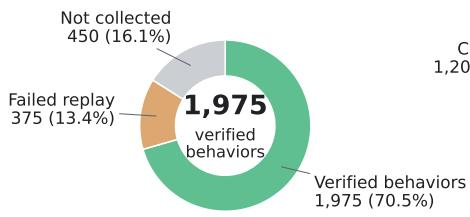  
(a) Mining yield

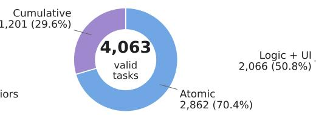  
(b) Task composition

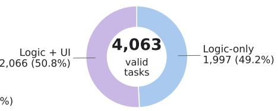  
(c) Mask scope  
Figure 5: ProgramDistill benchmark generation. (a) Mining yields 1,975 replay-verified behaviors, with remaining goals either uncollected or failing replay verification. (b) The resulting 4,063 repair tasks comprise atomic and cumulative tasks. (c) Tasks are distributed across logic-only and logic-and-UI mask scopes.

Mining. Across the 26 applications, mining proposes 2,800 candidate goals, of which 2,350 are collected as interaction traces. After clean-state replay, 2,165 traces reproduce successfully, and 1,975 survive the final replay check to become verified behavior traces. The mined prerequisite trees reach a maximum lineage depth d of 17 (mean 3.40), a maximum width of 60, and a mean branching factor of 1.78. Lineage depth is the number of traces from the root to a target, including replay bridges used to establish prerequisite state.

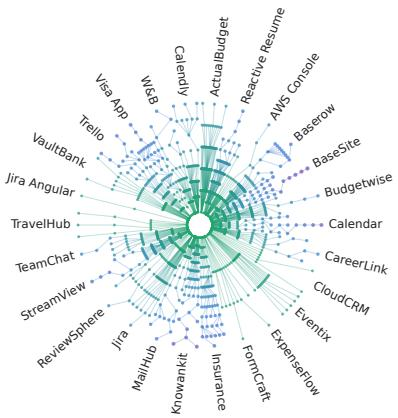  
(a) Task lineage forest across 26 applications

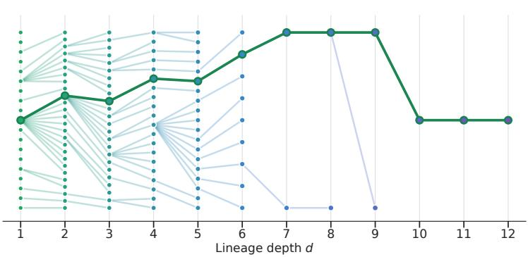  
(b) Representative task lineage: StreamView, depth 12  
Figure 6: Prerequisite lineages across applications. (a) Mined lineage forests across all 26 applications. (b) A representative StreamView lineage reaching depth 12, with one root-to-leaf prerequisite chain highlighted.

Lineage. As described in Section 2.3, cumulative tasks are constructed by composing masks along mined prerequisite lineages. Figure 6 visualizes this structure at two scales. Panel (a) shows variation in lineage depth and branching across applications, reflecting the range of dependent workflows discovered during mining. Panel (b) shows a representative StreamView lineage reaching depth 12, with columns indexing lineage depth d and one root-to-leaf chain highlighted.

Crafting. The pipeline constructs 4,063 repair tasks from the verified traces: 2,862 atomic tasks and 1,201 cumulative tasks. Across both task types, 1,997 use logic-only masks and 2,066 use logic-and-UI masks. Not every trace in a mined lineage becomes an independent repair target. Traces that do not satisfy the task-admission criteria in Section 2.3 are retained as replay bridges to establish prerequisite state. Accordingly, as defined in Section 2.3, the restoration depth $r _ { L }$ counts the lineage behaviors that become repair targets and whose code must be restored.

ProgramDistill-300. Evaluating all 4,063 tasks for every model would be prohibitively expensive, so we define a fixed 300-task evaluation suite. We stratify tasks by restoration depth $r _ { L }$ using quotas of 50, 45, 45, 40, 35, 30, 30, and 25 for depths 1 through 8. Within each depth, tasks are selected round-robin across applications to preserve coverage of all 26 apps and prevent applications with larger task pools from dominating. The resulting suite covers 269 distinct lineages and contains 50 atomic and 250 cumulative tasks, with 140 logic-only and 160 logic-and-UI masks.

## 3.2 Partial-Application Reconstruction

We evaluate nine frontier models—GPT-6 Astra [24], GPT-5.6 Sol [23], Claude Opus 5 [3], Claude Sonnet 5 [4], Gemini 3.7 Flash [9], Gemini 3.6 Flash [8], Gemini 3.1 Pro Preview [7], Grok 4.6 [30] and GPT-5.3 Codex [22]—on ProgramDistill-300, with reasoning effort set to high. Each model receives a masked application and a problem statement and must recover the missing behavior by inspecting a reference, editing the current implementation, and validating its changes against the live application. Depth-1 tasks are atomic repairs, while depths 2 through 8 combine multiple repair targets from a prerequisite lineage.

Agent harness. All models use the same modified R2E-Gym [14] agent harness. The harness exposes four coding tools: execute\_bash, file\_editor, search, and finish. Through execute\_bash, the agent can also invoke the browser CLI to observe and interact with both the masked current application and the working reference. Appendix C describes the harness design and execution settings.

## 3.2.1 Model Performance Comparison

We evaluate nine models on ProgramDisti11-300, comparing repair performance with model cost. Figure 7(a) plots mean binary score against mean trajectory cost in USD, while Appendix H.2 reports the corresponding chain-score results. GPT-6 Astra achieves the highest mean binary score at 84.3%, followed by Claude Opus 5 at 68.7% and GPT-5.6 Sol at 60.7%. Their mean trajectory costs are \$33.99, \$28.86, and \$16.01, respectively. Astra gains 15.7 percentage points over Opus 5 at about 18% higher mean trajectory cost. Grok 4.6, Claude Sonnet 5, GPT-5.3 Codex, and Gemini 3.7 Flash form a middle tier, with scores between 45.3% and 48.3%.

Higher expenditure does not always yield better repair performance. Gemini 3.7 Flash nearly matches GPT-5.3 Codex (45.3% vs. 45.7%) at a mean trajectory cost of \$3.89 versus \$5.99, while Grok 4.6 slightly exceeds Claude Sonnet 5 (48.3% vs. 47.3%) at \$8.83 versus \$13.12 per trajectory.

Mask scope provides a complementary view of repair difficulty. Astra's chain score is 96.2% on logic-only tasks and 84.9% on logic-and-UI tasks. The 11.3-point gap shows that interface reconstruction remains harder even when partial restoration receives credit. Appendix H.1 reports the full scope comparison.

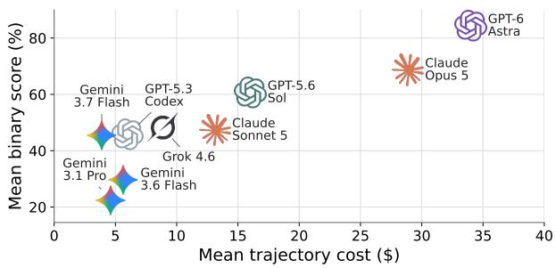  
(a) Cost vs. mean binary score

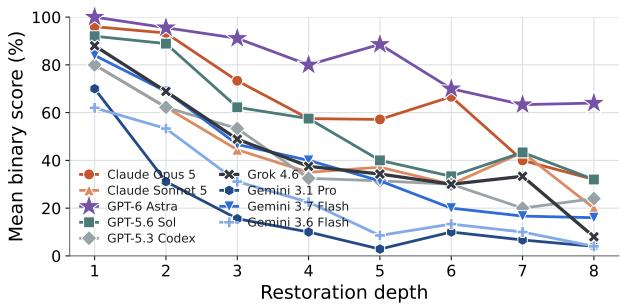  
(b) Mean binary score by restoration depth  
Figure 7: Partial-application reconstruction performance. (a) Mean binary score versus mean cost per trajectory (USD). (b) Mean binary score by restoration depth $r _ { L }$ . Performance generally declines as depth increases. Figure 19 in Appendix H.2 shows the same panels under the chain score.

Degradation with restoration depth. Astra is the only model to solve all depth-1 tasks, achieving100% binary success, compared with 96% for Opus 5 and 92% for Sol (Figure 7(b)). Because cumulative tasks are composed of individually validated atomic repairs and are themselves verified with gold patches, this depth-1 result establishes a strong empirical baseline for task solvability. Performance nevertheless drops as multiple dependent repairs must be recovered together. Astra scores 64.0% at depth 8, a 36-point decline, while Opus 5 and Sol both score 32.0%. Every other model retains less than half of its depth-1 performance. These results suggest that restoration depth exposes a compositional challenge, as agents can often solve individual repairs but struggle to combine multiple repairs while preserving their dependencies. Appendix H.3 examines this pattern at similar mean prompt sizes per step.

Example of a successful deep repair trajectory. Although performance declines with restoration depth, some deep tasks are successfully repaired through sustained iterative refinement. Figure 8 shows one such Claude Opus 5 trajectory on a depth-8 cumulative repair task in Trello (Vdevired). The agent first inspects the reference and repository to recover the core functionality, then repeatedly revisits the reference and current application to identify residual mismatches, apply targeted fixes, and validate them. The trajectory illustrates how a successful deep repair can require repeated observe-edit-validate cycles across multiple dependent behaviors.

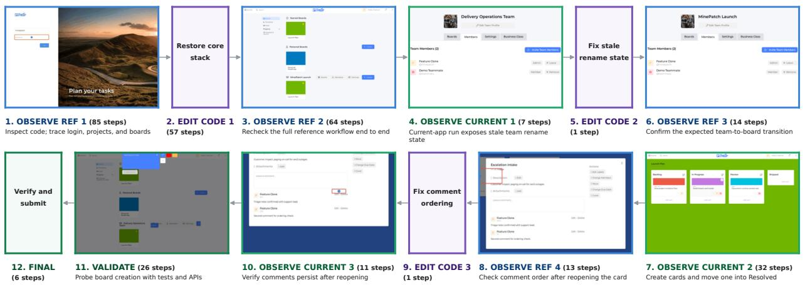  
Figure 8: Partial-application reconstruction on a depth-8 Trel1o (Vdevired) task. The depth-8 task spans eight dependent workflow stages—login, project setup, team and board setup, list and card creation, permissions, card details, cross-list movement, and comment editing—all of which must remain functional together. Across 317 steps, Claude Opus 5 repeatedly alternates between OBSERVE REF to infer intended behavior, EDIT CODE to modify the implementation, and OBSERVE CURRENT to validate the repair before final submission.

## 3.2.2 Analysis

To characterize repair workflows, we compare the recorded trajectories of all nine models on ProgramDistil1-300.

Model-level behavior. Models exhibit markedly different interaction patterns during repair. Figure 9 compares reference and current-app observation, repository read/search, and edit/write activity alongside repair performance.

Astra stands out for an observation-intensive, edit-light workflow. It records the most reference and current-app observation steps, with current-app observation averaging 96.3 steps per trajectory, approximately 2.1× the next-highest mean of 45.8 for Sol. At the same time, Astra makes the fewest edit/write steps, averaging only 9.9 per trajectory, while achieving the strongest repair performance. Opus 5 and Sonnet 5 are also relatively observation-intensive, but combine this with substantially more editing, averaging 23.5 and 15.7 edit/write steps, respectively.

Astra's interaction pattern is therefore characterized by extensive behavioral checking, particularly of its own implementation, followed by comparatively selective code changes. More broadly, these results suggest that repair performance may depend not only on implementation capability but also on how effectively agents allocate effort across observation, validation, and editing. Table 13 in Appendix H.4 reports interaction statistics across models and restoration depths.

Scaling with restoration depth. To better understand why repair performance declines with restoration depth, we examine how task burden and agent effort scale as more behaviors must be restored. Figure 10 shows a growing mismatch between the two. From depth 1 to depth 8, the mean number of code lines to restore grows by 9.3×, while the mean total number of browser actions across target behavior traces grows by 10.7×.

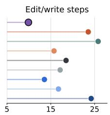

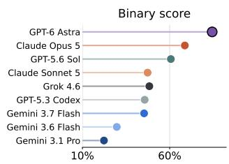

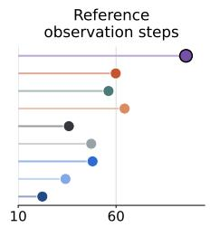

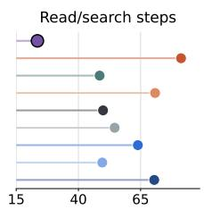

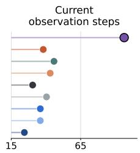  
Figure 9: Model-level performance and interaction behavior. Mean binary score alongside mean reference observation, read/search, edit/write, and current-app observation steps per trajectory.

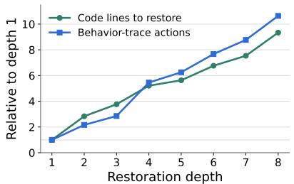  
(a) Task burden grows

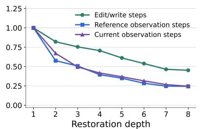  
(b) Effort per stage shrinks

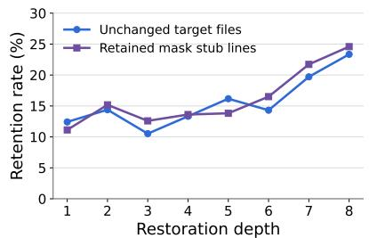  
(c) Final-patch retention  
Figure 10: Scaling of repair burden and agent effort with restoration depth $r _ { L } .$ (a) Repair burden increases with restoration depth. (b) Agent effort per repair target, measured by edit/write and reference/current-app observation steps. (c) Final-patch retention of unchanged target files and mask-added stub lines. Panels (a) and (b) are normalized to their depth-1 values, while panel (c) reports raw percentages.

In contrast, agent effort per repair target decreases, with the sharpest contraction in behavioral observation. Reference observation steps per target fall from 34.60 to 8.46, and current-app observations from 27.69 to 6.81, reductions of roughly 75% in both cases. Edit/write steps also decline, but more moderately, by roughly 55%. Thus, as restoration depth grows, agents devote disproportionately less effort to understanding and validating each required behavior.

Final patches also leave more of the masked implementation unrestored as restoration depth increases. Between depths 1 and 8, the mean fraction of unchanged target files changes from 12.4% to 23.3%, while the fraction of mask-added stub lines retained in the final patch changes from 11.1% to 24.6%. Although intermediate depths fluctuate, the overall pattern suggests that deeper tasks leave more required implementation unrecovered. Together with the decline in binary score and the reduced observation and editing effort per target, this indicates that agents struggle to keep pace as reconstruction burden grows.

Shortcut attempts. Beyond the intended repair workflow, agents may attempt to recover implementation information from sources outside the supplied code and permitted reference interface. We therefore identify access attempts involving Git history, public app-source retrieval, protected harness or evaluator files, and direct reference access.

Figure 11(a) shows the frequency of public app-source retrieval, Git history, and other identified access channels. At least one such attempt appears in 7.2% of trajectories, with substantial variation across models. Grok 4.6 has the highest rate at 19.0%, followed by Gemini 3.1 Pro at 17.7%, compared with 0.3% for Astra.

These channels are blocked by design through several safeguards. Workspaces contain no pre-mask Git history, stale artifacts are regenerated from the masked source, public egress is disabled, harness and grading files are hidden or protected, and the reference is accessible only through the browser helper. Details of the runtime architecture and isolation safeguards are provided in Appendix C.1.

## 3.3 Full-Application Reconstruction

We next evaluate the full-application reconstruction setting introduced in Section 2.4. Starting from a minimal executable scaffold, the agent must rebuild the application by using a product-level capability description and interacting with a live reference. We evaluate this setting on twelve stateful web applications using GPT-6 Astra, Claude Opus 5, and GPT-5.6 Sol at max reasoning effort. The harness configuration is described in Appendix C.

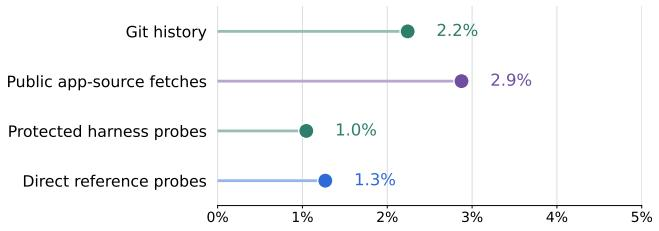  
(a) Identified probes, by channel

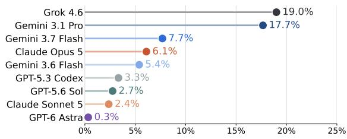  
(b) Identified probes, by model  
Figure 11: Identified shortcut attempts. (a) Share of trajectories with an identified attempt in each channel. (b) Within-model share with at least one identified attempt.

Evaluation suite and scoring. Following the protocol in Section 2.4, we evaluate full-application reconstruction using two types of behavioral tests. Atomic behavior tests check whether one replay-verified target behavior is reproduced, with its prerequisites replayed to establish the required state. Cumulative workflow tests assess whether multiple dependent behaviors are recovered together. The evaluation suite contains 590 atomic behavior tests and 413 cumulative workflow tests across twelve applications.

## 3.3.1 Model Performance Comparison

Table 1: Full-application reconstruction performance. Atomic recovery measures the fraction of atomic behavior tests passed, while cumulative recovery requires all target behaviors in a workflow to pass. Bold indicates the best result among three models. Appendix H.2 reports the corresponding cumulative chain scores.
<table><tr><td>Model</td><td>Reactive Resume</td><td>AWS Console</td><td colspan="4">Baserow BudgetWise CareerLink MailHub</td><td>Jira (Oldboyxx) (Knowankit)</td><td>Trello</td><td>StreamView TeamChat</td><td></td><td>Trello (Vdevired)</td><td>Weights &amp; Biases</td><td>Mean</td></tr><tr><td colspan="10">Atomic behavior recovery</td><td></td><td></td><td></td><td></td></tr><tr><td>GPT-6 Astra (max)</td><td>50.0</td><td>56.0</td><td>14.0</td><td>60.0</td><td>62.0</td><td>88.0</td><td>64.0</td><td>53.3</td><td>82.0</td><td>68.0</td><td>28.9</td><td>78.0</td><td>58.98</td></tr><tr><td>Opus 5 (max)</td><td>20.0</td><td>16.0</td><td>10.0</td><td>48.0</td><td>42.0</td><td>92.0</td><td>82.0</td><td>55.6</td><td>32.0</td><td>58.0</td><td>6.7</td><td>40.0</td><td>42.03</td></tr><tr><td>GPT-5.6 Sol (max)</td><td>8.0</td><td>8.0</td><td>8.0</td><td>30.0</td><td>18.0</td><td>78.0</td><td>72.0</td><td>55.6</td><td>32.0</td><td>50.0</td><td>26.7</td><td>16.0</td><td>33.39</td></tr><tr><td colspan="10">Cumulative binary score</td><td></td><td></td><td></td><td></td></tr><tr><td>GPT-6 Astra (max)</td><td>43.8</td><td>45.8</td><td>5.9</td><td>42.6</td><td>55.6</td><td>81.8</td><td>75.0</td><td>38.1</td><td>75.9</td><td>45.5</td><td>23.5</td><td>72.7</td><td>49.15</td></tr><tr><td>Opus 5 (max)</td><td>17.2</td><td>25.0</td><td>2.9</td><td>21.3</td><td>27.8</td><td>86.4</td><td>86.1</td><td>38.1</td><td>13.8</td><td>33.3</td><td>0.0</td><td>24.2</td><td>28.81</td></tr><tr><td>GPT-5.6 Sol (max)</td><td>4.7</td><td>0.0</td><td>2.9</td><td>12.8</td><td>8.3</td><td>59.1</td><td>75.0</td><td>47.6</td><td>24.1</td><td>27.3</td><td>20.6</td><td>3.0</td><td>21.07</td></tr></table>

Table 1 shows that full-application reconstruction remains challenging even for the strongest models. GPT-6 Astra performs best on both atomic behaviors and cumulative workflows, reaching 58.98% atomic recovery and 49.15% cumulative recovery. Claude Opus 5 achieves 42.03% atomic and 28.81% cumulative recovery, while GPT-5.6 Sol achieves 33.39% and 21.07%, respectively.

Notably, this ordering matches the masked-repair results, with Astra outperforming Opus 5 and Opus 5 outperforming Sol in both settings. The consistency across substantially different task regimes suggests that ProgramDistill captures stable differences in reference-guided software engineering capability rather than effects specific to one task formulation.

Across models, cumulative recovery is consistently lower than atomic recovery, showing that reproducing atomic behaviors does not necessarily translate into recovering complete multi-step workflows. Performance also varies sharply across applications. For Astra, cumulative recovery ranges from 81.8% on Mai1Hub to 5.9% on Baserow. One possible explanation is that some applications expose more regular and repetitive interaction structures, while others require coordinating more heterogeneous state and workflows. MailHub, for example, is largely organized around recurring message and thread operations. In contrast, lower-scoring applications involve more varied representations, such as user-defined table schemas in Baserow, resume layouts and JSON import/export in Reactive Resume, service-specific resource configurations in AwS Console, and plan and SIM selections across cart and checkout in BudgetWise. Maintaining consistency across these heterogeneous representations may make full-application reconstruction substantially harder.

Table 2: Agent activity during full-application reconstruction. Min, mean, and max per-run counts of agent steps, observation steps, and browser state returns. Observation steps use the same request-based definition as in the repair analysis. Browser state returns count recorded helper responses, including those returned by interactions and failed actions, and multiple responses may occur within one step.
<table><tr><td></td><td colspan="3">Steps</td><td colspan="3">Observation steps</td><td colspan="3">Browser state returns</td></tr><tr><td>Model</td><td>Min</td><td>Mean</td><td>Max</td><td>Min</td><td>Mean</td><td>Max</td><td>Min</td><td>Mean</td><td>Max</td></tr><tr><td>GPT-6 Astra (max)</td><td>292</td><td>719.4</td><td>1921</td><td>221</td><td>643.3</td><td>1796</td><td>406</td><td>1154.1</td><td>3843</td></tr><tr><td>Opus 5 (max)</td><td>371</td><td>627.5</td><td>940</td><td>59</td><td>258.2</td><td>557</td><td>1427</td><td>4932.1</td><td>12821</td></tr><tr><td>GPT-5.6 Sol (max)</td><td>348</td><td>719.0</td><td>1165</td><td>204</td><td>419.3</td><td>705</td><td>277</td><td>854.7</td><td>1441</td></tr></table>

Observation strategies in reconstruction. Unlike partial-application reconstruction, where trajectories average roughly 200 agent steps, full-application reconstruction produces much longer runs, averaging around 700 steps and reaching up to 1,921 (Table 2). In this setting, Opus 5 often uses shell for loops to issue multiple browser CLI calls within a single agent step, effectively collecting several browser states at once. This yields 7.9 browser state returns per agent step on average, compared with 1.6 for Astra and 1.2 for Sol.

Distinguishing observation steps from browser state returns exposes this difference in interaction style. Despite the much larger volume of browser feedback, Opus 5 still recovers fewer behaviors than Astra, suggesting that observation volume alone does not explain reconstruction performance

## 3.3.2 Analysis

Full-application reconstruction remains difficult even for the strongest agents. We therefore ask why agents fail to recover behaviors that are available to inspect in a working reference. We analyze 977 failed atomic behaviors across the 36 reconstruction runs in Table 1, using the submitted source, and recorded reference and current observations with GPT-6 Astra. Each failure is assigned to one of four categories: not observed, observed but not implemented, implemented with the wrong observable form, or implemented with the wrong state, route, or result. We also examine why the agent's own validation did not expose and correct the remaining difference.

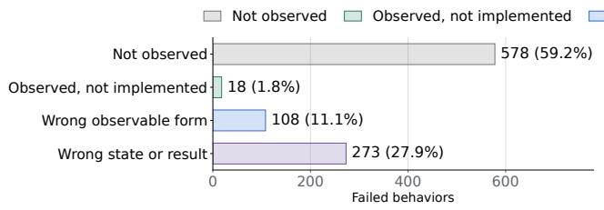  
(a) Failure categories

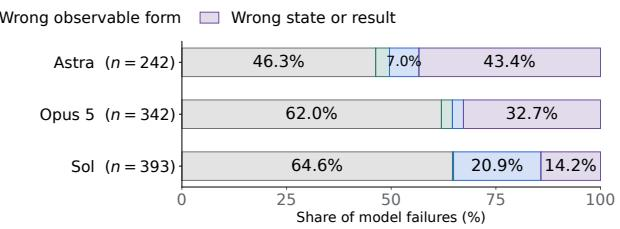  
(b) Distribution by model  
Figure 12: Full-application reconstruction failures. Across 36 runs on 12 applications, (a) counts failures in the four categories and (b) shows their distribution within each model's failures.

Behavior-level reconstruction outcomes. As shown in Figure 12, the largest failure category is behavior that was not observed in the reference, accounting for 59.2% of failures. The remaining failures occur after the relevant behavior has been observed. Of these, 1.8% are observed but not implemented, 11.1% are implemented with the wrong observable form, and 27.9% produce the wrong state, route, or result. These outcomes reveal difficulties both in exploring the reference and in faithfully reproducing behaviors that have already been observed.

What validation missed. Agents checked that their reconstructed applications worked, but these checks did not always establish faithful reproduction of the reference behavior. In the failure cases in Figure 13, agents often validated related functionality or a limited set of workflows without rechecking the failing workflow after the final relevant source edit. For example, validating native resume creation and export did not reveal a failure in external JSON Resume import, while syntax-only checks did not reveal that report edits in W&B were not persisted.

Checks such as syntax validation, successful backend requests, or selected text matches can establish that an application runs without showing that its behavior matches the reference. As a result, omitted behaviors, incorrect observable forms, and wrong state transitions can remain undetected even when the relevant reference behavior has already been observed.

A related pattern appears in partial-application reconstruction, where current-app observation effort per target decreases as restoration depth increases (Figure 10).

Example failure cases. Figure 13 illustrates four reconstruction errors that remain after agent validation. For each case, we replay the same action sequence on the reference and the final submission to expose the behavioral mismatch. Across the four examples, the agent's validation does not recheck the exact workflow that reveals the remaining error after its final relevant edit.

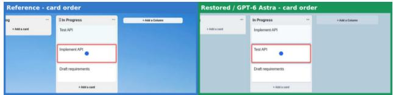  
(a) Trello (Knowankit), GPT-6 Astra

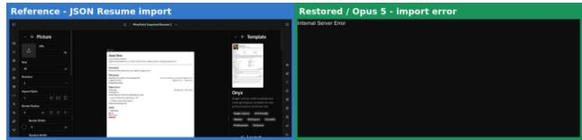  
(b) Reactive Resume, Opus 5

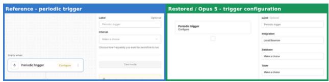  
(c) Baserow, Opus 5

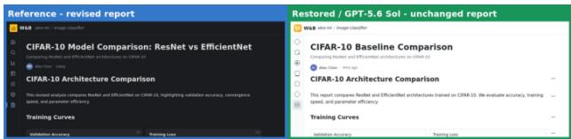  
(d) W&B, GPT-5.6 Sol  
Figure 13: Reconstruction errors missed during validation. In each panel, the reference application appears on the left and the final submission on the right. (a) Dragging a card leaves the cards in the wrong order. (b) Importing a JSON Resume produces a rendering failure. (c) A periodic trigger shows database settings instead of an interval setting. (d) Changes to a report's title and summary are not saved.

In Trello (Knowankit), Astra reconstructs card dragging, but a center drop leaves the cards in the opposite order from the reference. After the final relevant edit, the agent validates other board interactions rather than this drag workflow, so the ordering error remains undetected.

In Reactive Resume, Opus 5 implements JSON Resume import without converting the uploaded schema into the representation expected by the application, causing the imported resume to fail during rendering. Its final validation covers native resume creation, editing, and export, but does not exercise import of the external JSON Resume schema.

In Baserow, a trigger determines how an automated workflow starts. A periodic trigger should expose an Interval setting that specifies how often the workflow runs. Opus 5 changes the trigger title to Periodic trigger, but leaves the underlying database-trigger form in place. The reconstructed application therefore shows Integration, Database, and Table instead of the expected Interval setting. The agent validates a database-trigger workflow but does not recheck the periodic-trigger configuration.

Finally, in W&B, Sol renders a report editor but does not persist changes to the title and summary. After the same editing sequence, the reference retains the revised report while the reconstructed application still shows the original text. The agent's final checks cover syntax without reopening the edited report, so the failed state update remains undetected.

## 4 Related Works

Repository-level software-engineering benchmarks. A large body of work evaluates coding agents on repositorylevel software engineering. SWE-bench [15] asks agents to resolve real GitHub issues, while R2E-Gym [14], SWEsmith [36], and related pipelines scale executable task construction from commits, tests, and source repositories, and open agent platforms such as OpenHands [28] standardize how such agents are built and run. DeepSWE [13] pushes the same setting toward long-horizon engineering work, where a single task spans many dependent changes. SWE-bench Multimodal [35] augments issue descriptions with visual evidence, and SWE-Together [29] extends this setting to multi-turn sessions in which users progressively clarify or correct requirements. These benchmarks increasingly capture realistic repository editing and execution, but the desired behavior is still supplied through an issue, test-derived task, visual artifact, or user interaction. ProgramDistill instead requires the agent to recover the specification by interacting with a working application, and uses the application's own executable behaviors as both repair targets and replayable verifiers.

Visual and interactive web development. Web2Code [38] and Design2Code [26] study reconstructing webpages from visual references, while Interaction2Code [31] extends this setting to interactive behavior. Vision2Web [12] and VISTA [10] further broaden the scope toward interactive and full-stack web development from text, image, or design specifications. ProgramDistill differs in that the target behavior is not provided as a fixed artifact. The agent must decide what to inspect, exercise a live reference to uncover stateful behavior, relate those observations to an existing codebase, implement the missing functionality, and validate the result against the running application. The distinction is thus a shift from specification consumption to specification discovery.

Behavioral reconstruction and reverse engineering. Recovering an unstated specification has been studied from the source side, where SpecRover [25] infers program intent to guide repair, and from the verification side, where oracle automation [20] derives the assertions a test needs. In ProgramDistill both come from the running application itself, since a mined trace is at once the intent to restore and the oracle that checks it. ProgramBench [37] and MirrorCode [1] provide the closest precedent for treating executable software as a behavioral specification, where agents probe a program without its source and reconstruct an implementation that matches its externally visible behavior. Their primary unit, however, is holistic program reimplementation. ProgramDistill instead factorizes an interactive application into replayable behaviors, preserves their prerequisite relationships, and recomposes them into tasks of increasing depth. The same behavioral substrate supports atomic repair, cumulative repair across dependent workflows, and full-application reconstruction under a common verifier.

Browser-use agents and environments. A broad line of work studies agents that complete user-specified tasks through interaction with existing websites, including WebArena [39], VisualWebArena [17], WorkArena [5]. Mind2Web [6], WebVoyager [11], and BU Bench [21]. OSWorld [32] evaluates agents on computer-use tasks involving existing web and desktop applications. A complementary line of work develops browser interfaces and execution infrastructure for such agents. BrowserGym [5] provides a unified environment with common observation and action spaces across web-agent benchmarks. Browser Use [21] integrates page observations and browser-control tools into an agent framework. Anthropic's browser use tool [2] provides tools for reading page structure and interacting with referenced elements. Playwright MCP [19] exposes Playwright browser automation through accessibility snapshots and element-level actions.

ProgramDistill similarly couples coding with iterative browser-based observation and execution, but the code serves a different purpose. Rather than producing an automation program that operates a website, the agent modifies the application itself to recover behavior observed from a working reference. It must infer intended behavior through interaction, repair or reconstruct the source implementation, and validate the result against the reference. Moreover, ProgramDistill turns discovered interactions into both software-engineering tasks and replayable verifiers, using browser interaction not only for execution but also for task construction and evaluation.

Taken together, prior benchmarks isolate important parts of the software development process. ProgramDistill brings them into a single closed-loop setting in which an agent must observe, infer, implement, and validate behavior against a live reference. This closely mirrors reference-guided web development, where a developer studies an existing product or prototype, modifies the implementation, and repeatedly checks the result. At the same time, ProgramDistill turns the behaviors uncovered from the application into the tasks and verifiers themselves, providing one substrate for studying localized repair, compositional workflows, and full-application reconstruction.

## 5 Discussion

Limitations and future work. Agents in both partial- and full-application reconstruction receive structured browser observations of visible text, accessibility information, and interactive elements, without accompanying multimodal screenshot inputs. Extending the observation interface with screenshots would enable visually grounded interaction, while evaluating visual fidelity would require criteria beyond the current replay-based behavioral checks.

Our experiments also focus on self-contained web applications. Extending ProgramDistill to more open-ended settings involving external services, nondeterministic state, and desktop or mobile applications remains an important direction for future work.

Benchmark construction in our experiments uses GPT-5.6 Sol throughout the mine-craft-patch pipeline. The coverage and quality of mined behaviors and generated repair tasks may therefore depend on the capability of the construction model. More capable models could improve behavior discovery, masking, and task construction, while also increasing generation cost. Characterizing this quality-cost trade-off across construction models is an important direction for future work.

ProgramDistill also depends on the browser and agent infrastructure used to expose, record, and replay application behavior. The current browser helper relies on replay-stable selectors and settled structured observations, while the agent harness determines how models access and revisit those observations. Improvements in replay robustness, observation quality, or agent tooling could expand the set of behaviors that can be reliably mined and may affect measured agent performance. Characterizing the sensitivity of ProgramDistill to these infrastructure choices is another direction for future work

Beyond evaluation, the replay-verifiable tasks and agent trajectories produced by ProgramDistill provide a natural basis for training coding agents. Trajectories from frontier agents can be distilled into training data for smaller models, while replay-verifiable tasks can serve directly as reinforcement learning environments. Restoration depth further provides a controllable curriculum axis from atomic repairs to increasingly compositional workflows. We leave the use of ProgramDistill for training coding agents to future work.

Potential misuse. Reference-guided software engineering could be misused to clone proprietary applications or reproduce their functionality without authorization. Our experiments are limited to self-contained applications derived from public or open-source repositories, and the framework is intended only for research and authorized software development.

Conclusion. We introduced ProgramDistill, a framework that turns the end-to-end workflow of reference-guided web development into verifiable software-engineering tasks. Agents must inspect a working application, infer its behavior, recover that behavior through source-code changes, and validate the result against the reference. By factorizing applications into replayable behaviors while preserving their prerequisite relationships, ProgramDistill provides a common substrate spanning localized repair, compositional workflows, and full-application reconstruction. Across frontier coding agents, performance declines with restoration depth, while full-application reconstruction leaves substantial behavior unrecovered. These complementary settings expose gaps between observing reference behavior, implementing it, and validating the resulting application, making ProgramDistill a diagnostic benchmark for current coding agents.

More broadly, ProgramDistill shows that executable software can serve not only as a target for evaluation, but as a scalable source of specifications, tasks, verifiers, and learning signals. This opens a path toward a continual cycle in which working software generates increasingly challenging tasks that both reveal the limits of current coding agents and provide the experience needed to push beyond them.

## Acknowledgment

We thank Emiliano Penaloza, Christopher Cui, Jonathan Light, and Roger Creus Castanyer for their valuable discussions and insightful feedback.

## References

[1] T. Adamczewski, D. Owen, D. Rein, F. Brand, G. Edkins, A. Hart, and D. O'Connell. Mirrorcode: Ai can rebuild entire programs from behavior alone. arXiv preprint arXiv:2606.30182, 2026.

[2] Anthropic. Browser use tool. Claude Platform documentation, 2026.

[3] Anthropic. Claude opus 5 system card, 2026.

[4] Anthropic. Claude sonnet 5 system card, 2026.

[5] T. L. S. de Chezelles, M. Gasse, A. Lacoste, M. Caccia, A. Drouin, L. Boisvert, M. Thakkar, T. Marty, R. Assouel S. O. Shayegan, L. K. Jang, X. H. Lù, O. Yoran, D. Kong, F. F. Xu, S. Reddy, G. Neubig, Q. Cappart, R. Salakhut-

dinov, and N. Chapados. The browsergym ecosystem for web agent research. Transactions on Machine Learning Research, 2025. Expert Certification.

[6] X. Deng, Y. Gu, B. Zheng, S. Chen, S. Stevens, B. Wang, H. Sun, and Y. Su. Mind2web: Towards a generalist agent for the web. Advances in Neural Information Processing Systems, 36:28091–28114, 2023.

[7] Google DeepMind. Gemini 3.1 pro model card, 2026.

[8] Google DeepMind. Gemini 3.6 flash model card, 2026.

[9] Google DeepMind. Gemini 3.7 flash model card, 2026.

[10] J. Guo, Y. Yao, J. Chen, et al. Vista: An end-to-end benchmark for visual spec-to-web-app coding agents. arXiv preprint arXiv:2605.26144, 2026.

[11] H. He, W. Yao, K. Ma, W. Yu, Y. Dai, H. Zhang, Z. Lan, and D. Yu. Webvoyager: Building an end-to-end web agent with large multimodal models. In Proceedings of the 62nd Annual Meeting of the Association for Computational Linguistics (Volume 1: Long Papers), pages 6864–6890, 2024.

[12] Z. He, W. Hong, Z. Yang, Z. Pan, M. Liu, X. Gu, and J. Tang. Vision2web: A hierarchical benchmark for visual website development with agent verification. arXiv preprint arXiv:2603.26648, 2026.

[13] W. Huang, C. Lee, L. Tng, and S. Ge. Deepswe: Measuring frontier coding agents on original, long-horizon engineering tasks. arXiv preprint arXiv:2607.07946, 2026.

[14] N. Jain, J. Singh, M. Shetty, T. Zhang, L. Zheng, K. Sen, and I. Stoica. R2e-gym: Procedural environments and hybrid verifiers for scaling open-weights SWE agents. In NeurIPS 2025 Fourth Workshop on Deep Learning for Code, 2025.

[15] C. E. Jimenez, J. Yang, A. Wettig, S. Yao, K. Pei, O. Press, and K. Narasimhan. Swe-bench: Can language models resolve real-world github issues? In International Conference on Learning Representations, volume 2024, pages 54107–54157, 2024.

[16] J. Kim, X. Luo, M. Kim, S. Lee, D. Kim, J. Jeon, D. Li, and Y. Yang. Why does self-distillation (sometimes) degrade the reasoning capability of LLMs? In Third Conference on Language Modeling, 2026.

[17] J. Y. Koh, R. Lo, L. Jang, V. Duvvur, M. Lim, P.-Y. Huang, G. Neubig, S. Zhou, R. Salakhutdinov, and D. Fried. Visualwebarena: Evaluating multimodal agents on realistic visual web tasks. In Proceedings of the 62nd Annual Meeting of the Association for Computational Linguistics (Volume 1: Long Papers), pages 881–905, 2024.

[18] Microsoft. Playwright-fast and reliable end-to-end testing for modern web apps. https://playwright. dev/, 2024.

[19] Microsoft Corporation. Playwright MCP. GitHub, 2026.

[20] F. Molina, A. Gorla, and M. d’Amorim. Test oracle automation in the era of llms. ACM Transactions on Software Engineering and Methodology, 34(5):1–24, 2025.

[21] M. Müller and G. Žunič. Browser use: Enable ai to control your browser, 2024.

[22] OpenAI. GPT-5.3-Codex system card, 2026.

[23] OpenAI. Gpt-5.6 sol: Frontier intelligence that scales with your ambition, 2026.

[24] OpenAI. Gpt-6 astra system card. September 2026.

[25] H. Ruan, Y. Zhang, and A. Roychoudhury. Specrover: Code intent extraction via llms. In 2025 IEEE/ACM 47th International Conference on Software Engineering (ICSE), pages 963–974. IEEE, 2025.

[26] C. Si, Y. Zhang, R. Li, Z. Yang, R. Liu, and D. Yang. Design2code: Benchmarking multimodal code generation for automated front-end engineering. In Proceedings of the 2025 Conference of the Nations of the Americas Chapter of the Association for Computational Linguistics: Human Language Technologies (Volume 1: Long Papers), pages 3956–3974, 2025.

[27] A. Sonwane, I. White, H. Lee, M. Pereira, L. Caccia, M. Kim, Z. Shi, C. Singh, A. Sordoni, M.-A. Côté, et al. Bugpilot: Complex bug generation for efficient learning of swe skills. arXiv preprint arXiv:2510.19898, 2025.

[28] X. Wang, B. Li, Y. Song, F. F. Xu, X. Tang, M. Zhuge, J. Pan, Y. Song, B. Li, J. Singh, et al. Openhands: An open platform for ai software developers as generalist agents. In International Conference on Learning Representations, volume 2025, pages 65882–65919, 2025.

[29] Y. Wu, Z. Zhao, S. Li, H. H. Lee, J. Zhu, S. Wu, T. Yu, S. Li, L. Zhang, X. Fan, et al. Swe-together: Evaluating coding agents in interactive user sessions. arXiv preprint arXiv:2606.29957, 2026.

[30] xAI. Model card: Grok 4.6, 2026.

[31] J. Xiao, Y. Wan, Y. Huo, Z. Wang, X. Xu, W. Wang, Z. Xu, Y. Wang, and M. R. Lyu. Interaction2code: Benchmarking mllm-based interactive webpage code generation from interactive prototyping. In 2025 40th IEEE/ACM International Conference on Automated Software Engineering (ASE), pages 241–253. IEEE, 2025.

[32] T. Xie, D. Zhang, J. Chen, X. Li, S. Zhao, R. Cao, T. J. Hua, Z. Cheng, D. Shin, F. Lei, et al. Osworld: Benchmarking multimodal agents for open-ended tasks in real computer environments. Advances in Neural Information Processing Systems, 37:52040–52094, 2024.

[33] Z. Xu, J. Lu, Y. Zheng, Y. Wang, and X. Qiu. Swe-bench science: Can coding agents resolve engineering tasks in science? arXiv preprint arXiv:2608.19799, 2026.

[34] J. Yang, C. Jimenez, A. Wettig, K. Lieret, S. Yao, K. Narasimhan, and O. Press. Swe-agent: Agent-computer interfaces enable automated software engineering. Advances in Neural Information Processing Systems, 37:50528– 50652, 2024.

[35] J. Yang, C. E. Jimenez, A. L. Zhang, K. Lieret, J. Yang, X. Wu, O. Press, N. Muennighoff, G. Synnaeve, K. R. Narasimhan, D. Yang, S. Wang, and O. Press. SWE-bench multimodal: Do AI systems generalize to visual software domains? In The Thirteenth International Conference on Learning Representations, 2025.

[36] J. Yang, K. Lieret, C. Jimenez, A. Wettig, K. Khandpur, Y. Zhang, B. Hui, O. Press, L. Schmidt, and D. Yang. Swe-smith: Scaling data for software engineering agents. Advances in Neural Information Processing Systems, 38, 2026.

[37] J. Yang, K. Lieret, J. Ma, P. Thakkar, D. Pedchenko, S. Sootla, E. McMilin, P. Yin, R. Hou, G. Synnaeve, et al. Programbench: Can language models rebuild programs from scratch? arXiv preprint arXiv:2605.03546, 2026.

[38] S. Yun, H. Lin, R. Thushara, M. Q. Bhat, Y. Wang, Z. Jiang, M. Deng, J. Wang, T. Tao, J. Li, et al. Web2code: A large-scale webpage-to-code dataset and evaluation framework for multimodal llms. Advances in neural information processing systems, 37:112134–112157, 2024.

[39] S. Zhou, F. F. Xu, H. Zhu, X. Zhou, R. Lo, A. Sridhar, X. Cheng, T. Ou, Y. Bisk, D. Fried, et al. Webarena: A realistic web environment for building autonomous agents. In International Conference on Learning Representations, volume 2024, pages 15585–15606, 2024.

## Appendix Contents

A Application Corpus 19   
A.1 Deterministic Execution 19   
B Browser Helper Implementation Details 21   
B.1 Action Vocabulary 21   
B.2 Replay-Stable Element Addressing 21   
B.3 Settled Observations 22   
C Agent Harness and Execution Settings 23   
C.1 Runtime Architecture and Isolation 23   
C.2 Observations and Execution Settings . 24   
D Mining Agent Prompts and Trace Representation 25   
D.1 Mining-Agent Orchestration 25   
D.2 Planner 25   
D.3 Collector 26   
D.4 Relabeler 28   
D.5 Round Reflector . 28   
D.6 Admitted Trace Representation 28   
D.7 Trace Evolution Across Mining Stages . 29   
E Crafting Agent Prompts 30   
E.1 Task Generator 30   
E.2 Mask-Depth Critic 31   
E.3 Cumulative Mask Merger . 31   
F Partial- and Full-Application Reconstruction Instructions 33   
F.1 Partial-Application Reconstruction 33   
F.2 Full-Application Reconstruction 34   
G Model Pricing and Execution Time 37   
G.1 Model Pricing 37   
G.2 Execution Time 37   
H More Experimental Results 38   
H.1 Results by Mask Scope 38   
H.2 Results Under the Chain Score 38   
H.3 Does Context Length Explain the Depth Effect?. 39   
H.4 Agent Interaction Statistics 40

## A Application Corpus

The corpus contains 26 self-contained interactive web applications drawn from two sources. Eighteen are adapted from the OSWorld web-application suite [32], which provides a controlled and diverse interaction substrate. The remaining eight are real-world open-source projects and SaaS clones taken from public repositories. These contribute larger codebases, deeper workflows, nontrivial state, and heterogeneous architectures, spanning Django, Angular, React, and Next.js stacks with SQL and document back ends.

Each application is pinned to a single upstream commit. Its runtime image is rebuilt from that commit and checked to reproduce the vendored source tree, so mining, masking, repair, and replay all run against a byte-identical application. Table 3 lists each application with its source repository, pinned commit, and numbers of atomic and cumulative tasks. The number of mined tasks varies across applications, reflecting differences in how many behaviors can be reliably discovered and replay-verified under each application's state and interaction dynamics. Figure 14 shows representative interfaces from both sources.

Table 3: The 26 applications in the ProgramDistill corpus. Task counts are the atomic and cumulative partialapplication reconstruction tasks mined from each application.
<table><tr><td>Application</td><td>Source repository</td><td>Commit</td><td>Atomic</td><td>Cum.</td><td>Total</td></tr><tr><td colspan="6">OSWorld-derived applications</td></tr><tr><td>AWS Console</td><td>Task-Web/awsconsole_web</td><td>794c1cc1</td><td>155</td><td>42</td><td>197</td></tr><tr><td>BaseSite</td><td>Task-Web/basesite</td><td>4c06e3d7</td><td>147</td><td>70</td><td>217</td></tr><tr><td>BudgetWise</td><td>Task-Web/budgetwise_web</td><td>bf3903f6</td><td>198</td><td>92</td><td>290</td></tr><tr><td>Calendar</td><td>Task-Web/calendar_web</td><td>6a7a8d1d</td><td>136</td><td>45</td><td>181</td></tr><tr><td>CareerLink</td><td>Task-Web/careerlink_web</td><td>33352a1c</td><td>197</td><td>70</td><td>267</td></tr><tr><td>CloudCRM</td><td>Task-Web/cloudcrm_web</td><td>1c7a1653</td><td>53</td><td>3</td><td>56</td></tr><tr><td>Eventix</td><td>Task-Web/eventix_web</td><td>f60c3463</td><td>20</td><td>3</td><td>23</td></tr><tr><td>ExpenseFlow</td><td>Task-Web/expenseflow_web</td><td>487fd168</td><td>2</td><td>0</td><td>2</td></tr><tr><td>FormCraft</td><td>Task-Web/formcraft_web</td><td>5c20ecdf</td><td>25</td><td>4</td><td>29</td></tr><tr><td>Insurance</td><td>Task-Web/insurance_claim_web</td><td>720120c7</td><td>92</td><td>49</td><td>141</td></tr><tr><td>MailHub</td><td>Task-Web/mailhub_web</td><td>4603ec38</td><td>198</td><td>49</td><td>247</td></tr><tr><td>ReviewSphere</td><td>Task-Web/reviewsphere_web</td><td>8e4f9706</td><td>69</td><td>21</td><td>90</td></tr><tr><td>StreamView</td><td>Task-Web/streamview_web</td><td>ea965045</td><td>105</td><td>53</td><td>158</td></tr><tr><td>TeamChat</td><td>Task-Web/teamchat_web</td><td>ed077b4d</td><td>161</td><td>68</td><td>229</td></tr><tr><td>TravelHub</td><td>Task-Web/travelhub_ad_web</td><td>b45dae8e</td><td>34</td><td>11</td><td>45</td></tr><tr><td>VaultBank</td><td>Task-Web/vaultbank_web</td><td>e9ebb7e4</td><td>131</td><td>33</td><td>164</td></tr><tr><td>Visa Application</td><td>Task-Web/visaapplication_web</td><td>c0e14ed0</td><td>52</td><td>42</td><td>94</td></tr><tr><td>Weights &amp; Biases</td><td>Task-Web/wandb_web</td><td>1c781220</td><td>126</td><td>52</td><td>178</td></tr><tr><td colspan="6">Real-world open-source projects and SaaS clones</td></tr><tr><td>Actual Budget</td><td>actualbudget/actual</td><td>e0880f39</td><td>36</td><td>18 126</td><td>54</td></tr><tr><td>Reactive Resume</td><td>amruthpillai/reactive-resume</td><td>dcf1b28c</td><td>246</td><td>105</td><td>372</td></tr><tr><td>Baserow</td><td>baserow/baserow</td><td>8d7c0111</td><td>207</td><td></td><td>312</td></tr><tr><td>Trello (Knowankit)</td><td>knowankit/trello-clone</td><td>19e9d64a</td><td>93</td><td>46</td><td>139</td></tr><tr><td>Jira (Oldboyxx)</td><td>oldboyxx/jira_clone</td><td>26a9e77b</td><td>122</td><td>62</td><td>184</td></tr><tr><td>Jira (Trungvose)</td><td>trungvose/jira-clone-angular</td><td>20b50e9a</td><td>24</td><td>2</td><td>26</td></tr><tr><td>Trello (Vdevired)</td><td>vdevired/trello-clone</td><td>1a40f9e5</td><td>86</td><td>60</td><td>146</td></tr><tr><td>Calendly</td><td>WebDevSimplified/calendly-clone</td><td>730c5f19</td><td>147 2862</td><td>75</td><td>222</td></tr><tr><td colspan="5">Total</td><td>4063</td></tr></table>

## A.1 Deterministic Execution

Reliable replay requires each trace to begin from the same application state and the same application time. Our mine-craft-pat ch pipeline resets the application before every collection and replay so that each trace starts from the same seeded state. To control time-dependent behavior, each trace also records the application time at which it was collected. On replay, the application clock is shifted so that execution starts from the same time while continuing to advance normally.


  
(a) Eventix (events)  
(b) StreamView (video)

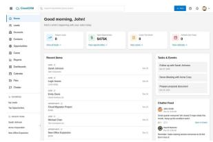  
(c) C1oudCRM (CRM)

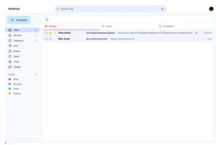  
(d) MailHub (email)

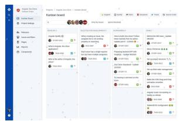  
(e) Jira clone (kanban)

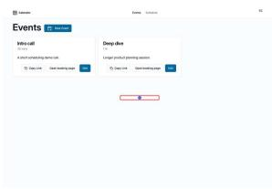  
(f) Calendly (scheduling)

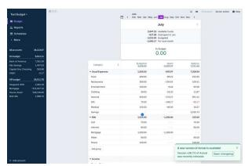  
(g) Actual Budget (finance)

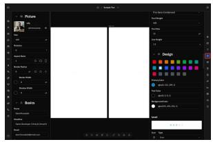  
(h) Reactive Resume (re-

Figure 14: Example applications in the ProgramDistill corpus. Top row (a-d) shows OSWorld-derived apps. Bottom row (e-h) shows real-world open-source clones.

The system computes a constant offset between the recorded application time and the host clock. This offset is applied through libfaketime to the application server, interpreter, and database. The browser helper applies the same offset to the page's Date implementation, keeping the frontend and backend synchronized to the same application clock.

Because the offset remains constant, time continues to advance at the normal rate during execution. This preserves relative ordering, durations, and timeout semantics while keeping behavior that depends on the current date or time consistent across replays. For example, a booking interface that renders available dates relative to “today" presents the same dates during collection and subsequent replay.

## B Browser Helper Implementation Details

ProgramDistill uses a shared browser helper across mining, replay verification, and repair evaluation. The helper executes actions in a real Chromium instance and returns structured observations of the resulting application state. Table 4 summarizes the browser actions supported by the helper. Reliable replay additionally requires two properties: recorded actions must refer to stable interaction targets, and observations must avoid transient intermediate states. We describe these mechanisms below. The solver-facing view of these observations is filtered as described in Appendix C.

## B.1 Action Vocabulary

All stages use the same underlying browser helper, although the actions exposed to each stage differ slightly. Common actions support observation, navigation, and interaction with visible elements. Repair additionally supports joint observation of the reference and editable applications, while mining exposes actions used for trace construction. Table 4 lists the complete action vocabulary.

Table 4: Browser-helper action vocabulary. Common actions are available during both mining and repair. Repair additionally exposes side-by-side observation of the reference and editable applications, while mining provides several actions used for trace construction.
<table><tr><td>Command</td><td>Arguments</td><td>Effect</td></tr><tr><td colspan="3">Common actions</td></tr><tr><td>observe</td><td>page</td><td>Return a settled observation containing the current URL, visible text, and interactable elements.</td></tr><tr><td>click</td><td>page, elementId</td><td>Click an element from the latest observation.</td></tr><tr><td>type</td><td>page, elementId, text</td><td>Enter text into an interactable field.</td></tr><tr><td>hover</td><td>page, elementId</td><td>Hover over an element.</td></tr><tr><td>focus</td><td>page, elementId|selector</td><td>Move browser focus to a target element.</td></tr><tr><td>press</td><td>page, key</td><td>Send a keyboard input to the page.</td></tr><tr><td>scroll</td><td>page, direction, [elementId]</td><td>Scroll the page, or a specified scrollable element, upward or downward.</td></tr><tr><td>wait</td><td>page, ms</td><td>Wait for a bounded interval and return the resulting settled observation.</td></tr><tr><td>drag</td><td>page, elementId+targetElementId</td><td>Drag one observed element to another and record stable selectors for both endpoints.</td></tr><tr><td>back/forward upload</td><td>page page, elementId, file</td><td>Navigate backward or forward through browser history. Upload a file through an observed file input. During mining this</td></tr><tr><td></td><td></td><td>may reuse an artifact produced by a prerequisite trace.</td></tr><tr><td colspan="3">Repair-only actions</td></tr><tr><td>observe-both</td><td>none</td><td>Observe the editable and reference applications together for behavioral comparison.</td></tr><tr><td>reset-reference</td><td>none</td><td>Restore the clean seeded reference state after exploratory mutations.</td></tr><tr><td colspan="3">Mining-only actions</td></tr><tr><td>navigate</td><td>path</td><td>Load a specified in-application path.</td></tr><tr><td>waitForSelector</td><td>selector</td><td>Wait until a specified element appears before continuing trace collection.</td></tr></table>

## B.2 Replay-Stable Element Addressing

Frontend-generated DOM identifiers and class names can change across application builds, making them unreliable for replay. ProgramDistill therefore separates the temporary identifiers used during live interaction from the selectors stored in recorded traces.

Each observation assigns a transient numeric elementId to every visible interactable element and exposes browserobservable attributes such as accessibility roles and names, labels, placeholders, visible text, links, and test IDs. For each element, the helper attempts to construct a selector from these attributes. Actions are issued using elementId, but the recorded trace stores the corresponding selector instead.

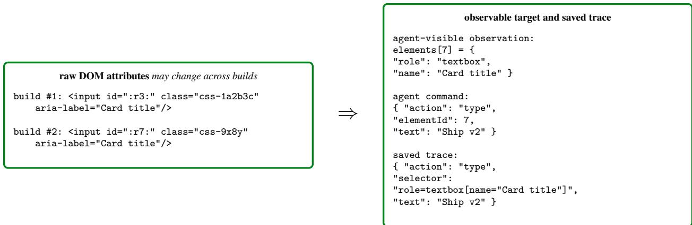  
Figure 15: Replay-stable element addressing. Recorded actions use browser-observable descriptors rather than frontend-generated DOM identifiers, which may change across builds.

As illustrated in Figure 15, this allows recorded actions to locate the same logical element even when generated DOM attributes change across builds. If the observable attributes do not uniquely identify an element, no selector is produced and actions targeting that element are refused. Thus, every element-targeted action retained in a trace has a selector that can be resolved during replay.

## B.3 Settled Observations

Browser actions can trigger asynchronous updates, so recording state immediately after an action may capture a transient intermediate state. ProgramDistill therefore waits for browser activity to settle before recording each observation.

After an action, the helper applies a short delay and monitors both network activity and DOM mutations. By default, an observation is considered settled when no tracked requests remain in flight and the DOM has remained unchanged for 400,ms. The procedure is capped at 10,s to avoid blocking indefinitely on applications with continuous updates. DOM mutations include changes to elements, attributes, and text, allowing the helper to detect updates caused by timers, WebSockets, and server-sent events.

Once settled, the helper records the current URL, interactable elements, application-state signals, observed API statuses, and an interaction screenshot. Figure 16 illustrates how this procedure avoids recording transient states. Traces that fail to reach a settled observation within the configured limit are treated as non-reproducible and excluded from the verified trace bank.

Screenshots are retained for analysis but are not used uniformly as model inputs. During mining, the Relabeler receives an animated GIF of the cleaned trace together with the executed actions and outcome evidence. The repair and full-application reconstruction agents, in contrast, receive only structured browser observations. Replay verification likewise uses recorded actions and expected-signal assertions rather than LLM-based visual judgment.

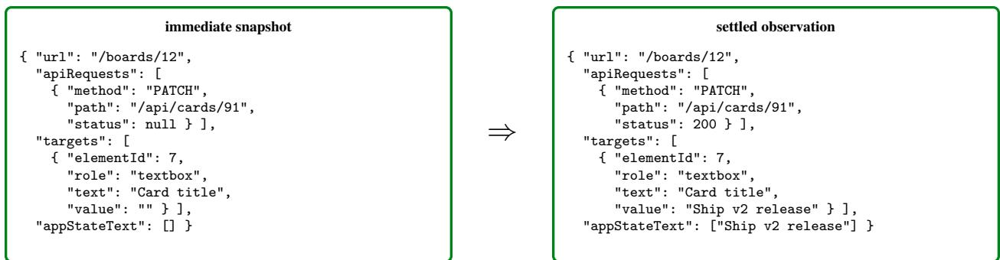  
Figure 16: Settled observations. Observations are recorded after bounded browser and network activity has stabilized, reducing the chance that traces encode transient intermediate states.

## C Agent Harness and Execution Settings

The agent harness builds on R2E-Gym [14], retaining its coding-tool interface and adding live browser interaction through the browser CLI. This section describes runtime boundaries, permitted communication, observation handling, conversation-history management, and execution settings. Details of browser actions and element addressing are provided in Appendix B, while the instructions for partial-application and full-application reconstruction appear in Appendix F.

## C.1 Runtime Architecture and Isolation

The harness separates the runtime into three components, the editable application, the reference-side browser service, and the verifier. Figure 17 illustrates their roles and the communication paths used during reference-guided implementation. The key design principle is that the agent may observe the behavior of the reference application without receiving its source code or a source checkout that could be copied directly.

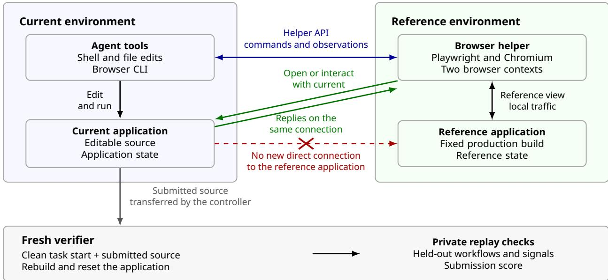  
Figure 17: Runtime layout and permitted communication. The browser helper runs on the reference side and maintains isolated contexts for the fixed reference and editable current applications. The current context communicates with the editable application across the runtime boundary, while direct agent access to reference-application ports is blocked. Submitted source is evaluated separately in a fresh verifier. Arrows denote logical communication paths rather than a shared filesystem.

Editable current environment. The agent's shell and file tools operate only on the current application. In partialapplication reconstruction tasks, the agent starts from a source tree in which selected implementation details are masked. In full-application reconstruction tasks, it starts from a minimal executable scaffold. In both cases, the agent may edit the application source, run the resulting implementation, and inspect its behavior.

The agent's browser command does not launch a separate browser inside the editable environment. Instead, it acts as a thin client for the reference-side browser service, which performs browser interactions on the agent's behalf.

Reference environment and browser service. The reference environment contains the fixed production application and a Playwright-based browser helper. The helper maintains two isolated browser contexts, reference and current, with separate cookies, storage, and page state. The reference context opens the fixed production application locally while the current context connects across the runtime boundary to the editable application. In the latter case, the browser acts only as a client of the current application. This browser connection does not expose the agent's source tree to the reference application or browser service.

The helper exposes browser interactions through a constrained API and returns structured observations to the agent.   
Browser recordings, temporary state, and other internal artifacts remain outside the submitted source tree.

Control traffic and application traffic. Two kinds of network traffic are involved. The agent sends control traffic to the browser helper on port 7788 to request browser actions and observations. Separately, the browser generates application traffic when its reference or current context connects to an application.

Access to the helper does not permit the agent to connect directly to reference-application ports. The current browser context, however, must receive responses from the editable application across the runtime boundary. The network filter therefore allows only reply packets that connection tracking associates with an existing browser connection. This preserves communication between the browser and current application without opening a broader network path from the agent to the reference application. The same policy is used for both evaluation settings.

Fresh verification and isolation scope. After implementation, a trusted controller transfers the submitted source to a separate verifier. The verifier starts from a clean task baseline, applies the submission, rebuilds the application, resets persistent state, and replays the evaluation workflows. It does not reuse the agent's interactive runtime state.

Private grading information, including grading traces, expected signals, and the gold patch, remains outside the agentvisible interface. Success therefore depends on whether the submitted source reproduces the required behavior under fresh verification, rather than on the state of the agent's final browser session.

These boundaries separate editable source code, observable reference behavior, and private grading material. They provide the isolation required for the intended reference-guided evaluation setting, but are not designed as a generalpurpose sandbox for arbitrary hostile code.

## C.2 Observations and Execution Settings

Agent-visible information. The agent receives text-based tool outputs. These include shell stdout and stderr, displayed file contents and editing feedback, search results, and structured browser observations containing the URL, visible text, element IDs, roles, accessible names, and input values. Full reconstruction additionally exposes selectors for observed targets. Screenshots, screenshot paths, raw HTML, API-request logs, and internal artifact paths are excluded from agent-facing responses.

Recoverable tool observations. The harness preserves solver-visible tool outputs separately from the model context under /workspace/programdistil1/observations/, outside the submitted source directory. Outputs up to 20,000 characters are shown directly, while longer outputs are paginated into an initial 20,000-character segment followed by 15,000-character segments that can be read on demand. This lets agents revisit earlier observations even after the corresponding turns leave the model context, without repeating state-changing browser actions such as clicks or form submissions.

Conversation-history management. When the retained history exceeds the token limit, the harness removes older complete turns while preserving the task instructions, the first assistant turn, and recent context. Tool calls are always kept together with their corresponding results, preventing invalid partial histories. The resulting message set is checked against the model's token limit before each call.

Execution settings. Table 5 summarizes the harness configuration for partial-application and full-application reconstruction. The history cutoff determines when older turns are removed, while the token stop threshold limits the size of the active conversation rather than cumulative API token usage. None of our runs reached the token stop threshold. The maximum agent-step limit was reached only once, by Opus 5 in partial-application reconstruction.

Table 5: Agent-harness execution settings.
<table><tr><td>Setting</td><td>Partial</td><td>Full</td></tr><tr><td>Maximum agent steps</td><td>1,000</td><td>10,000</td></tr><tr><td>Retained-history cutoff (tokens)</td><td>150,000</td><td>500,000</td></tr><tr><td>Token stop threshold (tokens)</td><td>1,000,000</td><td>5,000,000</td></tr><tr><td>Reasoning effort</td><td>high</td><td>max</td></tr><tr><td>Per-tool timeout (seconds)</td><td>90</td><td>90</td></tr><tr><td>Aggregate solver time limit</td><td>None</td><td>None</td></tr></table>

## D Mining Agent Prompts and Trace Representation

This appendix provides the mining prompts and trace representation. It presents the four mining-role prompts in execution order, the schema of an admitted trace, and the evolution of a trace across mining stages. The Collector handles both discovery and clean re-collection, with the latter using a guided prompt variant and additional context describing the established parent state or a previously successful route.

## D.1 Mining-Agent Orchestration

Mining runs in rounds over the current verified trace bank $\boldsymbol { B } ^ { ( r ) }$ . Planners propose grounded goals and optional parent traces. Collectors discover successful behaviors and then re-collect them from a clean state, while the replay verifier rejects unstable traces. Relabelers describe the behavior actually achieved, and the Reflector summarizes coverage and failures to guide the next round. Accepted traces form $\boldsymbol { B } ^ { ( r + 1 ) }$ . Figure 18 and Table 6 show this control flow. The main text uses the resulting verified traces and parent links as inputs to crafting.

Table 6: Specialized sub-agents within the mining agent.
<table><tr><td>Sub-agent</td><td>Role</td></tr><tr><td>Planner</td><td>Proposes behavior goals and route hints grounded in application evidence.</td></tr><tr><td>Collector</td><td>Pursues goals, records interactions, and selects observed success signals.</td></tr><tr><td>Relabeler</td><td>Assigns a name and description to the behavior actually achieved.</td></tr><tr><td>Reflector</td><td>Summarizes outcomes to guide later rounds.</td></tr></table>

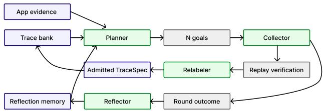  
Figure 18: Mining-agent control flow. Each round proposes goals, collects and refines candidate traces, admits only replay-verified behaviors, and uses reflection to guide the next round.

## D.2 Planner

At the beginning of each exploration round, the Planner receives the goal budget together with the current coverage, known failures, application capabilities, available parent traces, and reflections from prior rounds. It has read-only access to both the live application and the source code.

Planner system prompt   
You are TraceDiscoveryPlanner for ProgramDistill. Use 'browser\_action'(observe/click only) plus   
the read-only 'search' and 'file\_editor' (view only) tools to understand the running app and   
its source code, then call 'propose\_goals' with a DIVERSE set of grounded discovery goals.   
Evidence requirements for EACH goal:   
- Ground the behavior and 'trace\_hint' in source code you actually searched/read and UI/routes   
you actually observed; do not invent controls, transitions, or outcomes.   
- Write 'trace\_hint' as a concise natural-language route for the downstream browser agent, not   
selectors or action JSON.   
- The exact source files you actually searched/read in 'trace hint code paths'.   
- The exact UI text, accessible names, titles, or URL paths you actually observed in '   
trace\_hint\_observed\_ui'. Unsupported evidence is rejected.   
Requirements:   
- Prefer uncovered CORE capabilities that directly accomplish the product's purpose. Also   
reserve goals for meaningful SECONDARY or source-discovered behaviors that add breadth or   
replace blocked, redundant, or non-verifiable core outcomes. The capability map is guidance, not   
an allowlist.   
- Spread goals across distinct observed surfaces and varied workflow depths: focused state   
transitions, medium workflows, and grounded end-to-end workflows. Every goal must produce an   
independently valuable, browser-verifiable product outcome. Do not propose goals whose only   
novelty is opening a page, performing a routine UI gesture, toggling transient UI, or inspecting

```prolog
debug or implementation state. Prioritize state-changing, verifiable outcomes; do not pad goals.
Split only at a persistent checkpoint that has standalone value and enables a deeper follow-up.
- Deprioritize login errors, minor validation paths, generic navigation, tiny gestures, and
implementation details unless they are necessary prerequisites for a meaningful deeper workflow.
- Propose behaviors that are semantically distinct from every trace-ledger entry and from other
goals in the same round. Treat workflows as equivalent when they exercise the same product
capability, state transition, UI path, and verification pattern, even if they use different
recipients, records, names, text values, or other inputs. Do not propose parameter-only variants
, such as sending the same kind of message to a different person or repeating the same operation
on another record, unless the changed entity causes materially different product logic, UI, or
outcome.
- Do not re-propose the same or an equivalent failed workflow when its required state or control
was unavailable, unless current source/UI evidence shows that the root cause has changed.
- Each goal must be independently attemptable in the browser either from a cold start or after
replaying its declared parent chain.
- Actively use the deepest relevant 'parent_eligible=true' trace when its end-state enables the
new behavior or avoids repeating meaningful setup. The full chain replays automatically, so
describe only the novel behavior from the parent's end-state. Prefer extending that state into a
deeper or later outcome; distribute goals across relevant parents where useful.
- Never use the goal itself, a descendant, an unavailable trace, or an unrelated trace as parent.
Use a root goal only for genuine cold-start behavior that does not repeat available setup.
- After proposing goals, call 'finish'.
```

Each proposed goal has the following structure.

```json
{
"name": "...",
"description": "...",
"trace_hint": "...",
"trace_hint_code_paths": ["..."],
"trace_hint_observed_ui": ["..."],
"novelty_reason": "..."
"parent_trace": null
}
```

The purpose of the evidence fields is to make each proposed goal more faithful to the source and UI evidence available to the Planner. They record the source paths and interface values actually observed during that run, but are not otherwise used by the pipeline.

Each available parent-trace entry includes its ordered replay chain, depth, and boolean indicators is\_leaf and deepest\_leaf. The Planner also receives the current number of traces and leaf chains, along with the maximum tree depth, and is encouraged to extend a relevant leaf when possible.

## D.3 Collector

Each goal is handled by a Collector that interacts with the live application using only live browser observations. As the Collector executes the goal, the environment records every browser action it takes. After each observation, the environment also provides a set of candidate success signals derived from the observed application state, such as changes in the URL, visible text, element state, or other observable outcomes. Once the Collector reaches a coherent outcome, it selects the signals that best demonstrate that the behavior was achieved. The recorded actions and selected signals together form the candidate trace, which is subsequently replay-verified.

Collector system prompt   
You are TraceCollectorAgent for ProgramDistill. You receive one discovery goal and an optional   
natural-language route hint. Attempt the goal in the live web app through 'browser\_action',   
recording the browser actions you actually execute. The hint is guidance, not an action script:   
work only from live observations. When a coherent outcome is achieved, select observation  
derived evidence that proves it and save the trace.   
Rules:   
- Begin with 'browser\_action' action=observe. Every browser action returns a settled observation   
; use it to choose the next step. If it conclusively proves success, use that response's'

signalCandidates', call 'save\_trace' immediately, and do not observe again. Call observe   
separately only when the action response is genuinely inconclusive.   
- Interact only with elements present in the latest observation, using its 'elementId' or an   
explicit selector grounded in an observed name, label, text, or test id.   
- Use only credentials or input values supplied by the app or runtime. Never invent or brute  
force them. If authentication blocks the goal and no value is available, finish with a short   
reason.   
- Pursue the assigned goal methodically and follow the instance instructions about whether a   
partial but coherent outcome may be saved. Never claim the assigned goal succeeded when it did   
not.   
- For export or download goals, treat a non-empty saved file in the observation's 'downloads'   
array as success; a headless browser may show no separate download UI.   
- Select one or more signal candidates that materially prove the achieved outcome. When multiple   
meaningful signals are available, prefer signals from different evidence types. Exclude weak,   
unrelated, or duplicative signals, and never include a signal merely to increase the count.   
Never author or modify signal content. The selected set must collectively prove every material   
outcome you claim. A candidate with 'source=form\_value' proves only what is currently in an   
editable control; it does not by itself prove that a save, update, filter, or submission took   
effect. Likewise, a generic heading or label does not by itself prove the claimed result. Prefer   
concrete rendered results or other outcome-specific evidence. After saving, call 'finish'.   
- Stop immediately at the successful state. Do not log out, undo, navigate away, or perform   
cleanup afterward, because every subsequent browser action becomes part of the replay trace.

Prerequisite-state context. Some goals depend on application state established by an existing parent trace. Before the Collector begins, the system replays the validated parent trace and its ancestors to establish that prerequisite state The Collector is then told to continue from the resulting state and record only the novel actions needed for the current goal.

## Prerequisite-state block

PARENT STATE ALREADY ESTABLISHED: before this Collector started, the system replayed the validated parent trace [<parent\_trace>] and all of its ancestors. The browser is already at the parent's end-state. Do NOT execute the parent actions a second time; begin from the current state and record ONLY the novel actions that achieve this goal. The parent chain is replayed automatically whenever this child trace is replayed and is not duplicated inside the child's action trace.

Guided clean re-collection. Initial discovery may produce long traces because the Collector explores multiple interaction paths before reaching the goal. Once a behavior has been successfully discovered, the earlier successful route is provided back to the Collector as guidance for clean re-collection. Starting again from a clean state, the Collector uses live observations to reach the same goal through a more direct path while omitting unnecessary exploratory steps. The following block provides the earlier successful route as a hint rather than as an action sequence to reproduce exactly.

## Guided re-run block

GUIDED RE-RUN: this goal has ALREADY been confirmed reachable. Below is the earlier successful run's steps. Use them as route evidence, not as instructions to reproduce in order. From the CURRENT clean start, use live observations to take a direct route while preserving every step needed to reach and prove the assigned outcome. Omit only steps whose removal does not affect that outcome. '{initial\_title\_part\_0}' in a route is symbolic: replace it with the first segment of the CURRENT page title from the live initial state, never send the braces literally.   
Earlier successful route:   
<discovered route>

## D.4 Relabeler

Once a candidate passes replay verification, the Relabeler receives the executed actions, success evidence, and final observation, but not the original goal. It then assigns a name and description based only on the behavior actually achieved. Hiding the original goal prevents the label from being biased toward the Planner's intended outcome when the Collector reached something different.

Relabeler system prompt   
You are TraceRelabeler for ProgramDistill. You are given the browser actions an agent actually   
executed against a live web app, the machine-checkable success evidence it observed, and the   
full animated GIF rendered from every retained step in the cleaned replayable trace. Use the   
visual sequence to verify what was visibly accomplished and to avoid labels contradicted by the   
UI. Author a concise identity for THIS behavior, grounded ONLY in the actions and evidence shown.   
You are deliberately NOT told what the agent originally intended -- do not guess or restate an   
intention; describe only what the actions and evidence prove was accomplished.   
Return STRICT JSON with exactly two keys and no other prose:   
{"name": "<short lower\_snake\_case behavior id, e.g. create\_board\_and\_add\_card>", "description":   
"<one plain sentence stating what was accomplished>"}   
Rules: name is lower\_snake\_case, specific, at most 6 words; description is a single sentence   
describing the concrete achieved behavior (the outcome, not raw UI mechanics). If the evidence   
shows only navigation or a trivial read with no state change, name it accordingly (e.g.   
view\_settings\_page).

## D.5 Round Reflector

The Reflector runs after all goals in an exploration round have been processed. It reviews the application capabilities, the accumulated trace bank, the goals and outcomes from the completed round, unresolved failures, and reflections from earlier rounds. It then produces a short summary of the most important coverage gaps, failure patterns, and opportunities for deeper exploration. This reflection is appended to the reflection\_memory provided to the Planner in the next round.

Round-reflection system prompt   
You are TraceDiscoveryRoundReflector for ProgramDistill. Review one completed discovery round   
using the app's curated product specification, the cumulative trace bank, the round's proposed   
goals and concrete outcomes, the recent proposal-to-actual outcome history, prior failures, and   
recent round reflections. Produce a short advisory reflection for the NEXT Planner. Identify   
meaningful coverage bias, neglected product surfaces, useful opportunities to go deeper through   
existing parent traces, repeated failure patterns, and whether discovery appears close to   
saturation. Explicitly flag recurring near-duplicate proposals even when their names differ by   
comparing product surface, state transition, parent state, and the actual relabeled outcome.   
Distinguish useful depth from redundant repetition. Judge coverage from actual outcomes rather   
than proposed names. Reassess earlier concerns against current evidence and do not repeat   
concerns that have already been resolved. Focus on the two to four most consequential gaps   
instead of inventorying every missing capability. Do not propose a numbered goal list, selectors   
, or action steps. Do not claim a surface exists unless supported by the supplied app   
specification or trace evidence. Do not blindly repeat stale guidance.   
Return STRICT JSON with exactly one key and no other prose:   
{"reflection": "<one concise paragraph, at most 180 words>"}

## D.6 Admitted Trace Representation

After clean re-collection and replay verification, each admitted behavior is stored as a TraceSpec. The TraceSpec records the action sequence from the clean run with replay-stable selectors, the observation-grounded expected signals, and an optional reference to its immediate parent trace. It also stores a trace\_hint summarizing the latest successful

route for use as guidance in subsequent collection. Replay verification ignores this hint and depends only on the recorded actions, parent structure, and expected signals.

An admitted child TraceSpec: renaming a board list (abridged)   
{   
"name": "rename\_done\_list\_to\_completed",   
"candidate\_id": "vdevired\_trello\_clone",   
"description": "Renamed the Done list on the Workflow Pipeline board to Completed.",   
"parent\_trace": "create\_board\_with\_ordered\_lists",   
"action\_trace": [   
{   
"action": "click",   
"selector": "role=button[name=\"Rename list Done\"]"   
},   
{   
"action": "type",   
"selector": "[name=\"title\"]",   
"text": "Completed"   
"action": "press",   
"selector":""[name=\"title\"]",   
"key": "Enter"   
}   
1,   
"expected\_signals": {   
"all\_accessible\_names": [   
"Completed Rename list Completed"   
],   
"reject\_visible\_text": [   
"Done"   
1   
}   
}   
The parent trace creates and opens the Workflow Pipeline board with the Done, Ideas, and In Progress lists. After reset   
and replay of the parent chain, the child performs three actions to rename Done to Completed. Its success signals check the   
renamed list's accessible name and the absence of the old Done text. All three recorded actions are shown; the route hint, empty   
signal fields, and redundant execution metadata are omitted.

## D.7 Trace Evolution Across Mining Stages

Table 7 summarizes how a proposed behavior is refined from an exploratory goal into a replay-verified trace.

Table 7: How a candidate trace evolves through the mining pipeline.
<table><tr><td>Stage</td><td>Input</td><td>Output</td></tr><tr><td>Planning</td><td>source and UI evidence, current coverage, known failures, available parent traces, and prior reflections</td><td>a proposed behavior goal with a grounded route hint and an optional parent_trace</td></tr><tr><td>Discovery</td><td>the proposed goal and the live state established by its parent chain, if any</td><td>an exploratory action sequence, selected success evidence, and a route hint derived from the successful execution</td></tr><tr><td>Clean re-collection</td><td>the previously successful route and a clean state with the parent chain replayed</td><td>a more direct action sequence, newly selected success evidence, and a trace_hint regenerated from the clean execution</td></tr><tr><td>Replay verification</td><td>the clean action sequence, parent structure, and expected signals</td><td>a deterministic pass/fail result after reset and replay of the required parent chain and target actions</td></tr><tr><td>Relabeling</td><td>the replay-verified actions, success evidence, and final observation, without the original proposed goal</td><td>a name and description reflecting the behavior actually achieved</td></tr></table>

## E Crafting Agent Prompts

Crafting masks the source implementing a verified behavior using two LLM roles, the task generator and a stateless mask-depth critic. The generator constructs the counterfactual failures by directly editing the source code, while the critic judges whether the resulting diff removes substantive implementation or only disables it superficially. The system prompts used for the generator and critic are shown below

## E.1 Task Generator

The system prompt is assembled from common masking rules and one scope-specific clause. In each task, the generator additionally receives the app description, trace actions, expected signals, and, on a repair round, the concrete verification failure from the previous attempt.

TaskGenerator system prompt (abridged)   
You are TaskGeneratorAgent for ProgramDistill. You build feature-restoration coding tasks from a   
verified golden behavior trace of a real OSS web app.   
Your job: delete-mask every piece of source that implements that feature, so the feature is   
broken, while the application still builds and boots.   
Masking rules:   
- Remove the implementation rather than disabling the feature. Delete the substantive serializer   
, generator, query, render, handler, export, or state-update logic that produces the behavior   
observed in the trace. Restoration must require rewriting real logic.   
- Reject shallow masks such as changing a feature flag, permission, configuration, environment   
value, enum, or allowlist; adding or editing a guard or early return; or disabling a call site   
while its implementation remains intact. If reverting one switch or line restores the feature,   
remove the deeper implementation instead.   
- Keep the module compilable. Preserve imports, exports, declarations, signatures, and route   
registrations. Replace only substantive bodies with minimal inert stubs such as an error,'   
return null', a 501 response, 'pass', an empty value, or a no-op handler.   
- Mask every applicable feature-owned surface, including the frontend component, API endpoint or   
route, and service or model logic. Leaving any implementation path intact makes the task   
invalid.   
- For full UI + logic restoration, remove the feature-owned rendered markup as well as its   
handlers. Replace forms, controls, sections, views, or lists owned by the feature with an inert   
placeholder while preserving the export and route so the app still boots. Leave unrelated layout   
, navigation, and surrounding UI intact.   
- Do not touch unrelated features, shared utilities used broadly, auth/bootstrap needed just to   
reach the feature, or the build config.   
Verification you are designing for (inverse of validate\_instances): after your mask\_patch is   
applied in a dev pod, the app still boots, but the golden trace that used to pass must now fail   
because the feature is gone.   
Workflow: explore with search/read\_file/list\_dir using the trace's source hints and UI steps;   
delete the real implementation with edit\_file (old\_str must be unique); review with view\_changes   
; then submit\_task with a solver-facing problem\_statement; then finish.   
problem\_statement rules: state only what the feature is -- its user-facing purpose and workflow   
and which surfaces it spans -- anchored to the feature's own name/description from the trace. Do   
not state the observable outcomes that prove it works (on-screen text, toast/validation/error   
messages, counts, generated identifiers/filenames, URLs, or request/response shapes): those are   
the verification contract, and the solver must discover them empirically by driving the working   
feature in the reference app through the browser helper. Do not list the masked files/paths, and   
never include function names, code, or a step-by-step fix. Scale length to the feature: one   
sentence for a single surface, a brief per-surface list for a multi-surface or asynchronous one.

## E.2 Mask-Depth Critic

Judging feature deletion from behavioral failure alone is insufficient, as a one-line feature-flag change can also make a trace fail by "turning-off" code segments. The critic therefore receives the feature description, success signals, solver-facing statement, and production-to-masked diff. The critic fails the generated diff unless restoration requires rewriting substantive logic.

MaskDepthCritic system prompt   
You are MaskDepthCritic for ProgramDistill. A task-generator agent was asked to build a feature  
restoration coding task by deleting the real implementation of one feature from an app's source,   
so a solver must rewrite that logic to restore the feature. You are given the feature   
description, its success signals, and the unified diff the generator produced (prod -> masked:   
what it removed/changed).   
Your only job: decide whether the diff genuinely deletes the feature's implementation, or merely   
disables it shallowly.   
A mask is deep (good) when the substantive logic that produces the feature's observable behavior   
is gone -- e.g. the serializer/query/render/export builder/state-update/handler body is removed   
and replaced by an inert stub that returns empty/placeholder data or throws. Restoring the   
feature would require writing real logic from scratch.   
A mask is shallow (bad) when the implementation is left intact and the feature is only switched   
off, for example: flipping a boolean / permission / capability / feature flag ('return True'->'   
return False', 'canExport = false'); changing a config / env / enum / allowlist value; adding or   
editing an early-return, guard, or 'if' condition; or commenting out a single call site while   
the function it calls still exists. If a developer could restore the feature by reverting a   
single flag/guard/line without writing new logic, the mask is shallow.   
UI features: the intended scope for this mask is full restoration (UI + logic). So a mask is   
also shallow if it guts only the event handlers / submit / API logic but leaves the feature's   
rendered markup (the form fields, buttons, view the user interacts with) fully intact. A deep   
mask must remove the feature's returned JSX/template markup as well as its logic (a still  
rendered, still-interactive form with dead handlers is shallow).   
Respond with only a JSON object, no prose, no code fences:   
{"verdict": "deep" | "shallow", "reason": "<one or two sentences>", "   
restoration\_requires\_rewrite": true | false}

## E.3 Cumulative Mask Merger

The cumulative mask merger is invoked when conflicts arise while applying the atomic masks to the source. Conflicts occur when two atomic masks attempt to edit the same lines. The merger starts from a partial merge: every nonconflicting mask is applied first, and the conflicting masks are listed for it to resolve. For each one it is given the lines in conflict, the mask's own diff, its problem statement, and the masked source it produced on its own. It reads the source with the same read-only tools the task generator uses, edits the partial merge until every listed mask is applied, and submits one resolution per mask. If the submission is rejected, the agent sees why and tries again.

Cumulative merger system prompt   
You are a conservative conflict merge agent for benchmark masking. Large certified inputs live   
in workspace artifacts: read only what you need. Resolve overlaps in the seeded source with the   
smallest coherent union of removals. Never invent implementation or alter unrelated code.   
Success requires submit\_merge.

Cumulative merger user message   
Resolve the cumulative mask conflict in the seeded in-memory source workspace. Read the artifact   
manifest first with read file:   
<manifest\_path>   
The real production baseline is available at the normal source paths. Those paths currently   
expose a branch-local seed that already preserves the newest and all non-conflicting masks; the   
manifest identifies the components missing from that seed. Start with priority\_component\_ids;   
components outside that set are already certified in the seed and do not need inspection unless   
validation feedback says otherwise. Inspect only the conflict ranges, authoritative patches,   
problem statements, and certified variants you need. Edit the normal source paths to add every   
missing masking intent without restoring any included component or changing unrelated code. Then   
call submit\_merge with every expected component exactly once and one resolution per component.   
Do not paste complete source files into the response. If validation\_feedback is present, correct   
it.

## F Partial- and Full-Application Reconstruction Instructions

For both partial-application and full-application reconstruction, the agent receives one system message and one user message at the start of each task. The system message is fixed, while the user message is instantiated from a fixed template. Its {problem\_statement} slot is replaced by the task instruction, which combines the accepted problem statement with fixed runtime guidance. The {tool\_cal1\_instruction} slot selects the single- or parallel-tool-call variant used for the model under evaluation. Accordingly, the first two listings below show the system and user messages, while the third shows the task instruction inserted into the {problem\_statement} slot of the user message

## F.1 Partial-Application Reconstruction

Partial-application reconstruction system prompt   
You are a software repair agent restoring behavior intentionally removed from a full application   
repository. You have a masked current app and a live reference app that is the behavioral   
oracle. Use the reference empirically, make the correct source change, and verify the restored   
behavior in the current app.

Partial-application reconstruction user message   
The full application repository is available at {repo\_path}.   
<programdistill\_task>   
{problem\_statement}   
</programdistill\_task>   
Restore the removed behavior in non-test application source files only. Do not   
modify generated build output, runtime state, logs, browser artifacts,   
dependencies, caches, or harness/tooling files.   
Work in this order:   
1. Explore the repository to locate the source that implements the feature, reading only the   
surrounding code needed to understand project conventions.   
2. Before editing, exercise the feature in the reference app with the 'browser'CLI.   
3. Compare the current app where useful, then implement a focused repair in the source you   
identified.   
4. Drive the repaired workflow in the current app and compare its observable behavior with the   
reference.   
5. When the repair is complete, submit it using the 'finish' tool.   
Restore the task description and every relevant observable reference behavior   
completely and accurately, while avoiding unrelated or out-of-scope changes.   
{tool\_call\_instruction}

Partial-application reconstruction task instruction (injected at {problem\_statement})   
You are working in the full <repository> repository at <repo\_path>. The application is <   
app\_description>.   
Restore <feature\_description>.   
Source-change boundary: modify only application source files needed for this repair. Do not edit   
generated build output, runtime state, logs, browser artifacts, dependencies, caches, or   
harness/tooling files. Do not intentionally trigger or include those files as part of the   
solution. In this application, excluded path prefixes include: <excluded\_path\_prefixes>.   
Use the surrounding source files to infer the full expected behavior and match the existing   
project conventions.

Reference behavior via the 'browser'command (IMPORTANT):   
A live browser with TW0 pages is available through 'execute\_bash'using the 'browser' command:   
- 'reference': the FULL, working app with the target feature intact. Use it as the ground-truth   
oracle for how the feature should look and behave. You can observe and interact with it, but you   
CANNOT read its source or shell -- only its rendered behavior.   
- 'current': the app in THIS repo (the one you are editing), with the feature removed. Use it to   
reproduce the broken state and to confirm your fix restores the behavior.   
Recommended workflow: (1) 'browser observe reference' to see the correct behavior and the exact   
UI/text/state it produces; (2) drive the reference through the feature's steps (click/type) to   
learn the full flow; (3) restore the implementation in the source; (4) 'browser observe current'   
and re-drive it to verify it now matches the reference. Always re-'observe' a page after every   
interaction -- element ids are assigned by the latest observation.   
Commands (each is one execute\_bash call):   
- 'browser observe <currentlreference>' -- render a page; returns visible text, url, title, and   
interactable elements with numeric ids.   
- 'browser observe-both' -- observe both pages at once (side-by-side).   
- 'browser click <page> <elementId>' -- click an element by its id from the latest observe.   
- 'browser type <page> <elementId> <text>' -- type into a field.   
- 'browser hover <page> <elementId>' / 'browser focus <page> <elementId>' / 'browser press <page   
> <key>' / 'browser scroll <page> <upldown>' / 'browser wait <page> [ms]' / 'browser back <page   
>' / 'browser forward <page>'.   
- 'browser upload <page> <elementId> <localFile>' -- upload a local file through a file input   
from the latest observation.   
- To exercise a drag-based feature (reordering a list, moving a kanban card), either focus the   
drag handle and use press (Space to lift, Arrow keys to move, Space to drop), or 'browser drag <   
page> <elementId> <targetElementId>' to drag one element onto another.   
Example: 'browser observe reference', then 'browser click reference 12', then 'browser observe   
reference'.   
Evaluation replays the recorded user workflow against the current app and checks whether the   
reference app's observable behavior has been restored completely and accurately.   
Command tip: each action is executed through a timeout wrapper. For commands that change   
directories or use shell operators, wrap the command explicitly, e.g. 'bash -lc 'cd /workspace   
&& ...''.

## F.2 Full-Application Reconstruction

Full-application reconstruction system prompt   
You are implementing a complete web application in a minimal starter repository. Use the   
application specification and the live reference application to understand the expected behavior.   
Explore the reference as needed, implement the application in the current workspace, and   
compare the result with the reference to validate your work.

## Full-application reconstruction user message

The blank application scaffold is available at {repo\_path}. Build the complete   
application there without attempting to recover hidden source, build output,   
caches, installed artifacts, or harness and tooling files.   
<programdistill\_task>   
{problem\_statement}   
</programdistill\_task>   
Implement the application in non-test application source files only. Do not   
modify generated build output, runtime state, logs, browser artifacts,   
dependencies, caches, or harness/tooling files.

Work in this order:   
1. Systematically explore the reference app with the 'browser'CLI, including its routes,   
controls, state transitions, validation, and secondary functionality.   
2. Implement the observed behavior in the blank scaffold.   
3. Exercise the same workflows in the current app and compare their observable results with the   
reference.   
4. Repeat exploration and implementation until the complete product specification and all   
additional discoverable behavior are covered.   
5. When the reconstruction is complete, submit it using the 'finish' tool.   
Reproduce every relevant observable reference behavior completely and   
accurately while keeping harness and evaluator internals out of the   
submission.   
{tool\_call\_instruction}

The task-instruction template uses placeholders for the repository path and product specification. Tasks requiring sign-in additionally include a reference-access block with seeded login instructions.

Full-application reconstruction task instruction (injected at {problem\_statement})   
Rebuild the complete application from the provided blank scaffold.   
No current application implementation is available. Do not attempt to   
recover it from caches, installed artifacts, build outputs, or harness   
and tooling files.   
## Browser environment   
A live browser with two pages is available through the 'browser' command:   
- 'reference': the complete, working original application. Use it as the   
ground-truth oracle for the application's observable information and behavior. You may   
observe and interact with it, but you cannot access its source or shell.   
- 'current': the application you are implementing. Use it to exercise your   
implementation and compare it with the reference.   
Reconstruct the application from the behavior observable through the   
reference browser. Faithfully match every observable aspect, including but   
not limited to exposed text and element structure, semantic identity (e.g., element type,   
role, accessible name, and label), exposed element selectors, navigation,   
validation, and resulting state.   
## Evaluation and reproduction requirements   
Evaluation replays user interactions using selectors and checks the application   
state after each action. Similar text or element structure in observations is   
not sufficient. Faithfully reproduce selectors and state changes under the same   
conditions and action sequence.   
Treat exposed selectors as part of the observable interface that must be   
reproduced, not merely as reference information. In equivalent observable   
states, implement corresponding controls on 'current' so that they expose   
the same selectors as 'reference'.   
Successful clicking or typing through an element ID does not establish selector   
compatibility. A similar final result alone does not establish that intermediate   
interactions and state transitions have been implemented identically.   
Reproduce intermediate screens, menus and dialogs, input validation, success   
and error messages, navigation, data changes, and saved results throughout

```markdown
the same interaction sequence.
## Exploration, implementation, and comparison
Systematically explore the entire reference application before and during
implementation. Follow its routes and controls, exercise its interactions
and state transitions, and re-observe after every action.
Implement what you observe, then reproduce equivalent starting states and the
same interaction sequence on 'reference' and 'current'. Compare all of:
- Corresponding element types, roles, accessible names, labels, and exposed selectors.
- Screens, menus, dialogs, and navigation paths immediately after each action.
- Input validation and success or error responses.
- Created, updated, or deleted data and its effect on subsequent interactions.
- Saved results, downloads, and other side effects observed in the reference.
If a corresponding control on 'current' exposes a different selector or no
selector, inspect the preceding state, element type, role, label, DOM structure,
and other relevant details, then correct your implementation to match the
reference. If behavior or state changes differ, find and fix the cause and
repeat the same sequence.
Element IDs belong to the latest observation of each page. Do not reuse a
reference element ID on 'current' or reuse IDs from an earlier observation.
Re-observe after interactions and use the latest IDs for the relevant page.
Browser commands:
- 'browser observe <current|reference>'
- 'browser observe-both'
- 'browser recover <currentlreference>'(reopen the app entry page without resetting application
data)
- 'browser reset-reference'(restore the clean seeded reference state after exploratory
mutations)
- 'browser click <page> <elementId>'
- 'browser type <page> <elementId> <text>'
- 'browser hover <page> <elementId>'
- 'browser focus <page> <elementId>'
- 'browser press <page> <key>
- 'browser scroll <page> <upldown>'
- 'browser wait <page> [ms]'
'browser back <page>' / 'browser forward <page>'
- 'browser upload <page> <elementId> <localFile>'
- 'browser drag <page> <elementId> <targetElementId>'
## Product specification
Purpose: <app_purpose>.
Core capabilities:
- <core_capability_1>
- <core_capability_2>
Secondary capabilities:
- <secondary_capability_1>
- <secondary_capability_2>
Treat this product specification as required but non-exhaustive coverage.
Faithfully implement every item above, but do not limit the reconstruction
to those items. Discover and reproduce all additional functionality and
user-observable behavior available through the reference application.
```

```markdown
## Implementation contract
- Work only inside '<repo_path>'.
- 'app.js'must export 'async function handle(req, res, context)'.
- Do not call 'listen()'; the task-owned runtime owns all ports.
- Keep application state in 'context.state' so the verifier can reset it.
- Use 'context.readBody()', 'context.json()', and 'context.html()' as needed.
- The runtime hot-reloads repository modules on every request.
- Faithfully implement the routes, labels, forms, selectors, state transitions,
downloads, and validation behavior observed in the reference.
```

## G Model Pricing and Execution Time

## G.1 Model Pricing

Table 8 lists list price per model, in \$ per 1M tokens, read from the LiteLLM model\_cost table under the same bare model identifiers the agent harness uses (e.g. claude-opus-5, gpt-5.6-so1).

Figures 7(a) and 19(a) report mean cost per trajectory in USD. For each trajectory, we multiply the number of uncached input, cached input, and output tokens by their respective per-token prices from LiteLLM, then sum the three amounts.

Table 8: List price per model. Input and output price in \$ per 1M tokens, from LiteLLM's model\_cost table.
<table><tr><td>Model</td><td>Input ($/1M)</td><td>Output ($/1M)</td></tr><tr><td>GPT-6 Astra</td><td>10.00</td><td>50.00</td></tr><tr><td>Claude Opus 5</td><td>5.00</td><td>25.00</td></tr><tr><td>GPT-5.6 Sol</td><td>4.00</td><td>20.00</td></tr><tr><td>GPT-5.3 Codex</td><td>1.75</td><td>14.00</td></tr><tr><td>Gemini 3.1 Pro Preview</td><td>2.00</td><td>12.00</td></tr><tr><td>Claude Sonnet 5</td><td>2.00</td><td>10.00</td></tr><tr><td>Grok 4.6</td><td>2.00</td><td>6.00</td></tr><tr><td>Gemini 3.6 Flash</td><td>0.75</td><td>3.75</td></tr><tr><td>Gemini 3.7 Flash</td><td>0.75</td><td>3.75</td></tr></table>

## G.2 Execution Time

To give a concrete sense of the time required to run the benchmark, we report one representative evaluation run. GPT-6 Astra at high reasoning effort completed all 300 tasks in approximately 557 minutes of wall-clock time (9 hours 17 minutes) using four CPU servers. Each server had two Intel Xeon Gold 6238R processors at 2.20 GHz (56 physical cores, 112 logical CPUs) and ran up to eight trials concurrently, for a maximum of 32 concurrent trials. Each trial was allocated six logical CPUs, split evenly between the current and reference applications, with verification reusing the current application's allocation. The servers hosted the applications, browsers, and verification processes, while model inference was served through a remote API.

Wall-clock time is measured from the earliest trial start to the final trial completion and includes per-trial setup, agent execution, verification, and API waiting time, but excludes one-time environment provisioning. Individual trials took 48.2 minutes on average, with a median of 43.1 minutes. This example is intended to provide a practical estimate of benchmark runtime rather than a measure of standalone model-inference speed.

## H More Experimental Results

## H.1 Results by Mask Scope

Every task in ProgramDistill-300 carries one of two mask scopes. A logic-only task removes the behavior behind an interface that remains unchanged, so the agent restores handlers, endpoints, queries, and state updates behind existing controls. A logic-and-UI task also removes the UI owned by the feature, requiring the agent to reconstruct both the observed interface and its underlying behavior. Table 9 compares performance across these two settings using binary and chain scores.

Astra achieves 92.9% binary success on logic-only tasks and 76.9% on logic-and-UI tasks, a 16.0-point gap. The chain score gives partial credit for behaviors recovered before the first failure in a cumulative task. Under this metric, Astra achieves 96.2% on logic-only tasks and 84.9% on logic-and-UI tasks, a 11.3-point gap. The scope comparison therefore captures both complete task success and the extent of partial restoration.

Table 9: Performance by mask scope on ProgramDistill-300. Logic-only tasks mask the behavior behind an unchanged interface, whereas logic-and-UI tasks also remove the UI owned by the feature. The suite contains 140 logic-only and 160 logic-and-UI tasks. ∆ denotes the difference between logic-only and logic-and-UI performance.
<table><tr><td rowspan="2">Model</td><td colspan="4">Binary score</td><td colspan="4">Chain score</td></tr><tr><td>Overall</td><td>Logic-only</td><td>Logic-and-UI</td><td>Δ</td><td>Overall</td><td>Logic-only</td><td>Logic-and-UI</td><td>Δ</td></tr><tr><td>GPT-6 Astra</td><td>84.3</td><td>92.9</td><td>76.9</td><td>16.0</td><td>90.2</td><td>96.2</td><td>84.9</td><td>11.3</td></tr><tr><td>Claude Opus 5</td><td>68.7</td><td>80.0</td><td>58.8</td><td>21.2</td><td>75.2</td><td>85.7</td><td>66.0</td><td>19.7</td></tr><tr><td>GPT-5.6 Šol</td><td>60.7</td><td>76.4</td><td>46.9</td><td>29.6</td><td>68.2</td><td>81.5</td><td>56.5</td><td>25.0</td></tr><tr><td>Grok 4.6</td><td>48.3</td><td>64.3</td><td>34.4</td><td>29.9</td><td>57.1</td><td>72.7</td><td>43.5</td><td>29.2</td></tr><tr><td>Claude Sonnet 5</td><td>47.3</td><td>65.0</td><td>31.9</td><td>33.1</td><td>57.5</td><td>73.9</td><td>43.1</td><td>30.8</td></tr><tr><td>GPT-5.3 Codex</td><td>45.7</td><td>59.6</td><td>33.4</td><td>26.2</td><td>53.7</td><td>67.4</td><td>41.7</td><td>25.7</td></tr><tr><td>Gemini 3.7 Flash</td><td>45.3</td><td>61.4</td><td>31.2</td><td>30.2</td><td>53.2</td><td>69.5</td><td>38.9</td><td>30.6</td></tr><tr><td>Gemini 3.6 Flash</td><td>29.7</td><td>37.9</td><td>22.5</td><td>15.4</td><td>39.6</td><td>49.6</td><td>30.9</td><td>18.7</td></tr><tr><td>Gemini 3.1 Pro Preview</td><td>22.3</td><td>31.1</td><td>14.7</td><td>16.4</td><td>30.5</td><td>41.6</td><td>20.8</td><td>20.8</td></tr></table>

## H.2 Results Under the Chain Score

The binary score gives credit only when all targets in a cumulative task pass, while the chain score credits the fraction recovered before the first failure. We compare these scores for the two evaluation settings.

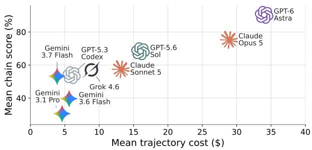  
(a) Cost vs. mean chain score

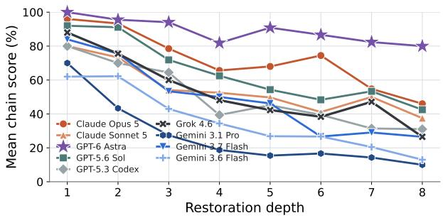  
(b) Mean chain score by restoration depth  
Figure 19: Partial-application reconstruction performance under the chain score. The chain-score counterpart of Figure 7. Results cover all 300 tasks in ProgramDisti11-300, including both atomic and cumulative tasks. (a) Mean chain score versus mean trajectory cost (USD), using the same cost aggregation as Figure 7(a). (b) Mean chain score by restoration depth $r _ { L }$ . The decline with depth is shallower than under the binary score because partial restoration stil earns credit, but the overall depth effect remains.

Partial-Application Reconstruction. For the setting in Section 3.2, Figure 19 is the chain-score counterpart of Figure 7, covering all 300 tasks in ProgramDisti11-300. Table 10 compares binary and chain scores on the 250 cumulative repair tasks. Astra has the highest scores under both metrics: 81.2% binary and 88.2% chain score on cumulative tasks. The gap reflects cases where part of the restoration lineage is recovered without a complete task pass. Opus 5 increases from 63.2% to 71.1%, and Sol from 54.4% to 63.4%.

Table 10: Partial-application reconstruction under binary and chain scores. Mean scores (%) over the 250 cumulative tasks of ProgramDistil1-300.
<table><tr><td>Model</td><td>Binary score</td><td>Chain score</td></tr><tr><td>GPT-6 Astra</td><td>81.2</td><td>88.2</td></tr><tr><td>Claude Opus 5</td><td>63.2</td><td>71.1</td></tr><tr><td>GPT-5.6 Sol</td><td>54.4</td><td>63.4</td></tr><tr><td>Claude Sonnet 5</td><td>40.8</td><td>53.0</td></tr><tr><td>Grok 4.6</td><td>40.4</td><td>50.9</td></tr><tr><td>GPT-5.3 Codex</td><td>38.8</td><td>48.4</td></tr><tr><td>Gemini 3.7 Flash</td><td>37.6</td><td>47.0</td></tr><tr><td>Gemini 3.6 Flash</td><td>23.2</td><td>35.2</td></tr><tr><td>Gemini 3.1 Pro Preview</td><td>12.8</td><td>22.6</td></tr></table>

Full-Application Reconstruction. For the setting in Section 3.3, Table 11 reports chain scores in the same model and application order as Table 1. Mean binary/chain scores are 49.15/64.58% for Astra, 28.81/47.42% for Opus 5, and 21.07/34.22% for Sol. The larger gaps between the scores indicate that agents recover workflow prefixes more often than complete workflows.

Table 11: Full-application reconstruction under the chain score (%). The chain-score counterpart of Table 1. The Mean column averages all evaluated cumulative workflows, and bold indicates the best result among the three models.
<table><tr><td>Model</td><td>Reactive Resume</td><td>AWS Console</td><td>Baserow BudgetWise CareerLink MailHub</td><td></td><td></td><td></td><td>Jira</td><td>Trello (Oldboyxx) (Knowankit)</td><td>StreamView TeamChat</td><td></td><td>Trello (Vdevired)</td><td>Weights &amp; Biases</td><td>Mean</td></tr><tr><td>GPT-6 Astra (max)</td><td>68.5</td><td>45.8</td><td>36.7</td><td>56.0</td><td>65.3</td><td>89.0</td><td>85.6</td><td>73.2</td><td>91.4</td><td>47.0</td><td>44.3</td><td></td><td>64.58</td></tr><tr><td>Opus 5 (max)</td><td>43.7</td><td>35.4</td><td>35.3</td><td>39.8</td><td>41.4</td><td>93.9</td><td>93.3</td><td>73.9</td><td>28.0</td><td>42.9</td><td>29.6</td><td>80.9 35.3</td><td>47.42</td></tr><tr><td>GPT-5.6 Sol (max)</td><td>16.8</td><td>8.3</td><td>29.0</td><td>21.5</td><td>12.4</td><td>82.0</td><td>87.5</td><td>76.7</td><td>32.2</td><td>35.6</td><td>42.6</td><td>9.1</td><td>34.22</td></tr></table>

## H.3 Does Context Length Explain the Depth Effect?

Deeper tasks generally expose agents to longer contexts, raising an alternative explanation for the performance decline in Section 3.2. Models may perform worse simply because they operate over longer contexts rather than because they must compose more dependent repairs. We examine this possibility in three ways using mean prompt size per step as a measure of context exposure across trajectories from all nine models.

First, the growth in context length does not closely track the decline in performance. The median prompt size per step increases from 47.5k tokens at restoration depth 1 to 107.5k at depth 8, a factor of 2.3, while the mean binary score falls from 83.4% to 23.1%. Most of the increase in context length occurs by depth 4. Beyond that point, context length changes little while performance continues to decline.

Table 12: Mean binary score by restoration depth among runs with similar context lengths. Runs are grouped by their mean prompt size per step, and columns indicate restoration depth. This diagnostic uses the task outcomes paired with the analyzed trajectories.
<table><tr><td rowspan="2">Mean prompt size / step</td><td colspan="8">Restoration depth</td></tr><tr><td>1</td><td>2</td><td>3</td><td>4</td><td>5</td><td>6</td><td>7</td><td>8</td></tr><tr><td>40-80k</td><td>82.6</td><td>77.1</td><td>65.0</td><td>51.8</td><td>48.1</td><td>46.4</td><td>45.3</td><td>24.2</td></tr><tr><td>80-120k</td><td>77.0</td><td>58.9</td><td>43.4</td><td>39.5</td><td>32.5</td><td>30.1</td><td>30.0</td><td>22.5</td></tr><tr><td>120-200k</td><td>54.5</td><td>68.8</td><td>33.9</td><td>33.3</td><td>30.0</td><td>25.4</td><td>23.2</td><td>23.1</td></tr></table>

Second, performance still declines with restoration depth among runs with similar context lengths. Within each context band in Table 12, binary score shows an overall downward trend as depth increases. From depth 1 to depth 8, mean binary score drops by 58.4 points in the 40–80k band, 54.5 points in the 80–120k band, and 31.5 points in the 120–200k band. Thus, deeper tasks remain substantially harder even at comparable context lengths.

Third, within each restoration depth, prompt size has only a modest negative Pearson correlation with binary score, ranging from —0.20 to —0.05. After centering both prompt size and binary score within each task to account for task differences, the pooled correlation is weakly positive (+0.11).

Together, these analyses show that the depth-related performance decline cannot be explained by longer contexts alone and are consistent with the increasing difficulty of composing multiple dependent repairs.

## H.4 Agent Interaction Statistics

Partial-Application Reconstruction. Table 13 provides the full interaction statistics supporting Figure 9 in Section 3.2.2: the minimum, mean, and maximum counts of agent steps, observation steps, and edit/write steps for each model. The lower panel groups the same trajectories by restoration depth and reports mean counts across all nine models.

Table 13: Agent interaction behavior. The upper panel reports min, mean, and max interaction statistics for each model on ProgramDisti11-300; the lower panel reports per-trajectory means by restoration depth, pooling all nine models. An observation step contains a request for application state through an observe command, a state-returning browser interaction, or a supported direct browser or API check of the current app. Each agent step counts at most once, even when it targets both applications.
<table><tr><td></td><td colspan="3">Steps</td><td colspan="3">Observation steps</td><td colspan="3">Edit/write steps</td></tr><tr><td>Model</td><td>Min</td><td>Mean</td><td>Max</td><td>Min</td><td>Mean</td><td>Max</td><td>Min</td><td>Mean</td><td>Max</td></tr><tr><td>GPT-6 Astra</td><td>42</td><td>229.2</td><td>757</td><td>35</td><td>191.3</td><td>581</td><td>1</td><td>9.9</td><td>58</td></tr><tr><td>Claude Opus 5</td><td>29</td><td>209.3</td><td>1000</td><td>1</td><td>95.3</td><td>329</td><td>0</td><td>23.5</td><td>117</td></tr><tr><td>Claude Sonnet 5</td><td>27</td><td>222.4</td><td>522</td><td>8</td><td>107.2</td><td>364</td><td>1</td><td>15.7</td><td>53</td></tr><tr><td>GPT-5.6 Sol</td><td>42</td><td>199.4</td><td>377</td><td>15</td><td>101.2</td><td>236</td><td>1</td><td>25.8</td><td>85</td></tr><tr><td>GPT-5.3 Codex</td><td>58</td><td>196.4</td><td>342</td><td>11</td><td>86.7</td><td>195</td><td>0</td><td>17.1</td><td>60</td></tr><tr><td>Grok 4.6</td><td>41</td><td>160.9</td><td>370</td><td>2</td><td>65.9</td><td>173</td><td>1</td><td>18.5</td><td>69</td></tr><tr><td>Gemini 3.1 Pro</td><td>35</td><td>159.6</td><td>858</td><td>2</td><td>46.3</td><td>152</td><td>1</td><td>24.2</td><td>106</td></tr><tr><td>Gemini 3.7 Flash</td><td>50</td><td>206.8</td><td>626</td><td>2</td><td>82.5</td><td>218</td><td>1</td><td>13.5</td><td>59</td></tr><tr><td>Gemini 3.6 Flash</td><td>55</td><td>180.2</td><td>386</td><td>9</td><td>68.9</td><td>184</td><td>0</td><td>16.8</td><td>62</td></tr><tr><td rowspan="2">Restoration depth</td><td colspan="3">Mean steps</td><td colspan="3">Mean observation steps</td><td colspan="3">Mean edit/write steps</td></tr><tr><td colspan="3"></td><td colspan="3">61.2</td><td colspan="3">7.5</td></tr><tr><td>1</td><td colspan="3">124.0 164.0</td><td colspan="3">75.9</td><td colspan="3">12.4</td></tr><tr><td>2</td><td colspan="3">187.0</td><td colspan="3">92.8</td><td colspan="3">17.0</td></tr><tr><td>3 4</td><td colspan="3">216.0</td><td colspan="3">99.9</td><td colspan="3">21.2</td></tr><tr><td>5</td><td colspan="3">225.9</td><td colspan="3">110.5</td><td colspan="3">23.0</td></tr><tr><td>6</td><td colspan="3">230.8</td><td colspan="3">110.5</td><td colspan="3">24.3</td></tr><tr><td>7</td><td colspan="3">235.7</td><td colspan="3">110.8</td><td colspan="3">24.5</td></tr><tr><td>8</td><td colspan="3">250.6</td><td colspan="3">121.0</td><td colspan="3">27.2</td></tr></table>

Full-Application Reconstruction. Table 14 reports agent steps by application for the full-application runs in Table 1.   
Astra averages 719.4 steps, compared with 627.5 for Opus 5 and 719.0 for Sol.

Table 14: Agent steps per full-application reconstruction run.
<table><tr><td>Model</td><td>Reactive Resume</td><td>AWS Console</td><td>Baserow BudgetWise CareerLink MailHub</td><td></td><td></td><td></td><td>Jira</td><td>Trello (Oldboyxx) (Knowankit)</td><td>StreamView TeamChat</td><td></td><td>Trello (Vdevired)</td><td>Weights &amp; Biases</td><td>Mean</td></tr><tr><td>GPT-6 Astra (max)</td><td>853</td><td>1921</td><td>923</td><td>292</td><td>824</td><td>421</td><td>489</td><td>434</td><td>895</td><td>385</td><td>700</td><td>496</td><td>719.4</td></tr><tr><td>Opus 5 (max)</td><td>620</td><td>837</td><td>572</td><td>663</td><td>940</td><td>417</td><td>371</td><td>595</td><td>601</td><td>608</td><td>533</td><td>773</td><td>627.5</td></tr><tr><td>GPT-5.6 Sol (max)</td><td>1165</td><td>856</td><td>860</td><td>580</td><td>861</td><td>348</td><td>598</td><td>446</td><td>990</td><td>488</td><td>470</td><td>966</td><td>719.0</td></tr></table>