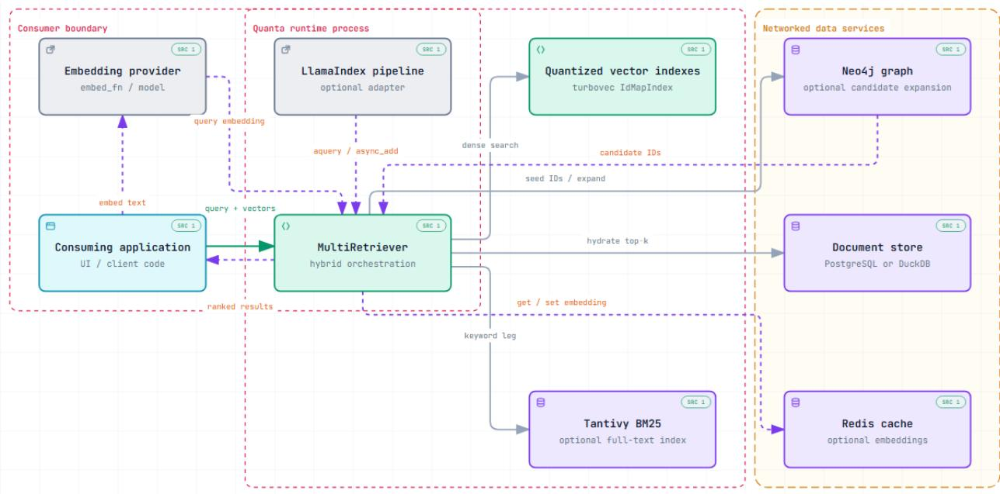
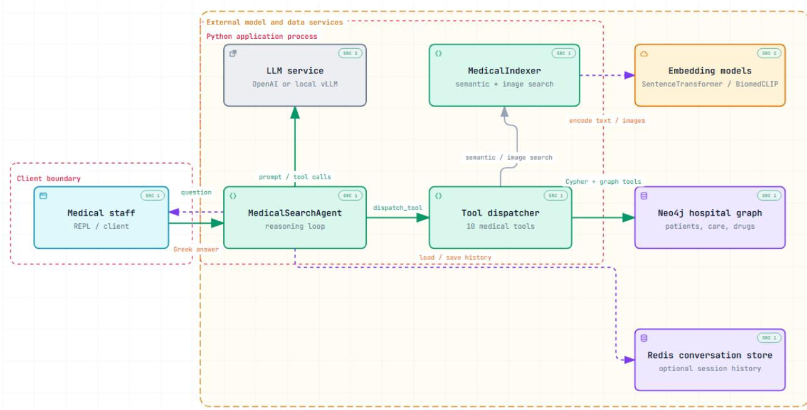

# QUANTA: A SELF-CONTAINED PYTHON LIBRARY FOR HYBRID RETRIEVAL OVER QUANTISED EMBEDDINGS, LEXICAL INDEXES, AND KNOWLEDGE GRAPHS

A PREPRINT

Ioannis E. Livieris1,2

1Novelcore, Athens, GR 10436

2Department of Business Administration & Organization Administration, University of Peloponnese, Kalamata, GR 24100 livieris@uop.gr

September 17, 2026

## ABSTRACT

An advanced retrieval-augmented generation pipeline is typically assembled from three or four independently operated systems: an approximate nearest-neighbour index, a full-text search engine, a graph database, and a relational document store. Each contributes its own deployment surface, configuration model, and failure modes, and the integration logic that binds them is written anew in every project. In this work, we present QUANTA, an open-source Python library, which unifies dense vector search over 4-bit quantised embeddings, BM25 full-text retrieval, and knowledge-graph traversal behind a single retrieval API. Quanta makes two design commitments, which distinguish it from existing hybrid retrieval stacks. First, signals are combined by weighted reciprocal rankfusion rather than by normalising heterogeneous scores onto a shared range, which we argue is ill-posed because such normalisations are query-dependent. Second, the graph is a candidate expander and not a relevance scorer: traversal widens the candidate pool, and the newly admitted documents are re-scored by the dense indexes under an identifier allowlist, so structural adjacency determines what is considered while content evidence determines how it ranks. Every optional component— graph, lexical index, embedding cache—has a null implementation, so a deployment can begin as pure vector search and acquire further signals through configuration alone. We describe a running deployment—a tool-using language-model agent over a clinical knowledge graph—and report its observed behaviour. This is a system description; a controlled retrieval evaluation is left to future work.

Keywords Hybrid retrieval · knowledge graphs · vector quantisation · retrieval-augmented generation.

## 1 Introduction

Retrieval-augmented generation (RAG) [5, 9] has made retrieval quality a first-order concern for applications previously served by a single similarity index, and no single signal is sufficient. Dense bi-encoders [8] generalise across vocabulary mismatch but degrade on rare tokens such as product codes, statute numbers and proper nouns. Lexical scoring with BM25 [14] covers that gap, and hybrid dense–lexical retrieval is now standard practice. Neither signal exploits relationships known to the corpus owner yet absent from the text: that a court decision cites a statute, or that a diagnosis is clinically comorbid with another.

Combining all three signals is, in current practice, an integration problem rather than a retrieval problem. A representative stack pairs FAISS [7] or a managed vector database [15] with Elasticsearch for BM25, Neo4j [12] for traversal and PostgreSQL for storage; four systems must be provisioned and kept consistent, and the code fanning a query across them is rewritten in each project. Orchestration frameworks [10] reduce this boilerplate but do not remove the systems, and treat the graph, where present, as a separate index with its own query path rather than as a participant in one ranking.

Quanta delegates vector compression entirely, storing vectors through TURBOVEC, an implementation of Turbo-Quant [6]; it claims no contribution to quantisation or approximate indexing [11]. Its fusion rule is likewise established: reciprocal rank fusion (RRF) [2] combines ranked lists without the score normalisation CombSUM-style fusion [4] requires, and Bruch et al. [1] show that convex combination surpasses RRF only when tuned per collection, leaving RRF the stronger default in the untuned regime a general-purpose library must assume. The principal departure from prior work concerns the graph: GraphRAG and related systems [3] extract an entity graph using a language model and apply it to query-focused summarisation, whereas Quanta consumes a graph authored by the corpus owner, inside ordinary top-k retrieval, and restricts its influence to candidate selection. The contributions of this paper are threefold:

• a single-process retriever fusing dense, lexical and structural evidence over one document store, with no external retrieval service (Section 2);

• a two-pass procedure in which graph traversal enlarges the candidate set and the admitted documents are re-scored by the dense indexes through an allowlist, so that the graph alters what is retrieved without altering the ranking function (Sections 2.2 and 2.3); and

• measurements from a clinical knowledge-graph deployment characterising candidate enlargement, fusion behaviour and cost (Section 3).

The remainder of this paper is organised as follows. Section 2 describes the system architecture, including the quantised vector indexes, document stores, rank-fusion mechanism and graph-based candidate expansion. Section 3 presents a case study on a clinical knowledge-graph deployment and characterises candidate enlargement, retrieval behaviour and runtime cost. Finally, Section 4 discusses the limitations of the current design and concludes the paper.

## 2 System Architecture

A deployment comprises a set of named vector indexes, a document store and any subset of three optional backends: a graph, a lexical index and an embedding cache. A single MULTIRETRIEVER owns them and exposes one asynchronous SEARCH() entry point.

Fig. 1 shows the runtime decomposition. Quanta performs no embedding of its own, so the embedding provider remains on the consumer side and an optional LlamaIndex adapter may drive the same retriever. Components that must be local—the quantised vector indexes and the Tantivy full-text index—reside in the library process, whereas the document store, the Neo4j graph and the Redis cache are networked services. The edges leaving the retriever are the legs of a query: a dense search per index, a keyword leg, a seed-and-expand exchange with the graph returning candidate identifiers rather than scores, and one hydration of the ranked top-k.

## 2.1 Index and Storage Layer

QUANTAINDEX wraps a TURBOVEC identifier-mapped index. Application identifiers are strings whereas the index addresses vectors by 64-bit integers; Quanta maps between them with a fixed-seed xxhash-64 digest and rejects insertions whose digest collides with a different existing identifier. At bit width b, an index of n vectors of dimension d occupies ndb/8 bytes: for 106 vectors of dimension 768 at b = 4 this is 366 MiB against 2.86 GiB for float32, obtained in-process with no ANN service to operate. Search is exact over the quantised representation, so query time is linear in corpus size.

Two document-store backends implement one asynchronous interface: POSTGRESDOCSTORE, using ASYNCPG with a GIN index over a JSONB metadata column, and the embedded DUCKDBDOCSTORE [13]. Metadata filtering is commonly implemented as a post-filter, retrieving the top-K vectors and discarding those failing the predicate, which under a selective predicate shrinks the effective K and costs recall invisibly. Quanta resolves the predicate first, obtains the identifiers satisfying it and passes them to the index as an allowlist, so the nearest-neighbour scan ranges only over admissible vectors. The same allowlist enables the re-scoring of Section 2.3; both features rest on one primitive.

## 2.2 Rank Fusion

The legs emit incommensurable quantities. Cosine similarity is bounded and, for a competent encoder over a topical corpus, concentrated near the upper end of its range; BM25 is unbounded and grows with query length and collection statistics; inverse hop distance is a property of the graph and the seed set rather than of the query. Quanta therefore

  
Figure 1: Quanta runtime architecture. The graph returns candidate identifiers rather than scores, and the document store is contacted once, to hydrate the ranked top-k.

fuses on rank. For legs $\ell \in { \mathcal { L } }$ with weights $w _ { \ell } ,$ , where $r _ { \ell } ( d )$ is the one-based position of document d in the ranked list of leg $\ell ,$

$$
\mathrm { s c o r e } ( d ) = \sum _ { \ell \in \mathcal { L } } \frac { w _ { \ell } } { k _ { \mathrm { r r f } } + r _ { \ell } ( d ) } ,\tag{1}
$$

where a document absent from a leg contributes nothing from it and $k _ { \mathrm { r r f } }$ (default 60) damps the head of each list. Each dense index carries $w _ { \mathrm { d e n s e } } / | \mathcal { T } |$ over the active index set I, the lexical leg $w _ { \mathrm { b m 2 5 } }$ and the graph leg $w _ { \mathrm { g r a p h } }$ . Since (1) is homogeneous in the weights, only their ratios are meaningful and no renormalisation is required.

## 2.3 Graph Expansion as Candidate Enlargement

Retrieval proceeds in two passes (Algorithm 1). The first ranks the corpus by content alone and a preliminary application of (1) selects the top GRAPH\_SEED\_K documents as seeds; a bounded breadth-first traversal then returns every document within GRAPH\_HOPS steps of a seed. The admitted identifiers are not injected with a synthetic score but re-scored: a second search per dense index, constrained through the allowlist to exactly those identifiers, is merged into that index’s ranked list before the final fusion. An expanded document therefore competes on its own similarity to the query, on the same footing as one the first pass returned.

Let $\mathcal { C } _ { 1 }$ denote the candidate set of the first pass and $\mathcal { C } _ { 2 } \supseteq \mathcal { C } _ { 1 }$ the set after expansion. With $w _ { \mathrm { g r a p h } } = 0$ the graph leg vanishes from (1), so a document’s fused score depends only on its ranks in the content legs and traversal effects $\mathcal { C } _ { 1 } \mapsto \mathcal { C } _ { 2 }$ and nothing further. The graph determines which documents are considered, never how well they rank.

Setting $w _ { \mathrm { g r a p h } } > 0$ admits the graph as a further leg ranked by hop distance. This is warranted only when expanded documents possess no vector in any index and therefore cannot be re-scored, because (1) compresses each leg severely. With one dense index, $w _ { \mathrm { d e n s e } } = 0 . 7 , k _ { \mathrm { r r f } } = 6 0$ and the frequently quoted setting $w _ { \mathrm { g r a p h } } = 0 . 3 .$ , a document ranked first by content scores $0 . 7 / 6 1 = 0 . 0 1 1 5 ,$ whereas one ranked fourth by content but first in the graph leg—an arbitrary one-hop neighbour of a seed—scores $0 . 7 / 6 4 + 0 . 3 / 6 1 = 0 . 0 1 5 9$ and overtakes it. A graph weight within a small factor of the content weight is therefore not a tie-breaker: it promotes every one-hop neighbour above the best content match. Quanta defaults to $w _ { \mathrm { g r a p h } } = 0$ and directs tuning towards GRAPH\_SEED\_K and GRAPH\_HOPS, which widen the pool without perturbing the order.

Algorithm 1 Two-pass hybrid retrieval   
Require: Query embedding q, query text t, active indexes I, allowlist A, fetch size K, graph seed size S, graph hops   
H   
Ensure: Ranked top-k documents   
1: Pass 1: Content retrieval   
2: for all $i \in \mathcal { T }$ do   
3: $L _ { i } \gets \mathrm { r a n k } ( \mathrm { s e a r c h } ( i , q , K , A ) )$   
4: $L _ { \mathrm { b m 2 5 } } \gets \mathrm { r a n k } ( \mathrm { s e a r c h } ( \mathrm { B M 2 5 } , t , K ) )$   
5: $R _ { 1 } \gets \mathrm { R R F } ( \{ L _ { i } \} _ { i \in \mathcal { T } } , L _ { \mathrm { b m 2 5 } } )$   
6: Seeds $ \mathrm { t o p } _ { S } ( R _ { 1 } )$   
7: Pass 2: Graph expansion and constrained re-scoring   
8: $L _ { \mathrm { g r a p h } } $ expand(Graph, Seeds, H)   
9: $\breve { N } \gets$ keys $( \bar { L _ { \mathrm { g r a p h } } } ) \backslash$ covered $\left( \{ L _ { i } \} _ { i \in \mathbb { Z } } \right)$   
10: for all $i \in \dot { \mathcal { T } }$ do   
11: $L _ { i } ^ { \prime }$ ← search(i, q, allowed $\mathrm { i d s } = N )$   
12: $\bar { L _ { i } }  \mathrm { m e r g e } ( \bar { L _ { i } } , \bar { L _ { i } ^ { \prime } } )$   
13: Final fusion   
14: $R \gets \mathrm { R R F } ( \{ L _ { i } \} _ { i \in \mathbb { Z } } , L _ { \mathrm { b m 2 5 } } , L _ { \mathrm { g r a p h } } )$   
15: return $\mathrm { t o p } _ { k } ( R )$

## 3 Case Study: A Clinical Knowledge Graph

The following characterises observed behaviour on a deployment distributed with the library. It is not a retrieval evaluation: no relevance judgements and no baseline ranker are involved.

  
Figure 2: Medical search agent runtime. The dispatcher is the only component that reaches data; the quantised indexes reside inside the application process.

Table 1: Candidate Enlargement, k = 6, Three Seeds, Two Hops
<table><tr><td>Query</td><td>Pool</td><td>BFS</td><td>New</td><td>Re-scored</td><td>Pool&#x27;</td></tr><tr><td>Insulin resistance, polyuria (el)</td><td>18</td><td>50</td><td>41</td><td>28</td><td>59</td></tr><tr><td>Chronic kidney disease (en)</td><td>18</td><td>50</td><td>42</td><td>30</td><td>60</td></tr><tr><td>Heart failure, dyspnoea (el)</td><td>18</td><td>50</td><td>42</td><td>28</td><td>60</td></tr></table>

## 3.1 Corpus and Ontology

The corpus is a synthetic hospital record set in Neo4j comprising 100 patients, 30 physicians, 12 diagnoses coded to ICD-10, 12 procedures, 12 medications and 5 hospitals, joined by nine relationship types. The ontology places properties that vary per relationship on the edges rather than the nodes: a HAS\_DIAGNOSIS edge carries the severity and chronicity of that diagnosis for that patient, so the same diagnosis is mild for one patient and severe for another. Two edge families encode knowledge no document states: nine COMORBID\_WITH edges between diagnoses, graded by evidence level, and ten INTERACTS\_WITH edges between medications, graded by severity. Because these edges are authored rather than extracted, the corpus tests graph expansion instead of restating what the embeddings already encode.

Five narrative fields are embedded into separate indexes: patient summaries (100 vectors), physician expertise (30), diagnosis and procedure descriptions (12 each) and medical images (198), using a 768-dimensional multilingual sentence encoder for text and a 512-dimensional CLIP encoder for images. All indexes are quantised to four bits, occupying 107.3 KiB against 858 KiB for float32. Every narrative is written in Greek.

## 3.2 Retrieval Behaviour

Three dense legs—diagnoses, procedures and patient summaries—were registered with a Tantivy BM25 leg over the same narratives and a graph leg, using $w _ { \mathrm { d e n s e } } = 0 . 5 , w _ { \mathrm { b m 2 5 } } = 0 . 3 , w _ { \mathrm { g r a p h } } = 0$ and an embedded DuckDB store. The bundled NEO4JGRAPH assumes a homogeneous (:DOCUMENT {ID}) model, which this graph is not; the deployment therefore implements the GRAPHBACKEND interface directly against the real schema in roughly forty lines, coalescing per-label key properties into the identifier used by the indexes. No projection or migration of the graph was required.

Table 1 reports the candidate pool before and after expansion. Dense retrieval over three indexes yields 18 identifiers; a two-hop traversal from three seeds reaches 50 nodes, of which 41–42 are new, and approximately 70% of those receive a similarity from the constrained re-scoring search. The pool grows by a factor of roughly 3.3 with no document receiving a score originating in the graph.

For the query heartfailure and dyspnoea, the content legs place I50 (heart failure) first and E11 (type 2 diabetes) sixth, the latter through the BM25 leg alone: no dense index ranked it within its top-k, so it carried no dense contribution. Expansion from the seed I50 crosses an authored COMORBID\_WITH edge and admits E11; re-scoring returns its similarity, yielding rank 6 in the diagnoses leg and a dense term of $0 . 1 \overline { { 6 } } / 6 6 = 0 . 0 0 2 5$ . Its fused score rises from 0.0046 to 0.0071 and it advances from sixth position to fourth. The graph determined that a diabetes description merited consideration for a heart-failure query; it did not determine where that description ranked. Dense and denseplus-BM25 searches complete in 7–9 ms on this corpus, and enabling expansion raises query time to 44–115 ms.

## 3.3 Agent Deployment

The same substrate supports a tool-using agent exposing twelve tools: dense retrieval against a QUANTAINDEX, lexical resolution over Neo4j full-text indexes with edit-distance matching, and bounded Cypher traversals. Fig. 2 shows the runtime. A clinician’s question enters a reasoning loop alternating between an OpenAI-compatible model endpoint and a dispatcher, the only component that reaches data: it issues Cypher and graph tools against Neo4j and semantic or image searches through the indexer, which calls the sentence and CLIP encoders. Conversation history is persisted to Redis when configured. Retrieval is entirely in-process; only the model endpoint, the graph and the cache cross a network boundary.

Six unseen clinical questions were answered by an open-weight 27B model on a local endpoint, all without error. Tool execution ranged from 19 to 984 ms against turn latencies of 19–32 s dominated by generation, below five percent of the turn throughout. This is the regime in which an embedded, exactly searched, compressed index is an appropriate trade, and in which the in-process design removes a network round trip from a loop issuing several tool calls. Two further properties are exercised: the allowlist serves cohort-restricted similarity by mechanically the same call that re scores expanded candidates, and cross-lingual matching survives quantisation, an English referral question matching a Greek nephrology narrative at cosine 0.620.

## 4 Conclusion

In this work, we present QUANTA, a minimal-dependency architecture for hybrid retrieval that combines semantic, lexical, and structural signals within a lightweight Python library. Its central design principle is to separate candidate generation from relevance estimation: the knowledge graph is used primarily to expand the candidate set through bounded structural traversal, while semantic and lexical evidence remains responsible for ranking the retrieved documents. This separation allows structural relationships to improve the coverage of retrieval without allowing graph proximity to dominate content-based relevance.

A second aspect of the design is the use of quantised vector indexes for memory-efficient dense retrieval. Quanta performs exhaustive search over 4-bit representations, providing exact nearest-neighbour search with respect to the quantised vectors while substantially reducing the memory footprint of the vector store. Combined with identifierbased allowlists, the same retrieval primitive supports both metadata-constrained search and the constrained re-scoring of graph-expanded candidates, without requiring a separate approximate-nearest-neighbour service.

The resulting architecture provides a simple integration path from pure dense retrieval to hybrid dense–lexical– graph retrieval. Optional components are exposed through common interfaces and null implementations, allowing deployments to introduce lexical search, graph expansion, caching, or external document storage without changing the retrieval logic itself. Our clinical deployment demonstrates the operational behaviour of this design, including substantial candidate-set enlargement through graph traversal and the relatively small latency contribution of retrieval compared with downstream language-model generation. These observations characterise the architecture rather than establish retrieval superiority; a controlled evaluation against relevance-labelled benchmarks and alternative hybrid rankers remains an important direction for future work. Quanta is MIT-licensed and available at https://github.com/ilivieris/quanta.

## References

[1] Sebastian Bruch, S. Gai, and A. Ingber. An analysis of fusion functions for hybrid retrieval. ACM Transactions on Information Systems, 42(1), 2023.

[2] Gordon V. Cormack, Charles L. A. Clarke, and Stefan Büttcher. Reciprocal rank fusion outperforms condorcet and individual rank learning methods. In Proceedings of the SIGIR Conference, pages 758–759, 2009.

[3] Darren Edge, Ha Trinh, Newman Cheng, Joshua Bradley, Alex Chao, Apurva Mody, Steven Truitt, and Jonathan Larson. From local to global: A graph rag approach to query-focused summarization. arXiv preprint arXiv:2404.16130, 2024.

[4] Edward A. Fox and Joseph A. Shaw. Combination of multiple searches. In Proceedings of TREC-2. NIST Special Publication 500-215, 1994.

[5] Yunfan Gao, Yun Xiong, Xinyu Gao, Kang Jia, Jinliu Pan, Yuxi Bi, Yi Dai, Jiawei Sun, Qian Guo, Meng Wang, and Haofen Wang. Retrieval-augmented generation for large language models: A survey. arXiv preprint arXiv:2312.10997, 2024.

[6] Google Research. Turboquant: Online vector quantization with near-optimal distortion rate, 2025. Implementation: https://pypi.org/project/turbovec/.

[7] Jeff Johnson, Matthijs Douze, and Hervé Jégou. Billion-scale similarity search with gpus. IEEE Transactions on Big Data, 7(3):535–547, 2019.

[8] Vladimir Karpukhin, Barlas Oguz, Sewon Min, Patrick Lewis, Ledell Wu, Sergey Edunov, Danqi Chen, and˘ Wen-tau Yih. Dense passage retrieval for open-domain question answering. In Proceedings of EMNLP, pages 6769–6781, 2020.

[9] Patrick Lewis, Ethan Perez, Aleksandra Piktus, Fabio Petroni, Vladimir Karpukhin, Naman Goyal, Heinrich Küttler, Mike Lewis, Wen-tau Yih, Tim Rocktäschel, Sebastian Riedel, and Douwe Kiela. Retrieval-augmented generation for knowledge-intensive nlp tasks. In Proceedings ofNeurIPS, 2020.

[10] LlamaIndex. Llamaindex. https://github.com/run-llama/llama\_index, 2026. Accessed 2026.

[11] Yu. A. Malkov and D. A. Yashunin. Efficient and robust approximate nearest neighbor search using hierarchical navigable small world graphs. IEEE Transactions on Pattern Analysis and Machine Intelligence, 42(4):824–836, 2020.

[12] Neo4j. Neo4j graph database. https://neo4j.com, 2026. Accessed 2026.

[13] Mark Raasveldt and Hannes Mühleisen. Duckdb: An embeddable analytical database. In Proceedings of the SIGMOD Conference, pages 1981–1984, 2019.

[14] Stephen Robertson and Hugo Zaragoza. The probabilistic relevance framework: Bm25 and beyond. Foundations and Trends in Information Retrieval, 3(4):333–389, 2009.

[15] Jianguo Wang et al. Milvus: A purpose-built vector data management system. In Proceedings of the SIGMOD Conference, pages 2614–2627, 2021.