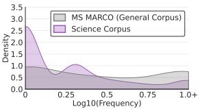
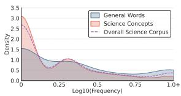
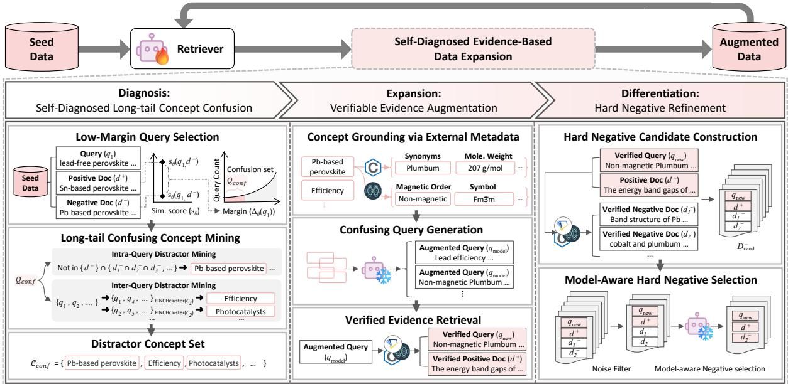
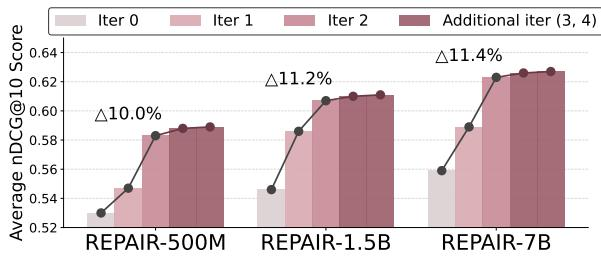
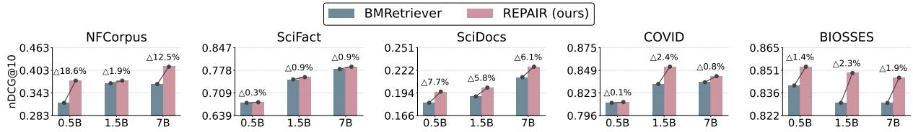
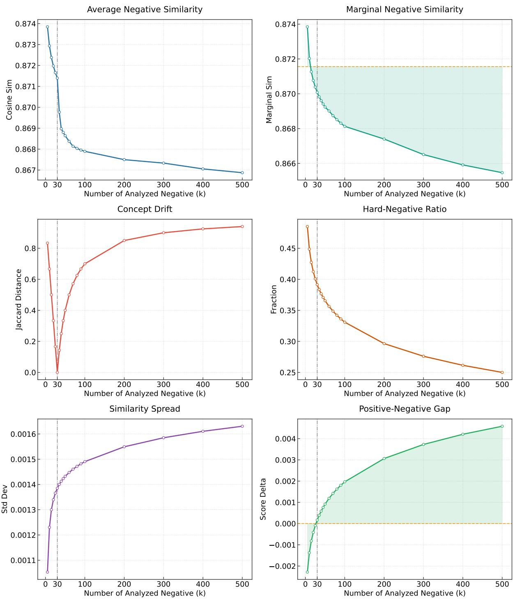

# REPAIR: Resolving Long-Tail Confusion in Scientific Retrievers via Fact-Verified Iterative Refinement

Yerim Oh1 Gunhee Kim1

1Seoul National University

yerim.oh@vision.snu.ac.kr, gunhee@snu.ac.kr

## Abstract

Precise retrieval of scientific information is fundamentally constrained by long-tailed concepts and highfact-sensitivity of scientific corpora. These challenges often limit the effectiveness of dense retrievers and hallucinationprone LLM augmentation. To address this, we present REPAIR, a self-evolving data augmentation framework for scientific dense retrievers. REPAIR iteratively synthesizes training data to address knowledge gaps by cycling through diagnosis of long-tail concepts, APIguided evidence expansion, and differentiation via hard negative mining. This process effectively grounds retrieval in factual reality to resolve fine-grained distinctions. Extensive experiments demonstrate that REPAIR significantly outperforms 19 strong baselines on nine materials science and biomedical benchmarks. Our work highlights that diagnosing and factually augmenting data to long-tail deficits is essential for robust scientific retrieval.1

## 1 Introduction

In highly specialized fields such as materials science and biomedicine, the continuous influx of new literature makes efficient knowledge discovery a critical challenge (Sharma et al., 2025; Choudhary et al., 2022; Kononova et al., 2021). To address this, retrieval-augmented generation (RAG) has emerged as a promising methodology to dynamically incorporate up-to-date domain knowledge. By grounding generation in precise information retrieval (IR), RAG enables reliable downstream applications, including question answering (Sohn et al., 2025; Zhang et al., 2024), knowledge discovery (Ocana et al., 2025; Pei et al., 2025), and scientific decision-making (Chiang et al., 2025; Ong et al., 2025). The success of these applications fundamentally depends on the accuracy of the underlying IR models.

<table><tr><td>Method</td><td>Augmented Pairs</td></tr><tr><td>LLM Gen. (2024)</td><td>Query: Which myeloma cell line carries prosurvival BCLI? Positive Document: .. . Myeloma cells usually express a range of the prosurvival BCL2 proteins . ..</td></tr><tr><td>REPAIR (ours)</td><td>Query: The role of BCL2and its pro-survival relatives in tu- mourigenesis and cancer therapy Positive Document: . . . In this invited review article, we remi- nisce on the discovery of BCL2, we discuss mechanisms . ..</td></tr></table>

(a) Comparison of augmented pairs  
  
Domain-level Long-tail

  
Concept-level Long-tail  
(b) Long-tail distributions  
Figure 1: Motivation of REPAIR. (a) While existing data augmentation methods generate structural hallucinations (e.g., lexically similar BCL1 and BCL2 critically corrupt scientific facts), REPAIR accurately grounds condition-sensitive scientific facts. (b) Logfrequency analysis on scientific vs. general corpora reveals that the severe long-tail in scientific domains (left) is predominantly driven by scientific concepts (right).

However, while state-of-the-art dense retrievers excel on general-domain text, they suffer significant performance degradation when applied to scientific corpora. This lexical and semantic gap is widely recognized as the domain shift issue (Kamalloo et al., 2024). To mitigate this, recent studies have adapted retrievers by aggregating domainspecific datasets or utilizing synthetic data augmentation (Jin et al., 2023; Zhang et al., 2023; Singh et al., 2023; Xu et al., 2024). Despite yielding empirical improvements, these approaches largely treat scientific documents as standard text, overlooking the intrinsic characteristics that distinguish scientific literature from general domains.

Specifically, scientific retrieval is governed by two structural properties: long-tailed concept distribution and high fact-sensitivity. Scientific corpora exhibit extreme long-tail distributions composed of irreplaceable entities such as chemical formulas, rare molecular structures, and specific gene or protein families (Oh et al., 2025). Unlike general-domain terms, these entities lack semantic substitutes, making naive data augmentation ineffective. As shown in Figure 1, specific proteins like BCL2 represent such entities that cannot be loosely generalized. A multi-corpus statistical characterization of this long tail is given in Appendix A.3. Moreover, scientific outcomes are hypersensitive to precise terminology and experimental conditions. A single-character hallucination from BCL2 to BCL1 invalidates the generated query. Such plausible but incorrect LLM-generated data are harmful as it trains retrievers with scientific falsehoods (Pal et al., 2023).

To address these limitations, we propose RE-PAIR (Retriever via Epistemic API-Guided Iterative Refinement), an iterative, epistemic selfevolving procedure of data augmentation for training of an LLM-based scientific retriever. REPAIR first initializes a seed retriever with compact scientific corpora, then iteratively refines it through data synthesis of three stages: (1) Diagnosis identifies long-tail concepts that the retriever tends to confuse, (2) Expansion grounds these concepts in factverified documents mined from scientific APIs, and (3) Differentiation resolves fine-grained factual distinctions using fact-contrastive hard negatives to trains the model. Through iterative refinement, RE-PAIR progressively corrects the retriever’s long-tail confusions using externally verified evidence.

We conduct comprehensive experiments across nine diverse scientific retrieval benchmarks in both materials science and biomedical domains. The results show that REPAIR enhances retrieval precision on specialized scientific tasks while exhibiting robust generalization capabilities. By iteratively correcting long-tail confusion with externally verified evidence, REPAIR outperforms 19 strong baselines, demonstrating the effectiveness of our iterative self-evolving strategy. In summary, this work presents the following contributions:

• We propose REPAIR, a self-evolving data augmentation framework that curtails structural hallucinations of scientific retrievers by resolving long-tailed concept confusion and high fact-sensitivity, which have largely been overlooked in prior work.

• Scaling retriever parameters from 500M to 7B, REPAIR achieves new state-of-the-art results across nine materials science and biomedical benchmarks, outperforming 19 strong baselines while using less training data.

• Our extensive experiments show that the threestage data augmentation pipeline of diagnosis, expansion, and differentiation outperforms naive synthetic data scaling in correcting longtail retrieval errors.

## 2 Related Work

A broad range of studies has investigated representation learning for text retrieval, progressing from latent semantic models to neural embedding-based approaches (Blei et al., 2003; Hofmann, 1999; Deerwester et al., 1990). In recent years, dense retrieval with transformer encoders has become the dominant paradigm. Further gains have been achieved by scaling retrievers or applying instruction tuning with LLMs (Izacard et al., 2021a; Yu et al., 2022; Chen et al., 2024a; Wang et al., 2024; Ni et al., 2022; Neelakantan et al., 2022). However, such improvements are largely attained in general-domain settings characterized by abundant supervised data.

As LLMs are increasingly applied to scientific reasoning, accurate retrieval of domain-specific knowledge has become critical for reliability (Zhang et al., 2025; Jiang et al., 2025; Pilania, 2021; Olivetti et al., 2020). Although retrievers have been adapted to scientific domains via domain-specific pretraining and task-oriented training (Jin et al., 2023; Zhang et al., 2023; Singh et al., 2023), scientific retrieval remains fundamentally challenged by distributional shifts (Kamalloo et al., 2024), particularly due to severe data scarcity and long-tailed entity distributions.

To address data scarcity, recent studies have adopted LLM-based data augmentation (Xu et al., 2024). However, such generative methods risk hallucinations, undermining the factual reliability essential for science (Pal et al., 2023). Furthermore, while prior work on long-tailed distributions has focused on model-centric adaptations, such as specialized tokenization (Oh et al., 2025) or domainadaptive learning (Kim et al., 2024), we argue that the fundamental bottleneck lies in the data themselves. Unlike previous model-centric strategies that attempt to adapt parameters to noisy or scarce distributions, our approach directly targets the quality and factual grounding of the retrieval data. We introduce a data-centric framework designed to mitigate the risks of hallucination and effectively cover long-tailed scientific concepts.

## 3 Methodology: REPAIR

We focus on improving the reliability of dense retrievers for scientific domains (§3.1) by explicitly addressing long-tail concept confusion and high factual sensitivity. Starting from a retriever initialized with compact scientific seed corpora (§3.2), we refine it through three stages: Diagnosis of longtail concept uncertainty (§3.3), Expansion with externally verified scientific evidence (§3.4), and Differentiation via fact-contrastive hard negatives (§3.5). This refinement is iteratively optimized using contrastive learning (§3.6). The overall procedure is illustrated in Figure 2, and implementation details are provided in Appendix A.

## 3.1 Retriever Formulation

Let Q be a set of queries and D a document corpus. The dense retriever represents queries and documents as dense embeddings using a shared decoderonly language model $\mathcal { M } _ { \theta }$ (e.g., Qwen-2.5 (Yang et al., 2024)) with parameter scales of 500M, 1.5B, and 7B. For a query–document pair $( q , d )$ , we compute the embeddings as $\mathbf { e } _ { q } \in \mathbb { R } ^ { \bar { D } }$ and $\mathbf { e } _ { d } \in \mathbb { R } ^ { D }$ ; we append an end-of-sequence token to them and compute their dense representations by EOS pooling over the final-layer hidden states:

$$
\mathbf { e } _ { \boldsymbol { q } / \boldsymbol { d } } = \operatorname { P o o l } _ { \boldsymbol { \mathsf { E 0 5 } } } \left( \mathcal { M } _ { \boldsymbol { \theta } } ( \boldsymbol { q } / \boldsymbol { d } \oplus [ \boldsymbol { \mathsf { E 0 5 } } ] ) \right) .\tag{1}
$$

We score relevance by the dot product: $s _ { \theta } ( q , d ) =$ $\mathbf { e } _ { q } ^ { \top } \mathbf { e } _ { d }$ . For each query $q ,$ the retriever returns a ranked list $\mathrm { T o p K } _ { \theta } ( q ) \subset { \mathcal { D } }$ under $s _ { \theta }$

## 3.2 Initialization from Scientific Seed Corpora

REPAIR starts from a seed training set $\mathcal { T } _ { 0 } ~ =$ $\{ ( q _ { i } , d _ { i } ^ { + } ) \} _ { i = 1 } ^ { N _ { 0 } }$ constructed from well-recognized, domain-curated public scientific corpora. The full list is shown in Table 4 with further details in Appendix A.1. This seed set provides minimal in-domain alignment, but may be insufficient to cover long-tailed entities and condition-sensitive relations. Thus, REPAIR refines the retriever by iteratively incorporating verified supervision.

## 3.3 Stage I: Diagnosis

In the first stage, the retriever self-diagnoses its weaknesses by identifying unreliable low-margin queries and extracts their long-tail concepts from its own scoring behavior.

Low-Margin Query Selection. For each training query q with a seed positive document $d ^ { + } ( q )$ , we define the positive–negative separation margin:

$$
\Delta _ { \theta } ( q ) = s _ { \theta } ( q , d ^ { + } ( q ) ) \frac { \mathrm { m a x } } { { \cal d } \in \mathrm { T o p K } _ { \theta } ( q ) \backslash \{ d ^ { + } ( q ) \} } s _ { \theta } ( q , d ) .\tag{2}
$$

A small $\Delta _ { \theta } ( q )$ means that the retriever assigns nearly indistinguishable scores to $d ^ { + } ( q )$ and topranked negatives, indicating local unreliability. We form the confusion query set by selecting the lowest-margin queries:

$$
\mathcal { Q } _ { \mathrm { c o n f } } = \mathrm { B o t t o m } \cdot p \% \big ( \{ \Delta _ { \theta } ( q ) \} _ { q \in \mathcal { Q } } \big ) ,\tag{3}
$$

where we set $p = 4 0 \%$ , whose empirical analysis is presented in $\ S 4 . 3$

## Long-tail Confusing Concept Mining

While low margins reveal where retrieval fails, RE-PAIR explains why by identifying long-tail distractors driving model confusion. We first extract candidate concepts from $\mathcal { Q } _ { \mathrm { c o n f } }$ , and then isolate the actual distractor concepts via two complementary intra- and inter-query distractor mining.

Extraction of Candidate Concepts. For subsequent analysis, we extract candidate concepts $e \in \mathcal { E }$ such as scientific concepts and chemical formulas, by applying MATDETECTOR (Oh et al., 2025) and CHEMDATAEXTRACTOR (Swain and Cole, 2016) to the confusing queries $q \in \mathcal { Q } _ { \mathrm { c o n f } }$ and their retrieved documents.

Intra-Query Distractor Mining. To identify distractors specific to each query $q \in \mathcal { Q } _ { \mathrm { c o n f } }$ , we contrast the positive document $d ^ { + } ( q )$ against a highly scored negative set $\mathcal { D } ^ { - } ( \boldsymbol { q } )$ as the top-k retrieved documents. Aggregating over the confusion set,

$$
\mathcal { D } ^ { + } = \{ d ^ { + } ( q ) \} _ { q \in \mathcal { Q } _ { \mathrm { c o n f } } } , \mathcal { D } ^ { - } = \cup _ { q \in \mathcal { Q } _ { \mathrm { c o n f } } } \mathcal { D } ^ { - } ( q ) ,\tag{4}
$$

we score each extracted concept e using the Confusing Concept Score (CCS):

$$
\mathrm { C C S } ( e ) = \frac { \mathrm { d } \mathrm { f } ( e ; \mathcal { D } ^ { - } ) } { \mathrm { d } \mathrm { f } ( e ; \mathcal { D } ^ { + } ) + \epsilon } ,\tag{5}
$$

where df $; ( e ; \cdot )$ is the document frequency of $e ,$ and $\epsilon > 0$ prevents division by zero. Thus, a high CCS explicitly identifies distractor concepts that frequently occur in highly scored negative documents $( \mathcal { D } ^ { - } )$ but remain rare in the positive documents $( \mathcal { D } ^ { + } )$ . Finally, we construct $\mathcal { C } _ { \mathrm { { i n t r a } } }$ by selecting the highest-CCS concept per query.

  
Figure 2: Overview of the REPAIR framework. The model is initialized with scientific seed corpora and iteratively refined through self-diagnosed factual expansion, including diagnosis, expansion, and differentiation.

Augmented Query (q )l modelLead efficiency …Inter-Query Distractor Mining. To comple-… l modelNon-magnetic Plumbum …ment the intra-query analysis, we identify systemic perovskite efficiency ...distractors by clustering queries within $\mathcal { Q } _ { \mathrm { c o n f } }$ that perovskite efficiency ... lVerified Query (qnew)exhibit shared confusion patterns, using the FINCH lPositive Doc (d +)algorithm (Sarfraz et al., 2019). Rather than relying on complex adjacency matrices, FINCH directly captures the mutual dependency between queries by grouping those that share first nearest neighbors. This parameter-free approach is critical for discovering confusion clusters without requiring a predefined cluster number. From each resulting cluster, we aggregate the previously extracted candidate concepts and select the most frequent one. This process transforms the clustered query groups into the inter-query concept set $\mathcal { C } _ { \mathrm { i n t e r } }$

The Distractor Concept Set. Finally, the distractor concept set is defined by $\mathcal { C } _ { \mathrm { c o n f } } = \mathcal { C } _ { \mathrm { i n t r a } } \cup \mathcal { C } _ { \mathrm { i n t e r } } ,$ which identifies long-tail scientific concepts responsible for confusion. Then $\mathcal { C } _ { \mathrm { c o n f } }$ is used in Stage II for the expansion of verified evidence.

## 3.4 Stage II: Expansion

This stage expands the training data by grounding the distractor concept set $\mathcal { C } _ { \mathrm { c o n f } }$ into verifiable evidence. This yields rigorously validated training tuples $( q _ { \mathrm { n e w } } , d ^ { + } , \mathcal { D } _ { \mathrm { c a n d } } ^ { - } )$ , consisting of a newly augmented query $q _ { \mathrm { n e w } } .$ , its positive document $d ^ { + }$ and its negative set $\mathcal { D } _ { \mathrm { c a n d } } ^ { - } .$

Concept Grounding via External Metadata. We ground each concept in $\mathcal { C } _ { \mathrm { c o n f } }$ using external databases such as PUBCHEM (Kim et al., 2019) and MATPROJ (Jain et al., 2013), from which we extract diverse chemical and physical attributes of l newNon-magnetic Plumbum …each concept (e.g., synonyms, molecular weight).

Confusing Query Generation. From the grounded concepts, we randomly sample 1–3 concepts to prompt the model2, which is instructed to generate a candidate query $( q _ { \mathrm { m o d e l } } )$ that it finds inherently ambiguous or difficult to resolve.

Verification and Hard Negative Mining. To filter out hallucinated $q _ { \mathrm { m o d e l } }$ , we query external APIs (SEMANTIC SCHOLAR, PUBCHEM, and MAT-PROJ) and discard it if no results are returned. For valid searches, the top-matching document defines the ground truth: its title becomes the updated query $q _ { \mathrm { n e w } } .$ , and its content serves as the positive document $d ^ { + }$ . The remaining highly similar documents form ${ \mathcal { D } } _ { \mathrm { c a n d } } ^ { - }$ as hard negative candidates. In §4.3, we experiment with the effect of its size $| \mathcal { D } _ { \mathrm { c a n d } } ^ { - } |$ on performance. This generation and verification process continues until the number of valid tuples $( q _ { \mathrm { n e w } } , d ^ { + } , \mathcal { D } _ { \mathrm { c a n d } } ^ { - } )$ reaches twice the size of the initial training data.

## 3.5 Stage III: Differentiation

Instead of random in-batch negatives, we construct training triplets $( q _ { \mathrm { n e w } } , d ^ { + } , d ^ { - } )$ by selecting a single hard negative d− from the API-verified candidates ${ \mathcal { D } } _ { \mathrm { c a n d } } ^ { - }$ . Once mining noise is filtered out, we choose d− to confuse the current retriever the most; d− is both factually plausible (API-ranked) and empirically challenging (model-scored).

Consistency Filtering. To prevent mining noise (Wang et al., 2022), we define a localized candidate pool as $\mathcal { D } _ { \mathrm { p o o l } } = \{ d ^ { + } \} \cup \mathcal { D } _ { \mathrm { c a n d } } ^ { - } ,$ and retain a tuple only if the current retriever ranks the positive document $d ^ { + }$ within the top $\kappa = 2$ of this pool:

$$
\mathbb { I } _ { \mathrm { k e e p } } ( q _ { \mathrm { n e w } } ) = \mathcal { k } \big [ \mathrm { r a n k } \big ( d ^ { + } \mid q _ { \mathrm { n e w } } ; \mathcal { D } _ { \mathrm { p o o l } } \big ) \le \kappa \big ] .\tag{6}
$$

This ensures the query is answerable, keeping the subsequent hard negative mining informative.

Single Hard Negative Selection. We extract the hardest negative d− from the candidate set ${ \mathcal { D } } _ { \mathrm { c a n d } } ^ { - }$ by maximizing the current retriever’s similarity score sθ:

$$
d ^ { - } = \operatorname { a r g m a x } _ { d \in \mathcal { D } _ { \mathrm { c a n d } } ^ { - } } s _ { \theta } ( q _ { \mathrm { n e w } } , d ) .\tag{7}
$$

Using this single negative, we expect a more semantically meaningful decision boundary than when using multiple easy negatives. This stage completes a set of verified training triplets $( q _ { \mathrm { n e w } } , d ^ { + } , d ^ { - } )$

## 3.6 Iterative Contrastive Optimization

The retriever parameters θ are updated via contrastive learning; we minimize an InfoNCE objective over the verified triplets $( q _ { \mathrm { n e w } } , d ^ { + } , d ^ { - } )$ :

$$
\mathcal { L } ( q _ { \mathrm { n e w } } ) = - \log \frac { e ^ { s _ { \theta } ( q _ { \mathrm { n e w } } , d ^ { + } ) / \tau } } { \sum _ { d \in \{ d ^ { + } \} \cup \mathcal { N } } e ^ { s _ { \theta } ( q _ { \mathrm { n e w } } , d ) / \tau } } ,\tag{8}
$$

where τ is a temperature. As each update shifts the margin landscape $\{ \Delta _ { \theta } ( q ) \}$ , REPAIR repeats the generation-verification pipeline (Stages I–III) for two iterations. We empirically study how performance varies with the number of iterations in §4.3. This iterative refinement progressively reshapes the embedding space toward reliable scientific discrimination while avoiding hallucinated supervision or overfitting.

## 4 Experiments

## 4.1 Experiment Setups

Tasks and Datasets. To assess the model’s robustness, we use an extensive collection of benchmarks that cover a broad range of scientific disciplines, from general inquiries to material and biomedical-specific challenges. They evaluate varied retrieval-oriented tasks, including four IR datasets (NFCorpus (Boteva et al., 2016), Sci-Fact (Wadden et al., 2020), SciDocs (Cohan et al., 2020), and TREC-COVID (Voorhees et al., 2021)), three QA datasets (iCliniq (Chen et al., 2020), and the materials and biomedical subsets of ChemLit-QA (Wellawatte et al., 2025)), one entity linking (MeSH (Lipscomb, 2000)), one paper recommendation (RELISH (Singh et al., 2023; Brown et al., 2019)), and one sentence similarity dataset (BIOSSES (Sogancıo˘ glu et al.˘ , 2017)). Full details about datasets are provided in Appendix B.2.

Baselines. We compare our method with an extensive set of 19 baselines. They include one sparse retriever such as BM25 (Robertson and Zaragoza, 2009) and 14 dense retrievers across various model scales, such as Contriever (Izacard et al., 2021b), Dragon (Lin et al., 2023), InstructOR-L/XL (Su et al., 2023), E5-Large-v2 (Wang et al., 2022), BGE-Large (Chen et al., 2024b), DRAMA-L/1B (Ma et al., 2025), GTR-XL/XXL (Ni et al., 2022), SGPT-1.3B/2.7B (Muennighoff, 2022) and Llama2Vec (Li et al., 2024), RepLLaMA (Ma et al., 2024), LLM2Vec (BehnamGhader et al., 2024), E5-Mistral (Wang et al., 2024), CPT-text-XL (Neelakantan et al., 2022), and Promptriever (Weller et al., 2025). We also include four models specialized for scientific domains: SciMult (Zhang et al., 2023), SPECTER 2.0 (Singh et al., 2023), Med-CPT (Jin et al., 2023), and BMRETRIEVER series (410M/2B/7B) (Xu et al., 2024). Details about the baselines are provided in the Appendix B.1.

Training. We train Qwen2.5-0.5B/1.5B/7B with scientific seed data with a particular focus on materials science (Tshitoyan et al., 2019; Gupta et al., 2022; Trewartha et al., 2022) and biomedical domains (Bajaj et al., 2016; Wang et al., 2020; Xiong et al., 2024; Chen et al., 2021). More training details are provided in Appendix A.2.

Evaluation. To ensure rigorous evaluation, we follow all experiment setups of BMRetriever (Xu et al., 2024), including dataset curation, task formulation, baseline selection, and evaluation metrics. Following this framework, we categorize our evaluation into two distinct areas: fundamental text representation tasks (Table 1) and retrieval-oriented material and biomedical applications (Table 2). Standard information retrieval is evaluated with nDCG@10, and sentence similarity with Spearman’s rank correlation over cosine similarity. For material and biomedical applications, we report Recall@{5, 20} and nDCG@20 for question answering, mean reciprocal rank (MRR)@5 and Recall@{1, 5} for entity linking, and mean average precision (MAP) and nDCG for paper recommendation (Singh et al., 2023).

<table><tr><td rowspan="2">Task Model</td><td rowspan="2">Scale</td><td rowspan="2"># Pairs</td><td rowspan="2">Data Aug.</td><td colspan="4">Standard IR</td><td rowspan="2">AVG.</td><td>Sent. Sim.</td><td rowspan="2">AVG.</td></tr><tr><td>NFCorpus</td><td>SciFact</td><td>SciDocs</td><td>COVID</td><td>BIOSSES</td></tr><tr><td>BM25</td><td>-</td><td>-</td><td>√</td><td>0.325</td><td>0.665</td><td>0.158</td><td>0.656</td><td>0.451</td><td>1</td><td></td></tr><tr><td>Contriever</td><td>110M</td><td>1.5B</td><td>√</td><td>0.328</td><td>0.677</td><td>0.165</td><td>0.596</td><td>0.442</td><td>0.833</td><td>0.520</td></tr><tr><td>Dragon</td><td>110M</td><td>28.5M</td><td>√</td><td>0.339</td><td>0.679</td><td>0.159</td><td>0.759</td><td>0.484</td><td>0.819</td><td>0.540</td></tr><tr><td>SPECTER 2.0</td><td>110M</td><td>3.3M</td><td></td><td>0.228</td><td>0.671</td><td>-</td><td>0.584</td><td>-</td><td></td><td></td></tr><tr><td>SciMult</td><td>110M</td><td>5.5M</td><td></td><td>0.308</td><td>0.707</td><td></td><td>0.712</td><td></td><td></td><td></td></tr><tr><td>MedCPT</td><td>220M</td><td>255M</td><td>√</td><td>0.340</td><td>0.724</td><td>0.123</td><td>0.697</td><td>0.471</td><td>0.837</td><td>0.532</td></tr><tr><td>InstructOR-L</td><td>335M</td><td>1.24M</td><td>√</td><td>0.341</td><td>0.643</td><td>0.186</td><td>0.581</td><td>0.438</td><td>0.844</td><td>0.505</td></tr><tr><td>E5-Large-v2†</td><td>660M</td><td>271M</td><td>√</td><td>0.371</td><td>0.726</td><td>0.201</td><td>0.665</td><td>0.491</td><td>0.836</td><td>0.548</td></tr><tr><td>BGE-Large*‡</td><td>895M</td><td>2.8B</td><td>√</td><td>0.345</td><td>0.723</td><td>0.222</td><td>0.753</td><td>0.511</td><td>0.804</td><td>0.560</td></tr><tr><td>BMRETRIEVER-410M</td><td>410M</td><td>11.4M</td><td>√</td><td>0.321</td><td>0.711</td><td>0.167</td><td>0.831</td><td>0.508</td><td>0.840</td><td>0.563</td></tr><tr><td>DRAMA-L</td><td>300M</td><td>127M</td><td>√</td><td>0.324</td><td>0.651</td><td>0.138</td><td>0.500</td><td>0.403</td><td>0.725</td><td>0.442</td></tr><tr><td>REPAIR-500M (ours)</td><td>500M</td><td>4M</td><td>√</td><td>0.376</td><td>0.680</td><td>0.196</td><td>0.812</td><td>0.516</td><td>0.853</td><td>0.583</td></tr><tr><td>InstructOR-XL</td><td>1.5B</td><td>1.24M</td><td>√</td><td>0.360</td><td>0.646</td><td>0.174</td><td>0.713</td><td>0.473</td><td>0.842</td><td>0.547</td></tr><tr><td>GTR-XL</td><td>1.2B</td><td>2.7B</td><td>√</td><td>0.343</td><td>0.635</td><td>0.159</td><td>0.584</td><td>0.430</td><td>0.789</td><td>0.502</td></tr><tr><td>GTR-XXL</td><td>4.8B</td><td>2.7B</td><td>√</td><td>0.342</td><td>0.662</td><td>0.161</td><td>0.501</td><td>0.417</td><td>0.819</td><td>0.497</td></tr><tr><td>SGPT-1.3B</td><td>1.3B</td><td>unknown</td><td>√</td><td>0.320</td><td>0.682</td><td>0.162</td><td>0.730</td><td>0.473</td><td>0.830</td><td>0.545</td></tr><tr><td>SGPT-2.7B</td><td>2.7B</td><td>unknown</td><td>√</td><td>0.339</td><td>0.701</td><td>0.166</td><td>0.752</td><td>0.489</td><td>0.848</td><td>0.561</td></tr><tr><td>BMRETRIEVER-2B</td><td>2B</td><td>10M</td><td>√</td><td>0.351</td><td>0.760</td><td>0.199</td><td>0.863</td><td>0.543</td><td>0.828</td><td>0.600</td></tr><tr><td>DRAMA-1B</td><td>1B</td><td>127M</td><td>√</td><td>0.158</td><td>0.707</td><td>0.145</td><td>0.412</td><td>0.355</td><td>0.765</td><td>0.419</td></tr><tr><td>REPAIR-1.5B (ours)</td><td>1.5B</td><td>4M</td><td>√</td><td>0.376</td><td>0.757</td><td>0.201</td><td>0.853</td><td>0.546</td><td>0.849</td><td>0.607</td></tr><tr><td>Llama2Vec</td><td>7B</td><td>21.5M</td><td>√</td><td>0.372</td><td>0.757</td><td>0.172</td><td>0.853</td><td>0.539</td><td>-</td><td></td></tr><tr><td>RepLLaMA</td><td>7B</td><td>500K</td><td>√</td><td>0.378</td><td>0.756</td><td>0.181</td><td>0.847</td><td>0.541</td><td></td><td></td></tr><tr><td>LLM2Vec</td><td>7B</td><td>2.7M</td><td>√</td><td>0.393</td><td>0.788</td><td>0.225</td><td>0.776</td><td>0.545</td><td>0.852</td><td>0.606</td></tr><tr><td>E5-Mistral</td><td>7B</td><td>1.8M</td><td>√</td><td>0.386</td><td>0.764</td><td>0.162</td><td>0.872</td><td>0.546</td><td>0.855</td><td>0.608</td></tr><tr><td>CPT-text-XL</td><td>175B</td><td>unknown</td><td></td><td>0.407</td><td>0.754</td><td></td><td>0.649</td><td></td><td></td><td></td></tr><tr><td>BMRETRIEVER-7B</td><td>7B</td><td>11.4M</td><td>√</td><td>0.364</td><td>0.778</td><td>0.201</td><td>0.861</td><td>0.551</td><td>0.847</td><td>0.610</td></tr><tr><td>Promptriever</td><td>7B</td><td>1M</td><td>√</td><td>0.376</td><td>0.760</td><td>0.176</td><td>0.835</td><td>0.537</td><td>0.861</td><td>0.602</td></tr><tr><td>REPAIR-7B (ours)</td><td>7B</td><td>4M</td><td>√</td><td>0.413</td><td>0.789</td><td>0.227</td><td>0.842</td><td>0.568</td><td>0.846</td><td>0.623</td></tr></table>

Table 1: Experiments on scientific text representation tasks across various model scales. All scores are reported in nDCG@10. † and ‡ denote the use of reranker distillation and hybrid retrieval, respectively. We highlight the scientific domain-specific retrieval models. "#Pairs" and "Sent. Sim." stand for the total number of query-document pairs used for training and Sentence Similarity, respectively. The best-performing results are highlighted in boldface, while underlined represent the second-highest scores.

## 4.2 Main Results

Results on Text Representation Tasks. Table 1 presents a comprehensive evaluation of embedding quality across four science IR and one sentence similarity benchmarks. Across different scales, RE-PAIR consistently outperforms baseline methods. While some strong baselines heavily rely on computationally expensive reranker distillation (e.g., E5-Large-v2† (Wang et al., 2022)) or complex hybrid systems requiring sparse inverted indices (e.g., BGE-Large‡ (Chen et al., 2024b)),

REPAIR demonstrates exceptional parameter and data efficiency. First, in terms of parameter efficiency, it exhibits competitive performance against substantially larger baselines. Specifically, REPAIR-500M successfully surpasses both the SGPT-2.7B (Muennighoff, 2022) and the GTR-XXL (Ni et al., 2022) with 4.8B parameters. Furthermore, REPAIR-1.5B outperforms massive 7B LLM-based retrievers, such as LLM2Vec (BehnamGhader et al., 2024) and Promptriever (Weller et al., 2025). Second, from a data efficiency perspective, REPAIR uses only 4M fact-verified instances. In stark contrast, it significantly exceeds the performance of BMRE-TRIEVER-2B, which consumes 11.4M synthetic pairs, as well as BGE-Large, a model trained on an extensive corpus of 2.8B text pairs.

Results on Retrieval-Oriented Material and Biomedical Applications. Table 2 highlights the robust generalization of REPAIR across specialized material and biomedical downstream tasks. With mid-sized parameters, BMRETRIEVER-2B (Xu et al., 2024) exhibits slightly higher overall performance in the biomedical domains, these marginal gaps are primarily attributable to its larger scale and an exhaustive multi-task instruction finetuning. That is, BMRETRIEVER-2B is explicitly aligned with downstream tasks by aggregating human-annotated datasets and synthesizing taskspecific scenarios to adapt to various input formats.

<table><tr><td colspan="4">Task</td><td colspan="8">Question Answering</td><td colspan="2">Entity Linking</td><td colspan="2"></td><td colspan="2">Paper Rec.</td></tr><tr><td rowspan="2">Model</td><td rowspan="2">Scale</td><td rowspan="2"># Pairs</td><td rowspan="2">Data Aug.</td><td colspan="2">iCliniq</td><td colspan="2"></td><td colspan="2"> $\mathrm { C h e m L i t { - } Q A _ { \mathrm { m a t } } }$ </td><td colspan="2"> $\mathrm { C h e m L i t - Q A _ { b i o m e d } }$ </td><td colspan="2"></td><td colspan="2">MeSH</td><td colspan="2">RELISH</td></tr><tr><td>R@5</td><td>R@20</td><td>nDCG</td><td>R@5</td><td>R@20</td><td>nDCG</td><td>R@5 R@20</td><td></td><td>nDCG</td><td>R@1</td><td>R@5</td><td>MRR@5</td><td>MAP</td><td>nDCG</td></tr><tr><td>Dragon</td><td>110M</td><td>28.5M</td><td>√</td><td>50.6</td><td>65.2</td><td>47.4</td><td>70.9</td><td>92.7</td><td>60.5</td><td>70.3</td><td>94.3</td><td>63.8</td><td>28.2</td><td>47.0</td><td>34.8</td><td>72.6</td><td>80.6</td></tr><tr><td>MedCPT</td><td>220M</td><td>255M</td><td>√</td><td>26.8</td><td>42.0</td><td>24.9</td><td>61.3</td><td>89.5</td><td>53.7</td><td>66.1</td><td>90.3</td><td>64.4</td><td>27.7</td><td>54.2</td><td>37.4</td><td>83.6</td><td>89.7</td></tr><tr><td>E5-Large-v2†</td><td>660M</td><td>271M</td><td>√</td><td>57.6</td><td>72.0</td><td>55.8</td><td>74.3</td><td>92.2</td><td>61.3</td><td>79.8</td><td>94.5</td><td>65.1</td><td>32.8</td><td>55.0</td><td>41.3</td><td>84.9</td><td>91.0</td></tr><tr><td>BMRETRIEVER-410M</td><td>410M</td><td>11.4M</td><td>√</td><td>60.6</td><td>72.8</td><td>56.6</td><td>72.7</td><td>92.1</td><td>64.0</td><td>72.7</td><td>94.0</td><td>64.0</td><td>31.5</td><td>53.8</td><td>39.8</td><td>85.2</td><td>91.2</td></tr><tr><td>REPAIR-500M (ours)</td><td>500M</td><td>4M</td><td>√</td><td>61.3</td><td>74.1</td><td>57.2</td><td>75.2</td><td>92.8</td><td>64.4</td><td>81.0</td><td>94.7</td><td>65.2</td><td>33.8</td><td>57.7</td><td>42.8</td><td>85.8</td><td>91.5</td></tr><tr><td>InstructOR-XL</td><td>1.5B</td><td>1.24M</td><td>√</td><td>64.9</td><td>78.1</td><td>58.3</td><td>64.0</td><td>85.4</td><td>51.9</td><td>74.6</td><td>92.0</td><td>60.1</td><td>33.6</td><td>56.2</td><td>45.7</td><td>84.5</td><td>90.6</td></tr><tr><td>SGPT-2.7B</td><td>2.7B</td><td>unknown</td><td>√</td><td>45.0</td><td>52.2</td><td>41.2</td><td>56.8</td><td>90.1</td><td>49.6</td><td>70.9</td><td>89.4</td><td>56.0</td><td>33.6</td><td>56.2</td><td>45.7</td><td>84.5</td><td>90.6</td></tr><tr><td>BMRETRIEVER-2B</td><td>2B</td><td>10M</td><td>√</td><td>70.0</td><td>81.2</td><td>65.7</td><td>83.1</td><td>93.1</td><td>61.4</td><td>87.7</td><td>96.3</td><td>72.6</td><td>45.6</td><td>71.3</td><td>59.5</td><td>85.4</td><td>91.5</td></tr><tr><td>REPAIR-1.5B (ours)</td><td>1.5B</td><td>4M</td><td>√</td><td>65.0</td><td>80.8</td><td>61.7</td><td>83.7</td><td>96.0</td><td>68.3</td><td>88.7</td><td>97.4</td><td>72.9</td><td>41.2</td><td>70.5</td><td>51.7</td><td>85.7</td><td>90.9</td></tr><tr><td>E5-Mistral</td><td>7B</td><td>1.8M</td><td>√</td><td>56.7</td><td>72.2</td><td>51.8</td><td>80.9</td><td>94.0</td><td>64.0</td><td>86.7</td><td>96.4</td><td>70.1</td><td>47.9</td><td>76.2</td><td>61.3</td><td>85.2</td><td>90.8</td></tr><tr><td>BMRETRIEVER-7B</td><td>7B</td><td>11.4M</td><td>√</td><td>68.4</td><td>79.7</td><td>63.7</td><td>82.2</td><td>94.1</td><td>67.2</td><td>86.2</td><td>95.4</td><td>71.1</td><td>49.8</td><td>76.5</td><td>61.1</td><td>86.7</td><td>92.2</td></tr><tr><td>REPAIR-7B (ours)</td><td>7B</td><td>4M</td><td>√</td><td>70.1</td><td>81.3</td><td>65.6</td><td>86.0</td><td>97.8</td><td>71.5</td><td>91.5</td><td>99.4</td><td>73.5</td><td>51.0</td><td>78.2</td><td>62.0</td><td>87.4</td><td>92.8</td></tr></table>

Table 2: Experiments on retrieval-oriented material and biomedical NLP applications across materials science and biomedical domains. Here, ChemL $\mathrm { i t - Q A _ { \mathrm { m a t } } }$ and ChemL $\mathrm { i t - Q A _ { b i o m e d } }$ denote the materials and biomedical categories of the ChemLit-QA task, respectively. nDCG refers to nDCG@20, except for the paper recommendation task. The best-performing results are highlighted in boldface, while underline represent the second-highest scores.

  
Figure 3: Performance variations of REPAIR models according to the number of iterations. Iteration 0 indicates the seed-only training baseline. The percentages above the bars are the relative nDCG@10 improvement of Iteration 2 over Iteration 0.

In contrast, REPAIR achieves exceptional generalization without this task-specific engineering. Not only does REPAIR-1.5B directly outperform the larger BMRETRIEVER-2B on several specific tasks, but our 500M and 7B variants consistently achieves the best performance across all evaluated tasks. By simply utilizing a unified query format, REPAIR eliminates the overhead of curating diverse query-passage pairs. REPAIR can seamlessly adapts to diverse and complex scenarios, including question answering to entity linking, demonstrating remarkable parameter efficiency. Our fact-verified grounding approach can establish a universally adaptable semantic space, rather than memorizing downstream task instructions.

## 4.3 Ablation Studies and Analyses

We perform ablation studies to isolate the contributions of two key design choices in REPAIR, iterative refinement and fact-verified data augmentation. We also conduct an empirical analysis to validate the single-positive assumption underlying our diagnosis stage. Detailed quantitative results are provided in Appendix C.

Effect of Iterative Refinement. Figure 3 evaluates iterative self-diagnosis across REPAIR models of different sizes (500M, 1.5B, 7B). By recomputing the margin landscape $\Delta _ { \theta } ( q )$ at each step, our approach dynamically resolves long-tail failure modes, yielding consistent performance improvements across all model capacities as iterations progress. Two iterations raise the average nDCG@10 by 10.0% to 11.4% over the seed-only baseline, as annotated above the bars. While performance continues to rise with additional iterations, the marginal gains progressively diminish, whereas the per-iteration cost stays constant (Appendix C.5). Given that the most substantial improvements occur within the first two rounds, we set the default number of iterations to two for all of our experiments.

Robustness of the Selection Parameters. To avoid tuning the pipeline for each model, we use one setting for every model size and every iteration: $p = 4 0 \%$ and k = 30. Both values come from separate measurements. Raising p beyond 40% finds few new concepts (Tables 9 and 10), and six measures of negative quality all point to k = 30 (Figure 5). With this one setting, the average nDCG@10 improves at every iteration for all three model sizes $( 0 . 5 3 0  0 . 5 4 7  0 . 5 8 3$ for 500M, 0.546 → 0.586 → 0.607 for 1.5B, and $0 . 5 5 9 \to 0 . 5 8 9 \to 0 . 6 2 3 { \mathrm { ~ f o r ~ } } 7 { \mathrm { B } } )$ , and it keeps improving up to the fourth iteration (Table 8). One setting is therefore enough across model sizes and iterations, with no re-tuning.

  
Figure 4: Effect of fact-verified data across model capacities. The evaluation is based on the nDCG@10 metric using three different model sizes (0.5B, 1.5B, and 7B).

<table><tr><td colspan="2">Domain: Material Concept: Pb-based perovskite Attribute: Plumbum, Non-magnetic, ...</td></tr><tr><td>Query (qnew) Positive (d+)</td><td>Dynamic symmetry breaking and spin splitting in metal halideperovskites. While materials such as  $\mathrm { C H _ { 3 } N H _ { 3 } P b I _ { 3 } }$  arenonmagnetic, the presence of heavy elements (Pband I) in a noncentrosymmetric crystal environment result in a spin splitting of the frontier electronic bands ..</td></tr><tr><td>Negative (d−)</td><td>We report a theoretical investigation of Rashba band splitting in ferroelectric halideperovskite materials Since the polarization direction in ferroelectric materials can be switched by external electric fields .. .</td></tr><tr><td>Domain: Biomedical Query  $( q _ { \mathrm { n e w } } )$ </td><td>Concept: lactic acid Attribute: DL-Lactic acid,  $\overline { { \mathrm { C } _ { 3 } \mathrm { H } _ { 6 } \mathrm { O } _ { 3 } } }$  Hydrolytic degradation of devices based on poly(dl-lactic acid) size-dependence.</td></tr><tr><td>Positive (d+) Negative (d−)</td><td>Millimetric beads and submillimetric microspheres and cast films, derived from the same batch of poly (dl-lactic acid) polymer were allowed to age comparatively in isoosmolar 0.13 m phosphate . . To improve the reversibility of zinc plating/stripping for high-performance AZIBs.C3H₆O3with high zinc</td></tr></table>

Table 3: A case study of REPAIR generating fact-verified triplets $( q _ { \mathrm { n e w } } , d ^ { + } , d ^ { - } )$ to resolve long-tail concept confusion in the materials science and biomedical domains.

Effect of Fact-Verified Data Beyond Model Capacity. To verify that REPAIR’s improvements stem from our data refinement rather than the Qwen2.5’s inherent capacity, we isolate the effect of the augmented training data. As shown in Figure 4, we train the Qwen2.5 models entirely on the augmented dataset used in a strong baseline, BM-RETRIEVER. Across all parameter scales, these models yield lower retrieval performance compared to REPAIR. This confirms that our core approach, resolving long-tail concept confusion through APIguided, fact-verified iterative refinement, is the fundamental driver of enhanced scientific retrieval, proving that the quality of well-curated data outweighs the backbone capacity. We reach the same conclusion when we replace the backbone instead of the data, applying our pipeline to four backbones from different model families (Appendix C.4).

Validity of the Single-Positive Assumption in Diagnosis. To efficiently isolate long-tail confusions, our diagnosis stage extracts distractor concepts by treating the retrieved documents as negatives against a single positive. To ensure false negatives do not skew this diagnosis, we analyze the direct citation relationships between the anchor positives and the retrieved negatives. In scientific literature, direct citation relationships are established as a rigorous proxy for true semantic equivalence (Cohan et al., 2020). Our analysis reveals an overwhelmingly low citation overlap of just $< \ 0 . 0 0 0 0 1 \%$ For comparison, we ran the same check on SciDocs pairs that are known to cite each other, and only 5.80% of them showed a citation link. This is the highest rate our lookup can detect, and our hard negatives fall far below it, at the same level as randomly paired documents (Appendix C.7). Since scientific text exhibits extreme fact-sensitivity, lexically similar documents without citation links are overwhelmingly true hard negatives rather than false negatives. Furthermore, as our concept mining statistically aggregates signals across a large query set, this infinitesimally small noise is heavily diluted. This confirms that our approach robustly captures genuine diagnostic signals without contamination.

Finally, beyond the nine benchmarks of Tables 1 and 2, REPAIR retains its advantage on three heldout scientific benchmarks spanning multi-aspect scientific IR, physics community QA, and broadcoverage science QA (Appendix C.6).

## 4.4 Case study

Table 3 demonstrates how REPAIR resolves the confusion of long-tail concepts using augmented fact-verified triplets $( q _ { \mathrm { n e w } } , d ^ { + } , d ^ { - } )$ . By grounding identified concepts $( \mathcal { C } _ { \mathrm { c o n f } } )$ , the framework generates targeted queries that probe precise yet underrepresented distinctions. For example, grounding Pb-based perovskite constructs a query that pairs a positive document $( d ^ { + }$ ) detailing dynamic symmetry breaking with a fact-contrastive hard negative (d−) addressing static Rashba splitting. Similarly, grounding poly(dl-lactic acid) yields a query that retrieves a positive document $( d ^ { + } )$ detailing its sizedependent hydrolytic degradation, while isolating a fact-contrastive negative (d−) that discusses its chemical formula $C _ { 3 } H _ { 6 } O _ { 3 }$ in the unrelated context of zinc-ion batteries (AZIBs). This concept-driven, evidence-based expansion enables the retriever to resolve fine-grained factual distinctions.

## 5 Conclusion

We presented REPAIR, a self-evolving framework that has effectively addressed the persistent challenges of long-tailed entities and high factsensitivity in scientific retrieval. By grounding iterative refinement in API-guided evidence, we demonstrated that diagnosing specific knowledge gaps outperforms indiscriminate data augmentation. While we focused on materials science and biomedicine, moving REPAIR to a new domain is straightforward. Stages I and III depend only on the retriever and its training data, so they transfer unchanged, and only the evidence source in Stage II has to be replaced. Within science this means plugging in resources such as ChEMBL, the NIST WebBook, or NASA ADS. Beyond it, the same recipe applies to any field that has an authoritative database, such as USPTO for patents or SEC EDGAR for finance. We leave a full study of physics, engineering, and the social sciences to future work.

Ultimately, our work established a new paradigm, proving that integrating external verification into the training loop is essential for trustworthy knowledge discovery, and encouraging future research to prioritize rigorous factual verification.

## Limitations

REPAIR improves retrieval through an iterative loop, and each iteration carries an additional cost. In practice this cost is bounded, since the loop saturates at the second iteration across all model scales; we report the per-stage breakdown in Appendix C.5. The other side of that saturation is a limitation: deeper iterations buy little, with average nDCG@10 improving by at most +0.005 beyond the second iteration. Simply extending the loop is therefore not a route to further gains, and widening the evidence expansion within each iteration is a more promising direction we leave to future work.

A second limitation is that REPAIR is bounded by its external verifiers. Concepts the scientific APIs cannot resolve are discarded rather than approximated (§3.4), which keeps supervision factual but leaves those regions of the long tail untouched. Coverage thus extends only as far as the available scientific resources do, and reaching domains beyond materials science and biomedicine requires plugging in an appropriate API for that field.

## Acknowledgements

This work was supported by Institute of Information & communications Technology Planning & Evaluation (IITP) grant funded by the Korea government (MSIT) (No. RS-2022-II220156, Fundamental research on continual meta-learning for quality enhancement of casual videos and their 3D metaverse transformation), Institute of Information & communications Technology Planning & Evaluation (IITP) grant funded by the Korea government(MSIT) (No.RS-2026-25524173, Ultro-Long-Term Hierarchical Memory and Reasoning Architecture for Next-Generation Omnimodal Agents), Basic Science Research Program through the National Research Foundation of Korea(NRF) funded by the Ministry of Education(RS-2023-00274280), the Institute of Information & Communications Technology Planning & Evaluation(IITP) grant funded by the Korea government(MSIT) (RS-2025-25442338, AI star Fellowship Support Program(Seoul National Univ.)), Institute of Information & communications Technology Planning & Evaluation (IITP) grant funded by the Korea government (MSIT) (No. RS-2021- II211343, Artificial Intelligence Graduate School Program (Seoul National University)) , and the AI Seoul Tech Research Support Program of the Seoul Future Foundation. Gunhee Kim is the corresponding author.

## References

Alex Andonian, Stella Biderman, Sid Black, Preetham Gali, Leo Gao, Eric Hallahan, Josh Levy-Kramer, Connor Leahy, Lucas Nestler, Kip Parker, et al. 2023. Gpt-neox: Large scale autoregressive language modeling in pytorch. Zenodo.

Payal Bajaj, Daniel Campos, Nick Craswell, Li Deng, Jianfeng Gao, Xiaodong Liu, Rangan Majumder, Andrew McNamara, Bhaskar Mitra, Tri Nguyen, et al. 2016. Ms marco: A human generated machine reading comprehension dataset. arXiv preprint arXiv:1611.09268.

Parishad BehnamGhader, Vaibhav Adlakha, Marius Mosbach, Dzmitry Bahdanau, Nicolas Chapados, and Siva Reddy. 2024. Llm2vec: Large language models are secretly powerful text encoders. arXiv preprint arXiv:2404.05961.

Iz Beltagy, Kyle Lo, and Arman Cohan. 2019. SciBERT: A pretrained language model for scientific text. In Proceedings of the 2019 Conference on Empirical Methods in Natural Language Processing and the 9th International Joint Conference on Natural Language Processing, pages 3615–3620.

Stella Biderman, Hailey Schoelkopf, Quentin Gregory Anthony, Herbie Bradley, Kyle O’Brien, Eric Hallahan, Mohammad Aflah Khan, Shivanshu Purohit, USVSN Sai Prashanth, Edward Raff, et al. 2023. Pythia: A suite for analyzing large language models across training and scaling. In International conference on machine learning, pages 2397–2430. PMLR.

David M Blei, Andrew Y Ng, and Michael I Jordan. 2003. Latent dirichlet allocation. Journal ofmachine Learning research, 3(Jan):993–1022.

Vera Boteva, Demian Gholipour, Artem Sokolov, and Stefan Riezler. 2016. A full-text learning to rank dataset for medical information retrieval. In European Conference on Information Retrieval, pages 716–722. Springer.

Peter Brown, RELISH Consortium, and Yaoqi Zhou. 2019. Large expert-curated database for benchmarking document similarity detection in biomedical literature search. Database J. Biol. Databases Curation, 2019:baz085.

Tom Brown, Benjamin Mann, Nick Ryder, Melanie Subbiah, Jared D Kaplan, Prafulla Dhariwal, Arvind Neelakantan, Pranav Shyam, Girish Sastry, Amanda Askell, et al. 2020. Language models are few-shot learners. Advances in neural information processing systems, 33:1877–1901.

Jianlv Chen, Shitao Xiao, Peitian Zhang, Kun Luo, Defu Lian, and Zheng Liu. 2024a. Bge m3-embedding: Multi-lingual, multi-functionality, multi-granularity text embeddings through self-knowledge distillation. arXiv preprint arXiv:2402.03216, 4(5).

Jianlyu Chen, Shitao Xiao, Peitian Zhang, Kun Luo, Defu Lian, and Zheng Liu. 2024b. M3- embedding: Multi-linguality, multi-functionality, multi-granularity text embeddings through selfknowledge distillation. In Findings of the association for computational linguistics: ACL 2024, pages 2318–2335.

Qingyu Chen, Alexis Allot, and Zhiyong Lu. 2021. Litcovid: an open database of covid-19 literature. Nucleic acids research, 49(D1):D1534–D1540.

Shu Chen, Zeqian Ju, Xiangyu Dong, Hongchao Fang, Sicheng Wang, Yue Yang, Jiaqi Zeng, Ruisi Zhang, Ruoyu Zhang, Meng Zhou, Penghui Zhu, and Pengtao Xie. 2020. Meddialog: A large-scale medical dialogue dataset. CoRR, abs/2004.03329.

Yuan Chiang, Elvis Hsieh, Chia-Hong Chou, and Janosh Riebesell. 2025. Llamp: Large language model made powerful for high-fidelity materials knowledge retrieval. In Proceedings of the 2025 Conference on Empirical Methods in Natural Language Processing, pages 25200–25232.

Kamal Choudhary, Brian DeCost, Chi Chen, Anubhav Jain, Francesca Tavazza, Ryan Cohn, Cheol Woo Park, Alok Choudhary, Ankit Agrawal, Simon JL Billinge, et al. 2022. Recent advances and applications of deep learning methods in materials science. npj Computational Materials, 8(1):59.

Arman Cohan, Sergey Feldman, Iz Beltagy, Doug Downey, and Daniel S Weld. 2020. Specter: Document-level representation learning using citation-informed transformers. In Proceedings of the 58th annual meeting of the association for computational linguistics, pages 2270–2282.

Alexis Conneau, Kartikay Khandelwal, Naman Goyal, Vishrav Chaudhary, Guillaume Wenzek, Francisco Guzmán, Edouard Grave, Myle Ott, Luke Zettlemoyer, and Veselin Stoyanov. 2020. Unsupervised cross-lingual representation learning at scale. In Proceedings of the 58th annual meeting of the associationfor computational linguistics, pages 8440–8451.

Scott Deerwester, Susan T Dumais, George W Furnas, Thomas K Landauer, and Richard Harshman. 1990. Indexing by latent semantic analysis. Journal of the American societyfor information science, 41(6):391– 407.

Yu Gu, Robert Tinn, Hao Cheng, Michael Lucas, Naoto Usuyama, Xiaodong Liu, Tristan Naumann, Jianfeng Gao, and Hoifung Poon. 2021. Domain-specific language model pretraining for biomedical natural language processing. ACM Transactions on Computing for Healthcare, 3:1–23.

Tanishq Gupta, Mohd Zaki, NM Anoop Krishnan, and Mausam. 2022. MatSciBERT: A materials domain language model for text mining and information extraction. npj Computational Materials, 8:102.

Thomas Hofmann. 1999. Probabilistic latent semantic indexing. In Proceedings ofthe 22nd annual international ACM SIGIR conference on Research and development in information retrieval, pages 50–57.

Doris Hoogeveen, Karin M Verspoor, and Timothy Baldwin. 2015. CQADupStack: A benchmark data set for community question-answering research. In Proceedings of the 20th Australasian Document Computing Symposium (ADCS), pages 1–8.

Edward J. Hu, Yelong Shen, Phillip Wallis, Zeyuan Allen-Zhu, Yuanzhi Li, Shean Wang, Lu Wang, and Weizhu Chen. 2022. Lora: Low-rank adaptation of large language models. In The Tenth International Conference on Learning Representations, ICLR 2022, Virtual Event, April 25-29, 2022. OpenReview.net.

Gautier Izacard, Mathilde Caron, Lucas Hosseini, Sebastian Riedel, Piotr Bojanowski, Armand Joulin, and Edouard Grave. 2021a. Unsupervised dense information retrieval with contrastive learning. arXiv preprint arXiv:2112.09118.

Gautier Izacard, Mathilde Caron, Lucas Hosseini, Sebastian Riedel, Piotr Bojanowski, Armand Joulin, and Edouard Grave. 2021b. Unsupervised dense information retrieval with contrastive learning. Transactions on Machine Learning Research.

Anubhav Jain, Shyue Ping Ong, Geoffroy Hautier, Wei Chen, William Davidson Richards, Stephen Dacek, Shreyas Cholia, Dan Gunter, David Skinner, Gerbrand Ceder, et al. 2013. Commentary: The Materials Project: A materials genome approach to accelerating materials innovation. APL Materials, 1(1):011002.

Xue Jiang, Weiren Wang, Shaohan Tian, Hao Wang, Turab Lookman, and Yanjing Su. 2025. Applications of natural language processing and large language models in materials discovery. npj Computational Materials, 11(1):79.

Qiao Jin, Won Kim, Qingyu Chen, Donald C Comeau, Lana Yeganova, W John Wilbur, and Zhiyong Lu. 2023. Medcpt: Contrastive pre-trained transformers with large-scale pubmed search logs for zero-shot biomedical information retrieval. Bioinformatics, 39(11):btad651.

Ehsan Kamalloo, Nandan Thakur, Carlos Lassance, Xueguang Ma, Jheng-Hong Yang, and Jimmy Lin. 2024. Resources for brewing beir: Reproducible reference models and statistical analyses. In Proceedings ofthe 47th International ACM SIGIR Conference on Research and Development in Information Retrieval, SIGIR ’24, page 1431–1440, New York, NY, USA. Association for Computing Machinery.

Junho Kim, Yeachan Kim, Jun-Hyung Park, Yerim Oh, Suho Kim, and SangKeun Lee. 2024. Melt: Materials-aware continued pre-training for language model adaptation to materials science. arXiv preprint arXiv:2410.15126.

Sunghwan Kim, Jie Chen, Tiejun Cheng, Asta Gindulyte, Jia He, Siqian He, Qingliang Li, Benjamin A Shoemaker, Paul A Thiessen, Bo Yu, et al. 2019. Pubchem 2019 update: improved access to chemical data. Nucleic acids research, 47(D1):D1102–D1109.

Olga Kononova, Tanjin He, Haoyan Huo, Amalie Trewartha, Elsa A Olivetti, and Gerbrand Ceder. 2021. Opportunities and challenges of text mining in materials research. Iscience, 24(3).

Yanis Labrak, Adrien Bazoge, Emmanuel Morin, Pierre-Antoine Gourraud, Mickael Rouvier, and Richard Dufour. 2024. Biomistral: A collection of opensource pretrained large language models for medical domains. In Findings of the association for computational linguistics: acl 2024, pages 5848–5864.

Chaofan Li, Zheng Liu, Shitao Xiao, Yingxia Shao, and Defu Lian. 2024. Llama2vec: Unsupervised adaptation of large language models for dense retrieval. In Proceedings of the 62nd Annual Meeting of the Associationfor Computational Linguistics (Volume 1: Long Papers), pages 3490–3500.

Sheng-Chieh Lin, Akari Asai, Minghan Li, Barlas Oguz, Jimmy Lin, Yashar Mehdad, Wen-tau Yih, and Xilun Chen. 2023. How to train your dragon: Diverse augmentation towards generalizable dense retrieval. In Findings of the Association for Computational Linguistics: EMNLP 2023, Singapore, December 6- 10, 2023, volume EMNLP 2023 of Findings of ACL, pages 6385–6400. Association for Computational Linguistics.

Carolyn E Lipscomb. 2000. Medical subject headings (mesh). Bulletin ofthe Medical Library Association, 88(3):265.

Kyle Lo, Lucy Lu Wang, Mark Neumann, Rodney Kinney, and Daniel S Weld. 2020. S2orc: The semantic scholar open research corpus. In Proceedings ofthe 58th annual meeting ofthe associationfor computational linguistics, pages 4969–4983.

Ilya Loshchilov and Frank Hutter. 2019. Decoupled weight decay regularization. In 7th International Conference on Learning Representations, ICLR 2019, New Orleans, LA, USA, May 6-9, 2019. OpenReview.net.

Xueguang Ma, Xi Victoria Lin, Barlas Oguz, Jimmy Lin, Wen-tau Yih, and Xilun Chen. 2025. Drama: diverse augmentation from large language models to smaller dense retrievers. In Proceedings ofthe 63rd Annual Meeting ofthe Associationfor Computational Linguistics (Volume 1: Long Papers), pages 30170– 30186.

Xueguang Ma, Liang Wang, Nan Yang, Furu Wei, and Jimmy Lin. 2024. Fine-tuning llama for multi-stage text retrieval. In Proceedings of the 47th International ACM SIGIR Conference on Research and Development in Information Retrieval, pages 2421– 2425.

Rui Meng, Ye Liu, Shafiq Rayhan Joty, Caiming Xiong, Yingbo Zhou, and Semih Yavuz. 2024. SFR-Embedding-Mistral: Enhance text retrieval with transfer learning. Salesforce AI Research Blog.

Stephen Merity, Caiming Xiong, James Bradbury, and Richard Socher. 2017. Pointer sentinel mixture models. In International Conference on Learning Representations (ICLR).

Niklas Muennighoff. 2022. Sgpt: Gpt sentence embeddings for semantic search. arXiv preprint arXiv:2202.08904.

Arvind Neelakantan, Tao Xu, Raul Puri, Alec Radford, Jesse Michael Han, Jerry Tworek, Qiming Yuan, Nikolas Tezak, Jong Wook Kim, Chris Hallacy, et al. 2022. Text and code embeddings by contrastive pretraining. arXiv preprint arXiv:2201.10005.

Jianmo Ni, Chen Qu, Jing Lu, Zhuyun Dai, Gustavo Hernandez Abrego, Ji Ma, Vincent Zhao, Yi Luan, Keith Hall, Ming-Wei Chang, et al. 2022. Large dual encoders are generalizable retrievers. In Proceedings of the 2022 Conference on Empirical Methods in Natural Language Processing, pages 9844–9855.

Alberto Ocana, Atanasio Pandiella, Cristian Privat, Iván Bravo, Miguel Luengo-Oroz, Eitan Amir, and Balazs Gyorffy. 2025. Integrating artificial intelligence in drug discovery and early drug development: a transformative approach. Biomarker Research, 13:45.

Yerim Oh, Jun-Hyung Park, Junho Kim, SungHo Kim, and SangKeun Lee. 2025. Incorporating domain knowledge into materials tokenization. In Proceedings ofthe 63rd Annual Meeting ofthe Association for Computational Linguistics (Volume 1: Long Papers), pages 9623–9644, Vienna, Austria. Association for Computational Linguistics.

Elsa A Olivetti, Jacqueline M Cole, Edward Kim, Olga Kononova, Gerbrand Ceder, Thomas Yong-Jin Han, and Anna M Hiszpanski. 2020. Data-driven materials research enabled by natural language processing and information extraction. Applied Physics Reviews, 7(4):21106.

Jasmine Chiat Ling Ong, Liyuan Jin, Kabilan Elangovan, Gilbert Yong San Lim, Daniel Yan Zheng Lim, Gerald Gui Ren Sng, Yu He Ke, Joshua Yi Min Tung, Ryan Jian Zhong, Christopher Ming Yao Koh, et al. 2025. Large language model as clinical decision support system augments medication safety in 16 clinical specialties. Cell Reports Medicine, 6.

Ankit Pal, Logesh Kumar Umapathi, and Malaikannan Sankarasubbu. 2023. Med-HALT: Medical domain hallucination test for large language models. In Proceedings of the 27th Conference on Computational Natural Language Learning (CoNLL), pages 314– 334, Singapore. Association for Computational Linguistics.

Zongrui Pei, Junqi Yin, and Jiaxin Zhang. 2025. Language models for materials discovery and sustainability: Progress, challenges, and opportunities. Progress in Materials Science, page 101495.

Ghanshyam Pilania. 2021. Machine learning in materials science: from explainable predictions to autonomous design. Computational Materials Science, 193:110360.

Stephen Robertson and Hugo Zaragoza. 2009. The probabilistic relevance framework: BM25 and beyond, volume 4. Now Publishers Inc.

Saquib Sarfraz, Vivek Sharma, and Rainer Stiefelhagen. 2019. Efficient parameter-free clustering using first neighbor relations. In Proceedings ofthe IEEE/CVF conference on computer vision and pattern recognition, pages 8934–8943.

Kartik Sharma, Peeyush Kumar, and Yunqing Li. 2025. Og-rag: ontology-grounded retrieval-augmented generation for large language models. In Proceedings of the 2025 Conference on Empirical Methods in Natural Language Processing, pages 32950–32969.

Amanpreet Singh, Mike D’Arcy, Arman Cohan, Doug Downey, and Sergey Feldman. 2023. Scirepeval: A multi-format benchmark for scientific document representations. In Proceedings ofthe 2023 Conference on Empirical Methods in Natural Language Processing, pages 5548–5566.

Gizem Sogancıo˘ glu, Hakime Öztürk, and Arzucan˘ Özgür. 2017. Biosses: a semantic sentence similarity estimation system for the biomedical domain. Bioinformatics, 33(14):i49–i58.

Jiwoong Sohn, Yein Park, Chanwoong Yoon, Sihyeon Park, Hyeon Hwang, Mujeen Sung, Hyunjae Kim, and Jaewoo Kang. 2025. Rationale-guided retrieval augmented generation for medical question answering. In Proceedings of the 2025 Conference of the Nations ofthe Americas Chapter ofthe Association for Computational Linguistics: Human Language Technologies (Volume 1: Long Papers), pages 12739– 12753.

Hongjin Su, Weijia Shi, Jungo Kasai, Yizhong Wang, Yushi Hu, Mari Ostendorf, Wen-tau Yih, Noah A Smith, Luke Zettlemoyer, and Tao Yu. 2023. One embedder, any task: Instruction-finetuned text embeddings. In Findings of the Association for Computational Linguistics: ACL 2023, pages 1102–1121.

Matthew C. Swain and Jacqueline M. Cole. 2016. ChemDataExtractor: A toolkit for automated extraction of chemical information from the scientific literature. Journal ofChemical Information and Modeling, 56:1894–1904.

Gemma Team, Thomas Mesnard, Cassidy Hardin, Robert Dadashi, Surya Bhupatiraju, Shreya Pathak, Laurent Sifre, Morgane Rivière, Mihir Sanjay Kale, Juliette Love, et al. 2024. Gemma: Open models based on gemini research and technology. arXiv preprint arXiv:2403.08295.

Nandan Thakur, Nils Reimers, Andreas Rücklé, Abhishek Srivastava, and Iryna Gurevych. 2021. BEIR: A heterogeneous benchmark for zero-shot evaluation of information retrieval models. In Advances in Neural Information Processing Systems (NeurIPS) Datasets and Benchmarks Track.

Hugo Touvron, Louis Martin, Kevin Stone, Peter Albert, Amjad Almahairi, Yasmine Babaei, Nikolay Bashlykov, Soumya Batra, Prajjwal Bhargava, Shruti Bhosale, et al. 2023. Llama 2: Open foundation and fine-tuned chat models. arXiv preprint arXiv:2307.09288.

Amalie Trewartha, Nicholas Walker, Haoyan Huo, Sanghoon Lee, Kevin Cruse, John Dagdelen, Alexander Dunn, Kristin A Persson, Gerbrand Ceder, and Anubhav Jain. 2022. Quantifying the advantage of domain-specific pre-training on named entity recognition tasks in materials science. Patterns, 3(4):100488.

Vahe Tshitoyan, John Dagdelen, Leigh Weston, Alexander Dunn, Ziqin Rong, Olga Kononova, Kristin A Persson, Gerbrand Ceder, and Anubhav Jain. 2019. Unsupervised word embeddings capture latent knowledge from materials science literature. Nature, 571(7763):95–98.

Ashish Vaswani, Noam Shazeer, Niki Parmar, Jakob Uszkoreit, Llion Jones, Aidan N Gomez, Łukasz Kaiser, and Illia Polosukhin. 2017. Attention is all you need. Advances in neural information processing systems, 30.

Ellen Voorhees, Tasmeer Alam, Steven Bedrick, Dina Demner-Fushman, William R Hersh, Kyle Lo, Kirk Roberts, Ian Soboroff, and Lucy Lu Wang. 2021. Trec-covid: constructing a pandemic information retrieval test collection. ACM SIGIR Forum, 54(1):1– 12.

David Wadden, Shanchuan Lin, Kyle Lo, Lucy Lu Wang, Madeleine van Zuylen, Arman Cohan, and Hannaneh Hajishirzi. 2020. Fact or fiction: Verifying scientific claims. In Proceedings of the 2020 Conference on Empirical Methods in Natural Language Processing (EMNLP), pages 7534–7550.

Jianyou Wang, Kaicheng Wang, Xiaoyue Wang, Prudhviraj Naidu, Leon Bergen, and Ramamohan Paturi. 2023. DORIS-MAE: Scientific document retrieval using multi-level aspect-based queries. In Advances in Neural Information Processing Systems (NeurIPS) Datasets and Benchmarks Track.

Liang Wang, Nan Yang, Xiaolong Huang, Binxing Jiao, Linjun Yang, Daxin Jiang, Rangan Majumder, and Furu Wei. 2022. Text embeddings by weakly-supervised contrastive pre-training. CoRR, abs/2212.03533.

Liang Wang, Nan Yang, Xiaolong Huang, Linjun Yang, Rangan Majumder, and Furu Wei. 2024. Improving text embeddings with large language models. In

Proceedings ofthe 62nd Annual Meeting ofthe Associationfor Computational Linguistics (Volume 1: Long Papers), pages 11897–11916.

Lucy Lu Wang, Kyle Lo, Yoganand Chandrasekhar, Russell Reas, Jiangjiang Yang, Doug Burdick, Darrin Eide, Kathryn Funk, Yannis Katsis, Rodney Michael Kinney, Yunyao Li, Ziyang Liu, William Merrill, Paul Mooney, Dewey A. Murdick, Devvret Rishi, Jerry Sheehan, Zhihong Shen, Brandon Stilson, Alex D. Wade, Kuansan Wang, Nancy Xin Ru Wang, Christopher Wilhelm, Boya Xie, Douglas M. Raymond, Daniel S. Weld, Oren Etzioni, and Sebastian Kohlmeier. 2020. Cord-19: The covid-19 open research dataset. In Proceedings of the 1st Workshop on NLPfor COVID-19 at ACL 2020, Online. Association for Computational Linguistics.

Johannes Welbl, Nelson F Liu, and Matt Gardner. 2017. Crowdsourcing multiple choice science questions. In Proceedings of the 3rd Workshop on Noisy Usergenerated Text (W-NUT), pages 94–106.

Geemi P. Wellawatte, Huixuan Guo, Magdalena Lederbauer, Anna S. Borisova, Matthew Hart, Marta Brucka, and Philippe Schwaller. 2025. Chemlit-qa: a human evaluated dataset for chemistry RAG tasks. Mach. Learn. Sci. Technol., 6(2):20601.

Orion Weller, Benjamin Van Durme, Dawn J. Lawrie, Ashwin Paranjape, Yuhao Zhang, and Jack Hessel. 2025. Promptriever: Instruction-trained retrievers can be prompted like language models. In The Thirteenth International Conference on Learning Representations, ICLR 2025, Singapore, April 24-28, 2025. OpenReview.net.

Guangzhi Xiong, Qiao Jin, Zhiyong Lu, and Aidong Zhang. 2024. Benchmarking retrievalaugmented generation for medicine. arXiv preprint arXiv:2402.13178.

Ran Xu, Wenqi Shi, Yue Yu, Yuchen Zhuang, Yanqiao Zhu, May Dongmei Wang, Joyce C Ho, Chao Zhang, and Carl Yang. 2024. Bmretriever: Tuning large language models as better biomedical text retrievers. In Proceedings of the 2024 Conference on Empirical Methods in Natural Language Processing, pages 22234–22254.

An Yang, Baosong Yang, Binyuan Hui, Bo Zheng, Bowen Yu, Chang Zhou, Chengpeng Li, Chengyuan Li, Dayiheng Liu, Fei Huang, Guanting Dong, Haoran Wei, Huan Lin, Jialong Tang, Jialin Wang, Jian Yang, Jianhong Tu, Jianwei Zhang, Jianxin Ma, Jin Xu, Jingren Zhou, Jinze Bai, Jinzheng He, Junyang Lin, Kai Dang, Keming Lu, Keqin Chen, Kexin Yang, Mei Li, Mingfeng Xue, Na Ni, Pei Zhang, Peng Wang, Ru Peng, Rui Men, Ruize Gao, Runji Lin, Shijie Wang, Shuai Bai, Sinan Tan, Tianhang Zhu, Tianhao Li, Tianyu Liu, Wenbin Ge, Xiaodong Deng, Xiaohuan Zhou, Xingzhang Ren, Xinyu Zhang, Xipin Wei, Xuancheng Ren, Yang Fan, Yang Yao, Yichang Zhang, Yu Wan, Yunfei Chu, Yuqiong Liu, Zeyu Cui, Zhenru Zhang, and Zhihao Fan. 2024. Qwen2 technical report. arXiv preprint arXiv:2407.10671.

Yue Yu, Chenyan Xiong, Si Sun, Chao Zhang, and Arnold Overwijk. 2022. Coco-dr: Combating distribution shifts in zero-shot dense retrieval with contrastive and distributionally robust learning. arXiv preprint arXiv:2210.15212.

Huan Zhang, Yu Song, Ziyu Hou, Santiago Miret, and Bang Liu. 2024. Honeycomb: A flexible llm-based agent system for materials science. In Findings ofthe Associationfor Computational Linguistics: EMNLP 2024, pages 3369–3382.

Yanbo Zhang, Sumeer A Khan, Adnan Mahmud, Huck Yang, Alexander Lavin, Michael Levin, Jeremy Frey, Jared Dunnmon, James Evans, Alan Bundy, et al. 2025. Exploring the role of large language models in the scientific method: from hypothesis to discovery. npj Artificial Intelligence, 1(1):14.

Yu Zhang, Hao Cheng, Zhihong Shen, Xiaodong Liu, Ye-Yi Wang, and Jianfeng Gao. 2023. Pre-training multi-task contrastive learning models for scientific literature understanding. In Findings of the Association for Computational Linguistics: EMNLP 2023, pages 12259–12275.

## A Details of Implementation and Setup

## A.1 Initial Corpus Construction

We prioritize data quality and domain breadth over sheer scale. Unlike standard baselines that rely on massive, noisy web-crawled corpora, we constructed a compact yet highly diverse dataset spanning a wider range of scientific disciplines, specifically integrating large-scale biomedical benchmarks with our newly constructed materials science data (see Table 4). Although smaller in total volume compared to general-domain pre-training corpora, this curated mixture undergoes rigorous cleaning to ensure superior density of scientific information.

For the materials science domain, which specifically lacks unified public resources, we crawled documents via DOIs and addressed the substantial inconsistency in notation $( { \bf e . g . } , \ \alpha { \bf - } F e _ { 2 } O _ { 3 }$ vs. $a l p h a – F e _ { 2 } O _ { 3 } )$ . We applied a materials-aware normalization pipeline adapted from the MatSciB-ERT framework, including NFKC normalization, HTML entity mapping, and chemical formula hyphen reconnection. Crucially, we deliberately excluded standard normalization steps that would destroy materials-specific semantics, such as replacing numbers with placeholders or normalizing stoichiometric formulas $( \mathrm { e . g . , } N i _ { 0 . 5 } F e _ { 0 . 5 }  F e N i )$

Finally, we maximized data efficiency through strict quality filtering and consistent instruction formatting. We removed entries with missing metadata, as well as those exceeding context limits or lacking sufficient information. To leverage the instruction-following capabilities of the base model, we format every query q with a specific task instruction:

“Given a query, retrieve passages that   
are relevant to the query.\nQuery:   
{text} {eos}”

This results in a refined corpus that is surfaceconsistent yet semantically precise, enabling the model to learn robust scientific representations from a smaller but more potent dataset.

## A.2 Details of Implementation

All models are trained using PyTorch with Distributed Data Parallel (DDP) on two NVIDIA H200 GPUs. We adopt Qwen2.5-0.5B, Qwen2.5-1.5B, and Qwen2.5-7B (Yang et al., 2024) as backbone encoders, initialized from publicly released checkpoints. Training is performed in bfloat16 precision with gradient checkpointing enabled to reduce memory consumption. We apply parameterefficient fine-tuning with LoRA (Hu et al., 2022), using rank $r \ = \ 1 6 .$ , scaling factor $\alpha = 3 2 .$ , and dropout rate 0.05, and update only the LoRA parameters while keeping the backbone frozen. Optimization is carried out using AdamW (Loshchilov and Hutter, 2019), with a learning rate of $2 \times 1 0 ^ { - 5 }$ for the 7B model, and training proceeds for two epochs with a global batch size of 256 across GPUs. Input queries and passages are tokenized with a maximum sequence length of 512 and encoded using an EOS-based last-token pooling strategy to obtain fixed-dimensional representations. The retriever is trained with an InfoNCE contrastive objective, leveraging in-batch negatives as well as cross-device negatives enabled by DDP synchronization. Model checkpoints are saved periodically during training, and all hyperparameters are fixed across runs unless otherwise specified.

## A.2.1 Verified Query Generation

To generate challenging queries in Expansion (§3.4), from the detected long-tail scientific concepts, we employ a prompt-based query generation strategy. Given a target concept identified during self-diagnosis, we instruct a large language model to produce a single, specific research-oriented query grounded in materials science. The prompt template used for query generation is shown below.

Your task is to generate a single research   
query that is inherently ambiguous   
or difficult to resolve for standard   
retrieval models. The query should sound   
like a real paper title or research question   
— using indirect, context-dependent, or   
metaphorical language — so that a retrieval   
model cannot easily find the answer without   
deep understanding.   
Concept 1: {Concept\_1} (Attributes:   
{Attributes\_1})   
Concept 2: {Concept\_2} (Attributes:   
{Attributes\_2})   
Concept 3: {Concept\_3} (Attributes:   
{Attributes\_3})   
Query:

## A.3 Statistical Characterization of the Scientific Long Tail

Figure 1(b) contrasts a scientific corpus with MS MARCO. To check that this contrast does not depend on a single reference corpus, we compare five frequency distributions: scientific concepts, the science corpus as a whole, the general words inside that corpus, and two independent generaldomain corpora, MS MARCO (Bajaj et al., 2016) and WikiText-103 (Merity et al., 2017). The same regular-expression tokenizer is applied to all five so that the counts are comparable.

<table><tr><td>Domain</td><td>Dataset</td><td>Size</td><td>Line</td></tr><tr><td rowspan="3">Material</td><td>Mat2Vec (Tshitoyan et al., 2019)</td><td>1.5M</td><td>https://github.com/materialsintelligence/mat2vec/</td></tr><tr><td>MatSciBERT (Gupta et al., 2022)</td><td>0.1 M</td><td>https://github.com/M3RG-IITD/MatSciBERT</td></tr><tr><td>MatBERT (Trewartha et al., 2022)</td><td>2M</td><td>https://github.com/lbnlp/MatBERT</td></tr><tr><td rowspan="4">BioMedical</td><td>S2ORC (Lo et al., 2020)</td><td>600K</td><td>https://github.com/allenai/s2orc</td></tr><tr><td>Meadow (Wang et al., 2020)</td><td>460k</td><td>https://huggingface.co/datasets/medalpaca/medical_meadow_cord19</td></tr><tr><td>Textbooks (Xiong et al., 2024)</td><td>50K</td><td>https://huggingface.co/datasets/MedRAG/textbooks</td></tr><tr><td>LitCovid (Chen et al., 2021)</td><td>70K</td><td>https://huggingface.co/datasets/KushT/LitCovid_BioCreative</td></tr></table>

Table 4: Statistics of the public scientific corpora used for model initialization, categorized by domain.

Table 5 reports the rank-frequency statistics. The tail of the scientific concepts is more than twice as flat as either general-domain corpus, with a log-log Zipf slope of 0.82 against 1.82 for MS MARCO and 1.76 for WikiText-103. The gap is even clearer in how rare the terms are: 62.4% of scientific concepts appear exactly once and 93.9% appear five times or fewer in a 36.2M-token corpus, against 37–40% and 67–69% for the two general-domain corpora. In other words, there is almost no dense head from which a retriever could learn these concepts, which is why resampling the training data internally cannot fix the problem and why the Expansion stage draws evidence from outside the corpus.

Table 6 tests the separation directly. Against both general-domain corpora the two-sample Kolmogorov-Smirnov distance is 0.29–0.31 with a p-value below 10−300. The control comparison, scientific concepts against the science corpus they are drawn from, is far smaller at $D = 0 . 0 6$ . The separation is therefore between the scientific and general domains, not between two samples of the same corpus.

## B Details of Evaluation

## B.1 Baselines for Retrieval Tasks

In this section, we provide detailed descriptions of the baseline models used in our experiments. A comprehensive summary of their architectural characteristics and methodological components, alongside our proposed REPAIR framework, is provided in Table 7.

<table><tr><td>Distribution</td><td>Zipf slope  $s ( \mathbf { R } ^ { 2 } )$ </td><td>Zipf α (MLE)</td><td>Hapax (%)</td><td>freq ≤ 5 (%)</td><td>freq ≤ 10 (%)</td></tr><tr><td>Science Concepts</td><td>0.823 (0.904)</td><td>1.862</td><td>62.43</td><td>93.87</td><td>96.52</td></tr><tr><td>Science Corpus (overall)</td><td>1.097 (0.922)</td><td>1.751</td><td>56.51</td><td>89.72</td><td>93.49</td></tr><tr><td>General Words (in-science)</td><td>1.446 (0.962)</td><td>1.606</td><td>45.15</td><td>82.12</td><td>87.90</td></tr><tr><td>MS MARCO</td><td>1.818 (0.981)</td><td>1.455</td><td>37.01</td><td>66.79</td><td>75.13</td></tr><tr><td>WikiText-103</td><td>1.761 (0.983)</td><td>1.476</td><td>39.55</td><td>68.62</td><td>77.26</td></tr></table>

Table 5: Rank-frequency statistics of five distributions under an identical tokenizer. A smaller Zipf slope s means a heavier tail, and Hapax is the share of types that occur exactly once.
<table><tr><td>Reference</td><td>KSD</td><td>KSp</td><td>Wasserstein-1</td><td>JS div.</td></tr><tr><td>MS MARCO</td><td>0.3127</td><td> $\overline { { < 1 0 ^ { - 3 0 0 } } }$ </td><td>0.4513</td><td>0.0751</td></tr><tr><td>WikiText-103</td><td>0.2936</td><td> $< 1 0 ^ { - 3 0 0 }$ </td><td>0.4090</td><td>0.0668</td></tr><tr><td>Science Corpus (control)</td><td>0.0592</td><td> $\overline { { < 1 0 ^ { - 3 0 0 } } }$ </td><td>0.0745</td><td>0.0039</td></tr></table>

Table 6: Distributional distance from Science Concepts, measured in $\log _ { 1 0 }$ frequency space. The last row compares the scientific concepts with the corpus they are drawn from and serves as a within-domain control.

Sparse Retrieval Models. Sparse retrieval approaches estimate relevance by matching keywords between queries and documents.

• BM25 (Robertson and Zaragoza, 2009) serves as the standard probabilistic baseline for lexical retrieval. It utilizes a term-frequency inverse-document-frequency (TF-IDF) based scoring function to compute similarity scores between high-dimensional sparse vectors, effectively weighting term importance.

Dense Retrieval Models. Dense retrieval models encode queries and documents into continuous vector spaces to capture semantic relationships. We evaluate models across three distinct scales:

• Contriever (Izacard et al., 2021b) is a dualencoder model (110M) trained via unsupervised contrastive learning. It leverages a massive corpus comprising data from Wikipedia and CC-Net to learn robust representations without labeled supervision.

• Dragon (Lin et al., 2023) is a BERT-base scale model (110M) that adopts a progressive training strategy. It utilizes diverse supervision signals and data augmentation techniques to enhance general retrieval capabilities.

• SPECTER 2.0 (Singh et al., 2023) is specifically tailored for scientific document representation (110M). It employs a multi-task training objective that covers various scientific tasks, allowing the model to generate embeddings adaptable to different formats and downstream applications.

• SciMult (Zhang et al., 2023) is a domainspecialized retriever (110M) for scientific literature. It integrates instruction tuning within a multi-task contrastive learning framework to better align representations with scientific query intents.

• MedCPT (Jin et al., 2023) focuses on biomedical information retrieval (220M). Its representations are learned from a large-scale dataset of 255 million user search logs from PubMed, effectively capturing the semantics of medical queries and documents.

• InstructOR-L (Su et al., 2023) is an instruction-finetuned model (335M) capable of generating task-specific embeddings. By conditioning on natural language instructions, it adapts to diverse domains without further fine-tuning.

• E5-Large-v2 (Wang et al., 2022) employs a two-stage training pipeline (335M): initial contrastive pre-training on weakly labeled text pairs followed by supervised fine-tuning on high-quality datasets with mined hard negatives.

• BGE-Large (Chen et al., 2024b) is a strong baseline (335M) trained with a multi-stage approach similar to E5 but enhanced by improved negative sampling and a diverse training mixture.

• BMRETRIEVER-410M (Xu et al., 2024) is the compact variant of a retrieval family tailored for biology and medicine. It is pretrained on extensive domain-specific corpora and subsequently fine-tuned using augmented data synthesized by Large Language Models.

• DRAMA-L (Ma et al., 2025) represents a lightweight baseline designed for efficient retrieval, balancing performance with computational constraints.

• InstructOR-XL (Su et al., 2023) scales the instruction-based training methodology to 1.5B parameters, offering improved generalization and instruction-following capabilities compared to its smaller counterpart.

• GTR-XL / GTR-XXL (Ni et al., 2022) are Generalizable T5-based Retrievers. Initialized from T5, they undergo pre-training on community QA pairs followed by fine-tuning on NQ and MS MARCO. We report results for the 1.2B and 4.8B variants.

• SGPT-1.3B / SGPT-2.7B (Muennighoff, 2022) adapt decoder-only GPT architectures for symmetric search. By freezing the backbone and fine-tuning only the bias tensors and position-weighted pooling layers, they transform generative models into effective retrievers.

• BMRETRIEVER-2B (Xu et al., 2024) scales the biomedical-focused architecture to 2 billion parameters, allowing for deeper semantic understanding of scientific texts.

• DRAMA-1B (Ma et al., 2025) is the billionscale iteration of the DRAMA series, providing a middle-ground baseline between efficiency and capacity.

• Llama2Vec (Li et al., 2024) converts LLaMA-7B into a retriever using two novel pretraining tasks: Embedding-Based Auto-Encoding (EBAE) and Embedding-Based Next Sentence Prediction (EBNSP).

• RepLLaMA (Ma et al., 2024) performs full fine-tuning of the LLaMA-7B model on MS MARCO, directly optimizing the generative backbone for passage retrieval tasks.

• LLM2Vec (BehnamGhader et al., 2024) enables bidirectional attention in causal LLMs through masked next-token prediction. This unsupervised approach transforms standard LLMs into powerful text encoders.

<table><tr><td>Method</td><td>Backbone</td><td>Scale</td><td>Domain</td><td>Contra Pretrain.</td><td>Data Aug.</td><td>Hard Neg.</td><td>Iter Refine.</td><td>Confus</td><td>Fact Verif.</td></tr><tr><td>BM25</td><td></td><td></td><td>General</td><td>x</td><td>x</td><td>x</td><td>x</td><td>Diag. x</td><td>x</td></tr><tr><td>Contriever (2021b)</td><td>BERT-base (2022)</td><td>110M</td><td>General</td><td>√</td><td>√</td><td>√</td><td>x</td><td>x</td><td>x</td></tr><tr><td>Dragon (2023)</td><td>BERT-base (2022)</td><td>110M</td><td>General</td><td>x</td><td>√</td><td>√</td><td>x</td><td>x</td><td>x</td></tr><tr><td>SPECTER 2.0 (2023)</td><td>SciBERT (2019)</td><td>110M</td><td>Scientific</td><td>√</td><td>x</td><td>√</td><td>x</td><td>x</td><td>x</td></tr><tr><td>SciMult (2023)</td><td>PubMedBERT (2021)</td><td>110M</td><td>Scientific</td><td>√</td><td>x</td><td></td><td>x</td><td>x</td><td>x</td></tr><tr><td>MedCPT (2023)</td><td>PubMedBERT (2021)</td><td>220M</td><td>Biomedical</td><td>x</td><td>√</td><td>V</td><td>x</td><td>x</td><td>x</td></tr><tr><td>InstructOR-L (2023)</td><td>GTR-Large (2022)</td><td>335M</td><td>General</td><td>x</td><td>√</td><td>√</td><td>x</td><td>x</td><td>x</td></tr><tr><td>E5-Large-v2† (2022)</td><td>BERT-large (2022)</td><td>660M</td><td>General</td><td>√</td><td>√</td><td>V</td><td>x</td><td>x</td><td>x</td></tr><tr><td>BGE-Large (2024b)</td><td>RoBERTa-large (2020)</td><td>895M</td><td>General</td><td>√</td><td>√</td><td>√</td><td>x</td><td>x</td><td>x</td></tr><tr><td>BMRETRIEVER-410M (2024)</td><td>Pythia-410M (2023)</td><td>410M</td><td>Biomedical</td><td>√</td><td>√</td><td>√</td><td>x</td><td>x</td><td>x</td></tr><tr><td>InstructOR-XL (2023)</td><td>GTR-XL (2022)</td><td>1.5B</td><td>General</td><td>x</td><td>√</td><td>V</td><td>x</td><td>x</td><td>x</td></tr><tr><td>GTR-XL (2022)</td><td>T5-XL (2017)</td><td>1.2B</td><td>General</td><td>√</td><td></td><td></td><td>x</td><td>x</td><td>x</td></tr><tr><td>GTR-XXL (2022)</td><td>T5-XXL (2017)</td><td>4.8B</td><td>General</td><td>√</td><td>V</td><td>√</td><td>x</td><td>x</td><td>x</td></tr><tr><td>SGPT-1.3B (2022)</td><td>GPT-Neo (2023)</td><td>1.3B</td><td>General</td><td>unk</td><td>V</td><td>x</td><td>x</td><td>x</td><td>x</td></tr><tr><td>SGPT-2.7B (2022)</td><td>GPT-Neo (2023)</td><td>2.7B</td><td>General</td><td>unk</td><td>V</td><td>x</td><td>x</td><td>x</td><td>x</td></tr><tr><td>BMRETRIEVER-2B (2024)</td><td>Gemma (2024)</td><td>2B</td><td>Biomedical</td><td>√</td><td>V</td><td>√</td><td>x</td><td>x</td><td>x</td></tr><tr><td>DRAMA-1B (2025)</td><td>LLaMA-3.2-1B</td><td>1B</td><td>General</td><td>x</td><td>√</td><td>√</td><td>x</td><td>x</td><td>X</td></tr><tr><td>Llama2Vec (2024)</td><td>LLaMA-2-7B</td><td>7B</td><td>General</td><td>√</td><td>√</td><td>√</td><td>x</td><td>x</td><td>x</td></tr><tr><td>RepLLaMA (2024)</td><td>LLaMA-2-7B</td><td>7B</td><td>General</td><td>x</td><td>√</td><td>√</td><td>x</td><td>x</td><td>x</td></tr><tr><td>LLM2Vec (2024)</td><td>Mistral-7B</td><td>7B</td><td>General</td><td>√</td><td>√</td><td>V</td><td>x</td><td>x</td><td>x</td></tr><tr><td>E5-Mistral (2024)</td><td>Mistral-7B</td><td>7B</td><td>General</td><td>x</td><td>√</td><td>√</td><td>x</td><td>x</td><td>x</td></tr><tr><td>CPT-text-XL (2022)</td><td>GPT (2020)</td><td>175B</td><td>General</td><td>unk</td><td>unk</td><td>x</td><td>x</td><td>x</td><td>x</td></tr><tr><td>BMRETRIEVER-7B (2024)</td><td>BioMistral (2024)</td><td>7B</td><td>Biomedical</td><td>√</td><td>√</td><td></td><td>x</td><td>x</td><td>x</td></tr><tr><td>Promptriever (2025)</td><td>1lama2-7b (2023)</td><td>7B</td><td>General</td><td>√</td><td>√</td><td>√</td><td>x</td><td>x</td><td>x</td></tr><tr><td>REPAIR-500M (ours)</td><td>Qwen2.5-0.5B (2024)</td><td>500M</td><td>Scientific</td><td>√</td><td>√</td><td>√</td><td>√</td><td>√</td><td>√</td></tr><tr><td>REPAIR-1.5B (ours)</td><td>Qwen2.5-1.5B (2024)</td><td>1.5B</td><td>Scientific</td><td>√</td><td>√</td><td>√</td><td></td><td>V</td><td>√</td></tr><tr><td>REPAIR-7B (ours)</td><td>Qwen2.5-7B (2024)</td><td>7B</td><td>Scientific</td><td>√</td><td>√</td><td>√</td><td></td><td>√</td><td>√</td></tr></table>

Table 7: Comprehensive comparison of baseline retrieval models and the proposed REPAIR framework. The table delineates backbone architectures, model scales, target domains, and specific training methodologies. Methodological components are abbreviated as follows: Contra Pretrain. (Contrastive Pretraining), Data Aug. (Data Augmentation), Hard Neg. (Hard Negative Mining), Iter Refine. (Iterative Refinement), Confus Diag. (Confusion Diagnosis), and Fact Verif. (Factual Verification).

• E5-Mistral (Wang et al., 2024) initializes from Mistral-7B and is trained with a wide variety of synthetic data generated by LLMs, achieving state-of-the-art performance on the MTEB benchmark.

• CPT-text-XL (Neelakantan et al., 2022) is a web-scale contrastive model (175B). We include it as a reference point for performance achievable with massive-scale pre-training, rather than a direct comparison due to its size.

• BMRETRIEVER-7B (Xu et al., 2024) is the largest model in its series, leveraging 7 billion parameters to maximize retrieval accuracy in specialized scientific domains.

• Promptriever (Weller et al., 2025) is a biencoder retrieval model initialized from an

LLM backbone. Unlike standard retrievers, it is fine-tuned on a massive dataset of MS MARCO pairs augmented with instance-level instructions and “instruction negatives, enabling it to follow complex, per-instance natural language prompts to dynamically adjust relevance criteria without further training.

## B.2 Evaluation Task and Dataset

In this section, we provide detailed descriptions of the datasets employed in our experiments. We categorize these benchmarks into five primary retrievaloriented groups: Information Retrieval (IR), Sentence Similarity, Question Answering (QA), Entity Linking, and Paper Recommendation.

## B.2.1 Information Retrieval

Following prior work (Xu et al., 2024), we evaluate passage retrieval performance in scientific and biomedical domains using four datasets from the BEIR benchmark (Boteva et al., 2016). These benchmarks require retrieving relevant passages from corpora containing complex, terminologyintensive documents.

NFCorpus (Boteva et al., 2016): A biomedical information retrieval dataset consisting of 323 natural-language queries related to nutrition facts, evaluated over a corpus of approximately 3.6K PubMed documents. The task is formulated as document retrieval, where models are given a question and are required to retrieve documents that best answer the query.

SciFact (Wadden et al., 2020): A scientific factverification dataset comprising 300 queries, where the task is to retrieve abstracts that provide supporting or refuting evidence for a given scientific claim. The corpus consists of approximately 5K scientific papers.

SciDocs (Cohan et al., 2020): A citation-oriented retrieval dataset consisting of 1K queries derived from scientific paper titles, evaluated over a corpus of 25K scientific articles. The task requires retrieving abstracts of papers that are cited by the given paper.

TREC-COVID (Voorhees et al., 2021): A biomedical information retrieval dataset focused on COVID-19-related literature, comprising 50 queries evaluated over a corpus of approximately 171K documents. Each query is associated with a dense set of relevant documents, averaging 493.5 per query, and the task requires retrieving documents that answer the given COVID-19 query.

We additionally evaluate on three scientific benchmarks that lie outside the nine used in the main experiments, in order to probe generalization to unseen task formats and to scientific subareas beyond materials science and biomedicine (Appendix C.6). None of the three is used at any point during training.

DORIS-MAE (Wang et al., 2023): A multidisciplinary scientific document retrieval dataset built from computer science literature, in which each of the 100 queries is a multi-sentence research summary decomposed into several aspects. Relevance is graded over a corpus of 8,591 abstracts, and the multi-aspect query format differs markedly from the single-intent queries of the four benchmarks above.

CQA-physics (Hoogeveen et al., 2015; Thakur et al., 2021): The physics subforum of CQADup-Stack as distributed in BEIR, consisting of 1,039 community question-answering queries over a corpus of 38,316 posts. The task requires retrieving duplicate or answer-bearing posts, and its informal, user-written style contrasts with the formal scientific prose of the other benchmarks.

SciQ (Welbl et al., 2017): A broad-coverage science QA dataset spanning physics, chemistry, biology, and earth science. We cast it as retrieval by pairing each of the 884 test questions with the supporting passage that contains its answer, over a corpus of 12,241 deduplicated support passages.

## B.2.2 Sentence Similarity.

For sentence-level retrieval, we employ BIOSSES (Sogancıo˘ glu et al.˘ , 2017), a biomedical sentence similarity dataset consisting of 100 sentence pairs extracted from PubMed articles. Each pair is annotated by human experts with a similarity score on a 5-point scale, ranging from 0 (no semantic relation) to 4 (semantically equivalent). The task is formulated as sentence retrieval, where models are given a sentence and are required to retrieve sentences with the same meaning.

## B.2.3 Question Answering.

We extend our evaluation to retrieval-augmented downstream tasks using three QA datasets:

iCliniq (Chen et al., 2020): A biomedical conversational question answering dataset constructed from patient–clinician interactions collected from a public health forum, comprising approximately 7.3K questions and 7.3K responses. The task is formulated as retrieval-based QA, where models are given a question with conversational context and are required to retrieve responses that best answer the query.

ChemLit-QA (Wellawatte et al., 2025): A literature-based scientific QA and Retrieval-Augmented Generation (RAG) benchmark. This dataset evaluates the model’s ability to generate faithful and precise answers based on chemical literature contexts. It was rigorously validated by four experts with backgrounds in chemistry and chemical engineering. For our experiments, we specifically utilized the subsets categorized under biomedical and material science domains to align with our target tasks.

<table><tr><td rowspan="2">Task</td><td rowspan="2">Iter.</td><td rowspan="2"># PT Pairs</td><td colspan="4">Standard IR</td><td rowspan="2">Sent. Sim. BIOSSES</td><td rowspan="2">AVG.</td></tr><tr><td>NFCorpus</td><td>SciFact</td><td>SciDocs</td><td>COVID</td></tr><tr><td rowspan="5">REPAIR-500M</td><td>-</td><td>2.5M</td><td>0.321</td><td>0.623</td><td>0.173</td><td>0.751</td><td>0.781</td><td>0.530</td></tr><tr><td>1</td><td>3.5M</td><td>0.343</td><td>0.651</td><td>0.187</td><td>0.749</td><td>0.803</td><td>0.547</td></tr><tr><td>2</td><td>4.0M</td><td>0.376</td><td>0.680</td><td>0.196</td><td>0.812</td><td>0.853</td><td>0.583</td></tr><tr><td>3</td><td>4.5M</td><td>0.378</td><td>0.693</td><td>0.200</td><td>0.814</td><td>0.855</td><td>0.588</td></tr><tr><td>4</td><td>5.0M</td><td>0.382</td><td>0.697</td><td>0.199</td><td>0.813</td><td>0.852</td><td>0.589</td></tr><tr><td rowspan="5">REPAIR-1.5B</td><td>-</td><td>2.5M</td><td>0.321</td><td>0.676</td><td>0.193</td><td>0.739</td><td>0.799</td><td>0.546</td></tr><tr><td>1</td><td>3.5M</td><td>0.371</td><td>0.732</td><td>0.191</td><td>0.802</td><td>0.836</td><td>0.586</td></tr><tr><td>2</td><td>4M</td><td>0.376</td><td>0.757</td><td>0.201</td><td>0.853</td><td>0.849</td><td>0.607</td></tr><tr><td>3</td><td>4.5M</td><td>0.379</td><td>0.762</td><td>0.204</td><td>0.855</td><td>0.851</td><td>0.610</td></tr><tr><td>4</td><td>5.0M</td><td>0.381</td><td>0.763</td><td>0.203</td><td>0.855</td><td>0.852</td><td>0.611</td></tr><tr><td rowspan="5">REPAIR-7B</td><td>-</td><td>2.5M</td><td>0.370</td><td>0.683</td><td>0.210</td><td>0.724</td><td>0.808</td><td>0.559</td></tr><tr><td>1</td><td>3.5M</td><td>0.355</td><td>0.772</td><td>0.222</td><td>0.772</td><td>0.827</td><td>0.589</td></tr><tr><td>2</td><td>4M</td><td>0.413</td><td>0.789</td><td>0.227</td><td>0.842</td><td>0.846</td><td>0.623</td></tr><tr><td>3</td><td>4.5M</td><td>0.416</td><td>0.793</td><td>0.229</td><td>0.844</td><td>0.847</td><td>0.626</td></tr><tr><td>4</td><td>5.0M</td><td>0.417</td><td>0.794</td><td>0.229</td><td>0.844</td><td>0.848</td><td>0.627</td></tr></table>

Table 8: Comparison of retrieval performance across iterations and model scales. The highlighted row marks our default setting (Iter 2). Beyond it, the average nDCG@10 improves by at most +0.005 at any scale.

## B.2.4 Entity Linking.

To assess the model’s capability in identifying and linking domain-specific concepts, we use MeSH (Lipscomb, 2000), a biomedical entity linking benchmark designed to evaluate the identification and normalization of domain-specific concepts. The dataset comprises approximately 29.6K biomedical concepts and corresponding textual entries from the Medical Subject Headings (MeSH) thesaurus. The task is formulated as retrieval-based entity linking, where models are given a biomedical concept mention and are required to retrieve passages that define or correspond to the correct MeSH concept.

## B.2.5 Paper Recommendation.

We evaluate retrieval performance on a paper recommendation task using the RELISH dataset (Singh et al., 2023; Brown et al., 2019). The benchmark consists of approximately 3.2K query articles and a corpus of 191.2K PubMed abstracts. The task requires retrieving literature relevant to a given article, with relevance annotated using graded similarity scores ranging from 0 (not similar) to 2 (highly similar).

## C Details of Ablation Studies and Analyses

This section provides comprehensive experimental details and extended results for ablation studies introduced in §4.3. Specifically, we further investigate the individual contributions of key design choices in REPAIR by presenting detailed analyses on the iterative refinement process (§C.1), the low-margin query selection ratio (§C.2), and the impact of the number of analyzed negatives k (§C.3).

## C.1 Detailed Analysis of Iterative Refinement

Table 8 illustrates the performance trajectory across iterations. The primary driver of these gains is the resolution of long-tail concept confusion rather than inherent model capacity. To isolate this effect, we compare the same Qwen2.5 backbones trained on our refined data versus a strong baseline (BMRetriever). Across all parameter scales, models trained with REPAIR consistently outperform those trained on baseline datasets, proving that fact-verified data quality outweighs backbone size.

The efficacy of this refinement is further evidenced by the representational margin shift. For the 173 "persistent queries" that remained in the confusion set after Iteration 1, the average margin shifted from − $\mathbf { - 2 . 7 \times 1 0 ^ { - 3 } t o + 3 . 5 \times 1 0 ^ { - 3 } }$ in Iteration 2. This positive shift indicates that the iterative process successfully expands the model’s embedding space to distinguish fine-grained scientific concepts that were previously collapsed. Consequently, the refinement process ensures that the model’s improvements are grounded in factual differentiation rather than biased stagnation.

## C.2 Detail Analysis of Low-Margin Query Selection Ratio

To evaluate the effectiveness of our margin-based selection in concentrating diagnostic signals for long-tail errors, we tests the selection ratio p based on $\Delta _ { \theta } ( q )$ . In conjunction with this visual summary, Table 9 and Table 10 provide the complete empirical results supporting our choice to fix $p = 4 0 \%$

Concept Extraction Scale and Diminishing Returns. Table 9 details the number of unique longtail concepts extracted via Path A and Path B as the selection ratio p increases from 5% to 100%. The total number of unique concepts $( A \cup B )$ demonstrates rapid initial growth. However, the marginal increase $( \Delta )$ column clearly illustrates a point of diminishing returns. Up to $p = 4 0 \%$ , the diagnosis stage efficiently extracts 422, 183 unique concepts. Beyond this threshold, increasing the ratio requires processing a significantly larger volume of queries, but the marginal discovery of novel concepts drops. This indicates that queries above the 40th percentile of the retrieval margin $\Delta _ { \theta } ( q )$ are largely well-resolved by the base retriever and contribute little to the footprint of epistemic uncertainty.

Downstream Retrieval Performance. Table 10 reports the exact nDCG@10 scores across the five individual target datasets (NFCorpus, SciFact, Sci-Docs, COVID, BIOSSES). The average nDCG@10 score rises steadily from 0.530 at $p = 1 0 \%$ to 0.547 at $p = 4 0 \%$ . Beyond $p = 4 0 \%$ , the performance exhibits a clear saturation effect. While processing 100% of the queries yields the absolute maximum average of 0.554, the gain from $p = 4 0 \%$ is minimal $( + 0 . 0 0 7 )$ . Given the substantial computational cost of the data expansion stage, introducing the remaining 60% of queries primarily acts as noise. Therefore, $p = 4 0 \%$ provides an optimal balance, maximizing diagnostic value while maintaining high retrieval accuracy.

## C.3 Detailed Analysis of the Number of Analyzed Negatives (k)

Setup and Motivation. The core strength of the REPAIR framework lies in its ability to precisely isolate long-tail confusions without being polluted by semantic noise or irrelevant distractors. During the diagnosis stage, identifying the optimal number of analyzed top-ranked negatives (k) is critical: inspecting too few negatives might fail to capture systemic error patterns, while inspecting too many risks introducing semantic drift that degrades the factual fidelity of the extracted concepts.

To systematically justify the optimal boundary of $k = 3 0$ , we evaluate the neighborhood stability and negative hardness employing the 0.5B retriever at the initial iteration. For each confused query $q \in \mathcal { Q } _ { \mathrm { c o n f } }$ , we construct a ranked list of negatives $\mathcal { N } _ { k } ( q ) = \{ \hat { d } _ { 1 } , \dots , \hat { d } _ { k } \}$ using the current encoder while strictly excluding the paired positive document $d ^ { + }$ . By fixing the confusion selection ratio at $p = 4 0 \%$ , we obtain confused queries and subsequently sweep the parameter k across the set $\{ 5 , 1 0 , 1 5 , \dots , 1 0 0 \}$ . All measurements utilize cosine similarities between L2-normalized embeddings derived via end-of-sequence last-token pooling, which are efficiently computed through a cached top-100 retrieval matrix.

## C.3.1 Quantitative Analysis

The core objective of the REPAIR framework is to accurately diagnose the model’s vulnerabilities by exposing it to genuine hard negatives, that is, documents that are highly confusable with the true positive. However, determining the optimal number of analyzed negatives (k) presents a critical trade-off. Inspecting too few candidates provides an insufficient signal to capture the model’s precise confusion boundary. Conversely, expanding the pool too broadly risks diluting the diagnostic process with easily distinguishable, out-of-domain noise that distorts the semantic focus.

To systematically justify our selection of $k = 3 0 .$ we analyze the empirical results across six distinct metrics (visualized in Figure 5). Rather than relying on arbitrary thresholds, this analysis demonstrates how $k = 3 0$ provides an effective balance between maximizing diagnostic yield and mitigating semantic drift. For baseline comparisons, we define $\mathcal { N } _ { 3 0 } ( q )$ as the reference negative set.

Average Negative Similarity. To quantify how effectively the extracted distractors capture genuine confusion, we measure the average negative similarity. This metric reflects the overall difficulty of the negative pool, a higher value indicates that the retrieved documents remain highly competitive and structurally close to the query.

<table><tr><td>Selection Ratio (p)</td><td>Path A Unique</td><td>Path B Unique</td><td>Total Unique (A∪B)</td><td>Marginal Increase  $( \triangle )$ </td></tr><tr><td>5%</td><td>122,041</td><td>29,387</td><td>145,252</td><td>-</td></tr><tr><td>10%</td><td>176,656</td><td>41,316</td><td>208,710</td><td>+63,458</td></tr><tr><td>15%</td><td>219,701</td><td>50,758</td><td>258,541</td><td>+49,831</td></tr><tr><td>20%</td><td>256,586</td><td>57,474</td><td>300,265</td><td>+41,724</td></tr><tr><td>25%</td><td>288,057</td><td>64,563</td><td>336,695</td><td>+36,430</td></tr><tr><td>30%</td><td>315,667</td><td>71,257</td><td>368,971</td><td>+32,276</td></tr><tr><td>35%</td><td>338,714</td><td>76,586</td><td>396,400</td><td>+27,429</td></tr><tr><td>40%</td><td>361,762</td><td>81,916</td><td>422,183</td><td>+53,212</td></tr><tr><td>45%</td><td>379,969</td><td>88,431</td><td>444,437</td><td>+22,254</td></tr><tr><td>50%</td><td>396,021</td><td>94,375</td><td>464,468</td><td>+20,031</td></tr><tr><td>55%</td><td>410,067</td><td>99,867</td><td>482,036</td><td>+17,568</td></tr><tr><td>60%</td><td>422,889</td><td>104,726</td><td>498,039</td><td>+16,003</td></tr><tr><td>65%</td><td>435,795</td><td>109,335</td><td>514,462</td><td>+16,423</td></tr><tr><td>70%</td><td>447,391</td><td>113,780</td><td>529,456</td><td>+14,994</td></tr><tr><td>75%</td><td>457,645</td><td>115,514</td><td>541,093</td><td>+11,637</td></tr><tr><td>80%</td><td>466,562</td><td>119,872</td><td>553,281</td><td>+12,188</td></tr><tr><td>85%</td><td>474,922</td><td>124,829</td><td>565,367</td><td>+12,086</td></tr><tr><td>90%</td><td>482,318</td><td>130,163</td><td>576,690</td><td>+11,323</td></tr><tr><td>95%</td><td>488,931</td><td>136,145</td><td>587,547</td><td>+10,857</td></tr><tr><td>100%</td><td>495,452</td><td>146,199</td><td>601,254</td><td>+13,707</td></tr></table>

Table 9: Number of unique long-tail concepts extracted across different query selection margins (p). The Total Unique $( A \cup B )$ shows the footprint of epistemic uncertainty captured by the diagnosis stage. The marginal increase (∆) significantly drops after $p = 4 0 \%$ , indicating diminishing returns. Selecting beyond this threshold primarily introduces well-resolved concepts that act as noise during the data expansion stage.
<table><tr><td>Selection Ratio  $( p )$ </td><td>NFCorpus</td><td>SciFact</td><td>SciDocs</td><td>COVID</td><td>BIOSSES</td><td>AVG.</td></tr><tr><td>10%</td><td>0.321</td><td>0.630</td><td>0.180</td><td>0.730</td><td>0.788</td><td>0.530</td></tr><tr><td>20%</td><td>0.310</td><td>0.644</td><td>0.184</td><td>0.738</td><td>0.793</td><td>0.534</td></tr><tr><td>30%</td><td>0.334</td><td>0.640</td><td>0.180</td><td>0.743</td><td>0.801</td><td>0.540</td></tr><tr><td>40%</td><td>0.343</td><td>0.651</td><td>0.187</td><td>0.749</td><td>0.803</td><td>0.547</td></tr><tr><td>50%</td><td>0.328</td><td>0.659</td><td>0.184</td><td>0.751</td><td>0.806</td><td>0.545</td></tr><tr><td>60%</td><td>0.335</td><td>0.656</td><td>0.187</td><td>0.754</td><td>0.810</td><td>0.548</td></tr><tr><td>70%</td><td>0.342</td><td>0.653</td><td>0.191</td><td>0.757</td><td>0.809</td><td>0.550</td></tr><tr><td>80%</td><td>0.330</td><td>0.652</td><td>0.195</td><td>0.768</td><td>0.814</td><td>0.552</td></tr><tr><td>90%</td><td>0.324</td><td>0.654</td><td>0.196</td><td>0.764</td><td>0.816</td><td>0.551</td></tr><tr><td>100%</td><td>0.328</td><td>0.664</td><td>0.201</td><td>0.760</td><td>0.817</td><td>0.554</td></tr></table>

Table 10: Detailed retrieval performance (nDCG@10) across five target datasets at varying low-margin query selection ratios (p). The highlighted row $( p = 4 0 \% )$ indicates the optimal threshold that provides a strong balance between performance and concept efficiency.

$$
A _ { \mathrm { a v g } } ( k ) = \frac { 1 } { | \mathcal { Q } _ { \mathrm { c o n f } } | } \sum _ { q \in \mathcal { Q } _ { \mathrm { c o n f } } } \frac { 1 } { k } \sum _ { d \in \mathcal { N } _ { k } ( q ) } s _ { \theta } ( q , d )\tag{9}
$$

As illustrated in Figure 5(a), the pool maintains a high level of hardness up to $k = 3 0 .$ . Beyond this threshold, the similarity sharply declines, demonstrating that larger pools dilute the diagnostic quality with easily distinguishable documents. This validates $k = 3 0$ as the optimal boundary for preserving concentrated hardness.

Marginal Negative Similarity. While the overall average similarity demonstrates general pool hardness, it can mask the diminishing quality of documents added at lower ranks. To isolate the exact diagnostic value of incrementally expanding the negative pool, we measure the marginal negative similarity. This metric specifically tracks the average similarity of the newly added documents between consecutive bounds $k _ { \mathrm { p r e v } } < k \mathrm { : }$

$$
\mu _ { k } = \frac { 1 } { \left| \mathscr { Q } _ { \mathrm { c o n f } } \right| } \sum _ { q } \frac { 1 } { k - k _ { \mathrm { p r e v } } } \sum _ { j = k _ { \mathrm { p r e v } } + 1 } ^ { k } s _ { \theta } ( q , \hat { d } _ { j } )\tag{10}
$$

By comparing $\mu _ { k }$ to the mean positive similarity $\begin{array} { r } { ( \bar { s } ^ { + } = \frac { \bar { 1 } } { | \mathcal { Q } _ { \mathrm { c o n f } } | } \sum _ { q } s _ { \theta } ( q , d _ { q } ^ { + } ) ) } \end{array}$ , we intuitively determine whether the freshly incorporated negatives are actually harder than the true positive. As illustrated in Figure 5(b), once k exceeds 30, $\mu _ { k }$ drops significantly below the positive baseline. This confirms that documents ranked beyond 30 are, on average, easier for the model to distinguish than the true positive itself. Because they offer no meaningful diagnostic value, restricting the expansion to $k = 3 0$ is strictly justified.

Concept Drift. To determine whether expanding the negative pool inadvertently introduces semantic noise, we quantify concept drift using the Jaccard distance relative to the $k = 3 0$ reference set. This metric intuitively evaluates neighborhood stability, a value approaching 0 signifies strong alignment with the target semantic neighborhood, whereas higher values indicate substantial deviation.

$$
B _ { \mathrm { d r i f t } } ( k ) = \frac { 1 } { | \mathscr { Q } _ { \mathrm { c o n f } } | } \sum _ { q } \left( 1 - \frac { | \mathscr { N } _ { k } ( q ) \cap \mathscr { N } _ { 3 0 } ( q ) | } { | \mathscr { N } _ { k } ( q ) \cup \mathscr { N } _ { 3 0 } ( q ) | } \right)\tag{11}
$$

As demonstrated in Figure 5(c), the concept drift remains remarkably constrained up to $k = 3 0$ but escalates rapidly thereafter. This sharp increase indicates that enlarging k beyond 30 progressively pulls negatives from entirely different semantic neighborhoods, which compromises the precision of the diagnostic pool. Consequently, these results establish $k = 3 0$ as the critical limit for maintaining semantic stability.

Hard-Negative Ratio. To assess the concentration of high-quality distractors within the pool, we calculate the hard-negative ratio. By defining a strict hardness threshold $\tau _ { h } = A _ { \mathrm { a v g } } ( 5 )$ , this metric intuitively quantifies pool dilution; a lower $\rho _ { k }$ implies that the retrieval space is saturated with easily distinguishable, non-informative documents.

$$
\rho _ { k } = \frac { 1 } { | \mathscr { Q } _ { \mathrm { c o n f } } | } \sum _ { q } \frac { 1 } { k } \sum _ { d \in \mathcal { N } _ { k } ( q ) } \mathbb { I } [ s _ { \theta } ( q , d ) \geq \tau _ { h } ]\tag{12}
$$

As depicted in Figure $5 ( \mathrm { d } )$ , maintaining $k = 3 0$ preserves a dense fraction of effective distractors. Expanding the pool beyond this boundary results in severe dilution, establishing $k = 3 0$ as the strict limit for maintaining the diagnostic quality of the negative set.

Similarity Spread. To observe the heterogeneity of the analyzed documents, we measure the similarity spread by computing the within-query standard deviation $( \sigma _ { k } )$ of the negative similarities. An increasing trend visually indicates a mixed pool of hard and easy documents rather than a dense, confusable cluster. Let $\bar { s } _ { k } ( q )$ be the average negative similarity for query q within the top-k pool, defined as $\begin{array} { r } { \frac { 1 } { k } \sum _ { d ^ { \prime } \in \mathcal { N } _ { k } ( q ) } \overset { \cdot } { s } _ { \theta } ( q , d ^ { \prime } ) } \end{array}$ . We measure the similarity spread $\sigma _ { k }$ as the within-query standard deviation:

$$
\sigma _ { k } = \frac { 1 } { | \mathscr { Q } _ { \mathrm { c o n f } } | } \sum _ { q } \sqrt { \frac { 1 } { k } \sum _ { d \in \mathcal { N } _ { k } ( q ) } \left( s _ { \theta } ( q , d ) - \bar { s } _ { k } ( q ) \right) ^ { 2 } }\tag{13}
$$

As shown in Figure 5(e), the spread remains constrained up to $k = 3 0$ . Keeping the boundary here ensures the diagnosis mechanism focuses exclusively on a tightly packed cluster of errors.

Positive-Negative Gap. To directly quantify the degree of model confusion, we calculate the positive-negative gap, measuring the absolute difference between the true positive score and the average negative score. A value of $\gamma _ { k } \quad < \quad 0$ highlights genuine confusion where negatives are scored higher than the positive.

$$
\gamma _ { k } = \frac { 1 } { | \mathscr { Q } _ { \mathrm { c o n f } } | } \sum _ { q } \left( s _ { \theta } ( q , d _ { q } ^ { + } ) - \frac { 1 } { k } \sum _ { d \in \mathcal { N } _ { k } ( q ) } s _ { \theta } ( q , d ) \right)\tag{14}
$$

As shown in Figure $5 ( \mathrm { f } ) , \gamma _ { k }$ becomes increasingly positive as k grows past 30, meaning the average negative document becomes drastically easier than the positive document. This solidifies $k = 3 0$ as the tipping point where true confusion is lost to general retrieval noise.

  
Figure 5: Fine-grained k ablation $( k \le 1 0 0 )$ for the 0.5B Iter-0 retriever. The vertical dash-dot line marks the selected setting k=30.

## C.4 Effect of Fact-Verified Data Beyond Backbone Choice

To further verify that the gain stems from our data rather than a particular backbone, we replace the backbone instead of the data. We apply the RE-PAIR pipeline to the four backbones used by BM-RETRIEVER (Pythia-410M, Pythia-1B, Gemma-2B, and BioMistral-7B), and compare each model against the released BMRETRIEVER model built on the same backbone. Both models of a pair follow the setup of §A.2 and are evaluated on the five benchmarks of Table 1. As shown in Table 11, RE-PAIR improves the average nDCG@10 on all four backbones, by $+ 0 . 0 0 7 \mathrm { t o } + 0 . 0 1 9$ , and wins 18 of the 20 per-benchmark comparisons. The two exceptions both occur on Pythia-1B, where SciFact ties and BIOSSES favors BMRETRIEVER. This confirms that our fact-verified data refinement drives the improvement across heterogeneous backbone families, rather than benefiting from the specific capacity of Qwen2.5.

<table><tr><td>Backbone</td><td>Data</td><td>NFCorpus</td><td>SciFact</td><td>SciDocs</td><td>COVID</td><td>BIOSSES</td><td>AVG.</td></tr><tr><td rowspan="2">Pythia-410M</td><td>BMRETRIEVER</td><td>0.321</td><td>0.711</td><td>0.167</td><td>0.831</td><td>0.840</td><td>0.574</td></tr><tr><td>REPAIR</td><td>0.339</td><td>0.728</td><td>0.183</td><td>0.847</td><td>0.848</td><td>0.589</td></tr><tr><td rowspan="2">Pythia-1B</td><td>BMRETRIEVER</td><td>0.344</td><td>0.760</td><td>0.180</td><td>0.840</td><td>0.858</td><td>0.596</td></tr><tr><td>REPAIR</td><td>0.355</td><td>0.760</td><td>0.198</td><td>0.857</td><td>0.852</td><td>0.603</td></tr><tr><td rowspan="2">Gemma-2B</td><td>BMRETRIEVER</td><td>0.351</td><td>0.760</td><td>0.199</td><td>0.863</td><td>0.828</td><td>0.600</td></tr><tr><td>REPAIR</td><td>0.372</td><td>0.778</td><td>0.218</td><td>0.876</td><td>0.840</td><td>0.617</td></tr><tr><td rowspan="2">BioMistral-7B</td><td>BMRETRIEVER</td><td>0.364</td><td>0.778</td><td>0.201</td><td>0.861</td><td>0.847</td><td>0.610</td></tr><tr><td>REPAIR</td><td>0.388</td><td>0.798</td><td>0.225</td><td>0.876</td><td>0.857</td><td>0.629</td></tr></table>

Table 11: Experiments on the effect of fact-verified data across the four backbones used by BMRE-TRIEVER. Each pair trains the same backbone on BM-RETRIEVER’s data and on ours. All scores are reported in nDCG@10. The best-performing results within each backbone are highlighted in boldface.

## C.5 Extended Iterations and Computational Cost

Saturation Beyond Two Iterations. Table 8 extends the refinement loop to four iterations at every model scale under the same (p, k) setting. Moving from the second to the third iteration raises the average nDCG@10 by +0.005 (500M), +0.003 (1.5B) and +0.003 (7B), and a fourth iteration adds a further +0.001 in all three cases, while each additional round consumes another 0.5M training pairs. The saturation point is thus the same across scales and is reached without re-tuning p or k, which is why we fix the number of iterations to two throughout the paper.

Cost Structure. The cost profile of REPAIR differs structurally from that of LLM-based augmentation. The Stage II API calls (SEMANTIC SCHOLAR, PUBCHEM, MATPROJ) are issued offline in batch and are fully decoupled from the contrastive training loop, so they consume no GPU time. Approaches that synthesize training data with a generative model instead pay an inference cost at every augmentation step, together with the downstream cost of filtering the hallucinations this introduces (Xu et al., 2024; Wang et al., 2024). REPAIR secures fact-verified evidence without incurring either.

Per-Stage Wall-Clock Cost. Table 12 itemizes the wall-clock cost of a single iteration for each model scale, measured on two NVIDIA H200 GPUs under the training configuration of §A.2. Even for the 7B model, one iteration takes ∼13h, so the two iterations used throughout the paper amount to ∼52 GPU-hours. For reference, RepLLaMA-7B reports four days on 16×V100 (∼1,500 GPU-hours) (Ma et al., 2024), and Promptriever-7B follows the same training recipe (Weller et al., 2025); fine-tuning E5-Mistral for SFR-Embedding alone requires 120 GPU-hours (15h on 8×A100) (Meng et al., 2024), excluding its weakly-supervised pre-training stage (Wang et al., 2024). The total compute of REPAIR is thus one to two orders of magnitude below that of comparable 7B-scale baselines.

<table><tr><td>Model</td><td>Stage I (Diag.)</td><td>Stage II (Expan.)</td><td>Stage III (Diff.)</td><td>API Calls (offline)</td><td>Total / Iter</td></tr><tr><td>REPAIR-500M</td><td>~1.5h</td><td>~4h</td><td>~0.5h</td><td>~250K</td><td>~6h</td></tr><tr><td>REPAIR-1.5B</td><td>~2.5h</td><td>~4h</td><td>~1.0h</td><td>~250K</td><td>~7.5h</td></tr><tr><td>REPAIR-7B</td><td>~6h</td><td>~4h</td><td>~3h</td><td>~250K</td><td>~13h</td></tr></table>

Table 12: Per-iteration wall-clock cost of each REPAIR stage, measured on 2×H200 GPUs. Stages I and III are GPU-bound, while Stage II is bound by API latency and runs offline in batch without GPU cost. All values are approximate.

## C.6 Generalization to Additional Scientific Benchmarks

The nine benchmarks of §4.3 already span five task families, but they are drawn from materials science and biomedicine. To test whether the long-tail resolution mechanism of REPAIR carries to task formats and subareas it was never tuned for, we evaluate on three further scientific benchmarks that appear nowhere in training: DORIS-MAE (Wang et al., 2023), whose queries are multi-aspect research summaries; CQA-physics (Hoogeveen et al., 2015; Thakur et al., 2021), whose queries are informal community posts from a physics forum; and SciQ (Welbl et al., 2017), which spans physics, chemistry, biology, and earth science. Dataset statistics are given in §B.2, and all scores are nDCG@10.

Table 13 groups the results by parameter tier. Within every tier REPAIR outperforms the corresponding BMRETRIEVER model, by +0.040 at 500M, +0.005 at 1.5B and +0.022 at 7B, and REPAIR-7B attains the highest average overall (0.6569) despite training on 4M pairs. The gains are largest on DORIS-MAE, where REPAIR leads at all three tiers, indicating that resolving longtail confusion transfers to the multi-aspect query format the model never saw. Two comparisons are closer. REPAIR-500M is on par with BGE-

<table><tr><td>Model</td><td>DORIS-MAE</td><td>CQA-physics</td><td>SciQ</td><td>AVG.</td></tr><tr><td>BMRETRIEVER-410M</td><td>0.5361</td><td>0.4113</td><td>0.7763</td><td>0.5746</td></tr><tr><td>BGE-Large</td><td>0.5947</td><td>0.4706</td><td>0.7793</td><td>0.6149</td></tr><tr><td>REPAIR-500M (ours)</td><td>0.6024</td><td>0.4597</td><td>0.7809</td><td>0.6143</td></tr><tr><td>SGPT-2.7B</td><td>0.5030</td><td>0.3240</td><td>0.6189</td><td>0.4820</td></tr><tr><td>BMRETRIEVER-2B</td><td>0.5942</td><td>0.4742</td><td>0.8013</td><td>0.6232</td></tr><tr><td>REPAIR-1.5B (ours)</td><td>0.6140</td><td>0.4773</td><td>0.7944</td><td>0.6286</td></tr><tr><td>E5-Mistral</td><td>0.5308</td><td>0.4950</td><td>0.7954</td><td>0.6071</td></tr><tr><td>BMRETRIEVER-7B</td><td>0.6241</td><td>0.4622</td><td>0.8197</td><td>0.6353</td></tr><tr><td>REPAIR-7B (ours)</td><td>0.6289</td><td>0.5051</td><td>0.8366</td><td>0.6569</td></tr></table>

Table 13: Experiments on three additional scientific benchmarks that are held out from training, grouped by parameter scale. All scores are reported in nDCG@10 and given to four decimals, since several comparisons differ only in the fourth. The best-performing results within each scale are highlighted in boldface.

<table><tr><td>Pair source</td><td>Citation rate</td><td>Matched / total</td></tr><tr><td>Random pairs</td><td>0.000%</td><td>0 / 10,623</td></tr><tr><td>REPAIR hard negatives</td><td>&lt; 0.00001%</td><td></td></tr><tr><td>SciDocs positive pairs</td><td>5.80%</td><td>29 / 500</td></tr></table>

Table 14: Citation rates of three sources of document pairs, measured with the same SEMANTIC SCHOLAR lookup. SciDocs positive pairs are already linked by citation, so their 5.80% is the highest rate the lookup can detect rather than a true rate.

Large (0.6143 vs. 0.6149), which is trained on 2.8B pairs, roughly 700× our data; and REPAIR-1.5B trails BMRETRIEVER-2B on SciQ alone (0.7944 vs. 0.8013) while remaining ahead on average. Overall, performance holds up outside the domains and task formats the framework was developed on.

## C.7 Citation Adjacency of Mined Hard Negatives

Table 14 reports the citation check behind the claim in §4.3. For each source we sample 500 anchor documents, look up every pair in SEMANTIC SCHOLAR, and count a pair as adjacent if either document cites the other. Two reference points frame the result. Randomly paired documents give 0.000%, the floor of the measurement. SciDocs positive pairs, which are built from citation links and should therefore give 100%, give only 5.80%: the lookup finds a citation for just 29 of 500 pairs, because SEMANTIC SCHOLAR indexes few references for older papers. This 5.80% is thus the highest rate the check can return, not the true rate. The hard negatives mined by REPAIR sit below 0.00001%, far closer to the random floor than to this ceiling, so the documents our diagnosis treats as negatives are almost never overlooked positives.

## D Analysis of LLM-Generated Dataset Errors

Table 15 presents representative failure cases identified from a qualitative inspection of a subset of the synthetic dataset3 generated by existing LLMbased augmentation methods (Xu et al., 2024). Although our analysis is confined to a limited sample, the severity and fundamental nature of the uncovered errors suggest a risk that such structural hallucinations may be present throughout the corpus. A more comprehensive investigation is warranted to determine the full spectrum of these critical flaws. While naive prompt-based generation has shown empirical success in general-domain retrieval, our findings reveal that current LLMs fundamentally struggle with the long-tailed concept distribution (P1) and high fact-sensitivity (P2) of scientific texts. This limitation inevitably leads to the generation of harmful, hallucinatory data that degrades retriever performance. Based on our manual review, we categorize the observed vulnerabilities into four primary failure modes, explicitly highlighting why our proposed methodology is strictly necessary to overcome these bottlenecks.

## Failure Mode 1: Entity Number and Sub-variant Swap (P1 & P2)

LLMs frequently treat structurally similar but biologically distinct entities as interchangeable tokens, especially within long-tailed biomedical concepts.

• Analysis of Case 1 & 5: In Case 1, the LLM confuses BCL1 with BCL2 under the exact same context of "prosurvival myeloma proteins." Similarly, in Case 5, CDK6 is swapped with CDK4. To a general-domain LLM, a single-digit difference represents a negligible semantic shift. However, in the biomedical domain, this minor perturbation completely invalidates the scientific fact.

• Why our method is required: Naive generative models cannot self-correct these singletoken factual violations. Our methodology specifically addresses this by enforcing strict entity-grounding constraints, ensuring that long-tailed numerical variants are perfectly aligned between the query and the positive document.

<table><tr><td rowspan=1 colspan=1>Error Category</td><td rowspan=1 colspan=1>Generated Query</td><td rowspan=1 colspan=1>Positive Document</td><td rowspan=1 colspan=1>Negative Document</td></tr><tr><td rowspan=1 colspan=1>Case 1:Entity   NumberSwap</td><td rowspan=1 colspan=1>which myeloma cell linecarries prosurvival bcl1</td><td rowspan=1 colspan=1> Myeloma cells usually ex-press a range of the prosurvivalBCL2 proteins. ...</td><td rowspan=1 colspan=1>MCL1, an anti-apoptoticBCL2 family protein, is a keyregulator ...</td></tr><tr><td rowspan=1 colspan=1>Case 2:Fact Direction Re-versal</td><td rowspan=1 colspan=1>is MAU associated witha decreased recurrence ofcardiovascular events</td><td rowspan=1 colspan=1>... Microalbuminuria (MAU) isassociated with an enhanced riskof cardiovascular events. ..</td><td rowspan=1 colspan=1>Microalbuminuria (MA) isa known marker for endothelialdysfunction and future cardio-vascular events. ...</td></tr><tr><td rowspan=1 colspan=1>Case 3:Disease    EntityConfusion</td><td rowspan=1 colspan=1>what is transpyloric shut-tle in diabetes</td><td rowspan=1 colspan=1>The TransPyloric Shuttle(TPS) is a nonsurgical device ...to treat obesity. ..</td><td rowspan=1 colspan=1>Diabetes distress (DD), orpsychological fatigue associatedwith diabetes management ...</td></tr><tr><td rowspan=1 colspan=1>Case 4:Chemical Substitu-tion</td><td rowspan=1 colspan=1>does fructose cause vesi-cles to accumulate?</td><td rowspan=1 colspan=1>... treatment of mammalian cellswith sucrose leads to vacuole ac-cumulation ...</td><td rowspan=1 colspan=1>... Increased fructose concentra-tions are the biochemical hall-mark of fructosemia ...</td></tr><tr><td rowspan=1 colspan=1>Case 5:Kinase   VariantSwap</td><td rowspan=1 colspan=1>does CDK6suppressTSC2 phosphorylation?</td><td rowspan=1 colspan=1>cyclin D1/CDK4 mediateresistance ...   Inhibition ofCDK4/6 ... reduces TSC2 phos-phorylation ...</td><td rowspan=1 colspan=1>Targeting cyclin-dependentkinases 4/6 (CDK4/6) repre-sents a therapeutic option ...</td></tr></table>

Table 15: Examples of LLM-generated dataset errors. Red text indicates hallucinated entities, misattributed scientific facts, or context stripped from negative documents.

## Failure Mode 2: Fact Direction Reversal (P2)

Medical literature is highly sensitive to the directionality of outcomes (e.g., increase vs. decrease, inhibit vs. promote). LLMs often hallucinate these directional markers because opposite terms frequently co-occur in similar training contexts.

• Analysis of Case 2: The generated query asks about a decreased cardiovascular risk associated with Microalbuminuria (MAU), whereas the positive document explicitly states an enhanced risk. The LLM successfully grasped the topic (MAU and cardiovascular risk) but completely inverted the medical conclusion.

• Why our method is required: This demonstrates that semantic similarity alone is insufficient for scientific retrieval. Our approach directly addresses High Fact-Sensitivity (P2) by verifying the causal and directional consistency of the generated triplets, preventing the model from learning biologically fatal contradictions.

## Failure Mode 3: Disease Entity Confusion via Context Stripping

LLMs often suffer from attention leakage when processing multiple documents, mistakenly integrating concepts from negative documents into the query intended for the positive document.

• Analysis of Case 3: The positive document describes a device to treat obesity. However, the LLM inserts diabetes into the query. This hallucination occurs because the surrounding negative documents (or the LLM’s internal prior) strongly associate obesity treatments with diabetes, causing a cross-contamination of concepts.

• Why our method is required: This proves that providing LLMs with negative documents as prompt context often degrades query quality rather than improving it. Our pipeline introduces a robust isolation mechanism that prevents negative context bleeding, maintaining the exact conceptual boundaries of the target document.

## Failure Mode 4: Chemical Substitution

Similar to numerical swaps, LLMs fail to distinguish between fundamental chemical compounds that share functional or structural categories.

• Analysis of Case 4: The LLM replaces sucrose with fructose. While both are sugars, the specific vacuole accumulation process described in the document is exclusive to sucrose in this experimental context.

• Why our method is required: Our proposed filtering and generation strategy explicitly penalizes out-of-context chemical substitutions. By leveraging domain-specific hard-negative mining, we force the retriever to learn the precise distinctions between such granular entities, a capability entirely absent in datasets generated by baseline LLM approaches.

Conclusion on Novelty The examples delineated in Table 15 are not mere edge cases; they are systemic failures stemming from the inherent architectural limitations of unconstrained LLMs. Generating training data with these undetected hallucinations forces retrieval models to learn scientifically false representations. The novelty of our proposed methodology lies in its structural capability to categorically eliminate these failure modes, specifically addressing long-tailed entity swaps and fact-direction reversals, thereby producing a highfidelity, factually rigorous dataset that significantly elevates biomedical retrieval performance.

## E Extended Case Study Results

## E.1 Qualitative Analysis of Retrieval Capabilities

To explicitly demonstrate the superiority of the REPAIR framework over existing strong dense retrieval baselines, BMRETRIEVER (Xu et al., 2024) and E5-Mistral (Wang et al., 2024), we present an in-depth qualitative comparison. We specifically targeted three highly specialized domains that challenge distinct retrieval capabilities: biomedical fact-verification (SciFact), nutritional literature (NFCorpus), and chemical procedural reasoning (ChemLit). As illustrated in Table 16, conventional models frequently fall into the trap of superficial lexical overlap or fail to capture complex relational logic. In contrast, REPAIR successfully isolates deep semantic structures, factual nuances, and procedural causality. This robustness directly stems from our self-evolving methodology, which trains the model to comprehend holistic context rather than relying on token-level matching.

Case 1: Resolving Complex Factual Constraints (SciFact). In the SciFact example, the user query demands the precise intersection of demographic data ("Gabonese children") and clinical measurements ("plasma lactate"). While E5-Mistral is completely derailed by the keyword "lactic" and retrieves an irrelevant document about lactic acidosis in diabetes (a classic lexical trap), REPAIR accurately localizes the specific demographic and clinical context. This highlights REPAIR’s novelty in maintaining multi-hop factual integrity without being distracted by high-frequency medical jargon.

Case 2: Ontological Understanding over Lexical Matching (NFCorpus). The "red tea" query exposes the limitations of traditional semantic models in handling ambiguous, real-world terms. BMRE-TRIEVER erroneously focuses on the exact color "red" in an entirely unrelated context (snack food packaging). Conversely, REPAIR exhibits a sophisticated understanding of ontological categories, successfully retrieving documents conceptually mapped to "herbal teas," "green tea," and "black tea." This demonstrates REPAIR’s capability to map queries to broader semantic clusters, proving its effectiveness in domains where exact keyword overlaps are sparse.

Case 3: Procedural and Temporal Reasoning (ChemLit). Perhaps the most striking evidence of REPAIR’s novelty lies in the ChemLit domain, which strictly requires sequential reasoning. The query explicitly asks for the step before a specific action ("heating the solution"). While E5-Mistral retrieves a snippet that simply describes the heating process (a partial match that entirely misses the temporal prerequisite), REPAIR accurately identifies the chronological predecessor ("The Teflon screw top was closed"). This proves that REPAIR goes beyond static semantic matching to comprehend dynamic, procedural causality, a significant and novel advancement over current baseline models.

## F Robustness to Concept Extraction Noise

A fundamental strength of the proposed REPAIR framework is its capacity for continuous epistemic renewal. Rather than stagnating in a selfreinforcing feedback loop of existing model biases, the iterative refinement process dynamically resolves prior confusions while continuously uncovering novel epistemic boundaries. This structural advantage is guaranteed by the Expansion stage, which anchors newly diagnosed concepts in externally verified knowledge bases (e.g., Semantic Scholar, PUBCHEM, MATPROJ) rather than relying solely on internal model-generated distributions.

To empirically validate this dynamic selfcorrection and demonstrate that the model does not merely reinforce its own bias, we analyze the evolution of the diagnosed confused concept set $( \mathcal { C } _ { \mathrm { c o n f } } )$ and the confusion query set $( \mathcal { Q } _ { \mathrm { c o n f } } )$ across consecutive iterations. We track the transition from the seed model on the initial corpus $\mathcal { T } _ { 0 }$ (Iteration 1) to the refined model on the augmented corpus $\mathcal { T } _ { 1 }$ (Iteration 2) using the REPAIR-500M setup. Both iterations employ a selection ratio of $p = 4 0 \%$ and $k = 3 0$ negatives. We utilize three key metrics to capture the nature of this representational shift:

<table><tr><td>Dataset</td><td>User Query</td><td>Model</td><td>Top-1 Retrieved Snippet (Truncated)</td><td>Match</td></tr><tr><td rowspan="3">SciFact (Biology/Fact)</td><td rowspan="3">Less than 10% of the gabonese children with SFM had a plasma lactate of more than 5mmol/L.</td><td>REPAIR</td><td>[Correct] ...measured body compartment volumes in Gabonese children with malaria..</td><td>0</td></tr><tr><td>BMR</td><td>[Irrelevant] Compound heterozygous ZMPSTE24 mutations reduce prelamin A processing...</td><td>X</td></tr><tr><td>E5M</td><td>[Lexical Trap] Lactic acidosis in patients with dia- betes treated with metformin...</td><td>X</td></tr><tr><td rowspan="3">NFCorpus (Nutrition)</td><td rowspan="3">red tea</td><td>REPAIR</td><td>[Correct] ...elucidate health benefit of herbal teas... green tea, black tea...</td><td>0</td></tr><tr><td>BMR</td><td>[Lexical Trap] Color red reduces snack food soft drink intake...</td><td>X</td></tr><tr><td>E5M</td><td>[Partial] ...antimutagenic activity white tea compar- ison green tea...</td><td>X</td></tr><tr><td rowspan="3">ChemLit (Chemistry Proc.)</td><td rowspan="3">What is the step before heating the solution in the process?</td><td>REPAIR</td><td>[Correct] ...The Teflon screw top was closed on the J-young NMR tube, and the solution was heated...</td><td>0</td></tr><tr><td>BMR</td><td>[Irrelevant] Treatment of [TpMo(CO)3] with 1 equiv of gray Se in THF-d8... failed to produce...</td><td>X</td></tr><tr><td>E5M</td><td>[Partial] ..solution was heated at  $5 0 ~ ^ { \circ } \mathrm { C }$  on a hot plate... turned from yellow to dark red...</td><td>△</td></tr></table>

Table 16: Comparative Case Study of Retrieval Performance Across Diverse Domains

Concept-Level Set Overlap (Jaccard Similarity). We first investigate whether the model is simply trapped in a cycle of repeating its past mistakes. To quantify this, we calculate the Jaccard similarity between the confused concept set from Iteration 1 $( \mathcal { C } _ { \mathrm { c o n f } } ^ { ( 1 ) } )$ and Iteration $2 ( \mathcal { C } _ { \mathrm { c o n f } } ^ { ( 2 ) } )$

Intuitively, if the refinement process were merely reinforcing existing biases, we would observe a high overlap; this would indicate that the model continually struggles with the exact same concepts (epistemic stagnation). Conversely, a low overlap demonstrates that the model successfully resolves past confusions and progresses to discover new, uncharted boundaries.

As shown in Table 17, the Jaccard similarity is remarkably low at 0.146. This low overall overlap is driven by two highly positive outcomes: first, nearly half (48.6%) of the concepts that confused the Iteration-1 model are completely resolved after just one refinement step. Second, the vast majority (83.1%) of the concepts diagnosed in Iteration 2 are entirely novel. Together, these statistics provide clear evidence that the model is actively expanding its knowledge rather than stagnating in a feedback loop.

<table><tr><td>Statistic</td><td>Count</td><td>Percentage</td></tr><tr><td> $| \mathcal { C } _ { \mathrm { c o n f } } ^ { ( 1 ) } |$   $| \mathcal { C } _ { \mathrm { c o n f } } ^ { ( 2 ) } |$ </td><td>531,305 1,613,447</td><td>一 一</td></tr><tr><td>Persistent  $( \mathcal { C } ^ { ( 1 ) } \cap \mathcal { C } ^ { ( 2 ) } )$  Resolved  $( \mathcal { C } ^ { ( 1 ) } \setminus \mathcal { C } ^ { ( 2 ) } )$ </td><td>273,199 258,106</td><td>14.6% of union 48.6% of Iter-1</td></tr><tr><td>Novel  $( \mathcal { C } ^ { ( 2 ) } \setminus \mathcal { C } ^ { ( 1 ) } )$  Jaccard similarity</td><td colspan="2">1,340,248 83.1% of Iter-2</td></tr></table>

Table 17: Concept set overlap between $\mathcal { C } _ { \mathrm { c o n f } } ^ { ( 1 ) }$ and $ { \mathcal { C } } _ { \mathrm { c o n f } } ^ { ( 2 ) }$ REPAIR-500M.

Top-K Severity Persistence and Rank Correlation. Beyond general set overlap, it is critical to determine whether the most severe confusions persist. If a bias feedback loop were active, the highestranked confusion targets (measured by CCS score) would remain anchored at the top of the distribution. Table 18 demonstrates that the Jaccard similarity for the top-100 highest-CCS concepts is strictly zero. Extending this observation to the top-1,000 yields a near-zero similarity of 0.003. Furthermore, among the fractional subset of concepts that do persist across both iterations, their severity ordering is fundamentally disrupted; the Spearman rank correlation (ρ) of their CCS scores is merely 0.111 (Table 19). This confirms that the refinement process decisively dismantles the most severe representa-

<table><tr><td>Top-K</td><td>Persistent</td><td>Novel (Iter-2)</td><td>Jaccard</td></tr><tr><td>100</td><td>0</td><td>100</td><td>0.0000</td></tr><tr><td>500</td><td>1</td><td>499</td><td>0.0010</td></tr><tr><td>1,000</td><td>6</td><td>994</td><td>0.0030</td></tr><tr><td>5,000</td><td>39</td><td>4,961</td><td>0.0039</td></tr><tr><td>10,000</td><td>111</td><td>9,889</td><td>0.0056</td></tr><tr><td>50,000</td><td>1,640</td><td>48,360</td><td>0.0167</td></tr><tr><td>100,000</td><td>5,512</td><td>94,488</td><td>0.0283</td></tr></table>

Table 18: Top-K concept Jaccard by CCS rank, REPAIR-500M.
<table><tr><td>Metric</td><td>Iter-1</td><td>Iter-2</td><td>∆</td></tr><tr><td>CCS Median</td><td>2.09</td><td>3.89</td><td>+1.80</td></tr><tr><td>CCS Mean</td><td>6.88</td><td>5.59</td><td>-1.28</td></tr><tr><td>Spearman  $\rho$  (CCS rank)</td><td></td><td>0.111</td><td></td></tr></table>

Table 19: CCS statistics for persistent concepts $( \mathcal { C } ^ { ( 1 ) } \cap$ ${ \mathcal { C } } ^ { ( 2 ) } ,$ ), REPAIR-500M.
<table><tr><td rowspan="2">Query Group</td><td rowspan="2">Count</td><td colspan="2">Avg. Margin  $( \times 1 0 ^ { - 3 } )$ </td></tr><tr><td>Iter-1</td><td>Iter-2</td></tr><tr><td>Persistent  $( \mathcal { Q } ^ { ( 1 ) } \cap \mathcal { Q } ^ { ( 2 ) } )$ </td><td>173</td><td>-2.7</td><td>+3.5</td></tr><tr><td>Resolved  $( \mathcal { Q } ^ { ( 1 ) } \setminus \mathcal { Q } ^ { ( 2 ) } )$ </td><td>504,937</td><td>-4.4</td><td></td></tr><tr><td>Novel  $( \mathcal { Q } ^ { ( 2 ) } \setminus \mathcal { Q } ^ { ( 1 ) } )$ </td><td>745,843</td><td></td><td>+7.2</td></tr><tr><td>Query Jaccard</td><td></td><td>0.0001</td><td></td></tr></table>

Table 20: ${ \mathcal { Q } } _ { \mathrm { c o n f } }$ overlap and average margin shift across iterations for REPAIR-500M $( p = 4 0 \% )$ .

tional bottlenecks.

Query-Level Margin Shift. Finally, we track the evolutionary trajectory at the query level. The query Jaccard similarity stands at 0.0001 (Table 20), indicating that the augmented corpus $\mathcal { T } _ { 1 }$ successfully provides the necessary supervision to resolve nearly all queries that confused the Iteration-1 model. Crucially, we isolate the behavior of the 173 persistent queries that remain in the confused set during Iteration 2. For this specific subset, we observe a positive margin shift from $- 2 . 7 \times 1 0 ^ { - 3 } \ \mathrm { t o } + 3 . 5 \times 1 0 ^ { - 3 }$ . This metric directly illustrates that even when a query necessitates multiple refinement rounds, the model’s representational margins are actively expanding and separating, firmly countering any hypothesis of biased stagnation.