# Re2A: Situated Conversational Recommendation via Rubric-based Preference Reasoning and Alignment

Dongding Lin1, Jian Wang2†, Xiaoyan Zhao3, Wenjie Li1

1 Department of Computing, The Hong Kong Polytechnic University

2 College of Computer Science, Sichuan University

3 The Chinese University of Hong Kong

dongding88.lin@connect.polyu.hk wangjian51@scu.edu.cn xzhao@se.cuhk.edu.hk cswjli@comp.polyu.edu.hk

## Abstract

Real-world recommendation scenarios are commonly grounded in shared physical environments during user–recommender interactions. This motivates situated conversational recommendation (SCR), a complex task requiring recommender assistants to jointly reason over dialogue history, co-observed scenes, and in-scene item attributes. However, current approaches struggle with this setting due to two intertwined challenges: accurately understanding situated user preferences throughout the conversation and generating responses that simultaneously satisfy user needs and grounded situations. To this end, we propose Re2A, a framework that formulates SCR as a structured reason-thenalign process. We introduce rubric-based preference reasoning, which uses automated rubrics to guide the model toward producing explicit preference states. Based on these states, we propose a preference-conditioned optimization to align response generation with dual objectives: user preference satisfaction and situation consistency. Extensive experiments on two SCR datasets demonstrate that Re2A consistently outperforms state-of-the-art methods, delivering more precise, context-aware conversational recommendations. Our code is available at https://github.com/DongdingLin/Re2A.

## 1 Introduction

Conversational recommendation (Li et al., 2018), which aims to deliver personalized recommendations through natural language interactions, has been a pivotal research area in recent years. Most existing conversational recommendation systems primarily operate in a language-only setting (Zhou et al., 2022; Yang and Chen, 2024; Yoon et al., 2024), ignoring the physical environment in which users are located. However, real-world recommendation scenarios, such as navigating live promotions in clothing or furniture stores, are inherently situated, where effective communication relies on a shared observation of the surrounding environment (Moon et al., 2020; Kottur et al., 2021). This motivates the study of Situated Conversational Recommendation (SCR) (Lin et al., 2024; Wang et al., 2025; Lin et al., 2026). SCR focuses on multimodal interactions between users and conversational agents, which are required to recommend items by considering dialogue history, co-observed visual scenes, and in-scene item attributes. Shifting from a “text-only” to a “scene-aware” formulation, SCR transforms conversational agents from isolated recommenders into situated assistants (Mukande et al., 2024; Zhang et al., 2025; VanderHoeven et al., 2025).

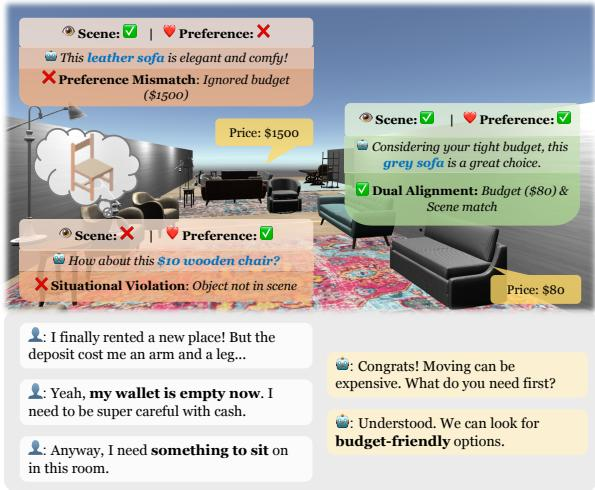  
Figure 1: An illustrative example of situated conversational recommendation, where user preference reasoning and situation alignment are two key aspects.

Despite its potential, SCR poses two fundamental challenges that distinguish it from conventional conversational recommendation, yet this direction remains underexplored. As illustrated in Figure 1, the first challenge lies in inferring users’ situated preferences (or needs). Unlike text-only settings, user preferences in SCR are tightly coupled with the located scene and may depend on implicit needs, visually similar items, or even shift dynamically with the environment. The complexity of such multimodal contexts makes it difficult for models to accurately infer the user’s underlying intent. The second challenge concerns how to effectively leverage situated preferences and scene information to generate appropriate responses. In SCR, recommendation responses are subject to dual objectives, as they must satisfy user preferences while grounding in visible candidate items. Addressing this challenge demands dual alignment with both the user and the environment, enabling agents to deliver recommendations that are not only relevant but also contextually appropriate.

In this paper, we propose Rubric-based Preference Reasoning and Alignment $( \mathsf { R e ^ { 2 } A } )$ , a framework that formulates SCR as a reason-thenalign process. Rather than introducing a new optimization algorithm, our core insight is to derive a structured preference state that serves as a shared interface among situated reasoning and response generation. $\mathsf { R e ^ { 2 } A }$ performs rubric-based preference reasoning, explicitly inferring intermediate user preference states from the dialogue history and coobserved scenes. Inspired by the Chain-of-Thought reasoning (Wei et al., 2022), these preference states are represented in a structured textual form, making the reasoning process inspectable. Unlike freeform CoT rationales, the preference state explicitly records the inferred user needs, attribute constraints, and visual target before any item is recommended. As collecting verifiable supervision for such reasoning is costly, we employ context-aware, multi-dimensional rubrics to obtain rewards and optimize the model via policy optimization (Shao et al., 2024), encouraging robust preference reasoning under complex situational contexts.

Building upon the reasoned preference states, $\mathsf { R e ^ { 2 } A }$ addresses the second challenge through dualalignment response generation. We formulate response generation as a contrastive learning problem (Rafailov et al., 2023) and introduce a user preference-conditioned optimization objective. By constructing heterogeneous negative responses that specifically violate either user preferences or scene constraints, the model learns to align its outputs with both situation consistency and user intent satisfaction. As a result, $\mathsf { R e ^ { 2 } A }$ produces recommendations that are contextually appropriate.

Our contributions are summarized as follows:

• We propose ${ \mathsf { R e } } ^ { 2 } { \mathsf { A } } ,$ , a novel framework for SCR that reformulates the task as a structured reasonthen-align process, explicitly separating situated preference reasoning from response alignment. The framework centers on a structured preference state that acts as a shared interface among preference reasoning, scene-constrained item recommendation, and response generation.

• We leverage rubric-guided policy optimization to derive explicit user preference states, while introducing user preference-conditioned optimization with rubric-based candidates to achieve dual alignment with both user intent and situational constraints. This avoids manual annotation of reasoning traces by leveraging automated rubric induction and synthetic preference construction.

• Experiments across two SCR datasets demonstrate that $\mathsf { R e ^ { 2 } A }$ consistently outperforms competitive approaches, producing recommendations that better capture users’ situated needs while remaining factually aligned with situations.

## 2 Task Definition

We formulate SCR as a sequential decision-making process within a shared multimodal environment. The environment comprises a collection of visual scenes $\{ S _ { i } \} _ { i = 1 } ^ { M }$ , where each scene $s _ { i }$ contains its own candidate item set $\mathcal { T } _ { i } = \{ o _ { i , j } \} _ { j = 1 } ^ { N _ { i } }$ . Crucially, each item $o _ { i , j }$ is a multimodal entity, characterized jointly by its visual appearance (e.g., color), spatial coordinates, and structured metadata (e.g., price). At the t-th turn, the agent receives a situated context $X _ { t } ~ = ~ ( S _ { t } , \mathcal { T } _ { t } , \mathcal { C } _ { t } )$ , composed of the co-observed scene $S _ { t }$ , scene-specific item set $\mathcal { T } _ { t } .$ , and the dialogue context $\mathcal { C } _ { t } = \{ u _ { 1 } , Y _ { 1 } , \ldots , u _ { t - 1 } , Y _ { t - 1 } , u _ { t } \}$ which includes past conversations and the current user utterance $u _ { t }$

The objective of SCR is to learn a mapping function that utilizes this context to simultaneously: (1) identify the appropriate target item $o _ { t } ^ { * } \in \mathcal { T } _ { t }$ that satisfies the user’s needs; and (2) generate a natural language response $Y _ { t }$ that is aligned with the user’s preference while remaining grounded in the scene.

## 3 Method

In this section, we present Rubric-based Preference Reasoning and Alignment $( \mathsf { R e ^ { 2 } A } )$ for situated conversational recommendation. Figure 2 shows the overview of ${ \mathsf { R e } } ^ { 2 } { \mathsf { A } } .$ , which follows a three-step pipeline: rubric-guided preference reasoning (see §3.1), dual alignment with user and situation (see §3.2), and cascaded inference (see §3.3).

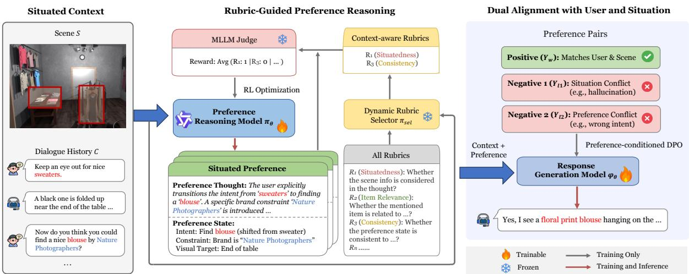  
Figure 2: Overview of the proposed $\mathsf { R e ^ { 2 } A }$ framework for situated conversational recommendation.

## 3.1 Rubric-Guided Preference Reasoning

Accurately inferring latent user needs presents a fundamental challenge in SCR. Relying solely on item labels to supervise preference reasoning risks capturing superficial correlations while failing to grasp the rationale determining how specific spatial or visual cues motivated the choice. To bridge this gap, we pivot the reasoning objective from predicting the what to explaining the why. Given that this intermediate reasoning lacks natural supervision, we introduce a rubric-based framework to provide verifiable and process-oriented guidance. This design differs from generic CoT and conventional state tracking in two respects. First, the agent leverages its thinking ability to yield a structured preference state that records the possible user needs, attribute constraints, and visual targets. Second, since the intermediate state has no direct annotation, the turn-relevant rubrics evaluate each thinking process and its resulting state against evidence in the co-observed scene, rather than supervising individual reasoning steps.

Automated Rubric Induction. To derive scalable supervision without manually annotating preference-reasoning traces, we construct a global rubric set R via an induction process driven by a Multimodal Large Language Model (MLLM). Given a small curated seed dataset $\mathcal { D } _ { \mathrm { s e e d } } = \{ ( \boldsymbol { S } _ { k } , \boldsymbol { \mathcal { C } } _ { k } ) \} _ { k = 1 } ^ { K }$ , and a constitutional metainstruction $\mathcal { T } _ { \mathrm { m e t a } }$ (see Appendix A.1), we prompt the MLLM to yield reasoning criteria, formulating a rubric set. The rubric set is structured into the

following four facets:

$$
\mathcal { R } = \mathcal { R } _ { \mathrm { s i t } } \cup \mathcal { R } _ { \mathrm { r e l } } \cup \mathcal { R } _ { \mathrm { c o n } } \cup \mathcal { R } _ { \mathrm { a u x } } ,\tag{1}
$$

where $\mathcal { R } _ { \mathrm { s i t } }$ (Situatedness) evaluates visual grounding (e.g., spatial references), $\mathcal { R } _ { \mathrm { r e l } }$ (Item Relevance) assesses alignment with the constraint of item attributes, ${ \mathcal { R } } _ { \mathrm { c o n } }$ (Consistency) ensures logical coherence with dialogue history, and $\mathcal { R } _ { \mathrm { a u x } }$ (Auxiliary) captures domain-specific criteria beyond the prior three facets identified by the MLLM. Crucially, each rubric $r \in \mathcal { R }$ is formulated as a binary predicate function $r ( \cdot )  \{ 0 , 1 \}$ , enabling standardized binary evaluation by a frozen MLLM judge (see Appendix A.2 for concrete examples). These four facets follow SCR’s core requirements of visual grounding, constraint satisfaction, and multi-turn coherence; a manual coverage check on 50 sampled dialogue turns finds that all turn-level requirements map onto these facets (Appendix I.1).

Dynamic Rubric Selection. Uniformly applying the global rubric set R across dynamic dialogue turns introduces noisy supervision, as irrelevant constraints obscure the reasoning focus. To this end, we employ a dynamic rubric selector, instantiated by a frozen MLLM $( \pi _ { \mathrm { s e l } } )$ , to select a pertinent subset $\mathcal { R } _ { \mathrm { a c t } } \subset \mathcal { R }$ conditioned on the situated context $X _ { t }$ . By analyzing the primary communicative needs, $\pi _ { \mathrm { s e l } }$ gates inactive criteria. For instance, a purely spatial query such as “the one on the $l e f t ^ { \prime }$ primarily activates situatedness rubrics, whereas a mixed query such as “the red one on the $l e f t ^ { \prime }$ activates both situatedness and item-relevance rubrics. This selective activation provides denser and less noisy supervision. The prompting template is provided in Appendix B.

Preference State Generation with Rubric-based Rewards. To bridge raw multimodal context and structured preference inference, we train a preference reasoning model $\pi _ { \theta }$ to generate user preference reasoning traces explicitly. Given the situated context X and a structural instruction $\mathcal { T } _ { \mathrm { r e a s o n } }$ (see Appendix B), $\pi _ { \theta }$ produces a preference thought $\tau$ which captures intermediate reasoning over preference shifts and spatial constraints, followed by a structured preference state P that formalizes the inferred user needs, attribute constraints, and visual targets into a structured textual format for promptbased item recommendation and rubric verification.

Since such preference states are latent and lack direct supervision, we adopt a group-based learning strategy to provide relative training signals. During each training step, $\pi _ { \theta }$ samples a group of G reasoning candidates $\{ \mathcal { O } _ { 1 } , \ldots , \mathcal { O } _ { G } \}$ , where each $\mathcal { O } _ { g } ~ = ~ ( \mathcal { T } _ { g } , \mathcal { P } _ { g } )$ At t-th turn, the dynamically selected rubric subset ${ \mathcal { R } } _ { \mathrm { a c t } }$ serves as the evaluation standard. We use MLLM-as-a-Judge to assess whether each candidate satisfies the active rubrics, yielding a set of binary verification outcomes. Formally, we instantiate this judge as a binary evaluator $f _ { \mathrm { j u d g e } } : ( \mathcal { O } _ { g } , r , X _ { t } )  \{ 0 , 1 \}$ using a frozen Qwen3-VL-8B-Instruct (Bai et al., 2025) model. For each active rubric, the evaluator receives the situated context, candidate preference thought, preference state, rubric question, and its evidence indicators, then it outputs a structured JSON verdict with supporting evidence; a deterministic parser maps YES to 1 and NO to 0. The exact judging prompt is provided in Appendix B.

Concretely, each rubric $r \in \mathcal { R } _ { \mathrm { a c t } }$ functions as a binary criterion. The scalar reward $R _ { g }$ for candidate $\mathcal { O } _ { g }$ is computed as the satisfaction rate:

$$
R _ { g } = \frac { 1 } { | \mathcal { R } _ { \mathrm { a c t } } | } \sum _ { r \in \mathcal { R } _ { \mathrm { a c t } } } f _ { \mathrm { j u d g e } } ( \mathcal { O } _ { g } , r , X _ { t } ) .\tag{2}
$$

Rather than relying on absolute reward values, we compute the relative advantage to reduce variance:

$$
A _ { g } = \frac { R _ { g } - \mu _ { R } } { \sigma _ { R } + \epsilon } ,\tag{3}
$$

where $\mu _ { R }$ and $\sigma _ { R }$ denote the mean and standard deviation of rewards $\{ R _ { 1 } , \ldots , R _ { G } \}$ within the group, and ϵ ensures numerical stability.

We optimize $\pi _ { \theta }$ using Group Relative Policy Optimization (GRPO) (Shao et al., 2024). By leveraging group-normalized advantages, GRPO not only stabilizes optimization to favor reasoning traces that satisfy active situated constraints, but also eliminates the need for an explicit value network, thereby significantly reducing the memory overhead of training on high-dimensional multimodal inputs. The objective function is defined as:

$$
\begin{array} { r l r } & { } & { \mathcal { I } ( \theta ) = \displaystyle \frac { 1 } { G } \sum _ { g = 1 } ^ { G } \bigg ( \operatorname* { m i n } \bigg ( \rho _ { g } ( \theta ) A _ { g } , \mathrm { c l i p } ( \rho _ { g } ( \theta ) , } \\ & { } & { 1 - \varepsilon , 1 + \varepsilon ) A _ { g } \bigg ) - \beta \cdot \mathbb { D } _ { \mathrm { K L } } ( \pi _ { \theta } | | \pi _ { \mathrm { r e f } } ) \bigg ) , } \end{array}\tag{4}
$$

where $\begin{array} { r } { \rho _ { g } ( \theta ) \ = \ \frac { \pi _ { \theta } ( \mathcal { O } _ { g } \vert X ) } { \pi _ { \mathrm { o l d } } ( \mathcal { O } _ { g } \vert X ) } } \end{array}$ is the probability ratio, $\pi _ { \mathrm { r e f } }$ is the reference policy (initialized from the supervised baseline), and $\beta$ controls the KLdivergence penalty to prevent policy collapse.

## 3.2 Dual Alignment with User and Situation

Building upon the preference state P inferred by $\pi _ { \theta } ,$ we aim to generate responses simultaneously aligned with user preferences and grounded in the scene. We note that responses satisfying user preferences risk violating physical constraints (e.g., hallucinating absent items), whereas strictly scene-consistent responses may fail to capture the user’s actual needs. Therefore, we formulate response generation as a conditional alignment problem. Specifically, we propose a user preferenceconditioned DPO method for response generation, building on top of vanilla DPO (Rafailov et al., 2023), where the optimization trajectory is explicitly guided by the inferred preference state.

Heterogeneous Preference Pair Construction. To provide fine-grained supervision, we construct heterogeneous negative responses targeting distinct failure modes in SCR. For each ground-truth response $Y _ { w }$ , we leverage an LLM to automatically synthesize two types of negative samples using specific instruction templates (see Appendix B): (i) Situation-conflicting negatives $( Y _ { l 1 } )$ are constructed by injecting hallucinations that contradict the observed scene S, such as recommending absent items or referencing non-existent spatial landmarks. These pairs explicitly penalize violations of visual grounding. (ii) Preference-conflicting negatives $( Y _ { l 2 } )$ are generated by substituting the target item in $Y _ { w }$ with a distractor item that is present in the scene but contradicts the inferred preference state $\mathcal { P }$ (e.g., violating price or attribute constraints). These pairs penalize responses that are grounded yet misaligned with user needs. A post-hoc validation with both model and human evaluators confirms that the synthesized negatives satisfy the conflicts (see Appendix I.1).

Alignment Training. We adopt two-stage alignment training to optimize the response generation policy $\varphi _ { \theta }$ . We condition the response generator during training on the ground-truth target item $o ^ { * }$ as a teacher-forced grounding anchor. This use of $o ^ { * }$ supervises how the generator verbalizes a recommendation once the target item is specified, rather than supervising the preference-reasoning stage described in §3.1. During inference, the oracle anchor is unavailable and is replaced by the retrieved item. Thus, the training-inference discrepancy is confined to the source of the grounding anchor, while the generator is consistently conditioned on an explicit item in both phases.

Concretely, we first perform supervised finetuning. Given the fully grounded context $\tilde { X } \ =$ $( \mathcal { S } , \mathcal { C } , \mathcal { P } , o ^ { * } )$ , we maximize the likelihood of the response $Y _ { w }$ :

$$
\begin{array} { r } { \mathcal { L } _ { \mathrm { S F T } } ( \theta ) = - \mathbb { E } _ { ( \tilde { X } , Y _ { w } ) \sim \mathcal { D } } \big [ \log \varphi _ { \theta } ( Y _ { w } \mid \tilde { X } ) \big ] . } \end{array}\tag{5}
$$

This yields a reference policy $\varphi _ { \mathrm { r e f } } .$ . Subsequently, we employ DPO using the constructed heterogeneous pairs. The objective is defined as:

$$
\begin{array} { r l } & { \mathcal { L } _ { \mathrm { { D P O } } } ( \boldsymbol { \theta } ) = - \mathbb { E } _ { ( \boldsymbol { \tilde { X } } , Y _ { w } , Y _ { l } ) \sim \mathcal { D } _ { \mathrm { m i x } } } \Big [ \log \sigma \Big ( } \\ & { \beta _ { \mathrm { { D P O } } } \big ( \log \frac { \varphi _ { \boldsymbol { \theta } } ( Y _ { w } \mid \boldsymbol { \tilde { X } } ) } { \varphi _ { \mathrm { r e f } } ( Y _ { w } \mid \boldsymbol { \tilde { X } } ) } - \log \frac { \varphi _ { \boldsymbol { \theta } } ( Y _ { l } \mid \boldsymbol { \tilde { X } } ) } { \varphi _ { \mathrm { r e f } } ( Y _ { l } \mid \boldsymbol { \tilde { X } } ) } \big ) \Big ] , } \end{array}\tag{6}
$$

where $\beta _ { \mathrm { D P O } }$ controls the KL-divergence penalty relative to $\varphi _ { \mathrm { r e f } } .$ . Training on $\mathcal { D } _ { \mathrm { m i x } } .$ a mixture of situation-centric $( Y _ { w } , Y _ { l 1 } )$ and preference-centric $( Y _ { w } , Y _ { l 2 } )$ pairs, enforces dual constraints: $Y _ { l 1 }$ penalizes referencing absent entities (grounding), while $Y _ { l 2 }$ ensures consistency with the preference state and its corresponding target anchor over scenevalid distractors (alignment). Consequently, φθ converges to a policy simultaneously grounded in the scene and aligned with the user preference.

## 3.3 Cascaded Inference

To translate reasoning-derived preferences into grounded recommendations at inference time, $\mathsf { R e ^ { 2 } A }$ adopts a cascaded strategy that decouples item retrieval from response generation. In this design, the inferred preference state $\mathcal { P }$ serves as a pivot, transforming implicit user needs into explicit retrieval constraints before response generation.

Item Recommendation. We identify target items through a constrained preference-to-item parser. Given the generated preference state $\mathcal { P } _ { \cdot }$ , the parser ranks visible candidates in $\mathcal { T }$ according to how well their visual attributes, spatial positions, and metadata satisfy the explicit constraints in $\mathcal { P }$ . In practice, this parser is instantiated with the same backbone model under a deterministic ranking prompt (see Appendix B); it does not introduce an additional learned ranking objective, but operationalizes the reasoned preference state by mapping it onto the scene-specific candidate item set. This keeps item selection more transparent and restricts the search space to physically visible items.

Aligned Response Generation. From the ranked candidates, we select the top-ranked item oˆ to drive response generation. Conditioned on the situated context $( \boldsymbol { \mathcal { S } } , \boldsymbol { \mathcal { C } } , \boldsymbol { \mathcal { P } } , \boldsymbol { \hat { o } } )$ , the model $\varphi _ { \theta }$ generates an appropriate response at each turn. This explicit conditioning anchors the narrative to the specific target ${ \hat { o } } ,$ ensuring the response is simultaneously grounded in the surrounding scene and aligned with user preferences.

## 4 Experimental Setup

Datasets. We evaluate $\mathsf { R e ^ { 2 } A }$ on two typical SCR datasets: SIMMC 2.1 (Kottur and Moon, 2023) and SCREEN (Lin et al., 2024). SIMMC 2.1 features photorealistic 3D scenes in fashion and furniture domains, presenting significant challenges in visual grounding and coreference resolution within dense visual environments. In contrast, SCREEN focuses on implicit preference reasoning, containing synthesized dialogues with evolving personas and complex attribute constraints that require multiturn logic tracking. We unify these sources into standard tuples for consistent training. Detailed statistics are provided in Appendix C. The average dialogue contains roughly 10 turns, so the textual history itself can typically fit within modern 8K ∼ 32K context windows. The central difficulty instead comes from visual density, where each scene contains 19.7 objects on average, forcing the model to distinguish fine-grained spatial and attribute cues from many scene-valid distractors.

Backbone Models. To validate our $\mathsf { R e ^ { 2 } A }$ framework across varying model architectures, we implement $\mathsf { R e ^ { 2 } A }$ on two state-of-the-art open-source MLLMs: LLaVA-NeXT (Liu et al., 2024) and Qwen3-VL (Bai et al., 2025). We select LLaVA-

<table><tr><td rowspan="2">Backbone</td><td rowspan="2">Method</td><td colspan="4">SIMMC 2.1</td><td colspan="4">SCREEN</td></tr><tr><td>Hit@1</td><td>Recall@5</td><td>MRR@5</td><td>NDCG@5</td><td>Hit@1</td><td>Recall@5</td><td>MRR@5</td><td>NDCG@5</td></tr><tr><td rowspan="8">LLaVA-NeXT</td><td>Vanilla Prompting</td><td>11.63</td><td>12.08</td><td>11.80</td><td>11.87</td><td>14.81</td><td>15.29</td><td>14.99</td><td>15.06</td></tr><tr><td>ICL</td><td>14.02</td><td>15.71</td><td>14.65</td><td>14.91</td><td>16.38</td><td>18.06</td><td>17.00</td><td>17.27</td></tr><tr><td>CoT</td><td>13.59</td><td>14.84</td><td>14.05</td><td>14.25</td><td>15.77</td><td>18.52</td><td>16.79</td><td>17.22</td></tr><tr><td>SFT</td><td>23.14</td><td>30.67</td><td>25.93</td><td>27.11</td><td>24.96</td><td>30.13</td><td>26.87</td><td>27.68</td></tr><tr><td>CRAG</td><td>27.91</td><td>38.04</td><td>31.86</td><td>33.43</td><td>29.48</td><td>39.15</td><td>34.05</td><td>35.38</td></tr><tr><td>ReGeS</td><td>32.18</td><td>56.89</td><td>39.09</td><td>43.34</td><td>35.29</td><td>61.94</td><td>41.10</td><td>45.99</td></tr><tr><td>Re2A (Ours)</td><td>40.35</td><td>60.37</td><td>48.83</td><td>51.74</td><td>41.03</td><td>65.81</td><td>52.03</td><td>55.53</td></tr><tr><td>Vanilla Prompting</td><td>15.37</td><td>17.91</td><td>16.52</td><td>16.88</td><td>19.62</td><td>21.03</td><td>20.14</td><td>20.36</td></tr><tr><td rowspan="6">Qwen3-VL</td><td>ICL</td><td>18.25</td><td>22.06</td><td>20.16</td><td>20.65</td><td>22.17</td><td>25.91</td><td>23.55</td><td>24.14</td></tr><tr><td>CoT</td><td>17.55</td><td>19.53</td><td>18.42</td><td>18.70</td><td>21.41</td><td>25.76</td><td>23.02</td><td>23.70</td></tr><tr><td>SFT</td><td>31.24</td><td>39.14</td><td>33.20</td><td>34.61</td><td>34.58</td><td>40.71</td><td>36.58</td><td>37.58</td></tr><tr><td>CRAG</td><td>35.64</td><td>45.31</td><td>38.62</td><td>40.28</td><td>37.09</td><td>48.35</td><td>40.18</td><td>42.13</td></tr><tr><td>ReGeS</td><td>39.45</td><td>58.74</td><td>43.78</td><td>47.30</td><td>41.72</td><td>64.19</td><td>50.03</td><td>53.56</td></tr><tr><td>Re2A (Ours)</td><td>48.12</td><td>65.08</td><td>54.22</td><td>56.89</td><td>49.63</td><td>70.47</td><td>58.44</td><td>61.52</td></tr></table>

Table 1: Evaluation results of different preference reasoning methods for situated conversational recommendation. The best results are highlighted in bold.

NeXT to exploit its dynamic high-resolution image encoding, a critical feature for discerning fine-grained visual attributes in dense SCR scenes (e.g., distinguishing similar furniture). Additionally, we employ Qwen3-VL to harness its superior instruction-following and logical reasoning capabilities, ensuring robust adherence to complex, multiturn attribute and spatial constraints.

Baseline Methods. We compare $\mathsf { R e ^ { 2 } A }$ against three distinct types of methods. (1) Inference-Only Strategies: We employ Vanilla Prompting, In-Context Learning (ICL), and Chain-of-Thought (CoT) to probe the intrinsic reasoning capabilities of the backbones without parameter updates. (2) Multimodal Fine-Tuning: We establish standard SFT on the target datasets as the foundational baseline for learnable methods. (3) Adapted Conversational Recommendation Methods: We adapt two cutting-edge conversational recommendation methods for the SCR setting: CRAG (Zhu et al., 2025), which utilizes collaborative retrieval to bridge semantic gaps, and ReGeS (Yang and Fang, 2025), which optimizes candidate selection through reciprocal retrieval-generation synergy. For a fair comparison, all learnable baselines are equipped with the same multimodal backbones.

Evaluation Protocols. We employ a multidimensional protocol to evaluate recommendation accuracy and response generation quality. For recommendation, we report Hit@1, Recall@5, MRR@5, and NDCG@5 to measure ranking alignment with ground-truth items. All inference-time results are obtained with the full cascaded pipeline: the response generator is conditioned on the retrieved item oˆ produced by preference-to-item parsing, rather than the oracle target $o ^ { * }$ used as a teacherforced grounding anchor during response-generator training. Since no manual correction is applied to predicted preference states or resolved items, errors propagated from upstream stages are already reflected in all reported results.

<table><tr><td>Data</td><td colspan="4">Method Judge-Avg ↑ SR ↑ VHR ↓ Human-Avg ↑</td></tr><tr><td rowspan="9">SIMMC</td><td>Vanilla</td><td>5.29</td><td>15.1</td><td>45.7 0.94</td></tr><tr><td>ICL</td><td>6.02</td><td>17.7 39.6</td><td>1.11</td></tr><tr><td>CoT</td><td>6.32</td><td>16.4 38.4</td><td>1.2</td></tr><tr><td>SFT</td><td>7.82</td><td>29.6 25.4</td><td>1.47</td></tr><tr><td>CRAG</td><td>8.17</td><td>34.3 19.7</td><td>1.57</td></tr><tr><td>ReGeS</td><td>8.49</td><td>38.6 15.2</td><td>1.65</td></tr><tr><td>Re2A</td><td>9.31</td><td>46.8 5.2</td><td>1.87</td></tr><tr><td>Vanilla</td><td>5.49</td><td>16.9 42.1</td><td>0.97</td></tr><tr><td>ICL</td><td>6.16</td><td>19.7</td><td>36.4 1.15</td></tr><tr><td>CoT</td><td>6.51</td><td>18.4</td><td>34.9 1.24</td></tr><tr><td>SCREEN SFT</td><td>7.94</td><td>31.7 24.1</td><td>1.51</td></tr><tr><td>CRAG</td><td>8.3</td><td>36.1 18.6</td><td>1.61</td></tr><tr><td>ReGeS</td><td>8.56</td><td>40.9 14.6</td><td>1.7</td></tr><tr><td> $\mathtt { R e ^ { 2 } A }$ </td><td>9.19</td><td>48.6</td><td>5.1 1.86</td></tr></table>

Table 2: Response generation performance with the Qwen3-VL backbone. Full evaluation results are provided in Appendix F.

For response generation, we adopt a threetiered strategy: (1) LLM-as-a-Judge (turn-level): We employ GPT-5.2 to score generated responses (1–10) on visual fidelity (VF) for hallucination detection, constraint compliance (CC) for preference satisfaction, and conversational helpfulness (CH). (2) User simulation (dialogue-level): Through interaction with a simulator (max 20 turns), we report success rate (SR). Crucially, to diagnose the alignment dilemma, we measure weak-match rate (WMR) and visual hallucination rate (VHR). (3) Human evaluation: Annotators rate responses (0 ∼ 2) on situational grounding (Ground.), preference alignment (Align.), and logical coherence (Coher.). Appendix D provides detailed definitions and prompts. Appendix I.2 further verifies the robustness of these protocols with independent judges and alternative user simulators.

Implementation Details. We instantiate $\mathsf { R e ^ { 2 } A }$ with LLaVA-NeXT (Liu et al., 2024) and Qwen3- VL (Bai et al., 2025), training only LoRA adapters while freezing visual modules. GPT-5.2 supports offline rubric and negative construction, and a frozen Qwen3-VL serves as the training-time selector and judge. Full optimization, decoding, and infrastructure settings are provided in Appendix E.

## 5 Results and Analyses

## 5.1 Main Results

Recommendation Performance. Table 1 shows that $\mathsf { R e ^ { 2 } A }$ achieves the best performance across metrics. On SIMMC 2.1, it surpasses the strongest baseline ReGeS by 8.17 percentage points in Hit@1 (40.35% vs. 32.18%, LLaVA-NeXT). We attribute these gains to two factors: (1) Overcoming “Reasoning $D e f i c i t ^ { \prime \prime } { : }$ Standard CoT consistently underperforms ICL (e.g., 17.55% vs. 18.25% with Qwen3-VL) and often drifts into “hallucinated reasoning” by inventing visual details; rubric-guided verification anchors $\mathsf { R e ^ { 2 } A }$ to the scene. (2) Logical Reasoning vs. Retrieval: Retrieval baselines (CRAG, ReGeS) struggle with spatial negation or conditional attributes because implicit semantic similarity misses logical constraints. The structured reason-then-align process models these constraints explicitly, improving grounding. Thus, long-context access alone is insufficient: despite short dialogue histories, dense scenes with visually plausible distractors still cause prompt-based methods to drift toward hallucinated reasoning.

We note that Table 1 compares complete systems under their intended training objectives, and thus does not by itself isolate the contribution of our training objectives from the synthesized supervision used by ${ \mathsf { R e } } ^ { 2 } { \mathsf { A } } .$ . As a call-matched diagnostic, prompting each frozen baseline to first generate an intermediate representation improves both CRAG and ReGeS, with the structured preference state outperforming free-form reasoning under the same call budget (Appendix I.3), indicating that the structured interface itself contributes beyond synthesized training data.

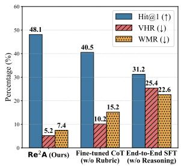  
(a) Reasoning Analysis

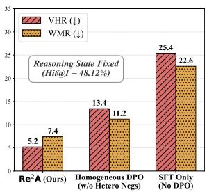  
(b) Alignment Analysis  
Figure 3: Ablation studies on SIMMC 2.1. (a) Our rubric-guided reasoning yields higher accuracy (Hit@1) than baseline methods. (b) Heterogeneous DPO achieves the lowest hallucination rates.

Response Generation Quality. Beyond recommendation accuracy, $\mathsf { R e ^ { 2 } A }$ generates more grounded responses. Table 2 summarizes responsequality results; full SIMMC 2.1 and SCREEN breakdowns are provided in Appendix F. On SIMMC 2.1, $\mathsf { R e ^ { 2 } A }$ improves visual fidelity over ReGeS under Qwen3-VL (see Appendix Table 11). These metrics use the full cascaded setting with retrieved anchors $\hat { o } ,$ so item-resolution errors remain reflected in generation. Moreover, preferenceconditioned DPO resolves the alignment dilemma: SFT exhibits high VHR by inventing attributes to force satisfaction, whereas $\mathsf { R e ^ { 2 } A }$ reduces VHR by 20.2% (25.4% → 5.2%) and Weak-Match Rate by 15.2% (22.6% → 7.4%). This confirms that $\mathsf { R e ^ { 2 } A }$ aligns responses with user preference without compromising physical fidelity.

## 5.2 Ablation Studies

Figure 3 shows the contribution of each component.   
Appendix G reports full facet-level rubric ablations.   
Below, we discuss key findings.

Impact of Rubric-Guided Reasoning. The results in Figure 3(a) confirm the necessity of guided reasoning. Removing the reasoning module entirely (End-to-End SFT) leads to a sharp 16.9 percentage-point drop in Hit@1 $( 4 8 . 1 \%  3 1 . 2 \% )$ highlighting a severe “reasoning deficit” in blackbox models. Moreover, $\mathsf { R e ^ { 2 } A }$ clearly outperforms Fine-tuned CoT (40.5%). This gap indicates that the standard chain-of-thought is prone to semantic drift, deviating from subtle situational constraints. Our dynamic rubrics act as logical anchors to prevent this and enforce strict visual grounding.

<table><tr><td>Method</td><td>Preference Reasoning (ms)</td><td>Selector/Judge (ms)</td><td>Retrieval (ms)</td><td>Generation (ms)</td><td>Total (ms)</td><td>Hit@1↑</td><td>VHR↓</td></tr><tr><td>End-to-End SFT</td><td></td><td></td><td></td><td>814.6</td><td>814.6</td><td>31.24%</td><td>25.4%</td></tr><tr><td>ReGeS</td><td></td><td></td><td>538.2</td><td>682.7</td><td>1220.9</td><td>39.45%</td><td>15.2%</td></tr><tr><td> $\mathsf { R e ^ { 2 } A }$  (Distilled 4B Reasoner)</td><td></td><td>0.0</td><td></td><td></td><td>1838.4</td><td>46.71%</td><td>8.2%</td></tr><tr><td> $\mathsf { R e ^ { 2 } A }$  (Ours)</td><td>1423.8</td><td>0.0</td><td>267.5</td><td>651.4</td><td>2342.7</td><td>48.12%</td><td>5.2%</td></tr></table>

Table 3: Per-turn inference latency statistics on SIMMC 2.1 with Qwen3-VL. The runtime cost of $\mathsf { R e ^ { 2 } A }$ mainly comes from explicit preference reasoning, while the training-time selector and judge are not invoked during inference. The distilled variant replaces only the 8B preference reasoner with a distilled 4B student (see Appendix I.4); we report its end-to-end latency measured under the same protocol.

Impact of Heterogeneous DPO. Figure 3(b) disentangles the generation quality by freezing the reasoning state. Reverting to standard supervision (SFT Only) increases hallucinations by 20.2% (VHR: 5.2% → 25.4%), exposing the limitation of likelihood-based training. Further, the suboptimal VHR of standard homogeneous DPO (trained with non-targeted negatives) indicates that generic negative sampling is insufficient. Specifically, this variant pairs each ground-truth response with a single generic dispreferred response produced without our situation-conflicting and preference-conflicting instructions, thereby removing the targeted $Y _ { l 1 }$ and $Y _ { l 2 }$ supervision signals. Our heterogeneous negatives are indispensable: they suppress hallucinations and reduce the weak-match rate by 3.8% (WMR: $1 1 . 2 \%  7 . 4 \% )$ . This ensures the model remains responsive to user intent while adhering to the scene, effectively balancing helpfulness and truthfulness. Additional sensitivity and data-efficiency analyses appear in Appendix H.

## 5.3 Inference Latency Analysis

Table 3 compares the runtime cost of our $\mathsf { R e ^ { 2 } A }$ and other baseline methods. Under Qwen3-VL on 100 sampled SIMMC 2.1 turns, $\mathsf { R e ^ { 2 } A }$ increases total perturn latency from 1220.9 ms for ReGeS to 2342.7 ms. This increase is primarily driven by the explicit preference reasoning step, which accounts for 1423.8 ms. Interestingly, despite the higher overall latency, $\mathsf { R e ^ { 2 } A }$ actually reduces the time spent on both retrieval (from 538.2 ms to 267.5 ms) and generation (from 682.7 ms to 651.4 ms) compared to ReGeS. Crucially, this added computational cost yields significant performance gains, improving Hit@1 by 8.67% (39.45% → 48.12%) and reducing VHR by 10.0% (15.2% → 5.2%). As shown in Table 3, the dynamic rubric selector and the judge model operate only during training and introduce zero inference-time overhead. Thus, the added latency reflects a deliberate accuracy-faithfulness trade-off anchored in preference reasoning, rather than runtime dependence on the selector or judge models.

To further alleviate this overhead, we distill the 8B preference reasoner into a 4B student that reproduces its structured preference states, replacing only the reasoner checkpoint at evaluation time (Appendix I.4). The distilled variant reduces total per-turn latency by 504.3 ms while retaining most of the recommendation gain (46.71% Hit@1). In deployment, prefix or key-value caching could reuse the unchanged scene and dialogue prefix to further improve responsiveness.

## 5.4 Variant Analysis

We conduct a variant analysis across different judges and user simulators in Appendix I. Two independent judges yield Judge-Avg margins over ReGeS with 95% confidence intervals entirely above zero, $\mathsf { R e ^ { 2 } A }$ stays ahead under an alternative user simulator, and it falls between zero-shot and few-shot GPT-5.2 (Appendix I.2). The results further verify our findings: replacing the training-time judge preserves all conclusions (see Appendix I.5). Our method consistently outperforms ReGeS under zero-shot transfer across fashion and furniture domains (see Appendix I.6).

## 5.5 Qualitative Analysis

Appendix J shows some case studies. The comparison against ReGeS highlights two advantages of $\mathsf { R e } ^ { 2 } \mathsf { A } \colon$ (1) Reasoning robustness: Unlike baselines struggling with negation, $\mathsf { R e } ^ { 2 } \mathsf { A } ^ { \prime } \mathsf { s }$ explicit preference thought captures structural constraints (e.g., processing the negation in “don’t want light wood finish”). (2) Dual alignment: Our mechanism filters out visually salient distractors (e.g., bright light wood furniture) that mislead baselines. It grounds responses in the correctly reasoned target (the black metal shelving unit), satisfying decor needs.

## 6 Related Work

Conversational Recommendation. Conversational Recommendation has largely followed a textoriented semantic-matching paradigm. Representative CRS methods such as CRAG (Zhu et al., 2025) and ReGeS (Yang and Fang, 2025) optimize retrieval-generation synergy, but do not explicitly model shared physical scenes. Lin et al. (2024) pioneered SCR with the SCREEN benchmark, arguing that practical agents must ground recommendations within a co-observed, multimodal environment. Recent multimodal CRS studies address limited supervision or structured prompting, including sample-efficient multimodal CRS training (Su et al., 2024) and semantic graph prompt learning in MSCRS (Wei et al., 2025). Other multimodal adaptations (Wei and Yang, $2 0 1 3 ;$ Xue et al., 2025; Mukande et al., 2024) add visual encoders but still rely on implicit cross-modal alignment. This black-box fusion often struggles with the reasoning deficit (Li et al., 2025; Yan et al., 2025): without explicit logic, models are easily swayed by visual saliency. Unlike these implicit paradigms, we treat SCR as structured reasoning and derive preference constraints as robust anchors, so responses remain physically grounded while still addressing user preferences.

Reasoning and Alignment in MLLMs. Recent “System-2 thinking” methods employ CoT (Wei et al., 2022) or GRPO (Shao et al., 2024) to enforce verifiable logic chains. However, SCR differs from math tasks (Cobbe et al., 2021): situated preferences are latent and ambiguous, lacking deterministic verifier signals. In response generation, standard DPO (Rafailov et al., 2023) is also ill-equipped for the alignment dilemma because it collapses multi-dimensional constraints into a single scalar ranking (Amini et al., 2024; Lang et al., 2024). It often fails to distinguish factual grounding errors (Li et al., 2023; Sahoo et al., 2024) from preference mismatches. Our approach leverages automated rubrics (Bai et al., 2022; Lee et al., 2024) for dense verification and preference-conditioned DPO with heterogeneous negatives, improving reasoning and alignment in a cascaded manner.

## 7 Conclusion

We introduced ${ \mathsf { R e } } ^ { 2 } { \mathsf { A } } ,$ a reason-then-align framework for situated conversational recommendation. By integrating rubric-guided reasoning with dualalignment preference optimization, $\mathsf { R e ^ { 2 } A }$ enables models to learn structured, verifiable reasoning traces and generate grounded responses without expensive annotation of intermediate preference states. Our results demonstrate that shifting from implicit pattern matching to explicit reasoning substantially enhances recommendation faithfulness and situated conversation quality. We hope this work encourages future research on verifier-based rollback against cascaded errors, distilling these reasoning capabilities into efficient agents, and deploying situated recommendation assistants in realworld environments.

## Limitations

While $\mathsf { R e ^ { 2 } A }$ demonstrates promising results, we acknowledge several limitations. First, the cascaded inference mechanism incurs additional latency over end-to-end baselines and risks error propagation, where an incorrect preference state can mislead downstream item resolution and generation. A promising future work is to develop an independent verifier that checks the preference state and triggers a clarification request when necessary. Second, automated rubric induction and negative sample synthesis rely on a powerful teacher LLM. The teacher model is used only for offline data construction, yet its biases or reasoning flaws could still propagate to the induced rubrics and synthetic preference pairs. Finally, our experiments focus on static visual scenes. Extending the dual-alignment constraints to dynamic environments, where objects may shift or change states during the interaction, remains an open challenge for future research.

## Ethics Statement

We strictly follow the protocols governing the academic use of the datasets, open-source backbones, and external LLM services. The public datasets and open-source backbones are used in accordance with their respective licenses. We do not collect new personally identifying user data. We acknowledge that the rubrics used for preference reasoning are induced by LLMs, which may carry inherent biases from their pre-training data. Our framework achieves better transparency by generating explicit reasoning traces. While we use AI assistants (e.g., ChatGPT) to assist in coding and refining the writing of this manuscript, we ensure that all content and ideas originate from the authors.

## Acknowledgements

This work was supported by the General Research Fund (GRF) of the Research Grants Council of Hong Kong (PolyU 15207122 and PolyU 15205325), and also in part by the PolyU Postdoc Matching Fund (4-W40Z). The authors would like to thank the anonymous reviewers for their valuable feedback and constructive suggestions.

## References

Afra Amini, Tim Vieira, and Ryan Cotterell. 2024. Direct preference optimization with an offset. In Findings ofthe Associationfor Computational Linguistics: ACL 2024, pages 9954–9972, Bangkok, Thailand. Association for Computational Linguistics.

Shuai Bai, Yuxuan Cai, Ruizhe Chen, Keqin Chen, Xionghui Chen, Zesen Cheng, Lianghao Deng, Wei Ding, Chang Gao, Chunjiang Ge, Wenbin Ge, Zhifang Guo, Qidong Huang, Jie Huang, Fei Huang, Binyuan Hui, Shutong Jiang, Zhaohai Li, Mingsheng Li, and 45 others. 2025. Qwen3-vl technical report. Preprint, arXiv:2511.21631.

Yuntao Bai, Saurav Kadavath, Sandipan Kundu, Amanda Askell, Jackson Kernion, Andy Jones, Anna Chen, Anna Goldie, Azalia Mirhoseini, Cameron McKinnon, Carol Chen, Catherine Olsson, Christopher Olah, Danny Hernandez, Dawn Drain, Deep Ganguli, Dustin Li, Eli Tran-Johnson, Ethan Perez, and 32 others. 2022. Constitutional AI: harmlessness from AI feedback. CoRR, abs/2212.08073.

Karl Cobbe, Vineet Kosaraju, Mohammad Bavarian, Mark Chen, Heewoo Jun, Lukasz Kaiser, Matthias Plappert, Jerry Tworek, Jacob Hilton, Reiichiro Nakano, Christopher Hesse, and John Schulman. 2021. Training verifiers to solve math word problems. CoRR, abs/2110.14168.

Tri Dao. 2024. Flashattention-2: Faster attention with better parallelism and work partitioning. In The Twelfth International Conference on Learning Representations, ICLR 2024, Vienna, Austria, May 7-11, 2024. OpenReview.net.

Tim Dettmers, Artidoro Pagnoni, Ari Holtzman, and Luke Zettlemoyer. 2023. Qlora: Efficient finetuning of quantized llms. In Advances in Neural Information Processing Systems 36: Annual Conference on Neural Information Processing Systems 2023, NeurIPS 2023, New Orleans, LA, USA, December 10 - 16, 2023.

Joseph L Fleiss. 1971. Measuring nominal scale agreement among many raters. Psychological bulletin, 76(5):378.

Ari Holtzman, Jan Buys, Li Du, Maxwell Forbes, and Yejin Choi. 2020. The curious case of neural text degeneration. In 8th International Conference on

Learning Representations, ICLR 2020, Addis Ababa, Ethiopia, April 26-30, 2020. OpenReview.net.

Satwik Kottur and Seungwhan Moon. 2023. Overview of situated and interactive multimodal conversations (simmc) 2.1 track at dstc 11. In Proceedings ofThe Eleventh Dialog System Technology Challenge, pages 235–241.

Satwik Kottur, Seungwhan Moon, Alborz Geramifard, and Babak Damavandi. 2021. SIMMC 2.0: A taskoriented dialog dataset for immersive multimodal conversations. In Proceedings of the 2021 Conference on Empirical Methods in Natural Language Processing, EMNLP 2021, Virtual Event / Punta Cana, Dominican Republic, 7-11 November, 2021, pages 4903–4912. Association for Computational Linguistics.

Hao Lang, Fei Huang, and Yongbin Li. 2024. Finetuning language models with reward learning on policy. In Proceedings of the 2024 Conference of the North American Chapter ofthe Associationfor Computational Linguistics: Human Language Technologies (Volume 1: Long Papers), NAACL 2024, Mexico City, Mexico, June 16-21, 2024, pages 1382–1392. Association for Computational Linguistics.

Harrison Lee, Samrat Phatale, Hassan Mansoor, Thomas Mesnard, Johan Ferret, Kellie Lu, Colton Bishop, Ethan Hall, Victor Carbune, Abhinav Rastogi, and Sushant Prakash. 2024. RLAIF vs. RLHF: scaling reinforcement learning from human feedback with AI feedback. In Forty-first International Conference on Machine Learning, ICML 2024, Vienna, Austria, July 21-27, 2024, volume 235 of Proceedings of Machine Learning Research, pages 26874–26901. PMLR / OpenReview.net.

Raymond Li, Samira Ebrahimi Kahou, Hannes Schulz, Vincent Michalski, Laurent Charlin, and Chris Pal. 2018. Towards deep conversational recommendations. In Advances in Neural Information Processing Systems 31: Annual Conference on Neural Information Processing Systems 2018, NeurIPS 2018, December 3-8, 2018, Montréal, Canada, pages 9748–9758.

Yifan Li, Yifan Du, Kun Zhou, Jinpeng Wang, Wayne Xin Zhao, and Ji-Rong Wen. 2023. Evaluating object hallucination in large vision-language models. In Proceedings ofthe 2023 Conference on Empirical Methods in Natural Language Processing, EMNLP 2023, Singapore, December 6-10, 2023, pages 292–305. Association for Computational Linguistics.

Yijiang Li, Qingying Gao, Tianwei Zhao, Bingyang Wang, Haoran Sun, Haiyun Lyu, Robert D. Hawkins, Nuno Vasconcelos, Tal Golan, Dezhi Luo, and Hokin Deng. 2025. Core knowledge deficits in multi-modal language models. In Forty-second International Conference on Machine Learning, ICML 2025, Vancouver, BC, Canada, July 13-19, 2025. OpenReview.net.

Dongding Lin, Jian Wang, Chak Tou Leong, and Wenjie Li. 2024. SCREEN: A benchmark for situated conversational recommendation. In Proceedings ofthe 32nd ACM International Conference on Multimedia, MM 2024, Melbourne, VIC, Australia, 28 October 2024 - 1 November 2024, pages 9591–9600. ACM.

Dongding Lin, Jian Wang, Yongqi Li, and Wenjie Li. 2026. Where and what: Reasoning dynamic and implicit preferences in situated conversational recommendation. In Proceedings ofthe 64th Annual Meeting of the Association for Computational Linguistics (Volume 1: Long Papers), pages 10463–10481, San Diego, California, United States. Association for Computational Linguistics.

Haotian Liu, Chunyuan Li, Yuheng Li, Bo Li, Yuanhan Zhang, Sheng Shen, and Yong Jae Lee. 2024. Llavanext: Improved reasoning, ocr, and world knowledge.

Ilya Loshchilov and Frank Hutter. 2019. Decoupled weight decay regularization. In 7th International Conference on Learning Representations, ICLR 2019, New Orleans, LA, USA, May 6-9, 2019. OpenReview.net.

Seungwhan Moon, Satwik Kottur, Paul A. Crook, Ankita De, Shivani Poddar, Theodore Levin, David Whitney, Daniel Difranco, Ahmad Beirami, Eunjoon Cho, Rajen Subba, and Alborz Geramifard. 2020. Situated and interactive multimodal conversations. In Proceedings of the 28th International Conference on Computational Linguistics, COLING 2020, Barcelona, Spain (Online), December 8-13, 2020, pages 1103–1121. International Committee on Computational Linguistics.

Tendai Mukande, Esraa Ali, Annalina Caputo, Ruihai Dong, and Noel E. O’Connor. 2024. Mmcrec: Towards multi-modal generative AI in conversational recommendation. In Advances in Information Retrieval - 46th European Conference on Information Retrieval, ECIR 2024, Glasgow, UK, March 24-28, 2024, Proceedings, Part III, volume 14610 of Lecture Notes in Computer Science, pages 316–325. Springer.

Rafael Rafailov, Archit Sharma, Eric Mitchell, Christopher D. Manning, Stefano Ermon, and Chelsea Finn. 2023. Direct preference optimization: Your language model is secretly a reward model. In Advances in Neural Information Processing Systems 36: Annual Conference on Neural Information Processing Systems 2023, NeurIPS 2023, New Orleans, LA, USA, December 10 - 16, 2023.

Pranab Sahoo, Prabhash Meharia, Akash Ghosh, Sriparna Saha, Vinija Jain, and Aman Chadha. 2024. A comprehensive survey of hallucination in large language, image, video and audio foundation models. In Findings of the Association for Computational Linguistics: EMNLP 2024, pages 11709–11724, Miami, Florida, USA. Association for Computational Linguistics.

Zhihong Shao, Peiyi Wang, Qihao Zhu, Runxin Xu, Junxiao Song, Mingchuan Zhang, Y. K. Li, Y. Wu,

and Daya Guo. 2024. Deepseekmath: Pushing the limits of mathematical reasoning in open language models. CoRR, abs/2402.03300.

Haoyang Su, Wenzhe Du, Xiaoliang Wang, and Cam-Tu Nguyen. 2024. Sample efficiency matters: Training multimodal conversational recommendation systems in a small data setting. In Proceedings of the 32nd ACM International Conference on Multimedia, MM 2024, Melbourne, VIC, Australia, 28 October 2024 - 1 November 2024, pages 2223–2232. ACM.

Hannah VanderHoeven, Brady Bhalla, Ibrahim Khebour, Austin C. Youngren, Videep Venkatesha, Mariah Bradford, Jack Fitzgerald, Carlos Mabrey, Jingxuan Tu, Yifan Zhu, Kenneth Lai, Changsoo Jung, James Pustejovsky, and Nikhil Krishnaswamy. 2025. TRACE: real-time multimodal common ground tracking in situated collaborative dialogues. In Proceedings of the 2025 Conference of the Nations of the Americas Chapter of the Association for Computational Linguistics: Human Language Technologies, NAACL 2025 - System Demonstrations, Albuquerque, New Mexico, USA, April 29 - May 4, 2025, pages 40–50. Association for Computational Linguistics.

Zihan Wang, Xiaocui Yang, Yongkang Liu, Shi Feng, Daling Wang, and Yifei Zhang. 2025. MUSE: A multimodal conversational recommendation dataset with scenario-grounded user profiles. In Findings of the Association for Computational Linguistics, ACL 2025, Vienna, Austria, July 27 - August 1, 2025, volume ACL 2025 of Findings of ACL, pages 1027– 1053. Association for Computational Linguistics.

Jason Wei, Xuezhi Wang, Dale Schuurmans, Maarten Bosma, Brian Ichter, Fei Xia, Ed H. Chi, Quoc V. Le, and Denny Zhou. 2022. Chain-of-thought prompting elicits reasoning in large language models. In Advances in Neural Information Processing Systems 35: Annual Conference on Neural Information Processing Systems 2022, NeurIPS 2022, New Orleans, LA, USA, November 28 - December 9, 2022.

Xiao-Yong Wei and Zhen-Qun Yang. 2013. Coaching the exploration and exploitation in active learning for interactive video retrieval. IEEE Trans. Image Process., 22(3):955–968.

Yibiao Wei, Jie Zou, Weikang Guo, Guoqing Wang, Xing Xu, and Yang Yang. 2025. MSCRS: multimodal semantic graph prompt learning framework for conversational recommender systems. In Proceedings ofthe 48th International ACM SIGIR Conference on Research and Development in Information Retrieval, SIGIR 2025, Padua, Italy, July 13-18, 2025, pages 42–52. ACM.

Haochen Xue, Feilong Tang, Ming Hu, Yexin Liu, Qidong Huang, Yulong Li, Chengzhi Liu, Zhongxing Xu, Chong Zhang, Chun-Mei Feng, Yutong Xie, Imran Razzak, Zongyuan Ge, Jionglong Su, Junjun He, and Yu Qiao. 2025. MMRC: A large-scale benchmark for understanding multimodal large language model in real-world conversation. In Proceedings

of the 63rd Annual Meeting of the Association for Computational Linguistics (Volume 1: Long Papers), ACL 2025, Vienna, Austria, July 27 - August 1, 2025, pages 22477–22503. Association for Computational Linguistics.

Qianqi Yan, Yue Fan, Hongquan Li, Shan Jiang, Yang Zhao, Xinze Guan, Ching-Chen Kuo, and Xin Eric Wang. 2025. Multimodal inconsistency reasoning (MMIR): A new benchmark for multimodal reasoning models. In Findings ofthe Associationfor Computational Linguistics, ACL 2025, Vienna, Austria, July 27 - August 1, 2025, volume ACL 2025 of Findings of ACL, pages 18829–18845. Association for Computational Linguistics.

Dayu Yang and Hui Fang. 2025. Reges: Reciprocal retrieval-generation synergy for conversational recommender systems. In Web Information Systems Engineering - WISE 2025 - 26th International Conference, Marrakech, Morocco, December 15-17, 2025, Proceedings, Part II, volume 16368 of Lecture Notes in Computer Science, pages 72–87. Springer.

Ting Yang and Li Chen. 2024. Unleashing the retrieval potential of large language models in conversational recommender systems. In Proceedings of the 18th ACM Conference on Recommender Systems, RecSys 2024, Bari, Italy, October 14-18, 2024, pages 43–52. ACM.

Se-eun Yoon, Zhankui He, Jessica Maria Echterhoff, and Julian J. McAuley. 2024. Evaluating large language models as generative user simulators for conversational recommendation. In Proceedings ofthe 2024 Conference ofthe North American Chapter of the Associationfor Computational Linguistics: Human Language Technologies (Volume 1: Long Papers), NAACL 2024, Mexico City, Mexico, June 16-21, 2024, pages 1490–1504. Association for Computational Linguistics.

Yichi Zhang, Run Peng, Yinpei Dai, Lingyun Wu, Xuweiyi Chen, Qiaozi Gao, and Joyce Chai. 2025. Bootstrapping visual assistant modeling with situated interaction simulation. In Second Conference on Language Modeling.

Yuanhang Zhou, Kun Zhou, Wayne Xin Zhao, Cheng Wang, Peng Jiang, and He Hu. 2022. C2-crs: Coarseto-fine contrastive learning for conversational recommender system. In WSDM ’22: The Fifteenth ACM International Conference on Web Search and Data Mining, Virtual Event / Tempe, AZ, USA, February 21 - 25, 2022, pages 1488–1496. ACM.

Yaochen Zhu, Chao Wan, Harald Steck, Dawen Liang, Yesu Feng, Nathan Kallus, and Jundong Li. 2025. Collaborative retrieval for large language modelbased conversational recommender systems. In Proceedings ofthe ACM on Web Conference 2025, WWW 2025, Sydney, NSW, Australia, 28 April 2025- 2 May 2025, pages 3323–3334. ACM.

## A Implementation Details on Rubrics

## A.1 Constitutional Meta-Instruction

In this section, we present the constitutional metainstruction $\left( \ Z _ { \mathrm { m e t a } } \right)$ employed to induce the global rubric set. As illustrated in Figure 4, this instruction serves as the system prompt for the MLLM (e.g., GPT-5.2), guiding it to analyze the batched seed dataset of situated contexts $\mathcal { D } _ { \mathrm { s e e d } }$

The instruction is designed to guide the MLLM toward generating rubrics that are practically verifiable for situated preference reasoning. Beyond explicitly defining the four structural facets $( \mathcal { R } _ { \mathrm { s i t } }$ $\mathcal { R } _ { \mathrm { r e l } } , \mathcal { R } _ { \mathrm { c o n } } , \mathcal { R } _ { \mathrm { a u x } } )$ , the prompt asks for evidencebased indicators, specifically observable positive and negative signals, for each criterion. This constraint helps reduce ambiguity and encourages the induced binary predicates to rely on concrete visual and textual evidence rather than abstract intuition.

## A.2 Generated Rubrics Examples

Table 4 presents a representative subset of the global rubric set R induced by the GPT-5.2. The full rubric set comprises 18 fine-grained criteria, providing coverage with at least 4 distinct rubrics per facet.

Validation of Teacher Proficiency. To mitigate concerns regarding the reliability of automated supervision, we use GPT-5.2 as a strong teacher model, given its instruction-following and logical reasoning capabilities. We also conducted a human verification process on the induced rubric set. Expert annotators reviewed the generated criteria for logical soundness, relevance, and potential bias. This manual inspection suggests that the automated rubrics are sufficiently reliable to provide auxiliary supervision during the training of our smaller student models.

Verifiable Rubric Formulation. Following the constitutional meta-instruction $\left( I _ { \mathrm { m e t a } } \right)$ , each rubric is formulated as a binary predicate accompanied by verifiable evidence-based indicators. These indicators serve as grounding signals for the frozen multimodal judge. Specifically, positive indicators (+) describe observable evidence in the scene or dialogue that justifies a “YES”, while negative indicators (-) highlight common hallucinations or logic errors that warrant a $\mathbf { \tilde { \mu } } ^ { 6 6 } \mathbf { N O } ^ { \prime }$ . This structure is intended to make the reward signal more grounded in the situated context than a purely subjective scalar score.

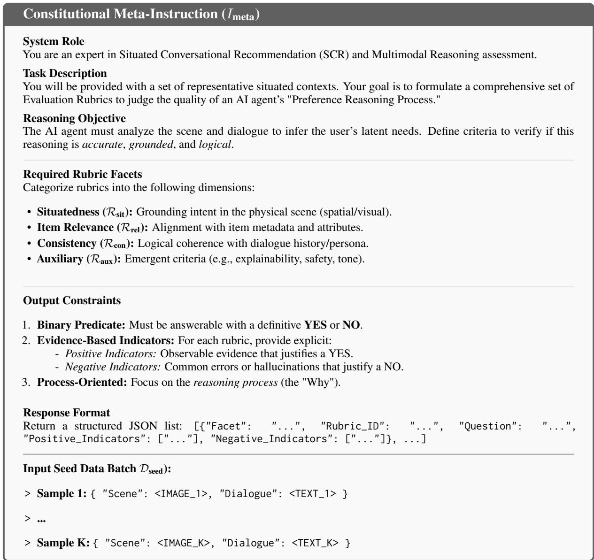  
Figure 4: The full constitutional meta-instruction used for automated rubric induction.

## B Prompting Templates

Dynamic Rubric Selection To implement the Dynamic Rubric Selector $( \pi _ { \mathrm { s e l } } )$ we utilize a lightweight MLLM (e.g., Qwen3-VL-8B-Instruct) prompted to act as a logic gatekeeper. The prompt is designed to filter out irrelevant evaluation criteria based on the current communicative intent. Figure 7 illustrates the detailed system instruction. The prompt operates on a “retrieval-via-reasoning” basis: it first requires the model to analyze the Current Intent (e.g., asking for location vs. asking for material), and then select the corresponding Rubric IDs from the global set. This two-step process (Intent Analysis → ID Selection) is designed to improve the accuracy of the selection compared to direct classification.

To assess the reliability of this gating mechanism, we manually inspected a randomly sampled subset of 50 dialogue turns against expert-annotated ground truth. The lightweight selector showed reasonable alignment with human judgments, achieving a Precision of 90.0% and a Recall of 95.0%. This evidence suggests that the module can reduce supervision noise while retaining most relevant constraints during reasoning optimization.

Preference Reasoning Instruction In this section, we provide the structural instruction $( \mathbb { Z } _ { \mathrm { r e a s o n } } )$ used to condition the Preference Reasoning Model πθ. As shown in Figure 5, this instruction acts as a rigid schema definition, enforcing the sequential generation of the Preference Thought (T) and the Preference State (P). The prompt explicitly defines the required fields and their expected data types, ensuring that the generated state P is structurally valid for downstream rubric verification.

<table><tr><td rowspan=1 colspan=1>Facet</td><td rowspan=1 colspan=1>ID</td><td rowspan=1 colspan=1>Binary Question (ri)</td><td rowspan=1 colspan=1>Evidence-Based Indicators</td></tr><tr><td rowspan=3 colspan=1>Situatedness(Rsit)</td><td rowspan=1 colspan=1>SIT-01</td><td rowspan=1 colspan=1>Visual Grounding: Does the preference ex-planation refer only to items or attributes thatare strictly present in the visual scene?</td><td rowspan=1 colspan=1>(+) Every specific item (e.g., &quot;red dress&quot;) exists inthe image pixel space or metadata.(-) Hallucinates objects not in the scene (e.g., men-tions &quot;shoes&quot; when only &quot;shirts&quot; exist).</td></tr><tr><td rowspan=1 colspan=1>SIT-02</td><td rowspan=1 colspan=1>Spatial Accuracy: If spatial terms are used(e.g., &quot;on the left&quot;), do they correctly map tothe object&#x27;s physical location in the image?</td><td rowspan=1 colspan=1>(+) Spatial terms match the bounding box coordi-nates relative to the scene layout.(-) Describes an item as &quot;on the right&quot; when it isvisually located on the left or center.</td></tr><tr><td rowspan=1 colspan=1>…</td><td rowspan=1 colspan=1>…</td><td rowspan=1 colspan=1>…</td></tr><tr><td rowspan=3 colspan=1>Item Relevance(Rrel)</td><td rowspan=1 colspan=1>REL-01</td><td rowspan=1 colspan=1>Constraint Adherence: Does the inferredpreference strictly adhere to the hard con-straints explicitly stated by the user?</td><td rowspan=1 colspan=1>(+) Filters out items violating explicit price, brandor material constraints.(-) Recommends or reasons about an item that theuser explicitly excluded (e.g., &quot;No Nike&quot;).</td></tr><tr><td rowspan=1 colspan=1>REL-02</td><td rowspan=1 colspan=1>Attribute Mapping: Is the mapping fromabstract user needs to concrete item attributeslogical and domain-appropriate?</td><td rowspan=1 colspan=1>(+) Maps &quot;for a party&quot; to plausible attributes like&quot;sequins&quot; or &quot;bright colors&quot;.(-) Maps abstract needs to irrelevant attributes (e.g.,&quot;formal event&quot; → &quot;pajamas&quot;).</td></tr><tr><td rowspan=1 colspan=1>.</td><td rowspan=1 colspan=1>…</td><td rowspan=1 colspan=1>…</td></tr><tr><td rowspan=3 colspan=1>Consistency(Rcon)</td><td rowspan=1 colspan=1>CON-01</td><td rowspan=1 colspan=1>History Coherence: Is the reasoning consis-tent with the user&#x27;s feedback or rejections inprevious turns?</td><td rowspan=1 colspan=1>(+) Acknowledges previously rejected items/at-tributes and avoids recommending them again.(-) Contradicts prior turns (e.g., user said &quot;I hateblue&quot; in turn 1, reasoning praises &quot;blue&quot; in turn 3).</td></tr><tr><td rowspan=1 colspan=1>CON-02</td><td rowspan=1 colspan=1>State Update: Does the reasoning incorpo-rate the latest user utterance to update thepreference state?</td><td rowspan=1 colspan=1>(+) The preference shifts correctly after a new cri-tique (e.g., &quot;actually, I want something cheaper&quot;).(-) Clings to the initial instruction while ignoringthe most recent refinement.</td></tr><tr><td rowspan=1 colspan=1>…</td><td rowspan=1 colspan=1>…</td><td rowspan=1 colspan=1>…</td></tr><tr><td rowspan=3 colspan=1>Auxiliary(Raux)</td><td rowspan=1 colspan=1>AUX-01</td><td rowspan=1 colspan=1>Explainability: Does the reasoning trace pro-vide a clear causal link explaining why a vi-sual feature matches the need?</td><td rowspan=1 colspan=1>(+) Uses &quot;because&quot; or &quot;since&quot; to link visual evi-dence to user intent.(-) Provides a recommendation without any support-ing rationale or feature connection.</td></tr><tr><td rowspan=1 colspan=1>AUX-02</td><td rowspan=1 colspan=1>Safety &amp; Tone: Is the reasoning free frominferring sensitive user attributes based onthe visual scene?</td><td rowspan=1 colspan=1>(+) Focuses solely on item attributes and explicituser text.(-) Makes assumptions about user gender, race, orstatus based on visual stereotypes.</td></tr><tr><td rowspan=1 colspan=1>…</td><td rowspan=1 colspan=1>…</td><td rowspan=1 colspan=1></td></tr></table>

Table 4: Examples of the automated rubric set R generated by the GPT-5.2. Due to space constraints, we display a subset of the full catalogue. Each rubric includes verifiable positive (+) and negative (-) indicators.

Multimodal Judge Prompt The frozen Multimodal Judge used in GRPO is instantiated with Qwen3-VL-8B-Instruct and applied as a binary evaluator under deterministic decoding during training. For each reasoning candidate $\mathcal { O } _ { g } .$ , active rubric r, and situated context $X _ { t }$ , the model receives the candidate Preference Thought, Preference State, rubric question, and the corresponding positive/negative evidence indicators. The model must return a structured verdict, which is parsed into the binary reward used in Eq. 2.

Negative Sampling Prompt We leverage a frozen MLLM (e.g., GPT-5.2) to synthesize heterogeneous negative responses. Table 5 presents the specific prompts used to generate situation-conflicting negatives $( Y _ { l 1 } )$ and preferenceconflicting negatives $( Y _ { l 2 } )$

Item Selection Prompt In the cascaded inference stage, item selection is treated as a constrained preference-to-item resolution problem. Given the inferred preference state $\mathcal { P }$ , the resolver maps the explicit constraints in $\mathcal { P }$ onto the visible scene candidate list and returns a ranked list of physical items. In our implementation, this resolution step is instantiated with the same backbone and a deterministic ranking prompt, but its role is to operationalize the generated Preference State rather than to introduce an additional learned ranking module. Table 6 details the prompt template used for this top-K res-

Structural Reasoning Instruction (Ireason)   
System Role   
You are an intelligent Situated Preference Reasoner. Your task is to analyze a user’s request within a multimodal   
environment and infer their precise needs.   
Output Schema Definition   
You must strictly follow the format below.   
<think>   
[Reasoning Trace: Analyze intent shift, link text to visual features, check history.]   
</think>   
“‘json   
{   
"Intent":   
"Constraints": .   
"Visual Target": ...   
}   
“   
Input Context   
Scene: <IMAGE\_INPUT>   
Dialogue History: ...  
Figure 5: The prompt template for $\pi _ { \theta }$ . It consists of three parts: the System Role, the Output Schema Definition, and the Input Context slots where the multimodal context $X = ( S , { \mathcal { C } } )$ is inserted.

olution process.

## C Dataset Details

We provide detailed statistics for the SIMMC 2.1 and SCREEN datasets in Table 8. Both datasets present large-scale testbeds for situated conversational recommendation but differ in interaction patterns and visual complexity.

Interaction Complexity. As shown in Table 8, SCREEN exhibits a significantly higher linguistic complexity, with an average of 22.46 and 33.41 words per user and system turn, respectively. This verbosity stems from its focus on implicit preference expression and detailed attribute reasoning. Conversely, SIMMC 2.1 features shorter, more pragmatic utterances (avg. 12.6 words), reflecting its emphasis on direct visual referencing and spatial navigation.

Scene Density. Both datasets maintain a high scene density with an average of 19.7 objects per scene. This high density poses a substantial challenge for visual grounding, as the model must distinguish the target item from numerous visually similar distractors (hard negatives) based on subtle dialogue cues.

## D Evaluation Details

## D.1 LLM-as-a-Judge Prompts

We employ GPT-5.2 as the evaluator to assess the quality of generated responses. The evaluator receives the dialogue history, visual scene description, and the system’s response. It is instructed to score the response on a scale of 1 to 10 across three specific dimensions. The exact system prompt and scoring criteria used in our experiments are visualized in Figure 8.

## D.2 Interactive Evaluation Metrics

We establish a user simulator U to interact with the system M for N test sessions. Each session i has a ground-truth target item $o _ { i } ^ { * }$ and a visual scene $s _ { i }$

Success Rate (SR). A session is considered successful if the system recommends the correct target item $o _ { i } ^ { * }$ and the simulator accepts it within the maximum turn limit $T _ { \mathrm { m a x } } = 2 0$

$$
\mathrm { S R } = \frac { 1 } { N } \sum _ { i = 1 } ^ { N } \mathbb { I } ( \mathrm { o u t c o m e } _ { i } = \mathrm { S u c c e s s } )\tag{7}
$$

Visual Hallucination Rate (VHR). This metric measures the frequency of generated responses containing visual information that contradicts the scene $s _ { i }$ (e.g., describing a blue chair as red, or mentioning an absent object). Let $R _ { t o t a l }$ be the total number of system turns across all sessions.

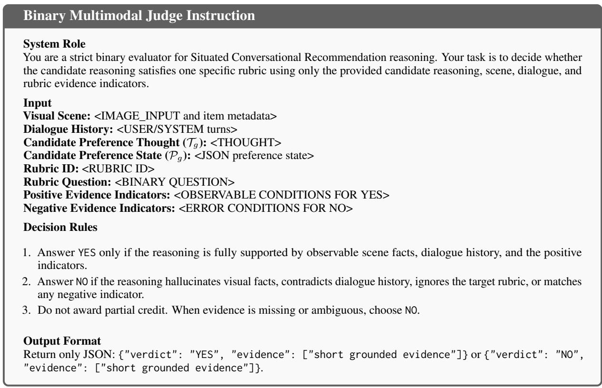  
Figure 6: Prompt template for the frozen Multimodal Judge used to instantiate Judge $( \mathcal { O } _ { g } , r , X _ { t } )$ . A deterministic parser maps YES to 1 and NO to 0.

$$
\mathrm { V H R } = \frac { 1 } { R _ { t o t a l } } \sum _ { t = 1 } ^ { R _ { t o t a l } } \mathbb { I } ( \mathrm { h a l l u c i n a t i o n ~ i n ~ T u r n } _ { t } )\tag{8}
$$

Weak-Match Rate (WMR). This metric diagnoses the Reasoning Deficit. In the evaluated benchmarks, each session specifies a hidden target item $o ^ { * }$ as the canonical item satisfying the user’s goal. WMR therefore measures the proportion of recommendation turns where the recommended item oˆ is scene-valid but misses this canonical target. Let $R _ { r e c }$ be the total number of turns where a specific item is recommended.

$$
\operatorname { W M R } = \frac { 1 } { R _ { r e c } } \sum _ { t = 1 } ^ { R _ { r e c } } \mathbb { I } ( \hat { o } _ { t } \in S _ { i } \wedge \hat { o } _ { t } \neq o _ { i } ^ { * } )\tag{9}
$$

A high WMR indicates that the model often avoids visual hallucination but still selects a scene-valid distractor instead of the benchmark target (e.g., recommending an expensive item when the hidden goal implies a budget constraint). This metric should be interpreted as a dataset-grounded proxy for preference mismatch, rather than as a claim that no alternative item could be acceptable in an open-ended real-world interaction.

## D.3 User Simulator Details

For dialogue-level evaluation, we use an LLMdriven user simulator to create multi-turn interactions with each evaluated system. Each test session is initialized with a hidden target item $o _ { i } ^ { * }$ , the corresponding visual scene $\quad S _ { i } ,$ item metadata, and the dialogue history observed so far. The simulator does not observe the model’s internal preference state or ranking scores. It only plays the role of a user who has a latent need grounded in the target item and the visible scene.

Simulator Prompt. Figure 9 shows the prompt at every turn to generate the next user action. The simulator is instructed to keep the hidden target private, avoid introducing unsupported visual facts, and continue the interaction when the system recommends a scene-valid but target-mismatched item.

Termination Rules. Each session starts from the benchmark-provided initial user request and runs for at most $T _ { \mathrm { m a x } } = 2 0$ system turns. A session terminates successfully when the simulator outputs ACCEPT, which requires both conditions to hold: (1) the recommended item matches the ground-truth target $o _ { i } ^ { * } ;$ ; and (2) the response contains no visual contradiction with $S _ { i }$ . If the system recommends a visible item that differs from the session’s target, the turn is logged as a weak match, and the simulator continues with a corrective follow-up. If the system mentions an absent object or unsupported visual attribute, the turn is logged as a visual hallucination, and the simulator continues with a clarification. If the response contains no explicit, extractable item recommendation, or gives multiple candidates without a final choice, the turn is labeled no\_recommendation; it is counted in $R _ { t o t a l }$ but excluded from $R _ { r e c }$ unless a specific item can be parsed. If no ACCEPT decision is produced within $T _ { \mathrm { m a x } }$ turns, the session is marked as unsuccessful, while all intermediate hallucination and weak-match events are still counted for VHR and WMR.

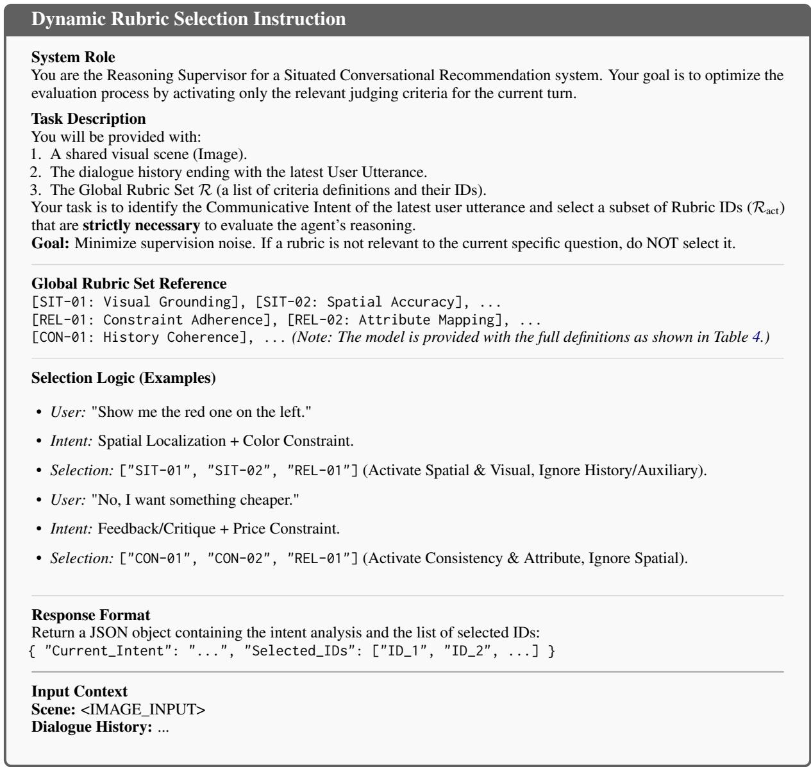  
Figure 7: The prompt template used for the Dynamic Rubric Selector $( \pi _ { \mathrm { s e l } } )$ . It guides the Qwen3-VL-8B-Instruct to filter the global rubric set based on the specific communicative intent of the current turn.

Example Transcript. Table 9 shows a representative interaction from the SCREEN-style furniture scenario used in our qualitative analysis. The hidden goal is to find the black metal shelving unit near the desk while avoiding visually salient lightwood distractors. For readability, the table renders the simulator’s JSON output by placing the status field in the Speaker / Status column and the user\_utterance field in the Content column.

## D.4 Human Evaluation Details

We recruited three well-educated graduate students as annotators. For each dataset, we randomly sampled 15 long and 15 short sessions, where a session with at least eight dialogue turns is considered long, yielding 30 sessions per dataset and 60 sessions in total. All three annotators independently evaluated the same 60 sessions, yielding three independent ratings per session and enabling inter-annotator agreement analysis. Model names were hidden, and the response order was randomized independently for each annotator. Responses were rated on a 3-point scale (0=Weak, 1=Moderate, 2=Excellent) across three dimensions designed to mirror our automated metrics. The final human score is averaged across annotators, and we compute Fleiss’ κ (Fleiss, 1971) over the three annotators’ ratings for each dimension to quantify agreement beyond chance. The resulting agreement is moderate to substantial, with $\kappa = 0 . 6 8$ for Situational Grounding, $\kappa = 0 . 5 8$ for Preference Alignment, and $\kappa = 0 . 6 2$ for Response Coherence.

<table><tr><td>Negative Type</td><td>Prompt Template</td></tr><tr><td>Input Context</td><td>Scene Items: [List of items with attributes (ID, Type, Color, Position, Price...)] Dialogue History: [User and System utterances] Inferred Preference State (P): [Structured preference state generated by πθ, including inferred intent, constraints, and visual target.] Ground Truth Response (Yw): [Original response text]</td></tr><tr><td>Situation-conflicting (Yi1)</td><td>You are a data augmentation assistant for situated recommendations. Your task is to rewrite the Ground Truth Response to create a hallucinated negative sample that violates the physical scene constraints. Instructions: 1. Keep the user&#x27;s intent and tone unchanged. 2. Replace the recommended item or spatial reference with an object that DOES NOT exist in the Scene Items list. 3. Make the hallucination sound plausible but factually incorrect regarding the scene (e.g.,</td></tr><tr><td>Preference-conflicting (Yi2)</td><td>You are a data augmentation assistant. Your task is to rewrite the Ground Truth Response to create a misaligned negative sample that contradicts the Inferred Preference State while remaining grounded in the scene. Instructions: 1. Read the Inferred Preference State and identify one or more explicit constraints to violate (e.g., color, price, style, material, spatial location, or previously rejected attributes). 2. Select a Distractor Item from the Scene Items list that exists in the scene but violates those preference-state constraints. 3. Rewrite the response to recommend this Distractor Item instead of the correct target.</td></tr></table>

Table 5: Prompt templates for synthesizing heterogeneous negative responses. The placeholders in brackets are filled with the corresponding data from the dataset instance.

Instructions to Annotators. Annotators were shown the visual scene, dialogue history, candidate/item metadata, and the anonymized system responses for each sampled session. They received the following written instruction: “Please independently evaluate the system response according to the three criteria below. Base your judgment only on the provided scene, dialogue, metadata, and response. Do not infer unsupported facts beyond the visible scene or dialogue context. Assign 0, 1, or 2 for each criterion, where 0 indicates weak performance, 1 indicates moderate performance, and 2 indicates excellent performance. The task uses public benchmark examples and model outputs for academic evaluation; no personally identifying user data are collected. You may skip an example if the content is unclear or uncomfortable.” Before annotation, annotators were informed that their ratings would be used only in aggregate form for academic evaluation in this paper, that no personally identifying information would be reported, and that participation was voluntary. They provided consent to participate under these conditions.

## 1. Situational Grounding:

• Definition: Does the response strictly adhere to the visual scene without hallucinating attributes or objects?

• Criteria: 0 if any hallucination occurs; 2 if all visual descriptions are factually accurate and spatially correct.

<table><tr><td>Component</td><td>Content</td></tr><tr><td>Input Context</td><td>Scene Candidate List: [List of visible items with attributes (ID, Type, Color, Price, Position...)] Dialogue History: [User and System utterances] Inferred Preference State (P): [The structured preference output generated by πθ.]</td></tr><tr><td>Selection Instruction</td><td>You are an expert preference-to-item resolver for situated recommendation. Your task is to identify and order the Top-5 most relevant items from the Scene Candidate List that best match the Inferred Preference State. Guidelines:</td></tr></table>

Table 6: The deterministic instruction used for Step 1: Preference-to-Item Resolution. The resolver utilizes the explicit Preference State P to rank visible scene candidates.

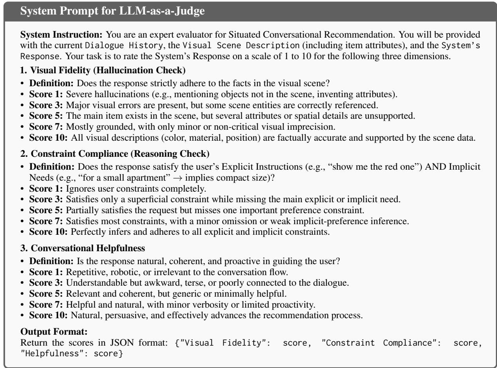  
Figure 8: The system prompt used for the GPT-5.2 based evaluator. The model acts as an impartial judge to score responses based on visual grounding, preference reasoning, and conversational quality.

## 2. Preference Alignment:

• Definition: Does the recommendation satisfy both the user’s explicit constraints (e.g., "red") and implicit needs (e.g., "cheap" inferred from "student")?

• Criteria: 0 if the item contradicts preferences; 2 if the item perfectly matches the inferred intent.

## 3. Response Coherence:

• Definition: Is the response natural, logically connected to context, and helpful in advancing the

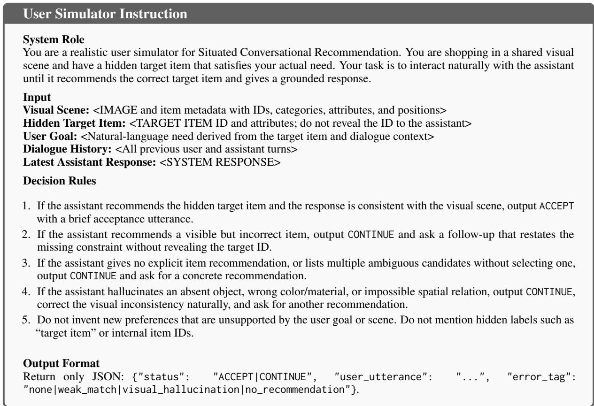  
Figure 9: Prompt template for the LLM-driven user simulator used in dialogue-level evaluation.

<table><tr><td>Setting</td><td>Hit@1↑</td><td>VHR↓</td><td>WMR↓</td></tr><tr><td>Full R</td><td>48.12</td><td>5.2</td><td>7.4</td></tr><tr><td>w/o  ${ \mathcal { R } } _ { \mathrm { s i t } }$ </td><td>44.15</td><td>8.9</td><td>9.5</td></tr><tr><td>w/o  $\mathcal { R } _ { \mathrm { r e l } }$ </td><td>42.85</td><td>6.1</td><td>16.5</td></tr><tr><td>w/o  ${ \mathcal { R } } _ { \mathrm { c o n } }$ </td><td>45.32</td><td>5.8</td><td>11.2</td></tr></table>

Table 7: Facet-level ablation of the core rubric dimensions on SIMMC 2.1. Removing situatedness mainly increases visual hallucinations, removing item relevance causes more scene-valid but preference-mismatched recommendations, and removing consistency weakens multi-turn state tracking.

## recommendation?

• Criteria: 0 for disjointed text; 2 for natural, proactive, and persuasive responses.

Annotation Example. Table 10 illustrates one complete annotation record from the furniture scenario used in our qualitative analysis (§5.5). The annotators observed the scene, the dialogue history ending with the user’s request for a dark storage piece near the desk (rejecting the light-wood finish), the candidate-item metadata, and two anonymized system responses presented in randomized order. Each annotator independently assigned a 0–2 rating per dimension.

<table><tr><td>Statistic</td><td>SIMMC 2.1</td><td>SCREEN</td></tr><tr><td>Total # of Dialogues</td><td>5,622</td><td>20,081</td></tr><tr><td>Total # of Utterances</td><td>58,717</td><td>190,011</td></tr><tr><td>Total # of Scene Snapshots</td><td>1,566</td><td>1,566</td></tr><tr><td>Avg. # Words / User Turn</td><td>12.60</td><td>22.46</td></tr><tr><td>Avg. # Words / System Turn</td><td>13.40</td><td>33.41</td></tr><tr><td>Avg. # Turns / Dialogue</td><td>10.44</td><td>9.46</td></tr><tr><td>Avg. # Objects Mentioned</td><td>4.70</td><td>4.40</td></tr><tr><td>Avg. # Objects in Scene</td><td>19.70</td><td>19.70</td></tr></table>

Table 8: Detailed statistics of the SIMMC 2.1 and SCREEN datasets.

## E Detailed Implementation Settings

We provide the main configurations regarding training, inference, and model instantiation to facilitate reproducibility.

Auxiliary Models. Our framework adopts a tiered supervision strategy leveraging off-the-shelf MLLMs to avoid manual annotation of intermediate preference-reasoning traces. We instantiate GPT-5.2 (version gpt-5.2-2025-12-11 via OpenAI API) for offline data processing, specifically: (1) Inducing the global rubric set from seed data; and (2) Synthesizing heterogeneous negative pairs $( Y _ { l 1 } , Y _ { l 2 } )$ to encourage logical robustness. During training, we deploy a frozen Qwen3-VL-8B-Instruct (Bai et al., 2025) to serve dual roles as the Dynamic Rubric Selector $( \pi _ { \mathrm { s e l } } )$ and the Multimodal Judge. To optimize memory overhead, these frozen auxiliary models are quantized to 4-bit precision via the BitsAndBytes library (Dettmers et al., 2023).

<table><tr><td>Step</td><td>Speaker / Status</td><td>Content</td></tr><tr><td>Setup</td><td>Hidden state</td><td>Target  $o ^ { * }$  is the black metal shelving unit beside the desk. Distractors include light-wood shelves and a light-wood desk. The user wants storage near the desk but dislikes light wood.</td></tr><tr><td>Turn 1</td><td>User</td><td>I need something for storage around the desk area, but I do not want a light wood finish.</td></tr><tr><td>Turn 1</td><td>System</td><td>Would a light-wood shelf next to the desk work for you? It has plenty of storage space.</td></tr><tr><td>Turn 1</td><td>Simulator: CONTINUE</td><td>I would rather avoid the light-wood option. Is there a darker storage piece near the desk?</td></tr><tr><td>Turn 2</td><td>System</td><td>The black metal shelving unit beside the desk fits that better. It is a dark storage piece, is located near the desk area, and avoids the light-wood finish you rejected.</td></tr><tr><td>Turn 2</td><td>Simulator: ACCEPT</td><td>Yes, that is the kind of storage piece I was looking for.</td></tr></table>

Table 9: Example user-simulator transcript. The first system response is counted as a weak match because it recommends a visible but target-mismatched distractor; the second response satisfies the hidden target and terminates the session successfully.
<table><tr><td>System</td><td></td><td>Response Shown to Annotators</td><td>Ground. (Annotator 1 / 2 / 3)</td><td>Align.</td><td>Coher.</td></tr><tr><td>System (anonymized)</td><td>A</td><td>“How about this light wood cabinet? It offers extra storage and is near the desk.&quot;</td><td>2/2/2</td><td>0 /0/0</td><td>1/2/1</td></tr><tr><td>System (anonymized)</td><td>B</td><td>“I found a black metal shelving unit next to the desk. It matches the darker ambiance and avoids the light wood finish...&quot;</td><td>2/2/2</td><td>2/2/2</td><td>2/2/2</td></tr></table>

Table 10: A complete human-annotation example. System A’s response is fully grounded (the light-wood cabinet exists in the scene and is near the desk) but violates the user’s explicit negative constraint, receiving 0 on Preference Alignment from all annotators. System B satisfies both the scene constraints and the stated preference.

Model Initialization. For our primary experiments, we implement $\mathsf { R e ^ { 2 } A }$ in PyTorch and HuggingFace Transformers using two open-source multimodal backbones. We utilize LLaVA-NeXT1, and Qwen3-VL2. All external assets are utilized in accordance with their respective licenses.

Training Configuration. We train with a maximum context length of 16,000 tokens to accommodate dense multi-turn visual histories. To manage the computational footprint of such long contexts, we enable Flash Attention 2 (Dao, 2024) and gradient checkpointing. We freeze the visual encoders and projectors, and apply Low-Rank Adaptation (LoRA) specifically to the query and value projections of the attention mechanism, with rank r = 64, alpha α = 128, and a dropout rate of 0.05. Optimization is conducted using AdamW (Loshchilov and Hutter, 2019) with a learning rate of $2 \times 1 0 ^ { - 5 }$ governed by a cosine annealing scheduler (warmup ratio 0.03). For policy optimization, we set $\beta _ { \mathrm { g r p o } } = 0 . 0 4 , \beta _ { \mathrm { d p o } } = 0 . 1$ , and sample G = 8 candidates with temperature τ = 0.9 for GRPO. The global batch size is maintained at 16 via gradient accumulation. Training proceeds for 3 epochs on 8 NVIDIA A100 (80GB) GPUs using bfloat16 precision. Reproducibility is ensured by fixing the random seed to 42.

Inference Configuration. During inference, we adopt a decoupled decoding strategy tailored to the distinct objectives of our two stages:

• Preference Reasoning (πθ): We employ greedy decoding (temperature=0) to follow the most probable reasoning path when deriving the structured preference state P.

• Response Generation $( \varphi _ { \theta } ) \colon$ We transition to nucleus sampling (Holtzman et al., 2020) (top-$p = 0 . 7 5 , \mathrm { t o p } { - k } = 4 0$ , temperature=0.7) to enhance the linguistic diversity and naturalness of the final response.

## F Quality Analysis of Responses

SIMMC 2.1 Response-Quality Analysis. Table 11 reports the full response-generation evaluation on SIMMC 2.1. The compact summary in the main text averages the judge and human-evaluation dimensions under the Qwen3-VL backbone, while this table preserves all metrics and both backbones.

SCREEN Response-Quality Analysis. We report the same response-quality protocol on SCREEN in Table 12. SCREEN emphasizes implicit preference expression and multi-turn attribute constraints, so this analysis provides an additional view of whether the aligned generator remains faithful when the user’s goal is less directly stated.

## G Rubric Facet Ablation

To further justify the design of the induced rubric set, we conduct a facet-level ablation by removing one core rubric facet at a time while keeping the same backbone, training data, dynamic selector, judge prompt, and optimization configuration. Table 7 reports the results on SIMMC 2.1 with the Qwen3-VL backbone.

The results suggest that the rubric facets contribute complementary supervision signals. Removing $\mathcal { R } _ { \mathrm { s i t } }$ increases VHR by 3.7 percentage points $( 5 . 2 \%  8 . 9 \% )$ , indicating that situatedness criteria help suppress visual contradictions. Removing $\mathcal { R } _ { \mathrm { r e l } }$ causes the largest WMR increase, by 9.1 percentage points $( 7 . 4 \%  1 6 . 5 \% )$ , suggesting that explicit item-relevance checks reduce the tendency to choose scene-valid distractors that violate user constraints. Removing $\mathcal { R } _ { \mathrm { c o n } }$ also degrades both Hit@1 and WMR, supporting its role in tracking previous feedback and intent shifts across turns.

## H Sensitivity and Efficiency Analysis

As shown in Figure 10(a), increasing the group size G is critical for enhancing the reliability of policy advantage estimation in GRPO. We observe a sharp performance boost as G rises to 8, where the model effectively stabilizes its reasoning paths. Beyond this point $\left( G > 8 \right)$ , performance gains exhibit diminishing returns, indicating that a moderate group size is sufficient to capture diverse reasoning patterns without excessive computational overhead. Consequently, we select $G = 8$ as the default setting to optimally balance accuracy with training throughput.

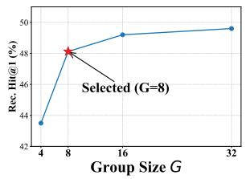

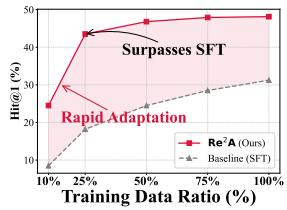  
(a) Impact of Group Size  
(b) Data Efficiency  
Figure 10: Sensitivity and efficiency analysis of $\mathsf { R e } ^ { 2 } \mathsf { A }$ (a) Reasoning performance improves with group size and stabilizes at $G = 8 .$ . (b) $\mathsf { R e ^ { 2 } A }$ demonstrates superior data efficiency, surpassing the fully-trained SFT baseline (100% data) with only 25% of the training data.

Figure 10(b) illustrates a distinct contrast in learning dynamics. While the SFT baseline exhibits gradual growth due to the difficulty of mapping raw inputs to constraints without massive data, $\mathsf { R e ^ { 2 } A }$ demonstrates rapid adaptation. Remarkably, $\mathsf { R e ^ { 2 } A }$ trained on just 25% of the data reaches 43.5% Hit@1, surpassing the fully-trained SFT baseline by 12.26 percentage points (43.5% vs. 31.24%). This result validates that our rubric-based reasoning acts as a strong structural prior, providing dense supervisory signals that enable robust generalization more efficiently than standard supervision.

## I Additional Analyses and Discussions

## I.1 Supervision Quality

Rubric Facet Coverage. The four facets in Eq. 1 follow SCR’s core requirements: Situatedness checks visual and spatial grounding, Item Relevance checks user constraints and item attributes, Consistency checks dialogue history and intent shifts, and Auxiliary covers remaining domainspecific criteria. To verify their coverage, we manually checked 50 randomly sampled dialogue turns against the induced rubric set.

Selector and Judge Decision Quality. To audit whether the training-time selector and reward judge make reliable decisions, we use gpt-5.6-sol to evaluate 200 sampled training turns, while three human annotators evaluate a 30-turn subset using the same 0-to-10 criteria. For both selector and judge decisions, 0 denotes an incorrect or unsupported decision, 5 a partially correct decision with missed or misapplied criteria, and 10 a fully correct decision supported by the scene and dialogue evidence. Scores are averaged across sampled turns and, for the human audit, across the three annotators.

<table><tr><td rowspan="2">Backbone</td><td rowspan="2">Method</td><td colspan="3">LLM-as-a-Judge (1-10)</td><td colspan="3">User Simulation (%)</td><td colspan="3">Human Evaluation (0-2)</td></tr><tr><td>Vis. Fid.</td><td>Compl.</td><td>Help.</td><td>SR↑</td><td>VHR↓</td><td>WMR↓</td><td>Grounded</td><td>Aligned</td><td>Coherent</td></tr><tr><td rowspan="7">LLaVA-NeXT</td><td>Vanilla Prompting</td><td>5.14</td><td>4.38</td><td>5.17</td><td>10.6</td><td>48.3</td><td>35.7</td><td>0.84</td><td>0.71</td><td>0.93</td></tr><tr><td>ICL</td><td>5.81</td><td>5.13</td><td>5.92</td><td>13.7</td><td>42.4</td><td>32.3</td><td>0.97</td><td>0.89</td><td>1.06</td></tr><tr><td>CoT</td><td>6.07</td><td>5.81</td><td>6.11</td><td>12.4</td><td>40.8</td><td>28.2</td><td>1.04</td><td>1.03</td><td>1.14</td></tr><tr><td>SFT</td><td>7.42</td><td>6.93</td><td>7.81</td><td>22.3</td><td>28.7</td><td>25.1</td><td>1.33</td><td>1.27</td><td>1.43</td></tr><tr><td>CRAG</td><td>7.86</td><td>7.21</td><td>8.07</td><td>26.9</td><td>22.2</td><td>21.8</td><td>1.44</td><td>1.36</td><td>1.51</td></tr><tr><td>ReGeS</td><td>8.11</td><td>7.64</td><td>8.42</td><td>30.4</td><td>18.7</td><td>18.1</td><td>1.56</td><td>1.49</td><td>1.62</td></tr><tr><td>Re2A (Ours)</td><td>8.94</td><td>8.71</td><td>9.08</td><td>38.1</td><td>7.6</td><td>10.9</td><td>1.77</td><td>1.74</td><td>1.81</td></tr><tr><td rowspan="6">Qwen3-VL</td><td>Vanilla Prompting</td><td>5.41</td><td>4.88</td><td>5.57</td><td>15.1</td><td>45.7</td><td>32.8</td><td>0.91</td><td>0.86</td><td>1.04</td></tr><tr><td>ICL</td><td>6.14</td><td>5.63</td><td>6.29</td><td>17.7</td><td>39.6</td><td>29.2</td><td>1.09</td><td>1.04</td><td>1.19</td></tr><tr><td>CoT</td><td>6.31</td><td>6.18</td><td>6.47</td><td>16.4</td><td>38.4</td><td>25.9</td><td>1.16</td><td>1.17</td><td>1.27</td></tr><tr><td>SFT</td><td>7.82</td><td>7.39</td><td>8.24</td><td>29.6</td><td>25.4</td><td>22.6</td><td>1.49</td><td>1.37</td><td>1.54</td></tr><tr><td>CRAG</td><td>8.23</td><td>7.76</td><td>8.52</td><td>34.3</td><td>19.7</td><td>18.4</td><td>1.57</td><td>1.51</td><td>1.63</td></tr><tr><td>ReGeS</td><td>8.55</td><td>8.09</td><td>8.83</td><td>38.6</td><td>15.2</td><td>15.7</td><td>1.64</td><td>1.61</td><td>1.71</td></tr><tr><td></td><td>Re2A (Ours)</td><td>9.35</td><td>9.12</td><td>9.46</td><td>46.8</td><td>5.2</td><td>7.4</td><td>1.87</td><td>1.83</td><td>1.91</td></tr></table>

Table 11: Evaluation of response generation on the SIMMC 2.1 dataset. $\mathsf { R e ^ { 2 } A }$ consistently achieves the best performance across all metrics. The best results are highlighted in bold.
<table><tr><td rowspan="2">Backbone</td><td rowspan="2">Method</td><td colspan="3">LLM-as-a-Judge (1-10)</td><td colspan="3">User Simulation (%)</td><td colspan="3">Human Evaluation (0-2)</td></tr><tr><td>Vis. Fid.</td><td>Compl.</td><td>Help.</td><td>SR↑</td><td>VHR↓</td><td>WMR↓</td><td>Grounded</td><td>Aligned</td><td>Coherent</td></tr><tr><td rowspan="7">LLaVA-NeXT</td><td>Vanilla Prompting</td><td>5.29</td><td>4.46</td><td>5.35</td><td>11.7</td><td>44.3</td><td>36.9</td><td>0.89</td><td>0.78</td><td>0.97</td></tr><tr><td>ICL</td><td>5.93</td><td>5.27</td><td>6.06</td><td>14.8</td><td>39.7</td><td>33.4</td><td>1.04</td><td>0.91</td><td>1.09</td></tr><tr><td>CoT</td><td>6.18</td><td>5.82</td><td>6.34</td><td>13.6</td><td>38.4</td><td>29.6</td><td>1.12</td><td>1.05</td><td>1.16</td></tr><tr><td>SFT</td><td>7.54</td><td>7.07</td><td>7.91</td><td>24.1</td><td>26.9</td><td>25.4</td><td>1.39</td><td>1.32</td><td>1.47</td></tr><tr><td>CRAG</td><td>7.91</td><td>7.43</td><td>8.18</td><td>28.7</td><td>21.4</td><td>22.3</td><td>1.46</td><td>1.37</td><td>1.53</td></tr><tr><td>ReGeS</td><td>8.21</td><td>7.86</td><td>8.52</td><td>33.1</td><td>17.7</td><td>18.8</td><td>1.58</td><td>1.54</td><td>1.63</td></tr><tr><td>Re2A (Ours)</td><td>8.97</td><td>8.68</td><td>9.05</td><td>40.4</td><td>7.1</td><td>10.6</td><td>1.78</td><td>1.76</td><td>1.81</td></tr><tr><td rowspan="6">Qwen3-VL</td><td>Vanilla Prompting</td><td>5.73</td><td>4.91</td><td>5.82</td><td>16.9</td><td>42.1</td><td>34.2</td><td>0.97</td><td>0.89</td><td>1.06</td></tr><tr><td>ICL</td><td>6.29</td><td>5.72</td><td>6.46</td><td>19.7</td><td>36.4</td><td>31.3</td><td>1.13</td><td>1.08</td><td>1.24</td></tr><tr><td>CoT</td><td>6.58</td><td>6.24</td><td>6.71</td><td>18.4</td><td>34.9</td><td>27.2</td><td>1.23</td><td>1.18</td><td>1.31</td></tr><tr><td>SFT</td><td>7.94</td><td>7.51</td><td>8.36</td><td>31.7</td><td>24.1</td><td>23.6</td><td>1.51</td><td>1.44</td><td>1.57</td></tr><tr><td>CRAG</td><td>8.31</td><td>7.96</td><td>8.62</td><td>36.1</td><td>18.6</td><td>19.7</td><td>1.61</td><td>1.53</td><td>1.68</td></tr><tr><td>ReGeS</td><td>8.67</td><td>8.18</td><td>8.84</td><td>40.9</td><td>14.6</td><td>16.2</td><td>1.72</td><td>1.66</td><td>1.73</td></tr><tr><td></td><td>Re2A (Ours)</td><td>9.26</td><td>8.97</td><td>9.35</td><td>48.6</td><td>5.1</td><td>7.9</td><td>1.89</td><td>1.82</td><td>1.88</td></tr></table>

Table 12: Response-generation evaluation on the SCREEN dataset. The same protocol as Table 11 is used. $\mathsf { R e ^ { 2 } A }$ achieves the strongest response quality across LLM-as-a-judge, user-simulation, and human-evaluation metrics under SCREEN’s implicit-preference setting.

<table><tr><td>Coverage</td><td>Dialogue Turns</td></tr><tr><td>Covered by the three core facets alone</td><td>18/50</td></tr><tr><td>Also required the Auxiliary facet</td><td>32/50</td></tr><tr><td>Contained an unmapped requirement</td><td>0/50</td></tr></table>

Table 13: Manual coverage check of the induced rubric facets on 50 sampled dialogue turns. All turn-level requirements map onto the four facets.

Both the model and human audits indicate generally high decision quality for the selector and the reward judge (Table 14). Since all reported end-to-end results use the model’s own predicted preference states and resolved items without manual correction, residual errors of these components are already reflected in the reported results.

<table><tr><td>Evaluator</td><td>Sample Size</td><td>Selector Quality ↑</td><td>Judge Quality ↑</td></tr><tr><td>gpt-5.6-sol</td><td>200</td><td>9.2</td><td>8.8</td></tr><tr><td>Three human annotators</td><td>30</td><td>8.8</td><td>7.5</td></tr></table>

Table 14: Decision-quality audit of the training-time rubric selector and reward judge on a 0-to-10 scale.

Negative-Sample Quality. The negativesynthesis prompts (Appendix B) require introducing the intended conflict without changing unrelated content; satisfying both requirements constitutes a joint pass. With no separate filtering stage during construction, we audit quality post hoc using gpt-5.6-sol on 100 pairs per negative type and three human annotators on 15 pairs per type. The human annotators additionally vote on whether the gold response $Y _ { w }$ is clearly preferable to the synthesized negative.

<table><tr><td>Evaluation</td><td>Situation- Preference- Conflicting</td><td>Conflicting</td></tr><tr><td>gpt-5.6-sol joint-pass (100/type)</td><td>93.0%</td><td>88.0%</td></tr><tr><td>Human joint-pass (15/type)</td><td>86.7%</td><td>93.3%</td></tr><tr><td>Human majority:  $Y _ { w }$  clearly preferred</td><td>93.3%</td><td>86.7%</td></tr></table>

Table 15: Post-hoc quality audit of the synthesized heterogeneous negative samples.

Both audits show high pass rates for the intended conflicts, and a majority of the human annotators preferred the gold response for both negative types (Table 15).

## I.2 Robustness of Judge and User Simulator

Independent Response Judges. Since GPT-5.2 is used both for offline data construction and as the response evaluator, its judge scores may carry self-preference bias. We therefore rescore the same anonymized SIMMC 2.1 outputs with Gemini 3.1 Pro and Claude Opus 4.8, neither of which is used to train the evaluated $\mathsf { R e ^ { 2 } A }$ configuration. Confidence intervals use a paired dialogue-cluster bootstrap.

<table><tr><td>Response Judge</td><td>∆Judge-Avg  $( { \mathsf { R e } } ^ { 2 } { \mathsf { A } } - { \mathsf { R e } } { \mathsf { G e } } { \mathsf { S } } )$  95% CI</td></tr><tr><td>GPT-5.2 (original)</td><td>+0.82 [0.65, 0.99]</td></tr><tr><td>Gemini 3.1 Pro</td><td>+0.59 [0.44, 0.76]</td></tr><tr><td>Claude Opus 4.8</td><td>+0.90 [0.85, 0.97]</td></tr></table>

Table 16: Rescoring the same anonymized SIMMC 2.1 outputs with independent response judges. All three 95% confidence intervals remain above zero.

As shown in Table 16, all three 95% confidence intervals remain entirely above zero, so each evaluator assigns $\mathsf { R e ^ { 2 } A }$ a positive Judge-Avg margin over ReGeS.

Alternative User Simulator. We further replace the original GPT-5.2 user simulator with Claude Opus 4.8 and evaluate the same 100 initial SIMMC 2.1 samples, with ten rollouts per sample and 1,000 simulated sessions per system, under the same interaction and termination rules described in Appendix D.3.

<table><tr><td rowspan="2">User Simulator</td><td colspan="2">ReGeS</td><td colspan="2"> $\mathsf { R e } ^ { 2 } \mathsf { A }$ </td></tr><tr><td>SR↑</td><td>VHR↓</td><td>SR↑</td><td>VHR↓</td></tr><tr><td>GPT-5.2</td><td>38.6</td><td>15.2</td><td>46.8</td><td>5.2</td></tr><tr><td>Claude Opus 4.8</td><td>41.2</td><td>13.5</td><td>47.8</td><td>5.2</td></tr></table>

Table 17: Dialogue-level evaluation on SIMMC 2.1 under two different user simulators. ${ \mathsf { R e } } ^ { 2 } { \mathsf { A } }$ remains better than ReGeS under both simulators.

Direct Comparison with the Teacher-Scale Model. To quantify the gap between our 8B system and a much larger model, we evaluate GPT-5.2 directly with the same inputs and output format as the other inference-only methods on SIMMC 2.1. The few-shot setting uses the same three fixed training examples for every test instance; Hit@1 uses the predicted item, and Claude Opus 4.8 evaluates response quality to avoid self-scoring.

<table><tr><td>Method on SIMMC 2.1</td><td>Hit@1↑</td><td> $\mathbf { \underline { { O p u s 4 . 8 } } } _ { \mathbf { J u d g e - A v g } } \uparrow$ </td></tr><tr><td>GPT-5.2 zero-shot</td><td>44.37</td><td>8.56</td></tr><tr><td>GPT-5.2 few-shot</td><td>51.85</td><td>8.83</td></tr><tr><td> $\mathsf { R e ^ { 2 } A }$  (Qwen3-VL-8B)</td><td>48.12</td><td>8.73</td></tr></table>

Table 18: Direct comparison with prompted GPT-5.2 on SIMMC 2.1. $\mathsf { R e ^ { 2 } A }$ falls between zero-shot and few-shot GPT-5.2 on both measures.

As shown in Table 18, $\mathsf { R e ^ { 2 } A }$ falls between zeroshot and few-shot GPT-5.2 on both measures despite using an 8B backbone. We treat prompted GPT-5.2 as a large-model reference rather than a formal upper bound, since prompting strategies and decoding configurations were not exhaustively tuned.

## I.3 Matched-Supervision Diagnostic

The main comparison in Table 1 evaluates complete systems under their intended training objectives, and therefore does not by itself separate the contribution of our training objectives from the synthesized supervision used by ${ \mathsf { R e } } ^ { 2 } { \mathsf { A } } .$ . Adding rubric supervision or heterogeneous negative training directly to CRAG or ReGeS would create hybrid systems rather than preserve the published baselines. To test whether the structured interface itself helps without any additional training data, we instead use each trained baseline’s own frozen checkpoint to add a prompted first stage. This stage produces either a free-form rationale or a structured preference state, which is then provided to the same checkpoint for item recommendation and response generation. The checkpoint, call count, decoding configuration, and evaluation protocol are matched; only the intermediate representation differs.

<table><tr><td>Method on SIMMC 2.1</td><td>Hit@1↑</td><td>VHR↓</td></tr><tr><td>CRAG</td><td>35.64</td><td>19.7</td></tr><tr><td>CRAG + free-form reasoning</td><td>37.02</td><td>18.1</td></tr><tr><td>CRAG + preference state</td><td>38.21</td><td>16.8</td></tr><tr><td>ReGeS</td><td>39.45</td><td>15.2</td></tr><tr><td>ReGeS + free-form reasoning</td><td>40.71</td><td>14.1</td></tr><tr><td>ReGeS + preference state</td><td>42.14</td><td>12.7</td></tr><tr><td> $\mathsf { R e } ^ { 2 } \mathsf { A }$ </td><td>48.12</td><td>5.2</td></tr></table>

Table 19: Call-matched diagnostic on SIMMC 2.1 with the Qwen3-VL backbone. Each frozen baseline first generates an intermediate representation and then consumes it for recommendation and response generation.

As shown in Table 19, both baselines improve with free-form reasoning and improve further with the structured preference state under the same call budget, indicating that the structured interface contributes beyond synthesized training data. Within ${ \mathsf { R e } } ^ { 2 } { \mathsf { A } } .$ , Fine-tuned CoT reaches 40.5% Hit@1 versus 48.1% for the full framework, while homogeneous DPO gives 13.4% VHR and 11.2% WMR versus 5.2% and 7.4% with heterogeneous negatives (§5.2). These ablations show that rubric-guided reasoning and augmented alignment supervision also matter, but they do not fully separate optimization from data content or volume; we therefore do not attribute the full gain to GRPO or DPO alone.

## I.4 Preference Reasoner Distillation

To reduce the inference latency introduced by explicit preference reasoning, we distill only the 8B preference reasoner into Qwen/Qwen3-VL-4B-Instruct. We use the same SIMMC 2.1 training contexts as for the 8B reasoner: the 8B model supplies structured preference-state targets, and the 4B student is trained with the same reasoning inputs, structural instruction, and output schema. At evaluation, only the reasoner checkpoint is replaced, while all other components remain unchanged; latency is measured with the same hardware and timing protocol as in Table 3. The distilled reasoner reduces total per-turn latency from 2342.7 ms to 1838.4 ms while retaining most of the recommendation gain (46.71% vs. 48.12% Hit@1); its VHR increases from 5.2% to 8.2% but remains substantially below ReGeS at 15.2%. This provides a lower-latency alternative to the 8B configuration, although the quality-latency tradeoff remains.

## I.5 Robustness to Teacher and Judge Replacement

To test whether our conclusions depend on specific external models, we conduct two modelreplacement experiments on SIMMC 2.1. First, Claude Opus 4.8 replaces GPT-5.2 as the teacher for rubric induction and negative-pair construction, while Qwen3-VL-8B-Instruct remains the trainingtime selector and reward judge. Second, InternVL3- 8B replaces Qwen3-VL-8B-Instruct as the selector and reward judge, while GPT-5.2 remains the teacher. The source examples, number of negative pairs, prompt content (identical to the templates in Appendices A.1–B), training schedule, and evaluation protocol remain fixed.

As reported in Table 20, the Claude Opus 4.8 teacher improves all four metrics over the GPT-5.2 teacher, and the InternVL3-8B selector/judge lowers absolute performance but still clearly outperforms the strongest baseline ReGeS (39.45% Hit@1, 15.2% VHR). These results indicate that $\mathsf { R e ^ { 2 } A }$ remains effective when a different teacher or judge model is used.

## I.6 Cross-Domain Transfer

To examine the generalizability of the learned rubrics and models, we evaluate bidirectional zeroshot transfer between the Fashion and Furniture domains in SIMMC 2.1. In each direction, the complete system is trained on the source domain and evaluated on the target domain without any target-domain training or development data.

As shown in Table 21, the relative ordering of $\mathsf { R e ^ { 2 } A }$ and ReGeS is consistent in both directions despite the absence of target-domain data. To distinguish which components transfer, we further examine the induced rubric criteria and the response generator separately in a distinct setting that permits 10% target-domain adaptation data. Reusing source-induced rubric criteria is within 0.57 and 0.65 Hit@1 percentage points of inducing new target-domain criteria on Fashion and Furniture, respectively. Under identical target-domain contexts, the source-trained generators obtain Gemini 3.1 Pro Judge-Avg scores of 8.12 on Fashion and 8.34 on Furniture, compared with 9.16 and 9.20 for the corresponding target-trained generators. These patterns suggest that the core rubric facets capture SCR requirements that transfer across product domains, while the Auxiliary facet accommodates domain-specific constraints; response generation is more domain-sensitive because item attributes and their linguistic realization change across domains. The current evidence is limited to the Fashion and Furniture domains; broader cross-domain transfer remains future work.

<table><tr><td>Rubric and Negative-Pair Teacher</td><td>Training-Time Selector and Judge</td><td>Hit@1↑</td><td>Recall@5↑</td><td>SR↑</td><td>VHR↓</td></tr><tr><td>GPT-5.2 (default)</td><td>Qwen3-VL-8B-Instruct (default)</td><td>48.12</td><td>65.08</td><td>46.8</td><td>5.2</td></tr><tr><td>Claude Opus 4.8</td><td>Qwen3-VL-8B-Instruct</td><td>49.54</td><td>68.60</td><td>48.2</td><td>4.9</td></tr><tr><td>GPT-5.2</td><td>InternVL3-8B</td><td>44.46</td><td>61.42</td><td>42.6</td><td>9.8</td></tr></table>

Table 20: Model-replacement experiments on SIMMC 2.1 with the Qwen3-VL backbone. Replacing the teacher or the selector/judge preserves the conclusions of the main experiments.

<table><tr><td>Train → Test</td><td>Method</td><td>Hit@1↑</td><td>VHR↓</td></tr><tr><td>Furniture → Fashion</td><td>ReGeS</td><td>25.84</td><td>22.9</td></tr><tr><td></td><td> $\mathsf { R e } ^ { 2 } \mathsf { A }$ </td><td>32.17</td><td>10.8</td></tr><tr><td>Fashion → Furniture</td><td>ReGeS  $\mathsf { R e } ^ { 2 } \mathsf { A }$ </td><td>27.36 33.94</td><td>21.7 10.2</td></tr></table>

Table 21: Bidirectional zero-shot cross-domain transfer between the Fashion and Furniture domains of SIMMC 2.1. The relative ordering of $\mathsf { R e ^ { 2 } A }$ and ReGeS is consistent in both directions.

## J Case Study

To illustrate the behavior of ${ \mathsf { R e } } ^ { 2 } { \mathsf { A } } ,$ we present a detailed qualitative comparison in Figure 11. We select a challenging scenario from the SCREEN dataset that requires both spatial grounding (locating the desk area) and negative constraint reasoning (excluding specific visual attributes).

ë Situated Conversation for Recommendation
<table><tr><td>Baselines</td></tr><tr><td>1. Vanilla Prompting</td></tr><tr><td>“The black-and-white leather chair is by the kitchen island...&quot;</td></tr><tr><td> Fails to recognize the task shift from chairs to storage units.</td></tr><tr><td>2. ICL</td></tr><tr><td>“I have a leather chair and a white storage bin for you...”&quot;</td></tr><tr><td> Hallucinates a non-existent item (white bin) while ignoring the spatial constraint.</td></tr><tr><td>3. CoT</td></tr><tr><td>“I see a light wood shelf near the desk. It should fit your decor style.&quot;</td></tr><tr><td> Correctly grounds the location but ignores the explicit negation (“don&#x27;t want light wood&quot;).</td></tr><tr><td>4. SFT “Sure! Here is a light wood shelving unit at the desk. It fits your decor style!&quot;</td></tr><tr><td>→ Exhibits sycophancy: blindly agrees with the user (’fits your style&#x27;) while recommending an item that explicitly violates the negative constraint. 5. ReGeS</td></tr></table>

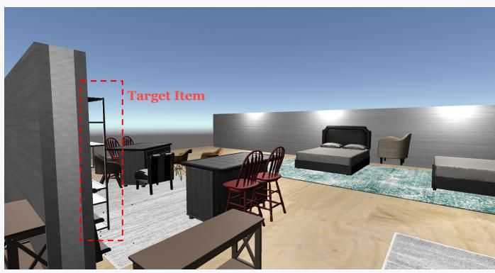  
Scene: Furniture store with a desk area (left) and bedroom (right).

<table><tr><td colspan="2"></td></tr><tr><td>User:</td><td>Can you help me get a leather chair?</td></tr><tr><td>Agent:</td><td>I have two leather chairs: a brown one and a black-and-white one by the kitchen island.</td></tr><tr><td>User:</td><td>I also need extra storage space to fit the ambiance of my new decor style.</td></tr><tr><td>Agent:</td><td>I see several shelving units. Do you have any color or placement in mind?</td></tr><tr><td>User:</td><td>I don&#x27;t want anything in that light wood finish. Is there a darker one near the desk?</td></tr></table>

## ¥ Re2A (Ours)

## j Preference Thought (T ):

“The user explicitly rejects the ‘light wood finish’, implying a need for a darker material. The item must be a ‘storage unit’ located in the ‘desk area’ (left side)...”

õ Preference State (P):

 Intent: Get Storage Unit

 Constraint: ¬ Light Wood ∧ Near Desk

 Visual Target: Black Metal Shelving

Ú Generated Response:

“I found a black metal shelving unit next to the desk. It matches the darker ambiance and avoids the light wood finish...”

Figure 11: Qualitative case study on a challenging scenario. While baselines struggle with visual saliency (ReGeS) or fail to reason about negation (CoT), our $\mathsf { R e } ^ { \bar { 2 } } \mathsf { A }$ leverages structured preference reasoning to identify the target and generate a more contextually-appropriate response.