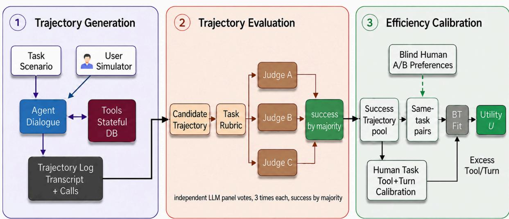
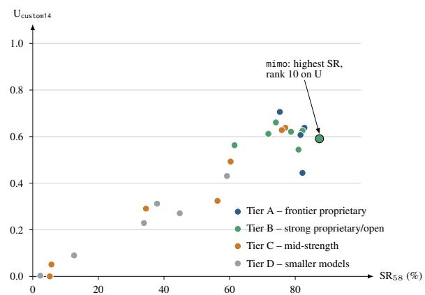

# RideWay: Benchmarking Efficient Task Completion for Tool-Using Language Agents

Qingnuan Han\*, Boli Fang†, Mingzhi Hou, Claire Liu

Didi Global

summerhan, bolifang, houmingzhi, liujiaqiclaire@didiglobal.com

## Abstract

AI agents are usually evaluated by whether they complete a task. In interactive service settings, a successful agent can still frustrate users by asking repeated questions, performing redundant searches, or making avoidable revisions. We introduce RideWay, an efficiencycentered benchmark for ridehailing agents in a stateful tool-calling environment, together with Efficiency Utility, a success-gated metric that discounts successful trajectories for excess tool calls and user-facing turns relative to taskspecific reference effort. Human paired preferences calibrate the relative penalties, reflecting an aggregate service-workflow trade-off: extra dialogue often creates visible friction, whereas extra tool use can sometimes verify constraints or preserve user intent. Across 58 tasks and 24 models, the fitted penalty for excess turns is about twice that for excess tool calls. On taskdisjoint held-out preferences, Efficiency Utility achieves 78.7% accuracy overall: 90.6% when trajectories differ in turns, but chance-level accuracy when they differ solely in tool calls — the axis on which human annotators agree least. RideWay therefore makes interaction efficiency measurable alongside task success, while exposing the boundary of count-based tool-use evaluation.

## 1 Introduction

Tool-using agents should be evaluated not only by whether they complete a task, but also by how they get there. In ridehailing, two agents may both book a valid trip: one confirms the constraints and finishes directly, while another reaches the same outcome after repeated clarification or avoidable revision, imposing more visible burden on the user. Yet additional action is not necessarily wasteful: an agent that checks travel time to several candidate pickup points before booking may make more tool calls than one that guesses, but is more likely to preserve the user’s constraints. A success-only evaluator cannot tell these cases apart, and a raw action-count penalty would collapse useful verification with needless friction. Evaluating successful agents therefore requires a success-gated efficiency measure that separates user-facing turns from backend tool use and learns their relative costs from human preferences.

Existing interactive-agent benchmarks make task completion increasingly measurable but often assign the same outcome score to successful trajectories that differ substantially in how they serve the user (Liu et al., 2024; Yao et al., 2024; He et al., 2025; Mazaheri and Mazaheri, 2026). Accordingly, outcome-only scores cannot measure the distinct aggregate burdens of user-facing dialogue and backend work, even when trajectories reach the same outcome.

These considerations motivate RideWay1, an efficiency-centered benchmark and scoring protocol for ridehailing agents. Ridehailing is a strong testbed: interactions are naturally multi-turn and tool-heavy, requiring location grounding, preference tracking, and mid-course revision, yet remain concrete enough to evaluate against behavioral rubrics and backend state. We study this setting in Chinese, a high-resource language that remains comparatively underrepresented in service-agent benchmarks. This setting raises a question that success-only evaluation leaves unanswered:

How do we measure the interaction efficiency of successful AI agents, not just whether they succeed?

RideWay answers this question with Efficiency Utility, a success-gated score that assigns failures zero credit. For successful trajectories, it discounts only effort beyond task-specific reference floors (Anderson et al., 2018), separately modeling excess user-facing turns and backend tool calls and calibrating their relative penalties from blinded human paired comparisons (Bradley and Terry, 1952).

In summary, we contribute:

• We introduce RideWay, a ridehailing evaluation benchmark for agents in a stateful toolcalling environment, with simulated users, panel-gated success judgments, and taskspecific reference-effort annotations.

• We propose Efficiency Utility, a successgated, reference-floor-relative metric that distinguishes excess tool calls from excess userfacing turns and fits their aggregate penalties from blinded human pairwise preferences.

• We validate Efficiency Utility on task-disjoint held-out human preferences and robustness checks. Excess user-facing turns receive a consistently stronger, held-out-validated penalty, whereas lower agreement on the tool axis identifies the boundary of what countbased efficiency can reliably resolve.

## 2 Background and Related Work

Interactive-agent benchmarks have moved language-model evaluation from static answering to multi-turn action in executable environments. Tool-use and reasoning-action work studies how models interleave language with external actions or API calls (Yao et al., 2023; Schick et al., 2023), while function-calling and environment benchmarks test API selection, schema following, web interaction, coding, and multi-step task execution (Qin et al., 2024; Yan et al., 2024; Shridhar et al., 2021; Yao et al., 2022; Deng et al., 2023; Zhou et al., 2024; Jimenez et al., 2024; Liu et al., 2024; Zhang et al., 2024; Yoran et al., 2024; Drouin et al., 2024; Ma et al., 2024). These benchmarks make agent behavior more observable, but their primary scores usually ask whether the agent reaches a correct final state or completes the requested task.

Tool-agent-user benchmarks are the closest setting for RideWay because they require agents to manage both dialogue state and tool state. τ-bench and τ2-Bench instantiate conversational agents that interact with users and tools in realistic domains (Yao et al., 2024; Barres et al., 2025); VitaBench formalizes life-service tasks through user state, database state, dialogue actions, tool invocations, and task rewards (He et al., 2025); and T1-Bench extends this line to multi-scenario agent evaluation with fixed simulator and judge configurations (Winata et al., 2026). All three score task completion or reward; none scores how a successful trajectory got there. RideWay follows their toolagent-user premise but adds a second, orthogonal measurement layer on top of success: a two-axis, human-calibrated effort penalty that separates backend tool calls from user-facing turns rather than collapsing trajectory quality into a single completion signal.

Trajectory-sensitive evaluation studies the path an agent takes, not only its final answer. In embodied navigation, Success weighted by Path Length gives credit only to successful agents and discounts unnecessarily long paths (Anderson et al., 2018). Code and agent benchmarks use repeated-attempt or pass@k-style metrics to distinguish occasional success from reliable task completion (Chen et al., 2021). For service-style language agents, however, trajectory effort is not a single path length: clarification turns, database checks, state-changing calls, and preference-preserving revisions may affect the user differently. RideWay therefore measures two observable effort axes, user-facing turns and backend tool calls, relative to task-specific reference floors.

Human preference modeling provides a way to calibrate these effort axes when absolute scoring is hard. Bradley–Terry paired-comparison models estimate latent preferences from comparative judgments (Bradley and Terry, 1952), and preferencebased learning more broadly infers utility from human choices rather than hand-specified scalar labels (Ng and Russell, 2000; Abbeel and Ng, 2004; Christiano et al., 2017; Ouyang et al., 2022; Rafailov et al., 2023; Azar et al., 2024; Nika et al., 2024; Zheng et al., 2023). RideWay uses this idea narrowly: annotators compare successful sametask trajectories for efficiency, and the fitted penalties convert those judgments into a task-relative score. This differs from efficient-LLM work on model compression, inference cost, latency, or carbon footprint (Chen et al., 2023; Wan et al., 2024; Zhu et al., 2024; Xia et al., 2024; Faiz et al., 2024), which measures the computational system, not the user-facing interaction path.

<table><tr><td>Property</td><td>Aggregate</td><td>rh44</td><td>custom14</td></tr><tr><td>Tasks</td><td>58</td><td>44</td><td>14</td></tr><tr><td>Reference tools</td><td>3–22 (7.5)</td><td>3–19 (6.9)</td><td>5–22 (9.2)</td></tr><tr><td>Reference turns</td><td>3–23 (9.1)</td><td>3–22 (7.6)</td><td>5–23 (13.6)</td></tr><tr><td>Rubrics</td><td>2–11 (5.2)</td><td>3–11 (5.7)</td><td>2–5 (3.6)</td></tr></table>

Table 1: RideWay benchmark statistics, aggregate and by split. Numeric cells show min–max (mean) per task; tool inventory and language are detailed below.

## 3 RideWay Benchmark

RideWay evaluates ridehailing agents by generating stateful tool-agent-user trajectories and gating each with an independent LLM success panel (Figure 1). Each task is an interactive episode between an evaluated agent, a simulated user, and a database-backed tool environment, following recent tool-agent-user benchmarks (Yao et al., 2024; Barres et al., 2025; He et al., 2025; Winata et al., 2026): the agent converses and calls ride-service tools until it completes the workflow or stops, producing a trajectory of both user-facing dialogue and backend actions. A three-judge LLM panel then evaluates the trajectory against the task rubric and backend state, so incomplete or constraint-violating attempts remain visible as failures rather than efficient completions.

Design goals. The task suite in RideWay was constructed to make efficiency meaningful rather than incidental. Tasks require multiple decisions, have more than one plausible solution path, can be graded with rubrics and backend state, and include task-specific reference effort so a workflow with more required constraints is not penalized merely for needing more interaction than a simpler one.

Environment and tools. The environment exposes 26 ride-service tools: 18 read tools and 8 write tools. Read tools cover saved address lookup, current location, POI and nearby search, geocoding, history/order lookup, ride estimates, trip-duration estimates, driver matching, flight information, route search, and real-time ride status. Write tools cover car-type selection, immediate and scheduled ride creation, ride confirmation, cancellation, destination updates, ride reminders, and ride notes. The underlying state contains user profile fields, saved addresses, car types, dynamically generated driver candidates, current and historical ride orders, POI data, route estimates, and booking state. Tool calls can read or mutate this state, so agents must track both the user’s latent intent and the evolving environment.

Task construction. RideWay contains 58 manually curated ridehailing tasks (44-task rh44 for calibration, task-disjoint 14-task custom14 for heldout validation). Tasks are organized around capability tags that stress origin–destination grounding, order-type selection, explicit and inferred preferences, context carryover, temporal reasoning, history recall, ambiguous locations, driver recommendation, weak-signal inference, no-unsolicited-order behavior, route planning, and mid-course revision. Many withhold constraints from the initial utterance or require preserving earlier preferences after later edits.

Language and locale. RideWay is a Chineselanguage benchmark: task instructions, simulated user utterances, and user-facing agent responses use Simplified Chinese, while structured tool calls retain English API identifiers, yielding a mixed Chinese/English interface. Its language- and culturedependent efficiency preferences should not be assumed to transfer unchanged to other locales.

Rubrics and reference effort. Each task includes a user scenario, an initial query, grading rubrics, and two human reference-effort fields. To obtain the floors, Chinese-proficient annotators act as support agents for each task, interacting with the same user LLM under the same instructions used to construct it; we use the median of their tool-call and assistant-turn counts as $f _ { \mathrm { t o o l } } ( x )$ and $f _ { \mathrm { t u r n } } ( x )$ (across 58 tasks: 3–22 calls, mean 7.5; 3–23 turns, mean 9.1; 2–11 rubric items, mean 5.2). These floors are task-relative anchors, not theoretical shortest paths, used to avoid comparing raw interaction length across different ride workflows.

LLM Panel Evaluation. RideWay uses a conservative LLM-as-a-judge success criterion to avoid treating a lucky single evaluation as solved (Zheng et al., 2023; Panickssery et al., 2024). Each trajectory is judged by a panel of three distinct LLMs; each judge runs 3 times and takes a majority vote, and a trajectory succeeds only if at least two of three judges pass it. This hierarchical aggregation reduces reliance on any single model family’s rubric interpretation. Judges run at temperature 0; the 3 passes still differ on 2–3% of trajectories from genuine API-level non-determinism, so the majority controls real noise rather than repeating an identical call. None of the three judges (hy3-preview, seed2.0-lite, grok4.3) is in the 24-model agent pool, limiting the self-preference bias that samefamily judging can introduce (Panickssery et al., 2024).

  
Figure 1: RideWay’s three-stage pipeline: trajectory generation, trajectory evaluation, and efficiency calibration.

## 4 Efficiency Utility Metric

Efficiency Utility inherits its skeleton from Success weighted by Path Length (Anderson et al., 2018): a success gate, a task-relative reference floor, and a penalty only for effort beyond that floor. Two changes adapt it from embodied navigation to service dialogue. First, a single path length is the wrong unit: service-agent effort is user-facing (turns) and backend (tool calls) at once, so the metric tracks two excess counts. Second, the relative cost of these axes is not knowable a priori – there is no ground-truth shortest interaction – so the trade-off is calibrated from human preferences (Section 7) rather than hand-set. The exponential form in Eq. 1 then follows rather than being stylistic: fitting a Bradley–Terry model requires an additively composable per-trajectory cost, and exp(−·) is the unique monotonic map turning such an additive cost into a per-unit multiplicative discount, letting each excess call and turn contribute an independent factor.

Let x be a task and τ be an agent trajectory for that task. Let $c _ { \mathrm { t o o l } } ( \tau )$ and $c _ { \mathrm { t u r n } } ( \tau )$ denote its observed tool-call and dialogue-turn counts. Tool calls count all structured tool invocations emitted by the assistant. Dialogue turns count assistant messages sent to the user, excluding structured tool-call messages and terminal control markers. For each task, the human-support annotation protocol in Section 3 provides reference-effort floors $f _ { \mathrm { t o o l } } ( x )$ and $f _ { \mathrm { t u r n } } ( x )$ These floors are task-relative anchors rather than statistics of the evaluated model pool. We define excess counts as

$$
\begin{array} { r l } & { e _ { \mathrm { t o o l } } ( \tau ) = \operatorname* { m a x } \{ 0 , c _ { \mathrm { t o o l } } ( \tau ) - f _ { \mathrm { t o o l } } ( x ) \} , } \\ & { e _ { \mathrm { t u r n } } ( \tau ) = \operatorname* { m a x } \{ 0 , c _ { \mathrm { t u r n } } ( \tau ) - f _ { \mathrm { t u r n } } ( x ) \} . } \end{array}
$$

The Efficiency Utility metric is thus defined as:

$$
U ( \tau ) = \mathrm { s u c c e s s } ( \tau ) \lambda _ { \mathrm { t o o l } } ^ { e _ { \mathrm { t o o l } } ( \tau ) } \lambda _ { \mathrm { t u r n } } ^ { e _ { \mathrm { t u r n } } ( \tau ) } ,\tag{1}
$$

where success(τ ) indicates whether τ passes the 3- LLM panel (Section 3). A failed trajectory scores zero; a successful one at both floors scores one; each additional tool call or turn multiplicatively reduces the score.

## 5 Human Preference Calibration

The metric’s two penalties, $\lambda _ { \mathrm { t o o l } }$ and $\lambda _ { \mathrm { t u r n } } ,$ are estimated in two steps: we construct same-task preference pairs from trajectories that already pass the success gate – so annotators judge only the efficiency of completed workflows – and convert those pairwise choices into the multiplicative penalties. This keeps success evaluation, reference-effort annotation, and efficiency calibration separate while letting human preferences fix the trade-off between the two observable effort axes.

## 5.1 Constructing Preference Pairs

Preference pairs are built after trajectory generation and judge-panel success filtering. For each Ride-Way task, we collect model trajectories that pass the final panel gate and form pairs within that successful same-task pool. Each comparison therefore contains two completed workflows for the same user request. This construction removes two confounders from the human label: annotators are not deciding whether a trajectory solved the task, and they are not comparing an easy task with a hard one. They instead answer the narrower calibration question needed by Eq. 1: when both trajectories succeed, which completion imposes less excess interaction burden?

The sampler makes the penalty trade-off identifiable rather than merely collecting obvious wins. We sample round-robin across tasks to cover the full rh44 split, and within each task include toolonly, turn-only, and mixed trade-off pairs (one trajectory using more tools but fewer turns); the mixed cases reveal whether humans tolerate backend checks or extra dialogue more. Chinese-proficient annotators see task context and full transcripts but not model identities, counts, or utility scores, and label which trajectory is more efficient, ties allowed. We spot-check pools from low-success models, whose rare panel-passing outputs may reflect evaluator noise.

The resulting data are thus a task-controlled set of successful-trajectory comparisons, not a generic transcript ranking, deliberately collected to expose the trade-off between extra backend work and extra user-facing interaction. Held-out comparisons use the same rules on task-disjoint tasks, so validation tests whether the learned trade-off transfers beyond the calibration tasks.

## 5.2 Estimating Utility Penalties

The second step estimates the two penalties from human preferences rather than hand-setting them, since the axes differ in meaning: an extra turn often makes the user repeat or wait, while an extra tool call may verify availability or preserve a preference after a revision. Fitting only on same-task pairs that already pass the success gate, each successful trajectory is represented by a linear excess-effort cost,

$$
C ( \tau ) = a e _ { \mathrm { t o o l } } ( \tau ) + b e _ { \mathrm { t u r n } } ( \tau ) ,
$$

where a and b are nonnegative log-penalties for one excess tool call and one excess user-facing turn. Since excess is measured above task-specific reference floors, $C ( \tau )$ does not penalize naturally longer tasks; it summarizes excess beyond the reference effort. The cost is not a semantic judge of the transcript, but a compact preference-calibrated model of observable burden $( \mathrm { N g }$ and Russell, 2000; Abbeel and Ng, 2004; Christiano et al., 2017; Ouyang et al., 2022; Rafailov et al., 2023).

We fit this cost with a Bradley–Terry pairedcomparison model (Bradley and Terry, 1952). For a labeled pair $( \tau _ { i } , \tau _ { j } )$ , the model predicts

$$
p _ { i j } = P ( i \succ j ) = \sigma ( C ( \tau _ { j } ) - C ( \tau _ { i } ) ) ,
$$

where $\sigma ( z ) = 1 / ( 1 + \exp ( - z ) )$ . If trajectory i has lower fitted cost than trajectory j, $p _ { i j }$ increases. We estimate a and b by minimizing regularized binary cross-entropy against the human label $y _ { i j }$ with $y _ { i j } = 1$ if i is preferred, 0 if j is preferred, and $\begin{array} { l } { { \frac { 1 } { 2 } } } \end{array}$ for a tie. Non-negativity encodes that extra effort should not raise utility, but the constraint turns out to be slack: the unconstrained optimum already places both penalties strictly positive (Section 7). A small L2 regularizer uses $\gamma = 0 . 3$ (distinct from $\lambda _ { \mathrm { t o o l } } / \lambda _ { \mathrm { t u r n } } )$ , and sweeping γ from 0 to 8 changes $a / b$ by only 0.005.

Finally, we convert the fitted costs back to Eq. 1: $\lambda _ { \mathrm { t o o l } } = \exp ( - a )$ and $\lambda _ { \mathrm { t u r n } } = \exp ( - b )$ , so successful trajectories satisfy $U ( \tau ) = \exp ( - C ( \tau ) )$ The score stays in [0, 1], while human preferences determine whether excess turns should be discounted more strongly than excess tool calls.

## 6 Experimental Setup

Our experiments evaluate complete RideWay trajectories rather than isolated final answers (Zhou et al., 2024; Zhang et al., 2024; Jimenez et al., 2024; He et al., 2025). We run 24 non-thinking LLM configurations as agents, grouped into four capability tiers reported alongside the leaderboard (Table 11): A frontier proprietary systems, B strong proprietary and open-weight systems, C mid-strength models, and D smaller models. All agents use the same prompts, tool schemas, task order, simulator configuration, and three-attempt budget. We exclude hidden-reasoning variants because their private deliberation budgets are not comparable to the visible tool calls and user-facing turns measured by Efficiency Utility.

The 44-task rh44 split calibrates the metric and the task-disjoint 14-task custom14 split validates it – not a random subsample: custom14’s longhorizon, persona-driven, chit-chat-distracted tasks differ from rh44’s scenario-derived patterns (Table 1: more reference turns, 13.6 vs. 7.6, and tool calls, 9.2 vs. 6.9, but fewer rubric items, 3.6 vs. 5.7), testing generalization across construction. With 24 agents and three attempts, the splits yield 3,168 and 1,008 raw trajectories; same-task pairs sampled from panel-passing trajectories give 320 calibration votes (rh44) and 80 held-out votes (custom14). GPT-4.1 is the fixed Chinese user simulator, and the success panel uses hy3-preview, seed2.0-lite, and grok4.3.

## 7 Results

## 7.1 Evaluation on Success-Only Metrics

We report Success Rate (SR), Pass@3, and $\mathrm { P a s s ^ { 3 } }$ – the fraction of trials passing the judge-panel gate, tasks solved in at least one of three attempts, and tasks solved in all three (Chen et al., 2021) – over 58 tasks, 24 models, and three attempts per model. Per-task SR spans 12.5%– 87.5%; the top six-model SR band succeeds on 82.9% of trials, while middle bands show the largest Pass@3–Pass3 reproducibility gaps (0.331– 0.385; Appendix D). Per-model SR ranges from mimo (87.4%) to llama318b (2.3%) (Appendix E). These metrics are necessary success context, but they collapse every successful trajectory to the same binary outcome.

## 7.2 Why Success-Only Metrics Are Not Enough

Table 2 shows why each successful trajectory needs an explicit trajectory-effort measurement. Successful agents can have many excess tool calls with almost no extra dialogue, many excess turns with little extra tool use, or excesses on both tool and turn axes. The final columns of Table 2 , computed with respect to human reference floor, show that success can come from different interaction paths.

Table 3 describes the agentic inefficiencies in Table 2 with more concrete details. In the toolexcess example, agentic inefficiency comes from guessing points of interest before using the provided destination; in the turn-excess example, it comes from the agent re-asking after delegation; and in the mixed-excess example, it comes from the agent re-asking, cancelling, and rebooking an already-started itinerary. In each case, the agent could have acted on settled information instead of searching, asking, or rebooking again. This motivates the calibration question: once success is known, how much should each excess pattern cost?

<table><tr><td>Task</td><td>Model</td><td>Tools</td><td>Turns</td><td> $e _ { \mathrm { t o o l } }$ </td><td>Eturn</td></tr><tr><td>custom_015</td><td>ministral3b</td><td>25</td><td>12</td><td>18</td><td>0</td></tr><tr><td>1c_10</td><td>kimik26</td><td>7</td><td>18</td><td>1</td><td>7</td></tr><tr><td>mt_09</td><td>qw37max</td><td>16</td><td>11</td><td>4</td><td>6</td></tr></table>

Table 2: Three successful trajectories spanning toolonly, turn-only, and mixed excess patterns; These are the same trajectories detailed in Table 3.
<table><tr><td>Excess</td><td>Goal</td><td>What the excess was</td></tr><tr><td>Tool (18)</td><td>custom_015: ride to a Mc-</td><td>5 wrong-guess POI searches before using the given destina-</td></tr><tr><td>Turn (7)</td><td>Donald&#x27;s 1c_10: airport pickup</td><td>tion; retried bookings User twice said “handle  $\operatorname { i t } ^ { * } ;$  agent re-asked the same ad- dress 3×</td></tr><tr><td>Mixed (4, 6)</td><td>mt_09: 3-stop errand + air- port</td><td>Re-asked a flight number after being told to decide; cancelled &amp; rebooked leg 1</td></tr></table>

Table 3: One real trajectory per excess pattern: avoidable redundancies over settled information.

## 7.3 Efficiency Calibration and Pairwise Validation

We evaluate Efficiency Utility on task-disjoint heldout pairwise preferences; the learned penalties are asymmetric. In log-penalty form, the calibration estimates $a \ = \ 0 . 1 2 3 5$ for tool excess and $b \ =$ 0.2448 for turn excess; equivalently,

$$
\lambda _ { \mathrm { t o o l } } = { \bf 0 . 8 8 3 8 , \quad \quad } \lambda _ { \mathrm { t u r n } } = { \bf 0 . 7 8 2 9 . }
$$

Thus one excess user-facing turn receives 2.01 times the log-penalty of one excess tool call (90% bootstrap interval on $b / a \colon$ [1.40, 2.96], B = 2500); the corresponding 90% bootstrap interval on $a / b$ is [0.34, 0.71] (median 0.50). Both penalties are strictly positive with disjoint 90% bootstrap intervals $( a \in [ 0 . 0 9 , 0 . 1 6 ] , b \in [ 0 . 1 9 , 0 . 3 4 ] )$ , and refitting without the non-negativity constraint leaves them unchanged with $a > 0$ in every resample – so the tool penalty is supported by the data, not imposed by the constraint. (Appendix B) The fit is also stable to the reference floor: perturbing every task’s floor by ±1–2 units and refitting moves held-out accuracy only within [0.787, 0.813] and $\tau _ { b }$ within [0.573, 0.627] (Appendix A).

This answers a natural objection: if some excess tool calls are useful verification, why does Eq. 1 penalize every call? Because $\lambda _ { \mathrm { t o o l } }$ is fit from preferences rather than assumed, it is not a per-call waste judgment but the population rate at which annotators still preferred the higher-tool-call trajectory – real but modest, penalizing tool excess about half as hard per unit as turn excess. Table 5 shows the cost of this per-call blindness: accuracy drops from 90.6% on pairs where turns differ to chance (50.0%) where tool calls are the only difference.

<table><tr><td>Metric</td><td>Coverage</td><td>Accuracy</td><td> $\tau _ { b }$ </td></tr><tr><td>Efficiency Utility</td><td>1.00</td><td>0.787</td><td>0.573</td></tr><tr><td>Tool-only</td><td>0.95</td><td>0.394</td><td>-0.200</td></tr><tr><td>Turn-only</td><td>0.71</td><td>0.925</td><td>0.600</td></tr><tr><td>Equal-cost length</td><td>1.00</td><td>0.773</td><td>0.547</td></tr><tr><td>Turn-first lex.</td><td>1.00</td><td>0.800</td><td>0.600</td></tr><tr><td>Tool-first lex.</td><td>1.00</td><td>0.427</td><td>-0.147</td></tr><tr><td>Log/sqrt forms</td><td>1.00</td><td>0.787</td><td>0.573</td></tr></table>

Table 4: Held-out preference prediction for Efficiency Utility and diagnostic baselines, on directional answered pairs. Efficiency Utility’s 90% bootstrap intervals: [0.71, 0.87] accuracy, [0.41, 0.73] $\tau _ { b }$ (Efron, 1979).

Table 4 compares diagnostic variants: singleaxis scores, equal-cost length $( e _ { \mathrm { t o o l } } + e _ { \mathrm { t u r n } } )$ , lexicographic rules that let one axis always dominate, and monotone log/square-root variants. Coverage is the fraction of comparisons receiving a strict ranking; accuracy is computed on directional answered pairs; and Kendall’s $\tau _ { b }$ is tie-aware (Kendall, 1938).

Efficiency Utility achieves 78.7% pairwise accuracy and $\tau _ { b } = 0 . 5 7 3$ on task-disjoint held-out preferences. Turn-only is accurate when it answers but misses tool-only differences; tool-only and tool-first invert many mixed trade-offs where extra backend work reduces dialogue. Turn-first lexicographic ordering has a marginally higher point estimate (0.800 vs. 0.787 accuracy), but a paired bootstrap cannot separate the two (accuracy difference $[ - 0 . 0 7 , + 0 . 0 4 ] ; \tau _ { b }$ difference $[ - 0 . 1 3 , + 0 . 0 8 ]$ see Appendix B for bootstrap details). We therefore treat them as statistically tied and prefer Efficiency Utility because it remains a cardinal, averageable score rather than an absolute-priority rule. The log/sqrt row is identical for pairwise ranking: any strictly monotone transform preserves the comparison signs; Appendix G checks the cross-task averaging case where transforms can matter.

Where the tool axis stands. Stratifying the 75 directional held-out pairs shows the metric’s strength and its limit (Table 5). Efficiency Utility is accurate when turns differ, but pure-tool pairs are at chance: the human vote splits exactly evenly between fewer and more tool calls. The tool axis is therefore informative in aggregate but unreliable as a per-call waste label: some extra tool calls are avoidable, while others preserve constraints or check feasibility (Appendix H). The strong 90.6% turn-differing accuracy is also not uniform by margin: only 58.3% $( n = 1 2 )$ on pairs differing by

<table><tr><td>Statistic</td><td>Value</td></tr><tr><td>U accuracy, turn-differing pairs  $( n = 5 3 )$ </td><td>90.6%</td></tr><tr><td>small turn diff  $( \vert \Delta e _ { \mathrm { t u r n } } \vert \le 3 , n = 1 2 )$ </td><td>58.3%</td></tr><tr><td>large turn diff  $( \left| \Delta e _ { \mathrm { t u r n } } \right| > 3 , n = 4 1 )$ </td><td>100.0%</td></tr><tr><td>U accuracy, pure-tool pairs  $( n = 2 2 )$ </td><td>50.0%</td></tr><tr><td>Human vote split, pure-tool pairs (fewer / more)</td><td>11 /11</td></tr></table>

Table 5: Held-out accuracy by turn-difference presence and margin size, and on pure-tool pairs (with the human vote split).

1–3 excess turns, versus 100.0% on the 41 pairs with a larger gap (Table 5) – the headline number is carried disproportionately by large-margin pairs.

## 7.4 Listwise Consistency Check

As a ranking-level consistency check on the same construct validated pairwise above, we test whether Efficiency Utility can rank multiple successful solutions to the same task, not only choose between two trajectories. We collect blind annotations on 10 held-out tasks: for each, the annotator places 8 successful trajectories into four ordered efficiency buckets, ties allowed, spanning both dual-axis and tool-dominant cases where turn-only metrics cannot separate trajectories.

Efficiency Utility remains aligned with these judgments: task-level Kendall’s $\tau _ { b }$ is positive on all 10 tasks, with mean $\tau _ { b } = 0 . 4 8 8$ , median 0.553, and a 90% bootstrap interval of [0.391, 0.582] (Appendix B for bootstrap details). Tool-only is weaker $( \tau _ { b } = 0 . 4 1 4 )$ and negative on the hardest dual-axis task; turn-only ranks only 8 of 10 tasks and is negative on 2 of those 8 – both clearly worse than Efficiency Utility’s uniformly positive result. The listwise study thus supports the pairwise claim: the metric captures the dominant cost of extra turns without collapsing tool-sensitive differences.

## 7.5 Validation Boundaries: Human Ceiling and Judge Reliability

Two checks bound the results above rather than extending them: human agreement on the hardest slice, and reliability of the success gate. For toolaxis IAA, a second blinded annotator relabels the 23 held-out pairs that remain strictly pure-tool under the final floors. Human–human agreement is 78.3% (Cohen’s $\kappa = 0 . 6 5 8$ (Cohen, 1960)), higher than Efficiency Utility’s agreement with either annotator (52.2%/60.9%, $\kappa = 0 . 1 7 9 / 0 . 3 7 7 )$ ; adding the metric as a third rater lowers Krippendorff’s nominal $\alpha$ from 0.663 to 0.410. By contrast, a 17-pair turn-differing relabel check has 100.0% human agreement. The tool-axis boundary is therefore substantive: raw tool counts cannot encode whether an extra call protected the user’s goal or wasted effort.

Judge-panel reliability. An annotator blind to model identity and to the panel verdict relabeled 75 trajectories success/fail using the same rubric, user scenario, and final system state given to the panel. Human and panel agree on 90.7% of trajectories (Cohen’s $\kappa = 0 . 8 1 3$ , 90% CI [0.70, 0.92], details at Appendix B). Agreement is perfect (30/30) for the twelve stronger models (Tier A/B, §6); all 7 disagreements (2 false positive, 5 false negative) come from the twelve weaker ones (Tier C/D; Appendix A, Table 8). Most panel verdicts are unanimous (61/75, 3-0); the remaining 14/75 are 2-1 splits, and split verdicts are less reliable: 78.6% human agreement versus 93.4% for unanimous cases.

## 7.6 What Efficiency Reveals

Having assessed Efficiency Utility’s signal and limits, we ask what it shows. Figure 2 plots full-benchmark $\mathrm { S R } _ { 5 8 }$ against held-out custom14 Efficiency Utility. We use $S \mathrm { R _ { 5 8 } }$ rather than $\mathrm { S R } _ { \mathsf { c u s t o m 1 4 } }$ here since it is the more reliable signal (174 vs. 42 trials per model); the same-scope $\mathrm { S R } _ { \mathsf { c u s t o m 1 4 ^ { - } V S - U _ { c u s t o m 1 4 } } }$ relationship is reported separately in Appendix E, where it is far more tightly coupled by construction (Pearson 0.959). The measures still correlate overall (Spearman $\rho = \mathbf { 0 . 7 8 5 }$ , 90% bootstrap interval [0.521, 0.933]), as expected because failures score zero, but the relationship flattens among the 12 highest-U models $\mathbf { \Sigma } ( \rho = - \mathbf { 0 . 1 6 1 }$ , 90% interval $[ - 0 . 6 6 4 , 0 . 4 2 0 ]$ , details at Appendix B). The clearest case is mimo: it has the highest SR of all 24 models (87.4%) but ranks only 10th on Efficiency Utility. Per-model bootstrap intervals overlap between adjacent ranks, so the leaderboard is a coarse grouping rather than a precise ordering; the robust point is that high success does not guarantee low burden.

The gap is not just a split artifact: gpt55nothink and opus46 tie on custom14 success rate (88.1%) yet differ by 11 points in conditional efficiency on successful trials (Appendix E). Because $\mathrm { U } _ { \mathsf { c u s t o m 1 4 } } \leq \mathrm { S R } _ { \mathsf { c u s t o m 1 4 } }$ by construction, this increment could in principle be vacuous; it is not: across all 496 successful trajectories in the pairwise sets, only 28.8% have zero excess tool calls and only 34.3% have zero excess turns (10.3% have both at zero), so the two-axis penalty is doing real discriminating work on most successful runs, not merely

  
Figure 2: $\mathrm { S R } _ { 5 8 }$ vs. held-out custom14 Efficiency Utility, all 24 models by tier. Correlation is strong overall $( \rho =$ 0.785) but flattens among the top 12 $( \rho = - 0 . 1 6 1 )$ ; mimo is the sharpest single case.

relabeling success.

Among models with $\mathrm { S R } > 7 0 \%$ , excess interaction is model-specific: some trail on extra turns, while others – notably mimo and gemini35flash (SR 82% but U rank 14) – trail mainly on extra tool calls. Extra user-facing turns are the more reliable signal of human efficiency preferences, but both turns and tool calls capture model-dependent burden that success rates alone miss.

## 8 Conclusion and Future Work

RideWay closes a gap in service-agent evaluation: successful completion is necessary, but not sufficient. Successful trajectories often differ in the excess interaction burden they impose, and Efficiency Utility aligns with task-disjoint held-out pairwise human preferences, with consistent support from a listwise ranking check and a clear tool-axis boundary: raw tool counts cannot encode the semantic usefulness of individual calls. Service-agent benchmarks should therefore reward agents not only for reaching task-level success, but also for reaching it with task-appropriate interaction effort.

Future work should test how far these findings and calibrated trade-offs transfer. RideWay is a Chinese ridehailing benchmark, so the first step is broader validation across languages, domains, and real-user settings. A second direction is richer semantic efficiency modeling: beyond RideWay’s observable count-based axes, future metrics should distinguish wasteful tool calls from useful verification and incorporate latency, monetary cost, and user satisfaction. Finally, long-horizon tool workflows such as agentic software engineering offer a natural testbed for studying whether task-relative efficiency metrics generalize beyond ridehailing.

## Limitations

RideWay is a single-domain, Chinese-language ridehailing benchmark. Its calibrated weights may reflect local service norms about clarification, verification, and conversational length, and the English tool identifiers may favor agents with stronger English API grounding. Cross-domain, crosslanguage, and real-user validation are needed before treating the weights as general.

Efficiency Utility measures only observable turns and tool calls. It excludes hidden reasoning, latency, monetary cost, tone, satisfaction, and safety, and raw counts simplify the distinction between necessary work and waste. The held-out preference set is modest, excess turns are sparse, and most preference labels come from one primary annotator; the IAA study is a contextual check, not a replacement for broader labeling.

The benchmark also relies on automated components. Following VitaBench’s configuration (He et al., 2025), GPT-4.1 is the fixed user simulator, and success is gated by a three-judge LLM panel (hy3-preview, seed2.0-lite, and grok4.3). These choices improve reproducibility, and Section 7.5 reports a direct human audit of the panel’s own reliability (90.7% agreement, Cohen’s κ = 0.813 on a random sample of 75 trajectories), but the audit does not cover every trajectory and does not replace real users or state-based verification. Finally, the model pool intentionally excludes thinking models, and we do not report token-cost correlations because tokenizer, verbosity, and serving differences make them non-comparable across models.

## Ethical considerations

The human labels in this study assess synthetic benchmark trajectories from a simulated ridehailing environment rather than private customer data. The benchmark data do not contain personally identifying information. Annotators were full-time interns or employees whose roles include data annotation. They were informed that their labels would be used for benchmark development and evaluation, and all annotation work was performed within their job duty. Release artifacts exclude annotator identifiers, model identities in annotation interfaces, and any tool/turn counts that would reveal the metric being validated. The codebase and trajectory corpus were audited before release, and no offensive content was found. All human-facing tasks and annotation instructions are in Simplified Chinese, with English tool identifiers shown as part of the API interface. Appendix A describes the annotation protocol and its limitations.

An efficiency metric can create pressure to reduce interactions even when clarification would serve a user better. Efficiency Utility is therefore conditioned on task success and should complement, not replace, evaluation of safety, correctness, user control, and satisfaction. Because preferences about efficient service can vary across users and domains, and because the present study is situated in Chinese-language ridehailing service, future studies should test broader populations, languages, and task settings.

RideWay artifacts are intended for research evaluation of tool-using language agents, not for deployment as a ridehailing service or for making operational decisions about real drivers, passengers, or trips. The benchmark uses synthetic tasks, simulated users, and database states constructed for evaluation. Released artifacts should be distributed with the MIT License and documentation describing the language, domain, task splits, annotation protocol, and intended use. The authors institution does not maintain a separate ethics review board for this kind of study; the work was conducted in accordance with recognized professional standards, including the ACM Code of Ethics (https://www.acm.org/code-of-ethics). The authors used AI writing and coding assistance during manuscript preparation and implementation; all content, claims, and submitted text remain the responsibility of the authors.

## Acknowledgements

We thank Yueyue Han, Rui Li, Xiyue Zhang, Jixiang Guo, and Jiayun Peng for helping with the annotation work. We thank Claire Liu for discussions on benchmark design.

## References

Pieter Abbeel and Andrew Y. Ng. 2004. Apprenticeship learning via inverse reinforcement learning. In Proceedings of the Twenty-First International Conference on Machine Learning, pages 1–8.

Peter Anderson, Angel Chang, Devendra Singh Chaplot, Alexey Dosovitskiy, Saurabh Gupta, Vladlen Koltun, Jana Kosecka, Jitendra Malik, Roozbeh Mottaghi, Manolis Savva, and Amir R. Zamir. 2018. On evaluation of embodied navigation agents. arXiv preprint arXiv:1807.06757.

Mohammad Gheshlaghi Azar, Mark Rowland, Bilal Piot, Zhaohan Daniel Guo, Daniele Calandriello, Michal Valko, and Rémi Munos. 2024. A general theoretical paradigm to understand learning from human preferences. In International Conference on Artificial Intelligence and Statistics.

Victor Barres, Honghua Dong, Soham Ray, Xujie Si, and Karthik Narasimhan. 2025. τ2-bench: Evaluating conversational agents in a dual-control environment. arXiv preprint arXiv:2506.07982.

Ralph Allan Bradley and Milton E. Terry. 1952. Rank analysis of incomplete block designs: I. the method of paired comparisons. Biometrika, 39(3/4):324– 345.

Lingjiao Chen, Matei Zaharia, and James Zou. 2023. FrugalGPT: How to use large language models while reducing cost and improving performance. In Advances in Neural Information Processing Systems.

Mark Chen, Jerry Tworek, Heewoo Jun, Qiming Yuan, Henrique Ponde de Oliveira Pinto, Jared Kaplan, Harri Edwards, Yuri Burda, Nicholas Joseph, Greg Brockman, et al. 2021. Evaluating large language models trained on code. arXiv preprint arXiv:2107.03374.

Paul F. Christiano, Jan Leike, Tom Brown, Miljan Martic, Shane Legg, and Dario Amodei. 2017. Deep reinforcement learning from human preferences. Advances in Neural Information Processing Systems, 30.

Jacob Cohen. 1960. A coefficient of agreement for nominal scales. Educational and Psychological Measurement, 20(1):37–46.

Xiang Deng, Yu Gu, Boyuan Zheng, Shijie Chen, Samuel Stevens, Boshi Wang, Huan Sun, and Yu Su. 2023. Mind2Web: Towards a generalist agent for the web. In Advances in Neural Information Processing Systems.

Alexandre Drouin, Maxime Gasse, Massimo Caccia, Issam Laradji, Manuel Del Verme, Tom Marty, David Vazquez, Nicolas Chapados, and Alexandre Lacoste. 2024. WorkArena: How capable are web agents at solving common knowledge work tasks? In International Conference on Machine Learning.

Bradley Efron. 1979. Bootstrap methods: Another look at the jackknife. The Annals ofStatistics, 7(1):1–26.

Ahmad Faiz, Sotaro Kaneda, Ruhan Wang, Rita Chukwunyere Osi, Prateek Sharma, Fan Chen, and Lei Jiang. 2024. LLMCarbon: Modeling the end-to-end carbon footprint of large language models. In International Conference on Learning Representations.

Wei He, Yueqing Sun, Hongyan Hao, Xueyuan Hao, Zhikang Xia, Qi Gu, Chengcheng Han, Dengchang Zhao, Hui Su, Kefeng Zhang, Man Gao, Xi Su, Xiaodong Cai, Xunliang Cai, Yu Yang, and Yunke Zhao. 2025. VitaBench: Benchmarking LLM agents with versatile interactive tasks in real-world applications. arXiv preprint arXiv:2509.26490.

Carlos E. Jimenez, John Yang, Alexander Wettig, Shunyu Yao, Kexin Pei, Ofir Press, and Karthik Narasimhan. 2024. SWE-bench: Can language models resolve real-world GitHub issues? In International Conference on Learning Representations.

Maurice G. Kendall. 1938. A new measure of rank correlation. Biometrika, 30(1/2):81–93.

Xiao Liu, Hao Yu, Hanchen Zhang, Yifan Xu, Xuanyu Lei, Hao Xu, Yue Zhang, et al. 2024. AgentBench: Evaluating LLMs as agents. International Conference on Learning Representations.

Chang Ma, Junlei Zhang, Zhihao Zhu, Cheng Yang, Yujiu Yang, Yaohui Jin, Zhenzhong Lan, Lingpeng Kong, and Junxian He. 2024. AgentBoard: An analytical evaluation board of multi-turn LLM agents. In Advances in Neural Information Processing Systems, volume 37.

Parsa Mazaheri and Kasra Mazaheri. 2026. AgentAtlas: Beyond outcome leaderboards for LLM agents. arXiv preprint arXiv:2605.20530.

Andrew Y. Ng and Stuart Russell. 2000. Algorithms for inverse reinforcement learning. In Proceedings ofthe Seventeenth International Conference on Machine Learning, pages 663–670.

Andi Nika, Debmalya Mandal, Parameswaran Kamalaruban, Georgios Tzannetos, Goran Radanovic, and Adish Singla. 2024. Reward model learning vs. direct policy optimization: A comparative analysis of learning from human preferences. In International Conference on Machine Learning.

Long Ouyang, Jeffrey Wu, Xu Jiang, Diogo Almeida, Carroll Wainwright, Pamela Mishkin, Chong Zhang, Sandhini Agarwal, Katarina Slama, Alex Ray, et al. 2022. Training language models to follow instructions with human feedback. In Advances in Neural Information Processing Systems.

Arjun Panickssery, Samuel R. Bowman, and Shi Feng. 2024. LLM evaluators recognize and favor their own generations. arXiv preprint arXiv:2404.13076.

Yujia Qin, Shihao Liang, Yining Ye, Kunlun Zhu, Lan Yan, Yaxi Lu, Yankai Lin, Xin Cong, Xiangru Tang, Bill Qian, Sihan Zhao, Lauren Hong, Runchu Tian, Ruobing Xie, Jie Zhou, Mark Gerstein, Dahai Li, Zhiyuan Liu, and Maosong Sun. 2024. ToolLLM: Facilitating large language models to master 16000+ real-world APIs. In International Conference on Learning Representations.

Rafael Rafailov, Archit Sharma, Eric Mitchell, Christopher D. Manning, Stefano Ermon, and Chelsea Finn. 2023. Direct preference optimization: Your language model is secretly a reward model. In Advances in Neural Information Processing Systems.

Timo Schick, Jane Dwivedi-Yu, Roberto Dessi, Roberta Raileanu, Maria Lomeli, Eric Hambro, Luke Zettlemoyer, Nikolaus P. Himmel, Daniele Fried, Gautier Izacard, et al. 2023. Toolformer: Language models can teach themselves to use tools. Advances in Neural Information Processing Systems, 36.

Mohit Shridhar, Xingdi Yuan, Marc-Alexandre Côté, Yonatan Bisk, Adam Trischler, and Matthew Hausknecht. 2021. ALFWorld: Aligning text and embodied environments for interactive learning. In International Conference on Learning Representations.

Zhongwei Wan, Xin Wang, Che Liu, Samiul Alam, Yu Zheng, Jiachen Liu, Zhongnan Qu, Shen Yan, Yi Zhu, Quanlu Zhang, Mosharaf Chowdhury, and Mi Zhang. 2024. Efficient large language models: A survey. Transactions on Machine Learning Research.

Genta Indra Winata, Amartya Chakraborty, Yuzhen Lin, Swasthi P. Rao, Shikhhar Siingh, Houhan Lu, Nadia Bathaee, Sriharsha Hatwar, Paresh Dashore, Anmol Jain, Kshitij Tayal, Xiuzhu Lin, Anirban Das, Sambit Sahu, and Shi-Xiong Zhang. 2026. T1-bench: Benchmarking multi-scenario agents in real-world domains. arXiv preprint arXiv:2606.11070.

Heming Xia, Zhe Yang, Qingxiu Dong, Peiyi Wang, Yongqi Li, Tao Ge, Tianyu Liu, Wenjie Li, and Zhifang Sui. 2024. Unlocking efficiency in large language model inference: A comprehensive survey of speculative decoding. In Findings of the Associationfor Computational Linguistics: ACL 2024, pages 7655–7671.

Fanjia Yan, Huanzhi Mao, Charlie Cheng-Jie Ji, Tianjun Zhang, Shishir G. Patil, Ion Stoica, and Joseph E. Gonzalez. 2024. Berkeley function-calling leaderboard. Technical report and live benchmark.

Shunyu Yao, Howard Chen, John Yang, and Karthik Narasimhan. 2022. WebShop: Towards scalable realworld web interaction with grounded language agents. In Advances in Neural Information Processing Systems.

Shunyu Yao, Noah Shinn, Pedram Razavi, and Karthik Narasimhan. 2024. τ-bench: A benchmark for toolagent-user interaction in real-world domains. arXiv preprint arXiv:2406.12045.

Shunyu Yao, Jeffrey Zhao, Dian Yu, Nan Du, Izhak Shafran, Karthik Narasimhan, and Yuan Cao. 2023. ReAct: Synergizing reasoning and acting in language models. In International Conference on Learning Representations.

Ori Yoran, Samuel Joseph Amouyal, Chaitanya Malaviya, Ben Bogin, Ofir Press, and Jonathan Berant. 2024. AssistantBench: Can web agents solve realistic and time-consuming tasks? In Proceedings of the 2024 Conference on Empirical Methods in Natural Language Processing, pages 10032–10044.

Yaolun Zhang, Yinxu Pan, Yudong Wang, Jie Cai, Zhi Zheng, Guoyang Zeng, and Zhiyuan Liu. 2024. Py-Bench: Evaluating LLM agent on various real-world coding tasks. Preprint, arXiv:2407.16732.

Lianmin Zheng, Wei-Lin Chiang, Ying Sheng, Siyuan Zhuang, Zhanghao Wu, Yonghao Zhuang, Zi Lin, Zhuohan Li, Dacheng Li, Eric P. Xing, Hao Zhang, Joseph E. Gonzalez, and Ion Stoica. 2023. Judging LLM-as-a-judge with MT-Bench and chatbot arena. In Advances in Neural Information Processing Systems, volume 36.

Shuyan Zhou, Frank F. Xu, Hao Zhu, Xuhui Zhou, Robert Lo, Abishek Sridhar, Xianyi Cheng, Tianyue Ou, Yonatan Bisk, Daniel Fried, Uri Alon, and Graham Neubig. 2024. WebArena: A realistic web environment for building autonomous agents. In International Conference on Learning Representations.

Xunyu Zhu, Jian Li, Yong Liu, Can Ma, and Weiping Wang. 2024. A survey on model compression for large language models. Transactions ofthe Associationfor Computational Linguistics, 12:1556–1577.

This appendix is organized as follows. Appendix A details the human annotation protocol; Appendix B covers artifact release and reproduction; Appendix C maps the paper to the Responsible NLP checklist; Appendices D and E report task-difficulty and model-leaderboard details; Appendix F lists model identifiers; Appendix G gives scoring and evaluation details; and Appendix H reports detailed inefficiency-taxonomy examples.

## A Human Annotation Protocol

## A.1 Annotation tasks

The human annotation in RideWay serves five mea surement roles. First, human reference-effort an notations provide task-specific floors for tool calls and assistant turns; the median count is used as $f _ { \mathrm { t o o l } } ( x )$ and $f _ { \mathrm { t u r n } } ( x )$ Across the 58 tasks, the three annotators’ raw counts are close: the range (max−min) across the three annotators is on average 1.97 tool calls and 1.79 turns (median 1.5 and 2.0), and only $5 / 5 8$ tasks have a tool-count range of 5 or more (worst case: [16, 19, 24]), with just 1/58 that wide on turns – the median floor is not typically riding on a single outlier annotator. We additionally checked whether the calibration and its held-out validation depend on getting the floor exactly right: perturbing every task’s floor by the same $\delta \in \{ - 2 , - 1 , + 1 , + 2 \}$ tool/turn units (clamped at 0) and refitting a, b from scratch on the perturbed training pairs changes held-out accuracy only within [0.787, 0.813] and τ (full) only within [0.573, 0.627], both at or above the un-perturbed baseline (0.787, 0.573) – the metric is not brittle to plausible floor mis-annotation in either direction. Second, the preference-calibration and held-out val idation sets ask for pairwise efficiency preferences between two successful trajectories from the same task. Third, the listwise study asks an annotator to place eight successful trajectories from one task into four ordered efficiency buckets. Fourth, the tool-axis IAA study asks a second blinded annota tor to relabel targeted held-out tool-axis pairs. Fifth, the judge-panel audit (Section 7.5) asks a blind annotator to relabel a random sample of trajectories success/fail, independent of and compared against the automated panel’s own verdict. The user simulator remains a fully automated component; the judge-panel success gate is automated but is the one checked directly by this fifth role rather than assumed correct.

All natural-language task content, trajectories, and annotation instructions are presented in Simplified Chinese. Structured tool names remain in English. The annotation task therefore requires reading Chinese dialogue while interpreting English API identifiers.

## A.2 Construct and interface

All human preference labels target the same narrow construct: efficiency as absence of avoidable detours. The instructions explicitly exclude tone, wording, politeness, courtesy phrases, style, and enthusiasm. The pairwise instruction states that both conversations complete the same task and both succeed, then asks which side is more efficient, judging only whether the agent took detours through redundant or repeated tool calls or avoidable conversational back-and-forth. Ties are an allowed and encouraged answer when the trajectories are comparably efficient.

For reference-effort annotation, humans interact directly with the same user simulator used in trajectory generation, acting as customer-service agents rather than passive judges. They have access to the full ridehailing tool set and seek to complete the task by conversing with the simulated user and calling tools as needed. We record each annotator’s assistant-turn and tool-call counts for the completed episode and use the median counts as the task’s reference floors.

In the pair annotation interface, annotators see full transcripts and task context(task scenario and grading rubric), but not model identities, tool-call counts, turn counts, metric scores, or another annotator’s decision. This is because annotators sometimes need to know the task background so as to judge whether an apparent extra tool call was necessary verification. For example, reapplying a driver preference after an order edit should not be treated the same way as repeating a failed malformed call.

The listwise interface uses similar construct in an n-way format: for each task, eight successful trajectories are sorted into four ordered buckets (most efficient, acceptable, some waste, very wasteful), with ties allowed within a bucket.

The judge-panel audit targets a different construct: task correctness rather than efficiency preference. The annotator sees the same three inputs the judge panel’s own prompt receives – the task’s grading rubric, the user’s original scenario, and the final system state (system time and the ride order created, if any) – alongside the full transcript, and gives a binary success/fail judgment. Model identity, tier, and the panel’s own verdict are hidden. Showing the rubric and system state, not only the transcript, is deliberate: a fair check of the panel’s reliability requires the human referee to grade against the same standard and the same information the panel used, not a looser or narrower one.

<table><tr><td>Study</td><td>Annotation unit</td><td>Labels per unit</td><td>Recorded output</td></tr><tr><td>Human reference ef- fort</td><td>One interactive task episode</td><td>Team (variable per task)</td><td>Tool calls and assistant turns; task floor is the median count</td></tr><tr><td>Pairwise calibra- tion/test</td><td>Two successful same-task trajectories</td><td>One primary vote</td><td>A more efficient, B more efficient, or tie</td></tr><tr><td>Listwise validation</td><td>Eight successful same- task trajectories</td><td>Ordered buckets</td><td>Four efficiency levels with ties allowed within a bucket</td></tr><tr><td>Tool-axis IAA</td><td>Targeted successful tra- jectory pair</td><td>Second blind vote</td><td>Independent A/B/tie judgment; primary label hidden</td></tr><tr><td>Judge-panel audit</td><td>One trajectory, any panel verdict</td><td>One blind vote</td><td>Success/fail judgment compared against the panel&#x27;s own verdict</td></tr></table>

Table 6: Human annotation roles. “Labels per unit” describes the current experimental design, not a recommendation that one primary label is sufficient for future benchmark versions.

## A.3 Sampling and data-quality gates

Efficiency comparisons are only constructed within the same task and only after all shown trajectories pass the success gate. Candidate pairs and listwise sets are therefore not asking whether one trajectory succeeded and another failed; they ask which successful path was cleaner. Pair sampling is task-spanning rather than concentrated on a few high-contrast cases: pairs are sampled round-robin across tasks, deduplicated against previous manifests, and mixed trade-off pairs are included without forcing all pairs to be single-axis.

Three data-quality gates are applied before preference labeling. First, a candidate trajectory must pass the judge-panel success gate. Second, candidate pairs are deduplicated so the same trajectory pair is not relabeled under a new identifier. Third, newly added low-success model trajectories are spot-checked before they enter the pair pool; this rule was added after reward-passing but behaviorally unreliable trajectories from one low-success model were retracted from pair construction.

The judge-panel audit is sampled differently by design: since its purpose is to check the success gate itself, gating candidates on the panel’s own verdict first would be circular. Its sample is instead drawn uniformly at random from the full paneloutput pool across all 24 pool models and both domains, regardless of the panel’s verdict.

## A.4 Current coverage and limitations

The pairwise preference data are frozen at 320 panel-gated calibration votes over all 44 rh44 tasks and 80 held-out votes over all 14 custom14 tasks. The listwise study is finalized at 10 tasks and 80 labeled trajectories; two remaining planned dualaxis tasks were not pursued because the highestpriority tool-dominant coverage was complete. The reported tool-axis IAA analysis covers 23 verifiedpure-tool held-out pairs labeled by two annotators, plus a secondary 17-pair check on turn+mixed-axis pairs (Section 7.5). The judge-panel audit covers 75 randomly sampled trajectories (Section 7.5), a subset of the full panel-output pool rather than exhaustive coverage.

The main annotation limitation is that most pairwise items have one primary human vote. The IAA study is designed to quantify this limitation rather than hide it. Its completed tool-axis result shows moderate and imperfect human–human agreement on these targeted pairs (Cohen, 1960), which supports the paper’s interpretation that tool-axis efficiency has a lower human-agreement ceiling than a crisp correctness label would. The listwise study is also a robustness check over the same construct, not an independent validation channel. The judgepanel audit is likewise a partial check, not an exhaustive correctness audit of every trajectory in the benchmark.

## A.5 Annotator recruitment, consent, and compensation

Annotators were Chinese-proficient adults recruited by the authors for research annotation. They were full-time interns or employees whose roles include data annotation, and all annotation work was performed as part of their job duties during standard working hours; an hourly annotation rate is therefore not applicable to this project. All annotators had university-level undergraduate or graduate backgrounds; all were ages 18–35; 66.7% were female and 33.3% were male; they were based in China and the United States. They were told that the annotations would be used to construct and evaluate a benchmark, and they could skip unclear items by using the tie option when neither trajectory was clearly more efficient. The annotation material contains synthetic ridehailing dialogues and simulated tool states rather than private customer records. The released artifact does not include annotator names, payment information, contact information, or other direct identifiers.

<table><tr><td>Statistic (n = 23 pairs)</td><td>Value</td></tr><tr><td>A1–A2 raw agreement</td><td>78.3%</td></tr><tr><td>A1–A2 Cohen&#x27;s κ</td><td>0.658</td></tr><tr><td>U-A1 raw agreement</td><td>52.2%</td></tr><tr><td>U-A1 Cohen&#x27;s κ</td><td>0.179</td></tr><tr><td>U-A2 raw agreement</td><td>60.9%</td></tr><tr><td>U-A2 Cohen&#x27;s κ</td><td>0.377</td></tr><tr><td>Krippendorff&#x27;s α, humans only</td><td>0.663</td></tr><tr><td>Krippendorff&#x27;s α, humans + U</td><td>0.410</td></tr></table>

Table 7: Tool-axis inter-annotator agreement statistics. A1/A2 are the two blinded annotators. Efficiency Utility’s agreement with either annotator sits below the human-human ceiling on every statistic.

<table><tr><td>Tier</td><td>n</td><td>Human-panel agreement</td></tr><tr><td>A</td><td>13</td><td>100.0%</td></tr><tr><td>B</td><td>17</td><td>100.0%</td></tr><tr><td>C</td><td>22</td><td>81.8%</td></tr><tr><td>D</td><td>23</td><td>87.0%</td></tr></table>

Table 8: Blind human relabel vs. the LLM judge panel’s success/fail verdict, by model tier $( n = 7 5$ randomly sampled trajectories). All 7 disagreements come from Tier C/D models.

## A.6 Detailed agreement statistics

Table 7 gives the full tool-axis inter-annotator agreement statistics summarized in Section 7.5, and Table 8 gives the per-tier breakdown of the judgepanel human audit summarized in Section 7.5.

## B Reproducibility

Code, data, and reproduction scripts are released at https://anonymous.4open.science/ r/RideWay-368B/.

## B.1 What is included

The release contains the 58 RideWay task files with reference-effort annotations; the 320 training and 80 held-out pairwise preference votes, each with the full trajectory pair embedded; the 80 listwisetier labels over 10 tasks; the 23 verified-pure-toolaxis IAA pairs with both annotators’ votes; the 17 secondary turn+mixed-axis IAA pairs with both annotators’ votes; the 75 trajectories relabeled for the human judge-panel audit (Section 7.5) with the panel’s own verdict alongside each human label; the 11 tool-axis discordant-pair taxonomy records with classification; 15 hand-picked qualitative example trajectories; the released 24-model leaderboard and 58-task difficulty ledger; and the scripts that compute every statistic in the paper (Bradley– Terry fit, held-out baseline comparison, functionalform and lexicographic ablations, IAA statistics, judge-panel audit statistics, listwise scoring, and the leaderboard/difficulty-table generators). A toplevel HOW\_TO\_REPRODUCE.md gives the exact command for each reported number, its expected output, and the data-file schemas.

## B.2 How to run it

Each script is self-contained given the small manifest/vote JSON files shipped alongside it (no external corpus needed) and prints its result directly; HOW\_TO\_REPRODUCE.md lists the exact invocation and expected output for every number in Sections 4–7 and Appendices D–E. The two generator scripts that regenerate the leaderboard and task-difficulty tables from raw trajectories are also included, though they require the full simulation corpus rather than the shipped manifest files.

## B.3 Numbers requiring a non-default invocation

A small number of robustness checks reported in the paper are not produced by the default, noargument invocation of a released script shown in HOW\_TO\_REPRODUCE.md’s headline commands. Three are a documented flag or a small dedicated script already in the release; only the first still requires an actual source edit, applied locally, since the script exposes no flag for it:

• L2 sensitivity sweep (Section 4). The provided fit() routine takes an l2 argument with default 0.3. Calling it with $ 1 2 \in$ {0, 2.0, 8.0} instead and re-fitting reproduces the swept a, b, and held-out log-loss values.

• Unconstrained Bradley–Terry fit (Sections 4 and 7). The provided fit() routine clips both coefficients to stay non-negative after every gradient step; the analysis script’s –unconstrained flag disables this clip for both the point fit and the bootstrap, reproducing the unconstrained point estimate and the confidence intervals on a and b reported in Section 7.

• Turn-differing vs. pure-tool stratified accuracy (Section 7). A dedicated script splits the held-out test pairs by whether the excessturn difference is zero before scoring the U method, and separately tallies, on the zeroexcess-turn subset, how often the human label matches the fewer-tool-calls side versus the more-tool-calls side, reproducing the two accuracy figures and the 11–11 split reported for the tool axis.

• Floor-perturbation robustness (Appendix A). A dedicated script perturbs every task’s reference-effort floor by the same delta, recomputes excess tool calls and turns from the raw per-trajectory counts embedded in the calibration/held-out manifests, refits a, b from scratch on the perturbed training pairs, and re-evaluates held-out accuracy and τb under that refit, reproducing the perturbation range reported in Appendix A.

## B.4 Bootstrap resample counts

All reported 90% intervals are percentile bootstrap intervals (Efron, 1979), used uniformly across every analysis in the paper; most are read defensively (to show two quantities cannot be separated), where a wider level would only reinforce the conclusion, rather than to assert significance. The pairwise held-out intervals (Table 4) use 10,000 resamples; the listwise intervals (Section 7.4) use 5,000 resamples; the fit intervals on a, b, a/b, and $b / a$ (Section 7) use 2,500 resamples (unchanged from an earlier 500-resample pass, confirming that count was already stable); the judge-panel audit and IAA control-set intervals (Section 7.5, Section 7.5) use 10,000 resamples; the model-level leaderboard intervals (Table 11) and the functional-form rankingequivalence interval (Appendix G) use a task-level bootstrap (resampling the 14 held-out tasks, not individual trials) at 5,000 resamples; the SR-vs-U correlation intervals (Section 7.6) resample the 24 (or 12) models directly at 10,000 resamples.

## C Responsible NLP Checklist Support

This appendix maps the paper to the ARR Responsible NLP checklist and records checklist-specific details that are not natural to include in the main text. The detailed protocols are intentionally kept in the relevant appendices: Appendix A covers human annotation, Appendix B covers artifact release and reproduction, and Appendix F lists evaluated model identifiers.

Task, data, and collection procedure. RideWay is a Chinese-language ridehailing benchmark for multi-turn tool-using agents. The task suite, tool environment, user simulator, database state, task splits, rubrics, and success gate are described in Sections 3–6. Data collection consists of running 24 agent configurations for three attempts per task against a fixed simulated user and databasebacked ridehailing tool environment, then applying the LLM judge-panel success gate and constructing successful same-task trajectory comparisons for efficiency annotation. Human reference-effort floors are collected separately: annotators interact with the same user simulator as customer-service agents, with access to the full tool set, and the median completed-episode tool-call and assistant-turn counts define the task floors (Appendix A).

Human annotation protocol. Appendix A describes the annotation units, interfaces, instructions, blinding, tie handling, sampling, data-quality gates, agreement statistics, and limitations. The human annotation covers five roles: reference-effort floors, pairwise efficiency calibration and held-out validation, listwise efficiency validation, tool-axis interannotator agreement, and a human audit of the judge-panel success gate. Pairwise and listwise annotators see task context and full transcripts but not model identities, tool/turn counts, metric scores, or another annotator’s decision; judge-panel audit labels are collected independently of the panel’s verdict.

Annotator status and demographics. Appendix A is the source of truth for annotator recruitment, consent, compensation status, and demographics. In brief, annotators were Chineseproficient adult full-time interns or employees whose roles include data annotation; all work was performed during standard working hours as part of their job duties, so an hourly annotation rate is not applicable. Appendix A also reports the collected education, age, gender, and geographic information and states which annotator identifiers are excluded from the release.

Ethics review and professional standards. The authors’ institution does not maintain a separate ethics review board for this kind of study. The work was conducted in accordance with recognized professional standards, including the ACM Code of Ethics (https://www.acm.org/ code-of-ethics). The study uses adult annotators, synthetic benchmark materials, and simulated tool states; it collects no sensitive personal data and releases no annotator identifiers.

Privacy, content, and data protection. Ride-Way uses synthetic tasks, simulated users, and simulated database states rather than private customer, passenger, driver, or trip records. The data do not contain personally identifying information. Names, addresses, driver/order identifiers, preferences, and trip histories in the released materials are synthetic benchmark fixtures. Annotation interfaces hide model identities, tool/turn counts, metric scores, and other information that could reveal the metric being validated. The released codebase and trajectory corpus were audited for offensive content, and no offensive content was found.

Artifacts, license, and intended use. Code, data, and reproduction scripts are released at https:// anonymous.4open.science/r/RideWay-368B/. The release contains 58 synthetic ridehailing tasks, 26 tools, 24 evaluated agent configurations, three attempts per task, task-level reference-effort annotations, 320 calibration and 80 held-out pairwise preference votes, 80 listwise labels, IAA labels, judge-panel audit labels, model leaderboards, task-difficulty ledgers, and scripts for reproducing the reported statistics. In the repository, the top-level README.md documents the benchmark, setup, and data/privacy notes; DATA\_CARD.md documents provenance, intended use, limitations, and reporting guidance; and efficiency\_utility\_ release/HOW\_TO\_REPRODUCE.md documents the Efficiency Utility artifacts, data schemas, commands, expected outputs, and reproduction workflow (Appendix B). The artifact is intended for research evaluation of tool-using language agents, not for deployment as a ridehailing service or for operational decisions about real passengers, drivers, or trips. The released artifact is distributed under the MIT License. External benchmarks, models, and methods are cited in Sections 2–6, and model identifiers are listed in Appendix F.

Computational experiments and reproducibility. Computational experiments are described in Section 6 and Appendix B. The paper reports the model pool, task splits, trajectory counts, preference-pair counts, judge-panel setup, regularization value, validation statistics, bootstrap intervals, listwise ranking statistics, inter-annotator agreement statistics, and judge-panel audit statistics. The study uses hosted LLM APIs rather than training new models, so GPU-hour reporting for local model training is not applicable. Parameter counts and serving infrastructure for proprietary hosted models are not available to the authors; open-weight model identifiers and sizes, where known, are listed in Appendix F.

Limitations, risks, and misuse. Limitations are discussed in the Limitations section. They include the single-domain, Chinese-language ridehailing setting; reliance on simulated users and LLM judges; limited held-out preference coverage; sparse excess-turn cases; one primary human vote for most pairwise items; and the fact that Efficiency Utility measures observable turns and tool calls rather than hidden reasoning, latency, monetary cost, tone, satisfaction, or safety. Risks and intended use are discussed in the Ethical considerations section. In particular, optimizing for efficiency alone could discourage useful clarification, so Efficiency Utility is conditioned on task success and should complement, not replace, evaluation of correctness, safety, user control, and satisfaction. RideWay should not be used as a ridehailing service, dispatch system, or source of factual travel or safety guidance.

AI assistance. The authors used AI writing and coding assistance during manuscript preparation and implementation. All submitted content, claims, analyses, and released artifacts remain the responsibility of the authors.

## D Task Difficulty Details

The task-difficulty analysis reports all 58 benchmark tasks with complete coverage: 24 models, three agent attempts per model, and 72 trials per task. Table 9 gives the hardest and easiest tasks by pooled task-level success rate. These repeatedattempt summaries are reported in the spirit of pass@k-style evaluation (Chen et al., 2021); they are task-level summaries, not per-model leaderboards.

<table><tr><td>Task</td><td>Domain</td><td>SR</td><td> $\mathrm { P a s s } @ 3$ </td><td> $\mathrm { P a s s ^ { 3 } }$ </td></tr><tr><td>Hardest tasks</td><td></td><td></td><td></td><td></td></tr><tr><td>1c_04_cd_taxi_pref_dismiss</td><td>rh44</td><td>12.5</td><td>0.250</td><td>0.042</td></tr><tr><td>custom_028</td><td>custom14</td><td>18.1</td><td>0.292</td><td>0.083</td></tr><tr><td>custom_029</td><td>custom14</td><td>18.1</td><td>0.292</td><td>0.083</td></tr><tr><td>mt_08_bj_pet_supermarket_weekend</td><td>rh44</td><td>18.1</td><td>0.375</td><td>0.042</td></tr><tr><td>rp_03_cd_furniture_moving</td><td>rh44</td><td>23.6</td><td>0.417</td><td>0.125</td></tr><tr><td>Easiest tasks</td><td></td><td></td><td></td><td></td></tr><tr><td> $\mathtt { m t \_ } 0 3 \_ s h \_ p i c k u p \_ t w o \_ f r i e n d s$ </td><td>rh44</td><td>80.6</td><td>0.875</td><td>0.708</td></tr><tr><td> $\mathfrak { m t \_ } { \otimes } 2 \mathrm { { \_ b j \_ h o t e l \_ p i c k u p \_ f r i e n d } }$ </td><td>rh44</td><td>83.3</td><td>0.917</td><td>0.792</td></tr><tr><td>custom_015</td><td>custom14</td><td>84.7</td><td>0.875</td><td>0.792</td></tr><tr><td>custom_030</td><td>custom14</td><td>84.7</td><td>0.875</td><td>0.792</td></tr><tr><td>airport_new_02_xm_current_immediate</td><td>rh44</td><td>87.5</td><td>0.917</td><td>0.833</td></tr></table>

Table 9: Task-level difficulty extremes. SR is the percentage of successful individual agent attempts among 72 attempts. Pass@3 and $\mathrm { P a s s ^ { 3 } }$ are averaged over models for three attempts per task.

<table><tr><td>Reliability band</td><td> $\mathrm { S R } _ { 5 8 }$ </td><td> $\mathrm { P } @ 3 _ { 5 8 }$ </td><td> $\mathrm { P _ { 5 8 } ^ { 3 } }$ </td><td> $\mathrm { G a p }$ </td></tr><tr><td>Highest SR</td><td>82.9</td><td>0.937</td><td>0.710</td><td>0.227</td></tr><tr><td>Upper-mid SR</td><td>75.5</td><td>0.911</td><td>0.580</td><td>0.331</td></tr><tr><td>Lower-mid SR</td><td>53.3</td><td>0.727</td><td>0.342</td><td>0.385</td></tr><tr><td>Lowest SR</td><td>15.7</td><td>0.267</td><td>0.058</td><td>0.209</td></tr></table>

Table 10: Model-level task-completion reliability bands on the 58-task RideWay benchmark. Models are sorted by SR and averaged in four six-model bands. Gap is Pass@3 minus Pass3.

Table 10 bands the 24 agents into four six-model reliability tiers by SR, the summary referenced in Section 7.

## E Model Leaderboard Details

Table 11 reports the released 24-model evaluation summary. The table is intended as a compact diagnostic view rather than the main validation result: SR, Pass@3, and $\mathrm { P a s s ^ { 3 } }$ show taskcompletion reliability on the full 58-task suite, while held-out custom14 Efficiency Utility shows the efficiency-sensitive ordering under the final preference-calibrated penalties. Models with similar SR can differ substantially in Efficiency Utility when their successful trajectories require more excess turns or tools under the fitted preferencecalibrated penalties.

$\mathrm { U } _ { \mathsf { c u s t o m } 1 4 }$ is the mean of $U ( \tau )$ pooled directly over all 42 trials (14 tasks × 3 attempts) in scope, not a per-task mean averaged again across tasks; failed trials contribute $\begin{array} { r l } { U ( \tau ) } & { { } = } \end{array}$ 0 and are not excluded. Because it is based on only 14 held-out tasks, Table 11 reports a 90% task-level bootstrap interval (5,000 resamples of the 14 tasks, pooling all trials of each resampled task) alongside every rank; the released leaderboard\_bootstrap\_ci.py script reproduces every one of these 24 intervals exactly from the raw trajectories, and also reports the stricter 95% level. Every adjacent-rank pair’s interval overlaps – Table 11 should not be read as a precise ordinal ranking. Meaningful separation instead requires a wide rank gap: rank 1 (gpt55nothink) is the first to separate from rank 14 onward, and rank 8 (qw36p) from rank 16 onward. The table is more accurately read as identifying a clearly ahead top group, a clearly behind bottom group, and a broad, statistically inseparable middle, rather than as distinguishing any two neighboring models.

Because $\begin{array} { r l r } { U ( \tau ) } & { { } = } & { 0 } \end{array}$ on every failed trial, $\mathrm { U } _ { \mathsf { c u s t o m } 1 4 }$ is capped by $\mathrm { S R } _ { \mathsf { c u s t o m 1 4 } } \mathrm { : }$ writing cond-U for the mean of $U ( \tau )$ over successful trials only, $\mathrm { U } _ { \mathsf { c u s t o m 1 4 } } = \mathrm { S R } _ { \mathsf { c u s t o m 1 4 } } \times \mathsf { c o n d \mathrm { - U } }$ . Across the 24 models, $\mathrm { S R } _ { \mathsf { c u s t o m 1 4 } }$ and $\mathrm { U } _ { \mathsf { c u s t o m } 1 4 }$ correlate strongly (Pearson 0.959, Spearman 0.873), so most of the leaderboard’s spread is success-rate-driven, and readers should not expect $\mathrm { U } _ { \mathsf { c u s t o m } 1 4 }$ to reorder models far from $\mathrm { S R } _ { \mathsf { c u s t o m 1 4 } }$ . The increment is still real and visible in cond-U among models with comparable success rates: at $\mathrm { S R } _ { \mathsf { c u s t o m 1 4 } } ~ = ~ 8 8 . 1 \%$ gpt55nothink and opus46 tie exactly, yet their conditional efficiency differs by 11 points (cond-U 0.80 vs. 0.69) – opus46’s successful trajectories carry substantially more excess tool or turn effort. We report cond-U here only as a diagnostic decomposition of $\mathrm { U } _ { \mathsf { c u s t o m } 1 4 }$ , not as an alternative ranking score: unlike $\mathrm { U } _ { \mathsf { c u s t o m } 1 4 }$ , cond-U ignores success rate entirely and would reward a model for quietly failing on its hardest attempts rather than completing them efficiently, so it is not used for model comparison anywhere else in this paper. At the trajectory level rather than the model level, the increment is broader than the aggregate correlation suggests: among all 496 distinct successful trajectories in the pairwise calibration and held-out sets, only 28.8% have zero excess tool calls and only 34.3% have zero excess turns (10.3% have both at zero), so the two-axis penalty is doing real discriminating work on the large majority of successful runs even though its aggregate effect on the leaderboard ordering is modest.

Table 11 reports SR only on the pooled 58-task suite and only $\mathrm { S R } _ { \mathsf { c u s t o m 1 4 } }$ (not $\mathrm { P a s s } @ 3 / \mathrm { P a s s } ^ { 3 } )$ on the held-out split, to keep the ranking table narrow. Table 12 reports the same three metrics separately on all three scopes – the pooled 58-task suite, the 44-task rh44 calibration split, and the 14-task custom14 held-out split, plus $\mathrm { U } _ { \mathsf { c u s t o m } 1 4 }$ alongside its own scope – for readers who want the full perscope breakdown rather than the pooled/ranking view.

## F Model Identifiers

Table 13 maps every shorthand used in this paper to the model family and version it refers to, for the 24-model agent pool, the 3-judge success panel, and the fixed user simulator.

## G Scoring and Evaluation Details

For a successful trajectory, ranking by Efficiency Utility is equivalent to ranking by its log score,

$$
\begin{array} { r } { \log U ( \tau ) = e _ { \mathrm { t o o l } } ( \tau ) \log \lambda _ { \mathrm { t o o l } } + e _ { \mathrm { t u r n } } ( \tau ) \log \lambda _ { \mathrm { t u r n } } . } \end{array}
$$

Equivalently, it minimizes the fitted linear cost $C ( \tau ) = a e _ { \mathrm { t o o l } } ( \tau ) + b e _ { \mathrm { t u r n } } ( \tau )$ , or after dividing by $a , C _ { r } ( \tau ) = e _ { \mathrm { t o o l } } ( \tau ) + r e _ { \mathrm { t u r n } } ( \tau )$ with $r = b / a$ . We report the exponentiated form because it composes naturally with the success gate: failed trajectories receive zero utility, reference-effort successful trajectories receive one, and excess interaction multiplicatively discounts the score. The tool-only and turn-only baselines set the other excess dimension to zero. The equal-cost comparator instead ranks by $e _ { \mathrm { t o o l } } { + e _ { \mathrm { t u r n } } }$ . Coverage is the fraction of held-out comparisons on which a method provides a strict ranking; Kendall’s $\tau _ { b }$ is tie-aware (Kendall, 1938). This distinction is essential because a method that ties nearly all trajectories can have perfect conditional accuracy on the small subset it ranks.

Scope of the ranking-equivalence claim. The log/sqrt row in Table 4 is bit-identical to Efficiency Utility’s own row rather than merely similar: any strictly monotonic concave transform of the pertrajectory cardinal score preserves the sign of every pairwise comparison, so coverage, accuracy, and $\tau _ { b }$ – all pairwise, within-task statistics – are unchanged by construction. This equivalence is deliberately narrow: it holds for ranking two trajectories against each other, but does not extend to comparing the mean score of one trajectory set against another, because a monotonic transform does not commute with averaging. The functional form therefore matters for cross-task aggregates such as the mean-Efficiency-Utility column in Table 11, even though it is invisible in Table 4. We use the exponential form for every reported aggregate in this paper precisely because it is the one implied by the fitted Bradley–Terry cost (§5.2), not because the choice is inconsequential. We checked empirically whether this matters in practice by recomputing every model’s mean score with $1 / ( 1 + C ( \tau ) )$ in place of $\exp ( - C ( \tau ) )$ : the two resulting orderings over all 24 models agree closely (Spearman $\rho = 0 . 9 8 9$ 90% task-level bootstrap interval $[ 0 . 9 8 3 , 0 . 9 9 8 ] )$ , with the only disagreement a 3-way reordering among gemma431b, qw37plus, and opus46 (ranks 5, 6, and 9 under the exponential form), whose scores under either form sit within 0.02 of each other. The functional-form choice is therefore consequential in principle but not disruptive on this data.

The task-difficulty summary in Appendix D is computed from the 58-task, 24-model trajectory set under the same judge-panel success gate used throughout the paper. Pairwise calibration, heldout ablations, lexicographic baseline checks, listwise validation, IAA, and taxonomy findings use the same filtered trajectory pools described in Sections 4–7. The judge-panel audit (Section 7.5) is the one exception: it deliberately samples from the unfiltered panel-output pool, including panel failures, since checking the gate itself requires not conditioning on the gate’s own decision. The toolaxis inter-annotator study is summarized in Appendix A.

## H Detailed Inefficiency-Taxonomy Examples

The taxonomy inspects tool-axis held-out pairs where Efficiency Utility disagrees with the human vote. For each discordant pair, the analysis focuses on the higher-tool trajectory that the human preferred but the metric ranked lower. Table 14 reports the two representative worked cases, in the same format as Table 3: what looked like avoidable excess by count was not.

Takeaway. In the taxonomy, all 11 discordant tool-axis cases are verification-dominant; none is ambiguous and none is a clean error-dominant case. The result supports the paper’s conservative interpretation: the weakest axis is not simply “extra tool calls are waste,” but rather that raw tool counts cannot always separate unnecessary calls from useful verification, comparison, and preferencepreservation work.

<table><tr><td>Rank</td><td>Model</td><td>Tier</td><td> $\mathrm { S R } _ { 5 8 }$ </td><td> $\mathrm { P a s s } @ 3 _ { 5 8 }$ </td><td> $\mathrm { P a s s _ { 5 8 } ^ { 3 } }$ </td><td> $\mathrm { S R } _ { \mathsf { c u s t o m 1 4 } }$ </td><td> $\mathrm { U } _ { \mathsf { c u s t o m } 1 4 }$ </td><td>90% CI</td></tr><tr><td>1</td><td>gpt55nothink</td><td>A</td><td>75.3</td><td>0.897</td><td>0.603</td><td>88.1</td><td>0.705</td><td>[0.57, 0.83]</td></tr><tr><td>2</td><td>qw37max</td><td>B</td><td>74.1</td><td>0.879</td><td>0.586</td><td>92.9</td><td>0.661</td><td>[0.56, 0.77]</td></tr><tr><td>3</td><td>qw3627b</td><td>C</td><td>77.0</td><td>0.914</td><td>0.603</td><td>78.6</td><td>0.638</td><td>[0.48, 0.79]</td></tr><tr><td>4</td><td>sonnet5</td><td>A</td><td>82.8</td><td>0.931</td><td>0.724</td><td>78.6</td><td>0.637</td><td>[0.49, 0.77]</td></tr><tr><td>5</td><td>gemma431b</td><td>C</td><td>75.9</td><td>0.914</td><td>0.586</td><td>73.8</td><td>0.628</td><td>[0.48, 0.77]</td></tr><tr><td>6</td><td>qw37plus</td><td>B</td><td>82.2</td><td>0.931</td><td>0.690</td><td>83.3</td><td>0.624</td><td>[0.50, 0.75]</td></tr><tr><td>7</td><td>g1m52</td><td>B</td><td>78.7</td><td>0.931</td><td>0.638</td><td>81.0</td><td>0.620</td><td>[0.50, 0.73]</td></tr><tr><td>8</td><td>qw36p</td><td>B</td><td>71.8</td><td>0.931</td><td>0.466</td><td>81.0</td><td>0.612</td><td>[0.49, 0.73]</td></tr><tr><td>9</td><td>opus46</td><td>A</td><td>81.6</td><td>0.931</td><td>0.707</td><td>88.1</td><td>0.606</td><td>[0.50, 0.71]</td></tr><tr><td>10</td><td>mimo</td><td>B</td><td>87.4</td><td>0.966</td><td>0.776</td><td>78.6</td><td>0.590</td><td>[0.44, 0.73]</td></tr><tr><td>11</td><td>kimik26</td><td>B</td><td>61.5</td><td>0.759</td><td>0.466</td><td>73.8</td><td>0.563</td><td>[0.41, 0.71]</td></tr><tr><td>12</td><td>dsv4pro</td><td>B</td><td>81.0</td><td>0.914</td><td>0.690</td><td>78.6</td><td>0.543</td><td>[0.42, 0.66]</td></tr><tr><td>13</td><td>gemma426b</td><td>C</td><td>60.3</td><td>0.828</td><td>0.328</td><td>61.9</td><td>0.493</td><td>[0.35, 0.64]</td></tr><tr><td>14</td><td>gemini35flash</td><td>A</td><td>82.2</td><td>0.948</td><td>0.672</td><td>76.2</td><td>0.443</td><td>[0.33, 0.54]</td></tr><tr><td>15</td><td>qw359b</td><td>D</td><td>59.2</td><td>0.759</td><td>0.414</td><td>76.2</td><td>0.431</td><td>[0.31, 0.55]</td></tr><tr><td>16</td><td>qw35ba3b</td><td>C</td><td>56.3</td><td>0.759</td><td>0.397</td><td>69.0</td><td>0.323</td><td>[0.20, 0.46]</td></tr><tr><td>17</td><td>ministral8b</td><td>D</td><td>37.9</td><td>0.569</td><td>0.224</td><td>50.0</td><td>0.311</td><td>[0.17, 0.46]</td></tr><tr><td>18</td><td>mistralsmall</td><td>C</td><td>34.5</td><td>0.569</td><td>0.155</td><td>40.5</td><td>0.291</td><td>[0.16, 0.44]</td></tr><tr><td>19</td><td>ministral14b</td><td>D</td><td>44.8</td><td>0.690</td><td>0.224</td><td>47.6</td><td>0.270</td><td>[0.13, 0.43]</td></tr><tr><td>20</td><td>ministral3b</td><td>D</td><td>33.9</td><td>0.534</td><td>0.121</td><td>38.1</td><td>0.229</td><td>[0.12, 0.35]</td></tr><tr><td>21</td><td>granite418b</td><td>D</td><td>12.6</td><td>0.190</td><td>0.069</td><td>9.5</td><td>0.090</td><td>[0.00, 0.22]</td></tr><tr><td>22</td><td>1lama3370b</td><td>C</td><td>5.7</td><td>0.121</td><td>0.000</td><td>9.5</td><td>0.051</td><td>[0.00, 0.14]</td></tr><tr><td>23</td><td>11ama318b</td><td>D</td><td>2.3</td><td>0.069</td><td>0.000</td><td>2.4</td><td>0.003</td><td>[0.00, 0.01]</td></tr><tr><td>24</td><td>nemotron3nano30b</td><td>C</td><td>5.2</td><td>0.121</td><td>0.000</td><td>4.8</td><td>0.000</td><td>[0.00, 0.00]</td></tr></table>

Table 11: Released 24-model leaderboard summary. Models are sorted by held-out custom14 mean Efficiency Utility. SR, Pass@3, and $\mathrm { P a s s ^ { 3 } }$ are reported on the pooled 58-task suite under the final judge-panel success gate; $\mathrm { S R } _ { \mathtt { c u s t o m 1 4 } }$ is success rate on the same 14-task held-out split that $\mathrm { U } _ { \mathsf { c u s t o m } 1 4 }$ is computed over, included so the two columns can be read against each other directly (Appendix E discusses this decomposition). The 90% CI is a task-level bootstrap interval (5,000 resamples of the 14 held-out tasks); every adjacent-rank pair’s interval overlaps (see the discussion above for how far apart two ranks must be to separate).

<table><tr><td>Rank</td><td>Model</td><td> $\mathrm { S R } _ { 5 8 }$ </td><td> $\mathrm { P a s s } @ 3 _ { 5 8 }$ </td><td> $\mathrm { P a s s } _ { 5 8 } ^ { 3 }$ </td><td> $\mathrm { S R } _ { \mathrm { r h } 4 4 }$ </td><td> $\mathrm { P a s s } @ 3 _ { r \mathrm { h } 4 4 }$ </td><td> $\mathrm { P a s s } _ { \mathrm { r h 4 4 } } ^ { 3 }$ </td><td> $\mathrm { S R } _ { \mathsf { c u s t o m 1 4 } }$ </td><td> $\mathrm { P a s s } @ 3 _ { \mathsf { c u s t o m 1 4 } }$ </td><td> $\mathrm { P a s s } _ { \mathrm { c u s t o m 1 4 } } ^ { 3 }$ </td><td> $\mathrm { U } _ { \mathsf { c u s t o m } 1 4 }$ </td></tr><tr><td>1</td><td>gpt55nothink</td><td>75.3</td><td>0.897</td><td>0.603</td><td>71.2</td><td>0.886</td><td>0.523</td><td>88.1</td><td>0.929</td><td>0.857</td><td>0.705</td></tr><tr><td>2</td><td>qw37max</td><td>74.1</td><td>0.879</td><td>0.586</td><td>68.2</td><td>0.841</td><td>0.523</td><td>92.9</td><td>1.000</td><td>0.786</td><td>0.661</td></tr><tr><td>3</td><td>qw3627b</td><td>77.0</td><td>0.914</td><td>0.603</td><td>76.5</td><td>0.932</td><td>0.568</td><td>78.6</td><td>0.857</td><td>0.714</td><td>0.638</td></tr><tr><td>4</td><td>sonnet5</td><td>82.8</td><td>0.931</td><td>0.724</td><td>84.1</td><td>0.955</td><td>0.727</td><td>78.6</td><td>0.857</td><td>0.714</td><td>0.637</td></tr><tr><td>5</td><td>gemma431b</td><td>75.9</td><td>0.914</td><td>0.586</td><td>76.5</td><td>0.932</td><td>0.591</td><td>73.8</td><td>0.857</td><td>0.571</td><td>0.628</td></tr><tr><td>6</td><td>qw37plus</td><td>82.2</td><td>0.931</td><td>0.690</td><td>81.8</td><td>0.932</td><td>0.682</td><td>83.3</td><td>0.929</td><td>0.714</td><td>0.624</td></tr><tr><td>7</td><td>g1m52</td><td>78.7</td><td>0.931</td><td>0.638</td><td>78.0</td><td>0.932</td><td>0.636</td><td>81.0</td><td>0.929</td><td>0.643</td><td>0.620</td></tr><tr><td>8</td><td>qw36p</td><td>71.8</td><td>0.931</td><td>0.466</td><td>68.9</td><td>0.932</td><td>0.409</td><td>81.0</td><td>0.929</td><td>0.643</td><td>0.612</td></tr><tr><td>9</td><td>opus46</td><td>81.6</td><td>0.931</td><td>0.707</td><td>79.5</td><td>0.932</td><td>0.659</td><td>88.1</td><td>0.929</td><td>0.857</td><td>0.606</td></tr><tr><td>10</td><td>mimo</td><td>87.4</td><td>0.966</td><td>0.776</td><td>90.2</td><td>0.977</td><td>0.795</td><td>78.6</td><td>0.929</td><td>0.714</td><td>0.590</td></tr><tr><td>11</td><td>kimik26</td><td>61.5</td><td>0.759</td><td>0.466</td><td>57.6</td><td>0.727</td><td>0.409</td><td>73.8</td><td>0.857</td><td>0.643</td><td>0.563</td></tr><tr><td>12</td><td>dsv4pro</td><td>81.0</td><td>0.914</td><td>0.690</td><td>81.8</td><td>0.909</td><td>0.705</td><td>78.6</td><td>0.929</td><td>0.643</td><td>0.543</td></tr><tr><td>13</td><td>gemma426b</td><td>60.3</td><td>0.828</td><td>0.328</td><td>59.8</td><td>0.841</td><td>0.341</td><td>61.9</td><td>0.786</td><td>0.286</td><td>0.493</td></tr><tr><td>14</td><td>gemini35flash</td><td>82.2</td><td>0.948</td><td>0.672</td><td>84.1</td><td>0.977</td><td>0.682</td><td>76.2</td><td>0.857</td><td>0.643</td><td>0.443</td></tr><tr><td>15</td><td>qw359b</td><td>59.2</td><td>0.759</td><td>0.414</td><td>53.8</td><td>0.727</td><td>0.341</td><td>76.2</td><td>0.857</td><td>0.643</td><td>0.431</td></tr><tr><td>16</td><td>qw35ba3b</td><td>56.3</td><td>0.759</td><td>0.397</td><td>52.3</td><td>0.727</td><td>0.364</td><td>69.0</td><td>0.857</td><td>0.500</td><td>0.323</td></tr><tr><td>17</td><td>ministral8b</td><td>37.9</td><td>0.569</td><td>0.224</td><td>34.1</td><td>0.545</td><td>0.182</td><td>50.0</td><td>0.643</td><td>0.357</td><td>0.311</td></tr><tr><td>18</td><td>mistralsmall</td><td>34.5</td><td>0.569</td><td>0.155</td><td>32.6</td><td>0.545</td><td>0.136</td><td>40.5</td><td>0.643</td><td>0.214</td><td>0.291</td></tr><tr><td>19</td><td>ministral14b</td><td>44.8</td><td>0.690</td><td>0.224</td><td>43.9</td><td>0.727</td><td>0.182</td><td>47.6</td><td>0.571</td><td>0.357</td><td>0.270</td></tr><tr><td>20</td><td>ministral3b</td><td>33.9</td><td>0.534</td><td>0.121</td><td>32.6</td><td>0.523</td><td>0.114</td><td>38.1</td><td>0.571</td><td>0.143</td><td>0.229</td></tr><tr><td>21</td><td>granite418b</td><td>12.6</td><td>0.190</td><td>0.069</td><td>13.6</td><td>0.205</td><td>0.068</td><td>9.5</td><td>0.143</td><td>0.071</td><td>0.090</td></tr><tr><td>22</td><td>ilama3370b</td><td>5.7</td><td>0.121</td><td>0.000</td><td>4.5</td><td>0.114</td><td>0.000</td><td>9.5</td><td>0.143</td><td>0.000</td><td>0.051</td></tr><tr><td>23</td><td>1lama318b</td><td>2.3</td><td>0.069</td><td>0.000</td><td>2.3</td><td>0.068</td><td>0.000</td><td>2.4</td><td>0.071</td><td>0.000</td><td>0.003</td></tr><tr><td>24</td><td>nemotron3nano30b</td><td>5.2</td><td>0.121</td><td>0.000</td><td>5.3</td><td>0.136</td><td>0.000</td><td>4.8</td><td>0.071</td><td>0.000</td><td>0.000</td></tr></table>

Table 12: Full per-scope breakdown of Table 11: SR, Pass@3, and $\mathrm { P a s s ^ { 3 } }$ reported separately on the pooled 58-task suite, the 44-task rh44 calibration split, and the 14-task custom14 held-out split, under the final judge-panel success gate, plus $\mathrm { U } _ { \mathsf { c u s t o m } 1 4 }$ alongside its own scope. Rows are in the same rank order as Table 11 (sorted by held-out custom14 mean Efficiency Utility).

<table><tr><td>Shorthand</td><td>Model</td><td>Shorthand</td><td>Model</td></tr><tr><td>opus46</td><td>Claude Opus 4.6</td><td>gemma431b</td><td>Gemma 4 31B</td></tr><tr><td>sonnet5</td><td>Claude Sonnet 5</td><td>gemma426b</td><td>Gemma 4 26B</td></tr><tr><td>gpt55nothink</td><td>GPT-5.5 (non-thinking)</td><td>qw3627b</td><td>Qwen 3.6 27B</td></tr><tr><td>gemini35flash</td><td>Gemini 3.5 Flash</td><td>qw35ba3b</td><td>Qwen 3.6 35B-A3B</td></tr><tr><td>qw37max</td><td>Qwen 3.7 Max</td><td>mistralsmall</td><td>Mistral Small</td></tr><tr><td>g1m52</td><td>GLM-5.2</td><td>1lama3370b</td><td>Llama 3.3 70B Instruct</td></tr><tr><td>qw36p</td><td>Qwen 3.6 Plus</td><td>nemotron3nano30b</td><td>Nemotron 3 Nano 30B-A3B</td></tr><tr><td>qw37plus</td><td>Qwen 3.7 Plus</td><td>qw359b</td><td>Qwen 3.5 9B</td></tr><tr><td>kimik26</td><td>Kimi K2.6</td><td>granite418b</td><td>Granite 4.1 8B</td></tr><tr><td>mimo</td><td>MiMo v2.5 Pro</td><td>ministral8b</td><td>Ministral 8B</td></tr><tr><td>dsv4pro</td><td>DeepSeek V4 Pro</td><td>ministral14b</td><td>Ministral 14B</td></tr><tr><td></td><td></td><td>ministral3b</td><td>Ministral 3B</td></tr><tr><td></td><td></td><td>1lama318b</td><td>Llama 3.1 8B Instruct</td></tr><tr><td>hy3-preview</td><td>Hunyuan 3 Preview (judge)</td><td>grok4.3</td><td>Grok 4.3 (judge)</td></tr><tr><td>seed2.0-lite</td><td>Seed 2.0 Lite (judge)</td><td>GPT-4.1</td><td>GPT-4.1 (user simulator)</td></tr></table>

Table 13: Shorthand-to-model mapping for all 24 pool models (grouped by Tier A/B/C/D, top to bottom within each column, matching Table 11), the 3-judge success panel, and the fixed user simulator.

<table><tr><td>Case</td><td>Goal</td><td>What the extra calls did</td></tr><tr><td>Preference preservation (c14test_026)</td><td>Re-apply a male-driver preference after a time change</td><td>EU&#x27;s pick (5 calls) no-smoking, drops the preference; the human-preferred trajec- tory (10 calls) re-matches and reapplies it on both bookings</td></tr><tr><td>Multi-stop verification (c14test_055)</td><td>Plan a multi- segment sightseeing circuit</td><td>EU&#x27;s pick uses 20 calls; the human-preferred tra- jectory uses 28, with 18 (64%) checking travel time between stops before committing to a route or- der</td></tr></table>

Table 14: Two tool-axis discordant pairs where the higher-tool trajectory only looked wasteful by count: the extra calls preserved a preference or verified a route, not padding.